cola Report for Consensus Partitioning
==================

**Date**: 2019-12-07 01:08:18 CET, **cola version**: 1.3.2

----------------------------------------------------------------

<style type='text/css'>

body, td, th {
   font-family: Arial,Helvetica,sans-serif;
   background-color: white;
   font-size: 13px;
  max-width: 800px;
  margin: auto;
  margin-left:210px;
  padding: 0px 10px 0px 10px;
  border-left: 1px solid #EEEEEE;
  line-height: 150%;
}

tt, code, pre {
   font-family: 'DejaVu Sans Mono', 'Droid Sans Mono', 'Lucida Console', Consolas, Monaco, 

monospace;
}

h1 {
   font-size:2.2em;
}

h2 {
   font-size:1.8em;
}

h3 {
   font-size:1.4em;
}

h4 {
   font-size:1.0em;
}

h5 {
   font-size:0.9em;
}

h6 {
   font-size:0.8em;
}

a {
  text-decoration: none;
  color: #0366d6;
}

a:hover {
  text-decoration: underline;
}

a:visited {
   color: #0366d6;
}

pre, img {
  max-width: 100%;
}
pre {
  overflow-x: auto;
}
pre code {
   display: block; padding: 0.5em;
}

code {
  font-size: 92%;
  border: 1px solid #ccc;
}

code[class] {
  background-color: #F8F8F8;
}

table, td, th {
  border: 1px solid #ccc;
}

blockquote {
   color:#666666;
   margin:0;
   padding-left: 1em;
   border-left: 0.5em #EEE solid;
}

hr {
   height: 0px;
   border-bottom: none;
   border-top-width: thin;
   border-top-style: dotted;
   border-top-color: #999999;
}

@media print {
   * {
      background: transparent !important;
      color: black !important;
      filter:none !important;
      -ms-filter: none !important;
   }

   body {
      font-size:12pt;
      max-width:100%;
   }

   a, a:visited {
      text-decoration: underline;
   }

   hr {
      visibility: hidden;
      page-break-before: always;
   }

   pre, blockquote {
      padding-right: 1em;
      page-break-inside: avoid;
   }

   tr, img {
      page-break-inside: avoid;
   }

   img {
      max-width: 100% !important;
   }

   @page :left {
      margin: 15mm 20mm 15mm 10mm;
   }

   @page :right {
      margin: 15mm 10mm 15mm 20mm;
   }

   p, h2, h3 {
      orphans: 3; widows: 3;
   }

   h2, h3 {
      page-break-after: avoid;
   }
}
</style>


## Summary


All available functions which can be applied to this `res_list` object:


```r
res_list
```

```
#> A 'ConsensusPartitionList' object with 24 methods.
#>   On a matrix with 13930 rows and 285 columns.
#>   Top rows are extracted by 'SD, CV, MAD, ATC' methods.
#>   Subgroups are detected by 'hclust, kmeans, skmeans, pam, mclust, NMF' method.
#>   Number of partitions are tried for k = 2, 3, 4, 5, 6.
#>   Performed in total 30000 partitions by row resampling.
#> 
#> Following methods can be applied to this 'ConsensusPartitionList' object:
#>  [1] "cola_report"           "collect_classes"       "collect_plots"         "collect_stats"        
#>  [5] "colnames"              "functional_enrichment" "get_anno_col"          "get_anno"             
#>  [9] "get_classes"           "get_matrix"            "get_membership"        "get_stats"            
#> [13] "is_best_k"             "is_stable_k"           "ncol"                  "nrow"                 
#> [17] "rownames"              "show"                  "suggest_best_k"        "test_to_known_factors"
#> [21] "top_rows_heatmap"      "top_rows_overlap"     
#> 
#> You can get result for a single method by, e.g. object["SD", "hclust"] or object["SD:hclust"]
#> or a subset of methods by object[c("SD", "CV")], c("hclust", "kmeans")]
```

The call of `run_all_consensus_partition_methods()` was:


```
#> run_all_consensus_partition_methods(data = mat, mc.cores = 4)
```

Dimension of the input matrix:


```r
mat = get_matrix(res_list)
dim(mat)
```

```
#> [1] 13930   285
```

### Density distribution

The density distribution for each sample is visualized as in one column in the
following heatmap. The clustering is based on the distance which is the
Kolmogorov-Smirnov statistic between two distributions.


```r
library(ComplexHeatmap)
densityHeatmap(mat, ylab = "value", cluster_columns = TRUE, show_column_names = FALSE,
    mc.cores = 4)
```


### Suggest the best k


Folowing table shows the best `k` (number of partitions) for each combination
of top-value methods and partition methods. Clicking on the method name in
the table goes to the section for a single combination of methods.

[The cola vignette](http://bioconductor.org/packages/devel/bioc/vignettes/cola/inst/doc/cola.html#toc_13)
explains the definition of the metrics used for determining the best
number of partitions.


```r
suggest_best_k(res_list)
```


|                            | The best k| 1-PAC| Mean silhouette| Concordance|   |Optional k |
|:---------------------------|----------:|-----:|---------------:|-----------:|:--|:----------|
|[SD:hclust](#SD-hclust)     |          2| 1.000|           0.990|       0.996|** |           |
|[SD:kmeans](#SD-kmeans)     |          3| 1.000|           0.990|       0.991|** |2          |
|[SD:mclust](#SD-mclust)     |          2| 1.000|           0.948|       0.979|** |           |
|[SD:NMF](#SD-NMF)           |          2| 1.000|           1.000|       1.000|** |           |
|[CV:hclust](#CV-hclust)     |          3| 1.000|           0.995|       0.997|** |           |
|[CV:kmeans](#CV-kmeans)     |          2| 1.000|           0.991|       0.991|** |           |
|[CV:NMF](#CV-NMF)           |          2| 1.000|           0.982|       0.993|** |           |
|[MAD:hclust](#MAD-hclust)   |          2| 1.000|           0.997|       0.999|** |           |
|[MAD:kmeans](#MAD-kmeans)   |          2| 1.000|           1.000|       1.000|** |           |
|[MAD:NMF](#MAD-NMF)         |          2| 1.000|           0.994|       0.998|** |           |
|[ATC:hclust](#ATC-hclust)   |          2| 1.000|           1.000|       1.000|** |           |
|[ATC:kmeans](#ATC-kmeans)   |          3| 1.000|           0.969|       0.978|** |2          |
|[ATC:skmeans](#ATC-skmeans) |          2| 1.000|           1.000|       1.000|** |           |
|[ATC:mclust](#ATC-mclust)   |          3| 1.000|           0.994|       0.998|** |2          |
|[MAD:pam](#MAD-pam)         |          6| 0.983|           0.949|       0.975|** |2,3,4      |
|[CV:skmeans](#CV-skmeans)   |          4| 0.977|           0.932|       0.970|** |2          |
|[SD:pam](#SD-pam)           |          5| 0.964|           0.931|       0.957|** |2          |
|[MAD:skmeans](#MAD-skmeans) |          4| 0.953|           0.920|       0.966|** |2,3        |
|[MAD:mclust](#MAD-mclust)   |          4| 0.949|           0.953|       0.962|*  |2          |
|[ATC:pam](#ATC-pam)         |          5| 0.941|           0.901|       0.943|*  |2          |
|[CV:pam](#CV-pam)           |          5| 0.926|           0.929|       0.964|*  |2,3        |
|[SD:skmeans](#SD-skmeans)   |          3| 0.918|           0.934|       0.965|*  |2          |
|[ATC:NMF](#ATC-NMF)         |          2| 0.707|           0.973|       0.962|   |           |
|[CV:mclust](#CV-mclust)     |          2| 0.590|           0.917|       0.945|   |           |

\*\*: 1-PAC > 0.95, \*: 1-PAC > 0.9


### CDF of consensus matrices

Cumulative distribution function curves of consensus matrix for all methods.


```r
collect_plots(res_list, fun = plot_ecdf)
```


### Consensus heatmap

Consensus heatmaps for all methods. ([What is a consensus heatmap?](http://bioconductor.org/packages/devel/bioc/vignettes/cola/inst/doc/cola.html#toc_9))


<style type='text/css'>


.ui-helper-hidden {
	display: none;
}
.ui-helper-hidden-accessible {
	border: 0;
	clip: rect(0 0 0 0);
	height: 1px;
	margin: -1px;
	overflow: hidden;
	padding: 0;
	position: absolute;
	width: 1px;
}
.ui-helper-reset {
	margin: 0;
	padding: 0;
	border: 0;
	outline: 0;
	line-height: 1.3;
	text-decoration: none;
	font-size: 100%;
	list-style: none;
}
.ui-helper-clearfix:before,
.ui-helper-clearfix:after {
	content: "";
	display: table;
	border-collapse: collapse;
}
.ui-helper-clearfix:after {
	clear: both;
}
.ui-helper-zfix {
	width: 100%;
	height: 100%;
	top: 0;
	left: 0;
	position: absolute;
	opacity: 0;
	filter:Alpha(Opacity=0); 
}

.ui-front {
	z-index: 100;
}


.ui-state-disabled {
	cursor: default !important;
	pointer-events: none;
}


.ui-icon {
	display: inline-block;
	vertical-align: middle;
	margin-top: -.25em;
	position: relative;
	text-indent: -99999px;
	overflow: hidden;
	background-repeat: no-repeat;
}

.ui-widget-icon-block {
	left: 50%;
	margin-left: -8px;
	display: block;
}


.ui-widget-overlay {
	position: fixed;
	top: 0;
	left: 0;
	width: 100%;
	height: 100%;
}
.ui-accordion .ui-accordion-header {
	display: block;
	cursor: pointer;
	position: relative;
	margin: 2px 0 0 0;
	padding: .5em .5em .5em .7em;
	font-size: 100%;
}
.ui-accordion .ui-accordion-content {
	padding: 1em 2.2em;
	border-top: 0;
	overflow: auto;
}
.ui-autocomplete {
	position: absolute;
	top: 0;
	left: 0;
	cursor: default;
}
.ui-menu {
	list-style: none;
	padding: 0;
	margin: 0;
	display: block;
	outline: 0;
}
.ui-menu .ui-menu {
	position: absolute;
}
.ui-menu .ui-menu-item {
	margin: 0;
	cursor: pointer;
	
	list-style-image: url("data:image/gif;base64,R0lGODlhAQABAIAAAAAAAP///yH5BAEAAAAALAAAAAABAAEAAAIBRAA7");
}
.ui-menu .ui-menu-item-wrapper {
	position: relative;
	padding: 3px 1em 3px .4em;
}
.ui-menu .ui-menu-divider {
	margin: 5px 0;
	height: 0;
	font-size: 0;
	line-height: 0;
	border-width: 1px 0 0 0;
}
.ui-menu .ui-state-focus,
.ui-menu .ui-state-active {
	margin: -1px;
}


.ui-menu-icons {
	position: relative;
}
.ui-menu-icons .ui-menu-item-wrapper {
	padding-left: 2em;
}


.ui-menu .ui-icon {
	position: absolute;
	top: 0;
	bottom: 0;
	left: .2em;
	margin: auto 0;
}


.ui-menu .ui-menu-icon {
	left: auto;
	right: 0;
}
.ui-button {
	padding: .4em 1em;
	display: inline-block;
	position: relative;
	line-height: normal;
	margin-right: .1em;
	cursor: pointer;
	vertical-align: middle;
	text-align: center;
	-webkit-user-select: none;
	-moz-user-select: none;
	-ms-user-select: none;
	user-select: none;

	
	overflow: visible;
}

.ui-button,
.ui-button:link,
.ui-button:visited,
.ui-button:hover,
.ui-button:active {
	text-decoration: none;
}


.ui-button-icon-only {
	width: 2em;
	box-sizing: border-box;
	text-indent: -9999px;
	white-space: nowrap;
}


input.ui-button.ui-button-icon-only {
	text-indent: 0;
}


.ui-button-icon-only .ui-icon {
	position: absolute;
	top: 50%;
	left: 50%;
	margin-top: -8px;
	margin-left: -8px;
}

.ui-button.ui-icon-notext .ui-icon {
	padding: 0;
	width: 2.1em;
	height: 2.1em;
	text-indent: -9999px;
	white-space: nowrap;

}

input.ui-button.ui-icon-notext .ui-icon {
	width: auto;
	height: auto;
	text-indent: 0;
	white-space: normal;
	padding: .4em 1em;
}


input.ui-button::-moz-focus-inner,
button.ui-button::-moz-focus-inner {
	border: 0;
	padding: 0;
}
.ui-controlgroup {
	vertical-align: middle;
	display: inline-block;
}
.ui-controlgroup > .ui-controlgroup-item {
	float: left;
	margin-left: 0;
	margin-right: 0;
}
.ui-controlgroup > .ui-controlgroup-item:focus,
.ui-controlgroup > .ui-controlgroup-item.ui-visual-focus {
	z-index: 9999;
}
.ui-controlgroup-vertical > .ui-controlgroup-item {
	display: block;
	float: none;
	width: 100%;
	margin-top: 0;
	margin-bottom: 0;
	text-align: left;
}
.ui-controlgroup-vertical .ui-controlgroup-item {
	box-sizing: border-box;
}
.ui-controlgroup .ui-controlgroup-label {
	padding: .4em 1em;
}
.ui-controlgroup .ui-controlgroup-label span {
	font-size: 80%;
}
.ui-controlgroup-horizontal .ui-controlgroup-label + .ui-controlgroup-item {
	border-left: none;
}
.ui-controlgroup-vertical .ui-controlgroup-label + .ui-controlgroup-item {
	border-top: none;
}
.ui-controlgroup-horizontal .ui-controlgroup-label.ui-widget-content {
	border-right: none;
}
.ui-controlgroup-vertical .ui-controlgroup-label.ui-widget-content {
	border-bottom: none;
}


.ui-controlgroup-vertical .ui-spinner-input {

	
	width: 75%;
	width: calc( 100% - 2.4em );
}
.ui-controlgroup-vertical .ui-spinner .ui-spinner-up {
	border-top-style: solid;
}

.ui-checkboxradio-label .ui-icon-background {
	box-shadow: inset 1px 1px 1px #ccc;
	border-radius: .12em;
	border: none;
}
.ui-checkboxradio-radio-label .ui-icon-background {
	width: 16px;
	height: 16px;
	border-radius: 1em;
	overflow: visible;
	border: none;
}
.ui-checkboxradio-radio-label.ui-checkboxradio-checked .ui-icon,
.ui-checkboxradio-radio-label.ui-checkboxradio-checked:hover .ui-icon {
	background-image: none;
	width: 8px;
	height: 8px;
	border-width: 4px;
	border-style: solid;
}
.ui-checkboxradio-disabled {
	pointer-events: none;
}
.ui-datepicker {
	width: 17em;
	padding: .2em .2em 0;
	display: none;
}
.ui-datepicker .ui-datepicker-header {
	position: relative;
	padding: .2em 0;
}
.ui-datepicker .ui-datepicker-prev,
.ui-datepicker .ui-datepicker-next {
	position: absolute;
	top: 2px;
	width: 1.8em;
	height: 1.8em;
}
.ui-datepicker .ui-datepicker-prev-hover,
.ui-datepicker .ui-datepicker-next-hover {
	top: 1px;
}
.ui-datepicker .ui-datepicker-prev {
	left: 2px;
}
.ui-datepicker .ui-datepicker-next {
	right: 2px;
}
.ui-datepicker .ui-datepicker-prev-hover {
	left: 1px;
}
.ui-datepicker .ui-datepicker-next-hover {
	right: 1px;
}
.ui-datepicker .ui-datepicker-prev span,
.ui-datepicker .ui-datepicker-next span {
	display: block;
	position: absolute;
	left: 50%;
	margin-left: -8px;
	top: 50%;
	margin-top: -8px;
}
.ui-datepicker .ui-datepicker-title {
	margin: 0 2.3em;
	line-height: 1.8em;
	text-align: center;
}
.ui-datepicker .ui-datepicker-title select {
	font-size: 1em;
	margin: 1px 0;
}
.ui-datepicker select.ui-datepicker-month,
.ui-datepicker select.ui-datepicker-year {
	width: 45%;
}
.ui-datepicker table {
	width: 100%;
	font-size: .9em;
	border-collapse: collapse;
	margin: 0 0 .4em;
}
.ui-datepicker th {
	padding: .7em .3em;
	text-align: center;
	font-weight: bold;
	border: 0;
}
.ui-datepicker td {
	border: 0;
	padding: 1px;
}
.ui-datepicker td span,
.ui-datepicker td a {
	display: block;
	padding: .2em;
	text-align: right;
	text-decoration: none;
}
.ui-datepicker .ui-datepicker-buttonpane {
	background-image: none;
	margin: .7em 0 0 0;
	padding: 0 .2em;
	border-left: 0;
	border-right: 0;
	border-bottom: 0;
}
.ui-datepicker .ui-datepicker-buttonpane button {
	float: right;
	margin: .5em .2em .4em;
	cursor: pointer;
	padding: .2em .6em .3em .6em;
	width: auto;
	overflow: visible;
}
.ui-datepicker .ui-datepicker-buttonpane button.ui-datepicker-current {
	float: left;
}


.ui-datepicker.ui-datepicker-multi {
	width: auto;
}
.ui-datepicker-multi .ui-datepicker-group {
	float: left;
}
.ui-datepicker-multi .ui-datepicker-group table {
	width: 95%;
	margin: 0 auto .4em;
}
.ui-datepicker-multi-2 .ui-datepicker-group {
	width: 50%;
}
.ui-datepicker-multi-3 .ui-datepicker-group {
	width: 33.3%;
}
.ui-datepicker-multi-4 .ui-datepicker-group {
	width: 25%;
}
.ui-datepicker-multi .ui-datepicker-group-last .ui-datepicker-header,
.ui-datepicker-multi .ui-datepicker-group-middle .ui-datepicker-header {
	border-left-width: 0;
}
.ui-datepicker-multi .ui-datepicker-buttonpane {
	clear: left;
}
.ui-datepicker-row-break {
	clear: both;
	width: 100%;
	font-size: 0;
}


.ui-datepicker-rtl {
	direction: rtl;
}
.ui-datepicker-rtl .ui-datepicker-prev {
	right: 2px;
	left: auto;
}
.ui-datepicker-rtl .ui-datepicker-next {
	left: 2px;
	right: auto;
}
.ui-datepicker-rtl .ui-datepicker-prev:hover {
	right: 1px;
	left: auto;
}
.ui-datepicker-rtl .ui-datepicker-next:hover {
	left: 1px;
	right: auto;
}
.ui-datepicker-rtl .ui-datepicker-buttonpane {
	clear: right;
}
.ui-datepicker-rtl .ui-datepicker-buttonpane button {
	float: left;
}
.ui-datepicker-rtl .ui-datepicker-buttonpane button.ui-datepicker-current,
.ui-datepicker-rtl .ui-datepicker-group {
	float: right;
}
.ui-datepicker-rtl .ui-datepicker-group-last .ui-datepicker-header,
.ui-datepicker-rtl .ui-datepicker-group-middle .ui-datepicker-header {
	border-right-width: 0;
	border-left-width: 1px;
}


.ui-datepicker .ui-icon {
	display: block;
	text-indent: -99999px;
	overflow: hidden;
	background-repeat: no-repeat;
	left: .5em;
	top: .3em;
}
.ui-dialog {
	position: absolute;
	top: 0;
	left: 0;
	padding: .2em;
	outline: 0;
}
.ui-dialog .ui-dialog-titlebar {
	padding: .4em 1em;
	position: relative;
}
.ui-dialog .ui-dialog-title {
	float: left;
	margin: .1em 0;
	white-space: nowrap;
	width: 90%;
	overflow: hidden;
	text-overflow: ellipsis;
}
.ui-dialog .ui-dialog-titlebar-close {
	position: absolute;
	right: .3em;
	top: 50%;
	width: 20px;
	margin: -10px 0 0 0;
	padding: 1px;
	height: 20px;
}
.ui-dialog .ui-dialog-content {
	position: relative;
	border: 0;
	padding: .5em 1em;
	background: none;
	overflow: auto;
}
.ui-dialog .ui-dialog-buttonpane {
	text-align: left;
	border-width: 1px 0 0 0;
	background-image: none;
	margin-top: .5em;
	padding: .3em 1em .5em .4em;
}
.ui-dialog .ui-dialog-buttonpane .ui-dialog-buttonset {
	float: right;
}
.ui-dialog .ui-dialog-buttonpane button {
	margin: .5em .4em .5em 0;
	cursor: pointer;
}
.ui-dialog .ui-resizable-n {
	height: 2px;
	top: 0;
}
.ui-dialog .ui-resizable-e {
	width: 2px;
	right: 0;
}
.ui-dialog .ui-resizable-s {
	height: 2px;
	bottom: 0;
}
.ui-dialog .ui-resizable-w {
	width: 2px;
	left: 0;
}
.ui-dialog .ui-resizable-se,
.ui-dialog .ui-resizable-sw,
.ui-dialog .ui-resizable-ne,
.ui-dialog .ui-resizable-nw {
	width: 7px;
	height: 7px;
}
.ui-dialog .ui-resizable-se {
	right: 0;
	bottom: 0;
}
.ui-dialog .ui-resizable-sw {
	left: 0;
	bottom: 0;
}
.ui-dialog .ui-resizable-ne {
	right: 0;
	top: 0;
}
.ui-dialog .ui-resizable-nw {
	left: 0;
	top: 0;
}
.ui-draggable .ui-dialog-titlebar {
	cursor: move;
}
.ui-draggable-handle {
	-ms-touch-action: none;
	touch-action: none;
}
.ui-resizable {
	position: relative;
}
.ui-resizable-handle {
	position: absolute;
	font-size: 0.1px;
	display: block;
	-ms-touch-action: none;
	touch-action: none;
}
.ui-resizable-disabled .ui-resizable-handle,
.ui-resizable-autohide .ui-resizable-handle {
	display: none;
}
.ui-resizable-n {
	cursor: n-resize;
	height: 7px;
	width: 100%;
	top: -5px;
	left: 0;
}
.ui-resizable-s {
	cursor: s-resize;
	height: 7px;
	width: 100%;
	bottom: -5px;
	left: 0;
}
.ui-resizable-e {
	cursor: e-resize;
	width: 7px;
	right: -5px;
	top: 0;
	height: 100%;
}
.ui-resizable-w {
	cursor: w-resize;
	width: 7px;
	left: -5px;
	top: 0;
	height: 100%;
}
.ui-resizable-se {
	cursor: se-resize;
	width: 12px;
	height: 12px;
	right: 1px;
	bottom: 1px;
}
.ui-resizable-sw {
	cursor: sw-resize;
	width: 9px;
	height: 9px;
	left: -5px;
	bottom: -5px;
}
.ui-resizable-nw {
	cursor: nw-resize;
	width: 9px;
	height: 9px;
	left: -5px;
	top: -5px;
}
.ui-resizable-ne {
	cursor: ne-resize;
	width: 9px;
	height: 9px;
	right: -5px;
	top: -5px;
}
.ui-progressbar {
	height: 2em;
	text-align: left;
	overflow: hidden;
}
.ui-progressbar .ui-progressbar-value {
	margin: -1px;
	height: 100%;
}
.ui-progressbar .ui-progressbar-overlay {
	background: url("data:image/gif;base64,R0lGODlhKAAoAIABAAAAAP///yH/C05FVFNDQVBFMi4wAwEAAAAh+QQJAQABACwAAAAAKAAoAAACkYwNqXrdC52DS06a7MFZI+4FHBCKoDeWKXqymPqGqxvJrXZbMx7Ttc+w9XgU2FB3lOyQRWET2IFGiU9m1frDVpxZZc6bfHwv4c1YXP6k1Vdy292Fb6UkuvFtXpvWSzA+HycXJHUXiGYIiMg2R6W459gnWGfHNdjIqDWVqemH2ekpObkpOlppWUqZiqr6edqqWQAAIfkECQEAAQAsAAAAACgAKAAAApSMgZnGfaqcg1E2uuzDmmHUBR8Qil95hiPKqWn3aqtLsS18y7G1SzNeowWBENtQd+T1JktP05nzPTdJZlR6vUxNWWjV+vUWhWNkWFwxl9VpZRedYcflIOLafaa28XdsH/ynlcc1uPVDZxQIR0K25+cICCmoqCe5mGhZOfeYSUh5yJcJyrkZWWpaR8doJ2o4NYq62lAAACH5BAkBAAEALAAAAAAoACgAAAKVDI4Yy22ZnINRNqosw0Bv7i1gyHUkFj7oSaWlu3ovC8GxNso5fluz3qLVhBVeT/Lz7ZTHyxL5dDalQWPVOsQWtRnuwXaFTj9jVVh8pma9JjZ4zYSj5ZOyma7uuolffh+IR5aW97cHuBUXKGKXlKjn+DiHWMcYJah4N0lYCMlJOXipGRr5qdgoSTrqWSq6WFl2ypoaUAAAIfkECQEAAQAsAAAAACgAKAAAApaEb6HLgd/iO7FNWtcFWe+ufODGjRfoiJ2akShbueb0wtI50zm02pbvwfWEMWBQ1zKGlLIhskiEPm9R6vRXxV4ZzWT2yHOGpWMyorblKlNp8HmHEb/lCXjcW7bmtXP8Xt229OVWR1fod2eWqNfHuMjXCPkIGNileOiImVmCOEmoSfn3yXlJWmoHGhqp6ilYuWYpmTqKUgAAIfkECQEAAQAsAAAAACgAKAAAApiEH6kb58biQ3FNWtMFWW3eNVcojuFGfqnZqSebuS06w5V80/X02pKe8zFwP6EFWOT1lDFk8rGERh1TTNOocQ61Hm4Xm2VexUHpzjymViHrFbiELsefVrn6XKfnt2Q9G/+Xdie499XHd2g4h7ioOGhXGJboGAnXSBnoBwKYyfioubZJ2Hn0RuRZaflZOil56Zp6iioKSXpUAAAh+QQJAQABACwAAAAAKAAoAAACkoQRqRvnxuI7kU1a1UU5bd5tnSeOZXhmn5lWK3qNTWvRdQxP8qvaC+/yaYQzXO7BMvaUEmJRd3TsiMAgswmNYrSgZdYrTX6tSHGZO73ezuAw2uxuQ+BbeZfMxsexY35+/Qe4J1inV0g4x3WHuMhIl2jXOKT2Q+VU5fgoSUI52VfZyfkJGkha6jmY+aaYdirq+lQAACH5BAkBAAEALAAAAAAoACgAAAKWBIKpYe0L3YNKToqswUlvznigd4wiR4KhZrKt9Upqip61i9E3vMvxRdHlbEFiEXfk9YARYxOZZD6VQ2pUunBmtRXo1Lf8hMVVcNl8JafV38aM2/Fu5V16Bn63r6xt97j09+MXSFi4BniGFae3hzbH9+hYBzkpuUh5aZmHuanZOZgIuvbGiNeomCnaxxap2upaCZsq+1kAACH5BAkBAAEALAAAAAAoACgAAAKXjI8By5zf4kOxTVrXNVlv1X0d8IGZGKLnNpYtm8Lr9cqVeuOSvfOW79D9aDHizNhDJidFZhNydEahOaDH6nomtJjp1tutKoNWkvA6JqfRVLHU/QUfau9l2x7G54d1fl995xcIGAdXqMfBNadoYrhH+Mg2KBlpVpbluCiXmMnZ2Sh4GBqJ+ckIOqqJ6LmKSllZmsoq6wpQAAAh+QQJAQABACwAAAAAKAAoAAAClYx/oLvoxuJDkU1a1YUZbJ59nSd2ZXhWqbRa2/gF8Gu2DY3iqs7yrq+xBYEkYvFSM8aSSObE+ZgRl1BHFZNr7pRCavZ5BW2142hY3AN/zWtsmf12p9XxxFl2lpLn1rseztfXZjdIWIf2s5dItwjYKBgo9yg5pHgzJXTEeGlZuenpyPmpGQoKOWkYmSpaSnqKileI2FAAACH5BAkBAAEALAAAAAAoACgAAAKVjB+gu+jG4kORTVrVhRlsnn2dJ3ZleFaptFrb+CXmO9OozeL5VfP99HvAWhpiUdcwkpBH3825AwYdU8xTqlLGhtCosArKMpvfa1mMRae9VvWZfeB2XfPkeLmm18lUcBj+p5dnN8jXZ3YIGEhYuOUn45aoCDkp16hl5IjYJvjWKcnoGQpqyPlpOhr3aElaqrq56Bq7VAAAOw==");
	height: 100%;
	filter: alpha(opacity=25); 
	opacity: 0.25;
}
.ui-progressbar-indeterminate .ui-progressbar-value {
	background-image: none;
}
.ui-selectable {
	-ms-touch-action: none;
	touch-action: none;
}
.ui-selectable-helper {
	position: absolute;
	z-index: 100;
	border: 1px dotted black;
}
.ui-selectmenu-menu {
	padding: 0;
	margin: 0;
	position: absolute;
	top: 0;
	left: 0;
	display: none;
}
.ui-selectmenu-menu .ui-menu {
	overflow: auto;
	overflow-x: hidden;
	padding-bottom: 1px;
}
.ui-selectmenu-menu .ui-menu .ui-selectmenu-optgroup {
	font-size: 1em;
	font-weight: bold;
	line-height: 1.5;
	padding: 2px 0.4em;
	margin: 0.5em 0 0 0;
	height: auto;
	border: 0;
}
.ui-selectmenu-open {
	display: block;
}
.ui-selectmenu-text {
	display: block;
	margin-right: 20px;
	overflow: hidden;
	text-overflow: ellipsis;
}
.ui-selectmenu-button.ui-button {
	text-align: left;
	white-space: nowrap;
	width: 14em;
}
.ui-selectmenu-icon.ui-icon {
	float: right;
	margin-top: 0;
}
.ui-slider {
	position: relative;
	text-align: left;
}
.ui-slider .ui-slider-handle {
	position: absolute;
	z-index: 2;
	width: 1.2em;
	height: 1.2em;
	cursor: default;
	-ms-touch-action: none;
	touch-action: none;
}
.ui-slider .ui-slider-range {
	position: absolute;
	z-index: 1;
	font-size: .7em;
	display: block;
	border: 0;
	background-position: 0 0;
}


.ui-slider.ui-state-disabled .ui-slider-handle,
.ui-slider.ui-state-disabled .ui-slider-range {
	filter: inherit;
}

.ui-slider-horizontal {
	height: .8em;
}
.ui-slider-horizontal .ui-slider-handle {
	top: -.3em;
	margin-left: -.6em;
}
.ui-slider-horizontal .ui-slider-range {
	top: 0;
	height: 100%;
}
.ui-slider-horizontal .ui-slider-range-min {
	left: 0;
}
.ui-slider-horizontal .ui-slider-range-max {
	right: 0;
}

.ui-slider-vertical {
	width: .8em;
	height: 100px;
}
.ui-slider-vertical .ui-slider-handle {
	left: -.3em;
	margin-left: 0;
	margin-bottom: -.6em;
}
.ui-slider-vertical .ui-slider-range {
	left: 0;
	width: 100%;
}
.ui-slider-vertical .ui-slider-range-min {
	bottom: 0;
}
.ui-slider-vertical .ui-slider-range-max {
	top: 0;
}
.ui-sortable-handle {
	-ms-touch-action: none;
	touch-action: none;
}
.ui-spinner {
	position: relative;
	display: inline-block;
	overflow: hidden;
	padding: 0;
	vertical-align: middle;
}
.ui-spinner-input {
	border: none;
	background: none;
	color: inherit;
	padding: .222em 0;
	margin: .2em 0;
	vertical-align: middle;
	margin-left: .4em;
	margin-right: 2em;
}
.ui-spinner-button {
	width: 1.6em;
	height: 50%;
	font-size: .5em;
	padding: 0;
	margin: 0;
	text-align: center;
	position: absolute;
	cursor: default;
	display: block;
	overflow: hidden;
	right: 0;
}

.ui-spinner a.ui-spinner-button {
	border-top-style: none;
	border-bottom-style: none;
	border-right-style: none;
}
.ui-spinner-up {
	top: 0;
}
.ui-spinner-down {
	bottom: 0;
}
.ui-tabs {
	position: relative;
	padding: .2em;
}
.ui-tabs .ui-tabs-nav {
	margin: 0;
	padding: .2em .2em 0;
}
.ui-tabs .ui-tabs-nav li {
	list-style: none;
	float: left;
	position: relative;
	top: 0;
	margin: 1px .2em 0 0;
	border-bottom-width: 0;
	padding: 0;
	white-space: nowrap;
}
.ui-tabs .ui-tabs-nav .ui-tabs-anchor {
	float: left;
	padding: .5em 1em;
	text-decoration: none;
}
.ui-tabs .ui-tabs-nav li.ui-tabs-active {
	margin-bottom: -1px;
	padding-bottom: 1px;
}
.ui-tabs .ui-tabs-nav li.ui-tabs-active .ui-tabs-anchor,
.ui-tabs .ui-tabs-nav li.ui-state-disabled .ui-tabs-anchor,
.ui-tabs .ui-tabs-nav li.ui-tabs-loading .ui-tabs-anchor {
	cursor: text;
}
.ui-tabs-collapsible .ui-tabs-nav li.ui-tabs-active .ui-tabs-anchor {
	cursor: pointer;
}
.ui-tabs .ui-tabs-panel {
	display: block;
	border-width: 0;
	padding: 1em 1.4em;
	background: none;
}
.ui-tooltip {
	padding: 8px;
	position: absolute;
	z-index: 9999;
	max-width: 300px;
}
body .ui-tooltip {
	border-width: 2px;
}

.ui-widget {
	font-family: Arial,Helvetica,sans-serif;
	font-size: 1em;
}
.ui-widget .ui-widget {
	font-size: 1em;
}
.ui-widget input,
.ui-widget select,
.ui-widget textarea,
.ui-widget button {
	font-family: Arial,Helvetica,sans-serif;
	font-size: 1em;
}
.ui-widget.ui-widget-content {
	border: 1px solid #c5c5c5;
}
.ui-widget-content {
	border: 1px solid #dddddd;
	background: #ffffff;
	color: #333333;
}
.ui-widget-content a {
	color: #333333;
}
.ui-widget-header {
	border: 1px solid #dddddd;
	background: #e9e9e9;
	color: #333333;
	font-weight: bold;
}
.ui-widget-header a {
	color: #333333;
}


.ui-state-default,
.ui-widget-content .ui-state-default,
.ui-widget-header .ui-state-default,
.ui-button,


html .ui-button.ui-state-disabled:hover,
html .ui-button.ui-state-disabled:active {
	border: 1px solid #c5c5c5;
	background: #f6f6f6;
	font-weight: normal;
	color: #454545;
}
.ui-state-default a,
.ui-state-default a:link,
.ui-state-default a:visited,
a.ui-button,
a:link.ui-button,
a:visited.ui-button,
.ui-button {
	color: #454545;
	text-decoration: none;
}
.ui-state-hover,
.ui-widget-content .ui-state-hover,
.ui-widget-header .ui-state-hover,
.ui-state-focus,
.ui-widget-content .ui-state-focus,
.ui-widget-header .ui-state-focus,
.ui-button:hover,
.ui-button:focus {
	border: 1px solid #cccccc;
	background: #ededed;
	font-weight: normal;
	color: #2b2b2b;
}
.ui-state-hover a,
.ui-state-hover a:hover,
.ui-state-hover a:link,
.ui-state-hover a:visited,
.ui-state-focus a,
.ui-state-focus a:hover,
.ui-state-focus a:link,
.ui-state-focus a:visited,
a.ui-button:hover,
a.ui-button:focus {
	color: #2b2b2b;
	text-decoration: none;
}

.ui-visual-focus {
	box-shadow: 0 0 3px 1px rgb(94, 158, 214);
}
.ui-state-active,
.ui-widget-content .ui-state-active,
.ui-widget-header .ui-state-active,
a.ui-button:active,
.ui-button:active,
.ui-button.ui-state-active:hover {
	border: 1px solid #003eff;
	background: #007fff;
	font-weight: normal;
	color: #ffffff;
}
.ui-icon-background,
.ui-state-active .ui-icon-background {
	border: #003eff;
	background-color: #ffffff;
}
.ui-state-active a,
.ui-state-active a:link,
.ui-state-active a:visited {
	color: #ffffff;
	text-decoration: none;
}


.ui-state-highlight,
.ui-widget-content .ui-state-highlight,
.ui-widget-header .ui-state-highlight {
	border: 1px solid #dad55e;
	background: #fffa90;
	color: #777620;
}
.ui-state-checked {
	border: 1px solid #dad55e;
	background: #fffa90;
}
.ui-state-highlight a,
.ui-widget-content .ui-state-highlight a,
.ui-widget-header .ui-state-highlight a {
	color: #777620;
}
.ui-state-error,
.ui-widget-content .ui-state-error,
.ui-widget-header .ui-state-error {
	border: 1px solid #f1a899;
	background: #fddfdf;
	color: #5f3f3f;
}
.ui-state-error a,
.ui-widget-content .ui-state-error a,
.ui-widget-header .ui-state-error a {
	color: #5f3f3f;
}
.ui-state-error-text,
.ui-widget-content .ui-state-error-text,
.ui-widget-header .ui-state-error-text {
	color: #5f3f3f;
}
.ui-priority-primary,
.ui-widget-content .ui-priority-primary,
.ui-widget-header .ui-priority-primary {
	font-weight: bold;
}
.ui-priority-secondary,
.ui-widget-content .ui-priority-secondary,
.ui-widget-header .ui-priority-secondary {
	opacity: .7;
	filter:Alpha(Opacity=70); 
	font-weight: normal;
}
.ui-state-disabled,
.ui-widget-content .ui-state-disabled,
.ui-widget-header .ui-state-disabled {
	opacity: .35;
	filter:Alpha(Opacity=35); 
	background-image: none;
}
.ui-state-disabled .ui-icon {
	filter:Alpha(Opacity=35); 
}


.ui-icon {
	width: 16px;
	height: 16px;
}
.ui-icon,
.ui-widget-content .ui-icon {
	background-image: url("images/ui-icons_444444_256x240.png");
}
.ui-widget-header .ui-icon {
	background-image: url("images/ui-icons_444444_256x240.png");
}
.ui-state-hover .ui-icon,
.ui-state-focus .ui-icon,
.ui-button:hover .ui-icon,
.ui-button:focus .ui-icon {
	background-image: url("images/ui-icons_555555_256x240.png");
}
.ui-state-active .ui-icon,
.ui-button:active .ui-icon {
	background-image: url("images/ui-icons_ffffff_256x240.png");
}
.ui-state-highlight .ui-icon,
.ui-button .ui-state-highlight.ui-icon {
	background-image: url("images/ui-icons_777620_256x240.png");
}
.ui-state-error .ui-icon,
.ui-state-error-text .ui-icon {
	background-image: url("images/ui-icons_cc0000_256x240.png");
}
.ui-button .ui-icon {
	background-image: url("images/ui-icons_777777_256x240.png");
}


.ui-icon-blank { background-position: 16px 16px; }
.ui-icon-caret-1-n { background-position: 0 0; }
.ui-icon-caret-1-ne { background-position: -16px 0; }
.ui-icon-caret-1-e { background-position: -32px 0; }
.ui-icon-caret-1-se { background-position: -48px 0; }
.ui-icon-caret-1-s { background-position: -65px 0; }
.ui-icon-caret-1-sw { background-position: -80px 0; }
.ui-icon-caret-1-w { background-position: -96px 0; }
.ui-icon-caret-1-nw { background-position: -112px 0; }
.ui-icon-caret-2-n-s { background-position: -128px 0; }
.ui-icon-caret-2-e-w { background-position: -144px 0; }
.ui-icon-triangle-1-n { background-position: 0 -16px; }
.ui-icon-triangle-1-ne { background-position: -16px -16px; }
.ui-icon-triangle-1-e { background-position: -32px -16px; }
.ui-icon-triangle-1-se { background-position: -48px -16px; }
.ui-icon-triangle-1-s { background-position: -65px -16px; }
.ui-icon-triangle-1-sw { background-position: -80px -16px; }
.ui-icon-triangle-1-w { background-position: -96px -16px; }
.ui-icon-triangle-1-nw { background-position: -112px -16px; }
.ui-icon-triangle-2-n-s { background-position: -128px -16px; }
.ui-icon-triangle-2-e-w { background-position: -144px -16px; }
.ui-icon-arrow-1-n { background-position: 0 -32px; }
.ui-icon-arrow-1-ne { background-position: -16px -32px; }
.ui-icon-arrow-1-e { background-position: -32px -32px; }
.ui-icon-arrow-1-se { background-position: -48px -32px; }
.ui-icon-arrow-1-s { background-position: -65px -32px; }
.ui-icon-arrow-1-sw { background-position: -80px -32px; }
.ui-icon-arrow-1-w { background-position: -96px -32px; }
.ui-icon-arrow-1-nw { background-position: -112px -32px; }
.ui-icon-arrow-2-n-s { background-position: -128px -32px; }
.ui-icon-arrow-2-ne-sw { background-position: -144px -32px; }
.ui-icon-arrow-2-e-w { background-position: -160px -32px; }
.ui-icon-arrow-2-se-nw { background-position: -176px -32px; }
.ui-icon-arrowstop-1-n { background-position: -192px -32px; }
.ui-icon-arrowstop-1-e { background-position: -208px -32px; }
.ui-icon-arrowstop-1-s { background-position: -224px -32px; }
.ui-icon-arrowstop-1-w { background-position: -240px -32px; }
.ui-icon-arrowthick-1-n { background-position: 1px -48px; }
.ui-icon-arrowthick-1-ne { background-position: -16px -48px; }
.ui-icon-arrowthick-1-e { background-position: -32px -48px; }
.ui-icon-arrowthick-1-se { background-position: -48px -48px; }
.ui-icon-arrowthick-1-s { background-position: -64px -48px; }
.ui-icon-arrowthick-1-sw { background-position: -80px -48px; }
.ui-icon-arrowthick-1-w { background-position: -96px -48px; }
.ui-icon-arrowthick-1-nw { background-position: -112px -48px; }
.ui-icon-arrowthick-2-n-s { background-position: -128px -48px; }
.ui-icon-arrowthick-2-ne-sw { background-position: -144px -48px; }
.ui-icon-arrowthick-2-e-w { background-position: -160px -48px; }
.ui-icon-arrowthick-2-se-nw { background-position: -176px -48px; }
.ui-icon-arrowthickstop-1-n { background-position: -192px -48px; }
.ui-icon-arrowthickstop-1-e { background-position: -208px -48px; }
.ui-icon-arrowthickstop-1-s { background-position: -224px -48px; }
.ui-icon-arrowthickstop-1-w { background-position: -240px -48px; }
.ui-icon-arrowreturnthick-1-w { background-position: 0 -64px; }
.ui-icon-arrowreturnthick-1-n { background-position: -16px -64px; }
.ui-icon-arrowreturnthick-1-e { background-position: -32px -64px; }
.ui-icon-arrowreturnthick-1-s { background-position: -48px -64px; }
.ui-icon-arrowreturn-1-w { background-position: -64px -64px; }
.ui-icon-arrowreturn-1-n { background-position: -80px -64px; }
.ui-icon-arrowreturn-1-e { background-position: -96px -64px; }
.ui-icon-arrowreturn-1-s { background-position: -112px -64px; }
.ui-icon-arrowrefresh-1-w { background-position: -128px -64px; }
.ui-icon-arrowrefresh-1-n { background-position: -144px -64px; }
.ui-icon-arrowrefresh-1-e { background-position: -160px -64px; }
.ui-icon-arrowrefresh-1-s { background-position: -176px -64px; }
.ui-icon-arrow-4 { background-position: 0 -80px; }
.ui-icon-arrow-4-diag { background-position: -16px -80px; }
.ui-icon-extlink { background-position: -32px -80px; }
.ui-icon-newwin { background-position: -48px -80px; }
.ui-icon-refresh { background-position: -64px -80px; }
.ui-icon-shuffle { background-position: -80px -80px; }
.ui-icon-transfer-e-w { background-position: -96px -80px; }
.ui-icon-transferthick-e-w { background-position: -112px -80px; }
.ui-icon-folder-collapsed { background-position: 0 -96px; }
.ui-icon-folder-open { background-position: -16px -96px; }
.ui-icon-document { background-position: -32px -96px; }
.ui-icon-document-b { background-position: -48px -96px; }
.ui-icon-note { background-position: -64px -96px; }
.ui-icon-mail-closed { background-position: -80px -96px; }
.ui-icon-mail-open { background-position: -96px -96px; }
.ui-icon-suitcase { background-position: -112px -96px; }
.ui-icon-comment { background-position: -128px -96px; }
.ui-icon-person { background-position: -144px -96px; }
.ui-icon-print { background-position: -160px -96px; }
.ui-icon-trash { background-position: -176px -96px; }
.ui-icon-locked { background-position: -192px -96px; }
.ui-icon-unlocked { background-position: -208px -96px; }
.ui-icon-bookmark { background-position: -224px -96px; }
.ui-icon-tag { background-position: -240px -96px; }
.ui-icon-home { background-position: 0 -112px; }
.ui-icon-flag { background-position: -16px -112px; }
.ui-icon-calendar { background-position: -32px -112px; }
.ui-icon-cart { background-position: -48px -112px; }
.ui-icon-pencil { background-position: -64px -112px; }
.ui-icon-clock { background-position: -80px -112px; }
.ui-icon-disk { background-position: -96px -112px; }
.ui-icon-calculator { background-position: -112px -112px; }
.ui-icon-zoomin { background-position: -128px -112px; }
.ui-icon-zoomout { background-position: -144px -112px; }
.ui-icon-search { background-position: -160px -112px; }
.ui-icon-wrench { background-position: -176px -112px; }
.ui-icon-gear { background-position: -192px -112px; }
.ui-icon-heart { background-position: -208px -112px; }
.ui-icon-star { background-position: -224px -112px; }
.ui-icon-link { background-position: -240px -112px; }
.ui-icon-cancel { background-position: 0 -128px; }
.ui-icon-plus { background-position: -16px -128px; }
.ui-icon-plusthick { background-position: -32px -128px; }
.ui-icon-minus { background-position: -48px -128px; }
.ui-icon-minusthick { background-position: -64px -128px; }
.ui-icon-close { background-position: -80px -128px; }
.ui-icon-closethick { background-position: -96px -128px; }
.ui-icon-key { background-position: -112px -128px; }
.ui-icon-lightbulb { background-position: -128px -128px; }
.ui-icon-scissors { background-position: -144px -128px; }
.ui-icon-clipboard { background-position: -160px -128px; }
.ui-icon-copy { background-position: -176px -128px; }
.ui-icon-contact { background-position: -192px -128px; }
.ui-icon-image { background-position: -208px -128px; }
.ui-icon-video { background-position: -224px -128px; }
.ui-icon-script { background-position: -240px -128px; }
.ui-icon-alert { background-position: 0 -144px; }
.ui-icon-info { background-position: -16px -144px; }
.ui-icon-notice { background-position: -32px -144px; }
.ui-icon-help { background-position: -48px -144px; }
.ui-icon-check { background-position: -64px -144px; }
.ui-icon-bullet { background-position: -80px -144px; }
.ui-icon-radio-on { background-position: -96px -144px; }
.ui-icon-radio-off { background-position: -112px -144px; }
.ui-icon-pin-w { background-position: -128px -144px; }
.ui-icon-pin-s { background-position: -144px -144px; }
.ui-icon-play { background-position: 0 -160px; }
.ui-icon-pause { background-position: -16px -160px; }
.ui-icon-seek-next { background-position: -32px -160px; }
.ui-icon-seek-prev { background-position: -48px -160px; }
.ui-icon-seek-end { background-position: -64px -160px; }
.ui-icon-seek-start { background-position: -80px -160px; }

.ui-icon-seek-first { background-position: -80px -160px; }
.ui-icon-stop { background-position: -96px -160px; }
.ui-icon-eject { background-position: -112px -160px; }
.ui-icon-volume-off { background-position: -128px -160px; }
.ui-icon-volume-on { background-position: -144px -160px; }
.ui-icon-power { background-position: 0 -176px; }
.ui-icon-signal-diag { background-position: -16px -176px; }
.ui-icon-signal { background-position: -32px -176px; }
.ui-icon-battery-0 { background-position: -48px -176px; }
.ui-icon-battery-1 { background-position: -64px -176px; }
.ui-icon-battery-2 { background-position: -80px -176px; }
.ui-icon-battery-3 { background-position: -96px -176px; }
.ui-icon-circle-plus { background-position: 0 -192px; }
.ui-icon-circle-minus { background-position: -16px -192px; }
.ui-icon-circle-close { background-position: -32px -192px; }
.ui-icon-circle-triangle-e { background-position: -48px -192px; }
.ui-icon-circle-triangle-s { background-position: -64px -192px; }
.ui-icon-circle-triangle-w { background-position: -80px -192px; }
.ui-icon-circle-triangle-n { background-position: -96px -192px; }
.ui-icon-circle-arrow-e { background-position: -112px -192px; }
.ui-icon-circle-arrow-s { background-position: -128px -192px; }
.ui-icon-circle-arrow-w { background-position: -144px -192px; }
.ui-icon-circle-arrow-n { background-position: -160px -192px; }
.ui-icon-circle-zoomin { background-position: -176px -192px; }
.ui-icon-circle-zoomout { background-position: -192px -192px; }
.ui-icon-circle-check { background-position: -208px -192px; }
.ui-icon-circlesmall-plus { background-position: 0 -208px; }
.ui-icon-circlesmall-minus { background-position: -16px -208px; }
.ui-icon-circlesmall-close { background-position: -32px -208px; }
.ui-icon-squaresmall-plus { background-position: -48px -208px; }
.ui-icon-squaresmall-minus { background-position: -64px -208px; }
.ui-icon-squaresmall-close { background-position: -80px -208px; }
.ui-icon-grip-dotted-vertical { background-position: 0 -224px; }
.ui-icon-grip-dotted-horizontal { background-position: -16px -224px; }
.ui-icon-grip-solid-vertical { background-position: -32px -224px; }
.ui-icon-grip-solid-horizontal { background-position: -48px -224px; }
.ui-icon-gripsmall-diagonal-se { background-position: -64px -224px; }
.ui-icon-grip-diagonal-se { background-position: -80px -224px; }


.ui-corner-all,
.ui-corner-top,
.ui-corner-left,
.ui-corner-tl {
	border-top-left-radius: 3px;
}
.ui-corner-all,
.ui-corner-top,
.ui-corner-right,
.ui-corner-tr {
	border-top-right-radius: 3px;
}
.ui-corner-all,
.ui-corner-bottom,
.ui-corner-left,
.ui-corner-bl {
	border-bottom-left-radius: 3px;
}
.ui-corner-all,
.ui-corner-bottom,
.ui-corner-right,
.ui-corner-br {
	border-bottom-right-radius: 3px;
}


.ui-widget-overlay {
	background: #aaaaaa;
	opacity: .3;
	filter: Alpha(Opacity=30); 
}
.ui-widget-shadow {
	-webkit-box-shadow: 0px 0px 5px #666666;
	box-shadow: 0px 0px 5px #666666;
} 
</style>
<script src='js/jquery-1.12.4.js'></script>
<script src='js/jquery-ui.js'></script>

<script>
$( function() {
	$( '#tabs-collect-consensus-heatmap' ).tabs();
} );
</script>
<div id='tabs-collect-consensus-heatmap'>
<ul>
<li><a href='#tab-collect-consensus-heatmap-1'>k = 2</a></li>
<li><a href='#tab-collect-consensus-heatmap-2'>k = 3</a></li>
<li><a href='#tab-collect-consensus-heatmap-3'>k = 4</a></li>
<li><a href='#tab-collect-consensus-heatmap-4'>k = 5</a></li>
<li><a href='#tab-collect-consensus-heatmap-5'>k = 6</a></li>
</ul>
<div id='tab-collect-consensus-heatmap-1'>
<pre><code class="r">collect_plots(res_list, k = 2, fun = consensus_heatmap, mc.cores = 4)
</code></pre>

<p></p>

</div>
<div id='tab-collect-consensus-heatmap-2'>
<pre><code class="r">collect_plots(res_list, k = 3, fun = consensus_heatmap, mc.cores = 4)
</code></pre>

<p></p>

</div>
<div id='tab-collect-consensus-heatmap-3'>
<pre><code class="r">collect_plots(res_list, k = 4, fun = consensus_heatmap, mc.cores = 4)
</code></pre>

<p></p>

</div>
<div id='tab-collect-consensus-heatmap-4'>
<pre><code class="r">collect_plots(res_list, k = 5, fun = consensus_heatmap, mc.cores = 4)
</code></pre>

<p></p>

</div>
<div id='tab-collect-consensus-heatmap-5'>
<pre><code class="r">collect_plots(res_list, k = 6, fun = consensus_heatmap, mc.cores = 4)
</code></pre>

<p></p>

</div>
</div>


### Membership heatmap

Membership heatmaps for all methods. ([What is a membership heatmap?](http://bioconductor.org/packages/devel/bioc/vignettes/cola/inst/doc/cola.html#toc_12))


<script>
$( function() {
	$( '#tabs-collect-membership-heatmap' ).tabs();
} );
</script>
<div id='tabs-collect-membership-heatmap'>
<ul>
<li><a href='#tab-collect-membership-heatmap-1'>k = 2</a></li>
<li><a href='#tab-collect-membership-heatmap-2'>k = 3</a></li>
<li><a href='#tab-collect-membership-heatmap-3'>k = 4</a></li>
<li><a href='#tab-collect-membership-heatmap-4'>k = 5</a></li>
<li><a href='#tab-collect-membership-heatmap-5'>k = 6</a></li>
</ul>
<div id='tab-collect-membership-heatmap-1'>
<pre><code class="r">collect_plots(res_list, k = 2, fun = membership_heatmap, mc.cores = 4)
</code></pre>

<p></p>

</div>
<div id='tab-collect-membership-heatmap-2'>
<pre><code class="r">collect_plots(res_list, k = 3, fun = membership_heatmap, mc.cores = 4)
</code></pre>

<p></p>

</div>
<div id='tab-collect-membership-heatmap-3'>
<pre><code class="r">collect_plots(res_list, k = 4, fun = membership_heatmap, mc.cores = 4)
</code></pre>

<p></p>

</div>
<div id='tab-collect-membership-heatmap-4'>
<pre><code class="r">collect_plots(res_list, k = 5, fun = membership_heatmap, mc.cores = 4)
</code></pre>

<p></p>

</div>
<div id='tab-collect-membership-heatmap-5'>
<pre><code class="r">collect_plots(res_list, k = 6, fun = membership_heatmap, mc.cores = 4)
</code></pre>

<p></p>

</div>
</div>


### Signature heatmap

Signature heatmaps for all methods. ([What is a signature heatmap?](http://bioconductor.org/packages/devel/bioc/vignettes/cola/inst/doc/cola.html#toc_22))


Note in following heatmaps, rows are scaled.


<script>
$( function() {
	$( '#tabs-collect-get-signatures' ).tabs();
} );
</script>
<div id='tabs-collect-get-signatures'>
<ul>
<li><a href='#tab-collect-get-signatures-1'>k = 2</a></li>
<li><a href='#tab-collect-get-signatures-2'>k = 3</a></li>
<li><a href='#tab-collect-get-signatures-3'>k = 4</a></li>
<li><a href='#tab-collect-get-signatures-4'>k = 5</a></li>
<li><a href='#tab-collect-get-signatures-5'>k = 6</a></li>
</ul>
<div id='tab-collect-get-signatures-1'>
<pre><code class="r">collect_plots(res_list, k = 2, fun = get_signatures, mc.cores = 4)
</code></pre>

<p></p>

</div>
<div id='tab-collect-get-signatures-2'>
<pre><code class="r">collect_plots(res_list, k = 3, fun = get_signatures, mc.cores = 4)
</code></pre>

<p>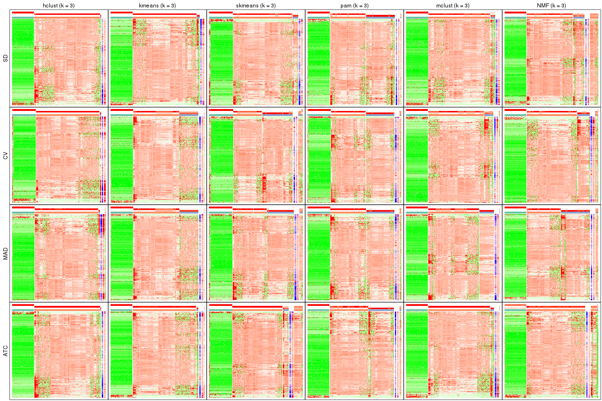</p>

</div>
<div id='tab-collect-get-signatures-3'>
<pre><code class="r">collect_plots(res_list, k = 4, fun = get_signatures, mc.cores = 4)
</code></pre>

<p></p>

</div>
<div id='tab-collect-get-signatures-4'>
<pre><code class="r">collect_plots(res_list, k = 5, fun = get_signatures, mc.cores = 4)
</code></pre>

<p></p>

</div>
<div id='tab-collect-get-signatures-5'>
<pre><code class="r">collect_plots(res_list, k = 6, fun = get_signatures, mc.cores = 4)
</code></pre>

<p></p>

</div>
</div>


### Statistics table

The statistics used for measuring the stability of consensus partitioning.
([How are they
defined?](http://bioconductor.org/packages/devel/bioc/vignettes/cola/inst/doc/cola.html#toc_13))


<script>
$( function() {
	$( '#tabs-get-stats-from-consensus-partition-list' ).tabs();
} );
</script>
<div id='tabs-get-stats-from-consensus-partition-list'>
<ul>
<li><a href='#tab-get-stats-from-consensus-partition-list-1'>k = 2</a></li>
<li><a href='#tab-get-stats-from-consensus-partition-list-2'>k = 3</a></li>
<li><a href='#tab-get-stats-from-consensus-partition-list-3'>k = 4</a></li>
<li><a href='#tab-get-stats-from-consensus-partition-list-4'>k = 5</a></li>
<li><a href='#tab-get-stats-from-consensus-partition-list-5'>k = 6</a></li>
</ul>
<div id='tab-get-stats-from-consensus-partition-list-1'>
<pre><code class="r">get_stats(res_list, k = 2)
</code></pre>

<pre><code>#&gt;             k 1-PAC mean_silhouette concordance area_increased  Rand Jaccard
#&gt; SD:NMF      2 1.000           1.000       1.000          0.376 0.625   0.625
#&gt; CV:NMF      2 1.000           0.982       0.993          0.384 0.614   0.614
#&gt; MAD:NMF     2 1.000           0.994       0.998          0.379 0.621   0.621
#&gt; ATC:NMF     2 0.707           0.973       0.962          0.342 0.621   0.621
#&gt; SD:skmeans  2 1.000           0.995       0.998          0.398 0.604   0.604
#&gt; CV:skmeans  2 0.922           0.939       0.975          0.425 0.583   0.583
#&gt; MAD:skmeans 2 1.000           0.988       0.995          0.403 0.598   0.598
#&gt; ATC:skmeans 2 1.000           1.000       1.000          0.390 0.611   0.611
#&gt; SD:mclust   2 1.000           0.948       0.979          0.398 0.586   0.586
#&gt; CV:mclust   2 0.590           0.917       0.945          0.403 0.625   0.625
#&gt; MAD:mclust  2 1.000           1.000       1.000          0.376 0.625   0.625
#&gt; ATC:mclust  2 1.000           1.000       1.000          0.376 0.625   0.625
#&gt; SD:kmeans   2 1.000           1.000       1.000          0.380 0.621   0.621
#&gt; CV:kmeans   2 1.000           0.991       0.991          0.383 0.611   0.611
#&gt; MAD:kmeans  2 1.000           1.000       1.000          0.383 0.618   0.618
#&gt; ATC:kmeans  2 1.000           0.999       1.000          0.376 0.625   0.625
#&gt; SD:pam      2 1.000           1.000       1.000          0.380 0.621   0.621
#&gt; CV:pam      2 1.000           0.987       0.994          0.392 0.611   0.611
#&gt; MAD:pam     2 1.000           1.000       1.000          0.383 0.618   0.618
#&gt; ATC:pam     2 1.000           1.000       1.000          0.376 0.625   0.625
#&gt; SD:hclust   2 1.000           0.990       0.996          0.382 0.618   0.618
#&gt; CV:hclust   2 0.598           0.900       0.945          0.100 0.972   0.972
#&gt; MAD:hclust  2 1.000           0.997       0.999          0.384 0.618   0.618
#&gt; ATC:hclust  2 1.000           1.000       1.000          0.376 0.625   0.625
</code></pre>

</div>
<div id='tab-get-stats-from-consensus-partition-list-2'>
<pre><code class="r">get_stats(res_list, k = 3)
</code></pre>

<pre><code>#&gt;             k 1-PAC mean_silhouette concordance area_increased  Rand Jaccard
#&gt; SD:NMF      3 0.642           0.738       0.879         0.4261 0.835   0.735
#&gt; CV:NMF      3 0.746           0.871       0.936         0.4836 0.822   0.711
#&gt; MAD:NMF     3 0.842           0.902       0.955         0.7216 0.717   0.546
#&gt; ATC:NMF     3 0.534           0.734       0.831         0.3784 0.995   0.992
#&gt; SD:skmeans  3 0.918           0.934       0.965         0.2508 0.920   0.867
#&gt; CV:skmeans  3 0.696           0.831       0.900         0.5323 0.730   0.545
#&gt; MAD:skmeans 3 0.950           0.931       0.970         0.6356 0.726   0.548
#&gt; ATC:skmeans 3 0.806           0.847       0.920         0.2925 0.910   0.853
#&gt; SD:mclust   3 0.763           0.939       0.941         0.2241 0.963   0.937
#&gt; CV:mclust   3 0.609           0.755       0.868         0.3802 0.864   0.782
#&gt; MAD:mclust  3 0.750           0.900       0.926         0.5737 0.800   0.680
#&gt; ATC:mclust  3 1.000           0.994       0.998         0.1670 0.940   0.904
#&gt; SD:kmeans   3 1.000           0.990       0.991         0.1038 0.958   0.932
#&gt; CV:kmeans   3 0.631           0.884       0.896         0.5145 0.769   0.623
#&gt; MAD:kmeans  3 0.731           0.861       0.870         0.5999 0.768   0.624
#&gt; ATC:kmeans  3 1.000           0.969       0.978         0.1246 0.959   0.935
#&gt; SD:pam      3 0.852           0.919       0.961         0.7237 0.723   0.554
#&gt; CV:pam      3 0.965           0.946       0.974         0.6797 0.730   0.558
#&gt; MAD:pam     3 0.973           0.957       0.982         0.7087 0.728   0.559
#&gt; ATC:pam     3 0.730           0.891       0.934         0.7147 0.726   0.561
#&gt; SD:hclust   3 1.000           0.994       0.997         0.0205 0.996   0.994
#&gt; CV:hclust   3 1.000           0.995       0.997         3.1053 0.615   0.604
#&gt; MAD:hclust  3 1.000           0.974       0.987         0.0911 0.979   0.967
#&gt; ATC:hclust  3 1.000           1.000       1.000         0.0278 0.990   0.983
</code></pre>

</div>
<div id='tab-get-stats-from-consensus-partition-list-3'>
<pre><code class="r">get_stats(res_list, k = 4)
</code></pre>

<pre><code>#&gt;             k 1-PAC mean_silhouette concordance area_increased  Rand Jaccard
#&gt; SD:NMF      4 0.677           0.770       0.899        -0.0145 0.944   0.890
#&gt; CV:NMF      4 0.590           0.711       0.800         0.1898 0.863   0.703
#&gt; MAD:NMF     4 0.745           0.737       0.878         0.0963 0.895   0.714
#&gt; ATC:NMF     4 0.635           0.671       0.813         0.0769 0.896   0.831
#&gt; SD:skmeans  4 0.757           0.768       0.902         0.3394 0.771   0.581
#&gt; CV:skmeans  4 0.977           0.932       0.970         0.1417 0.875   0.652
#&gt; MAD:skmeans 4 0.953           0.920       0.966         0.1260 0.888   0.683
#&gt; ATC:skmeans 4 0.766           0.795       0.917         0.2847 0.761   0.564
#&gt; SD:mclust   4 0.675           0.768       0.877         0.3223 0.780   0.600
#&gt; CV:mclust   4 0.786           0.870       0.928         0.2295 0.831   0.658
#&gt; MAD:mclust  4 0.949           0.953       0.962         0.2358 0.829   0.598
#&gt; ATC:mclust  4 0.590           0.714       0.844         0.4695 0.763   0.581
#&gt; SD:kmeans   4 0.720           0.923       0.880         0.4256 0.753   0.573
#&gt; CV:kmeans   4 0.716           0.815       0.857         0.1538 0.996   0.988
#&gt; MAD:kmeans  4 0.826           0.873       0.843         0.1403 0.850   0.617
#&gt; ATC:kmeans  4 0.682           0.686       0.872         0.3799 0.807   0.673
#&gt; SD:pam      4 0.811           0.745       0.879         0.0667 0.967   0.905
#&gt; CV:pam      4 0.829           0.844       0.866         0.0821 0.867   0.633
#&gt; MAD:pam     4 1.000           0.973       0.981         0.1440 0.874   0.652
#&gt; ATC:pam     4 0.843           0.906       0.930         0.1502 0.826   0.550
#&gt; SD:hclust   4 1.000           0.989       0.995         0.0186 0.990   0.983
#&gt; CV:hclust   4 1.000           0.993       0.999         0.0141 0.995   0.991
#&gt; MAD:hclust  4 1.000           0.978       0.987         0.0191 0.990   0.983
#&gt; ATC:hclust  4 1.000           0.996       0.998         0.0103 0.995   0.992
</code></pre>

</div>
<div id='tab-get-stats-from-consensus-partition-list-4'>
<pre><code class="r">get_stats(res_list, k = 5)
</code></pre>

<pre><code>#&gt;             k 1-PAC mean_silhouette concordance area_increased  Rand Jaccard
#&gt; SD:NMF      5 0.635           0.751       0.886        0.03350 0.954   0.909
#&gt; CV:NMF      5 0.664           0.677       0.806        0.09511 0.833   0.557
#&gt; MAD:NMF     5 0.705           0.717       0.818        0.05427 0.834   0.537
#&gt; ATC:NMF     5 0.580           0.653       0.779        0.07197 0.991   0.982
#&gt; SD:skmeans  5 0.809           0.860       0.923        0.05423 0.832   0.584
#&gt; CV:skmeans  5 0.887           0.845       0.910        0.03441 0.957   0.837
#&gt; MAD:skmeans 5 0.852           0.779       0.899        0.03605 0.951   0.818
#&gt; ATC:skmeans 5 0.736           0.859       0.910        0.07468 0.893   0.709
#&gt; SD:mclust   5 0.583           0.594       0.757        0.13859 0.867   0.620
#&gt; CV:mclust   5 0.812           0.816       0.894        0.11802 0.863   0.607
#&gt; MAD:mclust  5 0.821           0.709       0.843        0.05063 0.983   0.936
#&gt; ATC:mclust  5 0.589           0.704       0.718        0.06543 0.823   0.551
#&gt; SD:kmeans   5 0.594           0.639       0.784        0.13545 0.942   0.834
#&gt; CV:kmeans   5 0.778           0.815       0.836        0.06977 0.866   0.649
#&gt; MAD:kmeans  5 0.739           0.875       0.861        0.05580 0.958   0.845
#&gt; ATC:kmeans  5 0.567           0.714       0.786        0.11428 0.875   0.697
#&gt; SD:pam      5 0.964           0.931       0.957        0.07850 0.859   0.601
#&gt; CV:pam      5 0.926           0.929       0.964        0.05697 0.974   0.901
#&gt; MAD:pam     5 0.899           0.914       0.942        0.04543 0.958   0.833
#&gt; ATC:pam     5 0.941           0.901       0.943        0.03305 0.981   0.927
#&gt; SD:hclust   5 1.000           0.985       0.996        0.00464 1.000   1.000
#&gt; CV:hclust   5 1.000           0.987       0.998        0.00157 1.000   1.000
#&gt; MAD:hclust  5 0.871           0.956       0.971        0.03900 1.000   1.000
#&gt; ATC:hclust  5 1.000           0.989       1.000        0.00319 1.000   1.000
</code></pre>

</div>
<div id='tab-get-stats-from-consensus-partition-list-5'>
<pre><code class="r">get_stats(res_list, k = 6)
</code></pre>

<pre><code>#&gt;             k 1-PAC mean_silhouette concordance area_increased  Rand Jaccard
#&gt; SD:NMF      6 0.609           0.753       0.873        0.03196 0.990   0.978
#&gt; CV:NMF      6 0.736           0.679       0.819        0.04626 0.913   0.677
#&gt; MAD:NMF     6 0.711           0.706       0.821        0.02530 0.968   0.879
#&gt; ATC:NMF     6 0.550           0.635       0.755        0.03879 0.930   0.865
#&gt; SD:skmeans  6 0.810           0.807       0.902        0.03690 0.987   0.956
#&gt; CV:skmeans  6 0.841           0.747       0.845        0.02794 0.977   0.903
#&gt; MAD:skmeans 6 0.820           0.718       0.849        0.03046 0.971   0.881
#&gt; ATC:skmeans 6 0.733           0.789       0.880        0.02940 0.991   0.968
#&gt; SD:mclust   6 0.621           0.576       0.705        0.06270 0.880   0.563
#&gt; CV:mclust   6 0.845           0.822       0.890        0.05595 0.908   0.632
#&gt; MAD:mclust  6 0.837           0.805       0.881        0.04271 0.931   0.727
#&gt; ATC:mclust  6 0.673           0.617       0.734        0.08150 0.879   0.643
#&gt; SD:kmeans   6 0.626           0.631       0.770        0.07835 0.914   0.748
#&gt; CV:kmeans   6 0.755           0.797       0.843        0.05157 0.942   0.788
#&gt; MAD:kmeans  6 0.730           0.823       0.847        0.04303 1.000   1.000
#&gt; ATC:kmeans  6 0.583           0.637       0.761        0.08464 0.928   0.789
#&gt; SD:pam      6 0.872           0.868       0.917        0.05522 0.961   0.839
#&gt; CV:pam      6 0.814           0.750       0.820        0.03347 0.948   0.792
#&gt; MAD:pam     6 0.983           0.949       0.975        0.04058 0.973   0.873
#&gt; ATC:pam     6 0.871           0.835       0.883        0.03561 0.954   0.810
#&gt; SD:hclust   6 1.000           0.981       0.998        0.00220 1.000   1.000
#&gt; CV:hclust   6 1.000           0.986       0.997        0.00442 1.000   1.000
#&gt; MAD:hclust  6 0.815           0.931       0.960        0.05264 0.985   0.974
#&gt; ATC:hclust  6 1.000           0.986       1.000        0.01323 0.995   0.991
</code></pre>

</div>
</div>

Following heatmap plots the partition for each combination of methods and the
lightness correspond to the silhouette scores for samples in each method. On
top the consensus subgroup is inferred from all methods by taking the mean
silhouette scores as weight.


<script>
$( function() {
	$( '#tabs-collect-stats-from-consensus-partition-list' ).tabs();
} );
</script>
<div id='tabs-collect-stats-from-consensus-partition-list'>
<ul>
<li><a href='#tab-collect-stats-from-consensus-partition-list-1'>k = 2</a></li>
<li><a href='#tab-collect-stats-from-consensus-partition-list-2'>k = 3</a></li>
<li><a href='#tab-collect-stats-from-consensus-partition-list-3'>k = 4</a></li>
<li><a href='#tab-collect-stats-from-consensus-partition-list-4'>k = 5</a></li>
<li><a href='#tab-collect-stats-from-consensus-partition-list-5'>k = 6</a></li>
</ul>
<div id='tab-collect-stats-from-consensus-partition-list-1'>
<pre><code class="r">collect_stats(res_list, k = 2)
</code></pre>

<p></p>

</div>
<div id='tab-collect-stats-from-consensus-partition-list-2'>
<pre><code class="r">collect_stats(res_list, k = 3)
</code></pre>

<p></p>

</div>
<div id='tab-collect-stats-from-consensus-partition-list-3'>
<pre><code class="r">collect_stats(res_list, k = 4)
</code></pre>

<p></p>

</div>
<div id='tab-collect-stats-from-consensus-partition-list-4'>
<pre><code class="r">collect_stats(res_list, k = 5)
</code></pre>

<p></p>

</div>
<div id='tab-collect-stats-from-consensus-partition-list-5'>
<pre><code class="r">collect_stats(res_list, k = 6)
</code></pre>

<p></p>

</div>
</div>

### Partition from all methods


Collect partitions from all methods:


<script>
$( function() {
	$( '#tabs-collect-classes-from-consensus-partition-list' ).tabs();
} );
</script>
<div id='tabs-collect-classes-from-consensus-partition-list'>
<ul>
<li><a href='#tab-collect-classes-from-consensus-partition-list-1'>k = 2</a></li>
<li><a href='#tab-collect-classes-from-consensus-partition-list-2'>k = 3</a></li>
<li><a href='#tab-collect-classes-from-consensus-partition-list-3'>k = 4</a></li>
<li><a href='#tab-collect-classes-from-consensus-partition-list-4'>k = 5</a></li>
<li><a href='#tab-collect-classes-from-consensus-partition-list-5'>k = 6</a></li>
</ul>
<div id='tab-collect-classes-from-consensus-partition-list-1'>
<pre><code class="r">collect_classes(res_list, k = 2)
</code></pre>

<p>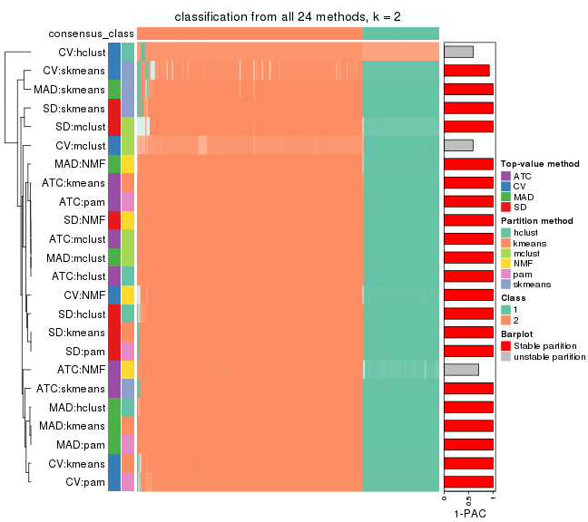</p>

</div>
<div id='tab-collect-classes-from-consensus-partition-list-2'>
<pre><code class="r">collect_classes(res_list, k = 3)
</code></pre>

<p></p>

</div>
<div id='tab-collect-classes-from-consensus-partition-list-3'>
<pre><code class="r">collect_classes(res_list, k = 4)
</code></pre>

<p></p>

</div>
<div id='tab-collect-classes-from-consensus-partition-list-4'>
<pre><code class="r">collect_classes(res_list, k = 5)
</code></pre>

<p></p>

</div>
<div id='tab-collect-classes-from-consensus-partition-list-5'>
<pre><code class="r">collect_classes(res_list, k = 6)
</code></pre>

<p></p>

</div>
</div>


### Top rows overlap


Overlap of top rows from different top-row methods:


<script>
$( function() {
	$( '#tabs-top-rows-overlap-by-euler' ).tabs();
} );
</script>
<div id='tabs-top-rows-overlap-by-euler'>
<ul>
<li><a href='#tab-top-rows-overlap-by-euler-1'>top_n = 1000</a></li>
<li><a href='#tab-top-rows-overlap-by-euler-2'>top_n = 2000</a></li>
<li><a href='#tab-top-rows-overlap-by-euler-3'>top_n = 3000</a></li>
<li><a href='#tab-top-rows-overlap-by-euler-4'>top_n = 4000</a></li>
<li><a href='#tab-top-rows-overlap-by-euler-5'>top_n = 5000</a></li>
</ul>
<div id='tab-top-rows-overlap-by-euler-1'>
<pre><code class="r">top_rows_overlap(res_list, top_n = 1000, method = &quot;euler&quot;)
</code></pre>

<p></p>

</div>
<div id='tab-top-rows-overlap-by-euler-2'>
<pre><code class="r">top_rows_overlap(res_list, top_n = 2000, method = &quot;euler&quot;)
</code></pre>

<p></p>

</div>
<div id='tab-top-rows-overlap-by-euler-3'>
<pre><code class="r">top_rows_overlap(res_list, top_n = 3000, method = &quot;euler&quot;)
</code></pre>

<p></p>

</div>
<div id='tab-top-rows-overlap-by-euler-4'>
<pre><code class="r">top_rows_overlap(res_list, top_n = 4000, method = &quot;euler&quot;)
</code></pre>

<p></p>

</div>
<div id='tab-top-rows-overlap-by-euler-5'>
<pre><code class="r">top_rows_overlap(res_list, top_n = 5000, method = &quot;euler&quot;)
</code></pre>

<p></p>

</div>
</div>

Also visualize the correspondance of rankings between different top-row methods:


<script>
$( function() {
	$( '#tabs-top-rows-overlap-by-correspondance' ).tabs();
} );
</script>
<div id='tabs-top-rows-overlap-by-correspondance'>
<ul>
<li><a href='#tab-top-rows-overlap-by-correspondance-1'>top_n = 1000</a></li>
<li><a href='#tab-top-rows-overlap-by-correspondance-2'>top_n = 2000</a></li>
<li><a href='#tab-top-rows-overlap-by-correspondance-3'>top_n = 3000</a></li>
<li><a href='#tab-top-rows-overlap-by-correspondance-4'>top_n = 4000</a></li>
<li><a href='#tab-top-rows-overlap-by-correspondance-5'>top_n = 5000</a></li>
</ul>
<div id='tab-top-rows-overlap-by-correspondance-1'>
<pre><code class="r">top_rows_overlap(res_list, top_n = 1000, method = &quot;correspondance&quot;)
</code></pre>

<p></p>

</div>
<div id='tab-top-rows-overlap-by-correspondance-2'>
<pre><code class="r">top_rows_overlap(res_list, top_n = 2000, method = &quot;correspondance&quot;)
</code></pre>

<p></p>

</div>
<div id='tab-top-rows-overlap-by-correspondance-3'>
<pre><code class="r">top_rows_overlap(res_list, top_n = 3000, method = &quot;correspondance&quot;)
</code></pre>

<p></p>

</div>
<div id='tab-top-rows-overlap-by-correspondance-4'>
<pre><code class="r">top_rows_overlap(res_list, top_n = 4000, method = &quot;correspondance&quot;)
</code></pre>

<p></p>

</div>
<div id='tab-top-rows-overlap-by-correspondance-5'>
<pre><code class="r">top_rows_overlap(res_list, top_n = 5000, method = &quot;correspondance&quot;)
</code></pre>

<p></p>

</div>
</div>


Heatmaps of the top rows:


<script>
$( function() {
	$( '#tabs-top-rows-heatmap' ).tabs();
} );
</script>
<div id='tabs-top-rows-heatmap'>
<ul>
<li><a href='#tab-top-rows-heatmap-1'>top_n = 1000</a></li>
<li><a href='#tab-top-rows-heatmap-2'>top_n = 2000</a></li>
<li><a href='#tab-top-rows-heatmap-3'>top_n = 3000</a></li>
<li><a href='#tab-top-rows-heatmap-4'>top_n = 4000</a></li>
<li><a href='#tab-top-rows-heatmap-5'>top_n = 5000</a></li>
</ul>
<div id='tab-top-rows-heatmap-1'>
<pre><code class="r">top_rows_heatmap(res_list, top_n = 1000)
</code></pre>

<p></p>

</div>
<div id='tab-top-rows-heatmap-2'>
<pre><code class="r">top_rows_heatmap(res_list, top_n = 2000)
</code></pre>

<p></p>

</div>
<div id='tab-top-rows-heatmap-3'>
<pre><code class="r">top_rows_heatmap(res_list, top_n = 3000)
</code></pre>

<p></p>

</div>
<div id='tab-top-rows-heatmap-4'>
<pre><code class="r">top_rows_heatmap(res_list, top_n = 4000)
</code></pre>

<p></p>

</div>
<div id='tab-top-rows-heatmap-5'>
<pre><code class="r">top_rows_heatmap(res_list, top_n = 5000)
</code></pre>

<p></p>

</div>
</div>


 
## Results for each method


---------------------------------------------------


### SD:hclust**


The object with results only for a single top-value method and a single partition method 
can be extracted as:

```r
res = res_list["SD", "hclust"]
# you can also extract it by
# res = res_list["SD:hclust"]
```

A summary of `res` and all the functions that can be applied to it:

```r
res
```

```
#> A 'ConsensusPartition' object with k = 2, 3, 4, 5, 6.
#>   On a matrix with 13930 rows and 285 columns.
#>   Top rows (1000, 2000, 3000, 4000, 5000) are extracted by 'SD' method.
#>   Subgroups are detected by 'hclust' method.
#>   Performed in total 1250 partitions by row resampling.
#>   Best k for subgroups seems to be 2.
#> 
#> Following methods can be applied to this 'ConsensusPartition' object:
#>  [1] "cola_report"             "collect_classes"         "collect_plots"          
#>  [4] "collect_stats"           "colnames"                "compare_signatures"     
#>  [7] "consensus_heatmap"       "dimension_reduction"     "functional_enrichment"  
#> [10] "get_anno_col"            "get_anno"                "get_classes"            
#> [13] "get_consensus"           "get_matrix"              "get_membership"         
#> [16] "get_param"               "get_signatures"          "get_stats"              
#> [19] "is_best_k"               "is_stable_k"             "membership_heatmap"     
#> [22] "ncol"                    "nrow"                    "plot_ecdf"              
#> [25] "rownames"                "select_partition_number" "show"                   
#> [28] "suggest_best_k"          "test_to_known_factors"
```

`collect_plots()` function collects all the plots made from `res` for all `k` (number of partitions)
into one single page to provide an easy and fast comparison between different `k`.

```r
collect_plots(res)
```


The plots are:

- The first row: a plot of the ECDF (Empirical cumulative distribution
  function) curves of the consensus matrix for each `k` and the heatmap of
  predicted classes for each `k`.
- The second row: heatmaps of the consensus matrix for each `k`.
- The third row: heatmaps of the membership matrix for each `k`.
- The fouth row: heatmaps of the signatures for each `k`.

All the plots in panels can be made by individual functions and they are
plotted later in this section.

`select_partition_number()` produces several plots showing different
statistics for choosing "optimized" `k`. There are following statistics:

- ECDF curves of the consensus matrix for each `k`;
- 1-PAC. [The PAC
  score](https://en.wikipedia.org/wiki/Consensus_clustering#Over-interpretation_potential_of_consensus_clustering)
  measures the proportion of the ambiguous subgrouping.
- Mean silhouette score.
- Concordance. The mean probability of fiting the consensus class ids in all
  partitions.
- Area increased. Denote $A_k$ as the area under the ECDF curve for current
  `k`, the area increased is defined as $A_k - A_{k-1}$.
- Rand index. The percent of pairs of samples that are both in a same cluster
  or both are not in a same cluster in the partition of k and k-1.
- Jaccard index. The ratio of pairs of samples are both in a same cluster in
  the partition of k and k-1 and the pairs of samples are both in a same
  cluster in the partition k or k-1.

The detailed explanations of these statistics can be found in [the cola
vignette](http://bioconductor.org/packages/devel/bioc/vignettes/cola/inst/doc/cola.html#toc_13).

Generally speaking, lower PAC score, higher mean silhouette score or higher
concordance corresponds to better partition. Rand index and Jaccard index
measure how similar the current partition is compared to partition with `k-1`.
If they are too similar, we won't accept `k` is better than `k-1`.

```r
select_partition_number(res)
```


The numeric values for all these statistics can be obtained by `get_stats()`.

```r
get_stats(res)
```

```
#>   k 1-PAC mean_silhouette concordance area_increased  Rand Jaccard
#> 2 2     1           0.990       0.996        0.38229 0.618   0.618
#> 3 3     1           0.994       0.997        0.02045 0.996   0.994
#> 4 4     1           0.989       0.995        0.01856 0.990   0.983
#> 5 5     1           0.985       0.996        0.00464 1.000   1.000
#> 6 6     1           0.981       0.998        0.00220 1.000   1.000
```

`suggest_best_k()` suggests the best $k$ based on these statistics. The rules are as follows:

- All $k$ with Jaccard index larger than 0.95 are removed because the increase of
  the partition number does not provides enough extra information. If all $k$ are removed,
  the best $k$ is assigned by `NA`.
- For $k$ with 1-PAC larger than 0.9, the maximal $k$ is taken as the "best k". Other $k$ is called "optional k".
- If it does not fit the second rule. The $k$ with the highest vote of highest
  1-PAC, mean silhouette and concordance is taken as the "best k".

```r
suggest_best_k(res)
```

```
#> [1] 2
```


Following shows the table of the partitions (You need to click the **show/hide
code output** link to see it). The membership matrix (columns with name `p*`)
is inferred by
[`clue::cl_consensus()`](https://www.rdocumentation.org/link/cl_consensus?package=clue)
function with the `SE` method. Basically the value in the membership matrix
represents the probability to belong to a certain group. The finall class
label for an item is determined with the group with highest probability it
belongs to.

In `get_classes()` function, the entropy is calculated from the membership
matrix and the silhouette score is calculated from the consensus matrix.


<script>
$( function() {
	$( '#tabs-SD-hclust-get-classes' ).tabs();
} );
</script>
<div id='tabs-SD-hclust-get-classes'>
<ul>
<li><a href='#tab-SD-hclust-get-classes-1'>k = 2</a></li>
<li><a href='#tab-SD-hclust-get-classes-2'>k = 3</a></li>
<li><a href='#tab-SD-hclust-get-classes-3'>k = 4</a></li>
<li><a href='#tab-SD-hclust-get-classes-4'>k = 5</a></li>
<li><a href='#tab-SD-hclust-get-classes-5'>k = 6</a></li>
</ul>

<div id='tab-SD-hclust-get-classes-1'>
<p><a id='tab-SD-hclust-get-classes-1-a' style='color:#0366d6' href='#'>show/hide code output</a></p>
<pre><code class="r">cbind(get_classes(res, k = 2), get_membership(res, k = 2))
</code></pre>

<pre><code>#&gt;            class entropy silhouette    p1    p2
#&gt; SRR1201591     2   0.000      0.998 0.000 1.000
#&gt; SRR1201590     2   0.000      0.998 0.000 1.000
#&gt; SRR1201593     2   0.000      0.998 0.000 1.000
#&gt; SRR1201592     2   0.000      0.998 0.000 1.000
#&gt; SRR1201617     2   0.000      0.998 0.000 1.000
#&gt; SRR1201616     2   0.000      0.998 0.000 1.000
#&gt; SRR1201619     2   0.000      0.998 0.000 1.000
#&gt; SRR1201618     2   0.000      0.998 0.000 1.000
#&gt; SRR1201620     2   0.000      0.998 0.000 1.000
#&gt; SRR1201621     2   0.000      0.998 0.000 1.000
#&gt; SRR1201623     2   0.000      0.998 0.000 1.000
#&gt; SRR1201622     2   0.000      0.998 0.000 1.000
#&gt; SRR1201624     2   0.000      0.998 0.000 1.000
#&gt; SRR1201625     2   0.000      0.998 0.000 1.000
#&gt; SRR1201626     1   0.921      0.496 0.664 0.336
#&gt; SRR1201627     2   0.662      0.791 0.172 0.828
#&gt; SRR1201628     2   0.000      0.998 0.000 1.000
#&gt; SRR1201629     2   0.000      0.998 0.000 1.000
#&gt; SRR1201630     2   0.000      0.998 0.000 1.000
#&gt; SRR1201631     2   0.000      0.998 0.000 1.000
#&gt; SRR1201641     2   0.000      0.998 0.000 1.000
#&gt; SRR1201640     2   0.000      0.998 0.000 1.000
#&gt; SRR1201643     2   0.000      0.998 0.000 1.000
#&gt; SRR1201644     2   0.000      0.998 0.000 1.000
#&gt; SRR1201661     2   0.000      0.998 0.000 1.000
#&gt; SRR1201662     2   0.000      0.998 0.000 1.000
#&gt; SRR1201663     2   0.000      0.998 0.000 1.000
#&gt; SRR1201664     2   0.000      0.998 0.000 1.000
#&gt; SRR1201665     2   0.000      0.998 0.000 1.000
#&gt; SRR1201666     2   0.000      0.998 0.000 1.000
#&gt; SRR1201667     2   0.000      0.998 0.000 1.000
#&gt; SRR1201668     2   0.000      0.998 0.000 1.000
#&gt; SRR1201670     2   0.000      0.998 0.000 1.000
#&gt; SRR1201669     2   0.000      0.998 0.000 1.000
#&gt; SRR1201673     2   0.000      0.998 0.000 1.000
#&gt; SRR1201672     2   0.000      0.998 0.000 1.000
#&gt; SRR1201671     2   0.000      0.998 0.000 1.000
#&gt; SRR1201677     2   0.000      0.998 0.000 1.000
#&gt; SRR1201676     2   0.000      0.998 0.000 1.000
#&gt; SRR1201675     2   0.000      0.998 0.000 1.000
#&gt; SRR1201674     2   0.000      0.998 0.000 1.000
#&gt; SRR1201678     2   0.000      0.998 0.000 1.000
#&gt; SRR1201682     2   0.000      0.998 0.000 1.000
#&gt; SRR1201683     2   0.000      0.998 0.000 1.000
#&gt; SRR1201680     2   0.000      0.998 0.000 1.000
#&gt; SRR1201681     2   0.000      0.998 0.000 1.000
#&gt; SRR1201679     2   0.000      0.998 0.000 1.000
#&gt; SRR1201686     2   0.000      0.998 0.000 1.000
#&gt; SRR1201687     2   0.000      0.998 0.000 1.000
#&gt; SRR1201688     2   0.000      0.998 0.000 1.000
#&gt; SRR1201689     2   0.000      0.998 0.000 1.000
#&gt; SRR1201685     2   0.000      0.998 0.000 1.000
#&gt; SRR1201692     2   0.000      0.998 0.000 1.000
#&gt; SRR1201691     2   0.000      0.998 0.000 1.000
#&gt; SRR1201690     2   0.000      0.998 0.000 1.000
#&gt; SRR1201696     2   0.000      0.998 0.000 1.000
#&gt; SRR1201695     2   0.000      0.998 0.000 1.000
#&gt; SRR1201694     2   0.000      0.998 0.000 1.000
#&gt; SRR1201693     2   0.000      0.998 0.000 1.000
#&gt; SRR1201697     2   0.000      0.998 0.000 1.000
#&gt; SRR1201698     2   0.000      0.998 0.000 1.000
#&gt; SRR1201700     2   0.000      0.998 0.000 1.000
#&gt; SRR1201708     2   0.000      0.998 0.000 1.000
#&gt; SRR1201707     2   0.000      0.998 0.000 1.000
#&gt; SRR1201706     2   0.000      0.998 0.000 1.000
#&gt; SRR1201702     2   0.000      0.998 0.000 1.000
#&gt; SRR1201705     2   0.000      0.998 0.000 1.000
#&gt; SRR1201701     2   0.000      0.998 0.000 1.000
#&gt; SRR1201704     2   0.000      0.998 0.000 1.000
#&gt; SRR1201703     2   0.000      0.998 0.000 1.000
#&gt; SRR1201716     2   0.000      0.998 0.000 1.000
#&gt; SRR1201715     2   0.000      0.998 0.000 1.000
#&gt; SRR1201717     2   0.000      0.998 0.000 1.000
#&gt; SRR1201712     2   0.000      0.998 0.000 1.000
#&gt; SRR1201709     2   0.000      0.998 0.000 1.000
#&gt; SRR1201711     2   0.000      0.998 0.000 1.000
#&gt; SRR1201714     2   0.000      0.998 0.000 1.000
#&gt; SRR1201713     2   0.000      0.998 0.000 1.000
#&gt; SRR1201710     2   0.000      0.998 0.000 1.000
#&gt; SRR1201719     2   0.000      0.998 0.000 1.000
#&gt; SRR1201718     2   0.000      0.998 0.000 1.000
#&gt; SRR1201721     2   0.000      0.998 0.000 1.000
#&gt; SRR1201720     2   0.000      0.998 0.000 1.000
#&gt; SRR1201723     2   0.000      0.998 0.000 1.000
#&gt; SRR1201722     2   0.000      0.998 0.000 1.000
#&gt; SRR1201725     2   0.000      0.998 0.000 1.000
#&gt; SRR1201724     2   0.000      0.998 0.000 1.000
#&gt; SRR1201726     2   0.000      0.998 0.000 1.000
#&gt; SRR1201727     2   0.000      0.998 0.000 1.000
#&gt; SRR1201731     2   0.000      0.998 0.000 1.000
#&gt; SRR1201730     2   0.000      0.998 0.000 1.000
#&gt; SRR1201734     2   0.000      0.998 0.000 1.000
#&gt; SRR1201733     2   0.000      0.998 0.000 1.000
#&gt; SRR1201736     2   0.000      0.998 0.000 1.000
#&gt; SRR1201737     2   0.000      0.998 0.000 1.000
#&gt; SRR1201739     2   0.000      0.998 0.000 1.000
#&gt; SRR1201738     2   0.000      0.998 0.000 1.000
#&gt; SRR1201742     2   0.000      0.998 0.000 1.000
#&gt; SRR1201743     2   0.000      0.998 0.000 1.000
#&gt; SRR1201745     2   0.000      0.998 0.000 1.000
#&gt; SRR1201744     2   0.000      0.998 0.000 1.000
#&gt; SRR1201749     2   0.000      0.998 0.000 1.000
#&gt; SRR1201750     2   0.000      0.998 0.000 1.000
#&gt; SRR1201752     2   0.000      0.998 0.000 1.000
#&gt; SRR1201751     2   0.000      0.998 0.000 1.000
#&gt; SRR1201754     2   0.000      0.998 0.000 1.000
#&gt; SRR1201753     2   0.000      0.998 0.000 1.000
#&gt; SRR1201758     2   0.000      0.998 0.000 1.000
#&gt; SRR1201759     2   0.000      0.998 0.000 1.000
#&gt; SRR1201760     2   0.000      0.998 0.000 1.000
#&gt; SRR1201761     2   0.000      0.998 0.000 1.000
#&gt; SRR1201763     2   0.644      0.803 0.164 0.836
#&gt; SRR1201762     1   0.946      0.431 0.636 0.364
#&gt; SRR1201764     2   0.000      0.998 0.000 1.000
#&gt; SRR1201766     2   0.000      0.998 0.000 1.000
#&gt; SRR1201768     2   0.000      0.998 0.000 1.000
#&gt; SRR1201769     2   0.000      0.998 0.000 1.000
#&gt; SRR1201767     2   0.000      0.998 0.000 1.000
#&gt; SRR1201770     2   0.000      0.998 0.000 1.000
#&gt; SRR1201771     2   0.000      0.998 0.000 1.000
#&gt; SRR1201772     2   0.000      0.998 0.000 1.000
#&gt; SRR1201773     2   0.000      0.998 0.000 1.000
#&gt; SRR1201774     2   0.000      0.998 0.000 1.000
#&gt; SRR1201786     2   0.000      0.998 0.000 1.000
#&gt; SRR1201784     2   0.000      0.998 0.000 1.000
#&gt; SRR1201785     2   0.000      0.998 0.000 1.000
#&gt; SRR1201778     2   0.000      0.998 0.000 1.000
#&gt; SRR1201779     2   0.000      0.998 0.000 1.000
#&gt; SRR1201781     2   0.000      0.998 0.000 1.000
#&gt; SRR1201780     2   0.000      0.998 0.000 1.000
#&gt; SRR1201783     2   0.000      0.998 0.000 1.000
#&gt; SRR1201782     2   0.000      0.998 0.000 1.000
#&gt; SRR1201798     2   0.000      0.998 0.000 1.000
#&gt; SRR1201797     2   0.000      0.998 0.000 1.000
#&gt; SRR1201796     2   0.000      0.998 0.000 1.000
#&gt; SRR1201795     2   0.000      0.998 0.000 1.000
#&gt; SRR1201799     2   0.000      0.998 0.000 1.000
#&gt; SRR1201794     2   0.000      0.998 0.000 1.000
#&gt; SRR1201793     2   0.000      0.998 0.000 1.000
#&gt; SRR1201792     2   0.000      0.998 0.000 1.000
#&gt; SRR1201791     2   0.000      0.998 0.000 1.000
#&gt; SRR1201807     2   0.000      0.998 0.000 1.000
#&gt; SRR1201808     2   0.000      0.998 0.000 1.000
#&gt; SRR1201803     2   0.000      0.998 0.000 1.000
#&gt; SRR1201804     2   0.000      0.998 0.000 1.000
#&gt; SRR1201805     2   0.000      0.998 0.000 1.000
#&gt; SRR1201806     2   0.000      0.998 0.000 1.000
#&gt; SRR1201801     2   0.000      0.998 0.000 1.000
#&gt; SRR1201802     2   0.000      0.998 0.000 1.000
#&gt; SRR1201800     2   0.000      0.998 0.000 1.000
#&gt; SRR1201814     2   0.000      0.998 0.000 1.000
#&gt; SRR1201816     2   0.000      0.998 0.000 1.000
#&gt; SRR1201815     2   0.000      0.998 0.000 1.000
#&gt; SRR1201819     2   0.000      0.998 0.000 1.000
#&gt; SRR1201820     2   0.000      0.998 0.000 1.000
#&gt; SRR1201813     2   0.000      0.998 0.000 1.000
#&gt; SRR1201817     2   0.000      0.998 0.000 1.000
#&gt; SRR1201818     2   0.000      0.998 0.000 1.000
#&gt; SRR1201825     2   0.000      0.998 0.000 1.000
#&gt; SRR1201827     2   0.000      0.998 0.000 1.000
#&gt; SRR1201828     2   0.000      0.998 0.000 1.000
#&gt; SRR1201826     2   0.000      0.998 0.000 1.000
#&gt; SRR1201829     2   0.000      0.998 0.000 1.000
#&gt; SRR1201830     2   0.000      0.998 0.000 1.000
#&gt; SRR1201831     2   0.000      0.998 0.000 1.000
#&gt; SRR1201832     2   0.000      0.998 0.000 1.000
#&gt; SRR1201833     2   0.000      0.998 0.000 1.000
#&gt; SRR1201865     2   0.000      0.998 0.000 1.000
#&gt; SRR1201866     2   0.000      0.998 0.000 1.000
#&gt; SRR1201867     2   0.000      0.998 0.000 1.000
#&gt; SRR1201861     2   0.000      0.998 0.000 1.000
#&gt; SRR1201862     2   0.000      0.998 0.000 1.000
#&gt; SRR1201863     2   0.000      0.998 0.000 1.000
#&gt; SRR1201859     2   0.000      0.998 0.000 1.000
#&gt; SRR1201864     2   0.000      0.998 0.000 1.000
#&gt; SRR1201860     2   0.000      0.998 0.000 1.000
#&gt; SRR1201873     2   0.000      0.998 0.000 1.000
#&gt; SRR1201871     2   0.000      0.998 0.000 1.000
#&gt; SRR1201872     2   0.000      0.998 0.000 1.000
#&gt; SRR1201980     2   0.000      0.998 0.000 1.000
#&gt; SRR1201979     2   0.000      0.998 0.000 1.000
#&gt; SRR1201982     2   0.000      0.998 0.000 1.000
#&gt; SRR1201981     2   0.000      0.998 0.000 1.000
#&gt; SRR1201998     2   0.000      0.998 0.000 1.000
#&gt; SRR1201996     2   0.000      0.998 0.000 1.000
#&gt; SRR1201997     2   0.000      0.998 0.000 1.000
#&gt; SRR1202005     2   0.000      0.998 0.000 1.000
#&gt; SRR1202006     2   0.000      0.998 0.000 1.000
#&gt; SRR1202088     2   0.000      0.998 0.000 1.000
#&gt; SRR1202087     2   0.000      0.998 0.000 1.000
#&gt; SRR1202093     2   0.000      0.998 0.000 1.000
#&gt; SRR1202092     2   0.000      0.998 0.000 1.000
#&gt; SRR1202288     2   0.000      0.998 0.000 1.000
#&gt; SRR1202289     2   0.000      0.998 0.000 1.000
#&gt; SRR1202299     2   0.000      0.998 0.000 1.000
#&gt; SRR1202298     2   0.000      0.998 0.000 1.000
#&gt; SRR1202303     2   0.662      0.791 0.172 0.828
#&gt; SRR1202372     2   0.000      0.998 0.000 1.000
#&gt; SRR1202371     2   0.000      0.998 0.000 1.000
#&gt; SRR1202563     2   0.000      0.998 0.000 1.000
#&gt; SRR1202565     2   0.000      0.998 0.000 1.000
#&gt; SRR1202564     2   0.000      0.998 0.000 1.000
#&gt; SRR1202649     2   0.000      0.998 0.000 1.000
#&gt; SRR1202650     2   0.000      0.998 0.000 1.000
#&gt; SRR1202651     2   0.000      0.998 0.000 1.000
#&gt; SRR1202843     1   0.000      0.990 1.000 0.000
#&gt; SRR1202844     1   0.000      0.990 1.000 0.000
#&gt; SRR1202845     2   0.000      0.998 0.000 1.000
#&gt; SRR1202847     2   0.000      0.998 0.000 1.000
#&gt; SRR1202846     2   0.000      0.998 0.000 1.000
#&gt; SRR1202945     1   0.000      0.990 1.000 0.000
#&gt; SRR1202949     1   0.000      0.990 1.000 0.000
#&gt; SRR1202977     1   0.000      0.990 1.000 0.000
#&gt; SRR1202978     1   0.000      0.990 1.000 0.000
#&gt; SRR1202979     1   0.000      0.990 1.000 0.000
#&gt; SRR1202990     1   0.000      0.990 1.000 0.000
#&gt; SRR1202999     1   0.000      0.990 1.000 0.000
#&gt; SRR1203005     1   0.000      0.990 1.000 0.000
#&gt; SRR1203006     1   0.000      0.990 1.000 0.000
#&gt; SRR1203007     1   0.000      0.990 1.000 0.000
#&gt; SRR1203009     1   0.000      0.990 1.000 0.000
#&gt; SRR1203008     1   0.000      0.990 1.000 0.000
#&gt; SRR1203010     1   0.000      0.990 1.000 0.000
#&gt; SRR1203011     1   0.000      0.990 1.000 0.000
#&gt; SRR1203025     1   0.000      0.990 1.000 0.000
#&gt; SRR1203026     1   0.000      0.990 1.000 0.000
#&gt; SRR1203027     1   0.000      0.990 1.000 0.000
#&gt; SRR1203061     1   0.000      0.990 1.000 0.000
#&gt; SRR1203089     1   0.000      0.990 1.000 0.000
#&gt; SRR1203125     1   0.000      0.990 1.000 0.000
#&gt; SRR1203128     1   0.000      0.990 1.000 0.000
#&gt; SRR1203129     1   0.000      0.990 1.000 0.000
#&gt; SRR1203130     1   0.000      0.990 1.000 0.000
#&gt; SRR1203132     2   0.000      0.998 0.000 1.000
#&gt; SRR1203131     2   0.000      0.998 0.000 1.000
#&gt; SRR1203133     1   0.000      0.990 1.000 0.000
#&gt; SRR1203138     1   0.000      0.990 1.000 0.000
#&gt; SRR1203760     1   0.000      0.990 1.000 0.000
#&gt; SRR1203761     1   0.000      0.990 1.000 0.000
#&gt; SRR1203770     1   0.000      0.990 1.000 0.000
#&gt; SRR1203771     1   0.000      0.990 1.000 0.000
#&gt; SRR1203772     1   0.000      0.990 1.000 0.000
#&gt; SRR1203773     1   0.000      0.990 1.000 0.000
#&gt; SRR1203774     1   0.000      0.990 1.000 0.000
#&gt; SRR1203775     1   0.000      0.990 1.000 0.000
#&gt; SRR1203800     1   0.000      0.990 1.000 0.000
#&gt; SRR1203801     1   0.000      0.990 1.000 0.000
#&gt; SRR1203802     1   0.000      0.990 1.000 0.000
#&gt; SRR1203803     1   0.000      0.990 1.000 0.000
#&gt; SRR1203804     1   0.000      0.990 1.000 0.000
#&gt; SRR1203805     1   0.000      0.990 1.000 0.000
#&gt; SRR1203806     1   0.000      0.990 1.000 0.000
#&gt; SRR1203807     1   0.000      0.990 1.000 0.000
#&gt; SRR1203808     1   0.000      0.990 1.000 0.000
#&gt; SRR1203811     1   0.000      0.990 1.000 0.000
#&gt; SRR1203812     1   0.000      0.990 1.000 0.000
#&gt; SRR1203813     1   0.000      0.990 1.000 0.000
#&gt; SRR1203814     1   0.000      0.990 1.000 0.000
#&gt; SRR1203815     1   0.000      0.990 1.000 0.000
#&gt; SRR1203816     1   0.000      0.990 1.000 0.000
#&gt; SRR1203817     1   0.000      0.990 1.000 0.000
#&gt; SRR1203818     1   0.000      0.990 1.000 0.000
#&gt; SRR1203819     1   0.000      0.990 1.000 0.000
#&gt; SRR1203822     1   0.000      0.990 1.000 0.000
#&gt; SRR1203823     1   0.000      0.990 1.000 0.000
#&gt; SRR1203824     1   0.000      0.990 1.000 0.000
#&gt; SRR1203825     1   0.000      0.990 1.000 0.000
#&gt; SRR1203826     1   0.000      0.990 1.000 0.000
#&gt; SRR1203827     2   0.000      0.998 0.000 1.000
#&gt; SRR1203828     1   0.000      0.990 1.000 0.000
#&gt; SRR1203829     1   0.000      0.990 1.000 0.000
#&gt; SRR1203830     1   0.000      0.990 1.000 0.000
#&gt; SRR1203831     1   0.000      0.990 1.000 0.000
#&gt; SRR1203832     1   0.000      0.990 1.000 0.000
#&gt; SRR1203833     1   0.000      0.990 1.000 0.000
#&gt; SRR1203834     1   0.000      0.990 1.000 0.000
#&gt; SRR1203835     1   0.000      0.990 1.000 0.000
#&gt; SRR1203836     1   0.000      0.990 1.000 0.000
#&gt; SRR1203837     1   0.000      0.990 1.000 0.000
#&gt; SRR1203838     1   0.000      0.990 1.000 0.000
#&gt; SRR1203839     1   0.000      0.990 1.000 0.000
#&gt; SRR1203842     2   0.000      0.998 0.000 1.000
#&gt; SRR1203843     1   0.000      0.990 1.000 0.000
#&gt; SRR1203845     2   0.000      0.998 0.000 1.000
#&gt; SRR1203844     2   0.000      0.998 0.000 1.000
</code></pre>

<script>
$('#tab-SD-hclust-get-classes-1-a').parent().next().next().hide();
$('#tab-SD-hclust-get-classes-1-a').click(function(){
  $('#tab-SD-hclust-get-classes-1-a').parent().next().next().toggle();
  return(false);
});
</script>
</div>

<div id='tab-SD-hclust-get-classes-2'>
<p><a id='tab-SD-hclust-get-classes-2-a' style='color:#0366d6' href='#'>show/hide code output</a></p>
<pre><code class="r">cbind(get_classes(res, k = 3), get_membership(res, k = 3))
</code></pre>

<pre><code>#&gt;            class entropy silhouette    p1    p2    p3
#&gt; SRR1201591     2   0.000      0.997 0.000 1.000 0.000
#&gt; SRR1201590     2   0.000      0.997 0.000 1.000 0.000
#&gt; SRR1201593     2   0.000      0.997 0.000 1.000 0.000
#&gt; SRR1201592     2   0.000      0.997 0.000 1.000 0.000
#&gt; SRR1201617     2   0.000      0.997 0.000 1.000 0.000
#&gt; SRR1201616     2   0.000      0.997 0.000 1.000 0.000
#&gt; SRR1201619     2   0.000      0.997 0.000 1.000 0.000
#&gt; SRR1201618     2   0.000      0.997 0.000 1.000 0.000
#&gt; SRR1201620     2   0.000      0.997 0.000 1.000 0.000
#&gt; SRR1201621     2   0.000      0.997 0.000 1.000 0.000
#&gt; SRR1201623     2   0.000      0.997 0.000 1.000 0.000
#&gt; SRR1201622     2   0.000      0.997 0.000 1.000 0.000
#&gt; SRR1201624     2   0.000      0.997 0.000 1.000 0.000
#&gt; SRR1201625     2   0.000      0.997 0.000 1.000 0.000
#&gt; SRR1201626     3   0.116      0.971 0.028 0.000 0.972
#&gt; SRR1201627     2   0.465      0.740 0.000 0.792 0.208
#&gt; SRR1201628     2   0.000      0.997 0.000 1.000 0.000
#&gt; SRR1201629     2   0.000      0.997 0.000 1.000 0.000
#&gt; SRR1201630     2   0.000      0.997 0.000 1.000 0.000
#&gt; SRR1201631     2   0.000      0.997 0.000 1.000 0.000
#&gt; SRR1201641     2   0.000      0.997 0.000 1.000 0.000
#&gt; SRR1201640     2   0.000      0.997 0.000 1.000 0.000
#&gt; SRR1201643     2   0.000      0.997 0.000 1.000 0.000
#&gt; SRR1201644     2   0.000      0.997 0.000 1.000 0.000
#&gt; SRR1201661     2   0.000      0.997 0.000 1.000 0.000
#&gt; SRR1201662     2   0.000      0.997 0.000 1.000 0.000
#&gt; SRR1201663     2   0.000      0.997 0.000 1.000 0.000
#&gt; SRR1201664     2   0.000      0.997 0.000 1.000 0.000
#&gt; SRR1201665     2   0.000      0.997 0.000 1.000 0.000
#&gt; SRR1201666     2   0.000      0.997 0.000 1.000 0.000
#&gt; SRR1201667     2   0.000      0.997 0.000 1.000 0.000
#&gt; SRR1201668     2   0.000      0.997 0.000 1.000 0.000
#&gt; SRR1201670     2   0.000      0.997 0.000 1.000 0.000
#&gt; SRR1201669     2   0.000      0.997 0.000 1.000 0.000
#&gt; SRR1201673     2   0.000      0.997 0.000 1.000 0.000
#&gt; SRR1201672     2   0.000      0.997 0.000 1.000 0.000
#&gt; SRR1201671     2   0.000      0.997 0.000 1.000 0.000
#&gt; SRR1201677     2   0.000      0.997 0.000 1.000 0.000
#&gt; SRR1201676     2   0.000      0.997 0.000 1.000 0.000
#&gt; SRR1201675     2   0.000      0.997 0.000 1.000 0.000
#&gt; SRR1201674     2   0.000      0.997 0.000 1.000 0.000
#&gt; SRR1201678     2   0.000      0.997 0.000 1.000 0.000
#&gt; SRR1201682     2   0.000      0.997 0.000 1.000 0.000
#&gt; SRR1201683     2   0.000      0.997 0.000 1.000 0.000
#&gt; SRR1201680     2   0.000      0.997 0.000 1.000 0.000
#&gt; SRR1201681     2   0.000      0.997 0.000 1.000 0.000
#&gt; SRR1201679     2   0.000      0.997 0.000 1.000 0.000
#&gt; SRR1201686     2   0.000      0.997 0.000 1.000 0.000
#&gt; SRR1201687     2   0.000      0.997 0.000 1.000 0.000
#&gt; SRR1201688     2   0.000      0.997 0.000 1.000 0.000
#&gt; SRR1201689     2   0.000      0.997 0.000 1.000 0.000
#&gt; SRR1201685     2   0.000      0.997 0.000 1.000 0.000
#&gt; SRR1201692     2   0.000      0.997 0.000 1.000 0.000
#&gt; SRR1201691     2   0.000      0.997 0.000 1.000 0.000
#&gt; SRR1201690     2   0.000      0.997 0.000 1.000 0.000
#&gt; SRR1201696     2   0.000      0.997 0.000 1.000 0.000
#&gt; SRR1201695     2   0.000      0.997 0.000 1.000 0.000
#&gt; SRR1201694     2   0.000      0.997 0.000 1.000 0.000
#&gt; SRR1201693     2   0.000      0.997 0.000 1.000 0.000
#&gt; SRR1201697     2   0.000      0.997 0.000 1.000 0.000
#&gt; SRR1201698     2   0.000      0.997 0.000 1.000 0.000
#&gt; SRR1201700     2   0.000      0.997 0.000 1.000 0.000
#&gt; SRR1201708     2   0.000      0.997 0.000 1.000 0.000
#&gt; SRR1201707     2   0.000      0.997 0.000 1.000 0.000
#&gt; SRR1201706     2   0.000      0.997 0.000 1.000 0.000
#&gt; SRR1201702     2   0.000      0.997 0.000 1.000 0.000
#&gt; SRR1201705     2   0.000      0.997 0.000 1.000 0.000
#&gt; SRR1201701     2   0.000      0.997 0.000 1.000 0.000
#&gt; SRR1201704     2   0.000      0.997 0.000 1.000 0.000
#&gt; SRR1201703     2   0.000      0.997 0.000 1.000 0.000
#&gt; SRR1201716     2   0.000      0.997 0.000 1.000 0.000
#&gt; SRR1201715     2   0.000      0.997 0.000 1.000 0.000
#&gt; SRR1201717     2   0.000      0.997 0.000 1.000 0.000
#&gt; SRR1201712     2   0.000      0.997 0.000 1.000 0.000
#&gt; SRR1201709     2   0.000      0.997 0.000 1.000 0.000
#&gt; SRR1201711     2   0.000      0.997 0.000 1.000 0.000
#&gt; SRR1201714     2   0.000      0.997 0.000 1.000 0.000
#&gt; SRR1201713     2   0.000      0.997 0.000 1.000 0.000
#&gt; SRR1201710     2   0.000      0.997 0.000 1.000 0.000
#&gt; SRR1201719     2   0.000      0.997 0.000 1.000 0.000
#&gt; SRR1201718     2   0.000      0.997 0.000 1.000 0.000
#&gt; SRR1201721     2   0.000      0.997 0.000 1.000 0.000
#&gt; SRR1201720     2   0.000      0.997 0.000 1.000 0.000
#&gt; SRR1201723     2   0.000      0.997 0.000 1.000 0.000
#&gt; SRR1201722     2   0.000      0.997 0.000 1.000 0.000
#&gt; SRR1201725     2   0.000      0.997 0.000 1.000 0.000
#&gt; SRR1201724     2   0.000      0.997 0.000 1.000 0.000
#&gt; SRR1201726     2   0.000      0.997 0.000 1.000 0.000
#&gt; SRR1201727     2   0.000      0.997 0.000 1.000 0.000
#&gt; SRR1201731     2   0.000      0.997 0.000 1.000 0.000
#&gt; SRR1201730     2   0.000      0.997 0.000 1.000 0.000
#&gt; SRR1201734     2   0.000      0.997 0.000 1.000 0.000
#&gt; SRR1201733     2   0.000      0.997 0.000 1.000 0.000
#&gt; SRR1201736     2   0.000      0.997 0.000 1.000 0.000
#&gt; SRR1201737     2   0.000      0.997 0.000 1.000 0.000
#&gt; SRR1201739     2   0.000      0.997 0.000 1.000 0.000
#&gt; SRR1201738     2   0.000      0.997 0.000 1.000 0.000
#&gt; SRR1201742     2   0.000      0.997 0.000 1.000 0.000
#&gt; SRR1201743     2   0.000      0.997 0.000 1.000 0.000
#&gt; SRR1201745     2   0.000      0.997 0.000 1.000 0.000
#&gt; SRR1201744     2   0.000      0.997 0.000 1.000 0.000
#&gt; SRR1201749     2   0.000      0.997 0.000 1.000 0.000
#&gt; SRR1201750     2   0.000      0.997 0.000 1.000 0.000
#&gt; SRR1201752     2   0.000      0.997 0.000 1.000 0.000
#&gt; SRR1201751     2   0.000      0.997 0.000 1.000 0.000
#&gt; SRR1201754     2   0.000      0.997 0.000 1.000 0.000
#&gt; SRR1201753     2   0.000      0.997 0.000 1.000 0.000
#&gt; SRR1201758     2   0.000      0.997 0.000 1.000 0.000
#&gt; SRR1201759     2   0.000      0.997 0.000 1.000 0.000
#&gt; SRR1201760     2   0.000      0.997 0.000 1.000 0.000
#&gt; SRR1201761     2   0.000      0.997 0.000 1.000 0.000
#&gt; SRR1201763     2   0.455      0.753 0.000 0.800 0.200
#&gt; SRR1201762     3   0.000      0.971 0.000 0.000 1.000
#&gt; SRR1201764     2   0.000      0.997 0.000 1.000 0.000
#&gt; SRR1201766     2   0.000      0.997 0.000 1.000 0.000
#&gt; SRR1201768     2   0.000      0.997 0.000 1.000 0.000
#&gt; SRR1201769     2   0.000      0.997 0.000 1.000 0.000
#&gt; SRR1201767     2   0.000      0.997 0.000 1.000 0.000
#&gt; SRR1201770     2   0.000      0.997 0.000 1.000 0.000
#&gt; SRR1201771     2   0.000      0.997 0.000 1.000 0.000
#&gt; SRR1201772     2   0.000      0.997 0.000 1.000 0.000
#&gt; SRR1201773     2   0.000      0.997 0.000 1.000 0.000
#&gt; SRR1201774     2   0.000      0.997 0.000 1.000 0.000
#&gt; SRR1201786     2   0.000      0.997 0.000 1.000 0.000
#&gt; SRR1201784     2   0.000      0.997 0.000 1.000 0.000
#&gt; SRR1201785     2   0.000      0.997 0.000 1.000 0.000
#&gt; SRR1201778     2   0.000      0.997 0.000 1.000 0.000
#&gt; SRR1201779     2   0.000      0.997 0.000 1.000 0.000
#&gt; SRR1201781     2   0.000      0.997 0.000 1.000 0.000
#&gt; SRR1201780     2   0.000      0.997 0.000 1.000 0.000
#&gt; SRR1201783     2   0.000      0.997 0.000 1.000 0.000
#&gt; SRR1201782     2   0.000      0.997 0.000 1.000 0.000
#&gt; SRR1201798     2   0.000      0.997 0.000 1.000 0.000
#&gt; SRR1201797     2   0.000      0.997 0.000 1.000 0.000
#&gt; SRR1201796     2   0.000      0.997 0.000 1.000 0.000
#&gt; SRR1201795     2   0.000      0.997 0.000 1.000 0.000
#&gt; SRR1201799     2   0.000      0.997 0.000 1.000 0.000
#&gt; SRR1201794     2   0.000      0.997 0.000 1.000 0.000
#&gt; SRR1201793     2   0.000      0.997 0.000 1.000 0.000
#&gt; SRR1201792     2   0.000      0.997 0.000 1.000 0.000
#&gt; SRR1201791     2   0.000      0.997 0.000 1.000 0.000
#&gt; SRR1201807     2   0.000      0.997 0.000 1.000 0.000
#&gt; SRR1201808     2   0.000      0.997 0.000 1.000 0.000
#&gt; SRR1201803     2   0.000      0.997 0.000 1.000 0.000
#&gt; SRR1201804     2   0.000      0.997 0.000 1.000 0.000
#&gt; SRR1201805     2   0.000      0.997 0.000 1.000 0.000
#&gt; SRR1201806     2   0.000      0.997 0.000 1.000 0.000
#&gt; SRR1201801     2   0.000      0.997 0.000 1.000 0.000
#&gt; SRR1201802     2   0.000      0.997 0.000 1.000 0.000
#&gt; SRR1201800     2   0.000      0.997 0.000 1.000 0.000
#&gt; SRR1201814     2   0.000      0.997 0.000 1.000 0.000
#&gt; SRR1201816     2   0.000      0.997 0.000 1.000 0.000
#&gt; SRR1201815     2   0.000      0.997 0.000 1.000 0.000
#&gt; SRR1201819     2   0.000      0.997 0.000 1.000 0.000
#&gt; SRR1201820     2   0.000      0.997 0.000 1.000 0.000
#&gt; SRR1201813     2   0.000      0.997 0.000 1.000 0.000
#&gt; SRR1201817     2   0.000      0.997 0.000 1.000 0.000
#&gt; SRR1201818     2   0.000      0.997 0.000 1.000 0.000
#&gt; SRR1201825     2   0.000      0.997 0.000 1.000 0.000
#&gt; SRR1201827     2   0.000      0.997 0.000 1.000 0.000
#&gt; SRR1201828     2   0.000      0.997 0.000 1.000 0.000
#&gt; SRR1201826     2   0.000      0.997 0.000 1.000 0.000
#&gt; SRR1201829     2   0.000      0.997 0.000 1.000 0.000
#&gt; SRR1201830     2   0.000      0.997 0.000 1.000 0.000
#&gt; SRR1201831     2   0.000      0.997 0.000 1.000 0.000
#&gt; SRR1201832     2   0.000      0.997 0.000 1.000 0.000
#&gt; SRR1201833     2   0.000      0.997 0.000 1.000 0.000
#&gt; SRR1201865     2   0.000      0.997 0.000 1.000 0.000
#&gt; SRR1201866     2   0.000      0.997 0.000 1.000 0.000
#&gt; SRR1201867     2   0.000      0.997 0.000 1.000 0.000
#&gt; SRR1201861     2   0.000      0.997 0.000 1.000 0.000
#&gt; SRR1201862     2   0.000      0.997 0.000 1.000 0.000
#&gt; SRR1201863     2   0.000      0.997 0.000 1.000 0.000
#&gt; SRR1201859     2   0.000      0.997 0.000 1.000 0.000
#&gt; SRR1201864     2   0.000      0.997 0.000 1.000 0.000
#&gt; SRR1201860     2   0.000      0.997 0.000 1.000 0.000
#&gt; SRR1201873     2   0.000      0.997 0.000 1.000 0.000
#&gt; SRR1201871     2   0.000      0.997 0.000 1.000 0.000
#&gt; SRR1201872     2   0.000      0.997 0.000 1.000 0.000
#&gt; SRR1201980     2   0.000      0.997 0.000 1.000 0.000
#&gt; SRR1201979     2   0.000      0.997 0.000 1.000 0.000
#&gt; SRR1201982     2   0.000      0.997 0.000 1.000 0.000
#&gt; SRR1201981     2   0.000      0.997 0.000 1.000 0.000
#&gt; SRR1201998     2   0.000      0.997 0.000 1.000 0.000
#&gt; SRR1201996     2   0.000      0.997 0.000 1.000 0.000
#&gt; SRR1201997     2   0.000      0.997 0.000 1.000 0.000
#&gt; SRR1202005     2   0.000      0.997 0.000 1.000 0.000
#&gt; SRR1202006     2   0.000      0.997 0.000 1.000 0.000
#&gt; SRR1202088     2   0.000      0.997 0.000 1.000 0.000
#&gt; SRR1202087     2   0.000      0.997 0.000 1.000 0.000
#&gt; SRR1202093     2   0.000      0.997 0.000 1.000 0.000
#&gt; SRR1202092     2   0.000      0.997 0.000 1.000 0.000
#&gt; SRR1202288     2   0.000      0.997 0.000 1.000 0.000
#&gt; SRR1202289     2   0.000      0.997 0.000 1.000 0.000
#&gt; SRR1202299     2   0.000      0.997 0.000 1.000 0.000
#&gt; SRR1202298     2   0.000      0.997 0.000 1.000 0.000
#&gt; SRR1202303     2   0.465      0.740 0.000 0.792 0.208
#&gt; SRR1202372     2   0.000      0.997 0.000 1.000 0.000
#&gt; SRR1202371     2   0.000      0.997 0.000 1.000 0.000
#&gt; SRR1202563     2   0.000      0.997 0.000 1.000 0.000
#&gt; SRR1202565     2   0.000      0.997 0.000 1.000 0.000
#&gt; SRR1202564     2   0.000      0.997 0.000 1.000 0.000
#&gt; SRR1202649     2   0.000      0.997 0.000 1.000 0.000
#&gt; SRR1202650     2   0.000      0.997 0.000 1.000 0.000
#&gt; SRR1202651     2   0.000      0.997 0.000 1.000 0.000
#&gt; SRR1202843     1   0.000      1.000 1.000 0.000 0.000
#&gt; SRR1202844     1   0.000      1.000 1.000 0.000 0.000
#&gt; SRR1202845     2   0.000      0.997 0.000 1.000 0.000
#&gt; SRR1202847     2   0.000      0.997 0.000 1.000 0.000
#&gt; SRR1202846     2   0.000      0.997 0.000 1.000 0.000
#&gt; SRR1202945     1   0.000      1.000 1.000 0.000 0.000
#&gt; SRR1202949     1   0.000      1.000 1.000 0.000 0.000
#&gt; SRR1202977     1   0.000      1.000 1.000 0.000 0.000
#&gt; SRR1202978     1   0.000      1.000 1.000 0.000 0.000
#&gt; SRR1202979     1   0.000      1.000 1.000 0.000 0.000
#&gt; SRR1202990     1   0.000      1.000 1.000 0.000 0.000
#&gt; SRR1202999     1   0.000      1.000 1.000 0.000 0.000
#&gt; SRR1203005     1   0.000      1.000 1.000 0.000 0.000
#&gt; SRR1203006     1   0.000      1.000 1.000 0.000 0.000
#&gt; SRR1203007     1   0.000      1.000 1.000 0.000 0.000
#&gt; SRR1203009     1   0.000      1.000 1.000 0.000 0.000
#&gt; SRR1203008     1   0.000      1.000 1.000 0.000 0.000
#&gt; SRR1203010     1   0.000      1.000 1.000 0.000 0.000
#&gt; SRR1203011     1   0.000      1.000 1.000 0.000 0.000
#&gt; SRR1203025     1   0.000      1.000 1.000 0.000 0.000
#&gt; SRR1203026     1   0.000      1.000 1.000 0.000 0.000
#&gt; SRR1203027     1   0.000      1.000 1.000 0.000 0.000
#&gt; SRR1203061     1   0.000      1.000 1.000 0.000 0.000
#&gt; SRR1203089     1   0.000      1.000 1.000 0.000 0.000
#&gt; SRR1203125     1   0.000      1.000 1.000 0.000 0.000
#&gt; SRR1203128     1   0.000      1.000 1.000 0.000 0.000
#&gt; SRR1203129     1   0.000      1.000 1.000 0.000 0.000
#&gt; SRR1203130     1   0.000      1.000 1.000 0.000 0.000
#&gt; SRR1203132     2   0.000      0.997 0.000 1.000 0.000
#&gt; SRR1203131     2   0.000      0.997 0.000 1.000 0.000
#&gt; SRR1203133     1   0.000      1.000 1.000 0.000 0.000
#&gt; SRR1203138     1   0.000      1.000 1.000 0.000 0.000
#&gt; SRR1203760     1   0.000      1.000 1.000 0.000 0.000
#&gt; SRR1203761     1   0.000      1.000 1.000 0.000 0.000
#&gt; SRR1203770     1   0.000      1.000 1.000 0.000 0.000
#&gt; SRR1203771     1   0.000      1.000 1.000 0.000 0.000
#&gt; SRR1203772     1   0.000      1.000 1.000 0.000 0.000
#&gt; SRR1203773     1   0.000      1.000 1.000 0.000 0.000
#&gt; SRR1203774     1   0.000      1.000 1.000 0.000 0.000
#&gt; SRR1203775     1   0.000      1.000 1.000 0.000 0.000
#&gt; SRR1203800     1   0.000      1.000 1.000 0.000 0.000
#&gt; SRR1203801     1   0.000      1.000 1.000 0.000 0.000
#&gt; SRR1203802     1   0.000      1.000 1.000 0.000 0.000
#&gt; SRR1203803     1   0.000      1.000 1.000 0.000 0.000
#&gt; SRR1203804     1   0.000      1.000 1.000 0.000 0.000
#&gt; SRR1203805     1   0.000      1.000 1.000 0.000 0.000
#&gt; SRR1203806     1   0.000      1.000 1.000 0.000 0.000
#&gt; SRR1203807     1   0.000      1.000 1.000 0.000 0.000
#&gt; SRR1203808     1   0.000      1.000 1.000 0.000 0.000
#&gt; SRR1203811     1   0.000      1.000 1.000 0.000 0.000
#&gt; SRR1203812     1   0.000      1.000 1.000 0.000 0.000
#&gt; SRR1203813     1   0.000      1.000 1.000 0.000 0.000
#&gt; SRR1203814     1   0.000      1.000 1.000 0.000 0.000
#&gt; SRR1203815     1   0.000      1.000 1.000 0.000 0.000
#&gt; SRR1203816     1   0.000      1.000 1.000 0.000 0.000
#&gt; SRR1203817     1   0.000      1.000 1.000 0.000 0.000
#&gt; SRR1203818     1   0.000      1.000 1.000 0.000 0.000
#&gt; SRR1203819     1   0.000      1.000 1.000 0.000 0.000
#&gt; SRR1203822     1   0.000      1.000 1.000 0.000 0.000
#&gt; SRR1203823     1   0.000      1.000 1.000 0.000 0.000
#&gt; SRR1203824     1   0.000      1.000 1.000 0.000 0.000
#&gt; SRR1203825     1   0.000      1.000 1.000 0.000 0.000
#&gt; SRR1203826     1   0.000      1.000 1.000 0.000 0.000
#&gt; SRR1203827     2   0.175      0.948 0.000 0.952 0.048
#&gt; SRR1203828     1   0.000      1.000 1.000 0.000 0.000
#&gt; SRR1203829     1   0.000      1.000 1.000 0.000 0.000
#&gt; SRR1203830     1   0.000      1.000 1.000 0.000 0.000
#&gt; SRR1203831     1   0.000      1.000 1.000 0.000 0.000
#&gt; SRR1203832     1   0.000      1.000 1.000 0.000 0.000
#&gt; SRR1203833     1   0.000      1.000 1.000 0.000 0.000
#&gt; SRR1203834     1   0.000      1.000 1.000 0.000 0.000
#&gt; SRR1203835     1   0.000      1.000 1.000 0.000 0.000
#&gt; SRR1203836     1   0.000      1.000 1.000 0.000 0.000
#&gt; SRR1203837     1   0.000      1.000 1.000 0.000 0.000
#&gt; SRR1203838     1   0.000      1.000 1.000 0.000 0.000
#&gt; SRR1203839     1   0.000      1.000 1.000 0.000 0.000
#&gt; SRR1203842     2   0.175      0.948 0.000 0.952 0.048
#&gt; SRR1203843     1   0.000      1.000 1.000 0.000 0.000
#&gt; SRR1203845     2   0.000      0.997 0.000 1.000 0.000
#&gt; SRR1203844     2   0.000      0.997 0.000 1.000 0.000
</code></pre>

<script>
$('#tab-SD-hclust-get-classes-2-a').parent().next().next().hide();
$('#tab-SD-hclust-get-classes-2-a').click(function(){
  $('#tab-SD-hclust-get-classes-2-a').parent().next().next().toggle();
  return(false);
});
</script>
</div>

<div id='tab-SD-hclust-get-classes-3'>
<p><a id='tab-SD-hclust-get-classes-3-a' style='color:#0366d6' href='#'>show/hide code output</a></p>
<pre><code class="r">cbind(get_classes(res, k = 4), get_membership(res, k = 4))
</code></pre>

<pre><code>#&gt;            class entropy silhouette p1    p2    p3    p4
#&gt; SRR1201591     2   0.000      0.996  0 1.000 0.000 0.000
#&gt; SRR1201590     2   0.000      0.996  0 1.000 0.000 0.000
#&gt; SRR1201593     2   0.000      0.996  0 1.000 0.000 0.000
#&gt; SRR1201592     2   0.000      0.996  0 1.000 0.000 0.000
#&gt; SRR1201617     2   0.000      0.996  0 1.000 0.000 0.000
#&gt; SRR1201616     2   0.000      0.996  0 1.000 0.000 0.000
#&gt; SRR1201619     2   0.000      0.996  0 1.000 0.000 0.000
#&gt; SRR1201618     2   0.000      0.996  0 1.000 0.000 0.000
#&gt; SRR1201620     2   0.000      0.996  0 1.000 0.000 0.000
#&gt; SRR1201621     2   0.000      0.996  0 1.000 0.000 0.000
#&gt; SRR1201623     2   0.000      0.996  0 1.000 0.000 0.000
#&gt; SRR1201622     2   0.000      0.996  0 1.000 0.000 0.000
#&gt; SRR1201624     2   0.000      0.996  0 1.000 0.000 0.000
#&gt; SRR1201625     2   0.000      0.996  0 1.000 0.000 0.000
#&gt; SRR1201626     4   0.000      0.895  0 0.000 0.000 1.000
#&gt; SRR1201627     2   0.393      0.620  0 0.792 0.200 0.008
#&gt; SRR1201628     2   0.000      0.996  0 1.000 0.000 0.000
#&gt; SRR1201629     2   0.000      0.996  0 1.000 0.000 0.000
#&gt; SRR1201630     2   0.000      0.996  0 1.000 0.000 0.000
#&gt; SRR1201631     2   0.000      0.996  0 1.000 0.000 0.000
#&gt; SRR1201641     2   0.000      0.996  0 1.000 0.000 0.000
#&gt; SRR1201640     2   0.000      0.996  0 1.000 0.000 0.000
#&gt; SRR1201643     2   0.000      0.996  0 1.000 0.000 0.000
#&gt; SRR1201644     2   0.000      0.996  0 1.000 0.000 0.000
#&gt; SRR1201661     2   0.000      0.996  0 1.000 0.000 0.000
#&gt; SRR1201662     2   0.000      0.996  0 1.000 0.000 0.000
#&gt; SRR1201663     2   0.000      0.996  0 1.000 0.000 0.000
#&gt; SRR1201664     2   0.000      0.996  0 1.000 0.000 0.000
#&gt; SRR1201665     2   0.000      0.996  0 1.000 0.000 0.000
#&gt; SRR1201666     2   0.000      0.996  0 1.000 0.000 0.000
#&gt; SRR1201667     2   0.000      0.996  0 1.000 0.000 0.000
#&gt; SRR1201668     2   0.000      0.996  0 1.000 0.000 0.000
#&gt; SRR1201670     2   0.000      0.996  0 1.000 0.000 0.000
#&gt; SRR1201669     2   0.000      0.996  0 1.000 0.000 0.000
#&gt; SRR1201673     2   0.000      0.996  0 1.000 0.000 0.000
#&gt; SRR1201672     2   0.000      0.996  0 1.000 0.000 0.000
#&gt; SRR1201671     2   0.000      0.996  0 1.000 0.000 0.000
#&gt; SRR1201677     2   0.000      0.996  0 1.000 0.000 0.000
#&gt; SRR1201676     2   0.000      0.996  0 1.000 0.000 0.000
#&gt; SRR1201675     2   0.000      0.996  0 1.000 0.000 0.000
#&gt; SRR1201674     2   0.000      0.996  0 1.000 0.000 0.000
#&gt; SRR1201678     2   0.000      0.996  0 1.000 0.000 0.000
#&gt; SRR1201682     2   0.000      0.996  0 1.000 0.000 0.000
#&gt; SRR1201683     2   0.000      0.996  0 1.000 0.000 0.000
#&gt; SRR1201680     2   0.000      0.996  0 1.000 0.000 0.000
#&gt; SRR1201681     2   0.000      0.996  0 1.000 0.000 0.000
#&gt; SRR1201679     2   0.000      0.996  0 1.000 0.000 0.000
#&gt; SRR1201686     2   0.000      0.996  0 1.000 0.000 0.000
#&gt; SRR1201687     2   0.000      0.996  0 1.000 0.000 0.000
#&gt; SRR1201688     2   0.000      0.996  0 1.000 0.000 0.000
#&gt; SRR1201689     2   0.000      0.996  0 1.000 0.000 0.000
#&gt; SRR1201685     2   0.000      0.996  0 1.000 0.000 0.000
#&gt; SRR1201692     2   0.000      0.996  0 1.000 0.000 0.000
#&gt; SRR1201691     2   0.000      0.996  0 1.000 0.000 0.000
#&gt; SRR1201690     2   0.000      0.996  0 1.000 0.000 0.000
#&gt; SRR1201696     2   0.000      0.996  0 1.000 0.000 0.000
#&gt; SRR1201695     2   0.000      0.996  0 1.000 0.000 0.000
#&gt; SRR1201694     2   0.000      0.996  0 1.000 0.000 0.000
#&gt; SRR1201693     2   0.000      0.996  0 1.000 0.000 0.000
#&gt; SRR1201697     2   0.000      0.996  0 1.000 0.000 0.000
#&gt; SRR1201698     2   0.000      0.996  0 1.000 0.000 0.000
#&gt; SRR1201700     2   0.000      0.996  0 1.000 0.000 0.000
#&gt; SRR1201708     2   0.000      0.996  0 1.000 0.000 0.000
#&gt; SRR1201707     2   0.000      0.996  0 1.000 0.000 0.000
#&gt; SRR1201706     2   0.000      0.996  0 1.000 0.000 0.000
#&gt; SRR1201702     2   0.000      0.996  0 1.000 0.000 0.000
#&gt; SRR1201705     2   0.000      0.996  0 1.000 0.000 0.000
#&gt; SRR1201701     2   0.000      0.996  0 1.000 0.000 0.000
#&gt; SRR1201704     2   0.000      0.996  0 1.000 0.000 0.000
#&gt; SRR1201703     2   0.000      0.996  0 1.000 0.000 0.000
#&gt; SRR1201716     2   0.000      0.996  0 1.000 0.000 0.000
#&gt; SRR1201715     2   0.000      0.996  0 1.000 0.000 0.000
#&gt; SRR1201717     2   0.000      0.996  0 1.000 0.000 0.000
#&gt; SRR1201712     2   0.000      0.996  0 1.000 0.000 0.000
#&gt; SRR1201709     2   0.000      0.996  0 1.000 0.000 0.000
#&gt; SRR1201711     2   0.000      0.996  0 1.000 0.000 0.000
#&gt; SRR1201714     2   0.000      0.996  0 1.000 0.000 0.000
#&gt; SRR1201713     2   0.000      0.996  0 1.000 0.000 0.000
#&gt; SRR1201710     2   0.000      0.996  0 1.000 0.000 0.000
#&gt; SRR1201719     2   0.000      0.996  0 1.000 0.000 0.000
#&gt; SRR1201718     2   0.000      0.996  0 1.000 0.000 0.000
#&gt; SRR1201721     2   0.000      0.996  0 1.000 0.000 0.000
#&gt; SRR1201720     2   0.000      0.996  0 1.000 0.000 0.000
#&gt; SRR1201723     2   0.000      0.996  0 1.000 0.000 0.000
#&gt; SRR1201722     2   0.000      0.996  0 1.000 0.000 0.000
#&gt; SRR1201725     2   0.000      0.996  0 1.000 0.000 0.000
#&gt; SRR1201724     2   0.000      0.996  0 1.000 0.000 0.000
#&gt; SRR1201726     2   0.000      0.996  0 1.000 0.000 0.000
#&gt; SRR1201727     2   0.000      0.996  0 1.000 0.000 0.000
#&gt; SRR1201731     2   0.000      0.996  0 1.000 0.000 0.000
#&gt; SRR1201730     2   0.000      0.996  0 1.000 0.000 0.000
#&gt; SRR1201734     2   0.000      0.996  0 1.000 0.000 0.000
#&gt; SRR1201733     2   0.000      0.996  0 1.000 0.000 0.000
#&gt; SRR1201736     2   0.000      0.996  0 1.000 0.000 0.000
#&gt; SRR1201737     2   0.000      0.996  0 1.000 0.000 0.000
#&gt; SRR1201739     2   0.000      0.996  0 1.000 0.000 0.000
#&gt; SRR1201738     2   0.000      0.996  0 1.000 0.000 0.000
#&gt; SRR1201742     2   0.000      0.996  0 1.000 0.000 0.000
#&gt; SRR1201743     2   0.000      0.996  0 1.000 0.000 0.000
#&gt; SRR1201745     2   0.000      0.996  0 1.000 0.000 0.000
#&gt; SRR1201744     2   0.000      0.996  0 1.000 0.000 0.000
#&gt; SRR1201749     2   0.000      0.996  0 1.000 0.000 0.000
#&gt; SRR1201750     2   0.000      0.996  0 1.000 0.000 0.000
#&gt; SRR1201752     2   0.000      0.996  0 1.000 0.000 0.000
#&gt; SRR1201751     2   0.000      0.996  0 1.000 0.000 0.000
#&gt; SRR1201754     2   0.000      0.996  0 1.000 0.000 0.000
#&gt; SRR1201753     2   0.000      0.996  0 1.000 0.000 0.000
#&gt; SRR1201758     2   0.000      0.996  0 1.000 0.000 0.000
#&gt; SRR1201759     2   0.000      0.996  0 1.000 0.000 0.000
#&gt; SRR1201760     2   0.000      0.996  0 1.000 0.000 0.000
#&gt; SRR1201761     2   0.000      0.996  0 1.000 0.000 0.000
#&gt; SRR1201763     2   0.385      0.639  0 0.800 0.192 0.008
#&gt; SRR1201762     4   0.361      0.895  0 0.000 0.200 0.800
#&gt; SRR1201764     2   0.000      0.996  0 1.000 0.000 0.000
#&gt; SRR1201766     2   0.000      0.996  0 1.000 0.000 0.000
#&gt; SRR1201768     2   0.000      0.996  0 1.000 0.000 0.000
#&gt; SRR1201769     2   0.000      0.996  0 1.000 0.000 0.000
#&gt; SRR1201767     2   0.000      0.996  0 1.000 0.000 0.000
#&gt; SRR1201770     2   0.000      0.996  0 1.000 0.000 0.000
#&gt; SRR1201771     2   0.000      0.996  0 1.000 0.000 0.000
#&gt; SRR1201772     2   0.000      0.996  0 1.000 0.000 0.000
#&gt; SRR1201773     2   0.000      0.996  0 1.000 0.000 0.000
#&gt; SRR1201774     2   0.000      0.996  0 1.000 0.000 0.000
#&gt; SRR1201786     2   0.000      0.996  0 1.000 0.000 0.000
#&gt; SRR1201784     2   0.000      0.996  0 1.000 0.000 0.000
#&gt; SRR1201785     2   0.000      0.996  0 1.000 0.000 0.000
#&gt; SRR1201778     2   0.000      0.996  0 1.000 0.000 0.000
#&gt; SRR1201779     2   0.000      0.996  0 1.000 0.000 0.000
#&gt; SRR1201781     2   0.000      0.996  0 1.000 0.000 0.000
#&gt; SRR1201780     2   0.000      0.996  0 1.000 0.000 0.000
#&gt; SRR1201783     2   0.000      0.996  0 1.000 0.000 0.000
#&gt; SRR1201782     2   0.000      0.996  0 1.000 0.000 0.000
#&gt; SRR1201798     2   0.000      0.996  0 1.000 0.000 0.000
#&gt; SRR1201797     2   0.000      0.996  0 1.000 0.000 0.000
#&gt; SRR1201796     2   0.000      0.996  0 1.000 0.000 0.000
#&gt; SRR1201795     2   0.000      0.996  0 1.000 0.000 0.000
#&gt; SRR1201799     2   0.000      0.996  0 1.000 0.000 0.000
#&gt; SRR1201794     2   0.000      0.996  0 1.000 0.000 0.000
#&gt; SRR1201793     2   0.000      0.996  0 1.000 0.000 0.000
#&gt; SRR1201792     2   0.000      0.996  0 1.000 0.000 0.000
#&gt; SRR1201791     2   0.000      0.996  0 1.000 0.000 0.000
#&gt; SRR1201807     2   0.000      0.996  0 1.000 0.000 0.000
#&gt; SRR1201808     2   0.000      0.996  0 1.000 0.000 0.000
#&gt; SRR1201803     2   0.000      0.996  0 1.000 0.000 0.000
#&gt; SRR1201804     2   0.000      0.996  0 1.000 0.000 0.000
#&gt; SRR1201805     2   0.000      0.996  0 1.000 0.000 0.000
#&gt; SRR1201806     2   0.000      0.996  0 1.000 0.000 0.000
#&gt; SRR1201801     2   0.000      0.996  0 1.000 0.000 0.000
#&gt; SRR1201802     2   0.000      0.996  0 1.000 0.000 0.000
#&gt; SRR1201800     2   0.000      0.996  0 1.000 0.000 0.000
#&gt; SRR1201814     2   0.000      0.996  0 1.000 0.000 0.000
#&gt; SRR1201816     2   0.000      0.996  0 1.000 0.000 0.000
#&gt; SRR1201815     2   0.000      0.996  0 1.000 0.000 0.000
#&gt; SRR1201819     2   0.000      0.996  0 1.000 0.000 0.000
#&gt; SRR1201820     2   0.000      0.996  0 1.000 0.000 0.000
#&gt; SRR1201813     2   0.000      0.996  0 1.000 0.000 0.000
#&gt; SRR1201817     2   0.000      0.996  0 1.000 0.000 0.000
#&gt; SRR1201818     2   0.000      0.996  0 1.000 0.000 0.000
#&gt; SRR1201825     2   0.000      0.996  0 1.000 0.000 0.000
#&gt; SRR1201827     2   0.000      0.996  0 1.000 0.000 0.000
#&gt; SRR1201828     2   0.000      0.996  0 1.000 0.000 0.000
#&gt; SRR1201826     2   0.000      0.996  0 1.000 0.000 0.000
#&gt; SRR1201829     2   0.000      0.996  0 1.000 0.000 0.000
#&gt; SRR1201830     2   0.000      0.996  0 1.000 0.000 0.000
#&gt; SRR1201831     2   0.000      0.996  0 1.000 0.000 0.000
#&gt; SRR1201832     2   0.000      0.996  0 1.000 0.000 0.000
#&gt; SRR1201833     2   0.000      0.996  0 1.000 0.000 0.000
#&gt; SRR1201865     2   0.000      0.996  0 1.000 0.000 0.000
#&gt; SRR1201866     2   0.000      0.996  0 1.000 0.000 0.000
#&gt; SRR1201867     2   0.000      0.996  0 1.000 0.000 0.000
#&gt; SRR1201861     2   0.000      0.996  0 1.000 0.000 0.000
#&gt; SRR1201862     2   0.000      0.996  0 1.000 0.000 0.000
#&gt; SRR1201863     2   0.000      0.996  0 1.000 0.000 0.000
#&gt; SRR1201859     2   0.000      0.996  0 1.000 0.000 0.000
#&gt; SRR1201864     2   0.000      0.996  0 1.000 0.000 0.000
#&gt; SRR1201860     2   0.000      0.996  0 1.000 0.000 0.000
#&gt; SRR1201873     2   0.000      0.996  0 1.000 0.000 0.000
#&gt; SRR1201871     2   0.000      0.996  0 1.000 0.000 0.000
#&gt; SRR1201872     2   0.000      0.996  0 1.000 0.000 0.000
#&gt; SRR1201980     2   0.000      0.996  0 1.000 0.000 0.000
#&gt; SRR1201979     2   0.000      0.996  0 1.000 0.000 0.000
#&gt; SRR1201982     2   0.000      0.996  0 1.000 0.000 0.000
#&gt; SRR1201981     2   0.000      0.996  0 1.000 0.000 0.000
#&gt; SRR1201998     2   0.000      0.996  0 1.000 0.000 0.000
#&gt; SRR1201996     2   0.000      0.996  0 1.000 0.000 0.000
#&gt; SRR1201997     2   0.000      0.996  0 1.000 0.000 0.000
#&gt; SRR1202005     2   0.000      0.996  0 1.000 0.000 0.000
#&gt; SRR1202006     2   0.000      0.996  0 1.000 0.000 0.000
#&gt; SRR1202088     2   0.000      0.996  0 1.000 0.000 0.000
#&gt; SRR1202087     2   0.000      0.996  0 1.000 0.000 0.000
#&gt; SRR1202093     2   0.000      0.996  0 1.000 0.000 0.000
#&gt; SRR1202092     2   0.000      0.996  0 1.000 0.000 0.000
#&gt; SRR1202288     2   0.000      0.996  0 1.000 0.000 0.000
#&gt; SRR1202289     2   0.000      0.996  0 1.000 0.000 0.000
#&gt; SRR1202299     2   0.000      0.996  0 1.000 0.000 0.000
#&gt; SRR1202298     2   0.000      0.996  0 1.000 0.000 0.000
#&gt; SRR1202303     2   0.393      0.620  0 0.792 0.200 0.008
#&gt; SRR1202372     2   0.000      0.996  0 1.000 0.000 0.000
#&gt; SRR1202371     2   0.000      0.996  0 1.000 0.000 0.000
#&gt; SRR1202563     2   0.000      0.996  0 1.000 0.000 0.000
#&gt; SRR1202565     2   0.000      0.996  0 1.000 0.000 0.000
#&gt; SRR1202564     2   0.000      0.996  0 1.000 0.000 0.000
#&gt; SRR1202649     2   0.000      0.996  0 1.000 0.000 0.000
#&gt; SRR1202650     2   0.000      0.996  0 1.000 0.000 0.000
#&gt; SRR1202651     2   0.000      0.996  0 1.000 0.000 0.000
#&gt; SRR1202843     1   0.000      1.000  1 0.000 0.000 0.000
#&gt; SRR1202844     1   0.000      1.000  1 0.000 0.000 0.000
#&gt; SRR1202845     2   0.000      0.996  0 1.000 0.000 0.000
#&gt; SRR1202847     2   0.000      0.996  0 1.000 0.000 0.000
#&gt; SRR1202846     2   0.000      0.996  0 1.000 0.000 0.000
#&gt; SRR1202945     1   0.000      1.000  1 0.000 0.000 0.000
#&gt; SRR1202949     1   0.000      1.000  1 0.000 0.000 0.000
#&gt; SRR1202977     1   0.000      1.000  1 0.000 0.000 0.000
#&gt; SRR1202978     1   0.000      1.000  1 0.000 0.000 0.000
#&gt; SRR1202979     1   0.000      1.000  1 0.000 0.000 0.000
#&gt; SRR1202990     1   0.000      1.000  1 0.000 0.000 0.000
#&gt; SRR1202999     1   0.000      1.000  1 0.000 0.000 0.000
#&gt; SRR1203005     1   0.000      1.000  1 0.000 0.000 0.000
#&gt; SRR1203006     1   0.000      1.000  1 0.000 0.000 0.000
#&gt; SRR1203007     1   0.000      1.000  1 0.000 0.000 0.000
#&gt; SRR1203009     1   0.000      1.000  1 0.000 0.000 0.000
#&gt; SRR1203008     1   0.000      1.000  1 0.000 0.000 0.000
#&gt; SRR1203010     1   0.000      1.000  1 0.000 0.000 0.000
#&gt; SRR1203011     1   0.000      1.000  1 0.000 0.000 0.000
#&gt; SRR1203025     1   0.000      1.000  1 0.000 0.000 0.000
#&gt; SRR1203026     1   0.000      1.000  1 0.000 0.000 0.000
#&gt; SRR1203027     1   0.000      1.000  1 0.000 0.000 0.000
#&gt; SRR1203061     1   0.000      1.000  1 0.000 0.000 0.000
#&gt; SRR1203089     1   0.000      1.000  1 0.000 0.000 0.000
#&gt; SRR1203125     1   0.000      1.000  1 0.000 0.000 0.000
#&gt; SRR1203128     1   0.000      1.000  1 0.000 0.000 0.000
#&gt; SRR1203129     1   0.000      1.000  1 0.000 0.000 0.000
#&gt; SRR1203130     1   0.000      1.000  1 0.000 0.000 0.000
#&gt; SRR1203132     2   0.000      0.996  0 1.000 0.000 0.000
#&gt; SRR1203131     2   0.000      0.996  0 1.000 0.000 0.000
#&gt; SRR1203133     1   0.000      1.000  1 0.000 0.000 0.000
#&gt; SRR1203138     1   0.000      1.000  1 0.000 0.000 0.000
#&gt; SRR1203760     1   0.000      1.000  1 0.000 0.000 0.000
#&gt; SRR1203761     1   0.000      1.000  1 0.000 0.000 0.000
#&gt; SRR1203770     1   0.000      1.000  1 0.000 0.000 0.000
#&gt; SRR1203771     1   0.000      1.000  1 0.000 0.000 0.000
#&gt; SRR1203772     1   0.000      1.000  1 0.000 0.000 0.000
#&gt; SRR1203773     1   0.000      1.000  1 0.000 0.000 0.000
#&gt; SRR1203774     1   0.000      1.000  1 0.000 0.000 0.000
#&gt; SRR1203775     1   0.000      1.000  1 0.000 0.000 0.000
#&gt; SRR1203800     1   0.000      1.000  1 0.000 0.000 0.000
#&gt; SRR1203801     1   0.000      1.000  1 0.000 0.000 0.000
#&gt; SRR1203802     1   0.000      1.000  1 0.000 0.000 0.000
#&gt; SRR1203803     1   0.000      1.000  1 0.000 0.000 0.000
#&gt; SRR1203804     1   0.000      1.000  1 0.000 0.000 0.000
#&gt; SRR1203805     1   0.000      1.000  1 0.000 0.000 0.000
#&gt; SRR1203806     1   0.000      1.000  1 0.000 0.000 0.000
#&gt; SRR1203807     1   0.000      1.000  1 0.000 0.000 0.000
#&gt; SRR1203808     1   0.000      1.000  1 0.000 0.000 0.000
#&gt; SRR1203811     1   0.000      1.000  1 0.000 0.000 0.000
#&gt; SRR1203812     1   0.000      1.000  1 0.000 0.000 0.000
#&gt; SRR1203813     1   0.000      1.000  1 0.000 0.000 0.000
#&gt; SRR1203814     1   0.000      1.000  1 0.000 0.000 0.000
#&gt; SRR1203815     1   0.000      1.000  1 0.000 0.000 0.000
#&gt; SRR1203816     1   0.000      1.000  1 0.000 0.000 0.000
#&gt; SRR1203817     1   0.000      1.000  1 0.000 0.000 0.000
#&gt; SRR1203818     1   0.000      1.000  1 0.000 0.000 0.000
#&gt; SRR1203819     1   0.000      1.000  1 0.000 0.000 0.000
#&gt; SRR1203822     1   0.000      1.000  1 0.000 0.000 0.000
#&gt; SRR1203823     1   0.000      1.000  1 0.000 0.000 0.000
#&gt; SRR1203824     1   0.000      1.000  1 0.000 0.000 0.000
#&gt; SRR1203825     1   0.000      1.000  1 0.000 0.000 0.000
#&gt; SRR1203826     1   0.000      1.000  1 0.000 0.000 0.000
#&gt; SRR1203827     3   0.454      0.640  0 0.324 0.676 0.000
#&gt; SRR1203828     1   0.000      1.000  1 0.000 0.000 0.000
#&gt; SRR1203829     1   0.000      1.000  1 0.000 0.000 0.000
#&gt; SRR1203830     1   0.000      1.000  1 0.000 0.000 0.000
#&gt; SRR1203831     1   0.000      1.000  1 0.000 0.000 0.000
#&gt; SRR1203832     1   0.000      1.000  1 0.000 0.000 0.000
#&gt; SRR1203833     1   0.000      1.000  1 0.000 0.000 0.000
#&gt; SRR1203834     1   0.000      1.000  1 0.000 0.000 0.000
#&gt; SRR1203835     1   0.000      1.000  1 0.000 0.000 0.000
#&gt; SRR1203836     1   0.000      1.000  1 0.000 0.000 0.000
#&gt; SRR1203837     1   0.000      1.000  1 0.000 0.000 0.000
#&gt; SRR1203838     1   0.000      1.000  1 0.000 0.000 0.000
#&gt; SRR1203839     1   0.000      1.000  1 0.000 0.000 0.000
#&gt; SRR1203842     3   0.361      0.473  0 0.200 0.800 0.000
#&gt; SRR1203843     1   0.000      1.000  1 0.000 0.000 0.000
#&gt; SRR1203845     2   0.000      0.996  0 1.000 0.000 0.000
#&gt; SRR1203844     2   0.000      0.996  0 1.000 0.000 0.000
</code></pre>

<script>
$('#tab-SD-hclust-get-classes-3-a').parent().next().next().hide();
$('#tab-SD-hclust-get-classes-3-a').click(function(){
  $('#tab-SD-hclust-get-classes-3-a').parent().next().next().toggle();
  return(false);
});
</script>
</div>

<div id='tab-SD-hclust-get-classes-4'>
<p><a id='tab-SD-hclust-get-classes-4-a' style='color:#0366d6' href='#'>show/hide code output</a></p>
<pre><code class="r">cbind(get_classes(res, k = 5), get_membership(res, k = 5))
</code></pre>

<pre><code>#&gt;            class entropy silhouette p1    p2    p3    p4    p5
#&gt; SRR1201591     2   0.000      0.996  0 1.000 0.000 0.000 0.000
#&gt; SRR1201590     2   0.000      0.996  0 1.000 0.000 0.000 0.000
#&gt; SRR1201593     2   0.000      0.996  0 1.000 0.000 0.000 0.000
#&gt; SRR1201592     2   0.000      0.996  0 1.000 0.000 0.000 0.000
#&gt; SRR1201617     2   0.000      0.996  0 1.000 0.000 0.000 0.000
#&gt; SRR1201616     2   0.000      0.996  0 1.000 0.000 0.000 0.000
#&gt; SRR1201619     2   0.000      0.996  0 1.000 0.000 0.000 0.000
#&gt; SRR1201618     2   0.000      0.996  0 1.000 0.000 0.000 0.000
#&gt; SRR1201620     2   0.000      0.996  0 1.000 0.000 0.000 0.000
#&gt; SRR1201621     2   0.000      0.996  0 1.000 0.000 0.000 0.000
#&gt; SRR1201623     2   0.000      0.996  0 1.000 0.000 0.000 0.000
#&gt; SRR1201622     2   0.000      0.996  0 1.000 0.000 0.000 0.000
#&gt; SRR1201624     2   0.000      0.996  0 1.000 0.000 0.000 0.000
#&gt; SRR1201625     2   0.000      0.996  0 1.000 0.000 0.000 0.000
#&gt; SRR1201626     4   0.000      0.683  0 0.000 0.000 1.000 0.000
#&gt; SRR1201627     2   0.339      0.674  0 0.792 0.200 0.008 0.000
#&gt; SRR1201628     2   0.000      0.996  0 1.000 0.000 0.000 0.000
#&gt; SRR1201629     2   0.000      0.996  0 1.000 0.000 0.000 0.000
#&gt; SRR1201630     2   0.000      0.996  0 1.000 0.000 0.000 0.000
#&gt; SRR1201631     2   0.000      0.996  0 1.000 0.000 0.000 0.000
#&gt; SRR1201641     2   0.000      0.996  0 1.000 0.000 0.000 0.000
#&gt; SRR1201640     2   0.000      0.996  0 1.000 0.000 0.000 0.000
#&gt; SRR1201643     2   0.000      0.996  0 1.000 0.000 0.000 0.000
#&gt; SRR1201644     2   0.000      0.996  0 1.000 0.000 0.000 0.000
#&gt; SRR1201661     2   0.000      0.996  0 1.000 0.000 0.000 0.000
#&gt; SRR1201662     2   0.000      0.996  0 1.000 0.000 0.000 0.000
#&gt; SRR1201663     2   0.000      0.996  0 1.000 0.000 0.000 0.000
#&gt; SRR1201664     2   0.000      0.996  0 1.000 0.000 0.000 0.000
#&gt; SRR1201665     2   0.000      0.996  0 1.000 0.000 0.000 0.000
#&gt; SRR1201666     2   0.000      0.996  0 1.000 0.000 0.000 0.000
#&gt; SRR1201667     2   0.000      0.996  0 1.000 0.000 0.000 0.000
#&gt; SRR1201668     2   0.000      0.996  0 1.000 0.000 0.000 0.000
#&gt; SRR1201670     2   0.000      0.996  0 1.000 0.000 0.000 0.000
#&gt; SRR1201669     2   0.000      0.996  0 1.000 0.000 0.000 0.000
#&gt; SRR1201673     2   0.000      0.996  0 1.000 0.000 0.000 0.000
#&gt; SRR1201672     2   0.000      0.996  0 1.000 0.000 0.000 0.000
#&gt; SRR1201671     2   0.000      0.996  0 1.000 0.000 0.000 0.000
#&gt; SRR1201677     2   0.000      0.996  0 1.000 0.000 0.000 0.000
#&gt; SRR1201676     2   0.000      0.996  0 1.000 0.000 0.000 0.000
#&gt; SRR1201675     2   0.000      0.996  0 1.000 0.000 0.000 0.000
#&gt; SRR1201674     2   0.000      0.996  0 1.000 0.000 0.000 0.000
#&gt; SRR1201678     2   0.000      0.996  0 1.000 0.000 0.000 0.000
#&gt; SRR1201682     2   0.000      0.996  0 1.000 0.000 0.000 0.000
#&gt; SRR1201683     2   0.000      0.996  0 1.000 0.000 0.000 0.000
#&gt; SRR1201680     2   0.000      0.996  0 1.000 0.000 0.000 0.000
#&gt; SRR1201681     2   0.000      0.996  0 1.000 0.000 0.000 0.000
#&gt; SRR1201679     2   0.000      0.996  0 1.000 0.000 0.000 0.000
#&gt; SRR1201686     2   0.000      0.996  0 1.000 0.000 0.000 0.000
#&gt; SRR1201687     2   0.000      0.996  0 1.000 0.000 0.000 0.000
#&gt; SRR1201688     2   0.000      0.996  0 1.000 0.000 0.000 0.000
#&gt; SRR1201689     2   0.000      0.996  0 1.000 0.000 0.000 0.000
#&gt; SRR1201685     2   0.000      0.996  0 1.000 0.000 0.000 0.000
#&gt; SRR1201692     2   0.000      0.996  0 1.000 0.000 0.000 0.000
#&gt; SRR1201691     2   0.000      0.996  0 1.000 0.000 0.000 0.000
#&gt; SRR1201690     2   0.000      0.996  0 1.000 0.000 0.000 0.000
#&gt; SRR1201696     2   0.000      0.996  0 1.000 0.000 0.000 0.000
#&gt; SRR1201695     2   0.000      0.996  0 1.000 0.000 0.000 0.000
#&gt; SRR1201694     2   0.000      0.996  0 1.000 0.000 0.000 0.000
#&gt; SRR1201693     2   0.000      0.996  0 1.000 0.000 0.000 0.000
#&gt; SRR1201697     2   0.000      0.996  0 1.000 0.000 0.000 0.000
#&gt; SRR1201698     2   0.000      0.996  0 1.000 0.000 0.000 0.000
#&gt; SRR1201700     2   0.000      0.996  0 1.000 0.000 0.000 0.000
#&gt; SRR1201708     2   0.000      0.996  0 1.000 0.000 0.000 0.000
#&gt; SRR1201707     2   0.000      0.996  0 1.000 0.000 0.000 0.000
#&gt; SRR1201706     2   0.000      0.996  0 1.000 0.000 0.000 0.000
#&gt; SRR1201702     2   0.000      0.996  0 1.000 0.000 0.000 0.000
#&gt; SRR1201705     2   0.000      0.996  0 1.000 0.000 0.000 0.000
#&gt; SRR1201701     2   0.000      0.996  0 1.000 0.000 0.000 0.000
#&gt; SRR1201704     2   0.000      0.996  0 1.000 0.000 0.000 0.000
#&gt; SRR1201703     2   0.000      0.996  0 1.000 0.000 0.000 0.000
#&gt; SRR1201716     2   0.000      0.996  0 1.000 0.000 0.000 0.000
#&gt; SRR1201715     2   0.000      0.996  0 1.000 0.000 0.000 0.000
#&gt; SRR1201717     2   0.000      0.996  0 1.000 0.000 0.000 0.000
#&gt; SRR1201712     2   0.000      0.996  0 1.000 0.000 0.000 0.000
#&gt; SRR1201709     2   0.000      0.996  0 1.000 0.000 0.000 0.000
#&gt; SRR1201711     2   0.000      0.996  0 1.000 0.000 0.000 0.000
#&gt; SRR1201714     2   0.000      0.996  0 1.000 0.000 0.000 0.000
#&gt; SRR1201713     2   0.000      0.996  0 1.000 0.000 0.000 0.000
#&gt; SRR1201710     2   0.000      0.996  0 1.000 0.000 0.000 0.000
#&gt; SRR1201719     2   0.000      0.996  0 1.000 0.000 0.000 0.000
#&gt; SRR1201718     2   0.000      0.996  0 1.000 0.000 0.000 0.000
#&gt; SRR1201721     2   0.000      0.996  0 1.000 0.000 0.000 0.000
#&gt; SRR1201720     2   0.000      0.996  0 1.000 0.000 0.000 0.000
#&gt; SRR1201723     2   0.000      0.996  0 1.000 0.000 0.000 0.000
#&gt; SRR1201722     2   0.000      0.996  0 1.000 0.000 0.000 0.000
#&gt; SRR1201725     2   0.000      0.996  0 1.000 0.000 0.000 0.000
#&gt; SRR1201724     2   0.000      0.996  0 1.000 0.000 0.000 0.000
#&gt; SRR1201726     2   0.000      0.996  0 1.000 0.000 0.000 0.000
#&gt; SRR1201727     2   0.000      0.996  0 1.000 0.000 0.000 0.000
#&gt; SRR1201731     2   0.000      0.996  0 1.000 0.000 0.000 0.000
#&gt; SRR1201730     2   0.000      0.996  0 1.000 0.000 0.000 0.000
#&gt; SRR1201734     2   0.000      0.996  0 1.000 0.000 0.000 0.000
#&gt; SRR1201733     2   0.000      0.996  0 1.000 0.000 0.000 0.000
#&gt; SRR1201736     2   0.000      0.996  0 1.000 0.000 0.000 0.000
#&gt; SRR1201737     2   0.000      0.996  0 1.000 0.000 0.000 0.000
#&gt; SRR1201739     2   0.000      0.996  0 1.000 0.000 0.000 0.000
#&gt; SRR1201738     2   0.000      0.996  0 1.000 0.000 0.000 0.000
#&gt; SRR1201742     2   0.000      0.996  0 1.000 0.000 0.000 0.000
#&gt; SRR1201743     2   0.000      0.996  0 1.000 0.000 0.000 0.000
#&gt; SRR1201745     2   0.000      0.996  0 1.000 0.000 0.000 0.000
#&gt; SRR1201744     2   0.000      0.996  0 1.000 0.000 0.000 0.000
#&gt; SRR1201749     2   0.000      0.996  0 1.000 0.000 0.000 0.000
#&gt; SRR1201750     2   0.000      0.996  0 1.000 0.000 0.000 0.000
#&gt; SRR1201752     2   0.000      0.996  0 1.000 0.000 0.000 0.000
#&gt; SRR1201751     2   0.000      0.996  0 1.000 0.000 0.000 0.000
#&gt; SRR1201754     2   0.000      0.996  0 1.000 0.000 0.000 0.000
#&gt; SRR1201753     2   0.000      0.996  0 1.000 0.000 0.000 0.000
#&gt; SRR1201758     2   0.000      0.996  0 1.000 0.000 0.000 0.000
#&gt; SRR1201759     2   0.000      0.996  0 1.000 0.000 0.000 0.000
#&gt; SRR1201760     2   0.000      0.996  0 1.000 0.000 0.000 0.000
#&gt; SRR1201761     2   0.000      0.996  0 1.000 0.000 0.000 0.000
#&gt; SRR1201763     2   0.332      0.690  0 0.800 0.192 0.008 0.000
#&gt; SRR1201762     4   0.359      0.691  0 0.000 0.264 0.736 0.000
#&gt; SRR1201764     2   0.000      0.996  0 1.000 0.000 0.000 0.000
#&gt; SRR1201766     2   0.000      0.996  0 1.000 0.000 0.000 0.000
#&gt; SRR1201768     2   0.000      0.996  0 1.000 0.000 0.000 0.000
#&gt; SRR1201769     2   0.000      0.996  0 1.000 0.000 0.000 0.000
#&gt; SRR1201767     2   0.000      0.996  0 1.000 0.000 0.000 0.000
#&gt; SRR1201770     2   0.000      0.996  0 1.000 0.000 0.000 0.000
#&gt; SRR1201771     2   0.000      0.996  0 1.000 0.000 0.000 0.000
#&gt; SRR1201772     2   0.000      0.996  0 1.000 0.000 0.000 0.000
#&gt; SRR1201773     2   0.000      0.996  0 1.000 0.000 0.000 0.000
#&gt; SRR1201774     2   0.000      0.996  0 1.000 0.000 0.000 0.000
#&gt; SRR1201786     2   0.000      0.996  0 1.000 0.000 0.000 0.000
#&gt; SRR1201784     2   0.000      0.996  0 1.000 0.000 0.000 0.000
#&gt; SRR1201785     2   0.000      0.996  0 1.000 0.000 0.000 0.000
#&gt; SRR1201778     2   0.000      0.996  0 1.000 0.000 0.000 0.000
#&gt; SRR1201779     2   0.000      0.996  0 1.000 0.000 0.000 0.000
#&gt; SRR1201781     2   0.000      0.996  0 1.000 0.000 0.000 0.000
#&gt; SRR1201780     2   0.000      0.996  0 1.000 0.000 0.000 0.000
#&gt; SRR1201783     2   0.000      0.996  0 1.000 0.000 0.000 0.000
#&gt; SRR1201782     2   0.000      0.996  0 1.000 0.000 0.000 0.000
#&gt; SRR1201798     2   0.000      0.996  0 1.000 0.000 0.000 0.000
#&gt; SRR1201797     2   0.000      0.996  0 1.000 0.000 0.000 0.000
#&gt; SRR1201796     2   0.000      0.996  0 1.000 0.000 0.000 0.000
#&gt; SRR1201795     2   0.000      0.996  0 1.000 0.000 0.000 0.000
#&gt; SRR1201799     2   0.000      0.996  0 1.000 0.000 0.000 0.000
#&gt; SRR1201794     2   0.000      0.996  0 1.000 0.000 0.000 0.000
#&gt; SRR1201793     2   0.000      0.996  0 1.000 0.000 0.000 0.000
#&gt; SRR1201792     2   0.000      0.996  0 1.000 0.000 0.000 0.000
#&gt; SRR1201791     2   0.000      0.996  0 1.000 0.000 0.000 0.000
#&gt; SRR1201807     2   0.000      0.996  0 1.000 0.000 0.000 0.000
#&gt; SRR1201808     2   0.000      0.996  0 1.000 0.000 0.000 0.000
#&gt; SRR1201803     2   0.000      0.996  0 1.000 0.000 0.000 0.000
#&gt; SRR1201804     2   0.000      0.996  0 1.000 0.000 0.000 0.000
#&gt; SRR1201805     2   0.000      0.996  0 1.000 0.000 0.000 0.000
#&gt; SRR1201806     2   0.000      0.996  0 1.000 0.000 0.000 0.000
#&gt; SRR1201801     2   0.000      0.996  0 1.000 0.000 0.000 0.000
#&gt; SRR1201802     2   0.000      0.996  0 1.000 0.000 0.000 0.000
#&gt; SRR1201800     2   0.000      0.996  0 1.000 0.000 0.000 0.000
#&gt; SRR1201814     2   0.000      0.996  0 1.000 0.000 0.000 0.000
#&gt; SRR1201816     2   0.000      0.996  0 1.000 0.000 0.000 0.000
#&gt; SRR1201815     2   0.000      0.996  0 1.000 0.000 0.000 0.000
#&gt; SRR1201819     2   0.000      0.996  0 1.000 0.000 0.000 0.000
#&gt; SRR1201820     2   0.000      0.996  0 1.000 0.000 0.000 0.000
#&gt; SRR1201813     2   0.000      0.996  0 1.000 0.000 0.000 0.000
#&gt; SRR1201817     2   0.000      0.996  0 1.000 0.000 0.000 0.000
#&gt; SRR1201818     2   0.000      0.996  0 1.000 0.000 0.000 0.000
#&gt; SRR1201825     2   0.000      0.996  0 1.000 0.000 0.000 0.000
#&gt; SRR1201827     2   0.000      0.996  0 1.000 0.000 0.000 0.000
#&gt; SRR1201828     2   0.000      0.996  0 1.000 0.000 0.000 0.000
#&gt; SRR1201826     2   0.000      0.996  0 1.000 0.000 0.000 0.000
#&gt; SRR1201829     2   0.000      0.996  0 1.000 0.000 0.000 0.000
#&gt; SRR1201830     2   0.000      0.996  0 1.000 0.000 0.000 0.000
#&gt; SRR1201831     2   0.000      0.996  0 1.000 0.000 0.000 0.000
#&gt; SRR1201832     2   0.000      0.996  0 1.000 0.000 0.000 0.000
#&gt; SRR1201833     2   0.000      0.996  0 1.000 0.000 0.000 0.000
#&gt; SRR1201865     2   0.000      0.996  0 1.000 0.000 0.000 0.000
#&gt; SRR1201866     2   0.000      0.996  0 1.000 0.000 0.000 0.000
#&gt; SRR1201867     2   0.000      0.996  0 1.000 0.000 0.000 0.000
#&gt; SRR1201861     2   0.000      0.996  0 1.000 0.000 0.000 0.000
#&gt; SRR1201862     2   0.000      0.996  0 1.000 0.000 0.000 0.000
#&gt; SRR1201863     2   0.000      0.996  0 1.000 0.000 0.000 0.000
#&gt; SRR1201859     2   0.000      0.996  0 1.000 0.000 0.000 0.000
#&gt; SRR1201864     2   0.000      0.996  0 1.000 0.000 0.000 0.000
#&gt; SRR1201860     2   0.000      0.996  0 1.000 0.000 0.000 0.000
#&gt; SRR1201873     2   0.000      0.996  0 1.000 0.000 0.000 0.000
#&gt; SRR1201871     2   0.000      0.996  0 1.000 0.000 0.000 0.000
#&gt; SRR1201872     2   0.000      0.996  0 1.000 0.000 0.000 0.000
#&gt; SRR1201980     2   0.000      0.996  0 1.000 0.000 0.000 0.000
#&gt; SRR1201979     2   0.000      0.996  0 1.000 0.000 0.000 0.000
#&gt; SRR1201982     2   0.000      0.996  0 1.000 0.000 0.000 0.000
#&gt; SRR1201981     2   0.000      0.996  0 1.000 0.000 0.000 0.000
#&gt; SRR1201998     2   0.000      0.996  0 1.000 0.000 0.000 0.000
#&gt; SRR1201996     2   0.000      0.996  0 1.000 0.000 0.000 0.000
#&gt; SRR1201997     2   0.000      0.996  0 1.000 0.000 0.000 0.000
#&gt; SRR1202005     2   0.000      0.996  0 1.000 0.000 0.000 0.000
#&gt; SRR1202006     2   0.000      0.996  0 1.000 0.000 0.000 0.000
#&gt; SRR1202088     2   0.000      0.996  0 1.000 0.000 0.000 0.000
#&gt; SRR1202087     2   0.000      0.996  0 1.000 0.000 0.000 0.000
#&gt; SRR1202093     2   0.000      0.996  0 1.000 0.000 0.000 0.000
#&gt; SRR1202092     2   0.000      0.996  0 1.000 0.000 0.000 0.000
#&gt; SRR1202288     2   0.000      0.996  0 1.000 0.000 0.000 0.000
#&gt; SRR1202289     2   0.000      0.996  0 1.000 0.000 0.000 0.000
#&gt; SRR1202299     2   0.000      0.996  0 1.000 0.000 0.000 0.000
#&gt; SRR1202298     2   0.000      0.996  0 1.000 0.000 0.000 0.000
#&gt; SRR1202303     2   0.339      0.674  0 0.792 0.200 0.008 0.000
#&gt; SRR1202372     2   0.000      0.996  0 1.000 0.000 0.000 0.000
#&gt; SRR1202371     2   0.000      0.996  0 1.000 0.000 0.000 0.000
#&gt; SRR1202563     2   0.000      0.996  0 1.000 0.000 0.000 0.000
#&gt; SRR1202565     2   0.000      0.996  0 1.000 0.000 0.000 0.000
#&gt; SRR1202564     2   0.000      0.996  0 1.000 0.000 0.000 0.000
#&gt; SRR1202649     2   0.000      0.996  0 1.000 0.000 0.000 0.000
#&gt; SRR1202650     2   0.000      0.996  0 1.000 0.000 0.000 0.000
#&gt; SRR1202651     2   0.000      0.996  0 1.000 0.000 0.000 0.000
#&gt; SRR1202843     1   0.000      1.000  1 0.000 0.000 0.000 0.000
#&gt; SRR1202844     1   0.000      1.000  1 0.000 0.000 0.000 0.000
#&gt; SRR1202845     2   0.000      0.996  0 1.000 0.000 0.000 0.000
#&gt; SRR1202847     2   0.000      0.996  0 1.000 0.000 0.000 0.000
#&gt; SRR1202846     2   0.000      0.996  0 1.000 0.000 0.000 0.000
#&gt; SRR1202945     1   0.000      1.000  1 0.000 0.000 0.000 0.000
#&gt; SRR1202949     1   0.000      1.000  1 0.000 0.000 0.000 0.000
#&gt; SRR1202977     1   0.000      1.000  1 0.000 0.000 0.000 0.000
#&gt; SRR1202978     1   0.000      1.000  1 0.000 0.000 0.000 0.000
#&gt; SRR1202979     1   0.000      1.000  1 0.000 0.000 0.000 0.000
#&gt; SRR1202990     1   0.000      1.000  1 0.000 0.000 0.000 0.000
#&gt; SRR1202999     1   0.000      1.000  1 0.000 0.000 0.000 0.000
#&gt; SRR1203005     1   0.000      1.000  1 0.000 0.000 0.000 0.000
#&gt; SRR1203006     1   0.000      1.000  1 0.000 0.000 0.000 0.000
#&gt; SRR1203007     1   0.000      1.000  1 0.000 0.000 0.000 0.000
#&gt; SRR1203009     1   0.000      1.000  1 0.000 0.000 0.000 0.000
#&gt; SRR1203008     1   0.000      1.000  1 0.000 0.000 0.000 0.000
#&gt; SRR1203010     1   0.000      1.000  1 0.000 0.000 0.000 0.000
#&gt; SRR1203011     1   0.000      1.000  1 0.000 0.000 0.000 0.000
#&gt; SRR1203025     1   0.000      1.000  1 0.000 0.000 0.000 0.000
#&gt; SRR1203026     1   0.000      1.000  1 0.000 0.000 0.000 0.000
#&gt; SRR1203027     1   0.000      1.000  1 0.000 0.000 0.000 0.000
#&gt; SRR1203061     1   0.000      1.000  1 0.000 0.000 0.000 0.000
#&gt; SRR1203089     1   0.000      1.000  1 0.000 0.000 0.000 0.000
#&gt; SRR1203125     1   0.000      1.000  1 0.000 0.000 0.000 0.000
#&gt; SRR1203128     1   0.000      1.000  1 0.000 0.000 0.000 0.000
#&gt; SRR1203129     1   0.000      1.000  1 0.000 0.000 0.000 0.000
#&gt; SRR1203130     1   0.000      1.000  1 0.000 0.000 0.000 0.000
#&gt; SRR1203132     2   0.000      0.996  0 1.000 0.000 0.000 0.000
#&gt; SRR1203131     2   0.000      0.996  0 1.000 0.000 0.000 0.000
#&gt; SRR1203133     1   0.000      1.000  1 0.000 0.000 0.000 0.000
#&gt; SRR1203138     1   0.000      1.000  1 0.000 0.000 0.000 0.000
#&gt; SRR1203760     1   0.000      1.000  1 0.000 0.000 0.000 0.000
#&gt; SRR1203761     1   0.000      1.000  1 0.000 0.000 0.000 0.000
#&gt; SRR1203770     1   0.000      1.000  1 0.000 0.000 0.000 0.000
#&gt; SRR1203771     1   0.000      1.000  1 0.000 0.000 0.000 0.000
#&gt; SRR1203772     1   0.000      1.000  1 0.000 0.000 0.000 0.000
#&gt; SRR1203773     1   0.000      1.000  1 0.000 0.000 0.000 0.000
#&gt; SRR1203774     1   0.000      1.000  1 0.000 0.000 0.000 0.000
#&gt; SRR1203775     1   0.000      1.000  1 0.000 0.000 0.000 0.000
#&gt; SRR1203800     1   0.000      1.000  1 0.000 0.000 0.000 0.000
#&gt; SRR1203801     1   0.000      1.000  1 0.000 0.000 0.000 0.000
#&gt; SRR1203802     1   0.000      1.000  1 0.000 0.000 0.000 0.000
#&gt; SRR1203803     1   0.000      1.000  1 0.000 0.000 0.000 0.000
#&gt; SRR1203804     1   0.000      1.000  1 0.000 0.000 0.000 0.000
#&gt; SRR1203805     1   0.000      1.000  1 0.000 0.000 0.000 0.000
#&gt; SRR1203806     1   0.000      1.000  1 0.000 0.000 0.000 0.000
#&gt; SRR1203807     1   0.000      1.000  1 0.000 0.000 0.000 0.000
#&gt; SRR1203808     1   0.000      1.000  1 0.000 0.000 0.000 0.000
#&gt; SRR1203811     1   0.000      1.000  1 0.000 0.000 0.000 0.000
#&gt; SRR1203812     1   0.000      1.000  1 0.000 0.000 0.000 0.000
#&gt; SRR1203813     1   0.000      1.000  1 0.000 0.000 0.000 0.000
#&gt; SRR1203814     1   0.000      1.000  1 0.000 0.000 0.000 0.000
#&gt; SRR1203815     1   0.000      1.000  1 0.000 0.000 0.000 0.000
#&gt; SRR1203816     1   0.000      1.000  1 0.000 0.000 0.000 0.000
#&gt; SRR1203817     1   0.000      1.000  1 0.000 0.000 0.000 0.000
#&gt; SRR1203818     1   0.000      1.000  1 0.000 0.000 0.000 0.000
#&gt; SRR1203819     1   0.000      1.000  1 0.000 0.000 0.000 0.000
#&gt; SRR1203822     1   0.000      1.000  1 0.000 0.000 0.000 0.000
#&gt; SRR1203823     1   0.000      1.000  1 0.000 0.000 0.000 0.000
#&gt; SRR1203824     1   0.000      1.000  1 0.000 0.000 0.000 0.000
#&gt; SRR1203825     1   0.000      1.000  1 0.000 0.000 0.000 0.000
#&gt; SRR1203826     1   0.000      1.000  1 0.000 0.000 0.000 0.000
#&gt; SRR1203827     3   0.466      0.000  0 0.168 0.736 0.000 0.096
#&gt; SRR1203828     1   0.000      1.000  1 0.000 0.000 0.000 0.000
#&gt; SRR1203829     1   0.000      1.000  1 0.000 0.000 0.000 0.000
#&gt; SRR1203830     1   0.000      1.000  1 0.000 0.000 0.000 0.000
#&gt; SRR1203831     1   0.000      1.000  1 0.000 0.000 0.000 0.000
#&gt; SRR1203832     1   0.000      1.000  1 0.000 0.000 0.000 0.000
#&gt; SRR1203833     1   0.000      1.000  1 0.000 0.000 0.000 0.000
#&gt; SRR1203834     1   0.000      1.000  1 0.000 0.000 0.000 0.000
#&gt; SRR1203835     1   0.000      1.000  1 0.000 0.000 0.000 0.000
#&gt; SRR1203836     1   0.000      1.000  1 0.000 0.000 0.000 0.000
#&gt; SRR1203837     1   0.000      1.000  1 0.000 0.000 0.000 0.000
#&gt; SRR1203838     1   0.000      1.000  1 0.000 0.000 0.000 0.000
#&gt; SRR1203839     1   0.000      1.000  1 0.000 0.000 0.000 0.000
#&gt; SRR1203842     5   0.000      0.000  0 0.000 0.000 0.000 1.000
#&gt; SRR1203843     1   0.000      1.000  1 0.000 0.000 0.000 0.000
#&gt; SRR1203845     2   0.000      0.996  0 1.000 0.000 0.000 0.000
#&gt; SRR1203844     2   0.000      0.996  0 1.000 0.000 0.000 0.000
</code></pre>

<script>
$('#tab-SD-hclust-get-classes-4-a').parent().next().next().hide();
$('#tab-SD-hclust-get-classes-4-a').click(function(){
  $('#tab-SD-hclust-get-classes-4-a').parent().next().next().toggle();
  return(false);
});
</script>
</div>

<div id='tab-SD-hclust-get-classes-5'>
<p><a id='tab-SD-hclust-get-classes-5-a' style='color:#0366d6' href='#'>show/hide code output</a></p>
<pre><code class="r">cbind(get_classes(res, k = 6), get_membership(res, k = 6))
</code></pre>

<pre><code>#&gt;            class entropy silhouette p1 p2    p3 p4    p5 p6
#&gt; SRR1201591     3   0.000      0.997  0  0 1.000  0 0.000  0
#&gt; SRR1201590     3   0.000      0.997  0  0 1.000  0 0.000  0
#&gt; SRR1201593     3   0.000      0.997  0  0 1.000  0 0.000  0
#&gt; SRR1201592     3   0.000      0.997  0  0 1.000  0 0.000  0
#&gt; SRR1201617     3   0.000      0.997  0  0 1.000  0 0.000  0
#&gt; SRR1201616     3   0.000      0.997  0  0 1.000  0 0.000  0
#&gt; SRR1201619     3   0.000      0.997  0  0 1.000  0 0.000  0
#&gt; SRR1201618     3   0.000      0.997  0  0 1.000  0 0.000  0
#&gt; SRR1201620     3   0.000      0.997  0  0 1.000  0 0.000  0
#&gt; SRR1201621     3   0.000      0.997  0  0 1.000  0 0.000  0
#&gt; SRR1201623     3   0.000      0.997  0  0 1.000  0 0.000  0
#&gt; SRR1201622     3   0.000      0.997  0  0 1.000  0 0.000  0
#&gt; SRR1201624     3   0.000      0.997  0  0 1.000  0 0.000  0
#&gt; SRR1201625     3   0.000      0.997  0  0 1.000  0 0.000  0
#&gt; SRR1201626     4   0.000      0.000  0  0 0.000  1 0.000  0
#&gt; SRR1201627     3   0.285      0.740  0  0 0.792  0 0.208  0
#&gt; SRR1201628     3   0.000      0.997  0  0 1.000  0 0.000  0
#&gt; SRR1201629     3   0.000      0.997  0  0 1.000  0 0.000  0
#&gt; SRR1201630     3   0.000      0.997  0  0 1.000  0 0.000  0
#&gt; SRR1201631     3   0.000      0.997  0  0 1.000  0 0.000  0
#&gt; SRR1201641     3   0.000      0.997  0  0 1.000  0 0.000  0
#&gt; SRR1201640     3   0.000      0.997  0  0 1.000  0 0.000  0
#&gt; SRR1201643     3   0.000      0.997  0  0 1.000  0 0.000  0
#&gt; SRR1201644     3   0.000      0.997  0  0 1.000  0 0.000  0
#&gt; SRR1201661     3   0.000      0.997  0  0 1.000  0 0.000  0
#&gt; SRR1201662     3   0.000      0.997  0  0 1.000  0 0.000  0
#&gt; SRR1201663     3   0.000      0.997  0  0 1.000  0 0.000  0
#&gt; SRR1201664     3   0.000      0.997  0  0 1.000  0 0.000  0
#&gt; SRR1201665     3   0.000      0.997  0  0 1.000  0 0.000  0
#&gt; SRR1201666     3   0.000      0.997  0  0 1.000  0 0.000  0
#&gt; SRR1201667     3   0.000      0.997  0  0 1.000  0 0.000  0
#&gt; SRR1201668     3   0.000      0.997  0  0 1.000  0 0.000  0
#&gt; SRR1201670     3   0.000      0.997  0  0 1.000  0 0.000  0
#&gt; SRR1201669     3   0.000      0.997  0  0 1.000  0 0.000  0
#&gt; SRR1201673     3   0.000      0.997  0  0 1.000  0 0.000  0
#&gt; SRR1201672     3   0.000      0.997  0  0 1.000  0 0.000  0
#&gt; SRR1201671     3   0.000      0.997  0  0 1.000  0 0.000  0
#&gt; SRR1201677     3   0.000      0.997  0  0 1.000  0 0.000  0
#&gt; SRR1201676     3   0.000      0.997  0  0 1.000  0 0.000  0
#&gt; SRR1201675     3   0.000      0.997  0  0 1.000  0 0.000  0
#&gt; SRR1201674     3   0.000      0.997  0  0 1.000  0 0.000  0
#&gt; SRR1201678     3   0.000      0.997  0  0 1.000  0 0.000  0
#&gt; SRR1201682     3   0.000      0.997  0  0 1.000  0 0.000  0
#&gt; SRR1201683     3   0.000      0.997  0  0 1.000  0 0.000  0
#&gt; SRR1201680     3   0.000      0.997  0  0 1.000  0 0.000  0
#&gt; SRR1201681     3   0.000      0.997  0  0 1.000  0 0.000  0
#&gt; SRR1201679     3   0.000      0.997  0  0 1.000  0 0.000  0
#&gt; SRR1201686     3   0.000      0.997  0  0 1.000  0 0.000  0
#&gt; SRR1201687     3   0.000      0.997  0  0 1.000  0 0.000  0
#&gt; SRR1201688     3   0.000      0.997  0  0 1.000  0 0.000  0
#&gt; SRR1201689     3   0.000      0.997  0  0 1.000  0 0.000  0
#&gt; SRR1201685     3   0.000      0.997  0  0 1.000  0 0.000  0
#&gt; SRR1201692     3   0.000      0.997  0  0 1.000  0 0.000  0
#&gt; SRR1201691     3   0.000      0.997  0  0 1.000  0 0.000  0
#&gt; SRR1201690     3   0.000      0.997  0  0 1.000  0 0.000  0
#&gt; SRR1201696     3   0.000      0.997  0  0 1.000  0 0.000  0
#&gt; SRR1201695     3   0.000      0.997  0  0 1.000  0 0.000  0
#&gt; SRR1201694     3   0.000      0.997  0  0 1.000  0 0.000  0
#&gt; SRR1201693     3   0.000      0.997  0  0 1.000  0 0.000  0
#&gt; SRR1201697     3   0.000      0.997  0  0 1.000  0 0.000  0
#&gt; SRR1201698     3   0.000      0.997  0  0 1.000  0 0.000  0
#&gt; SRR1201700     3   0.000      0.997  0  0 1.000  0 0.000  0
#&gt; SRR1201708     3   0.000      0.997  0  0 1.000  0 0.000  0
#&gt; SRR1201707     3   0.000      0.997  0  0 1.000  0 0.000  0
#&gt; SRR1201706     3   0.000      0.997  0  0 1.000  0 0.000  0
#&gt; SRR1201702     3   0.000      0.997  0  0 1.000  0 0.000  0
#&gt; SRR1201705     3   0.000      0.997  0  0 1.000  0 0.000  0
#&gt; SRR1201701     3   0.000      0.997  0  0 1.000  0 0.000  0
#&gt; SRR1201704     3   0.000      0.997  0  0 1.000  0 0.000  0
#&gt; SRR1201703     3   0.000      0.997  0  0 1.000  0 0.000  0
#&gt; SRR1201716     3   0.000      0.997  0  0 1.000  0 0.000  0
#&gt; SRR1201715     3   0.000      0.997  0  0 1.000  0 0.000  0
#&gt; SRR1201717     3   0.000      0.997  0  0 1.000  0 0.000  0
#&gt; SRR1201712     3   0.000      0.997  0  0 1.000  0 0.000  0
#&gt; SRR1201709     3   0.000      0.997  0  0 1.000  0 0.000  0
#&gt; SRR1201711     3   0.000      0.997  0  0 1.000  0 0.000  0
#&gt; SRR1201714     3   0.000      0.997  0  0 1.000  0 0.000  0
#&gt; SRR1201713     3   0.000      0.997  0  0 1.000  0 0.000  0
#&gt; SRR1201710     3   0.000      0.997  0  0 1.000  0 0.000  0
#&gt; SRR1201719     3   0.000      0.997  0  0 1.000  0 0.000  0
#&gt; SRR1201718     3   0.000      0.997  0  0 1.000  0 0.000  0
#&gt; SRR1201721     3   0.000      0.997  0  0 1.000  0 0.000  0
#&gt; SRR1201720     3   0.000      0.997  0  0 1.000  0 0.000  0
#&gt; SRR1201723     3   0.000      0.997  0  0 1.000  0 0.000  0
#&gt; SRR1201722     3   0.000      0.997  0  0 1.000  0 0.000  0
#&gt; SRR1201725     3   0.000      0.997  0  0 1.000  0 0.000  0
#&gt; SRR1201724     3   0.000      0.997  0  0 1.000  0 0.000  0
#&gt; SRR1201726     3   0.000      0.997  0  0 1.000  0 0.000  0
#&gt; SRR1201727     3   0.000      0.997  0  0 1.000  0 0.000  0
#&gt; SRR1201731     3   0.000      0.997  0  0 1.000  0 0.000  0
#&gt; SRR1201730     3   0.000      0.997  0  0 1.000  0 0.000  0
#&gt; SRR1201734     3   0.000      0.997  0  0 1.000  0 0.000  0
#&gt; SRR1201733     3   0.000      0.997  0  0 1.000  0 0.000  0
#&gt; SRR1201736     3   0.000      0.997  0  0 1.000  0 0.000  0
#&gt; SRR1201737     3   0.000      0.997  0  0 1.000  0 0.000  0
#&gt; SRR1201739     3   0.000      0.997  0  0 1.000  0 0.000  0
#&gt; SRR1201738     3   0.000      0.997  0  0 1.000  0 0.000  0
#&gt; SRR1201742     3   0.000      0.997  0  0 1.000  0 0.000  0
#&gt; SRR1201743     3   0.000      0.997  0  0 1.000  0 0.000  0
#&gt; SRR1201745     3   0.000      0.997  0  0 1.000  0 0.000  0
#&gt; SRR1201744     3   0.000      0.997  0  0 1.000  0 0.000  0
#&gt; SRR1201749     3   0.000      0.997  0  0 1.000  0 0.000  0
#&gt; SRR1201750     3   0.000      0.997  0  0 1.000  0 0.000  0
#&gt; SRR1201752     3   0.000      0.997  0  0 1.000  0 0.000  0
#&gt; SRR1201751     3   0.000      0.997  0  0 1.000  0 0.000  0
#&gt; SRR1201754     3   0.000      0.997  0  0 1.000  0 0.000  0
#&gt; SRR1201753     3   0.000      0.997  0  0 1.000  0 0.000  0
#&gt; SRR1201758     3   0.000      0.997  0  0 1.000  0 0.000  0
#&gt; SRR1201759     3   0.000      0.997  0  0 1.000  0 0.000  0
#&gt; SRR1201760     3   0.000      0.997  0  0 1.000  0 0.000  0
#&gt; SRR1201761     3   0.000      0.997  0  0 1.000  0 0.000  0
#&gt; SRR1201763     3   0.279      0.752  0  0 0.800  0 0.200  0
#&gt; SRR1201762     5   0.000      0.000  0  0 0.000  0 1.000  0
#&gt; SRR1201764     3   0.000      0.997  0  0 1.000  0 0.000  0
#&gt; SRR1201766     3   0.000      0.997  0  0 1.000  0 0.000  0
#&gt; SRR1201768     3   0.000      0.997  0  0 1.000  0 0.000  0
#&gt; SRR1201769     3   0.000      0.997  0  0 1.000  0 0.000  0
#&gt; SRR1201767     3   0.000      0.997  0  0 1.000  0 0.000  0
#&gt; SRR1201770     3   0.000      0.997  0  0 1.000  0 0.000  0
#&gt; SRR1201771     3   0.000      0.997  0  0 1.000  0 0.000  0
#&gt; SRR1201772     3   0.000      0.997  0  0 1.000  0 0.000  0
#&gt; SRR1201773     3   0.000      0.997  0  0 1.000  0 0.000  0
#&gt; SRR1201774     3   0.000      0.997  0  0 1.000  0 0.000  0
#&gt; SRR1201786     3   0.000      0.997  0  0 1.000  0 0.000  0
#&gt; SRR1201784     3   0.000      0.997  0  0 1.000  0 0.000  0
#&gt; SRR1201785     3   0.000      0.997  0  0 1.000  0 0.000  0
#&gt; SRR1201778     3   0.000      0.997  0  0 1.000  0 0.000  0
#&gt; SRR1201779     3   0.000      0.997  0  0 1.000  0 0.000  0
#&gt; SRR1201781     3   0.000      0.997  0  0 1.000  0 0.000  0
#&gt; SRR1201780     3   0.000      0.997  0  0 1.000  0 0.000  0
#&gt; SRR1201783     3   0.000      0.997  0  0 1.000  0 0.000  0
#&gt; SRR1201782     3   0.000      0.997  0  0 1.000  0 0.000  0
#&gt; SRR1201798     3   0.000      0.997  0  0 1.000  0 0.000  0
#&gt; SRR1201797     3   0.000      0.997  0  0 1.000  0 0.000  0
#&gt; SRR1201796     3   0.000      0.997  0  0 1.000  0 0.000  0
#&gt; SRR1201795     3   0.000      0.997  0  0 1.000  0 0.000  0
#&gt; SRR1201799     3   0.000      0.997  0  0 1.000  0 0.000  0
#&gt; SRR1201794     3   0.000      0.997  0  0 1.000  0 0.000  0
#&gt; SRR1201793     3   0.000      0.997  0  0 1.000  0 0.000  0
#&gt; SRR1201792     3   0.000      0.997  0  0 1.000  0 0.000  0
#&gt; SRR1201791     3   0.000      0.997  0  0 1.000  0 0.000  0
#&gt; SRR1201807     3   0.000      0.997  0  0 1.000  0 0.000  0
#&gt; SRR1201808     3   0.000      0.997  0  0 1.000  0 0.000  0
#&gt; SRR1201803     3   0.000      0.997  0  0 1.000  0 0.000  0
#&gt; SRR1201804     3   0.000      0.997  0  0 1.000  0 0.000  0
#&gt; SRR1201805     3   0.000      0.997  0  0 1.000  0 0.000  0
#&gt; SRR1201806     3   0.000      0.997  0  0 1.000  0 0.000  0
#&gt; SRR1201801     3   0.000      0.997  0  0 1.000  0 0.000  0
#&gt; SRR1201802     3   0.000      0.997  0  0 1.000  0 0.000  0
#&gt; SRR1201800     3   0.000      0.997  0  0 1.000  0 0.000  0
#&gt; SRR1201814     3   0.000      0.997  0  0 1.000  0 0.000  0
#&gt; SRR1201816     3   0.000      0.997  0  0 1.000  0 0.000  0
#&gt; SRR1201815     3   0.000      0.997  0  0 1.000  0 0.000  0
#&gt; SRR1201819     3   0.000      0.997  0  0 1.000  0 0.000  0
#&gt; SRR1201820     3   0.000      0.997  0  0 1.000  0 0.000  0
#&gt; SRR1201813     3   0.000      0.997  0  0 1.000  0 0.000  0
#&gt; SRR1201817     3   0.000      0.997  0  0 1.000  0 0.000  0
#&gt; SRR1201818     3   0.000      0.997  0  0 1.000  0 0.000  0
#&gt; SRR1201825     3   0.000      0.997  0  0 1.000  0 0.000  0
#&gt; SRR1201827     3   0.000      0.997  0  0 1.000  0 0.000  0
#&gt; SRR1201828     3   0.000      0.997  0  0 1.000  0 0.000  0
#&gt; SRR1201826     3   0.000      0.997  0  0 1.000  0 0.000  0
#&gt; SRR1201829     3   0.000      0.997  0  0 1.000  0 0.000  0
#&gt; SRR1201830     3   0.000      0.997  0  0 1.000  0 0.000  0
#&gt; SRR1201831     3   0.000      0.997  0  0 1.000  0 0.000  0
#&gt; SRR1201832     3   0.000      0.997  0  0 1.000  0 0.000  0
#&gt; SRR1201833     3   0.000      0.997  0  0 1.000  0 0.000  0
#&gt; SRR1201865     3   0.000      0.997  0  0 1.000  0 0.000  0
#&gt; SRR1201866     3   0.000      0.997  0  0 1.000  0 0.000  0
#&gt; SRR1201867     3   0.000      0.997  0  0 1.000  0 0.000  0
#&gt; SRR1201861     3   0.000      0.997  0  0 1.000  0 0.000  0
#&gt; SRR1201862     3   0.000      0.997  0  0 1.000  0 0.000  0
#&gt; SRR1201863     3   0.000      0.997  0  0 1.000  0 0.000  0
#&gt; SRR1201859     3   0.000      0.997  0  0 1.000  0 0.000  0
#&gt; SRR1201864     3   0.000      0.997  0  0 1.000  0 0.000  0
#&gt; SRR1201860     3   0.000      0.997  0  0 1.000  0 0.000  0
#&gt; SRR1201873     3   0.000      0.997  0  0 1.000  0 0.000  0
#&gt; SRR1201871     3   0.000      0.997  0  0 1.000  0 0.000  0
#&gt; SRR1201872     3   0.000      0.997  0  0 1.000  0 0.000  0
#&gt; SRR1201980     3   0.000      0.997  0  0 1.000  0 0.000  0
#&gt; SRR1201979     3   0.000      0.997  0  0 1.000  0 0.000  0
#&gt; SRR1201982     3   0.000      0.997  0  0 1.000  0 0.000  0
#&gt; SRR1201981     3   0.000      0.997  0  0 1.000  0 0.000  0
#&gt; SRR1201998     3   0.000      0.997  0  0 1.000  0 0.000  0
#&gt; SRR1201996     3   0.000      0.997  0  0 1.000  0 0.000  0
#&gt; SRR1201997     3   0.000      0.997  0  0 1.000  0 0.000  0
#&gt; SRR1202005     3   0.000      0.997  0  0 1.000  0 0.000  0
#&gt; SRR1202006     3   0.000      0.997  0  0 1.000  0 0.000  0
#&gt; SRR1202088     3   0.000      0.997  0  0 1.000  0 0.000  0
#&gt; SRR1202087     3   0.000      0.997  0  0 1.000  0 0.000  0
#&gt; SRR1202093     3   0.000      0.997  0  0 1.000  0 0.000  0
#&gt; SRR1202092     3   0.000      0.997  0  0 1.000  0 0.000  0
#&gt; SRR1202288     3   0.000      0.997  0  0 1.000  0 0.000  0
#&gt; SRR1202289     3   0.000      0.997  0  0 1.000  0 0.000  0
#&gt; SRR1202299     3   0.000      0.997  0  0 1.000  0 0.000  0
#&gt; SRR1202298     3   0.000      0.997  0  0 1.000  0 0.000  0
#&gt; SRR1202303     3   0.285      0.740  0  0 0.792  0 0.208  0
#&gt; SRR1202372     3   0.000      0.997  0  0 1.000  0 0.000  0
#&gt; SRR1202371     3   0.000      0.997  0  0 1.000  0 0.000  0
#&gt; SRR1202563     3   0.000      0.997  0  0 1.000  0 0.000  0
#&gt; SRR1202565     3   0.000      0.997  0  0 1.000  0 0.000  0
#&gt; SRR1202564     3   0.000      0.997  0  0 1.000  0 0.000  0
#&gt; SRR1202649     3   0.000      0.997  0  0 1.000  0 0.000  0
#&gt; SRR1202650     3   0.000      0.997  0  0 1.000  0 0.000  0
#&gt; SRR1202651     3   0.000      0.997  0  0 1.000  0 0.000  0
#&gt; SRR1202843     1   0.000      1.000  1  0 0.000  0 0.000  0
#&gt; SRR1202844     1   0.000      1.000  1  0 0.000  0 0.000  0
#&gt; SRR1202845     3   0.000      0.997  0  0 1.000  0 0.000  0
#&gt; SRR1202847     3   0.000      0.997  0  0 1.000  0 0.000  0
#&gt; SRR1202846     3   0.000      0.997  0  0 1.000  0 0.000  0
#&gt; SRR1202945     1   0.000      1.000  1  0 0.000  0 0.000  0
#&gt; SRR1202949     1   0.000      1.000  1  0 0.000  0 0.000  0
#&gt; SRR1202977     1   0.000      1.000  1  0 0.000  0 0.000  0
#&gt; SRR1202978     1   0.000      1.000  1  0 0.000  0 0.000  0
#&gt; SRR1202979     1   0.000      1.000  1  0 0.000  0 0.000  0
#&gt; SRR1202990     1   0.000      1.000  1  0 0.000  0 0.000  0
#&gt; SRR1202999     1   0.000      1.000  1  0 0.000  0 0.000  0
#&gt; SRR1203005     1   0.000      1.000  1  0 0.000  0 0.000  0
#&gt; SRR1203006     1   0.000      1.000  1  0 0.000  0 0.000  0
#&gt; SRR1203007     1   0.000      1.000  1  0 0.000  0 0.000  0
#&gt; SRR1203009     1   0.000      1.000  1  0 0.000  0 0.000  0
#&gt; SRR1203008     1   0.000      1.000  1  0 0.000  0 0.000  0
#&gt; SRR1203010     1   0.000      1.000  1  0 0.000  0 0.000  0
#&gt; SRR1203011     1   0.000      1.000  1  0 0.000  0 0.000  0
#&gt; SRR1203025     1   0.000      1.000  1  0 0.000  0 0.000  0
#&gt; SRR1203026     1   0.000      1.000  1  0 0.000  0 0.000  0
#&gt; SRR1203027     1   0.000      1.000  1  0 0.000  0 0.000  0
#&gt; SRR1203061     1   0.000      1.000  1  0 0.000  0 0.000  0
#&gt; SRR1203089     1   0.000      1.000  1  0 0.000  0 0.000  0
#&gt; SRR1203125     1   0.000      1.000  1  0 0.000  0 0.000  0
#&gt; SRR1203128     1   0.000      1.000  1  0 0.000  0 0.000  0
#&gt; SRR1203129     1   0.000      1.000  1  0 0.000  0 0.000  0
#&gt; SRR1203130     1   0.000      1.000  1  0 0.000  0 0.000  0
#&gt; SRR1203132     3   0.000      0.997  0  0 1.000  0 0.000  0
#&gt; SRR1203131     3   0.000      0.997  0  0 1.000  0 0.000  0
#&gt; SRR1203133     1   0.000      1.000  1  0 0.000  0 0.000  0
#&gt; SRR1203138     1   0.000      1.000  1  0 0.000  0 0.000  0
#&gt; SRR1203760     1   0.000      1.000  1  0 0.000  0 0.000  0
#&gt; SRR1203761     1   0.000      1.000  1  0 0.000  0 0.000  0
#&gt; SRR1203770     1   0.000      1.000  1  0 0.000  0 0.000  0
#&gt; SRR1203771     1   0.000      1.000  1  0 0.000  0 0.000  0
#&gt; SRR1203772     1   0.000      1.000  1  0 0.000  0 0.000  0
#&gt; SRR1203773     1   0.000      1.000  1  0 0.000  0 0.000  0
#&gt; SRR1203774     1   0.000      1.000  1  0 0.000  0 0.000  0
#&gt; SRR1203775     1   0.000      1.000  1  0 0.000  0 0.000  0
#&gt; SRR1203800     1   0.000      1.000  1  0 0.000  0 0.000  0
#&gt; SRR1203801     1   0.000      1.000  1  0 0.000  0 0.000  0
#&gt; SRR1203802     1   0.000      1.000  1  0 0.000  0 0.000  0
#&gt; SRR1203803     1   0.000      1.000  1  0 0.000  0 0.000  0
#&gt; SRR1203804     1   0.000      1.000  1  0 0.000  0 0.000  0
#&gt; SRR1203805     1   0.000      1.000  1  0 0.000  0 0.000  0
#&gt; SRR1203806     1   0.000      1.000  1  0 0.000  0 0.000  0
#&gt; SRR1203807     1   0.000      1.000  1  0 0.000  0 0.000  0
#&gt; SRR1203808     1   0.000      1.000  1  0 0.000  0 0.000  0
#&gt; SRR1203811     1   0.000      1.000  1  0 0.000  0 0.000  0
#&gt; SRR1203812     1   0.000      1.000  1  0 0.000  0 0.000  0
#&gt; SRR1203813     1   0.000      1.000  1  0 0.000  0 0.000  0
#&gt; SRR1203814     1   0.000      1.000  1  0 0.000  0 0.000  0
#&gt; SRR1203815     1   0.000      1.000  1  0 0.000  0 0.000  0
#&gt; SRR1203816     1   0.000      1.000  1  0 0.000  0 0.000  0
#&gt; SRR1203817     1   0.000      1.000  1  0 0.000  0 0.000  0
#&gt; SRR1203818     1   0.000      1.000  1  0 0.000  0 0.000  0
#&gt; SRR1203819     1   0.000      1.000  1  0 0.000  0 0.000  0
#&gt; SRR1203822     1   0.000      1.000  1  0 0.000  0 0.000  0
#&gt; SRR1203823     1   0.000      1.000  1  0 0.000  0 0.000  0
#&gt; SRR1203824     1   0.000      1.000  1  0 0.000  0 0.000  0
#&gt; SRR1203825     1   0.000      1.000  1  0 0.000  0 0.000  0
#&gt; SRR1203826     1   0.000      1.000  1  0 0.000  0 0.000  0
#&gt; SRR1203827     6   0.000      0.000  0  0 0.000  0 0.000  1
#&gt; SRR1203828     1   0.000      1.000  1  0 0.000  0 0.000  0
#&gt; SRR1203829     1   0.000      1.000  1  0 0.000  0 0.000  0
#&gt; SRR1203830     1   0.000      1.000  1  0 0.000  0 0.000  0
#&gt; SRR1203831     1   0.000      1.000  1  0 0.000  0 0.000  0
#&gt; SRR1203832     1   0.000      1.000  1  0 0.000  0 0.000  0
#&gt; SRR1203833     1   0.000      1.000  1  0 0.000  0 0.000  0
#&gt; SRR1203834     1   0.000      1.000  1  0 0.000  0 0.000  0
#&gt; SRR1203835     1   0.000      1.000  1  0 0.000  0 0.000  0
#&gt; SRR1203836     1   0.000      1.000  1  0 0.000  0 0.000  0
#&gt; SRR1203837     1   0.000      1.000  1  0 0.000  0 0.000  0
#&gt; SRR1203838     1   0.000      1.000  1  0 0.000  0 0.000  0
#&gt; SRR1203839     1   0.000      1.000  1  0 0.000  0 0.000  0
#&gt; SRR1203842     2   0.000      0.000  0  1 0.000  0 0.000  0
#&gt; SRR1203843     1   0.000      1.000  1  0 0.000  0 0.000  0
#&gt; SRR1203845     3   0.000      0.997  0  0 1.000  0 0.000  0
#&gt; SRR1203844     3   0.000      0.997  0  0 1.000  0 0.000  0
</code></pre>

<script>
$('#tab-SD-hclust-get-classes-5-a').parent().next().next().hide();
$('#tab-SD-hclust-get-classes-5-a').click(function(){
  $('#tab-SD-hclust-get-classes-5-a').parent().next().next().toggle();
  return(false);
});
</script>
</div>
</div>

Heatmaps for the consensus matrix. It visualizes the probability of two
samples to be in a same group.


<script>
$( function() {
	$( '#tabs-SD-hclust-consensus-heatmap' ).tabs();
} );
</script>
<div id='tabs-SD-hclust-consensus-heatmap'>
<ul>
<li><a href='#tab-SD-hclust-consensus-heatmap-1'>k = 2</a></li>
<li><a href='#tab-SD-hclust-consensus-heatmap-2'>k = 3</a></li>
<li><a href='#tab-SD-hclust-consensus-heatmap-3'>k = 4</a></li>
<li><a href='#tab-SD-hclust-consensus-heatmap-4'>k = 5</a></li>
<li><a href='#tab-SD-hclust-consensus-heatmap-5'>k = 6</a></li>
</ul>
<div id='tab-SD-hclust-consensus-heatmap-1'>
<pre><code class="r">consensus_heatmap(res, k = 2)
</code></pre>

<p></p>

</div>
<div id='tab-SD-hclust-consensus-heatmap-2'>
<pre><code class="r">consensus_heatmap(res, k = 3)
</code></pre>

<p></p>

</div>
<div id='tab-SD-hclust-consensus-heatmap-3'>
<pre><code class="r">consensus_heatmap(res, k = 4)
</code></pre>

<p></p>

</div>
<div id='tab-SD-hclust-consensus-heatmap-4'>
<pre><code class="r">consensus_heatmap(res, k = 5)
</code></pre>

<p></p>

</div>
<div id='tab-SD-hclust-consensus-heatmap-5'>
<pre><code class="r">consensus_heatmap(res, k = 6)
</code></pre>

<p></p>

</div>
</div>

Heatmaps for the membership of samples in all partitions to see how consistent they are:


<script>
$( function() {
	$( '#tabs-SD-hclust-membership-heatmap' ).tabs();
} );
</script>
<div id='tabs-SD-hclust-membership-heatmap'>
<ul>
<li><a href='#tab-SD-hclust-membership-heatmap-1'>k = 2</a></li>
<li><a href='#tab-SD-hclust-membership-heatmap-2'>k = 3</a></li>
<li><a href='#tab-SD-hclust-membership-heatmap-3'>k = 4</a></li>
<li><a href='#tab-SD-hclust-membership-heatmap-4'>k = 5</a></li>
<li><a href='#tab-SD-hclust-membership-heatmap-5'>k = 6</a></li>
</ul>
<div id='tab-SD-hclust-membership-heatmap-1'>
<pre><code class="r">membership_heatmap(res, k = 2)
</code></pre>

<p></p>

</div>
<div id='tab-SD-hclust-membership-heatmap-2'>
<pre><code class="r">membership_heatmap(res, k = 3)
</code></pre>

<p></p>

</div>
<div id='tab-SD-hclust-membership-heatmap-3'>
<pre><code class="r">membership_heatmap(res, k = 4)
</code></pre>

<p></p>

</div>
<div id='tab-SD-hclust-membership-heatmap-4'>
<pre><code class="r">membership_heatmap(res, k = 5)
</code></pre>

<p></p>

</div>
<div id='tab-SD-hclust-membership-heatmap-5'>
<pre><code class="r">membership_heatmap(res, k = 6)
</code></pre>

<p></p>

</div>
</div>

As soon as we have had the classes for columns, we can look for signatures
which are significantly different between classes which can be candidate marks
for certain classes. Following are the heatmaps for signatures.


Signature heatmaps where rows are scaled:


<script>
$( function() {
	$( '#tabs-SD-hclust-get-signatures' ).tabs();
} );
</script>
<div id='tabs-SD-hclust-get-signatures'>
<ul>
<li><a href='#tab-SD-hclust-get-signatures-1'>k = 2</a></li>
<li><a href='#tab-SD-hclust-get-signatures-2'>k = 3</a></li>
<li><a href='#tab-SD-hclust-get-signatures-3'>k = 4</a></li>
<li><a href='#tab-SD-hclust-get-signatures-4'>k = 5</a></li>
<li><a href='#tab-SD-hclust-get-signatures-5'>k = 6</a></li>
</ul>
<div id='tab-SD-hclust-get-signatures-1'>
<pre><code class="r">get_signatures(res, k = 2)
</code></pre>

<p></p>

</div>
<div id='tab-SD-hclust-get-signatures-2'>
<pre><code class="r">get_signatures(res, k = 3)
</code></pre>

<p></p>

</div>
<div id='tab-SD-hclust-get-signatures-3'>
<pre><code class="r">get_signatures(res, k = 4)
</code></pre>

<p></p>

</div>
<div id='tab-SD-hclust-get-signatures-4'>
<pre><code class="r">get_signatures(res, k = 5)
</code></pre>

<p></p>

</div>
<div id='tab-SD-hclust-get-signatures-5'>
<pre><code class="r">get_signatures(res, k = 6)
</code></pre>

<p></p>

</div>
</div>


Signature heatmaps where rows are not scaled:


<script>
$( function() {
	$( '#tabs-SD-hclust-get-signatures-no-scale' ).tabs();
} );
</script>
<div id='tabs-SD-hclust-get-signatures-no-scale'>
<ul>
<li><a href='#tab-SD-hclust-get-signatures-no-scale-1'>k = 2</a></li>
<li><a href='#tab-SD-hclust-get-signatures-no-scale-2'>k = 3</a></li>
<li><a href='#tab-SD-hclust-get-signatures-no-scale-3'>k = 4</a></li>
<li><a href='#tab-SD-hclust-get-signatures-no-scale-4'>k = 5</a></li>
<li><a href='#tab-SD-hclust-get-signatures-no-scale-5'>k = 6</a></li>
</ul>
<div id='tab-SD-hclust-get-signatures-no-scale-1'>
<pre><code class="r">get_signatures(res, k = 2, scale_rows = FALSE)
</code></pre>

<p></p>

</div>
<div id='tab-SD-hclust-get-signatures-no-scale-2'>
<pre><code class="r">get_signatures(res, k = 3, scale_rows = FALSE)
</code></pre>

<p></p>

</div>
<div id='tab-SD-hclust-get-signatures-no-scale-3'>
<pre><code class="r">get_signatures(res, k = 4, scale_rows = FALSE)
</code></pre>

<p>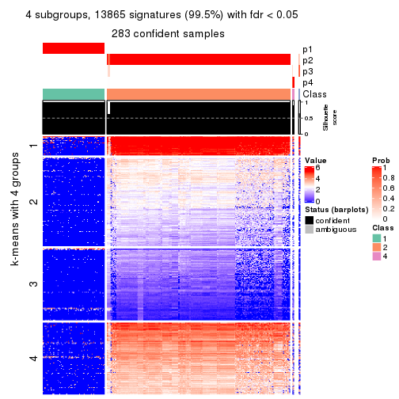</p>

</div>
<div id='tab-SD-hclust-get-signatures-no-scale-4'>
<pre><code class="r">get_signatures(res, k = 5, scale_rows = FALSE)
</code></pre>

<p></p>

</div>
<div id='tab-SD-hclust-get-signatures-no-scale-5'>
<pre><code class="r">get_signatures(res, k = 6, scale_rows = FALSE)
</code></pre>

<p></p>

</div>
</div>


Compare the overlap of signatures from different k:

```r
compare_signatures(res)
```


`get_signature()` returns a data frame invisibly. TO get the list of signatures, the function
call should be assigned to a variable explicitly. In following code, if `plot` argument is set
to `FALSE`, no heatmap is plotted while only the differential analysis is performed.

```r
# code only for demonstration
tb = get_signature(res, k = ..., plot = FALSE)
```

An example of the output of `tb` is:

```
#>   which_row         fdr    mean_1    mean_2 scaled_mean_1 scaled_mean_2 km
#> 1        38 0.042760348  8.373488  9.131774    -0.5533452     0.5164555  1
#> 2        40 0.018707592  7.106213  8.469186    -0.6173731     0.5762149  1
#> 3        55 0.019134737 10.221463 11.207825    -0.6159697     0.5749050  1
#> 4        59 0.006059896  5.921854  7.869574    -0.6899429     0.6439467  1
#> 5        60 0.018055526  8.928898 10.211722    -0.6204761     0.5791110  1
#> 6        98 0.009384629 15.714769 14.887706     0.6635654    -0.6193277  2
...
```

The columns in `tb` are:

1. `which_row`: row indices corresponding to the input matrix.
2. `fdr`: FDR for the differential test. 
3. `mean_x`: The mean value in group x.
4. `scaled_mean_x`: The mean value in group x after rows are scaled.
5. `km`: Row groups if k-means clustering is applied to rows.


UMAP plot which shows how samples are separated.


<script>
$( function() {
	$( '#tabs-SD-hclust-dimension-reduction' ).tabs();
} );
</script>
<div id='tabs-SD-hclust-dimension-reduction'>
<ul>
<li><a href='#tab-SD-hclust-dimension-reduction-1'>k = 2</a></li>
<li><a href='#tab-SD-hclust-dimension-reduction-2'>k = 3</a></li>
<li><a href='#tab-SD-hclust-dimension-reduction-3'>k = 4</a></li>
<li><a href='#tab-SD-hclust-dimension-reduction-4'>k = 5</a></li>
<li><a href='#tab-SD-hclust-dimension-reduction-5'>k = 6</a></li>
</ul>
<div id='tab-SD-hclust-dimension-reduction-1'>
<pre><code class="r">dimension_reduction(res, k = 2, method = &quot;UMAP&quot;)
</code></pre>

<p>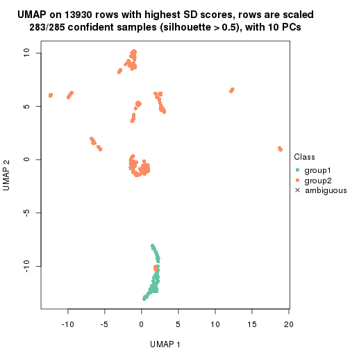</p>

</div>
<div id='tab-SD-hclust-dimension-reduction-2'>
<pre><code class="r">dimension_reduction(res, k = 3, method = &quot;UMAP&quot;)
</code></pre>

<p></p>

</div>
<div id='tab-SD-hclust-dimension-reduction-3'>
<pre><code class="r">dimension_reduction(res, k = 4, method = &quot;UMAP&quot;)
</code></pre>

<p></p>

</div>
<div id='tab-SD-hclust-dimension-reduction-4'>
<pre><code class="r">dimension_reduction(res, k = 5, method = &quot;UMAP&quot;)
</code></pre>

<p></p>

</div>
<div id='tab-SD-hclust-dimension-reduction-5'>
<pre><code class="r">dimension_reduction(res, k = 6, method = &quot;UMAP&quot;)
</code></pre>

<p></p>

</div>
</div>


Following heatmap shows how subgroups are split when increasing `k`:

```r
collect_classes(res)
```


If matrix rows can be associated to genes, consider to use `GO_Enrichment(res,
...)` to perform function enrichment for the signature genes.


 

---------------------------------------------------


### SD:kmeans**


The object with results only for a single top-value method and a single partition method 
can be extracted as:

```r
res = res_list["SD", "kmeans"]
# you can also extract it by
# res = res_list["SD:kmeans"]
```

A summary of `res` and all the functions that can be applied to it:

```r
res
```

```
#> A 'ConsensusPartition' object with k = 2, 3, 4, 5, 6.
#>   On a matrix with 13930 rows and 285 columns.
#>   Top rows (1000, 2000, 3000, 4000, 5000) are extracted by 'SD' method.
#>   Subgroups are detected by 'kmeans' method.
#>   Performed in total 1250 partitions by row resampling.
#>   Best k for subgroups seems to be 3.
#> 
#> Following methods can be applied to this 'ConsensusPartition' object:
#>  [1] "cola_report"             "collect_classes"         "collect_plots"          
#>  [4] "collect_stats"           "colnames"                "compare_signatures"     
#>  [7] "consensus_heatmap"       "dimension_reduction"     "functional_enrichment"  
#> [10] "get_anno_col"            "get_anno"                "get_classes"            
#> [13] "get_consensus"           "get_matrix"              "get_membership"         
#> [16] "get_param"               "get_signatures"          "get_stats"              
#> [19] "is_best_k"               "is_stable_k"             "membership_heatmap"     
#> [22] "ncol"                    "nrow"                    "plot_ecdf"              
#> [25] "rownames"                "select_partition_number" "show"                   
#> [28] "suggest_best_k"          "test_to_known_factors"
```

`collect_plots()` function collects all the plots made from `res` for all `k` (number of partitions)
into one single page to provide an easy and fast comparison between different `k`.

```r
collect_plots(res)
```


The plots are:

- The first row: a plot of the ECDF (Empirical cumulative distribution
  function) curves of the consensus matrix for each `k` and the heatmap of
  predicted classes for each `k`.
- The second row: heatmaps of the consensus matrix for each `k`.
- The third row: heatmaps of the membership matrix for each `k`.
- The fouth row: heatmaps of the signatures for each `k`.

All the plots in panels can be made by individual functions and they are
plotted later in this section.

`select_partition_number()` produces several plots showing different
statistics for choosing "optimized" `k`. There are following statistics:

- ECDF curves of the consensus matrix for each `k`;
- 1-PAC. [The PAC
  score](https://en.wikipedia.org/wiki/Consensus_clustering#Over-interpretation_potential_of_consensus_clustering)
  measures the proportion of the ambiguous subgrouping.
- Mean silhouette score.
- Concordance. The mean probability of fiting the consensus class ids in all
  partitions.
- Area increased. Denote $A_k$ as the area under the ECDF curve for current
  `k`, the area increased is defined as $A_k - A_{k-1}$.
- Rand index. The percent of pairs of samples that are both in a same cluster
  or both are not in a same cluster in the partition of k and k-1.
- Jaccard index. The ratio of pairs of samples are both in a same cluster in
  the partition of k and k-1 and the pairs of samples are both in a same
  cluster in the partition k or k-1.

The detailed explanations of these statistics can be found in [the cola
vignette](http://bioconductor.org/packages/devel/bioc/vignettes/cola/inst/doc/cola.html#toc_13).

Generally speaking, lower PAC score, higher mean silhouette score or higher
concordance corresponds to better partition. Rand index and Jaccard index
measure how similar the current partition is compared to partition with `k-1`.
If they are too similar, we won't accept `k` is better than `k-1`.

```r
select_partition_number(res)
```


The numeric values for all these statistics can be obtained by `get_stats()`.

```r
get_stats(res)
```

```
#>   k 1-PAC mean_silhouette concordance area_increased  Rand Jaccard
#> 2 2 1.000           1.000       1.000         0.3796 0.621   0.621
#> 3 3 1.000           0.990       0.991         0.1038 0.958   0.932
#> 4 4 0.720           0.923       0.880         0.4256 0.753   0.573
#> 5 5 0.594           0.639       0.784         0.1354 0.942   0.834
#> 6 6 0.626           0.631       0.770         0.0783 0.914   0.748
```

`suggest_best_k()` suggests the best $k$ based on these statistics. The rules are as follows:

- All $k$ with Jaccard index larger than 0.95 are removed because the increase of
  the partition number does not provides enough extra information. If all $k$ are removed,
  the best $k$ is assigned by `NA`.
- For $k$ with 1-PAC larger than 0.9, the maximal $k$ is taken as the "best k". Other $k$ is called "optional k".
- If it does not fit the second rule. The $k$ with the highest vote of highest
  1-PAC, mean silhouette and concordance is taken as the "best k".

```r
suggest_best_k(res)
```

```
#> [1] 3
#> attr(,"optional")
#> [1] 2
```

There is also optional best $k$ = 2 that is worth to check.

Following shows the table of the partitions (You need to click the **show/hide
code output** link to see it). The membership matrix (columns with name `p*`)
is inferred by
[`clue::cl_consensus()`](https://www.rdocumentation.org/link/cl_consensus?package=clue)
function with the `SE` method. Basically the value in the membership matrix
represents the probability to belong to a certain group. The finall class
label for an item is determined with the group with highest probability it
belongs to.

In `get_classes()` function, the entropy is calculated from the membership
matrix and the silhouette score is calculated from the consensus matrix.


<script>
$( function() {
	$( '#tabs-SD-kmeans-get-classes' ).tabs();
} );
</script>
<div id='tabs-SD-kmeans-get-classes'>
<ul>
<li><a href='#tab-SD-kmeans-get-classes-1'>k = 2</a></li>
<li><a href='#tab-SD-kmeans-get-classes-2'>k = 3</a></li>
<li><a href='#tab-SD-kmeans-get-classes-3'>k = 4</a></li>
<li><a href='#tab-SD-kmeans-get-classes-4'>k = 5</a></li>
<li><a href='#tab-SD-kmeans-get-classes-5'>k = 6</a></li>
</ul>

<div id='tab-SD-kmeans-get-classes-1'>
<p><a id='tab-SD-kmeans-get-classes-1-a' style='color:#0366d6' href='#'>show/hide code output</a></p>
<pre><code class="r">cbind(get_classes(res, k = 2), get_membership(res, k = 2))
</code></pre>

<pre><code>#&gt;            class entropy silhouette p1 p2
#&gt; SRR1201591     2       0          1  0  1
#&gt; SRR1201590     2       0          1  0  1
#&gt; SRR1201593     2       0          1  0  1
#&gt; SRR1201592     2       0          1  0  1
#&gt; SRR1201617     2       0          1  0  1
#&gt; SRR1201616     2       0          1  0  1
#&gt; SRR1201619     2       0          1  0  1
#&gt; SRR1201618     2       0          1  0  1
#&gt; SRR1201620     2       0          1  0  1
#&gt; SRR1201621     2       0          1  0  1
#&gt; SRR1201623     2       0          1  0  1
#&gt; SRR1201622     2       0          1  0  1
#&gt; SRR1201624     2       0          1  0  1
#&gt; SRR1201625     2       0          1  0  1
#&gt; SRR1201626     1       0          1  1  0
#&gt; SRR1201627     2       0          1  0  1
#&gt; SRR1201628     2       0          1  0  1
#&gt; SRR1201629     2       0          1  0  1
#&gt; SRR1201630     2       0          1  0  1
#&gt; SRR1201631     2       0          1  0  1
#&gt; SRR1201641     2       0          1  0  1
#&gt; SRR1201640     2       0          1  0  1
#&gt; SRR1201643     2       0          1  0  1
#&gt; SRR1201644     2       0          1  0  1
#&gt; SRR1201661     2       0          1  0  1
#&gt; SRR1201662     2       0          1  0  1
#&gt; SRR1201663     2       0          1  0  1
#&gt; SRR1201664     2       0          1  0  1
#&gt; SRR1201665     2       0          1  0  1
#&gt; SRR1201666     2       0          1  0  1
#&gt; SRR1201667     2       0          1  0  1
#&gt; SRR1201668     2       0          1  0  1
#&gt; SRR1201670     2       0          1  0  1
#&gt; SRR1201669     2       0          1  0  1
#&gt; SRR1201673     2       0          1  0  1
#&gt; SRR1201672     2       0          1  0  1
#&gt; SRR1201671     2       0          1  0  1
#&gt; SRR1201677     2       0          1  0  1
#&gt; SRR1201676     2       0          1  0  1
#&gt; SRR1201675     2       0          1  0  1
#&gt; SRR1201674     2       0          1  0  1
#&gt; SRR1201678     2       0          1  0  1
#&gt; SRR1201682     2       0          1  0  1
#&gt; SRR1201683     2       0          1  0  1
#&gt; SRR1201680     2       0          1  0  1
#&gt; SRR1201681     2       0          1  0  1
#&gt; SRR1201679     2       0          1  0  1
#&gt; SRR1201686     2       0          1  0  1
#&gt; SRR1201687     2       0          1  0  1
#&gt; SRR1201688     2       0          1  0  1
#&gt; SRR1201689     2       0          1  0  1
#&gt; SRR1201685     2       0          1  0  1
#&gt; SRR1201692     2       0          1  0  1
#&gt; SRR1201691     2       0          1  0  1
#&gt; SRR1201690     2       0          1  0  1
#&gt; SRR1201696     2       0          1  0  1
#&gt; SRR1201695     2       0          1  0  1
#&gt; SRR1201694     2       0          1  0  1
#&gt; SRR1201693     2       0          1  0  1
#&gt; SRR1201697     2       0          1  0  1
#&gt; SRR1201698     2       0          1  0  1
#&gt; SRR1201700     2       0          1  0  1
#&gt; SRR1201708     2       0          1  0  1
#&gt; SRR1201707     2       0          1  0  1
#&gt; SRR1201706     2       0          1  0  1
#&gt; SRR1201702     2       0          1  0  1
#&gt; SRR1201705     2       0          1  0  1
#&gt; SRR1201701     2       0          1  0  1
#&gt; SRR1201704     2       0          1  0  1
#&gt; SRR1201703     2       0          1  0  1
#&gt; SRR1201716     2       0          1  0  1
#&gt; SRR1201715     2       0          1  0  1
#&gt; SRR1201717     2       0          1  0  1
#&gt; SRR1201712     2       0          1  0  1
#&gt; SRR1201709     2       0          1  0  1
#&gt; SRR1201711     2       0          1  0  1
#&gt; SRR1201714     2       0          1  0  1
#&gt; SRR1201713     2       0          1  0  1
#&gt; SRR1201710     2       0          1  0  1
#&gt; SRR1201719     2       0          1  0  1
#&gt; SRR1201718     2       0          1  0  1
#&gt; SRR1201721     2       0          1  0  1
#&gt; SRR1201720     2       0          1  0  1
#&gt; SRR1201723     2       0          1  0  1
#&gt; SRR1201722     2       0          1  0  1
#&gt; SRR1201725     2       0          1  0  1
#&gt; SRR1201724     2       0          1  0  1
#&gt; SRR1201726     2       0          1  0  1
#&gt; SRR1201727     2       0          1  0  1
#&gt; SRR1201731     2       0          1  0  1
#&gt; SRR1201730     2       0          1  0  1
#&gt; SRR1201734     2       0          1  0  1
#&gt; SRR1201733     2       0          1  0  1
#&gt; SRR1201736     2       0          1  0  1
#&gt; SRR1201737     2       0          1  0  1
#&gt; SRR1201739     2       0          1  0  1
#&gt; SRR1201738     2       0          1  0  1
#&gt; SRR1201742     2       0          1  0  1
#&gt; SRR1201743     2       0          1  0  1
#&gt; SRR1201745     2       0          1  0  1
#&gt; SRR1201744     2       0          1  0  1
#&gt; SRR1201749     2       0          1  0  1
#&gt; SRR1201750     2       0          1  0  1
#&gt; SRR1201752     2       0          1  0  1
#&gt; SRR1201751     2       0          1  0  1
#&gt; SRR1201754     2       0          1  0  1
#&gt; SRR1201753     2       0          1  0  1
#&gt; SRR1201758     2       0          1  0  1
#&gt; SRR1201759     2       0          1  0  1
#&gt; SRR1201760     2       0          1  0  1
#&gt; SRR1201761     2       0          1  0  1
#&gt; SRR1201763     2       0          1  0  1
#&gt; SRR1201762     2       0          1  0  1
#&gt; SRR1201764     2       0          1  0  1
#&gt; SRR1201766     2       0          1  0  1
#&gt; SRR1201768     2       0          1  0  1
#&gt; SRR1201769     2       0          1  0  1
#&gt; SRR1201767     2       0          1  0  1
#&gt; SRR1201770     2       0          1  0  1
#&gt; SRR1201771     2       0          1  0  1
#&gt; SRR1201772     2       0          1  0  1
#&gt; SRR1201773     2       0          1  0  1
#&gt; SRR1201774     2       0          1  0  1
#&gt; SRR1201786     2       0          1  0  1
#&gt; SRR1201784     2       0          1  0  1
#&gt; SRR1201785     2       0          1  0  1
#&gt; SRR1201778     2       0          1  0  1
#&gt; SRR1201779     2       0          1  0  1
#&gt; SRR1201781     2       0          1  0  1
#&gt; SRR1201780     2       0          1  0  1
#&gt; SRR1201783     2       0          1  0  1
#&gt; SRR1201782     2       0          1  0  1
#&gt; SRR1201798     2       0          1  0  1
#&gt; SRR1201797     2       0          1  0  1
#&gt; SRR1201796     2       0          1  0  1
#&gt; SRR1201795     2       0          1  0  1
#&gt; SRR1201799     2       0          1  0  1
#&gt; SRR1201794     2       0          1  0  1
#&gt; SRR1201793     2       0          1  0  1
#&gt; SRR1201792     2       0          1  0  1
#&gt; SRR1201791     2       0          1  0  1
#&gt; SRR1201807     2       0          1  0  1
#&gt; SRR1201808     2       0          1  0  1
#&gt; SRR1201803     2       0          1  0  1
#&gt; SRR1201804     2       0          1  0  1
#&gt; SRR1201805     2       0          1  0  1
#&gt; SRR1201806     2       0          1  0  1
#&gt; SRR1201801     2       0          1  0  1
#&gt; SRR1201802     2       0          1  0  1
#&gt; SRR1201800     2       0          1  0  1
#&gt; SRR1201814     2       0          1  0  1
#&gt; SRR1201816     2       0          1  0  1
#&gt; SRR1201815     2       0          1  0  1
#&gt; SRR1201819     2       0          1  0  1
#&gt; SRR1201820     2       0          1  0  1
#&gt; SRR1201813     2       0          1  0  1
#&gt; SRR1201817     2       0          1  0  1
#&gt; SRR1201818     2       0          1  0  1
#&gt; SRR1201825     2       0          1  0  1
#&gt; SRR1201827     2       0          1  0  1
#&gt; SRR1201828     2       0          1  0  1
#&gt; SRR1201826     2       0          1  0  1
#&gt; SRR1201829     2       0          1  0  1
#&gt; SRR1201830     2       0          1  0  1
#&gt; SRR1201831     2       0          1  0  1
#&gt; SRR1201832     2       0          1  0  1
#&gt; SRR1201833     2       0          1  0  1
#&gt; SRR1201865     2       0          1  0  1
#&gt; SRR1201866     2       0          1  0  1
#&gt; SRR1201867     2       0          1  0  1
#&gt; SRR1201861     2       0          1  0  1
#&gt; SRR1201862     2       0          1  0  1
#&gt; SRR1201863     2       0          1  0  1
#&gt; SRR1201859     2       0          1  0  1
#&gt; SRR1201864     2       0          1  0  1
#&gt; SRR1201860     2       0          1  0  1
#&gt; SRR1201873     2       0          1  0  1
#&gt; SRR1201871     2       0          1  0  1
#&gt; SRR1201872     2       0          1  0  1
#&gt; SRR1201980     2       0          1  0  1
#&gt; SRR1201979     2       0          1  0  1
#&gt; SRR1201982     2       0          1  0  1
#&gt; SRR1201981     2       0          1  0  1
#&gt; SRR1201998     2       0          1  0  1
#&gt; SRR1201996     2       0          1  0  1
#&gt; SRR1201997     2       0          1  0  1
#&gt; SRR1202005     2       0          1  0  1
#&gt; SRR1202006     2       0          1  0  1
#&gt; SRR1202088     2       0          1  0  1
#&gt; SRR1202087     2       0          1  0  1
#&gt; SRR1202093     2       0          1  0  1
#&gt; SRR1202092     2       0          1  0  1
#&gt; SRR1202288     2       0          1  0  1
#&gt; SRR1202289     2       0          1  0  1
#&gt; SRR1202299     2       0          1  0  1
#&gt; SRR1202298     2       0          1  0  1
#&gt; SRR1202303     2       0          1  0  1
#&gt; SRR1202372     2       0          1  0  1
#&gt; SRR1202371     2       0          1  0  1
#&gt; SRR1202563     2       0          1  0  1
#&gt; SRR1202565     2       0          1  0  1
#&gt; SRR1202564     2       0          1  0  1
#&gt; SRR1202649     2       0          1  0  1
#&gt; SRR1202650     2       0          1  0  1
#&gt; SRR1202651     2       0          1  0  1
#&gt; SRR1202843     1       0          1  1  0
#&gt; SRR1202844     1       0          1  1  0
#&gt; SRR1202845     2       0          1  0  1
#&gt; SRR1202847     2       0          1  0  1
#&gt; SRR1202846     2       0          1  0  1
#&gt; SRR1202945     1       0          1  1  0
#&gt; SRR1202949     1       0          1  1  0
#&gt; SRR1202977     1       0          1  1  0
#&gt; SRR1202978     1       0          1  1  0
#&gt; SRR1202979     1       0          1  1  0
#&gt; SRR1202990     1       0          1  1  0
#&gt; SRR1202999     1       0          1  1  0
#&gt; SRR1203005     1       0          1  1  0
#&gt; SRR1203006     1       0          1  1  0
#&gt; SRR1203007     1       0          1  1  0
#&gt; SRR1203009     1       0          1  1  0
#&gt; SRR1203008     1       0          1  1  0
#&gt; SRR1203010     1       0          1  1  0
#&gt; SRR1203011     1       0          1  1  0
#&gt; SRR1203025     1       0          1  1  0
#&gt; SRR1203026     1       0          1  1  0
#&gt; SRR1203027     1       0          1  1  0
#&gt; SRR1203061     1       0          1  1  0
#&gt; SRR1203089     1       0          1  1  0
#&gt; SRR1203125     1       0          1  1  0
#&gt; SRR1203128     1       0          1  1  0
#&gt; SRR1203129     1       0          1  1  0
#&gt; SRR1203130     1       0          1  1  0
#&gt; SRR1203132     2       0          1  0  1
#&gt; SRR1203131     2       0          1  0  1
#&gt; SRR1203133     1       0          1  1  0
#&gt; SRR1203138     1       0          1  1  0
#&gt; SRR1203760     1       0          1  1  0
#&gt; SRR1203761     1       0          1  1  0
#&gt; SRR1203770     1       0          1  1  0
#&gt; SRR1203771     1       0          1  1  0
#&gt; SRR1203772     1       0          1  1  0
#&gt; SRR1203773     1       0          1  1  0
#&gt; SRR1203774     1       0          1  1  0
#&gt; SRR1203775     1       0          1  1  0
#&gt; SRR1203800     1       0          1  1  0
#&gt; SRR1203801     1       0          1  1  0
#&gt; SRR1203802     1       0          1  1  0
#&gt; SRR1203803     1       0          1  1  0
#&gt; SRR1203804     1       0          1  1  0
#&gt; SRR1203805     1       0          1  1  0
#&gt; SRR1203806     1       0          1  1  0
#&gt; SRR1203807     1       0          1  1  0
#&gt; SRR1203808     1       0          1  1  0
#&gt; SRR1203811     1       0          1  1  0
#&gt; SRR1203812     1       0          1  1  0
#&gt; SRR1203813     1       0          1  1  0
#&gt; SRR1203814     1       0          1  1  0
#&gt; SRR1203815     1       0          1  1  0
#&gt; SRR1203816     1       0          1  1  0
#&gt; SRR1203817     1       0          1  1  0
#&gt; SRR1203818     1       0          1  1  0
#&gt; SRR1203819     1       0          1  1  0
#&gt; SRR1203822     1       0          1  1  0
#&gt; SRR1203823     1       0          1  1  0
#&gt; SRR1203824     1       0          1  1  0
#&gt; SRR1203825     1       0          1  1  0
#&gt; SRR1203826     1       0          1  1  0
#&gt; SRR1203827     2       0          1  0  1
#&gt; SRR1203828     1       0          1  1  0
#&gt; SRR1203829     1       0          1  1  0
#&gt; SRR1203830     1       0          1  1  0
#&gt; SRR1203831     1       0          1  1  0
#&gt; SRR1203832     1       0          1  1  0
#&gt; SRR1203833     1       0          1  1  0
#&gt; SRR1203834     1       0          1  1  0
#&gt; SRR1203835     1       0          1  1  0
#&gt; SRR1203836     1       0          1  1  0
#&gt; SRR1203837     1       0          1  1  0
#&gt; SRR1203838     1       0          1  1  0
#&gt; SRR1203839     1       0          1  1  0
#&gt; SRR1203842     2       0          1  0  1
#&gt; SRR1203843     1       0          1  1  0
#&gt; SRR1203845     2       0          1  0  1
#&gt; SRR1203844     2       0          1  0  1
</code></pre>

<script>
$('#tab-SD-kmeans-get-classes-1-a').parent().next().next().hide();
$('#tab-SD-kmeans-get-classes-1-a').click(function(){
  $('#tab-SD-kmeans-get-classes-1-a').parent().next().next().toggle();
  return(false);
});
</script>
</div>

<div id='tab-SD-kmeans-get-classes-2'>
<p><a id='tab-SD-kmeans-get-classes-2-a' style='color:#0366d6' href='#'>show/hide code output</a></p>
<pre><code class="r">cbind(get_classes(res, k = 3), get_membership(res, k = 3))
</code></pre>

<pre><code>#&gt;            class entropy silhouette    p1    p2    p3
#&gt; SRR1201591     2  0.0000      1.000 0.000 1.000 0.000
#&gt; SRR1201590     2  0.0000      1.000 0.000 1.000 0.000
#&gt; SRR1201593     2  0.0000      1.000 0.000 1.000 0.000
#&gt; SRR1201592     2  0.0000      1.000 0.000 1.000 0.000
#&gt; SRR1201617     2  0.0000      1.000 0.000 1.000 0.000
#&gt; SRR1201616     2  0.0000      1.000 0.000 1.000 0.000
#&gt; SRR1201619     2  0.0000      1.000 0.000 1.000 0.000
#&gt; SRR1201618     2  0.0000      1.000 0.000 1.000 0.000
#&gt; SRR1201620     2  0.0000      1.000 0.000 1.000 0.000
#&gt; SRR1201621     2  0.0000      1.000 0.000 1.000 0.000
#&gt; SRR1201623     2  0.0000      1.000 0.000 1.000 0.000
#&gt; SRR1201622     2  0.0000      1.000 0.000 1.000 0.000
#&gt; SRR1201624     3  0.1860      0.901 0.000 0.052 0.948
#&gt; SRR1201625     2  0.0000      1.000 0.000 1.000 0.000
#&gt; SRR1201626     3  0.1163      0.817 0.028 0.000 0.972
#&gt; SRR1201627     3  0.1860      0.901 0.000 0.052 0.948
#&gt; SRR1201628     2  0.0000      1.000 0.000 1.000 0.000
#&gt; SRR1201629     2  0.0000      1.000 0.000 1.000 0.000
#&gt; SRR1201630     2  0.0000      1.000 0.000 1.000 0.000
#&gt; SRR1201631     2  0.0000      1.000 0.000 1.000 0.000
#&gt; SRR1201641     2  0.0000      1.000 0.000 1.000 0.000
#&gt; SRR1201640     2  0.0000      1.000 0.000 1.000 0.000
#&gt; SRR1201643     2  0.0000      1.000 0.000 1.000 0.000
#&gt; SRR1201644     2  0.0000      1.000 0.000 1.000 0.000
#&gt; SRR1201661     2  0.0000      1.000 0.000 1.000 0.000
#&gt; SRR1201662     2  0.0000      1.000 0.000 1.000 0.000
#&gt; SRR1201663     2  0.0000      1.000 0.000 1.000 0.000
#&gt; SRR1201664     2  0.0000      1.000 0.000 1.000 0.000
#&gt; SRR1201665     2  0.0000      1.000 0.000 1.000 0.000
#&gt; SRR1201666     2  0.0000      1.000 0.000 1.000 0.000
#&gt; SRR1201667     2  0.0000      1.000 0.000 1.000 0.000
#&gt; SRR1201668     2  0.0000      1.000 0.000 1.000 0.000
#&gt; SRR1201670     2  0.0000      1.000 0.000 1.000 0.000
#&gt; SRR1201669     2  0.0000      1.000 0.000 1.000 0.000
#&gt; SRR1201673     2  0.0000      1.000 0.000 1.000 0.000
#&gt; SRR1201672     2  0.0000      1.000 0.000 1.000 0.000
#&gt; SRR1201671     2  0.0000      1.000 0.000 1.000 0.000
#&gt; SRR1201677     2  0.0000      1.000 0.000 1.000 0.000
#&gt; SRR1201676     2  0.0000      1.000 0.000 1.000 0.000
#&gt; SRR1201675     2  0.0000      1.000 0.000 1.000 0.000
#&gt; SRR1201674     2  0.0000      1.000 0.000 1.000 0.000
#&gt; SRR1201678     2  0.0000      1.000 0.000 1.000 0.000
#&gt; SRR1201682     2  0.0000      1.000 0.000 1.000 0.000
#&gt; SRR1201683     2  0.0000      1.000 0.000 1.000 0.000
#&gt; SRR1201680     2  0.0000      1.000 0.000 1.000 0.000
#&gt; SRR1201681     2  0.0000      1.000 0.000 1.000 0.000
#&gt; SRR1201679     2  0.0000      1.000 0.000 1.000 0.000
#&gt; SRR1201686     2  0.0000      1.000 0.000 1.000 0.000
#&gt; SRR1201687     2  0.0000      1.000 0.000 1.000 0.000
#&gt; SRR1201688     2  0.0000      1.000 0.000 1.000 0.000
#&gt; SRR1201689     2  0.0000      1.000 0.000 1.000 0.000
#&gt; SRR1201685     2  0.0000      1.000 0.000 1.000 0.000
#&gt; SRR1201692     2  0.0000      1.000 0.000 1.000 0.000
#&gt; SRR1201691     2  0.0000      1.000 0.000 1.000 0.000
#&gt; SRR1201690     2  0.0000      1.000 0.000 1.000 0.000
#&gt; SRR1201696     2  0.0000      1.000 0.000 1.000 0.000
#&gt; SRR1201695     2  0.0000      1.000 0.000 1.000 0.000
#&gt; SRR1201694     2  0.0000      1.000 0.000 1.000 0.000
#&gt; SRR1201693     2  0.0000      1.000 0.000 1.000 0.000
#&gt; SRR1201697     2  0.0000      1.000 0.000 1.000 0.000
#&gt; SRR1201698     2  0.0000      1.000 0.000 1.000 0.000
#&gt; SRR1201700     2  0.0000      1.000 0.000 1.000 0.000
#&gt; SRR1201708     2  0.0000      1.000 0.000 1.000 0.000
#&gt; SRR1201707     2  0.0000      1.000 0.000 1.000 0.000
#&gt; SRR1201706     2  0.0000      1.000 0.000 1.000 0.000
#&gt; SRR1201702     2  0.0000      1.000 0.000 1.000 0.000
#&gt; SRR1201705     2  0.0000      1.000 0.000 1.000 0.000
#&gt; SRR1201701     2  0.0000      1.000 0.000 1.000 0.000
#&gt; SRR1201704     2  0.0000      1.000 0.000 1.000 0.000
#&gt; SRR1201703     2  0.0000      1.000 0.000 1.000 0.000
#&gt; SRR1201716     2  0.0000      1.000 0.000 1.000 0.000
#&gt; SRR1201715     2  0.0000      1.000 0.000 1.000 0.000
#&gt; SRR1201717     2  0.0000      1.000 0.000 1.000 0.000
#&gt; SRR1201712     2  0.0000      1.000 0.000 1.000 0.000
#&gt; SRR1201709     2  0.0000      1.000 0.000 1.000 0.000
#&gt; SRR1201711     2  0.0000      1.000 0.000 1.000 0.000
#&gt; SRR1201714     2  0.0000      1.000 0.000 1.000 0.000
#&gt; SRR1201713     2  0.0000      1.000 0.000 1.000 0.000
#&gt; SRR1201710     2  0.0000      1.000 0.000 1.000 0.000
#&gt; SRR1201719     2  0.0000      1.000 0.000 1.000 0.000
#&gt; SRR1201718     2  0.0000      1.000 0.000 1.000 0.000
#&gt; SRR1201721     2  0.0000      1.000 0.000 1.000 0.000
#&gt; SRR1201720     2  0.0000      1.000 0.000 1.000 0.000
#&gt; SRR1201723     2  0.0000      1.000 0.000 1.000 0.000
#&gt; SRR1201722     2  0.0000      1.000 0.000 1.000 0.000
#&gt; SRR1201725     2  0.0000      1.000 0.000 1.000 0.000
#&gt; SRR1201724     2  0.0000      1.000 0.000 1.000 0.000
#&gt; SRR1201726     2  0.0000      1.000 0.000 1.000 0.000
#&gt; SRR1201727     2  0.0000      1.000 0.000 1.000 0.000
#&gt; SRR1201731     2  0.0000      1.000 0.000 1.000 0.000
#&gt; SRR1201730     2  0.0000      1.000 0.000 1.000 0.000
#&gt; SRR1201734     2  0.0000      1.000 0.000 1.000 0.000
#&gt; SRR1201733     2  0.0000      1.000 0.000 1.000 0.000
#&gt; SRR1201736     2  0.0000      1.000 0.000 1.000 0.000
#&gt; SRR1201737     2  0.0000      1.000 0.000 1.000 0.000
#&gt; SRR1201739     2  0.0000      1.000 0.000 1.000 0.000
#&gt; SRR1201738     2  0.0000      1.000 0.000 1.000 0.000
#&gt; SRR1201742     2  0.0000      1.000 0.000 1.000 0.000
#&gt; SRR1201743     2  0.0000      1.000 0.000 1.000 0.000
#&gt; SRR1201745     2  0.0000      1.000 0.000 1.000 0.000
#&gt; SRR1201744     2  0.0000      1.000 0.000 1.000 0.000
#&gt; SRR1201749     2  0.0000      1.000 0.000 1.000 0.000
#&gt; SRR1201750     2  0.0000      1.000 0.000 1.000 0.000
#&gt; SRR1201752     2  0.0000      1.000 0.000 1.000 0.000
#&gt; SRR1201751     2  0.0000      1.000 0.000 1.000 0.000
#&gt; SRR1201754     2  0.0000      1.000 0.000 1.000 0.000
#&gt; SRR1201753     2  0.0000      1.000 0.000 1.000 0.000
#&gt; SRR1201758     3  0.5327      0.681 0.000 0.272 0.728
#&gt; SRR1201759     2  0.0000      1.000 0.000 1.000 0.000
#&gt; SRR1201760     2  0.0000      1.000 0.000 1.000 0.000
#&gt; SRR1201761     2  0.0000      1.000 0.000 1.000 0.000
#&gt; SRR1201763     3  0.5098      0.710 0.000 0.248 0.752
#&gt; SRR1201762     3  0.1860      0.901 0.000 0.052 0.948
#&gt; SRR1201764     2  0.0000      1.000 0.000 1.000 0.000
#&gt; SRR1201766     2  0.0000      1.000 0.000 1.000 0.000
#&gt; SRR1201768     2  0.0000      1.000 0.000 1.000 0.000
#&gt; SRR1201769     2  0.0000      1.000 0.000 1.000 0.000
#&gt; SRR1201767     2  0.0000      1.000 0.000 1.000 0.000
#&gt; SRR1201770     2  0.0000      1.000 0.000 1.000 0.000
#&gt; SRR1201771     2  0.0000      1.000 0.000 1.000 0.000
#&gt; SRR1201772     2  0.0000      1.000 0.000 1.000 0.000
#&gt; SRR1201773     2  0.0000      1.000 0.000 1.000 0.000
#&gt; SRR1201774     2  0.0000      1.000 0.000 1.000 0.000
#&gt; SRR1201786     2  0.0000      1.000 0.000 1.000 0.000
#&gt; SRR1201784     2  0.0000      1.000 0.000 1.000 0.000
#&gt; SRR1201785     2  0.0000      1.000 0.000 1.000 0.000
#&gt; SRR1201778     2  0.0000      1.000 0.000 1.000 0.000
#&gt; SRR1201779     2  0.0000      1.000 0.000 1.000 0.000
#&gt; SRR1201781     2  0.0000      1.000 0.000 1.000 0.000
#&gt; SRR1201780     2  0.0000      1.000 0.000 1.000 0.000
#&gt; SRR1201783     2  0.0000      1.000 0.000 1.000 0.000
#&gt; SRR1201782     2  0.0000      1.000 0.000 1.000 0.000
#&gt; SRR1201798     2  0.0000      1.000 0.000 1.000 0.000
#&gt; SRR1201797     2  0.0000      1.000 0.000 1.000 0.000
#&gt; SRR1201796     2  0.0000      1.000 0.000 1.000 0.000
#&gt; SRR1201795     2  0.0000      1.000 0.000 1.000 0.000
#&gt; SRR1201799     2  0.0000      1.000 0.000 1.000 0.000
#&gt; SRR1201794     2  0.0000      1.000 0.000 1.000 0.000
#&gt; SRR1201793     2  0.0000      1.000 0.000 1.000 0.000
#&gt; SRR1201792     2  0.0000      1.000 0.000 1.000 0.000
#&gt; SRR1201791     2  0.0000      1.000 0.000 1.000 0.000
#&gt; SRR1201807     2  0.0000      1.000 0.000 1.000 0.000
#&gt; SRR1201808     2  0.0000      1.000 0.000 1.000 0.000
#&gt; SRR1201803     2  0.0000      1.000 0.000 1.000 0.000
#&gt; SRR1201804     2  0.0000      1.000 0.000 1.000 0.000
#&gt; SRR1201805     2  0.0000      1.000 0.000 1.000 0.000
#&gt; SRR1201806     2  0.0000      1.000 0.000 1.000 0.000
#&gt; SRR1201801     2  0.0000      1.000 0.000 1.000 0.000
#&gt; SRR1201802     2  0.0000      1.000 0.000 1.000 0.000
#&gt; SRR1201800     2  0.0000      1.000 0.000 1.000 0.000
#&gt; SRR1201814     2  0.0000      1.000 0.000 1.000 0.000
#&gt; SRR1201816     2  0.0000      1.000 0.000 1.000 0.000
#&gt; SRR1201815     2  0.0000      1.000 0.000 1.000 0.000
#&gt; SRR1201819     2  0.0000      1.000 0.000 1.000 0.000
#&gt; SRR1201820     2  0.0000      1.000 0.000 1.000 0.000
#&gt; SRR1201813     2  0.0000      1.000 0.000 1.000 0.000
#&gt; SRR1201817     2  0.0000      1.000 0.000 1.000 0.000
#&gt; SRR1201818     2  0.0000      1.000 0.000 1.000 0.000
#&gt; SRR1201825     2  0.0000      1.000 0.000 1.000 0.000
#&gt; SRR1201827     2  0.0000      1.000 0.000 1.000 0.000
#&gt; SRR1201828     2  0.0000      1.000 0.000 1.000 0.000
#&gt; SRR1201826     2  0.0000      1.000 0.000 1.000 0.000
#&gt; SRR1201829     2  0.0000      1.000 0.000 1.000 0.000
#&gt; SRR1201830     2  0.0000      1.000 0.000 1.000 0.000
#&gt; SRR1201831     2  0.0000      1.000 0.000 1.000 0.000
#&gt; SRR1201832     2  0.0000      1.000 0.000 1.000 0.000
#&gt; SRR1201833     2  0.0000      1.000 0.000 1.000 0.000
#&gt; SRR1201865     2  0.0000      1.000 0.000 1.000 0.000
#&gt; SRR1201866     2  0.0000      1.000 0.000 1.000 0.000
#&gt; SRR1201867     2  0.0000      1.000 0.000 1.000 0.000
#&gt; SRR1201861     2  0.0000      1.000 0.000 1.000 0.000
#&gt; SRR1201862     2  0.0000      1.000 0.000 1.000 0.000
#&gt; SRR1201863     2  0.0000      1.000 0.000 1.000 0.000
#&gt; SRR1201859     2  0.0000      1.000 0.000 1.000 0.000
#&gt; SRR1201864     2  0.0000      1.000 0.000 1.000 0.000
#&gt; SRR1201860     2  0.0000      1.000 0.000 1.000 0.000
#&gt; SRR1201873     2  0.0000      1.000 0.000 1.000 0.000
#&gt; SRR1201871     2  0.0000      1.000 0.000 1.000 0.000
#&gt; SRR1201872     2  0.0000      1.000 0.000 1.000 0.000
#&gt; SRR1201980     2  0.0000      1.000 0.000 1.000 0.000
#&gt; SRR1201979     2  0.0000      1.000 0.000 1.000 0.000
#&gt; SRR1201982     2  0.0000      1.000 0.000 1.000 0.000
#&gt; SRR1201981     2  0.0000      1.000 0.000 1.000 0.000
#&gt; SRR1201998     2  0.0000      1.000 0.000 1.000 0.000
#&gt; SRR1201996     2  0.0000      1.000 0.000 1.000 0.000
#&gt; SRR1201997     2  0.0000      1.000 0.000 1.000 0.000
#&gt; SRR1202005     2  0.0000      1.000 0.000 1.000 0.000
#&gt; SRR1202006     2  0.0000      1.000 0.000 1.000 0.000
#&gt; SRR1202088     2  0.0000      1.000 0.000 1.000 0.000
#&gt; SRR1202087     2  0.0000      1.000 0.000 1.000 0.000
#&gt; SRR1202093     2  0.0000      1.000 0.000 1.000 0.000
#&gt; SRR1202092     2  0.0000      1.000 0.000 1.000 0.000
#&gt; SRR1202288     2  0.0000      1.000 0.000 1.000 0.000
#&gt; SRR1202289     2  0.0000      1.000 0.000 1.000 0.000
#&gt; SRR1202299     2  0.0000      1.000 0.000 1.000 0.000
#&gt; SRR1202298     2  0.0000      1.000 0.000 1.000 0.000
#&gt; SRR1202303     3  0.1860      0.901 0.000 0.052 0.948
#&gt; SRR1202372     2  0.0000      1.000 0.000 1.000 0.000
#&gt; SRR1202371     2  0.0000      1.000 0.000 1.000 0.000
#&gt; SRR1202563     2  0.0000      1.000 0.000 1.000 0.000
#&gt; SRR1202565     2  0.0000      1.000 0.000 1.000 0.000
#&gt; SRR1202564     2  0.0000      1.000 0.000 1.000 0.000
#&gt; SRR1202649     2  0.0000      1.000 0.000 1.000 0.000
#&gt; SRR1202650     2  0.0000      1.000 0.000 1.000 0.000
#&gt; SRR1202651     2  0.0000      1.000 0.000 1.000 0.000
#&gt; SRR1202843     1  0.1163      0.979 0.972 0.000 0.028
#&gt; SRR1202844     1  0.1163      0.979 0.972 0.000 0.028
#&gt; SRR1202845     2  0.0000      1.000 0.000 1.000 0.000
#&gt; SRR1202847     2  0.0000      1.000 0.000 1.000 0.000
#&gt; SRR1202846     2  0.0000      1.000 0.000 1.000 0.000
#&gt; SRR1202945     1  0.1163      0.979 0.972 0.000 0.028
#&gt; SRR1202949     1  0.0892      0.979 0.980 0.000 0.020
#&gt; SRR1202977     1  0.0892      0.979 0.980 0.000 0.020
#&gt; SRR1202978     1  0.0747      0.980 0.984 0.000 0.016
#&gt; SRR1202979     1  0.0892      0.979 0.980 0.000 0.020
#&gt; SRR1202990     1  0.0892      0.979 0.980 0.000 0.020
#&gt; SRR1202999     1  0.1163      0.979 0.972 0.000 0.028
#&gt; SRR1203005     1  0.1163      0.979 0.972 0.000 0.028
#&gt; SRR1203006     1  0.1163      0.979 0.972 0.000 0.028
#&gt; SRR1203007     1  0.1163      0.979 0.972 0.000 0.028
#&gt; SRR1203009     1  0.1031      0.981 0.976 0.000 0.024
#&gt; SRR1203008     1  0.1031      0.981 0.976 0.000 0.024
#&gt; SRR1203010     1  0.0747      0.980 0.984 0.000 0.016
#&gt; SRR1203011     1  0.0592      0.982 0.988 0.000 0.012
#&gt; SRR1203025     1  0.0747      0.980 0.984 0.000 0.016
#&gt; SRR1203026     1  0.0892      0.981 0.980 0.000 0.020
#&gt; SRR1203027     1  0.0892      0.979 0.980 0.000 0.020
#&gt; SRR1203061     1  0.0892      0.979 0.980 0.000 0.020
#&gt; SRR1203089     1  0.0747      0.980 0.984 0.000 0.016
#&gt; SRR1203125     1  0.0892      0.979 0.980 0.000 0.020
#&gt; SRR1203128     1  0.1163      0.979 0.972 0.000 0.028
#&gt; SRR1203129     1  0.1163      0.979 0.972 0.000 0.028
#&gt; SRR1203130     1  0.1163      0.979 0.972 0.000 0.028
#&gt; SRR1203132     2  0.0000      1.000 0.000 1.000 0.000
#&gt; SRR1203131     2  0.0000      1.000 0.000 1.000 0.000
#&gt; SRR1203133     1  0.1163      0.979 0.972 0.000 0.028
#&gt; SRR1203138     1  0.1163      0.979 0.972 0.000 0.028
#&gt; SRR1203760     1  0.0747      0.980 0.984 0.000 0.016
#&gt; SRR1203761     1  0.0892      0.979 0.980 0.000 0.020
#&gt; SRR1203770     1  0.1163      0.979 0.972 0.000 0.028
#&gt; SRR1203771     1  0.1163      0.980 0.972 0.000 0.028
#&gt; SRR1203772     1  0.1163      0.979 0.972 0.000 0.028
#&gt; SRR1203773     1  0.1031      0.981 0.976 0.000 0.024
#&gt; SRR1203774     1  0.0892      0.979 0.980 0.000 0.020
#&gt; SRR1203775     1  0.1031      0.978 0.976 0.000 0.024
#&gt; SRR1203800     1  0.0747      0.980 0.984 0.000 0.016
#&gt; SRR1203801     1  0.1163      0.979 0.972 0.000 0.028
#&gt; SRR1203802     1  0.1163      0.979 0.972 0.000 0.028
#&gt; SRR1203803     1  0.1163      0.979 0.972 0.000 0.028
#&gt; SRR1203804     1  0.0892      0.979 0.980 0.000 0.020
#&gt; SRR1203805     1  0.0892      0.979 0.980 0.000 0.020
#&gt; SRR1203806     1  0.0892      0.982 0.980 0.000 0.020
#&gt; SRR1203807     1  0.0892      0.979 0.980 0.000 0.020
#&gt; SRR1203808     1  0.1289      0.979 0.968 0.000 0.032
#&gt; SRR1203811     1  0.0747      0.980 0.984 0.000 0.016
#&gt; SRR1203812     1  0.0892      0.979 0.980 0.000 0.020
#&gt; SRR1203813     1  0.0592      0.981 0.988 0.000 0.012
#&gt; SRR1203814     1  0.0747      0.982 0.984 0.000 0.016
#&gt; SRR1203815     1  0.0592      0.982 0.988 0.000 0.012
#&gt; SRR1203816     1  0.1163      0.979 0.972 0.000 0.028
#&gt; SRR1203817     1  0.0592      0.981 0.988 0.000 0.012
#&gt; SRR1203818     1  0.1163      0.979 0.972 0.000 0.028
#&gt; SRR1203819     1  0.1163      0.979 0.972 0.000 0.028
#&gt; SRR1203822     1  0.1163      0.979 0.972 0.000 0.028
#&gt; SRR1203823     1  0.0892      0.981 0.980 0.000 0.020
#&gt; SRR1203824     1  0.0892      0.982 0.980 0.000 0.020
#&gt; SRR1203825     1  0.1163      0.979 0.972 0.000 0.028
#&gt; SRR1203826     1  0.1163      0.979 0.972 0.000 0.028
#&gt; SRR1203827     3  0.1860      0.901 0.000 0.052 0.948
#&gt; SRR1203828     1  0.0592      0.981 0.988 0.000 0.012
#&gt; SRR1203829     1  0.1163      0.979 0.972 0.000 0.028
#&gt; SRR1203830     1  0.1163      0.979 0.972 0.000 0.028
#&gt; SRR1203831     1  0.0747      0.980 0.984 0.000 0.016
#&gt; SRR1203832     1  0.0892      0.979 0.980 0.000 0.020
#&gt; SRR1203833     1  0.0892      0.979 0.980 0.000 0.020
#&gt; SRR1203834     1  0.0747      0.980 0.984 0.000 0.016
#&gt; SRR1203835     1  0.1163      0.979 0.972 0.000 0.028
#&gt; SRR1203836     1  0.0892      0.979 0.980 0.000 0.020
#&gt; SRR1203837     1  0.0747      0.982 0.984 0.000 0.016
#&gt; SRR1203838     1  0.0747      0.980 0.984 0.000 0.016
#&gt; SRR1203839     1  0.1163      0.979 0.972 0.000 0.028
#&gt; SRR1203842     3  0.1860      0.901 0.000 0.052 0.948
#&gt; SRR1203843     1  0.0892      0.979 0.980 0.000 0.020
#&gt; SRR1203845     2  0.0000      1.000 0.000 1.000 0.000
#&gt; SRR1203844     2  0.0000      1.000 0.000 1.000 0.000
</code></pre>

<script>
$('#tab-SD-kmeans-get-classes-2-a').parent().next().next().hide();
$('#tab-SD-kmeans-get-classes-2-a').click(function(){
  $('#tab-SD-kmeans-get-classes-2-a').parent().next().next().toggle();
  return(false);
});
</script>
</div>

<div id='tab-SD-kmeans-get-classes-3'>
<p><a id='tab-SD-kmeans-get-classes-3-a' style='color:#0366d6' href='#'>show/hide code output</a></p>
<pre><code class="r">cbind(get_classes(res, k = 4), get_membership(res, k = 4))
</code></pre>

<pre><code>#&gt;            class entropy silhouette    p1    p2    p3    p4
#&gt; SRR1201591     2  0.0000      0.971 0.000 1.000 0.000 0.000
#&gt; SRR1201590     2  0.0000      0.971 0.000 1.000 0.000 0.000
#&gt; SRR1201593     2  0.0000      0.971 0.000 1.000 0.000 0.000
#&gt; SRR1201592     2  0.0000      0.971 0.000 1.000 0.000 0.000
#&gt; SRR1201617     2  0.0000      0.971 0.000 1.000 0.000 0.000
#&gt; SRR1201616     2  0.0000      0.971 0.000 1.000 0.000 0.000
#&gt; SRR1201619     2  0.0000      0.971 0.000 1.000 0.000 0.000
#&gt; SRR1201618     2  0.1302      0.928 0.000 0.956 0.044 0.000
#&gt; SRR1201620     2  0.0000      0.971 0.000 1.000 0.000 0.000
#&gt; SRR1201621     2  0.0000      0.971 0.000 1.000 0.000 0.000
#&gt; SRR1201623     3  0.4477      0.920 0.000 0.312 0.688 0.000
#&gt; SRR1201622     3  0.4304      0.896 0.000 0.284 0.716 0.000
#&gt; SRR1201624     4  0.2469      0.880 0.000 0.000 0.108 0.892
#&gt; SRR1201625     3  0.3649      0.787 0.000 0.204 0.796 0.000
#&gt; SRR1201626     4  0.1211      0.890 0.000 0.000 0.040 0.960
#&gt; SRR1201627     4  0.1022      0.894 0.000 0.000 0.032 0.968
#&gt; SRR1201628     3  0.4624      0.926 0.000 0.340 0.660 0.000
#&gt; SRR1201629     3  0.4713      0.920 0.000 0.360 0.640 0.000
#&gt; SRR1201630     2  0.1474      0.920 0.000 0.948 0.052 0.000
#&gt; SRR1201631     2  0.1118      0.939 0.000 0.964 0.036 0.000
#&gt; SRR1201641     2  0.0469      0.961 0.000 0.988 0.012 0.000
#&gt; SRR1201640     2  0.1118      0.939 0.000 0.964 0.036 0.000
#&gt; SRR1201643     3  0.4746      0.914 0.000 0.368 0.632 0.000
#&gt; SRR1201644     3  0.4933      0.822 0.000 0.432 0.568 0.000
#&gt; SRR1201661     2  0.1474      0.920 0.000 0.948 0.052 0.000
#&gt; SRR1201662     2  0.1389      0.925 0.000 0.952 0.048 0.000
#&gt; SRR1201663     3  0.3764      0.809 0.000 0.216 0.784 0.000
#&gt; SRR1201664     3  0.3907      0.834 0.000 0.232 0.768 0.000
#&gt; SRR1201665     2  0.0000      0.971 0.000 1.000 0.000 0.000
#&gt; SRR1201666     2  0.0000      0.971 0.000 1.000 0.000 0.000
#&gt; SRR1201667     2  0.0000      0.971 0.000 1.000 0.000 0.000
#&gt; SRR1201668     3  0.3764      0.809 0.000 0.216 0.784 0.000
#&gt; SRR1201670     3  0.3942      0.840 0.000 0.236 0.764 0.000
#&gt; SRR1201669     3  0.3942      0.840 0.000 0.236 0.764 0.000
#&gt; SRR1201673     2  0.1022      0.942 0.000 0.968 0.032 0.000
#&gt; SRR1201672     2  0.1022      0.942 0.000 0.968 0.032 0.000
#&gt; SRR1201671     2  0.4697     -0.155 0.000 0.644 0.356 0.000
#&gt; SRR1201677     2  0.1022      0.942 0.000 0.968 0.032 0.000
#&gt; SRR1201676     2  0.1022      0.942 0.000 0.968 0.032 0.000
#&gt; SRR1201675     2  0.1022      0.942 0.000 0.968 0.032 0.000
#&gt; SRR1201674     2  0.1022      0.942 0.000 0.968 0.032 0.000
#&gt; SRR1201678     2  0.1022      0.942 0.000 0.968 0.032 0.000
#&gt; SRR1201682     2  0.0000      0.971 0.000 1.000 0.000 0.000
#&gt; SRR1201683     2  0.0000      0.971 0.000 1.000 0.000 0.000
#&gt; SRR1201680     2  0.0000      0.971 0.000 1.000 0.000 0.000
#&gt; SRR1201681     2  0.0000      0.971 0.000 1.000 0.000 0.000
#&gt; SRR1201679     2  0.0000      0.971 0.000 1.000 0.000 0.000
#&gt; SRR1201686     3  0.3873      0.829 0.000 0.228 0.772 0.000
#&gt; SRR1201687     3  0.3873      0.829 0.000 0.228 0.772 0.000
#&gt; SRR1201688     3  0.3873      0.829 0.000 0.228 0.772 0.000
#&gt; SRR1201689     3  0.3873      0.829 0.000 0.228 0.772 0.000
#&gt; SRR1201685     3  0.3649      0.787 0.000 0.204 0.796 0.000
#&gt; SRR1201692     3  0.4843      0.884 0.000 0.396 0.604 0.000
#&gt; SRR1201691     3  0.4843      0.884 0.000 0.396 0.604 0.000
#&gt; SRR1201690     3  0.4661      0.925 0.000 0.348 0.652 0.000
#&gt; SRR1201696     3  0.4843      0.884 0.000 0.396 0.604 0.000
#&gt; SRR1201695     3  0.4843      0.884 0.000 0.396 0.604 0.000
#&gt; SRR1201694     3  0.4843      0.884 0.000 0.396 0.604 0.000
#&gt; SRR1201693     3  0.4843      0.884 0.000 0.396 0.604 0.000
#&gt; SRR1201697     3  0.4843      0.884 0.000 0.396 0.604 0.000
#&gt; SRR1201698     3  0.4843      0.884 0.000 0.396 0.604 0.000
#&gt; SRR1201700     3  0.4643      0.925 0.000 0.344 0.656 0.000
#&gt; SRR1201708     3  0.4713      0.920 0.000 0.360 0.640 0.000
#&gt; SRR1201707     3  0.4713      0.920 0.000 0.360 0.640 0.000
#&gt; SRR1201706     3  0.4713      0.920 0.000 0.360 0.640 0.000
#&gt; SRR1201702     3  0.4713      0.920 0.000 0.360 0.640 0.000
#&gt; SRR1201705     3  0.4713      0.920 0.000 0.360 0.640 0.000
#&gt; SRR1201701     3  0.4713      0.920 0.000 0.360 0.640 0.000
#&gt; SRR1201704     3  0.4713      0.920 0.000 0.360 0.640 0.000
#&gt; SRR1201703     3  0.4713      0.920 0.000 0.360 0.640 0.000
#&gt; SRR1201716     3  0.4477      0.920 0.000 0.312 0.688 0.000
#&gt; SRR1201715     3  0.4477      0.920 0.000 0.312 0.688 0.000
#&gt; SRR1201717     3  0.4477      0.920 0.000 0.312 0.688 0.000
#&gt; SRR1201712     3  0.4477      0.920 0.000 0.312 0.688 0.000
#&gt; SRR1201709     3  0.4382      0.907 0.000 0.296 0.704 0.000
#&gt; SRR1201711     3  0.4477      0.920 0.000 0.312 0.688 0.000
#&gt; SRR1201714     3  0.4477      0.920 0.000 0.312 0.688 0.000
#&gt; SRR1201713     3  0.4477      0.920 0.000 0.312 0.688 0.000
#&gt; SRR1201710     3  0.4477      0.920 0.000 0.312 0.688 0.000
#&gt; SRR1201719     2  0.0921      0.947 0.000 0.972 0.028 0.000
#&gt; SRR1201718     2  0.1389      0.925 0.000 0.952 0.048 0.000
#&gt; SRR1201721     3  0.4713      0.920 0.000 0.360 0.640 0.000
#&gt; SRR1201720     3  0.4679      0.923 0.000 0.352 0.648 0.000
#&gt; SRR1201723     3  0.3942      0.840 0.000 0.236 0.764 0.000
#&gt; SRR1201722     3  0.3907      0.834 0.000 0.232 0.768 0.000
#&gt; SRR1201725     2  0.1474      0.920 0.000 0.948 0.052 0.000
#&gt; SRR1201724     2  0.1716      0.903 0.000 0.936 0.064 0.000
#&gt; SRR1201726     3  0.4382      0.907 0.000 0.296 0.704 0.000
#&gt; SRR1201727     3  0.4543      0.923 0.000 0.324 0.676 0.000
#&gt; SRR1201731     3  0.4843      0.884 0.000 0.396 0.604 0.000
#&gt; SRR1201730     3  0.4746      0.914 0.000 0.368 0.632 0.000
#&gt; SRR1201734     2  0.0000      0.971 0.000 1.000 0.000 0.000
#&gt; SRR1201733     2  0.0000      0.971 0.000 1.000 0.000 0.000
#&gt; SRR1201736     2  0.0817      0.951 0.000 0.976 0.024 0.000
#&gt; SRR1201737     2  0.0000      0.971 0.000 1.000 0.000 0.000
#&gt; SRR1201739     2  0.0000      0.971 0.000 1.000 0.000 0.000
#&gt; SRR1201738     2  0.0000      0.971 0.000 1.000 0.000 0.000
#&gt; SRR1201742     2  0.0707      0.954 0.000 0.980 0.020 0.000
#&gt; SRR1201743     2  0.0000      0.971 0.000 1.000 0.000 0.000
#&gt; SRR1201745     2  0.0000      0.971 0.000 1.000 0.000 0.000
#&gt; SRR1201744     2  0.0000      0.971 0.000 1.000 0.000 0.000
#&gt; SRR1201749     2  0.0000      0.971 0.000 1.000 0.000 0.000
#&gt; SRR1201750     2  0.0000      0.971 0.000 1.000 0.000 0.000
#&gt; SRR1201752     3  0.4855      0.878 0.000 0.400 0.600 0.000
#&gt; SRR1201751     3  0.4713      0.920 0.000 0.360 0.640 0.000
#&gt; SRR1201754     2  0.0000      0.971 0.000 1.000 0.000 0.000
#&gt; SRR1201753     2  0.0000      0.971 0.000 1.000 0.000 0.000
#&gt; SRR1201758     4  0.5691      0.586 0.000 0.028 0.408 0.564
#&gt; SRR1201759     3  0.3649      0.787 0.000 0.204 0.796 0.000
#&gt; SRR1201760     3  0.4661      0.925 0.000 0.348 0.652 0.000
#&gt; SRR1201761     3  0.4713      0.920 0.000 0.360 0.640 0.000
#&gt; SRR1201763     4  0.5742      0.605 0.000 0.036 0.368 0.596
#&gt; SRR1201762     4  0.0469      0.894 0.000 0.000 0.012 0.988
#&gt; SRR1201764     3  0.4624      0.926 0.000 0.340 0.660 0.000
#&gt; SRR1201766     2  0.0000      0.971 0.000 1.000 0.000 0.000
#&gt; SRR1201768     2  0.0000      0.971 0.000 1.000 0.000 0.000
#&gt; SRR1201769     2  0.0000      0.971 0.000 1.000 0.000 0.000
#&gt; SRR1201767     2  0.0000      0.971 0.000 1.000 0.000 0.000
#&gt; SRR1201770     2  0.0000      0.971 0.000 1.000 0.000 0.000
#&gt; SRR1201771     2  0.0000      0.971 0.000 1.000 0.000 0.000
#&gt; SRR1201772     2  0.0000      0.971 0.000 1.000 0.000 0.000
#&gt; SRR1201773     2  0.0000      0.971 0.000 1.000 0.000 0.000
#&gt; SRR1201774     2  0.0000      0.971 0.000 1.000 0.000 0.000
#&gt; SRR1201786     2  0.0000      0.971 0.000 1.000 0.000 0.000
#&gt; SRR1201784     2  0.0000      0.971 0.000 1.000 0.000 0.000
#&gt; SRR1201785     2  0.0000      0.971 0.000 1.000 0.000 0.000
#&gt; SRR1201778     2  0.0000      0.971 0.000 1.000 0.000 0.000
#&gt; SRR1201779     2  0.0000      0.971 0.000 1.000 0.000 0.000
#&gt; SRR1201781     2  0.0000      0.971 0.000 1.000 0.000 0.000
#&gt; SRR1201780     2  0.0000      0.971 0.000 1.000 0.000 0.000
#&gt; SRR1201783     2  0.0000      0.971 0.000 1.000 0.000 0.000
#&gt; SRR1201782     2  0.0000      0.971 0.000 1.000 0.000 0.000
#&gt; SRR1201798     2  0.0000      0.971 0.000 1.000 0.000 0.000
#&gt; SRR1201797     2  0.0000      0.971 0.000 1.000 0.000 0.000
#&gt; SRR1201796     2  0.0000      0.971 0.000 1.000 0.000 0.000
#&gt; SRR1201795     2  0.0000      0.971 0.000 1.000 0.000 0.000
#&gt; SRR1201799     2  0.0000      0.971 0.000 1.000 0.000 0.000
#&gt; SRR1201794     2  0.0000      0.971 0.000 1.000 0.000 0.000
#&gt; SRR1201793     2  0.0000      0.971 0.000 1.000 0.000 0.000
#&gt; SRR1201792     2  0.0000      0.971 0.000 1.000 0.000 0.000
#&gt; SRR1201791     2  0.0000      0.971 0.000 1.000 0.000 0.000
#&gt; SRR1201807     2  0.0000      0.971 0.000 1.000 0.000 0.000
#&gt; SRR1201808     2  0.0000      0.971 0.000 1.000 0.000 0.000
#&gt; SRR1201803     2  0.0000      0.971 0.000 1.000 0.000 0.000
#&gt; SRR1201804     2  0.0000      0.971 0.000 1.000 0.000 0.000
#&gt; SRR1201805     2  0.0000      0.971 0.000 1.000 0.000 0.000
#&gt; SRR1201806     2  0.0000      0.971 0.000 1.000 0.000 0.000
#&gt; SRR1201801     2  0.0000      0.971 0.000 1.000 0.000 0.000
#&gt; SRR1201802     2  0.0000      0.971 0.000 1.000 0.000 0.000
#&gt; SRR1201800     2  0.0000      0.971 0.000 1.000 0.000 0.000
#&gt; SRR1201814     2  0.0000      0.971 0.000 1.000 0.000 0.000
#&gt; SRR1201816     2  0.0000      0.971 0.000 1.000 0.000 0.000
#&gt; SRR1201815     2  0.0000      0.971 0.000 1.000 0.000 0.000
#&gt; SRR1201819     2  0.0000      0.971 0.000 1.000 0.000 0.000
#&gt; SRR1201820     2  0.0000      0.971 0.000 1.000 0.000 0.000
#&gt; SRR1201813     2  0.0000      0.971 0.000 1.000 0.000 0.000
#&gt; SRR1201817     2  0.0000      0.971 0.000 1.000 0.000 0.000
#&gt; SRR1201818     2  0.0000      0.971 0.000 1.000 0.000 0.000
#&gt; SRR1201825     3  0.4277      0.892 0.000 0.280 0.720 0.000
#&gt; SRR1201827     2  0.1867      0.895 0.000 0.928 0.072 0.000
#&gt; SRR1201828     2  0.1867      0.895 0.000 0.928 0.072 0.000
#&gt; SRR1201826     3  0.4830      0.889 0.000 0.392 0.608 0.000
#&gt; SRR1201829     2  0.1867      0.895 0.000 0.928 0.072 0.000
#&gt; SRR1201830     2  0.1867      0.895 0.000 0.928 0.072 0.000
#&gt; SRR1201831     2  0.1867      0.895 0.000 0.928 0.072 0.000
#&gt; SRR1201832     2  0.1867      0.895 0.000 0.928 0.072 0.000
#&gt; SRR1201833     2  0.1867      0.895 0.000 0.928 0.072 0.000
#&gt; SRR1201865     3  0.4624      0.926 0.000 0.340 0.660 0.000
#&gt; SRR1201866     3  0.4624      0.926 0.000 0.340 0.660 0.000
#&gt; SRR1201867     3  0.4624      0.926 0.000 0.340 0.660 0.000
#&gt; SRR1201861     3  0.4624      0.926 0.000 0.340 0.660 0.000
#&gt; SRR1201862     3  0.4624      0.926 0.000 0.340 0.660 0.000
#&gt; SRR1201863     3  0.4624      0.926 0.000 0.340 0.660 0.000
#&gt; SRR1201859     3  0.4382      0.907 0.000 0.296 0.704 0.000
#&gt; SRR1201864     3  0.4624      0.926 0.000 0.340 0.660 0.000
#&gt; SRR1201860     3  0.4624      0.926 0.000 0.340 0.660 0.000
#&gt; SRR1201873     3  0.4477      0.920 0.000 0.312 0.688 0.000
#&gt; SRR1201871     3  0.4356      0.904 0.000 0.292 0.708 0.000
#&gt; SRR1201872     3  0.4477      0.920 0.000 0.312 0.688 0.000
#&gt; SRR1201980     3  0.4843      0.884 0.000 0.396 0.604 0.000
#&gt; SRR1201979     3  0.4713      0.920 0.000 0.360 0.640 0.000
#&gt; SRR1201982     2  0.4730     -0.140 0.000 0.636 0.364 0.000
#&gt; SRR1201981     3  0.4746      0.914 0.000 0.368 0.632 0.000
#&gt; SRR1201998     2  0.1637      0.909 0.000 0.940 0.060 0.000
#&gt; SRR1201996     2  0.2081      0.870 0.000 0.916 0.084 0.000
#&gt; SRR1201997     2  0.1474      0.920 0.000 0.948 0.052 0.000
#&gt; SRR1202005     2  0.1022      0.943 0.000 0.968 0.032 0.000
#&gt; SRR1202006     2  0.0188      0.968 0.000 0.996 0.004 0.000
#&gt; SRR1202088     3  0.4941      0.822 0.000 0.436 0.564 0.000
#&gt; SRR1202087     3  0.4679      0.918 0.000 0.352 0.648 0.000
#&gt; SRR1202093     2  0.0000      0.971 0.000 1.000 0.000 0.000
#&gt; SRR1202092     2  0.0188      0.968 0.000 0.996 0.004 0.000
#&gt; SRR1202288     2  0.0000      0.971 0.000 1.000 0.000 0.000
#&gt; SRR1202289     2  0.0000      0.971 0.000 1.000 0.000 0.000
#&gt; SRR1202299     2  0.0000      0.971 0.000 1.000 0.000 0.000
#&gt; SRR1202298     2  0.0000      0.971 0.000 1.000 0.000 0.000
#&gt; SRR1202303     4  0.1022      0.894 0.000 0.000 0.032 0.968
#&gt; SRR1202372     2  0.0000      0.971 0.000 1.000 0.000 0.000
#&gt; SRR1202371     2  0.0000      0.971 0.000 1.000 0.000 0.000
#&gt; SRR1202563     2  0.0188      0.968 0.000 0.996 0.004 0.000
#&gt; SRR1202565     2  0.0000      0.971 0.000 1.000 0.000 0.000
#&gt; SRR1202564     2  0.0000      0.971 0.000 1.000 0.000 0.000
#&gt; SRR1202649     3  0.5000      0.681 0.000 0.496 0.504 0.000
#&gt; SRR1202650     2  0.0188      0.968 0.000 0.996 0.004 0.000
#&gt; SRR1202651     2  0.0000      0.971 0.000 1.000 0.000 0.000
#&gt; SRR1202843     1  0.2281      0.940 0.904 0.000 0.096 0.000
#&gt; SRR1202844     1  0.2281      0.940 0.904 0.000 0.096 0.000
#&gt; SRR1202845     2  0.1792      0.897 0.000 0.932 0.068 0.000
#&gt; SRR1202847     2  0.1474      0.920 0.000 0.948 0.052 0.000
#&gt; SRR1202846     2  0.1474      0.920 0.000 0.948 0.052 0.000
#&gt; SRR1202945     1  0.2281      0.940 0.904 0.000 0.096 0.000
#&gt; SRR1202949     1  0.1211      0.941 0.960 0.000 0.040 0.000
#&gt; SRR1202977     1  0.1302      0.939 0.956 0.000 0.044 0.000
#&gt; SRR1202978     1  0.0707      0.945 0.980 0.000 0.020 0.000
#&gt; SRR1202979     1  0.0592      0.946 0.984 0.000 0.016 0.000
#&gt; SRR1202990     1  0.1302      0.939 0.956 0.000 0.044 0.000
#&gt; SRR1202999     1  0.2469      0.939 0.892 0.000 0.108 0.000
#&gt; SRR1203005     1  0.2408      0.939 0.896 0.000 0.104 0.000
#&gt; SRR1203006     1  0.2281      0.940 0.904 0.000 0.096 0.000
#&gt; SRR1203007     1  0.2281      0.940 0.904 0.000 0.096 0.000
#&gt; SRR1203009     1  0.1557      0.944 0.944 0.000 0.056 0.000
#&gt; SRR1203008     1  0.1557      0.944 0.944 0.000 0.056 0.000
#&gt; SRR1203010     1  0.1022      0.943 0.968 0.000 0.032 0.000
#&gt; SRR1203011     1  0.1302      0.945 0.956 0.000 0.044 0.000
#&gt; SRR1203025     1  0.1118      0.943 0.964 0.000 0.036 0.000
#&gt; SRR1203026     1  0.1302      0.945 0.956 0.000 0.044 0.000
#&gt; SRR1203027     1  0.1211      0.941 0.960 0.000 0.040 0.000
#&gt; SRR1203061     1  0.1022      0.942 0.968 0.000 0.032 0.000
#&gt; SRR1203089     1  0.0707      0.945 0.980 0.000 0.020 0.000
#&gt; SRR1203125     1  0.1022      0.942 0.968 0.000 0.032 0.000
#&gt; SRR1203128     1  0.2281      0.940 0.904 0.000 0.096 0.000
#&gt; SRR1203129     1  0.2281      0.940 0.904 0.000 0.096 0.000
#&gt; SRR1203130     1  0.2281      0.940 0.904 0.000 0.096 0.000
#&gt; SRR1203132     3  0.4843      0.884 0.000 0.396 0.604 0.000
#&gt; SRR1203131     3  0.4661      0.925 0.000 0.348 0.652 0.000
#&gt; SRR1203133     1  0.2281      0.940 0.904 0.000 0.096 0.000
#&gt; SRR1203138     1  0.2408      0.939 0.896 0.000 0.104 0.000
#&gt; SRR1203760     1  0.0921      0.946 0.972 0.000 0.028 0.000
#&gt; SRR1203761     1  0.0921      0.943 0.972 0.000 0.028 0.000
#&gt; SRR1203770     1  0.2281      0.940 0.904 0.000 0.096 0.000
#&gt; SRR1203771     1  0.1867      0.946 0.928 0.000 0.072 0.000
#&gt; SRR1203772     1  0.2469      0.939 0.892 0.000 0.108 0.000
#&gt; SRR1203773     1  0.2011      0.945 0.920 0.000 0.080 0.000
#&gt; SRR1203774     1  0.0921      0.943 0.972 0.000 0.028 0.000
#&gt; SRR1203775     1  0.1211      0.940 0.960 0.000 0.040 0.000
#&gt; SRR1203800     1  0.1118      0.947 0.964 0.000 0.036 0.000
#&gt; SRR1203801     1  0.2530      0.939 0.888 0.000 0.112 0.000
#&gt; SRR1203802     1  0.2281      0.940 0.904 0.000 0.096 0.000
#&gt; SRR1203803     1  0.2281      0.940 0.904 0.000 0.096 0.000
#&gt; SRR1203804     1  0.1118      0.941 0.964 0.000 0.036 0.000
#&gt; SRR1203805     1  0.1211      0.941 0.960 0.000 0.040 0.000
#&gt; SRR1203806     1  0.2216      0.943 0.908 0.000 0.092 0.000
#&gt; SRR1203807     1  0.1022      0.942 0.968 0.000 0.032 0.000
#&gt; SRR1203808     1  0.2530      0.939 0.888 0.000 0.112 0.000
#&gt; SRR1203811     1  0.0817      0.946 0.976 0.000 0.024 0.000
#&gt; SRR1203812     1  0.1302      0.939 0.956 0.000 0.044 0.000
#&gt; SRR1203813     1  0.1118      0.943 0.964 0.000 0.036 0.000
#&gt; SRR1203814     1  0.1118      0.950 0.964 0.000 0.036 0.000
#&gt; SRR1203815     1  0.0707      0.949 0.980 0.000 0.020 0.000
#&gt; SRR1203816     1  0.2408      0.939 0.896 0.000 0.104 0.000
#&gt; SRR1203817     1  0.0336      0.949 0.992 0.000 0.008 0.000
#&gt; SRR1203818     1  0.2469      0.939 0.892 0.000 0.108 0.000
#&gt; SRR1203819     1  0.2469      0.939 0.892 0.000 0.108 0.000
#&gt; SRR1203822     1  0.2281      0.940 0.904 0.000 0.096 0.000
#&gt; SRR1203823     1  0.1118      0.950 0.964 0.000 0.036 0.000
#&gt; SRR1203824     1  0.1474      0.950 0.948 0.000 0.052 0.000
#&gt; SRR1203825     1  0.2345      0.940 0.900 0.000 0.100 0.000
#&gt; SRR1203826     1  0.2469      0.939 0.892 0.000 0.108 0.000
#&gt; SRR1203827     4  0.0592      0.895 0.000 0.000 0.016 0.984
#&gt; SRR1203828     1  0.1118      0.943 0.964 0.000 0.036 0.000
#&gt; SRR1203829     1  0.2408      0.939 0.896 0.000 0.104 0.000
#&gt; SRR1203830     1  0.2281      0.940 0.904 0.000 0.096 0.000
#&gt; SRR1203831     1  0.1302      0.940 0.956 0.000 0.044 0.000
#&gt; SRR1203832     1  0.1211      0.940 0.960 0.000 0.040 0.000
#&gt; SRR1203833     1  0.0921      0.943 0.972 0.000 0.028 0.000
#&gt; SRR1203834     1  0.0707      0.945 0.980 0.000 0.020 0.000
#&gt; SRR1203835     1  0.2281      0.940 0.904 0.000 0.096 0.000
#&gt; SRR1203836     1  0.1211      0.939 0.960 0.000 0.040 0.000
#&gt; SRR1203837     1  0.1211      0.951 0.960 0.000 0.040 0.000
#&gt; SRR1203838     1  0.0707      0.945 0.980 0.000 0.020 0.000
#&gt; SRR1203839     1  0.2345      0.940 0.900 0.000 0.100 0.000
#&gt; SRR1203842     4  0.0592      0.895 0.000 0.000 0.016 0.984
#&gt; SRR1203843     1  0.0921      0.946 0.972 0.000 0.028 0.000
#&gt; SRR1203845     2  0.0000      0.971 0.000 1.000 0.000 0.000
#&gt; SRR1203844     2  0.0336      0.965 0.000 0.992 0.008 0.000
</code></pre>

<script>
$('#tab-SD-kmeans-get-classes-3-a').parent().next().next().hide();
$('#tab-SD-kmeans-get-classes-3-a').click(function(){
  $('#tab-SD-kmeans-get-classes-3-a').parent().next().next().toggle();
  return(false);
});
</script>
</div>

<div id='tab-SD-kmeans-get-classes-4'>
<p><a id='tab-SD-kmeans-get-classes-4-a' style='color:#0366d6' href='#'>show/hide code output</a></p>
<pre><code class="r">cbind(get_classes(res, k = 5), get_membership(res, k = 5))
</code></pre>

<pre><code>#&gt;            class entropy silhouette    p1    p2    p3    p4    p5
#&gt; SRR1201591     2  0.0162    0.82599 0.000 0.996 0.000 0.000 0.004
#&gt; SRR1201590     2  0.1386    0.81073 0.000 0.952 0.016 0.000 0.032
#&gt; SRR1201593     2  0.0162    0.82599 0.000 0.996 0.000 0.000 0.004
#&gt; SRR1201592     2  0.1485    0.80850 0.000 0.948 0.020 0.000 0.032
#&gt; SRR1201617     2  0.0162    0.82599 0.000 0.996 0.000 0.000 0.004
#&gt; SRR1201616     2  0.1485    0.80850 0.000 0.948 0.020 0.000 0.032
#&gt; SRR1201619     2  0.0566    0.82224 0.000 0.984 0.012 0.000 0.004
#&gt; SRR1201618     2  0.4434    0.60508 0.000 0.736 0.208 0.000 0.056
#&gt; SRR1201620     2  0.1800    0.79993 0.000 0.932 0.020 0.000 0.048
#&gt; SRR1201621     2  0.0162    0.82599 0.000 0.996 0.000 0.000 0.004
#&gt; SRR1201623     3  0.6085    0.21743 0.000 0.164 0.556 0.000 0.280
#&gt; SRR1201622     3  0.5868    0.06147 0.000 0.132 0.576 0.000 0.292
#&gt; SRR1201624     4  0.5018    0.76730 0.000 0.000 0.068 0.664 0.268
#&gt; SRR1201625     5  0.5483    0.85634 0.000 0.064 0.424 0.000 0.512
#&gt; SRR1201626     4  0.2208    0.85919 0.000 0.000 0.020 0.908 0.072
#&gt; SRR1201627     4  0.2491    0.87044 0.000 0.000 0.036 0.896 0.068
#&gt; SRR1201628     3  0.2930    0.62374 0.000 0.164 0.832 0.000 0.004
#&gt; SRR1201629     3  0.3003    0.63970 0.000 0.188 0.812 0.000 0.000
#&gt; SRR1201630     3  0.5352    0.01506 0.000 0.468 0.480 0.000 0.052
#&gt; SRR1201631     2  0.4627    0.13393 0.000 0.544 0.444 0.000 0.012
#&gt; SRR1201641     2  0.4473    0.24436 0.000 0.580 0.412 0.000 0.008
#&gt; SRR1201640     2  0.4747   -0.02560 0.000 0.500 0.484 0.000 0.016
#&gt; SRR1201643     3  0.3829    0.63379 0.000 0.196 0.776 0.000 0.028
#&gt; SRR1201644     3  0.3807    0.62585 0.000 0.240 0.748 0.000 0.012
#&gt; SRR1201661     2  0.4824    0.08475 0.000 0.512 0.468 0.000 0.020
#&gt; SRR1201662     2  0.4436    0.28382 0.000 0.596 0.396 0.000 0.008
#&gt; SRR1201663     5  0.5604    0.87171 0.000 0.072 0.456 0.000 0.472
#&gt; SRR1201664     3  0.5677   -0.74605 0.000 0.080 0.496 0.000 0.424
#&gt; SRR1201665     2  0.2144    0.78772 0.000 0.912 0.020 0.000 0.068
#&gt; SRR1201666     2  0.0162    0.82599 0.000 0.996 0.000 0.000 0.004
#&gt; SRR1201667     2  0.0162    0.82599 0.000 0.996 0.000 0.000 0.004
#&gt; SRR1201668     5  0.5604    0.87171 0.000 0.072 0.456 0.000 0.472
#&gt; SRR1201670     3  0.5803   -0.70365 0.000 0.092 0.488 0.000 0.420
#&gt; SRR1201669     3  0.5803   -0.70365 0.000 0.092 0.488 0.000 0.420
#&gt; SRR1201673     2  0.4084    0.43251 0.000 0.668 0.328 0.000 0.004
#&gt; SRR1201672     2  0.4084    0.43251 0.000 0.668 0.328 0.000 0.004
#&gt; SRR1201671     3  0.4547    0.41634 0.000 0.400 0.588 0.000 0.012
#&gt; SRR1201677     2  0.4084    0.43251 0.000 0.668 0.328 0.000 0.004
#&gt; SRR1201676     2  0.4084    0.43251 0.000 0.668 0.328 0.000 0.004
#&gt; SRR1201675     2  0.4084    0.43251 0.000 0.668 0.328 0.000 0.004
#&gt; SRR1201674     2  0.4084    0.43251 0.000 0.668 0.328 0.000 0.004
#&gt; SRR1201678     2  0.4084    0.43251 0.000 0.668 0.328 0.000 0.004
#&gt; SRR1201682     2  0.0162    0.82599 0.000 0.996 0.000 0.000 0.004
#&gt; SRR1201683     2  0.0162    0.82599 0.000 0.996 0.000 0.000 0.004
#&gt; SRR1201680     2  0.0162    0.82599 0.000 0.996 0.000 0.000 0.004
#&gt; SRR1201681     2  0.0162    0.82599 0.000 0.996 0.000 0.000 0.004
#&gt; SRR1201679     2  0.1117    0.81806 0.000 0.964 0.016 0.000 0.020
#&gt; SRR1201686     5  0.5649    0.86888 0.000 0.076 0.452 0.000 0.472
#&gt; SRR1201687     5  0.5649    0.86888 0.000 0.076 0.452 0.000 0.472
#&gt; SRR1201688     5  0.5649    0.86888 0.000 0.076 0.452 0.000 0.472
#&gt; SRR1201689     5  0.5649    0.86888 0.000 0.076 0.452 0.000 0.472
#&gt; SRR1201685     5  0.5467    0.84620 0.000 0.064 0.412 0.000 0.524
#&gt; SRR1201692     3  0.3336    0.63857 0.000 0.228 0.772 0.000 0.000
#&gt; SRR1201691     3  0.3336    0.63857 0.000 0.228 0.772 0.000 0.000
#&gt; SRR1201690     3  0.3010    0.63144 0.000 0.172 0.824 0.000 0.004
#&gt; SRR1201696     3  0.3336    0.63857 0.000 0.228 0.772 0.000 0.000
#&gt; SRR1201695     3  0.3336    0.63857 0.000 0.228 0.772 0.000 0.000
#&gt; SRR1201694     3  0.3336    0.63857 0.000 0.228 0.772 0.000 0.000
#&gt; SRR1201693     3  0.3336    0.63857 0.000 0.228 0.772 0.000 0.000
#&gt; SRR1201697     3  0.3336    0.63857 0.000 0.228 0.772 0.000 0.000
#&gt; SRR1201698     3  0.3336    0.63857 0.000 0.228 0.772 0.000 0.000
#&gt; SRR1201700     3  0.2813    0.62872 0.000 0.168 0.832 0.000 0.000
#&gt; SRR1201708     3  0.3003    0.63970 0.000 0.188 0.812 0.000 0.000
#&gt; SRR1201707     3  0.3003    0.63970 0.000 0.188 0.812 0.000 0.000
#&gt; SRR1201706     3  0.3003    0.63970 0.000 0.188 0.812 0.000 0.000
#&gt; SRR1201702     3  0.3003    0.63970 0.000 0.188 0.812 0.000 0.000
#&gt; SRR1201705     3  0.3003    0.63970 0.000 0.188 0.812 0.000 0.000
#&gt; SRR1201701     3  0.3003    0.63970 0.000 0.188 0.812 0.000 0.000
#&gt; SRR1201704     3  0.3003    0.63970 0.000 0.188 0.812 0.000 0.000
#&gt; SRR1201703     3  0.3003    0.63970 0.000 0.188 0.812 0.000 0.000
#&gt; SRR1201716     3  0.6040    0.17381 0.000 0.156 0.560 0.000 0.284
#&gt; SRR1201715     3  0.6040    0.17381 0.000 0.156 0.560 0.000 0.284
#&gt; SRR1201717     3  0.6040    0.17381 0.000 0.156 0.560 0.000 0.284
#&gt; SRR1201712     3  0.6040    0.17381 0.000 0.156 0.560 0.000 0.284
#&gt; SRR1201709     3  0.5851    0.06290 0.000 0.132 0.580 0.000 0.288
#&gt; SRR1201711     3  0.6040    0.17381 0.000 0.156 0.560 0.000 0.284
#&gt; SRR1201714     3  0.6040    0.17381 0.000 0.156 0.560 0.000 0.284
#&gt; SRR1201713     3  0.6040    0.17381 0.000 0.156 0.560 0.000 0.284
#&gt; SRR1201710     3  0.6040    0.17381 0.000 0.156 0.560 0.000 0.284
#&gt; SRR1201719     2  0.4415    0.30976 0.000 0.604 0.388 0.000 0.008
#&gt; SRR1201718     2  0.4723    0.11840 0.000 0.536 0.448 0.000 0.016
#&gt; SRR1201721     3  0.3266    0.64007 0.000 0.200 0.796 0.000 0.004
#&gt; SRR1201720     3  0.3048    0.63425 0.000 0.176 0.820 0.000 0.004
#&gt; SRR1201723     3  0.5666   -0.19529 0.000 0.108 0.592 0.000 0.300
#&gt; SRR1201722     3  0.5631   -0.75951 0.000 0.076 0.500 0.000 0.424
#&gt; SRR1201725     2  0.4528    0.13640 0.000 0.548 0.444 0.000 0.008
#&gt; SRR1201724     2  0.4829   -0.02137 0.000 0.500 0.480 0.000 0.020
#&gt; SRR1201726     3  0.5618    0.23248 0.000 0.136 0.628 0.000 0.236
#&gt; SRR1201727     3  0.2890    0.61296 0.000 0.160 0.836 0.000 0.004
#&gt; SRR1201731     3  0.3491    0.63716 0.000 0.228 0.768 0.000 0.004
#&gt; SRR1201730     3  0.3496    0.63697 0.000 0.200 0.788 0.000 0.012
#&gt; SRR1201734     2  0.0162    0.82599 0.000 0.996 0.000 0.000 0.004
#&gt; SRR1201733     2  0.2079    0.79038 0.000 0.916 0.020 0.000 0.064
#&gt; SRR1201736     2  0.2569    0.77699 0.000 0.892 0.040 0.000 0.068
#&gt; SRR1201737     2  0.0290    0.82587 0.000 0.992 0.000 0.000 0.008
#&gt; SRR1201739     2  0.0162    0.82599 0.000 0.996 0.000 0.000 0.004
#&gt; SRR1201738     2  0.1725    0.80277 0.000 0.936 0.020 0.000 0.044
#&gt; SRR1201742     2  0.5029    0.48012 0.000 0.648 0.292 0.000 0.060
#&gt; SRR1201743     2  0.1124    0.80855 0.000 0.960 0.036 0.000 0.004
#&gt; SRR1201745     2  0.1082    0.81600 0.000 0.964 0.008 0.000 0.028
#&gt; SRR1201744     2  0.2144    0.78772 0.000 0.912 0.020 0.000 0.068
#&gt; SRR1201749     2  0.2144    0.78772 0.000 0.912 0.020 0.000 0.068
#&gt; SRR1201750     2  0.0404    0.82530 0.000 0.988 0.000 0.000 0.012
#&gt; SRR1201752     3  0.3366    0.63739 0.000 0.232 0.768 0.000 0.000
#&gt; SRR1201751     3  0.3246    0.63810 0.000 0.184 0.808 0.000 0.008
#&gt; SRR1201754     2  0.0000    0.82586 0.000 1.000 0.000 0.000 0.000
#&gt; SRR1201753     2  0.3238    0.72807 0.000 0.836 0.136 0.000 0.028
#&gt; SRR1201758     5  0.6974   -0.14367 0.000 0.016 0.208 0.344 0.432
#&gt; SRR1201759     5  0.5483    0.85634 0.000 0.064 0.424 0.000 0.512
#&gt; SRR1201760     3  0.3010    0.63144 0.000 0.172 0.824 0.000 0.004
#&gt; SRR1201761     3  0.3003    0.63970 0.000 0.188 0.812 0.000 0.000
#&gt; SRR1201763     4  0.6630    0.39162 0.000 0.012 0.156 0.464 0.368
#&gt; SRR1201762     4  0.0290    0.87078 0.000 0.000 0.000 0.992 0.008
#&gt; SRR1201764     3  0.4078    0.58877 0.000 0.148 0.784 0.000 0.068
#&gt; SRR1201766     2  0.1386    0.81265 0.000 0.952 0.016 0.000 0.032
#&gt; SRR1201768     2  0.0880    0.82040 0.000 0.968 0.000 0.000 0.032
#&gt; SRR1201769     2  0.0880    0.82040 0.000 0.968 0.000 0.000 0.032
#&gt; SRR1201767     2  0.0880    0.82040 0.000 0.968 0.000 0.000 0.032
#&gt; SRR1201770     2  0.0880    0.82040 0.000 0.968 0.000 0.000 0.032
#&gt; SRR1201771     2  0.0880    0.82040 0.000 0.968 0.000 0.000 0.032
#&gt; SRR1201772     2  0.0880    0.82040 0.000 0.968 0.000 0.000 0.032
#&gt; SRR1201773     2  0.0880    0.82040 0.000 0.968 0.000 0.000 0.032
#&gt; SRR1201774     2  0.0880    0.82040 0.000 0.968 0.000 0.000 0.032
#&gt; SRR1201786     2  0.0880    0.82040 0.000 0.968 0.000 0.000 0.032
#&gt; SRR1201784     2  0.0880    0.82040 0.000 0.968 0.000 0.000 0.032
#&gt; SRR1201785     2  0.0880    0.82040 0.000 0.968 0.000 0.000 0.032
#&gt; SRR1201778     2  0.1800    0.80130 0.000 0.932 0.020 0.000 0.048
#&gt; SRR1201779     2  0.0880    0.82040 0.000 0.968 0.000 0.000 0.032
#&gt; SRR1201781     2  0.0880    0.82040 0.000 0.968 0.000 0.000 0.032
#&gt; SRR1201780     2  0.0880    0.82040 0.000 0.968 0.000 0.000 0.032
#&gt; SRR1201783     2  0.0880    0.82040 0.000 0.968 0.000 0.000 0.032
#&gt; SRR1201782     2  0.0880    0.82040 0.000 0.968 0.000 0.000 0.032
#&gt; SRR1201798     2  0.0162    0.82599 0.000 0.996 0.000 0.000 0.004
#&gt; SRR1201797     2  0.0162    0.82599 0.000 0.996 0.000 0.000 0.004
#&gt; SRR1201796     2  0.0162    0.82599 0.000 0.996 0.000 0.000 0.004
#&gt; SRR1201795     2  0.0162    0.82599 0.000 0.996 0.000 0.000 0.004
#&gt; SRR1201799     2  0.0162    0.82599 0.000 0.996 0.000 0.000 0.004
#&gt; SRR1201794     2  0.0162    0.82599 0.000 0.996 0.000 0.000 0.004
#&gt; SRR1201793     2  0.0162    0.82599 0.000 0.996 0.000 0.000 0.004
#&gt; SRR1201792     2  0.0162    0.82599 0.000 0.996 0.000 0.000 0.004
#&gt; SRR1201791     2  0.0898    0.82042 0.000 0.972 0.008 0.000 0.020
#&gt; SRR1201807     2  0.0000    0.82586 0.000 1.000 0.000 0.000 0.000
#&gt; SRR1201808     2  0.0000    0.82586 0.000 1.000 0.000 0.000 0.000
#&gt; SRR1201803     2  0.0000    0.82586 0.000 1.000 0.000 0.000 0.000
#&gt; SRR1201804     2  0.0000    0.82586 0.000 1.000 0.000 0.000 0.000
#&gt; SRR1201805     2  0.0000    0.82586 0.000 1.000 0.000 0.000 0.000
#&gt; SRR1201806     2  0.0000    0.82586 0.000 1.000 0.000 0.000 0.000
#&gt; SRR1201801     2  0.0000    0.82586 0.000 1.000 0.000 0.000 0.000
#&gt; SRR1201802     2  0.0000    0.82586 0.000 1.000 0.000 0.000 0.000
#&gt; SRR1201800     2  0.0798    0.82211 0.000 0.976 0.008 0.000 0.016
#&gt; SRR1201814     2  0.0162    0.82538 0.000 0.996 0.000 0.000 0.004
#&gt; SRR1201816     2  0.0162    0.82538 0.000 0.996 0.000 0.000 0.004
#&gt; SRR1201815     2  0.0162    0.82538 0.000 0.996 0.000 0.000 0.004
#&gt; SRR1201819     2  0.0162    0.82538 0.000 0.996 0.000 0.000 0.004
#&gt; SRR1201820     2  0.0162    0.82538 0.000 0.996 0.000 0.000 0.004
#&gt; SRR1201813     2  0.0162    0.82538 0.000 0.996 0.000 0.000 0.004
#&gt; SRR1201817     2  0.0162    0.82538 0.000 0.996 0.000 0.000 0.004
#&gt; SRR1201818     2  0.0162    0.82538 0.000 0.996 0.000 0.000 0.004
#&gt; SRR1201825     3  0.5843    0.00131 0.000 0.124 0.572 0.000 0.304
#&gt; SRR1201827     3  0.4307    0.07536 0.000 0.500 0.500 0.000 0.000
#&gt; SRR1201828     3  0.4307    0.07536 0.000 0.500 0.500 0.000 0.000
#&gt; SRR1201826     3  0.4367    0.60227 0.000 0.192 0.748 0.000 0.060
#&gt; SRR1201829     2  0.4307   -0.09478 0.000 0.500 0.500 0.000 0.000
#&gt; SRR1201830     2  0.4307   -0.09478 0.000 0.500 0.500 0.000 0.000
#&gt; SRR1201831     2  0.4307   -0.09478 0.000 0.500 0.500 0.000 0.000
#&gt; SRR1201832     2  0.4307   -0.09478 0.000 0.500 0.500 0.000 0.000
#&gt; SRR1201833     3  0.4307    0.07536 0.000 0.500 0.500 0.000 0.000
#&gt; SRR1201865     3  0.6160    0.27052 0.000 0.172 0.544 0.000 0.284
#&gt; SRR1201866     3  0.6160    0.27052 0.000 0.172 0.544 0.000 0.284
#&gt; SRR1201867     3  0.6160    0.27052 0.000 0.172 0.544 0.000 0.284
#&gt; SRR1201861     3  0.6160    0.27052 0.000 0.172 0.544 0.000 0.284
#&gt; SRR1201862     3  0.6160    0.27052 0.000 0.172 0.544 0.000 0.284
#&gt; SRR1201863     3  0.6160    0.27052 0.000 0.172 0.544 0.000 0.284
#&gt; SRR1201859     3  0.5947    0.05525 0.000 0.132 0.556 0.000 0.312
#&gt; SRR1201864     3  0.6160    0.27052 0.000 0.172 0.544 0.000 0.284
#&gt; SRR1201860     3  0.6160    0.27052 0.000 0.172 0.544 0.000 0.284
#&gt; SRR1201873     3  0.6040    0.17381 0.000 0.156 0.560 0.000 0.284
#&gt; SRR1201871     3  0.5831    0.03459 0.000 0.128 0.580 0.000 0.292
#&gt; SRR1201872     3  0.6040    0.17381 0.000 0.156 0.560 0.000 0.284
#&gt; SRR1201980     3  0.3521    0.63514 0.000 0.232 0.764 0.000 0.004
#&gt; SRR1201979     3  0.3171    0.63398 0.000 0.176 0.816 0.000 0.008
#&gt; SRR1201982     3  0.4029    0.55863 0.000 0.316 0.680 0.000 0.004
#&gt; SRR1201981     3  0.3795    0.62486 0.000 0.192 0.780 0.000 0.028
#&gt; SRR1201998     3  0.4562    0.05229 0.000 0.496 0.496 0.000 0.008
#&gt; SRR1201996     3  0.4902    0.11880 0.000 0.468 0.508 0.000 0.024
#&gt; SRR1201997     2  0.4533    0.12200 0.000 0.544 0.448 0.000 0.008
#&gt; SRR1202005     2  0.4354    0.35873 0.000 0.624 0.368 0.000 0.008
#&gt; SRR1202006     2  0.4088    0.48971 0.000 0.688 0.304 0.000 0.008
#&gt; SRR1202088     3  0.4415    0.38044 0.000 0.444 0.552 0.000 0.004
#&gt; SRR1202087     3  0.6354    0.12184 0.000 0.216 0.520 0.000 0.264
#&gt; SRR1202093     2  0.0162    0.82599 0.000 0.996 0.000 0.000 0.004
#&gt; SRR1202092     2  0.2974    0.76157 0.000 0.868 0.080 0.000 0.052
#&gt; SRR1202288     2  0.2079    0.79038 0.000 0.916 0.020 0.000 0.064
#&gt; SRR1202289     2  0.0162    0.82599 0.000 0.996 0.000 0.000 0.004
#&gt; SRR1202299     2  0.0000    0.82586 0.000 1.000 0.000 0.000 0.000
#&gt; SRR1202298     2  0.0290    0.82526 0.000 0.992 0.000 0.000 0.008
#&gt; SRR1202303     4  0.2491    0.87044 0.000 0.000 0.036 0.896 0.068
#&gt; SRR1202372     2  0.0162    0.82599 0.000 0.996 0.000 0.000 0.004
#&gt; SRR1202371     2  0.2144    0.78772 0.000 0.912 0.020 0.000 0.068
#&gt; SRR1202563     2  0.5574    0.19906 0.000 0.512 0.416 0.000 0.072
#&gt; SRR1202565     2  0.4235    0.42873 0.000 0.656 0.336 0.000 0.008
#&gt; SRR1202564     2  0.4235    0.42873 0.000 0.656 0.336 0.000 0.008
#&gt; SRR1202649     3  0.4972    0.54078 0.000 0.260 0.672 0.000 0.068
#&gt; SRR1202650     2  0.5371    0.18922 0.000 0.524 0.420 0.000 0.056
#&gt; SRR1202651     2  0.0794    0.81393 0.000 0.972 0.028 0.000 0.000
#&gt; SRR1202843     1  0.2127    0.89791 0.892 0.000 0.000 0.000 0.108
#&gt; SRR1202844     1  0.2127    0.89791 0.892 0.000 0.000 0.000 0.108
#&gt; SRR1202845     3  0.5403    0.02755 0.000 0.456 0.488 0.000 0.056
#&gt; SRR1202847     2  0.4948    0.13831 0.000 0.536 0.436 0.000 0.028
#&gt; SRR1202846     2  0.4948    0.13831 0.000 0.536 0.436 0.000 0.028
#&gt; SRR1202945     1  0.2127    0.89791 0.892 0.000 0.000 0.000 0.108
#&gt; SRR1202949     1  0.2193    0.90102 0.912 0.000 0.028 0.000 0.060
#&gt; SRR1202977     1  0.2260    0.90017 0.908 0.000 0.028 0.000 0.064
#&gt; SRR1202978     1  0.2230    0.89560 0.884 0.000 0.000 0.000 0.116
#&gt; SRR1202979     1  0.2179    0.89456 0.888 0.000 0.000 0.000 0.112
#&gt; SRR1202990     1  0.2260    0.90017 0.908 0.000 0.028 0.000 0.064
#&gt; SRR1202999     1  0.2439    0.89686 0.876 0.000 0.004 0.000 0.120
#&gt; SRR1203005     1  0.2179    0.89794 0.888 0.000 0.000 0.000 0.112
#&gt; SRR1203006     1  0.2074    0.89933 0.896 0.000 0.000 0.000 0.104
#&gt; SRR1203007     1  0.2127    0.89791 0.892 0.000 0.000 0.000 0.108
#&gt; SRR1203009     1  0.2260    0.90611 0.908 0.000 0.028 0.000 0.064
#&gt; SRR1203008     1  0.2260    0.90611 0.908 0.000 0.028 0.000 0.064
#&gt; SRR1203010     1  0.1907    0.90380 0.928 0.000 0.028 0.000 0.044
#&gt; SRR1203011     1  0.1907    0.90624 0.928 0.000 0.028 0.000 0.044
#&gt; SRR1203025     1  0.1830    0.90476 0.932 0.000 0.028 0.000 0.040
#&gt; SRR1203026     1  0.1830    0.90533 0.932 0.000 0.028 0.000 0.040
#&gt; SRR1203027     1  0.2193    0.90102 0.912 0.000 0.028 0.000 0.060
#&gt; SRR1203061     1  0.2612    0.88234 0.868 0.000 0.008 0.000 0.124
#&gt; SRR1203089     1  0.2230    0.88852 0.884 0.000 0.000 0.000 0.116
#&gt; SRR1203125     1  0.2127    0.89255 0.892 0.000 0.000 0.000 0.108
#&gt; SRR1203128     1  0.2127    0.89791 0.892 0.000 0.000 0.000 0.108
#&gt; SRR1203129     1  0.2127    0.89791 0.892 0.000 0.000 0.000 0.108
#&gt; SRR1203130     1  0.2127    0.89791 0.892 0.000 0.000 0.000 0.108
#&gt; SRR1203132     3  0.3491    0.63716 0.000 0.228 0.768 0.000 0.004
#&gt; SRR1203131     3  0.3495    0.61666 0.000 0.160 0.812 0.000 0.028
#&gt; SRR1203133     1  0.2127    0.89791 0.892 0.000 0.000 0.000 0.108
#&gt; SRR1203138     1  0.2338    0.89769 0.884 0.000 0.004 0.000 0.112
#&gt; SRR1203760     1  0.2179    0.89209 0.888 0.000 0.000 0.000 0.112
#&gt; SRR1203761     1  0.2488    0.88473 0.872 0.000 0.004 0.000 0.124
#&gt; SRR1203770     1  0.2127    0.89791 0.892 0.000 0.000 0.000 0.108
#&gt; SRR1203771     1  0.2325    0.90564 0.904 0.000 0.028 0.000 0.068
#&gt; SRR1203772     1  0.2488    0.89635 0.872 0.000 0.004 0.000 0.124
#&gt; SRR1203773     1  0.2891    0.89416 0.824 0.000 0.000 0.000 0.176
#&gt; SRR1203774     1  0.2612    0.88234 0.868 0.000 0.008 0.000 0.124
#&gt; SRR1203775     1  0.2707    0.88048 0.860 0.000 0.008 0.000 0.132
#&gt; SRR1203800     1  0.2753    0.88952 0.856 0.000 0.008 0.000 0.136
#&gt; SRR1203801     1  0.3003    0.89190 0.812 0.000 0.000 0.000 0.188
#&gt; SRR1203802     1  0.2127    0.89791 0.892 0.000 0.000 0.000 0.108
#&gt; SRR1203803     1  0.2127    0.89791 0.892 0.000 0.000 0.000 0.108
#&gt; SRR1203804     1  0.2450    0.89827 0.896 0.000 0.028 0.000 0.076
#&gt; SRR1203805     1  0.2260    0.90017 0.908 0.000 0.028 0.000 0.064
#&gt; SRR1203806     1  0.2690    0.89812 0.844 0.000 0.000 0.000 0.156
#&gt; SRR1203807     1  0.2488    0.88365 0.872 0.000 0.004 0.000 0.124
#&gt; SRR1203808     1  0.3333    0.88794 0.788 0.000 0.004 0.000 0.208
#&gt; SRR1203811     1  0.2660    0.88818 0.864 0.000 0.008 0.000 0.128
#&gt; SRR1203812     1  0.2260    0.90017 0.908 0.000 0.028 0.000 0.064
#&gt; SRR1203813     1  0.1750    0.90504 0.936 0.000 0.028 0.000 0.036
#&gt; SRR1203814     1  0.1082    0.91435 0.964 0.000 0.008 0.000 0.028
#&gt; SRR1203815     1  0.1908    0.90198 0.908 0.000 0.000 0.000 0.092
#&gt; SRR1203816     1  0.2230    0.89751 0.884 0.000 0.000 0.000 0.116
#&gt; SRR1203817     1  0.1597    0.90827 0.940 0.000 0.012 0.000 0.048
#&gt; SRR1203818     1  0.2488    0.89635 0.872 0.000 0.004 0.000 0.124
#&gt; SRR1203819     1  0.2179    0.89755 0.888 0.000 0.000 0.000 0.112
#&gt; SRR1203822     1  0.2127    0.89791 0.892 0.000 0.000 0.000 0.108
#&gt; SRR1203823     1  0.1485    0.91174 0.948 0.000 0.020 0.000 0.032
#&gt; SRR1203824     1  0.1851    0.91370 0.912 0.000 0.000 0.000 0.088
#&gt; SRR1203825     1  0.2127    0.89791 0.892 0.000 0.000 0.000 0.108
#&gt; SRR1203826     1  0.2439    0.89686 0.876 0.000 0.004 0.000 0.120
#&gt; SRR1203827     4  0.2464    0.86822 0.000 0.000 0.016 0.888 0.096
#&gt; SRR1203828     1  0.1750    0.90504 0.936 0.000 0.028 0.000 0.036
#&gt; SRR1203829     1  0.2230    0.89751 0.884 0.000 0.000 0.000 0.116
#&gt; SRR1203830     1  0.2127    0.89791 0.892 0.000 0.000 0.000 0.108
#&gt; SRR1203831     1  0.2362    0.90024 0.900 0.000 0.024 0.000 0.076
#&gt; SRR1203832     1  0.2260    0.90017 0.908 0.000 0.028 0.000 0.064
#&gt; SRR1203833     1  0.2280    0.88860 0.880 0.000 0.000 0.000 0.120
#&gt; SRR1203834     1  0.2069    0.90253 0.912 0.000 0.012 0.000 0.076
#&gt; SRR1203835     1  0.2127    0.89791 0.892 0.000 0.000 0.000 0.108
#&gt; SRR1203836     1  0.2329    0.88727 0.876 0.000 0.000 0.000 0.124
#&gt; SRR1203837     1  0.1792    0.91379 0.916 0.000 0.000 0.000 0.084
#&gt; SRR1203838     1  0.2074    0.89395 0.896 0.000 0.000 0.000 0.104
#&gt; SRR1203839     1  0.2127    0.89791 0.892 0.000 0.000 0.000 0.108
#&gt; SRR1203842     4  0.2305    0.86802 0.000 0.000 0.012 0.896 0.092
#&gt; SRR1203843     1  0.2338    0.88832 0.884 0.000 0.004 0.000 0.112
#&gt; SRR1203845     2  0.4067    0.49621 0.000 0.692 0.300 0.000 0.008
#&gt; SRR1203844     2  0.4456    0.47854 0.000 0.660 0.320 0.000 0.020
</code></pre>

<script>
$('#tab-SD-kmeans-get-classes-4-a').parent().next().next().hide();
$('#tab-SD-kmeans-get-classes-4-a').click(function(){
  $('#tab-SD-kmeans-get-classes-4-a').parent().next().next().toggle();
  return(false);
});
</script>
</div>

<div id='tab-SD-kmeans-get-classes-5'>
<p><a id='tab-SD-kmeans-get-classes-5-a' style='color:#0366d6' href='#'>show/hide code output</a></p>
<pre><code class="r">cbind(get_classes(res, k = 6), get_membership(res, k = 6))
</code></pre>

<pre><code>#&gt;            class entropy silhouette    p1    p2    p3    p4    p5 p6
#&gt; SRR1201591     2  0.0405     0.8368 0.000 0.988 0.008 0.000 0.000 NA
#&gt; SRR1201590     2  0.1409     0.8258 0.000 0.948 0.012 0.000 0.008 NA
#&gt; SRR1201593     2  0.0520     0.8373 0.000 0.984 0.008 0.000 0.000 NA
#&gt; SRR1201592     2  0.0820     0.8304 0.000 0.972 0.012 0.000 0.000 NA
#&gt; SRR1201617     2  0.0260     0.8365 0.000 0.992 0.008 0.000 0.000 NA
#&gt; SRR1201616     2  0.0984     0.8296 0.000 0.968 0.012 0.000 0.008 NA
#&gt; SRR1201619     2  0.2618     0.8010 0.000 0.872 0.052 0.000 0.000 NA
#&gt; SRR1201618     2  0.5701     0.4201 0.000 0.564 0.212 0.000 0.008 NA
#&gt; SRR1201620     2  0.3309     0.7523 0.000 0.788 0.016 0.000 0.004 NA
#&gt; SRR1201621     2  0.1524     0.8340 0.000 0.932 0.008 0.000 0.000 NA
#&gt; SRR1201623     3  0.5113    -0.0342 0.000 0.056 0.592 0.000 0.332 NA
#&gt; SRR1201622     3  0.5395    -0.1310 0.000 0.048 0.560 0.000 0.352 NA
#&gt; SRR1201624     4  0.4045     0.6961 0.000 0.000 0.000 0.564 0.428 NA
#&gt; SRR1201625     5  0.3374     0.7413 0.000 0.020 0.208 0.000 0.772 NA
#&gt; SRR1201626     4  0.2880     0.8265 0.000 0.000 0.024 0.872 0.048 NA
#&gt; SRR1201627     4  0.1957     0.8392 0.000 0.000 0.000 0.888 0.112 NA
#&gt; SRR1201628     3  0.2556     0.5626 0.000 0.052 0.888 0.000 0.012 NA
#&gt; SRR1201629     3  0.1913     0.5879 0.000 0.080 0.908 0.000 0.000 NA
#&gt; SRR1201630     3  0.5582     0.5043 0.000 0.228 0.592 0.000 0.012 NA
#&gt; SRR1201631     3  0.5270     0.3990 0.000 0.352 0.548 0.000 0.004 NA
#&gt; SRR1201641     3  0.5249     0.3834 0.000 0.360 0.544 0.000 0.004 NA
#&gt; SRR1201640     3  0.5338     0.5043 0.000 0.284 0.592 0.000 0.008 NA
#&gt; SRR1201643     3  0.3775     0.5613 0.000 0.068 0.796 0.000 0.012 NA
#&gt; SRR1201644     3  0.3693     0.5847 0.000 0.116 0.796 0.000 0.004 NA
#&gt; SRR1201661     3  0.5687     0.4442 0.000 0.284 0.548 0.000 0.008 NA
#&gt; SRR1201662     3  0.5404     0.2499 0.000 0.408 0.488 0.000 0.004 NA
#&gt; SRR1201663     5  0.4040     0.8426 0.000 0.032 0.280 0.000 0.688 NA
#&gt; SRR1201664     5  0.4569     0.7065 0.000 0.040 0.396 0.000 0.564 NA
#&gt; SRR1201665     2  0.3309     0.7229 0.000 0.788 0.016 0.000 0.004 NA
#&gt; SRR1201666     2  0.1049     0.8309 0.000 0.960 0.008 0.000 0.000 NA
#&gt; SRR1201667     2  0.1049     0.8309 0.000 0.960 0.008 0.000 0.000 NA
#&gt; SRR1201668     5  0.4087     0.8390 0.000 0.036 0.276 0.000 0.688 NA
#&gt; SRR1201670     5  0.4735     0.6688 0.000 0.040 0.416 0.000 0.540 NA
#&gt; SRR1201669     5  0.4735     0.6688 0.000 0.040 0.416 0.000 0.540 NA
#&gt; SRR1201673     2  0.4911     0.2026 0.000 0.548 0.384 0.000 0.000 NA
#&gt; SRR1201672     2  0.4911     0.2026 0.000 0.548 0.384 0.000 0.000 NA
#&gt; SRR1201671     3  0.5181     0.4273 0.000 0.280 0.604 0.000 0.004 NA
#&gt; SRR1201677     2  0.4911     0.2026 0.000 0.548 0.384 0.000 0.000 NA
#&gt; SRR1201676     2  0.4911     0.2026 0.000 0.548 0.384 0.000 0.000 NA
#&gt; SRR1201675     2  0.4911     0.2026 0.000 0.548 0.384 0.000 0.000 NA
#&gt; SRR1201674     2  0.4911     0.2026 0.000 0.548 0.384 0.000 0.000 NA
#&gt; SRR1201678     2  0.4911     0.2026 0.000 0.548 0.384 0.000 0.000 NA
#&gt; SRR1201682     2  0.1895     0.8247 0.000 0.912 0.016 0.000 0.000 NA
#&gt; SRR1201683     2  0.1895     0.8247 0.000 0.912 0.016 0.000 0.000 NA
#&gt; SRR1201680     2  0.1895     0.8247 0.000 0.912 0.016 0.000 0.000 NA
#&gt; SRR1201681     2  0.1895     0.8247 0.000 0.912 0.016 0.000 0.000 NA
#&gt; SRR1201679     2  0.2500     0.8057 0.000 0.868 0.012 0.000 0.004 NA
#&gt; SRR1201686     5  0.4127     0.8459 0.000 0.036 0.284 0.000 0.680 NA
#&gt; SRR1201687     5  0.4127     0.8459 0.000 0.036 0.284 0.000 0.680 NA
#&gt; SRR1201688     5  0.4127     0.8459 0.000 0.036 0.284 0.000 0.680 NA
#&gt; SRR1201689     5  0.4127     0.8459 0.000 0.036 0.284 0.000 0.680 NA
#&gt; SRR1201685     5  0.3625     0.7346 0.000 0.020 0.204 0.004 0.768 NA
#&gt; SRR1201692     3  0.2170     0.5979 0.000 0.100 0.888 0.000 0.000 NA
#&gt; SRR1201691     3  0.2170     0.5979 0.000 0.100 0.888 0.000 0.000 NA
#&gt; SRR1201690     3  0.2361     0.5801 0.000 0.064 0.896 0.000 0.008 NA
#&gt; SRR1201696     3  0.2170     0.5979 0.000 0.100 0.888 0.000 0.000 NA
#&gt; SRR1201695     3  0.2170     0.5979 0.000 0.100 0.888 0.000 0.000 NA
#&gt; SRR1201694     3  0.2170     0.5979 0.000 0.100 0.888 0.000 0.000 NA
#&gt; SRR1201693     3  0.2170     0.5979 0.000 0.100 0.888 0.000 0.000 NA
#&gt; SRR1201697     3  0.2170     0.5979 0.000 0.100 0.888 0.000 0.000 NA
#&gt; SRR1201698     3  0.2170     0.5979 0.000 0.100 0.888 0.000 0.000 NA
#&gt; SRR1201700     3  0.2101     0.5643 0.000 0.052 0.912 0.000 0.008 NA
#&gt; SRR1201708     3  0.2151     0.5794 0.000 0.072 0.904 0.000 0.008 NA
#&gt; SRR1201707     3  0.2151     0.5794 0.000 0.072 0.904 0.000 0.008 NA
#&gt; SRR1201706     3  0.2151     0.5794 0.000 0.072 0.904 0.000 0.008 NA
#&gt; SRR1201702     3  0.2151     0.5794 0.000 0.072 0.904 0.000 0.008 NA
#&gt; SRR1201705     3  0.2151     0.5794 0.000 0.072 0.904 0.000 0.008 NA
#&gt; SRR1201701     3  0.2151     0.5794 0.000 0.072 0.904 0.000 0.008 NA
#&gt; SRR1201704     3  0.2151     0.5794 0.000 0.072 0.904 0.000 0.008 NA
#&gt; SRR1201703     3  0.2151     0.5794 0.000 0.072 0.904 0.000 0.008 NA
#&gt; SRR1201716     3  0.4594    -0.0337 0.000 0.052 0.608 0.000 0.340 NA
#&gt; SRR1201715     3  0.4594    -0.0337 0.000 0.052 0.608 0.000 0.340 NA
#&gt; SRR1201717     3  0.4594    -0.0337 0.000 0.052 0.608 0.000 0.340 NA
#&gt; SRR1201712     3  0.4594    -0.0337 0.000 0.052 0.608 0.000 0.340 NA
#&gt; SRR1201709     3  0.4892    -0.0971 0.000 0.048 0.592 0.000 0.348 NA
#&gt; SRR1201711     3  0.4594    -0.0337 0.000 0.052 0.608 0.000 0.340 NA
#&gt; SRR1201714     3  0.4594    -0.0337 0.000 0.052 0.608 0.000 0.340 NA
#&gt; SRR1201713     3  0.4594    -0.0337 0.000 0.052 0.608 0.000 0.340 NA
#&gt; SRR1201710     3  0.4594    -0.0337 0.000 0.052 0.608 0.000 0.340 NA
#&gt; SRR1201719     3  0.5448     0.1988 0.000 0.420 0.472 0.000 0.004 NA
#&gt; SRR1201718     3  0.5416     0.4116 0.000 0.340 0.548 0.000 0.008 NA
#&gt; SRR1201721     3  0.2876     0.5827 0.000 0.080 0.860 0.000 0.004 NA
#&gt; SRR1201720     3  0.2825     0.5718 0.000 0.060 0.868 0.000 0.008 NA
#&gt; SRR1201723     3  0.4573    -0.1633 0.000 0.044 0.584 0.000 0.372 NA
#&gt; SRR1201722     5  0.4566     0.7631 0.000 0.036 0.364 0.000 0.596 NA
#&gt; SRR1201725     3  0.5200     0.4023 0.000 0.356 0.552 0.000 0.004 NA
#&gt; SRR1201724     3  0.5391     0.5112 0.000 0.264 0.596 0.000 0.008 NA
#&gt; SRR1201726     3  0.5330    -0.0080 0.000 0.048 0.596 0.000 0.312 NA
#&gt; SRR1201727     3  0.2862     0.5625 0.000 0.056 0.872 0.000 0.020 NA
#&gt; SRR1201731     3  0.3502     0.5863 0.000 0.108 0.812 0.000 0.004 NA
#&gt; SRR1201730     3  0.3307     0.5674 0.000 0.064 0.832 0.000 0.008 NA
#&gt; SRR1201734     2  0.0891     0.8327 0.000 0.968 0.008 0.000 0.000 NA
#&gt; SRR1201733     2  0.3109     0.7419 0.000 0.812 0.016 0.000 0.004 NA
#&gt; SRR1201736     2  0.4219     0.6628 0.000 0.720 0.048 0.000 0.008 NA
#&gt; SRR1201737     2  0.1434     0.8269 0.000 0.940 0.012 0.000 0.000 NA
#&gt; SRR1201739     2  0.1049     0.8309 0.000 0.960 0.008 0.000 0.000 NA
#&gt; SRR1201738     2  0.2886     0.7612 0.000 0.836 0.016 0.000 0.004 NA
#&gt; SRR1201742     2  0.5931     0.2616 0.000 0.496 0.260 0.000 0.004 NA
#&gt; SRR1201743     2  0.3206     0.7560 0.000 0.828 0.104 0.000 0.000 NA
#&gt; SRR1201745     2  0.1267     0.8356 0.000 0.940 0.000 0.000 0.000 NA
#&gt; SRR1201744     2  0.3678     0.7028 0.000 0.748 0.016 0.000 0.008 NA
#&gt; SRR1201749     2  0.3624     0.6957 0.000 0.756 0.016 0.000 0.008 NA
#&gt; SRR1201750     2  0.1265     0.8330 0.000 0.948 0.008 0.000 0.000 NA
#&gt; SRR1201752     3  0.2860     0.5902 0.000 0.100 0.852 0.000 0.000 NA
#&gt; SRR1201751     3  0.2994     0.5709 0.000 0.064 0.852 0.000 0.004 NA
#&gt; SRR1201754     2  0.1951     0.8321 0.000 0.908 0.016 0.000 0.000 NA
#&gt; SRR1201753     2  0.4843     0.6394 0.000 0.668 0.112 0.000 0.004 NA
#&gt; SRR1201758     5  0.4766    -0.2487 0.000 0.004 0.060 0.320 0.616 NA
#&gt; SRR1201759     5  0.3432     0.7544 0.000 0.020 0.216 0.000 0.764 NA
#&gt; SRR1201760     3  0.2034     0.5765 0.000 0.060 0.912 0.000 0.004 NA
#&gt; SRR1201761     3  0.1812     0.5862 0.000 0.080 0.912 0.000 0.000 NA
#&gt; SRR1201763     4  0.4878     0.5251 0.000 0.000 0.040 0.484 0.468 NA
#&gt; SRR1201762     4  0.0551     0.8375 0.000 0.000 0.004 0.984 0.008 NA
#&gt; SRR1201764     3  0.4853     0.4587 0.000 0.064 0.668 0.000 0.020 NA
#&gt; SRR1201766     2  0.2306     0.8230 0.000 0.888 0.016 0.000 0.004 NA
#&gt; SRR1201768     2  0.2162     0.8308 0.000 0.896 0.012 0.000 0.004 NA
#&gt; SRR1201769     2  0.2162     0.8308 0.000 0.896 0.012 0.000 0.004 NA
#&gt; SRR1201767     2  0.2162     0.8308 0.000 0.896 0.012 0.000 0.004 NA
#&gt; SRR1201770     2  0.2162     0.8308 0.000 0.896 0.012 0.000 0.004 NA
#&gt; SRR1201771     2  0.2162     0.8308 0.000 0.896 0.012 0.000 0.004 NA
#&gt; SRR1201772     2  0.2162     0.8308 0.000 0.896 0.012 0.000 0.004 NA
#&gt; SRR1201773     2  0.2162     0.8308 0.000 0.896 0.012 0.000 0.004 NA
#&gt; SRR1201774     2  0.2162     0.8308 0.000 0.896 0.012 0.000 0.004 NA
#&gt; SRR1201786     2  0.2162     0.8308 0.000 0.896 0.012 0.000 0.004 NA
#&gt; SRR1201784     2  0.2162     0.8308 0.000 0.896 0.012 0.000 0.004 NA
#&gt; SRR1201785     2  0.2162     0.8308 0.000 0.896 0.012 0.000 0.004 NA
#&gt; SRR1201778     2  0.2784     0.8041 0.000 0.848 0.012 0.000 0.008 NA
#&gt; SRR1201779     2  0.2162     0.8308 0.000 0.896 0.012 0.000 0.004 NA
#&gt; SRR1201781     2  0.2162     0.8308 0.000 0.896 0.012 0.000 0.004 NA
#&gt; SRR1201780     2  0.2162     0.8308 0.000 0.896 0.012 0.000 0.004 NA
#&gt; SRR1201783     2  0.2162     0.8308 0.000 0.896 0.012 0.000 0.004 NA
#&gt; SRR1201782     2  0.2162     0.8308 0.000 0.896 0.012 0.000 0.004 NA
#&gt; SRR1201798     2  0.0260     0.8365 0.000 0.992 0.008 0.000 0.000 NA
#&gt; SRR1201797     2  0.0260     0.8365 0.000 0.992 0.008 0.000 0.000 NA
#&gt; SRR1201796     2  0.0260     0.8365 0.000 0.992 0.008 0.000 0.000 NA
#&gt; SRR1201795     2  0.0260     0.8365 0.000 0.992 0.008 0.000 0.000 NA
#&gt; SRR1201799     2  0.0260     0.8365 0.000 0.992 0.008 0.000 0.000 NA
#&gt; SRR1201794     2  0.0260     0.8365 0.000 0.992 0.008 0.000 0.000 NA
#&gt; SRR1201793     2  0.0260     0.8365 0.000 0.992 0.008 0.000 0.000 NA
#&gt; SRR1201792     2  0.0260     0.8365 0.000 0.992 0.008 0.000 0.000 NA
#&gt; SRR1201791     2  0.0547     0.8346 0.000 0.980 0.000 0.000 0.000 NA
#&gt; SRR1201807     2  0.2446     0.8267 0.000 0.864 0.012 0.000 0.000 NA
#&gt; SRR1201808     2  0.2446     0.8267 0.000 0.864 0.012 0.000 0.000 NA
#&gt; SRR1201803     2  0.2446     0.8267 0.000 0.864 0.012 0.000 0.000 NA
#&gt; SRR1201804     2  0.2446     0.8267 0.000 0.864 0.012 0.000 0.000 NA
#&gt; SRR1201805     2  0.2446     0.8267 0.000 0.864 0.012 0.000 0.000 NA
#&gt; SRR1201806     2  0.2446     0.8267 0.000 0.864 0.012 0.000 0.000 NA
#&gt; SRR1201801     2  0.2446     0.8267 0.000 0.864 0.012 0.000 0.000 NA
#&gt; SRR1201802     2  0.2446     0.8267 0.000 0.864 0.012 0.000 0.000 NA
#&gt; SRR1201800     2  0.2178     0.8260 0.000 0.868 0.000 0.000 0.000 NA
#&gt; SRR1201814     2  0.2489     0.8260 0.000 0.860 0.012 0.000 0.000 NA
#&gt; SRR1201816     2  0.2489     0.8260 0.000 0.860 0.012 0.000 0.000 NA
#&gt; SRR1201815     2  0.2489     0.8260 0.000 0.860 0.012 0.000 0.000 NA
#&gt; SRR1201819     2  0.2489     0.8260 0.000 0.860 0.012 0.000 0.000 NA
#&gt; SRR1201820     2  0.2489     0.8260 0.000 0.860 0.012 0.000 0.000 NA
#&gt; SRR1201813     2  0.2531     0.8255 0.000 0.856 0.012 0.000 0.000 NA
#&gt; SRR1201817     2  0.2489     0.8260 0.000 0.860 0.012 0.000 0.000 NA
#&gt; SRR1201818     2  0.2489     0.8260 0.000 0.860 0.012 0.000 0.000 NA
#&gt; SRR1201825     3  0.6287    -0.2781 0.000 0.052 0.484 0.000 0.344 NA
#&gt; SRR1201827     3  0.4843     0.4992 0.000 0.300 0.616 0.000 0.000 NA
#&gt; SRR1201828     3  0.4843     0.4992 0.000 0.300 0.616 0.000 0.000 NA
#&gt; SRR1201826     3  0.4860     0.4756 0.000 0.092 0.664 0.000 0.008 NA
#&gt; SRR1201829     3  0.4843     0.4992 0.000 0.300 0.616 0.000 0.000 NA
#&gt; SRR1201830     3  0.4843     0.4992 0.000 0.300 0.616 0.000 0.000 NA
#&gt; SRR1201831     3  0.4843     0.4992 0.000 0.300 0.616 0.000 0.000 NA
#&gt; SRR1201832     3  0.4843     0.4992 0.000 0.300 0.616 0.000 0.000 NA
#&gt; SRR1201833     3  0.4843     0.4992 0.000 0.300 0.616 0.000 0.000 NA
#&gt; SRR1201865     3  0.5654     0.0683 0.000 0.076 0.576 0.000 0.304 NA
#&gt; SRR1201866     3  0.5654     0.0683 0.000 0.076 0.576 0.000 0.304 NA
#&gt; SRR1201867     3  0.5654     0.0683 0.000 0.076 0.576 0.000 0.304 NA
#&gt; SRR1201861     3  0.5654     0.0683 0.000 0.076 0.576 0.000 0.304 NA
#&gt; SRR1201862     3  0.5654     0.0683 0.000 0.076 0.576 0.000 0.304 NA
#&gt; SRR1201863     3  0.5654     0.0683 0.000 0.076 0.576 0.000 0.304 NA
#&gt; SRR1201859     3  0.6328    -0.2441 0.000 0.056 0.484 0.000 0.340 NA
#&gt; SRR1201864     3  0.5654     0.0683 0.000 0.076 0.576 0.000 0.304 NA
#&gt; SRR1201860     3  0.5654     0.0683 0.000 0.076 0.576 0.000 0.304 NA
#&gt; SRR1201873     3  0.4844    -0.0628 0.000 0.052 0.596 0.000 0.344 NA
#&gt; SRR1201871     3  0.5207    -0.1165 0.000 0.048 0.572 0.000 0.352 NA
#&gt; SRR1201872     3  0.4844    -0.0628 0.000 0.052 0.596 0.000 0.344 NA
#&gt; SRR1201980     3  0.2266     0.5983 0.000 0.108 0.880 0.000 0.000 NA
#&gt; SRR1201979     3  0.2094     0.5829 0.000 0.064 0.908 0.000 0.004 NA
#&gt; SRR1201982     3  0.4033     0.5763 0.000 0.168 0.756 0.000 0.004 NA
#&gt; SRR1201981     3  0.4135     0.5419 0.000 0.072 0.760 0.000 0.012 NA
#&gt; SRR1201998     3  0.4989     0.5152 0.000 0.292 0.616 0.000 0.004 NA
#&gt; SRR1201996     3  0.5314     0.5176 0.000 0.248 0.612 0.000 0.008 NA
#&gt; SRR1201997     3  0.5145     0.4382 0.000 0.336 0.572 0.000 0.004 NA
#&gt; SRR1202005     2  0.5457    -0.1216 0.000 0.448 0.444 0.000 0.004 NA
#&gt; SRR1202006     2  0.5414     0.0906 0.000 0.504 0.388 0.000 0.004 NA
#&gt; SRR1202088     3  0.5070     0.3036 0.000 0.352 0.572 0.000 0.008 NA
#&gt; SRR1202087     3  0.6625    -0.0748 0.000 0.168 0.512 0.000 0.240 NA
#&gt; SRR1202093     2  0.1462     0.8257 0.000 0.936 0.008 0.000 0.000 NA
#&gt; SRR1202092     2  0.3785     0.7300 0.000 0.788 0.088 0.000 0.004 NA
#&gt; SRR1202288     2  0.3178     0.7331 0.000 0.804 0.016 0.000 0.004 NA
#&gt; SRR1202289     2  0.0603     0.8357 0.000 0.980 0.004 0.000 0.000 NA
#&gt; SRR1202299     2  0.2346     0.8279 0.000 0.868 0.008 0.000 0.000 NA
#&gt; SRR1202298     2  0.2178     0.8260 0.000 0.868 0.000 0.000 0.000 NA
#&gt; SRR1202303     4  0.1957     0.8392 0.000 0.000 0.000 0.888 0.112 NA
#&gt; SRR1202372     2  0.1398     0.8348 0.000 0.940 0.008 0.000 0.000 NA
#&gt; SRR1202371     2  0.3459     0.7238 0.000 0.768 0.016 0.000 0.004 NA
#&gt; SRR1202563     3  0.6305     0.1820 0.000 0.340 0.372 0.000 0.008 NA
#&gt; SRR1202565     2  0.5249     0.1932 0.000 0.528 0.368 0.000 0.000 NA
#&gt; SRR1202564     2  0.5249     0.1932 0.000 0.528 0.368 0.000 0.000 NA
#&gt; SRR1202649     3  0.5663     0.4030 0.000 0.160 0.572 0.000 0.012 NA
#&gt; SRR1202650     3  0.6157     0.2616 0.000 0.328 0.436 0.000 0.008 NA
#&gt; SRR1202651     2  0.2965     0.7990 0.000 0.848 0.080 0.000 0.000 NA
#&gt; SRR1202843     1  0.0000     0.8546 1.000 0.000 0.000 0.000 0.000 NA
#&gt; SRR1202844     1  0.0000     0.8546 1.000 0.000 0.000 0.000 0.000 NA
#&gt; SRR1202845     3  0.5903     0.4729 0.000 0.240 0.548 0.000 0.016 NA
#&gt; SRR1202847     3  0.5418     0.3834 0.000 0.356 0.536 0.000 0.008 NA
#&gt; SRR1202846     3  0.5418     0.3834 0.000 0.356 0.536 0.000 0.008 NA
#&gt; SRR1202945     1  0.0000     0.8546 1.000 0.000 0.000 0.000 0.000 NA
#&gt; SRR1202949     1  0.4099     0.8609 0.748 0.000 0.020 0.000 0.036 NA
#&gt; SRR1202977     1  0.4129     0.8602 0.744 0.000 0.020 0.000 0.036 NA
#&gt; SRR1202978     1  0.3409     0.8411 0.700 0.000 0.000 0.000 0.000 NA
#&gt; SRR1202979     1  0.3409     0.8430 0.700 0.000 0.000 0.000 0.000 NA
#&gt; SRR1202990     1  0.4129     0.8602 0.744 0.000 0.020 0.000 0.036 NA
#&gt; SRR1202999     1  0.0291     0.8542 0.992 0.000 0.000 0.000 0.004 NA
#&gt; SRR1203005     1  0.0146     0.8540 0.996 0.000 0.000 0.000 0.000 NA
#&gt; SRR1203006     1  0.0000     0.8546 1.000 0.000 0.000 0.000 0.000 NA
#&gt; SRR1203007     1  0.0000     0.8546 1.000 0.000 0.000 0.000 0.000 NA
#&gt; SRR1203009     1  0.3792     0.8660 0.792 0.000 0.020 0.000 0.044 NA
#&gt; SRR1203008     1  0.3792     0.8660 0.792 0.000 0.020 0.000 0.044 NA
#&gt; SRR1203010     1  0.3958     0.8635 0.764 0.000 0.016 0.000 0.040 NA
#&gt; SRR1203011     1  0.3686     0.8695 0.792 0.000 0.016 0.000 0.036 NA
#&gt; SRR1203025     1  0.3893     0.8647 0.772 0.000 0.016 0.000 0.040 NA
#&gt; SRR1203026     1  0.3859     0.8648 0.776 0.000 0.016 0.000 0.040 NA
#&gt; SRR1203027     1  0.4099     0.8609 0.748 0.000 0.020 0.000 0.036 NA
#&gt; SRR1203061     1  0.3482     0.8350 0.684 0.000 0.000 0.000 0.000 NA
#&gt; SRR1203089     1  0.3464     0.8364 0.688 0.000 0.000 0.000 0.000 NA
#&gt; SRR1203125     1  0.3584     0.8375 0.688 0.000 0.004 0.000 0.000 NA
#&gt; SRR1203128     1  0.0000     0.8546 1.000 0.000 0.000 0.000 0.000 NA
#&gt; SRR1203129     1  0.0000     0.8546 1.000 0.000 0.000 0.000 0.000 NA
#&gt; SRR1203130     1  0.0000     0.8546 1.000 0.000 0.000 0.000 0.000 NA
#&gt; SRR1203132     3  0.3308     0.5847 0.000 0.096 0.828 0.000 0.004 NA
#&gt; SRR1203131     3  0.4044     0.5361 0.000 0.064 0.772 0.000 0.016 NA
#&gt; SRR1203133     1  0.0000     0.8546 1.000 0.000 0.000 0.000 0.000 NA
#&gt; SRR1203138     1  0.0405     0.8543 0.988 0.000 0.000 0.000 0.008 NA
#&gt; SRR1203760     1  0.3390     0.8420 0.704 0.000 0.000 0.000 0.000 NA
#&gt; SRR1203761     1  0.3482     0.8350 0.684 0.000 0.000 0.000 0.000 NA
#&gt; SRR1203770     1  0.0260     0.8543 0.992 0.000 0.000 0.000 0.000 NA
#&gt; SRR1203771     1  0.2973     0.8649 0.860 0.000 0.016 0.000 0.040 NA
#&gt; SRR1203772     1  0.0717     0.8521 0.976 0.000 0.000 0.000 0.008 NA
#&gt; SRR1203773     1  0.2941     0.8463 0.780 0.000 0.000 0.000 0.000 NA
#&gt; SRR1203774     1  0.3601     0.8352 0.684 0.000 0.004 0.000 0.000 NA
#&gt; SRR1203775     1  0.3636     0.8334 0.676 0.000 0.004 0.000 0.000 NA
#&gt; SRR1203800     1  0.3489     0.8414 0.708 0.000 0.004 0.000 0.000 NA
#&gt; SRR1203801     1  0.1957     0.8466 0.888 0.000 0.000 0.000 0.000 NA
#&gt; SRR1203802     1  0.0000     0.8546 1.000 0.000 0.000 0.000 0.000 NA
#&gt; SRR1203803     1  0.0146     0.8540 0.996 0.000 0.000 0.000 0.000 NA
#&gt; SRR1203804     1  0.4321     0.8542 0.716 0.000 0.020 0.000 0.036 NA
#&gt; SRR1203805     1  0.4129     0.8602 0.744 0.000 0.020 0.000 0.036 NA
#&gt; SRR1203806     1  0.2378     0.8503 0.848 0.000 0.000 0.000 0.000 NA
#&gt; SRR1203807     1  0.3482     0.8350 0.684 0.000 0.000 0.000 0.000 NA
#&gt; SRR1203808     1  0.2378     0.8378 0.848 0.000 0.000 0.000 0.000 NA
#&gt; SRR1203811     1  0.3409     0.8396 0.700 0.000 0.000 0.000 0.000 NA
#&gt; SRR1203812     1  0.4129     0.8602 0.744 0.000 0.020 0.000 0.036 NA
#&gt; SRR1203813     1  0.3859     0.8648 0.776 0.000 0.016 0.000 0.040 NA
#&gt; SRR1203814     1  0.2773     0.8775 0.836 0.000 0.004 0.000 0.008 NA
#&gt; SRR1203815     1  0.3266     0.8554 0.728 0.000 0.000 0.000 0.000 NA
#&gt; SRR1203816     1  0.0291     0.8542 0.992 0.000 0.000 0.000 0.004 NA
#&gt; SRR1203817     1  0.3418     0.8718 0.784 0.000 0.008 0.000 0.016 NA
#&gt; SRR1203818     1  0.0717     0.8521 0.976 0.000 0.000 0.000 0.008 NA
#&gt; SRR1203819     1  0.0146     0.8540 0.996 0.000 0.000 0.000 0.000 NA
#&gt; SRR1203822     1  0.0000     0.8546 1.000 0.000 0.000 0.000 0.000 NA
#&gt; SRR1203823     1  0.3015     0.8748 0.844 0.000 0.012 0.000 0.024 NA
#&gt; SRR1203824     1  0.2402     0.8765 0.868 0.000 0.000 0.000 0.012 NA
#&gt; SRR1203825     1  0.0000     0.8546 1.000 0.000 0.000 0.000 0.000 NA
#&gt; SRR1203826     1  0.0520     0.8538 0.984 0.000 0.000 0.000 0.008 NA
#&gt; SRR1203827     4  0.4619     0.8091 0.000 0.000 0.004 0.704 0.124 NA
#&gt; SRR1203828     1  0.3859     0.8648 0.776 0.000 0.016 0.000 0.040 NA
#&gt; SRR1203829     1  0.0291     0.8542 0.992 0.000 0.000 0.000 0.004 NA
#&gt; SRR1203830     1  0.0146     0.8543 0.996 0.000 0.000 0.000 0.000 NA
#&gt; SRR1203831     1  0.4012     0.8585 0.724 0.000 0.012 0.000 0.024 NA
#&gt; SRR1203832     1  0.4214     0.8579 0.732 0.000 0.020 0.000 0.036 NA
#&gt; SRR1203833     1  0.3584     0.8375 0.688 0.000 0.004 0.000 0.000 NA
#&gt; SRR1203834     1  0.3962     0.8597 0.732 0.000 0.012 0.000 0.024 NA
#&gt; SRR1203835     1  0.0000     0.8546 1.000 0.000 0.000 0.000 0.000 NA
#&gt; SRR1203836     1  0.3464     0.8372 0.688 0.000 0.000 0.000 0.000 NA
#&gt; SRR1203837     1  0.2932     0.8759 0.836 0.000 0.004 0.000 0.020 NA
#&gt; SRR1203838     1  0.3409     0.8433 0.700 0.000 0.000 0.000 0.000 NA
#&gt; SRR1203839     1  0.0000     0.8546 1.000 0.000 0.000 0.000 0.000 NA
#&gt; SRR1203842     4  0.4499     0.8097 0.000 0.000 0.004 0.716 0.112 NA
#&gt; SRR1203843     1  0.3547     0.8389 0.696 0.000 0.004 0.000 0.000 NA
#&gt; SRR1203845     2  0.5402     0.1183 0.000 0.512 0.380 0.000 0.004 NA
#&gt; SRR1203844     2  0.5961    -0.0315 0.000 0.432 0.392 0.000 0.008 NA
</code></pre>

<script>
$('#tab-SD-kmeans-get-classes-5-a').parent().next().next().hide();
$('#tab-SD-kmeans-get-classes-5-a').click(function(){
  $('#tab-SD-kmeans-get-classes-5-a').parent().next().next().toggle();
  return(false);
});
</script>
</div>
</div>

Heatmaps for the consensus matrix. It visualizes the probability of two
samples to be in a same group.


<script>
$( function() {
	$( '#tabs-SD-kmeans-consensus-heatmap' ).tabs();
} );
</script>
<div id='tabs-SD-kmeans-consensus-heatmap'>
<ul>
<li><a href='#tab-SD-kmeans-consensus-heatmap-1'>k = 2</a></li>
<li><a href='#tab-SD-kmeans-consensus-heatmap-2'>k = 3</a></li>
<li><a href='#tab-SD-kmeans-consensus-heatmap-3'>k = 4</a></li>
<li><a href='#tab-SD-kmeans-consensus-heatmap-4'>k = 5</a></li>
<li><a href='#tab-SD-kmeans-consensus-heatmap-5'>k = 6</a></li>
</ul>
<div id='tab-SD-kmeans-consensus-heatmap-1'>
<pre><code class="r">consensus_heatmap(res, k = 2)
</code></pre>

<p></p>

</div>
<div id='tab-SD-kmeans-consensus-heatmap-2'>
<pre><code class="r">consensus_heatmap(res, k = 3)
</code></pre>

<p></p>

</div>
<div id='tab-SD-kmeans-consensus-heatmap-3'>
<pre><code class="r">consensus_heatmap(res, k = 4)
</code></pre>

<p></p>

</div>
<div id='tab-SD-kmeans-consensus-heatmap-4'>
<pre><code class="r">consensus_heatmap(res, k = 5)
</code></pre>

<p></p>

</div>
<div id='tab-SD-kmeans-consensus-heatmap-5'>
<pre><code class="r">consensus_heatmap(res, k = 6)
</code></pre>

<p></p>

</div>
</div>

Heatmaps for the membership of samples in all partitions to see how consistent they are:


<script>
$( function() {
	$( '#tabs-SD-kmeans-membership-heatmap' ).tabs();
} );
</script>
<div id='tabs-SD-kmeans-membership-heatmap'>
<ul>
<li><a href='#tab-SD-kmeans-membership-heatmap-1'>k = 2</a></li>
<li><a href='#tab-SD-kmeans-membership-heatmap-2'>k = 3</a></li>
<li><a href='#tab-SD-kmeans-membership-heatmap-3'>k = 4</a></li>
<li><a href='#tab-SD-kmeans-membership-heatmap-4'>k = 5</a></li>
<li><a href='#tab-SD-kmeans-membership-heatmap-5'>k = 6</a></li>
</ul>
<div id='tab-SD-kmeans-membership-heatmap-1'>
<pre><code class="r">membership_heatmap(res, k = 2)
</code></pre>

<p></p>

</div>
<div id='tab-SD-kmeans-membership-heatmap-2'>
<pre><code class="r">membership_heatmap(res, k = 3)
</code></pre>

<p></p>

</div>
<div id='tab-SD-kmeans-membership-heatmap-3'>
<pre><code class="r">membership_heatmap(res, k = 4)
</code></pre>

<p></p>

</div>
<div id='tab-SD-kmeans-membership-heatmap-4'>
<pre><code class="r">membership_heatmap(res, k = 5)
</code></pre>

<p></p>

</div>
<div id='tab-SD-kmeans-membership-heatmap-5'>
<pre><code class="r">membership_heatmap(res, k = 6)
</code></pre>

<p></p>

</div>
</div>

As soon as we have had the classes for columns, we can look for signatures
which are significantly different between classes which can be candidate marks
for certain classes. Following are the heatmaps for signatures.


Signature heatmaps where rows are scaled:


<script>
$( function() {
	$( '#tabs-SD-kmeans-get-signatures' ).tabs();
} );
</script>
<div id='tabs-SD-kmeans-get-signatures'>
<ul>
<li><a href='#tab-SD-kmeans-get-signatures-1'>k = 2</a></li>
<li><a href='#tab-SD-kmeans-get-signatures-2'>k = 3</a></li>
<li><a href='#tab-SD-kmeans-get-signatures-3'>k = 4</a></li>
<li><a href='#tab-SD-kmeans-get-signatures-4'>k = 5</a></li>
<li><a href='#tab-SD-kmeans-get-signatures-5'>k = 6</a></li>
</ul>
<div id='tab-SD-kmeans-get-signatures-1'>
<pre><code class="r">get_signatures(res, k = 2)
</code></pre>

<p></p>

</div>
<div id='tab-SD-kmeans-get-signatures-2'>
<pre><code class="r">get_signatures(res, k = 3)
</code></pre>

<p>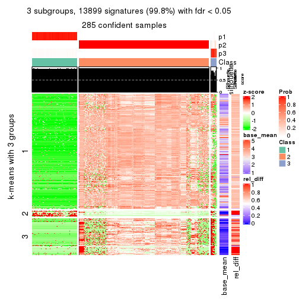</p>

</div>
<div id='tab-SD-kmeans-get-signatures-3'>
<pre><code class="r">get_signatures(res, k = 4)
</code></pre>

<p></p>

</div>
<div id='tab-SD-kmeans-get-signatures-4'>
<pre><code class="r">get_signatures(res, k = 5)
</code></pre>

<p></p>

</div>
<div id='tab-SD-kmeans-get-signatures-5'>
<pre><code class="r">get_signatures(res, k = 6)
</code></pre>

<p></p>

</div>
</div>


Signature heatmaps where rows are not scaled:


<script>
$( function() {
	$( '#tabs-SD-kmeans-get-signatures-no-scale' ).tabs();
} );
</script>
<div id='tabs-SD-kmeans-get-signatures-no-scale'>
<ul>
<li><a href='#tab-SD-kmeans-get-signatures-no-scale-1'>k = 2</a></li>
<li><a href='#tab-SD-kmeans-get-signatures-no-scale-2'>k = 3</a></li>
<li><a href='#tab-SD-kmeans-get-signatures-no-scale-3'>k = 4</a></li>
<li><a href='#tab-SD-kmeans-get-signatures-no-scale-4'>k = 5</a></li>
<li><a href='#tab-SD-kmeans-get-signatures-no-scale-5'>k = 6</a></li>
</ul>
<div id='tab-SD-kmeans-get-signatures-no-scale-1'>
<pre><code class="r">get_signatures(res, k = 2, scale_rows = FALSE)
</code></pre>

<p></p>

</div>
<div id='tab-SD-kmeans-get-signatures-no-scale-2'>
<pre><code class="r">get_signatures(res, k = 3, scale_rows = FALSE)
</code></pre>

<p></p>

</div>
<div id='tab-SD-kmeans-get-signatures-no-scale-3'>
<pre><code class="r">get_signatures(res, k = 4, scale_rows = FALSE)
</code></pre>

<p></p>

</div>
<div id='tab-SD-kmeans-get-signatures-no-scale-4'>
<pre><code class="r">get_signatures(res, k = 5, scale_rows = FALSE)
</code></pre>

<p></p>

</div>
<div id='tab-SD-kmeans-get-signatures-no-scale-5'>
<pre><code class="r">get_signatures(res, k = 6, scale_rows = FALSE)
</code></pre>

<p></p>

</div>
</div>


Compare the overlap of signatures from different k:

```r
compare_signatures(res)
```


`get_signature()` returns a data frame invisibly. TO get the list of signatures, the function
call should be assigned to a variable explicitly. In following code, if `plot` argument is set
to `FALSE`, no heatmap is plotted while only the differential analysis is performed.

```r
# code only for demonstration
tb = get_signature(res, k = ..., plot = FALSE)
```

An example of the output of `tb` is:

```
#>   which_row         fdr    mean_1    mean_2 scaled_mean_1 scaled_mean_2 km
#> 1        38 0.042760348  8.373488  9.131774    -0.5533452     0.5164555  1
#> 2        40 0.018707592  7.106213  8.469186    -0.6173731     0.5762149  1
#> 3        55 0.019134737 10.221463 11.207825    -0.6159697     0.5749050  1
#> 4        59 0.006059896  5.921854  7.869574    -0.6899429     0.6439467  1
#> 5        60 0.018055526  8.928898 10.211722    -0.6204761     0.5791110  1
#> 6        98 0.009384629 15.714769 14.887706     0.6635654    -0.6193277  2
...
```

The columns in `tb` are:

1. `which_row`: row indices corresponding to the input matrix.
2. `fdr`: FDR for the differential test. 
3. `mean_x`: The mean value in group x.
4. `scaled_mean_x`: The mean value in group x after rows are scaled.
5. `km`: Row groups if k-means clustering is applied to rows.


UMAP plot which shows how samples are separated.


<script>
$( function() {
	$( '#tabs-SD-kmeans-dimension-reduction' ).tabs();
} );
</script>
<div id='tabs-SD-kmeans-dimension-reduction'>
<ul>
<li><a href='#tab-SD-kmeans-dimension-reduction-1'>k = 2</a></li>
<li><a href='#tab-SD-kmeans-dimension-reduction-2'>k = 3</a></li>
<li><a href='#tab-SD-kmeans-dimension-reduction-3'>k = 4</a></li>
<li><a href='#tab-SD-kmeans-dimension-reduction-4'>k = 5</a></li>
<li><a href='#tab-SD-kmeans-dimension-reduction-5'>k = 6</a></li>
</ul>
<div id='tab-SD-kmeans-dimension-reduction-1'>
<pre><code class="r">dimension_reduction(res, k = 2, method = &quot;UMAP&quot;)
</code></pre>

<p></p>

</div>
<div id='tab-SD-kmeans-dimension-reduction-2'>
<pre><code class="r">dimension_reduction(res, k = 3, method = &quot;UMAP&quot;)
</code></pre>

<p></p>

</div>
<div id='tab-SD-kmeans-dimension-reduction-3'>
<pre><code class="r">dimension_reduction(res, k = 4, method = &quot;UMAP&quot;)
</code></pre>

<p></p>

</div>
<div id='tab-SD-kmeans-dimension-reduction-4'>
<pre><code class="r">dimension_reduction(res, k = 5, method = &quot;UMAP&quot;)
</code></pre>

<p></p>

</div>
<div id='tab-SD-kmeans-dimension-reduction-5'>
<pre><code class="r">dimension_reduction(res, k = 6, method = &quot;UMAP&quot;)
</code></pre>

<p></p>

</div>
</div>


Following heatmap shows how subgroups are split when increasing `k`:

```r
collect_classes(res)
```


If matrix rows can be associated to genes, consider to use `GO_Enrichment(res,
...)` to perform function enrichment for the signature genes.


 

---------------------------------------------------


### SD:skmeans*


The object with results only for a single top-value method and a single partition method 
can be extracted as:

```r
res = res_list["SD", "skmeans"]
# you can also extract it by
# res = res_list["SD:skmeans"]
```

A summary of `res` and all the functions that can be applied to it:

```r
res
```

```
#> A 'ConsensusPartition' object with k = 2, 3, 4, 5, 6.
#>   On a matrix with 13930 rows and 285 columns.
#>   Top rows (1000, 2000, 3000, 4000, 5000) are extracted by 'SD' method.
#>   Subgroups are detected by 'skmeans' method.
#>   Performed in total 1250 partitions by row resampling.
#>   Best k for subgroups seems to be 3.
#> 
#> Following methods can be applied to this 'ConsensusPartition' object:
#>  [1] "cola_report"             "collect_classes"         "collect_plots"          
#>  [4] "collect_stats"           "colnames"                "compare_signatures"     
#>  [7] "consensus_heatmap"       "dimension_reduction"     "functional_enrichment"  
#> [10] "get_anno_col"            "get_anno"                "get_classes"            
#> [13] "get_consensus"           "get_matrix"              "get_membership"         
#> [16] "get_param"               "get_signatures"          "get_stats"              
#> [19] "is_best_k"               "is_stable_k"             "membership_heatmap"     
#> [22] "ncol"                    "nrow"                    "plot_ecdf"              
#> [25] "rownames"                "select_partition_number" "show"                   
#> [28] "suggest_best_k"          "test_to_known_factors"
```

`collect_plots()` function collects all the plots made from `res` for all `k` (number of partitions)
into one single page to provide an easy and fast comparison between different `k`.

```r
collect_plots(res)
```


The plots are:

- The first row: a plot of the ECDF (Empirical cumulative distribution
  function) curves of the consensus matrix for each `k` and the heatmap of
  predicted classes for each `k`.
- The second row: heatmaps of the consensus matrix for each `k`.
- The third row: heatmaps of the membership matrix for each `k`.
- The fouth row: heatmaps of the signatures for each `k`.

All the plots in panels can be made by individual functions and they are
plotted later in this section.

`select_partition_number()` produces several plots showing different
statistics for choosing "optimized" `k`. There are following statistics:

- ECDF curves of the consensus matrix for each `k`;
- 1-PAC. [The PAC
  score](https://en.wikipedia.org/wiki/Consensus_clustering#Over-interpretation_potential_of_consensus_clustering)
  measures the proportion of the ambiguous subgrouping.
- Mean silhouette score.
- Concordance. The mean probability of fiting the consensus class ids in all
  partitions.
- Area increased. Denote $A_k$ as the area under the ECDF curve for current
  `k`, the area increased is defined as $A_k - A_{k-1}$.
- Rand index. The percent of pairs of samples that are both in a same cluster
  or both are not in a same cluster in the partition of k and k-1.
- Jaccard index. The ratio of pairs of samples are both in a same cluster in
  the partition of k and k-1 and the pairs of samples are both in a same
  cluster in the partition k or k-1.

The detailed explanations of these statistics can be found in [the cola
vignette](http://bioconductor.org/packages/devel/bioc/vignettes/cola/inst/doc/cola.html#toc_13).

Generally speaking, lower PAC score, higher mean silhouette score or higher
concordance corresponds to better partition. Rand index and Jaccard index
measure how similar the current partition is compared to partition with `k-1`.
If they are too similar, we won't accept `k` is better than `k-1`.

```r
select_partition_number(res)
```


The numeric values for all these statistics can be obtained by `get_stats()`.

```r
get_stats(res)
```

```
#>   k 1-PAC mean_silhouette concordance area_increased  Rand Jaccard
#> 2 2 1.000           0.995       0.998         0.3979 0.604   0.604
#> 3 3 0.918           0.934       0.965         0.2508 0.920   0.867
#> 4 4 0.757           0.768       0.902         0.3394 0.771   0.581
#> 5 5 0.809           0.860       0.923         0.0542 0.832   0.584
#> 6 6 0.810           0.807       0.902         0.0369 0.987   0.956
```

`suggest_best_k()` suggests the best $k$ based on these statistics. The rules are as follows:

- All $k$ with Jaccard index larger than 0.95 are removed because the increase of
  the partition number does not provides enough extra information. If all $k$ are removed,
  the best $k$ is assigned by `NA`.
- For $k$ with 1-PAC larger than 0.9, the maximal $k$ is taken as the "best k". Other $k$ is called "optional k".
- If it does not fit the second rule. The $k$ with the highest vote of highest
  1-PAC, mean silhouette and concordance is taken as the "best k".

```r
suggest_best_k(res)
```

```
#> [1] 3
#> attr(,"optional")
#> [1] 2
```

There is also optional best $k$ = 2 that is worth to check.

Following shows the table of the partitions (You need to click the **show/hide
code output** link to see it). The membership matrix (columns with name `p*`)
is inferred by
[`clue::cl_consensus()`](https://www.rdocumentation.org/link/cl_consensus?package=clue)
function with the `SE` method. Basically the value in the membership matrix
represents the probability to belong to a certain group. The finall class
label for an item is determined with the group with highest probability it
belongs to.

In `get_classes()` function, the entropy is calculated from the membership
matrix and the silhouette score is calculated from the consensus matrix.


<script>
$( function() {
	$( '#tabs-SD-skmeans-get-classes' ).tabs();
} );
</script>
<div id='tabs-SD-skmeans-get-classes'>
<ul>
<li><a href='#tab-SD-skmeans-get-classes-1'>k = 2</a></li>
<li><a href='#tab-SD-skmeans-get-classes-2'>k = 3</a></li>
<li><a href='#tab-SD-skmeans-get-classes-3'>k = 4</a></li>
<li><a href='#tab-SD-skmeans-get-classes-4'>k = 5</a></li>
<li><a href='#tab-SD-skmeans-get-classes-5'>k = 6</a></li>
</ul>

<div id='tab-SD-skmeans-get-classes-1'>
<p><a id='tab-SD-skmeans-get-classes-1-a' style='color:#0366d6' href='#'>show/hide code output</a></p>
<pre><code class="r">cbind(get_classes(res, k = 2), get_membership(res, k = 2))
</code></pre>

<pre><code>#&gt;            class entropy silhouette    p1    p2
#&gt; SRR1201591     2   0.000      0.997 0.000 1.000
#&gt; SRR1201590     2   0.000      0.997 0.000 1.000
#&gt; SRR1201593     2   0.000      0.997 0.000 1.000
#&gt; SRR1201592     2   0.000      0.997 0.000 1.000
#&gt; SRR1201617     2   0.000      0.997 0.000 1.000
#&gt; SRR1201616     2   0.000      0.997 0.000 1.000
#&gt; SRR1201619     2   0.000      0.997 0.000 1.000
#&gt; SRR1201618     2   0.000      0.997 0.000 1.000
#&gt; SRR1201620     2   0.000      0.997 0.000 1.000
#&gt; SRR1201621     2   0.000      0.997 0.000 1.000
#&gt; SRR1201623     2   0.000      0.997 0.000 1.000
#&gt; SRR1201622     2   0.000      0.997 0.000 1.000
#&gt; SRR1201624     2   0.900      0.538 0.316 0.684
#&gt; SRR1201625     2   0.000      0.997 0.000 1.000
#&gt; SRR1201626     1   0.000      0.999 1.000 0.000
#&gt; SRR1201627     1   0.000      0.999 1.000 0.000
#&gt; SRR1201628     2   0.000      0.997 0.000 1.000
#&gt; SRR1201629     2   0.000      0.997 0.000 1.000
#&gt; SRR1201630     2   0.000      0.997 0.000 1.000
#&gt; SRR1201631     2   0.000      0.997 0.000 1.000
#&gt; SRR1201641     2   0.000      0.997 0.000 1.000
#&gt; SRR1201640     2   0.000      0.997 0.000 1.000
#&gt; SRR1201643     2   0.000      0.997 0.000 1.000
#&gt; SRR1201644     2   0.000      0.997 0.000 1.000
#&gt; SRR1201661     2   0.000      0.997 0.000 1.000
#&gt; SRR1201662     2   0.000      0.997 0.000 1.000
#&gt; SRR1201663     2   0.000      0.997 0.000 1.000
#&gt; SRR1201664     2   0.000      0.997 0.000 1.000
#&gt; SRR1201665     2   0.000      0.997 0.000 1.000
#&gt; SRR1201666     2   0.000      0.997 0.000 1.000
#&gt; SRR1201667     2   0.000      0.997 0.000 1.000
#&gt; SRR1201668     2   0.000      0.997 0.000 1.000
#&gt; SRR1201670     2   0.000      0.997 0.000 1.000
#&gt; SRR1201669     2   0.000      0.997 0.000 1.000
#&gt; SRR1201673     2   0.000      0.997 0.000 1.000
#&gt; SRR1201672     2   0.000      0.997 0.000 1.000
#&gt; SRR1201671     2   0.000      0.997 0.000 1.000
#&gt; SRR1201677     2   0.000      0.997 0.000 1.000
#&gt; SRR1201676     2   0.000      0.997 0.000 1.000
#&gt; SRR1201675     2   0.000      0.997 0.000 1.000
#&gt; SRR1201674     2   0.000      0.997 0.000 1.000
#&gt; SRR1201678     2   0.000      0.997 0.000 1.000
#&gt; SRR1201682     2   0.000      0.997 0.000 1.000
#&gt; SRR1201683     2   0.000      0.997 0.000 1.000
#&gt; SRR1201680     2   0.000      0.997 0.000 1.000
#&gt; SRR1201681     2   0.000      0.997 0.000 1.000
#&gt; SRR1201679     2   0.000      0.997 0.000 1.000
#&gt; SRR1201686     2   0.000      0.997 0.000 1.000
#&gt; SRR1201687     2   0.000      0.997 0.000 1.000
#&gt; SRR1201688     2   0.000      0.997 0.000 1.000
#&gt; SRR1201689     2   0.000      0.997 0.000 1.000
#&gt; SRR1201685     2   0.000      0.997 0.000 1.000
#&gt; SRR1201692     2   0.000      0.997 0.000 1.000
#&gt; SRR1201691     2   0.000      0.997 0.000 1.000
#&gt; SRR1201690     2   0.000      0.997 0.000 1.000
#&gt; SRR1201696     2   0.000      0.997 0.000 1.000
#&gt; SRR1201695     2   0.000      0.997 0.000 1.000
#&gt; SRR1201694     2   0.000      0.997 0.000 1.000
#&gt; SRR1201693     2   0.000      0.997 0.000 1.000
#&gt; SRR1201697     2   0.000      0.997 0.000 1.000
#&gt; SRR1201698     2   0.000      0.997 0.000 1.000
#&gt; SRR1201700     2   0.000      0.997 0.000 1.000
#&gt; SRR1201708     2   0.000      0.997 0.000 1.000
#&gt; SRR1201707     2   0.000      0.997 0.000 1.000
#&gt; SRR1201706     2   0.000      0.997 0.000 1.000
#&gt; SRR1201702     2   0.000      0.997 0.000 1.000
#&gt; SRR1201705     2   0.000      0.997 0.000 1.000
#&gt; SRR1201701     2   0.000      0.997 0.000 1.000
#&gt; SRR1201704     2   0.000      0.997 0.000 1.000
#&gt; SRR1201703     2   0.000      0.997 0.000 1.000
#&gt; SRR1201716     2   0.000      0.997 0.000 1.000
#&gt; SRR1201715     2   0.000      0.997 0.000 1.000
#&gt; SRR1201717     2   0.000      0.997 0.000 1.000
#&gt; SRR1201712     2   0.000      0.997 0.000 1.000
#&gt; SRR1201709     2   0.000      0.997 0.000 1.000
#&gt; SRR1201711     2   0.000      0.997 0.000 1.000
#&gt; SRR1201714     2   0.000      0.997 0.000 1.000
#&gt; SRR1201713     2   0.000      0.997 0.000 1.000
#&gt; SRR1201710     2   0.000      0.997 0.000 1.000
#&gt; SRR1201719     2   0.000      0.997 0.000 1.000
#&gt; SRR1201718     2   0.000      0.997 0.000 1.000
#&gt; SRR1201721     2   0.000      0.997 0.000 1.000
#&gt; SRR1201720     2   0.000      0.997 0.000 1.000
#&gt; SRR1201723     2   0.000      0.997 0.000 1.000
#&gt; SRR1201722     2   0.000      0.997 0.000 1.000
#&gt; SRR1201725     2   0.000      0.997 0.000 1.000
#&gt; SRR1201724     2   0.000      0.997 0.000 1.000
#&gt; SRR1201726     2   0.000      0.997 0.000 1.000
#&gt; SRR1201727     2   0.000      0.997 0.000 1.000
#&gt; SRR1201731     2   0.000      0.997 0.000 1.000
#&gt; SRR1201730     2   0.000      0.997 0.000 1.000
#&gt; SRR1201734     2   0.000      0.997 0.000 1.000
#&gt; SRR1201733     2   0.000      0.997 0.000 1.000
#&gt; SRR1201736     2   0.000      0.997 0.000 1.000
#&gt; SRR1201737     2   0.000      0.997 0.000 1.000
#&gt; SRR1201739     2   0.000      0.997 0.000 1.000
#&gt; SRR1201738     2   0.000      0.997 0.000 1.000
#&gt; SRR1201742     2   0.000      0.997 0.000 1.000
#&gt; SRR1201743     2   0.000      0.997 0.000 1.000
#&gt; SRR1201745     2   0.000      0.997 0.000 1.000
#&gt; SRR1201744     2   0.000      0.997 0.000 1.000
#&gt; SRR1201749     2   0.000      0.997 0.000 1.000
#&gt; SRR1201750     2   0.000      0.997 0.000 1.000
#&gt; SRR1201752     2   0.000      0.997 0.000 1.000
#&gt; SRR1201751     2   0.000      0.997 0.000 1.000
#&gt; SRR1201754     2   0.000      0.997 0.000 1.000
#&gt; SRR1201753     2   0.000      0.997 0.000 1.000
#&gt; SRR1201758     2   0.000      0.997 0.000 1.000
#&gt; SRR1201759     2   0.000      0.997 0.000 1.000
#&gt; SRR1201760     2   0.000      0.997 0.000 1.000
#&gt; SRR1201761     2   0.000      0.997 0.000 1.000
#&gt; SRR1201763     2   0.722      0.750 0.200 0.800
#&gt; SRR1201762     1   0.000      0.999 1.000 0.000
#&gt; SRR1201764     2   0.000      0.997 0.000 1.000
#&gt; SRR1201766     2   0.000      0.997 0.000 1.000
#&gt; SRR1201768     2   0.000      0.997 0.000 1.000
#&gt; SRR1201769     2   0.000      0.997 0.000 1.000
#&gt; SRR1201767     2   0.000      0.997 0.000 1.000
#&gt; SRR1201770     2   0.000      0.997 0.000 1.000
#&gt; SRR1201771     2   0.000      0.997 0.000 1.000
#&gt; SRR1201772     2   0.000      0.997 0.000 1.000
#&gt; SRR1201773     2   0.000      0.997 0.000 1.000
#&gt; SRR1201774     2   0.000      0.997 0.000 1.000
#&gt; SRR1201786     2   0.000      0.997 0.000 1.000
#&gt; SRR1201784     2   0.000      0.997 0.000 1.000
#&gt; SRR1201785     2   0.000      0.997 0.000 1.000
#&gt; SRR1201778     2   0.000      0.997 0.000 1.000
#&gt; SRR1201779     2   0.000      0.997 0.000 1.000
#&gt; SRR1201781     2   0.000      0.997 0.000 1.000
#&gt; SRR1201780     2   0.000      0.997 0.000 1.000
#&gt; SRR1201783     2   0.000      0.997 0.000 1.000
#&gt; SRR1201782     2   0.000      0.997 0.000 1.000
#&gt; SRR1201798     2   0.000      0.997 0.000 1.000
#&gt; SRR1201797     2   0.000      0.997 0.000 1.000
#&gt; SRR1201796     2   0.000      0.997 0.000 1.000
#&gt; SRR1201795     2   0.000      0.997 0.000 1.000
#&gt; SRR1201799     2   0.000      0.997 0.000 1.000
#&gt; SRR1201794     2   0.000      0.997 0.000 1.000
#&gt; SRR1201793     2   0.000      0.997 0.000 1.000
#&gt; SRR1201792     2   0.000      0.997 0.000 1.000
#&gt; SRR1201791     2   0.000      0.997 0.000 1.000
#&gt; SRR1201807     2   0.000      0.997 0.000 1.000
#&gt; SRR1201808     2   0.000      0.997 0.000 1.000
#&gt; SRR1201803     2   0.000      0.997 0.000 1.000
#&gt; SRR1201804     2   0.000      0.997 0.000 1.000
#&gt; SRR1201805     2   0.000      0.997 0.000 1.000
#&gt; SRR1201806     2   0.000      0.997 0.000 1.000
#&gt; SRR1201801     2   0.000      0.997 0.000 1.000
#&gt; SRR1201802     2   0.000      0.997 0.000 1.000
#&gt; SRR1201800     2   0.000      0.997 0.000 1.000
#&gt; SRR1201814     2   0.000      0.997 0.000 1.000
#&gt; SRR1201816     2   0.000      0.997 0.000 1.000
#&gt; SRR1201815     2   0.000      0.997 0.000 1.000
#&gt; SRR1201819     2   0.000      0.997 0.000 1.000
#&gt; SRR1201820     2   0.000      0.997 0.000 1.000
#&gt; SRR1201813     2   0.000      0.997 0.000 1.000
#&gt; SRR1201817     2   0.000      0.997 0.000 1.000
#&gt; SRR1201818     2   0.000      0.997 0.000 1.000
#&gt; SRR1201825     2   0.000      0.997 0.000 1.000
#&gt; SRR1201827     2   0.000      0.997 0.000 1.000
#&gt; SRR1201828     2   0.000      0.997 0.000 1.000
#&gt; SRR1201826     2   0.000      0.997 0.000 1.000
#&gt; SRR1201829     2   0.000      0.997 0.000 1.000
#&gt; SRR1201830     2   0.000      0.997 0.000 1.000
#&gt; SRR1201831     2   0.000      0.997 0.000 1.000
#&gt; SRR1201832     2   0.000      0.997 0.000 1.000
#&gt; SRR1201833     2   0.000      0.997 0.000 1.000
#&gt; SRR1201865     2   0.000      0.997 0.000 1.000
#&gt; SRR1201866     2   0.000      0.997 0.000 1.000
#&gt; SRR1201867     2   0.000      0.997 0.000 1.000
#&gt; SRR1201861     2   0.000      0.997 0.000 1.000
#&gt; SRR1201862     2   0.000      0.997 0.000 1.000
#&gt; SRR1201863     2   0.000      0.997 0.000 1.000
#&gt; SRR1201859     2   0.000      0.997 0.000 1.000
#&gt; SRR1201864     2   0.000      0.997 0.000 1.000
#&gt; SRR1201860     2   0.000      0.997 0.000 1.000
#&gt; SRR1201873     2   0.000      0.997 0.000 1.000
#&gt; SRR1201871     2   0.000      0.997 0.000 1.000
#&gt; SRR1201872     2   0.000      0.997 0.000 1.000
#&gt; SRR1201980     2   0.000      0.997 0.000 1.000
#&gt; SRR1201979     2   0.000      0.997 0.000 1.000
#&gt; SRR1201982     2   0.000      0.997 0.000 1.000
#&gt; SRR1201981     2   0.000      0.997 0.000 1.000
#&gt; SRR1201998     2   0.000      0.997 0.000 1.000
#&gt; SRR1201996     2   0.000      0.997 0.000 1.000
#&gt; SRR1201997     2   0.000      0.997 0.000 1.000
#&gt; SRR1202005     2   0.000      0.997 0.000 1.000
#&gt; SRR1202006     2   0.000      0.997 0.000 1.000
#&gt; SRR1202088     2   0.000      0.997 0.000 1.000
#&gt; SRR1202087     2   0.000      0.997 0.000 1.000
#&gt; SRR1202093     2   0.000      0.997 0.000 1.000
#&gt; SRR1202092     2   0.000      0.997 0.000 1.000
#&gt; SRR1202288     2   0.000      0.997 0.000 1.000
#&gt; SRR1202289     2   0.000      0.997 0.000 1.000
#&gt; SRR1202299     2   0.000      0.997 0.000 1.000
#&gt; SRR1202298     2   0.000      0.997 0.000 1.000
#&gt; SRR1202303     1   0.000      0.999 1.000 0.000
#&gt; SRR1202372     2   0.000      0.997 0.000 1.000
#&gt; SRR1202371     2   0.000      0.997 0.000 1.000
#&gt; SRR1202563     2   0.000      0.997 0.000 1.000
#&gt; SRR1202565     2   0.000      0.997 0.000 1.000
#&gt; SRR1202564     2   0.000      0.997 0.000 1.000
#&gt; SRR1202649     2   0.000      0.997 0.000 1.000
#&gt; SRR1202650     2   0.000      0.997 0.000 1.000
#&gt; SRR1202651     2   0.000      0.997 0.000 1.000
#&gt; SRR1202843     1   0.000      0.999 1.000 0.000
#&gt; SRR1202844     1   0.000      0.999 1.000 0.000
#&gt; SRR1202845     2   0.000      0.997 0.000 1.000
#&gt; SRR1202847     2   0.000      0.997 0.000 1.000
#&gt; SRR1202846     2   0.000      0.997 0.000 1.000
#&gt; SRR1202945     1   0.000      0.999 1.000 0.000
#&gt; SRR1202949     1   0.000      0.999 1.000 0.000
#&gt; SRR1202977     1   0.000      0.999 1.000 0.000
#&gt; SRR1202978     1   0.000      0.999 1.000 0.000
#&gt; SRR1202979     1   0.000      0.999 1.000 0.000
#&gt; SRR1202990     1   0.000      0.999 1.000 0.000
#&gt; SRR1202999     1   0.000      0.999 1.000 0.000
#&gt; SRR1203005     1   0.000      0.999 1.000 0.000
#&gt; SRR1203006     1   0.000      0.999 1.000 0.000
#&gt; SRR1203007     1   0.000      0.999 1.000 0.000
#&gt; SRR1203009     1   0.000      0.999 1.000 0.000
#&gt; SRR1203008     1   0.000      0.999 1.000 0.000
#&gt; SRR1203010     1   0.000      0.999 1.000 0.000
#&gt; SRR1203011     1   0.000      0.999 1.000 0.000
#&gt; SRR1203025     1   0.000      0.999 1.000 0.000
#&gt; SRR1203026     1   0.000      0.999 1.000 0.000
#&gt; SRR1203027     1   0.000      0.999 1.000 0.000
#&gt; SRR1203061     1   0.000      0.999 1.000 0.000
#&gt; SRR1203089     1   0.000      0.999 1.000 0.000
#&gt; SRR1203125     1   0.000      0.999 1.000 0.000
#&gt; SRR1203128     1   0.000      0.999 1.000 0.000
#&gt; SRR1203129     1   0.000      0.999 1.000 0.000
#&gt; SRR1203130     1   0.000      0.999 1.000 0.000
#&gt; SRR1203132     2   0.000      0.997 0.000 1.000
#&gt; SRR1203131     2   0.000      0.997 0.000 1.000
#&gt; SRR1203133     1   0.000      0.999 1.000 0.000
#&gt; SRR1203138     1   0.000      0.999 1.000 0.000
#&gt; SRR1203760     1   0.000      0.999 1.000 0.000
#&gt; SRR1203761     1   0.000      0.999 1.000 0.000
#&gt; SRR1203770     1   0.000      0.999 1.000 0.000
#&gt; SRR1203771     1   0.000      0.999 1.000 0.000
#&gt; SRR1203772     1   0.000      0.999 1.000 0.000
#&gt; SRR1203773     1   0.000      0.999 1.000 0.000
#&gt; SRR1203774     1   0.000      0.999 1.000 0.000
#&gt; SRR1203775     1   0.000      0.999 1.000 0.000
#&gt; SRR1203800     1   0.000      0.999 1.000 0.000
#&gt; SRR1203801     1   0.000      0.999 1.000 0.000
#&gt; SRR1203802     1   0.000      0.999 1.000 0.000
#&gt; SRR1203803     1   0.000      0.999 1.000 0.000
#&gt; SRR1203804     1   0.000      0.999 1.000 0.000
#&gt; SRR1203805     1   0.000      0.999 1.000 0.000
#&gt; SRR1203806     1   0.000      0.999 1.000 0.000
#&gt; SRR1203807     1   0.000      0.999 1.000 0.000
#&gt; SRR1203808     1   0.000      0.999 1.000 0.000
#&gt; SRR1203811     1   0.000      0.999 1.000 0.000
#&gt; SRR1203812     1   0.000      0.999 1.000 0.000
#&gt; SRR1203813     1   0.000      0.999 1.000 0.000
#&gt; SRR1203814     1   0.000      0.999 1.000 0.000
#&gt; SRR1203815     1   0.000      0.999 1.000 0.000
#&gt; SRR1203816     1   0.000      0.999 1.000 0.000
#&gt; SRR1203817     1   0.000      0.999 1.000 0.000
#&gt; SRR1203818     1   0.000      0.999 1.000 0.000
#&gt; SRR1203819     1   0.000      0.999 1.000 0.000
#&gt; SRR1203822     1   0.000      0.999 1.000 0.000
#&gt; SRR1203823     1   0.000      0.999 1.000 0.000
#&gt; SRR1203824     1   0.000      0.999 1.000 0.000
#&gt; SRR1203825     1   0.000      0.999 1.000 0.000
#&gt; SRR1203826     1   0.000      0.999 1.000 0.000
#&gt; SRR1203827     1   0.278      0.949 0.952 0.048
#&gt; SRR1203828     1   0.000      0.999 1.000 0.000
#&gt; SRR1203829     1   0.000      0.999 1.000 0.000
#&gt; SRR1203830     1   0.000      0.999 1.000 0.000
#&gt; SRR1203831     1   0.000      0.999 1.000 0.000
#&gt; SRR1203832     1   0.000      0.999 1.000 0.000
#&gt; SRR1203833     1   0.000      0.999 1.000 0.000
#&gt; SRR1203834     1   0.000      0.999 1.000 0.000
#&gt; SRR1203835     1   0.000      0.999 1.000 0.000
#&gt; SRR1203836     1   0.000      0.999 1.000 0.000
#&gt; SRR1203837     1   0.000      0.999 1.000 0.000
#&gt; SRR1203838     1   0.000      0.999 1.000 0.000
#&gt; SRR1203839     1   0.000      0.999 1.000 0.000
#&gt; SRR1203842     1   0.000      0.999 1.000 0.000
#&gt; SRR1203843     1   0.000      0.999 1.000 0.000
#&gt; SRR1203845     2   0.000      0.997 0.000 1.000
#&gt; SRR1203844     2   0.000      0.997 0.000 1.000
</code></pre>

<script>
$('#tab-SD-skmeans-get-classes-1-a').parent().next().next().hide();
$('#tab-SD-skmeans-get-classes-1-a').click(function(){
  $('#tab-SD-skmeans-get-classes-1-a').parent().next().next().toggle();
  return(false);
});
</script>
</div>

<div id='tab-SD-skmeans-get-classes-2'>
<p><a id='tab-SD-skmeans-get-classes-2-a' style='color:#0366d6' href='#'>show/hide code output</a></p>
<pre><code class="r">cbind(get_classes(res, k = 3), get_membership(res, k = 3))
</code></pre>

<pre><code>#&gt;            class entropy silhouette    p1    p2    p3
#&gt; SRR1201591     2  0.0000      0.954 0.000 1.000 0.000
#&gt; SRR1201590     2  0.0000      0.954 0.000 1.000 0.000
#&gt; SRR1201593     2  0.0000      0.954 0.000 1.000 0.000
#&gt; SRR1201592     2  0.0000      0.954 0.000 1.000 0.000
#&gt; SRR1201617     2  0.0000      0.954 0.000 1.000 0.000
#&gt; SRR1201616     2  0.0000      0.954 0.000 1.000 0.000
#&gt; SRR1201619     2  0.0000      0.954 0.000 1.000 0.000
#&gt; SRR1201618     2  0.0000      0.954 0.000 1.000 0.000
#&gt; SRR1201620     2  0.0000      0.954 0.000 1.000 0.000
#&gt; SRR1201621     2  0.0000      0.954 0.000 1.000 0.000
#&gt; SRR1201623     2  0.5291      0.660 0.000 0.732 0.268
#&gt; SRR1201622     2  0.5591      0.595 0.000 0.696 0.304
#&gt; SRR1201624     3  0.0000      0.857 0.000 0.000 1.000
#&gt; SRR1201625     3  0.2356      0.939 0.000 0.072 0.928
#&gt; SRR1201626     1  0.0000      0.993 1.000 0.000 0.000
#&gt; SRR1201627     1  0.4555      0.755 0.800 0.000 0.200
#&gt; SRR1201628     2  0.2448      0.909 0.000 0.924 0.076
#&gt; SRR1201629     2  0.1753      0.930 0.000 0.952 0.048
#&gt; SRR1201630     2  0.0000      0.954 0.000 1.000 0.000
#&gt; SRR1201631     2  0.0000      0.954 0.000 1.000 0.000
#&gt; SRR1201641     2  0.0000      0.954 0.000 1.000 0.000
#&gt; SRR1201640     2  0.0000      0.954 0.000 1.000 0.000
#&gt; SRR1201643     2  0.1163      0.941 0.000 0.972 0.028
#&gt; SRR1201644     2  0.1031      0.943 0.000 0.976 0.024
#&gt; SRR1201661     2  0.0000      0.954 0.000 1.000 0.000
#&gt; SRR1201662     2  0.0000      0.954 0.000 1.000 0.000
#&gt; SRR1201663     3  0.3116      0.962 0.000 0.108 0.892
#&gt; SRR1201664     3  0.3116      0.962 0.000 0.108 0.892
#&gt; SRR1201665     2  0.0000      0.954 0.000 1.000 0.000
#&gt; SRR1201666     2  0.0000      0.954 0.000 1.000 0.000
#&gt; SRR1201667     2  0.0000      0.954 0.000 1.000 0.000
#&gt; SRR1201668     3  0.3116      0.962 0.000 0.108 0.892
#&gt; SRR1201670     3  0.3116      0.962 0.000 0.108 0.892
#&gt; SRR1201669     3  0.3116      0.962 0.000 0.108 0.892
#&gt; SRR1201673     2  0.0000      0.954 0.000 1.000 0.000
#&gt; SRR1201672     2  0.0000      0.954 0.000 1.000 0.000
#&gt; SRR1201671     2  0.0592      0.948 0.000 0.988 0.012
#&gt; SRR1201677     2  0.0000      0.954 0.000 1.000 0.000
#&gt; SRR1201676     2  0.0000      0.954 0.000 1.000 0.000
#&gt; SRR1201675     2  0.0000      0.954 0.000 1.000 0.000
#&gt; SRR1201674     2  0.0000      0.954 0.000 1.000 0.000
#&gt; SRR1201678     2  0.0000      0.954 0.000 1.000 0.000
#&gt; SRR1201682     2  0.0000      0.954 0.000 1.000 0.000
#&gt; SRR1201683     2  0.0000      0.954 0.000 1.000 0.000
#&gt; SRR1201680     2  0.0000      0.954 0.000 1.000 0.000
#&gt; SRR1201681     2  0.0000      0.954 0.000 1.000 0.000
#&gt; SRR1201679     2  0.0000      0.954 0.000 1.000 0.000
#&gt; SRR1201686     3  0.3116      0.962 0.000 0.108 0.892
#&gt; SRR1201687     3  0.3116      0.962 0.000 0.108 0.892
#&gt; SRR1201688     3  0.3116      0.962 0.000 0.108 0.892
#&gt; SRR1201689     3  0.3116      0.962 0.000 0.108 0.892
#&gt; SRR1201685     3  0.2625      0.950 0.000 0.084 0.916
#&gt; SRR1201692     2  0.1411      0.937 0.000 0.964 0.036
#&gt; SRR1201691     2  0.1411      0.937 0.000 0.964 0.036
#&gt; SRR1201690     2  0.1860      0.927 0.000 0.948 0.052
#&gt; SRR1201696     2  0.1411      0.937 0.000 0.964 0.036
#&gt; SRR1201695     2  0.1411      0.937 0.000 0.964 0.036
#&gt; SRR1201694     2  0.1411      0.937 0.000 0.964 0.036
#&gt; SRR1201693     2  0.1411      0.937 0.000 0.964 0.036
#&gt; SRR1201697     2  0.1411      0.937 0.000 0.964 0.036
#&gt; SRR1201698     2  0.1411      0.937 0.000 0.964 0.036
#&gt; SRR1201700     2  0.2625      0.902 0.000 0.916 0.084
#&gt; SRR1201708     2  0.2448      0.909 0.000 0.924 0.076
#&gt; SRR1201707     2  0.2448      0.909 0.000 0.924 0.076
#&gt; SRR1201706     2  0.2448      0.909 0.000 0.924 0.076
#&gt; SRR1201702     2  0.2448      0.909 0.000 0.924 0.076
#&gt; SRR1201705     2  0.2448      0.909 0.000 0.924 0.076
#&gt; SRR1201701     2  0.2448      0.909 0.000 0.924 0.076
#&gt; SRR1201704     2  0.2448      0.909 0.000 0.924 0.076
#&gt; SRR1201703     2  0.2448      0.909 0.000 0.924 0.076
#&gt; SRR1201716     2  0.5560      0.603 0.000 0.700 0.300
#&gt; SRR1201715     2  0.5560      0.603 0.000 0.700 0.300
#&gt; SRR1201717     2  0.5560      0.603 0.000 0.700 0.300
#&gt; SRR1201712     2  0.5560      0.603 0.000 0.700 0.300
#&gt; SRR1201709     2  0.5560      0.603 0.000 0.700 0.300
#&gt; SRR1201711     2  0.5560      0.603 0.000 0.700 0.300
#&gt; SRR1201714     2  0.5560      0.603 0.000 0.700 0.300
#&gt; SRR1201713     2  0.5560      0.603 0.000 0.700 0.300
#&gt; SRR1201710     2  0.5560      0.603 0.000 0.700 0.300
#&gt; SRR1201719     2  0.0000      0.954 0.000 1.000 0.000
#&gt; SRR1201718     2  0.0000      0.954 0.000 1.000 0.000
#&gt; SRR1201721     2  0.1643      0.932 0.000 0.956 0.044
#&gt; SRR1201720     2  0.2448      0.909 0.000 0.924 0.076
#&gt; SRR1201723     3  0.3116      0.962 0.000 0.108 0.892
#&gt; SRR1201722     3  0.3116      0.962 0.000 0.108 0.892
#&gt; SRR1201725     2  0.0000      0.954 0.000 1.000 0.000
#&gt; SRR1201724     2  0.0000      0.954 0.000 1.000 0.000
#&gt; SRR1201726     2  0.5560      0.603 0.000 0.700 0.300
#&gt; SRR1201727     2  0.5363      0.646 0.000 0.724 0.276
#&gt; SRR1201731     2  0.1411      0.937 0.000 0.964 0.036
#&gt; SRR1201730     2  0.1529      0.935 0.000 0.960 0.040
#&gt; SRR1201734     2  0.0000      0.954 0.000 1.000 0.000
#&gt; SRR1201733     2  0.0000      0.954 0.000 1.000 0.000
#&gt; SRR1201736     2  0.0000      0.954 0.000 1.000 0.000
#&gt; SRR1201737     2  0.0000      0.954 0.000 1.000 0.000
#&gt; SRR1201739     2  0.0000      0.954 0.000 1.000 0.000
#&gt; SRR1201738     2  0.0000      0.954 0.000 1.000 0.000
#&gt; SRR1201742     2  0.0000      0.954 0.000 1.000 0.000
#&gt; SRR1201743     2  0.0000      0.954 0.000 1.000 0.000
#&gt; SRR1201745     2  0.0000      0.954 0.000 1.000 0.000
#&gt; SRR1201744     2  0.0000      0.954 0.000 1.000 0.000
#&gt; SRR1201749     2  0.0000      0.954 0.000 1.000 0.000
#&gt; SRR1201750     2  0.0000      0.954 0.000 1.000 0.000
#&gt; SRR1201752     2  0.1411      0.937 0.000 0.964 0.036
#&gt; SRR1201751     2  0.1753      0.930 0.000 0.952 0.048
#&gt; SRR1201754     2  0.0000      0.954 0.000 1.000 0.000
#&gt; SRR1201753     2  0.0000      0.954 0.000 1.000 0.000
#&gt; SRR1201758     3  0.0892      0.883 0.000 0.020 0.980
#&gt; SRR1201759     3  0.2625      0.950 0.000 0.084 0.916
#&gt; SRR1201760     2  0.2448      0.909 0.000 0.924 0.076
#&gt; SRR1201761     2  0.2356      0.913 0.000 0.928 0.072
#&gt; SRR1201763     3  0.2878      0.792 0.096 0.000 0.904
#&gt; SRR1201762     1  0.0424      0.987 0.992 0.000 0.008
#&gt; SRR1201764     2  0.1031      0.943 0.000 0.976 0.024
#&gt; SRR1201766     2  0.0000      0.954 0.000 1.000 0.000
#&gt; SRR1201768     2  0.0000      0.954 0.000 1.000 0.000
#&gt; SRR1201769     2  0.0000      0.954 0.000 1.000 0.000
#&gt; SRR1201767     2  0.0000      0.954 0.000 1.000 0.000
#&gt; SRR1201770     2  0.0000      0.954 0.000 1.000 0.000
#&gt; SRR1201771     2  0.0000      0.954 0.000 1.000 0.000
#&gt; SRR1201772     2  0.0000      0.954 0.000 1.000 0.000
#&gt; SRR1201773     2  0.0000      0.954 0.000 1.000 0.000
#&gt; SRR1201774     2  0.0000      0.954 0.000 1.000 0.000
#&gt; SRR1201786     2  0.0000      0.954 0.000 1.000 0.000
#&gt; SRR1201784     2  0.0000      0.954 0.000 1.000 0.000
#&gt; SRR1201785     2  0.0000      0.954 0.000 1.000 0.000
#&gt; SRR1201778     2  0.0000      0.954 0.000 1.000 0.000
#&gt; SRR1201779     2  0.0000      0.954 0.000 1.000 0.000
#&gt; SRR1201781     2  0.0000      0.954 0.000 1.000 0.000
#&gt; SRR1201780     2  0.0000      0.954 0.000 1.000 0.000
#&gt; SRR1201783     2  0.0000      0.954 0.000 1.000 0.000
#&gt; SRR1201782     2  0.0000      0.954 0.000 1.000 0.000
#&gt; SRR1201798     2  0.0000      0.954 0.000 1.000 0.000
#&gt; SRR1201797     2  0.0000      0.954 0.000 1.000 0.000
#&gt; SRR1201796     2  0.0000      0.954 0.000 1.000 0.000
#&gt; SRR1201795     2  0.0000      0.954 0.000 1.000 0.000
#&gt; SRR1201799     2  0.0000      0.954 0.000 1.000 0.000
#&gt; SRR1201794     2  0.0000      0.954 0.000 1.000 0.000
#&gt; SRR1201793     2  0.0000      0.954 0.000 1.000 0.000
#&gt; SRR1201792     2  0.0000      0.954 0.000 1.000 0.000
#&gt; SRR1201791     2  0.0000      0.954 0.000 1.000 0.000
#&gt; SRR1201807     2  0.0000      0.954 0.000 1.000 0.000
#&gt; SRR1201808     2  0.0000      0.954 0.000 1.000 0.000
#&gt; SRR1201803     2  0.0000      0.954 0.000 1.000 0.000
#&gt; SRR1201804     2  0.0000      0.954 0.000 1.000 0.000
#&gt; SRR1201805     2  0.0000      0.954 0.000 1.000 0.000
#&gt; SRR1201806     2  0.0000      0.954 0.000 1.000 0.000
#&gt; SRR1201801     2  0.0000      0.954 0.000 1.000 0.000
#&gt; SRR1201802     2  0.0000      0.954 0.000 1.000 0.000
#&gt; SRR1201800     2  0.0000      0.954 0.000 1.000 0.000
#&gt; SRR1201814     2  0.0000      0.954 0.000 1.000 0.000
#&gt; SRR1201816     2  0.0000      0.954 0.000 1.000 0.000
#&gt; SRR1201815     2  0.0000      0.954 0.000 1.000 0.000
#&gt; SRR1201819     2  0.0000      0.954 0.000 1.000 0.000
#&gt; SRR1201820     2  0.0000      0.954 0.000 1.000 0.000
#&gt; SRR1201813     2  0.0000      0.954 0.000 1.000 0.000
#&gt; SRR1201817     2  0.0000      0.954 0.000 1.000 0.000
#&gt; SRR1201818     2  0.0000      0.954 0.000 1.000 0.000
#&gt; SRR1201825     2  0.5706      0.561 0.000 0.680 0.320
#&gt; SRR1201827     2  0.0000      0.954 0.000 1.000 0.000
#&gt; SRR1201828     2  0.0000      0.954 0.000 1.000 0.000
#&gt; SRR1201826     2  0.0000      0.954 0.000 1.000 0.000
#&gt; SRR1201829     2  0.0000      0.954 0.000 1.000 0.000
#&gt; SRR1201830     2  0.0000      0.954 0.000 1.000 0.000
#&gt; SRR1201831     2  0.0000      0.954 0.000 1.000 0.000
#&gt; SRR1201832     2  0.0000      0.954 0.000 1.000 0.000
#&gt; SRR1201833     2  0.0000      0.954 0.000 1.000 0.000
#&gt; SRR1201865     2  0.2356      0.913 0.000 0.928 0.072
#&gt; SRR1201866     2  0.2356      0.913 0.000 0.928 0.072
#&gt; SRR1201867     2  0.2356      0.913 0.000 0.928 0.072
#&gt; SRR1201861     2  0.2356      0.913 0.000 0.928 0.072
#&gt; SRR1201862     2  0.2356      0.913 0.000 0.928 0.072
#&gt; SRR1201863     2  0.2356      0.913 0.000 0.928 0.072
#&gt; SRR1201859     2  0.4750      0.743 0.000 0.784 0.216
#&gt; SRR1201864     2  0.2356      0.913 0.000 0.928 0.072
#&gt; SRR1201860     2  0.2356      0.913 0.000 0.928 0.072
#&gt; SRR1201873     2  0.5497      0.618 0.000 0.708 0.292
#&gt; SRR1201871     2  0.5621      0.587 0.000 0.692 0.308
#&gt; SRR1201872     2  0.5497      0.618 0.000 0.708 0.292
#&gt; SRR1201980     2  0.1411      0.937 0.000 0.964 0.036
#&gt; SRR1201979     2  0.1964      0.924 0.000 0.944 0.056
#&gt; SRR1201982     2  0.0747      0.947 0.000 0.984 0.016
#&gt; SRR1201981     2  0.1411      0.937 0.000 0.964 0.036
#&gt; SRR1201998     2  0.0000      0.954 0.000 1.000 0.000
#&gt; SRR1201996     2  0.0592      0.948 0.000 0.988 0.012
#&gt; SRR1201997     2  0.0000      0.954 0.000 1.000 0.000
#&gt; SRR1202005     2  0.0000      0.954 0.000 1.000 0.000
#&gt; SRR1202006     2  0.0000      0.954 0.000 1.000 0.000
#&gt; SRR1202088     2  0.2165      0.919 0.000 0.936 0.064
#&gt; SRR1202087     2  0.4796      0.738 0.000 0.780 0.220
#&gt; SRR1202093     2  0.0000      0.954 0.000 1.000 0.000
#&gt; SRR1202092     2  0.0000      0.954 0.000 1.000 0.000
#&gt; SRR1202288     2  0.0000      0.954 0.000 1.000 0.000
#&gt; SRR1202289     2  0.0000      0.954 0.000 1.000 0.000
#&gt; SRR1202299     2  0.0000      0.954 0.000 1.000 0.000
#&gt; SRR1202298     2  0.0000      0.954 0.000 1.000 0.000
#&gt; SRR1202303     1  0.2711      0.904 0.912 0.000 0.088
#&gt; SRR1202372     2  0.0000      0.954 0.000 1.000 0.000
#&gt; SRR1202371     2  0.0000      0.954 0.000 1.000 0.000
#&gt; SRR1202563     2  0.0000      0.954 0.000 1.000 0.000
#&gt; SRR1202565     2  0.0000      0.954 0.000 1.000 0.000
#&gt; SRR1202564     2  0.0000      0.954 0.000 1.000 0.000
#&gt; SRR1202649     2  0.0424      0.950 0.000 0.992 0.008
#&gt; SRR1202650     2  0.0000      0.954 0.000 1.000 0.000
#&gt; SRR1202651     2  0.0000      0.954 0.000 1.000 0.000
#&gt; SRR1202843     1  0.0000      0.993 1.000 0.000 0.000
#&gt; SRR1202844     1  0.0000      0.993 1.000 0.000 0.000
#&gt; SRR1202845     2  0.0000      0.954 0.000 1.000 0.000
#&gt; SRR1202847     2  0.0000      0.954 0.000 1.000 0.000
#&gt; SRR1202846     2  0.0000      0.954 0.000 1.000 0.000
#&gt; SRR1202945     1  0.0000      0.993 1.000 0.000 0.000
#&gt; SRR1202949     1  0.0000      0.993 1.000 0.000 0.000
#&gt; SRR1202977     1  0.0000      0.993 1.000 0.000 0.000
#&gt; SRR1202978     1  0.0000      0.993 1.000 0.000 0.000
#&gt; SRR1202979     1  0.0000      0.993 1.000 0.000 0.000
#&gt; SRR1202990     1  0.0000      0.993 1.000 0.000 0.000
#&gt; SRR1202999     1  0.0000      0.993 1.000 0.000 0.000
#&gt; SRR1203005     1  0.0000      0.993 1.000 0.000 0.000
#&gt; SRR1203006     1  0.0000      0.993 1.000 0.000 0.000
#&gt; SRR1203007     1  0.0000      0.993 1.000 0.000 0.000
#&gt; SRR1203009     1  0.0000      0.993 1.000 0.000 0.000
#&gt; SRR1203008     1  0.0000      0.993 1.000 0.000 0.000
#&gt; SRR1203010     1  0.0000      0.993 1.000 0.000 0.000
#&gt; SRR1203011     1  0.0000      0.993 1.000 0.000 0.000
#&gt; SRR1203025     1  0.0000      0.993 1.000 0.000 0.000
#&gt; SRR1203026     1  0.0000      0.993 1.000 0.000 0.000
#&gt; SRR1203027     1  0.0000      0.993 1.000 0.000 0.000
#&gt; SRR1203061     1  0.0000      0.993 1.000 0.000 0.000
#&gt; SRR1203089     1  0.0000      0.993 1.000 0.000 0.000
#&gt; SRR1203125     1  0.0000      0.993 1.000 0.000 0.000
#&gt; SRR1203128     1  0.0000      0.993 1.000 0.000 0.000
#&gt; SRR1203129     1  0.0000      0.993 1.000 0.000 0.000
#&gt; SRR1203130     1  0.0000      0.993 1.000 0.000 0.000
#&gt; SRR1203132     2  0.1411      0.937 0.000 0.964 0.036
#&gt; SRR1203131     2  0.1753      0.930 0.000 0.952 0.048
#&gt; SRR1203133     1  0.0000      0.993 1.000 0.000 0.000
#&gt; SRR1203138     1  0.0000      0.993 1.000 0.000 0.000
#&gt; SRR1203760     1  0.0000      0.993 1.000 0.000 0.000
#&gt; SRR1203761     1  0.0000      0.993 1.000 0.000 0.000
#&gt; SRR1203770     1  0.0000      0.993 1.000 0.000 0.000
#&gt; SRR1203771     1  0.0000      0.993 1.000 0.000 0.000
#&gt; SRR1203772     1  0.0000      0.993 1.000 0.000 0.000
#&gt; SRR1203773     1  0.0000      0.993 1.000 0.000 0.000
#&gt; SRR1203774     1  0.0000      0.993 1.000 0.000 0.000
#&gt; SRR1203775     1  0.0000      0.993 1.000 0.000 0.000
#&gt; SRR1203800     1  0.0000      0.993 1.000 0.000 0.000
#&gt; SRR1203801     1  0.0000      0.993 1.000 0.000 0.000
#&gt; SRR1203802     1  0.0000      0.993 1.000 0.000 0.000
#&gt; SRR1203803     1  0.0000      0.993 1.000 0.000 0.000
#&gt; SRR1203804     1  0.0000      0.993 1.000 0.000 0.000
#&gt; SRR1203805     1  0.0000      0.993 1.000 0.000 0.000
#&gt; SRR1203806     1  0.0000      0.993 1.000 0.000 0.000
#&gt; SRR1203807     1  0.0000      0.993 1.000 0.000 0.000
#&gt; SRR1203808     1  0.0000      0.993 1.000 0.000 0.000
#&gt; SRR1203811     1  0.0000      0.993 1.000 0.000 0.000
#&gt; SRR1203812     1  0.0000      0.993 1.000 0.000 0.000
#&gt; SRR1203813     1  0.0000      0.993 1.000 0.000 0.000
#&gt; SRR1203814     1  0.0000      0.993 1.000 0.000 0.000
#&gt; SRR1203815     1  0.0000      0.993 1.000 0.000 0.000
#&gt; SRR1203816     1  0.0000      0.993 1.000 0.000 0.000
#&gt; SRR1203817     1  0.0000      0.993 1.000 0.000 0.000
#&gt; SRR1203818     1  0.0000      0.993 1.000 0.000 0.000
#&gt; SRR1203819     1  0.0000      0.993 1.000 0.000 0.000
#&gt; SRR1203822     1  0.0000      0.993 1.000 0.000 0.000
#&gt; SRR1203823     1  0.0000      0.993 1.000 0.000 0.000
#&gt; SRR1203824     1  0.0000      0.993 1.000 0.000 0.000
#&gt; SRR1203825     1  0.0000      0.993 1.000 0.000 0.000
#&gt; SRR1203826     1  0.0000      0.993 1.000 0.000 0.000
#&gt; SRR1203827     1  0.4346      0.800 0.816 0.000 0.184
#&gt; SRR1203828     1  0.0000      0.993 1.000 0.000 0.000
#&gt; SRR1203829     1  0.0000      0.993 1.000 0.000 0.000
#&gt; SRR1203830     1  0.0000      0.993 1.000 0.000 0.000
#&gt; SRR1203831     1  0.0000      0.993 1.000 0.000 0.000
#&gt; SRR1203832     1  0.0000      0.993 1.000 0.000 0.000
#&gt; SRR1203833     1  0.0000      0.993 1.000 0.000 0.000
#&gt; SRR1203834     1  0.0000      0.993 1.000 0.000 0.000
#&gt; SRR1203835     1  0.0000      0.993 1.000 0.000 0.000
#&gt; SRR1203836     1  0.0000      0.993 1.000 0.000 0.000
#&gt; SRR1203837     1  0.0000      0.993 1.000 0.000 0.000
#&gt; SRR1203838     1  0.0000      0.993 1.000 0.000 0.000
#&gt; SRR1203839     1  0.0000      0.993 1.000 0.000 0.000
#&gt; SRR1203842     1  0.1411      0.963 0.964 0.000 0.036
#&gt; SRR1203843     1  0.0000      0.993 1.000 0.000 0.000
#&gt; SRR1203845     2  0.0000      0.954 0.000 1.000 0.000
#&gt; SRR1203844     2  0.0000      0.954 0.000 1.000 0.000
</code></pre>

<script>
$('#tab-SD-skmeans-get-classes-2-a').parent().next().next().hide();
$('#tab-SD-skmeans-get-classes-2-a').click(function(){
  $('#tab-SD-skmeans-get-classes-2-a').parent().next().next().toggle();
  return(false);
});
</script>
</div>

<div id='tab-SD-skmeans-get-classes-3'>
<p><a id='tab-SD-skmeans-get-classes-3-a' style='color:#0366d6' href='#'>show/hide code output</a></p>
<pre><code class="r">cbind(get_classes(res, k = 4), get_membership(res, k = 4))
</code></pre>

<pre><code>#&gt;            class entropy silhouette    p1    p2    p3    p4
#&gt; SRR1201591     2  0.0000     0.8296 0.000 1.000 0.000 0.000
#&gt; SRR1201590     2  0.0000     0.8296 0.000 1.000 0.000 0.000
#&gt; SRR1201593     2  0.0000     0.8296 0.000 1.000 0.000 0.000
#&gt; SRR1201592     2  0.0000     0.8296 0.000 1.000 0.000 0.000
#&gt; SRR1201617     2  0.0000     0.8296 0.000 1.000 0.000 0.000
#&gt; SRR1201616     2  0.0000     0.8296 0.000 1.000 0.000 0.000
#&gt; SRR1201619     2  0.0779     0.8187 0.000 0.980 0.004 0.016
#&gt; SRR1201618     2  0.5825     0.5601 0.000 0.664 0.068 0.268
#&gt; SRR1201620     2  0.0000     0.8296 0.000 1.000 0.000 0.000
#&gt; SRR1201621     2  0.0000     0.8296 0.000 1.000 0.000 0.000
#&gt; SRR1201623     3  0.5355     0.8093 0.000 0.020 0.620 0.360
#&gt; SRR1201622     3  0.5143     0.8005 0.000 0.012 0.628 0.360
#&gt; SRR1201624     4  0.4761     0.5990 0.000 0.000 0.372 0.628
#&gt; SRR1201625     3  0.2216     0.0839 0.000 0.000 0.908 0.092
#&gt; SRR1201626     1  0.0000     0.9872 1.000 0.000 0.000 0.000
#&gt; SRR1201627     1  0.5254     0.5908 0.672 0.000 0.028 0.300
#&gt; SRR1201628     3  0.5869     0.8195 0.000 0.044 0.596 0.360
#&gt; SRR1201629     3  0.6083     0.8170 0.000 0.056 0.584 0.360
#&gt; SRR1201630     2  0.5289     0.5303 0.000 0.636 0.020 0.344
#&gt; SRR1201631     2  0.4978     0.5690 0.000 0.664 0.012 0.324
#&gt; SRR1201641     2  0.5237     0.5176 0.000 0.628 0.016 0.356
#&gt; SRR1201640     2  0.5630     0.4829 0.000 0.608 0.032 0.360
#&gt; SRR1201643     3  0.7277     0.7259 0.000 0.156 0.484 0.360
#&gt; SRR1201644     3  0.7371     0.7086 0.000 0.168 0.472 0.360
#&gt; SRR1201661     2  0.5213     0.5530 0.000 0.652 0.020 0.328
#&gt; SRR1201662     2  0.4567     0.6418 0.000 0.740 0.016 0.244
#&gt; SRR1201663     3  0.0188     0.2789 0.000 0.000 0.996 0.004
#&gt; SRR1201664     3  0.0000     0.2861 0.000 0.000 1.000 0.000
#&gt; SRR1201665     2  0.0000     0.8296 0.000 1.000 0.000 0.000
#&gt; SRR1201666     2  0.0000     0.8296 0.000 1.000 0.000 0.000
#&gt; SRR1201667     2  0.0000     0.8296 0.000 1.000 0.000 0.000
#&gt; SRR1201668     3  0.0188     0.2789 0.000 0.000 0.996 0.004
#&gt; SRR1201670     3  0.0000     0.2861 0.000 0.000 1.000 0.000
#&gt; SRR1201669     3  0.0000     0.2861 0.000 0.000 1.000 0.000
#&gt; SRR1201673     2  0.6837     0.3229 0.000 0.544 0.116 0.340
#&gt; SRR1201672     2  0.6837     0.3229 0.000 0.544 0.116 0.340
#&gt; SRR1201671     4  0.7917    -0.5153 0.000 0.344 0.312 0.344
#&gt; SRR1201677     2  0.6837     0.3229 0.000 0.544 0.116 0.340
#&gt; SRR1201676     2  0.6837     0.3229 0.000 0.544 0.116 0.340
#&gt; SRR1201675     2  0.6837     0.3229 0.000 0.544 0.116 0.340
#&gt; SRR1201674     2  0.6837     0.3229 0.000 0.544 0.116 0.340
#&gt; SRR1201678     2  0.6837     0.3229 0.000 0.544 0.116 0.340
#&gt; SRR1201682     2  0.0000     0.8296 0.000 1.000 0.000 0.000
#&gt; SRR1201683     2  0.0000     0.8296 0.000 1.000 0.000 0.000
#&gt; SRR1201680     2  0.0000     0.8296 0.000 1.000 0.000 0.000
#&gt; SRR1201681     2  0.0000     0.8296 0.000 1.000 0.000 0.000
#&gt; SRR1201679     2  0.0000     0.8296 0.000 1.000 0.000 0.000
#&gt; SRR1201686     3  0.0188     0.2789 0.000 0.000 0.996 0.004
#&gt; SRR1201687     3  0.0188     0.2789 0.000 0.000 0.996 0.004
#&gt; SRR1201688     3  0.0188     0.2789 0.000 0.000 0.996 0.004
#&gt; SRR1201689     3  0.0188     0.2789 0.000 0.000 0.996 0.004
#&gt; SRR1201685     3  0.1940     0.1234 0.000 0.000 0.924 0.076
#&gt; SRR1201692     3  0.7310     0.7215 0.000 0.160 0.480 0.360
#&gt; SRR1201691     3  0.7310     0.7215 0.000 0.160 0.480 0.360
#&gt; SRR1201690     3  0.6396     0.8042 0.000 0.076 0.564 0.360
#&gt; SRR1201696     3  0.7310     0.7215 0.000 0.160 0.480 0.360
#&gt; SRR1201695     3  0.7310     0.7215 0.000 0.160 0.480 0.360
#&gt; SRR1201694     3  0.7310     0.7215 0.000 0.160 0.480 0.360
#&gt; SRR1201693     3  0.7310     0.7215 0.000 0.160 0.480 0.360
#&gt; SRR1201697     3  0.7310     0.7215 0.000 0.160 0.480 0.360
#&gt; SRR1201698     3  0.7310     0.7215 0.000 0.160 0.480 0.360
#&gt; SRR1201700     3  0.5869     0.8195 0.000 0.044 0.596 0.360
#&gt; SRR1201708     3  0.5869     0.8195 0.000 0.044 0.596 0.360
#&gt; SRR1201707     3  0.5869     0.8195 0.000 0.044 0.596 0.360
#&gt; SRR1201706     3  0.5869     0.8195 0.000 0.044 0.596 0.360
#&gt; SRR1201702     3  0.5869     0.8195 0.000 0.044 0.596 0.360
#&gt; SRR1201705     3  0.5869     0.8195 0.000 0.044 0.596 0.360
#&gt; SRR1201701     3  0.5869     0.8195 0.000 0.044 0.596 0.360
#&gt; SRR1201704     3  0.5869     0.8195 0.000 0.044 0.596 0.360
#&gt; SRR1201703     3  0.5869     0.8195 0.000 0.044 0.596 0.360
#&gt; SRR1201716     3  0.5355     0.8093 0.000 0.020 0.620 0.360
#&gt; SRR1201715     3  0.5355     0.8093 0.000 0.020 0.620 0.360
#&gt; SRR1201717     3  0.5355     0.8093 0.000 0.020 0.620 0.360
#&gt; SRR1201712     3  0.5355     0.8093 0.000 0.020 0.620 0.360
#&gt; SRR1201709     3  0.5253     0.8051 0.000 0.016 0.624 0.360
#&gt; SRR1201711     3  0.5355     0.8093 0.000 0.020 0.620 0.360
#&gt; SRR1201714     3  0.5355     0.8093 0.000 0.020 0.620 0.360
#&gt; SRR1201713     3  0.5355     0.8093 0.000 0.020 0.620 0.360
#&gt; SRR1201710     3  0.5355     0.8093 0.000 0.020 0.620 0.360
#&gt; SRR1201719     2  0.4978     0.5690 0.000 0.664 0.012 0.324
#&gt; SRR1201718     2  0.5252     0.5419 0.000 0.644 0.020 0.336
#&gt; SRR1201721     3  0.6083     0.8170 0.000 0.056 0.584 0.360
#&gt; SRR1201720     3  0.5869     0.8195 0.000 0.044 0.596 0.360
#&gt; SRR1201723     3  0.4134     0.6878 0.000 0.000 0.740 0.260
#&gt; SRR1201722     3  0.0000     0.2861 0.000 0.000 1.000 0.000
#&gt; SRR1201725     2  0.5495     0.5109 0.000 0.624 0.028 0.348
#&gt; SRR1201724     2  0.6665     0.3327 0.000 0.544 0.096 0.360
#&gt; SRR1201726     3  0.5253     0.8051 0.000 0.016 0.624 0.360
#&gt; SRR1201727     3  0.5355     0.8093 0.000 0.020 0.620 0.360
#&gt; SRR1201731     3  0.7139     0.7436 0.000 0.140 0.500 0.360
#&gt; SRR1201730     3  0.7101     0.7479 0.000 0.136 0.504 0.360
#&gt; SRR1201734     2  0.0000     0.8296 0.000 1.000 0.000 0.000
#&gt; SRR1201733     2  0.0000     0.8296 0.000 1.000 0.000 0.000
#&gt; SRR1201736     2  0.0524     0.8220 0.000 0.988 0.008 0.004
#&gt; SRR1201737     2  0.0000     0.8296 0.000 1.000 0.000 0.000
#&gt; SRR1201739     2  0.0000     0.8296 0.000 1.000 0.000 0.000
#&gt; SRR1201738     2  0.0000     0.8296 0.000 1.000 0.000 0.000
#&gt; SRR1201742     2  0.5839     0.5403 0.000 0.648 0.060 0.292
#&gt; SRR1201743     2  0.3725     0.6986 0.000 0.812 0.008 0.180
#&gt; SRR1201745     2  0.0000     0.8296 0.000 1.000 0.000 0.000
#&gt; SRR1201744     2  0.0000     0.8296 0.000 1.000 0.000 0.000
#&gt; SRR1201749     2  0.0000     0.8296 0.000 1.000 0.000 0.000
#&gt; SRR1201750     2  0.0000     0.8296 0.000 1.000 0.000 0.000
#&gt; SRR1201752     3  0.7277     0.7263 0.000 0.156 0.484 0.360
#&gt; SRR1201751     3  0.6508     0.7977 0.000 0.084 0.556 0.360
#&gt; SRR1201754     2  0.0000     0.8296 0.000 1.000 0.000 0.000
#&gt; SRR1201753     2  0.0000     0.8296 0.000 1.000 0.000 0.000
#&gt; SRR1201758     4  0.4989     0.5658 0.000 0.000 0.472 0.528
#&gt; SRR1201759     3  0.2149     0.0939 0.000 0.000 0.912 0.088
#&gt; SRR1201760     3  0.5869     0.8195 0.000 0.044 0.596 0.360
#&gt; SRR1201761     3  0.5869     0.8195 0.000 0.044 0.596 0.360
#&gt; SRR1201763     4  0.5954     0.5924 0.052 0.000 0.344 0.604
#&gt; SRR1201762     1  0.0592     0.9740 0.984 0.000 0.000 0.016
#&gt; SRR1201764     3  0.7870     0.4943 0.000 0.276 0.364 0.360
#&gt; SRR1201766     2  0.0000     0.8296 0.000 1.000 0.000 0.000
#&gt; SRR1201768     2  0.0000     0.8296 0.000 1.000 0.000 0.000
#&gt; SRR1201769     2  0.0000     0.8296 0.000 1.000 0.000 0.000
#&gt; SRR1201767     2  0.0000     0.8296 0.000 1.000 0.000 0.000
#&gt; SRR1201770     2  0.0000     0.8296 0.000 1.000 0.000 0.000
#&gt; SRR1201771     2  0.0000     0.8296 0.000 1.000 0.000 0.000
#&gt; SRR1201772     2  0.0000     0.8296 0.000 1.000 0.000 0.000
#&gt; SRR1201773     2  0.0000     0.8296 0.000 1.000 0.000 0.000
#&gt; SRR1201774     2  0.0000     0.8296 0.000 1.000 0.000 0.000
#&gt; SRR1201786     2  0.0000     0.8296 0.000 1.000 0.000 0.000
#&gt; SRR1201784     2  0.0000     0.8296 0.000 1.000 0.000 0.000
#&gt; SRR1201785     2  0.0000     0.8296 0.000 1.000 0.000 0.000
#&gt; SRR1201778     2  0.0000     0.8296 0.000 1.000 0.000 0.000
#&gt; SRR1201779     2  0.0000     0.8296 0.000 1.000 0.000 0.000
#&gt; SRR1201781     2  0.0000     0.8296 0.000 1.000 0.000 0.000
#&gt; SRR1201780     2  0.0000     0.8296 0.000 1.000 0.000 0.000
#&gt; SRR1201783     2  0.0000     0.8296 0.000 1.000 0.000 0.000
#&gt; SRR1201782     2  0.0000     0.8296 0.000 1.000 0.000 0.000
#&gt; SRR1201798     2  0.0000     0.8296 0.000 1.000 0.000 0.000
#&gt; SRR1201797     2  0.0000     0.8296 0.000 1.000 0.000 0.000
#&gt; SRR1201796     2  0.0000     0.8296 0.000 1.000 0.000 0.000
#&gt; SRR1201795     2  0.0000     0.8296 0.000 1.000 0.000 0.000
#&gt; SRR1201799     2  0.0000     0.8296 0.000 1.000 0.000 0.000
#&gt; SRR1201794     2  0.0000     0.8296 0.000 1.000 0.000 0.000
#&gt; SRR1201793     2  0.0000     0.8296 0.000 1.000 0.000 0.000
#&gt; SRR1201792     2  0.0000     0.8296 0.000 1.000 0.000 0.000
#&gt; SRR1201791     2  0.0000     0.8296 0.000 1.000 0.000 0.000
#&gt; SRR1201807     2  0.0000     0.8296 0.000 1.000 0.000 0.000
#&gt; SRR1201808     2  0.0000     0.8296 0.000 1.000 0.000 0.000
#&gt; SRR1201803     2  0.0000     0.8296 0.000 1.000 0.000 0.000
#&gt; SRR1201804     2  0.0000     0.8296 0.000 1.000 0.000 0.000
#&gt; SRR1201805     2  0.0000     0.8296 0.000 1.000 0.000 0.000
#&gt; SRR1201806     2  0.0000     0.8296 0.000 1.000 0.000 0.000
#&gt; SRR1201801     2  0.0000     0.8296 0.000 1.000 0.000 0.000
#&gt; SRR1201802     2  0.0000     0.8296 0.000 1.000 0.000 0.000
#&gt; SRR1201800     2  0.0000     0.8296 0.000 1.000 0.000 0.000
#&gt; SRR1201814     2  0.0000     0.8296 0.000 1.000 0.000 0.000
#&gt; SRR1201816     2  0.0000     0.8296 0.000 1.000 0.000 0.000
#&gt; SRR1201815     2  0.0000     0.8296 0.000 1.000 0.000 0.000
#&gt; SRR1201819     2  0.0000     0.8296 0.000 1.000 0.000 0.000
#&gt; SRR1201820     2  0.0000     0.8296 0.000 1.000 0.000 0.000
#&gt; SRR1201813     2  0.0000     0.8296 0.000 1.000 0.000 0.000
#&gt; SRR1201817     2  0.0000     0.8296 0.000 1.000 0.000 0.000
#&gt; SRR1201818     2  0.0000     0.8296 0.000 1.000 0.000 0.000
#&gt; SRR1201825     3  0.4889     0.7906 0.000 0.004 0.636 0.360
#&gt; SRR1201827     2  0.5713     0.4749 0.000 0.604 0.036 0.360
#&gt; SRR1201828     2  0.5713     0.4749 0.000 0.604 0.036 0.360
#&gt; SRR1201826     2  0.7534    -0.0147 0.000 0.448 0.192 0.360
#&gt; SRR1201829     2  0.5713     0.4749 0.000 0.604 0.036 0.360
#&gt; SRR1201830     2  0.5713     0.4749 0.000 0.604 0.036 0.360
#&gt; SRR1201831     2  0.5713     0.4749 0.000 0.604 0.036 0.360
#&gt; SRR1201832     2  0.5713     0.4749 0.000 0.604 0.036 0.360
#&gt; SRR1201833     2  0.5713     0.4749 0.000 0.604 0.036 0.360
#&gt; SRR1201865     3  0.6083     0.8173 0.000 0.056 0.584 0.360
#&gt; SRR1201866     3  0.6083     0.8173 0.000 0.056 0.584 0.360
#&gt; SRR1201867     3  0.6083     0.8173 0.000 0.056 0.584 0.360
#&gt; SRR1201861     3  0.6083     0.8173 0.000 0.056 0.584 0.360
#&gt; SRR1201862     3  0.6083     0.8173 0.000 0.056 0.584 0.360
#&gt; SRR1201863     3  0.6083     0.8173 0.000 0.056 0.584 0.360
#&gt; SRR1201859     3  0.5543     0.8132 0.000 0.028 0.612 0.360
#&gt; SRR1201864     3  0.6083     0.8173 0.000 0.056 0.584 0.360
#&gt; SRR1201860     3  0.6083     0.8173 0.000 0.056 0.584 0.360
#&gt; SRR1201873     3  0.5355     0.8093 0.000 0.020 0.620 0.360
#&gt; SRR1201871     3  0.5355     0.8093 0.000 0.020 0.620 0.360
#&gt; SRR1201872     3  0.5355     0.8093 0.000 0.020 0.620 0.360
#&gt; SRR1201980     3  0.7310     0.7215 0.000 0.160 0.480 0.360
#&gt; SRR1201979     3  0.6396     0.8042 0.000 0.076 0.564 0.360
#&gt; SRR1201982     3  0.7534     0.6652 0.000 0.192 0.448 0.360
#&gt; SRR1201981     3  0.7341     0.7150 0.000 0.164 0.476 0.360
#&gt; SRR1201998     2  0.7139     0.1952 0.000 0.500 0.140 0.360
#&gt; SRR1201996     2  0.7371     0.0847 0.000 0.472 0.168 0.360
#&gt; SRR1201997     2  0.6014     0.4422 0.000 0.588 0.052 0.360
#&gt; SRR1202005     2  0.3668     0.6978 0.000 0.808 0.004 0.188
#&gt; SRR1202006     2  0.1211     0.8064 0.000 0.960 0.000 0.040
#&gt; SRR1202088     3  0.7016     0.7371 0.000 0.140 0.540 0.320
#&gt; SRR1202087     3  0.5807     0.8029 0.000 0.044 0.612 0.344
#&gt; SRR1202093     2  0.0000     0.8296 0.000 1.000 0.000 0.000
#&gt; SRR1202092     2  0.1305     0.8052 0.000 0.960 0.004 0.036
#&gt; SRR1202288     2  0.0000     0.8296 0.000 1.000 0.000 0.000
#&gt; SRR1202289     2  0.0000     0.8296 0.000 1.000 0.000 0.000
#&gt; SRR1202299     2  0.0000     0.8296 0.000 1.000 0.000 0.000
#&gt; SRR1202298     2  0.0000     0.8296 0.000 1.000 0.000 0.000
#&gt; SRR1202303     1  0.5254     0.5908 0.672 0.000 0.028 0.300
#&gt; SRR1202372     2  0.0000     0.8296 0.000 1.000 0.000 0.000
#&gt; SRR1202371     2  0.0000     0.8296 0.000 1.000 0.000 0.000
#&gt; SRR1202563     2  0.5110     0.5296 0.000 0.636 0.012 0.352
#&gt; SRR1202565     2  0.4990     0.5349 0.000 0.640 0.008 0.352
#&gt; SRR1202564     2  0.4990     0.5349 0.000 0.640 0.008 0.352
#&gt; SRR1202649     2  0.7793    -0.2365 0.000 0.396 0.248 0.356
#&gt; SRR1202650     2  0.5203     0.5282 0.000 0.636 0.016 0.348
#&gt; SRR1202651     2  0.0000     0.8296 0.000 1.000 0.000 0.000
#&gt; SRR1202843     1  0.0000     0.9872 1.000 0.000 0.000 0.000
#&gt; SRR1202844     1  0.0000     0.9872 1.000 0.000 0.000 0.000
#&gt; SRR1202845     2  0.5453     0.5471 0.000 0.648 0.032 0.320
#&gt; SRR1202847     2  0.4453     0.6454 0.000 0.744 0.012 0.244
#&gt; SRR1202846     2  0.4453     0.6454 0.000 0.744 0.012 0.244
#&gt; SRR1202945     1  0.0000     0.9872 1.000 0.000 0.000 0.000
#&gt; SRR1202949     1  0.0000     0.9872 1.000 0.000 0.000 0.000
#&gt; SRR1202977     1  0.0000     0.9872 1.000 0.000 0.000 0.000
#&gt; SRR1202978     1  0.0000     0.9872 1.000 0.000 0.000 0.000
#&gt; SRR1202979     1  0.0000     0.9872 1.000 0.000 0.000 0.000
#&gt; SRR1202990     1  0.0000     0.9872 1.000 0.000 0.000 0.000
#&gt; SRR1202999     1  0.0000     0.9872 1.000 0.000 0.000 0.000
#&gt; SRR1203005     1  0.0000     0.9872 1.000 0.000 0.000 0.000
#&gt; SRR1203006     1  0.0000     0.9872 1.000 0.000 0.000 0.000
#&gt; SRR1203007     1  0.0000     0.9872 1.000 0.000 0.000 0.000
#&gt; SRR1203009     1  0.0000     0.9872 1.000 0.000 0.000 0.000
#&gt; SRR1203008     1  0.0000     0.9872 1.000 0.000 0.000 0.000
#&gt; SRR1203010     1  0.0000     0.9872 1.000 0.000 0.000 0.000
#&gt; SRR1203011     1  0.0000     0.9872 1.000 0.000 0.000 0.000
#&gt; SRR1203025     1  0.0000     0.9872 1.000 0.000 0.000 0.000
#&gt; SRR1203026     1  0.0000     0.9872 1.000 0.000 0.000 0.000
#&gt; SRR1203027     1  0.0000     0.9872 1.000 0.000 0.000 0.000
#&gt; SRR1203061     1  0.0000     0.9872 1.000 0.000 0.000 0.000
#&gt; SRR1203089     1  0.0000     0.9872 1.000 0.000 0.000 0.000
#&gt; SRR1203125     1  0.0000     0.9872 1.000 0.000 0.000 0.000
#&gt; SRR1203128     1  0.0000     0.9872 1.000 0.000 0.000 0.000
#&gt; SRR1203129     1  0.0000     0.9872 1.000 0.000 0.000 0.000
#&gt; SRR1203130     1  0.0000     0.9872 1.000 0.000 0.000 0.000
#&gt; SRR1203132     3  0.7310     0.7215 0.000 0.160 0.480 0.360
#&gt; SRR1203131     3  0.6214     0.8125 0.000 0.064 0.576 0.360
#&gt; SRR1203133     1  0.0000     0.9872 1.000 0.000 0.000 0.000
#&gt; SRR1203138     1  0.0000     0.9872 1.000 0.000 0.000 0.000
#&gt; SRR1203760     1  0.0000     0.9872 1.000 0.000 0.000 0.000
#&gt; SRR1203761     1  0.0000     0.9872 1.000 0.000 0.000 0.000
#&gt; SRR1203770     1  0.0000     0.9872 1.000 0.000 0.000 0.000
#&gt; SRR1203771     1  0.0000     0.9872 1.000 0.000 0.000 0.000
#&gt; SRR1203772     1  0.0000     0.9872 1.000 0.000 0.000 0.000
#&gt; SRR1203773     1  0.0000     0.9872 1.000 0.000 0.000 0.000
#&gt; SRR1203774     1  0.0000     0.9872 1.000 0.000 0.000 0.000
#&gt; SRR1203775     1  0.0000     0.9872 1.000 0.000 0.000 0.000
#&gt; SRR1203800     1  0.0000     0.9872 1.000 0.000 0.000 0.000
#&gt; SRR1203801     1  0.0000     0.9872 1.000 0.000 0.000 0.000
#&gt; SRR1203802     1  0.0000     0.9872 1.000 0.000 0.000 0.000
#&gt; SRR1203803     1  0.0000     0.9872 1.000 0.000 0.000 0.000
#&gt; SRR1203804     1  0.0000     0.9872 1.000 0.000 0.000 0.000
#&gt; SRR1203805     1  0.0000     0.9872 1.000 0.000 0.000 0.000
#&gt; SRR1203806     1  0.0000     0.9872 1.000 0.000 0.000 0.000
#&gt; SRR1203807     1  0.0000     0.9872 1.000 0.000 0.000 0.000
#&gt; SRR1203808     1  0.0000     0.9872 1.000 0.000 0.000 0.000
#&gt; SRR1203811     1  0.0000     0.9872 1.000 0.000 0.000 0.000
#&gt; SRR1203812     1  0.0000     0.9872 1.000 0.000 0.000 0.000
#&gt; SRR1203813     1  0.0000     0.9872 1.000 0.000 0.000 0.000
#&gt; SRR1203814     1  0.0000     0.9872 1.000 0.000 0.000 0.000
#&gt; SRR1203815     1  0.0000     0.9872 1.000 0.000 0.000 0.000
#&gt; SRR1203816     1  0.0000     0.9872 1.000 0.000 0.000 0.000
#&gt; SRR1203817     1  0.0000     0.9872 1.000 0.000 0.000 0.000
#&gt; SRR1203818     1  0.0000     0.9872 1.000 0.000 0.000 0.000
#&gt; SRR1203819     1  0.0000     0.9872 1.000 0.000 0.000 0.000
#&gt; SRR1203822     1  0.0000     0.9872 1.000 0.000 0.000 0.000
#&gt; SRR1203823     1  0.0000     0.9872 1.000 0.000 0.000 0.000
#&gt; SRR1203824     1  0.0000     0.9872 1.000 0.000 0.000 0.000
#&gt; SRR1203825     1  0.0000     0.9872 1.000 0.000 0.000 0.000
#&gt; SRR1203826     1  0.0000     0.9872 1.000 0.000 0.000 0.000
#&gt; SRR1203827     1  0.4567     0.7017 0.740 0.000 0.016 0.244
#&gt; SRR1203828     1  0.0000     0.9872 1.000 0.000 0.000 0.000
#&gt; SRR1203829     1  0.0000     0.9872 1.000 0.000 0.000 0.000
#&gt; SRR1203830     1  0.0000     0.9872 1.000 0.000 0.000 0.000
#&gt; SRR1203831     1  0.0000     0.9872 1.000 0.000 0.000 0.000
#&gt; SRR1203832     1  0.0000     0.9872 1.000 0.000 0.000 0.000
#&gt; SRR1203833     1  0.0000     0.9872 1.000 0.000 0.000 0.000
#&gt; SRR1203834     1  0.0000     0.9872 1.000 0.000 0.000 0.000
#&gt; SRR1203835     1  0.0000     0.9872 1.000 0.000 0.000 0.000
#&gt; SRR1203836     1  0.0000     0.9872 1.000 0.000 0.000 0.000
#&gt; SRR1203837     1  0.0000     0.9872 1.000 0.000 0.000 0.000
#&gt; SRR1203838     1  0.0000     0.9872 1.000 0.000 0.000 0.000
#&gt; SRR1203839     1  0.0000     0.9872 1.000 0.000 0.000 0.000
#&gt; SRR1203842     1  0.2469     0.8868 0.892 0.000 0.000 0.108
#&gt; SRR1203843     1  0.0000     0.9872 1.000 0.000 0.000 0.000
#&gt; SRR1203845     2  0.1211     0.8064 0.000 0.960 0.000 0.040
#&gt; SRR1203844     2  0.1211     0.8064 0.000 0.960 0.000 0.040
</code></pre>

<script>
$('#tab-SD-skmeans-get-classes-3-a').parent().next().next().hide();
$('#tab-SD-skmeans-get-classes-3-a').click(function(){
  $('#tab-SD-skmeans-get-classes-3-a').parent().next().next().toggle();
  return(false);
});
</script>
</div>

<div id='tab-SD-skmeans-get-classes-4'>
<p><a id='tab-SD-skmeans-get-classes-4-a' style='color:#0366d6' href='#'>show/hide code output</a></p>
<pre><code class="r">cbind(get_classes(res, k = 5), get_membership(res, k = 5))
</code></pre>

<pre><code>#&gt;            class entropy silhouette    p1    p2    p3    p4    p5
#&gt; SRR1201591     2  0.0000     0.9667 0.000 1.000 0.000 0.000 0.000
#&gt; SRR1201590     2  0.0000     0.9667 0.000 1.000 0.000 0.000 0.000
#&gt; SRR1201593     2  0.0000     0.9667 0.000 1.000 0.000 0.000 0.000
#&gt; SRR1201592     2  0.0000     0.9667 0.000 1.000 0.000 0.000 0.000
#&gt; SRR1201617     2  0.0000     0.9667 0.000 1.000 0.000 0.000 0.000
#&gt; SRR1201616     2  0.0000     0.9667 0.000 1.000 0.000 0.000 0.000
#&gt; SRR1201619     2  0.0963     0.9244 0.000 0.964 0.036 0.000 0.000
#&gt; SRR1201618     2  0.4210     0.1123 0.000 0.588 0.412 0.000 0.000
#&gt; SRR1201620     2  0.0000     0.9667 0.000 1.000 0.000 0.000 0.000
#&gt; SRR1201621     2  0.0000     0.9667 0.000 1.000 0.000 0.000 0.000
#&gt; SRR1201623     3  0.3318     0.6945 0.000 0.008 0.800 0.000 0.192
#&gt; SRR1201622     3  0.3928     0.5402 0.000 0.004 0.700 0.000 0.296
#&gt; SRR1201624     4  0.3949     0.8119 0.000 0.000 0.000 0.668 0.332
#&gt; SRR1201625     5  0.1571     0.8269 0.000 0.000 0.060 0.004 0.936
#&gt; SRR1201626     1  0.0000     0.9761 1.000 0.000 0.000 0.000 0.000
#&gt; SRR1201627     1  0.4430     0.1462 0.540 0.000 0.000 0.456 0.004
#&gt; SRR1201628     3  0.0703     0.8284 0.000 0.024 0.976 0.000 0.000
#&gt; SRR1201629     3  0.0963     0.8332 0.000 0.036 0.964 0.000 0.000
#&gt; SRR1201630     3  0.3690     0.7214 0.000 0.224 0.764 0.012 0.000
#&gt; SRR1201631     3  0.4063     0.6523 0.000 0.280 0.708 0.012 0.000
#&gt; SRR1201641     3  0.2771     0.8050 0.000 0.128 0.860 0.012 0.000
#&gt; SRR1201640     3  0.2624     0.8115 0.000 0.116 0.872 0.012 0.000
#&gt; SRR1201643     3  0.1444     0.8332 0.000 0.040 0.948 0.012 0.000
#&gt; SRR1201644     3  0.1444     0.8332 0.000 0.040 0.948 0.012 0.000
#&gt; SRR1201661     3  0.4040     0.6572 0.000 0.276 0.712 0.012 0.000
#&gt; SRR1201662     3  0.4582     0.4007 0.000 0.416 0.572 0.012 0.000
#&gt; SRR1201663     5  0.2179     0.9142 0.000 0.000 0.112 0.000 0.888
#&gt; SRR1201664     5  0.2230     0.9117 0.000 0.000 0.116 0.000 0.884
#&gt; SRR1201665     2  0.0000     0.9667 0.000 1.000 0.000 0.000 0.000
#&gt; SRR1201666     2  0.0000     0.9667 0.000 1.000 0.000 0.000 0.000
#&gt; SRR1201667     2  0.0000     0.9667 0.000 1.000 0.000 0.000 0.000
#&gt; SRR1201668     5  0.2074     0.9117 0.000 0.000 0.104 0.000 0.896
#&gt; SRR1201670     5  0.2230     0.9117 0.000 0.000 0.116 0.000 0.884
#&gt; SRR1201669     5  0.2230     0.9117 0.000 0.000 0.116 0.000 0.884
#&gt; SRR1201673     3  0.3612     0.6943 0.000 0.268 0.732 0.000 0.000
#&gt; SRR1201672     3  0.3612     0.6943 0.000 0.268 0.732 0.000 0.000
#&gt; SRR1201671     3  0.3177     0.7504 0.000 0.208 0.792 0.000 0.000
#&gt; SRR1201677     3  0.3612     0.6943 0.000 0.268 0.732 0.000 0.000
#&gt; SRR1201676     3  0.3612     0.6943 0.000 0.268 0.732 0.000 0.000
#&gt; SRR1201675     3  0.3612     0.6943 0.000 0.268 0.732 0.000 0.000
#&gt; SRR1201674     3  0.3612     0.6943 0.000 0.268 0.732 0.000 0.000
#&gt; SRR1201678     3  0.3612     0.6943 0.000 0.268 0.732 0.000 0.000
#&gt; SRR1201682     2  0.0000     0.9667 0.000 1.000 0.000 0.000 0.000
#&gt; SRR1201683     2  0.0000     0.9667 0.000 1.000 0.000 0.000 0.000
#&gt; SRR1201680     2  0.0000     0.9667 0.000 1.000 0.000 0.000 0.000
#&gt; SRR1201681     2  0.0000     0.9667 0.000 1.000 0.000 0.000 0.000
#&gt; SRR1201679     2  0.0162     0.9625 0.000 0.996 0.004 0.000 0.000
#&gt; SRR1201686     5  0.2127     0.9160 0.000 0.000 0.108 0.000 0.892
#&gt; SRR1201687     5  0.2127     0.9160 0.000 0.000 0.108 0.000 0.892
#&gt; SRR1201688     5  0.2127     0.9160 0.000 0.000 0.108 0.000 0.892
#&gt; SRR1201689     5  0.2127     0.9160 0.000 0.000 0.108 0.000 0.892
#&gt; SRR1201685     5  0.1892     0.8731 0.000 0.000 0.080 0.004 0.916
#&gt; SRR1201692     3  0.1043     0.8341 0.000 0.040 0.960 0.000 0.000
#&gt; SRR1201691     3  0.1043     0.8341 0.000 0.040 0.960 0.000 0.000
#&gt; SRR1201690     3  0.0963     0.8332 0.000 0.036 0.964 0.000 0.000
#&gt; SRR1201696     3  0.1043     0.8341 0.000 0.040 0.960 0.000 0.000
#&gt; SRR1201695     3  0.1043     0.8341 0.000 0.040 0.960 0.000 0.000
#&gt; SRR1201694     3  0.1043     0.8341 0.000 0.040 0.960 0.000 0.000
#&gt; SRR1201693     3  0.1043     0.8341 0.000 0.040 0.960 0.000 0.000
#&gt; SRR1201697     3  0.1043     0.8341 0.000 0.040 0.960 0.000 0.000
#&gt; SRR1201698     3  0.1043     0.8341 0.000 0.040 0.960 0.000 0.000
#&gt; SRR1201700     3  0.0703     0.8284 0.000 0.024 0.976 0.000 0.000
#&gt; SRR1201708     3  0.0703     0.8284 0.000 0.024 0.976 0.000 0.000
#&gt; SRR1201707     3  0.0703     0.8284 0.000 0.024 0.976 0.000 0.000
#&gt; SRR1201706     3  0.0703     0.8284 0.000 0.024 0.976 0.000 0.000
#&gt; SRR1201702     3  0.0703     0.8284 0.000 0.024 0.976 0.000 0.000
#&gt; SRR1201705     3  0.0703     0.8284 0.000 0.024 0.976 0.000 0.000
#&gt; SRR1201701     3  0.0703     0.8284 0.000 0.024 0.976 0.000 0.000
#&gt; SRR1201704     3  0.0703     0.8284 0.000 0.024 0.976 0.000 0.000
#&gt; SRR1201703     3  0.0703     0.8284 0.000 0.024 0.976 0.000 0.000
#&gt; SRR1201716     3  0.3318     0.6945 0.000 0.008 0.800 0.000 0.192
#&gt; SRR1201715     3  0.3318     0.6945 0.000 0.008 0.800 0.000 0.192
#&gt; SRR1201717     3  0.3318     0.6945 0.000 0.008 0.800 0.000 0.192
#&gt; SRR1201712     3  0.3318     0.6945 0.000 0.008 0.800 0.000 0.192
#&gt; SRR1201709     3  0.3266     0.6832 0.000 0.004 0.796 0.000 0.200
#&gt; SRR1201711     3  0.3318     0.6945 0.000 0.008 0.800 0.000 0.192
#&gt; SRR1201714     3  0.3318     0.6945 0.000 0.008 0.800 0.000 0.192
#&gt; SRR1201713     3  0.3318     0.6945 0.000 0.008 0.800 0.000 0.192
#&gt; SRR1201710     3  0.3318     0.6945 0.000 0.008 0.800 0.000 0.192
#&gt; SRR1201719     3  0.4130     0.6356 0.000 0.292 0.696 0.012 0.000
#&gt; SRR1201718     3  0.3596     0.7342 0.000 0.212 0.776 0.012 0.000
#&gt; SRR1201721     3  0.1124     0.8334 0.000 0.036 0.960 0.004 0.000
#&gt; SRR1201720     3  0.1168     0.8320 0.000 0.032 0.960 0.008 0.000
#&gt; SRR1201723     5  0.3143     0.7009 0.000 0.000 0.204 0.000 0.796
#&gt; SRR1201722     5  0.2230     0.9117 0.000 0.000 0.116 0.000 0.884
#&gt; SRR1201725     3  0.3123     0.7823 0.000 0.160 0.828 0.012 0.000
#&gt; SRR1201724     3  0.2361     0.8202 0.000 0.096 0.892 0.012 0.000
#&gt; SRR1201726     3  0.3474     0.6934 0.000 0.008 0.796 0.004 0.192
#&gt; SRR1201727     3  0.0960     0.8158 0.000 0.008 0.972 0.004 0.016
#&gt; SRR1201731     3  0.1444     0.8332 0.000 0.040 0.948 0.012 0.000
#&gt; SRR1201730     3  0.1444     0.8332 0.000 0.040 0.948 0.012 0.000
#&gt; SRR1201734     2  0.0000     0.9667 0.000 1.000 0.000 0.000 0.000
#&gt; SRR1201733     2  0.0000     0.9667 0.000 1.000 0.000 0.000 0.000
#&gt; SRR1201736     2  0.0510     0.9489 0.000 0.984 0.016 0.000 0.000
#&gt; SRR1201737     2  0.0162     0.9623 0.000 0.996 0.004 0.000 0.000
#&gt; SRR1201739     2  0.0000     0.9667 0.000 1.000 0.000 0.000 0.000
#&gt; SRR1201738     2  0.0000     0.9667 0.000 1.000 0.000 0.000 0.000
#&gt; SRR1201742     3  0.4268     0.3888 0.000 0.444 0.556 0.000 0.000
#&gt; SRR1201743     2  0.4114     0.2470 0.000 0.624 0.376 0.000 0.000
#&gt; SRR1201745     2  0.0000     0.9667 0.000 1.000 0.000 0.000 0.000
#&gt; SRR1201744     2  0.0000     0.9667 0.000 1.000 0.000 0.000 0.000
#&gt; SRR1201749     2  0.0000     0.9667 0.000 1.000 0.000 0.000 0.000
#&gt; SRR1201750     2  0.0000     0.9667 0.000 1.000 0.000 0.000 0.000
#&gt; SRR1201752     3  0.1043     0.8341 0.000 0.040 0.960 0.000 0.000
#&gt; SRR1201751     3  0.1043     0.8341 0.000 0.040 0.960 0.000 0.000
#&gt; SRR1201754     2  0.0404     0.9539 0.000 0.988 0.012 0.000 0.000
#&gt; SRR1201753     2  0.1502     0.8983 0.000 0.940 0.056 0.004 0.000
#&gt; SRR1201758     5  0.3398     0.1736 0.000 0.000 0.004 0.216 0.780
#&gt; SRR1201759     5  0.1831     0.8648 0.000 0.000 0.076 0.004 0.920
#&gt; SRR1201760     3  0.0703     0.8284 0.000 0.024 0.976 0.000 0.000
#&gt; SRR1201761     3  0.0703     0.8284 0.000 0.024 0.976 0.000 0.000
#&gt; SRR1201763     4  0.4735     0.8204 0.044 0.000 0.000 0.672 0.284
#&gt; SRR1201762     1  0.1341     0.9216 0.944 0.000 0.000 0.056 0.000
#&gt; SRR1201764     3  0.1877     0.8304 0.000 0.064 0.924 0.012 0.000
#&gt; SRR1201766     2  0.0000     0.9667 0.000 1.000 0.000 0.000 0.000
#&gt; SRR1201768     2  0.0000     0.9667 0.000 1.000 0.000 0.000 0.000
#&gt; SRR1201769     2  0.0000     0.9667 0.000 1.000 0.000 0.000 0.000
#&gt; SRR1201767     2  0.0000     0.9667 0.000 1.000 0.000 0.000 0.000
#&gt; SRR1201770     2  0.0000     0.9667 0.000 1.000 0.000 0.000 0.000
#&gt; SRR1201771     2  0.0000     0.9667 0.000 1.000 0.000 0.000 0.000
#&gt; SRR1201772     2  0.0000     0.9667 0.000 1.000 0.000 0.000 0.000
#&gt; SRR1201773     2  0.0000     0.9667 0.000 1.000 0.000 0.000 0.000
#&gt; SRR1201774     2  0.0000     0.9667 0.000 1.000 0.000 0.000 0.000
#&gt; SRR1201786     2  0.0000     0.9667 0.000 1.000 0.000 0.000 0.000
#&gt; SRR1201784     2  0.0000     0.9667 0.000 1.000 0.000 0.000 0.000
#&gt; SRR1201785     2  0.0000     0.9667 0.000 1.000 0.000 0.000 0.000
#&gt; SRR1201778     2  0.0000     0.9667 0.000 1.000 0.000 0.000 0.000
#&gt; SRR1201779     2  0.0000     0.9667 0.000 1.000 0.000 0.000 0.000
#&gt; SRR1201781     2  0.0000     0.9667 0.000 1.000 0.000 0.000 0.000
#&gt; SRR1201780     2  0.0000     0.9667 0.000 1.000 0.000 0.000 0.000
#&gt; SRR1201783     2  0.0000     0.9667 0.000 1.000 0.000 0.000 0.000
#&gt; SRR1201782     2  0.0000     0.9667 0.000 1.000 0.000 0.000 0.000
#&gt; SRR1201798     2  0.0000     0.9667 0.000 1.000 0.000 0.000 0.000
#&gt; SRR1201797     2  0.0000     0.9667 0.000 1.000 0.000 0.000 0.000
#&gt; SRR1201796     2  0.0000     0.9667 0.000 1.000 0.000 0.000 0.000
#&gt; SRR1201795     2  0.0000     0.9667 0.000 1.000 0.000 0.000 0.000
#&gt; SRR1201799     2  0.0000     0.9667 0.000 1.000 0.000 0.000 0.000
#&gt; SRR1201794     2  0.0000     0.9667 0.000 1.000 0.000 0.000 0.000
#&gt; SRR1201793     2  0.0000     0.9667 0.000 1.000 0.000 0.000 0.000
#&gt; SRR1201792     2  0.0000     0.9667 0.000 1.000 0.000 0.000 0.000
#&gt; SRR1201791     2  0.0000     0.9667 0.000 1.000 0.000 0.000 0.000
#&gt; SRR1201807     2  0.0000     0.9667 0.000 1.000 0.000 0.000 0.000
#&gt; SRR1201808     2  0.0000     0.9667 0.000 1.000 0.000 0.000 0.000
#&gt; SRR1201803     2  0.0000     0.9667 0.000 1.000 0.000 0.000 0.000
#&gt; SRR1201804     2  0.0000     0.9667 0.000 1.000 0.000 0.000 0.000
#&gt; SRR1201805     2  0.0000     0.9667 0.000 1.000 0.000 0.000 0.000
#&gt; SRR1201806     2  0.0000     0.9667 0.000 1.000 0.000 0.000 0.000
#&gt; SRR1201801     2  0.0000     0.9667 0.000 1.000 0.000 0.000 0.000
#&gt; SRR1201802     2  0.0000     0.9667 0.000 1.000 0.000 0.000 0.000
#&gt; SRR1201800     2  0.0000     0.9667 0.000 1.000 0.000 0.000 0.000
#&gt; SRR1201814     2  0.0000     0.9667 0.000 1.000 0.000 0.000 0.000
#&gt; SRR1201816     2  0.0000     0.9667 0.000 1.000 0.000 0.000 0.000
#&gt; SRR1201815     2  0.0000     0.9667 0.000 1.000 0.000 0.000 0.000
#&gt; SRR1201819     2  0.0000     0.9667 0.000 1.000 0.000 0.000 0.000
#&gt; SRR1201820     2  0.0000     0.9667 0.000 1.000 0.000 0.000 0.000
#&gt; SRR1201813     2  0.0000     0.9667 0.000 1.000 0.000 0.000 0.000
#&gt; SRR1201817     2  0.0000     0.9667 0.000 1.000 0.000 0.000 0.000
#&gt; SRR1201818     2  0.0000     0.9667 0.000 1.000 0.000 0.000 0.000
#&gt; SRR1201825     3  0.3906     0.5510 0.000 0.004 0.704 0.000 0.292
#&gt; SRR1201827     3  0.2377     0.8108 0.000 0.128 0.872 0.000 0.000
#&gt; SRR1201828     3  0.2377     0.8108 0.000 0.128 0.872 0.000 0.000
#&gt; SRR1201826     3  0.1908     0.8253 0.000 0.092 0.908 0.000 0.000
#&gt; SRR1201829     3  0.2377     0.8108 0.000 0.128 0.872 0.000 0.000
#&gt; SRR1201830     3  0.2377     0.8108 0.000 0.128 0.872 0.000 0.000
#&gt; SRR1201831     3  0.2377     0.8108 0.000 0.128 0.872 0.000 0.000
#&gt; SRR1201832     3  0.2377     0.8108 0.000 0.128 0.872 0.000 0.000
#&gt; SRR1201833     3  0.2377     0.8108 0.000 0.128 0.872 0.000 0.000
#&gt; SRR1201865     3  0.2850     0.7964 0.000 0.036 0.872 0.000 0.092
#&gt; SRR1201866     3  0.2850     0.7964 0.000 0.036 0.872 0.000 0.092
#&gt; SRR1201867     3  0.2850     0.7964 0.000 0.036 0.872 0.000 0.092
#&gt; SRR1201861     3  0.2850     0.7964 0.000 0.036 0.872 0.000 0.092
#&gt; SRR1201862     3  0.2850     0.7964 0.000 0.036 0.872 0.000 0.092
#&gt; SRR1201863     3  0.2850     0.7964 0.000 0.036 0.872 0.000 0.092
#&gt; SRR1201859     3  0.3343     0.7182 0.000 0.016 0.812 0.000 0.172
#&gt; SRR1201864     3  0.2850     0.7964 0.000 0.036 0.872 0.000 0.092
#&gt; SRR1201860     3  0.2850     0.7964 0.000 0.036 0.872 0.000 0.092
#&gt; SRR1201873     3  0.3318     0.6945 0.000 0.008 0.800 0.000 0.192
#&gt; SRR1201871     3  0.3455     0.6767 0.000 0.008 0.784 0.000 0.208
#&gt; SRR1201872     3  0.3318     0.6945 0.000 0.008 0.800 0.000 0.192
#&gt; SRR1201980     3  0.1043     0.8341 0.000 0.040 0.960 0.000 0.000
#&gt; SRR1201979     3  0.0963     0.8332 0.000 0.036 0.964 0.000 0.000
#&gt; SRR1201982     3  0.1444     0.8332 0.000 0.040 0.948 0.012 0.000
#&gt; SRR1201981     3  0.1444     0.8332 0.000 0.040 0.948 0.012 0.000
#&gt; SRR1201998     3  0.2069     0.8270 0.000 0.076 0.912 0.012 0.000
#&gt; SRR1201996     3  0.2006     0.8285 0.000 0.072 0.916 0.012 0.000
#&gt; SRR1201997     3  0.2416     0.8185 0.000 0.100 0.888 0.012 0.000
#&gt; SRR1202005     3  0.4648     0.2560 0.000 0.464 0.524 0.012 0.000
#&gt; SRR1202006     2  0.4402     0.3693 0.000 0.636 0.352 0.012 0.000
#&gt; SRR1202088     3  0.4276     0.6468 0.000 0.256 0.716 0.000 0.028
#&gt; SRR1202087     3  0.5263     0.6002 0.000 0.144 0.680 0.000 0.176
#&gt; SRR1202093     2  0.0162     0.9623 0.000 0.996 0.004 0.000 0.000
#&gt; SRR1202092     2  0.2561     0.7655 0.000 0.856 0.144 0.000 0.000
#&gt; SRR1202288     2  0.0000     0.9667 0.000 1.000 0.000 0.000 0.000
#&gt; SRR1202289     2  0.0000     0.9667 0.000 1.000 0.000 0.000 0.000
#&gt; SRR1202299     2  0.0000     0.9667 0.000 1.000 0.000 0.000 0.000
#&gt; SRR1202298     2  0.0000     0.9667 0.000 1.000 0.000 0.000 0.000
#&gt; SRR1202303     1  0.4420     0.1726 0.548 0.000 0.000 0.448 0.004
#&gt; SRR1202372     2  0.0000     0.9667 0.000 1.000 0.000 0.000 0.000
#&gt; SRR1202371     2  0.0000     0.9667 0.000 1.000 0.000 0.000 0.000
#&gt; SRR1202563     3  0.3969     0.6456 0.000 0.304 0.692 0.004 0.000
#&gt; SRR1202565     3  0.3266     0.7622 0.000 0.200 0.796 0.004 0.000
#&gt; SRR1202564     3  0.3300     0.7592 0.000 0.204 0.792 0.004 0.000
#&gt; SRR1202649     3  0.2929     0.7799 0.000 0.180 0.820 0.000 0.000
#&gt; SRR1202650     3  0.3579     0.7284 0.000 0.240 0.756 0.004 0.000
#&gt; SRR1202651     2  0.1410     0.8959 0.000 0.940 0.060 0.000 0.000
#&gt; SRR1202843     1  0.0000     0.9761 1.000 0.000 0.000 0.000 0.000
#&gt; SRR1202844     1  0.0000     0.9761 1.000 0.000 0.000 0.000 0.000
#&gt; SRR1202845     3  0.4152     0.6239 0.000 0.296 0.692 0.012 0.000
#&gt; SRR1202847     3  0.4597     0.3799 0.000 0.424 0.564 0.012 0.000
#&gt; SRR1202846     3  0.4597     0.3799 0.000 0.424 0.564 0.012 0.000
#&gt; SRR1202945     1  0.0000     0.9761 1.000 0.000 0.000 0.000 0.000
#&gt; SRR1202949     1  0.0000     0.9761 1.000 0.000 0.000 0.000 0.000
#&gt; SRR1202977     1  0.0000     0.9761 1.000 0.000 0.000 0.000 0.000
#&gt; SRR1202978     1  0.0000     0.9761 1.000 0.000 0.000 0.000 0.000
#&gt; SRR1202979     1  0.0000     0.9761 1.000 0.000 0.000 0.000 0.000
#&gt; SRR1202990     1  0.0000     0.9761 1.000 0.000 0.000 0.000 0.000
#&gt; SRR1202999     1  0.0000     0.9761 1.000 0.000 0.000 0.000 0.000
#&gt; SRR1203005     1  0.0000     0.9761 1.000 0.000 0.000 0.000 0.000
#&gt; SRR1203006     1  0.0000     0.9761 1.000 0.000 0.000 0.000 0.000
#&gt; SRR1203007     1  0.0000     0.9761 1.000 0.000 0.000 0.000 0.000
#&gt; SRR1203009     1  0.0000     0.9761 1.000 0.000 0.000 0.000 0.000
#&gt; SRR1203008     1  0.0000     0.9761 1.000 0.000 0.000 0.000 0.000
#&gt; SRR1203010     1  0.0000     0.9761 1.000 0.000 0.000 0.000 0.000
#&gt; SRR1203011     1  0.0000     0.9761 1.000 0.000 0.000 0.000 0.000
#&gt; SRR1203025     1  0.0000     0.9761 1.000 0.000 0.000 0.000 0.000
#&gt; SRR1203026     1  0.0000     0.9761 1.000 0.000 0.000 0.000 0.000
#&gt; SRR1203027     1  0.0000     0.9761 1.000 0.000 0.000 0.000 0.000
#&gt; SRR1203061     1  0.0000     0.9761 1.000 0.000 0.000 0.000 0.000
#&gt; SRR1203089     1  0.0000     0.9761 1.000 0.000 0.000 0.000 0.000
#&gt; SRR1203125     1  0.0000     0.9761 1.000 0.000 0.000 0.000 0.000
#&gt; SRR1203128     1  0.0000     0.9761 1.000 0.000 0.000 0.000 0.000
#&gt; SRR1203129     1  0.0000     0.9761 1.000 0.000 0.000 0.000 0.000
#&gt; SRR1203130     1  0.0000     0.9761 1.000 0.000 0.000 0.000 0.000
#&gt; SRR1203132     3  0.1444     0.8332 0.000 0.040 0.948 0.012 0.000
#&gt; SRR1203131     3  0.1364     0.8325 0.000 0.036 0.952 0.012 0.000
#&gt; SRR1203133     1  0.0000     0.9761 1.000 0.000 0.000 0.000 0.000
#&gt; SRR1203138     1  0.0000     0.9761 1.000 0.000 0.000 0.000 0.000
#&gt; SRR1203760     1  0.0000     0.9761 1.000 0.000 0.000 0.000 0.000
#&gt; SRR1203761     1  0.0000     0.9761 1.000 0.000 0.000 0.000 0.000
#&gt; SRR1203770     1  0.0000     0.9761 1.000 0.000 0.000 0.000 0.000
#&gt; SRR1203771     1  0.0000     0.9761 1.000 0.000 0.000 0.000 0.000
#&gt; SRR1203772     1  0.0000     0.9761 1.000 0.000 0.000 0.000 0.000
#&gt; SRR1203773     1  0.0000     0.9761 1.000 0.000 0.000 0.000 0.000
#&gt; SRR1203774     1  0.0000     0.9761 1.000 0.000 0.000 0.000 0.000
#&gt; SRR1203775     1  0.0000     0.9761 1.000 0.000 0.000 0.000 0.000
#&gt; SRR1203800     1  0.0000     0.9761 1.000 0.000 0.000 0.000 0.000
#&gt; SRR1203801     1  0.0000     0.9761 1.000 0.000 0.000 0.000 0.000
#&gt; SRR1203802     1  0.0000     0.9761 1.000 0.000 0.000 0.000 0.000
#&gt; SRR1203803     1  0.0000     0.9761 1.000 0.000 0.000 0.000 0.000
#&gt; SRR1203804     1  0.0000     0.9761 1.000 0.000 0.000 0.000 0.000
#&gt; SRR1203805     1  0.0000     0.9761 1.000 0.000 0.000 0.000 0.000
#&gt; SRR1203806     1  0.0000     0.9761 1.000 0.000 0.000 0.000 0.000
#&gt; SRR1203807     1  0.0000     0.9761 1.000 0.000 0.000 0.000 0.000
#&gt; SRR1203808     1  0.0000     0.9761 1.000 0.000 0.000 0.000 0.000
#&gt; SRR1203811     1  0.0000     0.9761 1.000 0.000 0.000 0.000 0.000
#&gt; SRR1203812     1  0.0000     0.9761 1.000 0.000 0.000 0.000 0.000
#&gt; SRR1203813     1  0.0000     0.9761 1.000 0.000 0.000 0.000 0.000
#&gt; SRR1203814     1  0.0000     0.9761 1.000 0.000 0.000 0.000 0.000
#&gt; SRR1203815     1  0.0000     0.9761 1.000 0.000 0.000 0.000 0.000
#&gt; SRR1203816     1  0.0000     0.9761 1.000 0.000 0.000 0.000 0.000
#&gt; SRR1203817     1  0.0000     0.9761 1.000 0.000 0.000 0.000 0.000
#&gt; SRR1203818     1  0.0000     0.9761 1.000 0.000 0.000 0.000 0.000
#&gt; SRR1203819     1  0.0000     0.9761 1.000 0.000 0.000 0.000 0.000
#&gt; SRR1203822     1  0.0000     0.9761 1.000 0.000 0.000 0.000 0.000
#&gt; SRR1203823     1  0.0000     0.9761 1.000 0.000 0.000 0.000 0.000
#&gt; SRR1203824     1  0.0000     0.9761 1.000 0.000 0.000 0.000 0.000
#&gt; SRR1203825     1  0.0000     0.9761 1.000 0.000 0.000 0.000 0.000
#&gt; SRR1203826     1  0.0000     0.9761 1.000 0.000 0.000 0.000 0.000
#&gt; SRR1203827     1  0.5175     0.0587 0.504 0.000 0.020 0.464 0.012
#&gt; SRR1203828     1  0.0000     0.9761 1.000 0.000 0.000 0.000 0.000
#&gt; SRR1203829     1  0.0000     0.9761 1.000 0.000 0.000 0.000 0.000
#&gt; SRR1203830     1  0.0000     0.9761 1.000 0.000 0.000 0.000 0.000
#&gt; SRR1203831     1  0.0000     0.9761 1.000 0.000 0.000 0.000 0.000
#&gt; SRR1203832     1  0.0000     0.9761 1.000 0.000 0.000 0.000 0.000
#&gt; SRR1203833     1  0.0000     0.9761 1.000 0.000 0.000 0.000 0.000
#&gt; SRR1203834     1  0.0000     0.9761 1.000 0.000 0.000 0.000 0.000
#&gt; SRR1203835     1  0.0000     0.9761 1.000 0.000 0.000 0.000 0.000
#&gt; SRR1203836     1  0.0000     0.9761 1.000 0.000 0.000 0.000 0.000
#&gt; SRR1203837     1  0.0000     0.9761 1.000 0.000 0.000 0.000 0.000
#&gt; SRR1203838     1  0.0000     0.9761 1.000 0.000 0.000 0.000 0.000
#&gt; SRR1203839     1  0.0000     0.9761 1.000 0.000 0.000 0.000 0.000
#&gt; SRR1203842     1  0.4335     0.5888 0.708 0.000 0.020 0.268 0.004
#&gt; SRR1203843     1  0.0000     0.9761 1.000 0.000 0.000 0.000 0.000
#&gt; SRR1203845     2  0.4040     0.5537 0.000 0.712 0.276 0.012 0.000
#&gt; SRR1203844     2  0.4288     0.4429 0.000 0.664 0.324 0.012 0.000
</code></pre>

<script>
$('#tab-SD-skmeans-get-classes-4-a').parent().next().next().hide();
$('#tab-SD-skmeans-get-classes-4-a').click(function(){
  $('#tab-SD-skmeans-get-classes-4-a').parent().next().next().toggle();
  return(false);
});
</script>
</div>

<div id='tab-SD-skmeans-get-classes-5'>
<p><a id='tab-SD-skmeans-get-classes-5-a' style='color:#0366d6' href='#'>show/hide code output</a></p>
<pre><code class="r">cbind(get_classes(res, k = 6), get_membership(res, k = 6))
</code></pre>

<pre><code>#&gt;            class entropy silhouette    p1    p2    p3    p4    p5    p6
#&gt; SRR1201591     2  0.0000     0.9407 0.000 1.000 0.000 0.000 0.000 0.000
#&gt; SRR1201590     2  0.0000     0.9407 0.000 1.000 0.000 0.000 0.000 0.000
#&gt; SRR1201593     2  0.0000     0.9407 0.000 1.000 0.000 0.000 0.000 0.000
#&gt; SRR1201592     2  0.0000     0.9407 0.000 1.000 0.000 0.000 0.000 0.000
#&gt; SRR1201617     2  0.0000     0.9407 0.000 1.000 0.000 0.000 0.000 0.000
#&gt; SRR1201616     2  0.0000     0.9407 0.000 1.000 0.000 0.000 0.000 0.000
#&gt; SRR1201619     2  0.1856     0.8927 0.000 0.920 0.048 0.000 0.000 0.032
#&gt; SRR1201618     2  0.4466     0.3684 0.000 0.620 0.336 0.000 0.000 0.044
#&gt; SRR1201620     2  0.0632     0.9352 0.000 0.976 0.000 0.000 0.000 0.024
#&gt; SRR1201621     2  0.0146     0.9404 0.000 0.996 0.000 0.000 0.000 0.004
#&gt; SRR1201623     3  0.4214     0.5098 0.000 0.004 0.652 0.000 0.320 0.024
#&gt; SRR1201622     3  0.4399     0.1839 0.000 0.000 0.516 0.000 0.460 0.024
#&gt; SRR1201624     4  0.4802    -0.1253 0.000 0.000 0.000 0.540 0.056 0.404
#&gt; SRR1201625     5  0.1088     0.8606 0.000 0.000 0.016 0.024 0.960 0.000
#&gt; SRR1201626     1  0.0551     0.9690 0.984 0.000 0.004 0.004 0.000 0.008
#&gt; SRR1201627     4  0.3971    -0.1155 0.448 0.000 0.004 0.548 0.000 0.000
#&gt; SRR1201628     3  0.0837     0.7837 0.000 0.004 0.972 0.000 0.004 0.020
#&gt; SRR1201629     3  0.0405     0.7839 0.000 0.004 0.988 0.000 0.000 0.008
#&gt; SRR1201630     3  0.3558     0.7164 0.000 0.088 0.800 0.000 0.000 0.112
#&gt; SRR1201631     3  0.3832     0.6981 0.000 0.104 0.776 0.000 0.000 0.120
#&gt; SRR1201641     3  0.2680     0.7549 0.000 0.032 0.860 0.000 0.000 0.108
#&gt; SRR1201640     3  0.2358     0.7593 0.000 0.016 0.876 0.000 0.000 0.108
#&gt; SRR1201643     3  0.2006     0.7618 0.000 0.004 0.892 0.000 0.000 0.104
#&gt; SRR1201644     3  0.2006     0.7618 0.000 0.004 0.892 0.000 0.000 0.104
#&gt; SRR1201661     3  0.4074     0.6765 0.000 0.140 0.752 0.000 0.000 0.108
#&gt; SRR1201662     3  0.4853     0.5395 0.000 0.248 0.644 0.000 0.000 0.108
#&gt; SRR1201663     5  0.0632     0.8837 0.000 0.000 0.024 0.000 0.976 0.000
#&gt; SRR1201664     5  0.0713     0.8816 0.000 0.000 0.028 0.000 0.972 0.000
#&gt; SRR1201665     2  0.0632     0.9333 0.000 0.976 0.000 0.000 0.000 0.024
#&gt; SRR1201666     2  0.0547     0.9348 0.000 0.980 0.000 0.000 0.000 0.020
#&gt; SRR1201667     2  0.0547     0.9348 0.000 0.980 0.000 0.000 0.000 0.020
#&gt; SRR1201668     5  0.0777     0.8814 0.000 0.000 0.024 0.000 0.972 0.004
#&gt; SRR1201670     5  0.0713     0.8816 0.000 0.000 0.028 0.000 0.972 0.000
#&gt; SRR1201669     5  0.0713     0.8816 0.000 0.000 0.028 0.000 0.972 0.000
#&gt; SRR1201673     3  0.3720     0.6371 0.000 0.236 0.736 0.000 0.000 0.028
#&gt; SRR1201672     3  0.3720     0.6371 0.000 0.236 0.736 0.000 0.000 0.028
#&gt; SRR1201671     3  0.3529     0.6626 0.000 0.208 0.764 0.000 0.000 0.028
#&gt; SRR1201677     3  0.3720     0.6371 0.000 0.236 0.736 0.000 0.000 0.028
#&gt; SRR1201676     3  0.3720     0.6371 0.000 0.236 0.736 0.000 0.000 0.028
#&gt; SRR1201675     3  0.3720     0.6371 0.000 0.236 0.736 0.000 0.000 0.028
#&gt; SRR1201674     3  0.3720     0.6371 0.000 0.236 0.736 0.000 0.000 0.028
#&gt; SRR1201678     3  0.3720     0.6371 0.000 0.236 0.736 0.000 0.000 0.028
#&gt; SRR1201682     2  0.0632     0.9346 0.000 0.976 0.000 0.000 0.000 0.024
#&gt; SRR1201683     2  0.0632     0.9346 0.000 0.976 0.000 0.000 0.000 0.024
#&gt; SRR1201680     2  0.0632     0.9346 0.000 0.976 0.000 0.000 0.000 0.024
#&gt; SRR1201681     2  0.0632     0.9346 0.000 0.976 0.000 0.000 0.000 0.024
#&gt; SRR1201679     2  0.0891     0.9311 0.000 0.968 0.008 0.000 0.000 0.024
#&gt; SRR1201686     5  0.0632     0.8837 0.000 0.000 0.024 0.000 0.976 0.000
#&gt; SRR1201687     5  0.0632     0.8837 0.000 0.000 0.024 0.000 0.976 0.000
#&gt; SRR1201688     5  0.0632     0.8837 0.000 0.000 0.024 0.000 0.976 0.000
#&gt; SRR1201689     5  0.0632     0.8837 0.000 0.000 0.024 0.000 0.976 0.000
#&gt; SRR1201685     5  0.2020     0.8317 0.000 0.000 0.020 0.020 0.920 0.040
#&gt; SRR1201692     3  0.0291     0.7843 0.000 0.004 0.992 0.000 0.000 0.004
#&gt; SRR1201691     3  0.0291     0.7843 0.000 0.004 0.992 0.000 0.000 0.004
#&gt; SRR1201690     3  0.0146     0.7843 0.000 0.004 0.996 0.000 0.000 0.000
#&gt; SRR1201696     3  0.0291     0.7843 0.000 0.004 0.992 0.000 0.000 0.004
#&gt; SRR1201695     3  0.0291     0.7843 0.000 0.004 0.992 0.000 0.000 0.004
#&gt; SRR1201694     3  0.0291     0.7843 0.000 0.004 0.992 0.000 0.000 0.004
#&gt; SRR1201693     3  0.0291     0.7843 0.000 0.004 0.992 0.000 0.000 0.004
#&gt; SRR1201697     3  0.0291     0.7843 0.000 0.004 0.992 0.000 0.000 0.004
#&gt; SRR1201698     3  0.0291     0.7843 0.000 0.004 0.992 0.000 0.000 0.004
#&gt; SRR1201700     3  0.0551     0.7838 0.000 0.004 0.984 0.000 0.004 0.008
#&gt; SRR1201708     3  0.0551     0.7838 0.000 0.004 0.984 0.000 0.004 0.008
#&gt; SRR1201707     3  0.0551     0.7838 0.000 0.004 0.984 0.000 0.004 0.008
#&gt; SRR1201706     3  0.0551     0.7838 0.000 0.004 0.984 0.000 0.004 0.008
#&gt; SRR1201702     3  0.0551     0.7838 0.000 0.004 0.984 0.000 0.004 0.008
#&gt; SRR1201705     3  0.0551     0.7838 0.000 0.004 0.984 0.000 0.004 0.008
#&gt; SRR1201701     3  0.0551     0.7838 0.000 0.004 0.984 0.000 0.004 0.008
#&gt; SRR1201704     3  0.0551     0.7838 0.000 0.004 0.984 0.000 0.004 0.008
#&gt; SRR1201703     3  0.0551     0.7838 0.000 0.004 0.984 0.000 0.004 0.008
#&gt; SRR1201716     3  0.4138     0.5127 0.000 0.004 0.656 0.000 0.320 0.020
#&gt; SRR1201715     3  0.4138     0.5127 0.000 0.004 0.656 0.000 0.320 0.020
#&gt; SRR1201717     3  0.4138     0.5127 0.000 0.004 0.656 0.000 0.320 0.020
#&gt; SRR1201712     3  0.4138     0.5127 0.000 0.004 0.656 0.000 0.320 0.020
#&gt; SRR1201709     3  0.4170     0.4998 0.000 0.004 0.648 0.000 0.328 0.020
#&gt; SRR1201711     3  0.4138     0.5127 0.000 0.004 0.656 0.000 0.320 0.020
#&gt; SRR1201714     3  0.4138     0.5127 0.000 0.004 0.656 0.000 0.320 0.020
#&gt; SRR1201713     3  0.4138     0.5127 0.000 0.004 0.656 0.000 0.320 0.020
#&gt; SRR1201710     3  0.4138     0.5127 0.000 0.004 0.656 0.000 0.320 0.020
#&gt; SRR1201719     3  0.4218     0.6588 0.000 0.156 0.736 0.000 0.000 0.108
#&gt; SRR1201718     3  0.3792     0.7032 0.000 0.112 0.780 0.000 0.000 0.108
#&gt; SRR1201721     3  0.1152     0.7796 0.000 0.004 0.952 0.000 0.000 0.044
#&gt; SRR1201720     3  0.1219     0.7787 0.000 0.004 0.948 0.000 0.000 0.048
#&gt; SRR1201723     5  0.1951     0.8049 0.000 0.000 0.076 0.000 0.908 0.016
#&gt; SRR1201722     5  0.0632     0.8837 0.000 0.000 0.024 0.000 0.976 0.000
#&gt; SRR1201725     3  0.3078     0.7431 0.000 0.056 0.836 0.000 0.000 0.108
#&gt; SRR1201724     3  0.2358     0.7585 0.000 0.016 0.876 0.000 0.000 0.108
#&gt; SRR1201726     3  0.4443     0.5279 0.000 0.000 0.648 0.000 0.300 0.052
#&gt; SRR1201727     3  0.1760     0.7812 0.000 0.004 0.928 0.000 0.020 0.048
#&gt; SRR1201731     3  0.2006     0.7618 0.000 0.004 0.892 0.000 0.000 0.104
#&gt; SRR1201730     3  0.2006     0.7618 0.000 0.004 0.892 0.000 0.000 0.104
#&gt; SRR1201734     2  0.0000     0.9407 0.000 1.000 0.000 0.000 0.000 0.000
#&gt; SRR1201733     2  0.0547     0.9353 0.000 0.980 0.000 0.000 0.000 0.020
#&gt; SRR1201736     2  0.1168     0.9222 0.000 0.956 0.016 0.000 0.000 0.028
#&gt; SRR1201737     2  0.0993     0.9286 0.000 0.964 0.012 0.000 0.000 0.024
#&gt; SRR1201739     2  0.0547     0.9348 0.000 0.980 0.000 0.000 0.000 0.020
#&gt; SRR1201738     2  0.0632     0.9333 0.000 0.976 0.000 0.000 0.000 0.024
#&gt; SRR1201742     3  0.4494     0.3244 0.000 0.424 0.544 0.000 0.000 0.032
#&gt; SRR1201743     2  0.4196     0.3843 0.000 0.640 0.332 0.000 0.000 0.028
#&gt; SRR1201745     2  0.0146     0.9404 0.000 0.996 0.000 0.000 0.000 0.004
#&gt; SRR1201744     2  0.0632     0.9358 0.000 0.976 0.000 0.000 0.000 0.024
#&gt; SRR1201749     2  0.0865     0.9321 0.000 0.964 0.000 0.000 0.000 0.036
#&gt; SRR1201750     2  0.0547     0.9413 0.000 0.980 0.000 0.000 0.000 0.020
#&gt; SRR1201752     3  0.0717     0.7843 0.000 0.008 0.976 0.000 0.000 0.016
#&gt; SRR1201751     3  0.0717     0.7843 0.000 0.008 0.976 0.000 0.000 0.016
#&gt; SRR1201754     2  0.1074     0.9199 0.000 0.960 0.028 0.000 0.000 0.012
#&gt; SRR1201753     2  0.3254     0.7581 0.000 0.820 0.124 0.000 0.000 0.056
#&gt; SRR1201758     5  0.5702     0.2112 0.000 0.000 0.000 0.180 0.496 0.324
#&gt; SRR1201759     5  0.1452     0.8580 0.000 0.000 0.020 0.020 0.948 0.012
#&gt; SRR1201760     3  0.0653     0.7833 0.000 0.004 0.980 0.000 0.004 0.012
#&gt; SRR1201761     3  0.0603     0.7838 0.000 0.004 0.980 0.000 0.000 0.016
#&gt; SRR1201763     4  0.1918    -0.0134 0.008 0.000 0.000 0.904 0.088 0.000
#&gt; SRR1201762     1  0.3494     0.6056 0.792 0.000 0.004 0.036 0.000 0.168
#&gt; SRR1201764     3  0.2624     0.7537 0.000 0.020 0.856 0.000 0.000 0.124
#&gt; SRR1201766     2  0.1007     0.9394 0.000 0.956 0.000 0.000 0.000 0.044
#&gt; SRR1201768     2  0.1007     0.9394 0.000 0.956 0.000 0.000 0.000 0.044
#&gt; SRR1201769     2  0.1007     0.9394 0.000 0.956 0.000 0.000 0.000 0.044
#&gt; SRR1201767     2  0.1007     0.9394 0.000 0.956 0.000 0.000 0.000 0.044
#&gt; SRR1201770     2  0.1007     0.9394 0.000 0.956 0.000 0.000 0.000 0.044
#&gt; SRR1201771     2  0.1007     0.9394 0.000 0.956 0.000 0.000 0.000 0.044
#&gt; SRR1201772     2  0.1007     0.9394 0.000 0.956 0.000 0.000 0.000 0.044
#&gt; SRR1201773     2  0.1007     0.9394 0.000 0.956 0.000 0.000 0.000 0.044
#&gt; SRR1201774     2  0.1007     0.9394 0.000 0.956 0.000 0.000 0.000 0.044
#&gt; SRR1201786     2  0.1007     0.9394 0.000 0.956 0.000 0.000 0.000 0.044
#&gt; SRR1201784     2  0.1007     0.9394 0.000 0.956 0.000 0.000 0.000 0.044
#&gt; SRR1201785     2  0.1007     0.9394 0.000 0.956 0.000 0.000 0.000 0.044
#&gt; SRR1201778     2  0.1007     0.9394 0.000 0.956 0.000 0.000 0.000 0.044
#&gt; SRR1201779     2  0.1007     0.9394 0.000 0.956 0.000 0.000 0.000 0.044
#&gt; SRR1201781     2  0.1007     0.9394 0.000 0.956 0.000 0.000 0.000 0.044
#&gt; SRR1201780     2  0.1007     0.9394 0.000 0.956 0.000 0.000 0.000 0.044
#&gt; SRR1201783     2  0.1007     0.9394 0.000 0.956 0.000 0.000 0.000 0.044
#&gt; SRR1201782     2  0.1007     0.9394 0.000 0.956 0.000 0.000 0.000 0.044
#&gt; SRR1201798     2  0.0000     0.9407 0.000 1.000 0.000 0.000 0.000 0.000
#&gt; SRR1201797     2  0.0000     0.9407 0.000 1.000 0.000 0.000 0.000 0.000
#&gt; SRR1201796     2  0.0000     0.9407 0.000 1.000 0.000 0.000 0.000 0.000
#&gt; SRR1201795     2  0.0000     0.9407 0.000 1.000 0.000 0.000 0.000 0.000
#&gt; SRR1201799     2  0.0000     0.9407 0.000 1.000 0.000 0.000 0.000 0.000
#&gt; SRR1201794     2  0.0000     0.9407 0.000 1.000 0.000 0.000 0.000 0.000
#&gt; SRR1201793     2  0.0000     0.9407 0.000 1.000 0.000 0.000 0.000 0.000
#&gt; SRR1201792     2  0.0000     0.9407 0.000 1.000 0.000 0.000 0.000 0.000
#&gt; SRR1201791     2  0.0146     0.9399 0.000 0.996 0.000 0.000 0.000 0.004
#&gt; SRR1201807     2  0.1007     0.9401 0.000 0.956 0.000 0.000 0.000 0.044
#&gt; SRR1201808     2  0.1007     0.9401 0.000 0.956 0.000 0.000 0.000 0.044
#&gt; SRR1201803     2  0.1007     0.9401 0.000 0.956 0.000 0.000 0.000 0.044
#&gt; SRR1201804     2  0.1007     0.9401 0.000 0.956 0.000 0.000 0.000 0.044
#&gt; SRR1201805     2  0.1007     0.9401 0.000 0.956 0.000 0.000 0.000 0.044
#&gt; SRR1201806     2  0.1007     0.9401 0.000 0.956 0.000 0.000 0.000 0.044
#&gt; SRR1201801     2  0.1007     0.9401 0.000 0.956 0.000 0.000 0.000 0.044
#&gt; SRR1201802     2  0.1007     0.9401 0.000 0.956 0.000 0.000 0.000 0.044
#&gt; SRR1201800     2  0.1007     0.9401 0.000 0.956 0.000 0.000 0.000 0.044
#&gt; SRR1201814     2  0.1075     0.9392 0.000 0.952 0.000 0.000 0.000 0.048
#&gt; SRR1201816     2  0.1075     0.9392 0.000 0.952 0.000 0.000 0.000 0.048
#&gt; SRR1201815     2  0.1075     0.9392 0.000 0.952 0.000 0.000 0.000 0.048
#&gt; SRR1201819     2  0.1075     0.9392 0.000 0.952 0.000 0.000 0.000 0.048
#&gt; SRR1201820     2  0.1075     0.9392 0.000 0.952 0.000 0.000 0.000 0.048
#&gt; SRR1201813     2  0.1075     0.9392 0.000 0.952 0.000 0.000 0.000 0.048
#&gt; SRR1201817     2  0.1075     0.9392 0.000 0.952 0.000 0.000 0.000 0.048
#&gt; SRR1201818     2  0.1075     0.9392 0.000 0.952 0.000 0.000 0.000 0.048
#&gt; SRR1201825     5  0.4779    -0.1218 0.000 0.004 0.468 0.000 0.488 0.040
#&gt; SRR1201827     3  0.2088     0.7730 0.000 0.068 0.904 0.000 0.000 0.028
#&gt; SRR1201828     3  0.2145     0.7713 0.000 0.072 0.900 0.000 0.000 0.028
#&gt; SRR1201826     3  0.1572     0.7821 0.000 0.036 0.936 0.000 0.000 0.028
#&gt; SRR1201829     3  0.2145     0.7713 0.000 0.072 0.900 0.000 0.000 0.028
#&gt; SRR1201830     3  0.2145     0.7713 0.000 0.072 0.900 0.000 0.000 0.028
#&gt; SRR1201831     3  0.2145     0.7713 0.000 0.072 0.900 0.000 0.000 0.028
#&gt; SRR1201832     3  0.2145     0.7713 0.000 0.072 0.900 0.000 0.000 0.028
#&gt; SRR1201833     3  0.2145     0.7713 0.000 0.072 0.900 0.000 0.000 0.028
#&gt; SRR1201865     3  0.3819     0.6576 0.000 0.004 0.756 0.000 0.200 0.040
#&gt; SRR1201866     3  0.3819     0.6576 0.000 0.004 0.756 0.000 0.200 0.040
#&gt; SRR1201867     3  0.3819     0.6576 0.000 0.004 0.756 0.000 0.200 0.040
#&gt; SRR1201861     3  0.3819     0.6576 0.000 0.004 0.756 0.000 0.200 0.040
#&gt; SRR1201862     3  0.3819     0.6576 0.000 0.004 0.756 0.000 0.200 0.040
#&gt; SRR1201863     3  0.3819     0.6576 0.000 0.004 0.756 0.000 0.200 0.040
#&gt; SRR1201859     3  0.4427     0.5396 0.000 0.004 0.660 0.000 0.292 0.044
#&gt; SRR1201864     3  0.3819     0.6576 0.000 0.004 0.756 0.000 0.200 0.040
#&gt; SRR1201860     3  0.3819     0.6576 0.000 0.004 0.756 0.000 0.200 0.040
#&gt; SRR1201873     3  0.4214     0.5098 0.000 0.004 0.652 0.000 0.320 0.024
#&gt; SRR1201871     3  0.4423     0.4327 0.000 0.004 0.608 0.000 0.360 0.028
#&gt; SRR1201872     3  0.4214     0.5098 0.000 0.004 0.652 0.000 0.320 0.024
#&gt; SRR1201980     3  0.0291     0.7843 0.000 0.004 0.992 0.000 0.000 0.004
#&gt; SRR1201979     3  0.0405     0.7844 0.000 0.004 0.988 0.000 0.000 0.008
#&gt; SRR1201982     3  0.2006     0.7618 0.000 0.004 0.892 0.000 0.000 0.104
#&gt; SRR1201981     3  0.2006     0.7618 0.000 0.004 0.892 0.000 0.000 0.104
#&gt; SRR1201998     3  0.2053     0.7609 0.000 0.004 0.888 0.000 0.000 0.108
#&gt; SRR1201996     3  0.2053     0.7609 0.000 0.004 0.888 0.000 0.000 0.108
#&gt; SRR1201997     3  0.2165     0.7609 0.000 0.008 0.884 0.000 0.000 0.108
#&gt; SRR1202005     3  0.4953     0.5132 0.000 0.268 0.624 0.000 0.000 0.108
#&gt; SRR1202006     3  0.5360     0.1564 0.000 0.436 0.456 0.000 0.000 0.108
#&gt; SRR1202088     3  0.5659     0.4835 0.000 0.260 0.596 0.000 0.112 0.032
#&gt; SRR1202087     3  0.6179     0.3361 0.000 0.148 0.512 0.000 0.304 0.036
#&gt; SRR1202093     2  0.0806     0.9310 0.000 0.972 0.008 0.000 0.000 0.020
#&gt; SRR1202092     2  0.2558     0.8139 0.000 0.868 0.104 0.000 0.000 0.028
#&gt; SRR1202288     2  0.0547     0.9353 0.000 0.980 0.000 0.000 0.000 0.020
#&gt; SRR1202289     2  0.0000     0.9407 0.000 1.000 0.000 0.000 0.000 0.000
#&gt; SRR1202299     2  0.1007     0.9401 0.000 0.956 0.000 0.000 0.000 0.044
#&gt; SRR1202298     2  0.1007     0.9401 0.000 0.956 0.000 0.000 0.000 0.044
#&gt; SRR1202303     4  0.3979    -0.1154 0.456 0.000 0.004 0.540 0.000 0.000
#&gt; SRR1202372     2  0.0146     0.9404 0.000 0.996 0.000 0.000 0.000 0.004
#&gt; SRR1202371     2  0.0713     0.9332 0.000 0.972 0.000 0.000 0.000 0.028
#&gt; SRR1202563     3  0.4570     0.5975 0.000 0.252 0.668 0.000 0.000 0.080
#&gt; SRR1202565     3  0.3618     0.6850 0.000 0.192 0.768 0.000 0.000 0.040
#&gt; SRR1202564     3  0.3683     0.6840 0.000 0.192 0.764 0.000 0.000 0.044
#&gt; SRR1202649     3  0.3381     0.7063 0.000 0.156 0.800 0.000 0.000 0.044
#&gt; SRR1202650     3  0.3587     0.6819 0.000 0.188 0.772 0.000 0.000 0.040
#&gt; SRR1202651     2  0.2301     0.8382 0.000 0.884 0.096 0.000 0.000 0.020
#&gt; SRR1202843     1  0.0146     0.9823 0.996 0.000 0.000 0.004 0.000 0.000
#&gt; SRR1202844     1  0.0146     0.9823 0.996 0.000 0.000 0.004 0.000 0.000
#&gt; SRR1202845     3  0.4425     0.6373 0.000 0.152 0.716 0.000 0.000 0.132
#&gt; SRR1202847     3  0.5089     0.5089 0.000 0.244 0.620 0.000 0.000 0.136
#&gt; SRR1202846     3  0.5089     0.5089 0.000 0.244 0.620 0.000 0.000 0.136
#&gt; SRR1202945     1  0.0146     0.9823 0.996 0.000 0.000 0.004 0.000 0.000
#&gt; SRR1202949     1  0.0146     0.9818 0.996 0.000 0.000 0.000 0.000 0.004
#&gt; SRR1202977     1  0.0146     0.9818 0.996 0.000 0.000 0.000 0.000 0.004
#&gt; SRR1202978     1  0.0000     0.9827 1.000 0.000 0.000 0.000 0.000 0.000
#&gt; SRR1202979     1  0.0000     0.9827 1.000 0.000 0.000 0.000 0.000 0.000
#&gt; SRR1202990     1  0.0146     0.9818 0.996 0.000 0.000 0.000 0.000 0.004
#&gt; SRR1202999     1  0.0146     0.9823 0.996 0.000 0.000 0.004 0.000 0.000
#&gt; SRR1203005     1  0.0146     0.9823 0.996 0.000 0.000 0.004 0.000 0.000
#&gt; SRR1203006     1  0.0146     0.9823 0.996 0.000 0.000 0.004 0.000 0.000
#&gt; SRR1203007     1  0.0146     0.9823 0.996 0.000 0.000 0.004 0.000 0.000
#&gt; SRR1203009     1  0.0146     0.9818 0.996 0.000 0.000 0.000 0.000 0.004
#&gt; SRR1203008     1  0.0146     0.9818 0.996 0.000 0.000 0.000 0.000 0.004
#&gt; SRR1203010     1  0.0146     0.9818 0.996 0.000 0.000 0.000 0.000 0.004
#&gt; SRR1203011     1  0.0000     0.9827 1.000 0.000 0.000 0.000 0.000 0.000
#&gt; SRR1203025     1  0.0146     0.9818 0.996 0.000 0.000 0.000 0.000 0.004
#&gt; SRR1203026     1  0.0146     0.9818 0.996 0.000 0.000 0.000 0.000 0.004
#&gt; SRR1203027     1  0.0146     0.9818 0.996 0.000 0.000 0.000 0.000 0.004
#&gt; SRR1203061     1  0.0000     0.9827 1.000 0.000 0.000 0.000 0.000 0.000
#&gt; SRR1203089     1  0.0146     0.9818 0.996 0.000 0.000 0.000 0.000 0.004
#&gt; SRR1203125     1  0.0146     0.9818 0.996 0.000 0.000 0.000 0.000 0.004
#&gt; SRR1203128     1  0.0146     0.9823 0.996 0.000 0.000 0.004 0.000 0.000
#&gt; SRR1203129     1  0.0146     0.9823 0.996 0.000 0.000 0.004 0.000 0.000
#&gt; SRR1203130     1  0.0146     0.9823 0.996 0.000 0.000 0.004 0.000 0.000
#&gt; SRR1203132     3  0.2006     0.7618 0.000 0.004 0.892 0.000 0.000 0.104
#&gt; SRR1203131     3  0.1858     0.7661 0.000 0.004 0.904 0.000 0.000 0.092
#&gt; SRR1203133     1  0.0146     0.9823 0.996 0.000 0.000 0.004 0.000 0.000
#&gt; SRR1203138     1  0.0146     0.9823 0.996 0.000 0.000 0.004 0.000 0.000
#&gt; SRR1203760     1  0.0000     0.9827 1.000 0.000 0.000 0.000 0.000 0.000
#&gt; SRR1203761     1  0.0146     0.9818 0.996 0.000 0.000 0.000 0.000 0.004
#&gt; SRR1203770     1  0.0146     0.9823 0.996 0.000 0.000 0.004 0.000 0.000
#&gt; SRR1203771     1  0.0146     0.9818 0.996 0.000 0.000 0.000 0.000 0.004
#&gt; SRR1203772     1  0.0146     0.9823 0.996 0.000 0.000 0.004 0.000 0.000
#&gt; SRR1203773     1  0.0146     0.9823 0.996 0.000 0.000 0.004 0.000 0.000
#&gt; SRR1203774     1  0.0146     0.9818 0.996 0.000 0.000 0.000 0.000 0.004
#&gt; SRR1203775     1  0.0146     0.9818 0.996 0.000 0.000 0.000 0.000 0.004
#&gt; SRR1203800     1  0.0000     0.9827 1.000 0.000 0.000 0.000 0.000 0.000
#&gt; SRR1203801     1  0.0146     0.9823 0.996 0.000 0.000 0.004 0.000 0.000
#&gt; SRR1203802     1  0.0146     0.9823 0.996 0.000 0.000 0.004 0.000 0.000
#&gt; SRR1203803     1  0.0146     0.9823 0.996 0.000 0.000 0.004 0.000 0.000
#&gt; SRR1203804     1  0.0146     0.9818 0.996 0.000 0.000 0.000 0.000 0.004
#&gt; SRR1203805     1  0.0146     0.9818 0.996 0.000 0.000 0.000 0.000 0.004
#&gt; SRR1203806     1  0.0000     0.9827 1.000 0.000 0.000 0.000 0.000 0.000
#&gt; SRR1203807     1  0.0146     0.9818 0.996 0.000 0.000 0.000 0.000 0.004
#&gt; SRR1203808     1  0.0146     0.9823 0.996 0.000 0.000 0.004 0.000 0.000
#&gt; SRR1203811     1  0.0000     0.9827 1.000 0.000 0.000 0.000 0.000 0.000
#&gt; SRR1203812     1  0.0146     0.9818 0.996 0.000 0.000 0.000 0.000 0.004
#&gt; SRR1203813     1  0.0146     0.9818 0.996 0.000 0.000 0.000 0.000 0.004
#&gt; SRR1203814     1  0.0146     0.9823 0.996 0.000 0.000 0.004 0.000 0.000
#&gt; SRR1203815     1  0.0000     0.9827 1.000 0.000 0.000 0.000 0.000 0.000
#&gt; SRR1203816     1  0.0146     0.9823 0.996 0.000 0.000 0.004 0.000 0.000
#&gt; SRR1203817     1  0.0000     0.9827 1.000 0.000 0.000 0.000 0.000 0.000
#&gt; SRR1203818     1  0.0146     0.9823 0.996 0.000 0.000 0.004 0.000 0.000
#&gt; SRR1203819     1  0.0146     0.9823 0.996 0.000 0.000 0.004 0.000 0.000
#&gt; SRR1203822     1  0.0146     0.9823 0.996 0.000 0.000 0.004 0.000 0.000
#&gt; SRR1203823     1  0.0000     0.9827 1.000 0.000 0.000 0.000 0.000 0.000
#&gt; SRR1203824     1  0.0000     0.9827 1.000 0.000 0.000 0.000 0.000 0.000
#&gt; SRR1203825     1  0.0146     0.9823 0.996 0.000 0.000 0.004 0.000 0.000
#&gt; SRR1203826     1  0.0146     0.9823 0.996 0.000 0.000 0.004 0.000 0.000
#&gt; SRR1203827     6  0.5218     0.0000 0.280 0.000 0.000 0.088 0.016 0.616
#&gt; SRR1203828     1  0.0146     0.9818 0.996 0.000 0.000 0.000 0.000 0.004
#&gt; SRR1203829     1  0.0146     0.9823 0.996 0.000 0.000 0.004 0.000 0.000
#&gt; SRR1203830     1  0.0146     0.9823 0.996 0.000 0.000 0.004 0.000 0.000
#&gt; SRR1203831     1  0.0146     0.9818 0.996 0.000 0.000 0.000 0.000 0.004
#&gt; SRR1203832     1  0.0146     0.9818 0.996 0.000 0.000 0.000 0.000 0.004
#&gt; SRR1203833     1  0.0146     0.9818 0.996 0.000 0.000 0.000 0.000 0.004
#&gt; SRR1203834     1  0.0146     0.9818 0.996 0.000 0.000 0.000 0.000 0.004
#&gt; SRR1203835     1  0.0146     0.9823 0.996 0.000 0.000 0.004 0.000 0.000
#&gt; SRR1203836     1  0.0146     0.9818 0.996 0.000 0.000 0.000 0.000 0.004
#&gt; SRR1203837     1  0.0000     0.9827 1.000 0.000 0.000 0.000 0.000 0.000
#&gt; SRR1203838     1  0.0000     0.9827 1.000 0.000 0.000 0.000 0.000 0.000
#&gt; SRR1203839     1  0.0146     0.9823 0.996 0.000 0.000 0.004 0.000 0.000
#&gt; SRR1203842     1  0.5133    -0.4267 0.540 0.000 0.000 0.052 0.016 0.392
#&gt; SRR1203843     1  0.0000     0.9827 1.000 0.000 0.000 0.000 0.000 0.000
#&gt; SRR1203845     2  0.5355    -0.0640 0.000 0.468 0.424 0.000 0.000 0.108
#&gt; SRR1203844     2  0.5361    -0.1205 0.000 0.452 0.440 0.000 0.000 0.108
</code></pre>

<script>
$('#tab-SD-skmeans-get-classes-5-a').parent().next().next().hide();
$('#tab-SD-skmeans-get-classes-5-a').click(function(){
  $('#tab-SD-skmeans-get-classes-5-a').parent().next().next().toggle();
  return(false);
});
</script>
</div>
</div>

Heatmaps for the consensus matrix. It visualizes the probability of two
samples to be in a same group.


<script>
$( function() {
	$( '#tabs-SD-skmeans-consensus-heatmap' ).tabs();
} );
</script>
<div id='tabs-SD-skmeans-consensus-heatmap'>
<ul>
<li><a href='#tab-SD-skmeans-consensus-heatmap-1'>k = 2</a></li>
<li><a href='#tab-SD-skmeans-consensus-heatmap-2'>k = 3</a></li>
<li><a href='#tab-SD-skmeans-consensus-heatmap-3'>k = 4</a></li>
<li><a href='#tab-SD-skmeans-consensus-heatmap-4'>k = 5</a></li>
<li><a href='#tab-SD-skmeans-consensus-heatmap-5'>k = 6</a></li>
</ul>
<div id='tab-SD-skmeans-consensus-heatmap-1'>
<pre><code class="r">consensus_heatmap(res, k = 2)
</code></pre>

<p></p>

</div>
<div id='tab-SD-skmeans-consensus-heatmap-2'>
<pre><code class="r">consensus_heatmap(res, k = 3)
</code></pre>

<p></p>

</div>
<div id='tab-SD-skmeans-consensus-heatmap-3'>
<pre><code class="r">consensus_heatmap(res, k = 4)
</code></pre>

<p></p>

</div>
<div id='tab-SD-skmeans-consensus-heatmap-4'>
<pre><code class="r">consensus_heatmap(res, k = 5)
</code></pre>

<p></p>

</div>
<div id='tab-SD-skmeans-consensus-heatmap-5'>
<pre><code class="r">consensus_heatmap(res, k = 6)
</code></pre>

<p></p>

</div>
</div>

Heatmaps for the membership of samples in all partitions to see how consistent they are:


<script>
$( function() {
	$( '#tabs-SD-skmeans-membership-heatmap' ).tabs();
} );
</script>
<div id='tabs-SD-skmeans-membership-heatmap'>
<ul>
<li><a href='#tab-SD-skmeans-membership-heatmap-1'>k = 2</a></li>
<li><a href='#tab-SD-skmeans-membership-heatmap-2'>k = 3</a></li>
<li><a href='#tab-SD-skmeans-membership-heatmap-3'>k = 4</a></li>
<li><a href='#tab-SD-skmeans-membership-heatmap-4'>k = 5</a></li>
<li><a href='#tab-SD-skmeans-membership-heatmap-5'>k = 6</a></li>
</ul>
<div id='tab-SD-skmeans-membership-heatmap-1'>
<pre><code class="r">membership_heatmap(res, k = 2)
</code></pre>

<p></p>

</div>
<div id='tab-SD-skmeans-membership-heatmap-2'>
<pre><code class="r">membership_heatmap(res, k = 3)
</code></pre>

<p></p>

</div>
<div id='tab-SD-skmeans-membership-heatmap-3'>
<pre><code class="r">membership_heatmap(res, k = 4)
</code></pre>

<p></p>

</div>
<div id='tab-SD-skmeans-membership-heatmap-4'>
<pre><code class="r">membership_heatmap(res, k = 5)
</code></pre>

<p></p>

</div>
<div id='tab-SD-skmeans-membership-heatmap-5'>
<pre><code class="r">membership_heatmap(res, k = 6)
</code></pre>

<p></p>

</div>
</div>

As soon as we have had the classes for columns, we can look for signatures
which are significantly different between classes which can be candidate marks
for certain classes. Following are the heatmaps for signatures.


Signature heatmaps where rows are scaled:


<script>
$( function() {
	$( '#tabs-SD-skmeans-get-signatures' ).tabs();
} );
</script>
<div id='tabs-SD-skmeans-get-signatures'>
<ul>
<li><a href='#tab-SD-skmeans-get-signatures-1'>k = 2</a></li>
<li><a href='#tab-SD-skmeans-get-signatures-2'>k = 3</a></li>
<li><a href='#tab-SD-skmeans-get-signatures-3'>k = 4</a></li>
<li><a href='#tab-SD-skmeans-get-signatures-4'>k = 5</a></li>
<li><a href='#tab-SD-skmeans-get-signatures-5'>k = 6</a></li>
</ul>
<div id='tab-SD-skmeans-get-signatures-1'>
<pre><code class="r">get_signatures(res, k = 2)
</code></pre>

<p></p>

</div>
<div id='tab-SD-skmeans-get-signatures-2'>
<pre><code class="r">get_signatures(res, k = 3)
</code></pre>

<p></p>

</div>
<div id='tab-SD-skmeans-get-signatures-3'>
<pre><code class="r">get_signatures(res, k = 4)
</code></pre>

<p></p>

</div>
<div id='tab-SD-skmeans-get-signatures-4'>
<pre><code class="r">get_signatures(res, k = 5)
</code></pre>

<p></p>

</div>
<div id='tab-SD-skmeans-get-signatures-5'>
<pre><code class="r">get_signatures(res, k = 6)
</code></pre>

<p></p>

</div>
</div>


Signature heatmaps where rows are not scaled:


<script>
$( function() {
	$( '#tabs-SD-skmeans-get-signatures-no-scale' ).tabs();
} );
</script>
<div id='tabs-SD-skmeans-get-signatures-no-scale'>
<ul>
<li><a href='#tab-SD-skmeans-get-signatures-no-scale-1'>k = 2</a></li>
<li><a href='#tab-SD-skmeans-get-signatures-no-scale-2'>k = 3</a></li>
<li><a href='#tab-SD-skmeans-get-signatures-no-scale-3'>k = 4</a></li>
<li><a href='#tab-SD-skmeans-get-signatures-no-scale-4'>k = 5</a></li>
<li><a href='#tab-SD-skmeans-get-signatures-no-scale-5'>k = 6</a></li>
</ul>
<div id='tab-SD-skmeans-get-signatures-no-scale-1'>
<pre><code class="r">get_signatures(res, k = 2, scale_rows = FALSE)
</code></pre>

<p>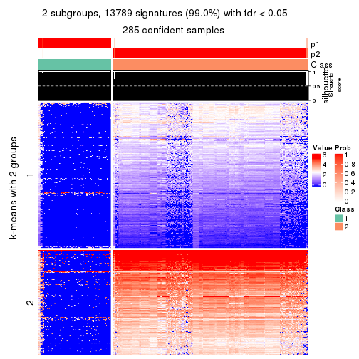</p>

</div>
<div id='tab-SD-skmeans-get-signatures-no-scale-2'>
<pre><code class="r">get_signatures(res, k = 3, scale_rows = FALSE)
</code></pre>

<p></p>

</div>
<div id='tab-SD-skmeans-get-signatures-no-scale-3'>
<pre><code class="r">get_signatures(res, k = 4, scale_rows = FALSE)
</code></pre>

<p></p>

</div>
<div id='tab-SD-skmeans-get-signatures-no-scale-4'>
<pre><code class="r">get_signatures(res, k = 5, scale_rows = FALSE)
</code></pre>

<p></p>

</div>
<div id='tab-SD-skmeans-get-signatures-no-scale-5'>
<pre><code class="r">get_signatures(res, k = 6, scale_rows = FALSE)
</code></pre>

<p></p>

</div>
</div>


Compare the overlap of signatures from different k:

```r
compare_signatures(res)
```


`get_signature()` returns a data frame invisibly. TO get the list of signatures, the function
call should be assigned to a variable explicitly. In following code, if `plot` argument is set
to `FALSE`, no heatmap is plotted while only the differential analysis is performed.

```r
# code only for demonstration
tb = get_signature(res, k = ..., plot = FALSE)
```

An example of the output of `tb` is:

```
#>   which_row         fdr    mean_1    mean_2 scaled_mean_1 scaled_mean_2 km
#> 1        38 0.042760348  8.373488  9.131774    -0.5533452     0.5164555  1
#> 2        40 0.018707592  7.106213  8.469186    -0.6173731     0.5762149  1
#> 3        55 0.019134737 10.221463 11.207825    -0.6159697     0.5749050  1
#> 4        59 0.006059896  5.921854  7.869574    -0.6899429     0.6439467  1
#> 5        60 0.018055526  8.928898 10.211722    -0.6204761     0.5791110  1
#> 6        98 0.009384629 15.714769 14.887706     0.6635654    -0.6193277  2
...
```

The columns in `tb` are:

1. `which_row`: row indices corresponding to the input matrix.
2. `fdr`: FDR for the differential test. 
3. `mean_x`: The mean value in group x.
4. `scaled_mean_x`: The mean value in group x after rows are scaled.
5. `km`: Row groups if k-means clustering is applied to rows.


UMAP plot which shows how samples are separated.


<script>
$( function() {
	$( '#tabs-SD-skmeans-dimension-reduction' ).tabs();
} );
</script>
<div id='tabs-SD-skmeans-dimension-reduction'>
<ul>
<li><a href='#tab-SD-skmeans-dimension-reduction-1'>k = 2</a></li>
<li><a href='#tab-SD-skmeans-dimension-reduction-2'>k = 3</a></li>
<li><a href='#tab-SD-skmeans-dimension-reduction-3'>k = 4</a></li>
<li><a href='#tab-SD-skmeans-dimension-reduction-4'>k = 5</a></li>
<li><a href='#tab-SD-skmeans-dimension-reduction-5'>k = 6</a></li>
</ul>
<div id='tab-SD-skmeans-dimension-reduction-1'>
<pre><code class="r">dimension_reduction(res, k = 2, method = &quot;UMAP&quot;)
</code></pre>

<p></p>

</div>
<div id='tab-SD-skmeans-dimension-reduction-2'>
<pre><code class="r">dimension_reduction(res, k = 3, method = &quot;UMAP&quot;)
</code></pre>

<p></p>

</div>
<div id='tab-SD-skmeans-dimension-reduction-3'>
<pre><code class="r">dimension_reduction(res, k = 4, method = &quot;UMAP&quot;)
</code></pre>

<p></p>

</div>
<div id='tab-SD-skmeans-dimension-reduction-4'>
<pre><code class="r">dimension_reduction(res, k = 5, method = &quot;UMAP&quot;)
</code></pre>

<p></p>

</div>
<div id='tab-SD-skmeans-dimension-reduction-5'>
<pre><code class="r">dimension_reduction(res, k = 6, method = &quot;UMAP&quot;)
</code></pre>

<p></p>

</div>
</div>


Following heatmap shows how subgroups are split when increasing `k`:

```r
collect_classes(res)
```

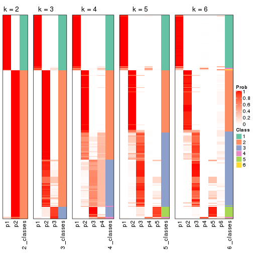


If matrix rows can be associated to genes, consider to use `GO_Enrichment(res,
...)` to perform function enrichment for the signature genes.


 

---------------------------------------------------


### SD:pam**


The object with results only for a single top-value method and a single partition method 
can be extracted as:

```r
res = res_list["SD", "pam"]
# you can also extract it by
# res = res_list["SD:pam"]
```

A summary of `res` and all the functions that can be applied to it:

```r
res
```

```
#> A 'ConsensusPartition' object with k = 2, 3, 4, 5, 6.
#>   On a matrix with 13930 rows and 285 columns.
#>   Top rows (1000, 2000, 3000, 4000, 5000) are extracted by 'SD' method.
#>   Subgroups are detected by 'pam' method.
#>   Performed in total 1250 partitions by row resampling.
#>   Best k for subgroups seems to be 5.
#> 
#> Following methods can be applied to this 'ConsensusPartition' object:
#>  [1] "cola_report"             "collect_classes"         "collect_plots"          
#>  [4] "collect_stats"           "colnames"                "compare_signatures"     
#>  [7] "consensus_heatmap"       "dimension_reduction"     "functional_enrichment"  
#> [10] "get_anno_col"            "get_anno"                "get_classes"            
#> [13] "get_consensus"           "get_matrix"              "get_membership"         
#> [16] "get_param"               "get_signatures"          "get_stats"              
#> [19] "is_best_k"               "is_stable_k"             "membership_heatmap"     
#> [22] "ncol"                    "nrow"                    "plot_ecdf"              
#> [25] "rownames"                "select_partition_number" "show"                   
#> [28] "suggest_best_k"          "test_to_known_factors"
```

`collect_plots()` function collects all the plots made from `res` for all `k` (number of partitions)
into one single page to provide an easy and fast comparison between different `k`.

```r
collect_plots(res)
```


The plots are:

- The first row: a plot of the ECDF (Empirical cumulative distribution
  function) curves of the consensus matrix for each `k` and the heatmap of
  predicted classes for each `k`.
- The second row: heatmaps of the consensus matrix for each `k`.
- The third row: heatmaps of the membership matrix for each `k`.
- The fouth row: heatmaps of the signatures for each `k`.

All the plots in panels can be made by individual functions and they are
plotted later in this section.

`select_partition_number()` produces several plots showing different
statistics for choosing "optimized" `k`. There are following statistics:

- ECDF curves of the consensus matrix for each `k`;
- 1-PAC. [The PAC
  score](https://en.wikipedia.org/wiki/Consensus_clustering#Over-interpretation_potential_of_consensus_clustering)
  measures the proportion of the ambiguous subgrouping.
- Mean silhouette score.
- Concordance. The mean probability of fiting the consensus class ids in all
  partitions.
- Area increased. Denote $A_k$ as the area under the ECDF curve for current
  `k`, the area increased is defined as $A_k - A_{k-1}$.
- Rand index. The percent of pairs of samples that are both in a same cluster
  or both are not in a same cluster in the partition of k and k-1.
- Jaccard index. The ratio of pairs of samples are both in a same cluster in
  the partition of k and k-1 and the pairs of samples are both in a same
  cluster in the partition k or k-1.

The detailed explanations of these statistics can be found in [the cola
vignette](http://bioconductor.org/packages/devel/bioc/vignettes/cola/inst/doc/cola.html#toc_13).

Generally speaking, lower PAC score, higher mean silhouette score or higher
concordance corresponds to better partition. Rand index and Jaccard index
measure how similar the current partition is compared to partition with `k-1`.
If they are too similar, we won't accept `k` is better than `k-1`.

```r
select_partition_number(res)
```


The numeric values for all these statistics can be obtained by `get_stats()`.

```r
get_stats(res)
```

```
#>   k 1-PAC mean_silhouette concordance area_increased  Rand Jaccard
#> 2 2 1.000           1.000       1.000         0.3796 0.621   0.621
#> 3 3 0.852           0.919       0.961         0.7237 0.723   0.554
#> 4 4 0.811           0.745       0.879         0.0667 0.967   0.905
#> 5 5 0.964           0.931       0.957         0.0785 0.859   0.601
#> 6 6 0.872           0.868       0.917         0.0552 0.961   0.839
```

`suggest_best_k()` suggests the best $k$ based on these statistics. The rules are as follows:

- All $k$ with Jaccard index larger than 0.95 are removed because the increase of
  the partition number does not provides enough extra information. If all $k$ are removed,
  the best $k$ is assigned by `NA`.
- For $k$ with 1-PAC larger than 0.9, the maximal $k$ is taken as the "best k". Other $k$ is called "optional k".
- If it does not fit the second rule. The $k$ with the highest vote of highest
  1-PAC, mean silhouette and concordance is taken as the "best k".

```r
suggest_best_k(res)
```

```
#> [1] 5
#> attr(,"optional")
#> [1] 2
```

There is also optional best $k$ = 2 that is worth to check.

Following shows the table of the partitions (You need to click the **show/hide
code output** link to see it). The membership matrix (columns with name `p*`)
is inferred by
[`clue::cl_consensus()`](https://www.rdocumentation.org/link/cl_consensus?package=clue)
function with the `SE` method. Basically the value in the membership matrix
represents the probability to belong to a certain group. The finall class
label for an item is determined with the group with highest probability it
belongs to.

In `get_classes()` function, the entropy is calculated from the membership
matrix and the silhouette score is calculated from the consensus matrix.


<script>
$( function() {
	$( '#tabs-SD-pam-get-classes' ).tabs();
} );
</script>
<div id='tabs-SD-pam-get-classes'>
<ul>
<li><a href='#tab-SD-pam-get-classes-1'>k = 2</a></li>
<li><a href='#tab-SD-pam-get-classes-2'>k = 3</a></li>
<li><a href='#tab-SD-pam-get-classes-3'>k = 4</a></li>
<li><a href='#tab-SD-pam-get-classes-4'>k = 5</a></li>
<li><a href='#tab-SD-pam-get-classes-5'>k = 6</a></li>
</ul>

<div id='tab-SD-pam-get-classes-1'>
<p><a id='tab-SD-pam-get-classes-1-a' style='color:#0366d6' href='#'>show/hide code output</a></p>
<pre><code class="r">cbind(get_classes(res, k = 2), get_membership(res, k = 2))
</code></pre>

<pre><code>#&gt;            class entropy silhouette p1 p2
#&gt; SRR1201591     2       0          1  0  1
#&gt; SRR1201590     2       0          1  0  1
#&gt; SRR1201593     2       0          1  0  1
#&gt; SRR1201592     2       0          1  0  1
#&gt; SRR1201617     2       0          1  0  1
#&gt; SRR1201616     2       0          1  0  1
#&gt; SRR1201619     2       0          1  0  1
#&gt; SRR1201618     2       0          1  0  1
#&gt; SRR1201620     2       0          1  0  1
#&gt; SRR1201621     2       0          1  0  1
#&gt; SRR1201623     2       0          1  0  1
#&gt; SRR1201622     2       0          1  0  1
#&gt; SRR1201624     2       0          1  0  1
#&gt; SRR1201625     2       0          1  0  1
#&gt; SRR1201626     1       0          1  1  0
#&gt; SRR1201627     2       0          1  0  1
#&gt; SRR1201628     2       0          1  0  1
#&gt; SRR1201629     2       0          1  0  1
#&gt; SRR1201630     2       0          1  0  1
#&gt; SRR1201631     2       0          1  0  1
#&gt; SRR1201641     2       0          1  0  1
#&gt; SRR1201640     2       0          1  0  1
#&gt; SRR1201643     2       0          1  0  1
#&gt; SRR1201644     2       0          1  0  1
#&gt; SRR1201661     2       0          1  0  1
#&gt; SRR1201662     2       0          1  0  1
#&gt; SRR1201663     2       0          1  0  1
#&gt; SRR1201664     2       0          1  0  1
#&gt; SRR1201665     2       0          1  0  1
#&gt; SRR1201666     2       0          1  0  1
#&gt; SRR1201667     2       0          1  0  1
#&gt; SRR1201668     2       0          1  0  1
#&gt; SRR1201670     2       0          1  0  1
#&gt; SRR1201669     2       0          1  0  1
#&gt; SRR1201673     2       0          1  0  1
#&gt; SRR1201672     2       0          1  0  1
#&gt; SRR1201671     2       0          1  0  1
#&gt; SRR1201677     2       0          1  0  1
#&gt; SRR1201676     2       0          1  0  1
#&gt; SRR1201675     2       0          1  0  1
#&gt; SRR1201674     2       0          1  0  1
#&gt; SRR1201678     2       0          1  0  1
#&gt; SRR1201682     2       0          1  0  1
#&gt; SRR1201683     2       0          1  0  1
#&gt; SRR1201680     2       0          1  0  1
#&gt; SRR1201681     2       0          1  0  1
#&gt; SRR1201679     2       0          1  0  1
#&gt; SRR1201686     2       0          1  0  1
#&gt; SRR1201687     2       0          1  0  1
#&gt; SRR1201688     2       0          1  0  1
#&gt; SRR1201689     2       0          1  0  1
#&gt; SRR1201685     2       0          1  0  1
#&gt; SRR1201692     2       0          1  0  1
#&gt; SRR1201691     2       0          1  0  1
#&gt; SRR1201690     2       0          1  0  1
#&gt; SRR1201696     2       0          1  0  1
#&gt; SRR1201695     2       0          1  0  1
#&gt; SRR1201694     2       0          1  0  1
#&gt; SRR1201693     2       0          1  0  1
#&gt; SRR1201697     2       0          1  0  1
#&gt; SRR1201698     2       0          1  0  1
#&gt; SRR1201700     2       0          1  0  1
#&gt; SRR1201708     2       0          1  0  1
#&gt; SRR1201707     2       0          1  0  1
#&gt; SRR1201706     2       0          1  0  1
#&gt; SRR1201702     2       0          1  0  1
#&gt; SRR1201705     2       0          1  0  1
#&gt; SRR1201701     2       0          1  0  1
#&gt; SRR1201704     2       0          1  0  1
#&gt; SRR1201703     2       0          1  0  1
#&gt; SRR1201716     2       0          1  0  1
#&gt; SRR1201715     2       0          1  0  1
#&gt; SRR1201717     2       0          1  0  1
#&gt; SRR1201712     2       0          1  0  1
#&gt; SRR1201709     2       0          1  0  1
#&gt; SRR1201711     2       0          1  0  1
#&gt; SRR1201714     2       0          1  0  1
#&gt; SRR1201713     2       0          1  0  1
#&gt; SRR1201710     2       0          1  0  1
#&gt; SRR1201719     2       0          1  0  1
#&gt; SRR1201718     2       0          1  0  1
#&gt; SRR1201721     2       0          1  0  1
#&gt; SRR1201720     2       0          1  0  1
#&gt; SRR1201723     2       0          1  0  1
#&gt; SRR1201722     2       0          1  0  1
#&gt; SRR1201725     2       0          1  0  1
#&gt; SRR1201724     2       0          1  0  1
#&gt; SRR1201726     2       0          1  0  1
#&gt; SRR1201727     2       0          1  0  1
#&gt; SRR1201731     2       0          1  0  1
#&gt; SRR1201730     2       0          1  0  1
#&gt; SRR1201734     2       0          1  0  1
#&gt; SRR1201733     2       0          1  0  1
#&gt; SRR1201736     2       0          1  0  1
#&gt; SRR1201737     2       0          1  0  1
#&gt; SRR1201739     2       0          1  0  1
#&gt; SRR1201738     2       0          1  0  1
#&gt; SRR1201742     2       0          1  0  1
#&gt; SRR1201743     2       0          1  0  1
#&gt; SRR1201745     2       0          1  0  1
#&gt; SRR1201744     2       0          1  0  1
#&gt; SRR1201749     2       0          1  0  1
#&gt; SRR1201750     2       0          1  0  1
#&gt; SRR1201752     2       0          1  0  1
#&gt; SRR1201751     2       0          1  0  1
#&gt; SRR1201754     2       0          1  0  1
#&gt; SRR1201753     2       0          1  0  1
#&gt; SRR1201758     2       0          1  0  1
#&gt; SRR1201759     2       0          1  0  1
#&gt; SRR1201760     2       0          1  0  1
#&gt; SRR1201761     2       0          1  0  1
#&gt; SRR1201763     2       0          1  0  1
#&gt; SRR1201762     2       0          1  0  1
#&gt; SRR1201764     2       0          1  0  1
#&gt; SRR1201766     2       0          1  0  1
#&gt; SRR1201768     2       0          1  0  1
#&gt; SRR1201769     2       0          1  0  1
#&gt; SRR1201767     2       0          1  0  1
#&gt; SRR1201770     2       0          1  0  1
#&gt; SRR1201771     2       0          1  0  1
#&gt; SRR1201772     2       0          1  0  1
#&gt; SRR1201773     2       0          1  0  1
#&gt; SRR1201774     2       0          1  0  1
#&gt; SRR1201786     2       0          1  0  1
#&gt; SRR1201784     2       0          1  0  1
#&gt; SRR1201785     2       0          1  0  1
#&gt; SRR1201778     2       0          1  0  1
#&gt; SRR1201779     2       0          1  0  1
#&gt; SRR1201781     2       0          1  0  1
#&gt; SRR1201780     2       0          1  0  1
#&gt; SRR1201783     2       0          1  0  1
#&gt; SRR1201782     2       0          1  0  1
#&gt; SRR1201798     2       0          1  0  1
#&gt; SRR1201797     2       0          1  0  1
#&gt; SRR1201796     2       0          1  0  1
#&gt; SRR1201795     2       0          1  0  1
#&gt; SRR1201799     2       0          1  0  1
#&gt; SRR1201794     2       0          1  0  1
#&gt; SRR1201793     2       0          1  0  1
#&gt; SRR1201792     2       0          1  0  1
#&gt; SRR1201791     2       0          1  0  1
#&gt; SRR1201807     2       0          1  0  1
#&gt; SRR1201808     2       0          1  0  1
#&gt; SRR1201803     2       0          1  0  1
#&gt; SRR1201804     2       0          1  0  1
#&gt; SRR1201805     2       0          1  0  1
#&gt; SRR1201806     2       0          1  0  1
#&gt; SRR1201801     2       0          1  0  1
#&gt; SRR1201802     2       0          1  0  1
#&gt; SRR1201800     2       0          1  0  1
#&gt; SRR1201814     2       0          1  0  1
#&gt; SRR1201816     2       0          1  0  1
#&gt; SRR1201815     2       0          1  0  1
#&gt; SRR1201819     2       0          1  0  1
#&gt; SRR1201820     2       0          1  0  1
#&gt; SRR1201813     2       0          1  0  1
#&gt; SRR1201817     2       0          1  0  1
#&gt; SRR1201818     2       0          1  0  1
#&gt; SRR1201825     2       0          1  0  1
#&gt; SRR1201827     2       0          1  0  1
#&gt; SRR1201828     2       0          1  0  1
#&gt; SRR1201826     2       0          1  0  1
#&gt; SRR1201829     2       0          1  0  1
#&gt; SRR1201830     2       0          1  0  1
#&gt; SRR1201831     2       0          1  0  1
#&gt; SRR1201832     2       0          1  0  1
#&gt; SRR1201833     2       0          1  0  1
#&gt; SRR1201865     2       0          1  0  1
#&gt; SRR1201866     2       0          1  0  1
#&gt; SRR1201867     2       0          1  0  1
#&gt; SRR1201861     2       0          1  0  1
#&gt; SRR1201862     2       0          1  0  1
#&gt; SRR1201863     2       0          1  0  1
#&gt; SRR1201859     2       0          1  0  1
#&gt; SRR1201864     2       0          1  0  1
#&gt; SRR1201860     2       0          1  0  1
#&gt; SRR1201873     2       0          1  0  1
#&gt; SRR1201871     2       0          1  0  1
#&gt; SRR1201872     2       0          1  0  1
#&gt; SRR1201980     2       0          1  0  1
#&gt; SRR1201979     2       0          1  0  1
#&gt; SRR1201982     2       0          1  0  1
#&gt; SRR1201981     2       0          1  0  1
#&gt; SRR1201998     2       0          1  0  1
#&gt; SRR1201996     2       0          1  0  1
#&gt; SRR1201997     2       0          1  0  1
#&gt; SRR1202005     2       0          1  0  1
#&gt; SRR1202006     2       0          1  0  1
#&gt; SRR1202088     2       0          1  0  1
#&gt; SRR1202087     2       0          1  0  1
#&gt; SRR1202093     2       0          1  0  1
#&gt; SRR1202092     2       0          1  0  1
#&gt; SRR1202288     2       0          1  0  1
#&gt; SRR1202289     2       0          1  0  1
#&gt; SRR1202299     2       0          1  0  1
#&gt; SRR1202298     2       0          1  0  1
#&gt; SRR1202303     2       0          1  0  1
#&gt; SRR1202372     2       0          1  0  1
#&gt; SRR1202371     2       0          1  0  1
#&gt; SRR1202563     2       0          1  0  1
#&gt; SRR1202565     2       0          1  0  1
#&gt; SRR1202564     2       0          1  0  1
#&gt; SRR1202649     2       0          1  0  1
#&gt; SRR1202650     2       0          1  0  1
#&gt; SRR1202651     2       0          1  0  1
#&gt; SRR1202843     1       0          1  1  0
#&gt; SRR1202844     1       0          1  1  0
#&gt; SRR1202845     2       0          1  0  1
#&gt; SRR1202847     2       0          1  0  1
#&gt; SRR1202846     2       0          1  0  1
#&gt; SRR1202945     1       0          1  1  0
#&gt; SRR1202949     1       0          1  1  0
#&gt; SRR1202977     1       0          1  1  0
#&gt; SRR1202978     1       0          1  1  0
#&gt; SRR1202979     1       0          1  1  0
#&gt; SRR1202990     1       0          1  1  0
#&gt; SRR1202999     1       0          1  1  0
#&gt; SRR1203005     1       0          1  1  0
#&gt; SRR1203006     1       0          1  1  0
#&gt; SRR1203007     1       0          1  1  0
#&gt; SRR1203009     1       0          1  1  0
#&gt; SRR1203008     1       0          1  1  0
#&gt; SRR1203010     1       0          1  1  0
#&gt; SRR1203011     1       0          1  1  0
#&gt; SRR1203025     1       0          1  1  0
#&gt; SRR1203026     1       0          1  1  0
#&gt; SRR1203027     1       0          1  1  0
#&gt; SRR1203061     1       0          1  1  0
#&gt; SRR1203089     1       0          1  1  0
#&gt; SRR1203125     1       0          1  1  0
#&gt; SRR1203128     1       0          1  1  0
#&gt; SRR1203129     1       0          1  1  0
#&gt; SRR1203130     1       0          1  1  0
#&gt; SRR1203132     2       0          1  0  1
#&gt; SRR1203131     2       0          1  0  1
#&gt; SRR1203133     1       0          1  1  0
#&gt; SRR1203138     1       0          1  1  0
#&gt; SRR1203760     1       0          1  1  0
#&gt; SRR1203761     1       0          1  1  0
#&gt; SRR1203770     1       0          1  1  0
#&gt; SRR1203771     1       0          1  1  0
#&gt; SRR1203772     1       0          1  1  0
#&gt; SRR1203773     1       0          1  1  0
#&gt; SRR1203774     1       0          1  1  0
#&gt; SRR1203775     1       0          1  1  0
#&gt; SRR1203800     1       0          1  1  0
#&gt; SRR1203801     1       0          1  1  0
#&gt; SRR1203802     1       0          1  1  0
#&gt; SRR1203803     1       0          1  1  0
#&gt; SRR1203804     1       0          1  1  0
#&gt; SRR1203805     1       0          1  1  0
#&gt; SRR1203806     1       0          1  1  0
#&gt; SRR1203807     1       0          1  1  0
#&gt; SRR1203808     1       0          1  1  0
#&gt; SRR1203811     1       0          1  1  0
#&gt; SRR1203812     1       0          1  1  0
#&gt; SRR1203813     1       0          1  1  0
#&gt; SRR1203814     1       0          1  1  0
#&gt; SRR1203815     1       0          1  1  0
#&gt; SRR1203816     1       0          1  1  0
#&gt; SRR1203817     1       0          1  1  0
#&gt; SRR1203818     1       0          1  1  0
#&gt; SRR1203819     1       0          1  1  0
#&gt; SRR1203822     1       0          1  1  0
#&gt; SRR1203823     1       0          1  1  0
#&gt; SRR1203824     1       0          1  1  0
#&gt; SRR1203825     1       0          1  1  0
#&gt; SRR1203826     1       0          1  1  0
#&gt; SRR1203827     2       0          1  0  1
#&gt; SRR1203828     1       0          1  1  0
#&gt; SRR1203829     1       0          1  1  0
#&gt; SRR1203830     1       0          1  1  0
#&gt; SRR1203831     1       0          1  1  0
#&gt; SRR1203832     1       0          1  1  0
#&gt; SRR1203833     1       0          1  1  0
#&gt; SRR1203834     1       0          1  1  0
#&gt; SRR1203835     1       0          1  1  0
#&gt; SRR1203836     1       0          1  1  0
#&gt; SRR1203837     1       0          1  1  0
#&gt; SRR1203838     1       0          1  1  0
#&gt; SRR1203839     1       0          1  1  0
#&gt; SRR1203842     2       0          1  0  1
#&gt; SRR1203843     1       0          1  1  0
#&gt; SRR1203845     2       0          1  0  1
#&gt; SRR1203844     2       0          1  0  1
</code></pre>

<script>
$('#tab-SD-pam-get-classes-1-a').parent().next().next().hide();
$('#tab-SD-pam-get-classes-1-a').click(function(){
  $('#tab-SD-pam-get-classes-1-a').parent().next().next().toggle();
  return(false);
});
</script>
</div>

<div id='tab-SD-pam-get-classes-2'>
<p><a id='tab-SD-pam-get-classes-2-a' style='color:#0366d6' href='#'>show/hide code output</a></p>
<pre><code class="r">cbind(get_classes(res, k = 3), get_membership(res, k = 3))
</code></pre>

<pre><code>#&gt;            class entropy silhouette p1    p2    p3
#&gt; SRR1201591     2  0.0000      0.924  0 1.000 0.000
#&gt; SRR1201590     2  0.0000      0.924  0 1.000 0.000
#&gt; SRR1201593     2  0.0000      0.924  0 1.000 0.000
#&gt; SRR1201592     2  0.0000      0.924  0 1.000 0.000
#&gt; SRR1201617     2  0.0000      0.924  0 1.000 0.000
#&gt; SRR1201616     2  0.0000      0.924  0 1.000 0.000
#&gt; SRR1201619     2  0.0237      0.921  0 0.996 0.004
#&gt; SRR1201618     2  0.3941      0.821  0 0.844 0.156
#&gt; SRR1201620     2  0.0000      0.924  0 1.000 0.000
#&gt; SRR1201621     2  0.0000      0.924  0 1.000 0.000
#&gt; SRR1201623     3  0.0000      0.967  0 0.000 1.000
#&gt; SRR1201622     3  0.0000      0.967  0 0.000 1.000
#&gt; SRR1201624     3  0.0000      0.967  0 0.000 1.000
#&gt; SRR1201625     3  0.0000      0.967  0 0.000 1.000
#&gt; SRR1201626     1  0.0000      1.000  1 0.000 0.000
#&gt; SRR1201627     3  0.0000      0.967  0 0.000 1.000
#&gt; SRR1201628     3  0.0000      0.967  0 0.000 1.000
#&gt; SRR1201629     3  0.0000      0.967  0 0.000 1.000
#&gt; SRR1201630     3  0.5098      0.643  0 0.248 0.752
#&gt; SRR1201631     2  0.5363      0.691  0 0.724 0.276
#&gt; SRR1201641     2  0.4750      0.769  0 0.784 0.216
#&gt; SRR1201640     3  0.6154      0.219  0 0.408 0.592
#&gt; SRR1201643     3  0.0000      0.967  0 0.000 1.000
#&gt; SRR1201644     3  0.0000      0.967  0 0.000 1.000
#&gt; SRR1201661     2  0.5016      0.740  0 0.760 0.240
#&gt; SRR1201662     2  0.4178      0.813  0 0.828 0.172
#&gt; SRR1201663     3  0.0000      0.967  0 0.000 1.000
#&gt; SRR1201664     3  0.0000      0.967  0 0.000 1.000
#&gt; SRR1201665     2  0.0000      0.924  0 1.000 0.000
#&gt; SRR1201666     2  0.0000      0.924  0 1.000 0.000
#&gt; SRR1201667     2  0.0000      0.924  0 1.000 0.000
#&gt; SRR1201668     3  0.0000      0.967  0 0.000 1.000
#&gt; SRR1201670     3  0.0000      0.967  0 0.000 1.000
#&gt; SRR1201669     3  0.0000      0.967  0 0.000 1.000
#&gt; SRR1201673     2  0.4346      0.802  0 0.816 0.184
#&gt; SRR1201672     2  0.4346      0.802  0 0.816 0.184
#&gt; SRR1201671     3  0.3752      0.816  0 0.144 0.856
#&gt; SRR1201677     2  0.4235      0.809  0 0.824 0.176
#&gt; SRR1201676     2  0.4399      0.798  0 0.812 0.188
#&gt; SRR1201675     2  0.4235      0.809  0 0.824 0.176
#&gt; SRR1201674     2  0.4178      0.812  0 0.828 0.172
#&gt; SRR1201678     2  0.4235      0.809  0 0.824 0.176
#&gt; SRR1201682     2  0.0000      0.924  0 1.000 0.000
#&gt; SRR1201683     2  0.0000      0.924  0 1.000 0.000
#&gt; SRR1201680     2  0.0000      0.924  0 1.000 0.000
#&gt; SRR1201681     2  0.0000      0.924  0 1.000 0.000
#&gt; SRR1201679     2  0.0000      0.924  0 1.000 0.000
#&gt; SRR1201686     3  0.0000      0.967  0 0.000 1.000
#&gt; SRR1201687     3  0.0000      0.967  0 0.000 1.000
#&gt; SRR1201688     3  0.0000      0.967  0 0.000 1.000
#&gt; SRR1201689     3  0.0000      0.967  0 0.000 1.000
#&gt; SRR1201685     3  0.0000      0.967  0 0.000 1.000
#&gt; SRR1201692     3  0.0000      0.967  0 0.000 1.000
#&gt; SRR1201691     3  0.0000      0.967  0 0.000 1.000
#&gt; SRR1201690     3  0.0000      0.967  0 0.000 1.000
#&gt; SRR1201696     3  0.0000      0.967  0 0.000 1.000
#&gt; SRR1201695     3  0.0000      0.967  0 0.000 1.000
#&gt; SRR1201694     3  0.0000      0.967  0 0.000 1.000
#&gt; SRR1201693     3  0.0000      0.967  0 0.000 1.000
#&gt; SRR1201697     3  0.0000      0.967  0 0.000 1.000
#&gt; SRR1201698     3  0.0000      0.967  0 0.000 1.000
#&gt; SRR1201700     3  0.0000      0.967  0 0.000 1.000
#&gt; SRR1201708     3  0.0000      0.967  0 0.000 1.000
#&gt; SRR1201707     3  0.0000      0.967  0 0.000 1.000
#&gt; SRR1201706     3  0.0000      0.967  0 0.000 1.000
#&gt; SRR1201702     3  0.0000      0.967  0 0.000 1.000
#&gt; SRR1201705     3  0.0000      0.967  0 0.000 1.000
#&gt; SRR1201701     3  0.0000      0.967  0 0.000 1.000
#&gt; SRR1201704     3  0.0000      0.967  0 0.000 1.000
#&gt; SRR1201703     3  0.0000      0.967  0 0.000 1.000
#&gt; SRR1201716     3  0.0000      0.967  0 0.000 1.000
#&gt; SRR1201715     3  0.0000      0.967  0 0.000 1.000
#&gt; SRR1201717     3  0.0000      0.967  0 0.000 1.000
#&gt; SRR1201712     3  0.0000      0.967  0 0.000 1.000
#&gt; SRR1201709     3  0.0000      0.967  0 0.000 1.000
#&gt; SRR1201711     3  0.0000      0.967  0 0.000 1.000
#&gt; SRR1201714     3  0.0000      0.967  0 0.000 1.000
#&gt; SRR1201713     3  0.0000      0.967  0 0.000 1.000
#&gt; SRR1201710     3  0.0000      0.967  0 0.000 1.000
#&gt; SRR1201719     2  0.4504      0.790  0 0.804 0.196
#&gt; SRR1201718     2  0.5178      0.720  0 0.744 0.256
#&gt; SRR1201721     3  0.0000      0.967  0 0.000 1.000
#&gt; SRR1201720     3  0.0000      0.967  0 0.000 1.000
#&gt; SRR1201723     3  0.0000      0.967  0 0.000 1.000
#&gt; SRR1201722     3  0.0000      0.967  0 0.000 1.000
#&gt; SRR1201725     2  0.5397      0.685  0 0.720 0.280
#&gt; SRR1201724     2  0.6180      0.409  0 0.584 0.416
#&gt; SRR1201726     3  0.0000      0.967  0 0.000 1.000
#&gt; SRR1201727     3  0.0000      0.967  0 0.000 1.000
#&gt; SRR1201731     3  0.0000      0.967  0 0.000 1.000
#&gt; SRR1201730     3  0.0000      0.967  0 0.000 1.000
#&gt; SRR1201734     2  0.0000      0.924  0 1.000 0.000
#&gt; SRR1201733     2  0.0000      0.924  0 1.000 0.000
#&gt; SRR1201736     2  0.0000      0.924  0 1.000 0.000
#&gt; SRR1201737     2  0.0000      0.924  0 1.000 0.000
#&gt; SRR1201739     2  0.0000      0.924  0 1.000 0.000
#&gt; SRR1201738     2  0.0000      0.924  0 1.000 0.000
#&gt; SRR1201742     2  0.3686      0.837  0 0.860 0.140
#&gt; SRR1201743     2  0.0000      0.924  0 1.000 0.000
#&gt; SRR1201745     2  0.0000      0.924  0 1.000 0.000
#&gt; SRR1201744     2  0.0000      0.924  0 1.000 0.000
#&gt; SRR1201749     2  0.0000      0.924  0 1.000 0.000
#&gt; SRR1201750     2  0.0000      0.924  0 1.000 0.000
#&gt; SRR1201752     3  0.0000      0.967  0 0.000 1.000
#&gt; SRR1201751     3  0.0000      0.967  0 0.000 1.000
#&gt; SRR1201754     2  0.0000      0.924  0 1.000 0.000
#&gt; SRR1201753     2  0.0000      0.924  0 1.000 0.000
#&gt; SRR1201758     3  0.0000      0.967  0 0.000 1.000
#&gt; SRR1201759     3  0.0000      0.967  0 0.000 1.000
#&gt; SRR1201760     3  0.0000      0.967  0 0.000 1.000
#&gt; SRR1201761     3  0.0000      0.967  0 0.000 1.000
#&gt; SRR1201763     3  0.0000      0.967  0 0.000 1.000
#&gt; SRR1201762     3  0.0000      0.967  0 0.000 1.000
#&gt; SRR1201764     3  0.3816      0.809  0 0.148 0.852
#&gt; SRR1201766     2  0.0000      0.924  0 1.000 0.000
#&gt; SRR1201768     2  0.0000      0.924  0 1.000 0.000
#&gt; SRR1201769     2  0.0000      0.924  0 1.000 0.000
#&gt; SRR1201767     2  0.0000      0.924  0 1.000 0.000
#&gt; SRR1201770     2  0.0000      0.924  0 1.000 0.000
#&gt; SRR1201771     2  0.0000      0.924  0 1.000 0.000
#&gt; SRR1201772     2  0.0000      0.924  0 1.000 0.000
#&gt; SRR1201773     2  0.0000      0.924  0 1.000 0.000
#&gt; SRR1201774     2  0.0000      0.924  0 1.000 0.000
#&gt; SRR1201786     2  0.0000      0.924  0 1.000 0.000
#&gt; SRR1201784     2  0.0000      0.924  0 1.000 0.000
#&gt; SRR1201785     2  0.0000      0.924  0 1.000 0.000
#&gt; SRR1201778     2  0.0000      0.924  0 1.000 0.000
#&gt; SRR1201779     2  0.0000      0.924  0 1.000 0.000
#&gt; SRR1201781     2  0.0000      0.924  0 1.000 0.000
#&gt; SRR1201780     2  0.0000      0.924  0 1.000 0.000
#&gt; SRR1201783     2  0.0000      0.924  0 1.000 0.000
#&gt; SRR1201782     2  0.0000      0.924  0 1.000 0.000
#&gt; SRR1201798     2  0.0000      0.924  0 1.000 0.000
#&gt; SRR1201797     2  0.0000      0.924  0 1.000 0.000
#&gt; SRR1201796     2  0.0000      0.924  0 1.000 0.000
#&gt; SRR1201795     2  0.0000      0.924  0 1.000 0.000
#&gt; SRR1201799     2  0.0000      0.924  0 1.000 0.000
#&gt; SRR1201794     2  0.0000      0.924  0 1.000 0.000
#&gt; SRR1201793     2  0.0000      0.924  0 1.000 0.000
#&gt; SRR1201792     2  0.0000      0.924  0 1.000 0.000
#&gt; SRR1201791     2  0.0000      0.924  0 1.000 0.000
#&gt; SRR1201807     2  0.0000      0.924  0 1.000 0.000
#&gt; SRR1201808     2  0.0000      0.924  0 1.000 0.000
#&gt; SRR1201803     2  0.0000      0.924  0 1.000 0.000
#&gt; SRR1201804     2  0.0000      0.924  0 1.000 0.000
#&gt; SRR1201805     2  0.0000      0.924  0 1.000 0.000
#&gt; SRR1201806     2  0.0000      0.924  0 1.000 0.000
#&gt; SRR1201801     2  0.0000      0.924  0 1.000 0.000
#&gt; SRR1201802     2  0.0000      0.924  0 1.000 0.000
#&gt; SRR1201800     2  0.0000      0.924  0 1.000 0.000
#&gt; SRR1201814     2  0.0000      0.924  0 1.000 0.000
#&gt; SRR1201816     2  0.0000      0.924  0 1.000 0.000
#&gt; SRR1201815     2  0.0000      0.924  0 1.000 0.000
#&gt; SRR1201819     2  0.0000      0.924  0 1.000 0.000
#&gt; SRR1201820     2  0.0000      0.924  0 1.000 0.000
#&gt; SRR1201813     2  0.0000      0.924  0 1.000 0.000
#&gt; SRR1201817     2  0.0000      0.924  0 1.000 0.000
#&gt; SRR1201818     2  0.0000      0.924  0 1.000 0.000
#&gt; SRR1201825     3  0.0000      0.967  0 0.000 1.000
#&gt; SRR1201827     2  0.5926      0.547  0 0.644 0.356
#&gt; SRR1201828     2  0.5785      0.595  0 0.668 0.332
#&gt; SRR1201826     3  0.1163      0.942  0 0.028 0.972
#&gt; SRR1201829     2  0.5859      0.572  0 0.656 0.344
#&gt; SRR1201830     2  0.5810      0.587  0 0.664 0.336
#&gt; SRR1201831     2  0.6008      0.514  0 0.628 0.372
#&gt; SRR1201832     2  0.5785      0.595  0 0.668 0.332
#&gt; SRR1201833     2  0.5882      0.565  0 0.652 0.348
#&gt; SRR1201865     3  0.0000      0.967  0 0.000 1.000
#&gt; SRR1201866     3  0.0000      0.967  0 0.000 1.000
#&gt; SRR1201867     3  0.0000      0.967  0 0.000 1.000
#&gt; SRR1201861     3  0.0000      0.967  0 0.000 1.000
#&gt; SRR1201862     3  0.0000      0.967  0 0.000 1.000
#&gt; SRR1201863     3  0.0000      0.967  0 0.000 1.000
#&gt; SRR1201859     3  0.0000      0.967  0 0.000 1.000
#&gt; SRR1201864     3  0.0000      0.967  0 0.000 1.000
#&gt; SRR1201860     3  0.0000      0.967  0 0.000 1.000
#&gt; SRR1201873     3  0.0000      0.967  0 0.000 1.000
#&gt; SRR1201871     3  0.0000      0.967  0 0.000 1.000
#&gt; SRR1201872     3  0.0000      0.967  0 0.000 1.000
#&gt; SRR1201980     3  0.0000      0.967  0 0.000 1.000
#&gt; SRR1201979     3  0.0000      0.967  0 0.000 1.000
#&gt; SRR1201982     3  0.5178      0.622  0 0.256 0.744
#&gt; SRR1201981     3  0.0000      0.967  0 0.000 1.000
#&gt; SRR1201998     3  0.3752      0.808  0 0.144 0.856
#&gt; SRR1201996     3  0.4002      0.786  0 0.160 0.840
#&gt; SRR1201997     2  0.6302      0.217  0 0.520 0.480
#&gt; SRR1202005     2  0.4346      0.802  0 0.816 0.184
#&gt; SRR1202006     2  0.3941      0.826  0 0.844 0.156
#&gt; SRR1202088     3  0.5591      0.567  0 0.304 0.696
#&gt; SRR1202087     3  0.1289      0.938  0 0.032 0.968
#&gt; SRR1202093     2  0.0000      0.924  0 1.000 0.000
#&gt; SRR1202092     2  0.0000      0.924  0 1.000 0.000
#&gt; SRR1202288     2  0.0000      0.924  0 1.000 0.000
#&gt; SRR1202289     2  0.0000      0.924  0 1.000 0.000
#&gt; SRR1202299     2  0.0000      0.924  0 1.000 0.000
#&gt; SRR1202298     2  0.0000      0.924  0 1.000 0.000
#&gt; SRR1202303     3  0.2066      0.912  0 0.060 0.940
#&gt; SRR1202372     2  0.0000      0.924  0 1.000 0.000
#&gt; SRR1202371     2  0.0000      0.924  0 1.000 0.000
#&gt; SRR1202563     2  0.4504      0.790  0 0.804 0.196
#&gt; SRR1202565     2  0.4452      0.794  0 0.808 0.192
#&gt; SRR1202564     2  0.4452      0.794  0 0.808 0.192
#&gt; SRR1202649     3  0.5254      0.619  0 0.264 0.736
#&gt; SRR1202650     3  0.5529      0.553  0 0.296 0.704
#&gt; SRR1202651     2  0.4452      0.794  0 0.808 0.192
#&gt; SRR1202843     1  0.0000      1.000  1 0.000 0.000
#&gt; SRR1202844     1  0.0000      1.000  1 0.000 0.000
#&gt; SRR1202845     3  0.5178      0.623  0 0.256 0.744
#&gt; SRR1202847     2  0.5098      0.730  0 0.752 0.248
#&gt; SRR1202846     2  0.5138      0.725  0 0.748 0.252
#&gt; SRR1202945     1  0.0000      1.000  1 0.000 0.000
#&gt; SRR1202949     1  0.0000      1.000  1 0.000 0.000
#&gt; SRR1202977     1  0.0000      1.000  1 0.000 0.000
#&gt; SRR1202978     1  0.0000      1.000  1 0.000 0.000
#&gt; SRR1202979     1  0.0000      1.000  1 0.000 0.000
#&gt; SRR1202990     1  0.0000      1.000  1 0.000 0.000
#&gt; SRR1202999     1  0.0000      1.000  1 0.000 0.000
#&gt; SRR1203005     1  0.0000      1.000  1 0.000 0.000
#&gt; SRR1203006     1  0.0000      1.000  1 0.000 0.000
#&gt; SRR1203007     1  0.0000      1.000  1 0.000 0.000
#&gt; SRR1203009     1  0.0000      1.000  1 0.000 0.000
#&gt; SRR1203008     1  0.0000      1.000  1 0.000 0.000
#&gt; SRR1203010     1  0.0000      1.000  1 0.000 0.000
#&gt; SRR1203011     1  0.0000      1.000  1 0.000 0.000
#&gt; SRR1203025     1  0.0000      1.000  1 0.000 0.000
#&gt; SRR1203026     1  0.0000      1.000  1 0.000 0.000
#&gt; SRR1203027     1  0.0000      1.000  1 0.000 0.000
#&gt; SRR1203061     1  0.0000      1.000  1 0.000 0.000
#&gt; SRR1203089     1  0.0000      1.000  1 0.000 0.000
#&gt; SRR1203125     1  0.0000      1.000  1 0.000 0.000
#&gt; SRR1203128     1  0.0000      1.000  1 0.000 0.000
#&gt; SRR1203129     1  0.0000      1.000  1 0.000 0.000
#&gt; SRR1203130     1  0.0000      1.000  1 0.000 0.000
#&gt; SRR1203132     3  0.0000      0.967  0 0.000 1.000
#&gt; SRR1203131     3  0.0000      0.967  0 0.000 1.000
#&gt; SRR1203133     1  0.0000      1.000  1 0.000 0.000
#&gt; SRR1203138     1  0.0000      1.000  1 0.000 0.000
#&gt; SRR1203760     1  0.0000      1.000  1 0.000 0.000
#&gt; SRR1203761     1  0.0000      1.000  1 0.000 0.000
#&gt; SRR1203770     1  0.0000      1.000  1 0.000 0.000
#&gt; SRR1203771     1  0.0000      1.000  1 0.000 0.000
#&gt; SRR1203772     1  0.0000      1.000  1 0.000 0.000
#&gt; SRR1203773     1  0.0000      1.000  1 0.000 0.000
#&gt; SRR1203774     1  0.0000      1.000  1 0.000 0.000
#&gt; SRR1203775     1  0.0000      1.000  1 0.000 0.000
#&gt; SRR1203800     1  0.0000      1.000  1 0.000 0.000
#&gt; SRR1203801     1  0.0000      1.000  1 0.000 0.000
#&gt; SRR1203802     1  0.0000      1.000  1 0.000 0.000
#&gt; SRR1203803     1  0.0000      1.000  1 0.000 0.000
#&gt; SRR1203804     1  0.0000      1.000  1 0.000 0.000
#&gt; SRR1203805     1  0.0000      1.000  1 0.000 0.000
#&gt; SRR1203806     1  0.0000      1.000  1 0.000 0.000
#&gt; SRR1203807     1  0.0000      1.000  1 0.000 0.000
#&gt; SRR1203808     1  0.0000      1.000  1 0.000 0.000
#&gt; SRR1203811     1  0.0000      1.000  1 0.000 0.000
#&gt; SRR1203812     1  0.0000      1.000  1 0.000 0.000
#&gt; SRR1203813     1  0.0000      1.000  1 0.000 0.000
#&gt; SRR1203814     1  0.0000      1.000  1 0.000 0.000
#&gt; SRR1203815     1  0.0000      1.000  1 0.000 0.000
#&gt; SRR1203816     1  0.0000      1.000  1 0.000 0.000
#&gt; SRR1203817     1  0.0000      1.000  1 0.000 0.000
#&gt; SRR1203818     1  0.0000      1.000  1 0.000 0.000
#&gt; SRR1203819     1  0.0000      1.000  1 0.000 0.000
#&gt; SRR1203822     1  0.0000      1.000  1 0.000 0.000
#&gt; SRR1203823     1  0.0000      1.000  1 0.000 0.000
#&gt; SRR1203824     1  0.0000      1.000  1 0.000 0.000
#&gt; SRR1203825     1  0.0000      1.000  1 0.000 0.000
#&gt; SRR1203826     1  0.0000      1.000  1 0.000 0.000
#&gt; SRR1203827     3  0.0237      0.964  0 0.004 0.996
#&gt; SRR1203828     1  0.0000      1.000  1 0.000 0.000
#&gt; SRR1203829     1  0.0000      1.000  1 0.000 0.000
#&gt; SRR1203830     1  0.0000      1.000  1 0.000 0.000
#&gt; SRR1203831     1  0.0000      1.000  1 0.000 0.000
#&gt; SRR1203832     1  0.0000      1.000  1 0.000 0.000
#&gt; SRR1203833     1  0.0000      1.000  1 0.000 0.000
#&gt; SRR1203834     1  0.0000      1.000  1 0.000 0.000
#&gt; SRR1203835     1  0.0000      1.000  1 0.000 0.000
#&gt; SRR1203836     1  0.0000      1.000  1 0.000 0.000
#&gt; SRR1203837     1  0.0000      1.000  1 0.000 0.000
#&gt; SRR1203838     1  0.0000      1.000  1 0.000 0.000
#&gt; SRR1203839     1  0.0000      1.000  1 0.000 0.000
#&gt; SRR1203842     2  0.4452      0.794  0 0.808 0.192
#&gt; SRR1203843     1  0.0000      1.000  1 0.000 0.000
#&gt; SRR1203845     2  0.0237      0.921  0 0.996 0.004
#&gt; SRR1203844     2  0.3038      0.863  0 0.896 0.104
</code></pre>

<script>
$('#tab-SD-pam-get-classes-2-a').parent().next().next().hide();
$('#tab-SD-pam-get-classes-2-a').click(function(){
  $('#tab-SD-pam-get-classes-2-a').parent().next().next().toggle();
  return(false);
});
</script>
</div>

<div id='tab-SD-pam-get-classes-3'>
<p><a id='tab-SD-pam-get-classes-3-a' style='color:#0366d6' href='#'>show/hide code output</a></p>
<pre><code class="r">cbind(get_classes(res, k = 4), get_membership(res, k = 4))
</code></pre>

<pre><code>#&gt;            class entropy silhouette    p1    p2    p3    p4
#&gt; SRR1201591     2  0.0000    0.83346 0.000 1.000 0.000 0.000
#&gt; SRR1201590     2  0.0000    0.83346 0.000 1.000 0.000 0.000
#&gt; SRR1201593     2  0.0000    0.83346 0.000 1.000 0.000 0.000
#&gt; SRR1201592     2  0.0000    0.83346 0.000 1.000 0.000 0.000
#&gt; SRR1201617     2  0.0000    0.83346 0.000 1.000 0.000 0.000
#&gt; SRR1201616     2  0.0000    0.83346 0.000 1.000 0.000 0.000
#&gt; SRR1201619     2  0.0000    0.83346 0.000 1.000 0.000 0.000
#&gt; SRR1201618     2  0.3450    0.67779 0.000 0.836 0.156 0.008
#&gt; SRR1201620     2  0.0000    0.83346 0.000 1.000 0.000 0.000
#&gt; SRR1201621     2  0.0000    0.83346 0.000 1.000 0.000 0.000
#&gt; SRR1201623     3  0.0000    0.69656 0.000 0.000 1.000 0.000
#&gt; SRR1201622     3  0.0000    0.69656 0.000 0.000 1.000 0.000
#&gt; SRR1201624     4  0.4907    0.64248 0.000 0.000 0.420 0.580
#&gt; SRR1201625     3  0.4431    0.00691 0.000 0.000 0.696 0.304
#&gt; SRR1201626     4  0.4972    0.01875 0.456 0.000 0.000 0.544
#&gt; SRR1201627     4  0.4564    0.72816 0.000 0.000 0.328 0.672
#&gt; SRR1201628     3  0.0000    0.69656 0.000 0.000 1.000 0.000
#&gt; SRR1201629     3  0.3649    0.70355 0.000 0.000 0.796 0.204
#&gt; SRR1201630     3  0.7045    0.53779 0.000 0.140 0.532 0.328
#&gt; SRR1201631     2  0.7812    0.05556 0.000 0.408 0.264 0.328
#&gt; SRR1201641     2  0.7490    0.25471 0.000 0.476 0.196 0.328
#&gt; SRR1201640     3  0.7464    0.46520 0.000 0.192 0.480 0.328
#&gt; SRR1201643     3  0.3356    0.70376 0.000 0.000 0.824 0.176
#&gt; SRR1201644     3  0.2921    0.70332 0.000 0.000 0.860 0.140
#&gt; SRR1201661     2  0.7629    0.19226 0.000 0.452 0.220 0.328
#&gt; SRR1201662     2  0.6245    0.52641 0.000 0.668 0.168 0.164
#&gt; SRR1201663     3  0.0336    0.68943 0.000 0.000 0.992 0.008
#&gt; SRR1201664     3  0.0336    0.68943 0.000 0.000 0.992 0.008
#&gt; SRR1201665     2  0.0000    0.83346 0.000 1.000 0.000 0.000
#&gt; SRR1201666     2  0.0000    0.83346 0.000 1.000 0.000 0.000
#&gt; SRR1201667     2  0.0000    0.83346 0.000 1.000 0.000 0.000
#&gt; SRR1201668     3  0.0336    0.68943 0.000 0.000 0.992 0.008
#&gt; SRR1201670     3  0.0336    0.68943 0.000 0.000 0.992 0.008
#&gt; SRR1201669     3  0.0336    0.68943 0.000 0.000 0.992 0.008
#&gt; SRR1201673     2  0.7290    0.31868 0.000 0.504 0.168 0.328
#&gt; SRR1201672     2  0.7290    0.31858 0.000 0.504 0.168 0.328
#&gt; SRR1201671     3  0.6925    0.55886 0.000 0.128 0.544 0.328
#&gt; SRR1201677     2  0.7258    0.32647 0.000 0.508 0.164 0.328
#&gt; SRR1201676     2  0.7321    0.31043 0.000 0.500 0.172 0.328
#&gt; SRR1201675     2  0.7258    0.32647 0.000 0.508 0.164 0.328
#&gt; SRR1201674     2  0.7225    0.33396 0.000 0.512 0.160 0.328
#&gt; SRR1201678     2  0.7258    0.32647 0.000 0.508 0.164 0.328
#&gt; SRR1201682     2  0.0000    0.83346 0.000 1.000 0.000 0.000
#&gt; SRR1201683     2  0.0000    0.83346 0.000 1.000 0.000 0.000
#&gt; SRR1201680     2  0.0000    0.83346 0.000 1.000 0.000 0.000
#&gt; SRR1201681     2  0.0000    0.83346 0.000 1.000 0.000 0.000
#&gt; SRR1201679     2  0.0000    0.83346 0.000 1.000 0.000 0.000
#&gt; SRR1201686     3  0.0336    0.68943 0.000 0.000 0.992 0.008
#&gt; SRR1201687     3  0.0336    0.68943 0.000 0.000 0.992 0.008
#&gt; SRR1201688     3  0.0336    0.68943 0.000 0.000 0.992 0.008
#&gt; SRR1201689     3  0.0336    0.68943 0.000 0.000 0.992 0.008
#&gt; SRR1201685     3  0.0336    0.68943 0.000 0.000 0.992 0.008
#&gt; SRR1201692     3  0.4564    0.69930 0.000 0.000 0.672 0.328
#&gt; SRR1201691     3  0.4564    0.69930 0.000 0.000 0.672 0.328
#&gt; SRR1201690     3  0.4564    0.69930 0.000 0.000 0.672 0.328
#&gt; SRR1201696     3  0.4564    0.69930 0.000 0.000 0.672 0.328
#&gt; SRR1201695     3  0.4564    0.69930 0.000 0.000 0.672 0.328
#&gt; SRR1201694     3  0.4564    0.69930 0.000 0.000 0.672 0.328
#&gt; SRR1201693     3  0.4564    0.69930 0.000 0.000 0.672 0.328
#&gt; SRR1201697     3  0.4564    0.69930 0.000 0.000 0.672 0.328
#&gt; SRR1201698     3  0.4564    0.69930 0.000 0.000 0.672 0.328
#&gt; SRR1201700     3  0.4543    0.69969 0.000 0.000 0.676 0.324
#&gt; SRR1201708     3  0.4564    0.69930 0.000 0.000 0.672 0.328
#&gt; SRR1201707     3  0.4564    0.69930 0.000 0.000 0.672 0.328
#&gt; SRR1201706     3  0.4564    0.69930 0.000 0.000 0.672 0.328
#&gt; SRR1201702     3  0.4564    0.69930 0.000 0.000 0.672 0.328
#&gt; SRR1201705     3  0.4564    0.69930 0.000 0.000 0.672 0.328
#&gt; SRR1201701     3  0.4564    0.69930 0.000 0.000 0.672 0.328
#&gt; SRR1201704     3  0.4564    0.69930 0.000 0.000 0.672 0.328
#&gt; SRR1201703     3  0.4564    0.69930 0.000 0.000 0.672 0.328
#&gt; SRR1201716     3  0.0000    0.69656 0.000 0.000 1.000 0.000
#&gt; SRR1201715     3  0.0000    0.69656 0.000 0.000 1.000 0.000
#&gt; SRR1201717     3  0.0000    0.69656 0.000 0.000 1.000 0.000
#&gt; SRR1201712     3  0.0000    0.69656 0.000 0.000 1.000 0.000
#&gt; SRR1201709     3  0.0000    0.69656 0.000 0.000 1.000 0.000
#&gt; SRR1201711     3  0.0000    0.69656 0.000 0.000 1.000 0.000
#&gt; SRR1201714     3  0.0000    0.69656 0.000 0.000 1.000 0.000
#&gt; SRR1201713     3  0.0000    0.69656 0.000 0.000 1.000 0.000
#&gt; SRR1201710     3  0.0000    0.69656 0.000 0.000 1.000 0.000
#&gt; SRR1201719     2  0.7352    0.30183 0.000 0.496 0.176 0.328
#&gt; SRR1201718     2  0.7724    0.13411 0.000 0.432 0.240 0.328
#&gt; SRR1201721     3  0.4564    0.69930 0.000 0.000 0.672 0.328
#&gt; SRR1201720     3  0.4564    0.69930 0.000 0.000 0.672 0.328
#&gt; SRR1201723     3  0.0336    0.68943 0.000 0.000 0.992 0.008
#&gt; SRR1201722     3  0.0336    0.68943 0.000 0.000 0.992 0.008
#&gt; SRR1201725     2  0.7812    0.05532 0.000 0.408 0.264 0.328
#&gt; SRR1201724     3  0.7824    0.34681 0.000 0.268 0.404 0.328
#&gt; SRR1201726     3  0.0000    0.69656 0.000 0.000 1.000 0.000
#&gt; SRR1201727     3  0.0000    0.69656 0.000 0.000 1.000 0.000
#&gt; SRR1201731     3  0.4564    0.69930 0.000 0.000 0.672 0.328
#&gt; SRR1201730     3  0.4564    0.69930 0.000 0.000 0.672 0.328
#&gt; SRR1201734     2  0.0000    0.83346 0.000 1.000 0.000 0.000
#&gt; SRR1201733     2  0.0000    0.83346 0.000 1.000 0.000 0.000
#&gt; SRR1201736     2  0.0000    0.83346 0.000 1.000 0.000 0.000
#&gt; SRR1201737     2  0.0000    0.83346 0.000 1.000 0.000 0.000
#&gt; SRR1201739     2  0.0000    0.83346 0.000 1.000 0.000 0.000
#&gt; SRR1201738     2  0.0000    0.83346 0.000 1.000 0.000 0.000
#&gt; SRR1201742     2  0.3707    0.69200 0.000 0.840 0.132 0.028
#&gt; SRR1201743     2  0.0000    0.83346 0.000 1.000 0.000 0.000
#&gt; SRR1201745     2  0.0000    0.83346 0.000 1.000 0.000 0.000
#&gt; SRR1201744     2  0.0000    0.83346 0.000 1.000 0.000 0.000
#&gt; SRR1201749     2  0.0000    0.83346 0.000 1.000 0.000 0.000
#&gt; SRR1201750     2  0.0000    0.83346 0.000 1.000 0.000 0.000
#&gt; SRR1201752     3  0.4564    0.69930 0.000 0.000 0.672 0.328
#&gt; SRR1201751     3  0.4564    0.69930 0.000 0.000 0.672 0.328
#&gt; SRR1201754     2  0.0000    0.83346 0.000 1.000 0.000 0.000
#&gt; SRR1201753     2  0.0000    0.83346 0.000 1.000 0.000 0.000
#&gt; SRR1201758     3  0.3610    0.31079 0.000 0.000 0.800 0.200
#&gt; SRR1201759     3  0.0336    0.68943 0.000 0.000 0.992 0.008
#&gt; SRR1201760     3  0.0592    0.69825 0.000 0.000 0.984 0.016
#&gt; SRR1201761     3  0.2281    0.70198 0.000 0.000 0.904 0.096
#&gt; SRR1201763     4  0.4564    0.72816 0.000 0.000 0.328 0.672
#&gt; SRR1201762     4  0.4564    0.72816 0.000 0.000 0.328 0.672
#&gt; SRR1201764     3  0.6603    0.59465 0.000 0.100 0.572 0.328
#&gt; SRR1201766     2  0.0000    0.83346 0.000 1.000 0.000 0.000
#&gt; SRR1201768     2  0.0000    0.83346 0.000 1.000 0.000 0.000
#&gt; SRR1201769     2  0.0000    0.83346 0.000 1.000 0.000 0.000
#&gt; SRR1201767     2  0.0000    0.83346 0.000 1.000 0.000 0.000
#&gt; SRR1201770     2  0.0000    0.83346 0.000 1.000 0.000 0.000
#&gt; SRR1201771     2  0.0000    0.83346 0.000 1.000 0.000 0.000
#&gt; SRR1201772     2  0.0000    0.83346 0.000 1.000 0.000 0.000
#&gt; SRR1201773     2  0.0000    0.83346 0.000 1.000 0.000 0.000
#&gt; SRR1201774     2  0.0000    0.83346 0.000 1.000 0.000 0.000
#&gt; SRR1201786     2  0.0000    0.83346 0.000 1.000 0.000 0.000
#&gt; SRR1201784     2  0.0000    0.83346 0.000 1.000 0.000 0.000
#&gt; SRR1201785     2  0.0000    0.83346 0.000 1.000 0.000 0.000
#&gt; SRR1201778     2  0.0000    0.83346 0.000 1.000 0.000 0.000
#&gt; SRR1201779     2  0.0000    0.83346 0.000 1.000 0.000 0.000
#&gt; SRR1201781     2  0.0000    0.83346 0.000 1.000 0.000 0.000
#&gt; SRR1201780     2  0.0000    0.83346 0.000 1.000 0.000 0.000
#&gt; SRR1201783     2  0.0000    0.83346 0.000 1.000 0.000 0.000
#&gt; SRR1201782     2  0.0000    0.83346 0.000 1.000 0.000 0.000
#&gt; SRR1201798     2  0.0000    0.83346 0.000 1.000 0.000 0.000
#&gt; SRR1201797     2  0.0000    0.83346 0.000 1.000 0.000 0.000
#&gt; SRR1201796     2  0.0000    0.83346 0.000 1.000 0.000 0.000
#&gt; SRR1201795     2  0.0000    0.83346 0.000 1.000 0.000 0.000
#&gt; SRR1201799     2  0.0000    0.83346 0.000 1.000 0.000 0.000
#&gt; SRR1201794     2  0.0000    0.83346 0.000 1.000 0.000 0.000
#&gt; SRR1201793     2  0.0000    0.83346 0.000 1.000 0.000 0.000
#&gt; SRR1201792     2  0.0000    0.83346 0.000 1.000 0.000 0.000
#&gt; SRR1201791     2  0.0000    0.83346 0.000 1.000 0.000 0.000
#&gt; SRR1201807     2  0.0000    0.83346 0.000 1.000 0.000 0.000
#&gt; SRR1201808     2  0.0000    0.83346 0.000 1.000 0.000 0.000
#&gt; SRR1201803     2  0.0000    0.83346 0.000 1.000 0.000 0.000
#&gt; SRR1201804     2  0.0000    0.83346 0.000 1.000 0.000 0.000
#&gt; SRR1201805     2  0.0000    0.83346 0.000 1.000 0.000 0.000
#&gt; SRR1201806     2  0.0000    0.83346 0.000 1.000 0.000 0.000
#&gt; SRR1201801     2  0.0000    0.83346 0.000 1.000 0.000 0.000
#&gt; SRR1201802     2  0.0000    0.83346 0.000 1.000 0.000 0.000
#&gt; SRR1201800     2  0.0000    0.83346 0.000 1.000 0.000 0.000
#&gt; SRR1201814     2  0.0000    0.83346 0.000 1.000 0.000 0.000
#&gt; SRR1201816     2  0.0000    0.83346 0.000 1.000 0.000 0.000
#&gt; SRR1201815     2  0.0000    0.83346 0.000 1.000 0.000 0.000
#&gt; SRR1201819     2  0.0000    0.83346 0.000 1.000 0.000 0.000
#&gt; SRR1201820     2  0.0000    0.83346 0.000 1.000 0.000 0.000
#&gt; SRR1201813     2  0.0000    0.83346 0.000 1.000 0.000 0.000
#&gt; SRR1201817     2  0.0000    0.83346 0.000 1.000 0.000 0.000
#&gt; SRR1201818     2  0.0000    0.83346 0.000 1.000 0.000 0.000
#&gt; SRR1201825     3  0.0000    0.69656 0.000 0.000 1.000 0.000
#&gt; SRR1201827     2  0.7923   -0.17143 0.000 0.344 0.328 0.328
#&gt; SRR1201828     2  0.7912   -0.11761 0.000 0.360 0.312 0.328
#&gt; SRR1201826     3  0.5492    0.67091 0.000 0.032 0.640 0.328
#&gt; SRR1201829     2  0.7919   -0.14463 0.000 0.352 0.320 0.328
#&gt; SRR1201830     2  0.7912   -0.11788 0.000 0.360 0.312 0.328
#&gt; SRR1201831     3  0.7921    0.21919 0.000 0.324 0.348 0.328
#&gt; SRR1201832     2  0.7907   -0.10402 0.000 0.364 0.308 0.328
#&gt; SRR1201833     2  0.7921   -0.15735 0.000 0.348 0.324 0.328
#&gt; SRR1201865     3  0.0000    0.69656 0.000 0.000 1.000 0.000
#&gt; SRR1201866     3  0.0000    0.69656 0.000 0.000 1.000 0.000
#&gt; SRR1201867     3  0.0000    0.69656 0.000 0.000 1.000 0.000
#&gt; SRR1201861     3  0.0000    0.69656 0.000 0.000 1.000 0.000
#&gt; SRR1201862     3  0.0000    0.69656 0.000 0.000 1.000 0.000
#&gt; SRR1201863     3  0.0000    0.69656 0.000 0.000 1.000 0.000
#&gt; SRR1201859     3  0.0000    0.69656 0.000 0.000 1.000 0.000
#&gt; SRR1201864     3  0.0000    0.69656 0.000 0.000 1.000 0.000
#&gt; SRR1201860     3  0.0000    0.69656 0.000 0.000 1.000 0.000
#&gt; SRR1201873     3  0.0000    0.69656 0.000 0.000 1.000 0.000
#&gt; SRR1201871     3  0.0000    0.69656 0.000 0.000 1.000 0.000
#&gt; SRR1201872     3  0.0000    0.69656 0.000 0.000 1.000 0.000
#&gt; SRR1201980     3  0.4564    0.69930 0.000 0.000 0.672 0.328
#&gt; SRR1201979     3  0.4564    0.69930 0.000 0.000 0.672 0.328
#&gt; SRR1201982     3  0.6153    0.63185 0.000 0.068 0.604 0.328
#&gt; SRR1201981     3  0.4564    0.69930 0.000 0.000 0.672 0.328
#&gt; SRR1201998     3  0.4741    0.69615 0.000 0.004 0.668 0.328
#&gt; SRR1201996     3  0.4999    0.68938 0.000 0.012 0.660 0.328
#&gt; SRR1201997     3  0.7564    0.43716 0.000 0.208 0.464 0.328
#&gt; SRR1202005     2  0.7146    0.38223 0.000 0.548 0.176 0.276
#&gt; SRR1202006     2  0.4638    0.64508 0.000 0.788 0.152 0.060
#&gt; SRR1202088     3  0.4454    0.13734 0.000 0.308 0.692 0.000
#&gt; SRR1202087     3  0.0817    0.66562 0.000 0.024 0.976 0.000
#&gt; SRR1202093     2  0.0000    0.83346 0.000 1.000 0.000 0.000
#&gt; SRR1202092     2  0.0000    0.83346 0.000 1.000 0.000 0.000
#&gt; SRR1202288     2  0.0000    0.83346 0.000 1.000 0.000 0.000
#&gt; SRR1202289     2  0.0000    0.83346 0.000 1.000 0.000 0.000
#&gt; SRR1202299     2  0.0000    0.83346 0.000 1.000 0.000 0.000
#&gt; SRR1202298     2  0.0000    0.83346 0.000 1.000 0.000 0.000
#&gt; SRR1202303     4  0.0000    0.50967 0.000 0.000 0.000 1.000
#&gt; SRR1202372     2  0.0000    0.83346 0.000 1.000 0.000 0.000
#&gt; SRR1202371     2  0.0000    0.83346 0.000 1.000 0.000 0.000
#&gt; SRR1202563     2  0.7352    0.30183 0.000 0.496 0.176 0.328
#&gt; SRR1202565     2  0.7352    0.30183 0.000 0.496 0.176 0.328
#&gt; SRR1202564     2  0.7352    0.30183 0.000 0.496 0.176 0.328
#&gt; SRR1202649     3  0.7812    0.35458 0.000 0.264 0.408 0.328
#&gt; SRR1202650     3  0.7883    0.31233 0.000 0.292 0.380 0.328
#&gt; SRR1202651     2  0.7327    0.31563 0.000 0.504 0.176 0.320
#&gt; SRR1202843     1  0.0000    1.00000 1.000 0.000 0.000 0.000
#&gt; SRR1202844     1  0.0000    1.00000 1.000 0.000 0.000 0.000
#&gt; SRR1202845     3  0.5955    0.64578 0.000 0.056 0.616 0.328
#&gt; SRR1202847     2  0.7669    0.16926 0.000 0.444 0.228 0.328
#&gt; SRR1202846     2  0.7688    0.15765 0.000 0.440 0.232 0.328
#&gt; SRR1202945     1  0.0000    1.00000 1.000 0.000 0.000 0.000
#&gt; SRR1202949     1  0.0000    1.00000 1.000 0.000 0.000 0.000
#&gt; SRR1202977     1  0.0000    1.00000 1.000 0.000 0.000 0.000
#&gt; SRR1202978     1  0.0000    1.00000 1.000 0.000 0.000 0.000
#&gt; SRR1202979     1  0.0000    1.00000 1.000 0.000 0.000 0.000
#&gt; SRR1202990     1  0.0000    1.00000 1.000 0.000 0.000 0.000
#&gt; SRR1202999     1  0.0000    1.00000 1.000 0.000 0.000 0.000
#&gt; SRR1203005     1  0.0000    1.00000 1.000 0.000 0.000 0.000
#&gt; SRR1203006     1  0.0000    1.00000 1.000 0.000 0.000 0.000
#&gt; SRR1203007     1  0.0000    1.00000 1.000 0.000 0.000 0.000
#&gt; SRR1203009     1  0.0000    1.00000 1.000 0.000 0.000 0.000
#&gt; SRR1203008     1  0.0000    1.00000 1.000 0.000 0.000 0.000
#&gt; SRR1203010     1  0.0000    1.00000 1.000 0.000 0.000 0.000
#&gt; SRR1203011     1  0.0000    1.00000 1.000 0.000 0.000 0.000
#&gt; SRR1203025     1  0.0000    1.00000 1.000 0.000 0.000 0.000
#&gt; SRR1203026     1  0.0000    1.00000 1.000 0.000 0.000 0.000
#&gt; SRR1203027     1  0.0000    1.00000 1.000 0.000 0.000 0.000
#&gt; SRR1203061     1  0.0000    1.00000 1.000 0.000 0.000 0.000
#&gt; SRR1203089     1  0.0000    1.00000 1.000 0.000 0.000 0.000
#&gt; SRR1203125     1  0.0000    1.00000 1.000 0.000 0.000 0.000
#&gt; SRR1203128     1  0.0000    1.00000 1.000 0.000 0.000 0.000
#&gt; SRR1203129     1  0.0000    1.00000 1.000 0.000 0.000 0.000
#&gt; SRR1203130     1  0.0000    1.00000 1.000 0.000 0.000 0.000
#&gt; SRR1203132     3  0.4564    0.69930 0.000 0.000 0.672 0.328
#&gt; SRR1203131     3  0.4564    0.69930 0.000 0.000 0.672 0.328
#&gt; SRR1203133     1  0.0000    1.00000 1.000 0.000 0.000 0.000
#&gt; SRR1203138     1  0.0000    1.00000 1.000 0.000 0.000 0.000
#&gt; SRR1203760     1  0.0000    1.00000 1.000 0.000 0.000 0.000
#&gt; SRR1203761     1  0.0000    1.00000 1.000 0.000 0.000 0.000
#&gt; SRR1203770     1  0.0000    1.00000 1.000 0.000 0.000 0.000
#&gt; SRR1203771     1  0.0000    1.00000 1.000 0.000 0.000 0.000
#&gt; SRR1203772     1  0.0000    1.00000 1.000 0.000 0.000 0.000
#&gt; SRR1203773     1  0.0000    1.00000 1.000 0.000 0.000 0.000
#&gt; SRR1203774     1  0.0000    1.00000 1.000 0.000 0.000 0.000
#&gt; SRR1203775     1  0.0000    1.00000 1.000 0.000 0.000 0.000
#&gt; SRR1203800     1  0.0000    1.00000 1.000 0.000 0.000 0.000
#&gt; SRR1203801     1  0.0000    1.00000 1.000 0.000 0.000 0.000
#&gt; SRR1203802     1  0.0000    1.00000 1.000 0.000 0.000 0.000
#&gt; SRR1203803     1  0.0000    1.00000 1.000 0.000 0.000 0.000
#&gt; SRR1203804     1  0.0000    1.00000 1.000 0.000 0.000 0.000
#&gt; SRR1203805     1  0.0000    1.00000 1.000 0.000 0.000 0.000
#&gt; SRR1203806     1  0.0000    1.00000 1.000 0.000 0.000 0.000
#&gt; SRR1203807     1  0.0000    1.00000 1.000 0.000 0.000 0.000
#&gt; SRR1203808     1  0.0000    1.00000 1.000 0.000 0.000 0.000
#&gt; SRR1203811     1  0.0000    1.00000 1.000 0.000 0.000 0.000
#&gt; SRR1203812     1  0.0000    1.00000 1.000 0.000 0.000 0.000
#&gt; SRR1203813     1  0.0000    1.00000 1.000 0.000 0.000 0.000
#&gt; SRR1203814     1  0.0000    1.00000 1.000 0.000 0.000 0.000
#&gt; SRR1203815     1  0.0000    1.00000 1.000 0.000 0.000 0.000
#&gt; SRR1203816     1  0.0000    1.00000 1.000 0.000 0.000 0.000
#&gt; SRR1203817     1  0.0000    1.00000 1.000 0.000 0.000 0.000
#&gt; SRR1203818     1  0.0000    1.00000 1.000 0.000 0.000 0.000
#&gt; SRR1203819     1  0.0000    1.00000 1.000 0.000 0.000 0.000
#&gt; SRR1203822     1  0.0000    1.00000 1.000 0.000 0.000 0.000
#&gt; SRR1203823     1  0.0000    1.00000 1.000 0.000 0.000 0.000
#&gt; SRR1203824     1  0.0000    1.00000 1.000 0.000 0.000 0.000
#&gt; SRR1203825     1  0.0000    1.00000 1.000 0.000 0.000 0.000
#&gt; SRR1203826     1  0.0000    1.00000 1.000 0.000 0.000 0.000
#&gt; SRR1203827     4  0.4964    0.69252 0.000 0.004 0.380 0.616
#&gt; SRR1203828     1  0.0000    1.00000 1.000 0.000 0.000 0.000
#&gt; SRR1203829     1  0.0000    1.00000 1.000 0.000 0.000 0.000
#&gt; SRR1203830     1  0.0000    1.00000 1.000 0.000 0.000 0.000
#&gt; SRR1203831     1  0.0000    1.00000 1.000 0.000 0.000 0.000
#&gt; SRR1203832     1  0.0000    1.00000 1.000 0.000 0.000 0.000
#&gt; SRR1203833     1  0.0000    1.00000 1.000 0.000 0.000 0.000
#&gt; SRR1203834     1  0.0000    1.00000 1.000 0.000 0.000 0.000
#&gt; SRR1203835     1  0.0000    1.00000 1.000 0.000 0.000 0.000
#&gt; SRR1203836     1  0.0000    1.00000 1.000 0.000 0.000 0.000
#&gt; SRR1203837     1  0.0000    1.00000 1.000 0.000 0.000 0.000
#&gt; SRR1203838     1  0.0000    1.00000 1.000 0.000 0.000 0.000
#&gt; SRR1203839     1  0.0000    1.00000 1.000 0.000 0.000 0.000
#&gt; SRR1203842     4  0.0000    0.50967 0.000 0.000 0.000 1.000
#&gt; SRR1203843     1  0.0000    1.00000 1.000 0.000 0.000 0.000
#&gt; SRR1203845     2  0.0188    0.83021 0.000 0.996 0.004 0.000
#&gt; SRR1203844     2  0.2401    0.75175 0.000 0.904 0.092 0.004
</code></pre>

<script>
$('#tab-SD-pam-get-classes-3-a').parent().next().next().hide();
$('#tab-SD-pam-get-classes-3-a').click(function(){
  $('#tab-SD-pam-get-classes-3-a').parent().next().next().toggle();
  return(false);
});
</script>
</div>

<div id='tab-SD-pam-get-classes-4'>
<p><a id='tab-SD-pam-get-classes-4-a' style='color:#0366d6' href='#'>show/hide code output</a></p>
<pre><code class="r">cbind(get_classes(res, k = 5), get_membership(res, k = 5))
</code></pre>

<pre><code>#&gt;            class entropy silhouette    p1    p2    p3    p4    p5
#&gt; SRR1201591     2  0.0404     0.9829 0.000 0.988 0.012 0.000 0.000
#&gt; SRR1201590     2  0.0000     0.9827 0.000 1.000 0.000 0.000 0.000
#&gt; SRR1201593     2  0.0404     0.9829 0.000 0.988 0.012 0.000 0.000
#&gt; SRR1201592     2  0.0000     0.9827 0.000 1.000 0.000 0.000 0.000
#&gt; SRR1201617     2  0.0162     0.9832 0.000 0.996 0.004 0.000 0.000
#&gt; SRR1201616     2  0.0000     0.9827 0.000 1.000 0.000 0.000 0.000
#&gt; SRR1201619     2  0.0404     0.9829 0.000 0.988 0.012 0.000 0.000
#&gt; SRR1201618     2  0.3237     0.8145 0.000 0.848 0.048 0.000 0.104
#&gt; SRR1201620     2  0.0404     0.9829 0.000 0.988 0.012 0.000 0.000
#&gt; SRR1201621     2  0.0404     0.9829 0.000 0.988 0.012 0.000 0.000
#&gt; SRR1201623     5  0.0162     0.9515 0.000 0.000 0.004 0.000 0.996
#&gt; SRR1201622     5  0.0162     0.9515 0.000 0.000 0.004 0.000 0.996
#&gt; SRR1201624     4  0.2389     0.8576 0.000 0.000 0.004 0.880 0.116
#&gt; SRR1201625     5  0.3391     0.7239 0.000 0.000 0.012 0.188 0.800
#&gt; SRR1201626     4  0.2358     0.8697 0.104 0.000 0.008 0.888 0.000
#&gt; SRR1201627     4  0.0000     0.9550 0.000 0.000 0.000 1.000 0.000
#&gt; SRR1201628     5  0.0162     0.9515 0.000 0.000 0.004 0.000 0.996
#&gt; SRR1201629     5  0.4273     0.0985 0.000 0.000 0.448 0.000 0.552
#&gt; SRR1201630     3  0.1836     0.9020 0.000 0.036 0.932 0.000 0.032
#&gt; SRR1201631     3  0.1626     0.8990 0.000 0.044 0.940 0.000 0.016
#&gt; SRR1201641     3  0.1544     0.8866 0.000 0.068 0.932 0.000 0.000
#&gt; SRR1201640     3  0.1670     0.8969 0.000 0.052 0.936 0.000 0.012
#&gt; SRR1201643     5  0.3177     0.6641 0.000 0.000 0.208 0.000 0.792
#&gt; SRR1201644     5  0.3336     0.6299 0.000 0.000 0.228 0.000 0.772
#&gt; SRR1201661     3  0.1484     0.8965 0.000 0.048 0.944 0.000 0.008
#&gt; SRR1201662     3  0.3661     0.5984 0.000 0.276 0.724 0.000 0.000
#&gt; SRR1201663     5  0.0000     0.9493 0.000 0.000 0.000 0.000 1.000
#&gt; SRR1201664     5  0.0000     0.9493 0.000 0.000 0.000 0.000 1.000
#&gt; SRR1201665     2  0.0404     0.9829 0.000 0.988 0.012 0.000 0.000
#&gt; SRR1201666     2  0.0404     0.9829 0.000 0.988 0.012 0.000 0.000
#&gt; SRR1201667     2  0.0404     0.9829 0.000 0.988 0.012 0.000 0.000
#&gt; SRR1201668     5  0.0000     0.9493 0.000 0.000 0.000 0.000 1.000
#&gt; SRR1201670     5  0.0000     0.9493 0.000 0.000 0.000 0.000 1.000
#&gt; SRR1201669     5  0.0000     0.9493 0.000 0.000 0.000 0.000 1.000
#&gt; SRR1201673     3  0.3274     0.7213 0.000 0.220 0.780 0.000 0.000
#&gt; SRR1201672     3  0.3242     0.7267 0.000 0.216 0.784 0.000 0.000
#&gt; SRR1201671     3  0.3476     0.8434 0.000 0.076 0.836 0.000 0.088
#&gt; SRR1201677     3  0.3366     0.7037 0.000 0.232 0.768 0.000 0.000
#&gt; SRR1201676     3  0.3143     0.7425 0.000 0.204 0.796 0.000 0.000
#&gt; SRR1201675     3  0.3274     0.7215 0.000 0.220 0.780 0.000 0.000
#&gt; SRR1201674     3  0.3424     0.6915 0.000 0.240 0.760 0.000 0.000
#&gt; SRR1201678     3  0.3274     0.7213 0.000 0.220 0.780 0.000 0.000
#&gt; SRR1201682     2  0.0404     0.9829 0.000 0.988 0.012 0.000 0.000
#&gt; SRR1201683     2  0.0404     0.9829 0.000 0.988 0.012 0.000 0.000
#&gt; SRR1201680     2  0.0404     0.9829 0.000 0.988 0.012 0.000 0.000
#&gt; SRR1201681     2  0.0404     0.9829 0.000 0.988 0.012 0.000 0.000
#&gt; SRR1201679     2  0.0404     0.9829 0.000 0.988 0.012 0.000 0.000
#&gt; SRR1201686     5  0.0000     0.9493 0.000 0.000 0.000 0.000 1.000
#&gt; SRR1201687     5  0.0000     0.9493 0.000 0.000 0.000 0.000 1.000
#&gt; SRR1201688     5  0.0000     0.9493 0.000 0.000 0.000 0.000 1.000
#&gt; SRR1201689     5  0.0000     0.9493 0.000 0.000 0.000 0.000 1.000
#&gt; SRR1201685     5  0.0000     0.9493 0.000 0.000 0.000 0.000 1.000
#&gt; SRR1201692     3  0.1544     0.8988 0.000 0.000 0.932 0.000 0.068
#&gt; SRR1201691     3  0.1544     0.8988 0.000 0.000 0.932 0.000 0.068
#&gt; SRR1201690     3  0.1544     0.8988 0.000 0.000 0.932 0.000 0.068
#&gt; SRR1201696     3  0.1544     0.8988 0.000 0.000 0.932 0.000 0.068
#&gt; SRR1201695     3  0.1544     0.8988 0.000 0.000 0.932 0.000 0.068
#&gt; SRR1201694     3  0.1544     0.8988 0.000 0.000 0.932 0.000 0.068
#&gt; SRR1201693     3  0.1544     0.8988 0.000 0.000 0.932 0.000 0.068
#&gt; SRR1201697     3  0.1544     0.8988 0.000 0.000 0.932 0.000 0.068
#&gt; SRR1201698     3  0.1544     0.8988 0.000 0.000 0.932 0.000 0.068
#&gt; SRR1201700     3  0.2516     0.8481 0.000 0.000 0.860 0.000 0.140
#&gt; SRR1201708     3  0.1608     0.8972 0.000 0.000 0.928 0.000 0.072
#&gt; SRR1201707     3  0.1608     0.8972 0.000 0.000 0.928 0.000 0.072
#&gt; SRR1201706     3  0.1671     0.8955 0.000 0.000 0.924 0.000 0.076
#&gt; SRR1201702     3  0.1608     0.8972 0.000 0.000 0.928 0.000 0.072
#&gt; SRR1201705     3  0.1544     0.8988 0.000 0.000 0.932 0.000 0.068
#&gt; SRR1201701     3  0.1732     0.8929 0.000 0.000 0.920 0.000 0.080
#&gt; SRR1201704     3  0.1608     0.8972 0.000 0.000 0.928 0.000 0.072
#&gt; SRR1201703     3  0.1671     0.8953 0.000 0.000 0.924 0.000 0.076
#&gt; SRR1201716     5  0.0162     0.9515 0.000 0.000 0.004 0.000 0.996
#&gt; SRR1201715     5  0.0162     0.9515 0.000 0.000 0.004 0.000 0.996
#&gt; SRR1201717     5  0.0162     0.9515 0.000 0.000 0.004 0.000 0.996
#&gt; SRR1201712     5  0.0162     0.9515 0.000 0.000 0.004 0.000 0.996
#&gt; SRR1201709     5  0.0162     0.9515 0.000 0.000 0.004 0.000 0.996
#&gt; SRR1201711     5  0.0162     0.9515 0.000 0.000 0.004 0.000 0.996
#&gt; SRR1201714     5  0.0162     0.9515 0.000 0.000 0.004 0.000 0.996
#&gt; SRR1201713     5  0.0162     0.9515 0.000 0.000 0.004 0.000 0.996
#&gt; SRR1201710     5  0.0162     0.9515 0.000 0.000 0.004 0.000 0.996
#&gt; SRR1201719     3  0.1341     0.8927 0.000 0.056 0.944 0.000 0.000
#&gt; SRR1201718     3  0.1557     0.8962 0.000 0.052 0.940 0.000 0.008
#&gt; SRR1201721     3  0.1544     0.8988 0.000 0.000 0.932 0.000 0.068
#&gt; SRR1201720     3  0.1544     0.8988 0.000 0.000 0.932 0.000 0.068
#&gt; SRR1201723     5  0.0000     0.9493 0.000 0.000 0.000 0.000 1.000
#&gt; SRR1201722     5  0.0000     0.9493 0.000 0.000 0.000 0.000 1.000
#&gt; SRR1201725     3  0.1522     0.8980 0.000 0.044 0.944 0.000 0.012
#&gt; SRR1201724     3  0.1661     0.9024 0.000 0.024 0.940 0.000 0.036
#&gt; SRR1201726     5  0.0162     0.9515 0.000 0.000 0.004 0.000 0.996
#&gt; SRR1201727     5  0.0162     0.9515 0.000 0.000 0.004 0.000 0.996
#&gt; SRR1201731     3  0.2690     0.8324 0.000 0.000 0.844 0.000 0.156
#&gt; SRR1201730     3  0.3039     0.7905 0.000 0.000 0.808 0.000 0.192
#&gt; SRR1201734     2  0.0404     0.9829 0.000 0.988 0.012 0.000 0.000
#&gt; SRR1201733     2  0.0404     0.9829 0.000 0.988 0.012 0.000 0.000
#&gt; SRR1201736     2  0.0000     0.9827 0.000 1.000 0.000 0.000 0.000
#&gt; SRR1201737     2  0.0290     0.9831 0.000 0.992 0.008 0.000 0.000
#&gt; SRR1201739     2  0.0404     0.9829 0.000 0.988 0.012 0.000 0.000
#&gt; SRR1201738     2  0.0404     0.9829 0.000 0.988 0.012 0.000 0.000
#&gt; SRR1201742     2  0.3800     0.7689 0.000 0.812 0.108 0.000 0.080
#&gt; SRR1201743     2  0.0404     0.9829 0.000 0.988 0.012 0.000 0.000
#&gt; SRR1201745     2  0.0404     0.9829 0.000 0.988 0.012 0.000 0.000
#&gt; SRR1201744     2  0.0404     0.9829 0.000 0.988 0.012 0.000 0.000
#&gt; SRR1201749     2  0.0162     0.9832 0.000 0.996 0.004 0.000 0.000
#&gt; SRR1201750     2  0.0404     0.9829 0.000 0.988 0.012 0.000 0.000
#&gt; SRR1201752     3  0.2605     0.8404 0.000 0.000 0.852 0.000 0.148
#&gt; SRR1201751     3  0.2690     0.8324 0.000 0.000 0.844 0.000 0.156
#&gt; SRR1201754     2  0.0404     0.9829 0.000 0.988 0.012 0.000 0.000
#&gt; SRR1201753     2  0.1410     0.9280 0.000 0.940 0.060 0.000 0.000
#&gt; SRR1201758     5  0.1908     0.8655 0.000 0.000 0.000 0.092 0.908
#&gt; SRR1201759     5  0.0000     0.9493 0.000 0.000 0.000 0.000 1.000
#&gt; SRR1201760     5  0.0794     0.9252 0.000 0.000 0.028 0.000 0.972
#&gt; SRR1201761     5  0.2127     0.8190 0.000 0.000 0.108 0.000 0.892
#&gt; SRR1201763     4  0.0000     0.9550 0.000 0.000 0.000 1.000 0.000
#&gt; SRR1201762     4  0.0000     0.9550 0.000 0.000 0.000 1.000 0.000
#&gt; SRR1201764     3  0.1701     0.9025 0.000 0.016 0.936 0.000 0.048
#&gt; SRR1201766     2  0.0000     0.9827 0.000 1.000 0.000 0.000 0.000
#&gt; SRR1201768     2  0.0000     0.9827 0.000 1.000 0.000 0.000 0.000
#&gt; SRR1201769     2  0.0000     0.9827 0.000 1.000 0.000 0.000 0.000
#&gt; SRR1201767     2  0.0000     0.9827 0.000 1.000 0.000 0.000 0.000
#&gt; SRR1201770     2  0.0000     0.9827 0.000 1.000 0.000 0.000 0.000
#&gt; SRR1201771     2  0.0000     0.9827 0.000 1.000 0.000 0.000 0.000
#&gt; SRR1201772     2  0.0000     0.9827 0.000 1.000 0.000 0.000 0.000
#&gt; SRR1201773     2  0.0000     0.9827 0.000 1.000 0.000 0.000 0.000
#&gt; SRR1201774     2  0.0000     0.9827 0.000 1.000 0.000 0.000 0.000
#&gt; SRR1201786     2  0.0000     0.9827 0.000 1.000 0.000 0.000 0.000
#&gt; SRR1201784     2  0.0000     0.9827 0.000 1.000 0.000 0.000 0.000
#&gt; SRR1201785     2  0.0000     0.9827 0.000 1.000 0.000 0.000 0.000
#&gt; SRR1201778     2  0.0000     0.9827 0.000 1.000 0.000 0.000 0.000
#&gt; SRR1201779     2  0.0000     0.9827 0.000 1.000 0.000 0.000 0.000
#&gt; SRR1201781     2  0.0000     0.9827 0.000 1.000 0.000 0.000 0.000
#&gt; SRR1201780     2  0.0000     0.9827 0.000 1.000 0.000 0.000 0.000
#&gt; SRR1201783     2  0.0000     0.9827 0.000 1.000 0.000 0.000 0.000
#&gt; SRR1201782     2  0.0000     0.9827 0.000 1.000 0.000 0.000 0.000
#&gt; SRR1201798     2  0.0404     0.9829 0.000 0.988 0.012 0.000 0.000
#&gt; SRR1201797     2  0.0404     0.9829 0.000 0.988 0.012 0.000 0.000
#&gt; SRR1201796     2  0.0404     0.9829 0.000 0.988 0.012 0.000 0.000
#&gt; SRR1201795     2  0.0404     0.9829 0.000 0.988 0.012 0.000 0.000
#&gt; SRR1201799     2  0.0404     0.9829 0.000 0.988 0.012 0.000 0.000
#&gt; SRR1201794     2  0.0404     0.9829 0.000 0.988 0.012 0.000 0.000
#&gt; SRR1201793     2  0.0404     0.9829 0.000 0.988 0.012 0.000 0.000
#&gt; SRR1201792     2  0.0404     0.9829 0.000 0.988 0.012 0.000 0.000
#&gt; SRR1201791     2  0.0162     0.9832 0.000 0.996 0.004 0.000 0.000
#&gt; SRR1201807     2  0.0000     0.9827 0.000 1.000 0.000 0.000 0.000
#&gt; SRR1201808     2  0.0000     0.9827 0.000 1.000 0.000 0.000 0.000
#&gt; SRR1201803     2  0.0162     0.9832 0.000 0.996 0.004 0.000 0.000
#&gt; SRR1201804     2  0.0162     0.9832 0.000 0.996 0.004 0.000 0.000
#&gt; SRR1201805     2  0.0290     0.9831 0.000 0.992 0.008 0.000 0.000
#&gt; SRR1201806     2  0.0162     0.9832 0.000 0.996 0.004 0.000 0.000
#&gt; SRR1201801     2  0.0162     0.9832 0.000 0.996 0.004 0.000 0.000
#&gt; SRR1201802     2  0.0162     0.9832 0.000 0.996 0.004 0.000 0.000
#&gt; SRR1201800     2  0.0000     0.9827 0.000 1.000 0.000 0.000 0.000
#&gt; SRR1201814     2  0.0000     0.9827 0.000 1.000 0.000 0.000 0.000
#&gt; SRR1201816     2  0.0000     0.9827 0.000 1.000 0.000 0.000 0.000
#&gt; SRR1201815     2  0.0000     0.9827 0.000 1.000 0.000 0.000 0.000
#&gt; SRR1201819     2  0.0000     0.9827 0.000 1.000 0.000 0.000 0.000
#&gt; SRR1201820     2  0.0000     0.9827 0.000 1.000 0.000 0.000 0.000
#&gt; SRR1201813     2  0.0000     0.9827 0.000 1.000 0.000 0.000 0.000
#&gt; SRR1201817     2  0.0000     0.9827 0.000 1.000 0.000 0.000 0.000
#&gt; SRR1201818     2  0.0000     0.9827 0.000 1.000 0.000 0.000 0.000
#&gt; SRR1201825     5  0.0162     0.9515 0.000 0.000 0.004 0.000 0.996
#&gt; SRR1201827     3  0.1341     0.8927 0.000 0.056 0.944 0.000 0.000
#&gt; SRR1201828     3  0.1341     0.8927 0.000 0.056 0.944 0.000 0.000
#&gt; SRR1201826     3  0.1626     0.9026 0.000 0.016 0.940 0.000 0.044
#&gt; SRR1201829     3  0.1341     0.8927 0.000 0.056 0.944 0.000 0.000
#&gt; SRR1201830     3  0.1341     0.8927 0.000 0.056 0.944 0.000 0.000
#&gt; SRR1201831     3  0.1430     0.8949 0.000 0.052 0.944 0.000 0.004
#&gt; SRR1201832     3  0.1341     0.8927 0.000 0.056 0.944 0.000 0.000
#&gt; SRR1201833     3  0.1341     0.8927 0.000 0.056 0.944 0.000 0.000
#&gt; SRR1201865     5  0.0162     0.9515 0.000 0.000 0.004 0.000 0.996
#&gt; SRR1201866     5  0.0162     0.9515 0.000 0.000 0.004 0.000 0.996
#&gt; SRR1201867     5  0.0162     0.9515 0.000 0.000 0.004 0.000 0.996
#&gt; SRR1201861     5  0.0162     0.9515 0.000 0.000 0.004 0.000 0.996
#&gt; SRR1201862     5  0.0290     0.9478 0.000 0.000 0.008 0.000 0.992
#&gt; SRR1201863     5  0.0404     0.9435 0.000 0.000 0.012 0.000 0.988
#&gt; SRR1201859     5  0.0162     0.9515 0.000 0.000 0.004 0.000 0.996
#&gt; SRR1201864     5  0.0162     0.9515 0.000 0.000 0.004 0.000 0.996
#&gt; SRR1201860     5  0.0162     0.9515 0.000 0.000 0.004 0.000 0.996
#&gt; SRR1201873     5  0.0162     0.9515 0.000 0.000 0.004 0.000 0.996
#&gt; SRR1201871     5  0.0162     0.9515 0.000 0.000 0.004 0.000 0.996
#&gt; SRR1201872     5  0.0162     0.9515 0.000 0.000 0.004 0.000 0.996
#&gt; SRR1201980     3  0.1544     0.8988 0.000 0.000 0.932 0.000 0.068
#&gt; SRR1201979     3  0.1544     0.8988 0.000 0.000 0.932 0.000 0.068
#&gt; SRR1201982     3  0.1628     0.9012 0.000 0.008 0.936 0.000 0.056
#&gt; SRR1201981     3  0.1544     0.8988 0.000 0.000 0.932 0.000 0.068
#&gt; SRR1201998     3  0.2424     0.8552 0.000 0.000 0.868 0.000 0.132
#&gt; SRR1201996     3  0.2690     0.8324 0.000 0.000 0.844 0.000 0.156
#&gt; SRR1201997     3  0.1648     0.9026 0.000 0.020 0.940 0.000 0.040
#&gt; SRR1202005     3  0.2280     0.8355 0.000 0.120 0.880 0.000 0.000
#&gt; SRR1202006     3  0.4273     0.2461 0.000 0.448 0.552 0.000 0.000
#&gt; SRR1202088     5  0.3942     0.4864 0.000 0.260 0.012 0.000 0.728
#&gt; SRR1202087     5  0.0162     0.9515 0.000 0.000 0.004 0.000 0.996
#&gt; SRR1202093     2  0.0404     0.9829 0.000 0.988 0.012 0.000 0.000
#&gt; SRR1202092     2  0.0404     0.9829 0.000 0.988 0.012 0.000 0.000
#&gt; SRR1202288     2  0.0404     0.9829 0.000 0.988 0.012 0.000 0.000
#&gt; SRR1202289     2  0.0404     0.9829 0.000 0.988 0.012 0.000 0.000
#&gt; SRR1202299     2  0.0162     0.9832 0.000 0.996 0.004 0.000 0.000
#&gt; SRR1202298     2  0.0000     0.9827 0.000 1.000 0.000 0.000 0.000
#&gt; SRR1202303     4  0.0000     0.9550 0.000 0.000 0.000 1.000 0.000
#&gt; SRR1202372     2  0.0404     0.9829 0.000 0.988 0.012 0.000 0.000
#&gt; SRR1202371     2  0.0404     0.9829 0.000 0.988 0.012 0.000 0.000
#&gt; SRR1202563     3  0.1544     0.8863 0.000 0.068 0.932 0.000 0.000
#&gt; SRR1202565     3  0.1544     0.8863 0.000 0.068 0.932 0.000 0.000
#&gt; SRR1202564     3  0.1544     0.8863 0.000 0.068 0.932 0.000 0.000
#&gt; SRR1202649     3  0.1341     0.8927 0.000 0.056 0.944 0.000 0.000
#&gt; SRR1202650     3  0.1478     0.8887 0.000 0.064 0.936 0.000 0.000
#&gt; SRR1202651     3  0.1908     0.8675 0.000 0.092 0.908 0.000 0.000
#&gt; SRR1202843     1  0.1197     0.9735 0.952 0.000 0.048 0.000 0.000
#&gt; SRR1202844     1  0.1197     0.9735 0.952 0.000 0.048 0.000 0.000
#&gt; SRR1202845     3  0.1830     0.9027 0.000 0.028 0.932 0.000 0.040
#&gt; SRR1202847     3  0.1697     0.8960 0.000 0.060 0.932 0.000 0.008
#&gt; SRR1202846     3  0.1697     0.8960 0.000 0.060 0.932 0.000 0.008
#&gt; SRR1202945     1  0.1197     0.9735 0.952 0.000 0.048 0.000 0.000
#&gt; SRR1202949     1  0.0290     0.9767 0.992 0.000 0.008 0.000 0.000
#&gt; SRR1202977     1  0.0290     0.9767 0.992 0.000 0.008 0.000 0.000
#&gt; SRR1202978     1  0.0290     0.9784 0.992 0.000 0.008 0.000 0.000
#&gt; SRR1202979     1  0.0162     0.9776 0.996 0.000 0.004 0.000 0.000
#&gt; SRR1202990     1  0.0290     0.9767 0.992 0.000 0.008 0.000 0.000
#&gt; SRR1202999     1  0.0290     0.9767 0.992 0.000 0.008 0.000 0.000
#&gt; SRR1203005     1  0.1197     0.9735 0.952 0.000 0.048 0.000 0.000
#&gt; SRR1203006     1  0.1121     0.9742 0.956 0.000 0.044 0.000 0.000
#&gt; SRR1203007     1  0.1197     0.9735 0.952 0.000 0.048 0.000 0.000
#&gt; SRR1203009     1  0.0290     0.9767 0.992 0.000 0.008 0.000 0.000
#&gt; SRR1203008     1  0.0290     0.9767 0.992 0.000 0.008 0.000 0.000
#&gt; SRR1203010     1  0.0290     0.9767 0.992 0.000 0.008 0.000 0.000
#&gt; SRR1203011     1  0.0290     0.9767 0.992 0.000 0.008 0.000 0.000
#&gt; SRR1203025     1  0.0162     0.9776 0.996 0.000 0.004 0.000 0.000
#&gt; SRR1203026     1  0.0290     0.9767 0.992 0.000 0.008 0.000 0.000
#&gt; SRR1203027     1  0.0290     0.9767 0.992 0.000 0.008 0.000 0.000
#&gt; SRR1203061     1  0.0290     0.9767 0.992 0.000 0.008 0.000 0.000
#&gt; SRR1203089     1  0.0162     0.9786 0.996 0.000 0.004 0.000 0.000
#&gt; SRR1203125     1  0.0609     0.9790 0.980 0.000 0.020 0.000 0.000
#&gt; SRR1203128     1  0.1197     0.9735 0.952 0.000 0.048 0.000 0.000
#&gt; SRR1203129     1  0.0963     0.9763 0.964 0.000 0.036 0.000 0.000
#&gt; SRR1203130     1  0.1197     0.9735 0.952 0.000 0.048 0.000 0.000
#&gt; SRR1203132     3  0.1544     0.8988 0.000 0.000 0.932 0.000 0.068
#&gt; SRR1203131     3  0.1544     0.8988 0.000 0.000 0.932 0.000 0.068
#&gt; SRR1203133     1  0.1197     0.9735 0.952 0.000 0.048 0.000 0.000
#&gt; SRR1203138     1  0.1197     0.9735 0.952 0.000 0.048 0.000 0.000
#&gt; SRR1203760     1  0.1197     0.9735 0.952 0.000 0.048 0.000 0.000
#&gt; SRR1203761     1  0.0162     0.9787 0.996 0.000 0.004 0.000 0.000
#&gt; SRR1203770     1  0.1197     0.9735 0.952 0.000 0.048 0.000 0.000
#&gt; SRR1203771     1  0.0290     0.9767 0.992 0.000 0.008 0.000 0.000
#&gt; SRR1203772     1  0.0510     0.9782 0.984 0.000 0.016 0.000 0.000
#&gt; SRR1203773     1  0.1197     0.9735 0.952 0.000 0.048 0.000 0.000
#&gt; SRR1203774     1  0.1043     0.9775 0.960 0.000 0.040 0.000 0.000
#&gt; SRR1203775     1  0.0609     0.9789 0.980 0.000 0.020 0.000 0.000
#&gt; SRR1203800     1  0.0963     0.9782 0.964 0.000 0.036 0.000 0.000
#&gt; SRR1203801     1  0.1197     0.9735 0.952 0.000 0.048 0.000 0.000
#&gt; SRR1203802     1  0.1197     0.9735 0.952 0.000 0.048 0.000 0.000
#&gt; SRR1203803     1  0.1197     0.9735 0.952 0.000 0.048 0.000 0.000
#&gt; SRR1203804     1  0.0510     0.9783 0.984 0.000 0.016 0.000 0.000
#&gt; SRR1203805     1  0.0290     0.9767 0.992 0.000 0.008 0.000 0.000
#&gt; SRR1203806     1  0.0404     0.9775 0.988 0.000 0.012 0.000 0.000
#&gt; SRR1203807     1  0.0290     0.9767 0.992 0.000 0.008 0.000 0.000
#&gt; SRR1203808     1  0.1197     0.9735 0.952 0.000 0.048 0.000 0.000
#&gt; SRR1203811     1  0.1043     0.9751 0.960 0.000 0.040 0.000 0.000
#&gt; SRR1203812     1  0.0290     0.9767 0.992 0.000 0.008 0.000 0.000
#&gt; SRR1203813     1  0.0162     0.9777 0.996 0.000 0.004 0.000 0.000
#&gt; SRR1203814     1  0.1197     0.9735 0.952 0.000 0.048 0.000 0.000
#&gt; SRR1203815     1  0.0290     0.9789 0.992 0.000 0.008 0.000 0.000
#&gt; SRR1203816     1  0.0510     0.9790 0.984 0.000 0.016 0.000 0.000
#&gt; SRR1203817     1  0.1197     0.9735 0.952 0.000 0.048 0.000 0.000
#&gt; SRR1203818     1  0.0404     0.9787 0.988 0.000 0.012 0.000 0.000
#&gt; SRR1203819     1  0.0510     0.9787 0.984 0.000 0.016 0.000 0.000
#&gt; SRR1203822     1  0.1197     0.9735 0.952 0.000 0.048 0.000 0.000
#&gt; SRR1203823     1  0.1197     0.9735 0.952 0.000 0.048 0.000 0.000
#&gt; SRR1203824     1  0.0290     0.9767 0.992 0.000 0.008 0.000 0.000
#&gt; SRR1203825     1  0.1197     0.9735 0.952 0.000 0.048 0.000 0.000
#&gt; SRR1203826     1  0.0404     0.9775 0.988 0.000 0.012 0.000 0.000
#&gt; SRR1203827     4  0.1740     0.9097 0.000 0.000 0.056 0.932 0.012
#&gt; SRR1203828     1  0.0290     0.9767 0.992 0.000 0.008 0.000 0.000
#&gt; SRR1203829     1  0.0404     0.9790 0.988 0.000 0.012 0.000 0.000
#&gt; SRR1203830     1  0.1197     0.9735 0.952 0.000 0.048 0.000 0.000
#&gt; SRR1203831     1  0.0290     0.9767 0.992 0.000 0.008 0.000 0.000
#&gt; SRR1203832     1  0.0290     0.9767 0.992 0.000 0.008 0.000 0.000
#&gt; SRR1203833     1  0.0404     0.9775 0.988 0.000 0.012 0.000 0.000
#&gt; SRR1203834     1  0.0404     0.9789 0.988 0.000 0.012 0.000 0.000
#&gt; SRR1203835     1  0.1197     0.9735 0.952 0.000 0.048 0.000 0.000
#&gt; SRR1203836     1  0.0963     0.9762 0.964 0.000 0.036 0.000 0.000
#&gt; SRR1203837     1  0.0290     0.9767 0.992 0.000 0.008 0.000 0.000
#&gt; SRR1203838     1  0.0794     0.9783 0.972 0.000 0.028 0.000 0.000
#&gt; SRR1203839     1  0.1197     0.9735 0.952 0.000 0.048 0.000 0.000
#&gt; SRR1203842     4  0.0000     0.9550 0.000 0.000 0.000 1.000 0.000
#&gt; SRR1203843     1  0.0880     0.9766 0.968 0.000 0.032 0.000 0.000
#&gt; SRR1203845     2  0.1792     0.8987 0.000 0.916 0.084 0.000 0.000
#&gt; SRR1203844     2  0.3949     0.4845 0.000 0.668 0.332 0.000 0.000
</code></pre>

<script>
$('#tab-SD-pam-get-classes-4-a').parent().next().next().hide();
$('#tab-SD-pam-get-classes-4-a').click(function(){
  $('#tab-SD-pam-get-classes-4-a').parent().next().next().toggle();
  return(false);
});
</script>
</div>

<div id='tab-SD-pam-get-classes-5'>
<p><a id='tab-SD-pam-get-classes-5-a' style='color:#0366d6' href='#'>show/hide code output</a></p>
<pre><code class="r">cbind(get_classes(res, k = 6), get_membership(res, k = 6))
</code></pre>

<pre><code>#&gt;            class entropy silhouette    p1    p2    p3    p4    p5    p6
#&gt; SRR1201591     2  0.0146      0.856 0.000 0.996 0.004 0.000 0.000 0.000
#&gt; SRR1201590     2  0.0363      0.852 0.000 0.988 0.000 0.000 0.000 0.012
#&gt; SRR1201593     2  0.0146      0.856 0.000 0.996 0.004 0.000 0.000 0.000
#&gt; SRR1201592     2  0.0458      0.850 0.000 0.984 0.000 0.000 0.000 0.016
#&gt; SRR1201617     2  0.0000      0.855 0.000 1.000 0.000 0.000 0.000 0.000
#&gt; SRR1201616     2  0.0260      0.853 0.000 0.992 0.000 0.000 0.000 0.008
#&gt; SRR1201619     2  0.1588      0.805 0.000 0.924 0.004 0.000 0.000 0.072
#&gt; SRR1201618     2  0.4420      0.700 0.000 0.760 0.036 0.000 0.088 0.116
#&gt; SRR1201620     2  0.3961     -0.314 0.000 0.556 0.004 0.000 0.000 0.440
#&gt; SRR1201621     6  0.3714      0.778 0.000 0.340 0.004 0.000 0.000 0.656
#&gt; SRR1201623     5  0.0146      0.952 0.000 0.000 0.004 0.000 0.996 0.000
#&gt; SRR1201622     5  0.0146      0.952 0.000 0.000 0.004 0.000 0.996 0.000
#&gt; SRR1201624     4  0.1910      0.847 0.000 0.000 0.000 0.892 0.108 0.000
#&gt; SRR1201625     5  0.2933      0.721 0.000 0.000 0.004 0.200 0.796 0.000
#&gt; SRR1201626     4  0.2517      0.839 0.100 0.000 0.008 0.876 0.000 0.016
#&gt; SRR1201627     4  0.0000      0.947 0.000 0.000 0.000 1.000 0.000 0.000
#&gt; SRR1201628     5  0.0146      0.952 0.000 0.000 0.004 0.000 0.996 0.000
#&gt; SRR1201629     5  0.3843      0.126 0.000 0.000 0.452 0.000 0.548 0.000
#&gt; SRR1201630     3  0.0837      0.932 0.000 0.020 0.972 0.000 0.004 0.004
#&gt; SRR1201631     3  0.0692      0.930 0.000 0.020 0.976 0.000 0.000 0.004
#&gt; SRR1201641     3  0.1285      0.915 0.000 0.052 0.944 0.000 0.000 0.004
#&gt; SRR1201640     3  0.1082      0.923 0.000 0.040 0.956 0.000 0.000 0.004
#&gt; SRR1201643     5  0.2854      0.664 0.000 0.000 0.208 0.000 0.792 0.000
#&gt; SRR1201644     5  0.2996      0.629 0.000 0.000 0.228 0.000 0.772 0.000
#&gt; SRR1201661     3  0.0713      0.929 0.000 0.028 0.972 0.000 0.000 0.000
#&gt; SRR1201662     3  0.3290      0.641 0.000 0.252 0.744 0.000 0.000 0.004
#&gt; SRR1201663     5  0.0000      0.950 0.000 0.000 0.000 0.000 1.000 0.000
#&gt; SRR1201664     5  0.0000      0.950 0.000 0.000 0.000 0.000 1.000 0.000
#&gt; SRR1201665     2  0.0146      0.856 0.000 0.996 0.004 0.000 0.000 0.000
#&gt; SRR1201666     2  0.0146      0.856 0.000 0.996 0.004 0.000 0.000 0.000
#&gt; SRR1201667     2  0.0146      0.856 0.000 0.996 0.004 0.000 0.000 0.000
#&gt; SRR1201668     5  0.0000      0.950 0.000 0.000 0.000 0.000 1.000 0.000
#&gt; SRR1201670     5  0.0000      0.950 0.000 0.000 0.000 0.000 1.000 0.000
#&gt; SRR1201669     5  0.0000      0.950 0.000 0.000 0.000 0.000 1.000 0.000
#&gt; SRR1201673     3  0.2883      0.738 0.000 0.212 0.788 0.000 0.000 0.000
#&gt; SRR1201672     3  0.2854      0.744 0.000 0.208 0.792 0.000 0.000 0.000
#&gt; SRR1201671     3  0.2912      0.852 0.000 0.076 0.852 0.000 0.072 0.000
#&gt; SRR1201677     3  0.2996      0.715 0.000 0.228 0.772 0.000 0.000 0.000
#&gt; SRR1201676     3  0.2762      0.762 0.000 0.196 0.804 0.000 0.000 0.000
#&gt; SRR1201675     3  0.2912      0.734 0.000 0.216 0.784 0.000 0.000 0.000
#&gt; SRR1201674     3  0.3050      0.703 0.000 0.236 0.764 0.000 0.000 0.000
#&gt; SRR1201678     3  0.2912      0.733 0.000 0.216 0.784 0.000 0.000 0.000
#&gt; SRR1201682     2  0.0146      0.856 0.000 0.996 0.004 0.000 0.000 0.000
#&gt; SRR1201683     2  0.0146      0.856 0.000 0.996 0.004 0.000 0.000 0.000
#&gt; SRR1201680     2  0.0146      0.856 0.000 0.996 0.004 0.000 0.000 0.000
#&gt; SRR1201681     2  0.0146      0.856 0.000 0.996 0.004 0.000 0.000 0.000
#&gt; SRR1201679     2  0.0146      0.856 0.000 0.996 0.004 0.000 0.000 0.000
#&gt; SRR1201686     5  0.0000      0.950 0.000 0.000 0.000 0.000 1.000 0.000
#&gt; SRR1201687     5  0.0000      0.950 0.000 0.000 0.000 0.000 1.000 0.000
#&gt; SRR1201688     5  0.0000      0.950 0.000 0.000 0.000 0.000 1.000 0.000
#&gt; SRR1201689     5  0.0000      0.950 0.000 0.000 0.000 0.000 1.000 0.000
#&gt; SRR1201685     5  0.0000      0.950 0.000 0.000 0.000 0.000 1.000 0.000
#&gt; SRR1201692     3  0.0632      0.933 0.000 0.000 0.976 0.000 0.024 0.000
#&gt; SRR1201691     3  0.0632      0.933 0.000 0.000 0.976 0.000 0.024 0.000
#&gt; SRR1201690     3  0.0632      0.933 0.000 0.000 0.976 0.000 0.024 0.000
#&gt; SRR1201696     3  0.0632      0.933 0.000 0.000 0.976 0.000 0.024 0.000
#&gt; SRR1201695     3  0.0632      0.933 0.000 0.000 0.976 0.000 0.024 0.000
#&gt; SRR1201694     3  0.0632      0.933 0.000 0.000 0.976 0.000 0.024 0.000
#&gt; SRR1201693     3  0.0632      0.933 0.000 0.000 0.976 0.000 0.024 0.000
#&gt; SRR1201697     3  0.0632      0.933 0.000 0.000 0.976 0.000 0.024 0.000
#&gt; SRR1201698     3  0.0632      0.933 0.000 0.000 0.976 0.000 0.024 0.000
#&gt; SRR1201700     3  0.1814      0.879 0.000 0.000 0.900 0.000 0.100 0.000
#&gt; SRR1201708     3  0.0713      0.932 0.000 0.000 0.972 0.000 0.028 0.000
#&gt; SRR1201707     3  0.0713      0.932 0.000 0.000 0.972 0.000 0.028 0.000
#&gt; SRR1201706     3  0.0790      0.930 0.000 0.000 0.968 0.000 0.032 0.000
#&gt; SRR1201702     3  0.0713      0.932 0.000 0.000 0.972 0.000 0.028 0.000
#&gt; SRR1201705     3  0.0632      0.933 0.000 0.000 0.976 0.000 0.024 0.000
#&gt; SRR1201701     3  0.0865      0.928 0.000 0.000 0.964 0.000 0.036 0.000
#&gt; SRR1201704     3  0.0713      0.932 0.000 0.000 0.972 0.000 0.028 0.000
#&gt; SRR1201703     3  0.0790      0.930 0.000 0.000 0.968 0.000 0.032 0.000
#&gt; SRR1201716     5  0.0146      0.952 0.000 0.000 0.004 0.000 0.996 0.000
#&gt; SRR1201715     5  0.0146      0.952 0.000 0.000 0.004 0.000 0.996 0.000
#&gt; SRR1201717     5  0.0146      0.952 0.000 0.000 0.004 0.000 0.996 0.000
#&gt; SRR1201712     5  0.0146      0.952 0.000 0.000 0.004 0.000 0.996 0.000
#&gt; SRR1201709     5  0.0146      0.952 0.000 0.000 0.004 0.000 0.996 0.000
#&gt; SRR1201711     5  0.0146      0.952 0.000 0.000 0.004 0.000 0.996 0.000
#&gt; SRR1201714     5  0.0146      0.952 0.000 0.000 0.004 0.000 0.996 0.000
#&gt; SRR1201713     5  0.0146      0.952 0.000 0.000 0.004 0.000 0.996 0.000
#&gt; SRR1201710     5  0.0146      0.952 0.000 0.000 0.004 0.000 0.996 0.000
#&gt; SRR1201719     3  0.0713      0.929 0.000 0.028 0.972 0.000 0.000 0.000
#&gt; SRR1201718     3  0.0790      0.927 0.000 0.032 0.968 0.000 0.000 0.000
#&gt; SRR1201721     3  0.0632      0.933 0.000 0.000 0.976 0.000 0.024 0.000
#&gt; SRR1201720     3  0.0632      0.933 0.000 0.000 0.976 0.000 0.024 0.000
#&gt; SRR1201723     5  0.0000      0.950 0.000 0.000 0.000 0.000 1.000 0.000
#&gt; SRR1201722     5  0.0000      0.950 0.000 0.000 0.000 0.000 1.000 0.000
#&gt; SRR1201725     3  0.0632      0.930 0.000 0.024 0.976 0.000 0.000 0.000
#&gt; SRR1201724     3  0.0622      0.933 0.000 0.012 0.980 0.000 0.008 0.000
#&gt; SRR1201726     5  0.0146      0.952 0.000 0.000 0.004 0.000 0.996 0.000
#&gt; SRR1201727     5  0.0146      0.952 0.000 0.000 0.004 0.000 0.996 0.000
#&gt; SRR1201731     3  0.2135      0.850 0.000 0.000 0.872 0.000 0.128 0.000
#&gt; SRR1201730     3  0.2664      0.781 0.000 0.000 0.816 0.000 0.184 0.000
#&gt; SRR1201734     2  0.0146      0.856 0.000 0.996 0.004 0.000 0.000 0.000
#&gt; SRR1201733     2  0.0146      0.856 0.000 0.996 0.004 0.000 0.000 0.000
#&gt; SRR1201736     2  0.1610      0.826 0.000 0.916 0.000 0.000 0.000 0.084
#&gt; SRR1201737     2  0.0146      0.854 0.000 0.996 0.000 0.000 0.000 0.004
#&gt; SRR1201739     2  0.0146      0.856 0.000 0.996 0.004 0.000 0.000 0.000
#&gt; SRR1201738     2  0.0146      0.856 0.000 0.996 0.004 0.000 0.000 0.000
#&gt; SRR1201742     2  0.3325      0.665 0.000 0.820 0.096 0.000 0.084 0.000
#&gt; SRR1201743     2  0.0146      0.856 0.000 0.996 0.004 0.000 0.000 0.000
#&gt; SRR1201745     2  0.3999     -0.492 0.000 0.500 0.004 0.000 0.000 0.496
#&gt; SRR1201744     2  0.1958      0.750 0.000 0.896 0.004 0.000 0.000 0.100
#&gt; SRR1201749     2  0.1910      0.812 0.000 0.892 0.000 0.000 0.000 0.108
#&gt; SRR1201750     2  0.1267      0.834 0.000 0.940 0.000 0.000 0.000 0.060
#&gt; SRR1201752     3  0.2003      0.863 0.000 0.000 0.884 0.000 0.116 0.000
#&gt; SRR1201751     3  0.2092      0.855 0.000 0.000 0.876 0.000 0.124 0.000
#&gt; SRR1201754     6  0.3699      0.780 0.000 0.336 0.004 0.000 0.000 0.660
#&gt; SRR1201753     6  0.3861      0.766 0.000 0.352 0.008 0.000 0.000 0.640
#&gt; SRR1201758     5  0.1714      0.867 0.000 0.000 0.000 0.092 0.908 0.000
#&gt; SRR1201759     5  0.0000      0.950 0.000 0.000 0.000 0.000 1.000 0.000
#&gt; SRR1201760     5  0.0713      0.926 0.000 0.000 0.028 0.000 0.972 0.000
#&gt; SRR1201761     5  0.1910      0.820 0.000 0.000 0.108 0.000 0.892 0.000
#&gt; SRR1201763     4  0.0000      0.947 0.000 0.000 0.000 1.000 0.000 0.000
#&gt; SRR1201762     4  0.0000      0.947 0.000 0.000 0.000 1.000 0.000 0.000
#&gt; SRR1201764     3  0.0692      0.934 0.000 0.004 0.976 0.000 0.020 0.000
#&gt; SRR1201766     2  0.2996      0.743 0.000 0.772 0.000 0.000 0.000 0.228
#&gt; SRR1201768     2  0.2996      0.743 0.000 0.772 0.000 0.000 0.000 0.228
#&gt; SRR1201769     2  0.2996      0.743 0.000 0.772 0.000 0.000 0.000 0.228
#&gt; SRR1201767     2  0.2996      0.743 0.000 0.772 0.000 0.000 0.000 0.228
#&gt; SRR1201770     2  0.2996      0.743 0.000 0.772 0.000 0.000 0.000 0.228
#&gt; SRR1201771     2  0.2996      0.743 0.000 0.772 0.000 0.000 0.000 0.228
#&gt; SRR1201772     2  0.2996      0.743 0.000 0.772 0.000 0.000 0.000 0.228
#&gt; SRR1201773     2  0.2996      0.743 0.000 0.772 0.000 0.000 0.000 0.228
#&gt; SRR1201774     2  0.2996      0.743 0.000 0.772 0.000 0.000 0.000 0.228
#&gt; SRR1201786     2  0.2996      0.743 0.000 0.772 0.000 0.000 0.000 0.228
#&gt; SRR1201784     2  0.2996      0.743 0.000 0.772 0.000 0.000 0.000 0.228
#&gt; SRR1201785     2  0.2996      0.743 0.000 0.772 0.000 0.000 0.000 0.228
#&gt; SRR1201778     2  0.2996      0.743 0.000 0.772 0.000 0.000 0.000 0.228
#&gt; SRR1201779     2  0.2996      0.743 0.000 0.772 0.000 0.000 0.000 0.228
#&gt; SRR1201781     2  0.2996      0.743 0.000 0.772 0.000 0.000 0.000 0.228
#&gt; SRR1201780     2  0.2996      0.743 0.000 0.772 0.000 0.000 0.000 0.228
#&gt; SRR1201783     2  0.2996      0.743 0.000 0.772 0.000 0.000 0.000 0.228
#&gt; SRR1201782     2  0.2996      0.743 0.000 0.772 0.000 0.000 0.000 0.228
#&gt; SRR1201798     2  0.0146      0.856 0.000 0.996 0.004 0.000 0.000 0.000
#&gt; SRR1201797     2  0.0146      0.856 0.000 0.996 0.004 0.000 0.000 0.000
#&gt; SRR1201796     2  0.0146      0.856 0.000 0.996 0.004 0.000 0.000 0.000
#&gt; SRR1201795     2  0.0146      0.856 0.000 0.996 0.004 0.000 0.000 0.000
#&gt; SRR1201799     2  0.0146      0.856 0.000 0.996 0.004 0.000 0.000 0.000
#&gt; SRR1201794     2  0.0146      0.856 0.000 0.996 0.004 0.000 0.000 0.000
#&gt; SRR1201793     2  0.0146      0.856 0.000 0.996 0.004 0.000 0.000 0.000
#&gt; SRR1201792     2  0.0146      0.856 0.000 0.996 0.004 0.000 0.000 0.000
#&gt; SRR1201791     2  0.0363      0.852 0.000 0.988 0.000 0.000 0.000 0.012
#&gt; SRR1201807     6  0.3515      0.799 0.000 0.324 0.000 0.000 0.000 0.676
#&gt; SRR1201808     6  0.3515      0.799 0.000 0.324 0.000 0.000 0.000 0.676
#&gt; SRR1201803     6  0.3499      0.800 0.000 0.320 0.000 0.000 0.000 0.680
#&gt; SRR1201804     6  0.3515      0.799 0.000 0.324 0.000 0.000 0.000 0.676
#&gt; SRR1201805     6  0.3515      0.799 0.000 0.324 0.000 0.000 0.000 0.676
#&gt; SRR1201806     6  0.3499      0.800 0.000 0.320 0.000 0.000 0.000 0.680
#&gt; SRR1201801     6  0.3499      0.800 0.000 0.320 0.000 0.000 0.000 0.680
#&gt; SRR1201802     6  0.3515      0.799 0.000 0.324 0.000 0.000 0.000 0.676
#&gt; SRR1201800     6  0.1957      0.756 0.000 0.112 0.000 0.000 0.000 0.888
#&gt; SRR1201814     6  0.1957      0.756 0.000 0.112 0.000 0.000 0.000 0.888
#&gt; SRR1201816     6  0.1957      0.756 0.000 0.112 0.000 0.000 0.000 0.888
#&gt; SRR1201815     6  0.1957      0.756 0.000 0.112 0.000 0.000 0.000 0.888
#&gt; SRR1201819     6  0.1957      0.756 0.000 0.112 0.000 0.000 0.000 0.888
#&gt; SRR1201820     6  0.1957      0.756 0.000 0.112 0.000 0.000 0.000 0.888
#&gt; SRR1201813     6  0.1957      0.756 0.000 0.112 0.000 0.000 0.000 0.888
#&gt; SRR1201817     6  0.1957      0.756 0.000 0.112 0.000 0.000 0.000 0.888
#&gt; SRR1201818     6  0.1957      0.756 0.000 0.112 0.000 0.000 0.000 0.888
#&gt; SRR1201825     5  0.0146      0.952 0.000 0.000 0.004 0.000 0.996 0.000
#&gt; SRR1201827     3  0.0547      0.931 0.000 0.020 0.980 0.000 0.000 0.000
#&gt; SRR1201828     3  0.0547      0.931 0.000 0.020 0.980 0.000 0.000 0.000
#&gt; SRR1201826     3  0.0622      0.933 0.000 0.012 0.980 0.000 0.008 0.000
#&gt; SRR1201829     3  0.0547      0.931 0.000 0.020 0.980 0.000 0.000 0.000
#&gt; SRR1201830     3  0.0547      0.931 0.000 0.020 0.980 0.000 0.000 0.000
#&gt; SRR1201831     3  0.0547      0.931 0.000 0.020 0.980 0.000 0.000 0.000
#&gt; SRR1201832     3  0.0547      0.931 0.000 0.020 0.980 0.000 0.000 0.000
#&gt; SRR1201833     3  0.0547      0.931 0.000 0.020 0.980 0.000 0.000 0.000
#&gt; SRR1201865     5  0.0146      0.952 0.000 0.000 0.004 0.000 0.996 0.000
#&gt; SRR1201866     5  0.0146      0.952 0.000 0.000 0.004 0.000 0.996 0.000
#&gt; SRR1201867     5  0.0146      0.952 0.000 0.000 0.004 0.000 0.996 0.000
#&gt; SRR1201861     5  0.0146      0.952 0.000 0.000 0.004 0.000 0.996 0.000
#&gt; SRR1201862     5  0.0260      0.948 0.000 0.000 0.008 0.000 0.992 0.000
#&gt; SRR1201863     5  0.0363      0.944 0.000 0.000 0.012 0.000 0.988 0.000
#&gt; SRR1201859     5  0.0146      0.952 0.000 0.000 0.004 0.000 0.996 0.000
#&gt; SRR1201864     5  0.0146      0.952 0.000 0.000 0.004 0.000 0.996 0.000
#&gt; SRR1201860     5  0.0146      0.952 0.000 0.000 0.004 0.000 0.996 0.000
#&gt; SRR1201873     5  0.0146      0.952 0.000 0.000 0.004 0.000 0.996 0.000
#&gt; SRR1201871     5  0.0146      0.952 0.000 0.000 0.004 0.000 0.996 0.000
#&gt; SRR1201872     5  0.0146      0.952 0.000 0.000 0.004 0.000 0.996 0.000
#&gt; SRR1201980     3  0.0692      0.933 0.000 0.004 0.976 0.000 0.020 0.000
#&gt; SRR1201979     3  0.0632      0.933 0.000 0.000 0.976 0.000 0.024 0.000
#&gt; SRR1201982     3  0.0622      0.933 0.000 0.012 0.980 0.000 0.008 0.000
#&gt; SRR1201981     3  0.0692      0.933 0.000 0.004 0.976 0.000 0.020 0.000
#&gt; SRR1201998     3  0.2070      0.875 0.000 0.000 0.892 0.000 0.100 0.008
#&gt; SRR1201996     3  0.2389      0.845 0.000 0.000 0.864 0.000 0.128 0.008
#&gt; SRR1201997     3  0.0820      0.931 0.000 0.000 0.972 0.000 0.016 0.012
#&gt; SRR1202005     3  0.1814      0.868 0.000 0.100 0.900 0.000 0.000 0.000
#&gt; SRR1202006     6  0.5662      0.297 0.000 0.156 0.384 0.000 0.000 0.460
#&gt; SRR1202088     5  0.3534      0.504 0.000 0.276 0.008 0.000 0.716 0.000
#&gt; SRR1202087     5  0.0260      0.949 0.000 0.000 0.008 0.000 0.992 0.000
#&gt; SRR1202093     2  0.0146      0.856 0.000 0.996 0.004 0.000 0.000 0.000
#&gt; SRR1202092     2  0.0146      0.856 0.000 0.996 0.004 0.000 0.000 0.000
#&gt; SRR1202288     2  0.0146      0.856 0.000 0.996 0.004 0.000 0.000 0.000
#&gt; SRR1202289     2  0.0146      0.856 0.000 0.996 0.004 0.000 0.000 0.000
#&gt; SRR1202299     6  0.3464      0.800 0.000 0.312 0.000 0.000 0.000 0.688
#&gt; SRR1202298     6  0.2219      0.764 0.000 0.136 0.000 0.000 0.000 0.864
#&gt; SRR1202303     4  0.0000      0.947 0.000 0.000 0.000 1.000 0.000 0.000
#&gt; SRR1202372     2  0.0291      0.854 0.000 0.992 0.004 0.000 0.000 0.004
#&gt; SRR1202371     2  0.0405      0.851 0.000 0.988 0.004 0.000 0.000 0.008
#&gt; SRR1202563     3  0.1075      0.919 0.000 0.048 0.952 0.000 0.000 0.000
#&gt; SRR1202565     3  0.1075      0.919 0.000 0.048 0.952 0.000 0.000 0.000
#&gt; SRR1202564     3  0.1075      0.919 0.000 0.048 0.952 0.000 0.000 0.000
#&gt; SRR1202649     3  0.0547      0.931 0.000 0.020 0.980 0.000 0.000 0.000
#&gt; SRR1202650     3  0.1082      0.923 0.000 0.040 0.956 0.000 0.000 0.004
#&gt; SRR1202651     6  0.4639      0.469 0.000 0.084 0.256 0.000 0.000 0.660
#&gt; SRR1202843     1  0.2121      0.940 0.892 0.000 0.012 0.000 0.000 0.096
#&gt; SRR1202844     1  0.2121      0.940 0.892 0.000 0.012 0.000 0.000 0.096
#&gt; SRR1202845     3  0.0976      0.928 0.000 0.008 0.968 0.000 0.008 0.016
#&gt; SRR1202847     3  0.1049      0.919 0.000 0.008 0.960 0.000 0.000 0.032
#&gt; SRR1202846     3  0.0972      0.921 0.000 0.008 0.964 0.000 0.000 0.028
#&gt; SRR1202945     1  0.2121      0.940 0.892 0.000 0.012 0.000 0.000 0.096
#&gt; SRR1202949     1  0.0717      0.944 0.976 0.000 0.008 0.000 0.000 0.016
#&gt; SRR1202977     1  0.0717      0.944 0.976 0.000 0.008 0.000 0.000 0.016
#&gt; SRR1202978     1  0.0692      0.953 0.976 0.000 0.004 0.000 0.000 0.020
#&gt; SRR1202979     1  0.0603      0.949 0.980 0.000 0.004 0.000 0.000 0.016
#&gt; SRR1202990     1  0.0717      0.944 0.976 0.000 0.008 0.000 0.000 0.016
#&gt; SRR1202999     1  0.0717      0.950 0.976 0.000 0.008 0.000 0.000 0.016
#&gt; SRR1203005     1  0.2121      0.940 0.892 0.000 0.012 0.000 0.000 0.096
#&gt; SRR1203006     1  0.2070      0.941 0.896 0.000 0.012 0.000 0.000 0.092
#&gt; SRR1203007     1  0.1967      0.944 0.904 0.000 0.012 0.000 0.000 0.084
#&gt; SRR1203009     1  0.0717      0.944 0.976 0.000 0.008 0.000 0.000 0.016
#&gt; SRR1203008     1  0.0717      0.944 0.976 0.000 0.008 0.000 0.000 0.016
#&gt; SRR1203010     1  0.0717      0.944 0.976 0.000 0.008 0.000 0.000 0.016
#&gt; SRR1203011     1  0.0622      0.946 0.980 0.000 0.008 0.000 0.000 0.012
#&gt; SRR1203025     1  0.0508      0.947 0.984 0.000 0.004 0.000 0.000 0.012
#&gt; SRR1203026     1  0.0622      0.946 0.980 0.000 0.008 0.000 0.000 0.012
#&gt; SRR1203027     1  0.0717      0.944 0.976 0.000 0.008 0.000 0.000 0.016
#&gt; SRR1203061     1  0.0717      0.944 0.976 0.000 0.008 0.000 0.000 0.016
#&gt; SRR1203089     1  0.0865      0.953 0.964 0.000 0.000 0.000 0.000 0.036
#&gt; SRR1203125     1  0.0891      0.954 0.968 0.000 0.008 0.000 0.000 0.024
#&gt; SRR1203128     1  0.2121      0.940 0.892 0.000 0.012 0.000 0.000 0.096
#&gt; SRR1203129     1  0.1700      0.947 0.916 0.000 0.004 0.000 0.000 0.080
#&gt; SRR1203130     1  0.2121      0.940 0.892 0.000 0.012 0.000 0.000 0.096
#&gt; SRR1203132     3  0.0632      0.933 0.000 0.000 0.976 0.000 0.024 0.000
#&gt; SRR1203131     3  0.0632      0.933 0.000 0.000 0.976 0.000 0.024 0.000
#&gt; SRR1203133     1  0.2121      0.940 0.892 0.000 0.012 0.000 0.000 0.096
#&gt; SRR1203138     1  0.2121      0.940 0.892 0.000 0.012 0.000 0.000 0.096
#&gt; SRR1203760     1  0.2070      0.941 0.896 0.000 0.012 0.000 0.000 0.092
#&gt; SRR1203761     1  0.0937      0.953 0.960 0.000 0.000 0.000 0.000 0.040
#&gt; SRR1203770     1  0.2121      0.940 0.892 0.000 0.012 0.000 0.000 0.096
#&gt; SRR1203771     1  0.0622      0.948 0.980 0.000 0.008 0.000 0.000 0.012
#&gt; SRR1203772     1  0.1074      0.951 0.960 0.000 0.012 0.000 0.000 0.028
#&gt; SRR1203773     1  0.2121      0.940 0.892 0.000 0.012 0.000 0.000 0.096
#&gt; SRR1203774     1  0.1594      0.952 0.932 0.000 0.016 0.000 0.000 0.052
#&gt; SRR1203775     1  0.1124      0.950 0.956 0.000 0.008 0.000 0.000 0.036
#&gt; SRR1203800     1  0.1480      0.953 0.940 0.000 0.020 0.000 0.000 0.040
#&gt; SRR1203801     1  0.2121      0.940 0.892 0.000 0.012 0.000 0.000 0.096
#&gt; SRR1203802     1  0.2070      0.941 0.896 0.000 0.012 0.000 0.000 0.092
#&gt; SRR1203803     1  0.2019      0.942 0.900 0.000 0.012 0.000 0.000 0.088
#&gt; SRR1203804     1  0.1049      0.949 0.960 0.000 0.008 0.000 0.000 0.032
#&gt; SRR1203805     1  0.0717      0.944 0.976 0.000 0.008 0.000 0.000 0.016
#&gt; SRR1203806     1  0.0622      0.950 0.980 0.000 0.008 0.000 0.000 0.012
#&gt; SRR1203807     1  0.0520      0.947 0.984 0.000 0.008 0.000 0.000 0.008
#&gt; SRR1203808     1  0.2121      0.940 0.892 0.000 0.012 0.000 0.000 0.096
#&gt; SRR1203811     1  0.1701      0.948 0.920 0.000 0.008 0.000 0.000 0.072
#&gt; SRR1203812     1  0.0717      0.944 0.976 0.000 0.008 0.000 0.000 0.016
#&gt; SRR1203813     1  0.0692      0.951 0.976 0.000 0.004 0.000 0.000 0.020
#&gt; SRR1203814     1  0.2121      0.940 0.892 0.000 0.012 0.000 0.000 0.096
#&gt; SRR1203815     1  0.0777      0.953 0.972 0.000 0.004 0.000 0.000 0.024
#&gt; SRR1203816     1  0.1124      0.953 0.956 0.000 0.008 0.000 0.000 0.036
#&gt; SRR1203817     1  0.2070      0.942 0.896 0.000 0.012 0.000 0.000 0.092
#&gt; SRR1203818     1  0.1082      0.953 0.956 0.000 0.004 0.000 0.000 0.040
#&gt; SRR1203819     1  0.0937      0.953 0.960 0.000 0.000 0.000 0.000 0.040
#&gt; SRR1203822     1  0.2070      0.942 0.896 0.000 0.012 0.000 0.000 0.092
#&gt; SRR1203823     1  0.2121      0.940 0.892 0.000 0.012 0.000 0.000 0.096
#&gt; SRR1203824     1  0.0891      0.947 0.968 0.000 0.008 0.000 0.000 0.024
#&gt; SRR1203825     1  0.2121      0.940 0.892 0.000 0.012 0.000 0.000 0.096
#&gt; SRR1203826     1  0.0806      0.950 0.972 0.000 0.008 0.000 0.000 0.020
#&gt; SRR1203827     4  0.1333      0.899 0.000 0.000 0.048 0.944 0.008 0.000
#&gt; SRR1203828     1  0.0622      0.946 0.980 0.000 0.008 0.000 0.000 0.012
#&gt; SRR1203829     1  0.1049      0.953 0.960 0.000 0.008 0.000 0.000 0.032
#&gt; SRR1203830     1  0.2121      0.940 0.892 0.000 0.012 0.000 0.000 0.096
#&gt; SRR1203831     1  0.0717      0.944 0.976 0.000 0.008 0.000 0.000 0.016
#&gt; SRR1203832     1  0.0717      0.944 0.976 0.000 0.008 0.000 0.000 0.016
#&gt; SRR1203833     1  0.1049      0.949 0.960 0.000 0.008 0.000 0.000 0.032
#&gt; SRR1203834     1  0.0777      0.952 0.972 0.000 0.004 0.000 0.000 0.024
#&gt; SRR1203835     1  0.2121      0.940 0.892 0.000 0.012 0.000 0.000 0.096
#&gt; SRR1203836     1  0.1701      0.949 0.920 0.000 0.008 0.000 0.000 0.072
#&gt; SRR1203837     1  0.0622      0.946 0.980 0.000 0.008 0.000 0.000 0.012
#&gt; SRR1203838     1  0.1434      0.952 0.940 0.000 0.012 0.000 0.000 0.048
#&gt; SRR1203839     1  0.2070      0.941 0.896 0.000 0.012 0.000 0.000 0.092
#&gt; SRR1203842     4  0.0000      0.947 0.000 0.000 0.000 1.000 0.000 0.000
#&gt; SRR1203843     1  0.1644      0.949 0.920 0.000 0.004 0.000 0.000 0.076
#&gt; SRR1203845     2  0.2301      0.753 0.000 0.884 0.096 0.000 0.000 0.020
#&gt; SRR1203844     2  0.3607      0.324 0.000 0.652 0.348 0.000 0.000 0.000
</code></pre>

<script>
$('#tab-SD-pam-get-classes-5-a').parent().next().next().hide();
$('#tab-SD-pam-get-classes-5-a').click(function(){
  $('#tab-SD-pam-get-classes-5-a').parent().next().next().toggle();
  return(false);
});
</script>
</div>
</div>

Heatmaps for the consensus matrix. It visualizes the probability of two
samples to be in a same group.


<script>
$( function() {
	$( '#tabs-SD-pam-consensus-heatmap' ).tabs();
} );
</script>
<div id='tabs-SD-pam-consensus-heatmap'>
<ul>
<li><a href='#tab-SD-pam-consensus-heatmap-1'>k = 2</a></li>
<li><a href='#tab-SD-pam-consensus-heatmap-2'>k = 3</a></li>
<li><a href='#tab-SD-pam-consensus-heatmap-3'>k = 4</a></li>
<li><a href='#tab-SD-pam-consensus-heatmap-4'>k = 5</a></li>
<li><a href='#tab-SD-pam-consensus-heatmap-5'>k = 6</a></li>
</ul>
<div id='tab-SD-pam-consensus-heatmap-1'>
<pre><code class="r">consensus_heatmap(res, k = 2)
</code></pre>

<p></p>

</div>
<div id='tab-SD-pam-consensus-heatmap-2'>
<pre><code class="r">consensus_heatmap(res, k = 3)
</code></pre>

<p></p>

</div>
<div id='tab-SD-pam-consensus-heatmap-3'>
<pre><code class="r">consensus_heatmap(res, k = 4)
</code></pre>

<p>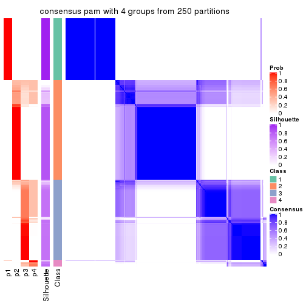</p>

</div>
<div id='tab-SD-pam-consensus-heatmap-4'>
<pre><code class="r">consensus_heatmap(res, k = 5)
</code></pre>

<p></p>

</div>
<div id='tab-SD-pam-consensus-heatmap-5'>
<pre><code class="r">consensus_heatmap(res, k = 6)
</code></pre>

<p></p>

</div>
</div>

Heatmaps for the membership of samples in all partitions to see how consistent they are:


<script>
$( function() {
	$( '#tabs-SD-pam-membership-heatmap' ).tabs();
} );
</script>
<div id='tabs-SD-pam-membership-heatmap'>
<ul>
<li><a href='#tab-SD-pam-membership-heatmap-1'>k = 2</a></li>
<li><a href='#tab-SD-pam-membership-heatmap-2'>k = 3</a></li>
<li><a href='#tab-SD-pam-membership-heatmap-3'>k = 4</a></li>
<li><a href='#tab-SD-pam-membership-heatmap-4'>k = 5</a></li>
<li><a href='#tab-SD-pam-membership-heatmap-5'>k = 6</a></li>
</ul>
<div id='tab-SD-pam-membership-heatmap-1'>
<pre><code class="r">membership_heatmap(res, k = 2)
</code></pre>

<p></p>

</div>
<div id='tab-SD-pam-membership-heatmap-2'>
<pre><code class="r">membership_heatmap(res, k = 3)
</code></pre>

<p></p>

</div>
<div id='tab-SD-pam-membership-heatmap-3'>
<pre><code class="r">membership_heatmap(res, k = 4)
</code></pre>

<p></p>

</div>
<div id='tab-SD-pam-membership-heatmap-4'>
<pre><code class="r">membership_heatmap(res, k = 5)
</code></pre>

<p></p>

</div>
<div id='tab-SD-pam-membership-heatmap-5'>
<pre><code class="r">membership_heatmap(res, k = 6)
</code></pre>

<p>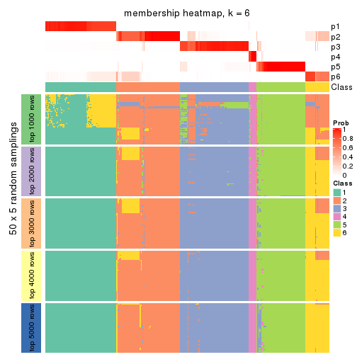</p>

</div>
</div>

As soon as we have had the classes for columns, we can look for signatures
which are significantly different between classes which can be candidate marks
for certain classes. Following are the heatmaps for signatures.


Signature heatmaps where rows are scaled:


<script>
$( function() {
	$( '#tabs-SD-pam-get-signatures' ).tabs();
} );
</script>
<div id='tabs-SD-pam-get-signatures'>
<ul>
<li><a href='#tab-SD-pam-get-signatures-1'>k = 2</a></li>
<li><a href='#tab-SD-pam-get-signatures-2'>k = 3</a></li>
<li><a href='#tab-SD-pam-get-signatures-3'>k = 4</a></li>
<li><a href='#tab-SD-pam-get-signatures-4'>k = 5</a></li>
<li><a href='#tab-SD-pam-get-signatures-5'>k = 6</a></li>
</ul>
<div id='tab-SD-pam-get-signatures-1'>
<pre><code class="r">get_signatures(res, k = 2)
</code></pre>

<p></p>

</div>
<div id='tab-SD-pam-get-signatures-2'>
<pre><code class="r">get_signatures(res, k = 3)
</code></pre>

<p></p>

</div>
<div id='tab-SD-pam-get-signatures-3'>
<pre><code class="r">get_signatures(res, k = 4)
</code></pre>

<p></p>

</div>
<div id='tab-SD-pam-get-signatures-4'>
<pre><code class="r">get_signatures(res, k = 5)
</code></pre>

<p></p>

</div>
<div id='tab-SD-pam-get-signatures-5'>
<pre><code class="r">get_signatures(res, k = 6)
</code></pre>

<p></p>

</div>
</div>


Signature heatmaps where rows are not scaled:


<script>
$( function() {
	$( '#tabs-SD-pam-get-signatures-no-scale' ).tabs();
} );
</script>
<div id='tabs-SD-pam-get-signatures-no-scale'>
<ul>
<li><a href='#tab-SD-pam-get-signatures-no-scale-1'>k = 2</a></li>
<li><a href='#tab-SD-pam-get-signatures-no-scale-2'>k = 3</a></li>
<li><a href='#tab-SD-pam-get-signatures-no-scale-3'>k = 4</a></li>
<li><a href='#tab-SD-pam-get-signatures-no-scale-4'>k = 5</a></li>
<li><a href='#tab-SD-pam-get-signatures-no-scale-5'>k = 6</a></li>
</ul>
<div id='tab-SD-pam-get-signatures-no-scale-1'>
<pre><code class="r">get_signatures(res, k = 2, scale_rows = FALSE)
</code></pre>

<p></p>

</div>
<div id='tab-SD-pam-get-signatures-no-scale-2'>
<pre><code class="r">get_signatures(res, k = 3, scale_rows = FALSE)
</code></pre>

<p></p>

</div>
<div id='tab-SD-pam-get-signatures-no-scale-3'>
<pre><code class="r">get_signatures(res, k = 4, scale_rows = FALSE)
</code></pre>

<p></p>

</div>
<div id='tab-SD-pam-get-signatures-no-scale-4'>
<pre><code class="r">get_signatures(res, k = 5, scale_rows = FALSE)
</code></pre>

<p></p>

</div>
<div id='tab-SD-pam-get-signatures-no-scale-5'>
<pre><code class="r">get_signatures(res, k = 6, scale_rows = FALSE)
</code></pre>

<p></p>

</div>
</div>


Compare the overlap of signatures from different k:

```r
compare_signatures(res)
```


`get_signature()` returns a data frame invisibly. TO get the list of signatures, the function
call should be assigned to a variable explicitly. In following code, if `plot` argument is set
to `FALSE`, no heatmap is plotted while only the differential analysis is performed.

```r
# code only for demonstration
tb = get_signature(res, k = ..., plot = FALSE)
```

An example of the output of `tb` is:

```
#>   which_row         fdr    mean_1    mean_2 scaled_mean_1 scaled_mean_2 km
#> 1        38 0.042760348  8.373488  9.131774    -0.5533452     0.5164555  1
#> 2        40 0.018707592  7.106213  8.469186    -0.6173731     0.5762149  1
#> 3        55 0.019134737 10.221463 11.207825    -0.6159697     0.5749050  1
#> 4        59 0.006059896  5.921854  7.869574    -0.6899429     0.6439467  1
#> 5        60 0.018055526  8.928898 10.211722    -0.6204761     0.5791110  1
#> 6        98 0.009384629 15.714769 14.887706     0.6635654    -0.6193277  2
...
```

The columns in `tb` are:

1. `which_row`: row indices corresponding to the input matrix.
2. `fdr`: FDR for the differential test. 
3. `mean_x`: The mean value in group x.
4. `scaled_mean_x`: The mean value in group x after rows are scaled.
5. `km`: Row groups if k-means clustering is applied to rows.


UMAP plot which shows how samples are separated.


<script>
$( function() {
	$( '#tabs-SD-pam-dimension-reduction' ).tabs();
} );
</script>
<div id='tabs-SD-pam-dimension-reduction'>
<ul>
<li><a href='#tab-SD-pam-dimension-reduction-1'>k = 2</a></li>
<li><a href='#tab-SD-pam-dimension-reduction-2'>k = 3</a></li>
<li><a href='#tab-SD-pam-dimension-reduction-3'>k = 4</a></li>
<li><a href='#tab-SD-pam-dimension-reduction-4'>k = 5</a></li>
<li><a href='#tab-SD-pam-dimension-reduction-5'>k = 6</a></li>
</ul>
<div id='tab-SD-pam-dimension-reduction-1'>
<pre><code class="r">dimension_reduction(res, k = 2, method = &quot;UMAP&quot;)
</code></pre>

<p></p>

</div>
<div id='tab-SD-pam-dimension-reduction-2'>
<pre><code class="r">dimension_reduction(res, k = 3, method = &quot;UMAP&quot;)
</code></pre>

<p></p>

</div>
<div id='tab-SD-pam-dimension-reduction-3'>
<pre><code class="r">dimension_reduction(res, k = 4, method = &quot;UMAP&quot;)
</code></pre>

<p></p>

</div>
<div id='tab-SD-pam-dimension-reduction-4'>
<pre><code class="r">dimension_reduction(res, k = 5, method = &quot;UMAP&quot;)
</code></pre>

<p></p>

</div>
<div id='tab-SD-pam-dimension-reduction-5'>
<pre><code class="r">dimension_reduction(res, k = 6, method = &quot;UMAP&quot;)
</code></pre>

<p></p>

</div>
</div>


Following heatmap shows how subgroups are split when increasing `k`:

```r
collect_classes(res)
```


If matrix rows can be associated to genes, consider to use `GO_Enrichment(res,
...)` to perform function enrichment for the signature genes.


 

---------------------------------------------------


### SD:mclust**


The object with results only for a single top-value method and a single partition method 
can be extracted as:

```r
res = res_list["SD", "mclust"]
# you can also extract it by
# res = res_list["SD:mclust"]
```

A summary of `res` and all the functions that can be applied to it:

```r
res
```

```
#> A 'ConsensusPartition' object with k = 2, 3, 4, 5, 6.
#>   On a matrix with 13930 rows and 285 columns.
#>   Top rows (1000, 2000, 3000, 4000, 5000) are extracted by 'SD' method.
#>   Subgroups are detected by 'mclust' method.
#>   Performed in total 1250 partitions by row resampling.
#>   Best k for subgroups seems to be 2.
#> 
#> Following methods can be applied to this 'ConsensusPartition' object:
#>  [1] "cola_report"             "collect_classes"         "collect_plots"          
#>  [4] "collect_stats"           "colnames"                "compare_signatures"     
#>  [7] "consensus_heatmap"       "dimension_reduction"     "functional_enrichment"  
#> [10] "get_anno_col"            "get_anno"                "get_classes"            
#> [13] "get_consensus"           "get_matrix"              "get_membership"         
#> [16] "get_param"               "get_signatures"          "get_stats"              
#> [19] "is_best_k"               "is_stable_k"             "membership_heatmap"     
#> [22] "ncol"                    "nrow"                    "plot_ecdf"              
#> [25] "rownames"                "select_partition_number" "show"                   
#> [28] "suggest_best_k"          "test_to_known_factors"
```

`collect_plots()` function collects all the plots made from `res` for all `k` (number of partitions)
into one single page to provide an easy and fast comparison between different `k`.

```r
collect_plots(res)
```


The plots are:

- The first row: a plot of the ECDF (Empirical cumulative distribution
  function) curves of the consensus matrix for each `k` and the heatmap of
  predicted classes for each `k`.
- The second row: heatmaps of the consensus matrix for each `k`.
- The third row: heatmaps of the membership matrix for each `k`.
- The fouth row: heatmaps of the signatures for each `k`.

All the plots in panels can be made by individual functions and they are
plotted later in this section.

`select_partition_number()` produces several plots showing different
statistics for choosing "optimized" `k`. There are following statistics:

- ECDF curves of the consensus matrix for each `k`;
- 1-PAC. [The PAC
  score](https://en.wikipedia.org/wiki/Consensus_clustering#Over-interpretation_potential_of_consensus_clustering)
  measures the proportion of the ambiguous subgrouping.
- Mean silhouette score.
- Concordance. The mean probability of fiting the consensus class ids in all
  partitions.
- Area increased. Denote $A_k$ as the area under the ECDF curve for current
  `k`, the area increased is defined as $A_k - A_{k-1}$.
- Rand index. The percent of pairs of samples that are both in a same cluster
  or both are not in a same cluster in the partition of k and k-1.
- Jaccard index. The ratio of pairs of samples are both in a same cluster in
  the partition of k and k-1 and the pairs of samples are both in a same
  cluster in the partition k or k-1.

The detailed explanations of these statistics can be found in [the cola
vignette](http://bioconductor.org/packages/devel/bioc/vignettes/cola/inst/doc/cola.html#toc_13).

Generally speaking, lower PAC score, higher mean silhouette score or higher
concordance corresponds to better partition. Rand index and Jaccard index
measure how similar the current partition is compared to partition with `k-1`.
If they are too similar, we won't accept `k` is better than `k-1`.

```r
select_partition_number(res)
```


The numeric values for all these statistics can be obtained by `get_stats()`.

```r
get_stats(res)
```

```
#>   k 1-PAC mean_silhouette concordance area_increased  Rand Jaccard
#> 2 2 1.000           0.948       0.979         0.3976 0.586   0.586
#> 3 3 0.763           0.939       0.941         0.2241 0.963   0.937
#> 4 4 0.675           0.768       0.877         0.3223 0.780   0.600
#> 5 5 0.583           0.594       0.757         0.1386 0.867   0.620
#> 6 6 0.621           0.576       0.705         0.0627 0.880   0.563
```

`suggest_best_k()` suggests the best $k$ based on these statistics. The rules are as follows:

- All $k$ with Jaccard index larger than 0.95 are removed because the increase of
  the partition number does not provides enough extra information. If all $k$ are removed,
  the best $k$ is assigned by `NA`.
- For $k$ with 1-PAC larger than 0.9, the maximal $k$ is taken as the "best k". Other $k$ is called "optional k".
- If it does not fit the second rule. The $k$ with the highest vote of highest
  1-PAC, mean silhouette and concordance is taken as the "best k".

```r
suggest_best_k(res)
```

```
#> [1] 2
```


Following shows the table of the partitions (You need to click the **show/hide
code output** link to see it). The membership matrix (columns with name `p*`)
is inferred by
[`clue::cl_consensus()`](https://www.rdocumentation.org/link/cl_consensus?package=clue)
function with the `SE` method. Basically the value in the membership matrix
represents the probability to belong to a certain group. The finall class
label for an item is determined with the group with highest probability it
belongs to.

In `get_classes()` function, the entropy is calculated from the membership
matrix and the silhouette score is calculated from the consensus matrix.


<script>
$( function() {
	$( '#tabs-SD-mclust-get-classes' ).tabs();
} );
</script>
<div id='tabs-SD-mclust-get-classes'>
<ul>
<li><a href='#tab-SD-mclust-get-classes-1'>k = 2</a></li>
<li><a href='#tab-SD-mclust-get-classes-2'>k = 3</a></li>
<li><a href='#tab-SD-mclust-get-classes-3'>k = 4</a></li>
<li><a href='#tab-SD-mclust-get-classes-4'>k = 5</a></li>
<li><a href='#tab-SD-mclust-get-classes-5'>k = 6</a></li>
</ul>

<div id='tab-SD-mclust-get-classes-1'>
<p><a id='tab-SD-mclust-get-classes-1-a' style='color:#0366d6' href='#'>show/hide code output</a></p>
<pre><code class="r">cbind(get_classes(res, k = 2), get_membership(res, k = 2))
</code></pre>

<pre><code>#&gt;            class entropy silhouette    p1    p2
#&gt; SRR1201591     2   0.000      0.999 0.000 1.000
#&gt; SRR1201590     2   0.000      0.999 0.000 1.000
#&gt; SRR1201593     2   0.000      0.999 0.000 1.000
#&gt; SRR1201592     2   0.000      0.999 0.000 1.000
#&gt; SRR1201617     2   0.000      0.999 0.000 1.000
#&gt; SRR1201616     2   0.000      0.999 0.000 1.000
#&gt; SRR1201619     2   0.000      0.999 0.000 1.000
#&gt; SRR1201618     2   0.000      0.999 0.000 1.000
#&gt; SRR1201620     2   0.000      0.999 0.000 1.000
#&gt; SRR1201621     2   0.000      0.999 0.000 1.000
#&gt; SRR1201623     2   0.000      0.999 0.000 1.000
#&gt; SRR1201622     2   0.000      0.999 0.000 1.000
#&gt; SRR1201624     1   0.996      0.246 0.536 0.464
#&gt; SRR1201625     1   0.996      0.246 0.536 0.464
#&gt; SRR1201626     1   0.996      0.246 0.536 0.464
#&gt; SRR1201627     1   0.996      0.246 0.536 0.464
#&gt; SRR1201628     2   0.000      0.999 0.000 1.000
#&gt; SRR1201629     2   0.000      0.999 0.000 1.000
#&gt; SRR1201630     2   0.000      0.999 0.000 1.000
#&gt; SRR1201631     2   0.000      0.999 0.000 1.000
#&gt; SRR1201641     2   0.000      0.999 0.000 1.000
#&gt; SRR1201640     2   0.000      0.999 0.000 1.000
#&gt; SRR1201643     2   0.000      0.999 0.000 1.000
#&gt; SRR1201644     2   0.000      0.999 0.000 1.000
#&gt; SRR1201661     2   0.000      0.999 0.000 1.000
#&gt; SRR1201662     2   0.000      0.999 0.000 1.000
#&gt; SRR1201663     2   0.000      0.999 0.000 1.000
#&gt; SRR1201664     2   0.000      0.999 0.000 1.000
#&gt; SRR1201665     2   0.000      0.999 0.000 1.000
#&gt; SRR1201666     2   0.000      0.999 0.000 1.000
#&gt; SRR1201667     2   0.000      0.999 0.000 1.000
#&gt; SRR1201668     2   0.204      0.963 0.032 0.968
#&gt; SRR1201670     2   0.000      0.999 0.000 1.000
#&gt; SRR1201669     2   0.000      0.999 0.000 1.000
#&gt; SRR1201673     2   0.000      0.999 0.000 1.000
#&gt; SRR1201672     2   0.000      0.999 0.000 1.000
#&gt; SRR1201671     2   0.000      0.999 0.000 1.000
#&gt; SRR1201677     2   0.000      0.999 0.000 1.000
#&gt; SRR1201676     2   0.000      0.999 0.000 1.000
#&gt; SRR1201675     2   0.000      0.999 0.000 1.000
#&gt; SRR1201674     2   0.000      0.999 0.000 1.000
#&gt; SRR1201678     2   0.000      0.999 0.000 1.000
#&gt; SRR1201682     2   0.000      0.999 0.000 1.000
#&gt; SRR1201683     2   0.000      0.999 0.000 1.000
#&gt; SRR1201680     2   0.000      0.999 0.000 1.000
#&gt; SRR1201681     2   0.000      0.999 0.000 1.000
#&gt; SRR1201679     2   0.000      0.999 0.000 1.000
#&gt; SRR1201686     2   0.000      0.999 0.000 1.000
#&gt; SRR1201687     2   0.000      0.999 0.000 1.000
#&gt; SRR1201688     2   0.000      0.999 0.000 1.000
#&gt; SRR1201689     2   0.000      0.999 0.000 1.000
#&gt; SRR1201685     1   0.998      0.208 0.524 0.476
#&gt; SRR1201692     2   0.000      0.999 0.000 1.000
#&gt; SRR1201691     2   0.000      0.999 0.000 1.000
#&gt; SRR1201690     2   0.000      0.999 0.000 1.000
#&gt; SRR1201696     2   0.000      0.999 0.000 1.000
#&gt; SRR1201695     2   0.000      0.999 0.000 1.000
#&gt; SRR1201694     2   0.000      0.999 0.000 1.000
#&gt; SRR1201693     2   0.000      0.999 0.000 1.000
#&gt; SRR1201697     2   0.000      0.999 0.000 1.000
#&gt; SRR1201698     2   0.000      0.999 0.000 1.000
#&gt; SRR1201700     2   0.000      0.999 0.000 1.000
#&gt; SRR1201708     2   0.000      0.999 0.000 1.000
#&gt; SRR1201707     2   0.000      0.999 0.000 1.000
#&gt; SRR1201706     2   0.000      0.999 0.000 1.000
#&gt; SRR1201702     2   0.000      0.999 0.000 1.000
#&gt; SRR1201705     2   0.000      0.999 0.000 1.000
#&gt; SRR1201701     2   0.000      0.999 0.000 1.000
#&gt; SRR1201704     2   0.000      0.999 0.000 1.000
#&gt; SRR1201703     2   0.000      0.999 0.000 1.000
#&gt; SRR1201716     2   0.000      0.999 0.000 1.000
#&gt; SRR1201715     2   0.000      0.999 0.000 1.000
#&gt; SRR1201717     2   0.000      0.999 0.000 1.000
#&gt; SRR1201712     2   0.000      0.999 0.000 1.000
#&gt; SRR1201709     2   0.000      0.999 0.000 1.000
#&gt; SRR1201711     2   0.000      0.999 0.000 1.000
#&gt; SRR1201714     2   0.000      0.999 0.000 1.000
#&gt; SRR1201713     2   0.000      0.999 0.000 1.000
#&gt; SRR1201710     2   0.000      0.999 0.000 1.000
#&gt; SRR1201719     2   0.000      0.999 0.000 1.000
#&gt; SRR1201718     2   0.000      0.999 0.000 1.000
#&gt; SRR1201721     2   0.000      0.999 0.000 1.000
#&gt; SRR1201720     2   0.000      0.999 0.000 1.000
#&gt; SRR1201723     2   0.000      0.999 0.000 1.000
#&gt; SRR1201722     2   0.000      0.999 0.000 1.000
#&gt; SRR1201725     2   0.000      0.999 0.000 1.000
#&gt; SRR1201724     2   0.000      0.999 0.000 1.000
#&gt; SRR1201726     2   0.000      0.999 0.000 1.000
#&gt; SRR1201727     2   0.000      0.999 0.000 1.000
#&gt; SRR1201731     2   0.000      0.999 0.000 1.000
#&gt; SRR1201730     2   0.000      0.999 0.000 1.000
#&gt; SRR1201734     2   0.000      0.999 0.000 1.000
#&gt; SRR1201733     2   0.000      0.999 0.000 1.000
#&gt; SRR1201736     2   0.000      0.999 0.000 1.000
#&gt; SRR1201737     2   0.000      0.999 0.000 1.000
#&gt; SRR1201739     2   0.000      0.999 0.000 1.000
#&gt; SRR1201738     2   0.000      0.999 0.000 1.000
#&gt; SRR1201742     2   0.000      0.999 0.000 1.000
#&gt; SRR1201743     2   0.000      0.999 0.000 1.000
#&gt; SRR1201745     2   0.000      0.999 0.000 1.000
#&gt; SRR1201744     2   0.506      0.862 0.112 0.888
#&gt; SRR1201749     2   0.000      0.999 0.000 1.000
#&gt; SRR1201750     2   0.000      0.999 0.000 1.000
#&gt; SRR1201752     2   0.000      0.999 0.000 1.000
#&gt; SRR1201751     2   0.000      0.999 0.000 1.000
#&gt; SRR1201754     2   0.000      0.999 0.000 1.000
#&gt; SRR1201753     2   0.000      0.999 0.000 1.000
#&gt; SRR1201758     1   0.996      0.246 0.536 0.464
#&gt; SRR1201759     1   0.998      0.208 0.524 0.476
#&gt; SRR1201760     2   0.000      0.999 0.000 1.000
#&gt; SRR1201761     2   0.000      0.999 0.000 1.000
#&gt; SRR1201763     1   0.996      0.246 0.536 0.464
#&gt; SRR1201762     1   0.996      0.246 0.536 0.464
#&gt; SRR1201764     2   0.552      0.839 0.128 0.872
#&gt; SRR1201766     2   0.000      0.999 0.000 1.000
#&gt; SRR1201768     2   0.000      0.999 0.000 1.000
#&gt; SRR1201769     2   0.000      0.999 0.000 1.000
#&gt; SRR1201767     2   0.000      0.999 0.000 1.000
#&gt; SRR1201770     2   0.000      0.999 0.000 1.000
#&gt; SRR1201771     2   0.000      0.999 0.000 1.000
#&gt; SRR1201772     2   0.000      0.999 0.000 1.000
#&gt; SRR1201773     2   0.000      0.999 0.000 1.000
#&gt; SRR1201774     2   0.000      0.999 0.000 1.000
#&gt; SRR1201786     2   0.000      0.999 0.000 1.000
#&gt; SRR1201784     2   0.000      0.999 0.000 1.000
#&gt; SRR1201785     2   0.000      0.999 0.000 1.000
#&gt; SRR1201778     2   0.000      0.999 0.000 1.000
#&gt; SRR1201779     2   0.000      0.999 0.000 1.000
#&gt; SRR1201781     2   0.000      0.999 0.000 1.000
#&gt; SRR1201780     2   0.000      0.999 0.000 1.000
#&gt; SRR1201783     2   0.000      0.999 0.000 1.000
#&gt; SRR1201782     2   0.000      0.999 0.000 1.000
#&gt; SRR1201798     2   0.000      0.999 0.000 1.000
#&gt; SRR1201797     2   0.000      0.999 0.000 1.000
#&gt; SRR1201796     2   0.000      0.999 0.000 1.000
#&gt; SRR1201795     2   0.000      0.999 0.000 1.000
#&gt; SRR1201799     2   0.000      0.999 0.000 1.000
#&gt; SRR1201794     2   0.000      0.999 0.000 1.000
#&gt; SRR1201793     2   0.000      0.999 0.000 1.000
#&gt; SRR1201792     2   0.000      0.999 0.000 1.000
#&gt; SRR1201791     2   0.000      0.999 0.000 1.000
#&gt; SRR1201807     2   0.000      0.999 0.000 1.000
#&gt; SRR1201808     2   0.000      0.999 0.000 1.000
#&gt; SRR1201803     2   0.000      0.999 0.000 1.000
#&gt; SRR1201804     2   0.000      0.999 0.000 1.000
#&gt; SRR1201805     2   0.000      0.999 0.000 1.000
#&gt; SRR1201806     2   0.000      0.999 0.000 1.000
#&gt; SRR1201801     2   0.000      0.999 0.000 1.000
#&gt; SRR1201802     2   0.000      0.999 0.000 1.000
#&gt; SRR1201800     2   0.000      0.999 0.000 1.000
#&gt; SRR1201814     2   0.000      0.999 0.000 1.000
#&gt; SRR1201816     2   0.000      0.999 0.000 1.000
#&gt; SRR1201815     2   0.000      0.999 0.000 1.000
#&gt; SRR1201819     2   0.000      0.999 0.000 1.000
#&gt; SRR1201820     2   0.000      0.999 0.000 1.000
#&gt; SRR1201813     2   0.000      0.999 0.000 1.000
#&gt; SRR1201817     2   0.000      0.999 0.000 1.000
#&gt; SRR1201818     2   0.000      0.999 0.000 1.000
#&gt; SRR1201825     2   0.000      0.999 0.000 1.000
#&gt; SRR1201827     2   0.000      0.999 0.000 1.000
#&gt; SRR1201828     2   0.000      0.999 0.000 1.000
#&gt; SRR1201826     2   0.000      0.999 0.000 1.000
#&gt; SRR1201829     2   0.000      0.999 0.000 1.000
#&gt; SRR1201830     2   0.000      0.999 0.000 1.000
#&gt; SRR1201831     2   0.000      0.999 0.000 1.000
#&gt; SRR1201832     2   0.000      0.999 0.000 1.000
#&gt; SRR1201833     2   0.000      0.999 0.000 1.000
#&gt; SRR1201865     2   0.000      0.999 0.000 1.000
#&gt; SRR1201866     2   0.000      0.999 0.000 1.000
#&gt; SRR1201867     2   0.000      0.999 0.000 1.000
#&gt; SRR1201861     2   0.000      0.999 0.000 1.000
#&gt; SRR1201862     2   0.000      0.999 0.000 1.000
#&gt; SRR1201863     2   0.000      0.999 0.000 1.000
#&gt; SRR1201859     2   0.000      0.999 0.000 1.000
#&gt; SRR1201864     2   0.000      0.999 0.000 1.000
#&gt; SRR1201860     2   0.000      0.999 0.000 1.000
#&gt; SRR1201873     2   0.000      0.999 0.000 1.000
#&gt; SRR1201871     2   0.000      0.999 0.000 1.000
#&gt; SRR1201872     2   0.000      0.999 0.000 1.000
#&gt; SRR1201980     2   0.000      0.999 0.000 1.000
#&gt; SRR1201979     2   0.000      0.999 0.000 1.000
#&gt; SRR1201982     2   0.000      0.999 0.000 1.000
#&gt; SRR1201981     2   0.000      0.999 0.000 1.000
#&gt; SRR1201998     2   0.000      0.999 0.000 1.000
#&gt; SRR1201996     2   0.000      0.999 0.000 1.000
#&gt; SRR1201997     2   0.000      0.999 0.000 1.000
#&gt; SRR1202005     2   0.000      0.999 0.000 1.000
#&gt; SRR1202006     2   0.000      0.999 0.000 1.000
#&gt; SRR1202088     2   0.000      0.999 0.000 1.000
#&gt; SRR1202087     2   0.000      0.999 0.000 1.000
#&gt; SRR1202093     2   0.000      0.999 0.000 1.000
#&gt; SRR1202092     2   0.000      0.999 0.000 1.000
#&gt; SRR1202288     2   0.000      0.999 0.000 1.000
#&gt; SRR1202289     2   0.000      0.999 0.000 1.000
#&gt; SRR1202299     2   0.000      0.999 0.000 1.000
#&gt; SRR1202298     2   0.000      0.999 0.000 1.000
#&gt; SRR1202303     1   0.996      0.246 0.536 0.464
#&gt; SRR1202372     2   0.000      0.999 0.000 1.000
#&gt; SRR1202371     2   0.000      0.999 0.000 1.000
#&gt; SRR1202563     2   0.000      0.999 0.000 1.000
#&gt; SRR1202565     2   0.000      0.999 0.000 1.000
#&gt; SRR1202564     2   0.000      0.999 0.000 1.000
#&gt; SRR1202649     2   0.000      0.999 0.000 1.000
#&gt; SRR1202650     2   0.000      0.999 0.000 1.000
#&gt; SRR1202651     2   0.000      0.999 0.000 1.000
#&gt; SRR1202843     1   0.000      0.930 1.000 0.000
#&gt; SRR1202844     1   0.000      0.930 1.000 0.000
#&gt; SRR1202845     2   0.000      0.999 0.000 1.000
#&gt; SRR1202847     2   0.000      0.999 0.000 1.000
#&gt; SRR1202846     2   0.000      0.999 0.000 1.000
#&gt; SRR1202945     1   0.000      0.930 1.000 0.000
#&gt; SRR1202949     1   0.000      0.930 1.000 0.000
#&gt; SRR1202977     1   0.000      0.930 1.000 0.000
#&gt; SRR1202978     1   0.000      0.930 1.000 0.000
#&gt; SRR1202979     1   0.000      0.930 1.000 0.000
#&gt; SRR1202990     1   0.000      0.930 1.000 0.000
#&gt; SRR1202999     1   0.000      0.930 1.000 0.000
#&gt; SRR1203005     1   0.000      0.930 1.000 0.000
#&gt; SRR1203006     1   0.000      0.930 1.000 0.000
#&gt; SRR1203007     1   0.000      0.930 1.000 0.000
#&gt; SRR1203009     1   0.000      0.930 1.000 0.000
#&gt; SRR1203008     1   0.000      0.930 1.000 0.000
#&gt; SRR1203010     1   0.000      0.930 1.000 0.000
#&gt; SRR1203011     1   0.000      0.930 1.000 0.000
#&gt; SRR1203025     1   0.000      0.930 1.000 0.000
#&gt; SRR1203026     1   0.000      0.930 1.000 0.000
#&gt; SRR1203027     1   0.000      0.930 1.000 0.000
#&gt; SRR1203061     1   0.000      0.930 1.000 0.000
#&gt; SRR1203089     1   0.000      0.930 1.000 0.000
#&gt; SRR1203125     1   0.000      0.930 1.000 0.000
#&gt; SRR1203128     1   0.000      0.930 1.000 0.000
#&gt; SRR1203129     1   0.000      0.930 1.000 0.000
#&gt; SRR1203130     1   0.000      0.930 1.000 0.000
#&gt; SRR1203132     2   0.000      0.999 0.000 1.000
#&gt; SRR1203131     2   0.000      0.999 0.000 1.000
#&gt; SRR1203133     1   0.000      0.930 1.000 0.000
#&gt; SRR1203138     1   0.000      0.930 1.000 0.000
#&gt; SRR1203760     1   0.000      0.930 1.000 0.000
#&gt; SRR1203761     1   0.000      0.930 1.000 0.000
#&gt; SRR1203770     1   0.000      0.930 1.000 0.000
#&gt; SRR1203771     1   0.000      0.930 1.000 0.000
#&gt; SRR1203772     1   0.000      0.930 1.000 0.000
#&gt; SRR1203773     1   0.000      0.930 1.000 0.000
#&gt; SRR1203774     1   0.000      0.930 1.000 0.000
#&gt; SRR1203775     1   0.000      0.930 1.000 0.000
#&gt; SRR1203800     1   0.000      0.930 1.000 0.000
#&gt; SRR1203801     1   0.000      0.930 1.000 0.000
#&gt; SRR1203802     1   0.000      0.930 1.000 0.000
#&gt; SRR1203803     1   0.000      0.930 1.000 0.000
#&gt; SRR1203804     1   0.000      0.930 1.000 0.000
#&gt; SRR1203805     1   0.000      0.930 1.000 0.000
#&gt; SRR1203806     1   0.000      0.930 1.000 0.000
#&gt; SRR1203807     1   0.000      0.930 1.000 0.000
#&gt; SRR1203808     1   0.000      0.930 1.000 0.000
#&gt; SRR1203811     1   0.000      0.930 1.000 0.000
#&gt; SRR1203812     1   0.000      0.930 1.000 0.000
#&gt; SRR1203813     1   0.000      0.930 1.000 0.000
#&gt; SRR1203814     1   0.000      0.930 1.000 0.000
#&gt; SRR1203815     1   0.000      0.930 1.000 0.000
#&gt; SRR1203816     1   0.000      0.930 1.000 0.000
#&gt; SRR1203817     1   0.000      0.930 1.000 0.000
#&gt; SRR1203818     1   0.000      0.930 1.000 0.000
#&gt; SRR1203819     1   0.000      0.930 1.000 0.000
#&gt; SRR1203822     1   0.000      0.930 1.000 0.000
#&gt; SRR1203823     1   0.000      0.930 1.000 0.000
#&gt; SRR1203824     1   0.000      0.930 1.000 0.000
#&gt; SRR1203825     1   0.000      0.930 1.000 0.000
#&gt; SRR1203826     1   0.000      0.930 1.000 0.000
#&gt; SRR1203827     1   0.996      0.246 0.536 0.464
#&gt; SRR1203828     1   0.000      0.930 1.000 0.000
#&gt; SRR1203829     1   0.000      0.930 1.000 0.000
#&gt; SRR1203830     1   0.000      0.930 1.000 0.000
#&gt; SRR1203831     1   0.000      0.930 1.000 0.000
#&gt; SRR1203832     1   0.000      0.930 1.000 0.000
#&gt; SRR1203833     1   0.000      0.930 1.000 0.000
#&gt; SRR1203834     1   0.000      0.930 1.000 0.000
#&gt; SRR1203835     1   0.000      0.930 1.000 0.000
#&gt; SRR1203836     1   0.000      0.930 1.000 0.000
#&gt; SRR1203837     1   0.000      0.930 1.000 0.000
#&gt; SRR1203838     1   0.000      0.930 1.000 0.000
#&gt; SRR1203839     1   0.000      0.930 1.000 0.000
#&gt; SRR1203842     1   0.996      0.246 0.536 0.464
#&gt; SRR1203843     1   0.000      0.930 1.000 0.000
#&gt; SRR1203845     2   0.000      0.999 0.000 1.000
#&gt; SRR1203844     2   0.000      0.999 0.000 1.000
</code></pre>

<script>
$('#tab-SD-mclust-get-classes-1-a').parent().next().next().hide();
$('#tab-SD-mclust-get-classes-1-a').click(function(){
  $('#tab-SD-mclust-get-classes-1-a').parent().next().next().toggle();
  return(false);
});
</script>
</div>

<div id='tab-SD-mclust-get-classes-2'>
<p><a id='tab-SD-mclust-get-classes-2-a' style='color:#0366d6' href='#'>show/hide code output</a></p>
<pre><code class="r">cbind(get_classes(res, k = 3), get_membership(res, k = 3))
</code></pre>

<pre><code>#&gt;            class entropy silhouette    p1    p2    p3
#&gt; SRR1201591     2  0.3752      0.904 0.000 0.856 0.144
#&gt; SRR1201590     2  0.2625      0.927 0.000 0.916 0.084
#&gt; SRR1201593     2  0.4002      0.895 0.000 0.840 0.160
#&gt; SRR1201592     2  0.3941      0.898 0.000 0.844 0.156
#&gt; SRR1201617     2  0.3941      0.899 0.000 0.844 0.156
#&gt; SRR1201616     2  0.4002      0.895 0.000 0.840 0.160
#&gt; SRR1201619     2  0.0237      0.941 0.000 0.996 0.004
#&gt; SRR1201618     2  0.0424      0.941 0.000 0.992 0.008
#&gt; SRR1201620     2  0.3816      0.903 0.000 0.852 0.148
#&gt; SRR1201621     2  0.4002      0.895 0.000 0.840 0.160
#&gt; SRR1201623     2  0.0237      0.940 0.000 0.996 0.004
#&gt; SRR1201622     2  0.0237      0.940 0.000 0.996 0.004
#&gt; SRR1201624     3  0.4702      0.914 0.212 0.000 0.788
#&gt; SRR1201625     3  0.4702      0.914 0.212 0.000 0.788
#&gt; SRR1201626     3  0.4796      0.914 0.220 0.000 0.780
#&gt; SRR1201627     3  0.4796      0.914 0.220 0.000 0.780
#&gt; SRR1201628     2  0.0237      0.940 0.000 0.996 0.004
#&gt; SRR1201629     2  0.0424      0.940 0.000 0.992 0.008
#&gt; SRR1201630     2  0.2448      0.930 0.000 0.924 0.076
#&gt; SRR1201631     2  0.2878      0.921 0.000 0.904 0.096
#&gt; SRR1201641     2  0.0892      0.941 0.000 0.980 0.020
#&gt; SRR1201640     2  0.0000      0.941 0.000 1.000 0.000
#&gt; SRR1201643     2  0.0424      0.940 0.000 0.992 0.008
#&gt; SRR1201644     2  0.0424      0.940 0.000 0.992 0.008
#&gt; SRR1201661     2  0.1289      0.940 0.000 0.968 0.032
#&gt; SRR1201662     2  0.1964      0.935 0.000 0.944 0.056
#&gt; SRR1201663     2  0.1015      0.938 0.008 0.980 0.012
#&gt; SRR1201664     2  0.0661      0.940 0.004 0.988 0.008
#&gt; SRR1201665     2  0.3340      0.914 0.000 0.880 0.120
#&gt; SRR1201666     2  0.3038      0.920 0.000 0.896 0.104
#&gt; SRR1201667     2  0.3038      0.920 0.000 0.896 0.104
#&gt; SRR1201668     3  0.5945      0.671 0.024 0.236 0.740
#&gt; SRR1201670     2  0.0237      0.940 0.000 0.996 0.004
#&gt; SRR1201669     2  0.0237      0.940 0.000 0.996 0.004
#&gt; SRR1201673     2  0.0237      0.941 0.000 0.996 0.004
#&gt; SRR1201672     2  0.0237      0.941 0.000 0.996 0.004
#&gt; SRR1201671     2  0.0237      0.941 0.000 0.996 0.004
#&gt; SRR1201677     2  0.0237      0.941 0.000 0.996 0.004
#&gt; SRR1201676     2  0.0237      0.941 0.000 0.996 0.004
#&gt; SRR1201675     2  0.0237      0.941 0.000 0.996 0.004
#&gt; SRR1201674     2  0.0237      0.941 0.000 0.996 0.004
#&gt; SRR1201678     2  0.0237      0.941 0.000 0.996 0.004
#&gt; SRR1201682     2  0.1643      0.937 0.000 0.956 0.044
#&gt; SRR1201683     2  0.1643      0.937 0.000 0.956 0.044
#&gt; SRR1201680     2  0.1643      0.937 0.000 0.956 0.044
#&gt; SRR1201681     2  0.1643      0.937 0.000 0.956 0.044
#&gt; SRR1201679     2  0.1411      0.937 0.000 0.964 0.036
#&gt; SRR1201686     2  0.0848      0.939 0.008 0.984 0.008
#&gt; SRR1201687     2  0.0848      0.939 0.008 0.984 0.008
#&gt; SRR1201688     2  0.0848      0.939 0.008 0.984 0.008
#&gt; SRR1201689     2  0.0848      0.939 0.008 0.984 0.008
#&gt; SRR1201685     3  0.5627      0.897 0.188 0.032 0.780
#&gt; SRR1201692     2  0.0424      0.940 0.000 0.992 0.008
#&gt; SRR1201691     2  0.0424      0.940 0.000 0.992 0.008
#&gt; SRR1201690     2  0.0000      0.941 0.000 1.000 0.000
#&gt; SRR1201696     2  0.0424      0.940 0.000 0.992 0.008
#&gt; SRR1201695     2  0.0424      0.940 0.000 0.992 0.008
#&gt; SRR1201694     2  0.0424      0.940 0.000 0.992 0.008
#&gt; SRR1201693     2  0.0424      0.940 0.000 0.992 0.008
#&gt; SRR1201697     2  0.0424      0.940 0.000 0.992 0.008
#&gt; SRR1201698     2  0.0424      0.940 0.000 0.992 0.008
#&gt; SRR1201700     2  0.0000      0.941 0.000 1.000 0.000
#&gt; SRR1201708     2  0.0000      0.941 0.000 1.000 0.000
#&gt; SRR1201707     2  0.0000      0.941 0.000 1.000 0.000
#&gt; SRR1201706     2  0.0000      0.941 0.000 1.000 0.000
#&gt; SRR1201702     2  0.0000      0.941 0.000 1.000 0.000
#&gt; SRR1201705     2  0.0000      0.941 0.000 1.000 0.000
#&gt; SRR1201701     2  0.0000      0.941 0.000 1.000 0.000
#&gt; SRR1201704     2  0.0000      0.941 0.000 1.000 0.000
#&gt; SRR1201703     2  0.0000      0.941 0.000 1.000 0.000
#&gt; SRR1201716     2  0.0592      0.939 0.000 0.988 0.012
#&gt; SRR1201715     2  0.0592      0.939 0.000 0.988 0.012
#&gt; SRR1201717     2  0.0592      0.939 0.000 0.988 0.012
#&gt; SRR1201712     2  0.0592      0.939 0.000 0.988 0.012
#&gt; SRR1201709     2  0.0237      0.940 0.000 0.996 0.004
#&gt; SRR1201711     2  0.0592      0.939 0.000 0.988 0.012
#&gt; SRR1201714     2  0.0592      0.939 0.000 0.988 0.012
#&gt; SRR1201713     2  0.0592      0.939 0.000 0.988 0.012
#&gt; SRR1201710     2  0.0592      0.939 0.000 0.988 0.012
#&gt; SRR1201719     2  0.1753      0.937 0.000 0.952 0.048
#&gt; SRR1201718     2  0.0424      0.941 0.000 0.992 0.008
#&gt; SRR1201721     2  0.0424      0.940 0.000 0.992 0.008
#&gt; SRR1201720     2  0.0000      0.941 0.000 1.000 0.000
#&gt; SRR1201723     2  0.0237      0.940 0.000 0.996 0.004
#&gt; SRR1201722     2  0.0661      0.940 0.004 0.988 0.008
#&gt; SRR1201725     2  0.1643      0.938 0.000 0.956 0.044
#&gt; SRR1201724     2  0.0000      0.941 0.000 1.000 0.000
#&gt; SRR1201726     2  0.0237      0.940 0.000 0.996 0.004
#&gt; SRR1201727     2  0.0424      0.940 0.000 0.992 0.008
#&gt; SRR1201731     2  0.0000      0.941 0.000 1.000 0.000
#&gt; SRR1201730     2  0.0424      0.940 0.000 0.992 0.008
#&gt; SRR1201734     2  0.3816      0.902 0.000 0.852 0.148
#&gt; SRR1201733     2  0.3340      0.914 0.000 0.880 0.120
#&gt; SRR1201736     2  0.1163      0.936 0.000 0.972 0.028
#&gt; SRR1201737     2  0.0237      0.941 0.000 0.996 0.004
#&gt; SRR1201739     2  0.3116      0.918 0.000 0.892 0.108
#&gt; SRR1201738     2  0.2165      0.932 0.000 0.936 0.064
#&gt; SRR1201742     2  0.0237      0.941 0.000 0.996 0.004
#&gt; SRR1201743     2  0.0237      0.941 0.000 0.996 0.004
#&gt; SRR1201745     2  0.3038      0.922 0.000 0.896 0.104
#&gt; SRR1201744     3  0.4565      0.802 0.064 0.076 0.860
#&gt; SRR1201749     2  0.2261      0.932 0.000 0.932 0.068
#&gt; SRR1201750     2  0.1529      0.939 0.000 0.960 0.040
#&gt; SRR1201752     2  0.0000      0.941 0.000 1.000 0.000
#&gt; SRR1201751     2  0.0000      0.941 0.000 1.000 0.000
#&gt; SRR1201754     2  0.3879      0.900 0.000 0.848 0.152
#&gt; SRR1201753     2  0.3619      0.907 0.000 0.864 0.136
#&gt; SRR1201758     3  0.5109      0.912 0.212 0.008 0.780
#&gt; SRR1201759     3  0.5743      0.885 0.172 0.044 0.784
#&gt; SRR1201760     2  0.0237      0.940 0.000 0.996 0.004
#&gt; SRR1201761     2  0.0000      0.941 0.000 1.000 0.000
#&gt; SRR1201763     3  0.4796      0.914 0.220 0.000 0.780
#&gt; SRR1201762     3  0.4796      0.914 0.220 0.000 0.780
#&gt; SRR1201764     3  0.5243      0.802 0.072 0.100 0.828
#&gt; SRR1201766     2  0.3941      0.897 0.000 0.844 0.156
#&gt; SRR1201768     2  0.4002      0.894 0.000 0.840 0.160
#&gt; SRR1201769     2  0.4062      0.892 0.000 0.836 0.164
#&gt; SRR1201767     2  0.4002      0.894 0.000 0.840 0.160
#&gt; SRR1201770     2  0.4062      0.892 0.000 0.836 0.164
#&gt; SRR1201771     2  0.4121      0.890 0.000 0.832 0.168
#&gt; SRR1201772     2  0.4002      0.894 0.000 0.840 0.160
#&gt; SRR1201773     2  0.4062      0.892 0.000 0.836 0.164
#&gt; SRR1201774     2  0.4002      0.894 0.000 0.840 0.160
#&gt; SRR1201786     2  0.4291      0.883 0.000 0.820 0.180
#&gt; SRR1201784     2  0.4291      0.883 0.000 0.820 0.180
#&gt; SRR1201785     2  0.4291      0.883 0.000 0.820 0.180
#&gt; SRR1201778     2  0.3619      0.907 0.000 0.864 0.136
#&gt; SRR1201779     2  0.4291      0.883 0.000 0.820 0.180
#&gt; SRR1201781     2  0.4235      0.886 0.000 0.824 0.176
#&gt; SRR1201780     2  0.4235      0.886 0.000 0.824 0.176
#&gt; SRR1201783     2  0.4291      0.883 0.000 0.820 0.180
#&gt; SRR1201782     2  0.4291      0.883 0.000 0.820 0.180
#&gt; SRR1201798     2  0.4002      0.895 0.000 0.840 0.160
#&gt; SRR1201797     2  0.3941      0.898 0.000 0.844 0.156
#&gt; SRR1201796     2  0.3879      0.900 0.000 0.848 0.152
#&gt; SRR1201795     2  0.3941      0.898 0.000 0.844 0.156
#&gt; SRR1201799     2  0.4002      0.895 0.000 0.840 0.160
#&gt; SRR1201794     2  0.3941      0.898 0.000 0.844 0.156
#&gt; SRR1201793     2  0.4002      0.895 0.000 0.840 0.160
#&gt; SRR1201792     2  0.3816      0.902 0.000 0.852 0.148
#&gt; SRR1201791     2  0.3412      0.912 0.000 0.876 0.124
#&gt; SRR1201807     2  0.3816      0.902 0.000 0.852 0.148
#&gt; SRR1201808     2  0.3816      0.902 0.000 0.852 0.148
#&gt; SRR1201803     2  0.3816      0.902 0.000 0.852 0.148
#&gt; SRR1201804     2  0.3816      0.902 0.000 0.852 0.148
#&gt; SRR1201805     2  0.3816      0.902 0.000 0.852 0.148
#&gt; SRR1201806     2  0.3816      0.902 0.000 0.852 0.148
#&gt; SRR1201801     2  0.3816      0.902 0.000 0.852 0.148
#&gt; SRR1201802     2  0.3816      0.902 0.000 0.852 0.148
#&gt; SRR1201800     2  0.4062      0.893 0.000 0.836 0.164
#&gt; SRR1201814     2  0.4452      0.873 0.000 0.808 0.192
#&gt; SRR1201816     2  0.4452      0.873 0.000 0.808 0.192
#&gt; SRR1201815     2  0.4452      0.873 0.000 0.808 0.192
#&gt; SRR1201819     2  0.4452      0.873 0.000 0.808 0.192
#&gt; SRR1201820     2  0.4452      0.873 0.000 0.808 0.192
#&gt; SRR1201813     2  0.4062      0.893 0.000 0.836 0.164
#&gt; SRR1201817     2  0.4452      0.873 0.000 0.808 0.192
#&gt; SRR1201818     2  0.4452      0.873 0.000 0.808 0.192
#&gt; SRR1201825     2  0.0237      0.941 0.000 0.996 0.004
#&gt; SRR1201827     2  0.0892      0.941 0.000 0.980 0.020
#&gt; SRR1201828     2  0.0892      0.941 0.000 0.980 0.020
#&gt; SRR1201826     2  0.0424      0.941 0.000 0.992 0.008
#&gt; SRR1201829     2  0.0892      0.941 0.000 0.980 0.020
#&gt; SRR1201830     2  0.0892      0.941 0.000 0.980 0.020
#&gt; SRR1201831     2  0.0747      0.941 0.000 0.984 0.016
#&gt; SRR1201832     2  0.0892      0.941 0.000 0.980 0.020
#&gt; SRR1201833     2  0.0892      0.941 0.000 0.980 0.020
#&gt; SRR1201865     2  0.0592      0.939 0.000 0.988 0.012
#&gt; SRR1201866     2  0.0592      0.939 0.000 0.988 0.012
#&gt; SRR1201867     2  0.0592      0.939 0.000 0.988 0.012
#&gt; SRR1201861     2  0.0592      0.939 0.000 0.988 0.012
#&gt; SRR1201862     2  0.0592      0.939 0.000 0.988 0.012
#&gt; SRR1201863     2  0.0592      0.939 0.000 0.988 0.012
#&gt; SRR1201859     2  0.0237      0.940 0.000 0.996 0.004
#&gt; SRR1201864     2  0.0592      0.939 0.000 0.988 0.012
#&gt; SRR1201860     2  0.0592      0.939 0.000 0.988 0.012
#&gt; SRR1201873     2  0.0424      0.940 0.000 0.992 0.008
#&gt; SRR1201871     2  0.0237      0.940 0.000 0.996 0.004
#&gt; SRR1201872     2  0.0424      0.940 0.000 0.992 0.008
#&gt; SRR1201980     2  0.0000      0.941 0.000 1.000 0.000
#&gt; SRR1201979     2  0.0000      0.941 0.000 1.000 0.000
#&gt; SRR1201982     2  0.0000      0.941 0.000 1.000 0.000
#&gt; SRR1201981     2  0.0000      0.941 0.000 1.000 0.000
#&gt; SRR1201998     2  0.0000      0.941 0.000 1.000 0.000
#&gt; SRR1201996     2  0.0237      0.940 0.000 0.996 0.004
#&gt; SRR1201997     2  0.0237      0.942 0.000 0.996 0.004
#&gt; SRR1202005     2  0.2711      0.926 0.000 0.912 0.088
#&gt; SRR1202006     2  0.2356      0.930 0.000 0.928 0.072
#&gt; SRR1202088     2  0.0237      0.941 0.000 0.996 0.004
#&gt; SRR1202087     2  0.0237      0.941 0.000 0.996 0.004
#&gt; SRR1202093     2  0.0424      0.941 0.000 0.992 0.008
#&gt; SRR1202092     2  0.0592      0.941 0.000 0.988 0.012
#&gt; SRR1202288     2  0.3340      0.914 0.000 0.880 0.120
#&gt; SRR1202289     2  0.3879      0.900 0.000 0.848 0.152
#&gt; SRR1202299     2  0.4002      0.895 0.000 0.840 0.160
#&gt; SRR1202298     2  0.3941      0.898 0.000 0.844 0.156
#&gt; SRR1202303     3  0.4796      0.914 0.220 0.000 0.780
#&gt; SRR1202372     2  0.3879      0.900 0.000 0.848 0.152
#&gt; SRR1202371     2  0.3340      0.914 0.000 0.880 0.120
#&gt; SRR1202563     2  0.5363      0.642 0.000 0.724 0.276
#&gt; SRR1202565     2  0.0592      0.941 0.000 0.988 0.012
#&gt; SRR1202564     2  0.0424      0.941 0.000 0.992 0.008
#&gt; SRR1202649     2  0.4887      0.735 0.000 0.772 0.228
#&gt; SRR1202650     2  0.0747      0.942 0.000 0.984 0.016
#&gt; SRR1202651     2  0.3267      0.916 0.000 0.884 0.116
#&gt; SRR1202843     1  0.0000      1.000 1.000 0.000 0.000
#&gt; SRR1202844     1  0.0000      1.000 1.000 0.000 0.000
#&gt; SRR1202845     2  0.2878      0.921 0.000 0.904 0.096
#&gt; SRR1202847     2  0.2878      0.921 0.000 0.904 0.096
#&gt; SRR1202846     2  0.2878      0.921 0.000 0.904 0.096
#&gt; SRR1202945     1  0.0000      1.000 1.000 0.000 0.000
#&gt; SRR1202949     1  0.0000      1.000 1.000 0.000 0.000
#&gt; SRR1202977     1  0.0000      1.000 1.000 0.000 0.000
#&gt; SRR1202978     1  0.0000      1.000 1.000 0.000 0.000
#&gt; SRR1202979     1  0.0000      1.000 1.000 0.000 0.000
#&gt; SRR1202990     1  0.0000      1.000 1.000 0.000 0.000
#&gt; SRR1202999     1  0.0000      1.000 1.000 0.000 0.000
#&gt; SRR1203005     1  0.0000      1.000 1.000 0.000 0.000
#&gt; SRR1203006     1  0.0000      1.000 1.000 0.000 0.000
#&gt; SRR1203007     1  0.0000      1.000 1.000 0.000 0.000
#&gt; SRR1203009     1  0.0000      1.000 1.000 0.000 0.000
#&gt; SRR1203008     1  0.0000      1.000 1.000 0.000 0.000
#&gt; SRR1203010     1  0.0000      1.000 1.000 0.000 0.000
#&gt; SRR1203011     1  0.0000      1.000 1.000 0.000 0.000
#&gt; SRR1203025     1  0.0000      1.000 1.000 0.000 0.000
#&gt; SRR1203026     1  0.0000      1.000 1.000 0.000 0.000
#&gt; SRR1203027     1  0.0000      1.000 1.000 0.000 0.000
#&gt; SRR1203061     1  0.0000      1.000 1.000 0.000 0.000
#&gt; SRR1203089     1  0.0000      1.000 1.000 0.000 0.000
#&gt; SRR1203125     1  0.0000      1.000 1.000 0.000 0.000
#&gt; SRR1203128     1  0.0000      1.000 1.000 0.000 0.000
#&gt; SRR1203129     1  0.0000      1.000 1.000 0.000 0.000
#&gt; SRR1203130     1  0.0000      1.000 1.000 0.000 0.000
#&gt; SRR1203132     2  0.0237      0.940 0.000 0.996 0.004
#&gt; SRR1203131     2  0.0000      0.941 0.000 1.000 0.000
#&gt; SRR1203133     1  0.0000      1.000 1.000 0.000 0.000
#&gt; SRR1203138     1  0.0000      1.000 1.000 0.000 0.000
#&gt; SRR1203760     1  0.0000      1.000 1.000 0.000 0.000
#&gt; SRR1203761     1  0.0000      1.000 1.000 0.000 0.000
#&gt; SRR1203770     1  0.0000      1.000 1.000 0.000 0.000
#&gt; SRR1203771     1  0.0000      1.000 1.000 0.000 0.000
#&gt; SRR1203772     1  0.0000      1.000 1.000 0.000 0.000
#&gt; SRR1203773     1  0.0000      1.000 1.000 0.000 0.000
#&gt; SRR1203774     1  0.0000      1.000 1.000 0.000 0.000
#&gt; SRR1203775     1  0.0000      1.000 1.000 0.000 0.000
#&gt; SRR1203800     1  0.0000      1.000 1.000 0.000 0.000
#&gt; SRR1203801     1  0.0000      1.000 1.000 0.000 0.000
#&gt; SRR1203802     1  0.0000      1.000 1.000 0.000 0.000
#&gt; SRR1203803     1  0.0000      1.000 1.000 0.000 0.000
#&gt; SRR1203804     1  0.0000      1.000 1.000 0.000 0.000
#&gt; SRR1203805     1  0.0000      1.000 1.000 0.000 0.000
#&gt; SRR1203806     1  0.0000      1.000 1.000 0.000 0.000
#&gt; SRR1203807     1  0.0000      1.000 1.000 0.000 0.000
#&gt; SRR1203808     1  0.0000      1.000 1.000 0.000 0.000
#&gt; SRR1203811     1  0.0000      1.000 1.000 0.000 0.000
#&gt; SRR1203812     1  0.0000      1.000 1.000 0.000 0.000
#&gt; SRR1203813     1  0.0000      1.000 1.000 0.000 0.000
#&gt; SRR1203814     1  0.0000      1.000 1.000 0.000 0.000
#&gt; SRR1203815     1  0.0000      1.000 1.000 0.000 0.000
#&gt; SRR1203816     1  0.0000      1.000 1.000 0.000 0.000
#&gt; SRR1203817     1  0.0000      1.000 1.000 0.000 0.000
#&gt; SRR1203818     1  0.0000      1.000 1.000 0.000 0.000
#&gt; SRR1203819     1  0.0000      1.000 1.000 0.000 0.000
#&gt; SRR1203822     1  0.0000      1.000 1.000 0.000 0.000
#&gt; SRR1203823     1  0.0000      1.000 1.000 0.000 0.000
#&gt; SRR1203824     1  0.0000      1.000 1.000 0.000 0.000
#&gt; SRR1203825     1  0.0000      1.000 1.000 0.000 0.000
#&gt; SRR1203826     1  0.0000      1.000 1.000 0.000 0.000
#&gt; SRR1203827     3  0.4887      0.907 0.228 0.000 0.772
#&gt; SRR1203828     1  0.0000      1.000 1.000 0.000 0.000
#&gt; SRR1203829     1  0.0000      1.000 1.000 0.000 0.000
#&gt; SRR1203830     1  0.0000      1.000 1.000 0.000 0.000
#&gt; SRR1203831     1  0.0000      1.000 1.000 0.000 0.000
#&gt; SRR1203832     1  0.0000      1.000 1.000 0.000 0.000
#&gt; SRR1203833     1  0.0000      1.000 1.000 0.000 0.000
#&gt; SRR1203834     1  0.0000      1.000 1.000 0.000 0.000
#&gt; SRR1203835     1  0.0000      1.000 1.000 0.000 0.000
#&gt; SRR1203836     1  0.0000      1.000 1.000 0.000 0.000
#&gt; SRR1203837     1  0.0000      1.000 1.000 0.000 0.000
#&gt; SRR1203838     1  0.0000      1.000 1.000 0.000 0.000
#&gt; SRR1203839     1  0.0000      1.000 1.000 0.000 0.000
#&gt; SRR1203842     3  0.4887      0.907 0.228 0.000 0.772
#&gt; SRR1203843     1  0.0000      1.000 1.000 0.000 0.000
#&gt; SRR1203845     2  0.2711      0.927 0.000 0.912 0.088
#&gt; SRR1203844     2  0.2878      0.925 0.000 0.904 0.096
</code></pre>

<script>
$('#tab-SD-mclust-get-classes-2-a').parent().next().next().hide();
$('#tab-SD-mclust-get-classes-2-a').click(function(){
  $('#tab-SD-mclust-get-classes-2-a').parent().next().next().toggle();
  return(false);
});
</script>
</div>

<div id='tab-SD-mclust-get-classes-3'>
<p><a id='tab-SD-mclust-get-classes-3-a' style='color:#0366d6' href='#'>show/hide code output</a></p>
<pre><code class="r">cbind(get_classes(res, k = 4), get_membership(res, k = 4))
</code></pre>

<pre><code>#&gt;            class entropy silhouette p1    p2    p3    p4
#&gt; SRR1201591     2  0.4925     0.5248  0 0.572 0.428 0.000
#&gt; SRR1201590     2  0.4972     0.4273  0 0.544 0.456 0.000
#&gt; SRR1201593     2  0.4164     0.6632  0 0.736 0.264 0.000
#&gt; SRR1201592     2  0.4877     0.5083  0 0.592 0.408 0.000
#&gt; SRR1201617     2  0.4304     0.6644  0 0.716 0.284 0.000
#&gt; SRR1201616     2  0.4866     0.5134  0 0.596 0.404 0.000
#&gt; SRR1201619     3  0.0817     0.8709  0 0.024 0.976 0.000
#&gt; SRR1201618     3  0.2011     0.8491  0 0.080 0.920 0.000
#&gt; SRR1201620     2  0.4888     0.5030  0 0.588 0.412 0.000
#&gt; SRR1201621     2  0.4356     0.6595  0 0.708 0.292 0.000
#&gt; SRR1201623     3  0.0336     0.8709  0 0.008 0.992 0.000
#&gt; SRR1201622     3  0.1474     0.8581  0 0.052 0.948 0.000
#&gt; SRR1201624     4  0.0000     0.9684  0 0.000 0.000 1.000
#&gt; SRR1201625     4  0.0000     0.9684  0 0.000 0.000 1.000
#&gt; SRR1201626     4  0.0000     0.9684  0 0.000 0.000 1.000
#&gt; SRR1201627     4  0.0000     0.9684  0 0.000 0.000 1.000
#&gt; SRR1201628     3  0.1474     0.8581  0 0.052 0.948 0.000
#&gt; SRR1201629     3  0.0817     0.8644  0 0.024 0.976 0.000
#&gt; SRR1201630     3  0.3873     0.6319  0 0.228 0.772 0.000
#&gt; SRR1201631     3  0.4585     0.2951  0 0.332 0.668 0.000
#&gt; SRR1201641     3  0.2149     0.8395  0 0.088 0.912 0.000
#&gt; SRR1201640     3  0.1637     0.8592  0 0.060 0.940 0.000
#&gt; SRR1201643     3  0.1867     0.8618  0 0.072 0.928 0.000
#&gt; SRR1201644     3  0.1211     0.8600  0 0.040 0.960 0.000
#&gt; SRR1201661     3  0.4250     0.5472  0 0.276 0.724 0.000
#&gt; SRR1201662     3  0.4585     0.3109  0 0.332 0.668 0.000
#&gt; SRR1201663     3  0.3587     0.7873  0 0.052 0.860 0.088
#&gt; SRR1201664     3  0.3312     0.8067  0 0.052 0.876 0.072
#&gt; SRR1201665     2  0.4925     0.4783  0 0.572 0.428 0.000
#&gt; SRR1201666     2  0.4998     0.4140  0 0.512 0.488 0.000
#&gt; SRR1201667     2  0.4998     0.4140  0 0.512 0.488 0.000
#&gt; SRR1201668     4  0.4756     0.6181  0 0.052 0.176 0.772
#&gt; SRR1201670     3  0.1557     0.8583  0 0.056 0.944 0.000
#&gt; SRR1201669     3  0.1557     0.8583  0 0.056 0.944 0.000
#&gt; SRR1201673     3  0.0921     0.8664  0 0.028 0.972 0.000
#&gt; SRR1201672     3  0.0921     0.8664  0 0.028 0.972 0.000
#&gt; SRR1201671     3  0.2011     0.8491  0 0.080 0.920 0.000
#&gt; SRR1201677     3  0.0921     0.8664  0 0.028 0.972 0.000
#&gt; SRR1201676     3  0.0921     0.8664  0 0.028 0.972 0.000
#&gt; SRR1201675     3  0.0921     0.8664  0 0.028 0.972 0.000
#&gt; SRR1201674     3  0.0921     0.8664  0 0.028 0.972 0.000
#&gt; SRR1201678     3  0.0921     0.8664  0 0.028 0.972 0.000
#&gt; SRR1201682     3  0.2345     0.8045  0 0.100 0.900 0.000
#&gt; SRR1201683     3  0.2345     0.8045  0 0.100 0.900 0.000
#&gt; SRR1201680     3  0.1940     0.8348  0 0.076 0.924 0.000
#&gt; SRR1201681     3  0.2011     0.8306  0 0.080 0.920 0.000
#&gt; SRR1201679     3  0.4967    -0.1964  0 0.452 0.548 0.000
#&gt; SRR1201686     3  0.3521     0.7924  0 0.052 0.864 0.084
#&gt; SRR1201687     3  0.3521     0.7924  0 0.052 0.864 0.084
#&gt; SRR1201688     3  0.3521     0.7924  0 0.052 0.864 0.084
#&gt; SRR1201689     3  0.3521     0.7924  0 0.052 0.864 0.084
#&gt; SRR1201685     4  0.0000     0.9684  0 0.000 0.000 1.000
#&gt; SRR1201692     3  0.1302     0.8573  0 0.044 0.956 0.000
#&gt; SRR1201691     3  0.1302     0.8573  0 0.044 0.956 0.000
#&gt; SRR1201690     3  0.1557     0.8586  0 0.056 0.944 0.000
#&gt; SRR1201696     3  0.1302     0.8573  0 0.044 0.956 0.000
#&gt; SRR1201695     3  0.1302     0.8573  0 0.044 0.956 0.000
#&gt; SRR1201694     3  0.1302     0.8573  0 0.044 0.956 0.000
#&gt; SRR1201693     3  0.1302     0.8573  0 0.044 0.956 0.000
#&gt; SRR1201697     3  0.1302     0.8573  0 0.044 0.956 0.000
#&gt; SRR1201698     3  0.1302     0.8573  0 0.044 0.956 0.000
#&gt; SRR1201700     3  0.1792     0.8551  0 0.068 0.932 0.000
#&gt; SRR1201708     3  0.0336     0.8707  0 0.008 0.992 0.000
#&gt; SRR1201707     3  0.0336     0.8707  0 0.008 0.992 0.000
#&gt; SRR1201706     3  0.0336     0.8707  0 0.008 0.992 0.000
#&gt; SRR1201702     3  0.0336     0.8707  0 0.008 0.992 0.000
#&gt; SRR1201705     3  0.0336     0.8707  0 0.008 0.992 0.000
#&gt; SRR1201701     3  0.0336     0.8707  0 0.008 0.992 0.000
#&gt; SRR1201704     3  0.0336     0.8707  0 0.008 0.992 0.000
#&gt; SRR1201703     3  0.0336     0.8707  0 0.008 0.992 0.000
#&gt; SRR1201716     3  0.0188     0.8704  0 0.004 0.996 0.000
#&gt; SRR1201715     3  0.0188     0.8704  0 0.004 0.996 0.000
#&gt; SRR1201717     3  0.0188     0.8704  0 0.004 0.996 0.000
#&gt; SRR1201712     3  0.0188     0.8704  0 0.004 0.996 0.000
#&gt; SRR1201709     3  0.1474     0.8581  0 0.052 0.948 0.000
#&gt; SRR1201711     3  0.0188     0.8704  0 0.004 0.996 0.000
#&gt; SRR1201714     3  0.0188     0.8704  0 0.004 0.996 0.000
#&gt; SRR1201713     3  0.0188     0.8704  0 0.004 0.996 0.000
#&gt; SRR1201710     3  0.0188     0.8704  0 0.004 0.996 0.000
#&gt; SRR1201719     3  0.3172     0.7594  0 0.160 0.840 0.000
#&gt; SRR1201718     3  0.2081     0.8506  0 0.084 0.916 0.000
#&gt; SRR1201721     3  0.0469     0.8717  0 0.012 0.988 0.000
#&gt; SRR1201720     3  0.1557     0.8586  0 0.056 0.944 0.000
#&gt; SRR1201723     3  0.1661     0.8578  0 0.052 0.944 0.004
#&gt; SRR1201722     3  0.2844     0.8316  0 0.052 0.900 0.048
#&gt; SRR1201725     3  0.2281     0.8364  0 0.096 0.904 0.000
#&gt; SRR1201724     3  0.1792     0.8669  0 0.068 0.932 0.000
#&gt; SRR1201726     3  0.1474     0.8581  0 0.052 0.948 0.000
#&gt; SRR1201727     3  0.0336     0.8709  0 0.008 0.992 0.000
#&gt; SRR1201731     3  0.0707     0.8706  0 0.020 0.980 0.000
#&gt; SRR1201730     3  0.1557     0.8590  0 0.056 0.944 0.000
#&gt; SRR1201734     2  0.4477     0.6406  0 0.688 0.312 0.000
#&gt; SRR1201733     2  0.4925     0.4783  0 0.572 0.428 0.000
#&gt; SRR1201736     3  0.4985    -0.2582  0 0.468 0.532 0.000
#&gt; SRR1201737     3  0.1389     0.8630  0 0.048 0.952 0.000
#&gt; SRR1201739     3  0.4866    -0.1219  0 0.404 0.596 0.000
#&gt; SRR1201738     2  0.4989     0.3923  0 0.528 0.472 0.000
#&gt; SRR1201742     3  0.2589     0.8128  0 0.116 0.884 0.000
#&gt; SRR1201743     3  0.0921     0.8664  0 0.028 0.972 0.000
#&gt; SRR1201745     3  0.5240     0.6080  0 0.072 0.740 0.188
#&gt; SRR1201744     4  0.1209     0.9469  0 0.032 0.004 0.964
#&gt; SRR1201749     3  0.5000    -0.3351  0 0.496 0.504 0.000
#&gt; SRR1201750     3  0.4008     0.5258  0 0.244 0.756 0.000
#&gt; SRR1201752     3  0.0469     0.8711  0 0.012 0.988 0.000
#&gt; SRR1201751     3  0.1637     0.8606  0 0.060 0.940 0.000
#&gt; SRR1201754     2  0.4643     0.6066  0 0.656 0.344 0.000
#&gt; SRR1201753     2  0.4866     0.5127  0 0.596 0.404 0.000
#&gt; SRR1201758     4  0.0000     0.9684  0 0.000 0.000 1.000
#&gt; SRR1201759     4  0.0469     0.9614  0 0.012 0.000 0.988
#&gt; SRR1201760     3  0.1302     0.8648  0 0.044 0.956 0.000
#&gt; SRR1201761     3  0.0707     0.8706  0 0.020 0.980 0.000
#&gt; SRR1201763     4  0.0000     0.9684  0 0.000 0.000 1.000
#&gt; SRR1201762     4  0.0000     0.9684  0 0.000 0.000 1.000
#&gt; SRR1201764     4  0.2450     0.8957  0 0.072 0.016 0.912
#&gt; SRR1201766     3  0.4543     0.4524  0 0.324 0.676 0.000
#&gt; SRR1201768     2  0.4977     0.3018  0 0.540 0.460 0.000
#&gt; SRR1201769     2  0.4977     0.3018  0 0.540 0.460 0.000
#&gt; SRR1201767     2  0.4977     0.3018  0 0.540 0.460 0.000
#&gt; SRR1201770     2  0.4972     0.3104  0 0.544 0.456 0.000
#&gt; SRR1201771     2  0.4972     0.3104  0 0.544 0.456 0.000
#&gt; SRR1201772     2  0.4977     0.3018  0 0.540 0.460 0.000
#&gt; SRR1201773     2  0.4977     0.3018  0 0.540 0.460 0.000
#&gt; SRR1201774     2  0.4977     0.3018  0 0.540 0.460 0.000
#&gt; SRR1201786     2  0.4955     0.3353  0 0.556 0.444 0.000
#&gt; SRR1201784     2  0.4955     0.3353  0 0.556 0.444 0.000
#&gt; SRR1201785     2  0.4955     0.3353  0 0.556 0.444 0.000
#&gt; SRR1201778     3  0.4697     0.2455  0 0.356 0.644 0.000
#&gt; SRR1201779     2  0.4955     0.3353  0 0.556 0.444 0.000
#&gt; SRR1201781     2  0.4955     0.3353  0 0.556 0.444 0.000
#&gt; SRR1201780     2  0.4972     0.3189  0 0.544 0.456 0.000
#&gt; SRR1201783     2  0.4955     0.3353  0 0.556 0.444 0.000
#&gt; SRR1201782     2  0.4955     0.3353  0 0.556 0.444 0.000
#&gt; SRR1201798     2  0.3975     0.6439  0 0.760 0.240 0.000
#&gt; SRR1201797     2  0.3942     0.6437  0 0.764 0.236 0.000
#&gt; SRR1201796     2  0.3907     0.6445  0 0.768 0.232 0.000
#&gt; SRR1201795     2  0.3942     0.6418  0 0.764 0.236 0.000
#&gt; SRR1201799     2  0.3975     0.6439  0 0.760 0.240 0.000
#&gt; SRR1201794     2  0.4008     0.6446  0 0.756 0.244 0.000
#&gt; SRR1201793     2  0.3942     0.6445  0 0.764 0.236 0.000
#&gt; SRR1201792     2  0.3975     0.6451  0 0.760 0.240 0.000
#&gt; SRR1201791     2  0.4898     0.4973  0 0.584 0.416 0.000
#&gt; SRR1201807     2  0.2149     0.5336  0 0.912 0.088 0.000
#&gt; SRR1201808     2  0.2149     0.5336  0 0.912 0.088 0.000
#&gt; SRR1201803     2  0.2149     0.5336  0 0.912 0.088 0.000
#&gt; SRR1201804     2  0.2149     0.5336  0 0.912 0.088 0.000
#&gt; SRR1201805     2  0.2149     0.5336  0 0.912 0.088 0.000
#&gt; SRR1201806     2  0.2149     0.5336  0 0.912 0.088 0.000
#&gt; SRR1201801     2  0.2149     0.5336  0 0.912 0.088 0.000
#&gt; SRR1201802     2  0.2149     0.5336  0 0.912 0.088 0.000
#&gt; SRR1201800     2  0.4605     0.6050  0 0.664 0.336 0.000
#&gt; SRR1201814     2  0.3837     0.6367  0 0.776 0.224 0.000
#&gt; SRR1201816     2  0.3837     0.6367  0 0.776 0.224 0.000
#&gt; SRR1201815     2  0.3837     0.6367  0 0.776 0.224 0.000
#&gt; SRR1201819     2  0.3837     0.6367  0 0.776 0.224 0.000
#&gt; SRR1201820     2  0.3837     0.6367  0 0.776 0.224 0.000
#&gt; SRR1201813     2  0.3486     0.5809  0 0.812 0.188 0.000
#&gt; SRR1201817     2  0.3837     0.6367  0 0.776 0.224 0.000
#&gt; SRR1201818     2  0.3837     0.6367  0 0.776 0.224 0.000
#&gt; SRR1201825     3  0.2773     0.8348  0 0.072 0.900 0.028
#&gt; SRR1201827     3  0.1716     0.8444  0 0.064 0.936 0.000
#&gt; SRR1201828     3  0.1637     0.8472  0 0.060 0.940 0.000
#&gt; SRR1201826     3  0.2408     0.8367  0 0.104 0.896 0.000
#&gt; SRR1201829     3  0.1716     0.8444  0 0.064 0.936 0.000
#&gt; SRR1201830     3  0.1716     0.8444  0 0.064 0.936 0.000
#&gt; SRR1201831     3  0.1637     0.8472  0 0.060 0.940 0.000
#&gt; SRR1201832     3  0.1716     0.8444  0 0.064 0.936 0.000
#&gt; SRR1201833     3  0.1716     0.8444  0 0.064 0.936 0.000
#&gt; SRR1201865     3  0.1118     0.8658  0 0.036 0.964 0.000
#&gt; SRR1201866     3  0.1118     0.8658  0 0.036 0.964 0.000
#&gt; SRR1201867     3  0.1118     0.8658  0 0.036 0.964 0.000
#&gt; SRR1201861     3  0.1118     0.8658  0 0.036 0.964 0.000
#&gt; SRR1201862     3  0.1211     0.8642  0 0.040 0.960 0.000
#&gt; SRR1201863     3  0.1302     0.8655  0 0.044 0.956 0.000
#&gt; SRR1201859     3  0.1557     0.8564  0 0.056 0.944 0.000
#&gt; SRR1201864     3  0.1211     0.8642  0 0.040 0.960 0.000
#&gt; SRR1201860     3  0.1211     0.8670  0 0.040 0.960 0.000
#&gt; SRR1201873     3  0.0336     0.8709  0 0.008 0.992 0.000
#&gt; SRR1201871     3  0.1474     0.8581  0 0.052 0.948 0.000
#&gt; SRR1201872     3  0.0336     0.8709  0 0.008 0.992 0.000
#&gt; SRR1201980     3  0.0592     0.8711  0 0.016 0.984 0.000
#&gt; SRR1201979     3  0.1474     0.8631  0 0.052 0.948 0.000
#&gt; SRR1201982     3  0.0336     0.8710  0 0.008 0.992 0.000
#&gt; SRR1201981     3  0.1792     0.8535  0 0.068 0.932 0.000
#&gt; SRR1201998     3  0.0817     0.8703  0 0.024 0.976 0.000
#&gt; SRR1201996     3  0.1302     0.8699  0 0.044 0.956 0.000
#&gt; SRR1201997     3  0.1211     0.8700  0 0.040 0.960 0.000
#&gt; SRR1202005     3  0.4989    -0.1852  0 0.472 0.528 0.000
#&gt; SRR1202006     2  0.4989     0.3254  0 0.528 0.472 0.000
#&gt; SRR1202088     3  0.1302     0.8671  0 0.044 0.956 0.000
#&gt; SRR1202087     3  0.1940     0.8519  0 0.076 0.924 0.000
#&gt; SRR1202093     3  0.1302     0.8643  0 0.044 0.956 0.000
#&gt; SRR1202092     3  0.2149     0.8436  0 0.088 0.912 0.000
#&gt; SRR1202288     2  0.4925     0.4783  0 0.572 0.428 0.000
#&gt; SRR1202289     2  0.4454     0.6433  0 0.692 0.308 0.000
#&gt; SRR1202299     2  0.2868     0.5877  0 0.864 0.136 0.000
#&gt; SRR1202298     2  0.4406     0.6472  0 0.700 0.300 0.000
#&gt; SRR1202303     4  0.0000     0.9684  0 0.000 0.000 1.000
#&gt; SRR1202372     2  0.4222     0.6644  0 0.728 0.272 0.000
#&gt; SRR1202371     2  0.4907     0.4912  0 0.580 0.420 0.000
#&gt; SRR1202563     2  0.5506     0.3851  0 0.512 0.472 0.016
#&gt; SRR1202565     3  0.1118     0.8652  0 0.036 0.964 0.000
#&gt; SRR1202564     3  0.1211     0.8639  0 0.040 0.960 0.000
#&gt; SRR1202649     2  0.5402     0.3886  0 0.516 0.472 0.012
#&gt; SRR1202650     3  0.2216     0.8509  0 0.092 0.908 0.000
#&gt; SRR1202651     3  0.4977    -0.1061  0 0.460 0.540 0.000
#&gt; SRR1202843     1  0.0000     1.0000  1 0.000 0.000 0.000
#&gt; SRR1202844     1  0.0000     1.0000  1 0.000 0.000 0.000
#&gt; SRR1202845     3  0.4331     0.5038  0 0.288 0.712 0.000
#&gt; SRR1202847     3  0.4817     0.1060  0 0.388 0.612 0.000
#&gt; SRR1202846     3  0.4817     0.1060  0 0.388 0.612 0.000
#&gt; SRR1202945     1  0.0000     1.0000  1 0.000 0.000 0.000
#&gt; SRR1202949     1  0.0000     1.0000  1 0.000 0.000 0.000
#&gt; SRR1202977     1  0.0000     1.0000  1 0.000 0.000 0.000
#&gt; SRR1202978     1  0.0000     1.0000  1 0.000 0.000 0.000
#&gt; SRR1202979     1  0.0000     1.0000  1 0.000 0.000 0.000
#&gt; SRR1202990     1  0.0000     1.0000  1 0.000 0.000 0.000
#&gt; SRR1202999     1  0.0000     1.0000  1 0.000 0.000 0.000
#&gt; SRR1203005     1  0.0000     1.0000  1 0.000 0.000 0.000
#&gt; SRR1203006     1  0.0000     1.0000  1 0.000 0.000 0.000
#&gt; SRR1203007     1  0.0000     1.0000  1 0.000 0.000 0.000
#&gt; SRR1203009     1  0.0000     1.0000  1 0.000 0.000 0.000
#&gt; SRR1203008     1  0.0000     1.0000  1 0.000 0.000 0.000
#&gt; SRR1203010     1  0.0000     1.0000  1 0.000 0.000 0.000
#&gt; SRR1203011     1  0.0000     1.0000  1 0.000 0.000 0.000
#&gt; SRR1203025     1  0.0000     1.0000  1 0.000 0.000 0.000
#&gt; SRR1203026     1  0.0000     1.0000  1 0.000 0.000 0.000
#&gt; SRR1203027     1  0.0000     1.0000  1 0.000 0.000 0.000
#&gt; SRR1203061     1  0.0000     1.0000  1 0.000 0.000 0.000
#&gt; SRR1203089     1  0.0000     1.0000  1 0.000 0.000 0.000
#&gt; SRR1203125     1  0.0000     1.0000  1 0.000 0.000 0.000
#&gt; SRR1203128     1  0.0000     1.0000  1 0.000 0.000 0.000
#&gt; SRR1203129     1  0.0000     1.0000  1 0.000 0.000 0.000
#&gt; SRR1203130     1  0.0000     1.0000  1 0.000 0.000 0.000
#&gt; SRR1203132     3  0.0336     0.8709  0 0.008 0.992 0.000
#&gt; SRR1203131     3  0.1867     0.8527  0 0.072 0.928 0.000
#&gt; SRR1203133     1  0.0000     1.0000  1 0.000 0.000 0.000
#&gt; SRR1203138     1  0.0000     1.0000  1 0.000 0.000 0.000
#&gt; SRR1203760     1  0.0000     1.0000  1 0.000 0.000 0.000
#&gt; SRR1203761     1  0.0000     1.0000  1 0.000 0.000 0.000
#&gt; SRR1203770     1  0.0000     1.0000  1 0.000 0.000 0.000
#&gt; SRR1203771     1  0.0000     1.0000  1 0.000 0.000 0.000
#&gt; SRR1203772     1  0.0000     1.0000  1 0.000 0.000 0.000
#&gt; SRR1203773     1  0.0000     1.0000  1 0.000 0.000 0.000
#&gt; SRR1203774     1  0.0000     1.0000  1 0.000 0.000 0.000
#&gt; SRR1203775     1  0.0000     1.0000  1 0.000 0.000 0.000
#&gt; SRR1203800     1  0.0000     1.0000  1 0.000 0.000 0.000
#&gt; SRR1203801     1  0.0000     1.0000  1 0.000 0.000 0.000
#&gt; SRR1203802     1  0.0000     1.0000  1 0.000 0.000 0.000
#&gt; SRR1203803     1  0.0000     1.0000  1 0.000 0.000 0.000
#&gt; SRR1203804     1  0.0000     1.0000  1 0.000 0.000 0.000
#&gt; SRR1203805     1  0.0000     1.0000  1 0.000 0.000 0.000
#&gt; SRR1203806     1  0.0000     1.0000  1 0.000 0.000 0.000
#&gt; SRR1203807     1  0.0000     1.0000  1 0.000 0.000 0.000
#&gt; SRR1203808     1  0.0000     1.0000  1 0.000 0.000 0.000
#&gt; SRR1203811     1  0.0000     1.0000  1 0.000 0.000 0.000
#&gt; SRR1203812     1  0.0000     1.0000  1 0.000 0.000 0.000
#&gt; SRR1203813     1  0.0000     1.0000  1 0.000 0.000 0.000
#&gt; SRR1203814     1  0.0000     1.0000  1 0.000 0.000 0.000
#&gt; SRR1203815     1  0.0000     1.0000  1 0.000 0.000 0.000
#&gt; SRR1203816     1  0.0000     1.0000  1 0.000 0.000 0.000
#&gt; SRR1203817     1  0.0000     1.0000  1 0.000 0.000 0.000
#&gt; SRR1203818     1  0.0000     1.0000  1 0.000 0.000 0.000
#&gt; SRR1203819     1  0.0000     1.0000  1 0.000 0.000 0.000
#&gt; SRR1203822     1  0.0000     1.0000  1 0.000 0.000 0.000
#&gt; SRR1203823     1  0.0000     1.0000  1 0.000 0.000 0.000
#&gt; SRR1203824     1  0.0000     1.0000  1 0.000 0.000 0.000
#&gt; SRR1203825     1  0.0000     1.0000  1 0.000 0.000 0.000
#&gt; SRR1203826     1  0.0000     1.0000  1 0.000 0.000 0.000
#&gt; SRR1203827     4  0.0000     0.9684  0 0.000 0.000 1.000
#&gt; SRR1203828     1  0.0000     1.0000  1 0.000 0.000 0.000
#&gt; SRR1203829     1  0.0000     1.0000  1 0.000 0.000 0.000
#&gt; SRR1203830     1  0.0000     1.0000  1 0.000 0.000 0.000
#&gt; SRR1203831     1  0.0000     1.0000  1 0.000 0.000 0.000
#&gt; SRR1203832     1  0.0000     1.0000  1 0.000 0.000 0.000
#&gt; SRR1203833     1  0.0000     1.0000  1 0.000 0.000 0.000
#&gt; SRR1203834     1  0.0000     1.0000  1 0.000 0.000 0.000
#&gt; SRR1203835     1  0.0000     1.0000  1 0.000 0.000 0.000
#&gt; SRR1203836     1  0.0000     1.0000  1 0.000 0.000 0.000
#&gt; SRR1203837     1  0.0000     1.0000  1 0.000 0.000 0.000
#&gt; SRR1203838     1  0.0000     1.0000  1 0.000 0.000 0.000
#&gt; SRR1203839     1  0.0000     1.0000  1 0.000 0.000 0.000
#&gt; SRR1203842     4  0.0000     0.9684  0 0.000 0.000 1.000
#&gt; SRR1203843     1  0.0000     1.0000  1 0.000 0.000 0.000
#&gt; SRR1203845     2  0.4761     0.5643  0 0.628 0.372 0.000
#&gt; SRR1203844     3  0.4866    -0.0204  0 0.404 0.596 0.000
</code></pre>

<script>
$('#tab-SD-mclust-get-classes-3-a').parent().next().next().hide();
$('#tab-SD-mclust-get-classes-3-a').click(function(){
  $('#tab-SD-mclust-get-classes-3-a').parent().next().next().toggle();
  return(false);
});
</script>
</div>

<div id='tab-SD-mclust-get-classes-4'>
<p><a id='tab-SD-mclust-get-classes-4-a' style='color:#0366d6' href='#'>show/hide code output</a></p>
<pre><code class="r">cbind(get_classes(res, k = 5), get_membership(res, k = 5))
</code></pre>

<pre><code>#&gt;            class entropy silhouette    p1    p2    p3    p4    p5
#&gt; SRR1201591     2  0.6092     0.4856 0.000 0.564 0.256 0.000 0.180
#&gt; SRR1201590     5  0.6202     0.2481 0.000 0.356 0.148 0.000 0.496
#&gt; SRR1201593     2  0.5496     0.5647 0.000 0.652 0.152 0.000 0.196
#&gt; SRR1201592     2  0.5858     0.0335 0.000 0.452 0.096 0.000 0.452
#&gt; SRR1201617     2  0.5496     0.5617 0.000 0.652 0.152 0.000 0.196
#&gt; SRR1201616     5  0.5956     0.0549 0.000 0.416 0.108 0.000 0.476
#&gt; SRR1201619     3  0.4588     0.5008 0.000 0.060 0.720 0.000 0.220
#&gt; SRR1201618     5  0.4866     0.4747 0.000 0.036 0.344 0.000 0.620
#&gt; SRR1201620     5  0.5760     0.2151 0.000 0.368 0.096 0.000 0.536
#&gt; SRR1201621     2  0.5526     0.5598 0.000 0.648 0.152 0.000 0.200
#&gt; SRR1201623     3  0.3816     0.4953 0.000 0.000 0.696 0.000 0.304
#&gt; SRR1201622     5  0.4425     0.3054 0.000 0.004 0.452 0.000 0.544
#&gt; SRR1201624     4  0.0000     0.9166 0.000 0.000 0.000 1.000 0.000
#&gt; SRR1201625     4  0.0000     0.9166 0.000 0.000 0.000 1.000 0.000
#&gt; SRR1201626     4  0.0000     0.9166 0.000 0.000 0.000 1.000 0.000
#&gt; SRR1201627     4  0.0000     0.9166 0.000 0.000 0.000 1.000 0.000
#&gt; SRR1201628     3  0.4978    -0.3192 0.000 0.028 0.496 0.000 0.476
#&gt; SRR1201629     3  0.1626     0.6357 0.000 0.016 0.940 0.000 0.044
#&gt; SRR1201630     3  0.6578    -0.0632 0.000 0.248 0.468 0.000 0.284
#&gt; SRR1201631     3  0.4934     0.3229 0.000 0.364 0.600 0.000 0.036
#&gt; SRR1201641     3  0.6024     0.3087 0.000 0.296 0.556 0.000 0.148
#&gt; SRR1201640     3  0.5515     0.3091 0.000 0.112 0.628 0.000 0.260
#&gt; SRR1201643     3  0.4760    -0.0734 0.000 0.020 0.564 0.000 0.416
#&gt; SRR1201644     3  0.3745     0.5635 0.000 0.024 0.780 0.000 0.196
#&gt; SRR1201661     5  0.6620     0.3492 0.000 0.228 0.336 0.000 0.436
#&gt; SRR1201662     2  0.6066     0.2073 0.000 0.456 0.424 0.000 0.120
#&gt; SRR1201663     5  0.5187     0.3992 0.000 0.004 0.336 0.048 0.612
#&gt; SRR1201664     5  0.5128     0.3394 0.000 0.004 0.380 0.036 0.580
#&gt; SRR1201665     5  0.5839     0.3206 0.000 0.324 0.116 0.000 0.560
#&gt; SRR1201666     2  0.6133     0.2343 0.000 0.524 0.148 0.000 0.328
#&gt; SRR1201667     2  0.6133     0.2347 0.000 0.524 0.148 0.000 0.328
#&gt; SRR1201668     5  0.5554    -0.1051 0.000 0.004 0.060 0.408 0.528
#&gt; SRR1201670     5  0.4449     0.4010 0.000 0.004 0.388 0.004 0.604
#&gt; SRR1201669     5  0.4449     0.4010 0.000 0.004 0.388 0.004 0.604
#&gt; SRR1201673     3  0.3536     0.5783 0.000 0.032 0.812 0.000 0.156
#&gt; SRR1201672     3  0.3536     0.5783 0.000 0.032 0.812 0.000 0.156
#&gt; SRR1201671     5  0.4747     0.4802 0.000 0.032 0.332 0.000 0.636
#&gt; SRR1201677     3  0.3536     0.5783 0.000 0.032 0.812 0.000 0.156
#&gt; SRR1201676     3  0.3536     0.5783 0.000 0.032 0.812 0.000 0.156
#&gt; SRR1201675     3  0.3536     0.5783 0.000 0.032 0.812 0.000 0.156
#&gt; SRR1201674     3  0.3536     0.5783 0.000 0.032 0.812 0.000 0.156
#&gt; SRR1201678     3  0.3536     0.5783 0.000 0.032 0.812 0.000 0.156
#&gt; SRR1201682     3  0.6399     0.1537 0.000 0.308 0.496 0.000 0.196
#&gt; SRR1201683     3  0.6411     0.1438 0.000 0.312 0.492 0.000 0.196
#&gt; SRR1201680     3  0.6387     0.1598 0.000 0.304 0.500 0.000 0.196
#&gt; SRR1201681     3  0.6374     0.1633 0.000 0.300 0.504 0.000 0.196
#&gt; SRR1201679     5  0.6339     0.3571 0.000 0.312 0.184 0.000 0.504
#&gt; SRR1201686     5  0.5095     0.3401 0.000 0.004 0.368 0.036 0.592
#&gt; SRR1201687     5  0.5095     0.3401 0.000 0.004 0.368 0.036 0.592
#&gt; SRR1201688     5  0.5095     0.3401 0.000 0.004 0.368 0.036 0.592
#&gt; SRR1201689     5  0.5095     0.3401 0.000 0.004 0.368 0.036 0.592
#&gt; SRR1201685     4  0.2280     0.8681 0.000 0.000 0.000 0.880 0.120
#&gt; SRR1201692     3  0.1216     0.6311 0.000 0.020 0.960 0.000 0.020
#&gt; SRR1201691     3  0.1216     0.6311 0.000 0.020 0.960 0.000 0.020
#&gt; SRR1201690     5  0.5450     0.3745 0.000 0.060 0.444 0.000 0.496
#&gt; SRR1201696     3  0.1216     0.6311 0.000 0.020 0.960 0.000 0.020
#&gt; SRR1201695     3  0.1216     0.6311 0.000 0.020 0.960 0.000 0.020
#&gt; SRR1201694     3  0.1216     0.6311 0.000 0.020 0.960 0.000 0.020
#&gt; SRR1201693     3  0.1216     0.6311 0.000 0.020 0.960 0.000 0.020
#&gt; SRR1201697     3  0.1216     0.6311 0.000 0.020 0.960 0.000 0.020
#&gt; SRR1201698     3  0.1117     0.6316 0.000 0.020 0.964 0.000 0.016
#&gt; SRR1201700     5  0.4768     0.4486 0.000 0.024 0.384 0.000 0.592
#&gt; SRR1201708     3  0.3143     0.6072 0.000 0.000 0.796 0.000 0.204
#&gt; SRR1201707     3  0.3177     0.6062 0.000 0.000 0.792 0.000 0.208
#&gt; SRR1201706     3  0.3143     0.6072 0.000 0.000 0.796 0.000 0.204
#&gt; SRR1201702     3  0.3143     0.6072 0.000 0.000 0.796 0.000 0.204
#&gt; SRR1201705     3  0.3143     0.6072 0.000 0.000 0.796 0.000 0.204
#&gt; SRR1201701     3  0.3242     0.6031 0.000 0.000 0.784 0.000 0.216
#&gt; SRR1201704     3  0.3143     0.6072 0.000 0.000 0.796 0.000 0.204
#&gt; SRR1201703     3  0.3143     0.6072 0.000 0.000 0.796 0.000 0.204
#&gt; SRR1201716     3  0.3336     0.5803 0.000 0.000 0.772 0.000 0.228
#&gt; SRR1201715     3  0.3336     0.5803 0.000 0.000 0.772 0.000 0.228
#&gt; SRR1201717     3  0.3336     0.5803 0.000 0.000 0.772 0.000 0.228
#&gt; SRR1201712     3  0.3336     0.5803 0.000 0.000 0.772 0.000 0.228
#&gt; SRR1201709     5  0.4410     0.3335 0.000 0.004 0.440 0.000 0.556
#&gt; SRR1201711     3  0.3336     0.5803 0.000 0.000 0.772 0.000 0.228
#&gt; SRR1201714     3  0.3336     0.5803 0.000 0.000 0.772 0.000 0.228
#&gt; SRR1201713     3  0.3336     0.5803 0.000 0.000 0.772 0.000 0.228
#&gt; SRR1201710     3  0.3336     0.5803 0.000 0.000 0.772 0.000 0.228
#&gt; SRR1201719     2  0.6372     0.2021 0.000 0.428 0.408 0.000 0.164
#&gt; SRR1201718     3  0.6584     0.0398 0.000 0.272 0.468 0.000 0.260
#&gt; SRR1201721     3  0.3011     0.6038 0.000 0.016 0.844 0.000 0.140
#&gt; SRR1201720     5  0.5048     0.2976 0.000 0.032 0.476 0.000 0.492
#&gt; SRR1201723     5  0.4443     0.2039 0.000 0.004 0.472 0.000 0.524
#&gt; SRR1201722     5  0.4721     0.4026 0.000 0.004 0.348 0.020 0.628
#&gt; SRR1201725     3  0.6339     0.2138 0.000 0.312 0.504 0.000 0.184
#&gt; SRR1201724     3  0.6142    -0.1509 0.000 0.132 0.472 0.000 0.396
#&gt; SRR1201726     5  0.4415     0.3315 0.000 0.004 0.444 0.000 0.552
#&gt; SRR1201727     3  0.3586     0.5354 0.000 0.000 0.736 0.000 0.264
#&gt; SRR1201731     3  0.4058     0.4973 0.000 0.024 0.740 0.000 0.236
#&gt; SRR1201730     3  0.4659    -0.3042 0.000 0.012 0.500 0.000 0.488
#&gt; SRR1201734     2  0.5513     0.5110 0.000 0.632 0.116 0.000 0.252
#&gt; SRR1201733     5  0.5878     0.2973 0.000 0.336 0.116 0.000 0.548
#&gt; SRR1201736     5  0.5577     0.5041 0.000 0.184 0.172 0.000 0.644
#&gt; SRR1201737     3  0.5723     0.0767 0.000 0.088 0.520 0.000 0.392
#&gt; SRR1201739     2  0.6638     0.0761 0.000 0.436 0.236 0.000 0.328
#&gt; SRR1201738     5  0.6068     0.3239 0.000 0.328 0.140 0.000 0.532
#&gt; SRR1201742     5  0.4797     0.4946 0.000 0.044 0.296 0.000 0.660
#&gt; SRR1201743     3  0.4434     0.5217 0.000 0.056 0.736 0.000 0.208
#&gt; SRR1201745     5  0.7595     0.3927 0.000 0.060 0.264 0.236 0.440
#&gt; SRR1201744     4  0.4151     0.5836 0.000 0.004 0.000 0.652 0.344
#&gt; SRR1201749     5  0.6049     0.4317 0.000 0.272 0.164 0.000 0.564
#&gt; SRR1201750     3  0.6088     0.1460 0.000 0.380 0.492 0.000 0.128
#&gt; SRR1201752     3  0.3492     0.5766 0.000 0.016 0.796 0.000 0.188
#&gt; SRR1201751     5  0.4644     0.3464 0.000 0.012 0.460 0.000 0.528
#&gt; SRR1201754     2  0.5792     0.5325 0.000 0.612 0.224 0.000 0.164
#&gt; SRR1201753     2  0.5778     0.0876 0.000 0.464 0.088 0.000 0.448
#&gt; SRR1201758     4  0.0162     0.9152 0.000 0.000 0.000 0.996 0.004
#&gt; SRR1201759     4  0.4213     0.7077 0.000 0.000 0.012 0.680 0.308
#&gt; SRR1201760     3  0.4390    -0.0793 0.000 0.004 0.568 0.000 0.428
#&gt; SRR1201761     3  0.4029     0.3943 0.000 0.004 0.680 0.000 0.316
#&gt; SRR1201763     4  0.0000     0.9166 0.000 0.000 0.000 1.000 0.000
#&gt; SRR1201762     4  0.0000     0.9166 0.000 0.000 0.000 1.000 0.000
#&gt; SRR1201764     4  0.4235     0.5763 0.000 0.008 0.000 0.656 0.336
#&gt; SRR1201766     2  0.6756    -0.1701 0.000 0.388 0.344 0.000 0.268
#&gt; SRR1201768     2  0.3852     0.6066 0.000 0.760 0.220 0.000 0.020
#&gt; SRR1201769     2  0.3663     0.6219 0.000 0.776 0.208 0.000 0.016
#&gt; SRR1201767     2  0.3663     0.6219 0.000 0.776 0.208 0.000 0.016
#&gt; SRR1201770     2  0.3663     0.6219 0.000 0.776 0.208 0.000 0.016
#&gt; SRR1201771     2  0.3663     0.6219 0.000 0.776 0.208 0.000 0.016
#&gt; SRR1201772     2  0.3663     0.6219 0.000 0.776 0.208 0.000 0.016
#&gt; SRR1201773     2  0.3663     0.6219 0.000 0.776 0.208 0.000 0.016
#&gt; SRR1201774     2  0.3663     0.6219 0.000 0.776 0.208 0.000 0.016
#&gt; SRR1201786     2  0.3596     0.6278 0.000 0.784 0.200 0.000 0.016
#&gt; SRR1201784     2  0.3596     0.6278 0.000 0.784 0.200 0.000 0.016
#&gt; SRR1201785     2  0.3596     0.6278 0.000 0.784 0.200 0.000 0.016
#&gt; SRR1201778     5  0.6723     0.3580 0.000 0.324 0.264 0.000 0.412
#&gt; SRR1201779     2  0.3596     0.6278 0.000 0.784 0.200 0.000 0.016
#&gt; SRR1201781     2  0.3596     0.6278 0.000 0.784 0.200 0.000 0.016
#&gt; SRR1201780     2  0.3696     0.6269 0.000 0.772 0.212 0.000 0.016
#&gt; SRR1201783     2  0.3596     0.6278 0.000 0.784 0.200 0.000 0.016
#&gt; SRR1201782     2  0.3596     0.6278 0.000 0.784 0.200 0.000 0.016
#&gt; SRR1201798     2  0.2654     0.6676 0.000 0.884 0.084 0.000 0.032
#&gt; SRR1201797     2  0.2654     0.6676 0.000 0.884 0.084 0.000 0.032
#&gt; SRR1201796     2  0.2654     0.6676 0.000 0.884 0.084 0.000 0.032
#&gt; SRR1201795     2  0.2654     0.6676 0.000 0.884 0.084 0.000 0.032
#&gt; SRR1201799     2  0.2654     0.6676 0.000 0.884 0.084 0.000 0.032
#&gt; SRR1201794     2  0.2712     0.6680 0.000 0.880 0.088 0.000 0.032
#&gt; SRR1201793     2  0.2654     0.6676 0.000 0.884 0.084 0.000 0.032
#&gt; SRR1201792     2  0.2654     0.6676 0.000 0.884 0.084 0.000 0.032
#&gt; SRR1201791     5  0.5933    -0.0447 0.000 0.444 0.104 0.000 0.452
#&gt; SRR1201807     2  0.1216     0.6641 0.000 0.960 0.020 0.000 0.020
#&gt; SRR1201808     2  0.1216     0.6641 0.000 0.960 0.020 0.000 0.020
#&gt; SRR1201803     2  0.1216     0.6641 0.000 0.960 0.020 0.000 0.020
#&gt; SRR1201804     2  0.1216     0.6641 0.000 0.960 0.020 0.000 0.020
#&gt; SRR1201805     2  0.1216     0.6641 0.000 0.960 0.020 0.000 0.020
#&gt; SRR1201806     2  0.1216     0.6641 0.000 0.960 0.020 0.000 0.020
#&gt; SRR1201801     2  0.1216     0.6641 0.000 0.960 0.020 0.000 0.020
#&gt; SRR1201802     2  0.1216     0.6641 0.000 0.960 0.020 0.000 0.020
#&gt; SRR1201800     2  0.5688     0.4124 0.000 0.572 0.100 0.000 0.328
#&gt; SRR1201814     2  0.4982     0.6107 0.000 0.700 0.200 0.000 0.100
#&gt; SRR1201816     2  0.4982     0.6107 0.000 0.700 0.200 0.000 0.100
#&gt; SRR1201815     2  0.4982     0.6107 0.000 0.700 0.200 0.000 0.100
#&gt; SRR1201819     2  0.4982     0.6107 0.000 0.700 0.200 0.000 0.100
#&gt; SRR1201820     2  0.4982     0.6107 0.000 0.700 0.200 0.000 0.100
#&gt; SRR1201813     2  0.4593     0.6524 0.000 0.748 0.128 0.000 0.124
#&gt; SRR1201817     2  0.4982     0.6107 0.000 0.700 0.200 0.000 0.100
#&gt; SRR1201818     2  0.4982     0.6107 0.000 0.700 0.200 0.000 0.100
#&gt; SRR1201825     5  0.5088     0.4829 0.000 0.024 0.340 0.016 0.620
#&gt; SRR1201827     3  0.2189     0.6198 0.000 0.084 0.904 0.000 0.012
#&gt; SRR1201828     3  0.2077     0.6204 0.000 0.084 0.908 0.000 0.008
#&gt; SRR1201826     5  0.5876     0.4051 0.000 0.100 0.412 0.000 0.488
#&gt; SRR1201829     3  0.2189     0.6198 0.000 0.084 0.904 0.000 0.012
#&gt; SRR1201830     3  0.2077     0.6204 0.000 0.084 0.908 0.000 0.008
#&gt; SRR1201831     3  0.2077     0.6204 0.000 0.084 0.908 0.000 0.008
#&gt; SRR1201832     3  0.2077     0.6204 0.000 0.084 0.908 0.000 0.008
#&gt; SRR1201833     3  0.2077     0.6207 0.000 0.084 0.908 0.000 0.008
#&gt; SRR1201865     3  0.1502     0.6155 0.000 0.004 0.940 0.000 0.056
#&gt; SRR1201866     3  0.1502     0.6155 0.000 0.004 0.940 0.000 0.056
#&gt; SRR1201867     3  0.1502     0.6155 0.000 0.004 0.940 0.000 0.056
#&gt; SRR1201861     3  0.1502     0.6155 0.000 0.004 0.940 0.000 0.056
#&gt; SRR1201862     3  0.1502     0.6155 0.000 0.004 0.940 0.000 0.056
#&gt; SRR1201863     3  0.1502     0.6155 0.000 0.004 0.940 0.000 0.056
#&gt; SRR1201859     5  0.4968     0.3504 0.000 0.028 0.456 0.000 0.516
#&gt; SRR1201864     3  0.1502     0.6155 0.000 0.004 0.940 0.000 0.056
#&gt; SRR1201860     3  0.1502     0.6155 0.000 0.004 0.940 0.000 0.056
#&gt; SRR1201873     3  0.4088     0.4226 0.000 0.000 0.632 0.000 0.368
#&gt; SRR1201871     5  0.4443     0.2940 0.000 0.004 0.472 0.000 0.524
#&gt; SRR1201872     3  0.4150     0.3783 0.000 0.000 0.612 0.000 0.388
#&gt; SRR1201980     3  0.3550     0.5225 0.000 0.004 0.760 0.000 0.236
#&gt; SRR1201979     5  0.4555     0.3255 0.000 0.008 0.472 0.000 0.520
#&gt; SRR1201982     3  0.2561     0.6268 0.000 0.020 0.884 0.000 0.096
#&gt; SRR1201981     5  0.5204     0.4397 0.000 0.048 0.392 0.000 0.560
#&gt; SRR1201998     3  0.5697     0.3393 0.000 0.116 0.596 0.000 0.288
#&gt; SRR1201996     3  0.5641    -0.1499 0.000 0.076 0.488 0.000 0.436
#&gt; SRR1201997     3  0.5983     0.3537 0.000 0.168 0.580 0.000 0.252
#&gt; SRR1202005     2  0.5010     0.3641 0.000 0.572 0.392 0.000 0.036
#&gt; SRR1202006     2  0.5010     0.3433 0.000 0.572 0.392 0.000 0.036
#&gt; SRR1202088     3  0.4689     0.0528 0.000 0.016 0.560 0.000 0.424
#&gt; SRR1202087     5  0.4649     0.4285 0.000 0.016 0.404 0.000 0.580
#&gt; SRR1202093     3  0.5551    -0.0396 0.000 0.068 0.488 0.000 0.444
#&gt; SRR1202092     5  0.4902     0.4895 0.000 0.048 0.304 0.000 0.648
#&gt; SRR1202288     5  0.5865     0.3056 0.000 0.332 0.116 0.000 0.552
#&gt; SRR1202289     2  0.5673     0.5005 0.000 0.616 0.132 0.000 0.252
#&gt; SRR1202299     2  0.4634     0.6384 0.000 0.744 0.120 0.000 0.136
#&gt; SRR1202298     2  0.5177     0.5702 0.000 0.676 0.104 0.000 0.220
#&gt; SRR1202303     4  0.0000     0.9166 0.000 0.000 0.000 1.000 0.000
#&gt; SRR1202372     2  0.4723     0.6245 0.000 0.736 0.132 0.000 0.132
#&gt; SRR1202371     5  0.5804     0.2598 0.000 0.352 0.104 0.000 0.544
#&gt; SRR1202563     5  0.6087     0.4051 0.000 0.276 0.148 0.004 0.572
#&gt; SRR1202565     3  0.5263     0.4441 0.000 0.100 0.660 0.000 0.240
#&gt; SRR1202564     3  0.5382     0.4181 0.000 0.104 0.644 0.000 0.252
#&gt; SRR1202649     5  0.6213     0.4176 0.000 0.260 0.136 0.016 0.588
#&gt; SRR1202650     3  0.6190    -0.3437 0.000 0.136 0.444 0.000 0.420
#&gt; SRR1202651     2  0.4632     0.2730 0.000 0.540 0.448 0.000 0.012
#&gt; SRR1202843     1  0.0404     0.9747 0.988 0.000 0.000 0.000 0.012
#&gt; SRR1202844     1  0.0609     0.9740 0.980 0.000 0.000 0.000 0.020
#&gt; SRR1202845     3  0.6593    -0.0424 0.000 0.252 0.464 0.000 0.284
#&gt; SRR1202847     3  0.5188     0.1905 0.000 0.416 0.540 0.000 0.044
#&gt; SRR1202846     3  0.5188     0.1905 0.000 0.416 0.540 0.000 0.044
#&gt; SRR1202945     1  0.0609     0.9748 0.980 0.000 0.000 0.000 0.020
#&gt; SRR1202949     1  0.0703     0.9752 0.976 0.000 0.000 0.000 0.024
#&gt; SRR1202977     1  0.1270     0.9672 0.948 0.000 0.000 0.000 0.052
#&gt; SRR1202978     1  0.1341     0.9658 0.944 0.000 0.000 0.000 0.056
#&gt; SRR1202979     1  0.1043     0.9708 0.960 0.000 0.000 0.000 0.040
#&gt; SRR1202990     1  0.1121     0.9694 0.956 0.000 0.000 0.000 0.044
#&gt; SRR1202999     1  0.0609     0.9716 0.980 0.000 0.000 0.000 0.020
#&gt; SRR1203005     1  0.0609     0.9716 0.980 0.000 0.000 0.000 0.020
#&gt; SRR1203006     1  0.0609     0.9716 0.980 0.000 0.000 0.000 0.020
#&gt; SRR1203007     1  0.0510     0.9729 0.984 0.000 0.000 0.000 0.016
#&gt; SRR1203009     1  0.0880     0.9744 0.968 0.000 0.000 0.000 0.032
#&gt; SRR1203008     1  0.0880     0.9744 0.968 0.000 0.000 0.000 0.032
#&gt; SRR1203010     1  0.0510     0.9728 0.984 0.000 0.000 0.000 0.016
#&gt; SRR1203011     1  0.0510     0.9729 0.984 0.000 0.000 0.000 0.016
#&gt; SRR1203025     1  0.0609     0.9716 0.980 0.000 0.000 0.000 0.020
#&gt; SRR1203026     1  0.0609     0.9716 0.980 0.000 0.000 0.000 0.020
#&gt; SRR1203027     1  0.0290     0.9743 0.992 0.000 0.000 0.000 0.008
#&gt; SRR1203061     1  0.1341     0.9658 0.944 0.000 0.000 0.000 0.056
#&gt; SRR1203089     1  0.1341     0.9658 0.944 0.000 0.000 0.000 0.056
#&gt; SRR1203125     1  0.1270     0.9672 0.948 0.000 0.000 0.000 0.052
#&gt; SRR1203128     1  0.0609     0.9716 0.980 0.000 0.000 0.000 0.020
#&gt; SRR1203129     1  0.0609     0.9716 0.980 0.000 0.000 0.000 0.020
#&gt; SRR1203130     1  0.0609     0.9748 0.980 0.000 0.000 0.000 0.020
#&gt; SRR1203132     3  0.3359     0.5755 0.000 0.020 0.816 0.000 0.164
#&gt; SRR1203131     5  0.5221     0.4390 0.000 0.048 0.400 0.000 0.552
#&gt; SRR1203133     1  0.0609     0.9716 0.980 0.000 0.000 0.000 0.020
#&gt; SRR1203138     1  0.0609     0.9716 0.980 0.000 0.000 0.000 0.020
#&gt; SRR1203760     1  0.1270     0.9673 0.948 0.000 0.000 0.000 0.052
#&gt; SRR1203761     1  0.1341     0.9658 0.944 0.000 0.000 0.000 0.056
#&gt; SRR1203770     1  0.0794     0.9728 0.972 0.000 0.000 0.000 0.028
#&gt; SRR1203771     1  0.0703     0.9727 0.976 0.000 0.000 0.000 0.024
#&gt; SRR1203772     1  0.0794     0.9734 0.972 0.000 0.000 0.000 0.028
#&gt; SRR1203773     1  0.1341     0.9658 0.944 0.000 0.000 0.000 0.056
#&gt; SRR1203774     1  0.1341     0.9658 0.944 0.000 0.000 0.000 0.056
#&gt; SRR1203775     1  0.1341     0.9658 0.944 0.000 0.000 0.000 0.056
#&gt; SRR1203800     1  0.1341     0.9658 0.944 0.000 0.000 0.000 0.056
#&gt; SRR1203801     1  0.1270     0.9673 0.948 0.000 0.000 0.000 0.052
#&gt; SRR1203802     1  0.0290     0.9745 0.992 0.000 0.000 0.000 0.008
#&gt; SRR1203803     1  0.0510     0.9744 0.984 0.000 0.000 0.000 0.016
#&gt; SRR1203804     1  0.1270     0.9672 0.948 0.000 0.000 0.000 0.052
#&gt; SRR1203805     1  0.1121     0.9694 0.956 0.000 0.000 0.000 0.044
#&gt; SRR1203806     1  0.1341     0.9658 0.944 0.000 0.000 0.000 0.056
#&gt; SRR1203807     1  0.1341     0.9658 0.944 0.000 0.000 0.000 0.056
#&gt; SRR1203808     1  0.1341     0.9658 0.944 0.000 0.000 0.000 0.056
#&gt; SRR1203811     1  0.1341     0.9658 0.944 0.000 0.000 0.000 0.056
#&gt; SRR1203812     1  0.0963     0.9712 0.964 0.000 0.000 0.000 0.036
#&gt; SRR1203813     1  0.0609     0.9716 0.980 0.000 0.000 0.000 0.020
#&gt; SRR1203814     1  0.0290     0.9745 0.992 0.000 0.000 0.000 0.008
#&gt; SRR1203815     1  0.0963     0.9714 0.964 0.000 0.000 0.000 0.036
#&gt; SRR1203816     1  0.0290     0.9748 0.992 0.000 0.000 0.000 0.008
#&gt; SRR1203817     1  0.0290     0.9743 0.992 0.000 0.000 0.000 0.008
#&gt; SRR1203818     1  0.0703     0.9727 0.976 0.000 0.000 0.000 0.024
#&gt; SRR1203819     1  0.0609     0.9716 0.980 0.000 0.000 0.000 0.020
#&gt; SRR1203822     1  0.0609     0.9716 0.980 0.000 0.000 0.000 0.020
#&gt; SRR1203823     1  0.0510     0.9729 0.984 0.000 0.000 0.000 0.016
#&gt; SRR1203824     1  0.0404     0.9744 0.988 0.000 0.000 0.000 0.012
#&gt; SRR1203825     1  0.0609     0.9716 0.980 0.000 0.000 0.000 0.020
#&gt; SRR1203826     1  0.0963     0.9743 0.964 0.000 0.000 0.000 0.036
#&gt; SRR1203827     4  0.0000     0.9166 0.000 0.000 0.000 1.000 0.000
#&gt; SRR1203828     1  0.0609     0.9716 0.980 0.000 0.000 0.000 0.020
#&gt; SRR1203829     1  0.0609     0.9716 0.980 0.000 0.000 0.000 0.020
#&gt; SRR1203830     1  0.0609     0.9716 0.980 0.000 0.000 0.000 0.020
#&gt; SRR1203831     1  0.0963     0.9712 0.964 0.000 0.000 0.000 0.036
#&gt; SRR1203832     1  0.1121     0.9694 0.956 0.000 0.000 0.000 0.044
#&gt; SRR1203833     1  0.1341     0.9658 0.944 0.000 0.000 0.000 0.056
#&gt; SRR1203834     1  0.1043     0.9703 0.960 0.000 0.000 0.000 0.040
#&gt; SRR1203835     1  0.0510     0.9729 0.984 0.000 0.000 0.000 0.016
#&gt; SRR1203836     1  0.1341     0.9658 0.944 0.000 0.000 0.000 0.056
#&gt; SRR1203837     1  0.0404     0.9737 0.988 0.000 0.000 0.000 0.012
#&gt; SRR1203838     1  0.1197     0.9684 0.952 0.000 0.000 0.000 0.048
#&gt; SRR1203839     1  0.0162     0.9745 0.996 0.000 0.000 0.000 0.004
#&gt; SRR1203842     4  0.0000     0.9166 0.000 0.000 0.000 1.000 0.000
#&gt; SRR1203843     1  0.1341     0.9658 0.944 0.000 0.000 0.000 0.056
#&gt; SRR1203845     2  0.5806     0.5466 0.000 0.600 0.256 0.000 0.144
#&gt; SRR1203844     5  0.6645     0.2931 0.000 0.316 0.244 0.000 0.440
</code></pre>

<script>
$('#tab-SD-mclust-get-classes-4-a').parent().next().next().hide();
$('#tab-SD-mclust-get-classes-4-a').click(function(){
  $('#tab-SD-mclust-get-classes-4-a').parent().next().next().toggle();
  return(false);
});
</script>
</div>

<div id='tab-SD-mclust-get-classes-5'>
<p><a id='tab-SD-mclust-get-classes-5-a' style='color:#0366d6' href='#'>show/hide code output</a></p>
<pre><code class="r">cbind(get_classes(res, k = 6), get_membership(res, k = 6))
</code></pre>

<pre><code>#&gt;            class entropy silhouette    p1    p2    p3    p4    p5    p6
#&gt; SRR1201591     2  0.4147    0.69603 0.000 0.736 0.064 0.000 0.004 0.196
#&gt; SRR1201590     6  0.5343    0.32525 0.000 0.344 0.060 0.000 0.028 0.568
#&gt; SRR1201593     2  0.3683    0.69903 0.000 0.768 0.048 0.000 0.000 0.184
#&gt; SRR1201592     6  0.5087    0.11808 0.000 0.420 0.040 0.000 0.020 0.520
#&gt; SRR1201617     2  0.4011    0.67863 0.000 0.732 0.056 0.000 0.000 0.212
#&gt; SRR1201616     6  0.4984    0.19840 0.000 0.392 0.036 0.000 0.020 0.552
#&gt; SRR1201619     3  0.6678    0.26299 0.000 0.172 0.520 0.000 0.096 0.212
#&gt; SRR1201618     6  0.6131    0.32269 0.000 0.028 0.192 0.000 0.248 0.532
#&gt; SRR1201620     6  0.4913    0.38235 0.000 0.316 0.036 0.000 0.028 0.620
#&gt; SRR1201621     2  0.3807    0.69598 0.000 0.756 0.052 0.000 0.000 0.192
#&gt; SRR1201623     5  0.5609    0.42650 0.000 0.000 0.220 0.000 0.544 0.236
#&gt; SRR1201622     5  0.5954    0.28102 0.000 0.004 0.204 0.000 0.468 0.324
#&gt; SRR1201624     4  0.0000    0.87726 0.000 0.000 0.000 1.000 0.000 0.000
#&gt; SRR1201625     4  0.0363    0.87693 0.000 0.000 0.000 0.988 0.012 0.000
#&gt; SRR1201626     4  0.0000    0.87726 0.000 0.000 0.000 1.000 0.000 0.000
#&gt; SRR1201627     4  0.0363    0.87693 0.000 0.000 0.000 0.988 0.012 0.000
#&gt; SRR1201628     6  0.6490   -0.01970 0.000 0.020 0.264 0.000 0.328 0.388
#&gt; SRR1201629     3  0.2605    0.66624 0.000 0.020 0.876 0.000 0.092 0.012
#&gt; SRR1201630     2  0.7312   -0.09028 0.000 0.416 0.216 0.000 0.144 0.224
#&gt; SRR1201631     2  0.5986    0.45916 0.000 0.612 0.192 0.000 0.096 0.100
#&gt; SRR1201641     2  0.7421   -0.15903 0.000 0.384 0.224 0.000 0.244 0.148
#&gt; SRR1201640     3  0.7573   -0.21536 0.000 0.304 0.316 0.000 0.184 0.196
#&gt; SRR1201643     6  0.6588   -0.10708 0.000 0.024 0.340 0.000 0.280 0.356
#&gt; SRR1201644     3  0.6063    0.09755 0.000 0.032 0.552 0.000 0.240 0.176
#&gt; SRR1201661     6  0.7173    0.41516 0.000 0.276 0.204 0.000 0.108 0.412
#&gt; SRR1201662     2  0.5191    0.65154 0.000 0.660 0.164 0.000 0.016 0.160
#&gt; SRR1201663     5  0.5978    0.28754 0.000 0.004 0.096 0.040 0.544 0.316
#&gt; SRR1201664     5  0.5647    0.31615 0.000 0.004 0.108 0.016 0.568 0.304
#&gt; SRR1201665     6  0.5389    0.49984 0.000 0.232 0.052 0.000 0.072 0.644
#&gt; SRR1201666     2  0.5570    0.34413 0.000 0.528 0.068 0.000 0.032 0.372
#&gt; SRR1201667     2  0.5682    0.33323 0.000 0.524 0.068 0.000 0.040 0.368
#&gt; SRR1201668     5  0.6593    0.09301 0.000 0.004 0.016 0.316 0.364 0.300
#&gt; SRR1201670     5  0.5523    0.28980 0.000 0.004 0.140 0.000 0.548 0.308
#&gt; SRR1201669     5  0.5523    0.28980 0.000 0.004 0.140 0.000 0.548 0.308
#&gt; SRR1201673     3  0.2908    0.69710 0.000 0.000 0.848 0.000 0.048 0.104
#&gt; SRR1201672     3  0.2908    0.69710 0.000 0.000 0.848 0.000 0.048 0.104
#&gt; SRR1201671     6  0.6185    0.27755 0.000 0.024 0.192 0.000 0.280 0.504
#&gt; SRR1201677     3  0.2908    0.69710 0.000 0.000 0.848 0.000 0.048 0.104
#&gt; SRR1201676     3  0.2908    0.69710 0.000 0.000 0.848 0.000 0.048 0.104
#&gt; SRR1201675     3  0.2908    0.69710 0.000 0.000 0.848 0.000 0.048 0.104
#&gt; SRR1201674     3  0.2908    0.69710 0.000 0.000 0.848 0.000 0.048 0.104
#&gt; SRR1201678     3  0.2908    0.69710 0.000 0.000 0.848 0.000 0.048 0.104
#&gt; SRR1201682     2  0.6974    0.28109 0.000 0.428 0.232 0.000 0.076 0.264
#&gt; SRR1201683     2  0.6977    0.27775 0.000 0.428 0.236 0.000 0.076 0.260
#&gt; SRR1201680     2  0.7011    0.24331 0.000 0.416 0.240 0.000 0.076 0.268
#&gt; SRR1201681     2  0.7000    0.25934 0.000 0.420 0.240 0.000 0.076 0.264
#&gt; SRR1201679     6  0.5860    0.47066 0.000 0.268 0.104 0.000 0.048 0.580
#&gt; SRR1201686     5  0.5439    0.35810 0.000 0.004 0.092 0.020 0.612 0.272
#&gt; SRR1201687     5  0.5439    0.35810 0.000 0.004 0.092 0.020 0.612 0.272
#&gt; SRR1201688     5  0.5439    0.35810 0.000 0.004 0.092 0.020 0.612 0.272
#&gt; SRR1201689     5  0.5439    0.35810 0.000 0.004 0.092 0.020 0.612 0.272
#&gt; SRR1201685     4  0.3370    0.77879 0.000 0.000 0.000 0.812 0.124 0.064
#&gt; SRR1201692     3  0.0603    0.72713 0.000 0.016 0.980 0.000 0.000 0.004
#&gt; SRR1201691     3  0.0603    0.72713 0.000 0.016 0.980 0.000 0.000 0.004
#&gt; SRR1201690     6  0.6840    0.21665 0.000 0.060 0.224 0.000 0.288 0.428
#&gt; SRR1201696     3  0.0603    0.72713 0.000 0.016 0.980 0.000 0.000 0.004
#&gt; SRR1201695     3  0.0603    0.72713 0.000 0.016 0.980 0.000 0.000 0.004
#&gt; SRR1201694     3  0.0603    0.72713 0.000 0.016 0.980 0.000 0.000 0.004
#&gt; SRR1201693     3  0.0603    0.72713 0.000 0.016 0.980 0.000 0.000 0.004
#&gt; SRR1201697     3  0.0603    0.72713 0.000 0.016 0.980 0.000 0.000 0.004
#&gt; SRR1201698     3  0.0862    0.72733 0.000 0.016 0.972 0.000 0.004 0.008
#&gt; SRR1201700     6  0.6193    0.06696 0.000 0.016 0.184 0.000 0.380 0.420
#&gt; SRR1201708     5  0.4230    0.41980 0.000 0.000 0.364 0.000 0.612 0.024
#&gt; SRR1201707     5  0.4230    0.41980 0.000 0.000 0.364 0.000 0.612 0.024
#&gt; SRR1201706     5  0.4230    0.41980 0.000 0.000 0.364 0.000 0.612 0.024
#&gt; SRR1201702     5  0.4230    0.41980 0.000 0.000 0.364 0.000 0.612 0.024
#&gt; SRR1201705     5  0.4289    0.41795 0.000 0.000 0.360 0.000 0.612 0.028
#&gt; SRR1201701     5  0.4332    0.42806 0.000 0.000 0.352 0.000 0.616 0.032
#&gt; SRR1201704     5  0.4289    0.41795 0.000 0.000 0.360 0.000 0.612 0.028
#&gt; SRR1201703     5  0.4289    0.41795 0.000 0.000 0.360 0.000 0.612 0.028
#&gt; SRR1201716     5  0.3515    0.44296 0.000 0.000 0.324 0.000 0.676 0.000
#&gt; SRR1201715     5  0.3515    0.44296 0.000 0.000 0.324 0.000 0.676 0.000
#&gt; SRR1201717     5  0.3515    0.44296 0.000 0.000 0.324 0.000 0.676 0.000
#&gt; SRR1201712     5  0.3515    0.44296 0.000 0.000 0.324 0.000 0.676 0.000
#&gt; SRR1201709     5  0.5856    0.29315 0.000 0.004 0.188 0.000 0.492 0.316
#&gt; SRR1201711     5  0.3515    0.44296 0.000 0.000 0.324 0.000 0.676 0.000
#&gt; SRR1201714     5  0.3515    0.44296 0.000 0.000 0.324 0.000 0.676 0.000
#&gt; SRR1201713     5  0.3515    0.44296 0.000 0.000 0.324 0.000 0.676 0.000
#&gt; SRR1201710     5  0.3515    0.44296 0.000 0.000 0.324 0.000 0.676 0.000
#&gt; SRR1201719     2  0.6050    0.48435 0.000 0.556 0.132 0.000 0.044 0.268
#&gt; SRR1201718     2  0.6982    0.19046 0.000 0.420 0.204 0.000 0.080 0.296
#&gt; SRR1201721     3  0.6429   -0.40275 0.000 0.024 0.436 0.000 0.312 0.228
#&gt; SRR1201720     5  0.6593    0.02703 0.000 0.028 0.248 0.000 0.372 0.352
#&gt; SRR1201723     5  0.5731    0.29428 0.000 0.004 0.132 0.008 0.536 0.320
#&gt; SRR1201722     5  0.5786    0.29473 0.000 0.004 0.104 0.024 0.556 0.312
#&gt; SRR1201725     2  0.7132    0.20063 0.000 0.448 0.160 0.000 0.144 0.248
#&gt; SRR1201724     6  0.7529    0.32360 0.000 0.216 0.272 0.000 0.164 0.348
#&gt; SRR1201726     5  0.5898    0.28802 0.000 0.004 0.196 0.000 0.484 0.316
#&gt; SRR1201727     5  0.5888    0.39168 0.000 0.000 0.256 0.000 0.476 0.268
#&gt; SRR1201731     5  0.6581    0.18421 0.000 0.024 0.336 0.000 0.364 0.276
#&gt; SRR1201730     6  0.6592   -0.08919 0.000 0.024 0.284 0.000 0.336 0.356
#&gt; SRR1201734     2  0.3885    0.67614 0.000 0.736 0.044 0.000 0.000 0.220
#&gt; SRR1201733     6  0.4995    0.48715 0.000 0.252 0.052 0.000 0.036 0.660
#&gt; SRR1201736     6  0.5786    0.45828 0.000 0.108 0.100 0.000 0.148 0.644
#&gt; SRR1201737     6  0.6963    0.25255 0.000 0.076 0.232 0.000 0.260 0.432
#&gt; SRR1201739     2  0.5722    0.35279 0.000 0.528 0.068 0.000 0.044 0.360
#&gt; SRR1201738     6  0.5419    0.50736 0.000 0.244 0.084 0.000 0.040 0.632
#&gt; SRR1201742     6  0.5713    0.37811 0.000 0.024 0.176 0.000 0.200 0.600
#&gt; SRR1201743     3  0.5561    0.24112 0.000 0.012 0.584 0.000 0.144 0.260
#&gt; SRR1201745     6  0.7434    0.28592 0.000 0.100 0.072 0.204 0.112 0.512
#&gt; SRR1201744     4  0.4389    0.36263 0.000 0.000 0.000 0.528 0.024 0.448
#&gt; SRR1201749     6  0.6138    0.49488 0.000 0.180 0.100 0.000 0.120 0.600
#&gt; SRR1201750     2  0.6004    0.41762 0.000 0.576 0.260 0.000 0.096 0.068
#&gt; SRR1201752     3  0.5512    0.34243 0.000 0.020 0.620 0.000 0.208 0.152
#&gt; SRR1201751     6  0.6470    0.12131 0.000 0.024 0.236 0.000 0.320 0.420
#&gt; SRR1201754     2  0.3683    0.69964 0.000 0.764 0.044 0.000 0.000 0.192
#&gt; SRR1201753     6  0.5028    0.04275 0.000 0.436 0.040 0.000 0.016 0.508
#&gt; SRR1201758     4  0.0146    0.87679 0.000 0.000 0.000 0.996 0.004 0.000
#&gt; SRR1201759     4  0.5524    0.36881 0.000 0.000 0.004 0.504 0.372 0.120
#&gt; SRR1201760     5  0.6526    0.26857 0.000 0.020 0.340 0.000 0.360 0.280
#&gt; SRR1201761     5  0.6107    0.30718 0.000 0.008 0.232 0.000 0.464 0.296
#&gt; SRR1201763     4  0.0363    0.87693 0.000 0.000 0.000 0.988 0.012 0.000
#&gt; SRR1201762     4  0.0000    0.87726 0.000 0.000 0.000 1.000 0.000 0.000
#&gt; SRR1201764     4  0.4720    0.39337 0.000 0.000 0.000 0.560 0.052 0.388
#&gt; SRR1201766     2  0.6076    0.42529 0.000 0.608 0.144 0.000 0.088 0.160
#&gt; SRR1201768     2  0.2697    0.71392 0.000 0.876 0.068 0.000 0.008 0.048
#&gt; SRR1201769     2  0.2639    0.71544 0.000 0.880 0.064 0.000 0.008 0.048
#&gt; SRR1201767     2  0.2697    0.71392 0.000 0.876 0.068 0.000 0.008 0.048
#&gt; SRR1201770     2  0.2639    0.71544 0.000 0.880 0.064 0.000 0.008 0.048
#&gt; SRR1201771     2  0.2639    0.71544 0.000 0.880 0.064 0.000 0.008 0.048
#&gt; SRR1201772     2  0.2639    0.71544 0.000 0.880 0.064 0.000 0.008 0.048
#&gt; SRR1201773     2  0.2639    0.71544 0.000 0.880 0.064 0.000 0.008 0.048
#&gt; SRR1201774     2  0.2697    0.71392 0.000 0.876 0.068 0.000 0.008 0.048
#&gt; SRR1201786     2  0.2579    0.71689 0.000 0.884 0.060 0.000 0.008 0.048
#&gt; SRR1201784     2  0.2579    0.71689 0.000 0.884 0.060 0.000 0.008 0.048
#&gt; SRR1201785     2  0.2579    0.71689 0.000 0.884 0.060 0.000 0.008 0.048
#&gt; SRR1201778     6  0.6531    0.32093 0.000 0.360 0.084 0.000 0.104 0.452
#&gt; SRR1201779     2  0.2579    0.71689 0.000 0.884 0.060 0.000 0.008 0.048
#&gt; SRR1201781     2  0.2579    0.71689 0.000 0.884 0.060 0.000 0.008 0.048
#&gt; SRR1201780     2  0.2579    0.71689 0.000 0.884 0.060 0.000 0.008 0.048
#&gt; SRR1201783     2  0.2579    0.71689 0.000 0.884 0.060 0.000 0.008 0.048
#&gt; SRR1201782     2  0.2579    0.71689 0.000 0.884 0.060 0.000 0.008 0.048
#&gt; SRR1201798     2  0.2737    0.73473 0.000 0.868 0.044 0.000 0.004 0.084
#&gt; SRR1201797     2  0.2737    0.73473 0.000 0.868 0.044 0.000 0.004 0.084
#&gt; SRR1201796     2  0.2737    0.73473 0.000 0.868 0.044 0.000 0.004 0.084
#&gt; SRR1201795     2  0.2670    0.73507 0.000 0.872 0.040 0.000 0.004 0.084
#&gt; SRR1201799     2  0.2670    0.73507 0.000 0.872 0.040 0.000 0.004 0.084
#&gt; SRR1201794     2  0.2737    0.73473 0.000 0.868 0.044 0.000 0.004 0.084
#&gt; SRR1201793     2  0.2737    0.73473 0.000 0.868 0.044 0.000 0.004 0.084
#&gt; SRR1201792     2  0.2737    0.73473 0.000 0.868 0.044 0.000 0.004 0.084
#&gt; SRR1201791     6  0.5088    0.13340 0.000 0.412 0.036 0.000 0.024 0.528
#&gt; SRR1201807     2  0.2213    0.73810 0.000 0.888 0.008 0.000 0.004 0.100
#&gt; SRR1201808     2  0.2213    0.73810 0.000 0.888 0.008 0.000 0.004 0.100
#&gt; SRR1201803     2  0.2261    0.73784 0.000 0.884 0.008 0.000 0.004 0.104
#&gt; SRR1201804     2  0.2213    0.73810 0.000 0.888 0.008 0.000 0.004 0.100
#&gt; SRR1201805     2  0.2213    0.73810 0.000 0.888 0.008 0.000 0.004 0.100
#&gt; SRR1201806     2  0.2213    0.73810 0.000 0.888 0.008 0.000 0.004 0.100
#&gt; SRR1201801     2  0.2213    0.73810 0.000 0.888 0.008 0.000 0.004 0.100
#&gt; SRR1201802     2  0.2213    0.73810 0.000 0.888 0.008 0.000 0.004 0.100
#&gt; SRR1201800     2  0.4009    0.61346 0.000 0.684 0.028 0.000 0.000 0.288
#&gt; SRR1201814     2  0.2450    0.73061 0.000 0.868 0.016 0.000 0.000 0.116
#&gt; SRR1201816     2  0.2450    0.73061 0.000 0.868 0.016 0.000 0.000 0.116
#&gt; SRR1201815     2  0.2450    0.73061 0.000 0.868 0.016 0.000 0.000 0.116
#&gt; SRR1201819     2  0.2450    0.73061 0.000 0.868 0.016 0.000 0.000 0.116
#&gt; SRR1201820     2  0.2450    0.73061 0.000 0.868 0.016 0.000 0.000 0.116
#&gt; SRR1201813     2  0.2641    0.74535 0.000 0.876 0.048 0.000 0.004 0.072
#&gt; SRR1201817     2  0.2450    0.73061 0.000 0.868 0.016 0.000 0.000 0.116
#&gt; SRR1201818     2  0.2450    0.73061 0.000 0.868 0.016 0.000 0.000 0.116
#&gt; SRR1201825     5  0.5760    0.00252 0.000 0.004 0.148 0.000 0.436 0.412
#&gt; SRR1201827     3  0.3172    0.68980 0.000 0.100 0.844 0.000 0.016 0.040
#&gt; SRR1201828     3  0.3172    0.68980 0.000 0.100 0.844 0.000 0.016 0.040
#&gt; SRR1201826     6  0.6904    0.34554 0.000 0.100 0.196 0.000 0.224 0.480
#&gt; SRR1201829     3  0.3219    0.68588 0.000 0.104 0.840 0.000 0.016 0.040
#&gt; SRR1201830     3  0.3172    0.68980 0.000 0.100 0.844 0.000 0.016 0.040
#&gt; SRR1201831     3  0.3172    0.68980 0.000 0.100 0.844 0.000 0.016 0.040
#&gt; SRR1201832     3  0.3172    0.68980 0.000 0.100 0.844 0.000 0.016 0.040
#&gt; SRR1201833     3  0.3332    0.68020 0.000 0.108 0.832 0.000 0.016 0.044
#&gt; SRR1201865     3  0.1204    0.69160 0.000 0.000 0.944 0.000 0.056 0.000
#&gt; SRR1201866     3  0.1204    0.69160 0.000 0.000 0.944 0.000 0.056 0.000
#&gt; SRR1201867     3  0.1204    0.69160 0.000 0.000 0.944 0.000 0.056 0.000
#&gt; SRR1201861     3  0.1349    0.69359 0.000 0.004 0.940 0.000 0.056 0.000
#&gt; SRR1201862     3  0.1204    0.69160 0.000 0.000 0.944 0.000 0.056 0.000
#&gt; SRR1201863     3  0.1204    0.69160 0.000 0.000 0.944 0.000 0.056 0.000
#&gt; SRR1201859     6  0.6343   -0.03698 0.000 0.016 0.232 0.000 0.336 0.416
#&gt; SRR1201864     3  0.1204    0.69160 0.000 0.000 0.944 0.000 0.056 0.000
#&gt; SRR1201860     3  0.1204    0.69160 0.000 0.000 0.944 0.000 0.056 0.000
#&gt; SRR1201873     5  0.4037    0.51376 0.000 0.000 0.200 0.000 0.736 0.064
#&gt; SRR1201871     5  0.6061    0.24388 0.000 0.004 0.228 0.000 0.440 0.328
#&gt; SRR1201872     5  0.4008    0.51375 0.000 0.000 0.196 0.000 0.740 0.064
#&gt; SRR1201980     3  0.6480   -0.35500 0.000 0.020 0.400 0.000 0.312 0.268
#&gt; SRR1201979     6  0.6621    0.05669 0.000 0.028 0.276 0.000 0.312 0.384
#&gt; SRR1201982     3  0.3776    0.63674 0.000 0.028 0.808 0.000 0.104 0.060
#&gt; SRR1201981     6  0.6735    0.19982 0.000 0.048 0.224 0.000 0.304 0.424
#&gt; SRR1201998     5  0.7345    0.03280 0.000 0.116 0.244 0.000 0.368 0.272
#&gt; SRR1201996     6  0.7304    0.19284 0.000 0.112 0.228 0.000 0.288 0.372
#&gt; SRR1201997     5  0.7647   -0.14664 0.000 0.268 0.228 0.000 0.312 0.192
#&gt; SRR1202005     2  0.4488    0.64881 0.000 0.736 0.168 0.000 0.024 0.072
#&gt; SRR1202006     2  0.4709    0.67531 0.000 0.704 0.140 0.000 0.008 0.148
#&gt; SRR1202088     6  0.6253    0.00731 0.000 0.012 0.224 0.000 0.348 0.416
#&gt; SRR1202087     6  0.5932    0.11159 0.000 0.004 0.196 0.000 0.332 0.468
#&gt; SRR1202093     6  0.6410    0.21831 0.000 0.028 0.232 0.000 0.272 0.468
#&gt; SRR1202092     6  0.5788    0.36132 0.000 0.024 0.180 0.000 0.208 0.588
#&gt; SRR1202288     6  0.5001    0.48520 0.000 0.252 0.048 0.000 0.040 0.660
#&gt; SRR1202289     2  0.4332    0.69422 0.000 0.752 0.048 0.000 0.036 0.164
#&gt; SRR1202299     2  0.2907    0.73008 0.000 0.828 0.020 0.000 0.000 0.152
#&gt; SRR1202298     2  0.3596    0.71306 0.000 0.784 0.040 0.000 0.004 0.172
#&gt; SRR1202303     4  0.0363    0.87693 0.000 0.000 0.000 0.988 0.012 0.000
#&gt; SRR1202372     2  0.2999    0.73000 0.000 0.840 0.048 0.000 0.000 0.112
#&gt; SRR1202371     6  0.4833    0.46088 0.000 0.268 0.040 0.000 0.032 0.660
#&gt; SRR1202563     6  0.5498    0.49774 0.000 0.180 0.080 0.004 0.068 0.668
#&gt; SRR1202565     3  0.7545   -0.09953 0.000 0.248 0.344 0.000 0.160 0.248
#&gt; SRR1202564     3  0.7569   -0.13566 0.000 0.264 0.328 0.000 0.160 0.248
#&gt; SRR1202649     6  0.6160    0.48903 0.000 0.168 0.084 0.008 0.124 0.616
#&gt; SRR1202650     6  0.7331    0.36581 0.000 0.180 0.192 0.000 0.204 0.424
#&gt; SRR1202651     2  0.4335    0.68456 0.000 0.760 0.140 0.000 0.032 0.068
#&gt; SRR1202843     1  0.1644    0.87464 0.932 0.000 0.000 0.000 0.028 0.040
#&gt; SRR1202844     1  0.1549    0.87718 0.936 0.000 0.000 0.000 0.020 0.044
#&gt; SRR1202845     2  0.7010    0.09100 0.000 0.468 0.208 0.000 0.112 0.212
#&gt; SRR1202847     2  0.5649    0.48512 0.000 0.632 0.200 0.000 0.048 0.120
#&gt; SRR1202846     2  0.5649    0.48512 0.000 0.632 0.200 0.000 0.048 0.120
#&gt; SRR1202945     1  0.0891    0.87783 0.968 0.000 0.000 0.000 0.008 0.024
#&gt; SRR1202949     1  0.2122    0.87866 0.900 0.000 0.000 0.000 0.024 0.076
#&gt; SRR1202977     1  0.3578    0.85283 0.784 0.000 0.000 0.000 0.052 0.164
#&gt; SRR1202978     1  0.3744    0.84172 0.764 0.000 0.000 0.000 0.052 0.184
#&gt; SRR1202979     1  0.3315    0.85872 0.804 0.000 0.000 0.000 0.040 0.156
#&gt; SRR1202990     1  0.3578    0.85283 0.784 0.000 0.000 0.000 0.052 0.164
#&gt; SRR1202999     1  0.2164    0.85498 0.900 0.000 0.000 0.000 0.032 0.068
#&gt; SRR1203005     1  0.2106    0.85643 0.904 0.000 0.000 0.000 0.032 0.064
#&gt; SRR1203006     1  0.1984    0.86189 0.912 0.000 0.000 0.000 0.032 0.056
#&gt; SRR1203007     1  0.1921    0.86447 0.916 0.000 0.000 0.000 0.032 0.052
#&gt; SRR1203009     1  0.2629    0.86544 0.868 0.000 0.000 0.000 0.040 0.092
#&gt; SRR1203008     1  0.2629    0.86544 0.868 0.000 0.000 0.000 0.040 0.092
#&gt; SRR1203010     1  0.2164    0.85498 0.900 0.000 0.000 0.000 0.032 0.068
#&gt; SRR1203011     1  0.1408    0.87275 0.944 0.000 0.000 0.000 0.020 0.036
#&gt; SRR1203025     1  0.1845    0.86650 0.920 0.000 0.000 0.000 0.028 0.052
#&gt; SRR1203026     1  0.2164    0.85498 0.900 0.000 0.000 0.000 0.032 0.068
#&gt; SRR1203027     1  0.1333    0.87743 0.944 0.000 0.000 0.000 0.008 0.048
#&gt; SRR1203061     1  0.3712    0.84183 0.768 0.000 0.000 0.000 0.052 0.180
#&gt; SRR1203089     1  0.3679    0.84357 0.772 0.000 0.000 0.000 0.052 0.176
#&gt; SRR1203125     1  0.3612    0.84848 0.780 0.000 0.000 0.000 0.052 0.168
#&gt; SRR1203128     1  0.2106    0.85754 0.904 0.000 0.000 0.000 0.032 0.064
#&gt; SRR1203129     1  0.1700    0.86536 0.928 0.000 0.000 0.000 0.024 0.048
#&gt; SRR1203130     1  0.1765    0.87460 0.924 0.000 0.000 0.000 0.024 0.052
#&gt; SRR1203132     3  0.4792    0.48881 0.000 0.028 0.720 0.000 0.128 0.124
#&gt; SRR1203131     6  0.6377    0.13625 0.000 0.020 0.232 0.000 0.312 0.436
#&gt; SRR1203133     1  0.1807    0.86582 0.920 0.000 0.000 0.000 0.020 0.060
#&gt; SRR1203138     1  0.2164    0.85498 0.900 0.000 0.000 0.000 0.032 0.068
#&gt; SRR1203760     1  0.3679    0.84533 0.772 0.000 0.000 0.000 0.052 0.176
#&gt; SRR1203761     1  0.3712    0.84335 0.768 0.000 0.000 0.000 0.052 0.180
#&gt; SRR1203770     1  0.2263    0.87100 0.884 0.000 0.000 0.000 0.016 0.100
#&gt; SRR1203771     1  0.2164    0.85498 0.900 0.000 0.000 0.000 0.032 0.068
#&gt; SRR1203772     1  0.2221    0.86263 0.896 0.000 0.000 0.000 0.032 0.072
#&gt; SRR1203773     1  0.3712    0.84335 0.768 0.000 0.000 0.000 0.052 0.180
#&gt; SRR1203774     1  0.3744    0.84172 0.764 0.000 0.000 0.000 0.052 0.184
#&gt; SRR1203775     1  0.3852    0.84591 0.764 0.000 0.000 0.004 0.052 0.180
#&gt; SRR1203800     1  0.3744    0.84172 0.764 0.000 0.000 0.000 0.052 0.184
#&gt; SRR1203801     1  0.3679    0.84553 0.772 0.000 0.000 0.000 0.052 0.176
#&gt; SRR1203802     1  0.1480    0.87487 0.940 0.000 0.000 0.000 0.020 0.040
#&gt; SRR1203803     1  0.1151    0.87819 0.956 0.000 0.000 0.000 0.012 0.032
#&gt; SRR1203804     1  0.3712    0.84577 0.768 0.000 0.000 0.000 0.052 0.180
#&gt; SRR1203805     1  0.3578    0.85283 0.784 0.000 0.000 0.000 0.052 0.164
#&gt; SRR1203806     1  0.3588    0.84797 0.776 0.000 0.000 0.000 0.044 0.180
#&gt; SRR1203807     1  0.3744    0.84172 0.764 0.000 0.000 0.000 0.052 0.184
#&gt; SRR1203808     1  0.3744    0.84172 0.764 0.000 0.000 0.000 0.052 0.184
#&gt; SRR1203811     1  0.3744    0.84172 0.764 0.000 0.000 0.000 0.052 0.184
#&gt; SRR1203812     1  0.3432    0.85762 0.800 0.000 0.000 0.000 0.052 0.148
#&gt; SRR1203813     1  0.2164    0.85498 0.900 0.000 0.000 0.000 0.032 0.068
#&gt; SRR1203814     1  0.1088    0.87745 0.960 0.000 0.000 0.000 0.016 0.024
#&gt; SRR1203815     1  0.3408    0.85452 0.800 0.000 0.000 0.000 0.048 0.152
#&gt; SRR1203816     1  0.1010    0.87839 0.960 0.000 0.000 0.000 0.004 0.036
#&gt; SRR1203817     1  0.1588    0.87651 0.924 0.000 0.000 0.000 0.004 0.072
#&gt; SRR1203818     1  0.2221    0.85526 0.896 0.000 0.000 0.000 0.032 0.072
#&gt; SRR1203819     1  0.1970    0.86101 0.912 0.000 0.000 0.000 0.028 0.060
#&gt; SRR1203822     1  0.2106    0.85638 0.904 0.000 0.000 0.000 0.032 0.064
#&gt; SRR1203823     1  0.1461    0.87704 0.940 0.000 0.000 0.000 0.016 0.044
#&gt; SRR1203824     1  0.2060    0.87329 0.900 0.000 0.000 0.000 0.016 0.084
#&gt; SRR1203825     1  0.2221    0.85492 0.896 0.000 0.000 0.000 0.032 0.072
#&gt; SRR1203826     1  0.2487    0.86300 0.876 0.000 0.000 0.000 0.032 0.092
#&gt; SRR1203827     4  0.0146    0.87689 0.000 0.000 0.000 0.996 0.004 0.000
#&gt; SRR1203828     1  0.2164    0.85498 0.900 0.000 0.000 0.000 0.032 0.068
#&gt; SRR1203829     1  0.2106    0.85606 0.904 0.000 0.000 0.000 0.032 0.064
#&gt; SRR1203830     1  0.1908    0.86603 0.916 0.000 0.000 0.000 0.028 0.056
#&gt; SRR1203831     1  0.3542    0.85279 0.788 0.000 0.000 0.000 0.052 0.160
#&gt; SRR1203832     1  0.3578    0.85283 0.784 0.000 0.000 0.000 0.052 0.164
#&gt; SRR1203833     1  0.3744    0.84172 0.764 0.000 0.000 0.000 0.052 0.184
#&gt; SRR1203834     1  0.3481    0.85370 0.792 0.000 0.000 0.000 0.048 0.160
#&gt; SRR1203835     1  0.1970    0.85913 0.912 0.000 0.000 0.000 0.028 0.060
#&gt; SRR1203836     1  0.3679    0.84404 0.772 0.000 0.000 0.000 0.052 0.176
#&gt; SRR1203837     1  0.1152    0.87611 0.952 0.000 0.000 0.000 0.004 0.044
#&gt; SRR1203838     1  0.3612    0.84747 0.780 0.000 0.000 0.000 0.052 0.168
#&gt; SRR1203839     1  0.0935    0.87782 0.964 0.000 0.000 0.000 0.004 0.032
#&gt; SRR1203842     4  0.0146    0.87689 0.000 0.000 0.000 0.996 0.004 0.000
#&gt; SRR1203843     1  0.3712    0.84183 0.768 0.000 0.000 0.000 0.052 0.180
#&gt; SRR1203845     2  0.4670    0.67927 0.000 0.704 0.112 0.000 0.008 0.176
#&gt; SRR1203844     6  0.5965    0.33775 0.000 0.316 0.140 0.000 0.024 0.520
</code></pre>

<script>
$('#tab-SD-mclust-get-classes-5-a').parent().next().next().hide();
$('#tab-SD-mclust-get-classes-5-a').click(function(){
  $('#tab-SD-mclust-get-classes-5-a').parent().next().next().toggle();
  return(false);
});
</script>
</div>
</div>

Heatmaps for the consensus matrix. It visualizes the probability of two
samples to be in a same group.


<script>
$( function() {
	$( '#tabs-SD-mclust-consensus-heatmap' ).tabs();
} );
</script>
<div id='tabs-SD-mclust-consensus-heatmap'>
<ul>
<li><a href='#tab-SD-mclust-consensus-heatmap-1'>k = 2</a></li>
<li><a href='#tab-SD-mclust-consensus-heatmap-2'>k = 3</a></li>
<li><a href='#tab-SD-mclust-consensus-heatmap-3'>k = 4</a></li>
<li><a href='#tab-SD-mclust-consensus-heatmap-4'>k = 5</a></li>
<li><a href='#tab-SD-mclust-consensus-heatmap-5'>k = 6</a></li>
</ul>
<div id='tab-SD-mclust-consensus-heatmap-1'>
<pre><code class="r">consensus_heatmap(res, k = 2)
</code></pre>

<p></p>

</div>
<div id='tab-SD-mclust-consensus-heatmap-2'>
<pre><code class="r">consensus_heatmap(res, k = 3)
</code></pre>

<p></p>

</div>
<div id='tab-SD-mclust-consensus-heatmap-3'>
<pre><code class="r">consensus_heatmap(res, k = 4)
</code></pre>

<p></p>

</div>
<div id='tab-SD-mclust-consensus-heatmap-4'>
<pre><code class="r">consensus_heatmap(res, k = 5)
</code></pre>

<p></p>

</div>
<div id='tab-SD-mclust-consensus-heatmap-5'>
<pre><code class="r">consensus_heatmap(res, k = 6)
</code></pre>

<p></p>

</div>
</div>

Heatmaps for the membership of samples in all partitions to see how consistent they are:


<script>
$( function() {
	$( '#tabs-SD-mclust-membership-heatmap' ).tabs();
} );
</script>
<div id='tabs-SD-mclust-membership-heatmap'>
<ul>
<li><a href='#tab-SD-mclust-membership-heatmap-1'>k = 2</a></li>
<li><a href='#tab-SD-mclust-membership-heatmap-2'>k = 3</a></li>
<li><a href='#tab-SD-mclust-membership-heatmap-3'>k = 4</a></li>
<li><a href='#tab-SD-mclust-membership-heatmap-4'>k = 5</a></li>
<li><a href='#tab-SD-mclust-membership-heatmap-5'>k = 6</a></li>
</ul>
<div id='tab-SD-mclust-membership-heatmap-1'>
<pre><code class="r">membership_heatmap(res, k = 2)
</code></pre>

<p></p>

</div>
<div id='tab-SD-mclust-membership-heatmap-2'>
<pre><code class="r">membership_heatmap(res, k = 3)
</code></pre>

<p></p>

</div>
<div id='tab-SD-mclust-membership-heatmap-3'>
<pre><code class="r">membership_heatmap(res, k = 4)
</code></pre>

<p></p>

</div>
<div id='tab-SD-mclust-membership-heatmap-4'>
<pre><code class="r">membership_heatmap(res, k = 5)
</code></pre>

<p></p>

</div>
<div id='tab-SD-mclust-membership-heatmap-5'>
<pre><code class="r">membership_heatmap(res, k = 6)
</code></pre>

<p></p>

</div>
</div>

As soon as we have had the classes for columns, we can look for signatures
which are significantly different between classes which can be candidate marks
for certain classes. Following are the heatmaps for signatures.


Signature heatmaps where rows are scaled:


<script>
$( function() {
	$( '#tabs-SD-mclust-get-signatures' ).tabs();
} );
</script>
<div id='tabs-SD-mclust-get-signatures'>
<ul>
<li><a href='#tab-SD-mclust-get-signatures-1'>k = 2</a></li>
<li><a href='#tab-SD-mclust-get-signatures-2'>k = 3</a></li>
<li><a href='#tab-SD-mclust-get-signatures-3'>k = 4</a></li>
<li><a href='#tab-SD-mclust-get-signatures-4'>k = 5</a></li>
<li><a href='#tab-SD-mclust-get-signatures-5'>k = 6</a></li>
</ul>
<div id='tab-SD-mclust-get-signatures-1'>
<pre><code class="r">get_signatures(res, k = 2)
</code></pre>

<p></p>

</div>
<div id='tab-SD-mclust-get-signatures-2'>
<pre><code class="r">get_signatures(res, k = 3)
</code></pre>

<p></p>

</div>
<div id='tab-SD-mclust-get-signatures-3'>
<pre><code class="r">get_signatures(res, k = 4)
</code></pre>

<p></p>

</div>
<div id='tab-SD-mclust-get-signatures-4'>
<pre><code class="r">get_signatures(res, k = 5)
</code></pre>

<p></p>

</div>
<div id='tab-SD-mclust-get-signatures-5'>
<pre><code class="r">get_signatures(res, k = 6)
</code></pre>

<p></p>

</div>
</div>


Signature heatmaps where rows are not scaled:


<script>
$( function() {
	$( '#tabs-SD-mclust-get-signatures-no-scale' ).tabs();
} );
</script>
<div id='tabs-SD-mclust-get-signatures-no-scale'>
<ul>
<li><a href='#tab-SD-mclust-get-signatures-no-scale-1'>k = 2</a></li>
<li><a href='#tab-SD-mclust-get-signatures-no-scale-2'>k = 3</a></li>
<li><a href='#tab-SD-mclust-get-signatures-no-scale-3'>k = 4</a></li>
<li><a href='#tab-SD-mclust-get-signatures-no-scale-4'>k = 5</a></li>
<li><a href='#tab-SD-mclust-get-signatures-no-scale-5'>k = 6</a></li>
</ul>
<div id='tab-SD-mclust-get-signatures-no-scale-1'>
<pre><code class="r">get_signatures(res, k = 2, scale_rows = FALSE)
</code></pre>

<p></p>

</div>
<div id='tab-SD-mclust-get-signatures-no-scale-2'>
<pre><code class="r">get_signatures(res, k = 3, scale_rows = FALSE)
</code></pre>

<p></p>

</div>
<div id='tab-SD-mclust-get-signatures-no-scale-3'>
<pre><code class="r">get_signatures(res, k = 4, scale_rows = FALSE)
</code></pre>

<p></p>

</div>
<div id='tab-SD-mclust-get-signatures-no-scale-4'>
<pre><code class="r">get_signatures(res, k = 5, scale_rows = FALSE)
</code></pre>

<p></p>

</div>
<div id='tab-SD-mclust-get-signatures-no-scale-5'>
<pre><code class="r">get_signatures(res, k = 6, scale_rows = FALSE)
</code></pre>

<p></p>

</div>
</div>


Compare the overlap of signatures from different k:

```r
compare_signatures(res)
```


`get_signature()` returns a data frame invisibly. TO get the list of signatures, the function
call should be assigned to a variable explicitly. In following code, if `plot` argument is set
to `FALSE`, no heatmap is plotted while only the differential analysis is performed.

```r
# code only for demonstration
tb = get_signature(res, k = ..., plot = FALSE)
```

An example of the output of `tb` is:

```
#>   which_row         fdr    mean_1    mean_2 scaled_mean_1 scaled_mean_2 km
#> 1        38 0.042760348  8.373488  9.131774    -0.5533452     0.5164555  1
#> 2        40 0.018707592  7.106213  8.469186    -0.6173731     0.5762149  1
#> 3        55 0.019134737 10.221463 11.207825    -0.6159697     0.5749050  1
#> 4        59 0.006059896  5.921854  7.869574    -0.6899429     0.6439467  1
#> 5        60 0.018055526  8.928898 10.211722    -0.6204761     0.5791110  1
#> 6        98 0.009384629 15.714769 14.887706     0.6635654    -0.6193277  2
...
```

The columns in `tb` are:

1. `which_row`: row indices corresponding to the input matrix.
2. `fdr`: FDR for the differential test. 
3. `mean_x`: The mean value in group x.
4. `scaled_mean_x`: The mean value in group x after rows are scaled.
5. `km`: Row groups if k-means clustering is applied to rows.


UMAP plot which shows how samples are separated.


<script>
$( function() {
	$( '#tabs-SD-mclust-dimension-reduction' ).tabs();
} );
</script>
<div id='tabs-SD-mclust-dimension-reduction'>
<ul>
<li><a href='#tab-SD-mclust-dimension-reduction-1'>k = 2</a></li>
<li><a href='#tab-SD-mclust-dimension-reduction-2'>k = 3</a></li>
<li><a href='#tab-SD-mclust-dimension-reduction-3'>k = 4</a></li>
<li><a href='#tab-SD-mclust-dimension-reduction-4'>k = 5</a></li>
<li><a href='#tab-SD-mclust-dimension-reduction-5'>k = 6</a></li>
</ul>
<div id='tab-SD-mclust-dimension-reduction-1'>
<pre><code class="r">dimension_reduction(res, k = 2, method = &quot;UMAP&quot;)
</code></pre>

<p></p>

</div>
<div id='tab-SD-mclust-dimension-reduction-2'>
<pre><code class="r">dimension_reduction(res, k = 3, method = &quot;UMAP&quot;)
</code></pre>

<p></p>

</div>
<div id='tab-SD-mclust-dimension-reduction-3'>
<pre><code class="r">dimension_reduction(res, k = 4, method = &quot;UMAP&quot;)
</code></pre>

<p></p>

</div>
<div id='tab-SD-mclust-dimension-reduction-4'>
<pre><code class="r">dimension_reduction(res, k = 5, method = &quot;UMAP&quot;)
</code></pre>

<p></p>

</div>
<div id='tab-SD-mclust-dimension-reduction-5'>
<pre><code class="r">dimension_reduction(res, k = 6, method = &quot;UMAP&quot;)
</code></pre>

<p></p>

</div>
</div>


Following heatmap shows how subgroups are split when increasing `k`:

```r
collect_classes(res)
```


If matrix rows can be associated to genes, consider to use `GO_Enrichment(res,
...)` to perform function enrichment for the signature genes.


 

---------------------------------------------------


### SD:NMF**


The object with results only for a single top-value method and a single partition method 
can be extracted as:

```r
res = res_list["SD", "NMF"]
# you can also extract it by
# res = res_list["SD:NMF"]
```

A summary of `res` and all the functions that can be applied to it:

```r
res
```

```
#> A 'ConsensusPartition' object with k = 2, 3, 4, 5, 6.
#>   On a matrix with 13930 rows and 285 columns.
#>   Top rows (1000, 2000, 3000, 4000, 5000) are extracted by 'SD' method.
#>   Subgroups are detected by 'NMF' method.
#>   Performed in total 1250 partitions by row resampling.
#>   Best k for subgroups seems to be 2.
#> 
#> Following methods can be applied to this 'ConsensusPartition' object:
#>  [1] "cola_report"             "collect_classes"         "collect_plots"          
#>  [4] "collect_stats"           "colnames"                "compare_signatures"     
#>  [7] "consensus_heatmap"       "dimension_reduction"     "functional_enrichment"  
#> [10] "get_anno_col"            "get_anno"                "get_classes"            
#> [13] "get_consensus"           "get_matrix"              "get_membership"         
#> [16] "get_param"               "get_signatures"          "get_stats"              
#> [19] "is_best_k"               "is_stable_k"             "membership_heatmap"     
#> [22] "ncol"                    "nrow"                    "plot_ecdf"              
#> [25] "rownames"                "select_partition_number" "show"                   
#> [28] "suggest_best_k"          "test_to_known_factors"
```

`collect_plots()` function collects all the plots made from `res` for all `k` (number of partitions)
into one single page to provide an easy and fast comparison between different `k`.

```r
collect_plots(res)
```


The plots are:

- The first row: a plot of the ECDF (Empirical cumulative distribution
  function) curves of the consensus matrix for each `k` and the heatmap of
  predicted classes for each `k`.
- The second row: heatmaps of the consensus matrix for each `k`.
- The third row: heatmaps of the membership matrix for each `k`.
- The fouth row: heatmaps of the signatures for each `k`.

All the plots in panels can be made by individual functions and they are
plotted later in this section.

`select_partition_number()` produces several plots showing different
statistics for choosing "optimized" `k`. There are following statistics:

- ECDF curves of the consensus matrix for each `k`;
- 1-PAC. [The PAC
  score](https://en.wikipedia.org/wiki/Consensus_clustering#Over-interpretation_potential_of_consensus_clustering)
  measures the proportion of the ambiguous subgrouping.
- Mean silhouette score.
- Concordance. The mean probability of fiting the consensus class ids in all
  partitions.
- Area increased. Denote $A_k$ as the area under the ECDF curve for current
  `k`, the area increased is defined as $A_k - A_{k-1}$.
- Rand index. The percent of pairs of samples that are both in a same cluster
  or both are not in a same cluster in the partition of k and k-1.
- Jaccard index. The ratio of pairs of samples are both in a same cluster in
  the partition of k and k-1 and the pairs of samples are both in a same
  cluster in the partition k or k-1.

The detailed explanations of these statistics can be found in [the cola
vignette](http://bioconductor.org/packages/devel/bioc/vignettes/cola/inst/doc/cola.html#toc_13).

Generally speaking, lower PAC score, higher mean silhouette score or higher
concordance corresponds to better partition. Rand index and Jaccard index
measure how similar the current partition is compared to partition with `k-1`.
If they are too similar, we won't accept `k` is better than `k-1`.

```r
select_partition_number(res)
```


The numeric values for all these statistics can be obtained by `get_stats()`.

```r
get_stats(res)
```

```
#>   k 1-PAC mean_silhouette concordance area_increased  Rand Jaccard
#> 2 2 1.000           1.000       1.000         0.3760 0.625   0.625
#> 3 3 0.642           0.738       0.879         0.4261 0.835   0.735
#> 4 4 0.677           0.770       0.899        -0.0145 0.944   0.890
#> 5 5 0.635           0.751       0.886         0.0335 0.954   0.909
#> 6 6 0.609           0.753       0.873         0.0320 0.990   0.978
```

`suggest_best_k()` suggests the best $k$ based on these statistics. The rules are as follows:

- All $k$ with Jaccard index larger than 0.95 are removed because the increase of
  the partition number does not provides enough extra information. If all $k$ are removed,
  the best $k$ is assigned by `NA`.
- For $k$ with 1-PAC larger than 0.9, the maximal $k$ is taken as the "best k". Other $k$ is called "optional k".
- If it does not fit the second rule. The $k$ with the highest vote of highest
  1-PAC, mean silhouette and concordance is taken as the "best k".

```r
suggest_best_k(res)
```

```
#> [1] 2
```


Following shows the table of the partitions (You need to click the **show/hide
code output** link to see it). The membership matrix (columns with name `p*`)
is inferred by
[`clue::cl_consensus()`](https://www.rdocumentation.org/link/cl_consensus?package=clue)
function with the `SE` method. Basically the value in the membership matrix
represents the probability to belong to a certain group. The finall class
label for an item is determined with the group with highest probability it
belongs to.

In `get_classes()` function, the entropy is calculated from the membership
matrix and the silhouette score is calculated from the consensus matrix.


<script>
$( function() {
	$( '#tabs-SD-NMF-get-classes' ).tabs();
} );
</script>
<div id='tabs-SD-NMF-get-classes'>
<ul>
<li><a href='#tab-SD-NMF-get-classes-1'>k = 2</a></li>
<li><a href='#tab-SD-NMF-get-classes-2'>k = 3</a></li>
<li><a href='#tab-SD-NMF-get-classes-3'>k = 4</a></li>
<li><a href='#tab-SD-NMF-get-classes-4'>k = 5</a></li>
<li><a href='#tab-SD-NMF-get-classes-5'>k = 6</a></li>
</ul>

<div id='tab-SD-NMF-get-classes-1'>
<p><a id='tab-SD-NMF-get-classes-1-a' style='color:#0366d6' href='#'>show/hide code output</a></p>
<pre><code class="r">cbind(get_classes(res, k = 2), get_membership(res, k = 2))
</code></pre>

<pre><code>#&gt;            class entropy silhouette    p1    p2
#&gt; SRR1201591     2  0.0000      1.000 0.000 1.000
#&gt; SRR1201590     2  0.0000      1.000 0.000 1.000
#&gt; SRR1201593     2  0.0000      1.000 0.000 1.000
#&gt; SRR1201592     2  0.0000      1.000 0.000 1.000
#&gt; SRR1201617     2  0.0000      1.000 0.000 1.000
#&gt; SRR1201616     2  0.0000      1.000 0.000 1.000
#&gt; SRR1201619     2  0.0000      1.000 0.000 1.000
#&gt; SRR1201618     2  0.0000      1.000 0.000 1.000
#&gt; SRR1201620     2  0.0000      1.000 0.000 1.000
#&gt; SRR1201621     2  0.0000      1.000 0.000 1.000
#&gt; SRR1201623     2  0.0000      1.000 0.000 1.000
#&gt; SRR1201622     2  0.0000      1.000 0.000 1.000
#&gt; SRR1201624     2  0.0000      1.000 0.000 1.000
#&gt; SRR1201625     2  0.0000      1.000 0.000 1.000
#&gt; SRR1201626     2  0.0000      1.000 0.000 1.000
#&gt; SRR1201627     2  0.0000      1.000 0.000 1.000
#&gt; SRR1201628     2  0.0000      1.000 0.000 1.000
#&gt; SRR1201629     2  0.0000      1.000 0.000 1.000
#&gt; SRR1201630     2  0.0000      1.000 0.000 1.000
#&gt; SRR1201631     2  0.0000      1.000 0.000 1.000
#&gt; SRR1201641     2  0.0000      1.000 0.000 1.000
#&gt; SRR1201640     2  0.0000      1.000 0.000 1.000
#&gt; SRR1201643     2  0.0000      1.000 0.000 1.000
#&gt; SRR1201644     2  0.0000      1.000 0.000 1.000
#&gt; SRR1201661     2  0.0000      1.000 0.000 1.000
#&gt; SRR1201662     2  0.0000      1.000 0.000 1.000
#&gt; SRR1201663     2  0.0000      1.000 0.000 1.000
#&gt; SRR1201664     2  0.0000      1.000 0.000 1.000
#&gt; SRR1201665     2  0.0000      1.000 0.000 1.000
#&gt; SRR1201666     2  0.0000      1.000 0.000 1.000
#&gt; SRR1201667     2  0.0000      1.000 0.000 1.000
#&gt; SRR1201668     2  0.0000      1.000 0.000 1.000
#&gt; SRR1201670     2  0.0000      1.000 0.000 1.000
#&gt; SRR1201669     2  0.0000      1.000 0.000 1.000
#&gt; SRR1201673     2  0.0000      1.000 0.000 1.000
#&gt; SRR1201672     2  0.0000      1.000 0.000 1.000
#&gt; SRR1201671     2  0.0000      1.000 0.000 1.000
#&gt; SRR1201677     2  0.0000      1.000 0.000 1.000
#&gt; SRR1201676     2  0.0000      1.000 0.000 1.000
#&gt; SRR1201675     2  0.0000      1.000 0.000 1.000
#&gt; SRR1201674     2  0.0000      1.000 0.000 1.000
#&gt; SRR1201678     2  0.0000      1.000 0.000 1.000
#&gt; SRR1201682     2  0.0000      1.000 0.000 1.000
#&gt; SRR1201683     2  0.0000      1.000 0.000 1.000
#&gt; SRR1201680     2  0.0000      1.000 0.000 1.000
#&gt; SRR1201681     2  0.0000      1.000 0.000 1.000
#&gt; SRR1201679     2  0.0000      1.000 0.000 1.000
#&gt; SRR1201686     2  0.0000      1.000 0.000 1.000
#&gt; SRR1201687     2  0.0000      1.000 0.000 1.000
#&gt; SRR1201688     2  0.0000      1.000 0.000 1.000
#&gt; SRR1201689     2  0.0000      1.000 0.000 1.000
#&gt; SRR1201685     2  0.0000      1.000 0.000 1.000
#&gt; SRR1201692     2  0.0000      1.000 0.000 1.000
#&gt; SRR1201691     2  0.0000      1.000 0.000 1.000
#&gt; SRR1201690     2  0.0000      1.000 0.000 1.000
#&gt; SRR1201696     2  0.0000      1.000 0.000 1.000
#&gt; SRR1201695     2  0.0000      1.000 0.000 1.000
#&gt; SRR1201694     2  0.0000      1.000 0.000 1.000
#&gt; SRR1201693     2  0.0000      1.000 0.000 1.000
#&gt; SRR1201697     2  0.0000      1.000 0.000 1.000
#&gt; SRR1201698     2  0.0000      1.000 0.000 1.000
#&gt; SRR1201700     2  0.0000      1.000 0.000 1.000
#&gt; SRR1201708     2  0.0000      1.000 0.000 1.000
#&gt; SRR1201707     2  0.0000      1.000 0.000 1.000
#&gt; SRR1201706     2  0.0000      1.000 0.000 1.000
#&gt; SRR1201702     2  0.0000      1.000 0.000 1.000
#&gt; SRR1201705     2  0.0000      1.000 0.000 1.000
#&gt; SRR1201701     2  0.0000      1.000 0.000 1.000
#&gt; SRR1201704     2  0.0000      1.000 0.000 1.000
#&gt; SRR1201703     2  0.0000      1.000 0.000 1.000
#&gt; SRR1201716     2  0.0000      1.000 0.000 1.000
#&gt; SRR1201715     2  0.0000      1.000 0.000 1.000
#&gt; SRR1201717     2  0.0000      1.000 0.000 1.000
#&gt; SRR1201712     2  0.0000      1.000 0.000 1.000
#&gt; SRR1201709     2  0.0000      1.000 0.000 1.000
#&gt; SRR1201711     2  0.0000      1.000 0.000 1.000
#&gt; SRR1201714     2  0.0000      1.000 0.000 1.000
#&gt; SRR1201713     2  0.0000      1.000 0.000 1.000
#&gt; SRR1201710     2  0.0000      1.000 0.000 1.000
#&gt; SRR1201719     2  0.0000      1.000 0.000 1.000
#&gt; SRR1201718     2  0.0000      1.000 0.000 1.000
#&gt; SRR1201721     2  0.0000      1.000 0.000 1.000
#&gt; SRR1201720     2  0.0000      1.000 0.000 1.000
#&gt; SRR1201723     2  0.0000      1.000 0.000 1.000
#&gt; SRR1201722     2  0.0000      1.000 0.000 1.000
#&gt; SRR1201725     2  0.0000      1.000 0.000 1.000
#&gt; SRR1201724     2  0.0000      1.000 0.000 1.000
#&gt; SRR1201726     2  0.0000      1.000 0.000 1.000
#&gt; SRR1201727     2  0.0000      1.000 0.000 1.000
#&gt; SRR1201731     2  0.0000      1.000 0.000 1.000
#&gt; SRR1201730     2  0.0000      1.000 0.000 1.000
#&gt; SRR1201734     2  0.0000      1.000 0.000 1.000
#&gt; SRR1201733     2  0.0000      1.000 0.000 1.000
#&gt; SRR1201736     2  0.0000      1.000 0.000 1.000
#&gt; SRR1201737     2  0.0000      1.000 0.000 1.000
#&gt; SRR1201739     2  0.0000      1.000 0.000 1.000
#&gt; SRR1201738     2  0.0000      1.000 0.000 1.000
#&gt; SRR1201742     2  0.0000      1.000 0.000 1.000
#&gt; SRR1201743     2  0.0000      1.000 0.000 1.000
#&gt; SRR1201745     2  0.0000      1.000 0.000 1.000
#&gt; SRR1201744     2  0.0000      1.000 0.000 1.000
#&gt; SRR1201749     2  0.0000      1.000 0.000 1.000
#&gt; SRR1201750     2  0.0000      1.000 0.000 1.000
#&gt; SRR1201752     2  0.0000      1.000 0.000 1.000
#&gt; SRR1201751     2  0.0000      1.000 0.000 1.000
#&gt; SRR1201754     2  0.0000      1.000 0.000 1.000
#&gt; SRR1201753     2  0.0000      1.000 0.000 1.000
#&gt; SRR1201758     2  0.0000      1.000 0.000 1.000
#&gt; SRR1201759     2  0.0000      1.000 0.000 1.000
#&gt; SRR1201760     2  0.0000      1.000 0.000 1.000
#&gt; SRR1201761     2  0.0000      1.000 0.000 1.000
#&gt; SRR1201763     2  0.0000      1.000 0.000 1.000
#&gt; SRR1201762     2  0.0000      1.000 0.000 1.000
#&gt; SRR1201764     2  0.0000      1.000 0.000 1.000
#&gt; SRR1201766     2  0.0000      1.000 0.000 1.000
#&gt; SRR1201768     2  0.0000      1.000 0.000 1.000
#&gt; SRR1201769     2  0.0000      1.000 0.000 1.000
#&gt; SRR1201767     2  0.0000      1.000 0.000 1.000
#&gt; SRR1201770     2  0.0000      1.000 0.000 1.000
#&gt; SRR1201771     2  0.0000      1.000 0.000 1.000
#&gt; SRR1201772     2  0.0000      1.000 0.000 1.000
#&gt; SRR1201773     2  0.0000      1.000 0.000 1.000
#&gt; SRR1201774     2  0.0000      1.000 0.000 1.000
#&gt; SRR1201786     2  0.0000      1.000 0.000 1.000
#&gt; SRR1201784     2  0.0000      1.000 0.000 1.000
#&gt; SRR1201785     2  0.0000      1.000 0.000 1.000
#&gt; SRR1201778     2  0.0000      1.000 0.000 1.000
#&gt; SRR1201779     2  0.0000      1.000 0.000 1.000
#&gt; SRR1201781     2  0.0000      1.000 0.000 1.000
#&gt; SRR1201780     2  0.0000      1.000 0.000 1.000
#&gt; SRR1201783     2  0.0000      1.000 0.000 1.000
#&gt; SRR1201782     2  0.0000      1.000 0.000 1.000
#&gt; SRR1201798     2  0.0000      1.000 0.000 1.000
#&gt; SRR1201797     2  0.0000      1.000 0.000 1.000
#&gt; SRR1201796     2  0.0000      1.000 0.000 1.000
#&gt; SRR1201795     2  0.0000      1.000 0.000 1.000
#&gt; SRR1201799     2  0.0000      1.000 0.000 1.000
#&gt; SRR1201794     2  0.0000      1.000 0.000 1.000
#&gt; SRR1201793     2  0.0000      1.000 0.000 1.000
#&gt; SRR1201792     2  0.0000      1.000 0.000 1.000
#&gt; SRR1201791     2  0.0000      1.000 0.000 1.000
#&gt; SRR1201807     2  0.0000      1.000 0.000 1.000
#&gt; SRR1201808     2  0.0000      1.000 0.000 1.000
#&gt; SRR1201803     2  0.0000      1.000 0.000 1.000
#&gt; SRR1201804     2  0.0000      1.000 0.000 1.000
#&gt; SRR1201805     2  0.0000      1.000 0.000 1.000
#&gt; SRR1201806     2  0.0000      1.000 0.000 1.000
#&gt; SRR1201801     2  0.0000      1.000 0.000 1.000
#&gt; SRR1201802     2  0.0000      1.000 0.000 1.000
#&gt; SRR1201800     2  0.0000      1.000 0.000 1.000
#&gt; SRR1201814     2  0.0000      1.000 0.000 1.000
#&gt; SRR1201816     2  0.0000      1.000 0.000 1.000
#&gt; SRR1201815     2  0.0000      1.000 0.000 1.000
#&gt; SRR1201819     2  0.0000      1.000 0.000 1.000
#&gt; SRR1201820     2  0.0000      1.000 0.000 1.000
#&gt; SRR1201813     2  0.0000      1.000 0.000 1.000
#&gt; SRR1201817     2  0.0000      1.000 0.000 1.000
#&gt; SRR1201818     2  0.0000      1.000 0.000 1.000
#&gt; SRR1201825     2  0.0000      1.000 0.000 1.000
#&gt; SRR1201827     2  0.0000      1.000 0.000 1.000
#&gt; SRR1201828     2  0.0000      1.000 0.000 1.000
#&gt; SRR1201826     2  0.0000      1.000 0.000 1.000
#&gt; SRR1201829     2  0.0000      1.000 0.000 1.000
#&gt; SRR1201830     2  0.0000      1.000 0.000 1.000
#&gt; SRR1201831     2  0.0000      1.000 0.000 1.000
#&gt; SRR1201832     2  0.0000      1.000 0.000 1.000
#&gt; SRR1201833     2  0.0000      1.000 0.000 1.000
#&gt; SRR1201865     2  0.0000      1.000 0.000 1.000
#&gt; SRR1201866     2  0.0000      1.000 0.000 1.000
#&gt; SRR1201867     2  0.0000      1.000 0.000 1.000
#&gt; SRR1201861     2  0.0000      1.000 0.000 1.000
#&gt; SRR1201862     2  0.0000      1.000 0.000 1.000
#&gt; SRR1201863     2  0.0000      1.000 0.000 1.000
#&gt; SRR1201859     2  0.0000      1.000 0.000 1.000
#&gt; SRR1201864     2  0.0000      1.000 0.000 1.000
#&gt; SRR1201860     2  0.0000      1.000 0.000 1.000
#&gt; SRR1201873     2  0.0000      1.000 0.000 1.000
#&gt; SRR1201871     2  0.0000      1.000 0.000 1.000
#&gt; SRR1201872     2  0.0000      1.000 0.000 1.000
#&gt; SRR1201980     2  0.0000      1.000 0.000 1.000
#&gt; SRR1201979     2  0.0000      1.000 0.000 1.000
#&gt; SRR1201982     2  0.0000      1.000 0.000 1.000
#&gt; SRR1201981     2  0.0000      1.000 0.000 1.000
#&gt; SRR1201998     2  0.0000      1.000 0.000 1.000
#&gt; SRR1201996     2  0.0000      1.000 0.000 1.000
#&gt; SRR1201997     2  0.0000      1.000 0.000 1.000
#&gt; SRR1202005     2  0.0000      1.000 0.000 1.000
#&gt; SRR1202006     2  0.0000      1.000 0.000 1.000
#&gt; SRR1202088     2  0.0000      1.000 0.000 1.000
#&gt; SRR1202087     2  0.0000      1.000 0.000 1.000
#&gt; SRR1202093     2  0.0000      1.000 0.000 1.000
#&gt; SRR1202092     2  0.0000      1.000 0.000 1.000
#&gt; SRR1202288     2  0.0000      1.000 0.000 1.000
#&gt; SRR1202289     2  0.0000      1.000 0.000 1.000
#&gt; SRR1202299     2  0.0000      1.000 0.000 1.000
#&gt; SRR1202298     2  0.0000      1.000 0.000 1.000
#&gt; SRR1202303     2  0.0000      1.000 0.000 1.000
#&gt; SRR1202372     2  0.0000      1.000 0.000 1.000
#&gt; SRR1202371     2  0.0000      1.000 0.000 1.000
#&gt; SRR1202563     2  0.0000      1.000 0.000 1.000
#&gt; SRR1202565     2  0.0000      1.000 0.000 1.000
#&gt; SRR1202564     2  0.0000      1.000 0.000 1.000
#&gt; SRR1202649     2  0.0000      1.000 0.000 1.000
#&gt; SRR1202650     2  0.0000      1.000 0.000 1.000
#&gt; SRR1202651     2  0.0000      1.000 0.000 1.000
#&gt; SRR1202843     1  0.0000      1.000 1.000 0.000
#&gt; SRR1202844     1  0.0000      1.000 1.000 0.000
#&gt; SRR1202845     2  0.0000      1.000 0.000 1.000
#&gt; SRR1202847     2  0.0000      1.000 0.000 1.000
#&gt; SRR1202846     2  0.0000      1.000 0.000 1.000
#&gt; SRR1202945     1  0.0000      1.000 1.000 0.000
#&gt; SRR1202949     1  0.0000      1.000 1.000 0.000
#&gt; SRR1202977     1  0.0000      1.000 1.000 0.000
#&gt; SRR1202978     1  0.0000      1.000 1.000 0.000
#&gt; SRR1202979     1  0.0000      1.000 1.000 0.000
#&gt; SRR1202990     1  0.0000      1.000 1.000 0.000
#&gt; SRR1202999     1  0.0000      1.000 1.000 0.000
#&gt; SRR1203005     1  0.0000      1.000 1.000 0.000
#&gt; SRR1203006     1  0.0000      1.000 1.000 0.000
#&gt; SRR1203007     1  0.0000      1.000 1.000 0.000
#&gt; SRR1203009     1  0.0376      0.996 0.996 0.004
#&gt; SRR1203008     1  0.1414      0.980 0.980 0.020
#&gt; SRR1203010     1  0.0000      1.000 1.000 0.000
#&gt; SRR1203011     1  0.0000      1.000 1.000 0.000
#&gt; SRR1203025     1  0.0000      1.000 1.000 0.000
#&gt; SRR1203026     1  0.0000      1.000 1.000 0.000
#&gt; SRR1203027     1  0.0000      1.000 1.000 0.000
#&gt; SRR1203061     1  0.0000      1.000 1.000 0.000
#&gt; SRR1203089     1  0.0000      1.000 1.000 0.000
#&gt; SRR1203125     1  0.0000      1.000 1.000 0.000
#&gt; SRR1203128     1  0.0000      1.000 1.000 0.000
#&gt; SRR1203129     1  0.0000      1.000 1.000 0.000
#&gt; SRR1203130     1  0.0000      1.000 1.000 0.000
#&gt; SRR1203132     2  0.0000      1.000 0.000 1.000
#&gt; SRR1203131     2  0.0000      1.000 0.000 1.000
#&gt; SRR1203133     1  0.0000      1.000 1.000 0.000
#&gt; SRR1203138     1  0.0000      1.000 1.000 0.000
#&gt; SRR1203760     1  0.0000      1.000 1.000 0.000
#&gt; SRR1203761     1  0.0000      1.000 1.000 0.000
#&gt; SRR1203770     1  0.0000      1.000 1.000 0.000
#&gt; SRR1203771     1  0.0000      1.000 1.000 0.000
#&gt; SRR1203772     1  0.0000      1.000 1.000 0.000
#&gt; SRR1203773     1  0.0000      1.000 1.000 0.000
#&gt; SRR1203774     1  0.0000      1.000 1.000 0.000
#&gt; SRR1203775     1  0.0000      1.000 1.000 0.000
#&gt; SRR1203800     1  0.0000      1.000 1.000 0.000
#&gt; SRR1203801     1  0.0000      1.000 1.000 0.000
#&gt; SRR1203802     1  0.0000      1.000 1.000 0.000
#&gt; SRR1203803     1  0.0000      1.000 1.000 0.000
#&gt; SRR1203804     1  0.0000      1.000 1.000 0.000
#&gt; SRR1203805     1  0.0000      1.000 1.000 0.000
#&gt; SRR1203806     1  0.0000      1.000 1.000 0.000
#&gt; SRR1203807     1  0.0000      1.000 1.000 0.000
#&gt; SRR1203808     1  0.0000      1.000 1.000 0.000
#&gt; SRR1203811     1  0.0000      1.000 1.000 0.000
#&gt; SRR1203812     1  0.0000      1.000 1.000 0.000
#&gt; SRR1203813     1  0.0000      1.000 1.000 0.000
#&gt; SRR1203814     1  0.0000      1.000 1.000 0.000
#&gt; SRR1203815     1  0.0000      1.000 1.000 0.000
#&gt; SRR1203816     1  0.0000      1.000 1.000 0.000
#&gt; SRR1203817     1  0.0000      1.000 1.000 0.000
#&gt; SRR1203818     1  0.0000      1.000 1.000 0.000
#&gt; SRR1203819     1  0.0000      1.000 1.000 0.000
#&gt; SRR1203822     1  0.0000      1.000 1.000 0.000
#&gt; SRR1203823     1  0.0000      1.000 1.000 0.000
#&gt; SRR1203824     1  0.0000      1.000 1.000 0.000
#&gt; SRR1203825     1  0.0000      1.000 1.000 0.000
#&gt; SRR1203826     1  0.0000      1.000 1.000 0.000
#&gt; SRR1203827     2  0.0000      1.000 0.000 1.000
#&gt; SRR1203828     1  0.0000      1.000 1.000 0.000
#&gt; SRR1203829     1  0.0000      1.000 1.000 0.000
#&gt; SRR1203830     1  0.0000      1.000 1.000 0.000
#&gt; SRR1203831     1  0.0000      1.000 1.000 0.000
#&gt; SRR1203832     1  0.0000      1.000 1.000 0.000
#&gt; SRR1203833     1  0.0000      1.000 1.000 0.000
#&gt; SRR1203834     1  0.0000      1.000 1.000 0.000
#&gt; SRR1203835     1  0.0000      1.000 1.000 0.000
#&gt; SRR1203836     1  0.0000      1.000 1.000 0.000
#&gt; SRR1203837     1  0.0000      1.000 1.000 0.000
#&gt; SRR1203838     1  0.0000      1.000 1.000 0.000
#&gt; SRR1203839     1  0.0000      1.000 1.000 0.000
#&gt; SRR1203842     2  0.0000      1.000 0.000 1.000
#&gt; SRR1203843     1  0.0000      1.000 1.000 0.000
#&gt; SRR1203845     2  0.0000      1.000 0.000 1.000
#&gt; SRR1203844     2  0.0000      1.000 0.000 1.000
</code></pre>

<script>
$('#tab-SD-NMF-get-classes-1-a').parent().next().next().hide();
$('#tab-SD-NMF-get-classes-1-a').click(function(){
  $('#tab-SD-NMF-get-classes-1-a').parent().next().next().toggle();
  return(false);
});
</script>
</div>

<div id='tab-SD-NMF-get-classes-2'>
<p><a id='tab-SD-NMF-get-classes-2-a' style='color:#0366d6' href='#'>show/hide code output</a></p>
<pre><code class="r">cbind(get_classes(res, k = 3), get_membership(res, k = 3))
</code></pre>

<pre><code>#&gt;            class entropy silhouette    p1    p2    p3
#&gt; SRR1201591     2  0.0592     0.7960 0.000 0.988 0.012
#&gt; SRR1201590     2  0.1289     0.8010 0.000 0.968 0.032
#&gt; SRR1201593     2  0.0747     0.7934 0.000 0.984 0.016
#&gt; SRR1201592     2  0.0592     0.7960 0.000 0.988 0.012
#&gt; SRR1201617     2  0.0892     0.7904 0.000 0.980 0.020
#&gt; SRR1201616     2  0.0592     0.7960 0.000 0.988 0.012
#&gt; SRR1201619     2  0.2625     0.7828 0.000 0.916 0.084
#&gt; SRR1201618     2  0.4887     0.6353 0.000 0.772 0.228
#&gt; SRR1201620     2  0.0892     0.7935 0.000 0.980 0.020
#&gt; SRR1201621     2  0.0892     0.7904 0.000 0.980 0.020
#&gt; SRR1201623     2  0.6095     0.0878 0.000 0.608 0.392
#&gt; SRR1201622     3  0.6026     0.7361 0.000 0.376 0.624
#&gt; SRR1201624     3  0.3752     0.7060 0.000 0.144 0.856
#&gt; SRR1201625     3  0.5058     0.7938 0.000 0.244 0.756
#&gt; SRR1201626     3  0.3340     0.6815 0.000 0.120 0.880
#&gt; SRR1201627     3  0.5650     0.7914 0.000 0.312 0.688
#&gt; SRR1201628     2  0.5988     0.2106 0.000 0.632 0.368
#&gt; SRR1201629     2  0.4555     0.6748 0.000 0.800 0.200
#&gt; SRR1201630     2  0.1753     0.7970 0.000 0.952 0.048
#&gt; SRR1201631     2  0.0592     0.8019 0.000 0.988 0.012
#&gt; SRR1201641     2  0.1529     0.7989 0.000 0.960 0.040
#&gt; SRR1201640     2  0.2448     0.7868 0.000 0.924 0.076
#&gt; SRR1201643     2  0.3941     0.7293 0.000 0.844 0.156
#&gt; SRR1201644     2  0.3116     0.7680 0.000 0.892 0.108
#&gt; SRR1201661     2  0.1643     0.7983 0.000 0.956 0.044
#&gt; SRR1201662     2  0.0592     0.8014 0.000 0.988 0.012
#&gt; SRR1201663     3  0.5138     0.7987 0.000 0.252 0.748
#&gt; SRR1201664     3  0.5497     0.8019 0.000 0.292 0.708
#&gt; SRR1201665     2  0.3412     0.7597 0.000 0.876 0.124
#&gt; SRR1201666     2  0.1411     0.8015 0.000 0.964 0.036
#&gt; SRR1201667     2  0.1289     0.8008 0.000 0.968 0.032
#&gt; SRR1201668     3  0.4974     0.7882 0.000 0.236 0.764
#&gt; SRR1201670     3  0.5431     0.8039 0.000 0.284 0.716
#&gt; SRR1201669     3  0.5431     0.8039 0.000 0.284 0.716
#&gt; SRR1201673     2  0.4504     0.6839 0.000 0.804 0.196
#&gt; SRR1201672     2  0.4452     0.6893 0.000 0.808 0.192
#&gt; SRR1201671     2  0.6168    -0.0029 0.000 0.588 0.412
#&gt; SRR1201677     2  0.4452     0.6893 0.000 0.808 0.192
#&gt; SRR1201676     2  0.4504     0.6839 0.000 0.804 0.196
#&gt; SRR1201675     2  0.4346     0.7000 0.000 0.816 0.184
#&gt; SRR1201674     2  0.4346     0.6982 0.000 0.816 0.184
#&gt; SRR1201678     2  0.4346     0.7000 0.000 0.816 0.184
#&gt; SRR1201682     2  0.0747     0.8018 0.000 0.984 0.016
#&gt; SRR1201683     2  0.0892     0.8017 0.000 0.980 0.020
#&gt; SRR1201680     2  0.0892     0.8017 0.000 0.980 0.020
#&gt; SRR1201681     2  0.0892     0.8017 0.000 0.980 0.020
#&gt; SRR1201679     2  0.2165     0.7932 0.000 0.936 0.064
#&gt; SRR1201686     3  0.5254     0.8038 0.000 0.264 0.736
#&gt; SRR1201687     3  0.5254     0.8038 0.000 0.264 0.736
#&gt; SRR1201688     3  0.5254     0.8038 0.000 0.264 0.736
#&gt; SRR1201689     3  0.5254     0.8038 0.000 0.264 0.736
#&gt; SRR1201685     3  0.4702     0.7677 0.000 0.212 0.788
#&gt; SRR1201692     2  0.4235     0.7060 0.000 0.824 0.176
#&gt; SRR1201691     2  0.4178     0.7104 0.000 0.828 0.172
#&gt; SRR1201690     2  0.5988     0.2160 0.000 0.632 0.368
#&gt; SRR1201696     2  0.4062     0.7195 0.000 0.836 0.164
#&gt; SRR1201695     2  0.4062     0.7195 0.000 0.836 0.164
#&gt; SRR1201694     2  0.4062     0.7195 0.000 0.836 0.164
#&gt; SRR1201693     2  0.4121     0.7150 0.000 0.832 0.168
#&gt; SRR1201697     2  0.4062     0.7195 0.000 0.836 0.164
#&gt; SRR1201698     2  0.3879     0.7314 0.000 0.848 0.152
#&gt; SRR1201700     3  0.6140     0.6953 0.000 0.404 0.596
#&gt; SRR1201708     2  0.6244    -0.1602 0.000 0.560 0.440
#&gt; SRR1201707     2  0.6267    -0.2204 0.000 0.548 0.452
#&gt; SRR1201706     2  0.6235    -0.1416 0.000 0.564 0.436
#&gt; SRR1201702     2  0.6244    -0.1602 0.000 0.560 0.440
#&gt; SRR1201705     2  0.6235    -0.1416 0.000 0.564 0.436
#&gt; SRR1201701     2  0.6267    -0.2219 0.000 0.548 0.452
#&gt; SRR1201704     2  0.6252    -0.1810 0.000 0.556 0.444
#&gt; SRR1201703     2  0.6267    -0.2204 0.000 0.548 0.452
#&gt; SRR1201716     3  0.6291     0.5583 0.000 0.468 0.532
#&gt; SRR1201715     3  0.6291     0.5583 0.000 0.468 0.532
#&gt; SRR1201717     3  0.6291     0.5583 0.000 0.468 0.532
#&gt; SRR1201712     3  0.6291     0.5583 0.000 0.468 0.532
#&gt; SRR1201709     3  0.6026     0.7359 0.000 0.376 0.624
#&gt; SRR1201711     3  0.6291     0.5583 0.000 0.468 0.532
#&gt; SRR1201714     3  0.6291     0.5583 0.000 0.468 0.532
#&gt; SRR1201713     3  0.6291     0.5583 0.000 0.468 0.532
#&gt; SRR1201710     3  0.6291     0.5583 0.000 0.468 0.532
#&gt; SRR1201719     2  0.0592     0.8014 0.000 0.988 0.012
#&gt; SRR1201718     2  0.1529     0.7987 0.000 0.960 0.040
#&gt; SRR1201721     2  0.5254     0.5521 0.000 0.736 0.264
#&gt; SRR1201720     2  0.6274    -0.2407 0.000 0.544 0.456
#&gt; SRR1201723     3  0.5497     0.8019 0.000 0.292 0.708
#&gt; SRR1201722     3  0.5138     0.7987 0.000 0.252 0.748
#&gt; SRR1201725     2  0.0892     0.8017 0.000 0.980 0.020
#&gt; SRR1201724     2  0.2448     0.7868 0.000 0.924 0.076
#&gt; SRR1201726     3  0.5760     0.7815 0.000 0.328 0.672
#&gt; SRR1201727     2  0.6308    -0.4157 0.000 0.508 0.492
#&gt; SRR1201731     2  0.4555     0.6747 0.000 0.800 0.200
#&gt; SRR1201730     2  0.5327     0.5342 0.000 0.728 0.272
#&gt; SRR1201734     2  0.0237     0.7994 0.000 0.996 0.004
#&gt; SRR1201733     2  0.1411     0.8017 0.000 0.964 0.036
#&gt; SRR1201736     2  0.4931     0.6318 0.000 0.768 0.232
#&gt; SRR1201737     2  0.3267     0.7630 0.000 0.884 0.116
#&gt; SRR1201739     2  0.0892     0.8022 0.000 0.980 0.020
#&gt; SRR1201738     2  0.2625     0.7848 0.000 0.916 0.084
#&gt; SRR1201742     2  0.5733     0.3969 0.000 0.676 0.324
#&gt; SRR1201743     2  0.3752     0.7411 0.000 0.856 0.144
#&gt; SRR1201745     2  0.1289     0.7782 0.000 0.968 0.032
#&gt; SRR1201744     2  0.2261     0.7655 0.000 0.932 0.068
#&gt; SRR1201749     2  0.2711     0.7828 0.000 0.912 0.088
#&gt; SRR1201750     2  0.0747     0.8023 0.000 0.984 0.016
#&gt; SRR1201752     2  0.5016     0.6066 0.000 0.760 0.240
#&gt; SRR1201751     2  0.5835     0.3311 0.000 0.660 0.340
#&gt; SRR1201754     2  0.0592     0.7960 0.000 0.988 0.012
#&gt; SRR1201753     2  0.0592     0.7960 0.000 0.988 0.012
#&gt; SRR1201758     3  0.4062     0.7245 0.000 0.164 0.836
#&gt; SRR1201759     3  0.4931     0.7851 0.000 0.232 0.768
#&gt; SRR1201760     2  0.6062     0.1315 0.000 0.616 0.384
#&gt; SRR1201761     2  0.5497     0.4802 0.000 0.708 0.292
#&gt; SRR1201763     3  0.5363     0.8045 0.000 0.276 0.724
#&gt; SRR1201762     3  0.3192     0.6732 0.000 0.112 0.888
#&gt; SRR1201764     3  0.6111     0.7086 0.000 0.396 0.604
#&gt; SRR1201766     2  0.0237     0.8016 0.000 0.996 0.004
#&gt; SRR1201768     2  0.0000     0.8006 0.000 1.000 0.000
#&gt; SRR1201769     2  0.0000     0.8006 0.000 1.000 0.000
#&gt; SRR1201767     2  0.0000     0.8006 0.000 1.000 0.000
#&gt; SRR1201770     2  0.0000     0.8006 0.000 1.000 0.000
#&gt; SRR1201771     2  0.0000     0.8006 0.000 1.000 0.000
#&gt; SRR1201772     2  0.0000     0.8006 0.000 1.000 0.000
#&gt; SRR1201773     2  0.0000     0.8006 0.000 1.000 0.000
#&gt; SRR1201774     2  0.0000     0.8006 0.000 1.000 0.000
#&gt; SRR1201786     2  0.0237     0.7994 0.000 0.996 0.004
#&gt; SRR1201784     2  0.0237     0.7994 0.000 0.996 0.004
#&gt; SRR1201785     2  0.0237     0.7994 0.000 0.996 0.004
#&gt; SRR1201778     2  0.0237     0.8012 0.000 0.996 0.004
#&gt; SRR1201779     2  0.0000     0.8006 0.000 1.000 0.000
#&gt; SRR1201781     2  0.0237     0.7994 0.000 0.996 0.004
#&gt; SRR1201780     2  0.0000     0.8006 0.000 1.000 0.000
#&gt; SRR1201783     2  0.0237     0.7994 0.000 0.996 0.004
#&gt; SRR1201782     2  0.0237     0.7994 0.000 0.996 0.004
#&gt; SRR1201798     2  0.0592     0.7960 0.000 0.988 0.012
#&gt; SRR1201797     2  0.0592     0.7960 0.000 0.988 0.012
#&gt; SRR1201796     2  0.0592     0.7960 0.000 0.988 0.012
#&gt; SRR1201795     2  0.0592     0.7960 0.000 0.988 0.012
#&gt; SRR1201799     2  0.0592     0.7960 0.000 0.988 0.012
#&gt; SRR1201794     2  0.0592     0.7960 0.000 0.988 0.012
#&gt; SRR1201793     2  0.0592     0.7960 0.000 0.988 0.012
#&gt; SRR1201792     2  0.0592     0.7960 0.000 0.988 0.012
#&gt; SRR1201791     2  0.0424     0.7978 0.000 0.992 0.008
#&gt; SRR1201807     2  0.0892     0.7904 0.000 0.980 0.020
#&gt; SRR1201808     2  0.0892     0.7904 0.000 0.980 0.020
#&gt; SRR1201803     2  0.0892     0.7904 0.000 0.980 0.020
#&gt; SRR1201804     2  0.0892     0.7904 0.000 0.980 0.020
#&gt; SRR1201805     2  0.0892     0.7904 0.000 0.980 0.020
#&gt; SRR1201806     2  0.0892     0.7904 0.000 0.980 0.020
#&gt; SRR1201801     2  0.0892     0.7904 0.000 0.980 0.020
#&gt; SRR1201802     2  0.0892     0.7904 0.000 0.980 0.020
#&gt; SRR1201800     2  0.0892     0.7904 0.000 0.980 0.020
#&gt; SRR1201814     2  0.0747     0.7934 0.000 0.984 0.016
#&gt; SRR1201816     2  0.0747     0.7934 0.000 0.984 0.016
#&gt; SRR1201815     2  0.0747     0.7934 0.000 0.984 0.016
#&gt; SRR1201819     2  0.0747     0.7934 0.000 0.984 0.016
#&gt; SRR1201820     2  0.0747     0.7934 0.000 0.984 0.016
#&gt; SRR1201813     2  0.0424     0.8007 0.000 0.992 0.008
#&gt; SRR1201817     2  0.0747     0.7934 0.000 0.984 0.016
#&gt; SRR1201818     2  0.0747     0.7934 0.000 0.984 0.016
#&gt; SRR1201825     3  0.5810     0.7752 0.000 0.336 0.664
#&gt; SRR1201827     2  0.2625     0.7827 0.000 0.916 0.084
#&gt; SRR1201828     2  0.2625     0.7827 0.000 0.916 0.084
#&gt; SRR1201826     2  0.5254     0.5584 0.000 0.736 0.264
#&gt; SRR1201829     2  0.2625     0.7827 0.000 0.916 0.084
#&gt; SRR1201830     2  0.2537     0.7846 0.000 0.920 0.080
#&gt; SRR1201831     2  0.2625     0.7827 0.000 0.916 0.084
#&gt; SRR1201832     2  0.2625     0.7827 0.000 0.916 0.084
#&gt; SRR1201833     2  0.2625     0.7827 0.000 0.916 0.084
#&gt; SRR1201865     2  0.4796     0.6450 0.000 0.780 0.220
#&gt; SRR1201866     2  0.4842     0.6379 0.000 0.776 0.224
#&gt; SRR1201867     2  0.4842     0.6378 0.000 0.776 0.224
#&gt; SRR1201861     2  0.4842     0.6378 0.000 0.776 0.224
#&gt; SRR1201862     2  0.4750     0.6517 0.000 0.784 0.216
#&gt; SRR1201863     2  0.4750     0.6517 0.000 0.784 0.216
#&gt; SRR1201859     2  0.6308    -0.4135 0.000 0.508 0.492
#&gt; SRR1201864     2  0.4750     0.6517 0.000 0.784 0.216
#&gt; SRR1201860     2  0.4887     0.6304 0.000 0.772 0.228
#&gt; SRR1201873     2  0.6267    -0.2407 0.000 0.548 0.452
#&gt; SRR1201871     3  0.6154     0.6927 0.000 0.408 0.592
#&gt; SRR1201872     2  0.6225    -0.1367 0.000 0.568 0.432
#&gt; SRR1201980     2  0.4750     0.6520 0.000 0.784 0.216
#&gt; SRR1201979     2  0.6180    -0.0289 0.000 0.584 0.416
#&gt; SRR1201982     2  0.4062     0.7204 0.000 0.836 0.164
#&gt; SRR1201981     2  0.5859     0.3201 0.000 0.656 0.344
#&gt; SRR1201998     2  0.2261     0.7899 0.000 0.932 0.068
#&gt; SRR1201996     2  0.2878     0.7760 0.000 0.904 0.096
#&gt; SRR1201997     2  0.1860     0.7957 0.000 0.948 0.052
#&gt; SRR1202005     2  0.0592     0.7998 0.000 0.988 0.012
#&gt; SRR1202006     2  0.0747     0.7934 0.000 0.984 0.016
#&gt; SRR1202088     2  0.6291    -0.2989 0.000 0.532 0.468
#&gt; SRR1202087     3  0.6111     0.7091 0.000 0.396 0.604
#&gt; SRR1202093     2  0.3686     0.7461 0.000 0.860 0.140
#&gt; SRR1202092     2  0.5254     0.5614 0.000 0.736 0.264
#&gt; SRR1202288     2  0.1529     0.7966 0.000 0.960 0.040
#&gt; SRR1202289     2  0.0592     0.7960 0.000 0.988 0.012
#&gt; SRR1202299     2  0.0892     0.7904 0.000 0.980 0.020
#&gt; SRR1202298     2  0.0592     0.7960 0.000 0.988 0.012
#&gt; SRR1202303     2  0.3941     0.7318 0.000 0.844 0.156
#&gt; SRR1202372     2  0.0592     0.7960 0.000 0.988 0.012
#&gt; SRR1202371     2  0.1289     0.8015 0.000 0.968 0.032
#&gt; SRR1202563     2  0.4702     0.6647 0.000 0.788 0.212
#&gt; SRR1202565     2  0.1964     0.7942 0.000 0.944 0.056
#&gt; SRR1202564     2  0.1860     0.7957 0.000 0.948 0.052
#&gt; SRR1202649     2  0.6302    -0.3516 0.000 0.520 0.480
#&gt; SRR1202650     2  0.3038     0.7712 0.000 0.896 0.104
#&gt; SRR1202651     2  0.0592     0.7960 0.000 0.988 0.012
#&gt; SRR1202843     1  0.0000     0.9989 1.000 0.000 0.000
#&gt; SRR1202844     1  0.0000     0.9989 1.000 0.000 0.000
#&gt; SRR1202845     2  0.0892     0.8021 0.000 0.980 0.020
#&gt; SRR1202847     2  0.0237     0.7994 0.000 0.996 0.004
#&gt; SRR1202846     2  0.0237     0.7994 0.000 0.996 0.004
#&gt; SRR1202945     1  0.0000     0.9989 1.000 0.000 0.000
#&gt; SRR1202949     1  0.0000     0.9989 1.000 0.000 0.000
#&gt; SRR1202977     1  0.0000     0.9989 1.000 0.000 0.000
#&gt; SRR1202978     1  0.0000     0.9989 1.000 0.000 0.000
#&gt; SRR1202979     1  0.0000     0.9989 1.000 0.000 0.000
#&gt; SRR1202990     1  0.0000     0.9989 1.000 0.000 0.000
#&gt; SRR1202999     1  0.0000     0.9989 1.000 0.000 0.000
#&gt; SRR1203005     1  0.0000     0.9989 1.000 0.000 0.000
#&gt; SRR1203006     1  0.0000     0.9989 1.000 0.000 0.000
#&gt; SRR1203007     1  0.0000     0.9989 1.000 0.000 0.000
#&gt; SRR1203009     1  0.2096     0.9566 0.944 0.004 0.052
#&gt; SRR1203008     1  0.1620     0.9667 0.964 0.012 0.024
#&gt; SRR1203010     1  0.0000     0.9989 1.000 0.000 0.000
#&gt; SRR1203011     1  0.0000     0.9989 1.000 0.000 0.000
#&gt; SRR1203025     1  0.0000     0.9989 1.000 0.000 0.000
#&gt; SRR1203026     1  0.0000     0.9989 1.000 0.000 0.000
#&gt; SRR1203027     1  0.0000     0.9989 1.000 0.000 0.000
#&gt; SRR1203061     1  0.0000     0.9989 1.000 0.000 0.000
#&gt; SRR1203089     1  0.0000     0.9989 1.000 0.000 0.000
#&gt; SRR1203125     1  0.0000     0.9989 1.000 0.000 0.000
#&gt; SRR1203128     1  0.0000     0.9989 1.000 0.000 0.000
#&gt; SRR1203129     1  0.0000     0.9989 1.000 0.000 0.000
#&gt; SRR1203130     1  0.0000     0.9989 1.000 0.000 0.000
#&gt; SRR1203132     2  0.4654     0.6640 0.000 0.792 0.208
#&gt; SRR1203131     2  0.6252    -0.1794 0.000 0.556 0.444
#&gt; SRR1203133     1  0.0000     0.9989 1.000 0.000 0.000
#&gt; SRR1203138     1  0.0000     0.9989 1.000 0.000 0.000
#&gt; SRR1203760     1  0.0000     0.9989 1.000 0.000 0.000
#&gt; SRR1203761     1  0.0000     0.9989 1.000 0.000 0.000
#&gt; SRR1203770     1  0.0000     0.9989 1.000 0.000 0.000
#&gt; SRR1203771     1  0.0000     0.9989 1.000 0.000 0.000
#&gt; SRR1203772     1  0.0000     0.9989 1.000 0.000 0.000
#&gt; SRR1203773     1  0.0000     0.9989 1.000 0.000 0.000
#&gt; SRR1203774     1  0.0000     0.9989 1.000 0.000 0.000
#&gt; SRR1203775     1  0.0000     0.9989 1.000 0.000 0.000
#&gt; SRR1203800     1  0.0000     0.9989 1.000 0.000 0.000
#&gt; SRR1203801     1  0.0000     0.9989 1.000 0.000 0.000
#&gt; SRR1203802     1  0.0000     0.9989 1.000 0.000 0.000
#&gt; SRR1203803     1  0.0000     0.9989 1.000 0.000 0.000
#&gt; SRR1203804     1  0.0000     0.9989 1.000 0.000 0.000
#&gt; SRR1203805     1  0.0000     0.9989 1.000 0.000 0.000
#&gt; SRR1203806     1  0.0000     0.9989 1.000 0.000 0.000
#&gt; SRR1203807     1  0.0000     0.9989 1.000 0.000 0.000
#&gt; SRR1203808     1  0.0000     0.9989 1.000 0.000 0.000
#&gt; SRR1203811     1  0.0000     0.9989 1.000 0.000 0.000
#&gt; SRR1203812     1  0.0000     0.9989 1.000 0.000 0.000
#&gt; SRR1203813     1  0.0000     0.9989 1.000 0.000 0.000
#&gt; SRR1203814     1  0.0000     0.9989 1.000 0.000 0.000
#&gt; SRR1203815     1  0.0000     0.9989 1.000 0.000 0.000
#&gt; SRR1203816     1  0.0000     0.9989 1.000 0.000 0.000
#&gt; SRR1203817     1  0.0000     0.9989 1.000 0.000 0.000
#&gt; SRR1203818     1  0.0000     0.9989 1.000 0.000 0.000
#&gt; SRR1203819     1  0.0000     0.9989 1.000 0.000 0.000
#&gt; SRR1203822     1  0.0000     0.9989 1.000 0.000 0.000
#&gt; SRR1203823     1  0.0000     0.9989 1.000 0.000 0.000
#&gt; SRR1203824     1  0.0000     0.9989 1.000 0.000 0.000
#&gt; SRR1203825     1  0.0000     0.9989 1.000 0.000 0.000
#&gt; SRR1203826     1  0.0000     0.9989 1.000 0.000 0.000
#&gt; SRR1203827     3  0.2711     0.6481 0.000 0.088 0.912
#&gt; SRR1203828     1  0.0000     0.9989 1.000 0.000 0.000
#&gt; SRR1203829     1  0.0000     0.9989 1.000 0.000 0.000
#&gt; SRR1203830     1  0.0000     0.9989 1.000 0.000 0.000
#&gt; SRR1203831     1  0.0000     0.9989 1.000 0.000 0.000
#&gt; SRR1203832     1  0.0000     0.9989 1.000 0.000 0.000
#&gt; SRR1203833     1  0.0000     0.9989 1.000 0.000 0.000
#&gt; SRR1203834     1  0.0000     0.9989 1.000 0.000 0.000
#&gt; SRR1203835     1  0.0000     0.9989 1.000 0.000 0.000
#&gt; SRR1203836     1  0.0000     0.9989 1.000 0.000 0.000
#&gt; SRR1203837     1  0.0000     0.9989 1.000 0.000 0.000
#&gt; SRR1203838     1  0.0000     0.9989 1.000 0.000 0.000
#&gt; SRR1203839     1  0.0000     0.9989 1.000 0.000 0.000
#&gt; SRR1203842     3  0.5948     0.4108 0.000 0.360 0.640
#&gt; SRR1203843     1  0.0000     0.9989 1.000 0.000 0.000
#&gt; SRR1203845     2  0.1031     0.7866 0.000 0.976 0.024
#&gt; SRR1203844     2  0.1031     0.7867 0.000 0.976 0.024
</code></pre>

<script>
$('#tab-SD-NMF-get-classes-2-a').parent().next().next().hide();
$('#tab-SD-NMF-get-classes-2-a').click(function(){
  $('#tab-SD-NMF-get-classes-2-a').parent().next().next().toggle();
  return(false);
});
</script>
</div>

<div id='tab-SD-NMF-get-classes-3'>
<p><a id='tab-SD-NMF-get-classes-3-a' style='color:#0366d6' href='#'>show/hide code output</a></p>
<pre><code class="r">cbind(get_classes(res, k = 4), get_membership(res, k = 4))
</code></pre>

<pre><code>#&gt;            class entropy silhouette    p1    p2    p3    p4
#&gt; SRR1201591     2  0.0921     0.8432 0.000 0.972 0.000 0.028
#&gt; SRR1201590     2  0.0469     0.8496 0.000 0.988 0.000 0.012
#&gt; SRR1201593     2  0.1637     0.8227 0.000 0.940 0.000 0.060
#&gt; SRR1201592     2  0.1302     0.8350 0.000 0.956 0.000 0.044
#&gt; SRR1201617     2  0.1557     0.8258 0.000 0.944 0.000 0.056
#&gt; SRR1201616     2  0.1557     0.8265 0.000 0.944 0.000 0.056
#&gt; SRR1201619     2  0.1284     0.8459 0.000 0.964 0.024 0.012
#&gt; SRR1201618     2  0.2334     0.8230 0.000 0.908 0.088 0.004
#&gt; SRR1201620     2  0.1867     0.8144 0.000 0.928 0.000 0.072
#&gt; SRR1201621     2  0.1637     0.8227 0.000 0.940 0.000 0.060
#&gt; SRR1201623     2  0.4831     0.5133 0.000 0.704 0.280 0.016
#&gt; SRR1201622     3  0.4992     0.4340 0.000 0.476 0.524 0.000
#&gt; SRR1201624     3  0.3090     0.0787 0.000 0.056 0.888 0.056
#&gt; SRR1201625     3  0.4053     0.6227 0.000 0.228 0.768 0.004
#&gt; SRR1201626     3  0.5627    -0.2286 0.000 0.068 0.692 0.240
#&gt; SRR1201627     3  0.5600     0.6742 0.000 0.376 0.596 0.028
#&gt; SRR1201628     2  0.4098     0.6813 0.000 0.784 0.204 0.012
#&gt; SRR1201629     2  0.3335     0.7838 0.000 0.860 0.120 0.020
#&gt; SRR1201630     2  0.0336     0.8509 0.000 0.992 0.008 0.000
#&gt; SRR1201631     2  0.0657     0.8507 0.000 0.984 0.004 0.012
#&gt; SRR1201641     2  0.0672     0.8501 0.000 0.984 0.008 0.008
#&gt; SRR1201640     2  0.1042     0.8484 0.000 0.972 0.020 0.008
#&gt; SRR1201643     2  0.2473     0.8207 0.000 0.908 0.080 0.012
#&gt; SRR1201644     2  0.2101     0.8315 0.000 0.928 0.060 0.012
#&gt; SRR1201661     2  0.0469     0.8513 0.000 0.988 0.000 0.012
#&gt; SRR1201662     2  0.0817     0.8450 0.000 0.976 0.000 0.024
#&gt; SRR1201663     3  0.4122     0.6337 0.000 0.236 0.760 0.004
#&gt; SRR1201664     3  0.4936     0.6930 0.000 0.372 0.624 0.004
#&gt; SRR1201665     2  0.1209     0.8484 0.000 0.964 0.004 0.032
#&gt; SRR1201666     2  0.0336     0.8504 0.000 0.992 0.000 0.008
#&gt; SRR1201667     2  0.0188     0.8509 0.000 0.996 0.000 0.004
#&gt; SRR1201668     3  0.4139     0.5183 0.000 0.176 0.800 0.024
#&gt; SRR1201670     3  0.4950     0.6865 0.000 0.376 0.620 0.004
#&gt; SRR1201669     3  0.4920     0.6965 0.000 0.368 0.628 0.004
#&gt; SRR1201673     2  0.2522     0.8212 0.000 0.908 0.076 0.016
#&gt; SRR1201672     2  0.2522     0.8212 0.000 0.908 0.076 0.016
#&gt; SRR1201671     2  0.3836     0.7320 0.000 0.816 0.168 0.016
#&gt; SRR1201677     2  0.2522     0.8212 0.000 0.908 0.076 0.016
#&gt; SRR1201676     2  0.2593     0.8186 0.000 0.904 0.080 0.016
#&gt; SRR1201675     2  0.2522     0.8212 0.000 0.908 0.076 0.016
#&gt; SRR1201674     2  0.2522     0.8212 0.000 0.908 0.076 0.016
#&gt; SRR1201678     2  0.2522     0.8212 0.000 0.908 0.076 0.016
#&gt; SRR1201682     2  0.0188     0.8509 0.000 0.996 0.000 0.004
#&gt; SRR1201683     2  0.0188     0.8509 0.000 0.996 0.000 0.004
#&gt; SRR1201680     2  0.0188     0.8509 0.000 0.996 0.000 0.004
#&gt; SRR1201681     2  0.0188     0.8509 0.000 0.996 0.000 0.004
#&gt; SRR1201679     2  0.0336     0.8515 0.000 0.992 0.000 0.008
#&gt; SRR1201686     3  0.4406     0.6936 0.000 0.300 0.700 0.000
#&gt; SRR1201687     3  0.4406     0.6936 0.000 0.300 0.700 0.000
#&gt; SRR1201688     3  0.4406     0.6936 0.000 0.300 0.700 0.000
#&gt; SRR1201689     3  0.4431     0.6948 0.000 0.304 0.696 0.000
#&gt; SRR1201685     3  0.3749     0.3887 0.000 0.128 0.840 0.032
#&gt; SRR1201692     2  0.2973     0.8057 0.000 0.884 0.096 0.020
#&gt; SRR1201691     2  0.2909     0.8087 0.000 0.888 0.092 0.020
#&gt; SRR1201690     2  0.4012     0.7064 0.000 0.800 0.184 0.016
#&gt; SRR1201696     2  0.2949     0.8098 0.000 0.888 0.088 0.024
#&gt; SRR1201695     2  0.2949     0.8098 0.000 0.888 0.088 0.024
#&gt; SRR1201694     2  0.2909     0.8087 0.000 0.888 0.092 0.020
#&gt; SRR1201693     2  0.3015     0.8068 0.000 0.884 0.092 0.024
#&gt; SRR1201697     2  0.2949     0.8098 0.000 0.888 0.088 0.024
#&gt; SRR1201698     2  0.2489     0.8249 0.000 0.912 0.068 0.020
#&gt; SRR1201700     2  0.5285    -0.2535 0.000 0.524 0.468 0.008
#&gt; SRR1201708     2  0.4883     0.4925 0.000 0.696 0.288 0.016
#&gt; SRR1201707     2  0.4908     0.4819 0.000 0.692 0.292 0.016
#&gt; SRR1201706     2  0.4883     0.4925 0.000 0.696 0.288 0.016
#&gt; SRR1201702     2  0.4883     0.4925 0.000 0.696 0.288 0.016
#&gt; SRR1201705     2  0.4883     0.4925 0.000 0.696 0.288 0.016
#&gt; SRR1201701     2  0.4933     0.4707 0.000 0.688 0.296 0.016
#&gt; SRR1201704     2  0.4883     0.4925 0.000 0.696 0.288 0.016
#&gt; SRR1201703     2  0.4933     0.4707 0.000 0.688 0.296 0.016
#&gt; SRR1201716     2  0.5277    -0.2128 0.000 0.532 0.460 0.008
#&gt; SRR1201715     2  0.5273    -0.1938 0.000 0.536 0.456 0.008
#&gt; SRR1201717     2  0.5273    -0.1941 0.000 0.536 0.456 0.008
#&gt; SRR1201712     2  0.5273    -0.1938 0.000 0.536 0.456 0.008
#&gt; SRR1201709     3  0.5126     0.5381 0.000 0.444 0.552 0.004
#&gt; SRR1201711     2  0.5273    -0.1938 0.000 0.536 0.456 0.008
#&gt; SRR1201714     2  0.5268    -0.1749 0.000 0.540 0.452 0.008
#&gt; SRR1201713     2  0.5273    -0.1938 0.000 0.536 0.456 0.008
#&gt; SRR1201710     2  0.5263    -0.1560 0.000 0.544 0.448 0.008
#&gt; SRR1201719     2  0.0592     0.8480 0.000 0.984 0.000 0.016
#&gt; SRR1201718     2  0.0469     0.8514 0.000 0.988 0.000 0.012
#&gt; SRR1201721     2  0.3495     0.7653 0.000 0.844 0.140 0.016
#&gt; SRR1201720     2  0.4576     0.5675 0.000 0.728 0.260 0.012
#&gt; SRR1201723     3  0.4920     0.6964 0.000 0.368 0.628 0.004
#&gt; SRR1201722     3  0.4319     0.6179 0.000 0.228 0.760 0.012
#&gt; SRR1201725     2  0.0336     0.8515 0.000 0.992 0.000 0.008
#&gt; SRR1201724     2  0.0336     0.8510 0.000 0.992 0.008 0.000
#&gt; SRR1201726     3  0.5088     0.5902 0.000 0.424 0.572 0.004
#&gt; SRR1201727     2  0.5231     0.1579 0.000 0.604 0.384 0.012
#&gt; SRR1201731     2  0.3099     0.7989 0.000 0.876 0.104 0.020
#&gt; SRR1201730     2  0.3280     0.7824 0.000 0.860 0.124 0.016
#&gt; SRR1201734     2  0.0921     0.8432 0.000 0.972 0.000 0.028
#&gt; SRR1201733     2  0.1557     0.8302 0.000 0.944 0.000 0.056
#&gt; SRR1201736     2  0.2198     0.8319 0.000 0.920 0.072 0.008
#&gt; SRR1201737     2  0.1388     0.8450 0.000 0.960 0.028 0.012
#&gt; SRR1201739     2  0.0592     0.8480 0.000 0.984 0.000 0.016
#&gt; SRR1201738     2  0.0336     0.8511 0.000 0.992 0.000 0.008
#&gt; SRR1201742     2  0.2805     0.8114 0.000 0.888 0.100 0.012
#&gt; SRR1201743     2  0.2021     0.8332 0.000 0.932 0.056 0.012
#&gt; SRR1201745     2  0.2197     0.8014 0.000 0.916 0.004 0.080
#&gt; SRR1201744     2  0.3768     0.6578 0.000 0.808 0.008 0.184
#&gt; SRR1201749     2  0.0927     0.8521 0.000 0.976 0.008 0.016
#&gt; SRR1201750     2  0.0000     0.8509 0.000 1.000 0.000 0.000
#&gt; SRR1201752     2  0.3335     0.7780 0.000 0.856 0.128 0.016
#&gt; SRR1201751     2  0.3925     0.7177 0.000 0.808 0.176 0.016
#&gt; SRR1201754     2  0.1302     0.8344 0.000 0.956 0.000 0.044
#&gt; SRR1201753     2  0.1302     0.8345 0.000 0.956 0.000 0.044
#&gt; SRR1201758     3  0.2830     0.1560 0.000 0.060 0.900 0.040
#&gt; SRR1201759     3  0.3088     0.4169 0.000 0.128 0.864 0.008
#&gt; SRR1201760     2  0.4468     0.6217 0.000 0.752 0.232 0.016
#&gt; SRR1201761     2  0.4012     0.7061 0.000 0.800 0.184 0.016
#&gt; SRR1201763     3  0.5149     0.6968 0.000 0.336 0.648 0.016
#&gt; SRR1201762     3  0.2949    -0.0924 0.000 0.024 0.888 0.088
#&gt; SRR1201764     2  0.6052     0.3226 0.000 0.640 0.284 0.076
#&gt; SRR1201766     2  0.0188     0.8508 0.000 0.996 0.000 0.004
#&gt; SRR1201768     2  0.0336     0.8513 0.000 0.992 0.000 0.008
#&gt; SRR1201769     2  0.0336     0.8513 0.000 0.992 0.000 0.008
#&gt; SRR1201767     2  0.0336     0.8513 0.000 0.992 0.000 0.008
#&gt; SRR1201770     2  0.0188     0.8508 0.000 0.996 0.000 0.004
#&gt; SRR1201771     2  0.0188     0.8508 0.000 0.996 0.000 0.004
#&gt; SRR1201772     2  0.0336     0.8513 0.000 0.992 0.000 0.008
#&gt; SRR1201773     2  0.0336     0.8513 0.000 0.992 0.000 0.008
#&gt; SRR1201774     2  0.0336     0.8513 0.000 0.992 0.000 0.008
#&gt; SRR1201786     2  0.0188     0.8508 0.000 0.996 0.000 0.004
#&gt; SRR1201784     2  0.0188     0.8508 0.000 0.996 0.000 0.004
#&gt; SRR1201785     2  0.0188     0.8508 0.000 0.996 0.000 0.004
#&gt; SRR1201778     2  0.0707     0.8469 0.000 0.980 0.000 0.020
#&gt; SRR1201779     2  0.0188     0.8508 0.000 0.996 0.000 0.004
#&gt; SRR1201781     2  0.0188     0.8508 0.000 0.996 0.000 0.004
#&gt; SRR1201780     2  0.0188     0.8508 0.000 0.996 0.000 0.004
#&gt; SRR1201783     2  0.0188     0.8508 0.000 0.996 0.000 0.004
#&gt; SRR1201782     2  0.0188     0.8508 0.000 0.996 0.000 0.004
#&gt; SRR1201798     2  0.1118     0.8394 0.000 0.964 0.000 0.036
#&gt; SRR1201797     2  0.1118     0.8394 0.000 0.964 0.000 0.036
#&gt; SRR1201796     2  0.1118     0.8394 0.000 0.964 0.000 0.036
#&gt; SRR1201795     2  0.1118     0.8394 0.000 0.964 0.000 0.036
#&gt; SRR1201799     2  0.1118     0.8394 0.000 0.964 0.000 0.036
#&gt; SRR1201794     2  0.1211     0.8369 0.000 0.960 0.000 0.040
#&gt; SRR1201793     2  0.1118     0.8394 0.000 0.964 0.000 0.036
#&gt; SRR1201792     2  0.1118     0.8394 0.000 0.964 0.000 0.036
#&gt; SRR1201791     2  0.0921     0.8437 0.000 0.972 0.000 0.028
#&gt; SRR1201807     2  0.1474     0.8292 0.000 0.948 0.000 0.052
#&gt; SRR1201808     2  0.1557     0.8263 0.000 0.944 0.000 0.056
#&gt; SRR1201803     2  0.1557     0.8263 0.000 0.944 0.000 0.056
#&gt; SRR1201804     2  0.1557     0.8263 0.000 0.944 0.000 0.056
#&gt; SRR1201805     2  0.1389     0.8322 0.000 0.952 0.000 0.048
#&gt; SRR1201806     2  0.1474     0.8292 0.000 0.948 0.000 0.052
#&gt; SRR1201801     2  0.1474     0.8292 0.000 0.948 0.000 0.052
#&gt; SRR1201802     2  0.1474     0.8298 0.000 0.948 0.000 0.052
#&gt; SRR1201800     2  0.1389     0.8322 0.000 0.952 0.000 0.048
#&gt; SRR1201814     2  0.0707     0.8466 0.000 0.980 0.000 0.020
#&gt; SRR1201816     2  0.0592     0.8480 0.000 0.984 0.000 0.016
#&gt; SRR1201815     2  0.0707     0.8466 0.000 0.980 0.000 0.020
#&gt; SRR1201819     2  0.0707     0.8466 0.000 0.980 0.000 0.020
#&gt; SRR1201820     2  0.0707     0.8466 0.000 0.980 0.000 0.020
#&gt; SRR1201813     2  0.0707     0.8468 0.000 0.980 0.000 0.020
#&gt; SRR1201817     2  0.0707     0.8466 0.000 0.980 0.000 0.020
#&gt; SRR1201818     2  0.0592     0.8480 0.000 0.984 0.000 0.016
#&gt; SRR1201825     3  0.4933     0.5713 0.000 0.432 0.568 0.000
#&gt; SRR1201827     2  0.1388     0.8447 0.000 0.960 0.028 0.012
#&gt; SRR1201828     2  0.1388     0.8447 0.000 0.960 0.028 0.012
#&gt; SRR1201826     2  0.2610     0.8175 0.000 0.900 0.088 0.012
#&gt; SRR1201829     2  0.1388     0.8447 0.000 0.960 0.028 0.012
#&gt; SRR1201830     2  0.1388     0.8447 0.000 0.960 0.028 0.012
#&gt; SRR1201831     2  0.1388     0.8447 0.000 0.960 0.028 0.012
#&gt; SRR1201832     2  0.1388     0.8447 0.000 0.960 0.028 0.012
#&gt; SRR1201833     2  0.1388     0.8447 0.000 0.960 0.028 0.012
#&gt; SRR1201865     2  0.3390     0.7748 0.000 0.852 0.132 0.016
#&gt; SRR1201866     2  0.3390     0.7748 0.000 0.852 0.132 0.016
#&gt; SRR1201867     2  0.3390     0.7748 0.000 0.852 0.132 0.016
#&gt; SRR1201861     2  0.3390     0.7748 0.000 0.852 0.132 0.016
#&gt; SRR1201862     2  0.3390     0.7748 0.000 0.852 0.132 0.016
#&gt; SRR1201863     2  0.3335     0.7792 0.000 0.856 0.128 0.016
#&gt; SRR1201859     2  0.4836     0.4190 0.000 0.672 0.320 0.008
#&gt; SRR1201864     2  0.3390     0.7748 0.000 0.852 0.132 0.016
#&gt; SRR1201860     2  0.3390     0.7748 0.000 0.852 0.132 0.016
#&gt; SRR1201873     2  0.5217     0.1794 0.000 0.608 0.380 0.012
#&gt; SRR1201871     3  0.4985     0.4658 0.000 0.468 0.532 0.000
#&gt; SRR1201872     2  0.5174     0.2317 0.000 0.620 0.368 0.012
#&gt; SRR1201980     2  0.3166     0.7901 0.000 0.868 0.116 0.016
#&gt; SRR1201979     2  0.4284     0.6420 0.000 0.764 0.224 0.012
#&gt; SRR1201982     2  0.2662     0.8168 0.000 0.900 0.084 0.016
#&gt; SRR1201981     2  0.3498     0.7482 0.000 0.832 0.160 0.008
#&gt; SRR1201998     2  0.1042     0.8479 0.000 0.972 0.020 0.008
#&gt; SRR1201996     2  0.0895     0.8488 0.000 0.976 0.020 0.004
#&gt; SRR1201997     2  0.0804     0.8495 0.000 0.980 0.012 0.008
#&gt; SRR1202005     2  0.0817     0.8450 0.000 0.976 0.000 0.024
#&gt; SRR1202006     2  0.1211     0.8370 0.000 0.960 0.000 0.040
#&gt; SRR1202088     2  0.4804     0.5231 0.000 0.708 0.276 0.016
#&gt; SRR1202087     2  0.5000    -0.3501 0.000 0.504 0.496 0.000
#&gt; SRR1202093     2  0.1488     0.8433 0.000 0.956 0.032 0.012
#&gt; SRR1202092     2  0.2987     0.8025 0.000 0.880 0.104 0.016
#&gt; SRR1202288     2  0.2149     0.7997 0.000 0.912 0.000 0.088
#&gt; SRR1202289     2  0.1637     0.8227 0.000 0.940 0.000 0.060
#&gt; SRR1202299     2  0.1211     0.8370 0.000 0.960 0.000 0.040
#&gt; SRR1202298     2  0.1118     0.8392 0.000 0.964 0.000 0.036
#&gt; SRR1202303     2  0.3342     0.7980 0.000 0.868 0.100 0.032
#&gt; SRR1202372     2  0.1022     0.8412 0.000 0.968 0.000 0.032
#&gt; SRR1202371     2  0.1557     0.8296 0.000 0.944 0.000 0.056
#&gt; SRR1202563     2  0.2593     0.8199 0.000 0.904 0.016 0.080
#&gt; SRR1202565     2  0.0336     0.8504 0.000 0.992 0.000 0.008
#&gt; SRR1202564     2  0.0336     0.8504 0.000 0.992 0.000 0.008
#&gt; SRR1202649     2  0.4452     0.7122 0.000 0.796 0.156 0.048
#&gt; SRR1202650     2  0.1004     0.8484 0.000 0.972 0.024 0.004
#&gt; SRR1202651     2  0.0817     0.8450 0.000 0.976 0.000 0.024
#&gt; SRR1202843     1  0.0000     0.9955 1.000 0.000 0.000 0.000
#&gt; SRR1202844     1  0.0000     0.9955 1.000 0.000 0.000 0.000
#&gt; SRR1202845     2  0.0188     0.8514 0.000 0.996 0.000 0.004
#&gt; SRR1202847     2  0.0336     0.8503 0.000 0.992 0.000 0.008
#&gt; SRR1202846     2  0.0188     0.8508 0.000 0.996 0.000 0.004
#&gt; SRR1202945     1  0.0000     0.9955 1.000 0.000 0.000 0.000
#&gt; SRR1202949     1  0.0000     0.9955 1.000 0.000 0.000 0.000
#&gt; SRR1202977     1  0.0000     0.9955 1.000 0.000 0.000 0.000
#&gt; SRR1202978     1  0.0000     0.9955 1.000 0.000 0.000 0.000
#&gt; SRR1202979     1  0.0000     0.9955 1.000 0.000 0.000 0.000
#&gt; SRR1202990     1  0.0000     0.9955 1.000 0.000 0.000 0.000
#&gt; SRR1202999     1  0.0000     0.9955 1.000 0.000 0.000 0.000
#&gt; SRR1203005     1  0.0000     0.9955 1.000 0.000 0.000 0.000
#&gt; SRR1203006     1  0.0000     0.9955 1.000 0.000 0.000 0.000
#&gt; SRR1203007     1  0.0000     0.9955 1.000 0.000 0.000 0.000
#&gt; SRR1203009     1  0.5223     0.6509 0.736 0.008 0.040 0.216
#&gt; SRR1203008     1  0.1843     0.9416 0.948 0.008 0.016 0.028
#&gt; SRR1203010     1  0.0000     0.9955 1.000 0.000 0.000 0.000
#&gt; SRR1203011     1  0.0000     0.9955 1.000 0.000 0.000 0.000
#&gt; SRR1203025     1  0.0000     0.9955 1.000 0.000 0.000 0.000
#&gt; SRR1203026     1  0.0000     0.9955 1.000 0.000 0.000 0.000
#&gt; SRR1203027     1  0.0000     0.9955 1.000 0.000 0.000 0.000
#&gt; SRR1203061     1  0.0000     0.9955 1.000 0.000 0.000 0.000
#&gt; SRR1203089     1  0.0000     0.9955 1.000 0.000 0.000 0.000
#&gt; SRR1203125     1  0.0000     0.9955 1.000 0.000 0.000 0.000
#&gt; SRR1203128     1  0.0000     0.9955 1.000 0.000 0.000 0.000
#&gt; SRR1203129     1  0.0000     0.9955 1.000 0.000 0.000 0.000
#&gt; SRR1203130     1  0.0000     0.9955 1.000 0.000 0.000 0.000
#&gt; SRR1203132     2  0.2987     0.8009 0.000 0.880 0.104 0.016
#&gt; SRR1203131     2  0.4253     0.6693 0.000 0.776 0.208 0.016
#&gt; SRR1203133     1  0.0000     0.9955 1.000 0.000 0.000 0.000
#&gt; SRR1203138     1  0.0000     0.9955 1.000 0.000 0.000 0.000
#&gt; SRR1203760     1  0.0000     0.9955 1.000 0.000 0.000 0.000
#&gt; SRR1203761     1  0.0000     0.9955 1.000 0.000 0.000 0.000
#&gt; SRR1203770     1  0.0000     0.9955 1.000 0.000 0.000 0.000
#&gt; SRR1203771     1  0.0000     0.9955 1.000 0.000 0.000 0.000
#&gt; SRR1203772     1  0.0000     0.9955 1.000 0.000 0.000 0.000
#&gt; SRR1203773     1  0.0000     0.9955 1.000 0.000 0.000 0.000
#&gt; SRR1203774     1  0.0000     0.9955 1.000 0.000 0.000 0.000
#&gt; SRR1203775     1  0.0000     0.9955 1.000 0.000 0.000 0.000
#&gt; SRR1203800     1  0.0000     0.9955 1.000 0.000 0.000 0.000
#&gt; SRR1203801     1  0.0000     0.9955 1.000 0.000 0.000 0.000
#&gt; SRR1203802     1  0.0000     0.9955 1.000 0.000 0.000 0.000
#&gt; SRR1203803     1  0.0000     0.9955 1.000 0.000 0.000 0.000
#&gt; SRR1203804     1  0.0000     0.9955 1.000 0.000 0.000 0.000
#&gt; SRR1203805     1  0.0000     0.9955 1.000 0.000 0.000 0.000
#&gt; SRR1203806     1  0.0000     0.9955 1.000 0.000 0.000 0.000
#&gt; SRR1203807     1  0.0000     0.9955 1.000 0.000 0.000 0.000
#&gt; SRR1203808     1  0.0000     0.9955 1.000 0.000 0.000 0.000
#&gt; SRR1203811     1  0.0000     0.9955 1.000 0.000 0.000 0.000
#&gt; SRR1203812     1  0.0000     0.9955 1.000 0.000 0.000 0.000
#&gt; SRR1203813     1  0.0000     0.9955 1.000 0.000 0.000 0.000
#&gt; SRR1203814     1  0.0000     0.9955 1.000 0.000 0.000 0.000
#&gt; SRR1203815     1  0.0000     0.9955 1.000 0.000 0.000 0.000
#&gt; SRR1203816     1  0.0000     0.9955 1.000 0.000 0.000 0.000
#&gt; SRR1203817     1  0.0000     0.9955 1.000 0.000 0.000 0.000
#&gt; SRR1203818     1  0.0000     0.9955 1.000 0.000 0.000 0.000
#&gt; SRR1203819     1  0.0000     0.9955 1.000 0.000 0.000 0.000
#&gt; SRR1203822     1  0.0000     0.9955 1.000 0.000 0.000 0.000
#&gt; SRR1203823     1  0.0000     0.9955 1.000 0.000 0.000 0.000
#&gt; SRR1203824     1  0.0000     0.9955 1.000 0.000 0.000 0.000
#&gt; SRR1203825     1  0.0000     0.9955 1.000 0.000 0.000 0.000
#&gt; SRR1203826     1  0.0000     0.9955 1.000 0.000 0.000 0.000
#&gt; SRR1203827     3  0.5582    -0.6219 0.000 0.024 0.576 0.400
#&gt; SRR1203828     1  0.0000     0.9955 1.000 0.000 0.000 0.000
#&gt; SRR1203829     1  0.0000     0.9955 1.000 0.000 0.000 0.000
#&gt; SRR1203830     1  0.0000     0.9955 1.000 0.000 0.000 0.000
#&gt; SRR1203831     1  0.0000     0.9955 1.000 0.000 0.000 0.000
#&gt; SRR1203832     1  0.0000     0.9955 1.000 0.000 0.000 0.000
#&gt; SRR1203833     1  0.0000     0.9955 1.000 0.000 0.000 0.000
#&gt; SRR1203834     1  0.0000     0.9955 1.000 0.000 0.000 0.000
#&gt; SRR1203835     1  0.0000     0.9955 1.000 0.000 0.000 0.000
#&gt; SRR1203836     1  0.0000     0.9955 1.000 0.000 0.000 0.000
#&gt; SRR1203837     1  0.0000     0.9955 1.000 0.000 0.000 0.000
#&gt; SRR1203838     1  0.0000     0.9955 1.000 0.000 0.000 0.000
#&gt; SRR1203839     1  0.0000     0.9955 1.000 0.000 0.000 0.000
#&gt; SRR1203842     4  0.5395     0.0000 0.000 0.092 0.172 0.736
#&gt; SRR1203843     1  0.0000     0.9955 1.000 0.000 0.000 0.000
#&gt; SRR1203845     2  0.1637     0.8225 0.000 0.940 0.000 0.060
#&gt; SRR1203844     2  0.1637     0.8225 0.000 0.940 0.000 0.060
</code></pre>

<script>
$('#tab-SD-NMF-get-classes-3-a').parent().next().next().hide();
$('#tab-SD-NMF-get-classes-3-a').click(function(){
  $('#tab-SD-NMF-get-classes-3-a').parent().next().next().toggle();
  return(false);
});
</script>
</div>

<div id='tab-SD-NMF-get-classes-4'>
<p><a id='tab-SD-NMF-get-classes-4-a' style='color:#0366d6' href='#'>show/hide code output</a></p>
<pre><code class="r">cbind(get_classes(res, k = 5), get_membership(res, k = 5))
</code></pre>

<pre><code>#&gt;            class entropy silhouette    p1    p2    p3    p4    p5
#&gt; SRR1201591     2  0.0880     0.8228 0.000 0.968 0.000 0.032 0.000
#&gt; SRR1201590     2  0.0324     0.8349 0.000 0.992 0.004 0.004 0.000
#&gt; SRR1201593     2  0.1121     0.8157 0.000 0.956 0.000 0.044 0.000
#&gt; SRR1201592     2  0.1043     0.8184 0.000 0.960 0.000 0.040 0.000
#&gt; SRR1201617     2  0.1121     0.8157 0.000 0.956 0.000 0.044 0.000
#&gt; SRR1201616     2  0.1121     0.8157 0.000 0.956 0.000 0.044 0.000
#&gt; SRR1201619     2  0.1892     0.8130 0.000 0.916 0.080 0.000 0.004
#&gt; SRR1201618     2  0.3203     0.7341 0.000 0.820 0.168 0.012 0.000
#&gt; SRR1201620     2  0.1430     0.8075 0.000 0.944 0.004 0.052 0.000
#&gt; SRR1201621     2  0.1282     0.8124 0.000 0.952 0.004 0.044 0.000
#&gt; SRR1201623     2  0.4473     0.0231 0.000 0.580 0.412 0.000 0.008
#&gt; SRR1201622     3  0.4517     0.6270 0.000 0.388 0.600 0.000 0.012
#&gt; SRR1201624     3  0.3498    -0.1702 0.000 0.044 0.848 0.016 0.092
#&gt; SRR1201625     3  0.3535     0.5328 0.000 0.164 0.808 0.000 0.028
#&gt; SRR1201626     5  0.6067     0.0000 0.000 0.028 0.304 0.080 0.588
#&gt; SRR1201627     3  0.5446     0.6288 0.000 0.272 0.628 0.000 0.100
#&gt; SRR1201628     2  0.3884     0.5251 0.000 0.708 0.288 0.004 0.000
#&gt; SRR1201629     2  0.3274     0.6697 0.000 0.780 0.220 0.000 0.000
#&gt; SRR1201630     2  0.0794     0.8325 0.000 0.972 0.028 0.000 0.000
#&gt; SRR1201631     2  0.0404     0.8348 0.000 0.988 0.012 0.000 0.000
#&gt; SRR1201641     2  0.0963     0.8306 0.000 0.964 0.036 0.000 0.000
#&gt; SRR1201640     2  0.1121     0.8285 0.000 0.956 0.044 0.000 0.000
#&gt; SRR1201643     2  0.2629     0.7745 0.000 0.860 0.136 0.004 0.000
#&gt; SRR1201644     2  0.2389     0.7896 0.000 0.880 0.116 0.000 0.004
#&gt; SRR1201661     2  0.0693     0.8343 0.000 0.980 0.008 0.012 0.000
#&gt; SRR1201662     2  0.0955     0.8266 0.000 0.968 0.004 0.028 0.000
#&gt; SRR1201663     3  0.3527     0.6038 0.000 0.192 0.792 0.000 0.016
#&gt; SRR1201664     3  0.3671     0.6630 0.000 0.236 0.756 0.000 0.008
#&gt; SRR1201665     2  0.0798     0.8346 0.000 0.976 0.008 0.016 0.000
#&gt; SRR1201666     2  0.0290     0.8351 0.000 0.992 0.008 0.000 0.000
#&gt; SRR1201667     2  0.0290     0.8351 0.000 0.992 0.008 0.000 0.000
#&gt; SRR1201668     3  0.3730     0.5327 0.000 0.168 0.800 0.004 0.028
#&gt; SRR1201670     3  0.3863     0.6689 0.000 0.248 0.740 0.000 0.012
#&gt; SRR1201669     3  0.3863     0.6689 0.000 0.248 0.740 0.000 0.012
#&gt; SRR1201673     2  0.2674     0.7698 0.000 0.856 0.140 0.000 0.004
#&gt; SRR1201672     2  0.2674     0.7698 0.000 0.856 0.140 0.000 0.004
#&gt; SRR1201671     2  0.3461     0.6624 0.000 0.772 0.224 0.004 0.000
#&gt; SRR1201677     2  0.2674     0.7698 0.000 0.856 0.140 0.000 0.004
#&gt; SRR1201676     2  0.2674     0.7698 0.000 0.856 0.140 0.000 0.004
#&gt; SRR1201675     2  0.2674     0.7698 0.000 0.856 0.140 0.000 0.004
#&gt; SRR1201674     2  0.2674     0.7698 0.000 0.856 0.140 0.000 0.004
#&gt; SRR1201678     2  0.2674     0.7698 0.000 0.856 0.140 0.000 0.004
#&gt; SRR1201682     2  0.0162     0.8347 0.000 0.996 0.004 0.000 0.000
#&gt; SRR1201683     2  0.0162     0.8347 0.000 0.996 0.004 0.000 0.000
#&gt; SRR1201680     2  0.0162     0.8347 0.000 0.996 0.004 0.000 0.000
#&gt; SRR1201681     2  0.0162     0.8347 0.000 0.996 0.004 0.000 0.000
#&gt; SRR1201679     2  0.0510     0.8343 0.000 0.984 0.016 0.000 0.000
#&gt; SRR1201686     3  0.3530     0.6273 0.000 0.204 0.784 0.000 0.012
#&gt; SRR1201687     3  0.3530     0.6273 0.000 0.204 0.784 0.000 0.012
#&gt; SRR1201688     3  0.3530     0.6273 0.000 0.204 0.784 0.000 0.012
#&gt; SRR1201689     3  0.3530     0.6273 0.000 0.204 0.784 0.000 0.012
#&gt; SRR1201685     3  0.3635     0.3164 0.000 0.112 0.828 0.004 0.056
#&gt; SRR1201692     2  0.2648     0.7599 0.000 0.848 0.152 0.000 0.000
#&gt; SRR1201691     2  0.2690     0.7564 0.000 0.844 0.156 0.000 0.000
#&gt; SRR1201690     2  0.3662     0.6089 0.000 0.744 0.252 0.004 0.000
#&gt; SRR1201696     2  0.2648     0.7599 0.000 0.848 0.152 0.000 0.000
#&gt; SRR1201695     2  0.2690     0.7564 0.000 0.844 0.156 0.000 0.000
#&gt; SRR1201694     2  0.2648     0.7599 0.000 0.848 0.152 0.000 0.000
#&gt; SRR1201693     2  0.2648     0.7599 0.000 0.848 0.152 0.000 0.000
#&gt; SRR1201697     2  0.2648     0.7599 0.000 0.848 0.152 0.000 0.000
#&gt; SRR1201698     2  0.2424     0.7789 0.000 0.868 0.132 0.000 0.000
#&gt; SRR1201700     2  0.4434    -0.2204 0.000 0.536 0.460 0.000 0.004
#&gt; SRR1201708     2  0.4211     0.2919 0.000 0.636 0.360 0.000 0.004
#&gt; SRR1201707     2  0.4251     0.2436 0.000 0.624 0.372 0.000 0.004
#&gt; SRR1201706     2  0.4238     0.2604 0.000 0.628 0.368 0.000 0.004
#&gt; SRR1201702     2  0.4225     0.2769 0.000 0.632 0.364 0.000 0.004
#&gt; SRR1201705     2  0.4182     0.3235 0.000 0.644 0.352 0.000 0.004
#&gt; SRR1201701     2  0.4251     0.2436 0.000 0.624 0.372 0.000 0.004
#&gt; SRR1201704     2  0.4225     0.2770 0.000 0.632 0.364 0.000 0.004
#&gt; SRR1201703     2  0.4251     0.2436 0.000 0.624 0.372 0.000 0.004
#&gt; SRR1201716     3  0.4557     0.4456 0.000 0.476 0.516 0.000 0.008
#&gt; SRR1201715     3  0.4561     0.4079 0.000 0.488 0.504 0.000 0.008
#&gt; SRR1201717     3  0.4559     0.4342 0.000 0.480 0.512 0.000 0.008
#&gt; SRR1201712     3  0.4559     0.4342 0.000 0.480 0.512 0.000 0.008
#&gt; SRR1201709     3  0.4354     0.6551 0.000 0.368 0.624 0.000 0.008
#&gt; SRR1201711     3  0.4557     0.4456 0.000 0.476 0.516 0.000 0.008
#&gt; SRR1201714     3  0.4561     0.4079 0.000 0.488 0.504 0.000 0.008
#&gt; SRR1201713     3  0.4561     0.4079 0.000 0.488 0.504 0.000 0.008
#&gt; SRR1201710     3  0.4561     0.4079 0.000 0.488 0.504 0.000 0.008
#&gt; SRR1201719     2  0.0771     0.8299 0.000 0.976 0.004 0.020 0.000
#&gt; SRR1201718     2  0.0609     0.8340 0.000 0.980 0.020 0.000 0.000
#&gt; SRR1201721     2  0.3336     0.6570 0.000 0.772 0.228 0.000 0.000
#&gt; SRR1201720     2  0.4181     0.4383 0.000 0.676 0.316 0.004 0.004
#&gt; SRR1201723     3  0.3671     0.6630 0.000 0.236 0.756 0.000 0.008
#&gt; SRR1201722     3  0.3639     0.5743 0.000 0.184 0.792 0.000 0.024
#&gt; SRR1201725     2  0.0404     0.8348 0.000 0.988 0.012 0.000 0.000
#&gt; SRR1201724     2  0.0794     0.8324 0.000 0.972 0.028 0.000 0.000
#&gt; SRR1201726     3  0.4252     0.6879 0.000 0.340 0.652 0.000 0.008
#&gt; SRR1201727     2  0.4434    -0.2192 0.000 0.536 0.460 0.000 0.004
#&gt; SRR1201731     2  0.2929     0.7285 0.000 0.820 0.180 0.000 0.000
#&gt; SRR1201730     2  0.3366     0.6802 0.000 0.784 0.212 0.004 0.000
#&gt; SRR1201734     2  0.0880     0.8228 0.000 0.968 0.000 0.032 0.000
#&gt; SRR1201733     2  0.1270     0.8135 0.000 0.948 0.000 0.052 0.000
#&gt; SRR1201736     2  0.2351     0.8060 0.000 0.896 0.088 0.016 0.000
#&gt; SRR1201737     2  0.1928     0.8164 0.000 0.920 0.072 0.004 0.004
#&gt; SRR1201739     2  0.0404     0.8311 0.000 0.988 0.000 0.012 0.000
#&gt; SRR1201738     2  0.0693     0.8359 0.000 0.980 0.012 0.008 0.000
#&gt; SRR1201742     2  0.2612     0.7829 0.000 0.868 0.124 0.008 0.000
#&gt; SRR1201743     2  0.2124     0.8024 0.000 0.900 0.096 0.000 0.004
#&gt; SRR1201745     2  0.1430     0.8051 0.000 0.944 0.004 0.052 0.000
#&gt; SRR1201744     2  0.2583     0.7244 0.000 0.864 0.004 0.132 0.000
#&gt; SRR1201749     2  0.1082     0.8338 0.000 0.964 0.028 0.008 0.000
#&gt; SRR1201750     2  0.0609     0.8339 0.000 0.980 0.020 0.000 0.000
#&gt; SRR1201752     2  0.3210     0.6828 0.000 0.788 0.212 0.000 0.000
#&gt; SRR1201751     2  0.3766     0.5743 0.000 0.728 0.268 0.004 0.000
#&gt; SRR1201754     2  0.1205     0.8204 0.000 0.956 0.004 0.040 0.000
#&gt; SRR1201753     2  0.1357     0.8173 0.000 0.948 0.004 0.048 0.000
#&gt; SRR1201758     3  0.3145     0.0344 0.000 0.060 0.868 0.008 0.064
#&gt; SRR1201759     3  0.3276     0.4118 0.000 0.132 0.836 0.000 0.032
#&gt; SRR1201760     2  0.3837     0.4788 0.000 0.692 0.308 0.000 0.000
#&gt; SRR1201761     2  0.3636     0.5714 0.000 0.728 0.272 0.000 0.000
#&gt; SRR1201763     3  0.4210     0.6430 0.000 0.224 0.740 0.000 0.036
#&gt; SRR1201762     3  0.5863    -0.7243 0.000 0.016 0.580 0.076 0.328
#&gt; SRR1201764     2  0.4704     0.6192 0.000 0.744 0.192 0.032 0.032
#&gt; SRR1201766     2  0.0290     0.8353 0.000 0.992 0.008 0.000 0.000
#&gt; SRR1201768     2  0.0324     0.8350 0.000 0.992 0.004 0.000 0.004
#&gt; SRR1201769     2  0.0324     0.8350 0.000 0.992 0.004 0.000 0.004
#&gt; SRR1201767     2  0.0324     0.8350 0.000 0.992 0.004 0.000 0.004
#&gt; SRR1201770     2  0.0324     0.8350 0.000 0.992 0.004 0.000 0.004
#&gt; SRR1201771     2  0.0162     0.8345 0.000 0.996 0.000 0.000 0.004
#&gt; SRR1201772     2  0.0162     0.8345 0.000 0.996 0.000 0.000 0.004
#&gt; SRR1201773     2  0.0324     0.8350 0.000 0.992 0.004 0.000 0.004
#&gt; SRR1201774     2  0.0324     0.8350 0.000 0.992 0.004 0.000 0.004
#&gt; SRR1201786     2  0.0324     0.8339 0.000 0.992 0.000 0.004 0.004
#&gt; SRR1201784     2  0.0162     0.8345 0.000 0.996 0.000 0.000 0.004
#&gt; SRR1201785     2  0.0162     0.8345 0.000 0.996 0.000 0.000 0.004
#&gt; SRR1201778     2  0.0671     0.8319 0.000 0.980 0.004 0.016 0.000
#&gt; SRR1201779     2  0.0162     0.8345 0.000 0.996 0.000 0.000 0.004
#&gt; SRR1201781     2  0.0162     0.8345 0.000 0.996 0.000 0.000 0.004
#&gt; SRR1201780     2  0.0162     0.8345 0.000 0.996 0.000 0.000 0.004
#&gt; SRR1201783     2  0.0324     0.8339 0.000 0.992 0.000 0.004 0.004
#&gt; SRR1201782     2  0.0324     0.8339 0.000 0.992 0.000 0.004 0.004
#&gt; SRR1201798     2  0.1043     0.8184 0.000 0.960 0.000 0.040 0.000
#&gt; SRR1201797     2  0.1043     0.8184 0.000 0.960 0.000 0.040 0.000
#&gt; SRR1201796     2  0.1043     0.8184 0.000 0.960 0.000 0.040 0.000
#&gt; SRR1201795     2  0.1043     0.8184 0.000 0.960 0.000 0.040 0.000
#&gt; SRR1201799     2  0.1043     0.8184 0.000 0.960 0.000 0.040 0.000
#&gt; SRR1201794     2  0.1043     0.8184 0.000 0.960 0.000 0.040 0.000
#&gt; SRR1201793     2  0.1043     0.8184 0.000 0.960 0.000 0.040 0.000
#&gt; SRR1201792     2  0.1043     0.8184 0.000 0.960 0.000 0.040 0.000
#&gt; SRR1201791     2  0.0794     0.8248 0.000 0.972 0.000 0.028 0.000
#&gt; SRR1201807     2  0.1121     0.8157 0.000 0.956 0.000 0.044 0.000
#&gt; SRR1201808     2  0.1121     0.8157 0.000 0.956 0.000 0.044 0.000
#&gt; SRR1201803     2  0.1121     0.8157 0.000 0.956 0.000 0.044 0.000
#&gt; SRR1201804     2  0.1121     0.8157 0.000 0.956 0.000 0.044 0.000
#&gt; SRR1201805     2  0.1121     0.8157 0.000 0.956 0.000 0.044 0.000
#&gt; SRR1201806     2  0.1121     0.8157 0.000 0.956 0.000 0.044 0.000
#&gt; SRR1201801     2  0.1121     0.8157 0.000 0.956 0.000 0.044 0.000
#&gt; SRR1201802     2  0.1121     0.8157 0.000 0.956 0.000 0.044 0.000
#&gt; SRR1201800     2  0.1043     0.8184 0.000 0.960 0.000 0.040 0.000
#&gt; SRR1201814     2  0.0609     0.8284 0.000 0.980 0.000 0.020 0.000
#&gt; SRR1201816     2  0.0609     0.8284 0.000 0.980 0.000 0.020 0.000
#&gt; SRR1201815     2  0.0609     0.8284 0.000 0.980 0.000 0.020 0.000
#&gt; SRR1201819     2  0.0609     0.8284 0.000 0.980 0.000 0.020 0.000
#&gt; SRR1201820     2  0.0609     0.8284 0.000 0.980 0.000 0.020 0.000
#&gt; SRR1201813     2  0.0609     0.8284 0.000 0.980 0.000 0.020 0.000
#&gt; SRR1201817     2  0.0609     0.8284 0.000 0.980 0.000 0.020 0.000
#&gt; SRR1201818     2  0.0609     0.8284 0.000 0.980 0.000 0.020 0.000
#&gt; SRR1201825     3  0.4473     0.6866 0.000 0.324 0.656 0.000 0.020
#&gt; SRR1201827     2  0.1831     0.8149 0.000 0.920 0.076 0.000 0.004
#&gt; SRR1201828     2  0.1768     0.8170 0.000 0.924 0.072 0.000 0.004
#&gt; SRR1201826     2  0.2629     0.7750 0.000 0.860 0.136 0.004 0.000
#&gt; SRR1201829     2  0.1768     0.8170 0.000 0.924 0.072 0.000 0.004
#&gt; SRR1201830     2  0.1768     0.8170 0.000 0.924 0.072 0.000 0.004
#&gt; SRR1201831     2  0.1768     0.8170 0.000 0.924 0.072 0.000 0.004
#&gt; SRR1201832     2  0.1768     0.8170 0.000 0.924 0.072 0.000 0.004
#&gt; SRR1201833     2  0.1768     0.8170 0.000 0.924 0.072 0.000 0.004
#&gt; SRR1201865     2  0.3689     0.5997 0.000 0.740 0.256 0.004 0.000
#&gt; SRR1201866     2  0.3689     0.5997 0.000 0.740 0.256 0.004 0.000
#&gt; SRR1201867     2  0.3689     0.5997 0.000 0.740 0.256 0.004 0.000
#&gt; SRR1201861     2  0.3689     0.5997 0.000 0.740 0.256 0.004 0.000
#&gt; SRR1201862     2  0.3689     0.5997 0.000 0.740 0.256 0.004 0.000
#&gt; SRR1201863     2  0.3662     0.6076 0.000 0.744 0.252 0.004 0.000
#&gt; SRR1201859     2  0.4637    -0.2251 0.000 0.536 0.452 0.000 0.012
#&gt; SRR1201864     2  0.3689     0.5997 0.000 0.740 0.256 0.004 0.000
#&gt; SRR1201860     2  0.3689     0.5997 0.000 0.740 0.256 0.004 0.000
#&gt; SRR1201873     2  0.4560    -0.3461 0.000 0.508 0.484 0.000 0.008
#&gt; SRR1201871     3  0.4444     0.6628 0.000 0.364 0.624 0.000 0.012
#&gt; SRR1201872     2  0.4552    -0.2746 0.000 0.524 0.468 0.000 0.008
#&gt; SRR1201980     2  0.3010     0.7344 0.000 0.824 0.172 0.004 0.000
#&gt; SRR1201979     2  0.3741     0.5815 0.000 0.732 0.264 0.000 0.004
#&gt; SRR1201982     2  0.2329     0.7857 0.000 0.876 0.124 0.000 0.000
#&gt; SRR1201981     2  0.3305     0.6655 0.000 0.776 0.224 0.000 0.000
#&gt; SRR1201998     2  0.1768     0.8173 0.000 0.924 0.072 0.000 0.004
#&gt; SRR1201996     2  0.1478     0.8216 0.000 0.936 0.064 0.000 0.000
#&gt; SRR1201997     2  0.1121     0.8285 0.000 0.956 0.044 0.000 0.000
#&gt; SRR1202005     2  0.1124     0.8229 0.000 0.960 0.004 0.036 0.000
#&gt; SRR1202006     2  0.1205     0.8204 0.000 0.956 0.004 0.040 0.000
#&gt; SRR1202088     2  0.4181     0.4322 0.000 0.676 0.316 0.004 0.004
#&gt; SRR1202087     3  0.4802     0.4346 0.000 0.480 0.504 0.004 0.012
#&gt; SRR1202093     2  0.1928     0.8164 0.000 0.920 0.072 0.004 0.004
#&gt; SRR1202092     2  0.2753     0.7724 0.000 0.856 0.136 0.008 0.000
#&gt; SRR1202288     2  0.1638     0.7995 0.000 0.932 0.004 0.064 0.000
#&gt; SRR1202289     2  0.1121     0.8157 0.000 0.956 0.000 0.044 0.000
#&gt; SRR1202299     2  0.1043     0.8184 0.000 0.960 0.000 0.040 0.000
#&gt; SRR1202298     2  0.1043     0.8184 0.000 0.960 0.000 0.040 0.000
#&gt; SRR1202303     2  0.2304     0.8016 0.000 0.892 0.100 0.000 0.008
#&gt; SRR1202372     2  0.0963     0.8206 0.000 0.964 0.000 0.036 0.000
#&gt; SRR1202371     2  0.1197     0.8151 0.000 0.952 0.000 0.048 0.000
#&gt; SRR1202563     2  0.2353     0.8161 0.000 0.908 0.028 0.060 0.004
#&gt; SRR1202565     2  0.0290     0.8351 0.000 0.992 0.008 0.000 0.000
#&gt; SRR1202564     2  0.0290     0.8351 0.000 0.992 0.008 0.000 0.000
#&gt; SRR1202649     2  0.3716     0.7319 0.000 0.812 0.152 0.024 0.012
#&gt; SRR1202650     2  0.1341     0.8243 0.000 0.944 0.056 0.000 0.000
#&gt; SRR1202651     2  0.1041     0.8248 0.000 0.964 0.004 0.032 0.000
#&gt; SRR1202843     1  0.0000     0.9919 1.000 0.000 0.000 0.000 0.000
#&gt; SRR1202844     1  0.0000     0.9919 1.000 0.000 0.000 0.000 0.000
#&gt; SRR1202845     2  0.0510     0.8347 0.000 0.984 0.016 0.000 0.000
#&gt; SRR1202847     2  0.0579     0.8349 0.000 0.984 0.008 0.008 0.000
#&gt; SRR1202846     2  0.0451     0.8353 0.000 0.988 0.008 0.004 0.000
#&gt; SRR1202945     1  0.0000     0.9919 1.000 0.000 0.000 0.000 0.000
#&gt; SRR1202949     1  0.0000     0.9919 1.000 0.000 0.000 0.000 0.000
#&gt; SRR1202977     1  0.0000     0.9919 1.000 0.000 0.000 0.000 0.000
#&gt; SRR1202978     1  0.0000     0.9919 1.000 0.000 0.000 0.000 0.000
#&gt; SRR1202979     1  0.0000     0.9919 1.000 0.000 0.000 0.000 0.000
#&gt; SRR1202990     1  0.0000     0.9919 1.000 0.000 0.000 0.000 0.000
#&gt; SRR1202999     1  0.0000     0.9919 1.000 0.000 0.000 0.000 0.000
#&gt; SRR1203005     1  0.0000     0.9919 1.000 0.000 0.000 0.000 0.000
#&gt; SRR1203006     1  0.0000     0.9919 1.000 0.000 0.000 0.000 0.000
#&gt; SRR1203007     1  0.0000     0.9919 1.000 0.000 0.000 0.000 0.000
#&gt; SRR1203009     1  0.6934     0.2135 0.548 0.012 0.020 0.200 0.220
#&gt; SRR1203008     1  0.1805     0.9332 0.944 0.012 0.020 0.008 0.016
#&gt; SRR1203010     1  0.0000     0.9919 1.000 0.000 0.000 0.000 0.000
#&gt; SRR1203011     1  0.0000     0.9919 1.000 0.000 0.000 0.000 0.000
#&gt; SRR1203025     1  0.0000     0.9919 1.000 0.000 0.000 0.000 0.000
#&gt; SRR1203026     1  0.0000     0.9919 1.000 0.000 0.000 0.000 0.000
#&gt; SRR1203027     1  0.0000     0.9919 1.000 0.000 0.000 0.000 0.000
#&gt; SRR1203061     1  0.0000     0.9919 1.000 0.000 0.000 0.000 0.000
#&gt; SRR1203089     1  0.0000     0.9919 1.000 0.000 0.000 0.000 0.000
#&gt; SRR1203125     1  0.0000     0.9919 1.000 0.000 0.000 0.000 0.000
#&gt; SRR1203128     1  0.0000     0.9919 1.000 0.000 0.000 0.000 0.000
#&gt; SRR1203129     1  0.0000     0.9919 1.000 0.000 0.000 0.000 0.000
#&gt; SRR1203130     1  0.0000     0.9919 1.000 0.000 0.000 0.000 0.000
#&gt; SRR1203132     2  0.2732     0.7523 0.000 0.840 0.160 0.000 0.000
#&gt; SRR1203131     2  0.3937     0.5969 0.000 0.736 0.252 0.008 0.004
#&gt; SRR1203133     1  0.0000     0.9919 1.000 0.000 0.000 0.000 0.000
#&gt; SRR1203138     1  0.0000     0.9919 1.000 0.000 0.000 0.000 0.000
#&gt; SRR1203760     1  0.0000     0.9919 1.000 0.000 0.000 0.000 0.000
#&gt; SRR1203761     1  0.0000     0.9919 1.000 0.000 0.000 0.000 0.000
#&gt; SRR1203770     1  0.0000     0.9919 1.000 0.000 0.000 0.000 0.000
#&gt; SRR1203771     1  0.0000     0.9919 1.000 0.000 0.000 0.000 0.000
#&gt; SRR1203772     1  0.0000     0.9919 1.000 0.000 0.000 0.000 0.000
#&gt; SRR1203773     1  0.0000     0.9919 1.000 0.000 0.000 0.000 0.000
#&gt; SRR1203774     1  0.0000     0.9919 1.000 0.000 0.000 0.000 0.000
#&gt; SRR1203775     1  0.1549     0.9375 0.944 0.000 0.000 0.040 0.016
#&gt; SRR1203800     1  0.0324     0.9847 0.992 0.000 0.000 0.004 0.004
#&gt; SRR1203801     1  0.0000     0.9919 1.000 0.000 0.000 0.000 0.000
#&gt; SRR1203802     1  0.0000     0.9919 1.000 0.000 0.000 0.000 0.000
#&gt; SRR1203803     1  0.0000     0.9919 1.000 0.000 0.000 0.000 0.000
#&gt; SRR1203804     1  0.0000     0.9919 1.000 0.000 0.000 0.000 0.000
#&gt; SRR1203805     1  0.0000     0.9919 1.000 0.000 0.000 0.000 0.000
#&gt; SRR1203806     1  0.0000     0.9919 1.000 0.000 0.000 0.000 0.000
#&gt; SRR1203807     1  0.0000     0.9919 1.000 0.000 0.000 0.000 0.000
#&gt; SRR1203808     1  0.0000     0.9919 1.000 0.000 0.000 0.000 0.000
#&gt; SRR1203811     1  0.0000     0.9919 1.000 0.000 0.000 0.000 0.000
#&gt; SRR1203812     1  0.0000     0.9919 1.000 0.000 0.000 0.000 0.000
#&gt; SRR1203813     1  0.0000     0.9919 1.000 0.000 0.000 0.000 0.000
#&gt; SRR1203814     1  0.0000     0.9919 1.000 0.000 0.000 0.000 0.000
#&gt; SRR1203815     1  0.0000     0.9919 1.000 0.000 0.000 0.000 0.000
#&gt; SRR1203816     1  0.0000     0.9919 1.000 0.000 0.000 0.000 0.000
#&gt; SRR1203817     1  0.0000     0.9919 1.000 0.000 0.000 0.000 0.000
#&gt; SRR1203818     1  0.0000     0.9919 1.000 0.000 0.000 0.000 0.000
#&gt; SRR1203819     1  0.0000     0.9919 1.000 0.000 0.000 0.000 0.000
#&gt; SRR1203822     1  0.0000     0.9919 1.000 0.000 0.000 0.000 0.000
#&gt; SRR1203823     1  0.0000     0.9919 1.000 0.000 0.000 0.000 0.000
#&gt; SRR1203824     1  0.0000     0.9919 1.000 0.000 0.000 0.000 0.000
#&gt; SRR1203825     1  0.0000     0.9919 1.000 0.000 0.000 0.000 0.000
#&gt; SRR1203826     1  0.0000     0.9919 1.000 0.000 0.000 0.000 0.000
#&gt; SRR1203827     4  0.7215    -0.2442 0.000 0.016 0.300 0.344 0.340
#&gt; SRR1203828     1  0.0000     0.9919 1.000 0.000 0.000 0.000 0.000
#&gt; SRR1203829     1  0.0000     0.9919 1.000 0.000 0.000 0.000 0.000
#&gt; SRR1203830     1  0.0000     0.9919 1.000 0.000 0.000 0.000 0.000
#&gt; SRR1203831     1  0.0000     0.9919 1.000 0.000 0.000 0.000 0.000
#&gt; SRR1203832     1  0.0000     0.9919 1.000 0.000 0.000 0.000 0.000
#&gt; SRR1203833     1  0.0000     0.9919 1.000 0.000 0.000 0.000 0.000
#&gt; SRR1203834     1  0.0000     0.9919 1.000 0.000 0.000 0.000 0.000
#&gt; SRR1203835     1  0.0000     0.9919 1.000 0.000 0.000 0.000 0.000
#&gt; SRR1203836     1  0.0000     0.9919 1.000 0.000 0.000 0.000 0.000
#&gt; SRR1203837     1  0.0000     0.9919 1.000 0.000 0.000 0.000 0.000
#&gt; SRR1203838     1  0.0000     0.9919 1.000 0.000 0.000 0.000 0.000
#&gt; SRR1203839     1  0.0000     0.9919 1.000 0.000 0.000 0.000 0.000
#&gt; SRR1203842     4  0.2772     0.1682 0.000 0.052 0.044 0.892 0.012
#&gt; SRR1203843     1  0.0000     0.9919 1.000 0.000 0.000 0.000 0.000
#&gt; SRR1203845     2  0.1282     0.8179 0.000 0.952 0.004 0.044 0.000
#&gt; SRR1203844     2  0.1357     0.8160 0.000 0.948 0.004 0.048 0.000
</code></pre>

<script>
$('#tab-SD-NMF-get-classes-4-a').parent().next().next().hide();
$('#tab-SD-NMF-get-classes-4-a').click(function(){
  $('#tab-SD-NMF-get-classes-4-a').parent().next().next().toggle();
  return(false);
});
</script>
</div>

<div id='tab-SD-NMF-get-classes-5'>
<p><a id='tab-SD-NMF-get-classes-5-a' style='color:#0366d6' href='#'>show/hide code output</a></p>
<pre><code class="r">cbind(get_classes(res, k = 6), get_membership(res, k = 6))
</code></pre>

<pre><code>#&gt;            class entropy silhouette    p1    p2    p3    p4    p5 p6
#&gt; SRR1201591     3  0.1204     0.8245 0.000 0.000 0.944 0.000 0.000 NA
#&gt; SRR1201590     3  0.1003     0.8361 0.000 0.000 0.964 0.004 0.004 NA
#&gt; SRR1201593     3  0.1387     0.8179 0.000 0.000 0.932 0.000 0.000 NA
#&gt; SRR1201592     3  0.1471     0.8231 0.000 0.000 0.932 0.004 0.000 NA
#&gt; SRR1201617     3  0.1444     0.8182 0.000 0.000 0.928 0.000 0.000 NA
#&gt; SRR1201616     3  0.1471     0.8231 0.000 0.000 0.932 0.004 0.000 NA
#&gt; SRR1201619     3  0.1890     0.8195 0.000 0.000 0.916 0.000 0.060 NA
#&gt; SRR1201618     3  0.2544     0.7950 0.000 0.000 0.864 0.004 0.120 NA
#&gt; SRR1201620     3  0.1674     0.8195 0.000 0.004 0.924 0.004 0.000 NA
#&gt; SRR1201621     3  0.1327     0.8198 0.000 0.000 0.936 0.000 0.000 NA
#&gt; SRR1201623     3  0.4242    -0.1868 0.000 0.000 0.536 0.000 0.448 NA
#&gt; SRR1201622     5  0.4105     0.6708 0.000 0.000 0.348 0.000 0.632 NA
#&gt; SRR1201624     5  0.3828    -0.1492 0.000 0.028 0.016 0.044 0.820 NA
#&gt; SRR1201625     5  0.3347     0.5541 0.000 0.004 0.152 0.004 0.812 NA
#&gt; SRR1201626     4  0.2039     0.0000 0.000 0.020 0.000 0.904 0.076 NA
#&gt; SRR1201627     5  0.5665     0.6406 0.000 0.000 0.304 0.088 0.572 NA
#&gt; SRR1201628     3  0.3859     0.4995 0.000 0.000 0.692 0.000 0.288 NA
#&gt; SRR1201629     3  0.3588     0.6887 0.000 0.000 0.776 0.000 0.180 NA
#&gt; SRR1201630     3  0.1464     0.8367 0.000 0.000 0.944 0.004 0.016 NA
#&gt; SRR1201631     3  0.1370     0.8364 0.000 0.000 0.948 0.004 0.012 NA
#&gt; SRR1201641     3  0.1341     0.8322 0.000 0.000 0.948 0.000 0.024 NA
#&gt; SRR1201640     3  0.1719     0.8333 0.000 0.000 0.932 0.004 0.032 NA
#&gt; SRR1201643     3  0.2972     0.7660 0.000 0.000 0.836 0.000 0.128 NA
#&gt; SRR1201644     3  0.2954     0.7755 0.000 0.000 0.844 0.000 0.108 NA
#&gt; SRR1201661     3  0.1410     0.8352 0.000 0.000 0.944 0.004 0.008 NA
#&gt; SRR1201662     3  0.1493     0.8328 0.000 0.000 0.936 0.004 0.004 NA
#&gt; SRR1201663     5  0.3316     0.5494 0.000 0.008 0.152 0.000 0.812 NA
#&gt; SRR1201664     5  0.3231     0.6358 0.000 0.000 0.200 0.000 0.784 NA
#&gt; SRR1201665     3  0.1382     0.8346 0.000 0.000 0.948 0.008 0.008 NA
#&gt; SRR1201666     3  0.0653     0.8384 0.000 0.000 0.980 0.004 0.004 NA
#&gt; SRR1201667     3  0.0653     0.8384 0.000 0.000 0.980 0.004 0.004 NA
#&gt; SRR1201668     5  0.3546     0.4960 0.000 0.012 0.136 0.004 0.812 NA
#&gt; SRR1201670     5  0.3487     0.6490 0.000 0.000 0.224 0.000 0.756 NA
#&gt; SRR1201669     5  0.3487     0.6490 0.000 0.000 0.224 0.000 0.756 NA
#&gt; SRR1201673     3  0.2680     0.7806 0.000 0.000 0.860 0.000 0.108 NA
#&gt; SRR1201672     3  0.2633     0.7840 0.000 0.000 0.864 0.000 0.104 NA
#&gt; SRR1201671     3  0.2980     0.7386 0.000 0.000 0.808 0.000 0.180 NA
#&gt; SRR1201677     3  0.2706     0.7816 0.000 0.000 0.860 0.000 0.104 NA
#&gt; SRR1201676     3  0.2752     0.7780 0.000 0.000 0.856 0.000 0.108 NA
#&gt; SRR1201675     3  0.2586     0.7874 0.000 0.000 0.868 0.000 0.100 NA
#&gt; SRR1201674     3  0.2706     0.7816 0.000 0.000 0.860 0.000 0.104 NA
#&gt; SRR1201678     3  0.2680     0.7806 0.000 0.000 0.860 0.000 0.108 NA
#&gt; SRR1201682     3  0.0291     0.8384 0.000 0.000 0.992 0.004 0.000 NA
#&gt; SRR1201683     3  0.0291     0.8384 0.000 0.000 0.992 0.004 0.000 NA
#&gt; SRR1201680     3  0.0291     0.8384 0.000 0.000 0.992 0.004 0.000 NA
#&gt; SRR1201681     3  0.0291     0.8384 0.000 0.000 0.992 0.004 0.000 NA
#&gt; SRR1201679     3  0.1138     0.8384 0.000 0.000 0.960 0.004 0.012 NA
#&gt; SRR1201686     5  0.3229     0.5952 0.000 0.004 0.172 0.000 0.804 NA
#&gt; SRR1201687     5  0.3263     0.6014 0.000 0.004 0.176 0.000 0.800 NA
#&gt; SRR1201688     5  0.3229     0.5952 0.000 0.004 0.172 0.000 0.804 NA
#&gt; SRR1201689     5  0.3263     0.6014 0.000 0.004 0.176 0.000 0.800 NA
#&gt; SRR1201685     5  0.3443     0.3594 0.000 0.016 0.096 0.008 0.836 NA
#&gt; SRR1201692     3  0.3268     0.7366 0.000 0.000 0.812 0.000 0.144 NA
#&gt; SRR1201691     3  0.3307     0.7317 0.000 0.000 0.808 0.000 0.148 NA
#&gt; SRR1201690     3  0.3695     0.6131 0.000 0.000 0.732 0.000 0.244 NA
#&gt; SRR1201696     3  0.3268     0.7366 0.000 0.000 0.812 0.000 0.144 NA
#&gt; SRR1201695     3  0.3307     0.7317 0.000 0.000 0.808 0.000 0.148 NA
#&gt; SRR1201694     3  0.3190     0.7450 0.000 0.000 0.820 0.000 0.136 NA
#&gt; SRR1201693     3  0.3268     0.7366 0.000 0.000 0.812 0.000 0.144 NA
#&gt; SRR1201697     3  0.3268     0.7366 0.000 0.000 0.812 0.000 0.144 NA
#&gt; SRR1201698     3  0.3150     0.7589 0.000 0.000 0.828 0.000 0.120 NA
#&gt; SRR1201700     3  0.4250    -0.2120 0.000 0.000 0.528 0.000 0.456 NA
#&gt; SRR1201708     3  0.4543     0.2203 0.000 0.000 0.604 0.004 0.356 NA
#&gt; SRR1201707     3  0.4531     0.2373 0.000 0.000 0.608 0.004 0.352 NA
#&gt; SRR1201706     3  0.4554     0.2025 0.000 0.000 0.600 0.004 0.360 NA
#&gt; SRR1201702     3  0.4543     0.2204 0.000 0.000 0.604 0.004 0.356 NA
#&gt; SRR1201705     3  0.4531     0.2373 0.000 0.000 0.608 0.004 0.352 NA
#&gt; SRR1201701     3  0.4566     0.1843 0.000 0.000 0.596 0.004 0.364 NA
#&gt; SRR1201704     3  0.4543     0.2203 0.000 0.000 0.604 0.004 0.356 NA
#&gt; SRR1201703     3  0.4566     0.1843 0.000 0.000 0.596 0.004 0.364 NA
#&gt; SRR1201716     5  0.4072     0.5123 0.000 0.000 0.448 0.000 0.544 NA
#&gt; SRR1201715     5  0.4076     0.5018 0.000 0.000 0.452 0.000 0.540 NA
#&gt; SRR1201717     5  0.4072     0.5123 0.000 0.000 0.448 0.000 0.544 NA
#&gt; SRR1201712     5  0.4072     0.5123 0.000 0.000 0.448 0.000 0.544 NA
#&gt; SRR1201709     5  0.3833     0.6757 0.000 0.000 0.344 0.000 0.648 NA
#&gt; SRR1201711     5  0.4067     0.5205 0.000 0.000 0.444 0.000 0.548 NA
#&gt; SRR1201714     5  0.4169     0.4889 0.000 0.000 0.456 0.000 0.532 NA
#&gt; SRR1201713     5  0.4169     0.4889 0.000 0.000 0.456 0.000 0.532 NA
#&gt; SRR1201710     5  0.4080     0.4909 0.000 0.000 0.456 0.000 0.536 NA
#&gt; SRR1201719     3  0.1296     0.8363 0.000 0.000 0.948 0.004 0.004 NA
#&gt; SRR1201718     3  0.1340     0.8370 0.000 0.000 0.948 0.004 0.008 NA
#&gt; SRR1201721     3  0.3652     0.6840 0.000 0.000 0.768 0.000 0.188 NA
#&gt; SRR1201720     3  0.4170     0.4263 0.000 0.000 0.660 0.000 0.308 NA
#&gt; SRR1201723     5  0.3261     0.6397 0.000 0.000 0.204 0.000 0.780 NA
#&gt; SRR1201722     5  0.3603     0.5386 0.000 0.008 0.148 0.008 0.804 NA
#&gt; SRR1201725     3  0.1462     0.8357 0.000 0.000 0.936 0.000 0.008 NA
#&gt; SRR1201724     3  0.1693     0.8358 0.000 0.000 0.932 0.004 0.020 NA
#&gt; SRR1201726     5  0.4062     0.6814 0.000 0.000 0.316 0.000 0.660 NA
#&gt; SRR1201727     3  0.4584    -0.2587 0.000 0.000 0.512 0.000 0.452 NA
#&gt; SRR1201731     3  0.3516     0.7163 0.000 0.000 0.788 0.000 0.164 NA
#&gt; SRR1201730     3  0.3456     0.7153 0.000 0.000 0.788 0.000 0.172 NA
#&gt; SRR1201734     3  0.1349     0.8249 0.000 0.000 0.940 0.004 0.000 NA
#&gt; SRR1201733     3  0.1555     0.8270 0.000 0.000 0.932 0.004 0.004 NA
#&gt; SRR1201736     3  0.2152     0.8288 0.000 0.000 0.904 0.004 0.068 NA
#&gt; SRR1201737     3  0.1657     0.8265 0.000 0.000 0.928 0.000 0.056 NA
#&gt; SRR1201739     3  0.1082     0.8311 0.000 0.000 0.956 0.004 0.000 NA
#&gt; SRR1201738     3  0.1453     0.8343 0.000 0.000 0.944 0.008 0.008 NA
#&gt; SRR1201742     3  0.2213     0.8121 0.000 0.000 0.888 0.004 0.100 NA
#&gt; SRR1201743     3  0.2176     0.8088 0.000 0.000 0.896 0.000 0.080 NA
#&gt; SRR1201745     3  0.1700     0.8101 0.000 0.004 0.916 0.000 0.000 NA
#&gt; SRR1201744     3  0.3021     0.7622 0.000 0.056 0.860 0.004 0.008 NA
#&gt; SRR1201749     3  0.1261     0.8395 0.000 0.000 0.952 0.000 0.024 NA
#&gt; SRR1201750     3  0.0820     0.8372 0.000 0.000 0.972 0.000 0.016 NA
#&gt; SRR1201752     3  0.3388     0.7086 0.000 0.000 0.792 0.000 0.172 NA
#&gt; SRR1201751     3  0.3743     0.5972 0.000 0.000 0.724 0.000 0.252 NA
#&gt; SRR1201754     3  0.1588     0.8240 0.000 0.000 0.924 0.004 0.000 NA
#&gt; SRR1201753     3  0.1615     0.8259 0.000 0.000 0.928 0.004 0.004 NA
#&gt; SRR1201758     5  0.2854    -0.0459 0.000 0.024 0.020 0.004 0.872 NA
#&gt; SRR1201759     5  0.2933     0.3916 0.000 0.008 0.096 0.004 0.860 NA
#&gt; SRR1201760     3  0.4011     0.4639 0.000 0.000 0.672 0.000 0.304 NA
#&gt; SRR1201761     3  0.4023     0.5790 0.000 0.000 0.720 0.004 0.240 NA
#&gt; SRR1201763     5  0.3973     0.6418 0.000 0.004 0.216 0.008 0.744 NA
#&gt; SRR1201762     5  0.7183    -0.7432 0.000 0.068 0.012 0.324 0.400 NA
#&gt; SRR1201764     3  0.3600     0.7735 0.000 0.004 0.820 0.016 0.108 NA
#&gt; SRR1201766     3  0.1232     0.8384 0.000 0.000 0.956 0.004 0.016 NA
#&gt; SRR1201768     3  0.0909     0.8372 0.000 0.000 0.968 0.000 0.012 NA
#&gt; SRR1201769     3  0.0909     0.8372 0.000 0.000 0.968 0.000 0.012 NA
#&gt; SRR1201767     3  0.0909     0.8372 0.000 0.000 0.968 0.000 0.012 NA
#&gt; SRR1201770     3  0.0909     0.8372 0.000 0.000 0.968 0.000 0.012 NA
#&gt; SRR1201771     3  0.0993     0.8375 0.000 0.000 0.964 0.000 0.012 NA
#&gt; SRR1201772     3  0.0909     0.8372 0.000 0.000 0.968 0.000 0.012 NA
#&gt; SRR1201773     3  0.0909     0.8372 0.000 0.000 0.968 0.000 0.012 NA
#&gt; SRR1201774     3  0.0909     0.8372 0.000 0.000 0.968 0.000 0.012 NA
#&gt; SRR1201786     3  0.0632     0.8360 0.000 0.000 0.976 0.000 0.000 NA
#&gt; SRR1201784     3  0.0632     0.8360 0.000 0.000 0.976 0.000 0.000 NA
#&gt; SRR1201785     3  0.0632     0.8360 0.000 0.000 0.976 0.000 0.000 NA
#&gt; SRR1201778     3  0.1003     0.8342 0.000 0.000 0.964 0.004 0.004 NA
#&gt; SRR1201779     3  0.0632     0.8360 0.000 0.000 0.976 0.000 0.000 NA
#&gt; SRR1201781     3  0.0632     0.8360 0.000 0.000 0.976 0.000 0.000 NA
#&gt; SRR1201780     3  0.0632     0.8360 0.000 0.000 0.976 0.000 0.000 NA
#&gt; SRR1201783     3  0.0632     0.8360 0.000 0.000 0.976 0.000 0.000 NA
#&gt; SRR1201782     3  0.0632     0.8360 0.000 0.000 0.976 0.000 0.000 NA
#&gt; SRR1201798     3  0.1267     0.8227 0.000 0.000 0.940 0.000 0.000 NA
#&gt; SRR1201797     3  0.1267     0.8227 0.000 0.000 0.940 0.000 0.000 NA
#&gt; SRR1201796     3  0.1267     0.8227 0.000 0.000 0.940 0.000 0.000 NA
#&gt; SRR1201795     3  0.1267     0.8227 0.000 0.000 0.940 0.000 0.000 NA
#&gt; SRR1201799     3  0.1267     0.8227 0.000 0.000 0.940 0.000 0.000 NA
#&gt; SRR1201794     3  0.1267     0.8227 0.000 0.000 0.940 0.000 0.000 NA
#&gt; SRR1201793     3  0.1267     0.8227 0.000 0.000 0.940 0.000 0.000 NA
#&gt; SRR1201792     3  0.1267     0.8227 0.000 0.000 0.940 0.000 0.000 NA
#&gt; SRR1201791     3  0.1267     0.8249 0.000 0.000 0.940 0.000 0.000 NA
#&gt; SRR1201807     3  0.1387     0.8179 0.000 0.000 0.932 0.000 0.000 NA
#&gt; SRR1201808     3  0.1387     0.8179 0.000 0.000 0.932 0.000 0.000 NA
#&gt; SRR1201803     3  0.1387     0.8179 0.000 0.000 0.932 0.000 0.000 NA
#&gt; SRR1201804     3  0.1387     0.8179 0.000 0.000 0.932 0.000 0.000 NA
#&gt; SRR1201805     3  0.1387     0.8179 0.000 0.000 0.932 0.000 0.000 NA
#&gt; SRR1201806     3  0.1387     0.8179 0.000 0.000 0.932 0.000 0.000 NA
#&gt; SRR1201801     3  0.1387     0.8179 0.000 0.000 0.932 0.000 0.000 NA
#&gt; SRR1201802     3  0.1387     0.8179 0.000 0.000 0.932 0.000 0.000 NA
#&gt; SRR1201800     3  0.1204     0.8245 0.000 0.000 0.944 0.000 0.000 NA
#&gt; SRR1201814     3  0.1075     0.8302 0.000 0.000 0.952 0.000 0.000 NA
#&gt; SRR1201816     3  0.1075     0.8302 0.000 0.000 0.952 0.000 0.000 NA
#&gt; SRR1201815     3  0.1075     0.8302 0.000 0.000 0.952 0.000 0.000 NA
#&gt; SRR1201819     3  0.1075     0.8302 0.000 0.000 0.952 0.000 0.000 NA
#&gt; SRR1201820     3  0.1075     0.8302 0.000 0.000 0.952 0.000 0.000 NA
#&gt; SRR1201813     3  0.1007     0.8302 0.000 0.000 0.956 0.000 0.000 NA
#&gt; SRR1201817     3  0.1075     0.8302 0.000 0.000 0.952 0.000 0.000 NA
#&gt; SRR1201818     3  0.1075     0.8302 0.000 0.000 0.952 0.000 0.000 NA
#&gt; SRR1201825     5  0.4204     0.6700 0.000 0.000 0.272 0.004 0.688 NA
#&gt; SRR1201827     3  0.2046     0.8140 0.000 0.000 0.908 0.000 0.060 NA
#&gt; SRR1201828     3  0.2046     0.8140 0.000 0.000 0.908 0.000 0.060 NA
#&gt; SRR1201826     3  0.2558     0.8036 0.000 0.000 0.868 0.000 0.104 NA
#&gt; SRR1201829     3  0.2046     0.8140 0.000 0.000 0.908 0.000 0.060 NA
#&gt; SRR1201830     3  0.2046     0.8140 0.000 0.000 0.908 0.000 0.060 NA
#&gt; SRR1201831     3  0.2046     0.8140 0.000 0.000 0.908 0.000 0.060 NA
#&gt; SRR1201832     3  0.2046     0.8140 0.000 0.000 0.908 0.000 0.060 NA
#&gt; SRR1201833     3  0.2106     0.8118 0.000 0.000 0.904 0.000 0.064 NA
#&gt; SRR1201865     3  0.3821     0.6243 0.000 0.000 0.740 0.000 0.220 NA
#&gt; SRR1201866     3  0.3821     0.6243 0.000 0.000 0.740 0.000 0.220 NA
#&gt; SRR1201867     3  0.3808     0.6142 0.000 0.000 0.736 0.000 0.228 NA
#&gt; SRR1201861     3  0.3821     0.6243 0.000 0.000 0.740 0.000 0.220 NA
#&gt; SRR1201862     3  0.3755     0.6302 0.000 0.000 0.744 0.000 0.220 NA
#&gt; SRR1201863     3  0.3821     0.6243 0.000 0.000 0.740 0.000 0.220 NA
#&gt; SRR1201859     3  0.4337    -0.3289 0.000 0.000 0.500 0.000 0.480 NA
#&gt; SRR1201864     3  0.3821     0.6243 0.000 0.000 0.740 0.000 0.220 NA
#&gt; SRR1201860     3  0.3808     0.6142 0.000 0.000 0.736 0.000 0.228 NA
#&gt; SRR1201873     5  0.4172     0.4764 0.000 0.000 0.460 0.000 0.528 NA
#&gt; SRR1201871     5  0.4170     0.6831 0.000 0.000 0.328 0.004 0.648 NA
#&gt; SRR1201872     5  0.4262     0.4213 0.000 0.000 0.476 0.000 0.508 NA
#&gt; SRR1201980     3  0.3408     0.7307 0.000 0.000 0.800 0.000 0.152 NA
#&gt; SRR1201979     3  0.3658     0.6568 0.000 0.000 0.752 0.000 0.216 NA
#&gt; SRR1201982     3  0.2843     0.7790 0.000 0.000 0.848 0.000 0.116 NA
#&gt; SRR1201981     3  0.3283     0.7433 0.000 0.000 0.804 0.000 0.160 NA
#&gt; SRR1201998     3  0.2365     0.8087 0.000 0.000 0.888 0.000 0.072 NA
#&gt; SRR1201996     3  0.2065     0.8249 0.000 0.000 0.912 0.004 0.052 NA
#&gt; SRR1201997     3  0.1865     0.8263 0.000 0.000 0.920 0.000 0.040 NA
#&gt; SRR1202005     3  0.1615     0.8295 0.000 0.000 0.928 0.004 0.004 NA
#&gt; SRR1202006     3  0.1531     0.8258 0.000 0.000 0.928 0.004 0.000 NA
#&gt; SRR1202088     3  0.4042     0.4157 0.000 0.000 0.664 0.004 0.316 NA
#&gt; SRR1202087     5  0.4107     0.4881 0.000 0.000 0.452 0.004 0.540 NA
#&gt; SRR1202093     3  0.1625     0.8262 0.000 0.000 0.928 0.000 0.060 NA
#&gt; SRR1202092     3  0.1918     0.8155 0.000 0.000 0.904 0.000 0.088 NA
#&gt; SRR1202288     3  0.2198     0.8171 0.000 0.012 0.908 0.008 0.008 NA
#&gt; SRR1202289     3  0.1387     0.8179 0.000 0.000 0.932 0.000 0.000 NA
#&gt; SRR1202299     3  0.1204     0.8245 0.000 0.000 0.944 0.000 0.000 NA
#&gt; SRR1202298     3  0.1204     0.8245 0.000 0.000 0.944 0.000 0.000 NA
#&gt; SRR1202303     3  0.3148     0.7747 0.000 0.000 0.840 0.004 0.092 NA
#&gt; SRR1202372     3  0.1204     0.8250 0.000 0.000 0.944 0.000 0.000 NA
#&gt; SRR1202371     3  0.1668     0.8252 0.000 0.000 0.928 0.004 0.008 NA
#&gt; SRR1202563     3  0.1965     0.8355 0.000 0.008 0.924 0.004 0.024 NA
#&gt; SRR1202565     3  0.1116     0.8377 0.000 0.000 0.960 0.004 0.008 NA
#&gt; SRR1202564     3  0.1155     0.8366 0.000 0.000 0.956 0.004 0.004 NA
#&gt; SRR1202649     3  0.2697     0.8141 0.000 0.004 0.872 0.004 0.092 NA
#&gt; SRR1202650     3  0.1693     0.8360 0.000 0.000 0.932 0.004 0.044 NA
#&gt; SRR1202651     3  0.1411     0.8298 0.000 0.000 0.936 0.004 0.000 NA
#&gt; SRR1202843     1  0.0000     0.9809 1.000 0.000 0.000 0.000 0.000 NA
#&gt; SRR1202844     1  0.0000     0.9809 1.000 0.000 0.000 0.000 0.000 NA
#&gt; SRR1202845     3  0.1644     0.8366 0.000 0.000 0.932 0.004 0.012 NA
#&gt; SRR1202847     3  0.1477     0.8376 0.000 0.000 0.940 0.004 0.008 NA
#&gt; SRR1202846     3  0.1477     0.8376 0.000 0.000 0.940 0.004 0.008 NA
#&gt; SRR1202945     1  0.0000     0.9809 1.000 0.000 0.000 0.000 0.000 NA
#&gt; SRR1202949     1  0.0000     0.9809 1.000 0.000 0.000 0.000 0.000 NA
#&gt; SRR1202977     1  0.0363     0.9735 0.988 0.000 0.000 0.000 0.000 NA
#&gt; SRR1202978     1  0.0000     0.9809 1.000 0.000 0.000 0.000 0.000 NA
#&gt; SRR1202979     1  0.0000     0.9809 1.000 0.000 0.000 0.000 0.000 NA
#&gt; SRR1202990     1  0.0146     0.9785 0.996 0.000 0.000 0.000 0.000 NA
#&gt; SRR1202999     1  0.0000     0.9809 1.000 0.000 0.000 0.000 0.000 NA
#&gt; SRR1203005     1  0.0000     0.9809 1.000 0.000 0.000 0.000 0.000 NA
#&gt; SRR1203006     1  0.0000     0.9809 1.000 0.000 0.000 0.000 0.000 NA
#&gt; SRR1203007     1  0.0000     0.9809 1.000 0.000 0.000 0.000 0.000 NA
#&gt; SRR1203009     1  0.7988    -0.2944 0.388 0.136 0.008 0.152 0.032 NA
#&gt; SRR1203008     1  0.1570     0.9339 0.948 0.004 0.012 0.008 0.020 NA
#&gt; SRR1203010     1  0.0000     0.9809 1.000 0.000 0.000 0.000 0.000 NA
#&gt; SRR1203011     1  0.0000     0.9809 1.000 0.000 0.000 0.000 0.000 NA
#&gt; SRR1203025     1  0.0000     0.9809 1.000 0.000 0.000 0.000 0.000 NA
#&gt; SRR1203026     1  0.0000     0.9809 1.000 0.000 0.000 0.000 0.000 NA
#&gt; SRR1203027     1  0.0000     0.9809 1.000 0.000 0.000 0.000 0.000 NA
#&gt; SRR1203061     1  0.1411     0.9302 0.936 0.004 0.000 0.000 0.000 NA
#&gt; SRR1203089     1  0.0146     0.9785 0.996 0.000 0.000 0.000 0.000 NA
#&gt; SRR1203125     1  0.0000     0.9809 1.000 0.000 0.000 0.000 0.000 NA
#&gt; SRR1203128     1  0.0000     0.9809 1.000 0.000 0.000 0.000 0.000 NA
#&gt; SRR1203129     1  0.0000     0.9809 1.000 0.000 0.000 0.000 0.000 NA
#&gt; SRR1203130     1  0.0000     0.9809 1.000 0.000 0.000 0.000 0.000 NA
#&gt; SRR1203132     3  0.3332     0.7403 0.000 0.000 0.808 0.000 0.144 NA
#&gt; SRR1203131     3  0.3745     0.6186 0.000 0.000 0.732 0.000 0.240 NA
#&gt; SRR1203133     1  0.0000     0.9809 1.000 0.000 0.000 0.000 0.000 NA
#&gt; SRR1203138     1  0.0000     0.9809 1.000 0.000 0.000 0.000 0.000 NA
#&gt; SRR1203760     1  0.0000     0.9809 1.000 0.000 0.000 0.000 0.000 NA
#&gt; SRR1203761     1  0.0000     0.9809 1.000 0.000 0.000 0.000 0.000 NA
#&gt; SRR1203770     1  0.0000     0.9809 1.000 0.000 0.000 0.000 0.000 NA
#&gt; SRR1203771     1  0.0000     0.9809 1.000 0.000 0.000 0.000 0.000 NA
#&gt; SRR1203772     1  0.0000     0.9809 1.000 0.000 0.000 0.000 0.000 NA
#&gt; SRR1203773     1  0.0000     0.9809 1.000 0.000 0.000 0.000 0.000 NA
#&gt; SRR1203774     1  0.1082     0.9487 0.956 0.000 0.000 0.004 0.000 NA
#&gt; SRR1203775     1  0.3622     0.7081 0.760 0.024 0.000 0.004 0.000 NA
#&gt; SRR1203800     1  0.2692     0.8221 0.840 0.012 0.000 0.000 0.000 NA
#&gt; SRR1203801     1  0.0000     0.9809 1.000 0.000 0.000 0.000 0.000 NA
#&gt; SRR1203802     1  0.0000     0.9809 1.000 0.000 0.000 0.000 0.000 NA
#&gt; SRR1203803     1  0.0000     0.9809 1.000 0.000 0.000 0.000 0.000 NA
#&gt; SRR1203804     1  0.0790     0.9589 0.968 0.000 0.000 0.000 0.000 NA
#&gt; SRR1203805     1  0.0000     0.9809 1.000 0.000 0.000 0.000 0.000 NA
#&gt; SRR1203806     1  0.0000     0.9809 1.000 0.000 0.000 0.000 0.000 NA
#&gt; SRR1203807     1  0.1075     0.9450 0.952 0.000 0.000 0.000 0.000 NA
#&gt; SRR1203808     1  0.0603     0.9681 0.980 0.000 0.000 0.004 0.000 NA
#&gt; SRR1203811     1  0.1219     0.9417 0.948 0.004 0.000 0.000 0.000 NA
#&gt; SRR1203812     1  0.0363     0.9735 0.988 0.000 0.000 0.000 0.000 NA
#&gt; SRR1203813     1  0.0000     0.9809 1.000 0.000 0.000 0.000 0.000 NA
#&gt; SRR1203814     1  0.0000     0.9809 1.000 0.000 0.000 0.000 0.000 NA
#&gt; SRR1203815     1  0.0000     0.9809 1.000 0.000 0.000 0.000 0.000 NA
#&gt; SRR1203816     1  0.0000     0.9809 1.000 0.000 0.000 0.000 0.000 NA
#&gt; SRR1203817     1  0.0000     0.9809 1.000 0.000 0.000 0.000 0.000 NA
#&gt; SRR1203818     1  0.0000     0.9809 1.000 0.000 0.000 0.000 0.000 NA
#&gt; SRR1203819     1  0.0000     0.9809 1.000 0.000 0.000 0.000 0.000 NA
#&gt; SRR1203822     1  0.0000     0.9809 1.000 0.000 0.000 0.000 0.000 NA
#&gt; SRR1203823     1  0.0000     0.9809 1.000 0.000 0.000 0.000 0.000 NA
#&gt; SRR1203824     1  0.0000     0.9809 1.000 0.000 0.000 0.000 0.000 NA
#&gt; SRR1203825     1  0.0000     0.9809 1.000 0.000 0.000 0.000 0.000 NA
#&gt; SRR1203826     1  0.0000     0.9809 1.000 0.000 0.000 0.000 0.000 NA
#&gt; SRR1203827     2  0.7307     0.0878 0.000 0.328 0.004 0.080 0.284 NA
#&gt; SRR1203828     1  0.0000     0.9809 1.000 0.000 0.000 0.000 0.000 NA
#&gt; SRR1203829     1  0.0000     0.9809 1.000 0.000 0.000 0.000 0.000 NA
#&gt; SRR1203830     1  0.0000     0.9809 1.000 0.000 0.000 0.000 0.000 NA
#&gt; SRR1203831     1  0.0000     0.9809 1.000 0.000 0.000 0.000 0.000 NA
#&gt; SRR1203832     1  0.0000     0.9809 1.000 0.000 0.000 0.000 0.000 NA
#&gt; SRR1203833     1  0.0260     0.9760 0.992 0.000 0.000 0.000 0.000 NA
#&gt; SRR1203834     1  0.0000     0.9809 1.000 0.000 0.000 0.000 0.000 NA
#&gt; SRR1203835     1  0.0000     0.9809 1.000 0.000 0.000 0.000 0.000 NA
#&gt; SRR1203836     1  0.0146     0.9785 0.996 0.000 0.000 0.000 0.000 NA
#&gt; SRR1203837     1  0.0000     0.9809 1.000 0.000 0.000 0.000 0.000 NA
#&gt; SRR1203838     1  0.0000     0.9809 1.000 0.000 0.000 0.000 0.000 NA
#&gt; SRR1203839     1  0.0000     0.9809 1.000 0.000 0.000 0.000 0.000 NA
#&gt; SRR1203842     2  0.3187     0.0877 0.000 0.864 0.048 0.028 0.048 NA
#&gt; SRR1203843     1  0.0260     0.9760 0.992 0.000 0.000 0.000 0.000 NA
#&gt; SRR1203845     3  0.1700     0.8181 0.000 0.000 0.916 0.004 0.000 NA
#&gt; SRR1203844     3  0.1753     0.8157 0.000 0.000 0.912 0.004 0.000 NA
</code></pre>

<script>
$('#tab-SD-NMF-get-classes-5-a').parent().next().next().hide();
$('#tab-SD-NMF-get-classes-5-a').click(function(){
  $('#tab-SD-NMF-get-classes-5-a').parent().next().next().toggle();
  return(false);
});
</script>
</div>
</div>

Heatmaps for the consensus matrix. It visualizes the probability of two
samples to be in a same group.


<script>
$( function() {
	$( '#tabs-SD-NMF-consensus-heatmap' ).tabs();
} );
</script>
<div id='tabs-SD-NMF-consensus-heatmap'>
<ul>
<li><a href='#tab-SD-NMF-consensus-heatmap-1'>k = 2</a></li>
<li><a href='#tab-SD-NMF-consensus-heatmap-2'>k = 3</a></li>
<li><a href='#tab-SD-NMF-consensus-heatmap-3'>k = 4</a></li>
<li><a href='#tab-SD-NMF-consensus-heatmap-4'>k = 5</a></li>
<li><a href='#tab-SD-NMF-consensus-heatmap-5'>k = 6</a></li>
</ul>
<div id='tab-SD-NMF-consensus-heatmap-1'>
<pre><code class="r">consensus_heatmap(res, k = 2)
</code></pre>

<p></p>

</div>
<div id='tab-SD-NMF-consensus-heatmap-2'>
<pre><code class="r">consensus_heatmap(res, k = 3)
</code></pre>

<p></p>

</div>
<div id='tab-SD-NMF-consensus-heatmap-3'>
<pre><code class="r">consensus_heatmap(res, k = 4)
</code></pre>

<p></p>

</div>
<div id='tab-SD-NMF-consensus-heatmap-4'>
<pre><code class="r">consensus_heatmap(res, k = 5)
</code></pre>

<p></p>

</div>
<div id='tab-SD-NMF-consensus-heatmap-5'>
<pre><code class="r">consensus_heatmap(res, k = 6)
</code></pre>

<p></p>

</div>
</div>

Heatmaps for the membership of samples in all partitions to see how consistent they are:


<script>
$( function() {
	$( '#tabs-SD-NMF-membership-heatmap' ).tabs();
} );
</script>
<div id='tabs-SD-NMF-membership-heatmap'>
<ul>
<li><a href='#tab-SD-NMF-membership-heatmap-1'>k = 2</a></li>
<li><a href='#tab-SD-NMF-membership-heatmap-2'>k = 3</a></li>
<li><a href='#tab-SD-NMF-membership-heatmap-3'>k = 4</a></li>
<li><a href='#tab-SD-NMF-membership-heatmap-4'>k = 5</a></li>
<li><a href='#tab-SD-NMF-membership-heatmap-5'>k = 6</a></li>
</ul>
<div id='tab-SD-NMF-membership-heatmap-1'>
<pre><code class="r">membership_heatmap(res, k = 2)
</code></pre>

<p></p>

</div>
<div id='tab-SD-NMF-membership-heatmap-2'>
<pre><code class="r">membership_heatmap(res, k = 3)
</code></pre>

<p></p>

</div>
<div id='tab-SD-NMF-membership-heatmap-3'>
<pre><code class="r">membership_heatmap(res, k = 4)
</code></pre>

<p></p>

</div>
<div id='tab-SD-NMF-membership-heatmap-4'>
<pre><code class="r">membership_heatmap(res, k = 5)
</code></pre>

<p></p>

</div>
<div id='tab-SD-NMF-membership-heatmap-5'>
<pre><code class="r">membership_heatmap(res, k = 6)
</code></pre>

<p></p>

</div>
</div>

As soon as we have had the classes for columns, we can look for signatures
which are significantly different between classes which can be candidate marks
for certain classes. Following are the heatmaps for signatures.


Signature heatmaps where rows are scaled:


<script>
$( function() {
	$( '#tabs-SD-NMF-get-signatures' ).tabs();
} );
</script>
<div id='tabs-SD-NMF-get-signatures'>
<ul>
<li><a href='#tab-SD-NMF-get-signatures-1'>k = 2</a></li>
<li><a href='#tab-SD-NMF-get-signatures-2'>k = 3</a></li>
<li><a href='#tab-SD-NMF-get-signatures-3'>k = 4</a></li>
<li><a href='#tab-SD-NMF-get-signatures-4'>k = 5</a></li>
<li><a href='#tab-SD-NMF-get-signatures-5'>k = 6</a></li>
</ul>
<div id='tab-SD-NMF-get-signatures-1'>
<pre><code class="r">get_signatures(res, k = 2)
</code></pre>

<p></p>

</div>
<div id='tab-SD-NMF-get-signatures-2'>
<pre><code class="r">get_signatures(res, k = 3)
</code></pre>

<p></p>

</div>
<div id='tab-SD-NMF-get-signatures-3'>
<pre><code class="r">get_signatures(res, k = 4)
</code></pre>

<p></p>

</div>
<div id='tab-SD-NMF-get-signatures-4'>
<pre><code class="r">get_signatures(res, k = 5)
</code></pre>

<p></p>

</div>
<div id='tab-SD-NMF-get-signatures-5'>
<pre><code class="r">get_signatures(res, k = 6)
</code></pre>

<p></p>

</div>
</div>


Signature heatmaps where rows are not scaled:


<script>
$( function() {
	$( '#tabs-SD-NMF-get-signatures-no-scale' ).tabs();
} );
</script>
<div id='tabs-SD-NMF-get-signatures-no-scale'>
<ul>
<li><a href='#tab-SD-NMF-get-signatures-no-scale-1'>k = 2</a></li>
<li><a href='#tab-SD-NMF-get-signatures-no-scale-2'>k = 3</a></li>
<li><a href='#tab-SD-NMF-get-signatures-no-scale-3'>k = 4</a></li>
<li><a href='#tab-SD-NMF-get-signatures-no-scale-4'>k = 5</a></li>
<li><a href='#tab-SD-NMF-get-signatures-no-scale-5'>k = 6</a></li>
</ul>
<div id='tab-SD-NMF-get-signatures-no-scale-1'>
<pre><code class="r">get_signatures(res, k = 2, scale_rows = FALSE)
</code></pre>

<p></p>

</div>
<div id='tab-SD-NMF-get-signatures-no-scale-2'>
<pre><code class="r">get_signatures(res, k = 3, scale_rows = FALSE)
</code></pre>

<p></p>

</div>
<div id='tab-SD-NMF-get-signatures-no-scale-3'>
<pre><code class="r">get_signatures(res, k = 4, scale_rows = FALSE)
</code></pre>

<p></p>

</div>
<div id='tab-SD-NMF-get-signatures-no-scale-4'>
<pre><code class="r">get_signatures(res, k = 5, scale_rows = FALSE)
</code></pre>

<p></p>

</div>
<div id='tab-SD-NMF-get-signatures-no-scale-5'>
<pre><code class="r">get_signatures(res, k = 6, scale_rows = FALSE)
</code></pre>

<p></p>

</div>
</div>


Compare the overlap of signatures from different k:

```r
compare_signatures(res)
```


`get_signature()` returns a data frame invisibly. TO get the list of signatures, the function
call should be assigned to a variable explicitly. In following code, if `plot` argument is set
to `FALSE`, no heatmap is plotted while only the differential analysis is performed.

```r
# code only for demonstration
tb = get_signature(res, k = ..., plot = FALSE)
```

An example of the output of `tb` is:

```
#>   which_row         fdr    mean_1    mean_2 scaled_mean_1 scaled_mean_2 km
#> 1        38 0.042760348  8.373488  9.131774    -0.5533452     0.5164555  1
#> 2        40 0.018707592  7.106213  8.469186    -0.6173731     0.5762149  1
#> 3        55 0.019134737 10.221463 11.207825    -0.6159697     0.5749050  1
#> 4        59 0.006059896  5.921854  7.869574    -0.6899429     0.6439467  1
#> 5        60 0.018055526  8.928898 10.211722    -0.6204761     0.5791110  1
#> 6        98 0.009384629 15.714769 14.887706     0.6635654    -0.6193277  2
...
```

The columns in `tb` are:

1. `which_row`: row indices corresponding to the input matrix.
2. `fdr`: FDR for the differential test. 
3. `mean_x`: The mean value in group x.
4. `scaled_mean_x`: The mean value in group x after rows are scaled.
5. `km`: Row groups if k-means clustering is applied to rows.


UMAP plot which shows how samples are separated.


<script>
$( function() {
	$( '#tabs-SD-NMF-dimension-reduction' ).tabs();
} );
</script>
<div id='tabs-SD-NMF-dimension-reduction'>
<ul>
<li><a href='#tab-SD-NMF-dimension-reduction-1'>k = 2</a></li>
<li><a href='#tab-SD-NMF-dimension-reduction-2'>k = 3</a></li>
<li><a href='#tab-SD-NMF-dimension-reduction-3'>k = 4</a></li>
<li><a href='#tab-SD-NMF-dimension-reduction-4'>k = 5</a></li>
<li><a href='#tab-SD-NMF-dimension-reduction-5'>k = 6</a></li>
</ul>
<div id='tab-SD-NMF-dimension-reduction-1'>
<pre><code class="r">dimension_reduction(res, k = 2, method = &quot;UMAP&quot;)
</code></pre>

<p></p>

</div>
<div id='tab-SD-NMF-dimension-reduction-2'>
<pre><code class="r">dimension_reduction(res, k = 3, method = &quot;UMAP&quot;)
</code></pre>

<p></p>

</div>
<div id='tab-SD-NMF-dimension-reduction-3'>
<pre><code class="r">dimension_reduction(res, k = 4, method = &quot;UMAP&quot;)
</code></pre>

<p></p>

</div>
<div id='tab-SD-NMF-dimension-reduction-4'>
<pre><code class="r">dimension_reduction(res, k = 5, method = &quot;UMAP&quot;)
</code></pre>

<p></p>

</div>
<div id='tab-SD-NMF-dimension-reduction-5'>
<pre><code class="r">dimension_reduction(res, k = 6, method = &quot;UMAP&quot;)
</code></pre>

<p></p>

</div>
</div>


Following heatmap shows how subgroups are split when increasing `k`:

```r
collect_classes(res)
```


If matrix rows can be associated to genes, consider to use `GO_Enrichment(res,
...)` to perform function enrichment for the signature genes.


 

---------------------------------------------------


### CV:hclust**


The object with results only for a single top-value method and a single partition method 
can be extracted as:

```r
res = res_list["CV", "hclust"]
# you can also extract it by
# res = res_list["CV:hclust"]
```

A summary of `res` and all the functions that can be applied to it:

```r
res
```

```
#> A 'ConsensusPartition' object with k = 2, 3, 4, 5, 6.
#>   On a matrix with 13930 rows and 285 columns.
#>   Top rows (1000, 2000, 3000, 4000, 5000) are extracted by 'CV' method.
#>   Subgroups are detected by 'hclust' method.
#>   Performed in total 1250 partitions by row resampling.
#>   Best k for subgroups seems to be 3.
#> 
#> Following methods can be applied to this 'ConsensusPartition' object:
#>  [1] "cola_report"             "collect_classes"         "collect_plots"          
#>  [4] "collect_stats"           "colnames"                "compare_signatures"     
#>  [7] "consensus_heatmap"       "dimension_reduction"     "functional_enrichment"  
#> [10] "get_anno_col"            "get_anno"                "get_classes"            
#> [13] "get_consensus"           "get_matrix"              "get_membership"         
#> [16] "get_param"               "get_signatures"          "get_stats"              
#> [19] "is_best_k"               "is_stable_k"             "membership_heatmap"     
#> [22] "ncol"                    "nrow"                    "plot_ecdf"              
#> [25] "rownames"                "select_partition_number" "show"                   
#> [28] "suggest_best_k"          "test_to_known_factors"
```

`collect_plots()` function collects all the plots made from `res` for all `k` (number of partitions)
into one single page to provide an easy and fast comparison between different `k`.

```r
collect_plots(res)
```


The plots are:

- The first row: a plot of the ECDF (Empirical cumulative distribution
  function) curves of the consensus matrix for each `k` and the heatmap of
  predicted classes for each `k`.
- The second row: heatmaps of the consensus matrix for each `k`.
- The third row: heatmaps of the membership matrix for each `k`.
- The fouth row: heatmaps of the signatures for each `k`.

All the plots in panels can be made by individual functions and they are
plotted later in this section.

`select_partition_number()` produces several plots showing different
statistics for choosing "optimized" `k`. There are following statistics:

- ECDF curves of the consensus matrix for each `k`;
- 1-PAC. [The PAC
  score](https://en.wikipedia.org/wiki/Consensus_clustering#Over-interpretation_potential_of_consensus_clustering)
  measures the proportion of the ambiguous subgrouping.
- Mean silhouette score.
- Concordance. The mean probability of fiting the consensus class ids in all
  partitions.
- Area increased. Denote $A_k$ as the area under the ECDF curve for current
  `k`, the area increased is defined as $A_k - A_{k-1}$.
- Rand index. The percent of pairs of samples that are both in a same cluster
  or both are not in a same cluster in the partition of k and k-1.
- Jaccard index. The ratio of pairs of samples are both in a same cluster in
  the partition of k and k-1 and the pairs of samples are both in a same
  cluster in the partition k or k-1.

The detailed explanations of these statistics can be found in [the cola
vignette](http://bioconductor.org/packages/devel/bioc/vignettes/cola/inst/doc/cola.html#toc_13).

Generally speaking, lower PAC score, higher mean silhouette score or higher
concordance corresponds to better partition. Rand index and Jaccard index
measure how similar the current partition is compared to partition with `k-1`.
If they are too similar, we won't accept `k` is better than `k-1`.

```r
select_partition_number(res)
```


The numeric values for all these statistics can be obtained by `get_stats()`.

```r
get_stats(res)
```

```
#>   k 1-PAC mean_silhouette concordance area_increased  Rand Jaccard
#> 2 2 0.598           0.900       0.945        0.10035 0.972   0.972
#> 3 3 1.000           0.995       0.997        3.10527 0.615   0.604
#> 4 4 1.000           0.993       0.999        0.01409 0.995   0.991
#> 5 5 1.000           0.987       0.998        0.00157 1.000   1.000
#> 6 6 1.000           0.986       0.997        0.00442 1.000   1.000
```

`suggest_best_k()` suggests the best $k$ based on these statistics. The rules are as follows:

- All $k$ with Jaccard index larger than 0.95 are removed because the increase of
  the partition number does not provides enough extra information. If all $k$ are removed,
  the best $k$ is assigned by `NA`.
- For $k$ with 1-PAC larger than 0.9, the maximal $k$ is taken as the "best k". Other $k$ is called "optional k".
- If it does not fit the second rule. The $k$ with the highest vote of highest
  1-PAC, mean silhouette and concordance is taken as the "best k".

```r
suggest_best_k(res)
```

```
#> [1] 3
```


Following shows the table of the partitions (You need to click the **show/hide
code output** link to see it). The membership matrix (columns with name `p*`)
is inferred by
[`clue::cl_consensus()`](https://www.rdocumentation.org/link/cl_consensus?package=clue)
function with the `SE` method. Basically the value in the membership matrix
represents the probability to belong to a certain group. The finall class
label for an item is determined with the group with highest probability it
belongs to.

In `get_classes()` function, the entropy is calculated from the membership
matrix and the silhouette score is calculated from the consensus matrix.


<script>
$( function() {
	$( '#tabs-CV-hclust-get-classes' ).tabs();
} );
</script>
<div id='tabs-CV-hclust-get-classes'>
<ul>
<li><a href='#tab-CV-hclust-get-classes-1'>k = 2</a></li>
<li><a href='#tab-CV-hclust-get-classes-2'>k = 3</a></li>
<li><a href='#tab-CV-hclust-get-classes-3'>k = 4</a></li>
<li><a href='#tab-CV-hclust-get-classes-4'>k = 5</a></li>
<li><a href='#tab-CV-hclust-get-classes-5'>k = 6</a></li>
</ul>

<div id='tab-CV-hclust-get-classes-1'>
<p><a id='tab-CV-hclust-get-classes-1-a' style='color:#0366d6' href='#'>show/hide code output</a></p>
<pre><code class="r">cbind(get_classes(res, k = 2), get_membership(res, k = 2))
</code></pre>

<pre><code>#&gt;            class entropy silhouette    p1    p2
#&gt; SRR1201591     2  0.0000      0.934 0.000 1.000
#&gt; SRR1201590     2  0.0000      0.934 0.000 1.000
#&gt; SRR1201593     2  0.0000      0.934 0.000 1.000
#&gt; SRR1201592     2  0.0000      0.934 0.000 1.000
#&gt; SRR1201617     2  0.0000      0.934 0.000 1.000
#&gt; SRR1201616     2  0.0000      0.934 0.000 1.000
#&gt; SRR1201619     2  0.0000      0.934 0.000 1.000
#&gt; SRR1201618     2  0.0000      0.934 0.000 1.000
#&gt; SRR1201620     2  0.0000      0.934 0.000 1.000
#&gt; SRR1201621     2  0.0000      0.934 0.000 1.000
#&gt; SRR1201623     2  0.0000      0.934 0.000 1.000
#&gt; SRR1201622     2  0.0000      0.934 0.000 1.000
#&gt; SRR1201624     2  0.0672      0.929 0.008 0.992
#&gt; SRR1201625     1  0.7219      1.000 0.800 0.200
#&gt; SRR1201626     2  0.5408      0.853 0.124 0.876
#&gt; SRR1201627     1  0.7219      1.000 0.800 0.200
#&gt; SRR1201628     2  0.0000      0.934 0.000 1.000
#&gt; SRR1201629     2  0.0000      0.934 0.000 1.000
#&gt; SRR1201630     2  0.0000      0.934 0.000 1.000
#&gt; SRR1201631     2  0.0000      0.934 0.000 1.000
#&gt; SRR1201641     2  0.0000      0.934 0.000 1.000
#&gt; SRR1201640     2  0.0000      0.934 0.000 1.000
#&gt; SRR1201643     2  0.0000      0.934 0.000 1.000
#&gt; SRR1201644     2  0.0000      0.934 0.000 1.000
#&gt; SRR1201661     2  0.0000      0.934 0.000 1.000
#&gt; SRR1201662     2  0.0000      0.934 0.000 1.000
#&gt; SRR1201663     2  0.0000      0.934 0.000 1.000
#&gt; SRR1201664     2  0.0000      0.934 0.000 1.000
#&gt; SRR1201665     2  0.0000      0.934 0.000 1.000
#&gt; SRR1201666     2  0.0000      0.934 0.000 1.000
#&gt; SRR1201667     2  0.0000      0.934 0.000 1.000
#&gt; SRR1201668     2  0.0000      0.934 0.000 1.000
#&gt; SRR1201670     2  0.0000      0.934 0.000 1.000
#&gt; SRR1201669     2  0.0000      0.934 0.000 1.000
#&gt; SRR1201673     2  0.0000      0.934 0.000 1.000
#&gt; SRR1201672     2  0.0000      0.934 0.000 1.000
#&gt; SRR1201671     2  0.0000      0.934 0.000 1.000
#&gt; SRR1201677     2  0.0000      0.934 0.000 1.000
#&gt; SRR1201676     2  0.0000      0.934 0.000 1.000
#&gt; SRR1201675     2  0.0000      0.934 0.000 1.000
#&gt; SRR1201674     2  0.0000      0.934 0.000 1.000
#&gt; SRR1201678     2  0.0000      0.934 0.000 1.000
#&gt; SRR1201682     2  0.0000      0.934 0.000 1.000
#&gt; SRR1201683     2  0.0000      0.934 0.000 1.000
#&gt; SRR1201680     2  0.0000      0.934 0.000 1.000
#&gt; SRR1201681     2  0.0000      0.934 0.000 1.000
#&gt; SRR1201679     2  0.0000      0.934 0.000 1.000
#&gt; SRR1201686     2  0.0000      0.934 0.000 1.000
#&gt; SRR1201687     2  0.0000      0.934 0.000 1.000
#&gt; SRR1201688     2  0.0000      0.934 0.000 1.000
#&gt; SRR1201689     2  0.0000      0.934 0.000 1.000
#&gt; SRR1201685     2  0.0000      0.934 0.000 1.000
#&gt; SRR1201692     2  0.0000      0.934 0.000 1.000
#&gt; SRR1201691     2  0.0000      0.934 0.000 1.000
#&gt; SRR1201690     2  0.0000      0.934 0.000 1.000
#&gt; SRR1201696     2  0.0000      0.934 0.000 1.000
#&gt; SRR1201695     2  0.0000      0.934 0.000 1.000
#&gt; SRR1201694     2  0.0000      0.934 0.000 1.000
#&gt; SRR1201693     2  0.0000      0.934 0.000 1.000
#&gt; SRR1201697     2  0.0000      0.934 0.000 1.000
#&gt; SRR1201698     2  0.0000      0.934 0.000 1.000
#&gt; SRR1201700     2  0.0000      0.934 0.000 1.000
#&gt; SRR1201708     2  0.0000      0.934 0.000 1.000
#&gt; SRR1201707     2  0.0000      0.934 0.000 1.000
#&gt; SRR1201706     2  0.0000      0.934 0.000 1.000
#&gt; SRR1201702     2  0.0000      0.934 0.000 1.000
#&gt; SRR1201705     2  0.0000      0.934 0.000 1.000
#&gt; SRR1201701     2  0.0000      0.934 0.000 1.000
#&gt; SRR1201704     2  0.0000      0.934 0.000 1.000
#&gt; SRR1201703     2  0.0000      0.934 0.000 1.000
#&gt; SRR1201716     2  0.0000      0.934 0.000 1.000
#&gt; SRR1201715     2  0.0000      0.934 0.000 1.000
#&gt; SRR1201717     2  0.0000      0.934 0.000 1.000
#&gt; SRR1201712     2  0.0000      0.934 0.000 1.000
#&gt; SRR1201709     2  0.0000      0.934 0.000 1.000
#&gt; SRR1201711     2  0.0000      0.934 0.000 1.000
#&gt; SRR1201714     2  0.0000      0.934 0.000 1.000
#&gt; SRR1201713     2  0.0000      0.934 0.000 1.000
#&gt; SRR1201710     2  0.0000      0.934 0.000 1.000
#&gt; SRR1201719     2  0.0000      0.934 0.000 1.000
#&gt; SRR1201718     2  0.0000      0.934 0.000 1.000
#&gt; SRR1201721     2  0.0000      0.934 0.000 1.000
#&gt; SRR1201720     2  0.0000      0.934 0.000 1.000
#&gt; SRR1201723     2  0.0000      0.934 0.000 1.000
#&gt; SRR1201722     2  0.0000      0.934 0.000 1.000
#&gt; SRR1201725     2  0.0000      0.934 0.000 1.000
#&gt; SRR1201724     2  0.0000      0.934 0.000 1.000
#&gt; SRR1201726     2  0.0000      0.934 0.000 1.000
#&gt; SRR1201727     2  0.0000      0.934 0.000 1.000
#&gt; SRR1201731     2  0.0000      0.934 0.000 1.000
#&gt; SRR1201730     2  0.0000      0.934 0.000 1.000
#&gt; SRR1201734     2  0.0000      0.934 0.000 1.000
#&gt; SRR1201733     2  0.0000      0.934 0.000 1.000
#&gt; SRR1201736     2  0.0000      0.934 0.000 1.000
#&gt; SRR1201737     2  0.0000      0.934 0.000 1.000
#&gt; SRR1201739     2  0.0000      0.934 0.000 1.000
#&gt; SRR1201738     2  0.0000      0.934 0.000 1.000
#&gt; SRR1201742     2  0.0000      0.934 0.000 1.000
#&gt; SRR1201743     2  0.0000      0.934 0.000 1.000
#&gt; SRR1201745     2  0.0000      0.934 0.000 1.000
#&gt; SRR1201744     2  0.0000      0.934 0.000 1.000
#&gt; SRR1201749     2  0.0000      0.934 0.000 1.000
#&gt; SRR1201750     2  0.0000      0.934 0.000 1.000
#&gt; SRR1201752     2  0.0000      0.934 0.000 1.000
#&gt; SRR1201751     2  0.0000      0.934 0.000 1.000
#&gt; SRR1201754     2  0.0000      0.934 0.000 1.000
#&gt; SRR1201753     2  0.0000      0.934 0.000 1.000
#&gt; SRR1201758     2  0.1414      0.922 0.020 0.980
#&gt; SRR1201759     2  0.0000      0.934 0.000 1.000
#&gt; SRR1201760     2  0.0000      0.934 0.000 1.000
#&gt; SRR1201761     2  0.0000      0.934 0.000 1.000
#&gt; SRR1201763     1  0.7219      1.000 0.800 0.200
#&gt; SRR1201762     2  0.5408      0.853 0.124 0.876
#&gt; SRR1201764     2  0.0672      0.927 0.008 0.992
#&gt; SRR1201766     2  0.0000      0.934 0.000 1.000
#&gt; SRR1201768     2  0.0000      0.934 0.000 1.000
#&gt; SRR1201769     2  0.0000      0.934 0.000 1.000
#&gt; SRR1201767     2  0.0000      0.934 0.000 1.000
#&gt; SRR1201770     2  0.0000      0.934 0.000 1.000
#&gt; SRR1201771     2  0.0000      0.934 0.000 1.000
#&gt; SRR1201772     2  0.0000      0.934 0.000 1.000
#&gt; SRR1201773     2  0.0000      0.934 0.000 1.000
#&gt; SRR1201774     2  0.0000      0.934 0.000 1.000
#&gt; SRR1201786     2  0.0000      0.934 0.000 1.000
#&gt; SRR1201784     2  0.0000      0.934 0.000 1.000
#&gt; SRR1201785     2  0.0000      0.934 0.000 1.000
#&gt; SRR1201778     2  0.0000      0.934 0.000 1.000
#&gt; SRR1201779     2  0.0000      0.934 0.000 1.000
#&gt; SRR1201781     2  0.0000      0.934 0.000 1.000
#&gt; SRR1201780     2  0.0000      0.934 0.000 1.000
#&gt; SRR1201783     2  0.0000      0.934 0.000 1.000
#&gt; SRR1201782     2  0.0000      0.934 0.000 1.000
#&gt; SRR1201798     2  0.0000      0.934 0.000 1.000
#&gt; SRR1201797     2  0.0000      0.934 0.000 1.000
#&gt; SRR1201796     2  0.0000      0.934 0.000 1.000
#&gt; SRR1201795     2  0.0000      0.934 0.000 1.000
#&gt; SRR1201799     2  0.0000      0.934 0.000 1.000
#&gt; SRR1201794     2  0.0000      0.934 0.000 1.000
#&gt; SRR1201793     2  0.0000      0.934 0.000 1.000
#&gt; SRR1201792     2  0.0000      0.934 0.000 1.000
#&gt; SRR1201791     2  0.0000      0.934 0.000 1.000
#&gt; SRR1201807     2  0.0000      0.934 0.000 1.000
#&gt; SRR1201808     2  0.0000      0.934 0.000 1.000
#&gt; SRR1201803     2  0.0000      0.934 0.000 1.000
#&gt; SRR1201804     2  0.0000      0.934 0.000 1.000
#&gt; SRR1201805     2  0.0000      0.934 0.000 1.000
#&gt; SRR1201806     2  0.0000      0.934 0.000 1.000
#&gt; SRR1201801     2  0.0000      0.934 0.000 1.000
#&gt; SRR1201802     2  0.0000      0.934 0.000 1.000
#&gt; SRR1201800     2  0.0000      0.934 0.000 1.000
#&gt; SRR1201814     2  0.0000      0.934 0.000 1.000
#&gt; SRR1201816     2  0.0000      0.934 0.000 1.000
#&gt; SRR1201815     2  0.0000      0.934 0.000 1.000
#&gt; SRR1201819     2  0.0000      0.934 0.000 1.000
#&gt; SRR1201820     2  0.0000      0.934 0.000 1.000
#&gt; SRR1201813     2  0.0000      0.934 0.000 1.000
#&gt; SRR1201817     2  0.0000      0.934 0.000 1.000
#&gt; SRR1201818     2  0.0000      0.934 0.000 1.000
#&gt; SRR1201825     2  0.0000      0.934 0.000 1.000
#&gt; SRR1201827     2  0.0000      0.934 0.000 1.000
#&gt; SRR1201828     2  0.0000      0.934 0.000 1.000
#&gt; SRR1201826     2  0.0000      0.934 0.000 1.000
#&gt; SRR1201829     2  0.0000      0.934 0.000 1.000
#&gt; SRR1201830     2  0.0000      0.934 0.000 1.000
#&gt; SRR1201831     2  0.0000      0.934 0.000 1.000
#&gt; SRR1201832     2  0.0000      0.934 0.000 1.000
#&gt; SRR1201833     2  0.0000      0.934 0.000 1.000
#&gt; SRR1201865     2  0.0000      0.934 0.000 1.000
#&gt; SRR1201866     2  0.0000      0.934 0.000 1.000
#&gt; SRR1201867     2  0.0000      0.934 0.000 1.000
#&gt; SRR1201861     2  0.0000      0.934 0.000 1.000
#&gt; SRR1201862     2  0.0000      0.934 0.000 1.000
#&gt; SRR1201863     2  0.0000      0.934 0.000 1.000
#&gt; SRR1201859     2  0.0000      0.934 0.000 1.000
#&gt; SRR1201864     2  0.0000      0.934 0.000 1.000
#&gt; SRR1201860     2  0.0000      0.934 0.000 1.000
#&gt; SRR1201873     2  0.0000      0.934 0.000 1.000
#&gt; SRR1201871     2  0.0000      0.934 0.000 1.000
#&gt; SRR1201872     2  0.0000      0.934 0.000 1.000
#&gt; SRR1201980     2  0.0000      0.934 0.000 1.000
#&gt; SRR1201979     2  0.0000      0.934 0.000 1.000
#&gt; SRR1201982     2  0.0000      0.934 0.000 1.000
#&gt; SRR1201981     2  0.0000      0.934 0.000 1.000
#&gt; SRR1201998     2  0.0000      0.934 0.000 1.000
#&gt; SRR1201996     2  0.0000      0.934 0.000 1.000
#&gt; SRR1201997     2  0.0000      0.934 0.000 1.000
#&gt; SRR1202005     2  0.0000      0.934 0.000 1.000
#&gt; SRR1202006     2  0.0000      0.934 0.000 1.000
#&gt; SRR1202088     2  0.0000      0.934 0.000 1.000
#&gt; SRR1202087     2  0.0000      0.934 0.000 1.000
#&gt; SRR1202093     2  0.0000      0.934 0.000 1.000
#&gt; SRR1202092     2  0.0000      0.934 0.000 1.000
#&gt; SRR1202288     2  0.0000      0.934 0.000 1.000
#&gt; SRR1202289     2  0.0000      0.934 0.000 1.000
#&gt; SRR1202299     2  0.0000      0.934 0.000 1.000
#&gt; SRR1202298     2  0.0000      0.934 0.000 1.000
#&gt; SRR1202303     1  0.7219      1.000 0.800 0.200
#&gt; SRR1202372     2  0.0000      0.934 0.000 1.000
#&gt; SRR1202371     2  0.0000      0.934 0.000 1.000
#&gt; SRR1202563     2  0.0000      0.934 0.000 1.000
#&gt; SRR1202565     2  0.0000      0.934 0.000 1.000
#&gt; SRR1202564     2  0.0000      0.934 0.000 1.000
#&gt; SRR1202649     2  0.0000      0.934 0.000 1.000
#&gt; SRR1202650     2  0.0000      0.934 0.000 1.000
#&gt; SRR1202651     2  0.0000      0.934 0.000 1.000
#&gt; SRR1202843     2  0.7219      0.799 0.200 0.800
#&gt; SRR1202844     2  0.7219      0.799 0.200 0.800
#&gt; SRR1202845     2  0.0000      0.934 0.000 1.000
#&gt; SRR1202847     2  0.0000      0.934 0.000 1.000
#&gt; SRR1202846     2  0.0000      0.934 0.000 1.000
#&gt; SRR1202945     2  0.7219      0.799 0.200 0.800
#&gt; SRR1202949     2  0.7219      0.799 0.200 0.800
#&gt; SRR1202977     2  0.7219      0.799 0.200 0.800
#&gt; SRR1202978     2  0.7219      0.799 0.200 0.800
#&gt; SRR1202979     2  0.7219      0.799 0.200 0.800
#&gt; SRR1202990     2  0.7219      0.799 0.200 0.800
#&gt; SRR1202999     2  0.7219      0.799 0.200 0.800
#&gt; SRR1203005     2  0.7219      0.799 0.200 0.800
#&gt; SRR1203006     2  0.7219      0.799 0.200 0.800
#&gt; SRR1203007     2  0.7219      0.799 0.200 0.800
#&gt; SRR1203009     2  0.7219      0.799 0.200 0.800
#&gt; SRR1203008     2  0.7219      0.799 0.200 0.800
#&gt; SRR1203010     2  0.7219      0.799 0.200 0.800
#&gt; SRR1203011     2  0.7219      0.799 0.200 0.800
#&gt; SRR1203025     2  0.7219      0.799 0.200 0.800
#&gt; SRR1203026     2  0.7219      0.799 0.200 0.800
#&gt; SRR1203027     2  0.7219      0.799 0.200 0.800
#&gt; SRR1203061     2  0.7219      0.799 0.200 0.800
#&gt; SRR1203089     2  0.7219      0.799 0.200 0.800
#&gt; SRR1203125     2  0.7219      0.799 0.200 0.800
#&gt; SRR1203128     2  0.7219      0.799 0.200 0.800
#&gt; SRR1203129     2  0.7219      0.799 0.200 0.800
#&gt; SRR1203130     2  0.7219      0.799 0.200 0.800
#&gt; SRR1203132     2  0.0000      0.934 0.000 1.000
#&gt; SRR1203131     2  0.0000      0.934 0.000 1.000
#&gt; SRR1203133     2  0.7219      0.799 0.200 0.800
#&gt; SRR1203138     2  0.7219      0.799 0.200 0.800
#&gt; SRR1203760     2  0.7219      0.799 0.200 0.800
#&gt; SRR1203761     2  0.7219      0.799 0.200 0.800
#&gt; SRR1203770     2  0.7219      0.799 0.200 0.800
#&gt; SRR1203771     2  0.7219      0.799 0.200 0.800
#&gt; SRR1203772     2  0.7219      0.799 0.200 0.800
#&gt; SRR1203773     2  0.7219      0.799 0.200 0.800
#&gt; SRR1203774     2  0.7219      0.799 0.200 0.800
#&gt; SRR1203775     2  0.7219      0.799 0.200 0.800
#&gt; SRR1203800     2  0.7219      0.799 0.200 0.800
#&gt; SRR1203801     2  0.7219      0.799 0.200 0.800
#&gt; SRR1203802     2  0.7219      0.799 0.200 0.800
#&gt; SRR1203803     2  0.7219      0.799 0.200 0.800
#&gt; SRR1203804     2  0.7219      0.799 0.200 0.800
#&gt; SRR1203805     2  0.7219      0.799 0.200 0.800
#&gt; SRR1203806     2  0.7219      0.799 0.200 0.800
#&gt; SRR1203807     2  0.7219      0.799 0.200 0.800
#&gt; SRR1203808     2  0.7219      0.799 0.200 0.800
#&gt; SRR1203811     2  0.7219      0.799 0.200 0.800
#&gt; SRR1203812     2  0.7219      0.799 0.200 0.800
#&gt; SRR1203813     2  0.7219      0.799 0.200 0.800
#&gt; SRR1203814     2  0.7219      0.799 0.200 0.800
#&gt; SRR1203815     2  0.7219      0.799 0.200 0.800
#&gt; SRR1203816     2  0.7219      0.799 0.200 0.800
#&gt; SRR1203817     2  0.7219      0.799 0.200 0.800
#&gt; SRR1203818     2  0.7219      0.799 0.200 0.800
#&gt; SRR1203819     2  0.7219      0.799 0.200 0.800
#&gt; SRR1203822     2  0.7219      0.799 0.200 0.800
#&gt; SRR1203823     2  0.7219      0.799 0.200 0.800
#&gt; SRR1203824     2  0.7219      0.799 0.200 0.800
#&gt; SRR1203825     2  0.7219      0.799 0.200 0.800
#&gt; SRR1203826     2  0.7219      0.799 0.200 0.800
#&gt; SRR1203827     2  0.7219      0.799 0.200 0.800
#&gt; SRR1203828     2  0.7219      0.799 0.200 0.800
#&gt; SRR1203829     2  0.7219      0.799 0.200 0.800
#&gt; SRR1203830     2  0.7219      0.799 0.200 0.800
#&gt; SRR1203831     2  0.7219      0.799 0.200 0.800
#&gt; SRR1203832     2  0.7219      0.799 0.200 0.800
#&gt; SRR1203833     2  0.7219      0.799 0.200 0.800
#&gt; SRR1203834     2  0.7219      0.799 0.200 0.800
#&gt; SRR1203835     2  0.7219      0.799 0.200 0.800
#&gt; SRR1203836     2  0.7219      0.799 0.200 0.800
#&gt; SRR1203837     2  0.7219      0.799 0.200 0.800
#&gt; SRR1203838     2  0.7219      0.799 0.200 0.800
#&gt; SRR1203839     2  0.7219      0.799 0.200 0.800
#&gt; SRR1203842     2  0.7219      0.799 0.200 0.800
#&gt; SRR1203843     2  0.7219      0.799 0.200 0.800
#&gt; SRR1203845     2  0.0000      0.934 0.000 1.000
#&gt; SRR1203844     2  0.0000      0.934 0.000 1.000
</code></pre>

<script>
$('#tab-CV-hclust-get-classes-1-a').parent().next().next().hide();
$('#tab-CV-hclust-get-classes-1-a').click(function(){
  $('#tab-CV-hclust-get-classes-1-a').parent().next().next().toggle();
  return(false);
});
</script>
</div>

<div id='tab-CV-hclust-get-classes-2'>
<p><a id='tab-CV-hclust-get-classes-2-a' style='color:#0366d6' href='#'>show/hide code output</a></p>
<pre><code class="r">cbind(get_classes(res, k = 3), get_membership(res, k = 3))
</code></pre>

<pre><code>#&gt;            class entropy silhouette    p1    p2    p3
#&gt; SRR1201591     2  0.0000      1.000 0.000 1.000 0.000
#&gt; SRR1201590     2  0.0000      1.000 0.000 1.000 0.000
#&gt; SRR1201593     2  0.0000      1.000 0.000 1.000 0.000
#&gt; SRR1201592     2  0.0000      1.000 0.000 1.000 0.000
#&gt; SRR1201617     2  0.0000      1.000 0.000 1.000 0.000
#&gt; SRR1201616     2  0.0000      1.000 0.000 1.000 0.000
#&gt; SRR1201619     2  0.0000      1.000 0.000 1.000 0.000
#&gt; SRR1201618     2  0.0000      1.000 0.000 1.000 0.000
#&gt; SRR1201620     2  0.0000      1.000 0.000 1.000 0.000
#&gt; SRR1201621     2  0.0000      1.000 0.000 1.000 0.000
#&gt; SRR1201623     2  0.0000      1.000 0.000 1.000 0.000
#&gt; SRR1201622     2  0.0000      1.000 0.000 1.000 0.000
#&gt; SRR1201624     1  0.6625      0.539 0.744 0.176 0.080
#&gt; SRR1201625     3  0.0000      1.000 0.000 0.000 1.000
#&gt; SRR1201626     1  0.2448      0.910 0.924 0.000 0.076
#&gt; SRR1201627     3  0.0000      1.000 0.000 0.000 1.000
#&gt; SRR1201628     2  0.0000      1.000 0.000 1.000 0.000
#&gt; SRR1201629     2  0.0000      1.000 0.000 1.000 0.000
#&gt; SRR1201630     2  0.0000      1.000 0.000 1.000 0.000
#&gt; SRR1201631     2  0.0000      1.000 0.000 1.000 0.000
#&gt; SRR1201641     2  0.0000      1.000 0.000 1.000 0.000
#&gt; SRR1201640     2  0.0000      1.000 0.000 1.000 0.000
#&gt; SRR1201643     2  0.0000      1.000 0.000 1.000 0.000
#&gt; SRR1201644     2  0.0000      1.000 0.000 1.000 0.000
#&gt; SRR1201661     2  0.0000      1.000 0.000 1.000 0.000
#&gt; SRR1201662     2  0.0000      1.000 0.000 1.000 0.000
#&gt; SRR1201663     2  0.0000      1.000 0.000 1.000 0.000
#&gt; SRR1201664     2  0.0000      1.000 0.000 1.000 0.000
#&gt; SRR1201665     2  0.0000      1.000 0.000 1.000 0.000
#&gt; SRR1201666     2  0.0000      1.000 0.000 1.000 0.000
#&gt; SRR1201667     2  0.0000      1.000 0.000 1.000 0.000
#&gt; SRR1201668     2  0.0000      1.000 0.000 1.000 0.000
#&gt; SRR1201670     2  0.0000      1.000 0.000 1.000 0.000
#&gt; SRR1201669     2  0.0000      1.000 0.000 1.000 0.000
#&gt; SRR1201673     2  0.0000      1.000 0.000 1.000 0.000
#&gt; SRR1201672     2  0.0000      1.000 0.000 1.000 0.000
#&gt; SRR1201671     2  0.0000      1.000 0.000 1.000 0.000
#&gt; SRR1201677     2  0.0000      1.000 0.000 1.000 0.000
#&gt; SRR1201676     2  0.0000      1.000 0.000 1.000 0.000
#&gt; SRR1201675     2  0.0000      1.000 0.000 1.000 0.000
#&gt; SRR1201674     2  0.0000      1.000 0.000 1.000 0.000
#&gt; SRR1201678     2  0.0000      1.000 0.000 1.000 0.000
#&gt; SRR1201682     2  0.0000      1.000 0.000 1.000 0.000
#&gt; SRR1201683     2  0.0000      1.000 0.000 1.000 0.000
#&gt; SRR1201680     2  0.0000      1.000 0.000 1.000 0.000
#&gt; SRR1201681     2  0.0000      1.000 0.000 1.000 0.000
#&gt; SRR1201679     2  0.0000      1.000 0.000 1.000 0.000
#&gt; SRR1201686     2  0.0000      1.000 0.000 1.000 0.000
#&gt; SRR1201687     2  0.0000      1.000 0.000 1.000 0.000
#&gt; SRR1201688     2  0.0000      1.000 0.000 1.000 0.000
#&gt; SRR1201689     2  0.0000      1.000 0.000 1.000 0.000
#&gt; SRR1201685     2  0.0000      1.000 0.000 1.000 0.000
#&gt; SRR1201692     2  0.0000      1.000 0.000 1.000 0.000
#&gt; SRR1201691     2  0.0000      1.000 0.000 1.000 0.000
#&gt; SRR1201690     2  0.0000      1.000 0.000 1.000 0.000
#&gt; SRR1201696     2  0.0000      1.000 0.000 1.000 0.000
#&gt; SRR1201695     2  0.0000      1.000 0.000 1.000 0.000
#&gt; SRR1201694     2  0.0000      1.000 0.000 1.000 0.000
#&gt; SRR1201693     2  0.0000      1.000 0.000 1.000 0.000
#&gt; SRR1201697     2  0.0000      1.000 0.000 1.000 0.000
#&gt; SRR1201698     2  0.0000      1.000 0.000 1.000 0.000
#&gt; SRR1201700     2  0.0000      1.000 0.000 1.000 0.000
#&gt; SRR1201708     2  0.0000      1.000 0.000 1.000 0.000
#&gt; SRR1201707     2  0.0000      1.000 0.000 1.000 0.000
#&gt; SRR1201706     2  0.0000      1.000 0.000 1.000 0.000
#&gt; SRR1201702     2  0.0000      1.000 0.000 1.000 0.000
#&gt; SRR1201705     2  0.0000      1.000 0.000 1.000 0.000
#&gt; SRR1201701     2  0.0000      1.000 0.000 1.000 0.000
#&gt; SRR1201704     2  0.0000      1.000 0.000 1.000 0.000
#&gt; SRR1201703     2  0.0000      1.000 0.000 1.000 0.000
#&gt; SRR1201716     2  0.0000      1.000 0.000 1.000 0.000
#&gt; SRR1201715     2  0.0000      1.000 0.000 1.000 0.000
#&gt; SRR1201717     2  0.0000      1.000 0.000 1.000 0.000
#&gt; SRR1201712     2  0.0000      1.000 0.000 1.000 0.000
#&gt; SRR1201709     2  0.0000      1.000 0.000 1.000 0.000
#&gt; SRR1201711     2  0.0000      1.000 0.000 1.000 0.000
#&gt; SRR1201714     2  0.0000      1.000 0.000 1.000 0.000
#&gt; SRR1201713     2  0.0000      1.000 0.000 1.000 0.000
#&gt; SRR1201710     2  0.0000      1.000 0.000 1.000 0.000
#&gt; SRR1201719     2  0.0000      1.000 0.000 1.000 0.000
#&gt; SRR1201718     2  0.0000      1.000 0.000 1.000 0.000
#&gt; SRR1201721     2  0.0000      1.000 0.000 1.000 0.000
#&gt; SRR1201720     2  0.0000      1.000 0.000 1.000 0.000
#&gt; SRR1201723     2  0.0000      1.000 0.000 1.000 0.000
#&gt; SRR1201722     2  0.0000      1.000 0.000 1.000 0.000
#&gt; SRR1201725     2  0.0000      1.000 0.000 1.000 0.000
#&gt; SRR1201724     2  0.0000      1.000 0.000 1.000 0.000
#&gt; SRR1201726     2  0.0000      1.000 0.000 1.000 0.000
#&gt; SRR1201727     2  0.0000      1.000 0.000 1.000 0.000
#&gt; SRR1201731     2  0.0000      1.000 0.000 1.000 0.000
#&gt; SRR1201730     2  0.0000      1.000 0.000 1.000 0.000
#&gt; SRR1201734     2  0.0000      1.000 0.000 1.000 0.000
#&gt; SRR1201733     2  0.0000      1.000 0.000 1.000 0.000
#&gt; SRR1201736     2  0.0000      1.000 0.000 1.000 0.000
#&gt; SRR1201737     2  0.0000      1.000 0.000 1.000 0.000
#&gt; SRR1201739     2  0.0000      1.000 0.000 1.000 0.000
#&gt; SRR1201738     2  0.0000      1.000 0.000 1.000 0.000
#&gt; SRR1201742     2  0.0000      1.000 0.000 1.000 0.000
#&gt; SRR1201743     2  0.0000      1.000 0.000 1.000 0.000
#&gt; SRR1201745     2  0.0000      1.000 0.000 1.000 0.000
#&gt; SRR1201744     2  0.0000      1.000 0.000 1.000 0.000
#&gt; SRR1201749     2  0.0000      1.000 0.000 1.000 0.000
#&gt; SRR1201750     2  0.0000      1.000 0.000 1.000 0.000
#&gt; SRR1201752     2  0.0000      1.000 0.000 1.000 0.000
#&gt; SRR1201751     2  0.0000      1.000 0.000 1.000 0.000
#&gt; SRR1201754     2  0.0000      1.000 0.000 1.000 0.000
#&gt; SRR1201753     2  0.0000      1.000 0.000 1.000 0.000
#&gt; SRR1201758     2  0.0892      0.976 0.020 0.980 0.000
#&gt; SRR1201759     2  0.0000      1.000 0.000 1.000 0.000
#&gt; SRR1201760     2  0.0000      1.000 0.000 1.000 0.000
#&gt; SRR1201761     2  0.0000      1.000 0.000 1.000 0.000
#&gt; SRR1201763     3  0.0000      1.000 0.000 0.000 1.000
#&gt; SRR1201762     1  0.2448      0.910 0.924 0.000 0.076
#&gt; SRR1201764     2  0.0661      0.988 0.004 0.988 0.008
#&gt; SRR1201766     2  0.0000      1.000 0.000 1.000 0.000
#&gt; SRR1201768     2  0.0000      1.000 0.000 1.000 0.000
#&gt; SRR1201769     2  0.0000      1.000 0.000 1.000 0.000
#&gt; SRR1201767     2  0.0000      1.000 0.000 1.000 0.000
#&gt; SRR1201770     2  0.0000      1.000 0.000 1.000 0.000
#&gt; SRR1201771     2  0.0000      1.000 0.000 1.000 0.000
#&gt; SRR1201772     2  0.0000      1.000 0.000 1.000 0.000
#&gt; SRR1201773     2  0.0000      1.000 0.000 1.000 0.000
#&gt; SRR1201774     2  0.0000      1.000 0.000 1.000 0.000
#&gt; SRR1201786     2  0.0000      1.000 0.000 1.000 0.000
#&gt; SRR1201784     2  0.0000      1.000 0.000 1.000 0.000
#&gt; SRR1201785     2  0.0000      1.000 0.000 1.000 0.000
#&gt; SRR1201778     2  0.0000      1.000 0.000 1.000 0.000
#&gt; SRR1201779     2  0.0000      1.000 0.000 1.000 0.000
#&gt; SRR1201781     2  0.0000      1.000 0.000 1.000 0.000
#&gt; SRR1201780     2  0.0000      1.000 0.000 1.000 0.000
#&gt; SRR1201783     2  0.0000      1.000 0.000 1.000 0.000
#&gt; SRR1201782     2  0.0000      1.000 0.000 1.000 0.000
#&gt; SRR1201798     2  0.0000      1.000 0.000 1.000 0.000
#&gt; SRR1201797     2  0.0000      1.000 0.000 1.000 0.000
#&gt; SRR1201796     2  0.0000      1.000 0.000 1.000 0.000
#&gt; SRR1201795     2  0.0000      1.000 0.000 1.000 0.000
#&gt; SRR1201799     2  0.0000      1.000 0.000 1.000 0.000
#&gt; SRR1201794     2  0.0000      1.000 0.000 1.000 0.000
#&gt; SRR1201793     2  0.0000      1.000 0.000 1.000 0.000
#&gt; SRR1201792     2  0.0000      1.000 0.000 1.000 0.000
#&gt; SRR1201791     2  0.0000      1.000 0.000 1.000 0.000
#&gt; SRR1201807     2  0.0000      1.000 0.000 1.000 0.000
#&gt; SRR1201808     2  0.0000      1.000 0.000 1.000 0.000
#&gt; SRR1201803     2  0.0000      1.000 0.000 1.000 0.000
#&gt; SRR1201804     2  0.0000      1.000 0.000 1.000 0.000
#&gt; SRR1201805     2  0.0000      1.000 0.000 1.000 0.000
#&gt; SRR1201806     2  0.0000      1.000 0.000 1.000 0.000
#&gt; SRR1201801     2  0.0000      1.000 0.000 1.000 0.000
#&gt; SRR1201802     2  0.0000      1.000 0.000 1.000 0.000
#&gt; SRR1201800     2  0.0000      1.000 0.000 1.000 0.000
#&gt; SRR1201814     2  0.0000      1.000 0.000 1.000 0.000
#&gt; SRR1201816     2  0.0000      1.000 0.000 1.000 0.000
#&gt; SRR1201815     2  0.0000      1.000 0.000 1.000 0.000
#&gt; SRR1201819     2  0.0000      1.000 0.000 1.000 0.000
#&gt; SRR1201820     2  0.0000      1.000 0.000 1.000 0.000
#&gt; SRR1201813     2  0.0000      1.000 0.000 1.000 0.000
#&gt; SRR1201817     2  0.0000      1.000 0.000 1.000 0.000
#&gt; SRR1201818     2  0.0000      1.000 0.000 1.000 0.000
#&gt; SRR1201825     2  0.0000      1.000 0.000 1.000 0.000
#&gt; SRR1201827     2  0.0000      1.000 0.000 1.000 0.000
#&gt; SRR1201828     2  0.0000      1.000 0.000 1.000 0.000
#&gt; SRR1201826     2  0.0000      1.000 0.000 1.000 0.000
#&gt; SRR1201829     2  0.0000      1.000 0.000 1.000 0.000
#&gt; SRR1201830     2  0.0000      1.000 0.000 1.000 0.000
#&gt; SRR1201831     2  0.0000      1.000 0.000 1.000 0.000
#&gt; SRR1201832     2  0.0000      1.000 0.000 1.000 0.000
#&gt; SRR1201833     2  0.0000      1.000 0.000 1.000 0.000
#&gt; SRR1201865     2  0.0000      1.000 0.000 1.000 0.000
#&gt; SRR1201866     2  0.0000      1.000 0.000 1.000 0.000
#&gt; SRR1201867     2  0.0000      1.000 0.000 1.000 0.000
#&gt; SRR1201861     2  0.0000      1.000 0.000 1.000 0.000
#&gt; SRR1201862     2  0.0000      1.000 0.000 1.000 0.000
#&gt; SRR1201863     2  0.0000      1.000 0.000 1.000 0.000
#&gt; SRR1201859     2  0.0000      1.000 0.000 1.000 0.000
#&gt; SRR1201864     2  0.0000      1.000 0.000 1.000 0.000
#&gt; SRR1201860     2  0.0000      1.000 0.000 1.000 0.000
#&gt; SRR1201873     2  0.0000      1.000 0.000 1.000 0.000
#&gt; SRR1201871     2  0.0000      1.000 0.000 1.000 0.000
#&gt; SRR1201872     2  0.0000      1.000 0.000 1.000 0.000
#&gt; SRR1201980     2  0.0000      1.000 0.000 1.000 0.000
#&gt; SRR1201979     2  0.0000      1.000 0.000 1.000 0.000
#&gt; SRR1201982     2  0.0000      1.000 0.000 1.000 0.000
#&gt; SRR1201981     2  0.0000      1.000 0.000 1.000 0.000
#&gt; SRR1201998     2  0.0000      1.000 0.000 1.000 0.000
#&gt; SRR1201996     2  0.0000      1.000 0.000 1.000 0.000
#&gt; SRR1201997     2  0.0000      1.000 0.000 1.000 0.000
#&gt; SRR1202005     2  0.0000      1.000 0.000 1.000 0.000
#&gt; SRR1202006     2  0.0000      1.000 0.000 1.000 0.000
#&gt; SRR1202088     2  0.0000      1.000 0.000 1.000 0.000
#&gt; SRR1202087     2  0.0000      1.000 0.000 1.000 0.000
#&gt; SRR1202093     2  0.0000      1.000 0.000 1.000 0.000
#&gt; SRR1202092     2  0.0000      1.000 0.000 1.000 0.000
#&gt; SRR1202288     2  0.0000      1.000 0.000 1.000 0.000
#&gt; SRR1202289     2  0.0000      1.000 0.000 1.000 0.000
#&gt; SRR1202299     2  0.0000      1.000 0.000 1.000 0.000
#&gt; SRR1202298     2  0.0000      1.000 0.000 1.000 0.000
#&gt; SRR1202303     3  0.0000      1.000 0.000 0.000 1.000
#&gt; SRR1202372     2  0.0000      1.000 0.000 1.000 0.000
#&gt; SRR1202371     2  0.0000      1.000 0.000 1.000 0.000
#&gt; SRR1202563     2  0.0000      1.000 0.000 1.000 0.000
#&gt; SRR1202565     2  0.0000      1.000 0.000 1.000 0.000
#&gt; SRR1202564     2  0.0000      1.000 0.000 1.000 0.000
#&gt; SRR1202649     2  0.0000      1.000 0.000 1.000 0.000
#&gt; SRR1202650     2  0.0000      1.000 0.000 1.000 0.000
#&gt; SRR1202651     2  0.0000      1.000 0.000 1.000 0.000
#&gt; SRR1202843     1  0.0237      0.991 0.996 0.004 0.000
#&gt; SRR1202844     1  0.0237      0.991 0.996 0.004 0.000
#&gt; SRR1202845     2  0.0000      1.000 0.000 1.000 0.000
#&gt; SRR1202847     2  0.0000      1.000 0.000 1.000 0.000
#&gt; SRR1202846     2  0.0000      1.000 0.000 1.000 0.000
#&gt; SRR1202945     1  0.0237      0.991 0.996 0.004 0.000
#&gt; SRR1202949     1  0.0237      0.991 0.996 0.004 0.000
#&gt; SRR1202977     1  0.0237      0.991 0.996 0.004 0.000
#&gt; SRR1202978     1  0.0237      0.991 0.996 0.004 0.000
#&gt; SRR1202979     1  0.0237      0.991 0.996 0.004 0.000
#&gt; SRR1202990     1  0.0237      0.991 0.996 0.004 0.000
#&gt; SRR1202999     1  0.0237      0.991 0.996 0.004 0.000
#&gt; SRR1203005     1  0.0237      0.991 0.996 0.004 0.000
#&gt; SRR1203006     1  0.0237      0.991 0.996 0.004 0.000
#&gt; SRR1203007     1  0.0237      0.991 0.996 0.004 0.000
#&gt; SRR1203009     1  0.0237      0.991 0.996 0.004 0.000
#&gt; SRR1203008     1  0.0237      0.991 0.996 0.004 0.000
#&gt; SRR1203010     1  0.0237      0.991 0.996 0.004 0.000
#&gt; SRR1203011     1  0.0237      0.991 0.996 0.004 0.000
#&gt; SRR1203025     1  0.0237      0.991 0.996 0.004 0.000
#&gt; SRR1203026     1  0.0237      0.991 0.996 0.004 0.000
#&gt; SRR1203027     1  0.0237      0.991 0.996 0.004 0.000
#&gt; SRR1203061     1  0.0237      0.991 0.996 0.004 0.000
#&gt; SRR1203089     1  0.0237      0.991 0.996 0.004 0.000
#&gt; SRR1203125     1  0.0237      0.991 0.996 0.004 0.000
#&gt; SRR1203128     1  0.0237      0.991 0.996 0.004 0.000
#&gt; SRR1203129     1  0.0237      0.991 0.996 0.004 0.000
#&gt; SRR1203130     1  0.0237      0.991 0.996 0.004 0.000
#&gt; SRR1203132     2  0.0000      1.000 0.000 1.000 0.000
#&gt; SRR1203131     2  0.0000      1.000 0.000 1.000 0.000
#&gt; SRR1203133     1  0.0237      0.991 0.996 0.004 0.000
#&gt; SRR1203138     1  0.0237      0.991 0.996 0.004 0.000
#&gt; SRR1203760     1  0.0237      0.991 0.996 0.004 0.000
#&gt; SRR1203761     1  0.0237      0.991 0.996 0.004 0.000
#&gt; SRR1203770     1  0.0237      0.991 0.996 0.004 0.000
#&gt; SRR1203771     1  0.0237      0.991 0.996 0.004 0.000
#&gt; SRR1203772     1  0.0237      0.991 0.996 0.004 0.000
#&gt; SRR1203773     1  0.0237      0.991 0.996 0.004 0.000
#&gt; SRR1203774     1  0.0237      0.991 0.996 0.004 0.000
#&gt; SRR1203775     1  0.0237      0.991 0.996 0.004 0.000
#&gt; SRR1203800     1  0.0237      0.991 0.996 0.004 0.000
#&gt; SRR1203801     1  0.0237      0.991 0.996 0.004 0.000
#&gt; SRR1203802     1  0.0237      0.991 0.996 0.004 0.000
#&gt; SRR1203803     1  0.0237      0.991 0.996 0.004 0.000
#&gt; SRR1203804     1  0.0237      0.991 0.996 0.004 0.000
#&gt; SRR1203805     1  0.0237      0.991 0.996 0.004 0.000
#&gt; SRR1203806     1  0.0237      0.991 0.996 0.004 0.000
#&gt; SRR1203807     1  0.0237      0.991 0.996 0.004 0.000
#&gt; SRR1203808     1  0.0237      0.991 0.996 0.004 0.000
#&gt; SRR1203811     1  0.0237      0.991 0.996 0.004 0.000
#&gt; SRR1203812     1  0.0237      0.991 0.996 0.004 0.000
#&gt; SRR1203813     1  0.0237      0.991 0.996 0.004 0.000
#&gt; SRR1203814     1  0.0237      0.991 0.996 0.004 0.000
#&gt; SRR1203815     1  0.0237      0.991 0.996 0.004 0.000
#&gt; SRR1203816     1  0.0237      0.991 0.996 0.004 0.000
#&gt; SRR1203817     1  0.0237      0.991 0.996 0.004 0.000
#&gt; SRR1203818     1  0.0237      0.991 0.996 0.004 0.000
#&gt; SRR1203819     1  0.0237      0.991 0.996 0.004 0.000
#&gt; SRR1203822     1  0.0237      0.991 0.996 0.004 0.000
#&gt; SRR1203823     1  0.0237      0.991 0.996 0.004 0.000
#&gt; SRR1203824     1  0.0237      0.991 0.996 0.004 0.000
#&gt; SRR1203825     1  0.0237      0.991 0.996 0.004 0.000
#&gt; SRR1203826     1  0.0237      0.991 0.996 0.004 0.000
#&gt; SRR1203827     1  0.1411      0.935 0.964 0.036 0.000
#&gt; SRR1203828     1  0.0237      0.991 0.996 0.004 0.000
#&gt; SRR1203829     1  0.0237      0.991 0.996 0.004 0.000
#&gt; SRR1203830     1  0.0237      0.991 0.996 0.004 0.000
#&gt; SRR1203831     1  0.0237      0.991 0.996 0.004 0.000
#&gt; SRR1203832     1  0.0237      0.991 0.996 0.004 0.000
#&gt; SRR1203833     1  0.0237      0.991 0.996 0.004 0.000
#&gt; SRR1203834     1  0.0237      0.991 0.996 0.004 0.000
#&gt; SRR1203835     1  0.0237      0.991 0.996 0.004 0.000
#&gt; SRR1203836     1  0.0237      0.991 0.996 0.004 0.000
#&gt; SRR1203837     1  0.0237      0.991 0.996 0.004 0.000
#&gt; SRR1203838     1  0.0237      0.991 0.996 0.004 0.000
#&gt; SRR1203839     1  0.0237      0.991 0.996 0.004 0.000
#&gt; SRR1203842     1  0.1411      0.935 0.964 0.036 0.000
#&gt; SRR1203843     1  0.0237      0.991 0.996 0.004 0.000
#&gt; SRR1203845     2  0.0000      1.000 0.000 1.000 0.000
#&gt; SRR1203844     2  0.0000      1.000 0.000 1.000 0.000
</code></pre>

<script>
$('#tab-CV-hclust-get-classes-2-a').parent().next().next().hide();
$('#tab-CV-hclust-get-classes-2-a').click(function(){
  $('#tab-CV-hclust-get-classes-2-a').parent().next().next().toggle();
  return(false);
});
</script>
</div>

<div id='tab-CV-hclust-get-classes-3'>
<p><a id='tab-CV-hclust-get-classes-3-a' style='color:#0366d6' href='#'>show/hide code output</a></p>
<pre><code class="r">cbind(get_classes(res, k = 4), get_membership(res, k = 4))
</code></pre>

<pre><code>#&gt;            class entropy silhouette    p1    p2    p3    p4
#&gt; SRR1201591     2  0.0000      1.000 0.000 1.000 0.000 0.000
#&gt; SRR1201590     2  0.0000      1.000 0.000 1.000 0.000 0.000
#&gt; SRR1201593     2  0.0000      1.000 0.000 1.000 0.000 0.000
#&gt; SRR1201592     2  0.0000      1.000 0.000 1.000 0.000 0.000
#&gt; SRR1201617     2  0.0000      1.000 0.000 1.000 0.000 0.000
#&gt; SRR1201616     2  0.0000      1.000 0.000 1.000 0.000 0.000
#&gt; SRR1201619     2  0.0000      1.000 0.000 1.000 0.000 0.000
#&gt; SRR1201618     2  0.0000      1.000 0.000 1.000 0.000 0.000
#&gt; SRR1201620     2  0.0000      1.000 0.000 1.000 0.000 0.000
#&gt; SRR1201621     2  0.0000      1.000 0.000 1.000 0.000 0.000
#&gt; SRR1201623     2  0.0000      1.000 0.000 1.000 0.000 0.000
#&gt; SRR1201622     2  0.0000      1.000 0.000 1.000 0.000 0.000
#&gt; SRR1201624     4  0.3494      0.294 0.000 0.172 0.004 0.824
#&gt; SRR1201625     3  0.0000      1.000 0.000 0.000 1.000 0.000
#&gt; SRR1201626     4  0.0336      0.512 0.008 0.000 0.000 0.992
#&gt; SRR1201627     3  0.0000      1.000 0.000 0.000 1.000 0.000
#&gt; SRR1201628     2  0.0000      1.000 0.000 1.000 0.000 0.000
#&gt; SRR1201629     2  0.0000      1.000 0.000 1.000 0.000 0.000
#&gt; SRR1201630     2  0.0000      1.000 0.000 1.000 0.000 0.000
#&gt; SRR1201631     2  0.0000      1.000 0.000 1.000 0.000 0.000
#&gt; SRR1201641     2  0.0000      1.000 0.000 1.000 0.000 0.000
#&gt; SRR1201640     2  0.0000      1.000 0.000 1.000 0.000 0.000
#&gt; SRR1201643     2  0.0000      1.000 0.000 1.000 0.000 0.000
#&gt; SRR1201644     2  0.0000      1.000 0.000 1.000 0.000 0.000
#&gt; SRR1201661     2  0.0000      1.000 0.000 1.000 0.000 0.000
#&gt; SRR1201662     2  0.0000      1.000 0.000 1.000 0.000 0.000
#&gt; SRR1201663     2  0.0000      1.000 0.000 1.000 0.000 0.000
#&gt; SRR1201664     2  0.0000      1.000 0.000 1.000 0.000 0.000
#&gt; SRR1201665     2  0.0000      1.000 0.000 1.000 0.000 0.000
#&gt; SRR1201666     2  0.0000      1.000 0.000 1.000 0.000 0.000
#&gt; SRR1201667     2  0.0000      1.000 0.000 1.000 0.000 0.000
#&gt; SRR1201668     2  0.0000      1.000 0.000 1.000 0.000 0.000
#&gt; SRR1201670     2  0.0000      1.000 0.000 1.000 0.000 0.000
#&gt; SRR1201669     2  0.0000      1.000 0.000 1.000 0.000 0.000
#&gt; SRR1201673     2  0.0000      1.000 0.000 1.000 0.000 0.000
#&gt; SRR1201672     2  0.0000      1.000 0.000 1.000 0.000 0.000
#&gt; SRR1201671     2  0.0000      1.000 0.000 1.000 0.000 0.000
#&gt; SRR1201677     2  0.0000      1.000 0.000 1.000 0.000 0.000
#&gt; SRR1201676     2  0.0000      1.000 0.000 1.000 0.000 0.000
#&gt; SRR1201675     2  0.0000      1.000 0.000 1.000 0.000 0.000
#&gt; SRR1201674     2  0.0000      1.000 0.000 1.000 0.000 0.000
#&gt; SRR1201678     2  0.0000      1.000 0.000 1.000 0.000 0.000
#&gt; SRR1201682     2  0.0000      1.000 0.000 1.000 0.000 0.000
#&gt; SRR1201683     2  0.0000      1.000 0.000 1.000 0.000 0.000
#&gt; SRR1201680     2  0.0000      1.000 0.000 1.000 0.000 0.000
#&gt; SRR1201681     2  0.0000      1.000 0.000 1.000 0.000 0.000
#&gt; SRR1201679     2  0.0000      1.000 0.000 1.000 0.000 0.000
#&gt; SRR1201686     2  0.0000      1.000 0.000 1.000 0.000 0.000
#&gt; SRR1201687     2  0.0000      1.000 0.000 1.000 0.000 0.000
#&gt; SRR1201688     2  0.0000      1.000 0.000 1.000 0.000 0.000
#&gt; SRR1201689     2  0.0000      1.000 0.000 1.000 0.000 0.000
#&gt; SRR1201685     2  0.0000      1.000 0.000 1.000 0.000 0.000
#&gt; SRR1201692     2  0.0000      1.000 0.000 1.000 0.000 0.000
#&gt; SRR1201691     2  0.0000      1.000 0.000 1.000 0.000 0.000
#&gt; SRR1201690     2  0.0000      1.000 0.000 1.000 0.000 0.000
#&gt; SRR1201696     2  0.0000      1.000 0.000 1.000 0.000 0.000
#&gt; SRR1201695     2  0.0000      1.000 0.000 1.000 0.000 0.000
#&gt; SRR1201694     2  0.0000      1.000 0.000 1.000 0.000 0.000
#&gt; SRR1201693     2  0.0000      1.000 0.000 1.000 0.000 0.000
#&gt; SRR1201697     2  0.0000      1.000 0.000 1.000 0.000 0.000
#&gt; SRR1201698     2  0.0000      1.000 0.000 1.000 0.000 0.000
#&gt; SRR1201700     2  0.0000      1.000 0.000 1.000 0.000 0.000
#&gt; SRR1201708     2  0.0000      1.000 0.000 1.000 0.000 0.000
#&gt; SRR1201707     2  0.0000      1.000 0.000 1.000 0.000 0.000
#&gt; SRR1201706     2  0.0000      1.000 0.000 1.000 0.000 0.000
#&gt; SRR1201702     2  0.0000      1.000 0.000 1.000 0.000 0.000
#&gt; SRR1201705     2  0.0000      1.000 0.000 1.000 0.000 0.000
#&gt; SRR1201701     2  0.0000      1.000 0.000 1.000 0.000 0.000
#&gt; SRR1201704     2  0.0000      1.000 0.000 1.000 0.000 0.000
#&gt; SRR1201703     2  0.0000      1.000 0.000 1.000 0.000 0.000
#&gt; SRR1201716     2  0.0000      1.000 0.000 1.000 0.000 0.000
#&gt; SRR1201715     2  0.0000      1.000 0.000 1.000 0.000 0.000
#&gt; SRR1201717     2  0.0000      1.000 0.000 1.000 0.000 0.000
#&gt; SRR1201712     2  0.0000      1.000 0.000 1.000 0.000 0.000
#&gt; SRR1201709     2  0.0000      1.000 0.000 1.000 0.000 0.000
#&gt; SRR1201711     2  0.0000      1.000 0.000 1.000 0.000 0.000
#&gt; SRR1201714     2  0.0000      1.000 0.000 1.000 0.000 0.000
#&gt; SRR1201713     2  0.0000      1.000 0.000 1.000 0.000 0.000
#&gt; SRR1201710     2  0.0000      1.000 0.000 1.000 0.000 0.000
#&gt; SRR1201719     2  0.0000      1.000 0.000 1.000 0.000 0.000
#&gt; SRR1201718     2  0.0000      1.000 0.000 1.000 0.000 0.000
#&gt; SRR1201721     2  0.0000      1.000 0.000 1.000 0.000 0.000
#&gt; SRR1201720     2  0.0000      1.000 0.000 1.000 0.000 0.000
#&gt; SRR1201723     2  0.0000      1.000 0.000 1.000 0.000 0.000
#&gt; SRR1201722     2  0.0000      1.000 0.000 1.000 0.000 0.000
#&gt; SRR1201725     2  0.0000      1.000 0.000 1.000 0.000 0.000
#&gt; SRR1201724     2  0.0000      1.000 0.000 1.000 0.000 0.000
#&gt; SRR1201726     2  0.0000      1.000 0.000 1.000 0.000 0.000
#&gt; SRR1201727     2  0.0000      1.000 0.000 1.000 0.000 0.000
#&gt; SRR1201731     2  0.0000      1.000 0.000 1.000 0.000 0.000
#&gt; SRR1201730     2  0.0000      1.000 0.000 1.000 0.000 0.000
#&gt; SRR1201734     2  0.0000      1.000 0.000 1.000 0.000 0.000
#&gt; SRR1201733     2  0.0000      1.000 0.000 1.000 0.000 0.000
#&gt; SRR1201736     2  0.0000      1.000 0.000 1.000 0.000 0.000
#&gt; SRR1201737     2  0.0000      1.000 0.000 1.000 0.000 0.000
#&gt; SRR1201739     2  0.0000      1.000 0.000 1.000 0.000 0.000
#&gt; SRR1201738     2  0.0000      1.000 0.000 1.000 0.000 0.000
#&gt; SRR1201742     2  0.0000      1.000 0.000 1.000 0.000 0.000
#&gt; SRR1201743     2  0.0000      1.000 0.000 1.000 0.000 0.000
#&gt; SRR1201745     2  0.0000      1.000 0.000 1.000 0.000 0.000
#&gt; SRR1201744     2  0.0000      1.000 0.000 1.000 0.000 0.000
#&gt; SRR1201749     2  0.0000      1.000 0.000 1.000 0.000 0.000
#&gt; SRR1201750     2  0.0000      1.000 0.000 1.000 0.000 0.000
#&gt; SRR1201752     2  0.0000      1.000 0.000 1.000 0.000 0.000
#&gt; SRR1201751     2  0.0000      1.000 0.000 1.000 0.000 0.000
#&gt; SRR1201754     2  0.0000      1.000 0.000 1.000 0.000 0.000
#&gt; SRR1201753     2  0.0000      1.000 0.000 1.000 0.000 0.000
#&gt; SRR1201758     2  0.0707      0.975 0.020 0.980 0.000 0.000
#&gt; SRR1201759     2  0.0000      1.000 0.000 1.000 0.000 0.000
#&gt; SRR1201760     2  0.0000      1.000 0.000 1.000 0.000 0.000
#&gt; SRR1201761     2  0.0000      1.000 0.000 1.000 0.000 0.000
#&gt; SRR1201763     3  0.0000      1.000 0.000 0.000 1.000 0.000
#&gt; SRR1201762     4  0.0188      0.512 0.004 0.000 0.000 0.996
#&gt; SRR1201764     2  0.0524      0.987 0.000 0.988 0.008 0.004
#&gt; SRR1201766     2  0.0000      1.000 0.000 1.000 0.000 0.000
#&gt; SRR1201768     2  0.0000      1.000 0.000 1.000 0.000 0.000
#&gt; SRR1201769     2  0.0000      1.000 0.000 1.000 0.000 0.000
#&gt; SRR1201767     2  0.0000      1.000 0.000 1.000 0.000 0.000
#&gt; SRR1201770     2  0.0000      1.000 0.000 1.000 0.000 0.000
#&gt; SRR1201771     2  0.0000      1.000 0.000 1.000 0.000 0.000
#&gt; SRR1201772     2  0.0000      1.000 0.000 1.000 0.000 0.000
#&gt; SRR1201773     2  0.0000      1.000 0.000 1.000 0.000 0.000
#&gt; SRR1201774     2  0.0000      1.000 0.000 1.000 0.000 0.000
#&gt; SRR1201786     2  0.0000      1.000 0.000 1.000 0.000 0.000
#&gt; SRR1201784     2  0.0000      1.000 0.000 1.000 0.000 0.000
#&gt; SRR1201785     2  0.0000      1.000 0.000 1.000 0.000 0.000
#&gt; SRR1201778     2  0.0000      1.000 0.000 1.000 0.000 0.000
#&gt; SRR1201779     2  0.0000      1.000 0.000 1.000 0.000 0.000
#&gt; SRR1201781     2  0.0000      1.000 0.000 1.000 0.000 0.000
#&gt; SRR1201780     2  0.0000      1.000 0.000 1.000 0.000 0.000
#&gt; SRR1201783     2  0.0000      1.000 0.000 1.000 0.000 0.000
#&gt; SRR1201782     2  0.0000      1.000 0.000 1.000 0.000 0.000
#&gt; SRR1201798     2  0.0000      1.000 0.000 1.000 0.000 0.000
#&gt; SRR1201797     2  0.0000      1.000 0.000 1.000 0.000 0.000
#&gt; SRR1201796     2  0.0000      1.000 0.000 1.000 0.000 0.000
#&gt; SRR1201795     2  0.0000      1.000 0.000 1.000 0.000 0.000
#&gt; SRR1201799     2  0.0000      1.000 0.000 1.000 0.000 0.000
#&gt; SRR1201794     2  0.0000      1.000 0.000 1.000 0.000 0.000
#&gt; SRR1201793     2  0.0000      1.000 0.000 1.000 0.000 0.000
#&gt; SRR1201792     2  0.0000      1.000 0.000 1.000 0.000 0.000
#&gt; SRR1201791     2  0.0000      1.000 0.000 1.000 0.000 0.000
#&gt; SRR1201807     2  0.0000      1.000 0.000 1.000 0.000 0.000
#&gt; SRR1201808     2  0.0000      1.000 0.000 1.000 0.000 0.000
#&gt; SRR1201803     2  0.0000      1.000 0.000 1.000 0.000 0.000
#&gt; SRR1201804     2  0.0000      1.000 0.000 1.000 0.000 0.000
#&gt; SRR1201805     2  0.0000      1.000 0.000 1.000 0.000 0.000
#&gt; SRR1201806     2  0.0000      1.000 0.000 1.000 0.000 0.000
#&gt; SRR1201801     2  0.0000      1.000 0.000 1.000 0.000 0.000
#&gt; SRR1201802     2  0.0000      1.000 0.000 1.000 0.000 0.000
#&gt; SRR1201800     2  0.0000      1.000 0.000 1.000 0.000 0.000
#&gt; SRR1201814     2  0.0000      1.000 0.000 1.000 0.000 0.000
#&gt; SRR1201816     2  0.0000      1.000 0.000 1.000 0.000 0.000
#&gt; SRR1201815     2  0.0000      1.000 0.000 1.000 0.000 0.000
#&gt; SRR1201819     2  0.0000      1.000 0.000 1.000 0.000 0.000
#&gt; SRR1201820     2  0.0000      1.000 0.000 1.000 0.000 0.000
#&gt; SRR1201813     2  0.0000      1.000 0.000 1.000 0.000 0.000
#&gt; SRR1201817     2  0.0000      1.000 0.000 1.000 0.000 0.000
#&gt; SRR1201818     2  0.0000      1.000 0.000 1.000 0.000 0.000
#&gt; SRR1201825     2  0.0000      1.000 0.000 1.000 0.000 0.000
#&gt; SRR1201827     2  0.0000      1.000 0.000 1.000 0.000 0.000
#&gt; SRR1201828     2  0.0000      1.000 0.000 1.000 0.000 0.000
#&gt; SRR1201826     2  0.0000      1.000 0.000 1.000 0.000 0.000
#&gt; SRR1201829     2  0.0000      1.000 0.000 1.000 0.000 0.000
#&gt; SRR1201830     2  0.0000      1.000 0.000 1.000 0.000 0.000
#&gt; SRR1201831     2  0.0000      1.000 0.000 1.000 0.000 0.000
#&gt; SRR1201832     2  0.0000      1.000 0.000 1.000 0.000 0.000
#&gt; SRR1201833     2  0.0000      1.000 0.000 1.000 0.000 0.000
#&gt; SRR1201865     2  0.0000      1.000 0.000 1.000 0.000 0.000
#&gt; SRR1201866     2  0.0000      1.000 0.000 1.000 0.000 0.000
#&gt; SRR1201867     2  0.0000      1.000 0.000 1.000 0.000 0.000
#&gt; SRR1201861     2  0.0000      1.000 0.000 1.000 0.000 0.000
#&gt; SRR1201862     2  0.0000      1.000 0.000 1.000 0.000 0.000
#&gt; SRR1201863     2  0.0000      1.000 0.000 1.000 0.000 0.000
#&gt; SRR1201859     2  0.0000      1.000 0.000 1.000 0.000 0.000
#&gt; SRR1201864     2  0.0000      1.000 0.000 1.000 0.000 0.000
#&gt; SRR1201860     2  0.0000      1.000 0.000 1.000 0.000 0.000
#&gt; SRR1201873     2  0.0000      1.000 0.000 1.000 0.000 0.000
#&gt; SRR1201871     2  0.0000      1.000 0.000 1.000 0.000 0.000
#&gt; SRR1201872     2  0.0000      1.000 0.000 1.000 0.000 0.000
#&gt; SRR1201980     2  0.0000      1.000 0.000 1.000 0.000 0.000
#&gt; SRR1201979     2  0.0000      1.000 0.000 1.000 0.000 0.000
#&gt; SRR1201982     2  0.0000      1.000 0.000 1.000 0.000 0.000
#&gt; SRR1201981     2  0.0000      1.000 0.000 1.000 0.000 0.000
#&gt; SRR1201998     2  0.0000      1.000 0.000 1.000 0.000 0.000
#&gt; SRR1201996     2  0.0000      1.000 0.000 1.000 0.000 0.000
#&gt; SRR1201997     2  0.0000      1.000 0.000 1.000 0.000 0.000
#&gt; SRR1202005     2  0.0000      1.000 0.000 1.000 0.000 0.000
#&gt; SRR1202006     2  0.0000      1.000 0.000 1.000 0.000 0.000
#&gt; SRR1202088     2  0.0000      1.000 0.000 1.000 0.000 0.000
#&gt; SRR1202087     2  0.0000      1.000 0.000 1.000 0.000 0.000
#&gt; SRR1202093     2  0.0000      1.000 0.000 1.000 0.000 0.000
#&gt; SRR1202092     2  0.0000      1.000 0.000 1.000 0.000 0.000
#&gt; SRR1202288     2  0.0000      1.000 0.000 1.000 0.000 0.000
#&gt; SRR1202289     2  0.0000      1.000 0.000 1.000 0.000 0.000
#&gt; SRR1202299     2  0.0000      1.000 0.000 1.000 0.000 0.000
#&gt; SRR1202298     2  0.0000      1.000 0.000 1.000 0.000 0.000
#&gt; SRR1202303     3  0.0000      1.000 0.000 0.000 1.000 0.000
#&gt; SRR1202372     2  0.0000      1.000 0.000 1.000 0.000 0.000
#&gt; SRR1202371     2  0.0000      1.000 0.000 1.000 0.000 0.000
#&gt; SRR1202563     2  0.0000      1.000 0.000 1.000 0.000 0.000
#&gt; SRR1202565     2  0.0000      1.000 0.000 1.000 0.000 0.000
#&gt; SRR1202564     2  0.0000      1.000 0.000 1.000 0.000 0.000
#&gt; SRR1202649     2  0.0000      1.000 0.000 1.000 0.000 0.000
#&gt; SRR1202650     2  0.0000      1.000 0.000 1.000 0.000 0.000
#&gt; SRR1202651     2  0.0000      1.000 0.000 1.000 0.000 0.000
#&gt; SRR1202843     1  0.0000      0.998 1.000 0.000 0.000 0.000
#&gt; SRR1202844     1  0.0000      0.998 1.000 0.000 0.000 0.000
#&gt; SRR1202845     2  0.0000      1.000 0.000 1.000 0.000 0.000
#&gt; SRR1202847     2  0.0000      1.000 0.000 1.000 0.000 0.000
#&gt; SRR1202846     2  0.0000      1.000 0.000 1.000 0.000 0.000
#&gt; SRR1202945     1  0.0000      0.998 1.000 0.000 0.000 0.000
#&gt; SRR1202949     1  0.0000      0.998 1.000 0.000 0.000 0.000
#&gt; SRR1202977     1  0.0000      0.998 1.000 0.000 0.000 0.000
#&gt; SRR1202978     1  0.0000      0.998 1.000 0.000 0.000 0.000
#&gt; SRR1202979     1  0.0000      0.998 1.000 0.000 0.000 0.000
#&gt; SRR1202990     1  0.0000      0.998 1.000 0.000 0.000 0.000
#&gt; SRR1202999     1  0.0000      0.998 1.000 0.000 0.000 0.000
#&gt; SRR1203005     1  0.0000      0.998 1.000 0.000 0.000 0.000
#&gt; SRR1203006     1  0.0000      0.998 1.000 0.000 0.000 0.000
#&gt; SRR1203007     1  0.0000      0.998 1.000 0.000 0.000 0.000
#&gt; SRR1203009     1  0.0000      0.998 1.000 0.000 0.000 0.000
#&gt; SRR1203008     1  0.0000      0.998 1.000 0.000 0.000 0.000
#&gt; SRR1203010     1  0.0000      0.998 1.000 0.000 0.000 0.000
#&gt; SRR1203011     1  0.0000      0.998 1.000 0.000 0.000 0.000
#&gt; SRR1203025     1  0.0000      0.998 1.000 0.000 0.000 0.000
#&gt; SRR1203026     1  0.0000      0.998 1.000 0.000 0.000 0.000
#&gt; SRR1203027     1  0.0000      0.998 1.000 0.000 0.000 0.000
#&gt; SRR1203061     1  0.0000      0.998 1.000 0.000 0.000 0.000
#&gt; SRR1203089     1  0.0000      0.998 1.000 0.000 0.000 0.000
#&gt; SRR1203125     1  0.0000      0.998 1.000 0.000 0.000 0.000
#&gt; SRR1203128     1  0.0000      0.998 1.000 0.000 0.000 0.000
#&gt; SRR1203129     1  0.0000      0.998 1.000 0.000 0.000 0.000
#&gt; SRR1203130     1  0.0000      0.998 1.000 0.000 0.000 0.000
#&gt; SRR1203132     2  0.0000      1.000 0.000 1.000 0.000 0.000
#&gt; SRR1203131     2  0.0000      1.000 0.000 1.000 0.000 0.000
#&gt; SRR1203133     1  0.0000      0.998 1.000 0.000 0.000 0.000
#&gt; SRR1203138     1  0.0000      0.998 1.000 0.000 0.000 0.000
#&gt; SRR1203760     1  0.0000      0.998 1.000 0.000 0.000 0.000
#&gt; SRR1203761     1  0.0000      0.998 1.000 0.000 0.000 0.000
#&gt; SRR1203770     1  0.0000      0.998 1.000 0.000 0.000 0.000
#&gt; SRR1203771     1  0.0000      0.998 1.000 0.000 0.000 0.000
#&gt; SRR1203772     1  0.0000      0.998 1.000 0.000 0.000 0.000
#&gt; SRR1203773     1  0.0000      0.998 1.000 0.000 0.000 0.000
#&gt; SRR1203774     1  0.0000      0.998 1.000 0.000 0.000 0.000
#&gt; SRR1203775     1  0.0000      0.998 1.000 0.000 0.000 0.000
#&gt; SRR1203800     1  0.0000      0.998 1.000 0.000 0.000 0.000
#&gt; SRR1203801     1  0.0000      0.998 1.000 0.000 0.000 0.000
#&gt; SRR1203802     1  0.0000      0.998 1.000 0.000 0.000 0.000
#&gt; SRR1203803     1  0.0000      0.998 1.000 0.000 0.000 0.000
#&gt; SRR1203804     1  0.0000      0.998 1.000 0.000 0.000 0.000
#&gt; SRR1203805     1  0.0000      0.998 1.000 0.000 0.000 0.000
#&gt; SRR1203806     1  0.0000      0.998 1.000 0.000 0.000 0.000
#&gt; SRR1203807     1  0.0000      0.998 1.000 0.000 0.000 0.000
#&gt; SRR1203808     1  0.0000      0.998 1.000 0.000 0.000 0.000
#&gt; SRR1203811     1  0.0000      0.998 1.000 0.000 0.000 0.000
#&gt; SRR1203812     1  0.0000      0.998 1.000 0.000 0.000 0.000
#&gt; SRR1203813     1  0.0000      0.998 1.000 0.000 0.000 0.000
#&gt; SRR1203814     1  0.0000      0.998 1.000 0.000 0.000 0.000
#&gt; SRR1203815     1  0.0000      0.998 1.000 0.000 0.000 0.000
#&gt; SRR1203816     1  0.0000      0.998 1.000 0.000 0.000 0.000
#&gt; SRR1203817     1  0.0000      0.998 1.000 0.000 0.000 0.000
#&gt; SRR1203818     1  0.0000      0.998 1.000 0.000 0.000 0.000
#&gt; SRR1203819     1  0.0000      0.998 1.000 0.000 0.000 0.000
#&gt; SRR1203822     1  0.0000      0.998 1.000 0.000 0.000 0.000
#&gt; SRR1203823     1  0.0000      0.998 1.000 0.000 0.000 0.000
#&gt; SRR1203824     1  0.0000      0.998 1.000 0.000 0.000 0.000
#&gt; SRR1203825     1  0.0000      0.998 1.000 0.000 0.000 0.000
#&gt; SRR1203826     1  0.0000      0.998 1.000 0.000 0.000 0.000
#&gt; SRR1203827     1  0.1022      0.938 0.968 0.032 0.000 0.000
#&gt; SRR1203828     1  0.0000      0.998 1.000 0.000 0.000 0.000
#&gt; SRR1203829     1  0.0000      0.998 1.000 0.000 0.000 0.000
#&gt; SRR1203830     1  0.0000      0.998 1.000 0.000 0.000 0.000
#&gt; SRR1203831     1  0.0000      0.998 1.000 0.000 0.000 0.000
#&gt; SRR1203832     1  0.0000      0.998 1.000 0.000 0.000 0.000
#&gt; SRR1203833     1  0.0000      0.998 1.000 0.000 0.000 0.000
#&gt; SRR1203834     1  0.0000      0.998 1.000 0.000 0.000 0.000
#&gt; SRR1203835     1  0.0000      0.998 1.000 0.000 0.000 0.000
#&gt; SRR1203836     1  0.0000      0.998 1.000 0.000 0.000 0.000
#&gt; SRR1203837     1  0.0000      0.998 1.000 0.000 0.000 0.000
#&gt; SRR1203838     1  0.0000      0.998 1.000 0.000 0.000 0.000
#&gt; SRR1203839     1  0.0000      0.998 1.000 0.000 0.000 0.000
#&gt; SRR1203842     1  0.1022      0.938 0.968 0.032 0.000 0.000
#&gt; SRR1203843     1  0.0000      0.998 1.000 0.000 0.000 0.000
#&gt; SRR1203845     2  0.0000      1.000 0.000 1.000 0.000 0.000
#&gt; SRR1203844     2  0.0000      1.000 0.000 1.000 0.000 0.000
</code></pre>

<script>
$('#tab-CV-hclust-get-classes-3-a').parent().next().next().hide();
$('#tab-CV-hclust-get-classes-3-a').click(function(){
  $('#tab-CV-hclust-get-classes-3-a').parent().next().next().toggle();
  return(false);
});
</script>
</div>

<div id='tab-CV-hclust-get-classes-4'>
<p><a id='tab-CV-hclust-get-classes-4-a' style='color:#0366d6' href='#'>show/hide code output</a></p>
<pre><code class="r">cbind(get_classes(res, k = 5), get_membership(res, k = 5))
</code></pre>

<pre><code>#&gt;            class entropy silhouette    p1    p2    p3    p4    p5
#&gt; SRR1201591     2  0.0000      1.000 0.000 1.000 0.000 0.000 0.000
#&gt; SRR1201590     2  0.0000      1.000 0.000 1.000 0.000 0.000 0.000
#&gt; SRR1201593     2  0.0000      1.000 0.000 1.000 0.000 0.000 0.000
#&gt; SRR1201592     2  0.0000      1.000 0.000 1.000 0.000 0.000 0.000
#&gt; SRR1201617     2  0.0000      1.000 0.000 1.000 0.000 0.000 0.000
#&gt; SRR1201616     2  0.0000      1.000 0.000 1.000 0.000 0.000 0.000
#&gt; SRR1201619     2  0.0000      1.000 0.000 1.000 0.000 0.000 0.000
#&gt; SRR1201618     2  0.0000      1.000 0.000 1.000 0.000 0.000 0.000
#&gt; SRR1201620     2  0.0000      1.000 0.000 1.000 0.000 0.000 0.000
#&gt; SRR1201621     2  0.0000      1.000 0.000 1.000 0.000 0.000 0.000
#&gt; SRR1201623     2  0.0000      1.000 0.000 1.000 0.000 0.000 0.000
#&gt; SRR1201622     2  0.0000      1.000 0.000 1.000 0.000 0.000 0.000
#&gt; SRR1201624     4  0.3584      0.171 0.000 0.108 0.004 0.832 0.056
#&gt; SRR1201625     3  0.0000      1.000 0.000 0.000 1.000 0.000 0.000
#&gt; SRR1201626     5  0.0000      0.000 0.000 0.000 0.000 0.000 1.000
#&gt; SRR1201627     3  0.0000      1.000 0.000 0.000 1.000 0.000 0.000
#&gt; SRR1201628     2  0.0000      1.000 0.000 1.000 0.000 0.000 0.000
#&gt; SRR1201629     2  0.0000      1.000 0.000 1.000 0.000 0.000 0.000
#&gt; SRR1201630     2  0.0000      1.000 0.000 1.000 0.000 0.000 0.000
#&gt; SRR1201631     2  0.0000      1.000 0.000 1.000 0.000 0.000 0.000
#&gt; SRR1201641     2  0.0000      1.000 0.000 1.000 0.000 0.000 0.000
#&gt; SRR1201640     2  0.0000      1.000 0.000 1.000 0.000 0.000 0.000
#&gt; SRR1201643     2  0.0000      1.000 0.000 1.000 0.000 0.000 0.000
#&gt; SRR1201644     2  0.0000      1.000 0.000 1.000 0.000 0.000 0.000
#&gt; SRR1201661     2  0.0000      1.000 0.000 1.000 0.000 0.000 0.000
#&gt; SRR1201662     2  0.0000      1.000 0.000 1.000 0.000 0.000 0.000
#&gt; SRR1201663     2  0.0000      1.000 0.000 1.000 0.000 0.000 0.000
#&gt; SRR1201664     2  0.0000      1.000 0.000 1.000 0.000 0.000 0.000
#&gt; SRR1201665     2  0.0000      1.000 0.000 1.000 0.000 0.000 0.000
#&gt; SRR1201666     2  0.0000      1.000 0.000 1.000 0.000 0.000 0.000
#&gt; SRR1201667     2  0.0000      1.000 0.000 1.000 0.000 0.000 0.000
#&gt; SRR1201668     2  0.0162      0.995 0.000 0.996 0.000 0.004 0.000
#&gt; SRR1201670     2  0.0000      1.000 0.000 1.000 0.000 0.000 0.000
#&gt; SRR1201669     2  0.0000      1.000 0.000 1.000 0.000 0.000 0.000
#&gt; SRR1201673     2  0.0000      1.000 0.000 1.000 0.000 0.000 0.000
#&gt; SRR1201672     2  0.0000      1.000 0.000 1.000 0.000 0.000 0.000
#&gt; SRR1201671     2  0.0000      1.000 0.000 1.000 0.000 0.000 0.000
#&gt; SRR1201677     2  0.0000      1.000 0.000 1.000 0.000 0.000 0.000
#&gt; SRR1201676     2  0.0000      1.000 0.000 1.000 0.000 0.000 0.000
#&gt; SRR1201675     2  0.0000      1.000 0.000 1.000 0.000 0.000 0.000
#&gt; SRR1201674     2  0.0000      1.000 0.000 1.000 0.000 0.000 0.000
#&gt; SRR1201678     2  0.0000      1.000 0.000 1.000 0.000 0.000 0.000
#&gt; SRR1201682     2  0.0000      1.000 0.000 1.000 0.000 0.000 0.000
#&gt; SRR1201683     2  0.0000      1.000 0.000 1.000 0.000 0.000 0.000
#&gt; SRR1201680     2  0.0000      1.000 0.000 1.000 0.000 0.000 0.000
#&gt; SRR1201681     2  0.0000      1.000 0.000 1.000 0.000 0.000 0.000
#&gt; SRR1201679     2  0.0000      1.000 0.000 1.000 0.000 0.000 0.000
#&gt; SRR1201686     2  0.0000      1.000 0.000 1.000 0.000 0.000 0.000
#&gt; SRR1201687     2  0.0000      1.000 0.000 1.000 0.000 0.000 0.000
#&gt; SRR1201688     2  0.0000      1.000 0.000 1.000 0.000 0.000 0.000
#&gt; SRR1201689     2  0.0000      1.000 0.000 1.000 0.000 0.000 0.000
#&gt; SRR1201685     2  0.0290      0.991 0.000 0.992 0.000 0.008 0.000
#&gt; SRR1201692     2  0.0000      1.000 0.000 1.000 0.000 0.000 0.000
#&gt; SRR1201691     2  0.0000      1.000 0.000 1.000 0.000 0.000 0.000
#&gt; SRR1201690     2  0.0000      1.000 0.000 1.000 0.000 0.000 0.000
#&gt; SRR1201696     2  0.0000      1.000 0.000 1.000 0.000 0.000 0.000
#&gt; SRR1201695     2  0.0000      1.000 0.000 1.000 0.000 0.000 0.000
#&gt; SRR1201694     2  0.0000      1.000 0.000 1.000 0.000 0.000 0.000
#&gt; SRR1201693     2  0.0000      1.000 0.000 1.000 0.000 0.000 0.000
#&gt; SRR1201697     2  0.0000      1.000 0.000 1.000 0.000 0.000 0.000
#&gt; SRR1201698     2  0.0000      1.000 0.000 1.000 0.000 0.000 0.000
#&gt; SRR1201700     2  0.0000      1.000 0.000 1.000 0.000 0.000 0.000
#&gt; SRR1201708     2  0.0000      1.000 0.000 1.000 0.000 0.000 0.000
#&gt; SRR1201707     2  0.0000      1.000 0.000 1.000 0.000 0.000 0.000
#&gt; SRR1201706     2  0.0000      1.000 0.000 1.000 0.000 0.000 0.000
#&gt; SRR1201702     2  0.0000      1.000 0.000 1.000 0.000 0.000 0.000
#&gt; SRR1201705     2  0.0000      1.000 0.000 1.000 0.000 0.000 0.000
#&gt; SRR1201701     2  0.0000      1.000 0.000 1.000 0.000 0.000 0.000
#&gt; SRR1201704     2  0.0000      1.000 0.000 1.000 0.000 0.000 0.000
#&gt; SRR1201703     2  0.0000      1.000 0.000 1.000 0.000 0.000 0.000
#&gt; SRR1201716     2  0.0000      1.000 0.000 1.000 0.000 0.000 0.000
#&gt; SRR1201715     2  0.0000      1.000 0.000 1.000 0.000 0.000 0.000
#&gt; SRR1201717     2  0.0000      1.000 0.000 1.000 0.000 0.000 0.000
#&gt; SRR1201712     2  0.0000      1.000 0.000 1.000 0.000 0.000 0.000
#&gt; SRR1201709     2  0.0000      1.000 0.000 1.000 0.000 0.000 0.000
#&gt; SRR1201711     2  0.0000      1.000 0.000 1.000 0.000 0.000 0.000
#&gt; SRR1201714     2  0.0000      1.000 0.000 1.000 0.000 0.000 0.000
#&gt; SRR1201713     2  0.0000      1.000 0.000 1.000 0.000 0.000 0.000
#&gt; SRR1201710     2  0.0000      1.000 0.000 1.000 0.000 0.000 0.000
#&gt; SRR1201719     2  0.0000      1.000 0.000 1.000 0.000 0.000 0.000
#&gt; SRR1201718     2  0.0000      1.000 0.000 1.000 0.000 0.000 0.000
#&gt; SRR1201721     2  0.0000      1.000 0.000 1.000 0.000 0.000 0.000
#&gt; SRR1201720     2  0.0000      1.000 0.000 1.000 0.000 0.000 0.000
#&gt; SRR1201723     2  0.0000      1.000 0.000 1.000 0.000 0.000 0.000
#&gt; SRR1201722     2  0.0000      1.000 0.000 1.000 0.000 0.000 0.000
#&gt; SRR1201725     2  0.0000      1.000 0.000 1.000 0.000 0.000 0.000
#&gt; SRR1201724     2  0.0000      1.000 0.000 1.000 0.000 0.000 0.000
#&gt; SRR1201726     2  0.0000      1.000 0.000 1.000 0.000 0.000 0.000
#&gt; SRR1201727     2  0.0000      1.000 0.000 1.000 0.000 0.000 0.000
#&gt; SRR1201731     2  0.0000      1.000 0.000 1.000 0.000 0.000 0.000
#&gt; SRR1201730     2  0.0000      1.000 0.000 1.000 0.000 0.000 0.000
#&gt; SRR1201734     2  0.0000      1.000 0.000 1.000 0.000 0.000 0.000
#&gt; SRR1201733     2  0.0000      1.000 0.000 1.000 0.000 0.000 0.000
#&gt; SRR1201736     2  0.0000      1.000 0.000 1.000 0.000 0.000 0.000
#&gt; SRR1201737     2  0.0000      1.000 0.000 1.000 0.000 0.000 0.000
#&gt; SRR1201739     2  0.0000      1.000 0.000 1.000 0.000 0.000 0.000
#&gt; SRR1201738     2  0.0000      1.000 0.000 1.000 0.000 0.000 0.000
#&gt; SRR1201742     2  0.0000      1.000 0.000 1.000 0.000 0.000 0.000
#&gt; SRR1201743     2  0.0000      1.000 0.000 1.000 0.000 0.000 0.000
#&gt; SRR1201745     2  0.0000      1.000 0.000 1.000 0.000 0.000 0.000
#&gt; SRR1201744     2  0.0000      1.000 0.000 1.000 0.000 0.000 0.000
#&gt; SRR1201749     2  0.0000      1.000 0.000 1.000 0.000 0.000 0.000
#&gt; SRR1201750     2  0.0000      1.000 0.000 1.000 0.000 0.000 0.000
#&gt; SRR1201752     2  0.0000      1.000 0.000 1.000 0.000 0.000 0.000
#&gt; SRR1201751     2  0.0000      1.000 0.000 1.000 0.000 0.000 0.000
#&gt; SRR1201754     2  0.0000      1.000 0.000 1.000 0.000 0.000 0.000
#&gt; SRR1201753     2  0.0000      1.000 0.000 1.000 0.000 0.000 0.000
#&gt; SRR1201758     2  0.0898      0.967 0.020 0.972 0.000 0.008 0.000
#&gt; SRR1201759     2  0.0000      1.000 0.000 1.000 0.000 0.000 0.000
#&gt; SRR1201760     2  0.0000      1.000 0.000 1.000 0.000 0.000 0.000
#&gt; SRR1201761     2  0.0000      1.000 0.000 1.000 0.000 0.000 0.000
#&gt; SRR1201763     3  0.0000      1.000 0.000 0.000 1.000 0.000 0.000
#&gt; SRR1201762     4  0.3816     -0.360 0.000 0.000 0.000 0.696 0.304
#&gt; SRR1201764     2  0.1331      0.947 0.000 0.952 0.008 0.040 0.000
#&gt; SRR1201766     2  0.0000      1.000 0.000 1.000 0.000 0.000 0.000
#&gt; SRR1201768     2  0.0000      1.000 0.000 1.000 0.000 0.000 0.000
#&gt; SRR1201769     2  0.0000      1.000 0.000 1.000 0.000 0.000 0.000
#&gt; SRR1201767     2  0.0000      1.000 0.000 1.000 0.000 0.000 0.000
#&gt; SRR1201770     2  0.0000      1.000 0.000 1.000 0.000 0.000 0.000
#&gt; SRR1201771     2  0.0000      1.000 0.000 1.000 0.000 0.000 0.000
#&gt; SRR1201772     2  0.0000      1.000 0.000 1.000 0.000 0.000 0.000
#&gt; SRR1201773     2  0.0000      1.000 0.000 1.000 0.000 0.000 0.000
#&gt; SRR1201774     2  0.0000      1.000 0.000 1.000 0.000 0.000 0.000
#&gt; SRR1201786     2  0.0000      1.000 0.000 1.000 0.000 0.000 0.000
#&gt; SRR1201784     2  0.0000      1.000 0.000 1.000 0.000 0.000 0.000
#&gt; SRR1201785     2  0.0000      1.000 0.000 1.000 0.000 0.000 0.000
#&gt; SRR1201778     2  0.0000      1.000 0.000 1.000 0.000 0.000 0.000
#&gt; SRR1201779     2  0.0000      1.000 0.000 1.000 0.000 0.000 0.000
#&gt; SRR1201781     2  0.0000      1.000 0.000 1.000 0.000 0.000 0.000
#&gt; SRR1201780     2  0.0000      1.000 0.000 1.000 0.000 0.000 0.000
#&gt; SRR1201783     2  0.0000      1.000 0.000 1.000 0.000 0.000 0.000
#&gt; SRR1201782     2  0.0000      1.000 0.000 1.000 0.000 0.000 0.000
#&gt; SRR1201798     2  0.0000      1.000 0.000 1.000 0.000 0.000 0.000
#&gt; SRR1201797     2  0.0000      1.000 0.000 1.000 0.000 0.000 0.000
#&gt; SRR1201796     2  0.0000      1.000 0.000 1.000 0.000 0.000 0.000
#&gt; SRR1201795     2  0.0000      1.000 0.000 1.000 0.000 0.000 0.000
#&gt; SRR1201799     2  0.0000      1.000 0.000 1.000 0.000 0.000 0.000
#&gt; SRR1201794     2  0.0000      1.000 0.000 1.000 0.000 0.000 0.000
#&gt; SRR1201793     2  0.0000      1.000 0.000 1.000 0.000 0.000 0.000
#&gt; SRR1201792     2  0.0000      1.000 0.000 1.000 0.000 0.000 0.000
#&gt; SRR1201791     2  0.0000      1.000 0.000 1.000 0.000 0.000 0.000
#&gt; SRR1201807     2  0.0000      1.000 0.000 1.000 0.000 0.000 0.000
#&gt; SRR1201808     2  0.0000      1.000 0.000 1.000 0.000 0.000 0.000
#&gt; SRR1201803     2  0.0000      1.000 0.000 1.000 0.000 0.000 0.000
#&gt; SRR1201804     2  0.0000      1.000 0.000 1.000 0.000 0.000 0.000
#&gt; SRR1201805     2  0.0000      1.000 0.000 1.000 0.000 0.000 0.000
#&gt; SRR1201806     2  0.0000      1.000 0.000 1.000 0.000 0.000 0.000
#&gt; SRR1201801     2  0.0000      1.000 0.000 1.000 0.000 0.000 0.000
#&gt; SRR1201802     2  0.0000      1.000 0.000 1.000 0.000 0.000 0.000
#&gt; SRR1201800     2  0.0000      1.000 0.000 1.000 0.000 0.000 0.000
#&gt; SRR1201814     2  0.0000      1.000 0.000 1.000 0.000 0.000 0.000
#&gt; SRR1201816     2  0.0000      1.000 0.000 1.000 0.000 0.000 0.000
#&gt; SRR1201815     2  0.0000      1.000 0.000 1.000 0.000 0.000 0.000
#&gt; SRR1201819     2  0.0000      1.000 0.000 1.000 0.000 0.000 0.000
#&gt; SRR1201820     2  0.0000      1.000 0.000 1.000 0.000 0.000 0.000
#&gt; SRR1201813     2  0.0000      1.000 0.000 1.000 0.000 0.000 0.000
#&gt; SRR1201817     2  0.0000      1.000 0.000 1.000 0.000 0.000 0.000
#&gt; SRR1201818     2  0.0000      1.000 0.000 1.000 0.000 0.000 0.000
#&gt; SRR1201825     2  0.0000      1.000 0.000 1.000 0.000 0.000 0.000
#&gt; SRR1201827     2  0.0000      1.000 0.000 1.000 0.000 0.000 0.000
#&gt; SRR1201828     2  0.0000      1.000 0.000 1.000 0.000 0.000 0.000
#&gt; SRR1201826     2  0.0000      1.000 0.000 1.000 0.000 0.000 0.000
#&gt; SRR1201829     2  0.0000      1.000 0.000 1.000 0.000 0.000 0.000
#&gt; SRR1201830     2  0.0000      1.000 0.000 1.000 0.000 0.000 0.000
#&gt; SRR1201831     2  0.0000      1.000 0.000 1.000 0.000 0.000 0.000
#&gt; SRR1201832     2  0.0000      1.000 0.000 1.000 0.000 0.000 0.000
#&gt; SRR1201833     2  0.0000      1.000 0.000 1.000 0.000 0.000 0.000
#&gt; SRR1201865     2  0.0000      1.000 0.000 1.000 0.000 0.000 0.000
#&gt; SRR1201866     2  0.0000      1.000 0.000 1.000 0.000 0.000 0.000
#&gt; SRR1201867     2  0.0000      1.000 0.000 1.000 0.000 0.000 0.000
#&gt; SRR1201861     2  0.0000      1.000 0.000 1.000 0.000 0.000 0.000
#&gt; SRR1201862     2  0.0000      1.000 0.000 1.000 0.000 0.000 0.000
#&gt; SRR1201863     2  0.0000      1.000 0.000 1.000 0.000 0.000 0.000
#&gt; SRR1201859     2  0.0000      1.000 0.000 1.000 0.000 0.000 0.000
#&gt; SRR1201864     2  0.0000      1.000 0.000 1.000 0.000 0.000 0.000
#&gt; SRR1201860     2  0.0000      1.000 0.000 1.000 0.000 0.000 0.000
#&gt; SRR1201873     2  0.0000      1.000 0.000 1.000 0.000 0.000 0.000
#&gt; SRR1201871     2  0.0000      1.000 0.000 1.000 0.000 0.000 0.000
#&gt; SRR1201872     2  0.0000      1.000 0.000 1.000 0.000 0.000 0.000
#&gt; SRR1201980     2  0.0000      1.000 0.000 1.000 0.000 0.000 0.000
#&gt; SRR1201979     2  0.0000      1.000 0.000 1.000 0.000 0.000 0.000
#&gt; SRR1201982     2  0.0000      1.000 0.000 1.000 0.000 0.000 0.000
#&gt; SRR1201981     2  0.0000      1.000 0.000 1.000 0.000 0.000 0.000
#&gt; SRR1201998     2  0.0000      1.000 0.000 1.000 0.000 0.000 0.000
#&gt; SRR1201996     2  0.0000      1.000 0.000 1.000 0.000 0.000 0.000
#&gt; SRR1201997     2  0.0000      1.000 0.000 1.000 0.000 0.000 0.000
#&gt; SRR1202005     2  0.0000      1.000 0.000 1.000 0.000 0.000 0.000
#&gt; SRR1202006     2  0.0000      1.000 0.000 1.000 0.000 0.000 0.000
#&gt; SRR1202088     2  0.0000      1.000 0.000 1.000 0.000 0.000 0.000
#&gt; SRR1202087     2  0.0000      1.000 0.000 1.000 0.000 0.000 0.000
#&gt; SRR1202093     2  0.0000      1.000 0.000 1.000 0.000 0.000 0.000
#&gt; SRR1202092     2  0.0000      1.000 0.000 1.000 0.000 0.000 0.000
#&gt; SRR1202288     2  0.0000      1.000 0.000 1.000 0.000 0.000 0.000
#&gt; SRR1202289     2  0.0000      1.000 0.000 1.000 0.000 0.000 0.000
#&gt; SRR1202299     2  0.0000      1.000 0.000 1.000 0.000 0.000 0.000
#&gt; SRR1202298     2  0.0000      1.000 0.000 1.000 0.000 0.000 0.000
#&gt; SRR1202303     3  0.0000      1.000 0.000 0.000 1.000 0.000 0.000
#&gt; SRR1202372     2  0.0000      1.000 0.000 1.000 0.000 0.000 0.000
#&gt; SRR1202371     2  0.0000      1.000 0.000 1.000 0.000 0.000 0.000
#&gt; SRR1202563     2  0.0000      1.000 0.000 1.000 0.000 0.000 0.000
#&gt; SRR1202565     2  0.0000      1.000 0.000 1.000 0.000 0.000 0.000
#&gt; SRR1202564     2  0.0000      1.000 0.000 1.000 0.000 0.000 0.000
#&gt; SRR1202649     2  0.0000      1.000 0.000 1.000 0.000 0.000 0.000
#&gt; SRR1202650     2  0.0000      1.000 0.000 1.000 0.000 0.000 0.000
#&gt; SRR1202651     2  0.0000      1.000 0.000 1.000 0.000 0.000 0.000
#&gt; SRR1202843     1  0.0000      0.998 1.000 0.000 0.000 0.000 0.000
#&gt; SRR1202844     1  0.0000      0.998 1.000 0.000 0.000 0.000 0.000
#&gt; SRR1202845     2  0.0000      1.000 0.000 1.000 0.000 0.000 0.000
#&gt; SRR1202847     2  0.0000      1.000 0.000 1.000 0.000 0.000 0.000
#&gt; SRR1202846     2  0.0000      1.000 0.000 1.000 0.000 0.000 0.000
#&gt; SRR1202945     1  0.0000      0.998 1.000 0.000 0.000 0.000 0.000
#&gt; SRR1202949     1  0.0000      0.998 1.000 0.000 0.000 0.000 0.000
#&gt; SRR1202977     1  0.0000      0.998 1.000 0.000 0.000 0.000 0.000
#&gt; SRR1202978     1  0.0000      0.998 1.000 0.000 0.000 0.000 0.000
#&gt; SRR1202979     1  0.0000      0.998 1.000 0.000 0.000 0.000 0.000
#&gt; SRR1202990     1  0.0000      0.998 1.000 0.000 0.000 0.000 0.000
#&gt; SRR1202999     1  0.0000      0.998 1.000 0.000 0.000 0.000 0.000
#&gt; SRR1203005     1  0.0000      0.998 1.000 0.000 0.000 0.000 0.000
#&gt; SRR1203006     1  0.0000      0.998 1.000 0.000 0.000 0.000 0.000
#&gt; SRR1203007     1  0.0000      0.998 1.000 0.000 0.000 0.000 0.000
#&gt; SRR1203009     1  0.0000      0.998 1.000 0.000 0.000 0.000 0.000
#&gt; SRR1203008     1  0.0000      0.998 1.000 0.000 0.000 0.000 0.000
#&gt; SRR1203010     1  0.0000      0.998 1.000 0.000 0.000 0.000 0.000
#&gt; SRR1203011     1  0.0000      0.998 1.000 0.000 0.000 0.000 0.000
#&gt; SRR1203025     1  0.0000      0.998 1.000 0.000 0.000 0.000 0.000
#&gt; SRR1203026     1  0.0000      0.998 1.000 0.000 0.000 0.000 0.000
#&gt; SRR1203027     1  0.0000      0.998 1.000 0.000 0.000 0.000 0.000
#&gt; SRR1203061     1  0.0000      0.998 1.000 0.000 0.000 0.000 0.000
#&gt; SRR1203089     1  0.0000      0.998 1.000 0.000 0.000 0.000 0.000
#&gt; SRR1203125     1  0.0000      0.998 1.000 0.000 0.000 0.000 0.000
#&gt; SRR1203128     1  0.0000      0.998 1.000 0.000 0.000 0.000 0.000
#&gt; SRR1203129     1  0.0000      0.998 1.000 0.000 0.000 0.000 0.000
#&gt; SRR1203130     1  0.0000      0.998 1.000 0.000 0.000 0.000 0.000
#&gt; SRR1203132     2  0.0000      1.000 0.000 1.000 0.000 0.000 0.000
#&gt; SRR1203131     2  0.0000      1.000 0.000 1.000 0.000 0.000 0.000
#&gt; SRR1203133     1  0.0000      0.998 1.000 0.000 0.000 0.000 0.000
#&gt; SRR1203138     1  0.0000      0.998 1.000 0.000 0.000 0.000 0.000
#&gt; SRR1203760     1  0.0000      0.998 1.000 0.000 0.000 0.000 0.000
#&gt; SRR1203761     1  0.0000      0.998 1.000 0.000 0.000 0.000 0.000
#&gt; SRR1203770     1  0.0000      0.998 1.000 0.000 0.000 0.000 0.000
#&gt; SRR1203771     1  0.0000      0.998 1.000 0.000 0.000 0.000 0.000
#&gt; SRR1203772     1  0.0000      0.998 1.000 0.000 0.000 0.000 0.000
#&gt; SRR1203773     1  0.0000      0.998 1.000 0.000 0.000 0.000 0.000
#&gt; SRR1203774     1  0.0000      0.998 1.000 0.000 0.000 0.000 0.000
#&gt; SRR1203775     1  0.0000      0.998 1.000 0.000 0.000 0.000 0.000
#&gt; SRR1203800     1  0.0000      0.998 1.000 0.000 0.000 0.000 0.000
#&gt; SRR1203801     1  0.0000      0.998 1.000 0.000 0.000 0.000 0.000
#&gt; SRR1203802     1  0.0000      0.998 1.000 0.000 0.000 0.000 0.000
#&gt; SRR1203803     1  0.0000      0.998 1.000 0.000 0.000 0.000 0.000
#&gt; SRR1203804     1  0.0000      0.998 1.000 0.000 0.000 0.000 0.000
#&gt; SRR1203805     1  0.0000      0.998 1.000 0.000 0.000 0.000 0.000
#&gt; SRR1203806     1  0.0000      0.998 1.000 0.000 0.000 0.000 0.000
#&gt; SRR1203807     1  0.0000      0.998 1.000 0.000 0.000 0.000 0.000
#&gt; SRR1203808     1  0.0000      0.998 1.000 0.000 0.000 0.000 0.000
#&gt; SRR1203811     1  0.0000      0.998 1.000 0.000 0.000 0.000 0.000
#&gt; SRR1203812     1  0.0000      0.998 1.000 0.000 0.000 0.000 0.000
#&gt; SRR1203813     1  0.0000      0.998 1.000 0.000 0.000 0.000 0.000
#&gt; SRR1203814     1  0.0000      0.998 1.000 0.000 0.000 0.000 0.000
#&gt; SRR1203815     1  0.0000      0.998 1.000 0.000 0.000 0.000 0.000
#&gt; SRR1203816     1  0.0000      0.998 1.000 0.000 0.000 0.000 0.000
#&gt; SRR1203817     1  0.0000      0.998 1.000 0.000 0.000 0.000 0.000
#&gt; SRR1203818     1  0.0000      0.998 1.000 0.000 0.000 0.000 0.000
#&gt; SRR1203819     1  0.0000      0.998 1.000 0.000 0.000 0.000 0.000
#&gt; SRR1203822     1  0.0000      0.998 1.000 0.000 0.000 0.000 0.000
#&gt; SRR1203823     1  0.0000      0.998 1.000 0.000 0.000 0.000 0.000
#&gt; SRR1203824     1  0.0000      0.998 1.000 0.000 0.000 0.000 0.000
#&gt; SRR1203825     1  0.0000      0.998 1.000 0.000 0.000 0.000 0.000
#&gt; SRR1203826     1  0.0000      0.998 1.000 0.000 0.000 0.000 0.000
#&gt; SRR1203827     1  0.0880      0.937 0.968 0.032 0.000 0.000 0.000
#&gt; SRR1203828     1  0.0000      0.998 1.000 0.000 0.000 0.000 0.000
#&gt; SRR1203829     1  0.0000      0.998 1.000 0.000 0.000 0.000 0.000
#&gt; SRR1203830     1  0.0000      0.998 1.000 0.000 0.000 0.000 0.000
#&gt; SRR1203831     1  0.0000      0.998 1.000 0.000 0.000 0.000 0.000
#&gt; SRR1203832     1  0.0000      0.998 1.000 0.000 0.000 0.000 0.000
#&gt; SRR1203833     1  0.0000      0.998 1.000 0.000 0.000 0.000 0.000
#&gt; SRR1203834     1  0.0000      0.998 1.000 0.000 0.000 0.000 0.000
#&gt; SRR1203835     1  0.0000      0.998 1.000 0.000 0.000 0.000 0.000
#&gt; SRR1203836     1  0.0000      0.998 1.000 0.000 0.000 0.000 0.000
#&gt; SRR1203837     1  0.0000      0.998 1.000 0.000 0.000 0.000 0.000
#&gt; SRR1203838     1  0.0000      0.998 1.000 0.000 0.000 0.000 0.000
#&gt; SRR1203839     1  0.0000      0.998 1.000 0.000 0.000 0.000 0.000
#&gt; SRR1203842     1  0.0880      0.937 0.968 0.032 0.000 0.000 0.000
#&gt; SRR1203843     1  0.0000      0.998 1.000 0.000 0.000 0.000 0.000
#&gt; SRR1203845     2  0.0000      1.000 0.000 1.000 0.000 0.000 0.000
#&gt; SRR1203844     2  0.0000      1.000 0.000 1.000 0.000 0.000 0.000
</code></pre>

<script>
$('#tab-CV-hclust-get-classes-4-a').parent().next().next().hide();
$('#tab-CV-hclust-get-classes-4-a').click(function(){
  $('#tab-CV-hclust-get-classes-4-a').parent().next().next().toggle();
  return(false);
});
</script>
</div>

<div id='tab-CV-hclust-get-classes-5'>
<p><a id='tab-CV-hclust-get-classes-5-a' style='color:#0366d6' href='#'>show/hide code output</a></p>
<pre><code class="r">cbind(get_classes(res, k = 6), get_membership(res, k = 6))
</code></pre>

<pre><code>#&gt;            class entropy silhouette    p1    p2    p3    p4    p5    p6
#&gt; SRR1201591     3  0.0000      0.998 0.000 0.000 1.000 0.000 0.000 0.000
#&gt; SRR1201590     3  0.0000      0.998 0.000 0.000 1.000 0.000 0.000 0.000
#&gt; SRR1201593     3  0.0000      0.998 0.000 0.000 1.000 0.000 0.000 0.000
#&gt; SRR1201592     3  0.0000      0.998 0.000 0.000 1.000 0.000 0.000 0.000
#&gt; SRR1201617     3  0.0000      0.998 0.000 0.000 1.000 0.000 0.000 0.000
#&gt; SRR1201616     3  0.0000      0.998 0.000 0.000 1.000 0.000 0.000 0.000
#&gt; SRR1201619     3  0.0000      0.998 0.000 0.000 1.000 0.000 0.000 0.000
#&gt; SRR1201618     3  0.0000      0.998 0.000 0.000 1.000 0.000 0.000 0.000
#&gt; SRR1201620     3  0.0000      0.998 0.000 0.000 1.000 0.000 0.000 0.000
#&gt; SRR1201621     3  0.0000      0.998 0.000 0.000 1.000 0.000 0.000 0.000
#&gt; SRR1201623     3  0.0000      0.998 0.000 0.000 1.000 0.000 0.000 0.000
#&gt; SRR1201622     3  0.0000      0.998 0.000 0.000 1.000 0.000 0.000 0.000
#&gt; SRR1201624     2  0.3259      0.000 0.000 0.772 0.000 0.000 0.012 0.216
#&gt; SRR1201625     4  0.0000      1.000 0.000 0.000 0.000 1.000 0.000 0.000
#&gt; SRR1201626     5  0.0146      0.000 0.000 0.000 0.000 0.000 0.996 0.004
#&gt; SRR1201627     4  0.0000      1.000 0.000 0.000 0.000 1.000 0.000 0.000
#&gt; SRR1201628     3  0.0000      0.998 0.000 0.000 1.000 0.000 0.000 0.000
#&gt; SRR1201629     3  0.0000      0.998 0.000 0.000 1.000 0.000 0.000 0.000
#&gt; SRR1201630     3  0.0000      0.998 0.000 0.000 1.000 0.000 0.000 0.000
#&gt; SRR1201631     3  0.0000      0.998 0.000 0.000 1.000 0.000 0.000 0.000
#&gt; SRR1201641     3  0.0000      0.998 0.000 0.000 1.000 0.000 0.000 0.000
#&gt; SRR1201640     3  0.0000      0.998 0.000 0.000 1.000 0.000 0.000 0.000
#&gt; SRR1201643     3  0.0000      0.998 0.000 0.000 1.000 0.000 0.000 0.000
#&gt; SRR1201644     3  0.0000      0.998 0.000 0.000 1.000 0.000 0.000 0.000
#&gt; SRR1201661     3  0.0000      0.998 0.000 0.000 1.000 0.000 0.000 0.000
#&gt; SRR1201662     3  0.0000      0.998 0.000 0.000 1.000 0.000 0.000 0.000
#&gt; SRR1201663     3  0.0000      0.998 0.000 0.000 1.000 0.000 0.000 0.000
#&gt; SRR1201664     3  0.0000      0.998 0.000 0.000 1.000 0.000 0.000 0.000
#&gt; SRR1201665     3  0.0000      0.998 0.000 0.000 1.000 0.000 0.000 0.000
#&gt; SRR1201666     3  0.0000      0.998 0.000 0.000 1.000 0.000 0.000 0.000
#&gt; SRR1201667     3  0.0000      0.998 0.000 0.000 1.000 0.000 0.000 0.000
#&gt; SRR1201668     3  0.0146      0.994 0.000 0.004 0.996 0.000 0.000 0.000
#&gt; SRR1201670     3  0.0000      0.998 0.000 0.000 1.000 0.000 0.000 0.000
#&gt; SRR1201669     3  0.0000      0.998 0.000 0.000 1.000 0.000 0.000 0.000
#&gt; SRR1201673     3  0.0000      0.998 0.000 0.000 1.000 0.000 0.000 0.000
#&gt; SRR1201672     3  0.0000      0.998 0.000 0.000 1.000 0.000 0.000 0.000
#&gt; SRR1201671     3  0.0000      0.998 0.000 0.000 1.000 0.000 0.000 0.000
#&gt; SRR1201677     3  0.0000      0.998 0.000 0.000 1.000 0.000 0.000 0.000
#&gt; SRR1201676     3  0.0000      0.998 0.000 0.000 1.000 0.000 0.000 0.000
#&gt; SRR1201675     3  0.0000      0.998 0.000 0.000 1.000 0.000 0.000 0.000
#&gt; SRR1201674     3  0.0000      0.998 0.000 0.000 1.000 0.000 0.000 0.000
#&gt; SRR1201678     3  0.0000      0.998 0.000 0.000 1.000 0.000 0.000 0.000
#&gt; SRR1201682     3  0.0000      0.998 0.000 0.000 1.000 0.000 0.000 0.000
#&gt; SRR1201683     3  0.0000      0.998 0.000 0.000 1.000 0.000 0.000 0.000
#&gt; SRR1201680     3  0.0000      0.998 0.000 0.000 1.000 0.000 0.000 0.000
#&gt; SRR1201681     3  0.0000      0.998 0.000 0.000 1.000 0.000 0.000 0.000
#&gt; SRR1201679     3  0.0000      0.998 0.000 0.000 1.000 0.000 0.000 0.000
#&gt; SRR1201686     3  0.0000      0.998 0.000 0.000 1.000 0.000 0.000 0.000
#&gt; SRR1201687     3  0.0000      0.998 0.000 0.000 1.000 0.000 0.000 0.000
#&gt; SRR1201688     3  0.0000      0.998 0.000 0.000 1.000 0.000 0.000 0.000
#&gt; SRR1201689     3  0.0000      0.998 0.000 0.000 1.000 0.000 0.000 0.000
#&gt; SRR1201685     3  0.0547      0.978 0.000 0.020 0.980 0.000 0.000 0.000
#&gt; SRR1201692     3  0.0000      0.998 0.000 0.000 1.000 0.000 0.000 0.000
#&gt; SRR1201691     3  0.0000      0.998 0.000 0.000 1.000 0.000 0.000 0.000
#&gt; SRR1201690     3  0.0000      0.998 0.000 0.000 1.000 0.000 0.000 0.000
#&gt; SRR1201696     3  0.0000      0.998 0.000 0.000 1.000 0.000 0.000 0.000
#&gt; SRR1201695     3  0.0000      0.998 0.000 0.000 1.000 0.000 0.000 0.000
#&gt; SRR1201694     3  0.0000      0.998 0.000 0.000 1.000 0.000 0.000 0.000
#&gt; SRR1201693     3  0.0000      0.998 0.000 0.000 1.000 0.000 0.000 0.000
#&gt; SRR1201697     3  0.0000      0.998 0.000 0.000 1.000 0.000 0.000 0.000
#&gt; SRR1201698     3  0.0000      0.998 0.000 0.000 1.000 0.000 0.000 0.000
#&gt; SRR1201700     3  0.0000      0.998 0.000 0.000 1.000 0.000 0.000 0.000
#&gt; SRR1201708     3  0.0000      0.998 0.000 0.000 1.000 0.000 0.000 0.000
#&gt; SRR1201707     3  0.0000      0.998 0.000 0.000 1.000 0.000 0.000 0.000
#&gt; SRR1201706     3  0.0000      0.998 0.000 0.000 1.000 0.000 0.000 0.000
#&gt; SRR1201702     3  0.0000      0.998 0.000 0.000 1.000 0.000 0.000 0.000
#&gt; SRR1201705     3  0.0000      0.998 0.000 0.000 1.000 0.000 0.000 0.000
#&gt; SRR1201701     3  0.0000      0.998 0.000 0.000 1.000 0.000 0.000 0.000
#&gt; SRR1201704     3  0.0000      0.998 0.000 0.000 1.000 0.000 0.000 0.000
#&gt; SRR1201703     3  0.0000      0.998 0.000 0.000 1.000 0.000 0.000 0.000
#&gt; SRR1201716     3  0.0000      0.998 0.000 0.000 1.000 0.000 0.000 0.000
#&gt; SRR1201715     3  0.0000      0.998 0.000 0.000 1.000 0.000 0.000 0.000
#&gt; SRR1201717     3  0.0000      0.998 0.000 0.000 1.000 0.000 0.000 0.000
#&gt; SRR1201712     3  0.0000      0.998 0.000 0.000 1.000 0.000 0.000 0.000
#&gt; SRR1201709     3  0.0000      0.998 0.000 0.000 1.000 0.000 0.000 0.000
#&gt; SRR1201711     3  0.0000      0.998 0.000 0.000 1.000 0.000 0.000 0.000
#&gt; SRR1201714     3  0.0000      0.998 0.000 0.000 1.000 0.000 0.000 0.000
#&gt; SRR1201713     3  0.0000      0.998 0.000 0.000 1.000 0.000 0.000 0.000
#&gt; SRR1201710     3  0.0000      0.998 0.000 0.000 1.000 0.000 0.000 0.000
#&gt; SRR1201719     3  0.0000      0.998 0.000 0.000 1.000 0.000 0.000 0.000
#&gt; SRR1201718     3  0.0000      0.998 0.000 0.000 1.000 0.000 0.000 0.000
#&gt; SRR1201721     3  0.0000      0.998 0.000 0.000 1.000 0.000 0.000 0.000
#&gt; SRR1201720     3  0.0000      0.998 0.000 0.000 1.000 0.000 0.000 0.000
#&gt; SRR1201723     3  0.0000      0.998 0.000 0.000 1.000 0.000 0.000 0.000
#&gt; SRR1201722     3  0.0000      0.998 0.000 0.000 1.000 0.000 0.000 0.000
#&gt; SRR1201725     3  0.0000      0.998 0.000 0.000 1.000 0.000 0.000 0.000
#&gt; SRR1201724     3  0.0000      0.998 0.000 0.000 1.000 0.000 0.000 0.000
#&gt; SRR1201726     3  0.0000      0.998 0.000 0.000 1.000 0.000 0.000 0.000
#&gt; SRR1201727     3  0.0000      0.998 0.000 0.000 1.000 0.000 0.000 0.000
#&gt; SRR1201731     3  0.0000      0.998 0.000 0.000 1.000 0.000 0.000 0.000
#&gt; SRR1201730     3  0.0000      0.998 0.000 0.000 1.000 0.000 0.000 0.000
#&gt; SRR1201734     3  0.0000      0.998 0.000 0.000 1.000 0.000 0.000 0.000
#&gt; SRR1201733     3  0.0000      0.998 0.000 0.000 1.000 0.000 0.000 0.000
#&gt; SRR1201736     3  0.0000      0.998 0.000 0.000 1.000 0.000 0.000 0.000
#&gt; SRR1201737     3  0.0000      0.998 0.000 0.000 1.000 0.000 0.000 0.000
#&gt; SRR1201739     3  0.0000      0.998 0.000 0.000 1.000 0.000 0.000 0.000
#&gt; SRR1201738     3  0.0000      0.998 0.000 0.000 1.000 0.000 0.000 0.000
#&gt; SRR1201742     3  0.0000      0.998 0.000 0.000 1.000 0.000 0.000 0.000
#&gt; SRR1201743     3  0.0000      0.998 0.000 0.000 1.000 0.000 0.000 0.000
#&gt; SRR1201745     3  0.0000      0.998 0.000 0.000 1.000 0.000 0.000 0.000
#&gt; SRR1201744     3  0.0000      0.998 0.000 0.000 1.000 0.000 0.000 0.000
#&gt; SRR1201749     3  0.0000      0.998 0.000 0.000 1.000 0.000 0.000 0.000
#&gt; SRR1201750     3  0.0000      0.998 0.000 0.000 1.000 0.000 0.000 0.000
#&gt; SRR1201752     3  0.0000      0.998 0.000 0.000 1.000 0.000 0.000 0.000
#&gt; SRR1201751     3  0.0000      0.998 0.000 0.000 1.000 0.000 0.000 0.000
#&gt; SRR1201754     3  0.0000      0.998 0.000 0.000 1.000 0.000 0.000 0.000
#&gt; SRR1201753     3  0.0000      0.998 0.000 0.000 1.000 0.000 0.000 0.000
#&gt; SRR1201758     3  0.1092      0.956 0.020 0.020 0.960 0.000 0.000 0.000
#&gt; SRR1201759     3  0.0000      0.998 0.000 0.000 1.000 0.000 0.000 0.000
#&gt; SRR1201760     3  0.0000      0.998 0.000 0.000 1.000 0.000 0.000 0.000
#&gt; SRR1201761     3  0.0000      0.998 0.000 0.000 1.000 0.000 0.000 0.000
#&gt; SRR1201763     4  0.0000      1.000 0.000 0.000 0.000 1.000 0.000 0.000
#&gt; SRR1201762     6  0.0000      0.000 0.000 0.000 0.000 0.000 0.000 1.000
#&gt; SRR1201764     3  0.3744      0.614 0.000 0.264 0.720 0.008 0.004 0.004
#&gt; SRR1201766     3  0.0000      0.998 0.000 0.000 1.000 0.000 0.000 0.000
#&gt; SRR1201768     3  0.0000      0.998 0.000 0.000 1.000 0.000 0.000 0.000
#&gt; SRR1201769     3  0.0000      0.998 0.000 0.000 1.000 0.000 0.000 0.000
#&gt; SRR1201767     3  0.0000      0.998 0.000 0.000 1.000 0.000 0.000 0.000
#&gt; SRR1201770     3  0.0000      0.998 0.000 0.000 1.000 0.000 0.000 0.000
#&gt; SRR1201771     3  0.0000      0.998 0.000 0.000 1.000 0.000 0.000 0.000
#&gt; SRR1201772     3  0.0000      0.998 0.000 0.000 1.000 0.000 0.000 0.000
#&gt; SRR1201773     3  0.0000      0.998 0.000 0.000 1.000 0.000 0.000 0.000
#&gt; SRR1201774     3  0.0000      0.998 0.000 0.000 1.000 0.000 0.000 0.000
#&gt; SRR1201786     3  0.0000      0.998 0.000 0.000 1.000 0.000 0.000 0.000
#&gt; SRR1201784     3  0.0000      0.998 0.000 0.000 1.000 0.000 0.000 0.000
#&gt; SRR1201785     3  0.0000      0.998 0.000 0.000 1.000 0.000 0.000 0.000
#&gt; SRR1201778     3  0.0000      0.998 0.000 0.000 1.000 0.000 0.000 0.000
#&gt; SRR1201779     3  0.0000      0.998 0.000 0.000 1.000 0.000 0.000 0.000
#&gt; SRR1201781     3  0.0000      0.998 0.000 0.000 1.000 0.000 0.000 0.000
#&gt; SRR1201780     3  0.0000      0.998 0.000 0.000 1.000 0.000 0.000 0.000
#&gt; SRR1201783     3  0.0000      0.998 0.000 0.000 1.000 0.000 0.000 0.000
#&gt; SRR1201782     3  0.0000      0.998 0.000 0.000 1.000 0.000 0.000 0.000
#&gt; SRR1201798     3  0.0000      0.998 0.000 0.000 1.000 0.000 0.000 0.000
#&gt; SRR1201797     3  0.0000      0.998 0.000 0.000 1.000 0.000 0.000 0.000
#&gt; SRR1201796     3  0.0000      0.998 0.000 0.000 1.000 0.000 0.000 0.000
#&gt; SRR1201795     3  0.0000      0.998 0.000 0.000 1.000 0.000 0.000 0.000
#&gt; SRR1201799     3  0.0000      0.998 0.000 0.000 1.000 0.000 0.000 0.000
#&gt; SRR1201794     3  0.0000      0.998 0.000 0.000 1.000 0.000 0.000 0.000
#&gt; SRR1201793     3  0.0000      0.998 0.000 0.000 1.000 0.000 0.000 0.000
#&gt; SRR1201792     3  0.0000      0.998 0.000 0.000 1.000 0.000 0.000 0.000
#&gt; SRR1201791     3  0.0000      0.998 0.000 0.000 1.000 0.000 0.000 0.000
#&gt; SRR1201807     3  0.0000      0.998 0.000 0.000 1.000 0.000 0.000 0.000
#&gt; SRR1201808     3  0.0000      0.998 0.000 0.000 1.000 0.000 0.000 0.000
#&gt; SRR1201803     3  0.0000      0.998 0.000 0.000 1.000 0.000 0.000 0.000
#&gt; SRR1201804     3  0.0000      0.998 0.000 0.000 1.000 0.000 0.000 0.000
#&gt; SRR1201805     3  0.0000      0.998 0.000 0.000 1.000 0.000 0.000 0.000
#&gt; SRR1201806     3  0.0000      0.998 0.000 0.000 1.000 0.000 0.000 0.000
#&gt; SRR1201801     3  0.0000      0.998 0.000 0.000 1.000 0.000 0.000 0.000
#&gt; SRR1201802     3  0.0000      0.998 0.000 0.000 1.000 0.000 0.000 0.000
#&gt; SRR1201800     3  0.0000      0.998 0.000 0.000 1.000 0.000 0.000 0.000
#&gt; SRR1201814     3  0.0000      0.998 0.000 0.000 1.000 0.000 0.000 0.000
#&gt; SRR1201816     3  0.0000      0.998 0.000 0.000 1.000 0.000 0.000 0.000
#&gt; SRR1201815     3  0.0000      0.998 0.000 0.000 1.000 0.000 0.000 0.000
#&gt; SRR1201819     3  0.0000      0.998 0.000 0.000 1.000 0.000 0.000 0.000
#&gt; SRR1201820     3  0.0000      0.998 0.000 0.000 1.000 0.000 0.000 0.000
#&gt; SRR1201813     3  0.0000      0.998 0.000 0.000 1.000 0.000 0.000 0.000
#&gt; SRR1201817     3  0.0000      0.998 0.000 0.000 1.000 0.000 0.000 0.000
#&gt; SRR1201818     3  0.0000      0.998 0.000 0.000 1.000 0.000 0.000 0.000
#&gt; SRR1201825     3  0.0000      0.998 0.000 0.000 1.000 0.000 0.000 0.000
#&gt; SRR1201827     3  0.0000      0.998 0.000 0.000 1.000 0.000 0.000 0.000
#&gt; SRR1201828     3  0.0000      0.998 0.000 0.000 1.000 0.000 0.000 0.000
#&gt; SRR1201826     3  0.0000      0.998 0.000 0.000 1.000 0.000 0.000 0.000
#&gt; SRR1201829     3  0.0000      0.998 0.000 0.000 1.000 0.000 0.000 0.000
#&gt; SRR1201830     3  0.0000      0.998 0.000 0.000 1.000 0.000 0.000 0.000
#&gt; SRR1201831     3  0.0000      0.998 0.000 0.000 1.000 0.000 0.000 0.000
#&gt; SRR1201832     3  0.0000      0.998 0.000 0.000 1.000 0.000 0.000 0.000
#&gt; SRR1201833     3  0.0000      0.998 0.000 0.000 1.000 0.000 0.000 0.000
#&gt; SRR1201865     3  0.0000      0.998 0.000 0.000 1.000 0.000 0.000 0.000
#&gt; SRR1201866     3  0.0000      0.998 0.000 0.000 1.000 0.000 0.000 0.000
#&gt; SRR1201867     3  0.0000      0.998 0.000 0.000 1.000 0.000 0.000 0.000
#&gt; SRR1201861     3  0.0000      0.998 0.000 0.000 1.000 0.000 0.000 0.000
#&gt; SRR1201862     3  0.0000      0.998 0.000 0.000 1.000 0.000 0.000 0.000
#&gt; SRR1201863     3  0.0000      0.998 0.000 0.000 1.000 0.000 0.000 0.000
#&gt; SRR1201859     3  0.0000      0.998 0.000 0.000 1.000 0.000 0.000 0.000
#&gt; SRR1201864     3  0.0000      0.998 0.000 0.000 1.000 0.000 0.000 0.000
#&gt; SRR1201860     3  0.0000      0.998 0.000 0.000 1.000 0.000 0.000 0.000
#&gt; SRR1201873     3  0.0000      0.998 0.000 0.000 1.000 0.000 0.000 0.000
#&gt; SRR1201871     3  0.0000      0.998 0.000 0.000 1.000 0.000 0.000 0.000
#&gt; SRR1201872     3  0.0000      0.998 0.000 0.000 1.000 0.000 0.000 0.000
#&gt; SRR1201980     3  0.0000      0.998 0.000 0.000 1.000 0.000 0.000 0.000
#&gt; SRR1201979     3  0.0000      0.998 0.000 0.000 1.000 0.000 0.000 0.000
#&gt; SRR1201982     3  0.0000      0.998 0.000 0.000 1.000 0.000 0.000 0.000
#&gt; SRR1201981     3  0.0000      0.998 0.000 0.000 1.000 0.000 0.000 0.000
#&gt; SRR1201998     3  0.0000      0.998 0.000 0.000 1.000 0.000 0.000 0.000
#&gt; SRR1201996     3  0.0000      0.998 0.000 0.000 1.000 0.000 0.000 0.000
#&gt; SRR1201997     3  0.0000      0.998 0.000 0.000 1.000 0.000 0.000 0.000
#&gt; SRR1202005     3  0.0000      0.998 0.000 0.000 1.000 0.000 0.000 0.000
#&gt; SRR1202006     3  0.0000      0.998 0.000 0.000 1.000 0.000 0.000 0.000
#&gt; SRR1202088     3  0.0000      0.998 0.000 0.000 1.000 0.000 0.000 0.000
#&gt; SRR1202087     3  0.0000      0.998 0.000 0.000 1.000 0.000 0.000 0.000
#&gt; SRR1202093     3  0.0000      0.998 0.000 0.000 1.000 0.000 0.000 0.000
#&gt; SRR1202092     3  0.0000      0.998 0.000 0.000 1.000 0.000 0.000 0.000
#&gt; SRR1202288     3  0.0000      0.998 0.000 0.000 1.000 0.000 0.000 0.000
#&gt; SRR1202289     3  0.0000      0.998 0.000 0.000 1.000 0.000 0.000 0.000
#&gt; SRR1202299     3  0.0000      0.998 0.000 0.000 1.000 0.000 0.000 0.000
#&gt; SRR1202298     3  0.0000      0.998 0.000 0.000 1.000 0.000 0.000 0.000
#&gt; SRR1202303     4  0.0000      1.000 0.000 0.000 0.000 1.000 0.000 0.000
#&gt; SRR1202372     3  0.0000      0.998 0.000 0.000 1.000 0.000 0.000 0.000
#&gt; SRR1202371     3  0.0000      0.998 0.000 0.000 1.000 0.000 0.000 0.000
#&gt; SRR1202563     3  0.0000      0.998 0.000 0.000 1.000 0.000 0.000 0.000
#&gt; SRR1202565     3  0.0000      0.998 0.000 0.000 1.000 0.000 0.000 0.000
#&gt; SRR1202564     3  0.0000      0.998 0.000 0.000 1.000 0.000 0.000 0.000
#&gt; SRR1202649     3  0.0000      0.998 0.000 0.000 1.000 0.000 0.000 0.000
#&gt; SRR1202650     3  0.0000      0.998 0.000 0.000 1.000 0.000 0.000 0.000
#&gt; SRR1202651     3  0.0000      0.998 0.000 0.000 1.000 0.000 0.000 0.000
#&gt; SRR1202843     1  0.0000      0.998 1.000 0.000 0.000 0.000 0.000 0.000
#&gt; SRR1202844     1  0.0000      0.998 1.000 0.000 0.000 0.000 0.000 0.000
#&gt; SRR1202845     3  0.0000      0.998 0.000 0.000 1.000 0.000 0.000 0.000
#&gt; SRR1202847     3  0.0000      0.998 0.000 0.000 1.000 0.000 0.000 0.000
#&gt; SRR1202846     3  0.0000      0.998 0.000 0.000 1.000 0.000 0.000 0.000
#&gt; SRR1202945     1  0.0000      0.998 1.000 0.000 0.000 0.000 0.000 0.000
#&gt; SRR1202949     1  0.0000      0.998 1.000 0.000 0.000 0.000 0.000 0.000
#&gt; SRR1202977     1  0.0000      0.998 1.000 0.000 0.000 0.000 0.000 0.000
#&gt; SRR1202978     1  0.0000      0.998 1.000 0.000 0.000 0.000 0.000 0.000
#&gt; SRR1202979     1  0.0000      0.998 1.000 0.000 0.000 0.000 0.000 0.000
#&gt; SRR1202990     1  0.0000      0.998 1.000 0.000 0.000 0.000 0.000 0.000
#&gt; SRR1202999     1  0.0000      0.998 1.000 0.000 0.000 0.000 0.000 0.000
#&gt; SRR1203005     1  0.0000      0.998 1.000 0.000 0.000 0.000 0.000 0.000
#&gt; SRR1203006     1  0.0000      0.998 1.000 0.000 0.000 0.000 0.000 0.000
#&gt; SRR1203007     1  0.0000      0.998 1.000 0.000 0.000 0.000 0.000 0.000
#&gt; SRR1203009     1  0.0000      0.998 1.000 0.000 0.000 0.000 0.000 0.000
#&gt; SRR1203008     1  0.0000      0.998 1.000 0.000 0.000 0.000 0.000 0.000
#&gt; SRR1203010     1  0.0000      0.998 1.000 0.000 0.000 0.000 0.000 0.000
#&gt; SRR1203011     1  0.0000      0.998 1.000 0.000 0.000 0.000 0.000 0.000
#&gt; SRR1203025     1  0.0000      0.998 1.000 0.000 0.000 0.000 0.000 0.000
#&gt; SRR1203026     1  0.0000      0.998 1.000 0.000 0.000 0.000 0.000 0.000
#&gt; SRR1203027     1  0.0000      0.998 1.000 0.000 0.000 0.000 0.000 0.000
#&gt; SRR1203061     1  0.0000      0.998 1.000 0.000 0.000 0.000 0.000 0.000
#&gt; SRR1203089     1  0.0000      0.998 1.000 0.000 0.000 0.000 0.000 0.000
#&gt; SRR1203125     1  0.0000      0.998 1.000 0.000 0.000 0.000 0.000 0.000
#&gt; SRR1203128     1  0.0000      0.998 1.000 0.000 0.000 0.000 0.000 0.000
#&gt; SRR1203129     1  0.0000      0.998 1.000 0.000 0.000 0.000 0.000 0.000
#&gt; SRR1203130     1  0.0000      0.998 1.000 0.000 0.000 0.000 0.000 0.000
#&gt; SRR1203132     3  0.0000      0.998 0.000 0.000 1.000 0.000 0.000 0.000
#&gt; SRR1203131     3  0.0000      0.998 0.000 0.000 1.000 0.000 0.000 0.000
#&gt; SRR1203133     1  0.0000      0.998 1.000 0.000 0.000 0.000 0.000 0.000
#&gt; SRR1203138     1  0.0000      0.998 1.000 0.000 0.000 0.000 0.000 0.000
#&gt; SRR1203760     1  0.0000      0.998 1.000 0.000 0.000 0.000 0.000 0.000
#&gt; SRR1203761     1  0.0000      0.998 1.000 0.000 0.000 0.000 0.000 0.000
#&gt; SRR1203770     1  0.0000      0.998 1.000 0.000 0.000 0.000 0.000 0.000
#&gt; SRR1203771     1  0.0000      0.998 1.000 0.000 0.000 0.000 0.000 0.000
#&gt; SRR1203772     1  0.0000      0.998 1.000 0.000 0.000 0.000 0.000 0.000
#&gt; SRR1203773     1  0.0000      0.998 1.000 0.000 0.000 0.000 0.000 0.000
#&gt; SRR1203774     1  0.0000      0.998 1.000 0.000 0.000 0.000 0.000 0.000
#&gt; SRR1203775     1  0.0000      0.998 1.000 0.000 0.000 0.000 0.000 0.000
#&gt; SRR1203800     1  0.0000      0.998 1.000 0.000 0.000 0.000 0.000 0.000
#&gt; SRR1203801     1  0.0000      0.998 1.000 0.000 0.000 0.000 0.000 0.000
#&gt; SRR1203802     1  0.0000      0.998 1.000 0.000 0.000 0.000 0.000 0.000
#&gt; SRR1203803     1  0.0000      0.998 1.000 0.000 0.000 0.000 0.000 0.000
#&gt; SRR1203804     1  0.0000      0.998 1.000 0.000 0.000 0.000 0.000 0.000
#&gt; SRR1203805     1  0.0000      0.998 1.000 0.000 0.000 0.000 0.000 0.000
#&gt; SRR1203806     1  0.0000      0.998 1.000 0.000 0.000 0.000 0.000 0.000
#&gt; SRR1203807     1  0.0000      0.998 1.000 0.000 0.000 0.000 0.000 0.000
#&gt; SRR1203808     1  0.0000      0.998 1.000 0.000 0.000 0.000 0.000 0.000
#&gt; SRR1203811     1  0.0000      0.998 1.000 0.000 0.000 0.000 0.000 0.000
#&gt; SRR1203812     1  0.0000      0.998 1.000 0.000 0.000 0.000 0.000 0.000
#&gt; SRR1203813     1  0.0000      0.998 1.000 0.000 0.000 0.000 0.000 0.000
#&gt; SRR1203814     1  0.0000      0.998 1.000 0.000 0.000 0.000 0.000 0.000
#&gt; SRR1203815     1  0.0000      0.998 1.000 0.000 0.000 0.000 0.000 0.000
#&gt; SRR1203816     1  0.0000      0.998 1.000 0.000 0.000 0.000 0.000 0.000
#&gt; SRR1203817     1  0.0000      0.998 1.000 0.000 0.000 0.000 0.000 0.000
#&gt; SRR1203818     1  0.0000      0.998 1.000 0.000 0.000 0.000 0.000 0.000
#&gt; SRR1203819     1  0.0000      0.998 1.000 0.000 0.000 0.000 0.000 0.000
#&gt; SRR1203822     1  0.0000      0.998 1.000 0.000 0.000 0.000 0.000 0.000
#&gt; SRR1203823     1  0.0000      0.998 1.000 0.000 0.000 0.000 0.000 0.000
#&gt; SRR1203824     1  0.0000      0.998 1.000 0.000 0.000 0.000 0.000 0.000
#&gt; SRR1203825     1  0.0000      0.998 1.000 0.000 0.000 0.000 0.000 0.000
#&gt; SRR1203826     1  0.0000      0.998 1.000 0.000 0.000 0.000 0.000 0.000
#&gt; SRR1203827     1  0.0790      0.937 0.968 0.000 0.032 0.000 0.000 0.000
#&gt; SRR1203828     1  0.0000      0.998 1.000 0.000 0.000 0.000 0.000 0.000
#&gt; SRR1203829     1  0.0000      0.998 1.000 0.000 0.000 0.000 0.000 0.000
#&gt; SRR1203830     1  0.0000      0.998 1.000 0.000 0.000 0.000 0.000 0.000
#&gt; SRR1203831     1  0.0000      0.998 1.000 0.000 0.000 0.000 0.000 0.000
#&gt; SRR1203832     1  0.0000      0.998 1.000 0.000 0.000 0.000 0.000 0.000
#&gt; SRR1203833     1  0.0000      0.998 1.000 0.000 0.000 0.000 0.000 0.000
#&gt; SRR1203834     1  0.0000      0.998 1.000 0.000 0.000 0.000 0.000 0.000
#&gt; SRR1203835     1  0.0000      0.998 1.000 0.000 0.000 0.000 0.000 0.000
#&gt; SRR1203836     1  0.0000      0.998 1.000 0.000 0.000 0.000 0.000 0.000
#&gt; SRR1203837     1  0.0000      0.998 1.000 0.000 0.000 0.000 0.000 0.000
#&gt; SRR1203838     1  0.0000      0.998 1.000 0.000 0.000 0.000 0.000 0.000
#&gt; SRR1203839     1  0.0000      0.998 1.000 0.000 0.000 0.000 0.000 0.000
#&gt; SRR1203842     1  0.0790      0.937 0.968 0.000 0.032 0.000 0.000 0.000
#&gt; SRR1203843     1  0.0000      0.998 1.000 0.000 0.000 0.000 0.000 0.000
#&gt; SRR1203845     3  0.0000      0.998 0.000 0.000 1.000 0.000 0.000 0.000
#&gt; SRR1203844     3  0.0000      0.998 0.000 0.000 1.000 0.000 0.000 0.000
</code></pre>

<script>
$('#tab-CV-hclust-get-classes-5-a').parent().next().next().hide();
$('#tab-CV-hclust-get-classes-5-a').click(function(){
  $('#tab-CV-hclust-get-classes-5-a').parent().next().next().toggle();
  return(false);
});
</script>
</div>
</div>

Heatmaps for the consensus matrix. It visualizes the probability of two
samples to be in a same group.


<script>
$( function() {
	$( '#tabs-CV-hclust-consensus-heatmap' ).tabs();
} );
</script>
<div id='tabs-CV-hclust-consensus-heatmap'>
<ul>
<li><a href='#tab-CV-hclust-consensus-heatmap-1'>k = 2</a></li>
<li><a href='#tab-CV-hclust-consensus-heatmap-2'>k = 3</a></li>
<li><a href='#tab-CV-hclust-consensus-heatmap-3'>k = 4</a></li>
<li><a href='#tab-CV-hclust-consensus-heatmap-4'>k = 5</a></li>
<li><a href='#tab-CV-hclust-consensus-heatmap-5'>k = 6</a></li>
</ul>
<div id='tab-CV-hclust-consensus-heatmap-1'>
<pre><code class="r">consensus_heatmap(res, k = 2)
</code></pre>

<p></p>

</div>
<div id='tab-CV-hclust-consensus-heatmap-2'>
<pre><code class="r">consensus_heatmap(res, k = 3)
</code></pre>

<p></p>

</div>
<div id='tab-CV-hclust-consensus-heatmap-3'>
<pre><code class="r">consensus_heatmap(res, k = 4)
</code></pre>

<p></p>

</div>
<div id='tab-CV-hclust-consensus-heatmap-4'>
<pre><code class="r">consensus_heatmap(res, k = 5)
</code></pre>

<p></p>

</div>
<div id='tab-CV-hclust-consensus-heatmap-5'>
<pre><code class="r">consensus_heatmap(res, k = 6)
</code></pre>

<p>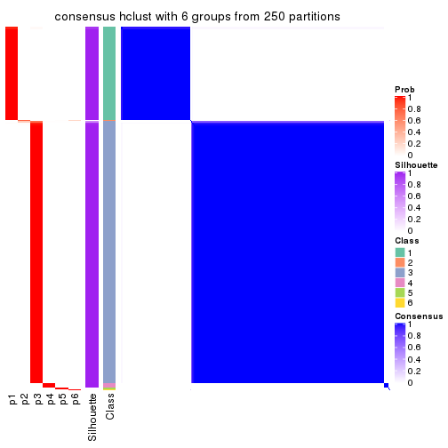</p>

</div>
</div>

Heatmaps for the membership of samples in all partitions to see how consistent they are:


<script>
$( function() {
	$( '#tabs-CV-hclust-membership-heatmap' ).tabs();
} );
</script>
<div id='tabs-CV-hclust-membership-heatmap'>
<ul>
<li><a href='#tab-CV-hclust-membership-heatmap-1'>k = 2</a></li>
<li><a href='#tab-CV-hclust-membership-heatmap-2'>k = 3</a></li>
<li><a href='#tab-CV-hclust-membership-heatmap-3'>k = 4</a></li>
<li><a href='#tab-CV-hclust-membership-heatmap-4'>k = 5</a></li>
<li><a href='#tab-CV-hclust-membership-heatmap-5'>k = 6</a></li>
</ul>
<div id='tab-CV-hclust-membership-heatmap-1'>
<pre><code class="r">membership_heatmap(res, k = 2)
</code></pre>

<p></p>

</div>
<div id='tab-CV-hclust-membership-heatmap-2'>
<pre><code class="r">membership_heatmap(res, k = 3)
</code></pre>

<p></p>

</div>
<div id='tab-CV-hclust-membership-heatmap-3'>
<pre><code class="r">membership_heatmap(res, k = 4)
</code></pre>

<p></p>

</div>
<div id='tab-CV-hclust-membership-heatmap-4'>
<pre><code class="r">membership_heatmap(res, k = 5)
</code></pre>

<p></p>

</div>
<div id='tab-CV-hclust-membership-heatmap-5'>
<pre><code class="r">membership_heatmap(res, k = 6)
</code></pre>

<p></p>

</div>
</div>

As soon as we have had the classes for columns, we can look for signatures
which are significantly different between classes which can be candidate marks
for certain classes. Following are the heatmaps for signatures.


Signature heatmaps where rows are scaled:


<script>
$( function() {
	$( '#tabs-CV-hclust-get-signatures' ).tabs();
} );
</script>
<div id='tabs-CV-hclust-get-signatures'>
<ul>
<li><a href='#tab-CV-hclust-get-signatures-1'>k = 2</a></li>
<li><a href='#tab-CV-hclust-get-signatures-2'>k = 3</a></li>
<li><a href='#tab-CV-hclust-get-signatures-3'>k = 4</a></li>
<li><a href='#tab-CV-hclust-get-signatures-4'>k = 5</a></li>
<li><a href='#tab-CV-hclust-get-signatures-5'>k = 6</a></li>
</ul>
<div id='tab-CV-hclust-get-signatures-1'>
<pre><code class="r">get_signatures(res, k = 2)
</code></pre>

<p></p>

</div>
<div id='tab-CV-hclust-get-signatures-2'>
<pre><code class="r">get_signatures(res, k = 3)
</code></pre>

<p></p>

</div>
<div id='tab-CV-hclust-get-signatures-3'>
<pre><code class="r">get_signatures(res, k = 4)
</code></pre>

<pre><code>#&gt; Error in mat[ceiling(1:nr/h_ratio), ceiling(1:nc/w_ratio), drop = FALSE]: subscript out of bounds
</code></pre>

<p></p>

</div>
<div id='tab-CV-hclust-get-signatures-4'>
<pre><code class="r">get_signatures(res, k = 5)
</code></pre>

<p></p>

</div>
<div id='tab-CV-hclust-get-signatures-5'>
<pre><code class="r">get_signatures(res, k = 6)
</code></pre>

<p></p>

</div>
</div>


Signature heatmaps where rows are not scaled:


<script>
$( function() {
	$( '#tabs-CV-hclust-get-signatures-no-scale' ).tabs();
} );
</script>
<div id='tabs-CV-hclust-get-signatures-no-scale'>
<ul>
<li><a href='#tab-CV-hclust-get-signatures-no-scale-1'>k = 2</a></li>
<li><a href='#tab-CV-hclust-get-signatures-no-scale-2'>k = 3</a></li>
<li><a href='#tab-CV-hclust-get-signatures-no-scale-3'>k = 4</a></li>
<li><a href='#tab-CV-hclust-get-signatures-no-scale-4'>k = 5</a></li>
<li><a href='#tab-CV-hclust-get-signatures-no-scale-5'>k = 6</a></li>
</ul>
<div id='tab-CV-hclust-get-signatures-no-scale-1'>
<pre><code class="r">get_signatures(res, k = 2, scale_rows = FALSE)
</code></pre>

<p></p>

</div>
<div id='tab-CV-hclust-get-signatures-no-scale-2'>
<pre><code class="r">get_signatures(res, k = 3, scale_rows = FALSE)
</code></pre>

<p></p>

</div>
<div id='tab-CV-hclust-get-signatures-no-scale-3'>
<pre><code class="r">get_signatures(res, k = 4, scale_rows = FALSE)
</code></pre>

<p></p>

</div>
<div id='tab-CV-hclust-get-signatures-no-scale-4'>
<pre><code class="r">get_signatures(res, k = 5, scale_rows = FALSE)
</code></pre>

<p></p>

</div>
<div id='tab-CV-hclust-get-signatures-no-scale-5'>
<pre><code class="r">get_signatures(res, k = 6, scale_rows = FALSE)
</code></pre>

<p></p>

</div>
</div>


Compare the overlap of signatures from different k:

```r
compare_signatures(res)
```


`get_signature()` returns a data frame invisibly. TO get the list of signatures, the function
call should be assigned to a variable explicitly. In following code, if `plot` argument is set
to `FALSE`, no heatmap is plotted while only the differential analysis is performed.

```r
# code only for demonstration
tb = get_signature(res, k = ..., plot = FALSE)
```

An example of the output of `tb` is:

```
#>   which_row         fdr    mean_1    mean_2 scaled_mean_1 scaled_mean_2 km
#> 1        38 0.042760348  8.373488  9.131774    -0.5533452     0.5164555  1
#> 2        40 0.018707592  7.106213  8.469186    -0.6173731     0.5762149  1
#> 3        55 0.019134737 10.221463 11.207825    -0.6159697     0.5749050  1
#> 4        59 0.006059896  5.921854  7.869574    -0.6899429     0.6439467  1
#> 5        60 0.018055526  8.928898 10.211722    -0.6204761     0.5791110  1
#> 6        98 0.009384629 15.714769 14.887706     0.6635654    -0.6193277  2
...
```

The columns in `tb` are:

1. `which_row`: row indices corresponding to the input matrix.
2. `fdr`: FDR for the differential test. 
3. `mean_x`: The mean value in group x.
4. `scaled_mean_x`: The mean value in group x after rows are scaled.
5. `km`: Row groups if k-means clustering is applied to rows.


UMAP plot which shows how samples are separated.


<script>
$( function() {
	$( '#tabs-CV-hclust-dimension-reduction' ).tabs();
} );
</script>
<div id='tabs-CV-hclust-dimension-reduction'>
<ul>
<li><a href='#tab-CV-hclust-dimension-reduction-1'>k = 2</a></li>
<li><a href='#tab-CV-hclust-dimension-reduction-2'>k = 3</a></li>
<li><a href='#tab-CV-hclust-dimension-reduction-3'>k = 4</a></li>
<li><a href='#tab-CV-hclust-dimension-reduction-4'>k = 5</a></li>
<li><a href='#tab-CV-hclust-dimension-reduction-5'>k = 6</a></li>
</ul>
<div id='tab-CV-hclust-dimension-reduction-1'>
<pre><code class="r">dimension_reduction(res, k = 2, method = &quot;UMAP&quot;)
</code></pre>

<p></p>

</div>
<div id='tab-CV-hclust-dimension-reduction-2'>
<pre><code class="r">dimension_reduction(res, k = 3, method = &quot;UMAP&quot;)
</code></pre>

<p></p>

</div>
<div id='tab-CV-hclust-dimension-reduction-3'>
<pre><code class="r">dimension_reduction(res, k = 4, method = &quot;UMAP&quot;)
</code></pre>

<p></p>

</div>
<div id='tab-CV-hclust-dimension-reduction-4'>
<pre><code class="r">dimension_reduction(res, k = 5, method = &quot;UMAP&quot;)
</code></pre>

<p></p>

</div>
<div id='tab-CV-hclust-dimension-reduction-5'>
<pre><code class="r">dimension_reduction(res, k = 6, method = &quot;UMAP&quot;)
</code></pre>

<p></p>

</div>
</div>


Following heatmap shows how subgroups are split when increasing `k`:

```r
collect_classes(res)
```


If matrix rows can be associated to genes, consider to use `GO_Enrichment(res,
...)` to perform function enrichment for the signature genes.


 

---------------------------------------------------


### CV:kmeans**


The object with results only for a single top-value method and a single partition method 
can be extracted as:

```r
res = res_list["CV", "kmeans"]
# you can also extract it by
# res = res_list["CV:kmeans"]
```

A summary of `res` and all the functions that can be applied to it:

```r
res
```

```
#> A 'ConsensusPartition' object with k = 2, 3, 4, 5, 6.
#>   On a matrix with 13930 rows and 285 columns.
#>   Top rows (1000, 2000, 3000, 4000, 5000) are extracted by 'CV' method.
#>   Subgroups are detected by 'kmeans' method.
#>   Performed in total 1250 partitions by row resampling.
#>   Best k for subgroups seems to be 2.
#> 
#> Following methods can be applied to this 'ConsensusPartition' object:
#>  [1] "cola_report"             "collect_classes"         "collect_plots"          
#>  [4] "collect_stats"           "colnames"                "compare_signatures"     
#>  [7] "consensus_heatmap"       "dimension_reduction"     "functional_enrichment"  
#> [10] "get_anno_col"            "get_anno"                "get_classes"            
#> [13] "get_consensus"           "get_matrix"              "get_membership"         
#> [16] "get_param"               "get_signatures"          "get_stats"              
#> [19] "is_best_k"               "is_stable_k"             "membership_heatmap"     
#> [22] "ncol"                    "nrow"                    "plot_ecdf"              
#> [25] "rownames"                "select_partition_number" "show"                   
#> [28] "suggest_best_k"          "test_to_known_factors"
```

`collect_plots()` function collects all the plots made from `res` for all `k` (number of partitions)
into one single page to provide an easy and fast comparison between different `k`.

```r
collect_plots(res)
```


The plots are:

- The first row: a plot of the ECDF (Empirical cumulative distribution
  function) curves of the consensus matrix for each `k` and the heatmap of
  predicted classes for each `k`.
- The second row: heatmaps of the consensus matrix for each `k`.
- The third row: heatmaps of the membership matrix for each `k`.
- The fouth row: heatmaps of the signatures for each `k`.

All the plots in panels can be made by individual functions and they are
plotted later in this section.

`select_partition_number()` produces several plots showing different
statistics for choosing "optimized" `k`. There are following statistics:

- ECDF curves of the consensus matrix for each `k`;
- 1-PAC. [The PAC
  score](https://en.wikipedia.org/wiki/Consensus_clustering#Over-interpretation_potential_of_consensus_clustering)
  measures the proportion of the ambiguous subgrouping.
- Mean silhouette score.
- Concordance. The mean probability of fiting the consensus class ids in all
  partitions.
- Area increased. Denote $A_k$ as the area under the ECDF curve for current
  `k`, the area increased is defined as $A_k - A_{k-1}$.
- Rand index. The percent of pairs of samples that are both in a same cluster
  or both are not in a same cluster in the partition of k and k-1.
- Jaccard index. The ratio of pairs of samples are both in a same cluster in
  the partition of k and k-1 and the pairs of samples are both in a same
  cluster in the partition k or k-1.

The detailed explanations of these statistics can be found in [the cola
vignette](http://bioconductor.org/packages/devel/bioc/vignettes/cola/inst/doc/cola.html#toc_13).

Generally speaking, lower PAC score, higher mean silhouette score or higher
concordance corresponds to better partition. Rand index and Jaccard index
measure how similar the current partition is compared to partition with `k-1`.
If they are too similar, we won't accept `k` is better than `k-1`.

```r
select_partition_number(res)
```


The numeric values for all these statistics can be obtained by `get_stats()`.

```r
get_stats(res)
```

```
#>   k 1-PAC mean_silhouette concordance area_increased  Rand Jaccard
#> 2 2 1.000           0.991       0.991         0.3831 0.611   0.611
#> 3 3 0.631           0.884       0.896         0.5145 0.769   0.623
#> 4 4 0.716           0.815       0.857         0.1538 0.996   0.988
#> 5 5 0.778           0.815       0.836         0.0698 0.866   0.649
#> 6 6 0.755           0.797       0.843         0.0516 0.942   0.788
```

`suggest_best_k()` suggests the best $k$ based on these statistics. The rules are as follows:

- All $k$ with Jaccard index larger than 0.95 are removed because the increase of
  the partition number does not provides enough extra information. If all $k$ are removed,
  the best $k$ is assigned by `NA`.
- For $k$ with 1-PAC larger than 0.9, the maximal $k$ is taken as the "best k". Other $k$ is called "optional k".
- If it does not fit the second rule. The $k$ with the highest vote of highest
  1-PAC, mean silhouette and concordance is taken as the "best k".

```r
suggest_best_k(res)
```

```
#> [1] 2
```


Following shows the table of the partitions (You need to click the **show/hide
code output** link to see it). The membership matrix (columns with name `p*`)
is inferred by
[`clue::cl_consensus()`](https://www.rdocumentation.org/link/cl_consensus?package=clue)
function with the `SE` method. Basically the value in the membership matrix
represents the probability to belong to a certain group. The finall class
label for an item is determined with the group with highest probability it
belongs to.

In `get_classes()` function, the entropy is calculated from the membership
matrix and the silhouette score is calculated from the consensus matrix.


<script>
$( function() {
	$( '#tabs-CV-kmeans-get-classes' ).tabs();
} );
</script>
<div id='tabs-CV-kmeans-get-classes'>
<ul>
<li><a href='#tab-CV-kmeans-get-classes-1'>k = 2</a></li>
<li><a href='#tab-CV-kmeans-get-classes-2'>k = 3</a></li>
<li><a href='#tab-CV-kmeans-get-classes-3'>k = 4</a></li>
<li><a href='#tab-CV-kmeans-get-classes-4'>k = 5</a></li>
<li><a href='#tab-CV-kmeans-get-classes-5'>k = 6</a></li>
</ul>

<div id='tab-CV-kmeans-get-classes-1'>
<p><a id='tab-CV-kmeans-get-classes-1-a' style='color:#0366d6' href='#'>show/hide code output</a></p>
<pre><code class="r">cbind(get_classes(res, k = 2), get_membership(res, k = 2))
</code></pre>

<pre><code>#&gt;            class entropy silhouette    p1    p2
#&gt; SRR1201591     2  0.0000      0.997 0.000 1.000
#&gt; SRR1201590     2  0.0000      0.997 0.000 1.000
#&gt; SRR1201593     2  0.0000      0.997 0.000 1.000
#&gt; SRR1201592     2  0.0000      0.997 0.000 1.000
#&gt; SRR1201617     2  0.0000      0.997 0.000 1.000
#&gt; SRR1201616     2  0.0000      0.997 0.000 1.000
#&gt; SRR1201619     2  0.0000      0.997 0.000 1.000
#&gt; SRR1201618     2  0.0000      0.997 0.000 1.000
#&gt; SRR1201620     2  0.0000      0.997 0.000 1.000
#&gt; SRR1201621     2  0.0000      0.997 0.000 1.000
#&gt; SRR1201623     2  0.0000      0.997 0.000 1.000
#&gt; SRR1201622     2  0.0000      0.997 0.000 1.000
#&gt; SRR1201624     2  0.5294      0.868 0.120 0.880
#&gt; SRR1201625     2  0.1414      0.979 0.020 0.980
#&gt; SRR1201626     1  0.6048      0.836 0.852 0.148
#&gt; SRR1201627     2  0.1414      0.979 0.020 0.980
#&gt; SRR1201628     2  0.0000      0.997 0.000 1.000
#&gt; SRR1201629     2  0.0000      0.997 0.000 1.000
#&gt; SRR1201630     2  0.0000      0.997 0.000 1.000
#&gt; SRR1201631     2  0.0000      0.997 0.000 1.000
#&gt; SRR1201641     2  0.0000      0.997 0.000 1.000
#&gt; SRR1201640     2  0.0000      0.997 0.000 1.000
#&gt; SRR1201643     2  0.0000      0.997 0.000 1.000
#&gt; SRR1201644     2  0.0000      0.997 0.000 1.000
#&gt; SRR1201661     2  0.0000      0.997 0.000 1.000
#&gt; SRR1201662     2  0.0000      0.997 0.000 1.000
#&gt; SRR1201663     2  0.0000      0.997 0.000 1.000
#&gt; SRR1201664     2  0.0000      0.997 0.000 1.000
#&gt; SRR1201665     2  0.0000      0.997 0.000 1.000
#&gt; SRR1201666     2  0.0000      0.997 0.000 1.000
#&gt; SRR1201667     2  0.0000      0.997 0.000 1.000
#&gt; SRR1201668     2  0.0000      0.997 0.000 1.000
#&gt; SRR1201670     2  0.0000      0.997 0.000 1.000
#&gt; SRR1201669     2  0.0000      0.997 0.000 1.000
#&gt; SRR1201673     2  0.0000      0.997 0.000 1.000
#&gt; SRR1201672     2  0.0000      0.997 0.000 1.000
#&gt; SRR1201671     2  0.0000      0.997 0.000 1.000
#&gt; SRR1201677     2  0.0000      0.997 0.000 1.000
#&gt; SRR1201676     2  0.0000      0.997 0.000 1.000
#&gt; SRR1201675     2  0.0000      0.997 0.000 1.000
#&gt; SRR1201674     2  0.0000      0.997 0.000 1.000
#&gt; SRR1201678     2  0.0000      0.997 0.000 1.000
#&gt; SRR1201682     2  0.0000      0.997 0.000 1.000
#&gt; SRR1201683     2  0.0000      0.997 0.000 1.000
#&gt; SRR1201680     2  0.0000      0.997 0.000 1.000
#&gt; SRR1201681     2  0.0000      0.997 0.000 1.000
#&gt; SRR1201679     2  0.0000      0.997 0.000 1.000
#&gt; SRR1201686     2  0.0000      0.997 0.000 1.000
#&gt; SRR1201687     2  0.0000      0.997 0.000 1.000
#&gt; SRR1201688     2  0.0000      0.997 0.000 1.000
#&gt; SRR1201689     2  0.0000      0.997 0.000 1.000
#&gt; SRR1201685     2  0.0000      0.997 0.000 1.000
#&gt; SRR1201692     2  0.0000      0.997 0.000 1.000
#&gt; SRR1201691     2  0.0000      0.997 0.000 1.000
#&gt; SRR1201690     2  0.0000      0.997 0.000 1.000
#&gt; SRR1201696     2  0.0000      0.997 0.000 1.000
#&gt; SRR1201695     2  0.0000      0.997 0.000 1.000
#&gt; SRR1201694     2  0.0000      0.997 0.000 1.000
#&gt; SRR1201693     2  0.0000      0.997 0.000 1.000
#&gt; SRR1201697     2  0.0000      0.997 0.000 1.000
#&gt; SRR1201698     2  0.0000      0.997 0.000 1.000
#&gt; SRR1201700     2  0.0000      0.997 0.000 1.000
#&gt; SRR1201708     2  0.0000      0.997 0.000 1.000
#&gt; SRR1201707     2  0.0000      0.997 0.000 1.000
#&gt; SRR1201706     2  0.0000      0.997 0.000 1.000
#&gt; SRR1201702     2  0.0000      0.997 0.000 1.000
#&gt; SRR1201705     2  0.0000      0.997 0.000 1.000
#&gt; SRR1201701     2  0.0000      0.997 0.000 1.000
#&gt; SRR1201704     2  0.0000      0.997 0.000 1.000
#&gt; SRR1201703     2  0.0000      0.997 0.000 1.000
#&gt; SRR1201716     2  0.0000      0.997 0.000 1.000
#&gt; SRR1201715     2  0.0000      0.997 0.000 1.000
#&gt; SRR1201717     2  0.0000      0.997 0.000 1.000
#&gt; SRR1201712     2  0.0000      0.997 0.000 1.000
#&gt; SRR1201709     2  0.0000      0.997 0.000 1.000
#&gt; SRR1201711     2  0.0000      0.997 0.000 1.000
#&gt; SRR1201714     2  0.0000      0.997 0.000 1.000
#&gt; SRR1201713     2  0.0000      0.997 0.000 1.000
#&gt; SRR1201710     2  0.0000      0.997 0.000 1.000
#&gt; SRR1201719     2  0.0000      0.997 0.000 1.000
#&gt; SRR1201718     2  0.0000      0.997 0.000 1.000
#&gt; SRR1201721     2  0.0000      0.997 0.000 1.000
#&gt; SRR1201720     2  0.0000      0.997 0.000 1.000
#&gt; SRR1201723     2  0.0000      0.997 0.000 1.000
#&gt; SRR1201722     2  0.0000      0.997 0.000 1.000
#&gt; SRR1201725     2  0.0000      0.997 0.000 1.000
#&gt; SRR1201724     2  0.0000      0.997 0.000 1.000
#&gt; SRR1201726     2  0.0000      0.997 0.000 1.000
#&gt; SRR1201727     2  0.0000      0.997 0.000 1.000
#&gt; SRR1201731     2  0.0000      0.997 0.000 1.000
#&gt; SRR1201730     2  0.0000      0.997 0.000 1.000
#&gt; SRR1201734     2  0.0000      0.997 0.000 1.000
#&gt; SRR1201733     2  0.0000      0.997 0.000 1.000
#&gt; SRR1201736     2  0.0000      0.997 0.000 1.000
#&gt; SRR1201737     2  0.0000      0.997 0.000 1.000
#&gt; SRR1201739     2  0.0000      0.997 0.000 1.000
#&gt; SRR1201738     2  0.0000      0.997 0.000 1.000
#&gt; SRR1201742     2  0.0000      0.997 0.000 1.000
#&gt; SRR1201743     2  0.0000      0.997 0.000 1.000
#&gt; SRR1201745     2  0.0000      0.997 0.000 1.000
#&gt; SRR1201744     2  0.0000      0.997 0.000 1.000
#&gt; SRR1201749     2  0.0000      0.997 0.000 1.000
#&gt; SRR1201750     2  0.0000      0.997 0.000 1.000
#&gt; SRR1201752     2  0.0000      0.997 0.000 1.000
#&gt; SRR1201751     2  0.0000      0.997 0.000 1.000
#&gt; SRR1201754     2  0.0000      0.997 0.000 1.000
#&gt; SRR1201753     2  0.0000      0.997 0.000 1.000
#&gt; SRR1201758     1  0.9775      0.331 0.588 0.412
#&gt; SRR1201759     2  0.0000      0.997 0.000 1.000
#&gt; SRR1201760     2  0.0000      0.997 0.000 1.000
#&gt; SRR1201761     2  0.0000      0.997 0.000 1.000
#&gt; SRR1201763     2  0.1414      0.979 0.020 0.980
#&gt; SRR1201762     2  0.8386      0.634 0.268 0.732
#&gt; SRR1201764     2  0.0000      0.997 0.000 1.000
#&gt; SRR1201766     2  0.0000      0.997 0.000 1.000
#&gt; SRR1201768     2  0.0000      0.997 0.000 1.000
#&gt; SRR1201769     2  0.0000      0.997 0.000 1.000
#&gt; SRR1201767     2  0.0000      0.997 0.000 1.000
#&gt; SRR1201770     2  0.0000      0.997 0.000 1.000
#&gt; SRR1201771     2  0.0000      0.997 0.000 1.000
#&gt; SRR1201772     2  0.0000      0.997 0.000 1.000
#&gt; SRR1201773     2  0.0000      0.997 0.000 1.000
#&gt; SRR1201774     2  0.0000      0.997 0.000 1.000
#&gt; SRR1201786     2  0.0000      0.997 0.000 1.000
#&gt; SRR1201784     2  0.0000      0.997 0.000 1.000
#&gt; SRR1201785     2  0.0000      0.997 0.000 1.000
#&gt; SRR1201778     2  0.0000      0.997 0.000 1.000
#&gt; SRR1201779     2  0.0000      0.997 0.000 1.000
#&gt; SRR1201781     2  0.0000      0.997 0.000 1.000
#&gt; SRR1201780     2  0.0000      0.997 0.000 1.000
#&gt; SRR1201783     2  0.0000      0.997 0.000 1.000
#&gt; SRR1201782     2  0.0000      0.997 0.000 1.000
#&gt; SRR1201798     2  0.0000      0.997 0.000 1.000
#&gt; SRR1201797     2  0.0000      0.997 0.000 1.000
#&gt; SRR1201796     2  0.0000      0.997 0.000 1.000
#&gt; SRR1201795     2  0.0000      0.997 0.000 1.000
#&gt; SRR1201799     2  0.0000      0.997 0.000 1.000
#&gt; SRR1201794     2  0.0000      0.997 0.000 1.000
#&gt; SRR1201793     2  0.0000      0.997 0.000 1.000
#&gt; SRR1201792     2  0.0000      0.997 0.000 1.000
#&gt; SRR1201791     2  0.0000      0.997 0.000 1.000
#&gt; SRR1201807     2  0.0000      0.997 0.000 1.000
#&gt; SRR1201808     2  0.0000      0.997 0.000 1.000
#&gt; SRR1201803     2  0.0000      0.997 0.000 1.000
#&gt; SRR1201804     2  0.0000      0.997 0.000 1.000
#&gt; SRR1201805     2  0.0000      0.997 0.000 1.000
#&gt; SRR1201806     2  0.0000      0.997 0.000 1.000
#&gt; SRR1201801     2  0.0000      0.997 0.000 1.000
#&gt; SRR1201802     2  0.0000      0.997 0.000 1.000
#&gt; SRR1201800     2  0.0000      0.997 0.000 1.000
#&gt; SRR1201814     2  0.0000      0.997 0.000 1.000
#&gt; SRR1201816     2  0.0000      0.997 0.000 1.000
#&gt; SRR1201815     2  0.0000      0.997 0.000 1.000
#&gt; SRR1201819     2  0.0000      0.997 0.000 1.000
#&gt; SRR1201820     2  0.0000      0.997 0.000 1.000
#&gt; SRR1201813     2  0.0000      0.997 0.000 1.000
#&gt; SRR1201817     2  0.0000      0.997 0.000 1.000
#&gt; SRR1201818     2  0.0000      0.997 0.000 1.000
#&gt; SRR1201825     2  0.0000      0.997 0.000 1.000
#&gt; SRR1201827     2  0.0938      0.986 0.012 0.988
#&gt; SRR1201828     2  0.0938      0.986 0.012 0.988
#&gt; SRR1201826     2  0.0000      0.997 0.000 1.000
#&gt; SRR1201829     2  0.0938      0.986 0.012 0.988
#&gt; SRR1201830     2  0.0938      0.986 0.012 0.988
#&gt; SRR1201831     2  0.0938      0.986 0.012 0.988
#&gt; SRR1201832     2  0.0938      0.986 0.012 0.988
#&gt; SRR1201833     2  0.0938      0.986 0.012 0.988
#&gt; SRR1201865     2  0.0000      0.997 0.000 1.000
#&gt; SRR1201866     2  0.0000      0.997 0.000 1.000
#&gt; SRR1201867     2  0.0000      0.997 0.000 1.000
#&gt; SRR1201861     2  0.0000      0.997 0.000 1.000
#&gt; SRR1201862     2  0.0000      0.997 0.000 1.000
#&gt; SRR1201863     2  0.0000      0.997 0.000 1.000
#&gt; SRR1201859     2  0.0000      0.997 0.000 1.000
#&gt; SRR1201864     2  0.0000      0.997 0.000 1.000
#&gt; SRR1201860     2  0.0000      0.997 0.000 1.000
#&gt; SRR1201873     2  0.0000      0.997 0.000 1.000
#&gt; SRR1201871     2  0.0000      0.997 0.000 1.000
#&gt; SRR1201872     2  0.0000      0.997 0.000 1.000
#&gt; SRR1201980     2  0.0000      0.997 0.000 1.000
#&gt; SRR1201979     2  0.0000      0.997 0.000 1.000
#&gt; SRR1201982     2  0.0000      0.997 0.000 1.000
#&gt; SRR1201981     2  0.0000      0.997 0.000 1.000
#&gt; SRR1201998     2  0.0000      0.997 0.000 1.000
#&gt; SRR1201996     2  0.0000      0.997 0.000 1.000
#&gt; SRR1201997     2  0.0000      0.997 0.000 1.000
#&gt; SRR1202005     2  0.0000      0.997 0.000 1.000
#&gt; SRR1202006     2  0.0000      0.997 0.000 1.000
#&gt; SRR1202088     2  0.0000      0.997 0.000 1.000
#&gt; SRR1202087     2  0.0000      0.997 0.000 1.000
#&gt; SRR1202093     2  0.0000      0.997 0.000 1.000
#&gt; SRR1202092     2  0.0000      0.997 0.000 1.000
#&gt; SRR1202288     2  0.0000      0.997 0.000 1.000
#&gt; SRR1202289     2  0.0000      0.997 0.000 1.000
#&gt; SRR1202299     2  0.0000      0.997 0.000 1.000
#&gt; SRR1202298     2  0.0000      0.997 0.000 1.000
#&gt; SRR1202303     2  0.1414      0.979 0.020 0.980
#&gt; SRR1202372     2  0.0000      0.997 0.000 1.000
#&gt; SRR1202371     2  0.0000      0.997 0.000 1.000
#&gt; SRR1202563     2  0.0000      0.997 0.000 1.000
#&gt; SRR1202565     2  0.0000      0.997 0.000 1.000
#&gt; SRR1202564     2  0.0000      0.997 0.000 1.000
#&gt; SRR1202649     2  0.0376      0.994 0.004 0.996
#&gt; SRR1202650     2  0.0000      0.997 0.000 1.000
#&gt; SRR1202651     2  0.0000      0.997 0.000 1.000
#&gt; SRR1202843     1  0.1414      0.993 0.980 0.020
#&gt; SRR1202844     1  0.1414      0.993 0.980 0.020
#&gt; SRR1202845     2  0.0000      0.997 0.000 1.000
#&gt; SRR1202847     2  0.0000      0.997 0.000 1.000
#&gt; SRR1202846     2  0.0000      0.997 0.000 1.000
#&gt; SRR1202945     1  0.1414      0.993 0.980 0.020
#&gt; SRR1202949     1  0.1414      0.993 0.980 0.020
#&gt; SRR1202977     1  0.1414      0.993 0.980 0.020
#&gt; SRR1202978     1  0.1414      0.993 0.980 0.020
#&gt; SRR1202979     1  0.1414      0.993 0.980 0.020
#&gt; SRR1202990     1  0.1414      0.993 0.980 0.020
#&gt; SRR1202999     1  0.1414      0.993 0.980 0.020
#&gt; SRR1203005     1  0.1414      0.993 0.980 0.020
#&gt; SRR1203006     1  0.1414      0.993 0.980 0.020
#&gt; SRR1203007     1  0.1414      0.993 0.980 0.020
#&gt; SRR1203009     1  0.1414      0.993 0.980 0.020
#&gt; SRR1203008     1  0.1414      0.993 0.980 0.020
#&gt; SRR1203010     1  0.1414      0.993 0.980 0.020
#&gt; SRR1203011     1  0.1414      0.993 0.980 0.020
#&gt; SRR1203025     1  0.1414      0.993 0.980 0.020
#&gt; SRR1203026     1  0.1414      0.993 0.980 0.020
#&gt; SRR1203027     1  0.1414      0.993 0.980 0.020
#&gt; SRR1203061     1  0.1414      0.993 0.980 0.020
#&gt; SRR1203089     1  0.1414      0.993 0.980 0.020
#&gt; SRR1203125     1  0.1414      0.993 0.980 0.020
#&gt; SRR1203128     1  0.1414      0.993 0.980 0.020
#&gt; SRR1203129     1  0.1414      0.993 0.980 0.020
#&gt; SRR1203130     1  0.1414      0.993 0.980 0.020
#&gt; SRR1203132     2  0.0000      0.997 0.000 1.000
#&gt; SRR1203131     2  0.0000      0.997 0.000 1.000
#&gt; SRR1203133     1  0.1414      0.993 0.980 0.020
#&gt; SRR1203138     1  0.1414      0.993 0.980 0.020
#&gt; SRR1203760     1  0.1414      0.993 0.980 0.020
#&gt; SRR1203761     1  0.1414      0.993 0.980 0.020
#&gt; SRR1203770     1  0.1414      0.993 0.980 0.020
#&gt; SRR1203771     1  0.1414      0.993 0.980 0.020
#&gt; SRR1203772     1  0.1414      0.993 0.980 0.020
#&gt; SRR1203773     1  0.1414      0.993 0.980 0.020
#&gt; SRR1203774     1  0.1414      0.993 0.980 0.020
#&gt; SRR1203775     1  0.1414      0.993 0.980 0.020
#&gt; SRR1203800     1  0.1414      0.993 0.980 0.020
#&gt; SRR1203801     1  0.1414      0.993 0.980 0.020
#&gt; SRR1203802     1  0.1414      0.993 0.980 0.020
#&gt; SRR1203803     1  0.1414      0.993 0.980 0.020
#&gt; SRR1203804     1  0.1414      0.993 0.980 0.020
#&gt; SRR1203805     1  0.1414      0.993 0.980 0.020
#&gt; SRR1203806     1  0.1414      0.993 0.980 0.020
#&gt; SRR1203807     1  0.1414      0.993 0.980 0.020
#&gt; SRR1203808     1  0.1414      0.993 0.980 0.020
#&gt; SRR1203811     1  0.1414      0.993 0.980 0.020
#&gt; SRR1203812     1  0.1414      0.993 0.980 0.020
#&gt; SRR1203813     1  0.1414      0.993 0.980 0.020
#&gt; SRR1203814     1  0.1414      0.993 0.980 0.020
#&gt; SRR1203815     1  0.1414      0.993 0.980 0.020
#&gt; SRR1203816     1  0.1414      0.993 0.980 0.020
#&gt; SRR1203817     1  0.1414      0.993 0.980 0.020
#&gt; SRR1203818     1  0.1414      0.993 0.980 0.020
#&gt; SRR1203819     1  0.1414      0.993 0.980 0.020
#&gt; SRR1203822     1  0.1414      0.993 0.980 0.020
#&gt; SRR1203823     1  0.1414      0.993 0.980 0.020
#&gt; SRR1203824     1  0.1414      0.993 0.980 0.020
#&gt; SRR1203825     1  0.1414      0.993 0.980 0.020
#&gt; SRR1203826     1  0.1414      0.993 0.980 0.020
#&gt; SRR1203827     1  0.1414      0.993 0.980 0.020
#&gt; SRR1203828     1  0.1414      0.993 0.980 0.020
#&gt; SRR1203829     1  0.1414      0.993 0.980 0.020
#&gt; SRR1203830     1  0.1414      0.993 0.980 0.020
#&gt; SRR1203831     1  0.1414      0.993 0.980 0.020
#&gt; SRR1203832     1  0.1414      0.993 0.980 0.020
#&gt; SRR1203833     1  0.1414      0.993 0.980 0.020
#&gt; SRR1203834     1  0.1414      0.993 0.980 0.020
#&gt; SRR1203835     1  0.1414      0.993 0.980 0.020
#&gt; SRR1203836     1  0.1414      0.993 0.980 0.020
#&gt; SRR1203837     1  0.1414      0.993 0.980 0.020
#&gt; SRR1203838     1  0.1414      0.993 0.980 0.020
#&gt; SRR1203839     1  0.1414      0.993 0.980 0.020
#&gt; SRR1203842     1  0.1414      0.993 0.980 0.020
#&gt; SRR1203843     1  0.1414      0.993 0.980 0.020
#&gt; SRR1203845     2  0.0000      0.997 0.000 1.000
#&gt; SRR1203844     2  0.0000      0.997 0.000 1.000
</code></pre>

<script>
$('#tab-CV-kmeans-get-classes-1-a').parent().next().next().hide();
$('#tab-CV-kmeans-get-classes-1-a').click(function(){
  $('#tab-CV-kmeans-get-classes-1-a').parent().next().next().toggle();
  return(false);
});
</script>
</div>

<div id='tab-CV-kmeans-get-classes-2'>
<p><a id='tab-CV-kmeans-get-classes-2-a' style='color:#0366d6' href='#'>show/hide code output</a></p>
<pre><code class="r">cbind(get_classes(res, k = 3), get_membership(res, k = 3))
</code></pre>

<pre><code>#&gt;            class entropy silhouette    p1    p2    p3
#&gt; SRR1201591     2   0.484      0.749 0.000 0.776 0.224
#&gt; SRR1201590     3   0.502      0.968 0.000 0.240 0.760
#&gt; SRR1201593     2   0.484      0.749 0.000 0.776 0.224
#&gt; SRR1201592     3   0.502      0.968 0.000 0.240 0.760
#&gt; SRR1201617     2   0.484      0.749 0.000 0.776 0.224
#&gt; SRR1201616     3   0.502      0.968 0.000 0.240 0.760
#&gt; SRR1201619     2   0.296      0.828 0.000 0.900 0.100
#&gt; SRR1201618     3   0.502      0.968 0.000 0.240 0.760
#&gt; SRR1201620     3   0.502      0.968 0.000 0.240 0.760
#&gt; SRR1201621     2   0.484      0.749 0.000 0.776 0.224
#&gt; SRR1201623     2   0.000      0.856 0.000 1.000 0.000
#&gt; SRR1201622     3   0.502      0.968 0.000 0.240 0.760
#&gt; SRR1201624     3   0.164      0.693 0.016 0.020 0.964
#&gt; SRR1201625     2   0.489      0.598 0.000 0.772 0.228
#&gt; SRR1201626     3   0.506      0.299 0.244 0.000 0.756
#&gt; SRR1201627     2   0.489      0.598 0.000 0.772 0.228
#&gt; SRR1201628     3   0.502      0.968 0.000 0.240 0.760
#&gt; SRR1201629     2   0.000      0.856 0.000 1.000 0.000
#&gt; SRR1201630     3   0.502      0.968 0.000 0.240 0.760
#&gt; SRR1201631     2   0.263      0.834 0.000 0.916 0.084
#&gt; SRR1201641     2   0.000      0.856 0.000 1.000 0.000
#&gt; SRR1201640     3   0.502      0.968 0.000 0.240 0.760
#&gt; SRR1201643     3   0.502      0.968 0.000 0.240 0.760
#&gt; SRR1201644     2   0.000      0.856 0.000 1.000 0.000
#&gt; SRR1201661     3   0.502      0.968 0.000 0.240 0.760
#&gt; SRR1201662     2   0.000      0.856 0.000 1.000 0.000
#&gt; SRR1201663     3   0.502      0.968 0.000 0.240 0.760
#&gt; SRR1201664     2   0.000      0.856 0.000 1.000 0.000
#&gt; SRR1201665     3   0.502      0.968 0.000 0.240 0.760
#&gt; SRR1201666     2   0.424      0.784 0.000 0.824 0.176
#&gt; SRR1201667     2   0.424      0.784 0.000 0.824 0.176
#&gt; SRR1201668     3   0.502      0.968 0.000 0.240 0.760
#&gt; SRR1201670     2   0.000      0.856 0.000 1.000 0.000
#&gt; SRR1201669     2   0.000      0.856 0.000 1.000 0.000
#&gt; SRR1201673     2   0.000      0.856 0.000 1.000 0.000
#&gt; SRR1201672     2   0.000      0.856 0.000 1.000 0.000
#&gt; SRR1201671     3   0.502      0.968 0.000 0.240 0.760
#&gt; SRR1201677     2   0.000      0.856 0.000 1.000 0.000
#&gt; SRR1201676     2   0.000      0.856 0.000 1.000 0.000
#&gt; SRR1201675     2   0.000      0.856 0.000 1.000 0.000
#&gt; SRR1201674     2   0.000      0.856 0.000 1.000 0.000
#&gt; SRR1201678     2   0.000      0.856 0.000 1.000 0.000
#&gt; SRR1201682     2   0.000      0.856 0.000 1.000 0.000
#&gt; SRR1201683     2   0.000      0.856 0.000 1.000 0.000
#&gt; SRR1201680     2   0.000      0.856 0.000 1.000 0.000
#&gt; SRR1201681     2   0.000      0.856 0.000 1.000 0.000
#&gt; SRR1201679     3   0.502      0.968 0.000 0.240 0.760
#&gt; SRR1201686     2   0.000      0.856 0.000 1.000 0.000
#&gt; SRR1201687     2   0.000      0.856 0.000 1.000 0.000
#&gt; SRR1201688     2   0.000      0.856 0.000 1.000 0.000
#&gt; SRR1201689     2   0.000      0.856 0.000 1.000 0.000
#&gt; SRR1201685     3   0.489      0.952 0.000 0.228 0.772
#&gt; SRR1201692     2   0.000      0.856 0.000 1.000 0.000
#&gt; SRR1201691     2   0.000      0.856 0.000 1.000 0.000
#&gt; SRR1201690     3   0.502      0.968 0.000 0.240 0.760
#&gt; SRR1201696     2   0.000      0.856 0.000 1.000 0.000
#&gt; SRR1201695     2   0.000      0.856 0.000 1.000 0.000
#&gt; SRR1201694     2   0.000      0.856 0.000 1.000 0.000
#&gt; SRR1201693     2   0.000      0.856 0.000 1.000 0.000
#&gt; SRR1201697     2   0.000      0.856 0.000 1.000 0.000
#&gt; SRR1201698     2   0.000      0.856 0.000 1.000 0.000
#&gt; SRR1201700     3   0.502      0.968 0.000 0.240 0.760
#&gt; SRR1201708     2   0.000      0.856 0.000 1.000 0.000
#&gt; SRR1201707     2   0.000      0.856 0.000 1.000 0.000
#&gt; SRR1201706     2   0.000      0.856 0.000 1.000 0.000
#&gt; SRR1201702     2   0.000      0.856 0.000 1.000 0.000
#&gt; SRR1201705     2   0.000      0.856 0.000 1.000 0.000
#&gt; SRR1201701     2   0.000      0.856 0.000 1.000 0.000
#&gt; SRR1201704     2   0.000      0.856 0.000 1.000 0.000
#&gt; SRR1201703     2   0.000      0.856 0.000 1.000 0.000
#&gt; SRR1201716     2   0.000      0.856 0.000 1.000 0.000
#&gt; SRR1201715     2   0.000      0.856 0.000 1.000 0.000
#&gt; SRR1201717     2   0.000      0.856 0.000 1.000 0.000
#&gt; SRR1201712     2   0.000      0.856 0.000 1.000 0.000
#&gt; SRR1201709     3   0.502      0.968 0.000 0.240 0.760
#&gt; SRR1201711     2   0.000      0.856 0.000 1.000 0.000
#&gt; SRR1201714     2   0.000      0.856 0.000 1.000 0.000
#&gt; SRR1201713     2   0.000      0.856 0.000 1.000 0.000
#&gt; SRR1201710     2   0.000      0.856 0.000 1.000 0.000
#&gt; SRR1201719     2   0.000      0.856 0.000 1.000 0.000
#&gt; SRR1201718     3   0.525      0.929 0.000 0.264 0.736
#&gt; SRR1201721     2   0.000      0.856 0.000 1.000 0.000
#&gt; SRR1201720     3   0.502      0.968 0.000 0.240 0.760
#&gt; SRR1201723     2   0.000      0.856 0.000 1.000 0.000
#&gt; SRR1201722     3   0.502      0.968 0.000 0.240 0.760
#&gt; SRR1201725     2   0.000      0.856 0.000 1.000 0.000
#&gt; SRR1201724     3   0.502      0.968 0.000 0.240 0.760
#&gt; SRR1201726     3   0.502      0.968 0.000 0.240 0.760
#&gt; SRR1201727     2   0.000      0.856 0.000 1.000 0.000
#&gt; SRR1201731     2   0.000      0.856 0.000 1.000 0.000
#&gt; SRR1201730     3   0.502      0.968 0.000 0.240 0.760
#&gt; SRR1201734     2   0.484      0.749 0.000 0.776 0.224
#&gt; SRR1201733     3   0.502      0.968 0.000 0.240 0.760
#&gt; SRR1201736     3   0.502      0.968 0.000 0.240 0.760
#&gt; SRR1201737     2   0.406      0.792 0.000 0.836 0.164
#&gt; SRR1201739     2   0.429      0.781 0.000 0.820 0.180
#&gt; SRR1201738     3   0.502      0.968 0.000 0.240 0.760
#&gt; SRR1201742     3   0.502      0.968 0.000 0.240 0.760
#&gt; SRR1201743     2   0.000      0.856 0.000 1.000 0.000
#&gt; SRR1201745     2   0.484      0.749 0.000 0.776 0.224
#&gt; SRR1201744     3   0.502      0.968 0.000 0.240 0.760
#&gt; SRR1201749     3   0.502      0.968 0.000 0.240 0.760
#&gt; SRR1201750     2   0.484      0.749 0.000 0.776 0.224
#&gt; SRR1201752     2   0.000      0.856 0.000 1.000 0.000
#&gt; SRR1201751     3   0.502      0.968 0.000 0.240 0.760
#&gt; SRR1201754     2   0.216      0.840 0.000 0.936 0.064
#&gt; SRR1201753     3   0.502      0.968 0.000 0.240 0.760
#&gt; SRR1201758     3   0.710      0.640 0.216 0.080 0.704
#&gt; SRR1201759     2   0.000      0.856 0.000 1.000 0.000
#&gt; SRR1201760     3   0.502      0.968 0.000 0.240 0.760
#&gt; SRR1201761     2   0.000      0.856 0.000 1.000 0.000
#&gt; SRR1201763     2   0.489      0.598 0.000 0.772 0.228
#&gt; SRR1201762     3   0.321      0.629 0.084 0.012 0.904
#&gt; SRR1201764     3   0.406      0.868 0.000 0.164 0.836
#&gt; SRR1201766     3   0.502      0.968 0.000 0.240 0.760
#&gt; SRR1201768     2   0.484      0.749 0.000 0.776 0.224
#&gt; SRR1201769     2   0.484      0.749 0.000 0.776 0.224
#&gt; SRR1201767     2   0.484      0.749 0.000 0.776 0.224
#&gt; SRR1201770     2   0.484      0.749 0.000 0.776 0.224
#&gt; SRR1201771     2   0.484      0.749 0.000 0.776 0.224
#&gt; SRR1201772     2   0.484      0.749 0.000 0.776 0.224
#&gt; SRR1201773     2   0.484      0.749 0.000 0.776 0.224
#&gt; SRR1201774     2   0.484      0.749 0.000 0.776 0.224
#&gt; SRR1201786     2   0.484      0.749 0.000 0.776 0.224
#&gt; SRR1201784     2   0.484      0.749 0.000 0.776 0.224
#&gt; SRR1201785     2   0.484      0.749 0.000 0.776 0.224
#&gt; SRR1201778     3   0.502      0.968 0.000 0.240 0.760
#&gt; SRR1201779     2   0.484      0.749 0.000 0.776 0.224
#&gt; SRR1201781     2   0.484      0.749 0.000 0.776 0.224
#&gt; SRR1201780     2   0.484      0.749 0.000 0.776 0.224
#&gt; SRR1201783     2   0.484      0.749 0.000 0.776 0.224
#&gt; SRR1201782     2   0.484      0.749 0.000 0.776 0.224
#&gt; SRR1201798     2   0.484      0.749 0.000 0.776 0.224
#&gt; SRR1201797     2   0.484      0.749 0.000 0.776 0.224
#&gt; SRR1201796     2   0.484      0.749 0.000 0.776 0.224
#&gt; SRR1201795     2   0.484      0.749 0.000 0.776 0.224
#&gt; SRR1201799     2   0.484      0.749 0.000 0.776 0.224
#&gt; SRR1201794     2   0.484      0.749 0.000 0.776 0.224
#&gt; SRR1201793     2   0.484      0.749 0.000 0.776 0.224
#&gt; SRR1201792     2   0.484      0.749 0.000 0.776 0.224
#&gt; SRR1201791     3   0.502      0.968 0.000 0.240 0.760
#&gt; SRR1201807     2   0.484      0.749 0.000 0.776 0.224
#&gt; SRR1201808     2   0.484      0.749 0.000 0.776 0.224
#&gt; SRR1201803     2   0.484      0.749 0.000 0.776 0.224
#&gt; SRR1201804     2   0.484      0.749 0.000 0.776 0.224
#&gt; SRR1201805     2   0.484      0.749 0.000 0.776 0.224
#&gt; SRR1201806     2   0.484      0.749 0.000 0.776 0.224
#&gt; SRR1201801     2   0.484      0.749 0.000 0.776 0.224
#&gt; SRR1201802     2   0.484      0.749 0.000 0.776 0.224
#&gt; SRR1201800     3   0.502      0.968 0.000 0.240 0.760
#&gt; SRR1201814     2   0.484      0.749 0.000 0.776 0.224
#&gt; SRR1201816     2   0.484      0.749 0.000 0.776 0.224
#&gt; SRR1201815     2   0.484      0.749 0.000 0.776 0.224
#&gt; SRR1201819     2   0.484      0.749 0.000 0.776 0.224
#&gt; SRR1201820     2   0.484      0.749 0.000 0.776 0.224
#&gt; SRR1201813     3   0.502      0.968 0.000 0.240 0.760
#&gt; SRR1201817     2   0.484      0.749 0.000 0.776 0.224
#&gt; SRR1201818     2   0.484      0.749 0.000 0.776 0.224
#&gt; SRR1201825     3   0.502      0.968 0.000 0.240 0.760
#&gt; SRR1201827     2   0.288      0.763 0.000 0.904 0.096
#&gt; SRR1201828     2   0.288      0.763 0.000 0.904 0.096
#&gt; SRR1201826     3   0.502      0.968 0.000 0.240 0.760
#&gt; SRR1201829     2   0.288      0.763 0.000 0.904 0.096
#&gt; SRR1201830     2   0.288      0.763 0.000 0.904 0.096
#&gt; SRR1201831     2   0.288      0.763 0.000 0.904 0.096
#&gt; SRR1201832     2   0.288      0.763 0.000 0.904 0.096
#&gt; SRR1201833     2   0.288      0.763 0.000 0.904 0.096
#&gt; SRR1201865     2   0.304      0.826 0.000 0.896 0.104
#&gt; SRR1201866     2   0.304      0.826 0.000 0.896 0.104
#&gt; SRR1201867     2   0.304      0.826 0.000 0.896 0.104
#&gt; SRR1201861     2   0.304      0.826 0.000 0.896 0.104
#&gt; SRR1201862     2   0.304      0.826 0.000 0.896 0.104
#&gt; SRR1201863     2   0.304      0.826 0.000 0.896 0.104
#&gt; SRR1201859     3   0.502      0.968 0.000 0.240 0.760
#&gt; SRR1201864     2   0.304      0.826 0.000 0.896 0.104
#&gt; SRR1201860     2   0.304      0.826 0.000 0.896 0.104
#&gt; SRR1201873     2   0.000      0.856 0.000 1.000 0.000
#&gt; SRR1201871     3   0.502      0.968 0.000 0.240 0.760
#&gt; SRR1201872     2   0.000      0.856 0.000 1.000 0.000
#&gt; SRR1201980     2   0.000      0.856 0.000 1.000 0.000
#&gt; SRR1201979     3   0.502      0.968 0.000 0.240 0.760
#&gt; SRR1201982     2   0.000      0.856 0.000 1.000 0.000
#&gt; SRR1201981     3   0.502      0.968 0.000 0.240 0.760
#&gt; SRR1201998     2   0.000      0.856 0.000 1.000 0.000
#&gt; SRR1201996     3   0.502      0.968 0.000 0.240 0.760
#&gt; SRR1201997     2   0.000      0.856 0.000 1.000 0.000
#&gt; SRR1202005     2   0.525      0.676 0.000 0.736 0.264
#&gt; SRR1202006     2   0.000      0.856 0.000 1.000 0.000
#&gt; SRR1202088     2   0.000      0.856 0.000 1.000 0.000
#&gt; SRR1202087     3   0.506      0.962 0.000 0.244 0.756
#&gt; SRR1202093     2   0.000      0.856 0.000 1.000 0.000
#&gt; SRR1202092     3   0.502      0.968 0.000 0.240 0.760
#&gt; SRR1202288     3   0.502      0.968 0.000 0.240 0.760
#&gt; SRR1202289     2   0.484      0.749 0.000 0.776 0.224
#&gt; SRR1202299     2   0.484      0.749 0.000 0.776 0.224
#&gt; SRR1202298     3   0.502      0.968 0.000 0.240 0.760
#&gt; SRR1202303     2   0.489      0.598 0.000 0.772 0.228
#&gt; SRR1202372     2   0.484      0.749 0.000 0.776 0.224
#&gt; SRR1202371     3   0.502      0.968 0.000 0.240 0.760
#&gt; SRR1202563     3   0.502      0.968 0.000 0.240 0.760
#&gt; SRR1202565     2   0.000      0.856 0.000 1.000 0.000
#&gt; SRR1202564     2   0.000      0.856 0.000 1.000 0.000
#&gt; SRR1202649     3   0.502      0.968 0.000 0.240 0.760
#&gt; SRR1202650     3   0.502      0.968 0.000 0.240 0.760
#&gt; SRR1202651     2   0.216      0.840 0.000 0.936 0.064
#&gt; SRR1202843     1   0.000      1.000 1.000 0.000 0.000
#&gt; SRR1202844     1   0.000      1.000 1.000 0.000 0.000
#&gt; SRR1202845     3   0.502      0.968 0.000 0.240 0.760
#&gt; SRR1202847     2   0.236      0.838 0.000 0.928 0.072
#&gt; SRR1202846     2   0.207      0.842 0.000 0.940 0.060
#&gt; SRR1202945     1   0.000      1.000 1.000 0.000 0.000
#&gt; SRR1202949     1   0.000      1.000 1.000 0.000 0.000
#&gt; SRR1202977     1   0.000      1.000 1.000 0.000 0.000
#&gt; SRR1202978     1   0.000      1.000 1.000 0.000 0.000
#&gt; SRR1202979     1   0.000      1.000 1.000 0.000 0.000
#&gt; SRR1202990     1   0.000      1.000 1.000 0.000 0.000
#&gt; SRR1202999     1   0.000      1.000 1.000 0.000 0.000
#&gt; SRR1203005     1   0.000      1.000 1.000 0.000 0.000
#&gt; SRR1203006     1   0.000      1.000 1.000 0.000 0.000
#&gt; SRR1203007     1   0.000      1.000 1.000 0.000 0.000
#&gt; SRR1203009     1   0.000      1.000 1.000 0.000 0.000
#&gt; SRR1203008     1   0.000      1.000 1.000 0.000 0.000
#&gt; SRR1203010     1   0.000      1.000 1.000 0.000 0.000
#&gt; SRR1203011     1   0.000      1.000 1.000 0.000 0.000
#&gt; SRR1203025     1   0.000      1.000 1.000 0.000 0.000
#&gt; SRR1203026     1   0.000      1.000 1.000 0.000 0.000
#&gt; SRR1203027     1   0.000      1.000 1.000 0.000 0.000
#&gt; SRR1203061     1   0.000      1.000 1.000 0.000 0.000
#&gt; SRR1203089     1   0.000      1.000 1.000 0.000 0.000
#&gt; SRR1203125     1   0.000      1.000 1.000 0.000 0.000
#&gt; SRR1203128     1   0.000      1.000 1.000 0.000 0.000
#&gt; SRR1203129     1   0.000      1.000 1.000 0.000 0.000
#&gt; SRR1203130     1   0.000      1.000 1.000 0.000 0.000
#&gt; SRR1203132     2   0.000      0.856 0.000 1.000 0.000
#&gt; SRR1203131     3   0.502      0.968 0.000 0.240 0.760
#&gt; SRR1203133     1   0.000      1.000 1.000 0.000 0.000
#&gt; SRR1203138     1   0.000      1.000 1.000 0.000 0.000
#&gt; SRR1203760     1   0.000      1.000 1.000 0.000 0.000
#&gt; SRR1203761     1   0.000      1.000 1.000 0.000 0.000
#&gt; SRR1203770     1   0.000      1.000 1.000 0.000 0.000
#&gt; SRR1203771     1   0.000      1.000 1.000 0.000 0.000
#&gt; SRR1203772     1   0.000      1.000 1.000 0.000 0.000
#&gt; SRR1203773     1   0.000      1.000 1.000 0.000 0.000
#&gt; SRR1203774     1   0.000      1.000 1.000 0.000 0.000
#&gt; SRR1203775     1   0.000      1.000 1.000 0.000 0.000
#&gt; SRR1203800     1   0.000      1.000 1.000 0.000 0.000
#&gt; SRR1203801     1   0.000      1.000 1.000 0.000 0.000
#&gt; SRR1203802     1   0.000      1.000 1.000 0.000 0.000
#&gt; SRR1203803     1   0.000      1.000 1.000 0.000 0.000
#&gt; SRR1203804     1   0.000      1.000 1.000 0.000 0.000
#&gt; SRR1203805     1   0.000      1.000 1.000 0.000 0.000
#&gt; SRR1203806     1   0.000      1.000 1.000 0.000 0.000
#&gt; SRR1203807     1   0.000      1.000 1.000 0.000 0.000
#&gt; SRR1203808     1   0.000      1.000 1.000 0.000 0.000
#&gt; SRR1203811     1   0.000      1.000 1.000 0.000 0.000
#&gt; SRR1203812     1   0.000      1.000 1.000 0.000 0.000
#&gt; SRR1203813     1   0.000      1.000 1.000 0.000 0.000
#&gt; SRR1203814     1   0.000      1.000 1.000 0.000 0.000
#&gt; SRR1203815     1   0.000      1.000 1.000 0.000 0.000
#&gt; SRR1203816     1   0.000      1.000 1.000 0.000 0.000
#&gt; SRR1203817     1   0.000      1.000 1.000 0.000 0.000
#&gt; SRR1203818     1   0.000      1.000 1.000 0.000 0.000
#&gt; SRR1203819     1   0.000      1.000 1.000 0.000 0.000
#&gt; SRR1203822     1   0.000      1.000 1.000 0.000 0.000
#&gt; SRR1203823     1   0.000      1.000 1.000 0.000 0.000
#&gt; SRR1203824     1   0.000      1.000 1.000 0.000 0.000
#&gt; SRR1203825     1   0.000      1.000 1.000 0.000 0.000
#&gt; SRR1203826     1   0.000      1.000 1.000 0.000 0.000
#&gt; SRR1203827     1   0.000      1.000 1.000 0.000 0.000
#&gt; SRR1203828     1   0.000      1.000 1.000 0.000 0.000
#&gt; SRR1203829     1   0.000      1.000 1.000 0.000 0.000
#&gt; SRR1203830     1   0.000      1.000 1.000 0.000 0.000
#&gt; SRR1203831     1   0.000      1.000 1.000 0.000 0.000
#&gt; SRR1203832     1   0.000      1.000 1.000 0.000 0.000
#&gt; SRR1203833     1   0.000      1.000 1.000 0.000 0.000
#&gt; SRR1203834     1   0.000      1.000 1.000 0.000 0.000
#&gt; SRR1203835     1   0.000      1.000 1.000 0.000 0.000
#&gt; SRR1203836     1   0.000      1.000 1.000 0.000 0.000
#&gt; SRR1203837     1   0.000      1.000 1.000 0.000 0.000
#&gt; SRR1203838     1   0.000      1.000 1.000 0.000 0.000
#&gt; SRR1203839     1   0.000      1.000 1.000 0.000 0.000
#&gt; SRR1203842     1   0.000      1.000 1.000 0.000 0.000
#&gt; SRR1203843     1   0.000      1.000 1.000 0.000 0.000
#&gt; SRR1203845     2   0.000      0.856 0.000 1.000 0.000
#&gt; SRR1203844     3   0.502      0.968 0.000 0.240 0.760
</code></pre>

<script>
$('#tab-CV-kmeans-get-classes-2-a').parent().next().next().hide();
$('#tab-CV-kmeans-get-classes-2-a').click(function(){
  $('#tab-CV-kmeans-get-classes-2-a').parent().next().next().toggle();
  return(false);
});
</script>
</div>

<div id='tab-CV-kmeans-get-classes-3'>
<p><a id='tab-CV-kmeans-get-classes-3-a' style='color:#0366d6' href='#'>show/hide code output</a></p>
<pre><code class="r">cbind(get_classes(res, k = 4), get_membership(res, k = 4))
</code></pre>

<pre><code>#&gt;            class entropy silhouette    p1    p2    p3    p4
#&gt; SRR1201591     2  0.5105      0.726 0.000 0.564 0.432 0.004
#&gt; SRR1201590     3  0.5256      0.933 0.000 0.036 0.692 0.272
#&gt; SRR1201593     2  0.5105      0.726 0.000 0.564 0.432 0.004
#&gt; SRR1201592     3  0.5256      0.933 0.000 0.036 0.692 0.272
#&gt; SRR1201617     2  0.5105      0.726 0.000 0.564 0.432 0.004
#&gt; SRR1201616     3  0.5256      0.933 0.000 0.036 0.692 0.272
#&gt; SRR1201619     2  0.4776      0.744 0.000 0.624 0.376 0.000
#&gt; SRR1201618     3  0.5256      0.933 0.000 0.036 0.692 0.272
#&gt; SRR1201620     3  0.5256      0.933 0.000 0.036 0.692 0.272
#&gt; SRR1201621     2  0.4933      0.727 0.000 0.568 0.432 0.000
#&gt; SRR1201623     2  0.3157      0.753 0.000 0.852 0.144 0.004
#&gt; SRR1201622     3  0.5430      0.898 0.000 0.036 0.664 0.300
#&gt; SRR1201624     4  0.3975      0.910 0.000 0.000 0.240 0.760
#&gt; SRR1201625     2  0.4907      0.153 0.000 0.580 0.000 0.420
#&gt; SRR1201626     4  0.4764      0.953 0.032 0.000 0.220 0.748
#&gt; SRR1201627     2  0.4907      0.153 0.000 0.580 0.000 0.420
#&gt; SRR1201628     3  0.5256      0.933 0.000 0.036 0.692 0.272
#&gt; SRR1201629     2  0.0592      0.726 0.000 0.984 0.000 0.016
#&gt; SRR1201630     3  0.5256      0.933 0.000 0.036 0.692 0.272
#&gt; SRR1201631     2  0.4761      0.745 0.000 0.628 0.372 0.000
#&gt; SRR1201641     2  0.4134      0.756 0.000 0.740 0.260 0.000
#&gt; SRR1201640     3  0.5083      0.891 0.000 0.036 0.716 0.248
#&gt; SRR1201643     3  0.5256      0.933 0.000 0.036 0.692 0.272
#&gt; SRR1201644     2  0.3569      0.757 0.000 0.804 0.196 0.000
#&gt; SRR1201661     3  0.5256      0.933 0.000 0.036 0.692 0.272
#&gt; SRR1201662     2  0.4304      0.757 0.000 0.716 0.284 0.000
#&gt; SRR1201663     3  0.5453      0.895 0.000 0.036 0.660 0.304
#&gt; SRR1201664     2  0.1118      0.718 0.000 0.964 0.000 0.036
#&gt; SRR1201665     3  0.5256      0.933 0.000 0.036 0.692 0.272
#&gt; SRR1201666     2  0.5004      0.739 0.000 0.604 0.392 0.004
#&gt; SRR1201667     2  0.5004      0.739 0.000 0.604 0.392 0.004
#&gt; SRR1201668     3  0.5453      0.895 0.000 0.036 0.660 0.304
#&gt; SRR1201670     2  0.1211      0.718 0.000 0.960 0.000 0.040
#&gt; SRR1201669     2  0.1211      0.718 0.000 0.960 0.000 0.040
#&gt; SRR1201673     2  0.0000      0.731 0.000 1.000 0.000 0.000
#&gt; SRR1201672     2  0.0000      0.731 0.000 1.000 0.000 0.000
#&gt; SRR1201671     3  0.5256      0.933 0.000 0.036 0.692 0.272
#&gt; SRR1201677     2  0.0000      0.731 0.000 1.000 0.000 0.000
#&gt; SRR1201676     2  0.0000      0.731 0.000 1.000 0.000 0.000
#&gt; SRR1201675     2  0.0000      0.731 0.000 1.000 0.000 0.000
#&gt; SRR1201674     2  0.0000      0.731 0.000 1.000 0.000 0.000
#&gt; SRR1201678     2  0.0000      0.731 0.000 1.000 0.000 0.000
#&gt; SRR1201682     2  0.4222      0.755 0.000 0.728 0.272 0.000
#&gt; SRR1201683     2  0.4222      0.755 0.000 0.728 0.272 0.000
#&gt; SRR1201680     2  0.4222      0.755 0.000 0.728 0.272 0.000
#&gt; SRR1201681     2  0.4222      0.755 0.000 0.728 0.272 0.000
#&gt; SRR1201679     3  0.5256      0.933 0.000 0.036 0.692 0.272
#&gt; SRR1201686     2  0.1211      0.718 0.000 0.960 0.000 0.040
#&gt; SRR1201687     2  0.1211      0.718 0.000 0.960 0.000 0.040
#&gt; SRR1201688     2  0.1211      0.718 0.000 0.960 0.000 0.040
#&gt; SRR1201689     2  0.1211      0.718 0.000 0.960 0.000 0.040
#&gt; SRR1201685     3  0.5376      0.537 0.000 0.016 0.588 0.396
#&gt; SRR1201692     2  0.0592      0.726 0.000 0.984 0.000 0.016
#&gt; SRR1201691     2  0.0592      0.726 0.000 0.984 0.000 0.016
#&gt; SRR1201690     3  0.5256      0.933 0.000 0.036 0.692 0.272
#&gt; SRR1201696     2  0.0592      0.726 0.000 0.984 0.000 0.016
#&gt; SRR1201695     2  0.0592      0.726 0.000 0.984 0.000 0.016
#&gt; SRR1201694     2  0.0592      0.726 0.000 0.984 0.000 0.016
#&gt; SRR1201693     2  0.0592      0.726 0.000 0.984 0.000 0.016
#&gt; SRR1201697     2  0.0592      0.726 0.000 0.984 0.000 0.016
#&gt; SRR1201698     2  0.0592      0.726 0.000 0.984 0.000 0.016
#&gt; SRR1201700     3  0.5256      0.933 0.000 0.036 0.692 0.272
#&gt; SRR1201708     2  0.0817      0.722 0.000 0.976 0.000 0.024
#&gt; SRR1201707     2  0.0817      0.722 0.000 0.976 0.000 0.024
#&gt; SRR1201706     2  0.0817      0.722 0.000 0.976 0.000 0.024
#&gt; SRR1201702     2  0.0817      0.722 0.000 0.976 0.000 0.024
#&gt; SRR1201705     2  0.0817      0.722 0.000 0.976 0.000 0.024
#&gt; SRR1201701     2  0.0817      0.722 0.000 0.976 0.000 0.024
#&gt; SRR1201704     2  0.0817      0.722 0.000 0.976 0.000 0.024
#&gt; SRR1201703     2  0.0817      0.722 0.000 0.976 0.000 0.024
#&gt; SRR1201716     2  0.0921      0.722 0.000 0.972 0.000 0.028
#&gt; SRR1201715     2  0.0921      0.722 0.000 0.972 0.000 0.028
#&gt; SRR1201717     2  0.0921      0.722 0.000 0.972 0.000 0.028
#&gt; SRR1201712     2  0.0921      0.722 0.000 0.972 0.000 0.028
#&gt; SRR1201709     3  0.5282      0.929 0.000 0.036 0.688 0.276
#&gt; SRR1201711     2  0.0921      0.722 0.000 0.972 0.000 0.028
#&gt; SRR1201714     2  0.0921      0.722 0.000 0.972 0.000 0.028
#&gt; SRR1201713     2  0.0921      0.722 0.000 0.972 0.000 0.028
#&gt; SRR1201710     2  0.0921      0.722 0.000 0.972 0.000 0.028
#&gt; SRR1201719     2  0.2408      0.749 0.000 0.896 0.104 0.000
#&gt; SRR1201718     3  0.4820      0.648 0.000 0.060 0.772 0.168
#&gt; SRR1201721     2  0.0817      0.722 0.000 0.976 0.000 0.024
#&gt; SRR1201720     3  0.5256      0.933 0.000 0.036 0.692 0.272
#&gt; SRR1201723     2  0.1118      0.718 0.000 0.964 0.000 0.036
#&gt; SRR1201722     3  0.5453      0.895 0.000 0.036 0.660 0.304
#&gt; SRR1201725     2  0.0657      0.729 0.000 0.984 0.004 0.012
#&gt; SRR1201724     3  0.4818      0.824 0.000 0.036 0.748 0.216
#&gt; SRR1201726     3  0.5256      0.933 0.000 0.036 0.692 0.272
#&gt; SRR1201727     2  0.0817      0.722 0.000 0.976 0.000 0.024
#&gt; SRR1201731     2  0.0817      0.722 0.000 0.976 0.000 0.024
#&gt; SRR1201730     3  0.5256      0.933 0.000 0.036 0.692 0.272
#&gt; SRR1201734     2  0.5105      0.726 0.000 0.564 0.432 0.004
#&gt; SRR1201733     3  0.5256      0.933 0.000 0.036 0.692 0.272
#&gt; SRR1201736     3  0.5430      0.898 0.000 0.036 0.664 0.300
#&gt; SRR1201737     2  0.4991      0.740 0.000 0.608 0.388 0.004
#&gt; SRR1201739     2  0.5016      0.738 0.000 0.600 0.396 0.004
#&gt; SRR1201738     3  0.5256      0.933 0.000 0.036 0.692 0.272
#&gt; SRR1201742     3  0.5256      0.933 0.000 0.036 0.692 0.272
#&gt; SRR1201743     2  0.4382      0.754 0.000 0.704 0.296 0.000
#&gt; SRR1201745     2  0.4941      0.725 0.000 0.564 0.436 0.000
#&gt; SRR1201744     3  0.5453      0.895 0.000 0.036 0.660 0.304
#&gt; SRR1201749     3  0.5334      0.920 0.000 0.036 0.680 0.284
#&gt; SRR1201750     2  0.4933      0.727 0.000 0.568 0.432 0.000
#&gt; SRR1201752     2  0.0000      0.731 0.000 1.000 0.000 0.000
#&gt; SRR1201751     3  0.5256      0.933 0.000 0.036 0.692 0.272
#&gt; SRR1201754     2  0.4746      0.745 0.000 0.632 0.368 0.000
#&gt; SRR1201753     3  0.5256      0.933 0.000 0.036 0.692 0.272
#&gt; SRR1201758     3  0.5814      0.292 0.024 0.004 0.544 0.428
#&gt; SRR1201759     2  0.1118      0.718 0.000 0.964 0.000 0.036
#&gt; SRR1201760     3  0.5256      0.933 0.000 0.036 0.692 0.272
#&gt; SRR1201761     2  0.0592      0.726 0.000 0.984 0.000 0.016
#&gt; SRR1201763     2  0.4907      0.153 0.000 0.580 0.000 0.420
#&gt; SRR1201762     4  0.4764      0.953 0.032 0.000 0.220 0.748
#&gt; SRR1201764     3  0.5285      0.246 0.000 0.008 0.524 0.468
#&gt; SRR1201766     3  0.5256      0.933 0.000 0.036 0.692 0.272
#&gt; SRR1201768     2  0.5112      0.723 0.000 0.560 0.436 0.004
#&gt; SRR1201769     2  0.5112      0.723 0.000 0.560 0.436 0.004
#&gt; SRR1201767     2  0.5112      0.723 0.000 0.560 0.436 0.004
#&gt; SRR1201770     2  0.5112      0.723 0.000 0.560 0.436 0.004
#&gt; SRR1201771     2  0.5112      0.723 0.000 0.560 0.436 0.004
#&gt; SRR1201772     2  0.5112      0.723 0.000 0.560 0.436 0.004
#&gt; SRR1201773     2  0.5112      0.723 0.000 0.560 0.436 0.004
#&gt; SRR1201774     2  0.5112      0.723 0.000 0.560 0.436 0.004
#&gt; SRR1201786     2  0.5112      0.723 0.000 0.560 0.436 0.004
#&gt; SRR1201784     2  0.5112      0.723 0.000 0.560 0.436 0.004
#&gt; SRR1201785     2  0.5112      0.723 0.000 0.560 0.436 0.004
#&gt; SRR1201778     3  0.5256      0.933 0.000 0.036 0.692 0.272
#&gt; SRR1201779     2  0.5112      0.723 0.000 0.560 0.436 0.004
#&gt; SRR1201781     2  0.5112      0.723 0.000 0.560 0.436 0.004
#&gt; SRR1201780     2  0.5112      0.723 0.000 0.560 0.436 0.004
#&gt; SRR1201783     2  0.5112      0.723 0.000 0.560 0.436 0.004
#&gt; SRR1201782     2  0.5112      0.723 0.000 0.560 0.436 0.004
#&gt; SRR1201798     2  0.5105      0.726 0.000 0.564 0.432 0.004
#&gt; SRR1201797     2  0.5105      0.726 0.000 0.564 0.432 0.004
#&gt; SRR1201796     2  0.5105      0.726 0.000 0.564 0.432 0.004
#&gt; SRR1201795     2  0.5105      0.726 0.000 0.564 0.432 0.004
#&gt; SRR1201799     2  0.5105      0.726 0.000 0.564 0.432 0.004
#&gt; SRR1201794     2  0.5105      0.726 0.000 0.564 0.432 0.004
#&gt; SRR1201793     2  0.5105      0.726 0.000 0.564 0.432 0.004
#&gt; SRR1201792     2  0.5105      0.726 0.000 0.564 0.432 0.004
#&gt; SRR1201791     3  0.4781      0.815 0.000 0.036 0.752 0.212
#&gt; SRR1201807     2  0.4933      0.727 0.000 0.568 0.432 0.000
#&gt; SRR1201808     2  0.4933      0.727 0.000 0.568 0.432 0.000
#&gt; SRR1201803     2  0.4933      0.727 0.000 0.568 0.432 0.000
#&gt; SRR1201804     2  0.4933      0.727 0.000 0.568 0.432 0.000
#&gt; SRR1201805     2  0.4933      0.727 0.000 0.568 0.432 0.000
#&gt; SRR1201806     2  0.4933      0.727 0.000 0.568 0.432 0.000
#&gt; SRR1201801     2  0.4933      0.727 0.000 0.568 0.432 0.000
#&gt; SRR1201802     2  0.4933      0.727 0.000 0.568 0.432 0.000
#&gt; SRR1201800     3  0.5228      0.927 0.000 0.036 0.696 0.268
#&gt; SRR1201814     2  0.4933      0.727 0.000 0.568 0.432 0.000
#&gt; SRR1201816     2  0.4933      0.727 0.000 0.568 0.432 0.000
#&gt; SRR1201815     2  0.4933      0.727 0.000 0.568 0.432 0.000
#&gt; SRR1201819     2  0.4933      0.727 0.000 0.568 0.432 0.000
#&gt; SRR1201820     2  0.4933      0.727 0.000 0.568 0.432 0.000
#&gt; SRR1201813     3  0.3999      0.641 0.000 0.036 0.824 0.140
#&gt; SRR1201817     2  0.4933      0.727 0.000 0.568 0.432 0.000
#&gt; SRR1201818     2  0.4933      0.727 0.000 0.568 0.432 0.000
#&gt; SRR1201825     3  0.5453      0.895 0.000 0.036 0.660 0.304
#&gt; SRR1201827     2  0.3444      0.575 0.000 0.816 0.000 0.184
#&gt; SRR1201828     2  0.3444      0.575 0.000 0.816 0.000 0.184
#&gt; SRR1201826     3  0.5453      0.895 0.000 0.036 0.660 0.304
#&gt; SRR1201829     2  0.3444      0.575 0.000 0.816 0.000 0.184
#&gt; SRR1201830     2  0.3444      0.575 0.000 0.816 0.000 0.184
#&gt; SRR1201831     2  0.3444      0.575 0.000 0.816 0.000 0.184
#&gt; SRR1201832     2  0.3444      0.575 0.000 0.816 0.000 0.184
#&gt; SRR1201833     2  0.3444      0.575 0.000 0.816 0.000 0.184
#&gt; SRR1201865     2  0.4262      0.755 0.000 0.756 0.236 0.008
#&gt; SRR1201866     2  0.4262      0.755 0.000 0.756 0.236 0.008
#&gt; SRR1201867     2  0.4262      0.755 0.000 0.756 0.236 0.008
#&gt; SRR1201861     2  0.4262      0.755 0.000 0.756 0.236 0.008
#&gt; SRR1201862     2  0.4262      0.755 0.000 0.756 0.236 0.008
#&gt; SRR1201863     2  0.4262      0.755 0.000 0.756 0.236 0.008
#&gt; SRR1201859     3  0.5453      0.895 0.000 0.036 0.660 0.304
#&gt; SRR1201864     2  0.4262      0.755 0.000 0.756 0.236 0.008
#&gt; SRR1201860     2  0.4262      0.755 0.000 0.756 0.236 0.008
#&gt; SRR1201873     2  0.0921      0.723 0.000 0.972 0.000 0.028
#&gt; SRR1201871     3  0.5453      0.895 0.000 0.036 0.660 0.304
#&gt; SRR1201872     2  0.0921      0.723 0.000 0.972 0.000 0.028
#&gt; SRR1201980     2  0.0592      0.726 0.000 0.984 0.000 0.016
#&gt; SRR1201979     3  0.5256      0.933 0.000 0.036 0.692 0.272
#&gt; SRR1201982     2  0.0592      0.726 0.000 0.984 0.000 0.016
#&gt; SRR1201981     3  0.5256      0.933 0.000 0.036 0.692 0.272
#&gt; SRR1201998     2  0.2216      0.747 0.000 0.908 0.092 0.000
#&gt; SRR1201996     3  0.5200      0.921 0.000 0.036 0.700 0.264
#&gt; SRR1201997     2  0.3123      0.755 0.000 0.844 0.156 0.000
#&gt; SRR1202005     2  0.5143      0.699 0.000 0.540 0.456 0.004
#&gt; SRR1202006     2  0.4477      0.754 0.000 0.688 0.312 0.000
#&gt; SRR1202088     2  0.3636      0.756 0.000 0.820 0.172 0.008
#&gt; SRR1202087     3  0.5663      0.855 0.000 0.060 0.676 0.264
#&gt; SRR1202093     2  0.4720      0.752 0.000 0.672 0.324 0.004
#&gt; SRR1202092     3  0.5256      0.933 0.000 0.036 0.692 0.272
#&gt; SRR1202288     3  0.5256      0.933 0.000 0.036 0.692 0.272
#&gt; SRR1202289     2  0.5105      0.726 0.000 0.564 0.432 0.004
#&gt; SRR1202299     2  0.4933      0.727 0.000 0.568 0.432 0.000
#&gt; SRR1202298     3  0.3948      0.631 0.000 0.036 0.828 0.136
#&gt; SRR1202303     2  0.4907      0.153 0.000 0.580 0.000 0.420
#&gt; SRR1202372     2  0.4933      0.727 0.000 0.568 0.432 0.000
#&gt; SRR1202371     3  0.5282      0.929 0.000 0.036 0.688 0.276
#&gt; SRR1202563     3  0.5453      0.895 0.000 0.036 0.660 0.304
#&gt; SRR1202565     2  0.4193      0.756 0.000 0.732 0.268 0.000
#&gt; SRR1202564     2  0.4193      0.756 0.000 0.732 0.268 0.000
#&gt; SRR1202649     3  0.5453      0.895 0.000 0.036 0.660 0.304
#&gt; SRR1202650     3  0.5256      0.933 0.000 0.036 0.692 0.272
#&gt; SRR1202651     2  0.4746      0.745 0.000 0.632 0.368 0.000
#&gt; SRR1202843     1  0.0000      0.986 1.000 0.000 0.000 0.000
#&gt; SRR1202844     1  0.0000      0.986 1.000 0.000 0.000 0.000
#&gt; SRR1202845     3  0.5256      0.933 0.000 0.036 0.692 0.272
#&gt; SRR1202847     2  0.4643      0.751 0.000 0.656 0.344 0.000
#&gt; SRR1202846     2  0.4624      0.752 0.000 0.660 0.340 0.000
#&gt; SRR1202945     1  0.0000      0.986 1.000 0.000 0.000 0.000
#&gt; SRR1202949     1  0.1938      0.956 0.936 0.000 0.012 0.052
#&gt; SRR1202977     1  0.1938      0.956 0.936 0.000 0.012 0.052
#&gt; SRR1202978     1  0.0000      0.986 1.000 0.000 0.000 0.000
#&gt; SRR1202979     1  0.0000      0.986 1.000 0.000 0.000 0.000
#&gt; SRR1202990     1  0.1938      0.956 0.936 0.000 0.012 0.052
#&gt; SRR1202999     1  0.0000      0.986 1.000 0.000 0.000 0.000
#&gt; SRR1203005     1  0.0000      0.986 1.000 0.000 0.000 0.000
#&gt; SRR1203006     1  0.0000      0.986 1.000 0.000 0.000 0.000
#&gt; SRR1203007     1  0.0000      0.986 1.000 0.000 0.000 0.000
#&gt; SRR1203009     1  0.1938      0.956 0.936 0.000 0.012 0.052
#&gt; SRR1203008     1  0.1938      0.956 0.936 0.000 0.012 0.052
#&gt; SRR1203010     1  0.0000      0.986 1.000 0.000 0.000 0.000
#&gt; SRR1203011     1  0.0000      0.986 1.000 0.000 0.000 0.000
#&gt; SRR1203025     1  0.1489      0.966 0.952 0.000 0.004 0.044
#&gt; SRR1203026     1  0.1398      0.968 0.956 0.000 0.004 0.040
#&gt; SRR1203027     1  0.0779      0.979 0.980 0.000 0.004 0.016
#&gt; SRR1203061     1  0.0895      0.977 0.976 0.000 0.004 0.020
#&gt; SRR1203089     1  0.0000      0.986 1.000 0.000 0.000 0.000
#&gt; SRR1203125     1  0.0000      0.986 1.000 0.000 0.000 0.000
#&gt; SRR1203128     1  0.0000      0.986 1.000 0.000 0.000 0.000
#&gt; SRR1203129     1  0.0000      0.986 1.000 0.000 0.000 0.000
#&gt; SRR1203130     1  0.0000      0.986 1.000 0.000 0.000 0.000
#&gt; SRR1203132     2  0.0592      0.726 0.000 0.984 0.000 0.016
#&gt; SRR1203131     3  0.5334      0.920 0.000 0.036 0.680 0.284
#&gt; SRR1203133     1  0.0000      0.986 1.000 0.000 0.000 0.000
#&gt; SRR1203138     1  0.0000      0.986 1.000 0.000 0.000 0.000
#&gt; SRR1203760     1  0.0000      0.986 1.000 0.000 0.000 0.000
#&gt; SRR1203761     1  0.0000      0.986 1.000 0.000 0.000 0.000
#&gt; SRR1203770     1  0.0000      0.986 1.000 0.000 0.000 0.000
#&gt; SRR1203771     1  0.1938      0.956 0.936 0.000 0.012 0.052
#&gt; SRR1203772     1  0.0000      0.986 1.000 0.000 0.000 0.000
#&gt; SRR1203773     1  0.0000      0.986 1.000 0.000 0.000 0.000
#&gt; SRR1203774     1  0.0188      0.985 0.996 0.000 0.000 0.004
#&gt; SRR1203775     1  0.0779      0.979 0.980 0.000 0.004 0.016
#&gt; SRR1203800     1  0.0000      0.986 1.000 0.000 0.000 0.000
#&gt; SRR1203801     1  0.0000      0.986 1.000 0.000 0.000 0.000
#&gt; SRR1203802     1  0.0000      0.986 1.000 0.000 0.000 0.000
#&gt; SRR1203803     1  0.0000      0.986 1.000 0.000 0.000 0.000
#&gt; SRR1203804     1  0.1938      0.956 0.936 0.000 0.012 0.052
#&gt; SRR1203805     1  0.1938      0.956 0.936 0.000 0.012 0.052
#&gt; SRR1203806     1  0.0000      0.986 1.000 0.000 0.000 0.000
#&gt; SRR1203807     1  0.0895      0.977 0.976 0.000 0.004 0.020
#&gt; SRR1203808     1  0.0000      0.986 1.000 0.000 0.000 0.000
#&gt; SRR1203811     1  0.0000      0.986 1.000 0.000 0.000 0.000
#&gt; SRR1203812     1  0.1938      0.956 0.936 0.000 0.012 0.052
#&gt; SRR1203813     1  0.1489      0.966 0.952 0.000 0.004 0.044
#&gt; SRR1203814     1  0.0000      0.986 1.000 0.000 0.000 0.000
#&gt; SRR1203815     1  0.0000      0.986 1.000 0.000 0.000 0.000
#&gt; SRR1203816     1  0.0000      0.986 1.000 0.000 0.000 0.000
#&gt; SRR1203817     1  0.0000      0.986 1.000 0.000 0.000 0.000
#&gt; SRR1203818     1  0.0000      0.986 1.000 0.000 0.000 0.000
#&gt; SRR1203819     1  0.0000      0.986 1.000 0.000 0.000 0.000
#&gt; SRR1203822     1  0.0000      0.986 1.000 0.000 0.000 0.000
#&gt; SRR1203823     1  0.0469      0.982 0.988 0.000 0.000 0.012
#&gt; SRR1203824     1  0.0000      0.986 1.000 0.000 0.000 0.000
#&gt; SRR1203825     1  0.0000      0.986 1.000 0.000 0.000 0.000
#&gt; SRR1203826     1  0.0000      0.986 1.000 0.000 0.000 0.000
#&gt; SRR1203827     1  0.1938      0.956 0.936 0.000 0.012 0.052
#&gt; SRR1203828     1  0.1489      0.966 0.952 0.000 0.004 0.044
#&gt; SRR1203829     1  0.0000      0.986 1.000 0.000 0.000 0.000
#&gt; SRR1203830     1  0.0000      0.986 1.000 0.000 0.000 0.000
#&gt; SRR1203831     1  0.0524      0.982 0.988 0.000 0.004 0.008
#&gt; SRR1203832     1  0.1938      0.956 0.936 0.000 0.012 0.052
#&gt; SRR1203833     1  0.0000      0.986 1.000 0.000 0.000 0.000
#&gt; SRR1203834     1  0.1305      0.970 0.960 0.000 0.004 0.036
#&gt; SRR1203835     1  0.0000      0.986 1.000 0.000 0.000 0.000
#&gt; SRR1203836     1  0.1489      0.966 0.952 0.000 0.004 0.044
#&gt; SRR1203837     1  0.0000      0.986 1.000 0.000 0.000 0.000
#&gt; SRR1203838     1  0.0000      0.986 1.000 0.000 0.000 0.000
#&gt; SRR1203839     1  0.0000      0.986 1.000 0.000 0.000 0.000
#&gt; SRR1203842     1  0.1938      0.956 0.936 0.000 0.012 0.052
#&gt; SRR1203843     1  0.0000      0.986 1.000 0.000 0.000 0.000
#&gt; SRR1203845     2  0.4543      0.752 0.000 0.676 0.324 0.000
#&gt; SRR1203844     3  0.4956      0.859 0.000 0.036 0.732 0.232
</code></pre>

<script>
$('#tab-CV-kmeans-get-classes-3-a').parent().next().next().hide();
$('#tab-CV-kmeans-get-classes-3-a').click(function(){
  $('#tab-CV-kmeans-get-classes-3-a').parent().next().next().toggle();
  return(false);
});
</script>
</div>

<div id='tab-CV-kmeans-get-classes-4'>
<p><a id='tab-CV-kmeans-get-classes-4-a' style='color:#0366d6' href='#'>show/hide code output</a></p>
<pre><code class="r">cbind(get_classes(res, k = 5), get_membership(res, k = 5))
</code></pre>

<pre><code>#&gt;            class entropy silhouette    p1    p2    p3    p4    p5
#&gt; SRR1201591     2  0.1469     0.8478 0.000 0.948 0.000 0.016 0.036
#&gt; SRR1201590     5  0.1168     0.9489 0.000 0.032 0.000 0.008 0.960
#&gt; SRR1201593     2  0.1469     0.8478 0.000 0.948 0.000 0.016 0.036
#&gt; SRR1201592     5  0.1281     0.9494 0.000 0.032 0.000 0.012 0.956
#&gt; SRR1201617     2  0.1469     0.8478 0.000 0.948 0.000 0.016 0.036
#&gt; SRR1201616     5  0.1168     0.9489 0.000 0.032 0.000 0.008 0.960
#&gt; SRR1201619     2  0.0324     0.8288 0.000 0.992 0.004 0.000 0.004
#&gt; SRR1201618     5  0.1168     0.9489 0.000 0.032 0.000 0.008 0.960
#&gt; SRR1201620     5  0.1168     0.9489 0.000 0.032 0.000 0.008 0.960
#&gt; SRR1201621     2  0.1124     0.8485 0.000 0.960 0.004 0.000 0.036
#&gt; SRR1201623     2  0.4517    -0.3489 0.000 0.600 0.388 0.012 0.000
#&gt; SRR1201622     5  0.1195     0.9469 0.000 0.028 0.000 0.012 0.960
#&gt; SRR1201624     4  0.5990     0.9663 0.000 0.000 0.152 0.568 0.280
#&gt; SRR1201625     3  0.4490    -0.1329 0.000 0.052 0.724 0.224 0.000
#&gt; SRR1201626     4  0.6292     0.9836 0.012 0.000 0.156 0.572 0.260
#&gt; SRR1201627     3  0.4490    -0.1329 0.000 0.052 0.724 0.224 0.000
#&gt; SRR1201628     5  0.1281     0.9483 0.000 0.032 0.000 0.012 0.956
#&gt; SRR1201629     3  0.4702     0.8318 0.000 0.432 0.552 0.016 0.000
#&gt; SRR1201630     5  0.1281     0.9483 0.000 0.032 0.000 0.012 0.956
#&gt; SRR1201631     2  0.2448     0.7267 0.000 0.892 0.088 0.020 0.000
#&gt; SRR1201641     2  0.3821     0.4505 0.000 0.764 0.216 0.020 0.000
#&gt; SRR1201640     5  0.2067     0.9217 0.000 0.048 0.000 0.032 0.920
#&gt; SRR1201643     5  0.1281     0.9483 0.000 0.032 0.000 0.012 0.956
#&gt; SRR1201644     2  0.4419     0.0432 0.000 0.668 0.312 0.020 0.000
#&gt; SRR1201661     5  0.1568     0.9435 0.000 0.036 0.000 0.020 0.944
#&gt; SRR1201662     2  0.3278     0.6026 0.000 0.824 0.156 0.020 0.000
#&gt; SRR1201663     5  0.1588     0.9435 0.000 0.028 0.008 0.016 0.948
#&gt; SRR1201664     3  0.4557     0.8585 0.000 0.404 0.584 0.012 0.000
#&gt; SRR1201665     5  0.1168     0.9489 0.000 0.032 0.000 0.008 0.960
#&gt; SRR1201666     2  0.0912     0.8361 0.000 0.972 0.000 0.016 0.012
#&gt; SRR1201667     2  0.0912     0.8361 0.000 0.972 0.000 0.016 0.012
#&gt; SRR1201668     5  0.1596     0.9422 0.000 0.028 0.012 0.012 0.948
#&gt; SRR1201670     3  0.4473     0.8560 0.000 0.412 0.580 0.008 0.000
#&gt; SRR1201669     3  0.4473     0.8560 0.000 0.412 0.580 0.008 0.000
#&gt; SRR1201673     3  0.4302     0.7647 0.000 0.480 0.520 0.000 0.000
#&gt; SRR1201672     3  0.4302     0.7647 0.000 0.480 0.520 0.000 0.000
#&gt; SRR1201671     5  0.1168     0.9489 0.000 0.032 0.000 0.008 0.960
#&gt; SRR1201677     3  0.4302     0.7647 0.000 0.480 0.520 0.000 0.000
#&gt; SRR1201676     3  0.4302     0.7647 0.000 0.480 0.520 0.000 0.000
#&gt; SRR1201675     3  0.4302     0.7647 0.000 0.480 0.520 0.000 0.000
#&gt; SRR1201674     3  0.4302     0.7647 0.000 0.480 0.520 0.000 0.000
#&gt; SRR1201678     3  0.4302     0.7647 0.000 0.480 0.520 0.000 0.000
#&gt; SRR1201682     2  0.1124     0.7895 0.000 0.960 0.036 0.004 0.000
#&gt; SRR1201683     2  0.1124     0.7895 0.000 0.960 0.036 0.004 0.000
#&gt; SRR1201680     2  0.1124     0.7895 0.000 0.960 0.036 0.004 0.000
#&gt; SRR1201681     2  0.1124     0.7895 0.000 0.960 0.036 0.004 0.000
#&gt; SRR1201679     5  0.1168     0.9489 0.000 0.032 0.000 0.008 0.960
#&gt; SRR1201686     3  0.4547     0.8514 0.000 0.400 0.588 0.012 0.000
#&gt; SRR1201687     3  0.4547     0.8514 0.000 0.400 0.588 0.012 0.000
#&gt; SRR1201688     3  0.4547     0.8514 0.000 0.400 0.588 0.012 0.000
#&gt; SRR1201689     3  0.4547     0.8514 0.000 0.400 0.588 0.012 0.000
#&gt; SRR1201685     5  0.1503     0.8750 0.000 0.008 0.020 0.020 0.952
#&gt; SRR1201692     3  0.4375     0.8524 0.000 0.420 0.576 0.004 0.000
#&gt; SRR1201691     3  0.4375     0.8524 0.000 0.420 0.576 0.004 0.000
#&gt; SRR1201690     5  0.1281     0.9483 0.000 0.032 0.000 0.012 0.956
#&gt; SRR1201696     3  0.4375     0.8524 0.000 0.420 0.576 0.004 0.000
#&gt; SRR1201695     3  0.4375     0.8524 0.000 0.420 0.576 0.004 0.000
#&gt; SRR1201694     3  0.4375     0.8524 0.000 0.420 0.576 0.004 0.000
#&gt; SRR1201693     3  0.4375     0.8524 0.000 0.420 0.576 0.004 0.000
#&gt; SRR1201697     3  0.4375     0.8524 0.000 0.420 0.576 0.004 0.000
#&gt; SRR1201698     3  0.4375     0.8524 0.000 0.420 0.576 0.004 0.000
#&gt; SRR1201700     5  0.1281     0.9483 0.000 0.032 0.000 0.012 0.956
#&gt; SRR1201708     3  0.4192     0.8613 0.000 0.404 0.596 0.000 0.000
#&gt; SRR1201707     3  0.4192     0.8613 0.000 0.404 0.596 0.000 0.000
#&gt; SRR1201706     3  0.4192     0.8613 0.000 0.404 0.596 0.000 0.000
#&gt; SRR1201702     3  0.4192     0.8613 0.000 0.404 0.596 0.000 0.000
#&gt; SRR1201705     3  0.4192     0.8613 0.000 0.404 0.596 0.000 0.000
#&gt; SRR1201701     3  0.4192     0.8613 0.000 0.404 0.596 0.000 0.000
#&gt; SRR1201704     3  0.4192     0.8613 0.000 0.404 0.596 0.000 0.000
#&gt; SRR1201703     3  0.4192     0.8613 0.000 0.404 0.596 0.000 0.000
#&gt; SRR1201716     3  0.4192     0.8613 0.000 0.404 0.596 0.000 0.000
#&gt; SRR1201715     3  0.4192     0.8613 0.000 0.404 0.596 0.000 0.000
#&gt; SRR1201717     3  0.4192     0.8613 0.000 0.404 0.596 0.000 0.000
#&gt; SRR1201712     3  0.4192     0.8613 0.000 0.404 0.596 0.000 0.000
#&gt; SRR1201709     5  0.1386     0.9476 0.000 0.032 0.000 0.016 0.952
#&gt; SRR1201711     3  0.4192     0.8613 0.000 0.404 0.596 0.000 0.000
#&gt; SRR1201714     3  0.4192     0.8613 0.000 0.404 0.596 0.000 0.000
#&gt; SRR1201713     3  0.4192     0.8613 0.000 0.404 0.596 0.000 0.000
#&gt; SRR1201710     3  0.4192     0.8613 0.000 0.404 0.596 0.000 0.000
#&gt; SRR1201719     2  0.4675    -0.3289 0.000 0.600 0.380 0.020 0.000
#&gt; SRR1201718     5  0.3229     0.7835 0.000 0.128 0.000 0.032 0.840
#&gt; SRR1201721     3  0.4341     0.8603 0.000 0.404 0.592 0.004 0.000
#&gt; SRR1201720     5  0.1281     0.9483 0.000 0.032 0.000 0.012 0.956
#&gt; SRR1201723     3  0.4192     0.8613 0.000 0.404 0.596 0.000 0.000
#&gt; SRR1201722     5  0.1588     0.9435 0.000 0.028 0.008 0.016 0.948
#&gt; SRR1201725     3  0.4781     0.8333 0.000 0.428 0.552 0.020 0.000
#&gt; SRR1201724     5  0.2344     0.9004 0.000 0.064 0.000 0.032 0.904
#&gt; SRR1201726     5  0.1281     0.9483 0.000 0.032 0.000 0.012 0.956
#&gt; SRR1201727     3  0.4192     0.8613 0.000 0.404 0.596 0.000 0.000
#&gt; SRR1201731     3  0.4192     0.8613 0.000 0.404 0.596 0.000 0.000
#&gt; SRR1201730     5  0.1836     0.9340 0.000 0.036 0.000 0.032 0.932
#&gt; SRR1201734     2  0.1469     0.8478 0.000 0.948 0.000 0.016 0.036
#&gt; SRR1201733     5  0.1168     0.9489 0.000 0.032 0.000 0.008 0.960
#&gt; SRR1201736     5  0.1243     0.9469 0.000 0.028 0.004 0.008 0.960
#&gt; SRR1201737     2  0.0912     0.8361 0.000 0.972 0.000 0.016 0.012
#&gt; SRR1201739     2  0.0912     0.8361 0.000 0.972 0.000 0.016 0.012
#&gt; SRR1201738     5  0.1386     0.9462 0.000 0.032 0.000 0.016 0.952
#&gt; SRR1201742     5  0.1168     0.9489 0.000 0.032 0.000 0.008 0.960
#&gt; SRR1201743     2  0.1124     0.7895 0.000 0.960 0.036 0.004 0.000
#&gt; SRR1201745     2  0.1124     0.8485 0.000 0.960 0.004 0.000 0.036
#&gt; SRR1201744     5  0.1483     0.9439 0.000 0.028 0.012 0.008 0.952
#&gt; SRR1201749     5  0.1243     0.9469 0.000 0.028 0.004 0.008 0.960
#&gt; SRR1201750     2  0.1124     0.8485 0.000 0.960 0.004 0.000 0.036
#&gt; SRR1201752     3  0.4420     0.8152 0.000 0.448 0.548 0.004 0.000
#&gt; SRR1201751     5  0.1281     0.9483 0.000 0.032 0.000 0.012 0.956
#&gt; SRR1201754     2  0.1195     0.8022 0.000 0.960 0.028 0.012 0.000
#&gt; SRR1201753     5  0.1281     0.9494 0.000 0.032 0.000 0.012 0.956
#&gt; SRR1201758     5  0.3771     0.6068 0.004 0.000 0.036 0.156 0.804
#&gt; SRR1201759     3  0.4537     0.8533 0.000 0.396 0.592 0.012 0.000
#&gt; SRR1201760     5  0.1281     0.9483 0.000 0.032 0.000 0.012 0.956
#&gt; SRR1201761     3  0.4375     0.8524 0.000 0.420 0.576 0.004 0.000
#&gt; SRR1201763     3  0.4490    -0.1329 0.000 0.052 0.724 0.224 0.000
#&gt; SRR1201762     4  0.6292     0.9836 0.012 0.000 0.156 0.572 0.260
#&gt; SRR1201764     5  0.4073     0.4502 0.000 0.000 0.032 0.216 0.752
#&gt; SRR1201766     5  0.1386     0.9462 0.000 0.032 0.000 0.016 0.952
#&gt; SRR1201768     2  0.1469     0.8471 0.000 0.948 0.000 0.016 0.036
#&gt; SRR1201769     2  0.1469     0.8471 0.000 0.948 0.000 0.016 0.036
#&gt; SRR1201767     2  0.1469     0.8471 0.000 0.948 0.000 0.016 0.036
#&gt; SRR1201770     2  0.1469     0.8471 0.000 0.948 0.000 0.016 0.036
#&gt; SRR1201771     2  0.1469     0.8471 0.000 0.948 0.000 0.016 0.036
#&gt; SRR1201772     2  0.1469     0.8471 0.000 0.948 0.000 0.016 0.036
#&gt; SRR1201773     2  0.1469     0.8471 0.000 0.948 0.000 0.016 0.036
#&gt; SRR1201774     2  0.1469     0.8471 0.000 0.948 0.000 0.016 0.036
#&gt; SRR1201786     2  0.1469     0.8471 0.000 0.948 0.000 0.016 0.036
#&gt; SRR1201784     2  0.1469     0.8471 0.000 0.948 0.000 0.016 0.036
#&gt; SRR1201785     2  0.1469     0.8471 0.000 0.948 0.000 0.016 0.036
#&gt; SRR1201778     5  0.1329     0.9484 0.000 0.032 0.004 0.008 0.956
#&gt; SRR1201779     2  0.1469     0.8471 0.000 0.948 0.000 0.016 0.036
#&gt; SRR1201781     2  0.1469     0.8471 0.000 0.948 0.000 0.016 0.036
#&gt; SRR1201780     2  0.1469     0.8471 0.000 0.948 0.000 0.016 0.036
#&gt; SRR1201783     2  0.1469     0.8471 0.000 0.948 0.000 0.016 0.036
#&gt; SRR1201782     2  0.1469     0.8471 0.000 0.948 0.000 0.016 0.036
#&gt; SRR1201798     2  0.1469     0.8478 0.000 0.948 0.000 0.016 0.036
#&gt; SRR1201797     2  0.1469     0.8478 0.000 0.948 0.000 0.016 0.036
#&gt; SRR1201796     2  0.1469     0.8478 0.000 0.948 0.000 0.016 0.036
#&gt; SRR1201795     2  0.1469     0.8478 0.000 0.948 0.000 0.016 0.036
#&gt; SRR1201799     2  0.1469     0.8478 0.000 0.948 0.000 0.016 0.036
#&gt; SRR1201794     2  0.1469     0.8478 0.000 0.948 0.000 0.016 0.036
#&gt; SRR1201793     2  0.1469     0.8478 0.000 0.948 0.000 0.016 0.036
#&gt; SRR1201792     2  0.1469     0.8478 0.000 0.948 0.000 0.016 0.036
#&gt; SRR1201791     5  0.2915     0.8113 0.000 0.116 0.000 0.024 0.860
#&gt; SRR1201807     2  0.1124     0.8485 0.000 0.960 0.004 0.000 0.036
#&gt; SRR1201808     2  0.1124     0.8485 0.000 0.960 0.004 0.000 0.036
#&gt; SRR1201803     2  0.1124     0.8485 0.000 0.960 0.004 0.000 0.036
#&gt; SRR1201804     2  0.1124     0.8485 0.000 0.960 0.004 0.000 0.036
#&gt; SRR1201805     2  0.1124     0.8485 0.000 0.960 0.004 0.000 0.036
#&gt; SRR1201806     2  0.1124     0.8485 0.000 0.960 0.004 0.000 0.036
#&gt; SRR1201801     2  0.1124     0.8485 0.000 0.960 0.004 0.000 0.036
#&gt; SRR1201802     2  0.1124     0.8485 0.000 0.960 0.004 0.000 0.036
#&gt; SRR1201800     5  0.1408     0.9430 0.000 0.044 0.000 0.008 0.948
#&gt; SRR1201814     2  0.1124     0.8485 0.000 0.960 0.004 0.000 0.036
#&gt; SRR1201816     2  0.1124     0.8485 0.000 0.960 0.004 0.000 0.036
#&gt; SRR1201815     2  0.1124     0.8485 0.000 0.960 0.004 0.000 0.036
#&gt; SRR1201819     2  0.1124     0.8485 0.000 0.960 0.004 0.000 0.036
#&gt; SRR1201820     2  0.1124     0.8485 0.000 0.960 0.004 0.000 0.036
#&gt; SRR1201813     5  0.3081     0.7521 0.000 0.156 0.000 0.012 0.832
#&gt; SRR1201817     2  0.1124     0.8485 0.000 0.960 0.004 0.000 0.036
#&gt; SRR1201818     2  0.1124     0.8485 0.000 0.960 0.004 0.000 0.036
#&gt; SRR1201825     5  0.1195     0.9451 0.000 0.028 0.012 0.000 0.960
#&gt; SRR1201827     3  0.5287     0.6421 0.000 0.260 0.648 0.092 0.000
#&gt; SRR1201828     3  0.5287     0.6421 0.000 0.260 0.648 0.092 0.000
#&gt; SRR1201826     5  0.1596     0.9421 0.000 0.028 0.012 0.012 0.948
#&gt; SRR1201829     3  0.5287     0.6421 0.000 0.260 0.648 0.092 0.000
#&gt; SRR1201830     3  0.5287     0.6421 0.000 0.260 0.648 0.092 0.000
#&gt; SRR1201831     3  0.5287     0.6421 0.000 0.260 0.648 0.092 0.000
#&gt; SRR1201832     3  0.5287     0.6421 0.000 0.260 0.648 0.092 0.000
#&gt; SRR1201833     3  0.5287     0.6421 0.000 0.260 0.648 0.092 0.000
#&gt; SRR1201865     2  0.5177     0.2866 0.000 0.676 0.260 0.024 0.040
#&gt; SRR1201866     2  0.5177     0.2866 0.000 0.676 0.260 0.024 0.040
#&gt; SRR1201867     2  0.5177     0.2866 0.000 0.676 0.260 0.024 0.040
#&gt; SRR1201861     2  0.5177     0.2866 0.000 0.676 0.260 0.024 0.040
#&gt; SRR1201862     2  0.5177     0.2866 0.000 0.676 0.260 0.024 0.040
#&gt; SRR1201863     2  0.5177     0.2866 0.000 0.676 0.260 0.024 0.040
#&gt; SRR1201859     5  0.1356     0.9448 0.000 0.028 0.012 0.004 0.956
#&gt; SRR1201864     2  0.5177     0.2866 0.000 0.676 0.260 0.024 0.040
#&gt; SRR1201860     2  0.5177     0.2866 0.000 0.676 0.260 0.024 0.040
#&gt; SRR1201873     3  0.4590     0.8502 0.000 0.420 0.568 0.012 0.000
#&gt; SRR1201871     5  0.1483     0.9451 0.000 0.028 0.012 0.008 0.952
#&gt; SRR1201872     3  0.4590     0.8502 0.000 0.420 0.568 0.012 0.000
#&gt; SRR1201980     3  0.4375     0.8524 0.000 0.420 0.576 0.004 0.000
#&gt; SRR1201979     5  0.1281     0.9483 0.000 0.032 0.000 0.012 0.956
#&gt; SRR1201982     3  0.4767     0.8429 0.000 0.420 0.560 0.020 0.000
#&gt; SRR1201981     5  0.1281     0.9483 0.000 0.032 0.000 0.012 0.956
#&gt; SRR1201998     2  0.4697    -0.3642 0.000 0.592 0.388 0.020 0.000
#&gt; SRR1201996     5  0.1915     0.9304 0.000 0.040 0.000 0.032 0.928
#&gt; SRR1201997     2  0.4473    -0.0288 0.000 0.656 0.324 0.020 0.000
#&gt; SRR1202005     2  0.3850     0.7256 0.000 0.824 0.032 0.028 0.116
#&gt; SRR1202006     2  0.3106     0.6350 0.000 0.840 0.140 0.020 0.000
#&gt; SRR1202088     2  0.4040     0.2543 0.000 0.724 0.260 0.016 0.000
#&gt; SRR1202087     5  0.2848     0.8248 0.000 0.104 0.000 0.028 0.868
#&gt; SRR1202093     2  0.1117     0.8056 0.000 0.964 0.020 0.016 0.000
#&gt; SRR1202092     5  0.1281     0.9481 0.000 0.032 0.000 0.012 0.956
#&gt; SRR1202288     5  0.1329     0.9484 0.000 0.032 0.004 0.008 0.956
#&gt; SRR1202289     2  0.1469     0.8478 0.000 0.948 0.000 0.016 0.036
#&gt; SRR1202299     2  0.1124     0.8485 0.000 0.960 0.004 0.000 0.036
#&gt; SRR1202298     5  0.3750     0.5785 0.000 0.232 0.000 0.012 0.756
#&gt; SRR1202303     3  0.4490    -0.1329 0.000 0.052 0.724 0.224 0.000
#&gt; SRR1202372     2  0.1124     0.8485 0.000 0.960 0.004 0.000 0.036
#&gt; SRR1202371     5  0.1243     0.9469 0.000 0.028 0.004 0.008 0.960
#&gt; SRR1202563     5  0.1195     0.9451 0.000 0.028 0.012 0.000 0.960
#&gt; SRR1202565     2  0.3427     0.5296 0.000 0.796 0.192 0.012 0.000
#&gt; SRR1202564     2  0.3427     0.5296 0.000 0.796 0.192 0.012 0.000
#&gt; SRR1202649     5  0.1195     0.9451 0.000 0.028 0.012 0.000 0.960
#&gt; SRR1202650     5  0.1168     0.9489 0.000 0.032 0.000 0.008 0.960
#&gt; SRR1202651     2  0.1740     0.7718 0.000 0.932 0.056 0.012 0.000
#&gt; SRR1202843     1  0.0162     0.9481 0.996 0.000 0.000 0.004 0.000
#&gt; SRR1202844     1  0.0162     0.9481 0.996 0.000 0.000 0.004 0.000
#&gt; SRR1202845     5  0.1485     0.9457 0.000 0.032 0.000 0.020 0.948
#&gt; SRR1202847     2  0.2921     0.6689 0.000 0.856 0.124 0.020 0.000
#&gt; SRR1202846     2  0.2969     0.6614 0.000 0.852 0.128 0.020 0.000
#&gt; SRR1202945     1  0.0000     0.9482 1.000 0.000 0.000 0.000 0.000
#&gt; SRR1202949     1  0.3336     0.8100 0.772 0.000 0.000 0.228 0.000
#&gt; SRR1202977     1  0.3336     0.8100 0.772 0.000 0.000 0.228 0.000
#&gt; SRR1202978     1  0.0162     0.9481 0.996 0.000 0.000 0.004 0.000
#&gt; SRR1202979     1  0.0162     0.9481 0.996 0.000 0.000 0.004 0.000
#&gt; SRR1202990     1  0.3336     0.8100 0.772 0.000 0.000 0.228 0.000
#&gt; SRR1202999     1  0.0162     0.9481 0.996 0.000 0.000 0.004 0.000
#&gt; SRR1203005     1  0.0000     0.9482 1.000 0.000 0.000 0.000 0.000
#&gt; SRR1203006     1  0.0162     0.9481 0.996 0.000 0.000 0.004 0.000
#&gt; SRR1203007     1  0.0000     0.9482 1.000 0.000 0.000 0.000 0.000
#&gt; SRR1203009     1  0.3336     0.8100 0.772 0.000 0.000 0.228 0.000
#&gt; SRR1203008     1  0.3336     0.8100 0.772 0.000 0.000 0.228 0.000
#&gt; SRR1203010     1  0.0162     0.9474 0.996 0.000 0.000 0.004 0.000
#&gt; SRR1203011     1  0.0000     0.9482 1.000 0.000 0.000 0.000 0.000
#&gt; SRR1203025     1  0.2377     0.8865 0.872 0.000 0.000 0.128 0.000
#&gt; SRR1203026     1  0.2280     0.8917 0.880 0.000 0.000 0.120 0.000
#&gt; SRR1203027     1  0.1270     0.9283 0.948 0.000 0.000 0.052 0.000
#&gt; SRR1203061     1  0.1671     0.9164 0.924 0.000 0.000 0.076 0.000
#&gt; SRR1203089     1  0.0510     0.9455 0.984 0.000 0.000 0.016 0.000
#&gt; SRR1203125     1  0.0000     0.9482 1.000 0.000 0.000 0.000 0.000
#&gt; SRR1203128     1  0.0162     0.9481 0.996 0.000 0.000 0.004 0.000
#&gt; SRR1203129     1  0.0162     0.9481 0.996 0.000 0.000 0.004 0.000
#&gt; SRR1203130     1  0.0000     0.9482 1.000 0.000 0.000 0.000 0.000
#&gt; SRR1203132     3  0.4767     0.8429 0.000 0.420 0.560 0.020 0.000
#&gt; SRR1203131     5  0.1195     0.9469 0.000 0.028 0.000 0.012 0.960
#&gt; SRR1203133     1  0.0162     0.9481 0.996 0.000 0.000 0.004 0.000
#&gt; SRR1203138     1  0.0162     0.9481 0.996 0.000 0.000 0.004 0.000
#&gt; SRR1203760     1  0.0162     0.9481 0.996 0.000 0.000 0.004 0.000
#&gt; SRR1203761     1  0.0000     0.9482 1.000 0.000 0.000 0.000 0.000
#&gt; SRR1203770     1  0.0162     0.9481 0.996 0.000 0.000 0.004 0.000
#&gt; SRR1203771     1  0.3305     0.8136 0.776 0.000 0.000 0.224 0.000
#&gt; SRR1203772     1  0.0162     0.9481 0.996 0.000 0.000 0.004 0.000
#&gt; SRR1203773     1  0.0162     0.9481 0.996 0.000 0.000 0.004 0.000
#&gt; SRR1203774     1  0.0404     0.9450 0.988 0.000 0.000 0.012 0.000
#&gt; SRR1203775     1  0.1478     0.9224 0.936 0.000 0.000 0.064 0.000
#&gt; SRR1203800     1  0.0162     0.9481 0.996 0.000 0.000 0.004 0.000
#&gt; SRR1203801     1  0.0000     0.9482 1.000 0.000 0.000 0.000 0.000
#&gt; SRR1203802     1  0.0000     0.9482 1.000 0.000 0.000 0.000 0.000
#&gt; SRR1203803     1  0.0000     0.9482 1.000 0.000 0.000 0.000 0.000
#&gt; SRR1203804     1  0.3336     0.8100 0.772 0.000 0.000 0.228 0.000
#&gt; SRR1203805     1  0.3274     0.8170 0.780 0.000 0.000 0.220 0.000
#&gt; SRR1203806     1  0.0162     0.9481 0.996 0.000 0.000 0.004 0.000
#&gt; SRR1203807     1  0.1544     0.9205 0.932 0.000 0.000 0.068 0.000
#&gt; SRR1203808     1  0.0162     0.9481 0.996 0.000 0.000 0.004 0.000
#&gt; SRR1203811     1  0.0162     0.9481 0.996 0.000 0.000 0.004 0.000
#&gt; SRR1203812     1  0.3336     0.8100 0.772 0.000 0.000 0.228 0.000
#&gt; SRR1203813     1  0.2280     0.8918 0.880 0.000 0.000 0.120 0.000
#&gt; SRR1203814     1  0.0162     0.9481 0.996 0.000 0.000 0.004 0.000
#&gt; SRR1203815     1  0.0162     0.9481 0.996 0.000 0.000 0.004 0.000
#&gt; SRR1203816     1  0.0000     0.9482 1.000 0.000 0.000 0.000 0.000
#&gt; SRR1203817     1  0.0000     0.9482 1.000 0.000 0.000 0.000 0.000
#&gt; SRR1203818     1  0.0162     0.9481 0.996 0.000 0.000 0.004 0.000
#&gt; SRR1203819     1  0.0000     0.9482 1.000 0.000 0.000 0.000 0.000
#&gt; SRR1203822     1  0.0000     0.9482 1.000 0.000 0.000 0.000 0.000
#&gt; SRR1203823     1  0.0963     0.9359 0.964 0.000 0.000 0.036 0.000
#&gt; SRR1203824     1  0.0162     0.9481 0.996 0.000 0.000 0.004 0.000
#&gt; SRR1203825     1  0.0000     0.9482 1.000 0.000 0.000 0.000 0.000
#&gt; SRR1203826     1  0.0162     0.9481 0.996 0.000 0.000 0.004 0.000
#&gt; SRR1203827     1  0.3612     0.8022 0.764 0.000 0.008 0.228 0.000
#&gt; SRR1203828     1  0.2424     0.8839 0.868 0.000 0.000 0.132 0.000
#&gt; SRR1203829     1  0.0162     0.9481 0.996 0.000 0.000 0.004 0.000
#&gt; SRR1203830     1  0.0162     0.9481 0.996 0.000 0.000 0.004 0.000
#&gt; SRR1203831     1  0.0880     0.9370 0.968 0.000 0.000 0.032 0.000
#&gt; SRR1203832     1  0.3336     0.8100 0.772 0.000 0.000 0.228 0.000
#&gt; SRR1203833     1  0.0000     0.9482 1.000 0.000 0.000 0.000 0.000
#&gt; SRR1203834     1  0.2280     0.8918 0.880 0.000 0.000 0.120 0.000
#&gt; SRR1203835     1  0.0000     0.9482 1.000 0.000 0.000 0.000 0.000
#&gt; SRR1203836     1  0.2329     0.8892 0.876 0.000 0.000 0.124 0.000
#&gt; SRR1203837     1  0.0162     0.9481 0.996 0.000 0.000 0.004 0.000
#&gt; SRR1203838     1  0.0000     0.9482 1.000 0.000 0.000 0.000 0.000
#&gt; SRR1203839     1  0.0000     0.9482 1.000 0.000 0.000 0.000 0.000
#&gt; SRR1203842     1  0.3612     0.8022 0.764 0.000 0.008 0.228 0.000
#&gt; SRR1203843     1  0.0162     0.9481 0.996 0.000 0.000 0.004 0.000
#&gt; SRR1203845     2  0.2616     0.7055 0.000 0.880 0.100 0.020 0.000
#&gt; SRR1203844     5  0.2124     0.9173 0.000 0.056 0.000 0.028 0.916
</code></pre>

<script>
$('#tab-CV-kmeans-get-classes-4-a').parent().next().next().hide();
$('#tab-CV-kmeans-get-classes-4-a').click(function(){
  $('#tab-CV-kmeans-get-classes-4-a').parent().next().next().toggle();
  return(false);
});
</script>
</div>

<div id='tab-CV-kmeans-get-classes-5'>
<p><a id='tab-CV-kmeans-get-classes-5-a' style='color:#0366d6' href='#'>show/hide code output</a></p>
<pre><code class="r">cbind(get_classes(res, k = 6), get_membership(res, k = 6))
</code></pre>

<pre><code>#&gt;            class entropy silhouette    p1    p2    p3    p4    p5 p6
#&gt; SRR1201591     2  0.3512     0.9345 0.000 0.772 0.196 0.000 0.032 NA
#&gt; SRR1201590     5  0.1036     0.8907 0.000 0.008 0.004 0.000 0.964 NA
#&gt; SRR1201593     2  0.3512     0.9345 0.000 0.772 0.196 0.000 0.032 NA
#&gt; SRR1201592     5  0.1036     0.8907 0.000 0.008 0.004 0.000 0.964 NA
#&gt; SRR1201617     2  0.3512     0.9345 0.000 0.772 0.196 0.000 0.032 NA
#&gt; SRR1201616     5  0.0951     0.8916 0.000 0.008 0.004 0.000 0.968 NA
#&gt; SRR1201619     2  0.3808     0.9054 0.000 0.736 0.228 0.000 0.000 NA
#&gt; SRR1201618     5  0.0862     0.8921 0.000 0.008 0.004 0.000 0.972 NA
#&gt; SRR1201620     5  0.1036     0.8907 0.000 0.008 0.004 0.000 0.964 NA
#&gt; SRR1201621     2  0.4256     0.9321 0.000 0.740 0.196 0.000 0.032 NA
#&gt; SRR1201623     3  0.3516     0.6257 0.000 0.164 0.788 0.000 0.000 NA
#&gt; SRR1201622     5  0.2841     0.8822 0.000 0.020 0.004 0.008 0.860 NA
#&gt; SRR1201624     4  0.1267     0.9949 0.000 0.000 0.000 0.940 0.060 NA
#&gt; SRR1201625     3  0.7219    -0.2184 0.000 0.128 0.376 0.164 0.000 NA
#&gt; SRR1201626     4  0.1204     0.9975 0.000 0.000 0.000 0.944 0.056 NA
#&gt; SRR1201627     3  0.7219    -0.2184 0.000 0.128 0.376 0.164 0.000 NA
#&gt; SRR1201628     5  0.2483     0.8897 0.000 0.024 0.004 0.016 0.896 NA
#&gt; SRR1201629     3  0.1370     0.8024 0.000 0.012 0.948 0.004 0.000 NA
#&gt; SRR1201630     5  0.2183     0.8923 0.000 0.020 0.004 0.012 0.912 NA
#&gt; SRR1201631     2  0.5060     0.4739 0.000 0.500 0.440 0.012 0.000 NA
#&gt; SRR1201641     3  0.4926     0.0654 0.000 0.360 0.580 0.012 0.000 NA
#&gt; SRR1201640     5  0.2630     0.8861 0.000 0.024 0.004 0.020 0.888 NA
#&gt; SRR1201643     5  0.2422     0.8901 0.000 0.024 0.004 0.016 0.900 NA
#&gt; SRR1201644     3  0.4315     0.4678 0.000 0.244 0.704 0.012 0.000 NA
#&gt; SRR1201661     5  0.2571     0.8872 0.000 0.024 0.004 0.020 0.892 NA
#&gt; SRR1201662     3  0.5067    -0.3361 0.000 0.452 0.488 0.012 0.000 NA
#&gt; SRR1201663     5  0.3998     0.8246 0.000 0.036 0.004 0.016 0.768 NA
#&gt; SRR1201664     3  0.1332     0.8031 0.000 0.012 0.952 0.008 0.000 NA
#&gt; SRR1201665     5  0.0951     0.8913 0.000 0.008 0.004 0.000 0.968 NA
#&gt; SRR1201666     2  0.3136     0.9111 0.000 0.768 0.228 0.000 0.000 NA
#&gt; SRR1201667     2  0.3136     0.9111 0.000 0.768 0.228 0.000 0.000 NA
#&gt; SRR1201668     5  0.3236     0.7966 0.000 0.024 0.000 0.000 0.796 NA
#&gt; SRR1201670     3  0.1577     0.8021 0.000 0.016 0.940 0.008 0.000 NA
#&gt; SRR1201669     3  0.1577     0.8021 0.000 0.016 0.940 0.008 0.000 NA
#&gt; SRR1201673     3  0.1578     0.7940 0.000 0.048 0.936 0.004 0.000 NA
#&gt; SRR1201672     3  0.1578     0.7940 0.000 0.048 0.936 0.004 0.000 NA
#&gt; SRR1201671     5  0.1053     0.8957 0.000 0.012 0.004 0.000 0.964 NA
#&gt; SRR1201677     3  0.1578     0.7940 0.000 0.048 0.936 0.004 0.000 NA
#&gt; SRR1201676     3  0.1578     0.7940 0.000 0.048 0.936 0.004 0.000 NA
#&gt; SRR1201675     3  0.1578     0.7940 0.000 0.048 0.936 0.004 0.000 NA
#&gt; SRR1201674     3  0.1578     0.7940 0.000 0.048 0.936 0.004 0.000 NA
#&gt; SRR1201678     3  0.1578     0.7940 0.000 0.048 0.936 0.004 0.000 NA
#&gt; SRR1201682     2  0.3904     0.9014 0.000 0.732 0.232 0.004 0.000 NA
#&gt; SRR1201683     2  0.3904     0.9014 0.000 0.732 0.232 0.004 0.000 NA
#&gt; SRR1201680     2  0.3904     0.9014 0.000 0.732 0.232 0.004 0.000 NA
#&gt; SRR1201681     2  0.3904     0.9014 0.000 0.732 0.232 0.004 0.000 NA
#&gt; SRR1201679     5  0.0665     0.8932 0.000 0.008 0.004 0.000 0.980 NA
#&gt; SRR1201686     3  0.1750     0.7903 0.000 0.012 0.932 0.016 0.000 NA
#&gt; SRR1201687     3  0.1750     0.7903 0.000 0.012 0.932 0.016 0.000 NA
#&gt; SRR1201688     3  0.1750     0.7903 0.000 0.012 0.932 0.016 0.000 NA
#&gt; SRR1201689     3  0.1750     0.7903 0.000 0.012 0.932 0.016 0.000 NA
#&gt; SRR1201685     5  0.3873     0.7677 0.000 0.020 0.000 0.032 0.772 NA
#&gt; SRR1201692     3  0.0405     0.8131 0.000 0.008 0.988 0.000 0.000 NA
#&gt; SRR1201691     3  0.0405     0.8131 0.000 0.008 0.988 0.000 0.000 NA
#&gt; SRR1201690     5  0.2543     0.8889 0.000 0.024 0.004 0.016 0.892 NA
#&gt; SRR1201696     3  0.0405     0.8131 0.000 0.008 0.988 0.000 0.000 NA
#&gt; SRR1201695     3  0.0405     0.8131 0.000 0.008 0.988 0.000 0.000 NA
#&gt; SRR1201694     3  0.0405     0.8131 0.000 0.008 0.988 0.000 0.000 NA
#&gt; SRR1201693     3  0.0405     0.8131 0.000 0.008 0.988 0.000 0.000 NA
#&gt; SRR1201697     3  0.0405     0.8131 0.000 0.008 0.988 0.000 0.000 NA
#&gt; SRR1201698     3  0.0405     0.8131 0.000 0.008 0.988 0.000 0.000 NA
#&gt; SRR1201700     5  0.2508     0.8898 0.000 0.024 0.004 0.012 0.892 NA
#&gt; SRR1201708     3  0.0000     0.8135 0.000 0.000 1.000 0.000 0.000 NA
#&gt; SRR1201707     3  0.0000     0.8135 0.000 0.000 1.000 0.000 0.000 NA
#&gt; SRR1201706     3  0.0000     0.8135 0.000 0.000 1.000 0.000 0.000 NA
#&gt; SRR1201702     3  0.0000     0.8135 0.000 0.000 1.000 0.000 0.000 NA
#&gt; SRR1201705     3  0.0000     0.8135 0.000 0.000 1.000 0.000 0.000 NA
#&gt; SRR1201701     3  0.0000     0.8135 0.000 0.000 1.000 0.000 0.000 NA
#&gt; SRR1201704     3  0.0000     0.8135 0.000 0.000 1.000 0.000 0.000 NA
#&gt; SRR1201703     3  0.0000     0.8135 0.000 0.000 1.000 0.000 0.000 NA
#&gt; SRR1201716     3  0.0291     0.8134 0.000 0.000 0.992 0.004 0.000 NA
#&gt; SRR1201715     3  0.0291     0.8134 0.000 0.000 0.992 0.004 0.000 NA
#&gt; SRR1201717     3  0.0291     0.8134 0.000 0.000 0.992 0.004 0.000 NA
#&gt; SRR1201712     3  0.0291     0.8134 0.000 0.000 0.992 0.004 0.000 NA
#&gt; SRR1201709     5  0.2601     0.8883 0.000 0.024 0.004 0.016 0.888 NA
#&gt; SRR1201711     3  0.0291     0.8134 0.000 0.000 0.992 0.004 0.000 NA
#&gt; SRR1201714     3  0.0291     0.8134 0.000 0.000 0.992 0.004 0.000 NA
#&gt; SRR1201713     3  0.0291     0.8134 0.000 0.000 0.992 0.004 0.000 NA
#&gt; SRR1201710     3  0.0291     0.8134 0.000 0.000 0.992 0.004 0.000 NA
#&gt; SRR1201719     3  0.3994     0.5673 0.000 0.196 0.752 0.012 0.000 NA
#&gt; SRR1201718     5  0.3411     0.8591 0.000 0.040 0.012 0.028 0.848 NA
#&gt; SRR1201721     3  0.0291     0.8137 0.000 0.000 0.992 0.004 0.000 NA
#&gt; SRR1201720     5  0.2601     0.8884 0.000 0.024 0.004 0.016 0.888 NA
#&gt; SRR1201723     3  0.0665     0.8062 0.000 0.008 0.980 0.008 0.000 NA
#&gt; SRR1201722     5  0.3998     0.8246 0.000 0.036 0.004 0.016 0.768 NA
#&gt; SRR1201725     3  0.1536     0.8013 0.000 0.020 0.944 0.012 0.000 NA
#&gt; SRR1201724     5  0.2961     0.8777 0.000 0.024 0.008 0.028 0.872 NA
#&gt; SRR1201726     5  0.2543     0.8889 0.000 0.024 0.004 0.016 0.892 NA
#&gt; SRR1201727     3  0.0000     0.8135 0.000 0.000 1.000 0.000 0.000 NA
#&gt; SRR1201731     3  0.0291     0.8137 0.000 0.000 0.992 0.004 0.000 NA
#&gt; SRR1201730     5  0.2882     0.8816 0.000 0.024 0.008 0.024 0.876 NA
#&gt; SRR1201734     2  0.3512     0.9345 0.000 0.772 0.196 0.000 0.032 NA
#&gt; SRR1201733     5  0.0951     0.8913 0.000 0.008 0.004 0.000 0.968 NA
#&gt; SRR1201736     5  0.1707     0.8812 0.000 0.012 0.004 0.000 0.928 NA
#&gt; SRR1201737     2  0.3136     0.9111 0.000 0.768 0.228 0.000 0.000 NA
#&gt; SRR1201739     2  0.3136     0.9111 0.000 0.768 0.228 0.000 0.000 NA
#&gt; SRR1201738     5  0.0870     0.8926 0.000 0.012 0.004 0.000 0.972 NA
#&gt; SRR1201742     5  0.0665     0.8931 0.000 0.008 0.004 0.000 0.980 NA
#&gt; SRR1201743     2  0.3766     0.9037 0.000 0.736 0.232 0.000 0.000 NA
#&gt; SRR1201745     2  0.4295     0.9297 0.000 0.740 0.192 0.000 0.036 NA
#&gt; SRR1201744     5  0.2320     0.8638 0.000 0.024 0.004 0.000 0.892 NA
#&gt; SRR1201749     5  0.1442     0.8862 0.000 0.012 0.004 0.000 0.944 NA
#&gt; SRR1201750     2  0.4256     0.9321 0.000 0.740 0.196 0.000 0.032 NA
#&gt; SRR1201752     3  0.1492     0.7971 0.000 0.024 0.940 0.000 0.000 NA
#&gt; SRR1201751     5  0.2508     0.8898 0.000 0.024 0.004 0.012 0.892 NA
#&gt; SRR1201754     2  0.4600     0.7937 0.000 0.648 0.300 0.012 0.000 NA
#&gt; SRR1201753     5  0.1026     0.8972 0.000 0.008 0.004 0.008 0.968 NA
#&gt; SRR1201758     5  0.5189     0.5365 0.000 0.024 0.000 0.072 0.624 NA
#&gt; SRR1201759     3  0.1844     0.7869 0.000 0.016 0.928 0.016 0.000 NA
#&gt; SRR1201760     5  0.2483     0.8897 0.000 0.024 0.004 0.016 0.896 NA
#&gt; SRR1201761     3  0.0717     0.8118 0.000 0.008 0.976 0.000 0.000 NA
#&gt; SRR1201763     3  0.7219    -0.2184 0.000 0.128 0.376 0.164 0.000 NA
#&gt; SRR1201762     4  0.1204     0.9975 0.000 0.000 0.000 0.944 0.056 NA
#&gt; SRR1201764     5  0.5646     0.0295 0.000 0.016 0.000 0.428 0.460 NA
#&gt; SRR1201766     5  0.1036     0.8907 0.000 0.008 0.004 0.000 0.964 NA
#&gt; SRR1201768     2  0.3652     0.9335 0.000 0.768 0.196 0.000 0.032 NA
#&gt; SRR1201769     2  0.3652     0.9335 0.000 0.768 0.196 0.000 0.032 NA
#&gt; SRR1201767     2  0.3652     0.9335 0.000 0.768 0.196 0.000 0.032 NA
#&gt; SRR1201770     2  0.3652     0.9335 0.000 0.768 0.196 0.000 0.032 NA
#&gt; SRR1201771     2  0.3652     0.9335 0.000 0.768 0.196 0.000 0.032 NA
#&gt; SRR1201772     2  0.3652     0.9335 0.000 0.768 0.196 0.000 0.032 NA
#&gt; SRR1201773     2  0.3652     0.9335 0.000 0.768 0.196 0.000 0.032 NA
#&gt; SRR1201774     2  0.3652     0.9335 0.000 0.768 0.196 0.000 0.032 NA
#&gt; SRR1201786     2  0.3652     0.9335 0.000 0.768 0.196 0.000 0.032 NA
#&gt; SRR1201784     2  0.3652     0.9335 0.000 0.768 0.196 0.000 0.032 NA
#&gt; SRR1201785     2  0.3652     0.9335 0.000 0.768 0.196 0.000 0.032 NA
#&gt; SRR1201778     5  0.1442     0.8862 0.000 0.012 0.004 0.000 0.944 NA
#&gt; SRR1201779     2  0.3652     0.9335 0.000 0.768 0.196 0.000 0.032 NA
#&gt; SRR1201781     2  0.3652     0.9335 0.000 0.768 0.196 0.000 0.032 NA
#&gt; SRR1201780     2  0.3652     0.9335 0.000 0.768 0.196 0.000 0.032 NA
#&gt; SRR1201783     2  0.3652     0.9335 0.000 0.768 0.196 0.000 0.032 NA
#&gt; SRR1201782     2  0.3652     0.9335 0.000 0.768 0.196 0.000 0.032 NA
#&gt; SRR1201798     2  0.3512     0.9345 0.000 0.772 0.196 0.000 0.032 NA
#&gt; SRR1201797     2  0.3512     0.9345 0.000 0.772 0.196 0.000 0.032 NA
#&gt; SRR1201796     2  0.3512     0.9345 0.000 0.772 0.196 0.000 0.032 NA
#&gt; SRR1201795     2  0.3512     0.9345 0.000 0.772 0.196 0.000 0.032 NA
#&gt; SRR1201799     2  0.3512     0.9345 0.000 0.772 0.196 0.000 0.032 NA
#&gt; SRR1201794     2  0.3512     0.9345 0.000 0.772 0.196 0.000 0.032 NA
#&gt; SRR1201793     2  0.3512     0.9345 0.000 0.772 0.196 0.000 0.032 NA
#&gt; SRR1201792     2  0.3512     0.9345 0.000 0.772 0.196 0.000 0.032 NA
#&gt; SRR1201791     5  0.1956     0.8466 0.000 0.080 0.004 0.000 0.908 NA
#&gt; SRR1201807     2  0.4256     0.9321 0.000 0.740 0.196 0.000 0.032 NA
#&gt; SRR1201808     2  0.4256     0.9321 0.000 0.740 0.196 0.000 0.032 NA
#&gt; SRR1201803     2  0.4256     0.9321 0.000 0.740 0.196 0.000 0.032 NA
#&gt; SRR1201804     2  0.4256     0.9321 0.000 0.740 0.196 0.000 0.032 NA
#&gt; SRR1201805     2  0.4256     0.9321 0.000 0.740 0.196 0.000 0.032 NA
#&gt; SRR1201806     2  0.4256     0.9321 0.000 0.740 0.196 0.000 0.032 NA
#&gt; SRR1201801     2  0.4256     0.9321 0.000 0.740 0.196 0.000 0.032 NA
#&gt; SRR1201802     2  0.4256     0.9321 0.000 0.740 0.196 0.000 0.032 NA
#&gt; SRR1201800     5  0.1138     0.8901 0.000 0.012 0.004 0.000 0.960 NA
#&gt; SRR1201814     2  0.4256     0.9321 0.000 0.740 0.196 0.000 0.032 NA
#&gt; SRR1201816     2  0.4256     0.9321 0.000 0.740 0.196 0.000 0.032 NA
#&gt; SRR1201815     2  0.4256     0.9321 0.000 0.740 0.196 0.000 0.032 NA
#&gt; SRR1201819     2  0.4256     0.9321 0.000 0.740 0.196 0.000 0.032 NA
#&gt; SRR1201820     2  0.4256     0.9321 0.000 0.740 0.196 0.000 0.032 NA
#&gt; SRR1201813     5  0.2306     0.8220 0.000 0.092 0.004 0.000 0.888 NA
#&gt; SRR1201817     2  0.4256     0.9321 0.000 0.740 0.196 0.000 0.032 NA
#&gt; SRR1201818     2  0.4256     0.9321 0.000 0.740 0.196 0.000 0.032 NA
#&gt; SRR1201825     5  0.3176     0.8316 0.000 0.016 0.004 0.008 0.824 NA
#&gt; SRR1201827     3  0.5027     0.5158 0.000 0.052 0.680 0.052 0.000 NA
#&gt; SRR1201828     3  0.5027     0.5158 0.000 0.052 0.680 0.052 0.000 NA
#&gt; SRR1201826     5  0.2688     0.8885 0.000 0.024 0.004 0.020 0.884 NA
#&gt; SRR1201829     3  0.5027     0.5158 0.000 0.052 0.680 0.052 0.000 NA
#&gt; SRR1201830     3  0.5027     0.5158 0.000 0.052 0.680 0.052 0.000 NA
#&gt; SRR1201831     3  0.5027     0.5158 0.000 0.052 0.680 0.052 0.000 NA
#&gt; SRR1201832     3  0.5027     0.5158 0.000 0.052 0.680 0.052 0.000 NA
#&gt; SRR1201833     3  0.5027     0.5158 0.000 0.052 0.680 0.052 0.000 NA
#&gt; SRR1201865     3  0.5350     0.3488 0.000 0.276 0.620 0.008 0.016 NA
#&gt; SRR1201866     3  0.5350     0.3488 0.000 0.276 0.620 0.008 0.016 NA
#&gt; SRR1201867     3  0.5350     0.3488 0.000 0.276 0.620 0.008 0.016 NA
#&gt; SRR1201861     3  0.5350     0.3488 0.000 0.276 0.620 0.008 0.016 NA
#&gt; SRR1201862     3  0.5350     0.3488 0.000 0.276 0.620 0.008 0.016 NA
#&gt; SRR1201863     3  0.5350     0.3488 0.000 0.276 0.620 0.008 0.016 NA
#&gt; SRR1201859     5  0.2971     0.8284 0.000 0.020 0.004 0.000 0.832 NA
#&gt; SRR1201864     3  0.5350     0.3488 0.000 0.276 0.620 0.008 0.016 NA
#&gt; SRR1201860     3  0.5350     0.3488 0.000 0.276 0.620 0.008 0.016 NA
#&gt; SRR1201873     3  0.1116     0.8110 0.000 0.008 0.960 0.004 0.000 NA
#&gt; SRR1201871     5  0.3593     0.8374 0.000 0.024 0.004 0.008 0.788 NA
#&gt; SRR1201872     3  0.1116     0.8110 0.000 0.008 0.960 0.004 0.000 NA
#&gt; SRR1201980     3  0.0551     0.8128 0.000 0.008 0.984 0.004 0.000 NA
#&gt; SRR1201979     5  0.2450     0.8903 0.000 0.024 0.004 0.012 0.896 NA
#&gt; SRR1201982     3  0.1167     0.8081 0.000 0.008 0.960 0.012 0.000 NA
#&gt; SRR1201981     5  0.2359     0.8903 0.000 0.024 0.004 0.016 0.904 NA
#&gt; SRR1201998     3  0.3836     0.6017 0.000 0.176 0.772 0.012 0.000 NA
#&gt; SRR1201996     5  0.2713     0.8840 0.000 0.024 0.004 0.024 0.884 NA
#&gt; SRR1201997     3  0.4216     0.5020 0.000 0.228 0.720 0.012 0.000 NA
#&gt; SRR1202005     2  0.6703     0.6480 0.000 0.536 0.240 0.016 0.140 NA
#&gt; SRR1202006     2  0.5060     0.4757 0.000 0.500 0.440 0.012 0.000 NA
#&gt; SRR1202088     3  0.4225    -0.2662 0.000 0.480 0.508 0.004 0.000 NA
#&gt; SRR1202087     5  0.3344     0.7947 0.000 0.104 0.008 0.000 0.828 NA
#&gt; SRR1202093     2  0.3136     0.9111 0.000 0.768 0.228 0.000 0.000 NA
#&gt; SRR1202092     5  0.0767     0.8927 0.000 0.008 0.004 0.000 0.976 NA
#&gt; SRR1202288     5  0.1442     0.8862 0.000 0.012 0.004 0.000 0.944 NA
#&gt; SRR1202289     2  0.3512     0.9345 0.000 0.772 0.196 0.000 0.032 NA
#&gt; SRR1202299     2  0.4256     0.9321 0.000 0.740 0.196 0.000 0.032 NA
#&gt; SRR1202298     5  0.3154     0.6681 0.000 0.184 0.004 0.000 0.800 NA
#&gt; SRR1202303     3  0.7219    -0.2184 0.000 0.128 0.376 0.164 0.000 NA
#&gt; SRR1202372     2  0.4256     0.9321 0.000 0.740 0.196 0.000 0.032 NA
#&gt; SRR1202371     5  0.1370     0.8874 0.000 0.012 0.004 0.000 0.948 NA
#&gt; SRR1202563     5  0.2846     0.8487 0.000 0.016 0.004 0.008 0.856 NA
#&gt; SRR1202565     3  0.4935    -0.0533 0.000 0.388 0.556 0.012 0.000 NA
#&gt; SRR1202564     3  0.4935    -0.0533 0.000 0.388 0.556 0.012 0.000 NA
#&gt; SRR1202649     5  0.3058     0.8367 0.000 0.016 0.004 0.008 0.836 NA
#&gt; SRR1202650     5  0.0665     0.8931 0.000 0.008 0.004 0.000 0.980 NA
#&gt; SRR1202651     2  0.4810     0.6793 0.000 0.588 0.360 0.012 0.000 NA
#&gt; SRR1202843     1  0.0458     0.9155 0.984 0.016 0.000 0.000 0.000 NA
#&gt; SRR1202844     1  0.0363     0.9161 0.988 0.012 0.000 0.000 0.000 NA
#&gt; SRR1202845     5  0.2295     0.8905 0.000 0.024 0.004 0.016 0.908 NA
#&gt; SRR1202847     2  0.5070     0.4141 0.000 0.480 0.460 0.012 0.000 NA
#&gt; SRR1202846     2  0.5070     0.4141 0.000 0.480 0.460 0.012 0.000 NA
#&gt; SRR1202945     1  0.0146     0.9163 0.996 0.004 0.000 0.000 0.000 NA
#&gt; SRR1202949     1  0.3607     0.6839 0.652 0.000 0.000 0.000 0.000 NA
#&gt; SRR1202977     1  0.3607     0.6839 0.652 0.000 0.000 0.000 0.000 NA
#&gt; SRR1202978     1  0.0458     0.9141 0.984 0.016 0.000 0.000 0.000 NA
#&gt; SRR1202979     1  0.0458     0.9161 0.984 0.016 0.000 0.000 0.000 NA
#&gt; SRR1202990     1  0.3607     0.6839 0.652 0.000 0.000 0.000 0.000 NA
#&gt; SRR1202999     1  0.0547     0.9160 0.980 0.020 0.000 0.000 0.000 NA
#&gt; SRR1203005     1  0.0547     0.9161 0.980 0.020 0.000 0.000 0.000 NA
#&gt; SRR1203006     1  0.0547     0.9148 0.980 0.020 0.000 0.000 0.000 NA
#&gt; SRR1203007     1  0.0547     0.9148 0.980 0.020 0.000 0.000 0.000 NA
#&gt; SRR1203009     1  0.3607     0.6839 0.652 0.000 0.000 0.000 0.000 NA
#&gt; SRR1203008     1  0.3607     0.6839 0.652 0.000 0.000 0.000 0.000 NA
#&gt; SRR1203010     1  0.0260     0.9163 0.992 0.008 0.000 0.000 0.000 NA
#&gt; SRR1203011     1  0.0260     0.9163 0.992 0.008 0.000 0.000 0.000 NA
#&gt; SRR1203025     1  0.2912     0.8283 0.816 0.012 0.000 0.000 0.000 NA
#&gt; SRR1203026     1  0.2814     0.8294 0.820 0.008 0.000 0.000 0.000 NA
#&gt; SRR1203027     1  0.2163     0.8779 0.892 0.016 0.000 0.000 0.000 NA
#&gt; SRR1203061     1  0.2311     0.8709 0.880 0.016 0.000 0.000 0.000 NA
#&gt; SRR1203089     1  0.0717     0.9133 0.976 0.016 0.000 0.000 0.000 NA
#&gt; SRR1203125     1  0.0508     0.9142 0.984 0.012 0.000 0.000 0.000 NA
#&gt; SRR1203128     1  0.0547     0.9148 0.980 0.020 0.000 0.000 0.000 NA
#&gt; SRR1203129     1  0.0547     0.9148 0.980 0.020 0.000 0.000 0.000 NA
#&gt; SRR1203130     1  0.0363     0.9158 0.988 0.012 0.000 0.000 0.000 NA
#&gt; SRR1203132     3  0.1078     0.8092 0.000 0.008 0.964 0.012 0.000 NA
#&gt; SRR1203131     5  0.2422     0.8901 0.000 0.024 0.004 0.016 0.900 NA
#&gt; SRR1203133     1  0.0547     0.9148 0.980 0.020 0.000 0.000 0.000 NA
#&gt; SRR1203138     1  0.0547     0.9148 0.980 0.020 0.000 0.000 0.000 NA
#&gt; SRR1203760     1  0.0458     0.9141 0.984 0.016 0.000 0.000 0.000 NA
#&gt; SRR1203761     1  0.0458     0.9141 0.984 0.016 0.000 0.000 0.000 NA
#&gt; SRR1203770     1  0.0547     0.9148 0.980 0.020 0.000 0.000 0.000 NA
#&gt; SRR1203771     1  0.3531     0.7034 0.672 0.000 0.000 0.000 0.000 NA
#&gt; SRR1203772     1  0.0547     0.9148 0.980 0.020 0.000 0.000 0.000 NA
#&gt; SRR1203773     1  0.0458     0.9141 0.984 0.016 0.000 0.000 0.000 NA
#&gt; SRR1203774     1  0.1074     0.9080 0.960 0.012 0.000 0.000 0.000 NA
#&gt; SRR1203775     1  0.2019     0.8802 0.900 0.012 0.000 0.000 0.000 NA
#&gt; SRR1203800     1  0.0363     0.9143 0.988 0.012 0.000 0.000 0.000 NA
#&gt; SRR1203801     1  0.0458     0.9151 0.984 0.016 0.000 0.000 0.000 NA
#&gt; SRR1203802     1  0.0632     0.9148 0.976 0.024 0.000 0.000 0.000 NA
#&gt; SRR1203803     1  0.0547     0.9148 0.980 0.020 0.000 0.000 0.000 NA
#&gt; SRR1203804     1  0.3607     0.6839 0.652 0.000 0.000 0.000 0.000 NA
#&gt; SRR1203805     1  0.3636     0.7095 0.676 0.004 0.000 0.000 0.000 NA
#&gt; SRR1203806     1  0.0632     0.9148 0.976 0.024 0.000 0.000 0.000 NA
#&gt; SRR1203807     1  0.2112     0.8798 0.896 0.016 0.000 0.000 0.000 NA
#&gt; SRR1203808     1  0.0547     0.9150 0.980 0.020 0.000 0.000 0.000 NA
#&gt; SRR1203811     1  0.0458     0.9161 0.984 0.016 0.000 0.000 0.000 NA
#&gt; SRR1203812     1  0.3607     0.6839 0.652 0.000 0.000 0.000 0.000 NA
#&gt; SRR1203813     1  0.2877     0.8313 0.820 0.012 0.000 0.000 0.000 NA
#&gt; SRR1203814     1  0.0547     0.9148 0.980 0.020 0.000 0.000 0.000 NA
#&gt; SRR1203815     1  0.0260     0.9161 0.992 0.008 0.000 0.000 0.000 NA
#&gt; SRR1203816     1  0.0547     0.9148 0.980 0.020 0.000 0.000 0.000 NA
#&gt; SRR1203817     1  0.0363     0.9163 0.988 0.012 0.000 0.000 0.000 NA
#&gt; SRR1203818     1  0.0458     0.9162 0.984 0.016 0.000 0.000 0.000 NA
#&gt; SRR1203819     1  0.0363     0.9161 0.988 0.012 0.000 0.000 0.000 NA
#&gt; SRR1203822     1  0.0363     0.9164 0.988 0.012 0.000 0.000 0.000 NA
#&gt; SRR1203823     1  0.1075     0.9029 0.952 0.000 0.000 0.000 0.000 NA
#&gt; SRR1203824     1  0.0547     0.9148 0.980 0.020 0.000 0.000 0.000 NA
#&gt; SRR1203825     1  0.0547     0.9148 0.980 0.020 0.000 0.000 0.000 NA
#&gt; SRR1203826     1  0.0632     0.9148 0.976 0.024 0.000 0.000 0.000 NA
#&gt; SRR1203827     1  0.3769     0.6683 0.640 0.004 0.000 0.000 0.000 NA
#&gt; SRR1203828     1  0.2980     0.8237 0.808 0.012 0.000 0.000 0.000 NA
#&gt; SRR1203829     1  0.0260     0.9162 0.992 0.008 0.000 0.000 0.000 NA
#&gt; SRR1203830     1  0.0632     0.9148 0.976 0.024 0.000 0.000 0.000 NA
#&gt; SRR1203831     1  0.1391     0.9024 0.944 0.016 0.000 0.000 0.000 NA
#&gt; SRR1203832     1  0.3607     0.6839 0.652 0.000 0.000 0.000 0.000 NA
#&gt; SRR1203833     1  0.0363     0.9143 0.988 0.012 0.000 0.000 0.000 NA
#&gt; SRR1203834     1  0.2768     0.8397 0.832 0.012 0.000 0.000 0.000 NA
#&gt; SRR1203835     1  0.0363     0.9158 0.988 0.012 0.000 0.000 0.000 NA
#&gt; SRR1203836     1  0.2877     0.8312 0.820 0.012 0.000 0.000 0.000 NA
#&gt; SRR1203837     1  0.0458     0.9155 0.984 0.016 0.000 0.000 0.000 NA
#&gt; SRR1203838     1  0.0146     0.9164 0.996 0.004 0.000 0.000 0.000 NA
#&gt; SRR1203839     1  0.0458     0.9154 0.984 0.016 0.000 0.000 0.000 NA
#&gt; SRR1203842     1  0.3769     0.6683 0.640 0.004 0.000 0.000 0.000 NA
#&gt; SRR1203843     1  0.0458     0.9141 0.984 0.016 0.000 0.000 0.000 NA
#&gt; SRR1203845     2  0.5012     0.5834 0.000 0.540 0.400 0.012 0.000 NA
#&gt; SRR1203844     5  0.2526     0.8898 0.000 0.028 0.004 0.020 0.896 NA
</code></pre>

<script>
$('#tab-CV-kmeans-get-classes-5-a').parent().next().next().hide();
$('#tab-CV-kmeans-get-classes-5-a').click(function(){
  $('#tab-CV-kmeans-get-classes-5-a').parent().next().next().toggle();
  return(false);
});
</script>
</div>
</div>

Heatmaps for the consensus matrix. It visualizes the probability of two
samples to be in a same group.


<script>
$( function() {
	$( '#tabs-CV-kmeans-consensus-heatmap' ).tabs();
} );
</script>
<div id='tabs-CV-kmeans-consensus-heatmap'>
<ul>
<li><a href='#tab-CV-kmeans-consensus-heatmap-1'>k = 2</a></li>
<li><a href='#tab-CV-kmeans-consensus-heatmap-2'>k = 3</a></li>
<li><a href='#tab-CV-kmeans-consensus-heatmap-3'>k = 4</a></li>
<li><a href='#tab-CV-kmeans-consensus-heatmap-4'>k = 5</a></li>
<li><a href='#tab-CV-kmeans-consensus-heatmap-5'>k = 6</a></li>
</ul>
<div id='tab-CV-kmeans-consensus-heatmap-1'>
<pre><code class="r">consensus_heatmap(res, k = 2)
</code></pre>

<p></p>

</div>
<div id='tab-CV-kmeans-consensus-heatmap-2'>
<pre><code class="r">consensus_heatmap(res, k = 3)
</code></pre>

<p></p>

</div>
<div id='tab-CV-kmeans-consensus-heatmap-3'>
<pre><code class="r">consensus_heatmap(res, k = 4)
</code></pre>

<p></p>

</div>
<div id='tab-CV-kmeans-consensus-heatmap-4'>
<pre><code class="r">consensus_heatmap(res, k = 5)
</code></pre>

<p></p>

</div>
<div id='tab-CV-kmeans-consensus-heatmap-5'>
<pre><code class="r">consensus_heatmap(res, k = 6)
</code></pre>

<p></p>

</div>
</div>

Heatmaps for the membership of samples in all partitions to see how consistent they are:


<script>
$( function() {
	$( '#tabs-CV-kmeans-membership-heatmap' ).tabs();
} );
</script>
<div id='tabs-CV-kmeans-membership-heatmap'>
<ul>
<li><a href='#tab-CV-kmeans-membership-heatmap-1'>k = 2</a></li>
<li><a href='#tab-CV-kmeans-membership-heatmap-2'>k = 3</a></li>
<li><a href='#tab-CV-kmeans-membership-heatmap-3'>k = 4</a></li>
<li><a href='#tab-CV-kmeans-membership-heatmap-4'>k = 5</a></li>
<li><a href='#tab-CV-kmeans-membership-heatmap-5'>k = 6</a></li>
</ul>
<div id='tab-CV-kmeans-membership-heatmap-1'>
<pre><code class="r">membership_heatmap(res, k = 2)
</code></pre>

<p></p>

</div>
<div id='tab-CV-kmeans-membership-heatmap-2'>
<pre><code class="r">membership_heatmap(res, k = 3)
</code></pre>

<p></p>

</div>
<div id='tab-CV-kmeans-membership-heatmap-3'>
<pre><code class="r">membership_heatmap(res, k = 4)
</code></pre>

<p></p>

</div>
<div id='tab-CV-kmeans-membership-heatmap-4'>
<pre><code class="r">membership_heatmap(res, k = 5)
</code></pre>

<p></p>

</div>
<div id='tab-CV-kmeans-membership-heatmap-5'>
<pre><code class="r">membership_heatmap(res, k = 6)
</code></pre>

<p></p>

</div>
</div>

As soon as we have had the classes for columns, we can look for signatures
which are significantly different between classes which can be candidate marks
for certain classes. Following are the heatmaps for signatures.


Signature heatmaps where rows are scaled:


<script>
$( function() {
	$( '#tabs-CV-kmeans-get-signatures' ).tabs();
} );
</script>
<div id='tabs-CV-kmeans-get-signatures'>
<ul>
<li><a href='#tab-CV-kmeans-get-signatures-1'>k = 2</a></li>
<li><a href='#tab-CV-kmeans-get-signatures-2'>k = 3</a></li>
<li><a href='#tab-CV-kmeans-get-signatures-3'>k = 4</a></li>
<li><a href='#tab-CV-kmeans-get-signatures-4'>k = 5</a></li>
<li><a href='#tab-CV-kmeans-get-signatures-5'>k = 6</a></li>
</ul>
<div id='tab-CV-kmeans-get-signatures-1'>
<pre><code class="r">get_signatures(res, k = 2)
</code></pre>

<pre><code>#&gt; Error in mat[ceiling(1:nr/h_ratio), ceiling(1:nc/w_ratio), drop = FALSE]: subscript out of bounds
</code></pre>

<p></p>

</div>
<div id='tab-CV-kmeans-get-signatures-2'>
<pre><code class="r">get_signatures(res, k = 3)
</code></pre>

<pre><code>#&gt; Error in mat[ceiling(1:nr/h_ratio), ceiling(1:nc/w_ratio), drop = FALSE]: subscript out of bounds
</code></pre>

<p></p>

</div>
<div id='tab-CV-kmeans-get-signatures-3'>
<pre><code class="r">get_signatures(res, k = 4)
</code></pre>

<p></p>

</div>
<div id='tab-CV-kmeans-get-signatures-4'>
<pre><code class="r">get_signatures(res, k = 5)
</code></pre>

<p></p>

</div>
<div id='tab-CV-kmeans-get-signatures-5'>
<pre><code class="r">get_signatures(res, k = 6)
</code></pre>

<p></p>

</div>
</div>


Signature heatmaps where rows are not scaled:


<script>
$( function() {
	$( '#tabs-CV-kmeans-get-signatures-no-scale' ).tabs();
} );
</script>
<div id='tabs-CV-kmeans-get-signatures-no-scale'>
<ul>
<li><a href='#tab-CV-kmeans-get-signatures-no-scale-1'>k = 2</a></li>
<li><a href='#tab-CV-kmeans-get-signatures-no-scale-2'>k = 3</a></li>
<li><a href='#tab-CV-kmeans-get-signatures-no-scale-3'>k = 4</a></li>
<li><a href='#tab-CV-kmeans-get-signatures-no-scale-4'>k = 5</a></li>
<li><a href='#tab-CV-kmeans-get-signatures-no-scale-5'>k = 6</a></li>
</ul>
<div id='tab-CV-kmeans-get-signatures-no-scale-1'>
<pre><code class="r">get_signatures(res, k = 2, scale_rows = FALSE)
</code></pre>

<p></p>

</div>
<div id='tab-CV-kmeans-get-signatures-no-scale-2'>
<pre><code class="r">get_signatures(res, k = 3, scale_rows = FALSE)
</code></pre>

<p></p>

</div>
<div id='tab-CV-kmeans-get-signatures-no-scale-3'>
<pre><code class="r">get_signatures(res, k = 4, scale_rows = FALSE)
</code></pre>

<p></p>

</div>
<div id='tab-CV-kmeans-get-signatures-no-scale-4'>
<pre><code class="r">get_signatures(res, k = 5, scale_rows = FALSE)
</code></pre>

<p></p>

</div>
<div id='tab-CV-kmeans-get-signatures-no-scale-5'>
<pre><code class="r">get_signatures(res, k = 6, scale_rows = FALSE)
</code></pre>

<p></p>

</div>
</div>


Compare the overlap of signatures from different k:

```r
compare_signatures(res)
```


`get_signature()` returns a data frame invisibly. TO get the list of signatures, the function
call should be assigned to a variable explicitly. In following code, if `plot` argument is set
to `FALSE`, no heatmap is plotted while only the differential analysis is performed.

```r
# code only for demonstration
tb = get_signature(res, k = ..., plot = FALSE)
```

An example of the output of `tb` is:

```
#>   which_row         fdr    mean_1    mean_2 scaled_mean_1 scaled_mean_2 km
#> 1        38 0.042760348  8.373488  9.131774    -0.5533452     0.5164555  1
#> 2        40 0.018707592  7.106213  8.469186    -0.6173731     0.5762149  1
#> 3        55 0.019134737 10.221463 11.207825    -0.6159697     0.5749050  1
#> 4        59 0.006059896  5.921854  7.869574    -0.6899429     0.6439467  1
#> 5        60 0.018055526  8.928898 10.211722    -0.6204761     0.5791110  1
#> 6        98 0.009384629 15.714769 14.887706     0.6635654    -0.6193277  2
...
```

The columns in `tb` are:

1. `which_row`: row indices corresponding to the input matrix.
2. `fdr`: FDR for the differential test. 
3. `mean_x`: The mean value in group x.
4. `scaled_mean_x`: The mean value in group x after rows are scaled.
5. `km`: Row groups if k-means clustering is applied to rows.


UMAP plot which shows how samples are separated.


<script>
$( function() {
	$( '#tabs-CV-kmeans-dimension-reduction' ).tabs();
} );
</script>
<div id='tabs-CV-kmeans-dimension-reduction'>
<ul>
<li><a href='#tab-CV-kmeans-dimension-reduction-1'>k = 2</a></li>
<li><a href='#tab-CV-kmeans-dimension-reduction-2'>k = 3</a></li>
<li><a href='#tab-CV-kmeans-dimension-reduction-3'>k = 4</a></li>
<li><a href='#tab-CV-kmeans-dimension-reduction-4'>k = 5</a></li>
<li><a href='#tab-CV-kmeans-dimension-reduction-5'>k = 6</a></li>
</ul>
<div id='tab-CV-kmeans-dimension-reduction-1'>
<pre><code class="r">dimension_reduction(res, k = 2, method = &quot;UMAP&quot;)
</code></pre>

<p></p>

</div>
<div id='tab-CV-kmeans-dimension-reduction-2'>
<pre><code class="r">dimension_reduction(res, k = 3, method = &quot;UMAP&quot;)
</code></pre>

<p></p>

</div>
<div id='tab-CV-kmeans-dimension-reduction-3'>
<pre><code class="r">dimension_reduction(res, k = 4, method = &quot;UMAP&quot;)
</code></pre>

<p></p>

</div>
<div id='tab-CV-kmeans-dimension-reduction-4'>
<pre><code class="r">dimension_reduction(res, k = 5, method = &quot;UMAP&quot;)
</code></pre>

<p></p>

</div>
<div id='tab-CV-kmeans-dimension-reduction-5'>
<pre><code class="r">dimension_reduction(res, k = 6, method = &quot;UMAP&quot;)
</code></pre>

<p></p>

</div>
</div>


Following heatmap shows how subgroups are split when increasing `k`:

```r
collect_classes(res)
```

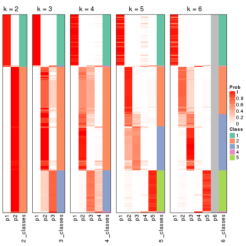


If matrix rows can be associated to genes, consider to use `GO_Enrichment(res,
...)` to perform function enrichment for the signature genes.


 

---------------------------------------------------


### CV:skmeans**


The object with results only for a single top-value method and a single partition method 
can be extracted as:

```r
res = res_list["CV", "skmeans"]
# you can also extract it by
# res = res_list["CV:skmeans"]
```

A summary of `res` and all the functions that can be applied to it:

```r
res
```

```
#> A 'ConsensusPartition' object with k = 2, 3, 4, 5, 6.
#>   On a matrix with 13930 rows and 285 columns.
#>   Top rows (1000, 2000, 3000, 4000, 5000) are extracted by 'CV' method.
#>   Subgroups are detected by 'skmeans' method.
#>   Performed in total 1250 partitions by row resampling.
#>   Best k for subgroups seems to be 4.
#> 
#> Following methods can be applied to this 'ConsensusPartition' object:
#>  [1] "cola_report"             "collect_classes"         "collect_plots"          
#>  [4] "collect_stats"           "colnames"                "compare_signatures"     
#>  [7] "consensus_heatmap"       "dimension_reduction"     "functional_enrichment"  
#> [10] "get_anno_col"            "get_anno"                "get_classes"            
#> [13] "get_consensus"           "get_matrix"              "get_membership"         
#> [16] "get_param"               "get_signatures"          "get_stats"              
#> [19] "is_best_k"               "is_stable_k"             "membership_heatmap"     
#> [22] "ncol"                    "nrow"                    "plot_ecdf"              
#> [25] "rownames"                "select_partition_number" "show"                   
#> [28] "suggest_best_k"          "test_to_known_factors"
```

`collect_plots()` function collects all the plots made from `res` for all `k` (number of partitions)
into one single page to provide an easy and fast comparison between different `k`.

```r
collect_plots(res)
```


The plots are:

- The first row: a plot of the ECDF (Empirical cumulative distribution
  function) curves of the consensus matrix for each `k` and the heatmap of
  predicted classes for each `k`.
- The second row: heatmaps of the consensus matrix for each `k`.
- The third row: heatmaps of the membership matrix for each `k`.
- The fouth row: heatmaps of the signatures for each `k`.

All the plots in panels can be made by individual functions and they are
plotted later in this section.

`select_partition_number()` produces several plots showing different
statistics for choosing "optimized" `k`. There are following statistics:

- ECDF curves of the consensus matrix for each `k`;
- 1-PAC. [The PAC
  score](https://en.wikipedia.org/wiki/Consensus_clustering#Over-interpretation_potential_of_consensus_clustering)
  measures the proportion of the ambiguous subgrouping.
- Mean silhouette score.
- Concordance. The mean probability of fiting the consensus class ids in all
  partitions.
- Area increased. Denote $A_k$ as the area under the ECDF curve for current
  `k`, the area increased is defined as $A_k - A_{k-1}$.
- Rand index. The percent of pairs of samples that are both in a same cluster
  or both are not in a same cluster in the partition of k and k-1.
- Jaccard index. The ratio of pairs of samples are both in a same cluster in
  the partition of k and k-1 and the pairs of samples are both in a same
  cluster in the partition k or k-1.

The detailed explanations of these statistics can be found in [the cola
vignette](http://bioconductor.org/packages/devel/bioc/vignettes/cola/inst/doc/cola.html#toc_13).

Generally speaking, lower PAC score, higher mean silhouette score or higher
concordance corresponds to better partition. Rand index and Jaccard index
measure how similar the current partition is compared to partition with `k-1`.
If they are too similar, we won't accept `k` is better than `k-1`.

```r
select_partition_number(res)
```


The numeric values for all these statistics can be obtained by `get_stats()`.

```r
get_stats(res)
```

```
#>   k 1-PAC mean_silhouette concordance area_increased  Rand Jaccard
#> 2 2 0.922           0.939       0.975         0.4254 0.583   0.583
#> 3 3 0.696           0.831       0.900         0.5323 0.730   0.545
#> 4 4 0.977           0.932       0.970         0.1417 0.875   0.652
#> 5 5 0.887           0.845       0.910         0.0344 0.957   0.837
#> 6 6 0.841           0.747       0.845         0.0279 0.977   0.903
```

`suggest_best_k()` suggests the best $k$ based on these statistics. The rules are as follows:

- All $k$ with Jaccard index larger than 0.95 are removed because the increase of
  the partition number does not provides enough extra information. If all $k$ are removed,
  the best $k$ is assigned by `NA`.
- For $k$ with 1-PAC larger than 0.9, the maximal $k$ is taken as the "best k". Other $k$ is called "optional k".
- If it does not fit the second rule. The $k$ with the highest vote of highest
  1-PAC, mean silhouette and concordance is taken as the "best k".

```r
suggest_best_k(res)
```

```
#> [1] 4
#> attr(,"optional")
#> [1] 2
```

There is also optional best $k$ = 2 that is worth to check.

Following shows the table of the partitions (You need to click the **show/hide
code output** link to see it). The membership matrix (columns with name `p*`)
is inferred by
[`clue::cl_consensus()`](https://www.rdocumentation.org/link/cl_consensus?package=clue)
function with the `SE` method. Basically the value in the membership matrix
represents the probability to belong to a certain group. The finall class
label for an item is determined with the group with highest probability it
belongs to.

In `get_classes()` function, the entropy is calculated from the membership
matrix and the silhouette score is calculated from the consensus matrix.


<script>
$( function() {
	$( '#tabs-CV-skmeans-get-classes' ).tabs();
} );
</script>
<div id='tabs-CV-skmeans-get-classes'>
<ul>
<li><a href='#tab-CV-skmeans-get-classes-1'>k = 2</a></li>
<li><a href='#tab-CV-skmeans-get-classes-2'>k = 3</a></li>
<li><a href='#tab-CV-skmeans-get-classes-3'>k = 4</a></li>
<li><a href='#tab-CV-skmeans-get-classes-4'>k = 5</a></li>
<li><a href='#tab-CV-skmeans-get-classes-5'>k = 6</a></li>
</ul>

<div id='tab-CV-skmeans-get-classes-1'>
<p><a id='tab-CV-skmeans-get-classes-1-a' style='color:#0366d6' href='#'>show/hide code output</a></p>
<pre><code class="r">cbind(get_classes(res, k = 2), get_membership(res, k = 2))
</code></pre>

<pre><code>#&gt;            class entropy silhouette    p1    p2
#&gt; SRR1201591     2  0.0000      0.972 0.000 1.000
#&gt; SRR1201590     2  0.1633      0.953 0.024 0.976
#&gt; SRR1201593     2  0.0000      0.972 0.000 1.000
#&gt; SRR1201592     2  0.0000      0.972 0.000 1.000
#&gt; SRR1201617     2  0.0000      0.972 0.000 1.000
#&gt; SRR1201616     2  0.5408      0.855 0.124 0.876
#&gt; SRR1201619     2  0.0000      0.972 0.000 1.000
#&gt; SRR1201618     2  0.3733      0.910 0.072 0.928
#&gt; SRR1201620     2  0.4562      0.886 0.096 0.904
#&gt; SRR1201621     2  0.0000      0.972 0.000 1.000
#&gt; SRR1201623     2  0.0000      0.972 0.000 1.000
#&gt; SRR1201622     2  0.2948      0.929 0.052 0.948
#&gt; SRR1201624     1  0.0000      0.976 1.000 0.000
#&gt; SRR1201625     2  0.0000      0.972 0.000 1.000
#&gt; SRR1201626     1  0.0000      0.976 1.000 0.000
#&gt; SRR1201627     2  0.0000      0.972 0.000 1.000
#&gt; SRR1201628     2  0.0000      0.972 0.000 1.000
#&gt; SRR1201629     2  0.0000      0.972 0.000 1.000
#&gt; SRR1201630     2  0.6801      0.787 0.180 0.820
#&gt; SRR1201631     2  0.0000      0.972 0.000 1.000
#&gt; SRR1201641     2  0.0000      0.972 0.000 1.000
#&gt; SRR1201640     2  0.0000      0.972 0.000 1.000
#&gt; SRR1201643     2  0.0376      0.969 0.004 0.996
#&gt; SRR1201644     2  0.0000      0.972 0.000 1.000
#&gt; SRR1201661     2  0.6531      0.802 0.168 0.832
#&gt; SRR1201662     2  0.0000      0.972 0.000 1.000
#&gt; SRR1201663     2  0.6438      0.807 0.164 0.836
#&gt; SRR1201664     2  0.0000      0.972 0.000 1.000
#&gt; SRR1201665     2  0.8327      0.658 0.264 0.736
#&gt; SRR1201666     2  0.0000      0.972 0.000 1.000
#&gt; SRR1201667     2  0.0000      0.972 0.000 1.000
#&gt; SRR1201668     1  0.9833      0.237 0.576 0.424
#&gt; SRR1201670     2  0.0000      0.972 0.000 1.000
#&gt; SRR1201669     2  0.0000      0.972 0.000 1.000
#&gt; SRR1201673     2  0.0000      0.972 0.000 1.000
#&gt; SRR1201672     2  0.0000      0.972 0.000 1.000
#&gt; SRR1201671     2  0.0000      0.972 0.000 1.000
#&gt; SRR1201677     2  0.0000      0.972 0.000 1.000
#&gt; SRR1201676     2  0.0000      0.972 0.000 1.000
#&gt; SRR1201675     2  0.0000      0.972 0.000 1.000
#&gt; SRR1201674     2  0.0000      0.972 0.000 1.000
#&gt; SRR1201678     2  0.0000      0.972 0.000 1.000
#&gt; SRR1201682     2  0.0000      0.972 0.000 1.000
#&gt; SRR1201683     2  0.0000      0.972 0.000 1.000
#&gt; SRR1201680     2  0.0000      0.972 0.000 1.000
#&gt; SRR1201681     2  0.0000      0.972 0.000 1.000
#&gt; SRR1201679     2  0.0000      0.972 0.000 1.000
#&gt; SRR1201686     2  0.0000      0.972 0.000 1.000
#&gt; SRR1201687     2  0.0000      0.972 0.000 1.000
#&gt; SRR1201688     2  0.0000      0.972 0.000 1.000
#&gt; SRR1201689     2  0.0000      0.972 0.000 1.000
#&gt; SRR1201685     1  0.0000      0.976 1.000 0.000
#&gt; SRR1201692     2  0.0000      0.972 0.000 1.000
#&gt; SRR1201691     2  0.0000      0.972 0.000 1.000
#&gt; SRR1201690     2  0.2423      0.940 0.040 0.960
#&gt; SRR1201696     2  0.0000      0.972 0.000 1.000
#&gt; SRR1201695     2  0.0000      0.972 0.000 1.000
#&gt; SRR1201694     2  0.0000      0.972 0.000 1.000
#&gt; SRR1201693     2  0.0000      0.972 0.000 1.000
#&gt; SRR1201697     2  0.0000      0.972 0.000 1.000
#&gt; SRR1201698     2  0.0000      0.972 0.000 1.000
#&gt; SRR1201700     2  0.0000      0.972 0.000 1.000
#&gt; SRR1201708     2  0.0000      0.972 0.000 1.000
#&gt; SRR1201707     2  0.0000      0.972 0.000 1.000
#&gt; SRR1201706     2  0.0000      0.972 0.000 1.000
#&gt; SRR1201702     2  0.0000      0.972 0.000 1.000
#&gt; SRR1201705     2  0.0000      0.972 0.000 1.000
#&gt; SRR1201701     2  0.0000      0.972 0.000 1.000
#&gt; SRR1201704     2  0.0000      0.972 0.000 1.000
#&gt; SRR1201703     2  0.0000      0.972 0.000 1.000
#&gt; SRR1201716     2  0.0000      0.972 0.000 1.000
#&gt; SRR1201715     2  0.0000      0.972 0.000 1.000
#&gt; SRR1201717     2  0.0000      0.972 0.000 1.000
#&gt; SRR1201712     2  0.0000      0.972 0.000 1.000
#&gt; SRR1201709     2  0.0000      0.972 0.000 1.000
#&gt; SRR1201711     2  0.0000      0.972 0.000 1.000
#&gt; SRR1201714     2  0.0000      0.972 0.000 1.000
#&gt; SRR1201713     2  0.0000      0.972 0.000 1.000
#&gt; SRR1201710     2  0.0000      0.972 0.000 1.000
#&gt; SRR1201719     2  0.0000      0.972 0.000 1.000
#&gt; SRR1201718     2  0.0000      0.972 0.000 1.000
#&gt; SRR1201721     2  0.0000      0.972 0.000 1.000
#&gt; SRR1201720     2  0.0000      0.972 0.000 1.000
#&gt; SRR1201723     2  0.0000      0.972 0.000 1.000
#&gt; SRR1201722     2  0.7219      0.759 0.200 0.800
#&gt; SRR1201725     2  0.0000      0.972 0.000 1.000
#&gt; SRR1201724     2  0.0000      0.972 0.000 1.000
#&gt; SRR1201726     2  0.1414      0.957 0.020 0.980
#&gt; SRR1201727     2  0.0000      0.972 0.000 1.000
#&gt; SRR1201731     2  0.0000      0.972 0.000 1.000
#&gt; SRR1201730     2  0.0000      0.972 0.000 1.000
#&gt; SRR1201734     2  0.0000      0.972 0.000 1.000
#&gt; SRR1201733     2  0.7376      0.748 0.208 0.792
#&gt; SRR1201736     2  0.9710      0.363 0.400 0.600
#&gt; SRR1201737     2  0.0000      0.972 0.000 1.000
#&gt; SRR1201739     2  0.0000      0.972 0.000 1.000
#&gt; SRR1201738     2  0.0000      0.972 0.000 1.000
#&gt; SRR1201742     2  0.0000      0.972 0.000 1.000
#&gt; SRR1201743     2  0.0000      0.972 0.000 1.000
#&gt; SRR1201745     2  0.0000      0.972 0.000 1.000
#&gt; SRR1201744     1  0.2236      0.941 0.964 0.036
#&gt; SRR1201749     2  0.9710      0.363 0.400 0.600
#&gt; SRR1201750     2  0.0000      0.972 0.000 1.000
#&gt; SRR1201752     2  0.0000      0.972 0.000 1.000
#&gt; SRR1201751     2  0.0000      0.972 0.000 1.000
#&gt; SRR1201754     2  0.0000      0.972 0.000 1.000
#&gt; SRR1201753     2  0.7219      0.759 0.200 0.800
#&gt; SRR1201758     1  0.0000      0.976 1.000 0.000
#&gt; SRR1201759     2  0.0000      0.972 0.000 1.000
#&gt; SRR1201760     2  0.2948      0.929 0.052 0.948
#&gt; SRR1201761     2  0.0000      0.972 0.000 1.000
#&gt; SRR1201763     2  0.0000      0.972 0.000 1.000
#&gt; SRR1201762     1  0.0000      0.976 1.000 0.000
#&gt; SRR1201764     2  0.9909      0.233 0.444 0.556
#&gt; SRR1201766     2  0.0672      0.966 0.008 0.992
#&gt; SRR1201768     2  0.0000      0.972 0.000 1.000
#&gt; SRR1201769     2  0.0000      0.972 0.000 1.000
#&gt; SRR1201767     2  0.0000      0.972 0.000 1.000
#&gt; SRR1201770     2  0.0000      0.972 0.000 1.000
#&gt; SRR1201771     2  0.0000      0.972 0.000 1.000
#&gt; SRR1201772     2  0.0000      0.972 0.000 1.000
#&gt; SRR1201773     2  0.0000      0.972 0.000 1.000
#&gt; SRR1201774     2  0.0000      0.972 0.000 1.000
#&gt; SRR1201786     2  0.0000      0.972 0.000 1.000
#&gt; SRR1201784     2  0.0000      0.972 0.000 1.000
#&gt; SRR1201785     2  0.0000      0.972 0.000 1.000
#&gt; SRR1201778     2  0.9710      0.363 0.400 0.600
#&gt; SRR1201779     2  0.0000      0.972 0.000 1.000
#&gt; SRR1201781     2  0.0000      0.972 0.000 1.000
#&gt; SRR1201780     2  0.0000      0.972 0.000 1.000
#&gt; SRR1201783     2  0.0000      0.972 0.000 1.000
#&gt; SRR1201782     2  0.0000      0.972 0.000 1.000
#&gt; SRR1201798     2  0.0000      0.972 0.000 1.000
#&gt; SRR1201797     2  0.0000      0.972 0.000 1.000
#&gt; SRR1201796     2  0.0000      0.972 0.000 1.000
#&gt; SRR1201795     2  0.0000      0.972 0.000 1.000
#&gt; SRR1201799     2  0.0000      0.972 0.000 1.000
#&gt; SRR1201794     2  0.0000      0.972 0.000 1.000
#&gt; SRR1201793     2  0.0000      0.972 0.000 1.000
#&gt; SRR1201792     2  0.0000      0.972 0.000 1.000
#&gt; SRR1201791     2  0.0000      0.972 0.000 1.000
#&gt; SRR1201807     2  0.0000      0.972 0.000 1.000
#&gt; SRR1201808     2  0.0000      0.972 0.000 1.000
#&gt; SRR1201803     2  0.0000      0.972 0.000 1.000
#&gt; SRR1201804     2  0.0000      0.972 0.000 1.000
#&gt; SRR1201805     2  0.0000      0.972 0.000 1.000
#&gt; SRR1201806     2  0.0000      0.972 0.000 1.000
#&gt; SRR1201801     2  0.0000      0.972 0.000 1.000
#&gt; SRR1201802     2  0.0000      0.972 0.000 1.000
#&gt; SRR1201800     2  0.0000      0.972 0.000 1.000
#&gt; SRR1201814     2  0.0000      0.972 0.000 1.000
#&gt; SRR1201816     2  0.0000      0.972 0.000 1.000
#&gt; SRR1201815     2  0.0000      0.972 0.000 1.000
#&gt; SRR1201819     2  0.0000      0.972 0.000 1.000
#&gt; SRR1201820     2  0.0000      0.972 0.000 1.000
#&gt; SRR1201813     2  0.0000      0.972 0.000 1.000
#&gt; SRR1201817     2  0.0000      0.972 0.000 1.000
#&gt; SRR1201818     2  0.0000      0.972 0.000 1.000
#&gt; SRR1201825     1  0.9710      0.311 0.600 0.400
#&gt; SRR1201827     2  0.0000      0.972 0.000 1.000
#&gt; SRR1201828     2  0.0000      0.972 0.000 1.000
#&gt; SRR1201826     2  0.5519      0.850 0.128 0.872
#&gt; SRR1201829     2  0.0000      0.972 0.000 1.000
#&gt; SRR1201830     2  0.0000      0.972 0.000 1.000
#&gt; SRR1201831     2  0.0000      0.972 0.000 1.000
#&gt; SRR1201832     2  0.0000      0.972 0.000 1.000
#&gt; SRR1201833     2  0.0000      0.972 0.000 1.000
#&gt; SRR1201865     2  0.0000      0.972 0.000 1.000
#&gt; SRR1201866     2  0.0000      0.972 0.000 1.000
#&gt; SRR1201867     2  0.0000      0.972 0.000 1.000
#&gt; SRR1201861     2  0.0000      0.972 0.000 1.000
#&gt; SRR1201862     2  0.0000      0.972 0.000 1.000
#&gt; SRR1201863     2  0.0000      0.972 0.000 1.000
#&gt; SRR1201859     1  0.9710      0.311 0.600 0.400
#&gt; SRR1201864     2  0.0000      0.972 0.000 1.000
#&gt; SRR1201860     2  0.0000      0.972 0.000 1.000
#&gt; SRR1201873     2  0.0000      0.972 0.000 1.000
#&gt; SRR1201871     2  0.8144      0.678 0.252 0.748
#&gt; SRR1201872     2  0.0000      0.972 0.000 1.000
#&gt; SRR1201980     2  0.0000      0.972 0.000 1.000
#&gt; SRR1201979     2  0.0000      0.972 0.000 1.000
#&gt; SRR1201982     2  0.0000      0.972 0.000 1.000
#&gt; SRR1201981     2  0.6801      0.786 0.180 0.820
#&gt; SRR1201998     2  0.0000      0.972 0.000 1.000
#&gt; SRR1201996     2  0.0000      0.972 0.000 1.000
#&gt; SRR1201997     2  0.0000      0.972 0.000 1.000
#&gt; SRR1202005     2  0.0000      0.972 0.000 1.000
#&gt; SRR1202006     2  0.0000      0.972 0.000 1.000
#&gt; SRR1202088     2  0.0000      0.972 0.000 1.000
#&gt; SRR1202087     2  0.0000      0.972 0.000 1.000
#&gt; SRR1202093     2  0.0000      0.972 0.000 1.000
#&gt; SRR1202092     2  0.0000      0.972 0.000 1.000
#&gt; SRR1202288     2  0.9710      0.363 0.400 0.600
#&gt; SRR1202289     2  0.0000      0.972 0.000 1.000
#&gt; SRR1202299     2  0.0000      0.972 0.000 1.000
#&gt; SRR1202298     2  0.0000      0.972 0.000 1.000
#&gt; SRR1202303     2  0.0000      0.972 0.000 1.000
#&gt; SRR1202372     2  0.0000      0.972 0.000 1.000
#&gt; SRR1202371     2  0.9710      0.363 0.400 0.600
#&gt; SRR1202563     1  0.9686      0.322 0.604 0.396
#&gt; SRR1202565     2  0.0000      0.972 0.000 1.000
#&gt; SRR1202564     2  0.0000      0.972 0.000 1.000
#&gt; SRR1202649     1  0.7299      0.726 0.796 0.204
#&gt; SRR1202650     2  0.4939      0.873 0.108 0.892
#&gt; SRR1202651     2  0.0000      0.972 0.000 1.000
#&gt; SRR1202843     1  0.0000      0.976 1.000 0.000
#&gt; SRR1202844     1  0.0000      0.976 1.000 0.000
#&gt; SRR1202845     2  0.4690      0.881 0.100 0.900
#&gt; SRR1202847     2  0.0000      0.972 0.000 1.000
#&gt; SRR1202846     2  0.0000      0.972 0.000 1.000
#&gt; SRR1202945     1  0.0000      0.976 1.000 0.000
#&gt; SRR1202949     1  0.0000      0.976 1.000 0.000
#&gt; SRR1202977     1  0.0000      0.976 1.000 0.000
#&gt; SRR1202978     1  0.0000      0.976 1.000 0.000
#&gt; SRR1202979     1  0.0000      0.976 1.000 0.000
#&gt; SRR1202990     1  0.0000      0.976 1.000 0.000
#&gt; SRR1202999     1  0.0000      0.976 1.000 0.000
#&gt; SRR1203005     1  0.0000      0.976 1.000 0.000
#&gt; SRR1203006     1  0.0000      0.976 1.000 0.000
#&gt; SRR1203007     1  0.0000      0.976 1.000 0.000
#&gt; SRR1203009     1  0.0000      0.976 1.000 0.000
#&gt; SRR1203008     1  0.0000      0.976 1.000 0.000
#&gt; SRR1203010     1  0.0000      0.976 1.000 0.000
#&gt; SRR1203011     1  0.0000      0.976 1.000 0.000
#&gt; SRR1203025     1  0.0000      0.976 1.000 0.000
#&gt; SRR1203026     1  0.0000      0.976 1.000 0.000
#&gt; SRR1203027     1  0.0000      0.976 1.000 0.000
#&gt; SRR1203061     1  0.0000      0.976 1.000 0.000
#&gt; SRR1203089     1  0.0000      0.976 1.000 0.000
#&gt; SRR1203125     1  0.0000      0.976 1.000 0.000
#&gt; SRR1203128     1  0.0000      0.976 1.000 0.000
#&gt; SRR1203129     1  0.0000      0.976 1.000 0.000
#&gt; SRR1203130     1  0.0000      0.976 1.000 0.000
#&gt; SRR1203132     2  0.0000      0.972 0.000 1.000
#&gt; SRR1203131     2  0.7219      0.759 0.200 0.800
#&gt; SRR1203133     1  0.0000      0.976 1.000 0.000
#&gt; SRR1203138     1  0.0000      0.976 1.000 0.000
#&gt; SRR1203760     1  0.0000      0.976 1.000 0.000
#&gt; SRR1203761     1  0.0000      0.976 1.000 0.000
#&gt; SRR1203770     1  0.0000      0.976 1.000 0.000
#&gt; SRR1203771     1  0.0000      0.976 1.000 0.000
#&gt; SRR1203772     1  0.0000      0.976 1.000 0.000
#&gt; SRR1203773     1  0.0000      0.976 1.000 0.000
#&gt; SRR1203774     1  0.0000      0.976 1.000 0.000
#&gt; SRR1203775     1  0.0000      0.976 1.000 0.000
#&gt; SRR1203800     1  0.0000      0.976 1.000 0.000
#&gt; SRR1203801     1  0.0000      0.976 1.000 0.000
#&gt; SRR1203802     1  0.0000      0.976 1.000 0.000
#&gt; SRR1203803     1  0.0000      0.976 1.000 0.000
#&gt; SRR1203804     1  0.0000      0.976 1.000 0.000
#&gt; SRR1203805     1  0.0000      0.976 1.000 0.000
#&gt; SRR1203806     1  0.0000      0.976 1.000 0.000
#&gt; SRR1203807     1  0.0000      0.976 1.000 0.000
#&gt; SRR1203808     1  0.0000      0.976 1.000 0.000
#&gt; SRR1203811     1  0.0000      0.976 1.000 0.000
#&gt; SRR1203812     1  0.0000      0.976 1.000 0.000
#&gt; SRR1203813     1  0.0000      0.976 1.000 0.000
#&gt; SRR1203814     1  0.0000      0.976 1.000 0.000
#&gt; SRR1203815     1  0.0000      0.976 1.000 0.000
#&gt; SRR1203816     1  0.0000      0.976 1.000 0.000
#&gt; SRR1203817     1  0.0000      0.976 1.000 0.000
#&gt; SRR1203818     1  0.0000      0.976 1.000 0.000
#&gt; SRR1203819     1  0.0000      0.976 1.000 0.000
#&gt; SRR1203822     1  0.0000      0.976 1.000 0.000
#&gt; SRR1203823     1  0.0000      0.976 1.000 0.000
#&gt; SRR1203824     1  0.0000      0.976 1.000 0.000
#&gt; SRR1203825     1  0.0000      0.976 1.000 0.000
#&gt; SRR1203826     1  0.0000      0.976 1.000 0.000
#&gt; SRR1203827     1  0.0000      0.976 1.000 0.000
#&gt; SRR1203828     1  0.0000      0.976 1.000 0.000
#&gt; SRR1203829     1  0.0000      0.976 1.000 0.000
#&gt; SRR1203830     1  0.0000      0.976 1.000 0.000
#&gt; SRR1203831     1  0.0000      0.976 1.000 0.000
#&gt; SRR1203832     1  0.0000      0.976 1.000 0.000
#&gt; SRR1203833     1  0.0000      0.976 1.000 0.000
#&gt; SRR1203834     1  0.0000      0.976 1.000 0.000
#&gt; SRR1203835     1  0.0000      0.976 1.000 0.000
#&gt; SRR1203836     1  0.0000      0.976 1.000 0.000
#&gt; SRR1203837     1  0.0000      0.976 1.000 0.000
#&gt; SRR1203838     1  0.0000      0.976 1.000 0.000
#&gt; SRR1203839     1  0.0000      0.976 1.000 0.000
#&gt; SRR1203842     1  0.0000      0.976 1.000 0.000
#&gt; SRR1203843     1  0.0000      0.976 1.000 0.000
#&gt; SRR1203845     2  0.0000      0.972 0.000 1.000
#&gt; SRR1203844     2  0.2778      0.932 0.048 0.952
</code></pre>

<script>
$('#tab-CV-skmeans-get-classes-1-a').parent().next().next().hide();
$('#tab-CV-skmeans-get-classes-1-a').click(function(){
  $('#tab-CV-skmeans-get-classes-1-a').parent().next().next().toggle();
  return(false);
});
</script>
</div>

<div id='tab-CV-skmeans-get-classes-2'>
<p><a id='tab-CV-skmeans-get-classes-2-a' style='color:#0366d6' href='#'>show/hide code output</a></p>
<pre><code class="r">cbind(get_classes(res, k = 3), get_membership(res, k = 3))
</code></pre>

<pre><code>#&gt;            class entropy silhouette    p1    p2    p3
#&gt; SRR1201591     2  0.4887     0.8396 0.000 0.772 0.228
#&gt; SRR1201590     2  0.0000     0.7507 0.000 1.000 0.000
#&gt; SRR1201593     2  0.4887     0.8396 0.000 0.772 0.228
#&gt; SRR1201592     2  0.0000     0.7507 0.000 1.000 0.000
#&gt; SRR1201617     2  0.4887     0.8396 0.000 0.772 0.228
#&gt; SRR1201616     2  0.0000     0.7507 0.000 1.000 0.000
#&gt; SRR1201619     2  0.4931     0.8361 0.000 0.768 0.232
#&gt; SRR1201618     2  0.0000     0.7507 0.000 1.000 0.000
#&gt; SRR1201620     2  0.0000     0.7507 0.000 1.000 0.000
#&gt; SRR1201621     2  0.4887     0.8396 0.000 0.772 0.228
#&gt; SRR1201623     3  0.0000     0.8961 0.000 0.000 1.000
#&gt; SRR1201622     3  0.5517     0.6638 0.004 0.268 0.728
#&gt; SRR1201624     1  0.0000     0.9934 1.000 0.000 0.000
#&gt; SRR1201625     3  0.0000     0.8961 0.000 0.000 1.000
#&gt; SRR1201626     1  0.0000     0.9934 1.000 0.000 0.000
#&gt; SRR1201627     3  0.0000     0.8961 0.000 0.000 1.000
#&gt; SRR1201628     3  0.5733     0.6093 0.000 0.324 0.676
#&gt; SRR1201629     3  0.0000     0.8961 0.000 0.000 1.000
#&gt; SRR1201630     2  0.0592     0.7464 0.012 0.988 0.000
#&gt; SRR1201631     3  0.4605     0.6111 0.000 0.204 0.796
#&gt; SRR1201641     3  0.0000     0.8961 0.000 0.000 1.000
#&gt; SRR1201640     2  0.4291     0.6119 0.000 0.820 0.180
#&gt; SRR1201643     3  0.6252     0.4020 0.000 0.444 0.556
#&gt; SRR1201644     3  0.0000     0.8961 0.000 0.000 1.000
#&gt; SRR1201661     2  0.4539     0.6410 0.016 0.836 0.148
#&gt; SRR1201662     3  0.4346     0.6501 0.000 0.184 0.816
#&gt; SRR1201663     3  0.4887     0.6944 0.000 0.228 0.772
#&gt; SRR1201664     3  0.0000     0.8961 0.000 0.000 1.000
#&gt; SRR1201665     2  0.0747     0.7446 0.016 0.984 0.000
#&gt; SRR1201666     2  0.4887     0.8396 0.000 0.772 0.228
#&gt; SRR1201667     2  0.4887     0.8396 0.000 0.772 0.228
#&gt; SRR1201668     3  0.9702     0.2260 0.320 0.236 0.444
#&gt; SRR1201670     3  0.0000     0.8961 0.000 0.000 1.000
#&gt; SRR1201669     3  0.0000     0.8961 0.000 0.000 1.000
#&gt; SRR1201673     3  0.0000     0.8961 0.000 0.000 1.000
#&gt; SRR1201672     3  0.0000     0.8961 0.000 0.000 1.000
#&gt; SRR1201671     2  0.3816     0.6564 0.000 0.852 0.148
#&gt; SRR1201677     3  0.0000     0.8961 0.000 0.000 1.000
#&gt; SRR1201676     3  0.0000     0.8961 0.000 0.000 1.000
#&gt; SRR1201675     3  0.0000     0.8961 0.000 0.000 1.000
#&gt; SRR1201674     3  0.0000     0.8961 0.000 0.000 1.000
#&gt; SRR1201678     3  0.0000     0.8961 0.000 0.000 1.000
#&gt; SRR1201682     2  0.5859     0.7053 0.000 0.656 0.344
#&gt; SRR1201683     2  0.5859     0.7053 0.000 0.656 0.344
#&gt; SRR1201680     2  0.5859     0.7053 0.000 0.656 0.344
#&gt; SRR1201681     2  0.5859     0.7053 0.000 0.656 0.344
#&gt; SRR1201679     2  0.0000     0.7507 0.000 1.000 0.000
#&gt; SRR1201686     3  0.0000     0.8961 0.000 0.000 1.000
#&gt; SRR1201687     3  0.0000     0.8961 0.000 0.000 1.000
#&gt; SRR1201688     3  0.0000     0.8961 0.000 0.000 1.000
#&gt; SRR1201689     3  0.0000     0.8961 0.000 0.000 1.000
#&gt; SRR1201685     1  0.3686     0.8498 0.860 0.140 0.000
#&gt; SRR1201692     3  0.0000     0.8961 0.000 0.000 1.000
#&gt; SRR1201691     3  0.0000     0.8961 0.000 0.000 1.000
#&gt; SRR1201690     3  0.4887     0.6944 0.000 0.228 0.772
#&gt; SRR1201696     3  0.0000     0.8961 0.000 0.000 1.000
#&gt; SRR1201695     3  0.0000     0.8961 0.000 0.000 1.000
#&gt; SRR1201694     3  0.0000     0.8961 0.000 0.000 1.000
#&gt; SRR1201693     3  0.0000     0.8961 0.000 0.000 1.000
#&gt; SRR1201697     3  0.0000     0.8961 0.000 0.000 1.000
#&gt; SRR1201698     3  0.0000     0.8961 0.000 0.000 1.000
#&gt; SRR1201700     3  0.4887     0.6944 0.000 0.228 0.772
#&gt; SRR1201708     3  0.0000     0.8961 0.000 0.000 1.000
#&gt; SRR1201707     3  0.0000     0.8961 0.000 0.000 1.000
#&gt; SRR1201706     3  0.0000     0.8961 0.000 0.000 1.000
#&gt; SRR1201702     3  0.0000     0.8961 0.000 0.000 1.000
#&gt; SRR1201705     3  0.0000     0.8961 0.000 0.000 1.000
#&gt; SRR1201701     3  0.0000     0.8961 0.000 0.000 1.000
#&gt; SRR1201704     3  0.0000     0.8961 0.000 0.000 1.000
#&gt; SRR1201703     3  0.0000     0.8961 0.000 0.000 1.000
#&gt; SRR1201716     3  0.0000     0.8961 0.000 0.000 1.000
#&gt; SRR1201715     3  0.0000     0.8961 0.000 0.000 1.000
#&gt; SRR1201717     3  0.0000     0.8961 0.000 0.000 1.000
#&gt; SRR1201712     3  0.0000     0.8961 0.000 0.000 1.000
#&gt; SRR1201709     3  0.4887     0.6944 0.000 0.228 0.772
#&gt; SRR1201711     3  0.0000     0.8961 0.000 0.000 1.000
#&gt; SRR1201714     3  0.0000     0.8961 0.000 0.000 1.000
#&gt; SRR1201713     3  0.0000     0.8961 0.000 0.000 1.000
#&gt; SRR1201710     3  0.0000     0.8961 0.000 0.000 1.000
#&gt; SRR1201719     3  0.0000     0.8961 0.000 0.000 1.000
#&gt; SRR1201718     3  0.6309     0.2542 0.000 0.496 0.504
#&gt; SRR1201721     3  0.0000     0.8961 0.000 0.000 1.000
#&gt; SRR1201720     3  0.4887     0.6944 0.000 0.228 0.772
#&gt; SRR1201723     3  0.0000     0.8961 0.000 0.000 1.000
#&gt; SRR1201722     3  0.5450     0.6859 0.012 0.228 0.760
#&gt; SRR1201725     3  0.0000     0.8961 0.000 0.000 1.000
#&gt; SRR1201724     2  0.6079     0.1521 0.000 0.612 0.388
#&gt; SRR1201726     3  0.4887     0.6944 0.000 0.228 0.772
#&gt; SRR1201727     3  0.0000     0.8961 0.000 0.000 1.000
#&gt; SRR1201731     3  0.0000     0.8961 0.000 0.000 1.000
#&gt; SRR1201730     3  0.4887     0.6944 0.000 0.228 0.772
#&gt; SRR1201734     2  0.4887     0.8396 0.000 0.772 0.228
#&gt; SRR1201733     2  0.0000     0.7507 0.000 1.000 0.000
#&gt; SRR1201736     2  0.4062     0.6348 0.164 0.836 0.000
#&gt; SRR1201737     2  0.4887     0.8396 0.000 0.772 0.228
#&gt; SRR1201739     2  0.4887     0.8396 0.000 0.772 0.228
#&gt; SRR1201738     2  0.0000     0.7507 0.000 1.000 0.000
#&gt; SRR1201742     2  0.0000     0.7507 0.000 1.000 0.000
#&gt; SRR1201743     2  0.5882     0.6990 0.000 0.652 0.348
#&gt; SRR1201745     2  0.4887     0.8396 0.000 0.772 0.228
#&gt; SRR1201744     1  0.6095     0.4340 0.608 0.392 0.000
#&gt; SRR1201749     2  0.3686     0.6629 0.140 0.860 0.000
#&gt; SRR1201750     2  0.4887     0.8396 0.000 0.772 0.228
#&gt; SRR1201752     3  0.0000     0.8961 0.000 0.000 1.000
#&gt; SRR1201751     3  0.4974     0.6898 0.000 0.236 0.764
#&gt; SRR1201754     2  0.6180     0.5788 0.000 0.584 0.416
#&gt; SRR1201753     2  0.0747     0.7446 0.016 0.984 0.000
#&gt; SRR1201758     1  0.0000     0.9934 1.000 0.000 0.000
#&gt; SRR1201759     3  0.0000     0.8961 0.000 0.000 1.000
#&gt; SRR1201760     3  0.6318     0.5566 0.008 0.356 0.636
#&gt; SRR1201761     3  0.0000     0.8961 0.000 0.000 1.000
#&gt; SRR1201763     3  0.0000     0.8961 0.000 0.000 1.000
#&gt; SRR1201762     1  0.0000     0.9934 1.000 0.000 0.000
#&gt; SRR1201764     3  0.6647     0.3204 0.396 0.012 0.592
#&gt; SRR1201766     2  0.0000     0.7507 0.000 1.000 0.000
#&gt; SRR1201768     2  0.4887     0.8396 0.000 0.772 0.228
#&gt; SRR1201769     2  0.4887     0.8396 0.000 0.772 0.228
#&gt; SRR1201767     2  0.4887     0.8396 0.000 0.772 0.228
#&gt; SRR1201770     2  0.4887     0.8396 0.000 0.772 0.228
#&gt; SRR1201771     2  0.4887     0.8396 0.000 0.772 0.228
#&gt; SRR1201772     2  0.4887     0.8396 0.000 0.772 0.228
#&gt; SRR1201773     2  0.4887     0.8396 0.000 0.772 0.228
#&gt; SRR1201774     2  0.4887     0.8396 0.000 0.772 0.228
#&gt; SRR1201786     2  0.4887     0.8396 0.000 0.772 0.228
#&gt; SRR1201784     2  0.4887     0.8396 0.000 0.772 0.228
#&gt; SRR1201785     2  0.4887     0.8396 0.000 0.772 0.228
#&gt; SRR1201778     2  0.1753     0.7282 0.048 0.952 0.000
#&gt; SRR1201779     2  0.4887     0.8396 0.000 0.772 0.228
#&gt; SRR1201781     2  0.4887     0.8396 0.000 0.772 0.228
#&gt; SRR1201780     2  0.4887     0.8396 0.000 0.772 0.228
#&gt; SRR1201783     2  0.4887     0.8396 0.000 0.772 0.228
#&gt; SRR1201782     2  0.4887     0.8396 0.000 0.772 0.228
#&gt; SRR1201798     2  0.4887     0.8396 0.000 0.772 0.228
#&gt; SRR1201797     2  0.4887     0.8396 0.000 0.772 0.228
#&gt; SRR1201796     2  0.4887     0.8396 0.000 0.772 0.228
#&gt; SRR1201795     2  0.4887     0.8396 0.000 0.772 0.228
#&gt; SRR1201799     2  0.4887     0.8396 0.000 0.772 0.228
#&gt; SRR1201794     2  0.4887     0.8396 0.000 0.772 0.228
#&gt; SRR1201793     2  0.4887     0.8396 0.000 0.772 0.228
#&gt; SRR1201792     2  0.4887     0.8396 0.000 0.772 0.228
#&gt; SRR1201791     2  0.0000     0.7507 0.000 1.000 0.000
#&gt; SRR1201807     2  0.4887     0.8396 0.000 0.772 0.228
#&gt; SRR1201808     2  0.4887     0.8396 0.000 0.772 0.228
#&gt; SRR1201803     2  0.4887     0.8396 0.000 0.772 0.228
#&gt; SRR1201804     2  0.4887     0.8396 0.000 0.772 0.228
#&gt; SRR1201805     2  0.4887     0.8396 0.000 0.772 0.228
#&gt; SRR1201806     2  0.4887     0.8396 0.000 0.772 0.228
#&gt; SRR1201801     2  0.4887     0.8396 0.000 0.772 0.228
#&gt; SRR1201802     2  0.4887     0.8396 0.000 0.772 0.228
#&gt; SRR1201800     2  0.0000     0.7507 0.000 1.000 0.000
#&gt; SRR1201814     2  0.4887     0.8396 0.000 0.772 0.228
#&gt; SRR1201816     2  0.4887     0.8396 0.000 0.772 0.228
#&gt; SRR1201815     2  0.4887     0.8396 0.000 0.772 0.228
#&gt; SRR1201819     2  0.4887     0.8396 0.000 0.772 0.228
#&gt; SRR1201820     2  0.4887     0.8396 0.000 0.772 0.228
#&gt; SRR1201813     2  0.0237     0.7526 0.000 0.996 0.004
#&gt; SRR1201817     2  0.4887     0.8396 0.000 0.772 0.228
#&gt; SRR1201818     2  0.4887     0.8396 0.000 0.772 0.228
#&gt; SRR1201825     2  0.9411    -0.0105 0.380 0.444 0.176
#&gt; SRR1201827     3  0.0000     0.8961 0.000 0.000 1.000
#&gt; SRR1201828     3  0.0000     0.8961 0.000 0.000 1.000
#&gt; SRR1201826     3  0.4887     0.6944 0.000 0.228 0.772
#&gt; SRR1201829     3  0.0000     0.8961 0.000 0.000 1.000
#&gt; SRR1201830     3  0.0000     0.8961 0.000 0.000 1.000
#&gt; SRR1201831     3  0.0000     0.8961 0.000 0.000 1.000
#&gt; SRR1201832     3  0.0000     0.8961 0.000 0.000 1.000
#&gt; SRR1201833     3  0.0000     0.8961 0.000 0.000 1.000
#&gt; SRR1201865     3  0.0000     0.8961 0.000 0.000 1.000
#&gt; SRR1201866     3  0.0000     0.8961 0.000 0.000 1.000
#&gt; SRR1201867     3  0.0000     0.8961 0.000 0.000 1.000
#&gt; SRR1201861     3  0.0000     0.8961 0.000 0.000 1.000
#&gt; SRR1201862     3  0.0000     0.8961 0.000 0.000 1.000
#&gt; SRR1201863     3  0.0000     0.8961 0.000 0.000 1.000
#&gt; SRR1201859     2  0.6045     0.2212 0.380 0.620 0.000
#&gt; SRR1201864     3  0.0000     0.8961 0.000 0.000 1.000
#&gt; SRR1201860     3  0.0000     0.8961 0.000 0.000 1.000
#&gt; SRR1201873     3  0.0000     0.8961 0.000 0.000 1.000
#&gt; SRR1201871     3  0.6105     0.6600 0.024 0.252 0.724
#&gt; SRR1201872     3  0.0000     0.8961 0.000 0.000 1.000
#&gt; SRR1201980     3  0.0000     0.8961 0.000 0.000 1.000
#&gt; SRR1201979     3  0.5254     0.6702 0.000 0.264 0.736
#&gt; SRR1201982     3  0.0000     0.8961 0.000 0.000 1.000
#&gt; SRR1201981     3  0.6816     0.3149 0.012 0.472 0.516
#&gt; SRR1201998     3  0.0000     0.8961 0.000 0.000 1.000
#&gt; SRR1201996     2  0.4178     0.6235 0.000 0.828 0.172
#&gt; SRR1201997     3  0.0000     0.8961 0.000 0.000 1.000
#&gt; SRR1202005     2  0.6215     0.5526 0.000 0.572 0.428
#&gt; SRR1202006     3  0.6095     0.0313 0.000 0.392 0.608
#&gt; SRR1202088     3  0.4504     0.6290 0.000 0.196 0.804
#&gt; SRR1202087     2  0.6140     0.5451 0.000 0.596 0.404
#&gt; SRR1202093     2  0.4887     0.8396 0.000 0.772 0.228
#&gt; SRR1202092     2  0.0000     0.7507 0.000 1.000 0.000
#&gt; SRR1202288     2  0.0892     0.7430 0.020 0.980 0.000
#&gt; SRR1202289     2  0.4887     0.8396 0.000 0.772 0.228
#&gt; SRR1202299     2  0.4887     0.8396 0.000 0.772 0.228
#&gt; SRR1202298     2  0.0000     0.7507 0.000 1.000 0.000
#&gt; SRR1202303     3  0.0000     0.8961 0.000 0.000 1.000
#&gt; SRR1202372     2  0.4887     0.8396 0.000 0.772 0.228
#&gt; SRR1202371     2  0.4399     0.6034 0.188 0.812 0.000
#&gt; SRR1202563     2  0.6045     0.2212 0.380 0.620 0.000
#&gt; SRR1202565     3  0.0000     0.8961 0.000 0.000 1.000
#&gt; SRR1202564     3  0.0000     0.8961 0.000 0.000 1.000
#&gt; SRR1202649     2  0.6305    -0.1207 0.484 0.516 0.000
#&gt; SRR1202650     2  0.0237     0.7493 0.004 0.996 0.000
#&gt; SRR1202651     3  0.6168    -0.0595 0.000 0.412 0.588
#&gt; SRR1202843     1  0.0000     0.9934 1.000 0.000 0.000
#&gt; SRR1202844     1  0.0000     0.9934 1.000 0.000 0.000
#&gt; SRR1202845     2  0.4291     0.6126 0.000 0.820 0.180
#&gt; SRR1202847     3  0.4346     0.6501 0.000 0.184 0.816
#&gt; SRR1202846     3  0.4346     0.6501 0.000 0.184 0.816
#&gt; SRR1202945     1  0.0000     0.9934 1.000 0.000 0.000
#&gt; SRR1202949     1  0.0000     0.9934 1.000 0.000 0.000
#&gt; SRR1202977     1  0.0000     0.9934 1.000 0.000 0.000
#&gt; SRR1202978     1  0.0000     0.9934 1.000 0.000 0.000
#&gt; SRR1202979     1  0.0000     0.9934 1.000 0.000 0.000
#&gt; SRR1202990     1  0.0000     0.9934 1.000 0.000 0.000
#&gt; SRR1202999     1  0.0000     0.9934 1.000 0.000 0.000
#&gt; SRR1203005     1  0.0000     0.9934 1.000 0.000 0.000
#&gt; SRR1203006     1  0.0000     0.9934 1.000 0.000 0.000
#&gt; SRR1203007     1  0.0000     0.9934 1.000 0.000 0.000
#&gt; SRR1203009     1  0.0000     0.9934 1.000 0.000 0.000
#&gt; SRR1203008     1  0.0000     0.9934 1.000 0.000 0.000
#&gt; SRR1203010     1  0.0000     0.9934 1.000 0.000 0.000
#&gt; SRR1203011     1  0.0000     0.9934 1.000 0.000 0.000
#&gt; SRR1203025     1  0.0000     0.9934 1.000 0.000 0.000
#&gt; SRR1203026     1  0.0000     0.9934 1.000 0.000 0.000
#&gt; SRR1203027     1  0.0000     0.9934 1.000 0.000 0.000
#&gt; SRR1203061     1  0.0000     0.9934 1.000 0.000 0.000
#&gt; SRR1203089     1  0.0000     0.9934 1.000 0.000 0.000
#&gt; SRR1203125     1  0.0000     0.9934 1.000 0.000 0.000
#&gt; SRR1203128     1  0.0000     0.9934 1.000 0.000 0.000
#&gt; SRR1203129     1  0.0000     0.9934 1.000 0.000 0.000
#&gt; SRR1203130     1  0.0000     0.9934 1.000 0.000 0.000
#&gt; SRR1203132     3  0.0000     0.8961 0.000 0.000 1.000
#&gt; SRR1203131     3  0.6897     0.3970 0.016 0.436 0.548
#&gt; SRR1203133     1  0.0000     0.9934 1.000 0.000 0.000
#&gt; SRR1203138     1  0.0000     0.9934 1.000 0.000 0.000
#&gt; SRR1203760     1  0.0000     0.9934 1.000 0.000 0.000
#&gt; SRR1203761     1  0.0000     0.9934 1.000 0.000 0.000
#&gt; SRR1203770     1  0.0000     0.9934 1.000 0.000 0.000
#&gt; SRR1203771     1  0.0000     0.9934 1.000 0.000 0.000
#&gt; SRR1203772     1  0.0000     0.9934 1.000 0.000 0.000
#&gt; SRR1203773     1  0.0000     0.9934 1.000 0.000 0.000
#&gt; SRR1203774     1  0.0000     0.9934 1.000 0.000 0.000
#&gt; SRR1203775     1  0.0000     0.9934 1.000 0.000 0.000
#&gt; SRR1203800     1  0.0000     0.9934 1.000 0.000 0.000
#&gt; SRR1203801     1  0.0000     0.9934 1.000 0.000 0.000
#&gt; SRR1203802     1  0.0000     0.9934 1.000 0.000 0.000
#&gt; SRR1203803     1  0.0000     0.9934 1.000 0.000 0.000
#&gt; SRR1203804     1  0.0000     0.9934 1.000 0.000 0.000
#&gt; SRR1203805     1  0.0000     0.9934 1.000 0.000 0.000
#&gt; SRR1203806     1  0.0000     0.9934 1.000 0.000 0.000
#&gt; SRR1203807     1  0.0000     0.9934 1.000 0.000 0.000
#&gt; SRR1203808     1  0.0000     0.9934 1.000 0.000 0.000
#&gt; SRR1203811     1  0.0000     0.9934 1.000 0.000 0.000
#&gt; SRR1203812     1  0.0000     0.9934 1.000 0.000 0.000
#&gt; SRR1203813     1  0.0000     0.9934 1.000 0.000 0.000
#&gt; SRR1203814     1  0.0000     0.9934 1.000 0.000 0.000
#&gt; SRR1203815     1  0.0000     0.9934 1.000 0.000 0.000
#&gt; SRR1203816     1  0.0000     0.9934 1.000 0.000 0.000
#&gt; SRR1203817     1  0.0000     0.9934 1.000 0.000 0.000
#&gt; SRR1203818     1  0.0000     0.9934 1.000 0.000 0.000
#&gt; SRR1203819     1  0.0000     0.9934 1.000 0.000 0.000
#&gt; SRR1203822     1  0.0000     0.9934 1.000 0.000 0.000
#&gt; SRR1203823     1  0.0000     0.9934 1.000 0.000 0.000
#&gt; SRR1203824     1  0.0000     0.9934 1.000 0.000 0.000
#&gt; SRR1203825     1  0.0000     0.9934 1.000 0.000 0.000
#&gt; SRR1203826     1  0.0000     0.9934 1.000 0.000 0.000
#&gt; SRR1203827     1  0.0000     0.9934 1.000 0.000 0.000
#&gt; SRR1203828     1  0.0000     0.9934 1.000 0.000 0.000
#&gt; SRR1203829     1  0.0000     0.9934 1.000 0.000 0.000
#&gt; SRR1203830     1  0.0000     0.9934 1.000 0.000 0.000
#&gt; SRR1203831     1  0.0000     0.9934 1.000 0.000 0.000
#&gt; SRR1203832     1  0.0000     0.9934 1.000 0.000 0.000
#&gt; SRR1203833     1  0.0000     0.9934 1.000 0.000 0.000
#&gt; SRR1203834     1  0.0000     0.9934 1.000 0.000 0.000
#&gt; SRR1203835     1  0.0000     0.9934 1.000 0.000 0.000
#&gt; SRR1203836     1  0.0000     0.9934 1.000 0.000 0.000
#&gt; SRR1203837     1  0.0000     0.9934 1.000 0.000 0.000
#&gt; SRR1203838     1  0.0000     0.9934 1.000 0.000 0.000
#&gt; SRR1203839     1  0.0000     0.9934 1.000 0.000 0.000
#&gt; SRR1203842     1  0.0000     0.9934 1.000 0.000 0.000
#&gt; SRR1203843     1  0.0000     0.9934 1.000 0.000 0.000
#&gt; SRR1203845     3  0.6307    -0.3422 0.000 0.488 0.512
#&gt; SRR1203844     2  0.0000     0.7507 0.000 1.000 0.000
</code></pre>

<script>
$('#tab-CV-skmeans-get-classes-2-a').parent().next().next().hide();
$('#tab-CV-skmeans-get-classes-2-a').click(function(){
  $('#tab-CV-skmeans-get-classes-2-a').parent().next().next().toggle();
  return(false);
});
</script>
</div>

<div id='tab-CV-skmeans-get-classes-3'>
<p><a id='tab-CV-skmeans-get-classes-3-a' style='color:#0366d6' href='#'>show/hide code output</a></p>
<pre><code class="r">cbind(get_classes(res, k = 4), get_membership(res, k = 4))
</code></pre>

<pre><code>#&gt;            class entropy silhouette    p1    p2    p3    p4
#&gt; SRR1201591     2  0.0188     0.9423 0.000 0.996 0.004 0.000
#&gt; SRR1201590     4  0.0336     0.9709 0.000 0.008 0.000 0.992
#&gt; SRR1201593     2  0.0188     0.9423 0.000 0.996 0.004 0.000
#&gt; SRR1201592     4  0.0817     0.9617 0.000 0.024 0.000 0.976
#&gt; SRR1201617     2  0.0188     0.9423 0.000 0.996 0.004 0.000
#&gt; SRR1201616     4  0.1211     0.9494 0.000 0.040 0.000 0.960
#&gt; SRR1201619     2  0.0188     0.9423 0.000 0.996 0.004 0.000
#&gt; SRR1201618     4  0.0188     0.9723 0.000 0.004 0.000 0.996
#&gt; SRR1201620     4  0.0469     0.9690 0.000 0.012 0.000 0.988
#&gt; SRR1201621     2  0.0188     0.9423 0.000 0.996 0.004 0.000
#&gt; SRR1201623     3  0.0336     0.9678 0.000 0.008 0.992 0.000
#&gt; SRR1201622     4  0.0000     0.9728 0.000 0.000 0.000 1.000
#&gt; SRR1201624     1  0.0336     0.9883 0.992 0.000 0.008 0.000
#&gt; SRR1201625     3  0.0000     0.9633 0.000 0.000 1.000 0.000
#&gt; SRR1201626     1  0.0336     0.9883 0.992 0.000 0.008 0.000
#&gt; SRR1201627     3  0.0000     0.9633 0.000 0.000 1.000 0.000
#&gt; SRR1201628     4  0.0000     0.9728 0.000 0.000 0.000 1.000
#&gt; SRR1201629     3  0.0336     0.9678 0.000 0.008 0.992 0.000
#&gt; SRR1201630     4  0.0000     0.9728 0.000 0.000 0.000 1.000
#&gt; SRR1201631     3  0.4605     0.4923 0.000 0.336 0.664 0.000
#&gt; SRR1201641     3  0.1211     0.9419 0.000 0.040 0.960 0.000
#&gt; SRR1201640     4  0.0000     0.9728 0.000 0.000 0.000 1.000
#&gt; SRR1201643     4  0.0000     0.9728 0.000 0.000 0.000 1.000
#&gt; SRR1201644     3  0.0336     0.9678 0.000 0.008 0.992 0.000
#&gt; SRR1201661     4  0.0000     0.9728 0.000 0.000 0.000 1.000
#&gt; SRR1201662     3  0.4431     0.5620 0.000 0.304 0.696 0.000
#&gt; SRR1201663     4  0.0000     0.9728 0.000 0.000 0.000 1.000
#&gt; SRR1201664     3  0.0336     0.9678 0.000 0.008 0.992 0.000
#&gt; SRR1201665     4  0.0188     0.9723 0.000 0.004 0.000 0.996
#&gt; SRR1201666     2  0.0188     0.9423 0.000 0.996 0.004 0.000
#&gt; SRR1201667     2  0.0188     0.9423 0.000 0.996 0.004 0.000
#&gt; SRR1201668     4  0.0188     0.9723 0.000 0.004 0.000 0.996
#&gt; SRR1201670     3  0.0336     0.9678 0.000 0.008 0.992 0.000
#&gt; SRR1201669     3  0.0336     0.9678 0.000 0.008 0.992 0.000
#&gt; SRR1201673     3  0.0336     0.9678 0.000 0.008 0.992 0.000
#&gt; SRR1201672     3  0.0336     0.9678 0.000 0.008 0.992 0.000
#&gt; SRR1201671     4  0.0188     0.9723 0.000 0.004 0.000 0.996
#&gt; SRR1201677     3  0.0336     0.9678 0.000 0.008 0.992 0.000
#&gt; SRR1201676     3  0.0336     0.9678 0.000 0.008 0.992 0.000
#&gt; SRR1201675     3  0.0336     0.9678 0.000 0.008 0.992 0.000
#&gt; SRR1201674     3  0.0336     0.9678 0.000 0.008 0.992 0.000
#&gt; SRR1201678     3  0.0336     0.9678 0.000 0.008 0.992 0.000
#&gt; SRR1201682     2  0.0336     0.9391 0.000 0.992 0.008 0.000
#&gt; SRR1201683     2  0.0336     0.9391 0.000 0.992 0.008 0.000
#&gt; SRR1201680     2  0.0336     0.9391 0.000 0.992 0.008 0.000
#&gt; SRR1201681     2  0.0336     0.9391 0.000 0.992 0.008 0.000
#&gt; SRR1201679     4  0.0592     0.9671 0.000 0.016 0.000 0.984
#&gt; SRR1201686     3  0.0000     0.9633 0.000 0.000 1.000 0.000
#&gt; SRR1201687     3  0.0000     0.9633 0.000 0.000 1.000 0.000
#&gt; SRR1201688     3  0.0000     0.9633 0.000 0.000 1.000 0.000
#&gt; SRR1201689     3  0.0000     0.9633 0.000 0.000 1.000 0.000
#&gt; SRR1201685     1  0.4776     0.3833 0.624 0.000 0.000 0.376
#&gt; SRR1201692     3  0.0336     0.9678 0.000 0.008 0.992 0.000
#&gt; SRR1201691     3  0.0336     0.9678 0.000 0.008 0.992 0.000
#&gt; SRR1201690     4  0.0336     0.9687 0.000 0.000 0.008 0.992
#&gt; SRR1201696     3  0.0336     0.9678 0.000 0.008 0.992 0.000
#&gt; SRR1201695     3  0.0336     0.9678 0.000 0.008 0.992 0.000
#&gt; SRR1201694     3  0.0336     0.9678 0.000 0.008 0.992 0.000
#&gt; SRR1201693     3  0.0336     0.9678 0.000 0.008 0.992 0.000
#&gt; SRR1201697     3  0.0336     0.9678 0.000 0.008 0.992 0.000
#&gt; SRR1201698     3  0.0336     0.9678 0.000 0.008 0.992 0.000
#&gt; SRR1201700     4  0.1637     0.9255 0.000 0.000 0.060 0.940
#&gt; SRR1201708     3  0.0336     0.9678 0.000 0.008 0.992 0.000
#&gt; SRR1201707     3  0.0336     0.9678 0.000 0.008 0.992 0.000
#&gt; SRR1201706     3  0.0336     0.9678 0.000 0.008 0.992 0.000
#&gt; SRR1201702     3  0.0336     0.9678 0.000 0.008 0.992 0.000
#&gt; SRR1201705     3  0.0336     0.9678 0.000 0.008 0.992 0.000
#&gt; SRR1201701     3  0.0336     0.9678 0.000 0.008 0.992 0.000
#&gt; SRR1201704     3  0.0336     0.9678 0.000 0.008 0.992 0.000
#&gt; SRR1201703     3  0.0336     0.9678 0.000 0.008 0.992 0.000
#&gt; SRR1201716     3  0.0336     0.9678 0.000 0.008 0.992 0.000
#&gt; SRR1201715     3  0.0336     0.9678 0.000 0.008 0.992 0.000
#&gt; SRR1201717     3  0.0336     0.9678 0.000 0.008 0.992 0.000
#&gt; SRR1201712     3  0.0336     0.9678 0.000 0.008 0.992 0.000
#&gt; SRR1201709     4  0.0188     0.9711 0.000 0.000 0.004 0.996
#&gt; SRR1201711     3  0.0336     0.9678 0.000 0.008 0.992 0.000
#&gt; SRR1201714     3  0.0336     0.9678 0.000 0.008 0.992 0.000
#&gt; SRR1201713     3  0.0336     0.9678 0.000 0.008 0.992 0.000
#&gt; SRR1201710     3  0.0336     0.9678 0.000 0.008 0.992 0.000
#&gt; SRR1201719     3  0.0592     0.9629 0.000 0.016 0.984 0.000
#&gt; SRR1201718     4  0.2773     0.8987 0.000 0.028 0.072 0.900
#&gt; SRR1201721     3  0.0336     0.9678 0.000 0.008 0.992 0.000
#&gt; SRR1201720     4  0.0000     0.9728 0.000 0.000 0.000 1.000
#&gt; SRR1201723     3  0.0336     0.9678 0.000 0.008 0.992 0.000
#&gt; SRR1201722     4  0.0000     0.9728 0.000 0.000 0.000 1.000
#&gt; SRR1201725     3  0.0336     0.9678 0.000 0.008 0.992 0.000
#&gt; SRR1201724     4  0.2021     0.9312 0.000 0.024 0.040 0.936
#&gt; SRR1201726     4  0.0000     0.9728 0.000 0.000 0.000 1.000
#&gt; SRR1201727     3  0.0336     0.9678 0.000 0.008 0.992 0.000
#&gt; SRR1201731     3  0.0336     0.9678 0.000 0.008 0.992 0.000
#&gt; SRR1201730     4  0.3837     0.7166 0.000 0.000 0.224 0.776
#&gt; SRR1201734     2  0.0188     0.9423 0.000 0.996 0.004 0.000
#&gt; SRR1201733     4  0.0469     0.9691 0.000 0.012 0.000 0.988
#&gt; SRR1201736     4  0.0188     0.9723 0.000 0.004 0.000 0.996
#&gt; SRR1201737     2  0.0188     0.9423 0.000 0.996 0.004 0.000
#&gt; SRR1201739     2  0.0188     0.9423 0.000 0.996 0.004 0.000
#&gt; SRR1201738     2  0.4730     0.4102 0.000 0.636 0.000 0.364
#&gt; SRR1201742     4  0.0188     0.9723 0.000 0.004 0.000 0.996
#&gt; SRR1201743     2  0.0336     0.9391 0.000 0.992 0.008 0.000
#&gt; SRR1201745     2  0.0188     0.9423 0.000 0.996 0.004 0.000
#&gt; SRR1201744     4  0.4220     0.6730 0.248 0.004 0.000 0.748
#&gt; SRR1201749     4  0.0188     0.9723 0.000 0.004 0.000 0.996
#&gt; SRR1201750     2  0.0188     0.9423 0.000 0.996 0.004 0.000
#&gt; SRR1201752     3  0.0336     0.9678 0.000 0.008 0.992 0.000
#&gt; SRR1201751     4  0.0000     0.9728 0.000 0.000 0.000 1.000
#&gt; SRR1201754     2  0.4382     0.5687 0.000 0.704 0.296 0.000
#&gt; SRR1201753     4  0.0000     0.9728 0.000 0.000 0.000 1.000
#&gt; SRR1201758     1  0.0000     0.9947 1.000 0.000 0.000 0.000
#&gt; SRR1201759     3  0.0000     0.9633 0.000 0.000 1.000 0.000
#&gt; SRR1201760     4  0.0000     0.9728 0.000 0.000 0.000 1.000
#&gt; SRR1201761     3  0.0336     0.9678 0.000 0.008 0.992 0.000
#&gt; SRR1201763     3  0.0000     0.9633 0.000 0.000 1.000 0.000
#&gt; SRR1201762     1  0.0336     0.9883 0.992 0.000 0.008 0.000
#&gt; SRR1201764     3  0.7088     0.1337 0.392 0.000 0.480 0.128
#&gt; SRR1201766     4  0.1637     0.9326 0.000 0.060 0.000 0.940
#&gt; SRR1201768     2  0.0188     0.9423 0.000 0.996 0.004 0.000
#&gt; SRR1201769     2  0.0188     0.9423 0.000 0.996 0.004 0.000
#&gt; SRR1201767     2  0.0188     0.9423 0.000 0.996 0.004 0.000
#&gt; SRR1201770     2  0.0188     0.9423 0.000 0.996 0.004 0.000
#&gt; SRR1201771     2  0.0188     0.9423 0.000 0.996 0.004 0.000
#&gt; SRR1201772     2  0.0188     0.9423 0.000 0.996 0.004 0.000
#&gt; SRR1201773     2  0.0188     0.9423 0.000 0.996 0.004 0.000
#&gt; SRR1201774     2  0.0188     0.9423 0.000 0.996 0.004 0.000
#&gt; SRR1201786     2  0.0188     0.9423 0.000 0.996 0.004 0.000
#&gt; SRR1201784     2  0.0188     0.9423 0.000 0.996 0.004 0.000
#&gt; SRR1201785     2  0.0188     0.9423 0.000 0.996 0.004 0.000
#&gt; SRR1201778     4  0.0188     0.9723 0.000 0.004 0.000 0.996
#&gt; SRR1201779     2  0.0188     0.9423 0.000 0.996 0.004 0.000
#&gt; SRR1201781     2  0.0188     0.9423 0.000 0.996 0.004 0.000
#&gt; SRR1201780     2  0.0188     0.9423 0.000 0.996 0.004 0.000
#&gt; SRR1201783     2  0.0188     0.9423 0.000 0.996 0.004 0.000
#&gt; SRR1201782     2  0.0188     0.9423 0.000 0.996 0.004 0.000
#&gt; SRR1201798     2  0.0188     0.9423 0.000 0.996 0.004 0.000
#&gt; SRR1201797     2  0.0188     0.9423 0.000 0.996 0.004 0.000
#&gt; SRR1201796     2  0.0188     0.9423 0.000 0.996 0.004 0.000
#&gt; SRR1201795     2  0.0188     0.9423 0.000 0.996 0.004 0.000
#&gt; SRR1201799     2  0.0188     0.9423 0.000 0.996 0.004 0.000
#&gt; SRR1201794     2  0.0188     0.9423 0.000 0.996 0.004 0.000
#&gt; SRR1201793     2  0.0188     0.9423 0.000 0.996 0.004 0.000
#&gt; SRR1201792     2  0.0188     0.9423 0.000 0.996 0.004 0.000
#&gt; SRR1201791     2  0.3569     0.7276 0.000 0.804 0.000 0.196
#&gt; SRR1201807     2  0.0188     0.9423 0.000 0.996 0.004 0.000
#&gt; SRR1201808     2  0.0188     0.9423 0.000 0.996 0.004 0.000
#&gt; SRR1201803     2  0.0188     0.9423 0.000 0.996 0.004 0.000
#&gt; SRR1201804     2  0.0188     0.9423 0.000 0.996 0.004 0.000
#&gt; SRR1201805     2  0.0188     0.9423 0.000 0.996 0.004 0.000
#&gt; SRR1201806     2  0.0188     0.9423 0.000 0.996 0.004 0.000
#&gt; SRR1201801     2  0.0188     0.9423 0.000 0.996 0.004 0.000
#&gt; SRR1201802     2  0.0188     0.9423 0.000 0.996 0.004 0.000
#&gt; SRR1201800     4  0.2647     0.8656 0.000 0.120 0.000 0.880
#&gt; SRR1201814     2  0.0188     0.9423 0.000 0.996 0.004 0.000
#&gt; SRR1201816     2  0.0188     0.9423 0.000 0.996 0.004 0.000
#&gt; SRR1201815     2  0.0188     0.9423 0.000 0.996 0.004 0.000
#&gt; SRR1201819     2  0.0188     0.9423 0.000 0.996 0.004 0.000
#&gt; SRR1201820     2  0.0188     0.9423 0.000 0.996 0.004 0.000
#&gt; SRR1201813     2  0.4564     0.4929 0.000 0.672 0.000 0.328
#&gt; SRR1201817     2  0.0188     0.9423 0.000 0.996 0.004 0.000
#&gt; SRR1201818     2  0.0188     0.9423 0.000 0.996 0.004 0.000
#&gt; SRR1201825     4  0.0000     0.9728 0.000 0.000 0.000 1.000
#&gt; SRR1201827     3  0.0000     0.9633 0.000 0.000 1.000 0.000
#&gt; SRR1201828     3  0.0000     0.9633 0.000 0.000 1.000 0.000
#&gt; SRR1201826     4  0.2149     0.9016 0.000 0.000 0.088 0.912
#&gt; SRR1201829     3  0.0000     0.9633 0.000 0.000 1.000 0.000
#&gt; SRR1201830     3  0.0000     0.9633 0.000 0.000 1.000 0.000
#&gt; SRR1201831     3  0.0000     0.9633 0.000 0.000 1.000 0.000
#&gt; SRR1201832     3  0.0000     0.9633 0.000 0.000 1.000 0.000
#&gt; SRR1201833     3  0.0000     0.9633 0.000 0.000 1.000 0.000
#&gt; SRR1201865     3  0.0592     0.9631 0.000 0.016 0.984 0.000
#&gt; SRR1201866     3  0.0592     0.9631 0.000 0.016 0.984 0.000
#&gt; SRR1201867     3  0.0592     0.9631 0.000 0.016 0.984 0.000
#&gt; SRR1201861     3  0.0592     0.9631 0.000 0.016 0.984 0.000
#&gt; SRR1201862     3  0.0592     0.9631 0.000 0.016 0.984 0.000
#&gt; SRR1201863     3  0.0592     0.9631 0.000 0.016 0.984 0.000
#&gt; SRR1201859     4  0.0000     0.9728 0.000 0.000 0.000 1.000
#&gt; SRR1201864     3  0.0592     0.9631 0.000 0.016 0.984 0.000
#&gt; SRR1201860     3  0.0592     0.9631 0.000 0.016 0.984 0.000
#&gt; SRR1201873     3  0.0336     0.9678 0.000 0.008 0.992 0.000
#&gt; SRR1201871     4  0.0000     0.9728 0.000 0.000 0.000 1.000
#&gt; SRR1201872     3  0.0336     0.9678 0.000 0.008 0.992 0.000
#&gt; SRR1201980     3  0.0336     0.9678 0.000 0.008 0.992 0.000
#&gt; SRR1201979     4  0.0000     0.9728 0.000 0.000 0.000 1.000
#&gt; SRR1201982     3  0.0336     0.9678 0.000 0.008 0.992 0.000
#&gt; SRR1201981     4  0.0000     0.9728 0.000 0.000 0.000 1.000
#&gt; SRR1201998     3  0.0336     0.9678 0.000 0.008 0.992 0.000
#&gt; SRR1201996     4  0.0000     0.9728 0.000 0.000 0.000 1.000
#&gt; SRR1201997     3  0.0592     0.9629 0.000 0.016 0.984 0.000
#&gt; SRR1202005     2  0.4817     0.3650 0.000 0.612 0.388 0.000
#&gt; SRR1202006     2  0.4998     0.0442 0.000 0.512 0.488 0.000
#&gt; SRR1202088     3  0.4994     0.0543 0.000 0.480 0.520 0.000
#&gt; SRR1202087     2  0.6464     0.4011 0.000 0.596 0.096 0.308
#&gt; SRR1202093     2  0.0188     0.9423 0.000 0.996 0.004 0.000
#&gt; SRR1202092     4  0.1792     0.9241 0.000 0.068 0.000 0.932
#&gt; SRR1202288     4  0.0188     0.9723 0.000 0.004 0.000 0.996
#&gt; SRR1202289     2  0.0188     0.9423 0.000 0.996 0.004 0.000
#&gt; SRR1202299     2  0.0188     0.9423 0.000 0.996 0.004 0.000
#&gt; SRR1202298     2  0.4543     0.5123 0.000 0.676 0.000 0.324
#&gt; SRR1202303     3  0.0000     0.9633 0.000 0.000 1.000 0.000
#&gt; SRR1202372     2  0.0188     0.9423 0.000 0.996 0.004 0.000
#&gt; SRR1202371     4  0.0188     0.9723 0.000 0.004 0.000 0.996
#&gt; SRR1202563     4  0.0592     0.9628 0.016 0.000 0.000 0.984
#&gt; SRR1202565     3  0.1389     0.9341 0.000 0.048 0.952 0.000
#&gt; SRR1202564     3  0.1474     0.9300 0.000 0.052 0.948 0.000
#&gt; SRR1202649     4  0.1557     0.9272 0.056 0.000 0.000 0.944
#&gt; SRR1202650     4  0.0000     0.9728 0.000 0.000 0.000 1.000
#&gt; SRR1202651     2  0.4888     0.2994 0.000 0.588 0.412 0.000
#&gt; SRR1202843     1  0.0000     0.9947 1.000 0.000 0.000 0.000
#&gt; SRR1202844     1  0.0000     0.9947 1.000 0.000 0.000 0.000
#&gt; SRR1202845     4  0.0000     0.9728 0.000 0.000 0.000 1.000
#&gt; SRR1202847     3  0.4406     0.5701 0.000 0.300 0.700 0.000
#&gt; SRR1202846     3  0.4406     0.5701 0.000 0.300 0.700 0.000
#&gt; SRR1202945     1  0.0000     0.9947 1.000 0.000 0.000 0.000
#&gt; SRR1202949     1  0.0000     0.9947 1.000 0.000 0.000 0.000
#&gt; SRR1202977     1  0.0000     0.9947 1.000 0.000 0.000 0.000
#&gt; SRR1202978     1  0.0000     0.9947 1.000 0.000 0.000 0.000
#&gt; SRR1202979     1  0.0000     0.9947 1.000 0.000 0.000 0.000
#&gt; SRR1202990     1  0.0000     0.9947 1.000 0.000 0.000 0.000
#&gt; SRR1202999     1  0.0000     0.9947 1.000 0.000 0.000 0.000
#&gt; SRR1203005     1  0.0000     0.9947 1.000 0.000 0.000 0.000
#&gt; SRR1203006     1  0.0000     0.9947 1.000 0.000 0.000 0.000
#&gt; SRR1203007     1  0.0000     0.9947 1.000 0.000 0.000 0.000
#&gt; SRR1203009     1  0.0000     0.9947 1.000 0.000 0.000 0.000
#&gt; SRR1203008     1  0.0000     0.9947 1.000 0.000 0.000 0.000
#&gt; SRR1203010     1  0.0000     0.9947 1.000 0.000 0.000 0.000
#&gt; SRR1203011     1  0.0000     0.9947 1.000 0.000 0.000 0.000
#&gt; SRR1203025     1  0.0000     0.9947 1.000 0.000 0.000 0.000
#&gt; SRR1203026     1  0.0000     0.9947 1.000 0.000 0.000 0.000
#&gt; SRR1203027     1  0.0000     0.9947 1.000 0.000 0.000 0.000
#&gt; SRR1203061     1  0.0000     0.9947 1.000 0.000 0.000 0.000
#&gt; SRR1203089     1  0.0000     0.9947 1.000 0.000 0.000 0.000
#&gt; SRR1203125     1  0.0000     0.9947 1.000 0.000 0.000 0.000
#&gt; SRR1203128     1  0.0000     0.9947 1.000 0.000 0.000 0.000
#&gt; SRR1203129     1  0.0000     0.9947 1.000 0.000 0.000 0.000
#&gt; SRR1203130     1  0.0000     0.9947 1.000 0.000 0.000 0.000
#&gt; SRR1203132     3  0.0336     0.9678 0.000 0.008 0.992 0.000
#&gt; SRR1203131     4  0.0000     0.9728 0.000 0.000 0.000 1.000
#&gt; SRR1203133     1  0.0000     0.9947 1.000 0.000 0.000 0.000
#&gt; SRR1203138     1  0.0000     0.9947 1.000 0.000 0.000 0.000
#&gt; SRR1203760     1  0.0000     0.9947 1.000 0.000 0.000 0.000
#&gt; SRR1203761     1  0.0000     0.9947 1.000 0.000 0.000 0.000
#&gt; SRR1203770     1  0.0000     0.9947 1.000 0.000 0.000 0.000
#&gt; SRR1203771     1  0.0000     0.9947 1.000 0.000 0.000 0.000
#&gt; SRR1203772     1  0.0000     0.9947 1.000 0.000 0.000 0.000
#&gt; SRR1203773     1  0.0000     0.9947 1.000 0.000 0.000 0.000
#&gt; SRR1203774     1  0.0000     0.9947 1.000 0.000 0.000 0.000
#&gt; SRR1203775     1  0.0000     0.9947 1.000 0.000 0.000 0.000
#&gt; SRR1203800     1  0.0000     0.9947 1.000 0.000 0.000 0.000
#&gt; SRR1203801     1  0.0000     0.9947 1.000 0.000 0.000 0.000
#&gt; SRR1203802     1  0.0000     0.9947 1.000 0.000 0.000 0.000
#&gt; SRR1203803     1  0.0000     0.9947 1.000 0.000 0.000 0.000
#&gt; SRR1203804     1  0.0000     0.9947 1.000 0.000 0.000 0.000
#&gt; SRR1203805     1  0.0000     0.9947 1.000 0.000 0.000 0.000
#&gt; SRR1203806     1  0.0000     0.9947 1.000 0.000 0.000 0.000
#&gt; SRR1203807     1  0.0000     0.9947 1.000 0.000 0.000 0.000
#&gt; SRR1203808     1  0.0000     0.9947 1.000 0.000 0.000 0.000
#&gt; SRR1203811     1  0.0000     0.9947 1.000 0.000 0.000 0.000
#&gt; SRR1203812     1  0.0000     0.9947 1.000 0.000 0.000 0.000
#&gt; SRR1203813     1  0.0000     0.9947 1.000 0.000 0.000 0.000
#&gt; SRR1203814     1  0.0000     0.9947 1.000 0.000 0.000 0.000
#&gt; SRR1203815     1  0.0000     0.9947 1.000 0.000 0.000 0.000
#&gt; SRR1203816     1  0.0000     0.9947 1.000 0.000 0.000 0.000
#&gt; SRR1203817     1  0.0000     0.9947 1.000 0.000 0.000 0.000
#&gt; SRR1203818     1  0.0000     0.9947 1.000 0.000 0.000 0.000
#&gt; SRR1203819     1  0.0000     0.9947 1.000 0.000 0.000 0.000
#&gt; SRR1203822     1  0.0000     0.9947 1.000 0.000 0.000 0.000
#&gt; SRR1203823     1  0.0000     0.9947 1.000 0.000 0.000 0.000
#&gt; SRR1203824     1  0.0000     0.9947 1.000 0.000 0.000 0.000
#&gt; SRR1203825     1  0.0000     0.9947 1.000 0.000 0.000 0.000
#&gt; SRR1203826     1  0.0000     0.9947 1.000 0.000 0.000 0.000
#&gt; SRR1203827     1  0.0000     0.9947 1.000 0.000 0.000 0.000
#&gt; SRR1203828     1  0.0000     0.9947 1.000 0.000 0.000 0.000
#&gt; SRR1203829     1  0.0000     0.9947 1.000 0.000 0.000 0.000
#&gt; SRR1203830     1  0.0000     0.9947 1.000 0.000 0.000 0.000
#&gt; SRR1203831     1  0.0000     0.9947 1.000 0.000 0.000 0.000
#&gt; SRR1203832     1  0.0000     0.9947 1.000 0.000 0.000 0.000
#&gt; SRR1203833     1  0.0000     0.9947 1.000 0.000 0.000 0.000
#&gt; SRR1203834     1  0.0000     0.9947 1.000 0.000 0.000 0.000
#&gt; SRR1203835     1  0.0000     0.9947 1.000 0.000 0.000 0.000
#&gt; SRR1203836     1  0.0000     0.9947 1.000 0.000 0.000 0.000
#&gt; SRR1203837     1  0.0000     0.9947 1.000 0.000 0.000 0.000
#&gt; SRR1203838     1  0.0000     0.9947 1.000 0.000 0.000 0.000
#&gt; SRR1203839     1  0.0000     0.9947 1.000 0.000 0.000 0.000
#&gt; SRR1203842     1  0.0000     0.9947 1.000 0.000 0.000 0.000
#&gt; SRR1203843     1  0.0000     0.9947 1.000 0.000 0.000 0.000
#&gt; SRR1203845     2  0.4843     0.3441 0.000 0.604 0.396 0.000
#&gt; SRR1203844     4  0.1940     0.9121 0.000 0.076 0.000 0.924
</code></pre>

<script>
$('#tab-CV-skmeans-get-classes-3-a').parent().next().next().hide();
$('#tab-CV-skmeans-get-classes-3-a').click(function(){
  $('#tab-CV-skmeans-get-classes-3-a').parent().next().next().toggle();
  return(false);
});
</script>
</div>

<div id='tab-CV-skmeans-get-classes-4'>
<p><a id='tab-CV-skmeans-get-classes-4-a' style='color:#0366d6' href='#'>show/hide code output</a></p>
<pre><code class="r">cbind(get_classes(res, k = 5), get_membership(res, k = 5))
</code></pre>

<pre><code>#&gt;            class entropy silhouette    p1    p2    p3    p4    p5
#&gt; SRR1201591     2  0.0000     0.9404 0.000 1.000 0.000 0.000 0.000
#&gt; SRR1201590     5  0.0404     0.8509 0.000 0.000 0.000 0.012 0.988
#&gt; SRR1201593     2  0.0000     0.9404 0.000 1.000 0.000 0.000 0.000
#&gt; SRR1201592     5  0.1741     0.8458 0.000 0.040 0.000 0.024 0.936
#&gt; SRR1201617     2  0.0000     0.9404 0.000 1.000 0.000 0.000 0.000
#&gt; SRR1201616     5  0.2172     0.8228 0.000 0.076 0.000 0.016 0.908
#&gt; SRR1201619     2  0.0510     0.9379 0.000 0.984 0.000 0.016 0.000
#&gt; SRR1201618     5  0.0703     0.8567 0.000 0.000 0.000 0.024 0.976
#&gt; SRR1201620     5  0.1082     0.8452 0.000 0.028 0.000 0.008 0.964
#&gt; SRR1201621     2  0.0510     0.9379 0.000 0.984 0.000 0.016 0.000
#&gt; SRR1201623     3  0.0290     0.8444 0.000 0.000 0.992 0.008 0.000
#&gt; SRR1201622     5  0.3452     0.8527 0.000 0.000 0.000 0.244 0.756
#&gt; SRR1201624     1  0.3966     0.5529 0.664 0.000 0.000 0.336 0.000
#&gt; SRR1201625     4  0.4262     0.8639 0.000 0.000 0.440 0.560 0.000
#&gt; SRR1201626     1  0.2471     0.8477 0.864 0.000 0.000 0.136 0.000
#&gt; SRR1201627     4  0.4262     0.8639 0.000 0.000 0.440 0.560 0.000
#&gt; SRR1201628     5  0.3480     0.8462 0.000 0.000 0.000 0.248 0.752
#&gt; SRR1201629     3  0.0000     0.8459 0.000 0.000 1.000 0.000 0.000
#&gt; SRR1201630     5  0.3274     0.8560 0.000 0.000 0.000 0.220 0.780
#&gt; SRR1201631     3  0.3844     0.5454 0.000 0.164 0.792 0.044 0.000
#&gt; SRR1201641     3  0.1469     0.8113 0.000 0.016 0.948 0.036 0.000
#&gt; SRR1201640     5  0.4003     0.8455 0.000 0.008 0.008 0.244 0.740
#&gt; SRR1201643     5  0.3508     0.8465 0.000 0.000 0.000 0.252 0.748
#&gt; SRR1201644     3  0.0963     0.8248 0.000 0.000 0.964 0.036 0.000
#&gt; SRR1201661     5  0.3616     0.8502 0.000 0.004 0.004 0.224 0.768
#&gt; SRR1201662     3  0.3531     0.5898 0.000 0.148 0.816 0.036 0.000
#&gt; SRR1201663     5  0.3949     0.8208 0.000 0.000 0.000 0.332 0.668
#&gt; SRR1201664     3  0.1671     0.7940 0.000 0.000 0.924 0.076 0.000
#&gt; SRR1201665     5  0.0609     0.8523 0.000 0.000 0.000 0.020 0.980
#&gt; SRR1201666     2  0.0000     0.9404 0.000 1.000 0.000 0.000 0.000
#&gt; SRR1201667     2  0.0000     0.9404 0.000 1.000 0.000 0.000 0.000
#&gt; SRR1201668     5  0.2732     0.8323 0.000 0.000 0.000 0.160 0.840
#&gt; SRR1201670     3  0.3551     0.5306 0.000 0.008 0.772 0.220 0.000
#&gt; SRR1201669     3  0.3551     0.5306 0.000 0.008 0.772 0.220 0.000
#&gt; SRR1201673     3  0.0451     0.8426 0.000 0.008 0.988 0.004 0.000
#&gt; SRR1201672     3  0.0451     0.8426 0.000 0.008 0.988 0.004 0.000
#&gt; SRR1201671     5  0.2179     0.8666 0.000 0.000 0.000 0.112 0.888
#&gt; SRR1201677     3  0.0451     0.8426 0.000 0.008 0.988 0.004 0.000
#&gt; SRR1201676     3  0.0451     0.8426 0.000 0.008 0.988 0.004 0.000
#&gt; SRR1201675     3  0.0451     0.8426 0.000 0.008 0.988 0.004 0.000
#&gt; SRR1201674     3  0.0451     0.8426 0.000 0.008 0.988 0.004 0.000
#&gt; SRR1201678     3  0.0451     0.8426 0.000 0.008 0.988 0.004 0.000
#&gt; SRR1201682     2  0.2293     0.8573 0.000 0.900 0.084 0.016 0.000
#&gt; SRR1201683     2  0.2293     0.8573 0.000 0.900 0.084 0.016 0.000
#&gt; SRR1201680     2  0.2293     0.8573 0.000 0.900 0.084 0.016 0.000
#&gt; SRR1201681     2  0.2293     0.8573 0.000 0.900 0.084 0.016 0.000
#&gt; SRR1201679     5  0.2144     0.8352 0.000 0.068 0.000 0.020 0.912
#&gt; SRR1201686     3  0.3534     0.4573 0.000 0.000 0.744 0.256 0.000
#&gt; SRR1201687     3  0.3534     0.4573 0.000 0.000 0.744 0.256 0.000
#&gt; SRR1201688     3  0.3534     0.4573 0.000 0.000 0.744 0.256 0.000
#&gt; SRR1201689     3  0.3534     0.4573 0.000 0.000 0.744 0.256 0.000
#&gt; SRR1201685     1  0.5708     0.2395 0.556 0.000 0.000 0.096 0.348
#&gt; SRR1201692     3  0.0000     0.8459 0.000 0.000 1.000 0.000 0.000
#&gt; SRR1201691     3  0.0000     0.8459 0.000 0.000 1.000 0.000 0.000
#&gt; SRR1201690     5  0.4193     0.8415 0.000 0.000 0.024 0.256 0.720
#&gt; SRR1201696     3  0.0000     0.8459 0.000 0.000 1.000 0.000 0.000
#&gt; SRR1201695     3  0.0000     0.8459 0.000 0.000 1.000 0.000 0.000
#&gt; SRR1201694     3  0.0000     0.8459 0.000 0.000 1.000 0.000 0.000
#&gt; SRR1201693     3  0.0000     0.8459 0.000 0.000 1.000 0.000 0.000
#&gt; SRR1201697     3  0.0000     0.8459 0.000 0.000 1.000 0.000 0.000
#&gt; SRR1201698     3  0.0000     0.8459 0.000 0.000 1.000 0.000 0.000
#&gt; SRR1201700     5  0.6365     0.5603 0.000 0.000 0.212 0.272 0.516
#&gt; SRR1201708     3  0.0162     0.8453 0.000 0.000 0.996 0.004 0.000
#&gt; SRR1201707     3  0.0162     0.8453 0.000 0.000 0.996 0.004 0.000
#&gt; SRR1201706     3  0.0162     0.8453 0.000 0.000 0.996 0.004 0.000
#&gt; SRR1201702     3  0.0162     0.8453 0.000 0.000 0.996 0.004 0.000
#&gt; SRR1201705     3  0.0162     0.8453 0.000 0.000 0.996 0.004 0.000
#&gt; SRR1201701     3  0.0162     0.8453 0.000 0.000 0.996 0.004 0.000
#&gt; SRR1201704     3  0.0162     0.8453 0.000 0.000 0.996 0.004 0.000
#&gt; SRR1201703     3  0.0162     0.8453 0.000 0.000 0.996 0.004 0.000
#&gt; SRR1201716     3  0.0290     0.8453 0.000 0.000 0.992 0.008 0.000
#&gt; SRR1201715     3  0.0290     0.8453 0.000 0.000 0.992 0.008 0.000
#&gt; SRR1201717     3  0.0290     0.8453 0.000 0.000 0.992 0.008 0.000
#&gt; SRR1201712     3  0.0290     0.8453 0.000 0.000 0.992 0.008 0.000
#&gt; SRR1201709     5  0.4697     0.8013 0.000 0.000 0.036 0.304 0.660
#&gt; SRR1201711     3  0.0290     0.8453 0.000 0.000 0.992 0.008 0.000
#&gt; SRR1201714     3  0.0290     0.8453 0.000 0.000 0.992 0.008 0.000
#&gt; SRR1201713     3  0.0290     0.8453 0.000 0.000 0.992 0.008 0.000
#&gt; SRR1201710     3  0.0290     0.8453 0.000 0.000 0.992 0.008 0.000
#&gt; SRR1201719     3  0.1124     0.8221 0.000 0.004 0.960 0.036 0.000
#&gt; SRR1201718     5  0.7459     0.3442 0.000 0.040 0.292 0.252 0.416
#&gt; SRR1201721     3  0.0000     0.8459 0.000 0.000 1.000 0.000 0.000
#&gt; SRR1201720     5  0.4854     0.8091 0.000 0.000 0.060 0.260 0.680
#&gt; SRR1201723     3  0.1270     0.8012 0.000 0.000 0.948 0.052 0.000
#&gt; SRR1201722     5  0.3876     0.8252 0.000 0.000 0.000 0.316 0.684
#&gt; SRR1201725     3  0.0794     0.8302 0.000 0.000 0.972 0.028 0.000
#&gt; SRR1201724     5  0.6691     0.5774 0.000 0.016 0.200 0.260 0.524
#&gt; SRR1201726     5  0.4668     0.8185 0.000 0.000 0.044 0.272 0.684
#&gt; SRR1201727     3  0.0162     0.8453 0.000 0.000 0.996 0.004 0.000
#&gt; SRR1201731     3  0.0000     0.8459 0.000 0.000 1.000 0.000 0.000
#&gt; SRR1201730     3  0.6698    -0.2485 0.000 0.000 0.412 0.248 0.340
#&gt; SRR1201734     2  0.0000     0.9404 0.000 1.000 0.000 0.000 0.000
#&gt; SRR1201733     5  0.1012     0.8474 0.000 0.012 0.000 0.020 0.968
#&gt; SRR1201736     5  0.0963     0.8449 0.000 0.000 0.000 0.036 0.964
#&gt; SRR1201737     2  0.0000     0.9404 0.000 1.000 0.000 0.000 0.000
#&gt; SRR1201739     2  0.0000     0.9404 0.000 1.000 0.000 0.000 0.000
#&gt; SRR1201738     2  0.4538     0.4024 0.000 0.620 0.000 0.016 0.364
#&gt; SRR1201742     5  0.1282     0.8615 0.000 0.004 0.000 0.044 0.952
#&gt; SRR1201743     2  0.1914     0.8826 0.000 0.924 0.060 0.016 0.000
#&gt; SRR1201745     2  0.0510     0.9379 0.000 0.984 0.000 0.016 0.000
#&gt; SRR1201744     5  0.3321     0.7310 0.136 0.000 0.000 0.032 0.832
#&gt; SRR1201749     5  0.0794     0.8467 0.000 0.000 0.000 0.028 0.972
#&gt; SRR1201750     2  0.0510     0.9379 0.000 0.984 0.000 0.016 0.000
#&gt; SRR1201752     3  0.0000     0.8459 0.000 0.000 1.000 0.000 0.000
#&gt; SRR1201751     5  0.3561     0.8473 0.000 0.000 0.000 0.260 0.740
#&gt; SRR1201754     2  0.5059     0.1737 0.000 0.548 0.416 0.036 0.000
#&gt; SRR1201753     5  0.2074     0.8654 0.000 0.000 0.000 0.104 0.896
#&gt; SRR1201758     1  0.0000     0.9863 1.000 0.000 0.000 0.000 0.000
#&gt; SRR1201759     3  0.3534     0.4573 0.000 0.000 0.744 0.256 0.000
#&gt; SRR1201760     5  0.3242     0.8548 0.000 0.000 0.000 0.216 0.784
#&gt; SRR1201761     3  0.0000     0.8459 0.000 0.000 1.000 0.000 0.000
#&gt; SRR1201763     4  0.4262     0.8639 0.000 0.000 0.440 0.560 0.000
#&gt; SRR1201762     1  0.2516     0.8430 0.860 0.000 0.000 0.140 0.000
#&gt; SRR1201764     4  0.5911     0.4347 0.204 0.000 0.108 0.656 0.032
#&gt; SRR1201766     5  0.2873     0.7774 0.000 0.128 0.000 0.016 0.856
#&gt; SRR1201768     2  0.0000     0.9404 0.000 1.000 0.000 0.000 0.000
#&gt; SRR1201769     2  0.0000     0.9404 0.000 1.000 0.000 0.000 0.000
#&gt; SRR1201767     2  0.0000     0.9404 0.000 1.000 0.000 0.000 0.000
#&gt; SRR1201770     2  0.0000     0.9404 0.000 1.000 0.000 0.000 0.000
#&gt; SRR1201771     2  0.0000     0.9404 0.000 1.000 0.000 0.000 0.000
#&gt; SRR1201772     2  0.0000     0.9404 0.000 1.000 0.000 0.000 0.000
#&gt; SRR1201773     2  0.0000     0.9404 0.000 1.000 0.000 0.000 0.000
#&gt; SRR1201774     2  0.0000     0.9404 0.000 1.000 0.000 0.000 0.000
#&gt; SRR1201786     2  0.0000     0.9404 0.000 1.000 0.000 0.000 0.000
#&gt; SRR1201784     2  0.0000     0.9404 0.000 1.000 0.000 0.000 0.000
#&gt; SRR1201785     2  0.0000     0.9404 0.000 1.000 0.000 0.000 0.000
#&gt; SRR1201778     5  0.0703     0.8461 0.000 0.000 0.000 0.024 0.976
#&gt; SRR1201779     2  0.0000     0.9404 0.000 1.000 0.000 0.000 0.000
#&gt; SRR1201781     2  0.0000     0.9404 0.000 1.000 0.000 0.000 0.000
#&gt; SRR1201780     2  0.0000     0.9404 0.000 1.000 0.000 0.000 0.000
#&gt; SRR1201783     2  0.0000     0.9404 0.000 1.000 0.000 0.000 0.000
#&gt; SRR1201782     2  0.0000     0.9404 0.000 1.000 0.000 0.000 0.000
#&gt; SRR1201798     2  0.0000     0.9404 0.000 1.000 0.000 0.000 0.000
#&gt; SRR1201797     2  0.0000     0.9404 0.000 1.000 0.000 0.000 0.000
#&gt; SRR1201796     2  0.0000     0.9404 0.000 1.000 0.000 0.000 0.000
#&gt; SRR1201795     2  0.0000     0.9404 0.000 1.000 0.000 0.000 0.000
#&gt; SRR1201799     2  0.0000     0.9404 0.000 1.000 0.000 0.000 0.000
#&gt; SRR1201794     2  0.0000     0.9404 0.000 1.000 0.000 0.000 0.000
#&gt; SRR1201793     2  0.0000     0.9404 0.000 1.000 0.000 0.000 0.000
#&gt; SRR1201792     2  0.0000     0.9404 0.000 1.000 0.000 0.000 0.000
#&gt; SRR1201791     2  0.4067     0.5546 0.000 0.692 0.000 0.008 0.300
#&gt; SRR1201807     2  0.0510     0.9379 0.000 0.984 0.000 0.016 0.000
#&gt; SRR1201808     2  0.0510     0.9379 0.000 0.984 0.000 0.016 0.000
#&gt; SRR1201803     2  0.0510     0.9379 0.000 0.984 0.000 0.016 0.000
#&gt; SRR1201804     2  0.0510     0.9379 0.000 0.984 0.000 0.016 0.000
#&gt; SRR1201805     2  0.0510     0.9379 0.000 0.984 0.000 0.016 0.000
#&gt; SRR1201806     2  0.0510     0.9379 0.000 0.984 0.000 0.016 0.000
#&gt; SRR1201801     2  0.0510     0.9379 0.000 0.984 0.000 0.016 0.000
#&gt; SRR1201802     2  0.0510     0.9379 0.000 0.984 0.000 0.016 0.000
#&gt; SRR1201800     5  0.2864     0.7581 0.000 0.136 0.000 0.012 0.852
#&gt; SRR1201814     2  0.0510     0.9379 0.000 0.984 0.000 0.016 0.000
#&gt; SRR1201816     2  0.0510     0.9379 0.000 0.984 0.000 0.016 0.000
#&gt; SRR1201815     2  0.0510     0.9379 0.000 0.984 0.000 0.016 0.000
#&gt; SRR1201819     2  0.0510     0.9379 0.000 0.984 0.000 0.016 0.000
#&gt; SRR1201820     2  0.0510     0.9379 0.000 0.984 0.000 0.016 0.000
#&gt; SRR1201813     2  0.4812     0.3831 0.000 0.600 0.000 0.028 0.372
#&gt; SRR1201817     2  0.0510     0.9379 0.000 0.984 0.000 0.016 0.000
#&gt; SRR1201818     2  0.0510     0.9379 0.000 0.984 0.000 0.016 0.000
#&gt; SRR1201825     5  0.2329     0.8574 0.000 0.000 0.000 0.124 0.876
#&gt; SRR1201827     4  0.4268     0.8644 0.000 0.000 0.444 0.556 0.000
#&gt; SRR1201828     4  0.4268     0.8644 0.000 0.000 0.444 0.556 0.000
#&gt; SRR1201826     4  0.4527     0.1409 0.000 0.000 0.064 0.732 0.204
#&gt; SRR1201829     4  0.4268     0.8644 0.000 0.000 0.444 0.556 0.000
#&gt; SRR1201830     4  0.4268     0.8644 0.000 0.000 0.444 0.556 0.000
#&gt; SRR1201831     4  0.4268     0.8644 0.000 0.000 0.444 0.556 0.000
#&gt; SRR1201832     4  0.4268     0.8644 0.000 0.000 0.444 0.556 0.000
#&gt; SRR1201833     4  0.4268     0.8644 0.000 0.000 0.444 0.556 0.000
#&gt; SRR1201865     3  0.2516     0.7341 0.000 0.000 0.860 0.140 0.000
#&gt; SRR1201866     3  0.2516     0.7341 0.000 0.000 0.860 0.140 0.000
#&gt; SRR1201867     3  0.2516     0.7341 0.000 0.000 0.860 0.140 0.000
#&gt; SRR1201861     3  0.2516     0.7341 0.000 0.000 0.860 0.140 0.000
#&gt; SRR1201862     3  0.2516     0.7341 0.000 0.000 0.860 0.140 0.000
#&gt; SRR1201863     3  0.2516     0.7341 0.000 0.000 0.860 0.140 0.000
#&gt; SRR1201859     5  0.1792     0.8429 0.000 0.000 0.000 0.084 0.916
#&gt; SRR1201864     3  0.2516     0.7341 0.000 0.000 0.860 0.140 0.000
#&gt; SRR1201860     3  0.2516     0.7341 0.000 0.000 0.860 0.140 0.000
#&gt; SRR1201873     3  0.0404     0.8427 0.000 0.000 0.988 0.012 0.000
#&gt; SRR1201871     5  0.3336     0.8580 0.000 0.000 0.000 0.228 0.772
#&gt; SRR1201872     3  0.0404     0.8427 0.000 0.000 0.988 0.012 0.000
#&gt; SRR1201980     3  0.0000     0.8459 0.000 0.000 1.000 0.000 0.000
#&gt; SRR1201979     5  0.3750     0.8520 0.000 0.000 0.012 0.232 0.756
#&gt; SRR1201982     3  0.0609     0.8357 0.000 0.000 0.980 0.020 0.000
#&gt; SRR1201981     5  0.3508     0.8465 0.000 0.000 0.000 0.252 0.748
#&gt; SRR1201998     3  0.0963     0.8248 0.000 0.000 0.964 0.036 0.000
#&gt; SRR1201996     5  0.4089     0.8416 0.000 0.004 0.016 0.244 0.736
#&gt; SRR1201997     3  0.1124     0.8221 0.000 0.004 0.960 0.036 0.000
#&gt; SRR1202005     3  0.6618    -0.0304 0.000 0.380 0.456 0.152 0.012
#&gt; SRR1202006     3  0.4786     0.2474 0.000 0.308 0.652 0.040 0.000
#&gt; SRR1202088     2  0.4359     0.1812 0.000 0.584 0.412 0.004 0.000
#&gt; SRR1202087     2  0.7143     0.3715 0.000 0.568 0.168 0.104 0.160
#&gt; SRR1202093     2  0.0000     0.9404 0.000 1.000 0.000 0.000 0.000
#&gt; SRR1202092     5  0.2416     0.8090 0.000 0.100 0.000 0.012 0.888
#&gt; SRR1202288     5  0.0609     0.8468 0.000 0.000 0.000 0.020 0.980
#&gt; SRR1202289     2  0.0000     0.9404 0.000 1.000 0.000 0.000 0.000
#&gt; SRR1202299     2  0.0510     0.9379 0.000 0.984 0.000 0.016 0.000
#&gt; SRR1202298     2  0.4861     0.2369 0.000 0.548 0.000 0.024 0.428
#&gt; SRR1202303     4  0.4262     0.8639 0.000 0.000 0.440 0.560 0.000
#&gt; SRR1202372     2  0.0510     0.9379 0.000 0.984 0.000 0.016 0.000
#&gt; SRR1202371     5  0.0609     0.8467 0.000 0.000 0.000 0.020 0.980
#&gt; SRR1202563     5  0.2233     0.8491 0.016 0.000 0.000 0.080 0.904
#&gt; SRR1202565     3  0.1836     0.7932 0.000 0.032 0.932 0.036 0.000
#&gt; SRR1202564     3  0.1836     0.7932 0.000 0.032 0.932 0.036 0.000
#&gt; SRR1202649     5  0.3176     0.8155 0.064 0.000 0.000 0.080 0.856
#&gt; SRR1202650     5  0.1851     0.8650 0.000 0.000 0.000 0.088 0.912
#&gt; SRR1202651     3  0.4969     0.1440 0.000 0.376 0.588 0.036 0.000
#&gt; SRR1202843     1  0.0000     0.9863 1.000 0.000 0.000 0.000 0.000
#&gt; SRR1202844     1  0.0000     0.9863 1.000 0.000 0.000 0.000 0.000
#&gt; SRR1202845     5  0.3607     0.8462 0.000 0.000 0.004 0.244 0.752
#&gt; SRR1202847     3  0.3531     0.5898 0.000 0.148 0.816 0.036 0.000
#&gt; SRR1202846     3  0.3531     0.5898 0.000 0.148 0.816 0.036 0.000
#&gt; SRR1202945     1  0.0000     0.9863 1.000 0.000 0.000 0.000 0.000
#&gt; SRR1202949     1  0.0000     0.9863 1.000 0.000 0.000 0.000 0.000
#&gt; SRR1202977     1  0.0000     0.9863 1.000 0.000 0.000 0.000 0.000
#&gt; SRR1202978     1  0.0000     0.9863 1.000 0.000 0.000 0.000 0.000
#&gt; SRR1202979     1  0.0000     0.9863 1.000 0.000 0.000 0.000 0.000
#&gt; SRR1202990     1  0.0000     0.9863 1.000 0.000 0.000 0.000 0.000
#&gt; SRR1202999     1  0.0000     0.9863 1.000 0.000 0.000 0.000 0.000
#&gt; SRR1203005     1  0.0000     0.9863 1.000 0.000 0.000 0.000 0.000
#&gt; SRR1203006     1  0.0000     0.9863 1.000 0.000 0.000 0.000 0.000
#&gt; SRR1203007     1  0.0000     0.9863 1.000 0.000 0.000 0.000 0.000
#&gt; SRR1203009     1  0.0000     0.9863 1.000 0.000 0.000 0.000 0.000
#&gt; SRR1203008     1  0.0000     0.9863 1.000 0.000 0.000 0.000 0.000
#&gt; SRR1203010     1  0.0000     0.9863 1.000 0.000 0.000 0.000 0.000
#&gt; SRR1203011     1  0.0000     0.9863 1.000 0.000 0.000 0.000 0.000
#&gt; SRR1203025     1  0.0000     0.9863 1.000 0.000 0.000 0.000 0.000
#&gt; SRR1203026     1  0.0000     0.9863 1.000 0.000 0.000 0.000 0.000
#&gt; SRR1203027     1  0.0000     0.9863 1.000 0.000 0.000 0.000 0.000
#&gt; SRR1203061     1  0.0000     0.9863 1.000 0.000 0.000 0.000 0.000
#&gt; SRR1203089     1  0.0000     0.9863 1.000 0.000 0.000 0.000 0.000
#&gt; SRR1203125     1  0.0000     0.9863 1.000 0.000 0.000 0.000 0.000
#&gt; SRR1203128     1  0.0000     0.9863 1.000 0.000 0.000 0.000 0.000
#&gt; SRR1203129     1  0.0000     0.9863 1.000 0.000 0.000 0.000 0.000
#&gt; SRR1203130     1  0.0000     0.9863 1.000 0.000 0.000 0.000 0.000
#&gt; SRR1203132     3  0.0162     0.8446 0.000 0.000 0.996 0.004 0.000
#&gt; SRR1203131     5  0.3508     0.8479 0.000 0.000 0.000 0.252 0.748
#&gt; SRR1203133     1  0.0000     0.9863 1.000 0.000 0.000 0.000 0.000
#&gt; SRR1203138     1  0.0000     0.9863 1.000 0.000 0.000 0.000 0.000
#&gt; SRR1203760     1  0.0000     0.9863 1.000 0.000 0.000 0.000 0.000
#&gt; SRR1203761     1  0.0000     0.9863 1.000 0.000 0.000 0.000 0.000
#&gt; SRR1203770     1  0.0000     0.9863 1.000 0.000 0.000 0.000 0.000
#&gt; SRR1203771     1  0.0000     0.9863 1.000 0.000 0.000 0.000 0.000
#&gt; SRR1203772     1  0.0000     0.9863 1.000 0.000 0.000 0.000 0.000
#&gt; SRR1203773     1  0.0000     0.9863 1.000 0.000 0.000 0.000 0.000
#&gt; SRR1203774     1  0.0000     0.9863 1.000 0.000 0.000 0.000 0.000
#&gt; SRR1203775     1  0.0000     0.9863 1.000 0.000 0.000 0.000 0.000
#&gt; SRR1203800     1  0.0000     0.9863 1.000 0.000 0.000 0.000 0.000
#&gt; SRR1203801     1  0.0000     0.9863 1.000 0.000 0.000 0.000 0.000
#&gt; SRR1203802     1  0.0000     0.9863 1.000 0.000 0.000 0.000 0.000
#&gt; SRR1203803     1  0.0000     0.9863 1.000 0.000 0.000 0.000 0.000
#&gt; SRR1203804     1  0.0000     0.9863 1.000 0.000 0.000 0.000 0.000
#&gt; SRR1203805     1  0.0000     0.9863 1.000 0.000 0.000 0.000 0.000
#&gt; SRR1203806     1  0.0000     0.9863 1.000 0.000 0.000 0.000 0.000
#&gt; SRR1203807     1  0.0000     0.9863 1.000 0.000 0.000 0.000 0.000
#&gt; SRR1203808     1  0.0000     0.9863 1.000 0.000 0.000 0.000 0.000
#&gt; SRR1203811     1  0.0000     0.9863 1.000 0.000 0.000 0.000 0.000
#&gt; SRR1203812     1  0.0000     0.9863 1.000 0.000 0.000 0.000 0.000
#&gt; SRR1203813     1  0.0000     0.9863 1.000 0.000 0.000 0.000 0.000
#&gt; SRR1203814     1  0.0000     0.9863 1.000 0.000 0.000 0.000 0.000
#&gt; SRR1203815     1  0.0000     0.9863 1.000 0.000 0.000 0.000 0.000
#&gt; SRR1203816     1  0.0000     0.9863 1.000 0.000 0.000 0.000 0.000
#&gt; SRR1203817     1  0.0000     0.9863 1.000 0.000 0.000 0.000 0.000
#&gt; SRR1203818     1  0.0000     0.9863 1.000 0.000 0.000 0.000 0.000
#&gt; SRR1203819     1  0.0000     0.9863 1.000 0.000 0.000 0.000 0.000
#&gt; SRR1203822     1  0.0000     0.9863 1.000 0.000 0.000 0.000 0.000
#&gt; SRR1203823     1  0.0000     0.9863 1.000 0.000 0.000 0.000 0.000
#&gt; SRR1203824     1  0.0000     0.9863 1.000 0.000 0.000 0.000 0.000
#&gt; SRR1203825     1  0.0000     0.9863 1.000 0.000 0.000 0.000 0.000
#&gt; SRR1203826     1  0.0000     0.9863 1.000 0.000 0.000 0.000 0.000
#&gt; SRR1203827     1  0.0000     0.9863 1.000 0.000 0.000 0.000 0.000
#&gt; SRR1203828     1  0.0000     0.9863 1.000 0.000 0.000 0.000 0.000
#&gt; SRR1203829     1  0.0000     0.9863 1.000 0.000 0.000 0.000 0.000
#&gt; SRR1203830     1  0.0000     0.9863 1.000 0.000 0.000 0.000 0.000
#&gt; SRR1203831     1  0.0000     0.9863 1.000 0.000 0.000 0.000 0.000
#&gt; SRR1203832     1  0.0000     0.9863 1.000 0.000 0.000 0.000 0.000
#&gt; SRR1203833     1  0.0000     0.9863 1.000 0.000 0.000 0.000 0.000
#&gt; SRR1203834     1  0.0000     0.9863 1.000 0.000 0.000 0.000 0.000
#&gt; SRR1203835     1  0.0000     0.9863 1.000 0.000 0.000 0.000 0.000
#&gt; SRR1203836     1  0.0000     0.9863 1.000 0.000 0.000 0.000 0.000
#&gt; SRR1203837     1  0.0000     0.9863 1.000 0.000 0.000 0.000 0.000
#&gt; SRR1203838     1  0.0000     0.9863 1.000 0.000 0.000 0.000 0.000
#&gt; SRR1203839     1  0.0000     0.9863 1.000 0.000 0.000 0.000 0.000
#&gt; SRR1203842     1  0.0000     0.9863 1.000 0.000 0.000 0.000 0.000
#&gt; SRR1203843     1  0.0000     0.9863 1.000 0.000 0.000 0.000 0.000
#&gt; SRR1203845     3  0.5142     0.1048 0.000 0.392 0.564 0.044 0.000
#&gt; SRR1203844     5  0.5624     0.7466 0.000 0.140 0.004 0.208 0.648
</code></pre>

<script>
$('#tab-CV-skmeans-get-classes-4-a').parent().next().next().hide();
$('#tab-CV-skmeans-get-classes-4-a').click(function(){
  $('#tab-CV-skmeans-get-classes-4-a').parent().next().next().toggle();
  return(false);
});
</script>
</div>

<div id='tab-CV-skmeans-get-classes-5'>
<p><a id='tab-CV-skmeans-get-classes-5-a' style='color:#0366d6' href='#'>show/hide code output</a></p>
<pre><code class="r">cbind(get_classes(res, k = 6), get_membership(res, k = 6))
</code></pre>

<pre><code>#&gt;            class entropy silhouette    p1    p2    p3    p4    p5    p6
#&gt; SRR1201591     2  0.0000     0.9059 0.000 1.000 0.000 0.000 0.000 0.000
#&gt; SRR1201590     6  0.4253     0.6921 0.000 0.016 0.000 0.000 0.460 0.524
#&gt; SRR1201593     2  0.0000     0.9059 0.000 1.000 0.000 0.000 0.000 0.000
#&gt; SRR1201592     6  0.5472     0.6032 0.000 0.124 0.000 0.000 0.412 0.464
#&gt; SRR1201617     2  0.0000     0.9059 0.000 1.000 0.000 0.000 0.000 0.000
#&gt; SRR1201616     6  0.5651     0.5850 0.000 0.152 0.000 0.000 0.400 0.448
#&gt; SRR1201619     2  0.2649     0.8772 0.000 0.880 0.016 0.028 0.000 0.076
#&gt; SRR1201618     5  0.4096    -0.6310 0.000 0.000 0.000 0.008 0.508 0.484
#&gt; SRR1201620     6  0.4609     0.6938 0.000 0.040 0.000 0.000 0.420 0.540
#&gt; SRR1201621     2  0.2009     0.8912 0.000 0.908 0.000 0.024 0.000 0.068
#&gt; SRR1201623     3  0.0891     0.8010 0.000 0.000 0.968 0.008 0.000 0.024
#&gt; SRR1201622     5  0.4808     0.2711 0.000 0.000 0.000 0.092 0.636 0.272
#&gt; SRR1201624     4  0.4184    -0.0294 0.484 0.000 0.000 0.504 0.000 0.012
#&gt; SRR1201625     4  0.3151     0.8796 0.000 0.000 0.252 0.748 0.000 0.000
#&gt; SRR1201626     1  0.3240     0.6606 0.752 0.000 0.000 0.244 0.000 0.004
#&gt; SRR1201627     4  0.3151     0.8796 0.000 0.000 0.252 0.748 0.000 0.000
#&gt; SRR1201628     5  0.1615     0.5482 0.000 0.000 0.004 0.004 0.928 0.064
#&gt; SRR1201629     3  0.0436     0.8038 0.000 0.000 0.988 0.004 0.004 0.004
#&gt; SRR1201630     5  0.2320     0.4514 0.000 0.000 0.000 0.004 0.864 0.132
#&gt; SRR1201631     3  0.5064     0.6398 0.000 0.064 0.744 0.036 0.100 0.056
#&gt; SRR1201641     3  0.3763     0.7087 0.000 0.004 0.816 0.032 0.100 0.048
#&gt; SRR1201640     5  0.2377     0.5407 0.000 0.000 0.024 0.008 0.892 0.076
#&gt; SRR1201643     5  0.0862     0.5478 0.000 0.000 0.004 0.008 0.972 0.016
#&gt; SRR1201644     3  0.3189     0.7269 0.000 0.000 0.844 0.020 0.100 0.036
#&gt; SRR1201661     5  0.1845     0.5374 0.000 0.000 0.008 0.004 0.916 0.072
#&gt; SRR1201662     3  0.4823     0.6550 0.000 0.056 0.760 0.032 0.100 0.052
#&gt; SRR1201663     5  0.5181     0.3789 0.000 0.000 0.004 0.112 0.604 0.280
#&gt; SRR1201664     3  0.3551     0.6715 0.000 0.000 0.792 0.060 0.000 0.148
#&gt; SRR1201665     6  0.4089     0.6786 0.000 0.008 0.000 0.000 0.468 0.524
#&gt; SRR1201666     2  0.0405     0.9033 0.000 0.988 0.000 0.004 0.000 0.008
#&gt; SRR1201667     2  0.0405     0.9033 0.000 0.988 0.000 0.004 0.000 0.008
#&gt; SRR1201668     6  0.4893     0.3296 0.000 0.000 0.000 0.076 0.340 0.584
#&gt; SRR1201670     3  0.5553     0.4474 0.000 0.024 0.624 0.168 0.000 0.184
#&gt; SRR1201669     3  0.5553     0.4474 0.000 0.024 0.624 0.168 0.000 0.184
#&gt; SRR1201673     3  0.1296     0.7961 0.000 0.004 0.952 0.012 0.000 0.032
#&gt; SRR1201672     3  0.1296     0.7961 0.000 0.004 0.952 0.012 0.000 0.032
#&gt; SRR1201671     5  0.4152    -0.1690 0.000 0.000 0.000 0.032 0.664 0.304
#&gt; SRR1201677     3  0.1296     0.7961 0.000 0.004 0.952 0.012 0.000 0.032
#&gt; SRR1201676     3  0.1296     0.7961 0.000 0.004 0.952 0.012 0.000 0.032
#&gt; SRR1201675     3  0.1296     0.7961 0.000 0.004 0.952 0.012 0.000 0.032
#&gt; SRR1201674     3  0.1296     0.7961 0.000 0.004 0.952 0.012 0.000 0.032
#&gt; SRR1201678     3  0.1296     0.7961 0.000 0.004 0.952 0.012 0.000 0.032
#&gt; SRR1201682     2  0.4596     0.7048 0.000 0.728 0.172 0.028 0.000 0.072
#&gt; SRR1201683     2  0.4596     0.7048 0.000 0.728 0.172 0.028 0.000 0.072
#&gt; SRR1201680     2  0.4596     0.7048 0.000 0.728 0.172 0.028 0.000 0.072
#&gt; SRR1201681     2  0.4596     0.7048 0.000 0.728 0.172 0.028 0.000 0.072
#&gt; SRR1201679     5  0.5830    -0.5084 0.000 0.160 0.000 0.004 0.420 0.416
#&gt; SRR1201686     3  0.5375     0.3776 0.000 0.000 0.588 0.208 0.000 0.204
#&gt; SRR1201687     3  0.5375     0.3776 0.000 0.000 0.588 0.208 0.000 0.204
#&gt; SRR1201688     3  0.5375     0.3776 0.000 0.000 0.588 0.208 0.000 0.204
#&gt; SRR1201689     3  0.5375     0.3776 0.000 0.000 0.588 0.208 0.000 0.204
#&gt; SRR1201685     1  0.6706    -0.2212 0.400 0.000 0.000 0.056 0.176 0.368
#&gt; SRR1201692     3  0.0000     0.8049 0.000 0.000 1.000 0.000 0.000 0.000
#&gt; SRR1201691     3  0.0000     0.8049 0.000 0.000 1.000 0.000 0.000 0.000
#&gt; SRR1201690     5  0.2545     0.5601 0.000 0.000 0.020 0.024 0.888 0.068
#&gt; SRR1201696     3  0.0000     0.8049 0.000 0.000 1.000 0.000 0.000 0.000
#&gt; SRR1201695     3  0.0000     0.8049 0.000 0.000 1.000 0.000 0.000 0.000
#&gt; SRR1201694     3  0.0000     0.8049 0.000 0.000 1.000 0.000 0.000 0.000
#&gt; SRR1201693     3  0.0000     0.8049 0.000 0.000 1.000 0.000 0.000 0.000
#&gt; SRR1201697     3  0.0000     0.8049 0.000 0.000 1.000 0.000 0.000 0.000
#&gt; SRR1201698     3  0.0000     0.8049 0.000 0.000 1.000 0.000 0.000 0.000
#&gt; SRR1201700     5  0.5568     0.3587 0.000 0.000 0.244 0.036 0.616 0.104
#&gt; SRR1201708     3  0.0405     0.8040 0.000 0.000 0.988 0.008 0.000 0.004
#&gt; SRR1201707     3  0.0405     0.8040 0.000 0.000 0.988 0.008 0.000 0.004
#&gt; SRR1201706     3  0.0405     0.8040 0.000 0.000 0.988 0.008 0.000 0.004
#&gt; SRR1201702     3  0.0405     0.8040 0.000 0.000 0.988 0.008 0.000 0.004
#&gt; SRR1201705     3  0.0405     0.8040 0.000 0.000 0.988 0.008 0.000 0.004
#&gt; SRR1201701     3  0.0405     0.8040 0.000 0.000 0.988 0.008 0.000 0.004
#&gt; SRR1201704     3  0.0405     0.8040 0.000 0.000 0.988 0.008 0.000 0.004
#&gt; SRR1201703     3  0.0405     0.8040 0.000 0.000 0.988 0.008 0.000 0.004
#&gt; SRR1201716     3  0.0891     0.8005 0.000 0.000 0.968 0.008 0.000 0.024
#&gt; SRR1201715     3  0.0891     0.8005 0.000 0.000 0.968 0.008 0.000 0.024
#&gt; SRR1201717     3  0.0891     0.8005 0.000 0.000 0.968 0.008 0.000 0.024
#&gt; SRR1201712     3  0.0891     0.8005 0.000 0.000 0.968 0.008 0.000 0.024
#&gt; SRR1201709     5  0.6048     0.3836 0.000 0.000 0.088 0.100 0.596 0.216
#&gt; SRR1201711     3  0.0891     0.8005 0.000 0.000 0.968 0.008 0.000 0.024
#&gt; SRR1201714     3  0.0891     0.8005 0.000 0.000 0.968 0.008 0.000 0.024
#&gt; SRR1201713     3  0.0891     0.8005 0.000 0.000 0.968 0.008 0.000 0.024
#&gt; SRR1201710     3  0.0891     0.8005 0.000 0.000 0.968 0.008 0.000 0.024
#&gt; SRR1201719     3  0.3406     0.7188 0.000 0.000 0.832 0.024 0.100 0.044
#&gt; SRR1201718     5  0.4654     0.3964 0.000 0.004 0.212 0.012 0.704 0.068
#&gt; SRR1201721     3  0.0508     0.8023 0.000 0.000 0.984 0.004 0.000 0.012
#&gt; SRR1201720     5  0.2728     0.5457 0.000 0.000 0.080 0.008 0.872 0.040
#&gt; SRR1201723     3  0.1341     0.7927 0.000 0.000 0.948 0.024 0.000 0.028
#&gt; SRR1201722     5  0.5041     0.3931 0.000 0.000 0.008 0.088 0.624 0.280
#&gt; SRR1201725     3  0.3069     0.7315 0.000 0.000 0.852 0.020 0.096 0.032
#&gt; SRR1201724     5  0.4333     0.4232 0.000 0.004 0.188 0.008 0.736 0.064
#&gt; SRR1201726     5  0.3155     0.5382 0.000 0.000 0.068 0.004 0.840 0.088
#&gt; SRR1201727     3  0.0291     0.8040 0.000 0.000 0.992 0.004 0.000 0.004
#&gt; SRR1201731     3  0.1148     0.7983 0.000 0.000 0.960 0.016 0.004 0.020
#&gt; SRR1201730     5  0.4217     0.3549 0.000 0.000 0.296 0.008 0.672 0.024
#&gt; SRR1201734     2  0.0146     0.9055 0.000 0.996 0.000 0.000 0.000 0.004
#&gt; SRR1201733     6  0.4666     0.7009 0.000 0.044 0.000 0.000 0.420 0.536
#&gt; SRR1201736     6  0.3930     0.6994 0.000 0.000 0.000 0.004 0.420 0.576
#&gt; SRR1201737     2  0.0405     0.9033 0.000 0.988 0.000 0.004 0.000 0.008
#&gt; SRR1201739     2  0.0146     0.9055 0.000 0.996 0.000 0.000 0.000 0.004
#&gt; SRR1201738     2  0.4669     0.5245 0.000 0.692 0.000 0.004 0.108 0.196
#&gt; SRR1201742     5  0.4172    -0.3651 0.000 0.008 0.000 0.008 0.608 0.376
#&gt; SRR1201743     2  0.4075     0.7778 0.000 0.784 0.116 0.028 0.000 0.072
#&gt; SRR1201745     2  0.2009     0.8912 0.000 0.908 0.000 0.024 0.000 0.068
#&gt; SRR1201744     6  0.5435     0.5306 0.120 0.000 0.000 0.004 0.332 0.544
#&gt; SRR1201749     6  0.3950     0.7010 0.000 0.000 0.000 0.004 0.432 0.564
#&gt; SRR1201750     2  0.2009     0.8912 0.000 0.908 0.000 0.024 0.000 0.068
#&gt; SRR1201752     3  0.0000     0.8049 0.000 0.000 1.000 0.000 0.000 0.000
#&gt; SRR1201751     5  0.4324     0.4851 0.000 0.000 0.032 0.076 0.764 0.128
#&gt; SRR1201754     3  0.6478     0.0869 0.000 0.396 0.448 0.036 0.024 0.096
#&gt; SRR1201753     5  0.3738    -0.0583 0.000 0.004 0.000 0.004 0.680 0.312
#&gt; SRR1201758     1  0.0405     0.9739 0.988 0.000 0.000 0.004 0.000 0.008
#&gt; SRR1201759     3  0.5328     0.3915 0.000 0.000 0.596 0.200 0.000 0.204
#&gt; SRR1201760     5  0.2147     0.5188 0.000 0.000 0.000 0.020 0.896 0.084
#&gt; SRR1201761     3  0.0291     0.8040 0.000 0.000 0.992 0.004 0.000 0.004
#&gt; SRR1201763     4  0.3151     0.8796 0.000 0.000 0.252 0.748 0.000 0.000
#&gt; SRR1201762     1  0.3373     0.6483 0.744 0.000 0.000 0.248 0.000 0.008
#&gt; SRR1201764     4  0.4676     0.6274 0.064 0.000 0.056 0.768 0.092 0.020
#&gt; SRR1201766     6  0.5748     0.5535 0.000 0.176 0.000 0.000 0.360 0.464
#&gt; SRR1201768     2  0.0000     0.9059 0.000 1.000 0.000 0.000 0.000 0.000
#&gt; SRR1201769     2  0.0000     0.9059 0.000 1.000 0.000 0.000 0.000 0.000
#&gt; SRR1201767     2  0.0000     0.9059 0.000 1.000 0.000 0.000 0.000 0.000
#&gt; SRR1201770     2  0.0000     0.9059 0.000 1.000 0.000 0.000 0.000 0.000
#&gt; SRR1201771     2  0.0000     0.9059 0.000 1.000 0.000 0.000 0.000 0.000
#&gt; SRR1201772     2  0.0000     0.9059 0.000 1.000 0.000 0.000 0.000 0.000
#&gt; SRR1201773     2  0.0000     0.9059 0.000 1.000 0.000 0.000 0.000 0.000
#&gt; SRR1201774     2  0.0000     0.9059 0.000 1.000 0.000 0.000 0.000 0.000
#&gt; SRR1201786     2  0.0000     0.9059 0.000 1.000 0.000 0.000 0.000 0.000
#&gt; SRR1201784     2  0.0000     0.9059 0.000 1.000 0.000 0.000 0.000 0.000
#&gt; SRR1201785     2  0.0000     0.9059 0.000 1.000 0.000 0.000 0.000 0.000
#&gt; SRR1201778     6  0.3930     0.7109 0.000 0.004 0.000 0.000 0.420 0.576
#&gt; SRR1201779     2  0.0000     0.9059 0.000 1.000 0.000 0.000 0.000 0.000
#&gt; SRR1201781     2  0.0000     0.9059 0.000 1.000 0.000 0.000 0.000 0.000
#&gt; SRR1201780     2  0.0000     0.9059 0.000 1.000 0.000 0.000 0.000 0.000
#&gt; SRR1201783     2  0.0000     0.9059 0.000 1.000 0.000 0.000 0.000 0.000
#&gt; SRR1201782     2  0.0000     0.9059 0.000 1.000 0.000 0.000 0.000 0.000
#&gt; SRR1201798     2  0.0146     0.9055 0.000 0.996 0.000 0.000 0.000 0.004
#&gt; SRR1201797     2  0.0146     0.9055 0.000 0.996 0.000 0.000 0.000 0.004
#&gt; SRR1201796     2  0.0146     0.9055 0.000 0.996 0.000 0.000 0.000 0.004
#&gt; SRR1201795     2  0.0146     0.9055 0.000 0.996 0.000 0.000 0.000 0.004
#&gt; SRR1201799     2  0.0146     0.9055 0.000 0.996 0.000 0.000 0.000 0.004
#&gt; SRR1201794     2  0.0146     0.9055 0.000 0.996 0.000 0.000 0.000 0.004
#&gt; SRR1201793     2  0.0146     0.9055 0.000 0.996 0.000 0.000 0.000 0.004
#&gt; SRR1201792     2  0.0146     0.9055 0.000 0.996 0.000 0.000 0.000 0.004
#&gt; SRR1201791     2  0.4781     0.4662 0.000 0.672 0.000 0.000 0.140 0.188
#&gt; SRR1201807     2  0.2009     0.8912 0.000 0.908 0.000 0.024 0.000 0.068
#&gt; SRR1201808     2  0.2009     0.8912 0.000 0.908 0.000 0.024 0.000 0.068
#&gt; SRR1201803     2  0.2009     0.8912 0.000 0.908 0.000 0.024 0.000 0.068
#&gt; SRR1201804     2  0.2009     0.8912 0.000 0.908 0.000 0.024 0.000 0.068
#&gt; SRR1201805     2  0.2009     0.8912 0.000 0.908 0.000 0.024 0.000 0.068
#&gt; SRR1201806     2  0.2009     0.8912 0.000 0.908 0.000 0.024 0.000 0.068
#&gt; SRR1201801     2  0.2009     0.8912 0.000 0.908 0.000 0.024 0.000 0.068
#&gt; SRR1201802     2  0.2009     0.8912 0.000 0.908 0.000 0.024 0.000 0.068
#&gt; SRR1201800     6  0.5601     0.5607 0.000 0.136 0.000 0.004 0.348 0.512
#&gt; SRR1201814     2  0.2009     0.8912 0.000 0.908 0.000 0.024 0.000 0.068
#&gt; SRR1201816     2  0.2009     0.8912 0.000 0.908 0.000 0.024 0.000 0.068
#&gt; SRR1201815     2  0.2009     0.8912 0.000 0.908 0.000 0.024 0.000 0.068
#&gt; SRR1201819     2  0.2009     0.8912 0.000 0.908 0.000 0.024 0.000 0.068
#&gt; SRR1201820     2  0.2009     0.8912 0.000 0.908 0.000 0.024 0.000 0.068
#&gt; SRR1201813     2  0.6003     0.3049 0.000 0.532 0.000 0.020 0.180 0.268
#&gt; SRR1201817     2  0.2009     0.8912 0.000 0.908 0.000 0.024 0.000 0.068
#&gt; SRR1201818     2  0.2009     0.8912 0.000 0.908 0.000 0.024 0.000 0.068
#&gt; SRR1201825     5  0.4681    -0.3358 0.000 0.000 0.000 0.044 0.524 0.432
#&gt; SRR1201827     4  0.3175     0.8797 0.000 0.000 0.256 0.744 0.000 0.000
#&gt; SRR1201828     4  0.3175     0.8797 0.000 0.000 0.256 0.744 0.000 0.000
#&gt; SRR1201826     4  0.5300     0.4908 0.000 0.000 0.068 0.672 0.192 0.068
#&gt; SRR1201829     4  0.3175     0.8797 0.000 0.000 0.256 0.744 0.000 0.000
#&gt; SRR1201830     4  0.3175     0.8797 0.000 0.000 0.256 0.744 0.000 0.000
#&gt; SRR1201831     4  0.3175     0.8797 0.000 0.000 0.256 0.744 0.000 0.000
#&gt; SRR1201832     4  0.3175     0.8797 0.000 0.000 0.256 0.744 0.000 0.000
#&gt; SRR1201833     4  0.3175     0.8797 0.000 0.000 0.256 0.744 0.000 0.000
#&gt; SRR1201865     3  0.5958     0.4948 0.000 0.000 0.596 0.164 0.048 0.192
#&gt; SRR1201866     3  0.5958     0.4948 0.000 0.000 0.596 0.164 0.048 0.192
#&gt; SRR1201867     3  0.5958     0.4948 0.000 0.000 0.596 0.164 0.048 0.192
#&gt; SRR1201861     3  0.5958     0.4948 0.000 0.000 0.596 0.164 0.048 0.192
#&gt; SRR1201862     3  0.5958     0.4948 0.000 0.000 0.596 0.164 0.048 0.192
#&gt; SRR1201863     3  0.5958     0.4948 0.000 0.000 0.596 0.164 0.048 0.192
#&gt; SRR1201859     6  0.4756     0.5395 0.000 0.000 0.000 0.052 0.408 0.540
#&gt; SRR1201864     3  0.5958     0.4948 0.000 0.000 0.596 0.164 0.048 0.192
#&gt; SRR1201860     3  0.5958     0.4948 0.000 0.000 0.596 0.164 0.048 0.192
#&gt; SRR1201873     3  0.1049     0.7971 0.000 0.000 0.960 0.008 0.000 0.032
#&gt; SRR1201871     5  0.4371     0.2323 0.000 0.000 0.000 0.052 0.664 0.284
#&gt; SRR1201872     3  0.1049     0.7971 0.000 0.000 0.960 0.008 0.000 0.032
#&gt; SRR1201980     3  0.0520     0.8024 0.000 0.000 0.984 0.008 0.000 0.008
#&gt; SRR1201979     5  0.2669     0.5464 0.000 0.000 0.004 0.024 0.864 0.108
#&gt; SRR1201982     3  0.2478     0.7546 0.000 0.000 0.888 0.012 0.076 0.024
#&gt; SRR1201981     5  0.0972     0.5444 0.000 0.000 0.000 0.008 0.964 0.028
#&gt; SRR1201998     3  0.3189     0.7269 0.000 0.000 0.844 0.020 0.100 0.036
#&gt; SRR1201996     5  0.2731     0.5325 0.000 0.000 0.044 0.012 0.876 0.068
#&gt; SRR1201997     3  0.3406     0.7188 0.000 0.000 0.832 0.024 0.100 0.044
#&gt; SRR1202005     3  0.7501     0.0287 0.000 0.168 0.376 0.036 0.348 0.072
#&gt; SRR1202006     3  0.5894     0.5304 0.000 0.140 0.668 0.036 0.100 0.056
#&gt; SRR1202088     2  0.4646     0.2564 0.000 0.580 0.380 0.008 0.000 0.032
#&gt; SRR1202087     2  0.7359     0.2083 0.000 0.488 0.148 0.072 0.052 0.240
#&gt; SRR1202093     2  0.0508     0.9017 0.000 0.984 0.000 0.004 0.000 0.012
#&gt; SRR1202092     6  0.5859     0.5862 0.000 0.152 0.000 0.008 0.380 0.460
#&gt; SRR1202288     6  0.4039     0.7108 0.000 0.008 0.000 0.000 0.424 0.568
#&gt; SRR1202289     2  0.0000     0.9059 0.000 1.000 0.000 0.000 0.000 0.000
#&gt; SRR1202299     2  0.2009     0.8912 0.000 0.908 0.000 0.024 0.000 0.068
#&gt; SRR1202298     2  0.6091     0.1062 0.000 0.492 0.000 0.016 0.188 0.304
#&gt; SRR1202303     4  0.3151     0.8796 0.000 0.000 0.252 0.748 0.000 0.000
#&gt; SRR1202372     2  0.2009     0.8912 0.000 0.908 0.000 0.024 0.000 0.068
#&gt; SRR1202371     6  0.3823     0.7019 0.000 0.000 0.000 0.000 0.436 0.564
#&gt; SRR1202563     6  0.5403     0.5591 0.048 0.000 0.000 0.032 0.428 0.492
#&gt; SRR1202565     3  0.3708     0.7271 0.000 0.028 0.832 0.036 0.024 0.080
#&gt; SRR1202564     3  0.3708     0.7271 0.000 0.028 0.832 0.036 0.024 0.080
#&gt; SRR1202649     6  0.5940     0.4616 0.096 0.000 0.000 0.036 0.388 0.480
#&gt; SRR1202650     5  0.3862    -0.3828 0.000 0.000 0.000 0.004 0.608 0.388
#&gt; SRR1202651     3  0.6175     0.3411 0.000 0.280 0.568 0.036 0.024 0.092
#&gt; SRR1202843     1  0.0000     0.9846 1.000 0.000 0.000 0.000 0.000 0.000
#&gt; SRR1202844     1  0.0000     0.9846 1.000 0.000 0.000 0.000 0.000 0.000
#&gt; SRR1202845     5  0.1075     0.5469 0.000 0.000 0.000 0.000 0.952 0.048
#&gt; SRR1202847     3  0.4762     0.6593 0.000 0.056 0.764 0.032 0.100 0.048
#&gt; SRR1202846     3  0.4762     0.6593 0.000 0.056 0.764 0.032 0.100 0.048
#&gt; SRR1202945     1  0.0000     0.9846 1.000 0.000 0.000 0.000 0.000 0.000
#&gt; SRR1202949     1  0.0000     0.9846 1.000 0.000 0.000 0.000 0.000 0.000
#&gt; SRR1202977     1  0.0000     0.9846 1.000 0.000 0.000 0.000 0.000 0.000
#&gt; SRR1202978     1  0.0000     0.9846 1.000 0.000 0.000 0.000 0.000 0.000
#&gt; SRR1202979     1  0.0000     0.9846 1.000 0.000 0.000 0.000 0.000 0.000
#&gt; SRR1202990     1  0.0000     0.9846 1.000 0.000 0.000 0.000 0.000 0.000
#&gt; SRR1202999     1  0.0000     0.9846 1.000 0.000 0.000 0.000 0.000 0.000
#&gt; SRR1203005     1  0.0000     0.9846 1.000 0.000 0.000 0.000 0.000 0.000
#&gt; SRR1203006     1  0.0000     0.9846 1.000 0.000 0.000 0.000 0.000 0.000
#&gt; SRR1203007     1  0.0000     0.9846 1.000 0.000 0.000 0.000 0.000 0.000
#&gt; SRR1203009     1  0.0146     0.9811 0.996 0.000 0.000 0.000 0.000 0.004
#&gt; SRR1203008     1  0.0146     0.9811 0.996 0.000 0.000 0.000 0.000 0.004
#&gt; SRR1203010     1  0.0000     0.9846 1.000 0.000 0.000 0.000 0.000 0.000
#&gt; SRR1203011     1  0.0000     0.9846 1.000 0.000 0.000 0.000 0.000 0.000
#&gt; SRR1203025     1  0.0000     0.9846 1.000 0.000 0.000 0.000 0.000 0.000
#&gt; SRR1203026     1  0.0000     0.9846 1.000 0.000 0.000 0.000 0.000 0.000
#&gt; SRR1203027     1  0.0000     0.9846 1.000 0.000 0.000 0.000 0.000 0.000
#&gt; SRR1203061     1  0.0000     0.9846 1.000 0.000 0.000 0.000 0.000 0.000
#&gt; SRR1203089     1  0.0000     0.9846 1.000 0.000 0.000 0.000 0.000 0.000
#&gt; SRR1203125     1  0.0000     0.9846 1.000 0.000 0.000 0.000 0.000 0.000
#&gt; SRR1203128     1  0.0000     0.9846 1.000 0.000 0.000 0.000 0.000 0.000
#&gt; SRR1203129     1  0.0000     0.9846 1.000 0.000 0.000 0.000 0.000 0.000
#&gt; SRR1203130     1  0.0000     0.9846 1.000 0.000 0.000 0.000 0.000 0.000
#&gt; SRR1203132     3  0.1364     0.7905 0.000 0.000 0.952 0.012 0.020 0.016
#&gt; SRR1203131     5  0.1812     0.5164 0.000 0.000 0.000 0.008 0.912 0.080
#&gt; SRR1203133     1  0.0000     0.9846 1.000 0.000 0.000 0.000 0.000 0.000
#&gt; SRR1203138     1  0.0000     0.9846 1.000 0.000 0.000 0.000 0.000 0.000
#&gt; SRR1203760     1  0.0000     0.9846 1.000 0.000 0.000 0.000 0.000 0.000
#&gt; SRR1203761     1  0.0000     0.9846 1.000 0.000 0.000 0.000 0.000 0.000
#&gt; SRR1203770     1  0.0000     0.9846 1.000 0.000 0.000 0.000 0.000 0.000
#&gt; SRR1203771     1  0.0000     0.9846 1.000 0.000 0.000 0.000 0.000 0.000
#&gt; SRR1203772     1  0.0000     0.9846 1.000 0.000 0.000 0.000 0.000 0.000
#&gt; SRR1203773     1  0.0000     0.9846 1.000 0.000 0.000 0.000 0.000 0.000
#&gt; SRR1203774     1  0.0000     0.9846 1.000 0.000 0.000 0.000 0.000 0.000
#&gt; SRR1203775     1  0.0000     0.9846 1.000 0.000 0.000 0.000 0.000 0.000
#&gt; SRR1203800     1  0.0000     0.9846 1.000 0.000 0.000 0.000 0.000 0.000
#&gt; SRR1203801     1  0.0000     0.9846 1.000 0.000 0.000 0.000 0.000 0.000
#&gt; SRR1203802     1  0.0000     0.9846 1.000 0.000 0.000 0.000 0.000 0.000
#&gt; SRR1203803     1  0.0000     0.9846 1.000 0.000 0.000 0.000 0.000 0.000
#&gt; SRR1203804     1  0.0000     0.9846 1.000 0.000 0.000 0.000 0.000 0.000
#&gt; SRR1203805     1  0.0000     0.9846 1.000 0.000 0.000 0.000 0.000 0.000
#&gt; SRR1203806     1  0.0000     0.9846 1.000 0.000 0.000 0.000 0.000 0.000
#&gt; SRR1203807     1  0.0000     0.9846 1.000 0.000 0.000 0.000 0.000 0.000
#&gt; SRR1203808     1  0.0000     0.9846 1.000 0.000 0.000 0.000 0.000 0.000
#&gt; SRR1203811     1  0.0000     0.9846 1.000 0.000 0.000 0.000 0.000 0.000
#&gt; SRR1203812     1  0.0000     0.9846 1.000 0.000 0.000 0.000 0.000 0.000
#&gt; SRR1203813     1  0.0000     0.9846 1.000 0.000 0.000 0.000 0.000 0.000
#&gt; SRR1203814     1  0.0000     0.9846 1.000 0.000 0.000 0.000 0.000 0.000
#&gt; SRR1203815     1  0.0000     0.9846 1.000 0.000 0.000 0.000 0.000 0.000
#&gt; SRR1203816     1  0.0000     0.9846 1.000 0.000 0.000 0.000 0.000 0.000
#&gt; SRR1203817     1  0.0000     0.9846 1.000 0.000 0.000 0.000 0.000 0.000
#&gt; SRR1203818     1  0.0000     0.9846 1.000 0.000 0.000 0.000 0.000 0.000
#&gt; SRR1203819     1  0.0000     0.9846 1.000 0.000 0.000 0.000 0.000 0.000
#&gt; SRR1203822     1  0.0000     0.9846 1.000 0.000 0.000 0.000 0.000 0.000
#&gt; SRR1203823     1  0.0000     0.9846 1.000 0.000 0.000 0.000 0.000 0.000
#&gt; SRR1203824     1  0.0000     0.9846 1.000 0.000 0.000 0.000 0.000 0.000
#&gt; SRR1203825     1  0.0000     0.9846 1.000 0.000 0.000 0.000 0.000 0.000
#&gt; SRR1203826     1  0.0000     0.9846 1.000 0.000 0.000 0.000 0.000 0.000
#&gt; SRR1203827     1  0.0146     0.9811 0.996 0.000 0.000 0.000 0.000 0.004
#&gt; SRR1203828     1  0.0000     0.9846 1.000 0.000 0.000 0.000 0.000 0.000
#&gt; SRR1203829     1  0.0000     0.9846 1.000 0.000 0.000 0.000 0.000 0.000
#&gt; SRR1203830     1  0.0000     0.9846 1.000 0.000 0.000 0.000 0.000 0.000
#&gt; SRR1203831     1  0.0000     0.9846 1.000 0.000 0.000 0.000 0.000 0.000
#&gt; SRR1203832     1  0.0000     0.9846 1.000 0.000 0.000 0.000 0.000 0.000
#&gt; SRR1203833     1  0.0000     0.9846 1.000 0.000 0.000 0.000 0.000 0.000
#&gt; SRR1203834     1  0.0000     0.9846 1.000 0.000 0.000 0.000 0.000 0.000
#&gt; SRR1203835     1  0.0000     0.9846 1.000 0.000 0.000 0.000 0.000 0.000
#&gt; SRR1203836     1  0.0000     0.9846 1.000 0.000 0.000 0.000 0.000 0.000
#&gt; SRR1203837     1  0.0000     0.9846 1.000 0.000 0.000 0.000 0.000 0.000
#&gt; SRR1203838     1  0.0000     0.9846 1.000 0.000 0.000 0.000 0.000 0.000
#&gt; SRR1203839     1  0.0000     0.9846 1.000 0.000 0.000 0.000 0.000 0.000
#&gt; SRR1203842     1  0.0000     0.9846 1.000 0.000 0.000 0.000 0.000 0.000
#&gt; SRR1203843     1  0.0000     0.9846 1.000 0.000 0.000 0.000 0.000 0.000
#&gt; SRR1203845     3  0.6529     0.3915 0.000 0.224 0.580 0.036 0.100 0.060
#&gt; SRR1203844     5  0.3870     0.4072 0.000 0.072 0.000 0.012 0.788 0.128
</code></pre>

<script>
$('#tab-CV-skmeans-get-classes-5-a').parent().next().next().hide();
$('#tab-CV-skmeans-get-classes-5-a').click(function(){
  $('#tab-CV-skmeans-get-classes-5-a').parent().next().next().toggle();
  return(false);
});
</script>
</div>
</div>

Heatmaps for the consensus matrix. It visualizes the probability of two
samples to be in a same group.


<script>
$( function() {
	$( '#tabs-CV-skmeans-consensus-heatmap' ).tabs();
} );
</script>
<div id='tabs-CV-skmeans-consensus-heatmap'>
<ul>
<li><a href='#tab-CV-skmeans-consensus-heatmap-1'>k = 2</a></li>
<li><a href='#tab-CV-skmeans-consensus-heatmap-2'>k = 3</a></li>
<li><a href='#tab-CV-skmeans-consensus-heatmap-3'>k = 4</a></li>
<li><a href='#tab-CV-skmeans-consensus-heatmap-4'>k = 5</a></li>
<li><a href='#tab-CV-skmeans-consensus-heatmap-5'>k = 6</a></li>
</ul>
<div id='tab-CV-skmeans-consensus-heatmap-1'>
<pre><code class="r">consensus_heatmap(res, k = 2)
</code></pre>

<p></p>

</div>
<div id='tab-CV-skmeans-consensus-heatmap-2'>
<pre><code class="r">consensus_heatmap(res, k = 3)
</code></pre>

<p></p>

</div>
<div id='tab-CV-skmeans-consensus-heatmap-3'>
<pre><code class="r">consensus_heatmap(res, k = 4)
</code></pre>

<p></p>

</div>
<div id='tab-CV-skmeans-consensus-heatmap-4'>
<pre><code class="r">consensus_heatmap(res, k = 5)
</code></pre>

<p></p>

</div>
<div id='tab-CV-skmeans-consensus-heatmap-5'>
<pre><code class="r">consensus_heatmap(res, k = 6)
</code></pre>

<p></p>

</div>
</div>

Heatmaps for the membership of samples in all partitions to see how consistent they are:


<script>
$( function() {
	$( '#tabs-CV-skmeans-membership-heatmap' ).tabs();
} );
</script>
<div id='tabs-CV-skmeans-membership-heatmap'>
<ul>
<li><a href='#tab-CV-skmeans-membership-heatmap-1'>k = 2</a></li>
<li><a href='#tab-CV-skmeans-membership-heatmap-2'>k = 3</a></li>
<li><a href='#tab-CV-skmeans-membership-heatmap-3'>k = 4</a></li>
<li><a href='#tab-CV-skmeans-membership-heatmap-4'>k = 5</a></li>
<li><a href='#tab-CV-skmeans-membership-heatmap-5'>k = 6</a></li>
</ul>
<div id='tab-CV-skmeans-membership-heatmap-1'>
<pre><code class="r">membership_heatmap(res, k = 2)
</code></pre>

<p></p>

</div>
<div id='tab-CV-skmeans-membership-heatmap-2'>
<pre><code class="r">membership_heatmap(res, k = 3)
</code></pre>

<p></p>

</div>
<div id='tab-CV-skmeans-membership-heatmap-3'>
<pre><code class="r">membership_heatmap(res, k = 4)
</code></pre>

<p></p>

</div>
<div id='tab-CV-skmeans-membership-heatmap-4'>
<pre><code class="r">membership_heatmap(res, k = 5)
</code></pre>

<p></p>

</div>
<div id='tab-CV-skmeans-membership-heatmap-5'>
<pre><code class="r">membership_heatmap(res, k = 6)
</code></pre>

<p></p>

</div>
</div>

As soon as we have had the classes for columns, we can look for signatures
which are significantly different between classes which can be candidate marks
for certain classes. Following are the heatmaps for signatures.


Signature heatmaps where rows are scaled:


<script>
$( function() {
	$( '#tabs-CV-skmeans-get-signatures' ).tabs();
} );
</script>
<div id='tabs-CV-skmeans-get-signatures'>
<ul>
<li><a href='#tab-CV-skmeans-get-signatures-1'>k = 2</a></li>
<li><a href='#tab-CV-skmeans-get-signatures-2'>k = 3</a></li>
<li><a href='#tab-CV-skmeans-get-signatures-3'>k = 4</a></li>
<li><a href='#tab-CV-skmeans-get-signatures-4'>k = 5</a></li>
<li><a href='#tab-CV-skmeans-get-signatures-5'>k = 6</a></li>
</ul>
<div id='tab-CV-skmeans-get-signatures-1'>
<pre><code class="r">get_signatures(res, k = 2)
</code></pre>

<p></p>

</div>
<div id='tab-CV-skmeans-get-signatures-2'>
<pre><code class="r">get_signatures(res, k = 3)
</code></pre>

<p></p>

</div>
<div id='tab-CV-skmeans-get-signatures-3'>
<pre><code class="r">get_signatures(res, k = 4)
</code></pre>

<p></p>

</div>
<div id='tab-CV-skmeans-get-signatures-4'>
<pre><code class="r">get_signatures(res, k = 5)
</code></pre>

<p></p>

</div>
<div id='tab-CV-skmeans-get-signatures-5'>
<pre><code class="r">get_signatures(res, k = 6)
</code></pre>

<p></p>

</div>
</div>


Signature heatmaps where rows are not scaled:


<script>
$( function() {
	$( '#tabs-CV-skmeans-get-signatures-no-scale' ).tabs();
} );
</script>
<div id='tabs-CV-skmeans-get-signatures-no-scale'>
<ul>
<li><a href='#tab-CV-skmeans-get-signatures-no-scale-1'>k = 2</a></li>
<li><a href='#tab-CV-skmeans-get-signatures-no-scale-2'>k = 3</a></li>
<li><a href='#tab-CV-skmeans-get-signatures-no-scale-3'>k = 4</a></li>
<li><a href='#tab-CV-skmeans-get-signatures-no-scale-4'>k = 5</a></li>
<li><a href='#tab-CV-skmeans-get-signatures-no-scale-5'>k = 6</a></li>
</ul>
<div id='tab-CV-skmeans-get-signatures-no-scale-1'>
<pre><code class="r">get_signatures(res, k = 2, scale_rows = FALSE)
</code></pre>

<p></p>

</div>
<div id='tab-CV-skmeans-get-signatures-no-scale-2'>
<pre><code class="r">get_signatures(res, k = 3, scale_rows = FALSE)
</code></pre>

<p></p>

</div>
<div id='tab-CV-skmeans-get-signatures-no-scale-3'>
<pre><code class="r">get_signatures(res, k = 4, scale_rows = FALSE)
</code></pre>

<p>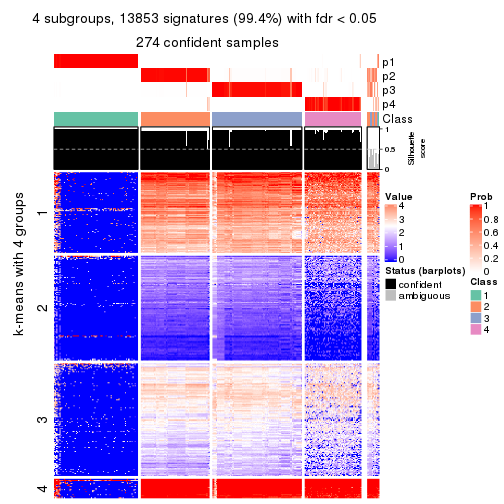</p>

</div>
<div id='tab-CV-skmeans-get-signatures-no-scale-4'>
<pre><code class="r">get_signatures(res, k = 5, scale_rows = FALSE)
</code></pre>

<p></p>

</div>
<div id='tab-CV-skmeans-get-signatures-no-scale-5'>
<pre><code class="r">get_signatures(res, k = 6, scale_rows = FALSE)
</code></pre>

<p></p>

</div>
</div>


Compare the overlap of signatures from different k:

```r
compare_signatures(res)
```


`get_signature()` returns a data frame invisibly. TO get the list of signatures, the function
call should be assigned to a variable explicitly. In following code, if `plot` argument is set
to `FALSE`, no heatmap is plotted while only the differential analysis is performed.

```r
# code only for demonstration
tb = get_signature(res, k = ..., plot = FALSE)
```

An example of the output of `tb` is:

```
#>   which_row         fdr    mean_1    mean_2 scaled_mean_1 scaled_mean_2 km
#> 1        38 0.042760348  8.373488  9.131774    -0.5533452     0.5164555  1
#> 2        40 0.018707592  7.106213  8.469186    -0.6173731     0.5762149  1
#> 3        55 0.019134737 10.221463 11.207825    -0.6159697     0.5749050  1
#> 4        59 0.006059896  5.921854  7.869574    -0.6899429     0.6439467  1
#> 5        60 0.018055526  8.928898 10.211722    -0.6204761     0.5791110  1
#> 6        98 0.009384629 15.714769 14.887706     0.6635654    -0.6193277  2
...
```

The columns in `tb` are:

1. `which_row`: row indices corresponding to the input matrix.
2. `fdr`: FDR for the differential test. 
3. `mean_x`: The mean value in group x.
4. `scaled_mean_x`: The mean value in group x after rows are scaled.
5. `km`: Row groups if k-means clustering is applied to rows.


UMAP plot which shows how samples are separated.


<script>
$( function() {
	$( '#tabs-CV-skmeans-dimension-reduction' ).tabs();
} );
</script>
<div id='tabs-CV-skmeans-dimension-reduction'>
<ul>
<li><a href='#tab-CV-skmeans-dimension-reduction-1'>k = 2</a></li>
<li><a href='#tab-CV-skmeans-dimension-reduction-2'>k = 3</a></li>
<li><a href='#tab-CV-skmeans-dimension-reduction-3'>k = 4</a></li>
<li><a href='#tab-CV-skmeans-dimension-reduction-4'>k = 5</a></li>
<li><a href='#tab-CV-skmeans-dimension-reduction-5'>k = 6</a></li>
</ul>
<div id='tab-CV-skmeans-dimension-reduction-1'>
<pre><code class="r">dimension_reduction(res, k = 2, method = &quot;UMAP&quot;)
</code></pre>

<p></p>

</div>
<div id='tab-CV-skmeans-dimension-reduction-2'>
<pre><code class="r">dimension_reduction(res, k = 3, method = &quot;UMAP&quot;)
</code></pre>

<p></p>

</div>
<div id='tab-CV-skmeans-dimension-reduction-3'>
<pre><code class="r">dimension_reduction(res, k = 4, method = &quot;UMAP&quot;)
</code></pre>

<p></p>

</div>
<div id='tab-CV-skmeans-dimension-reduction-4'>
<pre><code class="r">dimension_reduction(res, k = 5, method = &quot;UMAP&quot;)
</code></pre>

<p></p>

</div>
<div id='tab-CV-skmeans-dimension-reduction-5'>
<pre><code class="r">dimension_reduction(res, k = 6, method = &quot;UMAP&quot;)
</code></pre>

<p></p>

</div>
</div>


Following heatmap shows how subgroups are split when increasing `k`:

```r
collect_classes(res)
```

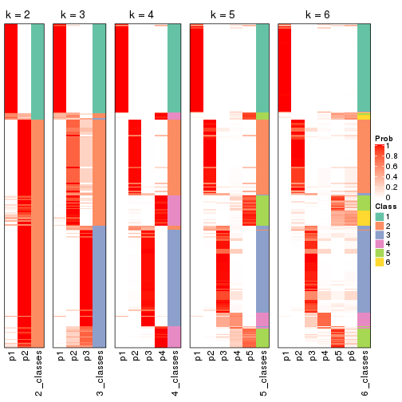


If matrix rows can be associated to genes, consider to use `GO_Enrichment(res,
...)` to perform function enrichment for the signature genes.


 

---------------------------------------------------


### CV:pam*


The object with results only for a single top-value method and a single partition method 
can be extracted as:

```r
res = res_list["CV", "pam"]
# you can also extract it by
# res = res_list["CV:pam"]
```

A summary of `res` and all the functions that can be applied to it:

```r
res
```

```
#> A 'ConsensusPartition' object with k = 2, 3, 4, 5, 6.
#>   On a matrix with 13930 rows and 285 columns.
#>   Top rows (1000, 2000, 3000, 4000, 5000) are extracted by 'CV' method.
#>   Subgroups are detected by 'pam' method.
#>   Performed in total 1250 partitions by row resampling.
#>   Best k for subgroups seems to be 5.
#> 
#> Following methods can be applied to this 'ConsensusPartition' object:
#>  [1] "cola_report"             "collect_classes"         "collect_plots"          
#>  [4] "collect_stats"           "colnames"                "compare_signatures"     
#>  [7] "consensus_heatmap"       "dimension_reduction"     "functional_enrichment"  
#> [10] "get_anno_col"            "get_anno"                "get_classes"            
#> [13] "get_consensus"           "get_matrix"              "get_membership"         
#> [16] "get_param"               "get_signatures"          "get_stats"              
#> [19] "is_best_k"               "is_stable_k"             "membership_heatmap"     
#> [22] "ncol"                    "nrow"                    "plot_ecdf"              
#> [25] "rownames"                "select_partition_number" "show"                   
#> [28] "suggest_best_k"          "test_to_known_factors"
```

`collect_plots()` function collects all the plots made from `res` for all `k` (number of partitions)
into one single page to provide an easy and fast comparison between different `k`.

```r
collect_plots(res)
```


The plots are:

- The first row: a plot of the ECDF (Empirical cumulative distribution
  function) curves of the consensus matrix for each `k` and the heatmap of
  predicted classes for each `k`.
- The second row: heatmaps of the consensus matrix for each `k`.
- The third row: heatmaps of the membership matrix for each `k`.
- The fouth row: heatmaps of the signatures for each `k`.

All the plots in panels can be made by individual functions and they are
plotted later in this section.

`select_partition_number()` produces several plots showing different
statistics for choosing "optimized" `k`. There are following statistics:

- ECDF curves of the consensus matrix for each `k`;
- 1-PAC. [The PAC
  score](https://en.wikipedia.org/wiki/Consensus_clustering#Over-interpretation_potential_of_consensus_clustering)
  measures the proportion of the ambiguous subgrouping.
- Mean silhouette score.
- Concordance. The mean probability of fiting the consensus class ids in all
  partitions.
- Area increased. Denote $A_k$ as the area under the ECDF curve for current
  `k`, the area increased is defined as $A_k - A_{k-1}$.
- Rand index. The percent of pairs of samples that are both in a same cluster
  or both are not in a same cluster in the partition of k and k-1.
- Jaccard index. The ratio of pairs of samples are both in a same cluster in
  the partition of k and k-1 and the pairs of samples are both in a same
  cluster in the partition k or k-1.

The detailed explanations of these statistics can be found in [the cola
vignette](http://bioconductor.org/packages/devel/bioc/vignettes/cola/inst/doc/cola.html#toc_13).

Generally speaking, lower PAC score, higher mean silhouette score or higher
concordance corresponds to better partition. Rand index and Jaccard index
measure how similar the current partition is compared to partition with `k-1`.
If they are too similar, we won't accept `k` is better than `k-1`.

```r
select_partition_number(res)
```


The numeric values for all these statistics can be obtained by `get_stats()`.

```r
get_stats(res)
```

```
#>   k 1-PAC mean_silhouette concordance area_increased  Rand Jaccard
#> 2 2 1.000           0.987       0.994         0.3915 0.611   0.611
#> 3 3 0.965           0.946       0.974         0.6797 0.730   0.558
#> 4 4 0.829           0.844       0.866         0.0821 0.867   0.633
#> 5 5 0.926           0.929       0.964         0.0570 0.974   0.901
#> 6 6 0.814           0.750       0.820         0.0335 0.948   0.792
```

`suggest_best_k()` suggests the best $k$ based on these statistics. The rules are as follows:

- All $k$ with Jaccard index larger than 0.95 are removed because the increase of
  the partition number does not provides enough extra information. If all $k$ are removed,
  the best $k$ is assigned by `NA`.
- For $k$ with 1-PAC larger than 0.9, the maximal $k$ is taken as the "best k". Other $k$ is called "optional k".
- If it does not fit the second rule. The $k$ with the highest vote of highest
  1-PAC, mean silhouette and concordance is taken as the "best k".

```r
suggest_best_k(res)
```

```
#> [1] 5
#> attr(,"optional")
#> [1] 2 3
```

There is also optional best $k$ = 2 3 that is worth to check.

Following shows the table of the partitions (You need to click the **show/hide
code output** link to see it). The membership matrix (columns with name `p*`)
is inferred by
[`clue::cl_consensus()`](https://www.rdocumentation.org/link/cl_consensus?package=clue)
function with the `SE` method. Basically the value in the membership matrix
represents the probability to belong to a certain group. The finall class
label for an item is determined with the group with highest probability it
belongs to.

In `get_classes()` function, the entropy is calculated from the membership
matrix and the silhouette score is calculated from the consensus matrix.


<script>
$( function() {
	$( '#tabs-CV-pam-get-classes' ).tabs();
} );
</script>
<div id='tabs-CV-pam-get-classes'>
<ul>
<li><a href='#tab-CV-pam-get-classes-1'>k = 2</a></li>
<li><a href='#tab-CV-pam-get-classes-2'>k = 3</a></li>
<li><a href='#tab-CV-pam-get-classes-3'>k = 4</a></li>
<li><a href='#tab-CV-pam-get-classes-4'>k = 5</a></li>
<li><a href='#tab-CV-pam-get-classes-5'>k = 6</a></li>
</ul>

<div id='tab-CV-pam-get-classes-1'>
<p><a id='tab-CV-pam-get-classes-1-a' style='color:#0366d6' href='#'>show/hide code output</a></p>
<pre><code class="r">cbind(get_classes(res, k = 2), get_membership(res, k = 2))
</code></pre>

<pre><code>#&gt;            class entropy silhouette    p1    p2
#&gt; SRR1201591     2  0.0000      0.995 0.000 1.000
#&gt; SRR1201590     2  0.0000      0.995 0.000 1.000
#&gt; SRR1201593     2  0.0000      0.995 0.000 1.000
#&gt; SRR1201592     2  0.0000      0.995 0.000 1.000
#&gt; SRR1201617     2  0.0000      0.995 0.000 1.000
#&gt; SRR1201616     2  0.0000      0.995 0.000 1.000
#&gt; SRR1201619     2  0.0000      0.995 0.000 1.000
#&gt; SRR1201618     2  0.0000      0.995 0.000 1.000
#&gt; SRR1201620     2  0.0000      0.995 0.000 1.000
#&gt; SRR1201621     2  0.0000      0.995 0.000 1.000
#&gt; SRR1201623     2  0.0000      0.995 0.000 1.000
#&gt; SRR1201622     2  0.0000      0.995 0.000 1.000
#&gt; SRR1201624     2  0.0000      0.995 0.000 1.000
#&gt; SRR1201625     2  0.0000      0.995 0.000 1.000
#&gt; SRR1201626     1  0.8909      0.558 0.692 0.308
#&gt; SRR1201627     2  0.0000      0.995 0.000 1.000
#&gt; SRR1201628     2  0.0000      0.995 0.000 1.000
#&gt; SRR1201629     2  0.0000      0.995 0.000 1.000
#&gt; SRR1201630     2  0.0000      0.995 0.000 1.000
#&gt; SRR1201631     2  0.0000      0.995 0.000 1.000
#&gt; SRR1201641     2  0.0000      0.995 0.000 1.000
#&gt; SRR1201640     2  0.0000      0.995 0.000 1.000
#&gt; SRR1201643     2  0.0000      0.995 0.000 1.000
#&gt; SRR1201644     2  0.0000      0.995 0.000 1.000
#&gt; SRR1201661     2  0.0000      0.995 0.000 1.000
#&gt; SRR1201662     2  0.0000      0.995 0.000 1.000
#&gt; SRR1201663     2  0.0000      0.995 0.000 1.000
#&gt; SRR1201664     2  0.0000      0.995 0.000 1.000
#&gt; SRR1201665     2  0.0000      0.995 0.000 1.000
#&gt; SRR1201666     2  0.0000      0.995 0.000 1.000
#&gt; SRR1201667     2  0.0000      0.995 0.000 1.000
#&gt; SRR1201668     2  0.0000      0.995 0.000 1.000
#&gt; SRR1201670     2  0.0000      0.995 0.000 1.000
#&gt; SRR1201669     2  0.0000      0.995 0.000 1.000
#&gt; SRR1201673     2  0.0000      0.995 0.000 1.000
#&gt; SRR1201672     2  0.0000      0.995 0.000 1.000
#&gt; SRR1201671     2  0.0000      0.995 0.000 1.000
#&gt; SRR1201677     2  0.0000      0.995 0.000 1.000
#&gt; SRR1201676     2  0.0000      0.995 0.000 1.000
#&gt; SRR1201675     2  0.0000      0.995 0.000 1.000
#&gt; SRR1201674     2  0.0000      0.995 0.000 1.000
#&gt; SRR1201678     2  0.0000      0.995 0.000 1.000
#&gt; SRR1201682     2  0.0000      0.995 0.000 1.000
#&gt; SRR1201683     2  0.0000      0.995 0.000 1.000
#&gt; SRR1201680     2  0.0000      0.995 0.000 1.000
#&gt; SRR1201681     2  0.0000      0.995 0.000 1.000
#&gt; SRR1201679     2  0.0000      0.995 0.000 1.000
#&gt; SRR1201686     2  0.0000      0.995 0.000 1.000
#&gt; SRR1201687     2  0.0000      0.995 0.000 1.000
#&gt; SRR1201688     2  0.0000      0.995 0.000 1.000
#&gt; SRR1201689     2  0.0000      0.995 0.000 1.000
#&gt; SRR1201685     2  0.7056      0.765 0.192 0.808
#&gt; SRR1201692     2  0.0000      0.995 0.000 1.000
#&gt; SRR1201691     2  0.0000      0.995 0.000 1.000
#&gt; SRR1201690     2  0.0000      0.995 0.000 1.000
#&gt; SRR1201696     2  0.0000      0.995 0.000 1.000
#&gt; SRR1201695     2  0.0000      0.995 0.000 1.000
#&gt; SRR1201694     2  0.0000      0.995 0.000 1.000
#&gt; SRR1201693     2  0.0000      0.995 0.000 1.000
#&gt; SRR1201697     2  0.0000      0.995 0.000 1.000
#&gt; SRR1201698     2  0.0000      0.995 0.000 1.000
#&gt; SRR1201700     2  0.0000      0.995 0.000 1.000
#&gt; SRR1201708     2  0.0000      0.995 0.000 1.000
#&gt; SRR1201707     2  0.0000      0.995 0.000 1.000
#&gt; SRR1201706     2  0.0000      0.995 0.000 1.000
#&gt; SRR1201702     2  0.0000      0.995 0.000 1.000
#&gt; SRR1201705     2  0.0000      0.995 0.000 1.000
#&gt; SRR1201701     2  0.0000      0.995 0.000 1.000
#&gt; SRR1201704     2  0.0000      0.995 0.000 1.000
#&gt; SRR1201703     2  0.0000      0.995 0.000 1.000
#&gt; SRR1201716     2  0.0000      0.995 0.000 1.000
#&gt; SRR1201715     2  0.0000      0.995 0.000 1.000
#&gt; SRR1201717     2  0.0000      0.995 0.000 1.000
#&gt; SRR1201712     2  0.0000      0.995 0.000 1.000
#&gt; SRR1201709     2  0.0000      0.995 0.000 1.000
#&gt; SRR1201711     2  0.0000      0.995 0.000 1.000
#&gt; SRR1201714     2  0.0000      0.995 0.000 1.000
#&gt; SRR1201713     2  0.0000      0.995 0.000 1.000
#&gt; SRR1201710     2  0.0000      0.995 0.000 1.000
#&gt; SRR1201719     2  0.0000      0.995 0.000 1.000
#&gt; SRR1201718     2  0.0000      0.995 0.000 1.000
#&gt; SRR1201721     2  0.0000      0.995 0.000 1.000
#&gt; SRR1201720     2  0.0000      0.995 0.000 1.000
#&gt; SRR1201723     2  0.0000      0.995 0.000 1.000
#&gt; SRR1201722     2  0.0000      0.995 0.000 1.000
#&gt; SRR1201725     2  0.0000      0.995 0.000 1.000
#&gt; SRR1201724     2  0.0000      0.995 0.000 1.000
#&gt; SRR1201726     2  0.0000      0.995 0.000 1.000
#&gt; SRR1201727     2  0.0000      0.995 0.000 1.000
#&gt; SRR1201731     2  0.0000      0.995 0.000 1.000
#&gt; SRR1201730     2  0.0000      0.995 0.000 1.000
#&gt; SRR1201734     2  0.0000      0.995 0.000 1.000
#&gt; SRR1201733     2  0.0000      0.995 0.000 1.000
#&gt; SRR1201736     2  0.0000      0.995 0.000 1.000
#&gt; SRR1201737     2  0.0000      0.995 0.000 1.000
#&gt; SRR1201739     2  0.0000      0.995 0.000 1.000
#&gt; SRR1201738     2  0.0000      0.995 0.000 1.000
#&gt; SRR1201742     2  0.0000      0.995 0.000 1.000
#&gt; SRR1201743     2  0.0000      0.995 0.000 1.000
#&gt; SRR1201745     2  0.0000      0.995 0.000 1.000
#&gt; SRR1201744     2  0.7219      0.753 0.200 0.800
#&gt; SRR1201749     2  0.0000      0.995 0.000 1.000
#&gt; SRR1201750     2  0.0000      0.995 0.000 1.000
#&gt; SRR1201752     2  0.0000      0.995 0.000 1.000
#&gt; SRR1201751     2  0.0000      0.995 0.000 1.000
#&gt; SRR1201754     2  0.0000      0.995 0.000 1.000
#&gt; SRR1201753     2  0.0000      0.995 0.000 1.000
#&gt; SRR1201758     1  0.7219      0.748 0.800 0.200
#&gt; SRR1201759     2  0.0000      0.995 0.000 1.000
#&gt; SRR1201760     2  0.0000      0.995 0.000 1.000
#&gt; SRR1201761     2  0.0000      0.995 0.000 1.000
#&gt; SRR1201763     2  0.0000      0.995 0.000 1.000
#&gt; SRR1201762     2  0.8499      0.623 0.276 0.724
#&gt; SRR1201764     2  0.0000      0.995 0.000 1.000
#&gt; SRR1201766     2  0.0000      0.995 0.000 1.000
#&gt; SRR1201768     2  0.0000      0.995 0.000 1.000
#&gt; SRR1201769     2  0.0000      0.995 0.000 1.000
#&gt; SRR1201767     2  0.0000      0.995 0.000 1.000
#&gt; SRR1201770     2  0.0000      0.995 0.000 1.000
#&gt; SRR1201771     2  0.0000      0.995 0.000 1.000
#&gt; SRR1201772     2  0.0000      0.995 0.000 1.000
#&gt; SRR1201773     2  0.0000      0.995 0.000 1.000
#&gt; SRR1201774     2  0.0000      0.995 0.000 1.000
#&gt; SRR1201786     2  0.0000      0.995 0.000 1.000
#&gt; SRR1201784     2  0.0000      0.995 0.000 1.000
#&gt; SRR1201785     2  0.0000      0.995 0.000 1.000
#&gt; SRR1201778     2  0.0376      0.991 0.004 0.996
#&gt; SRR1201779     2  0.0000      0.995 0.000 1.000
#&gt; SRR1201781     2  0.0000      0.995 0.000 1.000
#&gt; SRR1201780     2  0.0000      0.995 0.000 1.000
#&gt; SRR1201783     2  0.0000      0.995 0.000 1.000
#&gt; SRR1201782     2  0.0000      0.995 0.000 1.000
#&gt; SRR1201798     2  0.0000      0.995 0.000 1.000
#&gt; SRR1201797     2  0.0000      0.995 0.000 1.000
#&gt; SRR1201796     2  0.0000      0.995 0.000 1.000
#&gt; SRR1201795     2  0.0000      0.995 0.000 1.000
#&gt; SRR1201799     2  0.0000      0.995 0.000 1.000
#&gt; SRR1201794     2  0.0000      0.995 0.000 1.000
#&gt; SRR1201793     2  0.0000      0.995 0.000 1.000
#&gt; SRR1201792     2  0.0000      0.995 0.000 1.000
#&gt; SRR1201791     2  0.0000      0.995 0.000 1.000
#&gt; SRR1201807     2  0.0000      0.995 0.000 1.000
#&gt; SRR1201808     2  0.0000      0.995 0.000 1.000
#&gt; SRR1201803     2  0.0000      0.995 0.000 1.000
#&gt; SRR1201804     2  0.0000      0.995 0.000 1.000
#&gt; SRR1201805     2  0.0000      0.995 0.000 1.000
#&gt; SRR1201806     2  0.0000      0.995 0.000 1.000
#&gt; SRR1201801     2  0.0000      0.995 0.000 1.000
#&gt; SRR1201802     2  0.0000      0.995 0.000 1.000
#&gt; SRR1201800     2  0.0000      0.995 0.000 1.000
#&gt; SRR1201814     2  0.0000      0.995 0.000 1.000
#&gt; SRR1201816     2  0.0000      0.995 0.000 1.000
#&gt; SRR1201815     2  0.0000      0.995 0.000 1.000
#&gt; SRR1201819     2  0.0000      0.995 0.000 1.000
#&gt; SRR1201820     2  0.0000      0.995 0.000 1.000
#&gt; SRR1201813     2  0.0000      0.995 0.000 1.000
#&gt; SRR1201817     2  0.0000      0.995 0.000 1.000
#&gt; SRR1201818     2  0.0000      0.995 0.000 1.000
#&gt; SRR1201825     2  0.3114      0.938 0.056 0.944
#&gt; SRR1201827     2  0.0000      0.995 0.000 1.000
#&gt; SRR1201828     2  0.0000      0.995 0.000 1.000
#&gt; SRR1201826     2  0.0000      0.995 0.000 1.000
#&gt; SRR1201829     2  0.0000      0.995 0.000 1.000
#&gt; SRR1201830     2  0.0000      0.995 0.000 1.000
#&gt; SRR1201831     2  0.0000      0.995 0.000 1.000
#&gt; SRR1201832     2  0.0000      0.995 0.000 1.000
#&gt; SRR1201833     2  0.0000      0.995 0.000 1.000
#&gt; SRR1201865     2  0.0000      0.995 0.000 1.000
#&gt; SRR1201866     2  0.0000      0.995 0.000 1.000
#&gt; SRR1201867     2  0.0000      0.995 0.000 1.000
#&gt; SRR1201861     2  0.0000      0.995 0.000 1.000
#&gt; SRR1201862     2  0.0000      0.995 0.000 1.000
#&gt; SRR1201863     2  0.0000      0.995 0.000 1.000
#&gt; SRR1201859     2  0.0376      0.991 0.004 0.996
#&gt; SRR1201864     2  0.0000      0.995 0.000 1.000
#&gt; SRR1201860     2  0.0000      0.995 0.000 1.000
#&gt; SRR1201873     2  0.0000      0.995 0.000 1.000
#&gt; SRR1201871     2  0.0000      0.995 0.000 1.000
#&gt; SRR1201872     2  0.0000      0.995 0.000 1.000
#&gt; SRR1201980     2  0.0000      0.995 0.000 1.000
#&gt; SRR1201979     2  0.0000      0.995 0.000 1.000
#&gt; SRR1201982     2  0.0000      0.995 0.000 1.000
#&gt; SRR1201981     2  0.0000      0.995 0.000 1.000
#&gt; SRR1201998     2  0.0000      0.995 0.000 1.000
#&gt; SRR1201996     2  0.0000      0.995 0.000 1.000
#&gt; SRR1201997     2  0.0000      0.995 0.000 1.000
#&gt; SRR1202005     2  0.0000      0.995 0.000 1.000
#&gt; SRR1202006     2  0.0000      0.995 0.000 1.000
#&gt; SRR1202088     2  0.0000      0.995 0.000 1.000
#&gt; SRR1202087     2  0.0000      0.995 0.000 1.000
#&gt; SRR1202093     2  0.0000      0.995 0.000 1.000
#&gt; SRR1202092     2  0.0000      0.995 0.000 1.000
#&gt; SRR1202288     2  0.0000      0.995 0.000 1.000
#&gt; SRR1202289     2  0.0000      0.995 0.000 1.000
#&gt; SRR1202299     2  0.0000      0.995 0.000 1.000
#&gt; SRR1202298     2  0.0000      0.995 0.000 1.000
#&gt; SRR1202303     2  0.0000      0.995 0.000 1.000
#&gt; SRR1202372     2  0.0000      0.995 0.000 1.000
#&gt; SRR1202371     2  0.0376      0.991 0.004 0.996
#&gt; SRR1202563     2  0.5629      0.848 0.132 0.868
#&gt; SRR1202565     2  0.0000      0.995 0.000 1.000
#&gt; SRR1202564     2  0.0000      0.995 0.000 1.000
#&gt; SRR1202649     2  0.7219      0.753 0.200 0.800
#&gt; SRR1202650     2  0.0000      0.995 0.000 1.000
#&gt; SRR1202651     2  0.0000      0.995 0.000 1.000
#&gt; SRR1202843     1  0.0000      0.993 1.000 0.000
#&gt; SRR1202844     1  0.0000      0.993 1.000 0.000
#&gt; SRR1202845     2  0.0000      0.995 0.000 1.000
#&gt; SRR1202847     2  0.0000      0.995 0.000 1.000
#&gt; SRR1202846     2  0.0000      0.995 0.000 1.000
#&gt; SRR1202945     1  0.0000      0.993 1.000 0.000
#&gt; SRR1202949     1  0.0000      0.993 1.000 0.000
#&gt; SRR1202977     1  0.0000      0.993 1.000 0.000
#&gt; SRR1202978     1  0.0000      0.993 1.000 0.000
#&gt; SRR1202979     1  0.0000      0.993 1.000 0.000
#&gt; SRR1202990     1  0.0000      0.993 1.000 0.000
#&gt; SRR1202999     1  0.0000      0.993 1.000 0.000
#&gt; SRR1203005     1  0.0000      0.993 1.000 0.000
#&gt; SRR1203006     1  0.0000      0.993 1.000 0.000
#&gt; SRR1203007     1  0.0000      0.993 1.000 0.000
#&gt; SRR1203009     1  0.0000      0.993 1.000 0.000
#&gt; SRR1203008     1  0.0000      0.993 1.000 0.000
#&gt; SRR1203010     1  0.0000      0.993 1.000 0.000
#&gt; SRR1203011     1  0.0000      0.993 1.000 0.000
#&gt; SRR1203025     1  0.0000      0.993 1.000 0.000
#&gt; SRR1203026     1  0.0000      0.993 1.000 0.000
#&gt; SRR1203027     1  0.0000      0.993 1.000 0.000
#&gt; SRR1203061     1  0.0000      0.993 1.000 0.000
#&gt; SRR1203089     1  0.0000      0.993 1.000 0.000
#&gt; SRR1203125     1  0.0000      0.993 1.000 0.000
#&gt; SRR1203128     1  0.0000      0.993 1.000 0.000
#&gt; SRR1203129     1  0.0000      0.993 1.000 0.000
#&gt; SRR1203130     1  0.0000      0.993 1.000 0.000
#&gt; SRR1203132     2  0.0000      0.995 0.000 1.000
#&gt; SRR1203131     2  0.0000      0.995 0.000 1.000
#&gt; SRR1203133     1  0.0000      0.993 1.000 0.000
#&gt; SRR1203138     1  0.0000      0.993 1.000 0.000
#&gt; SRR1203760     1  0.0000      0.993 1.000 0.000
#&gt; SRR1203761     1  0.0000      0.993 1.000 0.000
#&gt; SRR1203770     1  0.0000      0.993 1.000 0.000
#&gt; SRR1203771     1  0.0000      0.993 1.000 0.000
#&gt; SRR1203772     1  0.0000      0.993 1.000 0.000
#&gt; SRR1203773     1  0.0000      0.993 1.000 0.000
#&gt; SRR1203774     1  0.0000      0.993 1.000 0.000
#&gt; SRR1203775     1  0.0000      0.993 1.000 0.000
#&gt; SRR1203800     1  0.0000      0.993 1.000 0.000
#&gt; SRR1203801     1  0.0000      0.993 1.000 0.000
#&gt; SRR1203802     1  0.0000      0.993 1.000 0.000
#&gt; SRR1203803     1  0.0000      0.993 1.000 0.000
#&gt; SRR1203804     1  0.0000      0.993 1.000 0.000
#&gt; SRR1203805     1  0.0000      0.993 1.000 0.000
#&gt; SRR1203806     1  0.0000      0.993 1.000 0.000
#&gt; SRR1203807     1  0.0000      0.993 1.000 0.000
#&gt; SRR1203808     1  0.0000      0.993 1.000 0.000
#&gt; SRR1203811     1  0.0000      0.993 1.000 0.000
#&gt; SRR1203812     1  0.0000      0.993 1.000 0.000
#&gt; SRR1203813     1  0.0000      0.993 1.000 0.000
#&gt; SRR1203814     1  0.0000      0.993 1.000 0.000
#&gt; SRR1203815     1  0.0000      0.993 1.000 0.000
#&gt; SRR1203816     1  0.0000      0.993 1.000 0.000
#&gt; SRR1203817     1  0.0000      0.993 1.000 0.000
#&gt; SRR1203818     1  0.0000      0.993 1.000 0.000
#&gt; SRR1203819     1  0.0000      0.993 1.000 0.000
#&gt; SRR1203822     1  0.0000      0.993 1.000 0.000
#&gt; SRR1203823     1  0.0000      0.993 1.000 0.000
#&gt; SRR1203824     1  0.0000      0.993 1.000 0.000
#&gt; SRR1203825     1  0.0000      0.993 1.000 0.000
#&gt; SRR1203826     1  0.0000      0.993 1.000 0.000
#&gt; SRR1203827     1  0.0000      0.993 1.000 0.000
#&gt; SRR1203828     1  0.0000      0.993 1.000 0.000
#&gt; SRR1203829     1  0.0000      0.993 1.000 0.000
#&gt; SRR1203830     1  0.0000      0.993 1.000 0.000
#&gt; SRR1203831     1  0.0000      0.993 1.000 0.000
#&gt; SRR1203832     1  0.0000      0.993 1.000 0.000
#&gt; SRR1203833     1  0.0000      0.993 1.000 0.000
#&gt; SRR1203834     1  0.0000      0.993 1.000 0.000
#&gt; SRR1203835     1  0.0000      0.993 1.000 0.000
#&gt; SRR1203836     1  0.0000      0.993 1.000 0.000
#&gt; SRR1203837     1  0.0000      0.993 1.000 0.000
#&gt; SRR1203838     1  0.0000      0.993 1.000 0.000
#&gt; SRR1203839     1  0.0000      0.993 1.000 0.000
#&gt; SRR1203842     1  0.0000      0.993 1.000 0.000
#&gt; SRR1203843     1  0.0000      0.993 1.000 0.000
#&gt; SRR1203845     2  0.0000      0.995 0.000 1.000
#&gt; SRR1203844     2  0.0000      0.995 0.000 1.000
</code></pre>

<script>
$('#tab-CV-pam-get-classes-1-a').parent().next().next().hide();
$('#tab-CV-pam-get-classes-1-a').click(function(){
  $('#tab-CV-pam-get-classes-1-a').parent().next().next().toggle();
  return(false);
});
</script>
</div>

<div id='tab-CV-pam-get-classes-2'>
<p><a id='tab-CV-pam-get-classes-2-a' style='color:#0366d6' href='#'>show/hide code output</a></p>
<pre><code class="r">cbind(get_classes(res, k = 3), get_membership(res, k = 3))
</code></pre>

<pre><code>#&gt;            class entropy silhouette    p1    p2    p3
#&gt; SRR1201591     3  0.0424     0.9666 0.000 0.008 0.992
#&gt; SRR1201590     3  0.0424     0.9666 0.000 0.008 0.992
#&gt; SRR1201593     3  0.0424     0.9666 0.000 0.008 0.992
#&gt; SRR1201592     3  0.0424     0.9666 0.000 0.008 0.992
#&gt; SRR1201617     3  0.0424     0.9666 0.000 0.008 0.992
#&gt; SRR1201616     3  0.0424     0.9666 0.000 0.008 0.992
#&gt; SRR1201619     3  0.1529     0.9436 0.000 0.040 0.960
#&gt; SRR1201618     3  0.2165     0.9238 0.000 0.064 0.936
#&gt; SRR1201620     3  0.0424     0.9666 0.000 0.008 0.992
#&gt; SRR1201621     3  0.0424     0.9666 0.000 0.008 0.992
#&gt; SRR1201623     2  0.0237     0.9705 0.000 0.996 0.004
#&gt; SRR1201622     2  0.3192     0.8692 0.000 0.888 0.112
#&gt; SRR1201624     2  0.0661     0.9664 0.004 0.988 0.008
#&gt; SRR1201625     2  0.0424     0.9652 0.000 0.992 0.008
#&gt; SRR1201626     1  0.6967     0.5354 0.668 0.044 0.288
#&gt; SRR1201627     2  0.0424     0.9652 0.000 0.992 0.008
#&gt; SRR1201628     2  0.0237     0.9705 0.000 0.996 0.004
#&gt; SRR1201629     2  0.0000     0.9712 0.000 1.000 0.000
#&gt; SRR1201630     3  0.1031     0.9556 0.000 0.024 0.976
#&gt; SRR1201631     2  0.0000     0.9712 0.000 1.000 0.000
#&gt; SRR1201641     2  0.0000     0.9712 0.000 1.000 0.000
#&gt; SRR1201640     2  0.3941     0.8151 0.000 0.844 0.156
#&gt; SRR1201643     2  0.0237     0.9705 0.000 0.996 0.004
#&gt; SRR1201644     2  0.0000     0.9712 0.000 1.000 0.000
#&gt; SRR1201661     3  0.6215     0.2804 0.000 0.428 0.572
#&gt; SRR1201662     2  0.0000     0.9712 0.000 1.000 0.000
#&gt; SRR1201663     2  0.0237     0.9705 0.000 0.996 0.004
#&gt; SRR1201664     2  0.0000     0.9712 0.000 1.000 0.000
#&gt; SRR1201665     3  0.0424     0.9666 0.000 0.008 0.992
#&gt; SRR1201666     3  0.0424     0.9666 0.000 0.008 0.992
#&gt; SRR1201667     3  0.0424     0.9666 0.000 0.008 0.992
#&gt; SRR1201668     3  0.1964     0.9292 0.000 0.056 0.944
#&gt; SRR1201670     2  0.1289     0.9496 0.000 0.968 0.032
#&gt; SRR1201669     2  0.1411     0.9462 0.000 0.964 0.036
#&gt; SRR1201673     2  0.0237     0.9705 0.000 0.996 0.004
#&gt; SRR1201672     2  0.0237     0.9705 0.000 0.996 0.004
#&gt; SRR1201671     2  0.4796     0.7214 0.000 0.780 0.220
#&gt; SRR1201677     2  0.0237     0.9705 0.000 0.996 0.004
#&gt; SRR1201676     2  0.0237     0.9705 0.000 0.996 0.004
#&gt; SRR1201675     2  0.0237     0.9705 0.000 0.996 0.004
#&gt; SRR1201674     2  0.0237     0.9705 0.000 0.996 0.004
#&gt; SRR1201678     2  0.0237     0.9705 0.000 0.996 0.004
#&gt; SRR1201682     3  0.2165     0.9227 0.000 0.064 0.936
#&gt; SRR1201683     3  0.2878     0.8925 0.000 0.096 0.904
#&gt; SRR1201680     3  0.2066     0.9269 0.000 0.060 0.940
#&gt; SRR1201681     3  0.2878     0.8930 0.000 0.096 0.904
#&gt; SRR1201679     3  0.0424     0.9666 0.000 0.008 0.992
#&gt; SRR1201686     2  0.0237     0.9705 0.000 0.996 0.004
#&gt; SRR1201687     2  0.0237     0.9705 0.000 0.996 0.004
#&gt; SRR1201688     2  0.0237     0.9705 0.000 0.996 0.004
#&gt; SRR1201689     2  0.0237     0.9705 0.000 0.996 0.004
#&gt; SRR1201685     2  0.8043     0.5668 0.228 0.644 0.128
#&gt; SRR1201692     2  0.0000     0.9712 0.000 1.000 0.000
#&gt; SRR1201691     2  0.0000     0.9712 0.000 1.000 0.000
#&gt; SRR1201690     2  0.0000     0.9712 0.000 1.000 0.000
#&gt; SRR1201696     2  0.0000     0.9712 0.000 1.000 0.000
#&gt; SRR1201695     2  0.0000     0.9712 0.000 1.000 0.000
#&gt; SRR1201694     2  0.0000     0.9712 0.000 1.000 0.000
#&gt; SRR1201693     2  0.0000     0.9712 0.000 1.000 0.000
#&gt; SRR1201697     2  0.0000     0.9712 0.000 1.000 0.000
#&gt; SRR1201698     2  0.0000     0.9712 0.000 1.000 0.000
#&gt; SRR1201700     2  0.0237     0.9705 0.000 0.996 0.004
#&gt; SRR1201708     2  0.0000     0.9712 0.000 1.000 0.000
#&gt; SRR1201707     2  0.0000     0.9712 0.000 1.000 0.000
#&gt; SRR1201706     2  0.0000     0.9712 0.000 1.000 0.000
#&gt; SRR1201702     2  0.0000     0.9712 0.000 1.000 0.000
#&gt; SRR1201705     2  0.0000     0.9712 0.000 1.000 0.000
#&gt; SRR1201701     2  0.0000     0.9712 0.000 1.000 0.000
#&gt; SRR1201704     2  0.0000     0.9712 0.000 1.000 0.000
#&gt; SRR1201703     2  0.0000     0.9712 0.000 1.000 0.000
#&gt; SRR1201716     2  0.0000     0.9712 0.000 1.000 0.000
#&gt; SRR1201715     2  0.0000     0.9712 0.000 1.000 0.000
#&gt; SRR1201717     2  0.0000     0.9712 0.000 1.000 0.000
#&gt; SRR1201712     2  0.0000     0.9712 0.000 1.000 0.000
#&gt; SRR1201709     2  0.0237     0.9705 0.000 0.996 0.004
#&gt; SRR1201711     2  0.0000     0.9712 0.000 1.000 0.000
#&gt; SRR1201714     2  0.0000     0.9712 0.000 1.000 0.000
#&gt; SRR1201713     2  0.0000     0.9712 0.000 1.000 0.000
#&gt; SRR1201710     2  0.0000     0.9712 0.000 1.000 0.000
#&gt; SRR1201719     2  0.0000     0.9712 0.000 1.000 0.000
#&gt; SRR1201718     2  0.0237     0.9694 0.000 0.996 0.004
#&gt; SRR1201721     2  0.0000     0.9712 0.000 1.000 0.000
#&gt; SRR1201720     2  0.0000     0.9712 0.000 1.000 0.000
#&gt; SRR1201723     2  0.0000     0.9712 0.000 1.000 0.000
#&gt; SRR1201722     2  0.0237     0.9705 0.000 0.996 0.004
#&gt; SRR1201725     2  0.0000     0.9712 0.000 1.000 0.000
#&gt; SRR1201724     3  0.6305     0.0948 0.000 0.484 0.516
#&gt; SRR1201726     2  0.1860     0.9305 0.000 0.948 0.052
#&gt; SRR1201727     2  0.0000     0.9712 0.000 1.000 0.000
#&gt; SRR1201731     2  0.0000     0.9712 0.000 1.000 0.000
#&gt; SRR1201730     2  0.1643     0.9378 0.000 0.956 0.044
#&gt; SRR1201734     3  0.0424     0.9666 0.000 0.008 0.992
#&gt; SRR1201733     3  0.0424     0.9666 0.000 0.008 0.992
#&gt; SRR1201736     3  0.0424     0.9666 0.000 0.008 0.992
#&gt; SRR1201737     3  0.0424     0.9666 0.000 0.008 0.992
#&gt; SRR1201739     3  0.0424     0.9666 0.000 0.008 0.992
#&gt; SRR1201738     3  0.0424     0.9666 0.000 0.008 0.992
#&gt; SRR1201742     3  0.1289     0.9495 0.000 0.032 0.968
#&gt; SRR1201743     3  0.1753     0.9370 0.000 0.048 0.952
#&gt; SRR1201745     3  0.0424     0.9666 0.000 0.008 0.992
#&gt; SRR1201744     3  0.3879     0.8106 0.152 0.000 0.848
#&gt; SRR1201749     3  0.0424     0.9666 0.000 0.008 0.992
#&gt; SRR1201750     3  0.0592     0.9640 0.000 0.012 0.988
#&gt; SRR1201752     2  0.0237     0.9705 0.000 0.996 0.004
#&gt; SRR1201751     2  0.0237     0.9705 0.000 0.996 0.004
#&gt; SRR1201754     2  0.0237     0.9705 0.000 0.996 0.004
#&gt; SRR1201753     3  0.2878     0.8942 0.000 0.096 0.904
#&gt; SRR1201758     1  0.4555     0.7407 0.800 0.200 0.000
#&gt; SRR1201759     2  0.0000     0.9712 0.000 1.000 0.000
#&gt; SRR1201760     2  0.1031     0.9561 0.000 0.976 0.024
#&gt; SRR1201761     2  0.0000     0.9712 0.000 1.000 0.000
#&gt; SRR1201763     2  0.0424     0.9652 0.000 0.992 0.008
#&gt; SRR1201762     2  0.8014     0.5191 0.268 0.628 0.104
#&gt; SRR1201764     2  0.5178     0.6658 0.000 0.744 0.256
#&gt; SRR1201766     3  0.0424     0.9666 0.000 0.008 0.992
#&gt; SRR1201768     3  0.0424     0.9666 0.000 0.008 0.992
#&gt; SRR1201769     3  0.0424     0.9666 0.000 0.008 0.992
#&gt; SRR1201767     3  0.0424     0.9666 0.000 0.008 0.992
#&gt; SRR1201770     3  0.0424     0.9666 0.000 0.008 0.992
#&gt; SRR1201771     3  0.0424     0.9666 0.000 0.008 0.992
#&gt; SRR1201772     3  0.0424     0.9666 0.000 0.008 0.992
#&gt; SRR1201773     3  0.0424     0.9666 0.000 0.008 0.992
#&gt; SRR1201774     3  0.0424     0.9666 0.000 0.008 0.992
#&gt; SRR1201786     3  0.0424     0.9666 0.000 0.008 0.992
#&gt; SRR1201784     3  0.0424     0.9666 0.000 0.008 0.992
#&gt; SRR1201785     3  0.0424     0.9666 0.000 0.008 0.992
#&gt; SRR1201778     3  0.0475     0.9624 0.004 0.004 0.992
#&gt; SRR1201779     3  0.0424     0.9666 0.000 0.008 0.992
#&gt; SRR1201781     3  0.0424     0.9666 0.000 0.008 0.992
#&gt; SRR1201780     3  0.0424     0.9666 0.000 0.008 0.992
#&gt; SRR1201783     3  0.0424     0.9666 0.000 0.008 0.992
#&gt; SRR1201782     3  0.0424     0.9666 0.000 0.008 0.992
#&gt; SRR1201798     3  0.0424     0.9666 0.000 0.008 0.992
#&gt; SRR1201797     3  0.0424     0.9666 0.000 0.008 0.992
#&gt; SRR1201796     3  0.0424     0.9666 0.000 0.008 0.992
#&gt; SRR1201795     3  0.0424     0.9666 0.000 0.008 0.992
#&gt; SRR1201799     3  0.0424     0.9666 0.000 0.008 0.992
#&gt; SRR1201794     3  0.0424     0.9666 0.000 0.008 0.992
#&gt; SRR1201793     3  0.0424     0.9666 0.000 0.008 0.992
#&gt; SRR1201792     3  0.0424     0.9666 0.000 0.008 0.992
#&gt; SRR1201791     3  0.0424     0.9666 0.000 0.008 0.992
#&gt; SRR1201807     3  0.0424     0.9666 0.000 0.008 0.992
#&gt; SRR1201808     3  0.0424     0.9666 0.000 0.008 0.992
#&gt; SRR1201803     3  0.0424     0.9666 0.000 0.008 0.992
#&gt; SRR1201804     3  0.0424     0.9666 0.000 0.008 0.992
#&gt; SRR1201805     3  0.0424     0.9666 0.000 0.008 0.992
#&gt; SRR1201806     3  0.0424     0.9666 0.000 0.008 0.992
#&gt; SRR1201801     3  0.0424     0.9666 0.000 0.008 0.992
#&gt; SRR1201802     3  0.0424     0.9666 0.000 0.008 0.992
#&gt; SRR1201800     3  0.0424     0.9666 0.000 0.008 0.992
#&gt; SRR1201814     3  0.0424     0.9666 0.000 0.008 0.992
#&gt; SRR1201816     3  0.0424     0.9666 0.000 0.008 0.992
#&gt; SRR1201815     3  0.0424     0.9666 0.000 0.008 0.992
#&gt; SRR1201819     3  0.0424     0.9666 0.000 0.008 0.992
#&gt; SRR1201820     3  0.0424     0.9666 0.000 0.008 0.992
#&gt; SRR1201813     3  0.0424     0.9666 0.000 0.008 0.992
#&gt; SRR1201817     3  0.0424     0.9666 0.000 0.008 0.992
#&gt; SRR1201818     3  0.0424     0.9666 0.000 0.008 0.992
#&gt; SRR1201825     2  0.4845     0.8390 0.052 0.844 0.104
#&gt; SRR1201827     2  0.0000     0.9712 0.000 1.000 0.000
#&gt; SRR1201828     2  0.0000     0.9712 0.000 1.000 0.000
#&gt; SRR1201826     2  0.0592     0.9653 0.000 0.988 0.012
#&gt; SRR1201829     2  0.0000     0.9712 0.000 1.000 0.000
#&gt; SRR1201830     2  0.0000     0.9712 0.000 1.000 0.000
#&gt; SRR1201831     2  0.0000     0.9712 0.000 1.000 0.000
#&gt; SRR1201832     2  0.0000     0.9712 0.000 1.000 0.000
#&gt; SRR1201833     2  0.0000     0.9712 0.000 1.000 0.000
#&gt; SRR1201865     2  0.0237     0.9705 0.000 0.996 0.004
#&gt; SRR1201866     2  0.0237     0.9705 0.000 0.996 0.004
#&gt; SRR1201867     2  0.0237     0.9705 0.000 0.996 0.004
#&gt; SRR1201861     2  0.0237     0.9705 0.000 0.996 0.004
#&gt; SRR1201862     2  0.0237     0.9705 0.000 0.996 0.004
#&gt; SRR1201863     2  0.0237     0.9705 0.000 0.996 0.004
#&gt; SRR1201859     3  0.3500     0.8667 0.004 0.116 0.880
#&gt; SRR1201864     2  0.0237     0.9705 0.000 0.996 0.004
#&gt; SRR1201860     2  0.0237     0.9705 0.000 0.996 0.004
#&gt; SRR1201873     2  0.0000     0.9712 0.000 1.000 0.000
#&gt; SRR1201871     2  0.0424     0.9681 0.000 0.992 0.008
#&gt; SRR1201872     2  0.0000     0.9712 0.000 1.000 0.000
#&gt; SRR1201980     2  0.0000     0.9712 0.000 1.000 0.000
#&gt; SRR1201979     2  0.0892     0.9594 0.000 0.980 0.020
#&gt; SRR1201982     2  0.0000     0.9712 0.000 1.000 0.000
#&gt; SRR1201981     2  0.3340     0.8591 0.000 0.880 0.120
#&gt; SRR1201998     2  0.0000     0.9712 0.000 1.000 0.000
#&gt; SRR1201996     2  0.6274     0.1501 0.000 0.544 0.456
#&gt; SRR1201997     2  0.0000     0.9712 0.000 1.000 0.000
#&gt; SRR1202005     2  0.5016     0.6767 0.000 0.760 0.240
#&gt; SRR1202006     2  0.0000     0.9712 0.000 1.000 0.000
#&gt; SRR1202088     3  0.0592     0.9640 0.000 0.012 0.988
#&gt; SRR1202087     3  0.0747     0.9613 0.000 0.016 0.984
#&gt; SRR1202093     3  0.0424     0.9666 0.000 0.008 0.992
#&gt; SRR1202092     3  0.0424     0.9666 0.000 0.008 0.992
#&gt; SRR1202288     3  0.0424     0.9666 0.000 0.008 0.992
#&gt; SRR1202289     3  0.0424     0.9666 0.000 0.008 0.992
#&gt; SRR1202299     3  0.0424     0.9666 0.000 0.008 0.992
#&gt; SRR1202298     3  0.0424     0.9666 0.000 0.008 0.992
#&gt; SRR1202303     2  0.0424     0.9652 0.000 0.992 0.008
#&gt; SRR1202372     3  0.0424     0.9666 0.000 0.008 0.992
#&gt; SRR1202371     3  0.0424     0.9666 0.000 0.008 0.992
#&gt; SRR1202563     3  0.7147     0.7014 0.124 0.156 0.720
#&gt; SRR1202565     2  0.0237     0.9705 0.000 0.996 0.004
#&gt; SRR1202564     2  0.0237     0.9705 0.000 0.996 0.004
#&gt; SRR1202649     3  0.4784     0.7425 0.200 0.004 0.796
#&gt; SRR1202650     3  0.5465     0.6151 0.000 0.288 0.712
#&gt; SRR1202651     2  0.0237     0.9705 0.000 0.996 0.004
#&gt; SRR1202843     1  0.0000     0.9927 1.000 0.000 0.000
#&gt; SRR1202844     1  0.0000     0.9927 1.000 0.000 0.000
#&gt; SRR1202845     3  0.6204     0.2747 0.000 0.424 0.576
#&gt; SRR1202847     2  0.0000     0.9712 0.000 1.000 0.000
#&gt; SRR1202846     2  0.0000     0.9712 0.000 1.000 0.000
#&gt; SRR1202945     1  0.0000     0.9927 1.000 0.000 0.000
#&gt; SRR1202949     1  0.0000     0.9927 1.000 0.000 0.000
#&gt; SRR1202977     1  0.0000     0.9927 1.000 0.000 0.000
#&gt; SRR1202978     1  0.0000     0.9927 1.000 0.000 0.000
#&gt; SRR1202979     1  0.0000     0.9927 1.000 0.000 0.000
#&gt; SRR1202990     1  0.0000     0.9927 1.000 0.000 0.000
#&gt; SRR1202999     1  0.0000     0.9927 1.000 0.000 0.000
#&gt; SRR1203005     1  0.0000     0.9927 1.000 0.000 0.000
#&gt; SRR1203006     1  0.0000     0.9927 1.000 0.000 0.000
#&gt; SRR1203007     1  0.0000     0.9927 1.000 0.000 0.000
#&gt; SRR1203009     1  0.0000     0.9927 1.000 0.000 0.000
#&gt; SRR1203008     1  0.0000     0.9927 1.000 0.000 0.000
#&gt; SRR1203010     1  0.0000     0.9927 1.000 0.000 0.000
#&gt; SRR1203011     1  0.0000     0.9927 1.000 0.000 0.000
#&gt; SRR1203025     1  0.0000     0.9927 1.000 0.000 0.000
#&gt; SRR1203026     1  0.0000     0.9927 1.000 0.000 0.000
#&gt; SRR1203027     1  0.0000     0.9927 1.000 0.000 0.000
#&gt; SRR1203061     1  0.0000     0.9927 1.000 0.000 0.000
#&gt; SRR1203089     1  0.0000     0.9927 1.000 0.000 0.000
#&gt; SRR1203125     1  0.0000     0.9927 1.000 0.000 0.000
#&gt; SRR1203128     1  0.0000     0.9927 1.000 0.000 0.000
#&gt; SRR1203129     1  0.0000     0.9927 1.000 0.000 0.000
#&gt; SRR1203130     1  0.0000     0.9927 1.000 0.000 0.000
#&gt; SRR1203132     2  0.0000     0.9712 0.000 1.000 0.000
#&gt; SRR1203131     2  0.1411     0.9453 0.000 0.964 0.036
#&gt; SRR1203133     1  0.0000     0.9927 1.000 0.000 0.000
#&gt; SRR1203138     1  0.0000     0.9927 1.000 0.000 0.000
#&gt; SRR1203760     1  0.0000     0.9927 1.000 0.000 0.000
#&gt; SRR1203761     1  0.0000     0.9927 1.000 0.000 0.000
#&gt; SRR1203770     1  0.0000     0.9927 1.000 0.000 0.000
#&gt; SRR1203771     1  0.0000     0.9927 1.000 0.000 0.000
#&gt; SRR1203772     1  0.0000     0.9927 1.000 0.000 0.000
#&gt; SRR1203773     1  0.0000     0.9927 1.000 0.000 0.000
#&gt; SRR1203774     1  0.0000     0.9927 1.000 0.000 0.000
#&gt; SRR1203775     1  0.0000     0.9927 1.000 0.000 0.000
#&gt; SRR1203800     1  0.0000     0.9927 1.000 0.000 0.000
#&gt; SRR1203801     1  0.0000     0.9927 1.000 0.000 0.000
#&gt; SRR1203802     1  0.0000     0.9927 1.000 0.000 0.000
#&gt; SRR1203803     1  0.0000     0.9927 1.000 0.000 0.000
#&gt; SRR1203804     1  0.0000     0.9927 1.000 0.000 0.000
#&gt; SRR1203805     1  0.0000     0.9927 1.000 0.000 0.000
#&gt; SRR1203806     1  0.0000     0.9927 1.000 0.000 0.000
#&gt; SRR1203807     1  0.0000     0.9927 1.000 0.000 0.000
#&gt; SRR1203808     1  0.0000     0.9927 1.000 0.000 0.000
#&gt; SRR1203811     1  0.0000     0.9927 1.000 0.000 0.000
#&gt; SRR1203812     1  0.0000     0.9927 1.000 0.000 0.000
#&gt; SRR1203813     1  0.0000     0.9927 1.000 0.000 0.000
#&gt; SRR1203814     1  0.0000     0.9927 1.000 0.000 0.000
#&gt; SRR1203815     1  0.0000     0.9927 1.000 0.000 0.000
#&gt; SRR1203816     1  0.0000     0.9927 1.000 0.000 0.000
#&gt; SRR1203817     1  0.0000     0.9927 1.000 0.000 0.000
#&gt; SRR1203818     1  0.0000     0.9927 1.000 0.000 0.000
#&gt; SRR1203819     1  0.0000     0.9927 1.000 0.000 0.000
#&gt; SRR1203822     1  0.0000     0.9927 1.000 0.000 0.000
#&gt; SRR1203823     1  0.0000     0.9927 1.000 0.000 0.000
#&gt; SRR1203824     1  0.0000     0.9927 1.000 0.000 0.000
#&gt; SRR1203825     1  0.0000     0.9927 1.000 0.000 0.000
#&gt; SRR1203826     1  0.0000     0.9927 1.000 0.000 0.000
#&gt; SRR1203827     1  0.0000     0.9927 1.000 0.000 0.000
#&gt; SRR1203828     1  0.0000     0.9927 1.000 0.000 0.000
#&gt; SRR1203829     1  0.0000     0.9927 1.000 0.000 0.000
#&gt; SRR1203830     1  0.0000     0.9927 1.000 0.000 0.000
#&gt; SRR1203831     1  0.0000     0.9927 1.000 0.000 0.000
#&gt; SRR1203832     1  0.0000     0.9927 1.000 0.000 0.000
#&gt; SRR1203833     1  0.0000     0.9927 1.000 0.000 0.000
#&gt; SRR1203834     1  0.0000     0.9927 1.000 0.000 0.000
#&gt; SRR1203835     1  0.0000     0.9927 1.000 0.000 0.000
#&gt; SRR1203836     1  0.0000     0.9927 1.000 0.000 0.000
#&gt; SRR1203837     1  0.0000     0.9927 1.000 0.000 0.000
#&gt; SRR1203838     1  0.0000     0.9927 1.000 0.000 0.000
#&gt; SRR1203839     1  0.0000     0.9927 1.000 0.000 0.000
#&gt; SRR1203842     1  0.0000     0.9927 1.000 0.000 0.000
#&gt; SRR1203843     1  0.0000     0.9927 1.000 0.000 0.000
#&gt; SRR1203845     2  0.6140     0.3063 0.000 0.596 0.404
#&gt; SRR1203844     3  0.0592     0.9640 0.000 0.012 0.988
</code></pre>

<script>
$('#tab-CV-pam-get-classes-2-a').parent().next().next().hide();
$('#tab-CV-pam-get-classes-2-a').click(function(){
  $('#tab-CV-pam-get-classes-2-a').parent().next().next().toggle();
  return(false);
});
</script>
</div>

<div id='tab-CV-pam-get-classes-3'>
<p><a id='tab-CV-pam-get-classes-3-a' style='color:#0366d6' href='#'>show/hide code output</a></p>
<pre><code class="r">cbind(get_classes(res, k = 4), get_membership(res, k = 4))
</code></pre>

<pre><code>#&gt;            class entropy silhouette    p1    p2    p3    p4
#&gt; SRR1201591     2  0.0000     0.9544 0.000 1.000 0.000 0.000
#&gt; SRR1201590     2  0.1022     0.9307 0.000 0.968 0.000 0.032
#&gt; SRR1201593     2  0.0000     0.9544 0.000 1.000 0.000 0.000
#&gt; SRR1201592     2  0.4193     0.6151 0.000 0.732 0.000 0.268
#&gt; SRR1201617     2  0.0000     0.9544 0.000 1.000 0.000 0.000
#&gt; SRR1201616     2  0.0000     0.9544 0.000 1.000 0.000 0.000
#&gt; SRR1201619     2  0.1302     0.9132 0.000 0.956 0.000 0.044
#&gt; SRR1201618     4  0.4866     0.3080 0.000 0.404 0.000 0.596
#&gt; SRR1201620     2  0.4164     0.6217 0.000 0.736 0.000 0.264
#&gt; SRR1201621     2  0.0000     0.9544 0.000 1.000 0.000 0.000
#&gt; SRR1201623     4  0.0000     0.7363 0.000 0.000 0.000 1.000
#&gt; SRR1201622     4  0.2081     0.6995 0.000 0.084 0.000 0.916
#&gt; SRR1201624     4  0.0376     0.7346 0.004 0.004 0.000 0.992
#&gt; SRR1201625     3  0.0000     0.3848 0.000 0.000 1.000 0.000
#&gt; SRR1201626     1  0.6397     0.5424 0.652 0.184 0.000 0.164
#&gt; SRR1201627     3  0.0000     0.3848 0.000 0.000 1.000 0.000
#&gt; SRR1201628     4  0.0000     0.7363 0.000 0.000 0.000 1.000
#&gt; SRR1201629     4  0.0000     0.7363 0.000 0.000 0.000 1.000
#&gt; SRR1201630     4  0.4985     0.1133 0.000 0.468 0.000 0.532
#&gt; SRR1201631     4  0.0000     0.7363 0.000 0.000 0.000 1.000
#&gt; SRR1201641     4  0.0000     0.7363 0.000 0.000 0.000 1.000
#&gt; SRR1201640     4  0.2216     0.6949 0.000 0.092 0.000 0.908
#&gt; SRR1201643     4  0.0000     0.7363 0.000 0.000 0.000 1.000
#&gt; SRR1201644     4  0.0000     0.7363 0.000 0.000 0.000 1.000
#&gt; SRR1201661     4  0.4040     0.5842 0.000 0.248 0.000 0.752
#&gt; SRR1201662     4  0.0000     0.7363 0.000 0.000 0.000 1.000
#&gt; SRR1201663     4  0.0000     0.7363 0.000 0.000 0.000 1.000
#&gt; SRR1201664     3  0.4996     0.9415 0.000 0.000 0.516 0.484
#&gt; SRR1201665     2  0.2469     0.8525 0.000 0.892 0.000 0.108
#&gt; SRR1201666     2  0.0000     0.9544 0.000 1.000 0.000 0.000
#&gt; SRR1201667     2  0.0000     0.9544 0.000 1.000 0.000 0.000
#&gt; SRR1201668     2  0.4008     0.6604 0.000 0.756 0.000 0.244
#&gt; SRR1201670     3  0.5768     0.8910 0.000 0.028 0.516 0.456
#&gt; SRR1201669     3  0.5846     0.8836 0.000 0.032 0.516 0.452
#&gt; SRR1201673     3  0.4996     0.9415 0.000 0.000 0.516 0.484
#&gt; SRR1201672     3  0.4996     0.9415 0.000 0.000 0.516 0.484
#&gt; SRR1201671     4  0.2760     0.6695 0.000 0.128 0.000 0.872
#&gt; SRR1201677     3  0.4996     0.9415 0.000 0.000 0.516 0.484
#&gt; SRR1201676     3  0.4996     0.9415 0.000 0.000 0.516 0.484
#&gt; SRR1201675     3  0.4996     0.9415 0.000 0.000 0.516 0.484
#&gt; SRR1201674     3  0.4996     0.9415 0.000 0.000 0.516 0.484
#&gt; SRR1201678     3  0.4996     0.9415 0.000 0.000 0.516 0.484
#&gt; SRR1201682     2  0.0817     0.9341 0.000 0.976 0.000 0.024
#&gt; SRR1201683     2  0.1211     0.9179 0.000 0.960 0.000 0.040
#&gt; SRR1201680     2  0.1022     0.9265 0.000 0.968 0.000 0.032
#&gt; SRR1201681     2  0.1211     0.9181 0.000 0.960 0.000 0.040
#&gt; SRR1201679     2  0.1637     0.9049 0.000 0.940 0.000 0.060
#&gt; SRR1201686     3  0.4996     0.9415 0.000 0.000 0.516 0.484
#&gt; SRR1201687     3  0.4996     0.9415 0.000 0.000 0.516 0.484
#&gt; SRR1201688     3  0.4996     0.9415 0.000 0.000 0.516 0.484
#&gt; SRR1201689     3  0.4996     0.9415 0.000 0.000 0.516 0.484
#&gt; SRR1201685     4  0.5022     0.5128 0.220 0.044 0.000 0.736
#&gt; SRR1201692     3  0.4996     0.9415 0.000 0.000 0.516 0.484
#&gt; SRR1201691     3  0.4996     0.9415 0.000 0.000 0.516 0.484
#&gt; SRR1201690     4  0.0000     0.7363 0.000 0.000 0.000 1.000
#&gt; SRR1201696     3  0.4996     0.9415 0.000 0.000 0.516 0.484
#&gt; SRR1201695     3  0.4996     0.9415 0.000 0.000 0.516 0.484
#&gt; SRR1201694     3  0.4996     0.9415 0.000 0.000 0.516 0.484
#&gt; SRR1201693     3  0.4996     0.9415 0.000 0.000 0.516 0.484
#&gt; SRR1201697     3  0.4996     0.9415 0.000 0.000 0.516 0.484
#&gt; SRR1201698     3  0.4996     0.9415 0.000 0.000 0.516 0.484
#&gt; SRR1201700     4  0.0000     0.7363 0.000 0.000 0.000 1.000
#&gt; SRR1201708     3  0.4996     0.9415 0.000 0.000 0.516 0.484
#&gt; SRR1201707     3  0.4996     0.9415 0.000 0.000 0.516 0.484
#&gt; SRR1201706     3  0.4996     0.9415 0.000 0.000 0.516 0.484
#&gt; SRR1201702     3  0.4996     0.9415 0.000 0.000 0.516 0.484
#&gt; SRR1201705     3  0.4996     0.9415 0.000 0.000 0.516 0.484
#&gt; SRR1201701     3  0.4996     0.9415 0.000 0.000 0.516 0.484
#&gt; SRR1201704     3  0.4996     0.9415 0.000 0.000 0.516 0.484
#&gt; SRR1201703     3  0.4996     0.9415 0.000 0.000 0.516 0.484
#&gt; SRR1201716     3  0.4996     0.9415 0.000 0.000 0.516 0.484
#&gt; SRR1201715     3  0.4996     0.9415 0.000 0.000 0.516 0.484
#&gt; SRR1201717     3  0.4996     0.9415 0.000 0.000 0.516 0.484
#&gt; SRR1201712     3  0.4996     0.9415 0.000 0.000 0.516 0.484
#&gt; SRR1201709     4  0.0000     0.7363 0.000 0.000 0.000 1.000
#&gt; SRR1201711     3  0.4996     0.9415 0.000 0.000 0.516 0.484
#&gt; SRR1201714     3  0.4996     0.9415 0.000 0.000 0.516 0.484
#&gt; SRR1201713     3  0.4996     0.9415 0.000 0.000 0.516 0.484
#&gt; SRR1201710     3  0.4996     0.9415 0.000 0.000 0.516 0.484
#&gt; SRR1201719     4  0.0000     0.7363 0.000 0.000 0.000 1.000
#&gt; SRR1201718     4  0.0188     0.7353 0.000 0.004 0.000 0.996
#&gt; SRR1201721     3  0.4996     0.9415 0.000 0.000 0.516 0.484
#&gt; SRR1201720     4  0.0000     0.7363 0.000 0.000 0.000 1.000
#&gt; SRR1201723     3  0.4996     0.9415 0.000 0.000 0.516 0.484
#&gt; SRR1201722     4  0.0000     0.7363 0.000 0.000 0.000 1.000
#&gt; SRR1201725     4  0.4955    -0.8025 0.000 0.000 0.444 0.556
#&gt; SRR1201724     4  0.3726     0.6084 0.000 0.212 0.000 0.788
#&gt; SRR1201726     4  0.1474     0.7166 0.000 0.052 0.000 0.948
#&gt; SRR1201727     3  0.4996     0.9415 0.000 0.000 0.516 0.484
#&gt; SRR1201731     3  0.4996     0.9415 0.000 0.000 0.516 0.484
#&gt; SRR1201730     4  0.1389     0.7173 0.000 0.048 0.000 0.952
#&gt; SRR1201734     2  0.0000     0.9544 0.000 1.000 0.000 0.000
#&gt; SRR1201733     2  0.2011     0.8836 0.000 0.920 0.000 0.080
#&gt; SRR1201736     2  0.4804     0.3523 0.000 0.616 0.000 0.384
#&gt; SRR1201737     2  0.0000     0.9544 0.000 1.000 0.000 0.000
#&gt; SRR1201739     2  0.0000     0.9544 0.000 1.000 0.000 0.000
#&gt; SRR1201738     2  0.0000     0.9544 0.000 1.000 0.000 0.000
#&gt; SRR1201742     4  0.4972     0.1577 0.000 0.456 0.000 0.544
#&gt; SRR1201743     2  0.1637     0.8938 0.000 0.940 0.000 0.060
#&gt; SRR1201745     2  0.0188     0.9520 0.000 0.996 0.000 0.004
#&gt; SRR1201744     4  0.7169     0.2491 0.148 0.344 0.000 0.508
#&gt; SRR1201749     4  0.4996     0.0545 0.000 0.484 0.000 0.516
#&gt; SRR1201750     2  0.0469     0.9450 0.000 0.988 0.000 0.012
#&gt; SRR1201752     3  0.4996     0.9415 0.000 0.000 0.516 0.484
#&gt; SRR1201751     4  0.0000     0.7363 0.000 0.000 0.000 1.000
#&gt; SRR1201754     4  0.0000     0.7363 0.000 0.000 0.000 1.000
#&gt; SRR1201753     4  0.4804     0.3601 0.000 0.384 0.000 0.616
#&gt; SRR1201758     1  0.3610     0.7402 0.800 0.000 0.000 0.200
#&gt; SRR1201759     3  0.4996     0.9415 0.000 0.000 0.516 0.484
#&gt; SRR1201760     4  0.0707     0.7311 0.000 0.020 0.000 0.980
#&gt; SRR1201761     4  0.0188     0.7302 0.000 0.000 0.004 0.996
#&gt; SRR1201763     3  0.0000     0.3848 0.000 0.000 1.000 0.000
#&gt; SRR1201762     4  0.4996     0.5367 0.192 0.056 0.000 0.752
#&gt; SRR1201764     4  0.3444     0.6293 0.000 0.184 0.000 0.816
#&gt; SRR1201766     2  0.0469     0.9464 0.000 0.988 0.000 0.012
#&gt; SRR1201768     2  0.0000     0.9544 0.000 1.000 0.000 0.000
#&gt; SRR1201769     2  0.0000     0.9544 0.000 1.000 0.000 0.000
#&gt; SRR1201767     2  0.0000     0.9544 0.000 1.000 0.000 0.000
#&gt; SRR1201770     2  0.0000     0.9544 0.000 1.000 0.000 0.000
#&gt; SRR1201771     2  0.0000     0.9544 0.000 1.000 0.000 0.000
#&gt; SRR1201772     2  0.0000     0.9544 0.000 1.000 0.000 0.000
#&gt; SRR1201773     2  0.0000     0.9544 0.000 1.000 0.000 0.000
#&gt; SRR1201774     2  0.0000     0.9544 0.000 1.000 0.000 0.000
#&gt; SRR1201786     2  0.0000     0.9544 0.000 1.000 0.000 0.000
#&gt; SRR1201784     2  0.0000     0.9544 0.000 1.000 0.000 0.000
#&gt; SRR1201785     2  0.0000     0.9544 0.000 1.000 0.000 0.000
#&gt; SRR1201778     2  0.3569     0.7348 0.000 0.804 0.000 0.196
#&gt; SRR1201779     2  0.0000     0.9544 0.000 1.000 0.000 0.000
#&gt; SRR1201781     2  0.0000     0.9544 0.000 1.000 0.000 0.000
#&gt; SRR1201780     2  0.0000     0.9544 0.000 1.000 0.000 0.000
#&gt; SRR1201783     2  0.0000     0.9544 0.000 1.000 0.000 0.000
#&gt; SRR1201782     2  0.0000     0.9544 0.000 1.000 0.000 0.000
#&gt; SRR1201798     2  0.0000     0.9544 0.000 1.000 0.000 0.000
#&gt; SRR1201797     2  0.0000     0.9544 0.000 1.000 0.000 0.000
#&gt; SRR1201796     2  0.0000     0.9544 0.000 1.000 0.000 0.000
#&gt; SRR1201795     2  0.0000     0.9544 0.000 1.000 0.000 0.000
#&gt; SRR1201799     2  0.0000     0.9544 0.000 1.000 0.000 0.000
#&gt; SRR1201794     2  0.0000     0.9544 0.000 1.000 0.000 0.000
#&gt; SRR1201793     2  0.0000     0.9544 0.000 1.000 0.000 0.000
#&gt; SRR1201792     2  0.0000     0.9544 0.000 1.000 0.000 0.000
#&gt; SRR1201791     2  0.0000     0.9544 0.000 1.000 0.000 0.000
#&gt; SRR1201807     2  0.0000     0.9544 0.000 1.000 0.000 0.000
#&gt; SRR1201808     2  0.0000     0.9544 0.000 1.000 0.000 0.000
#&gt; SRR1201803     2  0.0188     0.9520 0.000 0.996 0.000 0.004
#&gt; SRR1201804     2  0.0000     0.9544 0.000 1.000 0.000 0.000
#&gt; SRR1201805     2  0.0000     0.9544 0.000 1.000 0.000 0.000
#&gt; SRR1201806     2  0.0000     0.9544 0.000 1.000 0.000 0.000
#&gt; SRR1201801     2  0.0000     0.9544 0.000 1.000 0.000 0.000
#&gt; SRR1201802     2  0.0000     0.9544 0.000 1.000 0.000 0.000
#&gt; SRR1201800     2  0.4994     0.0515 0.000 0.520 0.000 0.480
#&gt; SRR1201814     2  0.0000     0.9544 0.000 1.000 0.000 0.000
#&gt; SRR1201816     2  0.0000     0.9544 0.000 1.000 0.000 0.000
#&gt; SRR1201815     2  0.0000     0.9544 0.000 1.000 0.000 0.000
#&gt; SRR1201819     2  0.0000     0.9544 0.000 1.000 0.000 0.000
#&gt; SRR1201820     2  0.0000     0.9544 0.000 1.000 0.000 0.000
#&gt; SRR1201813     4  0.5000     0.0122 0.000 0.496 0.000 0.504
#&gt; SRR1201817     2  0.0000     0.9544 0.000 1.000 0.000 0.000
#&gt; SRR1201818     2  0.0188     0.9520 0.000 0.996 0.000 0.004
#&gt; SRR1201825     4  0.2928     0.6843 0.052 0.052 0.000 0.896
#&gt; SRR1201827     3  0.4996     0.9415 0.000 0.000 0.516 0.484
#&gt; SRR1201828     3  0.4996     0.9415 0.000 0.000 0.516 0.484
#&gt; SRR1201826     4  0.0000     0.7363 0.000 0.000 0.000 1.000
#&gt; SRR1201829     3  0.4996     0.9415 0.000 0.000 0.516 0.484
#&gt; SRR1201830     3  0.4996     0.9415 0.000 0.000 0.516 0.484
#&gt; SRR1201831     3  0.4996     0.9415 0.000 0.000 0.516 0.484
#&gt; SRR1201832     3  0.4996     0.9415 0.000 0.000 0.516 0.484
#&gt; SRR1201833     3  0.4996     0.9415 0.000 0.000 0.516 0.484
#&gt; SRR1201865     4  0.0000     0.7363 0.000 0.000 0.000 1.000
#&gt; SRR1201866     4  0.0000     0.7363 0.000 0.000 0.000 1.000
#&gt; SRR1201867     4  0.0000     0.7363 0.000 0.000 0.000 1.000
#&gt; SRR1201861     4  0.0000     0.7363 0.000 0.000 0.000 1.000
#&gt; SRR1201862     4  0.0000     0.7363 0.000 0.000 0.000 1.000
#&gt; SRR1201863     4  0.0000     0.7363 0.000 0.000 0.000 1.000
#&gt; SRR1201859     4  0.4888     0.2861 0.000 0.412 0.000 0.588
#&gt; SRR1201864     4  0.0000     0.7363 0.000 0.000 0.000 1.000
#&gt; SRR1201860     4  0.0000     0.7363 0.000 0.000 0.000 1.000
#&gt; SRR1201873     4  0.0000     0.7363 0.000 0.000 0.000 1.000
#&gt; SRR1201871     4  0.0188     0.7358 0.000 0.004 0.000 0.996
#&gt; SRR1201872     4  0.0000     0.7363 0.000 0.000 0.000 1.000
#&gt; SRR1201980     3  0.4996     0.9415 0.000 0.000 0.516 0.484
#&gt; SRR1201979     4  0.0592     0.7322 0.000 0.016 0.000 0.984
#&gt; SRR1201982     4  0.4790    -0.6402 0.000 0.000 0.380 0.620
#&gt; SRR1201981     4  0.1940     0.7043 0.000 0.076 0.000 0.924
#&gt; SRR1201998     4  0.0000     0.7363 0.000 0.000 0.000 1.000
#&gt; SRR1201996     4  0.4040     0.5864 0.000 0.248 0.000 0.752
#&gt; SRR1201997     4  0.0000     0.7363 0.000 0.000 0.000 1.000
#&gt; SRR1202005     4  0.2149     0.6947 0.000 0.088 0.000 0.912
#&gt; SRR1202006     4  0.0000     0.7363 0.000 0.000 0.000 1.000
#&gt; SRR1202088     2  0.0000     0.9544 0.000 1.000 0.000 0.000
#&gt; SRR1202087     2  0.0336     0.9482 0.000 0.992 0.000 0.008
#&gt; SRR1202093     2  0.0000     0.9544 0.000 1.000 0.000 0.000
#&gt; SRR1202092     2  0.0000     0.9544 0.000 1.000 0.000 0.000
#&gt; SRR1202288     2  0.0000     0.9544 0.000 1.000 0.000 0.000
#&gt; SRR1202289     2  0.0000     0.9544 0.000 1.000 0.000 0.000
#&gt; SRR1202299     2  0.0000     0.9544 0.000 1.000 0.000 0.000
#&gt; SRR1202298     2  0.4697     0.4249 0.000 0.644 0.000 0.356
#&gt; SRR1202303     3  0.0000     0.3848 0.000 0.000 1.000 0.000
#&gt; SRR1202372     2  0.0000     0.9544 0.000 1.000 0.000 0.000
#&gt; SRR1202371     2  0.4713     0.4153 0.000 0.640 0.000 0.360
#&gt; SRR1202563     4  0.6701     0.4080 0.120 0.296 0.000 0.584
#&gt; SRR1202565     4  0.0000     0.7363 0.000 0.000 0.000 1.000
#&gt; SRR1202564     4  0.0000     0.7363 0.000 0.000 0.000 1.000
#&gt; SRR1202649     4  0.7328     0.3284 0.200 0.276 0.000 0.524
#&gt; SRR1202650     4  0.4406     0.5460 0.000 0.300 0.000 0.700
#&gt; SRR1202651     4  0.0000     0.7363 0.000 0.000 0.000 1.000
#&gt; SRR1202843     1  0.0000     0.9927 1.000 0.000 0.000 0.000
#&gt; SRR1202844     1  0.0000     0.9927 1.000 0.000 0.000 0.000
#&gt; SRR1202845     4  0.4454     0.5348 0.000 0.308 0.000 0.692
#&gt; SRR1202847     4  0.0000     0.7363 0.000 0.000 0.000 1.000
#&gt; SRR1202846     4  0.0000     0.7363 0.000 0.000 0.000 1.000
#&gt; SRR1202945     1  0.0000     0.9927 1.000 0.000 0.000 0.000
#&gt; SRR1202949     1  0.0000     0.9927 1.000 0.000 0.000 0.000
#&gt; SRR1202977     1  0.0000     0.9927 1.000 0.000 0.000 0.000
#&gt; SRR1202978     1  0.0000     0.9927 1.000 0.000 0.000 0.000
#&gt; SRR1202979     1  0.0000     0.9927 1.000 0.000 0.000 0.000
#&gt; SRR1202990     1  0.0000     0.9927 1.000 0.000 0.000 0.000
#&gt; SRR1202999     1  0.0000     0.9927 1.000 0.000 0.000 0.000
#&gt; SRR1203005     1  0.0000     0.9927 1.000 0.000 0.000 0.000
#&gt; SRR1203006     1  0.0000     0.9927 1.000 0.000 0.000 0.000
#&gt; SRR1203007     1  0.0000     0.9927 1.000 0.000 0.000 0.000
#&gt; SRR1203009     1  0.0000     0.9927 1.000 0.000 0.000 0.000
#&gt; SRR1203008     1  0.0000     0.9927 1.000 0.000 0.000 0.000
#&gt; SRR1203010     1  0.0000     0.9927 1.000 0.000 0.000 0.000
#&gt; SRR1203011     1  0.0000     0.9927 1.000 0.000 0.000 0.000
#&gt; SRR1203025     1  0.0000     0.9927 1.000 0.000 0.000 0.000
#&gt; SRR1203026     1  0.0000     0.9927 1.000 0.000 0.000 0.000
#&gt; SRR1203027     1  0.0000     0.9927 1.000 0.000 0.000 0.000
#&gt; SRR1203061     1  0.0000     0.9927 1.000 0.000 0.000 0.000
#&gt; SRR1203089     1  0.0000     0.9927 1.000 0.000 0.000 0.000
#&gt; SRR1203125     1  0.0000     0.9927 1.000 0.000 0.000 0.000
#&gt; SRR1203128     1  0.0000     0.9927 1.000 0.000 0.000 0.000
#&gt; SRR1203129     1  0.0000     0.9927 1.000 0.000 0.000 0.000
#&gt; SRR1203130     1  0.0000     0.9927 1.000 0.000 0.000 0.000
#&gt; SRR1203132     3  0.4996     0.9415 0.000 0.000 0.516 0.484
#&gt; SRR1203131     4  0.0469     0.7337 0.000 0.012 0.000 0.988
#&gt; SRR1203133     1  0.0000     0.9927 1.000 0.000 0.000 0.000
#&gt; SRR1203138     1  0.0000     0.9927 1.000 0.000 0.000 0.000
#&gt; SRR1203760     1  0.0000     0.9927 1.000 0.000 0.000 0.000
#&gt; SRR1203761     1  0.0000     0.9927 1.000 0.000 0.000 0.000
#&gt; SRR1203770     1  0.0000     0.9927 1.000 0.000 0.000 0.000
#&gt; SRR1203771     1  0.0000     0.9927 1.000 0.000 0.000 0.000
#&gt; SRR1203772     1  0.0000     0.9927 1.000 0.000 0.000 0.000
#&gt; SRR1203773     1  0.0000     0.9927 1.000 0.000 0.000 0.000
#&gt; SRR1203774     1  0.0000     0.9927 1.000 0.000 0.000 0.000
#&gt; SRR1203775     1  0.0000     0.9927 1.000 0.000 0.000 0.000
#&gt; SRR1203800     1  0.0000     0.9927 1.000 0.000 0.000 0.000
#&gt; SRR1203801     1  0.0000     0.9927 1.000 0.000 0.000 0.000
#&gt; SRR1203802     1  0.0000     0.9927 1.000 0.000 0.000 0.000
#&gt; SRR1203803     1  0.0000     0.9927 1.000 0.000 0.000 0.000
#&gt; SRR1203804     1  0.0000     0.9927 1.000 0.000 0.000 0.000
#&gt; SRR1203805     1  0.0000     0.9927 1.000 0.000 0.000 0.000
#&gt; SRR1203806     1  0.0000     0.9927 1.000 0.000 0.000 0.000
#&gt; SRR1203807     1  0.0000     0.9927 1.000 0.000 0.000 0.000
#&gt; SRR1203808     1  0.0000     0.9927 1.000 0.000 0.000 0.000
#&gt; SRR1203811     1  0.0000     0.9927 1.000 0.000 0.000 0.000
#&gt; SRR1203812     1  0.0000     0.9927 1.000 0.000 0.000 0.000
#&gt; SRR1203813     1  0.0000     0.9927 1.000 0.000 0.000 0.000
#&gt; SRR1203814     1  0.0000     0.9927 1.000 0.000 0.000 0.000
#&gt; SRR1203815     1  0.0000     0.9927 1.000 0.000 0.000 0.000
#&gt; SRR1203816     1  0.0000     0.9927 1.000 0.000 0.000 0.000
#&gt; SRR1203817     1  0.0000     0.9927 1.000 0.000 0.000 0.000
#&gt; SRR1203818     1  0.0000     0.9927 1.000 0.000 0.000 0.000
#&gt; SRR1203819     1  0.0000     0.9927 1.000 0.000 0.000 0.000
#&gt; SRR1203822     1  0.0000     0.9927 1.000 0.000 0.000 0.000
#&gt; SRR1203823     1  0.0000     0.9927 1.000 0.000 0.000 0.000
#&gt; SRR1203824     1  0.0000     0.9927 1.000 0.000 0.000 0.000
#&gt; SRR1203825     1  0.0000     0.9927 1.000 0.000 0.000 0.000
#&gt; SRR1203826     1  0.0000     0.9927 1.000 0.000 0.000 0.000
#&gt; SRR1203827     1  0.0000     0.9927 1.000 0.000 0.000 0.000
#&gt; SRR1203828     1  0.0000     0.9927 1.000 0.000 0.000 0.000
#&gt; SRR1203829     1  0.0000     0.9927 1.000 0.000 0.000 0.000
#&gt; SRR1203830     1  0.0000     0.9927 1.000 0.000 0.000 0.000
#&gt; SRR1203831     1  0.0000     0.9927 1.000 0.000 0.000 0.000
#&gt; SRR1203832     1  0.0000     0.9927 1.000 0.000 0.000 0.000
#&gt; SRR1203833     1  0.0000     0.9927 1.000 0.000 0.000 0.000
#&gt; SRR1203834     1  0.0000     0.9927 1.000 0.000 0.000 0.000
#&gt; SRR1203835     1  0.0000     0.9927 1.000 0.000 0.000 0.000
#&gt; SRR1203836     1  0.0000     0.9927 1.000 0.000 0.000 0.000
#&gt; SRR1203837     1  0.0000     0.9927 1.000 0.000 0.000 0.000
#&gt; SRR1203838     1  0.0000     0.9927 1.000 0.000 0.000 0.000
#&gt; SRR1203839     1  0.0000     0.9927 1.000 0.000 0.000 0.000
#&gt; SRR1203842     1  0.0000     0.9927 1.000 0.000 0.000 0.000
#&gt; SRR1203843     1  0.0000     0.9927 1.000 0.000 0.000 0.000
#&gt; SRR1203845     4  0.3688     0.6092 0.000 0.208 0.000 0.792
#&gt; SRR1203844     4  0.4996     0.0545 0.000 0.484 0.000 0.516
</code></pre>

<script>
$('#tab-CV-pam-get-classes-3-a').parent().next().next().hide();
$('#tab-CV-pam-get-classes-3-a').click(function(){
  $('#tab-CV-pam-get-classes-3-a').parent().next().next().toggle();
  return(false);
});
</script>
</div>

<div id='tab-CV-pam-get-classes-4'>
<p><a id='tab-CV-pam-get-classes-4-a' style='color:#0366d6' href='#'>show/hide code output</a></p>
<pre><code class="r">cbind(get_classes(res, k = 5), get_membership(res, k = 5))
</code></pre>

<pre><code>#&gt;            class entropy silhouette    p1    p2    p3 p4    p5
#&gt; SRR1201591     2  0.0000     0.9617 0.000 1.000 0.000  0 0.000
#&gt; SRR1201590     2  0.1043     0.9206 0.000 0.960 0.000  0 0.040
#&gt; SRR1201593     2  0.0000     0.9617 0.000 1.000 0.000  0 0.000
#&gt; SRR1201592     2  0.4161     0.3256 0.000 0.608 0.000  0 0.392
#&gt; SRR1201617     2  0.0000     0.9617 0.000 1.000 0.000  0 0.000
#&gt; SRR1201616     2  0.0000     0.9617 0.000 1.000 0.000  0 0.000
#&gt; SRR1201619     2  0.0162     0.9602 0.000 0.996 0.000  0 0.004
#&gt; SRR1201618     5  0.0000     0.8744 0.000 0.000 0.000  0 1.000
#&gt; SRR1201620     2  0.4297     0.0597 0.000 0.528 0.000  0 0.472
#&gt; SRR1201621     2  0.0162     0.9602 0.000 0.996 0.000  0 0.004
#&gt; SRR1201623     5  0.2020     0.9032 0.000 0.000 0.100  0 0.900
#&gt; SRR1201622     5  0.0000     0.8744 0.000 0.000 0.000  0 1.000
#&gt; SRR1201624     5  0.0162     0.8766 0.000 0.000 0.004  0 0.996
#&gt; SRR1201625     4  0.0000     1.0000 0.000 0.000 0.000  1 0.000
#&gt; SRR1201626     1  0.4367     0.3149 0.620 0.008 0.000  0 0.372
#&gt; SRR1201627     4  0.0000     1.0000 0.000 0.000 0.000  1 0.000
#&gt; SRR1201628     5  0.1851     0.9033 0.000 0.000 0.088  0 0.912
#&gt; SRR1201629     5  0.2020     0.9032 0.000 0.000 0.100  0 0.900
#&gt; SRR1201630     5  0.1851     0.8504 0.000 0.088 0.000  0 0.912
#&gt; SRR1201631     5  0.2020     0.9032 0.000 0.000 0.100  0 0.900
#&gt; SRR1201641     5  0.2020     0.9032 0.000 0.000 0.100  0 0.900
#&gt; SRR1201640     5  0.2124     0.9036 0.000 0.004 0.096  0 0.900
#&gt; SRR1201643     5  0.2020     0.9032 0.000 0.000 0.100  0 0.900
#&gt; SRR1201644     5  0.2020     0.9032 0.000 0.000 0.100  0 0.900
#&gt; SRR1201661     5  0.2344     0.8758 0.000 0.064 0.032  0 0.904
#&gt; SRR1201662     5  0.2020     0.9032 0.000 0.000 0.100  0 0.900
#&gt; SRR1201663     5  0.0162     0.8766 0.000 0.000 0.004  0 0.996
#&gt; SRR1201664     3  0.0000     0.9918 0.000 0.000 1.000  0 0.000
#&gt; SRR1201665     2  0.2852     0.7397 0.000 0.828 0.000  0 0.172
#&gt; SRR1201666     2  0.0000     0.9617 0.000 1.000 0.000  0 0.000
#&gt; SRR1201667     2  0.0000     0.9617 0.000 1.000 0.000  0 0.000
#&gt; SRR1201668     2  0.4161     0.3722 0.000 0.608 0.000  0 0.392
#&gt; SRR1201670     3  0.0703     0.9599 0.000 0.024 0.976  0 0.000
#&gt; SRR1201669     3  0.0794     0.9542 0.000 0.028 0.972  0 0.000
#&gt; SRR1201673     3  0.0000     0.9918 0.000 0.000 1.000  0 0.000
#&gt; SRR1201672     3  0.0000     0.9918 0.000 0.000 1.000  0 0.000
#&gt; SRR1201671     5  0.2193     0.9031 0.000 0.008 0.092  0 0.900
#&gt; SRR1201677     3  0.0000     0.9918 0.000 0.000 1.000  0 0.000
#&gt; SRR1201676     3  0.0000     0.9918 0.000 0.000 1.000  0 0.000
#&gt; SRR1201675     3  0.0000     0.9918 0.000 0.000 1.000  0 0.000
#&gt; SRR1201674     3  0.0000     0.9918 0.000 0.000 1.000  0 0.000
#&gt; SRR1201678     3  0.0000     0.9918 0.000 0.000 1.000  0 0.000
#&gt; SRR1201682     2  0.0000     0.9617 0.000 1.000 0.000  0 0.000
#&gt; SRR1201683     2  0.0000     0.9617 0.000 1.000 0.000  0 0.000
#&gt; SRR1201680     2  0.0000     0.9617 0.000 1.000 0.000  0 0.000
#&gt; SRR1201681     2  0.0000     0.9617 0.000 1.000 0.000  0 0.000
#&gt; SRR1201679     2  0.3074     0.7071 0.000 0.804 0.000  0 0.196
#&gt; SRR1201686     3  0.0000     0.9918 0.000 0.000 1.000  0 0.000
#&gt; SRR1201687     3  0.0000     0.9918 0.000 0.000 1.000  0 0.000
#&gt; SRR1201688     3  0.0000     0.9918 0.000 0.000 1.000  0 0.000
#&gt; SRR1201689     3  0.0000     0.9918 0.000 0.000 1.000  0 0.000
#&gt; SRR1201685     5  0.3086     0.6536 0.180 0.000 0.004  0 0.816
#&gt; SRR1201692     3  0.0000     0.9918 0.000 0.000 1.000  0 0.000
#&gt; SRR1201691     3  0.0000     0.9918 0.000 0.000 1.000  0 0.000
#&gt; SRR1201690     5  0.2020     0.9032 0.000 0.000 0.100  0 0.900
#&gt; SRR1201696     3  0.0000     0.9918 0.000 0.000 1.000  0 0.000
#&gt; SRR1201695     3  0.0000     0.9918 0.000 0.000 1.000  0 0.000
#&gt; SRR1201694     3  0.0000     0.9918 0.000 0.000 1.000  0 0.000
#&gt; SRR1201693     3  0.0000     0.9918 0.000 0.000 1.000  0 0.000
#&gt; SRR1201697     3  0.0000     0.9918 0.000 0.000 1.000  0 0.000
#&gt; SRR1201698     3  0.0000     0.9918 0.000 0.000 1.000  0 0.000
#&gt; SRR1201700     5  0.2020     0.9032 0.000 0.000 0.100  0 0.900
#&gt; SRR1201708     3  0.0000     0.9918 0.000 0.000 1.000  0 0.000
#&gt; SRR1201707     3  0.0000     0.9918 0.000 0.000 1.000  0 0.000
#&gt; SRR1201706     3  0.0000     0.9918 0.000 0.000 1.000  0 0.000
#&gt; SRR1201702     3  0.0000     0.9918 0.000 0.000 1.000  0 0.000
#&gt; SRR1201705     3  0.0000     0.9918 0.000 0.000 1.000  0 0.000
#&gt; SRR1201701     3  0.0000     0.9918 0.000 0.000 1.000  0 0.000
#&gt; SRR1201704     3  0.0000     0.9918 0.000 0.000 1.000  0 0.000
#&gt; SRR1201703     3  0.0000     0.9918 0.000 0.000 1.000  0 0.000
#&gt; SRR1201716     3  0.0000     0.9918 0.000 0.000 1.000  0 0.000
#&gt; SRR1201715     3  0.0000     0.9918 0.000 0.000 1.000  0 0.000
#&gt; SRR1201717     3  0.0000     0.9918 0.000 0.000 1.000  0 0.000
#&gt; SRR1201712     3  0.0000     0.9918 0.000 0.000 1.000  0 0.000
#&gt; SRR1201709     5  0.2020     0.9032 0.000 0.000 0.100  0 0.900
#&gt; SRR1201711     3  0.0000     0.9918 0.000 0.000 1.000  0 0.000
#&gt; SRR1201714     3  0.0000     0.9918 0.000 0.000 1.000  0 0.000
#&gt; SRR1201713     3  0.0000     0.9918 0.000 0.000 1.000  0 0.000
#&gt; SRR1201710     3  0.0000     0.9918 0.000 0.000 1.000  0 0.000
#&gt; SRR1201719     5  0.2020     0.9032 0.000 0.000 0.100  0 0.900
#&gt; SRR1201718     5  0.2020     0.9032 0.000 0.000 0.100  0 0.900
#&gt; SRR1201721     3  0.0000     0.9918 0.000 0.000 1.000  0 0.000
#&gt; SRR1201720     5  0.2020     0.9032 0.000 0.000 0.100  0 0.900
#&gt; SRR1201723     3  0.0000     0.9918 0.000 0.000 1.000  0 0.000
#&gt; SRR1201722     5  0.1478     0.8989 0.000 0.000 0.064  0 0.936
#&gt; SRR1201725     3  0.1732     0.8751 0.000 0.000 0.920  0 0.080
#&gt; SRR1201724     5  0.2426     0.8785 0.000 0.064 0.036  0 0.900
#&gt; SRR1201726     5  0.2020     0.9032 0.000 0.000 0.100  0 0.900
#&gt; SRR1201727     3  0.0000     0.9918 0.000 0.000 1.000  0 0.000
#&gt; SRR1201731     3  0.0000     0.9918 0.000 0.000 1.000  0 0.000
#&gt; SRR1201730     5  0.2020     0.9032 0.000 0.000 0.100  0 0.900
#&gt; SRR1201734     2  0.0000     0.9617 0.000 1.000 0.000  0 0.000
#&gt; SRR1201733     2  0.2127     0.8325 0.000 0.892 0.000  0 0.108
#&gt; SRR1201736     5  0.4278     0.1863 0.000 0.452 0.000  0 0.548
#&gt; SRR1201737     2  0.0000     0.9617 0.000 1.000 0.000  0 0.000
#&gt; SRR1201739     2  0.0000     0.9617 0.000 1.000 0.000  0 0.000
#&gt; SRR1201738     2  0.0000     0.9617 0.000 1.000 0.000  0 0.000
#&gt; SRR1201742     5  0.2561     0.7865 0.000 0.144 0.000  0 0.856
#&gt; SRR1201743     2  0.0000     0.9617 0.000 1.000 0.000  0 0.000
#&gt; SRR1201745     2  0.0963     0.9291 0.000 0.964 0.000  0 0.036
#&gt; SRR1201744     5  0.4723     0.6677 0.128 0.136 0.000  0 0.736
#&gt; SRR1201749     5  0.1608     0.8510 0.000 0.072 0.000  0 0.928
#&gt; SRR1201750     2  0.0162     0.9602 0.000 0.996 0.000  0 0.004
#&gt; SRR1201752     3  0.0000     0.9918 0.000 0.000 1.000  0 0.000
#&gt; SRR1201751     5  0.1671     0.9017 0.000 0.000 0.076  0 0.924
#&gt; SRR1201754     5  0.1965     0.9032 0.000 0.000 0.096  0 0.904
#&gt; SRR1201753     5  0.1965     0.8450 0.000 0.096 0.000  0 0.904
#&gt; SRR1201758     1  0.3305     0.6637 0.776 0.000 0.000  0 0.224
#&gt; SRR1201759     3  0.0000     0.9918 0.000 0.000 1.000  0 0.000
#&gt; SRR1201760     5  0.1671     0.9017 0.000 0.000 0.076  0 0.924
#&gt; SRR1201761     5  0.2074     0.9002 0.000 0.000 0.104  0 0.896
#&gt; SRR1201763     4  0.0000     1.0000 0.000 0.000 0.000  1 0.000
#&gt; SRR1201762     5  0.2389     0.7558 0.116 0.000 0.004  0 0.880
#&gt; SRR1201764     5  0.2124     0.9036 0.000 0.004 0.096  0 0.900
#&gt; SRR1201766     2  0.0794     0.9349 0.000 0.972 0.000  0 0.028
#&gt; SRR1201768     2  0.0000     0.9617 0.000 1.000 0.000  0 0.000
#&gt; SRR1201769     2  0.0000     0.9617 0.000 1.000 0.000  0 0.000
#&gt; SRR1201767     2  0.0000     0.9617 0.000 1.000 0.000  0 0.000
#&gt; SRR1201770     2  0.0000     0.9617 0.000 1.000 0.000  0 0.000
#&gt; SRR1201771     2  0.0000     0.9617 0.000 1.000 0.000  0 0.000
#&gt; SRR1201772     2  0.0000     0.9617 0.000 1.000 0.000  0 0.000
#&gt; SRR1201773     2  0.0000     0.9617 0.000 1.000 0.000  0 0.000
#&gt; SRR1201774     2  0.0000     0.9617 0.000 1.000 0.000  0 0.000
#&gt; SRR1201786     2  0.0000     0.9617 0.000 1.000 0.000  0 0.000
#&gt; SRR1201784     2  0.0000     0.9617 0.000 1.000 0.000  0 0.000
#&gt; SRR1201785     2  0.0000     0.9617 0.000 1.000 0.000  0 0.000
#&gt; SRR1201778     2  0.3274     0.6648 0.000 0.780 0.000  0 0.220
#&gt; SRR1201779     2  0.0000     0.9617 0.000 1.000 0.000  0 0.000
#&gt; SRR1201781     2  0.0000     0.9617 0.000 1.000 0.000  0 0.000
#&gt; SRR1201780     2  0.0000     0.9617 0.000 1.000 0.000  0 0.000
#&gt; SRR1201783     2  0.0000     0.9617 0.000 1.000 0.000  0 0.000
#&gt; SRR1201782     2  0.0000     0.9617 0.000 1.000 0.000  0 0.000
#&gt; SRR1201798     2  0.0000     0.9617 0.000 1.000 0.000  0 0.000
#&gt; SRR1201797     2  0.0000     0.9617 0.000 1.000 0.000  0 0.000
#&gt; SRR1201796     2  0.0000     0.9617 0.000 1.000 0.000  0 0.000
#&gt; SRR1201795     2  0.0000     0.9617 0.000 1.000 0.000  0 0.000
#&gt; SRR1201799     2  0.0000     0.9617 0.000 1.000 0.000  0 0.000
#&gt; SRR1201794     2  0.0000     0.9617 0.000 1.000 0.000  0 0.000
#&gt; SRR1201793     2  0.0000     0.9617 0.000 1.000 0.000  0 0.000
#&gt; SRR1201792     2  0.0000     0.9617 0.000 1.000 0.000  0 0.000
#&gt; SRR1201791     2  0.0000     0.9617 0.000 1.000 0.000  0 0.000
#&gt; SRR1201807     2  0.0162     0.9602 0.000 0.996 0.000  0 0.004
#&gt; SRR1201808     2  0.0162     0.9602 0.000 0.996 0.000  0 0.004
#&gt; SRR1201803     2  0.0404     0.9540 0.000 0.988 0.000  0 0.012
#&gt; SRR1201804     2  0.0162     0.9602 0.000 0.996 0.000  0 0.004
#&gt; SRR1201805     2  0.0162     0.9602 0.000 0.996 0.000  0 0.004
#&gt; SRR1201806     2  0.0162     0.9602 0.000 0.996 0.000  0 0.004
#&gt; SRR1201801     2  0.0162     0.9602 0.000 0.996 0.000  0 0.004
#&gt; SRR1201802     2  0.0162     0.9602 0.000 0.996 0.000  0 0.004
#&gt; SRR1201800     5  0.2690     0.7779 0.000 0.156 0.000  0 0.844
#&gt; SRR1201814     2  0.0162     0.9602 0.000 0.996 0.000  0 0.004
#&gt; SRR1201816     2  0.0510     0.9502 0.000 0.984 0.000  0 0.016
#&gt; SRR1201815     2  0.0162     0.9602 0.000 0.996 0.000  0 0.004
#&gt; SRR1201819     2  0.0162     0.9602 0.000 0.996 0.000  0 0.004
#&gt; SRR1201820     2  0.0162     0.9602 0.000 0.996 0.000  0 0.004
#&gt; SRR1201813     5  0.3452     0.6523 0.000 0.244 0.000  0 0.756
#&gt; SRR1201817     2  0.0162     0.9602 0.000 0.996 0.000  0 0.004
#&gt; SRR1201818     2  0.0703     0.9420 0.000 0.976 0.000  0 0.024
#&gt; SRR1201825     5  0.0000     0.8744 0.000 0.000 0.000  0 1.000
#&gt; SRR1201827     3  0.0000     0.9918 0.000 0.000 1.000  0 0.000
#&gt; SRR1201828     3  0.0000     0.9918 0.000 0.000 1.000  0 0.000
#&gt; SRR1201826     5  0.1908     0.9036 0.000 0.000 0.092  0 0.908
#&gt; SRR1201829     3  0.0000     0.9918 0.000 0.000 1.000  0 0.000
#&gt; SRR1201830     3  0.0000     0.9918 0.000 0.000 1.000  0 0.000
#&gt; SRR1201831     3  0.0000     0.9918 0.000 0.000 1.000  0 0.000
#&gt; SRR1201832     3  0.0000     0.9918 0.000 0.000 1.000  0 0.000
#&gt; SRR1201833     3  0.0000     0.9918 0.000 0.000 1.000  0 0.000
#&gt; SRR1201865     5  0.0162     0.8766 0.000 0.000 0.004  0 0.996
#&gt; SRR1201866     5  0.0162     0.8766 0.000 0.000 0.004  0 0.996
#&gt; SRR1201867     5  0.0162     0.8766 0.000 0.000 0.004  0 0.996
#&gt; SRR1201861     5  0.0162     0.8766 0.000 0.000 0.004  0 0.996
#&gt; SRR1201862     5  0.0162     0.8766 0.000 0.000 0.004  0 0.996
#&gt; SRR1201863     5  0.0162     0.8766 0.000 0.000 0.004  0 0.996
#&gt; SRR1201859     5  0.0000     0.8744 0.000 0.000 0.000  0 1.000
#&gt; SRR1201864     5  0.0162     0.8766 0.000 0.000 0.004  0 0.996
#&gt; SRR1201860     5  0.0162     0.8766 0.000 0.000 0.004  0 0.996
#&gt; SRR1201873     5  0.2020     0.9032 0.000 0.000 0.100  0 0.900
#&gt; SRR1201871     5  0.0162     0.8766 0.000 0.000 0.004  0 0.996
#&gt; SRR1201872     5  0.2020     0.9032 0.000 0.000 0.100  0 0.900
#&gt; SRR1201980     3  0.0000     0.9918 0.000 0.000 1.000  0 0.000
#&gt; SRR1201979     5  0.2020     0.9032 0.000 0.000 0.100  0 0.900
#&gt; SRR1201982     3  0.2813     0.7244 0.000 0.000 0.832  0 0.168
#&gt; SRR1201981     5  0.2124     0.9036 0.000 0.004 0.096  0 0.900
#&gt; SRR1201998     5  0.2020     0.9032 0.000 0.000 0.100  0 0.900
#&gt; SRR1201996     5  0.2370     0.8916 0.000 0.040 0.056  0 0.904
#&gt; SRR1201997     5  0.2020     0.9032 0.000 0.000 0.100  0 0.900
#&gt; SRR1202005     5  0.2376     0.8895 0.000 0.044 0.052  0 0.904
#&gt; SRR1202006     5  0.2020     0.9032 0.000 0.000 0.100  0 0.900
#&gt; SRR1202088     2  0.0000     0.9617 0.000 1.000 0.000  0 0.000
#&gt; SRR1202087     2  0.0000     0.9617 0.000 1.000 0.000  0 0.000
#&gt; SRR1202093     2  0.0000     0.9617 0.000 1.000 0.000  0 0.000
#&gt; SRR1202092     2  0.0000     0.9617 0.000 1.000 0.000  0 0.000
#&gt; SRR1202288     2  0.0510     0.9503 0.000 0.984 0.000  0 0.016
#&gt; SRR1202289     2  0.0000     0.9617 0.000 1.000 0.000  0 0.000
#&gt; SRR1202299     2  0.0162     0.9602 0.000 0.996 0.000  0 0.004
#&gt; SRR1202298     5  0.4278     0.2257 0.000 0.452 0.000  0 0.548
#&gt; SRR1202303     4  0.0000     1.0000 0.000 0.000 0.000  1 0.000
#&gt; SRR1202372     2  0.0162     0.9602 0.000 0.996 0.000  0 0.004
#&gt; SRR1202371     5  0.4210     0.3442 0.000 0.412 0.000  0 0.588
#&gt; SRR1202563     5  0.0404     0.8687 0.012 0.000 0.000  0 0.988
#&gt; SRR1202565     5  0.2020     0.9032 0.000 0.000 0.100  0 0.900
#&gt; SRR1202564     5  0.2020     0.9032 0.000 0.000 0.100  0 0.900
#&gt; SRR1202649     5  0.2732     0.6856 0.160 0.000 0.000  0 0.840
#&gt; SRR1202650     5  0.0000     0.8744 0.000 0.000 0.000  0 1.000
#&gt; SRR1202651     5  0.1965     0.9032 0.000 0.000 0.096  0 0.904
#&gt; SRR1202843     1  0.0000     0.9894 1.000 0.000 0.000  0 0.000
#&gt; SRR1202844     1  0.0000     0.9894 1.000 0.000 0.000  0 0.000
#&gt; SRR1202845     5  0.2378     0.8873 0.000 0.048 0.048  0 0.904
#&gt; SRR1202847     5  0.2020     0.9032 0.000 0.000 0.100  0 0.900
#&gt; SRR1202846     5  0.2020     0.9032 0.000 0.000 0.100  0 0.900
#&gt; SRR1202945     1  0.0000     0.9894 1.000 0.000 0.000  0 0.000
#&gt; SRR1202949     1  0.0000     0.9894 1.000 0.000 0.000  0 0.000
#&gt; SRR1202977     1  0.0000     0.9894 1.000 0.000 0.000  0 0.000
#&gt; SRR1202978     1  0.0000     0.9894 1.000 0.000 0.000  0 0.000
#&gt; SRR1202979     1  0.0000     0.9894 1.000 0.000 0.000  0 0.000
#&gt; SRR1202990     1  0.0000     0.9894 1.000 0.000 0.000  0 0.000
#&gt; SRR1202999     1  0.0000     0.9894 1.000 0.000 0.000  0 0.000
#&gt; SRR1203005     1  0.0000     0.9894 1.000 0.000 0.000  0 0.000
#&gt; SRR1203006     1  0.0000     0.9894 1.000 0.000 0.000  0 0.000
#&gt; SRR1203007     1  0.0000     0.9894 1.000 0.000 0.000  0 0.000
#&gt; SRR1203009     1  0.0000     0.9894 1.000 0.000 0.000  0 0.000
#&gt; SRR1203008     1  0.0000     0.9894 1.000 0.000 0.000  0 0.000
#&gt; SRR1203010     1  0.0000     0.9894 1.000 0.000 0.000  0 0.000
#&gt; SRR1203011     1  0.0000     0.9894 1.000 0.000 0.000  0 0.000
#&gt; SRR1203025     1  0.0000     0.9894 1.000 0.000 0.000  0 0.000
#&gt; SRR1203026     1  0.0000     0.9894 1.000 0.000 0.000  0 0.000
#&gt; SRR1203027     1  0.0000     0.9894 1.000 0.000 0.000  0 0.000
#&gt; SRR1203061     1  0.0000     0.9894 1.000 0.000 0.000  0 0.000
#&gt; SRR1203089     1  0.0000     0.9894 1.000 0.000 0.000  0 0.000
#&gt; SRR1203125     1  0.0000     0.9894 1.000 0.000 0.000  0 0.000
#&gt; SRR1203128     1  0.0000     0.9894 1.000 0.000 0.000  0 0.000
#&gt; SRR1203129     1  0.0000     0.9894 1.000 0.000 0.000  0 0.000
#&gt; SRR1203130     1  0.0000     0.9894 1.000 0.000 0.000  0 0.000
#&gt; SRR1203132     3  0.0162     0.9866 0.000 0.000 0.996  0 0.004
#&gt; SRR1203131     5  0.2020     0.9032 0.000 0.000 0.100  0 0.900
#&gt; SRR1203133     1  0.0000     0.9894 1.000 0.000 0.000  0 0.000
#&gt; SRR1203138     1  0.0000     0.9894 1.000 0.000 0.000  0 0.000
#&gt; SRR1203760     1  0.0000     0.9894 1.000 0.000 0.000  0 0.000
#&gt; SRR1203761     1  0.0000     0.9894 1.000 0.000 0.000  0 0.000
#&gt; SRR1203770     1  0.0000     0.9894 1.000 0.000 0.000  0 0.000
#&gt; SRR1203771     1  0.0000     0.9894 1.000 0.000 0.000  0 0.000
#&gt; SRR1203772     1  0.0000     0.9894 1.000 0.000 0.000  0 0.000
#&gt; SRR1203773     1  0.0000     0.9894 1.000 0.000 0.000  0 0.000
#&gt; SRR1203774     1  0.0000     0.9894 1.000 0.000 0.000  0 0.000
#&gt; SRR1203775     1  0.0000     0.9894 1.000 0.000 0.000  0 0.000
#&gt; SRR1203800     1  0.0000     0.9894 1.000 0.000 0.000  0 0.000
#&gt; SRR1203801     1  0.0000     0.9894 1.000 0.000 0.000  0 0.000
#&gt; SRR1203802     1  0.0000     0.9894 1.000 0.000 0.000  0 0.000
#&gt; SRR1203803     1  0.0000     0.9894 1.000 0.000 0.000  0 0.000
#&gt; SRR1203804     1  0.0000     0.9894 1.000 0.000 0.000  0 0.000
#&gt; SRR1203805     1  0.0000     0.9894 1.000 0.000 0.000  0 0.000
#&gt; SRR1203806     1  0.0000     0.9894 1.000 0.000 0.000  0 0.000
#&gt; SRR1203807     1  0.0000     0.9894 1.000 0.000 0.000  0 0.000
#&gt; SRR1203808     1  0.0000     0.9894 1.000 0.000 0.000  0 0.000
#&gt; SRR1203811     1  0.0000     0.9894 1.000 0.000 0.000  0 0.000
#&gt; SRR1203812     1  0.0000     0.9894 1.000 0.000 0.000  0 0.000
#&gt; SRR1203813     1  0.0000     0.9894 1.000 0.000 0.000  0 0.000
#&gt; SRR1203814     1  0.0000     0.9894 1.000 0.000 0.000  0 0.000
#&gt; SRR1203815     1  0.0000     0.9894 1.000 0.000 0.000  0 0.000
#&gt; SRR1203816     1  0.0000     0.9894 1.000 0.000 0.000  0 0.000
#&gt; SRR1203817     1  0.0000     0.9894 1.000 0.000 0.000  0 0.000
#&gt; SRR1203818     1  0.0000     0.9894 1.000 0.000 0.000  0 0.000
#&gt; SRR1203819     1  0.0000     0.9894 1.000 0.000 0.000  0 0.000
#&gt; SRR1203822     1  0.0000     0.9894 1.000 0.000 0.000  0 0.000
#&gt; SRR1203823     1  0.0000     0.9894 1.000 0.000 0.000  0 0.000
#&gt; SRR1203824     1  0.0000     0.9894 1.000 0.000 0.000  0 0.000
#&gt; SRR1203825     1  0.0000     0.9894 1.000 0.000 0.000  0 0.000
#&gt; SRR1203826     1  0.0000     0.9894 1.000 0.000 0.000  0 0.000
#&gt; SRR1203827     1  0.0000     0.9894 1.000 0.000 0.000  0 0.000
#&gt; SRR1203828     1  0.0000     0.9894 1.000 0.000 0.000  0 0.000
#&gt; SRR1203829     1  0.0000     0.9894 1.000 0.000 0.000  0 0.000
#&gt; SRR1203830     1  0.0000     0.9894 1.000 0.000 0.000  0 0.000
#&gt; SRR1203831     1  0.0000     0.9894 1.000 0.000 0.000  0 0.000
#&gt; SRR1203832     1  0.0000     0.9894 1.000 0.000 0.000  0 0.000
#&gt; SRR1203833     1  0.0000     0.9894 1.000 0.000 0.000  0 0.000
#&gt; SRR1203834     1  0.0000     0.9894 1.000 0.000 0.000  0 0.000
#&gt; SRR1203835     1  0.0000     0.9894 1.000 0.000 0.000  0 0.000
#&gt; SRR1203836     1  0.0000     0.9894 1.000 0.000 0.000  0 0.000
#&gt; SRR1203837     1  0.0000     0.9894 1.000 0.000 0.000  0 0.000
#&gt; SRR1203838     1  0.0000     0.9894 1.000 0.000 0.000  0 0.000
#&gt; SRR1203839     1  0.0000     0.9894 1.000 0.000 0.000  0 0.000
#&gt; SRR1203842     1  0.0000     0.9894 1.000 0.000 0.000  0 0.000
#&gt; SRR1203843     1  0.0000     0.9894 1.000 0.000 0.000  0 0.000
#&gt; SRR1203845     5  0.2124     0.8488 0.000 0.096 0.004  0 0.900
#&gt; SRR1203844     5  0.1965     0.8450 0.000 0.096 0.000  0 0.904
</code></pre>

<script>
$('#tab-CV-pam-get-classes-4-a').parent().next().next().hide();
$('#tab-CV-pam-get-classes-4-a').click(function(){
  $('#tab-CV-pam-get-classes-4-a').parent().next().next().toggle();
  return(false);
});
</script>
</div>

<div id='tab-CV-pam-get-classes-5'>
<p><a id='tab-CV-pam-get-classes-5-a' style='color:#0366d6' href='#'>show/hide code output</a></p>
<pre><code class="r">cbind(get_classes(res, k = 6), get_membership(res, k = 6))
</code></pre>

<pre><code>#&gt;            class entropy silhouette    p1    p2    p3    p4    p5    p6
#&gt; SRR1201591     2  0.3833     0.9809 0.000 0.556 0.000 0.000 0.000 0.444
#&gt; SRR1201590     6  0.3665     0.0334 0.000 0.252 0.000 0.000 0.020 0.728
#&gt; SRR1201593     2  0.3833     0.9809 0.000 0.556 0.000 0.000 0.000 0.444
#&gt; SRR1201592     6  0.4544     0.5158 0.000 0.076 0.000 0.000 0.256 0.668
#&gt; SRR1201617     2  0.3833     0.9809 0.000 0.556 0.000 0.000 0.000 0.444
#&gt; SRR1201616     2  0.3833     0.9809 0.000 0.556 0.000 0.000 0.000 0.444
#&gt; SRR1201619     6  0.0000     0.7030 0.000 0.000 0.000 0.000 0.000 1.000
#&gt; SRR1201618     5  0.3950     0.2542 0.000 0.000 0.000 0.004 0.564 0.432
#&gt; SRR1201620     6  0.3351     0.4335 0.000 0.000 0.000 0.000 0.288 0.712
#&gt; SRR1201621     6  0.0000     0.7030 0.000 0.000 0.000 0.000 0.000 1.000
#&gt; SRR1201623     5  0.3782     0.5540 0.000 0.000 0.412 0.000 0.588 0.000
#&gt; SRR1201622     5  0.2135     0.3059 0.000 0.000 0.000 0.128 0.872 0.000
#&gt; SRR1201624     5  0.3833    -0.1396 0.000 0.000 0.000 0.444 0.556 0.000
#&gt; SRR1201625     4  0.3833     1.0000 0.000 0.444 0.000 0.556 0.000 0.000
#&gt; SRR1201626     1  0.5219     0.3697 0.604 0.004 0.000 0.272 0.120 0.000
#&gt; SRR1201627     4  0.3833     1.0000 0.000 0.444 0.000 0.556 0.000 0.000
#&gt; SRR1201628     5  0.3747     0.5622 0.000 0.000 0.396 0.000 0.604 0.000
#&gt; SRR1201629     5  0.3782     0.5540 0.000 0.000 0.412 0.000 0.588 0.000
#&gt; SRR1201630     5  0.3907     0.2926 0.000 0.004 0.000 0.000 0.588 0.408
#&gt; SRR1201631     5  0.3782     0.5540 0.000 0.000 0.412 0.000 0.588 0.000
#&gt; SRR1201641     5  0.3782     0.5540 0.000 0.000 0.412 0.000 0.588 0.000
#&gt; SRR1201640     5  0.5581     0.5816 0.000 0.016 0.260 0.000 0.588 0.136
#&gt; SRR1201643     5  0.4159     0.5611 0.000 0.000 0.396 0.000 0.588 0.016
#&gt; SRR1201644     5  0.3782     0.5540 0.000 0.000 0.412 0.000 0.588 0.000
#&gt; SRR1201661     5  0.4591     0.3164 0.000 0.024 0.012 0.000 0.588 0.376
#&gt; SRR1201662     5  0.3782     0.5540 0.000 0.000 0.412 0.000 0.588 0.000
#&gt; SRR1201663     5  0.2854     0.2327 0.000 0.000 0.000 0.208 0.792 0.000
#&gt; SRR1201664     3  0.0000     0.9727 0.000 0.000 1.000 0.000 0.000 0.000
#&gt; SRR1201665     2  0.5631     0.5859 0.000 0.508 0.000 0.000 0.168 0.324
#&gt; SRR1201666     2  0.3833     0.9809 0.000 0.556 0.000 0.000 0.000 0.444
#&gt; SRR1201667     2  0.3833     0.9809 0.000 0.556 0.000 0.000 0.000 0.444
#&gt; SRR1201668     5  0.6979    -0.2415 0.000 0.136 0.000 0.228 0.480 0.156
#&gt; SRR1201670     3  0.0717     0.9477 0.000 0.008 0.976 0.000 0.000 0.016
#&gt; SRR1201669     3  0.1003     0.9345 0.000 0.016 0.964 0.000 0.000 0.020
#&gt; SRR1201673     3  0.0000     0.9727 0.000 0.000 1.000 0.000 0.000 0.000
#&gt; SRR1201672     3  0.0000     0.9727 0.000 0.000 1.000 0.000 0.000 0.000
#&gt; SRR1201671     5  0.4459     0.5650 0.000 0.012 0.384 0.000 0.588 0.016
#&gt; SRR1201677     3  0.0000     0.9727 0.000 0.000 1.000 0.000 0.000 0.000
#&gt; SRR1201676     3  0.0000     0.9727 0.000 0.000 1.000 0.000 0.000 0.000
#&gt; SRR1201675     3  0.0000     0.9727 0.000 0.000 1.000 0.000 0.000 0.000
#&gt; SRR1201674     3  0.0000     0.9727 0.000 0.000 1.000 0.000 0.000 0.000
#&gt; SRR1201678     3  0.0000     0.9727 0.000 0.000 1.000 0.000 0.000 0.000
#&gt; SRR1201682     6  0.3995    -0.8482 0.000 0.480 0.004 0.000 0.000 0.516
#&gt; SRR1201683     6  0.4091    -0.8354 0.000 0.472 0.008 0.000 0.000 0.520
#&gt; SRR1201680     6  0.3996    -0.8561 0.000 0.484 0.004 0.000 0.000 0.512
#&gt; SRR1201681     6  0.4093    -0.8430 0.000 0.476 0.008 0.000 0.000 0.516
#&gt; SRR1201679     6  0.2135     0.6332 0.000 0.000 0.000 0.000 0.128 0.872
#&gt; SRR1201686     3  0.0000     0.9727 0.000 0.000 1.000 0.000 0.000 0.000
#&gt; SRR1201687     3  0.0000     0.9727 0.000 0.000 1.000 0.000 0.000 0.000
#&gt; SRR1201688     3  0.0000     0.9727 0.000 0.000 1.000 0.000 0.000 0.000
#&gt; SRR1201689     3  0.0000     0.9727 0.000 0.000 1.000 0.000 0.000 0.000
#&gt; SRR1201685     5  0.5529    -0.1538 0.176 0.000 0.000 0.276 0.548 0.000
#&gt; SRR1201692     3  0.0000     0.9727 0.000 0.000 1.000 0.000 0.000 0.000
#&gt; SRR1201691     3  0.0000     0.9727 0.000 0.000 1.000 0.000 0.000 0.000
#&gt; SRR1201690     5  0.3782     0.5540 0.000 0.000 0.412 0.000 0.588 0.000
#&gt; SRR1201696     3  0.0000     0.9727 0.000 0.000 1.000 0.000 0.000 0.000
#&gt; SRR1201695     3  0.0000     0.9727 0.000 0.000 1.000 0.000 0.000 0.000
#&gt; SRR1201694     3  0.0000     0.9727 0.000 0.000 1.000 0.000 0.000 0.000
#&gt; SRR1201693     3  0.0000     0.9727 0.000 0.000 1.000 0.000 0.000 0.000
#&gt; SRR1201697     3  0.0000     0.9727 0.000 0.000 1.000 0.000 0.000 0.000
#&gt; SRR1201698     3  0.0000     0.9727 0.000 0.000 1.000 0.000 0.000 0.000
#&gt; SRR1201700     5  0.3782     0.5540 0.000 0.000 0.412 0.000 0.588 0.000
#&gt; SRR1201708     3  0.0000     0.9727 0.000 0.000 1.000 0.000 0.000 0.000
#&gt; SRR1201707     3  0.0000     0.9727 0.000 0.000 1.000 0.000 0.000 0.000
#&gt; SRR1201706     3  0.0000     0.9727 0.000 0.000 1.000 0.000 0.000 0.000
#&gt; SRR1201702     3  0.0000     0.9727 0.000 0.000 1.000 0.000 0.000 0.000
#&gt; SRR1201705     3  0.0000     0.9727 0.000 0.000 1.000 0.000 0.000 0.000
#&gt; SRR1201701     3  0.0000     0.9727 0.000 0.000 1.000 0.000 0.000 0.000
#&gt; SRR1201704     3  0.0000     0.9727 0.000 0.000 1.000 0.000 0.000 0.000
#&gt; SRR1201703     3  0.0000     0.9727 0.000 0.000 1.000 0.000 0.000 0.000
#&gt; SRR1201716     3  0.0000     0.9727 0.000 0.000 1.000 0.000 0.000 0.000
#&gt; SRR1201715     3  0.0000     0.9727 0.000 0.000 1.000 0.000 0.000 0.000
#&gt; SRR1201717     3  0.0000     0.9727 0.000 0.000 1.000 0.000 0.000 0.000
#&gt; SRR1201712     3  0.0000     0.9727 0.000 0.000 1.000 0.000 0.000 0.000
#&gt; SRR1201709     5  0.4356     0.5651 0.000 0.000 0.360 0.032 0.608 0.000
#&gt; SRR1201711     3  0.0000     0.9727 0.000 0.000 1.000 0.000 0.000 0.000
#&gt; SRR1201714     3  0.0000     0.9727 0.000 0.000 1.000 0.000 0.000 0.000
#&gt; SRR1201713     3  0.0000     0.9727 0.000 0.000 1.000 0.000 0.000 0.000
#&gt; SRR1201710     3  0.0000     0.9727 0.000 0.000 1.000 0.000 0.000 0.000
#&gt; SRR1201719     5  0.3782     0.5540 0.000 0.000 0.412 0.000 0.588 0.000
#&gt; SRR1201718     5  0.3782     0.5540 0.000 0.000 0.412 0.000 0.588 0.000
#&gt; SRR1201721     3  0.0000     0.9727 0.000 0.000 1.000 0.000 0.000 0.000
#&gt; SRR1201720     5  0.3782     0.5540 0.000 0.000 0.412 0.000 0.588 0.000
#&gt; SRR1201723     3  0.0000     0.9727 0.000 0.000 1.000 0.000 0.000 0.000
#&gt; SRR1201722     5  0.3653     0.5854 0.000 0.000 0.300 0.008 0.692 0.000
#&gt; SRR1201725     3  0.0865     0.9319 0.000 0.000 0.964 0.000 0.036 0.000
#&gt; SRR1201724     5  0.5318     0.4542 0.000 0.252 0.160 0.000 0.588 0.000
#&gt; SRR1201726     5  0.3782     0.5540 0.000 0.000 0.412 0.000 0.588 0.000
#&gt; SRR1201727     3  0.0000     0.9727 0.000 0.000 1.000 0.000 0.000 0.000
#&gt; SRR1201731     3  0.0000     0.9727 0.000 0.000 1.000 0.000 0.000 0.000
#&gt; SRR1201730     5  0.3782     0.5540 0.000 0.000 0.412 0.000 0.588 0.000
#&gt; SRR1201734     2  0.3833     0.9809 0.000 0.556 0.000 0.000 0.000 0.444
#&gt; SRR1201733     2  0.5347     0.6240 0.000 0.480 0.000 0.000 0.108 0.412
#&gt; SRR1201736     5  0.6129    -0.3406 0.000 0.324 0.000 0.000 0.348 0.328
#&gt; SRR1201737     2  0.3833     0.9809 0.000 0.556 0.000 0.000 0.000 0.444
#&gt; SRR1201739     2  0.3833     0.9809 0.000 0.556 0.000 0.000 0.000 0.444
#&gt; SRR1201738     2  0.3833     0.9809 0.000 0.556 0.000 0.000 0.000 0.444
#&gt; SRR1201742     5  0.5000     0.2099 0.000 0.088 0.000 0.000 0.580 0.332
#&gt; SRR1201743     2  0.3862     0.9266 0.000 0.524 0.000 0.000 0.000 0.476
#&gt; SRR1201745     6  0.0632     0.6914 0.000 0.000 0.000 0.000 0.024 0.976
#&gt; SRR1201744     6  0.5322     0.1756 0.128 0.000 0.000 0.000 0.316 0.556
#&gt; SRR1201749     6  0.3789     0.1028 0.000 0.000 0.000 0.000 0.416 0.584
#&gt; SRR1201750     6  0.0146     0.6973 0.000 0.004 0.000 0.000 0.000 0.996
#&gt; SRR1201752     3  0.0000     0.9727 0.000 0.000 1.000 0.000 0.000 0.000
#&gt; SRR1201751     5  0.3390     0.5881 0.000 0.000 0.296 0.000 0.704 0.000
#&gt; SRR1201754     5  0.3782     0.2917 0.000 0.000 0.000 0.000 0.588 0.412
#&gt; SRR1201753     5  0.3782     0.2917 0.000 0.000 0.000 0.000 0.588 0.412
#&gt; SRR1201758     1  0.4332     0.3839 0.616 0.000 0.000 0.032 0.352 0.000
#&gt; SRR1201759     3  0.0000     0.9727 0.000 0.000 1.000 0.000 0.000 0.000
#&gt; SRR1201760     5  0.3464     0.5860 0.000 0.000 0.312 0.000 0.688 0.000
#&gt; SRR1201761     5  0.3782     0.5540 0.000 0.000 0.412 0.000 0.588 0.000
#&gt; SRR1201763     4  0.3833     1.0000 0.000 0.444 0.000 0.556 0.000 0.000
#&gt; SRR1201762     5  0.4524    -0.0864 0.048 0.000 0.000 0.336 0.616 0.000
#&gt; SRR1201764     5  0.5607     0.4019 0.000 0.000 0.408 0.144 0.448 0.000
#&gt; SRR1201766     2  0.4429     0.9162 0.000 0.548 0.000 0.000 0.028 0.424
#&gt; SRR1201768     2  0.3833     0.9809 0.000 0.556 0.000 0.000 0.000 0.444
#&gt; SRR1201769     2  0.3833     0.9809 0.000 0.556 0.000 0.000 0.000 0.444
#&gt; SRR1201767     2  0.3833     0.9809 0.000 0.556 0.000 0.000 0.000 0.444
#&gt; SRR1201770     2  0.3833     0.9809 0.000 0.556 0.000 0.000 0.000 0.444
#&gt; SRR1201771     2  0.3833     0.9809 0.000 0.556 0.000 0.000 0.000 0.444
#&gt; SRR1201772     2  0.3833     0.9809 0.000 0.556 0.000 0.000 0.000 0.444
#&gt; SRR1201773     2  0.3833     0.9809 0.000 0.556 0.000 0.000 0.000 0.444
#&gt; SRR1201774     2  0.3833     0.9809 0.000 0.556 0.000 0.000 0.000 0.444
#&gt; SRR1201786     2  0.3833     0.9809 0.000 0.556 0.000 0.000 0.000 0.444
#&gt; SRR1201784     2  0.3833     0.9809 0.000 0.556 0.000 0.000 0.000 0.444
#&gt; SRR1201785     2  0.3833     0.9809 0.000 0.556 0.000 0.000 0.000 0.444
#&gt; SRR1201778     6  0.2389     0.6339 0.000 0.008 0.000 0.000 0.128 0.864
#&gt; SRR1201779     2  0.3833     0.9809 0.000 0.556 0.000 0.000 0.000 0.444
#&gt; SRR1201781     2  0.3833     0.9809 0.000 0.556 0.000 0.000 0.000 0.444
#&gt; SRR1201780     2  0.3833     0.9809 0.000 0.556 0.000 0.000 0.000 0.444
#&gt; SRR1201783     2  0.3833     0.9809 0.000 0.556 0.000 0.000 0.000 0.444
#&gt; SRR1201782     2  0.3833     0.9809 0.000 0.556 0.000 0.000 0.000 0.444
#&gt; SRR1201798     2  0.3833     0.9809 0.000 0.556 0.000 0.000 0.000 0.444
#&gt; SRR1201797     2  0.3833     0.9809 0.000 0.556 0.000 0.000 0.000 0.444
#&gt; SRR1201796     2  0.3833     0.9809 0.000 0.556 0.000 0.000 0.000 0.444
#&gt; SRR1201795     2  0.3833     0.9809 0.000 0.556 0.000 0.000 0.000 0.444
#&gt; SRR1201799     2  0.3833     0.9809 0.000 0.556 0.000 0.000 0.000 0.444
#&gt; SRR1201794     2  0.3833     0.9809 0.000 0.556 0.000 0.000 0.000 0.444
#&gt; SRR1201793     2  0.3833     0.9809 0.000 0.556 0.000 0.000 0.000 0.444
#&gt; SRR1201792     2  0.3833     0.9809 0.000 0.556 0.000 0.000 0.000 0.444
#&gt; SRR1201791     2  0.3833     0.9809 0.000 0.556 0.000 0.000 0.000 0.444
#&gt; SRR1201807     6  0.0000     0.7030 0.000 0.000 0.000 0.000 0.000 1.000
#&gt; SRR1201808     6  0.0000     0.7030 0.000 0.000 0.000 0.000 0.000 1.000
#&gt; SRR1201803     6  0.0000     0.7030 0.000 0.000 0.000 0.000 0.000 1.000
#&gt; SRR1201804     6  0.0000     0.7030 0.000 0.000 0.000 0.000 0.000 1.000
#&gt; SRR1201805     6  0.0000     0.7030 0.000 0.000 0.000 0.000 0.000 1.000
#&gt; SRR1201806     6  0.0000     0.7030 0.000 0.000 0.000 0.000 0.000 1.000
#&gt; SRR1201801     6  0.0000     0.7030 0.000 0.000 0.000 0.000 0.000 1.000
#&gt; SRR1201802     6  0.0000     0.7030 0.000 0.000 0.000 0.000 0.000 1.000
#&gt; SRR1201800     6  0.3782     0.1111 0.000 0.000 0.000 0.000 0.412 0.588
#&gt; SRR1201814     6  0.0000     0.7030 0.000 0.000 0.000 0.000 0.000 1.000
#&gt; SRR1201816     6  0.0000     0.7030 0.000 0.000 0.000 0.000 0.000 1.000
#&gt; SRR1201815     6  0.0000     0.7030 0.000 0.000 0.000 0.000 0.000 1.000
#&gt; SRR1201819     6  0.0000     0.7030 0.000 0.000 0.000 0.000 0.000 1.000
#&gt; SRR1201820     6  0.0000     0.7030 0.000 0.000 0.000 0.000 0.000 1.000
#&gt; SRR1201813     6  0.3482     0.3833 0.000 0.000 0.000 0.000 0.316 0.684
#&gt; SRR1201817     6  0.0000     0.7030 0.000 0.000 0.000 0.000 0.000 1.000
#&gt; SRR1201818     6  0.0000     0.7030 0.000 0.000 0.000 0.000 0.000 1.000
#&gt; SRR1201825     5  0.2631     0.2604 0.000 0.000 0.000 0.180 0.820 0.000
#&gt; SRR1201827     3  0.2454     0.8355 0.000 0.000 0.840 0.160 0.000 0.000
#&gt; SRR1201828     3  0.2454     0.8355 0.000 0.000 0.840 0.160 0.000 0.000
#&gt; SRR1201826     5  0.3782     0.5753 0.000 0.000 0.360 0.000 0.636 0.004
#&gt; SRR1201829     3  0.2454     0.8355 0.000 0.000 0.840 0.160 0.000 0.000
#&gt; SRR1201830     3  0.2454     0.8355 0.000 0.000 0.840 0.160 0.000 0.000
#&gt; SRR1201831     3  0.2454     0.8355 0.000 0.000 0.840 0.160 0.000 0.000
#&gt; SRR1201832     3  0.2454     0.8355 0.000 0.000 0.840 0.160 0.000 0.000
#&gt; SRR1201833     3  0.2454     0.8355 0.000 0.000 0.840 0.160 0.000 0.000
#&gt; SRR1201865     5  0.3330     0.1499 0.000 0.000 0.000 0.284 0.716 0.000
#&gt; SRR1201866     5  0.3330     0.1499 0.000 0.000 0.000 0.284 0.716 0.000
#&gt; SRR1201867     5  0.3330     0.1499 0.000 0.000 0.000 0.284 0.716 0.000
#&gt; SRR1201861     5  0.3330     0.1499 0.000 0.000 0.000 0.284 0.716 0.000
#&gt; SRR1201862     5  0.3330     0.1499 0.000 0.000 0.000 0.284 0.716 0.000
#&gt; SRR1201863     5  0.3468     0.1441 0.000 0.000 0.000 0.284 0.712 0.004
#&gt; SRR1201859     5  0.3468     0.1441 0.000 0.000 0.000 0.284 0.712 0.004
#&gt; SRR1201864     5  0.3330     0.1499 0.000 0.000 0.000 0.284 0.716 0.000
#&gt; SRR1201860     5  0.3330     0.1499 0.000 0.000 0.000 0.284 0.716 0.000
#&gt; SRR1201873     5  0.3782     0.5540 0.000 0.000 0.412 0.000 0.588 0.000
#&gt; SRR1201871     5  0.2562     0.2650 0.000 0.000 0.000 0.172 0.828 0.000
#&gt; SRR1201872     5  0.3782     0.5540 0.000 0.000 0.412 0.000 0.588 0.000
#&gt; SRR1201980     3  0.0000     0.9727 0.000 0.000 1.000 0.000 0.000 0.000
#&gt; SRR1201979     5  0.3747     0.5621 0.000 0.000 0.396 0.000 0.604 0.000
#&gt; SRR1201982     3  0.1863     0.8286 0.000 0.000 0.896 0.000 0.104 0.000
#&gt; SRR1201981     5  0.4002     0.5567 0.000 0.008 0.404 0.000 0.588 0.000
#&gt; SRR1201998     5  0.3782     0.5540 0.000 0.000 0.412 0.000 0.588 0.000
#&gt; SRR1201996     5  0.5821     0.5551 0.000 0.028 0.216 0.000 0.588 0.168
#&gt; SRR1201997     5  0.3782     0.5540 0.000 0.000 0.412 0.000 0.588 0.000
#&gt; SRR1202005     5  0.3782     0.2917 0.000 0.000 0.000 0.000 0.588 0.412
#&gt; SRR1202006     5  0.3782     0.5540 0.000 0.000 0.412 0.000 0.588 0.000
#&gt; SRR1202088     2  0.3833     0.9809 0.000 0.556 0.000 0.000 0.000 0.444
#&gt; SRR1202087     2  0.3833     0.9809 0.000 0.556 0.000 0.000 0.000 0.444
#&gt; SRR1202093     2  0.3833     0.9809 0.000 0.556 0.000 0.000 0.000 0.444
#&gt; SRR1202092     2  0.3833     0.9809 0.000 0.556 0.000 0.000 0.000 0.444
#&gt; SRR1202288     6  0.2402     0.4933 0.000 0.120 0.000 0.000 0.012 0.868
#&gt; SRR1202289     2  0.3833     0.9809 0.000 0.556 0.000 0.000 0.000 0.444
#&gt; SRR1202299     6  0.0000     0.7030 0.000 0.000 0.000 0.000 0.000 1.000
#&gt; SRR1202298     6  0.3101     0.5199 0.000 0.000 0.000 0.000 0.244 0.756
#&gt; SRR1202303     4  0.3833     1.0000 0.000 0.444 0.000 0.556 0.000 0.000
#&gt; SRR1202372     6  0.0000     0.7030 0.000 0.000 0.000 0.000 0.000 1.000
#&gt; SRR1202371     6  0.3929     0.4332 0.000 0.000 0.000 0.028 0.272 0.700
#&gt; SRR1202563     5  0.1914     0.3476 0.016 0.000 0.000 0.056 0.920 0.008
#&gt; SRR1202565     5  0.3782     0.5540 0.000 0.000 0.412 0.000 0.588 0.000
#&gt; SRR1202564     5  0.3782     0.5540 0.000 0.000 0.412 0.000 0.588 0.000
#&gt; SRR1202649     5  0.3717     0.1314 0.160 0.000 0.000 0.064 0.776 0.000
#&gt; SRR1202650     5  0.3782     0.2861 0.000 0.000 0.000 0.000 0.588 0.412
#&gt; SRR1202651     5  0.3782     0.2917 0.000 0.000 0.000 0.000 0.588 0.412
#&gt; SRR1202843     1  0.0000     0.9887 1.000 0.000 0.000 0.000 0.000 0.000
#&gt; SRR1202844     1  0.0000     0.9887 1.000 0.000 0.000 0.000 0.000 0.000
#&gt; SRR1202845     5  0.3782     0.2917 0.000 0.000 0.000 0.000 0.588 0.412
#&gt; SRR1202847     5  0.3782     0.5540 0.000 0.000 0.412 0.000 0.588 0.000
#&gt; SRR1202846     5  0.3782     0.5540 0.000 0.000 0.412 0.000 0.588 0.000
#&gt; SRR1202945     1  0.0000     0.9887 1.000 0.000 0.000 0.000 0.000 0.000
#&gt; SRR1202949     1  0.0000     0.9887 1.000 0.000 0.000 0.000 0.000 0.000
#&gt; SRR1202977     1  0.0000     0.9887 1.000 0.000 0.000 0.000 0.000 0.000
#&gt; SRR1202978     1  0.0000     0.9887 1.000 0.000 0.000 0.000 0.000 0.000
#&gt; SRR1202979     1  0.0000     0.9887 1.000 0.000 0.000 0.000 0.000 0.000
#&gt; SRR1202990     1  0.0000     0.9887 1.000 0.000 0.000 0.000 0.000 0.000
#&gt; SRR1202999     1  0.0000     0.9887 1.000 0.000 0.000 0.000 0.000 0.000
#&gt; SRR1203005     1  0.0000     0.9887 1.000 0.000 0.000 0.000 0.000 0.000
#&gt; SRR1203006     1  0.0000     0.9887 1.000 0.000 0.000 0.000 0.000 0.000
#&gt; SRR1203007     1  0.0000     0.9887 1.000 0.000 0.000 0.000 0.000 0.000
#&gt; SRR1203009     1  0.0000     0.9887 1.000 0.000 0.000 0.000 0.000 0.000
#&gt; SRR1203008     1  0.0000     0.9887 1.000 0.000 0.000 0.000 0.000 0.000
#&gt; SRR1203010     1  0.0000     0.9887 1.000 0.000 0.000 0.000 0.000 0.000
#&gt; SRR1203011     1  0.0000     0.9887 1.000 0.000 0.000 0.000 0.000 0.000
#&gt; SRR1203025     1  0.0000     0.9887 1.000 0.000 0.000 0.000 0.000 0.000
#&gt; SRR1203026     1  0.0000     0.9887 1.000 0.000 0.000 0.000 0.000 0.000
#&gt; SRR1203027     1  0.0000     0.9887 1.000 0.000 0.000 0.000 0.000 0.000
#&gt; SRR1203061     1  0.0000     0.9887 1.000 0.000 0.000 0.000 0.000 0.000
#&gt; SRR1203089     1  0.0000     0.9887 1.000 0.000 0.000 0.000 0.000 0.000
#&gt; SRR1203125     1  0.0000     0.9887 1.000 0.000 0.000 0.000 0.000 0.000
#&gt; SRR1203128     1  0.0000     0.9887 1.000 0.000 0.000 0.000 0.000 0.000
#&gt; SRR1203129     1  0.0000     0.9887 1.000 0.000 0.000 0.000 0.000 0.000
#&gt; SRR1203130     1  0.0000     0.9887 1.000 0.000 0.000 0.000 0.000 0.000
#&gt; SRR1203132     3  0.0146     0.9684 0.000 0.000 0.996 0.000 0.004 0.000
#&gt; SRR1203131     5  0.3782     0.5540 0.000 0.000 0.412 0.000 0.588 0.000
#&gt; SRR1203133     1  0.0000     0.9887 1.000 0.000 0.000 0.000 0.000 0.000
#&gt; SRR1203138     1  0.0000     0.9887 1.000 0.000 0.000 0.000 0.000 0.000
#&gt; SRR1203760     1  0.0000     0.9887 1.000 0.000 0.000 0.000 0.000 0.000
#&gt; SRR1203761     1  0.0000     0.9887 1.000 0.000 0.000 0.000 0.000 0.000
#&gt; SRR1203770     1  0.0000     0.9887 1.000 0.000 0.000 0.000 0.000 0.000
#&gt; SRR1203771     1  0.0000     0.9887 1.000 0.000 0.000 0.000 0.000 0.000
#&gt; SRR1203772     1  0.0000     0.9887 1.000 0.000 0.000 0.000 0.000 0.000
#&gt; SRR1203773     1  0.0000     0.9887 1.000 0.000 0.000 0.000 0.000 0.000
#&gt; SRR1203774     1  0.0000     0.9887 1.000 0.000 0.000 0.000 0.000 0.000
#&gt; SRR1203775     1  0.0000     0.9887 1.000 0.000 0.000 0.000 0.000 0.000
#&gt; SRR1203800     1  0.0000     0.9887 1.000 0.000 0.000 0.000 0.000 0.000
#&gt; SRR1203801     1  0.0000     0.9887 1.000 0.000 0.000 0.000 0.000 0.000
#&gt; SRR1203802     1  0.0000     0.9887 1.000 0.000 0.000 0.000 0.000 0.000
#&gt; SRR1203803     1  0.0000     0.9887 1.000 0.000 0.000 0.000 0.000 0.000
#&gt; SRR1203804     1  0.0000     0.9887 1.000 0.000 0.000 0.000 0.000 0.000
#&gt; SRR1203805     1  0.0000     0.9887 1.000 0.000 0.000 0.000 0.000 0.000
#&gt; SRR1203806     1  0.0000     0.9887 1.000 0.000 0.000 0.000 0.000 0.000
#&gt; SRR1203807     1  0.0000     0.9887 1.000 0.000 0.000 0.000 0.000 0.000
#&gt; SRR1203808     1  0.0000     0.9887 1.000 0.000 0.000 0.000 0.000 0.000
#&gt; SRR1203811     1  0.0000     0.9887 1.000 0.000 0.000 0.000 0.000 0.000
#&gt; SRR1203812     1  0.0000     0.9887 1.000 0.000 0.000 0.000 0.000 0.000
#&gt; SRR1203813     1  0.0000     0.9887 1.000 0.000 0.000 0.000 0.000 0.000
#&gt; SRR1203814     1  0.0000     0.9887 1.000 0.000 0.000 0.000 0.000 0.000
#&gt; SRR1203815     1  0.0000     0.9887 1.000 0.000 0.000 0.000 0.000 0.000
#&gt; SRR1203816     1  0.0000     0.9887 1.000 0.000 0.000 0.000 0.000 0.000
#&gt; SRR1203817     1  0.0000     0.9887 1.000 0.000 0.000 0.000 0.000 0.000
#&gt; SRR1203818     1  0.0000     0.9887 1.000 0.000 0.000 0.000 0.000 0.000
#&gt; SRR1203819     1  0.0000     0.9887 1.000 0.000 0.000 0.000 0.000 0.000
#&gt; SRR1203822     1  0.0000     0.9887 1.000 0.000 0.000 0.000 0.000 0.000
#&gt; SRR1203823     1  0.0000     0.9887 1.000 0.000 0.000 0.000 0.000 0.000
#&gt; SRR1203824     1  0.0000     0.9887 1.000 0.000 0.000 0.000 0.000 0.000
#&gt; SRR1203825     1  0.0000     0.9887 1.000 0.000 0.000 0.000 0.000 0.000
#&gt; SRR1203826     1  0.0000     0.9887 1.000 0.000 0.000 0.000 0.000 0.000
#&gt; SRR1203827     1  0.0000     0.9887 1.000 0.000 0.000 0.000 0.000 0.000
#&gt; SRR1203828     1  0.0000     0.9887 1.000 0.000 0.000 0.000 0.000 0.000
#&gt; SRR1203829     1  0.0000     0.9887 1.000 0.000 0.000 0.000 0.000 0.000
#&gt; SRR1203830     1  0.0000     0.9887 1.000 0.000 0.000 0.000 0.000 0.000
#&gt; SRR1203831     1  0.0000     0.9887 1.000 0.000 0.000 0.000 0.000 0.000
#&gt; SRR1203832     1  0.0000     0.9887 1.000 0.000 0.000 0.000 0.000 0.000
#&gt; SRR1203833     1  0.0000     0.9887 1.000 0.000 0.000 0.000 0.000 0.000
#&gt; SRR1203834     1  0.0000     0.9887 1.000 0.000 0.000 0.000 0.000 0.000
#&gt; SRR1203835     1  0.0000     0.9887 1.000 0.000 0.000 0.000 0.000 0.000
#&gt; SRR1203836     1  0.0000     0.9887 1.000 0.000 0.000 0.000 0.000 0.000
#&gt; SRR1203837     1  0.0000     0.9887 1.000 0.000 0.000 0.000 0.000 0.000
#&gt; SRR1203838     1  0.0000     0.9887 1.000 0.000 0.000 0.000 0.000 0.000
#&gt; SRR1203839     1  0.0000     0.9887 1.000 0.000 0.000 0.000 0.000 0.000
#&gt; SRR1203842     1  0.0000     0.9887 1.000 0.000 0.000 0.000 0.000 0.000
#&gt; SRR1203843     1  0.0000     0.9887 1.000 0.000 0.000 0.000 0.000 0.000
#&gt; SRR1203845     5  0.5206     0.4135 0.000 0.284 0.128 0.000 0.588 0.000
#&gt; SRR1203844     5  0.3782     0.2917 0.000 0.000 0.000 0.000 0.588 0.412
</code></pre>

<script>
$('#tab-CV-pam-get-classes-5-a').parent().next().next().hide();
$('#tab-CV-pam-get-classes-5-a').click(function(){
  $('#tab-CV-pam-get-classes-5-a').parent().next().next().toggle();
  return(false);
});
</script>
</div>
</div>

Heatmaps for the consensus matrix. It visualizes the probability of two
samples to be in a same group.


<script>
$( function() {
	$( '#tabs-CV-pam-consensus-heatmap' ).tabs();
} );
</script>
<div id='tabs-CV-pam-consensus-heatmap'>
<ul>
<li><a href='#tab-CV-pam-consensus-heatmap-1'>k = 2</a></li>
<li><a href='#tab-CV-pam-consensus-heatmap-2'>k = 3</a></li>
<li><a href='#tab-CV-pam-consensus-heatmap-3'>k = 4</a></li>
<li><a href='#tab-CV-pam-consensus-heatmap-4'>k = 5</a></li>
<li><a href='#tab-CV-pam-consensus-heatmap-5'>k = 6</a></li>
</ul>
<div id='tab-CV-pam-consensus-heatmap-1'>
<pre><code class="r">consensus_heatmap(res, k = 2)
</code></pre>

<p></p>

</div>
<div id='tab-CV-pam-consensus-heatmap-2'>
<pre><code class="r">consensus_heatmap(res, k = 3)
</code></pre>

<p></p>

</div>
<div id='tab-CV-pam-consensus-heatmap-3'>
<pre><code class="r">consensus_heatmap(res, k = 4)
</code></pre>

<p></p>

</div>
<div id='tab-CV-pam-consensus-heatmap-4'>
<pre><code class="r">consensus_heatmap(res, k = 5)
</code></pre>

<p></p>

</div>
<div id='tab-CV-pam-consensus-heatmap-5'>
<pre><code class="r">consensus_heatmap(res, k = 6)
</code></pre>

<p></p>

</div>
</div>

Heatmaps for the membership of samples in all partitions to see how consistent they are:


<script>
$( function() {
	$( '#tabs-CV-pam-membership-heatmap' ).tabs();
} );
</script>
<div id='tabs-CV-pam-membership-heatmap'>
<ul>
<li><a href='#tab-CV-pam-membership-heatmap-1'>k = 2</a></li>
<li><a href='#tab-CV-pam-membership-heatmap-2'>k = 3</a></li>
<li><a href='#tab-CV-pam-membership-heatmap-3'>k = 4</a></li>
<li><a href='#tab-CV-pam-membership-heatmap-4'>k = 5</a></li>
<li><a href='#tab-CV-pam-membership-heatmap-5'>k = 6</a></li>
</ul>
<div id='tab-CV-pam-membership-heatmap-1'>
<pre><code class="r">membership_heatmap(res, k = 2)
</code></pre>

<p></p>

</div>
<div id='tab-CV-pam-membership-heatmap-2'>
<pre><code class="r">membership_heatmap(res, k = 3)
</code></pre>

<p></p>

</div>
<div id='tab-CV-pam-membership-heatmap-3'>
<pre><code class="r">membership_heatmap(res, k = 4)
</code></pre>

<p></p>

</div>
<div id='tab-CV-pam-membership-heatmap-4'>
<pre><code class="r">membership_heatmap(res, k = 5)
</code></pre>

<p></p>

</div>
<div id='tab-CV-pam-membership-heatmap-5'>
<pre><code class="r">membership_heatmap(res, k = 6)
</code></pre>

<p></p>

</div>
</div>

As soon as we have had the classes for columns, we can look for signatures
which are significantly different between classes which can be candidate marks
for certain classes. Following are the heatmaps for signatures.


Signature heatmaps where rows are scaled:


<script>
$( function() {
	$( '#tabs-CV-pam-get-signatures' ).tabs();
} );
</script>
<div id='tabs-CV-pam-get-signatures'>
<ul>
<li><a href='#tab-CV-pam-get-signatures-1'>k = 2</a></li>
<li><a href='#tab-CV-pam-get-signatures-2'>k = 3</a></li>
<li><a href='#tab-CV-pam-get-signatures-3'>k = 4</a></li>
<li><a href='#tab-CV-pam-get-signatures-4'>k = 5</a></li>
<li><a href='#tab-CV-pam-get-signatures-5'>k = 6</a></li>
</ul>
<div id='tab-CV-pam-get-signatures-1'>
<pre><code class="r">get_signatures(res, k = 2)
</code></pre>

<p></p>

</div>
<div id='tab-CV-pam-get-signatures-2'>
<pre><code class="r">get_signatures(res, k = 3)
</code></pre>

<p></p>

</div>
<div id='tab-CV-pam-get-signatures-3'>
<pre><code class="r">get_signatures(res, k = 4)
</code></pre>

<p></p>

</div>
<div id='tab-CV-pam-get-signatures-4'>
<pre><code class="r">get_signatures(res, k = 5)
</code></pre>

<p></p>

</div>
<div id='tab-CV-pam-get-signatures-5'>
<pre><code class="r">get_signatures(res, k = 6)
</code></pre>

<p></p>

</div>
</div>


Signature heatmaps where rows are not scaled:


<script>
$( function() {
	$( '#tabs-CV-pam-get-signatures-no-scale' ).tabs();
} );
</script>
<div id='tabs-CV-pam-get-signatures-no-scale'>
<ul>
<li><a href='#tab-CV-pam-get-signatures-no-scale-1'>k = 2</a></li>
<li><a href='#tab-CV-pam-get-signatures-no-scale-2'>k = 3</a></li>
<li><a href='#tab-CV-pam-get-signatures-no-scale-3'>k = 4</a></li>
<li><a href='#tab-CV-pam-get-signatures-no-scale-4'>k = 5</a></li>
<li><a href='#tab-CV-pam-get-signatures-no-scale-5'>k = 6</a></li>
</ul>
<div id='tab-CV-pam-get-signatures-no-scale-1'>
<pre><code class="r">get_signatures(res, k = 2, scale_rows = FALSE)
</code></pre>

<p></p>

</div>
<div id='tab-CV-pam-get-signatures-no-scale-2'>
<pre><code class="r">get_signatures(res, k = 3, scale_rows = FALSE)
</code></pre>

<p></p>

</div>
<div id='tab-CV-pam-get-signatures-no-scale-3'>
<pre><code class="r">get_signatures(res, k = 4, scale_rows = FALSE)
</code></pre>

<p></p>

</div>
<div id='tab-CV-pam-get-signatures-no-scale-4'>
<pre><code class="r">get_signatures(res, k = 5, scale_rows = FALSE)
</code></pre>

<p></p>

</div>
<div id='tab-CV-pam-get-signatures-no-scale-5'>
<pre><code class="r">get_signatures(res, k = 6, scale_rows = FALSE)
</code></pre>

<p></p>

</div>
</div>


Compare the overlap of signatures from different k:

```r
compare_signatures(res)
```


`get_signature()` returns a data frame invisibly. TO get the list of signatures, the function
call should be assigned to a variable explicitly. In following code, if `plot` argument is set
to `FALSE`, no heatmap is plotted while only the differential analysis is performed.

```r
# code only for demonstration
tb = get_signature(res, k = ..., plot = FALSE)
```

An example of the output of `tb` is:

```
#>   which_row         fdr    mean_1    mean_2 scaled_mean_1 scaled_mean_2 km
#> 1        38 0.042760348  8.373488  9.131774    -0.5533452     0.5164555  1
#> 2        40 0.018707592  7.106213  8.469186    -0.6173731     0.5762149  1
#> 3        55 0.019134737 10.221463 11.207825    -0.6159697     0.5749050  1
#> 4        59 0.006059896  5.921854  7.869574    -0.6899429     0.6439467  1
#> 5        60 0.018055526  8.928898 10.211722    -0.6204761     0.5791110  1
#> 6        98 0.009384629 15.714769 14.887706     0.6635654    -0.6193277  2
...
```

The columns in `tb` are:

1. `which_row`: row indices corresponding to the input matrix.
2. `fdr`: FDR for the differential test. 
3. `mean_x`: The mean value in group x.
4. `scaled_mean_x`: The mean value in group x after rows are scaled.
5. `km`: Row groups if k-means clustering is applied to rows.


UMAP plot which shows how samples are separated.


<script>
$( function() {
	$( '#tabs-CV-pam-dimension-reduction' ).tabs();
} );
</script>
<div id='tabs-CV-pam-dimension-reduction'>
<ul>
<li><a href='#tab-CV-pam-dimension-reduction-1'>k = 2</a></li>
<li><a href='#tab-CV-pam-dimension-reduction-2'>k = 3</a></li>
<li><a href='#tab-CV-pam-dimension-reduction-3'>k = 4</a></li>
<li><a href='#tab-CV-pam-dimension-reduction-4'>k = 5</a></li>
<li><a href='#tab-CV-pam-dimension-reduction-5'>k = 6</a></li>
</ul>
<div id='tab-CV-pam-dimension-reduction-1'>
<pre><code class="r">dimension_reduction(res, k = 2, method = &quot;UMAP&quot;)
</code></pre>

<p></p>

</div>
<div id='tab-CV-pam-dimension-reduction-2'>
<pre><code class="r">dimension_reduction(res, k = 3, method = &quot;UMAP&quot;)
</code></pre>

<p></p>

</div>
<div id='tab-CV-pam-dimension-reduction-3'>
<pre><code class="r">dimension_reduction(res, k = 4, method = &quot;UMAP&quot;)
</code></pre>

<p></p>

</div>
<div id='tab-CV-pam-dimension-reduction-4'>
<pre><code class="r">dimension_reduction(res, k = 5, method = &quot;UMAP&quot;)
</code></pre>

<p></p>

</div>
<div id='tab-CV-pam-dimension-reduction-5'>
<pre><code class="r">dimension_reduction(res, k = 6, method = &quot;UMAP&quot;)
</code></pre>

<p>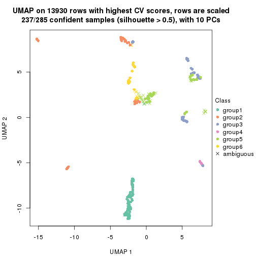</p>

</div>
</div>


Following heatmap shows how subgroups are split when increasing `k`:

```r
collect_classes(res)
```


If matrix rows can be associated to genes, consider to use `GO_Enrichment(res,
...)` to perform function enrichment for the signature genes.


 

---------------------------------------------------


### CV:mclust


The object with results only for a single top-value method and a single partition method 
can be extracted as:

```r
res = res_list["CV", "mclust"]
# you can also extract it by
# res = res_list["CV:mclust"]
```

A summary of `res` and all the functions that can be applied to it:

```r
res
```

```
#> A 'ConsensusPartition' object with k = 2, 3, 4, 5, 6.
#>   On a matrix with 13930 rows and 285 columns.
#>   Top rows (1000, 2000, 3000, 4000, 5000) are extracted by 'CV' method.
#>   Subgroups are detected by 'mclust' method.
#>   Performed in total 1250 partitions by row resampling.
#>   Best k for subgroups seems to be 2.
#> 
#> Following methods can be applied to this 'ConsensusPartition' object:
#>  [1] "cola_report"             "collect_classes"         "collect_plots"          
#>  [4] "collect_stats"           "colnames"                "compare_signatures"     
#>  [7] "consensus_heatmap"       "dimension_reduction"     "functional_enrichment"  
#> [10] "get_anno_col"            "get_anno"                "get_classes"            
#> [13] "get_consensus"           "get_matrix"              "get_membership"         
#> [16] "get_param"               "get_signatures"          "get_stats"              
#> [19] "is_best_k"               "is_stable_k"             "membership_heatmap"     
#> [22] "ncol"                    "nrow"                    "plot_ecdf"              
#> [25] "rownames"                "select_partition_number" "show"                   
#> [28] "suggest_best_k"          "test_to_known_factors"
```

`collect_plots()` function collects all the plots made from `res` for all `k` (number of partitions)
into one single page to provide an easy and fast comparison between different `k`.

```r
collect_plots(res)
```


The plots are:

- The first row: a plot of the ECDF (Empirical cumulative distribution
  function) curves of the consensus matrix for each `k` and the heatmap of
  predicted classes for each `k`.
- The second row: heatmaps of the consensus matrix for each `k`.
- The third row: heatmaps of the membership matrix for each `k`.
- The fouth row: heatmaps of the signatures for each `k`.

All the plots in panels can be made by individual functions and they are
plotted later in this section.

`select_partition_number()` produces several plots showing different
statistics for choosing "optimized" `k`. There are following statistics:

- ECDF curves of the consensus matrix for each `k`;
- 1-PAC. [The PAC
  score](https://en.wikipedia.org/wiki/Consensus_clustering#Over-interpretation_potential_of_consensus_clustering)
  measures the proportion of the ambiguous subgrouping.
- Mean silhouette score.
- Concordance. The mean probability of fiting the consensus class ids in all
  partitions.
- Area increased. Denote $A_k$ as the area under the ECDF curve for current
  `k`, the area increased is defined as $A_k - A_{k-1}$.
- Rand index. The percent of pairs of samples that are both in a same cluster
  or both are not in a same cluster in the partition of k and k-1.
- Jaccard index. The ratio of pairs of samples are both in a same cluster in
  the partition of k and k-1 and the pairs of samples are both in a same
  cluster in the partition k or k-1.

The detailed explanations of these statistics can be found in [the cola
vignette](http://bioconductor.org/packages/devel/bioc/vignettes/cola/inst/doc/cola.html#toc_13).

Generally speaking, lower PAC score, higher mean silhouette score or higher
concordance corresponds to better partition. Rand index and Jaccard index
measure how similar the current partition is compared to partition with `k-1`.
If they are too similar, we won't accept `k` is better than `k-1`.

```r
select_partition_number(res)
```


The numeric values for all these statistics can be obtained by `get_stats()`.

```r
get_stats(res)
```

```
#>   k 1-PAC mean_silhouette concordance area_increased  Rand Jaccard
#> 2 2 0.590           0.917       0.945         0.4026 0.625   0.625
#> 3 3 0.609           0.755       0.868         0.3802 0.864   0.782
#> 4 4 0.786           0.870       0.928         0.2295 0.831   0.658
#> 5 5 0.812           0.816       0.894         0.1180 0.863   0.607
#> 6 6 0.845           0.822       0.890         0.0559 0.908   0.632
```

`suggest_best_k()` suggests the best $k$ based on these statistics. The rules are as follows:

- All $k$ with Jaccard index larger than 0.95 are removed because the increase of
  the partition number does not provides enough extra information. If all $k$ are removed,
  the best $k$ is assigned by `NA`.
- For $k$ with 1-PAC larger than 0.9, the maximal $k$ is taken as the "best k". Other $k$ is called "optional k".
- If it does not fit the second rule. The $k$ with the highest vote of highest
  1-PAC, mean silhouette and concordance is taken as the "best k".

```r
suggest_best_k(res)
```

```
#> [1] 2
```


Following shows the table of the partitions (You need to click the **show/hide
code output** link to see it). The membership matrix (columns with name `p*`)
is inferred by
[`clue::cl_consensus()`](https://www.rdocumentation.org/link/cl_consensus?package=clue)
function with the `SE` method. Basically the value in the membership matrix
represents the probability to belong to a certain group. The finall class
label for an item is determined with the group with highest probability it
belongs to.

In `get_classes()` function, the entropy is calculated from the membership
matrix and the silhouette score is calculated from the consensus matrix.


<script>
$( function() {
	$( '#tabs-CV-mclust-get-classes' ).tabs();
} );
</script>
<div id='tabs-CV-mclust-get-classes'>
<ul>
<li><a href='#tab-CV-mclust-get-classes-1'>k = 2</a></li>
<li><a href='#tab-CV-mclust-get-classes-2'>k = 3</a></li>
<li><a href='#tab-CV-mclust-get-classes-3'>k = 4</a></li>
<li><a href='#tab-CV-mclust-get-classes-4'>k = 5</a></li>
<li><a href='#tab-CV-mclust-get-classes-5'>k = 6</a></li>
</ul>

<div id='tab-CV-mclust-get-classes-1'>
<p><a id='tab-CV-mclust-get-classes-1-a' style='color:#0366d6' href='#'>show/hide code output</a></p>
<pre><code class="r">cbind(get_classes(res, k = 2), get_membership(res, k = 2))
</code></pre>

<pre><code>#&gt;            class entropy silhouette    p1    p2
#&gt; SRR1201591     2  0.0000      0.925 0.000 1.000
#&gt; SRR1201590     2  0.5842      0.884 0.140 0.860
#&gt; SRR1201593     2  0.0000      0.925 0.000 1.000
#&gt; SRR1201592     2  0.5842      0.884 0.140 0.860
#&gt; SRR1201617     2  0.0000      0.925 0.000 1.000
#&gt; SRR1201616     2  0.5842      0.884 0.140 0.860
#&gt; SRR1201619     2  0.0000      0.925 0.000 1.000
#&gt; SRR1201618     2  0.5842      0.884 0.140 0.860
#&gt; SRR1201620     2  0.5842      0.884 0.140 0.860
#&gt; SRR1201621     2  0.0000      0.925 0.000 1.000
#&gt; SRR1201623     2  0.0000      0.925 0.000 1.000
#&gt; SRR1201622     2  0.5842      0.884 0.140 0.860
#&gt; SRR1201624     2  0.9087      0.665 0.324 0.676
#&gt; SRR1201625     2  0.9044      0.672 0.320 0.680
#&gt; SRR1201626     2  0.9087      0.665 0.324 0.676
#&gt; SRR1201627     2  0.9044      0.672 0.320 0.680
#&gt; SRR1201628     2  0.5842      0.884 0.140 0.860
#&gt; SRR1201629     2  0.0000      0.925 0.000 1.000
#&gt; SRR1201630     2  0.5842      0.884 0.140 0.860
#&gt; SRR1201631     2  0.0000      0.925 0.000 1.000
#&gt; SRR1201641     2  0.0000      0.925 0.000 1.000
#&gt; SRR1201640     2  0.5842      0.884 0.140 0.860
#&gt; SRR1201643     2  0.5842      0.884 0.140 0.860
#&gt; SRR1201644     2  0.0000      0.925 0.000 1.000
#&gt; SRR1201661     2  0.5842      0.884 0.140 0.860
#&gt; SRR1201662     2  0.0000      0.925 0.000 1.000
#&gt; SRR1201663     2  0.5842      0.884 0.140 0.860
#&gt; SRR1201664     2  0.3431      0.910 0.064 0.936
#&gt; SRR1201665     2  0.5842      0.884 0.140 0.860
#&gt; SRR1201666     2  0.0000      0.925 0.000 1.000
#&gt; SRR1201667     2  0.0000      0.925 0.000 1.000
#&gt; SRR1201668     2  0.5842      0.884 0.140 0.860
#&gt; SRR1201670     2  0.0000      0.925 0.000 1.000
#&gt; SRR1201669     2  0.0000      0.925 0.000 1.000
#&gt; SRR1201673     2  0.0000      0.925 0.000 1.000
#&gt; SRR1201672     2  0.0000      0.925 0.000 1.000
#&gt; SRR1201671     2  0.5842      0.884 0.140 0.860
#&gt; SRR1201677     2  0.0000      0.925 0.000 1.000
#&gt; SRR1201676     2  0.0000      0.925 0.000 1.000
#&gt; SRR1201675     2  0.0000      0.925 0.000 1.000
#&gt; SRR1201674     2  0.0000      0.925 0.000 1.000
#&gt; SRR1201678     2  0.0000      0.925 0.000 1.000
#&gt; SRR1201682     2  0.0000      0.925 0.000 1.000
#&gt; SRR1201683     2  0.0000      0.925 0.000 1.000
#&gt; SRR1201680     2  0.0000      0.925 0.000 1.000
#&gt; SRR1201681     2  0.0000      0.925 0.000 1.000
#&gt; SRR1201679     2  0.5842      0.884 0.140 0.860
#&gt; SRR1201686     2  0.5842      0.884 0.140 0.860
#&gt; SRR1201687     2  0.5842      0.884 0.140 0.860
#&gt; SRR1201688     2  0.5842      0.884 0.140 0.860
#&gt; SRR1201689     2  0.5842      0.884 0.140 0.860
#&gt; SRR1201685     2  0.6048      0.879 0.148 0.852
#&gt; SRR1201692     2  0.0000      0.925 0.000 1.000
#&gt; SRR1201691     2  0.0000      0.925 0.000 1.000
#&gt; SRR1201690     2  0.5842      0.884 0.140 0.860
#&gt; SRR1201696     2  0.0000      0.925 0.000 1.000
#&gt; SRR1201695     2  0.0000      0.925 0.000 1.000
#&gt; SRR1201694     2  0.0000      0.925 0.000 1.000
#&gt; SRR1201693     2  0.0000      0.925 0.000 1.000
#&gt; SRR1201697     2  0.0000      0.925 0.000 1.000
#&gt; SRR1201698     2  0.0000      0.925 0.000 1.000
#&gt; SRR1201700     2  0.5842      0.884 0.140 0.860
#&gt; SRR1201708     2  0.0000      0.925 0.000 1.000
#&gt; SRR1201707     2  0.0000      0.925 0.000 1.000
#&gt; SRR1201706     2  0.0000      0.925 0.000 1.000
#&gt; SRR1201702     2  0.0000      0.925 0.000 1.000
#&gt; SRR1201705     2  0.0000      0.925 0.000 1.000
#&gt; SRR1201701     2  0.0000      0.925 0.000 1.000
#&gt; SRR1201704     2  0.0000      0.925 0.000 1.000
#&gt; SRR1201703     2  0.0000      0.925 0.000 1.000
#&gt; SRR1201716     2  0.0000      0.925 0.000 1.000
#&gt; SRR1201715     2  0.0000      0.925 0.000 1.000
#&gt; SRR1201717     2  0.0000      0.925 0.000 1.000
#&gt; SRR1201712     2  0.0000      0.925 0.000 1.000
#&gt; SRR1201709     2  0.5842      0.884 0.140 0.860
#&gt; SRR1201711     2  0.0000      0.925 0.000 1.000
#&gt; SRR1201714     2  0.0000      0.925 0.000 1.000
#&gt; SRR1201713     2  0.0000      0.925 0.000 1.000
#&gt; SRR1201710     2  0.0000      0.925 0.000 1.000
#&gt; SRR1201719     2  0.0000      0.925 0.000 1.000
#&gt; SRR1201718     2  0.5842      0.884 0.140 0.860
#&gt; SRR1201721     2  0.0000      0.925 0.000 1.000
#&gt; SRR1201720     2  0.5842      0.884 0.140 0.860
#&gt; SRR1201723     2  0.0000      0.925 0.000 1.000
#&gt; SRR1201722     2  0.5842      0.884 0.140 0.860
#&gt; SRR1201725     2  0.0000      0.925 0.000 1.000
#&gt; SRR1201724     2  0.5842      0.884 0.140 0.860
#&gt; SRR1201726     2  0.5842      0.884 0.140 0.860
#&gt; SRR1201727     2  0.0000      0.925 0.000 1.000
#&gt; SRR1201731     2  0.0000      0.925 0.000 1.000
#&gt; SRR1201730     2  0.5842      0.884 0.140 0.860
#&gt; SRR1201734     2  0.0000      0.925 0.000 1.000
#&gt; SRR1201733     2  0.5842      0.884 0.140 0.860
#&gt; SRR1201736     2  0.5842      0.884 0.140 0.860
#&gt; SRR1201737     2  0.0000      0.925 0.000 1.000
#&gt; SRR1201739     2  0.0000      0.925 0.000 1.000
#&gt; SRR1201738     2  0.5842      0.884 0.140 0.860
#&gt; SRR1201742     2  0.5842      0.884 0.140 0.860
#&gt; SRR1201743     2  0.0000      0.925 0.000 1.000
#&gt; SRR1201745     2  0.0376      0.924 0.004 0.996
#&gt; SRR1201744     2  0.5842      0.884 0.140 0.860
#&gt; SRR1201749     2  0.5842      0.884 0.140 0.860
#&gt; SRR1201750     2  0.0000      0.925 0.000 1.000
#&gt; SRR1201752     2  0.0000      0.925 0.000 1.000
#&gt; SRR1201751     2  0.5842      0.884 0.140 0.860
#&gt; SRR1201754     2  0.0000      0.925 0.000 1.000
#&gt; SRR1201753     2  0.5842      0.884 0.140 0.860
#&gt; SRR1201758     2  0.6048      0.879 0.148 0.852
#&gt; SRR1201759     2  0.5629      0.888 0.132 0.868
#&gt; SRR1201760     2  0.5842      0.884 0.140 0.860
#&gt; SRR1201761     2  0.0000      0.925 0.000 1.000
#&gt; SRR1201763     2  0.9044      0.672 0.320 0.680
#&gt; SRR1201762     2  0.9087      0.665 0.324 0.676
#&gt; SRR1201764     2  0.9087      0.665 0.324 0.676
#&gt; SRR1201766     2  0.5842      0.884 0.140 0.860
#&gt; SRR1201768     2  0.0000      0.925 0.000 1.000
#&gt; SRR1201769     2  0.0000      0.925 0.000 1.000
#&gt; SRR1201767     2  0.0000      0.925 0.000 1.000
#&gt; SRR1201770     2  0.0000      0.925 0.000 1.000
#&gt; SRR1201771     2  0.0000      0.925 0.000 1.000
#&gt; SRR1201772     2  0.0000      0.925 0.000 1.000
#&gt; SRR1201773     2  0.0000      0.925 0.000 1.000
#&gt; SRR1201774     2  0.0000      0.925 0.000 1.000
#&gt; SRR1201786     2  0.0000      0.925 0.000 1.000
#&gt; SRR1201784     2  0.0000      0.925 0.000 1.000
#&gt; SRR1201785     2  0.0000      0.925 0.000 1.000
#&gt; SRR1201778     2  0.5842      0.884 0.140 0.860
#&gt; SRR1201779     2  0.0000      0.925 0.000 1.000
#&gt; SRR1201781     2  0.0000      0.925 0.000 1.000
#&gt; SRR1201780     2  0.0000      0.925 0.000 1.000
#&gt; SRR1201783     2  0.0000      0.925 0.000 1.000
#&gt; SRR1201782     2  0.0000      0.925 0.000 1.000
#&gt; SRR1201798     2  0.0000      0.925 0.000 1.000
#&gt; SRR1201797     2  0.0000      0.925 0.000 1.000
#&gt; SRR1201796     2  0.0000      0.925 0.000 1.000
#&gt; SRR1201795     2  0.0000      0.925 0.000 1.000
#&gt; SRR1201799     2  0.0000      0.925 0.000 1.000
#&gt; SRR1201794     2  0.0000      0.925 0.000 1.000
#&gt; SRR1201793     2  0.0000      0.925 0.000 1.000
#&gt; SRR1201792     2  0.0000      0.925 0.000 1.000
#&gt; SRR1201791     2  0.5842      0.884 0.140 0.860
#&gt; SRR1201807     2  0.0000      0.925 0.000 1.000
#&gt; SRR1201808     2  0.0000      0.925 0.000 1.000
#&gt; SRR1201803     2  0.0000      0.925 0.000 1.000
#&gt; SRR1201804     2  0.0000      0.925 0.000 1.000
#&gt; SRR1201805     2  0.0000      0.925 0.000 1.000
#&gt; SRR1201806     2  0.0000      0.925 0.000 1.000
#&gt; SRR1201801     2  0.0000      0.925 0.000 1.000
#&gt; SRR1201802     2  0.0000      0.925 0.000 1.000
#&gt; SRR1201800     2  0.5842      0.884 0.140 0.860
#&gt; SRR1201814     2  0.0000      0.925 0.000 1.000
#&gt; SRR1201816     2  0.0000      0.925 0.000 1.000
#&gt; SRR1201815     2  0.0000      0.925 0.000 1.000
#&gt; SRR1201819     2  0.0000      0.925 0.000 1.000
#&gt; SRR1201820     2  0.0000      0.925 0.000 1.000
#&gt; SRR1201813     2  0.5842      0.884 0.140 0.860
#&gt; SRR1201817     2  0.0000      0.925 0.000 1.000
#&gt; SRR1201818     2  0.0000      0.925 0.000 1.000
#&gt; SRR1201825     2  0.5842      0.884 0.140 0.860
#&gt; SRR1201827     2  0.9044      0.672 0.320 0.680
#&gt; SRR1201828     2  0.9044      0.672 0.320 0.680
#&gt; SRR1201826     2  0.9044      0.672 0.320 0.680
#&gt; SRR1201829     2  0.9044      0.672 0.320 0.680
#&gt; SRR1201830     2  0.9044      0.672 0.320 0.680
#&gt; SRR1201831     2  0.9044      0.672 0.320 0.680
#&gt; SRR1201832     2  0.9044      0.672 0.320 0.680
#&gt; SRR1201833     2  0.9044      0.672 0.320 0.680
#&gt; SRR1201865     2  0.3274      0.911 0.060 0.940
#&gt; SRR1201866     2  0.3274      0.911 0.060 0.940
#&gt; SRR1201867     2  0.3274      0.911 0.060 0.940
#&gt; SRR1201861     2  0.3274      0.911 0.060 0.940
#&gt; SRR1201862     2  0.3274      0.911 0.060 0.940
#&gt; SRR1201863     2  0.3274      0.911 0.060 0.940
#&gt; SRR1201859     2  0.5842      0.884 0.140 0.860
#&gt; SRR1201864     2  0.3274      0.911 0.060 0.940
#&gt; SRR1201860     2  0.4022      0.905 0.080 0.920
#&gt; SRR1201873     2  0.0000      0.925 0.000 1.000
#&gt; SRR1201871     2  0.5946      0.881 0.144 0.856
#&gt; SRR1201872     2  0.0000      0.925 0.000 1.000
#&gt; SRR1201980     2  0.0000      0.925 0.000 1.000
#&gt; SRR1201979     2  0.5842      0.884 0.140 0.860
#&gt; SRR1201982     2  0.0000      0.925 0.000 1.000
#&gt; SRR1201981     2  0.5842      0.884 0.140 0.860
#&gt; SRR1201998     2  0.0000      0.925 0.000 1.000
#&gt; SRR1201996     2  0.5842      0.884 0.140 0.860
#&gt; SRR1201997     2  0.0000      0.925 0.000 1.000
#&gt; SRR1202005     2  0.5178      0.894 0.116 0.884
#&gt; SRR1202006     2  0.0000      0.925 0.000 1.000
#&gt; SRR1202088     2  0.0000      0.925 0.000 1.000
#&gt; SRR1202087     2  0.5842      0.884 0.140 0.860
#&gt; SRR1202093     2  0.0000      0.925 0.000 1.000
#&gt; SRR1202092     2  0.5842      0.884 0.140 0.860
#&gt; SRR1202288     2  0.5842      0.884 0.140 0.860
#&gt; SRR1202289     2  0.0000      0.925 0.000 1.000
#&gt; SRR1202299     2  0.0000      0.925 0.000 1.000
#&gt; SRR1202298     2  0.5842      0.884 0.140 0.860
#&gt; SRR1202303     2  0.9044      0.672 0.320 0.680
#&gt; SRR1202372     2  0.0000      0.925 0.000 1.000
#&gt; SRR1202371     2  0.5842      0.884 0.140 0.860
#&gt; SRR1202563     2  0.5946      0.881 0.144 0.856
#&gt; SRR1202565     2  0.0000      0.925 0.000 1.000
#&gt; SRR1202564     2  0.0000      0.925 0.000 1.000
#&gt; SRR1202649     2  0.5946      0.881 0.144 0.856
#&gt; SRR1202650     2  0.5842      0.884 0.140 0.860
#&gt; SRR1202651     2  0.0000      0.925 0.000 1.000
#&gt; SRR1202843     1  0.0000      0.998 1.000 0.000
#&gt; SRR1202844     1  0.0000      0.998 1.000 0.000
#&gt; SRR1202845     2  0.5946      0.881 0.144 0.856
#&gt; SRR1202847     2  0.5059      0.895 0.112 0.888
#&gt; SRR1202846     2  0.5294      0.892 0.120 0.880
#&gt; SRR1202945     1  0.0000      0.998 1.000 0.000
#&gt; SRR1202949     1  0.0000      0.998 1.000 0.000
#&gt; SRR1202977     1  0.0000      0.998 1.000 0.000
#&gt; SRR1202978     1  0.0000      0.998 1.000 0.000
#&gt; SRR1202979     1  0.0000      0.998 1.000 0.000
#&gt; SRR1202990     1  0.0000      0.998 1.000 0.000
#&gt; SRR1202999     1  0.0000      0.998 1.000 0.000
#&gt; SRR1203005     1  0.0000      0.998 1.000 0.000
#&gt; SRR1203006     1  0.0000      0.998 1.000 0.000
#&gt; SRR1203007     1  0.0000      0.998 1.000 0.000
#&gt; SRR1203009     1  0.3114      0.932 0.944 0.056
#&gt; SRR1203008     1  0.3114      0.932 0.944 0.056
#&gt; SRR1203010     1  0.0000      0.998 1.000 0.000
#&gt; SRR1203011     1  0.0000      0.998 1.000 0.000
#&gt; SRR1203025     1  0.0000      0.998 1.000 0.000
#&gt; SRR1203026     1  0.0000      0.998 1.000 0.000
#&gt; SRR1203027     1  0.0000      0.998 1.000 0.000
#&gt; SRR1203061     1  0.0000      0.998 1.000 0.000
#&gt; SRR1203089     1  0.0000      0.998 1.000 0.000
#&gt; SRR1203125     1  0.0000      0.998 1.000 0.000
#&gt; SRR1203128     1  0.0000      0.998 1.000 0.000
#&gt; SRR1203129     1  0.0000      0.998 1.000 0.000
#&gt; SRR1203130     1  0.0000      0.998 1.000 0.000
#&gt; SRR1203132     2  0.0000      0.925 0.000 1.000
#&gt; SRR1203131     2  0.5842      0.884 0.140 0.860
#&gt; SRR1203133     1  0.0000      0.998 1.000 0.000
#&gt; SRR1203138     1  0.0000      0.998 1.000 0.000
#&gt; SRR1203760     1  0.0000      0.998 1.000 0.000
#&gt; SRR1203761     1  0.0000      0.998 1.000 0.000
#&gt; SRR1203770     1  0.0000      0.998 1.000 0.000
#&gt; SRR1203771     1  0.0000      0.998 1.000 0.000
#&gt; SRR1203772     1  0.0000      0.998 1.000 0.000
#&gt; SRR1203773     1  0.0000      0.998 1.000 0.000
#&gt; SRR1203774     1  0.0000      0.998 1.000 0.000
#&gt; SRR1203775     1  0.0000      0.998 1.000 0.000
#&gt; SRR1203800     1  0.0000      0.998 1.000 0.000
#&gt; SRR1203801     1  0.0000      0.998 1.000 0.000
#&gt; SRR1203802     1  0.0000      0.998 1.000 0.000
#&gt; SRR1203803     1  0.0000      0.998 1.000 0.000
#&gt; SRR1203804     1  0.0000      0.998 1.000 0.000
#&gt; SRR1203805     1  0.0000      0.998 1.000 0.000
#&gt; SRR1203806     1  0.0000      0.998 1.000 0.000
#&gt; SRR1203807     1  0.0000      0.998 1.000 0.000
#&gt; SRR1203808     1  0.0000      0.998 1.000 0.000
#&gt; SRR1203811     1  0.0000      0.998 1.000 0.000
#&gt; SRR1203812     1  0.0000      0.998 1.000 0.000
#&gt; SRR1203813     1  0.0000      0.998 1.000 0.000
#&gt; SRR1203814     1  0.0000      0.998 1.000 0.000
#&gt; SRR1203815     1  0.0000      0.998 1.000 0.000
#&gt; SRR1203816     1  0.0000      0.998 1.000 0.000
#&gt; SRR1203817     1  0.0000      0.998 1.000 0.000
#&gt; SRR1203818     1  0.0000      0.998 1.000 0.000
#&gt; SRR1203819     1  0.0000      0.998 1.000 0.000
#&gt; SRR1203822     1  0.0000      0.998 1.000 0.000
#&gt; SRR1203823     1  0.0000      0.998 1.000 0.000
#&gt; SRR1203824     1  0.0000      0.998 1.000 0.000
#&gt; SRR1203825     1  0.0000      0.998 1.000 0.000
#&gt; SRR1203826     1  0.0000      0.998 1.000 0.000
#&gt; SRR1203827     2  0.9129      0.658 0.328 0.672
#&gt; SRR1203828     1  0.0000      0.998 1.000 0.000
#&gt; SRR1203829     1  0.0000      0.998 1.000 0.000
#&gt; SRR1203830     1  0.0000      0.998 1.000 0.000
#&gt; SRR1203831     1  0.0000      0.998 1.000 0.000
#&gt; SRR1203832     1  0.0000      0.998 1.000 0.000
#&gt; SRR1203833     1  0.0000      0.998 1.000 0.000
#&gt; SRR1203834     1  0.0000      0.998 1.000 0.000
#&gt; SRR1203835     1  0.0000      0.998 1.000 0.000
#&gt; SRR1203836     1  0.0000      0.998 1.000 0.000
#&gt; SRR1203837     1  0.0000      0.998 1.000 0.000
#&gt; SRR1203838     1  0.0000      0.998 1.000 0.000
#&gt; SRR1203839     1  0.0000      0.998 1.000 0.000
#&gt; SRR1203842     2  0.9129      0.658 0.328 0.672
#&gt; SRR1203843     1  0.0000      0.998 1.000 0.000
#&gt; SRR1203845     2  0.0000      0.925 0.000 1.000
#&gt; SRR1203844     2  0.5842      0.884 0.140 0.860
</code></pre>

<script>
$('#tab-CV-mclust-get-classes-1-a').parent().next().next().hide();
$('#tab-CV-mclust-get-classes-1-a').click(function(){
  $('#tab-CV-mclust-get-classes-1-a').parent().next().next().toggle();
  return(false);
});
</script>
</div>

<div id='tab-CV-mclust-get-classes-2'>
<p><a id='tab-CV-mclust-get-classes-2-a' style='color:#0366d6' href='#'>show/hide code output</a></p>
<pre><code class="r">cbind(get_classes(res, k = 3), get_membership(res, k = 3))
</code></pre>

<pre><code>#&gt;            class entropy silhouette    p1    p2    p3
#&gt; SRR1201591     2  0.5098      0.642 0.000 0.752 0.248
#&gt; SRR1201590     2  0.5098      0.511 0.000 0.752 0.248
#&gt; SRR1201593     2  0.5098      0.642 0.000 0.752 0.248
#&gt; SRR1201592     2  0.5098      0.511 0.000 0.752 0.248
#&gt; SRR1201617     2  0.5098      0.642 0.000 0.752 0.248
#&gt; SRR1201616     2  0.5098      0.511 0.000 0.752 0.248
#&gt; SRR1201619     2  0.0747      0.759 0.000 0.984 0.016
#&gt; SRR1201618     2  0.5098      0.511 0.000 0.752 0.248
#&gt; SRR1201620     2  0.5098      0.511 0.000 0.752 0.248
#&gt; SRR1201621     2  0.5098      0.642 0.000 0.752 0.248
#&gt; SRR1201623     2  0.0000      0.762 0.000 1.000 0.000
#&gt; SRR1201622     2  0.5098      0.511 0.000 0.752 0.248
#&gt; SRR1201624     3  0.5325      0.887 0.004 0.248 0.748
#&gt; SRR1201625     3  0.5098      0.889 0.000 0.248 0.752
#&gt; SRR1201626     3  0.5098      0.889 0.000 0.248 0.752
#&gt; SRR1201627     3  0.5098      0.889 0.000 0.248 0.752
#&gt; SRR1201628     2  0.5098      0.511 0.000 0.752 0.248
#&gt; SRR1201629     2  0.0000      0.762 0.000 1.000 0.000
#&gt; SRR1201630     2  0.5098      0.511 0.000 0.752 0.248
#&gt; SRR1201631     2  0.0000      0.762 0.000 1.000 0.000
#&gt; SRR1201641     2  0.0000      0.762 0.000 1.000 0.000
#&gt; SRR1201640     2  0.5098      0.511 0.000 0.752 0.248
#&gt; SRR1201643     2  0.5098      0.511 0.000 0.752 0.248
#&gt; SRR1201644     2  0.0000      0.762 0.000 1.000 0.000
#&gt; SRR1201661     2  0.5098      0.511 0.000 0.752 0.248
#&gt; SRR1201662     2  0.0000      0.762 0.000 1.000 0.000
#&gt; SRR1201663     3  0.6299      0.585 0.000 0.476 0.524
#&gt; SRR1201664     2  0.4750      0.556 0.000 0.784 0.216
#&gt; SRR1201665     2  0.5098      0.511 0.000 0.752 0.248
#&gt; SRR1201666     2  0.1289      0.756 0.000 0.968 0.032
#&gt; SRR1201667     2  0.1289      0.756 0.000 0.968 0.032
#&gt; SRR1201668     3  0.5905      0.830 0.000 0.352 0.648
#&gt; SRR1201670     2  0.1163      0.749 0.000 0.972 0.028
#&gt; SRR1201669     2  0.0592      0.757 0.000 0.988 0.012
#&gt; SRR1201673     2  0.1289      0.756 0.000 0.968 0.032
#&gt; SRR1201672     2  0.1289      0.756 0.000 0.968 0.032
#&gt; SRR1201671     2  0.5098      0.511 0.000 0.752 0.248
#&gt; SRR1201677     2  0.1289      0.756 0.000 0.968 0.032
#&gt; SRR1201676     2  0.1289      0.756 0.000 0.968 0.032
#&gt; SRR1201675     2  0.1289      0.756 0.000 0.968 0.032
#&gt; SRR1201674     2  0.1289      0.756 0.000 0.968 0.032
#&gt; SRR1201678     2  0.1289      0.756 0.000 0.968 0.032
#&gt; SRR1201682     2  0.1289      0.756 0.000 0.968 0.032
#&gt; SRR1201683     2  0.1289      0.756 0.000 0.968 0.032
#&gt; SRR1201680     2  0.1289      0.756 0.000 0.968 0.032
#&gt; SRR1201681     2  0.1289      0.756 0.000 0.968 0.032
#&gt; SRR1201679     2  0.5098      0.511 0.000 0.752 0.248
#&gt; SRR1201686     3  0.6274      0.669 0.000 0.456 0.544
#&gt; SRR1201687     3  0.6252      0.695 0.000 0.444 0.556
#&gt; SRR1201688     3  0.6280      0.659 0.000 0.460 0.540
#&gt; SRR1201689     3  0.6286      0.648 0.000 0.464 0.536
#&gt; SRR1201685     3  0.5835      0.841 0.000 0.340 0.660
#&gt; SRR1201692     2  0.0000      0.762 0.000 1.000 0.000
#&gt; SRR1201691     2  0.0000      0.762 0.000 1.000 0.000
#&gt; SRR1201690     2  0.5098      0.511 0.000 0.752 0.248
#&gt; SRR1201696     2  0.0000      0.762 0.000 1.000 0.000
#&gt; SRR1201695     2  0.0000      0.762 0.000 1.000 0.000
#&gt; SRR1201694     2  0.0000      0.762 0.000 1.000 0.000
#&gt; SRR1201693     2  0.0000      0.762 0.000 1.000 0.000
#&gt; SRR1201697     2  0.0000      0.762 0.000 1.000 0.000
#&gt; SRR1201698     2  0.0000      0.762 0.000 1.000 0.000
#&gt; SRR1201700     2  0.5098      0.511 0.000 0.752 0.248
#&gt; SRR1201708     2  0.0000      0.762 0.000 1.000 0.000
#&gt; SRR1201707     2  0.0000      0.762 0.000 1.000 0.000
#&gt; SRR1201706     2  0.0000      0.762 0.000 1.000 0.000
#&gt; SRR1201702     2  0.0000      0.762 0.000 1.000 0.000
#&gt; SRR1201705     2  0.0000      0.762 0.000 1.000 0.000
#&gt; SRR1201701     2  0.0000      0.762 0.000 1.000 0.000
#&gt; SRR1201704     2  0.0000      0.762 0.000 1.000 0.000
#&gt; SRR1201703     2  0.0000      0.762 0.000 1.000 0.000
#&gt; SRR1201716     2  0.0000      0.762 0.000 1.000 0.000
#&gt; SRR1201715     2  0.0000      0.762 0.000 1.000 0.000
#&gt; SRR1201717     2  0.0000      0.762 0.000 1.000 0.000
#&gt; SRR1201712     2  0.0000      0.762 0.000 1.000 0.000
#&gt; SRR1201709     2  0.5098      0.511 0.000 0.752 0.248
#&gt; SRR1201711     2  0.0000      0.762 0.000 1.000 0.000
#&gt; SRR1201714     2  0.0000      0.762 0.000 1.000 0.000
#&gt; SRR1201713     2  0.0000      0.762 0.000 1.000 0.000
#&gt; SRR1201710     2  0.0000      0.762 0.000 1.000 0.000
#&gt; SRR1201719     2  0.0000      0.762 0.000 1.000 0.000
#&gt; SRR1201718     2  0.4121      0.621 0.000 0.832 0.168
#&gt; SRR1201721     2  0.0000      0.762 0.000 1.000 0.000
#&gt; SRR1201720     2  0.5098      0.511 0.000 0.752 0.248
#&gt; SRR1201723     2  0.0000      0.762 0.000 1.000 0.000
#&gt; SRR1201722     2  0.5098      0.511 0.000 0.752 0.248
#&gt; SRR1201725     2  0.0000      0.762 0.000 1.000 0.000
#&gt; SRR1201724     2  0.4399      0.596 0.000 0.812 0.188
#&gt; SRR1201726     2  0.5098      0.511 0.000 0.752 0.248
#&gt; SRR1201727     2  0.0000      0.762 0.000 1.000 0.000
#&gt; SRR1201731     2  0.0000      0.762 0.000 1.000 0.000
#&gt; SRR1201730     2  0.5098      0.511 0.000 0.752 0.248
#&gt; SRR1201734     2  0.4887      0.650 0.000 0.772 0.228
#&gt; SRR1201733     2  0.5098      0.511 0.000 0.752 0.248
#&gt; SRR1201736     2  0.5098      0.511 0.000 0.752 0.248
#&gt; SRR1201737     2  0.1289      0.756 0.000 0.968 0.032
#&gt; SRR1201739     2  0.5098      0.642 0.000 0.752 0.248
#&gt; SRR1201738     2  0.5098      0.511 0.000 0.752 0.248
#&gt; SRR1201742     2  0.5098      0.511 0.000 0.752 0.248
#&gt; SRR1201743     2  0.1289      0.756 0.000 0.968 0.032
#&gt; SRR1201745     2  0.3619      0.678 0.000 0.864 0.136
#&gt; SRR1201744     3  0.5905      0.830 0.000 0.352 0.648
#&gt; SRR1201749     2  0.5098      0.511 0.000 0.752 0.248
#&gt; SRR1201750     2  0.0000      0.762 0.000 1.000 0.000
#&gt; SRR1201752     2  0.0000      0.762 0.000 1.000 0.000
#&gt; SRR1201751     2  0.5098      0.511 0.000 0.752 0.248
#&gt; SRR1201754     2  0.0237      0.762 0.000 0.996 0.004
#&gt; SRR1201753     2  0.5098      0.511 0.000 0.752 0.248
#&gt; SRR1201758     3  0.6205      0.844 0.008 0.336 0.656
#&gt; SRR1201759     3  0.6026      0.809 0.000 0.376 0.624
#&gt; SRR1201760     2  0.5098      0.511 0.000 0.752 0.248
#&gt; SRR1201761     2  0.0000      0.762 0.000 1.000 0.000
#&gt; SRR1201763     3  0.5098      0.889 0.000 0.248 0.752
#&gt; SRR1201762     3  0.5325      0.887 0.004 0.248 0.748
#&gt; SRR1201764     3  0.5098      0.889 0.000 0.248 0.752
#&gt; SRR1201766     2  0.5098      0.511 0.000 0.752 0.248
#&gt; SRR1201768     2  0.5098      0.642 0.000 0.752 0.248
#&gt; SRR1201769     2  0.5098      0.642 0.000 0.752 0.248
#&gt; SRR1201767     2  0.5098      0.642 0.000 0.752 0.248
#&gt; SRR1201770     2  0.5098      0.642 0.000 0.752 0.248
#&gt; SRR1201771     2  0.5098      0.642 0.000 0.752 0.248
#&gt; SRR1201772     2  0.5098      0.642 0.000 0.752 0.248
#&gt; SRR1201773     2  0.5098      0.642 0.000 0.752 0.248
#&gt; SRR1201774     2  0.5098      0.642 0.000 0.752 0.248
#&gt; SRR1201786     2  0.5098      0.642 0.000 0.752 0.248
#&gt; SRR1201784     2  0.5098      0.642 0.000 0.752 0.248
#&gt; SRR1201785     2  0.5098      0.642 0.000 0.752 0.248
#&gt; SRR1201778     2  0.5098      0.511 0.000 0.752 0.248
#&gt; SRR1201779     2  0.5098      0.642 0.000 0.752 0.248
#&gt; SRR1201781     2  0.5098      0.642 0.000 0.752 0.248
#&gt; SRR1201780     2  0.5098      0.642 0.000 0.752 0.248
#&gt; SRR1201783     2  0.5098      0.642 0.000 0.752 0.248
#&gt; SRR1201782     2  0.5098      0.642 0.000 0.752 0.248
#&gt; SRR1201798     2  0.5098      0.642 0.000 0.752 0.248
#&gt; SRR1201797     2  0.5098      0.642 0.000 0.752 0.248
#&gt; SRR1201796     2  0.5098      0.642 0.000 0.752 0.248
#&gt; SRR1201795     2  0.5098      0.642 0.000 0.752 0.248
#&gt; SRR1201799     2  0.5098      0.642 0.000 0.752 0.248
#&gt; SRR1201794     2  0.5098      0.642 0.000 0.752 0.248
#&gt; SRR1201793     2  0.5098      0.642 0.000 0.752 0.248
#&gt; SRR1201792     2  0.5098      0.642 0.000 0.752 0.248
#&gt; SRR1201791     2  0.5098      0.511 0.000 0.752 0.248
#&gt; SRR1201807     2  0.5098      0.642 0.000 0.752 0.248
#&gt; SRR1201808     2  0.5098      0.642 0.000 0.752 0.248
#&gt; SRR1201803     2  0.5098      0.642 0.000 0.752 0.248
#&gt; SRR1201804     2  0.5098      0.642 0.000 0.752 0.248
#&gt; SRR1201805     2  0.5098      0.642 0.000 0.752 0.248
#&gt; SRR1201806     2  0.5098      0.642 0.000 0.752 0.248
#&gt; SRR1201801     2  0.5098      0.642 0.000 0.752 0.248
#&gt; SRR1201802     2  0.5098      0.642 0.000 0.752 0.248
#&gt; SRR1201800     2  0.5098      0.511 0.000 0.752 0.248
#&gt; SRR1201814     2  0.5098      0.642 0.000 0.752 0.248
#&gt; SRR1201816     2  0.5098      0.642 0.000 0.752 0.248
#&gt; SRR1201815     2  0.5098      0.642 0.000 0.752 0.248
#&gt; SRR1201819     2  0.5098      0.642 0.000 0.752 0.248
#&gt; SRR1201820     2  0.5098      0.642 0.000 0.752 0.248
#&gt; SRR1201813     2  0.5098      0.511 0.000 0.752 0.248
#&gt; SRR1201817     2  0.5098      0.642 0.000 0.752 0.248
#&gt; SRR1201818     2  0.5098      0.642 0.000 0.752 0.248
#&gt; SRR1201825     2  0.6168     -0.151 0.000 0.588 0.412
#&gt; SRR1201827     3  0.5098      0.889 0.000 0.248 0.752
#&gt; SRR1201828     3  0.5098      0.889 0.000 0.248 0.752
#&gt; SRR1201826     3  0.5098      0.889 0.000 0.248 0.752
#&gt; SRR1201829     3  0.5098      0.889 0.000 0.248 0.752
#&gt; SRR1201830     3  0.5098      0.889 0.000 0.248 0.752
#&gt; SRR1201831     3  0.5098      0.889 0.000 0.248 0.752
#&gt; SRR1201832     3  0.5098      0.889 0.000 0.248 0.752
#&gt; SRR1201833     3  0.5098      0.889 0.000 0.248 0.752
#&gt; SRR1201865     2  0.1753      0.736 0.000 0.952 0.048
#&gt; SRR1201866     2  0.1753      0.736 0.000 0.952 0.048
#&gt; SRR1201867     2  0.1643      0.738 0.000 0.956 0.044
#&gt; SRR1201861     2  0.1643      0.738 0.000 0.956 0.044
#&gt; SRR1201862     2  0.1753      0.736 0.000 0.952 0.048
#&gt; SRR1201863     2  0.1643      0.738 0.000 0.956 0.044
#&gt; SRR1201859     2  0.6267     -0.337 0.000 0.548 0.452
#&gt; SRR1201864     2  0.1753      0.736 0.000 0.952 0.048
#&gt; SRR1201860     2  0.1753      0.736 0.000 0.952 0.048
#&gt; SRR1201873     2  0.0000      0.762 0.000 1.000 0.000
#&gt; SRR1201871     2  0.5138      0.503 0.000 0.748 0.252
#&gt; SRR1201872     2  0.0000      0.762 0.000 1.000 0.000
#&gt; SRR1201980     2  0.0000      0.762 0.000 1.000 0.000
#&gt; SRR1201979     2  0.5098      0.511 0.000 0.752 0.248
#&gt; SRR1201982     2  0.0000      0.762 0.000 1.000 0.000
#&gt; SRR1201981     2  0.5098      0.511 0.000 0.752 0.248
#&gt; SRR1201998     2  0.0000      0.762 0.000 1.000 0.000
#&gt; SRR1201996     2  0.5098      0.511 0.000 0.752 0.248
#&gt; SRR1201997     2  0.0000      0.762 0.000 1.000 0.000
#&gt; SRR1202005     2  0.1964      0.731 0.000 0.944 0.056
#&gt; SRR1202006     2  0.0000      0.762 0.000 1.000 0.000
#&gt; SRR1202088     2  0.1289      0.756 0.000 0.968 0.032
#&gt; SRR1202087     2  0.5098      0.511 0.000 0.752 0.248
#&gt; SRR1202093     2  0.1289      0.756 0.000 0.968 0.032
#&gt; SRR1202092     2  0.5098      0.511 0.000 0.752 0.248
#&gt; SRR1202288     2  0.5098      0.511 0.000 0.752 0.248
#&gt; SRR1202289     2  0.5098      0.642 0.000 0.752 0.248
#&gt; SRR1202299     2  0.5098      0.642 0.000 0.752 0.248
#&gt; SRR1202298     2  0.4887      0.541 0.000 0.772 0.228
#&gt; SRR1202303     3  0.5098      0.889 0.000 0.248 0.752
#&gt; SRR1202372     2  0.5098      0.642 0.000 0.752 0.248
#&gt; SRR1202371     2  0.5138      0.502 0.000 0.748 0.252
#&gt; SRR1202563     3  0.6267      0.652 0.000 0.452 0.548
#&gt; SRR1202565     2  0.0000      0.762 0.000 1.000 0.000
#&gt; SRR1202564     2  0.0000      0.762 0.000 1.000 0.000
#&gt; SRR1202649     3  0.5926      0.826 0.000 0.356 0.644
#&gt; SRR1202650     2  0.5098      0.511 0.000 0.752 0.248
#&gt; SRR1202651     2  0.0000      0.762 0.000 1.000 0.000
#&gt; SRR1202843     1  0.0000      0.999 1.000 0.000 0.000
#&gt; SRR1202844     1  0.0000      0.999 1.000 0.000 0.000
#&gt; SRR1202845     2  0.5254      0.473 0.000 0.736 0.264
#&gt; SRR1202847     2  0.3551      0.661 0.000 0.868 0.132
#&gt; SRR1202846     2  0.3619      0.657 0.000 0.864 0.136
#&gt; SRR1202945     1  0.0000      0.999 1.000 0.000 0.000
#&gt; SRR1202949     1  0.0000      0.999 1.000 0.000 0.000
#&gt; SRR1202977     1  0.0000      0.999 1.000 0.000 0.000
#&gt; SRR1202978     1  0.0000      0.999 1.000 0.000 0.000
#&gt; SRR1202979     1  0.0000      0.999 1.000 0.000 0.000
#&gt; SRR1202990     1  0.0000      0.999 1.000 0.000 0.000
#&gt; SRR1202999     1  0.0000      0.999 1.000 0.000 0.000
#&gt; SRR1203005     1  0.0000      0.999 1.000 0.000 0.000
#&gt; SRR1203006     1  0.0000      0.999 1.000 0.000 0.000
#&gt; SRR1203007     1  0.0000      0.999 1.000 0.000 0.000
#&gt; SRR1203009     1  0.1289      0.964 0.968 0.000 0.032
#&gt; SRR1203008     1  0.1289      0.964 0.968 0.000 0.032
#&gt; SRR1203010     1  0.0000      0.999 1.000 0.000 0.000
#&gt; SRR1203011     1  0.0000      0.999 1.000 0.000 0.000
#&gt; SRR1203025     1  0.0000      0.999 1.000 0.000 0.000
#&gt; SRR1203026     1  0.0000      0.999 1.000 0.000 0.000
#&gt; SRR1203027     1  0.0000      0.999 1.000 0.000 0.000
#&gt; SRR1203061     1  0.0000      0.999 1.000 0.000 0.000
#&gt; SRR1203089     1  0.0000      0.999 1.000 0.000 0.000
#&gt; SRR1203125     1  0.0000      0.999 1.000 0.000 0.000
#&gt; SRR1203128     1  0.0000      0.999 1.000 0.000 0.000
#&gt; SRR1203129     1  0.0000      0.999 1.000 0.000 0.000
#&gt; SRR1203130     1  0.0000      0.999 1.000 0.000 0.000
#&gt; SRR1203132     2  0.0000      0.762 0.000 1.000 0.000
#&gt; SRR1203131     2  0.5098      0.511 0.000 0.752 0.248
#&gt; SRR1203133     1  0.0000      0.999 1.000 0.000 0.000
#&gt; SRR1203138     1  0.0000      0.999 1.000 0.000 0.000
#&gt; SRR1203760     1  0.0000      0.999 1.000 0.000 0.000
#&gt; SRR1203761     1  0.0000      0.999 1.000 0.000 0.000
#&gt; SRR1203770     1  0.0000      0.999 1.000 0.000 0.000
#&gt; SRR1203771     1  0.0000      0.999 1.000 0.000 0.000
#&gt; SRR1203772     1  0.0000      0.999 1.000 0.000 0.000
#&gt; SRR1203773     1  0.0000      0.999 1.000 0.000 0.000
#&gt; SRR1203774     1  0.0000      0.999 1.000 0.000 0.000
#&gt; SRR1203775     1  0.0000      0.999 1.000 0.000 0.000
#&gt; SRR1203800     1  0.0000      0.999 1.000 0.000 0.000
#&gt; SRR1203801     1  0.0000      0.999 1.000 0.000 0.000
#&gt; SRR1203802     1  0.0000      0.999 1.000 0.000 0.000
#&gt; SRR1203803     1  0.0000      0.999 1.000 0.000 0.000
#&gt; SRR1203804     1  0.0000      0.999 1.000 0.000 0.000
#&gt; SRR1203805     1  0.0000      0.999 1.000 0.000 0.000
#&gt; SRR1203806     1  0.0000      0.999 1.000 0.000 0.000
#&gt; SRR1203807     1  0.0000      0.999 1.000 0.000 0.000
#&gt; SRR1203808     1  0.0000      0.999 1.000 0.000 0.000
#&gt; SRR1203811     1  0.0000      0.999 1.000 0.000 0.000
#&gt; SRR1203812     1  0.1163      0.968 0.972 0.000 0.028
#&gt; SRR1203813     1  0.0000      0.999 1.000 0.000 0.000
#&gt; SRR1203814     1  0.0000      0.999 1.000 0.000 0.000
#&gt; SRR1203815     1  0.0000      0.999 1.000 0.000 0.000
#&gt; SRR1203816     1  0.0000      0.999 1.000 0.000 0.000
#&gt; SRR1203817     1  0.0000      0.999 1.000 0.000 0.000
#&gt; SRR1203818     1  0.0000      0.999 1.000 0.000 0.000
#&gt; SRR1203819     1  0.0000      0.999 1.000 0.000 0.000
#&gt; SRR1203822     1  0.0000      0.999 1.000 0.000 0.000
#&gt; SRR1203823     1  0.0000      0.999 1.000 0.000 0.000
#&gt; SRR1203824     1  0.0000      0.999 1.000 0.000 0.000
#&gt; SRR1203825     1  0.0000      0.999 1.000 0.000 0.000
#&gt; SRR1203826     1  0.0000      0.999 1.000 0.000 0.000
#&gt; SRR1203827     3  0.7782      0.831 0.100 0.248 0.652
#&gt; SRR1203828     1  0.0000      0.999 1.000 0.000 0.000
#&gt; SRR1203829     1  0.0000      0.999 1.000 0.000 0.000
#&gt; SRR1203830     1  0.0000      0.999 1.000 0.000 0.000
#&gt; SRR1203831     1  0.0000      0.999 1.000 0.000 0.000
#&gt; SRR1203832     1  0.0000      0.999 1.000 0.000 0.000
#&gt; SRR1203833     1  0.0000      0.999 1.000 0.000 0.000
#&gt; SRR1203834     1  0.0000      0.999 1.000 0.000 0.000
#&gt; SRR1203835     1  0.0000      0.999 1.000 0.000 0.000
#&gt; SRR1203836     1  0.0000      0.999 1.000 0.000 0.000
#&gt; SRR1203837     1  0.0000      0.999 1.000 0.000 0.000
#&gt; SRR1203838     1  0.0000      0.999 1.000 0.000 0.000
#&gt; SRR1203839     1  0.0000      0.999 1.000 0.000 0.000
#&gt; SRR1203842     3  0.7782      0.831 0.100 0.248 0.652
#&gt; SRR1203843     1  0.0000      0.999 1.000 0.000 0.000
#&gt; SRR1203845     2  0.0747      0.760 0.000 0.984 0.016
#&gt; SRR1203844     2  0.5098      0.511 0.000 0.752 0.248
</code></pre>

<script>
$('#tab-CV-mclust-get-classes-2-a').parent().next().next().hide();
$('#tab-CV-mclust-get-classes-2-a').click(function(){
  $('#tab-CV-mclust-get-classes-2-a').parent().next().next().toggle();
  return(false);
});
</script>
</div>

<div id='tab-CV-mclust-get-classes-3'>
<p><a id='tab-CV-mclust-get-classes-3-a' style='color:#0366d6' href='#'>show/hide code output</a></p>
<pre><code class="r">cbind(get_classes(res, k = 4), get_membership(res, k = 4))
</code></pre>

<pre><code>#&gt;            class entropy silhouette    p1    p2    p3    p4
#&gt; SRR1201591     2  0.0707     0.9582 0.000 0.980 0.020 0.000
#&gt; SRR1201590     3  0.3074     0.8190 0.000 0.000 0.848 0.152
#&gt; SRR1201593     2  0.0000     0.9821 0.000 1.000 0.000 0.000
#&gt; SRR1201592     3  0.3074     0.8190 0.000 0.000 0.848 0.152
#&gt; SRR1201617     2  0.0000     0.9821 0.000 1.000 0.000 0.000
#&gt; SRR1201616     3  0.3074     0.8190 0.000 0.000 0.848 0.152
#&gt; SRR1201619     3  0.1637     0.8449 0.000 0.060 0.940 0.000
#&gt; SRR1201618     3  0.3074     0.8190 0.000 0.000 0.848 0.152
#&gt; SRR1201620     3  0.3074     0.8190 0.000 0.000 0.848 0.152
#&gt; SRR1201621     2  0.0000     0.9821 0.000 1.000 0.000 0.000
#&gt; SRR1201623     3  0.0188     0.8499 0.000 0.004 0.996 0.000
#&gt; SRR1201622     3  0.3123     0.8181 0.000 0.000 0.844 0.156
#&gt; SRR1201624     4  0.0000     0.8586 0.000 0.000 0.000 1.000
#&gt; SRR1201625     4  0.0000     0.8586 0.000 0.000 0.000 1.000
#&gt; SRR1201626     4  0.0000     0.8586 0.000 0.000 0.000 1.000
#&gt; SRR1201627     4  0.0000     0.8586 0.000 0.000 0.000 1.000
#&gt; SRR1201628     3  0.3074     0.8190 0.000 0.000 0.848 0.152
#&gt; SRR1201629     3  0.1302     0.8518 0.000 0.044 0.956 0.000
#&gt; SRR1201630     3  0.3074     0.8190 0.000 0.000 0.848 0.152
#&gt; SRR1201631     3  0.1716     0.8438 0.000 0.064 0.936 0.000
#&gt; SRR1201641     3  0.1474     0.8486 0.000 0.052 0.948 0.000
#&gt; SRR1201640     3  0.3074     0.8190 0.000 0.000 0.848 0.152
#&gt; SRR1201643     3  0.3074     0.8190 0.000 0.000 0.848 0.152
#&gt; SRR1201644     3  0.1302     0.8518 0.000 0.044 0.956 0.000
#&gt; SRR1201661     3  0.3074     0.8190 0.000 0.000 0.848 0.152
#&gt; SRR1201662     3  0.2149     0.8303 0.000 0.088 0.912 0.000
#&gt; SRR1201663     3  0.4985     0.1495 0.000 0.000 0.532 0.468
#&gt; SRR1201664     3  0.2081     0.8395 0.000 0.000 0.916 0.084
#&gt; SRR1201665     3  0.3074     0.8190 0.000 0.000 0.848 0.152
#&gt; SRR1201666     3  0.4040     0.6661 0.000 0.248 0.752 0.000
#&gt; SRR1201667     3  0.4008     0.6709 0.000 0.244 0.756 0.000
#&gt; SRR1201668     4  0.4564     0.5219 0.000 0.000 0.328 0.672
#&gt; SRR1201670     3  0.1576     0.8481 0.000 0.004 0.948 0.048
#&gt; SRR1201669     3  0.1489     0.8487 0.000 0.004 0.952 0.044
#&gt; SRR1201673     3  0.3400     0.7464 0.000 0.180 0.820 0.000
#&gt; SRR1201672     3  0.3400     0.7464 0.000 0.180 0.820 0.000
#&gt; SRR1201671     3  0.3074     0.8190 0.000 0.000 0.848 0.152
#&gt; SRR1201677     3  0.3400     0.7464 0.000 0.180 0.820 0.000
#&gt; SRR1201676     3  0.3400     0.7464 0.000 0.180 0.820 0.000
#&gt; SRR1201675     3  0.3400     0.7464 0.000 0.180 0.820 0.000
#&gt; SRR1201674     3  0.3400     0.7464 0.000 0.180 0.820 0.000
#&gt; SRR1201678     3  0.3400     0.7464 0.000 0.180 0.820 0.000
#&gt; SRR1201682     3  0.3400     0.7464 0.000 0.180 0.820 0.000
#&gt; SRR1201683     3  0.3400     0.7464 0.000 0.180 0.820 0.000
#&gt; SRR1201680     3  0.3400     0.7464 0.000 0.180 0.820 0.000
#&gt; SRR1201681     3  0.3400     0.7464 0.000 0.180 0.820 0.000
#&gt; SRR1201679     3  0.3074     0.8190 0.000 0.000 0.848 0.152
#&gt; SRR1201686     4  0.4830     0.3916 0.000 0.000 0.392 0.608
#&gt; SRR1201687     4  0.4830     0.3918 0.000 0.000 0.392 0.608
#&gt; SRR1201688     4  0.4907     0.3093 0.000 0.000 0.420 0.580
#&gt; SRR1201689     4  0.4933     0.2693 0.000 0.000 0.432 0.568
#&gt; SRR1201685     4  0.0000     0.8586 0.000 0.000 0.000 1.000
#&gt; SRR1201692     3  0.1302     0.8518 0.000 0.044 0.956 0.000
#&gt; SRR1201691     3  0.1302     0.8518 0.000 0.044 0.956 0.000
#&gt; SRR1201690     3  0.3074     0.8190 0.000 0.000 0.848 0.152
#&gt; SRR1201696     3  0.1302     0.8518 0.000 0.044 0.956 0.000
#&gt; SRR1201695     3  0.1302     0.8518 0.000 0.044 0.956 0.000
#&gt; SRR1201694     3  0.1302     0.8518 0.000 0.044 0.956 0.000
#&gt; SRR1201693     3  0.1302     0.8518 0.000 0.044 0.956 0.000
#&gt; SRR1201697     3  0.1302     0.8518 0.000 0.044 0.956 0.000
#&gt; SRR1201698     3  0.1302     0.8518 0.000 0.044 0.956 0.000
#&gt; SRR1201700     3  0.3074     0.8190 0.000 0.000 0.848 0.152
#&gt; SRR1201708     3  0.1302     0.8518 0.000 0.044 0.956 0.000
#&gt; SRR1201707     3  0.1302     0.8518 0.000 0.044 0.956 0.000
#&gt; SRR1201706     3  0.1302     0.8518 0.000 0.044 0.956 0.000
#&gt; SRR1201702     3  0.1302     0.8518 0.000 0.044 0.956 0.000
#&gt; SRR1201705     3  0.1302     0.8518 0.000 0.044 0.956 0.000
#&gt; SRR1201701     3  0.1302     0.8518 0.000 0.044 0.956 0.000
#&gt; SRR1201704     3  0.1302     0.8518 0.000 0.044 0.956 0.000
#&gt; SRR1201703     3  0.1302     0.8518 0.000 0.044 0.956 0.000
#&gt; SRR1201716     3  0.1302     0.8518 0.000 0.044 0.956 0.000
#&gt; SRR1201715     3  0.1302     0.8518 0.000 0.044 0.956 0.000
#&gt; SRR1201717     3  0.1302     0.8518 0.000 0.044 0.956 0.000
#&gt; SRR1201712     3  0.1302     0.8518 0.000 0.044 0.956 0.000
#&gt; SRR1201709     3  0.3074     0.8190 0.000 0.000 0.848 0.152
#&gt; SRR1201711     3  0.1302     0.8518 0.000 0.044 0.956 0.000
#&gt; SRR1201714     3  0.1302     0.8518 0.000 0.044 0.956 0.000
#&gt; SRR1201713     3  0.1302     0.8518 0.000 0.044 0.956 0.000
#&gt; SRR1201710     3  0.1211     0.8519 0.000 0.040 0.960 0.000
#&gt; SRR1201719     3  0.1474     0.8486 0.000 0.052 0.948 0.000
#&gt; SRR1201718     3  0.3024     0.8206 0.000 0.000 0.852 0.148
#&gt; SRR1201721     3  0.1302     0.8518 0.000 0.044 0.956 0.000
#&gt; SRR1201720     3  0.3074     0.8190 0.000 0.000 0.848 0.152
#&gt; SRR1201723     3  0.1929     0.8539 0.000 0.024 0.940 0.036
#&gt; SRR1201722     3  0.4277     0.6694 0.000 0.000 0.720 0.280
#&gt; SRR1201725     3  0.1302     0.8518 0.000 0.044 0.956 0.000
#&gt; SRR1201724     3  0.3074     0.8190 0.000 0.000 0.848 0.152
#&gt; SRR1201726     3  0.3123     0.8159 0.000 0.000 0.844 0.156
#&gt; SRR1201727     3  0.1767     0.8535 0.000 0.044 0.944 0.012
#&gt; SRR1201731     3  0.1635     0.8530 0.000 0.044 0.948 0.008
#&gt; SRR1201730     3  0.3074     0.8190 0.000 0.000 0.848 0.152
#&gt; SRR1201734     2  0.3764     0.6597 0.000 0.784 0.216 0.000
#&gt; SRR1201733     3  0.3123     0.8159 0.000 0.000 0.844 0.156
#&gt; SRR1201736     3  0.3074     0.8190 0.000 0.000 0.848 0.152
#&gt; SRR1201737     3  0.2149     0.8315 0.000 0.088 0.912 0.000
#&gt; SRR1201739     2  0.4713     0.3763 0.000 0.640 0.360 0.000
#&gt; SRR1201738     3  0.3074     0.8190 0.000 0.000 0.848 0.152
#&gt; SRR1201742     3  0.3074     0.8190 0.000 0.000 0.848 0.152
#&gt; SRR1201743     3  0.2814     0.7924 0.000 0.132 0.868 0.000
#&gt; SRR1201745     3  0.3004     0.8366 0.000 0.048 0.892 0.060
#&gt; SRR1201744     4  0.3801     0.6834 0.000 0.000 0.220 0.780
#&gt; SRR1201749     3  0.3074     0.8190 0.000 0.000 0.848 0.152
#&gt; SRR1201750     3  0.2921     0.7888 0.000 0.140 0.860 0.000
#&gt; SRR1201752     3  0.1302     0.8518 0.000 0.044 0.956 0.000
#&gt; SRR1201751     3  0.3074     0.8190 0.000 0.000 0.848 0.152
#&gt; SRR1201754     3  0.4697     0.4576 0.000 0.356 0.644 0.000
#&gt; SRR1201753     3  0.3074     0.8190 0.000 0.000 0.848 0.152
#&gt; SRR1201758     4  0.0000     0.8586 0.000 0.000 0.000 1.000
#&gt; SRR1201759     4  0.3123     0.7621 0.000 0.000 0.156 0.844
#&gt; SRR1201760     3  0.3074     0.8190 0.000 0.000 0.848 0.152
#&gt; SRR1201761     3  0.1302     0.8518 0.000 0.044 0.956 0.000
#&gt; SRR1201763     4  0.0000     0.8586 0.000 0.000 0.000 1.000
#&gt; SRR1201762     4  0.0000     0.8586 0.000 0.000 0.000 1.000
#&gt; SRR1201764     4  0.0000     0.8586 0.000 0.000 0.000 1.000
#&gt; SRR1201766     3  0.3074     0.8190 0.000 0.000 0.848 0.152
#&gt; SRR1201768     2  0.0000     0.9821 0.000 1.000 0.000 0.000
#&gt; SRR1201769     2  0.0000     0.9821 0.000 1.000 0.000 0.000
#&gt; SRR1201767     2  0.0000     0.9821 0.000 1.000 0.000 0.000
#&gt; SRR1201770     2  0.0000     0.9821 0.000 1.000 0.000 0.000
#&gt; SRR1201771     2  0.0000     0.9821 0.000 1.000 0.000 0.000
#&gt; SRR1201772     2  0.0000     0.9821 0.000 1.000 0.000 0.000
#&gt; SRR1201773     2  0.0000     0.9821 0.000 1.000 0.000 0.000
#&gt; SRR1201774     2  0.0000     0.9821 0.000 1.000 0.000 0.000
#&gt; SRR1201786     2  0.0000     0.9821 0.000 1.000 0.000 0.000
#&gt; SRR1201784     2  0.0000     0.9821 0.000 1.000 0.000 0.000
#&gt; SRR1201785     2  0.0000     0.9821 0.000 1.000 0.000 0.000
#&gt; SRR1201778     3  0.3074     0.8190 0.000 0.000 0.848 0.152
#&gt; SRR1201779     2  0.0000     0.9821 0.000 1.000 0.000 0.000
#&gt; SRR1201781     2  0.0000     0.9821 0.000 1.000 0.000 0.000
#&gt; SRR1201780     2  0.0000     0.9821 0.000 1.000 0.000 0.000
#&gt; SRR1201783     2  0.0000     0.9821 0.000 1.000 0.000 0.000
#&gt; SRR1201782     2  0.0000     0.9821 0.000 1.000 0.000 0.000
#&gt; SRR1201798     2  0.0000     0.9821 0.000 1.000 0.000 0.000
#&gt; SRR1201797     2  0.0000     0.9821 0.000 1.000 0.000 0.000
#&gt; SRR1201796     2  0.0000     0.9821 0.000 1.000 0.000 0.000
#&gt; SRR1201795     2  0.0000     0.9821 0.000 1.000 0.000 0.000
#&gt; SRR1201799     2  0.0000     0.9821 0.000 1.000 0.000 0.000
#&gt; SRR1201794     2  0.0000     0.9821 0.000 1.000 0.000 0.000
#&gt; SRR1201793     2  0.0000     0.9821 0.000 1.000 0.000 0.000
#&gt; SRR1201792     2  0.0000     0.9821 0.000 1.000 0.000 0.000
#&gt; SRR1201791     3  0.3074     0.8190 0.000 0.000 0.848 0.152
#&gt; SRR1201807     2  0.0000     0.9821 0.000 1.000 0.000 0.000
#&gt; SRR1201808     2  0.0000     0.9821 0.000 1.000 0.000 0.000
#&gt; SRR1201803     2  0.0000     0.9821 0.000 1.000 0.000 0.000
#&gt; SRR1201804     2  0.0000     0.9821 0.000 1.000 0.000 0.000
#&gt; SRR1201805     2  0.0000     0.9821 0.000 1.000 0.000 0.000
#&gt; SRR1201806     2  0.0000     0.9821 0.000 1.000 0.000 0.000
#&gt; SRR1201801     2  0.0000     0.9821 0.000 1.000 0.000 0.000
#&gt; SRR1201802     2  0.0000     0.9821 0.000 1.000 0.000 0.000
#&gt; SRR1201800     3  0.3074     0.8190 0.000 0.000 0.848 0.152
#&gt; SRR1201814     2  0.0000     0.9821 0.000 1.000 0.000 0.000
#&gt; SRR1201816     2  0.0000     0.9821 0.000 1.000 0.000 0.000
#&gt; SRR1201815     2  0.0000     0.9821 0.000 1.000 0.000 0.000
#&gt; SRR1201819     2  0.0000     0.9821 0.000 1.000 0.000 0.000
#&gt; SRR1201820     2  0.0000     0.9821 0.000 1.000 0.000 0.000
#&gt; SRR1201813     3  0.3074     0.8190 0.000 0.000 0.848 0.152
#&gt; SRR1201817     2  0.0000     0.9821 0.000 1.000 0.000 0.000
#&gt; SRR1201818     2  0.0000     0.9821 0.000 1.000 0.000 0.000
#&gt; SRR1201825     3  0.4193     0.6891 0.000 0.000 0.732 0.268
#&gt; SRR1201827     4  0.0000     0.8586 0.000 0.000 0.000 1.000
#&gt; SRR1201828     4  0.0000     0.8586 0.000 0.000 0.000 1.000
#&gt; SRR1201826     4  0.0000     0.8586 0.000 0.000 0.000 1.000
#&gt; SRR1201829     4  0.0000     0.8586 0.000 0.000 0.000 1.000
#&gt; SRR1201830     4  0.0000     0.8586 0.000 0.000 0.000 1.000
#&gt; SRR1201831     4  0.0000     0.8586 0.000 0.000 0.000 1.000
#&gt; SRR1201832     4  0.0000     0.8586 0.000 0.000 0.000 1.000
#&gt; SRR1201833     4  0.0000     0.8586 0.000 0.000 0.000 1.000
#&gt; SRR1201865     3  0.0469     0.8500 0.000 0.000 0.988 0.012
#&gt; SRR1201866     3  0.0469     0.8500 0.000 0.000 0.988 0.012
#&gt; SRR1201867     3  0.0469     0.8500 0.000 0.000 0.988 0.012
#&gt; SRR1201861     3  0.0592     0.8500 0.000 0.000 0.984 0.016
#&gt; SRR1201862     3  0.0469     0.8500 0.000 0.000 0.988 0.012
#&gt; SRR1201863     3  0.0469     0.8500 0.000 0.000 0.988 0.012
#&gt; SRR1201859     3  0.3942     0.7390 0.000 0.000 0.764 0.236
#&gt; SRR1201864     3  0.0469     0.8500 0.000 0.000 0.988 0.012
#&gt; SRR1201860     3  0.1716     0.8444 0.000 0.000 0.936 0.064
#&gt; SRR1201873     3  0.0188     0.8499 0.000 0.004 0.996 0.000
#&gt; SRR1201871     3  0.4040     0.7249 0.000 0.000 0.752 0.248
#&gt; SRR1201872     3  0.0336     0.8504 0.000 0.008 0.992 0.000
#&gt; SRR1201980     3  0.1302     0.8518 0.000 0.044 0.956 0.000
#&gt; SRR1201979     3  0.3074     0.8190 0.000 0.000 0.848 0.152
#&gt; SRR1201982     3  0.1389     0.8502 0.000 0.048 0.952 0.000
#&gt; SRR1201981     3  0.3074     0.8190 0.000 0.000 0.848 0.152
#&gt; SRR1201998     3  0.1474     0.8486 0.000 0.052 0.948 0.000
#&gt; SRR1201996     3  0.3074     0.8190 0.000 0.000 0.848 0.152
#&gt; SRR1201997     3  0.1474     0.8486 0.000 0.052 0.948 0.000
#&gt; SRR1202005     3  0.5412     0.7350 0.000 0.168 0.736 0.096
#&gt; SRR1202006     3  0.3266     0.7592 0.000 0.168 0.832 0.000
#&gt; SRR1202088     3  0.3024     0.7782 0.000 0.148 0.852 0.000
#&gt; SRR1202087     3  0.3024     0.8206 0.000 0.000 0.852 0.148
#&gt; SRR1202093     3  0.3486     0.7378 0.000 0.188 0.812 0.000
#&gt; SRR1202092     3  0.3074     0.8190 0.000 0.000 0.848 0.152
#&gt; SRR1202288     3  0.3123     0.8159 0.000 0.000 0.844 0.156
#&gt; SRR1202289     2  0.0000     0.9821 0.000 1.000 0.000 0.000
#&gt; SRR1202299     2  0.0000     0.9821 0.000 1.000 0.000 0.000
#&gt; SRR1202298     3  0.3074     0.8190 0.000 0.000 0.848 0.152
#&gt; SRR1202303     4  0.0000     0.8586 0.000 0.000 0.000 1.000
#&gt; SRR1202372     2  0.0000     0.9821 0.000 1.000 0.000 0.000
#&gt; SRR1202371     3  0.3123     0.8159 0.000 0.000 0.844 0.156
#&gt; SRR1202563     3  0.4996     0.0719 0.000 0.000 0.516 0.484
#&gt; SRR1202565     3  0.1474     0.8486 0.000 0.052 0.948 0.000
#&gt; SRR1202564     3  0.1474     0.8486 0.000 0.052 0.948 0.000
#&gt; SRR1202649     4  0.4916     0.2728 0.000 0.000 0.424 0.576
#&gt; SRR1202650     3  0.3123     0.8164 0.000 0.000 0.844 0.156
#&gt; SRR1202651     3  0.2760     0.7998 0.000 0.128 0.872 0.000
#&gt; SRR1202843     1  0.0000     0.9960 1.000 0.000 0.000 0.000
#&gt; SRR1202844     1  0.0000     0.9960 1.000 0.000 0.000 0.000
#&gt; SRR1202845     3  0.3726     0.7697 0.000 0.000 0.788 0.212
#&gt; SRR1202847     3  0.5293     0.7653 0.000 0.100 0.748 0.152
#&gt; SRR1202846     3  0.5293     0.7653 0.000 0.100 0.748 0.152
#&gt; SRR1202945     1  0.0000     0.9960 1.000 0.000 0.000 0.000
#&gt; SRR1202949     1  0.0000     0.9960 1.000 0.000 0.000 0.000
#&gt; SRR1202977     1  0.0000     0.9960 1.000 0.000 0.000 0.000
#&gt; SRR1202978     1  0.0000     0.9960 1.000 0.000 0.000 0.000
#&gt; SRR1202979     1  0.0000     0.9960 1.000 0.000 0.000 0.000
#&gt; SRR1202990     1  0.0000     0.9960 1.000 0.000 0.000 0.000
#&gt; SRR1202999     1  0.0000     0.9960 1.000 0.000 0.000 0.000
#&gt; SRR1203005     1  0.0000     0.9960 1.000 0.000 0.000 0.000
#&gt; SRR1203006     1  0.0000     0.9960 1.000 0.000 0.000 0.000
#&gt; SRR1203007     1  0.0000     0.9960 1.000 0.000 0.000 0.000
#&gt; SRR1203009     1  0.2814     0.8605 0.868 0.000 0.000 0.132
#&gt; SRR1203008     1  0.2814     0.8605 0.868 0.000 0.000 0.132
#&gt; SRR1203010     1  0.0000     0.9960 1.000 0.000 0.000 0.000
#&gt; SRR1203011     1  0.0000     0.9960 1.000 0.000 0.000 0.000
#&gt; SRR1203025     1  0.0000     0.9960 1.000 0.000 0.000 0.000
#&gt; SRR1203026     1  0.0000     0.9960 1.000 0.000 0.000 0.000
#&gt; SRR1203027     1  0.0000     0.9960 1.000 0.000 0.000 0.000
#&gt; SRR1203061     1  0.0000     0.9960 1.000 0.000 0.000 0.000
#&gt; SRR1203089     1  0.0000     0.9960 1.000 0.000 0.000 0.000
#&gt; SRR1203125     1  0.0000     0.9960 1.000 0.000 0.000 0.000
#&gt; SRR1203128     1  0.0000     0.9960 1.000 0.000 0.000 0.000
#&gt; SRR1203129     1  0.0000     0.9960 1.000 0.000 0.000 0.000
#&gt; SRR1203130     1  0.0000     0.9960 1.000 0.000 0.000 0.000
#&gt; SRR1203132     3  0.1302     0.8518 0.000 0.044 0.956 0.000
#&gt; SRR1203131     3  0.3074     0.8190 0.000 0.000 0.848 0.152
#&gt; SRR1203133     1  0.0000     0.9960 1.000 0.000 0.000 0.000
#&gt; SRR1203138     1  0.0000     0.9960 1.000 0.000 0.000 0.000
#&gt; SRR1203760     1  0.0000     0.9960 1.000 0.000 0.000 0.000
#&gt; SRR1203761     1  0.0000     0.9960 1.000 0.000 0.000 0.000
#&gt; SRR1203770     1  0.0000     0.9960 1.000 0.000 0.000 0.000
#&gt; SRR1203771     1  0.0000     0.9960 1.000 0.000 0.000 0.000
#&gt; SRR1203772     1  0.0000     0.9960 1.000 0.000 0.000 0.000
#&gt; SRR1203773     1  0.0000     0.9960 1.000 0.000 0.000 0.000
#&gt; SRR1203774     1  0.0000     0.9960 1.000 0.000 0.000 0.000
#&gt; SRR1203775     1  0.0000     0.9960 1.000 0.000 0.000 0.000
#&gt; SRR1203800     1  0.0000     0.9960 1.000 0.000 0.000 0.000
#&gt; SRR1203801     1  0.0000     0.9960 1.000 0.000 0.000 0.000
#&gt; SRR1203802     1  0.0000     0.9960 1.000 0.000 0.000 0.000
#&gt; SRR1203803     1  0.0000     0.9960 1.000 0.000 0.000 0.000
#&gt; SRR1203804     1  0.0000     0.9960 1.000 0.000 0.000 0.000
#&gt; SRR1203805     1  0.0000     0.9960 1.000 0.000 0.000 0.000
#&gt; SRR1203806     1  0.0000     0.9960 1.000 0.000 0.000 0.000
#&gt; SRR1203807     1  0.0000     0.9960 1.000 0.000 0.000 0.000
#&gt; SRR1203808     1  0.0000     0.9960 1.000 0.000 0.000 0.000
#&gt; SRR1203811     1  0.0000     0.9960 1.000 0.000 0.000 0.000
#&gt; SRR1203812     1  0.0921     0.9705 0.972 0.000 0.000 0.028
#&gt; SRR1203813     1  0.0000     0.9960 1.000 0.000 0.000 0.000
#&gt; SRR1203814     1  0.0000     0.9960 1.000 0.000 0.000 0.000
#&gt; SRR1203815     1  0.0000     0.9960 1.000 0.000 0.000 0.000
#&gt; SRR1203816     1  0.0000     0.9960 1.000 0.000 0.000 0.000
#&gt; SRR1203817     1  0.0000     0.9960 1.000 0.000 0.000 0.000
#&gt; SRR1203818     1  0.0000     0.9960 1.000 0.000 0.000 0.000
#&gt; SRR1203819     1  0.0000     0.9960 1.000 0.000 0.000 0.000
#&gt; SRR1203822     1  0.0000     0.9960 1.000 0.000 0.000 0.000
#&gt; SRR1203823     1  0.0000     0.9960 1.000 0.000 0.000 0.000
#&gt; SRR1203824     1  0.0000     0.9960 1.000 0.000 0.000 0.000
#&gt; SRR1203825     1  0.0000     0.9960 1.000 0.000 0.000 0.000
#&gt; SRR1203826     1  0.0188     0.9923 0.996 0.000 0.000 0.004
#&gt; SRR1203827     4  0.0000     0.8586 0.000 0.000 0.000 1.000
#&gt; SRR1203828     1  0.0000     0.9960 1.000 0.000 0.000 0.000
#&gt; SRR1203829     1  0.0000     0.9960 1.000 0.000 0.000 0.000
#&gt; SRR1203830     1  0.0000     0.9960 1.000 0.000 0.000 0.000
#&gt; SRR1203831     1  0.0000     0.9960 1.000 0.000 0.000 0.000
#&gt; SRR1203832     1  0.0000     0.9960 1.000 0.000 0.000 0.000
#&gt; SRR1203833     1  0.0000     0.9960 1.000 0.000 0.000 0.000
#&gt; SRR1203834     1  0.0000     0.9960 1.000 0.000 0.000 0.000
#&gt; SRR1203835     1  0.0000     0.9960 1.000 0.000 0.000 0.000
#&gt; SRR1203836     1  0.0000     0.9960 1.000 0.000 0.000 0.000
#&gt; SRR1203837     1  0.0000     0.9960 1.000 0.000 0.000 0.000
#&gt; SRR1203838     1  0.0000     0.9960 1.000 0.000 0.000 0.000
#&gt; SRR1203839     1  0.0000     0.9960 1.000 0.000 0.000 0.000
#&gt; SRR1203842     4  0.0000     0.8586 0.000 0.000 0.000 1.000
#&gt; SRR1203843     1  0.0000     0.9960 1.000 0.000 0.000 0.000
#&gt; SRR1203845     3  0.4804     0.3934 0.000 0.384 0.616 0.000
#&gt; SRR1203844     3  0.3074     0.8190 0.000 0.000 0.848 0.152
</code></pre>

<script>
$('#tab-CV-mclust-get-classes-3-a').parent().next().next().hide();
$('#tab-CV-mclust-get-classes-3-a').click(function(){
  $('#tab-CV-mclust-get-classes-3-a').parent().next().next().toggle();
  return(false);
});
</script>
</div>

<div id='tab-CV-mclust-get-classes-4'>
<p><a id='tab-CV-mclust-get-classes-4-a' style='color:#0366d6' href='#'>show/hide code output</a></p>
<pre><code class="r">cbind(get_classes(res, k = 5), get_membership(res, k = 5))
</code></pre>

<pre><code>#&gt;            class entropy silhouette    p1    p2    p3    p4    p5
#&gt; SRR1201591     2  0.2515    0.87656 0.000 0.904 0.044 0.008 0.044
#&gt; SRR1201590     5  0.0404    0.82629 0.000 0.000 0.012 0.000 0.988
#&gt; SRR1201593     2  0.0794    0.94055 0.000 0.972 0.028 0.000 0.000
#&gt; SRR1201592     5  0.0404    0.82629 0.000 0.000 0.012 0.000 0.988
#&gt; SRR1201617     2  0.0794    0.94055 0.000 0.972 0.028 0.000 0.000
#&gt; SRR1201616     5  0.0404    0.82629 0.000 0.000 0.012 0.000 0.988
#&gt; SRR1201619     3  0.5625    0.49186 0.000 0.012 0.564 0.056 0.368
#&gt; SRR1201618     5  0.0609    0.83046 0.000 0.000 0.020 0.000 0.980
#&gt; SRR1201620     5  0.0404    0.82629 0.000 0.000 0.012 0.000 0.988
#&gt; SRR1201621     2  0.0865    0.94086 0.000 0.972 0.024 0.000 0.004
#&gt; SRR1201623     5  0.4295    0.57362 0.000 0.004 0.248 0.024 0.724
#&gt; SRR1201622     5  0.0703    0.82988 0.000 0.000 0.024 0.000 0.976
#&gt; SRR1201624     4  0.1608    0.97140 0.000 0.000 0.000 0.928 0.072
#&gt; SRR1201625     4  0.1608    0.97140 0.000 0.000 0.000 0.928 0.072
#&gt; SRR1201626     4  0.1608    0.97140 0.000 0.000 0.000 0.928 0.072
#&gt; SRR1201627     4  0.1608    0.97140 0.000 0.000 0.000 0.928 0.072
#&gt; SRR1201628     5  0.0609    0.83046 0.000 0.000 0.020 0.000 0.980
#&gt; SRR1201629     3  0.3989    0.68569 0.000 0.004 0.728 0.008 0.260
#&gt; SRR1201630     5  0.0609    0.83013 0.000 0.000 0.020 0.000 0.980
#&gt; SRR1201631     5  0.6995    0.05873 0.000 0.132 0.288 0.056 0.524
#&gt; SRR1201641     5  0.5573    0.08291 0.000 0.008 0.388 0.056 0.548
#&gt; SRR1201640     5  0.0609    0.83046 0.000 0.000 0.020 0.000 0.980
#&gt; SRR1201643     5  0.0609    0.83046 0.000 0.000 0.020 0.000 0.980
#&gt; SRR1201644     3  0.4556    0.68175 0.000 0.004 0.680 0.024 0.292
#&gt; SRR1201661     5  0.0609    0.83046 0.000 0.000 0.020 0.000 0.980
#&gt; SRR1201662     3  0.6995    0.47161 0.000 0.120 0.504 0.056 0.320
#&gt; SRR1201663     5  0.0798    0.82897 0.000 0.000 0.008 0.016 0.976
#&gt; SRR1201664     5  0.3791    0.73043 0.000 0.000 0.112 0.076 0.812
#&gt; SRR1201665     5  0.0404    0.82629 0.000 0.000 0.012 0.000 0.988
#&gt; SRR1201666     5  0.7532   -0.03490 0.000 0.216 0.288 0.056 0.440
#&gt; SRR1201667     5  0.7532   -0.03490 0.000 0.216 0.288 0.056 0.440
#&gt; SRR1201668     5  0.1952    0.79615 0.000 0.000 0.004 0.084 0.912
#&gt; SRR1201670     5  0.4286    0.46911 0.000 0.004 0.340 0.004 0.652
#&gt; SRR1201669     5  0.4302    0.46000 0.000 0.004 0.344 0.004 0.648
#&gt; SRR1201673     3  0.5158    0.71967 0.000 0.032 0.716 0.056 0.196
#&gt; SRR1201672     3  0.5158    0.71967 0.000 0.032 0.716 0.056 0.196
#&gt; SRR1201671     5  0.0609    0.83046 0.000 0.000 0.020 0.000 0.980
#&gt; SRR1201677     3  0.5158    0.71967 0.000 0.032 0.716 0.056 0.196
#&gt; SRR1201676     3  0.5158    0.71967 0.000 0.032 0.716 0.056 0.196
#&gt; SRR1201675     3  0.5158    0.71967 0.000 0.032 0.716 0.056 0.196
#&gt; SRR1201674     3  0.5158    0.71967 0.000 0.032 0.716 0.056 0.196
#&gt; SRR1201678     3  0.5158    0.71967 0.000 0.032 0.716 0.056 0.196
#&gt; SRR1201682     3  0.5312    0.71947 0.000 0.044 0.712 0.056 0.188
#&gt; SRR1201683     3  0.5312    0.71947 0.000 0.044 0.712 0.056 0.188
#&gt; SRR1201680     3  0.5312    0.71947 0.000 0.044 0.712 0.056 0.188
#&gt; SRR1201681     3  0.5312    0.71947 0.000 0.044 0.712 0.056 0.188
#&gt; SRR1201679     5  0.0609    0.82806 0.000 0.000 0.020 0.000 0.980
#&gt; SRR1201686     5  0.4519    0.63596 0.000 0.000 0.052 0.228 0.720
#&gt; SRR1201687     5  0.4519    0.63596 0.000 0.000 0.052 0.228 0.720
#&gt; SRR1201688     5  0.4519    0.63596 0.000 0.000 0.052 0.228 0.720
#&gt; SRR1201689     5  0.4519    0.63596 0.000 0.000 0.052 0.228 0.720
#&gt; SRR1201685     4  0.1908    0.95007 0.000 0.000 0.000 0.908 0.092
#&gt; SRR1201692     3  0.2352    0.77878 0.000 0.004 0.896 0.008 0.092
#&gt; SRR1201691     3  0.2228    0.78074 0.000 0.004 0.900 0.004 0.092
#&gt; SRR1201690     5  0.0609    0.83046 0.000 0.000 0.020 0.000 0.980
#&gt; SRR1201696     3  0.2228    0.78074 0.000 0.004 0.900 0.004 0.092
#&gt; SRR1201695     3  0.2068    0.78023 0.000 0.004 0.904 0.000 0.092
#&gt; SRR1201694     3  0.2720    0.78091 0.000 0.004 0.880 0.020 0.096
#&gt; SRR1201693     3  0.2068    0.78023 0.000 0.004 0.904 0.000 0.092
#&gt; SRR1201697     3  0.2068    0.78023 0.000 0.004 0.904 0.000 0.092
#&gt; SRR1201698     3  0.2919    0.78134 0.000 0.004 0.868 0.024 0.104
#&gt; SRR1201700     5  0.0703    0.82988 0.000 0.000 0.024 0.000 0.976
#&gt; SRR1201708     3  0.2568    0.77590 0.000 0.004 0.888 0.016 0.092
#&gt; SRR1201707     3  0.2464    0.77759 0.000 0.004 0.892 0.012 0.092
#&gt; SRR1201706     3  0.2568    0.77590 0.000 0.004 0.888 0.016 0.092
#&gt; SRR1201702     3  0.2464    0.77763 0.000 0.004 0.892 0.012 0.092
#&gt; SRR1201705     3  0.2568    0.77590 0.000 0.004 0.888 0.016 0.092
#&gt; SRR1201701     3  0.2464    0.77759 0.000 0.004 0.892 0.012 0.092
#&gt; SRR1201704     3  0.2464    0.77997 0.000 0.004 0.892 0.012 0.092
#&gt; SRR1201703     3  0.2568    0.77590 0.000 0.004 0.888 0.016 0.092
#&gt; SRR1201716     3  0.2463    0.78012 0.000 0.004 0.888 0.008 0.100
#&gt; SRR1201715     3  0.2463    0.78012 0.000 0.004 0.888 0.008 0.100
#&gt; SRR1201717     3  0.2463    0.78012 0.000 0.004 0.888 0.008 0.100
#&gt; SRR1201712     3  0.2463    0.78012 0.000 0.004 0.888 0.008 0.100
#&gt; SRR1201709     5  0.0609    0.83046 0.000 0.000 0.020 0.000 0.980
#&gt; SRR1201711     3  0.2463    0.78012 0.000 0.004 0.888 0.008 0.100
#&gt; SRR1201714     3  0.2463    0.78012 0.000 0.004 0.888 0.008 0.100
#&gt; SRR1201713     3  0.2463    0.78012 0.000 0.004 0.888 0.008 0.100
#&gt; SRR1201710     3  0.2463    0.78012 0.000 0.004 0.888 0.008 0.100
#&gt; SRR1201719     3  0.4912    0.69697 0.000 0.008 0.700 0.056 0.236
#&gt; SRR1201718     5  0.0880    0.82710 0.000 0.000 0.032 0.000 0.968
#&gt; SRR1201721     3  0.4033    0.70992 0.000 0.004 0.744 0.016 0.236
#&gt; SRR1201720     5  0.0609    0.83046 0.000 0.000 0.020 0.000 0.980
#&gt; SRR1201723     5  0.3585    0.63744 0.000 0.004 0.220 0.004 0.772
#&gt; SRR1201722     5  0.0898    0.82797 0.000 0.000 0.008 0.020 0.972
#&gt; SRR1201725     3  0.4798    0.66149 0.000 0.008 0.684 0.036 0.272
#&gt; SRR1201724     5  0.1571    0.81150 0.000 0.000 0.060 0.004 0.936
#&gt; SRR1201726     5  0.0609    0.83046 0.000 0.000 0.020 0.000 0.980
#&gt; SRR1201727     5  0.4524    0.07064 0.000 0.004 0.420 0.004 0.572
#&gt; SRR1201731     5  0.4664   -0.00199 0.000 0.004 0.436 0.008 0.552
#&gt; SRR1201730     5  0.0703    0.82994 0.000 0.000 0.024 0.000 0.976
#&gt; SRR1201734     2  0.4888    0.67927 0.000 0.752 0.064 0.032 0.152
#&gt; SRR1201733     5  0.0404    0.82629 0.000 0.000 0.012 0.000 0.988
#&gt; SRR1201736     5  0.0290    0.82943 0.000 0.000 0.008 0.000 0.992
#&gt; SRR1201737     5  0.6625   -0.16371 0.000 0.068 0.416 0.056 0.460
#&gt; SRR1201739     2  0.5107    0.68707 0.000 0.744 0.144 0.056 0.056
#&gt; SRR1201738     5  0.0404    0.82629 0.000 0.000 0.012 0.000 0.988
#&gt; SRR1201742     5  0.0703    0.83057 0.000 0.000 0.024 0.000 0.976
#&gt; SRR1201743     3  0.5060    0.70401 0.000 0.016 0.700 0.056 0.228
#&gt; SRR1201745     5  0.4198    0.72675 0.000 0.036 0.032 0.132 0.800
#&gt; SRR1201744     4  0.4560    0.11254 0.000 0.000 0.008 0.508 0.484
#&gt; SRR1201749     5  0.0290    0.83031 0.000 0.000 0.008 0.000 0.992
#&gt; SRR1201750     5  0.6948    0.29318 0.000 0.240 0.152 0.056 0.552
#&gt; SRR1201752     3  0.4085    0.74284 0.000 0.004 0.760 0.028 0.208
#&gt; SRR1201751     5  0.0609    0.83046 0.000 0.000 0.020 0.000 0.980
#&gt; SRR1201754     2  0.7731   -0.20456 0.000 0.368 0.264 0.056 0.312
#&gt; SRR1201753     5  0.0162    0.82954 0.000 0.000 0.004 0.000 0.996
#&gt; SRR1201758     4  0.1792    0.95993 0.000 0.000 0.000 0.916 0.084
#&gt; SRR1201759     5  0.4287    0.11560 0.000 0.000 0.000 0.460 0.540
#&gt; SRR1201760     5  0.0703    0.82988 0.000 0.000 0.024 0.000 0.976
#&gt; SRR1201761     5  0.4974   -0.11435 0.000 0.004 0.488 0.020 0.488
#&gt; SRR1201763     4  0.1608    0.97140 0.000 0.000 0.000 0.928 0.072
#&gt; SRR1201762     4  0.1608    0.97140 0.000 0.000 0.000 0.928 0.072
#&gt; SRR1201764     4  0.1608    0.97140 0.000 0.000 0.000 0.928 0.072
#&gt; SRR1201766     5  0.0404    0.82629 0.000 0.000 0.012 0.000 0.988
#&gt; SRR1201768     2  0.0000    0.94599 0.000 1.000 0.000 0.000 0.000
#&gt; SRR1201769     2  0.0000    0.94599 0.000 1.000 0.000 0.000 0.000
#&gt; SRR1201767     2  0.0000    0.94599 0.000 1.000 0.000 0.000 0.000
#&gt; SRR1201770     2  0.0000    0.94599 0.000 1.000 0.000 0.000 0.000
#&gt; SRR1201771     2  0.0000    0.94599 0.000 1.000 0.000 0.000 0.000
#&gt; SRR1201772     2  0.0000    0.94599 0.000 1.000 0.000 0.000 0.000
#&gt; SRR1201773     2  0.0000    0.94599 0.000 1.000 0.000 0.000 0.000
#&gt; SRR1201774     2  0.0000    0.94599 0.000 1.000 0.000 0.000 0.000
#&gt; SRR1201786     2  0.0000    0.94599 0.000 1.000 0.000 0.000 0.000
#&gt; SRR1201784     2  0.0000    0.94599 0.000 1.000 0.000 0.000 0.000
#&gt; SRR1201785     2  0.0000    0.94599 0.000 1.000 0.000 0.000 0.000
#&gt; SRR1201778     5  0.0404    0.82629 0.000 0.000 0.012 0.000 0.988
#&gt; SRR1201779     2  0.0000    0.94599 0.000 1.000 0.000 0.000 0.000
#&gt; SRR1201781     2  0.0000    0.94599 0.000 1.000 0.000 0.000 0.000
#&gt; SRR1201780     2  0.0000    0.94599 0.000 1.000 0.000 0.000 0.000
#&gt; SRR1201783     2  0.0162    0.94684 0.000 0.996 0.004 0.000 0.000
#&gt; SRR1201782     2  0.0000    0.94599 0.000 1.000 0.000 0.000 0.000
#&gt; SRR1201798     2  0.0510    0.94535 0.000 0.984 0.016 0.000 0.000
#&gt; SRR1201797     2  0.0510    0.94535 0.000 0.984 0.016 0.000 0.000
#&gt; SRR1201796     2  0.0510    0.94535 0.000 0.984 0.016 0.000 0.000
#&gt; SRR1201795     2  0.0510    0.94535 0.000 0.984 0.016 0.000 0.000
#&gt; SRR1201799     2  0.0510    0.94535 0.000 0.984 0.016 0.000 0.000
#&gt; SRR1201794     2  0.0510    0.94535 0.000 0.984 0.016 0.000 0.000
#&gt; SRR1201793     2  0.0510    0.94535 0.000 0.984 0.016 0.000 0.000
#&gt; SRR1201792     2  0.0510    0.94535 0.000 0.984 0.016 0.000 0.000
#&gt; SRR1201791     5  0.0404    0.82629 0.000 0.000 0.012 0.000 0.988
#&gt; SRR1201807     2  0.0609    0.94598 0.000 0.980 0.020 0.000 0.000
#&gt; SRR1201808     2  0.0609    0.94598 0.000 0.980 0.020 0.000 0.000
#&gt; SRR1201803     2  0.0609    0.94598 0.000 0.980 0.020 0.000 0.000
#&gt; SRR1201804     2  0.0609    0.94598 0.000 0.980 0.020 0.000 0.000
#&gt; SRR1201805     2  0.0609    0.94598 0.000 0.980 0.020 0.000 0.000
#&gt; SRR1201806     2  0.0609    0.94598 0.000 0.980 0.020 0.000 0.000
#&gt; SRR1201801     2  0.0609    0.94598 0.000 0.980 0.020 0.000 0.000
#&gt; SRR1201802     2  0.0609    0.94598 0.000 0.980 0.020 0.000 0.000
#&gt; SRR1201800     5  0.0404    0.82629 0.000 0.000 0.012 0.000 0.988
#&gt; SRR1201814     2  0.0609    0.94504 0.000 0.980 0.020 0.000 0.000
#&gt; SRR1201816     2  0.0609    0.94504 0.000 0.980 0.020 0.000 0.000
#&gt; SRR1201815     2  0.0609    0.94504 0.000 0.980 0.020 0.000 0.000
#&gt; SRR1201819     2  0.0609    0.94504 0.000 0.980 0.020 0.000 0.000
#&gt; SRR1201820     2  0.0609    0.94504 0.000 0.980 0.020 0.000 0.000
#&gt; SRR1201813     5  0.0290    0.82760 0.000 0.000 0.008 0.000 0.992
#&gt; SRR1201817     2  0.0609    0.94504 0.000 0.980 0.020 0.000 0.000
#&gt; SRR1201818     2  0.0609    0.94504 0.000 0.980 0.020 0.000 0.000
#&gt; SRR1201825     5  0.0566    0.82906 0.000 0.000 0.004 0.012 0.984
#&gt; SRR1201827     4  0.1608    0.97140 0.000 0.000 0.000 0.928 0.072
#&gt; SRR1201828     4  0.1608    0.97140 0.000 0.000 0.000 0.928 0.072
#&gt; SRR1201826     4  0.1608    0.97140 0.000 0.000 0.000 0.928 0.072
#&gt; SRR1201829     4  0.1608    0.97140 0.000 0.000 0.000 0.928 0.072
#&gt; SRR1201830     4  0.1608    0.97140 0.000 0.000 0.000 0.928 0.072
#&gt; SRR1201831     4  0.1608    0.97140 0.000 0.000 0.000 0.928 0.072
#&gt; SRR1201832     4  0.1608    0.97140 0.000 0.000 0.000 0.928 0.072
#&gt; SRR1201833     4  0.1608    0.97140 0.000 0.000 0.000 0.928 0.072
#&gt; SRR1201865     5  0.3988    0.61894 0.000 0.000 0.252 0.016 0.732
#&gt; SRR1201866     5  0.3988    0.61894 0.000 0.000 0.252 0.016 0.732
#&gt; SRR1201867     5  0.4014    0.61333 0.000 0.000 0.256 0.016 0.728
#&gt; SRR1201861     5  0.4014    0.61333 0.000 0.000 0.256 0.016 0.728
#&gt; SRR1201862     5  0.3988    0.61894 0.000 0.000 0.252 0.016 0.732
#&gt; SRR1201863     5  0.4014    0.61333 0.000 0.000 0.256 0.016 0.728
#&gt; SRR1201859     5  0.0510    0.83041 0.000 0.000 0.016 0.000 0.984
#&gt; SRR1201864     5  0.3988    0.61894 0.000 0.000 0.252 0.016 0.732
#&gt; SRR1201860     5  0.3160    0.69321 0.000 0.000 0.188 0.004 0.808
#&gt; SRR1201873     5  0.4438    0.36186 0.000 0.004 0.384 0.004 0.608
#&gt; SRR1201871     5  0.1597    0.81150 0.000 0.000 0.012 0.048 0.940
#&gt; SRR1201872     5  0.4580    0.10708 0.000 0.004 0.460 0.004 0.532
#&gt; SRR1201980     3  0.3870    0.64441 0.000 0.004 0.732 0.004 0.260
#&gt; SRR1201979     5  0.0703    0.82988 0.000 0.000 0.024 0.000 0.976
#&gt; SRR1201982     3  0.3737    0.73495 0.000 0.004 0.764 0.008 0.224
#&gt; SRR1201981     5  0.0609    0.83046 0.000 0.000 0.020 0.000 0.980
#&gt; SRR1201998     3  0.5611    0.33495 0.000 0.008 0.528 0.056 0.408
#&gt; SRR1201996     5  0.0703    0.82984 0.000 0.000 0.024 0.000 0.976
#&gt; SRR1201997     3  0.5623    0.31156 0.000 0.008 0.520 0.056 0.416
#&gt; SRR1202005     5  0.3544    0.65554 0.000 0.200 0.008 0.004 0.788
#&gt; SRR1202006     3  0.6668    0.61053 0.000 0.144 0.596 0.056 0.204
#&gt; SRR1202088     3  0.5984    0.37710 0.000 0.024 0.492 0.056 0.428
#&gt; SRR1202087     5  0.1386    0.82304 0.000 0.000 0.032 0.016 0.952
#&gt; SRR1202093     3  0.6631    0.48843 0.000 0.080 0.528 0.056 0.336
#&gt; SRR1202092     5  0.0510    0.82715 0.000 0.000 0.016 0.000 0.984
#&gt; SRR1202288     5  0.0404    0.82629 0.000 0.000 0.012 0.000 0.988
#&gt; SRR1202289     2  0.0794    0.94055 0.000 0.972 0.028 0.000 0.000
#&gt; SRR1202299     2  0.0880    0.93891 0.000 0.968 0.032 0.000 0.000
#&gt; SRR1202298     5  0.0404    0.82629 0.000 0.000 0.012 0.000 0.988
#&gt; SRR1202303     4  0.1608    0.97140 0.000 0.000 0.000 0.928 0.072
#&gt; SRR1202372     2  0.0992    0.93866 0.000 0.968 0.024 0.000 0.008
#&gt; SRR1202371     5  0.0404    0.82629 0.000 0.000 0.012 0.000 0.988
#&gt; SRR1202563     5  0.0955    0.82295 0.000 0.000 0.004 0.028 0.968
#&gt; SRR1202565     3  0.4828    0.70915 0.000 0.008 0.712 0.056 0.224
#&gt; SRR1202564     3  0.4769    0.71265 0.000 0.008 0.720 0.056 0.216
#&gt; SRR1202649     5  0.0693    0.82941 0.000 0.000 0.008 0.012 0.980
#&gt; SRR1202650     5  0.0671    0.83083 0.000 0.000 0.016 0.004 0.980
#&gt; SRR1202651     3  0.6848    0.58303 0.000 0.140 0.564 0.056 0.240
#&gt; SRR1202843     1  0.0000    0.99856 1.000 0.000 0.000 0.000 0.000
#&gt; SRR1202844     1  0.0000    0.99856 1.000 0.000 0.000 0.000 0.000
#&gt; SRR1202845     5  0.1908    0.77125 0.000 0.000 0.000 0.092 0.908
#&gt; SRR1202847     5  0.4418    0.64174 0.000 0.180 0.060 0.004 0.756
#&gt; SRR1202846     5  0.4418    0.64174 0.000 0.180 0.060 0.004 0.756
#&gt; SRR1202945     1  0.0000    0.99856 1.000 0.000 0.000 0.000 0.000
#&gt; SRR1202949     1  0.0000    0.99856 1.000 0.000 0.000 0.000 0.000
#&gt; SRR1202977     1  0.0000    0.99856 1.000 0.000 0.000 0.000 0.000
#&gt; SRR1202978     1  0.0000    0.99856 1.000 0.000 0.000 0.000 0.000
#&gt; SRR1202979     1  0.0000    0.99856 1.000 0.000 0.000 0.000 0.000
#&gt; SRR1202990     1  0.0000    0.99856 1.000 0.000 0.000 0.000 0.000
#&gt; SRR1202999     1  0.0000    0.99856 1.000 0.000 0.000 0.000 0.000
#&gt; SRR1203005     1  0.0000    0.99856 1.000 0.000 0.000 0.000 0.000
#&gt; SRR1203006     1  0.0000    0.99856 1.000 0.000 0.000 0.000 0.000
#&gt; SRR1203007     1  0.0000    0.99856 1.000 0.000 0.000 0.000 0.000
#&gt; SRR1203009     1  0.1082    0.96521 0.964 0.000 0.000 0.028 0.008
#&gt; SRR1203008     1  0.1082    0.96521 0.964 0.000 0.000 0.028 0.008
#&gt; SRR1203010     1  0.0000    0.99856 1.000 0.000 0.000 0.000 0.000
#&gt; SRR1203011     1  0.0000    0.99856 1.000 0.000 0.000 0.000 0.000
#&gt; SRR1203025     1  0.0000    0.99856 1.000 0.000 0.000 0.000 0.000
#&gt; SRR1203026     1  0.0000    0.99856 1.000 0.000 0.000 0.000 0.000
#&gt; SRR1203027     1  0.0000    0.99856 1.000 0.000 0.000 0.000 0.000
#&gt; SRR1203061     1  0.0000    0.99856 1.000 0.000 0.000 0.000 0.000
#&gt; SRR1203089     1  0.0000    0.99856 1.000 0.000 0.000 0.000 0.000
#&gt; SRR1203125     1  0.0000    0.99856 1.000 0.000 0.000 0.000 0.000
#&gt; SRR1203128     1  0.0000    0.99856 1.000 0.000 0.000 0.000 0.000
#&gt; SRR1203129     1  0.0000    0.99856 1.000 0.000 0.000 0.000 0.000
#&gt; SRR1203130     1  0.0000    0.99856 1.000 0.000 0.000 0.000 0.000
#&gt; SRR1203132     3  0.4870    0.29955 0.000 0.004 0.532 0.016 0.448
#&gt; SRR1203131     5  0.0703    0.82988 0.000 0.000 0.024 0.000 0.976
#&gt; SRR1203133     1  0.0000    0.99856 1.000 0.000 0.000 0.000 0.000
#&gt; SRR1203138     1  0.0000    0.99856 1.000 0.000 0.000 0.000 0.000
#&gt; SRR1203760     1  0.0000    0.99856 1.000 0.000 0.000 0.000 0.000
#&gt; SRR1203761     1  0.0000    0.99856 1.000 0.000 0.000 0.000 0.000
#&gt; SRR1203770     1  0.0000    0.99856 1.000 0.000 0.000 0.000 0.000
#&gt; SRR1203771     1  0.0000    0.99856 1.000 0.000 0.000 0.000 0.000
#&gt; SRR1203772     1  0.0000    0.99856 1.000 0.000 0.000 0.000 0.000
#&gt; SRR1203773     1  0.0000    0.99856 1.000 0.000 0.000 0.000 0.000
#&gt; SRR1203774     1  0.0000    0.99856 1.000 0.000 0.000 0.000 0.000
#&gt; SRR1203775     1  0.0000    0.99856 1.000 0.000 0.000 0.000 0.000
#&gt; SRR1203800     1  0.0000    0.99856 1.000 0.000 0.000 0.000 0.000
#&gt; SRR1203801     1  0.0000    0.99856 1.000 0.000 0.000 0.000 0.000
#&gt; SRR1203802     1  0.0000    0.99856 1.000 0.000 0.000 0.000 0.000
#&gt; SRR1203803     1  0.0000    0.99856 1.000 0.000 0.000 0.000 0.000
#&gt; SRR1203804     1  0.0000    0.99856 1.000 0.000 0.000 0.000 0.000
#&gt; SRR1203805     1  0.0000    0.99856 1.000 0.000 0.000 0.000 0.000
#&gt; SRR1203806     1  0.0162    0.99507 0.996 0.000 0.000 0.004 0.000
#&gt; SRR1203807     1  0.0000    0.99856 1.000 0.000 0.000 0.000 0.000
#&gt; SRR1203808     1  0.0000    0.99856 1.000 0.000 0.000 0.000 0.000
#&gt; SRR1203811     1  0.0000    0.99856 1.000 0.000 0.000 0.000 0.000
#&gt; SRR1203812     1  0.0510    0.98414 0.984 0.000 0.000 0.016 0.000
#&gt; SRR1203813     1  0.0000    0.99856 1.000 0.000 0.000 0.000 0.000
#&gt; SRR1203814     1  0.0000    0.99856 1.000 0.000 0.000 0.000 0.000
#&gt; SRR1203815     1  0.0000    0.99856 1.000 0.000 0.000 0.000 0.000
#&gt; SRR1203816     1  0.0000    0.99856 1.000 0.000 0.000 0.000 0.000
#&gt; SRR1203817     1  0.0000    0.99856 1.000 0.000 0.000 0.000 0.000
#&gt; SRR1203818     1  0.0000    0.99856 1.000 0.000 0.000 0.000 0.000
#&gt; SRR1203819     1  0.0000    0.99856 1.000 0.000 0.000 0.000 0.000
#&gt; SRR1203822     1  0.0000    0.99856 1.000 0.000 0.000 0.000 0.000
#&gt; SRR1203823     1  0.0000    0.99856 1.000 0.000 0.000 0.000 0.000
#&gt; SRR1203824     1  0.0000    0.99856 1.000 0.000 0.000 0.000 0.000
#&gt; SRR1203825     1  0.0000    0.99856 1.000 0.000 0.000 0.000 0.000
#&gt; SRR1203826     1  0.0404    0.98783 0.988 0.000 0.000 0.012 0.000
#&gt; SRR1203827     4  0.1608    0.97140 0.000 0.000 0.000 0.928 0.072
#&gt; SRR1203828     1  0.0000    0.99856 1.000 0.000 0.000 0.000 0.000
#&gt; SRR1203829     1  0.0000    0.99856 1.000 0.000 0.000 0.000 0.000
#&gt; SRR1203830     1  0.0000    0.99856 1.000 0.000 0.000 0.000 0.000
#&gt; SRR1203831     1  0.0000    0.99856 1.000 0.000 0.000 0.000 0.000
#&gt; SRR1203832     1  0.0000    0.99856 1.000 0.000 0.000 0.000 0.000
#&gt; SRR1203833     1  0.0000    0.99856 1.000 0.000 0.000 0.000 0.000
#&gt; SRR1203834     1  0.0000    0.99856 1.000 0.000 0.000 0.000 0.000
#&gt; SRR1203835     1  0.0000    0.99856 1.000 0.000 0.000 0.000 0.000
#&gt; SRR1203836     1  0.0000    0.99856 1.000 0.000 0.000 0.000 0.000
#&gt; SRR1203837     1  0.0000    0.99856 1.000 0.000 0.000 0.000 0.000
#&gt; SRR1203838     1  0.0000    0.99856 1.000 0.000 0.000 0.000 0.000
#&gt; SRR1203839     1  0.0000    0.99856 1.000 0.000 0.000 0.000 0.000
#&gt; SRR1203842     4  0.1608    0.97140 0.000 0.000 0.000 0.928 0.072
#&gt; SRR1203843     1  0.0000    0.99856 1.000 0.000 0.000 0.000 0.000
#&gt; SRR1203845     2  0.7511    0.00740 0.000 0.444 0.248 0.052 0.256
#&gt; SRR1203844     5  0.0290    0.82661 0.000 0.000 0.008 0.000 0.992
</code></pre>

<script>
$('#tab-CV-mclust-get-classes-4-a').parent().next().next().hide();
$('#tab-CV-mclust-get-classes-4-a').click(function(){
  $('#tab-CV-mclust-get-classes-4-a').parent().next().next().toggle();
  return(false);
});
</script>
</div>

<div id='tab-CV-mclust-get-classes-5'>
<p><a id='tab-CV-mclust-get-classes-5-a' style='color:#0366d6' href='#'>show/hide code output</a></p>
<pre><code class="r">cbind(get_classes(res, k = 6), get_membership(res, k = 6))
</code></pre>

<pre><code>#&gt;            class entropy silhouette    p1    p2    p3    p4    p5    p6
#&gt; SRR1201591     2  0.4220     0.6172 0.000 0.664 0.004 0.000 0.028 0.304
#&gt; SRR1201590     5  0.1075     0.8991 0.000 0.000 0.000 0.000 0.952 0.048
#&gt; SRR1201593     2  0.2454     0.8427 0.000 0.840 0.000 0.000 0.000 0.160
#&gt; SRR1201592     5  0.1007     0.9020 0.000 0.000 0.000 0.000 0.956 0.044
#&gt; SRR1201617     2  0.2454     0.8427 0.000 0.840 0.000 0.000 0.000 0.160
#&gt; SRR1201616     5  0.1204     0.8951 0.000 0.000 0.000 0.000 0.944 0.056
#&gt; SRR1201619     6  0.3419     0.8085 0.000 0.008 0.096 0.000 0.072 0.824
#&gt; SRR1201618     5  0.0146     0.9074 0.000 0.000 0.000 0.000 0.996 0.004
#&gt; SRR1201620     5  0.0790     0.9056 0.000 0.000 0.000 0.000 0.968 0.032
#&gt; SRR1201621     2  0.2595     0.8393 0.000 0.836 0.004 0.000 0.000 0.160
#&gt; SRR1201623     3  0.5688     0.4352 0.000 0.004 0.472 0.000 0.384 0.140
#&gt; SRR1201622     5  0.1082     0.8893 0.000 0.000 0.040 0.004 0.956 0.000
#&gt; SRR1201624     4  0.0000     0.8524 0.000 0.000 0.000 1.000 0.000 0.000
#&gt; SRR1201625     4  0.0000     0.8524 0.000 0.000 0.000 1.000 0.000 0.000
#&gt; SRR1201626     4  0.0000     0.8524 0.000 0.000 0.000 1.000 0.000 0.000
#&gt; SRR1201627     4  0.0000     0.8524 0.000 0.000 0.000 1.000 0.000 0.000
#&gt; SRR1201628     5  0.0000     0.9070 0.000 0.000 0.000 0.000 1.000 0.000
#&gt; SRR1201629     3  0.3845     0.7073 0.000 0.000 0.772 0.000 0.088 0.140
#&gt; SRR1201630     5  0.0146     0.9074 0.000 0.000 0.000 0.000 0.996 0.004
#&gt; SRR1201631     6  0.3352     0.7595 0.000 0.008 0.032 0.000 0.148 0.812
#&gt; SRR1201641     6  0.2889     0.8103 0.000 0.004 0.044 0.000 0.096 0.856
#&gt; SRR1201640     5  0.0508     0.9062 0.000 0.000 0.012 0.000 0.984 0.004
#&gt; SRR1201643     5  0.0000     0.9070 0.000 0.000 0.000 0.000 1.000 0.000
#&gt; SRR1201644     3  0.5443     0.5490 0.000 0.000 0.572 0.000 0.184 0.244
#&gt; SRR1201661     5  0.0146     0.9074 0.000 0.000 0.000 0.000 0.996 0.004
#&gt; SRR1201662     6  0.2224     0.8175 0.000 0.012 0.020 0.000 0.064 0.904
#&gt; SRR1201663     5  0.1340     0.8859 0.000 0.000 0.040 0.008 0.948 0.004
#&gt; SRR1201664     4  0.5745     0.1288 0.000 0.000 0.036 0.448 0.444 0.072
#&gt; SRR1201665     5  0.0865     0.9033 0.000 0.000 0.000 0.000 0.964 0.036
#&gt; SRR1201666     6  0.2128     0.8119 0.000 0.032 0.004 0.000 0.056 0.908
#&gt; SRR1201667     6  0.2052     0.8130 0.000 0.028 0.004 0.000 0.056 0.912
#&gt; SRR1201668     5  0.2445     0.8463 0.000 0.000 0.040 0.060 0.892 0.008
#&gt; SRR1201670     5  0.7367    -0.2931 0.000 0.000 0.332 0.204 0.336 0.128
#&gt; SRR1201669     5  0.7388    -0.3061 0.000 0.000 0.332 0.204 0.332 0.132
#&gt; SRR1201673     6  0.4728     0.7340 0.000 0.024 0.232 0.000 0.056 0.688
#&gt; SRR1201672     6  0.4728     0.7340 0.000 0.024 0.232 0.000 0.056 0.688
#&gt; SRR1201671     5  0.0291     0.9071 0.000 0.000 0.004 0.000 0.992 0.004
#&gt; SRR1201677     6  0.4728     0.7340 0.000 0.024 0.232 0.000 0.056 0.688
#&gt; SRR1201676     6  0.4752     0.7294 0.000 0.024 0.236 0.000 0.056 0.684
#&gt; SRR1201675     6  0.4728     0.7340 0.000 0.024 0.232 0.000 0.056 0.688
#&gt; SRR1201674     6  0.4752     0.7294 0.000 0.024 0.236 0.000 0.056 0.684
#&gt; SRR1201678     6  0.4728     0.7340 0.000 0.024 0.232 0.000 0.056 0.688
#&gt; SRR1201682     6  0.2880     0.8247 0.000 0.024 0.048 0.000 0.056 0.872
#&gt; SRR1201683     6  0.2815     0.8245 0.000 0.024 0.044 0.000 0.056 0.876
#&gt; SRR1201680     6  0.2815     0.8245 0.000 0.024 0.044 0.000 0.056 0.876
#&gt; SRR1201681     6  0.2815     0.8245 0.000 0.024 0.044 0.000 0.056 0.876
#&gt; SRR1201679     5  0.0632     0.9065 0.000 0.000 0.000 0.000 0.976 0.024
#&gt; SRR1201686     4  0.5246     0.4208 0.000 0.000 0.012 0.548 0.368 0.072
#&gt; SRR1201687     4  0.5246     0.4208 0.000 0.000 0.012 0.548 0.368 0.072
#&gt; SRR1201688     4  0.5246     0.4208 0.000 0.000 0.012 0.548 0.368 0.072
#&gt; SRR1201689     4  0.5246     0.4208 0.000 0.000 0.012 0.548 0.368 0.072
#&gt; SRR1201685     4  0.3697     0.7850 0.000 0.000 0.040 0.820 0.080 0.060
#&gt; SRR1201692     3  0.2260     0.7201 0.000 0.000 0.860 0.000 0.000 0.140
#&gt; SRR1201691     3  0.2340     0.7153 0.000 0.000 0.852 0.000 0.000 0.148
#&gt; SRR1201690     5  0.0000     0.9070 0.000 0.000 0.000 0.000 1.000 0.000
#&gt; SRR1201696     3  0.2378     0.7130 0.000 0.000 0.848 0.000 0.000 0.152
#&gt; SRR1201695     3  0.2340     0.7155 0.000 0.000 0.852 0.000 0.000 0.148
#&gt; SRR1201694     3  0.2597     0.6960 0.000 0.000 0.824 0.000 0.000 0.176
#&gt; SRR1201693     3  0.2219     0.7220 0.000 0.000 0.864 0.000 0.000 0.136
#&gt; SRR1201697     3  0.2454     0.7072 0.000 0.000 0.840 0.000 0.000 0.160
#&gt; SRR1201698     3  0.2838     0.6845 0.000 0.000 0.808 0.000 0.004 0.188
#&gt; SRR1201700     5  0.0146     0.9068 0.000 0.000 0.004 0.000 0.996 0.000
#&gt; SRR1201708     3  0.1610     0.7385 0.000 0.000 0.916 0.000 0.000 0.084
#&gt; SRR1201707     3  0.1556     0.7385 0.000 0.000 0.920 0.000 0.000 0.080
#&gt; SRR1201706     3  0.1610     0.7385 0.000 0.000 0.916 0.000 0.000 0.084
#&gt; SRR1201702     3  0.1663     0.7381 0.000 0.000 0.912 0.000 0.000 0.088
#&gt; SRR1201705     3  0.1714     0.7375 0.000 0.000 0.908 0.000 0.000 0.092
#&gt; SRR1201701     3  0.1610     0.7387 0.000 0.000 0.916 0.000 0.000 0.084
#&gt; SRR1201704     3  0.1957     0.7325 0.000 0.000 0.888 0.000 0.000 0.112
#&gt; SRR1201703     3  0.1501     0.7383 0.000 0.000 0.924 0.000 0.000 0.076
#&gt; SRR1201716     3  0.1411     0.7384 0.000 0.000 0.936 0.000 0.004 0.060
#&gt; SRR1201715     3  0.1349     0.7372 0.000 0.000 0.940 0.000 0.004 0.056
#&gt; SRR1201717     3  0.1411     0.7384 0.000 0.000 0.936 0.000 0.004 0.060
#&gt; SRR1201712     3  0.1471     0.7392 0.000 0.000 0.932 0.000 0.004 0.064
#&gt; SRR1201709     5  0.0146     0.9058 0.000 0.000 0.000 0.000 0.996 0.004
#&gt; SRR1201711     3  0.1349     0.7372 0.000 0.000 0.940 0.000 0.004 0.056
#&gt; SRR1201714     3  0.1349     0.7372 0.000 0.000 0.940 0.000 0.004 0.056
#&gt; SRR1201713     3  0.1471     0.7392 0.000 0.000 0.932 0.000 0.004 0.064
#&gt; SRR1201710     3  0.1411     0.7372 0.000 0.000 0.936 0.000 0.004 0.060
#&gt; SRR1201719     6  0.3821     0.7852 0.000 0.004 0.156 0.000 0.064 0.776
#&gt; SRR1201718     5  0.2442     0.7797 0.000 0.000 0.144 0.000 0.852 0.004
#&gt; SRR1201721     3  0.3901     0.6995 0.000 0.000 0.768 0.000 0.096 0.136
#&gt; SRR1201720     5  0.0146     0.9068 0.000 0.000 0.004 0.000 0.996 0.000
#&gt; SRR1201723     5  0.7250    -0.0617 0.000 0.000 0.136 0.300 0.396 0.168
#&gt; SRR1201722     5  0.1226     0.8871 0.000 0.000 0.040 0.004 0.952 0.004
#&gt; SRR1201725     6  0.4945     0.6590 0.000 0.004 0.240 0.000 0.108 0.648
#&gt; SRR1201724     5  0.3141     0.6882 0.000 0.000 0.200 0.000 0.788 0.012
#&gt; SRR1201726     5  0.0146     0.9058 0.000 0.000 0.000 0.000 0.996 0.004
#&gt; SRR1201727     3  0.5980     0.4531 0.000 0.000 0.500 0.008 0.276 0.216
#&gt; SRR1201731     3  0.5962     0.3947 0.000 0.004 0.488 0.000 0.260 0.248
#&gt; SRR1201730     5  0.2340     0.7713 0.000 0.000 0.148 0.000 0.852 0.000
#&gt; SRR1201734     2  0.4847     0.2835 0.000 0.532 0.004 0.000 0.048 0.416
#&gt; SRR1201733     5  0.1204     0.8967 0.000 0.000 0.000 0.000 0.944 0.056
#&gt; SRR1201736     5  0.0363     0.9066 0.000 0.000 0.000 0.000 0.988 0.012
#&gt; SRR1201737     6  0.2307     0.8206 0.000 0.012 0.024 0.000 0.064 0.900
#&gt; SRR1201739     6  0.4356     0.0955 0.000 0.432 0.004 0.000 0.016 0.548
#&gt; SRR1201738     5  0.1141     0.8972 0.000 0.000 0.000 0.000 0.948 0.052
#&gt; SRR1201742     5  0.0458     0.9065 0.000 0.000 0.000 0.000 0.984 0.016
#&gt; SRR1201743     6  0.2957     0.8238 0.000 0.016 0.056 0.000 0.064 0.864
#&gt; SRR1201745     5  0.4712     0.4939 0.000 0.040 0.000 0.020 0.652 0.288
#&gt; SRR1201744     5  0.5395     0.2841 0.000 0.000 0.040 0.352 0.560 0.048
#&gt; SRR1201749     5  0.0363     0.9072 0.000 0.000 0.000 0.000 0.988 0.012
#&gt; SRR1201750     6  0.5093     0.7232 0.000 0.172 0.028 0.000 0.116 0.684
#&gt; SRR1201752     3  0.4565     0.6240 0.000 0.004 0.680 0.000 0.072 0.244
#&gt; SRR1201751     5  0.0146     0.9068 0.000 0.000 0.004 0.000 0.996 0.000
#&gt; SRR1201754     6  0.4702     0.7110 0.000 0.200 0.028 0.000 0.064 0.708
#&gt; SRR1201753     5  0.0458     0.9077 0.000 0.000 0.000 0.000 0.984 0.016
#&gt; SRR1201758     4  0.2389     0.8172 0.000 0.000 0.000 0.888 0.052 0.060
#&gt; SRR1201759     4  0.5048     0.4753 0.000 0.000 0.008 0.580 0.344 0.068
#&gt; SRR1201760     5  0.0000     0.9070 0.000 0.000 0.000 0.000 1.000 0.000
#&gt; SRR1201761     3  0.5344     0.5854 0.000 0.000 0.588 0.000 0.172 0.240
#&gt; SRR1201763     4  0.0000     0.8524 0.000 0.000 0.000 1.000 0.000 0.000
#&gt; SRR1201762     4  0.0000     0.8524 0.000 0.000 0.000 1.000 0.000 0.000
#&gt; SRR1201764     4  0.0000     0.8524 0.000 0.000 0.000 1.000 0.000 0.000
#&gt; SRR1201766     5  0.1141     0.8976 0.000 0.000 0.000 0.000 0.948 0.052
#&gt; SRR1201768     2  0.0000     0.8954 0.000 1.000 0.000 0.000 0.000 0.000
#&gt; SRR1201769     2  0.0000     0.8954 0.000 1.000 0.000 0.000 0.000 0.000
#&gt; SRR1201767     2  0.0000     0.8954 0.000 1.000 0.000 0.000 0.000 0.000
#&gt; SRR1201770     2  0.0000     0.8954 0.000 1.000 0.000 0.000 0.000 0.000
#&gt; SRR1201771     2  0.0000     0.8954 0.000 1.000 0.000 0.000 0.000 0.000
#&gt; SRR1201772     2  0.0000     0.8954 0.000 1.000 0.000 0.000 0.000 0.000
#&gt; SRR1201773     2  0.0000     0.8954 0.000 1.000 0.000 0.000 0.000 0.000
#&gt; SRR1201774     2  0.0000     0.8954 0.000 1.000 0.000 0.000 0.000 0.000
#&gt; SRR1201786     2  0.0000     0.8954 0.000 1.000 0.000 0.000 0.000 0.000
#&gt; SRR1201784     2  0.0146     0.8953 0.000 0.996 0.000 0.000 0.000 0.004
#&gt; SRR1201785     2  0.0000     0.8954 0.000 1.000 0.000 0.000 0.000 0.000
#&gt; SRR1201778     5  0.0713     0.9061 0.000 0.000 0.000 0.000 0.972 0.028
#&gt; SRR1201779     2  0.0000     0.8954 0.000 1.000 0.000 0.000 0.000 0.000
#&gt; SRR1201781     2  0.0000     0.8954 0.000 1.000 0.000 0.000 0.000 0.000
#&gt; SRR1201780     2  0.0000     0.8954 0.000 1.000 0.000 0.000 0.000 0.000
#&gt; SRR1201783     2  0.0000     0.8954 0.000 1.000 0.000 0.000 0.000 0.000
#&gt; SRR1201782     2  0.0000     0.8954 0.000 1.000 0.000 0.000 0.000 0.000
#&gt; SRR1201798     2  0.2260     0.8504 0.000 0.860 0.000 0.000 0.000 0.140
#&gt; SRR1201797     2  0.2260     0.8504 0.000 0.860 0.000 0.000 0.000 0.140
#&gt; SRR1201796     2  0.2260     0.8504 0.000 0.860 0.000 0.000 0.000 0.140
#&gt; SRR1201795     2  0.2260     0.8504 0.000 0.860 0.000 0.000 0.000 0.140
#&gt; SRR1201799     2  0.2260     0.8504 0.000 0.860 0.000 0.000 0.000 0.140
#&gt; SRR1201794     2  0.2260     0.8504 0.000 0.860 0.000 0.000 0.000 0.140
#&gt; SRR1201793     2  0.2260     0.8504 0.000 0.860 0.000 0.000 0.000 0.140
#&gt; SRR1201792     2  0.2260     0.8504 0.000 0.860 0.000 0.000 0.000 0.140
#&gt; SRR1201791     5  0.1204     0.8951 0.000 0.000 0.000 0.000 0.944 0.056
#&gt; SRR1201807     2  0.1663     0.8943 0.000 0.912 0.000 0.000 0.000 0.088
#&gt; SRR1201808     2  0.1663     0.8943 0.000 0.912 0.000 0.000 0.000 0.088
#&gt; SRR1201803     2  0.1663     0.8943 0.000 0.912 0.000 0.000 0.000 0.088
#&gt; SRR1201804     2  0.1663     0.8943 0.000 0.912 0.000 0.000 0.000 0.088
#&gt; SRR1201805     2  0.1663     0.8943 0.000 0.912 0.000 0.000 0.000 0.088
#&gt; SRR1201806     2  0.1663     0.8943 0.000 0.912 0.000 0.000 0.000 0.088
#&gt; SRR1201801     2  0.1663     0.8943 0.000 0.912 0.000 0.000 0.000 0.088
#&gt; SRR1201802     2  0.1663     0.8943 0.000 0.912 0.000 0.000 0.000 0.088
#&gt; SRR1201800     5  0.0547     0.9064 0.000 0.000 0.000 0.000 0.980 0.020
#&gt; SRR1201814     2  0.1663     0.8943 0.000 0.912 0.000 0.000 0.000 0.088
#&gt; SRR1201816     2  0.1663     0.8943 0.000 0.912 0.000 0.000 0.000 0.088
#&gt; SRR1201815     2  0.1663     0.8943 0.000 0.912 0.000 0.000 0.000 0.088
#&gt; SRR1201819     2  0.1663     0.8943 0.000 0.912 0.000 0.000 0.000 0.088
#&gt; SRR1201820     2  0.1663     0.8943 0.000 0.912 0.000 0.000 0.000 0.088
#&gt; SRR1201813     5  0.0547     0.9064 0.000 0.000 0.000 0.000 0.980 0.020
#&gt; SRR1201817     2  0.1663     0.8943 0.000 0.912 0.000 0.000 0.000 0.088
#&gt; SRR1201818     2  0.1663     0.8943 0.000 0.912 0.000 0.000 0.000 0.088
#&gt; SRR1201825     5  0.1649     0.8791 0.000 0.000 0.040 0.016 0.936 0.008
#&gt; SRR1201827     4  0.0000     0.8524 0.000 0.000 0.000 1.000 0.000 0.000
#&gt; SRR1201828     4  0.0000     0.8524 0.000 0.000 0.000 1.000 0.000 0.000
#&gt; SRR1201826     4  0.0458     0.8480 0.000 0.000 0.000 0.984 0.000 0.016
#&gt; SRR1201829     4  0.0000     0.8524 0.000 0.000 0.000 1.000 0.000 0.000
#&gt; SRR1201830     4  0.0000     0.8524 0.000 0.000 0.000 1.000 0.000 0.000
#&gt; SRR1201831     4  0.0000     0.8524 0.000 0.000 0.000 1.000 0.000 0.000
#&gt; SRR1201832     4  0.0000     0.8524 0.000 0.000 0.000 1.000 0.000 0.000
#&gt; SRR1201833     4  0.0000     0.8524 0.000 0.000 0.000 1.000 0.000 0.000
#&gt; SRR1201865     3  0.4344     0.5059 0.000 0.000 0.612 0.000 0.356 0.032
#&gt; SRR1201866     3  0.4319     0.5188 0.000 0.000 0.620 0.000 0.348 0.032
#&gt; SRR1201867     3  0.4319     0.5188 0.000 0.000 0.620 0.000 0.348 0.032
#&gt; SRR1201861     3  0.4319     0.5188 0.000 0.000 0.620 0.000 0.348 0.032
#&gt; SRR1201862     3  0.4264     0.5130 0.000 0.000 0.620 0.000 0.352 0.028
#&gt; SRR1201863     3  0.4264     0.5130 0.000 0.000 0.620 0.000 0.352 0.028
#&gt; SRR1201859     5  0.1938     0.8698 0.000 0.000 0.040 0.036 0.920 0.004
#&gt; SRR1201864     3  0.4264     0.5130 0.000 0.000 0.620 0.000 0.352 0.028
#&gt; SRR1201860     3  0.4839     0.2762 0.000 0.000 0.508 0.012 0.448 0.032
#&gt; SRR1201873     3  0.4066     0.6113 0.000 0.000 0.692 0.000 0.272 0.036
#&gt; SRR1201871     5  0.1442     0.8848 0.000 0.000 0.040 0.012 0.944 0.004
#&gt; SRR1201872     3  0.3956     0.6246 0.000 0.000 0.712 0.000 0.252 0.036
#&gt; SRR1201980     3  0.4548     0.6146 0.000 0.000 0.672 0.000 0.080 0.248
#&gt; SRR1201979     5  0.0146     0.9068 0.000 0.000 0.004 0.000 0.996 0.000
#&gt; SRR1201982     3  0.4749     0.5152 0.000 0.000 0.648 0.000 0.092 0.260
#&gt; SRR1201981     5  0.0000     0.9070 0.000 0.000 0.000 0.000 1.000 0.000
#&gt; SRR1201998     6  0.3393     0.8027 0.000 0.004 0.108 0.000 0.068 0.820
#&gt; SRR1201996     5  0.0692     0.9036 0.000 0.000 0.020 0.000 0.976 0.004
#&gt; SRR1201997     6  0.2830     0.8138 0.000 0.004 0.068 0.000 0.064 0.864
#&gt; SRR1202005     5  0.3473     0.7348 0.000 0.136 0.012 0.000 0.812 0.040
#&gt; SRR1202006     6  0.4402     0.7748 0.000 0.120 0.048 0.000 0.068 0.764
#&gt; SRR1202088     6  0.5642     0.5277 0.000 0.024 0.288 0.000 0.112 0.576
#&gt; SRR1202087     5  0.2981     0.7596 0.000 0.000 0.160 0.000 0.820 0.020
#&gt; SRR1202093     6  0.2466     0.8197 0.000 0.028 0.024 0.000 0.052 0.896
#&gt; SRR1202092     5  0.1196     0.9017 0.000 0.000 0.008 0.000 0.952 0.040
#&gt; SRR1202288     5  0.1204     0.8967 0.000 0.000 0.000 0.000 0.944 0.056
#&gt; SRR1202289     2  0.2491     0.8393 0.000 0.836 0.000 0.000 0.000 0.164
#&gt; SRR1202299     2  0.1663     0.8943 0.000 0.912 0.000 0.000 0.000 0.088
#&gt; SRR1202298     5  0.0547     0.9064 0.000 0.000 0.000 0.000 0.980 0.020
#&gt; SRR1202303     4  0.0000     0.8524 0.000 0.000 0.000 1.000 0.000 0.000
#&gt; SRR1202372     2  0.3230     0.7946 0.000 0.776 0.012 0.000 0.000 0.212
#&gt; SRR1202371     5  0.1204     0.8967 0.000 0.000 0.000 0.000 0.944 0.056
#&gt; SRR1202563     5  0.2485     0.8484 0.000 0.000 0.040 0.056 0.892 0.012
#&gt; SRR1202565     6  0.2393     0.8211 0.000 0.004 0.040 0.000 0.064 0.892
#&gt; SRR1202564     6  0.2322     0.8202 0.000 0.004 0.036 0.000 0.064 0.896
#&gt; SRR1202649     5  0.2675     0.8330 0.000 0.000 0.040 0.076 0.876 0.008
#&gt; SRR1202650     5  0.0146     0.9074 0.000 0.000 0.000 0.000 0.996 0.004
#&gt; SRR1202651     6  0.4058     0.8108 0.000 0.056 0.064 0.000 0.084 0.796
#&gt; SRR1202843     1  0.0000     0.9978 1.000 0.000 0.000 0.000 0.000 0.000
#&gt; SRR1202844     1  0.0000     0.9978 1.000 0.000 0.000 0.000 0.000 0.000
#&gt; SRR1202845     5  0.2294     0.8470 0.000 0.000 0.000 0.072 0.892 0.036
#&gt; SRR1202847     6  0.5200     0.4941 0.000 0.004 0.068 0.020 0.280 0.628
#&gt; SRR1202846     6  0.5168     0.4943 0.000 0.004 0.064 0.020 0.284 0.628
#&gt; SRR1202945     1  0.0000     0.9978 1.000 0.000 0.000 0.000 0.000 0.000
#&gt; SRR1202949     1  0.0146     0.9952 0.996 0.000 0.000 0.000 0.000 0.004
#&gt; SRR1202977     1  0.0291     0.9922 0.992 0.000 0.000 0.004 0.000 0.004
#&gt; SRR1202978     1  0.0000     0.9978 1.000 0.000 0.000 0.000 0.000 0.000
#&gt; SRR1202979     1  0.0000     0.9978 1.000 0.000 0.000 0.000 0.000 0.000
#&gt; SRR1202990     1  0.0146     0.9952 0.996 0.000 0.000 0.000 0.000 0.004
#&gt; SRR1202999     1  0.0000     0.9978 1.000 0.000 0.000 0.000 0.000 0.000
#&gt; SRR1203005     1  0.0000     0.9978 1.000 0.000 0.000 0.000 0.000 0.000
#&gt; SRR1203006     1  0.0000     0.9978 1.000 0.000 0.000 0.000 0.000 0.000
#&gt; SRR1203007     1  0.0000     0.9978 1.000 0.000 0.000 0.000 0.000 0.000
#&gt; SRR1203009     1  0.1340     0.9507 0.948 0.000 0.000 0.040 0.004 0.008
#&gt; SRR1203008     1  0.1340     0.9507 0.948 0.000 0.000 0.040 0.004 0.008
#&gt; SRR1203010     1  0.0000     0.9978 1.000 0.000 0.000 0.000 0.000 0.000
#&gt; SRR1203011     1  0.0000     0.9978 1.000 0.000 0.000 0.000 0.000 0.000
#&gt; SRR1203025     1  0.0000     0.9978 1.000 0.000 0.000 0.000 0.000 0.000
#&gt; SRR1203026     1  0.0000     0.9978 1.000 0.000 0.000 0.000 0.000 0.000
#&gt; SRR1203027     1  0.0000     0.9978 1.000 0.000 0.000 0.000 0.000 0.000
#&gt; SRR1203061     1  0.0000     0.9978 1.000 0.000 0.000 0.000 0.000 0.000
#&gt; SRR1203089     1  0.0000     0.9978 1.000 0.000 0.000 0.000 0.000 0.000
#&gt; SRR1203125     1  0.0000     0.9978 1.000 0.000 0.000 0.000 0.000 0.000
#&gt; SRR1203128     1  0.0000     0.9978 1.000 0.000 0.000 0.000 0.000 0.000
#&gt; SRR1203129     1  0.0000     0.9978 1.000 0.000 0.000 0.000 0.000 0.000
#&gt; SRR1203130     1  0.0000     0.9978 1.000 0.000 0.000 0.000 0.000 0.000
#&gt; SRR1203132     3  0.5113     0.5822 0.000 0.000 0.628 0.000 0.204 0.168
#&gt; SRR1203131     5  0.0000     0.9070 0.000 0.000 0.000 0.000 1.000 0.000
#&gt; SRR1203133     1  0.0000     0.9978 1.000 0.000 0.000 0.000 0.000 0.000
#&gt; SRR1203138     1  0.0000     0.9978 1.000 0.000 0.000 0.000 0.000 0.000
#&gt; SRR1203760     1  0.0000     0.9978 1.000 0.000 0.000 0.000 0.000 0.000
#&gt; SRR1203761     1  0.0000     0.9978 1.000 0.000 0.000 0.000 0.000 0.000
#&gt; SRR1203770     1  0.0000     0.9978 1.000 0.000 0.000 0.000 0.000 0.000
#&gt; SRR1203771     1  0.0146     0.9952 0.996 0.000 0.000 0.000 0.000 0.004
#&gt; SRR1203772     1  0.0000     0.9978 1.000 0.000 0.000 0.000 0.000 0.000
#&gt; SRR1203773     1  0.0000     0.9978 1.000 0.000 0.000 0.000 0.000 0.000
#&gt; SRR1203774     1  0.0000     0.9978 1.000 0.000 0.000 0.000 0.000 0.000
#&gt; SRR1203775     1  0.0000     0.9978 1.000 0.000 0.000 0.000 0.000 0.000
#&gt; SRR1203800     1  0.0000     0.9978 1.000 0.000 0.000 0.000 0.000 0.000
#&gt; SRR1203801     1  0.0000     0.9978 1.000 0.000 0.000 0.000 0.000 0.000
#&gt; SRR1203802     1  0.0000     0.9978 1.000 0.000 0.000 0.000 0.000 0.000
#&gt; SRR1203803     1  0.0000     0.9978 1.000 0.000 0.000 0.000 0.000 0.000
#&gt; SRR1203804     1  0.0146     0.9952 0.996 0.000 0.000 0.000 0.000 0.004
#&gt; SRR1203805     1  0.0146     0.9952 0.996 0.000 0.000 0.000 0.000 0.004
#&gt; SRR1203806     1  0.0000     0.9978 1.000 0.000 0.000 0.000 0.000 0.000
#&gt; SRR1203807     1  0.0000     0.9978 1.000 0.000 0.000 0.000 0.000 0.000
#&gt; SRR1203808     1  0.0000     0.9978 1.000 0.000 0.000 0.000 0.000 0.000
#&gt; SRR1203811     1  0.0000     0.9978 1.000 0.000 0.000 0.000 0.000 0.000
#&gt; SRR1203812     1  0.0717     0.9781 0.976 0.000 0.000 0.016 0.000 0.008
#&gt; SRR1203813     1  0.0000     0.9978 1.000 0.000 0.000 0.000 0.000 0.000
#&gt; SRR1203814     1  0.0000     0.9978 1.000 0.000 0.000 0.000 0.000 0.000
#&gt; SRR1203815     1  0.0000     0.9978 1.000 0.000 0.000 0.000 0.000 0.000
#&gt; SRR1203816     1  0.0000     0.9978 1.000 0.000 0.000 0.000 0.000 0.000
#&gt; SRR1203817     1  0.0000     0.9978 1.000 0.000 0.000 0.000 0.000 0.000
#&gt; SRR1203818     1  0.0000     0.9978 1.000 0.000 0.000 0.000 0.000 0.000
#&gt; SRR1203819     1  0.0000     0.9978 1.000 0.000 0.000 0.000 0.000 0.000
#&gt; SRR1203822     1  0.0000     0.9978 1.000 0.000 0.000 0.000 0.000 0.000
#&gt; SRR1203823     1  0.0000     0.9978 1.000 0.000 0.000 0.000 0.000 0.000
#&gt; SRR1203824     1  0.0000     0.9978 1.000 0.000 0.000 0.000 0.000 0.000
#&gt; SRR1203825     1  0.0000     0.9978 1.000 0.000 0.000 0.000 0.000 0.000
#&gt; SRR1203826     1  0.0260     0.9913 0.992 0.000 0.000 0.008 0.000 0.000
#&gt; SRR1203827     4  0.2698     0.8180 0.000 0.000 0.040 0.880 0.016 0.064
#&gt; SRR1203828     1  0.0000     0.9978 1.000 0.000 0.000 0.000 0.000 0.000
#&gt; SRR1203829     1  0.0000     0.9978 1.000 0.000 0.000 0.000 0.000 0.000
#&gt; SRR1203830     1  0.0000     0.9978 1.000 0.000 0.000 0.000 0.000 0.000
#&gt; SRR1203831     1  0.0000     0.9978 1.000 0.000 0.000 0.000 0.000 0.000
#&gt; SRR1203832     1  0.0146     0.9952 0.996 0.000 0.000 0.000 0.000 0.004
#&gt; SRR1203833     1  0.0000     0.9978 1.000 0.000 0.000 0.000 0.000 0.000
#&gt; SRR1203834     1  0.0000     0.9978 1.000 0.000 0.000 0.000 0.000 0.000
#&gt; SRR1203835     1  0.0000     0.9978 1.000 0.000 0.000 0.000 0.000 0.000
#&gt; SRR1203836     1  0.0000     0.9978 1.000 0.000 0.000 0.000 0.000 0.000
#&gt; SRR1203837     1  0.0000     0.9978 1.000 0.000 0.000 0.000 0.000 0.000
#&gt; SRR1203838     1  0.0000     0.9978 1.000 0.000 0.000 0.000 0.000 0.000
#&gt; SRR1203839     1  0.0000     0.9978 1.000 0.000 0.000 0.000 0.000 0.000
#&gt; SRR1203842     4  0.2840     0.8168 0.004 0.000 0.040 0.876 0.016 0.064
#&gt; SRR1203843     1  0.0000     0.9978 1.000 0.000 0.000 0.000 0.000 0.000
#&gt; SRR1203845     6  0.4970     0.6175 0.000 0.248 0.016 0.000 0.080 0.656
#&gt; SRR1203844     5  0.1075     0.8985 0.000 0.000 0.000 0.000 0.952 0.048
</code></pre>

<script>
$('#tab-CV-mclust-get-classes-5-a').parent().next().next().hide();
$('#tab-CV-mclust-get-classes-5-a').click(function(){
  $('#tab-CV-mclust-get-classes-5-a').parent().next().next().toggle();
  return(false);
});
</script>
</div>
</div>

Heatmaps for the consensus matrix. It visualizes the probability of two
samples to be in a same group.


<script>
$( function() {
	$( '#tabs-CV-mclust-consensus-heatmap' ).tabs();
} );
</script>
<div id='tabs-CV-mclust-consensus-heatmap'>
<ul>
<li><a href='#tab-CV-mclust-consensus-heatmap-1'>k = 2</a></li>
<li><a href='#tab-CV-mclust-consensus-heatmap-2'>k = 3</a></li>
<li><a href='#tab-CV-mclust-consensus-heatmap-3'>k = 4</a></li>
<li><a href='#tab-CV-mclust-consensus-heatmap-4'>k = 5</a></li>
<li><a href='#tab-CV-mclust-consensus-heatmap-5'>k = 6</a></li>
</ul>
<div id='tab-CV-mclust-consensus-heatmap-1'>
<pre><code class="r">consensus_heatmap(res, k = 2)
</code></pre>

<p></p>

</div>
<div id='tab-CV-mclust-consensus-heatmap-2'>
<pre><code class="r">consensus_heatmap(res, k = 3)
</code></pre>

<p></p>

</div>
<div id='tab-CV-mclust-consensus-heatmap-3'>
<pre><code class="r">consensus_heatmap(res, k = 4)
</code></pre>

<p></p>

</div>
<div id='tab-CV-mclust-consensus-heatmap-4'>
<pre><code class="r">consensus_heatmap(res, k = 5)
</code></pre>

<p></p>

</div>
<div id='tab-CV-mclust-consensus-heatmap-5'>
<pre><code class="r">consensus_heatmap(res, k = 6)
</code></pre>

<p></p>

</div>
</div>

Heatmaps for the membership of samples in all partitions to see how consistent they are:


<script>
$( function() {
	$( '#tabs-CV-mclust-membership-heatmap' ).tabs();
} );
</script>
<div id='tabs-CV-mclust-membership-heatmap'>
<ul>
<li><a href='#tab-CV-mclust-membership-heatmap-1'>k = 2</a></li>
<li><a href='#tab-CV-mclust-membership-heatmap-2'>k = 3</a></li>
<li><a href='#tab-CV-mclust-membership-heatmap-3'>k = 4</a></li>
<li><a href='#tab-CV-mclust-membership-heatmap-4'>k = 5</a></li>
<li><a href='#tab-CV-mclust-membership-heatmap-5'>k = 6</a></li>
</ul>
<div id='tab-CV-mclust-membership-heatmap-1'>
<pre><code class="r">membership_heatmap(res, k = 2)
</code></pre>

<p></p>

</div>
<div id='tab-CV-mclust-membership-heatmap-2'>
<pre><code class="r">membership_heatmap(res, k = 3)
</code></pre>

<p></p>

</div>
<div id='tab-CV-mclust-membership-heatmap-3'>
<pre><code class="r">membership_heatmap(res, k = 4)
</code></pre>

<p></p>

</div>
<div id='tab-CV-mclust-membership-heatmap-4'>
<pre><code class="r">membership_heatmap(res, k = 5)
</code></pre>

<p></p>

</div>
<div id='tab-CV-mclust-membership-heatmap-5'>
<pre><code class="r">membership_heatmap(res, k = 6)
</code></pre>

<p></p>

</div>
</div>

As soon as we have had the classes for columns, we can look for signatures
which are significantly different between classes which can be candidate marks
for certain classes. Following are the heatmaps for signatures.


Signature heatmaps where rows are scaled:


<script>
$( function() {
	$( '#tabs-CV-mclust-get-signatures' ).tabs();
} );
</script>
<div id='tabs-CV-mclust-get-signatures'>
<ul>
<li><a href='#tab-CV-mclust-get-signatures-1'>k = 2</a></li>
<li><a href='#tab-CV-mclust-get-signatures-2'>k = 3</a></li>
<li><a href='#tab-CV-mclust-get-signatures-3'>k = 4</a></li>
<li><a href='#tab-CV-mclust-get-signatures-4'>k = 5</a></li>
<li><a href='#tab-CV-mclust-get-signatures-5'>k = 6</a></li>
</ul>
<div id='tab-CV-mclust-get-signatures-1'>
<pre><code class="r">get_signatures(res, k = 2)
</code></pre>

<p></p>

</div>
<div id='tab-CV-mclust-get-signatures-2'>
<pre><code class="r">get_signatures(res, k = 3)
</code></pre>

<p></p>

</div>
<div id='tab-CV-mclust-get-signatures-3'>
<pre><code class="r">get_signatures(res, k = 4)
</code></pre>

<p></p>

</div>
<div id='tab-CV-mclust-get-signatures-4'>
<pre><code class="r">get_signatures(res, k = 5)
</code></pre>

<p></p>

</div>
<div id='tab-CV-mclust-get-signatures-5'>
<pre><code class="r">get_signatures(res, k = 6)
</code></pre>

<p></p>

</div>
</div>


Signature heatmaps where rows are not scaled:


<script>
$( function() {
	$( '#tabs-CV-mclust-get-signatures-no-scale' ).tabs();
} );
</script>
<div id='tabs-CV-mclust-get-signatures-no-scale'>
<ul>
<li><a href='#tab-CV-mclust-get-signatures-no-scale-1'>k = 2</a></li>
<li><a href='#tab-CV-mclust-get-signatures-no-scale-2'>k = 3</a></li>
<li><a href='#tab-CV-mclust-get-signatures-no-scale-3'>k = 4</a></li>
<li><a href='#tab-CV-mclust-get-signatures-no-scale-4'>k = 5</a></li>
<li><a href='#tab-CV-mclust-get-signatures-no-scale-5'>k = 6</a></li>
</ul>
<div id='tab-CV-mclust-get-signatures-no-scale-1'>
<pre><code class="r">get_signatures(res, k = 2, scale_rows = FALSE)
</code></pre>

<p></p>

</div>
<div id='tab-CV-mclust-get-signatures-no-scale-2'>
<pre><code class="r">get_signatures(res, k = 3, scale_rows = FALSE)
</code></pre>

<p></p>

</div>
<div id='tab-CV-mclust-get-signatures-no-scale-3'>
<pre><code class="r">get_signatures(res, k = 4, scale_rows = FALSE)
</code></pre>

<p></p>

</div>
<div id='tab-CV-mclust-get-signatures-no-scale-4'>
<pre><code class="r">get_signatures(res, k = 5, scale_rows = FALSE)
</code></pre>

<p></p>

</div>
<div id='tab-CV-mclust-get-signatures-no-scale-5'>
<pre><code class="r">get_signatures(res, k = 6, scale_rows = FALSE)
</code></pre>

<p></p>

</div>
</div>


Compare the overlap of signatures from different k:

```r
compare_signatures(res)
```


`get_signature()` returns a data frame invisibly. TO get the list of signatures, the function
call should be assigned to a variable explicitly. In following code, if `plot` argument is set
to `FALSE`, no heatmap is plotted while only the differential analysis is performed.

```r
# code only for demonstration
tb = get_signature(res, k = ..., plot = FALSE)
```

An example of the output of `tb` is:

```
#>   which_row         fdr    mean_1    mean_2 scaled_mean_1 scaled_mean_2 km
#> 1        38 0.042760348  8.373488  9.131774    -0.5533452     0.5164555  1
#> 2        40 0.018707592  7.106213  8.469186    -0.6173731     0.5762149  1
#> 3        55 0.019134737 10.221463 11.207825    -0.6159697     0.5749050  1
#> 4        59 0.006059896  5.921854  7.869574    -0.6899429     0.6439467  1
#> 5        60 0.018055526  8.928898 10.211722    -0.6204761     0.5791110  1
#> 6        98 0.009384629 15.714769 14.887706     0.6635654    -0.6193277  2
...
```

The columns in `tb` are:

1. `which_row`: row indices corresponding to the input matrix.
2. `fdr`: FDR for the differential test. 
3. `mean_x`: The mean value in group x.
4. `scaled_mean_x`: The mean value in group x after rows are scaled.
5. `km`: Row groups if k-means clustering is applied to rows.


UMAP plot which shows how samples are separated.


<script>
$( function() {
	$( '#tabs-CV-mclust-dimension-reduction' ).tabs();
} );
</script>
<div id='tabs-CV-mclust-dimension-reduction'>
<ul>
<li><a href='#tab-CV-mclust-dimension-reduction-1'>k = 2</a></li>
<li><a href='#tab-CV-mclust-dimension-reduction-2'>k = 3</a></li>
<li><a href='#tab-CV-mclust-dimension-reduction-3'>k = 4</a></li>
<li><a href='#tab-CV-mclust-dimension-reduction-4'>k = 5</a></li>
<li><a href='#tab-CV-mclust-dimension-reduction-5'>k = 6</a></li>
</ul>
<div id='tab-CV-mclust-dimension-reduction-1'>
<pre><code class="r">dimension_reduction(res, k = 2, method = &quot;UMAP&quot;)
</code></pre>

<p></p>

</div>
<div id='tab-CV-mclust-dimension-reduction-2'>
<pre><code class="r">dimension_reduction(res, k = 3, method = &quot;UMAP&quot;)
</code></pre>

<p>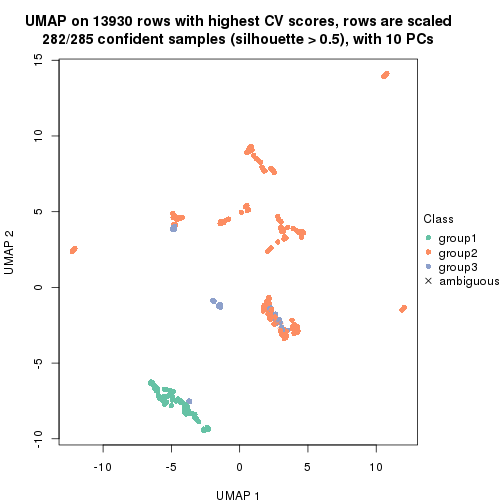</p>

</div>
<div id='tab-CV-mclust-dimension-reduction-3'>
<pre><code class="r">dimension_reduction(res, k = 4, method = &quot;UMAP&quot;)
</code></pre>

<p></p>

</div>
<div id='tab-CV-mclust-dimension-reduction-4'>
<pre><code class="r">dimension_reduction(res, k = 5, method = &quot;UMAP&quot;)
</code></pre>

<p></p>

</div>
<div id='tab-CV-mclust-dimension-reduction-5'>
<pre><code class="r">dimension_reduction(res, k = 6, method = &quot;UMAP&quot;)
</code></pre>

<p></p>

</div>
</div>


Following heatmap shows how subgroups are split when increasing `k`:

```r
collect_classes(res)
```


If matrix rows can be associated to genes, consider to use `GO_Enrichment(res,
...)` to perform function enrichment for the signature genes.


 

---------------------------------------------------


### CV:NMF**


The object with results only for a single top-value method and a single partition method 
can be extracted as:

```r
res = res_list["CV", "NMF"]
# you can also extract it by
# res = res_list["CV:NMF"]
```

A summary of `res` and all the functions that can be applied to it:

```r
res
```

```
#> A 'ConsensusPartition' object with k = 2, 3, 4, 5, 6.
#>   On a matrix with 13930 rows and 285 columns.
#>   Top rows (1000, 2000, 3000, 4000, 5000) are extracted by 'CV' method.
#>   Subgroups are detected by 'NMF' method.
#>   Performed in total 1250 partitions by row resampling.
#>   Best k for subgroups seems to be 2.
#> 
#> Following methods can be applied to this 'ConsensusPartition' object:
#>  [1] "cola_report"             "collect_classes"         "collect_plots"          
#>  [4] "collect_stats"           "colnames"                "compare_signatures"     
#>  [7] "consensus_heatmap"       "dimension_reduction"     "functional_enrichment"  
#> [10] "get_anno_col"            "get_anno"                "get_classes"            
#> [13] "get_consensus"           "get_matrix"              "get_membership"         
#> [16] "get_param"               "get_signatures"          "get_stats"              
#> [19] "is_best_k"               "is_stable_k"             "membership_heatmap"     
#> [22] "ncol"                    "nrow"                    "plot_ecdf"              
#> [25] "rownames"                "select_partition_number" "show"                   
#> [28] "suggest_best_k"          "test_to_known_factors"
```

`collect_plots()` function collects all the plots made from `res` for all `k` (number of partitions)
into one single page to provide an easy and fast comparison between different `k`.

```r
collect_plots(res)
```


The plots are:

- The first row: a plot of the ECDF (Empirical cumulative distribution
  function) curves of the consensus matrix for each `k` and the heatmap of
  predicted classes for each `k`.
- The second row: heatmaps of the consensus matrix for each `k`.
- The third row: heatmaps of the membership matrix for each `k`.
- The fouth row: heatmaps of the signatures for each `k`.

All the plots in panels can be made by individual functions and they are
plotted later in this section.

`select_partition_number()` produces several plots showing different
statistics for choosing "optimized" `k`. There are following statistics:

- ECDF curves of the consensus matrix for each `k`;
- 1-PAC. [The PAC
  score](https://en.wikipedia.org/wiki/Consensus_clustering#Over-interpretation_potential_of_consensus_clustering)
  measures the proportion of the ambiguous subgrouping.
- Mean silhouette score.
- Concordance. The mean probability of fiting the consensus class ids in all
  partitions.
- Area increased. Denote $A_k$ as the area under the ECDF curve for current
  `k`, the area increased is defined as $A_k - A_{k-1}$.
- Rand index. The percent of pairs of samples that are both in a same cluster
  or both are not in a same cluster in the partition of k and k-1.
- Jaccard index. The ratio of pairs of samples are both in a same cluster in
  the partition of k and k-1 and the pairs of samples are both in a same
  cluster in the partition k or k-1.

The detailed explanations of these statistics can be found in [the cola
vignette](http://bioconductor.org/packages/devel/bioc/vignettes/cola/inst/doc/cola.html#toc_13).

Generally speaking, lower PAC score, higher mean silhouette score or higher
concordance corresponds to better partition. Rand index and Jaccard index
measure how similar the current partition is compared to partition with `k-1`.
If they are too similar, we won't accept `k` is better than `k-1`.

```r
select_partition_number(res)
```


The numeric values for all these statistics can be obtained by `get_stats()`.

```r
get_stats(res)
```

```
#>   k 1-PAC mean_silhouette concordance area_increased  Rand Jaccard
#> 2 2 1.000           0.982       0.993         0.3835 0.614   0.614
#> 3 3 0.746           0.871       0.936         0.4836 0.822   0.711
#> 4 4 0.590           0.711       0.800         0.1898 0.863   0.703
#> 5 5 0.664           0.677       0.806         0.0951 0.833   0.557
#> 6 6 0.736           0.679       0.819         0.0463 0.913   0.677
```

`suggest_best_k()` suggests the best $k$ based on these statistics. The rules are as follows:

- All $k$ with Jaccard index larger than 0.95 are removed because the increase of
  the partition number does not provides enough extra information. If all $k$ are removed,
  the best $k$ is assigned by `NA`.
- For $k$ with 1-PAC larger than 0.9, the maximal $k$ is taken as the "best k". Other $k$ is called "optional k".
- If it does not fit the second rule. The $k$ with the highest vote of highest
  1-PAC, mean silhouette and concordance is taken as the "best k".

```r
suggest_best_k(res)
```

```
#> [1] 2
```


Following shows the table of the partitions (You need to click the **show/hide
code output** link to see it). The membership matrix (columns with name `p*`)
is inferred by
[`clue::cl_consensus()`](https://www.rdocumentation.org/link/cl_consensus?package=clue)
function with the `SE` method. Basically the value in the membership matrix
represents the probability to belong to a certain group. The finall class
label for an item is determined with the group with highest probability it
belongs to.

In `get_classes()` function, the entropy is calculated from the membership
matrix and the silhouette score is calculated from the consensus matrix.


<script>
$( function() {
	$( '#tabs-CV-NMF-get-classes' ).tabs();
} );
</script>
<div id='tabs-CV-NMF-get-classes'>
<ul>
<li><a href='#tab-CV-NMF-get-classes-1'>k = 2</a></li>
<li><a href='#tab-CV-NMF-get-classes-2'>k = 3</a></li>
<li><a href='#tab-CV-NMF-get-classes-3'>k = 4</a></li>
<li><a href='#tab-CV-NMF-get-classes-4'>k = 5</a></li>
<li><a href='#tab-CV-NMF-get-classes-5'>k = 6</a></li>
</ul>

<div id='tab-CV-NMF-get-classes-1'>
<p><a id='tab-CV-NMF-get-classes-1-a' style='color:#0366d6' href='#'>show/hide code output</a></p>
<pre><code class="r">cbind(get_classes(res, k = 2), get_membership(res, k = 2))
</code></pre>

<pre><code>#&gt;            class entropy silhouette    p1    p2
#&gt; SRR1201591     2  0.0000      0.997 0.000 1.000
#&gt; SRR1201590     2  0.0000      0.997 0.000 1.000
#&gt; SRR1201593     2  0.0000      0.997 0.000 1.000
#&gt; SRR1201592     2  0.0000      0.997 0.000 1.000
#&gt; SRR1201617     2  0.0000      0.997 0.000 1.000
#&gt; SRR1201616     2  0.0000      0.997 0.000 1.000
#&gt; SRR1201619     2  0.0000      0.997 0.000 1.000
#&gt; SRR1201618     2  0.0000      0.997 0.000 1.000
#&gt; SRR1201620     2  0.0000      0.997 0.000 1.000
#&gt; SRR1201621     2  0.0000      0.997 0.000 1.000
#&gt; SRR1201623     2  0.0000      0.997 0.000 1.000
#&gt; SRR1201622     2  0.0000      0.997 0.000 1.000
#&gt; SRR1201624     2  0.7528      0.716 0.216 0.784
#&gt; SRR1201625     2  0.0000      0.997 0.000 1.000
#&gt; SRR1201626     1  0.9686      0.357 0.604 0.396
#&gt; SRR1201627     2  0.0000      0.997 0.000 1.000
#&gt; SRR1201628     2  0.0000      0.997 0.000 1.000
#&gt; SRR1201629     2  0.0000      0.997 0.000 1.000
#&gt; SRR1201630     2  0.0000      0.997 0.000 1.000
#&gt; SRR1201631     2  0.0000      0.997 0.000 1.000
#&gt; SRR1201641     2  0.0000      0.997 0.000 1.000
#&gt; SRR1201640     2  0.0000      0.997 0.000 1.000
#&gt; SRR1201643     2  0.0000      0.997 0.000 1.000
#&gt; SRR1201644     2  0.0000      0.997 0.000 1.000
#&gt; SRR1201661     2  0.0000      0.997 0.000 1.000
#&gt; SRR1201662     2  0.0000      0.997 0.000 1.000
#&gt; SRR1201663     2  0.0000      0.997 0.000 1.000
#&gt; SRR1201664     2  0.0000      0.997 0.000 1.000
#&gt; SRR1201665     2  0.0000      0.997 0.000 1.000
#&gt; SRR1201666     2  0.0000      0.997 0.000 1.000
#&gt; SRR1201667     2  0.0000      0.997 0.000 1.000
#&gt; SRR1201668     2  0.0000      0.997 0.000 1.000
#&gt; SRR1201670     2  0.0000      0.997 0.000 1.000
#&gt; SRR1201669     2  0.0000      0.997 0.000 1.000
#&gt; SRR1201673     2  0.0000      0.997 0.000 1.000
#&gt; SRR1201672     2  0.0000      0.997 0.000 1.000
#&gt; SRR1201671     2  0.0000      0.997 0.000 1.000
#&gt; SRR1201677     2  0.0000      0.997 0.000 1.000
#&gt; SRR1201676     2  0.0000      0.997 0.000 1.000
#&gt; SRR1201675     2  0.0000      0.997 0.000 1.000
#&gt; SRR1201674     2  0.0000      0.997 0.000 1.000
#&gt; SRR1201678     2  0.0000      0.997 0.000 1.000
#&gt; SRR1201682     2  0.0000      0.997 0.000 1.000
#&gt; SRR1201683     2  0.0000      0.997 0.000 1.000
#&gt; SRR1201680     2  0.0000      0.997 0.000 1.000
#&gt; SRR1201681     2  0.0000      0.997 0.000 1.000
#&gt; SRR1201679     2  0.0000      0.997 0.000 1.000
#&gt; SRR1201686     2  0.0000      0.997 0.000 1.000
#&gt; SRR1201687     2  0.0000      0.997 0.000 1.000
#&gt; SRR1201688     2  0.0000      0.997 0.000 1.000
#&gt; SRR1201689     2  0.0000      0.997 0.000 1.000
#&gt; SRR1201685     2  0.0000      0.997 0.000 1.000
#&gt; SRR1201692     2  0.0000      0.997 0.000 1.000
#&gt; SRR1201691     2  0.0000      0.997 0.000 1.000
#&gt; SRR1201690     2  0.0000      0.997 0.000 1.000
#&gt; SRR1201696     2  0.0000      0.997 0.000 1.000
#&gt; SRR1201695     2  0.0000      0.997 0.000 1.000
#&gt; SRR1201694     2  0.0000      0.997 0.000 1.000
#&gt; SRR1201693     2  0.0000      0.997 0.000 1.000
#&gt; SRR1201697     2  0.0000      0.997 0.000 1.000
#&gt; SRR1201698     2  0.0000      0.997 0.000 1.000
#&gt; SRR1201700     2  0.0000      0.997 0.000 1.000
#&gt; SRR1201708     2  0.0000      0.997 0.000 1.000
#&gt; SRR1201707     2  0.0000      0.997 0.000 1.000
#&gt; SRR1201706     2  0.0000      0.997 0.000 1.000
#&gt; SRR1201702     2  0.0000      0.997 0.000 1.000
#&gt; SRR1201705     2  0.0000      0.997 0.000 1.000
#&gt; SRR1201701     2  0.0000      0.997 0.000 1.000
#&gt; SRR1201704     2  0.0000      0.997 0.000 1.000
#&gt; SRR1201703     2  0.0000      0.997 0.000 1.000
#&gt; SRR1201716     2  0.0000      0.997 0.000 1.000
#&gt; SRR1201715     2  0.0000      0.997 0.000 1.000
#&gt; SRR1201717     2  0.0000      0.997 0.000 1.000
#&gt; SRR1201712     2  0.0000      0.997 0.000 1.000
#&gt; SRR1201709     2  0.0000      0.997 0.000 1.000
#&gt; SRR1201711     2  0.0000      0.997 0.000 1.000
#&gt; SRR1201714     2  0.0000      0.997 0.000 1.000
#&gt; SRR1201713     2  0.0000      0.997 0.000 1.000
#&gt; SRR1201710     2  0.0000      0.997 0.000 1.000
#&gt; SRR1201719     2  0.0000      0.997 0.000 1.000
#&gt; SRR1201718     2  0.0000      0.997 0.000 1.000
#&gt; SRR1201721     2  0.0000      0.997 0.000 1.000
#&gt; SRR1201720     2  0.0000      0.997 0.000 1.000
#&gt; SRR1201723     2  0.0000      0.997 0.000 1.000
#&gt; SRR1201722     2  0.0000      0.997 0.000 1.000
#&gt; SRR1201725     2  0.0000      0.997 0.000 1.000
#&gt; SRR1201724     2  0.0000      0.997 0.000 1.000
#&gt; SRR1201726     2  0.0000      0.997 0.000 1.000
#&gt; SRR1201727     2  0.0000      0.997 0.000 1.000
#&gt; SRR1201731     2  0.0000      0.997 0.000 1.000
#&gt; SRR1201730     2  0.0000      0.997 0.000 1.000
#&gt; SRR1201734     2  0.0000      0.997 0.000 1.000
#&gt; SRR1201733     2  0.0000      0.997 0.000 1.000
#&gt; SRR1201736     2  0.0000      0.997 0.000 1.000
#&gt; SRR1201737     2  0.0000      0.997 0.000 1.000
#&gt; SRR1201739     2  0.0000      0.997 0.000 1.000
#&gt; SRR1201738     2  0.0000      0.997 0.000 1.000
#&gt; SRR1201742     2  0.0000      0.997 0.000 1.000
#&gt; SRR1201743     2  0.0000      0.997 0.000 1.000
#&gt; SRR1201745     2  0.0000      0.997 0.000 1.000
#&gt; SRR1201744     2  0.0000      0.997 0.000 1.000
#&gt; SRR1201749     2  0.0000      0.997 0.000 1.000
#&gt; SRR1201750     2  0.0000      0.997 0.000 1.000
#&gt; SRR1201752     2  0.0000      0.997 0.000 1.000
#&gt; SRR1201751     2  0.0000      0.997 0.000 1.000
#&gt; SRR1201754     2  0.0000      0.997 0.000 1.000
#&gt; SRR1201753     2  0.0000      0.997 0.000 1.000
#&gt; SRR1201758     2  0.0000      0.997 0.000 1.000
#&gt; SRR1201759     2  0.0000      0.997 0.000 1.000
#&gt; SRR1201760     2  0.0000      0.997 0.000 1.000
#&gt; SRR1201761     2  0.0000      0.997 0.000 1.000
#&gt; SRR1201763     2  0.0000      0.997 0.000 1.000
#&gt; SRR1201762     1  0.9998      0.050 0.508 0.492
#&gt; SRR1201764     2  0.0672      0.989 0.008 0.992
#&gt; SRR1201766     2  0.0000      0.997 0.000 1.000
#&gt; SRR1201768     2  0.0000      0.997 0.000 1.000
#&gt; SRR1201769     2  0.0000      0.997 0.000 1.000
#&gt; SRR1201767     2  0.0000      0.997 0.000 1.000
#&gt; SRR1201770     2  0.0000      0.997 0.000 1.000
#&gt; SRR1201771     2  0.0000      0.997 0.000 1.000
#&gt; SRR1201772     2  0.0000      0.997 0.000 1.000
#&gt; SRR1201773     2  0.0000      0.997 0.000 1.000
#&gt; SRR1201774     2  0.0000      0.997 0.000 1.000
#&gt; SRR1201786     2  0.0000      0.997 0.000 1.000
#&gt; SRR1201784     2  0.0000      0.997 0.000 1.000
#&gt; SRR1201785     2  0.0000      0.997 0.000 1.000
#&gt; SRR1201778     2  0.0000      0.997 0.000 1.000
#&gt; SRR1201779     2  0.0000      0.997 0.000 1.000
#&gt; SRR1201781     2  0.0000      0.997 0.000 1.000
#&gt; SRR1201780     2  0.0000      0.997 0.000 1.000
#&gt; SRR1201783     2  0.0000      0.997 0.000 1.000
#&gt; SRR1201782     2  0.0000      0.997 0.000 1.000
#&gt; SRR1201798     2  0.0000      0.997 0.000 1.000
#&gt; SRR1201797     2  0.0000      0.997 0.000 1.000
#&gt; SRR1201796     2  0.0000      0.997 0.000 1.000
#&gt; SRR1201795     2  0.0000      0.997 0.000 1.000
#&gt; SRR1201799     2  0.0000      0.997 0.000 1.000
#&gt; SRR1201794     2  0.0000      0.997 0.000 1.000
#&gt; SRR1201793     2  0.0000      0.997 0.000 1.000
#&gt; SRR1201792     2  0.0000      0.997 0.000 1.000
#&gt; SRR1201791     2  0.0000      0.997 0.000 1.000
#&gt; SRR1201807     2  0.0000      0.997 0.000 1.000
#&gt; SRR1201808     2  0.0000      0.997 0.000 1.000
#&gt; SRR1201803     2  0.0000      0.997 0.000 1.000
#&gt; SRR1201804     2  0.0000      0.997 0.000 1.000
#&gt; SRR1201805     2  0.0000      0.997 0.000 1.000
#&gt; SRR1201806     2  0.0000      0.997 0.000 1.000
#&gt; SRR1201801     2  0.0000      0.997 0.000 1.000
#&gt; SRR1201802     2  0.0000      0.997 0.000 1.000
#&gt; SRR1201800     2  0.0000      0.997 0.000 1.000
#&gt; SRR1201814     2  0.0000      0.997 0.000 1.000
#&gt; SRR1201816     2  0.0000      0.997 0.000 1.000
#&gt; SRR1201815     2  0.0000      0.997 0.000 1.000
#&gt; SRR1201819     2  0.0000      0.997 0.000 1.000
#&gt; SRR1201820     2  0.0000      0.997 0.000 1.000
#&gt; SRR1201813     2  0.0000      0.997 0.000 1.000
#&gt; SRR1201817     2  0.0000      0.997 0.000 1.000
#&gt; SRR1201818     2  0.0000      0.997 0.000 1.000
#&gt; SRR1201825     2  0.0000      0.997 0.000 1.000
#&gt; SRR1201827     2  0.0000      0.997 0.000 1.000
#&gt; SRR1201828     2  0.0000      0.997 0.000 1.000
#&gt; SRR1201826     2  0.0000      0.997 0.000 1.000
#&gt; SRR1201829     2  0.0000      0.997 0.000 1.000
#&gt; SRR1201830     2  0.0000      0.997 0.000 1.000
#&gt; SRR1201831     2  0.0000      0.997 0.000 1.000
#&gt; SRR1201832     2  0.0000      0.997 0.000 1.000
#&gt; SRR1201833     2  0.0000      0.997 0.000 1.000
#&gt; SRR1201865     2  0.0000      0.997 0.000 1.000
#&gt; SRR1201866     2  0.0000      0.997 0.000 1.000
#&gt; SRR1201867     2  0.0000      0.997 0.000 1.000
#&gt; SRR1201861     2  0.0000      0.997 0.000 1.000
#&gt; SRR1201862     2  0.0000      0.997 0.000 1.000
#&gt; SRR1201863     2  0.0000      0.997 0.000 1.000
#&gt; SRR1201859     2  0.0000      0.997 0.000 1.000
#&gt; SRR1201864     2  0.0000      0.997 0.000 1.000
#&gt; SRR1201860     2  0.0000      0.997 0.000 1.000
#&gt; SRR1201873     2  0.0000      0.997 0.000 1.000
#&gt; SRR1201871     2  0.0000      0.997 0.000 1.000
#&gt; SRR1201872     2  0.0000      0.997 0.000 1.000
#&gt; SRR1201980     2  0.0000      0.997 0.000 1.000
#&gt; SRR1201979     2  0.0000      0.997 0.000 1.000
#&gt; SRR1201982     2  0.0000      0.997 0.000 1.000
#&gt; SRR1201981     2  0.0000      0.997 0.000 1.000
#&gt; SRR1201998     2  0.0000      0.997 0.000 1.000
#&gt; SRR1201996     2  0.0000      0.997 0.000 1.000
#&gt; SRR1201997     2  0.0000      0.997 0.000 1.000
#&gt; SRR1202005     2  0.0000      0.997 0.000 1.000
#&gt; SRR1202006     2  0.0000      0.997 0.000 1.000
#&gt; SRR1202088     2  0.0000      0.997 0.000 1.000
#&gt; SRR1202087     2  0.0000      0.997 0.000 1.000
#&gt; SRR1202093     2  0.0000      0.997 0.000 1.000
#&gt; SRR1202092     2  0.0000      0.997 0.000 1.000
#&gt; SRR1202288     2  0.0000      0.997 0.000 1.000
#&gt; SRR1202289     2  0.0000      0.997 0.000 1.000
#&gt; SRR1202299     2  0.0000      0.997 0.000 1.000
#&gt; SRR1202298     2  0.0000      0.997 0.000 1.000
#&gt; SRR1202303     2  0.0000      0.997 0.000 1.000
#&gt; SRR1202372     2  0.0000      0.997 0.000 1.000
#&gt; SRR1202371     2  0.0000      0.997 0.000 1.000
#&gt; SRR1202563     2  0.0000      0.997 0.000 1.000
#&gt; SRR1202565     2  0.0000      0.997 0.000 1.000
#&gt; SRR1202564     2  0.0000      0.997 0.000 1.000
#&gt; SRR1202649     2  0.0000      0.997 0.000 1.000
#&gt; SRR1202650     2  0.0000      0.997 0.000 1.000
#&gt; SRR1202651     2  0.0000      0.997 0.000 1.000
#&gt; SRR1202843     1  0.0000      0.981 1.000 0.000
#&gt; SRR1202844     1  0.0000      0.981 1.000 0.000
#&gt; SRR1202845     2  0.0000      0.997 0.000 1.000
#&gt; SRR1202847     2  0.0000      0.997 0.000 1.000
#&gt; SRR1202846     2  0.0000      0.997 0.000 1.000
#&gt; SRR1202945     1  0.0000      0.981 1.000 0.000
#&gt; SRR1202949     1  0.0000      0.981 1.000 0.000
#&gt; SRR1202977     1  0.0000      0.981 1.000 0.000
#&gt; SRR1202978     1  0.0000      0.981 1.000 0.000
#&gt; SRR1202979     1  0.0000      0.981 1.000 0.000
#&gt; SRR1202990     1  0.0000      0.981 1.000 0.000
#&gt; SRR1202999     1  0.0000      0.981 1.000 0.000
#&gt; SRR1203005     1  0.0000      0.981 1.000 0.000
#&gt; SRR1203006     1  0.0000      0.981 1.000 0.000
#&gt; SRR1203007     1  0.0000      0.981 1.000 0.000
#&gt; SRR1203009     1  0.2778      0.935 0.952 0.048
#&gt; SRR1203008     1  0.3114      0.927 0.944 0.056
#&gt; SRR1203010     1  0.0000      0.981 1.000 0.000
#&gt; SRR1203011     1  0.0000      0.981 1.000 0.000
#&gt; SRR1203025     1  0.0000      0.981 1.000 0.000
#&gt; SRR1203026     1  0.0000      0.981 1.000 0.000
#&gt; SRR1203027     1  0.0000      0.981 1.000 0.000
#&gt; SRR1203061     1  0.0000      0.981 1.000 0.000
#&gt; SRR1203089     1  0.0000      0.981 1.000 0.000
#&gt; SRR1203125     1  0.0000      0.981 1.000 0.000
#&gt; SRR1203128     1  0.0000      0.981 1.000 0.000
#&gt; SRR1203129     1  0.0000      0.981 1.000 0.000
#&gt; SRR1203130     1  0.0000      0.981 1.000 0.000
#&gt; SRR1203132     2  0.0000      0.997 0.000 1.000
#&gt; SRR1203131     2  0.0000      0.997 0.000 1.000
#&gt; SRR1203133     1  0.0000      0.981 1.000 0.000
#&gt; SRR1203138     1  0.0000      0.981 1.000 0.000
#&gt; SRR1203760     1  0.0000      0.981 1.000 0.000
#&gt; SRR1203761     1  0.0000      0.981 1.000 0.000
#&gt; SRR1203770     1  0.0000      0.981 1.000 0.000
#&gt; SRR1203771     1  0.0000      0.981 1.000 0.000
#&gt; SRR1203772     1  0.0000      0.981 1.000 0.000
#&gt; SRR1203773     1  0.0000      0.981 1.000 0.000
#&gt; SRR1203774     1  0.0000      0.981 1.000 0.000
#&gt; SRR1203775     1  0.0000      0.981 1.000 0.000
#&gt; SRR1203800     1  0.0000      0.981 1.000 0.000
#&gt; SRR1203801     1  0.0000      0.981 1.000 0.000
#&gt; SRR1203802     1  0.0000      0.981 1.000 0.000
#&gt; SRR1203803     1  0.0000      0.981 1.000 0.000
#&gt; SRR1203804     1  0.0000      0.981 1.000 0.000
#&gt; SRR1203805     1  0.0000      0.981 1.000 0.000
#&gt; SRR1203806     1  0.0000      0.981 1.000 0.000
#&gt; SRR1203807     1  0.0000      0.981 1.000 0.000
#&gt; SRR1203808     1  0.0000      0.981 1.000 0.000
#&gt; SRR1203811     1  0.0000      0.981 1.000 0.000
#&gt; SRR1203812     1  0.0000      0.981 1.000 0.000
#&gt; SRR1203813     1  0.0000      0.981 1.000 0.000
#&gt; SRR1203814     1  0.0000      0.981 1.000 0.000
#&gt; SRR1203815     1  0.0000      0.981 1.000 0.000
#&gt; SRR1203816     1  0.0000      0.981 1.000 0.000
#&gt; SRR1203817     1  0.0000      0.981 1.000 0.000
#&gt; SRR1203818     1  0.0000      0.981 1.000 0.000
#&gt; SRR1203819     1  0.0000      0.981 1.000 0.000
#&gt; SRR1203822     1  0.0000      0.981 1.000 0.000
#&gt; SRR1203823     1  0.0000      0.981 1.000 0.000
#&gt; SRR1203824     1  0.0000      0.981 1.000 0.000
#&gt; SRR1203825     1  0.0000      0.981 1.000 0.000
#&gt; SRR1203826     1  0.0000      0.981 1.000 0.000
#&gt; SRR1203827     2  0.9358      0.440 0.352 0.648
#&gt; SRR1203828     1  0.0000      0.981 1.000 0.000
#&gt; SRR1203829     1  0.0000      0.981 1.000 0.000
#&gt; SRR1203830     1  0.0000      0.981 1.000 0.000
#&gt; SRR1203831     1  0.0000      0.981 1.000 0.000
#&gt; SRR1203832     1  0.0000      0.981 1.000 0.000
#&gt; SRR1203833     1  0.0000      0.981 1.000 0.000
#&gt; SRR1203834     1  0.0000      0.981 1.000 0.000
#&gt; SRR1203835     1  0.0000      0.981 1.000 0.000
#&gt; SRR1203836     1  0.0000      0.981 1.000 0.000
#&gt; SRR1203837     1  0.0000      0.981 1.000 0.000
#&gt; SRR1203838     1  0.0000      0.981 1.000 0.000
#&gt; SRR1203839     1  0.0000      0.981 1.000 0.000
#&gt; SRR1203842     1  0.9710      0.347 0.600 0.400
#&gt; SRR1203843     1  0.0000      0.981 1.000 0.000
#&gt; SRR1203845     2  0.0000      0.997 0.000 1.000
#&gt; SRR1203844     2  0.0000      0.997 0.000 1.000
</code></pre>

<script>
$('#tab-CV-NMF-get-classes-1-a').parent().next().next().hide();
$('#tab-CV-NMF-get-classes-1-a').click(function(){
  $('#tab-CV-NMF-get-classes-1-a').parent().next().next().toggle();
  return(false);
});
</script>
</div>

<div id='tab-CV-NMF-get-classes-2'>
<p><a id='tab-CV-NMF-get-classes-2-a' style='color:#0366d6' href='#'>show/hide code output</a></p>
<pre><code class="r">cbind(get_classes(res, k = 3), get_membership(res, k = 3))
</code></pre>

<pre><code>#&gt;            class entropy silhouette    p1    p2    p3
#&gt; SRR1201591     2  0.0000     0.9151 0.000 1.000 0.000
#&gt; SRR1201590     2  0.0000     0.9151 0.000 1.000 0.000
#&gt; SRR1201593     2  0.0000     0.9151 0.000 1.000 0.000
#&gt; SRR1201592     2  0.0000     0.9151 0.000 1.000 0.000
#&gt; SRR1201617     2  0.0000     0.9151 0.000 1.000 0.000
#&gt; SRR1201616     2  0.0000     0.9151 0.000 1.000 0.000
#&gt; SRR1201619     2  0.0000     0.9151 0.000 1.000 0.000
#&gt; SRR1201618     2  0.0000     0.9151 0.000 1.000 0.000
#&gt; SRR1201620     2  0.0000     0.9151 0.000 1.000 0.000
#&gt; SRR1201621     2  0.0000     0.9151 0.000 1.000 0.000
#&gt; SRR1201623     2  0.3340     0.8496 0.000 0.880 0.120
#&gt; SRR1201622     2  0.4452     0.7889 0.000 0.808 0.192
#&gt; SRR1201624     3  0.3412     0.7003 0.124 0.000 0.876
#&gt; SRR1201625     3  0.0000     0.8328 0.000 0.000 1.000
#&gt; SRR1201626     3  0.4291     0.6245 0.180 0.000 0.820
#&gt; SRR1201627     3  0.0000     0.8328 0.000 0.000 1.000
#&gt; SRR1201628     2  0.4504     0.7848 0.000 0.804 0.196
#&gt; SRR1201629     2  0.4796     0.7499 0.000 0.780 0.220
#&gt; SRR1201630     2  0.0000     0.9151 0.000 1.000 0.000
#&gt; SRR1201631     2  0.0424     0.9130 0.000 0.992 0.008
#&gt; SRR1201641     2  0.1031     0.9072 0.000 0.976 0.024
#&gt; SRR1201640     2  0.0000     0.9151 0.000 1.000 0.000
#&gt; SRR1201643     2  0.4235     0.8050 0.000 0.824 0.176
#&gt; SRR1201644     2  0.3267     0.8526 0.000 0.884 0.116
#&gt; SRR1201661     2  0.1643     0.8980 0.000 0.956 0.044
#&gt; SRR1201662     2  0.1163     0.9054 0.000 0.972 0.028
#&gt; SRR1201663     2  0.6111     0.3988 0.000 0.604 0.396
#&gt; SRR1201664     3  0.2625     0.8423 0.000 0.084 0.916
#&gt; SRR1201665     2  0.0000     0.9151 0.000 1.000 0.000
#&gt; SRR1201666     2  0.0000     0.9151 0.000 1.000 0.000
#&gt; SRR1201667     2  0.0000     0.9151 0.000 1.000 0.000
#&gt; SRR1201668     2  0.3192     0.8565 0.000 0.888 0.112
#&gt; SRR1201670     3  0.2261     0.8420 0.000 0.068 0.932
#&gt; SRR1201669     3  0.2796     0.8419 0.000 0.092 0.908
#&gt; SRR1201673     2  0.1163     0.9026 0.000 0.972 0.028
#&gt; SRR1201672     2  0.0892     0.9073 0.000 0.980 0.020
#&gt; SRR1201671     2  0.0592     0.9119 0.000 0.988 0.012
#&gt; SRR1201677     2  0.1163     0.9026 0.000 0.972 0.028
#&gt; SRR1201676     2  0.1031     0.9050 0.000 0.976 0.024
#&gt; SRR1201675     2  0.1031     0.9050 0.000 0.976 0.024
#&gt; SRR1201674     2  0.0892     0.9073 0.000 0.980 0.020
#&gt; SRR1201678     2  0.0747     0.9094 0.000 0.984 0.016
#&gt; SRR1201682     2  0.0000     0.9151 0.000 1.000 0.000
#&gt; SRR1201683     2  0.0000     0.9151 0.000 1.000 0.000
#&gt; SRR1201680     2  0.0000     0.9151 0.000 1.000 0.000
#&gt; SRR1201681     2  0.0000     0.9151 0.000 1.000 0.000
#&gt; SRR1201679     2  0.0000     0.9151 0.000 1.000 0.000
#&gt; SRR1201686     3  0.0237     0.8348 0.000 0.004 0.996
#&gt; SRR1201687     3  0.0237     0.8348 0.000 0.004 0.996
#&gt; SRR1201688     3  0.0237     0.8348 0.000 0.004 0.996
#&gt; SRR1201689     3  0.0237     0.8348 0.000 0.004 0.996
#&gt; SRR1201685     2  0.6126     0.3900 0.000 0.600 0.400
#&gt; SRR1201692     2  0.5591     0.6127 0.000 0.696 0.304
#&gt; SRR1201691     2  0.5291     0.6784 0.000 0.732 0.268
#&gt; SRR1201690     2  0.4654     0.7707 0.000 0.792 0.208
#&gt; SRR1201696     2  0.5058     0.7167 0.000 0.756 0.244
#&gt; SRR1201695     2  0.5497     0.6349 0.000 0.708 0.292
#&gt; SRR1201694     2  0.5058     0.7160 0.000 0.756 0.244
#&gt; SRR1201693     2  0.5560     0.6225 0.000 0.700 0.300
#&gt; SRR1201697     2  0.5650     0.5951 0.000 0.688 0.312
#&gt; SRR1201698     2  0.4931     0.7337 0.000 0.768 0.232
#&gt; SRR1201700     2  0.4178     0.8084 0.000 0.828 0.172
#&gt; SRR1201708     3  0.4399     0.8074 0.000 0.188 0.812
#&gt; SRR1201707     3  0.4291     0.8143 0.000 0.180 0.820
#&gt; SRR1201706     3  0.4235     0.8175 0.000 0.176 0.824
#&gt; SRR1201702     3  0.4178     0.8200 0.000 0.172 0.828
#&gt; SRR1201705     3  0.4235     0.8175 0.000 0.176 0.824
#&gt; SRR1201701     3  0.4121     0.8222 0.000 0.168 0.832
#&gt; SRR1201704     3  0.4178     0.8202 0.000 0.172 0.828
#&gt; SRR1201703     3  0.4121     0.8222 0.000 0.168 0.832
#&gt; SRR1201716     3  0.4931     0.7550 0.000 0.232 0.768
#&gt; SRR1201715     3  0.4842     0.7664 0.000 0.224 0.776
#&gt; SRR1201717     3  0.4887     0.7602 0.000 0.228 0.772
#&gt; SRR1201712     3  0.5138     0.7246 0.000 0.252 0.748
#&gt; SRR1201709     2  0.5650     0.6045 0.000 0.688 0.312
#&gt; SRR1201711     3  0.4931     0.7565 0.000 0.232 0.768
#&gt; SRR1201714     3  0.5138     0.7246 0.000 0.252 0.748
#&gt; SRR1201713     3  0.4974     0.7494 0.000 0.236 0.764
#&gt; SRR1201710     3  0.5178     0.7177 0.000 0.256 0.744
#&gt; SRR1201719     2  0.1289     0.9036 0.000 0.968 0.032
#&gt; SRR1201718     2  0.0892     0.9090 0.000 0.980 0.020
#&gt; SRR1201721     3  0.6286     0.1637 0.000 0.464 0.536
#&gt; SRR1201720     2  0.4504     0.7848 0.000 0.804 0.196
#&gt; SRR1201723     3  0.0237     0.8348 0.000 0.004 0.996
#&gt; SRR1201722     2  0.6111     0.3988 0.000 0.604 0.396
#&gt; SRR1201725     2  0.2796     0.8734 0.000 0.908 0.092
#&gt; SRR1201724     2  0.3941     0.8229 0.000 0.844 0.156
#&gt; SRR1201726     2  0.3619     0.8395 0.000 0.864 0.136
#&gt; SRR1201727     3  0.1163     0.8387 0.000 0.028 0.972
#&gt; SRR1201731     3  0.4931     0.7635 0.000 0.232 0.768
#&gt; SRR1201730     2  0.3752     0.8313 0.000 0.856 0.144
#&gt; SRR1201734     2  0.0000     0.9151 0.000 1.000 0.000
#&gt; SRR1201733     2  0.0000     0.9151 0.000 1.000 0.000
#&gt; SRR1201736     2  0.0000     0.9151 0.000 1.000 0.000
#&gt; SRR1201737     2  0.0000     0.9151 0.000 1.000 0.000
#&gt; SRR1201739     2  0.0000     0.9151 0.000 1.000 0.000
#&gt; SRR1201738     2  0.0000     0.9151 0.000 1.000 0.000
#&gt; SRR1201742     2  0.0000     0.9151 0.000 1.000 0.000
#&gt; SRR1201743     2  0.0000     0.9151 0.000 1.000 0.000
#&gt; SRR1201745     2  0.0000     0.9151 0.000 1.000 0.000
#&gt; SRR1201744     2  0.0000     0.9151 0.000 1.000 0.000
#&gt; SRR1201749     2  0.0000     0.9151 0.000 1.000 0.000
#&gt; SRR1201750     2  0.0000     0.9151 0.000 1.000 0.000
#&gt; SRR1201752     2  0.3686     0.8358 0.000 0.860 0.140
#&gt; SRR1201751     2  0.4504     0.7848 0.000 0.804 0.196
#&gt; SRR1201754     2  0.0000     0.9151 0.000 1.000 0.000
#&gt; SRR1201753     2  0.1860     0.8943 0.000 0.948 0.052
#&gt; SRR1201758     2  0.6305     0.0808 0.000 0.516 0.484
#&gt; SRR1201759     3  0.0237     0.8348 0.000 0.004 0.996
#&gt; SRR1201760     2  0.3941     0.8229 0.000 0.844 0.156
#&gt; SRR1201761     2  0.5016     0.7226 0.000 0.760 0.240
#&gt; SRR1201763     3  0.0000     0.8328 0.000 0.000 1.000
#&gt; SRR1201762     3  0.4504     0.6018 0.196 0.000 0.804
#&gt; SRR1201764     3  0.6225     0.2616 0.000 0.432 0.568
#&gt; SRR1201766     2  0.0000     0.9151 0.000 1.000 0.000
#&gt; SRR1201768     2  0.0000     0.9151 0.000 1.000 0.000
#&gt; SRR1201769     2  0.0000     0.9151 0.000 1.000 0.000
#&gt; SRR1201767     2  0.0000     0.9151 0.000 1.000 0.000
#&gt; SRR1201770     2  0.0000     0.9151 0.000 1.000 0.000
#&gt; SRR1201771     2  0.0000     0.9151 0.000 1.000 0.000
#&gt; SRR1201772     2  0.0000     0.9151 0.000 1.000 0.000
#&gt; SRR1201773     2  0.0000     0.9151 0.000 1.000 0.000
#&gt; SRR1201774     2  0.0000     0.9151 0.000 1.000 0.000
#&gt; SRR1201786     2  0.0000     0.9151 0.000 1.000 0.000
#&gt; SRR1201784     2  0.0000     0.9151 0.000 1.000 0.000
#&gt; SRR1201785     2  0.0000     0.9151 0.000 1.000 0.000
#&gt; SRR1201778     2  0.0000     0.9151 0.000 1.000 0.000
#&gt; SRR1201779     2  0.0000     0.9151 0.000 1.000 0.000
#&gt; SRR1201781     2  0.0000     0.9151 0.000 1.000 0.000
#&gt; SRR1201780     2  0.0000     0.9151 0.000 1.000 0.000
#&gt; SRR1201783     2  0.0000     0.9151 0.000 1.000 0.000
#&gt; SRR1201782     2  0.0000     0.9151 0.000 1.000 0.000
#&gt; SRR1201798     2  0.0000     0.9151 0.000 1.000 0.000
#&gt; SRR1201797     2  0.0000     0.9151 0.000 1.000 0.000
#&gt; SRR1201796     2  0.0000     0.9151 0.000 1.000 0.000
#&gt; SRR1201795     2  0.0000     0.9151 0.000 1.000 0.000
#&gt; SRR1201799     2  0.0000     0.9151 0.000 1.000 0.000
#&gt; SRR1201794     2  0.0000     0.9151 0.000 1.000 0.000
#&gt; SRR1201793     2  0.0000     0.9151 0.000 1.000 0.000
#&gt; SRR1201792     2  0.0000     0.9151 0.000 1.000 0.000
#&gt; SRR1201791     2  0.0000     0.9151 0.000 1.000 0.000
#&gt; SRR1201807     2  0.0000     0.9151 0.000 1.000 0.000
#&gt; SRR1201808     2  0.0000     0.9151 0.000 1.000 0.000
#&gt; SRR1201803     2  0.0000     0.9151 0.000 1.000 0.000
#&gt; SRR1201804     2  0.0000     0.9151 0.000 1.000 0.000
#&gt; SRR1201805     2  0.0000     0.9151 0.000 1.000 0.000
#&gt; SRR1201806     2  0.0000     0.9151 0.000 1.000 0.000
#&gt; SRR1201801     2  0.0000     0.9151 0.000 1.000 0.000
#&gt; SRR1201802     2  0.0000     0.9151 0.000 1.000 0.000
#&gt; SRR1201800     2  0.0000     0.9151 0.000 1.000 0.000
#&gt; SRR1201814     2  0.0000     0.9151 0.000 1.000 0.000
#&gt; SRR1201816     2  0.0000     0.9151 0.000 1.000 0.000
#&gt; SRR1201815     2  0.0000     0.9151 0.000 1.000 0.000
#&gt; SRR1201819     2  0.0000     0.9151 0.000 1.000 0.000
#&gt; SRR1201820     2  0.0000     0.9151 0.000 1.000 0.000
#&gt; SRR1201813     2  0.0000     0.9151 0.000 1.000 0.000
#&gt; SRR1201817     2  0.0000     0.9151 0.000 1.000 0.000
#&gt; SRR1201818     2  0.0000     0.9151 0.000 1.000 0.000
#&gt; SRR1201825     2  0.4504     0.7848 0.000 0.804 0.196
#&gt; SRR1201827     3  0.0000     0.8328 0.000 0.000 1.000
#&gt; SRR1201828     3  0.0000     0.8328 0.000 0.000 1.000
#&gt; SRR1201826     2  0.5760     0.5733 0.000 0.672 0.328
#&gt; SRR1201829     3  0.0000     0.8328 0.000 0.000 1.000
#&gt; SRR1201830     3  0.0000     0.8328 0.000 0.000 1.000
#&gt; SRR1201831     3  0.0000     0.8328 0.000 0.000 1.000
#&gt; SRR1201832     3  0.0000     0.8328 0.000 0.000 1.000
#&gt; SRR1201833     3  0.0000     0.8328 0.000 0.000 1.000
#&gt; SRR1201865     2  0.4002     0.8174 0.000 0.840 0.160
#&gt; SRR1201866     2  0.4002     0.8174 0.000 0.840 0.160
#&gt; SRR1201867     2  0.4062     0.8139 0.000 0.836 0.164
#&gt; SRR1201861     2  0.4062     0.8139 0.000 0.836 0.164
#&gt; SRR1201862     2  0.4062     0.8139 0.000 0.836 0.164
#&gt; SRR1201863     2  0.4002     0.8174 0.000 0.840 0.160
#&gt; SRR1201859     2  0.0592     0.9123 0.000 0.988 0.012
#&gt; SRR1201864     2  0.4178     0.8073 0.000 0.828 0.172
#&gt; SRR1201860     2  0.4235     0.8041 0.000 0.824 0.176
#&gt; SRR1201873     2  0.5968     0.4845 0.000 0.636 0.364
#&gt; SRR1201871     2  0.4399     0.7938 0.000 0.812 0.188
#&gt; SRR1201872     2  0.6062     0.4344 0.000 0.616 0.384
#&gt; SRR1201980     2  0.5363     0.6647 0.000 0.724 0.276
#&gt; SRR1201979     2  0.2165     0.8880 0.000 0.936 0.064
#&gt; SRR1201982     2  0.4796     0.7502 0.000 0.780 0.220
#&gt; SRR1201981     2  0.4178     0.8083 0.000 0.828 0.172
#&gt; SRR1201998     2  0.2356     0.8823 0.000 0.928 0.072
#&gt; SRR1201996     2  0.0892     0.9089 0.000 0.980 0.020
#&gt; SRR1201997     2  0.2066     0.8894 0.000 0.940 0.060
#&gt; SRR1202005     2  0.0237     0.9141 0.000 0.996 0.004
#&gt; SRR1202006     2  0.0424     0.9130 0.000 0.992 0.008
#&gt; SRR1202088     2  0.0000     0.9151 0.000 1.000 0.000
#&gt; SRR1202087     2  0.0592     0.9123 0.000 0.988 0.012
#&gt; SRR1202093     2  0.0000     0.9151 0.000 1.000 0.000
#&gt; SRR1202092     2  0.0000     0.9151 0.000 1.000 0.000
#&gt; SRR1202288     2  0.0000     0.9151 0.000 1.000 0.000
#&gt; SRR1202289     2  0.0000     0.9151 0.000 1.000 0.000
#&gt; SRR1202299     2  0.0000     0.9151 0.000 1.000 0.000
#&gt; SRR1202298     2  0.0000     0.9151 0.000 1.000 0.000
#&gt; SRR1202303     3  0.0000     0.8328 0.000 0.000 1.000
#&gt; SRR1202372     2  0.0000     0.9151 0.000 1.000 0.000
#&gt; SRR1202371     2  0.0000     0.9151 0.000 1.000 0.000
#&gt; SRR1202563     2  0.2959     0.8678 0.000 0.900 0.100
#&gt; SRR1202565     2  0.0237     0.9140 0.000 0.996 0.004
#&gt; SRR1202564     2  0.0237     0.9140 0.000 0.996 0.004
#&gt; SRR1202649     2  0.1964     0.8934 0.000 0.944 0.056
#&gt; SRR1202650     2  0.0000     0.9151 0.000 1.000 0.000
#&gt; SRR1202651     2  0.0000     0.9151 0.000 1.000 0.000
#&gt; SRR1202843     1  0.0000     0.9894 1.000 0.000 0.000
#&gt; SRR1202844     1  0.0000     0.9894 1.000 0.000 0.000
#&gt; SRR1202845     2  0.3116     0.8592 0.000 0.892 0.108
#&gt; SRR1202847     2  0.2066     0.8894 0.000 0.940 0.060
#&gt; SRR1202846     2  0.2165     0.8871 0.000 0.936 0.064
#&gt; SRR1202945     1  0.0000     0.9894 1.000 0.000 0.000
#&gt; SRR1202949     1  0.0000     0.9894 1.000 0.000 0.000
#&gt; SRR1202977     1  0.0000     0.9894 1.000 0.000 0.000
#&gt; SRR1202978     1  0.0000     0.9894 1.000 0.000 0.000
#&gt; SRR1202979     1  0.0000     0.9894 1.000 0.000 0.000
#&gt; SRR1202990     1  0.0000     0.9894 1.000 0.000 0.000
#&gt; SRR1202999     1  0.0000     0.9894 1.000 0.000 0.000
#&gt; SRR1203005     1  0.0000     0.9894 1.000 0.000 0.000
#&gt; SRR1203006     1  0.0000     0.9894 1.000 0.000 0.000
#&gt; SRR1203007     1  0.0000     0.9894 1.000 0.000 0.000
#&gt; SRR1203009     1  0.1636     0.9512 0.964 0.016 0.020
#&gt; SRR1203008     1  0.2926     0.9081 0.924 0.040 0.036
#&gt; SRR1203010     1  0.0000     0.9894 1.000 0.000 0.000
#&gt; SRR1203011     1  0.0000     0.9894 1.000 0.000 0.000
#&gt; SRR1203025     1  0.0000     0.9894 1.000 0.000 0.000
#&gt; SRR1203026     1  0.0000     0.9894 1.000 0.000 0.000
#&gt; SRR1203027     1  0.0000     0.9894 1.000 0.000 0.000
#&gt; SRR1203061     1  0.0000     0.9894 1.000 0.000 0.000
#&gt; SRR1203089     1  0.0000     0.9894 1.000 0.000 0.000
#&gt; SRR1203125     1  0.0000     0.9894 1.000 0.000 0.000
#&gt; SRR1203128     1  0.0000     0.9894 1.000 0.000 0.000
#&gt; SRR1203129     1  0.0000     0.9894 1.000 0.000 0.000
#&gt; SRR1203130     1  0.0000     0.9894 1.000 0.000 0.000
#&gt; SRR1203132     2  0.6008     0.4595 0.000 0.628 0.372
#&gt; SRR1203131     2  0.4504     0.7848 0.000 0.804 0.196
#&gt; SRR1203133     1  0.0000     0.9894 1.000 0.000 0.000
#&gt; SRR1203138     1  0.0000     0.9894 1.000 0.000 0.000
#&gt; SRR1203760     1  0.0000     0.9894 1.000 0.000 0.000
#&gt; SRR1203761     1  0.0000     0.9894 1.000 0.000 0.000
#&gt; SRR1203770     1  0.0000     0.9894 1.000 0.000 0.000
#&gt; SRR1203771     1  0.0000     0.9894 1.000 0.000 0.000
#&gt; SRR1203772     1  0.0000     0.9894 1.000 0.000 0.000
#&gt; SRR1203773     1  0.0000     0.9894 1.000 0.000 0.000
#&gt; SRR1203774     1  0.0000     0.9894 1.000 0.000 0.000
#&gt; SRR1203775     1  0.0000     0.9894 1.000 0.000 0.000
#&gt; SRR1203800     1  0.0000     0.9894 1.000 0.000 0.000
#&gt; SRR1203801     1  0.0000     0.9894 1.000 0.000 0.000
#&gt; SRR1203802     1  0.0000     0.9894 1.000 0.000 0.000
#&gt; SRR1203803     1  0.0000     0.9894 1.000 0.000 0.000
#&gt; SRR1203804     1  0.0000     0.9894 1.000 0.000 0.000
#&gt; SRR1203805     1  0.0000     0.9894 1.000 0.000 0.000
#&gt; SRR1203806     1  0.0000     0.9894 1.000 0.000 0.000
#&gt; SRR1203807     1  0.0000     0.9894 1.000 0.000 0.000
#&gt; SRR1203808     1  0.0000     0.9894 1.000 0.000 0.000
#&gt; SRR1203811     1  0.0000     0.9894 1.000 0.000 0.000
#&gt; SRR1203812     1  0.0000     0.9894 1.000 0.000 0.000
#&gt; SRR1203813     1  0.0000     0.9894 1.000 0.000 0.000
#&gt; SRR1203814     1  0.0000     0.9894 1.000 0.000 0.000
#&gt; SRR1203815     1  0.0000     0.9894 1.000 0.000 0.000
#&gt; SRR1203816     1  0.0000     0.9894 1.000 0.000 0.000
#&gt; SRR1203817     1  0.0000     0.9894 1.000 0.000 0.000
#&gt; SRR1203818     1  0.0000     0.9894 1.000 0.000 0.000
#&gt; SRR1203819     1  0.0000     0.9894 1.000 0.000 0.000
#&gt; SRR1203822     1  0.0000     0.9894 1.000 0.000 0.000
#&gt; SRR1203823     1  0.0000     0.9894 1.000 0.000 0.000
#&gt; SRR1203824     1  0.0000     0.9894 1.000 0.000 0.000
#&gt; SRR1203825     1  0.0000     0.9894 1.000 0.000 0.000
#&gt; SRR1203826     1  0.0000     0.9894 1.000 0.000 0.000
#&gt; SRR1203827     2  0.5902     0.5151 0.316 0.680 0.004
#&gt; SRR1203828     1  0.0000     0.9894 1.000 0.000 0.000
#&gt; SRR1203829     1  0.0000     0.9894 1.000 0.000 0.000
#&gt; SRR1203830     1  0.0000     0.9894 1.000 0.000 0.000
#&gt; SRR1203831     1  0.0000     0.9894 1.000 0.000 0.000
#&gt; SRR1203832     1  0.0000     0.9894 1.000 0.000 0.000
#&gt; SRR1203833     1  0.0000     0.9894 1.000 0.000 0.000
#&gt; SRR1203834     1  0.0000     0.9894 1.000 0.000 0.000
#&gt; SRR1203835     1  0.0000     0.9894 1.000 0.000 0.000
#&gt; SRR1203836     1  0.0000     0.9894 1.000 0.000 0.000
#&gt; SRR1203837     1  0.0000     0.9894 1.000 0.000 0.000
#&gt; SRR1203838     1  0.0000     0.9894 1.000 0.000 0.000
#&gt; SRR1203839     1  0.0000     0.9894 1.000 0.000 0.000
#&gt; SRR1203842     1  0.6204     0.1709 0.576 0.424 0.000
#&gt; SRR1203843     1  0.0000     0.9894 1.000 0.000 0.000
#&gt; SRR1203845     2  0.0000     0.9151 0.000 1.000 0.000
#&gt; SRR1203844     2  0.0000     0.9151 0.000 1.000 0.000
</code></pre>

<script>
$('#tab-CV-NMF-get-classes-2-a').parent().next().next().hide();
$('#tab-CV-NMF-get-classes-2-a').click(function(){
  $('#tab-CV-NMF-get-classes-2-a').parent().next().next().toggle();
  return(false);
});
</script>
</div>

<div id='tab-CV-NMF-get-classes-3'>
<p><a id='tab-CV-NMF-get-classes-3-a' style='color:#0366d6' href='#'>show/hide code output</a></p>
<pre><code class="r">cbind(get_classes(res, k = 4), get_membership(res, k = 4))
</code></pre>

<pre><code>#&gt;            class entropy silhouette    p1    p2    p3    p4
#&gt; SRR1201591     2  0.1724     0.7564 0.000 0.948 0.032 0.020
#&gt; SRR1201590     2  0.4767     0.5780 0.000 0.724 0.256 0.020
#&gt; SRR1201593     2  0.1510     0.7590 0.000 0.956 0.016 0.028
#&gt; SRR1201592     2  0.4079     0.6583 0.000 0.800 0.180 0.020
#&gt; SRR1201617     2  0.0937     0.7620 0.000 0.976 0.012 0.012
#&gt; SRR1201616     2  0.4035     0.6608 0.000 0.804 0.176 0.020
#&gt; SRR1201619     2  0.4532     0.7300 0.000 0.792 0.156 0.052
#&gt; SRR1201618     2  0.5428     0.3530 0.000 0.600 0.380 0.020
#&gt; SRR1201620     2  0.4323     0.6372 0.000 0.776 0.204 0.020
#&gt; SRR1201621     2  0.1209     0.7656 0.000 0.964 0.032 0.004
#&gt; SRR1201623     2  0.5973     0.5719 0.000 0.612 0.332 0.056
#&gt; SRR1201622     3  0.3999     0.6325 0.000 0.140 0.824 0.036
#&gt; SRR1201624     3  0.5398     0.2550 0.016 0.000 0.580 0.404
#&gt; SRR1201625     4  0.2704     0.5538 0.000 0.000 0.124 0.876
#&gt; SRR1201626     4  0.3280     0.5275 0.016 0.000 0.124 0.860
#&gt; SRR1201627     4  0.2300     0.6341 0.000 0.028 0.048 0.924
#&gt; SRR1201628     3  0.4238     0.6150 0.000 0.176 0.796 0.028
#&gt; SRR1201629     2  0.6027     0.6685 0.000 0.684 0.192 0.124
#&gt; SRR1201630     2  0.5337     0.4316 0.000 0.564 0.424 0.012
#&gt; SRR1201631     2  0.4405     0.7319 0.000 0.800 0.152 0.048
#&gt; SRR1201641     2  0.4514     0.7273 0.000 0.796 0.148 0.056
#&gt; SRR1201640     2  0.4877     0.5066 0.000 0.592 0.408 0.000
#&gt; SRR1201643     3  0.5138     0.1404 0.000 0.392 0.600 0.008
#&gt; SRR1201644     2  0.5122     0.7149 0.000 0.756 0.164 0.080
#&gt; SRR1201661     2  0.5193     0.5056 0.000 0.580 0.412 0.008
#&gt; SRR1201662     2  0.5141     0.6993 0.000 0.756 0.160 0.084
#&gt; SRR1201663     3  0.3037     0.5984 0.000 0.020 0.880 0.100
#&gt; SRR1201664     3  0.4289     0.5425 0.000 0.032 0.796 0.172
#&gt; SRR1201665     2  0.5323     0.4136 0.000 0.628 0.352 0.020
#&gt; SRR1201666     2  0.1388     0.7635 0.000 0.960 0.012 0.028
#&gt; SRR1201667     2  0.1388     0.7656 0.000 0.960 0.012 0.028
#&gt; SRR1201668     3  0.4595     0.5365 0.000 0.176 0.780 0.044
#&gt; SRR1201670     3  0.4711     0.4793 0.000 0.024 0.740 0.236
#&gt; SRR1201669     3  0.4644     0.4843 0.000 0.024 0.748 0.228
#&gt; SRR1201673     2  0.5265     0.6933 0.000 0.748 0.160 0.092
#&gt; SRR1201672     2  0.5141     0.6993 0.000 0.756 0.160 0.084
#&gt; SRR1201671     3  0.5606     0.0394 0.000 0.480 0.500 0.020
#&gt; SRR1201677     2  0.5204     0.6964 0.000 0.752 0.160 0.088
#&gt; SRR1201676     2  0.5265     0.6933 0.000 0.748 0.160 0.092
#&gt; SRR1201675     2  0.5265     0.6933 0.000 0.748 0.160 0.092
#&gt; SRR1201674     2  0.5186     0.7009 0.000 0.752 0.164 0.084
#&gt; SRR1201678     2  0.5141     0.6993 0.000 0.756 0.160 0.084
#&gt; SRR1201682     2  0.5032     0.7050 0.000 0.764 0.156 0.080
#&gt; SRR1201683     2  0.5032     0.7050 0.000 0.764 0.156 0.080
#&gt; SRR1201680     2  0.5032     0.7050 0.000 0.764 0.156 0.080
#&gt; SRR1201681     2  0.5032     0.7050 0.000 0.764 0.156 0.080
#&gt; SRR1201679     2  0.4855     0.5605 0.000 0.712 0.268 0.020
#&gt; SRR1201686     3  0.4053     0.5093 0.000 0.004 0.768 0.228
#&gt; SRR1201687     3  0.4053     0.5093 0.000 0.004 0.768 0.228
#&gt; SRR1201688     3  0.4053     0.5093 0.000 0.004 0.768 0.228
#&gt; SRR1201689     3  0.4053     0.5093 0.000 0.004 0.768 0.228
#&gt; SRR1201685     3  0.4353     0.5016 0.000 0.012 0.756 0.232
#&gt; SRR1201692     2  0.6243     0.6351 0.000 0.668 0.172 0.160
#&gt; SRR1201691     2  0.5849     0.6686 0.000 0.704 0.164 0.132
#&gt; SRR1201690     3  0.3958     0.6273 0.000 0.160 0.816 0.024
#&gt; SRR1201696     2  0.5883     0.6756 0.000 0.700 0.172 0.128
#&gt; SRR1201695     2  0.6119     0.6448 0.000 0.680 0.168 0.152
#&gt; SRR1201694     2  0.5972     0.6685 0.000 0.692 0.176 0.132
#&gt; SRR1201693     2  0.6282     0.6382 0.000 0.664 0.176 0.160
#&gt; SRR1201697     2  0.6204     0.6351 0.000 0.672 0.168 0.160
#&gt; SRR1201698     2  0.5842     0.6699 0.000 0.704 0.168 0.128
#&gt; SRR1201700     3  0.3625     0.6269 0.000 0.160 0.828 0.012
#&gt; SRR1201708     4  0.7193     0.5548 0.000 0.240 0.208 0.552
#&gt; SRR1201707     4  0.7034     0.5984 0.000 0.220 0.204 0.576
#&gt; SRR1201706     4  0.6977     0.6108 0.000 0.212 0.204 0.584
#&gt; SRR1201702     4  0.6917     0.6197 0.000 0.204 0.204 0.592
#&gt; SRR1201705     4  0.7065     0.5996 0.000 0.216 0.212 0.572
#&gt; SRR1201701     4  0.6854     0.6263 0.000 0.196 0.204 0.600
#&gt; SRR1201704     4  0.7007     0.6084 0.000 0.208 0.212 0.580
#&gt; SRR1201703     4  0.6883     0.6238 0.000 0.192 0.212 0.596
#&gt; SRR1201716     3  0.6049     0.3741 0.000 0.120 0.680 0.200
#&gt; SRR1201715     3  0.6184     0.3465 0.000 0.120 0.664 0.216
#&gt; SRR1201717     3  0.5820     0.4173 0.000 0.108 0.700 0.192
#&gt; SRR1201712     3  0.5823     0.4121 0.000 0.120 0.704 0.176
#&gt; SRR1201709     3  0.3176     0.6111 0.000 0.036 0.880 0.084
#&gt; SRR1201711     3  0.6152     0.3577 0.000 0.120 0.668 0.212
#&gt; SRR1201714     3  0.6049     0.3785 0.000 0.120 0.680 0.200
#&gt; SRR1201713     3  0.6184     0.3458 0.000 0.120 0.664 0.216
#&gt; SRR1201710     3  0.5863     0.4068 0.000 0.120 0.700 0.180
#&gt; SRR1201719     2  0.5141     0.6993 0.000 0.756 0.160 0.084
#&gt; SRR1201718     2  0.4888     0.5049 0.000 0.588 0.412 0.000
#&gt; SRR1201721     2  0.7072     0.4296 0.000 0.560 0.172 0.268
#&gt; SRR1201720     3  0.3856     0.6335 0.000 0.136 0.832 0.032
#&gt; SRR1201723     3  0.5284     0.4123 0.000 0.040 0.696 0.264
#&gt; SRR1201722     3  0.3280     0.5901 0.000 0.016 0.860 0.124
#&gt; SRR1201725     2  0.5440     0.6838 0.000 0.736 0.160 0.104
#&gt; SRR1201724     2  0.5337     0.4705 0.000 0.564 0.424 0.012
#&gt; SRR1201726     3  0.3377     0.6319 0.000 0.140 0.848 0.012
#&gt; SRR1201727     4  0.6403     0.6188 0.000 0.112 0.260 0.628
#&gt; SRR1201731     2  0.7282     0.1693 0.000 0.492 0.160 0.348
#&gt; SRR1201730     3  0.4661     0.5392 0.000 0.256 0.728 0.016
#&gt; SRR1201734     2  0.1256     0.7584 0.000 0.964 0.028 0.008
#&gt; SRR1201733     2  0.4079     0.6581 0.000 0.800 0.180 0.020
#&gt; SRR1201736     2  0.5600     0.0376 0.000 0.512 0.468 0.020
#&gt; SRR1201737     2  0.2021     0.7659 0.000 0.936 0.024 0.040
#&gt; SRR1201739     2  0.2521     0.7449 0.000 0.912 0.024 0.064
#&gt; SRR1201738     2  0.4035     0.6609 0.000 0.804 0.176 0.020
#&gt; SRR1201742     2  0.5414     0.3638 0.000 0.604 0.376 0.020
#&gt; SRR1201743     2  0.4686     0.7242 0.000 0.788 0.144 0.068
#&gt; SRR1201745     2  0.1474     0.7503 0.000 0.948 0.052 0.000
#&gt; SRR1201744     2  0.4642     0.5968 0.000 0.740 0.240 0.020
#&gt; SRR1201749     2  0.5213     0.4617 0.000 0.652 0.328 0.020
#&gt; SRR1201750     2  0.3143     0.7598 0.000 0.876 0.100 0.024
#&gt; SRR1201752     2  0.5527     0.6978 0.000 0.728 0.168 0.104
#&gt; SRR1201751     3  0.4199     0.6233 0.000 0.164 0.804 0.032
#&gt; SRR1201754     2  0.4174     0.7319 0.000 0.816 0.140 0.044
#&gt; SRR1201753     2  0.5024     0.5906 0.000 0.632 0.360 0.008
#&gt; SRR1201758     3  0.4040     0.4921 0.000 0.000 0.752 0.248
#&gt; SRR1201759     3  0.4040     0.4870 0.000 0.000 0.752 0.248
#&gt; SRR1201760     3  0.3895     0.6143 0.000 0.184 0.804 0.012
#&gt; SRR1201761     2  0.6248     0.6504 0.000 0.656 0.224 0.120
#&gt; SRR1201763     4  0.2443     0.6241 0.000 0.024 0.060 0.916
#&gt; SRR1201762     4  0.5574     0.3368 0.048 0.000 0.284 0.668
#&gt; SRR1201764     3  0.4500     0.4212 0.000 0.000 0.684 0.316
#&gt; SRR1201766     2  0.4284     0.6398 0.000 0.780 0.200 0.020
#&gt; SRR1201768     2  0.2021     0.7421 0.000 0.932 0.056 0.012
#&gt; SRR1201769     2  0.1767     0.7468 0.000 0.944 0.044 0.012
#&gt; SRR1201767     2  0.2376     0.7336 0.000 0.916 0.068 0.016
#&gt; SRR1201770     2  0.1807     0.7456 0.000 0.940 0.052 0.008
#&gt; SRR1201771     2  0.1890     0.7439 0.000 0.936 0.056 0.008
#&gt; SRR1201772     2  0.2142     0.7395 0.000 0.928 0.056 0.016
#&gt; SRR1201773     2  0.1635     0.7484 0.000 0.948 0.044 0.008
#&gt; SRR1201774     2  0.2376     0.7336 0.000 0.916 0.068 0.016
#&gt; SRR1201786     2  0.2843     0.7184 0.000 0.892 0.088 0.020
#&gt; SRR1201784     2  0.2563     0.7276 0.000 0.908 0.072 0.020
#&gt; SRR1201785     2  0.2706     0.7225 0.000 0.900 0.080 0.020
#&gt; SRR1201778     2  0.4882     0.5552 0.000 0.708 0.272 0.020
#&gt; SRR1201779     2  0.2706     0.7225 0.000 0.900 0.080 0.020
#&gt; SRR1201781     2  0.2843     0.7184 0.000 0.892 0.088 0.020
#&gt; SRR1201780     2  0.2843     0.7184 0.000 0.892 0.088 0.020
#&gt; SRR1201783     2  0.2775     0.7212 0.000 0.896 0.084 0.020
#&gt; SRR1201782     2  0.2775     0.7212 0.000 0.896 0.084 0.020
#&gt; SRR1201798     2  0.2124     0.7552 0.000 0.932 0.028 0.040
#&gt; SRR1201797     2  0.1833     0.7568 0.000 0.944 0.032 0.024
#&gt; SRR1201796     2  0.2227     0.7538 0.000 0.928 0.036 0.036
#&gt; SRR1201795     2  0.1733     0.7586 0.000 0.948 0.028 0.024
#&gt; SRR1201799     2  0.2892     0.7435 0.000 0.896 0.036 0.068
#&gt; SRR1201794     2  0.1837     0.7562 0.000 0.944 0.028 0.028
#&gt; SRR1201793     2  0.2197     0.7516 0.000 0.928 0.024 0.048
#&gt; SRR1201792     2  0.1837     0.7578 0.000 0.944 0.028 0.028
#&gt; SRR1201791     2  0.3757     0.6764 0.000 0.828 0.152 0.020
#&gt; SRR1201807     2  0.0592     0.7660 0.000 0.984 0.016 0.000
#&gt; SRR1201808     2  0.0707     0.7666 0.000 0.980 0.020 0.000
#&gt; SRR1201803     2  0.0817     0.7663 0.000 0.976 0.024 0.000
#&gt; SRR1201804     2  0.0817     0.7663 0.000 0.976 0.024 0.000
#&gt; SRR1201805     2  0.0817     0.7663 0.000 0.976 0.024 0.000
#&gt; SRR1201806     2  0.0707     0.7640 0.000 0.980 0.020 0.000
#&gt; SRR1201801     2  0.0707     0.7661 0.000 0.980 0.020 0.000
#&gt; SRR1201802     2  0.0707     0.7666 0.000 0.980 0.020 0.000
#&gt; SRR1201800     2  0.4035     0.6610 0.000 0.804 0.176 0.020
#&gt; SRR1201814     2  0.1722     0.7685 0.000 0.944 0.048 0.008
#&gt; SRR1201816     2  0.1584     0.7677 0.000 0.952 0.036 0.012
#&gt; SRR1201815     2  0.1305     0.7682 0.000 0.960 0.036 0.004
#&gt; SRR1201819     2  0.1356     0.7679 0.000 0.960 0.032 0.008
#&gt; SRR1201820     2  0.1706     0.7676 0.000 0.948 0.036 0.016
#&gt; SRR1201813     2  0.4121     0.6546 0.000 0.796 0.184 0.020
#&gt; SRR1201817     2  0.2111     0.7661 0.000 0.932 0.044 0.024
#&gt; SRR1201818     2  0.1767     0.7677 0.000 0.944 0.044 0.012
#&gt; SRR1201825     3  0.3856     0.6291 0.000 0.136 0.832 0.032
#&gt; SRR1201827     4  0.3497     0.7249 0.000 0.104 0.036 0.860
#&gt; SRR1201828     4  0.3080     0.7177 0.000 0.096 0.024 0.880
#&gt; SRR1201826     3  0.5021     0.5089 0.000 0.036 0.724 0.240
#&gt; SRR1201829     4  0.3616     0.7244 0.000 0.112 0.036 0.852
#&gt; SRR1201830     4  0.3638     0.7214 0.000 0.120 0.032 0.848
#&gt; SRR1201831     4  0.3205     0.7220 0.000 0.104 0.024 0.872
#&gt; SRR1201832     4  0.3497     0.7249 0.000 0.104 0.036 0.860
#&gt; SRR1201833     4  0.3523     0.7242 0.000 0.112 0.032 0.856
#&gt; SRR1201865     2  0.5596     0.5841 0.000 0.632 0.332 0.036
#&gt; SRR1201866     2  0.5587     0.5423 0.000 0.600 0.372 0.028
#&gt; SRR1201867     2  0.5496     0.5438 0.000 0.604 0.372 0.024
#&gt; SRR1201861     2  0.5632     0.5742 0.000 0.624 0.340 0.036
#&gt; SRR1201862     2  0.5632     0.5764 0.000 0.624 0.340 0.036
#&gt; SRR1201863     2  0.5577     0.5852 0.000 0.636 0.328 0.036
#&gt; SRR1201859     3  0.5062     0.5068 0.000 0.300 0.680 0.020
#&gt; SRR1201864     2  0.5713     0.5744 0.000 0.620 0.340 0.040
#&gt; SRR1201860     2  0.5730     0.5587 0.000 0.616 0.344 0.040
#&gt; SRR1201873     3  0.4789     0.5354 0.000 0.172 0.772 0.056
#&gt; SRR1201871     3  0.3498     0.6184 0.000 0.160 0.832 0.008
#&gt; SRR1201872     3  0.5091     0.5151 0.000 0.180 0.752 0.068
#&gt; SRR1201980     2  0.5938     0.6616 0.000 0.696 0.168 0.136
#&gt; SRR1201979     3  0.4706     0.5556 0.000 0.248 0.732 0.020
#&gt; SRR1201982     2  0.5985     0.6530 0.000 0.692 0.168 0.140
#&gt; SRR1201981     3  0.5026     0.3778 0.000 0.312 0.672 0.016
#&gt; SRR1201998     2  0.5204     0.7006 0.000 0.752 0.160 0.088
#&gt; SRR1201996     2  0.4964     0.5596 0.000 0.616 0.380 0.004
#&gt; SRR1201997     2  0.5204     0.6969 0.000 0.752 0.160 0.088
#&gt; SRR1202005     2  0.4134     0.7085 0.000 0.740 0.260 0.000
#&gt; SRR1202006     2  0.4829     0.7133 0.000 0.776 0.156 0.068
#&gt; SRR1202088     2  0.3959     0.7618 0.000 0.840 0.092 0.068
#&gt; SRR1202087     3  0.5062     0.5041 0.000 0.300 0.680 0.020
#&gt; SRR1202093     2  0.2596     0.7522 0.000 0.908 0.024 0.068
#&gt; SRR1202092     2  0.5271     0.4377 0.000 0.640 0.340 0.020
#&gt; SRR1202288     2  0.4642     0.5968 0.000 0.740 0.240 0.020
#&gt; SRR1202289     2  0.1820     0.7503 0.000 0.944 0.036 0.020
#&gt; SRR1202299     2  0.1022     0.7545 0.000 0.968 0.032 0.000
#&gt; SRR1202298     2  0.4079     0.6581 0.000 0.800 0.180 0.020
#&gt; SRR1202303     4  0.2363     0.6243 0.000 0.024 0.056 0.920
#&gt; SRR1202372     2  0.0927     0.7665 0.000 0.976 0.016 0.008
#&gt; SRR1202371     2  0.4675     0.5907 0.000 0.736 0.244 0.020
#&gt; SRR1202563     3  0.5057     0.4733 0.000 0.340 0.648 0.012
#&gt; SRR1202565     2  0.4804     0.7194 0.000 0.780 0.148 0.072
#&gt; SRR1202564     2  0.4852     0.7181 0.000 0.776 0.152 0.072
#&gt; SRR1202649     3  0.5291     0.4910 0.000 0.324 0.652 0.024
#&gt; SRR1202650     2  0.5339     0.4054 0.000 0.624 0.356 0.020
#&gt; SRR1202651     2  0.4541     0.7248 0.000 0.796 0.144 0.060
#&gt; SRR1202843     1  0.0000     0.9882 1.000 0.000 0.000 0.000
#&gt; SRR1202844     1  0.0000     0.9882 1.000 0.000 0.000 0.000
#&gt; SRR1202845     2  0.5183     0.4850 0.000 0.584 0.408 0.008
#&gt; SRR1202847     2  0.4872     0.7149 0.000 0.776 0.148 0.076
#&gt; SRR1202846     2  0.4938     0.7127 0.000 0.772 0.148 0.080
#&gt; SRR1202945     1  0.0000     0.9882 1.000 0.000 0.000 0.000
#&gt; SRR1202949     1  0.0000     0.9882 1.000 0.000 0.000 0.000
#&gt; SRR1202977     1  0.0000     0.9882 1.000 0.000 0.000 0.000
#&gt; SRR1202978     1  0.0000     0.9882 1.000 0.000 0.000 0.000
#&gt; SRR1202979     1  0.0000     0.9882 1.000 0.000 0.000 0.000
#&gt; SRR1202990     1  0.0000     0.9882 1.000 0.000 0.000 0.000
#&gt; SRR1202999     1  0.0000     0.9882 1.000 0.000 0.000 0.000
#&gt; SRR1203005     1  0.0000     0.9882 1.000 0.000 0.000 0.000
#&gt; SRR1203006     1  0.0000     0.9882 1.000 0.000 0.000 0.000
#&gt; SRR1203007     1  0.0000     0.9882 1.000 0.000 0.000 0.000
#&gt; SRR1203009     1  0.3411     0.8569 0.876 0.008 0.084 0.032
#&gt; SRR1203008     1  0.3285     0.8766 0.892 0.024 0.052 0.032
#&gt; SRR1203010     1  0.0000     0.9882 1.000 0.000 0.000 0.000
#&gt; SRR1203011     1  0.0000     0.9882 1.000 0.000 0.000 0.000
#&gt; SRR1203025     1  0.0000     0.9882 1.000 0.000 0.000 0.000
#&gt; SRR1203026     1  0.0000     0.9882 1.000 0.000 0.000 0.000
#&gt; SRR1203027     1  0.0000     0.9882 1.000 0.000 0.000 0.000
#&gt; SRR1203061     1  0.0000     0.9882 1.000 0.000 0.000 0.000
#&gt; SRR1203089     1  0.0000     0.9882 1.000 0.000 0.000 0.000
#&gt; SRR1203125     1  0.0000     0.9882 1.000 0.000 0.000 0.000
#&gt; SRR1203128     1  0.0000     0.9882 1.000 0.000 0.000 0.000
#&gt; SRR1203129     1  0.0000     0.9882 1.000 0.000 0.000 0.000
#&gt; SRR1203130     1  0.0000     0.9882 1.000 0.000 0.000 0.000
#&gt; SRR1203132     2  0.6433     0.5994 0.000 0.648 0.164 0.188
#&gt; SRR1203131     3  0.4418     0.6148 0.000 0.184 0.784 0.032
#&gt; SRR1203133     1  0.0000     0.9882 1.000 0.000 0.000 0.000
#&gt; SRR1203138     1  0.0000     0.9882 1.000 0.000 0.000 0.000
#&gt; SRR1203760     1  0.0000     0.9882 1.000 0.000 0.000 0.000
#&gt; SRR1203761     1  0.0000     0.9882 1.000 0.000 0.000 0.000
#&gt; SRR1203770     1  0.0000     0.9882 1.000 0.000 0.000 0.000
#&gt; SRR1203771     1  0.0000     0.9882 1.000 0.000 0.000 0.000
#&gt; SRR1203772     1  0.0000     0.9882 1.000 0.000 0.000 0.000
#&gt; SRR1203773     1  0.0000     0.9882 1.000 0.000 0.000 0.000
#&gt; SRR1203774     1  0.0000     0.9882 1.000 0.000 0.000 0.000
#&gt; SRR1203775     1  0.0000     0.9882 1.000 0.000 0.000 0.000
#&gt; SRR1203800     1  0.0000     0.9882 1.000 0.000 0.000 0.000
#&gt; SRR1203801     1  0.0000     0.9882 1.000 0.000 0.000 0.000
#&gt; SRR1203802     1  0.0000     0.9882 1.000 0.000 0.000 0.000
#&gt; SRR1203803     1  0.0000     0.9882 1.000 0.000 0.000 0.000
#&gt; SRR1203804     1  0.0000     0.9882 1.000 0.000 0.000 0.000
#&gt; SRR1203805     1  0.0000     0.9882 1.000 0.000 0.000 0.000
#&gt; SRR1203806     1  0.0000     0.9882 1.000 0.000 0.000 0.000
#&gt; SRR1203807     1  0.0000     0.9882 1.000 0.000 0.000 0.000
#&gt; SRR1203808     1  0.0000     0.9882 1.000 0.000 0.000 0.000
#&gt; SRR1203811     1  0.0000     0.9882 1.000 0.000 0.000 0.000
#&gt; SRR1203812     1  0.0000     0.9882 1.000 0.000 0.000 0.000
#&gt; SRR1203813     1  0.0000     0.9882 1.000 0.000 0.000 0.000
#&gt; SRR1203814     1  0.0000     0.9882 1.000 0.000 0.000 0.000
#&gt; SRR1203815     1  0.0000     0.9882 1.000 0.000 0.000 0.000
#&gt; SRR1203816     1  0.0000     0.9882 1.000 0.000 0.000 0.000
#&gt; SRR1203817     1  0.0000     0.9882 1.000 0.000 0.000 0.000
#&gt; SRR1203818     1  0.0000     0.9882 1.000 0.000 0.000 0.000
#&gt; SRR1203819     1  0.0000     0.9882 1.000 0.000 0.000 0.000
#&gt; SRR1203822     1  0.0000     0.9882 1.000 0.000 0.000 0.000
#&gt; SRR1203823     1  0.0000     0.9882 1.000 0.000 0.000 0.000
#&gt; SRR1203824     1  0.0000     0.9882 1.000 0.000 0.000 0.000
#&gt; SRR1203825     1  0.0000     0.9882 1.000 0.000 0.000 0.000
#&gt; SRR1203826     1  0.0000     0.9882 1.000 0.000 0.000 0.000
#&gt; SRR1203827     3  0.8117     0.4817 0.112 0.184 0.584 0.120
#&gt; SRR1203828     1  0.0000     0.9882 1.000 0.000 0.000 0.000
#&gt; SRR1203829     1  0.0000     0.9882 1.000 0.000 0.000 0.000
#&gt; SRR1203830     1  0.0000     0.9882 1.000 0.000 0.000 0.000
#&gt; SRR1203831     1  0.0000     0.9882 1.000 0.000 0.000 0.000
#&gt; SRR1203832     1  0.0000     0.9882 1.000 0.000 0.000 0.000
#&gt; SRR1203833     1  0.0000     0.9882 1.000 0.000 0.000 0.000
#&gt; SRR1203834     1  0.0000     0.9882 1.000 0.000 0.000 0.000
#&gt; SRR1203835     1  0.0000     0.9882 1.000 0.000 0.000 0.000
#&gt; SRR1203836     1  0.0000     0.9882 1.000 0.000 0.000 0.000
#&gt; SRR1203837     1  0.0000     0.9882 1.000 0.000 0.000 0.000
#&gt; SRR1203838     1  0.0000     0.9882 1.000 0.000 0.000 0.000
#&gt; SRR1203839     1  0.0000     0.9882 1.000 0.000 0.000 0.000
#&gt; SRR1203842     1  0.7134     0.0967 0.532 0.312 0.156 0.000
#&gt; SRR1203843     1  0.0000     0.9882 1.000 0.000 0.000 0.000
#&gt; SRR1203845     2  0.5011     0.7057 0.000 0.764 0.160 0.076
#&gt; SRR1203844     2  0.3266     0.7186 0.000 0.832 0.168 0.000
</code></pre>

<script>
$('#tab-CV-NMF-get-classes-3-a').parent().next().next().hide();
$('#tab-CV-NMF-get-classes-3-a').click(function(){
  $('#tab-CV-NMF-get-classes-3-a').parent().next().next().toggle();
  return(false);
});
</script>
</div>

<div id='tab-CV-NMF-get-classes-4'>
<p><a id='tab-CV-NMF-get-classes-4-a' style='color:#0366d6' href='#'>show/hide code output</a></p>
<pre><code class="r">cbind(get_classes(res, k = 5), get_membership(res, k = 5))
</code></pre>

<pre><code>#&gt;            class entropy silhouette    p1    p2    p3    p4    p5
#&gt; SRR1201591     2  0.1205     0.8301 0.000 0.956 0.040 0.000 0.004
#&gt; SRR1201590     2  0.2438     0.7866 0.000 0.900 0.040 0.000 0.060
#&gt; SRR1201593     2  0.2011     0.8252 0.000 0.908 0.088 0.000 0.004
#&gt; SRR1201592     2  0.2426     0.7926 0.000 0.900 0.064 0.000 0.036
#&gt; SRR1201617     2  0.1608     0.8296 0.000 0.928 0.072 0.000 0.000
#&gt; SRR1201616     2  0.1818     0.8036 0.000 0.932 0.044 0.000 0.024
#&gt; SRR1201619     2  0.5136     0.4780 0.000 0.624 0.332 0.028 0.016
#&gt; SRR1201618     2  0.5921     0.2829 0.000 0.568 0.136 0.000 0.296
#&gt; SRR1201620     2  0.2124     0.7947 0.000 0.916 0.056 0.000 0.028
#&gt; SRR1201621     2  0.3088     0.7798 0.000 0.828 0.164 0.004 0.004
#&gt; SRR1201623     3  0.4713     0.5670 0.000 0.088 0.740 0.004 0.168
#&gt; SRR1201622     5  0.3817     0.6430 0.000 0.004 0.252 0.004 0.740
#&gt; SRR1201624     4  0.4655     0.5238 0.004 0.000 0.012 0.600 0.384
#&gt; SRR1201625     4  0.2535     0.7465 0.000 0.000 0.032 0.892 0.076
#&gt; SRR1201626     4  0.1864     0.7342 0.004 0.000 0.004 0.924 0.068
#&gt; SRR1201627     4  0.1997     0.7568 0.000 0.000 0.036 0.924 0.040
#&gt; SRR1201628     5  0.5432     0.5052 0.000 0.064 0.392 0.000 0.544
#&gt; SRR1201629     3  0.1943     0.6357 0.000 0.056 0.924 0.000 0.020
#&gt; SRR1201630     3  0.6515     0.1484 0.000 0.328 0.464 0.000 0.208
#&gt; SRR1201631     3  0.3934     0.5464 0.000 0.276 0.716 0.000 0.008
#&gt; SRR1201641     3  0.3519     0.5908 0.000 0.216 0.776 0.000 0.008
#&gt; SRR1201640     3  0.6506     0.1852 0.000 0.324 0.468 0.000 0.208
#&gt; SRR1201643     3  0.6497    -0.2391 0.000 0.188 0.420 0.000 0.392
#&gt; SRR1201644     3  0.3276     0.6224 0.000 0.132 0.836 0.000 0.032
#&gt; SRR1201661     3  0.6651     0.0776 0.000 0.300 0.444 0.000 0.256
#&gt; SRR1201662     3  0.3554     0.5927 0.000 0.216 0.776 0.004 0.004
#&gt; SRR1201663     5  0.3209     0.6354 0.000 0.000 0.180 0.008 0.812
#&gt; SRR1201664     5  0.4651     0.4989 0.000 0.000 0.372 0.020 0.608
#&gt; SRR1201665     2  0.4083     0.6168 0.000 0.744 0.028 0.000 0.228
#&gt; SRR1201666     2  0.1768     0.8310 0.000 0.924 0.072 0.000 0.004
#&gt; SRR1201667     2  0.1892     0.8293 0.000 0.916 0.080 0.000 0.004
#&gt; SRR1201668     5  0.2835     0.4764 0.000 0.112 0.016 0.004 0.868
#&gt; SRR1201670     5  0.4077     0.4019 0.000 0.012 0.124 0.060 0.804
#&gt; SRR1201669     5  0.3849     0.4208 0.000 0.012 0.116 0.052 0.820
#&gt; SRR1201673     3  0.6552     0.2945 0.000 0.272 0.564 0.132 0.032
#&gt; SRR1201672     3  0.6531     0.2971 0.000 0.284 0.560 0.124 0.032
#&gt; SRR1201671     5  0.6599     0.3484 0.000 0.264 0.272 0.000 0.464
#&gt; SRR1201677     3  0.6514     0.2980 0.000 0.280 0.564 0.124 0.032
#&gt; SRR1201676     3  0.6552     0.2945 0.000 0.272 0.564 0.132 0.032
#&gt; SRR1201675     3  0.6534     0.2961 0.000 0.276 0.564 0.128 0.032
#&gt; SRR1201674     3  0.6570     0.2940 0.000 0.276 0.560 0.132 0.032
#&gt; SRR1201678     3  0.6488     0.2986 0.000 0.292 0.560 0.116 0.032
#&gt; SRR1201682     2  0.5668     0.2296 0.000 0.516 0.424 0.040 0.020
#&gt; SRR1201683     2  0.5579     0.2809 0.000 0.536 0.408 0.036 0.020
#&gt; SRR1201680     2  0.5572     0.2915 0.000 0.540 0.404 0.036 0.020
#&gt; SRR1201681     2  0.5657     0.2511 0.000 0.524 0.416 0.040 0.020
#&gt; SRR1201679     2  0.3239     0.7458 0.000 0.852 0.080 0.000 0.068
#&gt; SRR1201686     5  0.2903     0.5197 0.000 0.000 0.080 0.048 0.872
#&gt; SRR1201687     5  0.2708     0.5236 0.000 0.000 0.072 0.044 0.884
#&gt; SRR1201688     5  0.2782     0.5209 0.000 0.000 0.072 0.048 0.880
#&gt; SRR1201689     5  0.2708     0.5252 0.000 0.000 0.072 0.044 0.884
#&gt; SRR1201685     5  0.1804     0.5085 0.000 0.012 0.024 0.024 0.940
#&gt; SRR1201692     3  0.1682     0.6352 0.000 0.044 0.940 0.004 0.012
#&gt; SRR1201691     3  0.1682     0.6352 0.000 0.044 0.940 0.004 0.012
#&gt; SRR1201690     5  0.5151     0.5170 0.000 0.044 0.396 0.000 0.560
#&gt; SRR1201696     3  0.1757     0.6352 0.000 0.048 0.936 0.004 0.012
#&gt; SRR1201695     3  0.1682     0.6352 0.000 0.044 0.940 0.004 0.012
#&gt; SRR1201694     3  0.1862     0.6351 0.000 0.048 0.932 0.004 0.016
#&gt; SRR1201693     3  0.1960     0.6345 0.000 0.048 0.928 0.004 0.020
#&gt; SRR1201697     3  0.1695     0.6346 0.000 0.044 0.940 0.008 0.008
#&gt; SRR1201698     3  0.1597     0.6351 0.000 0.048 0.940 0.000 0.012
#&gt; SRR1201700     5  0.4425     0.5409 0.000 0.008 0.392 0.000 0.600
#&gt; SRR1201708     3  0.3146     0.6042 0.000 0.028 0.876 0.056 0.040
#&gt; SRR1201707     3  0.3135     0.6049 0.000 0.028 0.876 0.060 0.036
#&gt; SRR1201706     3  0.2970     0.6067 0.000 0.028 0.884 0.060 0.028
#&gt; SRR1201702     3  0.3327     0.6008 0.000 0.028 0.864 0.072 0.036
#&gt; SRR1201705     3  0.3354     0.6039 0.000 0.028 0.864 0.064 0.044
#&gt; SRR1201701     3  0.3388     0.6000 0.000 0.028 0.860 0.076 0.036
#&gt; SRR1201704     3  0.3439     0.5963 0.000 0.024 0.856 0.080 0.040
#&gt; SRR1201703     3  0.3379     0.5953 0.000 0.024 0.860 0.076 0.040
#&gt; SRR1201716     3  0.4743     0.3901 0.000 0.004 0.700 0.048 0.248
#&gt; SRR1201715     3  0.4673     0.4269 0.000 0.004 0.716 0.052 0.228
#&gt; SRR1201717     3  0.4701     0.3894 0.000 0.004 0.700 0.044 0.252
#&gt; SRR1201712     3  0.4532     0.4065 0.000 0.004 0.712 0.036 0.248
#&gt; SRR1201709     5  0.4162     0.6118 0.000 0.004 0.312 0.004 0.680
#&gt; SRR1201711     3  0.4549     0.4443 0.000 0.004 0.728 0.048 0.220
#&gt; SRR1201714     3  0.4509     0.4392 0.000 0.004 0.728 0.044 0.224
#&gt; SRR1201713     3  0.4457     0.4594 0.000 0.004 0.740 0.048 0.208
#&gt; SRR1201710     3  0.4578     0.4164 0.000 0.004 0.712 0.040 0.244
#&gt; SRR1201719     3  0.3234     0.6254 0.000 0.144 0.836 0.008 0.012
#&gt; SRR1201718     3  0.6476     0.1944 0.000 0.260 0.496 0.000 0.244
#&gt; SRR1201721     3  0.1869     0.6282 0.000 0.036 0.936 0.012 0.016
#&gt; SRR1201720     5  0.5086     0.5190 0.000 0.040 0.396 0.000 0.564
#&gt; SRR1201723     5  0.5752     0.3353 0.000 0.000 0.384 0.092 0.524
#&gt; SRR1201722     5  0.2833     0.6152 0.000 0.004 0.140 0.004 0.852
#&gt; SRR1201725     3  0.2857     0.6326 0.000 0.112 0.868 0.012 0.008
#&gt; SRR1201724     3  0.6624     0.0712 0.000 0.264 0.456 0.000 0.280
#&gt; SRR1201726     5  0.4630     0.5312 0.000 0.016 0.396 0.000 0.588
#&gt; SRR1201727     3  0.3752     0.5596 0.000 0.008 0.828 0.092 0.072
#&gt; SRR1201731     3  0.2494     0.6159 0.000 0.032 0.904 0.056 0.008
#&gt; SRR1201730     5  0.5962     0.3606 0.000 0.108 0.424 0.000 0.468
#&gt; SRR1201734     2  0.1608     0.8295 0.000 0.928 0.072 0.000 0.000
#&gt; SRR1201733     2  0.1582     0.8062 0.000 0.944 0.028 0.000 0.028
#&gt; SRR1201736     2  0.4378     0.5608 0.000 0.716 0.036 0.000 0.248
#&gt; SRR1201737     2  0.3196     0.7555 0.000 0.804 0.192 0.000 0.004
#&gt; SRR1201739     2  0.2286     0.8182 0.000 0.888 0.108 0.000 0.004
#&gt; SRR1201738     2  0.1485     0.8090 0.000 0.948 0.020 0.000 0.032
#&gt; SRR1201742     2  0.5740     0.3299 0.000 0.600 0.128 0.000 0.272
#&gt; SRR1201743     2  0.5346     0.3147 0.000 0.552 0.404 0.028 0.016
#&gt; SRR1201745     2  0.2773     0.7932 0.000 0.836 0.164 0.000 0.000
#&gt; SRR1201744     2  0.2685     0.7697 0.000 0.880 0.092 0.000 0.028
#&gt; SRR1201749     2  0.3535     0.7282 0.000 0.832 0.080 0.000 0.088
#&gt; SRR1201750     2  0.3797     0.6984 0.000 0.756 0.232 0.004 0.008
#&gt; SRR1201752     3  0.2906     0.6357 0.000 0.080 0.880 0.028 0.012
#&gt; SRR1201751     5  0.4808     0.5790 0.000 0.032 0.348 0.000 0.620
#&gt; SRR1201754     3  0.4954     0.3748 0.000 0.380 0.592 0.012 0.016
#&gt; SRR1201753     3  0.6477     0.1785 0.000 0.340 0.464 0.000 0.196
#&gt; SRR1201758     5  0.2236     0.4622 0.000 0.000 0.024 0.068 0.908
#&gt; SRR1201759     5  0.2922     0.5182 0.000 0.000 0.072 0.056 0.872
#&gt; SRR1201760     5  0.5264     0.5187 0.000 0.052 0.392 0.000 0.556
#&gt; SRR1201761     3  0.2588     0.6201 0.000 0.048 0.892 0.000 0.060
#&gt; SRR1201763     4  0.2077     0.7570 0.000 0.000 0.040 0.920 0.040
#&gt; SRR1201762     4  0.3706     0.6851 0.012 0.000 0.012 0.796 0.180
#&gt; SRR1201764     4  0.6150     0.3432 0.008 0.000 0.280 0.572 0.140
#&gt; SRR1201766     2  0.1568     0.8072 0.000 0.944 0.020 0.000 0.036
#&gt; SRR1201768     2  0.0955     0.8283 0.000 0.968 0.028 0.000 0.004
#&gt; SRR1201769     2  0.0955     0.8283 0.000 0.968 0.028 0.000 0.004
#&gt; SRR1201767     2  0.0865     0.8273 0.000 0.972 0.024 0.000 0.004
#&gt; SRR1201770     2  0.1124     0.8299 0.000 0.960 0.036 0.000 0.004
#&gt; SRR1201771     2  0.0955     0.8283 0.000 0.968 0.028 0.000 0.004
#&gt; SRR1201772     2  0.0955     0.8283 0.000 0.968 0.028 0.000 0.004
#&gt; SRR1201773     2  0.0880     0.8296 0.000 0.968 0.032 0.000 0.000
#&gt; SRR1201774     2  0.0865     0.8273 0.000 0.972 0.024 0.000 0.004
#&gt; SRR1201786     2  0.0566     0.8235 0.000 0.984 0.012 0.000 0.004
#&gt; SRR1201784     2  0.0671     0.8249 0.000 0.980 0.016 0.000 0.004
#&gt; SRR1201785     2  0.0566     0.8235 0.000 0.984 0.012 0.000 0.004
#&gt; SRR1201778     2  0.2520     0.7779 0.000 0.896 0.048 0.000 0.056
#&gt; SRR1201779     2  0.0771     0.8261 0.000 0.976 0.020 0.000 0.004
#&gt; SRR1201781     2  0.0566     0.8235 0.000 0.984 0.012 0.000 0.004
#&gt; SRR1201780     2  0.0566     0.8235 0.000 0.984 0.012 0.000 0.004
#&gt; SRR1201783     2  0.0566     0.8235 0.000 0.984 0.012 0.000 0.004
#&gt; SRR1201782     2  0.0566     0.8235 0.000 0.984 0.012 0.000 0.004
#&gt; SRR1201798     2  0.1831     0.8287 0.000 0.920 0.076 0.000 0.004
#&gt; SRR1201797     2  0.1638     0.8304 0.000 0.932 0.064 0.000 0.004
#&gt; SRR1201796     2  0.1638     0.8304 0.000 0.932 0.064 0.000 0.004
#&gt; SRR1201795     2  0.1638     0.8304 0.000 0.932 0.064 0.000 0.004
#&gt; SRR1201799     2  0.1892     0.8276 0.000 0.916 0.080 0.000 0.004
#&gt; SRR1201794     2  0.1197     0.8308 0.000 0.952 0.048 0.000 0.000
#&gt; SRR1201793     2  0.2011     0.8253 0.000 0.908 0.088 0.000 0.004
#&gt; SRR1201792     2  0.1768     0.8294 0.000 0.924 0.072 0.000 0.004
#&gt; SRR1201791     2  0.1211     0.8101 0.000 0.960 0.016 0.000 0.024
#&gt; SRR1201807     2  0.2890     0.7852 0.000 0.836 0.160 0.000 0.004
#&gt; SRR1201808     2  0.2890     0.7851 0.000 0.836 0.160 0.000 0.004
#&gt; SRR1201803     2  0.3128     0.7760 0.000 0.824 0.168 0.004 0.004
#&gt; SRR1201804     2  0.2806     0.7915 0.000 0.844 0.152 0.000 0.004
#&gt; SRR1201805     2  0.3088     0.7798 0.000 0.828 0.164 0.004 0.004
#&gt; SRR1201806     2  0.2648     0.7931 0.000 0.848 0.152 0.000 0.000
#&gt; SRR1201801     2  0.2561     0.7982 0.000 0.856 0.144 0.000 0.000
#&gt; SRR1201802     2  0.2806     0.7921 0.000 0.844 0.152 0.004 0.000
#&gt; SRR1201800     2  0.1741     0.8043 0.000 0.936 0.040 0.000 0.024
#&gt; SRR1201814     2  0.3475     0.7593 0.000 0.804 0.180 0.012 0.004
#&gt; SRR1201816     2  0.3475     0.7593 0.000 0.804 0.180 0.012 0.004
#&gt; SRR1201815     2  0.3365     0.7618 0.000 0.808 0.180 0.008 0.004
#&gt; SRR1201819     2  0.3437     0.7637 0.000 0.808 0.176 0.012 0.004
#&gt; SRR1201820     2  0.3475     0.7593 0.000 0.804 0.180 0.012 0.004
#&gt; SRR1201813     2  0.1914     0.8078 0.000 0.924 0.060 0.000 0.016
#&gt; SRR1201817     2  0.3511     0.7552 0.000 0.800 0.184 0.012 0.004
#&gt; SRR1201818     2  0.3548     0.7499 0.000 0.796 0.188 0.012 0.004
#&gt; SRR1201825     5  0.3835     0.6459 0.000 0.012 0.244 0.000 0.744
#&gt; SRR1201827     4  0.3947     0.7543 0.000 0.008 0.236 0.748 0.008
#&gt; SRR1201828     4  0.3935     0.7597 0.000 0.012 0.220 0.760 0.008
#&gt; SRR1201826     4  0.6929     0.1656 0.000 0.028 0.272 0.508 0.192
#&gt; SRR1201829     4  0.4289     0.7151 0.000 0.012 0.272 0.708 0.008
#&gt; SRR1201830     4  0.3835     0.7419 0.000 0.012 0.244 0.744 0.000
#&gt; SRR1201831     4  0.3705     0.7649 0.000 0.012 0.192 0.788 0.008
#&gt; SRR1201832     4  0.3996     0.7544 0.000 0.012 0.228 0.752 0.008
#&gt; SRR1201833     4  0.3728     0.7470 0.000 0.008 0.244 0.748 0.000
#&gt; SRR1201865     3  0.5883     0.4193 0.000 0.136 0.604 0.004 0.256
#&gt; SRR1201866     3  0.6030     0.1841 0.000 0.112 0.532 0.004 0.352
#&gt; SRR1201867     3  0.6134     0.2570 0.000 0.132 0.540 0.004 0.324
#&gt; SRR1201861     3  0.5927     0.3881 0.000 0.132 0.592 0.004 0.272
#&gt; SRR1201862     3  0.6056     0.3618 0.000 0.124 0.576 0.008 0.292
#&gt; SRR1201863     3  0.6119     0.4302 0.000 0.148 0.600 0.012 0.240
#&gt; SRR1201859     5  0.5394     0.6033 0.000 0.132 0.208 0.000 0.660
#&gt; SRR1201864     3  0.6215     0.3744 0.000 0.140 0.576 0.012 0.272
#&gt; SRR1201860     3  0.6043     0.3087 0.000 0.116 0.568 0.008 0.308
#&gt; SRR1201873     3  0.4210     0.0010 0.000 0.000 0.588 0.000 0.412
#&gt; SRR1201871     5  0.3890     0.6425 0.000 0.012 0.252 0.000 0.736
#&gt; SRR1201872     3  0.4166     0.1865 0.000 0.000 0.648 0.004 0.348
#&gt; SRR1201980     3  0.1522     0.6337 0.000 0.044 0.944 0.000 0.012
#&gt; SRR1201979     5  0.5803     0.4847 0.000 0.100 0.368 0.000 0.532
#&gt; SRR1201982     3  0.1704     0.6377 0.000 0.068 0.928 0.000 0.004
#&gt; SRR1201981     5  0.6300     0.3021 0.000 0.152 0.420 0.000 0.428
#&gt; SRR1201998     3  0.2338     0.6343 0.000 0.112 0.884 0.000 0.004
#&gt; SRR1201996     3  0.6687     0.0324 0.000 0.304 0.432 0.000 0.264
#&gt; SRR1201997     3  0.2806     0.6240 0.000 0.152 0.844 0.000 0.004
#&gt; SRR1202005     3  0.5707     0.3667 0.000 0.364 0.544 0.000 0.092
#&gt; SRR1202006     3  0.4086     0.5448 0.000 0.284 0.704 0.000 0.012
#&gt; SRR1202088     2  0.5077     0.2688 0.000 0.536 0.428 0.000 0.036
#&gt; SRR1202087     5  0.4455     0.2434 0.000 0.404 0.008 0.000 0.588
#&gt; SRR1202093     2  0.3171     0.7668 0.000 0.816 0.176 0.000 0.008
#&gt; SRR1202092     2  0.3266     0.6756 0.000 0.796 0.004 0.000 0.200
#&gt; SRR1202288     2  0.2304     0.7885 0.000 0.908 0.044 0.000 0.048
#&gt; SRR1202289     2  0.1168     0.8291 0.000 0.960 0.032 0.000 0.008
#&gt; SRR1202299     2  0.2127     0.8174 0.000 0.892 0.108 0.000 0.000
#&gt; SRR1202298     2  0.1493     0.8089 0.000 0.948 0.028 0.000 0.024
#&gt; SRR1202303     4  0.2074     0.7565 0.000 0.000 0.036 0.920 0.044
#&gt; SRR1202372     2  0.2848     0.7883 0.000 0.840 0.156 0.000 0.004
#&gt; SRR1202371     2  0.2344     0.7875 0.000 0.904 0.064 0.000 0.032
#&gt; SRR1202563     5  0.6756     0.3748 0.000 0.236 0.316 0.004 0.444
#&gt; SRR1202565     3  0.4342     0.5746 0.000 0.248 0.724 0.012 0.016
#&gt; SRR1202564     3  0.4262     0.5730 0.000 0.252 0.724 0.008 0.016
#&gt; SRR1202649     5  0.6555     0.4636 0.000 0.212 0.284 0.004 0.500
#&gt; SRR1202650     2  0.6775    -0.3074 0.000 0.376 0.348 0.000 0.276
#&gt; SRR1202651     3  0.4931     0.4500 0.000 0.344 0.624 0.016 0.016
#&gt; SRR1202843     1  0.0000     0.9864 1.000 0.000 0.000 0.000 0.000
#&gt; SRR1202844     1  0.0000     0.9864 1.000 0.000 0.000 0.000 0.000
#&gt; SRR1202845     3  0.6684     0.0360 0.000 0.288 0.436 0.000 0.276
#&gt; SRR1202847     3  0.3809     0.5627 0.000 0.256 0.736 0.000 0.008
#&gt; SRR1202846     3  0.3768     0.5829 0.000 0.228 0.760 0.004 0.008
#&gt; SRR1202945     1  0.0000     0.9864 1.000 0.000 0.000 0.000 0.000
#&gt; SRR1202949     1  0.0000     0.9864 1.000 0.000 0.000 0.000 0.000
#&gt; SRR1202977     1  0.0000     0.9864 1.000 0.000 0.000 0.000 0.000
#&gt; SRR1202978     1  0.0000     0.9864 1.000 0.000 0.000 0.000 0.000
#&gt; SRR1202979     1  0.0000     0.9864 1.000 0.000 0.000 0.000 0.000
#&gt; SRR1202990     1  0.0000     0.9864 1.000 0.000 0.000 0.000 0.000
#&gt; SRR1202999     1  0.0000     0.9864 1.000 0.000 0.000 0.000 0.000
#&gt; SRR1203005     1  0.0000     0.9864 1.000 0.000 0.000 0.000 0.000
#&gt; SRR1203006     1  0.0000     0.9864 1.000 0.000 0.000 0.000 0.000
#&gt; SRR1203007     1  0.0000     0.9864 1.000 0.000 0.000 0.000 0.000
#&gt; SRR1203009     1  0.4272     0.7980 0.828 0.040 0.028 0.068 0.036
#&gt; SRR1203008     1  0.3353     0.8508 0.876 0.048 0.020 0.024 0.032
#&gt; SRR1203010     1  0.0000     0.9864 1.000 0.000 0.000 0.000 0.000
#&gt; SRR1203011     1  0.0000     0.9864 1.000 0.000 0.000 0.000 0.000
#&gt; SRR1203025     1  0.0000     0.9864 1.000 0.000 0.000 0.000 0.000
#&gt; SRR1203026     1  0.0000     0.9864 1.000 0.000 0.000 0.000 0.000
#&gt; SRR1203027     1  0.0000     0.9864 1.000 0.000 0.000 0.000 0.000
#&gt; SRR1203061     1  0.0000     0.9864 1.000 0.000 0.000 0.000 0.000
#&gt; SRR1203089     1  0.0000     0.9864 1.000 0.000 0.000 0.000 0.000
#&gt; SRR1203125     1  0.0000     0.9864 1.000 0.000 0.000 0.000 0.000
#&gt; SRR1203128     1  0.0000     0.9864 1.000 0.000 0.000 0.000 0.000
#&gt; SRR1203129     1  0.0000     0.9864 1.000 0.000 0.000 0.000 0.000
#&gt; SRR1203130     1  0.0000     0.9864 1.000 0.000 0.000 0.000 0.000
#&gt; SRR1203132     3  0.1800     0.6331 0.000 0.048 0.932 0.000 0.020
#&gt; SRR1203131     5  0.5499     0.4904 0.000 0.068 0.400 0.000 0.532
#&gt; SRR1203133     1  0.0000     0.9864 1.000 0.000 0.000 0.000 0.000
#&gt; SRR1203138     1  0.0000     0.9864 1.000 0.000 0.000 0.000 0.000
#&gt; SRR1203760     1  0.0000     0.9864 1.000 0.000 0.000 0.000 0.000
#&gt; SRR1203761     1  0.0000     0.9864 1.000 0.000 0.000 0.000 0.000
#&gt; SRR1203770     1  0.0000     0.9864 1.000 0.000 0.000 0.000 0.000
#&gt; SRR1203771     1  0.0000     0.9864 1.000 0.000 0.000 0.000 0.000
#&gt; SRR1203772     1  0.0000     0.9864 1.000 0.000 0.000 0.000 0.000
#&gt; SRR1203773     1  0.0000     0.9864 1.000 0.000 0.000 0.000 0.000
#&gt; SRR1203774     1  0.0000     0.9864 1.000 0.000 0.000 0.000 0.000
#&gt; SRR1203775     1  0.0000     0.9864 1.000 0.000 0.000 0.000 0.000
#&gt; SRR1203800     1  0.0000     0.9864 1.000 0.000 0.000 0.000 0.000
#&gt; SRR1203801     1  0.0000     0.9864 1.000 0.000 0.000 0.000 0.000
#&gt; SRR1203802     1  0.0000     0.9864 1.000 0.000 0.000 0.000 0.000
#&gt; SRR1203803     1  0.0000     0.9864 1.000 0.000 0.000 0.000 0.000
#&gt; SRR1203804     1  0.0000     0.9864 1.000 0.000 0.000 0.000 0.000
#&gt; SRR1203805     1  0.0000     0.9864 1.000 0.000 0.000 0.000 0.000
#&gt; SRR1203806     1  0.0000     0.9864 1.000 0.000 0.000 0.000 0.000
#&gt; SRR1203807     1  0.0000     0.9864 1.000 0.000 0.000 0.000 0.000
#&gt; SRR1203808     1  0.0000     0.9864 1.000 0.000 0.000 0.000 0.000
#&gt; SRR1203811     1  0.0000     0.9864 1.000 0.000 0.000 0.000 0.000
#&gt; SRR1203812     1  0.0000     0.9864 1.000 0.000 0.000 0.000 0.000
#&gt; SRR1203813     1  0.0000     0.9864 1.000 0.000 0.000 0.000 0.000
#&gt; SRR1203814     1  0.0000     0.9864 1.000 0.000 0.000 0.000 0.000
#&gt; SRR1203815     1  0.0000     0.9864 1.000 0.000 0.000 0.000 0.000
#&gt; SRR1203816     1  0.0000     0.9864 1.000 0.000 0.000 0.000 0.000
#&gt; SRR1203817     1  0.0000     0.9864 1.000 0.000 0.000 0.000 0.000
#&gt; SRR1203818     1  0.0000     0.9864 1.000 0.000 0.000 0.000 0.000
#&gt; SRR1203819     1  0.0000     0.9864 1.000 0.000 0.000 0.000 0.000
#&gt; SRR1203822     1  0.0000     0.9864 1.000 0.000 0.000 0.000 0.000
#&gt; SRR1203823     1  0.0000     0.9864 1.000 0.000 0.000 0.000 0.000
#&gt; SRR1203824     1  0.0000     0.9864 1.000 0.000 0.000 0.000 0.000
#&gt; SRR1203825     1  0.0000     0.9864 1.000 0.000 0.000 0.000 0.000
#&gt; SRR1203826     1  0.0000     0.9864 1.000 0.000 0.000 0.000 0.000
#&gt; SRR1203827     5  0.8209     0.0253 0.104 0.336 0.036 0.104 0.420
#&gt; SRR1203828     1  0.0000     0.9864 1.000 0.000 0.000 0.000 0.000
#&gt; SRR1203829     1  0.0000     0.9864 1.000 0.000 0.000 0.000 0.000
#&gt; SRR1203830     1  0.0000     0.9864 1.000 0.000 0.000 0.000 0.000
#&gt; SRR1203831     1  0.0000     0.9864 1.000 0.000 0.000 0.000 0.000
#&gt; SRR1203832     1  0.0000     0.9864 1.000 0.000 0.000 0.000 0.000
#&gt; SRR1203833     1  0.0000     0.9864 1.000 0.000 0.000 0.000 0.000
#&gt; SRR1203834     1  0.0000     0.9864 1.000 0.000 0.000 0.000 0.000
#&gt; SRR1203835     1  0.0000     0.9864 1.000 0.000 0.000 0.000 0.000
#&gt; SRR1203836     1  0.0000     0.9864 1.000 0.000 0.000 0.000 0.000
#&gt; SRR1203837     1  0.0000     0.9864 1.000 0.000 0.000 0.000 0.000
#&gt; SRR1203838     1  0.0000     0.9864 1.000 0.000 0.000 0.000 0.000
#&gt; SRR1203839     1  0.0000     0.9864 1.000 0.000 0.000 0.000 0.000
#&gt; SRR1203842     1  0.7329    -0.0529 0.432 0.388 0.084 0.004 0.092
#&gt; SRR1203843     1  0.0000     0.9864 1.000 0.000 0.000 0.000 0.000
#&gt; SRR1203845     3  0.4665     0.5279 0.000 0.304 0.668 0.012 0.016
#&gt; SRR1203844     2  0.4905    -0.1158 0.000 0.500 0.476 0.000 0.024
</code></pre>

<script>
$('#tab-CV-NMF-get-classes-4-a').parent().next().next().hide();
$('#tab-CV-NMF-get-classes-4-a').click(function(){
  $('#tab-CV-NMF-get-classes-4-a').parent().next().next().toggle();
  return(false);
});
</script>
</div>

<div id='tab-CV-NMF-get-classes-5'>
<p><a id='tab-CV-NMF-get-classes-5-a' style='color:#0366d6' href='#'>show/hide code output</a></p>
<pre><code class="r">cbind(get_classes(res, k = 6), get_membership(res, k = 6))
</code></pre>

<pre><code>#&gt;            class entropy silhouette    p1    p2    p3    p4    p5    p6
#&gt; SRR1201591     2  0.1010    0.88321 0.000 0.960 0.000 0.000 0.004 0.036
#&gt; SRR1201590     2  0.2432    0.84995 0.000 0.892 0.072 0.000 0.020 0.016
#&gt; SRR1201593     2  0.1462    0.88091 0.000 0.936 0.008 0.000 0.000 0.056
#&gt; SRR1201592     2  0.3438    0.75428 0.000 0.764 0.220 0.000 0.008 0.008
#&gt; SRR1201617     2  0.1398    0.88177 0.000 0.940 0.008 0.000 0.000 0.052
#&gt; SRR1201616     2  0.2512    0.83738 0.000 0.868 0.116 0.000 0.008 0.008
#&gt; SRR1201619     2  0.4060    0.50816 0.000 0.644 0.008 0.000 0.008 0.340
#&gt; SRR1201618     2  0.5716    0.38058 0.000 0.560 0.232 0.000 0.200 0.008
#&gt; SRR1201620     2  0.2611    0.83034 0.000 0.864 0.116 0.000 0.012 0.008
#&gt; SRR1201621     2  0.3013    0.84483 0.000 0.844 0.068 0.000 0.000 0.088
#&gt; SRR1201623     6  0.6423    0.32609 0.000 0.032 0.348 0.000 0.184 0.436
#&gt; SRR1201622     5  0.4184    0.15876 0.000 0.000 0.484 0.000 0.504 0.012
#&gt; SRR1201624     4  0.1649    0.88875 0.000 0.000 0.000 0.932 0.036 0.032
#&gt; SRR1201625     4  0.0291    0.90942 0.000 0.000 0.000 0.992 0.004 0.004
#&gt; SRR1201626     4  0.0692    0.90716 0.000 0.000 0.000 0.976 0.004 0.020
#&gt; SRR1201627     4  0.0405    0.90875 0.000 0.000 0.000 0.988 0.004 0.008
#&gt; SRR1201628     3  0.2255    0.61578 0.000 0.016 0.892 0.000 0.088 0.004
#&gt; SRR1201629     3  0.4571    0.41217 0.000 0.024 0.664 0.000 0.028 0.284
#&gt; SRR1201630     3  0.1901    0.64195 0.000 0.076 0.912 0.000 0.004 0.008
#&gt; SRR1201631     3  0.3775    0.60981 0.000 0.092 0.780 0.000 0.000 0.128
#&gt; SRR1201641     3  0.3834    0.60405 0.000 0.084 0.772 0.000 0.000 0.144
#&gt; SRR1201640     3  0.1701    0.64283 0.000 0.072 0.920 0.000 0.008 0.000
#&gt; SRR1201643     3  0.1480    0.64136 0.000 0.040 0.940 0.000 0.020 0.000
#&gt; SRR1201644     3  0.3090    0.63719 0.000 0.056 0.848 0.000 0.008 0.088
#&gt; SRR1201661     3  0.1788    0.64258 0.000 0.076 0.916 0.000 0.004 0.004
#&gt; SRR1201662     3  0.3375    0.62709 0.000 0.088 0.816 0.000 0.000 0.096
#&gt; SRR1201663     5  0.3778    0.52020 0.000 0.000 0.288 0.000 0.696 0.016
#&gt; SRR1201664     5  0.5650    0.21786 0.000 0.000 0.344 0.004 0.508 0.144
#&gt; SRR1201665     2  0.4387    0.73026 0.000 0.748 0.072 0.000 0.156 0.024
#&gt; SRR1201666     2  0.1719    0.87878 0.000 0.924 0.000 0.000 0.016 0.060
#&gt; SRR1201667     2  0.1719    0.87754 0.000 0.924 0.000 0.000 0.016 0.060
#&gt; SRR1201668     5  0.2784    0.51208 0.000 0.064 0.040 0.000 0.876 0.020
#&gt; SRR1201670     5  0.3532    0.51948 0.000 0.024 0.016 0.004 0.808 0.148
#&gt; SRR1201669     5  0.3210    0.52003 0.000 0.020 0.016 0.004 0.836 0.124
#&gt; SRR1201673     6  0.3161    0.35311 0.000 0.156 0.012 0.008 0.004 0.820
#&gt; SRR1201672     6  0.3198    0.35176 0.000 0.160 0.012 0.008 0.004 0.816
#&gt; SRR1201671     3  0.5642    0.22948 0.000 0.112 0.576 0.000 0.288 0.024
#&gt; SRR1201677     6  0.3198    0.35294 0.000 0.160 0.012 0.008 0.004 0.816
#&gt; SRR1201676     6  0.3085    0.35111 0.000 0.148 0.012 0.008 0.004 0.828
#&gt; SRR1201675     6  0.3198    0.35294 0.000 0.160 0.012 0.008 0.004 0.816
#&gt; SRR1201674     6  0.3161    0.35311 0.000 0.156 0.012 0.008 0.004 0.820
#&gt; SRR1201678     6  0.3234    0.35262 0.000 0.164 0.012 0.008 0.004 0.812
#&gt; SRR1201682     6  0.4234    0.03034 0.000 0.440 0.016 0.000 0.000 0.544
#&gt; SRR1201683     6  0.4238    0.01810 0.000 0.444 0.016 0.000 0.000 0.540
#&gt; SRR1201680     6  0.4253   -0.03786 0.000 0.460 0.016 0.000 0.000 0.524
#&gt; SRR1201681     6  0.4242    0.00561 0.000 0.448 0.016 0.000 0.000 0.536
#&gt; SRR1201679     2  0.3246    0.78088 0.000 0.812 0.160 0.000 0.016 0.012
#&gt; SRR1201686     5  0.2278    0.58357 0.000 0.000 0.052 0.004 0.900 0.044
#&gt; SRR1201687     5  0.2278    0.58357 0.000 0.000 0.052 0.004 0.900 0.044
#&gt; SRR1201688     5  0.2278    0.58357 0.000 0.000 0.052 0.004 0.900 0.044
#&gt; SRR1201689     5  0.2209    0.58245 0.000 0.000 0.052 0.004 0.904 0.040
#&gt; SRR1201685     5  0.2057    0.54231 0.000 0.016 0.044 0.004 0.920 0.016
#&gt; SRR1201692     3  0.4770    0.11028 0.000 0.016 0.532 0.000 0.024 0.428
#&gt; SRR1201691     3  0.4699    0.13527 0.000 0.016 0.536 0.000 0.020 0.428
#&gt; SRR1201690     3  0.2512    0.59452 0.000 0.008 0.868 0.000 0.116 0.008
#&gt; SRR1201696     3  0.4780    0.20862 0.000 0.016 0.564 0.000 0.028 0.392
#&gt; SRR1201695     3  0.4842    0.07060 0.000 0.016 0.524 0.000 0.028 0.432
#&gt; SRR1201694     3  0.4702    0.21887 0.000 0.016 0.572 0.000 0.024 0.388
#&gt; SRR1201693     3  0.4629    0.28646 0.000 0.012 0.596 0.000 0.028 0.364
#&gt; SRR1201697     3  0.4719    0.06646 0.000 0.020 0.516 0.000 0.016 0.448
#&gt; SRR1201698     3  0.4620    0.25367 0.000 0.016 0.580 0.000 0.020 0.384
#&gt; SRR1201700     3  0.2558    0.55310 0.000 0.000 0.840 0.000 0.156 0.004
#&gt; SRR1201708     6  0.5548    0.21828 0.000 0.016 0.436 0.004 0.072 0.472
#&gt; SRR1201707     6  0.5465    0.18568 0.000 0.016 0.448 0.004 0.064 0.468
#&gt; SRR1201706     6  0.5394    0.27970 0.000 0.016 0.412 0.004 0.060 0.508
#&gt; SRR1201702     6  0.5436    0.28886 0.000 0.016 0.408 0.004 0.064 0.508
#&gt; SRR1201705     6  0.5521    0.29371 0.000 0.016 0.404 0.004 0.072 0.504
#&gt; SRR1201701     6  0.5413    0.31676 0.000 0.016 0.392 0.004 0.064 0.524
#&gt; SRR1201704     6  0.5407    0.32170 0.000 0.016 0.388 0.004 0.064 0.528
#&gt; SRR1201703     6  0.5553    0.31131 0.000 0.016 0.396 0.004 0.076 0.508
#&gt; SRR1201716     6  0.6266    0.33988 0.000 0.004 0.352 0.004 0.244 0.396
#&gt; SRR1201715     6  0.6243    0.34322 0.000 0.004 0.352 0.004 0.236 0.404
#&gt; SRR1201717     6  0.6266    0.33988 0.000 0.004 0.352 0.004 0.244 0.396
#&gt; SRR1201712     6  0.6260    0.33054 0.000 0.004 0.360 0.004 0.240 0.392
#&gt; SRR1201709     3  0.4199    0.17874 0.000 0.000 0.600 0.000 0.380 0.020
#&gt; SRR1201711     6  0.6252    0.34662 0.000 0.004 0.348 0.004 0.240 0.404
#&gt; SRR1201714     6  0.6252    0.34527 0.000 0.004 0.348 0.004 0.240 0.404
#&gt; SRR1201713     6  0.6248    0.34903 0.000 0.004 0.344 0.004 0.240 0.408
#&gt; SRR1201710     6  0.6270    0.32662 0.000 0.004 0.360 0.004 0.244 0.388
#&gt; SRR1201719     3  0.3663    0.61263 0.000 0.068 0.784 0.000 0.000 0.148
#&gt; SRR1201718     3  0.1728    0.64534 0.000 0.064 0.924 0.000 0.004 0.008
#&gt; SRR1201721     3  0.4660    0.38276 0.000 0.024 0.644 0.000 0.028 0.304
#&gt; SRR1201720     3  0.1700    0.61569 0.000 0.004 0.916 0.000 0.080 0.000
#&gt; SRR1201723     5  0.6188    0.20305 0.000 0.000 0.212 0.016 0.476 0.296
#&gt; SRR1201722     5  0.3711    0.54619 0.000 0.000 0.260 0.000 0.720 0.020
#&gt; SRR1201725     3  0.3807    0.58174 0.000 0.052 0.756 0.000 0.000 0.192
#&gt; SRR1201724     3  0.1588    0.64267 0.000 0.072 0.924 0.000 0.004 0.000
#&gt; SRR1201726     3  0.1700    0.61404 0.000 0.004 0.916 0.000 0.080 0.000
#&gt; SRR1201727     3  0.5707    0.01848 0.000 0.004 0.520 0.008 0.120 0.348
#&gt; SRR1201731     3  0.4391    0.40297 0.000 0.028 0.644 0.000 0.008 0.320
#&gt; SRR1201730     3  0.1492    0.63687 0.000 0.024 0.940 0.000 0.036 0.000
#&gt; SRR1201734     2  0.1542    0.88318 0.000 0.936 0.008 0.000 0.004 0.052
#&gt; SRR1201733     2  0.2257    0.85827 0.000 0.904 0.060 0.000 0.020 0.016
#&gt; SRR1201736     2  0.4770    0.59493 0.000 0.660 0.056 0.000 0.268 0.016
#&gt; SRR1201737     2  0.2358    0.86114 0.000 0.876 0.000 0.000 0.016 0.108
#&gt; SRR1201739     2  0.1806    0.87349 0.000 0.908 0.000 0.000 0.004 0.088
#&gt; SRR1201738     2  0.1932    0.86359 0.000 0.924 0.040 0.000 0.020 0.016
#&gt; SRR1201742     2  0.5973    0.29231 0.000 0.532 0.256 0.000 0.196 0.016
#&gt; SRR1201743     2  0.4227    0.13036 0.000 0.496 0.008 0.000 0.004 0.492
#&gt; SRR1201745     2  0.2856    0.85334 0.000 0.856 0.076 0.000 0.000 0.068
#&gt; SRR1201744     2  0.3300    0.77979 0.000 0.812 0.156 0.000 0.016 0.016
#&gt; SRR1201749     2  0.3448    0.79624 0.000 0.816 0.108 0.000 0.072 0.004
#&gt; SRR1201750     2  0.3152    0.77433 0.000 0.792 0.004 0.000 0.008 0.196
#&gt; SRR1201752     6  0.4885    0.23164 0.000 0.040 0.392 0.000 0.012 0.556
#&gt; SRR1201751     3  0.3616    0.45732 0.000 0.008 0.748 0.000 0.232 0.012
#&gt; SRR1201754     3  0.5480    0.34215 0.000 0.184 0.564 0.000 0.000 0.252
#&gt; SRR1201753     3  0.2070    0.62403 0.000 0.100 0.892 0.000 0.000 0.008
#&gt; SRR1201758     5  0.2186    0.56581 0.000 0.000 0.056 0.012 0.908 0.024
#&gt; SRR1201759     5  0.2321    0.58211 0.000 0.000 0.052 0.008 0.900 0.040
#&gt; SRR1201760     3  0.2262    0.61670 0.000 0.016 0.896 0.000 0.080 0.008
#&gt; SRR1201761     3  0.4936    0.35744 0.000 0.016 0.632 0.000 0.060 0.292
#&gt; SRR1201763     4  0.0146    0.90769 0.000 0.000 0.000 0.996 0.004 0.000
#&gt; SRR1201762     4  0.0790    0.90176 0.000 0.000 0.000 0.968 0.032 0.000
#&gt; SRR1201764     4  0.2400    0.80929 0.000 0.000 0.116 0.872 0.008 0.004
#&gt; SRR1201766     2  0.2068    0.85806 0.000 0.916 0.048 0.000 0.020 0.016
#&gt; SRR1201768     2  0.0622    0.88214 0.000 0.980 0.000 0.000 0.012 0.008
#&gt; SRR1201769     2  0.0622    0.88289 0.000 0.980 0.000 0.000 0.008 0.012
#&gt; SRR1201767     2  0.0820    0.88198 0.000 0.972 0.000 0.000 0.016 0.012
#&gt; SRR1201770     2  0.0914    0.88262 0.000 0.968 0.000 0.000 0.016 0.016
#&gt; SRR1201771     2  0.0725    0.88268 0.000 0.976 0.000 0.000 0.012 0.012
#&gt; SRR1201772     2  0.0725    0.88228 0.000 0.976 0.000 0.000 0.012 0.012
#&gt; SRR1201773     2  0.0820    0.88259 0.000 0.972 0.000 0.000 0.012 0.016
#&gt; SRR1201774     2  0.0603    0.88062 0.000 0.980 0.000 0.000 0.016 0.004
#&gt; SRR1201786     2  0.0458    0.87925 0.000 0.984 0.000 0.000 0.016 0.000
#&gt; SRR1201784     2  0.0363    0.88004 0.000 0.988 0.000 0.000 0.012 0.000
#&gt; SRR1201785     2  0.0458    0.87925 0.000 0.984 0.000 0.000 0.016 0.000
#&gt; SRR1201778     2  0.2627    0.84135 0.000 0.884 0.064 0.000 0.036 0.016
#&gt; SRR1201779     2  0.0458    0.87925 0.000 0.984 0.000 0.000 0.016 0.000
#&gt; SRR1201781     2  0.0458    0.87925 0.000 0.984 0.000 0.000 0.016 0.000
#&gt; SRR1201780     2  0.0547    0.87805 0.000 0.980 0.000 0.000 0.020 0.000
#&gt; SRR1201783     2  0.0458    0.87925 0.000 0.984 0.000 0.000 0.016 0.000
#&gt; SRR1201782     2  0.0458    0.87925 0.000 0.984 0.000 0.000 0.016 0.000
#&gt; SRR1201798     2  0.1285    0.88207 0.000 0.944 0.000 0.000 0.004 0.052
#&gt; SRR1201797     2  0.1152    0.88305 0.000 0.952 0.000 0.000 0.004 0.044
#&gt; SRR1201796     2  0.1285    0.88207 0.000 0.944 0.000 0.000 0.004 0.052
#&gt; SRR1201795     2  0.1082    0.88303 0.000 0.956 0.000 0.000 0.004 0.040
#&gt; SRR1201799     2  0.1349    0.88157 0.000 0.940 0.000 0.000 0.004 0.056
#&gt; SRR1201794     2  0.1010    0.88333 0.000 0.960 0.000 0.000 0.004 0.036
#&gt; SRR1201793     2  0.1531    0.87893 0.000 0.928 0.000 0.000 0.004 0.068
#&gt; SRR1201792     2  0.1219    0.88253 0.000 0.948 0.000 0.000 0.004 0.048
#&gt; SRR1201791     2  0.1679    0.86875 0.000 0.936 0.036 0.000 0.012 0.016
#&gt; SRR1201807     2  0.2487    0.86069 0.000 0.876 0.032 0.000 0.000 0.092
#&gt; SRR1201808     2  0.2537    0.86105 0.000 0.872 0.032 0.000 0.000 0.096
#&gt; SRR1201803     2  0.2728    0.85292 0.000 0.860 0.040 0.000 0.000 0.100
#&gt; SRR1201804     2  0.2527    0.86268 0.000 0.876 0.040 0.000 0.000 0.084
#&gt; SRR1201805     2  0.2560    0.85820 0.000 0.872 0.036 0.000 0.000 0.092
#&gt; SRR1201806     2  0.2527    0.86268 0.000 0.876 0.040 0.000 0.000 0.084
#&gt; SRR1201801     2  0.2462    0.86040 0.000 0.876 0.028 0.000 0.000 0.096
#&gt; SRR1201802     2  0.2510    0.85799 0.000 0.872 0.028 0.000 0.000 0.100
#&gt; SRR1201800     2  0.2373    0.84419 0.000 0.880 0.104 0.000 0.008 0.008
#&gt; SRR1201814     2  0.2744    0.82418 0.000 0.840 0.016 0.000 0.000 0.144
#&gt; SRR1201816     2  0.2744    0.82418 0.000 0.840 0.016 0.000 0.000 0.144
#&gt; SRR1201815     2  0.2744    0.82418 0.000 0.840 0.016 0.000 0.000 0.144
#&gt; SRR1201819     2  0.2704    0.82804 0.000 0.844 0.016 0.000 0.000 0.140
#&gt; SRR1201820     2  0.2744    0.82418 0.000 0.840 0.016 0.000 0.000 0.144
#&gt; SRR1201813     2  0.2466    0.84010 0.000 0.872 0.112 0.000 0.008 0.008
#&gt; SRR1201817     2  0.2744    0.82418 0.000 0.840 0.016 0.000 0.000 0.144
#&gt; SRR1201818     2  0.2821    0.81563 0.000 0.832 0.016 0.000 0.000 0.152
#&gt; SRR1201825     3  0.4218   -0.04498 0.000 0.000 0.556 0.000 0.428 0.016
#&gt; SRR1201827     4  0.2255    0.90545 0.000 0.016 0.004 0.892 0.000 0.088
#&gt; SRR1201828     4  0.2039    0.91099 0.000 0.016 0.004 0.908 0.000 0.072
#&gt; SRR1201826     4  0.3934    0.62592 0.000 0.000 0.204 0.752 0.016 0.028
#&gt; SRR1201829     4  0.2592    0.88739 0.000 0.016 0.004 0.864 0.000 0.116
#&gt; SRR1201830     4  0.2255    0.90493 0.000 0.016 0.004 0.892 0.000 0.088
#&gt; SRR1201831     4  0.1923    0.91258 0.000 0.016 0.004 0.916 0.000 0.064
#&gt; SRR1201832     4  0.2039    0.91132 0.000 0.016 0.004 0.908 0.000 0.072
#&gt; SRR1201833     4  0.2356    0.90189 0.000 0.016 0.004 0.884 0.000 0.096
#&gt; SRR1201865     5  0.7064    0.09209 0.000 0.064 0.312 0.000 0.324 0.300
#&gt; SRR1201866     5  0.6720    0.29907 0.000 0.048 0.312 0.000 0.424 0.216
#&gt; SRR1201867     5  0.6881    0.25774 0.000 0.056 0.324 0.000 0.388 0.232
#&gt; SRR1201861     5  0.7048    0.17259 0.000 0.064 0.312 0.000 0.344 0.280
#&gt; SRR1201862     5  0.7083    0.19479 0.000 0.072 0.276 0.000 0.372 0.280
#&gt; SRR1201863     3  0.7115   -0.17038 0.000 0.072 0.332 0.000 0.272 0.324
#&gt; SRR1201859     5  0.6057    0.26990 0.000 0.124 0.400 0.000 0.448 0.028
#&gt; SRR1201864     5  0.7088    0.15677 0.000 0.068 0.320 0.000 0.332 0.280
#&gt; SRR1201860     5  0.6856    0.22473 0.000 0.048 0.320 0.000 0.372 0.260
#&gt; SRR1201873     3  0.5608    0.18112 0.000 0.000 0.540 0.000 0.260 0.200
#&gt; SRR1201871     3  0.4181   -0.14597 0.000 0.000 0.512 0.000 0.476 0.012
#&gt; SRR1201872     3  0.5643    0.14623 0.000 0.000 0.536 0.000 0.248 0.216
#&gt; SRR1201980     3  0.4423    0.38059 0.000 0.020 0.644 0.000 0.016 0.320
#&gt; SRR1201979     3  0.2547    0.59812 0.000 0.016 0.868 0.000 0.112 0.004
#&gt; SRR1201982     3  0.3900    0.57972 0.000 0.048 0.764 0.000 0.008 0.180
#&gt; SRR1201981     3  0.1793    0.63868 0.000 0.036 0.928 0.000 0.032 0.004
#&gt; SRR1201998     3  0.3426    0.62349 0.000 0.068 0.808 0.000 0.000 0.124
#&gt; SRR1201996     3  0.1788    0.64258 0.000 0.076 0.916 0.000 0.004 0.004
#&gt; SRR1201997     3  0.3426    0.62391 0.000 0.068 0.808 0.000 0.000 0.124
#&gt; SRR1202005     3  0.1812    0.64186 0.000 0.080 0.912 0.000 0.000 0.008
#&gt; SRR1202006     3  0.3563    0.61477 0.000 0.108 0.800 0.000 0.000 0.092
#&gt; SRR1202088     2  0.4064    0.72180 0.000 0.740 0.004 0.000 0.056 0.200
#&gt; SRR1202087     5  0.4433    0.04141 0.000 0.416 0.016 0.000 0.560 0.008
#&gt; SRR1202093     2  0.2176    0.86541 0.000 0.896 0.000 0.000 0.024 0.080
#&gt; SRR1202092     2  0.3626    0.75349 0.000 0.784 0.028 0.000 0.176 0.012
#&gt; SRR1202288     2  0.2862    0.83626 0.000 0.872 0.052 0.000 0.056 0.020
#&gt; SRR1202289     2  0.0777    0.88380 0.000 0.972 0.000 0.000 0.004 0.024
#&gt; SRR1202299     2  0.1970    0.87788 0.000 0.912 0.028 0.000 0.000 0.060
#&gt; SRR1202298     2  0.1956    0.85791 0.000 0.908 0.080 0.000 0.008 0.004
#&gt; SRR1202303     4  0.0291    0.90865 0.000 0.000 0.000 0.992 0.004 0.004
#&gt; SRR1202372     2  0.2218    0.85834 0.000 0.884 0.012 0.000 0.000 0.104
#&gt; SRR1202371     2  0.2637    0.83805 0.000 0.876 0.088 0.000 0.024 0.012
#&gt; SRR1202563     3  0.5761    0.23491 0.000 0.120 0.600 0.000 0.240 0.040
#&gt; SRR1202565     3  0.5063    0.40292 0.000 0.112 0.604 0.000 0.000 0.284
#&gt; SRR1202564     3  0.5011    0.42343 0.000 0.112 0.616 0.000 0.000 0.272
#&gt; SRR1202649     3  0.6094    0.00822 0.000 0.148 0.524 0.000 0.296 0.032
#&gt; SRR1202650     3  0.4715    0.49498 0.000 0.164 0.712 0.000 0.108 0.016
#&gt; SRR1202651     3  0.5595    0.25642 0.000 0.164 0.516 0.000 0.000 0.320
#&gt; SRR1202843     1  0.0000    0.98587 1.000 0.000 0.000 0.000 0.000 0.000
#&gt; SRR1202844     1  0.0000    0.98587 1.000 0.000 0.000 0.000 0.000 0.000
#&gt; SRR1202845     3  0.1732    0.64371 0.000 0.072 0.920 0.000 0.004 0.004
#&gt; SRR1202847     3  0.3423    0.62481 0.000 0.088 0.812 0.000 0.000 0.100
#&gt; SRR1202846     3  0.3686    0.61512 0.000 0.088 0.788 0.000 0.000 0.124
#&gt; SRR1202945     1  0.0000    0.98587 1.000 0.000 0.000 0.000 0.000 0.000
#&gt; SRR1202949     1  0.0000    0.98587 1.000 0.000 0.000 0.000 0.000 0.000
#&gt; SRR1202977     1  0.0000    0.98587 1.000 0.000 0.000 0.000 0.000 0.000
#&gt; SRR1202978     1  0.0000    0.98587 1.000 0.000 0.000 0.000 0.000 0.000
#&gt; SRR1202979     1  0.0000    0.98587 1.000 0.000 0.000 0.000 0.000 0.000
#&gt; SRR1202990     1  0.0000    0.98587 1.000 0.000 0.000 0.000 0.000 0.000
#&gt; SRR1202999     1  0.0000    0.98587 1.000 0.000 0.000 0.000 0.000 0.000
#&gt; SRR1203005     1  0.0000    0.98587 1.000 0.000 0.000 0.000 0.000 0.000
#&gt; SRR1203006     1  0.0000    0.98587 1.000 0.000 0.000 0.000 0.000 0.000
#&gt; SRR1203007     1  0.0000    0.98587 1.000 0.000 0.000 0.000 0.000 0.000
#&gt; SRR1203009     1  0.4845    0.72903 0.772 0.012 0.028 0.048 0.084 0.056
#&gt; SRR1203008     1  0.3197    0.84840 0.868 0.008 0.048 0.044 0.008 0.024
#&gt; SRR1203010     1  0.0000    0.98587 1.000 0.000 0.000 0.000 0.000 0.000
#&gt; SRR1203011     1  0.0000    0.98587 1.000 0.000 0.000 0.000 0.000 0.000
#&gt; SRR1203025     1  0.0000    0.98587 1.000 0.000 0.000 0.000 0.000 0.000
#&gt; SRR1203026     1  0.0000    0.98587 1.000 0.000 0.000 0.000 0.000 0.000
#&gt; SRR1203027     1  0.0000    0.98587 1.000 0.000 0.000 0.000 0.000 0.000
#&gt; SRR1203061     1  0.0000    0.98587 1.000 0.000 0.000 0.000 0.000 0.000
#&gt; SRR1203089     1  0.0000    0.98587 1.000 0.000 0.000 0.000 0.000 0.000
#&gt; SRR1203125     1  0.0000    0.98587 1.000 0.000 0.000 0.000 0.000 0.000
#&gt; SRR1203128     1  0.0000    0.98587 1.000 0.000 0.000 0.000 0.000 0.000
#&gt; SRR1203129     1  0.0000    0.98587 1.000 0.000 0.000 0.000 0.000 0.000
#&gt; SRR1203130     1  0.0000    0.98587 1.000 0.000 0.000 0.000 0.000 0.000
#&gt; SRR1203132     3  0.3452    0.57312 0.000 0.016 0.788 0.000 0.012 0.184
#&gt; SRR1203131     3  0.1693    0.63086 0.000 0.020 0.932 0.000 0.044 0.004
#&gt; SRR1203133     1  0.0000    0.98587 1.000 0.000 0.000 0.000 0.000 0.000
#&gt; SRR1203138     1  0.0000    0.98587 1.000 0.000 0.000 0.000 0.000 0.000
#&gt; SRR1203760     1  0.0000    0.98587 1.000 0.000 0.000 0.000 0.000 0.000
#&gt; SRR1203761     1  0.0000    0.98587 1.000 0.000 0.000 0.000 0.000 0.000
#&gt; SRR1203770     1  0.0000    0.98587 1.000 0.000 0.000 0.000 0.000 0.000
#&gt; SRR1203771     1  0.0000    0.98587 1.000 0.000 0.000 0.000 0.000 0.000
#&gt; SRR1203772     1  0.0000    0.98587 1.000 0.000 0.000 0.000 0.000 0.000
#&gt; SRR1203773     1  0.0000    0.98587 1.000 0.000 0.000 0.000 0.000 0.000
#&gt; SRR1203774     1  0.0000    0.98587 1.000 0.000 0.000 0.000 0.000 0.000
#&gt; SRR1203775     1  0.0000    0.98587 1.000 0.000 0.000 0.000 0.000 0.000
#&gt; SRR1203800     1  0.0000    0.98587 1.000 0.000 0.000 0.000 0.000 0.000
#&gt; SRR1203801     1  0.0000    0.98587 1.000 0.000 0.000 0.000 0.000 0.000
#&gt; SRR1203802     1  0.0000    0.98587 1.000 0.000 0.000 0.000 0.000 0.000
#&gt; SRR1203803     1  0.0000    0.98587 1.000 0.000 0.000 0.000 0.000 0.000
#&gt; SRR1203804     1  0.0000    0.98587 1.000 0.000 0.000 0.000 0.000 0.000
#&gt; SRR1203805     1  0.0000    0.98587 1.000 0.000 0.000 0.000 0.000 0.000
#&gt; SRR1203806     1  0.0000    0.98587 1.000 0.000 0.000 0.000 0.000 0.000
#&gt; SRR1203807     1  0.0000    0.98587 1.000 0.000 0.000 0.000 0.000 0.000
#&gt; SRR1203808     1  0.0000    0.98587 1.000 0.000 0.000 0.000 0.000 0.000
#&gt; SRR1203811     1  0.0000    0.98587 1.000 0.000 0.000 0.000 0.000 0.000
#&gt; SRR1203812     1  0.0000    0.98587 1.000 0.000 0.000 0.000 0.000 0.000
#&gt; SRR1203813     1  0.0000    0.98587 1.000 0.000 0.000 0.000 0.000 0.000
#&gt; SRR1203814     1  0.0000    0.98587 1.000 0.000 0.000 0.000 0.000 0.000
#&gt; SRR1203815     1  0.0000    0.98587 1.000 0.000 0.000 0.000 0.000 0.000
#&gt; SRR1203816     1  0.0000    0.98587 1.000 0.000 0.000 0.000 0.000 0.000
#&gt; SRR1203817     1  0.0000    0.98587 1.000 0.000 0.000 0.000 0.000 0.000
#&gt; SRR1203818     1  0.0000    0.98587 1.000 0.000 0.000 0.000 0.000 0.000
#&gt; SRR1203819     1  0.0000    0.98587 1.000 0.000 0.000 0.000 0.000 0.000
#&gt; SRR1203822     1  0.0000    0.98587 1.000 0.000 0.000 0.000 0.000 0.000
#&gt; SRR1203823     1  0.0000    0.98587 1.000 0.000 0.000 0.000 0.000 0.000
#&gt; SRR1203824     1  0.0000    0.98587 1.000 0.000 0.000 0.000 0.000 0.000
#&gt; SRR1203825     1  0.0000    0.98587 1.000 0.000 0.000 0.000 0.000 0.000
#&gt; SRR1203826     1  0.0000    0.98587 1.000 0.000 0.000 0.000 0.000 0.000
#&gt; SRR1203827     5  0.8095    0.15607 0.092 0.320 0.064 0.040 0.408 0.076
#&gt; SRR1203828     1  0.0000    0.98587 1.000 0.000 0.000 0.000 0.000 0.000
#&gt; SRR1203829     1  0.0000    0.98587 1.000 0.000 0.000 0.000 0.000 0.000
#&gt; SRR1203830     1  0.0000    0.98587 1.000 0.000 0.000 0.000 0.000 0.000
#&gt; SRR1203831     1  0.0000    0.98587 1.000 0.000 0.000 0.000 0.000 0.000
#&gt; SRR1203832     1  0.0000    0.98587 1.000 0.000 0.000 0.000 0.000 0.000
#&gt; SRR1203833     1  0.0000    0.98587 1.000 0.000 0.000 0.000 0.000 0.000
#&gt; SRR1203834     1  0.0000    0.98587 1.000 0.000 0.000 0.000 0.000 0.000
#&gt; SRR1203835     1  0.0000    0.98587 1.000 0.000 0.000 0.000 0.000 0.000
#&gt; SRR1203836     1  0.0000    0.98587 1.000 0.000 0.000 0.000 0.000 0.000
#&gt; SRR1203837     1  0.0000    0.98587 1.000 0.000 0.000 0.000 0.000 0.000
#&gt; SRR1203838     1  0.0000    0.98587 1.000 0.000 0.000 0.000 0.000 0.000
#&gt; SRR1203839     1  0.0000    0.98587 1.000 0.000 0.000 0.000 0.000 0.000
#&gt; SRR1203842     1  0.8105   -0.12388 0.376 0.304 0.128 0.004 0.120 0.068
#&gt; SRR1203843     1  0.0000    0.98587 1.000 0.000 0.000 0.000 0.000 0.000
#&gt; SRR1203845     3  0.3782    0.59557 0.000 0.124 0.780 0.000 0.000 0.096
#&gt; SRR1203844     3  0.2218    0.62462 0.000 0.104 0.884 0.000 0.000 0.012
</code></pre>

<script>
$('#tab-CV-NMF-get-classes-5-a').parent().next().next().hide();
$('#tab-CV-NMF-get-classes-5-a').click(function(){
  $('#tab-CV-NMF-get-classes-5-a').parent().next().next().toggle();
  return(false);
});
</script>
</div>
</div>

Heatmaps for the consensus matrix. It visualizes the probability of two
samples to be in a same group.


<script>
$( function() {
	$( '#tabs-CV-NMF-consensus-heatmap' ).tabs();
} );
</script>
<div id='tabs-CV-NMF-consensus-heatmap'>
<ul>
<li><a href='#tab-CV-NMF-consensus-heatmap-1'>k = 2</a></li>
<li><a href='#tab-CV-NMF-consensus-heatmap-2'>k = 3</a></li>
<li><a href='#tab-CV-NMF-consensus-heatmap-3'>k = 4</a></li>
<li><a href='#tab-CV-NMF-consensus-heatmap-4'>k = 5</a></li>
<li><a href='#tab-CV-NMF-consensus-heatmap-5'>k = 6</a></li>
</ul>
<div id='tab-CV-NMF-consensus-heatmap-1'>
<pre><code class="r">consensus_heatmap(res, k = 2)
</code></pre>

<p></p>

</div>
<div id='tab-CV-NMF-consensus-heatmap-2'>
<pre><code class="r">consensus_heatmap(res, k = 3)
</code></pre>

<p></p>

</div>
<div id='tab-CV-NMF-consensus-heatmap-3'>
<pre><code class="r">consensus_heatmap(res, k = 4)
</code></pre>

<p></p>

</div>
<div id='tab-CV-NMF-consensus-heatmap-4'>
<pre><code class="r">consensus_heatmap(res, k = 5)
</code></pre>

<p></p>

</div>
<div id='tab-CV-NMF-consensus-heatmap-5'>
<pre><code class="r">consensus_heatmap(res, k = 6)
</code></pre>

<p></p>

</div>
</div>

Heatmaps for the membership of samples in all partitions to see how consistent they are:


<script>
$( function() {
	$( '#tabs-CV-NMF-membership-heatmap' ).tabs();
} );
</script>
<div id='tabs-CV-NMF-membership-heatmap'>
<ul>
<li><a href='#tab-CV-NMF-membership-heatmap-1'>k = 2</a></li>
<li><a href='#tab-CV-NMF-membership-heatmap-2'>k = 3</a></li>
<li><a href='#tab-CV-NMF-membership-heatmap-3'>k = 4</a></li>
<li><a href='#tab-CV-NMF-membership-heatmap-4'>k = 5</a></li>
<li><a href='#tab-CV-NMF-membership-heatmap-5'>k = 6</a></li>
</ul>
<div id='tab-CV-NMF-membership-heatmap-1'>
<pre><code class="r">membership_heatmap(res, k = 2)
</code></pre>

<p></p>

</div>
<div id='tab-CV-NMF-membership-heatmap-2'>
<pre><code class="r">membership_heatmap(res, k = 3)
</code></pre>

<p></p>

</div>
<div id='tab-CV-NMF-membership-heatmap-3'>
<pre><code class="r">membership_heatmap(res, k = 4)
</code></pre>

<p></p>

</div>
<div id='tab-CV-NMF-membership-heatmap-4'>
<pre><code class="r">membership_heatmap(res, k = 5)
</code></pre>

<p></p>

</div>
<div id='tab-CV-NMF-membership-heatmap-5'>
<pre><code class="r">membership_heatmap(res, k = 6)
</code></pre>

<p>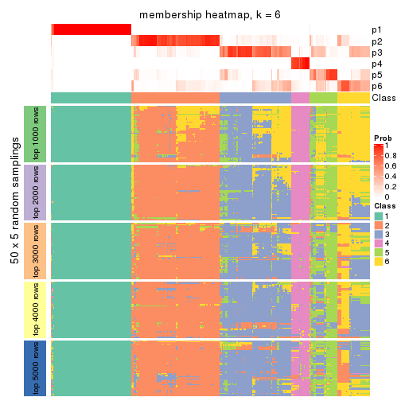</p>

</div>
</div>

As soon as we have had the classes for columns, we can look for signatures
which are significantly different between classes which can be candidate marks
for certain classes. Following are the heatmaps for signatures.


Signature heatmaps where rows are scaled:


<script>
$( function() {
	$( '#tabs-CV-NMF-get-signatures' ).tabs();
} );
</script>
<div id='tabs-CV-NMF-get-signatures'>
<ul>
<li><a href='#tab-CV-NMF-get-signatures-1'>k = 2</a></li>
<li><a href='#tab-CV-NMF-get-signatures-2'>k = 3</a></li>
<li><a href='#tab-CV-NMF-get-signatures-3'>k = 4</a></li>
<li><a href='#tab-CV-NMF-get-signatures-4'>k = 5</a></li>
<li><a href='#tab-CV-NMF-get-signatures-5'>k = 6</a></li>
</ul>
<div id='tab-CV-NMF-get-signatures-1'>
<pre><code class="r">get_signatures(res, k = 2)
</code></pre>

<p></p>

</div>
<div id='tab-CV-NMF-get-signatures-2'>
<pre><code class="r">get_signatures(res, k = 3)
</code></pre>

<p></p>

</div>
<div id='tab-CV-NMF-get-signatures-3'>
<pre><code class="r">get_signatures(res, k = 4)
</code></pre>

<p></p>

</div>
<div id='tab-CV-NMF-get-signatures-4'>
<pre><code class="r">get_signatures(res, k = 5)
</code></pre>

<p></p>

</div>
<div id='tab-CV-NMF-get-signatures-5'>
<pre><code class="r">get_signatures(res, k = 6)
</code></pre>

<p></p>

</div>
</div>


Signature heatmaps where rows are not scaled:


<script>
$( function() {
	$( '#tabs-CV-NMF-get-signatures-no-scale' ).tabs();
} );
</script>
<div id='tabs-CV-NMF-get-signatures-no-scale'>
<ul>
<li><a href='#tab-CV-NMF-get-signatures-no-scale-1'>k = 2</a></li>
<li><a href='#tab-CV-NMF-get-signatures-no-scale-2'>k = 3</a></li>
<li><a href='#tab-CV-NMF-get-signatures-no-scale-3'>k = 4</a></li>
<li><a href='#tab-CV-NMF-get-signatures-no-scale-4'>k = 5</a></li>
<li><a href='#tab-CV-NMF-get-signatures-no-scale-5'>k = 6</a></li>
</ul>
<div id='tab-CV-NMF-get-signatures-no-scale-1'>
<pre><code class="r">get_signatures(res, k = 2, scale_rows = FALSE)
</code></pre>

<p></p>

</div>
<div id='tab-CV-NMF-get-signatures-no-scale-2'>
<pre><code class="r">get_signatures(res, k = 3, scale_rows = FALSE)
</code></pre>

<p></p>

</div>
<div id='tab-CV-NMF-get-signatures-no-scale-3'>
<pre><code class="r">get_signatures(res, k = 4, scale_rows = FALSE)
</code></pre>

<p></p>

</div>
<div id='tab-CV-NMF-get-signatures-no-scale-4'>
<pre><code class="r">get_signatures(res, k = 5, scale_rows = FALSE)
</code></pre>

<p></p>

</div>
<div id='tab-CV-NMF-get-signatures-no-scale-5'>
<pre><code class="r">get_signatures(res, k = 6, scale_rows = FALSE)
</code></pre>

<p></p>

</div>
</div>


Compare the overlap of signatures from different k:

```r
compare_signatures(res)
```


`get_signature()` returns a data frame invisibly. TO get the list of signatures, the function
call should be assigned to a variable explicitly. In following code, if `plot` argument is set
to `FALSE`, no heatmap is plotted while only the differential analysis is performed.

```r
# code only for demonstration
tb = get_signature(res, k = ..., plot = FALSE)
```

An example of the output of `tb` is:

```
#>   which_row         fdr    mean_1    mean_2 scaled_mean_1 scaled_mean_2 km
#> 1        38 0.042760348  8.373488  9.131774    -0.5533452     0.5164555  1
#> 2        40 0.018707592  7.106213  8.469186    -0.6173731     0.5762149  1
#> 3        55 0.019134737 10.221463 11.207825    -0.6159697     0.5749050  1
#> 4        59 0.006059896  5.921854  7.869574    -0.6899429     0.6439467  1
#> 5        60 0.018055526  8.928898 10.211722    -0.6204761     0.5791110  1
#> 6        98 0.009384629 15.714769 14.887706     0.6635654    -0.6193277  2
...
```

The columns in `tb` are:

1. `which_row`: row indices corresponding to the input matrix.
2. `fdr`: FDR for the differential test. 
3. `mean_x`: The mean value in group x.
4. `scaled_mean_x`: The mean value in group x after rows are scaled.
5. `km`: Row groups if k-means clustering is applied to rows.


UMAP plot which shows how samples are separated.


<script>
$( function() {
	$( '#tabs-CV-NMF-dimension-reduction' ).tabs();
} );
</script>
<div id='tabs-CV-NMF-dimension-reduction'>
<ul>
<li><a href='#tab-CV-NMF-dimension-reduction-1'>k = 2</a></li>
<li><a href='#tab-CV-NMF-dimension-reduction-2'>k = 3</a></li>
<li><a href='#tab-CV-NMF-dimension-reduction-3'>k = 4</a></li>
<li><a href='#tab-CV-NMF-dimension-reduction-4'>k = 5</a></li>
<li><a href='#tab-CV-NMF-dimension-reduction-5'>k = 6</a></li>
</ul>
<div id='tab-CV-NMF-dimension-reduction-1'>
<pre><code class="r">dimension_reduction(res, k = 2, method = &quot;UMAP&quot;)
</code></pre>

<p></p>

</div>
<div id='tab-CV-NMF-dimension-reduction-2'>
<pre><code class="r">dimension_reduction(res, k = 3, method = &quot;UMAP&quot;)
</code></pre>

<p></p>

</div>
<div id='tab-CV-NMF-dimension-reduction-3'>
<pre><code class="r">dimension_reduction(res, k = 4, method = &quot;UMAP&quot;)
</code></pre>

<p></p>

</div>
<div id='tab-CV-NMF-dimension-reduction-4'>
<pre><code class="r">dimension_reduction(res, k = 5, method = &quot;UMAP&quot;)
</code></pre>

<p></p>

</div>
<div id='tab-CV-NMF-dimension-reduction-5'>
<pre><code class="r">dimension_reduction(res, k = 6, method = &quot;UMAP&quot;)
</code></pre>

<p></p>

</div>
</div>


Following heatmap shows how subgroups are split when increasing `k`:

```r
collect_classes(res)
```


If matrix rows can be associated to genes, consider to use `GO_Enrichment(res,
...)` to perform function enrichment for the signature genes.


 

---------------------------------------------------


### MAD:hclust**


The object with results only for a single top-value method and a single partition method 
can be extracted as:

```r
res = res_list["MAD", "hclust"]
# you can also extract it by
# res = res_list["MAD:hclust"]
```

A summary of `res` and all the functions that can be applied to it:

```r
res
```

```
#> A 'ConsensusPartition' object with k = 2, 3, 4, 5, 6.
#>   On a matrix with 13930 rows and 285 columns.
#>   Top rows (1000, 2000, 3000, 4000, 5000) are extracted by 'MAD' method.
#>   Subgroups are detected by 'hclust' method.
#>   Performed in total 1250 partitions by row resampling.
#>   Best k for subgroups seems to be 2.
#> 
#> Following methods can be applied to this 'ConsensusPartition' object:
#>  [1] "cola_report"             "collect_classes"         "collect_plots"          
#>  [4] "collect_stats"           "colnames"                "compare_signatures"     
#>  [7] "consensus_heatmap"       "dimension_reduction"     "functional_enrichment"  
#> [10] "get_anno_col"            "get_anno"                "get_classes"            
#> [13] "get_consensus"           "get_matrix"              "get_membership"         
#> [16] "get_param"               "get_signatures"          "get_stats"              
#> [19] "is_best_k"               "is_stable_k"             "membership_heatmap"     
#> [22] "ncol"                    "nrow"                    "plot_ecdf"              
#> [25] "rownames"                "select_partition_number" "show"                   
#> [28] "suggest_best_k"          "test_to_known_factors"
```

`collect_plots()` function collects all the plots made from `res` for all `k` (number of partitions)
into one single page to provide an easy and fast comparison between different `k`.

```r
collect_plots(res)
```


The plots are:

- The first row: a plot of the ECDF (Empirical cumulative distribution
  function) curves of the consensus matrix for each `k` and the heatmap of
  predicted classes for each `k`.
- The second row: heatmaps of the consensus matrix for each `k`.
- The third row: heatmaps of the membership matrix for each `k`.
- The fouth row: heatmaps of the signatures for each `k`.

All the plots in panels can be made by individual functions and they are
plotted later in this section.

`select_partition_number()` produces several plots showing different
statistics for choosing "optimized" `k`. There are following statistics:

- ECDF curves of the consensus matrix for each `k`;
- 1-PAC. [The PAC
  score](https://en.wikipedia.org/wiki/Consensus_clustering#Over-interpretation_potential_of_consensus_clustering)
  measures the proportion of the ambiguous subgrouping.
- Mean silhouette score.
- Concordance. The mean probability of fiting the consensus class ids in all
  partitions.
- Area increased. Denote $A_k$ as the area under the ECDF curve for current
  `k`, the area increased is defined as $A_k - A_{k-1}$.
- Rand index. The percent of pairs of samples that are both in a same cluster
  or both are not in a same cluster in the partition of k and k-1.
- Jaccard index. The ratio of pairs of samples are both in a same cluster in
  the partition of k and k-1 and the pairs of samples are both in a same
  cluster in the partition k or k-1.

The detailed explanations of these statistics can be found in [the cola
vignette](http://bioconductor.org/packages/devel/bioc/vignettes/cola/inst/doc/cola.html#toc_13).

Generally speaking, lower PAC score, higher mean silhouette score or higher
concordance corresponds to better partition. Rand index and Jaccard index
measure how similar the current partition is compared to partition with `k-1`.
If they are too similar, we won't accept `k` is better than `k-1`.

```r
select_partition_number(res)
```


The numeric values for all these statistics can be obtained by `get_stats()`.

```r
get_stats(res)
```

```
#>   k 1-PAC mean_silhouette concordance area_increased  Rand Jaccard
#> 2 2 1.000           0.997       0.999         0.3841 0.618   0.618
#> 3 3 1.000           0.974       0.987         0.0911 0.979   0.967
#> 4 4 1.000           0.978       0.987         0.0191 0.990   0.983
#> 5 5 0.871           0.956       0.971         0.0390 1.000   1.000
#> 6 6 0.815           0.931       0.960         0.0526 0.985   0.974
```

`suggest_best_k()` suggests the best $k$ based on these statistics. The rules are as follows:

- All $k$ with Jaccard index larger than 0.95 are removed because the increase of
  the partition number does not provides enough extra information. If all $k$ are removed,
  the best $k$ is assigned by `NA`.
- For $k$ with 1-PAC larger than 0.9, the maximal $k$ is taken as the "best k". Other $k$ is called "optional k".
- If it does not fit the second rule. The $k$ with the highest vote of highest
  1-PAC, mean silhouette and concordance is taken as the "best k".

```r
suggest_best_k(res)
```

```
#> [1] 2
```


Following shows the table of the partitions (You need to click the **show/hide
code output** link to see it). The membership matrix (columns with name `p*`)
is inferred by
[`clue::cl_consensus()`](https://www.rdocumentation.org/link/cl_consensus?package=clue)
function with the `SE` method. Basically the value in the membership matrix
represents the probability to belong to a certain group. The finall class
label for an item is determined with the group with highest probability it
belongs to.

In `get_classes()` function, the entropy is calculated from the membership
matrix and the silhouette score is calculated from the consensus matrix.


<script>
$( function() {
	$( '#tabs-MAD-hclust-get-classes' ).tabs();
} );
</script>
<div id='tabs-MAD-hclust-get-classes'>
<ul>
<li><a href='#tab-MAD-hclust-get-classes-1'>k = 2</a></li>
<li><a href='#tab-MAD-hclust-get-classes-2'>k = 3</a></li>
<li><a href='#tab-MAD-hclust-get-classes-3'>k = 4</a></li>
<li><a href='#tab-MAD-hclust-get-classes-4'>k = 5</a></li>
<li><a href='#tab-MAD-hclust-get-classes-5'>k = 6</a></li>
</ul>

<div id='tab-MAD-hclust-get-classes-1'>
<p><a id='tab-MAD-hclust-get-classes-1-a' style='color:#0366d6' href='#'>show/hide code output</a></p>
<pre><code class="r">cbind(get_classes(res, k = 2), get_membership(res, k = 2))
</code></pre>

<pre><code>#&gt;            class entropy silhouette    p1    p2
#&gt; SRR1201591     2   0.000      0.998 0.000 1.000
#&gt; SRR1201590     2   0.000      0.998 0.000 1.000
#&gt; SRR1201593     2   0.000      0.998 0.000 1.000
#&gt; SRR1201592     2   0.000      0.998 0.000 1.000
#&gt; SRR1201617     2   0.000      0.998 0.000 1.000
#&gt; SRR1201616     2   0.000      0.998 0.000 1.000
#&gt; SRR1201619     2   0.000      0.998 0.000 1.000
#&gt; SRR1201618     2   0.000      0.998 0.000 1.000
#&gt; SRR1201620     2   0.000      0.998 0.000 1.000
#&gt; SRR1201621     2   0.000      0.998 0.000 1.000
#&gt; SRR1201623     2   0.000      0.998 0.000 1.000
#&gt; SRR1201622     2   0.000      0.998 0.000 1.000
#&gt; SRR1201624     2   0.000      0.998 0.000 1.000
#&gt; SRR1201625     2   0.000      0.998 0.000 1.000
#&gt; SRR1201626     2   0.706      0.764 0.192 0.808
#&gt; SRR1201627     2   0.000      0.998 0.000 1.000
#&gt; SRR1201628     2   0.000      0.998 0.000 1.000
#&gt; SRR1201629     2   0.000      0.998 0.000 1.000
#&gt; SRR1201630     2   0.000      0.998 0.000 1.000
#&gt; SRR1201631     2   0.000      0.998 0.000 1.000
#&gt; SRR1201641     2   0.000      0.998 0.000 1.000
#&gt; SRR1201640     2   0.000      0.998 0.000 1.000
#&gt; SRR1201643     2   0.000      0.998 0.000 1.000
#&gt; SRR1201644     2   0.000      0.998 0.000 1.000
#&gt; SRR1201661     2   0.000      0.998 0.000 1.000
#&gt; SRR1201662     2   0.000      0.998 0.000 1.000
#&gt; SRR1201663     2   0.000      0.998 0.000 1.000
#&gt; SRR1201664     2   0.000      0.998 0.000 1.000
#&gt; SRR1201665     2   0.000      0.998 0.000 1.000
#&gt; SRR1201666     2   0.000      0.998 0.000 1.000
#&gt; SRR1201667     2   0.000      0.998 0.000 1.000
#&gt; SRR1201668     2   0.000      0.998 0.000 1.000
#&gt; SRR1201670     2   0.000      0.998 0.000 1.000
#&gt; SRR1201669     2   0.000      0.998 0.000 1.000
#&gt; SRR1201673     2   0.000      0.998 0.000 1.000
#&gt; SRR1201672     2   0.000      0.998 0.000 1.000
#&gt; SRR1201671     2   0.000      0.998 0.000 1.000
#&gt; SRR1201677     2   0.000      0.998 0.000 1.000
#&gt; SRR1201676     2   0.000      0.998 0.000 1.000
#&gt; SRR1201675     2   0.000      0.998 0.000 1.000
#&gt; SRR1201674     2   0.000      0.998 0.000 1.000
#&gt; SRR1201678     2   0.000      0.998 0.000 1.000
#&gt; SRR1201682     2   0.000      0.998 0.000 1.000
#&gt; SRR1201683     2   0.000      0.998 0.000 1.000
#&gt; SRR1201680     2   0.000      0.998 0.000 1.000
#&gt; SRR1201681     2   0.000      0.998 0.000 1.000
#&gt; SRR1201679     2   0.000      0.998 0.000 1.000
#&gt; SRR1201686     2   0.000      0.998 0.000 1.000
#&gt; SRR1201687     2   0.000      0.998 0.000 1.000
#&gt; SRR1201688     2   0.000      0.998 0.000 1.000
#&gt; SRR1201689     2   0.000      0.998 0.000 1.000
#&gt; SRR1201685     2   0.000      0.998 0.000 1.000
#&gt; SRR1201692     2   0.000      0.998 0.000 1.000
#&gt; SRR1201691     2   0.000      0.998 0.000 1.000
#&gt; SRR1201690     2   0.000      0.998 0.000 1.000
#&gt; SRR1201696     2   0.000      0.998 0.000 1.000
#&gt; SRR1201695     2   0.000      0.998 0.000 1.000
#&gt; SRR1201694     2   0.000      0.998 0.000 1.000
#&gt; SRR1201693     2   0.000      0.998 0.000 1.000
#&gt; SRR1201697     2   0.000      0.998 0.000 1.000
#&gt; SRR1201698     2   0.000      0.998 0.000 1.000
#&gt; SRR1201700     2   0.000      0.998 0.000 1.000
#&gt; SRR1201708     2   0.000      0.998 0.000 1.000
#&gt; SRR1201707     2   0.000      0.998 0.000 1.000
#&gt; SRR1201706     2   0.000      0.998 0.000 1.000
#&gt; SRR1201702     2   0.000      0.998 0.000 1.000
#&gt; SRR1201705     2   0.000      0.998 0.000 1.000
#&gt; SRR1201701     2   0.000      0.998 0.000 1.000
#&gt; SRR1201704     2   0.000      0.998 0.000 1.000
#&gt; SRR1201703     2   0.000      0.998 0.000 1.000
#&gt; SRR1201716     2   0.000      0.998 0.000 1.000
#&gt; SRR1201715     2   0.000      0.998 0.000 1.000
#&gt; SRR1201717     2   0.000      0.998 0.000 1.000
#&gt; SRR1201712     2   0.000      0.998 0.000 1.000
#&gt; SRR1201709     2   0.000      0.998 0.000 1.000
#&gt; SRR1201711     2   0.000      0.998 0.000 1.000
#&gt; SRR1201714     2   0.000      0.998 0.000 1.000
#&gt; SRR1201713     2   0.000      0.998 0.000 1.000
#&gt; SRR1201710     2   0.000      0.998 0.000 1.000
#&gt; SRR1201719     2   0.000      0.998 0.000 1.000
#&gt; SRR1201718     2   0.000      0.998 0.000 1.000
#&gt; SRR1201721     2   0.000      0.998 0.000 1.000
#&gt; SRR1201720     2   0.000      0.998 0.000 1.000
#&gt; SRR1201723     2   0.000      0.998 0.000 1.000
#&gt; SRR1201722     2   0.000      0.998 0.000 1.000
#&gt; SRR1201725     2   0.000      0.998 0.000 1.000
#&gt; SRR1201724     2   0.000      0.998 0.000 1.000
#&gt; SRR1201726     2   0.000      0.998 0.000 1.000
#&gt; SRR1201727     2   0.000      0.998 0.000 1.000
#&gt; SRR1201731     2   0.000      0.998 0.000 1.000
#&gt; SRR1201730     2   0.000      0.998 0.000 1.000
#&gt; SRR1201734     2   0.000      0.998 0.000 1.000
#&gt; SRR1201733     2   0.000      0.998 0.000 1.000
#&gt; SRR1201736     2   0.000      0.998 0.000 1.000
#&gt; SRR1201737     2   0.000      0.998 0.000 1.000
#&gt; SRR1201739     2   0.000      0.998 0.000 1.000
#&gt; SRR1201738     2   0.000      0.998 0.000 1.000
#&gt; SRR1201742     2   0.000      0.998 0.000 1.000
#&gt; SRR1201743     2   0.000      0.998 0.000 1.000
#&gt; SRR1201745     2   0.000      0.998 0.000 1.000
#&gt; SRR1201744     2   0.000      0.998 0.000 1.000
#&gt; SRR1201749     2   0.000      0.998 0.000 1.000
#&gt; SRR1201750     2   0.000      0.998 0.000 1.000
#&gt; SRR1201752     2   0.000      0.998 0.000 1.000
#&gt; SRR1201751     2   0.000      0.998 0.000 1.000
#&gt; SRR1201754     2   0.000      0.998 0.000 1.000
#&gt; SRR1201753     2   0.000      0.998 0.000 1.000
#&gt; SRR1201758     2   0.000      0.998 0.000 1.000
#&gt; SRR1201759     2   0.000      0.998 0.000 1.000
#&gt; SRR1201760     2   0.000      0.998 0.000 1.000
#&gt; SRR1201761     2   0.000      0.998 0.000 1.000
#&gt; SRR1201763     2   0.000      0.998 0.000 1.000
#&gt; SRR1201762     2   0.574      0.843 0.136 0.864
#&gt; SRR1201764     2   0.000      0.998 0.000 1.000
#&gt; SRR1201766     2   0.000      0.998 0.000 1.000
#&gt; SRR1201768     2   0.000      0.998 0.000 1.000
#&gt; SRR1201769     2   0.000      0.998 0.000 1.000
#&gt; SRR1201767     2   0.000      0.998 0.000 1.000
#&gt; SRR1201770     2   0.000      0.998 0.000 1.000
#&gt; SRR1201771     2   0.000      0.998 0.000 1.000
#&gt; SRR1201772     2   0.000      0.998 0.000 1.000
#&gt; SRR1201773     2   0.000      0.998 0.000 1.000
#&gt; SRR1201774     2   0.000      0.998 0.000 1.000
#&gt; SRR1201786     2   0.000      0.998 0.000 1.000
#&gt; SRR1201784     2   0.000      0.998 0.000 1.000
#&gt; SRR1201785     2   0.000      0.998 0.000 1.000
#&gt; SRR1201778     2   0.000      0.998 0.000 1.000
#&gt; SRR1201779     2   0.000      0.998 0.000 1.000
#&gt; SRR1201781     2   0.000      0.998 0.000 1.000
#&gt; SRR1201780     2   0.000      0.998 0.000 1.000
#&gt; SRR1201783     2   0.000      0.998 0.000 1.000
#&gt; SRR1201782     2   0.000      0.998 0.000 1.000
#&gt; SRR1201798     2   0.000      0.998 0.000 1.000
#&gt; SRR1201797     2   0.000      0.998 0.000 1.000
#&gt; SRR1201796     2   0.000      0.998 0.000 1.000
#&gt; SRR1201795     2   0.000      0.998 0.000 1.000
#&gt; SRR1201799     2   0.000      0.998 0.000 1.000
#&gt; SRR1201794     2   0.000      0.998 0.000 1.000
#&gt; SRR1201793     2   0.000      0.998 0.000 1.000
#&gt; SRR1201792     2   0.000      0.998 0.000 1.000
#&gt; SRR1201791     2   0.000      0.998 0.000 1.000
#&gt; SRR1201807     2   0.000      0.998 0.000 1.000
#&gt; SRR1201808     2   0.000      0.998 0.000 1.000
#&gt; SRR1201803     2   0.000      0.998 0.000 1.000
#&gt; SRR1201804     2   0.000      0.998 0.000 1.000
#&gt; SRR1201805     2   0.000      0.998 0.000 1.000
#&gt; SRR1201806     2   0.000      0.998 0.000 1.000
#&gt; SRR1201801     2   0.000      0.998 0.000 1.000
#&gt; SRR1201802     2   0.000      0.998 0.000 1.000
#&gt; SRR1201800     2   0.000      0.998 0.000 1.000
#&gt; SRR1201814     2   0.000      0.998 0.000 1.000
#&gt; SRR1201816     2   0.000      0.998 0.000 1.000
#&gt; SRR1201815     2   0.000      0.998 0.000 1.000
#&gt; SRR1201819     2   0.000      0.998 0.000 1.000
#&gt; SRR1201820     2   0.000      0.998 0.000 1.000
#&gt; SRR1201813     2   0.000      0.998 0.000 1.000
#&gt; SRR1201817     2   0.000      0.998 0.000 1.000
#&gt; SRR1201818     2   0.000      0.998 0.000 1.000
#&gt; SRR1201825     2   0.000      0.998 0.000 1.000
#&gt; SRR1201827     2   0.000      0.998 0.000 1.000
#&gt; SRR1201828     2   0.000      0.998 0.000 1.000
#&gt; SRR1201826     2   0.000      0.998 0.000 1.000
#&gt; SRR1201829     2   0.000      0.998 0.000 1.000
#&gt; SRR1201830     2   0.000      0.998 0.000 1.000
#&gt; SRR1201831     2   0.000      0.998 0.000 1.000
#&gt; SRR1201832     2   0.000      0.998 0.000 1.000
#&gt; SRR1201833     2   0.000      0.998 0.000 1.000
#&gt; SRR1201865     2   0.000      0.998 0.000 1.000
#&gt; SRR1201866     2   0.000      0.998 0.000 1.000
#&gt; SRR1201867     2   0.000      0.998 0.000 1.000
#&gt; SRR1201861     2   0.000      0.998 0.000 1.000
#&gt; SRR1201862     2   0.000      0.998 0.000 1.000
#&gt; SRR1201863     2   0.000      0.998 0.000 1.000
#&gt; SRR1201859     2   0.000      0.998 0.000 1.000
#&gt; SRR1201864     2   0.000      0.998 0.000 1.000
#&gt; SRR1201860     2   0.000      0.998 0.000 1.000
#&gt; SRR1201873     2   0.000      0.998 0.000 1.000
#&gt; SRR1201871     2   0.000      0.998 0.000 1.000
#&gt; SRR1201872     2   0.000      0.998 0.000 1.000
#&gt; SRR1201980     2   0.000      0.998 0.000 1.000
#&gt; SRR1201979     2   0.000      0.998 0.000 1.000
#&gt; SRR1201982     2   0.000      0.998 0.000 1.000
#&gt; SRR1201981     2   0.000      0.998 0.000 1.000
#&gt; SRR1201998     2   0.000      0.998 0.000 1.000
#&gt; SRR1201996     2   0.000      0.998 0.000 1.000
#&gt; SRR1201997     2   0.000      0.998 0.000 1.000
#&gt; SRR1202005     2   0.000      0.998 0.000 1.000
#&gt; SRR1202006     2   0.000      0.998 0.000 1.000
#&gt; SRR1202088     2   0.000      0.998 0.000 1.000
#&gt; SRR1202087     2   0.000      0.998 0.000 1.000
#&gt; SRR1202093     2   0.000      0.998 0.000 1.000
#&gt; SRR1202092     2   0.000      0.998 0.000 1.000
#&gt; SRR1202288     2   0.000      0.998 0.000 1.000
#&gt; SRR1202289     2   0.000      0.998 0.000 1.000
#&gt; SRR1202299     2   0.000      0.998 0.000 1.000
#&gt; SRR1202298     2   0.000      0.998 0.000 1.000
#&gt; SRR1202303     2   0.000      0.998 0.000 1.000
#&gt; SRR1202372     2   0.000      0.998 0.000 1.000
#&gt; SRR1202371     2   0.000      0.998 0.000 1.000
#&gt; SRR1202563     2   0.000      0.998 0.000 1.000
#&gt; SRR1202565     2   0.000      0.998 0.000 1.000
#&gt; SRR1202564     2   0.000      0.998 0.000 1.000
#&gt; SRR1202649     2   0.000      0.998 0.000 1.000
#&gt; SRR1202650     2   0.000      0.998 0.000 1.000
#&gt; SRR1202651     2   0.000      0.998 0.000 1.000
#&gt; SRR1202843     1   0.000      1.000 1.000 0.000
#&gt; SRR1202844     1   0.000      1.000 1.000 0.000
#&gt; SRR1202845     2   0.000      0.998 0.000 1.000
#&gt; SRR1202847     2   0.000      0.998 0.000 1.000
#&gt; SRR1202846     2   0.000      0.998 0.000 1.000
#&gt; SRR1202945     1   0.000      1.000 1.000 0.000
#&gt; SRR1202949     1   0.000      1.000 1.000 0.000
#&gt; SRR1202977     1   0.000      1.000 1.000 0.000
#&gt; SRR1202978     1   0.000      1.000 1.000 0.000
#&gt; SRR1202979     1   0.000      1.000 1.000 0.000
#&gt; SRR1202990     1   0.000      1.000 1.000 0.000
#&gt; SRR1202999     1   0.000      1.000 1.000 0.000
#&gt; SRR1203005     1   0.000      1.000 1.000 0.000
#&gt; SRR1203006     1   0.000      1.000 1.000 0.000
#&gt; SRR1203007     1   0.000      1.000 1.000 0.000
#&gt; SRR1203009     1   0.000      1.000 1.000 0.000
#&gt; SRR1203008     1   0.000      1.000 1.000 0.000
#&gt; SRR1203010     1   0.000      1.000 1.000 0.000
#&gt; SRR1203011     1   0.000      1.000 1.000 0.000
#&gt; SRR1203025     1   0.000      1.000 1.000 0.000
#&gt; SRR1203026     1   0.000      1.000 1.000 0.000
#&gt; SRR1203027     1   0.000      1.000 1.000 0.000
#&gt; SRR1203061     1   0.000      1.000 1.000 0.000
#&gt; SRR1203089     1   0.000      1.000 1.000 0.000
#&gt; SRR1203125     1   0.000      1.000 1.000 0.000
#&gt; SRR1203128     1   0.000      1.000 1.000 0.000
#&gt; SRR1203129     1   0.000      1.000 1.000 0.000
#&gt; SRR1203130     1   0.000      1.000 1.000 0.000
#&gt; SRR1203132     2   0.000      0.998 0.000 1.000
#&gt; SRR1203131     2   0.000      0.998 0.000 1.000
#&gt; SRR1203133     1   0.000      1.000 1.000 0.000
#&gt; SRR1203138     1   0.000      1.000 1.000 0.000
#&gt; SRR1203760     1   0.000      1.000 1.000 0.000
#&gt; SRR1203761     1   0.000      1.000 1.000 0.000
#&gt; SRR1203770     1   0.000      1.000 1.000 0.000
#&gt; SRR1203771     1   0.000      1.000 1.000 0.000
#&gt; SRR1203772     1   0.000      1.000 1.000 0.000
#&gt; SRR1203773     1   0.000      1.000 1.000 0.000
#&gt; SRR1203774     1   0.000      1.000 1.000 0.000
#&gt; SRR1203775     1   0.000      1.000 1.000 0.000
#&gt; SRR1203800     1   0.000      1.000 1.000 0.000
#&gt; SRR1203801     1   0.000      1.000 1.000 0.000
#&gt; SRR1203802     1   0.000      1.000 1.000 0.000
#&gt; SRR1203803     1   0.000      1.000 1.000 0.000
#&gt; SRR1203804     1   0.000      1.000 1.000 0.000
#&gt; SRR1203805     1   0.000      1.000 1.000 0.000
#&gt; SRR1203806     1   0.000      1.000 1.000 0.000
#&gt; SRR1203807     1   0.000      1.000 1.000 0.000
#&gt; SRR1203808     1   0.000      1.000 1.000 0.000
#&gt; SRR1203811     1   0.000      1.000 1.000 0.000
#&gt; SRR1203812     1   0.000      1.000 1.000 0.000
#&gt; SRR1203813     1   0.000      1.000 1.000 0.000
#&gt; SRR1203814     1   0.000      1.000 1.000 0.000
#&gt; SRR1203815     1   0.000      1.000 1.000 0.000
#&gt; SRR1203816     1   0.000      1.000 1.000 0.000
#&gt; SRR1203817     1   0.000      1.000 1.000 0.000
#&gt; SRR1203818     1   0.000      1.000 1.000 0.000
#&gt; SRR1203819     1   0.000      1.000 1.000 0.000
#&gt; SRR1203822     1   0.000      1.000 1.000 0.000
#&gt; SRR1203823     1   0.000      1.000 1.000 0.000
#&gt; SRR1203824     1   0.000      1.000 1.000 0.000
#&gt; SRR1203825     1   0.000      1.000 1.000 0.000
#&gt; SRR1203826     1   0.000      1.000 1.000 0.000
#&gt; SRR1203827     1   0.000      1.000 1.000 0.000
#&gt; SRR1203828     1   0.000      1.000 1.000 0.000
#&gt; SRR1203829     1   0.000      1.000 1.000 0.000
#&gt; SRR1203830     1   0.000      1.000 1.000 0.000
#&gt; SRR1203831     1   0.000      1.000 1.000 0.000
#&gt; SRR1203832     1   0.000      1.000 1.000 0.000
#&gt; SRR1203833     1   0.000      1.000 1.000 0.000
#&gt; SRR1203834     1   0.000      1.000 1.000 0.000
#&gt; SRR1203835     1   0.000      1.000 1.000 0.000
#&gt; SRR1203836     1   0.000      1.000 1.000 0.000
#&gt; SRR1203837     1   0.000      1.000 1.000 0.000
#&gt; SRR1203838     1   0.000      1.000 1.000 0.000
#&gt; SRR1203839     1   0.000      1.000 1.000 0.000
#&gt; SRR1203842     1   0.000      1.000 1.000 0.000
#&gt; SRR1203843     1   0.000      1.000 1.000 0.000
#&gt; SRR1203845     2   0.000      0.998 0.000 1.000
#&gt; SRR1203844     2   0.000      0.998 0.000 1.000
</code></pre>

<script>
$('#tab-MAD-hclust-get-classes-1-a').parent().next().next().hide();
$('#tab-MAD-hclust-get-classes-1-a').click(function(){
  $('#tab-MAD-hclust-get-classes-1-a').parent().next().next().toggle();
  return(false);
});
</script>
</div>

<div id='tab-MAD-hclust-get-classes-2'>
<p><a id='tab-MAD-hclust-get-classes-2-a' style='color:#0366d6' href='#'>show/hide code output</a></p>
<pre><code class="r">cbind(get_classes(res, k = 3), get_membership(res, k = 3))
</code></pre>

<pre><code>#&gt;            class entropy silhouette    p1    p2    p3
#&gt; SRR1201591     2  0.0000     0.9813 0.000 1.000 0.000
#&gt; SRR1201590     2  0.0000     0.9813 0.000 1.000 0.000
#&gt; SRR1201593     2  0.0000     0.9813 0.000 1.000 0.000
#&gt; SRR1201592     2  0.0000     0.9813 0.000 1.000 0.000
#&gt; SRR1201617     2  0.0000     0.9813 0.000 1.000 0.000
#&gt; SRR1201616     2  0.0000     0.9813 0.000 1.000 0.000
#&gt; SRR1201619     2  0.0000     0.9813 0.000 1.000 0.000
#&gt; SRR1201618     2  0.0000     0.9813 0.000 1.000 0.000
#&gt; SRR1201620     2  0.0000     0.9813 0.000 1.000 0.000
#&gt; SRR1201621     2  0.0000     0.9813 0.000 1.000 0.000
#&gt; SRR1201623     2  0.0237     0.9790 0.000 0.996 0.004
#&gt; SRR1201622     2  0.0000     0.9813 0.000 1.000 0.000
#&gt; SRR1201624     2  0.0000     0.9813 0.000 1.000 0.000
#&gt; SRR1201625     3  0.0000     1.0000 0.000 0.000 1.000
#&gt; SRR1201626     2  0.9340     0.0365 0.192 0.500 0.308
#&gt; SRR1201627     3  0.0000     1.0000 0.000 0.000 1.000
#&gt; SRR1201628     2  0.0000     0.9813 0.000 1.000 0.000
#&gt; SRR1201629     2  0.2165     0.9407 0.000 0.936 0.064
#&gt; SRR1201630     2  0.0000     0.9813 0.000 1.000 0.000
#&gt; SRR1201631     2  0.0000     0.9813 0.000 1.000 0.000
#&gt; SRR1201641     2  0.0000     0.9813 0.000 1.000 0.000
#&gt; SRR1201640     2  0.0000     0.9813 0.000 1.000 0.000
#&gt; SRR1201643     2  0.0000     0.9813 0.000 1.000 0.000
#&gt; SRR1201644     2  0.0000     0.9813 0.000 1.000 0.000
#&gt; SRR1201661     2  0.0000     0.9813 0.000 1.000 0.000
#&gt; SRR1201662     2  0.0000     0.9813 0.000 1.000 0.000
#&gt; SRR1201663     2  0.0000     0.9813 0.000 1.000 0.000
#&gt; SRR1201664     2  0.2537     0.9277 0.000 0.920 0.080
#&gt; SRR1201665     2  0.0000     0.9813 0.000 1.000 0.000
#&gt; SRR1201666     2  0.0000     0.9813 0.000 1.000 0.000
#&gt; SRR1201667     2  0.0000     0.9813 0.000 1.000 0.000
#&gt; SRR1201668     2  0.0000     0.9813 0.000 1.000 0.000
#&gt; SRR1201670     2  0.2537     0.9277 0.000 0.920 0.080
#&gt; SRR1201669     2  0.2537     0.9277 0.000 0.920 0.080
#&gt; SRR1201673     2  0.0000     0.9813 0.000 1.000 0.000
#&gt; SRR1201672     2  0.0000     0.9813 0.000 1.000 0.000
#&gt; SRR1201671     2  0.0000     0.9813 0.000 1.000 0.000
#&gt; SRR1201677     2  0.0000     0.9813 0.000 1.000 0.000
#&gt; SRR1201676     2  0.0000     0.9813 0.000 1.000 0.000
#&gt; SRR1201675     2  0.0000     0.9813 0.000 1.000 0.000
#&gt; SRR1201674     2  0.0000     0.9813 0.000 1.000 0.000
#&gt; SRR1201678     2  0.0000     0.9813 0.000 1.000 0.000
#&gt; SRR1201682     2  0.0000     0.9813 0.000 1.000 0.000
#&gt; SRR1201683     2  0.0000     0.9813 0.000 1.000 0.000
#&gt; SRR1201680     2  0.0000     0.9813 0.000 1.000 0.000
#&gt; SRR1201681     2  0.0000     0.9813 0.000 1.000 0.000
#&gt; SRR1201679     2  0.0000     0.9813 0.000 1.000 0.000
#&gt; SRR1201686     2  0.2537     0.9277 0.000 0.920 0.080
#&gt; SRR1201687     2  0.2537     0.9277 0.000 0.920 0.080
#&gt; SRR1201688     2  0.2537     0.9277 0.000 0.920 0.080
#&gt; SRR1201689     2  0.2537     0.9277 0.000 0.920 0.080
#&gt; SRR1201685     2  0.0000     0.9813 0.000 1.000 0.000
#&gt; SRR1201692     2  0.2165     0.9407 0.000 0.936 0.064
#&gt; SRR1201691     2  0.2165     0.9407 0.000 0.936 0.064
#&gt; SRR1201690     2  0.0000     0.9813 0.000 1.000 0.000
#&gt; SRR1201696     2  0.2165     0.9407 0.000 0.936 0.064
#&gt; SRR1201695     2  0.2165     0.9407 0.000 0.936 0.064
#&gt; SRR1201694     2  0.2165     0.9407 0.000 0.936 0.064
#&gt; SRR1201693     2  0.2165     0.9407 0.000 0.936 0.064
#&gt; SRR1201697     2  0.2165     0.9407 0.000 0.936 0.064
#&gt; SRR1201698     2  0.2165     0.9407 0.000 0.936 0.064
#&gt; SRR1201700     2  0.0000     0.9813 0.000 1.000 0.000
#&gt; SRR1201708     2  0.2165     0.9407 0.000 0.936 0.064
#&gt; SRR1201707     2  0.2165     0.9407 0.000 0.936 0.064
#&gt; SRR1201706     2  0.2165     0.9407 0.000 0.936 0.064
#&gt; SRR1201702     2  0.2165     0.9407 0.000 0.936 0.064
#&gt; SRR1201705     2  0.2165     0.9407 0.000 0.936 0.064
#&gt; SRR1201701     2  0.2165     0.9407 0.000 0.936 0.064
#&gt; SRR1201704     2  0.2165     0.9407 0.000 0.936 0.064
#&gt; SRR1201703     2  0.2165     0.9407 0.000 0.936 0.064
#&gt; SRR1201716     2  0.2165     0.9407 0.000 0.936 0.064
#&gt; SRR1201715     2  0.2165     0.9407 0.000 0.936 0.064
#&gt; SRR1201717     2  0.2165     0.9407 0.000 0.936 0.064
#&gt; SRR1201712     2  0.2165     0.9407 0.000 0.936 0.064
#&gt; SRR1201709     2  0.0000     0.9813 0.000 1.000 0.000
#&gt; SRR1201711     2  0.2165     0.9407 0.000 0.936 0.064
#&gt; SRR1201714     2  0.2165     0.9407 0.000 0.936 0.064
#&gt; SRR1201713     2  0.2165     0.9407 0.000 0.936 0.064
#&gt; SRR1201710     2  0.2165     0.9407 0.000 0.936 0.064
#&gt; SRR1201719     2  0.0000     0.9813 0.000 1.000 0.000
#&gt; SRR1201718     2  0.0000     0.9813 0.000 1.000 0.000
#&gt; SRR1201721     2  0.2165     0.9407 0.000 0.936 0.064
#&gt; SRR1201720     2  0.0000     0.9813 0.000 1.000 0.000
#&gt; SRR1201723     2  0.2537     0.9277 0.000 0.920 0.080
#&gt; SRR1201722     2  0.0000     0.9813 0.000 1.000 0.000
#&gt; SRR1201725     2  0.0000     0.9813 0.000 1.000 0.000
#&gt; SRR1201724     2  0.0000     0.9813 0.000 1.000 0.000
#&gt; SRR1201726     2  0.0000     0.9813 0.000 1.000 0.000
#&gt; SRR1201727     2  0.2261     0.9377 0.000 0.932 0.068
#&gt; SRR1201731     2  0.2261     0.9377 0.000 0.932 0.068
#&gt; SRR1201730     2  0.0000     0.9813 0.000 1.000 0.000
#&gt; SRR1201734     2  0.0000     0.9813 0.000 1.000 0.000
#&gt; SRR1201733     2  0.0000     0.9813 0.000 1.000 0.000
#&gt; SRR1201736     2  0.0000     0.9813 0.000 1.000 0.000
#&gt; SRR1201737     2  0.0000     0.9813 0.000 1.000 0.000
#&gt; SRR1201739     2  0.0000     0.9813 0.000 1.000 0.000
#&gt; SRR1201738     2  0.0000     0.9813 0.000 1.000 0.000
#&gt; SRR1201742     2  0.0000     0.9813 0.000 1.000 0.000
#&gt; SRR1201743     2  0.0000     0.9813 0.000 1.000 0.000
#&gt; SRR1201745     2  0.0000     0.9813 0.000 1.000 0.000
#&gt; SRR1201744     2  0.0000     0.9813 0.000 1.000 0.000
#&gt; SRR1201749     2  0.0000     0.9813 0.000 1.000 0.000
#&gt; SRR1201750     2  0.0000     0.9813 0.000 1.000 0.000
#&gt; SRR1201752     2  0.1860     0.9487 0.000 0.948 0.052
#&gt; SRR1201751     2  0.0000     0.9813 0.000 1.000 0.000
#&gt; SRR1201754     2  0.0000     0.9813 0.000 1.000 0.000
#&gt; SRR1201753     2  0.0000     0.9813 0.000 1.000 0.000
#&gt; SRR1201758     2  0.0000     0.9813 0.000 1.000 0.000
#&gt; SRR1201759     2  0.2537     0.9277 0.000 0.920 0.080
#&gt; SRR1201760     2  0.0000     0.9813 0.000 1.000 0.000
#&gt; SRR1201761     2  0.2165     0.9407 0.000 0.936 0.064
#&gt; SRR1201763     3  0.0000     1.0000 0.000 0.000 1.000
#&gt; SRR1201762     2  0.8803     0.1780 0.136 0.544 0.320
#&gt; SRR1201764     2  0.1031     0.9638 0.000 0.976 0.024
#&gt; SRR1201766     2  0.0000     0.9813 0.000 1.000 0.000
#&gt; SRR1201768     2  0.0000     0.9813 0.000 1.000 0.000
#&gt; SRR1201769     2  0.0000     0.9813 0.000 1.000 0.000
#&gt; SRR1201767     2  0.0000     0.9813 0.000 1.000 0.000
#&gt; SRR1201770     2  0.0000     0.9813 0.000 1.000 0.000
#&gt; SRR1201771     2  0.0000     0.9813 0.000 1.000 0.000
#&gt; SRR1201772     2  0.0000     0.9813 0.000 1.000 0.000
#&gt; SRR1201773     2  0.0000     0.9813 0.000 1.000 0.000
#&gt; SRR1201774     2  0.0000     0.9813 0.000 1.000 0.000
#&gt; SRR1201786     2  0.0000     0.9813 0.000 1.000 0.000
#&gt; SRR1201784     2  0.0000     0.9813 0.000 1.000 0.000
#&gt; SRR1201785     2  0.0000     0.9813 0.000 1.000 0.000
#&gt; SRR1201778     2  0.0000     0.9813 0.000 1.000 0.000
#&gt; SRR1201779     2  0.0000     0.9813 0.000 1.000 0.000
#&gt; SRR1201781     2  0.0000     0.9813 0.000 1.000 0.000
#&gt; SRR1201780     2  0.0000     0.9813 0.000 1.000 0.000
#&gt; SRR1201783     2  0.0000     0.9813 0.000 1.000 0.000
#&gt; SRR1201782     2  0.0000     0.9813 0.000 1.000 0.000
#&gt; SRR1201798     2  0.0000     0.9813 0.000 1.000 0.000
#&gt; SRR1201797     2  0.0000     0.9813 0.000 1.000 0.000
#&gt; SRR1201796     2  0.0000     0.9813 0.000 1.000 0.000
#&gt; SRR1201795     2  0.0000     0.9813 0.000 1.000 0.000
#&gt; SRR1201799     2  0.0000     0.9813 0.000 1.000 0.000
#&gt; SRR1201794     2  0.0000     0.9813 0.000 1.000 0.000
#&gt; SRR1201793     2  0.0000     0.9813 0.000 1.000 0.000
#&gt; SRR1201792     2  0.0000     0.9813 0.000 1.000 0.000
#&gt; SRR1201791     2  0.0000     0.9813 0.000 1.000 0.000
#&gt; SRR1201807     2  0.0000     0.9813 0.000 1.000 0.000
#&gt; SRR1201808     2  0.0000     0.9813 0.000 1.000 0.000
#&gt; SRR1201803     2  0.0000     0.9813 0.000 1.000 0.000
#&gt; SRR1201804     2  0.0000     0.9813 0.000 1.000 0.000
#&gt; SRR1201805     2  0.0000     0.9813 0.000 1.000 0.000
#&gt; SRR1201806     2  0.0000     0.9813 0.000 1.000 0.000
#&gt; SRR1201801     2  0.0000     0.9813 0.000 1.000 0.000
#&gt; SRR1201802     2  0.0000     0.9813 0.000 1.000 0.000
#&gt; SRR1201800     2  0.0000     0.9813 0.000 1.000 0.000
#&gt; SRR1201814     2  0.0000     0.9813 0.000 1.000 0.000
#&gt; SRR1201816     2  0.0000     0.9813 0.000 1.000 0.000
#&gt; SRR1201815     2  0.0000     0.9813 0.000 1.000 0.000
#&gt; SRR1201819     2  0.0000     0.9813 0.000 1.000 0.000
#&gt; SRR1201820     2  0.0000     0.9813 0.000 1.000 0.000
#&gt; SRR1201813     2  0.0000     0.9813 0.000 1.000 0.000
#&gt; SRR1201817     2  0.0000     0.9813 0.000 1.000 0.000
#&gt; SRR1201818     2  0.0000     0.9813 0.000 1.000 0.000
#&gt; SRR1201825     2  0.0000     0.9813 0.000 1.000 0.000
#&gt; SRR1201827     2  0.0000     0.9813 0.000 1.000 0.000
#&gt; SRR1201828     2  0.0000     0.9813 0.000 1.000 0.000
#&gt; SRR1201826     2  0.0000     0.9813 0.000 1.000 0.000
#&gt; SRR1201829     2  0.0000     0.9813 0.000 1.000 0.000
#&gt; SRR1201830     2  0.0000     0.9813 0.000 1.000 0.000
#&gt; SRR1201831     2  0.0000     0.9813 0.000 1.000 0.000
#&gt; SRR1201832     2  0.0000     0.9813 0.000 1.000 0.000
#&gt; SRR1201833     2  0.0000     0.9813 0.000 1.000 0.000
#&gt; SRR1201865     2  0.0000     0.9813 0.000 1.000 0.000
#&gt; SRR1201866     2  0.0000     0.9813 0.000 1.000 0.000
#&gt; SRR1201867     2  0.0000     0.9813 0.000 1.000 0.000
#&gt; SRR1201861     2  0.0000     0.9813 0.000 1.000 0.000
#&gt; SRR1201862     2  0.0000     0.9813 0.000 1.000 0.000
#&gt; SRR1201863     2  0.0000     0.9813 0.000 1.000 0.000
#&gt; SRR1201859     2  0.0000     0.9813 0.000 1.000 0.000
#&gt; SRR1201864     2  0.0000     0.9813 0.000 1.000 0.000
#&gt; SRR1201860     2  0.0000     0.9813 0.000 1.000 0.000
#&gt; SRR1201873     2  0.0424     0.9766 0.000 0.992 0.008
#&gt; SRR1201871     2  0.0000     0.9813 0.000 1.000 0.000
#&gt; SRR1201872     2  0.0424     0.9766 0.000 0.992 0.008
#&gt; SRR1201980     2  0.2165     0.9407 0.000 0.936 0.064
#&gt; SRR1201979     2  0.0000     0.9813 0.000 1.000 0.000
#&gt; SRR1201982     2  0.2165     0.9407 0.000 0.936 0.064
#&gt; SRR1201981     2  0.0000     0.9813 0.000 1.000 0.000
#&gt; SRR1201998     2  0.0000     0.9813 0.000 1.000 0.000
#&gt; SRR1201996     2  0.0000     0.9813 0.000 1.000 0.000
#&gt; SRR1201997     2  0.0000     0.9813 0.000 1.000 0.000
#&gt; SRR1202005     2  0.0000     0.9813 0.000 1.000 0.000
#&gt; SRR1202006     2  0.0000     0.9813 0.000 1.000 0.000
#&gt; SRR1202088     2  0.0000     0.9813 0.000 1.000 0.000
#&gt; SRR1202087     2  0.0000     0.9813 0.000 1.000 0.000
#&gt; SRR1202093     2  0.0000     0.9813 0.000 1.000 0.000
#&gt; SRR1202092     2  0.0000     0.9813 0.000 1.000 0.000
#&gt; SRR1202288     2  0.0000     0.9813 0.000 1.000 0.000
#&gt; SRR1202289     2  0.0000     0.9813 0.000 1.000 0.000
#&gt; SRR1202299     2  0.0000     0.9813 0.000 1.000 0.000
#&gt; SRR1202298     2  0.0000     0.9813 0.000 1.000 0.000
#&gt; SRR1202303     3  0.0000     1.0000 0.000 0.000 1.000
#&gt; SRR1202372     2  0.0000     0.9813 0.000 1.000 0.000
#&gt; SRR1202371     2  0.0000     0.9813 0.000 1.000 0.000
#&gt; SRR1202563     2  0.0000     0.9813 0.000 1.000 0.000
#&gt; SRR1202565     2  0.0000     0.9813 0.000 1.000 0.000
#&gt; SRR1202564     2  0.0000     0.9813 0.000 1.000 0.000
#&gt; SRR1202649     2  0.0000     0.9813 0.000 1.000 0.000
#&gt; SRR1202650     2  0.0000     0.9813 0.000 1.000 0.000
#&gt; SRR1202651     2  0.0000     0.9813 0.000 1.000 0.000
#&gt; SRR1202843     1  0.0000     1.0000 1.000 0.000 0.000
#&gt; SRR1202844     1  0.0000     1.0000 1.000 0.000 0.000
#&gt; SRR1202845     2  0.0000     0.9813 0.000 1.000 0.000
#&gt; SRR1202847     2  0.0000     0.9813 0.000 1.000 0.000
#&gt; SRR1202846     2  0.0000     0.9813 0.000 1.000 0.000
#&gt; SRR1202945     1  0.0000     1.0000 1.000 0.000 0.000
#&gt; SRR1202949     1  0.0000     1.0000 1.000 0.000 0.000
#&gt; SRR1202977     1  0.0000     1.0000 1.000 0.000 0.000
#&gt; SRR1202978     1  0.0000     1.0000 1.000 0.000 0.000
#&gt; SRR1202979     1  0.0000     1.0000 1.000 0.000 0.000
#&gt; SRR1202990     1  0.0000     1.0000 1.000 0.000 0.000
#&gt; SRR1202999     1  0.0000     1.0000 1.000 0.000 0.000
#&gt; SRR1203005     1  0.0000     1.0000 1.000 0.000 0.000
#&gt; SRR1203006     1  0.0000     1.0000 1.000 0.000 0.000
#&gt; SRR1203007     1  0.0000     1.0000 1.000 0.000 0.000
#&gt; SRR1203009     1  0.0000     1.0000 1.000 0.000 0.000
#&gt; SRR1203008     1  0.0000     1.0000 1.000 0.000 0.000
#&gt; SRR1203010     1  0.0000     1.0000 1.000 0.000 0.000
#&gt; SRR1203011     1  0.0000     1.0000 1.000 0.000 0.000
#&gt; SRR1203025     1  0.0000     1.0000 1.000 0.000 0.000
#&gt; SRR1203026     1  0.0000     1.0000 1.000 0.000 0.000
#&gt; SRR1203027     1  0.0000     1.0000 1.000 0.000 0.000
#&gt; SRR1203061     1  0.0000     1.0000 1.000 0.000 0.000
#&gt; SRR1203089     1  0.0000     1.0000 1.000 0.000 0.000
#&gt; SRR1203125     1  0.0000     1.0000 1.000 0.000 0.000
#&gt; SRR1203128     1  0.0000     1.0000 1.000 0.000 0.000
#&gt; SRR1203129     1  0.0000     1.0000 1.000 0.000 0.000
#&gt; SRR1203130     1  0.0000     1.0000 1.000 0.000 0.000
#&gt; SRR1203132     2  0.2165     0.9407 0.000 0.936 0.064
#&gt; SRR1203131     2  0.0000     0.9813 0.000 1.000 0.000
#&gt; SRR1203133     1  0.0000     1.0000 1.000 0.000 0.000
#&gt; SRR1203138     1  0.0000     1.0000 1.000 0.000 0.000
#&gt; SRR1203760     1  0.0000     1.0000 1.000 0.000 0.000
#&gt; SRR1203761     1  0.0000     1.0000 1.000 0.000 0.000
#&gt; SRR1203770     1  0.0000     1.0000 1.000 0.000 0.000
#&gt; SRR1203771     1  0.0000     1.0000 1.000 0.000 0.000
#&gt; SRR1203772     1  0.0000     1.0000 1.000 0.000 0.000
#&gt; SRR1203773     1  0.0000     1.0000 1.000 0.000 0.000
#&gt; SRR1203774     1  0.0000     1.0000 1.000 0.000 0.000
#&gt; SRR1203775     1  0.0000     1.0000 1.000 0.000 0.000
#&gt; SRR1203800     1  0.0000     1.0000 1.000 0.000 0.000
#&gt; SRR1203801     1  0.0000     1.0000 1.000 0.000 0.000
#&gt; SRR1203802     1  0.0000     1.0000 1.000 0.000 0.000
#&gt; SRR1203803     1  0.0000     1.0000 1.000 0.000 0.000
#&gt; SRR1203804     1  0.0000     1.0000 1.000 0.000 0.000
#&gt; SRR1203805     1  0.0000     1.0000 1.000 0.000 0.000
#&gt; SRR1203806     1  0.0000     1.0000 1.000 0.000 0.000
#&gt; SRR1203807     1  0.0000     1.0000 1.000 0.000 0.000
#&gt; SRR1203808     1  0.0000     1.0000 1.000 0.000 0.000
#&gt; SRR1203811     1  0.0000     1.0000 1.000 0.000 0.000
#&gt; SRR1203812     1  0.0000     1.0000 1.000 0.000 0.000
#&gt; SRR1203813     1  0.0000     1.0000 1.000 0.000 0.000
#&gt; SRR1203814     1  0.0000     1.0000 1.000 0.000 0.000
#&gt; SRR1203815     1  0.0000     1.0000 1.000 0.000 0.000
#&gt; SRR1203816     1  0.0000     1.0000 1.000 0.000 0.000
#&gt; SRR1203817     1  0.0000     1.0000 1.000 0.000 0.000
#&gt; SRR1203818     1  0.0000     1.0000 1.000 0.000 0.000
#&gt; SRR1203819     1  0.0000     1.0000 1.000 0.000 0.000
#&gt; SRR1203822     1  0.0000     1.0000 1.000 0.000 0.000
#&gt; SRR1203823     1  0.0000     1.0000 1.000 0.000 0.000
#&gt; SRR1203824     1  0.0000     1.0000 1.000 0.000 0.000
#&gt; SRR1203825     1  0.0000     1.0000 1.000 0.000 0.000
#&gt; SRR1203826     1  0.0000     1.0000 1.000 0.000 0.000
#&gt; SRR1203827     1  0.0000     1.0000 1.000 0.000 0.000
#&gt; SRR1203828     1  0.0000     1.0000 1.000 0.000 0.000
#&gt; SRR1203829     1  0.0000     1.0000 1.000 0.000 0.000
#&gt; SRR1203830     1  0.0000     1.0000 1.000 0.000 0.000
#&gt; SRR1203831     1  0.0000     1.0000 1.000 0.000 0.000
#&gt; SRR1203832     1  0.0000     1.0000 1.000 0.000 0.000
#&gt; SRR1203833     1  0.0000     1.0000 1.000 0.000 0.000
#&gt; SRR1203834     1  0.0000     1.0000 1.000 0.000 0.000
#&gt; SRR1203835     1  0.0000     1.0000 1.000 0.000 0.000
#&gt; SRR1203836     1  0.0000     1.0000 1.000 0.000 0.000
#&gt; SRR1203837     1  0.0000     1.0000 1.000 0.000 0.000
#&gt; SRR1203838     1  0.0000     1.0000 1.000 0.000 0.000
#&gt; SRR1203839     1  0.0000     1.0000 1.000 0.000 0.000
#&gt; SRR1203842     1  0.0000     1.0000 1.000 0.000 0.000
#&gt; SRR1203843     1  0.0000     1.0000 1.000 0.000 0.000
#&gt; SRR1203845     2  0.0000     0.9813 0.000 1.000 0.000
#&gt; SRR1203844     2  0.0000     0.9813 0.000 1.000 0.000
</code></pre>

<script>
$('#tab-MAD-hclust-get-classes-2-a').parent().next().next().hide();
$('#tab-MAD-hclust-get-classes-2-a').click(function(){
  $('#tab-MAD-hclust-get-classes-2-a').parent().next().next().toggle();
  return(false);
});
</script>
</div>

<div id='tab-MAD-hclust-get-classes-3'>
<p><a id='tab-MAD-hclust-get-classes-3-a' style='color:#0366d6' href='#'>show/hide code output</a></p>
<pre><code class="r">cbind(get_classes(res, k = 4), get_membership(res, k = 4))
</code></pre>

<pre><code>#&gt;            class entropy silhouette    p1    p2    p3    p4
#&gt; SRR1201591     2  0.0000      0.983 0.000 1.000 0.000 0.000
#&gt; SRR1201590     2  0.0336      0.980 0.000 0.992 0.000 0.008
#&gt; SRR1201593     2  0.0000      0.983 0.000 1.000 0.000 0.000
#&gt; SRR1201592     2  0.0336      0.980 0.000 0.992 0.000 0.008
#&gt; SRR1201617     2  0.0000      0.983 0.000 1.000 0.000 0.000
#&gt; SRR1201616     2  0.0336      0.980 0.000 0.992 0.000 0.008
#&gt; SRR1201619     2  0.0000      0.983 0.000 1.000 0.000 0.000
#&gt; SRR1201618     2  0.0336      0.980 0.000 0.992 0.000 0.008
#&gt; SRR1201620     2  0.0336      0.980 0.000 0.992 0.000 0.008
#&gt; SRR1201621     2  0.0000      0.983 0.000 1.000 0.000 0.000
#&gt; SRR1201623     2  0.0188      0.982 0.000 0.996 0.004 0.000
#&gt; SRR1201622     2  0.0336      0.981 0.000 0.992 0.000 0.008
#&gt; SRR1201624     2  0.1118      0.962 0.000 0.964 0.000 0.036
#&gt; SRR1201625     3  0.0000      1.000 0.000 0.000 1.000 0.000
#&gt; SRR1201626     4  0.0817      0.653 0.024 0.000 0.000 0.976
#&gt; SRR1201627     3  0.0000      1.000 0.000 0.000 1.000 0.000
#&gt; SRR1201628     2  0.0000      0.983 0.000 1.000 0.000 0.000
#&gt; SRR1201629     2  0.1902      0.942 0.000 0.932 0.064 0.004
#&gt; SRR1201630     2  0.0000      0.983 0.000 1.000 0.000 0.000
#&gt; SRR1201631     2  0.0000      0.983 0.000 1.000 0.000 0.000
#&gt; SRR1201641     2  0.0000      0.983 0.000 1.000 0.000 0.000
#&gt; SRR1201640     2  0.0000      0.983 0.000 1.000 0.000 0.000
#&gt; SRR1201643     2  0.0000      0.983 0.000 1.000 0.000 0.000
#&gt; SRR1201644     2  0.0000      0.983 0.000 1.000 0.000 0.000
#&gt; SRR1201661     2  0.0188      0.981 0.000 0.996 0.000 0.004
#&gt; SRR1201662     2  0.0000      0.983 0.000 1.000 0.000 0.000
#&gt; SRR1201663     2  0.0188      0.982 0.000 0.996 0.000 0.004
#&gt; SRR1201664     2  0.2197      0.929 0.000 0.916 0.080 0.004
#&gt; SRR1201665     2  0.0336      0.980 0.000 0.992 0.000 0.008
#&gt; SRR1201666     2  0.0000      0.983 0.000 1.000 0.000 0.000
#&gt; SRR1201667     2  0.0000      0.983 0.000 1.000 0.000 0.000
#&gt; SRR1201668     2  0.0707      0.975 0.000 0.980 0.000 0.020
#&gt; SRR1201670     2  0.2197      0.929 0.000 0.916 0.080 0.004
#&gt; SRR1201669     2  0.2197      0.929 0.000 0.916 0.080 0.004
#&gt; SRR1201673     2  0.0000      0.983 0.000 1.000 0.000 0.000
#&gt; SRR1201672     2  0.0000      0.983 0.000 1.000 0.000 0.000
#&gt; SRR1201671     2  0.0469      0.979 0.000 0.988 0.000 0.012
#&gt; SRR1201677     2  0.0000      0.983 0.000 1.000 0.000 0.000
#&gt; SRR1201676     2  0.0000      0.983 0.000 1.000 0.000 0.000
#&gt; SRR1201675     2  0.0000      0.983 0.000 1.000 0.000 0.000
#&gt; SRR1201674     2  0.0000      0.983 0.000 1.000 0.000 0.000
#&gt; SRR1201678     2  0.0000      0.983 0.000 1.000 0.000 0.000
#&gt; SRR1201682     2  0.0000      0.983 0.000 1.000 0.000 0.000
#&gt; SRR1201683     2  0.0000      0.983 0.000 1.000 0.000 0.000
#&gt; SRR1201680     2  0.0000      0.983 0.000 1.000 0.000 0.000
#&gt; SRR1201681     2  0.0000      0.983 0.000 1.000 0.000 0.000
#&gt; SRR1201679     2  0.0336      0.980 0.000 0.992 0.000 0.008
#&gt; SRR1201686     2  0.2197      0.929 0.000 0.916 0.080 0.004
#&gt; SRR1201687     2  0.2197      0.929 0.000 0.916 0.080 0.004
#&gt; SRR1201688     2  0.2197      0.929 0.000 0.916 0.080 0.004
#&gt; SRR1201689     2  0.2197      0.929 0.000 0.916 0.080 0.004
#&gt; SRR1201685     2  0.0921      0.969 0.000 0.972 0.000 0.028
#&gt; SRR1201692     2  0.1902      0.942 0.000 0.932 0.064 0.004
#&gt; SRR1201691     2  0.1902      0.942 0.000 0.932 0.064 0.004
#&gt; SRR1201690     2  0.0000      0.983 0.000 1.000 0.000 0.000
#&gt; SRR1201696     2  0.1902      0.942 0.000 0.932 0.064 0.004
#&gt; SRR1201695     2  0.1902      0.942 0.000 0.932 0.064 0.004
#&gt; SRR1201694     2  0.1902      0.942 0.000 0.932 0.064 0.004
#&gt; SRR1201693     2  0.1902      0.942 0.000 0.932 0.064 0.004
#&gt; SRR1201697     2  0.1902      0.942 0.000 0.932 0.064 0.004
#&gt; SRR1201698     2  0.1902      0.942 0.000 0.932 0.064 0.004
#&gt; SRR1201700     2  0.0188      0.982 0.000 0.996 0.000 0.004
#&gt; SRR1201708     2  0.1902      0.942 0.000 0.932 0.064 0.004
#&gt; SRR1201707     2  0.1902      0.942 0.000 0.932 0.064 0.004
#&gt; SRR1201706     2  0.1902      0.942 0.000 0.932 0.064 0.004
#&gt; SRR1201702     2  0.1902      0.942 0.000 0.932 0.064 0.004
#&gt; SRR1201705     2  0.1902      0.942 0.000 0.932 0.064 0.004
#&gt; SRR1201701     2  0.1902      0.942 0.000 0.932 0.064 0.004
#&gt; SRR1201704     2  0.1902      0.942 0.000 0.932 0.064 0.004
#&gt; SRR1201703     2  0.1902      0.942 0.000 0.932 0.064 0.004
#&gt; SRR1201716     2  0.1902      0.942 0.000 0.932 0.064 0.004
#&gt; SRR1201715     2  0.1902      0.942 0.000 0.932 0.064 0.004
#&gt; SRR1201717     2  0.1902      0.942 0.000 0.932 0.064 0.004
#&gt; SRR1201712     2  0.1902      0.942 0.000 0.932 0.064 0.004
#&gt; SRR1201709     2  0.0188      0.982 0.000 0.996 0.000 0.004
#&gt; SRR1201711     2  0.1902      0.942 0.000 0.932 0.064 0.004
#&gt; SRR1201714     2  0.1902      0.942 0.000 0.932 0.064 0.004
#&gt; SRR1201713     2  0.1902      0.942 0.000 0.932 0.064 0.004
#&gt; SRR1201710     2  0.1902      0.942 0.000 0.932 0.064 0.004
#&gt; SRR1201719     2  0.0000      0.983 0.000 1.000 0.000 0.000
#&gt; SRR1201718     2  0.0000      0.983 0.000 1.000 0.000 0.000
#&gt; SRR1201721     2  0.1902      0.942 0.000 0.932 0.064 0.004
#&gt; SRR1201720     2  0.0000      0.983 0.000 1.000 0.000 0.000
#&gt; SRR1201723     2  0.2197      0.929 0.000 0.916 0.080 0.004
#&gt; SRR1201722     2  0.0188      0.982 0.000 0.996 0.000 0.004
#&gt; SRR1201725     2  0.0000      0.983 0.000 1.000 0.000 0.000
#&gt; SRR1201724     2  0.0188      0.982 0.000 0.996 0.000 0.004
#&gt; SRR1201726     2  0.0188      0.982 0.000 0.996 0.000 0.004
#&gt; SRR1201727     2  0.1978      0.939 0.000 0.928 0.068 0.004
#&gt; SRR1201731     2  0.1978      0.939 0.000 0.928 0.068 0.004
#&gt; SRR1201730     2  0.0188      0.982 0.000 0.996 0.000 0.004
#&gt; SRR1201734     2  0.0000      0.983 0.000 1.000 0.000 0.000
#&gt; SRR1201733     2  0.0336      0.980 0.000 0.992 0.000 0.008
#&gt; SRR1201736     2  0.0336      0.980 0.000 0.992 0.000 0.008
#&gt; SRR1201737     2  0.0000      0.983 0.000 1.000 0.000 0.000
#&gt; SRR1201739     2  0.0000      0.983 0.000 1.000 0.000 0.000
#&gt; SRR1201738     2  0.0336      0.980 0.000 0.992 0.000 0.008
#&gt; SRR1201742     2  0.0469      0.979 0.000 0.988 0.000 0.012
#&gt; SRR1201743     2  0.0000      0.983 0.000 1.000 0.000 0.000
#&gt; SRR1201745     2  0.0000      0.983 0.000 1.000 0.000 0.000
#&gt; SRR1201744     2  0.0336      0.980 0.000 0.992 0.000 0.008
#&gt; SRR1201749     2  0.0336      0.980 0.000 0.992 0.000 0.008
#&gt; SRR1201750     2  0.0000      0.983 0.000 1.000 0.000 0.000
#&gt; SRR1201752     2  0.1661      0.950 0.000 0.944 0.052 0.004
#&gt; SRR1201751     2  0.0469      0.979 0.000 0.988 0.000 0.012
#&gt; SRR1201754     2  0.0000      0.983 0.000 1.000 0.000 0.000
#&gt; SRR1201753     2  0.0336      0.980 0.000 0.992 0.000 0.008
#&gt; SRR1201758     2  0.1022      0.966 0.000 0.968 0.000 0.032
#&gt; SRR1201759     2  0.2197      0.929 0.000 0.916 0.080 0.004
#&gt; SRR1201760     2  0.0000      0.983 0.000 1.000 0.000 0.000
#&gt; SRR1201761     2  0.1902      0.942 0.000 0.932 0.064 0.004
#&gt; SRR1201763     3  0.0000      1.000 0.000 0.000 1.000 0.000
#&gt; SRR1201762     4  0.4831      0.592 0.000 0.040 0.208 0.752
#&gt; SRR1201764     2  0.1284      0.962 0.000 0.964 0.024 0.012
#&gt; SRR1201766     2  0.0336      0.980 0.000 0.992 0.000 0.008
#&gt; SRR1201768     2  0.0000      0.983 0.000 1.000 0.000 0.000
#&gt; SRR1201769     2  0.0000      0.983 0.000 1.000 0.000 0.000
#&gt; SRR1201767     2  0.0000      0.983 0.000 1.000 0.000 0.000
#&gt; SRR1201770     2  0.0000      0.983 0.000 1.000 0.000 0.000
#&gt; SRR1201771     2  0.0000      0.983 0.000 1.000 0.000 0.000
#&gt; SRR1201772     2  0.0000      0.983 0.000 1.000 0.000 0.000
#&gt; SRR1201773     2  0.0000      0.983 0.000 1.000 0.000 0.000
#&gt; SRR1201774     2  0.0000      0.983 0.000 1.000 0.000 0.000
#&gt; SRR1201786     2  0.0000      0.983 0.000 1.000 0.000 0.000
#&gt; SRR1201784     2  0.0000      0.983 0.000 1.000 0.000 0.000
#&gt; SRR1201785     2  0.0000      0.983 0.000 1.000 0.000 0.000
#&gt; SRR1201778     2  0.0336      0.980 0.000 0.992 0.000 0.008
#&gt; SRR1201779     2  0.0000      0.983 0.000 1.000 0.000 0.000
#&gt; SRR1201781     2  0.0000      0.983 0.000 1.000 0.000 0.000
#&gt; SRR1201780     2  0.0000      0.983 0.000 1.000 0.000 0.000
#&gt; SRR1201783     2  0.0000      0.983 0.000 1.000 0.000 0.000
#&gt; SRR1201782     2  0.0000      0.983 0.000 1.000 0.000 0.000
#&gt; SRR1201798     2  0.0000      0.983 0.000 1.000 0.000 0.000
#&gt; SRR1201797     2  0.0000      0.983 0.000 1.000 0.000 0.000
#&gt; SRR1201796     2  0.0000      0.983 0.000 1.000 0.000 0.000
#&gt; SRR1201795     2  0.0000      0.983 0.000 1.000 0.000 0.000
#&gt; SRR1201799     2  0.0000      0.983 0.000 1.000 0.000 0.000
#&gt; SRR1201794     2  0.0000      0.983 0.000 1.000 0.000 0.000
#&gt; SRR1201793     2  0.0000      0.983 0.000 1.000 0.000 0.000
#&gt; SRR1201792     2  0.0000      0.983 0.000 1.000 0.000 0.000
#&gt; SRR1201791     2  0.0336      0.980 0.000 0.992 0.000 0.008
#&gt; SRR1201807     2  0.0000      0.983 0.000 1.000 0.000 0.000
#&gt; SRR1201808     2  0.0000      0.983 0.000 1.000 0.000 0.000
#&gt; SRR1201803     2  0.0000      0.983 0.000 1.000 0.000 0.000
#&gt; SRR1201804     2  0.0000      0.983 0.000 1.000 0.000 0.000
#&gt; SRR1201805     2  0.0000      0.983 0.000 1.000 0.000 0.000
#&gt; SRR1201806     2  0.0000      0.983 0.000 1.000 0.000 0.000
#&gt; SRR1201801     2  0.0000      0.983 0.000 1.000 0.000 0.000
#&gt; SRR1201802     2  0.0000      0.983 0.000 1.000 0.000 0.000
#&gt; SRR1201800     2  0.0336      0.980 0.000 0.992 0.000 0.008
#&gt; SRR1201814     2  0.0000      0.983 0.000 1.000 0.000 0.000
#&gt; SRR1201816     2  0.0000      0.983 0.000 1.000 0.000 0.000
#&gt; SRR1201815     2  0.0000      0.983 0.000 1.000 0.000 0.000
#&gt; SRR1201819     2  0.0000      0.983 0.000 1.000 0.000 0.000
#&gt; SRR1201820     2  0.0000      0.983 0.000 1.000 0.000 0.000
#&gt; SRR1201813     2  0.0336      0.980 0.000 0.992 0.000 0.008
#&gt; SRR1201817     2  0.0000      0.983 0.000 1.000 0.000 0.000
#&gt; SRR1201818     2  0.0000      0.983 0.000 1.000 0.000 0.000
#&gt; SRR1201825     2  0.0592      0.977 0.000 0.984 0.000 0.016
#&gt; SRR1201827     2  0.0000      0.983 0.000 1.000 0.000 0.000
#&gt; SRR1201828     2  0.0000      0.983 0.000 1.000 0.000 0.000
#&gt; SRR1201826     2  0.0188      0.981 0.000 0.996 0.000 0.004
#&gt; SRR1201829     2  0.0000      0.983 0.000 1.000 0.000 0.000
#&gt; SRR1201830     2  0.0000      0.983 0.000 1.000 0.000 0.000
#&gt; SRR1201831     2  0.0000      0.983 0.000 1.000 0.000 0.000
#&gt; SRR1201832     2  0.0000      0.983 0.000 1.000 0.000 0.000
#&gt; SRR1201833     2  0.0000      0.983 0.000 1.000 0.000 0.000
#&gt; SRR1201865     2  0.0000      0.983 0.000 1.000 0.000 0.000
#&gt; SRR1201866     2  0.0000      0.983 0.000 1.000 0.000 0.000
#&gt; SRR1201867     2  0.0000      0.983 0.000 1.000 0.000 0.000
#&gt; SRR1201861     2  0.0000      0.983 0.000 1.000 0.000 0.000
#&gt; SRR1201862     2  0.0000      0.983 0.000 1.000 0.000 0.000
#&gt; SRR1201863     2  0.0000      0.983 0.000 1.000 0.000 0.000
#&gt; SRR1201859     2  0.0469      0.979 0.000 0.988 0.000 0.012
#&gt; SRR1201864     2  0.0000      0.983 0.000 1.000 0.000 0.000
#&gt; SRR1201860     2  0.0000      0.983 0.000 1.000 0.000 0.000
#&gt; SRR1201873     2  0.0336      0.980 0.000 0.992 0.008 0.000
#&gt; SRR1201871     2  0.0188      0.982 0.000 0.996 0.000 0.004
#&gt; SRR1201872     2  0.0336      0.980 0.000 0.992 0.008 0.000
#&gt; SRR1201980     2  0.1902      0.942 0.000 0.932 0.064 0.004
#&gt; SRR1201979     2  0.0188      0.982 0.000 0.996 0.000 0.004
#&gt; SRR1201982     2  0.1902      0.942 0.000 0.932 0.064 0.004
#&gt; SRR1201981     2  0.0000      0.983 0.000 1.000 0.000 0.000
#&gt; SRR1201998     2  0.0000      0.983 0.000 1.000 0.000 0.000
#&gt; SRR1201996     2  0.0000      0.983 0.000 1.000 0.000 0.000
#&gt; SRR1201997     2  0.0000      0.983 0.000 1.000 0.000 0.000
#&gt; SRR1202005     2  0.0000      0.983 0.000 1.000 0.000 0.000
#&gt; SRR1202006     2  0.0000      0.983 0.000 1.000 0.000 0.000
#&gt; SRR1202088     2  0.0000      0.983 0.000 1.000 0.000 0.000
#&gt; SRR1202087     2  0.0336      0.981 0.000 0.992 0.000 0.008
#&gt; SRR1202093     2  0.0000      0.983 0.000 1.000 0.000 0.000
#&gt; SRR1202092     2  0.0336      0.980 0.000 0.992 0.000 0.008
#&gt; SRR1202288     2  0.0336      0.980 0.000 0.992 0.000 0.008
#&gt; SRR1202289     2  0.0000      0.983 0.000 1.000 0.000 0.000
#&gt; SRR1202299     2  0.0000      0.983 0.000 1.000 0.000 0.000
#&gt; SRR1202298     2  0.0336      0.980 0.000 0.992 0.000 0.008
#&gt; SRR1202303     3  0.0000      1.000 0.000 0.000 1.000 0.000
#&gt; SRR1202372     2  0.0000      0.983 0.000 1.000 0.000 0.000
#&gt; SRR1202371     2  0.0336      0.980 0.000 0.992 0.000 0.008
#&gt; SRR1202563     2  0.0188      0.981 0.000 0.996 0.000 0.004
#&gt; SRR1202565     2  0.0000      0.983 0.000 1.000 0.000 0.000
#&gt; SRR1202564     2  0.0000      0.983 0.000 1.000 0.000 0.000
#&gt; SRR1202649     2  0.0188      0.981 0.000 0.996 0.000 0.004
#&gt; SRR1202650     2  0.0000      0.983 0.000 1.000 0.000 0.000
#&gt; SRR1202651     2  0.0000      0.983 0.000 1.000 0.000 0.000
#&gt; SRR1202843     1  0.0000      1.000 1.000 0.000 0.000 0.000
#&gt; SRR1202844     1  0.0000      1.000 1.000 0.000 0.000 0.000
#&gt; SRR1202845     2  0.0188      0.981 0.000 0.996 0.000 0.004
#&gt; SRR1202847     2  0.0000      0.983 0.000 1.000 0.000 0.000
#&gt; SRR1202846     2  0.0000      0.983 0.000 1.000 0.000 0.000
#&gt; SRR1202945     1  0.0000      1.000 1.000 0.000 0.000 0.000
#&gt; SRR1202949     1  0.0000      1.000 1.000 0.000 0.000 0.000
#&gt; SRR1202977     1  0.0000      1.000 1.000 0.000 0.000 0.000
#&gt; SRR1202978     1  0.0000      1.000 1.000 0.000 0.000 0.000
#&gt; SRR1202979     1  0.0000      1.000 1.000 0.000 0.000 0.000
#&gt; SRR1202990     1  0.0000      1.000 1.000 0.000 0.000 0.000
#&gt; SRR1202999     1  0.0000      1.000 1.000 0.000 0.000 0.000
#&gt; SRR1203005     1  0.0000      1.000 1.000 0.000 0.000 0.000
#&gt; SRR1203006     1  0.0000      1.000 1.000 0.000 0.000 0.000
#&gt; SRR1203007     1  0.0000      1.000 1.000 0.000 0.000 0.000
#&gt; SRR1203009     1  0.0000      1.000 1.000 0.000 0.000 0.000
#&gt; SRR1203008     1  0.0000      1.000 1.000 0.000 0.000 0.000
#&gt; SRR1203010     1  0.0000      1.000 1.000 0.000 0.000 0.000
#&gt; SRR1203011     1  0.0000      1.000 1.000 0.000 0.000 0.000
#&gt; SRR1203025     1  0.0000      1.000 1.000 0.000 0.000 0.000
#&gt; SRR1203026     1  0.0000      1.000 1.000 0.000 0.000 0.000
#&gt; SRR1203027     1  0.0000      1.000 1.000 0.000 0.000 0.000
#&gt; SRR1203061     1  0.0000      1.000 1.000 0.000 0.000 0.000
#&gt; SRR1203089     1  0.0000      1.000 1.000 0.000 0.000 0.000
#&gt; SRR1203125     1  0.0000      1.000 1.000 0.000 0.000 0.000
#&gt; SRR1203128     1  0.0000      1.000 1.000 0.000 0.000 0.000
#&gt; SRR1203129     1  0.0000      1.000 1.000 0.000 0.000 0.000
#&gt; SRR1203130     1  0.0000      1.000 1.000 0.000 0.000 0.000
#&gt; SRR1203132     2  0.1902      0.942 0.000 0.932 0.064 0.004
#&gt; SRR1203131     2  0.0000      0.983 0.000 1.000 0.000 0.000
#&gt; SRR1203133     1  0.0000      1.000 1.000 0.000 0.000 0.000
#&gt; SRR1203138     1  0.0000      1.000 1.000 0.000 0.000 0.000
#&gt; SRR1203760     1  0.0000      1.000 1.000 0.000 0.000 0.000
#&gt; SRR1203761     1  0.0000      1.000 1.000 0.000 0.000 0.000
#&gt; SRR1203770     1  0.0000      1.000 1.000 0.000 0.000 0.000
#&gt; SRR1203771     1  0.0000      1.000 1.000 0.000 0.000 0.000
#&gt; SRR1203772     1  0.0000      1.000 1.000 0.000 0.000 0.000
#&gt; SRR1203773     1  0.0000      1.000 1.000 0.000 0.000 0.000
#&gt; SRR1203774     1  0.0000      1.000 1.000 0.000 0.000 0.000
#&gt; SRR1203775     1  0.0000      1.000 1.000 0.000 0.000 0.000
#&gt; SRR1203800     1  0.0000      1.000 1.000 0.000 0.000 0.000
#&gt; SRR1203801     1  0.0000      1.000 1.000 0.000 0.000 0.000
#&gt; SRR1203802     1  0.0000      1.000 1.000 0.000 0.000 0.000
#&gt; SRR1203803     1  0.0000      1.000 1.000 0.000 0.000 0.000
#&gt; SRR1203804     1  0.0000      1.000 1.000 0.000 0.000 0.000
#&gt; SRR1203805     1  0.0000      1.000 1.000 0.000 0.000 0.000
#&gt; SRR1203806     1  0.0000      1.000 1.000 0.000 0.000 0.000
#&gt; SRR1203807     1  0.0000      1.000 1.000 0.000 0.000 0.000
#&gt; SRR1203808     1  0.0000      1.000 1.000 0.000 0.000 0.000
#&gt; SRR1203811     1  0.0000      1.000 1.000 0.000 0.000 0.000
#&gt; SRR1203812     1  0.0000      1.000 1.000 0.000 0.000 0.000
#&gt; SRR1203813     1  0.0000      1.000 1.000 0.000 0.000 0.000
#&gt; SRR1203814     1  0.0000      1.000 1.000 0.000 0.000 0.000
#&gt; SRR1203815     1  0.0000      1.000 1.000 0.000 0.000 0.000
#&gt; SRR1203816     1  0.0000      1.000 1.000 0.000 0.000 0.000
#&gt; SRR1203817     1  0.0000      1.000 1.000 0.000 0.000 0.000
#&gt; SRR1203818     1  0.0000      1.000 1.000 0.000 0.000 0.000
#&gt; SRR1203819     1  0.0000      1.000 1.000 0.000 0.000 0.000
#&gt; SRR1203822     1  0.0000      1.000 1.000 0.000 0.000 0.000
#&gt; SRR1203823     1  0.0000      1.000 1.000 0.000 0.000 0.000
#&gt; SRR1203824     1  0.0000      1.000 1.000 0.000 0.000 0.000
#&gt; SRR1203825     1  0.0000      1.000 1.000 0.000 0.000 0.000
#&gt; SRR1203826     1  0.0000      1.000 1.000 0.000 0.000 0.000
#&gt; SRR1203827     1  0.0000      1.000 1.000 0.000 0.000 0.000
#&gt; SRR1203828     1  0.0000      1.000 1.000 0.000 0.000 0.000
#&gt; SRR1203829     1  0.0000      1.000 1.000 0.000 0.000 0.000
#&gt; SRR1203830     1  0.0000      1.000 1.000 0.000 0.000 0.000
#&gt; SRR1203831     1  0.0000      1.000 1.000 0.000 0.000 0.000
#&gt; SRR1203832     1  0.0000      1.000 1.000 0.000 0.000 0.000
#&gt; SRR1203833     1  0.0000      1.000 1.000 0.000 0.000 0.000
#&gt; SRR1203834     1  0.0000      1.000 1.000 0.000 0.000 0.000
#&gt; SRR1203835     1  0.0000      1.000 1.000 0.000 0.000 0.000
#&gt; SRR1203836     1  0.0000      1.000 1.000 0.000 0.000 0.000
#&gt; SRR1203837     1  0.0000      1.000 1.000 0.000 0.000 0.000
#&gt; SRR1203838     1  0.0000      1.000 1.000 0.000 0.000 0.000
#&gt; SRR1203839     1  0.0000      1.000 1.000 0.000 0.000 0.000
#&gt; SRR1203842     1  0.0000      1.000 1.000 0.000 0.000 0.000
#&gt; SRR1203843     1  0.0000      1.000 1.000 0.000 0.000 0.000
#&gt; SRR1203845     2  0.0000      0.983 0.000 1.000 0.000 0.000
#&gt; SRR1203844     2  0.0188      0.981 0.000 0.996 0.000 0.004
</code></pre>

<script>
$('#tab-MAD-hclust-get-classes-3-a').parent().next().next().hide();
$('#tab-MAD-hclust-get-classes-3-a').click(function(){
  $('#tab-MAD-hclust-get-classes-3-a').parent().next().next().toggle();
  return(false);
});
</script>
</div>

<div id='tab-MAD-hclust-get-classes-4'>
<p><a id='tab-MAD-hclust-get-classes-4-a' style='color:#0366d6' href='#'>show/hide code output</a></p>
<pre><code class="r">cbind(get_classes(res, k = 5), get_membership(res, k = 5))
</code></pre>

<pre><code>#&gt;            class entropy silhouette p1    p2    p3    p4    p5
#&gt; SRR1201591     2  0.0000      0.964  0 1.000 0.000 0.000 0.000
#&gt; SRR1201590     2  0.1197      0.945  0 0.952 0.000 0.000 0.048
#&gt; SRR1201593     2  0.0000      0.964  0 1.000 0.000 0.000 0.000
#&gt; SRR1201592     2  0.1197      0.945  0 0.952 0.000 0.000 0.048
#&gt; SRR1201617     2  0.0000      0.964  0 1.000 0.000 0.000 0.000
#&gt; SRR1201616     2  0.1197      0.945  0 0.952 0.000 0.000 0.048
#&gt; SRR1201619     2  0.0000      0.964  0 1.000 0.000 0.000 0.000
#&gt; SRR1201618     2  0.1197      0.948  0 0.952 0.000 0.000 0.048
#&gt; SRR1201620     2  0.1197      0.945  0 0.952 0.000 0.000 0.048
#&gt; SRR1201621     2  0.0000      0.964  0 1.000 0.000 0.000 0.000
#&gt; SRR1201623     2  0.0671      0.961  0 0.980 0.000 0.004 0.016
#&gt; SRR1201622     2  0.1043      0.957  0 0.960 0.000 0.000 0.040
#&gt; SRR1201624     2  0.2763      0.872  0 0.848 0.004 0.000 0.148
#&gt; SRR1201625     4  0.0000      1.000  0 0.000 0.000 1.000 0.000
#&gt; SRR1201626     3  0.0000      0.000  0 0.000 1.000 0.000 0.000
#&gt; SRR1201627     4  0.0000      1.000  0 0.000 0.000 1.000 0.000
#&gt; SRR1201628     2  0.0794      0.961  0 0.972 0.000 0.000 0.028
#&gt; SRR1201629     2  0.2426      0.919  0 0.900 0.000 0.064 0.036
#&gt; SRR1201630     2  0.0404      0.963  0 0.988 0.000 0.000 0.012
#&gt; SRR1201631     2  0.0000      0.964  0 1.000 0.000 0.000 0.000
#&gt; SRR1201641     2  0.0000      0.964  0 1.000 0.000 0.000 0.000
#&gt; SRR1201640     2  0.0162      0.964  0 0.996 0.000 0.000 0.004
#&gt; SRR1201643     2  0.0609      0.960  0 0.980 0.000 0.000 0.020
#&gt; SRR1201644     2  0.0000      0.964  0 1.000 0.000 0.000 0.000
#&gt; SRR1201661     2  0.1121      0.947  0 0.956 0.000 0.000 0.044
#&gt; SRR1201662     2  0.0000      0.964  0 1.000 0.000 0.000 0.000
#&gt; SRR1201663     2  0.1197      0.951  0 0.952 0.000 0.000 0.048
#&gt; SRR1201664     2  0.2903      0.900  0 0.872 0.000 0.080 0.048
#&gt; SRR1201665     2  0.1197      0.945  0 0.952 0.000 0.000 0.048
#&gt; SRR1201666     2  0.0000      0.964  0 1.000 0.000 0.000 0.000
#&gt; SRR1201667     2  0.0000      0.964  0 1.000 0.000 0.000 0.000
#&gt; SRR1201668     2  0.2230      0.911  0 0.884 0.000 0.000 0.116
#&gt; SRR1201670     2  0.2903      0.900  0 0.872 0.000 0.080 0.048
#&gt; SRR1201669     2  0.2903      0.900  0 0.872 0.000 0.080 0.048
#&gt; SRR1201673     2  0.0000      0.964  0 1.000 0.000 0.000 0.000
#&gt; SRR1201672     2  0.0000      0.964  0 1.000 0.000 0.000 0.000
#&gt; SRR1201671     2  0.1270      0.953  0 0.948 0.000 0.000 0.052
#&gt; SRR1201677     2  0.0000      0.964  0 1.000 0.000 0.000 0.000
#&gt; SRR1201676     2  0.0000      0.964  0 1.000 0.000 0.000 0.000
#&gt; SRR1201675     2  0.0000      0.964  0 1.000 0.000 0.000 0.000
#&gt; SRR1201674     2  0.0000      0.964  0 1.000 0.000 0.000 0.000
#&gt; SRR1201678     2  0.0000      0.964  0 1.000 0.000 0.000 0.000
#&gt; SRR1201682     2  0.0000      0.964  0 1.000 0.000 0.000 0.000
#&gt; SRR1201683     2  0.0000      0.964  0 1.000 0.000 0.000 0.000
#&gt; SRR1201680     2  0.0000      0.964  0 1.000 0.000 0.000 0.000
#&gt; SRR1201681     2  0.0000      0.964  0 1.000 0.000 0.000 0.000
#&gt; SRR1201679     2  0.1197      0.945  0 0.952 0.000 0.000 0.048
#&gt; SRR1201686     2  0.2903      0.900  0 0.872 0.000 0.080 0.048
#&gt; SRR1201687     2  0.2903      0.900  0 0.872 0.000 0.080 0.048
#&gt; SRR1201688     2  0.2903      0.900  0 0.872 0.000 0.080 0.048
#&gt; SRR1201689     2  0.2903      0.900  0 0.872 0.000 0.080 0.048
#&gt; SRR1201685     2  0.2516      0.886  0 0.860 0.000 0.000 0.140
#&gt; SRR1201692     2  0.2426      0.919  0 0.900 0.000 0.064 0.036
#&gt; SRR1201691     2  0.2426      0.919  0 0.900 0.000 0.064 0.036
#&gt; SRR1201690     2  0.0609      0.962  0 0.980 0.000 0.000 0.020
#&gt; SRR1201696     2  0.2426      0.919  0 0.900 0.000 0.064 0.036
#&gt; SRR1201695     2  0.2426      0.919  0 0.900 0.000 0.064 0.036
#&gt; SRR1201694     2  0.2426      0.919  0 0.900 0.000 0.064 0.036
#&gt; SRR1201693     2  0.2426      0.919  0 0.900 0.000 0.064 0.036
#&gt; SRR1201697     2  0.2426      0.919  0 0.900 0.000 0.064 0.036
#&gt; SRR1201698     2  0.2426      0.919  0 0.900 0.000 0.064 0.036
#&gt; SRR1201700     2  0.1121      0.953  0 0.956 0.000 0.000 0.044
#&gt; SRR1201708     2  0.2426      0.919  0 0.900 0.000 0.064 0.036
#&gt; SRR1201707     2  0.2426      0.919  0 0.900 0.000 0.064 0.036
#&gt; SRR1201706     2  0.2426      0.919  0 0.900 0.000 0.064 0.036
#&gt; SRR1201702     2  0.2426      0.919  0 0.900 0.000 0.064 0.036
#&gt; SRR1201705     2  0.2426      0.919  0 0.900 0.000 0.064 0.036
#&gt; SRR1201701     2  0.2426      0.919  0 0.900 0.000 0.064 0.036
#&gt; SRR1201704     2  0.2426      0.919  0 0.900 0.000 0.064 0.036
#&gt; SRR1201703     2  0.2426      0.919  0 0.900 0.000 0.064 0.036
#&gt; SRR1201716     2  0.2426      0.919  0 0.900 0.000 0.064 0.036
#&gt; SRR1201715     2  0.2426      0.919  0 0.900 0.000 0.064 0.036
#&gt; SRR1201717     2  0.2426      0.919  0 0.900 0.000 0.064 0.036
#&gt; SRR1201712     2  0.2426      0.919  0 0.900 0.000 0.064 0.036
#&gt; SRR1201709     2  0.1197      0.951  0 0.952 0.000 0.000 0.048
#&gt; SRR1201711     2  0.2426      0.919  0 0.900 0.000 0.064 0.036
#&gt; SRR1201714     2  0.2426      0.919  0 0.900 0.000 0.064 0.036
#&gt; SRR1201713     2  0.2426      0.919  0 0.900 0.000 0.064 0.036
#&gt; SRR1201710     2  0.2426      0.919  0 0.900 0.000 0.064 0.036
#&gt; SRR1201719     2  0.0000      0.964  0 1.000 0.000 0.000 0.000
#&gt; SRR1201718     2  0.0703      0.959  0 0.976 0.000 0.000 0.024
#&gt; SRR1201721     2  0.2426      0.919  0 0.900 0.000 0.064 0.036
#&gt; SRR1201720     2  0.0703      0.961  0 0.976 0.000 0.000 0.024
#&gt; SRR1201723     2  0.2903      0.900  0 0.872 0.000 0.080 0.048
#&gt; SRR1201722     2  0.1197      0.951  0 0.952 0.000 0.000 0.048
#&gt; SRR1201725     2  0.0000      0.964  0 1.000 0.000 0.000 0.000
#&gt; SRR1201724     2  0.1121      0.955  0 0.956 0.000 0.000 0.044
#&gt; SRR1201726     2  0.1197      0.953  0 0.952 0.000 0.000 0.048
#&gt; SRR1201727     2  0.2719      0.909  0 0.884 0.000 0.068 0.048
#&gt; SRR1201731     2  0.2491      0.917  0 0.896 0.000 0.068 0.036
#&gt; SRR1201730     2  0.1121      0.955  0 0.956 0.000 0.000 0.044
#&gt; SRR1201734     2  0.0000      0.964  0 1.000 0.000 0.000 0.000
#&gt; SRR1201733     2  0.1197      0.945  0 0.952 0.000 0.000 0.048
#&gt; SRR1201736     2  0.1544      0.941  0 0.932 0.000 0.000 0.068
#&gt; SRR1201737     2  0.0000      0.964  0 1.000 0.000 0.000 0.000
#&gt; SRR1201739     2  0.0000      0.964  0 1.000 0.000 0.000 0.000
#&gt; SRR1201738     2  0.1197      0.945  0 0.952 0.000 0.000 0.048
#&gt; SRR1201742     2  0.1043      0.955  0 0.960 0.000 0.000 0.040
#&gt; SRR1201743     2  0.0000      0.964  0 1.000 0.000 0.000 0.000
#&gt; SRR1201745     2  0.0000      0.964  0 1.000 0.000 0.000 0.000
#&gt; SRR1201744     2  0.1197      0.945  0 0.952 0.000 0.000 0.048
#&gt; SRR1201749     2  0.1121      0.947  0 0.956 0.000 0.000 0.044
#&gt; SRR1201750     2  0.0000      0.964  0 1.000 0.000 0.000 0.000
#&gt; SRR1201752     2  0.2139      0.930  0 0.916 0.000 0.052 0.032
#&gt; SRR1201751     2  0.1197      0.955  0 0.952 0.000 0.000 0.048
#&gt; SRR1201754     2  0.0000      0.964  0 1.000 0.000 0.000 0.000
#&gt; SRR1201753     2  0.1121      0.947  0 0.956 0.000 0.000 0.044
#&gt; SRR1201758     2  0.2648      0.872  0 0.848 0.000 0.000 0.152
#&gt; SRR1201759     2  0.2903      0.900  0 0.872 0.000 0.080 0.048
#&gt; SRR1201760     2  0.0510      0.962  0 0.984 0.000 0.000 0.016
#&gt; SRR1201761     2  0.2426      0.919  0 0.900 0.000 0.064 0.036
#&gt; SRR1201763     4  0.0000      1.000  0 0.000 0.000 1.000 0.000
#&gt; SRR1201762     5  0.2818      0.000  0 0.012 0.132 0.000 0.856
#&gt; SRR1201764     2  0.2761      0.896  0 0.872 0.000 0.024 0.104
#&gt; SRR1201766     2  0.1197      0.945  0 0.952 0.000 0.000 0.048
#&gt; SRR1201768     2  0.0000      0.964  0 1.000 0.000 0.000 0.000
#&gt; SRR1201769     2  0.0000      0.964  0 1.000 0.000 0.000 0.000
#&gt; SRR1201767     2  0.0000      0.964  0 1.000 0.000 0.000 0.000
#&gt; SRR1201770     2  0.0000      0.964  0 1.000 0.000 0.000 0.000
#&gt; SRR1201771     2  0.0000      0.964  0 1.000 0.000 0.000 0.000
#&gt; SRR1201772     2  0.0000      0.964  0 1.000 0.000 0.000 0.000
#&gt; SRR1201773     2  0.0000      0.964  0 1.000 0.000 0.000 0.000
#&gt; SRR1201774     2  0.0000      0.964  0 1.000 0.000 0.000 0.000
#&gt; SRR1201786     2  0.0000      0.964  0 1.000 0.000 0.000 0.000
#&gt; SRR1201784     2  0.0000      0.964  0 1.000 0.000 0.000 0.000
#&gt; SRR1201785     2  0.0000      0.964  0 1.000 0.000 0.000 0.000
#&gt; SRR1201778     2  0.1197      0.945  0 0.952 0.000 0.000 0.048
#&gt; SRR1201779     2  0.0000      0.964  0 1.000 0.000 0.000 0.000
#&gt; SRR1201781     2  0.0000      0.964  0 1.000 0.000 0.000 0.000
#&gt; SRR1201780     2  0.0000      0.964  0 1.000 0.000 0.000 0.000
#&gt; SRR1201783     2  0.0000      0.964  0 1.000 0.000 0.000 0.000
#&gt; SRR1201782     2  0.0000      0.964  0 1.000 0.000 0.000 0.000
#&gt; SRR1201798     2  0.0000      0.964  0 1.000 0.000 0.000 0.000
#&gt; SRR1201797     2  0.0000      0.964  0 1.000 0.000 0.000 0.000
#&gt; SRR1201796     2  0.0000      0.964  0 1.000 0.000 0.000 0.000
#&gt; SRR1201795     2  0.0000      0.964  0 1.000 0.000 0.000 0.000
#&gt; SRR1201799     2  0.0000      0.964  0 1.000 0.000 0.000 0.000
#&gt; SRR1201794     2  0.0000      0.964  0 1.000 0.000 0.000 0.000
#&gt; SRR1201793     2  0.0000      0.964  0 1.000 0.000 0.000 0.000
#&gt; SRR1201792     2  0.0000      0.964  0 1.000 0.000 0.000 0.000
#&gt; SRR1201791     2  0.1197      0.945  0 0.952 0.000 0.000 0.048
#&gt; SRR1201807     2  0.0000      0.964  0 1.000 0.000 0.000 0.000
#&gt; SRR1201808     2  0.0000      0.964  0 1.000 0.000 0.000 0.000
#&gt; SRR1201803     2  0.0000      0.964  0 1.000 0.000 0.000 0.000
#&gt; SRR1201804     2  0.0000      0.964  0 1.000 0.000 0.000 0.000
#&gt; SRR1201805     2  0.0000      0.964  0 1.000 0.000 0.000 0.000
#&gt; SRR1201806     2  0.0000      0.964  0 1.000 0.000 0.000 0.000
#&gt; SRR1201801     2  0.0000      0.964  0 1.000 0.000 0.000 0.000
#&gt; SRR1201802     2  0.0000      0.964  0 1.000 0.000 0.000 0.000
#&gt; SRR1201800     2  0.1197      0.945  0 0.952 0.000 0.000 0.048
#&gt; SRR1201814     2  0.0000      0.964  0 1.000 0.000 0.000 0.000
#&gt; SRR1201816     2  0.0000      0.964  0 1.000 0.000 0.000 0.000
#&gt; SRR1201815     2  0.0000      0.964  0 1.000 0.000 0.000 0.000
#&gt; SRR1201819     2  0.0000      0.964  0 1.000 0.000 0.000 0.000
#&gt; SRR1201820     2  0.0000      0.964  0 1.000 0.000 0.000 0.000
#&gt; SRR1201813     2  0.1197      0.945  0 0.952 0.000 0.000 0.048
#&gt; SRR1201817     2  0.0000      0.964  0 1.000 0.000 0.000 0.000
#&gt; SRR1201818     2  0.0000      0.964  0 1.000 0.000 0.000 0.000
#&gt; SRR1201825     2  0.1965      0.926  0 0.904 0.000 0.000 0.096
#&gt; SRR1201827     2  0.0000      0.964  0 1.000 0.000 0.000 0.000
#&gt; SRR1201828     2  0.0000      0.964  0 1.000 0.000 0.000 0.000
#&gt; SRR1201826     2  0.1121      0.950  0 0.956 0.000 0.000 0.044
#&gt; SRR1201829     2  0.0000      0.964  0 1.000 0.000 0.000 0.000
#&gt; SRR1201830     2  0.0000      0.964  0 1.000 0.000 0.000 0.000
#&gt; SRR1201831     2  0.0000      0.964  0 1.000 0.000 0.000 0.000
#&gt; SRR1201832     2  0.0000      0.964  0 1.000 0.000 0.000 0.000
#&gt; SRR1201833     2  0.0000      0.964  0 1.000 0.000 0.000 0.000
#&gt; SRR1201865     2  0.0510      0.962  0 0.984 0.000 0.000 0.016
#&gt; SRR1201866     2  0.0510      0.962  0 0.984 0.000 0.000 0.016
#&gt; SRR1201867     2  0.0510      0.962  0 0.984 0.000 0.000 0.016
#&gt; SRR1201861     2  0.0510      0.962  0 0.984 0.000 0.000 0.016
#&gt; SRR1201862     2  0.0510      0.962  0 0.984 0.000 0.000 0.016
#&gt; SRR1201863     2  0.0510      0.962  0 0.984 0.000 0.000 0.016
#&gt; SRR1201859     2  0.1341      0.949  0 0.944 0.000 0.000 0.056
#&gt; SRR1201864     2  0.0510      0.962  0 0.984 0.000 0.000 0.016
#&gt; SRR1201860     2  0.0510      0.962  0 0.984 0.000 0.000 0.016
#&gt; SRR1201873     2  0.0798      0.960  0 0.976 0.000 0.008 0.016
#&gt; SRR1201871     2  0.1197      0.956  0 0.952 0.000 0.000 0.048
#&gt; SRR1201872     2  0.0798      0.960  0 0.976 0.000 0.008 0.016
#&gt; SRR1201980     2  0.2426      0.919  0 0.900 0.000 0.064 0.036
#&gt; SRR1201979     2  0.1121      0.953  0 0.956 0.000 0.000 0.044
#&gt; SRR1201982     2  0.2426      0.919  0 0.900 0.000 0.064 0.036
#&gt; SRR1201981     2  0.0404      0.963  0 0.988 0.000 0.000 0.012
#&gt; SRR1201998     2  0.0000      0.964  0 1.000 0.000 0.000 0.000
#&gt; SRR1201996     2  0.0963      0.953  0 0.964 0.000 0.000 0.036
#&gt; SRR1201997     2  0.0000      0.964  0 1.000 0.000 0.000 0.000
#&gt; SRR1202005     2  0.0000      0.964  0 1.000 0.000 0.000 0.000
#&gt; SRR1202006     2  0.0000      0.964  0 1.000 0.000 0.000 0.000
#&gt; SRR1202088     2  0.0162      0.964  0 0.996 0.000 0.000 0.004
#&gt; SRR1202087     2  0.1341      0.951  0 0.944 0.000 0.000 0.056
#&gt; SRR1202093     2  0.0000      0.964  0 1.000 0.000 0.000 0.000
#&gt; SRR1202092     2  0.1197      0.945  0 0.952 0.000 0.000 0.048
#&gt; SRR1202288     2  0.1197      0.945  0 0.952 0.000 0.000 0.048
#&gt; SRR1202289     2  0.0000      0.964  0 1.000 0.000 0.000 0.000
#&gt; SRR1202299     2  0.0000      0.964  0 1.000 0.000 0.000 0.000
#&gt; SRR1202298     2  0.1197      0.945  0 0.952 0.000 0.000 0.048
#&gt; SRR1202303     4  0.0000      1.000  0 0.000 0.000 1.000 0.000
#&gt; SRR1202372     2  0.0000      0.964  0 1.000 0.000 0.000 0.000
#&gt; SRR1202371     2  0.1197      0.945  0 0.952 0.000 0.000 0.048
#&gt; SRR1202563     2  0.1197      0.948  0 0.952 0.000 0.000 0.048
#&gt; SRR1202565     2  0.0000      0.964  0 1.000 0.000 0.000 0.000
#&gt; SRR1202564     2  0.0000      0.964  0 1.000 0.000 0.000 0.000
#&gt; SRR1202649     2  0.1121      0.950  0 0.956 0.000 0.000 0.044
#&gt; SRR1202650     2  0.0794      0.959  0 0.972 0.000 0.000 0.028
#&gt; SRR1202651     2  0.0000      0.964  0 1.000 0.000 0.000 0.000
#&gt; SRR1202843     1  0.0000      1.000  1 0.000 0.000 0.000 0.000
#&gt; SRR1202844     1  0.0000      1.000  1 0.000 0.000 0.000 0.000
#&gt; SRR1202845     2  0.1121      0.947  0 0.956 0.000 0.000 0.044
#&gt; SRR1202847     2  0.0000      0.964  0 1.000 0.000 0.000 0.000
#&gt; SRR1202846     2  0.0000      0.964  0 1.000 0.000 0.000 0.000
#&gt; SRR1202945     1  0.0000      1.000  1 0.000 0.000 0.000 0.000
#&gt; SRR1202949     1  0.0000      1.000  1 0.000 0.000 0.000 0.000
#&gt; SRR1202977     1  0.0000      1.000  1 0.000 0.000 0.000 0.000
#&gt; SRR1202978     1  0.0000      1.000  1 0.000 0.000 0.000 0.000
#&gt; SRR1202979     1  0.0000      1.000  1 0.000 0.000 0.000 0.000
#&gt; SRR1202990     1  0.0000      1.000  1 0.000 0.000 0.000 0.000
#&gt; SRR1202999     1  0.0000      1.000  1 0.000 0.000 0.000 0.000
#&gt; SRR1203005     1  0.0000      1.000  1 0.000 0.000 0.000 0.000
#&gt; SRR1203006     1  0.0000      1.000  1 0.000 0.000 0.000 0.000
#&gt; SRR1203007     1  0.0000      1.000  1 0.000 0.000 0.000 0.000
#&gt; SRR1203009     1  0.0000      1.000  1 0.000 0.000 0.000 0.000
#&gt; SRR1203008     1  0.0000      1.000  1 0.000 0.000 0.000 0.000
#&gt; SRR1203010     1  0.0000      1.000  1 0.000 0.000 0.000 0.000
#&gt; SRR1203011     1  0.0000      1.000  1 0.000 0.000 0.000 0.000
#&gt; SRR1203025     1  0.0000      1.000  1 0.000 0.000 0.000 0.000
#&gt; SRR1203026     1  0.0000      1.000  1 0.000 0.000 0.000 0.000
#&gt; SRR1203027     1  0.0000      1.000  1 0.000 0.000 0.000 0.000
#&gt; SRR1203061     1  0.0000      1.000  1 0.000 0.000 0.000 0.000
#&gt; SRR1203089     1  0.0000      1.000  1 0.000 0.000 0.000 0.000
#&gt; SRR1203125     1  0.0000      1.000  1 0.000 0.000 0.000 0.000
#&gt; SRR1203128     1  0.0000      1.000  1 0.000 0.000 0.000 0.000
#&gt; SRR1203129     1  0.0000      1.000  1 0.000 0.000 0.000 0.000
#&gt; SRR1203130     1  0.0000      1.000  1 0.000 0.000 0.000 0.000
#&gt; SRR1203132     2  0.2426      0.919  0 0.900 0.000 0.064 0.036
#&gt; SRR1203131     2  0.0703      0.961  0 0.976 0.000 0.000 0.024
#&gt; SRR1203133     1  0.0000      1.000  1 0.000 0.000 0.000 0.000
#&gt; SRR1203138     1  0.0000      1.000  1 0.000 0.000 0.000 0.000
#&gt; SRR1203760     1  0.0000      1.000  1 0.000 0.000 0.000 0.000
#&gt; SRR1203761     1  0.0000      1.000  1 0.000 0.000 0.000 0.000
#&gt; SRR1203770     1  0.0000      1.000  1 0.000 0.000 0.000 0.000
#&gt; SRR1203771     1  0.0000      1.000  1 0.000 0.000 0.000 0.000
#&gt; SRR1203772     1  0.0000      1.000  1 0.000 0.000 0.000 0.000
#&gt; SRR1203773     1  0.0000      1.000  1 0.000 0.000 0.000 0.000
#&gt; SRR1203774     1  0.0000      1.000  1 0.000 0.000 0.000 0.000
#&gt; SRR1203775     1  0.0000      1.000  1 0.000 0.000 0.000 0.000
#&gt; SRR1203800     1  0.0000      1.000  1 0.000 0.000 0.000 0.000
#&gt; SRR1203801     1  0.0000      1.000  1 0.000 0.000 0.000 0.000
#&gt; SRR1203802     1  0.0000      1.000  1 0.000 0.000 0.000 0.000
#&gt; SRR1203803     1  0.0000      1.000  1 0.000 0.000 0.000 0.000
#&gt; SRR1203804     1  0.0000      1.000  1 0.000 0.000 0.000 0.000
#&gt; SRR1203805     1  0.0000      1.000  1 0.000 0.000 0.000 0.000
#&gt; SRR1203806     1  0.0000      1.000  1 0.000 0.000 0.000 0.000
#&gt; SRR1203807     1  0.0000      1.000  1 0.000 0.000 0.000 0.000
#&gt; SRR1203808     1  0.0000      1.000  1 0.000 0.000 0.000 0.000
#&gt; SRR1203811     1  0.0000      1.000  1 0.000 0.000 0.000 0.000
#&gt; SRR1203812     1  0.0000      1.000  1 0.000 0.000 0.000 0.000
#&gt; SRR1203813     1  0.0000      1.000  1 0.000 0.000 0.000 0.000
#&gt; SRR1203814     1  0.0000      1.000  1 0.000 0.000 0.000 0.000
#&gt; SRR1203815     1  0.0000      1.000  1 0.000 0.000 0.000 0.000
#&gt; SRR1203816     1  0.0000      1.000  1 0.000 0.000 0.000 0.000
#&gt; SRR1203817     1  0.0000      1.000  1 0.000 0.000 0.000 0.000
#&gt; SRR1203818     1  0.0000      1.000  1 0.000 0.000 0.000 0.000
#&gt; SRR1203819     1  0.0000      1.000  1 0.000 0.000 0.000 0.000
#&gt; SRR1203822     1  0.0000      1.000  1 0.000 0.000 0.000 0.000
#&gt; SRR1203823     1  0.0000      1.000  1 0.000 0.000 0.000 0.000
#&gt; SRR1203824     1  0.0000      1.000  1 0.000 0.000 0.000 0.000
#&gt; SRR1203825     1  0.0000      1.000  1 0.000 0.000 0.000 0.000
#&gt; SRR1203826     1  0.0000      1.000  1 0.000 0.000 0.000 0.000
#&gt; SRR1203827     1  0.0000      1.000  1 0.000 0.000 0.000 0.000
#&gt; SRR1203828     1  0.0000      1.000  1 0.000 0.000 0.000 0.000
#&gt; SRR1203829     1  0.0000      1.000  1 0.000 0.000 0.000 0.000
#&gt; SRR1203830     1  0.0000      1.000  1 0.000 0.000 0.000 0.000
#&gt; SRR1203831     1  0.0000      1.000  1 0.000 0.000 0.000 0.000
#&gt; SRR1203832     1  0.0000      1.000  1 0.000 0.000 0.000 0.000
#&gt; SRR1203833     1  0.0000      1.000  1 0.000 0.000 0.000 0.000
#&gt; SRR1203834     1  0.0000      1.000  1 0.000 0.000 0.000 0.000
#&gt; SRR1203835     1  0.0000      1.000  1 0.000 0.000 0.000 0.000
#&gt; SRR1203836     1  0.0000      1.000  1 0.000 0.000 0.000 0.000
#&gt; SRR1203837     1  0.0000      1.000  1 0.000 0.000 0.000 0.000
#&gt; SRR1203838     1  0.0000      1.000  1 0.000 0.000 0.000 0.000
#&gt; SRR1203839     1  0.0000      1.000  1 0.000 0.000 0.000 0.000
#&gt; SRR1203842     1  0.0000      1.000  1 0.000 0.000 0.000 0.000
#&gt; SRR1203843     1  0.0000      1.000  1 0.000 0.000 0.000 0.000
#&gt; SRR1203845     2  0.0000      0.964  0 1.000 0.000 0.000 0.000
#&gt; SRR1203844     2  0.1121      0.947  0 0.956 0.000 0.000 0.044
</code></pre>

<script>
$('#tab-MAD-hclust-get-classes-4-a').parent().next().next().hide();
$('#tab-MAD-hclust-get-classes-4-a').click(function(){
  $('#tab-MAD-hclust-get-classes-4-a').parent().next().next().toggle();
  return(false);
});
</script>
</div>

<div id='tab-MAD-hclust-get-classes-5'>
<p><a id='tab-MAD-hclust-get-classes-5-a' style='color:#0366d6' href='#'>show/hide code output</a></p>
<pre><code class="r">cbind(get_classes(res, k = 6), get_membership(res, k = 6))
</code></pre>

<pre><code>#&gt;            class entropy silhouette p1    p2    p3    p4    p5 p6
#&gt; SRR1201591     3  0.0000      0.947  0 0.000 1.000 0.000 0.000  0
#&gt; SRR1201590     3  0.1204      0.922  0 0.000 0.944 0.000 0.056  0
#&gt; SRR1201593     3  0.0000      0.947  0 0.000 1.000 0.000 0.000  0
#&gt; SRR1201592     3  0.1204      0.922  0 0.000 0.944 0.000 0.056  0
#&gt; SRR1201617     3  0.0000      0.947  0 0.000 1.000 0.000 0.000  0
#&gt; SRR1201616     3  0.1204      0.922  0 0.000 0.944 0.000 0.056  0
#&gt; SRR1201619     3  0.0000      0.947  0 0.000 1.000 0.000 0.000  0
#&gt; SRR1201618     3  0.1204      0.927  0 0.000 0.944 0.000 0.056  0
#&gt; SRR1201620     3  0.1204      0.922  0 0.000 0.944 0.000 0.056  0
#&gt; SRR1201621     3  0.0000      0.947  0 0.000 1.000 0.000 0.000  0
#&gt; SRR1201623     3  0.0858      0.940  0 0.000 0.968 0.004 0.028  0
#&gt; SRR1201622     3  0.1910      0.901  0 0.000 0.892 0.000 0.108  0
#&gt; SRR1201624     5  0.1349      0.579  0 0.004 0.056 0.000 0.940  0
#&gt; SRR1201625     4  0.0000      1.000  0 0.000 0.000 1.000 0.000  0
#&gt; SRR1201626     2  0.0000      0.000  0 1.000 0.000 0.000 0.000  0
#&gt; SRR1201627     4  0.0000      1.000  0 0.000 0.000 1.000 0.000  0
#&gt; SRR1201628     3  0.1204      0.932  0 0.000 0.944 0.000 0.056  0
#&gt; SRR1201629     3  0.2384      0.892  0 0.000 0.888 0.064 0.048  0
#&gt; SRR1201630     3  0.0865      0.938  0 0.000 0.964 0.000 0.036  0
#&gt; SRR1201631     3  0.0000      0.947  0 0.000 1.000 0.000 0.000  0
#&gt; SRR1201641     3  0.0000      0.947  0 0.000 1.000 0.000 0.000  0
#&gt; SRR1201640     3  0.0363      0.944  0 0.000 0.988 0.000 0.012  0
#&gt; SRR1201643     3  0.0865      0.939  0 0.000 0.964 0.000 0.036  0
#&gt; SRR1201644     3  0.0000      0.947  0 0.000 1.000 0.000 0.000  0
#&gt; SRR1201661     3  0.1267      0.922  0 0.000 0.940 0.000 0.060  0
#&gt; SRR1201662     3  0.0000      0.947  0 0.000 1.000 0.000 0.000  0
#&gt; SRR1201663     3  0.2178      0.877  0 0.000 0.868 0.000 0.132  0
#&gt; SRR1201664     3  0.3586      0.803  0 0.000 0.796 0.080 0.124  0
#&gt; SRR1201665     3  0.1204      0.922  0 0.000 0.944 0.000 0.056  0
#&gt; SRR1201666     3  0.0000      0.947  0 0.000 1.000 0.000 0.000  0
#&gt; SRR1201667     3  0.0000      0.947  0 0.000 1.000 0.000 0.000  0
#&gt; SRR1201668     3  0.3747      0.366  0 0.000 0.604 0.000 0.396  0
#&gt; SRR1201670     3  0.3586      0.803  0 0.000 0.796 0.080 0.124  0
#&gt; SRR1201669     3  0.3586      0.803  0 0.000 0.796 0.080 0.124  0
#&gt; SRR1201673     3  0.0000      0.947  0 0.000 1.000 0.000 0.000  0
#&gt; SRR1201672     3  0.0000      0.947  0 0.000 1.000 0.000 0.000  0
#&gt; SRR1201671     3  0.1444      0.927  0 0.000 0.928 0.000 0.072  0
#&gt; SRR1201677     3  0.0000      0.947  0 0.000 1.000 0.000 0.000  0
#&gt; SRR1201676     3  0.0000      0.947  0 0.000 1.000 0.000 0.000  0
#&gt; SRR1201675     3  0.0000      0.947  0 0.000 1.000 0.000 0.000  0
#&gt; SRR1201674     3  0.0000      0.947  0 0.000 1.000 0.000 0.000  0
#&gt; SRR1201678     3  0.0000      0.947  0 0.000 1.000 0.000 0.000  0
#&gt; SRR1201682     3  0.0000      0.947  0 0.000 1.000 0.000 0.000  0
#&gt; SRR1201683     3  0.0000      0.947  0 0.000 1.000 0.000 0.000  0
#&gt; SRR1201680     3  0.0000      0.947  0 0.000 1.000 0.000 0.000  0
#&gt; SRR1201681     3  0.0000      0.947  0 0.000 1.000 0.000 0.000  0
#&gt; SRR1201679     3  0.1075      0.927  0 0.000 0.952 0.000 0.048  0
#&gt; SRR1201686     3  0.3586      0.803  0 0.000 0.796 0.080 0.124  0
#&gt; SRR1201687     3  0.3586      0.803  0 0.000 0.796 0.080 0.124  0
#&gt; SRR1201688     3  0.3586      0.803  0 0.000 0.796 0.080 0.124  0
#&gt; SRR1201689     3  0.3586      0.803  0 0.000 0.796 0.080 0.124  0
#&gt; SRR1201685     5  0.2697      0.465  0 0.000 0.188 0.000 0.812  0
#&gt; SRR1201692     3  0.2448      0.889  0 0.000 0.884 0.064 0.052  0
#&gt; SRR1201691     3  0.2448      0.889  0 0.000 0.884 0.064 0.052  0
#&gt; SRR1201690     3  0.1141      0.932  0 0.000 0.948 0.000 0.052  0
#&gt; SRR1201696     3  0.2448      0.889  0 0.000 0.884 0.064 0.052  0
#&gt; SRR1201695     3  0.2448      0.889  0 0.000 0.884 0.064 0.052  0
#&gt; SRR1201694     3  0.2448      0.889  0 0.000 0.884 0.064 0.052  0
#&gt; SRR1201693     3  0.2448      0.889  0 0.000 0.884 0.064 0.052  0
#&gt; SRR1201697     3  0.2448      0.889  0 0.000 0.884 0.064 0.052  0
#&gt; SRR1201698     3  0.2448      0.889  0 0.000 0.884 0.064 0.052  0
#&gt; SRR1201700     3  0.1714      0.910  0 0.000 0.908 0.000 0.092  0
#&gt; SRR1201708     3  0.2448      0.889  0 0.000 0.884 0.064 0.052  0
#&gt; SRR1201707     3  0.2448      0.889  0 0.000 0.884 0.064 0.052  0
#&gt; SRR1201706     3  0.2448      0.889  0 0.000 0.884 0.064 0.052  0
#&gt; SRR1201702     3  0.2448      0.889  0 0.000 0.884 0.064 0.052  0
#&gt; SRR1201705     3  0.2448      0.889  0 0.000 0.884 0.064 0.052  0
#&gt; SRR1201701     3  0.2448      0.889  0 0.000 0.884 0.064 0.052  0
#&gt; SRR1201704     3  0.2448      0.889  0 0.000 0.884 0.064 0.052  0
#&gt; SRR1201703     3  0.2448      0.889  0 0.000 0.884 0.064 0.052  0
#&gt; SRR1201716     3  0.2511      0.886  0 0.000 0.880 0.064 0.056  0
#&gt; SRR1201715     3  0.2511      0.886  0 0.000 0.880 0.064 0.056  0
#&gt; SRR1201717     3  0.2511      0.886  0 0.000 0.880 0.064 0.056  0
#&gt; SRR1201712     3  0.2511      0.886  0 0.000 0.880 0.064 0.056  0
#&gt; SRR1201709     3  0.2048      0.888  0 0.000 0.880 0.000 0.120  0
#&gt; SRR1201711     3  0.2511      0.886  0 0.000 0.880 0.064 0.056  0
#&gt; SRR1201714     3  0.2511      0.886  0 0.000 0.880 0.064 0.056  0
#&gt; SRR1201713     3  0.2511      0.886  0 0.000 0.880 0.064 0.056  0
#&gt; SRR1201710     3  0.2511      0.886  0 0.000 0.880 0.064 0.056  0
#&gt; SRR1201719     3  0.0000      0.947  0 0.000 1.000 0.000 0.000  0
#&gt; SRR1201718     3  0.0790      0.940  0 0.000 0.968 0.000 0.032  0
#&gt; SRR1201721     3  0.2448      0.889  0 0.000 0.884 0.064 0.052  0
#&gt; SRR1201720     3  0.1444      0.925  0 0.000 0.928 0.000 0.072  0
#&gt; SRR1201723     3  0.3586      0.803  0 0.000 0.796 0.080 0.124  0
#&gt; SRR1201722     3  0.2219      0.873  0 0.000 0.864 0.000 0.136  0
#&gt; SRR1201725     3  0.0000      0.947  0 0.000 1.000 0.000 0.000  0
#&gt; SRR1201724     3  0.1267      0.934  0 0.000 0.940 0.000 0.060  0
#&gt; SRR1201726     3  0.1863      0.902  0 0.000 0.896 0.000 0.104  0
#&gt; SRR1201727     3  0.3297      0.831  0 0.000 0.820 0.068 0.112  0
#&gt; SRR1201731     3  0.2442      0.889  0 0.000 0.884 0.068 0.048  0
#&gt; SRR1201730     3  0.1610      0.916  0 0.000 0.916 0.000 0.084  0
#&gt; SRR1201734     3  0.0000      0.947  0 0.000 1.000 0.000 0.000  0
#&gt; SRR1201733     3  0.1204      0.922  0 0.000 0.944 0.000 0.056  0
#&gt; SRR1201736     3  0.1444      0.922  0 0.000 0.928 0.000 0.072  0
#&gt; SRR1201737     3  0.0000      0.947  0 0.000 1.000 0.000 0.000  0
#&gt; SRR1201739     3  0.0000      0.947  0 0.000 1.000 0.000 0.000  0
#&gt; SRR1201738     3  0.1204      0.922  0 0.000 0.944 0.000 0.056  0
#&gt; SRR1201742     3  0.1267      0.931  0 0.000 0.940 0.000 0.060  0
#&gt; SRR1201743     3  0.0000      0.947  0 0.000 1.000 0.000 0.000  0
#&gt; SRR1201745     3  0.0000      0.947  0 0.000 1.000 0.000 0.000  0
#&gt; SRR1201744     3  0.1204      0.922  0 0.000 0.944 0.000 0.056  0
#&gt; SRR1201749     3  0.1141      0.925  0 0.000 0.948 0.000 0.052  0
#&gt; SRR1201750     3  0.0000      0.947  0 0.000 1.000 0.000 0.000  0
#&gt; SRR1201752     3  0.2201      0.901  0 0.000 0.900 0.052 0.048  0
#&gt; SRR1201751     3  0.1501      0.925  0 0.000 0.924 0.000 0.076  0
#&gt; SRR1201754     3  0.0000      0.947  0 0.000 1.000 0.000 0.000  0
#&gt; SRR1201753     3  0.1141      0.925  0 0.000 0.948 0.000 0.052  0
#&gt; SRR1201758     5  0.1204      0.586  0 0.000 0.056 0.000 0.944  0
#&gt; SRR1201759     3  0.3586      0.803  0 0.000 0.796 0.080 0.124  0
#&gt; SRR1201760     3  0.1141      0.932  0 0.000 0.948 0.000 0.052  0
#&gt; SRR1201761     3  0.2448      0.889  0 0.000 0.884 0.064 0.052  0
#&gt; SRR1201763     4  0.0000      1.000  0 0.000 0.000 1.000 0.000  0
#&gt; SRR1201762     6  0.0000      0.000  0 0.000 0.000 0.000 0.000  1
#&gt; SRR1201764     3  0.3025      0.826  0 0.000 0.820 0.024 0.156  0
#&gt; SRR1201766     3  0.1204      0.922  0 0.000 0.944 0.000 0.056  0
#&gt; SRR1201768     3  0.0000      0.947  0 0.000 1.000 0.000 0.000  0
#&gt; SRR1201769     3  0.0000      0.947  0 0.000 1.000 0.000 0.000  0
#&gt; SRR1201767     3  0.0000      0.947  0 0.000 1.000 0.000 0.000  0
#&gt; SRR1201770     3  0.0000      0.947  0 0.000 1.000 0.000 0.000  0
#&gt; SRR1201771     3  0.0000      0.947  0 0.000 1.000 0.000 0.000  0
#&gt; SRR1201772     3  0.0000      0.947  0 0.000 1.000 0.000 0.000  0
#&gt; SRR1201773     3  0.0000      0.947  0 0.000 1.000 0.000 0.000  0
#&gt; SRR1201774     3  0.0000      0.947  0 0.000 1.000 0.000 0.000  0
#&gt; SRR1201786     3  0.0000      0.947  0 0.000 1.000 0.000 0.000  0
#&gt; SRR1201784     3  0.0000      0.947  0 0.000 1.000 0.000 0.000  0
#&gt; SRR1201785     3  0.0000      0.947  0 0.000 1.000 0.000 0.000  0
#&gt; SRR1201778     3  0.1204      0.922  0 0.000 0.944 0.000 0.056  0
#&gt; SRR1201779     3  0.0000      0.947  0 0.000 1.000 0.000 0.000  0
#&gt; SRR1201781     3  0.0000      0.947  0 0.000 1.000 0.000 0.000  0
#&gt; SRR1201780     3  0.0000      0.947  0 0.000 1.000 0.000 0.000  0
#&gt; SRR1201783     3  0.0000      0.947  0 0.000 1.000 0.000 0.000  0
#&gt; SRR1201782     3  0.0000      0.947  0 0.000 1.000 0.000 0.000  0
#&gt; SRR1201798     3  0.0000      0.947  0 0.000 1.000 0.000 0.000  0
#&gt; SRR1201797     3  0.0000      0.947  0 0.000 1.000 0.000 0.000  0
#&gt; SRR1201796     3  0.0000      0.947  0 0.000 1.000 0.000 0.000  0
#&gt; SRR1201795     3  0.0000      0.947  0 0.000 1.000 0.000 0.000  0
#&gt; SRR1201799     3  0.0000      0.947  0 0.000 1.000 0.000 0.000  0
#&gt; SRR1201794     3  0.0000      0.947  0 0.000 1.000 0.000 0.000  0
#&gt; SRR1201793     3  0.0000      0.947  0 0.000 1.000 0.000 0.000  0
#&gt; SRR1201792     3  0.0000      0.947  0 0.000 1.000 0.000 0.000  0
#&gt; SRR1201791     3  0.1204      0.922  0 0.000 0.944 0.000 0.056  0
#&gt; SRR1201807     3  0.0000      0.947  0 0.000 1.000 0.000 0.000  0
#&gt; SRR1201808     3  0.0000      0.947  0 0.000 1.000 0.000 0.000  0
#&gt; SRR1201803     3  0.0000      0.947  0 0.000 1.000 0.000 0.000  0
#&gt; SRR1201804     3  0.0000      0.947  0 0.000 1.000 0.000 0.000  0
#&gt; SRR1201805     3  0.0000      0.947  0 0.000 1.000 0.000 0.000  0
#&gt; SRR1201806     3  0.0000      0.947  0 0.000 1.000 0.000 0.000  0
#&gt; SRR1201801     3  0.0000      0.947  0 0.000 1.000 0.000 0.000  0
#&gt; SRR1201802     3  0.0000      0.947  0 0.000 1.000 0.000 0.000  0
#&gt; SRR1201800     3  0.1204      0.922  0 0.000 0.944 0.000 0.056  0
#&gt; SRR1201814     3  0.0000      0.947  0 0.000 1.000 0.000 0.000  0
#&gt; SRR1201816     3  0.0000      0.947  0 0.000 1.000 0.000 0.000  0
#&gt; SRR1201815     3  0.0000      0.947  0 0.000 1.000 0.000 0.000  0
#&gt; SRR1201819     3  0.0000      0.947  0 0.000 1.000 0.000 0.000  0
#&gt; SRR1201820     3  0.0000      0.947  0 0.000 1.000 0.000 0.000  0
#&gt; SRR1201813     3  0.1204      0.922  0 0.000 0.944 0.000 0.056  0
#&gt; SRR1201817     3  0.0000      0.947  0 0.000 1.000 0.000 0.000  0
#&gt; SRR1201818     3  0.0000      0.947  0 0.000 1.000 0.000 0.000  0
#&gt; SRR1201825     3  0.2178      0.879  0 0.000 0.868 0.000 0.132  0
#&gt; SRR1201827     3  0.0000      0.947  0 0.000 1.000 0.000 0.000  0
#&gt; SRR1201828     3  0.0000      0.947  0 0.000 1.000 0.000 0.000  0
#&gt; SRR1201826     3  0.1267      0.927  0 0.000 0.940 0.000 0.060  0
#&gt; SRR1201829     3  0.0000      0.947  0 0.000 1.000 0.000 0.000  0
#&gt; SRR1201830     3  0.0000      0.947  0 0.000 1.000 0.000 0.000  0
#&gt; SRR1201831     3  0.0000      0.947  0 0.000 1.000 0.000 0.000  0
#&gt; SRR1201832     3  0.0000      0.947  0 0.000 1.000 0.000 0.000  0
#&gt; SRR1201833     3  0.0000      0.947  0 0.000 1.000 0.000 0.000  0
#&gt; SRR1201865     3  0.0547      0.943  0 0.000 0.980 0.000 0.020  0
#&gt; SRR1201866     3  0.0547      0.943  0 0.000 0.980 0.000 0.020  0
#&gt; SRR1201867     3  0.0547      0.943  0 0.000 0.980 0.000 0.020  0
#&gt; SRR1201861     3  0.0547      0.943  0 0.000 0.980 0.000 0.020  0
#&gt; SRR1201862     3  0.0547      0.943  0 0.000 0.980 0.000 0.020  0
#&gt; SRR1201863     3  0.0547      0.943  0 0.000 0.980 0.000 0.020  0
#&gt; SRR1201859     3  0.1663      0.913  0 0.000 0.912 0.000 0.088  0
#&gt; SRR1201864     3  0.0547      0.943  0 0.000 0.980 0.000 0.020  0
#&gt; SRR1201860     3  0.0547      0.943  0 0.000 0.980 0.000 0.020  0
#&gt; SRR1201873     3  0.0972      0.939  0 0.000 0.964 0.008 0.028  0
#&gt; SRR1201871     3  0.1663      0.918  0 0.000 0.912 0.000 0.088  0
#&gt; SRR1201872     3  0.0972      0.939  0 0.000 0.964 0.008 0.028  0
#&gt; SRR1201980     3  0.2448      0.889  0 0.000 0.884 0.064 0.052  0
#&gt; SRR1201979     3  0.1814      0.904  0 0.000 0.900 0.000 0.100  0
#&gt; SRR1201982     3  0.2384      0.892  0 0.000 0.888 0.064 0.048  0
#&gt; SRR1201981     3  0.0713      0.942  0 0.000 0.972 0.000 0.028  0
#&gt; SRR1201998     3  0.0000      0.947  0 0.000 1.000 0.000 0.000  0
#&gt; SRR1201996     3  0.0937      0.933  0 0.000 0.960 0.000 0.040  0
#&gt; SRR1201997     3  0.0000      0.947  0 0.000 1.000 0.000 0.000  0
#&gt; SRR1202005     3  0.0000      0.947  0 0.000 1.000 0.000 0.000  0
#&gt; SRR1202006     3  0.0000      0.947  0 0.000 1.000 0.000 0.000  0
#&gt; SRR1202088     3  0.0146      0.946  0 0.000 0.996 0.000 0.004  0
#&gt; SRR1202087     3  0.2003      0.893  0 0.000 0.884 0.000 0.116  0
#&gt; SRR1202093     3  0.0000      0.947  0 0.000 1.000 0.000 0.000  0
#&gt; SRR1202092     3  0.1204      0.922  0 0.000 0.944 0.000 0.056  0
#&gt; SRR1202288     3  0.1204      0.922  0 0.000 0.944 0.000 0.056  0
#&gt; SRR1202289     3  0.0000      0.947  0 0.000 1.000 0.000 0.000  0
#&gt; SRR1202299     3  0.0000      0.947  0 0.000 1.000 0.000 0.000  0
#&gt; SRR1202298     3  0.1204      0.922  0 0.000 0.944 0.000 0.056  0
#&gt; SRR1202303     4  0.0000      1.000  0 0.000 0.000 1.000 0.000  0
#&gt; SRR1202372     3  0.0000      0.947  0 0.000 1.000 0.000 0.000  0
#&gt; SRR1202371     3  0.1204      0.922  0 0.000 0.944 0.000 0.056  0
#&gt; SRR1202563     3  0.1204      0.926  0 0.000 0.944 0.000 0.056  0
#&gt; SRR1202565     3  0.0000      0.947  0 0.000 1.000 0.000 0.000  0
#&gt; SRR1202564     3  0.0000      0.947  0 0.000 1.000 0.000 0.000  0
#&gt; SRR1202649     3  0.1141      0.927  0 0.000 0.948 0.000 0.052  0
#&gt; SRR1202650     3  0.1141      0.935  0 0.000 0.948 0.000 0.052  0
#&gt; SRR1202651     3  0.0000      0.947  0 0.000 1.000 0.000 0.000  0
#&gt; SRR1202843     1  0.0000      1.000  1 0.000 0.000 0.000 0.000  0
#&gt; SRR1202844     1  0.0000      1.000  1 0.000 0.000 0.000 0.000  0
#&gt; SRR1202845     3  0.1141      0.924  0 0.000 0.948 0.000 0.052  0
#&gt; SRR1202847     3  0.0000      0.947  0 0.000 1.000 0.000 0.000  0
#&gt; SRR1202846     3  0.0000      0.947  0 0.000 1.000 0.000 0.000  0
#&gt; SRR1202945     1  0.0000      1.000  1 0.000 0.000 0.000 0.000  0
#&gt; SRR1202949     1  0.0000      1.000  1 0.000 0.000 0.000 0.000  0
#&gt; SRR1202977     1  0.0000      1.000  1 0.000 0.000 0.000 0.000  0
#&gt; SRR1202978     1  0.0000      1.000  1 0.000 0.000 0.000 0.000  0
#&gt; SRR1202979     1  0.0000      1.000  1 0.000 0.000 0.000 0.000  0
#&gt; SRR1202990     1  0.0000      1.000  1 0.000 0.000 0.000 0.000  0
#&gt; SRR1202999     1  0.0000      1.000  1 0.000 0.000 0.000 0.000  0
#&gt; SRR1203005     1  0.0000      1.000  1 0.000 0.000 0.000 0.000  0
#&gt; SRR1203006     1  0.0000      1.000  1 0.000 0.000 0.000 0.000  0
#&gt; SRR1203007     1  0.0000      1.000  1 0.000 0.000 0.000 0.000  0
#&gt; SRR1203009     1  0.0000      1.000  1 0.000 0.000 0.000 0.000  0
#&gt; SRR1203008     1  0.0000      1.000  1 0.000 0.000 0.000 0.000  0
#&gt; SRR1203010     1  0.0000      1.000  1 0.000 0.000 0.000 0.000  0
#&gt; SRR1203011     1  0.0000      1.000  1 0.000 0.000 0.000 0.000  0
#&gt; SRR1203025     1  0.0000      1.000  1 0.000 0.000 0.000 0.000  0
#&gt; SRR1203026     1  0.0000      1.000  1 0.000 0.000 0.000 0.000  0
#&gt; SRR1203027     1  0.0000      1.000  1 0.000 0.000 0.000 0.000  0
#&gt; SRR1203061     1  0.0000      1.000  1 0.000 0.000 0.000 0.000  0
#&gt; SRR1203089     1  0.0000      1.000  1 0.000 0.000 0.000 0.000  0
#&gt; SRR1203125     1  0.0000      1.000  1 0.000 0.000 0.000 0.000  0
#&gt; SRR1203128     1  0.0000      1.000  1 0.000 0.000 0.000 0.000  0
#&gt; SRR1203129     1  0.0000      1.000  1 0.000 0.000 0.000 0.000  0
#&gt; SRR1203130     1  0.0000      1.000  1 0.000 0.000 0.000 0.000  0
#&gt; SRR1203132     3  0.2384      0.892  0 0.000 0.888 0.064 0.048  0
#&gt; SRR1203131     3  0.1141      0.933  0 0.000 0.948 0.000 0.052  0
#&gt; SRR1203133     1  0.0000      1.000  1 0.000 0.000 0.000 0.000  0
#&gt; SRR1203138     1  0.0000      1.000  1 0.000 0.000 0.000 0.000  0
#&gt; SRR1203760     1  0.0000      1.000  1 0.000 0.000 0.000 0.000  0
#&gt; SRR1203761     1  0.0000      1.000  1 0.000 0.000 0.000 0.000  0
#&gt; SRR1203770     1  0.0000      1.000  1 0.000 0.000 0.000 0.000  0
#&gt; SRR1203771     1  0.0000      1.000  1 0.000 0.000 0.000 0.000  0
#&gt; SRR1203772     1  0.0000      1.000  1 0.000 0.000 0.000 0.000  0
#&gt; SRR1203773     1  0.0000      1.000  1 0.000 0.000 0.000 0.000  0
#&gt; SRR1203774     1  0.0000      1.000  1 0.000 0.000 0.000 0.000  0
#&gt; SRR1203775     1  0.0000      1.000  1 0.000 0.000 0.000 0.000  0
#&gt; SRR1203800     1  0.0000      1.000  1 0.000 0.000 0.000 0.000  0
#&gt; SRR1203801     1  0.0000      1.000  1 0.000 0.000 0.000 0.000  0
#&gt; SRR1203802     1  0.0000      1.000  1 0.000 0.000 0.000 0.000  0
#&gt; SRR1203803     1  0.0000      1.000  1 0.000 0.000 0.000 0.000  0
#&gt; SRR1203804     1  0.0000      1.000  1 0.000 0.000 0.000 0.000  0
#&gt; SRR1203805     1  0.0000      1.000  1 0.000 0.000 0.000 0.000  0
#&gt; SRR1203806     1  0.0000      1.000  1 0.000 0.000 0.000 0.000  0
#&gt; SRR1203807     1  0.0000      1.000  1 0.000 0.000 0.000 0.000  0
#&gt; SRR1203808     1  0.0000      1.000  1 0.000 0.000 0.000 0.000  0
#&gt; SRR1203811     1  0.0000      1.000  1 0.000 0.000 0.000 0.000  0
#&gt; SRR1203812     1  0.0000      1.000  1 0.000 0.000 0.000 0.000  0
#&gt; SRR1203813     1  0.0000      1.000  1 0.000 0.000 0.000 0.000  0
#&gt; SRR1203814     1  0.0000      1.000  1 0.000 0.000 0.000 0.000  0
#&gt; SRR1203815     1  0.0000      1.000  1 0.000 0.000 0.000 0.000  0
#&gt; SRR1203816     1  0.0000      1.000  1 0.000 0.000 0.000 0.000  0
#&gt; SRR1203817     1  0.0000      1.000  1 0.000 0.000 0.000 0.000  0
#&gt; SRR1203818     1  0.0000      1.000  1 0.000 0.000 0.000 0.000  0
#&gt; SRR1203819     1  0.0000      1.000  1 0.000 0.000 0.000 0.000  0
#&gt; SRR1203822     1  0.0000      1.000  1 0.000 0.000 0.000 0.000  0
#&gt; SRR1203823     1  0.0000      1.000  1 0.000 0.000 0.000 0.000  0
#&gt; SRR1203824     1  0.0000      1.000  1 0.000 0.000 0.000 0.000  0
#&gt; SRR1203825     1  0.0000      1.000  1 0.000 0.000 0.000 0.000  0
#&gt; SRR1203826     1  0.0000      1.000  1 0.000 0.000 0.000 0.000  0
#&gt; SRR1203827     1  0.0000      1.000  1 0.000 0.000 0.000 0.000  0
#&gt; SRR1203828     1  0.0000      1.000  1 0.000 0.000 0.000 0.000  0
#&gt; SRR1203829     1  0.0000      1.000  1 0.000 0.000 0.000 0.000  0
#&gt; SRR1203830     1  0.0000      1.000  1 0.000 0.000 0.000 0.000  0
#&gt; SRR1203831     1  0.0000      1.000  1 0.000 0.000 0.000 0.000  0
#&gt; SRR1203832     1  0.0000      1.000  1 0.000 0.000 0.000 0.000  0
#&gt; SRR1203833     1  0.0000      1.000  1 0.000 0.000 0.000 0.000  0
#&gt; SRR1203834     1  0.0000      1.000  1 0.000 0.000 0.000 0.000  0
#&gt; SRR1203835     1  0.0000      1.000  1 0.000 0.000 0.000 0.000  0
#&gt; SRR1203836     1  0.0000      1.000  1 0.000 0.000 0.000 0.000  0
#&gt; SRR1203837     1  0.0000      1.000  1 0.000 0.000 0.000 0.000  0
#&gt; SRR1203838     1  0.0000      1.000  1 0.000 0.000 0.000 0.000  0
#&gt; SRR1203839     1  0.0000      1.000  1 0.000 0.000 0.000 0.000  0
#&gt; SRR1203842     1  0.0000      1.000  1 0.000 0.000 0.000 0.000  0
#&gt; SRR1203843     1  0.0000      1.000  1 0.000 0.000 0.000 0.000  0
#&gt; SRR1203845     3  0.0000      0.947  0 0.000 1.000 0.000 0.000  0
#&gt; SRR1203844     3  0.1141      0.924  0 0.000 0.948 0.000 0.052  0
</code></pre>

<script>
$('#tab-MAD-hclust-get-classes-5-a').parent().next().next().hide();
$('#tab-MAD-hclust-get-classes-5-a').click(function(){
  $('#tab-MAD-hclust-get-classes-5-a').parent().next().next().toggle();
  return(false);
});
</script>
</div>
</div>

Heatmaps for the consensus matrix. It visualizes the probability of two
samples to be in a same group.


<script>
$( function() {
	$( '#tabs-MAD-hclust-consensus-heatmap' ).tabs();
} );
</script>
<div id='tabs-MAD-hclust-consensus-heatmap'>
<ul>
<li><a href='#tab-MAD-hclust-consensus-heatmap-1'>k = 2</a></li>
<li><a href='#tab-MAD-hclust-consensus-heatmap-2'>k = 3</a></li>
<li><a href='#tab-MAD-hclust-consensus-heatmap-3'>k = 4</a></li>
<li><a href='#tab-MAD-hclust-consensus-heatmap-4'>k = 5</a></li>
<li><a href='#tab-MAD-hclust-consensus-heatmap-5'>k = 6</a></li>
</ul>
<div id='tab-MAD-hclust-consensus-heatmap-1'>
<pre><code class="r">consensus_heatmap(res, k = 2)
</code></pre>

<p></p>

</div>
<div id='tab-MAD-hclust-consensus-heatmap-2'>
<pre><code class="r">consensus_heatmap(res, k = 3)
</code></pre>

<p></p>

</div>
<div id='tab-MAD-hclust-consensus-heatmap-3'>
<pre><code class="r">consensus_heatmap(res, k = 4)
</code></pre>

<p></p>

</div>
<div id='tab-MAD-hclust-consensus-heatmap-4'>
<pre><code class="r">consensus_heatmap(res, k = 5)
</code></pre>

<p></p>

</div>
<div id='tab-MAD-hclust-consensus-heatmap-5'>
<pre><code class="r">consensus_heatmap(res, k = 6)
</code></pre>

<p></p>

</div>
</div>

Heatmaps for the membership of samples in all partitions to see how consistent they are:


<script>
$( function() {
	$( '#tabs-MAD-hclust-membership-heatmap' ).tabs();
} );
</script>
<div id='tabs-MAD-hclust-membership-heatmap'>
<ul>
<li><a href='#tab-MAD-hclust-membership-heatmap-1'>k = 2</a></li>
<li><a href='#tab-MAD-hclust-membership-heatmap-2'>k = 3</a></li>
<li><a href='#tab-MAD-hclust-membership-heatmap-3'>k = 4</a></li>
<li><a href='#tab-MAD-hclust-membership-heatmap-4'>k = 5</a></li>
<li><a href='#tab-MAD-hclust-membership-heatmap-5'>k = 6</a></li>
</ul>
<div id='tab-MAD-hclust-membership-heatmap-1'>
<pre><code class="r">membership_heatmap(res, k = 2)
</code></pre>

<p></p>

</div>
<div id='tab-MAD-hclust-membership-heatmap-2'>
<pre><code class="r">membership_heatmap(res, k = 3)
</code></pre>

<p></p>

</div>
<div id='tab-MAD-hclust-membership-heatmap-3'>
<pre><code class="r">membership_heatmap(res, k = 4)
</code></pre>

<p></p>

</div>
<div id='tab-MAD-hclust-membership-heatmap-4'>
<pre><code class="r">membership_heatmap(res, k = 5)
</code></pre>

<p></p>

</div>
<div id='tab-MAD-hclust-membership-heatmap-5'>
<pre><code class="r">membership_heatmap(res, k = 6)
</code></pre>

<p></p>

</div>
</div>

As soon as we have had the classes for columns, we can look for signatures
which are significantly different between classes which can be candidate marks
for certain classes. Following are the heatmaps for signatures.


Signature heatmaps where rows are scaled:


<script>
$( function() {
	$( '#tabs-MAD-hclust-get-signatures' ).tabs();
} );
</script>
<div id='tabs-MAD-hclust-get-signatures'>
<ul>
<li><a href='#tab-MAD-hclust-get-signatures-1'>k = 2</a></li>
<li><a href='#tab-MAD-hclust-get-signatures-2'>k = 3</a></li>
<li><a href='#tab-MAD-hclust-get-signatures-3'>k = 4</a></li>
<li><a href='#tab-MAD-hclust-get-signatures-4'>k = 5</a></li>
<li><a href='#tab-MAD-hclust-get-signatures-5'>k = 6</a></li>
</ul>
<div id='tab-MAD-hclust-get-signatures-1'>
<pre><code class="r">get_signatures(res, k = 2)
</code></pre>

<p></p>

</div>
<div id='tab-MAD-hclust-get-signatures-2'>
<pre><code class="r">get_signatures(res, k = 3)
</code></pre>

<p></p>

</div>
<div id='tab-MAD-hclust-get-signatures-3'>
<pre><code class="r">get_signatures(res, k = 4)
</code></pre>

<p></p>

</div>
<div id='tab-MAD-hclust-get-signatures-4'>
<pre><code class="r">get_signatures(res, k = 5)
</code></pre>

<p></p>

</div>
<div id='tab-MAD-hclust-get-signatures-5'>
<pre><code class="r">get_signatures(res, k = 6)
</code></pre>

<p></p>

</div>
</div>


Signature heatmaps where rows are not scaled:


<script>
$( function() {
	$( '#tabs-MAD-hclust-get-signatures-no-scale' ).tabs();
} );
</script>
<div id='tabs-MAD-hclust-get-signatures-no-scale'>
<ul>
<li><a href='#tab-MAD-hclust-get-signatures-no-scale-1'>k = 2</a></li>
<li><a href='#tab-MAD-hclust-get-signatures-no-scale-2'>k = 3</a></li>
<li><a href='#tab-MAD-hclust-get-signatures-no-scale-3'>k = 4</a></li>
<li><a href='#tab-MAD-hclust-get-signatures-no-scale-4'>k = 5</a></li>
<li><a href='#tab-MAD-hclust-get-signatures-no-scale-5'>k = 6</a></li>
</ul>
<div id='tab-MAD-hclust-get-signatures-no-scale-1'>
<pre><code class="r">get_signatures(res, k = 2, scale_rows = FALSE)
</code></pre>

<p></p>

</div>
<div id='tab-MAD-hclust-get-signatures-no-scale-2'>
<pre><code class="r">get_signatures(res, k = 3, scale_rows = FALSE)
</code></pre>

<p></p>

</div>
<div id='tab-MAD-hclust-get-signatures-no-scale-3'>
<pre><code class="r">get_signatures(res, k = 4, scale_rows = FALSE)
</code></pre>

<p></p>

</div>
<div id='tab-MAD-hclust-get-signatures-no-scale-4'>
<pre><code class="r">get_signatures(res, k = 5, scale_rows = FALSE)
</code></pre>

<p></p>

</div>
<div id='tab-MAD-hclust-get-signatures-no-scale-5'>
<pre><code class="r">get_signatures(res, k = 6, scale_rows = FALSE)
</code></pre>

<p></p>

</div>
</div>


Compare the overlap of signatures from different k:

```r
compare_signatures(res)
```


`get_signature()` returns a data frame invisibly. TO get the list of signatures, the function
call should be assigned to a variable explicitly. In following code, if `plot` argument is set
to `FALSE`, no heatmap is plotted while only the differential analysis is performed.

```r
# code only for demonstration
tb = get_signature(res, k = ..., plot = FALSE)
```

An example of the output of `tb` is:

```
#>   which_row         fdr    mean_1    mean_2 scaled_mean_1 scaled_mean_2 km
#> 1        38 0.042760348  8.373488  9.131774    -0.5533452     0.5164555  1
#> 2        40 0.018707592  7.106213  8.469186    -0.6173731     0.5762149  1
#> 3        55 0.019134737 10.221463 11.207825    -0.6159697     0.5749050  1
#> 4        59 0.006059896  5.921854  7.869574    -0.6899429     0.6439467  1
#> 5        60 0.018055526  8.928898 10.211722    -0.6204761     0.5791110  1
#> 6        98 0.009384629 15.714769 14.887706     0.6635654    -0.6193277  2
...
```

The columns in `tb` are:

1. `which_row`: row indices corresponding to the input matrix.
2. `fdr`: FDR for the differential test. 
3. `mean_x`: The mean value in group x.
4. `scaled_mean_x`: The mean value in group x after rows are scaled.
5. `km`: Row groups if k-means clustering is applied to rows.


UMAP plot which shows how samples are separated.


<script>
$( function() {
	$( '#tabs-MAD-hclust-dimension-reduction' ).tabs();
} );
</script>
<div id='tabs-MAD-hclust-dimension-reduction'>
<ul>
<li><a href='#tab-MAD-hclust-dimension-reduction-1'>k = 2</a></li>
<li><a href='#tab-MAD-hclust-dimension-reduction-2'>k = 3</a></li>
<li><a href='#tab-MAD-hclust-dimension-reduction-3'>k = 4</a></li>
<li><a href='#tab-MAD-hclust-dimension-reduction-4'>k = 5</a></li>
<li><a href='#tab-MAD-hclust-dimension-reduction-5'>k = 6</a></li>
</ul>
<div id='tab-MAD-hclust-dimension-reduction-1'>
<pre><code class="r">dimension_reduction(res, k = 2, method = &quot;UMAP&quot;)
</code></pre>

<p></p>

</div>
<div id='tab-MAD-hclust-dimension-reduction-2'>
<pre><code class="r">dimension_reduction(res, k = 3, method = &quot;UMAP&quot;)
</code></pre>

<p></p>

</div>
<div id='tab-MAD-hclust-dimension-reduction-3'>
<pre><code class="r">dimension_reduction(res, k = 4, method = &quot;UMAP&quot;)
</code></pre>

<p></p>

</div>
<div id='tab-MAD-hclust-dimension-reduction-4'>
<pre><code class="r">dimension_reduction(res, k = 5, method = &quot;UMAP&quot;)
</code></pre>

<p></p>

</div>
<div id='tab-MAD-hclust-dimension-reduction-5'>
<pre><code class="r">dimension_reduction(res, k = 6, method = &quot;UMAP&quot;)
</code></pre>

<p></p>

</div>
</div>


Following heatmap shows how subgroups are split when increasing `k`:

```r
collect_classes(res)
```


If matrix rows can be associated to genes, consider to use `GO_Enrichment(res,
...)` to perform function enrichment for the signature genes.


 

---------------------------------------------------


### MAD:kmeans**


The object with results only for a single top-value method and a single partition method 
can be extracted as:

```r
res = res_list["MAD", "kmeans"]
# you can also extract it by
# res = res_list["MAD:kmeans"]
```

A summary of `res` and all the functions that can be applied to it:

```r
res
```

```
#> A 'ConsensusPartition' object with k = 2, 3, 4, 5, 6.
#>   On a matrix with 13930 rows and 285 columns.
#>   Top rows (1000, 2000, 3000, 4000, 5000) are extracted by 'MAD' method.
#>   Subgroups are detected by 'kmeans' method.
#>   Performed in total 1250 partitions by row resampling.
#>   Best k for subgroups seems to be 2.
#> 
#> Following methods can be applied to this 'ConsensusPartition' object:
#>  [1] "cola_report"             "collect_classes"         "collect_plots"          
#>  [4] "collect_stats"           "colnames"                "compare_signatures"     
#>  [7] "consensus_heatmap"       "dimension_reduction"     "functional_enrichment"  
#> [10] "get_anno_col"            "get_anno"                "get_classes"            
#> [13] "get_consensus"           "get_matrix"              "get_membership"         
#> [16] "get_param"               "get_signatures"          "get_stats"              
#> [19] "is_best_k"               "is_stable_k"             "membership_heatmap"     
#> [22] "ncol"                    "nrow"                    "plot_ecdf"              
#> [25] "rownames"                "select_partition_number" "show"                   
#> [28] "suggest_best_k"          "test_to_known_factors"
```

`collect_plots()` function collects all the plots made from `res` for all `k` (number of partitions)
into one single page to provide an easy and fast comparison between different `k`.

```r
collect_plots(res)
```


The plots are:

- The first row: a plot of the ECDF (Empirical cumulative distribution
  function) curves of the consensus matrix for each `k` and the heatmap of
  predicted classes for each `k`.
- The second row: heatmaps of the consensus matrix for each `k`.
- The third row: heatmaps of the membership matrix for each `k`.
- The fouth row: heatmaps of the signatures for each `k`.

All the plots in panels can be made by individual functions and they are
plotted later in this section.

`select_partition_number()` produces several plots showing different
statistics for choosing "optimized" `k`. There are following statistics:

- ECDF curves of the consensus matrix for each `k`;
- 1-PAC. [The PAC
  score](https://en.wikipedia.org/wiki/Consensus_clustering#Over-interpretation_potential_of_consensus_clustering)
  measures the proportion of the ambiguous subgrouping.
- Mean silhouette score.
- Concordance. The mean probability of fiting the consensus class ids in all
  partitions.
- Area increased. Denote $A_k$ as the area under the ECDF curve for current
  `k`, the area increased is defined as $A_k - A_{k-1}$.
- Rand index. The percent of pairs of samples that are both in a same cluster
  or both are not in a same cluster in the partition of k and k-1.
- Jaccard index. The ratio of pairs of samples are both in a same cluster in
  the partition of k and k-1 and the pairs of samples are both in a same
  cluster in the partition k or k-1.

The detailed explanations of these statistics can be found in [the cola
vignette](http://bioconductor.org/packages/devel/bioc/vignettes/cola/inst/doc/cola.html#toc_13).

Generally speaking, lower PAC score, higher mean silhouette score or higher
concordance corresponds to better partition. Rand index and Jaccard index
measure how similar the current partition is compared to partition with `k-1`.
If they are too similar, we won't accept `k` is better than `k-1`.

```r
select_partition_number(res)
```


The numeric values for all these statistics can be obtained by `get_stats()`.

```r
get_stats(res)
```

```
#>   k 1-PAC mean_silhouette concordance area_increased  Rand Jaccard
#> 2 2 1.000           1.000       1.000         0.3830 0.618   0.618
#> 3 3 0.731           0.861       0.870         0.5999 0.768   0.624
#> 4 4 0.826           0.873       0.843         0.1403 0.850   0.617
#> 5 5 0.739           0.875       0.861         0.0558 0.958   0.845
#> 6 6 0.730           0.823       0.847         0.0430 1.000   1.000
```

`suggest_best_k()` suggests the best $k$ based on these statistics. The rules are as follows:

- All $k$ with Jaccard index larger than 0.95 are removed because the increase of
  the partition number does not provides enough extra information. If all $k$ are removed,
  the best $k$ is assigned by `NA`.
- For $k$ with 1-PAC larger than 0.9, the maximal $k$ is taken as the "best k". Other $k$ is called "optional k".
- If it does not fit the second rule. The $k$ with the highest vote of highest
  1-PAC, mean silhouette and concordance is taken as the "best k".

```r
suggest_best_k(res)
```

```
#> [1] 2
```


Following shows the table of the partitions (You need to click the **show/hide
code output** link to see it). The membership matrix (columns with name `p*`)
is inferred by
[`clue::cl_consensus()`](https://www.rdocumentation.org/link/cl_consensus?package=clue)
function with the `SE` method. Basically the value in the membership matrix
represents the probability to belong to a certain group. The finall class
label for an item is determined with the group with highest probability it
belongs to.

In `get_classes()` function, the entropy is calculated from the membership
matrix and the silhouette score is calculated from the consensus matrix.


<script>
$( function() {
	$( '#tabs-MAD-kmeans-get-classes' ).tabs();
} );
</script>
<div id='tabs-MAD-kmeans-get-classes'>
<ul>
<li><a href='#tab-MAD-kmeans-get-classes-1'>k = 2</a></li>
<li><a href='#tab-MAD-kmeans-get-classes-2'>k = 3</a></li>
<li><a href='#tab-MAD-kmeans-get-classes-3'>k = 4</a></li>
<li><a href='#tab-MAD-kmeans-get-classes-4'>k = 5</a></li>
<li><a href='#tab-MAD-kmeans-get-classes-5'>k = 6</a></li>
</ul>

<div id='tab-MAD-kmeans-get-classes-1'>
<p><a id='tab-MAD-kmeans-get-classes-1-a' style='color:#0366d6' href='#'>show/hide code output</a></p>
<pre><code class="r">cbind(get_classes(res, k = 2), get_membership(res, k = 2))
</code></pre>

<pre><code>#&gt;            class entropy silhouette p1 p2
#&gt; SRR1201591     2       0          1  0  1
#&gt; SRR1201590     2       0          1  0  1
#&gt; SRR1201593     2       0          1  0  1
#&gt; SRR1201592     2       0          1  0  1
#&gt; SRR1201617     2       0          1  0  1
#&gt; SRR1201616     2       0          1  0  1
#&gt; SRR1201619     2       0          1  0  1
#&gt; SRR1201618     2       0          1  0  1
#&gt; SRR1201620     2       0          1  0  1
#&gt; SRR1201621     2       0          1  0  1
#&gt; SRR1201623     2       0          1  0  1
#&gt; SRR1201622     2       0          1  0  1
#&gt; SRR1201624     2       0          1  0  1
#&gt; SRR1201625     2       0          1  0  1
#&gt; SRR1201626     2       0          1  0  1
#&gt; SRR1201627     2       0          1  0  1
#&gt; SRR1201628     2       0          1  0  1
#&gt; SRR1201629     2       0          1  0  1
#&gt; SRR1201630     2       0          1  0  1
#&gt; SRR1201631     2       0          1  0  1
#&gt; SRR1201641     2       0          1  0  1
#&gt; SRR1201640     2       0          1  0  1
#&gt; SRR1201643     2       0          1  0  1
#&gt; SRR1201644     2       0          1  0  1
#&gt; SRR1201661     2       0          1  0  1
#&gt; SRR1201662     2       0          1  0  1
#&gt; SRR1201663     2       0          1  0  1
#&gt; SRR1201664     2       0          1  0  1
#&gt; SRR1201665     2       0          1  0  1
#&gt; SRR1201666     2       0          1  0  1
#&gt; SRR1201667     2       0          1  0  1
#&gt; SRR1201668     2       0          1  0  1
#&gt; SRR1201670     2       0          1  0  1
#&gt; SRR1201669     2       0          1  0  1
#&gt; SRR1201673     2       0          1  0  1
#&gt; SRR1201672     2       0          1  0  1
#&gt; SRR1201671     2       0          1  0  1
#&gt; SRR1201677     2       0          1  0  1
#&gt; SRR1201676     2       0          1  0  1
#&gt; SRR1201675     2       0          1  0  1
#&gt; SRR1201674     2       0          1  0  1
#&gt; SRR1201678     2       0          1  0  1
#&gt; SRR1201682     2       0          1  0  1
#&gt; SRR1201683     2       0          1  0  1
#&gt; SRR1201680     2       0          1  0  1
#&gt; SRR1201681     2       0          1  0  1
#&gt; SRR1201679     2       0          1  0  1
#&gt; SRR1201686     2       0          1  0  1
#&gt; SRR1201687     2       0          1  0  1
#&gt; SRR1201688     2       0          1  0  1
#&gt; SRR1201689     2       0          1  0  1
#&gt; SRR1201685     2       0          1  0  1
#&gt; SRR1201692     2       0          1  0  1
#&gt; SRR1201691     2       0          1  0  1
#&gt; SRR1201690     2       0          1  0  1
#&gt; SRR1201696     2       0          1  0  1
#&gt; SRR1201695     2       0          1  0  1
#&gt; SRR1201694     2       0          1  0  1
#&gt; SRR1201693     2       0          1  0  1
#&gt; SRR1201697     2       0          1  0  1
#&gt; SRR1201698     2       0          1  0  1
#&gt; SRR1201700     2       0          1  0  1
#&gt; SRR1201708     2       0          1  0  1
#&gt; SRR1201707     2       0          1  0  1
#&gt; SRR1201706     2       0          1  0  1
#&gt; SRR1201702     2       0          1  0  1
#&gt; SRR1201705     2       0          1  0  1
#&gt; SRR1201701     2       0          1  0  1
#&gt; SRR1201704     2       0          1  0  1
#&gt; SRR1201703     2       0          1  0  1
#&gt; SRR1201716     2       0          1  0  1
#&gt; SRR1201715     2       0          1  0  1
#&gt; SRR1201717     2       0          1  0  1
#&gt; SRR1201712     2       0          1  0  1
#&gt; SRR1201709     2       0          1  0  1
#&gt; SRR1201711     2       0          1  0  1
#&gt; SRR1201714     2       0          1  0  1
#&gt; SRR1201713     2       0          1  0  1
#&gt; SRR1201710     2       0          1  0  1
#&gt; SRR1201719     2       0          1  0  1
#&gt; SRR1201718     2       0          1  0  1
#&gt; SRR1201721     2       0          1  0  1
#&gt; SRR1201720     2       0          1  0  1
#&gt; SRR1201723     2       0          1  0  1
#&gt; SRR1201722     2       0          1  0  1
#&gt; SRR1201725     2       0          1  0  1
#&gt; SRR1201724     2       0          1  0  1
#&gt; SRR1201726     2       0          1  0  1
#&gt; SRR1201727     2       0          1  0  1
#&gt; SRR1201731     2       0          1  0  1
#&gt; SRR1201730     2       0          1  0  1
#&gt; SRR1201734     2       0          1  0  1
#&gt; SRR1201733     2       0          1  0  1
#&gt; SRR1201736     2       0          1  0  1
#&gt; SRR1201737     2       0          1  0  1
#&gt; SRR1201739     2       0          1  0  1
#&gt; SRR1201738     2       0          1  0  1
#&gt; SRR1201742     2       0          1  0  1
#&gt; SRR1201743     2       0          1  0  1
#&gt; SRR1201745     2       0          1  0  1
#&gt; SRR1201744     2       0          1  0  1
#&gt; SRR1201749     2       0          1  0  1
#&gt; SRR1201750     2       0          1  0  1
#&gt; SRR1201752     2       0          1  0  1
#&gt; SRR1201751     2       0          1  0  1
#&gt; SRR1201754     2       0          1  0  1
#&gt; SRR1201753     2       0          1  0  1
#&gt; SRR1201758     2       0          1  0  1
#&gt; SRR1201759     2       0          1  0  1
#&gt; SRR1201760     2       0          1  0  1
#&gt; SRR1201761     2       0          1  0  1
#&gt; SRR1201763     2       0          1  0  1
#&gt; SRR1201762     2       0          1  0  1
#&gt; SRR1201764     2       0          1  0  1
#&gt; SRR1201766     2       0          1  0  1
#&gt; SRR1201768     2       0          1  0  1
#&gt; SRR1201769     2       0          1  0  1
#&gt; SRR1201767     2       0          1  0  1
#&gt; SRR1201770     2       0          1  0  1
#&gt; SRR1201771     2       0          1  0  1
#&gt; SRR1201772     2       0          1  0  1
#&gt; SRR1201773     2       0          1  0  1
#&gt; SRR1201774     2       0          1  0  1
#&gt; SRR1201786     2       0          1  0  1
#&gt; SRR1201784     2       0          1  0  1
#&gt; SRR1201785     2       0          1  0  1
#&gt; SRR1201778     2       0          1  0  1
#&gt; SRR1201779     2       0          1  0  1
#&gt; SRR1201781     2       0          1  0  1
#&gt; SRR1201780     2       0          1  0  1
#&gt; SRR1201783     2       0          1  0  1
#&gt; SRR1201782     2       0          1  0  1
#&gt; SRR1201798     2       0          1  0  1
#&gt; SRR1201797     2       0          1  0  1
#&gt; SRR1201796     2       0          1  0  1
#&gt; SRR1201795     2       0          1  0  1
#&gt; SRR1201799     2       0          1  0  1
#&gt; SRR1201794     2       0          1  0  1
#&gt; SRR1201793     2       0          1  0  1
#&gt; SRR1201792     2       0          1  0  1
#&gt; SRR1201791     2       0          1  0  1
#&gt; SRR1201807     2       0          1  0  1
#&gt; SRR1201808     2       0          1  0  1
#&gt; SRR1201803     2       0          1  0  1
#&gt; SRR1201804     2       0          1  0  1
#&gt; SRR1201805     2       0          1  0  1
#&gt; SRR1201806     2       0          1  0  1
#&gt; SRR1201801     2       0          1  0  1
#&gt; SRR1201802     2       0          1  0  1
#&gt; SRR1201800     2       0          1  0  1
#&gt; SRR1201814     2       0          1  0  1
#&gt; SRR1201816     2       0          1  0  1
#&gt; SRR1201815     2       0          1  0  1
#&gt; SRR1201819     2       0          1  0  1
#&gt; SRR1201820     2       0          1  0  1
#&gt; SRR1201813     2       0          1  0  1
#&gt; SRR1201817     2       0          1  0  1
#&gt; SRR1201818     2       0          1  0  1
#&gt; SRR1201825     2       0          1  0  1
#&gt; SRR1201827     2       0          1  0  1
#&gt; SRR1201828     2       0          1  0  1
#&gt; SRR1201826     2       0          1  0  1
#&gt; SRR1201829     2       0          1  0  1
#&gt; SRR1201830     2       0          1  0  1
#&gt; SRR1201831     2       0          1  0  1
#&gt; SRR1201832     2       0          1  0  1
#&gt; SRR1201833     2       0          1  0  1
#&gt; SRR1201865     2       0          1  0  1
#&gt; SRR1201866     2       0          1  0  1
#&gt; SRR1201867     2       0          1  0  1
#&gt; SRR1201861     2       0          1  0  1
#&gt; SRR1201862     2       0          1  0  1
#&gt; SRR1201863     2       0          1  0  1
#&gt; SRR1201859     2       0          1  0  1
#&gt; SRR1201864     2       0          1  0  1
#&gt; SRR1201860     2       0          1  0  1
#&gt; SRR1201873     2       0          1  0  1
#&gt; SRR1201871     2       0          1  0  1
#&gt; SRR1201872     2       0          1  0  1
#&gt; SRR1201980     2       0          1  0  1
#&gt; SRR1201979     2       0          1  0  1
#&gt; SRR1201982     2       0          1  0  1
#&gt; SRR1201981     2       0          1  0  1
#&gt; SRR1201998     2       0          1  0  1
#&gt; SRR1201996     2       0          1  0  1
#&gt; SRR1201997     2       0          1  0  1
#&gt; SRR1202005     2       0          1  0  1
#&gt; SRR1202006     2       0          1  0  1
#&gt; SRR1202088     2       0          1  0  1
#&gt; SRR1202087     2       0          1  0  1
#&gt; SRR1202093     2       0          1  0  1
#&gt; SRR1202092     2       0          1  0  1
#&gt; SRR1202288     2       0          1  0  1
#&gt; SRR1202289     2       0          1  0  1
#&gt; SRR1202299     2       0          1  0  1
#&gt; SRR1202298     2       0          1  0  1
#&gt; SRR1202303     2       0          1  0  1
#&gt; SRR1202372     2       0          1  0  1
#&gt; SRR1202371     2       0          1  0  1
#&gt; SRR1202563     2       0          1  0  1
#&gt; SRR1202565     2       0          1  0  1
#&gt; SRR1202564     2       0          1  0  1
#&gt; SRR1202649     2       0          1  0  1
#&gt; SRR1202650     2       0          1  0  1
#&gt; SRR1202651     2       0          1  0  1
#&gt; SRR1202843     1       0          1  1  0
#&gt; SRR1202844     1       0          1  1  0
#&gt; SRR1202845     2       0          1  0  1
#&gt; SRR1202847     2       0          1  0  1
#&gt; SRR1202846     2       0          1  0  1
#&gt; SRR1202945     1       0          1  1  0
#&gt; SRR1202949     1       0          1  1  0
#&gt; SRR1202977     1       0          1  1  0
#&gt; SRR1202978     1       0          1  1  0
#&gt; SRR1202979     1       0          1  1  0
#&gt; SRR1202990     1       0          1  1  0
#&gt; SRR1202999     1       0          1  1  0
#&gt; SRR1203005     1       0          1  1  0
#&gt; SRR1203006     1       0          1  1  0
#&gt; SRR1203007     1       0          1  1  0
#&gt; SRR1203009     1       0          1  1  0
#&gt; SRR1203008     1       0          1  1  0
#&gt; SRR1203010     1       0          1  1  0
#&gt; SRR1203011     1       0          1  1  0
#&gt; SRR1203025     1       0          1  1  0
#&gt; SRR1203026     1       0          1  1  0
#&gt; SRR1203027     1       0          1  1  0
#&gt; SRR1203061     1       0          1  1  0
#&gt; SRR1203089     1       0          1  1  0
#&gt; SRR1203125     1       0          1  1  0
#&gt; SRR1203128     1       0          1  1  0
#&gt; SRR1203129     1       0          1  1  0
#&gt; SRR1203130     1       0          1  1  0
#&gt; SRR1203132     2       0          1  0  1
#&gt; SRR1203131     2       0          1  0  1
#&gt; SRR1203133     1       0          1  1  0
#&gt; SRR1203138     1       0          1  1  0
#&gt; SRR1203760     1       0          1  1  0
#&gt; SRR1203761     1       0          1  1  0
#&gt; SRR1203770     1       0          1  1  0
#&gt; SRR1203771     1       0          1  1  0
#&gt; SRR1203772     1       0          1  1  0
#&gt; SRR1203773     1       0          1  1  0
#&gt; SRR1203774     1       0          1  1  0
#&gt; SRR1203775     1       0          1  1  0
#&gt; SRR1203800     1       0          1  1  0
#&gt; SRR1203801     1       0          1  1  0
#&gt; SRR1203802     1       0          1  1  0
#&gt; SRR1203803     1       0          1  1  0
#&gt; SRR1203804     1       0          1  1  0
#&gt; SRR1203805     1       0          1  1  0
#&gt; SRR1203806     1       0          1  1  0
#&gt; SRR1203807     1       0          1  1  0
#&gt; SRR1203808     1       0          1  1  0
#&gt; SRR1203811     1       0          1  1  0
#&gt; SRR1203812     1       0          1  1  0
#&gt; SRR1203813     1       0          1  1  0
#&gt; SRR1203814     1       0          1  1  0
#&gt; SRR1203815     1       0          1  1  0
#&gt; SRR1203816     1       0          1  1  0
#&gt; SRR1203817     1       0          1  1  0
#&gt; SRR1203818     1       0          1  1  0
#&gt; SRR1203819     1       0          1  1  0
#&gt; SRR1203822     1       0          1  1  0
#&gt; SRR1203823     1       0          1  1  0
#&gt; SRR1203824     1       0          1  1  0
#&gt; SRR1203825     1       0          1  1  0
#&gt; SRR1203826     1       0          1  1  0
#&gt; SRR1203827     1       0          1  1  0
#&gt; SRR1203828     1       0          1  1  0
#&gt; SRR1203829     1       0          1  1  0
#&gt; SRR1203830     1       0          1  1  0
#&gt; SRR1203831     1       0          1  1  0
#&gt; SRR1203832     1       0          1  1  0
#&gt; SRR1203833     1       0          1  1  0
#&gt; SRR1203834     1       0          1  1  0
#&gt; SRR1203835     1       0          1  1  0
#&gt; SRR1203836     1       0          1  1  0
#&gt; SRR1203837     1       0          1  1  0
#&gt; SRR1203838     1       0          1  1  0
#&gt; SRR1203839     1       0          1  1  0
#&gt; SRR1203842     1       0          1  1  0
#&gt; SRR1203843     1       0          1  1  0
#&gt; SRR1203845     2       0          1  0  1
#&gt; SRR1203844     2       0          1  0  1
</code></pre>

<script>
$('#tab-MAD-kmeans-get-classes-1-a').parent().next().next().hide();
$('#tab-MAD-kmeans-get-classes-1-a').click(function(){
  $('#tab-MAD-kmeans-get-classes-1-a').parent().next().next().toggle();
  return(false);
});
</script>
</div>

<div id='tab-MAD-kmeans-get-classes-2'>
<p><a id='tab-MAD-kmeans-get-classes-2-a' style='color:#0366d6' href='#'>show/hide code output</a></p>
<pre><code class="r">cbind(get_classes(res, k = 3), get_membership(res, k = 3))
</code></pre>

<pre><code>#&gt;            class entropy silhouette    p1    p2    p3
#&gt; SRR1201591     2  0.5859      0.670 0.000 0.656 0.344
#&gt; SRR1201590     3  0.2261      0.982 0.000 0.068 0.932
#&gt; SRR1201593     2  0.5859      0.670 0.000 0.656 0.344
#&gt; SRR1201592     3  0.2261      0.982 0.000 0.068 0.932
#&gt; SRR1201617     2  0.5859      0.670 0.000 0.656 0.344
#&gt; SRR1201616     3  0.2261      0.982 0.000 0.068 0.932
#&gt; SRR1201619     2  0.5216      0.723 0.000 0.740 0.260
#&gt; SRR1201618     3  0.2165      0.984 0.000 0.064 0.936
#&gt; SRR1201620     3  0.2261      0.982 0.000 0.068 0.932
#&gt; SRR1201621     2  0.5859      0.670 0.000 0.656 0.344
#&gt; SRR1201623     2  0.0237      0.813 0.000 0.996 0.004
#&gt; SRR1201622     3  0.2261      0.983 0.000 0.068 0.932
#&gt; SRR1201624     3  0.2356      0.981 0.000 0.072 0.928
#&gt; SRR1201625     2  0.1289      0.788 0.000 0.968 0.032
#&gt; SRR1201626     3  0.2356      0.981 0.000 0.072 0.928
#&gt; SRR1201627     2  0.1289      0.788 0.000 0.968 0.032
#&gt; SRR1201628     3  0.2261      0.983 0.000 0.068 0.932
#&gt; SRR1201629     2  0.0237      0.813 0.000 0.996 0.004
#&gt; SRR1201630     3  0.2165      0.984 0.000 0.064 0.936
#&gt; SRR1201631     2  0.5058      0.732 0.000 0.756 0.244
#&gt; SRR1201641     2  0.0000      0.813 0.000 1.000 0.000
#&gt; SRR1201640     3  0.2165      0.984 0.000 0.064 0.936
#&gt; SRR1201643     3  0.2165      0.984 0.000 0.064 0.936
#&gt; SRR1201644     2  0.0237      0.813 0.000 0.996 0.004
#&gt; SRR1201661     3  0.2165      0.984 0.000 0.064 0.936
#&gt; SRR1201662     2  0.0424      0.812 0.000 0.992 0.008
#&gt; SRR1201663     3  0.2356      0.981 0.000 0.072 0.928
#&gt; SRR1201664     2  0.0237      0.813 0.000 0.996 0.004
#&gt; SRR1201665     3  0.2165      0.984 0.000 0.064 0.936
#&gt; SRR1201666     2  0.5859      0.670 0.000 0.656 0.344
#&gt; SRR1201667     2  0.5859      0.670 0.000 0.656 0.344
#&gt; SRR1201668     3  0.2356      0.981 0.000 0.072 0.928
#&gt; SRR1201670     2  0.0237      0.813 0.000 0.996 0.004
#&gt; SRR1201669     2  0.0237      0.813 0.000 0.996 0.004
#&gt; SRR1201673     2  0.0000      0.813 0.000 1.000 0.000
#&gt; SRR1201672     2  0.0000      0.813 0.000 1.000 0.000
#&gt; SRR1201671     3  0.2165      0.984 0.000 0.064 0.936
#&gt; SRR1201677     2  0.0000      0.813 0.000 1.000 0.000
#&gt; SRR1201676     2  0.0000      0.813 0.000 1.000 0.000
#&gt; SRR1201675     2  0.0000      0.813 0.000 1.000 0.000
#&gt; SRR1201674     2  0.0000      0.813 0.000 1.000 0.000
#&gt; SRR1201678     2  0.0000      0.813 0.000 1.000 0.000
#&gt; SRR1201682     2  0.0424      0.812 0.000 0.992 0.008
#&gt; SRR1201683     2  0.0424      0.812 0.000 0.992 0.008
#&gt; SRR1201680     2  0.0424      0.812 0.000 0.992 0.008
#&gt; SRR1201681     2  0.0424      0.812 0.000 0.992 0.008
#&gt; SRR1201679     3  0.2165      0.984 0.000 0.064 0.936
#&gt; SRR1201686     2  0.0237      0.813 0.000 0.996 0.004
#&gt; SRR1201687     2  0.0237      0.813 0.000 0.996 0.004
#&gt; SRR1201688     2  0.0237      0.813 0.000 0.996 0.004
#&gt; SRR1201689     2  0.0237      0.813 0.000 0.996 0.004
#&gt; SRR1201685     3  0.2356      0.981 0.000 0.072 0.928
#&gt; SRR1201692     2  0.0237      0.813 0.000 0.996 0.004
#&gt; SRR1201691     2  0.0237      0.813 0.000 0.996 0.004
#&gt; SRR1201690     3  0.2356      0.981 0.000 0.072 0.928
#&gt; SRR1201696     2  0.0237      0.813 0.000 0.996 0.004
#&gt; SRR1201695     2  0.0237      0.813 0.000 0.996 0.004
#&gt; SRR1201694     2  0.0237      0.813 0.000 0.996 0.004
#&gt; SRR1201693     2  0.0237      0.813 0.000 0.996 0.004
#&gt; SRR1201697     2  0.0237      0.813 0.000 0.996 0.004
#&gt; SRR1201698     2  0.0237      0.813 0.000 0.996 0.004
#&gt; SRR1201700     3  0.2711      0.961 0.000 0.088 0.912
#&gt; SRR1201708     2  0.0237      0.813 0.000 0.996 0.004
#&gt; SRR1201707     2  0.0237      0.813 0.000 0.996 0.004
#&gt; SRR1201706     2  0.0237      0.813 0.000 0.996 0.004
#&gt; SRR1201702     2  0.0237      0.813 0.000 0.996 0.004
#&gt; SRR1201705     2  0.0237      0.813 0.000 0.996 0.004
#&gt; SRR1201701     2  0.0237      0.813 0.000 0.996 0.004
#&gt; SRR1201704     2  0.0237      0.813 0.000 0.996 0.004
#&gt; SRR1201703     2  0.0237      0.813 0.000 0.996 0.004
#&gt; SRR1201716     2  0.0237      0.813 0.000 0.996 0.004
#&gt; SRR1201715     2  0.0237      0.813 0.000 0.996 0.004
#&gt; SRR1201717     2  0.0237      0.813 0.000 0.996 0.004
#&gt; SRR1201712     2  0.0237      0.813 0.000 0.996 0.004
#&gt; SRR1201709     3  0.3192      0.928 0.000 0.112 0.888
#&gt; SRR1201711     2  0.0237      0.813 0.000 0.996 0.004
#&gt; SRR1201714     2  0.0237      0.813 0.000 0.996 0.004
#&gt; SRR1201713     2  0.0237      0.813 0.000 0.996 0.004
#&gt; SRR1201710     2  0.0237      0.813 0.000 0.996 0.004
#&gt; SRR1201719     2  0.0000      0.813 0.000 1.000 0.000
#&gt; SRR1201718     3  0.6154      0.105 0.000 0.408 0.592
#&gt; SRR1201721     2  0.0237      0.813 0.000 0.996 0.004
#&gt; SRR1201720     3  0.2356      0.981 0.000 0.072 0.928
#&gt; SRR1201723     2  0.0237      0.813 0.000 0.996 0.004
#&gt; SRR1201722     3  0.2448      0.976 0.000 0.076 0.924
#&gt; SRR1201725     2  0.0000      0.813 0.000 1.000 0.000
#&gt; SRR1201724     3  0.3412      0.902 0.000 0.124 0.876
#&gt; SRR1201726     3  0.2356      0.981 0.000 0.072 0.928
#&gt; SRR1201727     2  0.0237      0.813 0.000 0.996 0.004
#&gt; SRR1201731     2  0.0000      0.813 0.000 1.000 0.000
#&gt; SRR1201730     3  0.2356      0.981 0.000 0.072 0.928
#&gt; SRR1201734     2  0.5859      0.670 0.000 0.656 0.344
#&gt; SRR1201733     3  0.2261      0.982 0.000 0.068 0.932
#&gt; SRR1201736     3  0.2165      0.984 0.000 0.064 0.936
#&gt; SRR1201737     2  0.5859      0.670 0.000 0.656 0.344
#&gt; SRR1201739     2  0.5859      0.670 0.000 0.656 0.344
#&gt; SRR1201738     3  0.2261      0.982 0.000 0.068 0.932
#&gt; SRR1201742     3  0.2165      0.984 0.000 0.064 0.936
#&gt; SRR1201743     2  0.0592      0.812 0.000 0.988 0.012
#&gt; SRR1201745     2  0.5859      0.670 0.000 0.656 0.344
#&gt; SRR1201744     3  0.2165      0.984 0.000 0.064 0.936
#&gt; SRR1201749     3  0.2165      0.984 0.000 0.064 0.936
#&gt; SRR1201750     2  0.5859      0.670 0.000 0.656 0.344
#&gt; SRR1201752     2  0.0237      0.813 0.000 0.996 0.004
#&gt; SRR1201751     3  0.2356      0.981 0.000 0.072 0.928
#&gt; SRR1201754     2  0.4931      0.738 0.000 0.768 0.232
#&gt; SRR1201753     3  0.2165      0.984 0.000 0.064 0.936
#&gt; SRR1201758     3  0.2356      0.981 0.000 0.072 0.928
#&gt; SRR1201759     2  0.0237      0.813 0.000 0.996 0.004
#&gt; SRR1201760     3  0.2261      0.983 0.000 0.068 0.932
#&gt; SRR1201761     2  0.0237      0.813 0.000 0.996 0.004
#&gt; SRR1201763     2  0.1289      0.788 0.000 0.968 0.032
#&gt; SRR1201762     3  0.2356      0.981 0.000 0.072 0.928
#&gt; SRR1201764     3  0.2261      0.983 0.000 0.068 0.932
#&gt; SRR1201766     3  0.2261      0.982 0.000 0.068 0.932
#&gt; SRR1201768     2  0.5859      0.670 0.000 0.656 0.344
#&gt; SRR1201769     2  0.5859      0.670 0.000 0.656 0.344
#&gt; SRR1201767     2  0.5859      0.670 0.000 0.656 0.344
#&gt; SRR1201770     2  0.5859      0.670 0.000 0.656 0.344
#&gt; SRR1201771     2  0.5859      0.670 0.000 0.656 0.344
#&gt; SRR1201772     2  0.5859      0.670 0.000 0.656 0.344
#&gt; SRR1201773     2  0.5859      0.670 0.000 0.656 0.344
#&gt; SRR1201774     2  0.5859      0.670 0.000 0.656 0.344
#&gt; SRR1201786     2  0.5859      0.670 0.000 0.656 0.344
#&gt; SRR1201784     2  0.5859      0.670 0.000 0.656 0.344
#&gt; SRR1201785     2  0.5859      0.670 0.000 0.656 0.344
#&gt; SRR1201778     3  0.2165      0.984 0.000 0.064 0.936
#&gt; SRR1201779     2  0.5859      0.670 0.000 0.656 0.344
#&gt; SRR1201781     2  0.5859      0.670 0.000 0.656 0.344
#&gt; SRR1201780     2  0.5859      0.670 0.000 0.656 0.344
#&gt; SRR1201783     2  0.5859      0.670 0.000 0.656 0.344
#&gt; SRR1201782     2  0.5859      0.670 0.000 0.656 0.344
#&gt; SRR1201798     2  0.5859      0.670 0.000 0.656 0.344
#&gt; SRR1201797     2  0.5859      0.670 0.000 0.656 0.344
#&gt; SRR1201796     2  0.5859      0.670 0.000 0.656 0.344
#&gt; SRR1201795     2  0.5859      0.670 0.000 0.656 0.344
#&gt; SRR1201799     2  0.5859      0.670 0.000 0.656 0.344
#&gt; SRR1201794     2  0.5859      0.670 0.000 0.656 0.344
#&gt; SRR1201793     2  0.5859      0.670 0.000 0.656 0.344
#&gt; SRR1201792     2  0.5859      0.670 0.000 0.656 0.344
#&gt; SRR1201791     3  0.2261      0.982 0.000 0.068 0.932
#&gt; SRR1201807     2  0.5859      0.670 0.000 0.656 0.344
#&gt; SRR1201808     2  0.5859      0.670 0.000 0.656 0.344
#&gt; SRR1201803     2  0.5859      0.670 0.000 0.656 0.344
#&gt; SRR1201804     2  0.5859      0.670 0.000 0.656 0.344
#&gt; SRR1201805     2  0.5859      0.670 0.000 0.656 0.344
#&gt; SRR1201806     2  0.5859      0.670 0.000 0.656 0.344
#&gt; SRR1201801     2  0.5859      0.670 0.000 0.656 0.344
#&gt; SRR1201802     2  0.5859      0.670 0.000 0.656 0.344
#&gt; SRR1201800     3  0.2261      0.982 0.000 0.068 0.932
#&gt; SRR1201814     2  0.5859      0.670 0.000 0.656 0.344
#&gt; SRR1201816     2  0.5859      0.670 0.000 0.656 0.344
#&gt; SRR1201815     2  0.5859      0.670 0.000 0.656 0.344
#&gt; SRR1201819     2  0.5859      0.670 0.000 0.656 0.344
#&gt; SRR1201820     2  0.5859      0.670 0.000 0.656 0.344
#&gt; SRR1201813     3  0.2261      0.982 0.000 0.068 0.932
#&gt; SRR1201817     2  0.5859      0.670 0.000 0.656 0.344
#&gt; SRR1201818     2  0.5859      0.670 0.000 0.656 0.344
#&gt; SRR1201825     3  0.2165      0.984 0.000 0.064 0.936
#&gt; SRR1201827     2  0.0000      0.813 0.000 1.000 0.000
#&gt; SRR1201828     2  0.0000      0.813 0.000 1.000 0.000
#&gt; SRR1201826     3  0.2165      0.984 0.000 0.064 0.936
#&gt; SRR1201829     2  0.0000      0.813 0.000 1.000 0.000
#&gt; SRR1201830     2  0.0000      0.813 0.000 1.000 0.000
#&gt; SRR1201831     2  0.0000      0.813 0.000 1.000 0.000
#&gt; SRR1201832     2  0.0000      0.813 0.000 1.000 0.000
#&gt; SRR1201833     2  0.0000      0.813 0.000 1.000 0.000
#&gt; SRR1201865     2  0.3412      0.784 0.000 0.876 0.124
#&gt; SRR1201866     2  0.3412      0.784 0.000 0.876 0.124
#&gt; SRR1201867     2  0.3412      0.784 0.000 0.876 0.124
#&gt; SRR1201861     2  0.3412      0.784 0.000 0.876 0.124
#&gt; SRR1201862     2  0.3412      0.784 0.000 0.876 0.124
#&gt; SRR1201863     2  0.3412      0.784 0.000 0.876 0.124
#&gt; SRR1201859     3  0.2165      0.984 0.000 0.064 0.936
#&gt; SRR1201864     2  0.3412      0.784 0.000 0.876 0.124
#&gt; SRR1201860     2  0.3412      0.784 0.000 0.876 0.124
#&gt; SRR1201873     2  0.0237      0.813 0.000 0.996 0.004
#&gt; SRR1201871     3  0.2261      0.983 0.000 0.068 0.932
#&gt; SRR1201872     2  0.0237      0.813 0.000 0.996 0.004
#&gt; SRR1201980     2  0.0237      0.813 0.000 0.996 0.004
#&gt; SRR1201979     3  0.2356      0.981 0.000 0.072 0.928
#&gt; SRR1201982     2  0.0000      0.813 0.000 1.000 0.000
#&gt; SRR1201981     3  0.2165      0.984 0.000 0.064 0.936
#&gt; SRR1201998     2  0.0000      0.813 0.000 1.000 0.000
#&gt; SRR1201996     3  0.2165      0.984 0.000 0.064 0.936
#&gt; SRR1201997     2  0.0000      0.813 0.000 1.000 0.000
#&gt; SRR1202005     2  0.5926      0.650 0.000 0.644 0.356
#&gt; SRR1202006     2  0.4796      0.744 0.000 0.780 0.220
#&gt; SRR1202088     2  0.0000      0.813 0.000 1.000 0.000
#&gt; SRR1202087     3  0.2796      0.960 0.000 0.092 0.908
#&gt; SRR1202093     2  0.5016      0.733 0.000 0.760 0.240
#&gt; SRR1202092     3  0.2165      0.984 0.000 0.064 0.936
#&gt; SRR1202288     3  0.2165      0.984 0.000 0.064 0.936
#&gt; SRR1202289     2  0.5859      0.670 0.000 0.656 0.344
#&gt; SRR1202299     2  0.5859      0.670 0.000 0.656 0.344
#&gt; SRR1202298     3  0.2261      0.982 0.000 0.068 0.932
#&gt; SRR1202303     2  0.1289      0.788 0.000 0.968 0.032
#&gt; SRR1202372     2  0.5859      0.670 0.000 0.656 0.344
#&gt; SRR1202371     3  0.2165      0.984 0.000 0.064 0.936
#&gt; SRR1202563     3  0.2165      0.984 0.000 0.064 0.936
#&gt; SRR1202565     2  0.0000      0.813 0.000 1.000 0.000
#&gt; SRR1202564     2  0.0000      0.813 0.000 1.000 0.000
#&gt; SRR1202649     3  0.2165      0.984 0.000 0.064 0.936
#&gt; SRR1202650     3  0.2165      0.984 0.000 0.064 0.936
#&gt; SRR1202651     2  0.4750      0.746 0.000 0.784 0.216
#&gt; SRR1202843     1  0.0000      0.991 1.000 0.000 0.000
#&gt; SRR1202844     1  0.0000      0.991 1.000 0.000 0.000
#&gt; SRR1202845     3  0.2165      0.984 0.000 0.064 0.936
#&gt; SRR1202847     2  0.5706      0.686 0.000 0.680 0.320
#&gt; SRR1202846     2  0.5706      0.686 0.000 0.680 0.320
#&gt; SRR1202945     1  0.0237      0.991 0.996 0.000 0.004
#&gt; SRR1202949     1  0.1289      0.987 0.968 0.000 0.032
#&gt; SRR1202977     1  0.1163      0.987 0.972 0.000 0.028
#&gt; SRR1202978     1  0.0000      0.991 1.000 0.000 0.000
#&gt; SRR1202979     1  0.0000      0.991 1.000 0.000 0.000
#&gt; SRR1202990     1  0.1289      0.987 0.968 0.000 0.032
#&gt; SRR1202999     1  0.1289      0.987 0.968 0.000 0.032
#&gt; SRR1203005     1  0.0000      0.991 1.000 0.000 0.000
#&gt; SRR1203006     1  0.0000      0.991 1.000 0.000 0.000
#&gt; SRR1203007     1  0.0892      0.989 0.980 0.000 0.020
#&gt; SRR1203009     1  0.1289      0.987 0.968 0.000 0.032
#&gt; SRR1203008     1  0.1289      0.987 0.968 0.000 0.032
#&gt; SRR1203010     1  0.1289      0.987 0.968 0.000 0.032
#&gt; SRR1203011     1  0.1289      0.987 0.968 0.000 0.032
#&gt; SRR1203025     1  0.1289      0.987 0.968 0.000 0.032
#&gt; SRR1203026     1  0.1289      0.987 0.968 0.000 0.032
#&gt; SRR1203027     1  0.0237      0.991 0.996 0.000 0.004
#&gt; SRR1203061     1  0.0237      0.991 0.996 0.000 0.004
#&gt; SRR1203089     1  0.0000      0.991 1.000 0.000 0.000
#&gt; SRR1203125     1  0.0000      0.991 1.000 0.000 0.000
#&gt; SRR1203128     1  0.0000      0.991 1.000 0.000 0.000
#&gt; SRR1203129     1  0.0000      0.991 1.000 0.000 0.000
#&gt; SRR1203130     1  0.0000      0.991 1.000 0.000 0.000
#&gt; SRR1203132     2  0.0237      0.813 0.000 0.996 0.004
#&gt; SRR1203131     3  0.2165      0.984 0.000 0.064 0.936
#&gt; SRR1203133     1  0.0000      0.991 1.000 0.000 0.000
#&gt; SRR1203138     1  0.1289      0.987 0.968 0.000 0.032
#&gt; SRR1203760     1  0.0000      0.991 1.000 0.000 0.000
#&gt; SRR1203761     1  0.0000      0.991 1.000 0.000 0.000
#&gt; SRR1203770     1  0.0000      0.991 1.000 0.000 0.000
#&gt; SRR1203771     1  0.1289      0.987 0.968 0.000 0.032
#&gt; SRR1203772     1  0.1289      0.987 0.968 0.000 0.032
#&gt; SRR1203773     1  0.0000      0.991 1.000 0.000 0.000
#&gt; SRR1203774     1  0.1289      0.987 0.968 0.000 0.032
#&gt; SRR1203775     1  0.1289      0.987 0.968 0.000 0.032
#&gt; SRR1203800     1  0.1289      0.987 0.968 0.000 0.032
#&gt; SRR1203801     1  0.0000      0.991 1.000 0.000 0.000
#&gt; SRR1203802     1  0.0000      0.991 1.000 0.000 0.000
#&gt; SRR1203803     1  0.0000      0.991 1.000 0.000 0.000
#&gt; SRR1203804     1  0.1289      0.987 0.968 0.000 0.032
#&gt; SRR1203805     1  0.1289      0.987 0.968 0.000 0.032
#&gt; SRR1203806     1  0.0000      0.991 1.000 0.000 0.000
#&gt; SRR1203807     1  0.0000      0.991 1.000 0.000 0.000
#&gt; SRR1203808     1  0.0000      0.991 1.000 0.000 0.000
#&gt; SRR1203811     1  0.0000      0.991 1.000 0.000 0.000
#&gt; SRR1203812     1  0.1289      0.987 0.968 0.000 0.032
#&gt; SRR1203813     1  0.1289      0.987 0.968 0.000 0.032
#&gt; SRR1203814     1  0.0237      0.991 0.996 0.000 0.004
#&gt; SRR1203815     1  0.0000      0.991 1.000 0.000 0.000
#&gt; SRR1203816     1  0.0000      0.991 1.000 0.000 0.000
#&gt; SRR1203817     1  0.0000      0.991 1.000 0.000 0.000
#&gt; SRR1203818     1  0.1289      0.987 0.968 0.000 0.032
#&gt; SRR1203819     1  0.0000      0.991 1.000 0.000 0.000
#&gt; SRR1203822     1  0.0000      0.991 1.000 0.000 0.000
#&gt; SRR1203823     1  0.0000      0.991 1.000 0.000 0.000
#&gt; SRR1203824     1  0.0000      0.991 1.000 0.000 0.000
#&gt; SRR1203825     1  0.0424      0.990 0.992 0.000 0.008
#&gt; SRR1203826     1  0.1289      0.987 0.968 0.000 0.032
#&gt; SRR1203827     1  0.1163      0.987 0.972 0.000 0.028
#&gt; SRR1203828     1  0.1289      0.987 0.968 0.000 0.032
#&gt; SRR1203829     1  0.0000      0.991 1.000 0.000 0.000
#&gt; SRR1203830     1  0.0000      0.991 1.000 0.000 0.000
#&gt; SRR1203831     1  0.1289      0.987 0.968 0.000 0.032
#&gt; SRR1203832     1  0.1289      0.987 0.968 0.000 0.032
#&gt; SRR1203833     1  0.1031      0.988 0.976 0.000 0.024
#&gt; SRR1203834     1  0.0000      0.991 1.000 0.000 0.000
#&gt; SRR1203835     1  0.0000      0.991 1.000 0.000 0.000
#&gt; SRR1203836     1  0.0000      0.991 1.000 0.000 0.000
#&gt; SRR1203837     1  0.1289      0.987 0.968 0.000 0.032
#&gt; SRR1203838     1  0.0000      0.991 1.000 0.000 0.000
#&gt; SRR1203839     1  0.0000      0.991 1.000 0.000 0.000
#&gt; SRR1203842     1  0.1163      0.987 0.972 0.000 0.028
#&gt; SRR1203843     1  0.0000      0.991 1.000 0.000 0.000
#&gt; SRR1203845     2  0.5216      0.723 0.000 0.740 0.260
#&gt; SRR1203844     3  0.2261      0.982 0.000 0.068 0.932
</code></pre>

<script>
$('#tab-MAD-kmeans-get-classes-2-a').parent().next().next().hide();
$('#tab-MAD-kmeans-get-classes-2-a').click(function(){
  $('#tab-MAD-kmeans-get-classes-2-a').parent().next().next().toggle();
  return(false);
});
</script>
</div>

<div id='tab-MAD-kmeans-get-classes-3'>
<p><a id='tab-MAD-kmeans-get-classes-3-a' style='color:#0366d6' href='#'>show/hide code output</a></p>
<pre><code class="r">cbind(get_classes(res, k = 4), get_membership(res, k = 4))
</code></pre>

<pre><code>#&gt;            class entropy silhouette    p1    p2    p3    p4
#&gt; SRR1201591     2  0.0188     0.8687 0.000 0.996 0.000 0.004
#&gt; SRR1201590     4  0.3333     0.9304 0.000 0.088 0.040 0.872
#&gt; SRR1201593     2  0.0188     0.8687 0.000 0.996 0.000 0.004
#&gt; SRR1201592     4  0.4939     0.8099 0.000 0.220 0.040 0.740
#&gt; SRR1201617     2  0.0188     0.8687 0.000 0.996 0.000 0.004
#&gt; SRR1201616     4  0.4423     0.8684 0.000 0.168 0.040 0.792
#&gt; SRR1201619     2  0.0592     0.8472 0.000 0.984 0.016 0.000
#&gt; SRR1201618     4  0.3128     0.9346 0.000 0.076 0.040 0.884
#&gt; SRR1201620     4  0.3821     0.9110 0.000 0.120 0.040 0.840
#&gt; SRR1201621     2  0.0188     0.8687 0.000 0.996 0.000 0.004
#&gt; SRR1201623     3  0.4790     0.9824 0.000 0.380 0.620 0.000
#&gt; SRR1201622     4  0.1798     0.9312 0.000 0.040 0.016 0.944
#&gt; SRR1201624     4  0.4826     0.7868 0.000 0.020 0.264 0.716
#&gt; SRR1201625     3  0.5403     0.9231 0.000 0.348 0.628 0.024
#&gt; SRR1201626     4  0.4826     0.7868 0.000 0.020 0.264 0.716
#&gt; SRR1201627     3  0.5403     0.9231 0.000 0.348 0.628 0.024
#&gt; SRR1201628     4  0.2222     0.9375 0.000 0.060 0.016 0.924
#&gt; SRR1201629     3  0.4790     0.9824 0.000 0.380 0.620 0.000
#&gt; SRR1201630     4  0.1940     0.9368 0.000 0.076 0.000 0.924
#&gt; SRR1201631     2  0.2530     0.7035 0.000 0.888 0.112 0.000
#&gt; SRR1201641     3  0.4955     0.8748 0.000 0.444 0.556 0.000
#&gt; SRR1201640     4  0.2216     0.9338 0.000 0.092 0.000 0.908
#&gt; SRR1201643     4  0.2124     0.9379 0.000 0.068 0.008 0.924
#&gt; SRR1201644     3  0.4877     0.9442 0.000 0.408 0.592 0.000
#&gt; SRR1201661     4  0.2149     0.9350 0.000 0.088 0.000 0.912
#&gt; SRR1201662     2  0.2704     0.6795 0.000 0.876 0.124 0.000
#&gt; SRR1201663     4  0.3107     0.9107 0.000 0.036 0.080 0.884
#&gt; SRR1201664     3  0.4905     0.9681 0.000 0.364 0.632 0.004
#&gt; SRR1201665     4  0.3128     0.9346 0.000 0.076 0.040 0.884
#&gt; SRR1201666     2  0.0188     0.8687 0.000 0.996 0.000 0.004
#&gt; SRR1201667     2  0.0188     0.8687 0.000 0.996 0.000 0.004
#&gt; SRR1201668     4  0.3013     0.9082 0.000 0.032 0.080 0.888
#&gt; SRR1201670     3  0.4746     0.9736 0.000 0.368 0.632 0.000
#&gt; SRR1201669     3  0.4746     0.9736 0.000 0.368 0.632 0.000
#&gt; SRR1201673     3  0.4790     0.9824 0.000 0.380 0.620 0.000
#&gt; SRR1201672     3  0.4790     0.9824 0.000 0.380 0.620 0.000
#&gt; SRR1201671     4  0.2222     0.9375 0.000 0.060 0.016 0.924
#&gt; SRR1201677     3  0.4790     0.9824 0.000 0.380 0.620 0.000
#&gt; SRR1201676     3  0.4790     0.9824 0.000 0.380 0.620 0.000
#&gt; SRR1201675     3  0.4790     0.9824 0.000 0.380 0.620 0.000
#&gt; SRR1201674     3  0.4790     0.9824 0.000 0.380 0.620 0.000
#&gt; SRR1201678     3  0.4790     0.9824 0.000 0.380 0.620 0.000
#&gt; SRR1201682     2  0.1557     0.7908 0.000 0.944 0.056 0.000
#&gt; SRR1201683     2  0.1557     0.7908 0.000 0.944 0.056 0.000
#&gt; SRR1201680     2  0.1557     0.7908 0.000 0.944 0.056 0.000
#&gt; SRR1201681     2  0.1557     0.7908 0.000 0.944 0.056 0.000
#&gt; SRR1201679     4  0.3587     0.9218 0.000 0.104 0.040 0.856
#&gt; SRR1201686     3  0.4746     0.9736 0.000 0.368 0.632 0.000
#&gt; SRR1201687     3  0.4746     0.9736 0.000 0.368 0.632 0.000
#&gt; SRR1201688     3  0.4746     0.9736 0.000 0.368 0.632 0.000
#&gt; SRR1201689     3  0.4746     0.9736 0.000 0.368 0.632 0.000
#&gt; SRR1201685     4  0.4797     0.7895 0.000 0.020 0.260 0.720
#&gt; SRR1201692     3  0.4790     0.9824 0.000 0.380 0.620 0.000
#&gt; SRR1201691     3  0.4790     0.9824 0.000 0.380 0.620 0.000
#&gt; SRR1201690     4  0.2256     0.9365 0.000 0.056 0.020 0.924
#&gt; SRR1201696     3  0.4790     0.9824 0.000 0.380 0.620 0.000
#&gt; SRR1201695     3  0.4790     0.9824 0.000 0.380 0.620 0.000
#&gt; SRR1201694     3  0.4790     0.9824 0.000 0.380 0.620 0.000
#&gt; SRR1201693     3  0.4790     0.9824 0.000 0.380 0.620 0.000
#&gt; SRR1201697     3  0.4790     0.9824 0.000 0.380 0.620 0.000
#&gt; SRR1201698     3  0.4790     0.9824 0.000 0.380 0.620 0.000
#&gt; SRR1201700     4  0.2411     0.9274 0.000 0.040 0.040 0.920
#&gt; SRR1201708     3  0.4790     0.9824 0.000 0.380 0.620 0.000
#&gt; SRR1201707     3  0.4790     0.9824 0.000 0.380 0.620 0.000
#&gt; SRR1201706     3  0.4790     0.9824 0.000 0.380 0.620 0.000
#&gt; SRR1201702     3  0.4790     0.9824 0.000 0.380 0.620 0.000
#&gt; SRR1201705     3  0.4790     0.9824 0.000 0.380 0.620 0.000
#&gt; SRR1201701     3  0.4790     0.9824 0.000 0.380 0.620 0.000
#&gt; SRR1201704     3  0.4790     0.9824 0.000 0.380 0.620 0.000
#&gt; SRR1201703     3  0.4790     0.9824 0.000 0.380 0.620 0.000
#&gt; SRR1201716     3  0.4776     0.9809 0.000 0.376 0.624 0.000
#&gt; SRR1201715     3  0.4776     0.9809 0.000 0.376 0.624 0.000
#&gt; SRR1201717     3  0.4776     0.9809 0.000 0.376 0.624 0.000
#&gt; SRR1201712     3  0.4776     0.9809 0.000 0.376 0.624 0.000
#&gt; SRR1201709     4  0.2313     0.9229 0.000 0.032 0.044 0.924
#&gt; SRR1201711     3  0.4776     0.9809 0.000 0.376 0.624 0.000
#&gt; SRR1201714     3  0.4776     0.9809 0.000 0.376 0.624 0.000
#&gt; SRR1201713     3  0.4776     0.9809 0.000 0.376 0.624 0.000
#&gt; SRR1201710     3  0.4776     0.9809 0.000 0.376 0.624 0.000
#&gt; SRR1201719     3  0.4855     0.9567 0.000 0.400 0.600 0.000
#&gt; SRR1201718     4  0.4539     0.7308 0.000 0.272 0.008 0.720
#&gt; SRR1201721     3  0.4790     0.9824 0.000 0.380 0.620 0.000
#&gt; SRR1201720     4  0.2256     0.9364 0.000 0.056 0.020 0.924
#&gt; SRR1201723     3  0.4761     0.9777 0.000 0.372 0.628 0.000
#&gt; SRR1201722     4  0.3149     0.9056 0.000 0.032 0.088 0.880
#&gt; SRR1201725     3  0.4790     0.9824 0.000 0.380 0.620 0.000
#&gt; SRR1201724     4  0.3257     0.8913 0.000 0.152 0.004 0.844
#&gt; SRR1201726     4  0.2224     0.9293 0.000 0.040 0.032 0.928
#&gt; SRR1201727     3  0.4776     0.9809 0.000 0.376 0.624 0.000
#&gt; SRR1201731     3  0.4790     0.9824 0.000 0.380 0.620 0.000
#&gt; SRR1201730     4  0.2313     0.9306 0.000 0.044 0.032 0.924
#&gt; SRR1201734     2  0.0188     0.8687 0.000 0.996 0.000 0.004
#&gt; SRR1201733     4  0.3333     0.9304 0.000 0.088 0.040 0.872
#&gt; SRR1201736     4  0.3128     0.9346 0.000 0.076 0.040 0.884
#&gt; SRR1201737     2  0.0188     0.8687 0.000 0.996 0.000 0.004
#&gt; SRR1201739     2  0.0188     0.8687 0.000 0.996 0.000 0.004
#&gt; SRR1201738     4  0.4939     0.8105 0.000 0.220 0.040 0.740
#&gt; SRR1201742     4  0.3128     0.9346 0.000 0.076 0.040 0.884
#&gt; SRR1201743     2  0.1118     0.8218 0.000 0.964 0.036 0.000
#&gt; SRR1201745     2  0.0804     0.8532 0.000 0.980 0.012 0.008
#&gt; SRR1201744     4  0.3128     0.9346 0.000 0.076 0.040 0.884
#&gt; SRR1201749     4  0.3128     0.9346 0.000 0.076 0.040 0.884
#&gt; SRR1201750     2  0.0188     0.8687 0.000 0.996 0.000 0.004
#&gt; SRR1201752     3  0.4790     0.9824 0.000 0.380 0.620 0.000
#&gt; SRR1201751     4  0.2222     0.9375 0.000 0.060 0.016 0.924
#&gt; SRR1201754     2  0.0592     0.8472 0.000 0.984 0.016 0.000
#&gt; SRR1201753     4  0.3399     0.9286 0.000 0.092 0.040 0.868
#&gt; SRR1201758     4  0.4826     0.7868 0.000 0.020 0.264 0.716
#&gt; SRR1201759     3  0.4655     0.8845 0.000 0.312 0.684 0.004
#&gt; SRR1201760     4  0.2222     0.9375 0.000 0.060 0.016 0.924
#&gt; SRR1201761     3  0.4790     0.9824 0.000 0.380 0.620 0.000
#&gt; SRR1201763     3  0.5403     0.9231 0.000 0.348 0.628 0.024
#&gt; SRR1201762     4  0.4826     0.7868 0.000 0.020 0.264 0.716
#&gt; SRR1201764     4  0.2411     0.9269 0.000 0.040 0.040 0.920
#&gt; SRR1201766     4  0.4285     0.8805 0.000 0.156 0.040 0.804
#&gt; SRR1201768     2  0.0336     0.8665 0.000 0.992 0.000 0.008
#&gt; SRR1201769     2  0.0336     0.8665 0.000 0.992 0.000 0.008
#&gt; SRR1201767     2  0.0336     0.8665 0.000 0.992 0.000 0.008
#&gt; SRR1201770     2  0.0336     0.8665 0.000 0.992 0.000 0.008
#&gt; SRR1201771     2  0.0336     0.8665 0.000 0.992 0.000 0.008
#&gt; SRR1201772     2  0.0336     0.8665 0.000 0.992 0.000 0.008
#&gt; SRR1201773     2  0.0336     0.8665 0.000 0.992 0.000 0.008
#&gt; SRR1201774     2  0.0336     0.8665 0.000 0.992 0.000 0.008
#&gt; SRR1201786     2  0.0336     0.8665 0.000 0.992 0.000 0.008
#&gt; SRR1201784     2  0.0336     0.8665 0.000 0.992 0.000 0.008
#&gt; SRR1201785     2  0.0336     0.8665 0.000 0.992 0.000 0.008
#&gt; SRR1201778     4  0.3128     0.9346 0.000 0.076 0.040 0.884
#&gt; SRR1201779     2  0.0336     0.8665 0.000 0.992 0.000 0.008
#&gt; SRR1201781     2  0.0336     0.8665 0.000 0.992 0.000 0.008
#&gt; SRR1201780     2  0.0336     0.8665 0.000 0.992 0.000 0.008
#&gt; SRR1201783     2  0.0336     0.8665 0.000 0.992 0.000 0.008
#&gt; SRR1201782     2  0.0336     0.8665 0.000 0.992 0.000 0.008
#&gt; SRR1201798     2  0.0188     0.8687 0.000 0.996 0.000 0.004
#&gt; SRR1201797     2  0.0188     0.8687 0.000 0.996 0.000 0.004
#&gt; SRR1201796     2  0.0188     0.8687 0.000 0.996 0.000 0.004
#&gt; SRR1201795     2  0.0188     0.8687 0.000 0.996 0.000 0.004
#&gt; SRR1201799     2  0.0188     0.8687 0.000 0.996 0.000 0.004
#&gt; SRR1201794     2  0.0188     0.8687 0.000 0.996 0.000 0.004
#&gt; SRR1201793     2  0.0188     0.8687 0.000 0.996 0.000 0.004
#&gt; SRR1201792     2  0.0188     0.8687 0.000 0.996 0.000 0.004
#&gt; SRR1201791     2  0.5778     0.0517 0.000 0.604 0.040 0.356
#&gt; SRR1201807     2  0.0188     0.8687 0.000 0.996 0.000 0.004
#&gt; SRR1201808     2  0.0188     0.8687 0.000 0.996 0.000 0.004
#&gt; SRR1201803     2  0.0188     0.8687 0.000 0.996 0.000 0.004
#&gt; SRR1201804     2  0.0188     0.8687 0.000 0.996 0.000 0.004
#&gt; SRR1201805     2  0.0188     0.8687 0.000 0.996 0.000 0.004
#&gt; SRR1201806     2  0.0188     0.8687 0.000 0.996 0.000 0.004
#&gt; SRR1201801     2  0.0188     0.8687 0.000 0.996 0.000 0.004
#&gt; SRR1201802     2  0.0188     0.8687 0.000 0.996 0.000 0.004
#&gt; SRR1201800     2  0.6005    -0.2620 0.000 0.500 0.040 0.460
#&gt; SRR1201814     2  0.0188     0.8687 0.000 0.996 0.000 0.004
#&gt; SRR1201816     2  0.0188     0.8687 0.000 0.996 0.000 0.004
#&gt; SRR1201815     2  0.0188     0.8687 0.000 0.996 0.000 0.004
#&gt; SRR1201819     2  0.0188     0.8687 0.000 0.996 0.000 0.004
#&gt; SRR1201820     2  0.0188     0.8687 0.000 0.996 0.000 0.004
#&gt; SRR1201813     2  0.5713     0.1001 0.000 0.620 0.040 0.340
#&gt; SRR1201817     2  0.0188     0.8687 0.000 0.996 0.000 0.004
#&gt; SRR1201818     2  0.0188     0.8687 0.000 0.996 0.000 0.004
#&gt; SRR1201825     4  0.1798     0.9312 0.000 0.040 0.016 0.944
#&gt; SRR1201827     3  0.5099     0.9773 0.000 0.380 0.612 0.008
#&gt; SRR1201828     3  0.5099     0.9773 0.000 0.380 0.612 0.008
#&gt; SRR1201826     4  0.2222     0.9375 0.000 0.060 0.016 0.924
#&gt; SRR1201829     3  0.5099     0.9773 0.000 0.380 0.612 0.008
#&gt; SRR1201830     3  0.5099     0.9773 0.000 0.380 0.612 0.008
#&gt; SRR1201831     3  0.5099     0.9773 0.000 0.380 0.612 0.008
#&gt; SRR1201832     3  0.5099     0.9773 0.000 0.380 0.612 0.008
#&gt; SRR1201833     3  0.5099     0.9773 0.000 0.380 0.612 0.008
#&gt; SRR1201865     2  0.6139    -0.5074 0.000 0.544 0.404 0.052
#&gt; SRR1201866     2  0.6139    -0.5074 0.000 0.544 0.404 0.052
#&gt; SRR1201867     2  0.6139    -0.5074 0.000 0.544 0.404 0.052
#&gt; SRR1201861     2  0.6139    -0.5074 0.000 0.544 0.404 0.052
#&gt; SRR1201862     2  0.6139    -0.5074 0.000 0.544 0.404 0.052
#&gt; SRR1201863     2  0.6139    -0.5074 0.000 0.544 0.404 0.052
#&gt; SRR1201859     4  0.1557     0.9360 0.000 0.056 0.000 0.944
#&gt; SRR1201864     2  0.6139    -0.5074 0.000 0.544 0.404 0.052
#&gt; SRR1201860     2  0.6139    -0.5074 0.000 0.544 0.404 0.052
#&gt; SRR1201873     3  0.4790     0.9824 0.000 0.380 0.620 0.000
#&gt; SRR1201871     4  0.1798     0.9312 0.000 0.040 0.016 0.944
#&gt; SRR1201872     3  0.4790     0.9824 0.000 0.380 0.620 0.000
#&gt; SRR1201980     3  0.4790     0.9824 0.000 0.380 0.620 0.000
#&gt; SRR1201979     4  0.2256     0.9365 0.000 0.056 0.020 0.924
#&gt; SRR1201982     3  0.4790     0.9824 0.000 0.380 0.620 0.000
#&gt; SRR1201981     4  0.2222     0.9375 0.000 0.060 0.016 0.924
#&gt; SRR1201998     3  0.4804     0.9786 0.000 0.384 0.616 0.000
#&gt; SRR1201996     4  0.2216     0.9338 0.000 0.092 0.000 0.908
#&gt; SRR1201997     3  0.4877     0.9442 0.000 0.408 0.592 0.000
#&gt; SRR1202005     2  0.2197     0.7825 0.000 0.916 0.004 0.080
#&gt; SRR1202006     2  0.1557     0.8015 0.000 0.944 0.056 0.000
#&gt; SRR1202088     3  0.4994     0.7957 0.000 0.480 0.520 0.000
#&gt; SRR1202087     4  0.3612     0.9182 0.000 0.100 0.044 0.856
#&gt; SRR1202093     2  0.0188     0.8611 0.000 0.996 0.004 0.000
#&gt; SRR1202092     4  0.3399     0.9298 0.000 0.092 0.040 0.868
#&gt; SRR1202288     4  0.3128     0.9346 0.000 0.076 0.040 0.884
#&gt; SRR1202289     2  0.0188     0.8687 0.000 0.996 0.000 0.004
#&gt; SRR1202299     2  0.0188     0.8687 0.000 0.996 0.000 0.004
#&gt; SRR1202298     2  0.5793     0.0407 0.000 0.600 0.040 0.360
#&gt; SRR1202303     3  0.5403     0.9231 0.000 0.348 0.628 0.024
#&gt; SRR1202372     2  0.0188     0.8687 0.000 0.996 0.000 0.004
#&gt; SRR1202371     4  0.3128     0.9346 0.000 0.076 0.040 0.884
#&gt; SRR1202563     4  0.1743     0.9363 0.000 0.056 0.004 0.940
#&gt; SRR1202565     3  0.4877     0.9442 0.000 0.408 0.592 0.000
#&gt; SRR1202564     3  0.4877     0.9442 0.000 0.408 0.592 0.000
#&gt; SRR1202649     4  0.1743     0.9363 0.000 0.056 0.004 0.940
#&gt; SRR1202650     4  0.2125     0.9370 0.000 0.076 0.004 0.920
#&gt; SRR1202651     2  0.1637     0.7954 0.000 0.940 0.060 0.000
#&gt; SRR1202843     1  0.0336     0.9759 0.992 0.000 0.008 0.000
#&gt; SRR1202844     1  0.0336     0.9759 0.992 0.000 0.008 0.000
#&gt; SRR1202845     4  0.1940     0.9368 0.000 0.076 0.000 0.924
#&gt; SRR1202847     2  0.1302     0.8184 0.000 0.956 0.044 0.000
#&gt; SRR1202846     2  0.1302     0.8184 0.000 0.956 0.044 0.000
#&gt; SRR1202945     1  0.0188     0.9762 0.996 0.000 0.004 0.000
#&gt; SRR1202949     1  0.1938     0.9682 0.936 0.000 0.052 0.012
#&gt; SRR1202977     1  0.1545     0.9715 0.952 0.000 0.040 0.008
#&gt; SRR1202978     1  0.0336     0.9759 0.992 0.000 0.008 0.000
#&gt; SRR1202979     1  0.0707     0.9752 0.980 0.000 0.020 0.000
#&gt; SRR1202990     1  0.1938     0.9682 0.936 0.000 0.052 0.012
#&gt; SRR1202999     1  0.1938     0.9682 0.936 0.000 0.052 0.012
#&gt; SRR1203005     1  0.0336     0.9759 0.992 0.000 0.008 0.000
#&gt; SRR1203006     1  0.0336     0.9759 0.992 0.000 0.008 0.000
#&gt; SRR1203007     1  0.1584     0.9715 0.952 0.000 0.036 0.012
#&gt; SRR1203009     1  0.1854     0.9691 0.940 0.000 0.048 0.012
#&gt; SRR1203008     1  0.1938     0.9682 0.936 0.000 0.052 0.012
#&gt; SRR1203010     1  0.1938     0.9682 0.936 0.000 0.052 0.012
#&gt; SRR1203011     1  0.1938     0.9682 0.936 0.000 0.052 0.012
#&gt; SRR1203025     1  0.1938     0.9682 0.936 0.000 0.052 0.012
#&gt; SRR1203026     1  0.1938     0.9682 0.936 0.000 0.052 0.012
#&gt; SRR1203027     1  0.0779     0.9752 0.980 0.000 0.016 0.004
#&gt; SRR1203061     1  0.0336     0.9762 0.992 0.000 0.008 0.000
#&gt; SRR1203089     1  0.0000     0.9762 1.000 0.000 0.000 0.000
#&gt; SRR1203125     1  0.0336     0.9759 0.992 0.000 0.008 0.000
#&gt; SRR1203128     1  0.0336     0.9759 0.992 0.000 0.008 0.000
#&gt; SRR1203129     1  0.0336     0.9759 0.992 0.000 0.008 0.000
#&gt; SRR1203130     1  0.0336     0.9759 0.992 0.000 0.008 0.000
#&gt; SRR1203132     3  0.4790     0.9824 0.000 0.380 0.620 0.000
#&gt; SRR1203131     4  0.2222     0.9375 0.000 0.060 0.016 0.924
#&gt; SRR1203133     1  0.0336     0.9759 0.992 0.000 0.008 0.000
#&gt; SRR1203138     1  0.1854     0.9689 0.940 0.000 0.048 0.012
#&gt; SRR1203760     1  0.0336     0.9759 0.992 0.000 0.008 0.000
#&gt; SRR1203761     1  0.0336     0.9759 0.992 0.000 0.008 0.000
#&gt; SRR1203770     1  0.0336     0.9759 0.992 0.000 0.008 0.000
#&gt; SRR1203771     1  0.1938     0.9682 0.936 0.000 0.052 0.012
#&gt; SRR1203772     1  0.1938     0.9682 0.936 0.000 0.052 0.012
#&gt; SRR1203773     1  0.0336     0.9759 0.992 0.000 0.008 0.000
#&gt; SRR1203774     1  0.1938     0.9682 0.936 0.000 0.052 0.012
#&gt; SRR1203775     1  0.1854     0.9689 0.940 0.000 0.048 0.012
#&gt; SRR1203800     1  0.1938     0.9682 0.936 0.000 0.052 0.012
#&gt; SRR1203801     1  0.0336     0.9759 0.992 0.000 0.008 0.000
#&gt; SRR1203802     1  0.0336     0.9759 0.992 0.000 0.008 0.000
#&gt; SRR1203803     1  0.0336     0.9759 0.992 0.000 0.008 0.000
#&gt; SRR1203804     1  0.1938     0.9682 0.936 0.000 0.052 0.012
#&gt; SRR1203805     1  0.1938     0.9682 0.936 0.000 0.052 0.012
#&gt; SRR1203806     1  0.0336     0.9759 0.992 0.000 0.008 0.000
#&gt; SRR1203807     1  0.0188     0.9762 0.996 0.000 0.004 0.000
#&gt; SRR1203808     1  0.0336     0.9759 0.992 0.000 0.008 0.000
#&gt; SRR1203811     1  0.0336     0.9759 0.992 0.000 0.008 0.000
#&gt; SRR1203812     1  0.1938     0.9682 0.936 0.000 0.052 0.012
#&gt; SRR1203813     1  0.1938     0.9682 0.936 0.000 0.052 0.012
#&gt; SRR1203814     1  0.0000     0.9762 1.000 0.000 0.000 0.000
#&gt; SRR1203815     1  0.0000     0.9762 1.000 0.000 0.000 0.000
#&gt; SRR1203816     1  0.0592     0.9763 0.984 0.000 0.016 0.000
#&gt; SRR1203817     1  0.0188     0.9761 0.996 0.000 0.004 0.000
#&gt; SRR1203818     1  0.1938     0.9682 0.936 0.000 0.052 0.012
#&gt; SRR1203819     1  0.0336     0.9759 0.992 0.000 0.008 0.000
#&gt; SRR1203822     1  0.0336     0.9759 0.992 0.000 0.008 0.000
#&gt; SRR1203823     1  0.0817     0.9763 0.976 0.000 0.024 0.000
#&gt; SRR1203824     1  0.0188     0.9762 0.996 0.000 0.004 0.000
#&gt; SRR1203825     1  0.1151     0.9738 0.968 0.000 0.024 0.008
#&gt; SRR1203826     1  0.1854     0.9689 0.940 0.000 0.048 0.012
#&gt; SRR1203827     1  0.3464     0.9226 0.860 0.000 0.108 0.032
#&gt; SRR1203828     1  0.1938     0.9682 0.936 0.000 0.052 0.012
#&gt; SRR1203829     1  0.0524     0.9763 0.988 0.000 0.008 0.004
#&gt; SRR1203830     1  0.0336     0.9759 0.992 0.000 0.008 0.000
#&gt; SRR1203831     1  0.1938     0.9682 0.936 0.000 0.052 0.012
#&gt; SRR1203832     1  0.1938     0.9682 0.936 0.000 0.052 0.012
#&gt; SRR1203833     1  0.1767     0.9699 0.944 0.000 0.044 0.012
#&gt; SRR1203834     1  0.0336     0.9759 0.992 0.000 0.008 0.000
#&gt; SRR1203835     1  0.0336     0.9759 0.992 0.000 0.008 0.000
#&gt; SRR1203836     1  0.0336     0.9759 0.992 0.000 0.008 0.000
#&gt; SRR1203837     1  0.1938     0.9682 0.936 0.000 0.052 0.012
#&gt; SRR1203838     1  0.0188     0.9761 0.996 0.000 0.004 0.000
#&gt; SRR1203839     1  0.0336     0.9759 0.992 0.000 0.008 0.000
#&gt; SRR1203842     1  0.3367     0.9237 0.864 0.000 0.108 0.028
#&gt; SRR1203843     1  0.0336     0.9759 0.992 0.000 0.008 0.000
#&gt; SRR1203845     2  0.0817     0.8421 0.000 0.976 0.024 0.000
#&gt; SRR1203844     4  0.4088     0.8041 0.000 0.232 0.004 0.764
</code></pre>

<script>
$('#tab-MAD-kmeans-get-classes-3-a').parent().next().next().hide();
$('#tab-MAD-kmeans-get-classes-3-a').click(function(){
  $('#tab-MAD-kmeans-get-classes-3-a').parent().next().next().toggle();
  return(false);
});
</script>
</div>

<div id='tab-MAD-kmeans-get-classes-4'>
<p><a id='tab-MAD-kmeans-get-classes-4-a' style='color:#0366d6' href='#'>show/hide code output</a></p>
<pre><code class="r">cbind(get_classes(res, k = 5), get_membership(res, k = 5))
</code></pre>

<pre><code>#&gt;            class entropy silhouette    p1    p2    p3    p4    p5
#&gt; SRR1201591     2  0.4169     0.9335 0.000 0.732 0.240 0.028 0.000
#&gt; SRR1201590     5  0.2989     0.8046 0.000 0.072 0.000 0.060 0.868
#&gt; SRR1201593     2  0.4169     0.9335 0.000 0.732 0.240 0.028 0.000
#&gt; SRR1201592     5  0.4390     0.6447 0.000 0.156 0.000 0.084 0.760
#&gt; SRR1201617     2  0.4169     0.9335 0.000 0.732 0.240 0.028 0.000
#&gt; SRR1201616     5  0.3966     0.7083 0.000 0.132 0.000 0.072 0.796
#&gt; SRR1201619     2  0.4325     0.9215 0.000 0.724 0.240 0.036 0.000
#&gt; SRR1201618     5  0.2504     0.8208 0.000 0.040 0.000 0.064 0.896
#&gt; SRR1201620     5  0.3454     0.7711 0.000 0.100 0.000 0.064 0.836
#&gt; SRR1201621     2  0.3906     0.9300 0.000 0.744 0.240 0.016 0.000
#&gt; SRR1201623     3  0.1412     0.9130 0.000 0.008 0.952 0.036 0.004
#&gt; SRR1201622     5  0.1331     0.8266 0.000 0.000 0.008 0.040 0.952
#&gt; SRR1201624     4  0.4491     0.9897 0.000 0.004 0.008 0.624 0.364
#&gt; SRR1201625     3  0.3380     0.8307 0.000 0.028 0.840 0.124 0.008
#&gt; SRR1201626     4  0.4974     0.9866 0.000 0.024 0.008 0.604 0.364
#&gt; SRR1201627     3  0.3380     0.8307 0.000 0.028 0.840 0.124 0.008
#&gt; SRR1201628     5  0.0992     0.8346 0.000 0.000 0.008 0.024 0.968
#&gt; SRR1201629     3  0.0865     0.9143 0.000 0.004 0.972 0.024 0.000
#&gt; SRR1201630     5  0.0613     0.8423 0.000 0.004 0.004 0.008 0.984
#&gt; SRR1201631     2  0.5499     0.6377 0.000 0.532 0.408 0.056 0.004
#&gt; SRR1201641     3  0.3437     0.7813 0.000 0.120 0.832 0.048 0.000
#&gt; SRR1201640     5  0.1243     0.8368 0.000 0.008 0.004 0.028 0.960
#&gt; SRR1201643     5  0.1116     0.8365 0.000 0.004 0.004 0.028 0.964
#&gt; SRR1201644     3  0.3315     0.8234 0.000 0.084 0.856 0.052 0.008
#&gt; SRR1201661     5  0.1560     0.8345 0.000 0.020 0.004 0.028 0.948
#&gt; SRR1201662     2  0.5393     0.5658 0.000 0.504 0.440 0.056 0.000
#&gt; SRR1201663     5  0.2674     0.7205 0.000 0.000 0.012 0.120 0.868
#&gt; SRR1201664     3  0.1914     0.8944 0.000 0.000 0.924 0.060 0.016
#&gt; SRR1201665     5  0.2504     0.8208 0.000 0.040 0.000 0.064 0.896
#&gt; SRR1201666     2  0.4398     0.9324 0.000 0.720 0.240 0.040 0.000
#&gt; SRR1201667     2  0.4398     0.9324 0.000 0.720 0.240 0.040 0.000
#&gt; SRR1201668     5  0.3239     0.7231 0.000 0.004 0.012 0.156 0.828
#&gt; SRR1201670     3  0.2017     0.8944 0.000 0.000 0.912 0.080 0.008
#&gt; SRR1201669     3  0.2017     0.8944 0.000 0.000 0.912 0.080 0.008
#&gt; SRR1201673     3  0.1469     0.9112 0.000 0.016 0.948 0.036 0.000
#&gt; SRR1201672     3  0.1469     0.9112 0.000 0.016 0.948 0.036 0.000
#&gt; SRR1201671     5  0.0898     0.8439 0.000 0.000 0.008 0.020 0.972
#&gt; SRR1201677     3  0.1469     0.9112 0.000 0.016 0.948 0.036 0.000
#&gt; SRR1201676     3  0.1469     0.9112 0.000 0.016 0.948 0.036 0.000
#&gt; SRR1201675     3  0.1469     0.9112 0.000 0.016 0.948 0.036 0.000
#&gt; SRR1201674     3  0.1469     0.9112 0.000 0.016 0.948 0.036 0.000
#&gt; SRR1201678     3  0.1469     0.9112 0.000 0.016 0.948 0.036 0.000
#&gt; SRR1201682     2  0.4668     0.8917 0.000 0.684 0.272 0.044 0.000
#&gt; SRR1201683     2  0.4668     0.8917 0.000 0.684 0.272 0.044 0.000
#&gt; SRR1201680     2  0.4668     0.8917 0.000 0.684 0.272 0.044 0.000
#&gt; SRR1201681     2  0.4668     0.8917 0.000 0.684 0.272 0.044 0.000
#&gt; SRR1201679     5  0.2983     0.8043 0.000 0.076 0.000 0.056 0.868
#&gt; SRR1201686     3  0.2193     0.8884 0.000 0.000 0.900 0.092 0.008
#&gt; SRR1201687     3  0.2193     0.8884 0.000 0.000 0.900 0.092 0.008
#&gt; SRR1201688     3  0.2193     0.8884 0.000 0.000 0.900 0.092 0.008
#&gt; SRR1201689     3  0.2193     0.8884 0.000 0.000 0.900 0.092 0.008
#&gt; SRR1201685     4  0.4354     0.9861 0.000 0.000 0.008 0.624 0.368
#&gt; SRR1201692     3  0.0162     0.9176 0.000 0.004 0.996 0.000 0.000
#&gt; SRR1201691     3  0.0162     0.9176 0.000 0.004 0.996 0.000 0.000
#&gt; SRR1201690     5  0.0992     0.8346 0.000 0.000 0.008 0.024 0.968
#&gt; SRR1201696     3  0.0162     0.9176 0.000 0.004 0.996 0.000 0.000
#&gt; SRR1201695     3  0.0162     0.9176 0.000 0.004 0.996 0.000 0.000
#&gt; SRR1201694     3  0.0162     0.9176 0.000 0.004 0.996 0.000 0.000
#&gt; SRR1201693     3  0.0162     0.9176 0.000 0.004 0.996 0.000 0.000
#&gt; SRR1201697     3  0.0162     0.9176 0.000 0.004 0.996 0.000 0.000
#&gt; SRR1201698     3  0.0162     0.9176 0.000 0.004 0.996 0.000 0.000
#&gt; SRR1201700     5  0.1444     0.8259 0.000 0.000 0.012 0.040 0.948
#&gt; SRR1201708     3  0.0324     0.9179 0.000 0.004 0.992 0.004 0.000
#&gt; SRR1201707     3  0.0324     0.9179 0.000 0.004 0.992 0.004 0.000
#&gt; SRR1201706     3  0.0324     0.9179 0.000 0.004 0.992 0.004 0.000
#&gt; SRR1201702     3  0.0324     0.9179 0.000 0.004 0.992 0.004 0.000
#&gt; SRR1201705     3  0.0324     0.9179 0.000 0.004 0.992 0.004 0.000
#&gt; SRR1201701     3  0.0324     0.9179 0.000 0.004 0.992 0.004 0.000
#&gt; SRR1201704     3  0.0324     0.9179 0.000 0.004 0.992 0.004 0.000
#&gt; SRR1201703     3  0.0324     0.9179 0.000 0.004 0.992 0.004 0.000
#&gt; SRR1201716     3  0.0880     0.9142 0.000 0.000 0.968 0.032 0.000
#&gt; SRR1201715     3  0.0880     0.9142 0.000 0.000 0.968 0.032 0.000
#&gt; SRR1201717     3  0.0880     0.9142 0.000 0.000 0.968 0.032 0.000
#&gt; SRR1201712     3  0.0880     0.9142 0.000 0.000 0.968 0.032 0.000
#&gt; SRR1201709     5  0.1942     0.8011 0.000 0.000 0.012 0.068 0.920
#&gt; SRR1201711     3  0.0880     0.9142 0.000 0.000 0.968 0.032 0.000
#&gt; SRR1201714     3  0.0880     0.9142 0.000 0.000 0.968 0.032 0.000
#&gt; SRR1201713     3  0.0880     0.9142 0.000 0.000 0.968 0.032 0.000
#&gt; SRR1201710     3  0.0880     0.9142 0.000 0.000 0.968 0.032 0.000
#&gt; SRR1201719     3  0.2719     0.8498 0.000 0.068 0.884 0.048 0.000
#&gt; SRR1201718     5  0.4549     0.5668 0.000 0.096 0.052 0.060 0.792
#&gt; SRR1201721     3  0.0162     0.9176 0.000 0.004 0.996 0.000 0.000
#&gt; SRR1201720     5  0.1082     0.8344 0.000 0.000 0.008 0.028 0.964
#&gt; SRR1201723     3  0.1430     0.9080 0.000 0.000 0.944 0.052 0.004
#&gt; SRR1201722     5  0.2674     0.7205 0.000 0.000 0.012 0.120 0.868
#&gt; SRR1201725     3  0.1484     0.9027 0.000 0.008 0.944 0.048 0.000
#&gt; SRR1201724     5  0.2537     0.7913 0.000 0.024 0.016 0.056 0.904
#&gt; SRR1201726     5  0.1168     0.8327 0.000 0.000 0.008 0.032 0.960
#&gt; SRR1201727     3  0.0451     0.9177 0.000 0.004 0.988 0.008 0.000
#&gt; SRR1201731     3  0.0324     0.9175 0.000 0.004 0.992 0.004 0.000
#&gt; SRR1201730     5  0.1522     0.8295 0.000 0.000 0.012 0.044 0.944
#&gt; SRR1201734     2  0.4248     0.9340 0.000 0.728 0.240 0.032 0.000
#&gt; SRR1201733     5  0.3051     0.8010 0.000 0.076 0.000 0.060 0.864
#&gt; SRR1201736     5  0.2504     0.8208 0.000 0.040 0.000 0.064 0.896
#&gt; SRR1201737     2  0.4248     0.9340 0.000 0.728 0.240 0.032 0.000
#&gt; SRR1201739     2  0.4248     0.9340 0.000 0.728 0.240 0.032 0.000
#&gt; SRR1201738     5  0.4355     0.6364 0.000 0.164 0.000 0.076 0.760
#&gt; SRR1201742     5  0.2291     0.8254 0.000 0.036 0.000 0.056 0.908
#&gt; SRR1201743     2  0.4527     0.9047 0.000 0.700 0.260 0.040 0.000
#&gt; SRR1201745     2  0.3981     0.9136 0.000 0.764 0.212 0.012 0.012
#&gt; SRR1201744     5  0.2504     0.8208 0.000 0.040 0.000 0.064 0.896
#&gt; SRR1201749     5  0.2504     0.8208 0.000 0.040 0.000 0.064 0.896
#&gt; SRR1201750     2  0.3807     0.9303 0.000 0.748 0.240 0.012 0.000
#&gt; SRR1201752     3  0.0566     0.9162 0.000 0.004 0.984 0.012 0.000
#&gt; SRR1201751     5  0.0992     0.8346 0.000 0.000 0.008 0.024 0.968
#&gt; SRR1201754     2  0.4844     0.8755 0.000 0.668 0.280 0.052 0.000
#&gt; SRR1201753     5  0.2790     0.8157 0.000 0.052 0.000 0.068 0.880
#&gt; SRR1201758     4  0.4341     0.9889 0.000 0.000 0.008 0.628 0.364
#&gt; SRR1201759     3  0.3061     0.8245 0.000 0.000 0.844 0.136 0.020
#&gt; SRR1201760     5  0.1082     0.8344 0.000 0.000 0.008 0.028 0.964
#&gt; SRR1201761     3  0.0324     0.9178 0.000 0.004 0.992 0.004 0.000
#&gt; SRR1201763     3  0.3380     0.8307 0.000 0.028 0.840 0.124 0.008
#&gt; SRR1201762     4  0.4974     0.9866 0.000 0.024 0.008 0.604 0.364
#&gt; SRR1201764     5  0.2358     0.7799 0.000 0.000 0.008 0.104 0.888
#&gt; SRR1201766     5  0.3791     0.7366 0.000 0.112 0.000 0.076 0.812
#&gt; SRR1201768     2  0.4295     0.9330 0.000 0.732 0.236 0.028 0.004
#&gt; SRR1201769     2  0.4295     0.9330 0.000 0.732 0.236 0.028 0.004
#&gt; SRR1201767     2  0.4295     0.9330 0.000 0.732 0.236 0.028 0.004
#&gt; SRR1201770     2  0.4295     0.9330 0.000 0.732 0.236 0.028 0.004
#&gt; SRR1201771     2  0.4295     0.9330 0.000 0.732 0.236 0.028 0.004
#&gt; SRR1201772     2  0.4295     0.9330 0.000 0.732 0.236 0.028 0.004
#&gt; SRR1201773     2  0.4295     0.9330 0.000 0.732 0.236 0.028 0.004
#&gt; SRR1201774     2  0.4295     0.9330 0.000 0.732 0.236 0.028 0.004
#&gt; SRR1201786     2  0.4295     0.9330 0.000 0.732 0.236 0.028 0.004
#&gt; SRR1201784     2  0.4295     0.9330 0.000 0.732 0.236 0.028 0.004
#&gt; SRR1201785     2  0.4295     0.9330 0.000 0.732 0.236 0.028 0.004
#&gt; SRR1201778     5  0.2580     0.8192 0.000 0.044 0.000 0.064 0.892
#&gt; SRR1201779     2  0.4295     0.9330 0.000 0.732 0.236 0.028 0.004
#&gt; SRR1201781     2  0.4295     0.9330 0.000 0.732 0.236 0.028 0.004
#&gt; SRR1201780     2  0.4295     0.9330 0.000 0.732 0.236 0.028 0.004
#&gt; SRR1201783     2  0.4295     0.9330 0.000 0.732 0.236 0.028 0.004
#&gt; SRR1201782     2  0.4295     0.9330 0.000 0.732 0.236 0.028 0.004
#&gt; SRR1201798     2  0.4248     0.9340 0.000 0.728 0.240 0.032 0.000
#&gt; SRR1201797     2  0.4248     0.9340 0.000 0.728 0.240 0.032 0.000
#&gt; SRR1201796     2  0.4248     0.9340 0.000 0.728 0.240 0.032 0.000
#&gt; SRR1201795     2  0.4248     0.9340 0.000 0.728 0.240 0.032 0.000
#&gt; SRR1201799     2  0.4248     0.9340 0.000 0.728 0.240 0.032 0.000
#&gt; SRR1201794     2  0.4248     0.9340 0.000 0.728 0.240 0.032 0.000
#&gt; SRR1201793     2  0.4248     0.9340 0.000 0.728 0.240 0.032 0.000
#&gt; SRR1201792     2  0.4248     0.9340 0.000 0.728 0.240 0.032 0.000
#&gt; SRR1201791     5  0.5579     0.0933 0.000 0.420 0.000 0.072 0.508
#&gt; SRR1201807     2  0.3906     0.9300 0.000 0.744 0.240 0.016 0.000
#&gt; SRR1201808     2  0.3906     0.9300 0.000 0.744 0.240 0.016 0.000
#&gt; SRR1201803     2  0.3906     0.9300 0.000 0.744 0.240 0.016 0.000
#&gt; SRR1201804     2  0.3906     0.9300 0.000 0.744 0.240 0.016 0.000
#&gt; SRR1201805     2  0.3906     0.9300 0.000 0.744 0.240 0.016 0.000
#&gt; SRR1201806     2  0.3906     0.9300 0.000 0.744 0.240 0.016 0.000
#&gt; SRR1201801     2  0.3906     0.9300 0.000 0.744 0.240 0.016 0.000
#&gt; SRR1201802     2  0.3906     0.9300 0.000 0.744 0.240 0.016 0.000
#&gt; SRR1201800     5  0.4928     0.4009 0.000 0.284 0.000 0.056 0.660
#&gt; SRR1201814     2  0.3906     0.9300 0.000 0.744 0.240 0.016 0.000
#&gt; SRR1201816     2  0.3906     0.9300 0.000 0.744 0.240 0.016 0.000
#&gt; SRR1201815     2  0.3906     0.9300 0.000 0.744 0.240 0.016 0.000
#&gt; SRR1201819     2  0.3906     0.9300 0.000 0.744 0.240 0.016 0.000
#&gt; SRR1201820     2  0.3906     0.9300 0.000 0.744 0.240 0.016 0.000
#&gt; SRR1201813     2  0.4956     0.1916 0.000 0.636 0.000 0.048 0.316
#&gt; SRR1201817     2  0.3906     0.9300 0.000 0.744 0.240 0.016 0.000
#&gt; SRR1201818     2  0.3906     0.9300 0.000 0.744 0.240 0.016 0.000
#&gt; SRR1201825     5  0.1697     0.8282 0.000 0.000 0.008 0.060 0.932
#&gt; SRR1201827     3  0.1041     0.9127 0.000 0.000 0.964 0.032 0.004
#&gt; SRR1201828     3  0.1041     0.9127 0.000 0.000 0.964 0.032 0.004
#&gt; SRR1201826     5  0.0898     0.8383 0.000 0.000 0.008 0.020 0.972
#&gt; SRR1201829     3  0.1041     0.9127 0.000 0.000 0.964 0.032 0.004
#&gt; SRR1201830     3  0.1041     0.9127 0.000 0.000 0.964 0.032 0.004
#&gt; SRR1201831     3  0.1041     0.9127 0.000 0.000 0.964 0.032 0.004
#&gt; SRR1201832     3  0.1041     0.9127 0.000 0.000 0.964 0.032 0.004
#&gt; SRR1201833     3  0.1041     0.9127 0.000 0.000 0.964 0.032 0.004
#&gt; SRR1201865     3  0.5582     0.6401 0.000 0.152 0.708 0.052 0.088
#&gt; SRR1201866     3  0.5582     0.6401 0.000 0.152 0.708 0.052 0.088
#&gt; SRR1201867     3  0.5582     0.6401 0.000 0.152 0.708 0.052 0.088
#&gt; SRR1201861     3  0.5582     0.6401 0.000 0.152 0.708 0.052 0.088
#&gt; SRR1201862     3  0.5582     0.6401 0.000 0.152 0.708 0.052 0.088
#&gt; SRR1201863     3  0.5582     0.6401 0.000 0.152 0.708 0.052 0.088
#&gt; SRR1201859     5  0.1525     0.8406 0.000 0.012 0.004 0.036 0.948
#&gt; SRR1201864     3  0.5582     0.6401 0.000 0.152 0.708 0.052 0.088
#&gt; SRR1201860     3  0.5582     0.6401 0.000 0.152 0.708 0.052 0.088
#&gt; SRR1201873     3  0.0955     0.9148 0.000 0.000 0.968 0.028 0.004
#&gt; SRR1201871     5  0.1331     0.8266 0.000 0.000 0.008 0.040 0.952
#&gt; SRR1201872     3  0.0955     0.9148 0.000 0.000 0.968 0.028 0.004
#&gt; SRR1201980     3  0.0324     0.9175 0.000 0.004 0.992 0.004 0.000
#&gt; SRR1201979     5  0.1082     0.8344 0.000 0.000 0.008 0.028 0.964
#&gt; SRR1201982     3  0.1124     0.9105 0.000 0.004 0.960 0.036 0.000
#&gt; SRR1201981     5  0.1251     0.8331 0.000 0.000 0.008 0.036 0.956
#&gt; SRR1201998     3  0.2228     0.8790 0.000 0.040 0.912 0.048 0.000
#&gt; SRR1201996     5  0.1710     0.8261 0.000 0.016 0.004 0.040 0.940
#&gt; SRR1201997     3  0.3090     0.8237 0.000 0.088 0.860 0.052 0.000
#&gt; SRR1202005     2  0.6724     0.7574 0.000 0.576 0.244 0.056 0.124
#&gt; SRR1202006     2  0.5160     0.7930 0.000 0.608 0.336 0.056 0.000
#&gt; SRR1202088     3  0.4010     0.6934 0.000 0.160 0.784 0.056 0.000
#&gt; SRR1202087     5  0.3926     0.7490 0.000 0.048 0.020 0.112 0.820
#&gt; SRR1202093     2  0.4398     0.9324 0.000 0.720 0.240 0.040 0.000
#&gt; SRR1202092     5  0.3362     0.7805 0.000 0.076 0.000 0.080 0.844
#&gt; SRR1202288     5  0.2654     0.8173 0.000 0.048 0.000 0.064 0.888
#&gt; SRR1202289     2  0.4169     0.9335 0.000 0.732 0.240 0.028 0.000
#&gt; SRR1202299     2  0.3906     0.9300 0.000 0.744 0.240 0.016 0.000
#&gt; SRR1202298     2  0.4801     0.2747 0.000 0.668 0.000 0.048 0.284
#&gt; SRR1202303     3  0.3380     0.8307 0.000 0.028 0.840 0.124 0.008
#&gt; SRR1202372     2  0.3906     0.9300 0.000 0.744 0.240 0.016 0.000
#&gt; SRR1202371     5  0.2504     0.8208 0.000 0.040 0.000 0.064 0.896
#&gt; SRR1202563     5  0.1377     0.8395 0.000 0.020 0.004 0.020 0.956
#&gt; SRR1202565     3  0.3019     0.8281 0.000 0.088 0.864 0.048 0.000
#&gt; SRR1202564     3  0.3019     0.8281 0.000 0.088 0.864 0.048 0.000
#&gt; SRR1202649     5  0.1525     0.8406 0.000 0.012 0.004 0.036 0.948
#&gt; SRR1202650     5  0.0740     0.8430 0.000 0.008 0.004 0.008 0.980
#&gt; SRR1202651     2  0.5084     0.8019 0.000 0.616 0.332 0.052 0.000
#&gt; SRR1202843     1  0.0693     0.9425 0.980 0.012 0.000 0.008 0.000
#&gt; SRR1202844     1  0.0693     0.9425 0.980 0.012 0.000 0.008 0.000
#&gt; SRR1202845     5  0.0613     0.8430 0.000 0.008 0.004 0.004 0.984
#&gt; SRR1202847     2  0.5294     0.7944 0.000 0.608 0.332 0.056 0.004
#&gt; SRR1202846     2  0.5294     0.7944 0.000 0.608 0.332 0.056 0.004
#&gt; SRR1202945     1  0.0162     0.9444 0.996 0.000 0.000 0.004 0.000
#&gt; SRR1202949     1  0.2843     0.9211 0.876 0.048 0.000 0.076 0.000
#&gt; SRR1202977     1  0.2580     0.9268 0.892 0.044 0.000 0.064 0.000
#&gt; SRR1202978     1  0.0671     0.9428 0.980 0.016 0.000 0.004 0.000
#&gt; SRR1202979     1  0.0510     0.9440 0.984 0.000 0.000 0.016 0.000
#&gt; SRR1202990     1  0.2843     0.9211 0.876 0.048 0.000 0.076 0.000
#&gt; SRR1202999     1  0.2843     0.9211 0.876 0.048 0.000 0.076 0.000
#&gt; SRR1203005     1  0.0693     0.9425 0.980 0.012 0.000 0.008 0.000
#&gt; SRR1203006     1  0.0579     0.9431 0.984 0.008 0.000 0.008 0.000
#&gt; SRR1203007     1  0.2193     0.9339 0.912 0.028 0.000 0.060 0.000
#&gt; SRR1203009     1  0.2708     0.9245 0.884 0.044 0.000 0.072 0.000
#&gt; SRR1203008     1  0.2843     0.9211 0.876 0.048 0.000 0.076 0.000
#&gt; SRR1203010     1  0.2843     0.9211 0.876 0.048 0.000 0.076 0.000
#&gt; SRR1203011     1  0.2770     0.9229 0.880 0.044 0.000 0.076 0.000
#&gt; SRR1203025     1  0.2569     0.9273 0.892 0.040 0.000 0.068 0.000
#&gt; SRR1203026     1  0.2843     0.9211 0.876 0.048 0.000 0.076 0.000
#&gt; SRR1203027     1  0.0771     0.9430 0.976 0.004 0.000 0.020 0.000
#&gt; SRR1203061     1  0.0290     0.9442 0.992 0.000 0.000 0.008 0.000
#&gt; SRR1203089     1  0.0451     0.9441 0.988 0.004 0.000 0.008 0.000
#&gt; SRR1203125     1  0.0912     0.9438 0.972 0.012 0.000 0.016 0.000
#&gt; SRR1203128     1  0.0798     0.9416 0.976 0.016 0.000 0.008 0.000
#&gt; SRR1203129     1  0.0798     0.9416 0.976 0.016 0.000 0.008 0.000
#&gt; SRR1203130     1  0.0798     0.9416 0.976 0.016 0.000 0.008 0.000
#&gt; SRR1203132     3  0.0865     0.9145 0.000 0.004 0.972 0.024 0.000
#&gt; SRR1203131     5  0.1082     0.8344 0.000 0.000 0.008 0.028 0.964
#&gt; SRR1203133     1  0.0693     0.9425 0.980 0.012 0.000 0.008 0.000
#&gt; SRR1203138     1  0.2473     0.9282 0.896 0.032 0.000 0.072 0.000
#&gt; SRR1203760     1  0.0798     0.9416 0.976 0.016 0.000 0.008 0.000
#&gt; SRR1203761     1  0.0798     0.9416 0.976 0.016 0.000 0.008 0.000
#&gt; SRR1203770     1  0.0693     0.9425 0.980 0.012 0.000 0.008 0.000
#&gt; SRR1203771     1  0.2843     0.9211 0.876 0.048 0.000 0.076 0.000
#&gt; SRR1203772     1  0.2843     0.9211 0.876 0.048 0.000 0.076 0.000
#&gt; SRR1203773     1  0.0798     0.9416 0.976 0.016 0.000 0.008 0.000
#&gt; SRR1203774     1  0.2694     0.9245 0.884 0.040 0.000 0.076 0.000
#&gt; SRR1203775     1  0.2450     0.9283 0.896 0.028 0.000 0.076 0.000
#&gt; SRR1203800     1  0.2770     0.9228 0.880 0.044 0.000 0.076 0.000
#&gt; SRR1203801     1  0.0798     0.9416 0.976 0.016 0.000 0.008 0.000
#&gt; SRR1203802     1  0.0798     0.9416 0.976 0.016 0.000 0.008 0.000
#&gt; SRR1203803     1  0.0798     0.9416 0.976 0.016 0.000 0.008 0.000
#&gt; SRR1203804     1  0.2843     0.9211 0.876 0.048 0.000 0.076 0.000
#&gt; SRR1203805     1  0.2843     0.9211 0.876 0.048 0.000 0.076 0.000
#&gt; SRR1203806     1  0.0693     0.9425 0.980 0.012 0.000 0.008 0.000
#&gt; SRR1203807     1  0.0451     0.9443 0.988 0.004 0.000 0.008 0.000
#&gt; SRR1203808     1  0.0798     0.9416 0.976 0.016 0.000 0.008 0.000
#&gt; SRR1203811     1  0.0798     0.9416 0.976 0.016 0.000 0.008 0.000
#&gt; SRR1203812     1  0.2843     0.9211 0.876 0.048 0.000 0.076 0.000
#&gt; SRR1203813     1  0.2843     0.9211 0.876 0.048 0.000 0.076 0.000
#&gt; SRR1203814     1  0.0404     0.9437 0.988 0.000 0.000 0.012 0.000
#&gt; SRR1203815     1  0.0290     0.9439 0.992 0.000 0.000 0.008 0.000
#&gt; SRR1203816     1  0.0693     0.9446 0.980 0.008 0.000 0.012 0.000
#&gt; SRR1203817     1  0.0451     0.9440 0.988 0.004 0.000 0.008 0.000
#&gt; SRR1203818     1  0.2843     0.9211 0.876 0.048 0.000 0.076 0.000
#&gt; SRR1203819     1  0.0693     0.9425 0.980 0.012 0.000 0.008 0.000
#&gt; SRR1203822     1  0.0798     0.9416 0.976 0.016 0.000 0.008 0.000
#&gt; SRR1203823     1  0.1399     0.9429 0.952 0.020 0.000 0.028 0.000
#&gt; SRR1203824     1  0.0807     0.9449 0.976 0.012 0.000 0.012 0.000
#&gt; SRR1203825     1  0.0865     0.9428 0.972 0.004 0.000 0.024 0.000
#&gt; SRR1203826     1  0.2554     0.9286 0.892 0.036 0.000 0.072 0.000
#&gt; SRR1203827     1  0.4807     0.7959 0.728 0.140 0.000 0.132 0.000
#&gt; SRR1203828     1  0.2694     0.9244 0.884 0.040 0.000 0.076 0.000
#&gt; SRR1203829     1  0.0693     0.9438 0.980 0.012 0.000 0.008 0.000
#&gt; SRR1203830     1  0.0693     0.9425 0.980 0.012 0.000 0.008 0.000
#&gt; SRR1203831     1  0.2843     0.9211 0.876 0.048 0.000 0.076 0.000
#&gt; SRR1203832     1  0.2843     0.9211 0.876 0.048 0.000 0.076 0.000
#&gt; SRR1203833     1  0.2300     0.9320 0.904 0.024 0.000 0.072 0.000
#&gt; SRR1203834     1  0.0798     0.9416 0.976 0.016 0.000 0.008 0.000
#&gt; SRR1203835     1  0.0798     0.9416 0.976 0.016 0.000 0.008 0.000
#&gt; SRR1203836     1  0.0798     0.9416 0.976 0.016 0.000 0.008 0.000
#&gt; SRR1203837     1  0.2473     0.9282 0.896 0.032 0.000 0.072 0.000
#&gt; SRR1203838     1  0.0404     0.9441 0.988 0.000 0.000 0.012 0.000
#&gt; SRR1203839     1  0.0807     0.9434 0.976 0.012 0.000 0.012 0.000
#&gt; SRR1203842     1  0.4764     0.7973 0.732 0.140 0.000 0.128 0.000
#&gt; SRR1203843     1  0.0798     0.9416 0.976 0.016 0.000 0.008 0.000
#&gt; SRR1203845     2  0.4949     0.8639 0.000 0.656 0.288 0.056 0.000
#&gt; SRR1203844     5  0.3030     0.7643 0.000 0.088 0.004 0.040 0.868
</code></pre>

<script>
$('#tab-MAD-kmeans-get-classes-4-a').parent().next().next().hide();
$('#tab-MAD-kmeans-get-classes-4-a').click(function(){
  $('#tab-MAD-kmeans-get-classes-4-a').parent().next().next().toggle();
  return(false);
});
</script>
</div>

<div id='tab-MAD-kmeans-get-classes-5'>
<p><a id='tab-MAD-kmeans-get-classes-5-a' style='color:#0366d6' href='#'>show/hide code output</a></p>
<pre><code class="r">cbind(get_classes(res, k = 6), get_membership(res, k = 6))
</code></pre>

<pre><code>#&gt;            class entropy silhouette    p1    p2    p3    p4    p5 p6
#&gt; SRR1201591     2  0.3818     0.9029 0.000 0.784 0.128 0.004 0.000 NA
#&gt; SRR1201590     5  0.3820     0.7026 0.000 0.004 0.000 0.004 0.660 NA
#&gt; SRR1201593     2  0.3818     0.9029 0.000 0.784 0.128 0.004 0.000 NA
#&gt; SRR1201592     5  0.4554     0.6499 0.000 0.036 0.000 0.004 0.600 NA
#&gt; SRR1201617     2  0.3818     0.9029 0.000 0.784 0.128 0.004 0.000 NA
#&gt; SRR1201616     5  0.4341     0.6670 0.000 0.024 0.000 0.004 0.616 NA
#&gt; SRR1201619     2  0.2890     0.8908 0.000 0.848 0.124 0.012 0.000 NA
#&gt; SRR1201618     5  0.3565     0.7180 0.000 0.000 0.000 0.004 0.692 NA
#&gt; SRR1201620     5  0.4122     0.7038 0.000 0.020 0.000 0.004 0.660 NA
#&gt; SRR1201621     2  0.2135     0.8967 0.000 0.872 0.128 0.000 0.000 NA
#&gt; SRR1201623     3  0.1592     0.8760 0.000 0.012 0.944 0.024 0.004 NA
#&gt; SRR1201622     5  0.1500     0.7338 0.000 0.000 0.000 0.052 0.936 NA
#&gt; SRR1201624     4  0.2669     0.9703 0.000 0.000 0.000 0.836 0.156 NA
#&gt; SRR1201625     3  0.3656     0.7983 0.000 0.012 0.808 0.072 0.000 NA
#&gt; SRR1201626     4  0.3736     0.9669 0.000 0.020 0.000 0.788 0.160 NA
#&gt; SRR1201627     3  0.3656     0.7983 0.000 0.012 0.808 0.072 0.000 NA
#&gt; SRR1201628     5  0.1007     0.7448 0.000 0.000 0.000 0.044 0.956 NA
#&gt; SRR1201629     3  0.0405     0.8831 0.000 0.000 0.988 0.008 0.000 NA
#&gt; SRR1201630     5  0.0935     0.7660 0.000 0.004 0.000 0.000 0.964 NA
#&gt; SRR1201631     2  0.5403     0.6406 0.000 0.616 0.292 0.020 0.020 NA
#&gt; SRR1201641     3  0.4197     0.7001 0.000 0.176 0.752 0.020 0.000 NA
#&gt; SRR1201640     5  0.1605     0.7595 0.000 0.004 0.000 0.016 0.936 NA
#&gt; SRR1201643     5  0.0622     0.7560 0.000 0.000 0.000 0.008 0.980 NA
#&gt; SRR1201644     3  0.4364     0.7397 0.000 0.140 0.768 0.024 0.012 NA
#&gt; SRR1201661     5  0.1606     0.7630 0.000 0.004 0.000 0.008 0.932 NA
#&gt; SRR1201662     2  0.5374     0.5507 0.000 0.576 0.340 0.020 0.008 NA
#&gt; SRR1201663     5  0.3710     0.5740 0.000 0.004 0.000 0.144 0.788 NA
#&gt; SRR1201664     3  0.3811     0.7933 0.000 0.008 0.820 0.052 0.036 NA
#&gt; SRR1201665     5  0.3619     0.7131 0.000 0.000 0.000 0.004 0.680 NA
#&gt; SRR1201666     2  0.4163     0.8999 0.000 0.768 0.128 0.016 0.000 NA
#&gt; SRR1201667     2  0.4163     0.8999 0.000 0.768 0.128 0.016 0.000 NA
#&gt; SRR1201668     5  0.4382     0.5691 0.000 0.004 0.000 0.164 0.728 NA
#&gt; SRR1201670     3  0.3913     0.7914 0.000 0.008 0.788 0.072 0.004 NA
#&gt; SRR1201669     3  0.3913     0.7914 0.000 0.008 0.788 0.072 0.004 NA
#&gt; SRR1201673     3  0.1821     0.8730 0.000 0.008 0.928 0.024 0.000 NA
#&gt; SRR1201672     3  0.1821     0.8730 0.000 0.008 0.928 0.024 0.000 NA
#&gt; SRR1201671     5  0.1049     0.7667 0.000 0.000 0.000 0.008 0.960 NA
#&gt; SRR1201677     3  0.1821     0.8730 0.000 0.008 0.928 0.024 0.000 NA
#&gt; SRR1201676     3  0.1821     0.8730 0.000 0.008 0.928 0.024 0.000 NA
#&gt; SRR1201675     3  0.1821     0.8730 0.000 0.008 0.928 0.024 0.000 NA
#&gt; SRR1201674     3  0.1821     0.8730 0.000 0.008 0.928 0.024 0.000 NA
#&gt; SRR1201678     3  0.1821     0.8730 0.000 0.008 0.928 0.024 0.000 NA
#&gt; SRR1201682     2  0.3606     0.8588 0.000 0.788 0.172 0.016 0.000 NA
#&gt; SRR1201683     2  0.3606     0.8588 0.000 0.788 0.172 0.016 0.000 NA
#&gt; SRR1201680     2  0.3606     0.8588 0.000 0.788 0.172 0.016 0.000 NA
#&gt; SRR1201681     2  0.3606     0.8588 0.000 0.788 0.172 0.016 0.000 NA
#&gt; SRR1201679     5  0.4106     0.7064 0.000 0.020 0.000 0.004 0.664 NA
#&gt; SRR1201686     3  0.3985     0.7841 0.000 0.008 0.784 0.084 0.004 NA
#&gt; SRR1201687     3  0.3985     0.7841 0.000 0.008 0.784 0.084 0.004 NA
#&gt; SRR1201688     3  0.3985     0.7841 0.000 0.008 0.784 0.084 0.004 NA
#&gt; SRR1201689     3  0.3985     0.7841 0.000 0.008 0.784 0.084 0.004 NA
#&gt; SRR1201685     4  0.3555     0.9427 0.000 0.000 0.000 0.776 0.184 NA
#&gt; SRR1201692     3  0.0000     0.8828 0.000 0.000 1.000 0.000 0.000 NA
#&gt; SRR1201691     3  0.0000     0.8828 0.000 0.000 1.000 0.000 0.000 NA
#&gt; SRR1201690     5  0.0865     0.7468 0.000 0.000 0.000 0.036 0.964 NA
#&gt; SRR1201696     3  0.0000     0.8828 0.000 0.000 1.000 0.000 0.000 NA
#&gt; SRR1201695     3  0.0000     0.8828 0.000 0.000 1.000 0.000 0.000 NA
#&gt; SRR1201694     3  0.0000     0.8828 0.000 0.000 1.000 0.000 0.000 NA
#&gt; SRR1201693     3  0.0000     0.8828 0.000 0.000 1.000 0.000 0.000 NA
#&gt; SRR1201697     3  0.0000     0.8828 0.000 0.000 1.000 0.000 0.000 NA
#&gt; SRR1201698     3  0.0000     0.8828 0.000 0.000 1.000 0.000 0.000 NA
#&gt; SRR1201700     5  0.1904     0.7264 0.000 0.004 0.004 0.048 0.924 NA
#&gt; SRR1201708     3  0.0405     0.8830 0.000 0.000 0.988 0.008 0.000 NA
#&gt; SRR1201707     3  0.0405     0.8830 0.000 0.000 0.988 0.008 0.000 NA
#&gt; SRR1201706     3  0.0405     0.8830 0.000 0.000 0.988 0.008 0.000 NA
#&gt; SRR1201702     3  0.0405     0.8830 0.000 0.000 0.988 0.008 0.000 NA
#&gt; SRR1201705     3  0.0405     0.8830 0.000 0.000 0.988 0.008 0.000 NA
#&gt; SRR1201701     3  0.0405     0.8830 0.000 0.000 0.988 0.008 0.000 NA
#&gt; SRR1201704     3  0.0405     0.8830 0.000 0.000 0.988 0.008 0.000 NA
#&gt; SRR1201703     3  0.0405     0.8830 0.000 0.000 0.988 0.008 0.000 NA
#&gt; SRR1201716     3  0.0909     0.8815 0.000 0.000 0.968 0.020 0.000 NA
#&gt; SRR1201715     3  0.0909     0.8815 0.000 0.000 0.968 0.020 0.000 NA
#&gt; SRR1201717     3  0.0909     0.8815 0.000 0.000 0.968 0.020 0.000 NA
#&gt; SRR1201712     3  0.0909     0.8815 0.000 0.000 0.968 0.020 0.000 NA
#&gt; SRR1201709     5  0.2886     0.6686 0.000 0.004 0.000 0.072 0.860 NA
#&gt; SRR1201711     3  0.0909     0.8815 0.000 0.000 0.968 0.020 0.000 NA
#&gt; SRR1201714     3  0.0909     0.8815 0.000 0.000 0.968 0.020 0.000 NA
#&gt; SRR1201713     3  0.0909     0.8815 0.000 0.000 0.968 0.020 0.000 NA
#&gt; SRR1201710     3  0.0909     0.8815 0.000 0.000 0.968 0.020 0.000 NA
#&gt; SRR1201719     3  0.3605     0.7830 0.000 0.108 0.816 0.020 0.000 NA
#&gt; SRR1201718     5  0.4303     0.6131 0.000 0.080 0.032 0.020 0.792 NA
#&gt; SRR1201721     3  0.0146     0.8830 0.000 0.000 0.996 0.000 0.000 NA
#&gt; SRR1201720     5  0.1245     0.7447 0.000 0.000 0.000 0.032 0.952 NA
#&gt; SRR1201723     3  0.2461     0.8513 0.000 0.004 0.888 0.044 0.000 NA
#&gt; SRR1201722     5  0.3748     0.5685 0.000 0.004 0.000 0.148 0.784 NA
#&gt; SRR1201725     3  0.2521     0.8437 0.000 0.032 0.892 0.020 0.000 NA
#&gt; SRR1201724     5  0.2405     0.7353 0.000 0.008 0.004 0.016 0.892 NA
#&gt; SRR1201726     5  0.1367     0.7393 0.000 0.000 0.000 0.044 0.944 NA
#&gt; SRR1201727     3  0.0622     0.8823 0.000 0.000 0.980 0.008 0.000 NA
#&gt; SRR1201731     3  0.0603     0.8817 0.000 0.000 0.980 0.004 0.000 NA
#&gt; SRR1201730     5  0.1938     0.7373 0.000 0.000 0.004 0.040 0.920 NA
#&gt; SRR1201734     2  0.3818     0.9029 0.000 0.784 0.128 0.004 0.000 NA
#&gt; SRR1201733     5  0.3805     0.7043 0.000 0.004 0.000 0.004 0.664 NA
#&gt; SRR1201736     5  0.3584     0.7163 0.000 0.000 0.000 0.004 0.688 NA
#&gt; SRR1201737     2  0.3826     0.9016 0.000 0.784 0.124 0.004 0.000 NA
#&gt; SRR1201739     2  0.3867     0.9025 0.000 0.780 0.128 0.004 0.000 NA
#&gt; SRR1201738     5  0.4456     0.6443 0.000 0.028 0.000 0.004 0.596 NA
#&gt; SRR1201742     5  0.3290     0.7377 0.000 0.000 0.000 0.004 0.744 NA
#&gt; SRR1201743     2  0.3219     0.8799 0.000 0.820 0.148 0.012 0.000 NA
#&gt; SRR1201745     2  0.2651     0.8684 0.000 0.872 0.088 0.000 0.004 NA
#&gt; SRR1201744     5  0.3738     0.7135 0.000 0.004 0.000 0.004 0.680 NA
#&gt; SRR1201749     5  0.3721     0.7154 0.000 0.004 0.000 0.004 0.684 NA
#&gt; SRR1201750     2  0.2092     0.8960 0.000 0.876 0.124 0.000 0.000 NA
#&gt; SRR1201752     3  0.0000     0.8828 0.000 0.000 1.000 0.000 0.000 NA
#&gt; SRR1201751     5  0.0865     0.7468 0.000 0.000 0.000 0.036 0.964 NA
#&gt; SRR1201754     2  0.4086     0.8178 0.000 0.752 0.188 0.016 0.000 NA
#&gt; SRR1201753     5  0.3665     0.7223 0.000 0.004 0.000 0.004 0.696 NA
#&gt; SRR1201758     4  0.2896     0.9676 0.000 0.000 0.000 0.824 0.160 NA
#&gt; SRR1201759     3  0.4870     0.6948 0.000 0.004 0.728 0.116 0.036 NA
#&gt; SRR1201760     5  0.0865     0.7468 0.000 0.000 0.000 0.036 0.964 NA
#&gt; SRR1201761     3  0.0000     0.8828 0.000 0.000 1.000 0.000 0.000 NA
#&gt; SRR1201763     3  0.3656     0.7983 0.000 0.012 0.808 0.072 0.000 NA
#&gt; SRR1201762     4  0.3736     0.9669 0.000 0.020 0.000 0.788 0.160 NA
#&gt; SRR1201764     5  0.2706     0.6641 0.000 0.000 0.000 0.160 0.832 NA
#&gt; SRR1201766     5  0.4467     0.6413 0.000 0.028 0.000 0.004 0.592 NA
#&gt; SRR1201768     2  0.3922     0.8989 0.000 0.776 0.124 0.004 0.000 NA
#&gt; SRR1201769     2  0.3922     0.8989 0.000 0.776 0.124 0.004 0.000 NA
#&gt; SRR1201767     2  0.3922     0.8989 0.000 0.776 0.124 0.004 0.000 NA
#&gt; SRR1201770     2  0.3922     0.8989 0.000 0.776 0.124 0.004 0.000 NA
#&gt; SRR1201771     2  0.3922     0.8989 0.000 0.776 0.124 0.004 0.000 NA
#&gt; SRR1201772     2  0.3922     0.8989 0.000 0.776 0.124 0.004 0.000 NA
#&gt; SRR1201773     2  0.3922     0.8989 0.000 0.776 0.124 0.004 0.000 NA
#&gt; SRR1201774     2  0.3922     0.8989 0.000 0.776 0.124 0.004 0.000 NA
#&gt; SRR1201786     2  0.3922     0.8989 0.000 0.776 0.124 0.004 0.000 NA
#&gt; SRR1201784     2  0.3922     0.8989 0.000 0.776 0.124 0.004 0.000 NA
#&gt; SRR1201785     2  0.3922     0.8989 0.000 0.776 0.124 0.004 0.000 NA
#&gt; SRR1201778     5  0.3636     0.7119 0.000 0.000 0.000 0.004 0.676 NA
#&gt; SRR1201779     2  0.3922     0.8989 0.000 0.776 0.124 0.004 0.000 NA
#&gt; SRR1201781     2  0.3922     0.8989 0.000 0.776 0.124 0.004 0.000 NA
#&gt; SRR1201780     2  0.3922     0.8989 0.000 0.776 0.124 0.004 0.000 NA
#&gt; SRR1201783     2  0.3922     0.8989 0.000 0.776 0.124 0.004 0.000 NA
#&gt; SRR1201782     2  0.3922     0.8989 0.000 0.776 0.124 0.004 0.000 NA
#&gt; SRR1201798     2  0.3818     0.9029 0.000 0.784 0.128 0.004 0.000 NA
#&gt; SRR1201797     2  0.3818     0.9029 0.000 0.784 0.128 0.004 0.000 NA
#&gt; SRR1201796     2  0.3818     0.9029 0.000 0.784 0.128 0.004 0.000 NA
#&gt; SRR1201795     2  0.3818     0.9029 0.000 0.784 0.128 0.004 0.000 NA
#&gt; SRR1201799     2  0.3818     0.9029 0.000 0.784 0.128 0.004 0.000 NA
#&gt; SRR1201794     2  0.3818     0.9029 0.000 0.784 0.128 0.004 0.000 NA
#&gt; SRR1201793     2  0.3818     0.9029 0.000 0.784 0.128 0.004 0.000 NA
#&gt; SRR1201792     2  0.3818     0.9029 0.000 0.784 0.128 0.004 0.000 NA
#&gt; SRR1201791     5  0.5818     0.3369 0.000 0.184 0.000 0.000 0.424 NA
#&gt; SRR1201807     2  0.2135     0.8967 0.000 0.872 0.128 0.000 0.000 NA
#&gt; SRR1201808     2  0.2135     0.8967 0.000 0.872 0.128 0.000 0.000 NA
#&gt; SRR1201803     2  0.2135     0.8967 0.000 0.872 0.128 0.000 0.000 NA
#&gt; SRR1201804     2  0.2135     0.8967 0.000 0.872 0.128 0.000 0.000 NA
#&gt; SRR1201805     2  0.2135     0.8967 0.000 0.872 0.128 0.000 0.000 NA
#&gt; SRR1201806     2  0.2135     0.8967 0.000 0.872 0.128 0.000 0.000 NA
#&gt; SRR1201801     2  0.2135     0.8967 0.000 0.872 0.128 0.000 0.000 NA
#&gt; SRR1201802     2  0.2135     0.8967 0.000 0.872 0.128 0.000 0.000 NA
#&gt; SRR1201800     5  0.5389     0.5819 0.000 0.116 0.000 0.004 0.552 NA
#&gt; SRR1201814     2  0.2135     0.8967 0.000 0.872 0.128 0.000 0.000 NA
#&gt; SRR1201816     2  0.2135     0.8967 0.000 0.872 0.128 0.000 0.000 NA
#&gt; SRR1201815     2  0.2135     0.8967 0.000 0.872 0.128 0.000 0.000 NA
#&gt; SRR1201819     2  0.2135     0.8967 0.000 0.872 0.128 0.000 0.000 NA
#&gt; SRR1201820     2  0.2135     0.8967 0.000 0.872 0.128 0.000 0.000 NA
#&gt; SRR1201813     2  0.6039    -0.1615 0.000 0.412 0.000 0.000 0.264 NA
#&gt; SRR1201817     2  0.2135     0.8967 0.000 0.872 0.128 0.000 0.000 NA
#&gt; SRR1201818     2  0.2135     0.8967 0.000 0.872 0.128 0.000 0.000 NA
#&gt; SRR1201825     5  0.1970     0.7395 0.000 0.000 0.000 0.060 0.912 NA
#&gt; SRR1201827     3  0.1498     0.8743 0.000 0.000 0.940 0.032 0.000 NA
#&gt; SRR1201828     3  0.1498     0.8743 0.000 0.000 0.940 0.032 0.000 NA
#&gt; SRR1201826     5  0.1010     0.7523 0.000 0.000 0.000 0.036 0.960 NA
#&gt; SRR1201829     3  0.1498     0.8743 0.000 0.000 0.940 0.032 0.000 NA
#&gt; SRR1201830     3  0.1498     0.8743 0.000 0.000 0.940 0.032 0.000 NA
#&gt; SRR1201831     3  0.1498     0.8743 0.000 0.000 0.940 0.032 0.000 NA
#&gt; SRR1201832     3  0.1498     0.8743 0.000 0.000 0.940 0.032 0.000 NA
#&gt; SRR1201833     3  0.1498     0.8743 0.000 0.000 0.940 0.032 0.000 NA
#&gt; SRR1201865     3  0.6370     0.5097 0.000 0.200 0.588 0.052 0.140 NA
#&gt; SRR1201866     3  0.6370     0.5097 0.000 0.200 0.588 0.052 0.140 NA
#&gt; SRR1201867     3  0.6370     0.5097 0.000 0.200 0.588 0.052 0.140 NA
#&gt; SRR1201861     3  0.6370     0.5097 0.000 0.200 0.588 0.052 0.140 NA
#&gt; SRR1201862     3  0.6370     0.5097 0.000 0.200 0.588 0.052 0.140 NA
#&gt; SRR1201863     3  0.6370     0.5097 0.000 0.200 0.588 0.052 0.140 NA
#&gt; SRR1201859     5  0.2923     0.7563 0.000 0.000 0.000 0.052 0.848 NA
#&gt; SRR1201864     3  0.6370     0.5097 0.000 0.200 0.588 0.052 0.140 NA
#&gt; SRR1201860     3  0.6370     0.5097 0.000 0.200 0.588 0.052 0.140 NA
#&gt; SRR1201873     3  0.1457     0.8761 0.000 0.004 0.948 0.028 0.004 NA
#&gt; SRR1201871     5  0.1563     0.7332 0.000 0.000 0.000 0.056 0.932 NA
#&gt; SRR1201872     3  0.1457     0.8761 0.000 0.004 0.948 0.028 0.004 NA
#&gt; SRR1201980     3  0.0000     0.8828 0.000 0.000 1.000 0.000 0.000 NA
#&gt; SRR1201979     5  0.1010     0.7458 0.000 0.000 0.000 0.036 0.960 NA
#&gt; SRR1201982     3  0.1657     0.8633 0.000 0.000 0.928 0.016 0.000 NA
#&gt; SRR1201981     5  0.0725     0.7561 0.000 0.000 0.000 0.012 0.976 NA
#&gt; SRR1201998     3  0.3211     0.8123 0.000 0.076 0.848 0.020 0.000 NA
#&gt; SRR1201996     5  0.2036     0.7483 0.000 0.008 0.000 0.016 0.912 NA
#&gt; SRR1201997     3  0.3900     0.7535 0.000 0.136 0.788 0.020 0.000 NA
#&gt; SRR1202005     2  0.6238     0.6484 0.000 0.616 0.160 0.020 0.144 NA
#&gt; SRR1202006     2  0.5009     0.7184 0.000 0.664 0.252 0.020 0.008 NA
#&gt; SRR1202088     3  0.4122     0.7031 0.000 0.160 0.764 0.020 0.000 NA
#&gt; SRR1202087     5  0.4737     0.6312 0.000 0.020 0.008 0.064 0.716 NA
#&gt; SRR1202093     2  0.4123     0.8991 0.000 0.772 0.124 0.016 0.000 NA
#&gt; SRR1202092     5  0.4062     0.6886 0.000 0.012 0.000 0.004 0.640 NA
#&gt; SRR1202288     5  0.3636     0.7111 0.000 0.000 0.000 0.004 0.676 NA
#&gt; SRR1202289     2  0.3818     0.9029 0.000 0.784 0.128 0.004 0.000 NA
#&gt; SRR1202299     2  0.2135     0.8967 0.000 0.872 0.128 0.000 0.000 NA
#&gt; SRR1202298     2  0.5787     0.0328 0.000 0.480 0.000 0.000 0.196 NA
#&gt; SRR1202303     3  0.3656     0.7983 0.000 0.012 0.808 0.072 0.000 NA
#&gt; SRR1202372     2  0.2135     0.8967 0.000 0.872 0.128 0.000 0.000 NA
#&gt; SRR1202371     5  0.3738     0.7135 0.000 0.004 0.000 0.004 0.680 NA
#&gt; SRR1202563     5  0.2896     0.7545 0.000 0.000 0.000 0.016 0.824 NA
#&gt; SRR1202565     3  0.3483     0.7672 0.000 0.144 0.808 0.012 0.000 NA
#&gt; SRR1202564     3  0.3483     0.7672 0.000 0.144 0.808 0.012 0.000 NA
#&gt; SRR1202649     5  0.3054     0.7561 0.000 0.000 0.000 0.036 0.828 NA
#&gt; SRR1202650     5  0.2445     0.7652 0.000 0.004 0.000 0.008 0.868 NA
#&gt; SRR1202651     2  0.4471     0.7369 0.000 0.688 0.256 0.016 0.000 NA
#&gt; SRR1202843     1  0.0146     0.9141 0.996 0.000 0.000 0.000 0.000 NA
#&gt; SRR1202844     1  0.0000     0.9144 1.000 0.000 0.000 0.000 0.000 NA
#&gt; SRR1202845     5  0.1429     0.7670 0.000 0.004 0.000 0.004 0.940 NA
#&gt; SRR1202847     2  0.5248     0.7142 0.000 0.656 0.248 0.020 0.020 NA
#&gt; SRR1202846     2  0.5248     0.7142 0.000 0.656 0.248 0.020 0.020 NA
#&gt; SRR1202945     1  0.0458     0.9156 0.984 0.000 0.000 0.000 0.000 NA
#&gt; SRR1202949     1  0.3470     0.8691 0.792 0.012 0.000 0.020 0.000 NA
#&gt; SRR1202977     1  0.3219     0.8811 0.820 0.012 0.000 0.020 0.000 NA
#&gt; SRR1202978     1  0.0000     0.9144 1.000 0.000 0.000 0.000 0.000 NA
#&gt; SRR1202979     1  0.1219     0.9131 0.948 0.004 0.000 0.000 0.000 NA
#&gt; SRR1202990     1  0.3470     0.8691 0.792 0.012 0.000 0.020 0.000 NA
#&gt; SRR1202999     1  0.3436     0.8703 0.796 0.012 0.000 0.020 0.000 NA
#&gt; SRR1203005     1  0.0000     0.9144 1.000 0.000 0.000 0.000 0.000 NA
#&gt; SRR1203006     1  0.0000     0.9144 1.000 0.000 0.000 0.000 0.000 NA
#&gt; SRR1203007     1  0.2405     0.8987 0.880 0.004 0.000 0.016 0.000 NA
#&gt; SRR1203009     1  0.3436     0.8710 0.796 0.012 0.000 0.020 0.000 NA
#&gt; SRR1203008     1  0.3470     0.8691 0.792 0.012 0.000 0.020 0.000 NA
#&gt; SRR1203010     1  0.3503     0.8691 0.788 0.012 0.000 0.020 0.000 NA
#&gt; SRR1203011     1  0.3219     0.8786 0.808 0.008 0.000 0.016 0.000 NA
#&gt; SRR1203025     1  0.3147     0.8800 0.816 0.008 0.000 0.016 0.000 NA
#&gt; SRR1203026     1  0.3503     0.8691 0.788 0.012 0.000 0.020 0.000 NA
#&gt; SRR1203027     1  0.1285     0.9128 0.944 0.004 0.000 0.000 0.000 NA
#&gt; SRR1203061     1  0.0632     0.9151 0.976 0.000 0.000 0.000 0.000 NA
#&gt; SRR1203089     1  0.0260     0.9149 0.992 0.000 0.000 0.000 0.000 NA
#&gt; SRR1203125     1  0.0260     0.9155 0.992 0.000 0.000 0.000 0.000 NA
#&gt; SRR1203128     1  0.0146     0.9138 0.996 0.000 0.000 0.004 0.000 NA
#&gt; SRR1203129     1  0.0146     0.9138 0.996 0.000 0.000 0.004 0.000 NA
#&gt; SRR1203130     1  0.0146     0.9138 0.996 0.000 0.000 0.004 0.000 NA
#&gt; SRR1203132     3  0.0713     0.8802 0.000 0.000 0.972 0.000 0.000 NA
#&gt; SRR1203131     5  0.0547     0.7533 0.000 0.000 0.000 0.020 0.980 NA
#&gt; SRR1203133     1  0.0146     0.9138 0.996 0.000 0.000 0.004 0.000 NA
#&gt; SRR1203138     1  0.2957     0.8871 0.836 0.008 0.000 0.016 0.000 NA
#&gt; SRR1203760     1  0.0146     0.9138 0.996 0.000 0.000 0.004 0.000 NA
#&gt; SRR1203761     1  0.0291     0.9144 0.992 0.000 0.000 0.004 0.000 NA
#&gt; SRR1203770     1  0.0000     0.9144 1.000 0.000 0.000 0.000 0.000 NA
#&gt; SRR1203771     1  0.3503     0.8691 0.788 0.012 0.000 0.020 0.000 NA
#&gt; SRR1203772     1  0.3470     0.8703 0.792 0.012 0.000 0.020 0.000 NA
#&gt; SRR1203773     1  0.0146     0.9138 0.996 0.000 0.000 0.004 0.000 NA
#&gt; SRR1203774     1  0.3338     0.8733 0.800 0.008 0.000 0.020 0.000 NA
#&gt; SRR1203775     1  0.3232     0.8800 0.812 0.008 0.000 0.020 0.000 NA
#&gt; SRR1203800     1  0.3470     0.8691 0.792 0.012 0.000 0.020 0.000 NA
#&gt; SRR1203801     1  0.0146     0.9138 0.996 0.000 0.000 0.004 0.000 NA
#&gt; SRR1203802     1  0.0146     0.9141 0.996 0.000 0.000 0.000 0.000 NA
#&gt; SRR1203803     1  0.0146     0.9138 0.996 0.000 0.000 0.004 0.000 NA
#&gt; SRR1203804     1  0.3470     0.8691 0.792 0.012 0.000 0.020 0.000 NA
#&gt; SRR1203805     1  0.3470     0.8691 0.792 0.012 0.000 0.020 0.000 NA
#&gt; SRR1203806     1  0.0146     0.9141 0.996 0.000 0.000 0.000 0.000 NA
#&gt; SRR1203807     1  0.0508     0.9154 0.984 0.000 0.000 0.004 0.000 NA
#&gt; SRR1203808     1  0.0146     0.9138 0.996 0.000 0.000 0.004 0.000 NA
#&gt; SRR1203811     1  0.0146     0.9138 0.996 0.000 0.000 0.004 0.000 NA
#&gt; SRR1203812     1  0.3470     0.8691 0.792 0.012 0.000 0.020 0.000 NA
#&gt; SRR1203813     1  0.3406     0.8713 0.792 0.008 0.000 0.020 0.000 NA
#&gt; SRR1203814     1  0.0458     0.9155 0.984 0.000 0.000 0.000 0.000 NA
#&gt; SRR1203815     1  0.0865     0.9149 0.964 0.000 0.000 0.000 0.000 NA
#&gt; SRR1203816     1  0.0458     0.9156 0.984 0.000 0.000 0.000 0.000 NA
#&gt; SRR1203817     1  0.0458     0.9154 0.984 0.000 0.000 0.000 0.000 NA
#&gt; SRR1203818     1  0.3436     0.8703 0.796 0.012 0.000 0.020 0.000 NA
#&gt; SRR1203819     1  0.0000     0.9144 1.000 0.000 0.000 0.000 0.000 NA
#&gt; SRR1203822     1  0.0146     0.9138 0.996 0.000 0.000 0.004 0.000 NA
#&gt; SRR1203823     1  0.1065     0.9147 0.964 0.008 0.000 0.008 0.000 NA
#&gt; SRR1203824     1  0.0632     0.9158 0.976 0.000 0.000 0.000 0.000 NA
#&gt; SRR1203825     1  0.1477     0.9115 0.940 0.008 0.000 0.004 0.000 NA
#&gt; SRR1203826     1  0.3257     0.8800 0.816 0.012 0.000 0.020 0.000 NA
#&gt; SRR1203827     1  0.5741     0.6333 0.604 0.084 0.000 0.060 0.000 NA
#&gt; SRR1203828     1  0.3338     0.8733 0.800 0.008 0.000 0.020 0.000 NA
#&gt; SRR1203829     1  0.0000     0.9144 1.000 0.000 0.000 0.000 0.000 NA
#&gt; SRR1203830     1  0.0146     0.9141 0.996 0.000 0.000 0.000 0.000 NA
#&gt; SRR1203831     1  0.3470     0.8691 0.792 0.012 0.000 0.020 0.000 NA
#&gt; SRR1203832     1  0.3470     0.8691 0.792 0.012 0.000 0.020 0.000 NA
#&gt; SRR1203833     1  0.2611     0.8956 0.864 0.008 0.000 0.012 0.000 NA
#&gt; SRR1203834     1  0.0291     0.9144 0.992 0.000 0.000 0.004 0.000 NA
#&gt; SRR1203835     1  0.0146     0.9138 0.996 0.000 0.000 0.004 0.000 NA
#&gt; SRR1203836     1  0.0291     0.9144 0.992 0.000 0.000 0.004 0.000 NA
#&gt; SRR1203837     1  0.2834     0.8902 0.848 0.008 0.000 0.016 0.000 NA
#&gt; SRR1203838     1  0.0777     0.9153 0.972 0.000 0.000 0.004 0.000 NA
#&gt; SRR1203839     1  0.0146     0.9141 0.996 0.000 0.000 0.000 0.000 NA
#&gt; SRR1203842     1  0.5745     0.6354 0.608 0.088 0.000 0.060 0.000 NA
#&gt; SRR1203843     1  0.0291     0.9144 0.992 0.000 0.000 0.004 0.000 NA
#&gt; SRR1203845     2  0.4597     0.7992 0.000 0.728 0.188 0.020 0.008 NA
#&gt; SRR1203844     5  0.4073     0.7230 0.000 0.028 0.000 0.016 0.732 NA
</code></pre>

<script>
$('#tab-MAD-kmeans-get-classes-5-a').parent().next().next().hide();
$('#tab-MAD-kmeans-get-classes-5-a').click(function(){
  $('#tab-MAD-kmeans-get-classes-5-a').parent().next().next().toggle();
  return(false);
});
</script>
</div>
</div>

Heatmaps for the consensus matrix. It visualizes the probability of two
samples to be in a same group.


<script>
$( function() {
	$( '#tabs-MAD-kmeans-consensus-heatmap' ).tabs();
} );
</script>
<div id='tabs-MAD-kmeans-consensus-heatmap'>
<ul>
<li><a href='#tab-MAD-kmeans-consensus-heatmap-1'>k = 2</a></li>
<li><a href='#tab-MAD-kmeans-consensus-heatmap-2'>k = 3</a></li>
<li><a href='#tab-MAD-kmeans-consensus-heatmap-3'>k = 4</a></li>
<li><a href='#tab-MAD-kmeans-consensus-heatmap-4'>k = 5</a></li>
<li><a href='#tab-MAD-kmeans-consensus-heatmap-5'>k = 6</a></li>
</ul>
<div id='tab-MAD-kmeans-consensus-heatmap-1'>
<pre><code class="r">consensus_heatmap(res, k = 2)
</code></pre>

<p></p>

</div>
<div id='tab-MAD-kmeans-consensus-heatmap-2'>
<pre><code class="r">consensus_heatmap(res, k = 3)
</code></pre>

<p></p>

</div>
<div id='tab-MAD-kmeans-consensus-heatmap-3'>
<pre><code class="r">consensus_heatmap(res, k = 4)
</code></pre>

<p></p>

</div>
<div id='tab-MAD-kmeans-consensus-heatmap-4'>
<pre><code class="r">consensus_heatmap(res, k = 5)
</code></pre>

<p></p>

</div>
<div id='tab-MAD-kmeans-consensus-heatmap-5'>
<pre><code class="r">consensus_heatmap(res, k = 6)
</code></pre>

<p></p>

</div>
</div>

Heatmaps for the membership of samples in all partitions to see how consistent they are:


<script>
$( function() {
	$( '#tabs-MAD-kmeans-membership-heatmap' ).tabs();
} );
</script>
<div id='tabs-MAD-kmeans-membership-heatmap'>
<ul>
<li><a href='#tab-MAD-kmeans-membership-heatmap-1'>k = 2</a></li>
<li><a href='#tab-MAD-kmeans-membership-heatmap-2'>k = 3</a></li>
<li><a href='#tab-MAD-kmeans-membership-heatmap-3'>k = 4</a></li>
<li><a href='#tab-MAD-kmeans-membership-heatmap-4'>k = 5</a></li>
<li><a href='#tab-MAD-kmeans-membership-heatmap-5'>k = 6</a></li>
</ul>
<div id='tab-MAD-kmeans-membership-heatmap-1'>
<pre><code class="r">membership_heatmap(res, k = 2)
</code></pre>

<p></p>

</div>
<div id='tab-MAD-kmeans-membership-heatmap-2'>
<pre><code class="r">membership_heatmap(res, k = 3)
</code></pre>

<p></p>

</div>
<div id='tab-MAD-kmeans-membership-heatmap-3'>
<pre><code class="r">membership_heatmap(res, k = 4)
</code></pre>

<p></p>

</div>
<div id='tab-MAD-kmeans-membership-heatmap-4'>
<pre><code class="r">membership_heatmap(res, k = 5)
</code></pre>

<p></p>

</div>
<div id='tab-MAD-kmeans-membership-heatmap-5'>
<pre><code class="r">membership_heatmap(res, k = 6)
</code></pre>

<p></p>

</div>
</div>

As soon as we have had the classes for columns, we can look for signatures
which are significantly different between classes which can be candidate marks
for certain classes. Following are the heatmaps for signatures.


Signature heatmaps where rows are scaled:


<script>
$( function() {
	$( '#tabs-MAD-kmeans-get-signatures' ).tabs();
} );
</script>
<div id='tabs-MAD-kmeans-get-signatures'>
<ul>
<li><a href='#tab-MAD-kmeans-get-signatures-1'>k = 2</a></li>
<li><a href='#tab-MAD-kmeans-get-signatures-2'>k = 3</a></li>
<li><a href='#tab-MAD-kmeans-get-signatures-3'>k = 4</a></li>
<li><a href='#tab-MAD-kmeans-get-signatures-4'>k = 5</a></li>
<li><a href='#tab-MAD-kmeans-get-signatures-5'>k = 6</a></li>
</ul>
<div id='tab-MAD-kmeans-get-signatures-1'>
<pre><code class="r">get_signatures(res, k = 2)
</code></pre>

<p></p>

</div>
<div id='tab-MAD-kmeans-get-signatures-2'>
<pre><code class="r">get_signatures(res, k = 3)
</code></pre>

<pre><code>#&gt; Error in mat[ceiling(1:nr/h_ratio), ceiling(1:nc/w_ratio), drop = FALSE]: subscript out of bounds
</code></pre>

<p></p>

</div>
<div id='tab-MAD-kmeans-get-signatures-3'>
<pre><code class="r">get_signatures(res, k = 4)
</code></pre>

<p></p>

</div>
<div id='tab-MAD-kmeans-get-signatures-4'>
<pre><code class="r">get_signatures(res, k = 5)
</code></pre>

<p></p>

</div>
<div id='tab-MAD-kmeans-get-signatures-5'>
<pre><code class="r">get_signatures(res, k = 6)
</code></pre>

<p></p>

</div>
</div>


Signature heatmaps where rows are not scaled:


<script>
$( function() {
	$( '#tabs-MAD-kmeans-get-signatures-no-scale' ).tabs();
} );
</script>
<div id='tabs-MAD-kmeans-get-signatures-no-scale'>
<ul>
<li><a href='#tab-MAD-kmeans-get-signatures-no-scale-1'>k = 2</a></li>
<li><a href='#tab-MAD-kmeans-get-signatures-no-scale-2'>k = 3</a></li>
<li><a href='#tab-MAD-kmeans-get-signatures-no-scale-3'>k = 4</a></li>
<li><a href='#tab-MAD-kmeans-get-signatures-no-scale-4'>k = 5</a></li>
<li><a href='#tab-MAD-kmeans-get-signatures-no-scale-5'>k = 6</a></li>
</ul>
<div id='tab-MAD-kmeans-get-signatures-no-scale-1'>
<pre><code class="r">get_signatures(res, k = 2, scale_rows = FALSE)
</code></pre>

<p></p>

</div>
<div id='tab-MAD-kmeans-get-signatures-no-scale-2'>
<pre><code class="r">get_signatures(res, k = 3, scale_rows = FALSE)
</code></pre>

<p></p>

</div>
<div id='tab-MAD-kmeans-get-signatures-no-scale-3'>
<pre><code class="r">get_signatures(res, k = 4, scale_rows = FALSE)
</code></pre>

<p></p>

</div>
<div id='tab-MAD-kmeans-get-signatures-no-scale-4'>
<pre><code class="r">get_signatures(res, k = 5, scale_rows = FALSE)
</code></pre>

<p></p>

</div>
<div id='tab-MAD-kmeans-get-signatures-no-scale-5'>
<pre><code class="r">get_signatures(res, k = 6, scale_rows = FALSE)
</code></pre>

<p></p>

</div>
</div>


Compare the overlap of signatures from different k:

```r
compare_signatures(res)
```


`get_signature()` returns a data frame invisibly. TO get the list of signatures, the function
call should be assigned to a variable explicitly. In following code, if `plot` argument is set
to `FALSE`, no heatmap is plotted while only the differential analysis is performed.

```r
# code only for demonstration
tb = get_signature(res, k = ..., plot = FALSE)
```

An example of the output of `tb` is:

```
#>   which_row         fdr    mean_1    mean_2 scaled_mean_1 scaled_mean_2 km
#> 1        38 0.042760348  8.373488  9.131774    -0.5533452     0.5164555  1
#> 2        40 0.018707592  7.106213  8.469186    -0.6173731     0.5762149  1
#> 3        55 0.019134737 10.221463 11.207825    -0.6159697     0.5749050  1
#> 4        59 0.006059896  5.921854  7.869574    -0.6899429     0.6439467  1
#> 5        60 0.018055526  8.928898 10.211722    -0.6204761     0.5791110  1
#> 6        98 0.009384629 15.714769 14.887706     0.6635654    -0.6193277  2
...
```

The columns in `tb` are:

1. `which_row`: row indices corresponding to the input matrix.
2. `fdr`: FDR for the differential test. 
3. `mean_x`: The mean value in group x.
4. `scaled_mean_x`: The mean value in group x after rows are scaled.
5. `km`: Row groups if k-means clustering is applied to rows.


UMAP plot which shows how samples are separated.


<script>
$( function() {
	$( '#tabs-MAD-kmeans-dimension-reduction' ).tabs();
} );
</script>
<div id='tabs-MAD-kmeans-dimension-reduction'>
<ul>
<li><a href='#tab-MAD-kmeans-dimension-reduction-1'>k = 2</a></li>
<li><a href='#tab-MAD-kmeans-dimension-reduction-2'>k = 3</a></li>
<li><a href='#tab-MAD-kmeans-dimension-reduction-3'>k = 4</a></li>
<li><a href='#tab-MAD-kmeans-dimension-reduction-4'>k = 5</a></li>
<li><a href='#tab-MAD-kmeans-dimension-reduction-5'>k = 6</a></li>
</ul>
<div id='tab-MAD-kmeans-dimension-reduction-1'>
<pre><code class="r">dimension_reduction(res, k = 2, method = &quot;UMAP&quot;)
</code></pre>

<p></p>

</div>
<div id='tab-MAD-kmeans-dimension-reduction-2'>
<pre><code class="r">dimension_reduction(res, k = 3, method = &quot;UMAP&quot;)
</code></pre>

<p></p>

</div>
<div id='tab-MAD-kmeans-dimension-reduction-3'>
<pre><code class="r">dimension_reduction(res, k = 4, method = &quot;UMAP&quot;)
</code></pre>

<p></p>

</div>
<div id='tab-MAD-kmeans-dimension-reduction-4'>
<pre><code class="r">dimension_reduction(res, k = 5, method = &quot;UMAP&quot;)
</code></pre>

<p>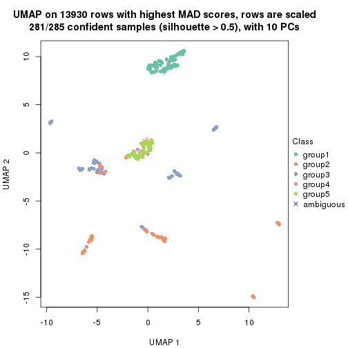</p>

</div>
<div id='tab-MAD-kmeans-dimension-reduction-5'>
<pre><code class="r">dimension_reduction(res, k = 6, method = &quot;UMAP&quot;)
</code></pre>

<p></p>

</div>
</div>


Following heatmap shows how subgroups are split when increasing `k`:

```r
collect_classes(res)
```


If matrix rows can be associated to genes, consider to use `GO_Enrichment(res,
...)` to perform function enrichment for the signature genes.


 

---------------------------------------------------


### MAD:skmeans**


The object with results only for a single top-value method and a single partition method 
can be extracted as:

```r
res = res_list["MAD", "skmeans"]
# you can also extract it by
# res = res_list["MAD:skmeans"]
```

A summary of `res` and all the functions that can be applied to it:

```r
res
```

```
#> A 'ConsensusPartition' object with k = 2, 3, 4, 5, 6.
#>   On a matrix with 13930 rows and 285 columns.
#>   Top rows (1000, 2000, 3000, 4000, 5000) are extracted by 'MAD' method.
#>   Subgroups are detected by 'skmeans' method.
#>   Performed in total 1250 partitions by row resampling.
#>   Best k for subgroups seems to be 4.
#> 
#> Following methods can be applied to this 'ConsensusPartition' object:
#>  [1] "cola_report"             "collect_classes"         "collect_plots"          
#>  [4] "collect_stats"           "colnames"                "compare_signatures"     
#>  [7] "consensus_heatmap"       "dimension_reduction"     "functional_enrichment"  
#> [10] "get_anno_col"            "get_anno"                "get_classes"            
#> [13] "get_consensus"           "get_matrix"              "get_membership"         
#> [16] "get_param"               "get_signatures"          "get_stats"              
#> [19] "is_best_k"               "is_stable_k"             "membership_heatmap"     
#> [22] "ncol"                    "nrow"                    "plot_ecdf"              
#> [25] "rownames"                "select_partition_number" "show"                   
#> [28] "suggest_best_k"          "test_to_known_factors"
```

`collect_plots()` function collects all the plots made from `res` for all `k` (number of partitions)
into one single page to provide an easy and fast comparison between different `k`.

```r
collect_plots(res)
```


The plots are:

- The first row: a plot of the ECDF (Empirical cumulative distribution
  function) curves of the consensus matrix for each `k` and the heatmap of
  predicted classes for each `k`.
- The second row: heatmaps of the consensus matrix for each `k`.
- The third row: heatmaps of the membership matrix for each `k`.
- The fouth row: heatmaps of the signatures for each `k`.

All the plots in panels can be made by individual functions and they are
plotted later in this section.

`select_partition_number()` produces several plots showing different
statistics for choosing "optimized" `k`. There are following statistics:

- ECDF curves of the consensus matrix for each `k`;
- 1-PAC. [The PAC
  score](https://en.wikipedia.org/wiki/Consensus_clustering#Over-interpretation_potential_of_consensus_clustering)
  measures the proportion of the ambiguous subgrouping.
- Mean silhouette score.
- Concordance. The mean probability of fiting the consensus class ids in all
  partitions.
- Area increased. Denote $A_k$ as the area under the ECDF curve for current
  `k`, the area increased is defined as $A_k - A_{k-1}$.
- Rand index. The percent of pairs of samples that are both in a same cluster
  or both are not in a same cluster in the partition of k and k-1.
- Jaccard index. The ratio of pairs of samples are both in a same cluster in
  the partition of k and k-1 and the pairs of samples are both in a same
  cluster in the partition k or k-1.

The detailed explanations of these statistics can be found in [the cola
vignette](http://bioconductor.org/packages/devel/bioc/vignettes/cola/inst/doc/cola.html#toc_13).

Generally speaking, lower PAC score, higher mean silhouette score or higher
concordance corresponds to better partition. Rand index and Jaccard index
measure how similar the current partition is compared to partition with `k-1`.
If they are too similar, we won't accept `k` is better than `k-1`.

```r
select_partition_number(res)
```


The numeric values for all these statistics can be obtained by `get_stats()`.

```r
get_stats(res)
```

```
#>   k 1-PAC mean_silhouette concordance area_increased  Rand Jaccard
#> 2 2 1.000           0.988       0.995         0.4029 0.598   0.598
#> 3 3 0.950           0.931       0.970         0.6356 0.726   0.548
#> 4 4 0.953           0.920       0.966         0.1260 0.888   0.683
#> 5 5 0.852           0.779       0.899         0.0361 0.951   0.818
#> 6 6 0.820           0.718       0.849         0.0305 0.971   0.881
```

`suggest_best_k()` suggests the best $k$ based on these statistics. The rules are as follows:

- All $k$ with Jaccard index larger than 0.95 are removed because the increase of
  the partition number does not provides enough extra information. If all $k$ are removed,
  the best $k$ is assigned by `NA`.
- For $k$ with 1-PAC larger than 0.9, the maximal $k$ is taken as the "best k". Other $k$ is called "optional k".
- If it does not fit the second rule. The $k$ with the highest vote of highest
  1-PAC, mean silhouette and concordance is taken as the "best k".

```r
suggest_best_k(res)
```

```
#> [1] 4
#> attr(,"optional")
#> [1] 2 3
```

There is also optional best $k$ = 2 3 that is worth to check.

Following shows the table of the partitions (You need to click the **show/hide
code output** link to see it). The membership matrix (columns with name `p*`)
is inferred by
[`clue::cl_consensus()`](https://www.rdocumentation.org/link/cl_consensus?package=clue)
function with the `SE` method. Basically the value in the membership matrix
represents the probability to belong to a certain group. The finall class
label for an item is determined with the group with highest probability it
belongs to.

In `get_classes()` function, the entropy is calculated from the membership
matrix and the silhouette score is calculated from the consensus matrix.


<script>
$( function() {
	$( '#tabs-MAD-skmeans-get-classes' ).tabs();
} );
</script>
<div id='tabs-MAD-skmeans-get-classes'>
<ul>
<li><a href='#tab-MAD-skmeans-get-classes-1'>k = 2</a></li>
<li><a href='#tab-MAD-skmeans-get-classes-2'>k = 3</a></li>
<li><a href='#tab-MAD-skmeans-get-classes-3'>k = 4</a></li>
<li><a href='#tab-MAD-skmeans-get-classes-4'>k = 5</a></li>
<li><a href='#tab-MAD-skmeans-get-classes-5'>k = 6</a></li>
</ul>

<div id='tab-MAD-skmeans-get-classes-1'>
<p><a id='tab-MAD-skmeans-get-classes-1-a' style='color:#0366d6' href='#'>show/hide code output</a></p>
<pre><code class="r">cbind(get_classes(res, k = 2), get_membership(res, k = 2))
</code></pre>

<pre><code>#&gt;            class entropy silhouette    p1    p2
#&gt; SRR1201591     2   0.000      0.996 0.000 1.000
#&gt; SRR1201590     2   0.000      0.996 0.000 1.000
#&gt; SRR1201593     2   0.000      0.996 0.000 1.000
#&gt; SRR1201592     2   0.000      0.996 0.000 1.000
#&gt; SRR1201617     2   0.000      0.996 0.000 1.000
#&gt; SRR1201616     2   0.000      0.996 0.000 1.000
#&gt; SRR1201619     2   0.000      0.996 0.000 1.000
#&gt; SRR1201618     2   0.000      0.996 0.000 1.000
#&gt; SRR1201620     2   0.000      0.996 0.000 1.000
#&gt; SRR1201621     2   0.000      0.996 0.000 1.000
#&gt; SRR1201623     2   0.000      0.996 0.000 1.000
#&gt; SRR1201622     2   0.000      0.996 0.000 1.000
#&gt; SRR1201624     1   0.563      0.846 0.868 0.132
#&gt; SRR1201625     2   0.000      0.996 0.000 1.000
#&gt; SRR1201626     1   0.000      0.991 1.000 0.000
#&gt; SRR1201627     2   0.000      0.996 0.000 1.000
#&gt; SRR1201628     2   0.000      0.996 0.000 1.000
#&gt; SRR1201629     2   0.000      0.996 0.000 1.000
#&gt; SRR1201630     2   0.000      0.996 0.000 1.000
#&gt; SRR1201631     2   0.000      0.996 0.000 1.000
#&gt; SRR1201641     2   0.000      0.996 0.000 1.000
#&gt; SRR1201640     2   0.000      0.996 0.000 1.000
#&gt; SRR1201643     2   0.000      0.996 0.000 1.000
#&gt; SRR1201644     2   0.000      0.996 0.000 1.000
#&gt; SRR1201661     2   0.000      0.996 0.000 1.000
#&gt; SRR1201662     2   0.000      0.996 0.000 1.000
#&gt; SRR1201663     2   0.000      0.996 0.000 1.000
#&gt; SRR1201664     2   0.000      0.996 0.000 1.000
#&gt; SRR1201665     2   0.000      0.996 0.000 1.000
#&gt; SRR1201666     2   0.000      0.996 0.000 1.000
#&gt; SRR1201667     2   0.000      0.996 0.000 1.000
#&gt; SRR1201668     2   0.000      0.996 0.000 1.000
#&gt; SRR1201670     2   0.000      0.996 0.000 1.000
#&gt; SRR1201669     2   0.000      0.996 0.000 1.000
#&gt; SRR1201673     2   0.000      0.996 0.000 1.000
#&gt; SRR1201672     2   0.000      0.996 0.000 1.000
#&gt; SRR1201671     2   0.000      0.996 0.000 1.000
#&gt; SRR1201677     2   0.000      0.996 0.000 1.000
#&gt; SRR1201676     2   0.000      0.996 0.000 1.000
#&gt; SRR1201675     2   0.000      0.996 0.000 1.000
#&gt; SRR1201674     2   0.000      0.996 0.000 1.000
#&gt; SRR1201678     2   0.000      0.996 0.000 1.000
#&gt; SRR1201682     2   0.000      0.996 0.000 1.000
#&gt; SRR1201683     2   0.000      0.996 0.000 1.000
#&gt; SRR1201680     2   0.000      0.996 0.000 1.000
#&gt; SRR1201681     2   0.000      0.996 0.000 1.000
#&gt; SRR1201679     2   0.000      0.996 0.000 1.000
#&gt; SRR1201686     2   0.000      0.996 0.000 1.000
#&gt; SRR1201687     2   0.000      0.996 0.000 1.000
#&gt; SRR1201688     2   0.000      0.996 0.000 1.000
#&gt; SRR1201689     2   0.000      0.996 0.000 1.000
#&gt; SRR1201685     1   0.595      0.831 0.856 0.144
#&gt; SRR1201692     2   0.000      0.996 0.000 1.000
#&gt; SRR1201691     2   0.000      0.996 0.000 1.000
#&gt; SRR1201690     2   0.000      0.996 0.000 1.000
#&gt; SRR1201696     2   0.000      0.996 0.000 1.000
#&gt; SRR1201695     2   0.000      0.996 0.000 1.000
#&gt; SRR1201694     2   0.000      0.996 0.000 1.000
#&gt; SRR1201693     2   0.000      0.996 0.000 1.000
#&gt; SRR1201697     2   0.000      0.996 0.000 1.000
#&gt; SRR1201698     2   0.000      0.996 0.000 1.000
#&gt; SRR1201700     2   0.000      0.996 0.000 1.000
#&gt; SRR1201708     2   0.000      0.996 0.000 1.000
#&gt; SRR1201707     2   0.000      0.996 0.000 1.000
#&gt; SRR1201706     2   0.000      0.996 0.000 1.000
#&gt; SRR1201702     2   0.000      0.996 0.000 1.000
#&gt; SRR1201705     2   0.000      0.996 0.000 1.000
#&gt; SRR1201701     2   0.000      0.996 0.000 1.000
#&gt; SRR1201704     2   0.000      0.996 0.000 1.000
#&gt; SRR1201703     2   0.000      0.996 0.000 1.000
#&gt; SRR1201716     2   0.000      0.996 0.000 1.000
#&gt; SRR1201715     2   0.000      0.996 0.000 1.000
#&gt; SRR1201717     2   0.000      0.996 0.000 1.000
#&gt; SRR1201712     2   0.000      0.996 0.000 1.000
#&gt; SRR1201709     2   0.000      0.996 0.000 1.000
#&gt; SRR1201711     2   0.000      0.996 0.000 1.000
#&gt; SRR1201714     2   0.000      0.996 0.000 1.000
#&gt; SRR1201713     2   0.000      0.996 0.000 1.000
#&gt; SRR1201710     2   0.000      0.996 0.000 1.000
#&gt; SRR1201719     2   0.000      0.996 0.000 1.000
#&gt; SRR1201718     2   0.000      0.996 0.000 1.000
#&gt; SRR1201721     2   0.000      0.996 0.000 1.000
#&gt; SRR1201720     2   0.000      0.996 0.000 1.000
#&gt; SRR1201723     2   0.000      0.996 0.000 1.000
#&gt; SRR1201722     2   0.000      0.996 0.000 1.000
#&gt; SRR1201725     2   0.000      0.996 0.000 1.000
#&gt; SRR1201724     2   0.000      0.996 0.000 1.000
#&gt; SRR1201726     2   0.000      0.996 0.000 1.000
#&gt; SRR1201727     2   0.000      0.996 0.000 1.000
#&gt; SRR1201731     2   0.000      0.996 0.000 1.000
#&gt; SRR1201730     2   0.000      0.996 0.000 1.000
#&gt; SRR1201734     2   0.000      0.996 0.000 1.000
#&gt; SRR1201733     2   0.000      0.996 0.000 1.000
#&gt; SRR1201736     2   0.000      0.996 0.000 1.000
#&gt; SRR1201737     2   0.000      0.996 0.000 1.000
#&gt; SRR1201739     2   0.000      0.996 0.000 1.000
#&gt; SRR1201738     2   0.000      0.996 0.000 1.000
#&gt; SRR1201742     2   0.000      0.996 0.000 1.000
#&gt; SRR1201743     2   0.000      0.996 0.000 1.000
#&gt; SRR1201745     2   0.000      0.996 0.000 1.000
#&gt; SRR1201744     1   0.966      0.355 0.608 0.392
#&gt; SRR1201749     2   0.000      0.996 0.000 1.000
#&gt; SRR1201750     2   0.000      0.996 0.000 1.000
#&gt; SRR1201752     2   0.000      0.996 0.000 1.000
#&gt; SRR1201751     2   0.000      0.996 0.000 1.000
#&gt; SRR1201754     2   0.000      0.996 0.000 1.000
#&gt; SRR1201753     2   0.000      0.996 0.000 1.000
#&gt; SRR1201758     1   0.000      0.991 1.000 0.000
#&gt; SRR1201759     2   0.000      0.996 0.000 1.000
#&gt; SRR1201760     2   0.000      0.996 0.000 1.000
#&gt; SRR1201761     2   0.000      0.996 0.000 1.000
#&gt; SRR1201763     2   0.000      0.996 0.000 1.000
#&gt; SRR1201762     1   0.000      0.991 1.000 0.000
#&gt; SRR1201764     2   0.722      0.750 0.200 0.800
#&gt; SRR1201766     2   0.000      0.996 0.000 1.000
#&gt; SRR1201768     2   0.000      0.996 0.000 1.000
#&gt; SRR1201769     2   0.000      0.996 0.000 1.000
#&gt; SRR1201767     2   0.000      0.996 0.000 1.000
#&gt; SRR1201770     2   0.000      0.996 0.000 1.000
#&gt; SRR1201771     2   0.000      0.996 0.000 1.000
#&gt; SRR1201772     2   0.000      0.996 0.000 1.000
#&gt; SRR1201773     2   0.000      0.996 0.000 1.000
#&gt; SRR1201774     2   0.000      0.996 0.000 1.000
#&gt; SRR1201786     2   0.000      0.996 0.000 1.000
#&gt; SRR1201784     2   0.000      0.996 0.000 1.000
#&gt; SRR1201785     2   0.000      0.996 0.000 1.000
#&gt; SRR1201778     2   0.722      0.750 0.200 0.800
#&gt; SRR1201779     2   0.000      0.996 0.000 1.000
#&gt; SRR1201781     2   0.000      0.996 0.000 1.000
#&gt; SRR1201780     2   0.000      0.996 0.000 1.000
#&gt; SRR1201783     2   0.000      0.996 0.000 1.000
#&gt; SRR1201782     2   0.000      0.996 0.000 1.000
#&gt; SRR1201798     2   0.000      0.996 0.000 1.000
#&gt; SRR1201797     2   0.000      0.996 0.000 1.000
#&gt; SRR1201796     2   0.000      0.996 0.000 1.000
#&gt; SRR1201795     2   0.000      0.996 0.000 1.000
#&gt; SRR1201799     2   0.000      0.996 0.000 1.000
#&gt; SRR1201794     2   0.000      0.996 0.000 1.000
#&gt; SRR1201793     2   0.000      0.996 0.000 1.000
#&gt; SRR1201792     2   0.000      0.996 0.000 1.000
#&gt; SRR1201791     2   0.000      0.996 0.000 1.000
#&gt; SRR1201807     2   0.000      0.996 0.000 1.000
#&gt; SRR1201808     2   0.000      0.996 0.000 1.000
#&gt; SRR1201803     2   0.000      0.996 0.000 1.000
#&gt; SRR1201804     2   0.000      0.996 0.000 1.000
#&gt; SRR1201805     2   0.000      0.996 0.000 1.000
#&gt; SRR1201806     2   0.000      0.996 0.000 1.000
#&gt; SRR1201801     2   0.000      0.996 0.000 1.000
#&gt; SRR1201802     2   0.000      0.996 0.000 1.000
#&gt; SRR1201800     2   0.000      0.996 0.000 1.000
#&gt; SRR1201814     2   0.000      0.996 0.000 1.000
#&gt; SRR1201816     2   0.000      0.996 0.000 1.000
#&gt; SRR1201815     2   0.000      0.996 0.000 1.000
#&gt; SRR1201819     2   0.000      0.996 0.000 1.000
#&gt; SRR1201820     2   0.000      0.996 0.000 1.000
#&gt; SRR1201813     2   0.000      0.996 0.000 1.000
#&gt; SRR1201817     2   0.000      0.996 0.000 1.000
#&gt; SRR1201818     2   0.000      0.996 0.000 1.000
#&gt; SRR1201825     2   0.000      0.996 0.000 1.000
#&gt; SRR1201827     2   0.000      0.996 0.000 1.000
#&gt; SRR1201828     2   0.000      0.996 0.000 1.000
#&gt; SRR1201826     2   0.000      0.996 0.000 1.000
#&gt; SRR1201829     2   0.000      0.996 0.000 1.000
#&gt; SRR1201830     2   0.000      0.996 0.000 1.000
#&gt; SRR1201831     2   0.000      0.996 0.000 1.000
#&gt; SRR1201832     2   0.000      0.996 0.000 1.000
#&gt; SRR1201833     2   0.000      0.996 0.000 1.000
#&gt; SRR1201865     2   0.000      0.996 0.000 1.000
#&gt; SRR1201866     2   0.000      0.996 0.000 1.000
#&gt; SRR1201867     2   0.000      0.996 0.000 1.000
#&gt; SRR1201861     2   0.000      0.996 0.000 1.000
#&gt; SRR1201862     2   0.000      0.996 0.000 1.000
#&gt; SRR1201863     2   0.000      0.996 0.000 1.000
#&gt; SRR1201859     2   0.584      0.837 0.140 0.860
#&gt; SRR1201864     2   0.000      0.996 0.000 1.000
#&gt; SRR1201860     2   0.000      0.996 0.000 1.000
#&gt; SRR1201873     2   0.000      0.996 0.000 1.000
#&gt; SRR1201871     2   0.000      0.996 0.000 1.000
#&gt; SRR1201872     2   0.000      0.996 0.000 1.000
#&gt; SRR1201980     2   0.000      0.996 0.000 1.000
#&gt; SRR1201979     2   0.000      0.996 0.000 1.000
#&gt; SRR1201982     2   0.000      0.996 0.000 1.000
#&gt; SRR1201981     2   0.000      0.996 0.000 1.000
#&gt; SRR1201998     2   0.000      0.996 0.000 1.000
#&gt; SRR1201996     2   0.000      0.996 0.000 1.000
#&gt; SRR1201997     2   0.000      0.996 0.000 1.000
#&gt; SRR1202005     2   0.000      0.996 0.000 1.000
#&gt; SRR1202006     2   0.000      0.996 0.000 1.000
#&gt; SRR1202088     2   0.000      0.996 0.000 1.000
#&gt; SRR1202087     2   0.000      0.996 0.000 1.000
#&gt; SRR1202093     2   0.000      0.996 0.000 1.000
#&gt; SRR1202092     2   0.000      0.996 0.000 1.000
#&gt; SRR1202288     2   0.000      0.996 0.000 1.000
#&gt; SRR1202289     2   0.000      0.996 0.000 1.000
#&gt; SRR1202299     2   0.000      0.996 0.000 1.000
#&gt; SRR1202298     2   0.000      0.996 0.000 1.000
#&gt; SRR1202303     2   0.000      0.996 0.000 1.000
#&gt; SRR1202372     2   0.000      0.996 0.000 1.000
#&gt; SRR1202371     2   0.000      0.996 0.000 1.000
#&gt; SRR1202563     2   0.163      0.972 0.024 0.976
#&gt; SRR1202565     2   0.000      0.996 0.000 1.000
#&gt; SRR1202564     2   0.000      0.996 0.000 1.000
#&gt; SRR1202649     2   0.714      0.757 0.196 0.804
#&gt; SRR1202650     2   0.000      0.996 0.000 1.000
#&gt; SRR1202651     2   0.000      0.996 0.000 1.000
#&gt; SRR1202843     1   0.000      0.991 1.000 0.000
#&gt; SRR1202844     1   0.000      0.991 1.000 0.000
#&gt; SRR1202845     2   0.000      0.996 0.000 1.000
#&gt; SRR1202847     2   0.000      0.996 0.000 1.000
#&gt; SRR1202846     2   0.000      0.996 0.000 1.000
#&gt; SRR1202945     1   0.000      0.991 1.000 0.000
#&gt; SRR1202949     1   0.000      0.991 1.000 0.000
#&gt; SRR1202977     1   0.000      0.991 1.000 0.000
#&gt; SRR1202978     1   0.000      0.991 1.000 0.000
#&gt; SRR1202979     1   0.000      0.991 1.000 0.000
#&gt; SRR1202990     1   0.000      0.991 1.000 0.000
#&gt; SRR1202999     1   0.000      0.991 1.000 0.000
#&gt; SRR1203005     1   0.000      0.991 1.000 0.000
#&gt; SRR1203006     1   0.000      0.991 1.000 0.000
#&gt; SRR1203007     1   0.000      0.991 1.000 0.000
#&gt; SRR1203009     1   0.000      0.991 1.000 0.000
#&gt; SRR1203008     1   0.000      0.991 1.000 0.000
#&gt; SRR1203010     1   0.000      0.991 1.000 0.000
#&gt; SRR1203011     1   0.000      0.991 1.000 0.000
#&gt; SRR1203025     1   0.000      0.991 1.000 0.000
#&gt; SRR1203026     1   0.000      0.991 1.000 0.000
#&gt; SRR1203027     1   0.000      0.991 1.000 0.000
#&gt; SRR1203061     1   0.000      0.991 1.000 0.000
#&gt; SRR1203089     1   0.000      0.991 1.000 0.000
#&gt; SRR1203125     1   0.000      0.991 1.000 0.000
#&gt; SRR1203128     1   0.000      0.991 1.000 0.000
#&gt; SRR1203129     1   0.000      0.991 1.000 0.000
#&gt; SRR1203130     1   0.000      0.991 1.000 0.000
#&gt; SRR1203132     2   0.000      0.996 0.000 1.000
#&gt; SRR1203131     2   0.000      0.996 0.000 1.000
#&gt; SRR1203133     1   0.000      0.991 1.000 0.000
#&gt; SRR1203138     1   0.000      0.991 1.000 0.000
#&gt; SRR1203760     1   0.000      0.991 1.000 0.000
#&gt; SRR1203761     1   0.000      0.991 1.000 0.000
#&gt; SRR1203770     1   0.000      0.991 1.000 0.000
#&gt; SRR1203771     1   0.000      0.991 1.000 0.000
#&gt; SRR1203772     1   0.000      0.991 1.000 0.000
#&gt; SRR1203773     1   0.000      0.991 1.000 0.000
#&gt; SRR1203774     1   0.000      0.991 1.000 0.000
#&gt; SRR1203775     1   0.000      0.991 1.000 0.000
#&gt; SRR1203800     1   0.000      0.991 1.000 0.000
#&gt; SRR1203801     1   0.000      0.991 1.000 0.000
#&gt; SRR1203802     1   0.000      0.991 1.000 0.000
#&gt; SRR1203803     1   0.000      0.991 1.000 0.000
#&gt; SRR1203804     1   0.000      0.991 1.000 0.000
#&gt; SRR1203805     1   0.000      0.991 1.000 0.000
#&gt; SRR1203806     1   0.000      0.991 1.000 0.000
#&gt; SRR1203807     1   0.000      0.991 1.000 0.000
#&gt; SRR1203808     1   0.000      0.991 1.000 0.000
#&gt; SRR1203811     1   0.000      0.991 1.000 0.000
#&gt; SRR1203812     1   0.000      0.991 1.000 0.000
#&gt; SRR1203813     1   0.000      0.991 1.000 0.000
#&gt; SRR1203814     1   0.000      0.991 1.000 0.000
#&gt; SRR1203815     1   0.000      0.991 1.000 0.000
#&gt; SRR1203816     1   0.000      0.991 1.000 0.000
#&gt; SRR1203817     1   0.000      0.991 1.000 0.000
#&gt; SRR1203818     1   0.000      0.991 1.000 0.000
#&gt; SRR1203819     1   0.000      0.991 1.000 0.000
#&gt; SRR1203822     1   0.000      0.991 1.000 0.000
#&gt; SRR1203823     1   0.000      0.991 1.000 0.000
#&gt; SRR1203824     1   0.000      0.991 1.000 0.000
#&gt; SRR1203825     1   0.000      0.991 1.000 0.000
#&gt; SRR1203826     1   0.000      0.991 1.000 0.000
#&gt; SRR1203827     1   0.000      0.991 1.000 0.000
#&gt; SRR1203828     1   0.000      0.991 1.000 0.000
#&gt; SRR1203829     1   0.000      0.991 1.000 0.000
#&gt; SRR1203830     1   0.000      0.991 1.000 0.000
#&gt; SRR1203831     1   0.000      0.991 1.000 0.000
#&gt; SRR1203832     1   0.000      0.991 1.000 0.000
#&gt; SRR1203833     1   0.000      0.991 1.000 0.000
#&gt; SRR1203834     1   0.000      0.991 1.000 0.000
#&gt; SRR1203835     1   0.000      0.991 1.000 0.000
#&gt; SRR1203836     1   0.000      0.991 1.000 0.000
#&gt; SRR1203837     1   0.000      0.991 1.000 0.000
#&gt; SRR1203838     1   0.000      0.991 1.000 0.000
#&gt; SRR1203839     1   0.000      0.991 1.000 0.000
#&gt; SRR1203842     1   0.000      0.991 1.000 0.000
#&gt; SRR1203843     1   0.000      0.991 1.000 0.000
#&gt; SRR1203845     2   0.000      0.996 0.000 1.000
#&gt; SRR1203844     2   0.000      0.996 0.000 1.000
</code></pre>

<script>
$('#tab-MAD-skmeans-get-classes-1-a').parent().next().next().hide();
$('#tab-MAD-skmeans-get-classes-1-a').click(function(){
  $('#tab-MAD-skmeans-get-classes-1-a').parent().next().next().toggle();
  return(false);
});
</script>
</div>

<div id='tab-MAD-skmeans-get-classes-2'>
<p><a id='tab-MAD-skmeans-get-classes-2-a' style='color:#0366d6' href='#'>show/hide code output</a></p>
<pre><code class="r">cbind(get_classes(res, k = 3), get_membership(res, k = 3))
</code></pre>

<pre><code>#&gt;            class entropy silhouette    p1    p2    p3
#&gt; SRR1201591     3  0.0592      0.947 0.000 0.012 0.988
#&gt; SRR1201590     3  0.0000      0.941 0.000 0.000 1.000
#&gt; SRR1201593     3  0.0592      0.947 0.000 0.012 0.988
#&gt; SRR1201592     3  0.0000      0.941 0.000 0.000 1.000
#&gt; SRR1201617     3  0.0592      0.947 0.000 0.012 0.988
#&gt; SRR1201616     3  0.0000      0.941 0.000 0.000 1.000
#&gt; SRR1201619     3  0.0592      0.947 0.000 0.012 0.988
#&gt; SRR1201618     3  0.0000      0.941 0.000 0.000 1.000
#&gt; SRR1201620     3  0.0000      0.941 0.000 0.000 1.000
#&gt; SRR1201621     3  0.0592      0.947 0.000 0.012 0.988
#&gt; SRR1201623     2  0.0000      0.967 0.000 1.000 0.000
#&gt; SRR1201622     2  0.0592      0.960 0.000 0.988 0.012
#&gt; SRR1201624     2  0.4915      0.758 0.184 0.804 0.012
#&gt; SRR1201625     2  0.0000      0.967 0.000 1.000 0.000
#&gt; SRR1201626     1  0.0000      1.000 1.000 0.000 0.000
#&gt; SRR1201627     2  0.0000      0.967 0.000 1.000 0.000
#&gt; SRR1201628     2  0.0592      0.960 0.000 0.988 0.012
#&gt; SRR1201629     2  0.0000      0.967 0.000 1.000 0.000
#&gt; SRR1201630     3  0.6302      0.103 0.000 0.480 0.520
#&gt; SRR1201631     2  0.5098      0.648 0.000 0.752 0.248
#&gt; SRR1201641     2  0.0000      0.967 0.000 1.000 0.000
#&gt; SRR1201640     2  0.4796      0.715 0.000 0.780 0.220
#&gt; SRR1201643     2  0.0592      0.960 0.000 0.988 0.012
#&gt; SRR1201644     2  0.0000      0.967 0.000 1.000 0.000
#&gt; SRR1201661     3  0.6154      0.338 0.000 0.408 0.592
#&gt; SRR1201662     2  0.6008      0.367 0.000 0.628 0.372
#&gt; SRR1201663     2  0.0592      0.960 0.000 0.988 0.012
#&gt; SRR1201664     2  0.0000      0.967 0.000 1.000 0.000
#&gt; SRR1201665     3  0.0000      0.941 0.000 0.000 1.000
#&gt; SRR1201666     3  0.0592      0.947 0.000 0.012 0.988
#&gt; SRR1201667     3  0.0592      0.947 0.000 0.012 0.988
#&gt; SRR1201668     2  0.0892      0.957 0.000 0.980 0.020
#&gt; SRR1201670     2  0.0000      0.967 0.000 1.000 0.000
#&gt; SRR1201669     2  0.0000      0.967 0.000 1.000 0.000
#&gt; SRR1201673     2  0.0000      0.967 0.000 1.000 0.000
#&gt; SRR1201672     2  0.0000      0.967 0.000 1.000 0.000
#&gt; SRR1201671     2  0.0592      0.960 0.000 0.988 0.012
#&gt; SRR1201677     2  0.0000      0.967 0.000 1.000 0.000
#&gt; SRR1201676     2  0.0000      0.967 0.000 1.000 0.000
#&gt; SRR1201675     2  0.0000      0.967 0.000 1.000 0.000
#&gt; SRR1201674     2  0.0000      0.967 0.000 1.000 0.000
#&gt; SRR1201678     2  0.0000      0.967 0.000 1.000 0.000
#&gt; SRR1201682     3  0.0592      0.947 0.000 0.012 0.988
#&gt; SRR1201683     3  0.0592      0.947 0.000 0.012 0.988
#&gt; SRR1201680     3  0.0592      0.947 0.000 0.012 0.988
#&gt; SRR1201681     3  0.0592      0.947 0.000 0.012 0.988
#&gt; SRR1201679     3  0.0000      0.941 0.000 0.000 1.000
#&gt; SRR1201686     2  0.0000      0.967 0.000 1.000 0.000
#&gt; SRR1201687     2  0.0000      0.967 0.000 1.000 0.000
#&gt; SRR1201688     2  0.0000      0.967 0.000 1.000 0.000
#&gt; SRR1201689     2  0.0000      0.967 0.000 1.000 0.000
#&gt; SRR1201685     2  0.4861      0.765 0.180 0.808 0.012
#&gt; SRR1201692     2  0.0000      0.967 0.000 1.000 0.000
#&gt; SRR1201691     2  0.0000      0.967 0.000 1.000 0.000
#&gt; SRR1201690     2  0.0592      0.960 0.000 0.988 0.012
#&gt; SRR1201696     2  0.0000      0.967 0.000 1.000 0.000
#&gt; SRR1201695     2  0.0000      0.967 0.000 1.000 0.000
#&gt; SRR1201694     2  0.0000      0.967 0.000 1.000 0.000
#&gt; SRR1201693     2  0.0000      0.967 0.000 1.000 0.000
#&gt; SRR1201697     2  0.0000      0.967 0.000 1.000 0.000
#&gt; SRR1201698     2  0.0000      0.967 0.000 1.000 0.000
#&gt; SRR1201700     2  0.0592      0.960 0.000 0.988 0.012
#&gt; SRR1201708     2  0.0000      0.967 0.000 1.000 0.000
#&gt; SRR1201707     2  0.0000      0.967 0.000 1.000 0.000
#&gt; SRR1201706     2  0.0000      0.967 0.000 1.000 0.000
#&gt; SRR1201702     2  0.0000      0.967 0.000 1.000 0.000
#&gt; SRR1201705     2  0.0000      0.967 0.000 1.000 0.000
#&gt; SRR1201701     2  0.0000      0.967 0.000 1.000 0.000
#&gt; SRR1201704     2  0.0000      0.967 0.000 1.000 0.000
#&gt; SRR1201703     2  0.0000      0.967 0.000 1.000 0.000
#&gt; SRR1201716     2  0.0000      0.967 0.000 1.000 0.000
#&gt; SRR1201715     2  0.0000      0.967 0.000 1.000 0.000
#&gt; SRR1201717     2  0.0000      0.967 0.000 1.000 0.000
#&gt; SRR1201712     2  0.0000      0.967 0.000 1.000 0.000
#&gt; SRR1201709     2  0.0592      0.960 0.000 0.988 0.012
#&gt; SRR1201711     2  0.0000      0.967 0.000 1.000 0.000
#&gt; SRR1201714     2  0.0000      0.967 0.000 1.000 0.000
#&gt; SRR1201713     2  0.0000      0.967 0.000 1.000 0.000
#&gt; SRR1201710     2  0.0000      0.967 0.000 1.000 0.000
#&gt; SRR1201719     2  0.0000      0.967 0.000 1.000 0.000
#&gt; SRR1201718     2  0.3941      0.795 0.000 0.844 0.156
#&gt; SRR1201721     2  0.0000      0.967 0.000 1.000 0.000
#&gt; SRR1201720     2  0.0592      0.960 0.000 0.988 0.012
#&gt; SRR1201723     2  0.0000      0.967 0.000 1.000 0.000
#&gt; SRR1201722     2  0.0592      0.960 0.000 0.988 0.012
#&gt; SRR1201725     2  0.0000      0.967 0.000 1.000 0.000
#&gt; SRR1201724     2  0.1860      0.927 0.000 0.948 0.052
#&gt; SRR1201726     2  0.0592      0.960 0.000 0.988 0.012
#&gt; SRR1201727     2  0.0000      0.967 0.000 1.000 0.000
#&gt; SRR1201731     2  0.0000      0.967 0.000 1.000 0.000
#&gt; SRR1201730     2  0.0592      0.960 0.000 0.988 0.012
#&gt; SRR1201734     3  0.0592      0.947 0.000 0.012 0.988
#&gt; SRR1201733     3  0.0000      0.941 0.000 0.000 1.000
#&gt; SRR1201736     3  0.0000      0.941 0.000 0.000 1.000
#&gt; SRR1201737     3  0.0592      0.947 0.000 0.012 0.988
#&gt; SRR1201739     3  0.0592      0.947 0.000 0.012 0.988
#&gt; SRR1201738     3  0.0000      0.941 0.000 0.000 1.000
#&gt; SRR1201742     3  0.0237      0.940 0.000 0.004 0.996
#&gt; SRR1201743     3  0.0592      0.947 0.000 0.012 0.988
#&gt; SRR1201745     3  0.0592      0.947 0.000 0.012 0.988
#&gt; SRR1201744     3  0.5591      0.559 0.304 0.000 0.696
#&gt; SRR1201749     3  0.0000      0.941 0.000 0.000 1.000
#&gt; SRR1201750     3  0.0592      0.947 0.000 0.012 0.988
#&gt; SRR1201752     2  0.0000      0.967 0.000 1.000 0.000
#&gt; SRR1201751     2  0.0592      0.960 0.000 0.988 0.012
#&gt; SRR1201754     3  0.4605      0.746 0.000 0.204 0.796
#&gt; SRR1201753     3  0.0000      0.941 0.000 0.000 1.000
#&gt; SRR1201758     1  0.0237      0.996 0.996 0.000 0.004
#&gt; SRR1201759     2  0.0000      0.967 0.000 1.000 0.000
#&gt; SRR1201760     2  0.0592      0.960 0.000 0.988 0.012
#&gt; SRR1201761     2  0.0000      0.967 0.000 1.000 0.000
#&gt; SRR1201763     2  0.0000      0.967 0.000 1.000 0.000
#&gt; SRR1201762     1  0.0000      1.000 1.000 0.000 0.000
#&gt; SRR1201764     2  0.3989      0.839 0.124 0.864 0.012
#&gt; SRR1201766     3  0.0000      0.941 0.000 0.000 1.000
#&gt; SRR1201768     3  0.0592      0.947 0.000 0.012 0.988
#&gt; SRR1201769     3  0.0592      0.947 0.000 0.012 0.988
#&gt; SRR1201767     3  0.0592      0.947 0.000 0.012 0.988
#&gt; SRR1201770     3  0.0592      0.947 0.000 0.012 0.988
#&gt; SRR1201771     3  0.0592      0.947 0.000 0.012 0.988
#&gt; SRR1201772     3  0.0592      0.947 0.000 0.012 0.988
#&gt; SRR1201773     3  0.0592      0.947 0.000 0.012 0.988
#&gt; SRR1201774     3  0.0592      0.947 0.000 0.012 0.988
#&gt; SRR1201786     3  0.0592      0.947 0.000 0.012 0.988
#&gt; SRR1201784     3  0.0592      0.947 0.000 0.012 0.988
#&gt; SRR1201785     3  0.0592      0.947 0.000 0.012 0.988
#&gt; SRR1201778     3  0.0000      0.941 0.000 0.000 1.000
#&gt; SRR1201779     3  0.0592      0.947 0.000 0.012 0.988
#&gt; SRR1201781     3  0.0592      0.947 0.000 0.012 0.988
#&gt; SRR1201780     3  0.0592      0.947 0.000 0.012 0.988
#&gt; SRR1201783     3  0.0592      0.947 0.000 0.012 0.988
#&gt; SRR1201782     3  0.0592      0.947 0.000 0.012 0.988
#&gt; SRR1201798     3  0.0592      0.947 0.000 0.012 0.988
#&gt; SRR1201797     3  0.0592      0.947 0.000 0.012 0.988
#&gt; SRR1201796     3  0.0592      0.947 0.000 0.012 0.988
#&gt; SRR1201795     3  0.0592      0.947 0.000 0.012 0.988
#&gt; SRR1201799     3  0.0592      0.947 0.000 0.012 0.988
#&gt; SRR1201794     3  0.0592      0.947 0.000 0.012 0.988
#&gt; SRR1201793     3  0.0592      0.947 0.000 0.012 0.988
#&gt; SRR1201792     3  0.0592      0.947 0.000 0.012 0.988
#&gt; SRR1201791     3  0.0000      0.941 0.000 0.000 1.000
#&gt; SRR1201807     3  0.0592      0.947 0.000 0.012 0.988
#&gt; SRR1201808     3  0.0592      0.947 0.000 0.012 0.988
#&gt; SRR1201803     3  0.0592      0.947 0.000 0.012 0.988
#&gt; SRR1201804     3  0.0592      0.947 0.000 0.012 0.988
#&gt; SRR1201805     3  0.0592      0.947 0.000 0.012 0.988
#&gt; SRR1201806     3  0.0592      0.947 0.000 0.012 0.988
#&gt; SRR1201801     3  0.0592      0.947 0.000 0.012 0.988
#&gt; SRR1201802     3  0.0592      0.947 0.000 0.012 0.988
#&gt; SRR1201800     3  0.0000      0.941 0.000 0.000 1.000
#&gt; SRR1201814     3  0.0592      0.947 0.000 0.012 0.988
#&gt; SRR1201816     3  0.0592      0.947 0.000 0.012 0.988
#&gt; SRR1201815     3  0.0592      0.947 0.000 0.012 0.988
#&gt; SRR1201819     3  0.0592      0.947 0.000 0.012 0.988
#&gt; SRR1201820     3  0.0592      0.947 0.000 0.012 0.988
#&gt; SRR1201813     3  0.0000      0.941 0.000 0.000 1.000
#&gt; SRR1201817     3  0.0592      0.947 0.000 0.012 0.988
#&gt; SRR1201818     3  0.0592      0.947 0.000 0.012 0.988
#&gt; SRR1201825     2  0.0592      0.960 0.000 0.988 0.012
#&gt; SRR1201827     2  0.0000      0.967 0.000 1.000 0.000
#&gt; SRR1201828     2  0.0000      0.967 0.000 1.000 0.000
#&gt; SRR1201826     2  0.0592      0.960 0.000 0.988 0.012
#&gt; SRR1201829     2  0.0000      0.967 0.000 1.000 0.000
#&gt; SRR1201830     2  0.0000      0.967 0.000 1.000 0.000
#&gt; SRR1201831     2  0.0000      0.967 0.000 1.000 0.000
#&gt; SRR1201832     2  0.0000      0.967 0.000 1.000 0.000
#&gt; SRR1201833     2  0.0000      0.967 0.000 1.000 0.000
#&gt; SRR1201865     2  0.0000      0.967 0.000 1.000 0.000
#&gt; SRR1201866     2  0.0000      0.967 0.000 1.000 0.000
#&gt; SRR1201867     2  0.0000      0.967 0.000 1.000 0.000
#&gt; SRR1201861     2  0.0000      0.967 0.000 1.000 0.000
#&gt; SRR1201862     2  0.0000      0.967 0.000 1.000 0.000
#&gt; SRR1201863     2  0.0000      0.967 0.000 1.000 0.000
#&gt; SRR1201859     2  0.3722      0.875 0.088 0.888 0.024
#&gt; SRR1201864     2  0.0000      0.967 0.000 1.000 0.000
#&gt; SRR1201860     2  0.0000      0.967 0.000 1.000 0.000
#&gt; SRR1201873     2  0.0000      0.967 0.000 1.000 0.000
#&gt; SRR1201871     2  0.0592      0.960 0.000 0.988 0.012
#&gt; SRR1201872     2  0.0000      0.967 0.000 1.000 0.000
#&gt; SRR1201980     2  0.0000      0.967 0.000 1.000 0.000
#&gt; SRR1201979     2  0.0592      0.960 0.000 0.988 0.012
#&gt; SRR1201982     2  0.0000      0.967 0.000 1.000 0.000
#&gt; SRR1201981     2  0.0592      0.960 0.000 0.988 0.012
#&gt; SRR1201998     2  0.0000      0.967 0.000 1.000 0.000
#&gt; SRR1201996     2  0.5650      0.541 0.000 0.688 0.312
#&gt; SRR1201997     2  0.0000      0.967 0.000 1.000 0.000
#&gt; SRR1202005     3  0.6111      0.398 0.000 0.396 0.604
#&gt; SRR1202006     3  0.6126      0.388 0.000 0.400 0.600
#&gt; SRR1202088     2  0.4452      0.746 0.000 0.808 0.192
#&gt; SRR1202087     2  0.4452      0.746 0.000 0.808 0.192
#&gt; SRR1202093     3  0.0592      0.947 0.000 0.012 0.988
#&gt; SRR1202092     3  0.0000      0.941 0.000 0.000 1.000
#&gt; SRR1202288     3  0.0000      0.941 0.000 0.000 1.000
#&gt; SRR1202289     3  0.0592      0.947 0.000 0.012 0.988
#&gt; SRR1202299     3  0.0592      0.947 0.000 0.012 0.988
#&gt; SRR1202298     3  0.0000      0.941 0.000 0.000 1.000
#&gt; SRR1202303     2  0.0000      0.967 0.000 1.000 0.000
#&gt; SRR1202372     3  0.0592      0.947 0.000 0.012 0.988
#&gt; SRR1202371     3  0.0000      0.941 0.000 0.000 1.000
#&gt; SRR1202563     3  0.6330      0.365 0.004 0.396 0.600
#&gt; SRR1202565     2  0.0000      0.967 0.000 1.000 0.000
#&gt; SRR1202564     2  0.0000      0.967 0.000 1.000 0.000
#&gt; SRR1202649     3  0.5850      0.718 0.188 0.040 0.772
#&gt; SRR1202650     3  0.6168      0.327 0.000 0.412 0.588
#&gt; SRR1202651     3  0.6126      0.388 0.000 0.400 0.600
#&gt; SRR1202843     1  0.0000      1.000 1.000 0.000 0.000
#&gt; SRR1202844     1  0.0000      1.000 1.000 0.000 0.000
#&gt; SRR1202845     3  0.5882      0.483 0.000 0.348 0.652
#&gt; SRR1202847     2  0.6215      0.195 0.000 0.572 0.428
#&gt; SRR1202846     2  0.6215      0.195 0.000 0.572 0.428
#&gt; SRR1202945     1  0.0000      1.000 1.000 0.000 0.000
#&gt; SRR1202949     1  0.0000      1.000 1.000 0.000 0.000
#&gt; SRR1202977     1  0.0000      1.000 1.000 0.000 0.000
#&gt; SRR1202978     1  0.0000      1.000 1.000 0.000 0.000
#&gt; SRR1202979     1  0.0000      1.000 1.000 0.000 0.000
#&gt; SRR1202990     1  0.0000      1.000 1.000 0.000 0.000
#&gt; SRR1202999     1  0.0000      1.000 1.000 0.000 0.000
#&gt; SRR1203005     1  0.0000      1.000 1.000 0.000 0.000
#&gt; SRR1203006     1  0.0000      1.000 1.000 0.000 0.000
#&gt; SRR1203007     1  0.0000      1.000 1.000 0.000 0.000
#&gt; SRR1203009     1  0.0000      1.000 1.000 0.000 0.000
#&gt; SRR1203008     1  0.0000      1.000 1.000 0.000 0.000
#&gt; SRR1203010     1  0.0000      1.000 1.000 0.000 0.000
#&gt; SRR1203011     1  0.0000      1.000 1.000 0.000 0.000
#&gt; SRR1203025     1  0.0000      1.000 1.000 0.000 0.000
#&gt; SRR1203026     1  0.0000      1.000 1.000 0.000 0.000
#&gt; SRR1203027     1  0.0000      1.000 1.000 0.000 0.000
#&gt; SRR1203061     1  0.0000      1.000 1.000 0.000 0.000
#&gt; SRR1203089     1  0.0000      1.000 1.000 0.000 0.000
#&gt; SRR1203125     1  0.0000      1.000 1.000 0.000 0.000
#&gt; SRR1203128     1  0.0000      1.000 1.000 0.000 0.000
#&gt; SRR1203129     1  0.0000      1.000 1.000 0.000 0.000
#&gt; SRR1203130     1  0.0000      1.000 1.000 0.000 0.000
#&gt; SRR1203132     2  0.0000      0.967 0.000 1.000 0.000
#&gt; SRR1203131     2  0.0592      0.960 0.000 0.988 0.012
#&gt; SRR1203133     1  0.0000      1.000 1.000 0.000 0.000
#&gt; SRR1203138     1  0.0000      1.000 1.000 0.000 0.000
#&gt; SRR1203760     1  0.0000      1.000 1.000 0.000 0.000
#&gt; SRR1203761     1  0.0000      1.000 1.000 0.000 0.000
#&gt; SRR1203770     1  0.0000      1.000 1.000 0.000 0.000
#&gt; SRR1203771     1  0.0000      1.000 1.000 0.000 0.000
#&gt; SRR1203772     1  0.0000      1.000 1.000 0.000 0.000
#&gt; SRR1203773     1  0.0000      1.000 1.000 0.000 0.000
#&gt; SRR1203774     1  0.0000      1.000 1.000 0.000 0.000
#&gt; SRR1203775     1  0.0000      1.000 1.000 0.000 0.000
#&gt; SRR1203800     1  0.0000      1.000 1.000 0.000 0.000
#&gt; SRR1203801     1  0.0000      1.000 1.000 0.000 0.000
#&gt; SRR1203802     1  0.0000      1.000 1.000 0.000 0.000
#&gt; SRR1203803     1  0.0000      1.000 1.000 0.000 0.000
#&gt; SRR1203804     1  0.0000      1.000 1.000 0.000 0.000
#&gt; SRR1203805     1  0.0000      1.000 1.000 0.000 0.000
#&gt; SRR1203806     1  0.0000      1.000 1.000 0.000 0.000
#&gt; SRR1203807     1  0.0000      1.000 1.000 0.000 0.000
#&gt; SRR1203808     1  0.0000      1.000 1.000 0.000 0.000
#&gt; SRR1203811     1  0.0000      1.000 1.000 0.000 0.000
#&gt; SRR1203812     1  0.0000      1.000 1.000 0.000 0.000
#&gt; SRR1203813     1  0.0000      1.000 1.000 0.000 0.000
#&gt; SRR1203814     1  0.0000      1.000 1.000 0.000 0.000
#&gt; SRR1203815     1  0.0000      1.000 1.000 0.000 0.000
#&gt; SRR1203816     1  0.0000      1.000 1.000 0.000 0.000
#&gt; SRR1203817     1  0.0000      1.000 1.000 0.000 0.000
#&gt; SRR1203818     1  0.0000      1.000 1.000 0.000 0.000
#&gt; SRR1203819     1  0.0000      1.000 1.000 0.000 0.000
#&gt; SRR1203822     1  0.0000      1.000 1.000 0.000 0.000
#&gt; SRR1203823     1  0.0000      1.000 1.000 0.000 0.000
#&gt; SRR1203824     1  0.0000      1.000 1.000 0.000 0.000
#&gt; SRR1203825     1  0.0000      1.000 1.000 0.000 0.000
#&gt; SRR1203826     1  0.0000      1.000 1.000 0.000 0.000
#&gt; SRR1203827     1  0.0000      1.000 1.000 0.000 0.000
#&gt; SRR1203828     1  0.0000      1.000 1.000 0.000 0.000
#&gt; SRR1203829     1  0.0000      1.000 1.000 0.000 0.000
#&gt; SRR1203830     1  0.0000      1.000 1.000 0.000 0.000
#&gt; SRR1203831     1  0.0000      1.000 1.000 0.000 0.000
#&gt; SRR1203832     1  0.0000      1.000 1.000 0.000 0.000
#&gt; SRR1203833     1  0.0000      1.000 1.000 0.000 0.000
#&gt; SRR1203834     1  0.0000      1.000 1.000 0.000 0.000
#&gt; SRR1203835     1  0.0000      1.000 1.000 0.000 0.000
#&gt; SRR1203836     1  0.0000      1.000 1.000 0.000 0.000
#&gt; SRR1203837     1  0.0000      1.000 1.000 0.000 0.000
#&gt; SRR1203838     1  0.0000      1.000 1.000 0.000 0.000
#&gt; SRR1203839     1  0.0000      1.000 1.000 0.000 0.000
#&gt; SRR1203842     1  0.0000      1.000 1.000 0.000 0.000
#&gt; SRR1203843     1  0.0000      1.000 1.000 0.000 0.000
#&gt; SRR1203845     3  0.5678      0.568 0.000 0.316 0.684
#&gt; SRR1203844     3  0.2878      0.862 0.000 0.096 0.904
</code></pre>

<script>
$('#tab-MAD-skmeans-get-classes-2-a').parent().next().next().hide();
$('#tab-MAD-skmeans-get-classes-2-a').click(function(){
  $('#tab-MAD-skmeans-get-classes-2-a').parent().next().next().toggle();
  return(false);
});
</script>
</div>

<div id='tab-MAD-skmeans-get-classes-3'>
<p><a id='tab-MAD-skmeans-get-classes-3-a' style='color:#0366d6' href='#'>show/hide code output</a></p>
<pre><code class="r">cbind(get_classes(res, k = 4), get_membership(res, k = 4))
</code></pre>

<pre><code>#&gt;            class entropy silhouette    p1    p2    p3    p4
#&gt; SRR1201591     2  0.0000     0.9437 0.000 1.000 0.000 0.000
#&gt; SRR1201590     4  0.4500     0.5680 0.000 0.316 0.000 0.684
#&gt; SRR1201593     2  0.0000     0.9437 0.000 1.000 0.000 0.000
#&gt; SRR1201592     2  0.1792     0.8855 0.000 0.932 0.000 0.068
#&gt; SRR1201617     2  0.0000     0.9437 0.000 1.000 0.000 0.000
#&gt; SRR1201616     2  0.3024     0.7959 0.000 0.852 0.000 0.148
#&gt; SRR1201619     2  0.0592     0.9309 0.000 0.984 0.016 0.000
#&gt; SRR1201618     4  0.0469     0.9238 0.000 0.012 0.000 0.988
#&gt; SRR1201620     2  0.4431     0.5333 0.000 0.696 0.000 0.304
#&gt; SRR1201621     2  0.0000     0.9437 0.000 1.000 0.000 0.000
#&gt; SRR1201623     3  0.0000     0.9676 0.000 0.000 1.000 0.000
#&gt; SRR1201622     4  0.0188     0.9253 0.000 0.000 0.004 0.996
#&gt; SRR1201624     4  0.3528     0.7632 0.000 0.000 0.192 0.808
#&gt; SRR1201625     3  0.0000     0.9676 0.000 0.000 1.000 0.000
#&gt; SRR1201626     1  0.0000     0.9970 1.000 0.000 0.000 0.000
#&gt; SRR1201627     3  0.0000     0.9676 0.000 0.000 1.000 0.000
#&gt; SRR1201628     4  0.0000     0.9249 0.000 0.000 0.000 1.000
#&gt; SRR1201629     3  0.0000     0.9676 0.000 0.000 1.000 0.000
#&gt; SRR1201630     4  0.0336     0.9245 0.000 0.008 0.000 0.992
#&gt; SRR1201631     3  0.4535     0.5612 0.000 0.292 0.704 0.004
#&gt; SRR1201641     3  0.0188     0.9652 0.000 0.000 0.996 0.004
#&gt; SRR1201640     4  0.0592     0.9229 0.000 0.000 0.016 0.984
#&gt; SRR1201643     4  0.0188     0.9255 0.000 0.000 0.004 0.996
#&gt; SRR1201644     3  0.0188     0.9652 0.000 0.000 0.996 0.004
#&gt; SRR1201661     4  0.0524     0.9249 0.000 0.008 0.004 0.988
#&gt; SRR1201662     3  0.4837     0.4365 0.000 0.348 0.648 0.004
#&gt; SRR1201663     4  0.0817     0.9200 0.000 0.000 0.024 0.976
#&gt; SRR1201664     3  0.0592     0.9561 0.000 0.000 0.984 0.016
#&gt; SRR1201665     4  0.0817     0.9196 0.000 0.024 0.000 0.976
#&gt; SRR1201666     2  0.0000     0.9437 0.000 1.000 0.000 0.000
#&gt; SRR1201667     2  0.0000     0.9437 0.000 1.000 0.000 0.000
#&gt; SRR1201668     4  0.0188     0.9253 0.000 0.000 0.004 0.996
#&gt; SRR1201670     3  0.0592     0.9561 0.000 0.000 0.984 0.016
#&gt; SRR1201669     3  0.0592     0.9561 0.000 0.000 0.984 0.016
#&gt; SRR1201673     3  0.0000     0.9676 0.000 0.000 1.000 0.000
#&gt; SRR1201672     3  0.0000     0.9676 0.000 0.000 1.000 0.000
#&gt; SRR1201671     4  0.0336     0.9256 0.000 0.000 0.008 0.992
#&gt; SRR1201677     3  0.0000     0.9676 0.000 0.000 1.000 0.000
#&gt; SRR1201676     3  0.0000     0.9676 0.000 0.000 1.000 0.000
#&gt; SRR1201675     3  0.0000     0.9676 0.000 0.000 1.000 0.000
#&gt; SRR1201674     3  0.0000     0.9676 0.000 0.000 1.000 0.000
#&gt; SRR1201678     3  0.0000     0.9676 0.000 0.000 1.000 0.000
#&gt; SRR1201682     2  0.2216     0.8604 0.000 0.908 0.092 0.000
#&gt; SRR1201683     2  0.2216     0.8604 0.000 0.908 0.092 0.000
#&gt; SRR1201680     2  0.2216     0.8604 0.000 0.908 0.092 0.000
#&gt; SRR1201681     2  0.2216     0.8604 0.000 0.908 0.092 0.000
#&gt; SRR1201679     4  0.3311     0.7918 0.000 0.172 0.000 0.828
#&gt; SRR1201686     3  0.0592     0.9561 0.000 0.000 0.984 0.016
#&gt; SRR1201687     3  0.0592     0.9561 0.000 0.000 0.984 0.016
#&gt; SRR1201688     3  0.0592     0.9561 0.000 0.000 0.984 0.016
#&gt; SRR1201689     3  0.0592     0.9561 0.000 0.000 0.984 0.016
#&gt; SRR1201685     4  0.0188     0.9253 0.000 0.000 0.004 0.996
#&gt; SRR1201692     3  0.0000     0.9676 0.000 0.000 1.000 0.000
#&gt; SRR1201691     3  0.0000     0.9676 0.000 0.000 1.000 0.000
#&gt; SRR1201690     4  0.0188     0.9253 0.000 0.000 0.004 0.996
#&gt; SRR1201696     3  0.0000     0.9676 0.000 0.000 1.000 0.000
#&gt; SRR1201695     3  0.0000     0.9676 0.000 0.000 1.000 0.000
#&gt; SRR1201694     3  0.0000     0.9676 0.000 0.000 1.000 0.000
#&gt; SRR1201693     3  0.0000     0.9676 0.000 0.000 1.000 0.000
#&gt; SRR1201697     3  0.0000     0.9676 0.000 0.000 1.000 0.000
#&gt; SRR1201698     3  0.0000     0.9676 0.000 0.000 1.000 0.000
#&gt; SRR1201700     4  0.2973     0.8222 0.000 0.000 0.144 0.856
#&gt; SRR1201708     3  0.0000     0.9676 0.000 0.000 1.000 0.000
#&gt; SRR1201707     3  0.0000     0.9676 0.000 0.000 1.000 0.000
#&gt; SRR1201706     3  0.0000     0.9676 0.000 0.000 1.000 0.000
#&gt; SRR1201702     3  0.0000     0.9676 0.000 0.000 1.000 0.000
#&gt; SRR1201705     3  0.0000     0.9676 0.000 0.000 1.000 0.000
#&gt; SRR1201701     3  0.0000     0.9676 0.000 0.000 1.000 0.000
#&gt; SRR1201704     3  0.0000     0.9676 0.000 0.000 1.000 0.000
#&gt; SRR1201703     3  0.0000     0.9676 0.000 0.000 1.000 0.000
#&gt; SRR1201716     3  0.0000     0.9676 0.000 0.000 1.000 0.000
#&gt; SRR1201715     3  0.0000     0.9676 0.000 0.000 1.000 0.000
#&gt; SRR1201717     3  0.0000     0.9676 0.000 0.000 1.000 0.000
#&gt; SRR1201712     3  0.0000     0.9676 0.000 0.000 1.000 0.000
#&gt; SRR1201709     4  0.3764     0.7298 0.000 0.000 0.216 0.784
#&gt; SRR1201711     3  0.0000     0.9676 0.000 0.000 1.000 0.000
#&gt; SRR1201714     3  0.0000     0.9676 0.000 0.000 1.000 0.000
#&gt; SRR1201713     3  0.0000     0.9676 0.000 0.000 1.000 0.000
#&gt; SRR1201710     3  0.0000     0.9676 0.000 0.000 1.000 0.000
#&gt; SRR1201719     3  0.0188     0.9652 0.000 0.000 0.996 0.004
#&gt; SRR1201718     3  0.5500     0.0541 0.000 0.016 0.520 0.464
#&gt; SRR1201721     3  0.0000     0.9676 0.000 0.000 1.000 0.000
#&gt; SRR1201720     4  0.1022     0.9167 0.000 0.000 0.032 0.968
#&gt; SRR1201723     3  0.0000     0.9676 0.000 0.000 1.000 0.000
#&gt; SRR1201722     4  0.1022     0.9161 0.000 0.000 0.032 0.968
#&gt; SRR1201725     3  0.0188     0.9652 0.000 0.000 0.996 0.004
#&gt; SRR1201724     4  0.3908     0.7309 0.000 0.004 0.212 0.784
#&gt; SRR1201726     4  0.1022     0.9158 0.000 0.000 0.032 0.968
#&gt; SRR1201727     3  0.0000     0.9676 0.000 0.000 1.000 0.000
#&gt; SRR1201731     3  0.0000     0.9676 0.000 0.000 1.000 0.000
#&gt; SRR1201730     4  0.2530     0.8581 0.000 0.000 0.112 0.888
#&gt; SRR1201734     2  0.0000     0.9437 0.000 1.000 0.000 0.000
#&gt; SRR1201733     2  0.4888     0.2508 0.000 0.588 0.000 0.412
#&gt; SRR1201736     4  0.0592     0.9225 0.000 0.016 0.000 0.984
#&gt; SRR1201737     2  0.0000     0.9437 0.000 1.000 0.000 0.000
#&gt; SRR1201739     2  0.0000     0.9437 0.000 1.000 0.000 0.000
#&gt; SRR1201738     2  0.3074     0.7889 0.000 0.848 0.000 0.152
#&gt; SRR1201742     4  0.0469     0.9238 0.000 0.012 0.000 0.988
#&gt; SRR1201743     2  0.2345     0.8525 0.000 0.900 0.100 0.000
#&gt; SRR1201745     2  0.0000     0.9437 0.000 1.000 0.000 0.000
#&gt; SRR1201744     4  0.1610     0.9114 0.016 0.032 0.000 0.952
#&gt; SRR1201749     4  0.1118     0.9138 0.000 0.036 0.000 0.964
#&gt; SRR1201750     2  0.0000     0.9437 0.000 1.000 0.000 0.000
#&gt; SRR1201752     3  0.0000     0.9676 0.000 0.000 1.000 0.000
#&gt; SRR1201751     4  0.0707     0.9215 0.000 0.000 0.020 0.980
#&gt; SRR1201754     2  0.4277     0.6136 0.000 0.720 0.280 0.000
#&gt; SRR1201753     4  0.1637     0.8980 0.000 0.060 0.000 0.940
#&gt; SRR1201758     1  0.3837     0.7108 0.776 0.000 0.000 0.224
#&gt; SRR1201759     3  0.0592     0.9561 0.000 0.000 0.984 0.016
#&gt; SRR1201760     4  0.0188     0.9254 0.000 0.000 0.004 0.996
#&gt; SRR1201761     3  0.0000     0.9676 0.000 0.000 1.000 0.000
#&gt; SRR1201763     3  0.0000     0.9676 0.000 0.000 1.000 0.000
#&gt; SRR1201762     1  0.0000     0.9970 1.000 0.000 0.000 0.000
#&gt; SRR1201764     4  0.0188     0.9254 0.000 0.000 0.004 0.996
#&gt; SRR1201766     2  0.0921     0.9225 0.000 0.972 0.000 0.028
#&gt; SRR1201768     2  0.0000     0.9437 0.000 1.000 0.000 0.000
#&gt; SRR1201769     2  0.0000     0.9437 0.000 1.000 0.000 0.000
#&gt; SRR1201767     2  0.0000     0.9437 0.000 1.000 0.000 0.000
#&gt; SRR1201770     2  0.0000     0.9437 0.000 1.000 0.000 0.000
#&gt; SRR1201771     2  0.0000     0.9437 0.000 1.000 0.000 0.000
#&gt; SRR1201772     2  0.0000     0.9437 0.000 1.000 0.000 0.000
#&gt; SRR1201773     2  0.0000     0.9437 0.000 1.000 0.000 0.000
#&gt; SRR1201774     2  0.0000     0.9437 0.000 1.000 0.000 0.000
#&gt; SRR1201786     2  0.0000     0.9437 0.000 1.000 0.000 0.000
#&gt; SRR1201784     2  0.0000     0.9437 0.000 1.000 0.000 0.000
#&gt; SRR1201785     2  0.0000     0.9437 0.000 1.000 0.000 0.000
#&gt; SRR1201778     4  0.2149     0.8778 0.000 0.088 0.000 0.912
#&gt; SRR1201779     2  0.0000     0.9437 0.000 1.000 0.000 0.000
#&gt; SRR1201781     2  0.0000     0.9437 0.000 1.000 0.000 0.000
#&gt; SRR1201780     2  0.0000     0.9437 0.000 1.000 0.000 0.000
#&gt; SRR1201783     2  0.0000     0.9437 0.000 1.000 0.000 0.000
#&gt; SRR1201782     2  0.0000     0.9437 0.000 1.000 0.000 0.000
#&gt; SRR1201798     2  0.0000     0.9437 0.000 1.000 0.000 0.000
#&gt; SRR1201797     2  0.0000     0.9437 0.000 1.000 0.000 0.000
#&gt; SRR1201796     2  0.0000     0.9437 0.000 1.000 0.000 0.000
#&gt; SRR1201795     2  0.0000     0.9437 0.000 1.000 0.000 0.000
#&gt; SRR1201799     2  0.0000     0.9437 0.000 1.000 0.000 0.000
#&gt; SRR1201794     2  0.0000     0.9437 0.000 1.000 0.000 0.000
#&gt; SRR1201793     2  0.0000     0.9437 0.000 1.000 0.000 0.000
#&gt; SRR1201792     2  0.0000     0.9437 0.000 1.000 0.000 0.000
#&gt; SRR1201791     2  0.0000     0.9437 0.000 1.000 0.000 0.000
#&gt; SRR1201807     2  0.0000     0.9437 0.000 1.000 0.000 0.000
#&gt; SRR1201808     2  0.0000     0.9437 0.000 1.000 0.000 0.000
#&gt; SRR1201803     2  0.0000     0.9437 0.000 1.000 0.000 0.000
#&gt; SRR1201804     2  0.0000     0.9437 0.000 1.000 0.000 0.000
#&gt; SRR1201805     2  0.0000     0.9437 0.000 1.000 0.000 0.000
#&gt; SRR1201806     2  0.0000     0.9437 0.000 1.000 0.000 0.000
#&gt; SRR1201801     2  0.0000     0.9437 0.000 1.000 0.000 0.000
#&gt; SRR1201802     2  0.0000     0.9437 0.000 1.000 0.000 0.000
#&gt; SRR1201800     2  0.0592     0.9321 0.000 0.984 0.000 0.016
#&gt; SRR1201814     2  0.0000     0.9437 0.000 1.000 0.000 0.000
#&gt; SRR1201816     2  0.0000     0.9437 0.000 1.000 0.000 0.000
#&gt; SRR1201815     2  0.0000     0.9437 0.000 1.000 0.000 0.000
#&gt; SRR1201819     2  0.0000     0.9437 0.000 1.000 0.000 0.000
#&gt; SRR1201820     2  0.0000     0.9437 0.000 1.000 0.000 0.000
#&gt; SRR1201813     2  0.0188     0.9408 0.000 0.996 0.000 0.004
#&gt; SRR1201817     2  0.0000     0.9437 0.000 1.000 0.000 0.000
#&gt; SRR1201818     2  0.0000     0.9437 0.000 1.000 0.000 0.000
#&gt; SRR1201825     4  0.0000     0.9249 0.000 0.000 0.000 1.000
#&gt; SRR1201827     3  0.0000     0.9676 0.000 0.000 1.000 0.000
#&gt; SRR1201828     3  0.0000     0.9676 0.000 0.000 1.000 0.000
#&gt; SRR1201826     4  0.0336     0.9256 0.000 0.000 0.008 0.992
#&gt; SRR1201829     3  0.0000     0.9676 0.000 0.000 1.000 0.000
#&gt; SRR1201830     3  0.0000     0.9676 0.000 0.000 1.000 0.000
#&gt; SRR1201831     3  0.0000     0.9676 0.000 0.000 1.000 0.000
#&gt; SRR1201832     3  0.0000     0.9676 0.000 0.000 1.000 0.000
#&gt; SRR1201833     3  0.0000     0.9676 0.000 0.000 1.000 0.000
#&gt; SRR1201865     3  0.0188     0.9654 0.000 0.000 0.996 0.004
#&gt; SRR1201866     3  0.0188     0.9654 0.000 0.000 0.996 0.004
#&gt; SRR1201867     3  0.0188     0.9654 0.000 0.000 0.996 0.004
#&gt; SRR1201861     3  0.0188     0.9654 0.000 0.000 0.996 0.004
#&gt; SRR1201862     3  0.0188     0.9654 0.000 0.000 0.996 0.004
#&gt; SRR1201863     3  0.0188     0.9654 0.000 0.000 0.996 0.004
#&gt; SRR1201859     4  0.0000     0.9249 0.000 0.000 0.000 1.000
#&gt; SRR1201864     3  0.0188     0.9654 0.000 0.000 0.996 0.004
#&gt; SRR1201860     3  0.0188     0.9654 0.000 0.000 0.996 0.004
#&gt; SRR1201873     3  0.0000     0.9676 0.000 0.000 1.000 0.000
#&gt; SRR1201871     4  0.0000     0.9249 0.000 0.000 0.000 1.000
#&gt; SRR1201872     3  0.0000     0.9676 0.000 0.000 1.000 0.000
#&gt; SRR1201980     3  0.0000     0.9676 0.000 0.000 1.000 0.000
#&gt; SRR1201979     4  0.1118     0.9139 0.000 0.000 0.036 0.964
#&gt; SRR1201982     3  0.0000     0.9676 0.000 0.000 1.000 0.000
#&gt; SRR1201981     4  0.0188     0.9255 0.000 0.000 0.004 0.996
#&gt; SRR1201998     3  0.0188     0.9652 0.000 0.000 0.996 0.004
#&gt; SRR1201996     4  0.1209     0.9168 0.000 0.004 0.032 0.964
#&gt; SRR1201997     3  0.0188     0.9652 0.000 0.000 0.996 0.004
#&gt; SRR1202005     2  0.5060     0.3150 0.000 0.584 0.412 0.004
#&gt; SRR1202006     2  0.5105     0.2579 0.000 0.564 0.432 0.004
#&gt; SRR1202088     3  0.3610     0.7229 0.000 0.200 0.800 0.000
#&gt; SRR1202087     4  0.7563     0.2677 0.000 0.196 0.364 0.440
#&gt; SRR1202093     2  0.0000     0.9437 0.000 1.000 0.000 0.000
#&gt; SRR1202092     4  0.4522     0.5624 0.000 0.320 0.000 0.680
#&gt; SRR1202288     4  0.2973     0.8243 0.000 0.144 0.000 0.856
#&gt; SRR1202289     2  0.0000     0.9437 0.000 1.000 0.000 0.000
#&gt; SRR1202299     2  0.0000     0.9437 0.000 1.000 0.000 0.000
#&gt; SRR1202298     2  0.0336     0.9382 0.000 0.992 0.000 0.008
#&gt; SRR1202303     3  0.0000     0.9676 0.000 0.000 1.000 0.000
#&gt; SRR1202372     2  0.0000     0.9437 0.000 1.000 0.000 0.000
#&gt; SRR1202371     4  0.2647     0.8492 0.000 0.120 0.000 0.880
#&gt; SRR1202563     4  0.0000     0.9249 0.000 0.000 0.000 1.000
#&gt; SRR1202565     3  0.0000     0.9676 0.000 0.000 1.000 0.000
#&gt; SRR1202564     3  0.0000     0.9676 0.000 0.000 1.000 0.000
#&gt; SRR1202649     4  0.0000     0.9249 0.000 0.000 0.000 1.000
#&gt; SRR1202650     4  0.0336     0.9245 0.000 0.008 0.000 0.992
#&gt; SRR1202651     2  0.4925     0.2765 0.000 0.572 0.428 0.000
#&gt; SRR1202843     1  0.0000     0.9970 1.000 0.000 0.000 0.000
#&gt; SRR1202844     1  0.0000     0.9970 1.000 0.000 0.000 0.000
#&gt; SRR1202845     4  0.0707     0.9217 0.000 0.020 0.000 0.980
#&gt; SRR1202847     3  0.5126     0.1590 0.000 0.444 0.552 0.004
#&gt; SRR1202846     3  0.5119     0.1728 0.000 0.440 0.556 0.004
#&gt; SRR1202945     1  0.0000     0.9970 1.000 0.000 0.000 0.000
#&gt; SRR1202949     1  0.0000     0.9970 1.000 0.000 0.000 0.000
#&gt; SRR1202977     1  0.0000     0.9970 1.000 0.000 0.000 0.000
#&gt; SRR1202978     1  0.0000     0.9970 1.000 0.000 0.000 0.000
#&gt; SRR1202979     1  0.0000     0.9970 1.000 0.000 0.000 0.000
#&gt; SRR1202990     1  0.0000     0.9970 1.000 0.000 0.000 0.000
#&gt; SRR1202999     1  0.0000     0.9970 1.000 0.000 0.000 0.000
#&gt; SRR1203005     1  0.0000     0.9970 1.000 0.000 0.000 0.000
#&gt; SRR1203006     1  0.0000     0.9970 1.000 0.000 0.000 0.000
#&gt; SRR1203007     1  0.0000     0.9970 1.000 0.000 0.000 0.000
#&gt; SRR1203009     1  0.0000     0.9970 1.000 0.000 0.000 0.000
#&gt; SRR1203008     1  0.0000     0.9970 1.000 0.000 0.000 0.000
#&gt; SRR1203010     1  0.0000     0.9970 1.000 0.000 0.000 0.000
#&gt; SRR1203011     1  0.0000     0.9970 1.000 0.000 0.000 0.000
#&gt; SRR1203025     1  0.0000     0.9970 1.000 0.000 0.000 0.000
#&gt; SRR1203026     1  0.0000     0.9970 1.000 0.000 0.000 0.000
#&gt; SRR1203027     1  0.0000     0.9970 1.000 0.000 0.000 0.000
#&gt; SRR1203061     1  0.0000     0.9970 1.000 0.000 0.000 0.000
#&gt; SRR1203089     1  0.0000     0.9970 1.000 0.000 0.000 0.000
#&gt; SRR1203125     1  0.0000     0.9970 1.000 0.000 0.000 0.000
#&gt; SRR1203128     1  0.0000     0.9970 1.000 0.000 0.000 0.000
#&gt; SRR1203129     1  0.0000     0.9970 1.000 0.000 0.000 0.000
#&gt; SRR1203130     1  0.0000     0.9970 1.000 0.000 0.000 0.000
#&gt; SRR1203132     3  0.0000     0.9676 0.000 0.000 1.000 0.000
#&gt; SRR1203131     4  0.0000     0.9249 0.000 0.000 0.000 1.000
#&gt; SRR1203133     1  0.0000     0.9970 1.000 0.000 0.000 0.000
#&gt; SRR1203138     1  0.0000     0.9970 1.000 0.000 0.000 0.000
#&gt; SRR1203760     1  0.0000     0.9970 1.000 0.000 0.000 0.000
#&gt; SRR1203761     1  0.0000     0.9970 1.000 0.000 0.000 0.000
#&gt; SRR1203770     1  0.0000     0.9970 1.000 0.000 0.000 0.000
#&gt; SRR1203771     1  0.0000     0.9970 1.000 0.000 0.000 0.000
#&gt; SRR1203772     1  0.0000     0.9970 1.000 0.000 0.000 0.000
#&gt; SRR1203773     1  0.0000     0.9970 1.000 0.000 0.000 0.000
#&gt; SRR1203774     1  0.0000     0.9970 1.000 0.000 0.000 0.000
#&gt; SRR1203775     1  0.0000     0.9970 1.000 0.000 0.000 0.000
#&gt; SRR1203800     1  0.0000     0.9970 1.000 0.000 0.000 0.000
#&gt; SRR1203801     1  0.0000     0.9970 1.000 0.000 0.000 0.000
#&gt; SRR1203802     1  0.0000     0.9970 1.000 0.000 0.000 0.000
#&gt; SRR1203803     1  0.0000     0.9970 1.000 0.000 0.000 0.000
#&gt; SRR1203804     1  0.0000     0.9970 1.000 0.000 0.000 0.000
#&gt; SRR1203805     1  0.0000     0.9970 1.000 0.000 0.000 0.000
#&gt; SRR1203806     1  0.0000     0.9970 1.000 0.000 0.000 0.000
#&gt; SRR1203807     1  0.0000     0.9970 1.000 0.000 0.000 0.000
#&gt; SRR1203808     1  0.0000     0.9970 1.000 0.000 0.000 0.000
#&gt; SRR1203811     1  0.0000     0.9970 1.000 0.000 0.000 0.000
#&gt; SRR1203812     1  0.0000     0.9970 1.000 0.000 0.000 0.000
#&gt; SRR1203813     1  0.0000     0.9970 1.000 0.000 0.000 0.000
#&gt; SRR1203814     1  0.0000     0.9970 1.000 0.000 0.000 0.000
#&gt; SRR1203815     1  0.0000     0.9970 1.000 0.000 0.000 0.000
#&gt; SRR1203816     1  0.0000     0.9970 1.000 0.000 0.000 0.000
#&gt; SRR1203817     1  0.0000     0.9970 1.000 0.000 0.000 0.000
#&gt; SRR1203818     1  0.0000     0.9970 1.000 0.000 0.000 0.000
#&gt; SRR1203819     1  0.0000     0.9970 1.000 0.000 0.000 0.000
#&gt; SRR1203822     1  0.0000     0.9970 1.000 0.000 0.000 0.000
#&gt; SRR1203823     1  0.0000     0.9970 1.000 0.000 0.000 0.000
#&gt; SRR1203824     1  0.0000     0.9970 1.000 0.000 0.000 0.000
#&gt; SRR1203825     1  0.0000     0.9970 1.000 0.000 0.000 0.000
#&gt; SRR1203826     1  0.0000     0.9970 1.000 0.000 0.000 0.000
#&gt; SRR1203827     1  0.0000     0.9970 1.000 0.000 0.000 0.000
#&gt; SRR1203828     1  0.0000     0.9970 1.000 0.000 0.000 0.000
#&gt; SRR1203829     1  0.0000     0.9970 1.000 0.000 0.000 0.000
#&gt; SRR1203830     1  0.0000     0.9970 1.000 0.000 0.000 0.000
#&gt; SRR1203831     1  0.0000     0.9970 1.000 0.000 0.000 0.000
#&gt; SRR1203832     1  0.0000     0.9970 1.000 0.000 0.000 0.000
#&gt; SRR1203833     1  0.0000     0.9970 1.000 0.000 0.000 0.000
#&gt; SRR1203834     1  0.0000     0.9970 1.000 0.000 0.000 0.000
#&gt; SRR1203835     1  0.0000     0.9970 1.000 0.000 0.000 0.000
#&gt; SRR1203836     1  0.0000     0.9970 1.000 0.000 0.000 0.000
#&gt; SRR1203837     1  0.0000     0.9970 1.000 0.000 0.000 0.000
#&gt; SRR1203838     1  0.0000     0.9970 1.000 0.000 0.000 0.000
#&gt; SRR1203839     1  0.0000     0.9970 1.000 0.000 0.000 0.000
#&gt; SRR1203842     1  0.0000     0.9970 1.000 0.000 0.000 0.000
#&gt; SRR1203843     1  0.0000     0.9970 1.000 0.000 0.000 0.000
#&gt; SRR1203845     2  0.4761     0.5085 0.000 0.664 0.332 0.004
#&gt; SRR1203844     4  0.4877     0.3121 0.000 0.408 0.000 0.592
</code></pre>

<script>
$('#tab-MAD-skmeans-get-classes-3-a').parent().next().next().hide();
$('#tab-MAD-skmeans-get-classes-3-a').click(function(){
  $('#tab-MAD-skmeans-get-classes-3-a').parent().next().next().toggle();
  return(false);
});
</script>
</div>

<div id='tab-MAD-skmeans-get-classes-4'>
<p><a id='tab-MAD-skmeans-get-classes-4-a' style='color:#0366d6' href='#'>show/hide code output</a></p>
<pre><code class="r">cbind(get_classes(res, k = 5), get_membership(res, k = 5))
</code></pre>

<pre><code>#&gt;            class entropy silhouette    p1    p2    p3    p4    p5
#&gt; SRR1201591     2  0.0000     0.9410 0.000 1.000 0.000 0.000 0.000
#&gt; SRR1201590     4  0.2462     0.5939 0.000 0.112 0.000 0.880 0.008
#&gt; SRR1201593     2  0.0000     0.9410 0.000 1.000 0.000 0.000 0.000
#&gt; SRR1201592     4  0.3816     0.4703 0.000 0.304 0.000 0.696 0.000
#&gt; SRR1201617     2  0.0000     0.9410 0.000 1.000 0.000 0.000 0.000
#&gt; SRR1201616     4  0.3561     0.5051 0.000 0.260 0.000 0.740 0.000
#&gt; SRR1201619     2  0.1469     0.9029 0.000 0.948 0.036 0.016 0.000
#&gt; SRR1201618     4  0.1915     0.5884 0.000 0.032 0.000 0.928 0.040
#&gt; SRR1201620     4  0.2732     0.5661 0.000 0.160 0.000 0.840 0.000
#&gt; SRR1201621     2  0.0510     0.9376 0.000 0.984 0.000 0.016 0.000
#&gt; SRR1201623     3  0.1197     0.8638 0.000 0.000 0.952 0.000 0.048
#&gt; SRR1201622     5  0.3480     0.5258 0.000 0.000 0.000 0.248 0.752
#&gt; SRR1201624     5  0.1992     0.5710 0.000 0.000 0.032 0.044 0.924
#&gt; SRR1201625     3  0.0162     0.8804 0.000 0.000 0.996 0.000 0.004
#&gt; SRR1201626     1  0.0404     0.9875 0.988 0.000 0.000 0.000 0.012
#&gt; SRR1201627     3  0.0162     0.8804 0.000 0.000 0.996 0.000 0.004
#&gt; SRR1201628     5  0.4565     0.3639 0.000 0.000 0.012 0.408 0.580
#&gt; SRR1201629     3  0.0000     0.8808 0.000 0.000 1.000 0.000 0.000
#&gt; SRR1201630     4  0.4045     0.2301 0.000 0.000 0.000 0.644 0.356
#&gt; SRR1201631     3  0.4447     0.7283 0.000 0.080 0.800 0.048 0.072
#&gt; SRR1201641     3  0.2782     0.8070 0.000 0.000 0.880 0.048 0.072
#&gt; SRR1201640     4  0.4425     0.1522 0.000 0.000 0.008 0.600 0.392
#&gt; SRR1201643     4  0.4440    -0.1041 0.000 0.000 0.004 0.528 0.468
#&gt; SRR1201644     3  0.2708     0.8101 0.000 0.000 0.884 0.044 0.072
#&gt; SRR1201661     4  0.3966     0.2958 0.000 0.000 0.000 0.664 0.336
#&gt; SRR1201662     3  0.4717     0.7042 0.000 0.100 0.780 0.048 0.072
#&gt; SRR1201663     5  0.2067     0.5738 0.000 0.000 0.032 0.048 0.920
#&gt; SRR1201664     3  0.4235     0.3648 0.000 0.000 0.576 0.000 0.424
#&gt; SRR1201665     4  0.1845     0.5983 0.000 0.056 0.000 0.928 0.016
#&gt; SRR1201666     2  0.0000     0.9410 0.000 1.000 0.000 0.000 0.000
#&gt; SRR1201667     2  0.0000     0.9410 0.000 1.000 0.000 0.000 0.000
#&gt; SRR1201668     5  0.2377     0.5313 0.000 0.000 0.000 0.128 0.872
#&gt; SRR1201670     3  0.4227     0.3696 0.000 0.000 0.580 0.000 0.420
#&gt; SRR1201669     3  0.4227     0.3696 0.000 0.000 0.580 0.000 0.420
#&gt; SRR1201673     3  0.0000     0.8808 0.000 0.000 1.000 0.000 0.000
#&gt; SRR1201672     3  0.0000     0.8808 0.000 0.000 1.000 0.000 0.000
#&gt; SRR1201671     4  0.5467    -0.1616 0.000 0.000 0.064 0.524 0.412
#&gt; SRR1201677     3  0.0000     0.8808 0.000 0.000 1.000 0.000 0.000
#&gt; SRR1201676     3  0.0000     0.8808 0.000 0.000 1.000 0.000 0.000
#&gt; SRR1201675     3  0.0000     0.8808 0.000 0.000 1.000 0.000 0.000
#&gt; SRR1201674     3  0.0000     0.8808 0.000 0.000 1.000 0.000 0.000
#&gt; SRR1201678     3  0.0000     0.8808 0.000 0.000 1.000 0.000 0.000
#&gt; SRR1201682     2  0.3098     0.7660 0.000 0.836 0.148 0.016 0.000
#&gt; SRR1201683     2  0.3098     0.7660 0.000 0.836 0.148 0.016 0.000
#&gt; SRR1201680     2  0.3098     0.7660 0.000 0.836 0.148 0.016 0.000
#&gt; SRR1201681     2  0.3098     0.7660 0.000 0.836 0.148 0.016 0.000
#&gt; SRR1201679     4  0.1478     0.6006 0.000 0.064 0.000 0.936 0.000
#&gt; SRR1201686     3  0.4249     0.3460 0.000 0.000 0.568 0.000 0.432
#&gt; SRR1201687     3  0.4249     0.3460 0.000 0.000 0.568 0.000 0.432
#&gt; SRR1201688     3  0.4249     0.3460 0.000 0.000 0.568 0.000 0.432
#&gt; SRR1201689     3  0.4249     0.3460 0.000 0.000 0.568 0.000 0.432
#&gt; SRR1201685     5  0.1851     0.5531 0.000 0.000 0.000 0.088 0.912
#&gt; SRR1201692     3  0.0000     0.8808 0.000 0.000 1.000 0.000 0.000
#&gt; SRR1201691     3  0.0000     0.8808 0.000 0.000 1.000 0.000 0.000
#&gt; SRR1201690     5  0.5068     0.4187 0.000 0.000 0.040 0.388 0.572
#&gt; SRR1201696     3  0.0000     0.8808 0.000 0.000 1.000 0.000 0.000
#&gt; SRR1201695     3  0.0000     0.8808 0.000 0.000 1.000 0.000 0.000
#&gt; SRR1201694     3  0.0000     0.8808 0.000 0.000 1.000 0.000 0.000
#&gt; SRR1201693     3  0.0000     0.8808 0.000 0.000 1.000 0.000 0.000
#&gt; SRR1201697     3  0.0000     0.8808 0.000 0.000 1.000 0.000 0.000
#&gt; SRR1201698     3  0.0000     0.8808 0.000 0.000 1.000 0.000 0.000
#&gt; SRR1201700     5  0.5635     0.5076 0.000 0.000 0.252 0.128 0.620
#&gt; SRR1201708     3  0.0162     0.8804 0.000 0.000 0.996 0.000 0.004
#&gt; SRR1201707     3  0.0162     0.8804 0.000 0.000 0.996 0.000 0.004
#&gt; SRR1201706     3  0.0162     0.8804 0.000 0.000 0.996 0.000 0.004
#&gt; SRR1201702     3  0.0162     0.8804 0.000 0.000 0.996 0.000 0.004
#&gt; SRR1201705     3  0.0162     0.8804 0.000 0.000 0.996 0.000 0.004
#&gt; SRR1201701     3  0.0162     0.8804 0.000 0.000 0.996 0.000 0.004
#&gt; SRR1201704     3  0.0162     0.8804 0.000 0.000 0.996 0.000 0.004
#&gt; SRR1201703     3  0.0162     0.8804 0.000 0.000 0.996 0.000 0.004
#&gt; SRR1201716     3  0.0880     0.8716 0.000 0.000 0.968 0.000 0.032
#&gt; SRR1201715     3  0.0880     0.8716 0.000 0.000 0.968 0.000 0.032
#&gt; SRR1201717     3  0.0880     0.8716 0.000 0.000 0.968 0.000 0.032
#&gt; SRR1201712     3  0.0880     0.8716 0.000 0.000 0.968 0.000 0.032
#&gt; SRR1201709     5  0.3734     0.5426 0.000 0.000 0.168 0.036 0.796
#&gt; SRR1201711     3  0.0880     0.8716 0.000 0.000 0.968 0.000 0.032
#&gt; SRR1201714     3  0.0880     0.8716 0.000 0.000 0.968 0.000 0.032
#&gt; SRR1201713     3  0.0880     0.8716 0.000 0.000 0.968 0.000 0.032
#&gt; SRR1201710     3  0.0880     0.8716 0.000 0.000 0.968 0.000 0.032
#&gt; SRR1201719     3  0.2782     0.8070 0.000 0.000 0.880 0.048 0.072
#&gt; SRR1201718     3  0.6217     0.3165 0.000 0.008 0.584 0.216 0.192
#&gt; SRR1201721     3  0.0000     0.8808 0.000 0.000 1.000 0.000 0.000
#&gt; SRR1201720     5  0.6092     0.4548 0.000 0.000 0.180 0.256 0.564
#&gt; SRR1201723     3  0.1732     0.8449 0.000 0.000 0.920 0.000 0.080
#&gt; SRR1201722     5  0.2067     0.5738 0.000 0.000 0.032 0.048 0.920
#&gt; SRR1201725     3  0.2708     0.8101 0.000 0.000 0.884 0.044 0.072
#&gt; SRR1201724     3  0.6915    -0.3263 0.000 0.004 0.388 0.316 0.292
#&gt; SRR1201726     5  0.4349     0.5801 0.000 0.000 0.068 0.176 0.756
#&gt; SRR1201727     3  0.0162     0.8804 0.000 0.000 0.996 0.000 0.004
#&gt; SRR1201731     3  0.0510     0.8755 0.000 0.000 0.984 0.000 0.016
#&gt; SRR1201730     5  0.6333     0.3605 0.000 0.000 0.328 0.176 0.496
#&gt; SRR1201734     2  0.0000     0.9410 0.000 1.000 0.000 0.000 0.000
#&gt; SRR1201733     4  0.2852     0.5666 0.000 0.172 0.000 0.828 0.000
#&gt; SRR1201736     4  0.1670     0.5731 0.000 0.012 0.000 0.936 0.052
#&gt; SRR1201737     2  0.0000     0.9410 0.000 1.000 0.000 0.000 0.000
#&gt; SRR1201739     2  0.0000     0.9410 0.000 1.000 0.000 0.000 0.000
#&gt; SRR1201738     4  0.3816     0.4721 0.000 0.304 0.000 0.696 0.000
#&gt; SRR1201742     4  0.2813     0.5480 0.000 0.024 0.000 0.868 0.108
#&gt; SRR1201743     2  0.3343     0.7319 0.000 0.812 0.172 0.016 0.000
#&gt; SRR1201745     2  0.0510     0.9376 0.000 0.984 0.000 0.016 0.000
#&gt; SRR1201744     4  0.2116     0.5855 0.008 0.028 0.000 0.924 0.040
#&gt; SRR1201749     4  0.1725     0.5828 0.000 0.020 0.000 0.936 0.044
#&gt; SRR1201750     2  0.0510     0.9376 0.000 0.984 0.000 0.016 0.000
#&gt; SRR1201752     3  0.0000     0.8808 0.000 0.000 1.000 0.000 0.000
#&gt; SRR1201751     5  0.6387     0.4675 0.000 0.000 0.248 0.236 0.516
#&gt; SRR1201754     2  0.5995     0.3582 0.000 0.576 0.332 0.056 0.036
#&gt; SRR1201753     4  0.1168     0.5671 0.000 0.008 0.000 0.960 0.032
#&gt; SRR1201758     5  0.3849     0.3611 0.232 0.000 0.000 0.016 0.752
#&gt; SRR1201759     3  0.4268     0.3180 0.000 0.000 0.556 0.000 0.444
#&gt; SRR1201760     5  0.4798     0.3806 0.000 0.000 0.024 0.396 0.580
#&gt; SRR1201761     3  0.0000     0.8808 0.000 0.000 1.000 0.000 0.000
#&gt; SRR1201763     3  0.0162     0.8804 0.000 0.000 0.996 0.000 0.004
#&gt; SRR1201762     1  0.2127     0.8862 0.892 0.000 0.000 0.000 0.108
#&gt; SRR1201764     5  0.4874     0.4755 0.000 0.000 0.040 0.328 0.632
#&gt; SRR1201766     4  0.4210     0.3264 0.000 0.412 0.000 0.588 0.000
#&gt; SRR1201768     2  0.0000     0.9410 0.000 1.000 0.000 0.000 0.000
#&gt; SRR1201769     2  0.0000     0.9410 0.000 1.000 0.000 0.000 0.000
#&gt; SRR1201767     2  0.0000     0.9410 0.000 1.000 0.000 0.000 0.000
#&gt; SRR1201770     2  0.0000     0.9410 0.000 1.000 0.000 0.000 0.000
#&gt; SRR1201771     2  0.0000     0.9410 0.000 1.000 0.000 0.000 0.000
#&gt; SRR1201772     2  0.0000     0.9410 0.000 1.000 0.000 0.000 0.000
#&gt; SRR1201773     2  0.0000     0.9410 0.000 1.000 0.000 0.000 0.000
#&gt; SRR1201774     2  0.0000     0.9410 0.000 1.000 0.000 0.000 0.000
#&gt; SRR1201786     2  0.0000     0.9410 0.000 1.000 0.000 0.000 0.000
#&gt; SRR1201784     2  0.0000     0.9410 0.000 1.000 0.000 0.000 0.000
#&gt; SRR1201785     2  0.0000     0.9410 0.000 1.000 0.000 0.000 0.000
#&gt; SRR1201778     4  0.2300     0.5988 0.000 0.072 0.000 0.904 0.024
#&gt; SRR1201779     2  0.0000     0.9410 0.000 1.000 0.000 0.000 0.000
#&gt; SRR1201781     2  0.0000     0.9410 0.000 1.000 0.000 0.000 0.000
#&gt; SRR1201780     2  0.0000     0.9410 0.000 1.000 0.000 0.000 0.000
#&gt; SRR1201783     2  0.0000     0.9410 0.000 1.000 0.000 0.000 0.000
#&gt; SRR1201782     2  0.0000     0.9410 0.000 1.000 0.000 0.000 0.000
#&gt; SRR1201798     2  0.0000     0.9410 0.000 1.000 0.000 0.000 0.000
#&gt; SRR1201797     2  0.0000     0.9410 0.000 1.000 0.000 0.000 0.000
#&gt; SRR1201796     2  0.0000     0.9410 0.000 1.000 0.000 0.000 0.000
#&gt; SRR1201795     2  0.0000     0.9410 0.000 1.000 0.000 0.000 0.000
#&gt; SRR1201799     2  0.0000     0.9410 0.000 1.000 0.000 0.000 0.000
#&gt; SRR1201794     2  0.0000     0.9410 0.000 1.000 0.000 0.000 0.000
#&gt; SRR1201793     2  0.0000     0.9410 0.000 1.000 0.000 0.000 0.000
#&gt; SRR1201792     2  0.0000     0.9410 0.000 1.000 0.000 0.000 0.000
#&gt; SRR1201791     2  0.4161     0.2672 0.000 0.608 0.000 0.392 0.000
#&gt; SRR1201807     2  0.0510     0.9376 0.000 0.984 0.000 0.016 0.000
#&gt; SRR1201808     2  0.0510     0.9376 0.000 0.984 0.000 0.016 0.000
#&gt; SRR1201803     2  0.0510     0.9376 0.000 0.984 0.000 0.016 0.000
#&gt; SRR1201804     2  0.0510     0.9376 0.000 0.984 0.000 0.016 0.000
#&gt; SRR1201805     2  0.0510     0.9376 0.000 0.984 0.000 0.016 0.000
#&gt; SRR1201806     2  0.0510     0.9376 0.000 0.984 0.000 0.016 0.000
#&gt; SRR1201801     2  0.0510     0.9376 0.000 0.984 0.000 0.016 0.000
#&gt; SRR1201802     2  0.0510     0.9376 0.000 0.984 0.000 0.016 0.000
#&gt; SRR1201800     4  0.3999     0.4202 0.000 0.344 0.000 0.656 0.000
#&gt; SRR1201814     2  0.0510     0.9376 0.000 0.984 0.000 0.016 0.000
#&gt; SRR1201816     2  0.0510     0.9376 0.000 0.984 0.000 0.016 0.000
#&gt; SRR1201815     2  0.0510     0.9376 0.000 0.984 0.000 0.016 0.000
#&gt; SRR1201819     2  0.0510     0.9376 0.000 0.984 0.000 0.016 0.000
#&gt; SRR1201820     2  0.0510     0.9376 0.000 0.984 0.000 0.016 0.000
#&gt; SRR1201813     4  0.4305     0.0555 0.000 0.488 0.000 0.512 0.000
#&gt; SRR1201817     2  0.0510     0.9376 0.000 0.984 0.000 0.016 0.000
#&gt; SRR1201818     2  0.0510     0.9376 0.000 0.984 0.000 0.016 0.000
#&gt; SRR1201825     5  0.4182     0.3248 0.000 0.000 0.000 0.400 0.600
#&gt; SRR1201827     3  0.0000     0.8808 0.000 0.000 1.000 0.000 0.000
#&gt; SRR1201828     3  0.0000     0.8808 0.000 0.000 1.000 0.000 0.000
#&gt; SRR1201826     4  0.5836    -0.2219 0.000 0.000 0.096 0.492 0.412
#&gt; SRR1201829     3  0.0000     0.8808 0.000 0.000 1.000 0.000 0.000
#&gt; SRR1201830     3  0.0000     0.8808 0.000 0.000 1.000 0.000 0.000
#&gt; SRR1201831     3  0.0000     0.8808 0.000 0.000 1.000 0.000 0.000
#&gt; SRR1201832     3  0.0000     0.8808 0.000 0.000 1.000 0.000 0.000
#&gt; SRR1201833     3  0.0000     0.8808 0.000 0.000 1.000 0.000 0.000
#&gt; SRR1201865     3  0.2130     0.8423 0.000 0.000 0.908 0.012 0.080
#&gt; SRR1201866     3  0.2130     0.8423 0.000 0.000 0.908 0.012 0.080
#&gt; SRR1201867     3  0.2130     0.8423 0.000 0.000 0.908 0.012 0.080
#&gt; SRR1201861     3  0.2130     0.8423 0.000 0.000 0.908 0.012 0.080
#&gt; SRR1201862     3  0.2130     0.8423 0.000 0.000 0.908 0.012 0.080
#&gt; SRR1201863     3  0.2130     0.8423 0.000 0.000 0.908 0.012 0.080
#&gt; SRR1201859     4  0.4262     0.0690 0.000 0.000 0.000 0.560 0.440
#&gt; SRR1201864     3  0.2130     0.8423 0.000 0.000 0.908 0.012 0.080
#&gt; SRR1201860     3  0.2130     0.8423 0.000 0.000 0.908 0.012 0.080
#&gt; SRR1201873     3  0.1197     0.8638 0.000 0.000 0.952 0.000 0.048
#&gt; SRR1201871     5  0.3796     0.4855 0.000 0.000 0.000 0.300 0.700
#&gt; SRR1201872     3  0.1197     0.8638 0.000 0.000 0.952 0.000 0.048
#&gt; SRR1201980     3  0.0000     0.8808 0.000 0.000 1.000 0.000 0.000
#&gt; SRR1201979     5  0.5702     0.4710 0.000 0.000 0.104 0.320 0.576
#&gt; SRR1201982     3  0.2708     0.8101 0.000 0.000 0.884 0.044 0.072
#&gt; SRR1201981     4  0.4980    -0.1933 0.000 0.000 0.028 0.488 0.484
#&gt; SRR1201998     3  0.2708     0.8101 0.000 0.000 0.884 0.044 0.072
#&gt; SRR1201996     4  0.6240    -0.1182 0.000 0.000 0.152 0.488 0.360
#&gt; SRR1201997     3  0.2782     0.8070 0.000 0.000 0.880 0.048 0.072
#&gt; SRR1202005     3  0.6818     0.3676 0.000 0.268 0.560 0.100 0.072
#&gt; SRR1202006     3  0.6163     0.4590 0.000 0.260 0.616 0.052 0.072
#&gt; SRR1202088     3  0.3333     0.6449 0.000 0.208 0.788 0.000 0.004
#&gt; SRR1202087     5  0.7243     0.2932 0.000 0.124 0.292 0.080 0.504
#&gt; SRR1202093     2  0.0000     0.9410 0.000 1.000 0.000 0.000 0.000
#&gt; SRR1202092     4  0.3081     0.5756 0.000 0.156 0.000 0.832 0.012
#&gt; SRR1202288     4  0.2193     0.5984 0.000 0.092 0.000 0.900 0.008
#&gt; SRR1202289     2  0.0000     0.9410 0.000 1.000 0.000 0.000 0.000
#&gt; SRR1202299     2  0.0510     0.9376 0.000 0.984 0.000 0.016 0.000
#&gt; SRR1202298     2  0.4273     0.1557 0.000 0.552 0.000 0.448 0.000
#&gt; SRR1202303     3  0.0162     0.8804 0.000 0.000 0.996 0.000 0.004
#&gt; SRR1202372     2  0.0510     0.9376 0.000 0.984 0.000 0.016 0.000
#&gt; SRR1202371     4  0.1670     0.5991 0.000 0.052 0.000 0.936 0.012
#&gt; SRR1202563     4  0.4015     0.2739 0.000 0.000 0.000 0.652 0.348
#&gt; SRR1202565     3  0.1830     0.8463 0.000 0.000 0.932 0.040 0.028
#&gt; SRR1202564     3  0.1830     0.8463 0.000 0.000 0.932 0.040 0.028
#&gt; SRR1202649     4  0.4219     0.1311 0.000 0.000 0.000 0.584 0.416
#&gt; SRR1202650     4  0.3612     0.3500 0.000 0.000 0.000 0.732 0.268
#&gt; SRR1202651     3  0.5681     0.4363 0.000 0.304 0.616 0.052 0.028
#&gt; SRR1202843     1  0.0000     0.9985 1.000 0.000 0.000 0.000 0.000
#&gt; SRR1202844     1  0.0000     0.9985 1.000 0.000 0.000 0.000 0.000
#&gt; SRR1202845     4  0.3966     0.3007 0.000 0.000 0.000 0.664 0.336
#&gt; SRR1202847     3  0.5856     0.5328 0.000 0.220 0.660 0.048 0.072
#&gt; SRR1202846     3  0.5829     0.5394 0.000 0.216 0.664 0.048 0.072
#&gt; SRR1202945     1  0.0000     0.9985 1.000 0.000 0.000 0.000 0.000
#&gt; SRR1202949     1  0.0000     0.9985 1.000 0.000 0.000 0.000 0.000
#&gt; SRR1202977     1  0.0000     0.9985 1.000 0.000 0.000 0.000 0.000
#&gt; SRR1202978     1  0.0000     0.9985 1.000 0.000 0.000 0.000 0.000
#&gt; SRR1202979     1  0.0000     0.9985 1.000 0.000 0.000 0.000 0.000
#&gt; SRR1202990     1  0.0000     0.9985 1.000 0.000 0.000 0.000 0.000
#&gt; SRR1202999     1  0.0000     0.9985 1.000 0.000 0.000 0.000 0.000
#&gt; SRR1203005     1  0.0000     0.9985 1.000 0.000 0.000 0.000 0.000
#&gt; SRR1203006     1  0.0000     0.9985 1.000 0.000 0.000 0.000 0.000
#&gt; SRR1203007     1  0.0000     0.9985 1.000 0.000 0.000 0.000 0.000
#&gt; SRR1203009     1  0.0000     0.9985 1.000 0.000 0.000 0.000 0.000
#&gt; SRR1203008     1  0.0000     0.9985 1.000 0.000 0.000 0.000 0.000
#&gt; SRR1203010     1  0.0000     0.9985 1.000 0.000 0.000 0.000 0.000
#&gt; SRR1203011     1  0.0000     0.9985 1.000 0.000 0.000 0.000 0.000
#&gt; SRR1203025     1  0.0000     0.9985 1.000 0.000 0.000 0.000 0.000
#&gt; SRR1203026     1  0.0000     0.9985 1.000 0.000 0.000 0.000 0.000
#&gt; SRR1203027     1  0.0000     0.9985 1.000 0.000 0.000 0.000 0.000
#&gt; SRR1203061     1  0.0000     0.9985 1.000 0.000 0.000 0.000 0.000
#&gt; SRR1203089     1  0.0000     0.9985 1.000 0.000 0.000 0.000 0.000
#&gt; SRR1203125     1  0.0000     0.9985 1.000 0.000 0.000 0.000 0.000
#&gt; SRR1203128     1  0.0000     0.9985 1.000 0.000 0.000 0.000 0.000
#&gt; SRR1203129     1  0.0000     0.9985 1.000 0.000 0.000 0.000 0.000
#&gt; SRR1203130     1  0.0000     0.9985 1.000 0.000 0.000 0.000 0.000
#&gt; SRR1203132     3  0.1403     0.8588 0.000 0.000 0.952 0.024 0.024
#&gt; SRR1203131     5  0.4307     0.1431 0.000 0.000 0.000 0.496 0.504
#&gt; SRR1203133     1  0.0000     0.9985 1.000 0.000 0.000 0.000 0.000
#&gt; SRR1203138     1  0.0000     0.9985 1.000 0.000 0.000 0.000 0.000
#&gt; SRR1203760     1  0.0000     0.9985 1.000 0.000 0.000 0.000 0.000
#&gt; SRR1203761     1  0.0000     0.9985 1.000 0.000 0.000 0.000 0.000
#&gt; SRR1203770     1  0.0000     0.9985 1.000 0.000 0.000 0.000 0.000
#&gt; SRR1203771     1  0.0000     0.9985 1.000 0.000 0.000 0.000 0.000
#&gt; SRR1203772     1  0.0000     0.9985 1.000 0.000 0.000 0.000 0.000
#&gt; SRR1203773     1  0.0000     0.9985 1.000 0.000 0.000 0.000 0.000
#&gt; SRR1203774     1  0.0000     0.9985 1.000 0.000 0.000 0.000 0.000
#&gt; SRR1203775     1  0.0000     0.9985 1.000 0.000 0.000 0.000 0.000
#&gt; SRR1203800     1  0.0000     0.9985 1.000 0.000 0.000 0.000 0.000
#&gt; SRR1203801     1  0.0000     0.9985 1.000 0.000 0.000 0.000 0.000
#&gt; SRR1203802     1  0.0000     0.9985 1.000 0.000 0.000 0.000 0.000
#&gt; SRR1203803     1  0.0000     0.9985 1.000 0.000 0.000 0.000 0.000
#&gt; SRR1203804     1  0.0000     0.9985 1.000 0.000 0.000 0.000 0.000
#&gt; SRR1203805     1  0.0000     0.9985 1.000 0.000 0.000 0.000 0.000
#&gt; SRR1203806     1  0.0000     0.9985 1.000 0.000 0.000 0.000 0.000
#&gt; SRR1203807     1  0.0000     0.9985 1.000 0.000 0.000 0.000 0.000
#&gt; SRR1203808     1  0.0000     0.9985 1.000 0.000 0.000 0.000 0.000
#&gt; SRR1203811     1  0.0000     0.9985 1.000 0.000 0.000 0.000 0.000
#&gt; SRR1203812     1  0.0000     0.9985 1.000 0.000 0.000 0.000 0.000
#&gt; SRR1203813     1  0.0000     0.9985 1.000 0.000 0.000 0.000 0.000
#&gt; SRR1203814     1  0.0000     0.9985 1.000 0.000 0.000 0.000 0.000
#&gt; SRR1203815     1  0.0000     0.9985 1.000 0.000 0.000 0.000 0.000
#&gt; SRR1203816     1  0.0000     0.9985 1.000 0.000 0.000 0.000 0.000
#&gt; SRR1203817     1  0.0000     0.9985 1.000 0.000 0.000 0.000 0.000
#&gt; SRR1203818     1  0.0000     0.9985 1.000 0.000 0.000 0.000 0.000
#&gt; SRR1203819     1  0.0000     0.9985 1.000 0.000 0.000 0.000 0.000
#&gt; SRR1203822     1  0.0000     0.9985 1.000 0.000 0.000 0.000 0.000
#&gt; SRR1203823     1  0.0000     0.9985 1.000 0.000 0.000 0.000 0.000
#&gt; SRR1203824     1  0.0000     0.9985 1.000 0.000 0.000 0.000 0.000
#&gt; SRR1203825     1  0.0000     0.9985 1.000 0.000 0.000 0.000 0.000
#&gt; SRR1203826     1  0.0000     0.9985 1.000 0.000 0.000 0.000 0.000
#&gt; SRR1203827     1  0.0000     0.9985 1.000 0.000 0.000 0.000 0.000
#&gt; SRR1203828     1  0.0000     0.9985 1.000 0.000 0.000 0.000 0.000
#&gt; SRR1203829     1  0.0000     0.9985 1.000 0.000 0.000 0.000 0.000
#&gt; SRR1203830     1  0.0000     0.9985 1.000 0.000 0.000 0.000 0.000
#&gt; SRR1203831     1  0.0000     0.9985 1.000 0.000 0.000 0.000 0.000
#&gt; SRR1203832     1  0.0000     0.9985 1.000 0.000 0.000 0.000 0.000
#&gt; SRR1203833     1  0.0000     0.9985 1.000 0.000 0.000 0.000 0.000
#&gt; SRR1203834     1  0.0000     0.9985 1.000 0.000 0.000 0.000 0.000
#&gt; SRR1203835     1  0.0000     0.9985 1.000 0.000 0.000 0.000 0.000
#&gt; SRR1203836     1  0.0000     0.9985 1.000 0.000 0.000 0.000 0.000
#&gt; SRR1203837     1  0.0000     0.9985 1.000 0.000 0.000 0.000 0.000
#&gt; SRR1203838     1  0.0000     0.9985 1.000 0.000 0.000 0.000 0.000
#&gt; SRR1203839     1  0.0000     0.9985 1.000 0.000 0.000 0.000 0.000
#&gt; SRR1203842     1  0.0000     0.9985 1.000 0.000 0.000 0.000 0.000
#&gt; SRR1203843     1  0.0000     0.9985 1.000 0.000 0.000 0.000 0.000
#&gt; SRR1203845     2  0.6619     0.0298 0.000 0.460 0.416 0.052 0.072
#&gt; SRR1203844     4  0.3789     0.4548 0.000 0.016 0.000 0.760 0.224
</code></pre>

<script>
$('#tab-MAD-skmeans-get-classes-4-a').parent().next().next().hide();
$('#tab-MAD-skmeans-get-classes-4-a').click(function(){
  $('#tab-MAD-skmeans-get-classes-4-a').parent().next().next().toggle();
  return(false);
});
</script>
</div>

<div id='tab-MAD-skmeans-get-classes-5'>
<p><a id='tab-MAD-skmeans-get-classes-5-a' style='color:#0366d6' href='#'>show/hide code output</a></p>
<pre><code class="r">cbind(get_classes(res, k = 6), get_membership(res, k = 6))
</code></pre>

<pre><code>#&gt;            class entropy silhouette    p1    p2    p3    p4    p5    p6
#&gt; SRR1201591     2  0.0000    0.87643 0.000 1.000 0.000 0.000 0.000 0.000
#&gt; SRR1201590     6  0.1806    0.70641 0.000 0.088 0.000 0.004 0.000 0.908
#&gt; SRR1201593     2  0.0000    0.87643 0.000 1.000 0.000 0.000 0.000 0.000
#&gt; SRR1201592     6  0.3290    0.60844 0.000 0.252 0.000 0.004 0.000 0.744
#&gt; SRR1201617     2  0.0000    0.87643 0.000 1.000 0.000 0.000 0.000 0.000
#&gt; SRR1201616     6  0.2969    0.63377 0.000 0.224 0.000 0.000 0.000 0.776
#&gt; SRR1201619     2  0.4510    0.79786 0.000 0.764 0.016 0.060 0.132 0.028
#&gt; SRR1201618     6  0.1957    0.67872 0.000 0.008 0.000 0.048 0.024 0.920
#&gt; SRR1201620     6  0.1738    0.70277 0.000 0.052 0.000 0.004 0.016 0.928
#&gt; SRR1201621     2  0.3557    0.84105 0.000 0.824 0.000 0.044 0.100 0.032
#&gt; SRR1201623     3  0.2613    0.75844 0.000 0.000 0.848 0.012 0.140 0.000
#&gt; SRR1201622     5  0.5907    0.43649 0.000 0.000 0.004 0.320 0.480 0.196
#&gt; SRR1201624     5  0.4386    0.58158 0.000 0.000 0.020 0.228 0.712 0.040
#&gt; SRR1201625     3  0.0922    0.80747 0.000 0.000 0.968 0.004 0.024 0.004
#&gt; SRR1201626     1  0.3098    0.81453 0.836 0.000 0.000 0.040 0.120 0.004
#&gt; SRR1201627     3  0.0922    0.80747 0.000 0.000 0.968 0.004 0.024 0.004
#&gt; SRR1201628     4  0.5464    0.17155 0.000 0.000 0.020 0.612 0.248 0.120
#&gt; SRR1201629     3  0.0363    0.80684 0.000 0.000 0.988 0.012 0.000 0.000
#&gt; SRR1201630     4  0.4585    0.30027 0.000 0.000 0.000 0.632 0.060 0.308
#&gt; SRR1201631     3  0.5060    0.01179 0.000 0.052 0.492 0.448 0.004 0.004
#&gt; SRR1201641     3  0.4070    0.22115 0.000 0.000 0.568 0.424 0.004 0.004
#&gt; SRR1201640     4  0.3863    0.38815 0.000 0.000 0.020 0.756 0.020 0.204
#&gt; SRR1201643     4  0.4704    0.30779 0.000 0.000 0.008 0.704 0.132 0.156
#&gt; SRR1201644     3  0.3797    0.24972 0.000 0.000 0.580 0.420 0.000 0.000
#&gt; SRR1201661     4  0.3970    0.35142 0.000 0.000 0.000 0.692 0.028 0.280
#&gt; SRR1201662     3  0.5204   -0.03684 0.000 0.064 0.476 0.452 0.004 0.004
#&gt; SRR1201663     5  0.4346    0.57786 0.000 0.000 0.020 0.232 0.712 0.036
#&gt; SRR1201664     3  0.4076    0.48756 0.000 0.000 0.620 0.016 0.364 0.000
#&gt; SRR1201665     6  0.1777    0.70334 0.000 0.044 0.000 0.024 0.004 0.928
#&gt; SRR1201666     2  0.0363    0.87126 0.000 0.988 0.000 0.000 0.012 0.000
#&gt; SRR1201667     2  0.0363    0.87126 0.000 0.988 0.000 0.000 0.012 0.000
#&gt; SRR1201668     5  0.4728    0.57741 0.000 0.000 0.000 0.176 0.680 0.144
#&gt; SRR1201670     3  0.4168    0.44680 0.000 0.000 0.584 0.016 0.400 0.000
#&gt; SRR1201669     3  0.4168    0.44680 0.000 0.000 0.584 0.016 0.400 0.000
#&gt; SRR1201673     3  0.1682    0.79314 0.000 0.000 0.928 0.020 0.052 0.000
#&gt; SRR1201672     3  0.1682    0.79314 0.000 0.000 0.928 0.020 0.052 0.000
#&gt; SRR1201671     6  0.7224   -0.22466 0.000 0.000 0.112 0.272 0.212 0.404
#&gt; SRR1201677     3  0.1682    0.79314 0.000 0.000 0.928 0.020 0.052 0.000
#&gt; SRR1201676     3  0.1682    0.79314 0.000 0.000 0.928 0.020 0.052 0.000
#&gt; SRR1201675     3  0.1682    0.79314 0.000 0.000 0.928 0.020 0.052 0.000
#&gt; SRR1201674     3  0.1682    0.79314 0.000 0.000 0.928 0.020 0.052 0.000
#&gt; SRR1201678     3  0.1682    0.79314 0.000 0.000 0.928 0.020 0.052 0.000
#&gt; SRR1201682     2  0.6277    0.60594 0.000 0.612 0.172 0.064 0.132 0.020
#&gt; SRR1201683     2  0.6277    0.60594 0.000 0.612 0.172 0.064 0.132 0.020
#&gt; SRR1201680     2  0.6277    0.60594 0.000 0.612 0.172 0.064 0.132 0.020
#&gt; SRR1201681     2  0.6277    0.60594 0.000 0.612 0.172 0.064 0.132 0.020
#&gt; SRR1201679     6  0.2911    0.69241 0.000 0.052 0.000 0.036 0.040 0.872
#&gt; SRR1201686     3  0.4168    0.44680 0.000 0.000 0.584 0.016 0.400 0.000
#&gt; SRR1201687     3  0.4168    0.44680 0.000 0.000 0.584 0.016 0.400 0.000
#&gt; SRR1201688     3  0.4168    0.44680 0.000 0.000 0.584 0.016 0.400 0.000
#&gt; SRR1201689     3  0.4168    0.44680 0.000 0.000 0.584 0.016 0.400 0.000
#&gt; SRR1201685     5  0.4406    0.58114 0.000 0.000 0.000 0.224 0.696 0.080
#&gt; SRR1201692     3  0.0146    0.80807 0.000 0.000 0.996 0.004 0.000 0.000
#&gt; SRR1201691     3  0.0146    0.80807 0.000 0.000 0.996 0.004 0.000 0.000
#&gt; SRR1201690     4  0.6158    0.00992 0.000 0.000 0.044 0.540 0.272 0.144
#&gt; SRR1201696     3  0.0146    0.80807 0.000 0.000 0.996 0.004 0.000 0.000
#&gt; SRR1201695     3  0.0146    0.80807 0.000 0.000 0.996 0.004 0.000 0.000
#&gt; SRR1201694     3  0.0146    0.80807 0.000 0.000 0.996 0.004 0.000 0.000
#&gt; SRR1201693     3  0.0146    0.80807 0.000 0.000 0.996 0.004 0.000 0.000
#&gt; SRR1201697     3  0.0146    0.80807 0.000 0.000 0.996 0.004 0.000 0.000
#&gt; SRR1201698     3  0.0146    0.80807 0.000 0.000 0.996 0.004 0.000 0.000
#&gt; SRR1201700     4  0.6908   -0.16794 0.000 0.000 0.272 0.396 0.276 0.056
#&gt; SRR1201708     3  0.0146    0.80802 0.000 0.000 0.996 0.000 0.004 0.000
#&gt; SRR1201707     3  0.0146    0.80802 0.000 0.000 0.996 0.000 0.004 0.000
#&gt; SRR1201706     3  0.0146    0.80802 0.000 0.000 0.996 0.000 0.004 0.000
#&gt; SRR1201702     3  0.0146    0.80802 0.000 0.000 0.996 0.000 0.004 0.000
#&gt; SRR1201705     3  0.0146    0.80802 0.000 0.000 0.996 0.000 0.004 0.000
#&gt; SRR1201701     3  0.0146    0.80802 0.000 0.000 0.996 0.000 0.004 0.000
#&gt; SRR1201704     3  0.0146    0.80802 0.000 0.000 0.996 0.000 0.004 0.000
#&gt; SRR1201703     3  0.0146    0.80802 0.000 0.000 0.996 0.000 0.004 0.000
#&gt; SRR1201716     3  0.2165    0.77261 0.000 0.000 0.884 0.008 0.108 0.000
#&gt; SRR1201715     3  0.2165    0.77261 0.000 0.000 0.884 0.008 0.108 0.000
#&gt; SRR1201717     3  0.2165    0.77261 0.000 0.000 0.884 0.008 0.108 0.000
#&gt; SRR1201712     3  0.2165    0.77261 0.000 0.000 0.884 0.008 0.108 0.000
#&gt; SRR1201709     5  0.6360    0.25084 0.000 0.000 0.248 0.240 0.484 0.028
#&gt; SRR1201711     3  0.2165    0.77261 0.000 0.000 0.884 0.008 0.108 0.000
#&gt; SRR1201714     3  0.2165    0.77261 0.000 0.000 0.884 0.008 0.108 0.000
#&gt; SRR1201713     3  0.2165    0.77261 0.000 0.000 0.884 0.008 0.108 0.000
#&gt; SRR1201710     3  0.2165    0.77261 0.000 0.000 0.884 0.008 0.108 0.000
#&gt; SRR1201719     3  0.4082    0.20208 0.000 0.000 0.560 0.432 0.004 0.004
#&gt; SRR1201718     4  0.4237    0.37674 0.000 0.004 0.272 0.692 0.008 0.024
#&gt; SRR1201721     3  0.0146    0.80792 0.000 0.000 0.996 0.004 0.000 0.000
#&gt; SRR1201720     4  0.5399    0.30657 0.000 0.000 0.068 0.664 0.192 0.076
#&gt; SRR1201723     3  0.2841    0.73730 0.000 0.000 0.824 0.012 0.164 0.000
#&gt; SRR1201722     5  0.4677    0.56792 0.000 0.000 0.020 0.268 0.668 0.044
#&gt; SRR1201725     3  0.3797    0.24491 0.000 0.000 0.580 0.420 0.000 0.000
#&gt; SRR1201724     4  0.3985    0.40136 0.000 0.000 0.208 0.744 0.008 0.040
#&gt; SRR1201726     4  0.5519    0.10110 0.000 0.000 0.048 0.588 0.304 0.060
#&gt; SRR1201727     3  0.0146    0.80802 0.000 0.000 0.996 0.000 0.004 0.000
#&gt; SRR1201731     3  0.1267    0.78378 0.000 0.000 0.940 0.060 0.000 0.000
#&gt; SRR1201730     4  0.5114    0.36089 0.000 0.000 0.180 0.680 0.112 0.028
#&gt; SRR1201734     2  0.0000    0.87643 0.000 1.000 0.000 0.000 0.000 0.000
#&gt; SRR1201733     6  0.1957    0.69724 0.000 0.112 0.000 0.000 0.000 0.888
#&gt; SRR1201736     6  0.1950    0.68011 0.000 0.016 0.000 0.032 0.028 0.924
#&gt; SRR1201737     2  0.0260    0.87307 0.000 0.992 0.000 0.000 0.008 0.000
#&gt; SRR1201739     2  0.0146    0.87475 0.000 0.996 0.000 0.000 0.004 0.000
#&gt; SRR1201738     6  0.3351    0.57997 0.000 0.288 0.000 0.000 0.000 0.712
#&gt; SRR1201742     6  0.3380    0.62775 0.000 0.016 0.000 0.096 0.056 0.832
#&gt; SRR1201743     2  0.6282    0.58120 0.000 0.600 0.192 0.060 0.132 0.016
#&gt; SRR1201745     2  0.3557    0.84105 0.000 0.824 0.000 0.044 0.100 0.032
#&gt; SRR1201744     6  0.1036    0.70369 0.000 0.024 0.000 0.008 0.004 0.964
#&gt; SRR1201749     6  0.0767    0.69450 0.000 0.008 0.000 0.012 0.004 0.976
#&gt; SRR1201750     2  0.3557    0.84105 0.000 0.824 0.000 0.044 0.100 0.032
#&gt; SRR1201752     3  0.0725    0.80713 0.000 0.000 0.976 0.012 0.012 0.000
#&gt; SRR1201751     4  0.7204   -0.11738 0.000 0.000 0.268 0.396 0.236 0.100
#&gt; SRR1201754     2  0.7816    0.15877 0.000 0.396 0.216 0.240 0.116 0.032
#&gt; SRR1201753     6  0.2845    0.61189 0.000 0.004 0.000 0.172 0.004 0.820
#&gt; SRR1201758     5  0.5342    0.46465 0.116 0.000 0.000 0.232 0.632 0.020
#&gt; SRR1201759     3  0.4150    0.44708 0.000 0.000 0.592 0.016 0.392 0.000
#&gt; SRR1201760     4  0.5490    0.18742 0.000 0.000 0.024 0.620 0.232 0.124
#&gt; SRR1201761     3  0.0260    0.80754 0.000 0.000 0.992 0.008 0.000 0.000
#&gt; SRR1201763     3  0.0922    0.80747 0.000 0.000 0.968 0.004 0.024 0.004
#&gt; SRR1201762     1  0.4683    0.51398 0.652 0.000 0.000 0.068 0.276 0.004
#&gt; SRR1201764     4  0.5709    0.06632 0.000 0.000 0.032 0.568 0.300 0.100
#&gt; SRR1201766     6  0.3647    0.49671 0.000 0.360 0.000 0.000 0.000 0.640
#&gt; SRR1201768     2  0.0000    0.87643 0.000 1.000 0.000 0.000 0.000 0.000
#&gt; SRR1201769     2  0.0000    0.87643 0.000 1.000 0.000 0.000 0.000 0.000
#&gt; SRR1201767     2  0.0000    0.87643 0.000 1.000 0.000 0.000 0.000 0.000
#&gt; SRR1201770     2  0.0000    0.87643 0.000 1.000 0.000 0.000 0.000 0.000
#&gt; SRR1201771     2  0.0000    0.87643 0.000 1.000 0.000 0.000 0.000 0.000
#&gt; SRR1201772     2  0.0000    0.87643 0.000 1.000 0.000 0.000 0.000 0.000
#&gt; SRR1201773     2  0.0000    0.87643 0.000 1.000 0.000 0.000 0.000 0.000
#&gt; SRR1201774     2  0.0000    0.87643 0.000 1.000 0.000 0.000 0.000 0.000
#&gt; SRR1201786     2  0.0000    0.87643 0.000 1.000 0.000 0.000 0.000 0.000
#&gt; SRR1201784     2  0.0000    0.87643 0.000 1.000 0.000 0.000 0.000 0.000
#&gt; SRR1201785     2  0.0000    0.87643 0.000 1.000 0.000 0.000 0.000 0.000
#&gt; SRR1201778     6  0.1718    0.70783 0.000 0.044 0.000 0.016 0.008 0.932
#&gt; SRR1201779     2  0.0000    0.87643 0.000 1.000 0.000 0.000 0.000 0.000
#&gt; SRR1201781     2  0.0000    0.87643 0.000 1.000 0.000 0.000 0.000 0.000
#&gt; SRR1201780     2  0.0000    0.87643 0.000 1.000 0.000 0.000 0.000 0.000
#&gt; SRR1201783     2  0.0000    0.87643 0.000 1.000 0.000 0.000 0.000 0.000
#&gt; SRR1201782     2  0.0000    0.87643 0.000 1.000 0.000 0.000 0.000 0.000
#&gt; SRR1201798     2  0.0000    0.87643 0.000 1.000 0.000 0.000 0.000 0.000
#&gt; SRR1201797     2  0.0000    0.87643 0.000 1.000 0.000 0.000 0.000 0.000
#&gt; SRR1201796     2  0.0000    0.87643 0.000 1.000 0.000 0.000 0.000 0.000
#&gt; SRR1201795     2  0.0000    0.87643 0.000 1.000 0.000 0.000 0.000 0.000
#&gt; SRR1201799     2  0.0000    0.87643 0.000 1.000 0.000 0.000 0.000 0.000
#&gt; SRR1201794     2  0.0000    0.87643 0.000 1.000 0.000 0.000 0.000 0.000
#&gt; SRR1201793     2  0.0000    0.87643 0.000 1.000 0.000 0.000 0.000 0.000
#&gt; SRR1201792     2  0.0000    0.87643 0.000 1.000 0.000 0.000 0.000 0.000
#&gt; SRR1201791     2  0.3126    0.56956 0.000 0.752 0.000 0.000 0.000 0.248
#&gt; SRR1201807     2  0.3557    0.84105 0.000 0.824 0.000 0.044 0.100 0.032
#&gt; SRR1201808     2  0.3557    0.84105 0.000 0.824 0.000 0.044 0.100 0.032
#&gt; SRR1201803     2  0.3557    0.84105 0.000 0.824 0.000 0.044 0.100 0.032
#&gt; SRR1201804     2  0.3557    0.84105 0.000 0.824 0.000 0.044 0.100 0.032
#&gt; SRR1201805     2  0.3557    0.84105 0.000 0.824 0.000 0.044 0.100 0.032
#&gt; SRR1201806     2  0.3557    0.84105 0.000 0.824 0.000 0.044 0.100 0.032
#&gt; SRR1201801     2  0.3557    0.84105 0.000 0.824 0.000 0.044 0.100 0.032
#&gt; SRR1201802     2  0.3557    0.84105 0.000 0.824 0.000 0.044 0.100 0.032
#&gt; SRR1201800     6  0.4286    0.59512 0.000 0.168 0.000 0.028 0.052 0.752
#&gt; SRR1201814     2  0.3557    0.84105 0.000 0.824 0.000 0.044 0.100 0.032
#&gt; SRR1201816     2  0.3557    0.84105 0.000 0.824 0.000 0.044 0.100 0.032
#&gt; SRR1201815     2  0.3557    0.84105 0.000 0.824 0.000 0.044 0.100 0.032
#&gt; SRR1201819     2  0.3557    0.84105 0.000 0.824 0.000 0.044 0.100 0.032
#&gt; SRR1201820     2  0.3557    0.84105 0.000 0.824 0.000 0.044 0.100 0.032
#&gt; SRR1201813     6  0.5675    0.05340 0.000 0.416 0.000 0.032 0.072 0.480
#&gt; SRR1201817     2  0.3557    0.84105 0.000 0.824 0.000 0.044 0.100 0.032
#&gt; SRR1201818     2  0.3557    0.84105 0.000 0.824 0.000 0.044 0.100 0.032
#&gt; SRR1201825     5  0.6093    0.35526 0.000 0.000 0.000 0.328 0.384 0.288
#&gt; SRR1201827     3  0.1148    0.80556 0.000 0.000 0.960 0.020 0.016 0.004
#&gt; SRR1201828     3  0.1148    0.80556 0.000 0.000 0.960 0.020 0.016 0.004
#&gt; SRR1201826     4  0.7174   -0.08259 0.000 0.000 0.120 0.404 0.172 0.304
#&gt; SRR1201829     3  0.1148    0.80556 0.000 0.000 0.960 0.020 0.016 0.004
#&gt; SRR1201830     3  0.1148    0.80556 0.000 0.000 0.960 0.020 0.016 0.004
#&gt; SRR1201831     3  0.1148    0.80556 0.000 0.000 0.960 0.020 0.016 0.004
#&gt; SRR1201832     3  0.1148    0.80556 0.000 0.000 0.960 0.020 0.016 0.004
#&gt; SRR1201833     3  0.1148    0.80556 0.000 0.000 0.960 0.020 0.016 0.004
#&gt; SRR1201865     3  0.4624    0.68073 0.000 0.000 0.712 0.096 0.180 0.012
#&gt; SRR1201866     3  0.4624    0.68073 0.000 0.000 0.712 0.096 0.180 0.012
#&gt; SRR1201867     3  0.4624    0.68073 0.000 0.000 0.712 0.096 0.180 0.012
#&gt; SRR1201861     3  0.4624    0.68073 0.000 0.000 0.712 0.096 0.180 0.012
#&gt; SRR1201862     3  0.4624    0.68073 0.000 0.000 0.712 0.096 0.180 0.012
#&gt; SRR1201863     3  0.4624    0.68073 0.000 0.000 0.712 0.096 0.180 0.012
#&gt; SRR1201859     6  0.5963   -0.12194 0.000 0.000 0.000 0.272 0.276 0.452
#&gt; SRR1201864     3  0.4624    0.68073 0.000 0.000 0.712 0.096 0.180 0.012
#&gt; SRR1201860     3  0.4624    0.68073 0.000 0.000 0.712 0.096 0.180 0.012
#&gt; SRR1201873     3  0.2624    0.75952 0.000 0.000 0.856 0.020 0.124 0.000
#&gt; SRR1201871     5  0.5766    0.40745 0.000 0.000 0.004 0.384 0.460 0.152
#&gt; SRR1201872     3  0.2624    0.75952 0.000 0.000 0.856 0.020 0.124 0.000
#&gt; SRR1201980     3  0.0458    0.80625 0.000 0.000 0.984 0.016 0.000 0.000
#&gt; SRR1201979     4  0.6314    0.14870 0.000 0.000 0.132 0.568 0.212 0.088
#&gt; SRR1201982     3  0.3684    0.34508 0.000 0.000 0.628 0.372 0.000 0.000
#&gt; SRR1201981     4  0.5087    0.33056 0.000 0.000 0.032 0.692 0.136 0.140
#&gt; SRR1201998     3  0.3804    0.24074 0.000 0.000 0.576 0.424 0.000 0.000
#&gt; SRR1201996     4  0.4136    0.41821 0.000 0.004 0.112 0.772 0.008 0.104
#&gt; SRR1201997     3  0.4088    0.19425 0.000 0.000 0.556 0.436 0.004 0.004
#&gt; SRR1202005     4  0.6009    0.32972 0.000 0.100 0.308 0.552 0.016 0.024
#&gt; SRR1202006     4  0.5972    0.17679 0.000 0.132 0.400 0.452 0.008 0.008
#&gt; SRR1202088     3  0.3683    0.62408 0.000 0.184 0.768 0.000 0.048 0.000
#&gt; SRR1202087     5  0.7286    0.07795 0.000 0.124 0.364 0.032 0.400 0.080
#&gt; SRR1202093     2  0.0363    0.87126 0.000 0.988 0.000 0.000 0.012 0.000
#&gt; SRR1202092     6  0.3231    0.66523 0.000 0.180 0.000 0.012 0.008 0.800
#&gt; SRR1202288     6  0.1196    0.70889 0.000 0.040 0.000 0.008 0.000 0.952
#&gt; SRR1202289     2  0.0000    0.87643 0.000 1.000 0.000 0.000 0.000 0.000
#&gt; SRR1202299     2  0.3557    0.84105 0.000 0.824 0.000 0.044 0.100 0.032
#&gt; SRR1202298     2  0.5528    0.22624 0.000 0.504 0.000 0.032 0.060 0.404
#&gt; SRR1202303     3  0.0922    0.80747 0.000 0.000 0.968 0.004 0.024 0.004
#&gt; SRR1202372     2  0.3557    0.84105 0.000 0.824 0.000 0.044 0.100 0.032
#&gt; SRR1202371     6  0.0777    0.70578 0.000 0.024 0.000 0.004 0.000 0.972
#&gt; SRR1202563     6  0.5219    0.21262 0.000 0.000 0.000 0.244 0.152 0.604
#&gt; SRR1202565     3  0.3672    0.65516 0.000 0.000 0.780 0.176 0.036 0.008
#&gt; SRR1202564     3  0.3672    0.65516 0.000 0.000 0.780 0.176 0.036 0.008
#&gt; SRR1202649     6  0.5962   -0.15454 0.000 0.000 0.000 0.300 0.252 0.448
#&gt; SRR1202650     6  0.4517    0.34022 0.000 0.000 0.000 0.292 0.060 0.648
#&gt; SRR1202651     3  0.7886   -0.12623 0.000 0.272 0.364 0.216 0.116 0.032
#&gt; SRR1202843     1  0.0000    0.99329 1.000 0.000 0.000 0.000 0.000 0.000
#&gt; SRR1202844     1  0.0000    0.99329 1.000 0.000 0.000 0.000 0.000 0.000
#&gt; SRR1202845     4  0.3672    0.35425 0.000 0.004 0.000 0.712 0.008 0.276
#&gt; SRR1202847     4  0.5615    0.10856 0.000 0.108 0.432 0.452 0.004 0.004
#&gt; SRR1202846     4  0.5551    0.09015 0.000 0.100 0.440 0.452 0.004 0.004
#&gt; SRR1202945     1  0.0000    0.99329 1.000 0.000 0.000 0.000 0.000 0.000
#&gt; SRR1202949     1  0.0000    0.99329 1.000 0.000 0.000 0.000 0.000 0.000
#&gt; SRR1202977     1  0.0000    0.99329 1.000 0.000 0.000 0.000 0.000 0.000
#&gt; SRR1202978     1  0.0000    0.99329 1.000 0.000 0.000 0.000 0.000 0.000
#&gt; SRR1202979     1  0.0000    0.99329 1.000 0.000 0.000 0.000 0.000 0.000
#&gt; SRR1202990     1  0.0000    0.99329 1.000 0.000 0.000 0.000 0.000 0.000
#&gt; SRR1202999     1  0.0000    0.99329 1.000 0.000 0.000 0.000 0.000 0.000
#&gt; SRR1203005     1  0.0000    0.99329 1.000 0.000 0.000 0.000 0.000 0.000
#&gt; SRR1203006     1  0.0000    0.99329 1.000 0.000 0.000 0.000 0.000 0.000
#&gt; SRR1203007     1  0.0000    0.99329 1.000 0.000 0.000 0.000 0.000 0.000
#&gt; SRR1203009     1  0.0000    0.99329 1.000 0.000 0.000 0.000 0.000 0.000
#&gt; SRR1203008     1  0.0000    0.99329 1.000 0.000 0.000 0.000 0.000 0.000
#&gt; SRR1203010     1  0.0000    0.99329 1.000 0.000 0.000 0.000 0.000 0.000
#&gt; SRR1203011     1  0.0000    0.99329 1.000 0.000 0.000 0.000 0.000 0.000
#&gt; SRR1203025     1  0.0000    0.99329 1.000 0.000 0.000 0.000 0.000 0.000
#&gt; SRR1203026     1  0.0000    0.99329 1.000 0.000 0.000 0.000 0.000 0.000
#&gt; SRR1203027     1  0.0000    0.99329 1.000 0.000 0.000 0.000 0.000 0.000
#&gt; SRR1203061     1  0.0000    0.99329 1.000 0.000 0.000 0.000 0.000 0.000
#&gt; SRR1203089     1  0.0000    0.99329 1.000 0.000 0.000 0.000 0.000 0.000
#&gt; SRR1203125     1  0.0000    0.99329 1.000 0.000 0.000 0.000 0.000 0.000
#&gt; SRR1203128     1  0.0000    0.99329 1.000 0.000 0.000 0.000 0.000 0.000
#&gt; SRR1203129     1  0.0000    0.99329 1.000 0.000 0.000 0.000 0.000 0.000
#&gt; SRR1203130     1  0.0000    0.99329 1.000 0.000 0.000 0.000 0.000 0.000
#&gt; SRR1203132     3  0.1863    0.75233 0.000 0.000 0.896 0.104 0.000 0.000
#&gt; SRR1203131     4  0.5102    0.25739 0.000 0.000 0.008 0.656 0.160 0.176
#&gt; SRR1203133     1  0.0000    0.99329 1.000 0.000 0.000 0.000 0.000 0.000
#&gt; SRR1203138     1  0.0000    0.99329 1.000 0.000 0.000 0.000 0.000 0.000
#&gt; SRR1203760     1  0.0000    0.99329 1.000 0.000 0.000 0.000 0.000 0.000
#&gt; SRR1203761     1  0.0000    0.99329 1.000 0.000 0.000 0.000 0.000 0.000
#&gt; SRR1203770     1  0.0000    0.99329 1.000 0.000 0.000 0.000 0.000 0.000
#&gt; SRR1203771     1  0.0000    0.99329 1.000 0.000 0.000 0.000 0.000 0.000
#&gt; SRR1203772     1  0.0000    0.99329 1.000 0.000 0.000 0.000 0.000 0.000
#&gt; SRR1203773     1  0.0000    0.99329 1.000 0.000 0.000 0.000 0.000 0.000
#&gt; SRR1203774     1  0.0000    0.99329 1.000 0.000 0.000 0.000 0.000 0.000
#&gt; SRR1203775     1  0.0000    0.99329 1.000 0.000 0.000 0.000 0.000 0.000
#&gt; SRR1203800     1  0.0000    0.99329 1.000 0.000 0.000 0.000 0.000 0.000
#&gt; SRR1203801     1  0.0000    0.99329 1.000 0.000 0.000 0.000 0.000 0.000
#&gt; SRR1203802     1  0.0000    0.99329 1.000 0.000 0.000 0.000 0.000 0.000
#&gt; SRR1203803     1  0.0000    0.99329 1.000 0.000 0.000 0.000 0.000 0.000
#&gt; SRR1203804     1  0.0000    0.99329 1.000 0.000 0.000 0.000 0.000 0.000
#&gt; SRR1203805     1  0.0000    0.99329 1.000 0.000 0.000 0.000 0.000 0.000
#&gt; SRR1203806     1  0.0000    0.99329 1.000 0.000 0.000 0.000 0.000 0.000
#&gt; SRR1203807     1  0.0000    0.99329 1.000 0.000 0.000 0.000 0.000 0.000
#&gt; SRR1203808     1  0.0000    0.99329 1.000 0.000 0.000 0.000 0.000 0.000
#&gt; SRR1203811     1  0.0000    0.99329 1.000 0.000 0.000 0.000 0.000 0.000
#&gt; SRR1203812     1  0.0000    0.99329 1.000 0.000 0.000 0.000 0.000 0.000
#&gt; SRR1203813     1  0.0000    0.99329 1.000 0.000 0.000 0.000 0.000 0.000
#&gt; SRR1203814     1  0.0000    0.99329 1.000 0.000 0.000 0.000 0.000 0.000
#&gt; SRR1203815     1  0.0000    0.99329 1.000 0.000 0.000 0.000 0.000 0.000
#&gt; SRR1203816     1  0.0000    0.99329 1.000 0.000 0.000 0.000 0.000 0.000
#&gt; SRR1203817     1  0.0000    0.99329 1.000 0.000 0.000 0.000 0.000 0.000
#&gt; SRR1203818     1  0.0000    0.99329 1.000 0.000 0.000 0.000 0.000 0.000
#&gt; SRR1203819     1  0.0000    0.99329 1.000 0.000 0.000 0.000 0.000 0.000
#&gt; SRR1203822     1  0.0000    0.99329 1.000 0.000 0.000 0.000 0.000 0.000
#&gt; SRR1203823     1  0.0000    0.99329 1.000 0.000 0.000 0.000 0.000 0.000
#&gt; SRR1203824     1  0.0000    0.99329 1.000 0.000 0.000 0.000 0.000 0.000
#&gt; SRR1203825     1  0.0000    0.99329 1.000 0.000 0.000 0.000 0.000 0.000
#&gt; SRR1203826     1  0.0000    0.99329 1.000 0.000 0.000 0.000 0.000 0.000
#&gt; SRR1203827     1  0.0000    0.99329 1.000 0.000 0.000 0.000 0.000 0.000
#&gt; SRR1203828     1  0.0000    0.99329 1.000 0.000 0.000 0.000 0.000 0.000
#&gt; SRR1203829     1  0.0000    0.99329 1.000 0.000 0.000 0.000 0.000 0.000
#&gt; SRR1203830     1  0.0000    0.99329 1.000 0.000 0.000 0.000 0.000 0.000
#&gt; SRR1203831     1  0.0000    0.99329 1.000 0.000 0.000 0.000 0.000 0.000
#&gt; SRR1203832     1  0.0000    0.99329 1.000 0.000 0.000 0.000 0.000 0.000
#&gt; SRR1203833     1  0.0000    0.99329 1.000 0.000 0.000 0.000 0.000 0.000
#&gt; SRR1203834     1  0.0000    0.99329 1.000 0.000 0.000 0.000 0.000 0.000
#&gt; SRR1203835     1  0.0000    0.99329 1.000 0.000 0.000 0.000 0.000 0.000
#&gt; SRR1203836     1  0.0000    0.99329 1.000 0.000 0.000 0.000 0.000 0.000
#&gt; SRR1203837     1  0.0000    0.99329 1.000 0.000 0.000 0.000 0.000 0.000
#&gt; SRR1203838     1  0.0000    0.99329 1.000 0.000 0.000 0.000 0.000 0.000
#&gt; SRR1203839     1  0.0000    0.99329 1.000 0.000 0.000 0.000 0.000 0.000
#&gt; SRR1203842     1  0.0000    0.99329 1.000 0.000 0.000 0.000 0.000 0.000
#&gt; SRR1203843     1  0.0000    0.99329 1.000 0.000 0.000 0.000 0.000 0.000
#&gt; SRR1203845     4  0.6208    0.24975 0.000 0.180 0.352 0.452 0.008 0.008
#&gt; SRR1203844     4  0.4607    0.31157 0.000 0.040 0.004 0.656 0.008 0.292
</code></pre>

<script>
$('#tab-MAD-skmeans-get-classes-5-a').parent().next().next().hide();
$('#tab-MAD-skmeans-get-classes-5-a').click(function(){
  $('#tab-MAD-skmeans-get-classes-5-a').parent().next().next().toggle();
  return(false);
});
</script>
</div>
</div>

Heatmaps for the consensus matrix. It visualizes the probability of two
samples to be in a same group.


<script>
$( function() {
	$( '#tabs-MAD-skmeans-consensus-heatmap' ).tabs();
} );
</script>
<div id='tabs-MAD-skmeans-consensus-heatmap'>
<ul>
<li><a href='#tab-MAD-skmeans-consensus-heatmap-1'>k = 2</a></li>
<li><a href='#tab-MAD-skmeans-consensus-heatmap-2'>k = 3</a></li>
<li><a href='#tab-MAD-skmeans-consensus-heatmap-3'>k = 4</a></li>
<li><a href='#tab-MAD-skmeans-consensus-heatmap-4'>k = 5</a></li>
<li><a href='#tab-MAD-skmeans-consensus-heatmap-5'>k = 6</a></li>
</ul>
<div id='tab-MAD-skmeans-consensus-heatmap-1'>
<pre><code class="r">consensus_heatmap(res, k = 2)
</code></pre>

<p></p>

</div>
<div id='tab-MAD-skmeans-consensus-heatmap-2'>
<pre><code class="r">consensus_heatmap(res, k = 3)
</code></pre>

<p></p>

</div>
<div id='tab-MAD-skmeans-consensus-heatmap-3'>
<pre><code class="r">consensus_heatmap(res, k = 4)
</code></pre>

<p></p>

</div>
<div id='tab-MAD-skmeans-consensus-heatmap-4'>
<pre><code class="r">consensus_heatmap(res, k = 5)
</code></pre>

<p></p>

</div>
<div id='tab-MAD-skmeans-consensus-heatmap-5'>
<pre><code class="r">consensus_heatmap(res, k = 6)
</code></pre>

<p></p>

</div>
</div>

Heatmaps for the membership of samples in all partitions to see how consistent they are:


<script>
$( function() {
	$( '#tabs-MAD-skmeans-membership-heatmap' ).tabs();
} );
</script>
<div id='tabs-MAD-skmeans-membership-heatmap'>
<ul>
<li><a href='#tab-MAD-skmeans-membership-heatmap-1'>k = 2</a></li>
<li><a href='#tab-MAD-skmeans-membership-heatmap-2'>k = 3</a></li>
<li><a href='#tab-MAD-skmeans-membership-heatmap-3'>k = 4</a></li>
<li><a href='#tab-MAD-skmeans-membership-heatmap-4'>k = 5</a></li>
<li><a href='#tab-MAD-skmeans-membership-heatmap-5'>k = 6</a></li>
</ul>
<div id='tab-MAD-skmeans-membership-heatmap-1'>
<pre><code class="r">membership_heatmap(res, k = 2)
</code></pre>

<p></p>

</div>
<div id='tab-MAD-skmeans-membership-heatmap-2'>
<pre><code class="r">membership_heatmap(res, k = 3)
</code></pre>

<p></p>

</div>
<div id='tab-MAD-skmeans-membership-heatmap-3'>
<pre><code class="r">membership_heatmap(res, k = 4)
</code></pre>

<p></p>

</div>
<div id='tab-MAD-skmeans-membership-heatmap-4'>
<pre><code class="r">membership_heatmap(res, k = 5)
</code></pre>

<p></p>

</div>
<div id='tab-MAD-skmeans-membership-heatmap-5'>
<pre><code class="r">membership_heatmap(res, k = 6)
</code></pre>

<p></p>

</div>
</div>

As soon as we have had the classes for columns, we can look for signatures
which are significantly different between classes which can be candidate marks
for certain classes. Following are the heatmaps for signatures.


Signature heatmaps where rows are scaled:


<script>
$( function() {
	$( '#tabs-MAD-skmeans-get-signatures' ).tabs();
} );
</script>
<div id='tabs-MAD-skmeans-get-signatures'>
<ul>
<li><a href='#tab-MAD-skmeans-get-signatures-1'>k = 2</a></li>
<li><a href='#tab-MAD-skmeans-get-signatures-2'>k = 3</a></li>
<li><a href='#tab-MAD-skmeans-get-signatures-3'>k = 4</a></li>
<li><a href='#tab-MAD-skmeans-get-signatures-4'>k = 5</a></li>
<li><a href='#tab-MAD-skmeans-get-signatures-5'>k = 6</a></li>
</ul>
<div id='tab-MAD-skmeans-get-signatures-1'>
<pre><code class="r">get_signatures(res, k = 2)
</code></pre>

<pre><code>#&gt; Error in mat[ceiling(1:nr/h_ratio), ceiling(1:nc/w_ratio), drop = FALSE]: subscript out of bounds
</code></pre>

<p></p>

</div>
<div id='tab-MAD-skmeans-get-signatures-2'>
<pre><code class="r">get_signatures(res, k = 3)
</code></pre>

<p></p>

</div>
<div id='tab-MAD-skmeans-get-signatures-3'>
<pre><code class="r">get_signatures(res, k = 4)
</code></pre>

<p></p>

</div>
<div id='tab-MAD-skmeans-get-signatures-4'>
<pre><code class="r">get_signatures(res, k = 5)
</code></pre>

<p></p>

</div>
<div id='tab-MAD-skmeans-get-signatures-5'>
<pre><code class="r">get_signatures(res, k = 6)
</code></pre>

<p></p>

</div>
</div>


Signature heatmaps where rows are not scaled:


<script>
$( function() {
	$( '#tabs-MAD-skmeans-get-signatures-no-scale' ).tabs();
} );
</script>
<div id='tabs-MAD-skmeans-get-signatures-no-scale'>
<ul>
<li><a href='#tab-MAD-skmeans-get-signatures-no-scale-1'>k = 2</a></li>
<li><a href='#tab-MAD-skmeans-get-signatures-no-scale-2'>k = 3</a></li>
<li><a href='#tab-MAD-skmeans-get-signatures-no-scale-3'>k = 4</a></li>
<li><a href='#tab-MAD-skmeans-get-signatures-no-scale-4'>k = 5</a></li>
<li><a href='#tab-MAD-skmeans-get-signatures-no-scale-5'>k = 6</a></li>
</ul>
<div id='tab-MAD-skmeans-get-signatures-no-scale-1'>
<pre><code class="r">get_signatures(res, k = 2, scale_rows = FALSE)
</code></pre>

<p></p>

</div>
<div id='tab-MAD-skmeans-get-signatures-no-scale-2'>
<pre><code class="r">get_signatures(res, k = 3, scale_rows = FALSE)
</code></pre>

<p></p>

</div>
<div id='tab-MAD-skmeans-get-signatures-no-scale-3'>
<pre><code class="r">get_signatures(res, k = 4, scale_rows = FALSE)
</code></pre>

<p></p>

</div>
<div id='tab-MAD-skmeans-get-signatures-no-scale-4'>
<pre><code class="r">get_signatures(res, k = 5, scale_rows = FALSE)
</code></pre>

<p></p>

</div>
<div id='tab-MAD-skmeans-get-signatures-no-scale-5'>
<pre><code class="r">get_signatures(res, k = 6, scale_rows = FALSE)
</code></pre>

<p></p>

</div>
</div>


Compare the overlap of signatures from different k:

```r
compare_signatures(res)
```


`get_signature()` returns a data frame invisibly. TO get the list of signatures, the function
call should be assigned to a variable explicitly. In following code, if `plot` argument is set
to `FALSE`, no heatmap is plotted while only the differential analysis is performed.

```r
# code only for demonstration
tb = get_signature(res, k = ..., plot = FALSE)
```

An example of the output of `tb` is:

```
#>   which_row         fdr    mean_1    mean_2 scaled_mean_1 scaled_mean_2 km
#> 1        38 0.042760348  8.373488  9.131774    -0.5533452     0.5164555  1
#> 2        40 0.018707592  7.106213  8.469186    -0.6173731     0.5762149  1
#> 3        55 0.019134737 10.221463 11.207825    -0.6159697     0.5749050  1
#> 4        59 0.006059896  5.921854  7.869574    -0.6899429     0.6439467  1
#> 5        60 0.018055526  8.928898 10.211722    -0.6204761     0.5791110  1
#> 6        98 0.009384629 15.714769 14.887706     0.6635654    -0.6193277  2
...
```

The columns in `tb` are:

1. `which_row`: row indices corresponding to the input matrix.
2. `fdr`: FDR for the differential test. 
3. `mean_x`: The mean value in group x.
4. `scaled_mean_x`: The mean value in group x after rows are scaled.
5. `km`: Row groups if k-means clustering is applied to rows.


UMAP plot which shows how samples are separated.


<script>
$( function() {
	$( '#tabs-MAD-skmeans-dimension-reduction' ).tabs();
} );
</script>
<div id='tabs-MAD-skmeans-dimension-reduction'>
<ul>
<li><a href='#tab-MAD-skmeans-dimension-reduction-1'>k = 2</a></li>
<li><a href='#tab-MAD-skmeans-dimension-reduction-2'>k = 3</a></li>
<li><a href='#tab-MAD-skmeans-dimension-reduction-3'>k = 4</a></li>
<li><a href='#tab-MAD-skmeans-dimension-reduction-4'>k = 5</a></li>
<li><a href='#tab-MAD-skmeans-dimension-reduction-5'>k = 6</a></li>
</ul>
<div id='tab-MAD-skmeans-dimension-reduction-1'>
<pre><code class="r">dimension_reduction(res, k = 2, method = &quot;UMAP&quot;)
</code></pre>

<p></p>

</div>
<div id='tab-MAD-skmeans-dimension-reduction-2'>
<pre><code class="r">dimension_reduction(res, k = 3, method = &quot;UMAP&quot;)
</code></pre>

<p></p>

</div>
<div id='tab-MAD-skmeans-dimension-reduction-3'>
<pre><code class="r">dimension_reduction(res, k = 4, method = &quot;UMAP&quot;)
</code></pre>

<p></p>

</div>
<div id='tab-MAD-skmeans-dimension-reduction-4'>
<pre><code class="r">dimension_reduction(res, k = 5, method = &quot;UMAP&quot;)
</code></pre>

<p></p>

</div>
<div id='tab-MAD-skmeans-dimension-reduction-5'>
<pre><code class="r">dimension_reduction(res, k = 6, method = &quot;UMAP&quot;)
</code></pre>

<p></p>

</div>
</div>


Following heatmap shows how subgroups are split when increasing `k`:

```r
collect_classes(res)
```


If matrix rows can be associated to genes, consider to use `GO_Enrichment(res,
...)` to perform function enrichment for the signature genes.


 

---------------------------------------------------


### MAD:pam**


The object with results only for a single top-value method and a single partition method 
can be extracted as:

```r
res = res_list["MAD", "pam"]
# you can also extract it by
# res = res_list["MAD:pam"]
```

A summary of `res` and all the functions that can be applied to it:

```r
res
```

```
#> A 'ConsensusPartition' object with k = 2, 3, 4, 5, 6.
#>   On a matrix with 13930 rows and 285 columns.
#>   Top rows (1000, 2000, 3000, 4000, 5000) are extracted by 'MAD' method.
#>   Subgroups are detected by 'pam' method.
#>   Performed in total 1250 partitions by row resampling.
#>   Best k for subgroups seems to be 6.
#> 
#> Following methods can be applied to this 'ConsensusPartition' object:
#>  [1] "cola_report"             "collect_classes"         "collect_plots"          
#>  [4] "collect_stats"           "colnames"                "compare_signatures"     
#>  [7] "consensus_heatmap"       "dimension_reduction"     "functional_enrichment"  
#> [10] "get_anno_col"            "get_anno"                "get_classes"            
#> [13] "get_consensus"           "get_matrix"              "get_membership"         
#> [16] "get_param"               "get_signatures"          "get_stats"              
#> [19] "is_best_k"               "is_stable_k"             "membership_heatmap"     
#> [22] "ncol"                    "nrow"                    "plot_ecdf"              
#> [25] "rownames"                "select_partition_number" "show"                   
#> [28] "suggest_best_k"          "test_to_known_factors"
```

`collect_plots()` function collects all the plots made from `res` for all `k` (number of partitions)
into one single page to provide an easy and fast comparison between different `k`.

```r
collect_plots(res)
```


The plots are:

- The first row: a plot of the ECDF (Empirical cumulative distribution
  function) curves of the consensus matrix for each `k` and the heatmap of
  predicted classes for each `k`.
- The second row: heatmaps of the consensus matrix for each `k`.
- The third row: heatmaps of the membership matrix for each `k`.
- The fouth row: heatmaps of the signatures for each `k`.

All the plots in panels can be made by individual functions and they are
plotted later in this section.

`select_partition_number()` produces several plots showing different
statistics for choosing "optimized" `k`. There are following statistics:

- ECDF curves of the consensus matrix for each `k`;
- 1-PAC. [The PAC
  score](https://en.wikipedia.org/wiki/Consensus_clustering#Over-interpretation_potential_of_consensus_clustering)
  measures the proportion of the ambiguous subgrouping.
- Mean silhouette score.
- Concordance. The mean probability of fiting the consensus class ids in all
  partitions.
- Area increased. Denote $A_k$ as the area under the ECDF curve for current
  `k`, the area increased is defined as $A_k - A_{k-1}$.
- Rand index. The percent of pairs of samples that are both in a same cluster
  or both are not in a same cluster in the partition of k and k-1.
- Jaccard index. The ratio of pairs of samples are both in a same cluster in
  the partition of k and k-1 and the pairs of samples are both in a same
  cluster in the partition k or k-1.

The detailed explanations of these statistics can be found in [the cola
vignette](http://bioconductor.org/packages/devel/bioc/vignettes/cola/inst/doc/cola.html#toc_13).

Generally speaking, lower PAC score, higher mean silhouette score or higher
concordance corresponds to better partition. Rand index and Jaccard index
measure how similar the current partition is compared to partition with `k-1`.
If they are too similar, we won't accept `k` is better than `k-1`.

```r
select_partition_number(res)
```


The numeric values for all these statistics can be obtained by `get_stats()`.

```r
get_stats(res)
```

```
#>   k 1-PAC mean_silhouette concordance area_increased  Rand Jaccard
#> 2 2 1.000           1.000       1.000         0.3830 0.618   0.618
#> 3 3 0.973           0.957       0.982         0.7087 0.728   0.559
#> 4 4 1.000           0.973       0.981         0.1440 0.874   0.652
#> 5 5 0.899           0.914       0.942         0.0454 0.958   0.833
#> 6 6 0.983           0.949       0.975         0.0406 0.973   0.873
```

`suggest_best_k()` suggests the best $k$ based on these statistics. The rules are as follows:

- All $k$ with Jaccard index larger than 0.95 are removed because the increase of
  the partition number does not provides enough extra information. If all $k$ are removed,
  the best $k$ is assigned by `NA`.
- For $k$ with 1-PAC larger than 0.9, the maximal $k$ is taken as the "best k". Other $k$ is called "optional k".
- If it does not fit the second rule. The $k$ with the highest vote of highest
  1-PAC, mean silhouette and concordance is taken as the "best k".

```r
suggest_best_k(res)
```

```
#> [1] 6
#> attr(,"optional")
#> [1] 2 3 4
```

There is also optional best $k$ = 2 3 4 that is worth to check.

Following shows the table of the partitions (You need to click the **show/hide
code output** link to see it). The membership matrix (columns with name `p*`)
is inferred by
[`clue::cl_consensus()`](https://www.rdocumentation.org/link/cl_consensus?package=clue)
function with the `SE` method. Basically the value in the membership matrix
represents the probability to belong to a certain group. The finall class
label for an item is determined with the group with highest probability it
belongs to.

In `get_classes()` function, the entropy is calculated from the membership
matrix and the silhouette score is calculated from the consensus matrix.


<script>
$( function() {
	$( '#tabs-MAD-pam-get-classes' ).tabs();
} );
</script>
<div id='tabs-MAD-pam-get-classes'>
<ul>
<li><a href='#tab-MAD-pam-get-classes-1'>k = 2</a></li>
<li><a href='#tab-MAD-pam-get-classes-2'>k = 3</a></li>
<li><a href='#tab-MAD-pam-get-classes-3'>k = 4</a></li>
<li><a href='#tab-MAD-pam-get-classes-4'>k = 5</a></li>
<li><a href='#tab-MAD-pam-get-classes-5'>k = 6</a></li>
</ul>

<div id='tab-MAD-pam-get-classes-1'>
<p><a id='tab-MAD-pam-get-classes-1-a' style='color:#0366d6' href='#'>show/hide code output</a></p>
<pre><code class="r">cbind(get_classes(res, k = 2), get_membership(res, k = 2))
</code></pre>

<pre><code>#&gt;            class entropy silhouette    p1    p2
#&gt; SRR1201591     2  0.0000      1.000 0.000 1.000
#&gt; SRR1201590     2  0.0000      1.000 0.000 1.000
#&gt; SRR1201593     2  0.0000      1.000 0.000 1.000
#&gt; SRR1201592     2  0.0000      1.000 0.000 1.000
#&gt; SRR1201617     2  0.0000      1.000 0.000 1.000
#&gt; SRR1201616     2  0.0000      1.000 0.000 1.000
#&gt; SRR1201619     2  0.0000      1.000 0.000 1.000
#&gt; SRR1201618     2  0.0000      1.000 0.000 1.000
#&gt; SRR1201620     2  0.0000      1.000 0.000 1.000
#&gt; SRR1201621     2  0.0000      1.000 0.000 1.000
#&gt; SRR1201623     2  0.0000      1.000 0.000 1.000
#&gt; SRR1201622     2  0.0000      1.000 0.000 1.000
#&gt; SRR1201624     2  0.0000      1.000 0.000 1.000
#&gt; SRR1201625     2  0.0000      1.000 0.000 1.000
#&gt; SRR1201626     2  0.0376      0.996 0.004 0.996
#&gt; SRR1201627     2  0.0000      1.000 0.000 1.000
#&gt; SRR1201628     2  0.0000      1.000 0.000 1.000
#&gt; SRR1201629     2  0.0000      1.000 0.000 1.000
#&gt; SRR1201630     2  0.0000      1.000 0.000 1.000
#&gt; SRR1201631     2  0.0000      1.000 0.000 1.000
#&gt; SRR1201641     2  0.0000      1.000 0.000 1.000
#&gt; SRR1201640     2  0.0000      1.000 0.000 1.000
#&gt; SRR1201643     2  0.0000      1.000 0.000 1.000
#&gt; SRR1201644     2  0.0000      1.000 0.000 1.000
#&gt; SRR1201661     2  0.0000      1.000 0.000 1.000
#&gt; SRR1201662     2  0.0000      1.000 0.000 1.000
#&gt; SRR1201663     2  0.0000      1.000 0.000 1.000
#&gt; SRR1201664     2  0.0000      1.000 0.000 1.000
#&gt; SRR1201665     2  0.0000      1.000 0.000 1.000
#&gt; SRR1201666     2  0.0000      1.000 0.000 1.000
#&gt; SRR1201667     2  0.0000      1.000 0.000 1.000
#&gt; SRR1201668     2  0.0000      1.000 0.000 1.000
#&gt; SRR1201670     2  0.0000      1.000 0.000 1.000
#&gt; SRR1201669     2  0.0000      1.000 0.000 1.000
#&gt; SRR1201673     2  0.0000      1.000 0.000 1.000
#&gt; SRR1201672     2  0.0000      1.000 0.000 1.000
#&gt; SRR1201671     2  0.0000      1.000 0.000 1.000
#&gt; SRR1201677     2  0.0000      1.000 0.000 1.000
#&gt; SRR1201676     2  0.0000      1.000 0.000 1.000
#&gt; SRR1201675     2  0.0000      1.000 0.000 1.000
#&gt; SRR1201674     2  0.0000      1.000 0.000 1.000
#&gt; SRR1201678     2  0.0000      1.000 0.000 1.000
#&gt; SRR1201682     2  0.0000      1.000 0.000 1.000
#&gt; SRR1201683     2  0.0000      1.000 0.000 1.000
#&gt; SRR1201680     2  0.0000      1.000 0.000 1.000
#&gt; SRR1201681     2  0.0000      1.000 0.000 1.000
#&gt; SRR1201679     2  0.0000      1.000 0.000 1.000
#&gt; SRR1201686     2  0.0000      1.000 0.000 1.000
#&gt; SRR1201687     2  0.0000      1.000 0.000 1.000
#&gt; SRR1201688     2  0.0000      1.000 0.000 1.000
#&gt; SRR1201689     2  0.0000      1.000 0.000 1.000
#&gt; SRR1201685     2  0.0000      1.000 0.000 1.000
#&gt; SRR1201692     2  0.0000      1.000 0.000 1.000
#&gt; SRR1201691     2  0.0000      1.000 0.000 1.000
#&gt; SRR1201690     2  0.0000      1.000 0.000 1.000
#&gt; SRR1201696     2  0.0000      1.000 0.000 1.000
#&gt; SRR1201695     2  0.0000      1.000 0.000 1.000
#&gt; SRR1201694     2  0.0000      1.000 0.000 1.000
#&gt; SRR1201693     2  0.0000      1.000 0.000 1.000
#&gt; SRR1201697     2  0.0000      1.000 0.000 1.000
#&gt; SRR1201698     2  0.0000      1.000 0.000 1.000
#&gt; SRR1201700     2  0.0000      1.000 0.000 1.000
#&gt; SRR1201708     2  0.0000      1.000 0.000 1.000
#&gt; SRR1201707     2  0.0000      1.000 0.000 1.000
#&gt; SRR1201706     2  0.0000      1.000 0.000 1.000
#&gt; SRR1201702     2  0.0000      1.000 0.000 1.000
#&gt; SRR1201705     2  0.0000      1.000 0.000 1.000
#&gt; SRR1201701     2  0.0000      1.000 0.000 1.000
#&gt; SRR1201704     2  0.0000      1.000 0.000 1.000
#&gt; SRR1201703     2  0.0000      1.000 0.000 1.000
#&gt; SRR1201716     2  0.0000      1.000 0.000 1.000
#&gt; SRR1201715     2  0.0000      1.000 0.000 1.000
#&gt; SRR1201717     2  0.0000      1.000 0.000 1.000
#&gt; SRR1201712     2  0.0000      1.000 0.000 1.000
#&gt; SRR1201709     2  0.0000      1.000 0.000 1.000
#&gt; SRR1201711     2  0.0000      1.000 0.000 1.000
#&gt; SRR1201714     2  0.0000      1.000 0.000 1.000
#&gt; SRR1201713     2  0.0000      1.000 0.000 1.000
#&gt; SRR1201710     2  0.0000      1.000 0.000 1.000
#&gt; SRR1201719     2  0.0000      1.000 0.000 1.000
#&gt; SRR1201718     2  0.0000      1.000 0.000 1.000
#&gt; SRR1201721     2  0.0000      1.000 0.000 1.000
#&gt; SRR1201720     2  0.0000      1.000 0.000 1.000
#&gt; SRR1201723     2  0.0000      1.000 0.000 1.000
#&gt; SRR1201722     2  0.0000      1.000 0.000 1.000
#&gt; SRR1201725     2  0.0000      1.000 0.000 1.000
#&gt; SRR1201724     2  0.0000      1.000 0.000 1.000
#&gt; SRR1201726     2  0.0000      1.000 0.000 1.000
#&gt; SRR1201727     2  0.0000      1.000 0.000 1.000
#&gt; SRR1201731     2  0.0000      1.000 0.000 1.000
#&gt; SRR1201730     2  0.0000      1.000 0.000 1.000
#&gt; SRR1201734     2  0.0000      1.000 0.000 1.000
#&gt; SRR1201733     2  0.0000      1.000 0.000 1.000
#&gt; SRR1201736     2  0.0000      1.000 0.000 1.000
#&gt; SRR1201737     2  0.0000      1.000 0.000 1.000
#&gt; SRR1201739     2  0.0000      1.000 0.000 1.000
#&gt; SRR1201738     2  0.0000      1.000 0.000 1.000
#&gt; SRR1201742     2  0.0000      1.000 0.000 1.000
#&gt; SRR1201743     2  0.0000      1.000 0.000 1.000
#&gt; SRR1201745     2  0.0000      1.000 0.000 1.000
#&gt; SRR1201744     2  0.0000      1.000 0.000 1.000
#&gt; SRR1201749     2  0.0000      1.000 0.000 1.000
#&gt; SRR1201750     2  0.0000      1.000 0.000 1.000
#&gt; SRR1201752     2  0.0000      1.000 0.000 1.000
#&gt; SRR1201751     2  0.0000      1.000 0.000 1.000
#&gt; SRR1201754     2  0.0000      1.000 0.000 1.000
#&gt; SRR1201753     2  0.0000      1.000 0.000 1.000
#&gt; SRR1201758     2  0.0000      1.000 0.000 1.000
#&gt; SRR1201759     2  0.0000      1.000 0.000 1.000
#&gt; SRR1201760     2  0.0000      1.000 0.000 1.000
#&gt; SRR1201761     2  0.0000      1.000 0.000 1.000
#&gt; SRR1201763     2  0.0000      1.000 0.000 1.000
#&gt; SRR1201762     2  0.0000      1.000 0.000 1.000
#&gt; SRR1201764     2  0.0000      1.000 0.000 1.000
#&gt; SRR1201766     2  0.0000      1.000 0.000 1.000
#&gt; SRR1201768     2  0.0000      1.000 0.000 1.000
#&gt; SRR1201769     2  0.0000      1.000 0.000 1.000
#&gt; SRR1201767     2  0.0000      1.000 0.000 1.000
#&gt; SRR1201770     2  0.0000      1.000 0.000 1.000
#&gt; SRR1201771     2  0.0000      1.000 0.000 1.000
#&gt; SRR1201772     2  0.0000      1.000 0.000 1.000
#&gt; SRR1201773     2  0.0000      1.000 0.000 1.000
#&gt; SRR1201774     2  0.0000      1.000 0.000 1.000
#&gt; SRR1201786     2  0.0000      1.000 0.000 1.000
#&gt; SRR1201784     2  0.0000      1.000 0.000 1.000
#&gt; SRR1201785     2  0.0000      1.000 0.000 1.000
#&gt; SRR1201778     2  0.0000      1.000 0.000 1.000
#&gt; SRR1201779     2  0.0000      1.000 0.000 1.000
#&gt; SRR1201781     2  0.0000      1.000 0.000 1.000
#&gt; SRR1201780     2  0.0000      1.000 0.000 1.000
#&gt; SRR1201783     2  0.0000      1.000 0.000 1.000
#&gt; SRR1201782     2  0.0000      1.000 0.000 1.000
#&gt; SRR1201798     2  0.0000      1.000 0.000 1.000
#&gt; SRR1201797     2  0.0000      1.000 0.000 1.000
#&gt; SRR1201796     2  0.0000      1.000 0.000 1.000
#&gt; SRR1201795     2  0.0000      1.000 0.000 1.000
#&gt; SRR1201799     2  0.0000      1.000 0.000 1.000
#&gt; SRR1201794     2  0.0000      1.000 0.000 1.000
#&gt; SRR1201793     2  0.0000      1.000 0.000 1.000
#&gt; SRR1201792     2  0.0000      1.000 0.000 1.000
#&gt; SRR1201791     2  0.0000      1.000 0.000 1.000
#&gt; SRR1201807     2  0.0000      1.000 0.000 1.000
#&gt; SRR1201808     2  0.0000      1.000 0.000 1.000
#&gt; SRR1201803     2  0.0000      1.000 0.000 1.000
#&gt; SRR1201804     2  0.0000      1.000 0.000 1.000
#&gt; SRR1201805     2  0.0000      1.000 0.000 1.000
#&gt; SRR1201806     2  0.0000      1.000 0.000 1.000
#&gt; SRR1201801     2  0.0000      1.000 0.000 1.000
#&gt; SRR1201802     2  0.0000      1.000 0.000 1.000
#&gt; SRR1201800     2  0.0000      1.000 0.000 1.000
#&gt; SRR1201814     2  0.0000      1.000 0.000 1.000
#&gt; SRR1201816     2  0.0000      1.000 0.000 1.000
#&gt; SRR1201815     2  0.0000      1.000 0.000 1.000
#&gt; SRR1201819     2  0.0000      1.000 0.000 1.000
#&gt; SRR1201820     2  0.0000      1.000 0.000 1.000
#&gt; SRR1201813     2  0.0000      1.000 0.000 1.000
#&gt; SRR1201817     2  0.0000      1.000 0.000 1.000
#&gt; SRR1201818     2  0.0000      1.000 0.000 1.000
#&gt; SRR1201825     2  0.0000      1.000 0.000 1.000
#&gt; SRR1201827     2  0.0000      1.000 0.000 1.000
#&gt; SRR1201828     2  0.0000      1.000 0.000 1.000
#&gt; SRR1201826     2  0.0000      1.000 0.000 1.000
#&gt; SRR1201829     2  0.0000      1.000 0.000 1.000
#&gt; SRR1201830     2  0.0000      1.000 0.000 1.000
#&gt; SRR1201831     2  0.0000      1.000 0.000 1.000
#&gt; SRR1201832     2  0.0000      1.000 0.000 1.000
#&gt; SRR1201833     2  0.0000      1.000 0.000 1.000
#&gt; SRR1201865     2  0.0000      1.000 0.000 1.000
#&gt; SRR1201866     2  0.0000      1.000 0.000 1.000
#&gt; SRR1201867     2  0.0000      1.000 0.000 1.000
#&gt; SRR1201861     2  0.0000      1.000 0.000 1.000
#&gt; SRR1201862     2  0.0000      1.000 0.000 1.000
#&gt; SRR1201863     2  0.0000      1.000 0.000 1.000
#&gt; SRR1201859     2  0.0000      1.000 0.000 1.000
#&gt; SRR1201864     2  0.0000      1.000 0.000 1.000
#&gt; SRR1201860     2  0.0000      1.000 0.000 1.000
#&gt; SRR1201873     2  0.0000      1.000 0.000 1.000
#&gt; SRR1201871     2  0.0000      1.000 0.000 1.000
#&gt; SRR1201872     2  0.0000      1.000 0.000 1.000
#&gt; SRR1201980     2  0.0000      1.000 0.000 1.000
#&gt; SRR1201979     2  0.0000      1.000 0.000 1.000
#&gt; SRR1201982     2  0.0000      1.000 0.000 1.000
#&gt; SRR1201981     2  0.0000      1.000 0.000 1.000
#&gt; SRR1201998     2  0.0000      1.000 0.000 1.000
#&gt; SRR1201996     2  0.0000      1.000 0.000 1.000
#&gt; SRR1201997     2  0.0000      1.000 0.000 1.000
#&gt; SRR1202005     2  0.0000      1.000 0.000 1.000
#&gt; SRR1202006     2  0.0000      1.000 0.000 1.000
#&gt; SRR1202088     2  0.0000      1.000 0.000 1.000
#&gt; SRR1202087     2  0.0000      1.000 0.000 1.000
#&gt; SRR1202093     2  0.0000      1.000 0.000 1.000
#&gt; SRR1202092     2  0.0000      1.000 0.000 1.000
#&gt; SRR1202288     2  0.0000      1.000 0.000 1.000
#&gt; SRR1202289     2  0.0000      1.000 0.000 1.000
#&gt; SRR1202299     2  0.0000      1.000 0.000 1.000
#&gt; SRR1202298     2  0.0000      1.000 0.000 1.000
#&gt; SRR1202303     2  0.0000      1.000 0.000 1.000
#&gt; SRR1202372     2  0.0000      1.000 0.000 1.000
#&gt; SRR1202371     2  0.0000      1.000 0.000 1.000
#&gt; SRR1202563     2  0.0000      1.000 0.000 1.000
#&gt; SRR1202565     2  0.0000      1.000 0.000 1.000
#&gt; SRR1202564     2  0.0000      1.000 0.000 1.000
#&gt; SRR1202649     2  0.0000      1.000 0.000 1.000
#&gt; SRR1202650     2  0.0000      1.000 0.000 1.000
#&gt; SRR1202651     2  0.0000      1.000 0.000 1.000
#&gt; SRR1202843     1  0.0000      1.000 1.000 0.000
#&gt; SRR1202844     1  0.0000      1.000 1.000 0.000
#&gt; SRR1202845     2  0.0000      1.000 0.000 1.000
#&gt; SRR1202847     2  0.0000      1.000 0.000 1.000
#&gt; SRR1202846     2  0.0000      1.000 0.000 1.000
#&gt; SRR1202945     1  0.0000      1.000 1.000 0.000
#&gt; SRR1202949     1  0.0000      1.000 1.000 0.000
#&gt; SRR1202977     1  0.0000      1.000 1.000 0.000
#&gt; SRR1202978     1  0.0000      1.000 1.000 0.000
#&gt; SRR1202979     1  0.0000      1.000 1.000 0.000
#&gt; SRR1202990     1  0.0000      1.000 1.000 0.000
#&gt; SRR1202999     1  0.0000      1.000 1.000 0.000
#&gt; SRR1203005     1  0.0000      1.000 1.000 0.000
#&gt; SRR1203006     1  0.0000      1.000 1.000 0.000
#&gt; SRR1203007     1  0.0000      1.000 1.000 0.000
#&gt; SRR1203009     1  0.0000      1.000 1.000 0.000
#&gt; SRR1203008     1  0.0000      1.000 1.000 0.000
#&gt; SRR1203010     1  0.0000      1.000 1.000 0.000
#&gt; SRR1203011     1  0.0000      1.000 1.000 0.000
#&gt; SRR1203025     1  0.0000      1.000 1.000 0.000
#&gt; SRR1203026     1  0.0000      1.000 1.000 0.000
#&gt; SRR1203027     1  0.0000      1.000 1.000 0.000
#&gt; SRR1203061     1  0.0000      1.000 1.000 0.000
#&gt; SRR1203089     1  0.0000      1.000 1.000 0.000
#&gt; SRR1203125     1  0.0000      1.000 1.000 0.000
#&gt; SRR1203128     1  0.0000      1.000 1.000 0.000
#&gt; SRR1203129     1  0.0000      1.000 1.000 0.000
#&gt; SRR1203130     1  0.0000      1.000 1.000 0.000
#&gt; SRR1203132     2  0.0000      1.000 0.000 1.000
#&gt; SRR1203131     2  0.0000      1.000 0.000 1.000
#&gt; SRR1203133     1  0.0000      1.000 1.000 0.000
#&gt; SRR1203138     1  0.0000      1.000 1.000 0.000
#&gt; SRR1203760     1  0.0000      1.000 1.000 0.000
#&gt; SRR1203761     1  0.0000      1.000 1.000 0.000
#&gt; SRR1203770     1  0.0000      1.000 1.000 0.000
#&gt; SRR1203771     1  0.0000      1.000 1.000 0.000
#&gt; SRR1203772     1  0.0000      1.000 1.000 0.000
#&gt; SRR1203773     1  0.0000      1.000 1.000 0.000
#&gt; SRR1203774     1  0.0000      1.000 1.000 0.000
#&gt; SRR1203775     1  0.0000      1.000 1.000 0.000
#&gt; SRR1203800     1  0.0000      1.000 1.000 0.000
#&gt; SRR1203801     1  0.0000      1.000 1.000 0.000
#&gt; SRR1203802     1  0.0000      1.000 1.000 0.000
#&gt; SRR1203803     1  0.0000      1.000 1.000 0.000
#&gt; SRR1203804     1  0.0000      1.000 1.000 0.000
#&gt; SRR1203805     1  0.0000      1.000 1.000 0.000
#&gt; SRR1203806     1  0.0000      1.000 1.000 0.000
#&gt; SRR1203807     1  0.0000      1.000 1.000 0.000
#&gt; SRR1203808     1  0.0000      1.000 1.000 0.000
#&gt; SRR1203811     1  0.0000      1.000 1.000 0.000
#&gt; SRR1203812     1  0.0000      1.000 1.000 0.000
#&gt; SRR1203813     1  0.0000      1.000 1.000 0.000
#&gt; SRR1203814     1  0.0000      1.000 1.000 0.000
#&gt; SRR1203815     1  0.0000      1.000 1.000 0.000
#&gt; SRR1203816     1  0.0000      1.000 1.000 0.000
#&gt; SRR1203817     1  0.0000      1.000 1.000 0.000
#&gt; SRR1203818     1  0.0000      1.000 1.000 0.000
#&gt; SRR1203819     1  0.0000      1.000 1.000 0.000
#&gt; SRR1203822     1  0.0000      1.000 1.000 0.000
#&gt; SRR1203823     1  0.0000      1.000 1.000 0.000
#&gt; SRR1203824     1  0.0000      1.000 1.000 0.000
#&gt; SRR1203825     1  0.0000      1.000 1.000 0.000
#&gt; SRR1203826     1  0.0000      1.000 1.000 0.000
#&gt; SRR1203827     1  0.0000      1.000 1.000 0.000
#&gt; SRR1203828     1  0.0000      1.000 1.000 0.000
#&gt; SRR1203829     1  0.0000      1.000 1.000 0.000
#&gt; SRR1203830     1  0.0000      1.000 1.000 0.000
#&gt; SRR1203831     1  0.0000      1.000 1.000 0.000
#&gt; SRR1203832     1  0.0000      1.000 1.000 0.000
#&gt; SRR1203833     1  0.0000      1.000 1.000 0.000
#&gt; SRR1203834     1  0.0000      1.000 1.000 0.000
#&gt; SRR1203835     1  0.0000      1.000 1.000 0.000
#&gt; SRR1203836     1  0.0000      1.000 1.000 0.000
#&gt; SRR1203837     1  0.0000      1.000 1.000 0.000
#&gt; SRR1203838     1  0.0000      1.000 1.000 0.000
#&gt; SRR1203839     1  0.0000      1.000 1.000 0.000
#&gt; SRR1203842     1  0.0000      1.000 1.000 0.000
#&gt; SRR1203843     1  0.0000      1.000 1.000 0.000
#&gt; SRR1203845     2  0.0000      1.000 0.000 1.000
#&gt; SRR1203844     2  0.0000      1.000 0.000 1.000
</code></pre>

<script>
$('#tab-MAD-pam-get-classes-1-a').parent().next().next().hide();
$('#tab-MAD-pam-get-classes-1-a').click(function(){
  $('#tab-MAD-pam-get-classes-1-a').parent().next().next().toggle();
  return(false);
});
</script>
</div>

<div id='tab-MAD-pam-get-classes-2'>
<p><a id='tab-MAD-pam-get-classes-2-a' style='color:#0366d6' href='#'>show/hide code output</a></p>
<pre><code class="r">cbind(get_classes(res, k = 3), get_membership(res, k = 3))
</code></pre>

<pre><code>#&gt;            class entropy silhouette p1    p2    p3
#&gt; SRR1201591     3  0.0000      0.970  0 0.000 1.000
#&gt; SRR1201590     3  0.0000      0.970  0 0.000 1.000
#&gt; SRR1201593     3  0.0000      0.970  0 0.000 1.000
#&gt; SRR1201592     3  0.0000      0.970  0 0.000 1.000
#&gt; SRR1201617     3  0.0000      0.970  0 0.000 1.000
#&gt; SRR1201616     3  0.0000      0.970  0 0.000 1.000
#&gt; SRR1201619     3  0.4062      0.821  0 0.164 0.836
#&gt; SRR1201618     3  0.4121      0.817  0 0.168 0.832
#&gt; SRR1201620     3  0.0000      0.970  0 0.000 1.000
#&gt; SRR1201621     3  0.0000      0.970  0 0.000 1.000
#&gt; SRR1201623     2  0.0000      0.976  0 1.000 0.000
#&gt; SRR1201622     2  0.0000      0.976  0 1.000 0.000
#&gt; SRR1201624     2  0.0000      0.976  0 1.000 0.000
#&gt; SRR1201625     2  0.0000      0.976  0 1.000 0.000
#&gt; SRR1201626     2  0.5835      0.496  0 0.660 0.340
#&gt; SRR1201627     2  0.0000      0.976  0 1.000 0.000
#&gt; SRR1201628     2  0.0000      0.976  0 1.000 0.000
#&gt; SRR1201629     2  0.0000      0.976  0 1.000 0.000
#&gt; SRR1201630     3  0.4504      0.779  0 0.196 0.804
#&gt; SRR1201631     2  0.0000      0.976  0 1.000 0.000
#&gt; SRR1201641     2  0.0000      0.976  0 1.000 0.000
#&gt; SRR1201640     2  0.0000      0.976  0 1.000 0.000
#&gt; SRR1201643     2  0.0000      0.976  0 1.000 0.000
#&gt; SRR1201644     2  0.0000      0.976  0 1.000 0.000
#&gt; SRR1201661     3  0.5810      0.524  0 0.336 0.664
#&gt; SRR1201662     2  0.0000      0.976  0 1.000 0.000
#&gt; SRR1201663     2  0.0000      0.976  0 1.000 0.000
#&gt; SRR1201664     2  0.0000      0.976  0 1.000 0.000
#&gt; SRR1201665     3  0.0000      0.970  0 0.000 1.000
#&gt; SRR1201666     3  0.0000      0.970  0 0.000 1.000
#&gt; SRR1201667     3  0.0000      0.970  0 0.000 1.000
#&gt; SRR1201668     2  0.5988      0.412  0 0.632 0.368
#&gt; SRR1201670     2  0.0424      0.970  0 0.992 0.008
#&gt; SRR1201669     2  0.0424      0.970  0 0.992 0.008
#&gt; SRR1201673     2  0.0424      0.970  0 0.992 0.008
#&gt; SRR1201672     2  0.0592      0.967  0 0.988 0.012
#&gt; SRR1201671     2  0.0424      0.970  0 0.992 0.008
#&gt; SRR1201677     2  0.0592      0.967  0 0.988 0.012
#&gt; SRR1201676     2  0.0592      0.967  0 0.988 0.012
#&gt; SRR1201675     2  0.0592      0.967  0 0.988 0.012
#&gt; SRR1201674     2  0.0424      0.970  0 0.992 0.008
#&gt; SRR1201678     2  0.0592      0.967  0 0.988 0.012
#&gt; SRR1201682     3  0.3192      0.877  0 0.112 0.888
#&gt; SRR1201683     3  0.3752      0.844  0 0.144 0.856
#&gt; SRR1201680     3  0.3619      0.853  0 0.136 0.864
#&gt; SRR1201681     3  0.3752      0.844  0 0.144 0.856
#&gt; SRR1201679     3  0.0000      0.970  0 0.000 1.000
#&gt; SRR1201686     2  0.0000      0.976  0 1.000 0.000
#&gt; SRR1201687     2  0.0000      0.976  0 1.000 0.000
#&gt; SRR1201688     2  0.0000      0.976  0 1.000 0.000
#&gt; SRR1201689     2  0.0000      0.976  0 1.000 0.000
#&gt; SRR1201685     2  0.0237      0.973  0 0.996 0.004
#&gt; SRR1201692     2  0.0000      0.976  0 1.000 0.000
#&gt; SRR1201691     2  0.0000      0.976  0 1.000 0.000
#&gt; SRR1201690     2  0.0000      0.976  0 1.000 0.000
#&gt; SRR1201696     2  0.0000      0.976  0 1.000 0.000
#&gt; SRR1201695     2  0.0000      0.976  0 1.000 0.000
#&gt; SRR1201694     2  0.0000      0.976  0 1.000 0.000
#&gt; SRR1201693     2  0.0000      0.976  0 1.000 0.000
#&gt; SRR1201697     2  0.0000      0.976  0 1.000 0.000
#&gt; SRR1201698     2  0.0000      0.976  0 1.000 0.000
#&gt; SRR1201700     2  0.0000      0.976  0 1.000 0.000
#&gt; SRR1201708     2  0.0000      0.976  0 1.000 0.000
#&gt; SRR1201707     2  0.0000      0.976  0 1.000 0.000
#&gt; SRR1201706     2  0.0000      0.976  0 1.000 0.000
#&gt; SRR1201702     2  0.0000      0.976  0 1.000 0.000
#&gt; SRR1201705     2  0.0000      0.976  0 1.000 0.000
#&gt; SRR1201701     2  0.0000      0.976  0 1.000 0.000
#&gt; SRR1201704     2  0.0000      0.976  0 1.000 0.000
#&gt; SRR1201703     2  0.0000      0.976  0 1.000 0.000
#&gt; SRR1201716     2  0.0000      0.976  0 1.000 0.000
#&gt; SRR1201715     2  0.0000      0.976  0 1.000 0.000
#&gt; SRR1201717     2  0.0000      0.976  0 1.000 0.000
#&gt; SRR1201712     2  0.0000      0.976  0 1.000 0.000
#&gt; SRR1201709     2  0.0000      0.976  0 1.000 0.000
#&gt; SRR1201711     2  0.0000      0.976  0 1.000 0.000
#&gt; SRR1201714     2  0.0000      0.976  0 1.000 0.000
#&gt; SRR1201713     2  0.0000      0.976  0 1.000 0.000
#&gt; SRR1201710     2  0.0000      0.976  0 1.000 0.000
#&gt; SRR1201719     2  0.0000      0.976  0 1.000 0.000
#&gt; SRR1201718     2  0.0000      0.976  0 1.000 0.000
#&gt; SRR1201721     2  0.0000      0.976  0 1.000 0.000
#&gt; SRR1201720     2  0.0000      0.976  0 1.000 0.000
#&gt; SRR1201723     2  0.0000      0.976  0 1.000 0.000
#&gt; SRR1201722     2  0.0000      0.976  0 1.000 0.000
#&gt; SRR1201725     2  0.0000      0.976  0 1.000 0.000
#&gt; SRR1201724     2  0.2261      0.913  0 0.932 0.068
#&gt; SRR1201726     2  0.0000      0.976  0 1.000 0.000
#&gt; SRR1201727     2  0.0000      0.976  0 1.000 0.000
#&gt; SRR1201731     2  0.0000      0.976  0 1.000 0.000
#&gt; SRR1201730     2  0.0000      0.976  0 1.000 0.000
#&gt; SRR1201734     3  0.0000      0.970  0 0.000 1.000
#&gt; SRR1201733     3  0.0000      0.970  0 0.000 1.000
#&gt; SRR1201736     3  0.0000      0.970  0 0.000 1.000
#&gt; SRR1201737     3  0.0000      0.970  0 0.000 1.000
#&gt; SRR1201739     3  0.0000      0.970  0 0.000 1.000
#&gt; SRR1201738     3  0.0000      0.970  0 0.000 1.000
#&gt; SRR1201742     3  0.3941      0.832  0 0.156 0.844
#&gt; SRR1201743     3  0.4121      0.816  0 0.168 0.832
#&gt; SRR1201745     3  0.0000      0.970  0 0.000 1.000
#&gt; SRR1201744     3  0.0000      0.970  0 0.000 1.000
#&gt; SRR1201749     3  0.0000      0.970  0 0.000 1.000
#&gt; SRR1201750     3  0.0000      0.970  0 0.000 1.000
#&gt; SRR1201752     2  0.0000      0.976  0 1.000 0.000
#&gt; SRR1201751     2  0.0000      0.976  0 1.000 0.000
#&gt; SRR1201754     2  0.2066      0.920  0 0.940 0.060
#&gt; SRR1201753     3  0.4002      0.827  0 0.160 0.840
#&gt; SRR1201758     2  0.0000      0.976  0 1.000 0.000
#&gt; SRR1201759     2  0.0000      0.976  0 1.000 0.000
#&gt; SRR1201760     2  0.0000      0.976  0 1.000 0.000
#&gt; SRR1201761     2  0.0000      0.976  0 1.000 0.000
#&gt; SRR1201763     2  0.0000      0.976  0 1.000 0.000
#&gt; SRR1201762     2  0.0237      0.973  0 0.996 0.004
#&gt; SRR1201764     2  0.0892      0.960  0 0.980 0.020
#&gt; SRR1201766     3  0.0000      0.970  0 0.000 1.000
#&gt; SRR1201768     3  0.0000      0.970  0 0.000 1.000
#&gt; SRR1201769     3  0.0000      0.970  0 0.000 1.000
#&gt; SRR1201767     3  0.0000      0.970  0 0.000 1.000
#&gt; SRR1201770     3  0.0000      0.970  0 0.000 1.000
#&gt; SRR1201771     3  0.0000      0.970  0 0.000 1.000
#&gt; SRR1201772     3  0.0000      0.970  0 0.000 1.000
#&gt; SRR1201773     3  0.0000      0.970  0 0.000 1.000
#&gt; SRR1201774     3  0.0000      0.970  0 0.000 1.000
#&gt; SRR1201786     3  0.0000      0.970  0 0.000 1.000
#&gt; SRR1201784     3  0.0000      0.970  0 0.000 1.000
#&gt; SRR1201785     3  0.0000      0.970  0 0.000 1.000
#&gt; SRR1201778     3  0.0000      0.970  0 0.000 1.000
#&gt; SRR1201779     3  0.0000      0.970  0 0.000 1.000
#&gt; SRR1201781     3  0.0000      0.970  0 0.000 1.000
#&gt; SRR1201780     3  0.0000      0.970  0 0.000 1.000
#&gt; SRR1201783     3  0.0000      0.970  0 0.000 1.000
#&gt; SRR1201782     3  0.0000      0.970  0 0.000 1.000
#&gt; SRR1201798     3  0.0000      0.970  0 0.000 1.000
#&gt; SRR1201797     3  0.0000      0.970  0 0.000 1.000
#&gt; SRR1201796     3  0.0000      0.970  0 0.000 1.000
#&gt; SRR1201795     3  0.0000      0.970  0 0.000 1.000
#&gt; SRR1201799     3  0.0000      0.970  0 0.000 1.000
#&gt; SRR1201794     3  0.0000      0.970  0 0.000 1.000
#&gt; SRR1201793     3  0.0000      0.970  0 0.000 1.000
#&gt; SRR1201792     3  0.0000      0.970  0 0.000 1.000
#&gt; SRR1201791     3  0.0000      0.970  0 0.000 1.000
#&gt; SRR1201807     3  0.0000      0.970  0 0.000 1.000
#&gt; SRR1201808     3  0.0000      0.970  0 0.000 1.000
#&gt; SRR1201803     3  0.0000      0.970  0 0.000 1.000
#&gt; SRR1201804     3  0.0000      0.970  0 0.000 1.000
#&gt; SRR1201805     3  0.0000      0.970  0 0.000 1.000
#&gt; SRR1201806     3  0.0000      0.970  0 0.000 1.000
#&gt; SRR1201801     3  0.0000      0.970  0 0.000 1.000
#&gt; SRR1201802     3  0.0000      0.970  0 0.000 1.000
#&gt; SRR1201800     3  0.0000      0.970  0 0.000 1.000
#&gt; SRR1201814     3  0.0000      0.970  0 0.000 1.000
#&gt; SRR1201816     3  0.0000      0.970  0 0.000 1.000
#&gt; SRR1201815     3  0.0000      0.970  0 0.000 1.000
#&gt; SRR1201819     3  0.0000      0.970  0 0.000 1.000
#&gt; SRR1201820     3  0.0000      0.970  0 0.000 1.000
#&gt; SRR1201813     3  0.0000      0.970  0 0.000 1.000
#&gt; SRR1201817     3  0.0000      0.970  0 0.000 1.000
#&gt; SRR1201818     3  0.0000      0.970  0 0.000 1.000
#&gt; SRR1201825     2  0.0237      0.973  0 0.996 0.004
#&gt; SRR1201827     2  0.0000      0.976  0 1.000 0.000
#&gt; SRR1201828     2  0.0000      0.976  0 1.000 0.000
#&gt; SRR1201826     2  0.0000      0.976  0 1.000 0.000
#&gt; SRR1201829     2  0.0000      0.976  0 1.000 0.000
#&gt; SRR1201830     2  0.0000      0.976  0 1.000 0.000
#&gt; SRR1201831     2  0.0000      0.976  0 1.000 0.000
#&gt; SRR1201832     2  0.0000      0.976  0 1.000 0.000
#&gt; SRR1201833     2  0.0000      0.976  0 1.000 0.000
#&gt; SRR1201865     2  0.0000      0.976  0 1.000 0.000
#&gt; SRR1201866     2  0.0000      0.976  0 1.000 0.000
#&gt; SRR1201867     2  0.0000      0.976  0 1.000 0.000
#&gt; SRR1201861     2  0.0000      0.976  0 1.000 0.000
#&gt; SRR1201862     2  0.0000      0.976  0 1.000 0.000
#&gt; SRR1201863     2  0.0000      0.976  0 1.000 0.000
#&gt; SRR1201859     2  0.6260      0.164  0 0.552 0.448
#&gt; SRR1201864     2  0.0000      0.976  0 1.000 0.000
#&gt; SRR1201860     2  0.0000      0.976  0 1.000 0.000
#&gt; SRR1201873     2  0.0000      0.976  0 1.000 0.000
#&gt; SRR1201871     2  0.0000      0.976  0 1.000 0.000
#&gt; SRR1201872     2  0.0000      0.976  0 1.000 0.000
#&gt; SRR1201980     2  0.0000      0.976  0 1.000 0.000
#&gt; SRR1201979     2  0.0000      0.976  0 1.000 0.000
#&gt; SRR1201982     2  0.0000      0.976  0 1.000 0.000
#&gt; SRR1201981     2  0.0000      0.976  0 1.000 0.000
#&gt; SRR1201998     2  0.0000      0.976  0 1.000 0.000
#&gt; SRR1201996     2  0.2165      0.916  0 0.936 0.064
#&gt; SRR1201997     2  0.0000      0.976  0 1.000 0.000
#&gt; SRR1202005     2  0.5988      0.407  0 0.632 0.368
#&gt; SRR1202006     2  0.0000      0.976  0 1.000 0.000
#&gt; SRR1202088     3  0.3879      0.825  0 0.152 0.848
#&gt; SRR1202087     3  0.1163      0.949  0 0.028 0.972
#&gt; SRR1202093     3  0.0000      0.970  0 0.000 1.000
#&gt; SRR1202092     3  0.0000      0.970  0 0.000 1.000
#&gt; SRR1202288     3  0.0000      0.970  0 0.000 1.000
#&gt; SRR1202289     3  0.0000      0.970  0 0.000 1.000
#&gt; SRR1202299     3  0.0000      0.970  0 0.000 1.000
#&gt; SRR1202298     3  0.0000      0.970  0 0.000 1.000
#&gt; SRR1202303     2  0.0000      0.976  0 1.000 0.000
#&gt; SRR1202372     3  0.0000      0.970  0 0.000 1.000
#&gt; SRR1202371     3  0.0000      0.970  0 0.000 1.000
#&gt; SRR1202563     2  0.6215      0.233  0 0.572 0.428
#&gt; SRR1202565     2  0.0000      0.976  0 1.000 0.000
#&gt; SRR1202564     2  0.0000      0.976  0 1.000 0.000
#&gt; SRR1202649     3  0.4346      0.796  0 0.184 0.816
#&gt; SRR1202650     2  0.5560      0.563  0 0.700 0.300
#&gt; SRR1202651     2  0.0000      0.976  0 1.000 0.000
#&gt; SRR1202843     1  0.0000      1.000  1 0.000 0.000
#&gt; SRR1202844     1  0.0000      1.000  1 0.000 0.000
#&gt; SRR1202845     3  0.2448      0.911  0 0.076 0.924
#&gt; SRR1202847     2  0.4605      0.736  0 0.796 0.204
#&gt; SRR1202846     2  0.1529      0.941  0 0.960 0.040
#&gt; SRR1202945     1  0.0000      1.000  1 0.000 0.000
#&gt; SRR1202949     1  0.0000      1.000  1 0.000 0.000
#&gt; SRR1202977     1  0.0000      1.000  1 0.000 0.000
#&gt; SRR1202978     1  0.0000      1.000  1 0.000 0.000
#&gt; SRR1202979     1  0.0000      1.000  1 0.000 0.000
#&gt; SRR1202990     1  0.0000      1.000  1 0.000 0.000
#&gt; SRR1202999     1  0.0000      1.000  1 0.000 0.000
#&gt; SRR1203005     1  0.0000      1.000  1 0.000 0.000
#&gt; SRR1203006     1  0.0000      1.000  1 0.000 0.000
#&gt; SRR1203007     1  0.0000      1.000  1 0.000 0.000
#&gt; SRR1203009     1  0.0000      1.000  1 0.000 0.000
#&gt; SRR1203008     1  0.0000      1.000  1 0.000 0.000
#&gt; SRR1203010     1  0.0000      1.000  1 0.000 0.000
#&gt; SRR1203011     1  0.0000      1.000  1 0.000 0.000
#&gt; SRR1203025     1  0.0000      1.000  1 0.000 0.000
#&gt; SRR1203026     1  0.0000      1.000  1 0.000 0.000
#&gt; SRR1203027     1  0.0000      1.000  1 0.000 0.000
#&gt; SRR1203061     1  0.0000      1.000  1 0.000 0.000
#&gt; SRR1203089     1  0.0000      1.000  1 0.000 0.000
#&gt; SRR1203125     1  0.0000      1.000  1 0.000 0.000
#&gt; SRR1203128     1  0.0000      1.000  1 0.000 0.000
#&gt; SRR1203129     1  0.0000      1.000  1 0.000 0.000
#&gt; SRR1203130     1  0.0000      1.000  1 0.000 0.000
#&gt; SRR1203132     2  0.0000      0.976  0 1.000 0.000
#&gt; SRR1203131     2  0.0000      0.976  0 1.000 0.000
#&gt; SRR1203133     1  0.0000      1.000  1 0.000 0.000
#&gt; SRR1203138     1  0.0000      1.000  1 0.000 0.000
#&gt; SRR1203760     1  0.0000      1.000  1 0.000 0.000
#&gt; SRR1203761     1  0.0000      1.000  1 0.000 0.000
#&gt; SRR1203770     1  0.0000      1.000  1 0.000 0.000
#&gt; SRR1203771     1  0.0000      1.000  1 0.000 0.000
#&gt; SRR1203772     1  0.0000      1.000  1 0.000 0.000
#&gt; SRR1203773     1  0.0000      1.000  1 0.000 0.000
#&gt; SRR1203774     1  0.0000      1.000  1 0.000 0.000
#&gt; SRR1203775     1  0.0000      1.000  1 0.000 0.000
#&gt; SRR1203800     1  0.0000      1.000  1 0.000 0.000
#&gt; SRR1203801     1  0.0000      1.000  1 0.000 0.000
#&gt; SRR1203802     1  0.0000      1.000  1 0.000 0.000
#&gt; SRR1203803     1  0.0000      1.000  1 0.000 0.000
#&gt; SRR1203804     1  0.0000      1.000  1 0.000 0.000
#&gt; SRR1203805     1  0.0000      1.000  1 0.000 0.000
#&gt; SRR1203806     1  0.0000      1.000  1 0.000 0.000
#&gt; SRR1203807     1  0.0000      1.000  1 0.000 0.000
#&gt; SRR1203808     1  0.0000      1.000  1 0.000 0.000
#&gt; SRR1203811     1  0.0000      1.000  1 0.000 0.000
#&gt; SRR1203812     1  0.0000      1.000  1 0.000 0.000
#&gt; SRR1203813     1  0.0000      1.000  1 0.000 0.000
#&gt; SRR1203814     1  0.0000      1.000  1 0.000 0.000
#&gt; SRR1203815     1  0.0000      1.000  1 0.000 0.000
#&gt; SRR1203816     1  0.0000      1.000  1 0.000 0.000
#&gt; SRR1203817     1  0.0000      1.000  1 0.000 0.000
#&gt; SRR1203818     1  0.0000      1.000  1 0.000 0.000
#&gt; SRR1203819     1  0.0000      1.000  1 0.000 0.000
#&gt; SRR1203822     1  0.0000      1.000  1 0.000 0.000
#&gt; SRR1203823     1  0.0000      1.000  1 0.000 0.000
#&gt; SRR1203824     1  0.0000      1.000  1 0.000 0.000
#&gt; SRR1203825     1  0.0000      1.000  1 0.000 0.000
#&gt; SRR1203826     1  0.0000      1.000  1 0.000 0.000
#&gt; SRR1203827     1  0.0000      1.000  1 0.000 0.000
#&gt; SRR1203828     1  0.0000      1.000  1 0.000 0.000
#&gt; SRR1203829     1  0.0000      1.000  1 0.000 0.000
#&gt; SRR1203830     1  0.0000      1.000  1 0.000 0.000
#&gt; SRR1203831     1  0.0000      1.000  1 0.000 0.000
#&gt; SRR1203832     1  0.0000      1.000  1 0.000 0.000
#&gt; SRR1203833     1  0.0000      1.000  1 0.000 0.000
#&gt; SRR1203834     1  0.0000      1.000  1 0.000 0.000
#&gt; SRR1203835     1  0.0000      1.000  1 0.000 0.000
#&gt; SRR1203836     1  0.0000      1.000  1 0.000 0.000
#&gt; SRR1203837     1  0.0000      1.000  1 0.000 0.000
#&gt; SRR1203838     1  0.0000      1.000  1 0.000 0.000
#&gt; SRR1203839     1  0.0000      1.000  1 0.000 0.000
#&gt; SRR1203842     1  0.0000      1.000  1 0.000 0.000
#&gt; SRR1203843     1  0.0000      1.000  1 0.000 0.000
#&gt; SRR1203845     3  0.2796      0.895  0 0.092 0.908
#&gt; SRR1203844     3  0.1163      0.949  0 0.028 0.972
</code></pre>

<script>
$('#tab-MAD-pam-get-classes-2-a').parent().next().next().hide();
$('#tab-MAD-pam-get-classes-2-a').click(function(){
  $('#tab-MAD-pam-get-classes-2-a').parent().next().next().toggle();
  return(false);
});
</script>
</div>

<div id='tab-MAD-pam-get-classes-3'>
<p><a id='tab-MAD-pam-get-classes-3-a' style='color:#0366d6' href='#'>show/hide code output</a></p>
<pre><code class="r">cbind(get_classes(res, k = 4), get_membership(res, k = 4))
</code></pre>

<pre><code>#&gt;            class entropy silhouette p1    p2    p3    p4
#&gt; SRR1201591     2  0.0000      0.984  0 1.000 0.000 0.000
#&gt; SRR1201590     2  0.0000      0.984  0 1.000 0.000 0.000
#&gt; SRR1201593     2  0.0000      0.984  0 1.000 0.000 0.000
#&gt; SRR1201592     2  0.0592      0.980  0 0.984 0.000 0.016
#&gt; SRR1201617     2  0.0000      0.984  0 1.000 0.000 0.000
#&gt; SRR1201616     2  0.0000      0.984  0 1.000 0.000 0.000
#&gt; SRR1201619     2  0.1022      0.975  0 0.968 0.000 0.032
#&gt; SRR1201618     4  0.0000      0.951  0 0.000 0.000 1.000
#&gt; SRR1201620     2  0.1940      0.937  0 0.924 0.000 0.076
#&gt; SRR1201621     2  0.0921      0.977  0 0.972 0.000 0.028
#&gt; SRR1201623     4  0.1211      0.967  0 0.000 0.040 0.960
#&gt; SRR1201622     4  0.0921      0.966  0 0.000 0.028 0.972
#&gt; SRR1201624     4  0.3172      0.835  0 0.000 0.160 0.840
#&gt; SRR1201625     3  0.0000      0.991  0 0.000 1.000 0.000
#&gt; SRR1201626     4  0.0921      0.966  0 0.000 0.028 0.972
#&gt; SRR1201627     3  0.0000      0.991  0 0.000 1.000 0.000
#&gt; SRR1201628     4  0.1022      0.967  0 0.000 0.032 0.968
#&gt; SRR1201629     4  0.1211      0.967  0 0.000 0.040 0.960
#&gt; SRR1201630     4  0.0000      0.951  0 0.000 0.000 1.000
#&gt; SRR1201631     4  0.1211      0.967  0 0.000 0.040 0.960
#&gt; SRR1201641     4  0.1211      0.967  0 0.000 0.040 0.960
#&gt; SRR1201640     4  0.1211      0.967  0 0.000 0.040 0.960
#&gt; SRR1201643     4  0.1022      0.967  0 0.000 0.032 0.968
#&gt; SRR1201644     4  0.1211      0.967  0 0.000 0.040 0.960
#&gt; SRR1201661     4  0.0895      0.951  0 0.020 0.004 0.976
#&gt; SRR1201662     4  0.1211      0.967  0 0.000 0.040 0.960
#&gt; SRR1201663     4  0.0921      0.966  0 0.000 0.028 0.972
#&gt; SRR1201664     3  0.0000      0.991  0 0.000 1.000 0.000
#&gt; SRR1201665     2  0.0000      0.984  0 1.000 0.000 0.000
#&gt; SRR1201666     2  0.0000      0.984  0 1.000 0.000 0.000
#&gt; SRR1201667     2  0.0000      0.984  0 1.000 0.000 0.000
#&gt; SRR1201668     4  0.5207      0.588  0 0.292 0.028 0.680
#&gt; SRR1201670     3  0.0000      0.991  0 0.000 1.000 0.000
#&gt; SRR1201669     3  0.0000      0.991  0 0.000 1.000 0.000
#&gt; SRR1201673     3  0.0000      0.991  0 0.000 1.000 0.000
#&gt; SRR1201672     3  0.0000      0.991  0 0.000 1.000 0.000
#&gt; SRR1201671     4  0.1545      0.964  0 0.008 0.040 0.952
#&gt; SRR1201677     3  0.0000      0.991  0 0.000 1.000 0.000
#&gt; SRR1201676     3  0.0000      0.991  0 0.000 1.000 0.000
#&gt; SRR1201675     3  0.0000      0.991  0 0.000 1.000 0.000
#&gt; SRR1201674     3  0.0000      0.991  0 0.000 1.000 0.000
#&gt; SRR1201678     3  0.0000      0.991  0 0.000 1.000 0.000
#&gt; SRR1201682     2  0.0000      0.984  0 1.000 0.000 0.000
#&gt; SRR1201683     2  0.0000      0.984  0 1.000 0.000 0.000
#&gt; SRR1201680     2  0.0000      0.984  0 1.000 0.000 0.000
#&gt; SRR1201681     2  0.0000      0.984  0 1.000 0.000 0.000
#&gt; SRR1201679     2  0.1022      0.975  0 0.968 0.000 0.032
#&gt; SRR1201686     3  0.0000      0.991  0 0.000 1.000 0.000
#&gt; SRR1201687     3  0.0000      0.991  0 0.000 1.000 0.000
#&gt; SRR1201688     3  0.0000      0.991  0 0.000 1.000 0.000
#&gt; SRR1201689     3  0.0000      0.991  0 0.000 1.000 0.000
#&gt; SRR1201685     4  0.0921      0.966  0 0.000 0.028 0.972
#&gt; SRR1201692     3  0.0000      0.991  0 0.000 1.000 0.000
#&gt; SRR1201691     3  0.0000      0.991  0 0.000 1.000 0.000
#&gt; SRR1201690     4  0.1211      0.967  0 0.000 0.040 0.960
#&gt; SRR1201696     3  0.0000      0.991  0 0.000 1.000 0.000
#&gt; SRR1201695     3  0.0000      0.991  0 0.000 1.000 0.000
#&gt; SRR1201694     3  0.0000      0.991  0 0.000 1.000 0.000
#&gt; SRR1201693     3  0.0000      0.991  0 0.000 1.000 0.000
#&gt; SRR1201697     3  0.0000      0.991  0 0.000 1.000 0.000
#&gt; SRR1201698     3  0.0000      0.991  0 0.000 1.000 0.000
#&gt; SRR1201700     3  0.3569      0.745  0 0.000 0.804 0.196
#&gt; SRR1201708     3  0.0000      0.991  0 0.000 1.000 0.000
#&gt; SRR1201707     3  0.0000      0.991  0 0.000 1.000 0.000
#&gt; SRR1201706     3  0.0000      0.991  0 0.000 1.000 0.000
#&gt; SRR1201702     3  0.0000      0.991  0 0.000 1.000 0.000
#&gt; SRR1201705     3  0.0000      0.991  0 0.000 1.000 0.000
#&gt; SRR1201701     3  0.0000      0.991  0 0.000 1.000 0.000
#&gt; SRR1201704     3  0.0000      0.991  0 0.000 1.000 0.000
#&gt; SRR1201703     3  0.0000      0.991  0 0.000 1.000 0.000
#&gt; SRR1201716     3  0.0000      0.991  0 0.000 1.000 0.000
#&gt; SRR1201715     3  0.0000      0.991  0 0.000 1.000 0.000
#&gt; SRR1201717     3  0.0000      0.991  0 0.000 1.000 0.000
#&gt; SRR1201712     3  0.0000      0.991  0 0.000 1.000 0.000
#&gt; SRR1201709     4  0.2868      0.874  0 0.000 0.136 0.864
#&gt; SRR1201711     3  0.0000      0.991  0 0.000 1.000 0.000
#&gt; SRR1201714     3  0.0000      0.991  0 0.000 1.000 0.000
#&gt; SRR1201713     3  0.0000      0.991  0 0.000 1.000 0.000
#&gt; SRR1201710     3  0.0000      0.991  0 0.000 1.000 0.000
#&gt; SRR1201719     4  0.1211      0.967  0 0.000 0.040 0.960
#&gt; SRR1201718     4  0.1211      0.967  0 0.000 0.040 0.960
#&gt; SRR1201721     3  0.0000      0.991  0 0.000 1.000 0.000
#&gt; SRR1201720     4  0.1211      0.967  0 0.000 0.040 0.960
#&gt; SRR1201723     3  0.0000      0.991  0 0.000 1.000 0.000
#&gt; SRR1201722     3  0.4008      0.675  0 0.000 0.756 0.244
#&gt; SRR1201725     4  0.1211      0.967  0 0.000 0.040 0.960
#&gt; SRR1201724     4  0.1211      0.967  0 0.000 0.040 0.960
#&gt; SRR1201726     4  0.1211      0.967  0 0.000 0.040 0.960
#&gt; SRR1201727     3  0.0000      0.991  0 0.000 1.000 0.000
#&gt; SRR1201731     3  0.0000      0.991  0 0.000 1.000 0.000
#&gt; SRR1201730     4  0.1211      0.967  0 0.000 0.040 0.960
#&gt; SRR1201734     2  0.0000      0.984  0 1.000 0.000 0.000
#&gt; SRR1201733     2  0.0000      0.984  0 1.000 0.000 0.000
#&gt; SRR1201736     2  0.0000      0.984  0 1.000 0.000 0.000
#&gt; SRR1201737     2  0.0000      0.984  0 1.000 0.000 0.000
#&gt; SRR1201739     2  0.0000      0.984  0 1.000 0.000 0.000
#&gt; SRR1201738     2  0.0000      0.984  0 1.000 0.000 0.000
#&gt; SRR1201742     4  0.4250      0.639  0 0.276 0.000 0.724
#&gt; SRR1201743     2  0.0000      0.984  0 1.000 0.000 0.000
#&gt; SRR1201745     2  0.0921      0.977  0 0.972 0.000 0.028
#&gt; SRR1201744     2  0.2149      0.924  0 0.912 0.000 0.088
#&gt; SRR1201749     4  0.3649      0.725  0 0.204 0.000 0.796
#&gt; SRR1201750     2  0.0921      0.977  0 0.972 0.000 0.028
#&gt; SRR1201752     3  0.0000      0.991  0 0.000 1.000 0.000
#&gt; SRR1201751     4  0.1118      0.967  0 0.000 0.036 0.964
#&gt; SRR1201754     4  0.0524      0.951  0 0.008 0.004 0.988
#&gt; SRR1201753     4  0.0469      0.948  0 0.012 0.000 0.988
#&gt; SRR1201758     4  0.0921      0.966  0 0.000 0.028 0.972
#&gt; SRR1201759     3  0.0000      0.991  0 0.000 1.000 0.000
#&gt; SRR1201760     4  0.1211      0.967  0 0.000 0.040 0.960
#&gt; SRR1201761     4  0.4431      0.612  0 0.000 0.304 0.696
#&gt; SRR1201763     3  0.0000      0.991  0 0.000 1.000 0.000
#&gt; SRR1201762     4  0.0921      0.966  0 0.000 0.028 0.972
#&gt; SRR1201764     4  0.1211      0.967  0 0.000 0.040 0.960
#&gt; SRR1201766     2  0.0000      0.984  0 1.000 0.000 0.000
#&gt; SRR1201768     2  0.0000      0.984  0 1.000 0.000 0.000
#&gt; SRR1201769     2  0.0000      0.984  0 1.000 0.000 0.000
#&gt; SRR1201767     2  0.0000      0.984  0 1.000 0.000 0.000
#&gt; SRR1201770     2  0.0000      0.984  0 1.000 0.000 0.000
#&gt; SRR1201771     2  0.0000      0.984  0 1.000 0.000 0.000
#&gt; SRR1201772     2  0.0000      0.984  0 1.000 0.000 0.000
#&gt; SRR1201773     2  0.0000      0.984  0 1.000 0.000 0.000
#&gt; SRR1201774     2  0.0000      0.984  0 1.000 0.000 0.000
#&gt; SRR1201786     2  0.0000      0.984  0 1.000 0.000 0.000
#&gt; SRR1201784     2  0.0000      0.984  0 1.000 0.000 0.000
#&gt; SRR1201785     2  0.0000      0.984  0 1.000 0.000 0.000
#&gt; SRR1201778     2  0.0921      0.977  0 0.972 0.000 0.028
#&gt; SRR1201779     2  0.0000      0.984  0 1.000 0.000 0.000
#&gt; SRR1201781     2  0.0000      0.984  0 1.000 0.000 0.000
#&gt; SRR1201780     2  0.0000      0.984  0 1.000 0.000 0.000
#&gt; SRR1201783     2  0.0000      0.984  0 1.000 0.000 0.000
#&gt; SRR1201782     2  0.0000      0.984  0 1.000 0.000 0.000
#&gt; SRR1201798     2  0.0000      0.984  0 1.000 0.000 0.000
#&gt; SRR1201797     2  0.0000      0.984  0 1.000 0.000 0.000
#&gt; SRR1201796     2  0.0000      0.984  0 1.000 0.000 0.000
#&gt; SRR1201795     2  0.0000      0.984  0 1.000 0.000 0.000
#&gt; SRR1201799     2  0.0000      0.984  0 1.000 0.000 0.000
#&gt; SRR1201794     2  0.0000      0.984  0 1.000 0.000 0.000
#&gt; SRR1201793     2  0.0000      0.984  0 1.000 0.000 0.000
#&gt; SRR1201792     2  0.0000      0.984  0 1.000 0.000 0.000
#&gt; SRR1201791     2  0.0000      0.984  0 1.000 0.000 0.000
#&gt; SRR1201807     2  0.0921      0.977  0 0.972 0.000 0.028
#&gt; SRR1201808     2  0.0921      0.977  0 0.972 0.000 0.028
#&gt; SRR1201803     2  0.0921      0.977  0 0.972 0.000 0.028
#&gt; SRR1201804     2  0.0921      0.977  0 0.972 0.000 0.028
#&gt; SRR1201805     2  0.0921      0.977  0 0.972 0.000 0.028
#&gt; SRR1201806     2  0.0921      0.977  0 0.972 0.000 0.028
#&gt; SRR1201801     2  0.0921      0.977  0 0.972 0.000 0.028
#&gt; SRR1201802     2  0.0921      0.977  0 0.972 0.000 0.028
#&gt; SRR1201800     2  0.4804      0.414  0 0.616 0.000 0.384
#&gt; SRR1201814     2  0.0921      0.977  0 0.972 0.000 0.028
#&gt; SRR1201816     2  0.0921      0.977  0 0.972 0.000 0.028
#&gt; SRR1201815     2  0.0921      0.977  0 0.972 0.000 0.028
#&gt; SRR1201819     2  0.0921      0.977  0 0.972 0.000 0.028
#&gt; SRR1201820     2  0.0921      0.977  0 0.972 0.000 0.028
#&gt; SRR1201813     2  0.3024      0.852  0 0.852 0.000 0.148
#&gt; SRR1201817     2  0.0921      0.977  0 0.972 0.000 0.028
#&gt; SRR1201818     2  0.0921      0.977  0 0.972 0.000 0.028
#&gt; SRR1201825     4  0.0921      0.966  0 0.000 0.028 0.972
#&gt; SRR1201827     3  0.0000      0.991  0 0.000 1.000 0.000
#&gt; SRR1201828     3  0.0000      0.991  0 0.000 1.000 0.000
#&gt; SRR1201826     4  0.1118      0.967  0 0.000 0.036 0.964
#&gt; SRR1201829     3  0.0000      0.991  0 0.000 1.000 0.000
#&gt; SRR1201830     3  0.0000      0.991  0 0.000 1.000 0.000
#&gt; SRR1201831     3  0.0000      0.991  0 0.000 1.000 0.000
#&gt; SRR1201832     3  0.0000      0.991  0 0.000 1.000 0.000
#&gt; SRR1201833     3  0.0000      0.991  0 0.000 1.000 0.000
#&gt; SRR1201865     4  0.0921      0.966  0 0.000 0.028 0.972
#&gt; SRR1201866     4  0.0921      0.966  0 0.000 0.028 0.972
#&gt; SRR1201867     4  0.0921      0.966  0 0.000 0.028 0.972
#&gt; SRR1201861     4  0.0921      0.966  0 0.000 0.028 0.972
#&gt; SRR1201862     4  0.0921      0.966  0 0.000 0.028 0.972
#&gt; SRR1201863     4  0.0921      0.966  0 0.000 0.028 0.972
#&gt; SRR1201859     4  0.0000      0.951  0 0.000 0.000 1.000
#&gt; SRR1201864     4  0.0921      0.966  0 0.000 0.028 0.972
#&gt; SRR1201860     4  0.0921      0.966  0 0.000 0.028 0.972
#&gt; SRR1201873     4  0.1211      0.967  0 0.000 0.040 0.960
#&gt; SRR1201871     4  0.0921      0.966  0 0.000 0.028 0.972
#&gt; SRR1201872     4  0.1211      0.967  0 0.000 0.040 0.960
#&gt; SRR1201980     3  0.0000      0.991  0 0.000 1.000 0.000
#&gt; SRR1201979     4  0.1211      0.967  0 0.000 0.040 0.960
#&gt; SRR1201982     3  0.1474      0.938  0 0.000 0.948 0.052
#&gt; SRR1201981     4  0.1211      0.967  0 0.000 0.040 0.960
#&gt; SRR1201998     4  0.1211      0.967  0 0.000 0.040 0.960
#&gt; SRR1201996     4  0.1211      0.967  0 0.000 0.040 0.960
#&gt; SRR1201997     4  0.1211      0.967  0 0.000 0.040 0.960
#&gt; SRR1202005     4  0.0592      0.948  0 0.016 0.000 0.984
#&gt; SRR1202006     4  0.1211      0.967  0 0.000 0.040 0.960
#&gt; SRR1202088     2  0.1389      0.946  0 0.952 0.048 0.000
#&gt; SRR1202087     2  0.0188      0.981  0 0.996 0.004 0.000
#&gt; SRR1202093     2  0.0000      0.984  0 1.000 0.000 0.000
#&gt; SRR1202092     2  0.0000      0.984  0 1.000 0.000 0.000
#&gt; SRR1202288     2  0.0188      0.983  0 0.996 0.000 0.004
#&gt; SRR1202289     2  0.0000      0.984  0 1.000 0.000 0.000
#&gt; SRR1202299     2  0.0921      0.977  0 0.972 0.000 0.028
#&gt; SRR1202298     2  0.1302      0.967  0 0.956 0.000 0.044
#&gt; SRR1202303     3  0.0000      0.991  0 0.000 1.000 0.000
#&gt; SRR1202372     2  0.0921      0.977  0 0.972 0.000 0.028
#&gt; SRR1202371     2  0.1022      0.975  0 0.968 0.000 0.032
#&gt; SRR1202563     4  0.0000      0.951  0 0.000 0.000 1.000
#&gt; SRR1202565     4  0.1716      0.949  0 0.000 0.064 0.936
#&gt; SRR1202564     4  0.1792      0.946  0 0.000 0.068 0.932
#&gt; SRR1202649     4  0.0000      0.951  0 0.000 0.000 1.000
#&gt; SRR1202650     4  0.0000      0.951  0 0.000 0.000 1.000
#&gt; SRR1202651     4  0.0469      0.955  0 0.000 0.012 0.988
#&gt; SRR1202843     1  0.0000      1.000  1 0.000 0.000 0.000
#&gt; SRR1202844     1  0.0000      1.000  1 0.000 0.000 0.000
#&gt; SRR1202845     4  0.0469      0.948  0 0.012 0.000 0.988
#&gt; SRR1202847     4  0.1211      0.944  0 0.040 0.000 0.960
#&gt; SRR1202846     4  0.1388      0.964  0 0.012 0.028 0.960
#&gt; SRR1202945     1  0.0000      1.000  1 0.000 0.000 0.000
#&gt; SRR1202949     1  0.0000      1.000  1 0.000 0.000 0.000
#&gt; SRR1202977     1  0.0000      1.000  1 0.000 0.000 0.000
#&gt; SRR1202978     1  0.0000      1.000  1 0.000 0.000 0.000
#&gt; SRR1202979     1  0.0000      1.000  1 0.000 0.000 0.000
#&gt; SRR1202990     1  0.0000      1.000  1 0.000 0.000 0.000
#&gt; SRR1202999     1  0.0000      1.000  1 0.000 0.000 0.000
#&gt; SRR1203005     1  0.0000      1.000  1 0.000 0.000 0.000
#&gt; SRR1203006     1  0.0000      1.000  1 0.000 0.000 0.000
#&gt; SRR1203007     1  0.0000      1.000  1 0.000 0.000 0.000
#&gt; SRR1203009     1  0.0000      1.000  1 0.000 0.000 0.000
#&gt; SRR1203008     1  0.0000      1.000  1 0.000 0.000 0.000
#&gt; SRR1203010     1  0.0000      1.000  1 0.000 0.000 0.000
#&gt; SRR1203011     1  0.0000      1.000  1 0.000 0.000 0.000
#&gt; SRR1203025     1  0.0000      1.000  1 0.000 0.000 0.000
#&gt; SRR1203026     1  0.0000      1.000  1 0.000 0.000 0.000
#&gt; SRR1203027     1  0.0000      1.000  1 0.000 0.000 0.000
#&gt; SRR1203061     1  0.0000      1.000  1 0.000 0.000 0.000
#&gt; SRR1203089     1  0.0000      1.000  1 0.000 0.000 0.000
#&gt; SRR1203125     1  0.0000      1.000  1 0.000 0.000 0.000
#&gt; SRR1203128     1  0.0000      1.000  1 0.000 0.000 0.000
#&gt; SRR1203129     1  0.0000      1.000  1 0.000 0.000 0.000
#&gt; SRR1203130     1  0.0000      1.000  1 0.000 0.000 0.000
#&gt; SRR1203132     3  0.0000      0.991  0 0.000 1.000 0.000
#&gt; SRR1203131     4  0.1211      0.967  0 0.000 0.040 0.960
#&gt; SRR1203133     1  0.0000      1.000  1 0.000 0.000 0.000
#&gt; SRR1203138     1  0.0000      1.000  1 0.000 0.000 0.000
#&gt; SRR1203760     1  0.0000      1.000  1 0.000 0.000 0.000
#&gt; SRR1203761     1  0.0000      1.000  1 0.000 0.000 0.000
#&gt; SRR1203770     1  0.0000      1.000  1 0.000 0.000 0.000
#&gt; SRR1203771     1  0.0000      1.000  1 0.000 0.000 0.000
#&gt; SRR1203772     1  0.0000      1.000  1 0.000 0.000 0.000
#&gt; SRR1203773     1  0.0000      1.000  1 0.000 0.000 0.000
#&gt; SRR1203774     1  0.0000      1.000  1 0.000 0.000 0.000
#&gt; SRR1203775     1  0.0000      1.000  1 0.000 0.000 0.000
#&gt; SRR1203800     1  0.0000      1.000  1 0.000 0.000 0.000
#&gt; SRR1203801     1  0.0000      1.000  1 0.000 0.000 0.000
#&gt; SRR1203802     1  0.0000      1.000  1 0.000 0.000 0.000
#&gt; SRR1203803     1  0.0000      1.000  1 0.000 0.000 0.000
#&gt; SRR1203804     1  0.0000      1.000  1 0.000 0.000 0.000
#&gt; SRR1203805     1  0.0000      1.000  1 0.000 0.000 0.000
#&gt; SRR1203806     1  0.0000      1.000  1 0.000 0.000 0.000
#&gt; SRR1203807     1  0.0000      1.000  1 0.000 0.000 0.000
#&gt; SRR1203808     1  0.0000      1.000  1 0.000 0.000 0.000
#&gt; SRR1203811     1  0.0000      1.000  1 0.000 0.000 0.000
#&gt; SRR1203812     1  0.0000      1.000  1 0.000 0.000 0.000
#&gt; SRR1203813     1  0.0000      1.000  1 0.000 0.000 0.000
#&gt; SRR1203814     1  0.0000      1.000  1 0.000 0.000 0.000
#&gt; SRR1203815     1  0.0000      1.000  1 0.000 0.000 0.000
#&gt; SRR1203816     1  0.0000      1.000  1 0.000 0.000 0.000
#&gt; SRR1203817     1  0.0000      1.000  1 0.000 0.000 0.000
#&gt; SRR1203818     1  0.0000      1.000  1 0.000 0.000 0.000
#&gt; SRR1203819     1  0.0000      1.000  1 0.000 0.000 0.000
#&gt; SRR1203822     1  0.0000      1.000  1 0.000 0.000 0.000
#&gt; SRR1203823     1  0.0000      1.000  1 0.000 0.000 0.000
#&gt; SRR1203824     1  0.0000      1.000  1 0.000 0.000 0.000
#&gt; SRR1203825     1  0.0000      1.000  1 0.000 0.000 0.000
#&gt; SRR1203826     1  0.0000      1.000  1 0.000 0.000 0.000
#&gt; SRR1203827     1  0.0000      1.000  1 0.000 0.000 0.000
#&gt; SRR1203828     1  0.0000      1.000  1 0.000 0.000 0.000
#&gt; SRR1203829     1  0.0000      1.000  1 0.000 0.000 0.000
#&gt; SRR1203830     1  0.0000      1.000  1 0.000 0.000 0.000
#&gt; SRR1203831     1  0.0000      1.000  1 0.000 0.000 0.000
#&gt; SRR1203832     1  0.0000      1.000  1 0.000 0.000 0.000
#&gt; SRR1203833     1  0.0000      1.000  1 0.000 0.000 0.000
#&gt; SRR1203834     1  0.0000      1.000  1 0.000 0.000 0.000
#&gt; SRR1203835     1  0.0000      1.000  1 0.000 0.000 0.000
#&gt; SRR1203836     1  0.0000      1.000  1 0.000 0.000 0.000
#&gt; SRR1203837     1  0.0000      1.000  1 0.000 0.000 0.000
#&gt; SRR1203838     1  0.0000      1.000  1 0.000 0.000 0.000
#&gt; SRR1203839     1  0.0000      1.000  1 0.000 0.000 0.000
#&gt; SRR1203842     1  0.0000      1.000  1 0.000 0.000 0.000
#&gt; SRR1203843     1  0.0000      1.000  1 0.000 0.000 0.000
#&gt; SRR1203845     4  0.1211      0.944  0 0.040 0.000 0.960
#&gt; SRR1203844     4  0.0592      0.948  0 0.016 0.000 0.984
</code></pre>

<script>
$('#tab-MAD-pam-get-classes-3-a').parent().next().next().hide();
$('#tab-MAD-pam-get-classes-3-a').click(function(){
  $('#tab-MAD-pam-get-classes-3-a').parent().next().next().toggle();
  return(false);
});
</script>
</div>

<div id='tab-MAD-pam-get-classes-4'>
<p><a id='tab-MAD-pam-get-classes-4-a' style='color:#0366d6' href='#'>show/hide code output</a></p>
<pre><code class="r">cbind(get_classes(res, k = 5), get_membership(res, k = 5))
</code></pre>

<pre><code>#&gt;            class entropy silhouette p1    p2    p3    p4    p5
#&gt; SRR1201591     2  0.0000      0.964  0 1.000 0.000 0.000 0.000
#&gt; SRR1201590     2  0.1043      0.933  0 0.960 0.000 0.040 0.000
#&gt; SRR1201593     2  0.0000      0.964  0 1.000 0.000 0.000 0.000
#&gt; SRR1201592     2  0.4201      0.312  0 0.592 0.000 0.408 0.000
#&gt; SRR1201617     2  0.0000      0.964  0 1.000 0.000 0.000 0.000
#&gt; SRR1201616     2  0.0000      0.964  0 1.000 0.000 0.000 0.000
#&gt; SRR1201619     4  0.0000      0.991  0 0.000 0.000 1.000 0.000
#&gt; SRR1201618     4  0.1121      0.943  0 0.000 0.000 0.956 0.044
#&gt; SRR1201620     4  0.0000      0.991  0 0.000 0.000 1.000 0.000
#&gt; SRR1201621     4  0.0000      0.991  0 0.000 0.000 1.000 0.000
#&gt; SRR1201623     5  0.3730      0.786  0 0.000 0.288 0.000 0.712
#&gt; SRR1201622     5  0.0000      0.761  0 0.000 0.000 0.000 1.000
#&gt; SRR1201624     5  0.0162      0.761  0 0.000 0.004 0.000 0.996
#&gt; SRR1201625     3  0.0000      0.986  0 0.000 1.000 0.000 0.000
#&gt; SRR1201626     5  0.0000      0.761  0 0.000 0.000 0.000 1.000
#&gt; SRR1201627     3  0.0000      0.986  0 0.000 1.000 0.000 0.000
#&gt; SRR1201628     5  0.3210      0.797  0 0.000 0.212 0.000 0.788
#&gt; SRR1201629     5  0.3730      0.786  0 0.000 0.288 0.000 0.712
#&gt; SRR1201630     5  0.3143      0.683  0 0.000 0.000 0.204 0.796
#&gt; SRR1201631     5  0.3730      0.786  0 0.000 0.288 0.000 0.712
#&gt; SRR1201641     5  0.3730      0.786  0 0.000 0.288 0.000 0.712
#&gt; SRR1201640     5  0.3730      0.786  0 0.000 0.288 0.000 0.712
#&gt; SRR1201643     5  0.2773      0.799  0 0.000 0.164 0.000 0.836
#&gt; SRR1201644     5  0.3730      0.786  0 0.000 0.288 0.000 0.712
#&gt; SRR1201661     5  0.5132      0.675  0 0.092 0.012 0.184 0.712
#&gt; SRR1201662     5  0.3730      0.786  0 0.000 0.288 0.000 0.712
#&gt; SRR1201663     5  0.0000      0.761  0 0.000 0.000 0.000 1.000
#&gt; SRR1201664     3  0.0510      0.970  0 0.000 0.984 0.000 0.016
#&gt; SRR1201665     2  0.0000      0.964  0 1.000 0.000 0.000 0.000
#&gt; SRR1201666     2  0.0000      0.964  0 1.000 0.000 0.000 0.000
#&gt; SRR1201667     2  0.0000      0.964  0 1.000 0.000 0.000 0.000
#&gt; SRR1201668     5  0.3895      0.332  0 0.320 0.000 0.000 0.680
#&gt; SRR1201670     3  0.0000      0.986  0 0.000 1.000 0.000 0.000
#&gt; SRR1201669     3  0.0000      0.986  0 0.000 1.000 0.000 0.000
#&gt; SRR1201673     3  0.0000      0.986  0 0.000 1.000 0.000 0.000
#&gt; SRR1201672     3  0.0000      0.986  0 0.000 1.000 0.000 0.000
#&gt; SRR1201671     5  0.4003      0.783  0 0.008 0.288 0.000 0.704
#&gt; SRR1201677     3  0.0000      0.986  0 0.000 1.000 0.000 0.000
#&gt; SRR1201676     3  0.0000      0.986  0 0.000 1.000 0.000 0.000
#&gt; SRR1201675     3  0.0000      0.986  0 0.000 1.000 0.000 0.000
#&gt; SRR1201674     3  0.0000      0.986  0 0.000 1.000 0.000 0.000
#&gt; SRR1201678     3  0.0000      0.986  0 0.000 1.000 0.000 0.000
#&gt; SRR1201682     2  0.3109      0.768  0 0.800 0.000 0.200 0.000
#&gt; SRR1201683     2  0.3109      0.768  0 0.800 0.000 0.200 0.000
#&gt; SRR1201680     2  0.3109      0.768  0 0.800 0.000 0.200 0.000
#&gt; SRR1201681     2  0.3109      0.768  0 0.800 0.000 0.200 0.000
#&gt; SRR1201679     4  0.0880      0.960  0 0.032 0.000 0.968 0.000
#&gt; SRR1201686     3  0.0000      0.986  0 0.000 1.000 0.000 0.000
#&gt; SRR1201687     3  0.0000      0.986  0 0.000 1.000 0.000 0.000
#&gt; SRR1201688     3  0.0000      0.986  0 0.000 1.000 0.000 0.000
#&gt; SRR1201689     3  0.0000      0.986  0 0.000 1.000 0.000 0.000
#&gt; SRR1201685     5  0.0000      0.761  0 0.000 0.000 0.000 1.000
#&gt; SRR1201692     3  0.0000      0.986  0 0.000 1.000 0.000 0.000
#&gt; SRR1201691     3  0.0000      0.986  0 0.000 1.000 0.000 0.000
#&gt; SRR1201690     5  0.3730      0.786  0 0.000 0.288 0.000 0.712
#&gt; SRR1201696     3  0.0000      0.986  0 0.000 1.000 0.000 0.000
#&gt; SRR1201695     3  0.0000      0.986  0 0.000 1.000 0.000 0.000
#&gt; SRR1201694     3  0.0000      0.986  0 0.000 1.000 0.000 0.000
#&gt; SRR1201693     3  0.0000      0.986  0 0.000 1.000 0.000 0.000
#&gt; SRR1201697     3  0.0000      0.986  0 0.000 1.000 0.000 0.000
#&gt; SRR1201698     3  0.0000      0.986  0 0.000 1.000 0.000 0.000
#&gt; SRR1201700     3  0.3210      0.639  0 0.000 0.788 0.000 0.212
#&gt; SRR1201708     3  0.0000      0.986  0 0.000 1.000 0.000 0.000
#&gt; SRR1201707     3  0.0000      0.986  0 0.000 1.000 0.000 0.000
#&gt; SRR1201706     3  0.0000      0.986  0 0.000 1.000 0.000 0.000
#&gt; SRR1201702     3  0.0000      0.986  0 0.000 1.000 0.000 0.000
#&gt; SRR1201705     3  0.0000      0.986  0 0.000 1.000 0.000 0.000
#&gt; SRR1201701     3  0.0000      0.986  0 0.000 1.000 0.000 0.000
#&gt; SRR1201704     3  0.0000      0.986  0 0.000 1.000 0.000 0.000
#&gt; SRR1201703     3  0.0000      0.986  0 0.000 1.000 0.000 0.000
#&gt; SRR1201716     3  0.0000      0.986  0 0.000 1.000 0.000 0.000
#&gt; SRR1201715     3  0.0000      0.986  0 0.000 1.000 0.000 0.000
#&gt; SRR1201717     3  0.0000      0.986  0 0.000 1.000 0.000 0.000
#&gt; SRR1201712     3  0.0000      0.986  0 0.000 1.000 0.000 0.000
#&gt; SRR1201709     5  0.3857      0.758  0 0.000 0.312 0.000 0.688
#&gt; SRR1201711     3  0.0000      0.986  0 0.000 1.000 0.000 0.000
#&gt; SRR1201714     3  0.0000      0.986  0 0.000 1.000 0.000 0.000
#&gt; SRR1201713     3  0.0000      0.986  0 0.000 1.000 0.000 0.000
#&gt; SRR1201710     3  0.0000      0.986  0 0.000 1.000 0.000 0.000
#&gt; SRR1201719     5  0.3730      0.786  0 0.000 0.288 0.000 0.712
#&gt; SRR1201718     5  0.3730      0.786  0 0.000 0.288 0.000 0.712
#&gt; SRR1201721     3  0.0000      0.986  0 0.000 1.000 0.000 0.000
#&gt; SRR1201720     5  0.3730      0.786  0 0.000 0.288 0.000 0.712
#&gt; SRR1201723     3  0.0000      0.986  0 0.000 1.000 0.000 0.000
#&gt; SRR1201722     3  0.3895      0.453  0 0.000 0.680 0.000 0.320
#&gt; SRR1201725     5  0.3774      0.779  0 0.000 0.296 0.000 0.704
#&gt; SRR1201724     5  0.3730      0.786  0 0.000 0.288 0.000 0.712
#&gt; SRR1201726     5  0.3730      0.786  0 0.000 0.288 0.000 0.712
#&gt; SRR1201727     3  0.0000      0.986  0 0.000 1.000 0.000 0.000
#&gt; SRR1201731     3  0.0000      0.986  0 0.000 1.000 0.000 0.000
#&gt; SRR1201730     5  0.3730      0.786  0 0.000 0.288 0.000 0.712
#&gt; SRR1201734     2  0.0000      0.964  0 1.000 0.000 0.000 0.000
#&gt; SRR1201733     2  0.0000      0.964  0 1.000 0.000 0.000 0.000
#&gt; SRR1201736     2  0.0000      0.964  0 1.000 0.000 0.000 0.000
#&gt; SRR1201737     2  0.0000      0.964  0 1.000 0.000 0.000 0.000
#&gt; SRR1201739     2  0.0000      0.964  0 1.000 0.000 0.000 0.000
#&gt; SRR1201738     2  0.0000      0.964  0 1.000 0.000 0.000 0.000
#&gt; SRR1201742     5  0.5408      0.265  0 0.408 0.000 0.060 0.532
#&gt; SRR1201743     2  0.3109      0.768  0 0.800 0.000 0.200 0.000
#&gt; SRR1201745     4  0.0000      0.991  0 0.000 0.000 1.000 0.000
#&gt; SRR1201744     4  0.0000      0.991  0 0.000 0.000 1.000 0.000
#&gt; SRR1201749     4  0.0000      0.991  0 0.000 0.000 1.000 0.000
#&gt; SRR1201750     4  0.0000      0.991  0 0.000 0.000 1.000 0.000
#&gt; SRR1201752     3  0.0510      0.970  0 0.000 0.984 0.000 0.016
#&gt; SRR1201751     5  0.3586      0.791  0 0.000 0.264 0.000 0.736
#&gt; SRR1201754     5  0.3816      0.601  0 0.000 0.000 0.304 0.696
#&gt; SRR1201753     5  0.4101      0.489  0 0.000 0.000 0.372 0.628
#&gt; SRR1201758     5  0.0000      0.761  0 0.000 0.000 0.000 1.000
#&gt; SRR1201759     3  0.0000      0.986  0 0.000 1.000 0.000 0.000
#&gt; SRR1201760     5  0.3730      0.786  0 0.000 0.288 0.000 0.712
#&gt; SRR1201761     5  0.4268      0.516  0 0.000 0.444 0.000 0.556
#&gt; SRR1201763     3  0.0000      0.986  0 0.000 1.000 0.000 0.000
#&gt; SRR1201762     5  0.0000      0.761  0 0.000 0.000 0.000 1.000
#&gt; SRR1201764     5  0.3730      0.786  0 0.000 0.288 0.000 0.712
#&gt; SRR1201766     2  0.0000      0.964  0 1.000 0.000 0.000 0.000
#&gt; SRR1201768     2  0.0000      0.964  0 1.000 0.000 0.000 0.000
#&gt; SRR1201769     2  0.0000      0.964  0 1.000 0.000 0.000 0.000
#&gt; SRR1201767     2  0.0000      0.964  0 1.000 0.000 0.000 0.000
#&gt; SRR1201770     2  0.0000      0.964  0 1.000 0.000 0.000 0.000
#&gt; SRR1201771     2  0.0000      0.964  0 1.000 0.000 0.000 0.000
#&gt; SRR1201772     2  0.0000      0.964  0 1.000 0.000 0.000 0.000
#&gt; SRR1201773     2  0.0000      0.964  0 1.000 0.000 0.000 0.000
#&gt; SRR1201774     2  0.0000      0.964  0 1.000 0.000 0.000 0.000
#&gt; SRR1201786     2  0.0000      0.964  0 1.000 0.000 0.000 0.000
#&gt; SRR1201784     2  0.0000      0.964  0 1.000 0.000 0.000 0.000
#&gt; SRR1201785     2  0.0000      0.964  0 1.000 0.000 0.000 0.000
#&gt; SRR1201778     4  0.2813      0.795  0 0.168 0.000 0.832 0.000
#&gt; SRR1201779     2  0.0000      0.964  0 1.000 0.000 0.000 0.000
#&gt; SRR1201781     2  0.0000      0.964  0 1.000 0.000 0.000 0.000
#&gt; SRR1201780     2  0.0000      0.964  0 1.000 0.000 0.000 0.000
#&gt; SRR1201783     2  0.0000      0.964  0 1.000 0.000 0.000 0.000
#&gt; SRR1201782     2  0.0000      0.964  0 1.000 0.000 0.000 0.000
#&gt; SRR1201798     2  0.0000      0.964  0 1.000 0.000 0.000 0.000
#&gt; SRR1201797     2  0.0000      0.964  0 1.000 0.000 0.000 0.000
#&gt; SRR1201796     2  0.0000      0.964  0 1.000 0.000 0.000 0.000
#&gt; SRR1201795     2  0.0000      0.964  0 1.000 0.000 0.000 0.000
#&gt; SRR1201799     2  0.0000      0.964  0 1.000 0.000 0.000 0.000
#&gt; SRR1201794     2  0.0000      0.964  0 1.000 0.000 0.000 0.000
#&gt; SRR1201793     2  0.0000      0.964  0 1.000 0.000 0.000 0.000
#&gt; SRR1201792     2  0.0000      0.964  0 1.000 0.000 0.000 0.000
#&gt; SRR1201791     2  0.0000      0.964  0 1.000 0.000 0.000 0.000
#&gt; SRR1201807     4  0.0000      0.991  0 0.000 0.000 1.000 0.000
#&gt; SRR1201808     4  0.0000      0.991  0 0.000 0.000 1.000 0.000
#&gt; SRR1201803     4  0.0000      0.991  0 0.000 0.000 1.000 0.000
#&gt; SRR1201804     4  0.0000      0.991  0 0.000 0.000 1.000 0.000
#&gt; SRR1201805     4  0.0000      0.991  0 0.000 0.000 1.000 0.000
#&gt; SRR1201806     4  0.0000      0.991  0 0.000 0.000 1.000 0.000
#&gt; SRR1201801     4  0.0000      0.991  0 0.000 0.000 1.000 0.000
#&gt; SRR1201802     4  0.0000      0.991  0 0.000 0.000 1.000 0.000
#&gt; SRR1201800     4  0.0000      0.991  0 0.000 0.000 1.000 0.000
#&gt; SRR1201814     4  0.0000      0.991  0 0.000 0.000 1.000 0.000
#&gt; SRR1201816     4  0.0000      0.991  0 0.000 0.000 1.000 0.000
#&gt; SRR1201815     4  0.0000      0.991  0 0.000 0.000 1.000 0.000
#&gt; SRR1201819     4  0.0000      0.991  0 0.000 0.000 1.000 0.000
#&gt; SRR1201820     4  0.0000      0.991  0 0.000 0.000 1.000 0.000
#&gt; SRR1201813     4  0.0000      0.991  0 0.000 0.000 1.000 0.000
#&gt; SRR1201817     4  0.0000      0.991  0 0.000 0.000 1.000 0.000
#&gt; SRR1201818     4  0.0000      0.991  0 0.000 0.000 1.000 0.000
#&gt; SRR1201825     5  0.0000      0.761  0 0.000 0.000 0.000 1.000
#&gt; SRR1201827     3  0.0000      0.986  0 0.000 1.000 0.000 0.000
#&gt; SRR1201828     3  0.0000      0.986  0 0.000 1.000 0.000 0.000
#&gt; SRR1201826     5  0.2648      0.799  0 0.000 0.152 0.000 0.848
#&gt; SRR1201829     3  0.0000      0.986  0 0.000 1.000 0.000 0.000
#&gt; SRR1201830     3  0.0000      0.986  0 0.000 1.000 0.000 0.000
#&gt; SRR1201831     3  0.0000      0.986  0 0.000 1.000 0.000 0.000
#&gt; SRR1201832     3  0.0000      0.986  0 0.000 1.000 0.000 0.000
#&gt; SRR1201833     3  0.0000      0.986  0 0.000 1.000 0.000 0.000
#&gt; SRR1201865     5  0.0000      0.761  0 0.000 0.000 0.000 1.000
#&gt; SRR1201866     5  0.0000      0.761  0 0.000 0.000 0.000 1.000
#&gt; SRR1201867     5  0.0000      0.761  0 0.000 0.000 0.000 1.000
#&gt; SRR1201861     5  0.0000      0.761  0 0.000 0.000 0.000 1.000
#&gt; SRR1201862     5  0.0000      0.761  0 0.000 0.000 0.000 1.000
#&gt; SRR1201863     5  0.0000      0.761  0 0.000 0.000 0.000 1.000
#&gt; SRR1201859     5  0.0000      0.761  0 0.000 0.000 0.000 1.000
#&gt; SRR1201864     5  0.0000      0.761  0 0.000 0.000 0.000 1.000
#&gt; SRR1201860     5  0.0000      0.761  0 0.000 0.000 0.000 1.000
#&gt; SRR1201873     5  0.3730      0.786  0 0.000 0.288 0.000 0.712
#&gt; SRR1201871     5  0.0000      0.761  0 0.000 0.000 0.000 1.000
#&gt; SRR1201872     5  0.3730      0.786  0 0.000 0.288 0.000 0.712
#&gt; SRR1201980     3  0.0510      0.970  0 0.000 0.984 0.000 0.016
#&gt; SRR1201979     5  0.3730      0.786  0 0.000 0.288 0.000 0.712
#&gt; SRR1201982     3  0.1544      0.902  0 0.000 0.932 0.000 0.068
#&gt; SRR1201981     5  0.3730      0.786  0 0.000 0.288 0.000 0.712
#&gt; SRR1201998     5  0.3730      0.786  0 0.000 0.288 0.000 0.712
#&gt; SRR1201996     5  0.3957      0.787  0 0.008 0.280 0.000 0.712
#&gt; SRR1201997     5  0.3730      0.786  0 0.000 0.288 0.000 0.712
#&gt; SRR1202005     5  0.3861      0.625  0 0.004 0.000 0.284 0.712
#&gt; SRR1202006     5  0.3730      0.786  0 0.000 0.288 0.000 0.712
#&gt; SRR1202088     2  0.2280      0.818  0 0.880 0.120 0.000 0.000
#&gt; SRR1202087     2  0.0798      0.941  0 0.976 0.016 0.000 0.008
#&gt; SRR1202093     2  0.0000      0.964  0 1.000 0.000 0.000 0.000
#&gt; SRR1202092     2  0.0000      0.964  0 1.000 0.000 0.000 0.000
#&gt; SRR1202288     2  0.2329      0.847  0 0.876 0.000 0.124 0.000
#&gt; SRR1202289     2  0.0000      0.964  0 1.000 0.000 0.000 0.000
#&gt; SRR1202299     4  0.0000      0.991  0 0.000 0.000 1.000 0.000
#&gt; SRR1202298     4  0.0000      0.991  0 0.000 0.000 1.000 0.000
#&gt; SRR1202303     3  0.0000      0.986  0 0.000 1.000 0.000 0.000
#&gt; SRR1202372     4  0.0000      0.991  0 0.000 0.000 1.000 0.000
#&gt; SRR1202371     4  0.0000      0.991  0 0.000 0.000 1.000 0.000
#&gt; SRR1202563     5  0.0510      0.752  0 0.000 0.000 0.016 0.984
#&gt; SRR1202565     5  0.3857      0.760  0 0.000 0.312 0.000 0.688
#&gt; SRR1202564     5  0.3876      0.755  0 0.000 0.316 0.000 0.684
#&gt; SRR1202649     5  0.0290      0.757  0 0.000 0.000 0.008 0.992
#&gt; SRR1202650     5  0.0609      0.758  0 0.000 0.000 0.020 0.980
#&gt; SRR1202651     5  0.3816      0.601  0 0.000 0.000 0.304 0.696
#&gt; SRR1202843     1  0.0000      1.000  1 0.000 0.000 0.000 0.000
#&gt; SRR1202844     1  0.0000      1.000  1 0.000 0.000 0.000 0.000
#&gt; SRR1202845     5  0.3730      0.622  0 0.000 0.000 0.288 0.712
#&gt; SRR1202847     5  0.4964      0.755  0 0.156 0.132 0.000 0.712
#&gt; SRR1202846     5  0.4243      0.787  0 0.024 0.264 0.000 0.712
#&gt; SRR1202945     1  0.0000      1.000  1 0.000 0.000 0.000 0.000
#&gt; SRR1202949     1  0.0000      1.000  1 0.000 0.000 0.000 0.000
#&gt; SRR1202977     1  0.0000      1.000  1 0.000 0.000 0.000 0.000
#&gt; SRR1202978     1  0.0000      1.000  1 0.000 0.000 0.000 0.000
#&gt; SRR1202979     1  0.0000      1.000  1 0.000 0.000 0.000 0.000
#&gt; SRR1202990     1  0.0000      1.000  1 0.000 0.000 0.000 0.000
#&gt; SRR1202999     1  0.0000      1.000  1 0.000 0.000 0.000 0.000
#&gt; SRR1203005     1  0.0000      1.000  1 0.000 0.000 0.000 0.000
#&gt; SRR1203006     1  0.0000      1.000  1 0.000 0.000 0.000 0.000
#&gt; SRR1203007     1  0.0000      1.000  1 0.000 0.000 0.000 0.000
#&gt; SRR1203009     1  0.0000      1.000  1 0.000 0.000 0.000 0.000
#&gt; SRR1203008     1  0.0000      1.000  1 0.000 0.000 0.000 0.000
#&gt; SRR1203010     1  0.0000      1.000  1 0.000 0.000 0.000 0.000
#&gt; SRR1203011     1  0.0000      1.000  1 0.000 0.000 0.000 0.000
#&gt; SRR1203025     1  0.0000      1.000  1 0.000 0.000 0.000 0.000
#&gt; SRR1203026     1  0.0000      1.000  1 0.000 0.000 0.000 0.000
#&gt; SRR1203027     1  0.0000      1.000  1 0.000 0.000 0.000 0.000
#&gt; SRR1203061     1  0.0000      1.000  1 0.000 0.000 0.000 0.000
#&gt; SRR1203089     1  0.0000      1.000  1 0.000 0.000 0.000 0.000
#&gt; SRR1203125     1  0.0000      1.000  1 0.000 0.000 0.000 0.000
#&gt; SRR1203128     1  0.0000      1.000  1 0.000 0.000 0.000 0.000
#&gt; SRR1203129     1  0.0000      1.000  1 0.000 0.000 0.000 0.000
#&gt; SRR1203130     1  0.0000      1.000  1 0.000 0.000 0.000 0.000
#&gt; SRR1203132     3  0.0510      0.970  0 0.000 0.984 0.000 0.016
#&gt; SRR1203131     5  0.3730      0.786  0 0.000 0.288 0.000 0.712
#&gt; SRR1203133     1  0.0000      1.000  1 0.000 0.000 0.000 0.000
#&gt; SRR1203138     1  0.0000      1.000  1 0.000 0.000 0.000 0.000
#&gt; SRR1203760     1  0.0000      1.000  1 0.000 0.000 0.000 0.000
#&gt; SRR1203761     1  0.0000      1.000  1 0.000 0.000 0.000 0.000
#&gt; SRR1203770     1  0.0000      1.000  1 0.000 0.000 0.000 0.000
#&gt; SRR1203771     1  0.0000      1.000  1 0.000 0.000 0.000 0.000
#&gt; SRR1203772     1  0.0000      1.000  1 0.000 0.000 0.000 0.000
#&gt; SRR1203773     1  0.0000      1.000  1 0.000 0.000 0.000 0.000
#&gt; SRR1203774     1  0.0000      1.000  1 0.000 0.000 0.000 0.000
#&gt; SRR1203775     1  0.0000      1.000  1 0.000 0.000 0.000 0.000
#&gt; SRR1203800     1  0.0000      1.000  1 0.000 0.000 0.000 0.000
#&gt; SRR1203801     1  0.0000      1.000  1 0.000 0.000 0.000 0.000
#&gt; SRR1203802     1  0.0000      1.000  1 0.000 0.000 0.000 0.000
#&gt; SRR1203803     1  0.0000      1.000  1 0.000 0.000 0.000 0.000
#&gt; SRR1203804     1  0.0000      1.000  1 0.000 0.000 0.000 0.000
#&gt; SRR1203805     1  0.0000      1.000  1 0.000 0.000 0.000 0.000
#&gt; SRR1203806     1  0.0000      1.000  1 0.000 0.000 0.000 0.000
#&gt; SRR1203807     1  0.0000      1.000  1 0.000 0.000 0.000 0.000
#&gt; SRR1203808     1  0.0000      1.000  1 0.000 0.000 0.000 0.000
#&gt; SRR1203811     1  0.0000      1.000  1 0.000 0.000 0.000 0.000
#&gt; SRR1203812     1  0.0000      1.000  1 0.000 0.000 0.000 0.000
#&gt; SRR1203813     1  0.0000      1.000  1 0.000 0.000 0.000 0.000
#&gt; SRR1203814     1  0.0000      1.000  1 0.000 0.000 0.000 0.000
#&gt; SRR1203815     1  0.0000      1.000  1 0.000 0.000 0.000 0.000
#&gt; SRR1203816     1  0.0000      1.000  1 0.000 0.000 0.000 0.000
#&gt; SRR1203817     1  0.0000      1.000  1 0.000 0.000 0.000 0.000
#&gt; SRR1203818     1  0.0000      1.000  1 0.000 0.000 0.000 0.000
#&gt; SRR1203819     1  0.0000      1.000  1 0.000 0.000 0.000 0.000
#&gt; SRR1203822     1  0.0000      1.000  1 0.000 0.000 0.000 0.000
#&gt; SRR1203823     1  0.0000      1.000  1 0.000 0.000 0.000 0.000
#&gt; SRR1203824     1  0.0000      1.000  1 0.000 0.000 0.000 0.000
#&gt; SRR1203825     1  0.0000      1.000  1 0.000 0.000 0.000 0.000
#&gt; SRR1203826     1  0.0000      1.000  1 0.000 0.000 0.000 0.000
#&gt; SRR1203827     1  0.0000      1.000  1 0.000 0.000 0.000 0.000
#&gt; SRR1203828     1  0.0000      1.000  1 0.000 0.000 0.000 0.000
#&gt; SRR1203829     1  0.0000      1.000  1 0.000 0.000 0.000 0.000
#&gt; SRR1203830     1  0.0000      1.000  1 0.000 0.000 0.000 0.000
#&gt; SRR1203831     1  0.0000      1.000  1 0.000 0.000 0.000 0.000
#&gt; SRR1203832     1  0.0000      1.000  1 0.000 0.000 0.000 0.000
#&gt; SRR1203833     1  0.0000      1.000  1 0.000 0.000 0.000 0.000
#&gt; SRR1203834     1  0.0000      1.000  1 0.000 0.000 0.000 0.000
#&gt; SRR1203835     1  0.0000      1.000  1 0.000 0.000 0.000 0.000
#&gt; SRR1203836     1  0.0000      1.000  1 0.000 0.000 0.000 0.000
#&gt; SRR1203837     1  0.0000      1.000  1 0.000 0.000 0.000 0.000
#&gt; SRR1203838     1  0.0000      1.000  1 0.000 0.000 0.000 0.000
#&gt; SRR1203839     1  0.0000      1.000  1 0.000 0.000 0.000 0.000
#&gt; SRR1203842     1  0.0000      1.000  1 0.000 0.000 0.000 0.000
#&gt; SRR1203843     1  0.0000      1.000  1 0.000 0.000 0.000 0.000
#&gt; SRR1203845     5  0.3816      0.582  0 0.304 0.000 0.000 0.696
#&gt; SRR1203844     5  0.4206      0.612  0 0.016 0.000 0.288 0.696
</code></pre>

<script>
$('#tab-MAD-pam-get-classes-4-a').parent().next().next().hide();
$('#tab-MAD-pam-get-classes-4-a').click(function(){
  $('#tab-MAD-pam-get-classes-4-a').parent().next().next().toggle();
  return(false);
});
</script>
</div>

<div id='tab-MAD-pam-get-classes-5'>
<p><a id='tab-MAD-pam-get-classes-5-a' style='color:#0366d6' href='#'>show/hide code output</a></p>
<pre><code class="r">cbind(get_classes(res, k = 6), get_membership(res, k = 6))
</code></pre>

<pre><code>#&gt;            class entropy silhouette p1    p2    p3    p4    p5    p6
#&gt; SRR1201591     2  0.0000      0.966  0 1.000 0.000 0.000 0.000 0.000
#&gt; SRR1201590     2  0.0937      0.934  0 0.960 0.000 0.000 0.000 0.040
#&gt; SRR1201593     2  0.0000      0.966  0 1.000 0.000 0.000 0.000 0.000
#&gt; SRR1201592     2  0.3756      0.336  0 0.600 0.000 0.000 0.000 0.400
#&gt; SRR1201617     2  0.0000      0.966  0 1.000 0.000 0.000 0.000 0.000
#&gt; SRR1201616     2  0.0000      0.966  0 1.000 0.000 0.000 0.000 0.000
#&gt; SRR1201619     6  0.0865      0.956  0 0.000 0.000 0.000 0.036 0.964
#&gt; SRR1201618     6  0.1333      0.929  0 0.000 0.000 0.048 0.008 0.944
#&gt; SRR1201620     6  0.0000      0.988  0 0.000 0.000 0.000 0.000 1.000
#&gt; SRR1201621     6  0.0000      0.988  0 0.000 0.000 0.000 0.000 1.000
#&gt; SRR1201623     4  0.0146      0.954  0 0.000 0.004 0.996 0.000 0.000
#&gt; SRR1201622     5  0.1007      0.897  0 0.000 0.000 0.044 0.956 0.000
#&gt; SRR1201624     5  0.0937      0.898  0 0.000 0.000 0.040 0.960 0.000
#&gt; SRR1201625     3  0.0146      0.984  0 0.000 0.996 0.004 0.000 0.000
#&gt; SRR1201626     5  0.3050      0.739  0 0.000 0.000 0.236 0.764 0.000
#&gt; SRR1201627     3  0.0146      0.984  0 0.000 0.996 0.004 0.000 0.000
#&gt; SRR1201628     4  0.0146      0.954  0 0.000 0.004 0.996 0.000 0.000
#&gt; SRR1201629     4  0.0146      0.954  0 0.000 0.004 0.996 0.000 0.000
#&gt; SRR1201630     4  0.0146      0.951  0 0.000 0.000 0.996 0.000 0.004
#&gt; SRR1201631     4  0.0146      0.954  0 0.000 0.004 0.996 0.000 0.000
#&gt; SRR1201641     4  0.0146      0.954  0 0.000 0.004 0.996 0.000 0.000
#&gt; SRR1201640     4  0.0146      0.954  0 0.000 0.004 0.996 0.000 0.000
#&gt; SRR1201643     4  0.0146      0.951  0 0.000 0.000 0.996 0.004 0.000
#&gt; SRR1201644     4  0.0146      0.954  0 0.000 0.004 0.996 0.000 0.000
#&gt; SRR1201661     4  0.0146      0.951  0 0.000 0.000 0.996 0.000 0.004
#&gt; SRR1201662     4  0.0146      0.954  0 0.000 0.004 0.996 0.000 0.000
#&gt; SRR1201663     5  0.0937      0.898  0 0.000 0.000 0.040 0.960 0.000
#&gt; SRR1201664     3  0.0000      0.987  0 0.000 1.000 0.000 0.000 0.000
#&gt; SRR1201665     2  0.0000      0.966  0 1.000 0.000 0.000 0.000 0.000
#&gt; SRR1201666     2  0.0000      0.966  0 1.000 0.000 0.000 0.000 0.000
#&gt; SRR1201667     2  0.0000      0.966  0 1.000 0.000 0.000 0.000 0.000
#&gt; SRR1201668     5  0.1500      0.839  0 0.052 0.000 0.012 0.936 0.000
#&gt; SRR1201670     3  0.0865      0.968  0 0.000 0.964 0.000 0.036 0.000
#&gt; SRR1201669     3  0.0865      0.968  0 0.000 0.964 0.000 0.036 0.000
#&gt; SRR1201673     3  0.0865      0.968  0 0.000 0.964 0.000 0.036 0.000
#&gt; SRR1201672     3  0.0865      0.968  0 0.000 0.964 0.000 0.036 0.000
#&gt; SRR1201671     4  0.1340      0.909  0 0.008 0.004 0.948 0.040 0.000
#&gt; SRR1201677     3  0.0865      0.968  0 0.000 0.964 0.000 0.036 0.000
#&gt; SRR1201676     3  0.0865      0.968  0 0.000 0.964 0.000 0.036 0.000
#&gt; SRR1201675     3  0.0865      0.968  0 0.000 0.964 0.000 0.036 0.000
#&gt; SRR1201674     3  0.0865      0.968  0 0.000 0.964 0.000 0.036 0.000
#&gt; SRR1201678     3  0.0865      0.968  0 0.000 0.964 0.000 0.036 0.000
#&gt; SRR1201682     2  0.3319      0.787  0 0.800 0.000 0.000 0.036 0.164
#&gt; SRR1201683     2  0.3319      0.787  0 0.800 0.000 0.000 0.036 0.164
#&gt; SRR1201680     2  0.3319      0.787  0 0.800 0.000 0.000 0.036 0.164
#&gt; SRR1201681     2  0.3319      0.787  0 0.800 0.000 0.000 0.036 0.164
#&gt; SRR1201679     6  0.0790      0.953  0 0.032 0.000 0.000 0.000 0.968
#&gt; SRR1201686     3  0.0865      0.968  0 0.000 0.964 0.000 0.036 0.000
#&gt; SRR1201687     3  0.0865      0.968  0 0.000 0.964 0.000 0.036 0.000
#&gt; SRR1201688     3  0.0865      0.968  0 0.000 0.964 0.000 0.036 0.000
#&gt; SRR1201689     3  0.0865      0.968  0 0.000 0.964 0.000 0.036 0.000
#&gt; SRR1201685     5  0.0865      0.899  0 0.000 0.000 0.036 0.964 0.000
#&gt; SRR1201692     3  0.0000      0.987  0 0.000 1.000 0.000 0.000 0.000
#&gt; SRR1201691     3  0.0000      0.987  0 0.000 1.000 0.000 0.000 0.000
#&gt; SRR1201690     4  0.0146      0.954  0 0.000 0.004 0.996 0.000 0.000
#&gt; SRR1201696     3  0.0000      0.987  0 0.000 1.000 0.000 0.000 0.000
#&gt; SRR1201695     3  0.0000      0.987  0 0.000 1.000 0.000 0.000 0.000
#&gt; SRR1201694     3  0.0000      0.987  0 0.000 1.000 0.000 0.000 0.000
#&gt; SRR1201693     3  0.0000      0.987  0 0.000 1.000 0.000 0.000 0.000
#&gt; SRR1201697     3  0.0000      0.987  0 0.000 1.000 0.000 0.000 0.000
#&gt; SRR1201698     3  0.0000      0.987  0 0.000 1.000 0.000 0.000 0.000
#&gt; SRR1201700     3  0.2762      0.728  0 0.000 0.804 0.196 0.000 0.000
#&gt; SRR1201708     3  0.0000      0.987  0 0.000 1.000 0.000 0.000 0.000
#&gt; SRR1201707     3  0.0000      0.987  0 0.000 1.000 0.000 0.000 0.000
#&gt; SRR1201706     3  0.0000      0.987  0 0.000 1.000 0.000 0.000 0.000
#&gt; SRR1201702     3  0.0000      0.987  0 0.000 1.000 0.000 0.000 0.000
#&gt; SRR1201705     3  0.0000      0.987  0 0.000 1.000 0.000 0.000 0.000
#&gt; SRR1201701     3  0.0000      0.987  0 0.000 1.000 0.000 0.000 0.000
#&gt; SRR1201704     3  0.0000      0.987  0 0.000 1.000 0.000 0.000 0.000
#&gt; SRR1201703     3  0.0000      0.987  0 0.000 1.000 0.000 0.000 0.000
#&gt; SRR1201716     3  0.0000      0.987  0 0.000 1.000 0.000 0.000 0.000
#&gt; SRR1201715     3  0.0000      0.987  0 0.000 1.000 0.000 0.000 0.000
#&gt; SRR1201717     3  0.0000      0.987  0 0.000 1.000 0.000 0.000 0.000
#&gt; SRR1201712     3  0.0000      0.987  0 0.000 1.000 0.000 0.000 0.000
#&gt; SRR1201709     5  0.3236      0.785  0 0.000 0.024 0.180 0.796 0.000
#&gt; SRR1201711     3  0.0000      0.987  0 0.000 1.000 0.000 0.000 0.000
#&gt; SRR1201714     3  0.0000      0.987  0 0.000 1.000 0.000 0.000 0.000
#&gt; SRR1201713     3  0.0000      0.987  0 0.000 1.000 0.000 0.000 0.000
#&gt; SRR1201710     3  0.0000      0.987  0 0.000 1.000 0.000 0.000 0.000
#&gt; SRR1201719     4  0.0146      0.954  0 0.000 0.004 0.996 0.000 0.000
#&gt; SRR1201718     4  0.0146      0.954  0 0.000 0.004 0.996 0.000 0.000
#&gt; SRR1201721     3  0.0000      0.987  0 0.000 1.000 0.000 0.000 0.000
#&gt; SRR1201720     4  0.0146      0.954  0 0.000 0.004 0.996 0.000 0.000
#&gt; SRR1201723     3  0.0000      0.987  0 0.000 1.000 0.000 0.000 0.000
#&gt; SRR1201722     5  0.5521      0.336  0 0.000 0.376 0.136 0.488 0.000
#&gt; SRR1201725     4  0.0146      0.954  0 0.000 0.004 0.996 0.000 0.000
#&gt; SRR1201724     4  0.0146      0.954  0 0.000 0.004 0.996 0.000 0.000
#&gt; SRR1201726     4  0.0146      0.954  0 0.000 0.004 0.996 0.000 0.000
#&gt; SRR1201727     3  0.0000      0.987  0 0.000 1.000 0.000 0.000 0.000
#&gt; SRR1201731     3  0.0000      0.987  0 0.000 1.000 0.000 0.000 0.000
#&gt; SRR1201730     4  0.0146      0.954  0 0.000 0.004 0.996 0.000 0.000
#&gt; SRR1201734     2  0.0000      0.966  0 1.000 0.000 0.000 0.000 0.000
#&gt; SRR1201733     2  0.0000      0.966  0 1.000 0.000 0.000 0.000 0.000
#&gt; SRR1201736     2  0.0000      0.966  0 1.000 0.000 0.000 0.000 0.000
#&gt; SRR1201737     2  0.0000      0.966  0 1.000 0.000 0.000 0.000 0.000
#&gt; SRR1201739     2  0.0000      0.966  0 1.000 0.000 0.000 0.000 0.000
#&gt; SRR1201738     2  0.0000      0.966  0 1.000 0.000 0.000 0.000 0.000
#&gt; SRR1201742     4  0.6002      0.155  0 0.224 0.000 0.516 0.248 0.012
#&gt; SRR1201743     2  0.3319      0.787  0 0.800 0.000 0.000 0.036 0.164
#&gt; SRR1201745     6  0.0000      0.988  0 0.000 0.000 0.000 0.000 1.000
#&gt; SRR1201744     6  0.0000      0.988  0 0.000 0.000 0.000 0.000 1.000
#&gt; SRR1201749     6  0.0000      0.988  0 0.000 0.000 0.000 0.000 1.000
#&gt; SRR1201750     6  0.0000      0.988  0 0.000 0.000 0.000 0.000 1.000
#&gt; SRR1201752     3  0.0000      0.987  0 0.000 1.000 0.000 0.000 0.000
#&gt; SRR1201751     4  0.3565      0.496  0 0.000 0.004 0.692 0.304 0.000
#&gt; SRR1201754     4  0.0146      0.951  0 0.000 0.000 0.996 0.000 0.004
#&gt; SRR1201753     4  0.2631      0.740  0 0.000 0.000 0.820 0.000 0.180
#&gt; SRR1201758     5  0.0865      0.899  0 0.000 0.000 0.036 0.964 0.000
#&gt; SRR1201759     3  0.0000      0.987  0 0.000 1.000 0.000 0.000 0.000
#&gt; SRR1201760     4  0.0146      0.954  0 0.000 0.004 0.996 0.000 0.000
#&gt; SRR1201761     4  0.3351      0.517  0 0.000 0.288 0.712 0.000 0.000
#&gt; SRR1201763     3  0.0146      0.984  0 0.000 0.996 0.004 0.000 0.000
#&gt; SRR1201762     5  0.3782      0.414  0 0.000 0.000 0.412 0.588 0.000
#&gt; SRR1201764     4  0.0146      0.954  0 0.000 0.004 0.996 0.000 0.000
#&gt; SRR1201766     2  0.0000      0.966  0 1.000 0.000 0.000 0.000 0.000
#&gt; SRR1201768     2  0.0000      0.966  0 1.000 0.000 0.000 0.000 0.000
#&gt; SRR1201769     2  0.0000      0.966  0 1.000 0.000 0.000 0.000 0.000
#&gt; SRR1201767     2  0.0000      0.966  0 1.000 0.000 0.000 0.000 0.000
#&gt; SRR1201770     2  0.0000      0.966  0 1.000 0.000 0.000 0.000 0.000
#&gt; SRR1201771     2  0.0000      0.966  0 1.000 0.000 0.000 0.000 0.000
#&gt; SRR1201772     2  0.0000      0.966  0 1.000 0.000 0.000 0.000 0.000
#&gt; SRR1201773     2  0.0000      0.966  0 1.000 0.000 0.000 0.000 0.000
#&gt; SRR1201774     2  0.0000      0.966  0 1.000 0.000 0.000 0.000 0.000
#&gt; SRR1201786     2  0.0000      0.966  0 1.000 0.000 0.000 0.000 0.000
#&gt; SRR1201784     2  0.0000      0.966  0 1.000 0.000 0.000 0.000 0.000
#&gt; SRR1201785     2  0.0000      0.966  0 1.000 0.000 0.000 0.000 0.000
#&gt; SRR1201778     6  0.2527      0.773  0 0.168 0.000 0.000 0.000 0.832
#&gt; SRR1201779     2  0.0000      0.966  0 1.000 0.000 0.000 0.000 0.000
#&gt; SRR1201781     2  0.0000      0.966  0 1.000 0.000 0.000 0.000 0.000
#&gt; SRR1201780     2  0.0000      0.966  0 1.000 0.000 0.000 0.000 0.000
#&gt; SRR1201783     2  0.0000      0.966  0 1.000 0.000 0.000 0.000 0.000
#&gt; SRR1201782     2  0.0000      0.966  0 1.000 0.000 0.000 0.000 0.000
#&gt; SRR1201798     2  0.0000      0.966  0 1.000 0.000 0.000 0.000 0.000
#&gt; SRR1201797     2  0.0000      0.966  0 1.000 0.000 0.000 0.000 0.000
#&gt; SRR1201796     2  0.0000      0.966  0 1.000 0.000 0.000 0.000 0.000
#&gt; SRR1201795     2  0.0000      0.966  0 1.000 0.000 0.000 0.000 0.000
#&gt; SRR1201799     2  0.0000      0.966  0 1.000 0.000 0.000 0.000 0.000
#&gt; SRR1201794     2  0.0000      0.966  0 1.000 0.000 0.000 0.000 0.000
#&gt; SRR1201793     2  0.0000      0.966  0 1.000 0.000 0.000 0.000 0.000
#&gt; SRR1201792     2  0.0000      0.966  0 1.000 0.000 0.000 0.000 0.000
#&gt; SRR1201791     2  0.0000      0.966  0 1.000 0.000 0.000 0.000 0.000
#&gt; SRR1201807     6  0.0000      0.988  0 0.000 0.000 0.000 0.000 1.000
#&gt; SRR1201808     6  0.0000      0.988  0 0.000 0.000 0.000 0.000 1.000
#&gt; SRR1201803     6  0.0000      0.988  0 0.000 0.000 0.000 0.000 1.000
#&gt; SRR1201804     6  0.0000      0.988  0 0.000 0.000 0.000 0.000 1.000
#&gt; SRR1201805     6  0.0000      0.988  0 0.000 0.000 0.000 0.000 1.000
#&gt; SRR1201806     6  0.0000      0.988  0 0.000 0.000 0.000 0.000 1.000
#&gt; SRR1201801     6  0.0000      0.988  0 0.000 0.000 0.000 0.000 1.000
#&gt; SRR1201802     6  0.0000      0.988  0 0.000 0.000 0.000 0.000 1.000
#&gt; SRR1201800     6  0.0000      0.988  0 0.000 0.000 0.000 0.000 1.000
#&gt; SRR1201814     6  0.0000      0.988  0 0.000 0.000 0.000 0.000 1.000
#&gt; SRR1201816     6  0.0000      0.988  0 0.000 0.000 0.000 0.000 1.000
#&gt; SRR1201815     6  0.0000      0.988  0 0.000 0.000 0.000 0.000 1.000
#&gt; SRR1201819     6  0.0000      0.988  0 0.000 0.000 0.000 0.000 1.000
#&gt; SRR1201820     6  0.0000      0.988  0 0.000 0.000 0.000 0.000 1.000
#&gt; SRR1201813     6  0.0000      0.988  0 0.000 0.000 0.000 0.000 1.000
#&gt; SRR1201817     6  0.0000      0.988  0 0.000 0.000 0.000 0.000 1.000
#&gt; SRR1201818     6  0.0000      0.988  0 0.000 0.000 0.000 0.000 1.000
#&gt; SRR1201825     5  0.2631      0.804  0 0.000 0.000 0.180 0.820 0.000
#&gt; SRR1201827     3  0.0000      0.987  0 0.000 1.000 0.000 0.000 0.000
#&gt; SRR1201828     3  0.0000      0.987  0 0.000 1.000 0.000 0.000 0.000
#&gt; SRR1201826     4  0.0146      0.954  0 0.000 0.004 0.996 0.000 0.000
#&gt; SRR1201829     3  0.0000      0.987  0 0.000 1.000 0.000 0.000 0.000
#&gt; SRR1201830     3  0.0000      0.987  0 0.000 1.000 0.000 0.000 0.000
#&gt; SRR1201831     3  0.0000      0.987  0 0.000 1.000 0.000 0.000 0.000
#&gt; SRR1201832     3  0.0000      0.987  0 0.000 1.000 0.000 0.000 0.000
#&gt; SRR1201833     3  0.0000      0.987  0 0.000 1.000 0.000 0.000 0.000
#&gt; SRR1201865     5  0.0865      0.899  0 0.000 0.000 0.036 0.964 0.000
#&gt; SRR1201866     5  0.0865      0.899  0 0.000 0.000 0.036 0.964 0.000
#&gt; SRR1201867     5  0.0865      0.899  0 0.000 0.000 0.036 0.964 0.000
#&gt; SRR1201861     5  0.0865      0.899  0 0.000 0.000 0.036 0.964 0.000
#&gt; SRR1201862     5  0.0865      0.899  0 0.000 0.000 0.036 0.964 0.000
#&gt; SRR1201863     5  0.0865      0.899  0 0.000 0.000 0.036 0.964 0.000
#&gt; SRR1201859     5  0.0865      0.899  0 0.000 0.000 0.036 0.964 0.000
#&gt; SRR1201864     5  0.0865      0.899  0 0.000 0.000 0.036 0.964 0.000
#&gt; SRR1201860     5  0.0865      0.899  0 0.000 0.000 0.036 0.964 0.000
#&gt; SRR1201873     4  0.0146      0.954  0 0.000 0.004 0.996 0.000 0.000
#&gt; SRR1201871     5  0.2219      0.844  0 0.000 0.000 0.136 0.864 0.000
#&gt; SRR1201872     4  0.0146      0.954  0 0.000 0.004 0.996 0.000 0.000
#&gt; SRR1201980     3  0.0000      0.987  0 0.000 1.000 0.000 0.000 0.000
#&gt; SRR1201979     4  0.0146      0.954  0 0.000 0.004 0.996 0.000 0.000
#&gt; SRR1201982     3  0.1141      0.934  0 0.000 0.948 0.052 0.000 0.000
#&gt; SRR1201981     4  0.0146      0.954  0 0.000 0.004 0.996 0.000 0.000
#&gt; SRR1201998     4  0.0146      0.954  0 0.000 0.004 0.996 0.000 0.000
#&gt; SRR1201996     4  0.0146      0.954  0 0.000 0.004 0.996 0.000 0.000
#&gt; SRR1201997     4  0.0146      0.954  0 0.000 0.004 0.996 0.000 0.000
#&gt; SRR1202005     4  0.0146      0.951  0 0.000 0.000 0.996 0.000 0.004
#&gt; SRR1202006     4  0.0146      0.954  0 0.000 0.004 0.996 0.000 0.000
#&gt; SRR1202088     2  0.1408      0.923  0 0.944 0.020 0.000 0.036 0.000
#&gt; SRR1202087     2  0.0865      0.939  0 0.964 0.000 0.000 0.036 0.000
#&gt; SRR1202093     2  0.0000      0.966  0 1.000 0.000 0.000 0.000 0.000
#&gt; SRR1202092     2  0.0000      0.966  0 1.000 0.000 0.000 0.000 0.000
#&gt; SRR1202288     2  0.2048      0.855  0 0.880 0.000 0.000 0.000 0.120
#&gt; SRR1202289     2  0.0000      0.966  0 1.000 0.000 0.000 0.000 0.000
#&gt; SRR1202299     6  0.0000      0.988  0 0.000 0.000 0.000 0.000 1.000
#&gt; SRR1202298     6  0.0000      0.988  0 0.000 0.000 0.000 0.000 1.000
#&gt; SRR1202303     3  0.0146      0.984  0 0.000 0.996 0.004 0.000 0.000
#&gt; SRR1202372     6  0.0000      0.988  0 0.000 0.000 0.000 0.000 1.000
#&gt; SRR1202371     6  0.0000      0.988  0 0.000 0.000 0.000 0.000 1.000
#&gt; SRR1202563     5  0.3765      0.431  0 0.000 0.000 0.404 0.596 0.000
#&gt; SRR1202565     4  0.0713      0.929  0 0.000 0.028 0.972 0.000 0.000
#&gt; SRR1202564     4  0.0790      0.924  0 0.000 0.032 0.968 0.000 0.000
#&gt; SRR1202649     4  0.3330      0.548  0 0.000 0.000 0.716 0.284 0.000
#&gt; SRR1202650     4  0.1910      0.846  0 0.000 0.000 0.892 0.108 0.000
#&gt; SRR1202651     4  0.0146      0.951  0 0.000 0.000 0.996 0.000 0.004
#&gt; SRR1202843     1  0.0000      1.000  1 0.000 0.000 0.000 0.000 0.000
#&gt; SRR1202844     1  0.0000      1.000  1 0.000 0.000 0.000 0.000 0.000
#&gt; SRR1202845     4  0.0146      0.951  0 0.000 0.000 0.996 0.000 0.004
#&gt; SRR1202847     4  0.0146      0.950  0 0.004 0.000 0.996 0.000 0.000
#&gt; SRR1202846     4  0.0146      0.954  0 0.000 0.004 0.996 0.000 0.000
#&gt; SRR1202945     1  0.0000      1.000  1 0.000 0.000 0.000 0.000 0.000
#&gt; SRR1202949     1  0.0000      1.000  1 0.000 0.000 0.000 0.000 0.000
#&gt; SRR1202977     1  0.0000      1.000  1 0.000 0.000 0.000 0.000 0.000
#&gt; SRR1202978     1  0.0000      1.000  1 0.000 0.000 0.000 0.000 0.000
#&gt; SRR1202979     1  0.0000      1.000  1 0.000 0.000 0.000 0.000 0.000
#&gt; SRR1202990     1  0.0000      1.000  1 0.000 0.000 0.000 0.000 0.000
#&gt; SRR1202999     1  0.0000      1.000  1 0.000 0.000 0.000 0.000 0.000
#&gt; SRR1203005     1  0.0000      1.000  1 0.000 0.000 0.000 0.000 0.000
#&gt; SRR1203006     1  0.0000      1.000  1 0.000 0.000 0.000 0.000 0.000
#&gt; SRR1203007     1  0.0000      1.000  1 0.000 0.000 0.000 0.000 0.000
#&gt; SRR1203009     1  0.0000      1.000  1 0.000 0.000 0.000 0.000 0.000
#&gt; SRR1203008     1  0.0000      1.000  1 0.000 0.000 0.000 0.000 0.000
#&gt; SRR1203010     1  0.0000      1.000  1 0.000 0.000 0.000 0.000 0.000
#&gt; SRR1203011     1  0.0000      1.000  1 0.000 0.000 0.000 0.000 0.000
#&gt; SRR1203025     1  0.0000      1.000  1 0.000 0.000 0.000 0.000 0.000
#&gt; SRR1203026     1  0.0000      1.000  1 0.000 0.000 0.000 0.000 0.000
#&gt; SRR1203027     1  0.0000      1.000  1 0.000 0.000 0.000 0.000 0.000
#&gt; SRR1203061     1  0.0000      1.000  1 0.000 0.000 0.000 0.000 0.000
#&gt; SRR1203089     1  0.0000      1.000  1 0.000 0.000 0.000 0.000 0.000
#&gt; SRR1203125     1  0.0000      1.000  1 0.000 0.000 0.000 0.000 0.000
#&gt; SRR1203128     1  0.0000      1.000  1 0.000 0.000 0.000 0.000 0.000
#&gt; SRR1203129     1  0.0000      1.000  1 0.000 0.000 0.000 0.000 0.000
#&gt; SRR1203130     1  0.0000      1.000  1 0.000 0.000 0.000 0.000 0.000
#&gt; SRR1203132     3  0.0000      0.987  0 0.000 1.000 0.000 0.000 0.000
#&gt; SRR1203131     4  0.0146      0.954  0 0.000 0.004 0.996 0.000 0.000
#&gt; SRR1203133     1  0.0000      1.000  1 0.000 0.000 0.000 0.000 0.000
#&gt; SRR1203138     1  0.0000      1.000  1 0.000 0.000 0.000 0.000 0.000
#&gt; SRR1203760     1  0.0000      1.000  1 0.000 0.000 0.000 0.000 0.000
#&gt; SRR1203761     1  0.0000      1.000  1 0.000 0.000 0.000 0.000 0.000
#&gt; SRR1203770     1  0.0000      1.000  1 0.000 0.000 0.000 0.000 0.000
#&gt; SRR1203771     1  0.0000      1.000  1 0.000 0.000 0.000 0.000 0.000
#&gt; SRR1203772     1  0.0000      1.000  1 0.000 0.000 0.000 0.000 0.000
#&gt; SRR1203773     1  0.0000      1.000  1 0.000 0.000 0.000 0.000 0.000
#&gt; SRR1203774     1  0.0000      1.000  1 0.000 0.000 0.000 0.000 0.000
#&gt; SRR1203775     1  0.0000      1.000  1 0.000 0.000 0.000 0.000 0.000
#&gt; SRR1203800     1  0.0000      1.000  1 0.000 0.000 0.000 0.000 0.000
#&gt; SRR1203801     1  0.0000      1.000  1 0.000 0.000 0.000 0.000 0.000
#&gt; SRR1203802     1  0.0000      1.000  1 0.000 0.000 0.000 0.000 0.000
#&gt; SRR1203803     1  0.0000      1.000  1 0.000 0.000 0.000 0.000 0.000
#&gt; SRR1203804     1  0.0000      1.000  1 0.000 0.000 0.000 0.000 0.000
#&gt; SRR1203805     1  0.0000      1.000  1 0.000 0.000 0.000 0.000 0.000
#&gt; SRR1203806     1  0.0000      1.000  1 0.000 0.000 0.000 0.000 0.000
#&gt; SRR1203807     1  0.0000      1.000  1 0.000 0.000 0.000 0.000 0.000
#&gt; SRR1203808     1  0.0000      1.000  1 0.000 0.000 0.000 0.000 0.000
#&gt; SRR1203811     1  0.0000      1.000  1 0.000 0.000 0.000 0.000 0.000
#&gt; SRR1203812     1  0.0000      1.000  1 0.000 0.000 0.000 0.000 0.000
#&gt; SRR1203813     1  0.0000      1.000  1 0.000 0.000 0.000 0.000 0.000
#&gt; SRR1203814     1  0.0000      1.000  1 0.000 0.000 0.000 0.000 0.000
#&gt; SRR1203815     1  0.0000      1.000  1 0.000 0.000 0.000 0.000 0.000
#&gt; SRR1203816     1  0.0000      1.000  1 0.000 0.000 0.000 0.000 0.000
#&gt; SRR1203817     1  0.0000      1.000  1 0.000 0.000 0.000 0.000 0.000
#&gt; SRR1203818     1  0.0000      1.000  1 0.000 0.000 0.000 0.000 0.000
#&gt; SRR1203819     1  0.0000      1.000  1 0.000 0.000 0.000 0.000 0.000
#&gt; SRR1203822     1  0.0000      1.000  1 0.000 0.000 0.000 0.000 0.000
#&gt; SRR1203823     1  0.0000      1.000  1 0.000 0.000 0.000 0.000 0.000
#&gt; SRR1203824     1  0.0000      1.000  1 0.000 0.000 0.000 0.000 0.000
#&gt; SRR1203825     1  0.0000      1.000  1 0.000 0.000 0.000 0.000 0.000
#&gt; SRR1203826     1  0.0000      1.000  1 0.000 0.000 0.000 0.000 0.000
#&gt; SRR1203827     1  0.0000      1.000  1 0.000 0.000 0.000 0.000 0.000
#&gt; SRR1203828     1  0.0000      1.000  1 0.000 0.000 0.000 0.000 0.000
#&gt; SRR1203829     1  0.0000      1.000  1 0.000 0.000 0.000 0.000 0.000
#&gt; SRR1203830     1  0.0000      1.000  1 0.000 0.000 0.000 0.000 0.000
#&gt; SRR1203831     1  0.0000      1.000  1 0.000 0.000 0.000 0.000 0.000
#&gt; SRR1203832     1  0.0000      1.000  1 0.000 0.000 0.000 0.000 0.000
#&gt; SRR1203833     1  0.0000      1.000  1 0.000 0.000 0.000 0.000 0.000
#&gt; SRR1203834     1  0.0000      1.000  1 0.000 0.000 0.000 0.000 0.000
#&gt; SRR1203835     1  0.0000      1.000  1 0.000 0.000 0.000 0.000 0.000
#&gt; SRR1203836     1  0.0000      1.000  1 0.000 0.000 0.000 0.000 0.000
#&gt; SRR1203837     1  0.0000      1.000  1 0.000 0.000 0.000 0.000 0.000
#&gt; SRR1203838     1  0.0000      1.000  1 0.000 0.000 0.000 0.000 0.000
#&gt; SRR1203839     1  0.0000      1.000  1 0.000 0.000 0.000 0.000 0.000
#&gt; SRR1203842     1  0.0000      1.000  1 0.000 0.000 0.000 0.000 0.000
#&gt; SRR1203843     1  0.0000      1.000  1 0.000 0.000 0.000 0.000 0.000
#&gt; SRR1203845     4  0.0146      0.950  0 0.004 0.000 0.996 0.000 0.000
#&gt; SRR1203844     4  0.0146      0.951  0 0.000 0.000 0.996 0.000 0.004
</code></pre>

<script>
$('#tab-MAD-pam-get-classes-5-a').parent().next().next().hide();
$('#tab-MAD-pam-get-classes-5-a').click(function(){
  $('#tab-MAD-pam-get-classes-5-a').parent().next().next().toggle();
  return(false);
});
</script>
</div>
</div>

Heatmaps for the consensus matrix. It visualizes the probability of two
samples to be in a same group.


<script>
$( function() {
	$( '#tabs-MAD-pam-consensus-heatmap' ).tabs();
} );
</script>
<div id='tabs-MAD-pam-consensus-heatmap'>
<ul>
<li><a href='#tab-MAD-pam-consensus-heatmap-1'>k = 2</a></li>
<li><a href='#tab-MAD-pam-consensus-heatmap-2'>k = 3</a></li>
<li><a href='#tab-MAD-pam-consensus-heatmap-3'>k = 4</a></li>
<li><a href='#tab-MAD-pam-consensus-heatmap-4'>k = 5</a></li>
<li><a href='#tab-MAD-pam-consensus-heatmap-5'>k = 6</a></li>
</ul>
<div id='tab-MAD-pam-consensus-heatmap-1'>
<pre><code class="r">consensus_heatmap(res, k = 2)
</code></pre>

<p></p>

</div>
<div id='tab-MAD-pam-consensus-heatmap-2'>
<pre><code class="r">consensus_heatmap(res, k = 3)
</code></pre>

<p></p>

</div>
<div id='tab-MAD-pam-consensus-heatmap-3'>
<pre><code class="r">consensus_heatmap(res, k = 4)
</code></pre>

<p></p>

</div>
<div id='tab-MAD-pam-consensus-heatmap-4'>
<pre><code class="r">consensus_heatmap(res, k = 5)
</code></pre>

<p></p>

</div>
<div id='tab-MAD-pam-consensus-heatmap-5'>
<pre><code class="r">consensus_heatmap(res, k = 6)
</code></pre>

<p></p>

</div>
</div>

Heatmaps for the membership of samples in all partitions to see how consistent they are:


<script>
$( function() {
	$( '#tabs-MAD-pam-membership-heatmap' ).tabs();
} );
</script>
<div id='tabs-MAD-pam-membership-heatmap'>
<ul>
<li><a href='#tab-MAD-pam-membership-heatmap-1'>k = 2</a></li>
<li><a href='#tab-MAD-pam-membership-heatmap-2'>k = 3</a></li>
<li><a href='#tab-MAD-pam-membership-heatmap-3'>k = 4</a></li>
<li><a href='#tab-MAD-pam-membership-heatmap-4'>k = 5</a></li>
<li><a href='#tab-MAD-pam-membership-heatmap-5'>k = 6</a></li>
</ul>
<div id='tab-MAD-pam-membership-heatmap-1'>
<pre><code class="r">membership_heatmap(res, k = 2)
</code></pre>

<p></p>

</div>
<div id='tab-MAD-pam-membership-heatmap-2'>
<pre><code class="r">membership_heatmap(res, k = 3)
</code></pre>

<p></p>

</div>
<div id='tab-MAD-pam-membership-heatmap-3'>
<pre><code class="r">membership_heatmap(res, k = 4)
</code></pre>

<p></p>

</div>
<div id='tab-MAD-pam-membership-heatmap-4'>
<pre><code class="r">membership_heatmap(res, k = 5)
</code></pre>

<p>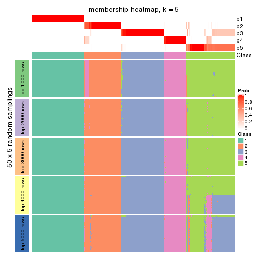</p>

</div>
<div id='tab-MAD-pam-membership-heatmap-5'>
<pre><code class="r">membership_heatmap(res, k = 6)
</code></pre>

<p>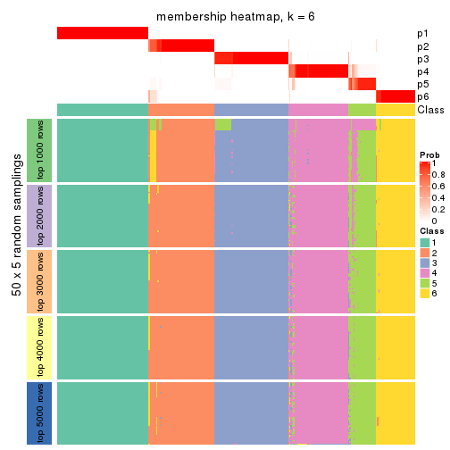</p>

</div>
</div>

As soon as we have had the classes for columns, we can look for signatures
which are significantly different between classes which can be candidate marks
for certain classes. Following are the heatmaps for signatures.


Signature heatmaps where rows are scaled:


<script>
$( function() {
	$( '#tabs-MAD-pam-get-signatures' ).tabs();
} );
</script>
<div id='tabs-MAD-pam-get-signatures'>
<ul>
<li><a href='#tab-MAD-pam-get-signatures-1'>k = 2</a></li>
<li><a href='#tab-MAD-pam-get-signatures-2'>k = 3</a></li>
<li><a href='#tab-MAD-pam-get-signatures-3'>k = 4</a></li>
<li><a href='#tab-MAD-pam-get-signatures-4'>k = 5</a></li>
<li><a href='#tab-MAD-pam-get-signatures-5'>k = 6</a></li>
</ul>
<div id='tab-MAD-pam-get-signatures-1'>
<pre><code class="r">get_signatures(res, k = 2)
</code></pre>

<p></p>

</div>
<div id='tab-MAD-pam-get-signatures-2'>
<pre><code class="r">get_signatures(res, k = 3)
</code></pre>

<p></p>

</div>
<div id='tab-MAD-pam-get-signatures-3'>
<pre><code class="r">get_signatures(res, k = 4)
</code></pre>

<pre><code>#&gt; Error in mat[ceiling(1:nr/h_ratio), ceiling(1:nc/w_ratio), drop = FALSE]: subscript out of bounds
</code></pre>

<p></p>

</div>
<div id='tab-MAD-pam-get-signatures-4'>
<pre><code class="r">get_signatures(res, k = 5)
</code></pre>

<p></p>

</div>
<div id='tab-MAD-pam-get-signatures-5'>
<pre><code class="r">get_signatures(res, k = 6)
</code></pre>

<p></p>

</div>
</div>


Signature heatmaps where rows are not scaled:


<script>
$( function() {
	$( '#tabs-MAD-pam-get-signatures-no-scale' ).tabs();
} );
</script>
<div id='tabs-MAD-pam-get-signatures-no-scale'>
<ul>
<li><a href='#tab-MAD-pam-get-signatures-no-scale-1'>k = 2</a></li>
<li><a href='#tab-MAD-pam-get-signatures-no-scale-2'>k = 3</a></li>
<li><a href='#tab-MAD-pam-get-signatures-no-scale-3'>k = 4</a></li>
<li><a href='#tab-MAD-pam-get-signatures-no-scale-4'>k = 5</a></li>
<li><a href='#tab-MAD-pam-get-signatures-no-scale-5'>k = 6</a></li>
</ul>
<div id='tab-MAD-pam-get-signatures-no-scale-1'>
<pre><code class="r">get_signatures(res, k = 2, scale_rows = FALSE)
</code></pre>

<p></p>

</div>
<div id='tab-MAD-pam-get-signatures-no-scale-2'>
<pre><code class="r">get_signatures(res, k = 3, scale_rows = FALSE)
</code></pre>

<p></p>

</div>
<div id='tab-MAD-pam-get-signatures-no-scale-3'>
<pre><code class="r">get_signatures(res, k = 4, scale_rows = FALSE)
</code></pre>

<p></p>

</div>
<div id='tab-MAD-pam-get-signatures-no-scale-4'>
<pre><code class="r">get_signatures(res, k = 5, scale_rows = FALSE)
</code></pre>

<p></p>

</div>
<div id='tab-MAD-pam-get-signatures-no-scale-5'>
<pre><code class="r">get_signatures(res, k = 6, scale_rows = FALSE)
</code></pre>

<p></p>

</div>
</div>


Compare the overlap of signatures from different k:

```r
compare_signatures(res)
```


`get_signature()` returns a data frame invisibly. TO get the list of signatures, the function
call should be assigned to a variable explicitly. In following code, if `plot` argument is set
to `FALSE`, no heatmap is plotted while only the differential analysis is performed.

```r
# code only for demonstration
tb = get_signature(res, k = ..., plot = FALSE)
```

An example of the output of `tb` is:

```
#>   which_row         fdr    mean_1    mean_2 scaled_mean_1 scaled_mean_2 km
#> 1        38 0.042760348  8.373488  9.131774    -0.5533452     0.5164555  1
#> 2        40 0.018707592  7.106213  8.469186    -0.6173731     0.5762149  1
#> 3        55 0.019134737 10.221463 11.207825    -0.6159697     0.5749050  1
#> 4        59 0.006059896  5.921854  7.869574    -0.6899429     0.6439467  1
#> 5        60 0.018055526  8.928898 10.211722    -0.6204761     0.5791110  1
#> 6        98 0.009384629 15.714769 14.887706     0.6635654    -0.6193277  2
...
```

The columns in `tb` are:

1. `which_row`: row indices corresponding to the input matrix.
2. `fdr`: FDR for the differential test. 
3. `mean_x`: The mean value in group x.
4. `scaled_mean_x`: The mean value in group x after rows are scaled.
5. `km`: Row groups if k-means clustering is applied to rows.


UMAP plot which shows how samples are separated.


<script>
$( function() {
	$( '#tabs-MAD-pam-dimension-reduction' ).tabs();
} );
</script>
<div id='tabs-MAD-pam-dimension-reduction'>
<ul>
<li><a href='#tab-MAD-pam-dimension-reduction-1'>k = 2</a></li>
<li><a href='#tab-MAD-pam-dimension-reduction-2'>k = 3</a></li>
<li><a href='#tab-MAD-pam-dimension-reduction-3'>k = 4</a></li>
<li><a href='#tab-MAD-pam-dimension-reduction-4'>k = 5</a></li>
<li><a href='#tab-MAD-pam-dimension-reduction-5'>k = 6</a></li>
</ul>
<div id='tab-MAD-pam-dimension-reduction-1'>
<pre><code class="r">dimension_reduction(res, k = 2, method = &quot;UMAP&quot;)
</code></pre>

<p></p>

</div>
<div id='tab-MAD-pam-dimension-reduction-2'>
<pre><code class="r">dimension_reduction(res, k = 3, method = &quot;UMAP&quot;)
</code></pre>

<p></p>

</div>
<div id='tab-MAD-pam-dimension-reduction-3'>
<pre><code class="r">dimension_reduction(res, k = 4, method = &quot;UMAP&quot;)
</code></pre>

<p></p>

</div>
<div id='tab-MAD-pam-dimension-reduction-4'>
<pre><code class="r">dimension_reduction(res, k = 5, method = &quot;UMAP&quot;)
</code></pre>

<p></p>

</div>
<div id='tab-MAD-pam-dimension-reduction-5'>
<pre><code class="r">dimension_reduction(res, k = 6, method = &quot;UMAP&quot;)
</code></pre>

<p></p>

</div>
</div>


Following heatmap shows how subgroups are split when increasing `k`:

```r
collect_classes(res)
```


If matrix rows can be associated to genes, consider to use `GO_Enrichment(res,
...)` to perform function enrichment for the signature genes.


 

---------------------------------------------------


### MAD:mclust*


The object with results only for a single top-value method and a single partition method 
can be extracted as:

```r
res = res_list["MAD", "mclust"]
# you can also extract it by
# res = res_list["MAD:mclust"]
```

A summary of `res` and all the functions that can be applied to it:

```r
res
```

```
#> A 'ConsensusPartition' object with k = 2, 3, 4, 5, 6.
#>   On a matrix with 13930 rows and 285 columns.
#>   Top rows (1000, 2000, 3000, 4000, 5000) are extracted by 'MAD' method.
#>   Subgroups are detected by 'mclust' method.
#>   Performed in total 1250 partitions by row resampling.
#>   Best k for subgroups seems to be 4.
#> 
#> Following methods can be applied to this 'ConsensusPartition' object:
#>  [1] "cola_report"             "collect_classes"         "collect_plots"          
#>  [4] "collect_stats"           "colnames"                "compare_signatures"     
#>  [7] "consensus_heatmap"       "dimension_reduction"     "functional_enrichment"  
#> [10] "get_anno_col"            "get_anno"                "get_classes"            
#> [13] "get_consensus"           "get_matrix"              "get_membership"         
#> [16] "get_param"               "get_signatures"          "get_stats"              
#> [19] "is_best_k"               "is_stable_k"             "membership_heatmap"     
#> [22] "ncol"                    "nrow"                    "plot_ecdf"              
#> [25] "rownames"                "select_partition_number" "show"                   
#> [28] "suggest_best_k"          "test_to_known_factors"
```

`collect_plots()` function collects all the plots made from `res` for all `k` (number of partitions)
into one single page to provide an easy and fast comparison between different `k`.

```r
collect_plots(res)
```

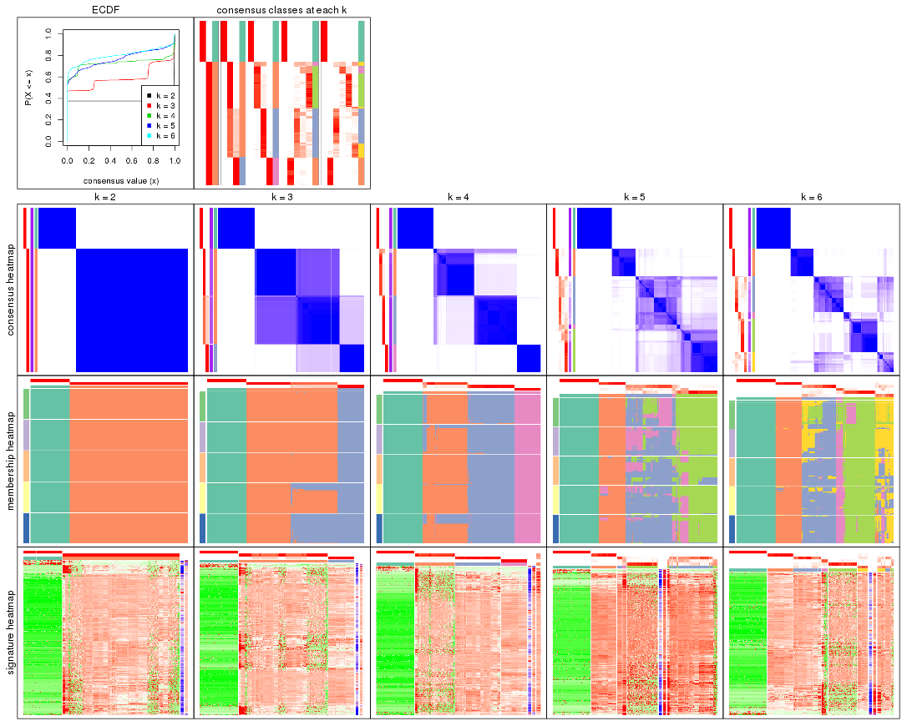

The plots are:

- The first row: a plot of the ECDF (Empirical cumulative distribution
  function) curves of the consensus matrix for each `k` and the heatmap of
  predicted classes for each `k`.
- The second row: heatmaps of the consensus matrix for each `k`.
- The third row: heatmaps of the membership matrix for each `k`.
- The fouth row: heatmaps of the signatures for each `k`.

All the plots in panels can be made by individual functions and they are
plotted later in this section.

`select_partition_number()` produces several plots showing different
statistics for choosing "optimized" `k`. There are following statistics:

- ECDF curves of the consensus matrix for each `k`;
- 1-PAC. [The PAC
  score](https://en.wikipedia.org/wiki/Consensus_clustering#Over-interpretation_potential_of_consensus_clustering)
  measures the proportion of the ambiguous subgrouping.
- Mean silhouette score.
- Concordance. The mean probability of fiting the consensus class ids in all
  partitions.
- Area increased. Denote $A_k$ as the area under the ECDF curve for current
  `k`, the area increased is defined as $A_k - A_{k-1}$.
- Rand index. The percent of pairs of samples that are both in a same cluster
  or both are not in a same cluster in the partition of k and k-1.
- Jaccard index. The ratio of pairs of samples are both in a same cluster in
  the partition of k and k-1 and the pairs of samples are both in a same
  cluster in the partition k or k-1.

The detailed explanations of these statistics can be found in [the cola
vignette](http://bioconductor.org/packages/devel/bioc/vignettes/cola/inst/doc/cola.html#toc_13).

Generally speaking, lower PAC score, higher mean silhouette score or higher
concordance corresponds to better partition. Rand index and Jaccard index
measure how similar the current partition is compared to partition with `k-1`.
If they are too similar, we won't accept `k` is better than `k-1`.

```r
select_partition_number(res)
```


The numeric values for all these statistics can be obtained by `get_stats()`.

```r
get_stats(res)
```

```
#>   k 1-PAC mean_silhouette concordance area_increased  Rand Jaccard
#> 2 2 1.000           1.000       1.000         0.3761 0.625   0.625
#> 3 3 0.750           0.900       0.926         0.5737 0.800   0.680
#> 4 4 0.949           0.953       0.962         0.2358 0.829   0.598
#> 5 5 0.821           0.709       0.843         0.0506 0.983   0.936
#> 6 6 0.837           0.805       0.881         0.0427 0.931   0.727
```

`suggest_best_k()` suggests the best $k$ based on these statistics. The rules are as follows:

- All $k$ with Jaccard index larger than 0.95 are removed because the increase of
  the partition number does not provides enough extra information. If all $k$ are removed,
  the best $k$ is assigned by `NA`.
- For $k$ with 1-PAC larger than 0.9, the maximal $k$ is taken as the "best k". Other $k$ is called "optional k".
- If it does not fit the second rule. The $k$ with the highest vote of highest
  1-PAC, mean silhouette and concordance is taken as the "best k".

```r
suggest_best_k(res)
```

```
#> [1] 4
#> attr(,"optional")
#> [1] 2
```

There is also optional best $k$ = 2 that is worth to check.

Following shows the table of the partitions (You need to click the **show/hide
code output** link to see it). The membership matrix (columns with name `p*`)
is inferred by
[`clue::cl_consensus()`](https://www.rdocumentation.org/link/cl_consensus?package=clue)
function with the `SE` method. Basically the value in the membership matrix
represents the probability to belong to a certain group. The finall class
label for an item is determined with the group with highest probability it
belongs to.

In `get_classes()` function, the entropy is calculated from the membership
matrix and the silhouette score is calculated from the consensus matrix.


<script>
$( function() {
	$( '#tabs-MAD-mclust-get-classes' ).tabs();
} );
</script>
<div id='tabs-MAD-mclust-get-classes'>
<ul>
<li><a href='#tab-MAD-mclust-get-classes-1'>k = 2</a></li>
<li><a href='#tab-MAD-mclust-get-classes-2'>k = 3</a></li>
<li><a href='#tab-MAD-mclust-get-classes-3'>k = 4</a></li>
<li><a href='#tab-MAD-mclust-get-classes-4'>k = 5</a></li>
<li><a href='#tab-MAD-mclust-get-classes-5'>k = 6</a></li>
</ul>

<div id='tab-MAD-mclust-get-classes-1'>
<p><a id='tab-MAD-mclust-get-classes-1-a' style='color:#0366d6' href='#'>show/hide code output</a></p>
<pre><code class="r">cbind(get_classes(res, k = 2), get_membership(res, k = 2))
</code></pre>

<pre><code>#&gt;            class entropy silhouette p1 p2
#&gt; SRR1201591     2       0          1  0  1
#&gt; SRR1201590     2       0          1  0  1
#&gt; SRR1201593     2       0          1  0  1
#&gt; SRR1201592     2       0          1  0  1
#&gt; SRR1201617     2       0          1  0  1
#&gt; SRR1201616     2       0          1  0  1
#&gt; SRR1201619     2       0          1  0  1
#&gt; SRR1201618     2       0          1  0  1
#&gt; SRR1201620     2       0          1  0  1
#&gt; SRR1201621     2       0          1  0  1
#&gt; SRR1201623     2       0          1  0  1
#&gt; SRR1201622     2       0          1  0  1
#&gt; SRR1201624     2       0          1  0  1
#&gt; SRR1201625     2       0          1  0  1
#&gt; SRR1201626     2       0          1  0  1
#&gt; SRR1201627     2       0          1  0  1
#&gt; SRR1201628     2       0          1  0  1
#&gt; SRR1201629     2       0          1  0  1
#&gt; SRR1201630     2       0          1  0  1
#&gt; SRR1201631     2       0          1  0  1
#&gt; SRR1201641     2       0          1  0  1
#&gt; SRR1201640     2       0          1  0  1
#&gt; SRR1201643     2       0          1  0  1
#&gt; SRR1201644     2       0          1  0  1
#&gt; SRR1201661     2       0          1  0  1
#&gt; SRR1201662     2       0          1  0  1
#&gt; SRR1201663     2       0          1  0  1
#&gt; SRR1201664     2       0          1  0  1
#&gt; SRR1201665     2       0          1  0  1
#&gt; SRR1201666     2       0          1  0  1
#&gt; SRR1201667     2       0          1  0  1
#&gt; SRR1201668     2       0          1  0  1
#&gt; SRR1201670     2       0          1  0  1
#&gt; SRR1201669     2       0          1  0  1
#&gt; SRR1201673     2       0          1  0  1
#&gt; SRR1201672     2       0          1  0  1
#&gt; SRR1201671     2       0          1  0  1
#&gt; SRR1201677     2       0          1  0  1
#&gt; SRR1201676     2       0          1  0  1
#&gt; SRR1201675     2       0          1  0  1
#&gt; SRR1201674     2       0          1  0  1
#&gt; SRR1201678     2       0          1  0  1
#&gt; SRR1201682     2       0          1  0  1
#&gt; SRR1201683     2       0          1  0  1
#&gt; SRR1201680     2       0          1  0  1
#&gt; SRR1201681     2       0          1  0  1
#&gt; SRR1201679     2       0          1  0  1
#&gt; SRR1201686     2       0          1  0  1
#&gt; SRR1201687     2       0          1  0  1
#&gt; SRR1201688     2       0          1  0  1
#&gt; SRR1201689     2       0          1  0  1
#&gt; SRR1201685     2       0          1  0  1
#&gt; SRR1201692     2       0          1  0  1
#&gt; SRR1201691     2       0          1  0  1
#&gt; SRR1201690     2       0          1  0  1
#&gt; SRR1201696     2       0          1  0  1
#&gt; SRR1201695     2       0          1  0  1
#&gt; SRR1201694     2       0          1  0  1
#&gt; SRR1201693     2       0          1  0  1
#&gt; SRR1201697     2       0          1  0  1
#&gt; SRR1201698     2       0          1  0  1
#&gt; SRR1201700     2       0          1  0  1
#&gt; SRR1201708     2       0          1  0  1
#&gt; SRR1201707     2       0          1  0  1
#&gt; SRR1201706     2       0          1  0  1
#&gt; SRR1201702     2       0          1  0  1
#&gt; SRR1201705     2       0          1  0  1
#&gt; SRR1201701     2       0          1  0  1
#&gt; SRR1201704     2       0          1  0  1
#&gt; SRR1201703     2       0          1  0  1
#&gt; SRR1201716     2       0          1  0  1
#&gt; SRR1201715     2       0          1  0  1
#&gt; SRR1201717     2       0          1  0  1
#&gt; SRR1201712     2       0          1  0  1
#&gt; SRR1201709     2       0          1  0  1
#&gt; SRR1201711     2       0          1  0  1
#&gt; SRR1201714     2       0          1  0  1
#&gt; SRR1201713     2       0          1  0  1
#&gt; SRR1201710     2       0          1  0  1
#&gt; SRR1201719     2       0          1  0  1
#&gt; SRR1201718     2       0          1  0  1
#&gt; SRR1201721     2       0          1  0  1
#&gt; SRR1201720     2       0          1  0  1
#&gt; SRR1201723     2       0          1  0  1
#&gt; SRR1201722     2       0          1  0  1
#&gt; SRR1201725     2       0          1  0  1
#&gt; SRR1201724     2       0          1  0  1
#&gt; SRR1201726     2       0          1  0  1
#&gt; SRR1201727     2       0          1  0  1
#&gt; SRR1201731     2       0          1  0  1
#&gt; SRR1201730     2       0          1  0  1
#&gt; SRR1201734     2       0          1  0  1
#&gt; SRR1201733     2       0          1  0  1
#&gt; SRR1201736     2       0          1  0  1
#&gt; SRR1201737     2       0          1  0  1
#&gt; SRR1201739     2       0          1  0  1
#&gt; SRR1201738     2       0          1  0  1
#&gt; SRR1201742     2       0          1  0  1
#&gt; SRR1201743     2       0          1  0  1
#&gt; SRR1201745     2       0          1  0  1
#&gt; SRR1201744     2       0          1  0  1
#&gt; SRR1201749     2       0          1  0  1
#&gt; SRR1201750     2       0          1  0  1
#&gt; SRR1201752     2       0          1  0  1
#&gt; SRR1201751     2       0          1  0  1
#&gt; SRR1201754     2       0          1  0  1
#&gt; SRR1201753     2       0          1  0  1
#&gt; SRR1201758     2       0          1  0  1
#&gt; SRR1201759     2       0          1  0  1
#&gt; SRR1201760     2       0          1  0  1
#&gt; SRR1201761     2       0          1  0  1
#&gt; SRR1201763     2       0          1  0  1
#&gt; SRR1201762     2       0          1  0  1
#&gt; SRR1201764     2       0          1  0  1
#&gt; SRR1201766     2       0          1  0  1
#&gt; SRR1201768     2       0          1  0  1
#&gt; SRR1201769     2       0          1  0  1
#&gt; SRR1201767     2       0          1  0  1
#&gt; SRR1201770     2       0          1  0  1
#&gt; SRR1201771     2       0          1  0  1
#&gt; SRR1201772     2       0          1  0  1
#&gt; SRR1201773     2       0          1  0  1
#&gt; SRR1201774     2       0          1  0  1
#&gt; SRR1201786     2       0          1  0  1
#&gt; SRR1201784     2       0          1  0  1
#&gt; SRR1201785     2       0          1  0  1
#&gt; SRR1201778     2       0          1  0  1
#&gt; SRR1201779     2       0          1  0  1
#&gt; SRR1201781     2       0          1  0  1
#&gt; SRR1201780     2       0          1  0  1
#&gt; SRR1201783     2       0          1  0  1
#&gt; SRR1201782     2       0          1  0  1
#&gt; SRR1201798     2       0          1  0  1
#&gt; SRR1201797     2       0          1  0  1
#&gt; SRR1201796     2       0          1  0  1
#&gt; SRR1201795     2       0          1  0  1
#&gt; SRR1201799     2       0          1  0  1
#&gt; SRR1201794     2       0          1  0  1
#&gt; SRR1201793     2       0          1  0  1
#&gt; SRR1201792     2       0          1  0  1
#&gt; SRR1201791     2       0          1  0  1
#&gt; SRR1201807     2       0          1  0  1
#&gt; SRR1201808     2       0          1  0  1
#&gt; SRR1201803     2       0          1  0  1
#&gt; SRR1201804     2       0          1  0  1
#&gt; SRR1201805     2       0          1  0  1
#&gt; SRR1201806     2       0          1  0  1
#&gt; SRR1201801     2       0          1  0  1
#&gt; SRR1201802     2       0          1  0  1
#&gt; SRR1201800     2       0          1  0  1
#&gt; SRR1201814     2       0          1  0  1
#&gt; SRR1201816     2       0          1  0  1
#&gt; SRR1201815     2       0          1  0  1
#&gt; SRR1201819     2       0          1  0  1
#&gt; SRR1201820     2       0          1  0  1
#&gt; SRR1201813     2       0          1  0  1
#&gt; SRR1201817     2       0          1  0  1
#&gt; SRR1201818     2       0          1  0  1
#&gt; SRR1201825     2       0          1  0  1
#&gt; SRR1201827     2       0          1  0  1
#&gt; SRR1201828     2       0          1  0  1
#&gt; SRR1201826     2       0          1  0  1
#&gt; SRR1201829     2       0          1  0  1
#&gt; SRR1201830     2       0          1  0  1
#&gt; SRR1201831     2       0          1  0  1
#&gt; SRR1201832     2       0          1  0  1
#&gt; SRR1201833     2       0          1  0  1
#&gt; SRR1201865     2       0          1  0  1
#&gt; SRR1201866     2       0          1  0  1
#&gt; SRR1201867     2       0          1  0  1
#&gt; SRR1201861     2       0          1  0  1
#&gt; SRR1201862     2       0          1  0  1
#&gt; SRR1201863     2       0          1  0  1
#&gt; SRR1201859     2       0          1  0  1
#&gt; SRR1201864     2       0          1  0  1
#&gt; SRR1201860     2       0          1  0  1
#&gt; SRR1201873     2       0          1  0  1
#&gt; SRR1201871     2       0          1  0  1
#&gt; SRR1201872     2       0          1  0  1
#&gt; SRR1201980     2       0          1  0  1
#&gt; SRR1201979     2       0          1  0  1
#&gt; SRR1201982     2       0          1  0  1
#&gt; SRR1201981     2       0          1  0  1
#&gt; SRR1201998     2       0          1  0  1
#&gt; SRR1201996     2       0          1  0  1
#&gt; SRR1201997     2       0          1  0  1
#&gt; SRR1202005     2       0          1  0  1
#&gt; SRR1202006     2       0          1  0  1
#&gt; SRR1202088     2       0          1  0  1
#&gt; SRR1202087     2       0          1  0  1
#&gt; SRR1202093     2       0          1  0  1
#&gt; SRR1202092     2       0          1  0  1
#&gt; SRR1202288     2       0          1  0  1
#&gt; SRR1202289     2       0          1  0  1
#&gt; SRR1202299     2       0          1  0  1
#&gt; SRR1202298     2       0          1  0  1
#&gt; SRR1202303     2       0          1  0  1
#&gt; SRR1202372     2       0          1  0  1
#&gt; SRR1202371     2       0          1  0  1
#&gt; SRR1202563     2       0          1  0  1
#&gt; SRR1202565     2       0          1  0  1
#&gt; SRR1202564     2       0          1  0  1
#&gt; SRR1202649     2       0          1  0  1
#&gt; SRR1202650     2       0          1  0  1
#&gt; SRR1202651     2       0          1  0  1
#&gt; SRR1202843     1       0          1  1  0
#&gt; SRR1202844     1       0          1  1  0
#&gt; SRR1202845     2       0          1  0  1
#&gt; SRR1202847     2       0          1  0  1
#&gt; SRR1202846     2       0          1  0  1
#&gt; SRR1202945     1       0          1  1  0
#&gt; SRR1202949     1       0          1  1  0
#&gt; SRR1202977     1       0          1  1  0
#&gt; SRR1202978     1       0          1  1  0
#&gt; SRR1202979     1       0          1  1  0
#&gt; SRR1202990     1       0          1  1  0
#&gt; SRR1202999     1       0          1  1  0
#&gt; SRR1203005     1       0          1  1  0
#&gt; SRR1203006     1       0          1  1  0
#&gt; SRR1203007     1       0          1  1  0
#&gt; SRR1203009     1       0          1  1  0
#&gt; SRR1203008     1       0          1  1  0
#&gt; SRR1203010     1       0          1  1  0
#&gt; SRR1203011     1       0          1  1  0
#&gt; SRR1203025     1       0          1  1  0
#&gt; SRR1203026     1       0          1  1  0
#&gt; SRR1203027     1       0          1  1  0
#&gt; SRR1203061     1       0          1  1  0
#&gt; SRR1203089     1       0          1  1  0
#&gt; SRR1203125     1       0          1  1  0
#&gt; SRR1203128     1       0          1  1  0
#&gt; SRR1203129     1       0          1  1  0
#&gt; SRR1203130     1       0          1  1  0
#&gt; SRR1203132     2       0          1  0  1
#&gt; SRR1203131     2       0          1  0  1
#&gt; SRR1203133     1       0          1  1  0
#&gt; SRR1203138     1       0          1  1  0
#&gt; SRR1203760     1       0          1  1  0
#&gt; SRR1203761     1       0          1  1  0
#&gt; SRR1203770     1       0          1  1  0
#&gt; SRR1203771     1       0          1  1  0
#&gt; SRR1203772     1       0          1  1  0
#&gt; SRR1203773     1       0          1  1  0
#&gt; SRR1203774     1       0          1  1  0
#&gt; SRR1203775     1       0          1  1  0
#&gt; SRR1203800     1       0          1  1  0
#&gt; SRR1203801     1       0          1  1  0
#&gt; SRR1203802     1       0          1  1  0
#&gt; SRR1203803     1       0          1  1  0
#&gt; SRR1203804     1       0          1  1  0
#&gt; SRR1203805     1       0          1  1  0
#&gt; SRR1203806     1       0          1  1  0
#&gt; SRR1203807     1       0          1  1  0
#&gt; SRR1203808     1       0          1  1  0
#&gt; SRR1203811     1       0          1  1  0
#&gt; SRR1203812     1       0          1  1  0
#&gt; SRR1203813     1       0          1  1  0
#&gt; SRR1203814     1       0          1  1  0
#&gt; SRR1203815     1       0          1  1  0
#&gt; SRR1203816     1       0          1  1  0
#&gt; SRR1203817     1       0          1  1  0
#&gt; SRR1203818     1       0          1  1  0
#&gt; SRR1203819     1       0          1  1  0
#&gt; SRR1203822     1       0          1  1  0
#&gt; SRR1203823     1       0          1  1  0
#&gt; SRR1203824     1       0          1  1  0
#&gt; SRR1203825     1       0          1  1  0
#&gt; SRR1203826     1       0          1  1  0
#&gt; SRR1203827     2       0          1  0  1
#&gt; SRR1203828     1       0          1  1  0
#&gt; SRR1203829     1       0          1  1  0
#&gt; SRR1203830     1       0          1  1  0
#&gt; SRR1203831     1       0          1  1  0
#&gt; SRR1203832     1       0          1  1  0
#&gt; SRR1203833     1       0          1  1  0
#&gt; SRR1203834     1       0          1  1  0
#&gt; SRR1203835     1       0          1  1  0
#&gt; SRR1203836     1       0          1  1  0
#&gt; SRR1203837     1       0          1  1  0
#&gt; SRR1203838     1       0          1  1  0
#&gt; SRR1203839     1       0          1  1  0
#&gt; SRR1203842     2       0          1  0  1
#&gt; SRR1203843     1       0          1  1  0
#&gt; SRR1203845     2       0          1  0  1
#&gt; SRR1203844     2       0          1  0  1
</code></pre>

<script>
$('#tab-MAD-mclust-get-classes-1-a').parent().next().next().hide();
$('#tab-MAD-mclust-get-classes-1-a').click(function(){
  $('#tab-MAD-mclust-get-classes-1-a').parent().next().next().toggle();
  return(false);
});
</script>
</div>

<div id='tab-MAD-mclust-get-classes-2'>
<p><a id='tab-MAD-mclust-get-classes-2-a' style='color:#0366d6' href='#'>show/hide code output</a></p>
<pre><code class="r">cbind(get_classes(res, k = 3), get_membership(res, k = 3))
</code></pre>

<pre><code>#&gt;            class entropy silhouette p1    p2    p3
#&gt; SRR1201591     3  0.0000      0.986  0 0.000 1.000
#&gt; SRR1201590     2  0.0000      0.852  0 1.000 0.000
#&gt; SRR1201593     3  0.0000      0.986  0 0.000 1.000
#&gt; SRR1201592     2  0.0000      0.852  0 1.000 0.000
#&gt; SRR1201617     3  0.0000      0.986  0 0.000 1.000
#&gt; SRR1201616     2  0.0000      0.852  0 1.000 0.000
#&gt; SRR1201619     2  0.5058      0.834  0 0.756 0.244
#&gt; SRR1201618     2  0.0000      0.852  0 1.000 0.000
#&gt; SRR1201620     2  0.0000      0.852  0 1.000 0.000
#&gt; SRR1201621     3  0.0000      0.986  0 0.000 1.000
#&gt; SRR1201623     2  0.4974      0.836  0 0.764 0.236
#&gt; SRR1201622     2  0.0000      0.852  0 1.000 0.000
#&gt; SRR1201624     2  0.0000      0.852  0 1.000 0.000
#&gt; SRR1201625     2  0.0000      0.852  0 1.000 0.000
#&gt; SRR1201626     2  0.0000      0.852  0 1.000 0.000
#&gt; SRR1201627     2  0.0000      0.852  0 1.000 0.000
#&gt; SRR1201628     2  0.0000      0.852  0 1.000 0.000
#&gt; SRR1201629     2  0.5058      0.834  0 0.756 0.244
#&gt; SRR1201630     2  0.0000      0.852  0 1.000 0.000
#&gt; SRR1201631     2  0.5098      0.830  0 0.752 0.248
#&gt; SRR1201641     2  0.5098      0.830  0 0.752 0.248
#&gt; SRR1201640     2  0.0000      0.852  0 1.000 0.000
#&gt; SRR1201643     2  0.0000      0.852  0 1.000 0.000
#&gt; SRR1201644     2  0.5058      0.834  0 0.756 0.244
#&gt; SRR1201661     2  0.0000      0.852  0 1.000 0.000
#&gt; SRR1201662     2  0.5058      0.834  0 0.756 0.244
#&gt; SRR1201663     2  0.0000      0.852  0 1.000 0.000
#&gt; SRR1201664     2  0.0000      0.852  0 1.000 0.000
#&gt; SRR1201665     2  0.0000      0.852  0 1.000 0.000
#&gt; SRR1201666     2  0.5291      0.810  0 0.732 0.268
#&gt; SRR1201667     2  0.5254      0.814  0 0.736 0.264
#&gt; SRR1201668     2  0.0000      0.852  0 1.000 0.000
#&gt; SRR1201670     2  0.5058      0.834  0 0.756 0.244
#&gt; SRR1201669     2  0.5058      0.834  0 0.756 0.244
#&gt; SRR1201673     2  0.5058      0.834  0 0.756 0.244
#&gt; SRR1201672     2  0.5058      0.834  0 0.756 0.244
#&gt; SRR1201671     2  0.0000      0.852  0 1.000 0.000
#&gt; SRR1201677     2  0.5058      0.834  0 0.756 0.244
#&gt; SRR1201676     2  0.5058      0.834  0 0.756 0.244
#&gt; SRR1201675     2  0.5058      0.834  0 0.756 0.244
#&gt; SRR1201674     2  0.5058      0.834  0 0.756 0.244
#&gt; SRR1201678     2  0.5058      0.834  0 0.756 0.244
#&gt; SRR1201682     2  0.5098      0.830  0 0.752 0.248
#&gt; SRR1201683     2  0.5098      0.830  0 0.752 0.248
#&gt; SRR1201680     2  0.5098      0.830  0 0.752 0.248
#&gt; SRR1201681     2  0.5098      0.830  0 0.752 0.248
#&gt; SRR1201679     2  0.0000      0.852  0 1.000 0.000
#&gt; SRR1201686     2  0.4654      0.840  0 0.792 0.208
#&gt; SRR1201687     2  0.4702      0.840  0 0.788 0.212
#&gt; SRR1201688     2  0.4654      0.840  0 0.792 0.208
#&gt; SRR1201689     2  0.4750      0.839  0 0.784 0.216
#&gt; SRR1201685     2  0.0000      0.852  0 1.000 0.000
#&gt; SRR1201692     2  0.5058      0.834  0 0.756 0.244
#&gt; SRR1201691     2  0.5058      0.834  0 0.756 0.244
#&gt; SRR1201690     2  0.0000      0.852  0 1.000 0.000
#&gt; SRR1201696     2  0.5058      0.834  0 0.756 0.244
#&gt; SRR1201695     2  0.5058      0.834  0 0.756 0.244
#&gt; SRR1201694     2  0.5058      0.834  0 0.756 0.244
#&gt; SRR1201693     2  0.5058      0.834  0 0.756 0.244
#&gt; SRR1201697     2  0.5058      0.834  0 0.756 0.244
#&gt; SRR1201698     2  0.5058      0.834  0 0.756 0.244
#&gt; SRR1201700     2  0.0000      0.852  0 1.000 0.000
#&gt; SRR1201708     2  0.5058      0.834  0 0.756 0.244
#&gt; SRR1201707     2  0.5058      0.834  0 0.756 0.244
#&gt; SRR1201706     2  0.5058      0.834  0 0.756 0.244
#&gt; SRR1201702     2  0.5058      0.834  0 0.756 0.244
#&gt; SRR1201705     2  0.5058      0.834  0 0.756 0.244
#&gt; SRR1201701     2  0.5058      0.834  0 0.756 0.244
#&gt; SRR1201704     2  0.5058      0.834  0 0.756 0.244
#&gt; SRR1201703     2  0.5058      0.834  0 0.756 0.244
#&gt; SRR1201716     2  0.5058      0.834  0 0.756 0.244
#&gt; SRR1201715     2  0.5058      0.834  0 0.756 0.244
#&gt; SRR1201717     2  0.5058      0.834  0 0.756 0.244
#&gt; SRR1201712     2  0.5058      0.834  0 0.756 0.244
#&gt; SRR1201709     2  0.0000      0.852  0 1.000 0.000
#&gt; SRR1201711     2  0.5058      0.834  0 0.756 0.244
#&gt; SRR1201714     2  0.5058      0.834  0 0.756 0.244
#&gt; SRR1201713     2  0.5058      0.834  0 0.756 0.244
#&gt; SRR1201710     2  0.5058      0.834  0 0.756 0.244
#&gt; SRR1201719     2  0.5058      0.834  0 0.756 0.244
#&gt; SRR1201718     2  0.0000      0.852  0 1.000 0.000
#&gt; SRR1201721     2  0.5058      0.834  0 0.756 0.244
#&gt; SRR1201720     2  0.0000      0.852  0 1.000 0.000
#&gt; SRR1201723     2  0.5058      0.834  0 0.756 0.244
#&gt; SRR1201722     2  0.0000      0.852  0 1.000 0.000
#&gt; SRR1201725     2  0.4178      0.843  0 0.828 0.172
#&gt; SRR1201724     2  0.0000      0.852  0 1.000 0.000
#&gt; SRR1201726     2  0.0000      0.852  0 1.000 0.000
#&gt; SRR1201727     2  0.5058      0.834  0 0.756 0.244
#&gt; SRR1201731     2  0.4796      0.839  0 0.780 0.220
#&gt; SRR1201730     2  0.0000      0.852  0 1.000 0.000
#&gt; SRR1201734     3  0.0892      0.962  0 0.020 0.980
#&gt; SRR1201733     2  0.0000      0.852  0 1.000 0.000
#&gt; SRR1201736     2  0.0000      0.852  0 1.000 0.000
#&gt; SRR1201737     2  0.5058      0.834  0 0.756 0.244
#&gt; SRR1201739     3  0.6302     -0.298  0 0.480 0.520
#&gt; SRR1201738     2  0.0000      0.852  0 1.000 0.000
#&gt; SRR1201742     2  0.0000      0.852  0 1.000 0.000
#&gt; SRR1201743     2  0.5058      0.834  0 0.756 0.244
#&gt; SRR1201745     3  0.0000      0.986  0 0.000 1.000
#&gt; SRR1201744     2  0.0000      0.852  0 1.000 0.000
#&gt; SRR1201749     2  0.0000      0.852  0 1.000 0.000
#&gt; SRR1201750     2  0.6026      0.650  0 0.624 0.376
#&gt; SRR1201752     2  0.5058      0.834  0 0.756 0.244
#&gt; SRR1201751     2  0.0000      0.852  0 1.000 0.000
#&gt; SRR1201754     2  0.6062      0.634  0 0.616 0.384
#&gt; SRR1201753     2  0.0000      0.852  0 1.000 0.000
#&gt; SRR1201758     2  0.0000      0.852  0 1.000 0.000
#&gt; SRR1201759     2  0.0000      0.852  0 1.000 0.000
#&gt; SRR1201760     2  0.0000      0.852  0 1.000 0.000
#&gt; SRR1201761     2  0.5058      0.834  0 0.756 0.244
#&gt; SRR1201763     2  0.0000      0.852  0 1.000 0.000
#&gt; SRR1201762     2  0.0000      0.852  0 1.000 0.000
#&gt; SRR1201764     2  0.0000      0.852  0 1.000 0.000
#&gt; SRR1201766     2  0.0000      0.852  0 1.000 0.000
#&gt; SRR1201768     3  0.0000      0.986  0 0.000 1.000
#&gt; SRR1201769     3  0.0000      0.986  0 0.000 1.000
#&gt; SRR1201767     3  0.0000      0.986  0 0.000 1.000
#&gt; SRR1201770     3  0.0000      0.986  0 0.000 1.000
#&gt; SRR1201771     3  0.0000      0.986  0 0.000 1.000
#&gt; SRR1201772     3  0.0000      0.986  0 0.000 1.000
#&gt; SRR1201773     3  0.0000      0.986  0 0.000 1.000
#&gt; SRR1201774     3  0.0000      0.986  0 0.000 1.000
#&gt; SRR1201786     3  0.0000      0.986  0 0.000 1.000
#&gt; SRR1201784     3  0.0000      0.986  0 0.000 1.000
#&gt; SRR1201785     3  0.0000      0.986  0 0.000 1.000
#&gt; SRR1201778     2  0.0000      0.852  0 1.000 0.000
#&gt; SRR1201779     3  0.0000      0.986  0 0.000 1.000
#&gt; SRR1201781     3  0.0000      0.986  0 0.000 1.000
#&gt; SRR1201780     3  0.0000      0.986  0 0.000 1.000
#&gt; SRR1201783     3  0.0000      0.986  0 0.000 1.000
#&gt; SRR1201782     3  0.0000      0.986  0 0.000 1.000
#&gt; SRR1201798     3  0.0000      0.986  0 0.000 1.000
#&gt; SRR1201797     3  0.0000      0.986  0 0.000 1.000
#&gt; SRR1201796     3  0.0000      0.986  0 0.000 1.000
#&gt; SRR1201795     3  0.0000      0.986  0 0.000 1.000
#&gt; SRR1201799     3  0.0000      0.986  0 0.000 1.000
#&gt; SRR1201794     3  0.0000      0.986  0 0.000 1.000
#&gt; SRR1201793     3  0.0000      0.986  0 0.000 1.000
#&gt; SRR1201792     3  0.0000      0.986  0 0.000 1.000
#&gt; SRR1201791     2  0.0000      0.852  0 1.000 0.000
#&gt; SRR1201807     3  0.0000      0.986  0 0.000 1.000
#&gt; SRR1201808     3  0.0000      0.986  0 0.000 1.000
#&gt; SRR1201803     3  0.0000      0.986  0 0.000 1.000
#&gt; SRR1201804     3  0.0000      0.986  0 0.000 1.000
#&gt; SRR1201805     3  0.0000      0.986  0 0.000 1.000
#&gt; SRR1201806     3  0.0000      0.986  0 0.000 1.000
#&gt; SRR1201801     3  0.0000      0.986  0 0.000 1.000
#&gt; SRR1201802     3  0.0000      0.986  0 0.000 1.000
#&gt; SRR1201800     2  0.0000      0.852  0 1.000 0.000
#&gt; SRR1201814     3  0.0000      0.986  0 0.000 1.000
#&gt; SRR1201816     3  0.0000      0.986  0 0.000 1.000
#&gt; SRR1201815     3  0.0000      0.986  0 0.000 1.000
#&gt; SRR1201819     3  0.0000      0.986  0 0.000 1.000
#&gt; SRR1201820     3  0.0000      0.986  0 0.000 1.000
#&gt; SRR1201813     2  0.0000      0.852  0 1.000 0.000
#&gt; SRR1201817     3  0.0000      0.986  0 0.000 1.000
#&gt; SRR1201818     3  0.0000      0.986  0 0.000 1.000
#&gt; SRR1201825     2  0.0000      0.852  0 1.000 0.000
#&gt; SRR1201827     2  0.0000      0.852  0 1.000 0.000
#&gt; SRR1201828     2  0.0000      0.852  0 1.000 0.000
#&gt; SRR1201826     2  0.0000      0.852  0 1.000 0.000
#&gt; SRR1201829     2  0.0000      0.852  0 1.000 0.000
#&gt; SRR1201830     2  0.0000      0.852  0 1.000 0.000
#&gt; SRR1201831     2  0.0000      0.852  0 1.000 0.000
#&gt; SRR1201832     2  0.0000      0.852  0 1.000 0.000
#&gt; SRR1201833     2  0.0000      0.852  0 1.000 0.000
#&gt; SRR1201865     2  0.4974      0.836  0 0.764 0.236
#&gt; SRR1201866     2  0.4974      0.836  0 0.764 0.236
#&gt; SRR1201867     2  0.4974      0.836  0 0.764 0.236
#&gt; SRR1201861     2  0.4974      0.836  0 0.764 0.236
#&gt; SRR1201862     2  0.4974      0.836  0 0.764 0.236
#&gt; SRR1201863     2  0.4974      0.836  0 0.764 0.236
#&gt; SRR1201859     2  0.0000      0.852  0 1.000 0.000
#&gt; SRR1201864     2  0.4974      0.836  0 0.764 0.236
#&gt; SRR1201860     2  0.4974      0.836  0 0.764 0.236
#&gt; SRR1201873     2  0.4931      0.837  0 0.768 0.232
#&gt; SRR1201871     2  0.0000      0.852  0 1.000 0.000
#&gt; SRR1201872     2  0.4974      0.836  0 0.764 0.236
#&gt; SRR1201980     2  0.5058      0.834  0 0.756 0.244
#&gt; SRR1201979     2  0.0000      0.852  0 1.000 0.000
#&gt; SRR1201982     2  0.5058      0.834  0 0.756 0.244
#&gt; SRR1201981     2  0.0000      0.852  0 1.000 0.000
#&gt; SRR1201998     2  0.5058      0.834  0 0.756 0.244
#&gt; SRR1201996     2  0.0000      0.852  0 1.000 0.000
#&gt; SRR1201997     2  0.5058      0.834  0 0.756 0.244
#&gt; SRR1202005     2  0.2356      0.848  0 0.928 0.072
#&gt; SRR1202006     2  0.5098      0.830  0 0.752 0.248
#&gt; SRR1202088     2  0.5058      0.834  0 0.756 0.244
#&gt; SRR1202087     2  0.0000      0.852  0 1.000 0.000
#&gt; SRR1202093     2  0.5138      0.827  0 0.748 0.252
#&gt; SRR1202092     2  0.0000      0.852  0 1.000 0.000
#&gt; SRR1202288     2  0.0000      0.852  0 1.000 0.000
#&gt; SRR1202289     3  0.0000      0.986  0 0.000 1.000
#&gt; SRR1202299     3  0.0000      0.986  0 0.000 1.000
#&gt; SRR1202298     2  0.0000      0.852  0 1.000 0.000
#&gt; SRR1202303     2  0.0000      0.852  0 1.000 0.000
#&gt; SRR1202372     3  0.0000      0.986  0 0.000 1.000
#&gt; SRR1202371     2  0.0000      0.852  0 1.000 0.000
#&gt; SRR1202563     2  0.0000      0.852  0 1.000 0.000
#&gt; SRR1202565     2  0.4931      0.837  0 0.768 0.232
#&gt; SRR1202564     2  0.4796      0.839  0 0.780 0.220
#&gt; SRR1202649     2  0.0000      0.852  0 1.000 0.000
#&gt; SRR1202650     2  0.0000      0.852  0 1.000 0.000
#&gt; SRR1202651     2  0.5760      0.730  0 0.672 0.328
#&gt; SRR1202843     1  0.0000      1.000  1 0.000 0.000
#&gt; SRR1202844     1  0.0000      1.000  1 0.000 0.000
#&gt; SRR1202845     2  0.0000      0.852  0 1.000 0.000
#&gt; SRR1202847     2  0.0000      0.852  0 1.000 0.000
#&gt; SRR1202846     2  0.0000      0.852  0 1.000 0.000
#&gt; SRR1202945     1  0.0000      1.000  1 0.000 0.000
#&gt; SRR1202949     1  0.0000      1.000  1 0.000 0.000
#&gt; SRR1202977     1  0.0000      1.000  1 0.000 0.000
#&gt; SRR1202978     1  0.0000      1.000  1 0.000 0.000
#&gt; SRR1202979     1  0.0000      1.000  1 0.000 0.000
#&gt; SRR1202990     1  0.0000      1.000  1 0.000 0.000
#&gt; SRR1202999     1  0.0000      1.000  1 0.000 0.000
#&gt; SRR1203005     1  0.0000      1.000  1 0.000 0.000
#&gt; SRR1203006     1  0.0000      1.000  1 0.000 0.000
#&gt; SRR1203007     1  0.0000      1.000  1 0.000 0.000
#&gt; SRR1203009     1  0.0000      1.000  1 0.000 0.000
#&gt; SRR1203008     1  0.0000      1.000  1 0.000 0.000
#&gt; SRR1203010     1  0.0000      1.000  1 0.000 0.000
#&gt; SRR1203011     1  0.0000      1.000  1 0.000 0.000
#&gt; SRR1203025     1  0.0000      1.000  1 0.000 0.000
#&gt; SRR1203026     1  0.0000      1.000  1 0.000 0.000
#&gt; SRR1203027     1  0.0000      1.000  1 0.000 0.000
#&gt; SRR1203061     1  0.0000      1.000  1 0.000 0.000
#&gt; SRR1203089     1  0.0000      1.000  1 0.000 0.000
#&gt; SRR1203125     1  0.0000      1.000  1 0.000 0.000
#&gt; SRR1203128     1  0.0000      1.000  1 0.000 0.000
#&gt; SRR1203129     1  0.0000      1.000  1 0.000 0.000
#&gt; SRR1203130     1  0.0000      1.000  1 0.000 0.000
#&gt; SRR1203132     2  0.5058      0.834  0 0.756 0.244
#&gt; SRR1203131     2  0.0000      0.852  0 1.000 0.000
#&gt; SRR1203133     1  0.0000      1.000  1 0.000 0.000
#&gt; SRR1203138     1  0.0000      1.000  1 0.000 0.000
#&gt; SRR1203760     1  0.0000      1.000  1 0.000 0.000
#&gt; SRR1203761     1  0.0000      1.000  1 0.000 0.000
#&gt; SRR1203770     1  0.0000      1.000  1 0.000 0.000
#&gt; SRR1203771     1  0.0000      1.000  1 0.000 0.000
#&gt; SRR1203772     1  0.0000      1.000  1 0.000 0.000
#&gt; SRR1203773     1  0.0000      1.000  1 0.000 0.000
#&gt; SRR1203774     1  0.0000      1.000  1 0.000 0.000
#&gt; SRR1203775     1  0.0000      1.000  1 0.000 0.000
#&gt; SRR1203800     1  0.0000      1.000  1 0.000 0.000
#&gt; SRR1203801     1  0.0000      1.000  1 0.000 0.000
#&gt; SRR1203802     1  0.0000      1.000  1 0.000 0.000
#&gt; SRR1203803     1  0.0000      1.000  1 0.000 0.000
#&gt; SRR1203804     1  0.0000      1.000  1 0.000 0.000
#&gt; SRR1203805     1  0.0000      1.000  1 0.000 0.000
#&gt; SRR1203806     1  0.0000      1.000  1 0.000 0.000
#&gt; SRR1203807     1  0.0000      1.000  1 0.000 0.000
#&gt; SRR1203808     1  0.0000      1.000  1 0.000 0.000
#&gt; SRR1203811     1  0.0000      1.000  1 0.000 0.000
#&gt; SRR1203812     1  0.0000      1.000  1 0.000 0.000
#&gt; SRR1203813     1  0.0000      1.000  1 0.000 0.000
#&gt; SRR1203814     1  0.0000      1.000  1 0.000 0.000
#&gt; SRR1203815     1  0.0000      1.000  1 0.000 0.000
#&gt; SRR1203816     1  0.0000      1.000  1 0.000 0.000
#&gt; SRR1203817     1  0.0000      1.000  1 0.000 0.000
#&gt; SRR1203818     1  0.0000      1.000  1 0.000 0.000
#&gt; SRR1203819     1  0.0000      1.000  1 0.000 0.000
#&gt; SRR1203822     1  0.0000      1.000  1 0.000 0.000
#&gt; SRR1203823     1  0.0000      1.000  1 0.000 0.000
#&gt; SRR1203824     1  0.0000      1.000  1 0.000 0.000
#&gt; SRR1203825     1  0.0000      1.000  1 0.000 0.000
#&gt; SRR1203826     1  0.0000      1.000  1 0.000 0.000
#&gt; SRR1203827     2  0.0000      0.852  0 1.000 0.000
#&gt; SRR1203828     1  0.0000      1.000  1 0.000 0.000
#&gt; SRR1203829     1  0.0000      1.000  1 0.000 0.000
#&gt; SRR1203830     1  0.0000      1.000  1 0.000 0.000
#&gt; SRR1203831     1  0.0000      1.000  1 0.000 0.000
#&gt; SRR1203832     1  0.0000      1.000  1 0.000 0.000
#&gt; SRR1203833     1  0.0000      1.000  1 0.000 0.000
#&gt; SRR1203834     1  0.0000      1.000  1 0.000 0.000
#&gt; SRR1203835     1  0.0000      1.000  1 0.000 0.000
#&gt; SRR1203836     1  0.0000      1.000  1 0.000 0.000
#&gt; SRR1203837     1  0.0000      1.000  1 0.000 0.000
#&gt; SRR1203838     1  0.0000      1.000  1 0.000 0.000
#&gt; SRR1203839     1  0.0000      1.000  1 0.000 0.000
#&gt; SRR1203842     2  0.0000      0.852  0 1.000 0.000
#&gt; SRR1203843     1  0.0000      1.000  1 0.000 0.000
#&gt; SRR1203845     2  0.5058      0.834  0 0.756 0.244
#&gt; SRR1203844     2  0.0000      0.852  0 1.000 0.000
</code></pre>

<script>
$('#tab-MAD-mclust-get-classes-2-a').parent().next().next().hide();
$('#tab-MAD-mclust-get-classes-2-a').click(function(){
  $('#tab-MAD-mclust-get-classes-2-a').parent().next().next().toggle();
  return(false);
});
</script>
</div>

<div id='tab-MAD-mclust-get-classes-3'>
<p><a id='tab-MAD-mclust-get-classes-3-a' style='color:#0366d6' href='#'>show/hide code output</a></p>
<pre><code class="r">cbind(get_classes(res, k = 4), get_membership(res, k = 4))
</code></pre>

<pre><code>#&gt;            class entropy silhouette p1    p2    p3    p4
#&gt; SRR1201591     4  0.0000      0.999  0 0.000 0.000 1.000
#&gt; SRR1201590     2  0.2216      0.939  0 0.908 0.092 0.000
#&gt; SRR1201593     4  0.0000      0.999  0 0.000 0.000 1.000
#&gt; SRR1201592     2  0.2216      0.939  0 0.908 0.092 0.000
#&gt; SRR1201617     4  0.0000      0.999  0 0.000 0.000 1.000
#&gt; SRR1201616     2  0.2216      0.939  0 0.908 0.092 0.000
#&gt; SRR1201619     3  0.0657      0.978  0 0.012 0.984 0.004
#&gt; SRR1201618     2  0.2216      0.939  0 0.908 0.092 0.000
#&gt; SRR1201620     2  0.2216      0.939  0 0.908 0.092 0.000
#&gt; SRR1201621     4  0.0000      0.999  0 0.000 0.000 1.000
#&gt; SRR1201623     3  0.0336      0.981  0 0.008 0.992 0.000
#&gt; SRR1201622     2  0.2216      0.939  0 0.908 0.092 0.000
#&gt; SRR1201624     2  0.0000      0.873  0 1.000 0.000 0.000
#&gt; SRR1201625     2  0.0921      0.895  0 0.972 0.028 0.000
#&gt; SRR1201626     2  0.0000      0.873  0 1.000 0.000 0.000
#&gt; SRR1201627     2  0.0921      0.895  0 0.972 0.028 0.000
#&gt; SRR1201628     2  0.2216      0.939  0 0.908 0.092 0.000
#&gt; SRR1201629     3  0.0188      0.982  0 0.004 0.996 0.000
#&gt; SRR1201630     2  0.2216      0.939  0 0.908 0.092 0.000
#&gt; SRR1201631     3  0.1489      0.947  0 0.044 0.952 0.004
#&gt; SRR1201641     3  0.0376      0.981  0 0.004 0.992 0.004
#&gt; SRR1201640     2  0.2216      0.939  0 0.908 0.092 0.000
#&gt; SRR1201643     2  0.2216      0.939  0 0.908 0.092 0.000
#&gt; SRR1201644     3  0.0469      0.979  0 0.012 0.988 0.000
#&gt; SRR1201661     2  0.2216      0.939  0 0.908 0.092 0.000
#&gt; SRR1201662     3  0.2593      0.873  0 0.104 0.892 0.004
#&gt; SRR1201663     2  0.1792      0.924  0 0.932 0.068 0.000
#&gt; SRR1201664     2  0.3610      0.834  0 0.800 0.200 0.000
#&gt; SRR1201665     2  0.2216      0.939  0 0.908 0.092 0.000
#&gt; SRR1201666     3  0.0804      0.976  0 0.012 0.980 0.008
#&gt; SRR1201667     3  0.0804      0.976  0 0.012 0.980 0.008
#&gt; SRR1201668     2  0.2216      0.939  0 0.908 0.092 0.000
#&gt; SRR1201670     3  0.0188      0.982  0 0.004 0.996 0.000
#&gt; SRR1201669     3  0.0188      0.982  0 0.004 0.996 0.000
#&gt; SRR1201673     3  0.0188      0.982  0 0.004 0.996 0.000
#&gt; SRR1201672     3  0.0188      0.982  0 0.004 0.996 0.000
#&gt; SRR1201671     2  0.2216      0.939  0 0.908 0.092 0.000
#&gt; SRR1201677     3  0.0188      0.982  0 0.004 0.996 0.000
#&gt; SRR1201676     3  0.0188      0.982  0 0.004 0.996 0.000
#&gt; SRR1201675     3  0.0188      0.982  0 0.004 0.996 0.000
#&gt; SRR1201674     3  0.0188      0.982  0 0.004 0.996 0.000
#&gt; SRR1201678     3  0.0188      0.982  0 0.004 0.996 0.000
#&gt; SRR1201682     3  0.0188      0.982  0 0.004 0.996 0.000
#&gt; SRR1201683     3  0.0188      0.982  0 0.004 0.996 0.000
#&gt; SRR1201680     3  0.0188      0.982  0 0.004 0.996 0.000
#&gt; SRR1201681     3  0.0188      0.982  0 0.004 0.996 0.000
#&gt; SRR1201679     2  0.2216      0.939  0 0.908 0.092 0.000
#&gt; SRR1201686     3  0.0188      0.982  0 0.004 0.996 0.000
#&gt; SRR1201687     3  0.0188      0.982  0 0.004 0.996 0.000
#&gt; SRR1201688     3  0.0188      0.982  0 0.004 0.996 0.000
#&gt; SRR1201689     3  0.0188      0.982  0 0.004 0.996 0.000
#&gt; SRR1201685     2  0.0000      0.873  0 1.000 0.000 0.000
#&gt; SRR1201692     3  0.0000      0.981  0 0.000 1.000 0.000
#&gt; SRR1201691     3  0.0000      0.981  0 0.000 1.000 0.000
#&gt; SRR1201690     2  0.2216      0.939  0 0.908 0.092 0.000
#&gt; SRR1201696     3  0.0000      0.981  0 0.000 1.000 0.000
#&gt; SRR1201695     3  0.0000      0.981  0 0.000 1.000 0.000
#&gt; SRR1201694     3  0.0000      0.981  0 0.000 1.000 0.000
#&gt; SRR1201693     3  0.0000      0.981  0 0.000 1.000 0.000
#&gt; SRR1201697     3  0.0000      0.981  0 0.000 1.000 0.000
#&gt; SRR1201698     3  0.0000      0.981  0 0.000 1.000 0.000
#&gt; SRR1201700     2  0.2216      0.939  0 0.908 0.092 0.000
#&gt; SRR1201708     3  0.0000      0.981  0 0.000 1.000 0.000
#&gt; SRR1201707     3  0.0000      0.981  0 0.000 1.000 0.000
#&gt; SRR1201706     3  0.0000      0.981  0 0.000 1.000 0.000
#&gt; SRR1201702     3  0.0000      0.981  0 0.000 1.000 0.000
#&gt; SRR1201705     3  0.0000      0.981  0 0.000 1.000 0.000
#&gt; SRR1201701     3  0.0000      0.981  0 0.000 1.000 0.000
#&gt; SRR1201704     3  0.0000      0.981  0 0.000 1.000 0.000
#&gt; SRR1201703     3  0.0000      0.981  0 0.000 1.000 0.000
#&gt; SRR1201716     3  0.0000      0.981  0 0.000 1.000 0.000
#&gt; SRR1201715     3  0.0000      0.981  0 0.000 1.000 0.000
#&gt; SRR1201717     3  0.0000      0.981  0 0.000 1.000 0.000
#&gt; SRR1201712     3  0.0000      0.981  0 0.000 1.000 0.000
#&gt; SRR1201709     2  0.2216      0.939  0 0.908 0.092 0.000
#&gt; SRR1201711     3  0.0000      0.981  0 0.000 1.000 0.000
#&gt; SRR1201714     3  0.0000      0.981  0 0.000 1.000 0.000
#&gt; SRR1201713     3  0.0000      0.981  0 0.000 1.000 0.000
#&gt; SRR1201710     3  0.0000      0.981  0 0.000 1.000 0.000
#&gt; SRR1201719     3  0.0469      0.979  0 0.012 0.988 0.000
#&gt; SRR1201718     2  0.3400      0.856  0 0.820 0.180 0.000
#&gt; SRR1201721     3  0.0188      0.982  0 0.004 0.996 0.000
#&gt; SRR1201720     2  0.2216      0.939  0 0.908 0.092 0.000
#&gt; SRR1201723     3  0.0188      0.982  0 0.004 0.996 0.000
#&gt; SRR1201722     2  0.1867      0.927  0 0.928 0.072 0.000
#&gt; SRR1201725     3  0.3569      0.723  0 0.196 0.804 0.000
#&gt; SRR1201724     2  0.2814      0.906  0 0.868 0.132 0.000
#&gt; SRR1201726     2  0.2216      0.939  0 0.908 0.092 0.000
#&gt; SRR1201727     3  0.0336      0.981  0 0.008 0.992 0.000
#&gt; SRR1201731     3  0.0336      0.981  0 0.008 0.992 0.000
#&gt; SRR1201730     2  0.2216      0.939  0 0.908 0.092 0.000
#&gt; SRR1201734     4  0.0188      0.995  0 0.004 0.000 0.996
#&gt; SRR1201733     2  0.2216      0.939  0 0.908 0.092 0.000
#&gt; SRR1201736     2  0.2216      0.939  0 0.908 0.092 0.000
#&gt; SRR1201737     3  0.0657      0.978  0 0.012 0.984 0.004
#&gt; SRR1201739     3  0.1970      0.929  0 0.008 0.932 0.060
#&gt; SRR1201738     2  0.2216      0.939  0 0.908 0.092 0.000
#&gt; SRR1201742     2  0.2216      0.939  0 0.908 0.092 0.000
#&gt; SRR1201743     3  0.0376      0.981  0 0.004 0.992 0.004
#&gt; SRR1201745     4  0.0000      0.999  0 0.000 0.000 1.000
#&gt; SRR1201744     2  0.0921      0.897  0 0.972 0.028 0.000
#&gt; SRR1201749     2  0.2216      0.939  0 0.908 0.092 0.000
#&gt; SRR1201750     3  0.2402      0.902  0 0.012 0.912 0.076
#&gt; SRR1201752     3  0.0336      0.981  0 0.008 0.992 0.000
#&gt; SRR1201751     2  0.2216      0.939  0 0.908 0.092 0.000
#&gt; SRR1201754     3  0.0657      0.978  0 0.012 0.984 0.004
#&gt; SRR1201753     2  0.2216      0.939  0 0.908 0.092 0.000
#&gt; SRR1201758     2  0.0000      0.873  0 1.000 0.000 0.000
#&gt; SRR1201759     2  0.0336      0.871  0 0.992 0.008 0.000
#&gt; SRR1201760     2  0.2216      0.939  0 0.908 0.092 0.000
#&gt; SRR1201761     3  0.0336      0.981  0 0.008 0.992 0.000
#&gt; SRR1201763     2  0.0921      0.895  0 0.972 0.028 0.000
#&gt; SRR1201762     2  0.0000      0.873  0 1.000 0.000 0.000
#&gt; SRR1201764     2  0.0000      0.873  0 1.000 0.000 0.000
#&gt; SRR1201766     2  0.2216      0.939  0 0.908 0.092 0.000
#&gt; SRR1201768     4  0.0000      0.999  0 0.000 0.000 1.000
#&gt; SRR1201769     4  0.0000      0.999  0 0.000 0.000 1.000
#&gt; SRR1201767     4  0.0000      0.999  0 0.000 0.000 1.000
#&gt; SRR1201770     4  0.0000      0.999  0 0.000 0.000 1.000
#&gt; SRR1201771     4  0.0000      0.999  0 0.000 0.000 1.000
#&gt; SRR1201772     4  0.0000      0.999  0 0.000 0.000 1.000
#&gt; SRR1201773     4  0.0000      0.999  0 0.000 0.000 1.000
#&gt; SRR1201774     4  0.0000      0.999  0 0.000 0.000 1.000
#&gt; SRR1201786     4  0.0000      0.999  0 0.000 0.000 1.000
#&gt; SRR1201784     4  0.0000      0.999  0 0.000 0.000 1.000
#&gt; SRR1201785     4  0.0000      0.999  0 0.000 0.000 1.000
#&gt; SRR1201778     2  0.2216      0.939  0 0.908 0.092 0.000
#&gt; SRR1201779     4  0.0000      0.999  0 0.000 0.000 1.000
#&gt; SRR1201781     4  0.0000      0.999  0 0.000 0.000 1.000
#&gt; SRR1201780     4  0.0000      0.999  0 0.000 0.000 1.000
#&gt; SRR1201783     4  0.0000      0.999  0 0.000 0.000 1.000
#&gt; SRR1201782     4  0.0000      0.999  0 0.000 0.000 1.000
#&gt; SRR1201798     4  0.0000      0.999  0 0.000 0.000 1.000
#&gt; SRR1201797     4  0.0000      0.999  0 0.000 0.000 1.000
#&gt; SRR1201796     4  0.0000      0.999  0 0.000 0.000 1.000
#&gt; SRR1201795     4  0.0000      0.999  0 0.000 0.000 1.000
#&gt; SRR1201799     4  0.0000      0.999  0 0.000 0.000 1.000
#&gt; SRR1201794     4  0.0000      0.999  0 0.000 0.000 1.000
#&gt; SRR1201793     4  0.0000      0.999  0 0.000 0.000 1.000
#&gt; SRR1201792     4  0.0000      0.999  0 0.000 0.000 1.000
#&gt; SRR1201791     2  0.2216      0.939  0 0.908 0.092 0.000
#&gt; SRR1201807     4  0.0000      0.999  0 0.000 0.000 1.000
#&gt; SRR1201808     4  0.0000      0.999  0 0.000 0.000 1.000
#&gt; SRR1201803     4  0.0000      0.999  0 0.000 0.000 1.000
#&gt; SRR1201804     4  0.0000      0.999  0 0.000 0.000 1.000
#&gt; SRR1201805     4  0.0000      0.999  0 0.000 0.000 1.000
#&gt; SRR1201806     4  0.0000      0.999  0 0.000 0.000 1.000
#&gt; SRR1201801     4  0.0000      0.999  0 0.000 0.000 1.000
#&gt; SRR1201802     4  0.0000      0.999  0 0.000 0.000 1.000
#&gt; SRR1201800     2  0.2216      0.939  0 0.908 0.092 0.000
#&gt; SRR1201814     4  0.0000      0.999  0 0.000 0.000 1.000
#&gt; SRR1201816     4  0.0000      0.999  0 0.000 0.000 1.000
#&gt; SRR1201815     4  0.0000      0.999  0 0.000 0.000 1.000
#&gt; SRR1201819     4  0.0000      0.999  0 0.000 0.000 1.000
#&gt; SRR1201820     4  0.0000      0.999  0 0.000 0.000 1.000
#&gt; SRR1201813     2  0.2216      0.939  0 0.908 0.092 0.000
#&gt; SRR1201817     4  0.0000      0.999  0 0.000 0.000 1.000
#&gt; SRR1201818     4  0.0000      0.999  0 0.000 0.000 1.000
#&gt; SRR1201825     2  0.2216      0.939  0 0.908 0.092 0.000
#&gt; SRR1201827     2  0.4967      0.371  0 0.548 0.452 0.000
#&gt; SRR1201828     2  0.4967      0.371  0 0.548 0.452 0.000
#&gt; SRR1201826     2  0.2216      0.939  0 0.908 0.092 0.000
#&gt; SRR1201829     2  0.4967      0.371  0 0.548 0.452 0.000
#&gt; SRR1201830     2  0.4967      0.371  0 0.548 0.452 0.000
#&gt; SRR1201831     2  0.4967      0.371  0 0.548 0.452 0.000
#&gt; SRR1201832     2  0.4967      0.371  0 0.548 0.452 0.000
#&gt; SRR1201833     2  0.4967      0.371  0 0.548 0.452 0.000
#&gt; SRR1201865     3  0.0592      0.976  0 0.016 0.984 0.000
#&gt; SRR1201866     3  0.0592      0.976  0 0.016 0.984 0.000
#&gt; SRR1201867     3  0.0592      0.976  0 0.016 0.984 0.000
#&gt; SRR1201861     3  0.0592      0.976  0 0.016 0.984 0.000
#&gt; SRR1201862     3  0.0592      0.976  0 0.016 0.984 0.000
#&gt; SRR1201863     3  0.0592      0.976  0 0.016 0.984 0.000
#&gt; SRR1201859     2  0.2216      0.939  0 0.908 0.092 0.000
#&gt; SRR1201864     3  0.0592      0.976  0 0.016 0.984 0.000
#&gt; SRR1201860     3  0.0592      0.976  0 0.016 0.984 0.000
#&gt; SRR1201873     3  0.0336      0.981  0 0.008 0.992 0.000
#&gt; SRR1201871     2  0.2216      0.939  0 0.908 0.092 0.000
#&gt; SRR1201872     3  0.0336      0.981  0 0.008 0.992 0.000
#&gt; SRR1201980     3  0.0336      0.981  0 0.008 0.992 0.000
#&gt; SRR1201979     2  0.2216      0.939  0 0.908 0.092 0.000
#&gt; SRR1201982     3  0.0336      0.981  0 0.008 0.992 0.000
#&gt; SRR1201981     2  0.2216      0.939  0 0.908 0.092 0.000
#&gt; SRR1201998     3  0.0469      0.979  0 0.012 0.988 0.000
#&gt; SRR1201996     2  0.2216      0.939  0 0.908 0.092 0.000
#&gt; SRR1201997     3  0.0469      0.979  0 0.012 0.988 0.000
#&gt; SRR1202005     3  0.5560      0.214  0 0.392 0.584 0.024
#&gt; SRR1202006     3  0.3081      0.895  0 0.048 0.888 0.064
#&gt; SRR1202088     3  0.0336      0.981  0 0.008 0.992 0.000
#&gt; SRR1202087     2  0.2281      0.936  0 0.904 0.096 0.000
#&gt; SRR1202093     3  0.0376      0.981  0 0.004 0.992 0.004
#&gt; SRR1202092     2  0.2216      0.939  0 0.908 0.092 0.000
#&gt; SRR1202288     2  0.2216      0.939  0 0.908 0.092 0.000
#&gt; SRR1202289     4  0.0000      0.999  0 0.000 0.000 1.000
#&gt; SRR1202299     4  0.0000      0.999  0 0.000 0.000 1.000
#&gt; SRR1202298     2  0.2216      0.939  0 0.908 0.092 0.000
#&gt; SRR1202303     2  0.0921      0.895  0 0.972 0.028 0.000
#&gt; SRR1202372     4  0.0817      0.974  0 0.000 0.024 0.976
#&gt; SRR1202371     2  0.2216      0.939  0 0.908 0.092 0.000
#&gt; SRR1202563     2  0.2216      0.939  0 0.908 0.092 0.000
#&gt; SRR1202565     3  0.1109      0.962  0 0.028 0.968 0.004
#&gt; SRR1202564     3  0.1305      0.954  0 0.036 0.960 0.004
#&gt; SRR1202649     2  0.2216      0.939  0 0.908 0.092 0.000
#&gt; SRR1202650     2  0.2216      0.939  0 0.908 0.092 0.000
#&gt; SRR1202651     3  0.0672      0.978  0 0.008 0.984 0.008
#&gt; SRR1202843     1  0.0000      1.000  1 0.000 0.000 0.000
#&gt; SRR1202844     1  0.0000      1.000  1 0.000 0.000 0.000
#&gt; SRR1202845     2  0.2216      0.939  0 0.908 0.092 0.000
#&gt; SRR1202847     2  0.2751      0.893  0 0.904 0.040 0.056
#&gt; SRR1202846     2  0.2751      0.893  0 0.904 0.040 0.056
#&gt; SRR1202945     1  0.0000      1.000  1 0.000 0.000 0.000
#&gt; SRR1202949     1  0.0000      1.000  1 0.000 0.000 0.000
#&gt; SRR1202977     1  0.0000      1.000  1 0.000 0.000 0.000
#&gt; SRR1202978     1  0.0000      1.000  1 0.000 0.000 0.000
#&gt; SRR1202979     1  0.0000      1.000  1 0.000 0.000 0.000
#&gt; SRR1202990     1  0.0000      1.000  1 0.000 0.000 0.000
#&gt; SRR1202999     1  0.0000      1.000  1 0.000 0.000 0.000
#&gt; SRR1203005     1  0.0000      1.000  1 0.000 0.000 0.000
#&gt; SRR1203006     1  0.0000      1.000  1 0.000 0.000 0.000
#&gt; SRR1203007     1  0.0000      1.000  1 0.000 0.000 0.000
#&gt; SRR1203009     1  0.0000      1.000  1 0.000 0.000 0.000
#&gt; SRR1203008     1  0.0000      1.000  1 0.000 0.000 0.000
#&gt; SRR1203010     1  0.0000      1.000  1 0.000 0.000 0.000
#&gt; SRR1203011     1  0.0000      1.000  1 0.000 0.000 0.000
#&gt; SRR1203025     1  0.0000      1.000  1 0.000 0.000 0.000
#&gt; SRR1203026     1  0.0000      1.000  1 0.000 0.000 0.000
#&gt; SRR1203027     1  0.0000      1.000  1 0.000 0.000 0.000
#&gt; SRR1203061     1  0.0000      1.000  1 0.000 0.000 0.000
#&gt; SRR1203089     1  0.0000      1.000  1 0.000 0.000 0.000
#&gt; SRR1203125     1  0.0000      1.000  1 0.000 0.000 0.000
#&gt; SRR1203128     1  0.0000      1.000  1 0.000 0.000 0.000
#&gt; SRR1203129     1  0.0000      1.000  1 0.000 0.000 0.000
#&gt; SRR1203130     1  0.0000      1.000  1 0.000 0.000 0.000
#&gt; SRR1203132     3  0.0188      0.982  0 0.004 0.996 0.000
#&gt; SRR1203131     2  0.2216      0.939  0 0.908 0.092 0.000
#&gt; SRR1203133     1  0.0000      1.000  1 0.000 0.000 0.000
#&gt; SRR1203138     1  0.0000      1.000  1 0.000 0.000 0.000
#&gt; SRR1203760     1  0.0000      1.000  1 0.000 0.000 0.000
#&gt; SRR1203761     1  0.0000      1.000  1 0.000 0.000 0.000
#&gt; SRR1203770     1  0.0000      1.000  1 0.000 0.000 0.000
#&gt; SRR1203771     1  0.0000      1.000  1 0.000 0.000 0.000
#&gt; SRR1203772     1  0.0000      1.000  1 0.000 0.000 0.000
#&gt; SRR1203773     1  0.0000      1.000  1 0.000 0.000 0.000
#&gt; SRR1203774     1  0.0000      1.000  1 0.000 0.000 0.000
#&gt; SRR1203775     1  0.0000      1.000  1 0.000 0.000 0.000
#&gt; SRR1203800     1  0.0000      1.000  1 0.000 0.000 0.000
#&gt; SRR1203801     1  0.0000      1.000  1 0.000 0.000 0.000
#&gt; SRR1203802     1  0.0000      1.000  1 0.000 0.000 0.000
#&gt; SRR1203803     1  0.0000      1.000  1 0.000 0.000 0.000
#&gt; SRR1203804     1  0.0000      1.000  1 0.000 0.000 0.000
#&gt; SRR1203805     1  0.0000      1.000  1 0.000 0.000 0.000
#&gt; SRR1203806     1  0.0000      1.000  1 0.000 0.000 0.000
#&gt; SRR1203807     1  0.0000      1.000  1 0.000 0.000 0.000
#&gt; SRR1203808     1  0.0000      1.000  1 0.000 0.000 0.000
#&gt; SRR1203811     1  0.0000      1.000  1 0.000 0.000 0.000
#&gt; SRR1203812     1  0.0000      1.000  1 0.000 0.000 0.000
#&gt; SRR1203813     1  0.0000      1.000  1 0.000 0.000 0.000
#&gt; SRR1203814     1  0.0000      1.000  1 0.000 0.000 0.000
#&gt; SRR1203815     1  0.0000      1.000  1 0.000 0.000 0.000
#&gt; SRR1203816     1  0.0000      1.000  1 0.000 0.000 0.000
#&gt; SRR1203817     1  0.0000      1.000  1 0.000 0.000 0.000
#&gt; SRR1203818     1  0.0000      1.000  1 0.000 0.000 0.000
#&gt; SRR1203819     1  0.0000      1.000  1 0.000 0.000 0.000
#&gt; SRR1203822     1  0.0000      1.000  1 0.000 0.000 0.000
#&gt; SRR1203823     1  0.0000      1.000  1 0.000 0.000 0.000
#&gt; SRR1203824     1  0.0000      1.000  1 0.000 0.000 0.000
#&gt; SRR1203825     1  0.0000      1.000  1 0.000 0.000 0.000
#&gt; SRR1203826     1  0.0000      1.000  1 0.000 0.000 0.000
#&gt; SRR1203827     2  0.0000      0.873  0 1.000 0.000 0.000
#&gt; SRR1203828     1  0.0000      1.000  1 0.000 0.000 0.000
#&gt; SRR1203829     1  0.0000      1.000  1 0.000 0.000 0.000
#&gt; SRR1203830     1  0.0000      1.000  1 0.000 0.000 0.000
#&gt; SRR1203831     1  0.0000      1.000  1 0.000 0.000 0.000
#&gt; SRR1203832     1  0.0000      1.000  1 0.000 0.000 0.000
#&gt; SRR1203833     1  0.0000      1.000  1 0.000 0.000 0.000
#&gt; SRR1203834     1  0.0000      1.000  1 0.000 0.000 0.000
#&gt; SRR1203835     1  0.0000      1.000  1 0.000 0.000 0.000
#&gt; SRR1203836     1  0.0000      1.000  1 0.000 0.000 0.000
#&gt; SRR1203837     1  0.0000      1.000  1 0.000 0.000 0.000
#&gt; SRR1203838     1  0.0000      1.000  1 0.000 0.000 0.000
#&gt; SRR1203839     1  0.0000      1.000  1 0.000 0.000 0.000
#&gt; SRR1203842     2  0.0000      0.873  0 1.000 0.000 0.000
#&gt; SRR1203843     1  0.0000      1.000  1 0.000 0.000 0.000
#&gt; SRR1203845     2  0.5417      0.760  0 0.732 0.180 0.088
#&gt; SRR1203844     2  0.2216      0.939  0 0.908 0.092 0.000
</code></pre>

<script>
$('#tab-MAD-mclust-get-classes-3-a').parent().next().next().hide();
$('#tab-MAD-mclust-get-classes-3-a').click(function(){
  $('#tab-MAD-mclust-get-classes-3-a').parent().next().next().toggle();
  return(false);
});
</script>
</div>

<div id='tab-MAD-mclust-get-classes-4'>
<p><a id='tab-MAD-mclust-get-classes-4-a' style='color:#0366d6' href='#'>show/hide code output</a></p>
<pre><code class="r">cbind(get_classes(res, k = 5), get_membership(res, k = 5))
</code></pre>

<pre><code>#&gt;            class entropy silhouette p1    p2    p3    p4    p5
#&gt; SRR1201591     2  0.2390    0.92960  0 0.896 0.020 0.084 0.000
#&gt; SRR1201590     5  0.0000    0.79760  0 0.000 0.000 0.000 1.000
#&gt; SRR1201593     2  0.2136    0.93234  0 0.904 0.008 0.088 0.000
#&gt; SRR1201592     5  0.0000    0.79760  0 0.000 0.000 0.000 1.000
#&gt; SRR1201617     2  0.2136    0.93234  0 0.904 0.008 0.088 0.000
#&gt; SRR1201616     5  0.0000    0.79760  0 0.000 0.000 0.000 1.000
#&gt; SRR1201619     3  0.5892    0.21031  0 0.000 0.520 0.372 0.108
#&gt; SRR1201618     5  0.1410    0.80679  0 0.000 0.060 0.000 0.940
#&gt; SRR1201620     5  0.0000    0.79760  0 0.000 0.000 0.000 1.000
#&gt; SRR1201621     2  0.0912    0.96392  0 0.972 0.012 0.016 0.000
#&gt; SRR1201623     3  0.4431    0.36316  0 0.000 0.732 0.052 0.216
#&gt; SRR1201622     5  0.1478    0.80580  0 0.000 0.064 0.000 0.936
#&gt; SRR1201624     5  0.4294    0.44003  0 0.000 0.000 0.468 0.532
#&gt; SRR1201625     5  0.4291    0.44385  0 0.000 0.000 0.464 0.536
#&gt; SRR1201626     5  0.4294    0.44003  0 0.000 0.000 0.468 0.532
#&gt; SRR1201627     5  0.4291    0.44385  0 0.000 0.000 0.464 0.536
#&gt; SRR1201628     5  0.1478    0.80580  0 0.000 0.064 0.000 0.936
#&gt; SRR1201629     3  0.3106    0.46584  0 0.000 0.840 0.020 0.140
#&gt; SRR1201630     5  0.0794    0.79850  0 0.000 0.028 0.000 0.972
#&gt; SRR1201631     3  0.5240   -0.01441  0 0.000 0.584 0.056 0.360
#&gt; SRR1201641     3  0.5681    0.29459  0 0.000 0.608 0.268 0.124
#&gt; SRR1201640     5  0.1410    0.80679  0 0.000 0.060 0.000 0.940
#&gt; SRR1201643     5  0.1478    0.80580  0 0.000 0.064 0.000 0.936
#&gt; SRR1201644     3  0.4420    0.27118  0 0.000 0.692 0.028 0.280
#&gt; SRR1201661     5  0.0794    0.79850  0 0.000 0.028 0.000 0.972
#&gt; SRR1201662     3  0.6553    0.01388  0 0.004 0.472 0.340 0.184
#&gt; SRR1201663     5  0.4620    0.57878  0 0.000 0.028 0.320 0.652
#&gt; SRR1201664     5  0.5182   -0.10348  0 0.000 0.412 0.044 0.544
#&gt; SRR1201665     5  0.0794    0.80096  0 0.000 0.028 0.000 0.972
#&gt; SRR1201666     3  0.5394    0.25337  0 0.004 0.560 0.384 0.052
#&gt; SRR1201667     3  0.5394    0.25337  0 0.004 0.560 0.384 0.052
#&gt; SRR1201668     5  0.3493    0.74948  0 0.000 0.060 0.108 0.832
#&gt; SRR1201670     3  0.3769    0.42383  0 0.000 0.788 0.032 0.180
#&gt; SRR1201669     3  0.3769    0.42383  0 0.000 0.788 0.032 0.180
#&gt; SRR1201673     3  0.4682    0.27721  0 0.000 0.564 0.420 0.016
#&gt; SRR1201672     3  0.4658    0.29115  0 0.000 0.576 0.408 0.016
#&gt; SRR1201671     5  0.1410    0.80679  0 0.000 0.060 0.000 0.940
#&gt; SRR1201677     3  0.4674    0.28218  0 0.000 0.568 0.416 0.016
#&gt; SRR1201676     3  0.4682    0.27721  0 0.000 0.564 0.420 0.016
#&gt; SRR1201675     3  0.4682    0.27721  0 0.000 0.564 0.420 0.016
#&gt; SRR1201674     3  0.4666    0.28678  0 0.000 0.572 0.412 0.016
#&gt; SRR1201678     3  0.4682    0.27721  0 0.000 0.564 0.420 0.016
#&gt; SRR1201682     3  0.5148    0.19863  0 0.000 0.528 0.432 0.040
#&gt; SRR1201683     3  0.5148    0.19863  0 0.000 0.528 0.432 0.040
#&gt; SRR1201680     3  0.5148    0.19863  0 0.000 0.528 0.432 0.040
#&gt; SRR1201681     3  0.5148    0.19863  0 0.000 0.528 0.432 0.040
#&gt; SRR1201679     5  0.1341    0.80690  0 0.000 0.056 0.000 0.944
#&gt; SRR1201686     3  0.4736    0.01246  0 0.000 0.576 0.020 0.404
#&gt; SRR1201687     3  0.4736    0.01246  0 0.000 0.576 0.020 0.404
#&gt; SRR1201688     3  0.4736    0.01246  0 0.000 0.576 0.020 0.404
#&gt; SRR1201689     3  0.4736    0.01246  0 0.000 0.576 0.020 0.404
#&gt; SRR1201685     5  0.4192    0.50779  0 0.000 0.000 0.404 0.596
#&gt; SRR1201692     3  0.2473    0.50254  0 0.000 0.896 0.072 0.032
#&gt; SRR1201691     3  0.2473    0.50254  0 0.000 0.896 0.072 0.032
#&gt; SRR1201690     5  0.1478    0.80580  0 0.000 0.064 0.000 0.936
#&gt; SRR1201696     3  0.2473    0.50254  0 0.000 0.896 0.072 0.032
#&gt; SRR1201695     3  0.2473    0.50254  0 0.000 0.896 0.072 0.032
#&gt; SRR1201694     3  0.2473    0.50254  0 0.000 0.896 0.072 0.032
#&gt; SRR1201693     3  0.2473    0.50254  0 0.000 0.896 0.072 0.032
#&gt; SRR1201697     3  0.2473    0.50254  0 0.000 0.896 0.072 0.032
#&gt; SRR1201698     3  0.2473    0.50254  0 0.000 0.896 0.072 0.032
#&gt; SRR1201700     5  0.1478    0.80580  0 0.000 0.064 0.000 0.936
#&gt; SRR1201708     3  0.2505    0.49664  0 0.000 0.888 0.092 0.020
#&gt; SRR1201707     3  0.2505    0.49664  0 0.000 0.888 0.092 0.020
#&gt; SRR1201706     3  0.2505    0.49664  0 0.000 0.888 0.092 0.020
#&gt; SRR1201702     3  0.2505    0.49664  0 0.000 0.888 0.092 0.020
#&gt; SRR1201705     3  0.2505    0.49664  0 0.000 0.888 0.092 0.020
#&gt; SRR1201701     3  0.2505    0.49664  0 0.000 0.888 0.092 0.020
#&gt; SRR1201704     3  0.2505    0.49664  0 0.000 0.888 0.092 0.020
#&gt; SRR1201703     3  0.2505    0.49664  0 0.000 0.888 0.092 0.020
#&gt; SRR1201716     3  0.2793    0.49510  0 0.000 0.876 0.088 0.036
#&gt; SRR1201715     3  0.2793    0.49510  0 0.000 0.876 0.088 0.036
#&gt; SRR1201717     3  0.2793    0.49510  0 0.000 0.876 0.088 0.036
#&gt; SRR1201712     3  0.2793    0.49510  0 0.000 0.876 0.088 0.036
#&gt; SRR1201709     5  0.1478    0.80580  0 0.000 0.064 0.000 0.936
#&gt; SRR1201711     3  0.2793    0.49510  0 0.000 0.876 0.088 0.036
#&gt; SRR1201714     3  0.2793    0.49510  0 0.000 0.876 0.088 0.036
#&gt; SRR1201713     3  0.2793    0.49510  0 0.000 0.876 0.088 0.036
#&gt; SRR1201710     3  0.2793    0.49510  0 0.000 0.876 0.088 0.036
#&gt; SRR1201719     3  0.5618    0.21585  0 0.000 0.564 0.348 0.088
#&gt; SRR1201718     5  0.3438    0.62764  0 0.000 0.172 0.020 0.808
#&gt; SRR1201721     3  0.2920    0.47476  0 0.000 0.852 0.016 0.132
#&gt; SRR1201720     5  0.1478    0.80580  0 0.000 0.064 0.000 0.936
#&gt; SRR1201723     3  0.4538   -0.06763  0 0.000 0.540 0.008 0.452
#&gt; SRR1201722     5  0.1753    0.80484  0 0.000 0.032 0.032 0.936
#&gt; SRR1201725     3  0.5903    0.17015  0 0.000 0.548 0.332 0.120
#&gt; SRR1201724     5  0.3194    0.67910  0 0.000 0.148 0.020 0.832
#&gt; SRR1201726     5  0.1410    0.80679  0 0.000 0.060 0.000 0.940
#&gt; SRR1201727     3  0.3409    0.45220  0 0.000 0.816 0.024 0.160
#&gt; SRR1201731     3  0.4700    0.39428  0 0.000 0.728 0.184 0.088
#&gt; SRR1201730     5  0.1544    0.80278  0 0.000 0.068 0.000 0.932
#&gt; SRR1201734     2  0.2275    0.93519  0 0.912 0.012 0.064 0.012
#&gt; SRR1201733     5  0.0000    0.79760  0 0.000 0.000 0.000 1.000
#&gt; SRR1201736     5  0.1410    0.80679  0 0.000 0.060 0.000 0.940
#&gt; SRR1201737     3  0.5636    0.25096  0 0.000 0.544 0.372 0.084
#&gt; SRR1201739     3  0.7165    0.15592  0 0.124 0.480 0.332 0.064
#&gt; SRR1201738     5  0.0000    0.79760  0 0.000 0.000 0.000 1.000
#&gt; SRR1201742     5  0.1410    0.80679  0 0.000 0.060 0.000 0.940
#&gt; SRR1201743     3  0.5405    0.25708  0 0.000 0.556 0.380 0.064
#&gt; SRR1201745     2  0.1121    0.93517  0 0.956 0.000 0.000 0.044
#&gt; SRR1201744     5  0.3508    0.61599  0 0.000 0.000 0.252 0.748
#&gt; SRR1201749     5  0.0162    0.79840  0 0.000 0.004 0.000 0.996
#&gt; SRR1201750     3  0.7495   -0.00861  0 0.076 0.440 0.336 0.148
#&gt; SRR1201752     3  0.5413    0.37026  0 0.000 0.664 0.164 0.172
#&gt; SRR1201751     5  0.1410    0.80679  0 0.000 0.060 0.000 0.940
#&gt; SRR1201754     3  0.5865    0.20346  0 0.016 0.508 0.416 0.060
#&gt; SRR1201753     5  0.0000    0.79760  0 0.000 0.000 0.000 1.000
#&gt; SRR1201758     5  0.4294    0.44003  0 0.000 0.000 0.468 0.532
#&gt; SRR1201759     5  0.4434    0.44198  0 0.000 0.004 0.460 0.536
#&gt; SRR1201760     5  0.1478    0.80580  0 0.000 0.064 0.000 0.936
#&gt; SRR1201761     3  0.3734    0.47643  0 0.000 0.812 0.060 0.128
#&gt; SRR1201763     5  0.4291    0.44385  0 0.000 0.000 0.464 0.536
#&gt; SRR1201762     5  0.4294    0.44003  0 0.000 0.000 0.468 0.532
#&gt; SRR1201764     5  0.4291    0.44397  0 0.000 0.000 0.464 0.536
#&gt; SRR1201766     5  0.0162    0.79682  0 0.000 0.000 0.004 0.996
#&gt; SRR1201768     2  0.0000    0.96885  0 1.000 0.000 0.000 0.000
#&gt; SRR1201769     2  0.0000    0.96885  0 1.000 0.000 0.000 0.000
#&gt; SRR1201767     2  0.0000    0.96885  0 1.000 0.000 0.000 0.000
#&gt; SRR1201770     2  0.0000    0.96885  0 1.000 0.000 0.000 0.000
#&gt; SRR1201771     2  0.0000    0.96885  0 1.000 0.000 0.000 0.000
#&gt; SRR1201772     2  0.0000    0.96885  0 1.000 0.000 0.000 0.000
#&gt; SRR1201773     2  0.0000    0.96885  0 1.000 0.000 0.000 0.000
#&gt; SRR1201774     2  0.0000    0.96885  0 1.000 0.000 0.000 0.000
#&gt; SRR1201786     2  0.0000    0.96885  0 1.000 0.000 0.000 0.000
#&gt; SRR1201784     2  0.0000    0.96885  0 1.000 0.000 0.000 0.000
#&gt; SRR1201785     2  0.0000    0.96885  0 1.000 0.000 0.000 0.000
#&gt; SRR1201778     5  0.0000    0.79760  0 0.000 0.000 0.000 1.000
#&gt; SRR1201779     2  0.0000    0.96885  0 1.000 0.000 0.000 0.000
#&gt; SRR1201781     2  0.0000    0.96885  0 1.000 0.000 0.000 0.000
#&gt; SRR1201780     2  0.0000    0.96885  0 1.000 0.000 0.000 0.000
#&gt; SRR1201783     2  0.0000    0.96885  0 1.000 0.000 0.000 0.000
#&gt; SRR1201782     2  0.0000    0.96885  0 1.000 0.000 0.000 0.000
#&gt; SRR1201798     2  0.2136    0.93234  0 0.904 0.008 0.088 0.000
#&gt; SRR1201797     2  0.2136    0.93234  0 0.904 0.008 0.088 0.000
#&gt; SRR1201796     2  0.2136    0.93234  0 0.904 0.008 0.088 0.000
#&gt; SRR1201795     2  0.2136    0.93234  0 0.904 0.008 0.088 0.000
#&gt; SRR1201799     2  0.2136    0.93234  0 0.904 0.008 0.088 0.000
#&gt; SRR1201794     2  0.2136    0.93234  0 0.904 0.008 0.088 0.000
#&gt; SRR1201793     2  0.2136    0.93234  0 0.904 0.008 0.088 0.000
#&gt; SRR1201792     2  0.2136    0.93234  0 0.904 0.008 0.088 0.000
#&gt; SRR1201791     5  0.0000    0.79760  0 0.000 0.000 0.000 1.000
#&gt; SRR1201807     2  0.0000    0.96885  0 1.000 0.000 0.000 0.000
#&gt; SRR1201808     2  0.0000    0.96885  0 1.000 0.000 0.000 0.000
#&gt; SRR1201803     2  0.0000    0.96885  0 1.000 0.000 0.000 0.000
#&gt; SRR1201804     2  0.0000    0.96885  0 1.000 0.000 0.000 0.000
#&gt; SRR1201805     2  0.0000    0.96885  0 1.000 0.000 0.000 0.000
#&gt; SRR1201806     2  0.0000    0.96885  0 1.000 0.000 0.000 0.000
#&gt; SRR1201801     2  0.0000    0.96885  0 1.000 0.000 0.000 0.000
#&gt; SRR1201802     2  0.0000    0.96885  0 1.000 0.000 0.000 0.000
#&gt; SRR1201800     5  0.0000    0.79760  0 0.000 0.000 0.000 1.000
#&gt; SRR1201814     2  0.0693    0.96490  0 0.980 0.012 0.008 0.000
#&gt; SRR1201816     2  0.0693    0.96490  0 0.980 0.012 0.008 0.000
#&gt; SRR1201815     2  0.0693    0.96490  0 0.980 0.012 0.008 0.000
#&gt; SRR1201819     2  0.0693    0.96490  0 0.980 0.012 0.008 0.000
#&gt; SRR1201820     2  0.0693    0.96490  0 0.980 0.012 0.008 0.000
#&gt; SRR1201813     5  0.0000    0.79760  0 0.000 0.000 0.000 1.000
#&gt; SRR1201817     2  0.0693    0.96490  0 0.980 0.012 0.008 0.000
#&gt; SRR1201818     2  0.0693    0.96490  0 0.980 0.012 0.008 0.000
#&gt; SRR1201825     5  0.1478    0.80580  0 0.000 0.064 0.000 0.936
#&gt; SRR1201827     4  0.6684    1.00000  0 0.000 0.352 0.408 0.240
#&gt; SRR1201828     4  0.6684    1.00000  0 0.000 0.352 0.408 0.240
#&gt; SRR1201826     5  0.2012    0.80241  0 0.000 0.060 0.020 0.920
#&gt; SRR1201829     4  0.6684    1.00000  0 0.000 0.352 0.408 0.240
#&gt; SRR1201830     4  0.6684    1.00000  0 0.000 0.352 0.408 0.240
#&gt; SRR1201831     4  0.6684    1.00000  0 0.000 0.352 0.408 0.240
#&gt; SRR1201832     4  0.6684    1.00000  0 0.000 0.352 0.408 0.240
#&gt; SRR1201833     4  0.6684    1.00000  0 0.000 0.352 0.408 0.240
#&gt; SRR1201865     3  0.4497    0.39046  0 0.000 0.732 0.060 0.208
#&gt; SRR1201866     3  0.4558    0.38154  0 0.000 0.724 0.060 0.216
#&gt; SRR1201867     3  0.4497    0.39046  0 0.000 0.732 0.060 0.208
#&gt; SRR1201861     3  0.4497    0.39046  0 0.000 0.732 0.060 0.208
#&gt; SRR1201862     3  0.4497    0.39046  0 0.000 0.732 0.060 0.208
#&gt; SRR1201863     3  0.4497    0.39046  0 0.000 0.732 0.060 0.208
#&gt; SRR1201859     5  0.3058    0.76152  0 0.000 0.044 0.096 0.860
#&gt; SRR1201864     3  0.4558    0.38165  0 0.000 0.724 0.060 0.216
#&gt; SRR1201860     3  0.4558    0.38165  0 0.000 0.724 0.060 0.216
#&gt; SRR1201873     3  0.3663    0.38213  0 0.000 0.776 0.016 0.208
#&gt; SRR1201871     5  0.1478    0.80580  0 0.000 0.064 0.000 0.936
#&gt; SRR1201872     3  0.3530    0.38991  0 0.000 0.784 0.012 0.204
#&gt; SRR1201980     3  0.4317    0.46054  0 0.000 0.772 0.112 0.116
#&gt; SRR1201979     5  0.1478    0.80580  0 0.000 0.064 0.000 0.936
#&gt; SRR1201982     3  0.3906    0.46079  0 0.000 0.800 0.132 0.068
#&gt; SRR1201981     5  0.1478    0.80580  0 0.000 0.064 0.000 0.936
#&gt; SRR1201998     3  0.5644    0.22664  0 0.000 0.576 0.328 0.096
#&gt; SRR1201996     5  0.1121    0.79898  0 0.000 0.044 0.000 0.956
#&gt; SRR1201997     3  0.5618    0.21063  0 0.000 0.564 0.348 0.088
#&gt; SRR1202005     5  0.5882   -0.23468  0 0.012 0.332 0.084 0.572
#&gt; SRR1202006     3  0.7933   -0.26126  0 0.096 0.368 0.344 0.192
#&gt; SRR1202088     3  0.5328    0.31280  0 0.000 0.584 0.352 0.064
#&gt; SRR1202087     5  0.1410    0.80679  0 0.000 0.060 0.000 0.940
#&gt; SRR1202093     3  0.5330    0.24520  0 0.000 0.548 0.396 0.056
#&gt; SRR1202092     5  0.1410    0.80679  0 0.000 0.060 0.000 0.940
#&gt; SRR1202288     5  0.0000    0.79760  0 0.000 0.000 0.000 1.000
#&gt; SRR1202289     2  0.2069    0.93764  0 0.912 0.012 0.076 0.000
#&gt; SRR1202299     2  0.2241    0.93634  0 0.908 0.008 0.076 0.008
#&gt; SRR1202298     5  0.0000    0.79760  0 0.000 0.000 0.000 1.000
#&gt; SRR1202303     5  0.4291    0.44385  0 0.000 0.000 0.464 0.536
#&gt; SRR1202372     2  0.1651    0.95237  0 0.944 0.012 0.036 0.008
#&gt; SRR1202371     5  0.0000    0.79760  0 0.000 0.000 0.000 1.000
#&gt; SRR1202563     5  0.1478    0.80580  0 0.000 0.064 0.000 0.936
#&gt; SRR1202565     3  0.5576    0.24457  0 0.000 0.536 0.388 0.076
#&gt; SRR1202564     3  0.5815    0.22326  0 0.000 0.540 0.356 0.104
#&gt; SRR1202649     5  0.1478    0.80580  0 0.000 0.064 0.000 0.936
#&gt; SRR1202650     5  0.1410    0.80679  0 0.000 0.060 0.000 0.940
#&gt; SRR1202651     3  0.5576    0.18879  0 0.004 0.512 0.424 0.060
#&gt; SRR1202843     1  0.0000    1.00000  1 0.000 0.000 0.000 0.000
#&gt; SRR1202844     1  0.0000    1.00000  1 0.000 0.000 0.000 0.000
#&gt; SRR1202845     5  0.3395    0.62355  0 0.000 0.000 0.236 0.764
#&gt; SRR1202847     5  0.6286    0.34948  0 0.068 0.132 0.148 0.652
#&gt; SRR1202846     5  0.6286    0.34948  0 0.068 0.132 0.148 0.652
#&gt; SRR1202945     1  0.0000    1.00000  1 0.000 0.000 0.000 0.000
#&gt; SRR1202949     1  0.0000    1.00000  1 0.000 0.000 0.000 0.000
#&gt; SRR1202977     1  0.0000    1.00000  1 0.000 0.000 0.000 0.000
#&gt; SRR1202978     1  0.0000    1.00000  1 0.000 0.000 0.000 0.000
#&gt; SRR1202979     1  0.0000    1.00000  1 0.000 0.000 0.000 0.000
#&gt; SRR1202990     1  0.0000    1.00000  1 0.000 0.000 0.000 0.000
#&gt; SRR1202999     1  0.0000    1.00000  1 0.000 0.000 0.000 0.000
#&gt; SRR1203005     1  0.0000    1.00000  1 0.000 0.000 0.000 0.000
#&gt; SRR1203006     1  0.0000    1.00000  1 0.000 0.000 0.000 0.000
#&gt; SRR1203007     1  0.0000    1.00000  1 0.000 0.000 0.000 0.000
#&gt; SRR1203009     1  0.0000    1.00000  1 0.000 0.000 0.000 0.000
#&gt; SRR1203008     1  0.0000    1.00000  1 0.000 0.000 0.000 0.000
#&gt; SRR1203010     1  0.0000    1.00000  1 0.000 0.000 0.000 0.000
#&gt; SRR1203011     1  0.0000    1.00000  1 0.000 0.000 0.000 0.000
#&gt; SRR1203025     1  0.0000    1.00000  1 0.000 0.000 0.000 0.000
#&gt; SRR1203026     1  0.0000    1.00000  1 0.000 0.000 0.000 0.000
#&gt; SRR1203027     1  0.0000    1.00000  1 0.000 0.000 0.000 0.000
#&gt; SRR1203061     1  0.0000    1.00000  1 0.000 0.000 0.000 0.000
#&gt; SRR1203089     1  0.0000    1.00000  1 0.000 0.000 0.000 0.000
#&gt; SRR1203125     1  0.0000    1.00000  1 0.000 0.000 0.000 0.000
#&gt; SRR1203128     1  0.0000    1.00000  1 0.000 0.000 0.000 0.000
#&gt; SRR1203129     1  0.0000    1.00000  1 0.000 0.000 0.000 0.000
#&gt; SRR1203130     1  0.0000    1.00000  1 0.000 0.000 0.000 0.000
#&gt; SRR1203132     3  0.2233    0.50043  0 0.000 0.904 0.016 0.080
#&gt; SRR1203131     5  0.1478    0.80580  0 0.000 0.064 0.000 0.936
#&gt; SRR1203133     1  0.0000    1.00000  1 0.000 0.000 0.000 0.000
#&gt; SRR1203138     1  0.0000    1.00000  1 0.000 0.000 0.000 0.000
#&gt; SRR1203760     1  0.0000    1.00000  1 0.000 0.000 0.000 0.000
#&gt; SRR1203761     1  0.0000    1.00000  1 0.000 0.000 0.000 0.000
#&gt; SRR1203770     1  0.0000    1.00000  1 0.000 0.000 0.000 0.000
#&gt; SRR1203771     1  0.0000    1.00000  1 0.000 0.000 0.000 0.000
#&gt; SRR1203772     1  0.0000    1.00000  1 0.000 0.000 0.000 0.000
#&gt; SRR1203773     1  0.0000    1.00000  1 0.000 0.000 0.000 0.000
#&gt; SRR1203774     1  0.0000    1.00000  1 0.000 0.000 0.000 0.000
#&gt; SRR1203775     1  0.0000    1.00000  1 0.000 0.000 0.000 0.000
#&gt; SRR1203800     1  0.0000    1.00000  1 0.000 0.000 0.000 0.000
#&gt; SRR1203801     1  0.0000    1.00000  1 0.000 0.000 0.000 0.000
#&gt; SRR1203802     1  0.0000    1.00000  1 0.000 0.000 0.000 0.000
#&gt; SRR1203803     1  0.0000    1.00000  1 0.000 0.000 0.000 0.000
#&gt; SRR1203804     1  0.0000    1.00000  1 0.000 0.000 0.000 0.000
#&gt; SRR1203805     1  0.0000    1.00000  1 0.000 0.000 0.000 0.000
#&gt; SRR1203806     1  0.0000    1.00000  1 0.000 0.000 0.000 0.000
#&gt; SRR1203807     1  0.0000    1.00000  1 0.000 0.000 0.000 0.000
#&gt; SRR1203808     1  0.0000    1.00000  1 0.000 0.000 0.000 0.000
#&gt; SRR1203811     1  0.0000    1.00000  1 0.000 0.000 0.000 0.000
#&gt; SRR1203812     1  0.0000    1.00000  1 0.000 0.000 0.000 0.000
#&gt; SRR1203813     1  0.0000    1.00000  1 0.000 0.000 0.000 0.000
#&gt; SRR1203814     1  0.0000    1.00000  1 0.000 0.000 0.000 0.000
#&gt; SRR1203815     1  0.0000    1.00000  1 0.000 0.000 0.000 0.000
#&gt; SRR1203816     1  0.0000    1.00000  1 0.000 0.000 0.000 0.000
#&gt; SRR1203817     1  0.0000    1.00000  1 0.000 0.000 0.000 0.000
#&gt; SRR1203818     1  0.0000    1.00000  1 0.000 0.000 0.000 0.000
#&gt; SRR1203819     1  0.0000    1.00000  1 0.000 0.000 0.000 0.000
#&gt; SRR1203822     1  0.0000    1.00000  1 0.000 0.000 0.000 0.000
#&gt; SRR1203823     1  0.0000    1.00000  1 0.000 0.000 0.000 0.000
#&gt; SRR1203824     1  0.0000    1.00000  1 0.000 0.000 0.000 0.000
#&gt; SRR1203825     1  0.0000    1.00000  1 0.000 0.000 0.000 0.000
#&gt; SRR1203826     1  0.0000    1.00000  1 0.000 0.000 0.000 0.000
#&gt; SRR1203827     5  0.4294    0.44003  0 0.000 0.000 0.468 0.532
#&gt; SRR1203828     1  0.0000    1.00000  1 0.000 0.000 0.000 0.000
#&gt; SRR1203829     1  0.0000    1.00000  1 0.000 0.000 0.000 0.000
#&gt; SRR1203830     1  0.0000    1.00000  1 0.000 0.000 0.000 0.000
#&gt; SRR1203831     1  0.0000    1.00000  1 0.000 0.000 0.000 0.000
#&gt; SRR1203832     1  0.0000    1.00000  1 0.000 0.000 0.000 0.000
#&gt; SRR1203833     1  0.0000    1.00000  1 0.000 0.000 0.000 0.000
#&gt; SRR1203834     1  0.0000    1.00000  1 0.000 0.000 0.000 0.000
#&gt; SRR1203835     1  0.0000    1.00000  1 0.000 0.000 0.000 0.000
#&gt; SRR1203836     1  0.0000    1.00000  1 0.000 0.000 0.000 0.000
#&gt; SRR1203837     1  0.0000    1.00000  1 0.000 0.000 0.000 0.000
#&gt; SRR1203838     1  0.0000    1.00000  1 0.000 0.000 0.000 0.000
#&gt; SRR1203839     1  0.0000    1.00000  1 0.000 0.000 0.000 0.000
#&gt; SRR1203842     5  0.4294    0.44003  0 0.000 0.000 0.468 0.532
#&gt; SRR1203843     1  0.0000    1.00000  1 0.000 0.000 0.000 0.000
#&gt; SRR1203845     5  0.8197   -0.61597  0 0.120 0.328 0.220 0.332
#&gt; SRR1203844     5  0.0000    0.79760  0 0.000 0.000 0.000 1.000
</code></pre>

<script>
$('#tab-MAD-mclust-get-classes-4-a').parent().next().next().hide();
$('#tab-MAD-mclust-get-classes-4-a').click(function(){
  $('#tab-MAD-mclust-get-classes-4-a').parent().next().next().toggle();
  return(false);
});
</script>
</div>

<div id='tab-MAD-mclust-get-classes-5'>
<p><a id='tab-MAD-mclust-get-classes-5-a' style='color:#0366d6' href='#'>show/hide code output</a></p>
<pre><code class="r">cbind(get_classes(res, k = 6), get_membership(res, k = 6))
</code></pre>

<pre><code>#&gt;            class entropy silhouette p1    p2    p3    p4    p5    p6
#&gt; SRR1201591     2  0.0713     0.9751  0 0.972 0.000 0.000 0.000 0.028
#&gt; SRR1201590     5  0.2219     0.8275  0 0.000 0.000 0.136 0.864 0.000
#&gt; SRR1201593     2  0.0790     0.9726  0 0.968 0.000 0.000 0.000 0.032
#&gt; SRR1201592     5  0.2362     0.8256  0 0.000 0.000 0.136 0.860 0.004
#&gt; SRR1201617     2  0.0790     0.9726  0 0.968 0.000 0.000 0.000 0.032
#&gt; SRR1201616     5  0.2219     0.8275  0 0.000 0.000 0.136 0.864 0.000
#&gt; SRR1201619     6  0.3547     0.4938  0 0.000 0.300 0.000 0.004 0.696
#&gt; SRR1201618     5  0.0820     0.8848  0 0.000 0.000 0.012 0.972 0.016
#&gt; SRR1201620     5  0.2219     0.8275  0 0.000 0.000 0.136 0.864 0.000
#&gt; SRR1201621     2  0.0146     0.9870  0 0.996 0.000 0.000 0.000 0.004
#&gt; SRR1201623     3  0.4952     0.5487  0 0.000 0.632 0.000 0.116 0.252
#&gt; SRR1201622     5  0.0458     0.8868  0 0.000 0.000 0.000 0.984 0.016
#&gt; SRR1201624     4  0.2871     0.9260  0 0.000 0.000 0.804 0.192 0.004
#&gt; SRR1201625     4  0.2219     0.9310  0 0.000 0.000 0.864 0.136 0.000
#&gt; SRR1201626     4  0.2491     0.9393  0 0.000 0.000 0.836 0.164 0.000
#&gt; SRR1201627     4  0.2219     0.9310  0 0.000 0.000 0.864 0.136 0.000
#&gt; SRR1201628     5  0.0547     0.8850  0 0.000 0.000 0.000 0.980 0.020
#&gt; SRR1201629     3  0.4556     0.6126  0 0.000 0.688 0.000 0.100 0.212
#&gt; SRR1201630     5  0.0458     0.8868  0 0.000 0.000 0.000 0.984 0.016
#&gt; SRR1201631     6  0.4655     0.5403  0 0.000 0.208 0.000 0.112 0.680
#&gt; SRR1201641     3  0.5033     0.2082  0 0.000 0.476 0.000 0.072 0.452
#&gt; SRR1201640     5  0.0458     0.8868  0 0.000 0.000 0.000 0.984 0.016
#&gt; SRR1201643     5  0.0458     0.8868  0 0.000 0.000 0.000 0.984 0.016
#&gt; SRR1201644     3  0.5029     0.5306  0 0.000 0.612 0.000 0.112 0.276
#&gt; SRR1201661     5  0.0458     0.8868  0 0.000 0.000 0.000 0.984 0.016
#&gt; SRR1201662     6  0.2932     0.6476  0 0.000 0.164 0.000 0.016 0.820
#&gt; SRR1201663     5  0.4371     0.0882  0 0.000 0.000 0.392 0.580 0.028
#&gt; SRR1201664     3  0.6586     0.1823  0 0.000 0.460 0.312 0.176 0.052
#&gt; SRR1201665     5  0.2092     0.8345  0 0.000 0.000 0.124 0.876 0.000
#&gt; SRR1201666     6  0.2504     0.6507  0 0.004 0.136 0.000 0.004 0.856
#&gt; SRR1201667     6  0.2504     0.6507  0 0.004 0.136 0.000 0.004 0.856
#&gt; SRR1201668     5  0.2404     0.7823  0 0.000 0.000 0.112 0.872 0.016
#&gt; SRR1201670     3  0.3650     0.6725  0 0.000 0.792 0.000 0.116 0.092
#&gt; SRR1201669     3  0.3650     0.6725  0 0.000 0.792 0.000 0.116 0.092
#&gt; SRR1201673     3  0.3847     0.2808  0 0.000 0.544 0.000 0.000 0.456
#&gt; SRR1201672     3  0.3847     0.2808  0 0.000 0.544 0.000 0.000 0.456
#&gt; SRR1201671     5  0.0458     0.8868  0 0.000 0.000 0.000 0.984 0.016
#&gt; SRR1201677     3  0.3843     0.2917  0 0.000 0.548 0.000 0.000 0.452
#&gt; SRR1201676     3  0.3843     0.2917  0 0.000 0.548 0.000 0.000 0.452
#&gt; SRR1201675     3  0.3847     0.2808  0 0.000 0.544 0.000 0.000 0.456
#&gt; SRR1201674     3  0.3847     0.2808  0 0.000 0.544 0.000 0.000 0.456
#&gt; SRR1201678     3  0.3847     0.2808  0 0.000 0.544 0.000 0.000 0.456
#&gt; SRR1201682     6  0.2491     0.6451  0 0.000 0.164 0.000 0.000 0.836
#&gt; SRR1201683     6  0.2416     0.6479  0 0.000 0.156 0.000 0.000 0.844
#&gt; SRR1201680     6  0.2340     0.6492  0 0.000 0.148 0.000 0.000 0.852
#&gt; SRR1201681     6  0.2378     0.6488  0 0.000 0.152 0.000 0.000 0.848
#&gt; SRR1201679     5  0.1863     0.8446  0 0.000 0.000 0.104 0.896 0.000
#&gt; SRR1201686     3  0.4492     0.6415  0 0.000 0.756 0.056 0.128 0.060
#&gt; SRR1201687     3  0.4492     0.6415  0 0.000 0.756 0.056 0.128 0.060
#&gt; SRR1201688     3  0.4492     0.6415  0 0.000 0.756 0.056 0.128 0.060
#&gt; SRR1201689     3  0.4492     0.6415  0 0.000 0.756 0.056 0.128 0.060
#&gt; SRR1201685     5  0.4469    -0.2412  0 0.000 0.000 0.468 0.504 0.028
#&gt; SRR1201692     3  0.1501     0.6925  0 0.000 0.924 0.000 0.000 0.076
#&gt; SRR1201691     3  0.1501     0.6925  0 0.000 0.924 0.000 0.000 0.076
#&gt; SRR1201690     5  0.0458     0.8868  0 0.000 0.000 0.000 0.984 0.016
#&gt; SRR1201696     3  0.1444     0.6938  0 0.000 0.928 0.000 0.000 0.072
#&gt; SRR1201695     3  0.1444     0.6938  0 0.000 0.928 0.000 0.000 0.072
#&gt; SRR1201694     3  0.1444     0.6938  0 0.000 0.928 0.000 0.000 0.072
#&gt; SRR1201693     3  0.1444     0.6938  0 0.000 0.928 0.000 0.000 0.072
#&gt; SRR1201697     3  0.1501     0.6925  0 0.000 0.924 0.000 0.000 0.076
#&gt; SRR1201698     3  0.1556     0.6928  0 0.000 0.920 0.000 0.000 0.080
#&gt; SRR1201700     5  0.0458     0.8868  0 0.000 0.000 0.000 0.984 0.016
#&gt; SRR1201708     3  0.0865     0.6777  0 0.000 0.964 0.000 0.000 0.036
#&gt; SRR1201707     3  0.0865     0.6777  0 0.000 0.964 0.000 0.000 0.036
#&gt; SRR1201706     3  0.0865     0.6777  0 0.000 0.964 0.000 0.000 0.036
#&gt; SRR1201702     3  0.0865     0.6777  0 0.000 0.964 0.000 0.000 0.036
#&gt; SRR1201705     3  0.0865     0.6777  0 0.000 0.964 0.000 0.000 0.036
#&gt; SRR1201701     3  0.0865     0.6777  0 0.000 0.964 0.000 0.000 0.036
#&gt; SRR1201704     3  0.0865     0.6777  0 0.000 0.964 0.000 0.000 0.036
#&gt; SRR1201703     3  0.0865     0.6777  0 0.000 0.964 0.000 0.000 0.036
#&gt; SRR1201716     3  0.0146     0.6792  0 0.000 0.996 0.000 0.004 0.000
#&gt; SRR1201715     3  0.0146     0.6792  0 0.000 0.996 0.000 0.004 0.000
#&gt; SRR1201717     3  0.0146     0.6792  0 0.000 0.996 0.000 0.004 0.000
#&gt; SRR1201712     3  0.0146     0.6792  0 0.000 0.996 0.000 0.004 0.000
#&gt; SRR1201709     5  0.0458     0.8868  0 0.000 0.000 0.000 0.984 0.016
#&gt; SRR1201711     3  0.0146     0.6792  0 0.000 0.996 0.000 0.004 0.000
#&gt; SRR1201714     3  0.0146     0.6792  0 0.000 0.996 0.000 0.004 0.000
#&gt; SRR1201713     3  0.0146     0.6792  0 0.000 0.996 0.000 0.004 0.000
#&gt; SRR1201710     3  0.0291     0.6807  0 0.000 0.992 0.000 0.004 0.004
#&gt; SRR1201719     6  0.3742     0.3982  0 0.000 0.348 0.000 0.004 0.648
#&gt; SRR1201718     5  0.3017     0.6685  0 0.000 0.020 0.000 0.816 0.164
#&gt; SRR1201721     3  0.3644     0.6935  0 0.000 0.792 0.000 0.088 0.120
#&gt; SRR1201720     5  0.0547     0.8850  0 0.000 0.000 0.000 0.980 0.020
#&gt; SRR1201723     3  0.4798     0.6088  0 0.000 0.724 0.080 0.152 0.044
#&gt; SRR1201722     5  0.0458     0.8868  0 0.000 0.000 0.000 0.984 0.016
#&gt; SRR1201725     6  0.3852     0.3116  0 0.000 0.384 0.000 0.004 0.612
#&gt; SRR1201724     5  0.2346     0.7509  0 0.000 0.008 0.000 0.868 0.124
#&gt; SRR1201726     5  0.0458     0.8868  0 0.000 0.000 0.000 0.984 0.016
#&gt; SRR1201727     3  0.3740     0.6875  0 0.000 0.784 0.000 0.096 0.120
#&gt; SRR1201731     3  0.4357     0.5017  0 0.000 0.624 0.000 0.036 0.340
#&gt; SRR1201730     5  0.0458     0.8868  0 0.000 0.000 0.000 0.984 0.016
#&gt; SRR1201734     2  0.0937     0.9644  0 0.960 0.000 0.000 0.000 0.040
#&gt; SRR1201733     5  0.2219     0.8275  0 0.000 0.000 0.136 0.864 0.000
#&gt; SRR1201736     5  0.0935     0.8752  0 0.000 0.000 0.032 0.964 0.004
#&gt; SRR1201737     6  0.3405     0.5335  0 0.000 0.272 0.000 0.004 0.724
#&gt; SRR1201739     6  0.5088     0.5592  0 0.168 0.180 0.000 0.004 0.648
#&gt; SRR1201738     5  0.2219     0.8275  0 0.000 0.000 0.136 0.864 0.000
#&gt; SRR1201742     5  0.0458     0.8868  0 0.000 0.000 0.000 0.984 0.016
#&gt; SRR1201743     6  0.3468     0.5216  0 0.000 0.284 0.000 0.004 0.712
#&gt; SRR1201745     2  0.0260     0.9854  0 0.992 0.000 0.000 0.000 0.008
#&gt; SRR1201744     5  0.4015     0.4992  0 0.000 0.000 0.372 0.616 0.012
#&gt; SRR1201749     5  0.2219     0.8275  0 0.000 0.000 0.136 0.864 0.000
#&gt; SRR1201750     6  0.4361     0.5717  0 0.204 0.076 0.000 0.004 0.716
#&gt; SRR1201752     3  0.5142     0.4953  0 0.000 0.584 0.000 0.112 0.304
#&gt; SRR1201751     5  0.0458     0.8868  0 0.000 0.000 0.000 0.984 0.016
#&gt; SRR1201754     6  0.5002     0.5466  0 0.136 0.228 0.000 0.000 0.636
#&gt; SRR1201753     5  0.0914     0.8840  0 0.000 0.000 0.016 0.968 0.016
#&gt; SRR1201758     4  0.3110     0.9233  0 0.000 0.000 0.792 0.196 0.012
#&gt; SRR1201759     4  0.3839     0.9080  0 0.000 0.020 0.776 0.172 0.032
#&gt; SRR1201760     5  0.0458     0.8868  0 0.000 0.000 0.000 0.984 0.016
#&gt; SRR1201761     3  0.3727     0.6900  0 0.000 0.784 0.000 0.088 0.128
#&gt; SRR1201763     4  0.2219     0.9310  0 0.000 0.000 0.864 0.136 0.000
#&gt; SRR1201762     4  0.2491     0.9393  0 0.000 0.000 0.836 0.164 0.000
#&gt; SRR1201764     4  0.3284     0.9202  0 0.000 0.000 0.784 0.196 0.020
#&gt; SRR1201766     5  0.2260     0.8260  0 0.000 0.000 0.140 0.860 0.000
#&gt; SRR1201768     2  0.0000     0.9880  0 1.000 0.000 0.000 0.000 0.000
#&gt; SRR1201769     2  0.0000     0.9880  0 1.000 0.000 0.000 0.000 0.000
#&gt; SRR1201767     2  0.0000     0.9880  0 1.000 0.000 0.000 0.000 0.000
#&gt; SRR1201770     2  0.0000     0.9880  0 1.000 0.000 0.000 0.000 0.000
#&gt; SRR1201771     2  0.0000     0.9880  0 1.000 0.000 0.000 0.000 0.000
#&gt; SRR1201772     2  0.0000     0.9880  0 1.000 0.000 0.000 0.000 0.000
#&gt; SRR1201773     2  0.0000     0.9880  0 1.000 0.000 0.000 0.000 0.000
#&gt; SRR1201774     2  0.0000     0.9880  0 1.000 0.000 0.000 0.000 0.000
#&gt; SRR1201786     2  0.0000     0.9880  0 1.000 0.000 0.000 0.000 0.000
#&gt; SRR1201784     2  0.0000     0.9880  0 1.000 0.000 0.000 0.000 0.000
#&gt; SRR1201785     2  0.0000     0.9880  0 1.000 0.000 0.000 0.000 0.000
#&gt; SRR1201778     5  0.2219     0.8275  0 0.000 0.000 0.136 0.864 0.000
#&gt; SRR1201779     2  0.0000     0.9880  0 1.000 0.000 0.000 0.000 0.000
#&gt; SRR1201781     2  0.0000     0.9880  0 1.000 0.000 0.000 0.000 0.000
#&gt; SRR1201780     2  0.0000     0.9880  0 1.000 0.000 0.000 0.000 0.000
#&gt; SRR1201783     2  0.0000     0.9880  0 1.000 0.000 0.000 0.000 0.000
#&gt; SRR1201782     2  0.0000     0.9880  0 1.000 0.000 0.000 0.000 0.000
#&gt; SRR1201798     2  0.0790     0.9726  0 0.968 0.000 0.000 0.000 0.032
#&gt; SRR1201797     2  0.0790     0.9726  0 0.968 0.000 0.000 0.000 0.032
#&gt; SRR1201796     2  0.0790     0.9726  0 0.968 0.000 0.000 0.000 0.032
#&gt; SRR1201795     2  0.0790     0.9726  0 0.968 0.000 0.000 0.000 0.032
#&gt; SRR1201799     2  0.0790     0.9726  0 0.968 0.000 0.000 0.000 0.032
#&gt; SRR1201794     2  0.0790     0.9726  0 0.968 0.000 0.000 0.000 0.032
#&gt; SRR1201793     2  0.0790     0.9726  0 0.968 0.000 0.000 0.000 0.032
#&gt; SRR1201792     2  0.0790     0.9726  0 0.968 0.000 0.000 0.000 0.032
#&gt; SRR1201791     5  0.2219     0.8275  0 0.000 0.000 0.136 0.864 0.000
#&gt; SRR1201807     2  0.0000     0.9880  0 1.000 0.000 0.000 0.000 0.000
#&gt; SRR1201808     2  0.0000     0.9880  0 1.000 0.000 0.000 0.000 0.000
#&gt; SRR1201803     2  0.0000     0.9880  0 1.000 0.000 0.000 0.000 0.000
#&gt; SRR1201804     2  0.0000     0.9880  0 1.000 0.000 0.000 0.000 0.000
#&gt; SRR1201805     2  0.0000     0.9880  0 1.000 0.000 0.000 0.000 0.000
#&gt; SRR1201806     2  0.0146     0.9869  0 0.996 0.000 0.000 0.000 0.004
#&gt; SRR1201801     2  0.0000     0.9880  0 1.000 0.000 0.000 0.000 0.000
#&gt; SRR1201802     2  0.0000     0.9880  0 1.000 0.000 0.000 0.000 0.000
#&gt; SRR1201800     5  0.2219     0.8275  0 0.000 0.000 0.136 0.864 0.000
#&gt; SRR1201814     2  0.0146     0.9870  0 0.996 0.000 0.000 0.000 0.004
#&gt; SRR1201816     2  0.0146     0.9870  0 0.996 0.000 0.000 0.000 0.004
#&gt; SRR1201815     2  0.0146     0.9870  0 0.996 0.000 0.000 0.000 0.004
#&gt; SRR1201819     2  0.0146     0.9870  0 0.996 0.000 0.000 0.000 0.004
#&gt; SRR1201820     2  0.0146     0.9870  0 0.996 0.000 0.000 0.000 0.004
#&gt; SRR1201813     5  0.2362     0.8256  0 0.000 0.000 0.136 0.860 0.004
#&gt; SRR1201817     2  0.0146     0.9870  0 0.996 0.000 0.000 0.000 0.004
#&gt; SRR1201818     2  0.0146     0.9870  0 0.996 0.000 0.000 0.000 0.004
#&gt; SRR1201825     5  0.0458     0.8868  0 0.000 0.000 0.000 0.984 0.016
#&gt; SRR1201827     6  0.5982     0.4386  0 0.000 0.216 0.312 0.004 0.468
#&gt; SRR1201828     6  0.5982     0.4386  0 0.000 0.216 0.312 0.004 0.468
#&gt; SRR1201826     5  0.1321     0.8677  0 0.000 0.004 0.020 0.952 0.024
#&gt; SRR1201829     6  0.5982     0.4386  0 0.000 0.216 0.312 0.004 0.468
#&gt; SRR1201830     6  0.5982     0.4386  0 0.000 0.216 0.312 0.004 0.468
#&gt; SRR1201831     6  0.5982     0.4386  0 0.000 0.216 0.312 0.004 0.468
#&gt; SRR1201832     6  0.5982     0.4386  0 0.000 0.216 0.312 0.004 0.468
#&gt; SRR1201833     6  0.5982     0.4386  0 0.000 0.216 0.312 0.004 0.468
#&gt; SRR1201865     3  0.4972     0.5466  0 0.000 0.628 0.000 0.116 0.256
#&gt; SRR1201866     3  0.4972     0.5466  0 0.000 0.628 0.000 0.116 0.256
#&gt; SRR1201867     3  0.4972     0.5466  0 0.000 0.628 0.000 0.116 0.256
#&gt; SRR1201861     3  0.4972     0.5466  0 0.000 0.628 0.000 0.116 0.256
#&gt; SRR1201862     3  0.4972     0.5466  0 0.000 0.628 0.000 0.116 0.256
#&gt; SRR1201863     3  0.4972     0.5466  0 0.000 0.628 0.000 0.116 0.256
#&gt; SRR1201859     5  0.2060     0.8155  0 0.000 0.000 0.084 0.900 0.016
#&gt; SRR1201864     3  0.4972     0.5466  0 0.000 0.628 0.000 0.116 0.256
#&gt; SRR1201860     3  0.4972     0.5466  0 0.000 0.628 0.000 0.116 0.256
#&gt; SRR1201873     3  0.3792     0.6723  0 0.000 0.780 0.000 0.112 0.108
#&gt; SRR1201871     5  0.0458     0.8868  0 0.000 0.000 0.000 0.984 0.016
#&gt; SRR1201872     3  0.3792     0.6723  0 0.000 0.780 0.000 0.112 0.108
#&gt; SRR1201980     3  0.3595     0.6943  0 0.000 0.796 0.000 0.084 0.120
#&gt; SRR1201979     5  0.0458     0.8868  0 0.000 0.000 0.000 0.984 0.016
#&gt; SRR1201982     3  0.4427     0.5620  0 0.000 0.660 0.000 0.056 0.284
#&gt; SRR1201981     5  0.0458     0.8868  0 0.000 0.000 0.000 0.984 0.016
#&gt; SRR1201998     6  0.4165     0.0366  0 0.000 0.452 0.000 0.012 0.536
#&gt; SRR1201996     5  0.0632     0.8815  0 0.000 0.000 0.000 0.976 0.024
#&gt; SRR1201997     6  0.3883     0.4318  0 0.000 0.332 0.000 0.012 0.656
#&gt; SRR1202005     6  0.6854     0.3602  0 0.092 0.148 0.000 0.320 0.440
#&gt; SRR1202006     6  0.4297     0.6183  0 0.132 0.096 0.000 0.016 0.756
#&gt; SRR1202088     3  0.3975     0.2628  0 0.000 0.544 0.000 0.004 0.452
#&gt; SRR1202087     5  0.0458     0.8868  0 0.000 0.000 0.000 0.984 0.016
#&gt; SRR1202093     6  0.2544     0.6513  0 0.004 0.140 0.000 0.004 0.852
#&gt; SRR1202092     5  0.1910     0.8427  0 0.000 0.000 0.108 0.892 0.000
#&gt; SRR1202288     5  0.2219     0.8275  0 0.000 0.000 0.136 0.864 0.000
#&gt; SRR1202289     2  0.0547     0.9799  0 0.980 0.000 0.000 0.000 0.020
#&gt; SRR1202299     2  0.0790     0.9741  0 0.968 0.000 0.000 0.000 0.032
#&gt; SRR1202298     5  0.2219     0.8275  0 0.000 0.000 0.136 0.864 0.000
#&gt; SRR1202303     4  0.2219     0.9310  0 0.000 0.000 0.864 0.136 0.000
#&gt; SRR1202372     2  0.0458     0.9823  0 0.984 0.000 0.000 0.000 0.016
#&gt; SRR1202371     5  0.2219     0.8275  0 0.000 0.000 0.136 0.864 0.000
#&gt; SRR1202563     5  0.0603     0.8848  0 0.000 0.000 0.004 0.980 0.016
#&gt; SRR1202565     6  0.3455     0.6375  0 0.000 0.180 0.000 0.036 0.784
#&gt; SRR1202564     6  0.3566     0.6386  0 0.000 0.156 0.000 0.056 0.788
#&gt; SRR1202649     5  0.0458     0.8868  0 0.000 0.000 0.000 0.984 0.016
#&gt; SRR1202650     5  0.0458     0.8868  0 0.000 0.000 0.000 0.984 0.016
#&gt; SRR1202651     6  0.3752     0.6263  0 0.036 0.200 0.000 0.004 0.760
#&gt; SRR1202843     1  0.0000     1.0000  1 0.000 0.000 0.000 0.000 0.000
#&gt; SRR1202844     1  0.0000     1.0000  1 0.000 0.000 0.000 0.000 0.000
#&gt; SRR1202845     5  0.4601     0.3198  0 0.000 0.008 0.308 0.640 0.044
#&gt; SRR1202847     6  0.5364     0.3880  0 0.004 0.048 0.120 0.144 0.684
#&gt; SRR1202846     6  0.5364     0.3880  0 0.004 0.048 0.120 0.144 0.684
#&gt; SRR1202945     1  0.0000     1.0000  1 0.000 0.000 0.000 0.000 0.000
#&gt; SRR1202949     1  0.0000     1.0000  1 0.000 0.000 0.000 0.000 0.000
#&gt; SRR1202977     1  0.0000     1.0000  1 0.000 0.000 0.000 0.000 0.000
#&gt; SRR1202978     1  0.0000     1.0000  1 0.000 0.000 0.000 0.000 0.000
#&gt; SRR1202979     1  0.0000     1.0000  1 0.000 0.000 0.000 0.000 0.000
#&gt; SRR1202990     1  0.0000     1.0000  1 0.000 0.000 0.000 0.000 0.000
#&gt; SRR1202999     1  0.0000     1.0000  1 0.000 0.000 0.000 0.000 0.000
#&gt; SRR1203005     1  0.0000     1.0000  1 0.000 0.000 0.000 0.000 0.000
#&gt; SRR1203006     1  0.0000     1.0000  1 0.000 0.000 0.000 0.000 0.000
#&gt; SRR1203007     1  0.0000     1.0000  1 0.000 0.000 0.000 0.000 0.000
#&gt; SRR1203009     1  0.0000     1.0000  1 0.000 0.000 0.000 0.000 0.000
#&gt; SRR1203008     1  0.0000     1.0000  1 0.000 0.000 0.000 0.000 0.000
#&gt; SRR1203010     1  0.0000     1.0000  1 0.000 0.000 0.000 0.000 0.000
#&gt; SRR1203011     1  0.0000     1.0000  1 0.000 0.000 0.000 0.000 0.000
#&gt; SRR1203025     1  0.0000     1.0000  1 0.000 0.000 0.000 0.000 0.000
#&gt; SRR1203026     1  0.0000     1.0000  1 0.000 0.000 0.000 0.000 0.000
#&gt; SRR1203027     1  0.0000     1.0000  1 0.000 0.000 0.000 0.000 0.000
#&gt; SRR1203061     1  0.0000     1.0000  1 0.000 0.000 0.000 0.000 0.000
#&gt; SRR1203089     1  0.0000     1.0000  1 0.000 0.000 0.000 0.000 0.000
#&gt; SRR1203125     1  0.0000     1.0000  1 0.000 0.000 0.000 0.000 0.000
#&gt; SRR1203128     1  0.0000     1.0000  1 0.000 0.000 0.000 0.000 0.000
#&gt; SRR1203129     1  0.0000     1.0000  1 0.000 0.000 0.000 0.000 0.000
#&gt; SRR1203130     1  0.0000     1.0000  1 0.000 0.000 0.000 0.000 0.000
#&gt; SRR1203132     3  0.3017     0.6998  0 0.000 0.840 0.000 0.052 0.108
#&gt; SRR1203131     5  0.0458     0.8868  0 0.000 0.000 0.000 0.984 0.016
#&gt; SRR1203133     1  0.0000     1.0000  1 0.000 0.000 0.000 0.000 0.000
#&gt; SRR1203138     1  0.0000     1.0000  1 0.000 0.000 0.000 0.000 0.000
#&gt; SRR1203760     1  0.0000     1.0000  1 0.000 0.000 0.000 0.000 0.000
#&gt; SRR1203761     1  0.0000     1.0000  1 0.000 0.000 0.000 0.000 0.000
#&gt; SRR1203770     1  0.0000     1.0000  1 0.000 0.000 0.000 0.000 0.000
#&gt; SRR1203771     1  0.0000     1.0000  1 0.000 0.000 0.000 0.000 0.000
#&gt; SRR1203772     1  0.0000     1.0000  1 0.000 0.000 0.000 0.000 0.000
#&gt; SRR1203773     1  0.0000     1.0000  1 0.000 0.000 0.000 0.000 0.000
#&gt; SRR1203774     1  0.0000     1.0000  1 0.000 0.000 0.000 0.000 0.000
#&gt; SRR1203775     1  0.0000     1.0000  1 0.000 0.000 0.000 0.000 0.000
#&gt; SRR1203800     1  0.0000     1.0000  1 0.000 0.000 0.000 0.000 0.000
#&gt; SRR1203801     1  0.0000     1.0000  1 0.000 0.000 0.000 0.000 0.000
#&gt; SRR1203802     1  0.0000     1.0000  1 0.000 0.000 0.000 0.000 0.000
#&gt; SRR1203803     1  0.0000     1.0000  1 0.000 0.000 0.000 0.000 0.000
#&gt; SRR1203804     1  0.0000     1.0000  1 0.000 0.000 0.000 0.000 0.000
#&gt; SRR1203805     1  0.0000     1.0000  1 0.000 0.000 0.000 0.000 0.000
#&gt; SRR1203806     1  0.0000     1.0000  1 0.000 0.000 0.000 0.000 0.000
#&gt; SRR1203807     1  0.0000     1.0000  1 0.000 0.000 0.000 0.000 0.000
#&gt; SRR1203808     1  0.0000     1.0000  1 0.000 0.000 0.000 0.000 0.000
#&gt; SRR1203811     1  0.0000     1.0000  1 0.000 0.000 0.000 0.000 0.000
#&gt; SRR1203812     1  0.0000     1.0000  1 0.000 0.000 0.000 0.000 0.000
#&gt; SRR1203813     1  0.0000     1.0000  1 0.000 0.000 0.000 0.000 0.000
#&gt; SRR1203814     1  0.0000     1.0000  1 0.000 0.000 0.000 0.000 0.000
#&gt; SRR1203815     1  0.0000     1.0000  1 0.000 0.000 0.000 0.000 0.000
#&gt; SRR1203816     1  0.0000     1.0000  1 0.000 0.000 0.000 0.000 0.000
#&gt; SRR1203817     1  0.0000     1.0000  1 0.000 0.000 0.000 0.000 0.000
#&gt; SRR1203818     1  0.0000     1.0000  1 0.000 0.000 0.000 0.000 0.000
#&gt; SRR1203819     1  0.0000     1.0000  1 0.000 0.000 0.000 0.000 0.000
#&gt; SRR1203822     1  0.0000     1.0000  1 0.000 0.000 0.000 0.000 0.000
#&gt; SRR1203823     1  0.0000     1.0000  1 0.000 0.000 0.000 0.000 0.000
#&gt; SRR1203824     1  0.0000     1.0000  1 0.000 0.000 0.000 0.000 0.000
#&gt; SRR1203825     1  0.0000     1.0000  1 0.000 0.000 0.000 0.000 0.000
#&gt; SRR1203826     1  0.0000     1.0000  1 0.000 0.000 0.000 0.000 0.000
#&gt; SRR1203827     4  0.2165     0.8714  0 0.000 0.000 0.884 0.108 0.008
#&gt; SRR1203828     1  0.0000     1.0000  1 0.000 0.000 0.000 0.000 0.000
#&gt; SRR1203829     1  0.0000     1.0000  1 0.000 0.000 0.000 0.000 0.000
#&gt; SRR1203830     1  0.0000     1.0000  1 0.000 0.000 0.000 0.000 0.000
#&gt; SRR1203831     1  0.0000     1.0000  1 0.000 0.000 0.000 0.000 0.000
#&gt; SRR1203832     1  0.0000     1.0000  1 0.000 0.000 0.000 0.000 0.000
#&gt; SRR1203833     1  0.0000     1.0000  1 0.000 0.000 0.000 0.000 0.000
#&gt; SRR1203834     1  0.0000     1.0000  1 0.000 0.000 0.000 0.000 0.000
#&gt; SRR1203835     1  0.0000     1.0000  1 0.000 0.000 0.000 0.000 0.000
#&gt; SRR1203836     1  0.0000     1.0000  1 0.000 0.000 0.000 0.000 0.000
#&gt; SRR1203837     1  0.0000     1.0000  1 0.000 0.000 0.000 0.000 0.000
#&gt; SRR1203838     1  0.0000     1.0000  1 0.000 0.000 0.000 0.000 0.000
#&gt; SRR1203839     1  0.0000     1.0000  1 0.000 0.000 0.000 0.000 0.000
#&gt; SRR1203842     4  0.2165     0.8714  0 0.000 0.000 0.884 0.108 0.008
#&gt; SRR1203843     1  0.0000     1.0000  1 0.000 0.000 0.000 0.000 0.000
#&gt; SRR1203845     6  0.5553     0.5313  0 0.168 0.060 0.000 0.116 0.656
#&gt; SRR1203844     5  0.0858     0.8822  0 0.000 0.000 0.004 0.968 0.028
</code></pre>

<script>
$('#tab-MAD-mclust-get-classes-5-a').parent().next().next().hide();
$('#tab-MAD-mclust-get-classes-5-a').click(function(){
  $('#tab-MAD-mclust-get-classes-5-a').parent().next().next().toggle();
  return(false);
});
</script>
</div>
</div>

Heatmaps for the consensus matrix. It visualizes the probability of two
samples to be in a same group.


<script>
$( function() {
	$( '#tabs-MAD-mclust-consensus-heatmap' ).tabs();
} );
</script>
<div id='tabs-MAD-mclust-consensus-heatmap'>
<ul>
<li><a href='#tab-MAD-mclust-consensus-heatmap-1'>k = 2</a></li>
<li><a href='#tab-MAD-mclust-consensus-heatmap-2'>k = 3</a></li>
<li><a href='#tab-MAD-mclust-consensus-heatmap-3'>k = 4</a></li>
<li><a href='#tab-MAD-mclust-consensus-heatmap-4'>k = 5</a></li>
<li><a href='#tab-MAD-mclust-consensus-heatmap-5'>k = 6</a></li>
</ul>
<div id='tab-MAD-mclust-consensus-heatmap-1'>
<pre><code class="r">consensus_heatmap(res, k = 2)
</code></pre>

<p></p>

</div>
<div id='tab-MAD-mclust-consensus-heatmap-2'>
<pre><code class="r">consensus_heatmap(res, k = 3)
</code></pre>

<p></p>

</div>
<div id='tab-MAD-mclust-consensus-heatmap-3'>
<pre><code class="r">consensus_heatmap(res, k = 4)
</code></pre>

<p></p>

</div>
<div id='tab-MAD-mclust-consensus-heatmap-4'>
<pre><code class="r">consensus_heatmap(res, k = 5)
</code></pre>

<p></p>

</div>
<div id='tab-MAD-mclust-consensus-heatmap-5'>
<pre><code class="r">consensus_heatmap(res, k = 6)
</code></pre>

<p></p>

</div>
</div>

Heatmaps for the membership of samples in all partitions to see how consistent they are:


<script>
$( function() {
	$( '#tabs-MAD-mclust-membership-heatmap' ).tabs();
} );
</script>
<div id='tabs-MAD-mclust-membership-heatmap'>
<ul>
<li><a href='#tab-MAD-mclust-membership-heatmap-1'>k = 2</a></li>
<li><a href='#tab-MAD-mclust-membership-heatmap-2'>k = 3</a></li>
<li><a href='#tab-MAD-mclust-membership-heatmap-3'>k = 4</a></li>
<li><a href='#tab-MAD-mclust-membership-heatmap-4'>k = 5</a></li>
<li><a href='#tab-MAD-mclust-membership-heatmap-5'>k = 6</a></li>
</ul>
<div id='tab-MAD-mclust-membership-heatmap-1'>
<pre><code class="r">membership_heatmap(res, k = 2)
</code></pre>

<p></p>

</div>
<div id='tab-MAD-mclust-membership-heatmap-2'>
<pre><code class="r">membership_heatmap(res, k = 3)
</code></pre>

<p></p>

</div>
<div id='tab-MAD-mclust-membership-heatmap-3'>
<pre><code class="r">membership_heatmap(res, k = 4)
</code></pre>

<p></p>

</div>
<div id='tab-MAD-mclust-membership-heatmap-4'>
<pre><code class="r">membership_heatmap(res, k = 5)
</code></pre>

<p></p>

</div>
<div id='tab-MAD-mclust-membership-heatmap-5'>
<pre><code class="r">membership_heatmap(res, k = 6)
</code></pre>

<p></p>

</div>
</div>

As soon as we have had the classes for columns, we can look for signatures
which are significantly different between classes which can be candidate marks
for certain classes. Following are the heatmaps for signatures.


Signature heatmaps where rows are scaled:


<script>
$( function() {
	$( '#tabs-MAD-mclust-get-signatures' ).tabs();
} );
</script>
<div id='tabs-MAD-mclust-get-signatures'>
<ul>
<li><a href='#tab-MAD-mclust-get-signatures-1'>k = 2</a></li>
<li><a href='#tab-MAD-mclust-get-signatures-2'>k = 3</a></li>
<li><a href='#tab-MAD-mclust-get-signatures-3'>k = 4</a></li>
<li><a href='#tab-MAD-mclust-get-signatures-4'>k = 5</a></li>
<li><a href='#tab-MAD-mclust-get-signatures-5'>k = 6</a></li>
</ul>
<div id='tab-MAD-mclust-get-signatures-1'>
<pre><code class="r">get_signatures(res, k = 2)
</code></pre>

<p></p>

</div>
<div id='tab-MAD-mclust-get-signatures-2'>
<pre><code class="r">get_signatures(res, k = 3)
</code></pre>

<pre><code>#&gt; Error in mat[ceiling(1:nr/h_ratio), ceiling(1:nc/w_ratio), drop = FALSE]: subscript out of bounds
</code></pre>

<p></p>

</div>
<div id='tab-MAD-mclust-get-signatures-3'>
<pre><code class="r">get_signatures(res, k = 4)
</code></pre>

<p></p>

</div>
<div id='tab-MAD-mclust-get-signatures-4'>
<pre><code class="r">get_signatures(res, k = 5)
</code></pre>

<p></p>

</div>
<div id='tab-MAD-mclust-get-signatures-5'>
<pre><code class="r">get_signatures(res, k = 6)
</code></pre>

<p></p>

</div>
</div>


Signature heatmaps where rows are not scaled:


<script>
$( function() {
	$( '#tabs-MAD-mclust-get-signatures-no-scale' ).tabs();
} );
</script>
<div id='tabs-MAD-mclust-get-signatures-no-scale'>
<ul>
<li><a href='#tab-MAD-mclust-get-signatures-no-scale-1'>k = 2</a></li>
<li><a href='#tab-MAD-mclust-get-signatures-no-scale-2'>k = 3</a></li>
<li><a href='#tab-MAD-mclust-get-signatures-no-scale-3'>k = 4</a></li>
<li><a href='#tab-MAD-mclust-get-signatures-no-scale-4'>k = 5</a></li>
<li><a href='#tab-MAD-mclust-get-signatures-no-scale-5'>k = 6</a></li>
</ul>
<div id='tab-MAD-mclust-get-signatures-no-scale-1'>
<pre><code class="r">get_signatures(res, k = 2, scale_rows = FALSE)
</code></pre>

<p></p>

</div>
<div id='tab-MAD-mclust-get-signatures-no-scale-2'>
<pre><code class="r">get_signatures(res, k = 3, scale_rows = FALSE)
</code></pre>

<p></p>

</div>
<div id='tab-MAD-mclust-get-signatures-no-scale-3'>
<pre><code class="r">get_signatures(res, k = 4, scale_rows = FALSE)
</code></pre>

<p></p>

</div>
<div id='tab-MAD-mclust-get-signatures-no-scale-4'>
<pre><code class="r">get_signatures(res, k = 5, scale_rows = FALSE)
</code></pre>

<p></p>

</div>
<div id='tab-MAD-mclust-get-signatures-no-scale-5'>
<pre><code class="r">get_signatures(res, k = 6, scale_rows = FALSE)
</code></pre>

<p></p>

</div>
</div>


Compare the overlap of signatures from different k:

```r
compare_signatures(res)
```


`get_signature()` returns a data frame invisibly. TO get the list of signatures, the function
call should be assigned to a variable explicitly. In following code, if `plot` argument is set
to `FALSE`, no heatmap is plotted while only the differential analysis is performed.

```r
# code only for demonstration
tb = get_signature(res, k = ..., plot = FALSE)
```

An example of the output of `tb` is:

```
#>   which_row         fdr    mean_1    mean_2 scaled_mean_1 scaled_mean_2 km
#> 1        38 0.042760348  8.373488  9.131774    -0.5533452     0.5164555  1
#> 2        40 0.018707592  7.106213  8.469186    -0.6173731     0.5762149  1
#> 3        55 0.019134737 10.221463 11.207825    -0.6159697     0.5749050  1
#> 4        59 0.006059896  5.921854  7.869574    -0.6899429     0.6439467  1
#> 5        60 0.018055526  8.928898 10.211722    -0.6204761     0.5791110  1
#> 6        98 0.009384629 15.714769 14.887706     0.6635654    -0.6193277  2
...
```

The columns in `tb` are:

1. `which_row`: row indices corresponding to the input matrix.
2. `fdr`: FDR for the differential test. 
3. `mean_x`: The mean value in group x.
4. `scaled_mean_x`: The mean value in group x after rows are scaled.
5. `km`: Row groups if k-means clustering is applied to rows.


UMAP plot which shows how samples are separated.


<script>
$( function() {
	$( '#tabs-MAD-mclust-dimension-reduction' ).tabs();
} );
</script>
<div id='tabs-MAD-mclust-dimension-reduction'>
<ul>
<li><a href='#tab-MAD-mclust-dimension-reduction-1'>k = 2</a></li>
<li><a href='#tab-MAD-mclust-dimension-reduction-2'>k = 3</a></li>
<li><a href='#tab-MAD-mclust-dimension-reduction-3'>k = 4</a></li>
<li><a href='#tab-MAD-mclust-dimension-reduction-4'>k = 5</a></li>
<li><a href='#tab-MAD-mclust-dimension-reduction-5'>k = 6</a></li>
</ul>
<div id='tab-MAD-mclust-dimension-reduction-1'>
<pre><code class="r">dimension_reduction(res, k = 2, method = &quot;UMAP&quot;)
</code></pre>

<p></p>

</div>
<div id='tab-MAD-mclust-dimension-reduction-2'>
<pre><code class="r">dimension_reduction(res, k = 3, method = &quot;UMAP&quot;)
</code></pre>

<p></p>

</div>
<div id='tab-MAD-mclust-dimension-reduction-3'>
<pre><code class="r">dimension_reduction(res, k = 4, method = &quot;UMAP&quot;)
</code></pre>

<p></p>

</div>
<div id='tab-MAD-mclust-dimension-reduction-4'>
<pre><code class="r">dimension_reduction(res, k = 5, method = &quot;UMAP&quot;)
</code></pre>

<p></p>

</div>
<div id='tab-MAD-mclust-dimension-reduction-5'>
<pre><code class="r">dimension_reduction(res, k = 6, method = &quot;UMAP&quot;)
</code></pre>

<p></p>

</div>
</div>


Following heatmap shows how subgroups are split when increasing `k`:

```r
collect_classes(res)
```


If matrix rows can be associated to genes, consider to use `GO_Enrichment(res,
...)` to perform function enrichment for the signature genes.


 

---------------------------------------------------


### MAD:NMF**


The object with results only for a single top-value method and a single partition method 
can be extracted as:

```r
res = res_list["MAD", "NMF"]
# you can also extract it by
# res = res_list["MAD:NMF"]
```

A summary of `res` and all the functions that can be applied to it:

```r
res
```

```
#> A 'ConsensusPartition' object with k = 2, 3, 4, 5, 6.
#>   On a matrix with 13930 rows and 285 columns.
#>   Top rows (1000, 2000, 3000, 4000, 5000) are extracted by 'MAD' method.
#>   Subgroups are detected by 'NMF' method.
#>   Performed in total 1250 partitions by row resampling.
#>   Best k for subgroups seems to be 2.
#> 
#> Following methods can be applied to this 'ConsensusPartition' object:
#>  [1] "cola_report"             "collect_classes"         "collect_plots"          
#>  [4] "collect_stats"           "colnames"                "compare_signatures"     
#>  [7] "consensus_heatmap"       "dimension_reduction"     "functional_enrichment"  
#> [10] "get_anno_col"            "get_anno"                "get_classes"            
#> [13] "get_consensus"           "get_matrix"              "get_membership"         
#> [16] "get_param"               "get_signatures"          "get_stats"              
#> [19] "is_best_k"               "is_stable_k"             "membership_heatmap"     
#> [22] "ncol"                    "nrow"                    "plot_ecdf"              
#> [25] "rownames"                "select_partition_number" "show"                   
#> [28] "suggest_best_k"          "test_to_known_factors"
```

`collect_plots()` function collects all the plots made from `res` for all `k` (number of partitions)
into one single page to provide an easy and fast comparison between different `k`.

```r
collect_plots(res)
```


The plots are:

- The first row: a plot of the ECDF (Empirical cumulative distribution
  function) curves of the consensus matrix for each `k` and the heatmap of
  predicted classes for each `k`.
- The second row: heatmaps of the consensus matrix for each `k`.
- The third row: heatmaps of the membership matrix for each `k`.
- The fouth row: heatmaps of the signatures for each `k`.

All the plots in panels can be made by individual functions and they are
plotted later in this section.

`select_partition_number()` produces several plots showing different
statistics for choosing "optimized" `k`. There are following statistics:

- ECDF curves of the consensus matrix for each `k`;
- 1-PAC. [The PAC
  score](https://en.wikipedia.org/wiki/Consensus_clustering#Over-interpretation_potential_of_consensus_clustering)
  measures the proportion of the ambiguous subgrouping.
- Mean silhouette score.
- Concordance. The mean probability of fiting the consensus class ids in all
  partitions.
- Area increased. Denote $A_k$ as the area under the ECDF curve for current
  `k`, the area increased is defined as $A_k - A_{k-1}$.
- Rand index. The percent of pairs of samples that are both in a same cluster
  or both are not in a same cluster in the partition of k and k-1.
- Jaccard index. The ratio of pairs of samples are both in a same cluster in
  the partition of k and k-1 and the pairs of samples are both in a same
  cluster in the partition k or k-1.

The detailed explanations of these statistics can be found in [the cola
vignette](http://bioconductor.org/packages/devel/bioc/vignettes/cola/inst/doc/cola.html#toc_13).

Generally speaking, lower PAC score, higher mean silhouette score or higher
concordance corresponds to better partition. Rand index and Jaccard index
measure how similar the current partition is compared to partition with `k-1`.
If they are too similar, we won't accept `k` is better than `k-1`.

```r
select_partition_number(res)
```


The numeric values for all these statistics can be obtained by `get_stats()`.

```r
get_stats(res)
```

```
#>   k 1-PAC mean_silhouette concordance area_increased  Rand Jaccard
#> 2 2 1.000           0.994       0.998         0.3789 0.621   0.621
#> 3 3 0.842           0.902       0.955         0.7216 0.717   0.546
#> 4 4 0.745           0.737       0.878         0.0963 0.895   0.714
#> 5 5 0.705           0.717       0.818         0.0543 0.834   0.537
#> 6 6 0.711           0.706       0.821         0.0253 0.968   0.879
```

`suggest_best_k()` suggests the best $k$ based on these statistics. The rules are as follows:

- All $k$ with Jaccard index larger than 0.95 are removed because the increase of
  the partition number does not provides enough extra information. If all $k$ are removed,
  the best $k$ is assigned by `NA`.
- For $k$ with 1-PAC larger than 0.9, the maximal $k$ is taken as the "best k". Other $k$ is called "optional k".
- If it does not fit the second rule. The $k$ with the highest vote of highest
  1-PAC, mean silhouette and concordance is taken as the "best k".

```r
suggest_best_k(res)
```

```
#> [1] 2
```


Following shows the table of the partitions (You need to click the **show/hide
code output** link to see it). The membership matrix (columns with name `p*`)
is inferred by
[`clue::cl_consensus()`](https://www.rdocumentation.org/link/cl_consensus?package=clue)
function with the `SE` method. Basically the value in the membership matrix
represents the probability to belong to a certain group. The finall class
label for an item is determined with the group with highest probability it
belongs to.

In `get_classes()` function, the entropy is calculated from the membership
matrix and the silhouette score is calculated from the consensus matrix.


<script>
$( function() {
	$( '#tabs-MAD-NMF-get-classes' ).tabs();
} );
</script>
<div id='tabs-MAD-NMF-get-classes'>
<ul>
<li><a href='#tab-MAD-NMF-get-classes-1'>k = 2</a></li>
<li><a href='#tab-MAD-NMF-get-classes-2'>k = 3</a></li>
<li><a href='#tab-MAD-NMF-get-classes-3'>k = 4</a></li>
<li><a href='#tab-MAD-NMF-get-classes-4'>k = 5</a></li>
<li><a href='#tab-MAD-NMF-get-classes-5'>k = 6</a></li>
</ul>

<div id='tab-MAD-NMF-get-classes-1'>
<p><a id='tab-MAD-NMF-get-classes-1-a' style='color:#0366d6' href='#'>show/hide code output</a></p>
<pre><code class="r">cbind(get_classes(res, k = 2), get_membership(res, k = 2))
</code></pre>

<pre><code>#&gt;            class entropy silhouette    p1    p2
#&gt; SRR1201591     2   0.000      0.999 0.000 1.000
#&gt; SRR1201590     2   0.000      0.999 0.000 1.000
#&gt; SRR1201593     2   0.000      0.999 0.000 1.000
#&gt; SRR1201592     2   0.000      0.999 0.000 1.000
#&gt; SRR1201617     2   0.000      0.999 0.000 1.000
#&gt; SRR1201616     2   0.000      0.999 0.000 1.000
#&gt; SRR1201619     2   0.000      0.999 0.000 1.000
#&gt; SRR1201618     2   0.000      0.999 0.000 1.000
#&gt; SRR1201620     2   0.000      0.999 0.000 1.000
#&gt; SRR1201621     2   0.000      0.999 0.000 1.000
#&gt; SRR1201623     2   0.000      0.999 0.000 1.000
#&gt; SRR1201622     2   0.000      0.999 0.000 1.000
#&gt; SRR1201624     2   0.000      0.999 0.000 1.000
#&gt; SRR1201625     2   0.000      0.999 0.000 1.000
#&gt; SRR1201626     2   0.000      0.999 0.000 1.000
#&gt; SRR1201627     2   0.000      0.999 0.000 1.000
#&gt; SRR1201628     2   0.000      0.999 0.000 1.000
#&gt; SRR1201629     2   0.000      0.999 0.000 1.000
#&gt; SRR1201630     2   0.000      0.999 0.000 1.000
#&gt; SRR1201631     2   0.000      0.999 0.000 1.000
#&gt; SRR1201641     2   0.000      0.999 0.000 1.000
#&gt; SRR1201640     2   0.000      0.999 0.000 1.000
#&gt; SRR1201643     2   0.000      0.999 0.000 1.000
#&gt; SRR1201644     2   0.000      0.999 0.000 1.000
#&gt; SRR1201661     2   0.000      0.999 0.000 1.000
#&gt; SRR1201662     2   0.000      0.999 0.000 1.000
#&gt; SRR1201663     2   0.000      0.999 0.000 1.000
#&gt; SRR1201664     2   0.000      0.999 0.000 1.000
#&gt; SRR1201665     2   0.000      0.999 0.000 1.000
#&gt; SRR1201666     2   0.000      0.999 0.000 1.000
#&gt; SRR1201667     2   0.000      0.999 0.000 1.000
#&gt; SRR1201668     2   0.000      0.999 0.000 1.000
#&gt; SRR1201670     2   0.000      0.999 0.000 1.000
#&gt; SRR1201669     2   0.000      0.999 0.000 1.000
#&gt; SRR1201673     2   0.000      0.999 0.000 1.000
#&gt; SRR1201672     2   0.000      0.999 0.000 1.000
#&gt; SRR1201671     2   0.000      0.999 0.000 1.000
#&gt; SRR1201677     2   0.000      0.999 0.000 1.000
#&gt; SRR1201676     2   0.000      0.999 0.000 1.000
#&gt; SRR1201675     2   0.000      0.999 0.000 1.000
#&gt; SRR1201674     2   0.000      0.999 0.000 1.000
#&gt; SRR1201678     2   0.000      0.999 0.000 1.000
#&gt; SRR1201682     2   0.000      0.999 0.000 1.000
#&gt; SRR1201683     2   0.000      0.999 0.000 1.000
#&gt; SRR1201680     2   0.000      0.999 0.000 1.000
#&gt; SRR1201681     2   0.000      0.999 0.000 1.000
#&gt; SRR1201679     2   0.000      0.999 0.000 1.000
#&gt; SRR1201686     2   0.000      0.999 0.000 1.000
#&gt; SRR1201687     2   0.000      0.999 0.000 1.000
#&gt; SRR1201688     2   0.000      0.999 0.000 1.000
#&gt; SRR1201689     2   0.000      0.999 0.000 1.000
#&gt; SRR1201685     2   0.000      0.999 0.000 1.000
#&gt; SRR1201692     2   0.000      0.999 0.000 1.000
#&gt; SRR1201691     2   0.000      0.999 0.000 1.000
#&gt; SRR1201690     2   0.000      0.999 0.000 1.000
#&gt; SRR1201696     2   0.000      0.999 0.000 1.000
#&gt; SRR1201695     2   0.000      0.999 0.000 1.000
#&gt; SRR1201694     2   0.000      0.999 0.000 1.000
#&gt; SRR1201693     2   0.000      0.999 0.000 1.000
#&gt; SRR1201697     2   0.000      0.999 0.000 1.000
#&gt; SRR1201698     2   0.000      0.999 0.000 1.000
#&gt; SRR1201700     2   0.000      0.999 0.000 1.000
#&gt; SRR1201708     2   0.000      0.999 0.000 1.000
#&gt; SRR1201707     2   0.000      0.999 0.000 1.000
#&gt; SRR1201706     2   0.000      0.999 0.000 1.000
#&gt; SRR1201702     2   0.000      0.999 0.000 1.000
#&gt; SRR1201705     2   0.000      0.999 0.000 1.000
#&gt; SRR1201701     2   0.000      0.999 0.000 1.000
#&gt; SRR1201704     2   0.000      0.999 0.000 1.000
#&gt; SRR1201703     2   0.000      0.999 0.000 1.000
#&gt; SRR1201716     2   0.000      0.999 0.000 1.000
#&gt; SRR1201715     2   0.000      0.999 0.000 1.000
#&gt; SRR1201717     2   0.000      0.999 0.000 1.000
#&gt; SRR1201712     2   0.000      0.999 0.000 1.000
#&gt; SRR1201709     2   0.000      0.999 0.000 1.000
#&gt; SRR1201711     2   0.000      0.999 0.000 1.000
#&gt; SRR1201714     2   0.000      0.999 0.000 1.000
#&gt; SRR1201713     2   0.000      0.999 0.000 1.000
#&gt; SRR1201710     2   0.000      0.999 0.000 1.000
#&gt; SRR1201719     2   0.000      0.999 0.000 1.000
#&gt; SRR1201718     2   0.000      0.999 0.000 1.000
#&gt; SRR1201721     2   0.000      0.999 0.000 1.000
#&gt; SRR1201720     2   0.000      0.999 0.000 1.000
#&gt; SRR1201723     2   0.000      0.999 0.000 1.000
#&gt; SRR1201722     2   0.000      0.999 0.000 1.000
#&gt; SRR1201725     2   0.000      0.999 0.000 1.000
#&gt; SRR1201724     2   0.000      0.999 0.000 1.000
#&gt; SRR1201726     2   0.000      0.999 0.000 1.000
#&gt; SRR1201727     2   0.000      0.999 0.000 1.000
#&gt; SRR1201731     2   0.000      0.999 0.000 1.000
#&gt; SRR1201730     2   0.000      0.999 0.000 1.000
#&gt; SRR1201734     2   0.000      0.999 0.000 1.000
#&gt; SRR1201733     2   0.000      0.999 0.000 1.000
#&gt; SRR1201736     2   0.000      0.999 0.000 1.000
#&gt; SRR1201737     2   0.000      0.999 0.000 1.000
#&gt; SRR1201739     2   0.000      0.999 0.000 1.000
#&gt; SRR1201738     2   0.000      0.999 0.000 1.000
#&gt; SRR1201742     2   0.000      0.999 0.000 1.000
#&gt; SRR1201743     2   0.000      0.999 0.000 1.000
#&gt; SRR1201745     2   0.000      0.999 0.000 1.000
#&gt; SRR1201744     2   0.000      0.999 0.000 1.000
#&gt; SRR1201749     2   0.000      0.999 0.000 1.000
#&gt; SRR1201750     2   0.000      0.999 0.000 1.000
#&gt; SRR1201752     2   0.000      0.999 0.000 1.000
#&gt; SRR1201751     2   0.000      0.999 0.000 1.000
#&gt; SRR1201754     2   0.000      0.999 0.000 1.000
#&gt; SRR1201753     2   0.000      0.999 0.000 1.000
#&gt; SRR1201758     2   0.000      0.999 0.000 1.000
#&gt; SRR1201759     2   0.000      0.999 0.000 1.000
#&gt; SRR1201760     2   0.000      0.999 0.000 1.000
#&gt; SRR1201761     2   0.000      0.999 0.000 1.000
#&gt; SRR1201763     2   0.000      0.999 0.000 1.000
#&gt; SRR1201762     2   0.000      0.999 0.000 1.000
#&gt; SRR1201764     2   0.000      0.999 0.000 1.000
#&gt; SRR1201766     2   0.000      0.999 0.000 1.000
#&gt; SRR1201768     2   0.000      0.999 0.000 1.000
#&gt; SRR1201769     2   0.000      0.999 0.000 1.000
#&gt; SRR1201767     2   0.000      0.999 0.000 1.000
#&gt; SRR1201770     2   0.000      0.999 0.000 1.000
#&gt; SRR1201771     2   0.000      0.999 0.000 1.000
#&gt; SRR1201772     2   0.000      0.999 0.000 1.000
#&gt; SRR1201773     2   0.000      0.999 0.000 1.000
#&gt; SRR1201774     2   0.000      0.999 0.000 1.000
#&gt; SRR1201786     2   0.000      0.999 0.000 1.000
#&gt; SRR1201784     2   0.000      0.999 0.000 1.000
#&gt; SRR1201785     2   0.000      0.999 0.000 1.000
#&gt; SRR1201778     2   0.000      0.999 0.000 1.000
#&gt; SRR1201779     2   0.000      0.999 0.000 1.000
#&gt; SRR1201781     2   0.000      0.999 0.000 1.000
#&gt; SRR1201780     2   0.000      0.999 0.000 1.000
#&gt; SRR1201783     2   0.000      0.999 0.000 1.000
#&gt; SRR1201782     2   0.000      0.999 0.000 1.000
#&gt; SRR1201798     2   0.000      0.999 0.000 1.000
#&gt; SRR1201797     2   0.000      0.999 0.000 1.000
#&gt; SRR1201796     2   0.000      0.999 0.000 1.000
#&gt; SRR1201795     2   0.000      0.999 0.000 1.000
#&gt; SRR1201799     2   0.000      0.999 0.000 1.000
#&gt; SRR1201794     2   0.000      0.999 0.000 1.000
#&gt; SRR1201793     2   0.000      0.999 0.000 1.000
#&gt; SRR1201792     2   0.000      0.999 0.000 1.000
#&gt; SRR1201791     2   0.000      0.999 0.000 1.000
#&gt; SRR1201807     2   0.000      0.999 0.000 1.000
#&gt; SRR1201808     2   0.000      0.999 0.000 1.000
#&gt; SRR1201803     2   0.000      0.999 0.000 1.000
#&gt; SRR1201804     2   0.000      0.999 0.000 1.000
#&gt; SRR1201805     2   0.000      0.999 0.000 1.000
#&gt; SRR1201806     2   0.000      0.999 0.000 1.000
#&gt; SRR1201801     2   0.000      0.999 0.000 1.000
#&gt; SRR1201802     2   0.000      0.999 0.000 1.000
#&gt; SRR1201800     2   0.000      0.999 0.000 1.000
#&gt; SRR1201814     2   0.000      0.999 0.000 1.000
#&gt; SRR1201816     2   0.000      0.999 0.000 1.000
#&gt; SRR1201815     2   0.000      0.999 0.000 1.000
#&gt; SRR1201819     2   0.000      0.999 0.000 1.000
#&gt; SRR1201820     2   0.000      0.999 0.000 1.000
#&gt; SRR1201813     2   0.000      0.999 0.000 1.000
#&gt; SRR1201817     2   0.000      0.999 0.000 1.000
#&gt; SRR1201818     2   0.000      0.999 0.000 1.000
#&gt; SRR1201825     2   0.000      0.999 0.000 1.000
#&gt; SRR1201827     2   0.000      0.999 0.000 1.000
#&gt; SRR1201828     2   0.000      0.999 0.000 1.000
#&gt; SRR1201826     2   0.000      0.999 0.000 1.000
#&gt; SRR1201829     2   0.000      0.999 0.000 1.000
#&gt; SRR1201830     2   0.000      0.999 0.000 1.000
#&gt; SRR1201831     2   0.000      0.999 0.000 1.000
#&gt; SRR1201832     2   0.000      0.999 0.000 1.000
#&gt; SRR1201833     2   0.000      0.999 0.000 1.000
#&gt; SRR1201865     2   0.000      0.999 0.000 1.000
#&gt; SRR1201866     2   0.000      0.999 0.000 1.000
#&gt; SRR1201867     2   0.000      0.999 0.000 1.000
#&gt; SRR1201861     2   0.000      0.999 0.000 1.000
#&gt; SRR1201862     2   0.000      0.999 0.000 1.000
#&gt; SRR1201863     2   0.000      0.999 0.000 1.000
#&gt; SRR1201859     2   0.000      0.999 0.000 1.000
#&gt; SRR1201864     2   0.000      0.999 0.000 1.000
#&gt; SRR1201860     2   0.000      0.999 0.000 1.000
#&gt; SRR1201873     2   0.000      0.999 0.000 1.000
#&gt; SRR1201871     2   0.000      0.999 0.000 1.000
#&gt; SRR1201872     2   0.000      0.999 0.000 1.000
#&gt; SRR1201980     2   0.000      0.999 0.000 1.000
#&gt; SRR1201979     2   0.000      0.999 0.000 1.000
#&gt; SRR1201982     2   0.000      0.999 0.000 1.000
#&gt; SRR1201981     2   0.000      0.999 0.000 1.000
#&gt; SRR1201998     2   0.000      0.999 0.000 1.000
#&gt; SRR1201996     2   0.000      0.999 0.000 1.000
#&gt; SRR1201997     2   0.000      0.999 0.000 1.000
#&gt; SRR1202005     2   0.000      0.999 0.000 1.000
#&gt; SRR1202006     2   0.000      0.999 0.000 1.000
#&gt; SRR1202088     2   0.000      0.999 0.000 1.000
#&gt; SRR1202087     2   0.000      0.999 0.000 1.000
#&gt; SRR1202093     2   0.000      0.999 0.000 1.000
#&gt; SRR1202092     2   0.000      0.999 0.000 1.000
#&gt; SRR1202288     2   0.000      0.999 0.000 1.000
#&gt; SRR1202289     2   0.000      0.999 0.000 1.000
#&gt; SRR1202299     2   0.000      0.999 0.000 1.000
#&gt; SRR1202298     2   0.000      0.999 0.000 1.000
#&gt; SRR1202303     2   0.000      0.999 0.000 1.000
#&gt; SRR1202372     2   0.000      0.999 0.000 1.000
#&gt; SRR1202371     2   0.000      0.999 0.000 1.000
#&gt; SRR1202563     2   0.000      0.999 0.000 1.000
#&gt; SRR1202565     2   0.000      0.999 0.000 1.000
#&gt; SRR1202564     2   0.000      0.999 0.000 1.000
#&gt; SRR1202649     2   0.000      0.999 0.000 1.000
#&gt; SRR1202650     2   0.000      0.999 0.000 1.000
#&gt; SRR1202651     2   0.000      0.999 0.000 1.000
#&gt; SRR1202843     1   0.000      0.994 1.000 0.000
#&gt; SRR1202844     1   0.000      0.994 1.000 0.000
#&gt; SRR1202845     2   0.000      0.999 0.000 1.000
#&gt; SRR1202847     2   0.000      0.999 0.000 1.000
#&gt; SRR1202846     2   0.000      0.999 0.000 1.000
#&gt; SRR1202945     1   0.000      0.994 1.000 0.000
#&gt; SRR1202949     1   0.000      0.994 1.000 0.000
#&gt; SRR1202977     1   0.000      0.994 1.000 0.000
#&gt; SRR1202978     1   0.000      0.994 1.000 0.000
#&gt; SRR1202979     1   0.000      0.994 1.000 0.000
#&gt; SRR1202990     1   0.000      0.994 1.000 0.000
#&gt; SRR1202999     1   0.000      0.994 1.000 0.000
#&gt; SRR1203005     1   0.000      0.994 1.000 0.000
#&gt; SRR1203006     1   0.000      0.994 1.000 0.000
#&gt; SRR1203007     1   0.000      0.994 1.000 0.000
#&gt; SRR1203009     1   0.000      0.994 1.000 0.000
#&gt; SRR1203008     1   0.402      0.910 0.920 0.080
#&gt; SRR1203010     1   0.000      0.994 1.000 0.000
#&gt; SRR1203011     1   0.000      0.994 1.000 0.000
#&gt; SRR1203025     1   0.000      0.994 1.000 0.000
#&gt; SRR1203026     1   0.000      0.994 1.000 0.000
#&gt; SRR1203027     1   0.000      0.994 1.000 0.000
#&gt; SRR1203061     1   0.000      0.994 1.000 0.000
#&gt; SRR1203089     1   0.000      0.994 1.000 0.000
#&gt; SRR1203125     1   0.000      0.994 1.000 0.000
#&gt; SRR1203128     1   0.000      0.994 1.000 0.000
#&gt; SRR1203129     1   0.000      0.994 1.000 0.000
#&gt; SRR1203130     1   0.000      0.994 1.000 0.000
#&gt; SRR1203132     2   0.000      0.999 0.000 1.000
#&gt; SRR1203131     2   0.000      0.999 0.000 1.000
#&gt; SRR1203133     1   0.000      0.994 1.000 0.000
#&gt; SRR1203138     1   0.000      0.994 1.000 0.000
#&gt; SRR1203760     1   0.000      0.994 1.000 0.000
#&gt; SRR1203761     1   0.000      0.994 1.000 0.000
#&gt; SRR1203770     1   0.000      0.994 1.000 0.000
#&gt; SRR1203771     1   0.000      0.994 1.000 0.000
#&gt; SRR1203772     1   0.000      0.994 1.000 0.000
#&gt; SRR1203773     1   0.000      0.994 1.000 0.000
#&gt; SRR1203774     1   0.000      0.994 1.000 0.000
#&gt; SRR1203775     1   0.000      0.994 1.000 0.000
#&gt; SRR1203800     1   0.000      0.994 1.000 0.000
#&gt; SRR1203801     1   0.000      0.994 1.000 0.000
#&gt; SRR1203802     1   0.000      0.994 1.000 0.000
#&gt; SRR1203803     1   0.000      0.994 1.000 0.000
#&gt; SRR1203804     1   0.000      0.994 1.000 0.000
#&gt; SRR1203805     1   0.000      0.994 1.000 0.000
#&gt; SRR1203806     1   0.000      0.994 1.000 0.000
#&gt; SRR1203807     1   0.000      0.994 1.000 0.000
#&gt; SRR1203808     1   0.000      0.994 1.000 0.000
#&gt; SRR1203811     1   0.000      0.994 1.000 0.000
#&gt; SRR1203812     1   0.000      0.994 1.000 0.000
#&gt; SRR1203813     1   0.000      0.994 1.000 0.000
#&gt; SRR1203814     1   0.000      0.994 1.000 0.000
#&gt; SRR1203815     1   0.000      0.994 1.000 0.000
#&gt; SRR1203816     1   0.000      0.994 1.000 0.000
#&gt; SRR1203817     1   0.000      0.994 1.000 0.000
#&gt; SRR1203818     1   0.000      0.994 1.000 0.000
#&gt; SRR1203819     1   0.000      0.994 1.000 0.000
#&gt; SRR1203822     1   0.000      0.994 1.000 0.000
#&gt; SRR1203823     1   0.000      0.994 1.000 0.000
#&gt; SRR1203824     1   0.000      0.994 1.000 0.000
#&gt; SRR1203825     1   0.000      0.994 1.000 0.000
#&gt; SRR1203826     1   0.000      0.994 1.000 0.000
#&gt; SRR1203827     2   0.802      0.674 0.244 0.756
#&gt; SRR1203828     1   0.000      0.994 1.000 0.000
#&gt; SRR1203829     1   0.000      0.994 1.000 0.000
#&gt; SRR1203830     1   0.000      0.994 1.000 0.000
#&gt; SRR1203831     1   0.000      0.994 1.000 0.000
#&gt; SRR1203832     1   0.000      0.994 1.000 0.000
#&gt; SRR1203833     1   0.000      0.994 1.000 0.000
#&gt; SRR1203834     1   0.000      0.994 1.000 0.000
#&gt; SRR1203835     1   0.000      0.994 1.000 0.000
#&gt; SRR1203836     1   0.000      0.994 1.000 0.000
#&gt; SRR1203837     1   0.000      0.994 1.000 0.000
#&gt; SRR1203838     1   0.000      0.994 1.000 0.000
#&gt; SRR1203839     1   0.000      0.994 1.000 0.000
#&gt; SRR1203842     1   0.932      0.466 0.652 0.348
#&gt; SRR1203843     1   0.000      0.994 1.000 0.000
#&gt; SRR1203845     2   0.000      0.999 0.000 1.000
#&gt; SRR1203844     2   0.000      0.999 0.000 1.000
</code></pre>

<script>
$('#tab-MAD-NMF-get-classes-1-a').parent().next().next().hide();
$('#tab-MAD-NMF-get-classes-1-a').click(function(){
  $('#tab-MAD-NMF-get-classes-1-a').parent().next().next().toggle();
  return(false);
});
</script>
</div>

<div id='tab-MAD-NMF-get-classes-2'>
<p><a id='tab-MAD-NMF-get-classes-2-a' style='color:#0366d6' href='#'>show/hide code output</a></p>
<pre><code class="r">cbind(get_classes(res, k = 3), get_membership(res, k = 3))
</code></pre>

<pre><code>#&gt;            class entropy silhouette    p1    p2    p3
#&gt; SRR1201591     2  0.0000     0.9348 0.000 1.000 0.000
#&gt; SRR1201590     2  0.0000     0.9348 0.000 1.000 0.000
#&gt; SRR1201593     2  0.0000     0.9348 0.000 1.000 0.000
#&gt; SRR1201592     2  0.0000     0.9348 0.000 1.000 0.000
#&gt; SRR1201617     2  0.0000     0.9348 0.000 1.000 0.000
#&gt; SRR1201616     2  0.0000     0.9348 0.000 1.000 0.000
#&gt; SRR1201619     2  0.0892     0.9244 0.000 0.980 0.020
#&gt; SRR1201618     2  0.0000     0.9348 0.000 1.000 0.000
#&gt; SRR1201620     2  0.0000     0.9348 0.000 1.000 0.000
#&gt; SRR1201621     2  0.0000     0.9348 0.000 1.000 0.000
#&gt; SRR1201623     3  0.0424     0.9316 0.000 0.008 0.992
#&gt; SRR1201622     3  0.5497     0.6087 0.000 0.292 0.708
#&gt; SRR1201624     3  0.0000     0.9343 0.000 0.000 1.000
#&gt; SRR1201625     3  0.0000     0.9343 0.000 0.000 1.000
#&gt; SRR1201626     3  0.0000     0.9343 0.000 0.000 1.000
#&gt; SRR1201627     3  0.0000     0.9343 0.000 0.000 1.000
#&gt; SRR1201628     3  0.6045     0.4007 0.000 0.380 0.620
#&gt; SRR1201629     3  0.0424     0.9316 0.000 0.008 0.992
#&gt; SRR1201630     2  0.2537     0.8834 0.000 0.920 0.080
#&gt; SRR1201631     2  0.4654     0.7482 0.000 0.792 0.208
#&gt; SRR1201641     2  0.6026     0.4286 0.000 0.624 0.376
#&gt; SRR1201640     2  0.4504     0.7649 0.000 0.804 0.196
#&gt; SRR1201643     2  0.5591     0.5937 0.000 0.696 0.304
#&gt; SRR1201644     3  0.4235     0.7920 0.000 0.176 0.824
#&gt; SRR1201661     2  0.3879     0.8162 0.000 0.848 0.152
#&gt; SRR1201662     2  0.5016     0.7023 0.000 0.760 0.240
#&gt; SRR1201663     3  0.0000     0.9343 0.000 0.000 1.000
#&gt; SRR1201664     3  0.0000     0.9343 0.000 0.000 1.000
#&gt; SRR1201665     2  0.0000     0.9348 0.000 1.000 0.000
#&gt; SRR1201666     2  0.0000     0.9348 0.000 1.000 0.000
#&gt; SRR1201667     2  0.0000     0.9348 0.000 1.000 0.000
#&gt; SRR1201668     3  0.0000     0.9343 0.000 0.000 1.000
#&gt; SRR1201670     3  0.0000     0.9343 0.000 0.000 1.000
#&gt; SRR1201669     3  0.0000     0.9343 0.000 0.000 1.000
#&gt; SRR1201673     3  0.2959     0.8772 0.000 0.100 0.900
#&gt; SRR1201672     3  0.3038     0.8742 0.000 0.104 0.896
#&gt; SRR1201671     2  0.5733     0.5532 0.000 0.676 0.324
#&gt; SRR1201677     3  0.3116     0.8707 0.000 0.108 0.892
#&gt; SRR1201676     3  0.3038     0.8741 0.000 0.104 0.896
#&gt; SRR1201675     3  0.3038     0.8739 0.000 0.104 0.896
#&gt; SRR1201674     3  0.2959     0.8772 0.000 0.100 0.900
#&gt; SRR1201678     3  0.3267     0.8638 0.000 0.116 0.884
#&gt; SRR1201682     2  0.0747     0.9265 0.000 0.984 0.016
#&gt; SRR1201683     2  0.1163     0.9198 0.000 0.972 0.028
#&gt; SRR1201680     2  0.1031     0.9223 0.000 0.976 0.024
#&gt; SRR1201681     2  0.1163     0.9200 0.000 0.972 0.028
#&gt; SRR1201679     2  0.0000     0.9348 0.000 1.000 0.000
#&gt; SRR1201686     3  0.0000     0.9343 0.000 0.000 1.000
#&gt; SRR1201687     3  0.0000     0.9343 0.000 0.000 1.000
#&gt; SRR1201688     3  0.0000     0.9343 0.000 0.000 1.000
#&gt; SRR1201689     3  0.0000     0.9343 0.000 0.000 1.000
#&gt; SRR1201685     3  0.0000     0.9343 0.000 0.000 1.000
#&gt; SRR1201692     3  0.0000     0.9343 0.000 0.000 1.000
#&gt; SRR1201691     3  0.0000     0.9343 0.000 0.000 1.000
#&gt; SRR1201690     3  0.4842     0.7212 0.000 0.224 0.776
#&gt; SRR1201696     3  0.0000     0.9343 0.000 0.000 1.000
#&gt; SRR1201695     3  0.0000     0.9343 0.000 0.000 1.000
#&gt; SRR1201694     3  0.0000     0.9343 0.000 0.000 1.000
#&gt; SRR1201693     3  0.0000     0.9343 0.000 0.000 1.000
#&gt; SRR1201697     3  0.0000     0.9343 0.000 0.000 1.000
#&gt; SRR1201698     3  0.0000     0.9343 0.000 0.000 1.000
#&gt; SRR1201700     3  0.0424     0.9317 0.000 0.008 0.992
#&gt; SRR1201708     3  0.0000     0.9343 0.000 0.000 1.000
#&gt; SRR1201707     3  0.0000     0.9343 0.000 0.000 1.000
#&gt; SRR1201706     3  0.0000     0.9343 0.000 0.000 1.000
#&gt; SRR1201702     3  0.0000     0.9343 0.000 0.000 1.000
#&gt; SRR1201705     3  0.0000     0.9343 0.000 0.000 1.000
#&gt; SRR1201701     3  0.0000     0.9343 0.000 0.000 1.000
#&gt; SRR1201704     3  0.0000     0.9343 0.000 0.000 1.000
#&gt; SRR1201703     3  0.0000     0.9343 0.000 0.000 1.000
#&gt; SRR1201716     3  0.0000     0.9343 0.000 0.000 1.000
#&gt; SRR1201715     3  0.0000     0.9343 0.000 0.000 1.000
#&gt; SRR1201717     3  0.0000     0.9343 0.000 0.000 1.000
#&gt; SRR1201712     3  0.0000     0.9343 0.000 0.000 1.000
#&gt; SRR1201709     3  0.0000     0.9343 0.000 0.000 1.000
#&gt; SRR1201711     3  0.0000     0.9343 0.000 0.000 1.000
#&gt; SRR1201714     3  0.0000     0.9343 0.000 0.000 1.000
#&gt; SRR1201713     3  0.0000     0.9343 0.000 0.000 1.000
#&gt; SRR1201710     3  0.0000     0.9343 0.000 0.000 1.000
#&gt; SRR1201719     2  0.6180     0.3159 0.000 0.584 0.416
#&gt; SRR1201718     2  0.5621     0.5855 0.000 0.692 0.308
#&gt; SRR1201721     3  0.0000     0.9343 0.000 0.000 1.000
#&gt; SRR1201720     3  0.3267     0.8584 0.000 0.116 0.884
#&gt; SRR1201723     3  0.0000     0.9343 0.000 0.000 1.000
#&gt; SRR1201722     3  0.0000     0.9343 0.000 0.000 1.000
#&gt; SRR1201725     3  0.5397     0.6341 0.000 0.280 0.720
#&gt; SRR1201724     2  0.5178     0.6782 0.000 0.744 0.256
#&gt; SRR1201726     3  0.0000     0.9343 0.000 0.000 1.000
#&gt; SRR1201727     3  0.0000     0.9343 0.000 0.000 1.000
#&gt; SRR1201731     3  0.0000     0.9343 0.000 0.000 1.000
#&gt; SRR1201730     3  0.3752     0.8287 0.000 0.144 0.856
#&gt; SRR1201734     2  0.0000     0.9348 0.000 1.000 0.000
#&gt; SRR1201733     2  0.0000     0.9348 0.000 1.000 0.000
#&gt; SRR1201736     2  0.0000     0.9348 0.000 1.000 0.000
#&gt; SRR1201737     2  0.0000     0.9348 0.000 1.000 0.000
#&gt; SRR1201739     2  0.0000     0.9348 0.000 1.000 0.000
#&gt; SRR1201738     2  0.0000     0.9348 0.000 1.000 0.000
#&gt; SRR1201742     2  0.0424     0.9308 0.000 0.992 0.008
#&gt; SRR1201743     2  0.2356     0.8899 0.000 0.928 0.072
#&gt; SRR1201745     2  0.0000     0.9348 0.000 1.000 0.000
#&gt; SRR1201744     2  0.0000     0.9348 0.000 1.000 0.000
#&gt; SRR1201749     2  0.0000     0.9348 0.000 1.000 0.000
#&gt; SRR1201750     2  0.0000     0.9348 0.000 1.000 0.000
#&gt; SRR1201752     3  0.0747     0.9278 0.000 0.016 0.984
#&gt; SRR1201751     3  0.4842     0.7254 0.000 0.224 0.776
#&gt; SRR1201754     2  0.1529     0.9119 0.000 0.960 0.040
#&gt; SRR1201753     2  0.0000     0.9348 0.000 1.000 0.000
#&gt; SRR1201758     3  0.0000     0.9343 0.000 0.000 1.000
#&gt; SRR1201759     3  0.0000     0.9343 0.000 0.000 1.000
#&gt; SRR1201760     3  0.6045     0.4009 0.000 0.380 0.620
#&gt; SRR1201761     3  0.0000     0.9343 0.000 0.000 1.000
#&gt; SRR1201763     3  0.0000     0.9343 0.000 0.000 1.000
#&gt; SRR1201762     3  0.0000     0.9343 0.000 0.000 1.000
#&gt; SRR1201764     3  0.0237     0.9332 0.000 0.004 0.996
#&gt; SRR1201766     2  0.0000     0.9348 0.000 1.000 0.000
#&gt; SRR1201768     2  0.0000     0.9348 0.000 1.000 0.000
#&gt; SRR1201769     2  0.0000     0.9348 0.000 1.000 0.000
#&gt; SRR1201767     2  0.0000     0.9348 0.000 1.000 0.000
#&gt; SRR1201770     2  0.0000     0.9348 0.000 1.000 0.000
#&gt; SRR1201771     2  0.0000     0.9348 0.000 1.000 0.000
#&gt; SRR1201772     2  0.0000     0.9348 0.000 1.000 0.000
#&gt; SRR1201773     2  0.0000     0.9348 0.000 1.000 0.000
#&gt; SRR1201774     2  0.0000     0.9348 0.000 1.000 0.000
#&gt; SRR1201786     2  0.0000     0.9348 0.000 1.000 0.000
#&gt; SRR1201784     2  0.0000     0.9348 0.000 1.000 0.000
#&gt; SRR1201785     2  0.0000     0.9348 0.000 1.000 0.000
#&gt; SRR1201778     2  0.0000     0.9348 0.000 1.000 0.000
#&gt; SRR1201779     2  0.0000     0.9348 0.000 1.000 0.000
#&gt; SRR1201781     2  0.0000     0.9348 0.000 1.000 0.000
#&gt; SRR1201780     2  0.0000     0.9348 0.000 1.000 0.000
#&gt; SRR1201783     2  0.0000     0.9348 0.000 1.000 0.000
#&gt; SRR1201782     2  0.0000     0.9348 0.000 1.000 0.000
#&gt; SRR1201798     2  0.0000     0.9348 0.000 1.000 0.000
#&gt; SRR1201797     2  0.0000     0.9348 0.000 1.000 0.000
#&gt; SRR1201796     2  0.0000     0.9348 0.000 1.000 0.000
#&gt; SRR1201795     2  0.0000     0.9348 0.000 1.000 0.000
#&gt; SRR1201799     2  0.0000     0.9348 0.000 1.000 0.000
#&gt; SRR1201794     2  0.0000     0.9348 0.000 1.000 0.000
#&gt; SRR1201793     2  0.0000     0.9348 0.000 1.000 0.000
#&gt; SRR1201792     2  0.0000     0.9348 0.000 1.000 0.000
#&gt; SRR1201791     2  0.0000     0.9348 0.000 1.000 0.000
#&gt; SRR1201807     2  0.0000     0.9348 0.000 1.000 0.000
#&gt; SRR1201808     2  0.0000     0.9348 0.000 1.000 0.000
#&gt; SRR1201803     2  0.0000     0.9348 0.000 1.000 0.000
#&gt; SRR1201804     2  0.0000     0.9348 0.000 1.000 0.000
#&gt; SRR1201805     2  0.0000     0.9348 0.000 1.000 0.000
#&gt; SRR1201806     2  0.0000     0.9348 0.000 1.000 0.000
#&gt; SRR1201801     2  0.0000     0.9348 0.000 1.000 0.000
#&gt; SRR1201802     2  0.0000     0.9348 0.000 1.000 0.000
#&gt; SRR1201800     2  0.0000     0.9348 0.000 1.000 0.000
#&gt; SRR1201814     2  0.0000     0.9348 0.000 1.000 0.000
#&gt; SRR1201816     2  0.0000     0.9348 0.000 1.000 0.000
#&gt; SRR1201815     2  0.0000     0.9348 0.000 1.000 0.000
#&gt; SRR1201819     2  0.0000     0.9348 0.000 1.000 0.000
#&gt; SRR1201820     2  0.0000     0.9348 0.000 1.000 0.000
#&gt; SRR1201813     2  0.0000     0.9348 0.000 1.000 0.000
#&gt; SRR1201817     2  0.0000     0.9348 0.000 1.000 0.000
#&gt; SRR1201818     2  0.0000     0.9348 0.000 1.000 0.000
#&gt; SRR1201825     3  0.6168     0.3040 0.000 0.412 0.588
#&gt; SRR1201827     3  0.0237     0.9332 0.000 0.004 0.996
#&gt; SRR1201828     3  0.0237     0.9332 0.000 0.004 0.996
#&gt; SRR1201826     2  0.6260     0.2135 0.000 0.552 0.448
#&gt; SRR1201829     3  0.0237     0.9332 0.000 0.004 0.996
#&gt; SRR1201830     3  0.0237     0.9332 0.000 0.004 0.996
#&gt; SRR1201831     3  0.0237     0.9332 0.000 0.004 0.996
#&gt; SRR1201832     3  0.0237     0.9332 0.000 0.004 0.996
#&gt; SRR1201833     3  0.0237     0.9332 0.000 0.004 0.996
#&gt; SRR1201865     3  0.2448     0.8930 0.000 0.076 0.924
#&gt; SRR1201866     3  0.2356     0.8958 0.000 0.072 0.928
#&gt; SRR1201867     3  0.2537     0.8901 0.000 0.080 0.920
#&gt; SRR1201861     3  0.2537     0.8901 0.000 0.080 0.920
#&gt; SRR1201862     3  0.2356     0.8958 0.000 0.072 0.928
#&gt; SRR1201863     3  0.2796     0.8809 0.000 0.092 0.908
#&gt; SRR1201859     2  0.3412     0.8437 0.000 0.876 0.124
#&gt; SRR1201864     3  0.2711     0.8840 0.000 0.088 0.912
#&gt; SRR1201860     3  0.2448     0.8930 0.000 0.076 0.924
#&gt; SRR1201873     3  0.0000     0.9343 0.000 0.000 1.000
#&gt; SRR1201871     3  0.5098     0.6843 0.000 0.248 0.752
#&gt; SRR1201872     3  0.0000     0.9343 0.000 0.000 1.000
#&gt; SRR1201980     3  0.0000     0.9343 0.000 0.000 1.000
#&gt; SRR1201979     3  0.5591     0.5825 0.000 0.304 0.696
#&gt; SRR1201982     3  0.0747     0.9278 0.000 0.016 0.984
#&gt; SRR1201981     2  0.6302     0.0973 0.000 0.520 0.480
#&gt; SRR1201998     3  0.5560     0.5956 0.000 0.300 0.700
#&gt; SRR1201996     2  0.4605     0.7546 0.000 0.796 0.204
#&gt; SRR1201997     3  0.6305     0.0497 0.000 0.484 0.516
#&gt; SRR1202005     2  0.2537     0.8830 0.000 0.920 0.080
#&gt; SRR1202006     2  0.3116     0.8587 0.000 0.892 0.108
#&gt; SRR1202088     3  0.4750     0.7374 0.000 0.216 0.784
#&gt; SRR1202087     3  0.5216     0.6882 0.000 0.260 0.740
#&gt; SRR1202093     2  0.0000     0.9348 0.000 1.000 0.000
#&gt; SRR1202092     2  0.0000     0.9348 0.000 1.000 0.000
#&gt; SRR1202288     2  0.0000     0.9348 0.000 1.000 0.000
#&gt; SRR1202289     2  0.0000     0.9348 0.000 1.000 0.000
#&gt; SRR1202299     2  0.0000     0.9348 0.000 1.000 0.000
#&gt; SRR1202298     2  0.0000     0.9348 0.000 1.000 0.000
#&gt; SRR1202303     3  0.0000     0.9343 0.000 0.000 1.000
#&gt; SRR1202372     2  0.0000     0.9348 0.000 1.000 0.000
#&gt; SRR1202371     2  0.0000     0.9348 0.000 1.000 0.000
#&gt; SRR1202563     2  0.4399     0.7745 0.000 0.812 0.188
#&gt; SRR1202565     2  0.5650     0.5757 0.000 0.688 0.312
#&gt; SRR1202564     2  0.5560     0.5995 0.000 0.700 0.300
#&gt; SRR1202649     2  0.3482     0.8398 0.000 0.872 0.128
#&gt; SRR1202650     2  0.3816     0.8208 0.000 0.852 0.148
#&gt; SRR1202651     2  0.2537     0.8829 0.000 0.920 0.080
#&gt; SRR1202843     1  0.0000     0.9987 1.000 0.000 0.000
#&gt; SRR1202844     1  0.0000     0.9987 1.000 0.000 0.000
#&gt; SRR1202845     2  0.1860     0.9039 0.000 0.948 0.052
#&gt; SRR1202847     2  0.4399     0.7732 0.000 0.812 0.188
#&gt; SRR1202846     2  0.4654     0.7478 0.000 0.792 0.208
#&gt; SRR1202945     1  0.0000     0.9987 1.000 0.000 0.000
#&gt; SRR1202949     1  0.0000     0.9987 1.000 0.000 0.000
#&gt; SRR1202977     1  0.0000     0.9987 1.000 0.000 0.000
#&gt; SRR1202978     1  0.0000     0.9987 1.000 0.000 0.000
#&gt; SRR1202979     1  0.0000     0.9987 1.000 0.000 0.000
#&gt; SRR1202990     1  0.0000     0.9987 1.000 0.000 0.000
#&gt; SRR1202999     1  0.0000     0.9987 1.000 0.000 0.000
#&gt; SRR1203005     1  0.0000     0.9987 1.000 0.000 0.000
#&gt; SRR1203006     1  0.0000     0.9987 1.000 0.000 0.000
#&gt; SRR1203007     1  0.0000     0.9987 1.000 0.000 0.000
#&gt; SRR1203009     1  0.0000     0.9987 1.000 0.000 0.000
#&gt; SRR1203008     1  0.3456     0.9054 0.904 0.060 0.036
#&gt; SRR1203010     1  0.0000     0.9987 1.000 0.000 0.000
#&gt; SRR1203011     1  0.0000     0.9987 1.000 0.000 0.000
#&gt; SRR1203025     1  0.0000     0.9987 1.000 0.000 0.000
#&gt; SRR1203026     1  0.0000     0.9987 1.000 0.000 0.000
#&gt; SRR1203027     1  0.0000     0.9987 1.000 0.000 0.000
#&gt; SRR1203061     1  0.0000     0.9987 1.000 0.000 0.000
#&gt; SRR1203089     1  0.0000     0.9987 1.000 0.000 0.000
#&gt; SRR1203125     1  0.0000     0.9987 1.000 0.000 0.000
#&gt; SRR1203128     1  0.0000     0.9987 1.000 0.000 0.000
#&gt; SRR1203129     1  0.0000     0.9987 1.000 0.000 0.000
#&gt; SRR1203130     1  0.0000     0.9987 1.000 0.000 0.000
#&gt; SRR1203132     3  0.0000     0.9343 0.000 0.000 1.000
#&gt; SRR1203131     2  0.6204     0.2958 0.000 0.576 0.424
#&gt; SRR1203133     1  0.0000     0.9987 1.000 0.000 0.000
#&gt; SRR1203138     1  0.0000     0.9987 1.000 0.000 0.000
#&gt; SRR1203760     1  0.0000     0.9987 1.000 0.000 0.000
#&gt; SRR1203761     1  0.0000     0.9987 1.000 0.000 0.000
#&gt; SRR1203770     1  0.0000     0.9987 1.000 0.000 0.000
#&gt; SRR1203771     1  0.0000     0.9987 1.000 0.000 0.000
#&gt; SRR1203772     1  0.0000     0.9987 1.000 0.000 0.000
#&gt; SRR1203773     1  0.0000     0.9987 1.000 0.000 0.000
#&gt; SRR1203774     1  0.0000     0.9987 1.000 0.000 0.000
#&gt; SRR1203775     1  0.0000     0.9987 1.000 0.000 0.000
#&gt; SRR1203800     1  0.0000     0.9987 1.000 0.000 0.000
#&gt; SRR1203801     1  0.0000     0.9987 1.000 0.000 0.000
#&gt; SRR1203802     1  0.0000     0.9987 1.000 0.000 0.000
#&gt; SRR1203803     1  0.0000     0.9987 1.000 0.000 0.000
#&gt; SRR1203804     1  0.0000     0.9987 1.000 0.000 0.000
#&gt; SRR1203805     1  0.0000     0.9987 1.000 0.000 0.000
#&gt; SRR1203806     1  0.0000     0.9987 1.000 0.000 0.000
#&gt; SRR1203807     1  0.0000     0.9987 1.000 0.000 0.000
#&gt; SRR1203808     1  0.0000     0.9987 1.000 0.000 0.000
#&gt; SRR1203811     1  0.0000     0.9987 1.000 0.000 0.000
#&gt; SRR1203812     1  0.0000     0.9987 1.000 0.000 0.000
#&gt; SRR1203813     1  0.0000     0.9987 1.000 0.000 0.000
#&gt; SRR1203814     1  0.0000     0.9987 1.000 0.000 0.000
#&gt; SRR1203815     1  0.0000     0.9987 1.000 0.000 0.000
#&gt; SRR1203816     1  0.0000     0.9987 1.000 0.000 0.000
#&gt; SRR1203817     1  0.0000     0.9987 1.000 0.000 0.000
#&gt; SRR1203818     1  0.0000     0.9987 1.000 0.000 0.000
#&gt; SRR1203819     1  0.0000     0.9987 1.000 0.000 0.000
#&gt; SRR1203822     1  0.0000     0.9987 1.000 0.000 0.000
#&gt; SRR1203823     1  0.0000     0.9987 1.000 0.000 0.000
#&gt; SRR1203824     1  0.0000     0.9987 1.000 0.000 0.000
#&gt; SRR1203825     1  0.0000     0.9987 1.000 0.000 0.000
#&gt; SRR1203826     1  0.0000     0.9987 1.000 0.000 0.000
#&gt; SRR1203827     2  0.0592     0.9264 0.012 0.988 0.000
#&gt; SRR1203828     1  0.0000     0.9987 1.000 0.000 0.000
#&gt; SRR1203829     1  0.0000     0.9987 1.000 0.000 0.000
#&gt; SRR1203830     1  0.0000     0.9987 1.000 0.000 0.000
#&gt; SRR1203831     1  0.0000     0.9987 1.000 0.000 0.000
#&gt; SRR1203832     1  0.0000     0.9987 1.000 0.000 0.000
#&gt; SRR1203833     1  0.0000     0.9987 1.000 0.000 0.000
#&gt; SRR1203834     1  0.0000     0.9987 1.000 0.000 0.000
#&gt; SRR1203835     1  0.0000     0.9987 1.000 0.000 0.000
#&gt; SRR1203836     1  0.0000     0.9987 1.000 0.000 0.000
#&gt; SRR1203837     1  0.0000     0.9987 1.000 0.000 0.000
#&gt; SRR1203838     1  0.0000     0.9987 1.000 0.000 0.000
#&gt; SRR1203839     1  0.0000     0.9987 1.000 0.000 0.000
#&gt; SRR1203842     2  0.3267     0.8391 0.116 0.884 0.000
#&gt; SRR1203843     1  0.0000     0.9987 1.000 0.000 0.000
#&gt; SRR1203845     2  0.2261     0.8923 0.000 0.932 0.068
#&gt; SRR1203844     2  0.0000     0.9348 0.000 1.000 0.000
</code></pre>

<script>
$('#tab-MAD-NMF-get-classes-2-a').parent().next().next().hide();
$('#tab-MAD-NMF-get-classes-2-a').click(function(){
  $('#tab-MAD-NMF-get-classes-2-a').parent().next().next().toggle();
  return(false);
});
</script>
</div>

<div id='tab-MAD-NMF-get-classes-3'>
<p><a id='tab-MAD-NMF-get-classes-3-a' style='color:#0366d6' href='#'>show/hide code output</a></p>
<pre><code class="r">cbind(get_classes(res, k = 4), get_membership(res, k = 4))
</code></pre>

<pre><code>#&gt;            class entropy silhouette    p1    p2    p3    p4
#&gt; SRR1201591     2  0.0707     0.8460 0.000 0.980 0.000 0.020
#&gt; SRR1201590     2  0.1109     0.8423 0.000 0.968 0.028 0.004
#&gt; SRR1201593     2  0.0707     0.8460 0.000 0.980 0.000 0.020
#&gt; SRR1201592     2  0.1109     0.8423 0.000 0.968 0.028 0.004
#&gt; SRR1201617     2  0.0707     0.8460 0.000 0.980 0.000 0.020
#&gt; SRR1201616     2  0.1109     0.8423 0.000 0.968 0.028 0.004
#&gt; SRR1201619     2  0.3257     0.7635 0.000 0.844 0.004 0.152
#&gt; SRR1201618     2  0.3257     0.7693 0.000 0.844 0.152 0.004
#&gt; SRR1201620     2  0.1109     0.8423 0.000 0.968 0.028 0.004
#&gt; SRR1201621     2  0.0336     0.8487 0.000 0.992 0.000 0.008
#&gt; SRR1201623     3  0.2976     0.7177 0.000 0.008 0.872 0.120
#&gt; SRR1201622     3  0.2401     0.6969 0.000 0.092 0.904 0.004
#&gt; SRR1201624     3  0.0707     0.7468 0.000 0.000 0.980 0.020
#&gt; SRR1201625     4  0.4072     0.5386 0.000 0.000 0.252 0.748
#&gt; SRR1201626     3  0.3649     0.6608 0.000 0.000 0.796 0.204
#&gt; SRR1201627     4  0.1022     0.6669 0.000 0.000 0.032 0.968
#&gt; SRR1201628     3  0.3355     0.6248 0.000 0.160 0.836 0.004
#&gt; SRR1201629     3  0.6754    -0.1263 0.000 0.092 0.464 0.444
#&gt; SRR1201630     2  0.3402     0.7664 0.000 0.832 0.164 0.004
#&gt; SRR1201631     2  0.4382     0.6086 0.000 0.704 0.000 0.296
#&gt; SRR1201641     2  0.5250     0.2877 0.000 0.552 0.008 0.440
#&gt; SRR1201640     2  0.4220     0.6880 0.000 0.748 0.248 0.004
#&gt; SRR1201643     2  0.5168     0.1770 0.000 0.500 0.496 0.004
#&gt; SRR1201644     4  0.6315     0.2267 0.000 0.396 0.064 0.540
#&gt; SRR1201661     2  0.3945     0.7200 0.000 0.780 0.216 0.004
#&gt; SRR1201662     2  0.4994     0.2028 0.000 0.520 0.000 0.480
#&gt; SRR1201663     3  0.0336     0.7458 0.000 0.000 0.992 0.008
#&gt; SRR1201664     3  0.1389     0.7470 0.000 0.000 0.952 0.048
#&gt; SRR1201665     2  0.2999     0.7821 0.000 0.864 0.132 0.004
#&gt; SRR1201666     2  0.1302     0.8389 0.000 0.956 0.000 0.044
#&gt; SRR1201667     2  0.1474     0.8350 0.000 0.948 0.000 0.052
#&gt; SRR1201668     3  0.1109     0.7362 0.000 0.028 0.968 0.004
#&gt; SRR1201670     3  0.2081     0.7362 0.000 0.000 0.916 0.084
#&gt; SRR1201669     3  0.2081     0.7362 0.000 0.000 0.916 0.084
#&gt; SRR1201673     4  0.3257     0.6579 0.000 0.152 0.004 0.844
#&gt; SRR1201672     4  0.3257     0.6573 0.000 0.152 0.004 0.844
#&gt; SRR1201671     3  0.5112     0.0438 0.000 0.436 0.560 0.004
#&gt; SRR1201677     4  0.2999     0.6668 0.000 0.132 0.004 0.864
#&gt; SRR1201676     4  0.2831     0.6700 0.000 0.120 0.004 0.876
#&gt; SRR1201675     4  0.3157     0.6627 0.000 0.144 0.004 0.852
#&gt; SRR1201674     4  0.3105     0.6647 0.000 0.140 0.004 0.856
#&gt; SRR1201678     4  0.3208     0.6599 0.000 0.148 0.004 0.848
#&gt; SRR1201682     2  0.4431     0.5927 0.000 0.696 0.000 0.304
#&gt; SRR1201683     2  0.4304     0.6228 0.000 0.716 0.000 0.284
#&gt; SRR1201680     2  0.4406     0.5994 0.000 0.700 0.000 0.300
#&gt; SRR1201681     2  0.4331     0.6172 0.000 0.712 0.000 0.288
#&gt; SRR1201679     2  0.1489     0.8376 0.000 0.952 0.044 0.004
#&gt; SRR1201686     3  0.1118     0.7477 0.000 0.000 0.964 0.036
#&gt; SRR1201687     3  0.1022     0.7478 0.000 0.000 0.968 0.032
#&gt; SRR1201688     3  0.1211     0.7477 0.000 0.000 0.960 0.040
#&gt; SRR1201689     3  0.1022     0.7478 0.000 0.000 0.968 0.032
#&gt; SRR1201685     3  0.0927     0.7417 0.000 0.016 0.976 0.008
#&gt; SRR1201692     4  0.5105     0.2450 0.000 0.004 0.432 0.564
#&gt; SRR1201691     4  0.5016     0.3352 0.000 0.004 0.396 0.600
#&gt; SRR1201690     3  0.2773     0.6749 0.000 0.116 0.880 0.004
#&gt; SRR1201696     4  0.5097     0.2623 0.000 0.004 0.428 0.568
#&gt; SRR1201695     4  0.5126     0.2224 0.000 0.004 0.444 0.552
#&gt; SRR1201694     4  0.5080     0.2851 0.000 0.004 0.420 0.576
#&gt; SRR1201693     4  0.5147     0.1631 0.000 0.004 0.460 0.536
#&gt; SRR1201697     4  0.4991     0.3454 0.000 0.004 0.388 0.608
#&gt; SRR1201698     4  0.4950     0.3645 0.000 0.004 0.376 0.620
#&gt; SRR1201700     3  0.1004     0.7413 0.000 0.024 0.972 0.004
#&gt; SRR1201708     3  0.4277     0.5661 0.000 0.000 0.720 0.280
#&gt; SRR1201707     3  0.4431     0.5288 0.000 0.000 0.696 0.304
#&gt; SRR1201706     3  0.4454     0.5219 0.000 0.000 0.692 0.308
#&gt; SRR1201702     3  0.4454     0.5219 0.000 0.000 0.692 0.308
#&gt; SRR1201705     3  0.4431     0.5274 0.000 0.000 0.696 0.304
#&gt; SRR1201701     3  0.4454     0.5219 0.000 0.000 0.692 0.308
#&gt; SRR1201704     3  0.4331     0.5526 0.000 0.000 0.712 0.288
#&gt; SRR1201703     3  0.4454     0.5219 0.000 0.000 0.692 0.308
#&gt; SRR1201716     3  0.3569     0.6698 0.000 0.000 0.804 0.196
#&gt; SRR1201715     3  0.3610     0.6652 0.000 0.000 0.800 0.200
#&gt; SRR1201717     3  0.3486     0.6771 0.000 0.000 0.812 0.188
#&gt; SRR1201712     3  0.3356     0.6859 0.000 0.000 0.824 0.176
#&gt; SRR1201709     3  0.0779     0.7433 0.000 0.016 0.980 0.004
#&gt; SRR1201711     3  0.3569     0.6698 0.000 0.000 0.804 0.196
#&gt; SRR1201714     3  0.3486     0.6763 0.000 0.000 0.812 0.188
#&gt; SRR1201713     3  0.3569     0.6698 0.000 0.000 0.804 0.196
#&gt; SRR1201710     3  0.3311     0.6886 0.000 0.000 0.828 0.172
#&gt; SRR1201719     4  0.4522     0.4223 0.000 0.320 0.000 0.680
#&gt; SRR1201718     2  0.4220     0.6836 0.000 0.748 0.248 0.004
#&gt; SRR1201721     4  0.4977     0.1782 0.000 0.000 0.460 0.540
#&gt; SRR1201720     3  0.2197     0.7063 0.000 0.080 0.916 0.004
#&gt; SRR1201723     3  0.1940     0.7401 0.000 0.000 0.924 0.076
#&gt; SRR1201722     3  0.0336     0.7458 0.000 0.000 0.992 0.008
#&gt; SRR1201725     4  0.2868     0.6602 0.000 0.136 0.000 0.864
#&gt; SRR1201724     2  0.4372     0.6625 0.000 0.728 0.268 0.004
#&gt; SRR1201726     3  0.1042     0.7406 0.000 0.020 0.972 0.008
#&gt; SRR1201727     3  0.4790     0.3520 0.000 0.000 0.620 0.380
#&gt; SRR1201731     4  0.3074     0.6154 0.000 0.000 0.152 0.848
#&gt; SRR1201730     3  0.2714     0.6788 0.000 0.112 0.884 0.004
#&gt; SRR1201734     2  0.0188     0.8490 0.000 0.996 0.000 0.004
#&gt; SRR1201733     2  0.1109     0.8423 0.000 0.968 0.028 0.004
#&gt; SRR1201736     2  0.4155     0.6768 0.000 0.756 0.240 0.004
#&gt; SRR1201737     2  0.2334     0.8146 0.000 0.908 0.004 0.088
#&gt; SRR1201739     2  0.1940     0.8221 0.000 0.924 0.000 0.076
#&gt; SRR1201738     2  0.1109     0.8423 0.000 0.968 0.028 0.004
#&gt; SRR1201742     2  0.4053     0.7021 0.000 0.768 0.228 0.004
#&gt; SRR1201743     2  0.3610     0.7185 0.000 0.800 0.000 0.200
#&gt; SRR1201745     2  0.0336     0.8480 0.000 0.992 0.008 0.000
#&gt; SRR1201744     2  0.1109     0.8423 0.000 0.968 0.028 0.004
#&gt; SRR1201749     2  0.1743     0.8315 0.000 0.940 0.056 0.004
#&gt; SRR1201750     2  0.1109     0.8455 0.000 0.968 0.004 0.028
#&gt; SRR1201752     4  0.7527     0.2658 0.000 0.192 0.356 0.452
#&gt; SRR1201751     3  0.3208     0.6404 0.000 0.148 0.848 0.004
#&gt; SRR1201754     2  0.3764     0.7094 0.000 0.784 0.000 0.216
#&gt; SRR1201753     2  0.1661     0.8355 0.000 0.944 0.052 0.004
#&gt; SRR1201758     3  0.0336     0.7458 0.000 0.000 0.992 0.008
#&gt; SRR1201759     3  0.1022     0.7478 0.000 0.000 0.968 0.032
#&gt; SRR1201760     3  0.3257     0.6358 0.000 0.152 0.844 0.004
#&gt; SRR1201761     3  0.5414     0.3060 0.000 0.020 0.604 0.376
#&gt; SRR1201763     4  0.1302     0.6645 0.000 0.000 0.044 0.956
#&gt; SRR1201762     3  0.1211     0.7474 0.000 0.000 0.960 0.040
#&gt; SRR1201764     3  0.1004     0.7375 0.000 0.024 0.972 0.004
#&gt; SRR1201766     2  0.1004     0.8436 0.000 0.972 0.024 0.004
#&gt; SRR1201768     2  0.0188     0.8490 0.000 0.996 0.000 0.004
#&gt; SRR1201769     2  0.0188     0.8490 0.000 0.996 0.000 0.004
#&gt; SRR1201767     2  0.0000     0.8490 0.000 1.000 0.000 0.000
#&gt; SRR1201770     2  0.0469     0.8488 0.000 0.988 0.000 0.012
#&gt; SRR1201771     2  0.0000     0.8490 0.000 1.000 0.000 0.000
#&gt; SRR1201772     2  0.0188     0.8490 0.000 0.996 0.000 0.004
#&gt; SRR1201773     2  0.0000     0.8490 0.000 1.000 0.000 0.000
#&gt; SRR1201774     2  0.0188     0.8490 0.000 0.996 0.000 0.004
#&gt; SRR1201786     2  0.0000     0.8490 0.000 1.000 0.000 0.000
#&gt; SRR1201784     2  0.0188     0.8492 0.000 0.996 0.000 0.004
#&gt; SRR1201785     2  0.0000     0.8490 0.000 1.000 0.000 0.000
#&gt; SRR1201778     2  0.1209     0.8413 0.000 0.964 0.032 0.004
#&gt; SRR1201779     2  0.0000     0.8490 0.000 1.000 0.000 0.000
#&gt; SRR1201781     2  0.0000     0.8490 0.000 1.000 0.000 0.000
#&gt; SRR1201780     2  0.0000     0.8490 0.000 1.000 0.000 0.000
#&gt; SRR1201783     2  0.0188     0.8492 0.000 0.996 0.000 0.004
#&gt; SRR1201782     2  0.0000     0.8490 0.000 1.000 0.000 0.000
#&gt; SRR1201798     2  0.0817     0.8447 0.000 0.976 0.000 0.024
#&gt; SRR1201797     2  0.0707     0.8460 0.000 0.980 0.000 0.020
#&gt; SRR1201796     2  0.0817     0.8447 0.000 0.976 0.000 0.024
#&gt; SRR1201795     2  0.0707     0.8460 0.000 0.980 0.000 0.020
#&gt; SRR1201799     2  0.1302     0.8384 0.000 0.956 0.000 0.044
#&gt; SRR1201794     2  0.0707     0.8460 0.000 0.980 0.000 0.020
#&gt; SRR1201793     2  0.1302     0.8384 0.000 0.956 0.000 0.044
#&gt; SRR1201792     2  0.0707     0.8460 0.000 0.980 0.000 0.020
#&gt; SRR1201791     2  0.1004     0.8436 0.000 0.972 0.024 0.004
#&gt; SRR1201807     2  0.0336     0.8487 0.000 0.992 0.000 0.008
#&gt; SRR1201808     2  0.0469     0.8480 0.000 0.988 0.000 0.012
#&gt; SRR1201803     2  0.0469     0.8480 0.000 0.988 0.000 0.012
#&gt; SRR1201804     2  0.0336     0.8487 0.000 0.992 0.000 0.008
#&gt; SRR1201805     2  0.0469     0.8480 0.000 0.988 0.000 0.012
#&gt; SRR1201806     2  0.0336     0.8487 0.000 0.992 0.000 0.008
#&gt; SRR1201801     2  0.0469     0.8480 0.000 0.988 0.000 0.012
#&gt; SRR1201802     2  0.0336     0.8487 0.000 0.992 0.000 0.008
#&gt; SRR1201800     2  0.1004     0.8436 0.000 0.972 0.024 0.004
#&gt; SRR1201814     2  0.0707     0.8474 0.000 0.980 0.000 0.020
#&gt; SRR1201816     2  0.0707     0.8474 0.000 0.980 0.000 0.020
#&gt; SRR1201815     2  0.0592     0.8480 0.000 0.984 0.000 0.016
#&gt; SRR1201819     2  0.0817     0.8464 0.000 0.976 0.000 0.024
#&gt; SRR1201820     2  0.0707     0.8468 0.000 0.980 0.000 0.020
#&gt; SRR1201813     2  0.1004     0.8436 0.000 0.972 0.024 0.004
#&gt; SRR1201817     2  0.0592     0.8480 0.000 0.984 0.000 0.016
#&gt; SRR1201818     2  0.0592     0.8480 0.000 0.984 0.000 0.016
#&gt; SRR1201825     3  0.2530     0.6904 0.000 0.100 0.896 0.004
#&gt; SRR1201827     4  0.0672     0.6756 0.000 0.008 0.008 0.984
#&gt; SRR1201828     4  0.0804     0.6753 0.000 0.008 0.012 0.980
#&gt; SRR1201826     3  0.4819     0.3493 0.000 0.344 0.652 0.004
#&gt; SRR1201829     4  0.0804     0.6765 0.000 0.012 0.008 0.980
#&gt; SRR1201830     4  0.1042     0.6757 0.000 0.020 0.008 0.972
#&gt; SRR1201831     4  0.0927     0.6763 0.000 0.016 0.008 0.976
#&gt; SRR1201832     4  0.0672     0.6756 0.000 0.008 0.008 0.984
#&gt; SRR1201833     4  0.0804     0.6765 0.000 0.012 0.008 0.980
#&gt; SRR1201865     2  0.7227     0.1310 0.000 0.484 0.368 0.148
#&gt; SRR1201866     2  0.6970    -0.0696 0.000 0.444 0.444 0.112
#&gt; SRR1201867     3  0.6843     0.0655 0.000 0.440 0.460 0.100
#&gt; SRR1201861     2  0.7117    -0.0328 0.000 0.448 0.424 0.128
#&gt; SRR1201862     2  0.7034     0.0358 0.000 0.468 0.412 0.120
#&gt; SRR1201863     2  0.7155     0.1951 0.000 0.504 0.352 0.144
#&gt; SRR1201859     2  0.5151     0.2608 0.000 0.532 0.464 0.004
#&gt; SRR1201864     2  0.6961     0.1377 0.000 0.496 0.388 0.116
#&gt; SRR1201860     2  0.7081    -0.0223 0.000 0.452 0.424 0.124
#&gt; SRR1201873     3  0.1389     0.7481 0.000 0.000 0.952 0.048
#&gt; SRR1201871     3  0.2053     0.7114 0.000 0.072 0.924 0.004
#&gt; SRR1201872     3  0.1716     0.7443 0.000 0.000 0.936 0.064
#&gt; SRR1201980     4  0.5203     0.2932 0.000 0.008 0.416 0.576
#&gt; SRR1201979     3  0.3306     0.6319 0.000 0.156 0.840 0.004
#&gt; SRR1201982     4  0.4259     0.6503 0.000 0.056 0.128 0.816
#&gt; SRR1201981     3  0.4920     0.2789 0.000 0.368 0.628 0.004
#&gt; SRR1201998     4  0.4401     0.5230 0.000 0.272 0.004 0.724
#&gt; SRR1201996     2  0.3945     0.7186 0.000 0.780 0.216 0.004
#&gt; SRR1201997     4  0.4605     0.3866 0.000 0.336 0.000 0.664
#&gt; SRR1202005     2  0.3768     0.7401 0.000 0.808 0.008 0.184
#&gt; SRR1202006     2  0.4624     0.5374 0.000 0.660 0.000 0.340
#&gt; SRR1202088     4  0.7583     0.2829 0.000 0.384 0.196 0.420
#&gt; SRR1202087     3  0.4155     0.5196 0.000 0.240 0.756 0.004
#&gt; SRR1202093     2  0.1557     0.8334 0.000 0.944 0.000 0.056
#&gt; SRR1202092     2  0.2266     0.8136 0.000 0.912 0.084 0.004
#&gt; SRR1202288     2  0.1305     0.8399 0.000 0.960 0.036 0.004
#&gt; SRR1202289     2  0.0592     0.8474 0.000 0.984 0.000 0.016
#&gt; SRR1202299     2  0.0000     0.8490 0.000 1.000 0.000 0.000
#&gt; SRR1202298     2  0.0895     0.8447 0.000 0.976 0.020 0.004
#&gt; SRR1202303     4  0.0707     0.6688 0.000 0.000 0.020 0.980
#&gt; SRR1202372     2  0.0000     0.8490 0.000 1.000 0.000 0.000
#&gt; SRR1202371     2  0.1109     0.8423 0.000 0.968 0.028 0.004
#&gt; SRR1202563     2  0.5163     0.2268 0.000 0.516 0.480 0.004
#&gt; SRR1202565     2  0.4594     0.6131 0.000 0.712 0.008 0.280
#&gt; SRR1202564     2  0.4387     0.6688 0.000 0.752 0.012 0.236
#&gt; SRR1202649     2  0.5119     0.3359 0.000 0.556 0.440 0.004
#&gt; SRR1202650     2  0.4741     0.5754 0.000 0.668 0.328 0.004
#&gt; SRR1202651     2  0.3801     0.7031 0.000 0.780 0.000 0.220
#&gt; SRR1202843     1  0.0000     0.9988 1.000 0.000 0.000 0.000
#&gt; SRR1202844     1  0.0000     0.9988 1.000 0.000 0.000 0.000
#&gt; SRR1202845     2  0.2334     0.8189 0.000 0.908 0.088 0.004
#&gt; SRR1202847     2  0.4925     0.3498 0.000 0.572 0.000 0.428
#&gt; SRR1202846     2  0.4955     0.3076 0.000 0.556 0.000 0.444
#&gt; SRR1202945     1  0.0000     0.9988 1.000 0.000 0.000 0.000
#&gt; SRR1202949     1  0.0000     0.9988 1.000 0.000 0.000 0.000
#&gt; SRR1202977     1  0.0000     0.9988 1.000 0.000 0.000 0.000
#&gt; SRR1202978     1  0.0000     0.9988 1.000 0.000 0.000 0.000
#&gt; SRR1202979     1  0.0000     0.9988 1.000 0.000 0.000 0.000
#&gt; SRR1202990     1  0.0000     0.9988 1.000 0.000 0.000 0.000
#&gt; SRR1202999     1  0.0000     0.9988 1.000 0.000 0.000 0.000
#&gt; SRR1203005     1  0.0000     0.9988 1.000 0.000 0.000 0.000
#&gt; SRR1203006     1  0.0000     0.9988 1.000 0.000 0.000 0.000
#&gt; SRR1203007     1  0.0000     0.9988 1.000 0.000 0.000 0.000
#&gt; SRR1203009     1  0.0000     0.9988 1.000 0.000 0.000 0.000
#&gt; SRR1203008     1  0.2915     0.9056 0.908 0.024 0.024 0.044
#&gt; SRR1203010     1  0.0000     0.9988 1.000 0.000 0.000 0.000
#&gt; SRR1203011     1  0.0000     0.9988 1.000 0.000 0.000 0.000
#&gt; SRR1203025     1  0.0000     0.9988 1.000 0.000 0.000 0.000
#&gt; SRR1203026     1  0.0000     0.9988 1.000 0.000 0.000 0.000
#&gt; SRR1203027     1  0.0000     0.9988 1.000 0.000 0.000 0.000
#&gt; SRR1203061     1  0.0000     0.9988 1.000 0.000 0.000 0.000
#&gt; SRR1203089     1  0.0000     0.9988 1.000 0.000 0.000 0.000
#&gt; SRR1203125     1  0.0000     0.9988 1.000 0.000 0.000 0.000
#&gt; SRR1203128     1  0.0000     0.9988 1.000 0.000 0.000 0.000
#&gt; SRR1203129     1  0.0000     0.9988 1.000 0.000 0.000 0.000
#&gt; SRR1203130     1  0.0000     0.9988 1.000 0.000 0.000 0.000
#&gt; SRR1203132     4  0.5039     0.3179 0.000 0.004 0.404 0.592
#&gt; SRR1203131     3  0.4372     0.4745 0.000 0.268 0.728 0.004
#&gt; SRR1203133     1  0.0000     0.9988 1.000 0.000 0.000 0.000
#&gt; SRR1203138     1  0.0000     0.9988 1.000 0.000 0.000 0.000
#&gt; SRR1203760     1  0.0000     0.9988 1.000 0.000 0.000 0.000
#&gt; SRR1203761     1  0.0000     0.9988 1.000 0.000 0.000 0.000
#&gt; SRR1203770     1  0.0000     0.9988 1.000 0.000 0.000 0.000
#&gt; SRR1203771     1  0.0000     0.9988 1.000 0.000 0.000 0.000
#&gt; SRR1203772     1  0.0000     0.9988 1.000 0.000 0.000 0.000
#&gt; SRR1203773     1  0.0000     0.9988 1.000 0.000 0.000 0.000
#&gt; SRR1203774     1  0.0000     0.9988 1.000 0.000 0.000 0.000
#&gt; SRR1203775     1  0.0000     0.9988 1.000 0.000 0.000 0.000
#&gt; SRR1203800     1  0.0000     0.9988 1.000 0.000 0.000 0.000
#&gt; SRR1203801     1  0.0000     0.9988 1.000 0.000 0.000 0.000
#&gt; SRR1203802     1  0.0000     0.9988 1.000 0.000 0.000 0.000
#&gt; SRR1203803     1  0.0000     0.9988 1.000 0.000 0.000 0.000
#&gt; SRR1203804     1  0.0000     0.9988 1.000 0.000 0.000 0.000
#&gt; SRR1203805     1  0.0000     0.9988 1.000 0.000 0.000 0.000
#&gt; SRR1203806     1  0.0000     0.9988 1.000 0.000 0.000 0.000
#&gt; SRR1203807     1  0.0000     0.9988 1.000 0.000 0.000 0.000
#&gt; SRR1203808     1  0.0000     0.9988 1.000 0.000 0.000 0.000
#&gt; SRR1203811     1  0.0000     0.9988 1.000 0.000 0.000 0.000
#&gt; SRR1203812     1  0.0000     0.9988 1.000 0.000 0.000 0.000
#&gt; SRR1203813     1  0.0000     0.9988 1.000 0.000 0.000 0.000
#&gt; SRR1203814     1  0.0000     0.9988 1.000 0.000 0.000 0.000
#&gt; SRR1203815     1  0.0000     0.9988 1.000 0.000 0.000 0.000
#&gt; SRR1203816     1  0.0000     0.9988 1.000 0.000 0.000 0.000
#&gt; SRR1203817     1  0.0000     0.9988 1.000 0.000 0.000 0.000
#&gt; SRR1203818     1  0.0000     0.9988 1.000 0.000 0.000 0.000
#&gt; SRR1203819     1  0.0000     0.9988 1.000 0.000 0.000 0.000
#&gt; SRR1203822     1  0.0000     0.9988 1.000 0.000 0.000 0.000
#&gt; SRR1203823     1  0.0000     0.9988 1.000 0.000 0.000 0.000
#&gt; SRR1203824     1  0.0000     0.9988 1.000 0.000 0.000 0.000
#&gt; SRR1203825     1  0.0000     0.9988 1.000 0.000 0.000 0.000
#&gt; SRR1203826     1  0.0000     0.9988 1.000 0.000 0.000 0.000
#&gt; SRR1203827     2  0.4483     0.6043 0.000 0.712 0.284 0.004
#&gt; SRR1203828     1  0.0000     0.9988 1.000 0.000 0.000 0.000
#&gt; SRR1203829     1  0.0000     0.9988 1.000 0.000 0.000 0.000
#&gt; SRR1203830     1  0.0000     0.9988 1.000 0.000 0.000 0.000
#&gt; SRR1203831     1  0.0000     0.9988 1.000 0.000 0.000 0.000
#&gt; SRR1203832     1  0.0000     0.9988 1.000 0.000 0.000 0.000
#&gt; SRR1203833     1  0.0000     0.9988 1.000 0.000 0.000 0.000
#&gt; SRR1203834     1  0.0000     0.9988 1.000 0.000 0.000 0.000
#&gt; SRR1203835     1  0.0000     0.9988 1.000 0.000 0.000 0.000
#&gt; SRR1203836     1  0.0000     0.9988 1.000 0.000 0.000 0.000
#&gt; SRR1203837     1  0.0000     0.9988 1.000 0.000 0.000 0.000
#&gt; SRR1203838     1  0.0000     0.9988 1.000 0.000 0.000 0.000
#&gt; SRR1203839     1  0.0000     0.9988 1.000 0.000 0.000 0.000
#&gt; SRR1203842     2  0.1796     0.8358 0.016 0.948 0.032 0.004
#&gt; SRR1203843     1  0.0000     0.9988 1.000 0.000 0.000 0.000
#&gt; SRR1203845     2  0.4661     0.5232 0.000 0.652 0.000 0.348
#&gt; SRR1203844     2  0.1109     0.8423 0.000 0.968 0.028 0.004
</code></pre>

<script>
$('#tab-MAD-NMF-get-classes-3-a').parent().next().next().hide();
$('#tab-MAD-NMF-get-classes-3-a').click(function(){
  $('#tab-MAD-NMF-get-classes-3-a').parent().next().next().toggle();
  return(false);
});
</script>
</div>

<div id='tab-MAD-NMF-get-classes-4'>
<p><a id='tab-MAD-NMF-get-classes-4-a' style='color:#0366d6' href='#'>show/hide code output</a></p>
<pre><code class="r">cbind(get_classes(res, k = 5), get_membership(res, k = 5))
</code></pre>

<pre><code>#&gt;            class entropy silhouette    p1    p2    p3    p4    p5
#&gt; SRR1201591     2  0.0854     0.8971 0.000 0.976 0.004 0.012 0.008
#&gt; SRR1201590     2  0.2362     0.8647 0.000 0.900 0.024 0.000 0.076
#&gt; SRR1201593     2  0.1059     0.8972 0.000 0.968 0.008 0.020 0.004
#&gt; SRR1201592     2  0.2775     0.8680 0.000 0.884 0.076 0.004 0.036
#&gt; SRR1201617     2  0.0833     0.8977 0.000 0.976 0.004 0.016 0.004
#&gt; SRR1201616     2  0.2067     0.8814 0.000 0.924 0.044 0.004 0.028
#&gt; SRR1201619     2  0.2450     0.8679 0.000 0.896 0.028 0.076 0.000
#&gt; SRR1201618     2  0.5107     0.6414 0.000 0.688 0.204 0.000 0.108
#&gt; SRR1201620     2  0.3310     0.8211 0.000 0.836 0.136 0.004 0.024
#&gt; SRR1201621     2  0.2331     0.8780 0.000 0.908 0.068 0.016 0.008
#&gt; SRR1201623     3  0.5749     0.1545 0.000 0.004 0.584 0.096 0.316
#&gt; SRR1201622     3  0.4610    -0.0964 0.000 0.012 0.556 0.000 0.432
#&gt; SRR1201624     5  0.3988     0.7676 0.000 0.000 0.196 0.036 0.768
#&gt; SRR1201625     4  0.4980     0.4275 0.000 0.000 0.072 0.676 0.252
#&gt; SRR1201626     5  0.5090     0.4533 0.000 0.004 0.064 0.264 0.668
#&gt; SRR1201627     4  0.2850     0.7067 0.000 0.000 0.036 0.872 0.092
#&gt; SRR1201628     3  0.3876     0.4746 0.000 0.032 0.776 0.000 0.192
#&gt; SRR1201629     3  0.4395     0.5886 0.000 0.032 0.792 0.124 0.052
#&gt; SRR1201630     3  0.4197     0.5420 0.000 0.212 0.752 0.004 0.032
#&gt; SRR1201631     3  0.5211     0.5433 0.000 0.188 0.708 0.088 0.016
#&gt; SRR1201641     3  0.5052     0.5562 0.000 0.144 0.728 0.116 0.012
#&gt; SRR1201640     3  0.3831     0.5570 0.000 0.188 0.784 0.004 0.024
#&gt; SRR1201643     3  0.3715     0.5654 0.000 0.108 0.824 0.004 0.064
#&gt; SRR1201644     3  0.4357     0.5923 0.000 0.096 0.788 0.104 0.012
#&gt; SRR1201661     3  0.4148     0.5423 0.000 0.216 0.752 0.004 0.028
#&gt; SRR1201662     3  0.5349     0.5381 0.000 0.160 0.704 0.120 0.016
#&gt; SRR1201663     5  0.4482     0.5771 0.000 0.000 0.376 0.012 0.612
#&gt; SRR1201664     5  0.5658     0.3870 0.000 0.000 0.408 0.080 0.512
#&gt; SRR1201665     2  0.3527     0.7758 0.000 0.792 0.016 0.000 0.192
#&gt; SRR1201666     2  0.1281     0.8910 0.000 0.956 0.000 0.012 0.032
#&gt; SRR1201667     2  0.1300     0.8910 0.000 0.956 0.000 0.016 0.028
#&gt; SRR1201668     5  0.4700     0.6789 0.000 0.088 0.184 0.000 0.728
#&gt; SRR1201670     5  0.5189     0.6877 0.000 0.032 0.148 0.088 0.732
#&gt; SRR1201669     5  0.5056     0.6925 0.000 0.028 0.148 0.084 0.740
#&gt; SRR1201673     4  0.5192     0.7164 0.000 0.216 0.040 0.704 0.040
#&gt; SRR1201672     4  0.5291     0.7114 0.000 0.220 0.040 0.696 0.044
#&gt; SRR1201671     5  0.6375     0.2427 0.000 0.188 0.316 0.000 0.496
#&gt; SRR1201677     4  0.5149     0.7149 0.000 0.220 0.040 0.704 0.036
#&gt; SRR1201676     4  0.5101     0.7212 0.000 0.204 0.040 0.716 0.040
#&gt; SRR1201675     4  0.5291     0.7118 0.000 0.220 0.040 0.696 0.044
#&gt; SRR1201674     4  0.5232     0.7178 0.000 0.212 0.040 0.704 0.044
#&gt; SRR1201678     4  0.5305     0.6981 0.000 0.232 0.040 0.688 0.040
#&gt; SRR1201682     2  0.4550     0.5935 0.000 0.688 0.036 0.276 0.000
#&gt; SRR1201683     2  0.4503     0.6104 0.000 0.696 0.036 0.268 0.000
#&gt; SRR1201680     2  0.4550     0.5935 0.000 0.688 0.036 0.276 0.000
#&gt; SRR1201681     2  0.4479     0.6179 0.000 0.700 0.036 0.264 0.000
#&gt; SRR1201679     2  0.3574     0.7848 0.000 0.804 0.168 0.000 0.028
#&gt; SRR1201686     5  0.4620     0.7720 0.000 0.004 0.204 0.060 0.732
#&gt; SRR1201687     5  0.4620     0.7720 0.000 0.004 0.204 0.060 0.732
#&gt; SRR1201688     5  0.4588     0.7716 0.000 0.004 0.208 0.056 0.732
#&gt; SRR1201689     5  0.4588     0.7716 0.000 0.004 0.208 0.056 0.732
#&gt; SRR1201685     5  0.3970     0.7485 0.000 0.024 0.224 0.000 0.752
#&gt; SRR1201692     3  0.5385     0.5476 0.000 0.028 0.704 0.184 0.084
#&gt; SRR1201691     3  0.5497     0.5476 0.000 0.032 0.696 0.188 0.084
#&gt; SRR1201690     3  0.3399     0.4920 0.000 0.020 0.812 0.000 0.168
#&gt; SRR1201696     3  0.5352     0.5500 0.000 0.028 0.708 0.180 0.084
#&gt; SRR1201695     3  0.5385     0.5487 0.000 0.028 0.704 0.184 0.084
#&gt; SRR1201694     3  0.5385     0.5476 0.000 0.028 0.704 0.184 0.084
#&gt; SRR1201693     3  0.5385     0.5476 0.000 0.028 0.704 0.184 0.084
#&gt; SRR1201697     3  0.5464     0.5493 0.000 0.032 0.700 0.184 0.084
#&gt; SRR1201698     3  0.5471     0.5688 0.000 0.044 0.708 0.172 0.076
#&gt; SRR1201700     3  0.3790     0.3754 0.000 0.004 0.724 0.000 0.272
#&gt; SRR1201708     3  0.6158     0.2224 0.000 0.000 0.552 0.184 0.264
#&gt; SRR1201707     3  0.6155     0.2373 0.000 0.000 0.556 0.192 0.252
#&gt; SRR1201706     3  0.6161     0.2397 0.000 0.000 0.556 0.196 0.248
#&gt; SRR1201702     3  0.6166     0.2224 0.000 0.000 0.552 0.188 0.260
#&gt; SRR1201705     3  0.6319     0.1615 0.000 0.000 0.520 0.196 0.284
#&gt; SRR1201701     3  0.6286     0.1856 0.000 0.000 0.532 0.204 0.264
#&gt; SRR1201704     3  0.6166     0.2224 0.000 0.000 0.552 0.188 0.260
#&gt; SRR1201703     3  0.6351     0.1538 0.000 0.000 0.516 0.204 0.280
#&gt; SRR1201716     3  0.6077    -0.1357 0.000 0.000 0.480 0.124 0.396
#&gt; SRR1201715     3  0.6105    -0.1279 0.000 0.000 0.480 0.128 0.392
#&gt; SRR1201717     3  0.6077    -0.1357 0.000 0.000 0.480 0.124 0.396
#&gt; SRR1201712     3  0.6047    -0.1362 0.000 0.000 0.480 0.120 0.400
#&gt; SRR1201709     3  0.4291    -0.1784 0.000 0.000 0.536 0.000 0.464
#&gt; SRR1201711     3  0.6085    -0.1567 0.000 0.000 0.472 0.124 0.404
#&gt; SRR1201714     3  0.6032    -0.1068 0.000 0.000 0.492 0.120 0.388
#&gt; SRR1201713     3  0.6114    -0.1584 0.000 0.000 0.472 0.128 0.400
#&gt; SRR1201710     3  0.6081    -0.1423 0.000 0.000 0.476 0.124 0.400
#&gt; SRR1201719     3  0.5301     0.5412 0.000 0.128 0.704 0.156 0.012
#&gt; SRR1201718     3  0.3901     0.5609 0.000 0.196 0.776 0.004 0.024
#&gt; SRR1201721     3  0.5429     0.5108 0.000 0.012 0.676 0.216 0.096
#&gt; SRR1201720     3  0.2966     0.5184 0.000 0.016 0.848 0.000 0.136
#&gt; SRR1201723     5  0.6016     0.5651 0.000 0.000 0.312 0.140 0.548
#&gt; SRR1201722     5  0.4127     0.6903 0.000 0.000 0.312 0.008 0.680
#&gt; SRR1201725     3  0.5683     0.4748 0.000 0.096 0.636 0.256 0.012
#&gt; SRR1201724     3  0.3901     0.5633 0.000 0.196 0.776 0.004 0.024
#&gt; SRR1201726     3  0.3790     0.3786 0.000 0.004 0.724 0.000 0.272
#&gt; SRR1201727     3  0.6638     0.0817 0.000 0.000 0.452 0.272 0.276
#&gt; SRR1201731     3  0.6300     0.3462 0.000 0.032 0.520 0.372 0.076
#&gt; SRR1201730     3  0.3734     0.5527 0.000 0.060 0.812 0.000 0.128
#&gt; SRR1201734     2  0.0671     0.8978 0.000 0.980 0.004 0.016 0.000
#&gt; SRR1201733     2  0.2152     0.8793 0.000 0.920 0.032 0.004 0.044
#&gt; SRR1201736     2  0.4269     0.7010 0.000 0.732 0.036 0.000 0.232
#&gt; SRR1201737     2  0.1673     0.8906 0.000 0.944 0.008 0.016 0.032
#&gt; SRR1201739     2  0.1525     0.8942 0.000 0.948 0.004 0.036 0.012
#&gt; SRR1201738     2  0.2069     0.8735 0.000 0.912 0.012 0.000 0.076
#&gt; SRR1201742     2  0.5502     0.5924 0.000 0.652 0.156 0.000 0.192
#&gt; SRR1201743     2  0.3265     0.8239 0.000 0.844 0.016 0.128 0.012
#&gt; SRR1201745     2  0.2588     0.8626 0.000 0.884 0.100 0.008 0.008
#&gt; SRR1201744     2  0.3950     0.7814 0.000 0.796 0.152 0.004 0.048
#&gt; SRR1201749     2  0.4058     0.7043 0.000 0.740 0.236 0.000 0.024
#&gt; SRR1201750     2  0.1310     0.8960 0.000 0.956 0.020 0.024 0.000
#&gt; SRR1201752     3  0.6150     0.5521 0.000 0.056 0.652 0.188 0.104
#&gt; SRR1201751     3  0.4114     0.4076 0.000 0.024 0.732 0.000 0.244
#&gt; SRR1201754     3  0.5503     0.4597 0.000 0.276 0.644 0.060 0.020
#&gt; SRR1201753     3  0.4449     0.4799 0.000 0.288 0.688 0.004 0.020
#&gt; SRR1201758     5  0.3582     0.7575 0.000 0.008 0.224 0.000 0.768
#&gt; SRR1201759     5  0.4639     0.7454 0.000 0.000 0.236 0.056 0.708
#&gt; SRR1201760     3  0.3351     0.5239 0.000 0.028 0.836 0.004 0.132
#&gt; SRR1201761     3  0.4457     0.5657 0.000 0.020 0.784 0.124 0.072
#&gt; SRR1201763     4  0.3267     0.6898 0.000 0.000 0.044 0.844 0.112
#&gt; SRR1201762     5  0.4503     0.6790 0.000 0.000 0.124 0.120 0.756
#&gt; SRR1201764     3  0.4505     0.4319 0.000 0.020 0.720 0.016 0.244
#&gt; SRR1201766     2  0.1831     0.8750 0.000 0.920 0.004 0.000 0.076
#&gt; SRR1201768     2  0.0898     0.8941 0.000 0.972 0.000 0.008 0.020
#&gt; SRR1201769     2  0.0798     0.8952 0.000 0.976 0.000 0.008 0.016
#&gt; SRR1201767     2  0.0798     0.8952 0.000 0.976 0.000 0.008 0.016
#&gt; SRR1201770     2  0.0912     0.8948 0.000 0.972 0.000 0.012 0.016
#&gt; SRR1201771     2  0.0798     0.8952 0.000 0.976 0.000 0.008 0.016
#&gt; SRR1201772     2  0.0798     0.8952 0.000 0.976 0.000 0.008 0.016
#&gt; SRR1201773     2  0.0798     0.8952 0.000 0.976 0.000 0.008 0.016
#&gt; SRR1201774     2  0.0898     0.8941 0.000 0.972 0.000 0.008 0.020
#&gt; SRR1201786     2  0.0798     0.8952 0.000 0.976 0.000 0.008 0.016
#&gt; SRR1201784     2  0.0798     0.8952 0.000 0.976 0.000 0.008 0.016
#&gt; SRR1201785     2  0.0798     0.8952 0.000 0.976 0.000 0.008 0.016
#&gt; SRR1201778     2  0.2676     0.8575 0.000 0.884 0.036 0.000 0.080
#&gt; SRR1201779     2  0.0798     0.8952 0.000 0.976 0.000 0.008 0.016
#&gt; SRR1201781     2  0.0798     0.8952 0.000 0.976 0.000 0.008 0.016
#&gt; SRR1201780     2  0.0898     0.8941 0.000 0.972 0.000 0.008 0.020
#&gt; SRR1201783     2  0.0798     0.8952 0.000 0.976 0.000 0.008 0.016
#&gt; SRR1201782     2  0.0798     0.8952 0.000 0.976 0.000 0.008 0.016
#&gt; SRR1201798     2  0.0833     0.8978 0.000 0.976 0.004 0.016 0.004
#&gt; SRR1201797     2  0.0833     0.8978 0.000 0.976 0.004 0.016 0.004
#&gt; SRR1201796     2  0.0833     0.8978 0.000 0.976 0.004 0.016 0.004
#&gt; SRR1201795     2  0.0833     0.8978 0.000 0.976 0.004 0.016 0.004
#&gt; SRR1201799     2  0.1026     0.8970 0.000 0.968 0.004 0.024 0.004
#&gt; SRR1201794     2  0.0833     0.8978 0.000 0.976 0.004 0.016 0.004
#&gt; SRR1201793     2  0.1243     0.8968 0.000 0.960 0.004 0.028 0.008
#&gt; SRR1201792     2  0.0833     0.8978 0.000 0.976 0.004 0.016 0.004
#&gt; SRR1201791     2  0.1710     0.8865 0.000 0.940 0.016 0.004 0.040
#&gt; SRR1201807     2  0.2032     0.8861 0.000 0.924 0.052 0.020 0.004
#&gt; SRR1201808     2  0.1960     0.8877 0.000 0.928 0.048 0.020 0.004
#&gt; SRR1201803     2  0.2125     0.8842 0.000 0.920 0.052 0.024 0.004
#&gt; SRR1201804     2  0.1862     0.8888 0.000 0.932 0.048 0.016 0.004
#&gt; SRR1201805     2  0.2053     0.8862 0.000 0.924 0.048 0.024 0.004
#&gt; SRR1201806     2  0.1862     0.8888 0.000 0.932 0.048 0.016 0.004
#&gt; SRR1201801     2  0.1960     0.8877 0.000 0.928 0.048 0.020 0.004
#&gt; SRR1201802     2  0.1787     0.8897 0.000 0.936 0.044 0.016 0.004
#&gt; SRR1201800     2  0.3594     0.7862 0.000 0.804 0.172 0.004 0.020
#&gt; SRR1201814     2  0.2075     0.8864 0.000 0.924 0.040 0.032 0.004
#&gt; SRR1201816     2  0.2075     0.8864 0.000 0.924 0.040 0.032 0.004
#&gt; SRR1201815     2  0.2075     0.8865 0.000 0.924 0.040 0.032 0.004
#&gt; SRR1201819     2  0.1990     0.8875 0.000 0.928 0.040 0.028 0.004
#&gt; SRR1201820     2  0.2075     0.8864 0.000 0.924 0.040 0.032 0.004
#&gt; SRR1201813     2  0.3218     0.8347 0.000 0.844 0.128 0.004 0.024
#&gt; SRR1201817     2  0.2075     0.8864 0.000 0.924 0.040 0.032 0.004
#&gt; SRR1201818     2  0.1990     0.8875 0.000 0.928 0.040 0.028 0.004
#&gt; SRR1201825     3  0.4613     0.1618 0.000 0.020 0.620 0.000 0.360
#&gt; SRR1201827     4  0.3053     0.7443 0.000 0.012 0.128 0.852 0.008
#&gt; SRR1201828     4  0.3018     0.7524 0.000 0.012 0.116 0.860 0.012
#&gt; SRR1201826     3  0.4763     0.5166 0.000 0.104 0.740 0.004 0.152
#&gt; SRR1201829     4  0.3210     0.7405 0.000 0.012 0.132 0.844 0.012
#&gt; SRR1201830     4  0.2886     0.7544 0.000 0.016 0.116 0.864 0.004
#&gt; SRR1201831     4  0.3163     0.7423 0.000 0.012 0.128 0.848 0.012
#&gt; SRR1201832     4  0.2957     0.7501 0.000 0.012 0.120 0.860 0.008
#&gt; SRR1201833     4  0.3018     0.7524 0.000 0.012 0.116 0.860 0.012
#&gt; SRR1201865     3  0.5022     0.5599 0.000 0.060 0.752 0.052 0.136
#&gt; SRR1201866     3  0.4905     0.5526 0.000 0.056 0.756 0.044 0.144
#&gt; SRR1201867     3  0.4791     0.5551 0.000 0.056 0.764 0.040 0.140
#&gt; SRR1201861     3  0.4777     0.5589 0.000 0.056 0.768 0.044 0.132
#&gt; SRR1201862     3  0.4748     0.5591 0.000 0.056 0.768 0.040 0.136
#&gt; SRR1201863     3  0.4195     0.5775 0.000 0.056 0.812 0.036 0.096
#&gt; SRR1201859     3  0.5354     0.4170 0.000 0.128 0.680 0.004 0.188
#&gt; SRR1201864     3  0.4688     0.5639 0.000 0.056 0.776 0.044 0.124
#&gt; SRR1201860     3  0.5055     0.5468 0.000 0.056 0.744 0.048 0.152
#&gt; SRR1201873     3  0.4769     0.3561 0.000 0.000 0.688 0.056 0.256
#&gt; SRR1201871     3  0.3885     0.3628 0.000 0.008 0.724 0.000 0.268
#&gt; SRR1201872     3  0.4847     0.3759 0.000 0.000 0.692 0.068 0.240
#&gt; SRR1201980     3  0.4826     0.5798 0.000 0.032 0.756 0.152 0.060
#&gt; SRR1201979     3  0.3694     0.4920 0.000 0.032 0.796 0.000 0.172
#&gt; SRR1201982     3  0.4687     0.5767 0.000 0.052 0.756 0.168 0.024
#&gt; SRR1201981     3  0.4006     0.5677 0.000 0.112 0.804 0.004 0.080
#&gt; SRR1201998     3  0.5128     0.5448 0.000 0.100 0.716 0.172 0.012
#&gt; SRR1201996     3  0.4116     0.5454 0.000 0.212 0.756 0.004 0.028
#&gt; SRR1201997     3  0.5169     0.5437 0.000 0.116 0.716 0.156 0.012
#&gt; SRR1202005     3  0.4684     0.5325 0.000 0.232 0.720 0.028 0.020
#&gt; SRR1202006     3  0.5528     0.5193 0.000 0.204 0.680 0.096 0.020
#&gt; SRR1202088     2  0.5598     0.6016 0.000 0.692 0.032 0.100 0.176
#&gt; SRR1202087     5  0.6042     0.1625 0.000 0.396 0.120 0.000 0.484
#&gt; SRR1202093     2  0.1800     0.8783 0.000 0.932 0.000 0.020 0.048
#&gt; SRR1202092     2  0.3093     0.8030 0.000 0.824 0.008 0.000 0.168
#&gt; SRR1202288     2  0.2813     0.8551 0.000 0.880 0.032 0.004 0.084
#&gt; SRR1202289     2  0.0566     0.8983 0.000 0.984 0.004 0.012 0.000
#&gt; SRR1202299     2  0.1547     0.8930 0.000 0.948 0.032 0.016 0.004
#&gt; SRR1202298     2  0.2331     0.8799 0.000 0.908 0.064 0.004 0.024
#&gt; SRR1202303     4  0.2676     0.7140 0.000 0.000 0.036 0.884 0.080
#&gt; SRR1202372     2  0.1173     0.8960 0.000 0.964 0.020 0.012 0.004
#&gt; SRR1202371     2  0.3248     0.8378 0.000 0.856 0.088 0.004 0.052
#&gt; SRR1202563     3  0.5513     0.4478 0.000 0.180 0.652 0.000 0.168
#&gt; SRR1202565     3  0.4974     0.5500 0.000 0.200 0.720 0.064 0.016
#&gt; SRR1202564     3  0.4850     0.5545 0.000 0.200 0.728 0.056 0.016
#&gt; SRR1202649     3  0.6087     0.3042 0.000 0.244 0.568 0.000 0.188
#&gt; SRR1202650     3  0.4457     0.5254 0.000 0.208 0.740 0.004 0.048
#&gt; SRR1202651     3  0.5460     0.4708 0.000 0.268 0.652 0.060 0.020
#&gt; SRR1202843     1  0.0000     0.9984 1.000 0.000 0.000 0.000 0.000
#&gt; SRR1202844     1  0.0000     0.9984 1.000 0.000 0.000 0.000 0.000
#&gt; SRR1202845     3  0.4304     0.5292 0.000 0.232 0.736 0.008 0.024
#&gt; SRR1202847     3  0.5258     0.5415 0.000 0.176 0.704 0.108 0.012
#&gt; SRR1202846     3  0.5288     0.5419 0.000 0.164 0.704 0.120 0.012
#&gt; SRR1202945     1  0.0000     0.9984 1.000 0.000 0.000 0.000 0.000
#&gt; SRR1202949     1  0.0000     0.9984 1.000 0.000 0.000 0.000 0.000
#&gt; SRR1202977     1  0.0000     0.9984 1.000 0.000 0.000 0.000 0.000
#&gt; SRR1202978     1  0.0000     0.9984 1.000 0.000 0.000 0.000 0.000
#&gt; SRR1202979     1  0.0000     0.9984 1.000 0.000 0.000 0.000 0.000
#&gt; SRR1202990     1  0.0000     0.9984 1.000 0.000 0.000 0.000 0.000
#&gt; SRR1202999     1  0.0000     0.9984 1.000 0.000 0.000 0.000 0.000
#&gt; SRR1203005     1  0.0000     0.9984 1.000 0.000 0.000 0.000 0.000
#&gt; SRR1203006     1  0.0000     0.9984 1.000 0.000 0.000 0.000 0.000
#&gt; SRR1203007     1  0.0000     0.9984 1.000 0.000 0.000 0.000 0.000
#&gt; SRR1203009     1  0.0000     0.9984 1.000 0.000 0.000 0.000 0.000
#&gt; SRR1203008     1  0.3120     0.8769 0.888 0.032 0.032 0.016 0.032
#&gt; SRR1203010     1  0.0000     0.9984 1.000 0.000 0.000 0.000 0.000
#&gt; SRR1203011     1  0.0000     0.9984 1.000 0.000 0.000 0.000 0.000
#&gt; SRR1203025     1  0.0000     0.9984 1.000 0.000 0.000 0.000 0.000
#&gt; SRR1203026     1  0.0000     0.9984 1.000 0.000 0.000 0.000 0.000
#&gt; SRR1203027     1  0.0000     0.9984 1.000 0.000 0.000 0.000 0.000
#&gt; SRR1203061     1  0.0000     0.9984 1.000 0.000 0.000 0.000 0.000
#&gt; SRR1203089     1  0.0000     0.9984 1.000 0.000 0.000 0.000 0.000
#&gt; SRR1203125     1  0.0000     0.9984 1.000 0.000 0.000 0.000 0.000
#&gt; SRR1203128     1  0.0000     0.9984 1.000 0.000 0.000 0.000 0.000
#&gt; SRR1203129     1  0.0000     0.9984 1.000 0.000 0.000 0.000 0.000
#&gt; SRR1203130     1  0.0000     0.9984 1.000 0.000 0.000 0.000 0.000
#&gt; SRR1203132     3  0.4564     0.5867 0.000 0.036 0.780 0.132 0.052
#&gt; SRR1203131     3  0.3465     0.5417 0.000 0.052 0.840 0.004 0.104
#&gt; SRR1203133     1  0.0000     0.9984 1.000 0.000 0.000 0.000 0.000
#&gt; SRR1203138     1  0.0000     0.9984 1.000 0.000 0.000 0.000 0.000
#&gt; SRR1203760     1  0.0000     0.9984 1.000 0.000 0.000 0.000 0.000
#&gt; SRR1203761     1  0.0000     0.9984 1.000 0.000 0.000 0.000 0.000
#&gt; SRR1203770     1  0.0000     0.9984 1.000 0.000 0.000 0.000 0.000
#&gt; SRR1203771     1  0.0000     0.9984 1.000 0.000 0.000 0.000 0.000
#&gt; SRR1203772     1  0.0000     0.9984 1.000 0.000 0.000 0.000 0.000
#&gt; SRR1203773     1  0.0000     0.9984 1.000 0.000 0.000 0.000 0.000
#&gt; SRR1203774     1  0.0000     0.9984 1.000 0.000 0.000 0.000 0.000
#&gt; SRR1203775     1  0.0000     0.9984 1.000 0.000 0.000 0.000 0.000
#&gt; SRR1203800     1  0.0000     0.9984 1.000 0.000 0.000 0.000 0.000
#&gt; SRR1203801     1  0.0000     0.9984 1.000 0.000 0.000 0.000 0.000
#&gt; SRR1203802     1  0.0000     0.9984 1.000 0.000 0.000 0.000 0.000
#&gt; SRR1203803     1  0.0000     0.9984 1.000 0.000 0.000 0.000 0.000
#&gt; SRR1203804     1  0.0000     0.9984 1.000 0.000 0.000 0.000 0.000
#&gt; SRR1203805     1  0.0000     0.9984 1.000 0.000 0.000 0.000 0.000
#&gt; SRR1203806     1  0.0000     0.9984 1.000 0.000 0.000 0.000 0.000
#&gt; SRR1203807     1  0.0000     0.9984 1.000 0.000 0.000 0.000 0.000
#&gt; SRR1203808     1  0.0000     0.9984 1.000 0.000 0.000 0.000 0.000
#&gt; SRR1203811     1  0.0000     0.9984 1.000 0.000 0.000 0.000 0.000
#&gt; SRR1203812     1  0.0000     0.9984 1.000 0.000 0.000 0.000 0.000
#&gt; SRR1203813     1  0.0000     0.9984 1.000 0.000 0.000 0.000 0.000
#&gt; SRR1203814     1  0.0000     0.9984 1.000 0.000 0.000 0.000 0.000
#&gt; SRR1203815     1  0.0000     0.9984 1.000 0.000 0.000 0.000 0.000
#&gt; SRR1203816     1  0.0000     0.9984 1.000 0.000 0.000 0.000 0.000
#&gt; SRR1203817     1  0.0000     0.9984 1.000 0.000 0.000 0.000 0.000
#&gt; SRR1203818     1  0.0000     0.9984 1.000 0.000 0.000 0.000 0.000
#&gt; SRR1203819     1  0.0000     0.9984 1.000 0.000 0.000 0.000 0.000
#&gt; SRR1203822     1  0.0000     0.9984 1.000 0.000 0.000 0.000 0.000
#&gt; SRR1203823     1  0.0000     0.9984 1.000 0.000 0.000 0.000 0.000
#&gt; SRR1203824     1  0.0000     0.9984 1.000 0.000 0.000 0.000 0.000
#&gt; SRR1203825     1  0.0000     0.9984 1.000 0.000 0.000 0.000 0.000
#&gt; SRR1203826     1  0.0000     0.9984 1.000 0.000 0.000 0.000 0.000
#&gt; SRR1203827     2  0.6271     0.1904 0.004 0.480 0.132 0.000 0.384
#&gt; SRR1203828     1  0.0000     0.9984 1.000 0.000 0.000 0.000 0.000
#&gt; SRR1203829     1  0.0000     0.9984 1.000 0.000 0.000 0.000 0.000
#&gt; SRR1203830     1  0.0000     0.9984 1.000 0.000 0.000 0.000 0.000
#&gt; SRR1203831     1  0.0000     0.9984 1.000 0.000 0.000 0.000 0.000
#&gt; SRR1203832     1  0.0000     0.9984 1.000 0.000 0.000 0.000 0.000
#&gt; SRR1203833     1  0.0000     0.9984 1.000 0.000 0.000 0.000 0.000
#&gt; SRR1203834     1  0.0000     0.9984 1.000 0.000 0.000 0.000 0.000
#&gt; SRR1203835     1  0.0000     0.9984 1.000 0.000 0.000 0.000 0.000
#&gt; SRR1203836     1  0.0000     0.9984 1.000 0.000 0.000 0.000 0.000
#&gt; SRR1203837     1  0.0000     0.9984 1.000 0.000 0.000 0.000 0.000
#&gt; SRR1203838     1  0.0000     0.9984 1.000 0.000 0.000 0.000 0.000
#&gt; SRR1203839     1  0.0000     0.9984 1.000 0.000 0.000 0.000 0.000
#&gt; SRR1203842     2  0.5134     0.7203 0.012 0.728 0.156 0.004 0.100
#&gt; SRR1203843     1  0.0000     0.9984 1.000 0.000 0.000 0.000 0.000
#&gt; SRR1203845     3  0.5594     0.5040 0.000 0.220 0.668 0.092 0.020
#&gt; SRR1203844     3  0.4491     0.5083 0.000 0.260 0.708 0.008 0.024
</code></pre>

<script>
$('#tab-MAD-NMF-get-classes-4-a').parent().next().next().hide();
$('#tab-MAD-NMF-get-classes-4-a').click(function(){
  $('#tab-MAD-NMF-get-classes-4-a').parent().next().next().toggle();
  return(false);
});
</script>
</div>

<div id='tab-MAD-NMF-get-classes-5'>
<p><a id='tab-MAD-NMF-get-classes-5-a' style='color:#0366d6' href='#'>show/hide code output</a></p>
<pre><code class="r">cbind(get_classes(res, k = 6), get_membership(res, k = 6))
</code></pre>

<pre><code>#&gt;            class entropy silhouette    p1    p2    p3    p4    p5    p6
#&gt; SRR1201591     2  0.1078     0.8632 0.000 0.964 0.008 0.012 0.000 0.016
#&gt; SRR1201590     2  0.2845     0.8541 0.000 0.872 0.064 0.004 0.008 0.052
#&gt; SRR1201593     2  0.2122     0.8648 0.000 0.912 0.040 0.008 0.000 0.040
#&gt; SRR1201592     2  0.3465     0.8299 0.000 0.820 0.112 0.004 0.004 0.060
#&gt; SRR1201617     2  0.2240     0.8648 0.000 0.908 0.032 0.016 0.000 0.044
#&gt; SRR1201616     2  0.3503     0.8285 0.000 0.820 0.096 0.004 0.004 0.076
#&gt; SRR1201619     2  0.4107     0.7764 0.000 0.760 0.016 0.168 0.000 0.056
#&gt; SRR1201618     2  0.6615     0.5132 0.000 0.544 0.184 0.000 0.132 0.140
#&gt; SRR1201620     2  0.3989     0.8143 0.000 0.776 0.096 0.000 0.008 0.120
#&gt; SRR1201621     2  0.3181     0.8503 0.000 0.844 0.060 0.004 0.004 0.088
#&gt; SRR1201623     5  0.6902     0.4094 0.000 0.012 0.276 0.136 0.492 0.084
#&gt; SRR1201622     5  0.5449     0.3885 0.000 0.012 0.272 0.000 0.592 0.124
#&gt; SRR1201624     5  0.3243     0.1442 0.000 0.004 0.020 0.012 0.828 0.136
#&gt; SRR1201625     4  0.4176     0.4866 0.000 0.000 0.020 0.768 0.136 0.076
#&gt; SRR1201626     6  0.5408     0.8827 0.000 0.012 0.004 0.088 0.316 0.580
#&gt; SRR1201627     4  0.2758     0.6604 0.000 0.000 0.012 0.872 0.036 0.080
#&gt; SRR1201628     3  0.4254     0.5365 0.000 0.024 0.704 0.000 0.252 0.020
#&gt; SRR1201629     3  0.3576     0.6379 0.000 0.032 0.836 0.036 0.084 0.012
#&gt; SRR1201630     3  0.2908     0.6551 0.000 0.092 0.864 0.004 0.012 0.028
#&gt; SRR1201631     3  0.2752     0.6498 0.000 0.108 0.856 0.000 0.000 0.036
#&gt; SRR1201641     3  0.2973     0.6597 0.000 0.084 0.860 0.016 0.000 0.040
#&gt; SRR1201640     3  0.3050     0.6542 0.000 0.092 0.852 0.000 0.012 0.044
#&gt; SRR1201643     3  0.3329     0.6557 0.000 0.072 0.844 0.000 0.052 0.032
#&gt; SRR1201644     3  0.2479     0.6629 0.000 0.064 0.896 0.012 0.008 0.020
#&gt; SRR1201661     3  0.3125     0.6530 0.000 0.092 0.852 0.004 0.012 0.040
#&gt; SRR1201662     3  0.3671     0.6377 0.000 0.092 0.816 0.024 0.000 0.068
#&gt; SRR1201663     5  0.3089     0.4744 0.000 0.000 0.188 0.004 0.800 0.008
#&gt; SRR1201664     5  0.4226     0.4934 0.000 0.000 0.172 0.076 0.744 0.008
#&gt; SRR1201665     2  0.4061     0.7812 0.000 0.796 0.036 0.004 0.060 0.104
#&gt; SRR1201666     2  0.1693     0.8543 0.000 0.932 0.004 0.020 0.000 0.044
#&gt; SRR1201667     2  0.1578     0.8544 0.000 0.936 0.004 0.012 0.000 0.048
#&gt; SRR1201668     5  0.3692     0.1235 0.000 0.092 0.028 0.000 0.816 0.064
#&gt; SRR1201670     5  0.3923     0.1683 0.000 0.044 0.016 0.068 0.820 0.052
#&gt; SRR1201669     5  0.3923     0.1683 0.000 0.044 0.016 0.068 0.820 0.052
#&gt; SRR1201673     4  0.3800     0.6902 0.000 0.200 0.020 0.764 0.012 0.004
#&gt; SRR1201672     4  0.3855     0.6843 0.000 0.204 0.016 0.760 0.012 0.008
#&gt; SRR1201671     5  0.6274     0.2225 0.000 0.120 0.272 0.000 0.540 0.068
#&gt; SRR1201677     4  0.3739     0.6976 0.000 0.192 0.020 0.772 0.012 0.004
#&gt; SRR1201676     4  0.3610     0.7063 0.000 0.176 0.020 0.788 0.012 0.004
#&gt; SRR1201675     4  0.3913     0.6723 0.000 0.212 0.016 0.752 0.012 0.008
#&gt; SRR1201674     4  0.3817     0.6997 0.000 0.188 0.020 0.772 0.012 0.008
#&gt; SRR1201678     4  0.3913     0.6720 0.000 0.212 0.016 0.752 0.012 0.008
#&gt; SRR1201682     2  0.4305     0.5890 0.000 0.656 0.012 0.312 0.000 0.020
#&gt; SRR1201683     2  0.4253     0.6106 0.000 0.668 0.012 0.300 0.000 0.020
#&gt; SRR1201680     2  0.4241     0.5850 0.000 0.656 0.012 0.316 0.000 0.016
#&gt; SRR1201681     2  0.4311     0.6117 0.000 0.668 0.012 0.296 0.000 0.024
#&gt; SRR1201679     2  0.5252     0.7107 0.000 0.664 0.152 0.000 0.024 0.160
#&gt; SRR1201686     5  0.2209     0.3436 0.000 0.000 0.024 0.072 0.900 0.004
#&gt; SRR1201687     5  0.2209     0.3436 0.000 0.000 0.024 0.072 0.900 0.004
#&gt; SRR1201688     5  0.2209     0.3436 0.000 0.000 0.024 0.072 0.900 0.004
#&gt; SRR1201689     5  0.2209     0.3436 0.000 0.000 0.024 0.072 0.900 0.004
#&gt; SRR1201685     5  0.2477     0.3386 0.000 0.024 0.048 0.000 0.896 0.032
#&gt; SRR1201692     3  0.4702     0.5925 0.000 0.028 0.744 0.124 0.096 0.008
#&gt; SRR1201691     3  0.4787     0.5897 0.000 0.028 0.736 0.128 0.100 0.008
#&gt; SRR1201690     3  0.4017     0.5982 0.000 0.032 0.760 0.000 0.184 0.024
#&gt; SRR1201696     3  0.4489     0.5992 0.000 0.028 0.764 0.092 0.108 0.008
#&gt; SRR1201695     3  0.4669     0.5880 0.000 0.028 0.748 0.108 0.108 0.008
#&gt; SRR1201694     3  0.4616     0.5965 0.000 0.028 0.752 0.120 0.092 0.008
#&gt; SRR1201693     3  0.4489     0.6021 0.000 0.028 0.764 0.092 0.108 0.008
#&gt; SRR1201697     3  0.4621     0.5926 0.000 0.024 0.748 0.128 0.092 0.008
#&gt; SRR1201698     3  0.4394     0.6221 0.000 0.040 0.776 0.108 0.068 0.008
#&gt; SRR1201700     3  0.3992     0.3667 0.000 0.000 0.624 0.000 0.364 0.012
#&gt; SRR1201708     3  0.6047     0.1674 0.000 0.000 0.504 0.164 0.312 0.020
#&gt; SRR1201707     3  0.6121     0.1848 0.000 0.000 0.508 0.172 0.296 0.024
#&gt; SRR1201706     3  0.6144     0.1647 0.000 0.000 0.500 0.172 0.304 0.024
#&gt; SRR1201702     3  0.6115     0.1293 0.000 0.000 0.488 0.172 0.320 0.020
#&gt; SRR1201705     3  0.6126     0.0925 0.000 0.000 0.472 0.184 0.328 0.016
#&gt; SRR1201701     3  0.6203     0.1010 0.000 0.000 0.472 0.188 0.320 0.020
#&gt; SRR1201704     3  0.6082     0.1492 0.000 0.000 0.496 0.168 0.316 0.020
#&gt; SRR1201703     3  0.6211     0.0846 0.000 0.000 0.468 0.188 0.324 0.020
#&gt; SRR1201716     5  0.5694     0.4514 0.000 0.000 0.300 0.168 0.528 0.004
#&gt; SRR1201715     5  0.5804     0.4265 0.000 0.000 0.312 0.164 0.516 0.008
#&gt; SRR1201717     5  0.5680     0.4458 0.000 0.000 0.304 0.164 0.528 0.004
#&gt; SRR1201712     5  0.5641     0.4529 0.000 0.000 0.300 0.160 0.536 0.004
#&gt; SRR1201709     5  0.4170     0.4511 0.000 0.000 0.308 0.000 0.660 0.032
#&gt; SRR1201711     5  0.5680     0.4476 0.000 0.000 0.304 0.164 0.528 0.004
#&gt; SRR1201714     5  0.5666     0.4415 0.000 0.000 0.308 0.160 0.528 0.004
#&gt; SRR1201713     5  0.5692     0.4413 0.000 0.000 0.308 0.164 0.524 0.004
#&gt; SRR1201710     5  0.5572     0.4602 0.000 0.000 0.296 0.152 0.548 0.004
#&gt; SRR1201719     3  0.3673     0.6423 0.000 0.076 0.820 0.032 0.000 0.072
#&gt; SRR1201718     3  0.3130     0.6508 0.000 0.084 0.848 0.004 0.004 0.060
#&gt; SRR1201721     3  0.5180     0.5984 0.000 0.020 0.728 0.096 0.096 0.060
#&gt; SRR1201720     3  0.3578     0.6222 0.000 0.020 0.808 0.004 0.144 0.024
#&gt; SRR1201723     5  0.5038     0.4078 0.000 0.000 0.112 0.132 0.708 0.048
#&gt; SRR1201722     5  0.2669     0.4318 0.000 0.000 0.108 0.004 0.864 0.024
#&gt; SRR1201725     3  0.4199     0.6290 0.000 0.068 0.784 0.052 0.000 0.096
#&gt; SRR1201724     3  0.3618     0.6446 0.000 0.080 0.816 0.008 0.004 0.092
#&gt; SRR1201726     3  0.4734     0.5277 0.000 0.008 0.680 0.004 0.240 0.068
#&gt; SRR1201727     3  0.6936     0.1084 0.000 0.000 0.448 0.224 0.248 0.080
#&gt; SRR1201731     3  0.5663     0.4631 0.000 0.000 0.608 0.240 0.036 0.116
#&gt; SRR1201730     3  0.4172     0.6422 0.000 0.044 0.796 0.008 0.088 0.064
#&gt; SRR1201734     2  0.2313     0.8653 0.000 0.904 0.036 0.016 0.000 0.044
#&gt; SRR1201733     2  0.2970     0.8471 0.000 0.860 0.072 0.004 0.004 0.060
#&gt; SRR1201736     2  0.4871     0.7168 0.000 0.728 0.040 0.004 0.136 0.092
#&gt; SRR1201737     2  0.1636     0.8537 0.000 0.936 0.000 0.036 0.004 0.024
#&gt; SRR1201739     2  0.1838     0.8627 0.000 0.928 0.012 0.020 0.000 0.040
#&gt; SRR1201738     2  0.2692     0.8520 0.000 0.880 0.036 0.004 0.008 0.072
#&gt; SRR1201742     2  0.6541     0.5216 0.000 0.556 0.128 0.000 0.168 0.148
#&gt; SRR1201743     2  0.3543     0.7293 0.000 0.756 0.004 0.224 0.000 0.016
#&gt; SRR1201745     2  0.3405     0.8444 0.000 0.828 0.076 0.004 0.004 0.088
#&gt; SRR1201744     2  0.4622     0.7669 0.000 0.720 0.132 0.000 0.012 0.136
#&gt; SRR1201749     2  0.5537     0.5749 0.000 0.600 0.244 0.000 0.016 0.140
#&gt; SRR1201750     2  0.2849     0.8577 0.000 0.876 0.036 0.044 0.000 0.044
#&gt; SRR1201752     3  0.6905     0.4861 0.000 0.056 0.568 0.180 0.128 0.068
#&gt; SRR1201751     3  0.5165     0.3887 0.000 0.020 0.588 0.000 0.332 0.060
#&gt; SRR1201754     3  0.5149     0.5624 0.000 0.172 0.688 0.028 0.004 0.108
#&gt; SRR1201753     3  0.4352     0.6137 0.000 0.124 0.752 0.000 0.016 0.108
#&gt; SRR1201758     5  0.1845     0.3810 0.000 0.000 0.052 0.000 0.920 0.028
#&gt; SRR1201759     5  0.2335     0.3761 0.000 0.000 0.044 0.028 0.904 0.024
#&gt; SRR1201760     3  0.3973     0.5980 0.000 0.020 0.768 0.004 0.180 0.028
#&gt; SRR1201761     3  0.4080     0.6008 0.000 0.016 0.784 0.048 0.140 0.012
#&gt; SRR1201763     4  0.2485     0.6734 0.000 0.000 0.012 0.892 0.040 0.056
#&gt; SRR1201762     6  0.5273     0.8738 0.000 0.004 0.020 0.048 0.384 0.544
#&gt; SRR1201764     3  0.5593     0.5417 0.000 0.036 0.648 0.004 0.148 0.164
#&gt; SRR1201766     2  0.1862     0.8561 0.000 0.928 0.008 0.004 0.016 0.044
#&gt; SRR1201768     2  0.0767     0.8614 0.000 0.976 0.000 0.012 0.004 0.008
#&gt; SRR1201769     2  0.0653     0.8614 0.000 0.980 0.000 0.012 0.004 0.004
#&gt; SRR1201767     2  0.0767     0.8604 0.000 0.976 0.000 0.012 0.004 0.008
#&gt; SRR1201770     2  0.0767     0.8604 0.000 0.976 0.000 0.012 0.004 0.008
#&gt; SRR1201771     2  0.0653     0.8614 0.000 0.980 0.000 0.012 0.004 0.004
#&gt; SRR1201772     2  0.0653     0.8614 0.000 0.980 0.000 0.012 0.004 0.004
#&gt; SRR1201773     2  0.0870     0.8603 0.000 0.972 0.000 0.012 0.004 0.012
#&gt; SRR1201774     2  0.0653     0.8614 0.000 0.980 0.000 0.012 0.004 0.004
#&gt; SRR1201786     2  0.0551     0.8615 0.000 0.984 0.000 0.008 0.004 0.004
#&gt; SRR1201784     2  0.0551     0.8615 0.000 0.984 0.000 0.008 0.004 0.004
#&gt; SRR1201785     2  0.0551     0.8615 0.000 0.984 0.000 0.008 0.004 0.004
#&gt; SRR1201778     2  0.2890     0.8460 0.000 0.864 0.020 0.004 0.016 0.096
#&gt; SRR1201779     2  0.0653     0.8611 0.000 0.980 0.000 0.012 0.004 0.004
#&gt; SRR1201781     2  0.0551     0.8615 0.000 0.984 0.000 0.008 0.004 0.004
#&gt; SRR1201780     2  0.0665     0.8613 0.000 0.980 0.000 0.008 0.004 0.008
#&gt; SRR1201783     2  0.0653     0.8611 0.000 0.980 0.000 0.012 0.004 0.004
#&gt; SRR1201782     2  0.0665     0.8613 0.000 0.980 0.000 0.008 0.004 0.008
#&gt; SRR1201798     2  0.1511     0.8631 0.000 0.944 0.012 0.012 0.000 0.032
#&gt; SRR1201797     2  0.1528     0.8642 0.000 0.944 0.016 0.012 0.000 0.028
#&gt; SRR1201796     2  0.1605     0.8640 0.000 0.940 0.016 0.012 0.000 0.032
#&gt; SRR1201795     2  0.1528     0.8642 0.000 0.944 0.016 0.012 0.000 0.028
#&gt; SRR1201799     2  0.1434     0.8640 0.000 0.948 0.012 0.012 0.000 0.028
#&gt; SRR1201794     2  0.1605     0.8639 0.000 0.940 0.016 0.012 0.000 0.032
#&gt; SRR1201793     2  0.1511     0.8638 0.000 0.944 0.012 0.012 0.000 0.032
#&gt; SRR1201792     2  0.1434     0.8635 0.000 0.948 0.012 0.012 0.000 0.028
#&gt; SRR1201791     2  0.2201     0.8597 0.000 0.904 0.036 0.004 0.000 0.056
#&gt; SRR1201807     2  0.3401     0.8394 0.000 0.832 0.048 0.012 0.004 0.104
#&gt; SRR1201808     2  0.3492     0.8381 0.000 0.828 0.048 0.016 0.004 0.104
#&gt; SRR1201803     2  0.3735     0.8347 0.000 0.816 0.048 0.028 0.004 0.104
#&gt; SRR1201804     2  0.3306     0.8421 0.000 0.840 0.048 0.012 0.004 0.096
#&gt; SRR1201805     2  0.3577     0.8367 0.000 0.824 0.048 0.020 0.004 0.104
#&gt; SRR1201806     2  0.3302     0.8407 0.000 0.836 0.048 0.008 0.004 0.104
#&gt; SRR1201801     2  0.3445     0.8403 0.000 0.832 0.048 0.016 0.004 0.100
#&gt; SRR1201802     2  0.3142     0.8447 0.000 0.848 0.044 0.008 0.004 0.096
#&gt; SRR1201800     2  0.4707     0.7290 0.000 0.696 0.148 0.000 0.004 0.152
#&gt; SRR1201814     2  0.3956     0.8273 0.000 0.804 0.036 0.056 0.004 0.100
#&gt; SRR1201816     2  0.3968     0.8274 0.000 0.804 0.036 0.060 0.004 0.096
#&gt; SRR1201815     2  0.3956     0.8273 0.000 0.804 0.036 0.056 0.004 0.100
#&gt; SRR1201819     2  0.3956     0.8273 0.000 0.804 0.036 0.056 0.004 0.100
#&gt; SRR1201820     2  0.3956     0.8273 0.000 0.804 0.036 0.056 0.004 0.100
#&gt; SRR1201813     2  0.3974     0.8039 0.000 0.772 0.108 0.000 0.004 0.116
#&gt; SRR1201817     2  0.3956     0.8273 0.000 0.804 0.036 0.056 0.004 0.100
#&gt; SRR1201818     2  0.4002     0.8256 0.000 0.800 0.036 0.056 0.004 0.104
#&gt; SRR1201825     5  0.5515     0.1077 0.000 0.016 0.404 0.000 0.496 0.084
#&gt; SRR1201827     4  0.2095     0.7472 0.000 0.012 0.052 0.916 0.004 0.016
#&gt; SRR1201828     4  0.2118     0.7473 0.000 0.012 0.048 0.916 0.004 0.020
#&gt; SRR1201826     3  0.5934     0.5193 0.000 0.060 0.624 0.004 0.172 0.140
#&gt; SRR1201829     4  0.2307     0.7390 0.000 0.012 0.060 0.904 0.004 0.020
#&gt; SRR1201830     4  0.2145     0.7493 0.000 0.016 0.044 0.916 0.004 0.020
#&gt; SRR1201831     4  0.2339     0.7459 0.000 0.016 0.056 0.904 0.004 0.020
#&gt; SRR1201832     4  0.2183     0.7460 0.000 0.012 0.052 0.912 0.004 0.020
#&gt; SRR1201833     4  0.2339     0.7459 0.000 0.016 0.056 0.904 0.004 0.020
#&gt; SRR1201865     3  0.7698     0.2020 0.000 0.048 0.444 0.120 0.252 0.136
#&gt; SRR1201866     3  0.7574     0.1966 0.000 0.048 0.448 0.100 0.272 0.132
#&gt; SRR1201867     3  0.7529     0.2143 0.000 0.048 0.456 0.096 0.268 0.132
#&gt; SRR1201861     3  0.7624     0.2186 0.000 0.048 0.452 0.112 0.256 0.132
#&gt; SRR1201862     3  0.7612     0.1797 0.000 0.048 0.440 0.100 0.276 0.136
#&gt; SRR1201863     3  0.7518     0.2552 0.000 0.048 0.472 0.104 0.244 0.132
#&gt; SRR1201859     3  0.6928     0.0907 0.000 0.088 0.416 0.000 0.332 0.164
#&gt; SRR1201864     3  0.7638     0.2287 0.000 0.048 0.456 0.112 0.244 0.140
#&gt; SRR1201860     3  0.7686     0.1792 0.000 0.048 0.436 0.112 0.268 0.136
#&gt; SRR1201873     3  0.4981     0.1194 0.000 0.000 0.516 0.032 0.432 0.020
#&gt; SRR1201871     3  0.5119     0.0842 0.000 0.004 0.476 0.000 0.452 0.068
#&gt; SRR1201872     3  0.5176     0.1625 0.000 0.000 0.528 0.048 0.404 0.020
#&gt; SRR1201980     3  0.3707     0.6386 0.000 0.036 0.828 0.052 0.076 0.008
#&gt; SRR1201979     3  0.4271     0.5762 0.000 0.028 0.732 0.000 0.208 0.032
#&gt; SRR1201982     3  0.4144     0.6488 0.000 0.056 0.804 0.044 0.016 0.080
#&gt; SRR1201981     3  0.3556     0.6566 0.000 0.068 0.836 0.004 0.052 0.040
#&gt; SRR1201998     3  0.3889     0.6418 0.000 0.072 0.808 0.048 0.000 0.072
#&gt; SRR1201996     3  0.3338     0.6464 0.000 0.096 0.832 0.004 0.004 0.064
#&gt; SRR1201997     3  0.3673     0.6420 0.000 0.076 0.820 0.032 0.000 0.072
#&gt; SRR1202005     3  0.3382     0.6372 0.000 0.112 0.820 0.000 0.004 0.064
#&gt; SRR1202006     3  0.3701     0.6292 0.000 0.112 0.804 0.012 0.000 0.072
#&gt; SRR1202088     2  0.4870     0.6598 0.000 0.740 0.008 0.108 0.096 0.048
#&gt; SRR1202087     5  0.5065    -0.1484 0.000 0.400 0.012 0.000 0.536 0.052
#&gt; SRR1202093     2  0.2568     0.8216 0.000 0.888 0.000 0.060 0.016 0.036
#&gt; SRR1202092     2  0.3086     0.8227 0.000 0.852 0.004 0.004 0.068 0.072
#&gt; SRR1202288     2  0.3023     0.8462 0.000 0.860 0.040 0.004 0.012 0.084
#&gt; SRR1202289     2  0.1346     0.8671 0.000 0.952 0.024 0.008 0.000 0.016
#&gt; SRR1202299     2  0.2885     0.8512 0.000 0.868 0.044 0.008 0.004 0.076
#&gt; SRR1202298     2  0.3537     0.8303 0.000 0.808 0.072 0.000 0.004 0.116
#&gt; SRR1202303     4  0.2147     0.6875 0.000 0.000 0.012 0.912 0.032 0.044
#&gt; SRR1202372     2  0.2689     0.8557 0.000 0.884 0.040 0.012 0.004 0.060
#&gt; SRR1202371     2  0.3624     0.8401 0.000 0.812 0.060 0.000 0.016 0.112
#&gt; SRR1202563     3  0.6484     0.4355 0.000 0.128 0.564 0.000 0.164 0.144
#&gt; SRR1202565     3  0.4630     0.6168 0.000 0.116 0.748 0.032 0.004 0.100
#&gt; SRR1202564     3  0.4445     0.6183 0.000 0.120 0.756 0.020 0.004 0.100
#&gt; SRR1202649     3  0.6597     0.4237 0.000 0.108 0.556 0.004 0.188 0.144
#&gt; SRR1202650     3  0.5173     0.5853 0.000 0.112 0.700 0.000 0.060 0.128
#&gt; SRR1202651     3  0.5054     0.5677 0.000 0.164 0.696 0.024 0.004 0.112
#&gt; SRR1202843     1  0.0000     0.9983 1.000 0.000 0.000 0.000 0.000 0.000
#&gt; SRR1202844     1  0.0000     0.9983 1.000 0.000 0.000 0.000 0.000 0.000
#&gt; SRR1202845     3  0.3268     0.6459 0.000 0.100 0.836 0.004 0.004 0.056
#&gt; SRR1202847     3  0.3885     0.6303 0.000 0.108 0.796 0.020 0.000 0.076
#&gt; SRR1202846     3  0.3832     0.6320 0.000 0.108 0.800 0.020 0.000 0.072
#&gt; SRR1202945     1  0.0000     0.9983 1.000 0.000 0.000 0.000 0.000 0.000
#&gt; SRR1202949     1  0.0000     0.9983 1.000 0.000 0.000 0.000 0.000 0.000
#&gt; SRR1202977     1  0.0000     0.9983 1.000 0.000 0.000 0.000 0.000 0.000
#&gt; SRR1202978     1  0.0000     0.9983 1.000 0.000 0.000 0.000 0.000 0.000
#&gt; SRR1202979     1  0.0000     0.9983 1.000 0.000 0.000 0.000 0.000 0.000
#&gt; SRR1202990     1  0.0000     0.9983 1.000 0.000 0.000 0.000 0.000 0.000
#&gt; SRR1202999     1  0.0000     0.9983 1.000 0.000 0.000 0.000 0.000 0.000
#&gt; SRR1203005     1  0.0000     0.9983 1.000 0.000 0.000 0.000 0.000 0.000
#&gt; SRR1203006     1  0.0000     0.9983 1.000 0.000 0.000 0.000 0.000 0.000
#&gt; SRR1203007     1  0.0000     0.9983 1.000 0.000 0.000 0.000 0.000 0.000
#&gt; SRR1203009     1  0.0000     0.9983 1.000 0.000 0.000 0.000 0.000 0.000
#&gt; SRR1203008     1  0.2932     0.8704 0.888 0.028 0.020 0.020 0.012 0.032
#&gt; SRR1203010     1  0.0000     0.9983 1.000 0.000 0.000 0.000 0.000 0.000
#&gt; SRR1203011     1  0.0000     0.9983 1.000 0.000 0.000 0.000 0.000 0.000
#&gt; SRR1203025     1  0.0000     0.9983 1.000 0.000 0.000 0.000 0.000 0.000
#&gt; SRR1203026     1  0.0000     0.9983 1.000 0.000 0.000 0.000 0.000 0.000
#&gt; SRR1203027     1  0.0000     0.9983 1.000 0.000 0.000 0.000 0.000 0.000
#&gt; SRR1203061     1  0.0000     0.9983 1.000 0.000 0.000 0.000 0.000 0.000
#&gt; SRR1203089     1  0.0000     0.9983 1.000 0.000 0.000 0.000 0.000 0.000
#&gt; SRR1203125     1  0.0000     0.9983 1.000 0.000 0.000 0.000 0.000 0.000
#&gt; SRR1203128     1  0.0000     0.9983 1.000 0.000 0.000 0.000 0.000 0.000
#&gt; SRR1203129     1  0.0000     0.9983 1.000 0.000 0.000 0.000 0.000 0.000
#&gt; SRR1203130     1  0.0000     0.9983 1.000 0.000 0.000 0.000 0.000 0.000
#&gt; SRR1203132     3  0.4206     0.6472 0.000 0.040 0.808 0.052 0.044 0.056
#&gt; SRR1203131     3  0.3757     0.6467 0.000 0.048 0.820 0.004 0.088 0.040
#&gt; SRR1203133     1  0.0000     0.9983 1.000 0.000 0.000 0.000 0.000 0.000
#&gt; SRR1203138     1  0.0000     0.9983 1.000 0.000 0.000 0.000 0.000 0.000
#&gt; SRR1203760     1  0.0000     0.9983 1.000 0.000 0.000 0.000 0.000 0.000
#&gt; SRR1203761     1  0.0000     0.9983 1.000 0.000 0.000 0.000 0.000 0.000
#&gt; SRR1203770     1  0.0000     0.9983 1.000 0.000 0.000 0.000 0.000 0.000
#&gt; SRR1203771     1  0.0000     0.9983 1.000 0.000 0.000 0.000 0.000 0.000
#&gt; SRR1203772     1  0.0000     0.9983 1.000 0.000 0.000 0.000 0.000 0.000
#&gt; SRR1203773     1  0.0000     0.9983 1.000 0.000 0.000 0.000 0.000 0.000
#&gt; SRR1203774     1  0.0000     0.9983 1.000 0.000 0.000 0.000 0.000 0.000
#&gt; SRR1203775     1  0.0000     0.9983 1.000 0.000 0.000 0.000 0.000 0.000
#&gt; SRR1203800     1  0.0000     0.9983 1.000 0.000 0.000 0.000 0.000 0.000
#&gt; SRR1203801     1  0.0000     0.9983 1.000 0.000 0.000 0.000 0.000 0.000
#&gt; SRR1203802     1  0.0000     0.9983 1.000 0.000 0.000 0.000 0.000 0.000
#&gt; SRR1203803     1  0.0000     0.9983 1.000 0.000 0.000 0.000 0.000 0.000
#&gt; SRR1203804     1  0.0000     0.9983 1.000 0.000 0.000 0.000 0.000 0.000
#&gt; SRR1203805     1  0.0000     0.9983 1.000 0.000 0.000 0.000 0.000 0.000
#&gt; SRR1203806     1  0.0000     0.9983 1.000 0.000 0.000 0.000 0.000 0.000
#&gt; SRR1203807     1  0.0000     0.9983 1.000 0.000 0.000 0.000 0.000 0.000
#&gt; SRR1203808     1  0.0000     0.9983 1.000 0.000 0.000 0.000 0.000 0.000
#&gt; SRR1203811     1  0.0000     0.9983 1.000 0.000 0.000 0.000 0.000 0.000
#&gt; SRR1203812     1  0.0000     0.9983 1.000 0.000 0.000 0.000 0.000 0.000
#&gt; SRR1203813     1  0.0000     0.9983 1.000 0.000 0.000 0.000 0.000 0.000
#&gt; SRR1203814     1  0.0000     0.9983 1.000 0.000 0.000 0.000 0.000 0.000
#&gt; SRR1203815     1  0.0000     0.9983 1.000 0.000 0.000 0.000 0.000 0.000
#&gt; SRR1203816     1  0.0000     0.9983 1.000 0.000 0.000 0.000 0.000 0.000
#&gt; SRR1203817     1  0.0000     0.9983 1.000 0.000 0.000 0.000 0.000 0.000
#&gt; SRR1203818     1  0.0000     0.9983 1.000 0.000 0.000 0.000 0.000 0.000
#&gt; SRR1203819     1  0.0000     0.9983 1.000 0.000 0.000 0.000 0.000 0.000
#&gt; SRR1203822     1  0.0000     0.9983 1.000 0.000 0.000 0.000 0.000 0.000
#&gt; SRR1203823     1  0.0000     0.9983 1.000 0.000 0.000 0.000 0.000 0.000
#&gt; SRR1203824     1  0.0000     0.9983 1.000 0.000 0.000 0.000 0.000 0.000
#&gt; SRR1203825     1  0.0000     0.9983 1.000 0.000 0.000 0.000 0.000 0.000
#&gt; SRR1203826     1  0.0000     0.9983 1.000 0.000 0.000 0.000 0.000 0.000
#&gt; SRR1203827     5  0.7669    -0.2255 0.000 0.304 0.136 0.008 0.324 0.228
#&gt; SRR1203828     1  0.0000     0.9983 1.000 0.000 0.000 0.000 0.000 0.000
#&gt; SRR1203829     1  0.0000     0.9983 1.000 0.000 0.000 0.000 0.000 0.000
#&gt; SRR1203830     1  0.0000     0.9983 1.000 0.000 0.000 0.000 0.000 0.000
#&gt; SRR1203831     1  0.0000     0.9983 1.000 0.000 0.000 0.000 0.000 0.000
#&gt; SRR1203832     1  0.0000     0.9983 1.000 0.000 0.000 0.000 0.000 0.000
#&gt; SRR1203833     1  0.0000     0.9983 1.000 0.000 0.000 0.000 0.000 0.000
#&gt; SRR1203834     1  0.0000     0.9983 1.000 0.000 0.000 0.000 0.000 0.000
#&gt; SRR1203835     1  0.0000     0.9983 1.000 0.000 0.000 0.000 0.000 0.000
#&gt; SRR1203836     1  0.0000     0.9983 1.000 0.000 0.000 0.000 0.000 0.000
#&gt; SRR1203837     1  0.0000     0.9983 1.000 0.000 0.000 0.000 0.000 0.000
#&gt; SRR1203838     1  0.0000     0.9983 1.000 0.000 0.000 0.000 0.000 0.000
#&gt; SRR1203839     1  0.0000     0.9983 1.000 0.000 0.000 0.000 0.000 0.000
#&gt; SRR1203842     2  0.6759     0.3574 0.000 0.516 0.196 0.008 0.068 0.212
#&gt; SRR1203843     1  0.0000     0.9983 1.000 0.000 0.000 0.000 0.000 0.000
#&gt; SRR1203845     3  0.4264     0.5893 0.000 0.148 0.752 0.012 0.000 0.088
#&gt; SRR1203844     3  0.3876     0.6238 0.000 0.120 0.788 0.004 0.004 0.084
</code></pre>

<script>
$('#tab-MAD-NMF-get-classes-5-a').parent().next().next().hide();
$('#tab-MAD-NMF-get-classes-5-a').click(function(){
  $('#tab-MAD-NMF-get-classes-5-a').parent().next().next().toggle();
  return(false);
});
</script>
</div>
</div>

Heatmaps for the consensus matrix. It visualizes the probability of two
samples to be in a same group.


<script>
$( function() {
	$( '#tabs-MAD-NMF-consensus-heatmap' ).tabs();
} );
</script>
<div id='tabs-MAD-NMF-consensus-heatmap'>
<ul>
<li><a href='#tab-MAD-NMF-consensus-heatmap-1'>k = 2</a></li>
<li><a href='#tab-MAD-NMF-consensus-heatmap-2'>k = 3</a></li>
<li><a href='#tab-MAD-NMF-consensus-heatmap-3'>k = 4</a></li>
<li><a href='#tab-MAD-NMF-consensus-heatmap-4'>k = 5</a></li>
<li><a href='#tab-MAD-NMF-consensus-heatmap-5'>k = 6</a></li>
</ul>
<div id='tab-MAD-NMF-consensus-heatmap-1'>
<pre><code class="r">consensus_heatmap(res, k = 2)
</code></pre>

<p></p>

</div>
<div id='tab-MAD-NMF-consensus-heatmap-2'>
<pre><code class="r">consensus_heatmap(res, k = 3)
</code></pre>

<p></p>

</div>
<div id='tab-MAD-NMF-consensus-heatmap-3'>
<pre><code class="r">consensus_heatmap(res, k = 4)
</code></pre>

<p></p>

</div>
<div id='tab-MAD-NMF-consensus-heatmap-4'>
<pre><code class="r">consensus_heatmap(res, k = 5)
</code></pre>

<p></p>

</div>
<div id='tab-MAD-NMF-consensus-heatmap-5'>
<pre><code class="r">consensus_heatmap(res, k = 6)
</code></pre>

<p></p>

</div>
</div>

Heatmaps for the membership of samples in all partitions to see how consistent they are:


<script>
$( function() {
	$( '#tabs-MAD-NMF-membership-heatmap' ).tabs();
} );
</script>
<div id='tabs-MAD-NMF-membership-heatmap'>
<ul>
<li><a href='#tab-MAD-NMF-membership-heatmap-1'>k = 2</a></li>
<li><a href='#tab-MAD-NMF-membership-heatmap-2'>k = 3</a></li>
<li><a href='#tab-MAD-NMF-membership-heatmap-3'>k = 4</a></li>
<li><a href='#tab-MAD-NMF-membership-heatmap-4'>k = 5</a></li>
<li><a href='#tab-MAD-NMF-membership-heatmap-5'>k = 6</a></li>
</ul>
<div id='tab-MAD-NMF-membership-heatmap-1'>
<pre><code class="r">membership_heatmap(res, k = 2)
</code></pre>

<p></p>

</div>
<div id='tab-MAD-NMF-membership-heatmap-2'>
<pre><code class="r">membership_heatmap(res, k = 3)
</code></pre>

<p></p>

</div>
<div id='tab-MAD-NMF-membership-heatmap-3'>
<pre><code class="r">membership_heatmap(res, k = 4)
</code></pre>

<p></p>

</div>
<div id='tab-MAD-NMF-membership-heatmap-4'>
<pre><code class="r">membership_heatmap(res, k = 5)
</code></pre>

<p></p>

</div>
<div id='tab-MAD-NMF-membership-heatmap-5'>
<pre><code class="r">membership_heatmap(res, k = 6)
</code></pre>

<p></p>

</div>
</div>

As soon as we have had the classes for columns, we can look for signatures
which are significantly different between classes which can be candidate marks
for certain classes. Following are the heatmaps for signatures.


Signature heatmaps where rows are scaled:


<script>
$( function() {
	$( '#tabs-MAD-NMF-get-signatures' ).tabs();
} );
</script>
<div id='tabs-MAD-NMF-get-signatures'>
<ul>
<li><a href='#tab-MAD-NMF-get-signatures-1'>k = 2</a></li>
<li><a href='#tab-MAD-NMF-get-signatures-2'>k = 3</a></li>
<li><a href='#tab-MAD-NMF-get-signatures-3'>k = 4</a></li>
<li><a href='#tab-MAD-NMF-get-signatures-4'>k = 5</a></li>
<li><a href='#tab-MAD-NMF-get-signatures-5'>k = 6</a></li>
</ul>
<div id='tab-MAD-NMF-get-signatures-1'>
<pre><code class="r">get_signatures(res, k = 2)
</code></pre>

<pre><code>#&gt; Error in mat[ceiling(1:nr/h_ratio), ceiling(1:nc/w_ratio), drop = FALSE]: subscript out of bounds
</code></pre>

<p></p>

</div>
<div id='tab-MAD-NMF-get-signatures-2'>
<pre><code class="r">get_signatures(res, k = 3)
</code></pre>

<p></p>

</div>
<div id='tab-MAD-NMF-get-signatures-3'>
<pre><code class="r">get_signatures(res, k = 4)
</code></pre>

<p></p>

</div>
<div id='tab-MAD-NMF-get-signatures-4'>
<pre><code class="r">get_signatures(res, k = 5)
</code></pre>

<p></p>

</div>
<div id='tab-MAD-NMF-get-signatures-5'>
<pre><code class="r">get_signatures(res, k = 6)
</code></pre>

<p></p>

</div>
</div>


Signature heatmaps where rows are not scaled:


<script>
$( function() {
	$( '#tabs-MAD-NMF-get-signatures-no-scale' ).tabs();
} );
</script>
<div id='tabs-MAD-NMF-get-signatures-no-scale'>
<ul>
<li><a href='#tab-MAD-NMF-get-signatures-no-scale-1'>k = 2</a></li>
<li><a href='#tab-MAD-NMF-get-signatures-no-scale-2'>k = 3</a></li>
<li><a href='#tab-MAD-NMF-get-signatures-no-scale-3'>k = 4</a></li>
<li><a href='#tab-MAD-NMF-get-signatures-no-scale-4'>k = 5</a></li>
<li><a href='#tab-MAD-NMF-get-signatures-no-scale-5'>k = 6</a></li>
</ul>
<div id='tab-MAD-NMF-get-signatures-no-scale-1'>
<pre><code class="r">get_signatures(res, k = 2, scale_rows = FALSE)
</code></pre>

<p></p>

</div>
<div id='tab-MAD-NMF-get-signatures-no-scale-2'>
<pre><code class="r">get_signatures(res, k = 3, scale_rows = FALSE)
</code></pre>

<p></p>

</div>
<div id='tab-MAD-NMF-get-signatures-no-scale-3'>
<pre><code class="r">get_signatures(res, k = 4, scale_rows = FALSE)
</code></pre>

<p></p>

</div>
<div id='tab-MAD-NMF-get-signatures-no-scale-4'>
<pre><code class="r">get_signatures(res, k = 5, scale_rows = FALSE)
</code></pre>

<p></p>

</div>
<div id='tab-MAD-NMF-get-signatures-no-scale-5'>
<pre><code class="r">get_signatures(res, k = 6, scale_rows = FALSE)
</code></pre>

<p></p>

</div>
</div>


Compare the overlap of signatures from different k:

```r
compare_signatures(res)
```


`get_signature()` returns a data frame invisibly. TO get the list of signatures, the function
call should be assigned to a variable explicitly. In following code, if `plot` argument is set
to `FALSE`, no heatmap is plotted while only the differential analysis is performed.

```r
# code only for demonstration
tb = get_signature(res, k = ..., plot = FALSE)
```

An example of the output of `tb` is:

```
#>   which_row         fdr    mean_1    mean_2 scaled_mean_1 scaled_mean_2 km
#> 1        38 0.042760348  8.373488  9.131774    -0.5533452     0.5164555  1
#> 2        40 0.018707592  7.106213  8.469186    -0.6173731     0.5762149  1
#> 3        55 0.019134737 10.221463 11.207825    -0.6159697     0.5749050  1
#> 4        59 0.006059896  5.921854  7.869574    -0.6899429     0.6439467  1
#> 5        60 0.018055526  8.928898 10.211722    -0.6204761     0.5791110  1
#> 6        98 0.009384629 15.714769 14.887706     0.6635654    -0.6193277  2
...
```

The columns in `tb` are:

1. `which_row`: row indices corresponding to the input matrix.
2. `fdr`: FDR for the differential test. 
3. `mean_x`: The mean value in group x.
4. `scaled_mean_x`: The mean value in group x after rows are scaled.
5. `km`: Row groups if k-means clustering is applied to rows.


UMAP plot which shows how samples are separated.


<script>
$( function() {
	$( '#tabs-MAD-NMF-dimension-reduction' ).tabs();
} );
</script>
<div id='tabs-MAD-NMF-dimension-reduction'>
<ul>
<li><a href='#tab-MAD-NMF-dimension-reduction-1'>k = 2</a></li>
<li><a href='#tab-MAD-NMF-dimension-reduction-2'>k = 3</a></li>
<li><a href='#tab-MAD-NMF-dimension-reduction-3'>k = 4</a></li>
<li><a href='#tab-MAD-NMF-dimension-reduction-4'>k = 5</a></li>
<li><a href='#tab-MAD-NMF-dimension-reduction-5'>k = 6</a></li>
</ul>
<div id='tab-MAD-NMF-dimension-reduction-1'>
<pre><code class="r">dimension_reduction(res, k = 2, method = &quot;UMAP&quot;)
</code></pre>

<p></p>

</div>
<div id='tab-MAD-NMF-dimension-reduction-2'>
<pre><code class="r">dimension_reduction(res, k = 3, method = &quot;UMAP&quot;)
</code></pre>

<p></p>

</div>
<div id='tab-MAD-NMF-dimension-reduction-3'>
<pre><code class="r">dimension_reduction(res, k = 4, method = &quot;UMAP&quot;)
</code></pre>

<p></p>

</div>
<div id='tab-MAD-NMF-dimension-reduction-4'>
<pre><code class="r">dimension_reduction(res, k = 5, method = &quot;UMAP&quot;)
</code></pre>

<p></p>

</div>
<div id='tab-MAD-NMF-dimension-reduction-5'>
<pre><code class="r">dimension_reduction(res, k = 6, method = &quot;UMAP&quot;)
</code></pre>

<p></p>

</div>
</div>


Following heatmap shows how subgroups are split when increasing `k`:

```r
collect_classes(res)
```


If matrix rows can be associated to genes, consider to use `GO_Enrichment(res,
...)` to perform function enrichment for the signature genes.


 

---------------------------------------------------


### ATC:hclust**


The object with results only for a single top-value method and a single partition method 
can be extracted as:

```r
res = res_list["ATC", "hclust"]
# you can also extract it by
# res = res_list["ATC:hclust"]
```

A summary of `res` and all the functions that can be applied to it:

```r
res
```

```
#> A 'ConsensusPartition' object with k = 2, 3, 4, 5, 6.
#>   On a matrix with 13930 rows and 285 columns.
#>   Top rows (1000, 2000, 3000, 4000, 5000) are extracted by 'ATC' method.
#>   Subgroups are detected by 'hclust' method.
#>   Performed in total 1250 partitions by row resampling.
#>   Best k for subgroups seems to be 2.
#> 
#> Following methods can be applied to this 'ConsensusPartition' object:
#>  [1] "cola_report"             "collect_classes"         "collect_plots"          
#>  [4] "collect_stats"           "colnames"                "compare_signatures"     
#>  [7] "consensus_heatmap"       "dimension_reduction"     "functional_enrichment"  
#> [10] "get_anno_col"            "get_anno"                "get_classes"            
#> [13] "get_consensus"           "get_matrix"              "get_membership"         
#> [16] "get_param"               "get_signatures"          "get_stats"              
#> [19] "is_best_k"               "is_stable_k"             "membership_heatmap"     
#> [22] "ncol"                    "nrow"                    "plot_ecdf"              
#> [25] "rownames"                "select_partition_number" "show"                   
#> [28] "suggest_best_k"          "test_to_known_factors"
```

`collect_plots()` function collects all the plots made from `res` for all `k` (number of partitions)
into one single page to provide an easy and fast comparison between different `k`.

```r
collect_plots(res)
```


The plots are:

- The first row: a plot of the ECDF (Empirical cumulative distribution
  function) curves of the consensus matrix for each `k` and the heatmap of
  predicted classes for each `k`.
- The second row: heatmaps of the consensus matrix for each `k`.
- The third row: heatmaps of the membership matrix for each `k`.
- The fouth row: heatmaps of the signatures for each `k`.

All the plots in panels can be made by individual functions and they are
plotted later in this section.

`select_partition_number()` produces several plots showing different
statistics for choosing "optimized" `k`. There are following statistics:

- ECDF curves of the consensus matrix for each `k`;
- 1-PAC. [The PAC
  score](https://en.wikipedia.org/wiki/Consensus_clustering#Over-interpretation_potential_of_consensus_clustering)
  measures the proportion of the ambiguous subgrouping.
- Mean silhouette score.
- Concordance. The mean probability of fiting the consensus class ids in all
  partitions.
- Area increased. Denote $A_k$ as the area under the ECDF curve for current
  `k`, the area increased is defined as $A_k - A_{k-1}$.
- Rand index. The percent of pairs of samples that are both in a same cluster
  or both are not in a same cluster in the partition of k and k-1.
- Jaccard index. The ratio of pairs of samples are both in a same cluster in
  the partition of k and k-1 and the pairs of samples are both in a same
  cluster in the partition k or k-1.

The detailed explanations of these statistics can be found in [the cola
vignette](http://bioconductor.org/packages/devel/bioc/vignettes/cola/inst/doc/cola.html#toc_13).

Generally speaking, lower PAC score, higher mean silhouette score or higher
concordance corresponds to better partition. Rand index and Jaccard index
measure how similar the current partition is compared to partition with `k-1`.
If they are too similar, we won't accept `k` is better than `k-1`.

```r
select_partition_number(res)
```


The numeric values for all these statistics can be obtained by `get_stats()`.

```r
get_stats(res)
```

```
#>   k 1-PAC mean_silhouette concordance area_increased  Rand Jaccard
#> 2 2     1           1.000       1.000        0.37606 0.625   0.625
#> 3 3     1           1.000       1.000        0.02783 0.990   0.983
#> 4 4     1           0.996       0.998        0.01032 0.995   0.992
#> 5 5     1           0.989       1.000        0.00319 1.000   1.000
#> 6 6     1           0.986       1.000        0.01323 0.995   0.991
```

`suggest_best_k()` suggests the best $k$ based on these statistics. The rules are as follows:

- All $k$ with Jaccard index larger than 0.95 are removed because the increase of
  the partition number does not provides enough extra information. If all $k$ are removed,
  the best $k$ is assigned by `NA`.
- For $k$ with 1-PAC larger than 0.9, the maximal $k$ is taken as the "best k". Other $k$ is called "optional k".
- If it does not fit the second rule. The $k$ with the highest vote of highest
  1-PAC, mean silhouette and concordance is taken as the "best k".

```r
suggest_best_k(res)
```

```
#> [1] 2
```


Following shows the table of the partitions (You need to click the **show/hide
code output** link to see it). The membership matrix (columns with name `p*`)
is inferred by
[`clue::cl_consensus()`](https://www.rdocumentation.org/link/cl_consensus?package=clue)
function with the `SE` method. Basically the value in the membership matrix
represents the probability to belong to a certain group. The finall class
label for an item is determined with the group with highest probability it
belongs to.

In `get_classes()` function, the entropy is calculated from the membership
matrix and the silhouette score is calculated from the consensus matrix.


<script>
$( function() {
	$( '#tabs-ATC-hclust-get-classes' ).tabs();
} );
</script>
<div id='tabs-ATC-hclust-get-classes'>
<ul>
<li><a href='#tab-ATC-hclust-get-classes-1'>k = 2</a></li>
<li><a href='#tab-ATC-hclust-get-classes-2'>k = 3</a></li>
<li><a href='#tab-ATC-hclust-get-classes-3'>k = 4</a></li>
<li><a href='#tab-ATC-hclust-get-classes-4'>k = 5</a></li>
<li><a href='#tab-ATC-hclust-get-classes-5'>k = 6</a></li>
</ul>

<div id='tab-ATC-hclust-get-classes-1'>
<p><a id='tab-ATC-hclust-get-classes-1-a' style='color:#0366d6' href='#'>show/hide code output</a></p>
<pre><code class="r">cbind(get_classes(res, k = 2), get_membership(res, k = 2))
</code></pre>

<pre><code>#&gt;            class entropy silhouette p1 p2
#&gt; SRR1201591     2       0          1  0  1
#&gt; SRR1201590     2       0          1  0  1
#&gt; SRR1201593     2       0          1  0  1
#&gt; SRR1201592     2       0          1  0  1
#&gt; SRR1201617     2       0          1  0  1
#&gt; SRR1201616     2       0          1  0  1
#&gt; SRR1201619     2       0          1  0  1
#&gt; SRR1201618     2       0          1  0  1
#&gt; SRR1201620     2       0          1  0  1
#&gt; SRR1201621     2       0          1  0  1
#&gt; SRR1201623     2       0          1  0  1
#&gt; SRR1201622     2       0          1  0  1
#&gt; SRR1201624     2       0          1  0  1
#&gt; SRR1201625     2       0          1  0  1
#&gt; SRR1201626     2       0          1  0  1
#&gt; SRR1201627     2       0          1  0  1
#&gt; SRR1201628     2       0          1  0  1
#&gt; SRR1201629     2       0          1  0  1
#&gt; SRR1201630     2       0          1  0  1
#&gt; SRR1201631     2       0          1  0  1
#&gt; SRR1201641     2       0          1  0  1
#&gt; SRR1201640     2       0          1  0  1
#&gt; SRR1201643     2       0          1  0  1
#&gt; SRR1201644     2       0          1  0  1
#&gt; SRR1201661     2       0          1  0  1
#&gt; SRR1201662     2       0          1  0  1
#&gt; SRR1201663     2       0          1  0  1
#&gt; SRR1201664     2       0          1  0  1
#&gt; SRR1201665     2       0          1  0  1
#&gt; SRR1201666     2       0          1  0  1
#&gt; SRR1201667     2       0          1  0  1
#&gt; SRR1201668     2       0          1  0  1
#&gt; SRR1201670     2       0          1  0  1
#&gt; SRR1201669     2       0          1  0  1
#&gt; SRR1201673     2       0          1  0  1
#&gt; SRR1201672     2       0          1  0  1
#&gt; SRR1201671     2       0          1  0  1
#&gt; SRR1201677     2       0          1  0  1
#&gt; SRR1201676     2       0          1  0  1
#&gt; SRR1201675     2       0          1  0  1
#&gt; SRR1201674     2       0          1  0  1
#&gt; SRR1201678     2       0          1  0  1
#&gt; SRR1201682     2       0          1  0  1
#&gt; SRR1201683     2       0          1  0  1
#&gt; SRR1201680     2       0          1  0  1
#&gt; SRR1201681     2       0          1  0  1
#&gt; SRR1201679     2       0          1  0  1
#&gt; SRR1201686     2       0          1  0  1
#&gt; SRR1201687     2       0          1  0  1
#&gt; SRR1201688     2       0          1  0  1
#&gt; SRR1201689     2       0          1  0  1
#&gt; SRR1201685     2       0          1  0  1
#&gt; SRR1201692     2       0          1  0  1
#&gt; SRR1201691     2       0          1  0  1
#&gt; SRR1201690     2       0          1  0  1
#&gt; SRR1201696     2       0          1  0  1
#&gt; SRR1201695     2       0          1  0  1
#&gt; SRR1201694     2       0          1  0  1
#&gt; SRR1201693     2       0          1  0  1
#&gt; SRR1201697     2       0          1  0  1
#&gt; SRR1201698     2       0          1  0  1
#&gt; SRR1201700     2       0          1  0  1
#&gt; SRR1201708     2       0          1  0  1
#&gt; SRR1201707     2       0          1  0  1
#&gt; SRR1201706     2       0          1  0  1
#&gt; SRR1201702     2       0          1  0  1
#&gt; SRR1201705     2       0          1  0  1
#&gt; SRR1201701     2       0          1  0  1
#&gt; SRR1201704     2       0          1  0  1
#&gt; SRR1201703     2       0          1  0  1
#&gt; SRR1201716     2       0          1  0  1
#&gt; SRR1201715     2       0          1  0  1
#&gt; SRR1201717     2       0          1  0  1
#&gt; SRR1201712     2       0          1  0  1
#&gt; SRR1201709     2       0          1  0  1
#&gt; SRR1201711     2       0          1  0  1
#&gt; SRR1201714     2       0          1  0  1
#&gt; SRR1201713     2       0          1  0  1
#&gt; SRR1201710     2       0          1  0  1
#&gt; SRR1201719     2       0          1  0  1
#&gt; SRR1201718     2       0          1  0  1
#&gt; SRR1201721     2       0          1  0  1
#&gt; SRR1201720     2       0          1  0  1
#&gt; SRR1201723     2       0          1  0  1
#&gt; SRR1201722     2       0          1  0  1
#&gt; SRR1201725     2       0          1  0  1
#&gt; SRR1201724     2       0          1  0  1
#&gt; SRR1201726     2       0          1  0  1
#&gt; SRR1201727     2       0          1  0  1
#&gt; SRR1201731     2       0          1  0  1
#&gt; SRR1201730     2       0          1  0  1
#&gt; SRR1201734     2       0          1  0  1
#&gt; SRR1201733     2       0          1  0  1
#&gt; SRR1201736     2       0          1  0  1
#&gt; SRR1201737     2       0          1  0  1
#&gt; SRR1201739     2       0          1  0  1
#&gt; SRR1201738     2       0          1  0  1
#&gt; SRR1201742     2       0          1  0  1
#&gt; SRR1201743     2       0          1  0  1
#&gt; SRR1201745     2       0          1  0  1
#&gt; SRR1201744     2       0          1  0  1
#&gt; SRR1201749     2       0          1  0  1
#&gt; SRR1201750     2       0          1  0  1
#&gt; SRR1201752     2       0          1  0  1
#&gt; SRR1201751     2       0          1  0  1
#&gt; SRR1201754     2       0          1  0  1
#&gt; SRR1201753     2       0          1  0  1
#&gt; SRR1201758     2       0          1  0  1
#&gt; SRR1201759     2       0          1  0  1
#&gt; SRR1201760     2       0          1  0  1
#&gt; SRR1201761     2       0          1  0  1
#&gt; SRR1201763     2       0          1  0  1
#&gt; SRR1201762     2       0          1  0  1
#&gt; SRR1201764     2       0          1  0  1
#&gt; SRR1201766     2       0          1  0  1
#&gt; SRR1201768     2       0          1  0  1
#&gt; SRR1201769     2       0          1  0  1
#&gt; SRR1201767     2       0          1  0  1
#&gt; SRR1201770     2       0          1  0  1
#&gt; SRR1201771     2       0          1  0  1
#&gt; SRR1201772     2       0          1  0  1
#&gt; SRR1201773     2       0          1  0  1
#&gt; SRR1201774     2       0          1  0  1
#&gt; SRR1201786     2       0          1  0  1
#&gt; SRR1201784     2       0          1  0  1
#&gt; SRR1201785     2       0          1  0  1
#&gt; SRR1201778     2       0          1  0  1
#&gt; SRR1201779     2       0          1  0  1
#&gt; SRR1201781     2       0          1  0  1
#&gt; SRR1201780     2       0          1  0  1
#&gt; SRR1201783     2       0          1  0  1
#&gt; SRR1201782     2       0          1  0  1
#&gt; SRR1201798     2       0          1  0  1
#&gt; SRR1201797     2       0          1  0  1
#&gt; SRR1201796     2       0          1  0  1
#&gt; SRR1201795     2       0          1  0  1
#&gt; SRR1201799     2       0          1  0  1
#&gt; SRR1201794     2       0          1  0  1
#&gt; SRR1201793     2       0          1  0  1
#&gt; SRR1201792     2       0          1  0  1
#&gt; SRR1201791     2       0          1  0  1
#&gt; SRR1201807     2       0          1  0  1
#&gt; SRR1201808     2       0          1  0  1
#&gt; SRR1201803     2       0          1  0  1
#&gt; SRR1201804     2       0          1  0  1
#&gt; SRR1201805     2       0          1  0  1
#&gt; SRR1201806     2       0          1  0  1
#&gt; SRR1201801     2       0          1  0  1
#&gt; SRR1201802     2       0          1  0  1
#&gt; SRR1201800     2       0          1  0  1
#&gt; SRR1201814     2       0          1  0  1
#&gt; SRR1201816     2       0          1  0  1
#&gt; SRR1201815     2       0          1  0  1
#&gt; SRR1201819     2       0          1  0  1
#&gt; SRR1201820     2       0          1  0  1
#&gt; SRR1201813     2       0          1  0  1
#&gt; SRR1201817     2       0          1  0  1
#&gt; SRR1201818     2       0          1  0  1
#&gt; SRR1201825     2       0          1  0  1
#&gt; SRR1201827     2       0          1  0  1
#&gt; SRR1201828     2       0          1  0  1
#&gt; SRR1201826     2       0          1  0  1
#&gt; SRR1201829     2       0          1  0  1
#&gt; SRR1201830     2       0          1  0  1
#&gt; SRR1201831     2       0          1  0  1
#&gt; SRR1201832     2       0          1  0  1
#&gt; SRR1201833     2       0          1  0  1
#&gt; SRR1201865     2       0          1  0  1
#&gt; SRR1201866     2       0          1  0  1
#&gt; SRR1201867     2       0          1  0  1
#&gt; SRR1201861     2       0          1  0  1
#&gt; SRR1201862     2       0          1  0  1
#&gt; SRR1201863     2       0          1  0  1
#&gt; SRR1201859     2       0          1  0  1
#&gt; SRR1201864     2       0          1  0  1
#&gt; SRR1201860     2       0          1  0  1
#&gt; SRR1201873     2       0          1  0  1
#&gt; SRR1201871     2       0          1  0  1
#&gt; SRR1201872     2       0          1  0  1
#&gt; SRR1201980     2       0          1  0  1
#&gt; SRR1201979     2       0          1  0  1
#&gt; SRR1201982     2       0          1  0  1
#&gt; SRR1201981     2       0          1  0  1
#&gt; SRR1201998     2       0          1  0  1
#&gt; SRR1201996     2       0          1  0  1
#&gt; SRR1201997     2       0          1  0  1
#&gt; SRR1202005     2       0          1  0  1
#&gt; SRR1202006     2       0          1  0  1
#&gt; SRR1202088     2       0          1  0  1
#&gt; SRR1202087     2       0          1  0  1
#&gt; SRR1202093     2       0          1  0  1
#&gt; SRR1202092     2       0          1  0  1
#&gt; SRR1202288     2       0          1  0  1
#&gt; SRR1202289     2       0          1  0  1
#&gt; SRR1202299     2       0          1  0  1
#&gt; SRR1202298     2       0          1  0  1
#&gt; SRR1202303     2       0          1  0  1
#&gt; SRR1202372     2       0          1  0  1
#&gt; SRR1202371     2       0          1  0  1
#&gt; SRR1202563     2       0          1  0  1
#&gt; SRR1202565     2       0          1  0  1
#&gt; SRR1202564     2       0          1  0  1
#&gt; SRR1202649     2       0          1  0  1
#&gt; SRR1202650     2       0          1  0  1
#&gt; SRR1202651     2       0          1  0  1
#&gt; SRR1202843     1       0          1  1  0
#&gt; SRR1202844     1       0          1  1  0
#&gt; SRR1202845     2       0          1  0  1
#&gt; SRR1202847     2       0          1  0  1
#&gt; SRR1202846     2       0          1  0  1
#&gt; SRR1202945     1       0          1  1  0
#&gt; SRR1202949     1       0          1  1  0
#&gt; SRR1202977     1       0          1  1  0
#&gt; SRR1202978     1       0          1  1  0
#&gt; SRR1202979     1       0          1  1  0
#&gt; SRR1202990     1       0          1  1  0
#&gt; SRR1202999     1       0          1  1  0
#&gt; SRR1203005     1       0          1  1  0
#&gt; SRR1203006     1       0          1  1  0
#&gt; SRR1203007     1       0          1  1  0
#&gt; SRR1203009     1       0          1  1  0
#&gt; SRR1203008     1       0          1  1  0
#&gt; SRR1203010     1       0          1  1  0
#&gt; SRR1203011     1       0          1  1  0
#&gt; SRR1203025     1       0          1  1  0
#&gt; SRR1203026     1       0          1  1  0
#&gt; SRR1203027     1       0          1  1  0
#&gt; SRR1203061     1       0          1  1  0
#&gt; SRR1203089     1       0          1  1  0
#&gt; SRR1203125     1       0          1  1  0
#&gt; SRR1203128     1       0          1  1  0
#&gt; SRR1203129     1       0          1  1  0
#&gt; SRR1203130     1       0          1  1  0
#&gt; SRR1203132     2       0          1  0  1
#&gt; SRR1203131     2       0          1  0  1
#&gt; SRR1203133     1       0          1  1  0
#&gt; SRR1203138     1       0          1  1  0
#&gt; SRR1203760     1       0          1  1  0
#&gt; SRR1203761     1       0          1  1  0
#&gt; SRR1203770     1       0          1  1  0
#&gt; SRR1203771     1       0          1  1  0
#&gt; SRR1203772     1       0          1  1  0
#&gt; SRR1203773     1       0          1  1  0
#&gt; SRR1203774     1       0          1  1  0
#&gt; SRR1203775     1       0          1  1  0
#&gt; SRR1203800     1       0          1  1  0
#&gt; SRR1203801     1       0          1  1  0
#&gt; SRR1203802     1       0          1  1  0
#&gt; SRR1203803     1       0          1  1  0
#&gt; SRR1203804     1       0          1  1  0
#&gt; SRR1203805     1       0          1  1  0
#&gt; SRR1203806     1       0          1  1  0
#&gt; SRR1203807     1       0          1  1  0
#&gt; SRR1203808     1       0          1  1  0
#&gt; SRR1203811     1       0          1  1  0
#&gt; SRR1203812     1       0          1  1  0
#&gt; SRR1203813     1       0          1  1  0
#&gt; SRR1203814     1       0          1  1  0
#&gt; SRR1203815     1       0          1  1  0
#&gt; SRR1203816     1       0          1  1  0
#&gt; SRR1203817     1       0          1  1  0
#&gt; SRR1203818     1       0          1  1  0
#&gt; SRR1203819     1       0          1  1  0
#&gt; SRR1203822     1       0          1  1  0
#&gt; SRR1203823     1       0          1  1  0
#&gt; SRR1203824     1       0          1  1  0
#&gt; SRR1203825     1       0          1  1  0
#&gt; SRR1203826     1       0          1  1  0
#&gt; SRR1203827     2       0          1  0  1
#&gt; SRR1203828     1       0          1  1  0
#&gt; SRR1203829     1       0          1  1  0
#&gt; SRR1203830     1       0          1  1  0
#&gt; SRR1203831     1       0          1  1  0
#&gt; SRR1203832     1       0          1  1  0
#&gt; SRR1203833     1       0          1  1  0
#&gt; SRR1203834     1       0          1  1  0
#&gt; SRR1203835     1       0          1  1  0
#&gt; SRR1203836     1       0          1  1  0
#&gt; SRR1203837     1       0          1  1  0
#&gt; SRR1203838     1       0          1  1  0
#&gt; SRR1203839     1       0          1  1  0
#&gt; SRR1203842     2       0          1  0  1
#&gt; SRR1203843     1       0          1  1  0
#&gt; SRR1203845     2       0          1  0  1
#&gt; SRR1203844     2       0          1  0  1
</code></pre>

<script>
$('#tab-ATC-hclust-get-classes-1-a').parent().next().next().hide();
$('#tab-ATC-hclust-get-classes-1-a').click(function(){
  $('#tab-ATC-hclust-get-classes-1-a').parent().next().next().toggle();
  return(false);
});
</script>
</div>

<div id='tab-ATC-hclust-get-classes-2'>
<p><a id='tab-ATC-hclust-get-classes-2-a' style='color:#0366d6' href='#'>show/hide code output</a></p>
<pre><code class="r">cbind(get_classes(res, k = 3), get_membership(res, k = 3))
</code></pre>

<pre><code>#&gt;            class entropy silhouette p1 p2 p3
#&gt; SRR1201591     2       0          1  0  1  0
#&gt; SRR1201590     2       0          1  0  1  0
#&gt; SRR1201593     2       0          1  0  1  0
#&gt; SRR1201592     2       0          1  0  1  0
#&gt; SRR1201617     2       0          1  0  1  0
#&gt; SRR1201616     2       0          1  0  1  0
#&gt; SRR1201619     2       0          1  0  1  0
#&gt; SRR1201618     2       0          1  0  1  0
#&gt; SRR1201620     2       0          1  0  1  0
#&gt; SRR1201621     2       0          1  0  1  0
#&gt; SRR1201623     2       0          1  0  1  0
#&gt; SRR1201622     2       0          1  0  1  0
#&gt; SRR1201624     2       0          1  0  1  0
#&gt; SRR1201625     2       0          1  0  1  0
#&gt; SRR1201626     2       0          1  0  1  0
#&gt; SRR1201627     2       0          1  0  1  0
#&gt; SRR1201628     2       0          1  0  1  0
#&gt; SRR1201629     2       0          1  0  1  0
#&gt; SRR1201630     2       0          1  0  1  0
#&gt; SRR1201631     2       0          1  0  1  0
#&gt; SRR1201641     2       0          1  0  1  0
#&gt; SRR1201640     2       0          1  0  1  0
#&gt; SRR1201643     2       0          1  0  1  0
#&gt; SRR1201644     2       0          1  0  1  0
#&gt; SRR1201661     2       0          1  0  1  0
#&gt; SRR1201662     2       0          1  0  1  0
#&gt; SRR1201663     2       0          1  0  1  0
#&gt; SRR1201664     2       0          1  0  1  0
#&gt; SRR1201665     2       0          1  0  1  0
#&gt; SRR1201666     2       0          1  0  1  0
#&gt; SRR1201667     2       0          1  0  1  0
#&gt; SRR1201668     2       0          1  0  1  0
#&gt; SRR1201670     2       0          1  0  1  0
#&gt; SRR1201669     2       0          1  0  1  0
#&gt; SRR1201673     2       0          1  0  1  0
#&gt; SRR1201672     2       0          1  0  1  0
#&gt; SRR1201671     2       0          1  0  1  0
#&gt; SRR1201677     2       0          1  0  1  0
#&gt; SRR1201676     2       0          1  0  1  0
#&gt; SRR1201675     2       0          1  0  1  0
#&gt; SRR1201674     2       0          1  0  1  0
#&gt; SRR1201678     2       0          1  0  1  0
#&gt; SRR1201682     2       0          1  0  1  0
#&gt; SRR1201683     2       0          1  0  1  0
#&gt; SRR1201680     2       0          1  0  1  0
#&gt; SRR1201681     2       0          1  0  1  0
#&gt; SRR1201679     2       0          1  0  1  0
#&gt; SRR1201686     2       0          1  0  1  0
#&gt; SRR1201687     2       0          1  0  1  0
#&gt; SRR1201688     2       0          1  0  1  0
#&gt; SRR1201689     2       0          1  0  1  0
#&gt; SRR1201685     2       0          1  0  1  0
#&gt; SRR1201692     2       0          1  0  1  0
#&gt; SRR1201691     2       0          1  0  1  0
#&gt; SRR1201690     2       0          1  0  1  0
#&gt; SRR1201696     2       0          1  0  1  0
#&gt; SRR1201695     2       0          1  0  1  0
#&gt; SRR1201694     2       0          1  0  1  0
#&gt; SRR1201693     2       0          1  0  1  0
#&gt; SRR1201697     2       0          1  0  1  0
#&gt; SRR1201698     2       0          1  0  1  0
#&gt; SRR1201700     2       0          1  0  1  0
#&gt; SRR1201708     2       0          1  0  1  0
#&gt; SRR1201707     2       0          1  0  1  0
#&gt; SRR1201706     2       0          1  0  1  0
#&gt; SRR1201702     2       0          1  0  1  0
#&gt; SRR1201705     2       0          1  0  1  0
#&gt; SRR1201701     2       0          1  0  1  0
#&gt; SRR1201704     2       0          1  0  1  0
#&gt; SRR1201703     2       0          1  0  1  0
#&gt; SRR1201716     2       0          1  0  1  0
#&gt; SRR1201715     2       0          1  0  1  0
#&gt; SRR1201717     2       0          1  0  1  0
#&gt; SRR1201712     2       0          1  0  1  0
#&gt; SRR1201709     2       0          1  0  1  0
#&gt; SRR1201711     2       0          1  0  1  0
#&gt; SRR1201714     2       0          1  0  1  0
#&gt; SRR1201713     2       0          1  0  1  0
#&gt; SRR1201710     2       0          1  0  1  0
#&gt; SRR1201719     2       0          1  0  1  0
#&gt; SRR1201718     2       0          1  0  1  0
#&gt; SRR1201721     2       0          1  0  1  0
#&gt; SRR1201720     2       0          1  0  1  0
#&gt; SRR1201723     2       0          1  0  1  0
#&gt; SRR1201722     2       0          1  0  1  0
#&gt; SRR1201725     2       0          1  0  1  0
#&gt; SRR1201724     2       0          1  0  1  0
#&gt; SRR1201726     2       0          1  0  1  0
#&gt; SRR1201727     2       0          1  0  1  0
#&gt; SRR1201731     2       0          1  0  1  0
#&gt; SRR1201730     2       0          1  0  1  0
#&gt; SRR1201734     2       0          1  0  1  0
#&gt; SRR1201733     2       0          1  0  1  0
#&gt; SRR1201736     2       0          1  0  1  0
#&gt; SRR1201737     2       0          1  0  1  0
#&gt; SRR1201739     2       0          1  0  1  0
#&gt; SRR1201738     2       0          1  0  1  0
#&gt; SRR1201742     2       0          1  0  1  0
#&gt; SRR1201743     2       0          1  0  1  0
#&gt; SRR1201745     2       0          1  0  1  0
#&gt; SRR1201744     2       0          1  0  1  0
#&gt; SRR1201749     2       0          1  0  1  0
#&gt; SRR1201750     2       0          1  0  1  0
#&gt; SRR1201752     2       0          1  0  1  0
#&gt; SRR1201751     2       0          1  0  1  0
#&gt; SRR1201754     2       0          1  0  1  0
#&gt; SRR1201753     2       0          1  0  1  0
#&gt; SRR1201758     2       0          1  0  1  0
#&gt; SRR1201759     2       0          1  0  1  0
#&gt; SRR1201760     2       0          1  0  1  0
#&gt; SRR1201761     2       0          1  0  1  0
#&gt; SRR1201763     2       0          1  0  1  0
#&gt; SRR1201762     2       0          1  0  1  0
#&gt; SRR1201764     2       0          1  0  1  0
#&gt; SRR1201766     2       0          1  0  1  0
#&gt; SRR1201768     2       0          1  0  1  0
#&gt; SRR1201769     2       0          1  0  1  0
#&gt; SRR1201767     2       0          1  0  1  0
#&gt; SRR1201770     2       0          1  0  1  0
#&gt; SRR1201771     2       0          1  0  1  0
#&gt; SRR1201772     2       0          1  0  1  0
#&gt; SRR1201773     2       0          1  0  1  0
#&gt; SRR1201774     2       0          1  0  1  0
#&gt; SRR1201786     2       0          1  0  1  0
#&gt; SRR1201784     2       0          1  0  1  0
#&gt; SRR1201785     2       0          1  0  1  0
#&gt; SRR1201778     2       0          1  0  1  0
#&gt; SRR1201779     2       0          1  0  1  0
#&gt; SRR1201781     2       0          1  0  1  0
#&gt; SRR1201780     2       0          1  0  1  0
#&gt; SRR1201783     2       0          1  0  1  0
#&gt; SRR1201782     2       0          1  0  1  0
#&gt; SRR1201798     2       0          1  0  1  0
#&gt; SRR1201797     2       0          1  0  1  0
#&gt; SRR1201796     2       0          1  0  1  0
#&gt; SRR1201795     2       0          1  0  1  0
#&gt; SRR1201799     2       0          1  0  1  0
#&gt; SRR1201794     2       0          1  0  1  0
#&gt; SRR1201793     2       0          1  0  1  0
#&gt; SRR1201792     2       0          1  0  1  0
#&gt; SRR1201791     2       0          1  0  1  0
#&gt; SRR1201807     2       0          1  0  1  0
#&gt; SRR1201808     2       0          1  0  1  0
#&gt; SRR1201803     2       0          1  0  1  0
#&gt; SRR1201804     2       0          1  0  1  0
#&gt; SRR1201805     2       0          1  0  1  0
#&gt; SRR1201806     2       0          1  0  1  0
#&gt; SRR1201801     2       0          1  0  1  0
#&gt; SRR1201802     2       0          1  0  1  0
#&gt; SRR1201800     2       0          1  0  1  0
#&gt; SRR1201814     2       0          1  0  1  0
#&gt; SRR1201816     2       0          1  0  1  0
#&gt; SRR1201815     2       0          1  0  1  0
#&gt; SRR1201819     2       0          1  0  1  0
#&gt; SRR1201820     2       0          1  0  1  0
#&gt; SRR1201813     2       0          1  0  1  0
#&gt; SRR1201817     2       0          1  0  1  0
#&gt; SRR1201818     2       0          1  0  1  0
#&gt; SRR1201825     2       0          1  0  1  0
#&gt; SRR1201827     2       0          1  0  1  0
#&gt; SRR1201828     2       0          1  0  1  0
#&gt; SRR1201826     2       0          1  0  1  0
#&gt; SRR1201829     2       0          1  0  1  0
#&gt; SRR1201830     2       0          1  0  1  0
#&gt; SRR1201831     2       0          1  0  1  0
#&gt; SRR1201832     2       0          1  0  1  0
#&gt; SRR1201833     2       0          1  0  1  0
#&gt; SRR1201865     2       0          1  0  1  0
#&gt; SRR1201866     2       0          1  0  1  0
#&gt; SRR1201867     2       0          1  0  1  0
#&gt; SRR1201861     2       0          1  0  1  0
#&gt; SRR1201862     2       0          1  0  1  0
#&gt; SRR1201863     2       0          1  0  1  0
#&gt; SRR1201859     2       0          1  0  1  0
#&gt; SRR1201864     2       0          1  0  1  0
#&gt; SRR1201860     2       0          1  0  1  0
#&gt; SRR1201873     2       0          1  0  1  0
#&gt; SRR1201871     2       0          1  0  1  0
#&gt; SRR1201872     2       0          1  0  1  0
#&gt; SRR1201980     2       0          1  0  1  0
#&gt; SRR1201979     2       0          1  0  1  0
#&gt; SRR1201982     2       0          1  0  1  0
#&gt; SRR1201981     2       0          1  0  1  0
#&gt; SRR1201998     2       0          1  0  1  0
#&gt; SRR1201996     2       0          1  0  1  0
#&gt; SRR1201997     2       0          1  0  1  0
#&gt; SRR1202005     2       0          1  0  1  0
#&gt; SRR1202006     2       0          1  0  1  0
#&gt; SRR1202088     2       0          1  0  1  0
#&gt; SRR1202087     2       0          1  0  1  0
#&gt; SRR1202093     2       0          1  0  1  0
#&gt; SRR1202092     2       0          1  0  1  0
#&gt; SRR1202288     2       0          1  0  1  0
#&gt; SRR1202289     2       0          1  0  1  0
#&gt; SRR1202299     2       0          1  0  1  0
#&gt; SRR1202298     2       0          1  0  1  0
#&gt; SRR1202303     2       0          1  0  1  0
#&gt; SRR1202372     2       0          1  0  1  0
#&gt; SRR1202371     2       0          1  0  1  0
#&gt; SRR1202563     2       0          1  0  1  0
#&gt; SRR1202565     2       0          1  0  1  0
#&gt; SRR1202564     2       0          1  0  1  0
#&gt; SRR1202649     2       0          1  0  1  0
#&gt; SRR1202650     2       0          1  0  1  0
#&gt; SRR1202651     2       0          1  0  1  0
#&gt; SRR1202843     1       0          1  1  0  0
#&gt; SRR1202844     1       0          1  1  0  0
#&gt; SRR1202845     2       0          1  0  1  0
#&gt; SRR1202847     2       0          1  0  1  0
#&gt; SRR1202846     2       0          1  0  1  0
#&gt; SRR1202945     1       0          1  1  0  0
#&gt; SRR1202949     1       0          1  1  0  0
#&gt; SRR1202977     1       0          1  1  0  0
#&gt; SRR1202978     1       0          1  1  0  0
#&gt; SRR1202979     1       0          1  1  0  0
#&gt; SRR1202990     1       0          1  1  0  0
#&gt; SRR1202999     1       0          1  1  0  0
#&gt; SRR1203005     1       0          1  1  0  0
#&gt; SRR1203006     1       0          1  1  0  0
#&gt; SRR1203007     1       0          1  1  0  0
#&gt; SRR1203009     1       0          1  1  0  0
#&gt; SRR1203008     1       0          1  1  0  0
#&gt; SRR1203010     1       0          1  1  0  0
#&gt; SRR1203011     1       0          1  1  0  0
#&gt; SRR1203025     1       0          1  1  0  0
#&gt; SRR1203026     1       0          1  1  0  0
#&gt; SRR1203027     1       0          1  1  0  0
#&gt; SRR1203061     1       0          1  1  0  0
#&gt; SRR1203089     1       0          1  1  0  0
#&gt; SRR1203125     1       0          1  1  0  0
#&gt; SRR1203128     1       0          1  1  0  0
#&gt; SRR1203129     1       0          1  1  0  0
#&gt; SRR1203130     1       0          1  1  0  0
#&gt; SRR1203132     2       0          1  0  1  0
#&gt; SRR1203131     2       0          1  0  1  0
#&gt; SRR1203133     1       0          1  1  0  0
#&gt; SRR1203138     1       0          1  1  0  0
#&gt; SRR1203760     1       0          1  1  0  0
#&gt; SRR1203761     1       0          1  1  0  0
#&gt; SRR1203770     1       0          1  1  0  0
#&gt; SRR1203771     1       0          1  1  0  0
#&gt; SRR1203772     1       0          1  1  0  0
#&gt; SRR1203773     1       0          1  1  0  0
#&gt; SRR1203774     1       0          1  1  0  0
#&gt; SRR1203775     1       0          1  1  0  0
#&gt; SRR1203800     1       0          1  1  0  0
#&gt; SRR1203801     1       0          1  1  0  0
#&gt; SRR1203802     1       0          1  1  0  0
#&gt; SRR1203803     1       0          1  1  0  0
#&gt; SRR1203804     1       0          1  1  0  0
#&gt; SRR1203805     1       0          1  1  0  0
#&gt; SRR1203806     1       0          1  1  0  0
#&gt; SRR1203807     1       0          1  1  0  0
#&gt; SRR1203808     1       0          1  1  0  0
#&gt; SRR1203811     1       0          1  1  0  0
#&gt; SRR1203812     1       0          1  1  0  0
#&gt; SRR1203813     1       0          1  1  0  0
#&gt; SRR1203814     1       0          1  1  0  0
#&gt; SRR1203815     1       0          1  1  0  0
#&gt; SRR1203816     1       0          1  1  0  0
#&gt; SRR1203817     1       0          1  1  0  0
#&gt; SRR1203818     1       0          1  1  0  0
#&gt; SRR1203819     1       0          1  1  0  0
#&gt; SRR1203822     1       0          1  1  0  0
#&gt; SRR1203823     1       0          1  1  0  0
#&gt; SRR1203824     1       0          1  1  0  0
#&gt; SRR1203825     1       0          1  1  0  0
#&gt; SRR1203826     1       0          1  1  0  0
#&gt; SRR1203827     3       0          1  0  0  1
#&gt; SRR1203828     1       0          1  1  0  0
#&gt; SRR1203829     1       0          1  1  0  0
#&gt; SRR1203830     1       0          1  1  0  0
#&gt; SRR1203831     1       0          1  1  0  0
#&gt; SRR1203832     1       0          1  1  0  0
#&gt; SRR1203833     1       0          1  1  0  0
#&gt; SRR1203834     1       0          1  1  0  0
#&gt; SRR1203835     1       0          1  1  0  0
#&gt; SRR1203836     1       0          1  1  0  0
#&gt; SRR1203837     1       0          1  1  0  0
#&gt; SRR1203838     1       0          1  1  0  0
#&gt; SRR1203839     1       0          1  1  0  0
#&gt; SRR1203842     3       0          1  0  0  1
#&gt; SRR1203843     1       0          1  1  0  0
#&gt; SRR1203845     2       0          1  0  1  0
#&gt; SRR1203844     2       0          1  0  1  0
</code></pre>

<script>
$('#tab-ATC-hclust-get-classes-2-a').parent().next().next().hide();
$('#tab-ATC-hclust-get-classes-2-a').click(function(){
  $('#tab-ATC-hclust-get-classes-2-a').parent().next().next().toggle();
  return(false);
});
</script>
</div>

<div id='tab-ATC-hclust-get-classes-3'>
<p><a id='tab-ATC-hclust-get-classes-3-a' style='color:#0366d6' href='#'>show/hide code output</a></p>
<pre><code class="r">cbind(get_classes(res, k = 4), get_membership(res, k = 4))
</code></pre>

<pre><code>#&gt;            class entropy silhouette p1    p2    p3    p4
#&gt; SRR1201591     2   0.000      1.000  0 1.000 0.000 0.000
#&gt; SRR1201590     2   0.000      1.000  0 1.000 0.000 0.000
#&gt; SRR1201593     2   0.000      1.000  0 1.000 0.000 0.000
#&gt; SRR1201592     2   0.000      1.000  0 1.000 0.000 0.000
#&gt; SRR1201617     2   0.000      1.000  0 1.000 0.000 0.000
#&gt; SRR1201616     2   0.000      1.000  0 1.000 0.000 0.000
#&gt; SRR1201619     2   0.000      1.000  0 1.000 0.000 0.000
#&gt; SRR1201618     2   0.000      1.000  0 1.000 0.000 0.000
#&gt; SRR1201620     2   0.000      1.000  0 1.000 0.000 0.000
#&gt; SRR1201621     2   0.000      1.000  0 1.000 0.000 0.000
#&gt; SRR1201623     2   0.000      1.000  0 1.000 0.000 0.000
#&gt; SRR1201622     2   0.000      1.000  0 1.000 0.000 0.000
#&gt; SRR1201624     2   0.000      1.000  0 1.000 0.000 0.000
#&gt; SRR1201625     2   0.000      1.000  0 1.000 0.000 0.000
#&gt; SRR1201626     4   0.394      0.000  0 0.236 0.000 0.764
#&gt; SRR1201627     2   0.000      1.000  0 1.000 0.000 0.000
#&gt; SRR1201628     2   0.000      1.000  0 1.000 0.000 0.000
#&gt; SRR1201629     2   0.000      1.000  0 1.000 0.000 0.000
#&gt; SRR1201630     2   0.000      1.000  0 1.000 0.000 0.000
#&gt; SRR1201631     2   0.000      1.000  0 1.000 0.000 0.000
#&gt; SRR1201641     2   0.000      1.000  0 1.000 0.000 0.000
#&gt; SRR1201640     2   0.000      1.000  0 1.000 0.000 0.000
#&gt; SRR1201643     2   0.000      1.000  0 1.000 0.000 0.000
#&gt; SRR1201644     2   0.000      1.000  0 1.000 0.000 0.000
#&gt; SRR1201661     2   0.000      1.000  0 1.000 0.000 0.000
#&gt; SRR1201662     2   0.000      1.000  0 1.000 0.000 0.000
#&gt; SRR1201663     2   0.000      1.000  0 1.000 0.000 0.000
#&gt; SRR1201664     2   0.000      1.000  0 1.000 0.000 0.000
#&gt; SRR1201665     2   0.000      1.000  0 1.000 0.000 0.000
#&gt; SRR1201666     2   0.000      1.000  0 1.000 0.000 0.000
#&gt; SRR1201667     2   0.000      1.000  0 1.000 0.000 0.000
#&gt; SRR1201668     2   0.000      1.000  0 1.000 0.000 0.000
#&gt; SRR1201670     2   0.000      1.000  0 1.000 0.000 0.000
#&gt; SRR1201669     2   0.000      1.000  0 1.000 0.000 0.000
#&gt; SRR1201673     2   0.000      1.000  0 1.000 0.000 0.000
#&gt; SRR1201672     2   0.000      1.000  0 1.000 0.000 0.000
#&gt; SRR1201671     2   0.000      1.000  0 1.000 0.000 0.000
#&gt; SRR1201677     2   0.000      1.000  0 1.000 0.000 0.000
#&gt; SRR1201676     2   0.000      1.000  0 1.000 0.000 0.000
#&gt; SRR1201675     2   0.000      1.000  0 1.000 0.000 0.000
#&gt; SRR1201674     2   0.000      1.000  0 1.000 0.000 0.000
#&gt; SRR1201678     2   0.000      1.000  0 1.000 0.000 0.000
#&gt; SRR1201682     2   0.000      1.000  0 1.000 0.000 0.000
#&gt; SRR1201683     2   0.000      1.000  0 1.000 0.000 0.000
#&gt; SRR1201680     2   0.000      1.000  0 1.000 0.000 0.000
#&gt; SRR1201681     2   0.000      1.000  0 1.000 0.000 0.000
#&gt; SRR1201679     2   0.000      1.000  0 1.000 0.000 0.000
#&gt; SRR1201686     2   0.000      1.000  0 1.000 0.000 0.000
#&gt; SRR1201687     2   0.000      1.000  0 1.000 0.000 0.000
#&gt; SRR1201688     2   0.000      1.000  0 1.000 0.000 0.000
#&gt; SRR1201689     2   0.000      1.000  0 1.000 0.000 0.000
#&gt; SRR1201685     2   0.000      1.000  0 1.000 0.000 0.000
#&gt; SRR1201692     2   0.000      1.000  0 1.000 0.000 0.000
#&gt; SRR1201691     2   0.000      1.000  0 1.000 0.000 0.000
#&gt; SRR1201690     2   0.000      1.000  0 1.000 0.000 0.000
#&gt; SRR1201696     2   0.000      1.000  0 1.000 0.000 0.000
#&gt; SRR1201695     2   0.000      1.000  0 1.000 0.000 0.000
#&gt; SRR1201694     2   0.000      1.000  0 1.000 0.000 0.000
#&gt; SRR1201693     2   0.000      1.000  0 1.000 0.000 0.000
#&gt; SRR1201697     2   0.000      1.000  0 1.000 0.000 0.000
#&gt; SRR1201698     2   0.000      1.000  0 1.000 0.000 0.000
#&gt; SRR1201700     2   0.000      1.000  0 1.000 0.000 0.000
#&gt; SRR1201708     2   0.000      1.000  0 1.000 0.000 0.000
#&gt; SRR1201707     2   0.000      1.000  0 1.000 0.000 0.000
#&gt; SRR1201706     2   0.000      1.000  0 1.000 0.000 0.000
#&gt; SRR1201702     2   0.000      1.000  0 1.000 0.000 0.000
#&gt; SRR1201705     2   0.000      1.000  0 1.000 0.000 0.000
#&gt; SRR1201701     2   0.000      1.000  0 1.000 0.000 0.000
#&gt; SRR1201704     2   0.000      1.000  0 1.000 0.000 0.000
#&gt; SRR1201703     2   0.000      1.000  0 1.000 0.000 0.000
#&gt; SRR1201716     2   0.000      1.000  0 1.000 0.000 0.000
#&gt; SRR1201715     2   0.000      1.000  0 1.000 0.000 0.000
#&gt; SRR1201717     2   0.000      1.000  0 1.000 0.000 0.000
#&gt; SRR1201712     2   0.000      1.000  0 1.000 0.000 0.000
#&gt; SRR1201709     2   0.000      1.000  0 1.000 0.000 0.000
#&gt; SRR1201711     2   0.000      1.000  0 1.000 0.000 0.000
#&gt; SRR1201714     2   0.000      1.000  0 1.000 0.000 0.000
#&gt; SRR1201713     2   0.000      1.000  0 1.000 0.000 0.000
#&gt; SRR1201710     2   0.000      1.000  0 1.000 0.000 0.000
#&gt; SRR1201719     2   0.000      1.000  0 1.000 0.000 0.000
#&gt; SRR1201718     2   0.000      1.000  0 1.000 0.000 0.000
#&gt; SRR1201721     2   0.000      1.000  0 1.000 0.000 0.000
#&gt; SRR1201720     2   0.000      1.000  0 1.000 0.000 0.000
#&gt; SRR1201723     2   0.000      1.000  0 1.000 0.000 0.000
#&gt; SRR1201722     2   0.000      1.000  0 1.000 0.000 0.000
#&gt; SRR1201725     2   0.000      1.000  0 1.000 0.000 0.000
#&gt; SRR1201724     2   0.000      1.000  0 1.000 0.000 0.000
#&gt; SRR1201726     2   0.000      1.000  0 1.000 0.000 0.000
#&gt; SRR1201727     2   0.000      1.000  0 1.000 0.000 0.000
#&gt; SRR1201731     2   0.000      1.000  0 1.000 0.000 0.000
#&gt; SRR1201730     2   0.000      1.000  0 1.000 0.000 0.000
#&gt; SRR1201734     2   0.000      1.000  0 1.000 0.000 0.000
#&gt; SRR1201733     2   0.000      1.000  0 1.000 0.000 0.000
#&gt; SRR1201736     2   0.000      1.000  0 1.000 0.000 0.000
#&gt; SRR1201737     2   0.000      1.000  0 1.000 0.000 0.000
#&gt; SRR1201739     2   0.000      1.000  0 1.000 0.000 0.000
#&gt; SRR1201738     2   0.000      1.000  0 1.000 0.000 0.000
#&gt; SRR1201742     2   0.000      1.000  0 1.000 0.000 0.000
#&gt; SRR1201743     2   0.000      1.000  0 1.000 0.000 0.000
#&gt; SRR1201745     2   0.000      1.000  0 1.000 0.000 0.000
#&gt; SRR1201744     2   0.000      1.000  0 1.000 0.000 0.000
#&gt; SRR1201749     2   0.000      1.000  0 1.000 0.000 0.000
#&gt; SRR1201750     2   0.000      1.000  0 1.000 0.000 0.000
#&gt; SRR1201752     2   0.000      1.000  0 1.000 0.000 0.000
#&gt; SRR1201751     2   0.000      1.000  0 1.000 0.000 0.000
#&gt; SRR1201754     2   0.000      1.000  0 1.000 0.000 0.000
#&gt; SRR1201753     2   0.000      1.000  0 1.000 0.000 0.000
#&gt; SRR1201758     2   0.000      1.000  0 1.000 0.000 0.000
#&gt; SRR1201759     2   0.000      1.000  0 1.000 0.000 0.000
#&gt; SRR1201760     2   0.000      1.000  0 1.000 0.000 0.000
#&gt; SRR1201761     2   0.000      1.000  0 1.000 0.000 0.000
#&gt; SRR1201763     2   0.000      1.000  0 1.000 0.000 0.000
#&gt; SRR1201762     2   0.000      1.000  0 1.000 0.000 0.000
#&gt; SRR1201764     2   0.000      1.000  0 1.000 0.000 0.000
#&gt; SRR1201766     2   0.000      1.000  0 1.000 0.000 0.000
#&gt; SRR1201768     2   0.000      1.000  0 1.000 0.000 0.000
#&gt; SRR1201769     2   0.000      1.000  0 1.000 0.000 0.000
#&gt; SRR1201767     2   0.000      1.000  0 1.000 0.000 0.000
#&gt; SRR1201770     2   0.000      1.000  0 1.000 0.000 0.000
#&gt; SRR1201771     2   0.000      1.000  0 1.000 0.000 0.000
#&gt; SRR1201772     2   0.000      1.000  0 1.000 0.000 0.000
#&gt; SRR1201773     2   0.000      1.000  0 1.000 0.000 0.000
#&gt; SRR1201774     2   0.000      1.000  0 1.000 0.000 0.000
#&gt; SRR1201786     2   0.000      1.000  0 1.000 0.000 0.000
#&gt; SRR1201784     2   0.000      1.000  0 1.000 0.000 0.000
#&gt; SRR1201785     2   0.000      1.000  0 1.000 0.000 0.000
#&gt; SRR1201778     2   0.000      1.000  0 1.000 0.000 0.000
#&gt; SRR1201779     2   0.000      1.000  0 1.000 0.000 0.000
#&gt; SRR1201781     2   0.000      1.000  0 1.000 0.000 0.000
#&gt; SRR1201780     2   0.000      1.000  0 1.000 0.000 0.000
#&gt; SRR1201783     2   0.000      1.000  0 1.000 0.000 0.000
#&gt; SRR1201782     2   0.000      1.000  0 1.000 0.000 0.000
#&gt; SRR1201798     2   0.000      1.000  0 1.000 0.000 0.000
#&gt; SRR1201797     2   0.000      1.000  0 1.000 0.000 0.000
#&gt; SRR1201796     2   0.000      1.000  0 1.000 0.000 0.000
#&gt; SRR1201795     2   0.000      1.000  0 1.000 0.000 0.000
#&gt; SRR1201799     2   0.000      1.000  0 1.000 0.000 0.000
#&gt; SRR1201794     2   0.000      1.000  0 1.000 0.000 0.000
#&gt; SRR1201793     2   0.000      1.000  0 1.000 0.000 0.000
#&gt; SRR1201792     2   0.000      1.000  0 1.000 0.000 0.000
#&gt; SRR1201791     2   0.000      1.000  0 1.000 0.000 0.000
#&gt; SRR1201807     2   0.000      1.000  0 1.000 0.000 0.000
#&gt; SRR1201808     2   0.000      1.000  0 1.000 0.000 0.000
#&gt; SRR1201803     2   0.000      1.000  0 1.000 0.000 0.000
#&gt; SRR1201804     2   0.000      1.000  0 1.000 0.000 0.000
#&gt; SRR1201805     2   0.000      1.000  0 1.000 0.000 0.000
#&gt; SRR1201806     2   0.000      1.000  0 1.000 0.000 0.000
#&gt; SRR1201801     2   0.000      1.000  0 1.000 0.000 0.000
#&gt; SRR1201802     2   0.000      1.000  0 1.000 0.000 0.000
#&gt; SRR1201800     2   0.000      1.000  0 1.000 0.000 0.000
#&gt; SRR1201814     2   0.000      1.000  0 1.000 0.000 0.000
#&gt; SRR1201816     2   0.000      1.000  0 1.000 0.000 0.000
#&gt; SRR1201815     2   0.000      1.000  0 1.000 0.000 0.000
#&gt; SRR1201819     2   0.000      1.000  0 1.000 0.000 0.000
#&gt; SRR1201820     2   0.000      1.000  0 1.000 0.000 0.000
#&gt; SRR1201813     2   0.000      1.000  0 1.000 0.000 0.000
#&gt; SRR1201817     2   0.000      1.000  0 1.000 0.000 0.000
#&gt; SRR1201818     2   0.000      1.000  0 1.000 0.000 0.000
#&gt; SRR1201825     2   0.000      1.000  0 1.000 0.000 0.000
#&gt; SRR1201827     2   0.000      1.000  0 1.000 0.000 0.000
#&gt; SRR1201828     2   0.000      1.000  0 1.000 0.000 0.000
#&gt; SRR1201826     2   0.000      1.000  0 1.000 0.000 0.000
#&gt; SRR1201829     2   0.000      1.000  0 1.000 0.000 0.000
#&gt; SRR1201830     2   0.000      1.000  0 1.000 0.000 0.000
#&gt; SRR1201831     2   0.000      1.000  0 1.000 0.000 0.000
#&gt; SRR1201832     2   0.000      1.000  0 1.000 0.000 0.000
#&gt; SRR1201833     2   0.000      1.000  0 1.000 0.000 0.000
#&gt; SRR1201865     2   0.000      1.000  0 1.000 0.000 0.000
#&gt; SRR1201866     2   0.000      1.000  0 1.000 0.000 0.000
#&gt; SRR1201867     2   0.000      1.000  0 1.000 0.000 0.000
#&gt; SRR1201861     2   0.000      1.000  0 1.000 0.000 0.000
#&gt; SRR1201862     2   0.000      1.000  0 1.000 0.000 0.000
#&gt; SRR1201863     2   0.000      1.000  0 1.000 0.000 0.000
#&gt; SRR1201859     2   0.000      1.000  0 1.000 0.000 0.000
#&gt; SRR1201864     2   0.000      1.000  0 1.000 0.000 0.000
#&gt; SRR1201860     2   0.000      1.000  0 1.000 0.000 0.000
#&gt; SRR1201873     2   0.000      1.000  0 1.000 0.000 0.000
#&gt; SRR1201871     2   0.000      1.000  0 1.000 0.000 0.000
#&gt; SRR1201872     2   0.000      1.000  0 1.000 0.000 0.000
#&gt; SRR1201980     2   0.000      1.000  0 1.000 0.000 0.000
#&gt; SRR1201979     2   0.000      1.000  0 1.000 0.000 0.000
#&gt; SRR1201982     2   0.000      1.000  0 1.000 0.000 0.000
#&gt; SRR1201981     2   0.000      1.000  0 1.000 0.000 0.000
#&gt; SRR1201998     2   0.000      1.000  0 1.000 0.000 0.000
#&gt; SRR1201996     2   0.000      1.000  0 1.000 0.000 0.000
#&gt; SRR1201997     2   0.000      1.000  0 1.000 0.000 0.000
#&gt; SRR1202005     2   0.000      1.000  0 1.000 0.000 0.000
#&gt; SRR1202006     2   0.000      1.000  0 1.000 0.000 0.000
#&gt; SRR1202088     2   0.000      1.000  0 1.000 0.000 0.000
#&gt; SRR1202087     2   0.000      1.000  0 1.000 0.000 0.000
#&gt; SRR1202093     2   0.000      1.000  0 1.000 0.000 0.000
#&gt; SRR1202092     2   0.000      1.000  0 1.000 0.000 0.000
#&gt; SRR1202288     2   0.000      1.000  0 1.000 0.000 0.000
#&gt; SRR1202289     2   0.000      1.000  0 1.000 0.000 0.000
#&gt; SRR1202299     2   0.000      1.000  0 1.000 0.000 0.000
#&gt; SRR1202298     2   0.000      1.000  0 1.000 0.000 0.000
#&gt; SRR1202303     2   0.000      1.000  0 1.000 0.000 0.000
#&gt; SRR1202372     2   0.000      1.000  0 1.000 0.000 0.000
#&gt; SRR1202371     2   0.000      1.000  0 1.000 0.000 0.000
#&gt; SRR1202563     2   0.000      1.000  0 1.000 0.000 0.000
#&gt; SRR1202565     2   0.000      1.000  0 1.000 0.000 0.000
#&gt; SRR1202564     2   0.000      1.000  0 1.000 0.000 0.000
#&gt; SRR1202649     2   0.000      1.000  0 1.000 0.000 0.000
#&gt; SRR1202650     2   0.000      1.000  0 1.000 0.000 0.000
#&gt; SRR1202651     2   0.000      1.000  0 1.000 0.000 0.000
#&gt; SRR1202843     1   0.000      1.000  1 0.000 0.000 0.000
#&gt; SRR1202844     1   0.000      1.000  1 0.000 0.000 0.000
#&gt; SRR1202845     2   0.000      1.000  0 1.000 0.000 0.000
#&gt; SRR1202847     2   0.000      1.000  0 1.000 0.000 0.000
#&gt; SRR1202846     2   0.000      1.000  0 1.000 0.000 0.000
#&gt; SRR1202945     1   0.000      1.000  1 0.000 0.000 0.000
#&gt; SRR1202949     1   0.000      1.000  1 0.000 0.000 0.000
#&gt; SRR1202977     1   0.000      1.000  1 0.000 0.000 0.000
#&gt; SRR1202978     1   0.000      1.000  1 0.000 0.000 0.000
#&gt; SRR1202979     1   0.000      1.000  1 0.000 0.000 0.000
#&gt; SRR1202990     1   0.000      1.000  1 0.000 0.000 0.000
#&gt; SRR1202999     1   0.000      1.000  1 0.000 0.000 0.000
#&gt; SRR1203005     1   0.000      1.000  1 0.000 0.000 0.000
#&gt; SRR1203006     1   0.000      1.000  1 0.000 0.000 0.000
#&gt; SRR1203007     1   0.000      1.000  1 0.000 0.000 0.000
#&gt; SRR1203009     1   0.000      1.000  1 0.000 0.000 0.000
#&gt; SRR1203008     1   0.000      1.000  1 0.000 0.000 0.000
#&gt; SRR1203010     1   0.000      1.000  1 0.000 0.000 0.000
#&gt; SRR1203011     1   0.000      1.000  1 0.000 0.000 0.000
#&gt; SRR1203025     1   0.000      1.000  1 0.000 0.000 0.000
#&gt; SRR1203026     1   0.000      1.000  1 0.000 0.000 0.000
#&gt; SRR1203027     1   0.000      1.000  1 0.000 0.000 0.000
#&gt; SRR1203061     1   0.000      1.000  1 0.000 0.000 0.000
#&gt; SRR1203089     1   0.000      1.000  1 0.000 0.000 0.000
#&gt; SRR1203125     1   0.000      1.000  1 0.000 0.000 0.000
#&gt; SRR1203128     1   0.000      1.000  1 0.000 0.000 0.000
#&gt; SRR1203129     1   0.000      1.000  1 0.000 0.000 0.000
#&gt; SRR1203130     1   0.000      1.000  1 0.000 0.000 0.000
#&gt; SRR1203132     2   0.000      1.000  0 1.000 0.000 0.000
#&gt; SRR1203131     2   0.000      1.000  0 1.000 0.000 0.000
#&gt; SRR1203133     1   0.000      1.000  1 0.000 0.000 0.000
#&gt; SRR1203138     1   0.000      1.000  1 0.000 0.000 0.000
#&gt; SRR1203760     1   0.000      1.000  1 0.000 0.000 0.000
#&gt; SRR1203761     1   0.000      1.000  1 0.000 0.000 0.000
#&gt; SRR1203770     1   0.000      1.000  1 0.000 0.000 0.000
#&gt; SRR1203771     1   0.000      1.000  1 0.000 0.000 0.000
#&gt; SRR1203772     1   0.000      1.000  1 0.000 0.000 0.000
#&gt; SRR1203773     1   0.000      1.000  1 0.000 0.000 0.000
#&gt; SRR1203774     1   0.000      1.000  1 0.000 0.000 0.000
#&gt; SRR1203775     1   0.000      1.000  1 0.000 0.000 0.000
#&gt; SRR1203800     1   0.000      1.000  1 0.000 0.000 0.000
#&gt; SRR1203801     1   0.000      1.000  1 0.000 0.000 0.000
#&gt; SRR1203802     1   0.000      1.000  1 0.000 0.000 0.000
#&gt; SRR1203803     1   0.000      1.000  1 0.000 0.000 0.000
#&gt; SRR1203804     1   0.000      1.000  1 0.000 0.000 0.000
#&gt; SRR1203805     1   0.000      1.000  1 0.000 0.000 0.000
#&gt; SRR1203806     1   0.000      1.000  1 0.000 0.000 0.000
#&gt; SRR1203807     1   0.000      1.000  1 0.000 0.000 0.000
#&gt; SRR1203808     1   0.000      1.000  1 0.000 0.000 0.000
#&gt; SRR1203811     1   0.000      1.000  1 0.000 0.000 0.000
#&gt; SRR1203812     1   0.000      1.000  1 0.000 0.000 0.000
#&gt; SRR1203813     1   0.000      1.000  1 0.000 0.000 0.000
#&gt; SRR1203814     1   0.000      1.000  1 0.000 0.000 0.000
#&gt; SRR1203815     1   0.000      1.000  1 0.000 0.000 0.000
#&gt; SRR1203816     1   0.000      1.000  1 0.000 0.000 0.000
#&gt; SRR1203817     1   0.000      1.000  1 0.000 0.000 0.000
#&gt; SRR1203818     1   0.000      1.000  1 0.000 0.000 0.000
#&gt; SRR1203819     1   0.000      1.000  1 0.000 0.000 0.000
#&gt; SRR1203822     1   0.000      1.000  1 0.000 0.000 0.000
#&gt; SRR1203823     1   0.000      1.000  1 0.000 0.000 0.000
#&gt; SRR1203824     1   0.000      1.000  1 0.000 0.000 0.000
#&gt; SRR1203825     1   0.000      1.000  1 0.000 0.000 0.000
#&gt; SRR1203826     1   0.000      1.000  1 0.000 0.000 0.000
#&gt; SRR1203827     3   0.394      0.912  0 0.000 0.764 0.236
#&gt; SRR1203828     1   0.000      1.000  1 0.000 0.000 0.000
#&gt; SRR1203829     1   0.000      1.000  1 0.000 0.000 0.000
#&gt; SRR1203830     1   0.000      1.000  1 0.000 0.000 0.000
#&gt; SRR1203831     1   0.000      1.000  1 0.000 0.000 0.000
#&gt; SRR1203832     1   0.000      1.000  1 0.000 0.000 0.000
#&gt; SRR1203833     1   0.000      1.000  1 0.000 0.000 0.000
#&gt; SRR1203834     1   0.000      1.000  1 0.000 0.000 0.000
#&gt; SRR1203835     1   0.000      1.000  1 0.000 0.000 0.000
#&gt; SRR1203836     1   0.000      1.000  1 0.000 0.000 0.000
#&gt; SRR1203837     1   0.000      1.000  1 0.000 0.000 0.000
#&gt; SRR1203838     1   0.000      1.000  1 0.000 0.000 0.000
#&gt; SRR1203839     1   0.000      1.000  1 0.000 0.000 0.000
#&gt; SRR1203842     3   0.000      0.912  0 0.000 1.000 0.000
#&gt; SRR1203843     1   0.000      1.000  1 0.000 0.000 0.000
#&gt; SRR1203845     2   0.000      1.000  0 1.000 0.000 0.000
#&gt; SRR1203844     2   0.000      1.000  0 1.000 0.000 0.000
</code></pre>

<script>
$('#tab-ATC-hclust-get-classes-3-a').parent().next().next().hide();
$('#tab-ATC-hclust-get-classes-3-a').click(function(){
  $('#tab-ATC-hclust-get-classes-3-a').parent().next().next().toggle();
  return(false);
});
</script>
</div>

<div id='tab-ATC-hclust-get-classes-4'>
<p><a id='tab-ATC-hclust-get-classes-4-a' style='color:#0366d6' href='#'>show/hide code output</a></p>
<pre><code class="r">cbind(get_classes(res, k = 5), get_membership(res, k = 5))
</code></pre>

<pre><code>#&gt;            class entropy silhouette p1 p2 p3 p4 p5
#&gt; SRR1201591     2       0          1  0  1  0  0  0
#&gt; SRR1201590     2       0          1  0  1  0  0  0
#&gt; SRR1201593     2       0          1  0  1  0  0  0
#&gt; SRR1201592     2       0          1  0  1  0  0  0
#&gt; SRR1201617     2       0          1  0  1  0  0  0
#&gt; SRR1201616     2       0          1  0  1  0  0  0
#&gt; SRR1201619     2       0          1  0  1  0  0  0
#&gt; SRR1201618     2       0          1  0  1  0  0  0
#&gt; SRR1201620     2       0          1  0  1  0  0  0
#&gt; SRR1201621     2       0          1  0  1  0  0  0
#&gt; SRR1201623     2       0          1  0  1  0  0  0
#&gt; SRR1201622     2       0          1  0  1  0  0  0
#&gt; SRR1201624     2       0          1  0  1  0  0  0
#&gt; SRR1201625     2       0          1  0  1  0  0  0
#&gt; SRR1201626     4       0          0  0  0  0  1  0
#&gt; SRR1201627     2       0          1  0  1  0  0  0
#&gt; SRR1201628     2       0          1  0  1  0  0  0
#&gt; SRR1201629     2       0          1  0  1  0  0  0
#&gt; SRR1201630     2       0          1  0  1  0  0  0
#&gt; SRR1201631     2       0          1  0  1  0  0  0
#&gt; SRR1201641     2       0          1  0  1  0  0  0
#&gt; SRR1201640     2       0          1  0  1  0  0  0
#&gt; SRR1201643     2       0          1  0  1  0  0  0
#&gt; SRR1201644     2       0          1  0  1  0  0  0
#&gt; SRR1201661     2       0          1  0  1  0  0  0
#&gt; SRR1201662     2       0          1  0  1  0  0  0
#&gt; SRR1201663     2       0          1  0  1  0  0  0
#&gt; SRR1201664     2       0          1  0  1  0  0  0
#&gt; SRR1201665     2       0          1  0  1  0  0  0
#&gt; SRR1201666     2       0          1  0  1  0  0  0
#&gt; SRR1201667     2       0          1  0  1  0  0  0
#&gt; SRR1201668     2       0          1  0  1  0  0  0
#&gt; SRR1201670     2       0          1  0  1  0  0  0
#&gt; SRR1201669     2       0          1  0  1  0  0  0
#&gt; SRR1201673     2       0          1  0  1  0  0  0
#&gt; SRR1201672     2       0          1  0  1  0  0  0
#&gt; SRR1201671     2       0          1  0  1  0  0  0
#&gt; SRR1201677     2       0          1  0  1  0  0  0
#&gt; SRR1201676     2       0          1  0  1  0  0  0
#&gt; SRR1201675     2       0          1  0  1  0  0  0
#&gt; SRR1201674     2       0          1  0  1  0  0  0
#&gt; SRR1201678     2       0          1  0  1  0  0  0
#&gt; SRR1201682     2       0          1  0  1  0  0  0
#&gt; SRR1201683     2       0          1  0  1  0  0  0
#&gt; SRR1201680     2       0          1  0  1  0  0  0
#&gt; SRR1201681     2       0          1  0  1  0  0  0
#&gt; SRR1201679     2       0          1  0  1  0  0  0
#&gt; SRR1201686     2       0          1  0  1  0  0  0
#&gt; SRR1201687     2       0          1  0  1  0  0  0
#&gt; SRR1201688     2       0          1  0  1  0  0  0
#&gt; SRR1201689     2       0          1  0  1  0  0  0
#&gt; SRR1201685     2       0          1  0  1  0  0  0
#&gt; SRR1201692     2       0          1  0  1  0  0  0
#&gt; SRR1201691     2       0          1  0  1  0  0  0
#&gt; SRR1201690     2       0          1  0  1  0  0  0
#&gt; SRR1201696     2       0          1  0  1  0  0  0
#&gt; SRR1201695     2       0          1  0  1  0  0  0
#&gt; SRR1201694     2       0          1  0  1  0  0  0
#&gt; SRR1201693     2       0          1  0  1  0  0  0
#&gt; SRR1201697     2       0          1  0  1  0  0  0
#&gt; SRR1201698     2       0          1  0  1  0  0  0
#&gt; SRR1201700     2       0          1  0  1  0  0  0
#&gt; SRR1201708     2       0          1  0  1  0  0  0
#&gt; SRR1201707     2       0          1  0  1  0  0  0
#&gt; SRR1201706     2       0          1  0  1  0  0  0
#&gt; SRR1201702     2       0          1  0  1  0  0  0
#&gt; SRR1201705     2       0          1  0  1  0  0  0
#&gt; SRR1201701     2       0          1  0  1  0  0  0
#&gt; SRR1201704     2       0          1  0  1  0  0  0
#&gt; SRR1201703     2       0          1  0  1  0  0  0
#&gt; SRR1201716     2       0          1  0  1  0  0  0
#&gt; SRR1201715     2       0          1  0  1  0  0  0
#&gt; SRR1201717     2       0          1  0  1  0  0  0
#&gt; SRR1201712     2       0          1  0  1  0  0  0
#&gt; SRR1201709     2       0          1  0  1  0  0  0
#&gt; SRR1201711     2       0          1  0  1  0  0  0
#&gt; SRR1201714     2       0          1  0  1  0  0  0
#&gt; SRR1201713     2       0          1  0  1  0  0  0
#&gt; SRR1201710     2       0          1  0  1  0  0  0
#&gt; SRR1201719     2       0          1  0  1  0  0  0
#&gt; SRR1201718     2       0          1  0  1  0  0  0
#&gt; SRR1201721     2       0          1  0  1  0  0  0
#&gt; SRR1201720     2       0          1  0  1  0  0  0
#&gt; SRR1201723     2       0          1  0  1  0  0  0
#&gt; SRR1201722     2       0          1  0  1  0  0  0
#&gt; SRR1201725     2       0          1  0  1  0  0  0
#&gt; SRR1201724     2       0          1  0  1  0  0  0
#&gt; SRR1201726     2       0          1  0  1  0  0  0
#&gt; SRR1201727     2       0          1  0  1  0  0  0
#&gt; SRR1201731     2       0          1  0  1  0  0  0
#&gt; SRR1201730     2       0          1  0  1  0  0  0
#&gt; SRR1201734     2       0          1  0  1  0  0  0
#&gt; SRR1201733     2       0          1  0  1  0  0  0
#&gt; SRR1201736     2       0          1  0  1  0  0  0
#&gt; SRR1201737     2       0          1  0  1  0  0  0
#&gt; SRR1201739     2       0          1  0  1  0  0  0
#&gt; SRR1201738     2       0          1  0  1  0  0  0
#&gt; SRR1201742     2       0          1  0  1  0  0  0
#&gt; SRR1201743     2       0          1  0  1  0  0  0
#&gt; SRR1201745     2       0          1  0  1  0  0  0
#&gt; SRR1201744     2       0          1  0  1  0  0  0
#&gt; SRR1201749     2       0          1  0  1  0  0  0
#&gt; SRR1201750     2       0          1  0  1  0  0  0
#&gt; SRR1201752     2       0          1  0  1  0  0  0
#&gt; SRR1201751     2       0          1  0  1  0  0  0
#&gt; SRR1201754     2       0          1  0  1  0  0  0
#&gt; SRR1201753     2       0          1  0  1  0  0  0
#&gt; SRR1201758     2       0          1  0  1  0  0  0
#&gt; SRR1201759     2       0          1  0  1  0  0  0
#&gt; SRR1201760     2       0          1  0  1  0  0  0
#&gt; SRR1201761     2       0          1  0  1  0  0  0
#&gt; SRR1201763     2       0          1  0  1  0  0  0
#&gt; SRR1201762     2       0          1  0  1  0  0  0
#&gt; SRR1201764     2       0          1  0  1  0  0  0
#&gt; SRR1201766     2       0          1  0  1  0  0  0
#&gt; SRR1201768     2       0          1  0  1  0  0  0
#&gt; SRR1201769     2       0          1  0  1  0  0  0
#&gt; SRR1201767     2       0          1  0  1  0  0  0
#&gt; SRR1201770     2       0          1  0  1  0  0  0
#&gt; SRR1201771     2       0          1  0  1  0  0  0
#&gt; SRR1201772     2       0          1  0  1  0  0  0
#&gt; SRR1201773     2       0          1  0  1  0  0  0
#&gt; SRR1201774     2       0          1  0  1  0  0  0
#&gt; SRR1201786     2       0          1  0  1  0  0  0
#&gt; SRR1201784     2       0          1  0  1  0  0  0
#&gt; SRR1201785     2       0          1  0  1  0  0  0
#&gt; SRR1201778     2       0          1  0  1  0  0  0
#&gt; SRR1201779     2       0          1  0  1  0  0  0
#&gt; SRR1201781     2       0          1  0  1  0  0  0
#&gt; SRR1201780     2       0          1  0  1  0  0  0
#&gt; SRR1201783     2       0          1  0  1  0  0  0
#&gt; SRR1201782     2       0          1  0  1  0  0  0
#&gt; SRR1201798     2       0          1  0  1  0  0  0
#&gt; SRR1201797     2       0          1  0  1  0  0  0
#&gt; SRR1201796     2       0          1  0  1  0  0  0
#&gt; SRR1201795     2       0          1  0  1  0  0  0
#&gt; SRR1201799     2       0          1  0  1  0  0  0
#&gt; SRR1201794     2       0          1  0  1  0  0  0
#&gt; SRR1201793     2       0          1  0  1  0  0  0
#&gt; SRR1201792     2       0          1  0  1  0  0  0
#&gt; SRR1201791     2       0          1  0  1  0  0  0
#&gt; SRR1201807     2       0          1  0  1  0  0  0
#&gt; SRR1201808     2       0          1  0  1  0  0  0
#&gt; SRR1201803     2       0          1  0  1  0  0  0
#&gt; SRR1201804     2       0          1  0  1  0  0  0
#&gt; SRR1201805     2       0          1  0  1  0  0  0
#&gt; SRR1201806     2       0          1  0  1  0  0  0
#&gt; SRR1201801     2       0          1  0  1  0  0  0
#&gt; SRR1201802     2       0          1  0  1  0  0  0
#&gt; SRR1201800     2       0          1  0  1  0  0  0
#&gt; SRR1201814     2       0          1  0  1  0  0  0
#&gt; SRR1201816     2       0          1  0  1  0  0  0
#&gt; SRR1201815     2       0          1  0  1  0  0  0
#&gt; SRR1201819     2       0          1  0  1  0  0  0
#&gt; SRR1201820     2       0          1  0  1  0  0  0
#&gt; SRR1201813     2       0          1  0  1  0  0  0
#&gt; SRR1201817     2       0          1  0  1  0  0  0
#&gt; SRR1201818     2       0          1  0  1  0  0  0
#&gt; SRR1201825     2       0          1  0  1  0  0  0
#&gt; SRR1201827     2       0          1  0  1  0  0  0
#&gt; SRR1201828     2       0          1  0  1  0  0  0
#&gt; SRR1201826     2       0          1  0  1  0  0  0
#&gt; SRR1201829     2       0          1  0  1  0  0  0
#&gt; SRR1201830     2       0          1  0  1  0  0  0
#&gt; SRR1201831     2       0          1  0  1  0  0  0
#&gt; SRR1201832     2       0          1  0  1  0  0  0
#&gt; SRR1201833     2       0          1  0  1  0  0  0
#&gt; SRR1201865     2       0          1  0  1  0  0  0
#&gt; SRR1201866     2       0          1  0  1  0  0  0
#&gt; SRR1201867     2       0          1  0  1  0  0  0
#&gt; SRR1201861     2       0          1  0  1  0  0  0
#&gt; SRR1201862     2       0          1  0  1  0  0  0
#&gt; SRR1201863     2       0          1  0  1  0  0  0
#&gt; SRR1201859     2       0          1  0  1  0  0  0
#&gt; SRR1201864     2       0          1  0  1  0  0  0
#&gt; SRR1201860     2       0          1  0  1  0  0  0
#&gt; SRR1201873     2       0          1  0  1  0  0  0
#&gt; SRR1201871     2       0          1  0  1  0  0  0
#&gt; SRR1201872     2       0          1  0  1  0  0  0
#&gt; SRR1201980     2       0          1  0  1  0  0  0
#&gt; SRR1201979     2       0          1  0  1  0  0  0
#&gt; SRR1201982     2       0          1  0  1  0  0  0
#&gt; SRR1201981     2       0          1  0  1  0  0  0
#&gt; SRR1201998     2       0          1  0  1  0  0  0
#&gt; SRR1201996     2       0          1  0  1  0  0  0
#&gt; SRR1201997     2       0          1  0  1  0  0  0
#&gt; SRR1202005     2       0          1  0  1  0  0  0
#&gt; SRR1202006     2       0          1  0  1  0  0  0
#&gt; SRR1202088     2       0          1  0  1  0  0  0
#&gt; SRR1202087     2       0          1  0  1  0  0  0
#&gt; SRR1202093     2       0          1  0  1  0  0  0
#&gt; SRR1202092     2       0          1  0  1  0  0  0
#&gt; SRR1202288     2       0          1  0  1  0  0  0
#&gt; SRR1202289     2       0          1  0  1  0  0  0
#&gt; SRR1202299     2       0          1  0  1  0  0  0
#&gt; SRR1202298     2       0          1  0  1  0  0  0
#&gt; SRR1202303     2       0          1  0  1  0  0  0
#&gt; SRR1202372     2       0          1  0  1  0  0  0
#&gt; SRR1202371     2       0          1  0  1  0  0  0
#&gt; SRR1202563     2       0          1  0  1  0  0  0
#&gt; SRR1202565     2       0          1  0  1  0  0  0
#&gt; SRR1202564     2       0          1  0  1  0  0  0
#&gt; SRR1202649     2       0          1  0  1  0  0  0
#&gt; SRR1202650     2       0          1  0  1  0  0  0
#&gt; SRR1202651     2       0          1  0  1  0  0  0
#&gt; SRR1202843     1       0          1  1  0  0  0  0
#&gt; SRR1202844     1       0          1  1  0  0  0  0
#&gt; SRR1202845     2       0          1  0  1  0  0  0
#&gt; SRR1202847     2       0          1  0  1  0  0  0
#&gt; SRR1202846     2       0          1  0  1  0  0  0
#&gt; SRR1202945     1       0          1  1  0  0  0  0
#&gt; SRR1202949     1       0          1  1  0  0  0  0
#&gt; SRR1202977     1       0          1  1  0  0  0  0
#&gt; SRR1202978     1       0          1  1  0  0  0  0
#&gt; SRR1202979     1       0          1  1  0  0  0  0
#&gt; SRR1202990     1       0          1  1  0  0  0  0
#&gt; SRR1202999     1       0          1  1  0  0  0  0
#&gt; SRR1203005     1       0          1  1  0  0  0  0
#&gt; SRR1203006     1       0          1  1  0  0  0  0
#&gt; SRR1203007     1       0          1  1  0  0  0  0
#&gt; SRR1203009     1       0          1  1  0  0  0  0
#&gt; SRR1203008     1       0          1  1  0  0  0  0
#&gt; SRR1203010     1       0          1  1  0  0  0  0
#&gt; SRR1203011     1       0          1  1  0  0  0  0
#&gt; SRR1203025     1       0          1  1  0  0  0  0
#&gt; SRR1203026     1       0          1  1  0  0  0  0
#&gt; SRR1203027     1       0          1  1  0  0  0  0
#&gt; SRR1203061     1       0          1  1  0  0  0  0
#&gt; SRR1203089     1       0          1  1  0  0  0  0
#&gt; SRR1203125     1       0          1  1  0  0  0  0
#&gt; SRR1203128     1       0          1  1  0  0  0  0
#&gt; SRR1203129     1       0          1  1  0  0  0  0
#&gt; SRR1203130     1       0          1  1  0  0  0  0
#&gt; SRR1203132     2       0          1  0  1  0  0  0
#&gt; SRR1203131     2       0          1  0  1  0  0  0
#&gt; SRR1203133     1       0          1  1  0  0  0  0
#&gt; SRR1203138     1       0          1  1  0  0  0  0
#&gt; SRR1203760     1       0          1  1  0  0  0  0
#&gt; SRR1203761     1       0          1  1  0  0  0  0
#&gt; SRR1203770     1       0          1  1  0  0  0  0
#&gt; SRR1203771     1       0          1  1  0  0  0  0
#&gt; SRR1203772     1       0          1  1  0  0  0  0
#&gt; SRR1203773     1       0          1  1  0  0  0  0
#&gt; SRR1203774     1       0          1  1  0  0  0  0
#&gt; SRR1203775     1       0          1  1  0  0  0  0
#&gt; SRR1203800     1       0          1  1  0  0  0  0
#&gt; SRR1203801     1       0          1  1  0  0  0  0
#&gt; SRR1203802     1       0          1  1  0  0  0  0
#&gt; SRR1203803     1       0          1  1  0  0  0  0
#&gt; SRR1203804     1       0          1  1  0  0  0  0
#&gt; SRR1203805     1       0          1  1  0  0  0  0
#&gt; SRR1203806     1       0          1  1  0  0  0  0
#&gt; SRR1203807     1       0          1  1  0  0  0  0
#&gt; SRR1203808     1       0          1  1  0  0  0  0
#&gt; SRR1203811     1       0          1  1  0  0  0  0
#&gt; SRR1203812     1       0          1  1  0  0  0  0
#&gt; SRR1203813     1       0          1  1  0  0  0  0
#&gt; SRR1203814     1       0          1  1  0  0  0  0
#&gt; SRR1203815     1       0          1  1  0  0  0  0
#&gt; SRR1203816     1       0          1  1  0  0  0  0
#&gt; SRR1203817     1       0          1  1  0  0  0  0
#&gt; SRR1203818     1       0          1  1  0  0  0  0
#&gt; SRR1203819     1       0          1  1  0  0  0  0
#&gt; SRR1203822     1       0          1  1  0  0  0  0
#&gt; SRR1203823     1       0          1  1  0  0  0  0
#&gt; SRR1203824     1       0          1  1  0  0  0  0
#&gt; SRR1203825     1       0          1  1  0  0  0  0
#&gt; SRR1203826     1       0          1  1  0  0  0  0
#&gt; SRR1203827     5       0          0  0  0  0  0  1
#&gt; SRR1203828     1       0          1  1  0  0  0  0
#&gt; SRR1203829     1       0          1  1  0  0  0  0
#&gt; SRR1203830     1       0          1  1  0  0  0  0
#&gt; SRR1203831     1       0          1  1  0  0  0  0
#&gt; SRR1203832     1       0          1  1  0  0  0  0
#&gt; SRR1203833     1       0          1  1  0  0  0  0
#&gt; SRR1203834     1       0          1  1  0  0  0  0
#&gt; SRR1203835     1       0          1  1  0  0  0  0
#&gt; SRR1203836     1       0          1  1  0  0  0  0
#&gt; SRR1203837     1       0          1  1  0  0  0  0
#&gt; SRR1203838     1       0          1  1  0  0  0  0
#&gt; SRR1203839     1       0          1  1  0  0  0  0
#&gt; SRR1203842     3       0          0  0  0  1  0  0
#&gt; SRR1203843     1       0          1  1  0  0  0  0
#&gt; SRR1203845     2       0          1  0  1  0  0  0
#&gt; SRR1203844     2       0          1  0  1  0  0  0
</code></pre>

<script>
$('#tab-ATC-hclust-get-classes-4-a').parent().next().next().hide();
$('#tab-ATC-hclust-get-classes-4-a').click(function(){
  $('#tab-ATC-hclust-get-classes-4-a').parent().next().next().toggle();
  return(false);
});
</script>
</div>

<div id='tab-ATC-hclust-get-classes-5'>
<p><a id='tab-ATC-hclust-get-classes-5-a' style='color:#0366d6' href='#'>show/hide code output</a></p>
<pre><code class="r">cbind(get_classes(res, k = 6), get_membership(res, k = 6))
</code></pre>

<pre><code>#&gt;            class entropy silhouette p1 p2 p3 p4 p5 p6
#&gt; SRR1201591     3       0          1  0  0  1  0  0  0
#&gt; SRR1201590     3       0          1  0  0  1  0  0  0
#&gt; SRR1201593     3       0          1  0  0  1  0  0  0
#&gt; SRR1201592     3       0          1  0  0  1  0  0  0
#&gt; SRR1201617     3       0          1  0  0  1  0  0  0
#&gt; SRR1201616     3       0          1  0  0  1  0  0  0
#&gt; SRR1201619     3       0          1  0  0  1  0  0  0
#&gt; SRR1201618     3       0          1  0  0  1  0  0  0
#&gt; SRR1201620     3       0          1  0  0  1  0  0  0
#&gt; SRR1201621     3       0          1  0  0  1  0  0  0
#&gt; SRR1201623     3       0          1  0  0  1  0  0  0
#&gt; SRR1201622     3       0          1  0  0  1  0  0  0
#&gt; SRR1201624     3       0          1  0  0  1  0  0  0
#&gt; SRR1201625     3       0          1  0  0  1  0  0  0
#&gt; SRR1201626     4       0          0  0  0  0  1  0  0
#&gt; SRR1201627     3       0          1  0  0  1  0  0  0
#&gt; SRR1201628     3       0          1  0  0  1  0  0  0
#&gt; SRR1201629     3       0          1  0  0  1  0  0  0
#&gt; SRR1201630     3       0          1  0  0  1  0  0  0
#&gt; SRR1201631     3       0          1  0  0  1  0  0  0
#&gt; SRR1201641     3       0          1  0  0  1  0  0  0
#&gt; SRR1201640     3       0          1  0  0  1  0  0  0
#&gt; SRR1201643     3       0          1  0  0  1  0  0  0
#&gt; SRR1201644     3       0          1  0  0  1  0  0  0
#&gt; SRR1201661     3       0          1  0  0  1  0  0  0
#&gt; SRR1201662     3       0          1  0  0  1  0  0  0
#&gt; SRR1201663     3       0          1  0  0  1  0  0  0
#&gt; SRR1201664     3       0          1  0  0  1  0  0  0
#&gt; SRR1201665     3       0          1  0  0  1  0  0  0
#&gt; SRR1201666     3       0          1  0  0  1  0  0  0
#&gt; SRR1201667     3       0          1  0  0  1  0  0  0
#&gt; SRR1201668     3       0          1  0  0  1  0  0  0
#&gt; SRR1201670     3       0          1  0  0  1  0  0  0
#&gt; SRR1201669     3       0          1  0  0  1  0  0  0
#&gt; SRR1201673     3       0          1  0  0  1  0  0  0
#&gt; SRR1201672     3       0          1  0  0  1  0  0  0
#&gt; SRR1201671     3       0          1  0  0  1  0  0  0
#&gt; SRR1201677     3       0          1  0  0  1  0  0  0
#&gt; SRR1201676     3       0          1  0  0  1  0  0  0
#&gt; SRR1201675     3       0          1  0  0  1  0  0  0
#&gt; SRR1201674     3       0          1  0  0  1  0  0  0
#&gt; SRR1201678     3       0          1  0  0  1  0  0  0
#&gt; SRR1201682     3       0          1  0  0  1  0  0  0
#&gt; SRR1201683     3       0          1  0  0  1  0  0  0
#&gt; SRR1201680     3       0          1  0  0  1  0  0  0
#&gt; SRR1201681     3       0          1  0  0  1  0  0  0
#&gt; SRR1201679     3       0          1  0  0  1  0  0  0
#&gt; SRR1201686     3       0          1  0  0  1  0  0  0
#&gt; SRR1201687     3       0          1  0  0  1  0  0  0
#&gt; SRR1201688     3       0          1  0  0  1  0  0  0
#&gt; SRR1201689     3       0          1  0  0  1  0  0  0
#&gt; SRR1201685     3       0          1  0  0  1  0  0  0
#&gt; SRR1201692     3       0          1  0  0  1  0  0  0
#&gt; SRR1201691     3       0          1  0  0  1  0  0  0
#&gt; SRR1201690     3       0          1  0  0  1  0  0  0
#&gt; SRR1201696     3       0          1  0  0  1  0  0  0
#&gt; SRR1201695     3       0          1  0  0  1  0  0  0
#&gt; SRR1201694     3       0          1  0  0  1  0  0  0
#&gt; SRR1201693     3       0          1  0  0  1  0  0  0
#&gt; SRR1201697     3       0          1  0  0  1  0  0  0
#&gt; SRR1201698     3       0          1  0  0  1  0  0  0
#&gt; SRR1201700     3       0          1  0  0  1  0  0  0
#&gt; SRR1201708     3       0          1  0  0  1  0  0  0
#&gt; SRR1201707     3       0          1  0  0  1  0  0  0
#&gt; SRR1201706     3       0          1  0  0  1  0  0  0
#&gt; SRR1201702     3       0          1  0  0  1  0  0  0
#&gt; SRR1201705     3       0          1  0  0  1  0  0  0
#&gt; SRR1201701     3       0          1  0  0  1  0  0  0
#&gt; SRR1201704     3       0          1  0  0  1  0  0  0
#&gt; SRR1201703     3       0          1  0  0  1  0  0  0
#&gt; SRR1201716     3       0          1  0  0  1  0  0  0
#&gt; SRR1201715     3       0          1  0  0  1  0  0  0
#&gt; SRR1201717     3       0          1  0  0  1  0  0  0
#&gt; SRR1201712     3       0          1  0  0  1  0  0  0
#&gt; SRR1201709     3       0          1  0  0  1  0  0  0
#&gt; SRR1201711     3       0          1  0  0  1  0  0  0
#&gt; SRR1201714     3       0          1  0  0  1  0  0  0
#&gt; SRR1201713     3       0          1  0  0  1  0  0  0
#&gt; SRR1201710     3       0          1  0  0  1  0  0  0
#&gt; SRR1201719     3       0          1  0  0  1  0  0  0
#&gt; SRR1201718     3       0          1  0  0  1  0  0  0
#&gt; SRR1201721     3       0          1  0  0  1  0  0  0
#&gt; SRR1201720     3       0          1  0  0  1  0  0  0
#&gt; SRR1201723     3       0          1  0  0  1  0  0  0
#&gt; SRR1201722     3       0          1  0  0  1  0  0  0
#&gt; SRR1201725     3       0          1  0  0  1  0  0  0
#&gt; SRR1201724     3       0          1  0  0  1  0  0  0
#&gt; SRR1201726     3       0          1  0  0  1  0  0  0
#&gt; SRR1201727     3       0          1  0  0  1  0  0  0
#&gt; SRR1201731     3       0          1  0  0  1  0  0  0
#&gt; SRR1201730     3       0          1  0  0  1  0  0  0
#&gt; SRR1201734     3       0          1  0  0  1  0  0  0
#&gt; SRR1201733     3       0          1  0  0  1  0  0  0
#&gt; SRR1201736     3       0          1  0  0  1  0  0  0
#&gt; SRR1201737     3       0          1  0  0  1  0  0  0
#&gt; SRR1201739     3       0          1  0  0  1  0  0  0
#&gt; SRR1201738     3       0          1  0  0  1  0  0  0
#&gt; SRR1201742     3       0          1  0  0  1  0  0  0
#&gt; SRR1201743     3       0          1  0  0  1  0  0  0
#&gt; SRR1201745     3       0          1  0  0  1  0  0  0
#&gt; SRR1201744     3       0          1  0  0  1  0  0  0
#&gt; SRR1201749     3       0          1  0  0  1  0  0  0
#&gt; SRR1201750     3       0          1  0  0  1  0  0  0
#&gt; SRR1201752     3       0          1  0  0  1  0  0  0
#&gt; SRR1201751     3       0          1  0  0  1  0  0  0
#&gt; SRR1201754     3       0          1  0  0  1  0  0  0
#&gt; SRR1201753     3       0          1  0  0  1  0  0  0
#&gt; SRR1201758     3       0          1  0  0  1  0  0  0
#&gt; SRR1201759     3       0          1  0  0  1  0  0  0
#&gt; SRR1201760     3       0          1  0  0  1  0  0  0
#&gt; SRR1201761     3       0          1  0  0  1  0  0  0
#&gt; SRR1201763     3       0          1  0  0  1  0  0  0
#&gt; SRR1201762     5       0          0  0  0  0  0  1  0
#&gt; SRR1201764     3       0          1  0  0  1  0  0  0
#&gt; SRR1201766     3       0          1  0  0  1  0  0  0
#&gt; SRR1201768     3       0          1  0  0  1  0  0  0
#&gt; SRR1201769     3       0          1  0  0  1  0  0  0
#&gt; SRR1201767     3       0          1  0  0  1  0  0  0
#&gt; SRR1201770     3       0          1  0  0  1  0  0  0
#&gt; SRR1201771     3       0          1  0  0  1  0  0  0
#&gt; SRR1201772     3       0          1  0  0  1  0  0  0
#&gt; SRR1201773     3       0          1  0  0  1  0  0  0
#&gt; SRR1201774     3       0          1  0  0  1  0  0  0
#&gt; SRR1201786     3       0          1  0  0  1  0  0  0
#&gt; SRR1201784     3       0          1  0  0  1  0  0  0
#&gt; SRR1201785     3       0          1  0  0  1  0  0  0
#&gt; SRR1201778     3       0          1  0  0  1  0  0  0
#&gt; SRR1201779     3       0          1  0  0  1  0  0  0
#&gt; SRR1201781     3       0          1  0  0  1  0  0  0
#&gt; SRR1201780     3       0          1  0  0  1  0  0  0
#&gt; SRR1201783     3       0          1  0  0  1  0  0  0
#&gt; SRR1201782     3       0          1  0  0  1  0  0  0
#&gt; SRR1201798     3       0          1  0  0  1  0  0  0
#&gt; SRR1201797     3       0          1  0  0  1  0  0  0
#&gt; SRR1201796     3       0          1  0  0  1  0  0  0
#&gt; SRR1201795     3       0          1  0  0  1  0  0  0
#&gt; SRR1201799     3       0          1  0  0  1  0  0  0
#&gt; SRR1201794     3       0          1  0  0  1  0  0  0
#&gt; SRR1201793     3       0          1  0  0  1  0  0  0
#&gt; SRR1201792     3       0          1  0  0  1  0  0  0
#&gt; SRR1201791     3       0          1  0  0  1  0  0  0
#&gt; SRR1201807     3       0          1  0  0  1  0  0  0
#&gt; SRR1201808     3       0          1  0  0  1  0  0  0
#&gt; SRR1201803     3       0          1  0  0  1  0  0  0
#&gt; SRR1201804     3       0          1  0  0  1  0  0  0
#&gt; SRR1201805     3       0          1  0  0  1  0  0  0
#&gt; SRR1201806     3       0          1  0  0  1  0  0  0
#&gt; SRR1201801     3       0          1  0  0  1  0  0  0
#&gt; SRR1201802     3       0          1  0  0  1  0  0  0
#&gt; SRR1201800     3       0          1  0  0  1  0  0  0
#&gt; SRR1201814     3       0          1  0  0  1  0  0  0
#&gt; SRR1201816     3       0          1  0  0  1  0  0  0
#&gt; SRR1201815     3       0          1  0  0  1  0  0  0
#&gt; SRR1201819     3       0          1  0  0  1  0  0  0
#&gt; SRR1201820     3       0          1  0  0  1  0  0  0
#&gt; SRR1201813     3       0          1  0  0  1  0  0  0
#&gt; SRR1201817     3       0          1  0  0  1  0  0  0
#&gt; SRR1201818     3       0          1  0  0  1  0  0  0
#&gt; SRR1201825     3       0          1  0  0  1  0  0  0
#&gt; SRR1201827     3       0          1  0  0  1  0  0  0
#&gt; SRR1201828     3       0          1  0  0  1  0  0  0
#&gt; SRR1201826     3       0          1  0  0  1  0  0  0
#&gt; SRR1201829     3       0          1  0  0  1  0  0  0
#&gt; SRR1201830     3       0          1  0  0  1  0  0  0
#&gt; SRR1201831     3       0          1  0  0  1  0  0  0
#&gt; SRR1201832     3       0          1  0  0  1  0  0  0
#&gt; SRR1201833     3       0          1  0  0  1  0  0  0
#&gt; SRR1201865     3       0          1  0  0  1  0  0  0
#&gt; SRR1201866     3       0          1  0  0  1  0  0  0
#&gt; SRR1201867     3       0          1  0  0  1  0  0  0
#&gt; SRR1201861     3       0          1  0  0  1  0  0  0
#&gt; SRR1201862     3       0          1  0  0  1  0  0  0
#&gt; SRR1201863     3       0          1  0  0  1  0  0  0
#&gt; SRR1201859     3       0          1  0  0  1  0  0  0
#&gt; SRR1201864     3       0          1  0  0  1  0  0  0
#&gt; SRR1201860     3       0          1  0  0  1  0  0  0
#&gt; SRR1201873     3       0          1  0  0  1  0  0  0
#&gt; SRR1201871     3       0          1  0  0  1  0  0  0
#&gt; SRR1201872     3       0          1  0  0  1  0  0  0
#&gt; SRR1201980     3       0          1  0  0  1  0  0  0
#&gt; SRR1201979     3       0          1  0  0  1  0  0  0
#&gt; SRR1201982     3       0          1  0  0  1  0  0  0
#&gt; SRR1201981     3       0          1  0  0  1  0  0  0
#&gt; SRR1201998     3       0          1  0  0  1  0  0  0
#&gt; SRR1201996     3       0          1  0  0  1  0  0  0
#&gt; SRR1201997     3       0          1  0  0  1  0  0  0
#&gt; SRR1202005     3       0          1  0  0  1  0  0  0
#&gt; SRR1202006     3       0          1  0  0  1  0  0  0
#&gt; SRR1202088     3       0          1  0  0  1  0  0  0
#&gt; SRR1202087     3       0          1  0  0  1  0  0  0
#&gt; SRR1202093     3       0          1  0  0  1  0  0  0
#&gt; SRR1202092     3       0          1  0  0  1  0  0  0
#&gt; SRR1202288     3       0          1  0  0  1  0  0  0
#&gt; SRR1202289     3       0          1  0  0  1  0  0  0
#&gt; SRR1202299     3       0          1  0  0  1  0  0  0
#&gt; SRR1202298     3       0          1  0  0  1  0  0  0
#&gt; SRR1202303     3       0          1  0  0  1  0  0  0
#&gt; SRR1202372     3       0          1  0  0  1  0  0  0
#&gt; SRR1202371     3       0          1  0  0  1  0  0  0
#&gt; SRR1202563     3       0          1  0  0  1  0  0  0
#&gt; SRR1202565     3       0          1  0  0  1  0  0  0
#&gt; SRR1202564     3       0          1  0  0  1  0  0  0
#&gt; SRR1202649     3       0          1  0  0  1  0  0  0
#&gt; SRR1202650     3       0          1  0  0  1  0  0  0
#&gt; SRR1202651     3       0          1  0  0  1  0  0  0
#&gt; SRR1202843     1       0          1  1  0  0  0  0  0
#&gt; SRR1202844     1       0          1  1  0  0  0  0  0
#&gt; SRR1202845     3       0          1  0  0  1  0  0  0
#&gt; SRR1202847     3       0          1  0  0  1  0  0  0
#&gt; SRR1202846     3       0          1  0  0  1  0  0  0
#&gt; SRR1202945     1       0          1  1  0  0  0  0  0
#&gt; SRR1202949     1       0          1  1  0  0  0  0  0
#&gt; SRR1202977     1       0          1  1  0  0  0  0  0
#&gt; SRR1202978     1       0          1  1  0  0  0  0  0
#&gt; SRR1202979     1       0          1  1  0  0  0  0  0
#&gt; SRR1202990     1       0          1  1  0  0  0  0  0
#&gt; SRR1202999     1       0          1  1  0  0  0  0  0
#&gt; SRR1203005     1       0          1  1  0  0  0  0  0
#&gt; SRR1203006     1       0          1  1  0  0  0  0  0
#&gt; SRR1203007     1       0          1  1  0  0  0  0  0
#&gt; SRR1203009     1       0          1  1  0  0  0  0  0
#&gt; SRR1203008     1       0          1  1  0  0  0  0  0
#&gt; SRR1203010     1       0          1  1  0  0  0  0  0
#&gt; SRR1203011     1       0          1  1  0  0  0  0  0
#&gt; SRR1203025     1       0          1  1  0  0  0  0  0
#&gt; SRR1203026     1       0          1  1  0  0  0  0  0
#&gt; SRR1203027     1       0          1  1  0  0  0  0  0
#&gt; SRR1203061     1       0          1  1  0  0  0  0  0
#&gt; SRR1203089     1       0          1  1  0  0  0  0  0
#&gt; SRR1203125     1       0          1  1  0  0  0  0  0
#&gt; SRR1203128     1       0          1  1  0  0  0  0  0
#&gt; SRR1203129     1       0          1  1  0  0  0  0  0
#&gt; SRR1203130     1       0          1  1  0  0  0  0  0
#&gt; SRR1203132     3       0          1  0  0  1  0  0  0
#&gt; SRR1203131     3       0          1  0  0  1  0  0  0
#&gt; SRR1203133     1       0          1  1  0  0  0  0  0
#&gt; SRR1203138     1       0          1  1  0  0  0  0  0
#&gt; SRR1203760     1       0          1  1  0  0  0  0  0
#&gt; SRR1203761     1       0          1  1  0  0  0  0  0
#&gt; SRR1203770     1       0          1  1  0  0  0  0  0
#&gt; SRR1203771     1       0          1  1  0  0  0  0  0
#&gt; SRR1203772     1       0          1  1  0  0  0  0  0
#&gt; SRR1203773     1       0          1  1  0  0  0  0  0
#&gt; SRR1203774     1       0          1  1  0  0  0  0  0
#&gt; SRR1203775     1       0          1  1  0  0  0  0  0
#&gt; SRR1203800     1       0          1  1  0  0  0  0  0
#&gt; SRR1203801     1       0          1  1  0  0  0  0  0
#&gt; SRR1203802     1       0          1  1  0  0  0  0  0
#&gt; SRR1203803     1       0          1  1  0  0  0  0  0
#&gt; SRR1203804     1       0          1  1  0  0  0  0  0
#&gt; SRR1203805     1       0          1  1  0  0  0  0  0
#&gt; SRR1203806     1       0          1  1  0  0  0  0  0
#&gt; SRR1203807     1       0          1  1  0  0  0  0  0
#&gt; SRR1203808     1       0          1  1  0  0  0  0  0
#&gt; SRR1203811     1       0          1  1  0  0  0  0  0
#&gt; SRR1203812     1       0          1  1  0  0  0  0  0
#&gt; SRR1203813     1       0          1  1  0  0  0  0  0
#&gt; SRR1203814     1       0          1  1  0  0  0  0  0
#&gt; SRR1203815     1       0          1  1  0  0  0  0  0
#&gt; SRR1203816     1       0          1  1  0  0  0  0  0
#&gt; SRR1203817     1       0          1  1  0  0  0  0  0
#&gt; SRR1203818     1       0          1  1  0  0  0  0  0
#&gt; SRR1203819     1       0          1  1  0  0  0  0  0
#&gt; SRR1203822     1       0          1  1  0  0  0  0  0
#&gt; SRR1203823     1       0          1  1  0  0  0  0  0
#&gt; SRR1203824     1       0          1  1  0  0  0  0  0
#&gt; SRR1203825     1       0          1  1  0  0  0  0  0
#&gt; SRR1203826     1       0          1  1  0  0  0  0  0
#&gt; SRR1203827     2       0          0  0  1  0  0  0  0
#&gt; SRR1203828     1       0          1  1  0  0  0  0  0
#&gt; SRR1203829     1       0          1  1  0  0  0  0  0
#&gt; SRR1203830     1       0          1  1  0  0  0  0  0
#&gt; SRR1203831     1       0          1  1  0  0  0  0  0
#&gt; SRR1203832     1       0          1  1  0  0  0  0  0
#&gt; SRR1203833     1       0          1  1  0  0  0  0  0
#&gt; SRR1203834     1       0          1  1  0  0  0  0  0
#&gt; SRR1203835     1       0          1  1  0  0  0  0  0
#&gt; SRR1203836     1       0          1  1  0  0  0  0  0
#&gt; SRR1203837     1       0          1  1  0  0  0  0  0
#&gt; SRR1203838     1       0          1  1  0  0  0  0  0
#&gt; SRR1203839     1       0          1  1  0  0  0  0  0
#&gt; SRR1203842     6       0          0  0  0  0  0  0  1
#&gt; SRR1203843     1       0          1  1  0  0  0  0  0
#&gt; SRR1203845     3       0          1  0  0  1  0  0  0
#&gt; SRR1203844     3       0          1  0  0  1  0  0  0
</code></pre>

<script>
$('#tab-ATC-hclust-get-classes-5-a').parent().next().next().hide();
$('#tab-ATC-hclust-get-classes-5-a').click(function(){
  $('#tab-ATC-hclust-get-classes-5-a').parent().next().next().toggle();
  return(false);
});
</script>
</div>
</div>

Heatmaps for the consensus matrix. It visualizes the probability of two
samples to be in a same group.


<script>
$( function() {
	$( '#tabs-ATC-hclust-consensus-heatmap' ).tabs();
} );
</script>
<div id='tabs-ATC-hclust-consensus-heatmap'>
<ul>
<li><a href='#tab-ATC-hclust-consensus-heatmap-1'>k = 2</a></li>
<li><a href='#tab-ATC-hclust-consensus-heatmap-2'>k = 3</a></li>
<li><a href='#tab-ATC-hclust-consensus-heatmap-3'>k = 4</a></li>
<li><a href='#tab-ATC-hclust-consensus-heatmap-4'>k = 5</a></li>
<li><a href='#tab-ATC-hclust-consensus-heatmap-5'>k = 6</a></li>
</ul>
<div id='tab-ATC-hclust-consensus-heatmap-1'>
<pre><code class="r">consensus_heatmap(res, k = 2)
</code></pre>

<p></p>

</div>
<div id='tab-ATC-hclust-consensus-heatmap-2'>
<pre><code class="r">consensus_heatmap(res, k = 3)
</code></pre>

<p></p>

</div>
<div id='tab-ATC-hclust-consensus-heatmap-3'>
<pre><code class="r">consensus_heatmap(res, k = 4)
</code></pre>

<p></p>

</div>
<div id='tab-ATC-hclust-consensus-heatmap-4'>
<pre><code class="r">consensus_heatmap(res, k = 5)
</code></pre>

<p></p>

</div>
<div id='tab-ATC-hclust-consensus-heatmap-5'>
<pre><code class="r">consensus_heatmap(res, k = 6)
</code></pre>

<p></p>

</div>
</div>

Heatmaps for the membership of samples in all partitions to see how consistent they are:


<script>
$( function() {
	$( '#tabs-ATC-hclust-membership-heatmap' ).tabs();
} );
</script>
<div id='tabs-ATC-hclust-membership-heatmap'>
<ul>
<li><a href='#tab-ATC-hclust-membership-heatmap-1'>k = 2</a></li>
<li><a href='#tab-ATC-hclust-membership-heatmap-2'>k = 3</a></li>
<li><a href='#tab-ATC-hclust-membership-heatmap-3'>k = 4</a></li>
<li><a href='#tab-ATC-hclust-membership-heatmap-4'>k = 5</a></li>
<li><a href='#tab-ATC-hclust-membership-heatmap-5'>k = 6</a></li>
</ul>
<div id='tab-ATC-hclust-membership-heatmap-1'>
<pre><code class="r">membership_heatmap(res, k = 2)
</code></pre>

<p></p>

</div>
<div id='tab-ATC-hclust-membership-heatmap-2'>
<pre><code class="r">membership_heatmap(res, k = 3)
</code></pre>

<p></p>

</div>
<div id='tab-ATC-hclust-membership-heatmap-3'>
<pre><code class="r">membership_heatmap(res, k = 4)
</code></pre>

<p></p>

</div>
<div id='tab-ATC-hclust-membership-heatmap-4'>
<pre><code class="r">membership_heatmap(res, k = 5)
</code></pre>

<p></p>

</div>
<div id='tab-ATC-hclust-membership-heatmap-5'>
<pre><code class="r">membership_heatmap(res, k = 6)
</code></pre>

<p></p>

</div>
</div>

As soon as we have had the classes for columns, we can look for signatures
which are significantly different between classes which can be candidate marks
for certain classes. Following are the heatmaps for signatures.


Signature heatmaps where rows are scaled:


<script>
$( function() {
	$( '#tabs-ATC-hclust-get-signatures' ).tabs();
} );
</script>
<div id='tabs-ATC-hclust-get-signatures'>
<ul>
<li><a href='#tab-ATC-hclust-get-signatures-1'>k = 2</a></li>
<li><a href='#tab-ATC-hclust-get-signatures-2'>k = 3</a></li>
<li><a href='#tab-ATC-hclust-get-signatures-3'>k = 4</a></li>
<li><a href='#tab-ATC-hclust-get-signatures-4'>k = 5</a></li>
<li><a href='#tab-ATC-hclust-get-signatures-5'>k = 6</a></li>
</ul>
<div id='tab-ATC-hclust-get-signatures-1'>
<pre><code class="r">get_signatures(res, k = 2)
</code></pre>

<p></p>

</div>
<div id='tab-ATC-hclust-get-signatures-2'>
<pre><code class="r">get_signatures(res, k = 3)
</code></pre>

<p></p>

</div>
<div id='tab-ATC-hclust-get-signatures-3'>
<pre><code class="r">get_signatures(res, k = 4)
</code></pre>

<pre><code>#&gt; Error in mat[ceiling(1:nr/h_ratio), ceiling(1:nc/w_ratio), drop = FALSE]: subscript out of bounds
</code></pre>

<p></p>

</div>
<div id='tab-ATC-hclust-get-signatures-4'>
<pre><code class="r">get_signatures(res, k = 5)
</code></pre>

<p></p>

</div>
<div id='tab-ATC-hclust-get-signatures-5'>
<pre><code class="r">get_signatures(res, k = 6)
</code></pre>

<p></p>

</div>
</div>


Signature heatmaps where rows are not scaled:


<script>
$( function() {
	$( '#tabs-ATC-hclust-get-signatures-no-scale' ).tabs();
} );
</script>
<div id='tabs-ATC-hclust-get-signatures-no-scale'>
<ul>
<li><a href='#tab-ATC-hclust-get-signatures-no-scale-1'>k = 2</a></li>
<li><a href='#tab-ATC-hclust-get-signatures-no-scale-2'>k = 3</a></li>
<li><a href='#tab-ATC-hclust-get-signatures-no-scale-3'>k = 4</a></li>
<li><a href='#tab-ATC-hclust-get-signatures-no-scale-4'>k = 5</a></li>
<li><a href='#tab-ATC-hclust-get-signatures-no-scale-5'>k = 6</a></li>
</ul>
<div id='tab-ATC-hclust-get-signatures-no-scale-1'>
<pre><code class="r">get_signatures(res, k = 2, scale_rows = FALSE)
</code></pre>

<p></p>

</div>
<div id='tab-ATC-hclust-get-signatures-no-scale-2'>
<pre><code class="r">get_signatures(res, k = 3, scale_rows = FALSE)
</code></pre>

<p></p>

</div>
<div id='tab-ATC-hclust-get-signatures-no-scale-3'>
<pre><code class="r">get_signatures(res, k = 4, scale_rows = FALSE)
</code></pre>

<p></p>

</div>
<div id='tab-ATC-hclust-get-signatures-no-scale-4'>
<pre><code class="r">get_signatures(res, k = 5, scale_rows = FALSE)
</code></pre>

<p></p>

</div>
<div id='tab-ATC-hclust-get-signatures-no-scale-5'>
<pre><code class="r">get_signatures(res, k = 6, scale_rows = FALSE)
</code></pre>

<p></p>

</div>
</div>


Compare the overlap of signatures from different k:

```r
compare_signatures(res)
```


`get_signature()` returns a data frame invisibly. TO get the list of signatures, the function
call should be assigned to a variable explicitly. In following code, if `plot` argument is set
to `FALSE`, no heatmap is plotted while only the differential analysis is performed.

```r
# code only for demonstration
tb = get_signature(res, k = ..., plot = FALSE)
```

An example of the output of `tb` is:

```
#>   which_row         fdr    mean_1    mean_2 scaled_mean_1 scaled_mean_2 km
#> 1        38 0.042760348  8.373488  9.131774    -0.5533452     0.5164555  1
#> 2        40 0.018707592  7.106213  8.469186    -0.6173731     0.5762149  1
#> 3        55 0.019134737 10.221463 11.207825    -0.6159697     0.5749050  1
#> 4        59 0.006059896  5.921854  7.869574    -0.6899429     0.6439467  1
#> 5        60 0.018055526  8.928898 10.211722    -0.6204761     0.5791110  1
#> 6        98 0.009384629 15.714769 14.887706     0.6635654    -0.6193277  2
...
```

The columns in `tb` are:

1. `which_row`: row indices corresponding to the input matrix.
2. `fdr`: FDR for the differential test. 
3. `mean_x`: The mean value in group x.
4. `scaled_mean_x`: The mean value in group x after rows are scaled.
5. `km`: Row groups if k-means clustering is applied to rows.


UMAP plot which shows how samples are separated.


<script>
$( function() {
	$( '#tabs-ATC-hclust-dimension-reduction' ).tabs();
} );
</script>
<div id='tabs-ATC-hclust-dimension-reduction'>
<ul>
<li><a href='#tab-ATC-hclust-dimension-reduction-1'>k = 2</a></li>
<li><a href='#tab-ATC-hclust-dimension-reduction-2'>k = 3</a></li>
<li><a href='#tab-ATC-hclust-dimension-reduction-3'>k = 4</a></li>
<li><a href='#tab-ATC-hclust-dimension-reduction-4'>k = 5</a></li>
<li><a href='#tab-ATC-hclust-dimension-reduction-5'>k = 6</a></li>
</ul>
<div id='tab-ATC-hclust-dimension-reduction-1'>
<pre><code class="r">dimension_reduction(res, k = 2, method = &quot;UMAP&quot;)
</code></pre>

<p></p>

</div>
<div id='tab-ATC-hclust-dimension-reduction-2'>
<pre><code class="r">dimension_reduction(res, k = 3, method = &quot;UMAP&quot;)
</code></pre>

<p></p>

</div>
<div id='tab-ATC-hclust-dimension-reduction-3'>
<pre><code class="r">dimension_reduction(res, k = 4, method = &quot;UMAP&quot;)
</code></pre>

<p></p>

</div>
<div id='tab-ATC-hclust-dimension-reduction-4'>
<pre><code class="r">dimension_reduction(res, k = 5, method = &quot;UMAP&quot;)
</code></pre>

<p></p>

</div>
<div id='tab-ATC-hclust-dimension-reduction-5'>
<pre><code class="r">dimension_reduction(res, k = 6, method = &quot;UMAP&quot;)
</code></pre>

<p></p>

</div>
</div>


Following heatmap shows how subgroups are split when increasing `k`:

```r
collect_classes(res)
```


If matrix rows can be associated to genes, consider to use `GO_Enrichment(res,
...)` to perform function enrichment for the signature genes.


 

---------------------------------------------------


### ATC:kmeans**


The object with results only for a single top-value method and a single partition method 
can be extracted as:

```r
res = res_list["ATC", "kmeans"]
# you can also extract it by
# res = res_list["ATC:kmeans"]
```

A summary of `res` and all the functions that can be applied to it:

```r
res
```

```
#> A 'ConsensusPartition' object with k = 2, 3, 4, 5, 6.
#>   On a matrix with 13930 rows and 285 columns.
#>   Top rows (1000, 2000, 3000, 4000, 5000) are extracted by 'ATC' method.
#>   Subgroups are detected by 'kmeans' method.
#>   Performed in total 1250 partitions by row resampling.
#>   Best k for subgroups seems to be 3.
#> 
#> Following methods can be applied to this 'ConsensusPartition' object:
#>  [1] "cola_report"             "collect_classes"         "collect_plots"          
#>  [4] "collect_stats"           "colnames"                "compare_signatures"     
#>  [7] "consensus_heatmap"       "dimension_reduction"     "functional_enrichment"  
#> [10] "get_anno_col"            "get_anno"                "get_classes"            
#> [13] "get_consensus"           "get_matrix"              "get_membership"         
#> [16] "get_param"               "get_signatures"          "get_stats"              
#> [19] "is_best_k"               "is_stable_k"             "membership_heatmap"     
#> [22] "ncol"                    "nrow"                    "plot_ecdf"              
#> [25] "rownames"                "select_partition_number" "show"                   
#> [28] "suggest_best_k"          "test_to_known_factors"
```

`collect_plots()` function collects all the plots made from `res` for all `k` (number of partitions)
into one single page to provide an easy and fast comparison between different `k`.

```r
collect_plots(res)
```


The plots are:

- The first row: a plot of the ECDF (Empirical cumulative distribution
  function) curves of the consensus matrix for each `k` and the heatmap of
  predicted classes for each `k`.
- The second row: heatmaps of the consensus matrix for each `k`.
- The third row: heatmaps of the membership matrix for each `k`.
- The fouth row: heatmaps of the signatures for each `k`.

All the plots in panels can be made by individual functions and they are
plotted later in this section.

`select_partition_number()` produces several plots showing different
statistics for choosing "optimized" `k`. There are following statistics:

- ECDF curves of the consensus matrix for each `k`;
- 1-PAC. [The PAC
  score](https://en.wikipedia.org/wiki/Consensus_clustering#Over-interpretation_potential_of_consensus_clustering)
  measures the proportion of the ambiguous subgrouping.
- Mean silhouette score.
- Concordance. The mean probability of fiting the consensus class ids in all
  partitions.
- Area increased. Denote $A_k$ as the area under the ECDF curve for current
  `k`, the area increased is defined as $A_k - A_{k-1}$.
- Rand index. The percent of pairs of samples that are both in a same cluster
  or both are not in a same cluster in the partition of k and k-1.
- Jaccard index. The ratio of pairs of samples are both in a same cluster in
  the partition of k and k-1 and the pairs of samples are both in a same
  cluster in the partition k or k-1.

The detailed explanations of these statistics can be found in [the cola
vignette](http://bioconductor.org/packages/devel/bioc/vignettes/cola/inst/doc/cola.html#toc_13).

Generally speaking, lower PAC score, higher mean silhouette score or higher
concordance corresponds to better partition. Rand index and Jaccard index
measure how similar the current partition is compared to partition with `k-1`.
If they are too similar, we won't accept `k` is better than `k-1`.

```r
select_partition_number(res)
```


The numeric values for all these statistics can be obtained by `get_stats()`.

```r
get_stats(res)
```

```
#>   k 1-PAC mean_silhouette concordance area_increased  Rand Jaccard
#> 2 2 1.000           0.999       1.000         0.3765 0.625   0.625
#> 3 3 1.000           0.969       0.978         0.1246 0.959   0.935
#> 4 4 0.682           0.686       0.872         0.3799 0.807   0.673
#> 5 5 0.567           0.714       0.786         0.1143 0.875   0.697
#> 6 6 0.583           0.637       0.761         0.0846 0.928   0.789
```

`suggest_best_k()` suggests the best $k$ based on these statistics. The rules are as follows:

- All $k$ with Jaccard index larger than 0.95 are removed because the increase of
  the partition number does not provides enough extra information. If all $k$ are removed,
  the best $k$ is assigned by `NA`.
- For $k$ with 1-PAC larger than 0.9, the maximal $k$ is taken as the "best k". Other $k$ is called "optional k".
- If it does not fit the second rule. The $k$ with the highest vote of highest
  1-PAC, mean silhouette and concordance is taken as the "best k".

```r
suggest_best_k(res)
```

```
#> [1] 3
#> attr(,"optional")
#> [1] 2
```

There is also optional best $k$ = 2 that is worth to check.

Following shows the table of the partitions (You need to click the **show/hide
code output** link to see it). The membership matrix (columns with name `p*`)
is inferred by
[`clue::cl_consensus()`](https://www.rdocumentation.org/link/cl_consensus?package=clue)
function with the `SE` method. Basically the value in the membership matrix
represents the probability to belong to a certain group. The finall class
label for an item is determined with the group with highest probability it
belongs to.

In `get_classes()` function, the entropy is calculated from the membership
matrix and the silhouette score is calculated from the consensus matrix.


<script>
$( function() {
	$( '#tabs-ATC-kmeans-get-classes' ).tabs();
} );
</script>
<div id='tabs-ATC-kmeans-get-classes'>
<ul>
<li><a href='#tab-ATC-kmeans-get-classes-1'>k = 2</a></li>
<li><a href='#tab-ATC-kmeans-get-classes-2'>k = 3</a></li>
<li><a href='#tab-ATC-kmeans-get-classes-3'>k = 4</a></li>
<li><a href='#tab-ATC-kmeans-get-classes-4'>k = 5</a></li>
<li><a href='#tab-ATC-kmeans-get-classes-5'>k = 6</a></li>
</ul>

<div id='tab-ATC-kmeans-get-classes-1'>
<p><a id='tab-ATC-kmeans-get-classes-1-a' style='color:#0366d6' href='#'>show/hide code output</a></p>
<pre><code class="r">cbind(get_classes(res, k = 2), get_membership(res, k = 2))
</code></pre>

<pre><code>#&gt;            class entropy silhouette    p1    p2
#&gt; SRR1201591     2   0.000      0.999 0.000 1.000
#&gt; SRR1201590     2   0.000      0.999 0.000 1.000
#&gt; SRR1201593     2   0.000      0.999 0.000 1.000
#&gt; SRR1201592     2   0.000      0.999 0.000 1.000
#&gt; SRR1201617     2   0.000      0.999 0.000 1.000
#&gt; SRR1201616     2   0.000      0.999 0.000 1.000
#&gt; SRR1201619     2   0.000      0.999 0.000 1.000
#&gt; SRR1201618     2   0.000      0.999 0.000 1.000
#&gt; SRR1201620     2   0.000      0.999 0.000 1.000
#&gt; SRR1201621     2   0.000      0.999 0.000 1.000
#&gt; SRR1201623     2   0.000      0.999 0.000 1.000
#&gt; SRR1201622     2   0.000      0.999 0.000 1.000
#&gt; SRR1201624     2   0.000      0.999 0.000 1.000
#&gt; SRR1201625     2   0.000      0.999 0.000 1.000
#&gt; SRR1201626     2   0.000      0.999 0.000 1.000
#&gt; SRR1201627     2   0.000      0.999 0.000 1.000
#&gt; SRR1201628     2   0.000      0.999 0.000 1.000
#&gt; SRR1201629     2   0.000      0.999 0.000 1.000
#&gt; SRR1201630     2   0.000      0.999 0.000 1.000
#&gt; SRR1201631     2   0.000      0.999 0.000 1.000
#&gt; SRR1201641     2   0.000      0.999 0.000 1.000
#&gt; SRR1201640     2   0.000      0.999 0.000 1.000
#&gt; SRR1201643     2   0.000      0.999 0.000 1.000
#&gt; SRR1201644     2   0.000      0.999 0.000 1.000
#&gt; SRR1201661     2   0.000      0.999 0.000 1.000
#&gt; SRR1201662     2   0.000      0.999 0.000 1.000
#&gt; SRR1201663     2   0.000      0.999 0.000 1.000
#&gt; SRR1201664     2   0.000      0.999 0.000 1.000
#&gt; SRR1201665     2   0.000      0.999 0.000 1.000
#&gt; SRR1201666     2   0.000      0.999 0.000 1.000
#&gt; SRR1201667     2   0.000      0.999 0.000 1.000
#&gt; SRR1201668     2   0.000      0.999 0.000 1.000
#&gt; SRR1201670     2   0.000      0.999 0.000 1.000
#&gt; SRR1201669     2   0.000      0.999 0.000 1.000
#&gt; SRR1201673     2   0.000      0.999 0.000 1.000
#&gt; SRR1201672     2   0.000      0.999 0.000 1.000
#&gt; SRR1201671     2   0.000      0.999 0.000 1.000
#&gt; SRR1201677     2   0.000      0.999 0.000 1.000
#&gt; SRR1201676     2   0.000      0.999 0.000 1.000
#&gt; SRR1201675     2   0.000      0.999 0.000 1.000
#&gt; SRR1201674     2   0.000      0.999 0.000 1.000
#&gt; SRR1201678     2   0.000      0.999 0.000 1.000
#&gt; SRR1201682     2   0.000      0.999 0.000 1.000
#&gt; SRR1201683     2   0.000      0.999 0.000 1.000
#&gt; SRR1201680     2   0.000      0.999 0.000 1.000
#&gt; SRR1201681     2   0.000      0.999 0.000 1.000
#&gt; SRR1201679     2   0.000      0.999 0.000 1.000
#&gt; SRR1201686     2   0.000      0.999 0.000 1.000
#&gt; SRR1201687     2   0.000      0.999 0.000 1.000
#&gt; SRR1201688     2   0.000      0.999 0.000 1.000
#&gt; SRR1201689     2   0.000      0.999 0.000 1.000
#&gt; SRR1201685     2   0.000      0.999 0.000 1.000
#&gt; SRR1201692     2   0.000      0.999 0.000 1.000
#&gt; SRR1201691     2   0.000      0.999 0.000 1.000
#&gt; SRR1201690     2   0.000      0.999 0.000 1.000
#&gt; SRR1201696     2   0.000      0.999 0.000 1.000
#&gt; SRR1201695     2   0.000      0.999 0.000 1.000
#&gt; SRR1201694     2   0.000      0.999 0.000 1.000
#&gt; SRR1201693     2   0.000      0.999 0.000 1.000
#&gt; SRR1201697     2   0.000      0.999 0.000 1.000
#&gt; SRR1201698     2   0.000      0.999 0.000 1.000
#&gt; SRR1201700     2   0.000      0.999 0.000 1.000
#&gt; SRR1201708     2   0.000      0.999 0.000 1.000
#&gt; SRR1201707     2   0.000      0.999 0.000 1.000
#&gt; SRR1201706     2   0.000      0.999 0.000 1.000
#&gt; SRR1201702     2   0.000      0.999 0.000 1.000
#&gt; SRR1201705     2   0.000      0.999 0.000 1.000
#&gt; SRR1201701     2   0.000      0.999 0.000 1.000
#&gt; SRR1201704     2   0.000      0.999 0.000 1.000
#&gt; SRR1201703     2   0.000      0.999 0.000 1.000
#&gt; SRR1201716     2   0.000      0.999 0.000 1.000
#&gt; SRR1201715     2   0.000      0.999 0.000 1.000
#&gt; SRR1201717     2   0.000      0.999 0.000 1.000
#&gt; SRR1201712     2   0.000      0.999 0.000 1.000
#&gt; SRR1201709     2   0.000      0.999 0.000 1.000
#&gt; SRR1201711     2   0.000      0.999 0.000 1.000
#&gt; SRR1201714     2   0.000      0.999 0.000 1.000
#&gt; SRR1201713     2   0.000      0.999 0.000 1.000
#&gt; SRR1201710     2   0.000      0.999 0.000 1.000
#&gt; SRR1201719     2   0.000      0.999 0.000 1.000
#&gt; SRR1201718     2   0.000      0.999 0.000 1.000
#&gt; SRR1201721     2   0.000      0.999 0.000 1.000
#&gt; SRR1201720     2   0.000      0.999 0.000 1.000
#&gt; SRR1201723     2   0.000      0.999 0.000 1.000
#&gt; SRR1201722     2   0.000      0.999 0.000 1.000
#&gt; SRR1201725     2   0.000      0.999 0.000 1.000
#&gt; SRR1201724     2   0.000      0.999 0.000 1.000
#&gt; SRR1201726     2   0.000      0.999 0.000 1.000
#&gt; SRR1201727     2   0.000      0.999 0.000 1.000
#&gt; SRR1201731     2   0.000      0.999 0.000 1.000
#&gt; SRR1201730     2   0.000      0.999 0.000 1.000
#&gt; SRR1201734     2   0.000      0.999 0.000 1.000
#&gt; SRR1201733     2   0.000      0.999 0.000 1.000
#&gt; SRR1201736     2   0.000      0.999 0.000 1.000
#&gt; SRR1201737     2   0.000      0.999 0.000 1.000
#&gt; SRR1201739     2   0.000      0.999 0.000 1.000
#&gt; SRR1201738     2   0.000      0.999 0.000 1.000
#&gt; SRR1201742     2   0.000      0.999 0.000 1.000
#&gt; SRR1201743     2   0.000      0.999 0.000 1.000
#&gt; SRR1201745     2   0.000      0.999 0.000 1.000
#&gt; SRR1201744     2   0.000      0.999 0.000 1.000
#&gt; SRR1201749     2   0.000      0.999 0.000 1.000
#&gt; SRR1201750     2   0.000      0.999 0.000 1.000
#&gt; SRR1201752     2   0.000      0.999 0.000 1.000
#&gt; SRR1201751     2   0.000      0.999 0.000 1.000
#&gt; SRR1201754     2   0.000      0.999 0.000 1.000
#&gt; SRR1201753     2   0.000      0.999 0.000 1.000
#&gt; SRR1201758     2   0.000      0.999 0.000 1.000
#&gt; SRR1201759     2   0.000      0.999 0.000 1.000
#&gt; SRR1201760     2   0.000      0.999 0.000 1.000
#&gt; SRR1201761     2   0.000      0.999 0.000 1.000
#&gt; SRR1201763     2   0.000      0.999 0.000 1.000
#&gt; SRR1201762     2   0.000      0.999 0.000 1.000
#&gt; SRR1201764     2   0.000      0.999 0.000 1.000
#&gt; SRR1201766     2   0.000      0.999 0.000 1.000
#&gt; SRR1201768     2   0.000      0.999 0.000 1.000
#&gt; SRR1201769     2   0.000      0.999 0.000 1.000
#&gt; SRR1201767     2   0.000      0.999 0.000 1.000
#&gt; SRR1201770     2   0.000      0.999 0.000 1.000
#&gt; SRR1201771     2   0.000      0.999 0.000 1.000
#&gt; SRR1201772     2   0.000      0.999 0.000 1.000
#&gt; SRR1201773     2   0.000      0.999 0.000 1.000
#&gt; SRR1201774     2   0.000      0.999 0.000 1.000
#&gt; SRR1201786     2   0.000      0.999 0.000 1.000
#&gt; SRR1201784     2   0.000      0.999 0.000 1.000
#&gt; SRR1201785     2   0.000      0.999 0.000 1.000
#&gt; SRR1201778     2   0.000      0.999 0.000 1.000
#&gt; SRR1201779     2   0.000      0.999 0.000 1.000
#&gt; SRR1201781     2   0.000      0.999 0.000 1.000
#&gt; SRR1201780     2   0.000      0.999 0.000 1.000
#&gt; SRR1201783     2   0.000      0.999 0.000 1.000
#&gt; SRR1201782     2   0.000      0.999 0.000 1.000
#&gt; SRR1201798     2   0.000      0.999 0.000 1.000
#&gt; SRR1201797     2   0.000      0.999 0.000 1.000
#&gt; SRR1201796     2   0.000      0.999 0.000 1.000
#&gt; SRR1201795     2   0.000      0.999 0.000 1.000
#&gt; SRR1201799     2   0.000      0.999 0.000 1.000
#&gt; SRR1201794     2   0.000      0.999 0.000 1.000
#&gt; SRR1201793     2   0.000      0.999 0.000 1.000
#&gt; SRR1201792     2   0.000      0.999 0.000 1.000
#&gt; SRR1201791     2   0.000      0.999 0.000 1.000
#&gt; SRR1201807     2   0.000      0.999 0.000 1.000
#&gt; SRR1201808     2   0.000      0.999 0.000 1.000
#&gt; SRR1201803     2   0.000      0.999 0.000 1.000
#&gt; SRR1201804     2   0.000      0.999 0.000 1.000
#&gt; SRR1201805     2   0.000      0.999 0.000 1.000
#&gt; SRR1201806     2   0.000      0.999 0.000 1.000
#&gt; SRR1201801     2   0.000      0.999 0.000 1.000
#&gt; SRR1201802     2   0.000      0.999 0.000 1.000
#&gt; SRR1201800     2   0.000      0.999 0.000 1.000
#&gt; SRR1201814     2   0.000      0.999 0.000 1.000
#&gt; SRR1201816     2   0.000      0.999 0.000 1.000
#&gt; SRR1201815     2   0.000      0.999 0.000 1.000
#&gt; SRR1201819     2   0.000      0.999 0.000 1.000
#&gt; SRR1201820     2   0.000      0.999 0.000 1.000
#&gt; SRR1201813     2   0.000      0.999 0.000 1.000
#&gt; SRR1201817     2   0.000      0.999 0.000 1.000
#&gt; SRR1201818     2   0.000      0.999 0.000 1.000
#&gt; SRR1201825     2   0.000      0.999 0.000 1.000
#&gt; SRR1201827     2   0.000      0.999 0.000 1.000
#&gt; SRR1201828     2   0.000      0.999 0.000 1.000
#&gt; SRR1201826     2   0.000      0.999 0.000 1.000
#&gt; SRR1201829     2   0.000      0.999 0.000 1.000
#&gt; SRR1201830     2   0.000      0.999 0.000 1.000
#&gt; SRR1201831     2   0.000      0.999 0.000 1.000
#&gt; SRR1201832     2   0.000      0.999 0.000 1.000
#&gt; SRR1201833     2   0.000      0.999 0.000 1.000
#&gt; SRR1201865     2   0.000      0.999 0.000 1.000
#&gt; SRR1201866     2   0.000      0.999 0.000 1.000
#&gt; SRR1201867     2   0.000      0.999 0.000 1.000
#&gt; SRR1201861     2   0.000      0.999 0.000 1.000
#&gt; SRR1201862     2   0.000      0.999 0.000 1.000
#&gt; SRR1201863     2   0.000      0.999 0.000 1.000
#&gt; SRR1201859     2   0.000      0.999 0.000 1.000
#&gt; SRR1201864     2   0.000      0.999 0.000 1.000
#&gt; SRR1201860     2   0.000      0.999 0.000 1.000
#&gt; SRR1201873     2   0.000      0.999 0.000 1.000
#&gt; SRR1201871     2   0.000      0.999 0.000 1.000
#&gt; SRR1201872     2   0.000      0.999 0.000 1.000
#&gt; SRR1201980     2   0.000      0.999 0.000 1.000
#&gt; SRR1201979     2   0.000      0.999 0.000 1.000
#&gt; SRR1201982     2   0.000      0.999 0.000 1.000
#&gt; SRR1201981     2   0.000      0.999 0.000 1.000
#&gt; SRR1201998     2   0.000      0.999 0.000 1.000
#&gt; SRR1201996     2   0.000      0.999 0.000 1.000
#&gt; SRR1201997     2   0.000      0.999 0.000 1.000
#&gt; SRR1202005     2   0.000      0.999 0.000 1.000
#&gt; SRR1202006     2   0.000      0.999 0.000 1.000
#&gt; SRR1202088     2   0.000      0.999 0.000 1.000
#&gt; SRR1202087     2   0.000      0.999 0.000 1.000
#&gt; SRR1202093     2   0.000      0.999 0.000 1.000
#&gt; SRR1202092     2   0.000      0.999 0.000 1.000
#&gt; SRR1202288     2   0.000      0.999 0.000 1.000
#&gt; SRR1202289     2   0.000      0.999 0.000 1.000
#&gt; SRR1202299     2   0.000      0.999 0.000 1.000
#&gt; SRR1202298     2   0.000      0.999 0.000 1.000
#&gt; SRR1202303     2   0.000      0.999 0.000 1.000
#&gt; SRR1202372     2   0.000      0.999 0.000 1.000
#&gt; SRR1202371     2   0.000      0.999 0.000 1.000
#&gt; SRR1202563     2   0.000      0.999 0.000 1.000
#&gt; SRR1202565     2   0.000      0.999 0.000 1.000
#&gt; SRR1202564     2   0.000      0.999 0.000 1.000
#&gt; SRR1202649     2   0.000      0.999 0.000 1.000
#&gt; SRR1202650     2   0.000      0.999 0.000 1.000
#&gt; SRR1202651     2   0.000      0.999 0.000 1.000
#&gt; SRR1202843     1   0.000      1.000 1.000 0.000
#&gt; SRR1202844     1   0.000      1.000 1.000 0.000
#&gt; SRR1202845     2   0.000      0.999 0.000 1.000
#&gt; SRR1202847     2   0.000      0.999 0.000 1.000
#&gt; SRR1202846     2   0.000      0.999 0.000 1.000
#&gt; SRR1202945     1   0.000      1.000 1.000 0.000
#&gt; SRR1202949     1   0.000      1.000 1.000 0.000
#&gt; SRR1202977     1   0.000      1.000 1.000 0.000
#&gt; SRR1202978     1   0.000      1.000 1.000 0.000
#&gt; SRR1202979     1   0.000      1.000 1.000 0.000
#&gt; SRR1202990     1   0.000      1.000 1.000 0.000
#&gt; SRR1202999     1   0.000      1.000 1.000 0.000
#&gt; SRR1203005     1   0.000      1.000 1.000 0.000
#&gt; SRR1203006     1   0.000      1.000 1.000 0.000
#&gt; SRR1203007     1   0.000      1.000 1.000 0.000
#&gt; SRR1203009     1   0.000      1.000 1.000 0.000
#&gt; SRR1203008     1   0.000      1.000 1.000 0.000
#&gt; SRR1203010     1   0.000      1.000 1.000 0.000
#&gt; SRR1203011     1   0.000      1.000 1.000 0.000
#&gt; SRR1203025     1   0.000      1.000 1.000 0.000
#&gt; SRR1203026     1   0.000      1.000 1.000 0.000
#&gt; SRR1203027     1   0.000      1.000 1.000 0.000
#&gt; SRR1203061     1   0.000      1.000 1.000 0.000
#&gt; SRR1203089     1   0.000      1.000 1.000 0.000
#&gt; SRR1203125     1   0.000      1.000 1.000 0.000
#&gt; SRR1203128     1   0.000      1.000 1.000 0.000
#&gt; SRR1203129     1   0.000      1.000 1.000 0.000
#&gt; SRR1203130     1   0.000      1.000 1.000 0.000
#&gt; SRR1203132     2   0.000      0.999 0.000 1.000
#&gt; SRR1203131     2   0.000      0.999 0.000 1.000
#&gt; SRR1203133     1   0.000      1.000 1.000 0.000
#&gt; SRR1203138     1   0.000      1.000 1.000 0.000
#&gt; SRR1203760     1   0.000      1.000 1.000 0.000
#&gt; SRR1203761     1   0.000      1.000 1.000 0.000
#&gt; SRR1203770     1   0.000      1.000 1.000 0.000
#&gt; SRR1203771     1   0.000      1.000 1.000 0.000
#&gt; SRR1203772     1   0.000      1.000 1.000 0.000
#&gt; SRR1203773     1   0.000      1.000 1.000 0.000
#&gt; SRR1203774     1   0.000      1.000 1.000 0.000
#&gt; SRR1203775     1   0.000      1.000 1.000 0.000
#&gt; SRR1203800     1   0.000      1.000 1.000 0.000
#&gt; SRR1203801     1   0.000      1.000 1.000 0.000
#&gt; SRR1203802     1   0.000      1.000 1.000 0.000
#&gt; SRR1203803     1   0.000      1.000 1.000 0.000
#&gt; SRR1203804     1   0.000      1.000 1.000 0.000
#&gt; SRR1203805     1   0.000      1.000 1.000 0.000
#&gt; SRR1203806     1   0.000      1.000 1.000 0.000
#&gt; SRR1203807     1   0.000      1.000 1.000 0.000
#&gt; SRR1203808     1   0.000      1.000 1.000 0.000
#&gt; SRR1203811     1   0.000      1.000 1.000 0.000
#&gt; SRR1203812     1   0.000      1.000 1.000 0.000
#&gt; SRR1203813     1   0.000      1.000 1.000 0.000
#&gt; SRR1203814     1   0.000      1.000 1.000 0.000
#&gt; SRR1203815     1   0.000      1.000 1.000 0.000
#&gt; SRR1203816     1   0.000      1.000 1.000 0.000
#&gt; SRR1203817     1   0.000      1.000 1.000 0.000
#&gt; SRR1203818     1   0.000      1.000 1.000 0.000
#&gt; SRR1203819     1   0.000      1.000 1.000 0.000
#&gt; SRR1203822     1   0.000      1.000 1.000 0.000
#&gt; SRR1203823     1   0.000      1.000 1.000 0.000
#&gt; SRR1203824     1   0.000      1.000 1.000 0.000
#&gt; SRR1203825     1   0.000      1.000 1.000 0.000
#&gt; SRR1203826     1   0.000      1.000 1.000 0.000
#&gt; SRR1203827     2   0.000      0.999 0.000 1.000
#&gt; SRR1203828     1   0.000      1.000 1.000 0.000
#&gt; SRR1203829     1   0.000      1.000 1.000 0.000
#&gt; SRR1203830     1   0.000      1.000 1.000 0.000
#&gt; SRR1203831     1   0.000      1.000 1.000 0.000
#&gt; SRR1203832     1   0.000      1.000 1.000 0.000
#&gt; SRR1203833     1   0.000      1.000 1.000 0.000
#&gt; SRR1203834     1   0.000      1.000 1.000 0.000
#&gt; SRR1203835     1   0.000      1.000 1.000 0.000
#&gt; SRR1203836     1   0.000      1.000 1.000 0.000
#&gt; SRR1203837     1   0.000      1.000 1.000 0.000
#&gt; SRR1203838     1   0.000      1.000 1.000 0.000
#&gt; SRR1203839     1   0.000      1.000 1.000 0.000
#&gt; SRR1203842     2   0.506      0.874 0.112 0.888
#&gt; SRR1203843     1   0.000      1.000 1.000 0.000
#&gt; SRR1203845     2   0.000      0.999 0.000 1.000
#&gt; SRR1203844     2   0.000      0.999 0.000 1.000
</code></pre>

<script>
$('#tab-ATC-kmeans-get-classes-1-a').parent().next().next().hide();
$('#tab-ATC-kmeans-get-classes-1-a').click(function(){
  $('#tab-ATC-kmeans-get-classes-1-a').parent().next().next().toggle();
  return(false);
});
</script>
</div>

<div id='tab-ATC-kmeans-get-classes-2'>
<p><a id='tab-ATC-kmeans-get-classes-2-a' style='color:#0366d6' href='#'>show/hide code output</a></p>
<pre><code class="r">cbind(get_classes(res, k = 3), get_membership(res, k = 3))
</code></pre>

<pre><code>#&gt;            class entropy silhouette p1    p2    p3
#&gt; SRR1201591     2  0.1753      0.967  0 0.952 0.048
#&gt; SRR1201590     2  0.1753      0.967  0 0.952 0.048
#&gt; SRR1201593     2  0.1753      0.967  0 0.952 0.048
#&gt; SRR1201592     2  0.1753      0.967  0 0.952 0.048
#&gt; SRR1201617     2  0.1753      0.967  0 0.952 0.048
#&gt; SRR1201616     2  0.1753      0.967  0 0.952 0.048
#&gt; SRR1201619     2  0.0000      0.970  0 1.000 0.000
#&gt; SRR1201618     2  0.1753      0.967  0 0.952 0.048
#&gt; SRR1201620     2  0.1753      0.967  0 0.952 0.048
#&gt; SRR1201621     2  0.1753      0.967  0 0.952 0.048
#&gt; SRR1201623     2  0.0237      0.970  0 0.996 0.004
#&gt; SRR1201622     2  0.0237      0.970  0 0.996 0.004
#&gt; SRR1201624     3  0.4931      0.737  0 0.232 0.768
#&gt; SRR1201625     2  0.0237      0.970  0 0.996 0.004
#&gt; SRR1201626     3  0.0000      0.729  0 0.000 1.000
#&gt; SRR1201627     3  0.6079      0.499  0 0.388 0.612
#&gt; SRR1201628     2  0.0237      0.970  0 0.996 0.004
#&gt; SRR1201629     2  0.0237      0.970  0 0.996 0.004
#&gt; SRR1201630     2  0.1753      0.967  0 0.952 0.048
#&gt; SRR1201631     2  0.1753      0.967  0 0.952 0.048
#&gt; SRR1201641     2  0.0000      0.970  0 1.000 0.000
#&gt; SRR1201640     2  0.0592      0.971  0 0.988 0.012
#&gt; SRR1201643     2  0.0000      0.970  0 1.000 0.000
#&gt; SRR1201644     2  0.0000      0.970  0 1.000 0.000
#&gt; SRR1201661     2  0.1753      0.967  0 0.952 0.048
#&gt; SRR1201662     2  0.0892      0.970  0 0.980 0.020
#&gt; SRR1201663     2  0.0237      0.970  0 0.996 0.004
#&gt; SRR1201664     2  0.0237      0.970  0 0.996 0.004
#&gt; SRR1201665     2  0.1753      0.967  0 0.952 0.048
#&gt; SRR1201666     2  0.1753      0.967  0 0.952 0.048
#&gt; SRR1201667     2  0.1753      0.967  0 0.952 0.048
#&gt; SRR1201668     2  0.0237      0.970  0 0.996 0.004
#&gt; SRR1201670     2  0.0237      0.970  0 0.996 0.004
#&gt; SRR1201669     2  0.0237      0.970  0 0.996 0.004
#&gt; SRR1201673     2  0.0237      0.970  0 0.996 0.004
#&gt; SRR1201672     2  0.0237      0.970  0 0.996 0.004
#&gt; SRR1201671     2  0.0237      0.970  0 0.996 0.004
#&gt; SRR1201677     2  0.0237      0.970  0 0.996 0.004
#&gt; SRR1201676     2  0.0237      0.970  0 0.996 0.004
#&gt; SRR1201675     2  0.0237      0.970  0 0.996 0.004
#&gt; SRR1201674     2  0.0237      0.970  0 0.996 0.004
#&gt; SRR1201678     2  0.0237      0.970  0 0.996 0.004
#&gt; SRR1201682     2  0.0000      0.970  0 1.000 0.000
#&gt; SRR1201683     2  0.0000      0.970  0 1.000 0.000
#&gt; SRR1201680     2  0.0000      0.970  0 1.000 0.000
#&gt; SRR1201681     2  0.0000      0.970  0 1.000 0.000
#&gt; SRR1201679     2  0.1753      0.967  0 0.952 0.048
#&gt; SRR1201686     2  0.0237      0.970  0 0.996 0.004
#&gt; SRR1201687     2  0.0237      0.970  0 0.996 0.004
#&gt; SRR1201688     2  0.0237      0.970  0 0.996 0.004
#&gt; SRR1201689     2  0.0237      0.970  0 0.996 0.004
#&gt; SRR1201685     2  0.1163      0.970  0 0.972 0.028
#&gt; SRR1201692     2  0.0237      0.970  0 0.996 0.004
#&gt; SRR1201691     2  0.0237      0.970  0 0.996 0.004
#&gt; SRR1201690     2  0.0237      0.970  0 0.996 0.004
#&gt; SRR1201696     2  0.0237      0.970  0 0.996 0.004
#&gt; SRR1201695     2  0.0237      0.970  0 0.996 0.004
#&gt; SRR1201694     2  0.0237      0.970  0 0.996 0.004
#&gt; SRR1201693     2  0.0237      0.970  0 0.996 0.004
#&gt; SRR1201697     2  0.0237      0.970  0 0.996 0.004
#&gt; SRR1201698     2  0.0237      0.970  0 0.996 0.004
#&gt; SRR1201700     2  0.0237      0.970  0 0.996 0.004
#&gt; SRR1201708     2  0.0237      0.970  0 0.996 0.004
#&gt; SRR1201707     2  0.0237      0.970  0 0.996 0.004
#&gt; SRR1201706     2  0.0237      0.970  0 0.996 0.004
#&gt; SRR1201702     2  0.0237      0.970  0 0.996 0.004
#&gt; SRR1201705     2  0.0237      0.970  0 0.996 0.004
#&gt; SRR1201701     2  0.0237      0.970  0 0.996 0.004
#&gt; SRR1201704     2  0.0237      0.970  0 0.996 0.004
#&gt; SRR1201703     2  0.0237      0.970  0 0.996 0.004
#&gt; SRR1201716     2  0.0237      0.970  0 0.996 0.004
#&gt; SRR1201715     2  0.0237      0.970  0 0.996 0.004
#&gt; SRR1201717     2  0.0237      0.970  0 0.996 0.004
#&gt; SRR1201712     2  0.0237      0.970  0 0.996 0.004
#&gt; SRR1201709     2  0.0237      0.970  0 0.996 0.004
#&gt; SRR1201711     2  0.0237      0.970  0 0.996 0.004
#&gt; SRR1201714     2  0.0237      0.970  0 0.996 0.004
#&gt; SRR1201713     2  0.0237      0.970  0 0.996 0.004
#&gt; SRR1201710     2  0.0237      0.970  0 0.996 0.004
#&gt; SRR1201719     2  0.0000      0.970  0 1.000 0.000
#&gt; SRR1201718     2  0.0000      0.970  0 1.000 0.000
#&gt; SRR1201721     2  0.0237      0.970  0 0.996 0.004
#&gt; SRR1201720     2  0.0237      0.970  0 0.996 0.004
#&gt; SRR1201723     2  0.0237      0.970  0 0.996 0.004
#&gt; SRR1201722     2  0.0237      0.970  0 0.996 0.004
#&gt; SRR1201725     2  0.0000      0.970  0 1.000 0.000
#&gt; SRR1201724     2  0.0000      0.970  0 1.000 0.000
#&gt; SRR1201726     2  0.0237      0.970  0 0.996 0.004
#&gt; SRR1201727     2  0.0237      0.970  0 0.996 0.004
#&gt; SRR1201731     2  0.0237      0.970  0 0.996 0.004
#&gt; SRR1201730     2  0.0237      0.970  0 0.996 0.004
#&gt; SRR1201734     2  0.1753      0.967  0 0.952 0.048
#&gt; SRR1201733     2  0.1753      0.967  0 0.952 0.048
#&gt; SRR1201736     2  0.1031      0.970  0 0.976 0.024
#&gt; SRR1201737     2  0.0000      0.970  0 1.000 0.000
#&gt; SRR1201739     2  0.0000      0.970  0 1.000 0.000
#&gt; SRR1201738     2  0.0000      0.970  0 1.000 0.000
#&gt; SRR1201742     2  0.0237      0.970  0 0.996 0.004
#&gt; SRR1201743     2  0.0237      0.970  0 0.996 0.004
#&gt; SRR1201745     2  0.1753      0.967  0 0.952 0.048
#&gt; SRR1201744     2  0.1753      0.967  0 0.952 0.048
#&gt; SRR1201749     2  0.1753      0.967  0 0.952 0.048
#&gt; SRR1201750     2  0.1753      0.967  0 0.952 0.048
#&gt; SRR1201752     2  0.0237      0.970  0 0.996 0.004
#&gt; SRR1201751     2  0.0237      0.970  0 0.996 0.004
#&gt; SRR1201754     2  0.1643      0.968  0 0.956 0.044
#&gt; SRR1201753     2  0.1753      0.967  0 0.952 0.048
#&gt; SRR1201758     3  0.5397      0.725  0 0.280 0.720
#&gt; SRR1201759     2  0.0237      0.970  0 0.996 0.004
#&gt; SRR1201760     2  0.0237      0.970  0 0.996 0.004
#&gt; SRR1201761     2  0.0237      0.970  0 0.996 0.004
#&gt; SRR1201763     2  0.1643      0.968  0 0.956 0.044
#&gt; SRR1201762     3  0.0000      0.729  0 0.000 1.000
#&gt; SRR1201764     2  0.1753      0.967  0 0.952 0.048
#&gt; SRR1201766     2  0.1753      0.967  0 0.952 0.048
#&gt; SRR1201768     2  0.1753      0.967  0 0.952 0.048
#&gt; SRR1201769     2  0.1753      0.967  0 0.952 0.048
#&gt; SRR1201767     2  0.1753      0.967  0 0.952 0.048
#&gt; SRR1201770     2  0.1753      0.967  0 0.952 0.048
#&gt; SRR1201771     2  0.1753      0.967  0 0.952 0.048
#&gt; SRR1201772     2  0.1753      0.967  0 0.952 0.048
#&gt; SRR1201773     2  0.1753      0.967  0 0.952 0.048
#&gt; SRR1201774     2  0.1753      0.967  0 0.952 0.048
#&gt; SRR1201786     2  0.1753      0.967  0 0.952 0.048
#&gt; SRR1201784     2  0.1753      0.967  0 0.952 0.048
#&gt; SRR1201785     2  0.1753      0.967  0 0.952 0.048
#&gt; SRR1201778     2  0.1753      0.967  0 0.952 0.048
#&gt; SRR1201779     2  0.1753      0.967  0 0.952 0.048
#&gt; SRR1201781     2  0.1753      0.967  0 0.952 0.048
#&gt; SRR1201780     2  0.1753      0.967  0 0.952 0.048
#&gt; SRR1201783     2  0.1753      0.967  0 0.952 0.048
#&gt; SRR1201782     2  0.1753      0.967  0 0.952 0.048
#&gt; SRR1201798     2  0.1753      0.967  0 0.952 0.048
#&gt; SRR1201797     2  0.1753      0.967  0 0.952 0.048
#&gt; SRR1201796     2  0.1753      0.967  0 0.952 0.048
#&gt; SRR1201795     2  0.1753      0.967  0 0.952 0.048
#&gt; SRR1201799     2  0.1753      0.967  0 0.952 0.048
#&gt; SRR1201794     2  0.1753      0.967  0 0.952 0.048
#&gt; SRR1201793     2  0.1753      0.967  0 0.952 0.048
#&gt; SRR1201792     2  0.1753      0.967  0 0.952 0.048
#&gt; SRR1201791     2  0.1753      0.967  0 0.952 0.048
#&gt; SRR1201807     2  0.1753      0.967  0 0.952 0.048
#&gt; SRR1201808     2  0.1753      0.967  0 0.952 0.048
#&gt; SRR1201803     2  0.1753      0.967  0 0.952 0.048
#&gt; SRR1201804     2  0.1753      0.967  0 0.952 0.048
#&gt; SRR1201805     2  0.1753      0.967  0 0.952 0.048
#&gt; SRR1201806     2  0.1753      0.967  0 0.952 0.048
#&gt; SRR1201801     2  0.1753      0.967  0 0.952 0.048
#&gt; SRR1201802     2  0.1753      0.967  0 0.952 0.048
#&gt; SRR1201800     2  0.1753      0.967  0 0.952 0.048
#&gt; SRR1201814     2  0.1753      0.967  0 0.952 0.048
#&gt; SRR1201816     2  0.1753      0.967  0 0.952 0.048
#&gt; SRR1201815     2  0.1753      0.967  0 0.952 0.048
#&gt; SRR1201819     2  0.1753      0.967  0 0.952 0.048
#&gt; SRR1201820     2  0.1753      0.967  0 0.952 0.048
#&gt; SRR1201813     2  0.1753      0.967  0 0.952 0.048
#&gt; SRR1201817     2  0.1753      0.967  0 0.952 0.048
#&gt; SRR1201818     2  0.1753      0.967  0 0.952 0.048
#&gt; SRR1201825     2  0.0237      0.970  0 0.996 0.004
#&gt; SRR1201827     2  0.0000      0.970  0 1.000 0.000
#&gt; SRR1201828     2  0.0000      0.970  0 1.000 0.000
#&gt; SRR1201826     2  0.1753      0.967  0 0.952 0.048
#&gt; SRR1201829     2  0.0000      0.970  0 1.000 0.000
#&gt; SRR1201830     2  0.0000      0.970  0 1.000 0.000
#&gt; SRR1201831     2  0.0000      0.970  0 1.000 0.000
#&gt; SRR1201832     2  0.0000      0.970  0 1.000 0.000
#&gt; SRR1201833     2  0.0000      0.970  0 1.000 0.000
#&gt; SRR1201865     2  0.1643      0.968  0 0.956 0.044
#&gt; SRR1201866     2  0.1643      0.968  0 0.956 0.044
#&gt; SRR1201867     2  0.1643      0.968  0 0.956 0.044
#&gt; SRR1201861     2  0.1643      0.968  0 0.956 0.044
#&gt; SRR1201862     2  0.1643      0.968  0 0.956 0.044
#&gt; SRR1201863     2  0.1643      0.968  0 0.956 0.044
#&gt; SRR1201859     2  0.1753      0.967  0 0.952 0.048
#&gt; SRR1201864     2  0.1643      0.968  0 0.956 0.044
#&gt; SRR1201860     2  0.1643      0.968  0 0.956 0.044
#&gt; SRR1201873     2  0.0237      0.970  0 0.996 0.004
#&gt; SRR1201871     2  0.0237      0.970  0 0.996 0.004
#&gt; SRR1201872     2  0.0237      0.970  0 0.996 0.004
#&gt; SRR1201980     2  0.0237      0.970  0 0.996 0.004
#&gt; SRR1201979     2  0.0237      0.970  0 0.996 0.004
#&gt; SRR1201982     2  0.0237      0.970  0 0.996 0.004
#&gt; SRR1201981     2  0.0237      0.970  0 0.996 0.004
#&gt; SRR1201998     2  0.0000      0.970  0 1.000 0.000
#&gt; SRR1201996     2  0.0000      0.970  0 1.000 0.000
#&gt; SRR1201997     2  0.0000      0.970  0 1.000 0.000
#&gt; SRR1202005     2  0.1753      0.967  0 0.952 0.048
#&gt; SRR1202006     2  0.1753      0.967  0 0.952 0.048
#&gt; SRR1202088     2  0.0237      0.970  0 0.996 0.004
#&gt; SRR1202087     2  0.0237      0.970  0 0.996 0.004
#&gt; SRR1202093     2  0.0237      0.970  0 0.996 0.004
#&gt; SRR1202092     2  0.0237      0.970  0 0.996 0.004
#&gt; SRR1202288     2  0.1753      0.967  0 0.952 0.048
#&gt; SRR1202289     2  0.1753      0.967  0 0.952 0.048
#&gt; SRR1202299     2  0.1753      0.967  0 0.952 0.048
#&gt; SRR1202298     2  0.1753      0.967  0 0.952 0.048
#&gt; SRR1202303     3  0.5363      0.709  0 0.276 0.724
#&gt; SRR1202372     2  0.1753      0.967  0 0.952 0.048
#&gt; SRR1202371     2  0.1753      0.967  0 0.952 0.048
#&gt; SRR1202563     2  0.0747      0.970  0 0.984 0.016
#&gt; SRR1202565     2  0.0000      0.970  0 1.000 0.000
#&gt; SRR1202564     2  0.0000      0.970  0 1.000 0.000
#&gt; SRR1202649     2  0.1753      0.967  0 0.952 0.048
#&gt; SRR1202650     2  0.1753      0.967  0 0.952 0.048
#&gt; SRR1202651     2  0.1753      0.967  0 0.952 0.048
#&gt; SRR1202843     1  0.0000      1.000  1 0.000 0.000
#&gt; SRR1202844     1  0.0000      1.000  1 0.000 0.000
#&gt; SRR1202845     2  0.1753      0.967  0 0.952 0.048
#&gt; SRR1202847     2  0.1753      0.967  0 0.952 0.048
#&gt; SRR1202846     2  0.1753      0.967  0 0.952 0.048
#&gt; SRR1202945     1  0.0000      1.000  1 0.000 0.000
#&gt; SRR1202949     1  0.0000      1.000  1 0.000 0.000
#&gt; SRR1202977     1  0.0000      1.000  1 0.000 0.000
#&gt; SRR1202978     1  0.0000      1.000  1 0.000 0.000
#&gt; SRR1202979     1  0.0000      1.000  1 0.000 0.000
#&gt; SRR1202990     1  0.0000      1.000  1 0.000 0.000
#&gt; SRR1202999     1  0.0000      1.000  1 0.000 0.000
#&gt; SRR1203005     1  0.0000      1.000  1 0.000 0.000
#&gt; SRR1203006     1  0.0000      1.000  1 0.000 0.000
#&gt; SRR1203007     1  0.0000      1.000  1 0.000 0.000
#&gt; SRR1203009     1  0.0000      1.000  1 0.000 0.000
#&gt; SRR1203008     1  0.0000      1.000  1 0.000 0.000
#&gt; SRR1203010     1  0.0000      1.000  1 0.000 0.000
#&gt; SRR1203011     1  0.0000      1.000  1 0.000 0.000
#&gt; SRR1203025     1  0.0000      1.000  1 0.000 0.000
#&gt; SRR1203026     1  0.0000      1.000  1 0.000 0.000
#&gt; SRR1203027     1  0.0000      1.000  1 0.000 0.000
#&gt; SRR1203061     1  0.0000      1.000  1 0.000 0.000
#&gt; SRR1203089     1  0.0000      1.000  1 0.000 0.000
#&gt; SRR1203125     1  0.0000      1.000  1 0.000 0.000
#&gt; SRR1203128     1  0.0000      1.000  1 0.000 0.000
#&gt; SRR1203129     1  0.0000      1.000  1 0.000 0.000
#&gt; SRR1203130     1  0.0000      1.000  1 0.000 0.000
#&gt; SRR1203132     2  0.0237      0.970  0 0.996 0.004
#&gt; SRR1203131     2  0.0237      0.970  0 0.996 0.004
#&gt; SRR1203133     1  0.0000      1.000  1 0.000 0.000
#&gt; SRR1203138     1  0.0000      1.000  1 0.000 0.000
#&gt; SRR1203760     1  0.0000      1.000  1 0.000 0.000
#&gt; SRR1203761     1  0.0000      1.000  1 0.000 0.000
#&gt; SRR1203770     1  0.0000      1.000  1 0.000 0.000
#&gt; SRR1203771     1  0.0000      1.000  1 0.000 0.000
#&gt; SRR1203772     1  0.0000      1.000  1 0.000 0.000
#&gt; SRR1203773     1  0.0000      1.000  1 0.000 0.000
#&gt; SRR1203774     1  0.0000      1.000  1 0.000 0.000
#&gt; SRR1203775     1  0.0000      1.000  1 0.000 0.000
#&gt; SRR1203800     1  0.0000      1.000  1 0.000 0.000
#&gt; SRR1203801     1  0.0000      1.000  1 0.000 0.000
#&gt; SRR1203802     1  0.0000      1.000  1 0.000 0.000
#&gt; SRR1203803     1  0.0000      1.000  1 0.000 0.000
#&gt; SRR1203804     1  0.0000      1.000  1 0.000 0.000
#&gt; SRR1203805     1  0.0000      1.000  1 0.000 0.000
#&gt; SRR1203806     1  0.0000      1.000  1 0.000 0.000
#&gt; SRR1203807     1  0.0000      1.000  1 0.000 0.000
#&gt; SRR1203808     1  0.0000      1.000  1 0.000 0.000
#&gt; SRR1203811     1  0.0000      1.000  1 0.000 0.000
#&gt; SRR1203812     1  0.0000      1.000  1 0.000 0.000
#&gt; SRR1203813     1  0.0000      1.000  1 0.000 0.000
#&gt; SRR1203814     1  0.0000      1.000  1 0.000 0.000
#&gt; SRR1203815     1  0.0000      1.000  1 0.000 0.000
#&gt; SRR1203816     1  0.0000      1.000  1 0.000 0.000
#&gt; SRR1203817     1  0.0000      1.000  1 0.000 0.000
#&gt; SRR1203818     1  0.0000      1.000  1 0.000 0.000
#&gt; SRR1203819     1  0.0000      1.000  1 0.000 0.000
#&gt; SRR1203822     1  0.0000      1.000  1 0.000 0.000
#&gt; SRR1203823     1  0.0000      1.000  1 0.000 0.000
#&gt; SRR1203824     1  0.0000      1.000  1 0.000 0.000
#&gt; SRR1203825     1  0.0000      1.000  1 0.000 0.000
#&gt; SRR1203826     1  0.0000      1.000  1 0.000 0.000
#&gt; SRR1203827     3  0.0237      0.730  0 0.004 0.996
#&gt; SRR1203828     1  0.0000      1.000  1 0.000 0.000
#&gt; SRR1203829     1  0.0000      1.000  1 0.000 0.000
#&gt; SRR1203830     1  0.0000      1.000  1 0.000 0.000
#&gt; SRR1203831     1  0.0000      1.000  1 0.000 0.000
#&gt; SRR1203832     1  0.0000      1.000  1 0.000 0.000
#&gt; SRR1203833     1  0.0000      1.000  1 0.000 0.000
#&gt; SRR1203834     1  0.0000      1.000  1 0.000 0.000
#&gt; SRR1203835     1  0.0000      1.000  1 0.000 0.000
#&gt; SRR1203836     1  0.0000      1.000  1 0.000 0.000
#&gt; SRR1203837     1  0.0000      1.000  1 0.000 0.000
#&gt; SRR1203838     1  0.0000      1.000  1 0.000 0.000
#&gt; SRR1203839     1  0.0000      1.000  1 0.000 0.000
#&gt; SRR1203842     3  0.0237      0.730  0 0.004 0.996
#&gt; SRR1203843     1  0.0000      1.000  1 0.000 0.000
#&gt; SRR1203845     2  0.1753      0.967  0 0.952 0.048
#&gt; SRR1203844     2  0.1753      0.967  0 0.952 0.048
</code></pre>

<script>
$('#tab-ATC-kmeans-get-classes-2-a').parent().next().next().hide();
$('#tab-ATC-kmeans-get-classes-2-a').click(function(){
  $('#tab-ATC-kmeans-get-classes-2-a').parent().next().next().toggle();
  return(false);
});
</script>
</div>

<div id='tab-ATC-kmeans-get-classes-3'>
<p><a id='tab-ATC-kmeans-get-classes-3-a' style='color:#0366d6' href='#'>show/hide code output</a></p>
<pre><code class="r">cbind(get_classes(res, k = 4), get_membership(res, k = 4))
</code></pre>

<pre><code>#&gt;            class entropy silhouette    p1    p2    p3    p4
#&gt; SRR1201591     2  0.0000     0.8189 0.000 1.000 0.000 0.000
#&gt; SRR1201590     2  0.0188     0.8185 0.000 0.996 0.004 0.000
#&gt; SRR1201593     2  0.0000     0.8189 0.000 1.000 0.000 0.000
#&gt; SRR1201592     2  0.0188     0.8185 0.000 0.996 0.004 0.000
#&gt; SRR1201617     2  0.0000     0.8189 0.000 1.000 0.000 0.000
#&gt; SRR1201616     2  0.0188     0.8185 0.000 0.996 0.004 0.000
#&gt; SRR1201619     2  0.0000     0.8189 0.000 1.000 0.000 0.000
#&gt; SRR1201618     2  0.0188     0.8185 0.000 0.996 0.004 0.000
#&gt; SRR1201620     2  0.0188     0.8185 0.000 0.996 0.004 0.000
#&gt; SRR1201621     2  0.0000     0.8189 0.000 1.000 0.000 0.000
#&gt; SRR1201623     3  0.4356     0.8114 0.000 0.292 0.708 0.000
#&gt; SRR1201622     3  0.4193     0.8243 0.000 0.268 0.732 0.000
#&gt; SRR1201624     3  0.5938    -0.4850 0.000 0.036 0.488 0.476
#&gt; SRR1201625     3  0.3649     0.7936 0.000 0.204 0.796 0.000
#&gt; SRR1201626     4  0.1867     0.9819 0.000 0.000 0.072 0.928
#&gt; SRR1201627     3  0.5787     0.1929 0.000 0.076 0.680 0.244
#&gt; SRR1201628     3  0.4522     0.7854 0.000 0.320 0.680 0.000
#&gt; SRR1201629     2  0.4994    -0.3784 0.000 0.520 0.480 0.000
#&gt; SRR1201630     2  0.0469     0.8140 0.000 0.988 0.012 0.000
#&gt; SRR1201631     2  0.0188     0.8185 0.000 0.996 0.004 0.000
#&gt; SRR1201641     2  0.0000     0.8189 0.000 1.000 0.000 0.000
#&gt; SRR1201640     2  0.0000     0.8189 0.000 1.000 0.000 0.000
#&gt; SRR1201643     2  0.1940     0.7472 0.000 0.924 0.076 0.000
#&gt; SRR1201644     2  0.0000     0.8189 0.000 1.000 0.000 0.000
#&gt; SRR1201661     2  0.0000     0.8189 0.000 1.000 0.000 0.000
#&gt; SRR1201662     2  0.0000     0.8189 0.000 1.000 0.000 0.000
#&gt; SRR1201663     3  0.3726     0.8046 0.000 0.212 0.788 0.000
#&gt; SRR1201664     3  0.3837     0.8122 0.000 0.224 0.776 0.000
#&gt; SRR1201665     2  0.0188     0.8185 0.000 0.996 0.004 0.000
#&gt; SRR1201666     2  0.0000     0.8189 0.000 1.000 0.000 0.000
#&gt; SRR1201667     2  0.0000     0.8189 0.000 1.000 0.000 0.000
#&gt; SRR1201668     3  0.3726     0.8046 0.000 0.212 0.788 0.000
#&gt; SRR1201670     3  0.3837     0.8122 0.000 0.224 0.776 0.000
#&gt; SRR1201669     3  0.3837     0.8122 0.000 0.224 0.776 0.000
#&gt; SRR1201673     2  0.4961    -0.2686 0.000 0.552 0.448 0.000
#&gt; SRR1201672     2  0.4961    -0.2686 0.000 0.552 0.448 0.000
#&gt; SRR1201671     2  0.4994    -0.3784 0.000 0.520 0.480 0.000
#&gt; SRR1201677     2  0.4961    -0.2686 0.000 0.552 0.448 0.000
#&gt; SRR1201676     2  0.4961    -0.2686 0.000 0.552 0.448 0.000
#&gt; SRR1201675     2  0.4961    -0.2686 0.000 0.552 0.448 0.000
#&gt; SRR1201674     2  0.4961    -0.2686 0.000 0.552 0.448 0.000
#&gt; SRR1201678     2  0.4961    -0.2686 0.000 0.552 0.448 0.000
#&gt; SRR1201682     2  0.0000     0.8189 0.000 1.000 0.000 0.000
#&gt; SRR1201683     2  0.0000     0.8189 0.000 1.000 0.000 0.000
#&gt; SRR1201680     2  0.0000     0.8189 0.000 1.000 0.000 0.000
#&gt; SRR1201681     2  0.0000     0.8189 0.000 1.000 0.000 0.000
#&gt; SRR1201679     2  0.0000     0.8189 0.000 1.000 0.000 0.000
#&gt; SRR1201686     3  0.3726     0.8046 0.000 0.212 0.788 0.000
#&gt; SRR1201687     3  0.3726     0.8046 0.000 0.212 0.788 0.000
#&gt; SRR1201688     3  0.3726     0.8046 0.000 0.212 0.788 0.000
#&gt; SRR1201689     3  0.3726     0.8046 0.000 0.212 0.788 0.000
#&gt; SRR1201685     3  0.3649     0.7936 0.000 0.204 0.796 0.000
#&gt; SRR1201692     2  0.4994    -0.3784 0.000 0.520 0.480 0.000
#&gt; SRR1201691     2  0.4994    -0.3784 0.000 0.520 0.480 0.000
#&gt; SRR1201690     3  0.4907     0.6561 0.000 0.420 0.580 0.000
#&gt; SRR1201696     2  0.4994    -0.3784 0.000 0.520 0.480 0.000
#&gt; SRR1201695     2  0.4994    -0.3784 0.000 0.520 0.480 0.000
#&gt; SRR1201694     2  0.4994    -0.3784 0.000 0.520 0.480 0.000
#&gt; SRR1201693     2  0.4994    -0.3784 0.000 0.520 0.480 0.000
#&gt; SRR1201697     2  0.4994    -0.3784 0.000 0.520 0.480 0.000
#&gt; SRR1201698     2  0.4992    -0.3651 0.000 0.524 0.476 0.000
#&gt; SRR1201700     3  0.4916     0.6642 0.000 0.424 0.576 0.000
#&gt; SRR1201708     3  0.4916     0.6642 0.000 0.424 0.576 0.000
#&gt; SRR1201707     3  0.4916     0.6642 0.000 0.424 0.576 0.000
#&gt; SRR1201706     3  0.4916     0.6642 0.000 0.424 0.576 0.000
#&gt; SRR1201702     3  0.4916     0.6642 0.000 0.424 0.576 0.000
#&gt; SRR1201705     3  0.4916     0.6642 0.000 0.424 0.576 0.000
#&gt; SRR1201701     3  0.4916     0.6642 0.000 0.424 0.576 0.000
#&gt; SRR1201704     3  0.4916     0.6642 0.000 0.424 0.576 0.000
#&gt; SRR1201703     3  0.4916     0.6642 0.000 0.424 0.576 0.000
#&gt; SRR1201716     3  0.4277     0.8248 0.000 0.280 0.720 0.000
#&gt; SRR1201715     3  0.4277     0.8248 0.000 0.280 0.720 0.000
#&gt; SRR1201717     3  0.4277     0.8248 0.000 0.280 0.720 0.000
#&gt; SRR1201712     3  0.4277     0.8248 0.000 0.280 0.720 0.000
#&gt; SRR1201709     3  0.4222     0.8243 0.000 0.272 0.728 0.000
#&gt; SRR1201711     3  0.4277     0.8248 0.000 0.280 0.720 0.000
#&gt; SRR1201714     3  0.4277     0.8248 0.000 0.280 0.720 0.000
#&gt; SRR1201713     3  0.4277     0.8248 0.000 0.280 0.720 0.000
#&gt; SRR1201710     3  0.4277     0.8248 0.000 0.280 0.720 0.000
#&gt; SRR1201719     2  0.0000     0.8189 0.000 1.000 0.000 0.000
#&gt; SRR1201718     2  0.0000     0.8189 0.000 1.000 0.000 0.000
#&gt; SRR1201721     2  0.4994    -0.3784 0.000 0.520 0.480 0.000
#&gt; SRR1201720     3  0.4916     0.6642 0.000 0.424 0.576 0.000
#&gt; SRR1201723     3  0.4164     0.8236 0.000 0.264 0.736 0.000
#&gt; SRR1201722     3  0.3837     0.8122 0.000 0.224 0.776 0.000
#&gt; SRR1201725     2  0.0000     0.8189 0.000 1.000 0.000 0.000
#&gt; SRR1201724     2  0.0000     0.8189 0.000 1.000 0.000 0.000
#&gt; SRR1201726     3  0.4304     0.8224 0.000 0.284 0.716 0.000
#&gt; SRR1201727     3  0.4916     0.6642 0.000 0.424 0.576 0.000
#&gt; SRR1201731     2  0.4961    -0.2686 0.000 0.552 0.448 0.000
#&gt; SRR1201730     2  0.4955    -0.2554 0.000 0.556 0.444 0.000
#&gt; SRR1201734     2  0.0000     0.8189 0.000 1.000 0.000 0.000
#&gt; SRR1201733     2  0.0188     0.8185 0.000 0.996 0.004 0.000
#&gt; SRR1201736     2  0.0336     0.8171 0.000 0.992 0.008 0.000
#&gt; SRR1201737     2  0.0000     0.8189 0.000 1.000 0.000 0.000
#&gt; SRR1201739     2  0.0000     0.8189 0.000 1.000 0.000 0.000
#&gt; SRR1201738     2  0.0000     0.8189 0.000 1.000 0.000 0.000
#&gt; SRR1201742     2  0.2973     0.6421 0.000 0.856 0.144 0.000
#&gt; SRR1201743     2  0.3024     0.6343 0.000 0.852 0.148 0.000
#&gt; SRR1201745     2  0.0188     0.8185 0.000 0.996 0.004 0.000
#&gt; SRR1201744     2  0.0469     0.8140 0.000 0.988 0.012 0.000
#&gt; SRR1201749     2  0.0469     0.8140 0.000 0.988 0.012 0.000
#&gt; SRR1201750     2  0.0188     0.8185 0.000 0.996 0.004 0.000
#&gt; SRR1201752     2  0.4992    -0.3651 0.000 0.524 0.476 0.000
#&gt; SRR1201751     2  0.4994    -0.3784 0.000 0.520 0.480 0.000
#&gt; SRR1201754     2  0.0000     0.8189 0.000 1.000 0.000 0.000
#&gt; SRR1201753     2  0.0000     0.8189 0.000 1.000 0.000 0.000
#&gt; SRR1201758     3  0.5938    -0.4850 0.000 0.036 0.488 0.476
#&gt; SRR1201759     3  0.3649     0.7936 0.000 0.204 0.796 0.000
#&gt; SRR1201760     3  0.4933     0.6445 0.000 0.432 0.568 0.000
#&gt; SRR1201761     3  0.4996     0.4902 0.000 0.484 0.516 0.000
#&gt; SRR1201763     3  0.2921     0.6772 0.000 0.140 0.860 0.000
#&gt; SRR1201762     4  0.2011     0.9804 0.000 0.000 0.080 0.920
#&gt; SRR1201764     2  0.3801     0.5136 0.000 0.780 0.220 0.000
#&gt; SRR1201766     2  0.0469     0.8140 0.000 0.988 0.012 0.000
#&gt; SRR1201768     2  0.0469     0.8140 0.000 0.988 0.012 0.000
#&gt; SRR1201769     2  0.0469     0.8140 0.000 0.988 0.012 0.000
#&gt; SRR1201767     2  0.0469     0.8140 0.000 0.988 0.012 0.000
#&gt; SRR1201770     2  0.0469     0.8140 0.000 0.988 0.012 0.000
#&gt; SRR1201771     2  0.0469     0.8140 0.000 0.988 0.012 0.000
#&gt; SRR1201772     2  0.0469     0.8140 0.000 0.988 0.012 0.000
#&gt; SRR1201773     2  0.0469     0.8140 0.000 0.988 0.012 0.000
#&gt; SRR1201774     2  0.0469     0.8140 0.000 0.988 0.012 0.000
#&gt; SRR1201786     2  0.0469     0.8140 0.000 0.988 0.012 0.000
#&gt; SRR1201784     2  0.0469     0.8140 0.000 0.988 0.012 0.000
#&gt; SRR1201785     2  0.0469     0.8140 0.000 0.988 0.012 0.000
#&gt; SRR1201778     2  0.0469     0.8140 0.000 0.988 0.012 0.000
#&gt; SRR1201779     2  0.0469     0.8140 0.000 0.988 0.012 0.000
#&gt; SRR1201781     2  0.0469     0.8140 0.000 0.988 0.012 0.000
#&gt; SRR1201780     2  0.0469     0.8140 0.000 0.988 0.012 0.000
#&gt; SRR1201783     2  0.0469     0.8140 0.000 0.988 0.012 0.000
#&gt; SRR1201782     2  0.0469     0.8140 0.000 0.988 0.012 0.000
#&gt; SRR1201798     2  0.0000     0.8189 0.000 1.000 0.000 0.000
#&gt; SRR1201797     2  0.0000     0.8189 0.000 1.000 0.000 0.000
#&gt; SRR1201796     2  0.0000     0.8189 0.000 1.000 0.000 0.000
#&gt; SRR1201795     2  0.0000     0.8189 0.000 1.000 0.000 0.000
#&gt; SRR1201799     2  0.0000     0.8189 0.000 1.000 0.000 0.000
#&gt; SRR1201794     2  0.0000     0.8189 0.000 1.000 0.000 0.000
#&gt; SRR1201793     2  0.0000     0.8189 0.000 1.000 0.000 0.000
#&gt; SRR1201792     2  0.0000     0.8189 0.000 1.000 0.000 0.000
#&gt; SRR1201791     2  0.0000     0.8189 0.000 1.000 0.000 0.000
#&gt; SRR1201807     2  0.0188     0.8185 0.000 0.996 0.004 0.000
#&gt; SRR1201808     2  0.0188     0.8185 0.000 0.996 0.004 0.000
#&gt; SRR1201803     2  0.0188     0.8185 0.000 0.996 0.004 0.000
#&gt; SRR1201804     2  0.0188     0.8185 0.000 0.996 0.004 0.000
#&gt; SRR1201805     2  0.0188     0.8185 0.000 0.996 0.004 0.000
#&gt; SRR1201806     2  0.0188     0.8185 0.000 0.996 0.004 0.000
#&gt; SRR1201801     2  0.0188     0.8185 0.000 0.996 0.004 0.000
#&gt; SRR1201802     2  0.0188     0.8185 0.000 0.996 0.004 0.000
#&gt; SRR1201800     2  0.0188     0.8185 0.000 0.996 0.004 0.000
#&gt; SRR1201814     2  0.0188     0.8185 0.000 0.996 0.004 0.000
#&gt; SRR1201816     2  0.0188     0.8185 0.000 0.996 0.004 0.000
#&gt; SRR1201815     2  0.0188     0.8185 0.000 0.996 0.004 0.000
#&gt; SRR1201819     2  0.0188     0.8185 0.000 0.996 0.004 0.000
#&gt; SRR1201820     2  0.0188     0.8185 0.000 0.996 0.004 0.000
#&gt; SRR1201813     2  0.0188     0.8185 0.000 0.996 0.004 0.000
#&gt; SRR1201817     2  0.0188     0.8185 0.000 0.996 0.004 0.000
#&gt; SRR1201818     2  0.0188     0.8185 0.000 0.996 0.004 0.000
#&gt; SRR1201825     3  0.4222     0.8243 0.000 0.272 0.728 0.000
#&gt; SRR1201827     2  0.0000     0.8189 0.000 1.000 0.000 0.000
#&gt; SRR1201828     2  0.0000     0.8189 0.000 1.000 0.000 0.000
#&gt; SRR1201826     2  0.2469     0.7020 0.000 0.892 0.108 0.000
#&gt; SRR1201829     2  0.0000     0.8189 0.000 1.000 0.000 0.000
#&gt; SRR1201830     2  0.0000     0.8189 0.000 1.000 0.000 0.000
#&gt; SRR1201831     2  0.0000     0.8189 0.000 1.000 0.000 0.000
#&gt; SRR1201832     2  0.0000     0.8189 0.000 1.000 0.000 0.000
#&gt; SRR1201833     2  0.0000     0.8189 0.000 1.000 0.000 0.000
#&gt; SRR1201865     2  0.4961    -0.1900 0.000 0.552 0.448 0.000
#&gt; SRR1201866     2  0.4961    -0.1900 0.000 0.552 0.448 0.000
#&gt; SRR1201867     2  0.4961    -0.1900 0.000 0.552 0.448 0.000
#&gt; SRR1201861     2  0.4961    -0.1900 0.000 0.552 0.448 0.000
#&gt; SRR1201862     2  0.4961    -0.1900 0.000 0.552 0.448 0.000
#&gt; SRR1201863     2  0.4961    -0.1900 0.000 0.552 0.448 0.000
#&gt; SRR1201859     2  0.5000    -0.3373 0.000 0.500 0.500 0.000
#&gt; SRR1201864     2  0.4961    -0.1900 0.000 0.552 0.448 0.000
#&gt; SRR1201860     2  0.4961    -0.1900 0.000 0.552 0.448 0.000
#&gt; SRR1201873     3  0.4222     0.8243 0.000 0.272 0.728 0.000
#&gt; SRR1201871     3  0.4134     0.8231 0.000 0.260 0.740 0.000
#&gt; SRR1201872     3  0.4222     0.8243 0.000 0.272 0.728 0.000
#&gt; SRR1201980     2  0.4985    -0.3390 0.000 0.532 0.468 0.000
#&gt; SRR1201979     2  0.4994    -0.3784 0.000 0.520 0.480 0.000
#&gt; SRR1201982     2  0.4134     0.3984 0.000 0.740 0.260 0.000
#&gt; SRR1201981     2  0.4972    -0.2976 0.000 0.544 0.456 0.000
#&gt; SRR1201998     2  0.0000     0.8189 0.000 1.000 0.000 0.000
#&gt; SRR1201996     2  0.0000     0.8189 0.000 1.000 0.000 0.000
#&gt; SRR1201997     2  0.0000     0.8189 0.000 1.000 0.000 0.000
#&gt; SRR1202005     2  0.0000     0.8189 0.000 1.000 0.000 0.000
#&gt; SRR1202006     2  0.0000     0.8189 0.000 1.000 0.000 0.000
#&gt; SRR1202088     3  0.4916     0.6642 0.000 0.424 0.576 0.000
#&gt; SRR1202087     3  0.4304     0.8224 0.000 0.284 0.716 0.000
#&gt; SRR1202093     2  0.2589     0.6825 0.000 0.884 0.116 0.000
#&gt; SRR1202092     2  0.4830    -0.0632 0.000 0.608 0.392 0.000
#&gt; SRR1202288     2  0.0188     0.8185 0.000 0.996 0.004 0.000
#&gt; SRR1202289     2  0.0000     0.8189 0.000 1.000 0.000 0.000
#&gt; SRR1202299     2  0.0188     0.8185 0.000 0.996 0.004 0.000
#&gt; SRR1202298     2  0.0188     0.8185 0.000 0.996 0.004 0.000
#&gt; SRR1202303     3  0.6158    -0.2333 0.000 0.056 0.560 0.384
#&gt; SRR1202372     2  0.0000     0.8189 0.000 1.000 0.000 0.000
#&gt; SRR1202371     2  0.0188     0.8185 0.000 0.996 0.004 0.000
#&gt; SRR1202563     2  0.0000     0.8189 0.000 1.000 0.000 0.000
#&gt; SRR1202565     2  0.0000     0.8189 0.000 1.000 0.000 0.000
#&gt; SRR1202564     2  0.0000     0.8189 0.000 1.000 0.000 0.000
#&gt; SRR1202649     2  0.2868     0.6664 0.000 0.864 0.136 0.000
#&gt; SRR1202650     2  0.0188     0.8185 0.000 0.996 0.004 0.000
#&gt; SRR1202651     2  0.0000     0.8189 0.000 1.000 0.000 0.000
#&gt; SRR1202843     1  0.0000     0.9895 1.000 0.000 0.000 0.000
#&gt; SRR1202844     1  0.0000     0.9895 1.000 0.000 0.000 0.000
#&gt; SRR1202845     2  0.0469     0.8140 0.000 0.988 0.012 0.000
#&gt; SRR1202847     2  0.0469     0.8140 0.000 0.988 0.012 0.000
#&gt; SRR1202846     2  0.0469     0.8140 0.000 0.988 0.012 0.000
#&gt; SRR1202945     1  0.0000     0.9895 1.000 0.000 0.000 0.000
#&gt; SRR1202949     1  0.0000     0.9895 1.000 0.000 0.000 0.000
#&gt; SRR1202977     1  0.0188     0.9868 0.996 0.000 0.004 0.000
#&gt; SRR1202978     1  0.1022     0.9662 0.968 0.000 0.032 0.000
#&gt; SRR1202979     1  0.0000     0.9895 1.000 0.000 0.000 0.000
#&gt; SRR1202990     1  0.0000     0.9895 1.000 0.000 0.000 0.000
#&gt; SRR1202999     1  0.0000     0.9895 1.000 0.000 0.000 0.000
#&gt; SRR1203005     1  0.0000     0.9895 1.000 0.000 0.000 0.000
#&gt; SRR1203006     1  0.0000     0.9895 1.000 0.000 0.000 0.000
#&gt; SRR1203007     1  0.0000     0.9895 1.000 0.000 0.000 0.000
#&gt; SRR1203009     1  0.0000     0.9895 1.000 0.000 0.000 0.000
#&gt; SRR1203008     1  0.0000     0.9895 1.000 0.000 0.000 0.000
#&gt; SRR1203010     1  0.0000     0.9895 1.000 0.000 0.000 0.000
#&gt; SRR1203011     1  0.0000     0.9895 1.000 0.000 0.000 0.000
#&gt; SRR1203025     1  0.0000     0.9895 1.000 0.000 0.000 0.000
#&gt; SRR1203026     1  0.0000     0.9895 1.000 0.000 0.000 0.000
#&gt; SRR1203027     1  0.0000     0.9895 1.000 0.000 0.000 0.000
#&gt; SRR1203061     1  0.2081     0.9216 0.916 0.000 0.084 0.000
#&gt; SRR1203089     1  0.0000     0.9895 1.000 0.000 0.000 0.000
#&gt; SRR1203125     1  0.0000     0.9895 1.000 0.000 0.000 0.000
#&gt; SRR1203128     1  0.0000     0.9895 1.000 0.000 0.000 0.000
#&gt; SRR1203129     1  0.0000     0.9895 1.000 0.000 0.000 0.000
#&gt; SRR1203130     1  0.0000     0.9895 1.000 0.000 0.000 0.000
#&gt; SRR1203132     2  0.4961    -0.2686 0.000 0.552 0.448 0.000
#&gt; SRR1203131     2  0.4994    -0.3784 0.000 0.520 0.480 0.000
#&gt; SRR1203133     1  0.0000     0.9895 1.000 0.000 0.000 0.000
#&gt; SRR1203138     1  0.0000     0.9895 1.000 0.000 0.000 0.000
#&gt; SRR1203760     1  0.0000     0.9895 1.000 0.000 0.000 0.000
#&gt; SRR1203761     1  0.0188     0.9868 0.996 0.000 0.004 0.000
#&gt; SRR1203770     1  0.0000     0.9895 1.000 0.000 0.000 0.000
#&gt; SRR1203771     1  0.0000     0.9895 1.000 0.000 0.000 0.000
#&gt; SRR1203772     1  0.0000     0.9895 1.000 0.000 0.000 0.000
#&gt; SRR1203773     1  0.0000     0.9895 1.000 0.000 0.000 0.000
#&gt; SRR1203774     1  0.2281     0.9105 0.904 0.000 0.096 0.000
#&gt; SRR1203775     1  0.2814     0.8729 0.868 0.000 0.132 0.000
#&gt; SRR1203800     1  0.1792     0.9361 0.932 0.000 0.068 0.000
#&gt; SRR1203801     1  0.0000     0.9895 1.000 0.000 0.000 0.000
#&gt; SRR1203802     1  0.0000     0.9895 1.000 0.000 0.000 0.000
#&gt; SRR1203803     1  0.0000     0.9895 1.000 0.000 0.000 0.000
#&gt; SRR1203804     1  0.0000     0.9895 1.000 0.000 0.000 0.000
#&gt; SRR1203805     1  0.0000     0.9895 1.000 0.000 0.000 0.000
#&gt; SRR1203806     1  0.0336     0.9840 0.992 0.000 0.008 0.000
#&gt; SRR1203807     1  0.2281     0.9107 0.904 0.000 0.096 0.000
#&gt; SRR1203808     1  0.1792     0.9355 0.932 0.000 0.068 0.000
#&gt; SRR1203811     1  0.2149     0.9179 0.912 0.000 0.088 0.000
#&gt; SRR1203812     1  0.0000     0.9895 1.000 0.000 0.000 0.000
#&gt; SRR1203813     1  0.0000     0.9895 1.000 0.000 0.000 0.000
#&gt; SRR1203814     1  0.0000     0.9895 1.000 0.000 0.000 0.000
#&gt; SRR1203815     1  0.0000     0.9895 1.000 0.000 0.000 0.000
#&gt; SRR1203816     1  0.0000     0.9895 1.000 0.000 0.000 0.000
#&gt; SRR1203817     1  0.0000     0.9895 1.000 0.000 0.000 0.000
#&gt; SRR1203818     1  0.0000     0.9895 1.000 0.000 0.000 0.000
#&gt; SRR1203819     1  0.0000     0.9895 1.000 0.000 0.000 0.000
#&gt; SRR1203822     1  0.0000     0.9895 1.000 0.000 0.000 0.000
#&gt; SRR1203823     1  0.0000     0.9895 1.000 0.000 0.000 0.000
#&gt; SRR1203824     1  0.0000     0.9895 1.000 0.000 0.000 0.000
#&gt; SRR1203825     1  0.0000     0.9895 1.000 0.000 0.000 0.000
#&gt; SRR1203826     1  0.0000     0.9895 1.000 0.000 0.000 0.000
#&gt; SRR1203827     4  0.0000     0.9823 0.000 0.000 0.000 1.000
#&gt; SRR1203828     1  0.0000     0.9895 1.000 0.000 0.000 0.000
#&gt; SRR1203829     1  0.0000     0.9895 1.000 0.000 0.000 0.000
#&gt; SRR1203830     1  0.0000     0.9895 1.000 0.000 0.000 0.000
#&gt; SRR1203831     1  0.0000     0.9895 1.000 0.000 0.000 0.000
#&gt; SRR1203832     1  0.0000     0.9895 1.000 0.000 0.000 0.000
#&gt; SRR1203833     1  0.0000     0.9895 1.000 0.000 0.000 0.000
#&gt; SRR1203834     1  0.0000     0.9895 1.000 0.000 0.000 0.000
#&gt; SRR1203835     1  0.0000     0.9895 1.000 0.000 0.000 0.000
#&gt; SRR1203836     1  0.0188     0.9869 0.996 0.000 0.004 0.000
#&gt; SRR1203837     1  0.0000     0.9895 1.000 0.000 0.000 0.000
#&gt; SRR1203838     1  0.0000     0.9895 1.000 0.000 0.000 0.000
#&gt; SRR1203839     1  0.0000     0.9895 1.000 0.000 0.000 0.000
#&gt; SRR1203842     4  0.0000     0.9823 0.000 0.000 0.000 1.000
#&gt; SRR1203843     1  0.2149     0.9184 0.912 0.000 0.088 0.000
#&gt; SRR1203845     2  0.0000     0.8189 0.000 1.000 0.000 0.000
#&gt; SRR1203844     2  0.0000     0.8189 0.000 1.000 0.000 0.000
</code></pre>

<script>
$('#tab-ATC-kmeans-get-classes-3-a').parent().next().next().hide();
$('#tab-ATC-kmeans-get-classes-3-a').click(function(){
  $('#tab-ATC-kmeans-get-classes-3-a').parent().next().next().toggle();
  return(false);
});
</script>
</div>

<div id='tab-ATC-kmeans-get-classes-4'>
<p><a id='tab-ATC-kmeans-get-classes-4-a' style='color:#0366d6' href='#'>show/hide code output</a></p>
<pre><code class="r">cbind(get_classes(res, k = 5), get_membership(res, k = 5))
</code></pre>

<pre><code>#&gt;            class entropy silhouette    p1    p2    p3    p4    p5
#&gt; SRR1201591     2  0.2377     0.7260 0.000 0.872 0.128 0.000 0.000
#&gt; SRR1201590     2  0.0880     0.7817 0.000 0.968 0.032 0.000 0.000
#&gt; SRR1201593     2  0.0794     0.7768 0.000 0.972 0.028 0.000 0.000
#&gt; SRR1201592     2  0.0290     0.7816 0.000 0.992 0.008 0.000 0.000
#&gt; SRR1201617     2  0.0794     0.7768 0.000 0.972 0.028 0.000 0.000
#&gt; SRR1201616     2  0.0609     0.7792 0.000 0.980 0.020 0.000 0.000
#&gt; SRR1201619     2  0.2732     0.6963 0.000 0.840 0.160 0.000 0.000
#&gt; SRR1201618     2  0.1952     0.7545 0.000 0.912 0.084 0.000 0.004
#&gt; SRR1201620     2  0.0162     0.7814 0.000 0.996 0.004 0.000 0.000
#&gt; SRR1201621     2  0.0880     0.7757 0.000 0.968 0.032 0.000 0.000
#&gt; SRR1201623     5  0.6004     0.3705 0.000 0.168 0.256 0.000 0.576
#&gt; SRR1201622     5  0.5929     0.4718 0.000 0.156 0.260 0.000 0.584
#&gt; SRR1201624     5  0.5887    -0.2938 0.000 0.028 0.232 0.096 0.644
#&gt; SRR1201625     5  0.2136     0.5947 0.000 0.088 0.008 0.000 0.904
#&gt; SRR1201626     4  0.4972     0.9079 0.000 0.000 0.260 0.672 0.068
#&gt; SRR1201627     5  0.5474    -0.2964 0.000 0.020 0.260 0.064 0.656
#&gt; SRR1201628     5  0.6624    -0.0282 0.000 0.264 0.280 0.000 0.456
#&gt; SRR1201629     3  0.6694     0.8851 0.000 0.292 0.432 0.000 0.276
#&gt; SRR1201630     2  0.1628     0.7675 0.000 0.936 0.056 0.000 0.008
#&gt; SRR1201631     2  0.0671     0.7802 0.000 0.980 0.016 0.000 0.004
#&gt; SRR1201641     2  0.4030     0.2988 0.000 0.648 0.352 0.000 0.000
#&gt; SRR1201640     2  0.3508     0.5630 0.000 0.748 0.252 0.000 0.000
#&gt; SRR1201643     2  0.5309     0.1375 0.000 0.576 0.364 0.000 0.060
#&gt; SRR1201644     2  0.4219     0.0555 0.000 0.584 0.416 0.000 0.000
#&gt; SRR1201661     2  0.2377     0.7260 0.000 0.872 0.128 0.000 0.000
#&gt; SRR1201662     2  0.2516     0.7152 0.000 0.860 0.140 0.000 0.000
#&gt; SRR1201663     5  0.2304     0.6016 0.000 0.100 0.008 0.000 0.892
#&gt; SRR1201664     5  0.4879     0.5800 0.000 0.108 0.176 0.000 0.716
#&gt; SRR1201665     2  0.1608     0.7797 0.000 0.928 0.072 0.000 0.000
#&gt; SRR1201666     2  0.2648     0.7035 0.000 0.848 0.152 0.000 0.000
#&gt; SRR1201667     2  0.2648     0.7035 0.000 0.848 0.152 0.000 0.000
#&gt; SRR1201668     5  0.2249     0.6003 0.000 0.096 0.008 0.000 0.896
#&gt; SRR1201670     5  0.4879     0.5800 0.000 0.108 0.176 0.000 0.716
#&gt; SRR1201669     5  0.4879     0.5800 0.000 0.108 0.176 0.000 0.716
#&gt; SRR1201673     3  0.6686     0.8801 0.000 0.316 0.428 0.000 0.256
#&gt; SRR1201672     3  0.6686     0.8801 0.000 0.316 0.428 0.000 0.256
#&gt; SRR1201671     3  0.6701     0.8906 0.000 0.300 0.428 0.000 0.272
#&gt; SRR1201677     3  0.6686     0.8801 0.000 0.316 0.428 0.000 0.256
#&gt; SRR1201676     3  0.6686     0.8801 0.000 0.316 0.428 0.000 0.256
#&gt; SRR1201675     3  0.6686     0.8801 0.000 0.316 0.428 0.000 0.256
#&gt; SRR1201674     3  0.6686     0.8801 0.000 0.316 0.428 0.000 0.256
#&gt; SRR1201678     3  0.6686     0.8801 0.000 0.316 0.428 0.000 0.256
#&gt; SRR1201682     2  0.4045     0.2855 0.000 0.644 0.356 0.000 0.000
#&gt; SRR1201683     2  0.4045     0.2855 0.000 0.644 0.356 0.000 0.000
#&gt; SRR1201680     2  0.4045     0.2855 0.000 0.644 0.356 0.000 0.000
#&gt; SRR1201681     2  0.4045     0.2855 0.000 0.644 0.356 0.000 0.000
#&gt; SRR1201679     2  0.2648     0.7036 0.000 0.848 0.152 0.000 0.000
#&gt; SRR1201686     5  0.2304     0.6016 0.000 0.100 0.008 0.000 0.892
#&gt; SRR1201687     5  0.2304     0.6016 0.000 0.100 0.008 0.000 0.892
#&gt; SRR1201688     5  0.2304     0.6016 0.000 0.100 0.008 0.000 0.892
#&gt; SRR1201689     5  0.2304     0.6016 0.000 0.100 0.008 0.000 0.892
#&gt; SRR1201685     5  0.2628     0.5746 0.000 0.088 0.028 0.000 0.884
#&gt; SRR1201692     3  0.6701     0.8906 0.000 0.300 0.428 0.000 0.272
#&gt; SRR1201691     3  0.6701     0.8906 0.000 0.300 0.428 0.000 0.272
#&gt; SRR1201690     3  0.6659     0.7703 0.000 0.240 0.428 0.000 0.332
#&gt; SRR1201696     3  0.6701     0.8906 0.000 0.300 0.428 0.000 0.272
#&gt; SRR1201695     3  0.6701     0.8906 0.000 0.300 0.428 0.000 0.272
#&gt; SRR1201694     3  0.6701     0.8906 0.000 0.300 0.428 0.000 0.272
#&gt; SRR1201693     3  0.6701     0.8906 0.000 0.300 0.428 0.000 0.272
#&gt; SRR1201697     3  0.6701     0.8906 0.000 0.300 0.428 0.000 0.272
#&gt; SRR1201698     3  0.6699     0.8894 0.000 0.304 0.428 0.000 0.268
#&gt; SRR1201700     3  0.6643     0.7059 0.000 0.224 0.404 0.000 0.372
#&gt; SRR1201708     3  0.6709     0.7853 0.000 0.248 0.400 0.000 0.352
#&gt; SRR1201707     3  0.6709     0.7853 0.000 0.248 0.400 0.000 0.352
#&gt; SRR1201706     3  0.6709     0.7853 0.000 0.248 0.400 0.000 0.352
#&gt; SRR1201702     3  0.6709     0.7853 0.000 0.248 0.400 0.000 0.352
#&gt; SRR1201705     3  0.6709     0.7853 0.000 0.248 0.400 0.000 0.352
#&gt; SRR1201701     3  0.6709     0.7853 0.000 0.248 0.400 0.000 0.352
#&gt; SRR1201704     3  0.6709     0.7853 0.000 0.248 0.400 0.000 0.352
#&gt; SRR1201703     3  0.6709     0.7853 0.000 0.248 0.400 0.000 0.352
#&gt; SRR1201716     5  0.5844     0.4735 0.000 0.156 0.244 0.000 0.600
#&gt; SRR1201715     5  0.5844     0.4735 0.000 0.156 0.244 0.000 0.600
#&gt; SRR1201717     5  0.5844     0.4735 0.000 0.156 0.244 0.000 0.600
#&gt; SRR1201712     5  0.5844     0.4735 0.000 0.156 0.244 0.000 0.600
#&gt; SRR1201709     5  0.5844     0.4735 0.000 0.156 0.244 0.000 0.600
#&gt; SRR1201711     5  0.5844     0.4735 0.000 0.156 0.244 0.000 0.600
#&gt; SRR1201714     5  0.5844     0.4735 0.000 0.156 0.244 0.000 0.600
#&gt; SRR1201713     5  0.5844     0.4735 0.000 0.156 0.244 0.000 0.600
#&gt; SRR1201710     5  0.5844     0.4735 0.000 0.156 0.244 0.000 0.600
#&gt; SRR1201719     2  0.4045     0.2855 0.000 0.644 0.356 0.000 0.000
#&gt; SRR1201718     2  0.4045     0.2855 0.000 0.644 0.356 0.000 0.000
#&gt; SRR1201721     3  0.6705     0.8829 0.000 0.292 0.428 0.000 0.280
#&gt; SRR1201720     3  0.6688     0.7647 0.000 0.240 0.404 0.000 0.356
#&gt; SRR1201723     5  0.5589     0.5127 0.000 0.128 0.244 0.000 0.628
#&gt; SRR1201722     5  0.4844     0.5807 0.000 0.108 0.172 0.000 0.720
#&gt; SRR1201725     2  0.4060     0.2711 0.000 0.640 0.360 0.000 0.000
#&gt; SRR1201724     2  0.4045     0.2855 0.000 0.644 0.356 0.000 0.000
#&gt; SRR1201726     5  0.6338    -0.3380 0.000 0.160 0.392 0.000 0.448
#&gt; SRR1201727     3  0.6669     0.7310 0.000 0.232 0.400 0.000 0.368
#&gt; SRR1201731     3  0.6691     0.8838 0.000 0.312 0.428 0.000 0.260
#&gt; SRR1201730     3  0.6686     0.8797 0.000 0.316 0.428 0.000 0.256
#&gt; SRR1201734     2  0.2377     0.7260 0.000 0.872 0.128 0.000 0.000
#&gt; SRR1201733     2  0.1197     0.7786 0.000 0.952 0.048 0.000 0.000
#&gt; SRR1201736     2  0.2179     0.7529 0.000 0.888 0.112 0.000 0.000
#&gt; SRR1201737     2  0.4074     0.2571 0.000 0.636 0.364 0.000 0.000
#&gt; SRR1201739     2  0.3837     0.4249 0.000 0.692 0.308 0.000 0.000
#&gt; SRR1201738     2  0.3561     0.5371 0.000 0.740 0.260 0.000 0.000
#&gt; SRR1201742     3  0.6325     0.6942 0.000 0.416 0.428 0.000 0.156
#&gt; SRR1201743     3  0.6372     0.7085 0.000 0.408 0.428 0.000 0.164
#&gt; SRR1201745     2  0.0609     0.7792 0.000 0.980 0.020 0.000 0.000
#&gt; SRR1201744     2  0.1628     0.7675 0.000 0.936 0.056 0.000 0.008
#&gt; SRR1201749     2  0.1628     0.7675 0.000 0.936 0.056 0.000 0.008
#&gt; SRR1201750     2  0.0771     0.7778 0.000 0.976 0.020 0.000 0.004
#&gt; SRR1201752     3  0.6701     0.8906 0.000 0.300 0.428 0.000 0.272
#&gt; SRR1201751     3  0.6692     0.8885 0.000 0.296 0.432 0.000 0.272
#&gt; SRR1201754     2  0.2377     0.7260 0.000 0.872 0.128 0.000 0.000
#&gt; SRR1201753     2  0.0880     0.7757 0.000 0.968 0.032 0.000 0.000
#&gt; SRR1201758     5  0.5421    -0.1664 0.000 0.028 0.176 0.092 0.704
#&gt; SRR1201759     5  0.2136     0.5947 0.000 0.088 0.008 0.000 0.904
#&gt; SRR1201760     3  0.6697     0.7790 0.000 0.244 0.404 0.000 0.352
#&gt; SRR1201761     3  0.6740     0.8223 0.000 0.268 0.404 0.000 0.328
#&gt; SRR1201763     5  0.3780     0.2767 0.000 0.060 0.132 0.000 0.808
#&gt; SRR1201762     4  0.5136     0.9050 0.000 0.000 0.260 0.660 0.080
#&gt; SRR1201764     2  0.4883     0.5384 0.000 0.708 0.200 0.000 0.092
#&gt; SRR1201766     2  0.1628     0.7675 0.000 0.936 0.056 0.000 0.008
#&gt; SRR1201768     2  0.1628     0.7675 0.000 0.936 0.056 0.000 0.008
#&gt; SRR1201769     2  0.1628     0.7675 0.000 0.936 0.056 0.000 0.008
#&gt; SRR1201767     2  0.1628     0.7675 0.000 0.936 0.056 0.000 0.008
#&gt; SRR1201770     2  0.1628     0.7675 0.000 0.936 0.056 0.000 0.008
#&gt; SRR1201771     2  0.1628     0.7675 0.000 0.936 0.056 0.000 0.008
#&gt; SRR1201772     2  0.1628     0.7675 0.000 0.936 0.056 0.000 0.008
#&gt; SRR1201773     2  0.1628     0.7675 0.000 0.936 0.056 0.000 0.008
#&gt; SRR1201774     2  0.1628     0.7675 0.000 0.936 0.056 0.000 0.008
#&gt; SRR1201786     2  0.1628     0.7675 0.000 0.936 0.056 0.000 0.008
#&gt; SRR1201784     2  0.1628     0.7675 0.000 0.936 0.056 0.000 0.008
#&gt; SRR1201785     2  0.1628     0.7675 0.000 0.936 0.056 0.000 0.008
#&gt; SRR1201778     2  0.1628     0.7675 0.000 0.936 0.056 0.000 0.008
#&gt; SRR1201779     2  0.1628     0.7675 0.000 0.936 0.056 0.000 0.008
#&gt; SRR1201781     2  0.1628     0.7675 0.000 0.936 0.056 0.000 0.008
#&gt; SRR1201780     2  0.1628     0.7675 0.000 0.936 0.056 0.000 0.008
#&gt; SRR1201783     2  0.1628     0.7675 0.000 0.936 0.056 0.000 0.008
#&gt; SRR1201782     2  0.1628     0.7675 0.000 0.936 0.056 0.000 0.008
#&gt; SRR1201798     2  0.2377     0.7260 0.000 0.872 0.128 0.000 0.000
#&gt; SRR1201797     2  0.2377     0.7260 0.000 0.872 0.128 0.000 0.000
#&gt; SRR1201796     2  0.2377     0.7260 0.000 0.872 0.128 0.000 0.000
#&gt; SRR1201795     2  0.2377     0.7260 0.000 0.872 0.128 0.000 0.000
#&gt; SRR1201799     2  0.2377     0.7260 0.000 0.872 0.128 0.000 0.000
#&gt; SRR1201794     2  0.2377     0.7260 0.000 0.872 0.128 0.000 0.000
#&gt; SRR1201793     2  0.2377     0.7260 0.000 0.872 0.128 0.000 0.000
#&gt; SRR1201792     2  0.2377     0.7260 0.000 0.872 0.128 0.000 0.000
#&gt; SRR1201791     2  0.0609     0.7807 0.000 0.980 0.020 0.000 0.000
#&gt; SRR1201807     2  0.0162     0.7820 0.000 0.996 0.000 0.000 0.004
#&gt; SRR1201808     2  0.0162     0.7820 0.000 0.996 0.000 0.000 0.004
#&gt; SRR1201803     2  0.0162     0.7820 0.000 0.996 0.000 0.000 0.004
#&gt; SRR1201804     2  0.0162     0.7820 0.000 0.996 0.000 0.000 0.004
#&gt; SRR1201805     2  0.0162     0.7820 0.000 0.996 0.000 0.000 0.004
#&gt; SRR1201806     2  0.0162     0.7820 0.000 0.996 0.000 0.000 0.004
#&gt; SRR1201801     2  0.0162     0.7820 0.000 0.996 0.000 0.000 0.004
#&gt; SRR1201802     2  0.0162     0.7820 0.000 0.996 0.000 0.000 0.004
#&gt; SRR1201800     2  0.1124     0.7745 0.000 0.960 0.036 0.000 0.004
#&gt; SRR1201814     2  0.0162     0.7820 0.000 0.996 0.000 0.000 0.004
#&gt; SRR1201816     2  0.0162     0.7820 0.000 0.996 0.000 0.000 0.004
#&gt; SRR1201815     2  0.0162     0.7820 0.000 0.996 0.000 0.000 0.004
#&gt; SRR1201819     2  0.0162     0.7820 0.000 0.996 0.000 0.000 0.004
#&gt; SRR1201820     2  0.0162     0.7820 0.000 0.996 0.000 0.000 0.004
#&gt; SRR1201813     2  0.0955     0.7764 0.000 0.968 0.028 0.000 0.004
#&gt; SRR1201817     2  0.0162     0.7820 0.000 0.996 0.000 0.000 0.004
#&gt; SRR1201818     2  0.0162     0.7820 0.000 0.996 0.000 0.000 0.004
#&gt; SRR1201825     5  0.5844     0.4735 0.000 0.156 0.244 0.000 0.600
#&gt; SRR1201827     2  0.4150     0.1771 0.000 0.612 0.388 0.000 0.000
#&gt; SRR1201828     2  0.4150     0.1771 0.000 0.612 0.388 0.000 0.000
#&gt; SRR1201826     2  0.3037     0.7056 0.000 0.860 0.100 0.000 0.040
#&gt; SRR1201829     2  0.4150     0.1771 0.000 0.612 0.388 0.000 0.000
#&gt; SRR1201830     2  0.4150     0.1771 0.000 0.612 0.388 0.000 0.000
#&gt; SRR1201831     2  0.4150     0.1771 0.000 0.612 0.388 0.000 0.000
#&gt; SRR1201832     2  0.4150     0.1771 0.000 0.612 0.388 0.000 0.000
#&gt; SRR1201833     2  0.4150     0.1771 0.000 0.612 0.388 0.000 0.000
#&gt; SRR1201865     2  0.5398     0.4108 0.000 0.648 0.112 0.000 0.240
#&gt; SRR1201866     2  0.5398     0.4108 0.000 0.648 0.112 0.000 0.240
#&gt; SRR1201867     2  0.5398     0.4108 0.000 0.648 0.112 0.000 0.240
#&gt; SRR1201861     2  0.5398     0.4108 0.000 0.648 0.112 0.000 0.240
#&gt; SRR1201862     2  0.5398     0.4108 0.000 0.648 0.112 0.000 0.240
#&gt; SRR1201863     2  0.5398     0.4108 0.000 0.648 0.112 0.000 0.240
#&gt; SRR1201859     2  0.5570     0.3450 0.000 0.608 0.104 0.000 0.288
#&gt; SRR1201864     2  0.5398     0.4108 0.000 0.648 0.112 0.000 0.240
#&gt; SRR1201860     2  0.5398     0.4108 0.000 0.648 0.112 0.000 0.240
#&gt; SRR1201873     5  0.5844     0.4735 0.000 0.156 0.244 0.000 0.600
#&gt; SRR1201871     5  0.5901     0.4894 0.000 0.148 0.268 0.000 0.584
#&gt; SRR1201872     5  0.5844     0.4735 0.000 0.156 0.244 0.000 0.600
#&gt; SRR1201980     3  0.6699     0.8894 0.000 0.304 0.428 0.000 0.268
#&gt; SRR1201979     3  0.6692     0.8885 0.000 0.296 0.432 0.000 0.272
#&gt; SRR1201982     3  0.6527     0.7659 0.000 0.376 0.428 0.000 0.196
#&gt; SRR1201981     3  0.6691     0.8840 0.000 0.312 0.428 0.000 0.260
#&gt; SRR1201998     2  0.4074     0.2571 0.000 0.636 0.364 0.000 0.000
#&gt; SRR1201996     2  0.4074     0.2571 0.000 0.636 0.364 0.000 0.000
#&gt; SRR1201997     2  0.4074     0.2571 0.000 0.636 0.364 0.000 0.000
#&gt; SRR1202005     2  0.2377     0.7260 0.000 0.872 0.128 0.000 0.000
#&gt; SRR1202006     2  0.2377     0.7260 0.000 0.872 0.128 0.000 0.000
#&gt; SRR1202088     3  0.6630     0.6895 0.000 0.220 0.404 0.000 0.376
#&gt; SRR1202087     5  0.6392    -0.4280 0.000 0.168 0.400 0.000 0.432
#&gt; SRR1202093     3  0.6350     0.6867 0.000 0.420 0.420 0.000 0.160
#&gt; SRR1202092     3  0.6678     0.8807 0.000 0.312 0.432 0.000 0.256
#&gt; SRR1202288     2  0.0703     0.7822 0.000 0.976 0.024 0.000 0.000
#&gt; SRR1202289     2  0.2377     0.7260 0.000 0.872 0.128 0.000 0.000
#&gt; SRR1202299     2  0.0000     0.7816 0.000 1.000 0.000 0.000 0.000
#&gt; SRR1202298     2  0.0566     0.7798 0.000 0.984 0.012 0.000 0.004
#&gt; SRR1202303     5  0.5705    -0.3572 0.000 0.016 0.260 0.088 0.636
#&gt; SRR1202372     2  0.0880     0.7757 0.000 0.968 0.032 0.000 0.000
#&gt; SRR1202371     2  0.0955     0.7764 0.000 0.968 0.028 0.000 0.004
#&gt; SRR1202563     2  0.1908     0.7628 0.000 0.908 0.092 0.000 0.000
#&gt; SRR1202565     2  0.4074     0.2571 0.000 0.636 0.364 0.000 0.000
#&gt; SRR1202564     2  0.4074     0.2571 0.000 0.636 0.364 0.000 0.000
#&gt; SRR1202649     2  0.3307     0.6892 0.000 0.844 0.104 0.000 0.052
#&gt; SRR1202650     2  0.2304     0.7418 0.000 0.892 0.100 0.000 0.008
#&gt; SRR1202651     2  0.0794     0.7768 0.000 0.972 0.028 0.000 0.000
#&gt; SRR1202843     1  0.0000     0.9798 1.000 0.000 0.000 0.000 0.000
#&gt; SRR1202844     1  0.0000     0.9798 1.000 0.000 0.000 0.000 0.000
#&gt; SRR1202845     2  0.1628     0.7675 0.000 0.936 0.056 0.000 0.008
#&gt; SRR1202847     2  0.1628     0.7675 0.000 0.936 0.056 0.000 0.008
#&gt; SRR1202846     2  0.1628     0.7675 0.000 0.936 0.056 0.000 0.008
#&gt; SRR1202945     1  0.0000     0.9798 1.000 0.000 0.000 0.000 0.000
#&gt; SRR1202949     1  0.0000     0.9798 1.000 0.000 0.000 0.000 0.000
#&gt; SRR1202977     1  0.0290     0.9745 0.992 0.000 0.008 0.000 0.000
#&gt; SRR1202978     1  0.1571     0.9323 0.936 0.000 0.060 0.000 0.004
#&gt; SRR1202979     1  0.0162     0.9772 0.996 0.000 0.004 0.000 0.000
#&gt; SRR1202990     1  0.0000     0.9798 1.000 0.000 0.000 0.000 0.000
#&gt; SRR1202999     1  0.0000     0.9798 1.000 0.000 0.000 0.000 0.000
#&gt; SRR1203005     1  0.0000     0.9798 1.000 0.000 0.000 0.000 0.000
#&gt; SRR1203006     1  0.0000     0.9798 1.000 0.000 0.000 0.000 0.000
#&gt; SRR1203007     1  0.0000     0.9798 1.000 0.000 0.000 0.000 0.000
#&gt; SRR1203009     1  0.0000     0.9798 1.000 0.000 0.000 0.000 0.000
#&gt; SRR1203008     1  0.0000     0.9798 1.000 0.000 0.000 0.000 0.000
#&gt; SRR1203010     1  0.0000     0.9798 1.000 0.000 0.000 0.000 0.000
#&gt; SRR1203011     1  0.0000     0.9798 1.000 0.000 0.000 0.000 0.000
#&gt; SRR1203025     1  0.0000     0.9798 1.000 0.000 0.000 0.000 0.000
#&gt; SRR1203026     1  0.0000     0.9798 1.000 0.000 0.000 0.000 0.000
#&gt; SRR1203027     1  0.0000     0.9798 1.000 0.000 0.000 0.000 0.000
#&gt; SRR1203061     1  0.2929     0.8177 0.820 0.000 0.180 0.000 0.000
#&gt; SRR1203089     1  0.0162     0.9772 0.996 0.000 0.004 0.000 0.000
#&gt; SRR1203125     1  0.0000     0.9798 1.000 0.000 0.000 0.000 0.000
#&gt; SRR1203128     1  0.0000     0.9798 1.000 0.000 0.000 0.000 0.000
#&gt; SRR1203129     1  0.0000     0.9798 1.000 0.000 0.000 0.000 0.000
#&gt; SRR1203130     1  0.0000     0.9798 1.000 0.000 0.000 0.000 0.000
#&gt; SRR1203132     3  0.6695     0.8869 0.000 0.308 0.428 0.000 0.264
#&gt; SRR1203131     3  0.6692     0.8885 0.000 0.296 0.432 0.000 0.272
#&gt; SRR1203133     1  0.0000     0.9798 1.000 0.000 0.000 0.000 0.000
#&gt; SRR1203138     1  0.0000     0.9798 1.000 0.000 0.000 0.000 0.000
#&gt; SRR1203760     1  0.0000     0.9798 1.000 0.000 0.000 0.000 0.000
#&gt; SRR1203761     1  0.0609     0.9669 0.980 0.000 0.020 0.000 0.000
#&gt; SRR1203770     1  0.0000     0.9798 1.000 0.000 0.000 0.000 0.000
#&gt; SRR1203771     1  0.0000     0.9798 1.000 0.000 0.000 0.000 0.000
#&gt; SRR1203772     1  0.0000     0.9798 1.000 0.000 0.000 0.000 0.000
#&gt; SRR1203773     1  0.0000     0.9798 1.000 0.000 0.000 0.000 0.000
#&gt; SRR1203774     1  0.2813     0.8314 0.832 0.000 0.168 0.000 0.000
#&gt; SRR1203775     1  0.4083     0.7168 0.744 0.000 0.228 0.000 0.028
#&gt; SRR1203800     1  0.2280     0.8801 0.880 0.000 0.120 0.000 0.000
#&gt; SRR1203801     1  0.0000     0.9798 1.000 0.000 0.000 0.000 0.000
#&gt; SRR1203802     1  0.0000     0.9798 1.000 0.000 0.000 0.000 0.000
#&gt; SRR1203803     1  0.0000     0.9798 1.000 0.000 0.000 0.000 0.000
#&gt; SRR1203804     1  0.0000     0.9798 1.000 0.000 0.000 0.000 0.000
#&gt; SRR1203805     1  0.0000     0.9798 1.000 0.000 0.000 0.000 0.000
#&gt; SRR1203806     1  0.0794     0.9613 0.972 0.000 0.028 0.000 0.000
#&gt; SRR1203807     1  0.3039     0.8044 0.808 0.000 0.192 0.000 0.000
#&gt; SRR1203808     1  0.1732     0.9166 0.920 0.000 0.080 0.000 0.000
#&gt; SRR1203811     1  0.2890     0.8357 0.836 0.000 0.160 0.000 0.004
#&gt; SRR1203812     1  0.0000     0.9798 1.000 0.000 0.000 0.000 0.000
#&gt; SRR1203813     1  0.0000     0.9798 1.000 0.000 0.000 0.000 0.000
#&gt; SRR1203814     1  0.0000     0.9798 1.000 0.000 0.000 0.000 0.000
#&gt; SRR1203815     1  0.0000     0.9798 1.000 0.000 0.000 0.000 0.000
#&gt; SRR1203816     1  0.0000     0.9798 1.000 0.000 0.000 0.000 0.000
#&gt; SRR1203817     1  0.0000     0.9798 1.000 0.000 0.000 0.000 0.000
#&gt; SRR1203818     1  0.0000     0.9798 1.000 0.000 0.000 0.000 0.000
#&gt; SRR1203819     1  0.0000     0.9798 1.000 0.000 0.000 0.000 0.000
#&gt; SRR1203822     1  0.0000     0.9798 1.000 0.000 0.000 0.000 0.000
#&gt; SRR1203823     1  0.0000     0.9798 1.000 0.000 0.000 0.000 0.000
#&gt; SRR1203824     1  0.0000     0.9798 1.000 0.000 0.000 0.000 0.000
#&gt; SRR1203825     1  0.0000     0.9798 1.000 0.000 0.000 0.000 0.000
#&gt; SRR1203826     1  0.0000     0.9798 1.000 0.000 0.000 0.000 0.000
#&gt; SRR1203827     4  0.0000     0.9097 0.000 0.000 0.000 1.000 0.000
#&gt; SRR1203828     1  0.0000     0.9798 1.000 0.000 0.000 0.000 0.000
#&gt; SRR1203829     1  0.0000     0.9798 1.000 0.000 0.000 0.000 0.000
#&gt; SRR1203830     1  0.0000     0.9798 1.000 0.000 0.000 0.000 0.000
#&gt; SRR1203831     1  0.0000     0.9798 1.000 0.000 0.000 0.000 0.000
#&gt; SRR1203832     1  0.0000     0.9798 1.000 0.000 0.000 0.000 0.000
#&gt; SRR1203833     1  0.0000     0.9798 1.000 0.000 0.000 0.000 0.000
#&gt; SRR1203834     1  0.0000     0.9798 1.000 0.000 0.000 0.000 0.000
#&gt; SRR1203835     1  0.0000     0.9798 1.000 0.000 0.000 0.000 0.000
#&gt; SRR1203836     1  0.0794     0.9608 0.972 0.000 0.028 0.000 0.000
#&gt; SRR1203837     1  0.0000     0.9798 1.000 0.000 0.000 0.000 0.000
#&gt; SRR1203838     1  0.0000     0.9798 1.000 0.000 0.000 0.000 0.000
#&gt; SRR1203839     1  0.0000     0.9798 1.000 0.000 0.000 0.000 0.000
#&gt; SRR1203842     4  0.0000     0.9097 0.000 0.000 0.000 1.000 0.000
#&gt; SRR1203843     1  0.2852     0.8271 0.828 0.000 0.172 0.000 0.000
#&gt; SRR1203845     2  0.2377     0.7260 0.000 0.872 0.128 0.000 0.000
#&gt; SRR1203844     2  0.1608     0.7593 0.000 0.928 0.072 0.000 0.000
</code></pre>

<script>
$('#tab-ATC-kmeans-get-classes-4-a').parent().next().next().hide();
$('#tab-ATC-kmeans-get-classes-4-a').click(function(){
  $('#tab-ATC-kmeans-get-classes-4-a').parent().next().next().toggle();
  return(false);
});
</script>
</div>

<div id='tab-ATC-kmeans-get-classes-5'>
<p><a id='tab-ATC-kmeans-get-classes-5-a' style='color:#0366d6' href='#'>show/hide code output</a></p>
<pre><code class="r">cbind(get_classes(res, k = 6), get_membership(res, k = 6))
</code></pre>

<pre><code>#&gt;            class entropy silhouette    p1    p2    p3    p4    p5 p6
#&gt; SRR1201591     2  0.2631     0.6573 0.000 0.840 0.152 0.000 0.000 NA
#&gt; SRR1201590     2  0.2608     0.7131 0.000 0.872 0.080 0.000 0.000 NA
#&gt; SRR1201593     2  0.1524     0.7038 0.000 0.932 0.060 0.000 0.000 NA
#&gt; SRR1201592     2  0.0725     0.7196 0.000 0.976 0.012 0.000 0.000 NA
#&gt; SRR1201617     2  0.1152     0.7097 0.000 0.952 0.044 0.000 0.000 NA
#&gt; SRR1201616     2  0.0935     0.7225 0.000 0.964 0.004 0.000 0.000 NA
#&gt; SRR1201619     2  0.3982     0.6396 0.000 0.740 0.200 0.000 0.000 NA
#&gt; SRR1201618     2  0.3855     0.6431 0.000 0.704 0.024 0.000 0.000 NA
#&gt; SRR1201620     2  0.1003     0.7176 0.000 0.964 0.020 0.000 0.000 NA
#&gt; SRR1201621     2  0.2121     0.6894 0.000 0.892 0.096 0.000 0.000 NA
#&gt; SRR1201623     3  0.5083     0.2364 0.000 0.068 0.628 0.000 0.284 NA
#&gt; SRR1201622     3  0.6768    -0.1989 0.000 0.068 0.436 0.000 0.324 NA
#&gt; SRR1201624     5  0.3931     0.2076 0.000 0.016 0.036 0.004 0.776 NA
#&gt; SRR1201625     5  0.4145     0.7699 0.000 0.048 0.252 0.000 0.700 NA
#&gt; SRR1201626     4  0.6031     0.7516 0.000 0.000 0.000 0.404 0.252 NA
#&gt; SRR1201627     5  0.4537    -0.1942 0.000 0.012 0.032 0.000 0.640 NA
#&gt; SRR1201628     3  0.6713     0.1971 0.000 0.120 0.528 0.000 0.168 NA
#&gt; SRR1201629     3  0.2378     0.7136 0.000 0.152 0.848 0.000 0.000 NA
#&gt; SRR1201630     2  0.3351     0.6459 0.000 0.712 0.000 0.000 0.000 NA
#&gt; SRR1201631     2  0.1663     0.7255 0.000 0.912 0.000 0.000 0.000 NA
#&gt; SRR1201641     2  0.4076     0.2609 0.000 0.592 0.396 0.000 0.000 NA
#&gt; SRR1201640     2  0.3816     0.4796 0.000 0.688 0.296 0.000 0.000 NA
#&gt; SRR1201643     2  0.5952     0.1959 0.000 0.424 0.352 0.000 0.000 NA
#&gt; SRR1201644     3  0.4010     0.2732 0.000 0.408 0.584 0.000 0.000 NA
#&gt; SRR1201661     2  0.2768     0.6515 0.000 0.832 0.156 0.000 0.000 NA
#&gt; SRR1201662     2  0.3342     0.5729 0.000 0.760 0.228 0.000 0.000 NA
#&gt; SRR1201663     5  0.4621     0.7616 0.000 0.056 0.256 0.000 0.676 NA
#&gt; SRR1201664     3  0.4897    -0.2538 0.000 0.060 0.492 0.000 0.448 NA
#&gt; SRR1201665     2  0.4030     0.6902 0.000 0.756 0.104 0.000 0.000 NA
#&gt; SRR1201666     2  0.2980     0.6294 0.000 0.808 0.180 0.000 0.000 NA
#&gt; SRR1201667     2  0.2980     0.6294 0.000 0.808 0.180 0.000 0.000 NA
#&gt; SRR1201668     5  0.4261     0.7726 0.000 0.056 0.252 0.000 0.692 NA
#&gt; SRR1201670     3  0.4847    -0.2301 0.000 0.056 0.500 0.000 0.444 NA
#&gt; SRR1201669     3  0.4847    -0.2301 0.000 0.056 0.500 0.000 0.444 NA
#&gt; SRR1201673     3  0.2848     0.7101 0.000 0.176 0.816 0.000 0.000 NA
#&gt; SRR1201672     3  0.2848     0.7101 0.000 0.176 0.816 0.000 0.000 NA
#&gt; SRR1201671     3  0.2454     0.7165 0.000 0.160 0.840 0.000 0.000 NA
#&gt; SRR1201677     3  0.2848     0.7101 0.000 0.176 0.816 0.000 0.000 NA
#&gt; SRR1201676     3  0.2848     0.7101 0.000 0.176 0.816 0.000 0.000 NA
#&gt; SRR1201675     3  0.2848     0.7101 0.000 0.176 0.816 0.000 0.000 NA
#&gt; SRR1201674     3  0.2848     0.7101 0.000 0.176 0.816 0.000 0.000 NA
#&gt; SRR1201678     3  0.2848     0.7101 0.000 0.176 0.816 0.000 0.000 NA
#&gt; SRR1201682     2  0.4057     0.2808 0.000 0.600 0.388 0.000 0.000 NA
#&gt; SRR1201683     2  0.4057     0.2808 0.000 0.600 0.388 0.000 0.000 NA
#&gt; SRR1201680     2  0.4057     0.2808 0.000 0.600 0.388 0.000 0.000 NA
#&gt; SRR1201681     2  0.4057     0.2808 0.000 0.600 0.388 0.000 0.000 NA
#&gt; SRR1201679     2  0.3071     0.6310 0.000 0.804 0.180 0.000 0.000 NA
#&gt; SRR1201686     5  0.4261     0.7726 0.000 0.056 0.252 0.000 0.692 NA
#&gt; SRR1201687     5  0.4261     0.7726 0.000 0.056 0.252 0.000 0.692 NA
#&gt; SRR1201688     5  0.4261     0.7726 0.000 0.056 0.252 0.000 0.692 NA
#&gt; SRR1201689     5  0.4261     0.7726 0.000 0.056 0.252 0.000 0.692 NA
#&gt; SRR1201685     5  0.4636     0.7520 0.000 0.048 0.224 0.000 0.700 NA
#&gt; SRR1201692     3  0.2454     0.7165 0.000 0.160 0.840 0.000 0.000 NA
#&gt; SRR1201691     3  0.2454     0.7165 0.000 0.160 0.840 0.000 0.000 NA
#&gt; SRR1201690     3  0.4385     0.6394 0.000 0.124 0.760 0.000 0.032 NA
#&gt; SRR1201696     3  0.2454     0.7165 0.000 0.160 0.840 0.000 0.000 NA
#&gt; SRR1201695     3  0.2454     0.7165 0.000 0.160 0.840 0.000 0.000 NA
#&gt; SRR1201694     3  0.2454     0.7165 0.000 0.160 0.840 0.000 0.000 NA
#&gt; SRR1201693     3  0.2454     0.7165 0.000 0.160 0.840 0.000 0.000 NA
#&gt; SRR1201697     3  0.2454     0.7165 0.000 0.160 0.840 0.000 0.000 NA
#&gt; SRR1201698     3  0.2595     0.7157 0.000 0.160 0.836 0.000 0.000 NA
#&gt; SRR1201700     3  0.2586     0.6781 0.000 0.100 0.868 0.000 0.032 NA
#&gt; SRR1201708     3  0.2798     0.6870 0.000 0.112 0.852 0.000 0.036 NA
#&gt; SRR1201707     3  0.2798     0.6870 0.000 0.112 0.852 0.000 0.036 NA
#&gt; SRR1201706     3  0.2798     0.6870 0.000 0.112 0.852 0.000 0.036 NA
#&gt; SRR1201702     3  0.2798     0.6870 0.000 0.112 0.852 0.000 0.036 NA
#&gt; SRR1201705     3  0.2798     0.6870 0.000 0.112 0.852 0.000 0.036 NA
#&gt; SRR1201701     3  0.2798     0.6870 0.000 0.112 0.852 0.000 0.036 NA
#&gt; SRR1201704     3  0.2798     0.6870 0.000 0.112 0.852 0.000 0.036 NA
#&gt; SRR1201703     3  0.2798     0.6870 0.000 0.112 0.852 0.000 0.036 NA
#&gt; SRR1201716     3  0.4515     0.2950 0.000 0.064 0.656 0.000 0.280 NA
#&gt; SRR1201715     3  0.4515     0.2950 0.000 0.064 0.656 0.000 0.280 NA
#&gt; SRR1201717     3  0.4515     0.2950 0.000 0.064 0.656 0.000 0.280 NA
#&gt; SRR1201712     3  0.4515     0.2950 0.000 0.064 0.656 0.000 0.280 NA
#&gt; SRR1201709     3  0.5050     0.2370 0.000 0.064 0.628 0.000 0.288 NA
#&gt; SRR1201711     3  0.4515     0.2950 0.000 0.064 0.656 0.000 0.280 NA
#&gt; SRR1201714     3  0.4515     0.2950 0.000 0.064 0.656 0.000 0.280 NA
#&gt; SRR1201713     3  0.4515     0.2950 0.000 0.064 0.656 0.000 0.280 NA
#&gt; SRR1201710     3  0.4515     0.2950 0.000 0.064 0.656 0.000 0.280 NA
#&gt; SRR1201719     2  0.4057     0.2808 0.000 0.600 0.388 0.000 0.000 NA
#&gt; SRR1201718     2  0.4057     0.2816 0.000 0.600 0.388 0.000 0.000 NA
#&gt; SRR1201721     3  0.2482     0.7138 0.000 0.148 0.848 0.000 0.000 NA
#&gt; SRR1201720     3  0.2680     0.6860 0.000 0.108 0.860 0.000 0.032 NA
#&gt; SRR1201723     3  0.4443     0.2491 0.000 0.052 0.648 0.000 0.300 NA
#&gt; SRR1201722     3  0.4852    -0.2540 0.000 0.056 0.492 0.000 0.452 NA
#&gt; SRR1201725     2  0.4084     0.2494 0.000 0.588 0.400 0.000 0.000 NA
#&gt; SRR1201724     2  0.4076     0.2608 0.000 0.592 0.396 0.000 0.000 NA
#&gt; SRR1201726     3  0.4067     0.4248 0.000 0.060 0.728 0.000 0.212 NA
#&gt; SRR1201727     3  0.2706     0.6791 0.000 0.104 0.860 0.000 0.036 NA
#&gt; SRR1201731     3  0.2848     0.7101 0.000 0.176 0.816 0.000 0.000 NA
#&gt; SRR1201730     3  0.2882     0.7077 0.000 0.180 0.812 0.000 0.000 NA
#&gt; SRR1201734     2  0.2730     0.6548 0.000 0.836 0.152 0.000 0.000 NA
#&gt; SRR1201733     2  0.2176     0.7013 0.000 0.896 0.080 0.000 0.000 NA
#&gt; SRR1201736     2  0.4972     0.6291 0.000 0.628 0.116 0.000 0.000 NA
#&gt; SRR1201737     2  0.4123     0.1952 0.000 0.568 0.420 0.000 0.000 NA
#&gt; SRR1201739     2  0.3954     0.3610 0.000 0.636 0.352 0.000 0.000 NA
#&gt; SRR1201738     2  0.3883     0.4043 0.000 0.656 0.332 0.000 0.000 NA
#&gt; SRR1201742     3  0.3421     0.6181 0.000 0.256 0.736 0.000 0.000 NA
#&gt; SRR1201743     3  0.3445     0.6128 0.000 0.260 0.732 0.000 0.000 NA
#&gt; SRR1201745     2  0.1765     0.7243 0.000 0.904 0.000 0.000 0.000 NA
#&gt; SRR1201744     2  0.3266     0.6556 0.000 0.728 0.000 0.000 0.000 NA
#&gt; SRR1201749     2  0.3351     0.6459 0.000 0.712 0.000 0.000 0.000 NA
#&gt; SRR1201750     2  0.1765     0.7234 0.000 0.904 0.000 0.000 0.000 NA
#&gt; SRR1201752     3  0.2595     0.7157 0.000 0.160 0.836 0.000 0.000 NA
#&gt; SRR1201751     3  0.2300     0.7126 0.000 0.144 0.856 0.000 0.000 NA
#&gt; SRR1201754     2  0.2859     0.6521 0.000 0.828 0.156 0.000 0.000 NA
#&gt; SRR1201753     2  0.2112     0.6927 0.000 0.896 0.088 0.000 0.000 NA
#&gt; SRR1201758     5  0.3934     0.3304 0.000 0.016 0.060 0.004 0.792 NA
#&gt; SRR1201759     5  0.4145     0.7699 0.000 0.048 0.252 0.000 0.700 NA
#&gt; SRR1201760     3  0.2726     0.6843 0.000 0.112 0.856 0.000 0.032 NA
#&gt; SRR1201761     3  0.2887     0.6912 0.000 0.120 0.844 0.000 0.036 NA
#&gt; SRR1201763     5  0.3780     0.6420 0.000 0.024 0.156 0.000 0.788 NA
#&gt; SRR1201762     4  0.6071     0.7445 0.000 0.000 0.000 0.392 0.272 NA
#&gt; SRR1201764     2  0.6102     0.4372 0.000 0.508 0.244 0.000 0.016 NA
#&gt; SRR1201766     2  0.3151     0.6634 0.000 0.748 0.000 0.000 0.000 NA
#&gt; SRR1201768     2  0.2823     0.6958 0.000 0.796 0.000 0.000 0.000 NA
#&gt; SRR1201769     2  0.2823     0.6958 0.000 0.796 0.000 0.000 0.000 NA
#&gt; SRR1201767     2  0.2823     0.6958 0.000 0.796 0.000 0.000 0.000 NA
#&gt; SRR1201770     2  0.2823     0.6958 0.000 0.796 0.000 0.000 0.000 NA
#&gt; SRR1201771     2  0.2823     0.6958 0.000 0.796 0.000 0.000 0.000 NA
#&gt; SRR1201772     2  0.2823     0.6958 0.000 0.796 0.000 0.000 0.000 NA
#&gt; SRR1201773     2  0.2823     0.6958 0.000 0.796 0.000 0.000 0.000 NA
#&gt; SRR1201774     2  0.2823     0.6958 0.000 0.796 0.000 0.000 0.000 NA
#&gt; SRR1201786     2  0.2823     0.6958 0.000 0.796 0.000 0.000 0.000 NA
#&gt; SRR1201784     2  0.2823     0.6958 0.000 0.796 0.000 0.000 0.000 NA
#&gt; SRR1201785     2  0.2823     0.6958 0.000 0.796 0.000 0.000 0.000 NA
#&gt; SRR1201778     2  0.3151     0.6634 0.000 0.748 0.000 0.000 0.000 NA
#&gt; SRR1201779     2  0.2823     0.6958 0.000 0.796 0.000 0.000 0.000 NA
#&gt; SRR1201781     2  0.2823     0.6958 0.000 0.796 0.000 0.000 0.000 NA
#&gt; SRR1201780     2  0.2823     0.6958 0.000 0.796 0.000 0.000 0.000 NA
#&gt; SRR1201783     2  0.2823     0.6958 0.000 0.796 0.000 0.000 0.000 NA
#&gt; SRR1201782     2  0.2823     0.6958 0.000 0.796 0.000 0.000 0.000 NA
#&gt; SRR1201798     2  0.2631     0.6573 0.000 0.840 0.152 0.000 0.000 NA
#&gt; SRR1201797     2  0.2631     0.6573 0.000 0.840 0.152 0.000 0.000 NA
#&gt; SRR1201796     2  0.2631     0.6573 0.000 0.840 0.152 0.000 0.000 NA
#&gt; SRR1201795     2  0.2631     0.6573 0.000 0.840 0.152 0.000 0.000 NA
#&gt; SRR1201799     2  0.2631     0.6573 0.000 0.840 0.152 0.000 0.000 NA
#&gt; SRR1201794     2  0.2631     0.6573 0.000 0.840 0.152 0.000 0.000 NA
#&gt; SRR1201793     2  0.2631     0.6573 0.000 0.840 0.152 0.000 0.000 NA
#&gt; SRR1201792     2  0.2631     0.6573 0.000 0.840 0.152 0.000 0.000 NA
#&gt; SRR1201791     2  0.1461     0.7115 0.000 0.940 0.044 0.000 0.000 NA
#&gt; SRR1201807     2  0.1501     0.7266 0.000 0.924 0.000 0.000 0.000 NA
#&gt; SRR1201808     2  0.1501     0.7266 0.000 0.924 0.000 0.000 0.000 NA
#&gt; SRR1201803     2  0.1501     0.7266 0.000 0.924 0.000 0.000 0.000 NA
#&gt; SRR1201804     2  0.1501     0.7266 0.000 0.924 0.000 0.000 0.000 NA
#&gt; SRR1201805     2  0.1501     0.7266 0.000 0.924 0.000 0.000 0.000 NA
#&gt; SRR1201806     2  0.1501     0.7266 0.000 0.924 0.000 0.000 0.000 NA
#&gt; SRR1201801     2  0.1501     0.7266 0.000 0.924 0.000 0.000 0.000 NA
#&gt; SRR1201802     2  0.1501     0.7266 0.000 0.924 0.000 0.000 0.000 NA
#&gt; SRR1201800     2  0.2135     0.7176 0.000 0.872 0.000 0.000 0.000 NA
#&gt; SRR1201814     2  0.1501     0.7266 0.000 0.924 0.000 0.000 0.000 NA
#&gt; SRR1201816     2  0.1501     0.7266 0.000 0.924 0.000 0.000 0.000 NA
#&gt; SRR1201815     2  0.1501     0.7266 0.000 0.924 0.000 0.000 0.000 NA
#&gt; SRR1201819     2  0.1501     0.7266 0.000 0.924 0.000 0.000 0.000 NA
#&gt; SRR1201820     2  0.1501     0.7266 0.000 0.924 0.000 0.000 0.000 NA
#&gt; SRR1201813     2  0.1863     0.7222 0.000 0.896 0.000 0.000 0.000 NA
#&gt; SRR1201817     2  0.1501     0.7266 0.000 0.924 0.000 0.000 0.000 NA
#&gt; SRR1201818     2  0.1501     0.7266 0.000 0.924 0.000 0.000 0.000 NA
#&gt; SRR1201825     3  0.6493    -0.1184 0.000 0.068 0.480 0.000 0.324 NA
#&gt; SRR1201827     3  0.4179     0.0803 0.000 0.472 0.516 0.000 0.000 NA
#&gt; SRR1201828     3  0.4179     0.0803 0.000 0.472 0.516 0.000 0.000 NA
#&gt; SRR1201826     2  0.4692     0.5896 0.000 0.644 0.080 0.000 0.000 NA
#&gt; SRR1201829     3  0.4179     0.0803 0.000 0.472 0.516 0.000 0.000 NA
#&gt; SRR1201830     3  0.4179     0.0803 0.000 0.472 0.516 0.000 0.000 NA
#&gt; SRR1201831     3  0.4179     0.0803 0.000 0.472 0.516 0.000 0.000 NA
#&gt; SRR1201832     3  0.4179     0.0803 0.000 0.472 0.516 0.000 0.000 NA
#&gt; SRR1201833     3  0.4179     0.0803 0.000 0.472 0.516 0.000 0.000 NA
#&gt; SRR1201865     2  0.7380     0.0943 0.000 0.388 0.196 0.000 0.148 NA
#&gt; SRR1201866     2  0.7380     0.0943 0.000 0.388 0.196 0.000 0.148 NA
#&gt; SRR1201867     2  0.7380     0.0943 0.000 0.388 0.196 0.000 0.148 NA
#&gt; SRR1201861     2  0.7380     0.0943 0.000 0.388 0.196 0.000 0.148 NA
#&gt; SRR1201862     2  0.7380     0.0943 0.000 0.388 0.196 0.000 0.148 NA
#&gt; SRR1201863     2  0.7380     0.0943 0.000 0.388 0.196 0.000 0.148 NA
#&gt; SRR1201859     2  0.7374     0.0687 0.000 0.380 0.152 0.000 0.180 NA
#&gt; SRR1201864     2  0.7380     0.0943 0.000 0.388 0.196 0.000 0.148 NA
#&gt; SRR1201860     2  0.7380     0.0943 0.000 0.388 0.196 0.000 0.148 NA
#&gt; SRR1201873     3  0.5367     0.1195 0.000 0.068 0.584 0.000 0.320 NA
#&gt; SRR1201871     3  0.6762    -0.2858 0.000 0.064 0.412 0.000 0.352 NA
#&gt; SRR1201872     3  0.5367     0.1195 0.000 0.068 0.584 0.000 0.320 NA
#&gt; SRR1201980     3  0.2814     0.7114 0.000 0.172 0.820 0.000 0.000 NA
#&gt; SRR1201979     3  0.2454     0.7165 0.000 0.160 0.840 0.000 0.000 NA
#&gt; SRR1201982     3  0.3518     0.6249 0.000 0.256 0.732 0.000 0.000 NA
#&gt; SRR1201981     3  0.2848     0.7101 0.000 0.176 0.816 0.000 0.000 NA
#&gt; SRR1201998     2  0.4141     0.1531 0.000 0.556 0.432 0.000 0.000 NA
#&gt; SRR1201996     2  0.4109     0.2147 0.000 0.576 0.412 0.000 0.000 NA
#&gt; SRR1201997     2  0.4109     0.2147 0.000 0.576 0.412 0.000 0.000 NA
#&gt; SRR1202005     2  0.2730     0.6550 0.000 0.836 0.152 0.000 0.000 NA
#&gt; SRR1202006     2  0.2768     0.6515 0.000 0.832 0.156 0.000 0.000 NA
#&gt; SRR1202088     3  0.2658     0.6745 0.000 0.100 0.864 0.000 0.036 NA
#&gt; SRR1202087     3  0.3730     0.4922 0.000 0.060 0.772 0.000 0.168 NA
#&gt; SRR1202093     3  0.3867     0.5137 0.000 0.328 0.660 0.000 0.000 NA
#&gt; SRR1202092     3  0.2848     0.7095 0.000 0.176 0.816 0.000 0.000 NA
#&gt; SRR1202288     2  0.1572     0.7174 0.000 0.936 0.036 0.000 0.000 NA
#&gt; SRR1202289     2  0.2730     0.6548 0.000 0.836 0.152 0.000 0.000 NA
#&gt; SRR1202299     2  0.1501     0.7266 0.000 0.924 0.000 0.000 0.000 NA
#&gt; SRR1202298     2  0.1556     0.7260 0.000 0.920 0.000 0.000 0.000 NA
#&gt; SRR1202303     5  0.4618    -0.2541 0.000 0.004 0.024 0.016 0.640 NA
#&gt; SRR1202372     2  0.2121     0.6894 0.000 0.892 0.096 0.000 0.000 NA
#&gt; SRR1202371     2  0.2697     0.7049 0.000 0.812 0.000 0.000 0.000 NA
#&gt; SRR1202563     2  0.3806     0.6422 0.000 0.768 0.164 0.000 0.000 NA
#&gt; SRR1202565     2  0.4212     0.1775 0.000 0.560 0.424 0.000 0.000 NA
#&gt; SRR1202564     2  0.4212     0.1775 0.000 0.560 0.424 0.000 0.000 NA
#&gt; SRR1202649     2  0.4552     0.5917 0.000 0.648 0.064 0.000 0.000 NA
#&gt; SRR1202650     2  0.4146     0.6271 0.000 0.676 0.036 0.000 0.000 NA
#&gt; SRR1202651     2  0.1151     0.7124 0.000 0.956 0.032 0.000 0.000 NA
#&gt; SRR1202843     1  0.0000     0.9728 1.000 0.000 0.000 0.000 0.000 NA
#&gt; SRR1202844     1  0.0000     0.9728 1.000 0.000 0.000 0.000 0.000 NA
#&gt; SRR1202845     2  0.3309     0.6471 0.000 0.720 0.000 0.000 0.000 NA
#&gt; SRR1202847     2  0.2823     0.6958 0.000 0.796 0.000 0.000 0.000 NA
#&gt; SRR1202846     2  0.2823     0.6958 0.000 0.796 0.000 0.000 0.000 NA
#&gt; SRR1202945     1  0.0000     0.9728 1.000 0.000 0.000 0.000 0.000 NA
#&gt; SRR1202949     1  0.0000     0.9728 1.000 0.000 0.000 0.000 0.000 NA
#&gt; SRR1202977     1  0.0260     0.9677 0.992 0.000 0.000 0.000 0.000 NA
#&gt; SRR1202978     1  0.2174     0.8920 0.896 0.000 0.008 0.000 0.008 NA
#&gt; SRR1202979     1  0.0146     0.9703 0.996 0.000 0.000 0.000 0.000 NA
#&gt; SRR1202990     1  0.0000     0.9728 1.000 0.000 0.000 0.000 0.000 NA
#&gt; SRR1202999     1  0.0000     0.9728 1.000 0.000 0.000 0.000 0.000 NA
#&gt; SRR1203005     1  0.0000     0.9728 1.000 0.000 0.000 0.000 0.000 NA
#&gt; SRR1203006     1  0.0000     0.9728 1.000 0.000 0.000 0.000 0.000 NA
#&gt; SRR1203007     1  0.0000     0.9728 1.000 0.000 0.000 0.000 0.000 NA
#&gt; SRR1203009     1  0.0000     0.9728 1.000 0.000 0.000 0.000 0.000 NA
#&gt; SRR1203008     1  0.0000     0.9728 1.000 0.000 0.000 0.000 0.000 NA
#&gt; SRR1203010     1  0.0000     0.9728 1.000 0.000 0.000 0.000 0.000 NA
#&gt; SRR1203011     1  0.0000     0.9728 1.000 0.000 0.000 0.000 0.000 NA
#&gt; SRR1203025     1  0.0000     0.9728 1.000 0.000 0.000 0.000 0.000 NA
#&gt; SRR1203026     1  0.0000     0.9728 1.000 0.000 0.000 0.000 0.000 NA
#&gt; SRR1203027     1  0.0000     0.9728 1.000 0.000 0.000 0.000 0.000 NA
#&gt; SRR1203061     1  0.3643     0.7524 0.768 0.000 0.024 0.000 0.008 NA
#&gt; SRR1203089     1  0.0405     0.9652 0.988 0.000 0.004 0.000 0.000 NA
#&gt; SRR1203125     1  0.0000     0.9728 1.000 0.000 0.000 0.000 0.000 NA
#&gt; SRR1203128     1  0.0000     0.9728 1.000 0.000 0.000 0.000 0.000 NA
#&gt; SRR1203129     1  0.0000     0.9728 1.000 0.000 0.000 0.000 0.000 NA
#&gt; SRR1203130     1  0.0000     0.9728 1.000 0.000 0.000 0.000 0.000 NA
#&gt; SRR1203132     3  0.2848     0.7101 0.000 0.176 0.816 0.000 0.000 NA
#&gt; SRR1203131     3  0.2416     0.7160 0.000 0.156 0.844 0.000 0.000 NA
#&gt; SRR1203133     1  0.0000     0.9728 1.000 0.000 0.000 0.000 0.000 NA
#&gt; SRR1203138     1  0.0000     0.9728 1.000 0.000 0.000 0.000 0.000 NA
#&gt; SRR1203760     1  0.0000     0.9728 1.000 0.000 0.000 0.000 0.000 NA
#&gt; SRR1203761     1  0.1219     0.9362 0.948 0.000 0.004 0.000 0.000 NA
#&gt; SRR1203770     1  0.0000     0.9728 1.000 0.000 0.000 0.000 0.000 NA
#&gt; SRR1203771     1  0.0000     0.9728 1.000 0.000 0.000 0.000 0.000 NA
#&gt; SRR1203772     1  0.0000     0.9728 1.000 0.000 0.000 0.000 0.000 NA
#&gt; SRR1203773     1  0.0146     0.9704 0.996 0.000 0.000 0.000 0.004 NA
#&gt; SRR1203774     1  0.3292     0.7729 0.784 0.000 0.008 0.000 0.008 NA
#&gt; SRR1203775     1  0.4908     0.5510 0.644 0.000 0.056 0.000 0.020 NA
#&gt; SRR1203800     1  0.2504     0.8522 0.856 0.000 0.004 0.000 0.004 NA
#&gt; SRR1203801     1  0.0000     0.9728 1.000 0.000 0.000 0.000 0.000 NA
#&gt; SRR1203802     1  0.0000     0.9728 1.000 0.000 0.000 0.000 0.000 NA
#&gt; SRR1203803     1  0.0000     0.9728 1.000 0.000 0.000 0.000 0.000 NA
#&gt; SRR1203804     1  0.0000     0.9728 1.000 0.000 0.000 0.000 0.000 NA
#&gt; SRR1203805     1  0.0000     0.9728 1.000 0.000 0.000 0.000 0.000 NA
#&gt; SRR1203806     1  0.1010     0.9453 0.960 0.000 0.004 0.000 0.000 NA
#&gt; SRR1203807     1  0.3512     0.7151 0.740 0.000 0.004 0.000 0.008 NA
#&gt; SRR1203808     1  0.2053     0.8814 0.888 0.000 0.000 0.000 0.004 NA
#&gt; SRR1203811     1  0.3121     0.7869 0.796 0.000 0.008 0.000 0.004 NA
#&gt; SRR1203812     1  0.0000     0.9728 1.000 0.000 0.000 0.000 0.000 NA
#&gt; SRR1203813     1  0.0000     0.9728 1.000 0.000 0.000 0.000 0.000 NA
#&gt; SRR1203814     1  0.0000     0.9728 1.000 0.000 0.000 0.000 0.000 NA
#&gt; SRR1203815     1  0.0000     0.9728 1.000 0.000 0.000 0.000 0.000 NA
#&gt; SRR1203816     1  0.0000     0.9728 1.000 0.000 0.000 0.000 0.000 NA
#&gt; SRR1203817     1  0.0000     0.9728 1.000 0.000 0.000 0.000 0.000 NA
#&gt; SRR1203818     1  0.0000     0.9728 1.000 0.000 0.000 0.000 0.000 NA
#&gt; SRR1203819     1  0.0000     0.9728 1.000 0.000 0.000 0.000 0.000 NA
#&gt; SRR1203822     1  0.0000     0.9728 1.000 0.000 0.000 0.000 0.000 NA
#&gt; SRR1203823     1  0.0000     0.9728 1.000 0.000 0.000 0.000 0.000 NA
#&gt; SRR1203824     1  0.0000     0.9728 1.000 0.000 0.000 0.000 0.000 NA
#&gt; SRR1203825     1  0.0000     0.9728 1.000 0.000 0.000 0.000 0.000 NA
#&gt; SRR1203826     1  0.0000     0.9728 1.000 0.000 0.000 0.000 0.000 NA
#&gt; SRR1203827     4  0.0000     0.7694 0.000 0.000 0.000 1.000 0.000 NA
#&gt; SRR1203828     1  0.0000     0.9728 1.000 0.000 0.000 0.000 0.000 NA
#&gt; SRR1203829     1  0.0000     0.9728 1.000 0.000 0.000 0.000 0.000 NA
#&gt; SRR1203830     1  0.0000     0.9728 1.000 0.000 0.000 0.000 0.000 NA
#&gt; SRR1203831     1  0.0000     0.9728 1.000 0.000 0.000 0.000 0.000 NA
#&gt; SRR1203832     1  0.0000     0.9728 1.000 0.000 0.000 0.000 0.000 NA
#&gt; SRR1203833     1  0.0000     0.9728 1.000 0.000 0.000 0.000 0.000 NA
#&gt; SRR1203834     1  0.0000     0.9728 1.000 0.000 0.000 0.000 0.000 NA
#&gt; SRR1203835     1  0.0000     0.9728 1.000 0.000 0.000 0.000 0.000 NA
#&gt; SRR1203836     1  0.0713     0.9543 0.972 0.000 0.000 0.000 0.000 NA
#&gt; SRR1203837     1  0.0000     0.9728 1.000 0.000 0.000 0.000 0.000 NA
#&gt; SRR1203838     1  0.0000     0.9728 1.000 0.000 0.000 0.000 0.000 NA
#&gt; SRR1203839     1  0.0000     0.9728 1.000 0.000 0.000 0.000 0.000 NA
#&gt; SRR1203842     4  0.0000     0.7694 0.000 0.000 0.000 1.000 0.000 NA
#&gt; SRR1203843     1  0.3243     0.7683 0.780 0.000 0.004 0.000 0.008 NA
#&gt; SRR1203845     2  0.2768     0.6515 0.000 0.832 0.156 0.000 0.000 NA
#&gt; SRR1203844     2  0.2402     0.6749 0.000 0.868 0.120 0.000 0.000 NA
</code></pre>

<script>
$('#tab-ATC-kmeans-get-classes-5-a').parent().next().next().hide();
$('#tab-ATC-kmeans-get-classes-5-a').click(function(){
  $('#tab-ATC-kmeans-get-classes-5-a').parent().next().next().toggle();
  return(false);
});
</script>
</div>
</div>

Heatmaps for the consensus matrix. It visualizes the probability of two
samples to be in a same group.


<script>
$( function() {
	$( '#tabs-ATC-kmeans-consensus-heatmap' ).tabs();
} );
</script>
<div id='tabs-ATC-kmeans-consensus-heatmap'>
<ul>
<li><a href='#tab-ATC-kmeans-consensus-heatmap-1'>k = 2</a></li>
<li><a href='#tab-ATC-kmeans-consensus-heatmap-2'>k = 3</a></li>
<li><a href='#tab-ATC-kmeans-consensus-heatmap-3'>k = 4</a></li>
<li><a href='#tab-ATC-kmeans-consensus-heatmap-4'>k = 5</a></li>
<li><a href='#tab-ATC-kmeans-consensus-heatmap-5'>k = 6</a></li>
</ul>
<div id='tab-ATC-kmeans-consensus-heatmap-1'>
<pre><code class="r">consensus_heatmap(res, k = 2)
</code></pre>

<p></p>

</div>
<div id='tab-ATC-kmeans-consensus-heatmap-2'>
<pre><code class="r">consensus_heatmap(res, k = 3)
</code></pre>

<p></p>

</div>
<div id='tab-ATC-kmeans-consensus-heatmap-3'>
<pre><code class="r">consensus_heatmap(res, k = 4)
</code></pre>

<p></p>

</div>
<div id='tab-ATC-kmeans-consensus-heatmap-4'>
<pre><code class="r">consensus_heatmap(res, k = 5)
</code></pre>

<p></p>

</div>
<div id='tab-ATC-kmeans-consensus-heatmap-5'>
<pre><code class="r">consensus_heatmap(res, k = 6)
</code></pre>

<p></p>

</div>
</div>

Heatmaps for the membership of samples in all partitions to see how consistent they are:


<script>
$( function() {
	$( '#tabs-ATC-kmeans-membership-heatmap' ).tabs();
} );
</script>
<div id='tabs-ATC-kmeans-membership-heatmap'>
<ul>
<li><a href='#tab-ATC-kmeans-membership-heatmap-1'>k = 2</a></li>
<li><a href='#tab-ATC-kmeans-membership-heatmap-2'>k = 3</a></li>
<li><a href='#tab-ATC-kmeans-membership-heatmap-3'>k = 4</a></li>
<li><a href='#tab-ATC-kmeans-membership-heatmap-4'>k = 5</a></li>
<li><a href='#tab-ATC-kmeans-membership-heatmap-5'>k = 6</a></li>
</ul>
<div id='tab-ATC-kmeans-membership-heatmap-1'>
<pre><code class="r">membership_heatmap(res, k = 2)
</code></pre>

<p></p>

</div>
<div id='tab-ATC-kmeans-membership-heatmap-2'>
<pre><code class="r">membership_heatmap(res, k = 3)
</code></pre>

<p></p>

</div>
<div id='tab-ATC-kmeans-membership-heatmap-3'>
<pre><code class="r">membership_heatmap(res, k = 4)
</code></pre>

<p></p>

</div>
<div id='tab-ATC-kmeans-membership-heatmap-4'>
<pre><code class="r">membership_heatmap(res, k = 5)
</code></pre>

<p></p>

</div>
<div id='tab-ATC-kmeans-membership-heatmap-5'>
<pre><code class="r">membership_heatmap(res, k = 6)
</code></pre>

<p></p>

</div>
</div>

As soon as we have had the classes for columns, we can look for signatures
which are significantly different between classes which can be candidate marks
for certain classes. Following are the heatmaps for signatures.


Signature heatmaps where rows are scaled:


<script>
$( function() {
	$( '#tabs-ATC-kmeans-get-signatures' ).tabs();
} );
</script>
<div id='tabs-ATC-kmeans-get-signatures'>
<ul>
<li><a href='#tab-ATC-kmeans-get-signatures-1'>k = 2</a></li>
<li><a href='#tab-ATC-kmeans-get-signatures-2'>k = 3</a></li>
<li><a href='#tab-ATC-kmeans-get-signatures-3'>k = 4</a></li>
<li><a href='#tab-ATC-kmeans-get-signatures-4'>k = 5</a></li>
<li><a href='#tab-ATC-kmeans-get-signatures-5'>k = 6</a></li>
</ul>
<div id='tab-ATC-kmeans-get-signatures-1'>
<pre><code class="r">get_signatures(res, k = 2)
</code></pre>

<p></p>

</div>
<div id='tab-ATC-kmeans-get-signatures-2'>
<pre><code class="r">get_signatures(res, k = 3)
</code></pre>

<pre><code>#&gt; Error in mat[ceiling(1:nr/h_ratio), ceiling(1:nc/w_ratio), drop = FALSE]: subscript out of bounds
</code></pre>

<p></p>

</div>
<div id='tab-ATC-kmeans-get-signatures-3'>
<pre><code class="r">get_signatures(res, k = 4)
</code></pre>

<p></p>

</div>
<div id='tab-ATC-kmeans-get-signatures-4'>
<pre><code class="r">get_signatures(res, k = 5)
</code></pre>

<p></p>

</div>
<div id='tab-ATC-kmeans-get-signatures-5'>
<pre><code class="r">get_signatures(res, k = 6)
</code></pre>

<p>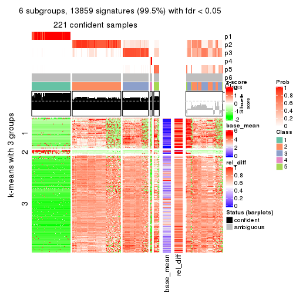</p>

</div>
</div>


Signature heatmaps where rows are not scaled:


<script>
$( function() {
	$( '#tabs-ATC-kmeans-get-signatures-no-scale' ).tabs();
} );
</script>
<div id='tabs-ATC-kmeans-get-signatures-no-scale'>
<ul>
<li><a href='#tab-ATC-kmeans-get-signatures-no-scale-1'>k = 2</a></li>
<li><a href='#tab-ATC-kmeans-get-signatures-no-scale-2'>k = 3</a></li>
<li><a href='#tab-ATC-kmeans-get-signatures-no-scale-3'>k = 4</a></li>
<li><a href='#tab-ATC-kmeans-get-signatures-no-scale-4'>k = 5</a></li>
<li><a href='#tab-ATC-kmeans-get-signatures-no-scale-5'>k = 6</a></li>
</ul>
<div id='tab-ATC-kmeans-get-signatures-no-scale-1'>
<pre><code class="r">get_signatures(res, k = 2, scale_rows = FALSE)
</code></pre>

<p></p>

</div>
<div id='tab-ATC-kmeans-get-signatures-no-scale-2'>
<pre><code class="r">get_signatures(res, k = 3, scale_rows = FALSE)
</code></pre>

<p></p>

</div>
<div id='tab-ATC-kmeans-get-signatures-no-scale-3'>
<pre><code class="r">get_signatures(res, k = 4, scale_rows = FALSE)
</code></pre>

<p></p>

</div>
<div id='tab-ATC-kmeans-get-signatures-no-scale-4'>
<pre><code class="r">get_signatures(res, k = 5, scale_rows = FALSE)
</code></pre>

<p></p>

</div>
<div id='tab-ATC-kmeans-get-signatures-no-scale-5'>
<pre><code class="r">get_signatures(res, k = 6, scale_rows = FALSE)
</code></pre>

<p></p>

</div>
</div>


Compare the overlap of signatures from different k:

```r
compare_signatures(res)
```


`get_signature()` returns a data frame invisibly. TO get the list of signatures, the function
call should be assigned to a variable explicitly. In following code, if `plot` argument is set
to `FALSE`, no heatmap is plotted while only the differential analysis is performed.

```r
# code only for demonstration
tb = get_signature(res, k = ..., plot = FALSE)
```

An example of the output of `tb` is:

```
#>   which_row         fdr    mean_1    mean_2 scaled_mean_1 scaled_mean_2 km
#> 1        38 0.042760348  8.373488  9.131774    -0.5533452     0.5164555  1
#> 2        40 0.018707592  7.106213  8.469186    -0.6173731     0.5762149  1
#> 3        55 0.019134737 10.221463 11.207825    -0.6159697     0.5749050  1
#> 4        59 0.006059896  5.921854  7.869574    -0.6899429     0.6439467  1
#> 5        60 0.018055526  8.928898 10.211722    -0.6204761     0.5791110  1
#> 6        98 0.009384629 15.714769 14.887706     0.6635654    -0.6193277  2
...
```

The columns in `tb` are:

1. `which_row`: row indices corresponding to the input matrix.
2. `fdr`: FDR for the differential test. 
3. `mean_x`: The mean value in group x.
4. `scaled_mean_x`: The mean value in group x after rows are scaled.
5. `km`: Row groups if k-means clustering is applied to rows.


UMAP plot which shows how samples are separated.


<script>
$( function() {
	$( '#tabs-ATC-kmeans-dimension-reduction' ).tabs();
} );
</script>
<div id='tabs-ATC-kmeans-dimension-reduction'>
<ul>
<li><a href='#tab-ATC-kmeans-dimension-reduction-1'>k = 2</a></li>
<li><a href='#tab-ATC-kmeans-dimension-reduction-2'>k = 3</a></li>
<li><a href='#tab-ATC-kmeans-dimension-reduction-3'>k = 4</a></li>
<li><a href='#tab-ATC-kmeans-dimension-reduction-4'>k = 5</a></li>
<li><a href='#tab-ATC-kmeans-dimension-reduction-5'>k = 6</a></li>
</ul>
<div id='tab-ATC-kmeans-dimension-reduction-1'>
<pre><code class="r">dimension_reduction(res, k = 2, method = &quot;UMAP&quot;)
</code></pre>

<p></p>

</div>
<div id='tab-ATC-kmeans-dimension-reduction-2'>
<pre><code class="r">dimension_reduction(res, k = 3, method = &quot;UMAP&quot;)
</code></pre>

<p></p>

</div>
<div id='tab-ATC-kmeans-dimension-reduction-3'>
<pre><code class="r">dimension_reduction(res, k = 4, method = &quot;UMAP&quot;)
</code></pre>

<p></p>

</div>
<div id='tab-ATC-kmeans-dimension-reduction-4'>
<pre><code class="r">dimension_reduction(res, k = 5, method = &quot;UMAP&quot;)
</code></pre>

<p></p>

</div>
<div id='tab-ATC-kmeans-dimension-reduction-5'>
<pre><code class="r">dimension_reduction(res, k = 6, method = &quot;UMAP&quot;)
</code></pre>

<p></p>

</div>
</div>


Following heatmap shows how subgroups are split when increasing `k`:

```r
collect_classes(res)
```


If matrix rows can be associated to genes, consider to use `GO_Enrichment(res,
...)` to perform function enrichment for the signature genes.


 

---------------------------------------------------


### ATC:skmeans**


The object with results only for a single top-value method and a single partition method 
can be extracted as:

```r
res = res_list["ATC", "skmeans"]
# you can also extract it by
# res = res_list["ATC:skmeans"]
```

A summary of `res` and all the functions that can be applied to it:

```r
res
```

```
#> A 'ConsensusPartition' object with k = 2, 3, 4, 5, 6.
#>   On a matrix with 13930 rows and 285 columns.
#>   Top rows (1000, 2000, 3000, 4000, 5000) are extracted by 'ATC' method.
#>   Subgroups are detected by 'skmeans' method.
#>   Performed in total 1250 partitions by row resampling.
#>   Best k for subgroups seems to be 2.
#> 
#> Following methods can be applied to this 'ConsensusPartition' object:
#>  [1] "cola_report"             "collect_classes"         "collect_plots"          
#>  [4] "collect_stats"           "colnames"                "compare_signatures"     
#>  [7] "consensus_heatmap"       "dimension_reduction"     "functional_enrichment"  
#> [10] "get_anno_col"            "get_anno"                "get_classes"            
#> [13] "get_consensus"           "get_matrix"              "get_membership"         
#> [16] "get_param"               "get_signatures"          "get_stats"              
#> [19] "is_best_k"               "is_stable_k"             "membership_heatmap"     
#> [22] "ncol"                    "nrow"                    "plot_ecdf"              
#> [25] "rownames"                "select_partition_number" "show"                   
#> [28] "suggest_best_k"          "test_to_known_factors"
```

`collect_plots()` function collects all the plots made from `res` for all `k` (number of partitions)
into one single page to provide an easy and fast comparison between different `k`.

```r
collect_plots(res)
```


The plots are:

- The first row: a plot of the ECDF (Empirical cumulative distribution
  function) curves of the consensus matrix for each `k` and the heatmap of
  predicted classes for each `k`.
- The second row: heatmaps of the consensus matrix for each `k`.
- The third row: heatmaps of the membership matrix for each `k`.
- The fouth row: heatmaps of the signatures for each `k`.

All the plots in panels can be made by individual functions and they are
plotted later in this section.

`select_partition_number()` produces several plots showing different
statistics for choosing "optimized" `k`. There are following statistics:

- ECDF curves of the consensus matrix for each `k`;
- 1-PAC. [The PAC
  score](https://en.wikipedia.org/wiki/Consensus_clustering#Over-interpretation_potential_of_consensus_clustering)
  measures the proportion of the ambiguous subgrouping.
- Mean silhouette score.
- Concordance. The mean probability of fiting the consensus class ids in all
  partitions.
- Area increased. Denote $A_k$ as the area under the ECDF curve for current
  `k`, the area increased is defined as $A_k - A_{k-1}$.
- Rand index. The percent of pairs of samples that are both in a same cluster
  or both are not in a same cluster in the partition of k and k-1.
- Jaccard index. The ratio of pairs of samples are both in a same cluster in
  the partition of k and k-1 and the pairs of samples are both in a same
  cluster in the partition k or k-1.

The detailed explanations of these statistics can be found in [the cola
vignette](http://bioconductor.org/packages/devel/bioc/vignettes/cola/inst/doc/cola.html#toc_13).

Generally speaking, lower PAC score, higher mean silhouette score or higher
concordance corresponds to better partition. Rand index and Jaccard index
measure how similar the current partition is compared to partition with `k-1`.
If they are too similar, we won't accept `k` is better than `k-1`.

```r
select_partition_number(res)
```


The numeric values for all these statistics can be obtained by `get_stats()`.

```r
get_stats(res)
```

```
#>   k 1-PAC mean_silhouette concordance area_increased  Rand Jaccard
#> 2 2 1.000           1.000       1.000         0.3898 0.611   0.611
#> 3 3 0.806           0.847       0.920         0.2925 0.910   0.853
#> 4 4 0.766           0.795       0.917         0.2847 0.761   0.564
#> 5 5 0.736           0.859       0.910         0.0747 0.893   0.709
#> 6 6 0.733           0.789       0.880         0.0294 0.991   0.968
```

`suggest_best_k()` suggests the best $k$ based on these statistics. The rules are as follows:

- All $k$ with Jaccard index larger than 0.95 are removed because the increase of
  the partition number does not provides enough extra information. If all $k$ are removed,
  the best $k$ is assigned by `NA`.
- For $k$ with 1-PAC larger than 0.9, the maximal $k$ is taken as the "best k". Other $k$ is called "optional k".
- If it does not fit the second rule. The $k$ with the highest vote of highest
  1-PAC, mean silhouette and concordance is taken as the "best k".

```r
suggest_best_k(res)
```

```
#> [1] 2
```


Following shows the table of the partitions (You need to click the **show/hide
code output** link to see it). The membership matrix (columns with name `p*`)
is inferred by
[`clue::cl_consensus()`](https://www.rdocumentation.org/link/cl_consensus?package=clue)
function with the `SE` method. Basically the value in the membership matrix
represents the probability to belong to a certain group. The finall class
label for an item is determined with the group with highest probability it
belongs to.

In `get_classes()` function, the entropy is calculated from the membership
matrix and the silhouette score is calculated from the consensus matrix.


<script>
$( function() {
	$( '#tabs-ATC-skmeans-get-classes' ).tabs();
} );
</script>
<div id='tabs-ATC-skmeans-get-classes'>
<ul>
<li><a href='#tab-ATC-skmeans-get-classes-1'>k = 2</a></li>
<li><a href='#tab-ATC-skmeans-get-classes-2'>k = 3</a></li>
<li><a href='#tab-ATC-skmeans-get-classes-3'>k = 4</a></li>
<li><a href='#tab-ATC-skmeans-get-classes-4'>k = 5</a></li>
<li><a href='#tab-ATC-skmeans-get-classes-5'>k = 6</a></li>
</ul>

<div id='tab-ATC-skmeans-get-classes-1'>
<p><a id='tab-ATC-skmeans-get-classes-1-a' style='color:#0366d6' href='#'>show/hide code output</a></p>
<pre><code class="r">cbind(get_classes(res, k = 2), get_membership(res, k = 2))
</code></pre>

<pre><code>#&gt;            class entropy silhouette    p1    p2
#&gt; SRR1201591     2   0.000      1.000 0.000 1.000
#&gt; SRR1201590     2   0.000      1.000 0.000 1.000
#&gt; SRR1201593     2   0.000      1.000 0.000 1.000
#&gt; SRR1201592     2   0.000      1.000 0.000 1.000
#&gt; SRR1201617     2   0.000      1.000 0.000 1.000
#&gt; SRR1201616     2   0.000      1.000 0.000 1.000
#&gt; SRR1201619     2   0.000      1.000 0.000 1.000
#&gt; SRR1201618     2   0.000      1.000 0.000 1.000
#&gt; SRR1201620     2   0.000      1.000 0.000 1.000
#&gt; SRR1201621     2   0.000      1.000 0.000 1.000
#&gt; SRR1201623     2   0.000      1.000 0.000 1.000
#&gt; SRR1201622     2   0.000      1.000 0.000 1.000
#&gt; SRR1201624     2   0.000      1.000 0.000 1.000
#&gt; SRR1201625     2   0.000      1.000 0.000 1.000
#&gt; SRR1201626     1   0.000      1.000 1.000 0.000
#&gt; SRR1201627     2   0.000      1.000 0.000 1.000
#&gt; SRR1201628     2   0.000      1.000 0.000 1.000
#&gt; SRR1201629     2   0.000      1.000 0.000 1.000
#&gt; SRR1201630     2   0.000      1.000 0.000 1.000
#&gt; SRR1201631     2   0.000      1.000 0.000 1.000
#&gt; SRR1201641     2   0.000      1.000 0.000 1.000
#&gt; SRR1201640     2   0.000      1.000 0.000 1.000
#&gt; SRR1201643     2   0.000      1.000 0.000 1.000
#&gt; SRR1201644     2   0.000      1.000 0.000 1.000
#&gt; SRR1201661     2   0.000      1.000 0.000 1.000
#&gt; SRR1201662     2   0.000      1.000 0.000 1.000
#&gt; SRR1201663     2   0.000      1.000 0.000 1.000
#&gt; SRR1201664     2   0.000      1.000 0.000 1.000
#&gt; SRR1201665     2   0.000      1.000 0.000 1.000
#&gt; SRR1201666     2   0.000      1.000 0.000 1.000
#&gt; SRR1201667     2   0.000      1.000 0.000 1.000
#&gt; SRR1201668     2   0.000      1.000 0.000 1.000
#&gt; SRR1201670     2   0.000      1.000 0.000 1.000
#&gt; SRR1201669     2   0.000      1.000 0.000 1.000
#&gt; SRR1201673     2   0.000      1.000 0.000 1.000
#&gt; SRR1201672     2   0.000      1.000 0.000 1.000
#&gt; SRR1201671     2   0.000      1.000 0.000 1.000
#&gt; SRR1201677     2   0.000      1.000 0.000 1.000
#&gt; SRR1201676     2   0.000      1.000 0.000 1.000
#&gt; SRR1201675     2   0.000      1.000 0.000 1.000
#&gt; SRR1201674     2   0.000      1.000 0.000 1.000
#&gt; SRR1201678     2   0.000      1.000 0.000 1.000
#&gt; SRR1201682     2   0.000      1.000 0.000 1.000
#&gt; SRR1201683     2   0.000      1.000 0.000 1.000
#&gt; SRR1201680     2   0.000      1.000 0.000 1.000
#&gt; SRR1201681     2   0.000      1.000 0.000 1.000
#&gt; SRR1201679     2   0.000      1.000 0.000 1.000
#&gt; SRR1201686     2   0.000      1.000 0.000 1.000
#&gt; SRR1201687     2   0.000      1.000 0.000 1.000
#&gt; SRR1201688     2   0.000      1.000 0.000 1.000
#&gt; SRR1201689     2   0.000      1.000 0.000 1.000
#&gt; SRR1201685     2   0.000      1.000 0.000 1.000
#&gt; SRR1201692     2   0.000      1.000 0.000 1.000
#&gt; SRR1201691     2   0.000      1.000 0.000 1.000
#&gt; SRR1201690     2   0.000      1.000 0.000 1.000
#&gt; SRR1201696     2   0.000      1.000 0.000 1.000
#&gt; SRR1201695     2   0.000      1.000 0.000 1.000
#&gt; SRR1201694     2   0.000      1.000 0.000 1.000
#&gt; SRR1201693     2   0.000      1.000 0.000 1.000
#&gt; SRR1201697     2   0.000      1.000 0.000 1.000
#&gt; SRR1201698     2   0.000      1.000 0.000 1.000
#&gt; SRR1201700     2   0.000      1.000 0.000 1.000
#&gt; SRR1201708     2   0.000      1.000 0.000 1.000
#&gt; SRR1201707     2   0.000      1.000 0.000 1.000
#&gt; SRR1201706     2   0.000      1.000 0.000 1.000
#&gt; SRR1201702     2   0.000      1.000 0.000 1.000
#&gt; SRR1201705     2   0.000      1.000 0.000 1.000
#&gt; SRR1201701     2   0.000      1.000 0.000 1.000
#&gt; SRR1201704     2   0.000      1.000 0.000 1.000
#&gt; SRR1201703     2   0.000      1.000 0.000 1.000
#&gt; SRR1201716     2   0.000      1.000 0.000 1.000
#&gt; SRR1201715     2   0.000      1.000 0.000 1.000
#&gt; SRR1201717     2   0.000      1.000 0.000 1.000
#&gt; SRR1201712     2   0.000      1.000 0.000 1.000
#&gt; SRR1201709     2   0.000      1.000 0.000 1.000
#&gt; SRR1201711     2   0.000      1.000 0.000 1.000
#&gt; SRR1201714     2   0.000      1.000 0.000 1.000
#&gt; SRR1201713     2   0.000      1.000 0.000 1.000
#&gt; SRR1201710     2   0.000      1.000 0.000 1.000
#&gt; SRR1201719     2   0.000      1.000 0.000 1.000
#&gt; SRR1201718     2   0.000      1.000 0.000 1.000
#&gt; SRR1201721     2   0.000      1.000 0.000 1.000
#&gt; SRR1201720     2   0.000      1.000 0.000 1.000
#&gt; SRR1201723     2   0.000      1.000 0.000 1.000
#&gt; SRR1201722     2   0.000      1.000 0.000 1.000
#&gt; SRR1201725     2   0.000      1.000 0.000 1.000
#&gt; SRR1201724     2   0.000      1.000 0.000 1.000
#&gt; SRR1201726     2   0.000      1.000 0.000 1.000
#&gt; SRR1201727     2   0.000      1.000 0.000 1.000
#&gt; SRR1201731     2   0.000      1.000 0.000 1.000
#&gt; SRR1201730     2   0.000      1.000 0.000 1.000
#&gt; SRR1201734     2   0.000      1.000 0.000 1.000
#&gt; SRR1201733     2   0.000      1.000 0.000 1.000
#&gt; SRR1201736     2   0.000      1.000 0.000 1.000
#&gt; SRR1201737     2   0.000      1.000 0.000 1.000
#&gt; SRR1201739     2   0.000      1.000 0.000 1.000
#&gt; SRR1201738     2   0.000      1.000 0.000 1.000
#&gt; SRR1201742     2   0.000      1.000 0.000 1.000
#&gt; SRR1201743     2   0.000      1.000 0.000 1.000
#&gt; SRR1201745     2   0.000      1.000 0.000 1.000
#&gt; SRR1201744     2   0.000      1.000 0.000 1.000
#&gt; SRR1201749     2   0.000      1.000 0.000 1.000
#&gt; SRR1201750     2   0.000      1.000 0.000 1.000
#&gt; SRR1201752     2   0.000      1.000 0.000 1.000
#&gt; SRR1201751     2   0.000      1.000 0.000 1.000
#&gt; SRR1201754     2   0.000      1.000 0.000 1.000
#&gt; SRR1201753     2   0.000      1.000 0.000 1.000
#&gt; SRR1201758     2   0.000      1.000 0.000 1.000
#&gt; SRR1201759     2   0.000      1.000 0.000 1.000
#&gt; SRR1201760     2   0.000      1.000 0.000 1.000
#&gt; SRR1201761     2   0.000      1.000 0.000 1.000
#&gt; SRR1201763     2   0.000      1.000 0.000 1.000
#&gt; SRR1201762     1   0.000      1.000 1.000 0.000
#&gt; SRR1201764     2   0.000      1.000 0.000 1.000
#&gt; SRR1201766     2   0.000      1.000 0.000 1.000
#&gt; SRR1201768     2   0.000      1.000 0.000 1.000
#&gt; SRR1201769     2   0.000      1.000 0.000 1.000
#&gt; SRR1201767     2   0.000      1.000 0.000 1.000
#&gt; SRR1201770     2   0.000      1.000 0.000 1.000
#&gt; SRR1201771     2   0.000      1.000 0.000 1.000
#&gt; SRR1201772     2   0.000      1.000 0.000 1.000
#&gt; SRR1201773     2   0.000      1.000 0.000 1.000
#&gt; SRR1201774     2   0.000      1.000 0.000 1.000
#&gt; SRR1201786     2   0.000      1.000 0.000 1.000
#&gt; SRR1201784     2   0.000      1.000 0.000 1.000
#&gt; SRR1201785     2   0.000      1.000 0.000 1.000
#&gt; SRR1201778     2   0.000      1.000 0.000 1.000
#&gt; SRR1201779     2   0.000      1.000 0.000 1.000
#&gt; SRR1201781     2   0.000      1.000 0.000 1.000
#&gt; SRR1201780     2   0.000      1.000 0.000 1.000
#&gt; SRR1201783     2   0.000      1.000 0.000 1.000
#&gt; SRR1201782     2   0.000      1.000 0.000 1.000
#&gt; SRR1201798     2   0.000      1.000 0.000 1.000
#&gt; SRR1201797     2   0.000      1.000 0.000 1.000
#&gt; SRR1201796     2   0.000      1.000 0.000 1.000
#&gt; SRR1201795     2   0.000      1.000 0.000 1.000
#&gt; SRR1201799     2   0.000      1.000 0.000 1.000
#&gt; SRR1201794     2   0.000      1.000 0.000 1.000
#&gt; SRR1201793     2   0.000      1.000 0.000 1.000
#&gt; SRR1201792     2   0.000      1.000 0.000 1.000
#&gt; SRR1201791     2   0.000      1.000 0.000 1.000
#&gt; SRR1201807     2   0.000      1.000 0.000 1.000
#&gt; SRR1201808     2   0.000      1.000 0.000 1.000
#&gt; SRR1201803     2   0.000      1.000 0.000 1.000
#&gt; SRR1201804     2   0.000      1.000 0.000 1.000
#&gt; SRR1201805     2   0.000      1.000 0.000 1.000
#&gt; SRR1201806     2   0.000      1.000 0.000 1.000
#&gt; SRR1201801     2   0.000      1.000 0.000 1.000
#&gt; SRR1201802     2   0.000      1.000 0.000 1.000
#&gt; SRR1201800     2   0.000      1.000 0.000 1.000
#&gt; SRR1201814     2   0.000      1.000 0.000 1.000
#&gt; SRR1201816     2   0.000      1.000 0.000 1.000
#&gt; SRR1201815     2   0.000      1.000 0.000 1.000
#&gt; SRR1201819     2   0.000      1.000 0.000 1.000
#&gt; SRR1201820     2   0.000      1.000 0.000 1.000
#&gt; SRR1201813     2   0.000      1.000 0.000 1.000
#&gt; SRR1201817     2   0.000      1.000 0.000 1.000
#&gt; SRR1201818     2   0.000      1.000 0.000 1.000
#&gt; SRR1201825     2   0.000      1.000 0.000 1.000
#&gt; SRR1201827     2   0.000      1.000 0.000 1.000
#&gt; SRR1201828     2   0.000      1.000 0.000 1.000
#&gt; SRR1201826     2   0.000      1.000 0.000 1.000
#&gt; SRR1201829     2   0.000      1.000 0.000 1.000
#&gt; SRR1201830     2   0.000      1.000 0.000 1.000
#&gt; SRR1201831     2   0.000      1.000 0.000 1.000
#&gt; SRR1201832     2   0.000      1.000 0.000 1.000
#&gt; SRR1201833     2   0.000      1.000 0.000 1.000
#&gt; SRR1201865     2   0.000      1.000 0.000 1.000
#&gt; SRR1201866     2   0.000      1.000 0.000 1.000
#&gt; SRR1201867     2   0.000      1.000 0.000 1.000
#&gt; SRR1201861     2   0.000      1.000 0.000 1.000
#&gt; SRR1201862     2   0.000      1.000 0.000 1.000
#&gt; SRR1201863     2   0.000      1.000 0.000 1.000
#&gt; SRR1201859     2   0.000      1.000 0.000 1.000
#&gt; SRR1201864     2   0.000      1.000 0.000 1.000
#&gt; SRR1201860     2   0.000      1.000 0.000 1.000
#&gt; SRR1201873     2   0.000      1.000 0.000 1.000
#&gt; SRR1201871     2   0.000      1.000 0.000 1.000
#&gt; SRR1201872     2   0.000      1.000 0.000 1.000
#&gt; SRR1201980     2   0.000      1.000 0.000 1.000
#&gt; SRR1201979     2   0.000      1.000 0.000 1.000
#&gt; SRR1201982     2   0.000      1.000 0.000 1.000
#&gt; SRR1201981     2   0.000      1.000 0.000 1.000
#&gt; SRR1201998     2   0.000      1.000 0.000 1.000
#&gt; SRR1201996     2   0.000      1.000 0.000 1.000
#&gt; SRR1201997     2   0.000      1.000 0.000 1.000
#&gt; SRR1202005     2   0.000      1.000 0.000 1.000
#&gt; SRR1202006     2   0.000      1.000 0.000 1.000
#&gt; SRR1202088     2   0.000      1.000 0.000 1.000
#&gt; SRR1202087     2   0.000      1.000 0.000 1.000
#&gt; SRR1202093     2   0.000      1.000 0.000 1.000
#&gt; SRR1202092     2   0.000      1.000 0.000 1.000
#&gt; SRR1202288     2   0.000      1.000 0.000 1.000
#&gt; SRR1202289     2   0.000      1.000 0.000 1.000
#&gt; SRR1202299     2   0.000      1.000 0.000 1.000
#&gt; SRR1202298     2   0.000      1.000 0.000 1.000
#&gt; SRR1202303     2   0.118      0.984 0.016 0.984
#&gt; SRR1202372     2   0.000      1.000 0.000 1.000
#&gt; SRR1202371     2   0.000      1.000 0.000 1.000
#&gt; SRR1202563     2   0.000      1.000 0.000 1.000
#&gt; SRR1202565     2   0.000      1.000 0.000 1.000
#&gt; SRR1202564     2   0.000      1.000 0.000 1.000
#&gt; SRR1202649     2   0.000      1.000 0.000 1.000
#&gt; SRR1202650     2   0.000      1.000 0.000 1.000
#&gt; SRR1202651     2   0.000      1.000 0.000 1.000
#&gt; SRR1202843     1   0.000      1.000 1.000 0.000
#&gt; SRR1202844     1   0.000      1.000 1.000 0.000
#&gt; SRR1202845     2   0.000      1.000 0.000 1.000
#&gt; SRR1202847     2   0.000      1.000 0.000 1.000
#&gt; SRR1202846     2   0.000      1.000 0.000 1.000
#&gt; SRR1202945     1   0.000      1.000 1.000 0.000
#&gt; SRR1202949     1   0.000      1.000 1.000 0.000
#&gt; SRR1202977     1   0.000      1.000 1.000 0.000
#&gt; SRR1202978     1   0.000      1.000 1.000 0.000
#&gt; SRR1202979     1   0.000      1.000 1.000 0.000
#&gt; SRR1202990     1   0.000      1.000 1.000 0.000
#&gt; SRR1202999     1   0.000      1.000 1.000 0.000
#&gt; SRR1203005     1   0.000      1.000 1.000 0.000
#&gt; SRR1203006     1   0.000      1.000 1.000 0.000
#&gt; SRR1203007     1   0.000      1.000 1.000 0.000
#&gt; SRR1203009     1   0.000      1.000 1.000 0.000
#&gt; SRR1203008     1   0.000      1.000 1.000 0.000
#&gt; SRR1203010     1   0.000      1.000 1.000 0.000
#&gt; SRR1203011     1   0.000      1.000 1.000 0.000
#&gt; SRR1203025     1   0.000      1.000 1.000 0.000
#&gt; SRR1203026     1   0.000      1.000 1.000 0.000
#&gt; SRR1203027     1   0.000      1.000 1.000 0.000
#&gt; SRR1203061     1   0.000      1.000 1.000 0.000
#&gt; SRR1203089     1   0.000      1.000 1.000 0.000
#&gt; SRR1203125     1   0.000      1.000 1.000 0.000
#&gt; SRR1203128     1   0.000      1.000 1.000 0.000
#&gt; SRR1203129     1   0.000      1.000 1.000 0.000
#&gt; SRR1203130     1   0.000      1.000 1.000 0.000
#&gt; SRR1203132     2   0.000      1.000 0.000 1.000
#&gt; SRR1203131     2   0.000      1.000 0.000 1.000
#&gt; SRR1203133     1   0.000      1.000 1.000 0.000
#&gt; SRR1203138     1   0.000      1.000 1.000 0.000
#&gt; SRR1203760     1   0.000      1.000 1.000 0.000
#&gt; SRR1203761     1   0.000      1.000 1.000 0.000
#&gt; SRR1203770     1   0.000      1.000 1.000 0.000
#&gt; SRR1203771     1   0.000      1.000 1.000 0.000
#&gt; SRR1203772     1   0.000      1.000 1.000 0.000
#&gt; SRR1203773     1   0.000      1.000 1.000 0.000
#&gt; SRR1203774     1   0.000      1.000 1.000 0.000
#&gt; SRR1203775     1   0.000      1.000 1.000 0.000
#&gt; SRR1203800     1   0.000      1.000 1.000 0.000
#&gt; SRR1203801     1   0.000      1.000 1.000 0.000
#&gt; SRR1203802     1   0.000      1.000 1.000 0.000
#&gt; SRR1203803     1   0.000      1.000 1.000 0.000
#&gt; SRR1203804     1   0.000      1.000 1.000 0.000
#&gt; SRR1203805     1   0.000      1.000 1.000 0.000
#&gt; SRR1203806     1   0.000      1.000 1.000 0.000
#&gt; SRR1203807     1   0.000      1.000 1.000 0.000
#&gt; SRR1203808     1   0.000      1.000 1.000 0.000
#&gt; SRR1203811     1   0.000      1.000 1.000 0.000
#&gt; SRR1203812     1   0.000      1.000 1.000 0.000
#&gt; SRR1203813     1   0.000      1.000 1.000 0.000
#&gt; SRR1203814     1   0.000      1.000 1.000 0.000
#&gt; SRR1203815     1   0.000      1.000 1.000 0.000
#&gt; SRR1203816     1   0.000      1.000 1.000 0.000
#&gt; SRR1203817     1   0.000      1.000 1.000 0.000
#&gt; SRR1203818     1   0.000      1.000 1.000 0.000
#&gt; SRR1203819     1   0.000      1.000 1.000 0.000
#&gt; SRR1203822     1   0.000      1.000 1.000 0.000
#&gt; SRR1203823     1   0.000      1.000 1.000 0.000
#&gt; SRR1203824     1   0.000      1.000 1.000 0.000
#&gt; SRR1203825     1   0.000      1.000 1.000 0.000
#&gt; SRR1203826     1   0.000      1.000 1.000 0.000
#&gt; SRR1203827     1   0.000      1.000 1.000 0.000
#&gt; SRR1203828     1   0.000      1.000 1.000 0.000
#&gt; SRR1203829     1   0.000      1.000 1.000 0.000
#&gt; SRR1203830     1   0.000      1.000 1.000 0.000
#&gt; SRR1203831     1   0.000      1.000 1.000 0.000
#&gt; SRR1203832     1   0.000      1.000 1.000 0.000
#&gt; SRR1203833     1   0.000      1.000 1.000 0.000
#&gt; SRR1203834     1   0.000      1.000 1.000 0.000
#&gt; SRR1203835     1   0.000      1.000 1.000 0.000
#&gt; SRR1203836     1   0.000      1.000 1.000 0.000
#&gt; SRR1203837     1   0.000      1.000 1.000 0.000
#&gt; SRR1203838     1   0.000      1.000 1.000 0.000
#&gt; SRR1203839     1   0.000      1.000 1.000 0.000
#&gt; SRR1203842     1   0.000      1.000 1.000 0.000
#&gt; SRR1203843     1   0.000      1.000 1.000 0.000
#&gt; SRR1203845     2   0.000      1.000 0.000 1.000
#&gt; SRR1203844     2   0.000      1.000 0.000 1.000
</code></pre>

<script>
$('#tab-ATC-skmeans-get-classes-1-a').parent().next().next().hide();
$('#tab-ATC-skmeans-get-classes-1-a').click(function(){
  $('#tab-ATC-skmeans-get-classes-1-a').parent().next().next().toggle();
  return(false);
});
</script>
</div>

<div id='tab-ATC-skmeans-get-classes-2'>
<p><a id='tab-ATC-skmeans-get-classes-2-a' style='color:#0366d6' href='#'>show/hide code output</a></p>
<pre><code class="r">cbind(get_classes(res, k = 3), get_membership(res, k = 3))
</code></pre>

<pre><code>#&gt;            class entropy silhouette    p1    p2    p3
#&gt; SRR1201591     2  0.0000     0.9137 0.000 1.000 0.000
#&gt; SRR1201590     2  0.0000     0.9137 0.000 1.000 0.000
#&gt; SRR1201593     2  0.0000     0.9137 0.000 1.000 0.000
#&gt; SRR1201592     2  0.0000     0.9137 0.000 1.000 0.000
#&gt; SRR1201617     2  0.0000     0.9137 0.000 1.000 0.000
#&gt; SRR1201616     2  0.0000     0.9137 0.000 1.000 0.000
#&gt; SRR1201619     2  0.0000     0.9137 0.000 1.000 0.000
#&gt; SRR1201618     2  0.0000     0.9137 0.000 1.000 0.000
#&gt; SRR1201620     2  0.0000     0.9137 0.000 1.000 0.000
#&gt; SRR1201621     2  0.0000     0.9137 0.000 1.000 0.000
#&gt; SRR1201623     2  0.6154     0.0968 0.000 0.592 0.408
#&gt; SRR1201622     2  0.6154     0.0968 0.000 0.592 0.408
#&gt; SRR1201624     3  0.1163     0.7058 0.000 0.028 0.972
#&gt; SRR1201625     3  0.5254     0.8946 0.000 0.264 0.736
#&gt; SRR1201626     1  0.1163     0.9735 0.972 0.000 0.028
#&gt; SRR1201627     3  0.0000     0.6683 0.000 0.000 1.000
#&gt; SRR1201628     2  0.2625     0.8207 0.000 0.916 0.084
#&gt; SRR1201629     2  0.0237     0.9117 0.000 0.996 0.004
#&gt; SRR1201630     2  0.0000     0.9137 0.000 1.000 0.000
#&gt; SRR1201631     2  0.0000     0.9137 0.000 1.000 0.000
#&gt; SRR1201641     2  0.0000     0.9137 0.000 1.000 0.000
#&gt; SRR1201640     2  0.0000     0.9137 0.000 1.000 0.000
#&gt; SRR1201643     2  0.0000     0.9137 0.000 1.000 0.000
#&gt; SRR1201644     2  0.0000     0.9137 0.000 1.000 0.000
#&gt; SRR1201661     2  0.0000     0.9137 0.000 1.000 0.000
#&gt; SRR1201662     2  0.0000     0.9137 0.000 1.000 0.000
#&gt; SRR1201663     3  0.5291     0.8959 0.000 0.268 0.732
#&gt; SRR1201664     3  0.5291     0.8959 0.000 0.268 0.732
#&gt; SRR1201665     2  0.0000     0.9137 0.000 1.000 0.000
#&gt; SRR1201666     2  0.0000     0.9137 0.000 1.000 0.000
#&gt; SRR1201667     2  0.0000     0.9137 0.000 1.000 0.000
#&gt; SRR1201668     3  0.5291     0.8959 0.000 0.268 0.732
#&gt; SRR1201670     3  0.5291     0.8959 0.000 0.268 0.732
#&gt; SRR1201669     3  0.5291     0.8959 0.000 0.268 0.732
#&gt; SRR1201673     2  0.0237     0.9117 0.000 0.996 0.004
#&gt; SRR1201672     2  0.0237     0.9117 0.000 0.996 0.004
#&gt; SRR1201671     2  0.0237     0.9117 0.000 0.996 0.004
#&gt; SRR1201677     2  0.0237     0.9117 0.000 0.996 0.004
#&gt; SRR1201676     2  0.0237     0.9117 0.000 0.996 0.004
#&gt; SRR1201675     2  0.0237     0.9117 0.000 0.996 0.004
#&gt; SRR1201674     2  0.0237     0.9117 0.000 0.996 0.004
#&gt; SRR1201678     2  0.0237     0.9117 0.000 0.996 0.004
#&gt; SRR1201682     2  0.0000     0.9137 0.000 1.000 0.000
#&gt; SRR1201683     2  0.0000     0.9137 0.000 1.000 0.000
#&gt; SRR1201680     2  0.0000     0.9137 0.000 1.000 0.000
#&gt; SRR1201681     2  0.0000     0.9137 0.000 1.000 0.000
#&gt; SRR1201679     2  0.0000     0.9137 0.000 1.000 0.000
#&gt; SRR1201686     3  0.5291     0.8959 0.000 0.268 0.732
#&gt; SRR1201687     3  0.5291     0.8959 0.000 0.268 0.732
#&gt; SRR1201688     3  0.5291     0.8959 0.000 0.268 0.732
#&gt; SRR1201689     3  0.5291     0.8959 0.000 0.268 0.732
#&gt; SRR1201685     3  0.5291     0.8959 0.000 0.268 0.732
#&gt; SRR1201692     2  0.0237     0.9117 0.000 0.996 0.004
#&gt; SRR1201691     2  0.0237     0.9117 0.000 0.996 0.004
#&gt; SRR1201690     2  0.0237     0.9117 0.000 0.996 0.004
#&gt; SRR1201696     2  0.0237     0.9117 0.000 0.996 0.004
#&gt; SRR1201695     2  0.0237     0.9117 0.000 0.996 0.004
#&gt; SRR1201694     2  0.0237     0.9117 0.000 0.996 0.004
#&gt; SRR1201693     2  0.0237     0.9117 0.000 0.996 0.004
#&gt; SRR1201697     2  0.0237     0.9117 0.000 0.996 0.004
#&gt; SRR1201698     2  0.0237     0.9117 0.000 0.996 0.004
#&gt; SRR1201700     2  0.6154     0.0968 0.000 0.592 0.408
#&gt; SRR1201708     2  0.6154     0.0968 0.000 0.592 0.408
#&gt; SRR1201707     2  0.6154     0.0968 0.000 0.592 0.408
#&gt; SRR1201706     2  0.6154     0.0968 0.000 0.592 0.408
#&gt; SRR1201702     2  0.6154     0.0968 0.000 0.592 0.408
#&gt; SRR1201705     2  0.6154     0.0968 0.000 0.592 0.408
#&gt; SRR1201701     2  0.6154     0.0968 0.000 0.592 0.408
#&gt; SRR1201704     2  0.6154     0.0968 0.000 0.592 0.408
#&gt; SRR1201703     2  0.6154     0.0968 0.000 0.592 0.408
#&gt; SRR1201716     2  0.6154     0.0968 0.000 0.592 0.408
#&gt; SRR1201715     2  0.6154     0.0968 0.000 0.592 0.408
#&gt; SRR1201717     2  0.6154     0.0968 0.000 0.592 0.408
#&gt; SRR1201712     2  0.6154     0.0968 0.000 0.592 0.408
#&gt; SRR1201709     2  0.6154     0.0968 0.000 0.592 0.408
#&gt; SRR1201711     2  0.6154     0.0968 0.000 0.592 0.408
#&gt; SRR1201714     2  0.6154     0.0968 0.000 0.592 0.408
#&gt; SRR1201713     2  0.6154     0.0968 0.000 0.592 0.408
#&gt; SRR1201710     2  0.6154     0.0968 0.000 0.592 0.408
#&gt; SRR1201719     2  0.0000     0.9137 0.000 1.000 0.000
#&gt; SRR1201718     2  0.0000     0.9137 0.000 1.000 0.000
#&gt; SRR1201721     2  0.0237     0.9117 0.000 0.996 0.004
#&gt; SRR1201720     2  0.5216     0.5194 0.000 0.740 0.260
#&gt; SRR1201723     3  0.5291     0.8959 0.000 0.268 0.732
#&gt; SRR1201722     3  0.5291     0.8959 0.000 0.268 0.732
#&gt; SRR1201725     2  0.0000     0.9137 0.000 1.000 0.000
#&gt; SRR1201724     2  0.0000     0.9137 0.000 1.000 0.000
#&gt; SRR1201726     2  0.6154     0.0968 0.000 0.592 0.408
#&gt; SRR1201727     2  0.6154     0.0968 0.000 0.592 0.408
#&gt; SRR1201731     2  0.0237     0.9117 0.000 0.996 0.004
#&gt; SRR1201730     2  0.0237     0.9117 0.000 0.996 0.004
#&gt; SRR1201734     2  0.0000     0.9137 0.000 1.000 0.000
#&gt; SRR1201733     2  0.0000     0.9137 0.000 1.000 0.000
#&gt; SRR1201736     2  0.0000     0.9137 0.000 1.000 0.000
#&gt; SRR1201737     2  0.0000     0.9137 0.000 1.000 0.000
#&gt; SRR1201739     2  0.0000     0.9137 0.000 1.000 0.000
#&gt; SRR1201738     2  0.0000     0.9137 0.000 1.000 0.000
#&gt; SRR1201742     2  0.0000     0.9137 0.000 1.000 0.000
#&gt; SRR1201743     2  0.0000     0.9137 0.000 1.000 0.000
#&gt; SRR1201745     2  0.0000     0.9137 0.000 1.000 0.000
#&gt; SRR1201744     2  0.0000     0.9137 0.000 1.000 0.000
#&gt; SRR1201749     2  0.0000     0.9137 0.000 1.000 0.000
#&gt; SRR1201750     2  0.0000     0.9137 0.000 1.000 0.000
#&gt; SRR1201752     2  0.0237     0.9117 0.000 0.996 0.004
#&gt; SRR1201751     2  0.0237     0.9117 0.000 0.996 0.004
#&gt; SRR1201754     2  0.0000     0.9137 0.000 1.000 0.000
#&gt; SRR1201753     2  0.0000     0.9137 0.000 1.000 0.000
#&gt; SRR1201758     3  0.3412     0.8014 0.000 0.124 0.876
#&gt; SRR1201759     3  0.5254     0.8946 0.000 0.264 0.736
#&gt; SRR1201760     2  0.1529     0.8742 0.000 0.960 0.040
#&gt; SRR1201761     2  0.2356     0.8360 0.000 0.928 0.072
#&gt; SRR1201763     3  0.1163     0.7058 0.000 0.028 0.972
#&gt; SRR1201762     1  0.5363     0.7145 0.724 0.000 0.276
#&gt; SRR1201764     2  0.0237     0.9117 0.000 0.996 0.004
#&gt; SRR1201766     2  0.0000     0.9137 0.000 1.000 0.000
#&gt; SRR1201768     2  0.0000     0.9137 0.000 1.000 0.000
#&gt; SRR1201769     2  0.0000     0.9137 0.000 1.000 0.000
#&gt; SRR1201767     2  0.0000     0.9137 0.000 1.000 0.000
#&gt; SRR1201770     2  0.0000     0.9137 0.000 1.000 0.000
#&gt; SRR1201771     2  0.0000     0.9137 0.000 1.000 0.000
#&gt; SRR1201772     2  0.0000     0.9137 0.000 1.000 0.000
#&gt; SRR1201773     2  0.0000     0.9137 0.000 1.000 0.000
#&gt; SRR1201774     2  0.0000     0.9137 0.000 1.000 0.000
#&gt; SRR1201786     2  0.0000     0.9137 0.000 1.000 0.000
#&gt; SRR1201784     2  0.0000     0.9137 0.000 1.000 0.000
#&gt; SRR1201785     2  0.0000     0.9137 0.000 1.000 0.000
#&gt; SRR1201778     2  0.0000     0.9137 0.000 1.000 0.000
#&gt; SRR1201779     2  0.0000     0.9137 0.000 1.000 0.000
#&gt; SRR1201781     2  0.0000     0.9137 0.000 1.000 0.000
#&gt; SRR1201780     2  0.0000     0.9137 0.000 1.000 0.000
#&gt; SRR1201783     2  0.0000     0.9137 0.000 1.000 0.000
#&gt; SRR1201782     2  0.0000     0.9137 0.000 1.000 0.000
#&gt; SRR1201798     2  0.0000     0.9137 0.000 1.000 0.000
#&gt; SRR1201797     2  0.0000     0.9137 0.000 1.000 0.000
#&gt; SRR1201796     2  0.0000     0.9137 0.000 1.000 0.000
#&gt; SRR1201795     2  0.0000     0.9137 0.000 1.000 0.000
#&gt; SRR1201799     2  0.0000     0.9137 0.000 1.000 0.000
#&gt; SRR1201794     2  0.0000     0.9137 0.000 1.000 0.000
#&gt; SRR1201793     2  0.0000     0.9137 0.000 1.000 0.000
#&gt; SRR1201792     2  0.0000     0.9137 0.000 1.000 0.000
#&gt; SRR1201791     2  0.0000     0.9137 0.000 1.000 0.000
#&gt; SRR1201807     2  0.0000     0.9137 0.000 1.000 0.000
#&gt; SRR1201808     2  0.0000     0.9137 0.000 1.000 0.000
#&gt; SRR1201803     2  0.0000     0.9137 0.000 1.000 0.000
#&gt; SRR1201804     2  0.0000     0.9137 0.000 1.000 0.000
#&gt; SRR1201805     2  0.0000     0.9137 0.000 1.000 0.000
#&gt; SRR1201806     2  0.0000     0.9137 0.000 1.000 0.000
#&gt; SRR1201801     2  0.0000     0.9137 0.000 1.000 0.000
#&gt; SRR1201802     2  0.0000     0.9137 0.000 1.000 0.000
#&gt; SRR1201800     2  0.0000     0.9137 0.000 1.000 0.000
#&gt; SRR1201814     2  0.0000     0.9137 0.000 1.000 0.000
#&gt; SRR1201816     2  0.0000     0.9137 0.000 1.000 0.000
#&gt; SRR1201815     2  0.0000     0.9137 0.000 1.000 0.000
#&gt; SRR1201819     2  0.0000     0.9137 0.000 1.000 0.000
#&gt; SRR1201820     2  0.0000     0.9137 0.000 1.000 0.000
#&gt; SRR1201813     2  0.0000     0.9137 0.000 1.000 0.000
#&gt; SRR1201817     2  0.0000     0.9137 0.000 1.000 0.000
#&gt; SRR1201818     2  0.0000     0.9137 0.000 1.000 0.000
#&gt; SRR1201825     2  0.6154     0.0968 0.000 0.592 0.408
#&gt; SRR1201827     2  0.0000     0.9137 0.000 1.000 0.000
#&gt; SRR1201828     2  0.0000     0.9137 0.000 1.000 0.000
#&gt; SRR1201826     2  0.0000     0.9137 0.000 1.000 0.000
#&gt; SRR1201829     2  0.0000     0.9137 0.000 1.000 0.000
#&gt; SRR1201830     2  0.0000     0.9137 0.000 1.000 0.000
#&gt; SRR1201831     2  0.0000     0.9137 0.000 1.000 0.000
#&gt; SRR1201832     2  0.0000     0.9137 0.000 1.000 0.000
#&gt; SRR1201833     2  0.0000     0.9137 0.000 1.000 0.000
#&gt; SRR1201865     2  0.0237     0.9117 0.000 0.996 0.004
#&gt; SRR1201866     2  0.0237     0.9117 0.000 0.996 0.004
#&gt; SRR1201867     2  0.0237     0.9117 0.000 0.996 0.004
#&gt; SRR1201861     2  0.0237     0.9117 0.000 0.996 0.004
#&gt; SRR1201862     2  0.0237     0.9117 0.000 0.996 0.004
#&gt; SRR1201863     2  0.0237     0.9117 0.000 0.996 0.004
#&gt; SRR1201859     2  0.0592     0.9044 0.000 0.988 0.012
#&gt; SRR1201864     2  0.0237     0.9117 0.000 0.996 0.004
#&gt; SRR1201860     2  0.0237     0.9117 0.000 0.996 0.004
#&gt; SRR1201873     2  0.6154     0.0968 0.000 0.592 0.408
#&gt; SRR1201871     2  0.6154     0.0968 0.000 0.592 0.408
#&gt; SRR1201872     2  0.6154     0.0968 0.000 0.592 0.408
#&gt; SRR1201980     2  0.0237     0.9117 0.000 0.996 0.004
#&gt; SRR1201979     2  0.0237     0.9117 0.000 0.996 0.004
#&gt; SRR1201982     2  0.0237     0.9117 0.000 0.996 0.004
#&gt; SRR1201981     2  0.0237     0.9117 0.000 0.996 0.004
#&gt; SRR1201998     2  0.0000     0.9137 0.000 1.000 0.000
#&gt; SRR1201996     2  0.0000     0.9137 0.000 1.000 0.000
#&gt; SRR1201997     2  0.0000     0.9137 0.000 1.000 0.000
#&gt; SRR1202005     2  0.0000     0.9137 0.000 1.000 0.000
#&gt; SRR1202006     2  0.0000     0.9137 0.000 1.000 0.000
#&gt; SRR1202088     2  0.6154     0.0968 0.000 0.592 0.408
#&gt; SRR1202087     2  0.6154     0.0968 0.000 0.592 0.408
#&gt; SRR1202093     2  0.0000     0.9137 0.000 1.000 0.000
#&gt; SRR1202092     2  0.0237     0.9117 0.000 0.996 0.004
#&gt; SRR1202288     2  0.0000     0.9137 0.000 1.000 0.000
#&gt; SRR1202289     2  0.0000     0.9137 0.000 1.000 0.000
#&gt; SRR1202299     2  0.0000     0.9137 0.000 1.000 0.000
#&gt; SRR1202298     2  0.0000     0.9137 0.000 1.000 0.000
#&gt; SRR1202303     3  0.0000     0.6683 0.000 0.000 1.000
#&gt; SRR1202372     2  0.0000     0.9137 0.000 1.000 0.000
#&gt; SRR1202371     2  0.0000     0.9137 0.000 1.000 0.000
#&gt; SRR1202563     2  0.0000     0.9137 0.000 1.000 0.000
#&gt; SRR1202565     2  0.0000     0.9137 0.000 1.000 0.000
#&gt; SRR1202564     2  0.0000     0.9137 0.000 1.000 0.000
#&gt; SRR1202649     2  0.0000     0.9137 0.000 1.000 0.000
#&gt; SRR1202650     2  0.0000     0.9137 0.000 1.000 0.000
#&gt; SRR1202651     2  0.0000     0.9137 0.000 1.000 0.000
#&gt; SRR1202843     1  0.0000     0.9965 1.000 0.000 0.000
#&gt; SRR1202844     1  0.0000     0.9965 1.000 0.000 0.000
#&gt; SRR1202845     2  0.0000     0.9137 0.000 1.000 0.000
#&gt; SRR1202847     2  0.0000     0.9137 0.000 1.000 0.000
#&gt; SRR1202846     2  0.0000     0.9137 0.000 1.000 0.000
#&gt; SRR1202945     1  0.0000     0.9965 1.000 0.000 0.000
#&gt; SRR1202949     1  0.0000     0.9965 1.000 0.000 0.000
#&gt; SRR1202977     1  0.0000     0.9965 1.000 0.000 0.000
#&gt; SRR1202978     1  0.0000     0.9965 1.000 0.000 0.000
#&gt; SRR1202979     1  0.0000     0.9965 1.000 0.000 0.000
#&gt; SRR1202990     1  0.0000     0.9965 1.000 0.000 0.000
#&gt; SRR1202999     1  0.0000     0.9965 1.000 0.000 0.000
#&gt; SRR1203005     1  0.0000     0.9965 1.000 0.000 0.000
#&gt; SRR1203006     1  0.0000     0.9965 1.000 0.000 0.000
#&gt; SRR1203007     1  0.0000     0.9965 1.000 0.000 0.000
#&gt; SRR1203009     1  0.0000     0.9965 1.000 0.000 0.000
#&gt; SRR1203008     1  0.0000     0.9965 1.000 0.000 0.000
#&gt; SRR1203010     1  0.0000     0.9965 1.000 0.000 0.000
#&gt; SRR1203011     1  0.0000     0.9965 1.000 0.000 0.000
#&gt; SRR1203025     1  0.0000     0.9965 1.000 0.000 0.000
#&gt; SRR1203026     1  0.0000     0.9965 1.000 0.000 0.000
#&gt; SRR1203027     1  0.0000     0.9965 1.000 0.000 0.000
#&gt; SRR1203061     1  0.0000     0.9965 1.000 0.000 0.000
#&gt; SRR1203089     1  0.0000     0.9965 1.000 0.000 0.000
#&gt; SRR1203125     1  0.0000     0.9965 1.000 0.000 0.000
#&gt; SRR1203128     1  0.0000     0.9965 1.000 0.000 0.000
#&gt; SRR1203129     1  0.0000     0.9965 1.000 0.000 0.000
#&gt; SRR1203130     1  0.0000     0.9965 1.000 0.000 0.000
#&gt; SRR1203132     2  0.0237     0.9117 0.000 0.996 0.004
#&gt; SRR1203131     2  0.0237     0.9117 0.000 0.996 0.004
#&gt; SRR1203133     1  0.0000     0.9965 1.000 0.000 0.000
#&gt; SRR1203138     1  0.0000     0.9965 1.000 0.000 0.000
#&gt; SRR1203760     1  0.0000     0.9965 1.000 0.000 0.000
#&gt; SRR1203761     1  0.0000     0.9965 1.000 0.000 0.000
#&gt; SRR1203770     1  0.0000     0.9965 1.000 0.000 0.000
#&gt; SRR1203771     1  0.0000     0.9965 1.000 0.000 0.000
#&gt; SRR1203772     1  0.0000     0.9965 1.000 0.000 0.000
#&gt; SRR1203773     1  0.0000     0.9965 1.000 0.000 0.000
#&gt; SRR1203774     1  0.0000     0.9965 1.000 0.000 0.000
#&gt; SRR1203775     1  0.0000     0.9965 1.000 0.000 0.000
#&gt; SRR1203800     1  0.0000     0.9965 1.000 0.000 0.000
#&gt; SRR1203801     1  0.0000     0.9965 1.000 0.000 0.000
#&gt; SRR1203802     1  0.0000     0.9965 1.000 0.000 0.000
#&gt; SRR1203803     1  0.0000     0.9965 1.000 0.000 0.000
#&gt; SRR1203804     1  0.0000     0.9965 1.000 0.000 0.000
#&gt; SRR1203805     1  0.0000     0.9965 1.000 0.000 0.000
#&gt; SRR1203806     1  0.0000     0.9965 1.000 0.000 0.000
#&gt; SRR1203807     1  0.0000     0.9965 1.000 0.000 0.000
#&gt; SRR1203808     1  0.0000     0.9965 1.000 0.000 0.000
#&gt; SRR1203811     1  0.0000     0.9965 1.000 0.000 0.000
#&gt; SRR1203812     1  0.0000     0.9965 1.000 0.000 0.000
#&gt; SRR1203813     1  0.0000     0.9965 1.000 0.000 0.000
#&gt; SRR1203814     1  0.0000     0.9965 1.000 0.000 0.000
#&gt; SRR1203815     1  0.0000     0.9965 1.000 0.000 0.000
#&gt; SRR1203816     1  0.0000     0.9965 1.000 0.000 0.000
#&gt; SRR1203817     1  0.0000     0.9965 1.000 0.000 0.000
#&gt; SRR1203818     1  0.0000     0.9965 1.000 0.000 0.000
#&gt; SRR1203819     1  0.0000     0.9965 1.000 0.000 0.000
#&gt; SRR1203822     1  0.0000     0.9965 1.000 0.000 0.000
#&gt; SRR1203823     1  0.0000     0.9965 1.000 0.000 0.000
#&gt; SRR1203824     1  0.0000     0.9965 1.000 0.000 0.000
#&gt; SRR1203825     1  0.0000     0.9965 1.000 0.000 0.000
#&gt; SRR1203826     1  0.0000     0.9965 1.000 0.000 0.000
#&gt; SRR1203827     1  0.0000     0.9965 1.000 0.000 0.000
#&gt; SRR1203828     1  0.0000     0.9965 1.000 0.000 0.000
#&gt; SRR1203829     1  0.0000     0.9965 1.000 0.000 0.000
#&gt; SRR1203830     1  0.0000     0.9965 1.000 0.000 0.000
#&gt; SRR1203831     1  0.0000     0.9965 1.000 0.000 0.000
#&gt; SRR1203832     1  0.0000     0.9965 1.000 0.000 0.000
#&gt; SRR1203833     1  0.0000     0.9965 1.000 0.000 0.000
#&gt; SRR1203834     1  0.0000     0.9965 1.000 0.000 0.000
#&gt; SRR1203835     1  0.0000     0.9965 1.000 0.000 0.000
#&gt; SRR1203836     1  0.0000     0.9965 1.000 0.000 0.000
#&gt; SRR1203837     1  0.0000     0.9965 1.000 0.000 0.000
#&gt; SRR1203838     1  0.0000     0.9965 1.000 0.000 0.000
#&gt; SRR1203839     1  0.0000     0.9965 1.000 0.000 0.000
#&gt; SRR1203842     1  0.0000     0.9965 1.000 0.000 0.000
#&gt; SRR1203843     1  0.0000     0.9965 1.000 0.000 0.000
#&gt; SRR1203845     2  0.0000     0.9137 0.000 1.000 0.000
#&gt; SRR1203844     2  0.0000     0.9137 0.000 1.000 0.000
</code></pre>

<script>
$('#tab-ATC-skmeans-get-classes-2-a').parent().next().next().hide();
$('#tab-ATC-skmeans-get-classes-2-a').click(function(){
  $('#tab-ATC-skmeans-get-classes-2-a').parent().next().next().toggle();
  return(false);
});
</script>
</div>

<div id='tab-ATC-skmeans-get-classes-3'>
<p><a id='tab-ATC-skmeans-get-classes-3-a' style='color:#0366d6' href='#'>show/hide code output</a></p>
<pre><code class="r">cbind(get_classes(res, k = 4), get_membership(res, k = 4))
</code></pre>

<pre><code>#&gt;            class entropy silhouette   p1    p2    p3    p4
#&gt; SRR1201591     2  0.0000      0.949 0.00 1.000 0.000 0.000
#&gt; SRR1201590     2  0.0000      0.949 0.00 1.000 0.000 0.000
#&gt; SRR1201593     2  0.0000      0.949 0.00 1.000 0.000 0.000
#&gt; SRR1201592     2  0.0000      0.949 0.00 1.000 0.000 0.000
#&gt; SRR1201617     2  0.0000      0.949 0.00 1.000 0.000 0.000
#&gt; SRR1201616     2  0.0000      0.949 0.00 1.000 0.000 0.000
#&gt; SRR1201619     2  0.1211      0.909 0.00 0.960 0.040 0.000
#&gt; SRR1201618     2  0.3400      0.737 0.00 0.820 0.180 0.000
#&gt; SRR1201620     2  0.0000      0.949 0.00 1.000 0.000 0.000
#&gt; SRR1201621     2  0.0000      0.949 0.00 1.000 0.000 0.000
#&gt; SRR1201623     3  0.0000      0.579 0.00 0.000 1.000 0.000
#&gt; SRR1201622     3  0.0000      0.579 0.00 0.000 1.000 0.000
#&gt; SRR1201624     4  0.4477      0.653 0.00 0.000 0.312 0.688
#&gt; SRR1201625     3  0.3528      0.340 0.00 0.000 0.808 0.192
#&gt; SRR1201626     1  0.4134      0.643 0.74 0.000 0.000 0.260
#&gt; SRR1201627     4  0.0000      0.784 0.00 0.000 0.000 1.000
#&gt; SRR1201628     3  0.1474      0.580 0.00 0.052 0.948 0.000
#&gt; SRR1201629     3  0.4830      0.525 0.00 0.392 0.608 0.000
#&gt; SRR1201630     2  0.0000      0.949 0.00 1.000 0.000 0.000
#&gt; SRR1201631     2  0.0000      0.949 0.00 1.000 0.000 0.000
#&gt; SRR1201641     2  0.0000      0.949 0.00 1.000 0.000 0.000
#&gt; SRR1201640     2  0.2530      0.828 0.00 0.888 0.112 0.000
#&gt; SRR1201643     2  0.4624      0.364 0.00 0.660 0.340 0.000
#&gt; SRR1201644     2  0.3528      0.718 0.00 0.808 0.192 0.000
#&gt; SRR1201661     2  0.0000      0.949 0.00 1.000 0.000 0.000
#&gt; SRR1201662     2  0.0000      0.949 0.00 1.000 0.000 0.000
#&gt; SRR1201663     3  0.3356      0.368 0.00 0.000 0.824 0.176
#&gt; SRR1201664     3  0.3266      0.381 0.00 0.000 0.832 0.168
#&gt; SRR1201665     2  0.0000      0.949 0.00 1.000 0.000 0.000
#&gt; SRR1201666     2  0.0000      0.949 0.00 1.000 0.000 0.000
#&gt; SRR1201667     2  0.0000      0.949 0.00 1.000 0.000 0.000
#&gt; SRR1201668     3  0.3486      0.347 0.00 0.000 0.812 0.188
#&gt; SRR1201670     3  0.3266      0.381 0.00 0.000 0.832 0.168
#&gt; SRR1201669     3  0.3266      0.381 0.00 0.000 0.832 0.168
#&gt; SRR1201673     3  0.4972      0.404 0.00 0.456 0.544 0.000
#&gt; SRR1201672     3  0.4972      0.404 0.00 0.456 0.544 0.000
#&gt; SRR1201671     3  0.4888      0.496 0.00 0.412 0.588 0.000
#&gt; SRR1201677     3  0.4972      0.404 0.00 0.456 0.544 0.000
#&gt; SRR1201676     3  0.4972      0.404 0.00 0.456 0.544 0.000
#&gt; SRR1201675     3  0.4972      0.404 0.00 0.456 0.544 0.000
#&gt; SRR1201674     3  0.4972      0.404 0.00 0.456 0.544 0.000
#&gt; SRR1201678     3  0.4972      0.404 0.00 0.456 0.544 0.000
#&gt; SRR1201682     2  0.0000      0.949 0.00 1.000 0.000 0.000
#&gt; SRR1201683     2  0.0000      0.949 0.00 1.000 0.000 0.000
#&gt; SRR1201680     2  0.0000      0.949 0.00 1.000 0.000 0.000
#&gt; SRR1201681     2  0.0000      0.949 0.00 1.000 0.000 0.000
#&gt; SRR1201679     2  0.0000      0.949 0.00 1.000 0.000 0.000
#&gt; SRR1201686     3  0.3486      0.347 0.00 0.000 0.812 0.188
#&gt; SRR1201687     3  0.3486      0.347 0.00 0.000 0.812 0.188
#&gt; SRR1201688     3  0.3486      0.347 0.00 0.000 0.812 0.188
#&gt; SRR1201689     3  0.3486      0.347 0.00 0.000 0.812 0.188
#&gt; SRR1201685     3  0.3528      0.340 0.00 0.000 0.808 0.192
#&gt; SRR1201692     3  0.4907      0.484 0.00 0.420 0.580 0.000
#&gt; SRR1201691     3  0.4907      0.484 0.00 0.420 0.580 0.000
#&gt; SRR1201690     3  0.3873      0.580 0.00 0.228 0.772 0.000
#&gt; SRR1201696     3  0.4907      0.484 0.00 0.420 0.580 0.000
#&gt; SRR1201695     3  0.4907      0.484 0.00 0.420 0.580 0.000
#&gt; SRR1201694     3  0.4907      0.484 0.00 0.420 0.580 0.000
#&gt; SRR1201693     3  0.4907      0.484 0.00 0.420 0.580 0.000
#&gt; SRR1201697     3  0.4907      0.484 0.00 0.420 0.580 0.000
#&gt; SRR1201698     3  0.4916      0.476 0.00 0.424 0.576 0.000
#&gt; SRR1201700     3  0.0000      0.579 0.00 0.000 1.000 0.000
#&gt; SRR1201708     3  0.0000      0.579 0.00 0.000 1.000 0.000
#&gt; SRR1201707     3  0.0000      0.579 0.00 0.000 1.000 0.000
#&gt; SRR1201706     3  0.0000      0.579 0.00 0.000 1.000 0.000
#&gt; SRR1201702     3  0.0000      0.579 0.00 0.000 1.000 0.000
#&gt; SRR1201705     3  0.0000      0.579 0.00 0.000 1.000 0.000
#&gt; SRR1201701     3  0.0000      0.579 0.00 0.000 1.000 0.000
#&gt; SRR1201704     3  0.0000      0.579 0.00 0.000 1.000 0.000
#&gt; SRR1201703     3  0.0000      0.579 0.00 0.000 1.000 0.000
#&gt; SRR1201716     3  0.0000      0.579 0.00 0.000 1.000 0.000
#&gt; SRR1201715     3  0.0000      0.579 0.00 0.000 1.000 0.000
#&gt; SRR1201717     3  0.0000      0.579 0.00 0.000 1.000 0.000
#&gt; SRR1201712     3  0.0000      0.579 0.00 0.000 1.000 0.000
#&gt; SRR1201709     3  0.0000      0.579 0.00 0.000 1.000 0.000
#&gt; SRR1201711     3  0.0000      0.579 0.00 0.000 1.000 0.000
#&gt; SRR1201714     3  0.0000      0.579 0.00 0.000 1.000 0.000
#&gt; SRR1201713     3  0.0000      0.579 0.00 0.000 1.000 0.000
#&gt; SRR1201710     3  0.0000      0.579 0.00 0.000 1.000 0.000
#&gt; SRR1201719     2  0.0000      0.949 0.00 1.000 0.000 0.000
#&gt; SRR1201718     2  0.0000      0.949 0.00 1.000 0.000 0.000
#&gt; SRR1201721     3  0.4761      0.550 0.00 0.372 0.628 0.000
#&gt; SRR1201720     3  0.0000      0.579 0.00 0.000 1.000 0.000
#&gt; SRR1201723     3  0.2760      0.437 0.00 0.000 0.872 0.128
#&gt; SRR1201722     3  0.3266      0.381 0.00 0.000 0.832 0.168
#&gt; SRR1201725     2  0.0000      0.949 0.00 1.000 0.000 0.000
#&gt; SRR1201724     2  0.0000      0.949 0.00 1.000 0.000 0.000
#&gt; SRR1201726     3  0.0000      0.579 0.00 0.000 1.000 0.000
#&gt; SRR1201727     3  0.0000      0.579 0.00 0.000 1.000 0.000
#&gt; SRR1201731     3  0.4972      0.404 0.00 0.456 0.544 0.000
#&gt; SRR1201730     3  0.4996      0.322 0.00 0.484 0.516 0.000
#&gt; SRR1201734     2  0.0000      0.949 0.00 1.000 0.000 0.000
#&gt; SRR1201733     2  0.0000      0.949 0.00 1.000 0.000 0.000
#&gt; SRR1201736     2  0.3837      0.659 0.00 0.776 0.224 0.000
#&gt; SRR1201737     2  0.0000      0.949 0.00 1.000 0.000 0.000
#&gt; SRR1201739     2  0.0000      0.949 0.00 1.000 0.000 0.000
#&gt; SRR1201738     2  0.0000      0.949 0.00 1.000 0.000 0.000
#&gt; SRR1201742     2  0.4624      0.364 0.00 0.660 0.340 0.000
#&gt; SRR1201743     2  0.3610      0.704 0.00 0.800 0.200 0.000
#&gt; SRR1201745     2  0.0000      0.949 0.00 1.000 0.000 0.000
#&gt; SRR1201744     2  0.0000      0.949 0.00 1.000 0.000 0.000
#&gt; SRR1201749     2  0.0000      0.949 0.00 1.000 0.000 0.000
#&gt; SRR1201750     2  0.0000      0.949 0.00 1.000 0.000 0.000
#&gt; SRR1201752     3  0.4907      0.484 0.00 0.420 0.580 0.000
#&gt; SRR1201751     3  0.4713      0.565 0.00 0.360 0.640 0.000
#&gt; SRR1201754     2  0.0000      0.949 0.00 1.000 0.000 0.000
#&gt; SRR1201753     2  0.0000      0.949 0.00 1.000 0.000 0.000
#&gt; SRR1201758     3  0.4977     -0.327 0.00 0.000 0.540 0.460
#&gt; SRR1201759     3  0.3528      0.340 0.00 0.000 0.808 0.192
#&gt; SRR1201760     3  0.0707      0.580 0.00 0.020 0.980 0.000
#&gt; SRR1201761     3  0.0000      0.579 0.00 0.000 1.000 0.000
#&gt; SRR1201763     4  0.4331      0.673 0.00 0.000 0.288 0.712
#&gt; SRR1201762     4  0.3801      0.600 0.22 0.000 0.000 0.780
#&gt; SRR1201764     2  0.4877      0.107 0.00 0.592 0.408 0.000
#&gt; SRR1201766     2  0.0000      0.949 0.00 1.000 0.000 0.000
#&gt; SRR1201768     2  0.0000      0.949 0.00 1.000 0.000 0.000
#&gt; SRR1201769     2  0.0000      0.949 0.00 1.000 0.000 0.000
#&gt; SRR1201767     2  0.0000      0.949 0.00 1.000 0.000 0.000
#&gt; SRR1201770     2  0.0000      0.949 0.00 1.000 0.000 0.000
#&gt; SRR1201771     2  0.0000      0.949 0.00 1.000 0.000 0.000
#&gt; SRR1201772     2  0.0000      0.949 0.00 1.000 0.000 0.000
#&gt; SRR1201773     2  0.0000      0.949 0.00 1.000 0.000 0.000
#&gt; SRR1201774     2  0.0000      0.949 0.00 1.000 0.000 0.000
#&gt; SRR1201786     2  0.0000      0.949 0.00 1.000 0.000 0.000
#&gt; SRR1201784     2  0.0000      0.949 0.00 1.000 0.000 0.000
#&gt; SRR1201785     2  0.0000      0.949 0.00 1.000 0.000 0.000
#&gt; SRR1201778     2  0.0000      0.949 0.00 1.000 0.000 0.000
#&gt; SRR1201779     2  0.0000      0.949 0.00 1.000 0.000 0.000
#&gt; SRR1201781     2  0.0000      0.949 0.00 1.000 0.000 0.000
#&gt; SRR1201780     2  0.0000      0.949 0.00 1.000 0.000 0.000
#&gt; SRR1201783     2  0.0000      0.949 0.00 1.000 0.000 0.000
#&gt; SRR1201782     2  0.0000      0.949 0.00 1.000 0.000 0.000
#&gt; SRR1201798     2  0.0000      0.949 0.00 1.000 0.000 0.000
#&gt; SRR1201797     2  0.0000      0.949 0.00 1.000 0.000 0.000
#&gt; SRR1201796     2  0.0000      0.949 0.00 1.000 0.000 0.000
#&gt; SRR1201795     2  0.0000      0.949 0.00 1.000 0.000 0.000
#&gt; SRR1201799     2  0.0000      0.949 0.00 1.000 0.000 0.000
#&gt; SRR1201794     2  0.0000      0.949 0.00 1.000 0.000 0.000
#&gt; SRR1201793     2  0.0000      0.949 0.00 1.000 0.000 0.000
#&gt; SRR1201792     2  0.0000      0.949 0.00 1.000 0.000 0.000
#&gt; SRR1201791     2  0.0000      0.949 0.00 1.000 0.000 0.000
#&gt; SRR1201807     2  0.0000      0.949 0.00 1.000 0.000 0.000
#&gt; SRR1201808     2  0.0000      0.949 0.00 1.000 0.000 0.000
#&gt; SRR1201803     2  0.0000      0.949 0.00 1.000 0.000 0.000
#&gt; SRR1201804     2  0.0000      0.949 0.00 1.000 0.000 0.000
#&gt; SRR1201805     2  0.0000      0.949 0.00 1.000 0.000 0.000
#&gt; SRR1201806     2  0.0000      0.949 0.00 1.000 0.000 0.000
#&gt; SRR1201801     2  0.0000      0.949 0.00 1.000 0.000 0.000
#&gt; SRR1201802     2  0.0000      0.949 0.00 1.000 0.000 0.000
#&gt; SRR1201800     2  0.0000      0.949 0.00 1.000 0.000 0.000
#&gt; SRR1201814     2  0.0000      0.949 0.00 1.000 0.000 0.000
#&gt; SRR1201816     2  0.0000      0.949 0.00 1.000 0.000 0.000
#&gt; SRR1201815     2  0.0000      0.949 0.00 1.000 0.000 0.000
#&gt; SRR1201819     2  0.0000      0.949 0.00 1.000 0.000 0.000
#&gt; SRR1201820     2  0.0000      0.949 0.00 1.000 0.000 0.000
#&gt; SRR1201813     2  0.0000      0.949 0.00 1.000 0.000 0.000
#&gt; SRR1201817     2  0.0000      0.949 0.00 1.000 0.000 0.000
#&gt; SRR1201818     2  0.0000      0.949 0.00 1.000 0.000 0.000
#&gt; SRR1201825     3  0.0000      0.579 0.00 0.000 1.000 0.000
#&gt; SRR1201827     2  0.3486      0.725 0.00 0.812 0.188 0.000
#&gt; SRR1201828     2  0.3486      0.725 0.00 0.812 0.188 0.000
#&gt; SRR1201826     2  0.4277      0.534 0.00 0.720 0.280 0.000
#&gt; SRR1201829     2  0.3486      0.725 0.00 0.812 0.188 0.000
#&gt; SRR1201830     2  0.3486      0.725 0.00 0.812 0.188 0.000
#&gt; SRR1201831     2  0.3486      0.725 0.00 0.812 0.188 0.000
#&gt; SRR1201832     2  0.3486      0.725 0.00 0.812 0.188 0.000
#&gt; SRR1201833     2  0.3486      0.725 0.00 0.812 0.188 0.000
#&gt; SRR1201865     3  0.4477      0.582 0.00 0.312 0.688 0.000
#&gt; SRR1201866     3  0.4454      0.582 0.00 0.308 0.692 0.000
#&gt; SRR1201867     3  0.4477      0.582 0.00 0.312 0.688 0.000
#&gt; SRR1201861     3  0.4454      0.582 0.00 0.308 0.692 0.000
#&gt; SRR1201862     3  0.4477      0.582 0.00 0.312 0.688 0.000
#&gt; SRR1201863     3  0.4477      0.582 0.00 0.312 0.688 0.000
#&gt; SRR1201859     3  0.3266      0.578 0.00 0.168 0.832 0.000
#&gt; SRR1201864     3  0.4454      0.582 0.00 0.308 0.692 0.000
#&gt; SRR1201860     3  0.4454      0.582 0.00 0.308 0.692 0.000
#&gt; SRR1201873     3  0.0000      0.579 0.00 0.000 1.000 0.000
#&gt; SRR1201871     3  0.0000      0.579 0.00 0.000 1.000 0.000
#&gt; SRR1201872     3  0.0000      0.579 0.00 0.000 1.000 0.000
#&gt; SRR1201980     3  0.4907      0.484 0.00 0.420 0.580 0.000
#&gt; SRR1201979     3  0.4866      0.508 0.00 0.404 0.596 0.000
#&gt; SRR1201982     2  0.4776      0.237 0.00 0.624 0.376 0.000
#&gt; SRR1201981     3  0.4941      0.451 0.00 0.436 0.564 0.000
#&gt; SRR1201998     2  0.0000      0.949 0.00 1.000 0.000 0.000
#&gt; SRR1201996     2  0.0000      0.949 0.00 1.000 0.000 0.000
#&gt; SRR1201997     2  0.0000      0.949 0.00 1.000 0.000 0.000
#&gt; SRR1202005     2  0.0000      0.949 0.00 1.000 0.000 0.000
#&gt; SRR1202006     2  0.0000      0.949 0.00 1.000 0.000 0.000
#&gt; SRR1202088     3  0.0000      0.579 0.00 0.000 1.000 0.000
#&gt; SRR1202087     3  0.0000      0.579 0.00 0.000 1.000 0.000
#&gt; SRR1202093     2  0.3569      0.711 0.00 0.804 0.196 0.000
#&gt; SRR1202092     3  0.4999      0.296 0.00 0.492 0.508 0.000
#&gt; SRR1202288     2  0.0000      0.949 0.00 1.000 0.000 0.000
#&gt; SRR1202289     2  0.0000      0.949 0.00 1.000 0.000 0.000
#&gt; SRR1202299     2  0.0000      0.949 0.00 1.000 0.000 0.000
#&gt; SRR1202298     2  0.0000      0.949 0.00 1.000 0.000 0.000
#&gt; SRR1202303     4  0.0000      0.784 0.00 0.000 0.000 1.000
#&gt; SRR1202372     2  0.0000      0.949 0.00 1.000 0.000 0.000
#&gt; SRR1202371     2  0.0000      0.949 0.00 1.000 0.000 0.000
#&gt; SRR1202563     2  0.0000      0.949 0.00 1.000 0.000 0.000
#&gt; SRR1202565     2  0.0000      0.949 0.00 1.000 0.000 0.000
#&gt; SRR1202564     2  0.0000      0.949 0.00 1.000 0.000 0.000
#&gt; SRR1202649     2  0.4500      0.438 0.00 0.684 0.316 0.000
#&gt; SRR1202650     2  0.3486      0.725 0.00 0.812 0.188 0.000
#&gt; SRR1202651     2  0.0000      0.949 0.00 1.000 0.000 0.000
#&gt; SRR1202843     1  0.0000      0.996 1.00 0.000 0.000 0.000
#&gt; SRR1202844     1  0.0000      0.996 1.00 0.000 0.000 0.000
#&gt; SRR1202845     2  0.0000      0.949 0.00 1.000 0.000 0.000
#&gt; SRR1202847     2  0.0000      0.949 0.00 1.000 0.000 0.000
#&gt; SRR1202846     2  0.0000      0.949 0.00 1.000 0.000 0.000
#&gt; SRR1202945     1  0.0000      0.996 1.00 0.000 0.000 0.000
#&gt; SRR1202949     1  0.0000      0.996 1.00 0.000 0.000 0.000
#&gt; SRR1202977     1  0.0000      0.996 1.00 0.000 0.000 0.000
#&gt; SRR1202978     1  0.0000      0.996 1.00 0.000 0.000 0.000
#&gt; SRR1202979     1  0.0000      0.996 1.00 0.000 0.000 0.000
#&gt; SRR1202990     1  0.0000      0.996 1.00 0.000 0.000 0.000
#&gt; SRR1202999     1  0.0000      0.996 1.00 0.000 0.000 0.000
#&gt; SRR1203005     1  0.0000      0.996 1.00 0.000 0.000 0.000
#&gt; SRR1203006     1  0.0000      0.996 1.00 0.000 0.000 0.000
#&gt; SRR1203007     1  0.0000      0.996 1.00 0.000 0.000 0.000
#&gt; SRR1203009     1  0.0000      0.996 1.00 0.000 0.000 0.000
#&gt; SRR1203008     1  0.0000      0.996 1.00 0.000 0.000 0.000
#&gt; SRR1203010     1  0.0000      0.996 1.00 0.000 0.000 0.000
#&gt; SRR1203011     1  0.0000      0.996 1.00 0.000 0.000 0.000
#&gt; SRR1203025     1  0.0000      0.996 1.00 0.000 0.000 0.000
#&gt; SRR1203026     1  0.0000      0.996 1.00 0.000 0.000 0.000
#&gt; SRR1203027     1  0.0000      0.996 1.00 0.000 0.000 0.000
#&gt; SRR1203061     1  0.0000      0.996 1.00 0.000 0.000 0.000
#&gt; SRR1203089     1  0.0000      0.996 1.00 0.000 0.000 0.000
#&gt; SRR1203125     1  0.0000      0.996 1.00 0.000 0.000 0.000
#&gt; SRR1203128     1  0.0000      0.996 1.00 0.000 0.000 0.000
#&gt; SRR1203129     1  0.0000      0.996 1.00 0.000 0.000 0.000
#&gt; SRR1203130     1  0.0000      0.996 1.00 0.000 0.000 0.000
#&gt; SRR1203132     3  0.4941      0.451 0.00 0.436 0.564 0.000
#&gt; SRR1203131     3  0.4898      0.490 0.00 0.416 0.584 0.000
#&gt; SRR1203133     1  0.0000      0.996 1.00 0.000 0.000 0.000
#&gt; SRR1203138     1  0.0000      0.996 1.00 0.000 0.000 0.000
#&gt; SRR1203760     1  0.0000      0.996 1.00 0.000 0.000 0.000
#&gt; SRR1203761     1  0.0000      0.996 1.00 0.000 0.000 0.000
#&gt; SRR1203770     1  0.0000      0.996 1.00 0.000 0.000 0.000
#&gt; SRR1203771     1  0.0000      0.996 1.00 0.000 0.000 0.000
#&gt; SRR1203772     1  0.0000      0.996 1.00 0.000 0.000 0.000
#&gt; SRR1203773     1  0.0000      0.996 1.00 0.000 0.000 0.000
#&gt; SRR1203774     1  0.0000      0.996 1.00 0.000 0.000 0.000
#&gt; SRR1203775     1  0.0000      0.996 1.00 0.000 0.000 0.000
#&gt; SRR1203800     1  0.0000      0.996 1.00 0.000 0.000 0.000
#&gt; SRR1203801     1  0.0000      0.996 1.00 0.000 0.000 0.000
#&gt; SRR1203802     1  0.0000      0.996 1.00 0.000 0.000 0.000
#&gt; SRR1203803     1  0.0000      0.996 1.00 0.000 0.000 0.000
#&gt; SRR1203804     1  0.0000      0.996 1.00 0.000 0.000 0.000
#&gt; SRR1203805     1  0.0000      0.996 1.00 0.000 0.000 0.000
#&gt; SRR1203806     1  0.0000      0.996 1.00 0.000 0.000 0.000
#&gt; SRR1203807     1  0.0000      0.996 1.00 0.000 0.000 0.000
#&gt; SRR1203808     1  0.0000      0.996 1.00 0.000 0.000 0.000
#&gt; SRR1203811     1  0.0000      0.996 1.00 0.000 0.000 0.000
#&gt; SRR1203812     1  0.0000      0.996 1.00 0.000 0.000 0.000
#&gt; SRR1203813     1  0.0000      0.996 1.00 0.000 0.000 0.000
#&gt; SRR1203814     1  0.0000      0.996 1.00 0.000 0.000 0.000
#&gt; SRR1203815     1  0.0000      0.996 1.00 0.000 0.000 0.000
#&gt; SRR1203816     1  0.0000      0.996 1.00 0.000 0.000 0.000
#&gt; SRR1203817     1  0.0000      0.996 1.00 0.000 0.000 0.000
#&gt; SRR1203818     1  0.0000      0.996 1.00 0.000 0.000 0.000
#&gt; SRR1203819     1  0.0000      0.996 1.00 0.000 0.000 0.000
#&gt; SRR1203822     1  0.0000      0.996 1.00 0.000 0.000 0.000
#&gt; SRR1203823     1  0.0000      0.996 1.00 0.000 0.000 0.000
#&gt; SRR1203824     1  0.0000      0.996 1.00 0.000 0.000 0.000
#&gt; SRR1203825     1  0.0000      0.996 1.00 0.000 0.000 0.000
#&gt; SRR1203826     1  0.0000      0.996 1.00 0.000 0.000 0.000
#&gt; SRR1203827     1  0.0000      0.996 1.00 0.000 0.000 0.000
#&gt; SRR1203828     1  0.0000      0.996 1.00 0.000 0.000 0.000
#&gt; SRR1203829     1  0.0000      0.996 1.00 0.000 0.000 0.000
#&gt; SRR1203830     1  0.0000      0.996 1.00 0.000 0.000 0.000
#&gt; SRR1203831     1  0.0000      0.996 1.00 0.000 0.000 0.000
#&gt; SRR1203832     1  0.0000      0.996 1.00 0.000 0.000 0.000
#&gt; SRR1203833     1  0.0000      0.996 1.00 0.000 0.000 0.000
#&gt; SRR1203834     1  0.0000      0.996 1.00 0.000 0.000 0.000
#&gt; SRR1203835     1  0.0000      0.996 1.00 0.000 0.000 0.000
#&gt; SRR1203836     1  0.0000      0.996 1.00 0.000 0.000 0.000
#&gt; SRR1203837     1  0.0000      0.996 1.00 0.000 0.000 0.000
#&gt; SRR1203838     1  0.0000      0.996 1.00 0.000 0.000 0.000
#&gt; SRR1203839     1  0.0000      0.996 1.00 0.000 0.000 0.000
#&gt; SRR1203842     1  0.0000      0.996 1.00 0.000 0.000 0.000
#&gt; SRR1203843     1  0.0000      0.996 1.00 0.000 0.000 0.000
#&gt; SRR1203845     2  0.0000      0.949 0.00 1.000 0.000 0.000
#&gt; SRR1203844     2  0.0000      0.949 0.00 1.000 0.000 0.000
</code></pre>

<script>
$('#tab-ATC-skmeans-get-classes-3-a').parent().next().next().hide();
$('#tab-ATC-skmeans-get-classes-3-a').click(function(){
  $('#tab-ATC-skmeans-get-classes-3-a').parent().next().next().toggle();
  return(false);
});
</script>
</div>

<div id='tab-ATC-skmeans-get-classes-4'>
<p><a id='tab-ATC-skmeans-get-classes-4-a' style='color:#0366d6' href='#'>show/hide code output</a></p>
<pre><code class="r">cbind(get_classes(res, k = 5), get_membership(res, k = 5))
</code></pre>

<pre><code>#&gt;            class entropy silhouette    p1    p2    p3    p4    p5
#&gt; SRR1201591     2  0.0703      0.928 0.000 0.976 0.024 0.000 0.000
#&gt; SRR1201590     2  0.0794      0.926 0.000 0.972 0.028 0.000 0.000
#&gt; SRR1201593     2  0.0771      0.928 0.000 0.976 0.020 0.000 0.004
#&gt; SRR1201592     2  0.0865      0.928 0.000 0.972 0.024 0.000 0.004
#&gt; SRR1201617     2  0.0771      0.928 0.000 0.976 0.020 0.000 0.004
#&gt; SRR1201616     2  0.0609      0.928 0.000 0.980 0.020 0.000 0.000
#&gt; SRR1201619     2  0.3586      0.673 0.000 0.736 0.264 0.000 0.000
#&gt; SRR1201618     3  0.4161      0.482 0.000 0.392 0.608 0.000 0.000
#&gt; SRR1201620     2  0.0703      0.928 0.000 0.976 0.024 0.000 0.000
#&gt; SRR1201621     2  0.0703      0.928 0.000 0.976 0.024 0.000 0.000
#&gt; SRR1201623     3  0.2280      0.650 0.000 0.000 0.880 0.000 0.120
#&gt; SRR1201622     3  0.2561      0.617 0.000 0.000 0.856 0.000 0.144
#&gt; SRR1201624     5  0.5099     -0.303 0.000 0.000 0.052 0.336 0.612
#&gt; SRR1201625     5  0.3928      0.920 0.000 0.000 0.296 0.004 0.700
#&gt; SRR1201626     1  0.4550      0.549 0.688 0.000 0.000 0.276 0.036
#&gt; SRR1201627     4  0.0510      0.840 0.000 0.000 0.000 0.984 0.016
#&gt; SRR1201628     3  0.0912      0.772 0.000 0.016 0.972 0.000 0.012
#&gt; SRR1201629     3  0.1908      0.806 0.000 0.092 0.908 0.000 0.000
#&gt; SRR1201630     2  0.1012      0.927 0.000 0.968 0.020 0.000 0.012
#&gt; SRR1201631     2  0.0703      0.928 0.000 0.976 0.024 0.000 0.000
#&gt; SRR1201641     2  0.2648      0.837 0.000 0.848 0.152 0.000 0.000
#&gt; SRR1201640     2  0.4015      0.470 0.000 0.652 0.348 0.000 0.000
#&gt; SRR1201643     3  0.2929      0.759 0.000 0.180 0.820 0.000 0.000
#&gt; SRR1201644     3  0.3774      0.636 0.000 0.296 0.704 0.000 0.000
#&gt; SRR1201661     2  0.1478      0.906 0.000 0.936 0.064 0.000 0.000
#&gt; SRR1201662     2  0.0794      0.926 0.000 0.972 0.028 0.000 0.000
#&gt; SRR1201663     5  0.3774      0.919 0.000 0.000 0.296 0.000 0.704
#&gt; SRR1201664     5  0.3774      0.919 0.000 0.000 0.296 0.000 0.704
#&gt; SRR1201665     2  0.2732      0.829 0.000 0.840 0.160 0.000 0.000
#&gt; SRR1201666     2  0.2424      0.856 0.000 0.868 0.132 0.000 0.000
#&gt; SRR1201667     2  0.2424      0.856 0.000 0.868 0.132 0.000 0.000
#&gt; SRR1201668     5  0.3928      0.920 0.000 0.000 0.296 0.004 0.700
#&gt; SRR1201670     5  0.3774      0.919 0.000 0.000 0.296 0.000 0.704
#&gt; SRR1201669     5  0.3774      0.919 0.000 0.000 0.296 0.000 0.704
#&gt; SRR1201673     3  0.2329      0.803 0.000 0.124 0.876 0.000 0.000
#&gt; SRR1201672     3  0.2329      0.803 0.000 0.124 0.876 0.000 0.000
#&gt; SRR1201671     3  0.2074      0.808 0.000 0.104 0.896 0.000 0.000
#&gt; SRR1201677     3  0.2329      0.803 0.000 0.124 0.876 0.000 0.000
#&gt; SRR1201676     3  0.2329      0.803 0.000 0.124 0.876 0.000 0.000
#&gt; SRR1201675     3  0.2329      0.803 0.000 0.124 0.876 0.000 0.000
#&gt; SRR1201674     3  0.2329      0.803 0.000 0.124 0.876 0.000 0.000
#&gt; SRR1201678     3  0.2329      0.803 0.000 0.124 0.876 0.000 0.000
#&gt; SRR1201682     2  0.2516      0.849 0.000 0.860 0.140 0.000 0.000
#&gt; SRR1201683     2  0.2516      0.849 0.000 0.860 0.140 0.000 0.000
#&gt; SRR1201680     2  0.2516      0.849 0.000 0.860 0.140 0.000 0.000
#&gt; SRR1201681     2  0.2516      0.849 0.000 0.860 0.140 0.000 0.000
#&gt; SRR1201679     2  0.2230      0.869 0.000 0.884 0.116 0.000 0.000
#&gt; SRR1201686     5  0.3928      0.920 0.000 0.000 0.296 0.004 0.700
#&gt; SRR1201687     5  0.3928      0.920 0.000 0.000 0.296 0.004 0.700
#&gt; SRR1201688     5  0.3928      0.920 0.000 0.000 0.296 0.004 0.700
#&gt; SRR1201689     5  0.3928      0.920 0.000 0.000 0.296 0.004 0.700
#&gt; SRR1201685     5  0.3906      0.916 0.000 0.000 0.292 0.004 0.704
#&gt; SRR1201692     3  0.2127      0.808 0.000 0.108 0.892 0.000 0.000
#&gt; SRR1201691     3  0.2127      0.808 0.000 0.108 0.892 0.000 0.000
#&gt; SRR1201690     3  0.1124      0.787 0.000 0.036 0.960 0.000 0.004
#&gt; SRR1201696     3  0.2127      0.808 0.000 0.108 0.892 0.000 0.000
#&gt; SRR1201695     3  0.2127      0.808 0.000 0.108 0.892 0.000 0.000
#&gt; SRR1201694     3  0.2127      0.808 0.000 0.108 0.892 0.000 0.000
#&gt; SRR1201693     3  0.2127      0.808 0.000 0.108 0.892 0.000 0.000
#&gt; SRR1201697     3  0.2127      0.808 0.000 0.108 0.892 0.000 0.000
#&gt; SRR1201698     3  0.2179      0.807 0.000 0.112 0.888 0.000 0.000
#&gt; SRR1201700     3  0.0566      0.761 0.000 0.004 0.984 0.000 0.012
#&gt; SRR1201708     3  0.0566      0.761 0.000 0.004 0.984 0.000 0.012
#&gt; SRR1201707     3  0.0566      0.761 0.000 0.004 0.984 0.000 0.012
#&gt; SRR1201706     3  0.0566      0.761 0.000 0.004 0.984 0.000 0.012
#&gt; SRR1201702     3  0.0566      0.761 0.000 0.004 0.984 0.000 0.012
#&gt; SRR1201705     3  0.0566      0.761 0.000 0.004 0.984 0.000 0.012
#&gt; SRR1201701     3  0.0566      0.761 0.000 0.004 0.984 0.000 0.012
#&gt; SRR1201704     3  0.0566      0.761 0.000 0.004 0.984 0.000 0.012
#&gt; SRR1201703     3  0.0566      0.761 0.000 0.004 0.984 0.000 0.012
#&gt; SRR1201716     3  0.2561      0.617 0.000 0.000 0.856 0.000 0.144
#&gt; SRR1201715     3  0.2561      0.617 0.000 0.000 0.856 0.000 0.144
#&gt; SRR1201717     3  0.2561      0.617 0.000 0.000 0.856 0.000 0.144
#&gt; SRR1201712     3  0.2561      0.617 0.000 0.000 0.856 0.000 0.144
#&gt; SRR1201709     3  0.2561      0.617 0.000 0.000 0.856 0.000 0.144
#&gt; SRR1201711     3  0.2561      0.617 0.000 0.000 0.856 0.000 0.144
#&gt; SRR1201714     3  0.2561      0.617 0.000 0.000 0.856 0.000 0.144
#&gt; SRR1201713     3  0.2561      0.617 0.000 0.000 0.856 0.000 0.144
#&gt; SRR1201710     3  0.2561      0.617 0.000 0.000 0.856 0.000 0.144
#&gt; SRR1201719     2  0.2424      0.856 0.000 0.868 0.132 0.000 0.000
#&gt; SRR1201718     2  0.2516      0.849 0.000 0.860 0.140 0.000 0.000
#&gt; SRR1201721     3  0.1608      0.800 0.000 0.072 0.928 0.000 0.000
#&gt; SRR1201720     3  0.0451      0.767 0.000 0.008 0.988 0.000 0.004
#&gt; SRR1201723     5  0.3837      0.897 0.000 0.000 0.308 0.000 0.692
#&gt; SRR1201722     5  0.3774      0.919 0.000 0.000 0.296 0.000 0.704
#&gt; SRR1201725     2  0.2605      0.841 0.000 0.852 0.148 0.000 0.000
#&gt; SRR1201724     2  0.2605      0.841 0.000 0.852 0.148 0.000 0.000
#&gt; SRR1201726     3  0.2471      0.629 0.000 0.000 0.864 0.000 0.136
#&gt; SRR1201727     3  0.0609      0.749 0.000 0.000 0.980 0.000 0.020
#&gt; SRR1201731     3  0.2280      0.804 0.000 0.120 0.880 0.000 0.000
#&gt; SRR1201730     3  0.2377      0.800 0.000 0.128 0.872 0.000 0.000
#&gt; SRR1201734     2  0.0703      0.928 0.000 0.976 0.024 0.000 0.000
#&gt; SRR1201733     2  0.1544      0.903 0.000 0.932 0.068 0.000 0.000
#&gt; SRR1201736     3  0.3966      0.576 0.000 0.336 0.664 0.000 0.000
#&gt; SRR1201737     2  0.4060      0.441 0.000 0.640 0.360 0.000 0.000
#&gt; SRR1201739     2  0.2329      0.863 0.000 0.876 0.124 0.000 0.000
#&gt; SRR1201738     2  0.2516      0.850 0.000 0.860 0.140 0.000 0.000
#&gt; SRR1201742     3  0.3074      0.744 0.000 0.196 0.804 0.000 0.000
#&gt; SRR1201743     3  0.3561      0.678 0.000 0.260 0.740 0.000 0.000
#&gt; SRR1201745     2  0.0771      0.928 0.000 0.976 0.020 0.000 0.004
#&gt; SRR1201744     2  0.0579      0.926 0.000 0.984 0.008 0.000 0.008
#&gt; SRR1201749     2  0.0609      0.928 0.000 0.980 0.020 0.000 0.000
#&gt; SRR1201750     2  0.0510      0.928 0.000 0.984 0.016 0.000 0.000
#&gt; SRR1201752     3  0.2127      0.808 0.000 0.108 0.892 0.000 0.000
#&gt; SRR1201751     3  0.2011      0.805 0.000 0.088 0.908 0.000 0.004
#&gt; SRR1201754     2  0.0703      0.928 0.000 0.976 0.024 0.000 0.000
#&gt; SRR1201753     2  0.0703      0.928 0.000 0.976 0.024 0.000 0.000
#&gt; SRR1201758     5  0.3181      0.331 0.000 0.000 0.072 0.072 0.856
#&gt; SRR1201759     5  0.3928      0.920 0.000 0.000 0.296 0.004 0.700
#&gt; SRR1201760     3  0.0912      0.772 0.000 0.016 0.972 0.000 0.012
#&gt; SRR1201761     3  0.0566      0.761 0.000 0.004 0.984 0.000 0.012
#&gt; SRR1201763     4  0.5117      0.448 0.000 0.000 0.072 0.652 0.276
#&gt; SRR1201762     4  0.3608      0.792 0.040 0.000 0.000 0.812 0.148
#&gt; SRR1201764     3  0.3177      0.732 0.000 0.208 0.792 0.000 0.000
#&gt; SRR1201766     2  0.0771      0.923 0.000 0.976 0.000 0.004 0.020
#&gt; SRR1201768     2  0.0771      0.923 0.000 0.976 0.000 0.004 0.020
#&gt; SRR1201769     2  0.0771      0.923 0.000 0.976 0.000 0.004 0.020
#&gt; SRR1201767     2  0.0771      0.923 0.000 0.976 0.000 0.004 0.020
#&gt; SRR1201770     2  0.0771      0.923 0.000 0.976 0.000 0.004 0.020
#&gt; SRR1201771     2  0.0771      0.923 0.000 0.976 0.000 0.004 0.020
#&gt; SRR1201772     2  0.0771      0.923 0.000 0.976 0.000 0.004 0.020
#&gt; SRR1201773     2  0.0771      0.923 0.000 0.976 0.000 0.004 0.020
#&gt; SRR1201774     2  0.0771      0.923 0.000 0.976 0.000 0.004 0.020
#&gt; SRR1201786     2  0.0771      0.923 0.000 0.976 0.000 0.004 0.020
#&gt; SRR1201784     2  0.0771      0.923 0.000 0.976 0.000 0.004 0.020
#&gt; SRR1201785     2  0.0771      0.923 0.000 0.976 0.000 0.004 0.020
#&gt; SRR1201778     2  0.0771      0.923 0.000 0.976 0.000 0.004 0.020
#&gt; SRR1201779     2  0.0771      0.923 0.000 0.976 0.000 0.004 0.020
#&gt; SRR1201781     2  0.0771      0.923 0.000 0.976 0.000 0.004 0.020
#&gt; SRR1201780     2  0.0771      0.923 0.000 0.976 0.000 0.004 0.020
#&gt; SRR1201783     2  0.0771      0.923 0.000 0.976 0.000 0.004 0.020
#&gt; SRR1201782     2  0.0771      0.923 0.000 0.976 0.000 0.004 0.020
#&gt; SRR1201798     2  0.0703      0.928 0.000 0.976 0.024 0.000 0.000
#&gt; SRR1201797     2  0.0703      0.928 0.000 0.976 0.024 0.000 0.000
#&gt; SRR1201796     2  0.0703      0.928 0.000 0.976 0.024 0.000 0.000
#&gt; SRR1201795     2  0.0703      0.928 0.000 0.976 0.024 0.000 0.000
#&gt; SRR1201799     2  0.0703      0.928 0.000 0.976 0.024 0.000 0.000
#&gt; SRR1201794     2  0.0703      0.928 0.000 0.976 0.024 0.000 0.000
#&gt; SRR1201793     2  0.0703      0.928 0.000 0.976 0.024 0.000 0.000
#&gt; SRR1201792     2  0.0703      0.928 0.000 0.976 0.024 0.000 0.000
#&gt; SRR1201791     2  0.0703      0.928 0.000 0.976 0.024 0.000 0.000
#&gt; SRR1201807     2  0.0771      0.923 0.000 0.976 0.000 0.004 0.020
#&gt; SRR1201808     2  0.0771      0.923 0.000 0.976 0.000 0.004 0.020
#&gt; SRR1201803     2  0.0771      0.923 0.000 0.976 0.000 0.004 0.020
#&gt; SRR1201804     2  0.0771      0.923 0.000 0.976 0.000 0.004 0.020
#&gt; SRR1201805     2  0.0771      0.923 0.000 0.976 0.000 0.004 0.020
#&gt; SRR1201806     2  0.0771      0.923 0.000 0.976 0.000 0.004 0.020
#&gt; SRR1201801     2  0.0771      0.923 0.000 0.976 0.000 0.004 0.020
#&gt; SRR1201802     2  0.0771      0.923 0.000 0.976 0.000 0.004 0.020
#&gt; SRR1201800     2  0.0771      0.923 0.000 0.976 0.000 0.004 0.020
#&gt; SRR1201814     2  0.0771      0.923 0.000 0.976 0.000 0.004 0.020
#&gt; SRR1201816     2  0.0771      0.923 0.000 0.976 0.000 0.004 0.020
#&gt; SRR1201815     2  0.0771      0.923 0.000 0.976 0.000 0.004 0.020
#&gt; SRR1201819     2  0.0771      0.923 0.000 0.976 0.000 0.004 0.020
#&gt; SRR1201820     2  0.0771      0.923 0.000 0.976 0.000 0.004 0.020
#&gt; SRR1201813     2  0.0771      0.923 0.000 0.976 0.000 0.004 0.020
#&gt; SRR1201817     2  0.0771      0.923 0.000 0.976 0.000 0.004 0.020
#&gt; SRR1201818     2  0.0771      0.923 0.000 0.976 0.000 0.004 0.020
#&gt; SRR1201825     3  0.2561      0.617 0.000 0.000 0.856 0.000 0.144
#&gt; SRR1201827     3  0.3752      0.642 0.000 0.292 0.708 0.000 0.000
#&gt; SRR1201828     3  0.3752      0.642 0.000 0.292 0.708 0.000 0.000
#&gt; SRR1201826     3  0.3452      0.695 0.000 0.244 0.756 0.000 0.000
#&gt; SRR1201829     3  0.3752      0.642 0.000 0.292 0.708 0.000 0.000
#&gt; SRR1201830     3  0.3752      0.642 0.000 0.292 0.708 0.000 0.000
#&gt; SRR1201831     3  0.3752      0.642 0.000 0.292 0.708 0.000 0.000
#&gt; SRR1201832     3  0.3752      0.642 0.000 0.292 0.708 0.000 0.000
#&gt; SRR1201833     3  0.3752      0.642 0.000 0.292 0.708 0.000 0.000
#&gt; SRR1201865     3  0.2959      0.782 0.000 0.100 0.864 0.000 0.036
#&gt; SRR1201866     3  0.2959      0.782 0.000 0.100 0.864 0.000 0.036
#&gt; SRR1201867     3  0.2959      0.782 0.000 0.100 0.864 0.000 0.036
#&gt; SRR1201861     3  0.2959      0.782 0.000 0.100 0.864 0.000 0.036
#&gt; SRR1201862     3  0.2959      0.782 0.000 0.100 0.864 0.000 0.036
#&gt; SRR1201863     3  0.2959      0.782 0.000 0.100 0.864 0.000 0.036
#&gt; SRR1201859     3  0.3176      0.727 0.000 0.064 0.856 0.000 0.080
#&gt; SRR1201864     3  0.2959      0.782 0.000 0.100 0.864 0.000 0.036
#&gt; SRR1201860     3  0.2959      0.782 0.000 0.100 0.864 0.000 0.036
#&gt; SRR1201873     3  0.2561      0.617 0.000 0.000 0.856 0.000 0.144
#&gt; SRR1201871     3  0.2773      0.582 0.000 0.000 0.836 0.000 0.164
#&gt; SRR1201872     3  0.2561      0.617 0.000 0.000 0.856 0.000 0.144
#&gt; SRR1201980     3  0.2179      0.807 0.000 0.112 0.888 0.000 0.000
#&gt; SRR1201979     3  0.2127      0.808 0.000 0.108 0.892 0.000 0.000
#&gt; SRR1201982     3  0.2813      0.769 0.000 0.168 0.832 0.000 0.000
#&gt; SRR1201981     3  0.2230      0.806 0.000 0.116 0.884 0.000 0.000
#&gt; SRR1201998     2  0.2690      0.833 0.000 0.844 0.156 0.000 0.000
#&gt; SRR1201996     2  0.3003      0.795 0.000 0.812 0.188 0.000 0.000
#&gt; SRR1201997     2  0.2561      0.845 0.000 0.856 0.144 0.000 0.000
#&gt; SRR1202005     2  0.0703      0.928 0.000 0.976 0.024 0.000 0.000
#&gt; SRR1202006     2  0.0703      0.928 0.000 0.976 0.024 0.000 0.000
#&gt; SRR1202088     3  0.0609      0.749 0.000 0.000 0.980 0.000 0.020
#&gt; SRR1202087     3  0.2230      0.655 0.000 0.000 0.884 0.000 0.116
#&gt; SRR1202093     3  0.3684      0.655 0.000 0.280 0.720 0.000 0.000
#&gt; SRR1202092     3  0.2516      0.792 0.000 0.140 0.860 0.000 0.000
#&gt; SRR1202288     2  0.0703      0.928 0.000 0.976 0.024 0.000 0.000
#&gt; SRR1202289     2  0.0703      0.928 0.000 0.976 0.024 0.000 0.000
#&gt; SRR1202299     2  0.0771      0.923 0.000 0.976 0.000 0.004 0.020
#&gt; SRR1202298     2  0.0771      0.923 0.000 0.976 0.000 0.004 0.020
#&gt; SRR1202303     4  0.0510      0.840 0.000 0.000 0.000 0.984 0.016
#&gt; SRR1202372     2  0.0609      0.928 0.000 0.980 0.020 0.000 0.000
#&gt; SRR1202371     2  0.0609      0.928 0.000 0.980 0.020 0.000 0.000
#&gt; SRR1202563     2  0.3366      0.728 0.000 0.768 0.232 0.000 0.000
#&gt; SRR1202565     2  0.3636      0.654 0.000 0.728 0.272 0.000 0.000
#&gt; SRR1202564     2  0.3586      0.670 0.000 0.736 0.264 0.000 0.000
#&gt; SRR1202649     3  0.3452      0.696 0.000 0.244 0.756 0.000 0.000
#&gt; SRR1202650     3  0.3932      0.594 0.000 0.328 0.672 0.000 0.000
#&gt; SRR1202651     2  0.0609      0.928 0.000 0.980 0.020 0.000 0.000
#&gt; SRR1202843     1  0.0000      0.995 1.000 0.000 0.000 0.000 0.000
#&gt; SRR1202844     1  0.0000      0.995 1.000 0.000 0.000 0.000 0.000
#&gt; SRR1202845     2  0.0771      0.923 0.000 0.976 0.000 0.004 0.020
#&gt; SRR1202847     2  0.0771      0.923 0.000 0.976 0.000 0.004 0.020
#&gt; SRR1202846     2  0.0771      0.923 0.000 0.976 0.000 0.004 0.020
#&gt; SRR1202945     1  0.0000      0.995 1.000 0.000 0.000 0.000 0.000
#&gt; SRR1202949     1  0.0000      0.995 1.000 0.000 0.000 0.000 0.000
#&gt; SRR1202977     1  0.0000      0.995 1.000 0.000 0.000 0.000 0.000
#&gt; SRR1202978     1  0.0000      0.995 1.000 0.000 0.000 0.000 0.000
#&gt; SRR1202979     1  0.0000      0.995 1.000 0.000 0.000 0.000 0.000
#&gt; SRR1202990     1  0.0000      0.995 1.000 0.000 0.000 0.000 0.000
#&gt; SRR1202999     1  0.0000      0.995 1.000 0.000 0.000 0.000 0.000
#&gt; SRR1203005     1  0.0000      0.995 1.000 0.000 0.000 0.000 0.000
#&gt; SRR1203006     1  0.0000      0.995 1.000 0.000 0.000 0.000 0.000
#&gt; SRR1203007     1  0.0000      0.995 1.000 0.000 0.000 0.000 0.000
#&gt; SRR1203009     1  0.0000      0.995 1.000 0.000 0.000 0.000 0.000
#&gt; SRR1203008     1  0.0000      0.995 1.000 0.000 0.000 0.000 0.000
#&gt; SRR1203010     1  0.0000      0.995 1.000 0.000 0.000 0.000 0.000
#&gt; SRR1203011     1  0.0000      0.995 1.000 0.000 0.000 0.000 0.000
#&gt; SRR1203025     1  0.0000      0.995 1.000 0.000 0.000 0.000 0.000
#&gt; SRR1203026     1  0.0000      0.995 1.000 0.000 0.000 0.000 0.000
#&gt; SRR1203027     1  0.0000      0.995 1.000 0.000 0.000 0.000 0.000
#&gt; SRR1203061     1  0.0000      0.995 1.000 0.000 0.000 0.000 0.000
#&gt; SRR1203089     1  0.0000      0.995 1.000 0.000 0.000 0.000 0.000
#&gt; SRR1203125     1  0.0000      0.995 1.000 0.000 0.000 0.000 0.000
#&gt; SRR1203128     1  0.0000      0.995 1.000 0.000 0.000 0.000 0.000
#&gt; SRR1203129     1  0.0000      0.995 1.000 0.000 0.000 0.000 0.000
#&gt; SRR1203130     1  0.0000      0.995 1.000 0.000 0.000 0.000 0.000
#&gt; SRR1203132     3  0.2230      0.806 0.000 0.116 0.884 0.000 0.000
#&gt; SRR1203131     3  0.2179      0.807 0.000 0.112 0.888 0.000 0.000
#&gt; SRR1203133     1  0.0000      0.995 1.000 0.000 0.000 0.000 0.000
#&gt; SRR1203138     1  0.0000      0.995 1.000 0.000 0.000 0.000 0.000
#&gt; SRR1203760     1  0.0000      0.995 1.000 0.000 0.000 0.000 0.000
#&gt; SRR1203761     1  0.0000      0.995 1.000 0.000 0.000 0.000 0.000
#&gt; SRR1203770     1  0.0000      0.995 1.000 0.000 0.000 0.000 0.000
#&gt; SRR1203771     1  0.0000      0.995 1.000 0.000 0.000 0.000 0.000
#&gt; SRR1203772     1  0.0000      0.995 1.000 0.000 0.000 0.000 0.000
#&gt; SRR1203773     1  0.0000      0.995 1.000 0.000 0.000 0.000 0.000
#&gt; SRR1203774     1  0.0000      0.995 1.000 0.000 0.000 0.000 0.000
#&gt; SRR1203775     1  0.0000      0.995 1.000 0.000 0.000 0.000 0.000
#&gt; SRR1203800     1  0.0000      0.995 1.000 0.000 0.000 0.000 0.000
#&gt; SRR1203801     1  0.0000      0.995 1.000 0.000 0.000 0.000 0.000
#&gt; SRR1203802     1  0.0000      0.995 1.000 0.000 0.000 0.000 0.000
#&gt; SRR1203803     1  0.0000      0.995 1.000 0.000 0.000 0.000 0.000
#&gt; SRR1203804     1  0.0000      0.995 1.000 0.000 0.000 0.000 0.000
#&gt; SRR1203805     1  0.0000      0.995 1.000 0.000 0.000 0.000 0.000
#&gt; SRR1203806     1  0.0000      0.995 1.000 0.000 0.000 0.000 0.000
#&gt; SRR1203807     1  0.0000      0.995 1.000 0.000 0.000 0.000 0.000
#&gt; SRR1203808     1  0.0000      0.995 1.000 0.000 0.000 0.000 0.000
#&gt; SRR1203811     1  0.0000      0.995 1.000 0.000 0.000 0.000 0.000
#&gt; SRR1203812     1  0.0000      0.995 1.000 0.000 0.000 0.000 0.000
#&gt; SRR1203813     1  0.0000      0.995 1.000 0.000 0.000 0.000 0.000
#&gt; SRR1203814     1  0.0000      0.995 1.000 0.000 0.000 0.000 0.000
#&gt; SRR1203815     1  0.0000      0.995 1.000 0.000 0.000 0.000 0.000
#&gt; SRR1203816     1  0.0000      0.995 1.000 0.000 0.000 0.000 0.000
#&gt; SRR1203817     1  0.0000      0.995 1.000 0.000 0.000 0.000 0.000
#&gt; SRR1203818     1  0.0000      0.995 1.000 0.000 0.000 0.000 0.000
#&gt; SRR1203819     1  0.0000      0.995 1.000 0.000 0.000 0.000 0.000
#&gt; SRR1203822     1  0.0000      0.995 1.000 0.000 0.000 0.000 0.000
#&gt; SRR1203823     1  0.0000      0.995 1.000 0.000 0.000 0.000 0.000
#&gt; SRR1203824     1  0.0000      0.995 1.000 0.000 0.000 0.000 0.000
#&gt; SRR1203825     1  0.0000      0.995 1.000 0.000 0.000 0.000 0.000
#&gt; SRR1203826     1  0.0000      0.995 1.000 0.000 0.000 0.000 0.000
#&gt; SRR1203827     1  0.0510      0.980 0.984 0.000 0.000 0.000 0.016
#&gt; SRR1203828     1  0.0000      0.995 1.000 0.000 0.000 0.000 0.000
#&gt; SRR1203829     1  0.0000      0.995 1.000 0.000 0.000 0.000 0.000
#&gt; SRR1203830     1  0.0000      0.995 1.000 0.000 0.000 0.000 0.000
#&gt; SRR1203831     1  0.0000      0.995 1.000 0.000 0.000 0.000 0.000
#&gt; SRR1203832     1  0.0000      0.995 1.000 0.000 0.000 0.000 0.000
#&gt; SRR1203833     1  0.0000      0.995 1.000 0.000 0.000 0.000 0.000
#&gt; SRR1203834     1  0.0000      0.995 1.000 0.000 0.000 0.000 0.000
#&gt; SRR1203835     1  0.0000      0.995 1.000 0.000 0.000 0.000 0.000
#&gt; SRR1203836     1  0.0000      0.995 1.000 0.000 0.000 0.000 0.000
#&gt; SRR1203837     1  0.0000      0.995 1.000 0.000 0.000 0.000 0.000
#&gt; SRR1203838     1  0.0000      0.995 1.000 0.000 0.000 0.000 0.000
#&gt; SRR1203839     1  0.0000      0.995 1.000 0.000 0.000 0.000 0.000
#&gt; SRR1203842     1  0.0404      0.984 0.988 0.000 0.000 0.000 0.012
#&gt; SRR1203843     1  0.0000      0.995 1.000 0.000 0.000 0.000 0.000
#&gt; SRR1203845     2  0.0703      0.928 0.000 0.976 0.024 0.000 0.000
#&gt; SRR1203844     2  0.0703      0.928 0.000 0.976 0.024 0.000 0.000
</code></pre>

<script>
$('#tab-ATC-skmeans-get-classes-4-a').parent().next().next().hide();
$('#tab-ATC-skmeans-get-classes-4-a').click(function(){
  $('#tab-ATC-skmeans-get-classes-4-a').parent().next().next().toggle();
  return(false);
});
</script>
</div>

<div id='tab-ATC-skmeans-get-classes-5'>
<p><a id='tab-ATC-skmeans-get-classes-5-a' style='color:#0366d6' href='#'>show/hide code output</a></p>
<pre><code class="r">cbind(get_classes(res, k = 6), get_membership(res, k = 6))
</code></pre>

<pre><code>#&gt;            class entropy silhouette    p1    p2    p3    p4    p5    p6
#&gt; SRR1201591     2   0.139     0.8313 0.000 0.932 0.068 0.000 0.000 0.000
#&gt; SRR1201590     2   0.201     0.8308 0.000 0.904 0.080 0.000 0.000 0.016
#&gt; SRR1201593     2   0.107     0.8315 0.000 0.952 0.048 0.000 0.000 0.000
#&gt; SRR1201592     2   0.153     0.8315 0.000 0.936 0.048 0.000 0.000 0.016
#&gt; SRR1201617     2   0.120     0.8317 0.000 0.944 0.056 0.000 0.000 0.000
#&gt; SRR1201616     2   0.133     0.8316 0.000 0.936 0.064 0.000 0.000 0.000
#&gt; SRR1201619     2   0.400     0.2154 0.000 0.500 0.496 0.000 0.000 0.004
#&gt; SRR1201618     3   0.376     0.5645 0.000 0.284 0.700 0.000 0.000 0.016
#&gt; SRR1201620     2   0.139     0.8313 0.000 0.932 0.068 0.000 0.000 0.000
#&gt; SRR1201621     2   0.139     0.8313 0.000 0.932 0.068 0.000 0.000 0.000
#&gt; SRR1201623     3   0.376     0.4311 0.000 0.000 0.668 0.000 0.324 0.008
#&gt; SRR1201622     3   0.379     0.4157 0.000 0.000 0.660 0.000 0.332 0.008
#&gt; SRR1201624     5   0.585    -0.3867 0.000 0.000 0.000 0.212 0.468 0.320
#&gt; SRR1201625     5   0.222     0.9104 0.000 0.000 0.136 0.000 0.864 0.000
#&gt; SRR1201626     1   0.526     0.4013 0.628 0.000 0.000 0.120 0.012 0.240
#&gt; SRR1201627     4   0.000     0.7410 0.000 0.000 0.000 1.000 0.000 0.000
#&gt; SRR1201628     3   0.206     0.7366 0.000 0.004 0.904 0.000 0.080 0.012
#&gt; SRR1201629     3   0.101     0.7902 0.000 0.044 0.956 0.000 0.000 0.000
#&gt; SRR1201630     2   0.244     0.8286 0.000 0.884 0.068 0.000 0.000 0.048
#&gt; SRR1201631     2   0.193     0.8331 0.000 0.912 0.068 0.000 0.000 0.020
#&gt; SRR1201641     2   0.368     0.6022 0.000 0.664 0.332 0.000 0.000 0.004
#&gt; SRR1201640     3   0.399    -0.0893 0.000 0.480 0.516 0.000 0.000 0.004
#&gt; SRR1201643     3   0.217     0.7794 0.000 0.100 0.888 0.000 0.000 0.012
#&gt; SRR1201644     3   0.240     0.7516 0.000 0.140 0.856 0.000 0.000 0.004
#&gt; SRR1201661     2   0.260     0.7735 0.000 0.836 0.160 0.000 0.000 0.004
#&gt; SRR1201662     2   0.153     0.8303 0.000 0.928 0.068 0.000 0.000 0.004
#&gt; SRR1201663     5   0.222     0.9104 0.000 0.000 0.136 0.000 0.864 0.000
#&gt; SRR1201664     5   0.222     0.9104 0.000 0.000 0.136 0.000 0.864 0.000
#&gt; SRR1201665     2   0.374     0.5704 0.000 0.648 0.348 0.000 0.000 0.004
#&gt; SRR1201666     2   0.360     0.6307 0.000 0.684 0.312 0.000 0.000 0.004
#&gt; SRR1201667     2   0.360     0.6307 0.000 0.684 0.312 0.000 0.000 0.004
#&gt; SRR1201668     5   0.222     0.9104 0.000 0.000 0.136 0.000 0.864 0.000
#&gt; SRR1201670     5   0.222     0.9104 0.000 0.000 0.136 0.000 0.864 0.000
#&gt; SRR1201669     5   0.222     0.9104 0.000 0.000 0.136 0.000 0.864 0.000
#&gt; SRR1201673     3   0.161     0.7911 0.000 0.084 0.916 0.000 0.000 0.000
#&gt; SRR1201672     3   0.161     0.7911 0.000 0.084 0.916 0.000 0.000 0.000
#&gt; SRR1201671     3   0.139     0.7941 0.000 0.068 0.932 0.000 0.000 0.000
#&gt; SRR1201677     3   0.161     0.7911 0.000 0.084 0.916 0.000 0.000 0.000
#&gt; SRR1201676     3   0.161     0.7911 0.000 0.084 0.916 0.000 0.000 0.000
#&gt; SRR1201675     3   0.161     0.7911 0.000 0.084 0.916 0.000 0.000 0.000
#&gt; SRR1201674     3   0.161     0.7911 0.000 0.084 0.916 0.000 0.000 0.000
#&gt; SRR1201678     3   0.161     0.7911 0.000 0.084 0.916 0.000 0.000 0.000
#&gt; SRR1201682     2   0.360     0.6307 0.000 0.684 0.312 0.000 0.000 0.004
#&gt; SRR1201683     2   0.360     0.6307 0.000 0.684 0.312 0.000 0.000 0.004
#&gt; SRR1201680     2   0.360     0.6307 0.000 0.684 0.312 0.000 0.000 0.004
#&gt; SRR1201681     2   0.360     0.6307 0.000 0.684 0.312 0.000 0.000 0.004
#&gt; SRR1201679     2   0.347     0.6659 0.000 0.712 0.284 0.000 0.000 0.004
#&gt; SRR1201686     5   0.222     0.9104 0.000 0.000 0.136 0.000 0.864 0.000
#&gt; SRR1201687     5   0.222     0.9104 0.000 0.000 0.136 0.000 0.864 0.000
#&gt; SRR1201688     5   0.222     0.9104 0.000 0.000 0.136 0.000 0.864 0.000
#&gt; SRR1201689     5   0.222     0.9104 0.000 0.000 0.136 0.000 0.864 0.000
#&gt; SRR1201685     5   0.236     0.9079 0.000 0.000 0.136 0.000 0.860 0.004
#&gt; SRR1201692     3   0.133     0.7947 0.000 0.064 0.936 0.000 0.000 0.000
#&gt; SRR1201691     3   0.133     0.7947 0.000 0.064 0.936 0.000 0.000 0.000
#&gt; SRR1201690     3   0.142     0.7767 0.000 0.028 0.944 0.000 0.028 0.000
#&gt; SRR1201696     3   0.133     0.7947 0.000 0.064 0.936 0.000 0.000 0.000
#&gt; SRR1201695     3   0.133     0.7947 0.000 0.064 0.936 0.000 0.000 0.000
#&gt; SRR1201694     3   0.133     0.7947 0.000 0.064 0.936 0.000 0.000 0.000
#&gt; SRR1201693     3   0.133     0.7947 0.000 0.064 0.936 0.000 0.000 0.000
#&gt; SRR1201697     3   0.133     0.7947 0.000 0.064 0.936 0.000 0.000 0.000
#&gt; SRR1201698     3   0.144     0.7936 0.000 0.072 0.928 0.000 0.000 0.000
#&gt; SRR1201700     3   0.127     0.7460 0.000 0.000 0.940 0.000 0.060 0.000
#&gt; SRR1201708     3   0.120     0.7488 0.000 0.000 0.944 0.000 0.056 0.000
#&gt; SRR1201707     3   0.120     0.7488 0.000 0.000 0.944 0.000 0.056 0.000
#&gt; SRR1201706     3   0.120     0.7488 0.000 0.000 0.944 0.000 0.056 0.000
#&gt; SRR1201702     3   0.120     0.7488 0.000 0.000 0.944 0.000 0.056 0.000
#&gt; SRR1201705     3   0.120     0.7488 0.000 0.000 0.944 0.000 0.056 0.000
#&gt; SRR1201701     3   0.120     0.7488 0.000 0.000 0.944 0.000 0.056 0.000
#&gt; SRR1201704     3   0.120     0.7488 0.000 0.000 0.944 0.000 0.056 0.000
#&gt; SRR1201703     3   0.120     0.7488 0.000 0.000 0.944 0.000 0.056 0.000
#&gt; SRR1201716     3   0.367     0.4264 0.000 0.000 0.668 0.000 0.328 0.004
#&gt; SRR1201715     3   0.367     0.4264 0.000 0.000 0.668 0.000 0.328 0.004
#&gt; SRR1201717     3   0.367     0.4264 0.000 0.000 0.668 0.000 0.328 0.004
#&gt; SRR1201712     3   0.367     0.4264 0.000 0.000 0.668 0.000 0.328 0.004
#&gt; SRR1201709     3   0.367     0.4264 0.000 0.000 0.668 0.000 0.328 0.004
#&gt; SRR1201711     3   0.367     0.4264 0.000 0.000 0.668 0.000 0.328 0.004
#&gt; SRR1201714     3   0.367     0.4264 0.000 0.000 0.668 0.000 0.328 0.004
#&gt; SRR1201713     3   0.367     0.4264 0.000 0.000 0.668 0.000 0.328 0.004
#&gt; SRR1201710     3   0.367     0.4264 0.000 0.000 0.668 0.000 0.328 0.004
#&gt; SRR1201719     2   0.358     0.6362 0.000 0.688 0.308 0.000 0.000 0.004
#&gt; SRR1201718     2   0.367     0.6056 0.000 0.668 0.328 0.000 0.000 0.004
#&gt; SRR1201721     3   0.079     0.7862 0.000 0.032 0.968 0.000 0.000 0.000
#&gt; SRR1201720     3   0.114     0.7507 0.000 0.000 0.948 0.000 0.052 0.000
#&gt; SRR1201723     5   0.273     0.8115 0.000 0.000 0.192 0.000 0.808 0.000
#&gt; SRR1201722     5   0.222     0.9104 0.000 0.000 0.136 0.000 0.864 0.000
#&gt; SRR1201725     2   0.364     0.6187 0.000 0.676 0.320 0.000 0.000 0.004
#&gt; SRR1201724     2   0.364     0.6187 0.000 0.676 0.320 0.000 0.000 0.004
#&gt; SRR1201726     3   0.348     0.4541 0.000 0.000 0.684 0.000 0.316 0.000
#&gt; SRR1201727     3   0.133     0.7432 0.000 0.000 0.936 0.000 0.064 0.000
#&gt; SRR1201731     3   0.175     0.7900 0.000 0.084 0.912 0.000 0.000 0.004
#&gt; SRR1201730     3   0.161     0.7911 0.000 0.084 0.916 0.000 0.000 0.000
#&gt; SRR1201734     2   0.153     0.8303 0.000 0.928 0.068 0.000 0.000 0.004
#&gt; SRR1201733     2   0.270     0.7644 0.000 0.824 0.172 0.000 0.000 0.004
#&gt; SRR1201736     3   0.311     0.6594 0.000 0.224 0.772 0.000 0.000 0.004
#&gt; SRR1201737     3   0.395     0.0507 0.000 0.432 0.564 0.000 0.000 0.004
#&gt; SRR1201739     2   0.351     0.6569 0.000 0.704 0.292 0.000 0.000 0.004
#&gt; SRR1201738     2   0.367     0.6055 0.000 0.668 0.328 0.000 0.000 0.004
#&gt; SRR1201742     3   0.200     0.7735 0.000 0.116 0.884 0.000 0.000 0.000
#&gt; SRR1201743     3   0.218     0.7609 0.000 0.132 0.868 0.000 0.000 0.000
#&gt; SRR1201745     2   0.107     0.8314 0.000 0.952 0.048 0.000 0.000 0.000
#&gt; SRR1201744     2   0.115     0.8296 0.000 0.956 0.032 0.000 0.000 0.012
#&gt; SRR1201749     2   0.155     0.8322 0.000 0.936 0.044 0.000 0.000 0.020
#&gt; SRR1201750     2   0.158     0.8328 0.000 0.928 0.064 0.000 0.000 0.008
#&gt; SRR1201752     3   0.133     0.7947 0.000 0.064 0.936 0.000 0.000 0.000
#&gt; SRR1201751     3   0.107     0.7914 0.000 0.048 0.952 0.000 0.000 0.000
#&gt; SRR1201754     2   0.153     0.8303 0.000 0.928 0.068 0.000 0.000 0.004
#&gt; SRR1201753     2   0.153     0.8303 0.000 0.928 0.068 0.000 0.000 0.004
#&gt; SRR1201758     5   0.414     0.1671 0.000 0.000 0.012 0.016 0.680 0.292
#&gt; SRR1201759     5   0.222     0.9104 0.000 0.000 0.136 0.000 0.864 0.000
#&gt; SRR1201760     3   0.153     0.7395 0.000 0.000 0.928 0.000 0.068 0.004
#&gt; SRR1201761     3   0.147     0.7417 0.000 0.000 0.932 0.000 0.064 0.004
#&gt; SRR1201763     4   0.257     0.5374 0.000 0.000 0.012 0.852 0.136 0.000
#&gt; SRR1201762     6   0.401     0.0000 0.016 0.000 0.000 0.308 0.004 0.672
#&gt; SRR1201764     3   0.252     0.7486 0.000 0.152 0.844 0.000 0.000 0.004
#&gt; SRR1201766     2   0.186     0.8102 0.000 0.896 0.000 0.000 0.000 0.104
#&gt; SRR1201768     2   0.186     0.8102 0.000 0.896 0.000 0.000 0.000 0.104
#&gt; SRR1201769     2   0.186     0.8102 0.000 0.896 0.000 0.000 0.000 0.104
#&gt; SRR1201767     2   0.186     0.8102 0.000 0.896 0.000 0.000 0.000 0.104
#&gt; SRR1201770     2   0.186     0.8102 0.000 0.896 0.000 0.000 0.000 0.104
#&gt; SRR1201771     2   0.186     0.8102 0.000 0.896 0.000 0.000 0.000 0.104
#&gt; SRR1201772     2   0.186     0.8102 0.000 0.896 0.000 0.000 0.000 0.104
#&gt; SRR1201773     2   0.186     0.8102 0.000 0.896 0.000 0.000 0.000 0.104
#&gt; SRR1201774     2   0.186     0.8102 0.000 0.896 0.000 0.000 0.000 0.104
#&gt; SRR1201786     2   0.186     0.8102 0.000 0.896 0.000 0.000 0.000 0.104
#&gt; SRR1201784     2   0.186     0.8102 0.000 0.896 0.000 0.000 0.000 0.104
#&gt; SRR1201785     2   0.186     0.8102 0.000 0.896 0.000 0.000 0.000 0.104
#&gt; SRR1201778     2   0.186     0.8102 0.000 0.896 0.000 0.000 0.000 0.104
#&gt; SRR1201779     2   0.186     0.8102 0.000 0.896 0.000 0.000 0.000 0.104
#&gt; SRR1201781     2   0.186     0.8102 0.000 0.896 0.000 0.000 0.000 0.104
#&gt; SRR1201780     2   0.186     0.8102 0.000 0.896 0.000 0.000 0.000 0.104
#&gt; SRR1201783     2   0.186     0.8102 0.000 0.896 0.000 0.000 0.000 0.104
#&gt; SRR1201782     2   0.186     0.8102 0.000 0.896 0.000 0.000 0.000 0.104
#&gt; SRR1201798     2   0.139     0.8313 0.000 0.932 0.068 0.000 0.000 0.000
#&gt; SRR1201797     2   0.139     0.8313 0.000 0.932 0.068 0.000 0.000 0.000
#&gt; SRR1201796     2   0.139     0.8313 0.000 0.932 0.068 0.000 0.000 0.000
#&gt; SRR1201795     2   0.139     0.8313 0.000 0.932 0.068 0.000 0.000 0.000
#&gt; SRR1201799     2   0.139     0.8313 0.000 0.932 0.068 0.000 0.000 0.000
#&gt; SRR1201794     2   0.139     0.8313 0.000 0.932 0.068 0.000 0.000 0.000
#&gt; SRR1201793     2   0.139     0.8313 0.000 0.932 0.068 0.000 0.000 0.000
#&gt; SRR1201792     2   0.139     0.8313 0.000 0.932 0.068 0.000 0.000 0.000
#&gt; SRR1201791     2   0.139     0.8313 0.000 0.932 0.068 0.000 0.000 0.000
#&gt; SRR1201807     2   0.166     0.8151 0.000 0.912 0.000 0.000 0.000 0.088
#&gt; SRR1201808     2   0.166     0.8151 0.000 0.912 0.000 0.000 0.000 0.088
#&gt; SRR1201803     2   0.166     0.8151 0.000 0.912 0.000 0.000 0.000 0.088
#&gt; SRR1201804     2   0.166     0.8151 0.000 0.912 0.000 0.000 0.000 0.088
#&gt; SRR1201805     2   0.166     0.8151 0.000 0.912 0.000 0.000 0.000 0.088
#&gt; SRR1201806     2   0.166     0.8151 0.000 0.912 0.000 0.000 0.000 0.088
#&gt; SRR1201801     2   0.166     0.8151 0.000 0.912 0.000 0.000 0.000 0.088
#&gt; SRR1201802     2   0.166     0.8151 0.000 0.912 0.000 0.000 0.000 0.088
#&gt; SRR1201800     2   0.166     0.8151 0.000 0.912 0.000 0.000 0.000 0.088
#&gt; SRR1201814     2   0.181     0.8117 0.000 0.900 0.000 0.000 0.000 0.100
#&gt; SRR1201816     2   0.181     0.8117 0.000 0.900 0.000 0.000 0.000 0.100
#&gt; SRR1201815     2   0.181     0.8117 0.000 0.900 0.000 0.000 0.000 0.100
#&gt; SRR1201819     2   0.181     0.8117 0.000 0.900 0.000 0.000 0.000 0.100
#&gt; SRR1201820     2   0.181     0.8117 0.000 0.900 0.000 0.000 0.000 0.100
#&gt; SRR1201813     2   0.176     0.8130 0.000 0.904 0.000 0.000 0.000 0.096
#&gt; SRR1201817     2   0.181     0.8117 0.000 0.900 0.000 0.000 0.000 0.100
#&gt; SRR1201818     2   0.181     0.8117 0.000 0.900 0.000 0.000 0.000 0.100
#&gt; SRR1201825     3   0.372     0.4473 0.000 0.000 0.676 0.000 0.316 0.008
#&gt; SRR1201827     3   0.252     0.7437 0.000 0.152 0.844 0.000 0.000 0.004
#&gt; SRR1201828     3   0.252     0.7437 0.000 0.152 0.844 0.000 0.000 0.004
#&gt; SRR1201826     3   0.223     0.7662 0.000 0.124 0.872 0.000 0.000 0.004
#&gt; SRR1201829     3   0.252     0.7437 0.000 0.152 0.844 0.000 0.000 0.004
#&gt; SRR1201830     3   0.252     0.7437 0.000 0.152 0.844 0.000 0.000 0.004
#&gt; SRR1201831     3   0.252     0.7437 0.000 0.152 0.844 0.000 0.000 0.004
#&gt; SRR1201832     3   0.252     0.7437 0.000 0.152 0.844 0.000 0.000 0.004
#&gt; SRR1201833     3   0.252     0.7437 0.000 0.152 0.844 0.000 0.000 0.004
#&gt; SRR1201865     3   0.457     0.6706 0.000 0.084 0.732 0.000 0.160 0.024
#&gt; SRR1201866     3   0.457     0.6706 0.000 0.084 0.732 0.000 0.160 0.024
#&gt; SRR1201867     3   0.457     0.6706 0.000 0.084 0.732 0.000 0.160 0.024
#&gt; SRR1201861     3   0.457     0.6706 0.000 0.084 0.732 0.000 0.160 0.024
#&gt; SRR1201862     3   0.457     0.6706 0.000 0.084 0.732 0.000 0.160 0.024
#&gt; SRR1201863     3   0.457     0.6706 0.000 0.084 0.732 0.000 0.160 0.024
#&gt; SRR1201859     3   0.501     0.5715 0.000 0.072 0.676 0.000 0.220 0.032
#&gt; SRR1201864     3   0.457     0.6706 0.000 0.084 0.732 0.000 0.160 0.024
#&gt; SRR1201860     3   0.457     0.6706 0.000 0.084 0.732 0.000 0.160 0.024
#&gt; SRR1201873     3   0.377     0.4235 0.000 0.000 0.664 0.000 0.328 0.008
#&gt; SRR1201871     3   0.390     0.3403 0.000 0.000 0.628 0.000 0.364 0.008
#&gt; SRR1201872     3   0.377     0.4235 0.000 0.000 0.664 0.000 0.328 0.008
#&gt; SRR1201980     3   0.144     0.7936 0.000 0.072 0.928 0.000 0.000 0.000
#&gt; SRR1201979     3   0.114     0.7925 0.000 0.052 0.948 0.000 0.000 0.000
#&gt; SRR1201982     3   0.186     0.7861 0.000 0.092 0.904 0.000 0.000 0.004
#&gt; SRR1201981     3   0.170     0.7916 0.000 0.080 0.916 0.000 0.000 0.004
#&gt; SRR1201998     2   0.385     0.5081 0.000 0.612 0.384 0.000 0.000 0.004
#&gt; SRR1201996     2   0.394     0.4226 0.000 0.572 0.424 0.000 0.000 0.004
#&gt; SRR1201997     2   0.358     0.6364 0.000 0.688 0.308 0.000 0.000 0.004
#&gt; SRR1202005     2   0.153     0.8303 0.000 0.928 0.068 0.000 0.000 0.004
#&gt; SRR1202006     2   0.153     0.8303 0.000 0.928 0.068 0.000 0.000 0.004
#&gt; SRR1202088     3   0.139     0.7412 0.000 0.000 0.932 0.000 0.068 0.000
#&gt; SRR1202087     3   0.341     0.4802 0.000 0.000 0.700 0.000 0.300 0.000
#&gt; SRR1202093     3   0.234     0.7502 0.000 0.148 0.852 0.000 0.000 0.000
#&gt; SRR1202092     3   0.161     0.7911 0.000 0.084 0.916 0.000 0.000 0.000
#&gt; SRR1202288     2   0.139     0.8313 0.000 0.932 0.068 0.000 0.000 0.000
#&gt; SRR1202289     2   0.139     0.8313 0.000 0.932 0.068 0.000 0.000 0.000
#&gt; SRR1202299     2   0.166     0.8151 0.000 0.912 0.000 0.000 0.000 0.088
#&gt; SRR1202298     2   0.166     0.8151 0.000 0.912 0.000 0.000 0.000 0.088
#&gt; SRR1202303     4   0.000     0.7410 0.000 0.000 0.000 1.000 0.000 0.000
#&gt; SRR1202372     2   0.139     0.8313 0.000 0.932 0.068 0.000 0.000 0.000
#&gt; SRR1202371     2   0.107     0.8316 0.000 0.952 0.048 0.000 0.000 0.000
#&gt; SRR1202563     2   0.383     0.5116 0.000 0.620 0.376 0.000 0.000 0.004
#&gt; SRR1202565     2   0.395     0.3709 0.000 0.564 0.432 0.000 0.000 0.004
#&gt; SRR1202564     2   0.392     0.4156 0.000 0.580 0.416 0.000 0.000 0.004
#&gt; SRR1202649     3   0.261     0.7656 0.000 0.136 0.852 0.000 0.004 0.008
#&gt; SRR1202650     3   0.305     0.7166 0.000 0.168 0.812 0.000 0.000 0.020
#&gt; SRR1202651     2   0.153     0.8303 0.000 0.928 0.068 0.000 0.000 0.004
#&gt; SRR1202843     1   0.000     0.9927 1.000 0.000 0.000 0.000 0.000 0.000
#&gt; SRR1202844     1   0.000     0.9927 1.000 0.000 0.000 0.000 0.000 0.000
#&gt; SRR1202845     2   0.176     0.8148 0.000 0.904 0.000 0.000 0.000 0.096
#&gt; SRR1202847     2   0.161     0.8168 0.000 0.916 0.000 0.000 0.000 0.084
#&gt; SRR1202846     2   0.161     0.8168 0.000 0.916 0.000 0.000 0.000 0.084
#&gt; SRR1202945     1   0.000     0.9927 1.000 0.000 0.000 0.000 0.000 0.000
#&gt; SRR1202949     1   0.000     0.9927 1.000 0.000 0.000 0.000 0.000 0.000
#&gt; SRR1202977     1   0.000     0.9927 1.000 0.000 0.000 0.000 0.000 0.000
#&gt; SRR1202978     1   0.000     0.9927 1.000 0.000 0.000 0.000 0.000 0.000
#&gt; SRR1202979     1   0.000     0.9927 1.000 0.000 0.000 0.000 0.000 0.000
#&gt; SRR1202990     1   0.000     0.9927 1.000 0.000 0.000 0.000 0.000 0.000
#&gt; SRR1202999     1   0.000     0.9927 1.000 0.000 0.000 0.000 0.000 0.000
#&gt; SRR1203005     1   0.000     0.9927 1.000 0.000 0.000 0.000 0.000 0.000
#&gt; SRR1203006     1   0.000     0.9927 1.000 0.000 0.000 0.000 0.000 0.000
#&gt; SRR1203007     1   0.000     0.9927 1.000 0.000 0.000 0.000 0.000 0.000
#&gt; SRR1203009     1   0.000     0.9927 1.000 0.000 0.000 0.000 0.000 0.000
#&gt; SRR1203008     1   0.000     0.9927 1.000 0.000 0.000 0.000 0.000 0.000
#&gt; SRR1203010     1   0.000     0.9927 1.000 0.000 0.000 0.000 0.000 0.000
#&gt; SRR1203011     1   0.000     0.9927 1.000 0.000 0.000 0.000 0.000 0.000
#&gt; SRR1203025     1   0.000     0.9927 1.000 0.000 0.000 0.000 0.000 0.000
#&gt; SRR1203026     1   0.000     0.9927 1.000 0.000 0.000 0.000 0.000 0.000
#&gt; SRR1203027     1   0.000     0.9927 1.000 0.000 0.000 0.000 0.000 0.000
#&gt; SRR1203061     1   0.000     0.9927 1.000 0.000 0.000 0.000 0.000 0.000
#&gt; SRR1203089     1   0.000     0.9927 1.000 0.000 0.000 0.000 0.000 0.000
#&gt; SRR1203125     1   0.000     0.9927 1.000 0.000 0.000 0.000 0.000 0.000
#&gt; SRR1203128     1   0.000     0.9927 1.000 0.000 0.000 0.000 0.000 0.000
#&gt; SRR1203129     1   0.000     0.9927 1.000 0.000 0.000 0.000 0.000 0.000
#&gt; SRR1203130     1   0.000     0.9927 1.000 0.000 0.000 0.000 0.000 0.000
#&gt; SRR1203132     3   0.159     0.7933 0.000 0.072 0.924 0.000 0.000 0.004
#&gt; SRR1203131     3   0.133     0.7945 0.000 0.064 0.936 0.000 0.000 0.000
#&gt; SRR1203133     1   0.000     0.9927 1.000 0.000 0.000 0.000 0.000 0.000
#&gt; SRR1203138     1   0.000     0.9927 1.000 0.000 0.000 0.000 0.000 0.000
#&gt; SRR1203760     1   0.000     0.9927 1.000 0.000 0.000 0.000 0.000 0.000
#&gt; SRR1203761     1   0.000     0.9927 1.000 0.000 0.000 0.000 0.000 0.000
#&gt; SRR1203770     1   0.000     0.9927 1.000 0.000 0.000 0.000 0.000 0.000
#&gt; SRR1203771     1   0.000     0.9927 1.000 0.000 0.000 0.000 0.000 0.000
#&gt; SRR1203772     1   0.000     0.9927 1.000 0.000 0.000 0.000 0.000 0.000
#&gt; SRR1203773     1   0.000     0.9927 1.000 0.000 0.000 0.000 0.000 0.000
#&gt; SRR1203774     1   0.000     0.9927 1.000 0.000 0.000 0.000 0.000 0.000
#&gt; SRR1203775     1   0.000     0.9927 1.000 0.000 0.000 0.000 0.000 0.000
#&gt; SRR1203800     1   0.000     0.9927 1.000 0.000 0.000 0.000 0.000 0.000
#&gt; SRR1203801     1   0.000     0.9927 1.000 0.000 0.000 0.000 0.000 0.000
#&gt; SRR1203802     1   0.000     0.9927 1.000 0.000 0.000 0.000 0.000 0.000
#&gt; SRR1203803     1   0.000     0.9927 1.000 0.000 0.000 0.000 0.000 0.000
#&gt; SRR1203804     1   0.000     0.9927 1.000 0.000 0.000 0.000 0.000 0.000
#&gt; SRR1203805     1   0.000     0.9927 1.000 0.000 0.000 0.000 0.000 0.000
#&gt; SRR1203806     1   0.000     0.9927 1.000 0.000 0.000 0.000 0.000 0.000
#&gt; SRR1203807     1   0.000     0.9927 1.000 0.000 0.000 0.000 0.000 0.000
#&gt; SRR1203808     1   0.000     0.9927 1.000 0.000 0.000 0.000 0.000 0.000
#&gt; SRR1203811     1   0.000     0.9927 1.000 0.000 0.000 0.000 0.000 0.000
#&gt; SRR1203812     1   0.000     0.9927 1.000 0.000 0.000 0.000 0.000 0.000
#&gt; SRR1203813     1   0.000     0.9927 1.000 0.000 0.000 0.000 0.000 0.000
#&gt; SRR1203814     1   0.000     0.9927 1.000 0.000 0.000 0.000 0.000 0.000
#&gt; SRR1203815     1   0.000     0.9927 1.000 0.000 0.000 0.000 0.000 0.000
#&gt; SRR1203816     1   0.000     0.9927 1.000 0.000 0.000 0.000 0.000 0.000
#&gt; SRR1203817     1   0.000     0.9927 1.000 0.000 0.000 0.000 0.000 0.000
#&gt; SRR1203818     1   0.000     0.9927 1.000 0.000 0.000 0.000 0.000 0.000
#&gt; SRR1203819     1   0.000     0.9927 1.000 0.000 0.000 0.000 0.000 0.000
#&gt; SRR1203822     1   0.000     0.9927 1.000 0.000 0.000 0.000 0.000 0.000
#&gt; SRR1203823     1   0.000     0.9927 1.000 0.000 0.000 0.000 0.000 0.000
#&gt; SRR1203824     1   0.000     0.9927 1.000 0.000 0.000 0.000 0.000 0.000
#&gt; SRR1203825     1   0.000     0.9927 1.000 0.000 0.000 0.000 0.000 0.000
#&gt; SRR1203826     1   0.000     0.9927 1.000 0.000 0.000 0.000 0.000 0.000
#&gt; SRR1203827     1   0.205     0.8715 0.888 0.000 0.000 0.000 0.004 0.108
#&gt; SRR1203828     1   0.000     0.9927 1.000 0.000 0.000 0.000 0.000 0.000
#&gt; SRR1203829     1   0.000     0.9927 1.000 0.000 0.000 0.000 0.000 0.000
#&gt; SRR1203830     1   0.000     0.9927 1.000 0.000 0.000 0.000 0.000 0.000
#&gt; SRR1203831     1   0.000     0.9927 1.000 0.000 0.000 0.000 0.000 0.000
#&gt; SRR1203832     1   0.000     0.9927 1.000 0.000 0.000 0.000 0.000 0.000
#&gt; SRR1203833     1   0.000     0.9927 1.000 0.000 0.000 0.000 0.000 0.000
#&gt; SRR1203834     1   0.000     0.9927 1.000 0.000 0.000 0.000 0.000 0.000
#&gt; SRR1203835     1   0.000     0.9927 1.000 0.000 0.000 0.000 0.000 0.000
#&gt; SRR1203836     1   0.000     0.9927 1.000 0.000 0.000 0.000 0.000 0.000
#&gt; SRR1203837     1   0.000     0.9927 1.000 0.000 0.000 0.000 0.000 0.000
#&gt; SRR1203838     1   0.000     0.9927 1.000 0.000 0.000 0.000 0.000 0.000
#&gt; SRR1203839     1   0.000     0.9927 1.000 0.000 0.000 0.000 0.000 0.000
#&gt; SRR1203842     1   0.101     0.9535 0.960 0.000 0.000 0.000 0.004 0.036
#&gt; SRR1203843     1   0.000     0.9927 1.000 0.000 0.000 0.000 0.000 0.000
#&gt; SRR1203845     2   0.153     0.8303 0.000 0.928 0.068 0.000 0.000 0.004
#&gt; SRR1203844     2   0.153     0.8303 0.000 0.928 0.068 0.000 0.000 0.004
</code></pre>

<script>
$('#tab-ATC-skmeans-get-classes-5-a').parent().next().next().hide();
$('#tab-ATC-skmeans-get-classes-5-a').click(function(){
  $('#tab-ATC-skmeans-get-classes-5-a').parent().next().next().toggle();
  return(false);
});
</script>
</div>
</div>

Heatmaps for the consensus matrix. It visualizes the probability of two
samples to be in a same group.


<script>
$( function() {
	$( '#tabs-ATC-skmeans-consensus-heatmap' ).tabs();
} );
</script>
<div id='tabs-ATC-skmeans-consensus-heatmap'>
<ul>
<li><a href='#tab-ATC-skmeans-consensus-heatmap-1'>k = 2</a></li>
<li><a href='#tab-ATC-skmeans-consensus-heatmap-2'>k = 3</a></li>
<li><a href='#tab-ATC-skmeans-consensus-heatmap-3'>k = 4</a></li>
<li><a href='#tab-ATC-skmeans-consensus-heatmap-4'>k = 5</a></li>
<li><a href='#tab-ATC-skmeans-consensus-heatmap-5'>k = 6</a></li>
</ul>
<div id='tab-ATC-skmeans-consensus-heatmap-1'>
<pre><code class="r">consensus_heatmap(res, k = 2)
</code></pre>

<p></p>

</div>
<div id='tab-ATC-skmeans-consensus-heatmap-2'>
<pre><code class="r">consensus_heatmap(res, k = 3)
</code></pre>

<p></p>

</div>
<div id='tab-ATC-skmeans-consensus-heatmap-3'>
<pre><code class="r">consensus_heatmap(res, k = 4)
</code></pre>

<p></p>

</div>
<div id='tab-ATC-skmeans-consensus-heatmap-4'>
<pre><code class="r">consensus_heatmap(res, k = 5)
</code></pre>

<p></p>

</div>
<div id='tab-ATC-skmeans-consensus-heatmap-5'>
<pre><code class="r">consensus_heatmap(res, k = 6)
</code></pre>

<p></p>

</div>
</div>

Heatmaps for the membership of samples in all partitions to see how consistent they are:


<script>
$( function() {
	$( '#tabs-ATC-skmeans-membership-heatmap' ).tabs();
} );
</script>
<div id='tabs-ATC-skmeans-membership-heatmap'>
<ul>
<li><a href='#tab-ATC-skmeans-membership-heatmap-1'>k = 2</a></li>
<li><a href='#tab-ATC-skmeans-membership-heatmap-2'>k = 3</a></li>
<li><a href='#tab-ATC-skmeans-membership-heatmap-3'>k = 4</a></li>
<li><a href='#tab-ATC-skmeans-membership-heatmap-4'>k = 5</a></li>
<li><a href='#tab-ATC-skmeans-membership-heatmap-5'>k = 6</a></li>
</ul>
<div id='tab-ATC-skmeans-membership-heatmap-1'>
<pre><code class="r">membership_heatmap(res, k = 2)
</code></pre>

<p></p>

</div>
<div id='tab-ATC-skmeans-membership-heatmap-2'>
<pre><code class="r">membership_heatmap(res, k = 3)
</code></pre>

<p></p>

</div>
<div id='tab-ATC-skmeans-membership-heatmap-3'>
<pre><code class="r">membership_heatmap(res, k = 4)
</code></pre>

<p></p>

</div>
<div id='tab-ATC-skmeans-membership-heatmap-4'>
<pre><code class="r">membership_heatmap(res, k = 5)
</code></pre>

<p></p>

</div>
<div id='tab-ATC-skmeans-membership-heatmap-5'>
<pre><code class="r">membership_heatmap(res, k = 6)
</code></pre>

<p></p>

</div>
</div>

As soon as we have had the classes for columns, we can look for signatures
which are significantly different between classes which can be candidate marks
for certain classes. Following are the heatmaps for signatures.


Signature heatmaps where rows are scaled:


<script>
$( function() {
	$( '#tabs-ATC-skmeans-get-signatures' ).tabs();
} );
</script>
<div id='tabs-ATC-skmeans-get-signatures'>
<ul>
<li><a href='#tab-ATC-skmeans-get-signatures-1'>k = 2</a></li>
<li><a href='#tab-ATC-skmeans-get-signatures-2'>k = 3</a></li>
<li><a href='#tab-ATC-skmeans-get-signatures-3'>k = 4</a></li>
<li><a href='#tab-ATC-skmeans-get-signatures-4'>k = 5</a></li>
<li><a href='#tab-ATC-skmeans-get-signatures-5'>k = 6</a></li>
</ul>
<div id='tab-ATC-skmeans-get-signatures-1'>
<pre><code class="r">get_signatures(res, k = 2)
</code></pre>

<p></p>

</div>
<div id='tab-ATC-skmeans-get-signatures-2'>
<pre><code class="r">get_signatures(res, k = 3)
</code></pre>

<p></p>

</div>
<div id='tab-ATC-skmeans-get-signatures-3'>
<pre><code class="r">get_signatures(res, k = 4)
</code></pre>

<p></p>

</div>
<div id='tab-ATC-skmeans-get-signatures-4'>
<pre><code class="r">get_signatures(res, k = 5)
</code></pre>

<p></p>

</div>
<div id='tab-ATC-skmeans-get-signatures-5'>
<pre><code class="r">get_signatures(res, k = 6)
</code></pre>

<p></p>

</div>
</div>


Signature heatmaps where rows are not scaled:


<script>
$( function() {
	$( '#tabs-ATC-skmeans-get-signatures-no-scale' ).tabs();
} );
</script>
<div id='tabs-ATC-skmeans-get-signatures-no-scale'>
<ul>
<li><a href='#tab-ATC-skmeans-get-signatures-no-scale-1'>k = 2</a></li>
<li><a href='#tab-ATC-skmeans-get-signatures-no-scale-2'>k = 3</a></li>
<li><a href='#tab-ATC-skmeans-get-signatures-no-scale-3'>k = 4</a></li>
<li><a href='#tab-ATC-skmeans-get-signatures-no-scale-4'>k = 5</a></li>
<li><a href='#tab-ATC-skmeans-get-signatures-no-scale-5'>k = 6</a></li>
</ul>
<div id='tab-ATC-skmeans-get-signatures-no-scale-1'>
<pre><code class="r">get_signatures(res, k = 2, scale_rows = FALSE)
</code></pre>

<p></p>

</div>
<div id='tab-ATC-skmeans-get-signatures-no-scale-2'>
<pre><code class="r">get_signatures(res, k = 3, scale_rows = FALSE)
</code></pre>

<p></p>

</div>
<div id='tab-ATC-skmeans-get-signatures-no-scale-3'>
<pre><code class="r">get_signatures(res, k = 4, scale_rows = FALSE)
</code></pre>

<p></p>

</div>
<div id='tab-ATC-skmeans-get-signatures-no-scale-4'>
<pre><code class="r">get_signatures(res, k = 5, scale_rows = FALSE)
</code></pre>

<p>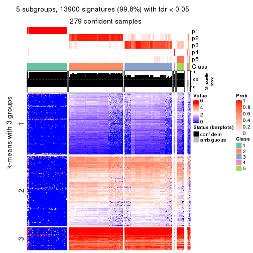</p>

</div>
<div id='tab-ATC-skmeans-get-signatures-no-scale-5'>
<pre><code class="r">get_signatures(res, k = 6, scale_rows = FALSE)
</code></pre>

<p></p>

</div>
</div>


Compare the overlap of signatures from different k:

```r
compare_signatures(res)
```


`get_signature()` returns a data frame invisibly. TO get the list of signatures, the function
call should be assigned to a variable explicitly. In following code, if `plot` argument is set
to `FALSE`, no heatmap is plotted while only the differential analysis is performed.

```r
# code only for demonstration
tb = get_signature(res, k = ..., plot = FALSE)
```

An example of the output of `tb` is:

```
#>   which_row         fdr    mean_1    mean_2 scaled_mean_1 scaled_mean_2 km
#> 1        38 0.042760348  8.373488  9.131774    -0.5533452     0.5164555  1
#> 2        40 0.018707592  7.106213  8.469186    -0.6173731     0.5762149  1
#> 3        55 0.019134737 10.221463 11.207825    -0.6159697     0.5749050  1
#> 4        59 0.006059896  5.921854  7.869574    -0.6899429     0.6439467  1
#> 5        60 0.018055526  8.928898 10.211722    -0.6204761     0.5791110  1
#> 6        98 0.009384629 15.714769 14.887706     0.6635654    -0.6193277  2
...
```

The columns in `tb` are:

1. `which_row`: row indices corresponding to the input matrix.
2. `fdr`: FDR for the differential test. 
3. `mean_x`: The mean value in group x.
4. `scaled_mean_x`: The mean value in group x after rows are scaled.
5. `km`: Row groups if k-means clustering is applied to rows.


UMAP plot which shows how samples are separated.


<script>
$( function() {
	$( '#tabs-ATC-skmeans-dimension-reduction' ).tabs();
} );
</script>
<div id='tabs-ATC-skmeans-dimension-reduction'>
<ul>
<li><a href='#tab-ATC-skmeans-dimension-reduction-1'>k = 2</a></li>
<li><a href='#tab-ATC-skmeans-dimension-reduction-2'>k = 3</a></li>
<li><a href='#tab-ATC-skmeans-dimension-reduction-3'>k = 4</a></li>
<li><a href='#tab-ATC-skmeans-dimension-reduction-4'>k = 5</a></li>
<li><a href='#tab-ATC-skmeans-dimension-reduction-5'>k = 6</a></li>
</ul>
<div id='tab-ATC-skmeans-dimension-reduction-1'>
<pre><code class="r">dimension_reduction(res, k = 2, method = &quot;UMAP&quot;)
</code></pre>

<p></p>

</div>
<div id='tab-ATC-skmeans-dimension-reduction-2'>
<pre><code class="r">dimension_reduction(res, k = 3, method = &quot;UMAP&quot;)
</code></pre>

<p></p>

</div>
<div id='tab-ATC-skmeans-dimension-reduction-3'>
<pre><code class="r">dimension_reduction(res, k = 4, method = &quot;UMAP&quot;)
</code></pre>

<p></p>

</div>
<div id='tab-ATC-skmeans-dimension-reduction-4'>
<pre><code class="r">dimension_reduction(res, k = 5, method = &quot;UMAP&quot;)
</code></pre>

<p></p>

</div>
<div id='tab-ATC-skmeans-dimension-reduction-5'>
<pre><code class="r">dimension_reduction(res, k = 6, method = &quot;UMAP&quot;)
</code></pre>

<p></p>

</div>
</div>


Following heatmap shows how subgroups are split when increasing `k`:

```r
collect_classes(res)
```


If matrix rows can be associated to genes, consider to use `GO_Enrichment(res,
...)` to perform function enrichment for the signature genes.


 

---------------------------------------------------


### ATC:pam*


The object with results only for a single top-value method and a single partition method 
can be extracted as:

```r
res = res_list["ATC", "pam"]
# you can also extract it by
# res = res_list["ATC:pam"]
```

A summary of `res` and all the functions that can be applied to it:

```r
res
```

```
#> A 'ConsensusPartition' object with k = 2, 3, 4, 5, 6.
#>   On a matrix with 13930 rows and 285 columns.
#>   Top rows (1000, 2000, 3000, 4000, 5000) are extracted by 'ATC' method.
#>   Subgroups are detected by 'pam' method.
#>   Performed in total 1250 partitions by row resampling.
#>   Best k for subgroups seems to be 5.
#> 
#> Following methods can be applied to this 'ConsensusPartition' object:
#>  [1] "cola_report"             "collect_classes"         "collect_plots"          
#>  [4] "collect_stats"           "colnames"                "compare_signatures"     
#>  [7] "consensus_heatmap"       "dimension_reduction"     "functional_enrichment"  
#> [10] "get_anno_col"            "get_anno"                "get_classes"            
#> [13] "get_consensus"           "get_matrix"              "get_membership"         
#> [16] "get_param"               "get_signatures"          "get_stats"              
#> [19] "is_best_k"               "is_stable_k"             "membership_heatmap"     
#> [22] "ncol"                    "nrow"                    "plot_ecdf"              
#> [25] "rownames"                "select_partition_number" "show"                   
#> [28] "suggest_best_k"          "test_to_known_factors"
```

`collect_plots()` function collects all the plots made from `res` for all `k` (number of partitions)
into one single page to provide an easy and fast comparison between different `k`.

```r
collect_plots(res)
```


The plots are:

- The first row: a plot of the ECDF (Empirical cumulative distribution
  function) curves of the consensus matrix for each `k` and the heatmap of
  predicted classes for each `k`.
- The second row: heatmaps of the consensus matrix for each `k`.
- The third row: heatmaps of the membership matrix for each `k`.
- The fouth row: heatmaps of the signatures for each `k`.

All the plots in panels can be made by individual functions and they are
plotted later in this section.

`select_partition_number()` produces several plots showing different
statistics for choosing "optimized" `k`. There are following statistics:

- ECDF curves of the consensus matrix for each `k`;
- 1-PAC. [The PAC
  score](https://en.wikipedia.org/wiki/Consensus_clustering#Over-interpretation_potential_of_consensus_clustering)
  measures the proportion of the ambiguous subgrouping.
- Mean silhouette score.
- Concordance. The mean probability of fiting the consensus class ids in all
  partitions.
- Area increased. Denote $A_k$ as the area under the ECDF curve for current
  `k`, the area increased is defined as $A_k - A_{k-1}$.
- Rand index. The percent of pairs of samples that are both in a same cluster
  or both are not in a same cluster in the partition of k and k-1.
- Jaccard index. The ratio of pairs of samples are both in a same cluster in
  the partition of k and k-1 and the pairs of samples are both in a same
  cluster in the partition k or k-1.

The detailed explanations of these statistics can be found in [the cola
vignette](http://bioconductor.org/packages/devel/bioc/vignettes/cola/inst/doc/cola.html#toc_13).

Generally speaking, lower PAC score, higher mean silhouette score or higher
concordance corresponds to better partition. Rand index and Jaccard index
measure how similar the current partition is compared to partition with `k-1`.
If they are too similar, we won't accept `k` is better than `k-1`.

```r
select_partition_number(res)
```


The numeric values for all these statistics can be obtained by `get_stats()`.

```r
get_stats(res)
```

```
#>   k 1-PAC mean_silhouette concordance area_increased  Rand Jaccard
#> 2 2 1.000           1.000       1.000         0.3762 0.625   0.625
#> 3 3 0.730           0.891       0.934         0.7147 0.726   0.561
#> 4 4 0.843           0.906       0.930         0.1502 0.826   0.550
#> 5 5 0.941           0.901       0.943         0.0330 0.981   0.927
#> 6 6 0.871           0.835       0.883         0.0356 0.954   0.810
```

`suggest_best_k()` suggests the best $k$ based on these statistics. The rules are as follows:

- All $k$ with Jaccard index larger than 0.95 are removed because the increase of
  the partition number does not provides enough extra information. If all $k$ are removed,
  the best $k$ is assigned by `NA`.
- For $k$ with 1-PAC larger than 0.9, the maximal $k$ is taken as the "best k". Other $k$ is called "optional k".
- If it does not fit the second rule. The $k$ with the highest vote of highest
  1-PAC, mean silhouette and concordance is taken as the "best k".

```r
suggest_best_k(res)
```

```
#> [1] 5
#> attr(,"optional")
#> [1] 2
```

There is also optional best $k$ = 2 that is worth to check.

Following shows the table of the partitions (You need to click the **show/hide
code output** link to see it). The membership matrix (columns with name `p*`)
is inferred by
[`clue::cl_consensus()`](https://www.rdocumentation.org/link/cl_consensus?package=clue)
function with the `SE` method. Basically the value in the membership matrix
represents the probability to belong to a certain group. The finall class
label for an item is determined with the group with highest probability it
belongs to.

In `get_classes()` function, the entropy is calculated from the membership
matrix and the silhouette score is calculated from the consensus matrix.


<script>
$( function() {
	$( '#tabs-ATC-pam-get-classes' ).tabs();
} );
</script>
<div id='tabs-ATC-pam-get-classes'>
<ul>
<li><a href='#tab-ATC-pam-get-classes-1'>k = 2</a></li>
<li><a href='#tab-ATC-pam-get-classes-2'>k = 3</a></li>
<li><a href='#tab-ATC-pam-get-classes-3'>k = 4</a></li>
<li><a href='#tab-ATC-pam-get-classes-4'>k = 5</a></li>
<li><a href='#tab-ATC-pam-get-classes-5'>k = 6</a></li>
</ul>

<div id='tab-ATC-pam-get-classes-1'>
<p><a id='tab-ATC-pam-get-classes-1-a' style='color:#0366d6' href='#'>show/hide code output</a></p>
<pre><code class="r">cbind(get_classes(res, k = 2), get_membership(res, k = 2))
</code></pre>

<pre><code>#&gt;            class entropy silhouette    p1    p2
#&gt; SRR1201591     2   0.000      1.000 0.000 1.000
#&gt; SRR1201590     2   0.000      1.000 0.000 1.000
#&gt; SRR1201593     2   0.000      1.000 0.000 1.000
#&gt; SRR1201592     2   0.000      1.000 0.000 1.000
#&gt; SRR1201617     2   0.000      1.000 0.000 1.000
#&gt; SRR1201616     2   0.000      1.000 0.000 1.000
#&gt; SRR1201619     2   0.000      1.000 0.000 1.000
#&gt; SRR1201618     2   0.000      1.000 0.000 1.000
#&gt; SRR1201620     2   0.000      1.000 0.000 1.000
#&gt; SRR1201621     2   0.000      1.000 0.000 1.000
#&gt; SRR1201623     2   0.000      1.000 0.000 1.000
#&gt; SRR1201622     2   0.000      1.000 0.000 1.000
#&gt; SRR1201624     2   0.000      1.000 0.000 1.000
#&gt; SRR1201625     2   0.000      1.000 0.000 1.000
#&gt; SRR1201626     2   0.000      1.000 0.000 1.000
#&gt; SRR1201627     2   0.000      1.000 0.000 1.000
#&gt; SRR1201628     2   0.000      1.000 0.000 1.000
#&gt; SRR1201629     2   0.000      1.000 0.000 1.000
#&gt; SRR1201630     2   0.000      1.000 0.000 1.000
#&gt; SRR1201631     2   0.000      1.000 0.000 1.000
#&gt; SRR1201641     2   0.000      1.000 0.000 1.000
#&gt; SRR1201640     2   0.000      1.000 0.000 1.000
#&gt; SRR1201643     2   0.000      1.000 0.000 1.000
#&gt; SRR1201644     2   0.000      1.000 0.000 1.000
#&gt; SRR1201661     2   0.000      1.000 0.000 1.000
#&gt; SRR1201662     2   0.000      1.000 0.000 1.000
#&gt; SRR1201663     2   0.000      1.000 0.000 1.000
#&gt; SRR1201664     2   0.000      1.000 0.000 1.000
#&gt; SRR1201665     2   0.000      1.000 0.000 1.000
#&gt; SRR1201666     2   0.000      1.000 0.000 1.000
#&gt; SRR1201667     2   0.000      1.000 0.000 1.000
#&gt; SRR1201668     2   0.000      1.000 0.000 1.000
#&gt; SRR1201670     2   0.000      1.000 0.000 1.000
#&gt; SRR1201669     2   0.000      1.000 0.000 1.000
#&gt; SRR1201673     2   0.000      1.000 0.000 1.000
#&gt; SRR1201672     2   0.000      1.000 0.000 1.000
#&gt; SRR1201671     2   0.000      1.000 0.000 1.000
#&gt; SRR1201677     2   0.000      1.000 0.000 1.000
#&gt; SRR1201676     2   0.000      1.000 0.000 1.000
#&gt; SRR1201675     2   0.000      1.000 0.000 1.000
#&gt; SRR1201674     2   0.000      1.000 0.000 1.000
#&gt; SRR1201678     2   0.000      1.000 0.000 1.000
#&gt; SRR1201682     2   0.000      1.000 0.000 1.000
#&gt; SRR1201683     2   0.000      1.000 0.000 1.000
#&gt; SRR1201680     2   0.000      1.000 0.000 1.000
#&gt; SRR1201681     2   0.000      1.000 0.000 1.000
#&gt; SRR1201679     2   0.000      1.000 0.000 1.000
#&gt; SRR1201686     2   0.000      1.000 0.000 1.000
#&gt; SRR1201687     2   0.000      1.000 0.000 1.000
#&gt; SRR1201688     2   0.000      1.000 0.000 1.000
#&gt; SRR1201689     2   0.000      1.000 0.000 1.000
#&gt; SRR1201685     2   0.000      1.000 0.000 1.000
#&gt; SRR1201692     2   0.000      1.000 0.000 1.000
#&gt; SRR1201691     2   0.000      1.000 0.000 1.000
#&gt; SRR1201690     2   0.000      1.000 0.000 1.000
#&gt; SRR1201696     2   0.000      1.000 0.000 1.000
#&gt; SRR1201695     2   0.000      1.000 0.000 1.000
#&gt; SRR1201694     2   0.000      1.000 0.000 1.000
#&gt; SRR1201693     2   0.000      1.000 0.000 1.000
#&gt; SRR1201697     2   0.000      1.000 0.000 1.000
#&gt; SRR1201698     2   0.000      1.000 0.000 1.000
#&gt; SRR1201700     2   0.000      1.000 0.000 1.000
#&gt; SRR1201708     2   0.000      1.000 0.000 1.000
#&gt; SRR1201707     2   0.000      1.000 0.000 1.000
#&gt; SRR1201706     2   0.000      1.000 0.000 1.000
#&gt; SRR1201702     2   0.000      1.000 0.000 1.000
#&gt; SRR1201705     2   0.000      1.000 0.000 1.000
#&gt; SRR1201701     2   0.000      1.000 0.000 1.000
#&gt; SRR1201704     2   0.000      1.000 0.000 1.000
#&gt; SRR1201703     2   0.000      1.000 0.000 1.000
#&gt; SRR1201716     2   0.000      1.000 0.000 1.000
#&gt; SRR1201715     2   0.000      1.000 0.000 1.000
#&gt; SRR1201717     2   0.000      1.000 0.000 1.000
#&gt; SRR1201712     2   0.000      1.000 0.000 1.000
#&gt; SRR1201709     2   0.000      1.000 0.000 1.000
#&gt; SRR1201711     2   0.000      1.000 0.000 1.000
#&gt; SRR1201714     2   0.000      1.000 0.000 1.000
#&gt; SRR1201713     2   0.000      1.000 0.000 1.000
#&gt; SRR1201710     2   0.000      1.000 0.000 1.000
#&gt; SRR1201719     2   0.000      1.000 0.000 1.000
#&gt; SRR1201718     2   0.000      1.000 0.000 1.000
#&gt; SRR1201721     2   0.000      1.000 0.000 1.000
#&gt; SRR1201720     2   0.000      1.000 0.000 1.000
#&gt; SRR1201723     2   0.000      1.000 0.000 1.000
#&gt; SRR1201722     2   0.000      1.000 0.000 1.000
#&gt; SRR1201725     2   0.000      1.000 0.000 1.000
#&gt; SRR1201724     2   0.000      1.000 0.000 1.000
#&gt; SRR1201726     2   0.000      1.000 0.000 1.000
#&gt; SRR1201727     2   0.000      1.000 0.000 1.000
#&gt; SRR1201731     2   0.000      1.000 0.000 1.000
#&gt; SRR1201730     2   0.000      1.000 0.000 1.000
#&gt; SRR1201734     2   0.000      1.000 0.000 1.000
#&gt; SRR1201733     2   0.000      1.000 0.000 1.000
#&gt; SRR1201736     2   0.000      1.000 0.000 1.000
#&gt; SRR1201737     2   0.000      1.000 0.000 1.000
#&gt; SRR1201739     2   0.000      1.000 0.000 1.000
#&gt; SRR1201738     2   0.000      1.000 0.000 1.000
#&gt; SRR1201742     2   0.000      1.000 0.000 1.000
#&gt; SRR1201743     2   0.000      1.000 0.000 1.000
#&gt; SRR1201745     2   0.000      1.000 0.000 1.000
#&gt; SRR1201744     2   0.000      1.000 0.000 1.000
#&gt; SRR1201749     2   0.000      1.000 0.000 1.000
#&gt; SRR1201750     2   0.000      1.000 0.000 1.000
#&gt; SRR1201752     2   0.000      1.000 0.000 1.000
#&gt; SRR1201751     2   0.000      1.000 0.000 1.000
#&gt; SRR1201754     2   0.000      1.000 0.000 1.000
#&gt; SRR1201753     2   0.000      1.000 0.000 1.000
#&gt; SRR1201758     2   0.000      1.000 0.000 1.000
#&gt; SRR1201759     2   0.000      1.000 0.000 1.000
#&gt; SRR1201760     2   0.000      1.000 0.000 1.000
#&gt; SRR1201761     2   0.000      1.000 0.000 1.000
#&gt; SRR1201763     2   0.000      1.000 0.000 1.000
#&gt; SRR1201762     2   0.000      1.000 0.000 1.000
#&gt; SRR1201764     2   0.000      1.000 0.000 1.000
#&gt; SRR1201766     2   0.000      1.000 0.000 1.000
#&gt; SRR1201768     2   0.000      1.000 0.000 1.000
#&gt; SRR1201769     2   0.000      1.000 0.000 1.000
#&gt; SRR1201767     2   0.000      1.000 0.000 1.000
#&gt; SRR1201770     2   0.000      1.000 0.000 1.000
#&gt; SRR1201771     2   0.000      1.000 0.000 1.000
#&gt; SRR1201772     2   0.000      1.000 0.000 1.000
#&gt; SRR1201773     2   0.000      1.000 0.000 1.000
#&gt; SRR1201774     2   0.000      1.000 0.000 1.000
#&gt; SRR1201786     2   0.000      1.000 0.000 1.000
#&gt; SRR1201784     2   0.000      1.000 0.000 1.000
#&gt; SRR1201785     2   0.000      1.000 0.000 1.000
#&gt; SRR1201778     2   0.000      1.000 0.000 1.000
#&gt; SRR1201779     2   0.000      1.000 0.000 1.000
#&gt; SRR1201781     2   0.000      1.000 0.000 1.000
#&gt; SRR1201780     2   0.000      1.000 0.000 1.000
#&gt; SRR1201783     2   0.000      1.000 0.000 1.000
#&gt; SRR1201782     2   0.000      1.000 0.000 1.000
#&gt; SRR1201798     2   0.000      1.000 0.000 1.000
#&gt; SRR1201797     2   0.000      1.000 0.000 1.000
#&gt; SRR1201796     2   0.000      1.000 0.000 1.000
#&gt; SRR1201795     2   0.000      1.000 0.000 1.000
#&gt; SRR1201799     2   0.000      1.000 0.000 1.000
#&gt; SRR1201794     2   0.000      1.000 0.000 1.000
#&gt; SRR1201793     2   0.000      1.000 0.000 1.000
#&gt; SRR1201792     2   0.000      1.000 0.000 1.000
#&gt; SRR1201791     2   0.000      1.000 0.000 1.000
#&gt; SRR1201807     2   0.000      1.000 0.000 1.000
#&gt; SRR1201808     2   0.000      1.000 0.000 1.000
#&gt; SRR1201803     2   0.000      1.000 0.000 1.000
#&gt; SRR1201804     2   0.000      1.000 0.000 1.000
#&gt; SRR1201805     2   0.000      1.000 0.000 1.000
#&gt; SRR1201806     2   0.000      1.000 0.000 1.000
#&gt; SRR1201801     2   0.000      1.000 0.000 1.000
#&gt; SRR1201802     2   0.000      1.000 0.000 1.000
#&gt; SRR1201800     2   0.000      1.000 0.000 1.000
#&gt; SRR1201814     2   0.000      1.000 0.000 1.000
#&gt; SRR1201816     2   0.000      1.000 0.000 1.000
#&gt; SRR1201815     2   0.000      1.000 0.000 1.000
#&gt; SRR1201819     2   0.000      1.000 0.000 1.000
#&gt; SRR1201820     2   0.000      1.000 0.000 1.000
#&gt; SRR1201813     2   0.000      1.000 0.000 1.000
#&gt; SRR1201817     2   0.000      1.000 0.000 1.000
#&gt; SRR1201818     2   0.000      1.000 0.000 1.000
#&gt; SRR1201825     2   0.000      1.000 0.000 1.000
#&gt; SRR1201827     2   0.000      1.000 0.000 1.000
#&gt; SRR1201828     2   0.000      1.000 0.000 1.000
#&gt; SRR1201826     2   0.000      1.000 0.000 1.000
#&gt; SRR1201829     2   0.000      1.000 0.000 1.000
#&gt; SRR1201830     2   0.000      1.000 0.000 1.000
#&gt; SRR1201831     2   0.000      1.000 0.000 1.000
#&gt; SRR1201832     2   0.000      1.000 0.000 1.000
#&gt; SRR1201833     2   0.000      1.000 0.000 1.000
#&gt; SRR1201865     2   0.000      1.000 0.000 1.000
#&gt; SRR1201866     2   0.000      1.000 0.000 1.000
#&gt; SRR1201867     2   0.000      1.000 0.000 1.000
#&gt; SRR1201861     2   0.000      1.000 0.000 1.000
#&gt; SRR1201862     2   0.000      1.000 0.000 1.000
#&gt; SRR1201863     2   0.000      1.000 0.000 1.000
#&gt; SRR1201859     2   0.000      1.000 0.000 1.000
#&gt; SRR1201864     2   0.000      1.000 0.000 1.000
#&gt; SRR1201860     2   0.000      1.000 0.000 1.000
#&gt; SRR1201873     2   0.000      1.000 0.000 1.000
#&gt; SRR1201871     2   0.000      1.000 0.000 1.000
#&gt; SRR1201872     2   0.000      1.000 0.000 1.000
#&gt; SRR1201980     2   0.000      1.000 0.000 1.000
#&gt; SRR1201979     2   0.000      1.000 0.000 1.000
#&gt; SRR1201982     2   0.000      1.000 0.000 1.000
#&gt; SRR1201981     2   0.000      1.000 0.000 1.000
#&gt; SRR1201998     2   0.000      1.000 0.000 1.000
#&gt; SRR1201996     2   0.000      1.000 0.000 1.000
#&gt; SRR1201997     2   0.000      1.000 0.000 1.000
#&gt; SRR1202005     2   0.000      1.000 0.000 1.000
#&gt; SRR1202006     2   0.000      1.000 0.000 1.000
#&gt; SRR1202088     2   0.000      1.000 0.000 1.000
#&gt; SRR1202087     2   0.000      1.000 0.000 1.000
#&gt; SRR1202093     2   0.000      1.000 0.000 1.000
#&gt; SRR1202092     2   0.000      1.000 0.000 1.000
#&gt; SRR1202288     2   0.000      1.000 0.000 1.000
#&gt; SRR1202289     2   0.000      1.000 0.000 1.000
#&gt; SRR1202299     2   0.000      1.000 0.000 1.000
#&gt; SRR1202298     2   0.000      1.000 0.000 1.000
#&gt; SRR1202303     2   0.000      1.000 0.000 1.000
#&gt; SRR1202372     2   0.000      1.000 0.000 1.000
#&gt; SRR1202371     2   0.000      1.000 0.000 1.000
#&gt; SRR1202563     2   0.000      1.000 0.000 1.000
#&gt; SRR1202565     2   0.000      1.000 0.000 1.000
#&gt; SRR1202564     2   0.000      1.000 0.000 1.000
#&gt; SRR1202649     2   0.000      1.000 0.000 1.000
#&gt; SRR1202650     2   0.000      1.000 0.000 1.000
#&gt; SRR1202651     2   0.000      1.000 0.000 1.000
#&gt; SRR1202843     1   0.000      1.000 1.000 0.000
#&gt; SRR1202844     1   0.000      1.000 1.000 0.000
#&gt; SRR1202845     2   0.000      1.000 0.000 1.000
#&gt; SRR1202847     2   0.000      1.000 0.000 1.000
#&gt; SRR1202846     2   0.000      1.000 0.000 1.000
#&gt; SRR1202945     1   0.000      1.000 1.000 0.000
#&gt; SRR1202949     1   0.000      1.000 1.000 0.000
#&gt; SRR1202977     1   0.000      1.000 1.000 0.000
#&gt; SRR1202978     1   0.000      1.000 1.000 0.000
#&gt; SRR1202979     1   0.000      1.000 1.000 0.000
#&gt; SRR1202990     1   0.000      1.000 1.000 0.000
#&gt; SRR1202999     1   0.000      1.000 1.000 0.000
#&gt; SRR1203005     1   0.000      1.000 1.000 0.000
#&gt; SRR1203006     1   0.000      1.000 1.000 0.000
#&gt; SRR1203007     1   0.000      1.000 1.000 0.000
#&gt; SRR1203009     1   0.000      1.000 1.000 0.000
#&gt; SRR1203008     1   0.000      1.000 1.000 0.000
#&gt; SRR1203010     1   0.000      1.000 1.000 0.000
#&gt; SRR1203011     1   0.000      1.000 1.000 0.000
#&gt; SRR1203025     1   0.000      1.000 1.000 0.000
#&gt; SRR1203026     1   0.000      1.000 1.000 0.000
#&gt; SRR1203027     1   0.000      1.000 1.000 0.000
#&gt; SRR1203061     1   0.000      1.000 1.000 0.000
#&gt; SRR1203089     1   0.000      1.000 1.000 0.000
#&gt; SRR1203125     1   0.000      1.000 1.000 0.000
#&gt; SRR1203128     1   0.000      1.000 1.000 0.000
#&gt; SRR1203129     1   0.000      1.000 1.000 0.000
#&gt; SRR1203130     1   0.000      1.000 1.000 0.000
#&gt; SRR1203132     2   0.000      1.000 0.000 1.000
#&gt; SRR1203131     2   0.000      1.000 0.000 1.000
#&gt; SRR1203133     1   0.000      1.000 1.000 0.000
#&gt; SRR1203138     1   0.000      1.000 1.000 0.000
#&gt; SRR1203760     1   0.000      1.000 1.000 0.000
#&gt; SRR1203761     1   0.000      1.000 1.000 0.000
#&gt; SRR1203770     1   0.000      1.000 1.000 0.000
#&gt; SRR1203771     1   0.000      1.000 1.000 0.000
#&gt; SRR1203772     1   0.000      1.000 1.000 0.000
#&gt; SRR1203773     1   0.000      1.000 1.000 0.000
#&gt; SRR1203774     1   0.000      1.000 1.000 0.000
#&gt; SRR1203775     1   0.000      1.000 1.000 0.000
#&gt; SRR1203800     1   0.000      1.000 1.000 0.000
#&gt; SRR1203801     1   0.000      1.000 1.000 0.000
#&gt; SRR1203802     1   0.000      1.000 1.000 0.000
#&gt; SRR1203803     1   0.000      1.000 1.000 0.000
#&gt; SRR1203804     1   0.000      1.000 1.000 0.000
#&gt; SRR1203805     1   0.000      1.000 1.000 0.000
#&gt; SRR1203806     1   0.000      1.000 1.000 0.000
#&gt; SRR1203807     1   0.000      1.000 1.000 0.000
#&gt; SRR1203808     1   0.000      1.000 1.000 0.000
#&gt; SRR1203811     1   0.000      1.000 1.000 0.000
#&gt; SRR1203812     1   0.000      1.000 1.000 0.000
#&gt; SRR1203813     1   0.000      1.000 1.000 0.000
#&gt; SRR1203814     1   0.000      1.000 1.000 0.000
#&gt; SRR1203815     1   0.000      1.000 1.000 0.000
#&gt; SRR1203816     1   0.000      1.000 1.000 0.000
#&gt; SRR1203817     1   0.000      1.000 1.000 0.000
#&gt; SRR1203818     1   0.000      1.000 1.000 0.000
#&gt; SRR1203819     1   0.000      1.000 1.000 0.000
#&gt; SRR1203822     1   0.000      1.000 1.000 0.000
#&gt; SRR1203823     1   0.000      1.000 1.000 0.000
#&gt; SRR1203824     1   0.000      1.000 1.000 0.000
#&gt; SRR1203825     1   0.000      1.000 1.000 0.000
#&gt; SRR1203826     1   0.000      1.000 1.000 0.000
#&gt; SRR1203827     2   0.000      1.000 0.000 1.000
#&gt; SRR1203828     1   0.000      1.000 1.000 0.000
#&gt; SRR1203829     1   0.000      1.000 1.000 0.000
#&gt; SRR1203830     1   0.000      1.000 1.000 0.000
#&gt; SRR1203831     1   0.000      1.000 1.000 0.000
#&gt; SRR1203832     1   0.000      1.000 1.000 0.000
#&gt; SRR1203833     1   0.000      1.000 1.000 0.000
#&gt; SRR1203834     1   0.000      1.000 1.000 0.000
#&gt; SRR1203835     1   0.000      1.000 1.000 0.000
#&gt; SRR1203836     1   0.000      1.000 1.000 0.000
#&gt; SRR1203837     1   0.000      1.000 1.000 0.000
#&gt; SRR1203838     1   0.000      1.000 1.000 0.000
#&gt; SRR1203839     1   0.000      1.000 1.000 0.000
#&gt; SRR1203842     2   0.224      0.963 0.036 0.964
#&gt; SRR1203843     1   0.000      1.000 1.000 0.000
#&gt; SRR1203845     2   0.000      1.000 0.000 1.000
#&gt; SRR1203844     2   0.000      1.000 0.000 1.000
</code></pre>

<script>
$('#tab-ATC-pam-get-classes-1-a').parent().next().next().hide();
$('#tab-ATC-pam-get-classes-1-a').click(function(){
  $('#tab-ATC-pam-get-classes-1-a').parent().next().next().toggle();
  return(false);
});
</script>
</div>

<div id='tab-ATC-pam-get-classes-2'>
<p><a id='tab-ATC-pam-get-classes-2-a' style='color:#0366d6' href='#'>show/hide code output</a></p>
<pre><code class="r">cbind(get_classes(res, k = 3), get_membership(res, k = 3))
</code></pre>

<pre><code>#&gt;            class entropy silhouette    p1    p2    p3
#&gt; SRR1201591     2  0.2878     0.8848 0.000 0.904 0.096
#&gt; SRR1201590     2  0.2356     0.8859 0.000 0.928 0.072
#&gt; SRR1201593     2  0.0000     0.8788 0.000 1.000 0.000
#&gt; SRR1201592     2  0.0000     0.8788 0.000 1.000 0.000
#&gt; SRR1201617     2  0.0000     0.8788 0.000 1.000 0.000
#&gt; SRR1201616     2  0.0000     0.8788 0.000 1.000 0.000
#&gt; SRR1201619     2  0.5138     0.8018 0.000 0.748 0.252
#&gt; SRR1201618     2  0.5216     0.7918 0.000 0.740 0.260
#&gt; SRR1201620     2  0.3267     0.8825 0.000 0.884 0.116
#&gt; SRR1201621     2  0.3412     0.8805 0.000 0.876 0.124
#&gt; SRR1201623     3  0.0000     0.9392 0.000 0.000 1.000
#&gt; SRR1201622     3  0.0000     0.9392 0.000 0.000 1.000
#&gt; SRR1201624     3  0.1964     0.8986 0.000 0.056 0.944
#&gt; SRR1201625     3  0.0000     0.9392 0.000 0.000 1.000
#&gt; SRR1201626     3  0.4291     0.8014 0.000 0.180 0.820
#&gt; SRR1201627     3  0.0000     0.9392 0.000 0.000 1.000
#&gt; SRR1201628     3  0.0000     0.9392 0.000 0.000 1.000
#&gt; SRR1201629     3  0.0000     0.9392 0.000 0.000 1.000
#&gt; SRR1201630     2  0.3619     0.8339 0.000 0.864 0.136
#&gt; SRR1201631     2  0.5138     0.8018 0.000 0.748 0.252
#&gt; SRR1201641     2  0.5138     0.8018 0.000 0.748 0.252
#&gt; SRR1201640     2  0.5138     0.8018 0.000 0.748 0.252
#&gt; SRR1201643     3  0.1964     0.9062 0.000 0.056 0.944
#&gt; SRR1201644     3  0.0592     0.9300 0.000 0.012 0.988
#&gt; SRR1201661     2  0.3619     0.8780 0.000 0.864 0.136
#&gt; SRR1201662     2  0.3482     0.8798 0.000 0.872 0.128
#&gt; SRR1201663     3  0.0237     0.9365 0.000 0.004 0.996
#&gt; SRR1201664     3  0.0000     0.9392 0.000 0.000 1.000
#&gt; SRR1201665     2  0.3752     0.8760 0.000 0.856 0.144
#&gt; SRR1201666     2  0.3752     0.8760 0.000 0.856 0.144
#&gt; SRR1201667     2  0.3752     0.8760 0.000 0.856 0.144
#&gt; SRR1201668     3  0.0000     0.9392 0.000 0.000 1.000
#&gt; SRR1201670     3  0.0000     0.9392 0.000 0.000 1.000
#&gt; SRR1201669     3  0.0000     0.9392 0.000 0.000 1.000
#&gt; SRR1201673     2  0.5835     0.6823 0.000 0.660 0.340
#&gt; SRR1201672     2  0.5785     0.6962 0.000 0.668 0.332
#&gt; SRR1201671     3  0.0000     0.9392 0.000 0.000 1.000
#&gt; SRR1201677     2  0.5948     0.6461 0.000 0.640 0.360
#&gt; SRR1201676     2  0.5882     0.6684 0.000 0.652 0.348
#&gt; SRR1201675     2  0.5706     0.7149 0.000 0.680 0.320
#&gt; SRR1201674     2  0.5621     0.7324 0.000 0.692 0.308
#&gt; SRR1201678     2  0.5760     0.7027 0.000 0.672 0.328
#&gt; SRR1201682     2  0.3752     0.8760 0.000 0.856 0.144
#&gt; SRR1201683     2  0.3752     0.8760 0.000 0.856 0.144
#&gt; SRR1201680     2  0.3752     0.8760 0.000 0.856 0.144
#&gt; SRR1201681     2  0.3752     0.8760 0.000 0.856 0.144
#&gt; SRR1201679     2  0.3879     0.8727 0.000 0.848 0.152
#&gt; SRR1201686     3  0.0000     0.9392 0.000 0.000 1.000
#&gt; SRR1201687     3  0.0000     0.9392 0.000 0.000 1.000
#&gt; SRR1201688     3  0.0000     0.9392 0.000 0.000 1.000
#&gt; SRR1201689     3  0.0000     0.9392 0.000 0.000 1.000
#&gt; SRR1201685     3  0.1289     0.9171 0.000 0.032 0.968
#&gt; SRR1201692     3  0.0000     0.9392 0.000 0.000 1.000
#&gt; SRR1201691     3  0.0000     0.9392 0.000 0.000 1.000
#&gt; SRR1201690     3  0.0000     0.9392 0.000 0.000 1.000
#&gt; SRR1201696     3  0.0000     0.9392 0.000 0.000 1.000
#&gt; SRR1201695     3  0.0000     0.9392 0.000 0.000 1.000
#&gt; SRR1201694     3  0.0000     0.9392 0.000 0.000 1.000
#&gt; SRR1201693     3  0.0000     0.9392 0.000 0.000 1.000
#&gt; SRR1201697     3  0.0000     0.9392 0.000 0.000 1.000
#&gt; SRR1201698     3  0.0000     0.9392 0.000 0.000 1.000
#&gt; SRR1201700     3  0.0000     0.9392 0.000 0.000 1.000
#&gt; SRR1201708     3  0.0000     0.9392 0.000 0.000 1.000
#&gt; SRR1201707     3  0.0000     0.9392 0.000 0.000 1.000
#&gt; SRR1201706     3  0.0000     0.9392 0.000 0.000 1.000
#&gt; SRR1201702     3  0.0000     0.9392 0.000 0.000 1.000
#&gt; SRR1201705     3  0.0000     0.9392 0.000 0.000 1.000
#&gt; SRR1201701     3  0.0000     0.9392 0.000 0.000 1.000
#&gt; SRR1201704     3  0.0000     0.9392 0.000 0.000 1.000
#&gt; SRR1201703     3  0.0000     0.9392 0.000 0.000 1.000
#&gt; SRR1201716     3  0.0000     0.9392 0.000 0.000 1.000
#&gt; SRR1201715     3  0.0000     0.9392 0.000 0.000 1.000
#&gt; SRR1201717     3  0.0000     0.9392 0.000 0.000 1.000
#&gt; SRR1201712     3  0.0000     0.9392 0.000 0.000 1.000
#&gt; SRR1201709     3  0.0000     0.9392 0.000 0.000 1.000
#&gt; SRR1201711     3  0.0000     0.9392 0.000 0.000 1.000
#&gt; SRR1201714     3  0.0000     0.9392 0.000 0.000 1.000
#&gt; SRR1201713     3  0.0000     0.9392 0.000 0.000 1.000
#&gt; SRR1201710     3  0.0000     0.9392 0.000 0.000 1.000
#&gt; SRR1201719     2  0.3752     0.8760 0.000 0.856 0.144
#&gt; SRR1201718     2  0.3752     0.8760 0.000 0.856 0.144
#&gt; SRR1201721     3  0.0000     0.9392 0.000 0.000 1.000
#&gt; SRR1201720     3  0.0000     0.9392 0.000 0.000 1.000
#&gt; SRR1201723     3  0.0000     0.9392 0.000 0.000 1.000
#&gt; SRR1201722     3  0.0000     0.9392 0.000 0.000 1.000
#&gt; SRR1201725     2  0.3752     0.8760 0.000 0.856 0.144
#&gt; SRR1201724     2  0.3752     0.8760 0.000 0.856 0.144
#&gt; SRR1201726     3  0.0000     0.9392 0.000 0.000 1.000
#&gt; SRR1201727     3  0.0000     0.9392 0.000 0.000 1.000
#&gt; SRR1201731     2  0.6309     0.2817 0.000 0.500 0.500
#&gt; SRR1201730     3  0.5785     0.3551 0.000 0.332 0.668
#&gt; SRR1201734     2  0.3686     0.8770 0.000 0.860 0.140
#&gt; SRR1201733     2  0.3752     0.8760 0.000 0.856 0.144
#&gt; SRR1201736     2  0.4974     0.8159 0.000 0.764 0.236
#&gt; SRR1201737     2  0.3752     0.8760 0.000 0.856 0.144
#&gt; SRR1201739     2  0.3752     0.8760 0.000 0.856 0.144
#&gt; SRR1201738     2  0.3752     0.8760 0.000 0.856 0.144
#&gt; SRR1201742     2  0.5138     0.8018 0.000 0.748 0.252
#&gt; SRR1201743     2  0.4974     0.8159 0.000 0.764 0.236
#&gt; SRR1201745     2  0.0000     0.8788 0.000 1.000 0.000
#&gt; SRR1201744     2  0.0000     0.8788 0.000 1.000 0.000
#&gt; SRR1201749     2  0.0237     0.8785 0.000 0.996 0.004
#&gt; SRR1201750     2  0.0000     0.8788 0.000 1.000 0.000
#&gt; SRR1201752     3  0.0000     0.9392 0.000 0.000 1.000
#&gt; SRR1201751     3  0.0000     0.9392 0.000 0.000 1.000
#&gt; SRR1201754     2  0.3412     0.8805 0.000 0.876 0.124
#&gt; SRR1201753     2  0.3412     0.8805 0.000 0.876 0.124
#&gt; SRR1201758     3  0.0000     0.9392 0.000 0.000 1.000
#&gt; SRR1201759     3  0.0000     0.9392 0.000 0.000 1.000
#&gt; SRR1201760     3  0.0000     0.9392 0.000 0.000 1.000
#&gt; SRR1201761     3  0.0000     0.9392 0.000 0.000 1.000
#&gt; SRR1201763     3  0.0000     0.9392 0.000 0.000 1.000
#&gt; SRR1201762     3  0.3412     0.8408 0.000 0.124 0.876
#&gt; SRR1201764     2  0.5760     0.6991 0.000 0.672 0.328
#&gt; SRR1201766     2  0.0000     0.8788 0.000 1.000 0.000
#&gt; SRR1201768     2  0.0000     0.8788 0.000 1.000 0.000
#&gt; SRR1201769     2  0.0000     0.8788 0.000 1.000 0.000
#&gt; SRR1201767     2  0.0000     0.8788 0.000 1.000 0.000
#&gt; SRR1201770     2  0.0000     0.8788 0.000 1.000 0.000
#&gt; SRR1201771     2  0.0000     0.8788 0.000 1.000 0.000
#&gt; SRR1201772     2  0.0000     0.8788 0.000 1.000 0.000
#&gt; SRR1201773     2  0.0000     0.8788 0.000 1.000 0.000
#&gt; SRR1201774     2  0.0000     0.8788 0.000 1.000 0.000
#&gt; SRR1201786     2  0.0000     0.8788 0.000 1.000 0.000
#&gt; SRR1201784     2  0.0000     0.8788 0.000 1.000 0.000
#&gt; SRR1201785     2  0.0000     0.8788 0.000 1.000 0.000
#&gt; SRR1201778     2  0.0000     0.8788 0.000 1.000 0.000
#&gt; SRR1201779     2  0.0000     0.8788 0.000 1.000 0.000
#&gt; SRR1201781     2  0.0000     0.8788 0.000 1.000 0.000
#&gt; SRR1201780     2  0.0000     0.8788 0.000 1.000 0.000
#&gt; SRR1201783     2  0.0000     0.8788 0.000 1.000 0.000
#&gt; SRR1201782     2  0.0000     0.8788 0.000 1.000 0.000
#&gt; SRR1201798     2  0.3192     0.8829 0.000 0.888 0.112
#&gt; SRR1201797     2  0.2796     0.8849 0.000 0.908 0.092
#&gt; SRR1201796     2  0.2711     0.8851 0.000 0.912 0.088
#&gt; SRR1201795     2  0.1643     0.8837 0.000 0.956 0.044
#&gt; SRR1201799     2  0.2448     0.8853 0.000 0.924 0.076
#&gt; SRR1201794     2  0.1964     0.8845 0.000 0.944 0.056
#&gt; SRR1201793     2  0.2711     0.8851 0.000 0.912 0.088
#&gt; SRR1201792     2  0.2537     0.8853 0.000 0.920 0.080
#&gt; SRR1201791     2  0.0000     0.8788 0.000 1.000 0.000
#&gt; SRR1201807     2  0.0000     0.8788 0.000 1.000 0.000
#&gt; SRR1201808     2  0.0000     0.8788 0.000 1.000 0.000
#&gt; SRR1201803     2  0.0000     0.8788 0.000 1.000 0.000
#&gt; SRR1201804     2  0.0000     0.8788 0.000 1.000 0.000
#&gt; SRR1201805     2  0.0000     0.8788 0.000 1.000 0.000
#&gt; SRR1201806     2  0.0000     0.8788 0.000 1.000 0.000
#&gt; SRR1201801     2  0.0000     0.8788 0.000 1.000 0.000
#&gt; SRR1201802     2  0.0000     0.8788 0.000 1.000 0.000
#&gt; SRR1201800     2  0.0000     0.8788 0.000 1.000 0.000
#&gt; SRR1201814     2  0.0000     0.8788 0.000 1.000 0.000
#&gt; SRR1201816     2  0.0000     0.8788 0.000 1.000 0.000
#&gt; SRR1201815     2  0.0000     0.8788 0.000 1.000 0.000
#&gt; SRR1201819     2  0.0000     0.8788 0.000 1.000 0.000
#&gt; SRR1201820     2  0.0000     0.8788 0.000 1.000 0.000
#&gt; SRR1201813     2  0.0000     0.8788 0.000 1.000 0.000
#&gt; SRR1201817     2  0.0000     0.8788 0.000 1.000 0.000
#&gt; SRR1201818     2  0.0000     0.8788 0.000 1.000 0.000
#&gt; SRR1201825     3  0.0000     0.9392 0.000 0.000 1.000
#&gt; SRR1201827     2  0.5138     0.8018 0.000 0.748 0.252
#&gt; SRR1201828     2  0.5138     0.8018 0.000 0.748 0.252
#&gt; SRR1201826     3  0.5254     0.5527 0.000 0.264 0.736
#&gt; SRR1201829     2  0.5138     0.8018 0.000 0.748 0.252
#&gt; SRR1201830     2  0.5138     0.8018 0.000 0.748 0.252
#&gt; SRR1201831     2  0.5138     0.8018 0.000 0.748 0.252
#&gt; SRR1201832     2  0.5138     0.8018 0.000 0.748 0.252
#&gt; SRR1201833     2  0.5138     0.8018 0.000 0.748 0.252
#&gt; SRR1201865     3  0.3482     0.8392 0.000 0.128 0.872
#&gt; SRR1201866     3  0.3482     0.8392 0.000 0.128 0.872
#&gt; SRR1201867     3  0.3619     0.8355 0.000 0.136 0.864
#&gt; SRR1201861     3  0.3412     0.8408 0.000 0.124 0.876
#&gt; SRR1201862     3  0.3482     0.8392 0.000 0.128 0.872
#&gt; SRR1201863     3  0.3619     0.8355 0.000 0.136 0.864
#&gt; SRR1201859     3  0.4121     0.8118 0.000 0.168 0.832
#&gt; SRR1201864     3  0.3412     0.8408 0.000 0.124 0.876
#&gt; SRR1201860     3  0.3482     0.8392 0.000 0.128 0.872
#&gt; SRR1201873     3  0.0000     0.9392 0.000 0.000 1.000
#&gt; SRR1201871     3  0.0000     0.9392 0.000 0.000 1.000
#&gt; SRR1201872     3  0.0000     0.9392 0.000 0.000 1.000
#&gt; SRR1201980     3  0.0000     0.9392 0.000 0.000 1.000
#&gt; SRR1201979     3  0.1289     0.9127 0.000 0.032 0.968
#&gt; SRR1201982     2  0.5138     0.8018 0.000 0.748 0.252
#&gt; SRR1201981     3  0.6225    -0.0235 0.000 0.432 0.568
#&gt; SRR1201998     2  0.5138     0.8018 0.000 0.748 0.252
#&gt; SRR1201996     2  0.5138     0.8018 0.000 0.748 0.252
#&gt; SRR1201997     2  0.3752     0.8760 0.000 0.856 0.144
#&gt; SRR1202005     2  0.3340     0.8814 0.000 0.880 0.120
#&gt; SRR1202006     2  0.3412     0.8805 0.000 0.876 0.124
#&gt; SRR1202088     3  0.0000     0.9392 0.000 0.000 1.000
#&gt; SRR1202087     3  0.0000     0.9392 0.000 0.000 1.000
#&gt; SRR1202093     2  0.3752     0.8760 0.000 0.856 0.144
#&gt; SRR1202092     2  0.5138     0.8018 0.000 0.748 0.252
#&gt; SRR1202288     2  0.0424     0.8799 0.000 0.992 0.008
#&gt; SRR1202289     2  0.3412     0.8805 0.000 0.876 0.124
#&gt; SRR1202299     2  0.0000     0.8788 0.000 1.000 0.000
#&gt; SRR1202298     2  0.0000     0.8788 0.000 1.000 0.000
#&gt; SRR1202303     3  0.3619     0.8355 0.000 0.136 0.864
#&gt; SRR1202372     2  0.3412     0.8805 0.000 0.876 0.124
#&gt; SRR1202371     2  0.0000     0.8788 0.000 1.000 0.000
#&gt; SRR1202563     2  0.5138     0.8018 0.000 0.748 0.252
#&gt; SRR1202565     2  0.5138     0.8018 0.000 0.748 0.252
#&gt; SRR1202564     2  0.4555     0.8434 0.000 0.800 0.200
#&gt; SRR1202649     3  0.6291    -0.1299 0.000 0.468 0.532
#&gt; SRR1202650     3  0.6305    -0.2154 0.000 0.484 0.516
#&gt; SRR1202651     2  0.3412     0.8805 0.000 0.876 0.124
#&gt; SRR1202843     1  0.0000     1.0000 1.000 0.000 0.000
#&gt; SRR1202844     1  0.0000     1.0000 1.000 0.000 0.000
#&gt; SRR1202845     2  0.3116     0.8402 0.000 0.892 0.108
#&gt; SRR1202847     2  0.0000     0.8788 0.000 1.000 0.000
#&gt; SRR1202846     2  0.0000     0.8788 0.000 1.000 0.000
#&gt; SRR1202945     1  0.0000     1.0000 1.000 0.000 0.000
#&gt; SRR1202949     1  0.0000     1.0000 1.000 0.000 0.000
#&gt; SRR1202977     1  0.0000     1.0000 1.000 0.000 0.000
#&gt; SRR1202978     1  0.0000     1.0000 1.000 0.000 0.000
#&gt; SRR1202979     1  0.0000     1.0000 1.000 0.000 0.000
#&gt; SRR1202990     1  0.0000     1.0000 1.000 0.000 0.000
#&gt; SRR1202999     1  0.0000     1.0000 1.000 0.000 0.000
#&gt; SRR1203005     1  0.0000     1.0000 1.000 0.000 0.000
#&gt; SRR1203006     1  0.0000     1.0000 1.000 0.000 0.000
#&gt; SRR1203007     1  0.0000     1.0000 1.000 0.000 0.000
#&gt; SRR1203009     1  0.0000     1.0000 1.000 0.000 0.000
#&gt; SRR1203008     1  0.0000     1.0000 1.000 0.000 0.000
#&gt; SRR1203010     1  0.0000     1.0000 1.000 0.000 0.000
#&gt; SRR1203011     1  0.0000     1.0000 1.000 0.000 0.000
#&gt; SRR1203025     1  0.0000     1.0000 1.000 0.000 0.000
#&gt; SRR1203026     1  0.0000     1.0000 1.000 0.000 0.000
#&gt; SRR1203027     1  0.0000     1.0000 1.000 0.000 0.000
#&gt; SRR1203061     1  0.0000     1.0000 1.000 0.000 0.000
#&gt; SRR1203089     1  0.0000     1.0000 1.000 0.000 0.000
#&gt; SRR1203125     1  0.0000     1.0000 1.000 0.000 0.000
#&gt; SRR1203128     1  0.0000     1.0000 1.000 0.000 0.000
#&gt; SRR1203129     1  0.0000     1.0000 1.000 0.000 0.000
#&gt; SRR1203130     1  0.0000     1.0000 1.000 0.000 0.000
#&gt; SRR1203132     3  0.6235    -0.0455 0.000 0.436 0.564
#&gt; SRR1203131     3  0.1411     0.9091 0.000 0.036 0.964
#&gt; SRR1203133     1  0.0000     1.0000 1.000 0.000 0.000
#&gt; SRR1203138     1  0.0000     1.0000 1.000 0.000 0.000
#&gt; SRR1203760     1  0.0000     1.0000 1.000 0.000 0.000
#&gt; SRR1203761     1  0.0000     1.0000 1.000 0.000 0.000
#&gt; SRR1203770     1  0.0000     1.0000 1.000 0.000 0.000
#&gt; SRR1203771     1  0.0000     1.0000 1.000 0.000 0.000
#&gt; SRR1203772     1  0.0000     1.0000 1.000 0.000 0.000
#&gt; SRR1203773     1  0.0000     1.0000 1.000 0.000 0.000
#&gt; SRR1203774     1  0.0000     1.0000 1.000 0.000 0.000
#&gt; SRR1203775     1  0.0000     1.0000 1.000 0.000 0.000
#&gt; SRR1203800     1  0.0000     1.0000 1.000 0.000 0.000
#&gt; SRR1203801     1  0.0000     1.0000 1.000 0.000 0.000
#&gt; SRR1203802     1  0.0000     1.0000 1.000 0.000 0.000
#&gt; SRR1203803     1  0.0000     1.0000 1.000 0.000 0.000
#&gt; SRR1203804     1  0.0000     1.0000 1.000 0.000 0.000
#&gt; SRR1203805     1  0.0000     1.0000 1.000 0.000 0.000
#&gt; SRR1203806     1  0.0000     1.0000 1.000 0.000 0.000
#&gt; SRR1203807     1  0.0000     1.0000 1.000 0.000 0.000
#&gt; SRR1203808     1  0.0000     1.0000 1.000 0.000 0.000
#&gt; SRR1203811     1  0.0000     1.0000 1.000 0.000 0.000
#&gt; SRR1203812     1  0.0000     1.0000 1.000 0.000 0.000
#&gt; SRR1203813     1  0.0000     1.0000 1.000 0.000 0.000
#&gt; SRR1203814     1  0.0000     1.0000 1.000 0.000 0.000
#&gt; SRR1203815     1  0.0000     1.0000 1.000 0.000 0.000
#&gt; SRR1203816     1  0.0000     1.0000 1.000 0.000 0.000
#&gt; SRR1203817     1  0.0000     1.0000 1.000 0.000 0.000
#&gt; SRR1203818     1  0.0000     1.0000 1.000 0.000 0.000
#&gt; SRR1203819     1  0.0000     1.0000 1.000 0.000 0.000
#&gt; SRR1203822     1  0.0000     1.0000 1.000 0.000 0.000
#&gt; SRR1203823     1  0.0000     1.0000 1.000 0.000 0.000
#&gt; SRR1203824     1  0.0000     1.0000 1.000 0.000 0.000
#&gt; SRR1203825     1  0.0000     1.0000 1.000 0.000 0.000
#&gt; SRR1203826     1  0.0000     1.0000 1.000 0.000 0.000
#&gt; SRR1203827     3  0.4702     0.7671 0.000 0.212 0.788
#&gt; SRR1203828     1  0.0000     1.0000 1.000 0.000 0.000
#&gt; SRR1203829     1  0.0000     1.0000 1.000 0.000 0.000
#&gt; SRR1203830     1  0.0000     1.0000 1.000 0.000 0.000
#&gt; SRR1203831     1  0.0000     1.0000 1.000 0.000 0.000
#&gt; SRR1203832     1  0.0000     1.0000 1.000 0.000 0.000
#&gt; SRR1203833     1  0.0000     1.0000 1.000 0.000 0.000
#&gt; SRR1203834     1  0.0000     1.0000 1.000 0.000 0.000
#&gt; SRR1203835     1  0.0000     1.0000 1.000 0.000 0.000
#&gt; SRR1203836     1  0.0000     1.0000 1.000 0.000 0.000
#&gt; SRR1203837     1  0.0000     1.0000 1.000 0.000 0.000
#&gt; SRR1203838     1  0.0000     1.0000 1.000 0.000 0.000
#&gt; SRR1203839     1  0.0000     1.0000 1.000 0.000 0.000
#&gt; SRR1203842     2  0.4295     0.8249 0.032 0.864 0.104
#&gt; SRR1203843     1  0.0000     1.0000 1.000 0.000 0.000
#&gt; SRR1203845     2  0.3412     0.8805 0.000 0.876 0.124
#&gt; SRR1203844     2  0.3192     0.8831 0.000 0.888 0.112
</code></pre>

<script>
$('#tab-ATC-pam-get-classes-2-a').parent().next().next().hide();
$('#tab-ATC-pam-get-classes-2-a').click(function(){
  $('#tab-ATC-pam-get-classes-2-a').parent().next().next().toggle();
  return(false);
});
</script>
</div>

<div id='tab-ATC-pam-get-classes-3'>
<p><a id='tab-ATC-pam-get-classes-3-a' style='color:#0366d6' href='#'>show/hide code output</a></p>
<pre><code class="r">cbind(get_classes(res, k = 4), get_membership(res, k = 4))
</code></pre>

<pre><code>#&gt;            class entropy silhouette    p1    p2    p3    p4
#&gt; SRR1201591     2  0.2973      0.872 0.000 0.856 0.000 0.144
#&gt; SRR1201590     4  0.4222      0.650 0.000 0.272 0.000 0.728
#&gt; SRR1201593     2  0.2973      0.872 0.000 0.856 0.000 0.144
#&gt; SRR1201592     4  0.0592      0.897 0.000 0.016 0.000 0.984
#&gt; SRR1201617     2  0.2973      0.872 0.000 0.856 0.000 0.144
#&gt; SRR1201616     4  0.1211      0.881 0.000 0.040 0.000 0.960
#&gt; SRR1201619     2  0.0000      0.909 0.000 1.000 0.000 0.000
#&gt; SRR1201618     4  0.4761      0.504 0.000 0.372 0.000 0.628
#&gt; SRR1201620     2  0.2973      0.872 0.000 0.856 0.000 0.144
#&gt; SRR1201621     2  0.2973      0.872 0.000 0.856 0.000 0.144
#&gt; SRR1201623     3  0.2345      0.957 0.000 0.100 0.900 0.000
#&gt; SRR1201622     3  0.2345      0.957 0.000 0.100 0.900 0.000
#&gt; SRR1201624     3  0.2081      0.951 0.000 0.084 0.916 0.000
#&gt; SRR1201625     3  0.2081      0.951 0.000 0.084 0.916 0.000
#&gt; SRR1201626     4  0.4543      0.655 0.000 0.000 0.324 0.676
#&gt; SRR1201627     3  0.2011      0.801 0.000 0.000 0.920 0.080
#&gt; SRR1201628     3  0.2589      0.955 0.000 0.116 0.884 0.000
#&gt; SRR1201629     3  0.2973      0.948 0.000 0.144 0.856 0.000
#&gt; SRR1201630     4  0.2760      0.831 0.000 0.128 0.000 0.872
#&gt; SRR1201631     4  0.2868      0.824 0.000 0.136 0.000 0.864
#&gt; SRR1201641     2  0.0000      0.909 0.000 1.000 0.000 0.000
#&gt; SRR1201640     2  0.0000      0.909 0.000 1.000 0.000 0.000
#&gt; SRR1201643     4  0.5369      0.718 0.000 0.144 0.112 0.744
#&gt; SRR1201644     2  0.3858      0.768 0.000 0.844 0.100 0.056
#&gt; SRR1201661     2  0.2408      0.895 0.000 0.896 0.000 0.104
#&gt; SRR1201662     2  0.2973      0.872 0.000 0.856 0.000 0.144
#&gt; SRR1201663     3  0.2081      0.951 0.000 0.084 0.916 0.000
#&gt; SRR1201664     3  0.2081      0.951 0.000 0.084 0.916 0.000
#&gt; SRR1201665     2  0.3356      0.819 0.000 0.824 0.000 0.176
#&gt; SRR1201666     2  0.1637      0.913 0.000 0.940 0.000 0.060
#&gt; SRR1201667     2  0.1637      0.913 0.000 0.940 0.000 0.060
#&gt; SRR1201668     3  0.2081      0.951 0.000 0.084 0.916 0.000
#&gt; SRR1201670     3  0.2081      0.951 0.000 0.084 0.916 0.000
#&gt; SRR1201669     3  0.2081      0.951 0.000 0.084 0.916 0.000
#&gt; SRR1201673     2  0.0000      0.909 0.000 1.000 0.000 0.000
#&gt; SRR1201672     2  0.0000      0.909 0.000 1.000 0.000 0.000
#&gt; SRR1201671     2  0.0000      0.909 0.000 1.000 0.000 0.000
#&gt; SRR1201677     2  0.0000      0.909 0.000 1.000 0.000 0.000
#&gt; SRR1201676     2  0.0000      0.909 0.000 1.000 0.000 0.000
#&gt; SRR1201675     2  0.0000      0.909 0.000 1.000 0.000 0.000
#&gt; SRR1201674     2  0.0000      0.909 0.000 1.000 0.000 0.000
#&gt; SRR1201678     2  0.0000      0.909 0.000 1.000 0.000 0.000
#&gt; SRR1201682     2  0.1637      0.913 0.000 0.940 0.000 0.060
#&gt; SRR1201683     2  0.1637      0.913 0.000 0.940 0.000 0.060
#&gt; SRR1201680     2  0.1637      0.913 0.000 0.940 0.000 0.060
#&gt; SRR1201681     2  0.1637      0.913 0.000 0.940 0.000 0.060
#&gt; SRR1201679     2  0.1716      0.912 0.000 0.936 0.000 0.064
#&gt; SRR1201686     3  0.2081      0.951 0.000 0.084 0.916 0.000
#&gt; SRR1201687     3  0.2081      0.951 0.000 0.084 0.916 0.000
#&gt; SRR1201688     3  0.2081      0.951 0.000 0.084 0.916 0.000
#&gt; SRR1201689     3  0.2081      0.951 0.000 0.084 0.916 0.000
#&gt; SRR1201685     3  0.2081      0.951 0.000 0.084 0.916 0.000
#&gt; SRR1201692     3  0.2973      0.948 0.000 0.144 0.856 0.000
#&gt; SRR1201691     3  0.2973      0.948 0.000 0.144 0.856 0.000
#&gt; SRR1201690     3  0.2973      0.948 0.000 0.144 0.856 0.000
#&gt; SRR1201696     3  0.2973      0.948 0.000 0.144 0.856 0.000
#&gt; SRR1201695     3  0.2973      0.948 0.000 0.144 0.856 0.000
#&gt; SRR1201694     3  0.2973      0.948 0.000 0.144 0.856 0.000
#&gt; SRR1201693     3  0.2973      0.948 0.000 0.144 0.856 0.000
#&gt; SRR1201697     3  0.2973      0.948 0.000 0.144 0.856 0.000
#&gt; SRR1201698     2  0.3688      0.633 0.000 0.792 0.208 0.000
#&gt; SRR1201700     3  0.2814      0.951 0.000 0.132 0.868 0.000
#&gt; SRR1201708     3  0.2973      0.948 0.000 0.144 0.856 0.000
#&gt; SRR1201707     3  0.2973      0.948 0.000 0.144 0.856 0.000
#&gt; SRR1201706     3  0.2973      0.948 0.000 0.144 0.856 0.000
#&gt; SRR1201702     3  0.2973      0.948 0.000 0.144 0.856 0.000
#&gt; SRR1201705     3  0.2973      0.948 0.000 0.144 0.856 0.000
#&gt; SRR1201701     3  0.2973      0.948 0.000 0.144 0.856 0.000
#&gt; SRR1201704     3  0.2973      0.948 0.000 0.144 0.856 0.000
#&gt; SRR1201703     3  0.2973      0.948 0.000 0.144 0.856 0.000
#&gt; SRR1201716     3  0.2345      0.957 0.000 0.100 0.900 0.000
#&gt; SRR1201715     3  0.2345      0.957 0.000 0.100 0.900 0.000
#&gt; SRR1201717     3  0.2345      0.957 0.000 0.100 0.900 0.000
#&gt; SRR1201712     3  0.2345      0.957 0.000 0.100 0.900 0.000
#&gt; SRR1201709     3  0.2345      0.957 0.000 0.100 0.900 0.000
#&gt; SRR1201711     3  0.2345      0.957 0.000 0.100 0.900 0.000
#&gt; SRR1201714     3  0.2345      0.957 0.000 0.100 0.900 0.000
#&gt; SRR1201713     3  0.2345      0.957 0.000 0.100 0.900 0.000
#&gt; SRR1201710     3  0.2345      0.957 0.000 0.100 0.900 0.000
#&gt; SRR1201719     2  0.1637      0.913 0.000 0.940 0.000 0.060
#&gt; SRR1201718     2  0.1557      0.913 0.000 0.944 0.000 0.056
#&gt; SRR1201721     3  0.2973      0.948 0.000 0.144 0.856 0.000
#&gt; SRR1201720     3  0.2973      0.948 0.000 0.144 0.856 0.000
#&gt; SRR1201723     3  0.2081      0.951 0.000 0.084 0.916 0.000
#&gt; SRR1201722     3  0.2081      0.951 0.000 0.084 0.916 0.000
#&gt; SRR1201725     2  0.1637      0.913 0.000 0.940 0.000 0.060
#&gt; SRR1201724     2  0.1637      0.913 0.000 0.940 0.000 0.060
#&gt; SRR1201726     3  0.2345      0.957 0.000 0.100 0.900 0.000
#&gt; SRR1201727     3  0.2345      0.957 0.000 0.100 0.900 0.000
#&gt; SRR1201731     2  0.0000      0.909 0.000 1.000 0.000 0.000
#&gt; SRR1201730     2  0.0000      0.909 0.000 1.000 0.000 0.000
#&gt; SRR1201734     2  0.1940      0.908 0.000 0.924 0.000 0.076
#&gt; SRR1201733     2  0.4164      0.681 0.000 0.736 0.000 0.264
#&gt; SRR1201736     4  0.3801      0.764 0.000 0.220 0.000 0.780
#&gt; SRR1201737     2  0.1637      0.913 0.000 0.940 0.000 0.060
#&gt; SRR1201739     2  0.1637      0.913 0.000 0.940 0.000 0.060
#&gt; SRR1201738     2  0.1637      0.913 0.000 0.940 0.000 0.060
#&gt; SRR1201742     2  0.0000      0.909 0.000 1.000 0.000 0.000
#&gt; SRR1201743     2  0.0000      0.909 0.000 1.000 0.000 0.000
#&gt; SRR1201745     4  0.0000      0.906 0.000 0.000 0.000 1.000
#&gt; SRR1201744     4  0.0000      0.906 0.000 0.000 0.000 1.000
#&gt; SRR1201749     4  0.0188      0.905 0.000 0.004 0.000 0.996
#&gt; SRR1201750     4  0.0000      0.906 0.000 0.000 0.000 1.000
#&gt; SRR1201752     2  0.4992     -0.207 0.000 0.524 0.476 0.000
#&gt; SRR1201751     3  0.3444      0.912 0.000 0.184 0.816 0.000
#&gt; SRR1201754     2  0.2973      0.872 0.000 0.856 0.000 0.144
#&gt; SRR1201753     2  0.2973      0.872 0.000 0.856 0.000 0.144
#&gt; SRR1201758     3  0.2081      0.951 0.000 0.084 0.916 0.000
#&gt; SRR1201759     3  0.2081      0.951 0.000 0.084 0.916 0.000
#&gt; SRR1201760     3  0.2921      0.949 0.000 0.140 0.860 0.000
#&gt; SRR1201761     3  0.2921      0.949 0.000 0.140 0.860 0.000
#&gt; SRR1201763     3  0.0817      0.894 0.000 0.024 0.976 0.000
#&gt; SRR1201762     3  0.5000     -0.265 0.000 0.000 0.504 0.496
#&gt; SRR1201764     4  0.4546      0.727 0.000 0.256 0.012 0.732
#&gt; SRR1201766     4  0.0000      0.906 0.000 0.000 0.000 1.000
#&gt; SRR1201768     4  0.0000      0.906 0.000 0.000 0.000 1.000
#&gt; SRR1201769     4  0.0000      0.906 0.000 0.000 0.000 1.000
#&gt; SRR1201767     4  0.0000      0.906 0.000 0.000 0.000 1.000
#&gt; SRR1201770     4  0.0000      0.906 0.000 0.000 0.000 1.000
#&gt; SRR1201771     4  0.0000      0.906 0.000 0.000 0.000 1.000
#&gt; SRR1201772     4  0.0000      0.906 0.000 0.000 0.000 1.000
#&gt; SRR1201773     4  0.0000      0.906 0.000 0.000 0.000 1.000
#&gt; SRR1201774     4  0.0000      0.906 0.000 0.000 0.000 1.000
#&gt; SRR1201786     4  0.0000      0.906 0.000 0.000 0.000 1.000
#&gt; SRR1201784     4  0.0000      0.906 0.000 0.000 0.000 1.000
#&gt; SRR1201785     4  0.0000      0.906 0.000 0.000 0.000 1.000
#&gt; SRR1201778     4  0.0000      0.906 0.000 0.000 0.000 1.000
#&gt; SRR1201779     4  0.0000      0.906 0.000 0.000 0.000 1.000
#&gt; SRR1201781     4  0.0000      0.906 0.000 0.000 0.000 1.000
#&gt; SRR1201780     4  0.0000      0.906 0.000 0.000 0.000 1.000
#&gt; SRR1201783     4  0.0000      0.906 0.000 0.000 0.000 1.000
#&gt; SRR1201782     4  0.0000      0.906 0.000 0.000 0.000 1.000
#&gt; SRR1201798     2  0.2973      0.872 0.000 0.856 0.000 0.144
#&gt; SRR1201797     2  0.2973      0.872 0.000 0.856 0.000 0.144
#&gt; SRR1201796     2  0.2973      0.872 0.000 0.856 0.000 0.144
#&gt; SRR1201795     2  0.2973      0.872 0.000 0.856 0.000 0.144
#&gt; SRR1201799     2  0.2973      0.872 0.000 0.856 0.000 0.144
#&gt; SRR1201794     2  0.2973      0.872 0.000 0.856 0.000 0.144
#&gt; SRR1201793     2  0.2973      0.872 0.000 0.856 0.000 0.144
#&gt; SRR1201792     2  0.2973      0.872 0.000 0.856 0.000 0.144
#&gt; SRR1201791     4  0.3837      0.662 0.000 0.224 0.000 0.776
#&gt; SRR1201807     4  0.0000      0.906 0.000 0.000 0.000 1.000
#&gt; SRR1201808     4  0.0000      0.906 0.000 0.000 0.000 1.000
#&gt; SRR1201803     4  0.0000      0.906 0.000 0.000 0.000 1.000
#&gt; SRR1201804     4  0.0000      0.906 0.000 0.000 0.000 1.000
#&gt; SRR1201805     4  0.0000      0.906 0.000 0.000 0.000 1.000
#&gt; SRR1201806     4  0.0000      0.906 0.000 0.000 0.000 1.000
#&gt; SRR1201801     4  0.0000      0.906 0.000 0.000 0.000 1.000
#&gt; SRR1201802     4  0.0000      0.906 0.000 0.000 0.000 1.000
#&gt; SRR1201800     4  0.0000      0.906 0.000 0.000 0.000 1.000
#&gt; SRR1201814     4  0.0000      0.906 0.000 0.000 0.000 1.000
#&gt; SRR1201816     4  0.0000      0.906 0.000 0.000 0.000 1.000
#&gt; SRR1201815     4  0.0000      0.906 0.000 0.000 0.000 1.000
#&gt; SRR1201819     4  0.0000      0.906 0.000 0.000 0.000 1.000
#&gt; SRR1201820     4  0.0000      0.906 0.000 0.000 0.000 1.000
#&gt; SRR1201813     4  0.0000      0.906 0.000 0.000 0.000 1.000
#&gt; SRR1201817     4  0.0000      0.906 0.000 0.000 0.000 1.000
#&gt; SRR1201818     4  0.0000      0.906 0.000 0.000 0.000 1.000
#&gt; SRR1201825     3  0.2345      0.957 0.000 0.100 0.900 0.000
#&gt; SRR1201827     2  0.0000      0.909 0.000 1.000 0.000 0.000
#&gt; SRR1201828     2  0.0000      0.909 0.000 1.000 0.000 0.000
#&gt; SRR1201826     4  0.6773      0.549 0.000 0.284 0.132 0.584
#&gt; SRR1201829     2  0.0000      0.909 0.000 1.000 0.000 0.000
#&gt; SRR1201830     2  0.0000      0.909 0.000 1.000 0.000 0.000
#&gt; SRR1201831     2  0.0000      0.909 0.000 1.000 0.000 0.000
#&gt; SRR1201832     2  0.0000      0.909 0.000 1.000 0.000 0.000
#&gt; SRR1201833     2  0.0000      0.909 0.000 1.000 0.000 0.000
#&gt; SRR1201865     4  0.5423      0.712 0.000 0.144 0.116 0.740
#&gt; SRR1201866     4  0.5528      0.702 0.000 0.144 0.124 0.732
#&gt; SRR1201867     4  0.5314      0.722 0.000 0.144 0.108 0.748
#&gt; SRR1201861     4  0.5630      0.690 0.000 0.136 0.140 0.724
#&gt; SRR1201862     4  0.5199      0.731 0.000 0.144 0.100 0.756
#&gt; SRR1201863     4  0.5018      0.744 0.000 0.144 0.088 0.768
#&gt; SRR1201859     4  0.3421      0.832 0.000 0.088 0.044 0.868
#&gt; SRR1201864     4  0.5314      0.722 0.000 0.144 0.108 0.748
#&gt; SRR1201860     4  0.5578      0.696 0.000 0.144 0.128 0.728
#&gt; SRR1201873     3  0.2345      0.957 0.000 0.100 0.900 0.000
#&gt; SRR1201871     3  0.2345      0.957 0.000 0.100 0.900 0.000
#&gt; SRR1201872     3  0.2345      0.957 0.000 0.100 0.900 0.000
#&gt; SRR1201980     2  0.0000      0.909 0.000 1.000 0.000 0.000
#&gt; SRR1201979     3  0.4331      0.775 0.000 0.288 0.712 0.000
#&gt; SRR1201982     2  0.0000      0.909 0.000 1.000 0.000 0.000
#&gt; SRR1201981     2  0.0707      0.894 0.000 0.980 0.020 0.000
#&gt; SRR1201998     2  0.0000      0.909 0.000 1.000 0.000 0.000
#&gt; SRR1201996     2  0.0000      0.909 0.000 1.000 0.000 0.000
#&gt; SRR1201997     2  0.1389      0.914 0.000 0.952 0.000 0.048
#&gt; SRR1202005     2  0.2973      0.872 0.000 0.856 0.000 0.144
#&gt; SRR1202006     2  0.2973      0.872 0.000 0.856 0.000 0.144
#&gt; SRR1202088     3  0.2345      0.957 0.000 0.100 0.900 0.000
#&gt; SRR1202087     3  0.2345      0.957 0.000 0.100 0.900 0.000
#&gt; SRR1202093     2  0.1637      0.913 0.000 0.940 0.000 0.060
#&gt; SRR1202092     2  0.0000      0.909 0.000 1.000 0.000 0.000
#&gt; SRR1202288     4  0.4790      0.286 0.000 0.380 0.000 0.620
#&gt; SRR1202289     2  0.2973      0.872 0.000 0.856 0.000 0.144
#&gt; SRR1202299     4  0.1211      0.882 0.000 0.040 0.000 0.960
#&gt; SRR1202298     4  0.0000      0.906 0.000 0.000 0.000 1.000
#&gt; SRR1202303     4  0.5378      0.378 0.000 0.012 0.448 0.540
#&gt; SRR1202372     2  0.2973      0.872 0.000 0.856 0.000 0.144
#&gt; SRR1202371     4  0.1022      0.887 0.000 0.032 0.000 0.968
#&gt; SRR1202563     2  0.0000      0.909 0.000 1.000 0.000 0.000
#&gt; SRR1202565     2  0.0000      0.909 0.000 1.000 0.000 0.000
#&gt; SRR1202564     2  0.0469      0.911 0.000 0.988 0.000 0.012
#&gt; SRR1202649     4  0.2973      0.817 0.000 0.144 0.000 0.856
#&gt; SRR1202650     4  0.2973      0.817 0.000 0.144 0.000 0.856
#&gt; SRR1202651     2  0.2760      0.878 0.000 0.872 0.000 0.128
#&gt; SRR1202843     1  0.0000      1.000 1.000 0.000 0.000 0.000
#&gt; SRR1202844     1  0.0000      1.000 1.000 0.000 0.000 0.000
#&gt; SRR1202845     4  0.1716      0.873 0.000 0.064 0.000 0.936
#&gt; SRR1202847     4  0.0000      0.906 0.000 0.000 0.000 1.000
#&gt; SRR1202846     4  0.0000      0.906 0.000 0.000 0.000 1.000
#&gt; SRR1202945     1  0.0000      1.000 1.000 0.000 0.000 0.000
#&gt; SRR1202949     1  0.0000      1.000 1.000 0.000 0.000 0.000
#&gt; SRR1202977     1  0.0000      1.000 1.000 0.000 0.000 0.000
#&gt; SRR1202978     1  0.0000      1.000 1.000 0.000 0.000 0.000
#&gt; SRR1202979     1  0.0000      1.000 1.000 0.000 0.000 0.000
#&gt; SRR1202990     1  0.0000      1.000 1.000 0.000 0.000 0.000
#&gt; SRR1202999     1  0.0000      1.000 1.000 0.000 0.000 0.000
#&gt; SRR1203005     1  0.0000      1.000 1.000 0.000 0.000 0.000
#&gt; SRR1203006     1  0.0000      1.000 1.000 0.000 0.000 0.000
#&gt; SRR1203007     1  0.0000      1.000 1.000 0.000 0.000 0.000
#&gt; SRR1203009     1  0.0000      1.000 1.000 0.000 0.000 0.000
#&gt; SRR1203008     1  0.0000      1.000 1.000 0.000 0.000 0.000
#&gt; SRR1203010     1  0.0000      1.000 1.000 0.000 0.000 0.000
#&gt; SRR1203011     1  0.0000      1.000 1.000 0.000 0.000 0.000
#&gt; SRR1203025     1  0.0000      1.000 1.000 0.000 0.000 0.000
#&gt; SRR1203026     1  0.0000      1.000 1.000 0.000 0.000 0.000
#&gt; SRR1203027     1  0.0000      1.000 1.000 0.000 0.000 0.000
#&gt; SRR1203061     1  0.0000      1.000 1.000 0.000 0.000 0.000
#&gt; SRR1203089     1  0.0000      1.000 1.000 0.000 0.000 0.000
#&gt; SRR1203125     1  0.0000      1.000 1.000 0.000 0.000 0.000
#&gt; SRR1203128     1  0.0000      1.000 1.000 0.000 0.000 0.000
#&gt; SRR1203129     1  0.0000      1.000 1.000 0.000 0.000 0.000
#&gt; SRR1203130     1  0.0000      1.000 1.000 0.000 0.000 0.000
#&gt; SRR1203132     2  0.0000      0.909 0.000 1.000 0.000 0.000
#&gt; SRR1203131     3  0.4761      0.620 0.000 0.372 0.628 0.000
#&gt; SRR1203133     1  0.0000      1.000 1.000 0.000 0.000 0.000
#&gt; SRR1203138     1  0.0000      1.000 1.000 0.000 0.000 0.000
#&gt; SRR1203760     1  0.0000      1.000 1.000 0.000 0.000 0.000
#&gt; SRR1203761     1  0.0000      1.000 1.000 0.000 0.000 0.000
#&gt; SRR1203770     1  0.0000      1.000 1.000 0.000 0.000 0.000
#&gt; SRR1203771     1  0.0000      1.000 1.000 0.000 0.000 0.000
#&gt; SRR1203772     1  0.0000      1.000 1.000 0.000 0.000 0.000
#&gt; SRR1203773     1  0.0000      1.000 1.000 0.000 0.000 0.000
#&gt; SRR1203774     1  0.0000      1.000 1.000 0.000 0.000 0.000
#&gt; SRR1203775     1  0.0000      1.000 1.000 0.000 0.000 0.000
#&gt; SRR1203800     1  0.0000      1.000 1.000 0.000 0.000 0.000
#&gt; SRR1203801     1  0.0000      1.000 1.000 0.000 0.000 0.000
#&gt; SRR1203802     1  0.0000      1.000 1.000 0.000 0.000 0.000
#&gt; SRR1203803     1  0.0000      1.000 1.000 0.000 0.000 0.000
#&gt; SRR1203804     1  0.0000      1.000 1.000 0.000 0.000 0.000
#&gt; SRR1203805     1  0.0000      1.000 1.000 0.000 0.000 0.000
#&gt; SRR1203806     1  0.0000      1.000 1.000 0.000 0.000 0.000
#&gt; SRR1203807     1  0.0000      1.000 1.000 0.000 0.000 0.000
#&gt; SRR1203808     1  0.0000      1.000 1.000 0.000 0.000 0.000
#&gt; SRR1203811     1  0.0000      1.000 1.000 0.000 0.000 0.000
#&gt; SRR1203812     1  0.0000      1.000 1.000 0.000 0.000 0.000
#&gt; SRR1203813     1  0.0000      1.000 1.000 0.000 0.000 0.000
#&gt; SRR1203814     1  0.0000      1.000 1.000 0.000 0.000 0.000
#&gt; SRR1203815     1  0.0000      1.000 1.000 0.000 0.000 0.000
#&gt; SRR1203816     1  0.0000      1.000 1.000 0.000 0.000 0.000
#&gt; SRR1203817     1  0.0000      1.000 1.000 0.000 0.000 0.000
#&gt; SRR1203818     1  0.0000      1.000 1.000 0.000 0.000 0.000
#&gt; SRR1203819     1  0.0000      1.000 1.000 0.000 0.000 0.000
#&gt; SRR1203822     1  0.0000      1.000 1.000 0.000 0.000 0.000
#&gt; SRR1203823     1  0.0000      1.000 1.000 0.000 0.000 0.000
#&gt; SRR1203824     1  0.0000      1.000 1.000 0.000 0.000 0.000
#&gt; SRR1203825     1  0.0000      1.000 1.000 0.000 0.000 0.000
#&gt; SRR1203826     1  0.0000      1.000 1.000 0.000 0.000 0.000
#&gt; SRR1203827     4  0.2973      0.834 0.000 0.000 0.144 0.856
#&gt; SRR1203828     1  0.0000      1.000 1.000 0.000 0.000 0.000
#&gt; SRR1203829     1  0.0000      1.000 1.000 0.000 0.000 0.000
#&gt; SRR1203830     1  0.0000      1.000 1.000 0.000 0.000 0.000
#&gt; SRR1203831     1  0.0000      1.000 1.000 0.000 0.000 0.000
#&gt; SRR1203832     1  0.0000      1.000 1.000 0.000 0.000 0.000
#&gt; SRR1203833     1  0.0000      1.000 1.000 0.000 0.000 0.000
#&gt; SRR1203834     1  0.0000      1.000 1.000 0.000 0.000 0.000
#&gt; SRR1203835     1  0.0000      1.000 1.000 0.000 0.000 0.000
#&gt; SRR1203836     1  0.0000      1.000 1.000 0.000 0.000 0.000
#&gt; SRR1203837     1  0.0000      1.000 1.000 0.000 0.000 0.000
#&gt; SRR1203838     1  0.0000      1.000 1.000 0.000 0.000 0.000
#&gt; SRR1203839     1  0.0000      1.000 1.000 0.000 0.000 0.000
#&gt; SRR1203842     4  0.3619      0.843 0.004 0.036 0.100 0.860
#&gt; SRR1203843     1  0.0000      1.000 1.000 0.000 0.000 0.000
#&gt; SRR1203845     2  0.2973      0.872 0.000 0.856 0.000 0.144
#&gt; SRR1203844     2  0.2973      0.872 0.000 0.856 0.000 0.144
</code></pre>

<script>
$('#tab-ATC-pam-get-classes-3-a').parent().next().next().hide();
$('#tab-ATC-pam-get-classes-3-a').click(function(){
  $('#tab-ATC-pam-get-classes-3-a').parent().next().next().toggle();
  return(false);
});
</script>
</div>

<div id='tab-ATC-pam-get-classes-4'>
<p><a id='tab-ATC-pam-get-classes-4-a' style='color:#0366d6' href='#'>show/hide code output</a></p>
<pre><code class="r">cbind(get_classes(res, k = 5), get_membership(res, k = 5))
</code></pre>

<pre><code>#&gt;            class entropy silhouette p1    p2    p3    p4    p5
#&gt; SRR1201591     2  0.0290     0.9272  0 0.992 0.000 0.000 0.008
#&gt; SRR1201590     5  0.3796     0.5449  0 0.300 0.000 0.000 0.700
#&gt; SRR1201593     2  0.2193     0.8596  0 0.900 0.000 0.092 0.008
#&gt; SRR1201592     5  0.3759     0.8237  0 0.092 0.000 0.092 0.816
#&gt; SRR1201617     2  0.2193     0.8596  0 0.900 0.000 0.092 0.008
#&gt; SRR1201616     5  0.3016     0.8031  0 0.132 0.000 0.020 0.848
#&gt; SRR1201619     2  0.1764     0.9239  0 0.928 0.008 0.064 0.000
#&gt; SRR1201618     5  0.4331     0.3217  0 0.400 0.004 0.000 0.596
#&gt; SRR1201620     2  0.2193     0.8596  0 0.900 0.000 0.092 0.008
#&gt; SRR1201621     2  0.2193     0.8596  0 0.900 0.000 0.092 0.008
#&gt; SRR1201623     3  0.0000     0.9286  0 0.000 1.000 0.000 0.000
#&gt; SRR1201622     3  0.0000     0.9286  0 0.000 1.000 0.000 0.000
#&gt; SRR1201624     3  0.4235     0.1324  0 0.000 0.576 0.424 0.000
#&gt; SRR1201625     3  0.0290     0.9244  0 0.000 0.992 0.008 0.000
#&gt; SRR1201626     4  0.3146     0.8967  0 0.000 0.028 0.844 0.128
#&gt; SRR1201627     4  0.2690     0.8697  0 0.000 0.156 0.844 0.000
#&gt; SRR1201628     3  0.0992     0.9225  0 0.008 0.968 0.024 0.000
#&gt; SRR1201629     3  0.1764     0.9072  0 0.008 0.928 0.064 0.000
#&gt; SRR1201630     5  0.1455     0.8593  0 0.008 0.008 0.032 0.952
#&gt; SRR1201631     5  0.2050     0.8412  0 0.008 0.008 0.064 0.920
#&gt; SRR1201641     2  0.1764     0.9239  0 0.928 0.008 0.064 0.000
#&gt; SRR1201640     2  0.1764     0.9239  0 0.928 0.008 0.064 0.000
#&gt; SRR1201643     5  0.4565     0.6666  0 0.008 0.176 0.064 0.752
#&gt; SRR1201644     2  0.4793     0.7555  0 0.772 0.116 0.064 0.048
#&gt; SRR1201661     2  0.0290     0.9272  0 0.992 0.000 0.000 0.008
#&gt; SRR1201662     2  0.0290     0.9272  0 0.992 0.000 0.000 0.008
#&gt; SRR1201663     3  0.0290     0.9244  0 0.000 0.992 0.008 0.000
#&gt; SRR1201664     3  0.0290     0.9244  0 0.000 0.992 0.008 0.000
#&gt; SRR1201665     2  0.1478     0.8863  0 0.936 0.000 0.000 0.064
#&gt; SRR1201666     2  0.0000     0.9294  0 1.000 0.000 0.000 0.000
#&gt; SRR1201667     2  0.0000     0.9294  0 1.000 0.000 0.000 0.000
#&gt; SRR1201668     3  0.0290     0.9244  0 0.000 0.992 0.008 0.000
#&gt; SRR1201670     3  0.0290     0.9244  0 0.000 0.992 0.008 0.000
#&gt; SRR1201669     3  0.0290     0.9244  0 0.000 0.992 0.008 0.000
#&gt; SRR1201673     2  0.1764     0.9239  0 0.928 0.008 0.064 0.000
#&gt; SRR1201672     2  0.1764     0.9239  0 0.928 0.008 0.064 0.000
#&gt; SRR1201671     2  0.1877     0.9211  0 0.924 0.012 0.064 0.000
#&gt; SRR1201677     2  0.1764     0.9239  0 0.928 0.008 0.064 0.000
#&gt; SRR1201676     2  0.1764     0.9239  0 0.928 0.008 0.064 0.000
#&gt; SRR1201675     2  0.1764     0.9239  0 0.928 0.008 0.064 0.000
#&gt; SRR1201674     2  0.1764     0.9239  0 0.928 0.008 0.064 0.000
#&gt; SRR1201678     2  0.1764     0.9239  0 0.928 0.008 0.064 0.000
#&gt; SRR1201682     2  0.0000     0.9294  0 1.000 0.000 0.000 0.000
#&gt; SRR1201683     2  0.0000     0.9294  0 1.000 0.000 0.000 0.000
#&gt; SRR1201680     2  0.0000     0.9294  0 1.000 0.000 0.000 0.000
#&gt; SRR1201681     2  0.0000     0.9294  0 1.000 0.000 0.000 0.000
#&gt; SRR1201679     2  0.0693     0.9300  0 0.980 0.000 0.012 0.008
#&gt; SRR1201686     3  0.0290     0.9244  0 0.000 0.992 0.008 0.000
#&gt; SRR1201687     3  0.0290     0.9244  0 0.000 0.992 0.008 0.000
#&gt; SRR1201688     3  0.0290     0.9244  0 0.000 0.992 0.008 0.000
#&gt; SRR1201689     3  0.0290     0.9244  0 0.000 0.992 0.008 0.000
#&gt; SRR1201685     3  0.0290     0.9244  0 0.000 0.992 0.008 0.000
#&gt; SRR1201692     3  0.1764     0.9072  0 0.008 0.928 0.064 0.000
#&gt; SRR1201691     3  0.1764     0.9072  0 0.008 0.928 0.064 0.000
#&gt; SRR1201690     3  0.1764     0.9072  0 0.008 0.928 0.064 0.000
#&gt; SRR1201696     3  0.1764     0.9072  0 0.008 0.928 0.064 0.000
#&gt; SRR1201695     3  0.1764     0.9072  0 0.008 0.928 0.064 0.000
#&gt; SRR1201694     3  0.1764     0.9072  0 0.008 0.928 0.064 0.000
#&gt; SRR1201693     3  0.1764     0.9072  0 0.008 0.928 0.064 0.000
#&gt; SRR1201697     3  0.1764     0.9072  0 0.008 0.928 0.064 0.000
#&gt; SRR1201698     2  0.4937     0.5423  0 0.672 0.264 0.064 0.000
#&gt; SRR1201700     3  0.1484     0.9158  0 0.008 0.944 0.048 0.000
#&gt; SRR1201708     3  0.1478     0.9123  0 0.000 0.936 0.064 0.000
#&gt; SRR1201707     3  0.1478     0.9123  0 0.000 0.936 0.064 0.000
#&gt; SRR1201706     3  0.1478     0.9123  0 0.000 0.936 0.064 0.000
#&gt; SRR1201702     3  0.1478     0.9123  0 0.000 0.936 0.064 0.000
#&gt; SRR1201705     3  0.1478     0.9123  0 0.000 0.936 0.064 0.000
#&gt; SRR1201701     3  0.1478     0.9123  0 0.000 0.936 0.064 0.000
#&gt; SRR1201704     3  0.1478     0.9123  0 0.000 0.936 0.064 0.000
#&gt; SRR1201703     3  0.1478     0.9123  0 0.000 0.936 0.064 0.000
#&gt; SRR1201716     3  0.0000     0.9286  0 0.000 1.000 0.000 0.000
#&gt; SRR1201715     3  0.0000     0.9286  0 0.000 1.000 0.000 0.000
#&gt; SRR1201717     3  0.0000     0.9286  0 0.000 1.000 0.000 0.000
#&gt; SRR1201712     3  0.0000     0.9286  0 0.000 1.000 0.000 0.000
#&gt; SRR1201709     3  0.0000     0.9286  0 0.000 1.000 0.000 0.000
#&gt; SRR1201711     3  0.0000     0.9286  0 0.000 1.000 0.000 0.000
#&gt; SRR1201714     3  0.0000     0.9286  0 0.000 1.000 0.000 0.000
#&gt; SRR1201713     3  0.0000     0.9286  0 0.000 1.000 0.000 0.000
#&gt; SRR1201710     3  0.0000     0.9286  0 0.000 1.000 0.000 0.000
#&gt; SRR1201719     2  0.0000     0.9294  0 1.000 0.000 0.000 0.000
#&gt; SRR1201718     2  0.0162     0.9298  0 0.996 0.000 0.004 0.000
#&gt; SRR1201721     3  0.1764     0.9072  0 0.008 0.928 0.064 0.000
#&gt; SRR1201720     3  0.1764     0.9072  0 0.008 0.928 0.064 0.000
#&gt; SRR1201723     3  0.0290     0.9244  0 0.000 0.992 0.008 0.000
#&gt; SRR1201722     3  0.0290     0.9244  0 0.000 0.992 0.008 0.000
#&gt; SRR1201725     2  0.0000     0.9294  0 1.000 0.000 0.000 0.000
#&gt; SRR1201724     2  0.0000     0.9294  0 1.000 0.000 0.000 0.000
#&gt; SRR1201726     3  0.0000     0.9286  0 0.000 1.000 0.000 0.000
#&gt; SRR1201727     3  0.0000     0.9286  0 0.000 1.000 0.000 0.000
#&gt; SRR1201731     2  0.1877     0.9211  0 0.924 0.012 0.064 0.000
#&gt; SRR1201730     2  0.1764     0.9239  0 0.928 0.008 0.064 0.000
#&gt; SRR1201734     2  0.0162     0.9284  0 0.996 0.000 0.000 0.004
#&gt; SRR1201733     2  0.3074     0.7106  0 0.804 0.000 0.000 0.196
#&gt; SRR1201736     5  0.3246     0.6785  0 0.184 0.000 0.008 0.808
#&gt; SRR1201737     2  0.0000     0.9294  0 1.000 0.000 0.000 0.000
#&gt; SRR1201739     2  0.0000     0.9294  0 1.000 0.000 0.000 0.000
#&gt; SRR1201738     2  0.0000     0.9294  0 1.000 0.000 0.000 0.000
#&gt; SRR1201742     2  0.1764     0.9239  0 0.928 0.008 0.064 0.000
#&gt; SRR1201743     2  0.1697     0.9245  0 0.932 0.008 0.060 0.000
#&gt; SRR1201745     5  0.3532     0.8360  0 0.076 0.000 0.092 0.832
#&gt; SRR1201744     5  0.1908     0.8663  0 0.000 0.000 0.092 0.908
#&gt; SRR1201749     5  0.0000     0.8749  0 0.000 0.000 0.000 1.000
#&gt; SRR1201750     5  0.2068     0.8660  0 0.004 0.000 0.092 0.904
#&gt; SRR1201752     3  0.5415     0.2526  0 0.384 0.552 0.064 0.000
#&gt; SRR1201751     3  0.3116     0.8213  0 0.076 0.860 0.064 0.000
#&gt; SRR1201754     2  0.0290     0.9272  0 0.992 0.000 0.000 0.008
#&gt; SRR1201753     2  0.2193     0.8596  0 0.900 0.000 0.092 0.008
#&gt; SRR1201758     3  0.0290     0.9244  0 0.000 0.992 0.008 0.000
#&gt; SRR1201759     3  0.0290     0.9244  0 0.000 0.992 0.008 0.000
#&gt; SRR1201760     3  0.1270     0.9169  0 0.000 0.948 0.052 0.000
#&gt; SRR1201761     3  0.1197     0.9179  0 0.000 0.952 0.048 0.000
#&gt; SRR1201763     4  0.2690     0.8697  0 0.000 0.156 0.844 0.000
#&gt; SRR1201762     4  0.3336     0.9022  0 0.000 0.060 0.844 0.096
#&gt; SRR1201764     5  0.4708     0.6302  0 0.180 0.012 0.064 0.744
#&gt; SRR1201766     5  0.0000     0.8749  0 0.000 0.000 0.000 1.000
#&gt; SRR1201768     5  0.0000     0.8749  0 0.000 0.000 0.000 1.000
#&gt; SRR1201769     5  0.0000     0.8749  0 0.000 0.000 0.000 1.000
#&gt; SRR1201767     5  0.0000     0.8749  0 0.000 0.000 0.000 1.000
#&gt; SRR1201770     5  0.0000     0.8749  0 0.000 0.000 0.000 1.000
#&gt; SRR1201771     5  0.0000     0.8749  0 0.000 0.000 0.000 1.000
#&gt; SRR1201772     5  0.0000     0.8749  0 0.000 0.000 0.000 1.000
#&gt; SRR1201773     5  0.0000     0.8749  0 0.000 0.000 0.000 1.000
#&gt; SRR1201774     5  0.0000     0.8749  0 0.000 0.000 0.000 1.000
#&gt; SRR1201786     5  0.0000     0.8749  0 0.000 0.000 0.000 1.000
#&gt; SRR1201784     5  0.0000     0.8749  0 0.000 0.000 0.000 1.000
#&gt; SRR1201785     5  0.0000     0.8749  0 0.000 0.000 0.000 1.000
#&gt; SRR1201778     5  0.0000     0.8749  0 0.000 0.000 0.000 1.000
#&gt; SRR1201779     5  0.0000     0.8749  0 0.000 0.000 0.000 1.000
#&gt; SRR1201781     5  0.0000     0.8749  0 0.000 0.000 0.000 1.000
#&gt; SRR1201780     5  0.0000     0.8749  0 0.000 0.000 0.000 1.000
#&gt; SRR1201783     5  0.0000     0.8749  0 0.000 0.000 0.000 1.000
#&gt; SRR1201782     5  0.0000     0.8749  0 0.000 0.000 0.000 1.000
#&gt; SRR1201798     2  0.0290     0.9272  0 0.992 0.000 0.000 0.008
#&gt; SRR1201797     2  0.0290     0.9272  0 0.992 0.000 0.000 0.008
#&gt; SRR1201796     2  0.0290     0.9272  0 0.992 0.000 0.000 0.008
#&gt; SRR1201795     2  0.0290     0.9272  0 0.992 0.000 0.000 0.008
#&gt; SRR1201799     2  0.0290     0.9272  0 0.992 0.000 0.000 0.008
#&gt; SRR1201794     2  0.0290     0.9272  0 0.992 0.000 0.000 0.008
#&gt; SRR1201793     2  0.0290     0.9272  0 0.992 0.000 0.000 0.008
#&gt; SRR1201792     2  0.0290     0.9272  0 0.992 0.000 0.000 0.008
#&gt; SRR1201791     5  0.4192     0.3966  0 0.404 0.000 0.000 0.596
#&gt; SRR1201807     5  0.3003     0.8546  0 0.044 0.000 0.092 0.864
#&gt; SRR1201808     5  0.3281     0.8470  0 0.060 0.000 0.092 0.848
#&gt; SRR1201803     5  0.3146     0.8510  0 0.052 0.000 0.092 0.856
#&gt; SRR1201804     5  0.3281     0.8470  0 0.060 0.000 0.092 0.848
#&gt; SRR1201805     5  0.3281     0.8470  0 0.060 0.000 0.092 0.848
#&gt; SRR1201806     5  0.3281     0.8470  0 0.060 0.000 0.092 0.848
#&gt; SRR1201801     5  0.3003     0.8546  0 0.044 0.000 0.092 0.864
#&gt; SRR1201802     5  0.3281     0.8470  0 0.060 0.000 0.092 0.848
#&gt; SRR1201800     5  0.1908     0.8663  0 0.000 0.000 0.092 0.908
#&gt; SRR1201814     5  0.1908     0.8663  0 0.000 0.000 0.092 0.908
#&gt; SRR1201816     5  0.1908     0.8663  0 0.000 0.000 0.092 0.908
#&gt; SRR1201815     5  0.1908     0.8663  0 0.000 0.000 0.092 0.908
#&gt; SRR1201819     5  0.1908     0.8663  0 0.000 0.000 0.092 0.908
#&gt; SRR1201820     5  0.1908     0.8663  0 0.000 0.000 0.092 0.908
#&gt; SRR1201813     5  0.1908     0.8663  0 0.000 0.000 0.092 0.908
#&gt; SRR1201817     5  0.1908     0.8663  0 0.000 0.000 0.092 0.908
#&gt; SRR1201818     5  0.1908     0.8663  0 0.000 0.000 0.092 0.908
#&gt; SRR1201825     3  0.0000     0.9286  0 0.000 1.000 0.000 0.000
#&gt; SRR1201827     2  0.1764     0.9239  0 0.928 0.008 0.064 0.000
#&gt; SRR1201828     2  0.1764     0.9239  0 0.928 0.008 0.064 0.000
#&gt; SRR1201826     5  0.6542     0.4121  0 0.228 0.104 0.064 0.604
#&gt; SRR1201829     2  0.1764     0.9239  0 0.928 0.008 0.064 0.000
#&gt; SRR1201830     2  0.1764     0.9239  0 0.928 0.008 0.064 0.000
#&gt; SRR1201831     2  0.1764     0.9239  0 0.928 0.008 0.064 0.000
#&gt; SRR1201832     2  0.1764     0.9239  0 0.928 0.008 0.064 0.000
#&gt; SRR1201833     2  0.1764     0.9239  0 0.928 0.008 0.064 0.000
#&gt; SRR1201865     5  0.3482     0.7928  0 0.008 0.096 0.052 0.844
#&gt; SRR1201866     5  0.3739     0.7715  0 0.008 0.116 0.052 0.824
#&gt; SRR1201867     5  0.3136     0.8116  0 0.008 0.072 0.052 0.868
#&gt; SRR1201861     5  0.3887     0.7468  0 0.008 0.148 0.040 0.804
#&gt; SRR1201862     5  0.3257     0.8071  0 0.008 0.080 0.052 0.860
#&gt; SRR1201863     5  0.2943     0.8214  0 0.008 0.060 0.052 0.880
#&gt; SRR1201859     5  0.0290     0.8714  0 0.008 0.000 0.000 0.992
#&gt; SRR1201864     5  0.3428     0.7972  0 0.008 0.092 0.052 0.848
#&gt; SRR1201860     5  0.3834     0.7620  0 0.008 0.124 0.052 0.816
#&gt; SRR1201873     3  0.0000     0.9286  0 0.000 1.000 0.000 0.000
#&gt; SRR1201871     3  0.0000     0.9286  0 0.000 1.000 0.000 0.000
#&gt; SRR1201872     3  0.0000     0.9286  0 0.000 1.000 0.000 0.000
#&gt; SRR1201980     2  0.1877     0.9211  0 0.924 0.012 0.064 0.000
#&gt; SRR1201979     3  0.4289     0.6532  0 0.176 0.760 0.064 0.000
#&gt; SRR1201982     2  0.1764     0.9239  0 0.928 0.008 0.064 0.000
#&gt; SRR1201981     2  0.2260     0.9084  0 0.908 0.028 0.064 0.000
#&gt; SRR1201998     2  0.1764     0.9239  0 0.928 0.008 0.064 0.000
#&gt; SRR1201996     2  0.1764     0.9239  0 0.928 0.008 0.064 0.000
#&gt; SRR1201997     2  0.0510     0.9299  0 0.984 0.000 0.016 0.000
#&gt; SRR1202005     2  0.0290     0.9272  0 0.992 0.000 0.000 0.008
#&gt; SRR1202006     2  0.0290     0.9272  0 0.992 0.000 0.000 0.008
#&gt; SRR1202088     3  0.0000     0.9286  0 0.000 1.000 0.000 0.000
#&gt; SRR1202087     3  0.0000     0.9286  0 0.000 1.000 0.000 0.000
#&gt; SRR1202093     2  0.0000     0.9294  0 1.000 0.000 0.000 0.000
#&gt; SRR1202092     2  0.1764     0.9239  0 0.928 0.008 0.064 0.000
#&gt; SRR1202288     2  0.4930     0.0959  0 0.548 0.000 0.028 0.424
#&gt; SRR1202289     2  0.0290     0.9272  0 0.992 0.000 0.000 0.008
#&gt; SRR1202299     5  0.3865     0.8164  0 0.100 0.000 0.092 0.808
#&gt; SRR1202298     5  0.1908     0.8663  0 0.000 0.000 0.092 0.908
#&gt; SRR1202303     4  0.2612     0.8720  0 0.000 0.124 0.868 0.008
#&gt; SRR1202372     2  0.0290     0.9272  0 0.992 0.000 0.000 0.008
#&gt; SRR1202371     5  0.3346     0.8391  0 0.064 0.000 0.092 0.844
#&gt; SRR1202563     2  0.1764     0.9239  0 0.928 0.008 0.064 0.000
#&gt; SRR1202565     2  0.1764     0.9239  0 0.928 0.008 0.064 0.000
#&gt; SRR1202564     2  0.1478     0.9250  0 0.936 0.000 0.064 0.000
#&gt; SRR1202649     5  0.2162     0.8395  0 0.012 0.008 0.064 0.916
#&gt; SRR1202650     5  0.2050     0.8412  0 0.008 0.008 0.064 0.920
#&gt; SRR1202651     2  0.2411     0.8652  0 0.884 0.000 0.108 0.008
#&gt; SRR1202843     1  0.0000     1.0000  1 0.000 0.000 0.000 0.000
#&gt; SRR1202844     1  0.0000     1.0000  1 0.000 0.000 0.000 0.000
#&gt; SRR1202845     5  0.0000     0.8749  0 0.000 0.000 0.000 1.000
#&gt; SRR1202847     5  0.0000     0.8749  0 0.000 0.000 0.000 1.000
#&gt; SRR1202846     5  0.0000     0.8749  0 0.000 0.000 0.000 1.000
#&gt; SRR1202945     1  0.0000     1.0000  1 0.000 0.000 0.000 0.000
#&gt; SRR1202949     1  0.0000     1.0000  1 0.000 0.000 0.000 0.000
#&gt; SRR1202977     1  0.0000     1.0000  1 0.000 0.000 0.000 0.000
#&gt; SRR1202978     1  0.0000     1.0000  1 0.000 0.000 0.000 0.000
#&gt; SRR1202979     1  0.0000     1.0000  1 0.000 0.000 0.000 0.000
#&gt; SRR1202990     1  0.0000     1.0000  1 0.000 0.000 0.000 0.000
#&gt; SRR1202999     1  0.0000     1.0000  1 0.000 0.000 0.000 0.000
#&gt; SRR1203005     1  0.0000     1.0000  1 0.000 0.000 0.000 0.000
#&gt; SRR1203006     1  0.0000     1.0000  1 0.000 0.000 0.000 0.000
#&gt; SRR1203007     1  0.0000     1.0000  1 0.000 0.000 0.000 0.000
#&gt; SRR1203009     1  0.0000     1.0000  1 0.000 0.000 0.000 0.000
#&gt; SRR1203008     1  0.0000     1.0000  1 0.000 0.000 0.000 0.000
#&gt; SRR1203010     1  0.0000     1.0000  1 0.000 0.000 0.000 0.000
#&gt; SRR1203011     1  0.0000     1.0000  1 0.000 0.000 0.000 0.000
#&gt; SRR1203025     1  0.0000     1.0000  1 0.000 0.000 0.000 0.000
#&gt; SRR1203026     1  0.0000     1.0000  1 0.000 0.000 0.000 0.000
#&gt; SRR1203027     1  0.0000     1.0000  1 0.000 0.000 0.000 0.000
#&gt; SRR1203061     1  0.0000     1.0000  1 0.000 0.000 0.000 0.000
#&gt; SRR1203089     1  0.0000     1.0000  1 0.000 0.000 0.000 0.000
#&gt; SRR1203125     1  0.0000     1.0000  1 0.000 0.000 0.000 0.000
#&gt; SRR1203128     1  0.0000     1.0000  1 0.000 0.000 0.000 0.000
#&gt; SRR1203129     1  0.0000     1.0000  1 0.000 0.000 0.000 0.000
#&gt; SRR1203130     1  0.0000     1.0000  1 0.000 0.000 0.000 0.000
#&gt; SRR1203132     2  0.1764     0.9239  0 0.928 0.008 0.064 0.000
#&gt; SRR1203131     3  0.5047     0.4414  0 0.284 0.652 0.064 0.000
#&gt; SRR1203133     1  0.0000     1.0000  1 0.000 0.000 0.000 0.000
#&gt; SRR1203138     1  0.0000     1.0000  1 0.000 0.000 0.000 0.000
#&gt; SRR1203760     1  0.0000     1.0000  1 0.000 0.000 0.000 0.000
#&gt; SRR1203761     1  0.0000     1.0000  1 0.000 0.000 0.000 0.000
#&gt; SRR1203770     1  0.0000     1.0000  1 0.000 0.000 0.000 0.000
#&gt; SRR1203771     1  0.0000     1.0000  1 0.000 0.000 0.000 0.000
#&gt; SRR1203772     1  0.0000     1.0000  1 0.000 0.000 0.000 0.000
#&gt; SRR1203773     1  0.0000     1.0000  1 0.000 0.000 0.000 0.000
#&gt; SRR1203774     1  0.0000     1.0000  1 0.000 0.000 0.000 0.000
#&gt; SRR1203775     1  0.0000     1.0000  1 0.000 0.000 0.000 0.000
#&gt; SRR1203800     1  0.0000     1.0000  1 0.000 0.000 0.000 0.000
#&gt; SRR1203801     1  0.0000     1.0000  1 0.000 0.000 0.000 0.000
#&gt; SRR1203802     1  0.0000     1.0000  1 0.000 0.000 0.000 0.000
#&gt; SRR1203803     1  0.0000     1.0000  1 0.000 0.000 0.000 0.000
#&gt; SRR1203804     1  0.0000     1.0000  1 0.000 0.000 0.000 0.000
#&gt; SRR1203805     1  0.0000     1.0000  1 0.000 0.000 0.000 0.000
#&gt; SRR1203806     1  0.0000     1.0000  1 0.000 0.000 0.000 0.000
#&gt; SRR1203807     1  0.0000     1.0000  1 0.000 0.000 0.000 0.000
#&gt; SRR1203808     1  0.0000     1.0000  1 0.000 0.000 0.000 0.000
#&gt; SRR1203811     1  0.0000     1.0000  1 0.000 0.000 0.000 0.000
#&gt; SRR1203812     1  0.0000     1.0000  1 0.000 0.000 0.000 0.000
#&gt; SRR1203813     1  0.0000     1.0000  1 0.000 0.000 0.000 0.000
#&gt; SRR1203814     1  0.0000     1.0000  1 0.000 0.000 0.000 0.000
#&gt; SRR1203815     1  0.0000     1.0000  1 0.000 0.000 0.000 0.000
#&gt; SRR1203816     1  0.0000     1.0000  1 0.000 0.000 0.000 0.000
#&gt; SRR1203817     1  0.0000     1.0000  1 0.000 0.000 0.000 0.000
#&gt; SRR1203818     1  0.0000     1.0000  1 0.000 0.000 0.000 0.000
#&gt; SRR1203819     1  0.0000     1.0000  1 0.000 0.000 0.000 0.000
#&gt; SRR1203822     1  0.0000     1.0000  1 0.000 0.000 0.000 0.000
#&gt; SRR1203823     1  0.0000     1.0000  1 0.000 0.000 0.000 0.000
#&gt; SRR1203824     1  0.0000     1.0000  1 0.000 0.000 0.000 0.000
#&gt; SRR1203825     1  0.0000     1.0000  1 0.000 0.000 0.000 0.000
#&gt; SRR1203826     1  0.0000     1.0000  1 0.000 0.000 0.000 0.000
#&gt; SRR1203827     4  0.2690     0.8794  0 0.000 0.000 0.844 0.156
#&gt; SRR1203828     1  0.0000     1.0000  1 0.000 0.000 0.000 0.000
#&gt; SRR1203829     1  0.0000     1.0000  1 0.000 0.000 0.000 0.000
#&gt; SRR1203830     1  0.0000     1.0000  1 0.000 0.000 0.000 0.000
#&gt; SRR1203831     1  0.0000     1.0000  1 0.000 0.000 0.000 0.000
#&gt; SRR1203832     1  0.0000     1.0000  1 0.000 0.000 0.000 0.000
#&gt; SRR1203833     1  0.0000     1.0000  1 0.000 0.000 0.000 0.000
#&gt; SRR1203834     1  0.0000     1.0000  1 0.000 0.000 0.000 0.000
#&gt; SRR1203835     1  0.0000     1.0000  1 0.000 0.000 0.000 0.000
#&gt; SRR1203836     1  0.0000     1.0000  1 0.000 0.000 0.000 0.000
#&gt; SRR1203837     1  0.0000     1.0000  1 0.000 0.000 0.000 0.000
#&gt; SRR1203838     1  0.0000     1.0000  1 0.000 0.000 0.000 0.000
#&gt; SRR1203839     1  0.0000     1.0000  1 0.000 0.000 0.000 0.000
#&gt; SRR1203842     4  0.2773     0.8729  0 0.000 0.000 0.836 0.164
#&gt; SRR1203843     1  0.0000     1.0000  1 0.000 0.000 0.000 0.000
#&gt; SRR1203845     2  0.0290     0.9272  0 0.992 0.000 0.000 0.008
#&gt; SRR1203844     2  0.2136     0.8634  0 0.904 0.000 0.088 0.008
</code></pre>

<script>
$('#tab-ATC-pam-get-classes-4-a').parent().next().next().hide();
$('#tab-ATC-pam-get-classes-4-a').click(function(){
  $('#tab-ATC-pam-get-classes-4-a').parent().next().next().toggle();
  return(false);
});
</script>
</div>

<div id='tab-ATC-pam-get-classes-5'>
<p><a id='tab-ATC-pam-get-classes-5-a' style='color:#0366d6' href='#'>show/hide code output</a></p>
<pre><code class="r">cbind(get_classes(res, k = 6), get_membership(res, k = 6))
</code></pre>

<pre><code>#&gt;            class entropy silhouette p1    p2    p3    p4    p5    p6
#&gt; SRR1201591     3  0.0000   0.844912  0 0.000 1.000 0.000 0.000 0.000
#&gt; SRR1201590     6  0.3817   0.290630  0 0.000 0.432 0.000 0.000 0.568
#&gt; SRR1201593     2  0.3531   0.587316  0 0.672 0.328 0.000 0.000 0.000
#&gt; SRR1201592     2  0.5267   0.671008  0 0.600 0.236 0.000 0.000 0.164
#&gt; SRR1201617     2  0.3531   0.587316  0 0.672 0.328 0.000 0.000 0.000
#&gt; SRR1201616     6  0.5991  -0.144244  0 0.308 0.256 0.000 0.000 0.436
#&gt; SRR1201619     3  0.2402   0.834656  0 0.000 0.856 0.140 0.004 0.000
#&gt; SRR1201618     3  0.6367   0.280416  0 0.032 0.456 0.148 0.004 0.360
#&gt; SRR1201620     2  0.3515   0.590536  0 0.676 0.324 0.000 0.000 0.000
#&gt; SRR1201621     2  0.3547   0.582502  0 0.668 0.332 0.000 0.000 0.000
#&gt; SRR1201623     5  0.0000   0.882473  0 0.000 0.000 0.000 1.000 0.000
#&gt; SRR1201622     5  0.0000   0.882473  0 0.000 0.000 0.000 1.000 0.000
#&gt; SRR1201624     4  0.5091   0.318719  0 0.080 0.000 0.504 0.416 0.000
#&gt; SRR1201625     5  0.0146   0.880410  0 0.000 0.000 0.004 0.996 0.000
#&gt; SRR1201626     4  0.3404   0.895445  0 0.224 0.000 0.760 0.000 0.016
#&gt; SRR1201627     4  0.3404   0.897572  0 0.224 0.000 0.760 0.016 0.000
#&gt; SRR1201628     5  0.2664   0.789888  0 0.000 0.000 0.184 0.816 0.000
#&gt; SRR1201629     5  0.2996   0.763873  0 0.000 0.000 0.228 0.772 0.000
#&gt; SRR1201630     6  0.1471   0.790353  0 0.000 0.000 0.064 0.004 0.932
#&gt; SRR1201631     6  0.5496   0.453372  0 0.184 0.000 0.228 0.004 0.584
#&gt; SRR1201641     3  0.3136   0.816712  0 0.000 0.768 0.228 0.004 0.000
#&gt; SRR1201640     3  0.3081   0.819216  0 0.000 0.776 0.220 0.004 0.000
#&gt; SRR1201643     6  0.5855   0.000229  0 0.000 0.000 0.192 0.396 0.412
#&gt; SRR1201644     3  0.5074   0.705865  0 0.000 0.660 0.228 0.092 0.020
#&gt; SRR1201661     3  0.0000   0.844912  0 0.000 1.000 0.000 0.000 0.000
#&gt; SRR1201662     3  0.0000   0.844912  0 0.000 1.000 0.000 0.000 0.000
#&gt; SRR1201663     5  0.0146   0.880410  0 0.000 0.000 0.004 0.996 0.000
#&gt; SRR1201664     5  0.0146   0.880410  0 0.000 0.000 0.004 0.996 0.000
#&gt; SRR1201665     3  0.1225   0.826608  0 0.000 0.952 0.012 0.000 0.036
#&gt; SRR1201666     3  0.0000   0.844912  0 0.000 1.000 0.000 0.000 0.000
#&gt; SRR1201667     3  0.0000   0.844912  0 0.000 1.000 0.000 0.000 0.000
#&gt; SRR1201668     5  0.0146   0.880410  0 0.000 0.000 0.004 0.996 0.000
#&gt; SRR1201670     5  0.0146   0.880410  0 0.000 0.000 0.004 0.996 0.000
#&gt; SRR1201669     5  0.0146   0.880410  0 0.000 0.000 0.004 0.996 0.000
#&gt; SRR1201673     3  0.3136   0.816712  0 0.000 0.768 0.228 0.004 0.000
#&gt; SRR1201672     3  0.3136   0.816712  0 0.000 0.768 0.228 0.004 0.000
#&gt; SRR1201671     3  0.3136   0.816712  0 0.000 0.768 0.228 0.004 0.000
#&gt; SRR1201677     3  0.3136   0.816712  0 0.000 0.768 0.228 0.004 0.000
#&gt; SRR1201676     3  0.3136   0.816712  0 0.000 0.768 0.228 0.004 0.000
#&gt; SRR1201675     3  0.3136   0.816712  0 0.000 0.768 0.228 0.004 0.000
#&gt; SRR1201674     3  0.3136   0.816712  0 0.000 0.768 0.228 0.004 0.000
#&gt; SRR1201678     3  0.3136   0.816712  0 0.000 0.768 0.228 0.004 0.000
#&gt; SRR1201682     3  0.0000   0.844912  0 0.000 1.000 0.000 0.000 0.000
#&gt; SRR1201683     3  0.0000   0.844912  0 0.000 1.000 0.000 0.000 0.000
#&gt; SRR1201680     3  0.0000   0.844912  0 0.000 1.000 0.000 0.000 0.000
#&gt; SRR1201681     3  0.0000   0.844912  0 0.000 1.000 0.000 0.000 0.000
#&gt; SRR1201679     3  0.0363   0.845126  0 0.000 0.988 0.012 0.000 0.000
#&gt; SRR1201686     5  0.0146   0.880410  0 0.000 0.000 0.004 0.996 0.000
#&gt; SRR1201687     5  0.0146   0.880410  0 0.000 0.000 0.004 0.996 0.000
#&gt; SRR1201688     5  0.0146   0.880410  0 0.000 0.000 0.004 0.996 0.000
#&gt; SRR1201689     5  0.0146   0.880410  0 0.000 0.000 0.004 0.996 0.000
#&gt; SRR1201685     5  0.0146   0.880410  0 0.000 0.000 0.004 0.996 0.000
#&gt; SRR1201692     5  0.2996   0.763873  0 0.000 0.000 0.228 0.772 0.000
#&gt; SRR1201691     5  0.2996   0.763873  0 0.000 0.000 0.228 0.772 0.000
#&gt; SRR1201690     5  0.2996   0.763873  0 0.000 0.000 0.228 0.772 0.000
#&gt; SRR1201696     5  0.2996   0.763873  0 0.000 0.000 0.228 0.772 0.000
#&gt; SRR1201695     5  0.2996   0.763873  0 0.000 0.000 0.228 0.772 0.000
#&gt; SRR1201694     5  0.2996   0.763873  0 0.000 0.000 0.228 0.772 0.000
#&gt; SRR1201693     5  0.2996   0.763873  0 0.000 0.000 0.228 0.772 0.000
#&gt; SRR1201697     5  0.2996   0.763873  0 0.000 0.000 0.228 0.772 0.000
#&gt; SRR1201698     3  0.5388   0.572545  0 0.000 0.584 0.228 0.188 0.000
#&gt; SRR1201700     5  0.2823   0.780828  0 0.000 0.000 0.204 0.796 0.000
#&gt; SRR1201708     5  0.1610   0.859763  0 0.000 0.000 0.084 0.916 0.000
#&gt; SRR1201707     5  0.1610   0.859763  0 0.000 0.000 0.084 0.916 0.000
#&gt; SRR1201706     5  0.1610   0.859763  0 0.000 0.000 0.084 0.916 0.000
#&gt; SRR1201702     5  0.1610   0.859763  0 0.000 0.000 0.084 0.916 0.000
#&gt; SRR1201705     5  0.1610   0.859763  0 0.000 0.000 0.084 0.916 0.000
#&gt; SRR1201701     5  0.1610   0.859763  0 0.000 0.000 0.084 0.916 0.000
#&gt; SRR1201704     5  0.1610   0.859763  0 0.000 0.000 0.084 0.916 0.000
#&gt; SRR1201703     5  0.1610   0.859763  0 0.000 0.000 0.084 0.916 0.000
#&gt; SRR1201716     5  0.0000   0.882473  0 0.000 0.000 0.000 1.000 0.000
#&gt; SRR1201715     5  0.0000   0.882473  0 0.000 0.000 0.000 1.000 0.000
#&gt; SRR1201717     5  0.0000   0.882473  0 0.000 0.000 0.000 1.000 0.000
#&gt; SRR1201712     5  0.0000   0.882473  0 0.000 0.000 0.000 1.000 0.000
#&gt; SRR1201709     5  0.0000   0.882473  0 0.000 0.000 0.000 1.000 0.000
#&gt; SRR1201711     5  0.0000   0.882473  0 0.000 0.000 0.000 1.000 0.000
#&gt; SRR1201714     5  0.0000   0.882473  0 0.000 0.000 0.000 1.000 0.000
#&gt; SRR1201713     5  0.0000   0.882473  0 0.000 0.000 0.000 1.000 0.000
#&gt; SRR1201710     5  0.0000   0.882473  0 0.000 0.000 0.000 1.000 0.000
#&gt; SRR1201719     3  0.0000   0.844912  0 0.000 1.000 0.000 0.000 0.000
#&gt; SRR1201718     3  0.1204   0.843980  0 0.000 0.944 0.056 0.000 0.000
#&gt; SRR1201721     5  0.2941   0.770737  0 0.000 0.000 0.220 0.780 0.000
#&gt; SRR1201720     5  0.2941   0.770737  0 0.000 0.000 0.220 0.780 0.000
#&gt; SRR1201723     5  0.0146   0.880410  0 0.000 0.000 0.004 0.996 0.000
#&gt; SRR1201722     5  0.0146   0.880410  0 0.000 0.000 0.004 0.996 0.000
#&gt; SRR1201725     3  0.0000   0.844912  0 0.000 1.000 0.000 0.000 0.000
#&gt; SRR1201724     3  0.0000   0.844912  0 0.000 1.000 0.000 0.000 0.000
#&gt; SRR1201726     5  0.0000   0.882473  0 0.000 0.000 0.000 1.000 0.000
#&gt; SRR1201727     5  0.0000   0.882473  0 0.000 0.000 0.000 1.000 0.000
#&gt; SRR1201731     3  0.3190   0.817445  0 0.000 0.772 0.220 0.008 0.000
#&gt; SRR1201730     3  0.3136   0.816712  0 0.000 0.768 0.228 0.004 0.000
#&gt; SRR1201734     3  0.0000   0.844912  0 0.000 1.000 0.000 0.000 0.000
#&gt; SRR1201733     3  0.2378   0.707735  0 0.000 0.848 0.000 0.000 0.152
#&gt; SRR1201736     6  0.3736   0.630372  0 0.000 0.068 0.156 0.000 0.776
#&gt; SRR1201737     3  0.0000   0.844912  0 0.000 1.000 0.000 0.000 0.000
#&gt; SRR1201739     3  0.0000   0.844912  0 0.000 1.000 0.000 0.000 0.000
#&gt; SRR1201738     3  0.0000   0.844912  0 0.000 1.000 0.000 0.000 0.000
#&gt; SRR1201742     3  0.3023   0.821190  0 0.000 0.784 0.212 0.004 0.000
#&gt; SRR1201743     3  0.1858   0.840481  0 0.000 0.904 0.092 0.004 0.000
#&gt; SRR1201745     2  0.4614   0.697062  0 0.676 0.228 0.000 0.000 0.096
#&gt; SRR1201744     2  0.3515   0.798229  0 0.676 0.000 0.000 0.000 0.324
#&gt; SRR1201749     6  0.0000   0.820470  0 0.000 0.000 0.000 0.000 1.000
#&gt; SRR1201750     6  0.5540  -0.338183  0 0.412 0.116 0.004 0.000 0.468
#&gt; SRR1201752     5  0.5981  -0.042898  0 0.000 0.376 0.228 0.396 0.000
#&gt; SRR1201751     5  0.3668   0.730152  0 0.000 0.028 0.228 0.744 0.000
#&gt; SRR1201754     3  0.0000   0.844912  0 0.000 1.000 0.000 0.000 0.000
#&gt; SRR1201753     2  0.3725   0.592231  0 0.676 0.316 0.008 0.000 0.000
#&gt; SRR1201758     5  0.0146   0.880410  0 0.000 0.000 0.004 0.996 0.000
#&gt; SRR1201759     5  0.0146   0.880410  0 0.000 0.000 0.004 0.996 0.000
#&gt; SRR1201760     5  0.1814   0.852216  0 0.000 0.000 0.100 0.900 0.000
#&gt; SRR1201761     5  0.1141   0.868836  0 0.000 0.000 0.052 0.948 0.000
#&gt; SRR1201763     4  0.3104   0.870326  0 0.184 0.000 0.800 0.016 0.000
#&gt; SRR1201762     4  0.3404   0.895445  0 0.224 0.000 0.760 0.000 0.016
#&gt; SRR1201764     6  0.4576   0.547431  0 0.000 0.072 0.228 0.008 0.692
#&gt; SRR1201766     6  0.0000   0.820470  0 0.000 0.000 0.000 0.000 1.000
#&gt; SRR1201768     6  0.0000   0.820470  0 0.000 0.000 0.000 0.000 1.000
#&gt; SRR1201769     6  0.0000   0.820470  0 0.000 0.000 0.000 0.000 1.000
#&gt; SRR1201767     6  0.0000   0.820470  0 0.000 0.000 0.000 0.000 1.000
#&gt; SRR1201770     6  0.0000   0.820470  0 0.000 0.000 0.000 0.000 1.000
#&gt; SRR1201771     6  0.0000   0.820470  0 0.000 0.000 0.000 0.000 1.000
#&gt; SRR1201772     6  0.0000   0.820470  0 0.000 0.000 0.000 0.000 1.000
#&gt; SRR1201773     6  0.0000   0.820470  0 0.000 0.000 0.000 0.000 1.000
#&gt; SRR1201774     6  0.0000   0.820470  0 0.000 0.000 0.000 0.000 1.000
#&gt; SRR1201786     6  0.0000   0.820470  0 0.000 0.000 0.000 0.000 1.000
#&gt; SRR1201784     6  0.0000   0.820470  0 0.000 0.000 0.000 0.000 1.000
#&gt; SRR1201785     6  0.0000   0.820470  0 0.000 0.000 0.000 0.000 1.000
#&gt; SRR1201778     6  0.0000   0.820470  0 0.000 0.000 0.000 0.000 1.000
#&gt; SRR1201779     6  0.0000   0.820470  0 0.000 0.000 0.000 0.000 1.000
#&gt; SRR1201781     6  0.0000   0.820470  0 0.000 0.000 0.000 0.000 1.000
#&gt; SRR1201780     6  0.0000   0.820470  0 0.000 0.000 0.000 0.000 1.000
#&gt; SRR1201783     6  0.0000   0.820470  0 0.000 0.000 0.000 0.000 1.000
#&gt; SRR1201782     6  0.0000   0.820470  0 0.000 0.000 0.000 0.000 1.000
#&gt; SRR1201798     3  0.0000   0.844912  0 0.000 1.000 0.000 0.000 0.000
#&gt; SRR1201797     3  0.0000   0.844912  0 0.000 1.000 0.000 0.000 0.000
#&gt; SRR1201796     3  0.0000   0.844912  0 0.000 1.000 0.000 0.000 0.000
#&gt; SRR1201795     3  0.0000   0.844912  0 0.000 1.000 0.000 0.000 0.000
#&gt; SRR1201799     3  0.0000   0.844912  0 0.000 1.000 0.000 0.000 0.000
#&gt; SRR1201794     3  0.0000   0.844912  0 0.000 1.000 0.000 0.000 0.000
#&gt; SRR1201793     3  0.0000   0.844912  0 0.000 1.000 0.000 0.000 0.000
#&gt; SRR1201792     3  0.0000   0.844912  0 0.000 1.000 0.000 0.000 0.000
#&gt; SRR1201791     3  0.3151   0.558279  0 0.000 0.748 0.000 0.000 0.252
#&gt; SRR1201807     2  0.4234   0.815428  0 0.676 0.044 0.000 0.000 0.280
#&gt; SRR1201808     2  0.4348   0.816759  0 0.676 0.056 0.000 0.000 0.268
#&gt; SRR1201803     2  0.4312   0.816658  0 0.676 0.052 0.000 0.000 0.272
#&gt; SRR1201804     2  0.4348   0.816759  0 0.676 0.056 0.000 0.000 0.268
#&gt; SRR1201805     2  0.4348   0.816759  0 0.676 0.056 0.000 0.000 0.268
#&gt; SRR1201806     2  0.4348   0.816759  0 0.676 0.056 0.000 0.000 0.268
#&gt; SRR1201801     2  0.4234   0.815428  0 0.676 0.044 0.000 0.000 0.280
#&gt; SRR1201802     2  0.4348   0.816759  0 0.676 0.056 0.000 0.000 0.268
#&gt; SRR1201800     2  0.3515   0.798229  0 0.676 0.000 0.000 0.000 0.324
#&gt; SRR1201814     2  0.3515   0.798229  0 0.676 0.000 0.000 0.000 0.324
#&gt; SRR1201816     2  0.3515   0.798229  0 0.676 0.000 0.000 0.000 0.324
#&gt; SRR1201815     2  0.3515   0.798229  0 0.676 0.000 0.000 0.000 0.324
#&gt; SRR1201819     2  0.3515   0.798229  0 0.676 0.000 0.000 0.000 0.324
#&gt; SRR1201820     2  0.3515   0.798229  0 0.676 0.000 0.000 0.000 0.324
#&gt; SRR1201813     2  0.3515   0.798229  0 0.676 0.000 0.000 0.000 0.324
#&gt; SRR1201817     2  0.3515   0.798229  0 0.676 0.000 0.000 0.000 0.324
#&gt; SRR1201818     2  0.3515   0.798229  0 0.676 0.000 0.000 0.000 0.324
#&gt; SRR1201825     5  0.0000   0.882473  0 0.000 0.000 0.000 1.000 0.000
#&gt; SRR1201827     3  0.3136   0.816712  0 0.000 0.768 0.228 0.004 0.000
#&gt; SRR1201828     3  0.3136   0.816712  0 0.000 0.768 0.228 0.004 0.000
#&gt; SRR1201826     6  0.6190   0.408478  0 0.000 0.108 0.228 0.088 0.576
#&gt; SRR1201829     3  0.3136   0.816712  0 0.000 0.768 0.228 0.004 0.000
#&gt; SRR1201830     3  0.3136   0.816712  0 0.000 0.768 0.228 0.004 0.000
#&gt; SRR1201831     3  0.3136   0.816712  0 0.000 0.768 0.228 0.004 0.000
#&gt; SRR1201832     3  0.3136   0.816712  0 0.000 0.768 0.228 0.004 0.000
#&gt; SRR1201833     3  0.3136   0.816712  0 0.000 0.768 0.228 0.004 0.000
#&gt; SRR1201865     6  0.2852   0.750858  0 0.000 0.000 0.064 0.080 0.856
#&gt; SRR1201866     6  0.3103   0.731006  0 0.000 0.000 0.064 0.100 0.836
#&gt; SRR1201867     6  0.2511   0.768573  0 0.000 0.000 0.064 0.056 0.880
#&gt; SRR1201861     6  0.3130   0.719289  0 0.000 0.000 0.048 0.124 0.828
#&gt; SRR1201862     6  0.2630   0.763429  0 0.000 0.000 0.064 0.064 0.872
#&gt; SRR1201863     6  0.2384   0.773123  0 0.000 0.000 0.064 0.048 0.888
#&gt; SRR1201859     6  0.0000   0.820470  0 0.000 0.000 0.000 0.000 1.000
#&gt; SRR1201864     6  0.2852   0.750788  0 0.000 0.000 0.064 0.080 0.856
#&gt; SRR1201860     6  0.3103   0.730981  0 0.000 0.000 0.064 0.100 0.836
#&gt; SRR1201873     5  0.0000   0.882473  0 0.000 0.000 0.000 1.000 0.000
#&gt; SRR1201871     5  0.0000   0.882473  0 0.000 0.000 0.000 1.000 0.000
#&gt; SRR1201872     5  0.0000   0.882473  0 0.000 0.000 0.000 1.000 0.000
#&gt; SRR1201980     3  0.3136   0.816712  0 0.000 0.768 0.228 0.004 0.000
#&gt; SRR1201979     5  0.4382   0.662337  0 0.000 0.076 0.228 0.696 0.000
#&gt; SRR1201982     3  0.3136   0.816712  0 0.000 0.768 0.228 0.004 0.000
#&gt; SRR1201981     3  0.3431   0.806383  0 0.000 0.756 0.228 0.016 0.000
#&gt; SRR1201998     3  0.2362   0.835242  0 0.000 0.860 0.136 0.004 0.000
#&gt; SRR1201996     3  0.3136   0.816712  0 0.000 0.768 0.228 0.004 0.000
#&gt; SRR1201997     3  0.0547   0.845488  0 0.000 0.980 0.020 0.000 0.000
#&gt; SRR1202005     3  0.0000   0.844912  0 0.000 1.000 0.000 0.000 0.000
#&gt; SRR1202006     3  0.0000   0.844912  0 0.000 1.000 0.000 0.000 0.000
#&gt; SRR1202088     5  0.0000   0.882473  0 0.000 0.000 0.000 1.000 0.000
#&gt; SRR1202087     5  0.0000   0.882473  0 0.000 0.000 0.000 1.000 0.000
#&gt; SRR1202093     3  0.0000   0.844912  0 0.000 1.000 0.000 0.000 0.000
#&gt; SRR1202092     3  0.1908   0.839081  0 0.000 0.900 0.096 0.004 0.000
#&gt; SRR1202288     3  0.4655   0.431440  0 0.112 0.680 0.000 0.000 0.208
#&gt; SRR1202289     3  0.0000   0.844912  0 0.000 1.000 0.000 0.000 0.000
#&gt; SRR1202299     2  0.4745   0.777193  0 0.676 0.136 0.000 0.000 0.188
#&gt; SRR1202298     2  0.3515   0.798229  0 0.676 0.000 0.000 0.000 0.324
#&gt; SRR1202303     4  0.3404   0.897572  0 0.224 0.000 0.760 0.016 0.000
#&gt; SRR1202372     3  0.0000   0.844912  0 0.000 1.000 0.000 0.000 0.000
#&gt; SRR1202371     2  0.4737   0.715957  0 0.676 0.192 0.000 0.000 0.132
#&gt; SRR1202563     3  0.3136   0.816712  0 0.000 0.768 0.228 0.004 0.000
#&gt; SRR1202565     3  0.3136   0.816712  0 0.000 0.768 0.228 0.004 0.000
#&gt; SRR1202564     3  0.2969   0.819095  0 0.000 0.776 0.224 0.000 0.000
#&gt; SRR1202649     6  0.3052   0.656312  0 0.000 0.000 0.216 0.004 0.780
#&gt; SRR1202650     6  0.3136   0.640138  0 0.000 0.000 0.228 0.004 0.768
#&gt; SRR1202651     2  0.4765   0.533639  0 0.676 0.172 0.152 0.000 0.000
#&gt; SRR1202843     1  0.0000   1.000000  1 0.000 0.000 0.000 0.000 0.000
#&gt; SRR1202844     1  0.0000   1.000000  1 0.000 0.000 0.000 0.000 0.000
#&gt; SRR1202845     6  0.0000   0.820470  0 0.000 0.000 0.000 0.000 1.000
#&gt; SRR1202847     6  0.0000   0.820470  0 0.000 0.000 0.000 0.000 1.000
#&gt; SRR1202846     6  0.0000   0.820470  0 0.000 0.000 0.000 0.000 1.000
#&gt; SRR1202945     1  0.0000   1.000000  1 0.000 0.000 0.000 0.000 0.000
#&gt; SRR1202949     1  0.0000   1.000000  1 0.000 0.000 0.000 0.000 0.000
#&gt; SRR1202977     1  0.0000   1.000000  1 0.000 0.000 0.000 0.000 0.000
#&gt; SRR1202978     1  0.0000   1.000000  1 0.000 0.000 0.000 0.000 0.000
#&gt; SRR1202979     1  0.0000   1.000000  1 0.000 0.000 0.000 0.000 0.000
#&gt; SRR1202990     1  0.0000   1.000000  1 0.000 0.000 0.000 0.000 0.000
#&gt; SRR1202999     1  0.0000   1.000000  1 0.000 0.000 0.000 0.000 0.000
#&gt; SRR1203005     1  0.0000   1.000000  1 0.000 0.000 0.000 0.000 0.000
#&gt; SRR1203006     1  0.0000   1.000000  1 0.000 0.000 0.000 0.000 0.000
#&gt; SRR1203007     1  0.0000   1.000000  1 0.000 0.000 0.000 0.000 0.000
#&gt; SRR1203009     1  0.0000   1.000000  1 0.000 0.000 0.000 0.000 0.000
#&gt; SRR1203008     1  0.0000   1.000000  1 0.000 0.000 0.000 0.000 0.000
#&gt; SRR1203010     1  0.0000   1.000000  1 0.000 0.000 0.000 0.000 0.000
#&gt; SRR1203011     1  0.0000   1.000000  1 0.000 0.000 0.000 0.000 0.000
#&gt; SRR1203025     1  0.0000   1.000000  1 0.000 0.000 0.000 0.000 0.000
#&gt; SRR1203026     1  0.0000   1.000000  1 0.000 0.000 0.000 0.000 0.000
#&gt; SRR1203027     1  0.0000   1.000000  1 0.000 0.000 0.000 0.000 0.000
#&gt; SRR1203061     1  0.0000   1.000000  1 0.000 0.000 0.000 0.000 0.000
#&gt; SRR1203089     1  0.0000   1.000000  1 0.000 0.000 0.000 0.000 0.000
#&gt; SRR1203125     1  0.0000   1.000000  1 0.000 0.000 0.000 0.000 0.000
#&gt; SRR1203128     1  0.0000   1.000000  1 0.000 0.000 0.000 0.000 0.000
#&gt; SRR1203129     1  0.0000   1.000000  1 0.000 0.000 0.000 0.000 0.000
#&gt; SRR1203130     1  0.0000   1.000000  1 0.000 0.000 0.000 0.000 0.000
#&gt; SRR1203132     3  0.3136   0.816712  0 0.000 0.768 0.228 0.004 0.000
#&gt; SRR1203131     5  0.5437   0.455727  0 0.000 0.196 0.228 0.576 0.000
#&gt; SRR1203133     1  0.0000   1.000000  1 0.000 0.000 0.000 0.000 0.000
#&gt; SRR1203138     1  0.0000   1.000000  1 0.000 0.000 0.000 0.000 0.000
#&gt; SRR1203760     1  0.0000   1.000000  1 0.000 0.000 0.000 0.000 0.000
#&gt; SRR1203761     1  0.0000   1.000000  1 0.000 0.000 0.000 0.000 0.000
#&gt; SRR1203770     1  0.0000   1.000000  1 0.000 0.000 0.000 0.000 0.000
#&gt; SRR1203771     1  0.0000   1.000000  1 0.000 0.000 0.000 0.000 0.000
#&gt; SRR1203772     1  0.0000   1.000000  1 0.000 0.000 0.000 0.000 0.000
#&gt; SRR1203773     1  0.0000   1.000000  1 0.000 0.000 0.000 0.000 0.000
#&gt; SRR1203774     1  0.0000   1.000000  1 0.000 0.000 0.000 0.000 0.000
#&gt; SRR1203775     1  0.0000   1.000000  1 0.000 0.000 0.000 0.000 0.000
#&gt; SRR1203800     1  0.0000   1.000000  1 0.000 0.000 0.000 0.000 0.000
#&gt; SRR1203801     1  0.0000   1.000000  1 0.000 0.000 0.000 0.000 0.000
#&gt; SRR1203802     1  0.0000   1.000000  1 0.000 0.000 0.000 0.000 0.000
#&gt; SRR1203803     1  0.0000   1.000000  1 0.000 0.000 0.000 0.000 0.000
#&gt; SRR1203804     1  0.0000   1.000000  1 0.000 0.000 0.000 0.000 0.000
#&gt; SRR1203805     1  0.0000   1.000000  1 0.000 0.000 0.000 0.000 0.000
#&gt; SRR1203806     1  0.0000   1.000000  1 0.000 0.000 0.000 0.000 0.000
#&gt; SRR1203807     1  0.0000   1.000000  1 0.000 0.000 0.000 0.000 0.000
#&gt; SRR1203808     1  0.0000   1.000000  1 0.000 0.000 0.000 0.000 0.000
#&gt; SRR1203811     1  0.0000   1.000000  1 0.000 0.000 0.000 0.000 0.000
#&gt; SRR1203812     1  0.0000   1.000000  1 0.000 0.000 0.000 0.000 0.000
#&gt; SRR1203813     1  0.0000   1.000000  1 0.000 0.000 0.000 0.000 0.000
#&gt; SRR1203814     1  0.0000   1.000000  1 0.000 0.000 0.000 0.000 0.000
#&gt; SRR1203815     1  0.0000   1.000000  1 0.000 0.000 0.000 0.000 0.000
#&gt; SRR1203816     1  0.0000   1.000000  1 0.000 0.000 0.000 0.000 0.000
#&gt; SRR1203817     1  0.0000   1.000000  1 0.000 0.000 0.000 0.000 0.000
#&gt; SRR1203818     1  0.0000   1.000000  1 0.000 0.000 0.000 0.000 0.000
#&gt; SRR1203819     1  0.0000   1.000000  1 0.000 0.000 0.000 0.000 0.000
#&gt; SRR1203822     1  0.0000   1.000000  1 0.000 0.000 0.000 0.000 0.000
#&gt; SRR1203823     1  0.0000   1.000000  1 0.000 0.000 0.000 0.000 0.000
#&gt; SRR1203824     1  0.0000   1.000000  1 0.000 0.000 0.000 0.000 0.000
#&gt; SRR1203825     1  0.0000   1.000000  1 0.000 0.000 0.000 0.000 0.000
#&gt; SRR1203826     1  0.0000   1.000000  1 0.000 0.000 0.000 0.000 0.000
#&gt; SRR1203827     4  0.3215   0.894423  0 0.240 0.000 0.756 0.000 0.004
#&gt; SRR1203828     1  0.0000   1.000000  1 0.000 0.000 0.000 0.000 0.000
#&gt; SRR1203829     1  0.0000   1.000000  1 0.000 0.000 0.000 0.000 0.000
#&gt; SRR1203830     1  0.0000   1.000000  1 0.000 0.000 0.000 0.000 0.000
#&gt; SRR1203831     1  0.0000   1.000000  1 0.000 0.000 0.000 0.000 0.000
#&gt; SRR1203832     1  0.0000   1.000000  1 0.000 0.000 0.000 0.000 0.000
#&gt; SRR1203833     1  0.0000   1.000000  1 0.000 0.000 0.000 0.000 0.000
#&gt; SRR1203834     1  0.0000   1.000000  1 0.000 0.000 0.000 0.000 0.000
#&gt; SRR1203835     1  0.0000   1.000000  1 0.000 0.000 0.000 0.000 0.000
#&gt; SRR1203836     1  0.0000   1.000000  1 0.000 0.000 0.000 0.000 0.000
#&gt; SRR1203837     1  0.0000   1.000000  1 0.000 0.000 0.000 0.000 0.000
#&gt; SRR1203838     1  0.0000   1.000000  1 0.000 0.000 0.000 0.000 0.000
#&gt; SRR1203839     1  0.0000   1.000000  1 0.000 0.000 0.000 0.000 0.000
#&gt; SRR1203842     4  0.3601   0.877657  0 0.312 0.000 0.684 0.000 0.004
#&gt; SRR1203843     1  0.0000   1.000000  1 0.000 0.000 0.000 0.000 0.000
#&gt; SRR1203845     3  0.0000   0.844912  0 0.000 1.000 0.000 0.000 0.000
#&gt; SRR1203844     3  0.3050   0.532109  0 0.236 0.764 0.000 0.000 0.000
</code></pre>

<script>
$('#tab-ATC-pam-get-classes-5-a').parent().next().next().hide();
$('#tab-ATC-pam-get-classes-5-a').click(function(){
  $('#tab-ATC-pam-get-classes-5-a').parent().next().next().toggle();
  return(false);
});
</script>
</div>
</div>

Heatmaps for the consensus matrix. It visualizes the probability of two
samples to be in a same group.


<script>
$( function() {
	$( '#tabs-ATC-pam-consensus-heatmap' ).tabs();
} );
</script>
<div id='tabs-ATC-pam-consensus-heatmap'>
<ul>
<li><a href='#tab-ATC-pam-consensus-heatmap-1'>k = 2</a></li>
<li><a href='#tab-ATC-pam-consensus-heatmap-2'>k = 3</a></li>
<li><a href='#tab-ATC-pam-consensus-heatmap-3'>k = 4</a></li>
<li><a href='#tab-ATC-pam-consensus-heatmap-4'>k = 5</a></li>
<li><a href='#tab-ATC-pam-consensus-heatmap-5'>k = 6</a></li>
</ul>
<div id='tab-ATC-pam-consensus-heatmap-1'>
<pre><code class="r">consensus_heatmap(res, k = 2)
</code></pre>

<p></p>

</div>
<div id='tab-ATC-pam-consensus-heatmap-2'>
<pre><code class="r">consensus_heatmap(res, k = 3)
</code></pre>

<p></p>

</div>
<div id='tab-ATC-pam-consensus-heatmap-3'>
<pre><code class="r">consensus_heatmap(res, k = 4)
</code></pre>

<p></p>

</div>
<div id='tab-ATC-pam-consensus-heatmap-4'>
<pre><code class="r">consensus_heatmap(res, k = 5)
</code></pre>

<p></p>

</div>
<div id='tab-ATC-pam-consensus-heatmap-5'>
<pre><code class="r">consensus_heatmap(res, k = 6)
</code></pre>

<p></p>

</div>
</div>

Heatmaps for the membership of samples in all partitions to see how consistent they are:


<script>
$( function() {
	$( '#tabs-ATC-pam-membership-heatmap' ).tabs();
} );
</script>
<div id='tabs-ATC-pam-membership-heatmap'>
<ul>
<li><a href='#tab-ATC-pam-membership-heatmap-1'>k = 2</a></li>
<li><a href='#tab-ATC-pam-membership-heatmap-2'>k = 3</a></li>
<li><a href='#tab-ATC-pam-membership-heatmap-3'>k = 4</a></li>
<li><a href='#tab-ATC-pam-membership-heatmap-4'>k = 5</a></li>
<li><a href='#tab-ATC-pam-membership-heatmap-5'>k = 6</a></li>
</ul>
<div id='tab-ATC-pam-membership-heatmap-1'>
<pre><code class="r">membership_heatmap(res, k = 2)
</code></pre>

<p></p>

</div>
<div id='tab-ATC-pam-membership-heatmap-2'>
<pre><code class="r">membership_heatmap(res, k = 3)
</code></pre>

<p></p>

</div>
<div id='tab-ATC-pam-membership-heatmap-3'>
<pre><code class="r">membership_heatmap(res, k = 4)
</code></pre>

<p></p>

</div>
<div id='tab-ATC-pam-membership-heatmap-4'>
<pre><code class="r">membership_heatmap(res, k = 5)
</code></pre>

<p></p>

</div>
<div id='tab-ATC-pam-membership-heatmap-5'>
<pre><code class="r">membership_heatmap(res, k = 6)
</code></pre>

<p></p>

</div>
</div>

As soon as we have had the classes for columns, we can look for signatures
which are significantly different between classes which can be candidate marks
for certain classes. Following are the heatmaps for signatures.


Signature heatmaps where rows are scaled:


<script>
$( function() {
	$( '#tabs-ATC-pam-get-signatures' ).tabs();
} );
</script>
<div id='tabs-ATC-pam-get-signatures'>
<ul>
<li><a href='#tab-ATC-pam-get-signatures-1'>k = 2</a></li>
<li><a href='#tab-ATC-pam-get-signatures-2'>k = 3</a></li>
<li><a href='#tab-ATC-pam-get-signatures-3'>k = 4</a></li>
<li><a href='#tab-ATC-pam-get-signatures-4'>k = 5</a></li>
<li><a href='#tab-ATC-pam-get-signatures-5'>k = 6</a></li>
</ul>
<div id='tab-ATC-pam-get-signatures-1'>
<pre><code class="r">get_signatures(res, k = 2)
</code></pre>

<p></p>

</div>
<div id='tab-ATC-pam-get-signatures-2'>
<pre><code class="r">get_signatures(res, k = 3)
</code></pre>

<p></p>

</div>
<div id='tab-ATC-pam-get-signatures-3'>
<pre><code class="r">get_signatures(res, k = 4)
</code></pre>

<p></p>

</div>
<div id='tab-ATC-pam-get-signatures-4'>
<pre><code class="r">get_signatures(res, k = 5)
</code></pre>

<p>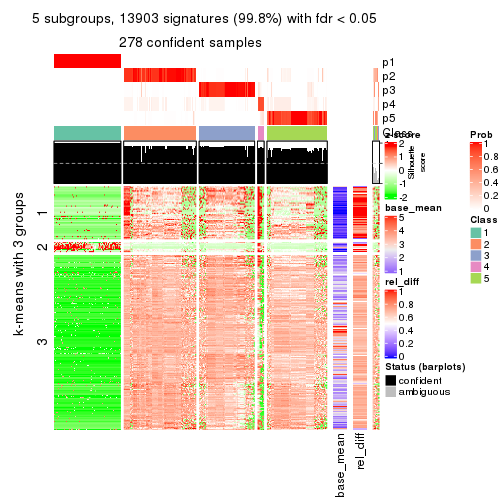</p>

</div>
<div id='tab-ATC-pam-get-signatures-5'>
<pre><code class="r">get_signatures(res, k = 6)
</code></pre>

<p></p>

</div>
</div>


Signature heatmaps where rows are not scaled:


<script>
$( function() {
	$( '#tabs-ATC-pam-get-signatures-no-scale' ).tabs();
} );
</script>
<div id='tabs-ATC-pam-get-signatures-no-scale'>
<ul>
<li><a href='#tab-ATC-pam-get-signatures-no-scale-1'>k = 2</a></li>
<li><a href='#tab-ATC-pam-get-signatures-no-scale-2'>k = 3</a></li>
<li><a href='#tab-ATC-pam-get-signatures-no-scale-3'>k = 4</a></li>
<li><a href='#tab-ATC-pam-get-signatures-no-scale-4'>k = 5</a></li>
<li><a href='#tab-ATC-pam-get-signatures-no-scale-5'>k = 6</a></li>
</ul>
<div id='tab-ATC-pam-get-signatures-no-scale-1'>
<pre><code class="r">get_signatures(res, k = 2, scale_rows = FALSE)
</code></pre>

<p></p>

</div>
<div id='tab-ATC-pam-get-signatures-no-scale-2'>
<pre><code class="r">get_signatures(res, k = 3, scale_rows = FALSE)
</code></pre>

<p></p>

</div>
<div id='tab-ATC-pam-get-signatures-no-scale-3'>
<pre><code class="r">get_signatures(res, k = 4, scale_rows = FALSE)
</code></pre>

<p></p>

</div>
<div id='tab-ATC-pam-get-signatures-no-scale-4'>
<pre><code class="r">get_signatures(res, k = 5, scale_rows = FALSE)
</code></pre>

<p></p>

</div>
<div id='tab-ATC-pam-get-signatures-no-scale-5'>
<pre><code class="r">get_signatures(res, k = 6, scale_rows = FALSE)
</code></pre>

<p></p>

</div>
</div>


Compare the overlap of signatures from different k:

```r
compare_signatures(res)
```


`get_signature()` returns a data frame invisibly. TO get the list of signatures, the function
call should be assigned to a variable explicitly. In following code, if `plot` argument is set
to `FALSE`, no heatmap is plotted while only the differential analysis is performed.

```r
# code only for demonstration
tb = get_signature(res, k = ..., plot = FALSE)
```

An example of the output of `tb` is:

```
#>   which_row         fdr    mean_1    mean_2 scaled_mean_1 scaled_mean_2 km
#> 1        38 0.042760348  8.373488  9.131774    -0.5533452     0.5164555  1
#> 2        40 0.018707592  7.106213  8.469186    -0.6173731     0.5762149  1
#> 3        55 0.019134737 10.221463 11.207825    -0.6159697     0.5749050  1
#> 4        59 0.006059896  5.921854  7.869574    -0.6899429     0.6439467  1
#> 5        60 0.018055526  8.928898 10.211722    -0.6204761     0.5791110  1
#> 6        98 0.009384629 15.714769 14.887706     0.6635654    -0.6193277  2
...
```

The columns in `tb` are:

1. `which_row`: row indices corresponding to the input matrix.
2. `fdr`: FDR for the differential test. 
3. `mean_x`: The mean value in group x.
4. `scaled_mean_x`: The mean value in group x after rows are scaled.
5. `km`: Row groups if k-means clustering is applied to rows.


UMAP plot which shows how samples are separated.


<script>
$( function() {
	$( '#tabs-ATC-pam-dimension-reduction' ).tabs();
} );
</script>
<div id='tabs-ATC-pam-dimension-reduction'>
<ul>
<li><a href='#tab-ATC-pam-dimension-reduction-1'>k = 2</a></li>
<li><a href='#tab-ATC-pam-dimension-reduction-2'>k = 3</a></li>
<li><a href='#tab-ATC-pam-dimension-reduction-3'>k = 4</a></li>
<li><a href='#tab-ATC-pam-dimension-reduction-4'>k = 5</a></li>
<li><a href='#tab-ATC-pam-dimension-reduction-5'>k = 6</a></li>
</ul>
<div id='tab-ATC-pam-dimension-reduction-1'>
<pre><code class="r">dimension_reduction(res, k = 2, method = &quot;UMAP&quot;)
</code></pre>

<p></p>

</div>
<div id='tab-ATC-pam-dimension-reduction-2'>
<pre><code class="r">dimension_reduction(res, k = 3, method = &quot;UMAP&quot;)
</code></pre>

<p></p>

</div>
<div id='tab-ATC-pam-dimension-reduction-3'>
<pre><code class="r">dimension_reduction(res, k = 4, method = &quot;UMAP&quot;)
</code></pre>

<p></p>

</div>
<div id='tab-ATC-pam-dimension-reduction-4'>
<pre><code class="r">dimension_reduction(res, k = 5, method = &quot;UMAP&quot;)
</code></pre>

<p></p>

</div>
<div id='tab-ATC-pam-dimension-reduction-5'>
<pre><code class="r">dimension_reduction(res, k = 6, method = &quot;UMAP&quot;)
</code></pre>

<p></p>

</div>
</div>


Following heatmap shows how subgroups are split when increasing `k`:

```r
collect_classes(res)
```


If matrix rows can be associated to genes, consider to use `GO_Enrichment(res,
...)` to perform function enrichment for the signature genes.


 

---------------------------------------------------


### ATC:mclust**


The object with results only for a single top-value method and a single partition method 
can be extracted as:

```r
res = res_list["ATC", "mclust"]
# you can also extract it by
# res = res_list["ATC:mclust"]
```

A summary of `res` and all the functions that can be applied to it:

```r
res
```

```
#> A 'ConsensusPartition' object with k = 2, 3, 4, 5, 6.
#>   On a matrix with 13930 rows and 285 columns.
#>   Top rows (1000, 2000, 3000, 4000, 5000) are extracted by 'ATC' method.
#>   Subgroups are detected by 'mclust' method.
#>   Performed in total 1250 partitions by row resampling.
#>   Best k for subgroups seems to be 3.
#> 
#> Following methods can be applied to this 'ConsensusPartition' object:
#>  [1] "cola_report"             "collect_classes"         "collect_plots"          
#>  [4] "collect_stats"           "colnames"                "compare_signatures"     
#>  [7] "consensus_heatmap"       "dimension_reduction"     "functional_enrichment"  
#> [10] "get_anno_col"            "get_anno"                "get_classes"            
#> [13] "get_consensus"           "get_matrix"              "get_membership"         
#> [16] "get_param"               "get_signatures"          "get_stats"              
#> [19] "is_best_k"               "is_stable_k"             "membership_heatmap"     
#> [22] "ncol"                    "nrow"                    "plot_ecdf"              
#> [25] "rownames"                "select_partition_number" "show"                   
#> [28] "suggest_best_k"          "test_to_known_factors"
```

`collect_plots()` function collects all the plots made from `res` for all `k` (number of partitions)
into one single page to provide an easy and fast comparison between different `k`.

```r
collect_plots(res)
```


The plots are:

- The first row: a plot of the ECDF (Empirical cumulative distribution
  function) curves of the consensus matrix for each `k` and the heatmap of
  predicted classes for each `k`.
- The second row: heatmaps of the consensus matrix for each `k`.
- The third row: heatmaps of the membership matrix for each `k`.
- The fouth row: heatmaps of the signatures for each `k`.

All the plots in panels can be made by individual functions and they are
plotted later in this section.

`select_partition_number()` produces several plots showing different
statistics for choosing "optimized" `k`. There are following statistics:

- ECDF curves of the consensus matrix for each `k`;
- 1-PAC. [The PAC
  score](https://en.wikipedia.org/wiki/Consensus_clustering#Over-interpretation_potential_of_consensus_clustering)
  measures the proportion of the ambiguous subgrouping.
- Mean silhouette score.
- Concordance. The mean probability of fiting the consensus class ids in all
  partitions.
- Area increased. Denote $A_k$ as the area under the ECDF curve for current
  `k`, the area increased is defined as $A_k - A_{k-1}$.
- Rand index. The percent of pairs of samples that are both in a same cluster
  or both are not in a same cluster in the partition of k and k-1.
- Jaccard index. The ratio of pairs of samples are both in a same cluster in
  the partition of k and k-1 and the pairs of samples are both in a same
  cluster in the partition k or k-1.

The detailed explanations of these statistics can be found in [the cola
vignette](http://bioconductor.org/packages/devel/bioc/vignettes/cola/inst/doc/cola.html#toc_13).

Generally speaking, lower PAC score, higher mean silhouette score or higher
concordance corresponds to better partition. Rand index and Jaccard index
measure how similar the current partition is compared to partition with `k-1`.
If they are too similar, we won't accept `k` is better than `k-1`.

```r
select_partition_number(res)
```


The numeric values for all these statistics can be obtained by `get_stats()`.

```r
get_stats(res)
```

```
#>   k 1-PAC mean_silhouette concordance area_increased  Rand Jaccard
#> 2 2 1.000           1.000       1.000         0.3761 0.625   0.625
#> 3 3 1.000           0.994       0.998         0.1670 0.940   0.904
#> 4 4 0.590           0.714       0.844         0.4695 0.763   0.581
#> 5 5 0.589           0.704       0.718         0.0654 0.823   0.551
#> 6 6 0.673           0.617       0.734         0.0815 0.879   0.643
```

`suggest_best_k()` suggests the best $k$ based on these statistics. The rules are as follows:

- All $k$ with Jaccard index larger than 0.95 are removed because the increase of
  the partition number does not provides enough extra information. If all $k$ are removed,
  the best $k$ is assigned by `NA`.
- For $k$ with 1-PAC larger than 0.9, the maximal $k$ is taken as the "best k". Other $k$ is called "optional k".
- If it does not fit the second rule. The $k$ with the highest vote of highest
  1-PAC, mean silhouette and concordance is taken as the "best k".

```r
suggest_best_k(res)
```

```
#> [1] 3
#> attr(,"optional")
#> [1] 2
```

There is also optional best $k$ = 2 that is worth to check.

Following shows the table of the partitions (You need to click the **show/hide
code output** link to see it). The membership matrix (columns with name `p*`)
is inferred by
[`clue::cl_consensus()`](https://www.rdocumentation.org/link/cl_consensus?package=clue)
function with the `SE` method. Basically the value in the membership matrix
represents the probability to belong to a certain group. The finall class
label for an item is determined with the group with highest probability it
belongs to.

In `get_classes()` function, the entropy is calculated from the membership
matrix and the silhouette score is calculated from the consensus matrix.


<script>
$( function() {
	$( '#tabs-ATC-mclust-get-classes' ).tabs();
} );
</script>
<div id='tabs-ATC-mclust-get-classes'>
<ul>
<li><a href='#tab-ATC-mclust-get-classes-1'>k = 2</a></li>
<li><a href='#tab-ATC-mclust-get-classes-2'>k = 3</a></li>
<li><a href='#tab-ATC-mclust-get-classes-3'>k = 4</a></li>
<li><a href='#tab-ATC-mclust-get-classes-4'>k = 5</a></li>
<li><a href='#tab-ATC-mclust-get-classes-5'>k = 6</a></li>
</ul>

<div id='tab-ATC-mclust-get-classes-1'>
<p><a id='tab-ATC-mclust-get-classes-1-a' style='color:#0366d6' href='#'>show/hide code output</a></p>
<pre><code class="r">cbind(get_classes(res, k = 2), get_membership(res, k = 2))
</code></pre>

<pre><code>#&gt;            class entropy silhouette p1 p2
#&gt; SRR1201591     2       0          1  0  1
#&gt; SRR1201590     2       0          1  0  1
#&gt; SRR1201593     2       0          1  0  1
#&gt; SRR1201592     2       0          1  0  1
#&gt; SRR1201617     2       0          1  0  1
#&gt; SRR1201616     2       0          1  0  1
#&gt; SRR1201619     2       0          1  0  1
#&gt; SRR1201618     2       0          1  0  1
#&gt; SRR1201620     2       0          1  0  1
#&gt; SRR1201621     2       0          1  0  1
#&gt; SRR1201623     2       0          1  0  1
#&gt; SRR1201622     2       0          1  0  1
#&gt; SRR1201624     2       0          1  0  1
#&gt; SRR1201625     2       0          1  0  1
#&gt; SRR1201626     2       0          1  0  1
#&gt; SRR1201627     2       0          1  0  1
#&gt; SRR1201628     2       0          1  0  1
#&gt; SRR1201629     2       0          1  0  1
#&gt; SRR1201630     2       0          1  0  1
#&gt; SRR1201631     2       0          1  0  1
#&gt; SRR1201641     2       0          1  0  1
#&gt; SRR1201640     2       0          1  0  1
#&gt; SRR1201643     2       0          1  0  1
#&gt; SRR1201644     2       0          1  0  1
#&gt; SRR1201661     2       0          1  0  1
#&gt; SRR1201662     2       0          1  0  1
#&gt; SRR1201663     2       0          1  0  1
#&gt; SRR1201664     2       0          1  0  1
#&gt; SRR1201665     2       0          1  0  1
#&gt; SRR1201666     2       0          1  0  1
#&gt; SRR1201667     2       0          1  0  1
#&gt; SRR1201668     2       0          1  0  1
#&gt; SRR1201670     2       0          1  0  1
#&gt; SRR1201669     2       0          1  0  1
#&gt; SRR1201673     2       0          1  0  1
#&gt; SRR1201672     2       0          1  0  1
#&gt; SRR1201671     2       0          1  0  1
#&gt; SRR1201677     2       0          1  0  1
#&gt; SRR1201676     2       0          1  0  1
#&gt; SRR1201675     2       0          1  0  1
#&gt; SRR1201674     2       0          1  0  1
#&gt; SRR1201678     2       0          1  0  1
#&gt; SRR1201682     2       0          1  0  1
#&gt; SRR1201683     2       0          1  0  1
#&gt; SRR1201680     2       0          1  0  1
#&gt; SRR1201681     2       0          1  0  1
#&gt; SRR1201679     2       0          1  0  1
#&gt; SRR1201686     2       0          1  0  1
#&gt; SRR1201687     2       0          1  0  1
#&gt; SRR1201688     2       0          1  0  1
#&gt; SRR1201689     2       0          1  0  1
#&gt; SRR1201685     2       0          1  0  1
#&gt; SRR1201692     2       0          1  0  1
#&gt; SRR1201691     2       0          1  0  1
#&gt; SRR1201690     2       0          1  0  1
#&gt; SRR1201696     2       0          1  0  1
#&gt; SRR1201695     2       0          1  0  1
#&gt; SRR1201694     2       0          1  0  1
#&gt; SRR1201693     2       0          1  0  1
#&gt; SRR1201697     2       0          1  0  1
#&gt; SRR1201698     2       0          1  0  1
#&gt; SRR1201700     2       0          1  0  1
#&gt; SRR1201708     2       0          1  0  1
#&gt; SRR1201707     2       0          1  0  1
#&gt; SRR1201706     2       0          1  0  1
#&gt; SRR1201702     2       0          1  0  1
#&gt; SRR1201705     2       0          1  0  1
#&gt; SRR1201701     2       0          1  0  1
#&gt; SRR1201704     2       0          1  0  1
#&gt; SRR1201703     2       0          1  0  1
#&gt; SRR1201716     2       0          1  0  1
#&gt; SRR1201715     2       0          1  0  1
#&gt; SRR1201717     2       0          1  0  1
#&gt; SRR1201712     2       0          1  0  1
#&gt; SRR1201709     2       0          1  0  1
#&gt; SRR1201711     2       0          1  0  1
#&gt; SRR1201714     2       0          1  0  1
#&gt; SRR1201713     2       0          1  0  1
#&gt; SRR1201710     2       0          1  0  1
#&gt; SRR1201719     2       0          1  0  1
#&gt; SRR1201718     2       0          1  0  1
#&gt; SRR1201721     2       0          1  0  1
#&gt; SRR1201720     2       0          1  0  1
#&gt; SRR1201723     2       0          1  0  1
#&gt; SRR1201722     2       0          1  0  1
#&gt; SRR1201725     2       0          1  0  1
#&gt; SRR1201724     2       0          1  0  1
#&gt; SRR1201726     2       0          1  0  1
#&gt; SRR1201727     2       0          1  0  1
#&gt; SRR1201731     2       0          1  0  1
#&gt; SRR1201730     2       0          1  0  1
#&gt; SRR1201734     2       0          1  0  1
#&gt; SRR1201733     2       0          1  0  1
#&gt; SRR1201736     2       0          1  0  1
#&gt; SRR1201737     2       0          1  0  1
#&gt; SRR1201739     2       0          1  0  1
#&gt; SRR1201738     2       0          1  0  1
#&gt; SRR1201742     2       0          1  0  1
#&gt; SRR1201743     2       0          1  0  1
#&gt; SRR1201745     2       0          1  0  1
#&gt; SRR1201744     2       0          1  0  1
#&gt; SRR1201749     2       0          1  0  1
#&gt; SRR1201750     2       0          1  0  1
#&gt; SRR1201752     2       0          1  0  1
#&gt; SRR1201751     2       0          1  0  1
#&gt; SRR1201754     2       0          1  0  1
#&gt; SRR1201753     2       0          1  0  1
#&gt; SRR1201758     2       0          1  0  1
#&gt; SRR1201759     2       0          1  0  1
#&gt; SRR1201760     2       0          1  0  1
#&gt; SRR1201761     2       0          1  0  1
#&gt; SRR1201763     2       0          1  0  1
#&gt; SRR1201762     2       0          1  0  1
#&gt; SRR1201764     2       0          1  0  1
#&gt; SRR1201766     2       0          1  0  1
#&gt; SRR1201768     2       0          1  0  1
#&gt; SRR1201769     2       0          1  0  1
#&gt; SRR1201767     2       0          1  0  1
#&gt; SRR1201770     2       0          1  0  1
#&gt; SRR1201771     2       0          1  0  1
#&gt; SRR1201772     2       0          1  0  1
#&gt; SRR1201773     2       0          1  0  1
#&gt; SRR1201774     2       0          1  0  1
#&gt; SRR1201786     2       0          1  0  1
#&gt; SRR1201784     2       0          1  0  1
#&gt; SRR1201785     2       0          1  0  1
#&gt; SRR1201778     2       0          1  0  1
#&gt; SRR1201779     2       0          1  0  1
#&gt; SRR1201781     2       0          1  0  1
#&gt; SRR1201780     2       0          1  0  1
#&gt; SRR1201783     2       0          1  0  1
#&gt; SRR1201782     2       0          1  0  1
#&gt; SRR1201798     2       0          1  0  1
#&gt; SRR1201797     2       0          1  0  1
#&gt; SRR1201796     2       0          1  0  1
#&gt; SRR1201795     2       0          1  0  1
#&gt; SRR1201799     2       0          1  0  1
#&gt; SRR1201794     2       0          1  0  1
#&gt; SRR1201793     2       0          1  0  1
#&gt; SRR1201792     2       0          1  0  1
#&gt; SRR1201791     2       0          1  0  1
#&gt; SRR1201807     2       0          1  0  1
#&gt; SRR1201808     2       0          1  0  1
#&gt; SRR1201803     2       0          1  0  1
#&gt; SRR1201804     2       0          1  0  1
#&gt; SRR1201805     2       0          1  0  1
#&gt; SRR1201806     2       0          1  0  1
#&gt; SRR1201801     2       0          1  0  1
#&gt; SRR1201802     2       0          1  0  1
#&gt; SRR1201800     2       0          1  0  1
#&gt; SRR1201814     2       0          1  0  1
#&gt; SRR1201816     2       0          1  0  1
#&gt; SRR1201815     2       0          1  0  1
#&gt; SRR1201819     2       0          1  0  1
#&gt; SRR1201820     2       0          1  0  1
#&gt; SRR1201813     2       0          1  0  1
#&gt; SRR1201817     2       0          1  0  1
#&gt; SRR1201818     2       0          1  0  1
#&gt; SRR1201825     2       0          1  0  1
#&gt; SRR1201827     2       0          1  0  1
#&gt; SRR1201828     2       0          1  0  1
#&gt; SRR1201826     2       0          1  0  1
#&gt; SRR1201829     2       0          1  0  1
#&gt; SRR1201830     2       0          1  0  1
#&gt; SRR1201831     2       0          1  0  1
#&gt; SRR1201832     2       0          1  0  1
#&gt; SRR1201833     2       0          1  0  1
#&gt; SRR1201865     2       0          1  0  1
#&gt; SRR1201866     2       0          1  0  1
#&gt; SRR1201867     2       0          1  0  1
#&gt; SRR1201861     2       0          1  0  1
#&gt; SRR1201862     2       0          1  0  1
#&gt; SRR1201863     2       0          1  0  1
#&gt; SRR1201859     2       0          1  0  1
#&gt; SRR1201864     2       0          1  0  1
#&gt; SRR1201860     2       0          1  0  1
#&gt; SRR1201873     2       0          1  0  1
#&gt; SRR1201871     2       0          1  0  1
#&gt; SRR1201872     2       0          1  0  1
#&gt; SRR1201980     2       0          1  0  1
#&gt; SRR1201979     2       0          1  0  1
#&gt; SRR1201982     2       0          1  0  1
#&gt; SRR1201981     2       0          1  0  1
#&gt; SRR1201998     2       0          1  0  1
#&gt; SRR1201996     2       0          1  0  1
#&gt; SRR1201997     2       0          1  0  1
#&gt; SRR1202005     2       0          1  0  1
#&gt; SRR1202006     2       0          1  0  1
#&gt; SRR1202088     2       0          1  0  1
#&gt; SRR1202087     2       0          1  0  1
#&gt; SRR1202093     2       0          1  0  1
#&gt; SRR1202092     2       0          1  0  1
#&gt; SRR1202288     2       0          1  0  1
#&gt; SRR1202289     2       0          1  0  1
#&gt; SRR1202299     2       0          1  0  1
#&gt; SRR1202298     2       0          1  0  1
#&gt; SRR1202303     2       0          1  0  1
#&gt; SRR1202372     2       0          1  0  1
#&gt; SRR1202371     2       0          1  0  1
#&gt; SRR1202563     2       0          1  0  1
#&gt; SRR1202565     2       0          1  0  1
#&gt; SRR1202564     2       0          1  0  1
#&gt; SRR1202649     2       0          1  0  1
#&gt; SRR1202650     2       0          1  0  1
#&gt; SRR1202651     2       0          1  0  1
#&gt; SRR1202843     1       0          1  1  0
#&gt; SRR1202844     1       0          1  1  0
#&gt; SRR1202845     2       0          1  0  1
#&gt; SRR1202847     2       0          1  0  1
#&gt; SRR1202846     2       0          1  0  1
#&gt; SRR1202945     1       0          1  1  0
#&gt; SRR1202949     1       0          1  1  0
#&gt; SRR1202977     1       0          1  1  0
#&gt; SRR1202978     1       0          1  1  0
#&gt; SRR1202979     1       0          1  1  0
#&gt; SRR1202990     1       0          1  1  0
#&gt; SRR1202999     1       0          1  1  0
#&gt; SRR1203005     1       0          1  1  0
#&gt; SRR1203006     1       0          1  1  0
#&gt; SRR1203007     1       0          1  1  0
#&gt; SRR1203009     1       0          1  1  0
#&gt; SRR1203008     1       0          1  1  0
#&gt; SRR1203010     1       0          1  1  0
#&gt; SRR1203011     1       0          1  1  0
#&gt; SRR1203025     1       0          1  1  0
#&gt; SRR1203026     1       0          1  1  0
#&gt; SRR1203027     1       0          1  1  0
#&gt; SRR1203061     1       0          1  1  0
#&gt; SRR1203089     1       0          1  1  0
#&gt; SRR1203125     1       0          1  1  0
#&gt; SRR1203128     1       0          1  1  0
#&gt; SRR1203129     1       0          1  1  0
#&gt; SRR1203130     1       0          1  1  0
#&gt; SRR1203132     2       0          1  0  1
#&gt; SRR1203131     2       0          1  0  1
#&gt; SRR1203133     1       0          1  1  0
#&gt; SRR1203138     1       0          1  1  0
#&gt; SRR1203760     1       0          1  1  0
#&gt; SRR1203761     1       0          1  1  0
#&gt; SRR1203770     1       0          1  1  0
#&gt; SRR1203771     1       0          1  1  0
#&gt; SRR1203772     1       0          1  1  0
#&gt; SRR1203773     1       0          1  1  0
#&gt; SRR1203774     1       0          1  1  0
#&gt; SRR1203775     1       0          1  1  0
#&gt; SRR1203800     1       0          1  1  0
#&gt; SRR1203801     1       0          1  1  0
#&gt; SRR1203802     1       0          1  1  0
#&gt; SRR1203803     1       0          1  1  0
#&gt; SRR1203804     1       0          1  1  0
#&gt; SRR1203805     1       0          1  1  0
#&gt; SRR1203806     1       0          1  1  0
#&gt; SRR1203807     1       0          1  1  0
#&gt; SRR1203808     1       0          1  1  0
#&gt; SRR1203811     1       0          1  1  0
#&gt; SRR1203812     1       0          1  1  0
#&gt; SRR1203813     1       0          1  1  0
#&gt; SRR1203814     1       0          1  1  0
#&gt; SRR1203815     1       0          1  1  0
#&gt; SRR1203816     1       0          1  1  0
#&gt; SRR1203817     1       0          1  1  0
#&gt; SRR1203818     1       0          1  1  0
#&gt; SRR1203819     1       0          1  1  0
#&gt; SRR1203822     1       0          1  1  0
#&gt; SRR1203823     1       0          1  1  0
#&gt; SRR1203824     1       0          1  1  0
#&gt; SRR1203825     1       0          1  1  0
#&gt; SRR1203826     1       0          1  1  0
#&gt; SRR1203827     2       0          1  0  1
#&gt; SRR1203828     1       0          1  1  0
#&gt; SRR1203829     1       0          1  1  0
#&gt; SRR1203830     1       0          1  1  0
#&gt; SRR1203831     1       0          1  1  0
#&gt; SRR1203832     1       0          1  1  0
#&gt; SRR1203833     1       0          1  1  0
#&gt; SRR1203834     1       0          1  1  0
#&gt; SRR1203835     1       0          1  1  0
#&gt; SRR1203836     1       0          1  1  0
#&gt; SRR1203837     1       0          1  1  0
#&gt; SRR1203838     1       0          1  1  0
#&gt; SRR1203839     1       0          1  1  0
#&gt; SRR1203842     2       0          1  0  1
#&gt; SRR1203843     1       0          1  1  0
#&gt; SRR1203845     2       0          1  0  1
#&gt; SRR1203844     2       0          1  0  1
</code></pre>

<script>
$('#tab-ATC-mclust-get-classes-1-a').parent().next().next().hide();
$('#tab-ATC-mclust-get-classes-1-a').click(function(){
  $('#tab-ATC-mclust-get-classes-1-a').parent().next().next().toggle();
  return(false);
});
</script>
</div>

<div id='tab-ATC-mclust-get-classes-2'>
<p><a id='tab-ATC-mclust-get-classes-2-a' style='color:#0366d6' href='#'>show/hide code output</a></p>
<pre><code class="r">cbind(get_classes(res, k = 3), get_membership(res, k = 3))
</code></pre>

<pre><code>#&gt;            class entropy silhouette    p1    p2    p3
#&gt; SRR1201591     2  0.0000      0.997 0.000 1.000 0.000
#&gt; SRR1201590     2  0.0000      0.997 0.000 1.000 0.000
#&gt; SRR1201593     2  0.0000      0.997 0.000 1.000 0.000
#&gt; SRR1201592     2  0.0000      0.997 0.000 1.000 0.000
#&gt; SRR1201617     2  0.0000      0.997 0.000 1.000 0.000
#&gt; SRR1201616     2  0.0000      0.997 0.000 1.000 0.000
#&gt; SRR1201619     2  0.0000      0.997 0.000 1.000 0.000
#&gt; SRR1201618     2  0.0000      0.997 0.000 1.000 0.000
#&gt; SRR1201620     2  0.0000      0.997 0.000 1.000 0.000
#&gt; SRR1201621     2  0.0000      0.997 0.000 1.000 0.000
#&gt; SRR1201623     2  0.0000      0.997 0.000 1.000 0.000
#&gt; SRR1201622     2  0.0237      0.993 0.000 0.996 0.004
#&gt; SRR1201624     3  0.0000      1.000 0.000 0.000 1.000
#&gt; SRR1201625     3  0.0000      1.000 0.000 0.000 1.000
#&gt; SRR1201626     3  0.0000      1.000 0.000 0.000 1.000
#&gt; SRR1201627     3  0.0000      1.000 0.000 0.000 1.000
#&gt; SRR1201628     2  0.0000      0.997 0.000 1.000 0.000
#&gt; SRR1201629     2  0.0000      0.997 0.000 1.000 0.000
#&gt; SRR1201630     2  0.0000      0.997 0.000 1.000 0.000
#&gt; SRR1201631     2  0.0000      0.997 0.000 1.000 0.000
#&gt; SRR1201641     2  0.0000      0.997 0.000 1.000 0.000
#&gt; SRR1201640     2  0.0000      0.997 0.000 1.000 0.000
#&gt; SRR1201643     2  0.0000      0.997 0.000 1.000 0.000
#&gt; SRR1201644     2  0.0000      0.997 0.000 1.000 0.000
#&gt; SRR1201661     2  0.0000      0.997 0.000 1.000 0.000
#&gt; SRR1201662     2  0.0000      0.997 0.000 1.000 0.000
#&gt; SRR1201663     2  0.0000      0.997 0.000 1.000 0.000
#&gt; SRR1201664     2  0.0000      0.997 0.000 1.000 0.000
#&gt; SRR1201665     2  0.0000      0.997 0.000 1.000 0.000
#&gt; SRR1201666     2  0.0000      0.997 0.000 1.000 0.000
#&gt; SRR1201667     2  0.0000      0.997 0.000 1.000 0.000
#&gt; SRR1201668     2  0.6180      0.288 0.000 0.584 0.416
#&gt; SRR1201670     2  0.0000      0.997 0.000 1.000 0.000
#&gt; SRR1201669     2  0.0000      0.997 0.000 1.000 0.000
#&gt; SRR1201673     2  0.0000      0.997 0.000 1.000 0.000
#&gt; SRR1201672     2  0.0000      0.997 0.000 1.000 0.000
#&gt; SRR1201671     2  0.0000      0.997 0.000 1.000 0.000
#&gt; SRR1201677     2  0.0000      0.997 0.000 1.000 0.000
#&gt; SRR1201676     2  0.0000      0.997 0.000 1.000 0.000
#&gt; SRR1201675     2  0.0000      0.997 0.000 1.000 0.000
#&gt; SRR1201674     2  0.0000      0.997 0.000 1.000 0.000
#&gt; SRR1201678     2  0.0000      0.997 0.000 1.000 0.000
#&gt; SRR1201682     2  0.0000      0.997 0.000 1.000 0.000
#&gt; SRR1201683     2  0.0000      0.997 0.000 1.000 0.000
#&gt; SRR1201680     2  0.0000      0.997 0.000 1.000 0.000
#&gt; SRR1201681     2  0.0000      0.997 0.000 1.000 0.000
#&gt; SRR1201679     2  0.0000      0.997 0.000 1.000 0.000
#&gt; SRR1201686     2  0.0000      0.997 0.000 1.000 0.000
#&gt; SRR1201687     2  0.0000      0.997 0.000 1.000 0.000
#&gt; SRR1201688     2  0.0000      0.997 0.000 1.000 0.000
#&gt; SRR1201689     2  0.0000      0.997 0.000 1.000 0.000
#&gt; SRR1201685     3  0.0000      1.000 0.000 0.000 1.000
#&gt; SRR1201692     2  0.0000      0.997 0.000 1.000 0.000
#&gt; SRR1201691     2  0.0000      0.997 0.000 1.000 0.000
#&gt; SRR1201690     2  0.0000      0.997 0.000 1.000 0.000
#&gt; SRR1201696     2  0.0000      0.997 0.000 1.000 0.000
#&gt; SRR1201695     2  0.0000      0.997 0.000 1.000 0.000
#&gt; SRR1201694     2  0.0000      0.997 0.000 1.000 0.000
#&gt; SRR1201693     2  0.0000      0.997 0.000 1.000 0.000
#&gt; SRR1201697     2  0.0000      0.997 0.000 1.000 0.000
#&gt; SRR1201698     2  0.0000      0.997 0.000 1.000 0.000
#&gt; SRR1201700     2  0.0000      0.997 0.000 1.000 0.000
#&gt; SRR1201708     2  0.0000      0.997 0.000 1.000 0.000
#&gt; SRR1201707     2  0.0000      0.997 0.000 1.000 0.000
#&gt; SRR1201706     2  0.0000      0.997 0.000 1.000 0.000
#&gt; SRR1201702     2  0.0000      0.997 0.000 1.000 0.000
#&gt; SRR1201705     2  0.0000      0.997 0.000 1.000 0.000
#&gt; SRR1201701     2  0.0000      0.997 0.000 1.000 0.000
#&gt; SRR1201704     2  0.0000      0.997 0.000 1.000 0.000
#&gt; SRR1201703     2  0.0000      0.997 0.000 1.000 0.000
#&gt; SRR1201716     2  0.0000      0.997 0.000 1.000 0.000
#&gt; SRR1201715     2  0.0000      0.997 0.000 1.000 0.000
#&gt; SRR1201717     2  0.0000      0.997 0.000 1.000 0.000
#&gt; SRR1201712     2  0.0000      0.997 0.000 1.000 0.000
#&gt; SRR1201709     2  0.0000      0.997 0.000 1.000 0.000
#&gt; SRR1201711     2  0.0000      0.997 0.000 1.000 0.000
#&gt; SRR1201714     2  0.0000      0.997 0.000 1.000 0.000
#&gt; SRR1201713     2  0.0000      0.997 0.000 1.000 0.000
#&gt; SRR1201710     2  0.0000      0.997 0.000 1.000 0.000
#&gt; SRR1201719     2  0.0000      0.997 0.000 1.000 0.000
#&gt; SRR1201718     2  0.0000      0.997 0.000 1.000 0.000
#&gt; SRR1201721     2  0.0000      0.997 0.000 1.000 0.000
#&gt; SRR1201720     2  0.0000      0.997 0.000 1.000 0.000
#&gt; SRR1201723     2  0.0000      0.997 0.000 1.000 0.000
#&gt; SRR1201722     2  0.0000      0.997 0.000 1.000 0.000
#&gt; SRR1201725     2  0.0000      0.997 0.000 1.000 0.000
#&gt; SRR1201724     2  0.0000      0.997 0.000 1.000 0.000
#&gt; SRR1201726     2  0.0000      0.997 0.000 1.000 0.000
#&gt; SRR1201727     2  0.0000      0.997 0.000 1.000 0.000
#&gt; SRR1201731     2  0.0000      0.997 0.000 1.000 0.000
#&gt; SRR1201730     2  0.0000      0.997 0.000 1.000 0.000
#&gt; SRR1201734     2  0.0000      0.997 0.000 1.000 0.000
#&gt; SRR1201733     2  0.0000      0.997 0.000 1.000 0.000
#&gt; SRR1201736     2  0.0424      0.989 0.000 0.992 0.008
#&gt; SRR1201737     2  0.0000      0.997 0.000 1.000 0.000
#&gt; SRR1201739     2  0.0000      0.997 0.000 1.000 0.000
#&gt; SRR1201738     2  0.0000      0.997 0.000 1.000 0.000
#&gt; SRR1201742     2  0.0000      0.997 0.000 1.000 0.000
#&gt; SRR1201743     2  0.0000      0.997 0.000 1.000 0.000
#&gt; SRR1201745     2  0.0000      0.997 0.000 1.000 0.000
#&gt; SRR1201744     2  0.0424      0.989 0.000 0.992 0.008
#&gt; SRR1201749     2  0.0000      0.997 0.000 1.000 0.000
#&gt; SRR1201750     2  0.0000      0.997 0.000 1.000 0.000
#&gt; SRR1201752     2  0.0000      0.997 0.000 1.000 0.000
#&gt; SRR1201751     2  0.0000      0.997 0.000 1.000 0.000
#&gt; SRR1201754     2  0.0000      0.997 0.000 1.000 0.000
#&gt; SRR1201753     2  0.0000      0.997 0.000 1.000 0.000
#&gt; SRR1201758     3  0.0000      1.000 0.000 0.000 1.000
#&gt; SRR1201759     3  0.0000      1.000 0.000 0.000 1.000
#&gt; SRR1201760     2  0.0000      0.997 0.000 1.000 0.000
#&gt; SRR1201761     2  0.0000      0.997 0.000 1.000 0.000
#&gt; SRR1201763     3  0.0000      1.000 0.000 0.000 1.000
#&gt; SRR1201762     3  0.0000      1.000 0.000 0.000 1.000
#&gt; SRR1201764     2  0.0000      0.997 0.000 1.000 0.000
#&gt; SRR1201766     2  0.0000      0.997 0.000 1.000 0.000
#&gt; SRR1201768     2  0.0000      0.997 0.000 1.000 0.000
#&gt; SRR1201769     2  0.0000      0.997 0.000 1.000 0.000
#&gt; SRR1201767     2  0.0000      0.997 0.000 1.000 0.000
#&gt; SRR1201770     2  0.0000      0.997 0.000 1.000 0.000
#&gt; SRR1201771     2  0.0000      0.997 0.000 1.000 0.000
#&gt; SRR1201772     2  0.0000      0.997 0.000 1.000 0.000
#&gt; SRR1201773     2  0.0000      0.997 0.000 1.000 0.000
#&gt; SRR1201774     2  0.0000      0.997 0.000 1.000 0.000
#&gt; SRR1201786     2  0.0000      0.997 0.000 1.000 0.000
#&gt; SRR1201784     2  0.0000      0.997 0.000 1.000 0.000
#&gt; SRR1201785     2  0.0000      0.997 0.000 1.000 0.000
#&gt; SRR1201778     2  0.0000      0.997 0.000 1.000 0.000
#&gt; SRR1201779     2  0.0000      0.997 0.000 1.000 0.000
#&gt; SRR1201781     2  0.0000      0.997 0.000 1.000 0.000
#&gt; SRR1201780     2  0.0000      0.997 0.000 1.000 0.000
#&gt; SRR1201783     2  0.0000      0.997 0.000 1.000 0.000
#&gt; SRR1201782     2  0.0000      0.997 0.000 1.000 0.000
#&gt; SRR1201798     2  0.0000      0.997 0.000 1.000 0.000
#&gt; SRR1201797     2  0.0000      0.997 0.000 1.000 0.000
#&gt; SRR1201796     2  0.0000      0.997 0.000 1.000 0.000
#&gt; SRR1201795     2  0.0000      0.997 0.000 1.000 0.000
#&gt; SRR1201799     2  0.0000      0.997 0.000 1.000 0.000
#&gt; SRR1201794     2  0.0000      0.997 0.000 1.000 0.000
#&gt; SRR1201793     2  0.0000      0.997 0.000 1.000 0.000
#&gt; SRR1201792     2  0.0000      0.997 0.000 1.000 0.000
#&gt; SRR1201791     2  0.0000      0.997 0.000 1.000 0.000
#&gt; SRR1201807     2  0.0000      0.997 0.000 1.000 0.000
#&gt; SRR1201808     2  0.0000      0.997 0.000 1.000 0.000
#&gt; SRR1201803     2  0.0000      0.997 0.000 1.000 0.000
#&gt; SRR1201804     2  0.0000      0.997 0.000 1.000 0.000
#&gt; SRR1201805     2  0.0000      0.997 0.000 1.000 0.000
#&gt; SRR1201806     2  0.0000      0.997 0.000 1.000 0.000
#&gt; SRR1201801     2  0.0000      0.997 0.000 1.000 0.000
#&gt; SRR1201802     2  0.0000      0.997 0.000 1.000 0.000
#&gt; SRR1201800     2  0.0000      0.997 0.000 1.000 0.000
#&gt; SRR1201814     2  0.0000      0.997 0.000 1.000 0.000
#&gt; SRR1201816     2  0.0000      0.997 0.000 1.000 0.000
#&gt; SRR1201815     2  0.0000      0.997 0.000 1.000 0.000
#&gt; SRR1201819     2  0.0000      0.997 0.000 1.000 0.000
#&gt; SRR1201820     2  0.0000      0.997 0.000 1.000 0.000
#&gt; SRR1201813     2  0.0000      0.997 0.000 1.000 0.000
#&gt; SRR1201817     2  0.0000      0.997 0.000 1.000 0.000
#&gt; SRR1201818     2  0.0000      0.997 0.000 1.000 0.000
#&gt; SRR1201825     2  0.3619      0.842 0.000 0.864 0.136
#&gt; SRR1201827     2  0.0000      0.997 0.000 1.000 0.000
#&gt; SRR1201828     2  0.0000      0.997 0.000 1.000 0.000
#&gt; SRR1201826     2  0.0000      0.997 0.000 1.000 0.000
#&gt; SRR1201829     2  0.0000      0.997 0.000 1.000 0.000
#&gt; SRR1201830     2  0.0000      0.997 0.000 1.000 0.000
#&gt; SRR1201831     2  0.0000      0.997 0.000 1.000 0.000
#&gt; SRR1201832     2  0.0000      0.997 0.000 1.000 0.000
#&gt; SRR1201833     2  0.0000      0.997 0.000 1.000 0.000
#&gt; SRR1201865     2  0.0000      0.997 0.000 1.000 0.000
#&gt; SRR1201866     2  0.0000      0.997 0.000 1.000 0.000
#&gt; SRR1201867     2  0.0000      0.997 0.000 1.000 0.000
#&gt; SRR1201861     2  0.0000      0.997 0.000 1.000 0.000
#&gt; SRR1201862     2  0.0000      0.997 0.000 1.000 0.000
#&gt; SRR1201863     2  0.0000      0.997 0.000 1.000 0.000
#&gt; SRR1201859     2  0.1411      0.961 0.000 0.964 0.036
#&gt; SRR1201864     2  0.0000      0.997 0.000 1.000 0.000
#&gt; SRR1201860     2  0.0000      0.997 0.000 1.000 0.000
#&gt; SRR1201873     2  0.0000      0.997 0.000 1.000 0.000
#&gt; SRR1201871     2  0.0000      0.997 0.000 1.000 0.000
#&gt; SRR1201872     2  0.0000      0.997 0.000 1.000 0.000
#&gt; SRR1201980     2  0.0000      0.997 0.000 1.000 0.000
#&gt; SRR1201979     2  0.0000      0.997 0.000 1.000 0.000
#&gt; SRR1201982     2  0.0000      0.997 0.000 1.000 0.000
#&gt; SRR1201981     2  0.0000      0.997 0.000 1.000 0.000
#&gt; SRR1201998     2  0.0000      0.997 0.000 1.000 0.000
#&gt; SRR1201996     2  0.0000      0.997 0.000 1.000 0.000
#&gt; SRR1201997     2  0.0000      0.997 0.000 1.000 0.000
#&gt; SRR1202005     2  0.0000      0.997 0.000 1.000 0.000
#&gt; SRR1202006     2  0.0000      0.997 0.000 1.000 0.000
#&gt; SRR1202088     2  0.0000      0.997 0.000 1.000 0.000
#&gt; SRR1202087     2  0.0000      0.997 0.000 1.000 0.000
#&gt; SRR1202093     2  0.0000      0.997 0.000 1.000 0.000
#&gt; SRR1202092     2  0.0000      0.997 0.000 1.000 0.000
#&gt; SRR1202288     2  0.0000      0.997 0.000 1.000 0.000
#&gt; SRR1202289     2  0.0000      0.997 0.000 1.000 0.000
#&gt; SRR1202299     2  0.0000      0.997 0.000 1.000 0.000
#&gt; SRR1202298     2  0.0000      0.997 0.000 1.000 0.000
#&gt; SRR1202303     3  0.0000      1.000 0.000 0.000 1.000
#&gt; SRR1202372     2  0.0000      0.997 0.000 1.000 0.000
#&gt; SRR1202371     2  0.0000      0.997 0.000 1.000 0.000
#&gt; SRR1202563     2  0.0000      0.997 0.000 1.000 0.000
#&gt; SRR1202565     2  0.0000      0.997 0.000 1.000 0.000
#&gt; SRR1202564     2  0.0000      0.997 0.000 1.000 0.000
#&gt; SRR1202649     2  0.1289      0.965 0.000 0.968 0.032
#&gt; SRR1202650     2  0.0000      0.997 0.000 1.000 0.000
#&gt; SRR1202651     2  0.0000      0.997 0.000 1.000 0.000
#&gt; SRR1202843     1  0.0000      1.000 1.000 0.000 0.000
#&gt; SRR1202844     1  0.0000      1.000 1.000 0.000 0.000
#&gt; SRR1202845     2  0.0000      0.997 0.000 1.000 0.000
#&gt; SRR1202847     2  0.0000      0.997 0.000 1.000 0.000
#&gt; SRR1202846     2  0.0000      0.997 0.000 1.000 0.000
#&gt; SRR1202945     1  0.0000      1.000 1.000 0.000 0.000
#&gt; SRR1202949     1  0.0000      1.000 1.000 0.000 0.000
#&gt; SRR1202977     1  0.0000      1.000 1.000 0.000 0.000
#&gt; SRR1202978     1  0.0000      1.000 1.000 0.000 0.000
#&gt; SRR1202979     1  0.0000      1.000 1.000 0.000 0.000
#&gt; SRR1202990     1  0.0000      1.000 1.000 0.000 0.000
#&gt; SRR1202999     1  0.0000      1.000 1.000 0.000 0.000
#&gt; SRR1203005     1  0.0000      1.000 1.000 0.000 0.000
#&gt; SRR1203006     1  0.0000      1.000 1.000 0.000 0.000
#&gt; SRR1203007     1  0.0000      1.000 1.000 0.000 0.000
#&gt; SRR1203009     1  0.0000      1.000 1.000 0.000 0.000
#&gt; SRR1203008     1  0.0000      1.000 1.000 0.000 0.000
#&gt; SRR1203010     1  0.0000      1.000 1.000 0.000 0.000
#&gt; SRR1203011     1  0.0000      1.000 1.000 0.000 0.000
#&gt; SRR1203025     1  0.0000      1.000 1.000 0.000 0.000
#&gt; SRR1203026     1  0.0000      1.000 1.000 0.000 0.000
#&gt; SRR1203027     1  0.0000      1.000 1.000 0.000 0.000
#&gt; SRR1203061     1  0.0000      1.000 1.000 0.000 0.000
#&gt; SRR1203089     1  0.0000      1.000 1.000 0.000 0.000
#&gt; SRR1203125     1  0.0000      1.000 1.000 0.000 0.000
#&gt; SRR1203128     1  0.0000      1.000 1.000 0.000 0.000
#&gt; SRR1203129     1  0.0000      1.000 1.000 0.000 0.000
#&gt; SRR1203130     1  0.0000      1.000 1.000 0.000 0.000
#&gt; SRR1203132     2  0.0000      0.997 0.000 1.000 0.000
#&gt; SRR1203131     2  0.0000      0.997 0.000 1.000 0.000
#&gt; SRR1203133     1  0.0000      1.000 1.000 0.000 0.000
#&gt; SRR1203138     1  0.0000      1.000 1.000 0.000 0.000
#&gt; SRR1203760     1  0.0000      1.000 1.000 0.000 0.000
#&gt; SRR1203761     1  0.0000      1.000 1.000 0.000 0.000
#&gt; SRR1203770     1  0.0000      1.000 1.000 0.000 0.000
#&gt; SRR1203771     1  0.0000      1.000 1.000 0.000 0.000
#&gt; SRR1203772     1  0.0000      1.000 1.000 0.000 0.000
#&gt; SRR1203773     1  0.0000      1.000 1.000 0.000 0.000
#&gt; SRR1203774     1  0.0000      1.000 1.000 0.000 0.000
#&gt; SRR1203775     1  0.0237      0.996 0.996 0.000 0.004
#&gt; SRR1203800     1  0.0000      1.000 1.000 0.000 0.000
#&gt; SRR1203801     1  0.0000      1.000 1.000 0.000 0.000
#&gt; SRR1203802     1  0.0000      1.000 1.000 0.000 0.000
#&gt; SRR1203803     1  0.0000      1.000 1.000 0.000 0.000
#&gt; SRR1203804     1  0.0000      1.000 1.000 0.000 0.000
#&gt; SRR1203805     1  0.0000      1.000 1.000 0.000 0.000
#&gt; SRR1203806     1  0.0000      1.000 1.000 0.000 0.000
#&gt; SRR1203807     1  0.0592      0.988 0.988 0.000 0.012
#&gt; SRR1203808     1  0.0000      1.000 1.000 0.000 0.000
#&gt; SRR1203811     1  0.0000      1.000 1.000 0.000 0.000
#&gt; SRR1203812     1  0.0000      1.000 1.000 0.000 0.000
#&gt; SRR1203813     1  0.0000      1.000 1.000 0.000 0.000
#&gt; SRR1203814     1  0.0000      1.000 1.000 0.000 0.000
#&gt; SRR1203815     1  0.0000      1.000 1.000 0.000 0.000
#&gt; SRR1203816     1  0.0000      1.000 1.000 0.000 0.000
#&gt; SRR1203817     1  0.0000      1.000 1.000 0.000 0.000
#&gt; SRR1203818     1  0.0000      1.000 1.000 0.000 0.000
#&gt; SRR1203819     1  0.0000      1.000 1.000 0.000 0.000
#&gt; SRR1203822     1  0.0000      1.000 1.000 0.000 0.000
#&gt; SRR1203823     1  0.0000      1.000 1.000 0.000 0.000
#&gt; SRR1203824     1  0.0000      1.000 1.000 0.000 0.000
#&gt; SRR1203825     1  0.0000      1.000 1.000 0.000 0.000
#&gt; SRR1203826     1  0.0000      1.000 1.000 0.000 0.000
#&gt; SRR1203827     3  0.0000      1.000 0.000 0.000 1.000
#&gt; SRR1203828     1  0.0000      1.000 1.000 0.000 0.000
#&gt; SRR1203829     1  0.0000      1.000 1.000 0.000 0.000
#&gt; SRR1203830     1  0.0000      1.000 1.000 0.000 0.000
#&gt; SRR1203831     1  0.0000      1.000 1.000 0.000 0.000
#&gt; SRR1203832     1  0.0000      1.000 1.000 0.000 0.000
#&gt; SRR1203833     1  0.0000      1.000 1.000 0.000 0.000
#&gt; SRR1203834     1  0.0000      1.000 1.000 0.000 0.000
#&gt; SRR1203835     1  0.0000      1.000 1.000 0.000 0.000
#&gt; SRR1203836     1  0.0000      1.000 1.000 0.000 0.000
#&gt; SRR1203837     1  0.0000      1.000 1.000 0.000 0.000
#&gt; SRR1203838     1  0.0000      1.000 1.000 0.000 0.000
#&gt; SRR1203839     1  0.0000      1.000 1.000 0.000 0.000
#&gt; SRR1203842     3  0.0000      1.000 0.000 0.000 1.000
#&gt; SRR1203843     1  0.0000      1.000 1.000 0.000 0.000
#&gt; SRR1203845     2  0.0000      0.997 0.000 1.000 0.000
#&gt; SRR1203844     2  0.0000      0.997 0.000 1.000 0.000
</code></pre>

<script>
$('#tab-ATC-mclust-get-classes-2-a').parent().next().next().hide();
$('#tab-ATC-mclust-get-classes-2-a').click(function(){
  $('#tab-ATC-mclust-get-classes-2-a').parent().next().next().toggle();
  return(false);
});
</script>
</div>

<div id='tab-ATC-mclust-get-classes-3'>
<p><a id='tab-ATC-mclust-get-classes-3-a' style='color:#0366d6' href='#'>show/hide code output</a></p>
<pre><code class="r">cbind(get_classes(res, k = 4), get_membership(res, k = 4))
</code></pre>

<pre><code>#&gt;            class entropy silhouette    p1    p2    p3    p4
#&gt; SRR1201591     2  0.3688     0.5797 0.000 0.792 0.208 0.000
#&gt; SRR1201590     3  0.4898     0.4882 0.000 0.416 0.584 0.000
#&gt; SRR1201593     2  0.2530     0.7037 0.000 0.888 0.112 0.000
#&gt; SRR1201592     2  0.4998    -0.1335 0.000 0.512 0.488 0.000
#&gt; SRR1201617     2  0.2973     0.6646 0.000 0.856 0.144 0.000
#&gt; SRR1201616     2  0.2973     0.6755 0.000 0.856 0.144 0.000
#&gt; SRR1201619     3  0.4222     0.7016 0.000 0.272 0.728 0.000
#&gt; SRR1201618     3  0.4103     0.5470 0.000 0.256 0.744 0.000
#&gt; SRR1201620     2  0.4994    -0.1372 0.000 0.520 0.480 0.000
#&gt; SRR1201621     2  0.2149     0.7131 0.000 0.912 0.088 0.000
#&gt; SRR1201623     3  0.2868     0.7442 0.000 0.136 0.864 0.000
#&gt; SRR1201622     3  0.2408     0.6789 0.000 0.104 0.896 0.000
#&gt; SRR1201624     4  0.0000     0.9805 0.000 0.000 0.000 1.000
#&gt; SRR1201625     4  0.0000     0.9805 0.000 0.000 0.000 1.000
#&gt; SRR1201626     4  0.0000     0.9805 0.000 0.000 0.000 1.000
#&gt; SRR1201627     4  0.0000     0.9805 0.000 0.000 0.000 1.000
#&gt; SRR1201628     3  0.3311     0.7030 0.000 0.172 0.828 0.000
#&gt; SRR1201629     3  0.4679     0.6420 0.000 0.352 0.648 0.000
#&gt; SRR1201630     2  0.4382     0.4311 0.000 0.704 0.296 0.000
#&gt; SRR1201631     2  0.4898     0.0145 0.000 0.584 0.416 0.000
#&gt; SRR1201641     3  0.4898     0.5382 0.000 0.416 0.584 0.000
#&gt; SRR1201640     3  0.4916     0.5393 0.000 0.424 0.576 0.000
#&gt; SRR1201643     3  0.4543     0.6803 0.000 0.324 0.676 0.000
#&gt; SRR1201644     3  0.4888     0.5596 0.000 0.412 0.588 0.000
#&gt; SRR1201661     2  0.4564     0.3772 0.000 0.672 0.328 0.000
#&gt; SRR1201662     3  0.4999     0.3561 0.000 0.492 0.508 0.000
#&gt; SRR1201663     3  0.0336     0.6617 0.000 0.008 0.992 0.000
#&gt; SRR1201664     3  0.0188     0.6596 0.000 0.004 0.996 0.000
#&gt; SRR1201665     3  0.4855     0.3785 0.000 0.400 0.600 0.000
#&gt; SRR1201666     2  0.4564     0.3777 0.000 0.672 0.328 0.000
#&gt; SRR1201667     2  0.4624     0.3286 0.000 0.660 0.340 0.000
#&gt; SRR1201668     3  0.4560     0.3319 0.000 0.004 0.700 0.296
#&gt; SRR1201670     3  0.0469     0.6656 0.000 0.012 0.988 0.000
#&gt; SRR1201669     3  0.0469     0.6656 0.000 0.012 0.988 0.000
#&gt; SRR1201673     3  0.3528     0.7477 0.000 0.192 0.808 0.000
#&gt; SRR1201672     3  0.3528     0.7471 0.000 0.192 0.808 0.000
#&gt; SRR1201671     3  0.3219     0.7200 0.000 0.164 0.836 0.000
#&gt; SRR1201677     3  0.3528     0.7471 0.000 0.192 0.808 0.000
#&gt; SRR1201676     3  0.3528     0.7471 0.000 0.192 0.808 0.000
#&gt; SRR1201675     3  0.3569     0.7474 0.000 0.196 0.804 0.000
#&gt; SRR1201674     3  0.3528     0.7471 0.000 0.192 0.808 0.000
#&gt; SRR1201678     3  0.3569     0.7474 0.000 0.196 0.804 0.000
#&gt; SRR1201682     2  0.5000    -0.3543 0.000 0.504 0.496 0.000
#&gt; SRR1201683     3  0.5000     0.3547 0.000 0.500 0.500 0.000
#&gt; SRR1201680     2  0.5000    -0.3584 0.000 0.504 0.496 0.000
#&gt; SRR1201681     2  0.5000    -0.3704 0.000 0.500 0.500 0.000
#&gt; SRR1201679     3  0.4989     0.1262 0.000 0.472 0.528 0.000
#&gt; SRR1201686     3  0.0000     0.6562 0.000 0.000 1.000 0.000
#&gt; SRR1201687     3  0.0000     0.6562 0.000 0.000 1.000 0.000
#&gt; SRR1201688     3  0.0000     0.6562 0.000 0.000 1.000 0.000
#&gt; SRR1201689     3  0.0000     0.6562 0.000 0.000 1.000 0.000
#&gt; SRR1201685     4  0.3024     0.9017 0.000 0.000 0.148 0.852
#&gt; SRR1201692     3  0.4817     0.5866 0.000 0.388 0.612 0.000
#&gt; SRR1201691     3  0.4817     0.5866 0.000 0.388 0.612 0.000
#&gt; SRR1201690     3  0.4250     0.7184 0.000 0.276 0.724 0.000
#&gt; SRR1201696     3  0.4817     0.5866 0.000 0.388 0.612 0.000
#&gt; SRR1201695     3  0.4817     0.5866 0.000 0.388 0.612 0.000
#&gt; SRR1201694     3  0.4843     0.5725 0.000 0.396 0.604 0.000
#&gt; SRR1201693     3  0.4817     0.5866 0.000 0.388 0.612 0.000
#&gt; SRR1201697     3  0.4817     0.5866 0.000 0.388 0.612 0.000
#&gt; SRR1201698     3  0.4817     0.5866 0.000 0.388 0.612 0.000
#&gt; SRR1201700     3  0.2814     0.7446 0.000 0.132 0.868 0.000
#&gt; SRR1201708     3  0.3172     0.7427 0.000 0.160 0.840 0.000
#&gt; SRR1201707     3  0.3172     0.7427 0.000 0.160 0.840 0.000
#&gt; SRR1201706     3  0.3172     0.7427 0.000 0.160 0.840 0.000
#&gt; SRR1201702     3  0.3172     0.7427 0.000 0.160 0.840 0.000
#&gt; SRR1201705     3  0.3172     0.7427 0.000 0.160 0.840 0.000
#&gt; SRR1201701     3  0.3172     0.7427 0.000 0.160 0.840 0.000
#&gt; SRR1201704     3  0.3172     0.7427 0.000 0.160 0.840 0.000
#&gt; SRR1201703     3  0.3172     0.7427 0.000 0.160 0.840 0.000
#&gt; SRR1201716     3  0.2647     0.7388 0.000 0.120 0.880 0.000
#&gt; SRR1201715     3  0.2589     0.7377 0.000 0.116 0.884 0.000
#&gt; SRR1201717     3  0.2647     0.7388 0.000 0.120 0.880 0.000
#&gt; SRR1201712     3  0.2589     0.7377 0.000 0.116 0.884 0.000
#&gt; SRR1201709     3  0.1716     0.7068 0.000 0.064 0.936 0.000
#&gt; SRR1201711     3  0.2589     0.7377 0.000 0.116 0.884 0.000
#&gt; SRR1201714     3  0.2647     0.7388 0.000 0.120 0.880 0.000
#&gt; SRR1201713     3  0.2647     0.7388 0.000 0.120 0.880 0.000
#&gt; SRR1201710     3  0.2647     0.7388 0.000 0.120 0.880 0.000
#&gt; SRR1201719     3  0.4761     0.6056 0.000 0.372 0.628 0.000
#&gt; SRR1201718     3  0.4830     0.5781 0.000 0.392 0.608 0.000
#&gt; SRR1201721     3  0.4164     0.7229 0.000 0.264 0.736 0.000
#&gt; SRR1201720     3  0.3873     0.7402 0.000 0.228 0.772 0.000
#&gt; SRR1201723     3  0.2345     0.7309 0.000 0.100 0.900 0.000
#&gt; SRR1201722     3  0.0469     0.6656 0.000 0.012 0.988 0.000
#&gt; SRR1201725     3  0.4790     0.5945 0.000 0.380 0.620 0.000
#&gt; SRR1201724     3  0.4985     0.4410 0.000 0.468 0.532 0.000
#&gt; SRR1201726     3  0.2216     0.7241 0.000 0.092 0.908 0.000
#&gt; SRR1201727     3  0.3172     0.7427 0.000 0.160 0.840 0.000
#&gt; SRR1201731     3  0.3688     0.7410 0.000 0.208 0.792 0.000
#&gt; SRR1201730     3  0.4304     0.7124 0.000 0.284 0.716 0.000
#&gt; SRR1201734     2  0.3873     0.5581 0.000 0.772 0.228 0.000
#&gt; SRR1201733     3  0.4843     0.3971 0.000 0.396 0.604 0.000
#&gt; SRR1201736     3  0.3975     0.5391 0.000 0.240 0.760 0.000
#&gt; SRR1201737     3  0.4040     0.7284 0.000 0.248 0.752 0.000
#&gt; SRR1201739     3  0.4992     0.4353 0.000 0.476 0.524 0.000
#&gt; SRR1201738     3  0.4776     0.6086 0.000 0.376 0.624 0.000
#&gt; SRR1201742     3  0.3528     0.7280 0.000 0.192 0.808 0.000
#&gt; SRR1201743     3  0.3837     0.7466 0.000 0.224 0.776 0.000
#&gt; SRR1201745     2  0.4713     0.2365 0.000 0.640 0.360 0.000
#&gt; SRR1201744     3  0.7629     0.2360 0.000 0.392 0.404 0.204
#&gt; SRR1201749     3  0.4967     0.3230 0.000 0.452 0.548 0.000
#&gt; SRR1201750     2  0.3172     0.6631 0.000 0.840 0.160 0.000
#&gt; SRR1201752     3  0.3444     0.7476 0.000 0.184 0.816 0.000
#&gt; SRR1201751     3  0.3356     0.7435 0.000 0.176 0.824 0.000
#&gt; SRR1201754     2  0.4454     0.4137 0.000 0.692 0.308 0.000
#&gt; SRR1201753     2  0.4941     0.0966 0.000 0.564 0.436 0.000
#&gt; SRR1201758     4  0.0000     0.9805 0.000 0.000 0.000 1.000
#&gt; SRR1201759     4  0.3356     0.8908 0.000 0.000 0.176 0.824
#&gt; SRR1201760     3  0.3219     0.7505 0.000 0.164 0.836 0.000
#&gt; SRR1201761     3  0.3219     0.7438 0.000 0.164 0.836 0.000
#&gt; SRR1201763     4  0.0000     0.9805 0.000 0.000 0.000 1.000
#&gt; SRR1201762     4  0.0000     0.9805 0.000 0.000 0.000 1.000
#&gt; SRR1201764     3  0.4985     0.3878 0.000 0.468 0.532 0.000
#&gt; SRR1201766     2  0.4250     0.4839 0.000 0.724 0.276 0.000
#&gt; SRR1201768     2  0.0469     0.7611 0.000 0.988 0.012 0.000
#&gt; SRR1201769     2  0.0469     0.7611 0.000 0.988 0.012 0.000
#&gt; SRR1201767     2  0.0469     0.7611 0.000 0.988 0.012 0.000
#&gt; SRR1201770     2  0.0469     0.7611 0.000 0.988 0.012 0.000
#&gt; SRR1201771     2  0.0469     0.7611 0.000 0.988 0.012 0.000
#&gt; SRR1201772     2  0.0469     0.7611 0.000 0.988 0.012 0.000
#&gt; SRR1201773     2  0.0592     0.7614 0.000 0.984 0.016 0.000
#&gt; SRR1201774     2  0.0469     0.7611 0.000 0.988 0.012 0.000
#&gt; SRR1201786     2  0.0469     0.7615 0.000 0.988 0.012 0.000
#&gt; SRR1201784     2  0.0469     0.7615 0.000 0.988 0.012 0.000
#&gt; SRR1201785     2  0.0592     0.7616 0.000 0.984 0.016 0.000
#&gt; SRR1201778     3  0.4866     0.3144 0.000 0.404 0.596 0.000
#&gt; SRR1201779     2  0.0592     0.7616 0.000 0.984 0.016 0.000
#&gt; SRR1201781     2  0.0592     0.7616 0.000 0.984 0.016 0.000
#&gt; SRR1201780     2  0.0592     0.7616 0.000 0.984 0.016 0.000
#&gt; SRR1201783     2  0.0592     0.7616 0.000 0.984 0.016 0.000
#&gt; SRR1201782     2  0.0469     0.7615 0.000 0.988 0.012 0.000
#&gt; SRR1201798     2  0.0592     0.7591 0.000 0.984 0.016 0.000
#&gt; SRR1201797     2  0.0592     0.7591 0.000 0.984 0.016 0.000
#&gt; SRR1201796     2  0.0707     0.7589 0.000 0.980 0.020 0.000
#&gt; SRR1201795     2  0.0592     0.7591 0.000 0.984 0.016 0.000
#&gt; SRR1201799     2  0.0592     0.7591 0.000 0.984 0.016 0.000
#&gt; SRR1201794     2  0.0469     0.7601 0.000 0.988 0.012 0.000
#&gt; SRR1201793     2  0.0707     0.7568 0.000 0.980 0.020 0.000
#&gt; SRR1201792     2  0.0592     0.7591 0.000 0.984 0.016 0.000
#&gt; SRR1201791     2  0.4843     0.1596 0.000 0.604 0.396 0.000
#&gt; SRR1201807     2  0.0188     0.7605 0.000 0.996 0.004 0.000
#&gt; SRR1201808     2  0.0188     0.7605 0.000 0.996 0.004 0.000
#&gt; SRR1201803     2  0.0188     0.7605 0.000 0.996 0.004 0.000
#&gt; SRR1201804     2  0.0188     0.7605 0.000 0.996 0.004 0.000
#&gt; SRR1201805     2  0.0188     0.7605 0.000 0.996 0.004 0.000
#&gt; SRR1201806     2  0.0188     0.7605 0.000 0.996 0.004 0.000
#&gt; SRR1201801     2  0.0188     0.7605 0.000 0.996 0.004 0.000
#&gt; SRR1201802     2  0.0188     0.7605 0.000 0.996 0.004 0.000
#&gt; SRR1201800     2  0.4643     0.3233 0.000 0.656 0.344 0.000
#&gt; SRR1201814     2  0.0188     0.7604 0.000 0.996 0.004 0.000
#&gt; SRR1201816     2  0.0188     0.7604 0.000 0.996 0.004 0.000
#&gt; SRR1201815     2  0.0188     0.7604 0.000 0.996 0.004 0.000
#&gt; SRR1201819     2  0.0188     0.7604 0.000 0.996 0.004 0.000
#&gt; SRR1201820     2  0.0188     0.7604 0.000 0.996 0.004 0.000
#&gt; SRR1201813     2  0.4790     0.2010 0.000 0.620 0.380 0.000
#&gt; SRR1201817     2  0.0336     0.7613 0.000 0.992 0.008 0.000
#&gt; SRR1201818     2  0.0188     0.7604 0.000 0.996 0.004 0.000
#&gt; SRR1201825     3  0.4740     0.6040 0.000 0.132 0.788 0.080
#&gt; SRR1201827     3  0.4888     0.5422 0.000 0.412 0.588 0.000
#&gt; SRR1201828     3  0.4898     0.5351 0.000 0.416 0.584 0.000
#&gt; SRR1201826     3  0.4977     0.4426 0.000 0.460 0.540 0.000
#&gt; SRR1201829     3  0.4898     0.5351 0.000 0.416 0.584 0.000
#&gt; SRR1201830     3  0.4907     0.5308 0.000 0.420 0.580 0.000
#&gt; SRR1201831     3  0.4907     0.5308 0.000 0.420 0.580 0.000
#&gt; SRR1201832     3  0.4898     0.5351 0.000 0.416 0.584 0.000
#&gt; SRR1201833     3  0.4907     0.5308 0.000 0.420 0.580 0.000
#&gt; SRR1201865     3  0.4222     0.6755 0.000 0.272 0.728 0.000
#&gt; SRR1201866     3  0.4222     0.6755 0.000 0.272 0.728 0.000
#&gt; SRR1201867     3  0.4222     0.6755 0.000 0.272 0.728 0.000
#&gt; SRR1201861     3  0.4304     0.6831 0.000 0.284 0.716 0.000
#&gt; SRR1201862     3  0.4431     0.6782 0.000 0.304 0.696 0.000
#&gt; SRR1201863     3  0.4250     0.6709 0.000 0.276 0.724 0.000
#&gt; SRR1201859     3  0.4387     0.5620 0.000 0.236 0.752 0.012
#&gt; SRR1201864     3  0.4331     0.6782 0.000 0.288 0.712 0.000
#&gt; SRR1201860     3  0.4250     0.6819 0.000 0.276 0.724 0.000
#&gt; SRR1201873     3  0.2216     0.7281 0.000 0.092 0.908 0.000
#&gt; SRR1201871     3  0.2281     0.6838 0.000 0.096 0.904 0.000
#&gt; SRR1201872     3  0.2408     0.7343 0.000 0.104 0.896 0.000
#&gt; SRR1201980     3  0.3486     0.7465 0.000 0.188 0.812 0.000
#&gt; SRR1201979     3  0.3400     0.7497 0.000 0.180 0.820 0.000
#&gt; SRR1201982     3  0.4304     0.7029 0.000 0.284 0.716 0.000
#&gt; SRR1201981     3  0.4250     0.7212 0.000 0.276 0.724 0.000
#&gt; SRR1201998     3  0.4713     0.6395 0.000 0.360 0.640 0.000
#&gt; SRR1201996     3  0.4916     0.5589 0.000 0.424 0.576 0.000
#&gt; SRR1201997     3  0.4843     0.5861 0.000 0.396 0.604 0.000
#&gt; SRR1202005     2  0.4746     0.2155 0.000 0.632 0.368 0.000
#&gt; SRR1202006     2  0.4941    -0.0234 0.000 0.564 0.436 0.000
#&gt; SRR1202088     3  0.3024     0.7475 0.000 0.148 0.852 0.000
#&gt; SRR1202087     3  0.2081     0.7167 0.000 0.084 0.916 0.000
#&gt; SRR1202093     3  0.3907     0.7449 0.000 0.232 0.768 0.000
#&gt; SRR1202092     3  0.3400     0.7294 0.000 0.180 0.820 0.000
#&gt; SRR1202288     2  0.4843     0.1703 0.000 0.604 0.396 0.000
#&gt; SRR1202289     2  0.0707     0.7614 0.000 0.980 0.020 0.000
#&gt; SRR1202299     2  0.0000     0.7578 0.000 1.000 0.000 0.000
#&gt; SRR1202298     2  0.4356     0.4442 0.000 0.708 0.292 0.000
#&gt; SRR1202303     4  0.0000     0.9805 0.000 0.000 0.000 1.000
#&gt; SRR1202372     2  0.0707     0.7597 0.000 0.980 0.020 0.000
#&gt; SRR1202371     3  0.4790     0.4059 0.000 0.380 0.620 0.000
#&gt; SRR1202563     3  0.4961     0.3962 0.000 0.448 0.552 0.000
#&gt; SRR1202565     3  0.4605     0.6761 0.000 0.336 0.664 0.000
#&gt; SRR1202564     3  0.4679     0.6614 0.000 0.352 0.648 0.000
#&gt; SRR1202649     3  0.4072     0.5394 0.000 0.252 0.748 0.000
#&gt; SRR1202650     3  0.4585     0.5125 0.000 0.332 0.668 0.000
#&gt; SRR1202651     2  0.4564     0.3289 0.000 0.672 0.328 0.000
#&gt; SRR1202843     1  0.0000     0.9996 1.000 0.000 0.000 0.000
#&gt; SRR1202844     1  0.0000     0.9996 1.000 0.000 0.000 0.000
#&gt; SRR1202845     2  0.4382     0.4268 0.000 0.704 0.296 0.000
#&gt; SRR1202847     2  0.4697     0.2378 0.000 0.644 0.356 0.000
#&gt; SRR1202846     2  0.4697     0.2378 0.000 0.644 0.356 0.000
#&gt; SRR1202945     1  0.0000     0.9996 1.000 0.000 0.000 0.000
#&gt; SRR1202949     1  0.0000     0.9996 1.000 0.000 0.000 0.000
#&gt; SRR1202977     1  0.0000     0.9996 1.000 0.000 0.000 0.000
#&gt; SRR1202978     1  0.0000     0.9996 1.000 0.000 0.000 0.000
#&gt; SRR1202979     1  0.0000     0.9996 1.000 0.000 0.000 0.000
#&gt; SRR1202990     1  0.0000     0.9996 1.000 0.000 0.000 0.000
#&gt; SRR1202999     1  0.0000     0.9996 1.000 0.000 0.000 0.000
#&gt; SRR1203005     1  0.0000     0.9996 1.000 0.000 0.000 0.000
#&gt; SRR1203006     1  0.0000     0.9996 1.000 0.000 0.000 0.000
#&gt; SRR1203007     1  0.0000     0.9996 1.000 0.000 0.000 0.000
#&gt; SRR1203009     1  0.0000     0.9996 1.000 0.000 0.000 0.000
#&gt; SRR1203008     1  0.0000     0.9996 1.000 0.000 0.000 0.000
#&gt; SRR1203010     1  0.0000     0.9996 1.000 0.000 0.000 0.000
#&gt; SRR1203011     1  0.0000     0.9996 1.000 0.000 0.000 0.000
#&gt; SRR1203025     1  0.0000     0.9996 1.000 0.000 0.000 0.000
#&gt; SRR1203026     1  0.0000     0.9996 1.000 0.000 0.000 0.000
#&gt; SRR1203027     1  0.0000     0.9996 1.000 0.000 0.000 0.000
#&gt; SRR1203061     1  0.0000     0.9996 1.000 0.000 0.000 0.000
#&gt; SRR1203089     1  0.0000     0.9996 1.000 0.000 0.000 0.000
#&gt; SRR1203125     1  0.0000     0.9996 1.000 0.000 0.000 0.000
#&gt; SRR1203128     1  0.0000     0.9996 1.000 0.000 0.000 0.000
#&gt; SRR1203129     1  0.0000     0.9996 1.000 0.000 0.000 0.000
#&gt; SRR1203130     1  0.0000     0.9996 1.000 0.000 0.000 0.000
#&gt; SRR1203132     3  0.4522     0.6749 0.000 0.320 0.680 0.000
#&gt; SRR1203131     3  0.4008     0.7316 0.000 0.244 0.756 0.000
#&gt; SRR1203133     1  0.0000     0.9996 1.000 0.000 0.000 0.000
#&gt; SRR1203138     1  0.0000     0.9996 1.000 0.000 0.000 0.000
#&gt; SRR1203760     1  0.0000     0.9996 1.000 0.000 0.000 0.000
#&gt; SRR1203761     1  0.0000     0.9996 1.000 0.000 0.000 0.000
#&gt; SRR1203770     1  0.0000     0.9996 1.000 0.000 0.000 0.000
#&gt; SRR1203771     1  0.0000     0.9996 1.000 0.000 0.000 0.000
#&gt; SRR1203772     1  0.0000     0.9996 1.000 0.000 0.000 0.000
#&gt; SRR1203773     1  0.0000     0.9996 1.000 0.000 0.000 0.000
#&gt; SRR1203774     1  0.0000     0.9996 1.000 0.000 0.000 0.000
#&gt; SRR1203775     1  0.0188     0.9958 0.996 0.000 0.000 0.004
#&gt; SRR1203800     1  0.0188     0.9958 0.996 0.000 0.000 0.004
#&gt; SRR1203801     1  0.0000     0.9996 1.000 0.000 0.000 0.000
#&gt; SRR1203802     1  0.0000     0.9996 1.000 0.000 0.000 0.000
#&gt; SRR1203803     1  0.0000     0.9996 1.000 0.000 0.000 0.000
#&gt; SRR1203804     1  0.0000     0.9996 1.000 0.000 0.000 0.000
#&gt; SRR1203805     1  0.0000     0.9996 1.000 0.000 0.000 0.000
#&gt; SRR1203806     1  0.0000     0.9996 1.000 0.000 0.000 0.000
#&gt; SRR1203807     1  0.0707     0.9799 0.980 0.000 0.000 0.020
#&gt; SRR1203808     1  0.0000     0.9996 1.000 0.000 0.000 0.000
#&gt; SRR1203811     1  0.0000     0.9996 1.000 0.000 0.000 0.000
#&gt; SRR1203812     1  0.0000     0.9996 1.000 0.000 0.000 0.000
#&gt; SRR1203813     1  0.0000     0.9996 1.000 0.000 0.000 0.000
#&gt; SRR1203814     1  0.0000     0.9996 1.000 0.000 0.000 0.000
#&gt; SRR1203815     1  0.0000     0.9996 1.000 0.000 0.000 0.000
#&gt; SRR1203816     1  0.0000     0.9996 1.000 0.000 0.000 0.000
#&gt; SRR1203817     1  0.0000     0.9996 1.000 0.000 0.000 0.000
#&gt; SRR1203818     1  0.0000     0.9996 1.000 0.000 0.000 0.000
#&gt; SRR1203819     1  0.0000     0.9996 1.000 0.000 0.000 0.000
#&gt; SRR1203822     1  0.0000     0.9996 1.000 0.000 0.000 0.000
#&gt; SRR1203823     1  0.0000     0.9996 1.000 0.000 0.000 0.000
#&gt; SRR1203824     1  0.0000     0.9996 1.000 0.000 0.000 0.000
#&gt; SRR1203825     1  0.0000     0.9996 1.000 0.000 0.000 0.000
#&gt; SRR1203826     1  0.0000     0.9996 1.000 0.000 0.000 0.000
#&gt; SRR1203827     4  0.0000     0.9805 0.000 0.000 0.000 1.000
#&gt; SRR1203828     1  0.0000     0.9996 1.000 0.000 0.000 0.000
#&gt; SRR1203829     1  0.0000     0.9996 1.000 0.000 0.000 0.000
#&gt; SRR1203830     1  0.0000     0.9996 1.000 0.000 0.000 0.000
#&gt; SRR1203831     1  0.0000     0.9996 1.000 0.000 0.000 0.000
#&gt; SRR1203832     1  0.0000     0.9996 1.000 0.000 0.000 0.000
#&gt; SRR1203833     1  0.0000     0.9996 1.000 0.000 0.000 0.000
#&gt; SRR1203834     1  0.0000     0.9996 1.000 0.000 0.000 0.000
#&gt; SRR1203835     1  0.0000     0.9996 1.000 0.000 0.000 0.000
#&gt; SRR1203836     1  0.0000     0.9996 1.000 0.000 0.000 0.000
#&gt; SRR1203837     1  0.0000     0.9996 1.000 0.000 0.000 0.000
#&gt; SRR1203838     1  0.0000     0.9996 1.000 0.000 0.000 0.000
#&gt; SRR1203839     1  0.0000     0.9996 1.000 0.000 0.000 0.000
#&gt; SRR1203842     4  0.0000     0.9805 0.000 0.000 0.000 1.000
#&gt; SRR1203843     1  0.0000     0.9996 1.000 0.000 0.000 0.000
#&gt; SRR1203845     2  0.4925    -0.0199 0.000 0.572 0.428 0.000
#&gt; SRR1203844     2  0.4543     0.3418 0.000 0.676 0.324 0.000
</code></pre>

<script>
$('#tab-ATC-mclust-get-classes-3-a').parent().next().next().hide();
$('#tab-ATC-mclust-get-classes-3-a').click(function(){
  $('#tab-ATC-mclust-get-classes-3-a').parent().next().next().toggle();
  return(false);
});
</script>
</div>

<div id='tab-ATC-mclust-get-classes-4'>
<p><a id='tab-ATC-mclust-get-classes-4-a' style='color:#0366d6' href='#'>show/hide code output</a></p>
<pre><code class="r">cbind(get_classes(res, k = 5), get_membership(res, k = 5))
</code></pre>

<pre><code>#&gt;            class entropy silhouette    p1    p2    p3    p4    p5
#&gt; SRR1201591     2  0.2732     0.7105 0.000 0.840 0.160 0.000 0.000
#&gt; SRR1201590     2  0.4990     0.5410 0.000 0.600 0.360 0.000 0.040
#&gt; SRR1201593     2  0.2966     0.7102 0.000 0.816 0.184 0.000 0.000
#&gt; SRR1201592     2  0.4288     0.6389 0.000 0.664 0.324 0.000 0.012
#&gt; SRR1201617     2  0.3109     0.7093 0.000 0.800 0.200 0.000 0.000
#&gt; SRR1201616     2  0.3305     0.7052 0.000 0.776 0.224 0.000 0.000
#&gt; SRR1201619     2  0.5157     0.3340 0.000 0.520 0.440 0.000 0.040
#&gt; SRR1201618     3  0.4793     0.5078 0.000 0.260 0.684 0.000 0.056
#&gt; SRR1201620     2  0.4084     0.6429 0.000 0.668 0.328 0.000 0.004
#&gt; SRR1201621     2  0.2648     0.7094 0.000 0.848 0.152 0.000 0.000
#&gt; SRR1201623     3  0.6588     0.4255 0.000 0.208 0.400 0.000 0.392
#&gt; SRR1201622     3  0.6395     0.3343 0.000 0.100 0.540 0.028 0.332
#&gt; SRR1201624     4  0.0000     0.9693 0.000 0.000 0.000 1.000 0.000
#&gt; SRR1201625     4  0.0000     0.9693 0.000 0.000 0.000 1.000 0.000
#&gt; SRR1201626     4  0.0000     0.9693 0.000 0.000 0.000 1.000 0.000
#&gt; SRR1201627     4  0.0000     0.9693 0.000 0.000 0.000 1.000 0.000
#&gt; SRR1201628     3  0.4269     0.6139 0.000 0.188 0.756 0.000 0.056
#&gt; SRR1201629     3  0.4642     0.5234 0.000 0.308 0.660 0.000 0.032
#&gt; SRR1201630     2  0.4547     0.6919 0.000 0.704 0.252 0.000 0.044
#&gt; SRR1201631     2  0.4084     0.6307 0.000 0.668 0.328 0.000 0.004
#&gt; SRR1201641     2  0.4211     0.5868 0.000 0.636 0.360 0.000 0.004
#&gt; SRR1201640     2  0.3857     0.6501 0.000 0.688 0.312 0.000 0.000
#&gt; SRR1201643     3  0.4682     0.4502 0.000 0.356 0.620 0.000 0.024
#&gt; SRR1201644     2  0.4557     0.2676 0.000 0.516 0.476 0.000 0.008
#&gt; SRR1201661     2  0.4040     0.6915 0.000 0.724 0.260 0.000 0.016
#&gt; SRR1201662     2  0.3990     0.6500 0.000 0.688 0.308 0.000 0.004
#&gt; SRR1201663     3  0.7284     0.3649 0.000 0.092 0.480 0.324 0.104
#&gt; SRR1201664     3  0.7284     0.3617 0.000 0.092 0.480 0.324 0.104
#&gt; SRR1201665     2  0.4897     0.3841 0.000 0.516 0.460 0.000 0.024
#&gt; SRR1201666     2  0.4193     0.6772 0.000 0.720 0.256 0.000 0.024
#&gt; SRR1201667     2  0.4026     0.6824 0.000 0.736 0.244 0.000 0.020
#&gt; SRR1201668     3  0.6951     0.2372 0.000 0.072 0.436 0.412 0.080
#&gt; SRR1201670     3  0.7284     0.3649 0.000 0.092 0.480 0.324 0.104
#&gt; SRR1201669     3  0.7284     0.3649 0.000 0.092 0.480 0.324 0.104
#&gt; SRR1201673     3  0.3769     0.6007 0.000 0.180 0.788 0.000 0.032
#&gt; SRR1201672     3  0.3769     0.6007 0.000 0.180 0.788 0.000 0.032
#&gt; SRR1201671     3  0.4495     0.6187 0.000 0.200 0.736 0.000 0.064
#&gt; SRR1201677     3  0.3769     0.6007 0.000 0.180 0.788 0.000 0.032
#&gt; SRR1201676     3  0.3769     0.6007 0.000 0.180 0.788 0.000 0.032
#&gt; SRR1201675     3  0.3769     0.6007 0.000 0.180 0.788 0.000 0.032
#&gt; SRR1201674     3  0.3769     0.6007 0.000 0.180 0.788 0.000 0.032
#&gt; SRR1201678     3  0.3769     0.6007 0.000 0.180 0.788 0.000 0.032
#&gt; SRR1201682     2  0.4400     0.6908 0.000 0.736 0.212 0.000 0.052
#&gt; SRR1201683     2  0.4400     0.6908 0.000 0.736 0.212 0.000 0.052
#&gt; SRR1201680     2  0.4295     0.6922 0.000 0.740 0.216 0.000 0.044
#&gt; SRR1201681     2  0.4369     0.6918 0.000 0.740 0.208 0.000 0.052
#&gt; SRR1201679     2  0.4898     0.5307 0.000 0.592 0.376 0.000 0.032
#&gt; SRR1201686     3  0.7322     0.3593 0.000 0.092 0.476 0.324 0.108
#&gt; SRR1201687     3  0.7322     0.3593 0.000 0.092 0.476 0.324 0.108
#&gt; SRR1201688     3  0.7322     0.3593 0.000 0.092 0.476 0.324 0.108
#&gt; SRR1201689     3  0.7322     0.3593 0.000 0.092 0.476 0.324 0.108
#&gt; SRR1201685     4  0.2795     0.8641 0.000 0.000 0.100 0.872 0.028
#&gt; SRR1201692     3  0.3694     0.6069 0.000 0.172 0.796 0.000 0.032
#&gt; SRR1201691     3  0.3694     0.6069 0.000 0.172 0.796 0.000 0.032
#&gt; SRR1201690     3  0.4756     0.5635 0.000 0.288 0.668 0.000 0.044
#&gt; SRR1201696     3  0.3694     0.6069 0.000 0.172 0.796 0.000 0.032
#&gt; SRR1201695     3  0.3694     0.6069 0.000 0.172 0.796 0.000 0.032
#&gt; SRR1201694     3  0.3772     0.6088 0.000 0.172 0.792 0.000 0.036
#&gt; SRR1201693     3  0.3694     0.6069 0.000 0.172 0.796 0.000 0.032
#&gt; SRR1201697     3  0.3694     0.6069 0.000 0.172 0.796 0.000 0.032
#&gt; SRR1201698     3  0.4823     0.4958 0.000 0.316 0.644 0.000 0.040
#&gt; SRR1201700     3  0.6564     0.4450 0.000 0.204 0.420 0.000 0.376
#&gt; SRR1201708     5  0.2127     0.8885 0.000 0.000 0.108 0.000 0.892
#&gt; SRR1201707     5  0.2127     0.8885 0.000 0.000 0.108 0.000 0.892
#&gt; SRR1201706     5  0.2127     0.8885 0.000 0.000 0.108 0.000 0.892
#&gt; SRR1201702     5  0.2127     0.8885 0.000 0.000 0.108 0.000 0.892
#&gt; SRR1201705     5  0.2127     0.8885 0.000 0.000 0.108 0.000 0.892
#&gt; SRR1201701     5  0.2127     0.8885 0.000 0.000 0.108 0.000 0.892
#&gt; SRR1201704     5  0.2127     0.8885 0.000 0.000 0.108 0.000 0.892
#&gt; SRR1201703     5  0.2127     0.8885 0.000 0.000 0.108 0.000 0.892
#&gt; SRR1201716     5  0.2329     0.8933 0.000 0.000 0.124 0.000 0.876
#&gt; SRR1201715     5  0.2329     0.8933 0.000 0.000 0.124 0.000 0.876
#&gt; SRR1201717     5  0.2329     0.8933 0.000 0.000 0.124 0.000 0.876
#&gt; SRR1201712     5  0.2329     0.8933 0.000 0.000 0.124 0.000 0.876
#&gt; SRR1201709     3  0.5785     0.2187 0.000 0.092 0.504 0.000 0.404
#&gt; SRR1201711     5  0.2329     0.8933 0.000 0.000 0.124 0.000 0.876
#&gt; SRR1201714     5  0.2329     0.8933 0.000 0.000 0.124 0.000 0.876
#&gt; SRR1201713     5  0.2329     0.8933 0.000 0.000 0.124 0.000 0.876
#&gt; SRR1201710     5  0.2329     0.8933 0.000 0.000 0.124 0.000 0.876
#&gt; SRR1201719     2  0.4218     0.6175 0.000 0.660 0.332 0.000 0.008
#&gt; SRR1201718     2  0.4339     0.6213 0.000 0.652 0.336 0.000 0.012
#&gt; SRR1201721     3  0.5199     0.5457 0.000 0.292 0.636 0.000 0.072
#&gt; SRR1201720     3  0.5640     0.5178 0.000 0.304 0.592 0.000 0.104
#&gt; SRR1201723     3  0.7284     0.3649 0.000 0.092 0.480 0.324 0.104
#&gt; SRR1201722     3  0.7284     0.3649 0.000 0.092 0.480 0.324 0.104
#&gt; SRR1201725     2  0.4218     0.6150 0.000 0.660 0.332 0.000 0.008
#&gt; SRR1201724     2  0.4420     0.6670 0.000 0.692 0.280 0.000 0.028
#&gt; SRR1201726     3  0.5779     0.2215 0.000 0.092 0.508 0.000 0.400
#&gt; SRR1201727     5  0.5872     0.1785 0.000 0.168 0.232 0.000 0.600
#&gt; SRR1201731     3  0.4960     0.5962 0.000 0.268 0.668 0.000 0.064
#&gt; SRR1201730     3  0.4420     0.5644 0.000 0.280 0.692 0.000 0.028
#&gt; SRR1201734     2  0.3336     0.7032 0.000 0.772 0.228 0.000 0.000
#&gt; SRR1201733     2  0.4708     0.4668 0.000 0.548 0.436 0.000 0.016
#&gt; SRR1201736     3  0.4558     0.5609 0.000 0.216 0.724 0.000 0.060
#&gt; SRR1201737     3  0.5399    -0.0137 0.000 0.448 0.496 0.000 0.056
#&gt; SRR1201739     2  0.3656     0.6906 0.000 0.784 0.196 0.000 0.020
#&gt; SRR1201738     2  0.4697     0.5282 0.000 0.592 0.388 0.000 0.020
#&gt; SRR1201742     3  0.4817     0.5631 0.000 0.264 0.680 0.000 0.056
#&gt; SRR1201743     3  0.5156     0.5079 0.000 0.320 0.620 0.000 0.060
#&gt; SRR1201745     2  0.4047     0.6461 0.000 0.676 0.320 0.000 0.004
#&gt; SRR1201744     2  0.6271     0.4067 0.000 0.508 0.360 0.124 0.008
#&gt; SRR1201749     2  0.4517     0.5737 0.000 0.600 0.388 0.000 0.012
#&gt; SRR1201750     2  0.3882     0.6977 0.000 0.788 0.168 0.000 0.044
#&gt; SRR1201752     3  0.5029     0.5667 0.000 0.292 0.648 0.000 0.060
#&gt; SRR1201751     3  0.4830     0.5832 0.000 0.256 0.684 0.000 0.060
#&gt; SRR1201754     2  0.3480     0.6923 0.000 0.752 0.248 0.000 0.000
#&gt; SRR1201753     2  0.4232     0.6424 0.000 0.676 0.312 0.000 0.012
#&gt; SRR1201758     4  0.0000     0.9693 0.000 0.000 0.000 1.000 0.000
#&gt; SRR1201759     4  0.3649     0.7871 0.000 0.000 0.152 0.808 0.040
#&gt; SRR1201760     3  0.5640     0.5264 0.000 0.304 0.592 0.000 0.104
#&gt; SRR1201761     3  0.6672     0.4873 0.000 0.272 0.440 0.000 0.288
#&gt; SRR1201763     4  0.0000     0.9693 0.000 0.000 0.000 1.000 0.000
#&gt; SRR1201762     4  0.0000     0.9693 0.000 0.000 0.000 1.000 0.000
#&gt; SRR1201764     3  0.4066     0.4645 0.000 0.324 0.672 0.004 0.000
#&gt; SRR1201766     2  0.4114     0.6873 0.000 0.712 0.272 0.000 0.016
#&gt; SRR1201768     2  0.3239     0.6826 0.000 0.852 0.068 0.000 0.080
#&gt; SRR1201769     2  0.3239     0.6826 0.000 0.852 0.068 0.000 0.080
#&gt; SRR1201767     2  0.3239     0.6826 0.000 0.852 0.068 0.000 0.080
#&gt; SRR1201770     2  0.3239     0.6826 0.000 0.852 0.068 0.000 0.080
#&gt; SRR1201771     2  0.3239     0.6826 0.000 0.852 0.068 0.000 0.080
#&gt; SRR1201772     2  0.3239     0.6826 0.000 0.852 0.068 0.000 0.080
#&gt; SRR1201773     2  0.3301     0.6848 0.000 0.848 0.072 0.000 0.080
#&gt; SRR1201774     2  0.3239     0.6826 0.000 0.852 0.068 0.000 0.080
#&gt; SRR1201786     2  0.3239     0.6847 0.000 0.852 0.068 0.000 0.080
#&gt; SRR1201784     2  0.3239     0.6847 0.000 0.852 0.068 0.000 0.080
#&gt; SRR1201785     2  0.3239     0.6847 0.000 0.852 0.068 0.000 0.080
#&gt; SRR1201778     2  0.4793     0.4587 0.000 0.544 0.436 0.000 0.020
#&gt; SRR1201779     2  0.3239     0.6847 0.000 0.852 0.068 0.000 0.080
#&gt; SRR1201781     2  0.3301     0.6861 0.000 0.848 0.072 0.000 0.080
#&gt; SRR1201780     2  0.3239     0.6847 0.000 0.852 0.068 0.000 0.080
#&gt; SRR1201783     2  0.3239     0.6847 0.000 0.852 0.068 0.000 0.080
#&gt; SRR1201782     2  0.3239     0.6847 0.000 0.852 0.068 0.000 0.080
#&gt; SRR1201798     2  0.0162     0.6542 0.000 0.996 0.004 0.000 0.000
#&gt; SRR1201797     2  0.0162     0.6542 0.000 0.996 0.004 0.000 0.000
#&gt; SRR1201796     2  0.0290     0.6569 0.000 0.992 0.008 0.000 0.000
#&gt; SRR1201795     2  0.0162     0.6542 0.000 0.996 0.004 0.000 0.000
#&gt; SRR1201799     2  0.0162     0.6542 0.000 0.996 0.004 0.000 0.000
#&gt; SRR1201794     2  0.0162     0.6542 0.000 0.996 0.004 0.000 0.000
#&gt; SRR1201793     2  0.0162     0.6542 0.000 0.996 0.004 0.000 0.000
#&gt; SRR1201792     2  0.0162     0.6542 0.000 0.996 0.004 0.000 0.000
#&gt; SRR1201791     2  0.3661     0.6765 0.000 0.724 0.276 0.000 0.000
#&gt; SRR1201807     2  0.0324     0.6549 0.000 0.992 0.004 0.000 0.004
#&gt; SRR1201808     2  0.0324     0.6549 0.000 0.992 0.004 0.000 0.004
#&gt; SRR1201803     2  0.0324     0.6549 0.000 0.992 0.004 0.000 0.004
#&gt; SRR1201804     2  0.0324     0.6549 0.000 0.992 0.004 0.000 0.004
#&gt; SRR1201805     2  0.0324     0.6549 0.000 0.992 0.004 0.000 0.004
#&gt; SRR1201806     2  0.0324     0.6549 0.000 0.992 0.004 0.000 0.004
#&gt; SRR1201801     2  0.0324     0.6549 0.000 0.992 0.004 0.000 0.004
#&gt; SRR1201802     2  0.0324     0.6549 0.000 0.992 0.004 0.000 0.004
#&gt; SRR1201800     2  0.3661     0.6823 0.000 0.724 0.276 0.000 0.000
#&gt; SRR1201814     2  0.0162     0.6542 0.000 0.996 0.004 0.000 0.000
#&gt; SRR1201816     2  0.0162     0.6542 0.000 0.996 0.004 0.000 0.000
#&gt; SRR1201815     2  0.0162     0.6542 0.000 0.996 0.004 0.000 0.000
#&gt; SRR1201819     2  0.0162     0.6542 0.000 0.996 0.004 0.000 0.000
#&gt; SRR1201820     2  0.0162     0.6542 0.000 0.996 0.004 0.000 0.000
#&gt; SRR1201813     2  0.3612     0.6797 0.000 0.732 0.268 0.000 0.000
#&gt; SRR1201817     2  0.0290     0.6564 0.000 0.992 0.008 0.000 0.000
#&gt; SRR1201818     2  0.0162     0.6542 0.000 0.996 0.004 0.000 0.000
#&gt; SRR1201825     3  0.7362     0.3778 0.000 0.104 0.528 0.140 0.228
#&gt; SRR1201827     2  0.5109     0.2592 0.000 0.504 0.460 0.000 0.036
#&gt; SRR1201828     2  0.5168     0.2801 0.000 0.508 0.452 0.000 0.040
#&gt; SRR1201826     2  0.4561     0.1375 0.000 0.504 0.488 0.000 0.008
#&gt; SRR1201829     2  0.5103     0.2864 0.000 0.512 0.452 0.000 0.036
#&gt; SRR1201830     2  0.5161     0.3061 0.000 0.516 0.444 0.000 0.040
#&gt; SRR1201831     2  0.5161     0.3061 0.000 0.516 0.444 0.000 0.040
#&gt; SRR1201832     2  0.5168     0.2801 0.000 0.508 0.452 0.000 0.040
#&gt; SRR1201833     2  0.5168     0.2801 0.000 0.508 0.452 0.000 0.040
#&gt; SRR1201865     3  0.3183     0.6191 0.000 0.156 0.828 0.000 0.016
#&gt; SRR1201866     3  0.3304     0.6241 0.000 0.168 0.816 0.000 0.016
#&gt; SRR1201867     3  0.3183     0.6191 0.000 0.156 0.828 0.000 0.016
#&gt; SRR1201861     3  0.3381     0.6235 0.000 0.176 0.808 0.000 0.016
#&gt; SRR1201862     3  0.3492     0.6235 0.000 0.188 0.796 0.000 0.016
#&gt; SRR1201863     3  0.3419     0.6269 0.000 0.180 0.804 0.000 0.016
#&gt; SRR1201859     3  0.5015     0.6107 0.000 0.148 0.748 0.048 0.056
#&gt; SRR1201864     3  0.3224     0.6192 0.000 0.160 0.824 0.000 0.016
#&gt; SRR1201860     3  0.3304     0.6226 0.000 0.168 0.816 0.000 0.016
#&gt; SRR1201873     3  0.6298     0.3329 0.000 0.152 0.436 0.000 0.412
#&gt; SRR1201871     3  0.5752     0.2625 0.000 0.092 0.524 0.000 0.384
#&gt; SRR1201872     3  0.6325     0.3352 0.000 0.156 0.428 0.000 0.416
#&gt; SRR1201980     3  0.5104     0.5734 0.000 0.284 0.648 0.000 0.068
#&gt; SRR1201979     3  0.4666     0.6049 0.000 0.240 0.704 0.000 0.056
#&gt; SRR1201982     3  0.5144     0.5348 0.000 0.304 0.632 0.000 0.064
#&gt; SRR1201981     3  0.4637     0.5443 0.000 0.292 0.672 0.000 0.036
#&gt; SRR1201998     2  0.5102     0.4642 0.000 0.580 0.376 0.000 0.044
#&gt; SRR1201996     2  0.4074     0.5780 0.000 0.636 0.364 0.000 0.000
#&gt; SRR1201997     2  0.4371     0.5921 0.000 0.644 0.344 0.000 0.012
#&gt; SRR1202005     2  0.3949     0.6551 0.000 0.696 0.300 0.000 0.004
#&gt; SRR1202006     2  0.4108     0.6473 0.000 0.684 0.308 0.000 0.008
#&gt; SRR1202088     5  0.6657    -0.4590 0.000 0.228 0.372 0.000 0.400
#&gt; SRR1202087     3  0.5940     0.2658 0.000 0.096 0.516 0.004 0.384
#&gt; SRR1202093     3  0.5139     0.5019 0.000 0.316 0.624 0.000 0.060
#&gt; SRR1202092     3  0.4096     0.6431 0.000 0.176 0.772 0.000 0.052
#&gt; SRR1202288     2  0.4003     0.6791 0.000 0.704 0.288 0.000 0.008
#&gt; SRR1202289     2  0.2230     0.7031 0.000 0.884 0.116 0.000 0.000
#&gt; SRR1202299     2  0.1908     0.6968 0.000 0.908 0.092 0.000 0.000
#&gt; SRR1202298     2  0.3635     0.6941 0.000 0.748 0.248 0.000 0.004
#&gt; SRR1202303     4  0.0000     0.9693 0.000 0.000 0.000 1.000 0.000
#&gt; SRR1202372     2  0.1671     0.6923 0.000 0.924 0.076 0.000 0.000
#&gt; SRR1202371     2  0.4922     0.4757 0.000 0.552 0.424 0.004 0.020
#&gt; SRR1202563     2  0.5048     0.5040 0.000 0.580 0.380 0.000 0.040
#&gt; SRR1202565     2  0.5087     0.6360 0.000 0.644 0.292 0.000 0.064
#&gt; SRR1202564     2  0.4949     0.6463 0.000 0.656 0.288 0.000 0.056
#&gt; SRR1202649     3  0.5035     0.5581 0.000 0.212 0.712 0.020 0.056
#&gt; SRR1202650     2  0.4735     0.3896 0.000 0.524 0.460 0.000 0.016
#&gt; SRR1202651     2  0.3752     0.6636 0.000 0.708 0.292 0.000 0.000
#&gt; SRR1202843     1  0.0000     0.9997 1.000 0.000 0.000 0.000 0.000
#&gt; SRR1202844     1  0.0000     0.9997 1.000 0.000 0.000 0.000 0.000
#&gt; SRR1202845     2  0.4193     0.6937 0.000 0.720 0.256 0.000 0.024
#&gt; SRR1202847     2  0.4572     0.6736 0.000 0.684 0.280 0.000 0.036
#&gt; SRR1202846     2  0.4594     0.6703 0.000 0.680 0.284 0.000 0.036
#&gt; SRR1202945     1  0.0000     0.9997 1.000 0.000 0.000 0.000 0.000
#&gt; SRR1202949     1  0.0000     0.9997 1.000 0.000 0.000 0.000 0.000
#&gt; SRR1202977     1  0.0000     0.9997 1.000 0.000 0.000 0.000 0.000
#&gt; SRR1202978     1  0.0000     0.9997 1.000 0.000 0.000 0.000 0.000
#&gt; SRR1202979     1  0.0000     0.9997 1.000 0.000 0.000 0.000 0.000
#&gt; SRR1202990     1  0.0000     0.9997 1.000 0.000 0.000 0.000 0.000
#&gt; SRR1202999     1  0.0000     0.9997 1.000 0.000 0.000 0.000 0.000
#&gt; SRR1203005     1  0.0000     0.9997 1.000 0.000 0.000 0.000 0.000
#&gt; SRR1203006     1  0.0000     0.9997 1.000 0.000 0.000 0.000 0.000
#&gt; SRR1203007     1  0.0000     0.9997 1.000 0.000 0.000 0.000 0.000
#&gt; SRR1203009     1  0.0000     0.9997 1.000 0.000 0.000 0.000 0.000
#&gt; SRR1203008     1  0.0000     0.9997 1.000 0.000 0.000 0.000 0.000
#&gt; SRR1203010     1  0.0000     0.9997 1.000 0.000 0.000 0.000 0.000
#&gt; SRR1203011     1  0.0000     0.9997 1.000 0.000 0.000 0.000 0.000
#&gt; SRR1203025     1  0.0000     0.9997 1.000 0.000 0.000 0.000 0.000
#&gt; SRR1203026     1  0.0000     0.9997 1.000 0.000 0.000 0.000 0.000
#&gt; SRR1203027     1  0.0000     0.9997 1.000 0.000 0.000 0.000 0.000
#&gt; SRR1203061     1  0.0000     0.9997 1.000 0.000 0.000 0.000 0.000
#&gt; SRR1203089     1  0.0000     0.9997 1.000 0.000 0.000 0.000 0.000
#&gt; SRR1203125     1  0.0000     0.9997 1.000 0.000 0.000 0.000 0.000
#&gt; SRR1203128     1  0.0000     0.9997 1.000 0.000 0.000 0.000 0.000
#&gt; SRR1203129     1  0.0000     0.9997 1.000 0.000 0.000 0.000 0.000
#&gt; SRR1203130     1  0.0000     0.9997 1.000 0.000 0.000 0.000 0.000
#&gt; SRR1203132     3  0.4863     0.5804 0.000 0.272 0.672 0.000 0.056
#&gt; SRR1203131     3  0.4525     0.6145 0.000 0.220 0.724 0.000 0.056
#&gt; SRR1203133     1  0.0000     0.9997 1.000 0.000 0.000 0.000 0.000
#&gt; SRR1203138     1  0.0000     0.9997 1.000 0.000 0.000 0.000 0.000
#&gt; SRR1203760     1  0.0000     0.9997 1.000 0.000 0.000 0.000 0.000
#&gt; SRR1203761     1  0.0000     0.9997 1.000 0.000 0.000 0.000 0.000
#&gt; SRR1203770     1  0.0000     0.9997 1.000 0.000 0.000 0.000 0.000
#&gt; SRR1203771     1  0.0000     0.9997 1.000 0.000 0.000 0.000 0.000
#&gt; SRR1203772     1  0.0000     0.9997 1.000 0.000 0.000 0.000 0.000
#&gt; SRR1203773     1  0.0000     0.9997 1.000 0.000 0.000 0.000 0.000
#&gt; SRR1203774     1  0.0000     0.9997 1.000 0.000 0.000 0.000 0.000
#&gt; SRR1203775     1  0.0162     0.9958 0.996 0.000 0.000 0.004 0.000
#&gt; SRR1203800     1  0.0000     0.9997 1.000 0.000 0.000 0.000 0.000
#&gt; SRR1203801     1  0.0000     0.9997 1.000 0.000 0.000 0.000 0.000
#&gt; SRR1203802     1  0.0000     0.9997 1.000 0.000 0.000 0.000 0.000
#&gt; SRR1203803     1  0.0000     0.9997 1.000 0.000 0.000 0.000 0.000
#&gt; SRR1203804     1  0.0000     0.9997 1.000 0.000 0.000 0.000 0.000
#&gt; SRR1203805     1  0.0000     0.9997 1.000 0.000 0.000 0.000 0.000
#&gt; SRR1203806     1  0.0000     0.9997 1.000 0.000 0.000 0.000 0.000
#&gt; SRR1203807     1  0.0609     0.9800 0.980 0.000 0.000 0.020 0.000
#&gt; SRR1203808     1  0.0000     0.9997 1.000 0.000 0.000 0.000 0.000
#&gt; SRR1203811     1  0.0000     0.9997 1.000 0.000 0.000 0.000 0.000
#&gt; SRR1203812     1  0.0000     0.9997 1.000 0.000 0.000 0.000 0.000
#&gt; SRR1203813     1  0.0000     0.9997 1.000 0.000 0.000 0.000 0.000
#&gt; SRR1203814     1  0.0000     0.9997 1.000 0.000 0.000 0.000 0.000
#&gt; SRR1203815     1  0.0000     0.9997 1.000 0.000 0.000 0.000 0.000
#&gt; SRR1203816     1  0.0000     0.9997 1.000 0.000 0.000 0.000 0.000
#&gt; SRR1203817     1  0.0000     0.9997 1.000 0.000 0.000 0.000 0.000
#&gt; SRR1203818     1  0.0000     0.9997 1.000 0.000 0.000 0.000 0.000
#&gt; SRR1203819     1  0.0000     0.9997 1.000 0.000 0.000 0.000 0.000
#&gt; SRR1203822     1  0.0000     0.9997 1.000 0.000 0.000 0.000 0.000
#&gt; SRR1203823     1  0.0000     0.9997 1.000 0.000 0.000 0.000 0.000
#&gt; SRR1203824     1  0.0000     0.9997 1.000 0.000 0.000 0.000 0.000
#&gt; SRR1203825     1  0.0000     0.9997 1.000 0.000 0.000 0.000 0.000
#&gt; SRR1203826     1  0.0000     0.9997 1.000 0.000 0.000 0.000 0.000
#&gt; SRR1203827     4  0.0000     0.9693 0.000 0.000 0.000 1.000 0.000
#&gt; SRR1203828     1  0.0000     0.9997 1.000 0.000 0.000 0.000 0.000
#&gt; SRR1203829     1  0.0000     0.9997 1.000 0.000 0.000 0.000 0.000
#&gt; SRR1203830     1  0.0000     0.9997 1.000 0.000 0.000 0.000 0.000
#&gt; SRR1203831     1  0.0000     0.9997 1.000 0.000 0.000 0.000 0.000
#&gt; SRR1203832     1  0.0000     0.9997 1.000 0.000 0.000 0.000 0.000
#&gt; SRR1203833     1  0.0000     0.9997 1.000 0.000 0.000 0.000 0.000
#&gt; SRR1203834     1  0.0000     0.9997 1.000 0.000 0.000 0.000 0.000
#&gt; SRR1203835     1  0.0000     0.9997 1.000 0.000 0.000 0.000 0.000
#&gt; SRR1203836     1  0.0000     0.9997 1.000 0.000 0.000 0.000 0.000
#&gt; SRR1203837     1  0.0000     0.9997 1.000 0.000 0.000 0.000 0.000
#&gt; SRR1203838     1  0.0000     0.9997 1.000 0.000 0.000 0.000 0.000
#&gt; SRR1203839     1  0.0000     0.9997 1.000 0.000 0.000 0.000 0.000
#&gt; SRR1203842     4  0.0000     0.9693 0.000 0.000 0.000 1.000 0.000
#&gt; SRR1203843     1  0.0000     0.9997 1.000 0.000 0.000 0.000 0.000
#&gt; SRR1203845     2  0.4009     0.6463 0.000 0.684 0.312 0.000 0.004
#&gt; SRR1203844     2  0.3741     0.6809 0.000 0.732 0.264 0.000 0.004
</code></pre>

<script>
$('#tab-ATC-mclust-get-classes-4-a').parent().next().next().hide();
$('#tab-ATC-mclust-get-classes-4-a').click(function(){
  $('#tab-ATC-mclust-get-classes-4-a').parent().next().next().toggle();
  return(false);
});
</script>
</div>

<div id='tab-ATC-mclust-get-classes-5'>
<p><a id='tab-ATC-mclust-get-classes-5-a' style='color:#0366d6' href='#'>show/hide code output</a></p>
<pre><code class="r">cbind(get_classes(res, k = 6), get_membership(res, k = 6))
</code></pre>

<pre><code>#&gt;            class entropy silhouette    p1    p2    p3    p4    p5    p6
#&gt; SRR1201591     2  0.3647    0.43885 0.000 0.640 0.360 0.000 0.000 0.000
#&gt; SRR1201590     3  0.5438    0.16199 0.000 0.280 0.560 0.000 0.000 0.160
#&gt; SRR1201593     2  0.5222    0.49353 0.000 0.584 0.288 0.000 0.000 0.128
#&gt; SRR1201592     2  0.4873    0.32002 0.000 0.520 0.420 0.000 0.000 0.060
#&gt; SRR1201617     2  0.3898    0.47038 0.000 0.652 0.336 0.000 0.000 0.012
#&gt; SRR1201616     2  0.5196    0.34829 0.000 0.520 0.396 0.000 0.004 0.080
#&gt; SRR1201619     3  0.4680    0.32939 0.000 0.264 0.652 0.000 0.000 0.084
#&gt; SRR1201618     3  0.3146    0.60072 0.000 0.080 0.848 0.000 0.012 0.060
#&gt; SRR1201620     2  0.4893    0.36646 0.000 0.536 0.400 0.000 0.000 0.064
#&gt; SRR1201621     2  0.4685    0.52543 0.000 0.664 0.240 0.000 0.000 0.096
#&gt; SRR1201623     3  0.4589    0.37458 0.000 0.008 0.580 0.000 0.384 0.028
#&gt; SRR1201622     3  0.4862    0.42987 0.000 0.008 0.608 0.012 0.340 0.032
#&gt; SRR1201624     4  0.0000    0.91531 0.000 0.000 0.000 1.000 0.000 0.000
#&gt; SRR1201625     4  0.0000    0.91531 0.000 0.000 0.000 1.000 0.000 0.000
#&gt; SRR1201626     4  0.0000    0.91531 0.000 0.000 0.000 1.000 0.000 0.000
#&gt; SRR1201627     4  0.0000    0.91531 0.000 0.000 0.000 1.000 0.000 0.000
#&gt; SRR1201628     3  0.2351    0.62846 0.000 0.032 0.904 0.000 0.036 0.028
#&gt; SRR1201629     3  0.2706    0.62057 0.000 0.056 0.876 0.000 0.008 0.060
#&gt; SRR1201630     2  0.6158    0.27216 0.000 0.380 0.368 0.000 0.004 0.248
#&gt; SRR1201631     3  0.5948    0.01080 0.000 0.280 0.488 0.000 0.004 0.228
#&gt; SRR1201641     3  0.5812   -0.04298 0.000 0.348 0.480 0.000 0.004 0.168
#&gt; SRR1201640     3  0.5592    0.01677 0.000 0.340 0.504 0.000 0.000 0.156
#&gt; SRR1201643     3  0.2542    0.61418 0.000 0.080 0.884 0.000 0.020 0.016
#&gt; SRR1201644     3  0.4552    0.49119 0.000 0.172 0.700 0.000 0.000 0.128
#&gt; SRR1201661     2  0.5276    0.43293 0.000 0.540 0.348 0.000 0.000 0.112
#&gt; SRR1201662     2  0.3881    0.38787 0.000 0.600 0.396 0.000 0.000 0.004
#&gt; SRR1201663     3  0.6812    0.18710 0.000 0.000 0.428 0.304 0.060 0.208
#&gt; SRR1201664     3  0.6812    0.18710 0.000 0.000 0.428 0.304 0.060 0.208
#&gt; SRR1201665     3  0.4637    0.36373 0.000 0.248 0.672 0.000 0.004 0.076
#&gt; SRR1201666     3  0.5961   -0.14785 0.000 0.336 0.432 0.000 0.000 0.232
#&gt; SRR1201667     3  0.5992   -0.17203 0.000 0.340 0.420 0.000 0.000 0.240
#&gt; SRR1201668     4  0.6164   -0.07587 0.000 0.000 0.388 0.448 0.032 0.132
#&gt; SRR1201670     3  0.6812    0.18710 0.000 0.000 0.428 0.304 0.060 0.208
#&gt; SRR1201669     3  0.6812    0.18710 0.000 0.000 0.428 0.304 0.060 0.208
#&gt; SRR1201673     3  0.3460    0.58432 0.000 0.008 0.796 0.000 0.028 0.168
#&gt; SRR1201672     3  0.3460    0.58432 0.000 0.008 0.796 0.000 0.028 0.168
#&gt; SRR1201671     3  0.2198    0.62895 0.000 0.024 0.912 0.000 0.032 0.032
#&gt; SRR1201677     3  0.3460    0.58432 0.000 0.008 0.796 0.000 0.028 0.168
#&gt; SRR1201676     3  0.3460    0.58432 0.000 0.008 0.796 0.000 0.028 0.168
#&gt; SRR1201675     3  0.3460    0.58432 0.000 0.008 0.796 0.000 0.028 0.168
#&gt; SRR1201674     3  0.3460    0.58432 0.000 0.008 0.796 0.000 0.028 0.168
#&gt; SRR1201678     3  0.3460    0.58432 0.000 0.008 0.796 0.000 0.028 0.168
#&gt; SRR1201682     2  0.5640    0.48771 0.000 0.532 0.268 0.000 0.000 0.200
#&gt; SRR1201683     2  0.5684    0.47402 0.000 0.520 0.280 0.000 0.000 0.200
#&gt; SRR1201680     2  0.5718    0.46657 0.000 0.512 0.284 0.000 0.000 0.204
#&gt; SRR1201681     2  0.5697    0.46867 0.000 0.516 0.284 0.000 0.000 0.200
#&gt; SRR1201679     3  0.6068   -0.13833 0.000 0.332 0.436 0.000 0.004 0.228
#&gt; SRR1201686     3  0.6812    0.18710 0.000 0.000 0.428 0.304 0.060 0.208
#&gt; SRR1201687     3  0.6812    0.18710 0.000 0.000 0.428 0.304 0.060 0.208
#&gt; SRR1201688     3  0.6812    0.18710 0.000 0.000 0.428 0.304 0.060 0.208
#&gt; SRR1201689     3  0.6812    0.18710 0.000 0.000 0.428 0.304 0.060 0.208
#&gt; SRR1201685     4  0.2807    0.82228 0.000 0.000 0.028 0.868 0.016 0.088
#&gt; SRR1201692     3  0.3698    0.57927 0.000 0.020 0.788 0.000 0.028 0.164
#&gt; SRR1201691     3  0.3698    0.57927 0.000 0.020 0.788 0.000 0.028 0.164
#&gt; SRR1201690     3  0.1957    0.62851 0.000 0.048 0.920 0.000 0.024 0.008
#&gt; SRR1201696     3  0.3698    0.57927 0.000 0.020 0.788 0.000 0.028 0.164
#&gt; SRR1201695     3  0.3698    0.57927 0.000 0.020 0.788 0.000 0.028 0.164
#&gt; SRR1201694     3  0.3743    0.57956 0.000 0.024 0.788 0.000 0.028 0.160
#&gt; SRR1201693     3  0.3698    0.57927 0.000 0.020 0.788 0.000 0.028 0.164
#&gt; SRR1201697     3  0.3698    0.57927 0.000 0.020 0.788 0.000 0.028 0.164
#&gt; SRR1201698     3  0.3630    0.60435 0.000 0.064 0.816 0.000 0.020 0.100
#&gt; SRR1201700     3  0.4680    0.38328 0.000 0.012 0.576 0.000 0.384 0.028
#&gt; SRR1201708     5  0.1141    0.93707 0.000 0.000 0.052 0.000 0.948 0.000
#&gt; SRR1201707     5  0.1141    0.93707 0.000 0.000 0.052 0.000 0.948 0.000
#&gt; SRR1201706     5  0.1141    0.93707 0.000 0.000 0.052 0.000 0.948 0.000
#&gt; SRR1201702     5  0.1141    0.93707 0.000 0.000 0.052 0.000 0.948 0.000
#&gt; SRR1201705     5  0.1141    0.93707 0.000 0.000 0.052 0.000 0.948 0.000
#&gt; SRR1201701     5  0.1141    0.93707 0.000 0.000 0.052 0.000 0.948 0.000
#&gt; SRR1201704     5  0.1141    0.93707 0.000 0.000 0.052 0.000 0.948 0.000
#&gt; SRR1201703     5  0.1141    0.93707 0.000 0.000 0.052 0.000 0.948 0.000
#&gt; SRR1201716     5  0.1387    0.93956 0.000 0.000 0.068 0.000 0.932 0.000
#&gt; SRR1201715     5  0.1444    0.93663 0.000 0.000 0.072 0.000 0.928 0.000
#&gt; SRR1201717     5  0.1387    0.93956 0.000 0.000 0.068 0.000 0.932 0.000
#&gt; SRR1201712     5  0.1387    0.93956 0.000 0.000 0.068 0.000 0.932 0.000
#&gt; SRR1201709     3  0.4615    0.36352 0.000 0.008 0.568 0.000 0.396 0.028
#&gt; SRR1201711     5  0.1387    0.93956 0.000 0.000 0.068 0.000 0.932 0.000
#&gt; SRR1201714     5  0.1387    0.93956 0.000 0.000 0.068 0.000 0.932 0.000
#&gt; SRR1201713     5  0.1387    0.93956 0.000 0.000 0.068 0.000 0.932 0.000
#&gt; SRR1201710     5  0.1387    0.93956 0.000 0.000 0.068 0.000 0.932 0.000
#&gt; SRR1201719     2  0.4234    0.29350 0.000 0.544 0.440 0.000 0.000 0.016
#&gt; SRR1201718     2  0.5535    0.24255 0.000 0.436 0.432 0.000 0.000 0.132
#&gt; SRR1201721     3  0.3158    0.62718 0.000 0.052 0.856 0.000 0.032 0.060
#&gt; SRR1201720     3  0.3157    0.62112 0.000 0.048 0.848 0.000 0.088 0.016
#&gt; SRR1201723     3  0.6812    0.18710 0.000 0.000 0.428 0.304 0.060 0.208
#&gt; SRR1201722     3  0.6812    0.18710 0.000 0.000 0.428 0.304 0.060 0.208
#&gt; SRR1201725     2  0.5224    0.24589 0.000 0.468 0.440 0.000 0.000 0.092
#&gt; SRR1201724     2  0.5592    0.41507 0.000 0.504 0.340 0.000 0.000 0.156
#&gt; SRR1201726     3  0.4630    0.34316 0.000 0.008 0.560 0.000 0.404 0.028
#&gt; SRR1201727     5  0.3699    0.35085 0.000 0.004 0.336 0.000 0.660 0.000
#&gt; SRR1201731     3  0.3342    0.62975 0.000 0.040 0.844 0.000 0.044 0.072
#&gt; SRR1201730     3  0.3007    0.62419 0.000 0.040 0.860 0.000 0.020 0.080
#&gt; SRR1201734     2  0.4433    0.46700 0.000 0.616 0.344 0.000 0.000 0.040
#&gt; SRR1201733     3  0.5848   -0.10630 0.000 0.356 0.468 0.000 0.004 0.172
#&gt; SRR1201736     3  0.2838    0.61666 0.000 0.056 0.872 0.000 0.016 0.056
#&gt; SRR1201737     3  0.4176    0.48649 0.000 0.200 0.740 0.000 0.016 0.044
#&gt; SRR1201739     2  0.5400    0.48849 0.000 0.572 0.264 0.000 0.000 0.164
#&gt; SRR1201738     3  0.5736   -0.01448 0.000 0.320 0.492 0.000 0.000 0.188
#&gt; SRR1201742     3  0.2607    0.62622 0.000 0.056 0.888 0.000 0.028 0.028
#&gt; SRR1201743     3  0.3413    0.62237 0.000 0.068 0.836 0.000 0.024 0.072
#&gt; SRR1201745     2  0.6591    0.34675 0.000 0.408 0.336 0.024 0.004 0.228
#&gt; SRR1201744     3  0.7755   -0.09639 0.000 0.216 0.316 0.196 0.004 0.268
#&gt; SRR1201749     3  0.5965   -0.00145 0.000 0.280 0.484 0.000 0.004 0.232
#&gt; SRR1201750     2  0.6237    0.30261 0.000 0.360 0.336 0.000 0.004 0.300
#&gt; SRR1201752     3  0.2959    0.62832 0.000 0.048 0.868 0.000 0.028 0.056
#&gt; SRR1201751     3  0.1777    0.63032 0.000 0.032 0.932 0.000 0.024 0.012
#&gt; SRR1201754     2  0.4515    0.52792 0.000 0.656 0.280 0.000 0.000 0.064
#&gt; SRR1201753     2  0.4101    0.37086 0.000 0.580 0.408 0.000 0.000 0.012
#&gt; SRR1201758     4  0.0000    0.91531 0.000 0.000 0.000 1.000 0.000 0.000
#&gt; SRR1201759     4  0.1599    0.86781 0.000 0.000 0.024 0.940 0.008 0.028
#&gt; SRR1201760     3  0.2719    0.62761 0.000 0.040 0.876 0.000 0.072 0.012
#&gt; SRR1201761     3  0.5084    0.51547 0.000 0.020 0.620 0.000 0.296 0.064
#&gt; SRR1201763     4  0.0000    0.91531 0.000 0.000 0.000 1.000 0.000 0.000
#&gt; SRR1201762     4  0.0000    0.91531 0.000 0.000 0.000 1.000 0.000 0.000
#&gt; SRR1201764     3  0.2770    0.62647 0.000 0.064 0.880 0.004 0.016 0.036
#&gt; SRR1201766     2  0.6176    0.27408 0.000 0.376 0.364 0.000 0.004 0.256
#&gt; SRR1201768     2  0.5135    0.52486 0.000 0.540 0.092 0.000 0.000 0.368
#&gt; SRR1201769     2  0.5095    0.52738 0.000 0.544 0.088 0.000 0.000 0.368
#&gt; SRR1201767     2  0.5174    0.52445 0.000 0.536 0.096 0.000 0.000 0.368
#&gt; SRR1201770     2  0.5095    0.52738 0.000 0.544 0.088 0.000 0.000 0.368
#&gt; SRR1201771     2  0.5135    0.52732 0.000 0.540 0.092 0.000 0.000 0.368
#&gt; SRR1201772     2  0.5135    0.52624 0.000 0.540 0.092 0.000 0.000 0.368
#&gt; SRR1201773     2  0.5212    0.52122 0.000 0.532 0.100 0.000 0.000 0.368
#&gt; SRR1201774     2  0.5135    0.52486 0.000 0.540 0.092 0.000 0.000 0.368
#&gt; SRR1201786     2  0.5095    0.52738 0.000 0.544 0.088 0.000 0.000 0.368
#&gt; SRR1201784     2  0.5095    0.52738 0.000 0.544 0.088 0.000 0.000 0.368
#&gt; SRR1201785     2  0.5095    0.52738 0.000 0.544 0.088 0.000 0.000 0.368
#&gt; SRR1201778     3  0.6040   -0.06665 0.000 0.296 0.460 0.000 0.004 0.240
#&gt; SRR1201779     2  0.5095    0.52738 0.000 0.544 0.088 0.000 0.000 0.368
#&gt; SRR1201781     2  0.5174    0.52526 0.000 0.536 0.096 0.000 0.000 0.368
#&gt; SRR1201780     2  0.5135    0.52595 0.000 0.540 0.092 0.000 0.000 0.368
#&gt; SRR1201783     2  0.5135    0.52600 0.000 0.540 0.092 0.000 0.000 0.368
#&gt; SRR1201782     2  0.5127    0.52769 0.000 0.544 0.092 0.000 0.000 0.364
#&gt; SRR1201798     2  0.0858    0.57086 0.000 0.968 0.004 0.000 0.000 0.028
#&gt; SRR1201797     2  0.0858    0.57086 0.000 0.968 0.004 0.000 0.000 0.028
#&gt; SRR1201796     2  0.0891    0.57243 0.000 0.968 0.008 0.000 0.000 0.024
#&gt; SRR1201795     2  0.0858    0.57086 0.000 0.968 0.004 0.000 0.000 0.028
#&gt; SRR1201799     2  0.0858    0.57086 0.000 0.968 0.004 0.000 0.000 0.028
#&gt; SRR1201794     2  0.0858    0.57086 0.000 0.968 0.004 0.000 0.000 0.028
#&gt; SRR1201793     2  0.0858    0.57086 0.000 0.968 0.004 0.000 0.000 0.028
#&gt; SRR1201792     2  0.0858    0.57086 0.000 0.968 0.004 0.000 0.000 0.028
#&gt; SRR1201791     2  0.5481    0.41245 0.000 0.520 0.340 0.000 0.000 0.140
#&gt; SRR1201807     2  0.3290    0.46145 0.000 0.744 0.004 0.000 0.000 0.252
#&gt; SRR1201808     2  0.3265    0.46653 0.000 0.748 0.004 0.000 0.000 0.248
#&gt; SRR1201803     2  0.3290    0.46145 0.000 0.744 0.004 0.000 0.000 0.252
#&gt; SRR1201804     2  0.3290    0.46145 0.000 0.744 0.004 0.000 0.000 0.252
#&gt; SRR1201805     2  0.3290    0.46145 0.000 0.744 0.004 0.000 0.000 0.252
#&gt; SRR1201806     2  0.3290    0.46145 0.000 0.744 0.004 0.000 0.000 0.252
#&gt; SRR1201801     2  0.3290    0.46145 0.000 0.744 0.004 0.000 0.000 0.252
#&gt; SRR1201802     2  0.3290    0.46145 0.000 0.744 0.004 0.000 0.000 0.252
#&gt; SRR1201800     2  0.4885    0.41900 0.000 0.560 0.372 0.000 0.000 0.068
#&gt; SRR1201814     2  0.0777    0.57071 0.000 0.972 0.004 0.000 0.000 0.024
#&gt; SRR1201816     2  0.0777    0.57071 0.000 0.972 0.004 0.000 0.000 0.024
#&gt; SRR1201815     2  0.0777    0.57071 0.000 0.972 0.004 0.000 0.000 0.024
#&gt; SRR1201819     2  0.0777    0.57071 0.000 0.972 0.004 0.000 0.000 0.024
#&gt; SRR1201820     2  0.0777    0.57071 0.000 0.972 0.004 0.000 0.000 0.024
#&gt; SRR1201813     2  0.4530    0.44883 0.000 0.600 0.356 0.000 0.000 0.044
#&gt; SRR1201817     2  0.0777    0.57071 0.000 0.972 0.004 0.000 0.000 0.024
#&gt; SRR1201818     2  0.0777    0.57071 0.000 0.972 0.004 0.000 0.000 0.024
#&gt; SRR1201825     3  0.5975    0.42249 0.000 0.008 0.576 0.108 0.272 0.036
#&gt; SRR1201827     3  0.5639    0.43494 0.000 0.176 0.604 0.000 0.020 0.200
#&gt; SRR1201828     3  0.5666    0.42817 0.000 0.180 0.600 0.000 0.020 0.200
#&gt; SRR1201826     3  0.3352    0.56724 0.000 0.144 0.816 0.000 0.016 0.024
#&gt; SRR1201829     3  0.5666    0.42821 0.000 0.180 0.600 0.000 0.020 0.200
#&gt; SRR1201830     3  0.5693    0.42086 0.000 0.184 0.596 0.000 0.020 0.200
#&gt; SRR1201831     3  0.5719    0.41284 0.000 0.188 0.592 0.000 0.020 0.200
#&gt; SRR1201832     3  0.5639    0.43494 0.000 0.176 0.604 0.000 0.020 0.200
#&gt; SRR1201833     3  0.5666    0.42817 0.000 0.180 0.600 0.000 0.020 0.200
#&gt; SRR1201865     3  0.2456    0.61287 0.000 0.008 0.888 0.000 0.028 0.076
#&gt; SRR1201866     3  0.2344    0.61658 0.000 0.008 0.896 0.000 0.028 0.068
#&gt; SRR1201867     3  0.2456    0.61287 0.000 0.008 0.888 0.000 0.028 0.076
#&gt; SRR1201861     3  0.2401    0.61489 0.000 0.008 0.892 0.000 0.028 0.072
#&gt; SRR1201862     3  0.2456    0.61287 0.000 0.008 0.888 0.000 0.028 0.076
#&gt; SRR1201863     3  0.2344    0.61650 0.000 0.008 0.896 0.000 0.028 0.068
#&gt; SRR1201859     3  0.3238    0.62216 0.000 0.032 0.864 0.048 0.020 0.036
#&gt; SRR1201864     3  0.2456    0.61287 0.000 0.008 0.888 0.000 0.028 0.076
#&gt; SRR1201860     3  0.2456    0.61287 0.000 0.008 0.888 0.000 0.028 0.076
#&gt; SRR1201873     3  0.4650    0.32520 0.000 0.008 0.548 0.000 0.416 0.028
#&gt; SRR1201871     3  0.4749    0.39106 0.000 0.008 0.588 0.004 0.368 0.032
#&gt; SRR1201872     3  0.4650    0.32520 0.000 0.008 0.548 0.000 0.416 0.028
#&gt; SRR1201980     3  0.3094    0.62881 0.000 0.048 0.860 0.000 0.032 0.060
#&gt; SRR1201979     3  0.2521    0.63224 0.000 0.032 0.892 0.000 0.020 0.056
#&gt; SRR1201982     3  0.3182    0.62424 0.000 0.056 0.852 0.000 0.024 0.068
#&gt; SRR1201981     3  0.2966    0.62659 0.000 0.044 0.864 0.000 0.020 0.072
#&gt; SRR1201998     3  0.4998    0.07563 0.000 0.392 0.548 0.000 0.012 0.048
#&gt; SRR1201996     3  0.5601    0.11770 0.000 0.324 0.528 0.000 0.004 0.144
#&gt; SRR1201997     2  0.5550    0.23418 0.000 0.444 0.436 0.000 0.004 0.116
#&gt; SRR1202005     2  0.3967    0.45245 0.000 0.632 0.356 0.000 0.000 0.012
#&gt; SRR1202006     2  0.4658    0.39570 0.000 0.568 0.384 0.000 0.000 0.048
#&gt; SRR1202088     3  0.4680    0.35083 0.000 0.008 0.564 0.000 0.396 0.032
#&gt; SRR1202087     3  0.4615    0.35717 0.000 0.008 0.568 0.000 0.396 0.028
#&gt; SRR1202093     3  0.3324    0.61629 0.000 0.080 0.840 0.000 0.020 0.060
#&gt; SRR1202092     3  0.2231    0.63313 0.000 0.028 0.908 0.000 0.016 0.048
#&gt; SRR1202288     2  0.5515    0.35711 0.000 0.492 0.372 0.000 0.000 0.136
#&gt; SRR1202289     2  0.4282    0.50816 0.000 0.656 0.304 0.000 0.000 0.040
#&gt; SRR1202299     2  0.4327    0.52391 0.000 0.680 0.264 0.000 0.000 0.056
#&gt; SRR1202298     2  0.3898    0.48318 0.000 0.652 0.336 0.000 0.000 0.012
#&gt; SRR1202303     4  0.0000    0.91531 0.000 0.000 0.000 1.000 0.000 0.000
#&gt; SRR1202372     2  0.2593    0.58517 0.000 0.844 0.148 0.000 0.000 0.008
#&gt; SRR1202371     3  0.5704   -0.16254 0.000 0.400 0.456 0.000 0.004 0.140
#&gt; SRR1202563     3  0.5742    0.09192 0.000 0.292 0.524 0.000 0.004 0.180
#&gt; SRR1202565     2  0.6066    0.35926 0.000 0.440 0.356 0.000 0.008 0.196
#&gt; SRR1202564     2  0.6151    0.35289 0.000 0.436 0.356 0.000 0.012 0.196
#&gt; SRR1202649     3  0.2836    0.61475 0.000 0.060 0.872 0.000 0.016 0.052
#&gt; SRR1202650     3  0.4311    0.41734 0.000 0.228 0.708 0.000 0.004 0.060
#&gt; SRR1202651     2  0.4101    0.50797 0.000 0.664 0.308 0.000 0.000 0.028
#&gt; SRR1202843     1  0.0000    0.99966 1.000 0.000 0.000 0.000 0.000 0.000
#&gt; SRR1202844     1  0.0000    0.99966 1.000 0.000 0.000 0.000 0.000 0.000
#&gt; SRR1202845     3  0.6171   -0.23782 0.000 0.352 0.388 0.000 0.004 0.256
#&gt; SRR1202847     3  0.6222   -0.27772 0.000 0.352 0.360 0.000 0.004 0.284
#&gt; SRR1202846     3  0.6222   -0.27772 0.000 0.352 0.360 0.000 0.004 0.284
#&gt; SRR1202945     1  0.0000    0.99966 1.000 0.000 0.000 0.000 0.000 0.000
#&gt; SRR1202949     1  0.0000    0.99966 1.000 0.000 0.000 0.000 0.000 0.000
#&gt; SRR1202977     1  0.0000    0.99966 1.000 0.000 0.000 0.000 0.000 0.000
#&gt; SRR1202978     1  0.0000    0.99966 1.000 0.000 0.000 0.000 0.000 0.000
#&gt; SRR1202979     1  0.0000    0.99966 1.000 0.000 0.000 0.000 0.000 0.000
#&gt; SRR1202990     1  0.0000    0.99966 1.000 0.000 0.000 0.000 0.000 0.000
#&gt; SRR1202999     1  0.0000    0.99966 1.000 0.000 0.000 0.000 0.000 0.000
#&gt; SRR1203005     1  0.0000    0.99966 1.000 0.000 0.000 0.000 0.000 0.000
#&gt; SRR1203006     1  0.0000    0.99966 1.000 0.000 0.000 0.000 0.000 0.000
#&gt; SRR1203007     1  0.0000    0.99966 1.000 0.000 0.000 0.000 0.000 0.000
#&gt; SRR1203009     1  0.0000    0.99966 1.000 0.000 0.000 0.000 0.000 0.000
#&gt; SRR1203008     1  0.0000    0.99966 1.000 0.000 0.000 0.000 0.000 0.000
#&gt; SRR1203010     1  0.0000    0.99966 1.000 0.000 0.000 0.000 0.000 0.000
#&gt; SRR1203011     1  0.0000    0.99966 1.000 0.000 0.000 0.000 0.000 0.000
#&gt; SRR1203025     1  0.0000    0.99966 1.000 0.000 0.000 0.000 0.000 0.000
#&gt; SRR1203026     1  0.0000    0.99966 1.000 0.000 0.000 0.000 0.000 0.000
#&gt; SRR1203027     1  0.0000    0.99966 1.000 0.000 0.000 0.000 0.000 0.000
#&gt; SRR1203061     1  0.0000    0.99966 1.000 0.000 0.000 0.000 0.000 0.000
#&gt; SRR1203089     1  0.0000    0.99966 1.000 0.000 0.000 0.000 0.000 0.000
#&gt; SRR1203125     1  0.0000    0.99966 1.000 0.000 0.000 0.000 0.000 0.000
#&gt; SRR1203128     1  0.0000    0.99966 1.000 0.000 0.000 0.000 0.000 0.000
#&gt; SRR1203129     1  0.0000    0.99966 1.000 0.000 0.000 0.000 0.000 0.000
#&gt; SRR1203130     1  0.0000    0.99966 1.000 0.000 0.000 0.000 0.000 0.000
#&gt; SRR1203132     3  0.2955    0.62883 0.000 0.036 0.860 0.000 0.016 0.088
#&gt; SRR1203131     3  0.1485    0.63140 0.000 0.028 0.944 0.000 0.024 0.004
#&gt; SRR1203133     1  0.0000    0.99966 1.000 0.000 0.000 0.000 0.000 0.000
#&gt; SRR1203138     1  0.0000    0.99966 1.000 0.000 0.000 0.000 0.000 0.000
#&gt; SRR1203760     1  0.0000    0.99966 1.000 0.000 0.000 0.000 0.000 0.000
#&gt; SRR1203761     1  0.0000    0.99966 1.000 0.000 0.000 0.000 0.000 0.000
#&gt; SRR1203770     1  0.0000    0.99966 1.000 0.000 0.000 0.000 0.000 0.000
#&gt; SRR1203771     1  0.0000    0.99966 1.000 0.000 0.000 0.000 0.000 0.000
#&gt; SRR1203772     1  0.0000    0.99966 1.000 0.000 0.000 0.000 0.000 0.000
#&gt; SRR1203773     1  0.0000    0.99966 1.000 0.000 0.000 0.000 0.000 0.000
#&gt; SRR1203774     1  0.0000    0.99966 1.000 0.000 0.000 0.000 0.000 0.000
#&gt; SRR1203775     1  0.0146    0.99583 0.996 0.000 0.000 0.004 0.000 0.000
#&gt; SRR1203800     1  0.0000    0.99966 1.000 0.000 0.000 0.000 0.000 0.000
#&gt; SRR1203801     1  0.0000    0.99966 1.000 0.000 0.000 0.000 0.000 0.000
#&gt; SRR1203802     1  0.0000    0.99966 1.000 0.000 0.000 0.000 0.000 0.000
#&gt; SRR1203803     1  0.0000    0.99966 1.000 0.000 0.000 0.000 0.000 0.000
#&gt; SRR1203804     1  0.0000    0.99966 1.000 0.000 0.000 0.000 0.000 0.000
#&gt; SRR1203805     1  0.0000    0.99966 1.000 0.000 0.000 0.000 0.000 0.000
#&gt; SRR1203806     1  0.0000    0.99966 1.000 0.000 0.000 0.000 0.000 0.000
#&gt; SRR1203807     1  0.0547    0.98006 0.980 0.000 0.000 0.020 0.000 0.000
#&gt; SRR1203808     1  0.0000    0.99966 1.000 0.000 0.000 0.000 0.000 0.000
#&gt; SRR1203811     1  0.0000    0.99966 1.000 0.000 0.000 0.000 0.000 0.000
#&gt; SRR1203812     1  0.0000    0.99966 1.000 0.000 0.000 0.000 0.000 0.000
#&gt; SRR1203813     1  0.0000    0.99966 1.000 0.000 0.000 0.000 0.000 0.000
#&gt; SRR1203814     1  0.0000    0.99966 1.000 0.000 0.000 0.000 0.000 0.000
#&gt; SRR1203815     1  0.0000    0.99966 1.000 0.000 0.000 0.000 0.000 0.000
#&gt; SRR1203816     1  0.0000    0.99966 1.000 0.000 0.000 0.000 0.000 0.000
#&gt; SRR1203817     1  0.0000    0.99966 1.000 0.000 0.000 0.000 0.000 0.000
#&gt; SRR1203818     1  0.0000    0.99966 1.000 0.000 0.000 0.000 0.000 0.000
#&gt; SRR1203819     1  0.0000    0.99966 1.000 0.000 0.000 0.000 0.000 0.000
#&gt; SRR1203822     1  0.0000    0.99966 1.000 0.000 0.000 0.000 0.000 0.000
#&gt; SRR1203823     1  0.0000    0.99966 1.000 0.000 0.000 0.000 0.000 0.000
#&gt; SRR1203824     1  0.0000    0.99966 1.000 0.000 0.000 0.000 0.000 0.000
#&gt; SRR1203825     1  0.0000    0.99966 1.000 0.000 0.000 0.000 0.000 0.000
#&gt; SRR1203826     1  0.0000    0.99966 1.000 0.000 0.000 0.000 0.000 0.000
#&gt; SRR1203827     4  0.0000    0.91531 0.000 0.000 0.000 1.000 0.000 0.000
#&gt; SRR1203828     1  0.0000    0.99966 1.000 0.000 0.000 0.000 0.000 0.000
#&gt; SRR1203829     1  0.0000    0.99966 1.000 0.000 0.000 0.000 0.000 0.000
#&gt; SRR1203830     1  0.0000    0.99966 1.000 0.000 0.000 0.000 0.000 0.000
#&gt; SRR1203831     1  0.0000    0.99966 1.000 0.000 0.000 0.000 0.000 0.000
#&gt; SRR1203832     1  0.0000    0.99966 1.000 0.000 0.000 0.000 0.000 0.000
#&gt; SRR1203833     1  0.0000    0.99966 1.000 0.000 0.000 0.000 0.000 0.000
#&gt; SRR1203834     1  0.0000    0.99966 1.000 0.000 0.000 0.000 0.000 0.000
#&gt; SRR1203835     1  0.0000    0.99966 1.000 0.000 0.000 0.000 0.000 0.000
#&gt; SRR1203836     1  0.0000    0.99966 1.000 0.000 0.000 0.000 0.000 0.000
#&gt; SRR1203837     1  0.0000    0.99966 1.000 0.000 0.000 0.000 0.000 0.000
#&gt; SRR1203838     1  0.0000    0.99966 1.000 0.000 0.000 0.000 0.000 0.000
#&gt; SRR1203839     1  0.0000    0.99966 1.000 0.000 0.000 0.000 0.000 0.000
#&gt; SRR1203842     4  0.0000    0.91531 0.000 0.000 0.000 1.000 0.000 0.000
#&gt; SRR1203843     1  0.0000    0.99966 1.000 0.000 0.000 0.000 0.000 0.000
#&gt; SRR1203845     2  0.4658    0.39361 0.000 0.568 0.384 0.000 0.000 0.048
#&gt; SRR1203844     2  0.4889    0.47146 0.000 0.604 0.312 0.000 0.000 0.084
</code></pre>

<script>
$('#tab-ATC-mclust-get-classes-5-a').parent().next().next().hide();
$('#tab-ATC-mclust-get-classes-5-a').click(function(){
  $('#tab-ATC-mclust-get-classes-5-a').parent().next().next().toggle();
  return(false);
});
</script>
</div>
</div>

Heatmaps for the consensus matrix. It visualizes the probability of two
samples to be in a same group.


<script>
$( function() {
	$( '#tabs-ATC-mclust-consensus-heatmap' ).tabs();
} );
</script>
<div id='tabs-ATC-mclust-consensus-heatmap'>
<ul>
<li><a href='#tab-ATC-mclust-consensus-heatmap-1'>k = 2</a></li>
<li><a href='#tab-ATC-mclust-consensus-heatmap-2'>k = 3</a></li>
<li><a href='#tab-ATC-mclust-consensus-heatmap-3'>k = 4</a></li>
<li><a href='#tab-ATC-mclust-consensus-heatmap-4'>k = 5</a></li>
<li><a href='#tab-ATC-mclust-consensus-heatmap-5'>k = 6</a></li>
</ul>
<div id='tab-ATC-mclust-consensus-heatmap-1'>
<pre><code class="r">consensus_heatmap(res, k = 2)
</code></pre>

<p></p>

</div>
<div id='tab-ATC-mclust-consensus-heatmap-2'>
<pre><code class="r">consensus_heatmap(res, k = 3)
</code></pre>

<p></p>

</div>
<div id='tab-ATC-mclust-consensus-heatmap-3'>
<pre><code class="r">consensus_heatmap(res, k = 4)
</code></pre>

<p></p>

</div>
<div id='tab-ATC-mclust-consensus-heatmap-4'>
<pre><code class="r">consensus_heatmap(res, k = 5)
</code></pre>

<p></p>

</div>
<div id='tab-ATC-mclust-consensus-heatmap-5'>
<pre><code class="r">consensus_heatmap(res, k = 6)
</code></pre>

<p></p>

</div>
</div>

Heatmaps for the membership of samples in all partitions to see how consistent they are:


<script>
$( function() {
	$( '#tabs-ATC-mclust-membership-heatmap' ).tabs();
} );
</script>
<div id='tabs-ATC-mclust-membership-heatmap'>
<ul>
<li><a href='#tab-ATC-mclust-membership-heatmap-1'>k = 2</a></li>
<li><a href='#tab-ATC-mclust-membership-heatmap-2'>k = 3</a></li>
<li><a href='#tab-ATC-mclust-membership-heatmap-3'>k = 4</a></li>
<li><a href='#tab-ATC-mclust-membership-heatmap-4'>k = 5</a></li>
<li><a href='#tab-ATC-mclust-membership-heatmap-5'>k = 6</a></li>
</ul>
<div id='tab-ATC-mclust-membership-heatmap-1'>
<pre><code class="r">membership_heatmap(res, k = 2)
</code></pre>

<p></p>

</div>
<div id='tab-ATC-mclust-membership-heatmap-2'>
<pre><code class="r">membership_heatmap(res, k = 3)
</code></pre>

<p></p>

</div>
<div id='tab-ATC-mclust-membership-heatmap-3'>
<pre><code class="r">membership_heatmap(res, k = 4)
</code></pre>

<p></p>

</div>
<div id='tab-ATC-mclust-membership-heatmap-4'>
<pre><code class="r">membership_heatmap(res, k = 5)
</code></pre>

<p></p>

</div>
<div id='tab-ATC-mclust-membership-heatmap-5'>
<pre><code class="r">membership_heatmap(res, k = 6)
</code></pre>

<p></p>

</div>
</div>

As soon as we have had the classes for columns, we can look for signatures
which are significantly different between classes which can be candidate marks
for certain classes. Following are the heatmaps for signatures.


Signature heatmaps where rows are scaled:


<script>
$( function() {
	$( '#tabs-ATC-mclust-get-signatures' ).tabs();
} );
</script>
<div id='tabs-ATC-mclust-get-signatures'>
<ul>
<li><a href='#tab-ATC-mclust-get-signatures-1'>k = 2</a></li>
<li><a href='#tab-ATC-mclust-get-signatures-2'>k = 3</a></li>
<li><a href='#tab-ATC-mclust-get-signatures-3'>k = 4</a></li>
<li><a href='#tab-ATC-mclust-get-signatures-4'>k = 5</a></li>
<li><a href='#tab-ATC-mclust-get-signatures-5'>k = 6</a></li>
</ul>
<div id='tab-ATC-mclust-get-signatures-1'>
<pre><code class="r">get_signatures(res, k = 2)
</code></pre>

<p></p>

</div>
<div id='tab-ATC-mclust-get-signatures-2'>
<pre><code class="r">get_signatures(res, k = 3)
</code></pre>

<pre><code>#&gt; Error in mat[ceiling(1:nr/h_ratio), ceiling(1:nc/w_ratio), drop = FALSE]: subscript out of bounds
</code></pre>

<p></p>

</div>
<div id='tab-ATC-mclust-get-signatures-3'>
<pre><code class="r">get_signatures(res, k = 4)
</code></pre>

<p></p>

</div>
<div id='tab-ATC-mclust-get-signatures-4'>
<pre><code class="r">get_signatures(res, k = 5)
</code></pre>

<p></p>

</div>
<div id='tab-ATC-mclust-get-signatures-5'>
<pre><code class="r">get_signatures(res, k = 6)
</code></pre>

<p></p>

</div>
</div>


Signature heatmaps where rows are not scaled:


<script>
$( function() {
	$( '#tabs-ATC-mclust-get-signatures-no-scale' ).tabs();
} );
</script>
<div id='tabs-ATC-mclust-get-signatures-no-scale'>
<ul>
<li><a href='#tab-ATC-mclust-get-signatures-no-scale-1'>k = 2</a></li>
<li><a href='#tab-ATC-mclust-get-signatures-no-scale-2'>k = 3</a></li>
<li><a href='#tab-ATC-mclust-get-signatures-no-scale-3'>k = 4</a></li>
<li><a href='#tab-ATC-mclust-get-signatures-no-scale-4'>k = 5</a></li>
<li><a href='#tab-ATC-mclust-get-signatures-no-scale-5'>k = 6</a></li>
</ul>
<div id='tab-ATC-mclust-get-signatures-no-scale-1'>
<pre><code class="r">get_signatures(res, k = 2, scale_rows = FALSE)
</code></pre>

<p></p>

</div>
<div id='tab-ATC-mclust-get-signatures-no-scale-2'>
<pre><code class="r">get_signatures(res, k = 3, scale_rows = FALSE)
</code></pre>

<p>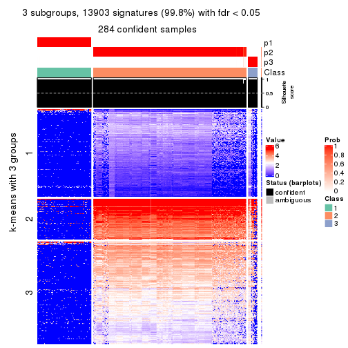</p>

</div>
<div id='tab-ATC-mclust-get-signatures-no-scale-3'>
<pre><code class="r">get_signatures(res, k = 4, scale_rows = FALSE)
</code></pre>

<p></p>

</div>
<div id='tab-ATC-mclust-get-signatures-no-scale-4'>
<pre><code class="r">get_signatures(res, k = 5, scale_rows = FALSE)
</code></pre>

<p></p>

</div>
<div id='tab-ATC-mclust-get-signatures-no-scale-5'>
<pre><code class="r">get_signatures(res, k = 6, scale_rows = FALSE)
</code></pre>

<p></p>

</div>
</div>


Compare the overlap of signatures from different k:

```r
compare_signatures(res)
```


`get_signature()` returns a data frame invisibly. TO get the list of signatures, the function
call should be assigned to a variable explicitly. In following code, if `plot` argument is set
to `FALSE`, no heatmap is plotted while only the differential analysis is performed.

```r
# code only for demonstration
tb = get_signature(res, k = ..., plot = FALSE)
```

An example of the output of `tb` is:

```
#>   which_row         fdr    mean_1    mean_2 scaled_mean_1 scaled_mean_2 km
#> 1        38 0.042760348  8.373488  9.131774    -0.5533452     0.5164555  1
#> 2        40 0.018707592  7.106213  8.469186    -0.6173731     0.5762149  1
#> 3        55 0.019134737 10.221463 11.207825    -0.6159697     0.5749050  1
#> 4        59 0.006059896  5.921854  7.869574    -0.6899429     0.6439467  1
#> 5        60 0.018055526  8.928898 10.211722    -0.6204761     0.5791110  1
#> 6        98 0.009384629 15.714769 14.887706     0.6635654    -0.6193277  2
...
```

The columns in `tb` are:

1. `which_row`: row indices corresponding to the input matrix.
2. `fdr`: FDR for the differential test. 
3. `mean_x`: The mean value in group x.
4. `scaled_mean_x`: The mean value in group x after rows are scaled.
5. `km`: Row groups if k-means clustering is applied to rows.


UMAP plot which shows how samples are separated.


<script>
$( function() {
	$( '#tabs-ATC-mclust-dimension-reduction' ).tabs();
} );
</script>
<div id='tabs-ATC-mclust-dimension-reduction'>
<ul>
<li><a href='#tab-ATC-mclust-dimension-reduction-1'>k = 2</a></li>
<li><a href='#tab-ATC-mclust-dimension-reduction-2'>k = 3</a></li>
<li><a href='#tab-ATC-mclust-dimension-reduction-3'>k = 4</a></li>
<li><a href='#tab-ATC-mclust-dimension-reduction-4'>k = 5</a></li>
<li><a href='#tab-ATC-mclust-dimension-reduction-5'>k = 6</a></li>
</ul>
<div id='tab-ATC-mclust-dimension-reduction-1'>
<pre><code class="r">dimension_reduction(res, k = 2, method = &quot;UMAP&quot;)
</code></pre>

<p></p>

</div>
<div id='tab-ATC-mclust-dimension-reduction-2'>
<pre><code class="r">dimension_reduction(res, k = 3, method = &quot;UMAP&quot;)
</code></pre>

<p></p>

</div>
<div id='tab-ATC-mclust-dimension-reduction-3'>
<pre><code class="r">dimension_reduction(res, k = 4, method = &quot;UMAP&quot;)
</code></pre>

<p></p>

</div>
<div id='tab-ATC-mclust-dimension-reduction-4'>
<pre><code class="r">dimension_reduction(res, k = 5, method = &quot;UMAP&quot;)
</code></pre>

<p></p>

</div>
<div id='tab-ATC-mclust-dimension-reduction-5'>
<pre><code class="r">dimension_reduction(res, k = 6, method = &quot;UMAP&quot;)
</code></pre>

<p></p>

</div>
</div>


Following heatmap shows how subgroups are split when increasing `k`:

```r
collect_classes(res)
```


If matrix rows can be associated to genes, consider to use `GO_Enrichment(res,
...)` to perform function enrichment for the signature genes.


 

---------------------------------------------------


### ATC:NMF


The object with results only for a single top-value method and a single partition method 
can be extracted as:

```r
res = res_list["ATC", "NMF"]
# you can also extract it by
# res = res_list["ATC:NMF"]
```

A summary of `res` and all the functions that can be applied to it:

```r
res
```

```
#> A 'ConsensusPartition' object with k = 2, 3, 4, 5, 6.
#>   On a matrix with 13930 rows and 285 columns.
#>   Top rows (1000, 2000, 3000, 4000, 5000) are extracted by 'ATC' method.
#>   Subgroups are detected by 'NMF' method.
#>   Performed in total 1250 partitions by row resampling.
#>   Best k for subgroups seems to be 2.
#> 
#> Following methods can be applied to this 'ConsensusPartition' object:
#>  [1] "cola_report"             "collect_classes"         "collect_plots"          
#>  [4] "collect_stats"           "colnames"                "compare_signatures"     
#>  [7] "consensus_heatmap"       "dimension_reduction"     "functional_enrichment"  
#> [10] "get_anno_col"            "get_anno"                "get_classes"            
#> [13] "get_consensus"           "get_matrix"              "get_membership"         
#> [16] "get_param"               "get_signatures"          "get_stats"              
#> [19] "is_best_k"               "is_stable_k"             "membership_heatmap"     
#> [22] "ncol"                    "nrow"                    "plot_ecdf"              
#> [25] "rownames"                "select_partition_number" "show"                   
#> [28] "suggest_best_k"          "test_to_known_factors"
```

`collect_plots()` function collects all the plots made from `res` for all `k` (number of partitions)
into one single page to provide an easy and fast comparison between different `k`.

```r
collect_plots(res)
```

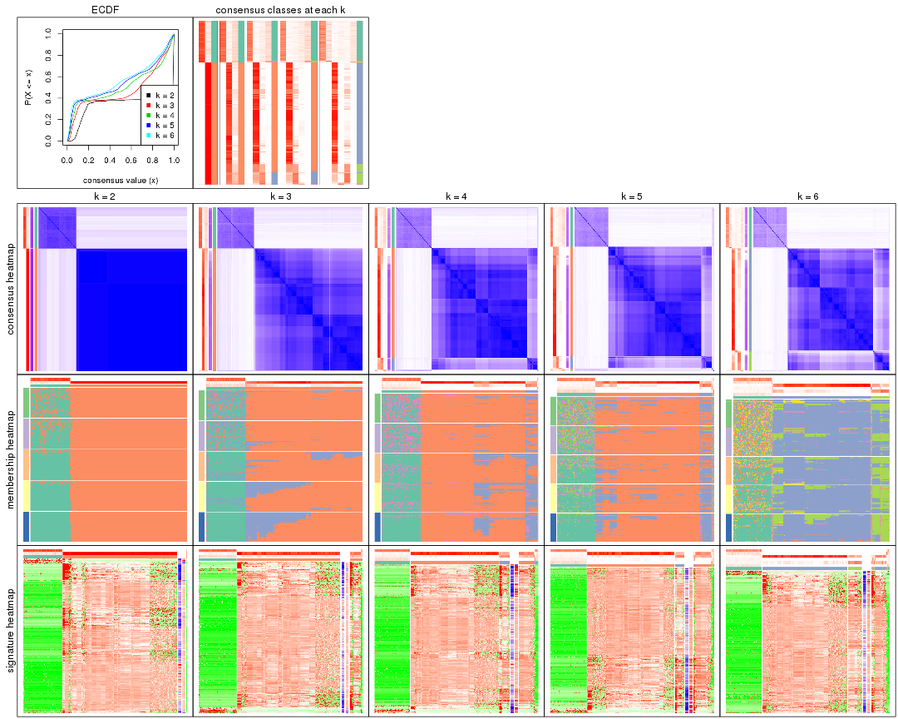

The plots are:

- The first row: a plot of the ECDF (Empirical cumulative distribution
  function) curves of the consensus matrix for each `k` and the heatmap of
  predicted classes for each `k`.
- The second row: heatmaps of the consensus matrix for each `k`.
- The third row: heatmaps of the membership matrix for each `k`.
- The fouth row: heatmaps of the signatures for each `k`.

All the plots in panels can be made by individual functions and they are
plotted later in this section.

`select_partition_number()` produces several plots showing different
statistics for choosing "optimized" `k`. There are following statistics:

- ECDF curves of the consensus matrix for each `k`;
- 1-PAC. [The PAC
  score](https://en.wikipedia.org/wiki/Consensus_clustering#Over-interpretation_potential_of_consensus_clustering)
  measures the proportion of the ambiguous subgrouping.
- Mean silhouette score.
- Concordance. The mean probability of fiting the consensus class ids in all
  partitions.
- Area increased. Denote $A_k$ as the area under the ECDF curve for current
  `k`, the area increased is defined as $A_k - A_{k-1}$.
- Rand index. The percent of pairs of samples that are both in a same cluster
  or both are not in a same cluster in the partition of k and k-1.
- Jaccard index. The ratio of pairs of samples are both in a same cluster in
  the partition of k and k-1 and the pairs of samples are both in a same
  cluster in the partition k or k-1.

The detailed explanations of these statistics can be found in [the cola
vignette](http://bioconductor.org/packages/devel/bioc/vignettes/cola/inst/doc/cola.html#toc_13).

Generally speaking, lower PAC score, higher mean silhouette score or higher
concordance corresponds to better partition. Rand index and Jaccard index
measure how similar the current partition is compared to partition with `k-1`.
If they are too similar, we won't accept `k` is better than `k-1`.

```r
select_partition_number(res)
```


The numeric values for all these statistics can be obtained by `get_stats()`.

```r
get_stats(res)
```

```
#>   k 1-PAC mean_silhouette concordance area_increased  Rand Jaccard
#> 2 2 0.707           0.973       0.962         0.3422 0.621   0.621
#> 3 3 0.534           0.734       0.831         0.3784 0.995   0.992
#> 4 4 0.635           0.671       0.813         0.0769 0.896   0.831
#> 5 5 0.580           0.653       0.779         0.0720 0.991   0.982
#> 6 6 0.550           0.635       0.755         0.0388 0.930   0.865
```

`suggest_best_k()` suggests the best $k$ based on these statistics. The rules are as follows:

- All $k$ with Jaccard index larger than 0.95 are removed because the increase of
  the partition number does not provides enough extra information. If all $k$ are removed,
  the best $k$ is assigned by `NA`.
- For $k$ with 1-PAC larger than 0.9, the maximal $k$ is taken as the "best k". Other $k$ is called "optional k".
- If it does not fit the second rule. The $k$ with the highest vote of highest
  1-PAC, mean silhouette and concordance is taken as the "best k".

```r
suggest_best_k(res)
```

```
#> [1] 2
```


Following shows the table of the partitions (You need to click the **show/hide
code output** link to see it). The membership matrix (columns with name `p*`)
is inferred by
[`clue::cl_consensus()`](https://www.rdocumentation.org/link/cl_consensus?package=clue)
function with the `SE` method. Basically the value in the membership matrix
represents the probability to belong to a certain group. The finall class
label for an item is determined with the group with highest probability it
belongs to.

In `get_classes()` function, the entropy is calculated from the membership
matrix and the silhouette score is calculated from the consensus matrix.


<script>
$( function() {
	$( '#tabs-ATC-NMF-get-classes' ).tabs();
} );
</script>
<div id='tabs-ATC-NMF-get-classes'>
<ul>
<li><a href='#tab-ATC-NMF-get-classes-1'>k = 2</a></li>
<li><a href='#tab-ATC-NMF-get-classes-2'>k = 3</a></li>
<li><a href='#tab-ATC-NMF-get-classes-3'>k = 4</a></li>
<li><a href='#tab-ATC-NMF-get-classes-4'>k = 5</a></li>
<li><a href='#tab-ATC-NMF-get-classes-5'>k = 6</a></li>
</ul>

<div id='tab-ATC-NMF-get-classes-1'>
<p><a id='tab-ATC-NMF-get-classes-1-a' style='color:#0366d6' href='#'>show/hide code output</a></p>
<pre><code class="r">cbind(get_classes(res, k = 2), get_membership(res, k = 2))
</code></pre>

<pre><code>#&gt;            class entropy silhouette    p1    p2
#&gt; SRR1201591     2  0.0000      0.996 0.000 1.000
#&gt; SRR1201590     2  0.0000      0.996 0.000 1.000
#&gt; SRR1201593     2  0.0376      0.993 0.004 0.996
#&gt; SRR1201592     2  0.0376      0.993 0.004 0.996
#&gt; SRR1201617     2  0.0376      0.993 0.004 0.996
#&gt; SRR1201616     2  0.0000      0.996 0.000 1.000
#&gt; SRR1201619     2  0.0000      0.996 0.000 1.000
#&gt; SRR1201618     2  0.0000      0.996 0.000 1.000
#&gt; SRR1201620     2  0.0376      0.993 0.004 0.996
#&gt; SRR1201621     2  0.0376      0.993 0.004 0.996
#&gt; SRR1201623     2  0.0000      0.996 0.000 1.000
#&gt; SRR1201622     2  0.0000      0.996 0.000 1.000
#&gt; SRR1201624     2  0.0376      0.992 0.004 0.996
#&gt; SRR1201625     2  0.0000      0.996 0.000 1.000
#&gt; SRR1201626     2  0.1633      0.972 0.024 0.976
#&gt; SRR1201627     2  0.0000      0.996 0.000 1.000
#&gt; SRR1201628     2  0.0000      0.996 0.000 1.000
#&gt; SRR1201629     2  0.0000      0.996 0.000 1.000
#&gt; SRR1201630     2  0.0376      0.993 0.004 0.996
#&gt; SRR1201631     2  0.0000      0.996 0.000 1.000
#&gt; SRR1201641     2  0.0000      0.996 0.000 1.000
#&gt; SRR1201640     2  0.0000      0.996 0.000 1.000
#&gt; SRR1201643     2  0.0000      0.996 0.000 1.000
#&gt; SRR1201644     2  0.0000      0.996 0.000 1.000
#&gt; SRR1201661     2  0.0376      0.993 0.004 0.996
#&gt; SRR1201662     2  0.0376      0.993 0.004 0.996
#&gt; SRR1201663     2  0.0000      0.996 0.000 1.000
#&gt; SRR1201664     2  0.0000      0.996 0.000 1.000
#&gt; SRR1201665     2  0.0000      0.996 0.000 1.000
#&gt; SRR1201666     2  0.0000      0.996 0.000 1.000
#&gt; SRR1201667     2  0.0000      0.996 0.000 1.000
#&gt; SRR1201668     2  0.0000      0.996 0.000 1.000
#&gt; SRR1201670     2  0.0000      0.996 0.000 1.000
#&gt; SRR1201669     2  0.0000      0.996 0.000 1.000
#&gt; SRR1201673     2  0.0000      0.996 0.000 1.000
#&gt; SRR1201672     2  0.0000      0.996 0.000 1.000
#&gt; SRR1201671     2  0.0000      0.996 0.000 1.000
#&gt; SRR1201677     2  0.0000      0.996 0.000 1.000
#&gt; SRR1201676     2  0.0000      0.996 0.000 1.000
#&gt; SRR1201675     2  0.0000      0.996 0.000 1.000
#&gt; SRR1201674     2  0.0000      0.996 0.000 1.000
#&gt; SRR1201678     2  0.0000      0.996 0.000 1.000
#&gt; SRR1201682     2  0.0000      0.996 0.000 1.000
#&gt; SRR1201683     2  0.0000      0.996 0.000 1.000
#&gt; SRR1201680     2  0.0000      0.996 0.000 1.000
#&gt; SRR1201681     2  0.0000      0.996 0.000 1.000
#&gt; SRR1201679     2  0.0376      0.993 0.004 0.996
#&gt; SRR1201686     2  0.0000      0.996 0.000 1.000
#&gt; SRR1201687     2  0.0000      0.996 0.000 1.000
#&gt; SRR1201688     2  0.0000      0.996 0.000 1.000
#&gt; SRR1201689     2  0.0000      0.996 0.000 1.000
#&gt; SRR1201685     2  0.0376      0.992 0.004 0.996
#&gt; SRR1201692     2  0.0000      0.996 0.000 1.000
#&gt; SRR1201691     2  0.0000      0.996 0.000 1.000
#&gt; SRR1201690     2  0.0000      0.996 0.000 1.000
#&gt; SRR1201696     2  0.0000      0.996 0.000 1.000
#&gt; SRR1201695     2  0.0000      0.996 0.000 1.000
#&gt; SRR1201694     2  0.0000      0.996 0.000 1.000
#&gt; SRR1201693     2  0.0000      0.996 0.000 1.000
#&gt; SRR1201697     2  0.0000      0.996 0.000 1.000
#&gt; SRR1201698     2  0.0000      0.996 0.000 1.000
#&gt; SRR1201700     2  0.0000      0.996 0.000 1.000
#&gt; SRR1201708     2  0.0000      0.996 0.000 1.000
#&gt; SRR1201707     2  0.0000      0.996 0.000 1.000
#&gt; SRR1201706     2  0.0000      0.996 0.000 1.000
#&gt; SRR1201702     2  0.0000      0.996 0.000 1.000
#&gt; SRR1201705     2  0.0000      0.996 0.000 1.000
#&gt; SRR1201701     2  0.0000      0.996 0.000 1.000
#&gt; SRR1201704     2  0.0000      0.996 0.000 1.000
#&gt; SRR1201703     2  0.0000      0.996 0.000 1.000
#&gt; SRR1201716     2  0.0000      0.996 0.000 1.000
#&gt; SRR1201715     2  0.0000      0.996 0.000 1.000
#&gt; SRR1201717     2  0.0000      0.996 0.000 1.000
#&gt; SRR1201712     2  0.0000      0.996 0.000 1.000
#&gt; SRR1201709     2  0.0000      0.996 0.000 1.000
#&gt; SRR1201711     2  0.0000      0.996 0.000 1.000
#&gt; SRR1201714     2  0.0000      0.996 0.000 1.000
#&gt; SRR1201713     2  0.0000      0.996 0.000 1.000
#&gt; SRR1201710     2  0.0000      0.996 0.000 1.000
#&gt; SRR1201719     2  0.0000      0.996 0.000 1.000
#&gt; SRR1201718     2  0.0000      0.996 0.000 1.000
#&gt; SRR1201721     2  0.0000      0.996 0.000 1.000
#&gt; SRR1201720     2  0.0000      0.996 0.000 1.000
#&gt; SRR1201723     2  0.0000      0.996 0.000 1.000
#&gt; SRR1201722     2  0.0000      0.996 0.000 1.000
#&gt; SRR1201725     2  0.0000      0.996 0.000 1.000
#&gt; SRR1201724     2  0.0000      0.996 0.000 1.000
#&gt; SRR1201726     2  0.0000      0.996 0.000 1.000
#&gt; SRR1201727     2  0.0000      0.996 0.000 1.000
#&gt; SRR1201731     2  0.0000      0.996 0.000 1.000
#&gt; SRR1201730     2  0.0000      0.996 0.000 1.000
#&gt; SRR1201734     2  0.0376      0.993 0.004 0.996
#&gt; SRR1201733     2  0.0376      0.993 0.004 0.996
#&gt; SRR1201736     2  0.0000      0.996 0.000 1.000
#&gt; SRR1201737     2  0.0000      0.996 0.000 1.000
#&gt; SRR1201739     2  0.0000      0.996 0.000 1.000
#&gt; SRR1201738     2  0.0000      0.996 0.000 1.000
#&gt; SRR1201742     2  0.0000      0.996 0.000 1.000
#&gt; SRR1201743     2  0.0000      0.996 0.000 1.000
#&gt; SRR1201745     2  0.0938      0.986 0.012 0.988
#&gt; SRR1201744     2  0.1414      0.978 0.020 0.980
#&gt; SRR1201749     2  0.0000      0.996 0.000 1.000
#&gt; SRR1201750     2  0.0000      0.996 0.000 1.000
#&gt; SRR1201752     2  0.0000      0.996 0.000 1.000
#&gt; SRR1201751     2  0.0000      0.996 0.000 1.000
#&gt; SRR1201754     2  0.0376      0.993 0.004 0.996
#&gt; SRR1201753     2  0.0376      0.993 0.004 0.996
#&gt; SRR1201758     2  0.1843      0.967 0.028 0.972
#&gt; SRR1201759     2  0.0000      0.996 0.000 1.000
#&gt; SRR1201760     2  0.0000      0.996 0.000 1.000
#&gt; SRR1201761     2  0.0000      0.996 0.000 1.000
#&gt; SRR1201763     2  0.0000      0.996 0.000 1.000
#&gt; SRR1201762     2  0.1633      0.972 0.024 0.976
#&gt; SRR1201764     2  0.0000      0.996 0.000 1.000
#&gt; SRR1201766     2  0.0376      0.993 0.004 0.996
#&gt; SRR1201768     2  0.0000      0.996 0.000 1.000
#&gt; SRR1201769     2  0.0000      0.996 0.000 1.000
#&gt; SRR1201767     2  0.0000      0.996 0.000 1.000
#&gt; SRR1201770     2  0.0000      0.996 0.000 1.000
#&gt; SRR1201771     2  0.0000      0.996 0.000 1.000
#&gt; SRR1201772     2  0.0000      0.996 0.000 1.000
#&gt; SRR1201773     2  0.0000      0.996 0.000 1.000
#&gt; SRR1201774     2  0.0000      0.996 0.000 1.000
#&gt; SRR1201786     2  0.0000      0.996 0.000 1.000
#&gt; SRR1201784     2  0.0000      0.996 0.000 1.000
#&gt; SRR1201785     2  0.0000      0.996 0.000 1.000
#&gt; SRR1201778     2  0.0000      0.996 0.000 1.000
#&gt; SRR1201779     2  0.0000      0.996 0.000 1.000
#&gt; SRR1201781     2  0.0000      0.996 0.000 1.000
#&gt; SRR1201780     2  0.0000      0.996 0.000 1.000
#&gt; SRR1201783     2  0.0000      0.996 0.000 1.000
#&gt; SRR1201782     2  0.0000      0.996 0.000 1.000
#&gt; SRR1201798     2  0.0376      0.993 0.004 0.996
#&gt; SRR1201797     2  0.0376      0.993 0.004 0.996
#&gt; SRR1201796     2  0.0376      0.993 0.004 0.996
#&gt; SRR1201795     2  0.0376      0.993 0.004 0.996
#&gt; SRR1201799     2  0.0376      0.993 0.004 0.996
#&gt; SRR1201794     2  0.0376      0.993 0.004 0.996
#&gt; SRR1201793     2  0.0376      0.993 0.004 0.996
#&gt; SRR1201792     2  0.0376      0.993 0.004 0.996
#&gt; SRR1201791     2  0.0000      0.996 0.000 1.000
#&gt; SRR1201807     2  0.0376      0.993 0.004 0.996
#&gt; SRR1201808     2  0.0376      0.993 0.004 0.996
#&gt; SRR1201803     2  0.0376      0.993 0.004 0.996
#&gt; SRR1201804     2  0.0376      0.993 0.004 0.996
#&gt; SRR1201805     2  0.0376      0.993 0.004 0.996
#&gt; SRR1201806     2  0.0376      0.993 0.004 0.996
#&gt; SRR1201801     2  0.0376      0.993 0.004 0.996
#&gt; SRR1201802     2  0.0376      0.993 0.004 0.996
#&gt; SRR1201800     2  0.0376      0.993 0.004 0.996
#&gt; SRR1201814     2  0.0376      0.993 0.004 0.996
#&gt; SRR1201816     2  0.0376      0.993 0.004 0.996
#&gt; SRR1201815     2  0.0376      0.993 0.004 0.996
#&gt; SRR1201819     2  0.0376      0.993 0.004 0.996
#&gt; SRR1201820     2  0.0376      0.993 0.004 0.996
#&gt; SRR1201813     2  0.0376      0.993 0.004 0.996
#&gt; SRR1201817     2  0.0376      0.993 0.004 0.996
#&gt; SRR1201818     2  0.0376      0.993 0.004 0.996
#&gt; SRR1201825     2  0.0000      0.996 0.000 1.000
#&gt; SRR1201827     2  0.0000      0.996 0.000 1.000
#&gt; SRR1201828     2  0.0000      0.996 0.000 1.000
#&gt; SRR1201826     2  0.0376      0.993 0.004 0.996
#&gt; SRR1201829     2  0.0000      0.996 0.000 1.000
#&gt; SRR1201830     2  0.0000      0.996 0.000 1.000
#&gt; SRR1201831     2  0.0000      0.996 0.000 1.000
#&gt; SRR1201832     2  0.0000      0.996 0.000 1.000
#&gt; SRR1201833     2  0.0000      0.996 0.000 1.000
#&gt; SRR1201865     2  0.0000      0.996 0.000 1.000
#&gt; SRR1201866     2  0.0000      0.996 0.000 1.000
#&gt; SRR1201867     2  0.0000      0.996 0.000 1.000
#&gt; SRR1201861     2  0.0000      0.996 0.000 1.000
#&gt; SRR1201862     2  0.0000      0.996 0.000 1.000
#&gt; SRR1201863     2  0.0000      0.996 0.000 1.000
#&gt; SRR1201859     2  0.0376      0.993 0.004 0.996
#&gt; SRR1201864     2  0.0000      0.996 0.000 1.000
#&gt; SRR1201860     2  0.0000      0.996 0.000 1.000
#&gt; SRR1201873     2  0.0000      0.996 0.000 1.000
#&gt; SRR1201871     2  0.0000      0.996 0.000 1.000
#&gt; SRR1201872     2  0.0000      0.996 0.000 1.000
#&gt; SRR1201980     2  0.0000      0.996 0.000 1.000
#&gt; SRR1201979     2  0.0000      0.996 0.000 1.000
#&gt; SRR1201982     2  0.0000      0.996 0.000 1.000
#&gt; SRR1201981     2  0.0000      0.996 0.000 1.000
#&gt; SRR1201998     2  0.0000      0.996 0.000 1.000
#&gt; SRR1201996     2  0.0000      0.996 0.000 1.000
#&gt; SRR1201997     2  0.0000      0.996 0.000 1.000
#&gt; SRR1202005     2  0.0376      0.993 0.004 0.996
#&gt; SRR1202006     2  0.0376      0.993 0.004 0.996
#&gt; SRR1202088     2  0.0000      0.996 0.000 1.000
#&gt; SRR1202087     2  0.0000      0.996 0.000 1.000
#&gt; SRR1202093     2  0.0000      0.996 0.000 1.000
#&gt; SRR1202092     2  0.0000      0.996 0.000 1.000
#&gt; SRR1202288     2  0.0000      0.996 0.000 1.000
#&gt; SRR1202289     2  0.0376      0.993 0.004 0.996
#&gt; SRR1202299     2  0.0376      0.993 0.004 0.996
#&gt; SRR1202298     2  0.0376      0.993 0.004 0.996
#&gt; SRR1202303     2  0.0000      0.996 0.000 1.000
#&gt; SRR1202372     2  0.0376      0.993 0.004 0.996
#&gt; SRR1202371     2  0.0376      0.993 0.004 0.996
#&gt; SRR1202563     2  0.0000      0.996 0.000 1.000
#&gt; SRR1202565     2  0.0000      0.996 0.000 1.000
#&gt; SRR1202564     2  0.0376      0.993 0.004 0.996
#&gt; SRR1202649     2  0.0376      0.993 0.004 0.996
#&gt; SRR1202650     2  0.0000      0.996 0.000 1.000
#&gt; SRR1202651     2  0.0376      0.993 0.004 0.996
#&gt; SRR1202843     1  0.8016      0.853 0.756 0.244
#&gt; SRR1202844     1  0.6801      0.917 0.820 0.180
#&gt; SRR1202845     2  0.0000      0.996 0.000 1.000
#&gt; SRR1202847     2  0.0376      0.993 0.004 0.996
#&gt; SRR1202846     2  0.0000      0.996 0.000 1.000
#&gt; SRR1202945     1  0.8016      0.853 0.756 0.244
#&gt; SRR1202949     1  0.6801      0.920 0.820 0.180
#&gt; SRR1202977     1  0.4161      0.934 0.916 0.084
#&gt; SRR1202978     1  0.4815      0.943 0.896 0.104
#&gt; SRR1202979     1  0.4815      0.943 0.896 0.104
#&gt; SRR1202990     1  0.5294      0.946 0.880 0.120
#&gt; SRR1202999     1  0.5629      0.946 0.868 0.132
#&gt; SRR1203005     1  0.5178      0.946 0.884 0.116
#&gt; SRR1203006     1  0.6247      0.941 0.844 0.156
#&gt; SRR1203007     1  0.5408      0.946 0.876 0.124
#&gt; SRR1203009     1  0.9460      0.614 0.636 0.364
#&gt; SRR1203008     2  0.9963     -0.114 0.464 0.536
#&gt; SRR1203010     1  0.6973      0.918 0.812 0.188
#&gt; SRR1203011     1  0.4431      0.939 0.908 0.092
#&gt; SRR1203025     1  0.5737      0.946 0.864 0.136
#&gt; SRR1203026     1  0.5519      0.946 0.872 0.128
#&gt; SRR1203027     1  0.5059      0.945 0.888 0.112
#&gt; SRR1203061     1  0.4562      0.940 0.904 0.096
#&gt; SRR1203089     1  0.5178      0.945 0.884 0.116
#&gt; SRR1203125     1  0.5842      0.945 0.860 0.140
#&gt; SRR1203128     1  0.6623      0.929 0.828 0.172
#&gt; SRR1203129     1  0.7602      0.885 0.780 0.220
#&gt; SRR1203130     1  0.7376      0.894 0.792 0.208
#&gt; SRR1203132     2  0.0000      0.996 0.000 1.000
#&gt; SRR1203131     2  0.0000      0.996 0.000 1.000
#&gt; SRR1203133     1  0.4298      0.936 0.912 0.088
#&gt; SRR1203138     1  0.7056      0.915 0.808 0.192
#&gt; SRR1203760     1  0.5842      0.945 0.860 0.140
#&gt; SRR1203761     1  0.5059      0.945 0.888 0.112
#&gt; SRR1203770     1  0.5629      0.946 0.868 0.132
#&gt; SRR1203771     1  0.5946      0.943 0.856 0.144
#&gt; SRR1203772     1  0.6887      0.920 0.816 0.184
#&gt; SRR1203773     1  0.6048      0.943 0.852 0.148
#&gt; SRR1203774     1  0.3584      0.922 0.932 0.068
#&gt; SRR1203775     1  0.5408      0.946 0.876 0.124
#&gt; SRR1203800     1  0.4562      0.940 0.904 0.096
#&gt; SRR1203801     1  0.6048      0.942 0.852 0.148
#&gt; SRR1203802     1  0.6887      0.922 0.816 0.184
#&gt; SRR1203803     1  0.6973      0.919 0.812 0.188
#&gt; SRR1203804     1  0.4431      0.937 0.908 0.092
#&gt; SRR1203805     1  0.4431      0.938 0.908 0.092
#&gt; SRR1203806     1  0.5178      0.945 0.884 0.116
#&gt; SRR1203807     1  0.3274      0.917 0.940 0.060
#&gt; SRR1203808     1  0.4815      0.944 0.896 0.104
#&gt; SRR1203811     1  0.5294      0.946 0.880 0.120
#&gt; SRR1203812     1  0.6438      0.932 0.836 0.164
#&gt; SRR1203813     1  0.4690      0.941 0.900 0.100
#&gt; SRR1203814     1  0.5519      0.946 0.872 0.128
#&gt; SRR1203815     1  0.6247      0.941 0.844 0.156
#&gt; SRR1203816     1  0.4161      0.933 0.916 0.084
#&gt; SRR1203817     1  0.6623      0.929 0.828 0.172
#&gt; SRR1203818     1  0.6887      0.922 0.816 0.184
#&gt; SRR1203819     1  0.6623      0.931 0.828 0.172
#&gt; SRR1203822     1  0.8267      0.823 0.740 0.260
#&gt; SRR1203823     1  0.4939      0.944 0.892 0.108
#&gt; SRR1203824     1  0.4022      0.930 0.920 0.080
#&gt; SRR1203825     1  0.6438      0.934 0.836 0.164
#&gt; SRR1203826     1  0.6973      0.915 0.812 0.188
#&gt; SRR1203827     1  0.4161      0.933 0.916 0.084
#&gt; SRR1203828     1  0.4298      0.937 0.912 0.088
#&gt; SRR1203829     1  0.6438      0.935 0.836 0.164
#&gt; SRR1203830     1  0.5519      0.946 0.872 0.128
#&gt; SRR1203831     1  0.4431      0.938 0.908 0.092
#&gt; SRR1203832     1  0.6343      0.937 0.840 0.160
#&gt; SRR1203833     1  0.4022      0.932 0.920 0.080
#&gt; SRR1203834     1  0.6048      0.943 0.852 0.148
#&gt; SRR1203835     1  0.5842      0.945 0.860 0.140
#&gt; SRR1203836     1  0.3733      0.927 0.928 0.072
#&gt; SRR1203837     1  0.3274      0.918 0.940 0.060
#&gt; SRR1203838     1  0.6148      0.942 0.848 0.152
#&gt; SRR1203839     1  0.6148      0.942 0.848 0.152
#&gt; SRR1203842     1  0.2603      0.905 0.956 0.044
#&gt; SRR1203843     1  0.3879      0.928 0.924 0.076
#&gt; SRR1203845     2  0.0672      0.990 0.008 0.992
#&gt; SRR1203844     2  0.0376      0.993 0.004 0.996
</code></pre>

<script>
$('#tab-ATC-NMF-get-classes-1-a').parent().next().next().hide();
$('#tab-ATC-NMF-get-classes-1-a').click(function(){
  $('#tab-ATC-NMF-get-classes-1-a').parent().next().next().toggle();
  return(false);
});
</script>
</div>

<div id='tab-ATC-NMF-get-classes-2'>
<p><a id='tab-ATC-NMF-get-classes-2-a' style='color:#0366d6' href='#'>show/hide code output</a></p>
<pre><code class="r">cbind(get_classes(res, k = 3), get_membership(res, k = 3))
</code></pre>

<pre><code>#&gt;            class entropy silhouette    p1    p2    p3
#&gt; SRR1201591     2  0.3340     0.7812 0.000 0.880 0.120
#&gt; SRR1201590     2  0.2625     0.7948 0.000 0.916 0.084
#&gt; SRR1201593     2  0.3941     0.7520 0.000 0.844 0.156
#&gt; SRR1201592     2  0.3752     0.7641 0.000 0.856 0.144
#&gt; SRR1201617     2  0.3816     0.7603 0.000 0.852 0.148
#&gt; SRR1201616     2  0.3752     0.7638 0.000 0.856 0.144
#&gt; SRR1201619     2  0.1031     0.7980 0.000 0.976 0.024
#&gt; SRR1201618     2  0.0592     0.7954 0.000 0.988 0.012
#&gt; SRR1201620     2  0.4002     0.7476 0.000 0.840 0.160
#&gt; SRR1201621     2  0.3941     0.7524 0.000 0.844 0.156
#&gt; SRR1201623     2  0.3752     0.7036 0.000 0.856 0.144
#&gt; SRR1201622     2  0.4452     0.6449 0.000 0.808 0.192
#&gt; SRR1201624     2  0.6045     0.1745 0.000 0.620 0.380
#&gt; SRR1201625     2  0.5810     0.3315 0.000 0.664 0.336
#&gt; SRR1201626     2  0.6495    -0.1974 0.004 0.536 0.460
#&gt; SRR1201627     2  0.5835     0.3267 0.000 0.660 0.340
#&gt; SRR1201628     2  0.3038     0.7434 0.000 0.896 0.104
#&gt; SRR1201629     2  0.1643     0.7840 0.000 0.956 0.044
#&gt; SRR1201630     2  0.2625     0.7944 0.000 0.916 0.084
#&gt; SRR1201631     2  0.2711     0.7936 0.000 0.912 0.088
#&gt; SRR1201641     2  0.2356     0.7964 0.000 0.928 0.072
#&gt; SRR1201640     2  0.2066     0.7979 0.000 0.940 0.060
#&gt; SRR1201643     2  0.0747     0.7925 0.000 0.984 0.016
#&gt; SRR1201644     2  0.0237     0.7951 0.000 0.996 0.004
#&gt; SRR1201661     2  0.2959     0.7904 0.000 0.900 0.100
#&gt; SRR1201662     2  0.3551     0.7739 0.000 0.868 0.132
#&gt; SRR1201663     2  0.5465     0.4646 0.000 0.712 0.288
#&gt; SRR1201664     2  0.5397     0.4826 0.000 0.720 0.280
#&gt; SRR1201665     2  0.1529     0.7992 0.000 0.960 0.040
#&gt; SRR1201666     2  0.2711     0.7936 0.000 0.912 0.088
#&gt; SRR1201667     2  0.2711     0.7936 0.000 0.912 0.088
#&gt; SRR1201668     2  0.5560     0.4347 0.000 0.700 0.300
#&gt; SRR1201670     2  0.5465     0.4645 0.000 0.712 0.288
#&gt; SRR1201669     2  0.5465     0.4645 0.000 0.712 0.288
#&gt; SRR1201673     2  0.1753     0.7824 0.000 0.952 0.048
#&gt; SRR1201672     2  0.1753     0.7824 0.000 0.952 0.048
#&gt; SRR1201671     2  0.2711     0.7566 0.000 0.912 0.088
#&gt; SRR1201677     2  0.1860     0.7801 0.000 0.948 0.052
#&gt; SRR1201676     2  0.1964     0.7780 0.000 0.944 0.056
#&gt; SRR1201675     2  0.1860     0.7801 0.000 0.948 0.052
#&gt; SRR1201674     2  0.1753     0.7824 0.000 0.952 0.048
#&gt; SRR1201678     2  0.1753     0.7824 0.000 0.952 0.048
#&gt; SRR1201682     2  0.2711     0.7936 0.000 0.912 0.088
#&gt; SRR1201683     2  0.2711     0.7936 0.000 0.912 0.088
#&gt; SRR1201680     2  0.2625     0.7946 0.000 0.916 0.084
#&gt; SRR1201681     2  0.2625     0.7946 0.000 0.916 0.084
#&gt; SRR1201679     2  0.3038     0.7889 0.000 0.896 0.104
#&gt; SRR1201686     2  0.5465     0.4646 0.000 0.712 0.288
#&gt; SRR1201687     2  0.5465     0.4646 0.000 0.712 0.288
#&gt; SRR1201688     2  0.5465     0.4646 0.000 0.712 0.288
#&gt; SRR1201689     2  0.5465     0.4646 0.000 0.712 0.288
#&gt; SRR1201685     2  0.5650     0.4021 0.000 0.688 0.312
#&gt; SRR1201692     2  0.1643     0.7839 0.000 0.956 0.044
#&gt; SRR1201691     2  0.1753     0.7824 0.000 0.952 0.048
#&gt; SRR1201690     2  0.2711     0.7566 0.000 0.912 0.088
#&gt; SRR1201696     2  0.1753     0.7821 0.000 0.952 0.048
#&gt; SRR1201695     2  0.1753     0.7824 0.000 0.952 0.048
#&gt; SRR1201694     2  0.1753     0.7824 0.000 0.952 0.048
#&gt; SRR1201693     2  0.1643     0.7839 0.000 0.956 0.044
#&gt; SRR1201697     2  0.1753     0.7824 0.000 0.952 0.048
#&gt; SRR1201698     2  0.1411     0.7870 0.000 0.964 0.036
#&gt; SRR1201700     2  0.4121     0.6764 0.000 0.832 0.168
#&gt; SRR1201708     2  0.4121     0.6764 0.000 0.832 0.168
#&gt; SRR1201707     2  0.4121     0.6764 0.000 0.832 0.168
#&gt; SRR1201706     2  0.4121     0.6764 0.000 0.832 0.168
#&gt; SRR1201702     2  0.4062     0.6813 0.000 0.836 0.164
#&gt; SRR1201705     2  0.4062     0.6813 0.000 0.836 0.164
#&gt; SRR1201701     2  0.4121     0.6764 0.000 0.832 0.168
#&gt; SRR1201704     2  0.4121     0.6764 0.000 0.832 0.168
#&gt; SRR1201703     2  0.4121     0.6764 0.000 0.832 0.168
#&gt; SRR1201716     2  0.4605     0.6269 0.000 0.796 0.204
#&gt; SRR1201715     2  0.4702     0.6144 0.000 0.788 0.212
#&gt; SRR1201717     2  0.4654     0.6208 0.000 0.792 0.208
#&gt; SRR1201712     2  0.4750     0.6078 0.000 0.784 0.216
#&gt; SRR1201709     2  0.4796     0.6011 0.000 0.780 0.220
#&gt; SRR1201711     2  0.4702     0.6144 0.000 0.788 0.212
#&gt; SRR1201714     2  0.4654     0.6208 0.000 0.792 0.208
#&gt; SRR1201713     2  0.4654     0.6208 0.000 0.792 0.208
#&gt; SRR1201710     2  0.4654     0.6208 0.000 0.792 0.208
#&gt; SRR1201719     2  0.3192     0.7862 0.000 0.888 0.112
#&gt; SRR1201718     2  0.2625     0.7946 0.000 0.916 0.084
#&gt; SRR1201721     2  0.2878     0.7501 0.000 0.904 0.096
#&gt; SRR1201720     2  0.3752     0.7040 0.000 0.856 0.144
#&gt; SRR1201723     2  0.5497     0.4550 0.000 0.708 0.292
#&gt; SRR1201722     2  0.5560     0.4347 0.000 0.700 0.300
#&gt; SRR1201725     2  0.2711     0.7936 0.000 0.912 0.088
#&gt; SRR1201724     2  0.2796     0.7927 0.000 0.908 0.092
#&gt; SRR1201726     2  0.4974     0.5728 0.000 0.764 0.236
#&gt; SRR1201727     2  0.4291     0.6611 0.000 0.820 0.180
#&gt; SRR1201731     2  0.1860     0.7805 0.000 0.948 0.052
#&gt; SRR1201730     2  0.2261     0.7709 0.000 0.932 0.068
#&gt; SRR1201734     2  0.3116     0.7879 0.000 0.892 0.108
#&gt; SRR1201733     2  0.3116     0.7877 0.000 0.892 0.108
#&gt; SRR1201736     2  0.0892     0.7942 0.000 0.980 0.020
#&gt; SRR1201737     2  0.0000     0.7958 0.000 1.000 0.000
#&gt; SRR1201739     2  0.2625     0.7946 0.000 0.916 0.084
#&gt; SRR1201738     2  0.2165     0.7973 0.000 0.936 0.064
#&gt; SRR1201742     2  0.1289     0.7880 0.000 0.968 0.032
#&gt; SRR1201743     2  0.0747     0.7925 0.000 0.984 0.016
#&gt; SRR1201745     2  0.4233     0.7433 0.004 0.836 0.160
#&gt; SRR1201744     2  0.4409     0.7275 0.004 0.824 0.172
#&gt; SRR1201749     2  0.3116     0.7879 0.000 0.892 0.108
#&gt; SRR1201750     2  0.2878     0.7916 0.000 0.904 0.096
#&gt; SRR1201752     2  0.2066     0.7759 0.000 0.940 0.060
#&gt; SRR1201751     2  0.2356     0.7682 0.000 0.928 0.072
#&gt; SRR1201754     2  0.3816     0.7603 0.000 0.852 0.148
#&gt; SRR1201753     2  0.3879     0.7562 0.000 0.848 0.152
#&gt; SRR1201758     2  0.6330     0.0894 0.004 0.600 0.396
#&gt; SRR1201759     2  0.5948     0.2508 0.000 0.640 0.360
#&gt; SRR1201760     2  0.3267     0.7321 0.000 0.884 0.116
#&gt; SRR1201761     2  0.3482     0.7206 0.000 0.872 0.128
#&gt; SRR1201763     2  0.5650     0.4003 0.000 0.688 0.312
#&gt; SRR1201762     2  0.6432    -0.0647 0.004 0.568 0.428
#&gt; SRR1201764     2  0.2625     0.7666 0.000 0.916 0.084
#&gt; SRR1201766     2  0.3038     0.7890 0.000 0.896 0.104
#&gt; SRR1201768     2  0.3038     0.7890 0.000 0.896 0.104
#&gt; SRR1201769     2  0.3038     0.7890 0.000 0.896 0.104
#&gt; SRR1201767     2  0.3038     0.7890 0.000 0.896 0.104
#&gt; SRR1201770     2  0.3038     0.7890 0.000 0.896 0.104
#&gt; SRR1201771     2  0.3038     0.7890 0.000 0.896 0.104
#&gt; SRR1201772     2  0.3038     0.7890 0.000 0.896 0.104
#&gt; SRR1201773     2  0.3038     0.7890 0.000 0.896 0.104
#&gt; SRR1201774     2  0.3038     0.7890 0.000 0.896 0.104
#&gt; SRR1201786     2  0.3116     0.7872 0.000 0.892 0.108
#&gt; SRR1201784     2  0.3116     0.7872 0.000 0.892 0.108
#&gt; SRR1201785     2  0.3192     0.7849 0.000 0.888 0.112
#&gt; SRR1201778     2  0.3340     0.7806 0.000 0.880 0.120
#&gt; SRR1201779     2  0.3116     0.7872 0.000 0.892 0.108
#&gt; SRR1201781     2  0.3116     0.7872 0.000 0.892 0.108
#&gt; SRR1201780     2  0.3116     0.7872 0.000 0.892 0.108
#&gt; SRR1201783     2  0.3267     0.7829 0.000 0.884 0.116
#&gt; SRR1201782     2  0.3267     0.7829 0.000 0.884 0.116
#&gt; SRR1201798     2  0.3619     0.7701 0.000 0.864 0.136
#&gt; SRR1201797     2  0.3551     0.7730 0.000 0.868 0.132
#&gt; SRR1201796     2  0.3551     0.7730 0.000 0.868 0.132
#&gt; SRR1201795     2  0.3619     0.7701 0.000 0.864 0.136
#&gt; SRR1201799     2  0.3619     0.7701 0.000 0.864 0.136
#&gt; SRR1201794     2  0.3619     0.7701 0.000 0.864 0.136
#&gt; SRR1201793     2  0.3551     0.7730 0.000 0.868 0.132
#&gt; SRR1201792     2  0.3482     0.7756 0.000 0.872 0.128
#&gt; SRR1201791     2  0.3340     0.7807 0.000 0.880 0.120
#&gt; SRR1201807     2  0.4062     0.7430 0.000 0.836 0.164
#&gt; SRR1201808     2  0.4062     0.7430 0.000 0.836 0.164
#&gt; SRR1201803     2  0.4062     0.7430 0.000 0.836 0.164
#&gt; SRR1201804     2  0.4062     0.7430 0.000 0.836 0.164
#&gt; SRR1201805     2  0.4062     0.7430 0.000 0.836 0.164
#&gt; SRR1201806     2  0.4062     0.7430 0.000 0.836 0.164
#&gt; SRR1201801     2  0.4062     0.7430 0.000 0.836 0.164
#&gt; SRR1201802     2  0.4062     0.7430 0.000 0.836 0.164
#&gt; SRR1201800     2  0.3941     0.7520 0.000 0.844 0.156
#&gt; SRR1201814     2  0.3752     0.7640 0.000 0.856 0.144
#&gt; SRR1201816     2  0.3752     0.7640 0.000 0.856 0.144
#&gt; SRR1201815     2  0.3752     0.7640 0.000 0.856 0.144
#&gt; SRR1201819     2  0.3752     0.7640 0.000 0.856 0.144
#&gt; SRR1201820     2  0.3752     0.7640 0.000 0.856 0.144
#&gt; SRR1201813     2  0.3752     0.7640 0.000 0.856 0.144
#&gt; SRR1201817     2  0.3752     0.7640 0.000 0.856 0.144
#&gt; SRR1201818     2  0.3752     0.7640 0.000 0.856 0.144
#&gt; SRR1201825     2  0.4654     0.6218 0.000 0.792 0.208
#&gt; SRR1201827     2  0.0000     0.7958 0.000 1.000 0.000
#&gt; SRR1201828     2  0.0000     0.7958 0.000 1.000 0.000
#&gt; SRR1201826     2  0.0424     0.7943 0.000 0.992 0.008
#&gt; SRR1201829     2  0.0000     0.7958 0.000 1.000 0.000
#&gt; SRR1201830     2  0.0237     0.7963 0.000 0.996 0.004
#&gt; SRR1201831     2  0.0000     0.7958 0.000 1.000 0.000
#&gt; SRR1201832     2  0.0000     0.7958 0.000 1.000 0.000
#&gt; SRR1201833     2  0.0000     0.7958 0.000 1.000 0.000
#&gt; SRR1201865     2  0.1529     0.7856 0.000 0.960 0.040
#&gt; SRR1201866     2  0.1529     0.7856 0.000 0.960 0.040
#&gt; SRR1201867     2  0.1529     0.7856 0.000 0.960 0.040
#&gt; SRR1201861     2  0.1529     0.7856 0.000 0.960 0.040
#&gt; SRR1201862     2  0.1529     0.7856 0.000 0.960 0.040
#&gt; SRR1201863     2  0.1529     0.7856 0.000 0.960 0.040
#&gt; SRR1201859     2  0.2261     0.7725 0.000 0.932 0.068
#&gt; SRR1201864     2  0.1529     0.7856 0.000 0.960 0.040
#&gt; SRR1201860     2  0.1529     0.7856 0.000 0.960 0.040
#&gt; SRR1201873     2  0.4121     0.6763 0.000 0.832 0.168
#&gt; SRR1201871     2  0.4452     0.6446 0.000 0.808 0.192
#&gt; SRR1201872     2  0.3879     0.6947 0.000 0.848 0.152
#&gt; SRR1201980     2  0.2066     0.7759 0.000 0.940 0.060
#&gt; SRR1201979     2  0.2796     0.7538 0.000 0.908 0.092
#&gt; SRR1201982     2  0.1643     0.7877 0.000 0.956 0.044
#&gt; SRR1201981     2  0.1964     0.7781 0.000 0.944 0.056
#&gt; SRR1201998     2  0.1411     0.7985 0.000 0.964 0.036
#&gt; SRR1201996     2  0.0892     0.7978 0.000 0.980 0.020
#&gt; SRR1201997     2  0.2448     0.7959 0.000 0.924 0.076
#&gt; SRR1202005     2  0.3686     0.7672 0.000 0.860 0.140
#&gt; SRR1202006     2  0.3879     0.7566 0.000 0.848 0.152
#&gt; SRR1202088     2  0.4178     0.6714 0.000 0.828 0.172
#&gt; SRR1202087     2  0.4887     0.5873 0.000 0.772 0.228
#&gt; SRR1202093     2  0.0747     0.7925 0.000 0.984 0.016
#&gt; SRR1202092     2  0.1860     0.7801 0.000 0.948 0.052
#&gt; SRR1202288     2  0.3551     0.7733 0.000 0.868 0.132
#&gt; SRR1202289     2  0.3816     0.7603 0.000 0.852 0.148
#&gt; SRR1202299     2  0.3941     0.7520 0.000 0.844 0.156
#&gt; SRR1202298     2  0.3816     0.7601 0.000 0.852 0.148
#&gt; SRR1202303     2  0.5497     0.4642 0.000 0.708 0.292
#&gt; SRR1202372     2  0.3686     0.7672 0.000 0.860 0.140
#&gt; SRR1202371     2  0.3983     0.7610 0.004 0.852 0.144
#&gt; SRR1202563     2  0.2959     0.7910 0.000 0.900 0.100
#&gt; SRR1202565     2  0.2537     0.7953 0.000 0.920 0.080
#&gt; SRR1202564     2  0.2625     0.7946 0.000 0.916 0.084
#&gt; SRR1202649     2  0.0892     0.7961 0.000 0.980 0.020
#&gt; SRR1202650     2  0.1163     0.7982 0.000 0.972 0.028
#&gt; SRR1202651     2  0.3686     0.7672 0.000 0.860 0.140
#&gt; SRR1202843     1  0.8213     0.6610 0.632 0.140 0.228
#&gt; SRR1202844     1  0.7058     0.7916 0.720 0.100 0.180
#&gt; SRR1202845     2  0.3267     0.7842 0.000 0.884 0.116
#&gt; SRR1202847     2  0.3551     0.7734 0.000 0.868 0.132
#&gt; SRR1202846     2  0.3551     0.7734 0.000 0.868 0.132
#&gt; SRR1202945     1  0.8067     0.5935 0.652 0.160 0.188
#&gt; SRR1202949     1  0.7180     0.8088 0.700 0.084 0.216
#&gt; SRR1202977     1  0.5719     0.8493 0.792 0.052 0.156
#&gt; SRR1202978     1  0.6007     0.8473 0.768 0.048 0.184
#&gt; SRR1202979     1  0.5756     0.8277 0.764 0.028 0.208
#&gt; SRR1202990     1  0.6685     0.8245 0.708 0.048 0.244
#&gt; SRR1202999     1  0.5407     0.8407 0.804 0.040 0.156
#&gt; SRR1203005     1  0.6158     0.8486 0.760 0.052 0.188
#&gt; SRR1203006     1  0.6875     0.8302 0.724 0.080 0.196
#&gt; SRR1203007     1  0.5696     0.8505 0.800 0.064 0.136
#&gt; SRR1203009     1  0.9529    -0.1532 0.448 0.196 0.356
#&gt; SRR1203008     3  0.9967     0.0000 0.304 0.324 0.372
#&gt; SRR1203010     1  0.7642     0.7694 0.660 0.092 0.248
#&gt; SRR1203011     1  0.5631     0.8477 0.792 0.044 0.164
#&gt; SRR1203025     1  0.5407     0.8435 0.804 0.040 0.156
#&gt; SRR1203026     1  0.5581     0.8436 0.792 0.040 0.168
#&gt; SRR1203027     1  0.5688     0.8444 0.788 0.044 0.168
#&gt; SRR1203061     1  0.5850     0.8462 0.772 0.040 0.188
#&gt; SRR1203089     1  0.6491     0.8408 0.732 0.052 0.216
#&gt; SRR1203125     1  0.6388     0.8448 0.752 0.064 0.184
#&gt; SRR1203128     1  0.7165     0.7762 0.716 0.112 0.172
#&gt; SRR1203129     1  0.7830     0.7083 0.668 0.136 0.196
#&gt; SRR1203130     1  0.7391     0.7720 0.696 0.108 0.196
#&gt; SRR1203132     2  0.2066     0.7759 0.000 0.940 0.060
#&gt; SRR1203131     2  0.2796     0.7534 0.000 0.908 0.092
#&gt; SRR1203133     1  0.5036     0.8451 0.832 0.048 0.120
#&gt; SRR1203138     1  0.7412     0.7403 0.700 0.124 0.176
#&gt; SRR1203760     1  0.6632     0.8392 0.732 0.064 0.204
#&gt; SRR1203761     1  0.6239     0.8426 0.768 0.072 0.160
#&gt; SRR1203770     1  0.7263     0.8247 0.692 0.084 0.224
#&gt; SRR1203771     1  0.7437     0.7866 0.692 0.108 0.200
#&gt; SRR1203772     1  0.7180     0.8131 0.708 0.096 0.196
#&gt; SRR1203773     1  0.6159     0.8483 0.756 0.048 0.196
#&gt; SRR1203774     1  0.5285     0.8437 0.812 0.040 0.148
#&gt; SRR1203775     1  0.6537     0.8420 0.740 0.064 0.196
#&gt; SRR1203800     1  0.4931     0.8327 0.828 0.032 0.140
#&gt; SRR1203801     1  0.6646     0.8266 0.740 0.076 0.184
#&gt; SRR1203802     1  0.6895     0.8412 0.716 0.072 0.212
#&gt; SRR1203803     1  0.7157     0.8085 0.712 0.100 0.188
#&gt; SRR1203804     1  0.5236     0.8337 0.804 0.028 0.168
#&gt; SRR1203805     1  0.5467     0.8378 0.792 0.032 0.176
#&gt; SRR1203806     1  0.6201     0.8435 0.748 0.044 0.208
#&gt; SRR1203807     1  0.5940     0.8357 0.760 0.036 0.204
#&gt; SRR1203808     1  0.5792     0.8416 0.772 0.036 0.192
#&gt; SRR1203811     1  0.6203     0.8491 0.760 0.056 0.184
#&gt; SRR1203812     1  0.7016     0.7708 0.728 0.116 0.156
#&gt; SRR1203813     1  0.5435     0.8486 0.808 0.048 0.144
#&gt; SRR1203814     1  0.6264     0.8403 0.724 0.032 0.244
#&gt; SRR1203815     1  0.6804     0.8401 0.724 0.072 0.204
#&gt; SRR1203816     1  0.5235     0.8418 0.812 0.036 0.152
#&gt; SRR1203817     1  0.6954     0.8296 0.720 0.084 0.196
#&gt; SRR1203818     1  0.7058     0.8025 0.720 0.100 0.180
#&gt; SRR1203819     1  0.6291     0.8326 0.768 0.080 0.152
#&gt; SRR1203822     1  0.9147     0.2395 0.540 0.200 0.260
#&gt; SRR1203823     1  0.5688     0.8479 0.788 0.044 0.168
#&gt; SRR1203824     1  0.4539     0.8179 0.836 0.016 0.148
#&gt; SRR1203825     1  0.7169     0.8117 0.704 0.088 0.208
#&gt; SRR1203826     1  0.7059     0.8081 0.716 0.092 0.192
#&gt; SRR1203827     1  0.6422     0.7159 0.660 0.016 0.324
#&gt; SRR1203828     1  0.5803     0.8343 0.760 0.028 0.212
#&gt; SRR1203829     1  0.7413     0.7897 0.692 0.104 0.204
#&gt; SRR1203830     1  0.6875     0.8291 0.700 0.056 0.244
#&gt; SRR1203831     1  0.4602     0.8215 0.832 0.016 0.152
#&gt; SRR1203832     1  0.7330     0.7983 0.692 0.092 0.216
#&gt; SRR1203833     1  0.6067     0.8317 0.736 0.028 0.236
#&gt; SRR1203834     1  0.7031     0.8174 0.716 0.088 0.196
#&gt; SRR1203835     1  0.7085     0.8049 0.716 0.096 0.188
#&gt; SRR1203836     1  0.6719     0.8439 0.728 0.068 0.204
#&gt; SRR1203837     1  0.5467     0.8346 0.792 0.032 0.176
#&gt; SRR1203838     1  0.6447     0.8450 0.744 0.060 0.196
#&gt; SRR1203839     1  0.6463     0.8394 0.756 0.080 0.164
#&gt; SRR1203842     1  0.7013     0.6798 0.640 0.036 0.324
#&gt; SRR1203843     1  0.5633     0.8313 0.768 0.024 0.208
#&gt; SRR1203845     2  0.4002     0.7486 0.000 0.840 0.160
#&gt; SRR1203844     2  0.3879     0.7565 0.000 0.848 0.152
</code></pre>

<script>
$('#tab-ATC-NMF-get-classes-2-a').parent().next().next().hide();
$('#tab-ATC-NMF-get-classes-2-a').click(function(){
  $('#tab-ATC-NMF-get-classes-2-a').parent().next().next().toggle();
  return(false);
});
</script>
</div>

<div id='tab-ATC-NMF-get-classes-3'>
<p><a id='tab-ATC-NMF-get-classes-3-a' style='color:#0366d6' href='#'>show/hide code output</a></p>
<pre><code class="r">cbind(get_classes(res, k = 4), get_membership(res, k = 4))
</code></pre>

<pre><code>#&gt;            class entropy silhouette    p1    p2    p3    p4
#&gt; SRR1201591     2  0.1059     0.8344 0.000 0.972 0.012 0.016
#&gt; SRR1201590     2  0.0524     0.8414 0.000 0.988 0.008 0.004
#&gt; SRR1201593     2  0.1929     0.8089 0.000 0.940 0.024 0.036
#&gt; SRR1201592     2  0.1520     0.8238 0.000 0.956 0.024 0.020
#&gt; SRR1201617     2  0.1624     0.8203 0.000 0.952 0.020 0.028
#&gt; SRR1201616     2  0.1297     0.8298 0.000 0.964 0.020 0.016
#&gt; SRR1201619     2  0.1109     0.8355 0.000 0.968 0.028 0.004
#&gt; SRR1201618     2  0.1305     0.8369 0.000 0.960 0.036 0.004
#&gt; SRR1201620     2  0.1833     0.8133 0.000 0.944 0.024 0.032
#&gt; SRR1201621     2  0.2021     0.8043 0.000 0.936 0.024 0.040
#&gt; SRR1201623     2  0.4018     0.5262 0.000 0.772 0.224 0.004
#&gt; SRR1201622     2  0.5331    -0.0453 0.000 0.644 0.332 0.024
#&gt; SRR1201624     3  0.5184     0.7370 0.000 0.304 0.672 0.024
#&gt; SRR1201625     3  0.5400     0.8266 0.000 0.372 0.608 0.020
#&gt; SRR1201626     3  0.6709     0.1989 0.020 0.180 0.664 0.136
#&gt; SRR1201627     3  0.6677     0.7898 0.000 0.364 0.540 0.096
#&gt; SRR1201628     2  0.3355     0.6837 0.000 0.836 0.160 0.004
#&gt; SRR1201629     2  0.2266     0.8000 0.000 0.912 0.084 0.004
#&gt; SRR1201630     2  0.0188     0.8412 0.000 0.996 0.000 0.004
#&gt; SRR1201631     2  0.0188     0.8412 0.000 0.996 0.004 0.000
#&gt; SRR1201641     2  0.0524     0.8402 0.000 0.988 0.008 0.004
#&gt; SRR1201640     2  0.0657     0.8397 0.000 0.984 0.012 0.004
#&gt; SRR1201643     2  0.1743     0.8215 0.000 0.940 0.056 0.004
#&gt; SRR1201644     2  0.1489     0.8281 0.000 0.952 0.044 0.004
#&gt; SRR1201661     2  0.1174     0.8372 0.000 0.968 0.020 0.012
#&gt; SRR1201662     2  0.1059     0.8380 0.000 0.972 0.016 0.012
#&gt; SRR1201663     3  0.5281     0.7928 0.000 0.464 0.528 0.008
#&gt; SRR1201664     3  0.5290     0.7617 0.000 0.476 0.516 0.008
#&gt; SRR1201665     2  0.1118     0.8378 0.000 0.964 0.036 0.000
#&gt; SRR1201666     2  0.0524     0.8416 0.000 0.988 0.008 0.004
#&gt; SRR1201667     2  0.0524     0.8416 0.000 0.988 0.008 0.004
#&gt; SRR1201668     3  0.5320     0.8359 0.000 0.416 0.572 0.012
#&gt; SRR1201670     3  0.5143     0.8109 0.000 0.456 0.540 0.004
#&gt; SRR1201669     3  0.5143     0.8109 0.000 0.456 0.540 0.004
#&gt; SRR1201673     2  0.2125     0.8071 0.000 0.920 0.076 0.004
#&gt; SRR1201672     2  0.2125     0.8071 0.000 0.920 0.076 0.004
#&gt; SRR1201671     2  0.2944     0.7407 0.000 0.868 0.128 0.004
#&gt; SRR1201677     2  0.2125     0.8071 0.000 0.920 0.076 0.004
#&gt; SRR1201676     2  0.2197     0.8034 0.000 0.916 0.080 0.004
#&gt; SRR1201675     2  0.2125     0.8071 0.000 0.920 0.076 0.004
#&gt; SRR1201674     2  0.2125     0.8071 0.000 0.920 0.076 0.004
#&gt; SRR1201678     2  0.2125     0.8071 0.000 0.920 0.076 0.004
#&gt; SRR1201682     2  0.0524     0.8412 0.000 0.988 0.008 0.004
#&gt; SRR1201683     2  0.0524     0.8412 0.000 0.988 0.008 0.004
#&gt; SRR1201680     2  0.0524     0.8412 0.000 0.988 0.008 0.004
#&gt; SRR1201681     2  0.0524     0.8412 0.000 0.988 0.008 0.004
#&gt; SRR1201679     2  0.0524     0.8407 0.000 0.988 0.008 0.004
#&gt; SRR1201686     3  0.5137     0.8161 0.000 0.452 0.544 0.004
#&gt; SRR1201687     3  0.5126     0.8230 0.000 0.444 0.552 0.004
#&gt; SRR1201688     3  0.5268     0.8156 0.000 0.452 0.540 0.008
#&gt; SRR1201689     3  0.5273     0.8094 0.000 0.456 0.536 0.008
#&gt; SRR1201685     3  0.5465     0.8343 0.000 0.392 0.588 0.020
#&gt; SRR1201692     2  0.1978     0.8134 0.000 0.928 0.068 0.004
#&gt; SRR1201691     2  0.2053     0.8106 0.000 0.924 0.072 0.004
#&gt; SRR1201690     2  0.3300     0.7096 0.000 0.848 0.144 0.008
#&gt; SRR1201696     2  0.2053     0.8106 0.000 0.924 0.072 0.004
#&gt; SRR1201695     2  0.2053     0.8106 0.000 0.924 0.072 0.004
#&gt; SRR1201694     2  0.1902     0.8164 0.000 0.932 0.064 0.004
#&gt; SRR1201693     2  0.2053     0.8106 0.000 0.924 0.072 0.004
#&gt; SRR1201697     2  0.2053     0.8106 0.000 0.924 0.072 0.004
#&gt; SRR1201698     2  0.1824     0.8191 0.000 0.936 0.060 0.004
#&gt; SRR1201700     2  0.4428     0.3573 0.000 0.720 0.276 0.004
#&gt; SRR1201708     2  0.4535     0.2887 0.000 0.704 0.292 0.004
#&gt; SRR1201707     2  0.4535     0.2887 0.000 0.704 0.292 0.004
#&gt; SRR1201706     2  0.4535     0.2887 0.000 0.704 0.292 0.004
#&gt; SRR1201702     2  0.4535     0.2887 0.000 0.704 0.292 0.004
#&gt; SRR1201705     2  0.4509     0.3047 0.000 0.708 0.288 0.004
#&gt; SRR1201701     2  0.4535     0.2887 0.000 0.704 0.292 0.004
#&gt; SRR1201704     2  0.4509     0.3047 0.000 0.708 0.288 0.004
#&gt; SRR1201703     2  0.4697     0.2540 0.000 0.696 0.296 0.008
#&gt; SRR1201716     2  0.5279    -0.3326 0.000 0.588 0.400 0.012
#&gt; SRR1201715     2  0.5172    -0.3406 0.000 0.588 0.404 0.008
#&gt; SRR1201717     2  0.5172    -0.3406 0.000 0.588 0.404 0.008
#&gt; SRR1201712     2  0.5183    -0.3590 0.000 0.584 0.408 0.008
#&gt; SRR1201709     2  0.5183    -0.3581 0.000 0.584 0.408 0.008
#&gt; SRR1201711     2  0.5172    -0.3406 0.000 0.588 0.404 0.008
#&gt; SRR1201714     2  0.5279    -0.3326 0.000 0.588 0.400 0.012
#&gt; SRR1201713     2  0.5268    -0.3134 0.000 0.592 0.396 0.012
#&gt; SRR1201710     2  0.5172    -0.3406 0.000 0.588 0.404 0.008
#&gt; SRR1201719     2  0.1059     0.8380 0.000 0.972 0.016 0.012
#&gt; SRR1201718     2  0.1059     0.8415 0.000 0.972 0.016 0.012
#&gt; SRR1201721     2  0.3355     0.6834 0.000 0.836 0.160 0.004
#&gt; SRR1201720     2  0.3908     0.5618 0.000 0.784 0.212 0.004
#&gt; SRR1201723     3  0.5388     0.8119 0.000 0.456 0.532 0.012
#&gt; SRR1201722     3  0.5212     0.8350 0.000 0.420 0.572 0.008
#&gt; SRR1201725     2  0.1059     0.8416 0.000 0.972 0.016 0.012
#&gt; SRR1201724     2  0.0937     0.8420 0.000 0.976 0.012 0.012
#&gt; SRR1201726     2  0.5236    -0.4673 0.000 0.560 0.432 0.008
#&gt; SRR1201727     2  0.4722     0.2346 0.000 0.692 0.300 0.008
#&gt; SRR1201731     2  0.2466     0.7864 0.000 0.900 0.096 0.004
#&gt; SRR1201730     2  0.2401     0.7915 0.000 0.904 0.092 0.004
#&gt; SRR1201734     2  0.1182     0.8364 0.000 0.968 0.016 0.016
#&gt; SRR1201733     2  0.1059     0.8385 0.000 0.972 0.012 0.016
#&gt; SRR1201736     2  0.1489     0.8323 0.000 0.952 0.044 0.004
#&gt; SRR1201737     2  0.1489     0.8281 0.000 0.952 0.044 0.004
#&gt; SRR1201739     2  0.0672     0.8416 0.000 0.984 0.008 0.008
#&gt; SRR1201738     2  0.0336     0.8408 0.000 0.992 0.008 0.000
#&gt; SRR1201742     2  0.1824     0.8202 0.000 0.936 0.060 0.004
#&gt; SRR1201743     2  0.1661     0.8239 0.000 0.944 0.052 0.004
#&gt; SRR1201745     2  0.2494     0.7832 0.000 0.916 0.036 0.048
#&gt; SRR1201744     2  0.3156     0.7320 0.000 0.884 0.048 0.068
#&gt; SRR1201749     2  0.0672     0.8393 0.000 0.984 0.008 0.008
#&gt; SRR1201750     2  0.0804     0.8380 0.000 0.980 0.012 0.008
#&gt; SRR1201752     2  0.2401     0.7906 0.000 0.904 0.092 0.004
#&gt; SRR1201751     2  0.2654     0.7707 0.000 0.888 0.108 0.004
#&gt; SRR1201754     2  0.1411     0.8269 0.000 0.960 0.020 0.020
#&gt; SRR1201753     2  0.1624     0.8211 0.000 0.952 0.020 0.028
#&gt; SRR1201758     3  0.5733     0.7346 0.012 0.308 0.652 0.028
#&gt; SRR1201759     3  0.5024     0.8214 0.000 0.360 0.632 0.008
#&gt; SRR1201760     2  0.3402     0.6737 0.000 0.832 0.164 0.004
#&gt; SRR1201761     2  0.3583     0.6383 0.000 0.816 0.180 0.004
#&gt; SRR1201763     3  0.6464     0.8078 0.000 0.384 0.540 0.076
#&gt; SRR1201762     3  0.5912     0.3630 0.032 0.188 0.724 0.056
#&gt; SRR1201764     2  0.2266     0.8061 0.000 0.912 0.084 0.004
#&gt; SRR1201766     2  0.0524     0.8405 0.000 0.988 0.008 0.004
#&gt; SRR1201768     2  0.0524     0.8405 0.000 0.988 0.008 0.004
#&gt; SRR1201769     2  0.0524     0.8405 0.000 0.988 0.008 0.004
#&gt; SRR1201767     2  0.0524     0.8405 0.000 0.988 0.008 0.004
#&gt; SRR1201770     2  0.0524     0.8405 0.000 0.988 0.008 0.004
#&gt; SRR1201771     2  0.0524     0.8405 0.000 0.988 0.008 0.004
#&gt; SRR1201772     2  0.0524     0.8405 0.000 0.988 0.008 0.004
#&gt; SRR1201773     2  0.0524     0.8405 0.000 0.988 0.008 0.004
#&gt; SRR1201774     2  0.0524     0.8405 0.000 0.988 0.008 0.004
#&gt; SRR1201786     2  0.0672     0.8393 0.000 0.984 0.008 0.008
#&gt; SRR1201784     2  0.0672     0.8393 0.000 0.984 0.008 0.008
#&gt; SRR1201785     2  0.0804     0.8380 0.000 0.980 0.012 0.008
#&gt; SRR1201778     2  0.0672     0.8393 0.000 0.984 0.008 0.008
#&gt; SRR1201779     2  0.0672     0.8393 0.000 0.984 0.008 0.008
#&gt; SRR1201781     2  0.0672     0.8393 0.000 0.984 0.008 0.008
#&gt; SRR1201780     2  0.0672     0.8393 0.000 0.984 0.008 0.008
#&gt; SRR1201783     2  0.0672     0.8393 0.000 0.984 0.008 0.008
#&gt; SRR1201782     2  0.0804     0.8380 0.000 0.980 0.012 0.008
#&gt; SRR1201798     2  0.1059     0.8344 0.000 0.972 0.012 0.016
#&gt; SRR1201797     2  0.1059     0.8344 0.000 0.972 0.012 0.016
#&gt; SRR1201796     2  0.1059     0.8344 0.000 0.972 0.012 0.016
#&gt; SRR1201795     2  0.1059     0.8344 0.000 0.972 0.012 0.016
#&gt; SRR1201799     2  0.1059     0.8344 0.000 0.972 0.012 0.016
#&gt; SRR1201794     2  0.1059     0.8344 0.000 0.972 0.012 0.016
#&gt; SRR1201793     2  0.1059     0.8344 0.000 0.972 0.012 0.016
#&gt; SRR1201792     2  0.1059     0.8344 0.000 0.972 0.012 0.016
#&gt; SRR1201791     2  0.1059     0.8344 0.000 0.972 0.012 0.016
#&gt; SRR1201807     2  0.2224     0.7952 0.000 0.928 0.032 0.040
#&gt; SRR1201808     2  0.2224     0.7952 0.000 0.928 0.032 0.040
#&gt; SRR1201803     2  0.2224     0.7952 0.000 0.928 0.032 0.040
#&gt; SRR1201804     2  0.2224     0.7952 0.000 0.928 0.032 0.040
#&gt; SRR1201805     2  0.2224     0.7952 0.000 0.928 0.032 0.040
#&gt; SRR1201806     2  0.2224     0.7952 0.000 0.928 0.032 0.040
#&gt; SRR1201801     2  0.2224     0.7952 0.000 0.928 0.032 0.040
#&gt; SRR1201802     2  0.2124     0.8000 0.000 0.932 0.028 0.040
#&gt; SRR1201800     2  0.2131     0.8010 0.000 0.932 0.036 0.032
#&gt; SRR1201814     2  0.1297     0.8298 0.000 0.964 0.020 0.016
#&gt; SRR1201816     2  0.1297     0.8298 0.000 0.964 0.020 0.016
#&gt; SRR1201815     2  0.1297     0.8298 0.000 0.964 0.020 0.016
#&gt; SRR1201819     2  0.1297     0.8298 0.000 0.964 0.020 0.016
#&gt; SRR1201820     2  0.1297     0.8298 0.000 0.964 0.020 0.016
#&gt; SRR1201813     2  0.1297     0.8298 0.000 0.964 0.020 0.016
#&gt; SRR1201817     2  0.1297     0.8298 0.000 0.964 0.020 0.016
#&gt; SRR1201818     2  0.1297     0.8298 0.000 0.964 0.020 0.016
#&gt; SRR1201825     2  0.5339    -0.1547 0.000 0.624 0.356 0.020
#&gt; SRR1201827     2  0.1305     0.8322 0.000 0.960 0.036 0.004
#&gt; SRR1201828     2  0.1305     0.8322 0.000 0.960 0.036 0.004
#&gt; SRR1201826     2  0.1576     0.8263 0.000 0.948 0.048 0.004
#&gt; SRR1201829     2  0.1209     0.8340 0.000 0.964 0.032 0.004
#&gt; SRR1201830     2  0.1209     0.8340 0.000 0.964 0.032 0.004
#&gt; SRR1201831     2  0.1305     0.8322 0.000 0.960 0.036 0.004
#&gt; SRR1201832     2  0.1305     0.8322 0.000 0.960 0.036 0.004
#&gt; SRR1201833     2  0.1305     0.8322 0.000 0.960 0.036 0.004
#&gt; SRR1201865     2  0.2048     0.8162 0.000 0.928 0.064 0.008
#&gt; SRR1201866     2  0.2048     0.8162 0.000 0.928 0.064 0.008
#&gt; SRR1201867     2  0.2048     0.8162 0.000 0.928 0.064 0.008
#&gt; SRR1201861     2  0.2048     0.8162 0.000 0.928 0.064 0.008
#&gt; SRR1201862     2  0.2048     0.8162 0.000 0.928 0.064 0.008
#&gt; SRR1201863     2  0.2048     0.8162 0.000 0.928 0.064 0.008
#&gt; SRR1201859     2  0.3217     0.7329 0.000 0.860 0.128 0.012
#&gt; SRR1201864     2  0.2048     0.8162 0.000 0.928 0.064 0.008
#&gt; SRR1201860     2  0.2048     0.8162 0.000 0.928 0.064 0.008
#&gt; SRR1201873     2  0.4584     0.2601 0.000 0.696 0.300 0.004
#&gt; SRR1201871     2  0.5403    -0.1427 0.000 0.628 0.348 0.024
#&gt; SRR1201872     2  0.4483     0.3301 0.000 0.712 0.284 0.004
#&gt; SRR1201980     2  0.2401     0.7906 0.000 0.904 0.092 0.004
#&gt; SRR1201979     2  0.2888     0.7467 0.000 0.872 0.124 0.004
#&gt; SRR1201982     2  0.2053     0.8110 0.000 0.924 0.072 0.004
#&gt; SRR1201981     2  0.2125     0.8101 0.000 0.920 0.076 0.004
#&gt; SRR1201998     2  0.0895     0.8377 0.000 0.976 0.020 0.004
#&gt; SRR1201996     2  0.1209     0.8342 0.000 0.964 0.032 0.004
#&gt; SRR1201997     2  0.0524     0.8402 0.000 0.988 0.008 0.004
#&gt; SRR1202005     2  0.1182     0.8323 0.000 0.968 0.016 0.016
#&gt; SRR1202006     2  0.1833     0.8123 0.000 0.944 0.024 0.032
#&gt; SRR1202088     2  0.4836     0.1349 0.000 0.672 0.320 0.008
#&gt; SRR1202087     2  0.5172    -0.3406 0.000 0.588 0.404 0.008
#&gt; SRR1202093     2  0.1824     0.8196 0.000 0.936 0.060 0.004
#&gt; SRR1202092     2  0.2197     0.8035 0.000 0.916 0.080 0.004
#&gt; SRR1202288     2  0.1284     0.8315 0.000 0.964 0.012 0.024
#&gt; SRR1202289     2  0.1520     0.8245 0.000 0.956 0.020 0.024
#&gt; SRR1202299     2  0.1733     0.8167 0.000 0.948 0.028 0.024
#&gt; SRR1202298     2  0.1297     0.8298 0.000 0.964 0.020 0.016
#&gt; SRR1202303     3  0.6660     0.7611 0.000 0.452 0.464 0.084
#&gt; SRR1202372     2  0.1182     0.8323 0.000 0.968 0.016 0.016
#&gt; SRR1202371     2  0.1406     0.8275 0.000 0.960 0.016 0.024
#&gt; SRR1202563     2  0.1297     0.8405 0.000 0.964 0.020 0.016
#&gt; SRR1202565     2  0.0937     0.8417 0.000 0.976 0.012 0.012
#&gt; SRR1202564     2  0.0937     0.8420 0.000 0.976 0.012 0.012
#&gt; SRR1202649     2  0.1767     0.8312 0.000 0.944 0.044 0.012
#&gt; SRR1202650     2  0.0817     0.8380 0.000 0.976 0.024 0.000
#&gt; SRR1202651     2  0.1182     0.8323 0.000 0.968 0.016 0.016
#&gt; SRR1202843     1  0.7760     0.5018 0.612 0.116 0.088 0.184
#&gt; SRR1202844     1  0.6773     0.6391 0.696 0.076 0.092 0.136
#&gt; SRR1202845     2  0.0524     0.8405 0.000 0.988 0.008 0.004
#&gt; SRR1202847     2  0.0937     0.8364 0.000 0.976 0.012 0.012
#&gt; SRR1202846     2  0.0937     0.8364 0.000 0.976 0.012 0.012
#&gt; SRR1202945     1  0.8227     0.5107 0.556 0.088 0.128 0.228
#&gt; SRR1202949     1  0.7982     0.4994 0.564 0.076 0.108 0.252
#&gt; SRR1202977     1  0.5758     0.6194 0.728 0.016 0.072 0.184
#&gt; SRR1202978     1  0.6052     0.6010 0.704 0.020 0.072 0.204
#&gt; SRR1202979     1  0.6803     0.5884 0.644 0.036 0.076 0.244
#&gt; SRR1202990     1  0.6352     0.6200 0.652 0.044 0.032 0.272
#&gt; SRR1202999     1  0.5920     0.6503 0.736 0.024 0.100 0.140
#&gt; SRR1203005     1  0.6586     0.6329 0.676 0.036 0.080 0.208
#&gt; SRR1203006     1  0.7551     0.6034 0.620 0.076 0.100 0.204
#&gt; SRR1203007     1  0.6570     0.6486 0.700 0.076 0.060 0.164
#&gt; SRR1203009     1  0.9587    -0.2417 0.392 0.156 0.220 0.232
#&gt; SRR1203008     1  0.9894    -0.1326 0.288 0.272 0.260 0.180
#&gt; SRR1203010     1  0.7593     0.5704 0.636 0.100 0.128 0.136
#&gt; SRR1203011     1  0.6017     0.6582 0.720 0.032 0.064 0.184
#&gt; SRR1203025     1  0.6144     0.6533 0.724 0.032 0.096 0.148
#&gt; SRR1203026     1  0.6511     0.6558 0.680 0.040 0.068 0.212
#&gt; SRR1203027     1  0.6482     0.6492 0.692 0.032 0.096 0.180
#&gt; SRR1203061     1  0.7171     0.5609 0.616 0.040 0.092 0.252
#&gt; SRR1203089     1  0.7269     0.4472 0.604 0.028 0.124 0.244
#&gt; SRR1203125     1  0.7713     0.5864 0.600 0.060 0.132 0.208
#&gt; SRR1203128     1  0.7498     0.6161 0.624 0.076 0.096 0.204
#&gt; SRR1203129     1  0.6941     0.6376 0.676 0.076 0.080 0.168
#&gt; SRR1203130     1  0.7766     0.5678 0.612 0.080 0.136 0.172
#&gt; SRR1203132     2  0.2466     0.7860 0.000 0.900 0.096 0.004
#&gt; SRR1203131     2  0.2831     0.7529 0.000 0.876 0.120 0.004
#&gt; SRR1203133     1  0.5229     0.6549 0.780 0.032 0.048 0.140
#&gt; SRR1203138     1  0.7680     0.6028 0.616 0.076 0.124 0.184
#&gt; SRR1203760     1  0.7188     0.6132 0.652 0.064 0.100 0.184
#&gt; SRR1203761     1  0.7507     0.5969 0.620 0.052 0.144 0.184
#&gt; SRR1203770     1  0.7462     0.6156 0.612 0.056 0.104 0.228
#&gt; SRR1203771     1  0.5823     0.6653 0.760 0.060 0.072 0.108
#&gt; SRR1203772     1  0.7271     0.6223 0.644 0.068 0.096 0.192
#&gt; SRR1203773     1  0.6934     0.6014 0.640 0.028 0.108 0.224
#&gt; SRR1203774     1  0.5980     0.5930 0.712 0.020 0.072 0.196
#&gt; SRR1203775     1  0.7075     0.6023 0.656 0.048 0.116 0.180
#&gt; SRR1203800     1  0.5170     0.5879 0.764 0.008 0.064 0.164
#&gt; SRR1203801     1  0.7480     0.5981 0.628 0.068 0.112 0.192
#&gt; SRR1203802     1  0.7387     0.6261 0.640 0.072 0.108 0.180
#&gt; SRR1203803     1  0.6123     0.6658 0.724 0.036 0.080 0.160
#&gt; SRR1203804     1  0.6546     0.6284 0.692 0.036 0.100 0.172
#&gt; SRR1203805     1  0.5554     0.6081 0.728 0.012 0.056 0.204
#&gt; SRR1203806     1  0.6088     0.6181 0.700 0.020 0.072 0.208
#&gt; SRR1203807     1  0.6005     0.6345 0.724 0.032 0.068 0.176
#&gt; SRR1203808     1  0.5658     0.6085 0.724 0.020 0.048 0.208
#&gt; SRR1203811     1  0.6819     0.6018 0.668 0.040 0.100 0.192
#&gt; SRR1203812     1  0.7117     0.6441 0.652 0.060 0.092 0.196
#&gt; SRR1203813     1  0.6389     0.6401 0.692 0.036 0.072 0.200
#&gt; SRR1203814     1  0.6612     0.6586 0.684 0.040 0.088 0.188
#&gt; SRR1203815     1  0.7135     0.6241 0.644 0.060 0.084 0.212
#&gt; SRR1203816     1  0.5193     0.6367 0.772 0.024 0.044 0.160
#&gt; SRR1203817     1  0.7678     0.5553 0.608 0.096 0.084 0.212
#&gt; SRR1203818     1  0.7113     0.6339 0.660 0.052 0.144 0.144
#&gt; SRR1203819     1  0.6447     0.6539 0.712 0.068 0.068 0.152
#&gt; SRR1203822     1  0.8503     0.4259 0.548 0.116 0.164 0.172
#&gt; SRR1203823     1  0.6136     0.6465 0.728 0.040 0.084 0.148
#&gt; SRR1203824     1  0.5055     0.5958 0.760 0.004 0.056 0.180
#&gt; SRR1203825     1  0.7369     0.6224 0.648 0.080 0.112 0.160
#&gt; SRR1203826     1  0.7774     0.5735 0.608 0.080 0.124 0.188
#&gt; SRR1203827     4  0.7948     0.4507 0.308 0.008 0.236 0.448
#&gt; SRR1203828     1  0.5956     0.6346 0.700 0.032 0.040 0.228
#&gt; SRR1203829     1  0.6535     0.6377 0.708 0.068 0.076 0.148
#&gt; SRR1203830     1  0.6707     0.6245 0.676 0.040 0.092 0.192
#&gt; SRR1203831     1  0.5505     0.6186 0.752 0.016 0.072 0.160
#&gt; SRR1203832     1  0.7758     0.5333 0.620 0.096 0.148 0.136
#&gt; SRR1203833     1  0.6391     0.5838 0.656 0.016 0.076 0.252
#&gt; SRR1203834     1  0.7421     0.6052 0.624 0.052 0.124 0.200
#&gt; SRR1203835     1  0.6547     0.6517 0.712 0.064 0.104 0.120
#&gt; SRR1203836     1  0.7187     0.5680 0.624 0.032 0.124 0.220
#&gt; SRR1203837     1  0.5744     0.6248 0.736 0.016 0.084 0.164
#&gt; SRR1203838     1  0.7087     0.6185 0.656 0.056 0.100 0.188
#&gt; SRR1203839     1  0.6449     0.6634 0.704 0.040 0.096 0.160
#&gt; SRR1203842     4  0.6943     0.3577 0.400 0.048 0.032 0.520
#&gt; SRR1203843     1  0.5636     0.5712 0.724 0.008 0.072 0.196
#&gt; SRR1203845     2  0.2408     0.7893 0.000 0.920 0.036 0.044
#&gt; SRR1203844     2  0.2224     0.8002 0.000 0.928 0.032 0.040
</code></pre>

<script>
$('#tab-ATC-NMF-get-classes-3-a').parent().next().next().hide();
$('#tab-ATC-NMF-get-classes-3-a').click(function(){
  $('#tab-ATC-NMF-get-classes-3-a').parent().next().next().toggle();
  return(false);
});
</script>
</div>

<div id='tab-ATC-NMF-get-classes-4'>
<p><a id='tab-ATC-NMF-get-classes-4-a' style='color:#0366d6' href='#'>show/hide code output</a></p>
<pre><code class="r">cbind(get_classes(res, k = 5), get_membership(res, k = 5))
</code></pre>

<pre><code>#&gt;            class entropy silhouette    p1    p2    p3    p4    p5
#&gt; SRR1201591     2  0.1043     0.7987 0.000 0.960 0.000 0.040 0.000
#&gt; SRR1201590     2  0.0807     0.8097 0.000 0.976 0.012 0.012 0.000
#&gt; SRR1201593     2  0.1952     0.7619 0.004 0.912 0.000 0.084 0.000
#&gt; SRR1201592     2  0.1410     0.7869 0.000 0.940 0.000 0.060 0.000
#&gt; SRR1201617     2  0.1732     0.7700 0.000 0.920 0.000 0.080 0.000
#&gt; SRR1201616     2  0.1270     0.7905 0.000 0.948 0.000 0.052 0.000
#&gt; SRR1201619     2  0.1282     0.8020 0.000 0.952 0.044 0.004 0.000
#&gt; SRR1201618     2  0.1638     0.7972 0.000 0.932 0.064 0.004 0.000
#&gt; SRR1201620     2  0.1608     0.7742 0.000 0.928 0.000 0.072 0.000
#&gt; SRR1201621     2  0.1952     0.7619 0.004 0.912 0.000 0.084 0.000
#&gt; SRR1201623     2  0.4444     0.1800 0.000 0.624 0.364 0.012 0.000
#&gt; SRR1201622     2  0.4792    -0.2583 0.000 0.536 0.448 0.008 0.008
#&gt; SRR1201624     3  0.4684     0.5201 0.000 0.208 0.732 0.048 0.012
#&gt; SRR1201625     3  0.4477     0.6692 0.000 0.252 0.708 0.040 0.000
#&gt; SRR1201626     4  0.6557     0.1829 0.008 0.076 0.372 0.512 0.032
#&gt; SRR1201627     3  0.6425     0.1696 0.000 0.212 0.532 0.252 0.004
#&gt; SRR1201628     2  0.3863     0.5559 0.000 0.740 0.248 0.012 0.000
#&gt; SRR1201629     2  0.3013     0.7188 0.000 0.832 0.160 0.008 0.000
#&gt; SRR1201630     2  0.0404     0.8098 0.000 0.988 0.012 0.000 0.000
#&gt; SRR1201631     2  0.0324     0.8097 0.000 0.992 0.004 0.004 0.000
#&gt; SRR1201641     2  0.0451     0.8092 0.000 0.988 0.008 0.004 0.000
#&gt; SRR1201640     2  0.0955     0.8074 0.000 0.968 0.028 0.004 0.000
#&gt; SRR1201643     2  0.1952     0.7853 0.000 0.912 0.084 0.004 0.000
#&gt; SRR1201644     2  0.1830     0.7919 0.000 0.924 0.068 0.008 0.000
#&gt; SRR1201661     2  0.1282     0.7991 0.000 0.952 0.004 0.044 0.000
#&gt; SRR1201662     2  0.1341     0.7900 0.000 0.944 0.000 0.056 0.000
#&gt; SRR1201663     3  0.4464     0.8019 0.000 0.356 0.632 0.004 0.008
#&gt; SRR1201664     3  0.4375     0.7909 0.000 0.364 0.628 0.004 0.004
#&gt; SRR1201665     2  0.1205     0.8081 0.000 0.956 0.040 0.004 0.000
#&gt; SRR1201666     2  0.0324     0.8092 0.000 0.992 0.004 0.004 0.000
#&gt; SRR1201667     2  0.0324     0.8092 0.000 0.992 0.004 0.004 0.000
#&gt; SRR1201668     3  0.4370     0.7954 0.000 0.332 0.656 0.004 0.008
#&gt; SRR1201670     3  0.4347     0.8025 0.000 0.356 0.636 0.004 0.004
#&gt; SRR1201669     3  0.4347     0.8025 0.000 0.356 0.636 0.004 0.004
#&gt; SRR1201673     2  0.2536     0.7560 0.000 0.868 0.128 0.004 0.000
#&gt; SRR1201672     2  0.2536     0.7560 0.000 0.868 0.128 0.004 0.000
#&gt; SRR1201671     2  0.3355     0.6771 0.000 0.804 0.184 0.012 0.000
#&gt; SRR1201677     2  0.2536     0.7560 0.000 0.868 0.128 0.004 0.000
#&gt; SRR1201676     2  0.2536     0.7560 0.000 0.868 0.128 0.004 0.000
#&gt; SRR1201675     2  0.2536     0.7560 0.000 0.868 0.128 0.004 0.000
#&gt; SRR1201674     2  0.2536     0.7560 0.000 0.868 0.128 0.004 0.000
#&gt; SRR1201678     2  0.2536     0.7560 0.000 0.868 0.128 0.004 0.000
#&gt; SRR1201682     2  0.0451     0.8092 0.000 0.988 0.008 0.004 0.000
#&gt; SRR1201683     2  0.0451     0.8092 0.000 0.988 0.008 0.004 0.000
#&gt; SRR1201680     2  0.0451     0.8092 0.000 0.988 0.008 0.004 0.000
#&gt; SRR1201681     2  0.0451     0.8092 0.000 0.988 0.008 0.004 0.000
#&gt; SRR1201679     2  0.0566     0.8089 0.000 0.984 0.004 0.012 0.000
#&gt; SRR1201686     3  0.4347     0.8025 0.000 0.356 0.636 0.004 0.004
#&gt; SRR1201687     3  0.4333     0.8036 0.000 0.352 0.640 0.004 0.004
#&gt; SRR1201688     3  0.4333     0.8036 0.000 0.352 0.640 0.004 0.004
#&gt; SRR1201689     3  0.4347     0.8025 0.000 0.356 0.636 0.004 0.004
#&gt; SRR1201685     3  0.4560     0.7601 0.000 0.304 0.672 0.008 0.016
#&gt; SRR1201692     2  0.2753     0.7462 0.000 0.856 0.136 0.008 0.000
#&gt; SRR1201691     2  0.2798     0.7418 0.000 0.852 0.140 0.008 0.000
#&gt; SRR1201690     2  0.3455     0.6402 0.000 0.784 0.208 0.008 0.000
#&gt; SRR1201696     2  0.2798     0.7418 0.000 0.852 0.140 0.008 0.000
#&gt; SRR1201695     2  0.2753     0.7462 0.000 0.856 0.136 0.008 0.000
#&gt; SRR1201694     2  0.2707     0.7502 0.000 0.860 0.132 0.008 0.000
#&gt; SRR1201693     2  0.2798     0.7418 0.000 0.852 0.140 0.008 0.000
#&gt; SRR1201697     2  0.2707     0.7502 0.000 0.860 0.132 0.008 0.000
#&gt; SRR1201698     2  0.2563     0.7601 0.000 0.872 0.120 0.008 0.000
#&gt; SRR1201700     2  0.4165     0.3691 0.000 0.672 0.320 0.008 0.000
#&gt; SRR1201708     2  0.4451     0.2760 0.000 0.644 0.340 0.016 0.000
#&gt; SRR1201707     2  0.4371     0.2746 0.000 0.644 0.344 0.012 0.000
#&gt; SRR1201706     2  0.4451     0.2760 0.000 0.644 0.340 0.016 0.000
#&gt; SRR1201702     2  0.4451     0.2760 0.000 0.644 0.340 0.016 0.000
#&gt; SRR1201705     2  0.4418     0.3060 0.000 0.652 0.332 0.016 0.000
#&gt; SRR1201701     2  0.4387     0.2590 0.000 0.640 0.348 0.012 0.000
#&gt; SRR1201704     2  0.4356     0.2898 0.000 0.648 0.340 0.012 0.000
#&gt; SRR1201703     2  0.4467     0.2603 0.000 0.640 0.344 0.016 0.000
#&gt; SRR1201716     2  0.4297    -0.3046 0.000 0.528 0.472 0.000 0.000
#&gt; SRR1201715     2  0.4297    -0.3046 0.000 0.528 0.472 0.000 0.000
#&gt; SRR1201717     2  0.4297    -0.3046 0.000 0.528 0.472 0.000 0.000
#&gt; SRR1201712     2  0.4443    -0.3214 0.000 0.524 0.472 0.004 0.000
#&gt; SRR1201709     2  0.4449    -0.3836 0.000 0.512 0.484 0.000 0.004
#&gt; SRR1201711     2  0.4297    -0.3046 0.000 0.528 0.472 0.000 0.000
#&gt; SRR1201714     2  0.4297    -0.3046 0.000 0.528 0.472 0.000 0.000
#&gt; SRR1201713     2  0.4297    -0.3046 0.000 0.528 0.472 0.000 0.000
#&gt; SRR1201710     2  0.4297    -0.3046 0.000 0.528 0.472 0.000 0.000
#&gt; SRR1201719     2  0.1043     0.7987 0.000 0.960 0.000 0.040 0.000
#&gt; SRR1201718     2  0.0807     0.8103 0.000 0.976 0.012 0.012 0.000
#&gt; SRR1201721     2  0.3496     0.6521 0.000 0.788 0.200 0.012 0.000
#&gt; SRR1201720     2  0.3957     0.4853 0.000 0.712 0.280 0.008 0.000
#&gt; SRR1201723     3  0.4182     0.8024 0.000 0.352 0.644 0.000 0.004
#&gt; SRR1201722     3  0.4236     0.7923 0.000 0.328 0.664 0.004 0.004
#&gt; SRR1201725     2  0.1168     0.8081 0.000 0.960 0.008 0.032 0.000
#&gt; SRR1201724     2  0.0898     0.8090 0.000 0.972 0.008 0.020 0.000
#&gt; SRR1201726     3  0.4307     0.4114 0.000 0.496 0.504 0.000 0.000
#&gt; SRR1201727     2  0.4457     0.1722 0.000 0.620 0.368 0.012 0.000
#&gt; SRR1201731     2  0.2818     0.7479 0.000 0.856 0.132 0.012 0.000
#&gt; SRR1201730     2  0.2660     0.7552 0.000 0.864 0.128 0.008 0.000
#&gt; SRR1201734     2  0.1043     0.7987 0.000 0.960 0.000 0.040 0.000
#&gt; SRR1201733     2  0.0404     0.8074 0.000 0.988 0.000 0.012 0.000
#&gt; SRR1201736     2  0.2011     0.7865 0.000 0.908 0.088 0.004 0.000
#&gt; SRR1201737     2  0.1704     0.7938 0.000 0.928 0.068 0.004 0.000
#&gt; SRR1201739     2  0.0579     0.8097 0.000 0.984 0.008 0.008 0.000
#&gt; SRR1201738     2  0.0865     0.8084 0.000 0.972 0.024 0.004 0.000
#&gt; SRR1201742     2  0.2286     0.7706 0.000 0.888 0.108 0.004 0.000
#&gt; SRR1201743     2  0.2077     0.7833 0.000 0.908 0.084 0.008 0.000
#&gt; SRR1201745     2  0.2124     0.7487 0.004 0.900 0.000 0.096 0.000
#&gt; SRR1201744     2  0.2831     0.7110 0.004 0.868 0.004 0.116 0.008
#&gt; SRR1201749     2  0.0451     0.8088 0.000 0.988 0.004 0.008 0.000
#&gt; SRR1201750     2  0.0324     0.8078 0.000 0.992 0.004 0.004 0.000
#&gt; SRR1201752     2  0.2930     0.7166 0.000 0.832 0.164 0.004 0.000
#&gt; SRR1201751     2  0.3282     0.6780 0.000 0.804 0.188 0.008 0.000
#&gt; SRR1201754     2  0.1608     0.7773 0.000 0.928 0.000 0.072 0.000
#&gt; SRR1201753     2  0.1410     0.7871 0.000 0.940 0.000 0.060 0.000
#&gt; SRR1201758     3  0.4971     0.4441 0.012 0.180 0.744 0.024 0.040
#&gt; SRR1201759     3  0.3989     0.6974 0.000 0.260 0.728 0.008 0.004
#&gt; SRR1201760     2  0.3756     0.5581 0.000 0.744 0.248 0.008 0.000
#&gt; SRR1201761     2  0.3861     0.5252 0.000 0.728 0.264 0.008 0.000
#&gt; SRR1201763     3  0.6155     0.5839 0.000 0.276 0.548 0.176 0.000
#&gt; SRR1201762     3  0.6572    -0.3578 0.036 0.100 0.644 0.188 0.032
#&gt; SRR1201764     2  0.2513     0.7666 0.000 0.876 0.116 0.008 0.000
#&gt; SRR1201766     2  0.0451     0.8092 0.000 0.988 0.008 0.004 0.000
#&gt; SRR1201768     2  0.0451     0.8092 0.000 0.988 0.008 0.004 0.000
#&gt; SRR1201769     2  0.0451     0.8092 0.000 0.988 0.008 0.004 0.000
#&gt; SRR1201767     2  0.0451     0.8092 0.000 0.988 0.008 0.004 0.000
#&gt; SRR1201770     2  0.0451     0.8092 0.000 0.988 0.008 0.004 0.000
#&gt; SRR1201771     2  0.0324     0.8086 0.000 0.992 0.004 0.004 0.000
#&gt; SRR1201772     2  0.0451     0.8092 0.000 0.988 0.008 0.004 0.000
#&gt; SRR1201773     2  0.0451     0.8092 0.000 0.988 0.008 0.004 0.000
#&gt; SRR1201774     2  0.0451     0.8092 0.000 0.988 0.008 0.004 0.000
#&gt; SRR1201786     2  0.0324     0.8078 0.000 0.992 0.004 0.004 0.000
#&gt; SRR1201784     2  0.0324     0.8078 0.000 0.992 0.004 0.004 0.000
#&gt; SRR1201785     2  0.0324     0.8078 0.000 0.992 0.004 0.004 0.000
#&gt; SRR1201778     2  0.0566     0.8084 0.000 0.984 0.004 0.012 0.000
#&gt; SRR1201779     2  0.0451     0.8077 0.000 0.988 0.004 0.008 0.000
#&gt; SRR1201781     2  0.0324     0.8078 0.000 0.992 0.004 0.004 0.000
#&gt; SRR1201780     2  0.0324     0.8078 0.000 0.992 0.004 0.004 0.000
#&gt; SRR1201783     2  0.0324     0.8078 0.000 0.992 0.004 0.004 0.000
#&gt; SRR1201782     2  0.0324     0.8078 0.000 0.992 0.004 0.004 0.000
#&gt; SRR1201798     2  0.1270     0.7925 0.000 0.948 0.000 0.052 0.000
#&gt; SRR1201797     2  0.1270     0.7925 0.000 0.948 0.000 0.052 0.000
#&gt; SRR1201796     2  0.1270     0.7925 0.000 0.948 0.000 0.052 0.000
#&gt; SRR1201795     2  0.1270     0.7925 0.000 0.948 0.000 0.052 0.000
#&gt; SRR1201799     2  0.1270     0.7925 0.000 0.948 0.000 0.052 0.000
#&gt; SRR1201794     2  0.1270     0.7925 0.000 0.948 0.000 0.052 0.000
#&gt; SRR1201793     2  0.1270     0.7925 0.000 0.948 0.000 0.052 0.000
#&gt; SRR1201792     2  0.1270     0.7925 0.000 0.948 0.000 0.052 0.000
#&gt; SRR1201791     2  0.0880     0.8008 0.000 0.968 0.000 0.032 0.000
#&gt; SRR1201807     2  0.2112     0.7555 0.004 0.908 0.004 0.084 0.000
#&gt; SRR1201808     2  0.2112     0.7555 0.004 0.908 0.004 0.084 0.000
#&gt; SRR1201803     2  0.2170     0.7551 0.004 0.904 0.004 0.088 0.000
#&gt; SRR1201804     2  0.2112     0.7555 0.004 0.908 0.004 0.084 0.000
#&gt; SRR1201805     2  0.2112     0.7555 0.004 0.908 0.004 0.084 0.000
#&gt; SRR1201806     2  0.2170     0.7551 0.004 0.904 0.004 0.088 0.000
#&gt; SRR1201801     2  0.2112     0.7555 0.004 0.908 0.004 0.084 0.000
#&gt; SRR1201802     2  0.2112     0.7555 0.004 0.908 0.004 0.084 0.000
#&gt; SRR1201800     2  0.1991     0.7660 0.004 0.916 0.004 0.076 0.000
#&gt; SRR1201814     2  0.1357     0.7913 0.000 0.948 0.004 0.048 0.000
#&gt; SRR1201816     2  0.1357     0.7913 0.000 0.948 0.004 0.048 0.000
#&gt; SRR1201815     2  0.1357     0.7913 0.000 0.948 0.004 0.048 0.000
#&gt; SRR1201819     2  0.1357     0.7913 0.000 0.948 0.004 0.048 0.000
#&gt; SRR1201820     2  0.1282     0.7939 0.000 0.952 0.004 0.044 0.000
#&gt; SRR1201813     2  0.1205     0.7963 0.000 0.956 0.004 0.040 0.000
#&gt; SRR1201817     2  0.1357     0.7913 0.000 0.948 0.004 0.048 0.000
#&gt; SRR1201818     2  0.1282     0.7939 0.000 0.952 0.004 0.044 0.000
#&gt; SRR1201825     2  0.4680    -0.2540 0.000 0.540 0.448 0.004 0.008
#&gt; SRR1201827     2  0.1628     0.7970 0.000 0.936 0.056 0.008 0.000
#&gt; SRR1201828     2  0.1628     0.7970 0.000 0.936 0.056 0.008 0.000
#&gt; SRR1201826     2  0.1894     0.7896 0.000 0.920 0.072 0.008 0.000
#&gt; SRR1201829     2  0.1557     0.7986 0.000 0.940 0.052 0.008 0.000
#&gt; SRR1201830     2  0.1557     0.7986 0.000 0.940 0.052 0.008 0.000
#&gt; SRR1201831     2  0.1557     0.7986 0.000 0.940 0.052 0.008 0.000
#&gt; SRR1201832     2  0.1557     0.7986 0.000 0.940 0.052 0.008 0.000
#&gt; SRR1201833     2  0.1557     0.7986 0.000 0.940 0.052 0.008 0.000
#&gt; SRR1201865     2  0.2798     0.7456 0.000 0.852 0.140 0.008 0.000
#&gt; SRR1201866     2  0.2929     0.7319 0.000 0.840 0.152 0.008 0.000
#&gt; SRR1201867     2  0.2843     0.7413 0.000 0.848 0.144 0.008 0.000
#&gt; SRR1201861     2  0.2997     0.7334 0.000 0.840 0.148 0.012 0.000
#&gt; SRR1201862     2  0.2753     0.7497 0.000 0.856 0.136 0.008 0.000
#&gt; SRR1201863     2  0.2753     0.7497 0.000 0.856 0.136 0.008 0.000
#&gt; SRR1201859     2  0.4236     0.5341 0.000 0.728 0.248 0.016 0.008
#&gt; SRR1201864     2  0.2753     0.7497 0.000 0.856 0.136 0.008 0.000
#&gt; SRR1201860     2  0.2886     0.7367 0.000 0.844 0.148 0.008 0.000
#&gt; SRR1201873     2  0.4522    -0.1879 0.000 0.552 0.440 0.008 0.000
#&gt; SRR1201871     2  0.5002    -0.4392 0.000 0.492 0.484 0.016 0.008
#&gt; SRR1201872     2  0.4510    -0.1485 0.000 0.560 0.432 0.008 0.000
#&gt; SRR1201980     2  0.2886     0.7324 0.000 0.844 0.148 0.008 0.000
#&gt; SRR1201979     2  0.3010     0.7062 0.000 0.824 0.172 0.004 0.000
#&gt; SRR1201982     2  0.2470     0.7719 0.000 0.884 0.104 0.012 0.000
#&gt; SRR1201981     2  0.2536     0.7552 0.000 0.868 0.128 0.004 0.000
#&gt; SRR1201998     2  0.1281     0.8055 0.000 0.956 0.032 0.012 0.000
#&gt; SRR1201996     2  0.1106     0.8071 0.000 0.964 0.024 0.012 0.000
#&gt; SRR1201997     2  0.0579     0.8095 0.000 0.984 0.008 0.008 0.000
#&gt; SRR1202005     2  0.1341     0.7900 0.000 0.944 0.000 0.056 0.000
#&gt; SRR1202006     2  0.1892     0.7660 0.004 0.916 0.000 0.080 0.000
#&gt; SRR1202088     2  0.4171     0.0780 0.000 0.604 0.396 0.000 0.000
#&gt; SRR1202087     2  0.4305    -0.3743 0.000 0.512 0.488 0.000 0.000
#&gt; SRR1202093     2  0.2017     0.7860 0.000 0.912 0.080 0.008 0.000
#&gt; SRR1202092     2  0.2719     0.7407 0.000 0.852 0.144 0.004 0.000
#&gt; SRR1202288     2  0.0963     0.7995 0.000 0.964 0.000 0.036 0.000
#&gt; SRR1202289     2  0.1768     0.7738 0.004 0.924 0.000 0.072 0.000
#&gt; SRR1202299     2  0.1704     0.7756 0.000 0.928 0.004 0.068 0.000
#&gt; SRR1202298     2  0.1430     0.7883 0.000 0.944 0.004 0.052 0.000
#&gt; SRR1202303     3  0.6680     0.5764 0.000 0.368 0.428 0.200 0.004
#&gt; SRR1202372     2  0.1270     0.7925 0.000 0.948 0.000 0.052 0.000
#&gt; SRR1202371     2  0.1571     0.7852 0.000 0.936 0.004 0.060 0.000
#&gt; SRR1202563     2  0.1195     0.8080 0.000 0.960 0.012 0.028 0.000
#&gt; SRR1202565     2  0.0693     0.8101 0.000 0.980 0.012 0.008 0.000
#&gt; SRR1202564     2  0.0579     0.8096 0.000 0.984 0.008 0.008 0.000
#&gt; SRR1202649     2  0.1894     0.7947 0.000 0.920 0.072 0.008 0.000
#&gt; SRR1202650     2  0.1430     0.8015 0.000 0.944 0.052 0.004 0.000
#&gt; SRR1202651     2  0.1197     0.7947 0.000 0.952 0.000 0.048 0.000
#&gt; SRR1202843     1  0.7918     0.6852 0.548 0.064 0.080 0.116 0.192
#&gt; SRR1202844     1  0.7443     0.7158 0.600 0.044 0.092 0.136 0.128
#&gt; SRR1202845     2  0.0162     0.8083 0.000 0.996 0.004 0.000 0.000
#&gt; SRR1202847     2  0.1041     0.7992 0.000 0.964 0.004 0.032 0.000
#&gt; SRR1202846     2  0.1041     0.7992 0.000 0.964 0.004 0.032 0.000
#&gt; SRR1202945     1  0.7944     0.6807 0.548 0.068 0.076 0.124 0.184
#&gt; SRR1202949     1  0.8063     0.6108 0.524 0.056 0.080 0.136 0.204
#&gt; SRR1202977     1  0.6496     0.7190 0.632 0.024 0.040 0.080 0.224
#&gt; SRR1202978     1  0.6759     0.6844 0.596 0.020 0.024 0.148 0.212
#&gt; SRR1202979     1  0.7325     0.6734 0.548 0.044 0.040 0.100 0.268
#&gt; SRR1202990     1  0.6792     0.7128 0.608 0.048 0.016 0.116 0.212
#&gt; SRR1202999     1  0.6172     0.7307 0.680 0.012 0.052 0.112 0.144
#&gt; SRR1203005     1  0.6618     0.7312 0.624 0.024 0.068 0.056 0.228
#&gt; SRR1203006     1  0.7786     0.7028 0.552 0.044 0.088 0.120 0.196
#&gt; SRR1203007     1  0.6520     0.7391 0.660 0.032 0.048 0.092 0.168
#&gt; SRR1203009     5  0.9835    -0.3088 0.228 0.188 0.128 0.192 0.264
#&gt; SRR1203008     4  0.9933     0.0388 0.208 0.176 0.160 0.244 0.212
#&gt; SRR1203010     1  0.7704     0.7184 0.572 0.040 0.144 0.112 0.132
#&gt; SRR1203011     1  0.6123     0.7435 0.692 0.028 0.056 0.064 0.160
#&gt; SRR1203025     1  0.6178     0.7200 0.680 0.008 0.072 0.096 0.144
#&gt; SRR1203026     1  0.6472     0.7100 0.676 0.064 0.032 0.092 0.136
#&gt; SRR1203027     1  0.6198     0.7361 0.688 0.028 0.048 0.084 0.152
#&gt; SRR1203061     1  0.7081     0.6655 0.592 0.032 0.052 0.100 0.224
#&gt; SRR1203089     1  0.7292     0.6388 0.580 0.024 0.060 0.168 0.168
#&gt; SRR1203125     1  0.7134     0.6942 0.600 0.028 0.072 0.100 0.200
#&gt; SRR1203128     1  0.7439     0.7135 0.600 0.056 0.068 0.140 0.136
#&gt; SRR1203129     1  0.6974     0.7282 0.636 0.044 0.076 0.084 0.160
#&gt; SRR1203130     1  0.8148     0.5775 0.540 0.100 0.080 0.164 0.116
#&gt; SRR1203132     2  0.2909     0.7392 0.000 0.848 0.140 0.012 0.000
#&gt; SRR1203131     2  0.3086     0.6948 0.000 0.816 0.180 0.004 0.000
#&gt; SRR1203133     1  0.5681     0.7369 0.720 0.032 0.040 0.048 0.160
#&gt; SRR1203138     1  0.7054     0.7388 0.612 0.040 0.052 0.104 0.192
#&gt; SRR1203760     1  0.7254     0.7210 0.600 0.036 0.060 0.148 0.156
#&gt; SRR1203761     1  0.7584     0.6081 0.520 0.036 0.072 0.088 0.284
#&gt; SRR1203770     1  0.7777     0.7075 0.548 0.052 0.068 0.124 0.208
#&gt; SRR1203771     1  0.6986     0.7090 0.620 0.072 0.036 0.080 0.192
#&gt; SRR1203772     1  0.7819     0.6252 0.572 0.100 0.064 0.116 0.148
#&gt; SRR1203773     1  0.7305     0.7166 0.588 0.024 0.084 0.120 0.184
#&gt; SRR1203774     1  0.6269     0.7035 0.644 0.020 0.032 0.080 0.224
#&gt; SRR1203775     1  0.6631     0.7057 0.640 0.016 0.076 0.084 0.184
#&gt; SRR1203800     1  0.6860     0.6674 0.576 0.024 0.040 0.088 0.272
#&gt; SRR1203801     1  0.7254     0.7058 0.596 0.028 0.076 0.120 0.180
#&gt; SRR1203802     1  0.7669     0.6841 0.560 0.060 0.088 0.076 0.216
#&gt; SRR1203803     1  0.7130     0.7209 0.628 0.060 0.068 0.088 0.156
#&gt; SRR1203804     1  0.7078     0.7241 0.608 0.028 0.072 0.100 0.192
#&gt; SRR1203805     1  0.7093     0.7278 0.596 0.028 0.060 0.104 0.212
#&gt; SRR1203806     1  0.7475     0.7134 0.568 0.040 0.056 0.132 0.204
#&gt; SRR1203807     1  0.6797     0.6887 0.592 0.028 0.044 0.076 0.260
#&gt; SRR1203808     1  0.6802     0.7205 0.648 0.056 0.044 0.096 0.156
#&gt; SRR1203811     1  0.6960     0.6945 0.588 0.044 0.048 0.064 0.256
#&gt; SRR1203812     1  0.7391     0.7042 0.596 0.056 0.060 0.112 0.176
#&gt; SRR1203813     1  0.7055     0.7291 0.616 0.048 0.044 0.112 0.180
#&gt; SRR1203814     1  0.6984     0.7349 0.624 0.028 0.064 0.152 0.132
#&gt; SRR1203815     1  0.7379     0.6879 0.544 0.024 0.076 0.092 0.264
#&gt; SRR1203816     1  0.6268     0.7237 0.664 0.008 0.056 0.108 0.164
#&gt; SRR1203817     1  0.7456     0.7051 0.576 0.052 0.072 0.084 0.216
#&gt; SRR1203818     1  0.7028     0.7315 0.636 0.036 0.112 0.124 0.092
#&gt; SRR1203819     1  0.6843     0.7309 0.648 0.056 0.068 0.068 0.160
#&gt; SRR1203822     1  0.8415     0.4530 0.468 0.116 0.036 0.208 0.172
#&gt; SRR1203823     1  0.7242     0.7064 0.592 0.032 0.068 0.108 0.200
#&gt; SRR1203824     1  0.5748     0.7084 0.680 0.000 0.032 0.116 0.172
#&gt; SRR1203825     1  0.6802     0.7312 0.648 0.056 0.044 0.096 0.156
#&gt; SRR1203826     1  0.7878     0.6793 0.536 0.060 0.088 0.088 0.228
#&gt; SRR1203827     5  0.7259     0.1757 0.176 0.000 0.152 0.116 0.556
#&gt; SRR1203828     1  0.6164     0.7266 0.672 0.024 0.032 0.088 0.184
#&gt; SRR1203829     1  0.6632     0.7413 0.672 0.040 0.092 0.080 0.116
#&gt; SRR1203830     1  0.7028     0.7274 0.628 0.032 0.080 0.108 0.152
#&gt; SRR1203831     1  0.5780     0.7236 0.700 0.012 0.048 0.064 0.176
#&gt; SRR1203832     1  0.7573     0.7017 0.560 0.040 0.080 0.100 0.220
#&gt; SRR1203833     1  0.6164     0.6990 0.660 0.012 0.032 0.108 0.188
#&gt; SRR1203834     1  0.8247     0.6502 0.508 0.056 0.100 0.132 0.204
#&gt; SRR1203835     1  0.6779     0.7366 0.660 0.052 0.060 0.104 0.124
#&gt; SRR1203836     1  0.7601     0.6325 0.556 0.068 0.040 0.120 0.216
#&gt; SRR1203837     1  0.6095     0.7299 0.688 0.016 0.052 0.088 0.156
#&gt; SRR1203838     1  0.7094     0.7214 0.596 0.040 0.056 0.084 0.224
#&gt; SRR1203839     1  0.6961     0.7280 0.616 0.032 0.048 0.120 0.184
#&gt; SRR1203842     5  0.7600     0.2271 0.308 0.048 0.016 0.160 0.468
#&gt; SRR1203843     1  0.6577     0.6757 0.624 0.008 0.060 0.100 0.208
#&gt; SRR1203845     2  0.2011     0.7580 0.004 0.908 0.000 0.088 0.000
#&gt; SRR1203844     2  0.2011     0.7580 0.004 0.908 0.000 0.088 0.000
</code></pre>

<script>
$('#tab-ATC-NMF-get-classes-4-a').parent().next().next().hide();
$('#tab-ATC-NMF-get-classes-4-a').click(function(){
  $('#tab-ATC-NMF-get-classes-4-a').parent().next().next().toggle();
  return(false);
});
</script>
</div>

<div id='tab-ATC-NMF-get-classes-5'>
<p><a id='tab-ATC-NMF-get-classes-5-a' style='color:#0366d6' href='#'>show/hide code output</a></p>
<pre><code class="r">cbind(get_classes(res, k = 6), get_membership(res, k = 6))
</code></pre>

<pre><code>#&gt;            class entropy silhouette    p1    p2    p3    p4    p5    p6
#&gt; SRR1201591     3  0.1080     0.7913 0.000 0.000 0.960 0.004 0.032 0.004
#&gt; SRR1201590     3  0.0865     0.7963 0.000 0.000 0.964 0.000 0.036 0.000
#&gt; SRR1201593     3  0.2203     0.7426 0.000 0.000 0.896 0.004 0.084 0.016
#&gt; SRR1201592     3  0.1699     0.7735 0.000 0.004 0.928 0.004 0.060 0.004
#&gt; SRR1201617     3  0.2056     0.7511 0.000 0.000 0.904 0.004 0.080 0.012
#&gt; SRR1201616     3  0.1876     0.7637 0.000 0.004 0.916 0.004 0.072 0.004
#&gt; SRR1201619     3  0.1204     0.7888 0.000 0.000 0.944 0.000 0.056 0.000
#&gt; SRR1201618     3  0.1908     0.7651 0.000 0.000 0.900 0.000 0.096 0.004
#&gt; SRR1201620     3  0.2381     0.7445 0.004 0.004 0.896 0.004 0.076 0.016
#&gt; SRR1201621     3  0.2203     0.7415 0.000 0.000 0.896 0.004 0.084 0.016
#&gt; SRR1201623     3  0.3841    -0.0374 0.000 0.000 0.616 0.000 0.380 0.004
#&gt; SRR1201622     5  0.3868     0.6064 0.000 0.000 0.492 0.000 0.508 0.000
#&gt; SRR1201624     5  0.5480     0.0332 0.000 0.016 0.168 0.096 0.680 0.040
#&gt; SRR1201625     5  0.4580     0.4547 0.000 0.004 0.232 0.068 0.692 0.004
#&gt; SRR1201626     4  0.4280    -0.2042 0.004 0.008 0.024 0.784 0.116 0.064
#&gt; SRR1201627     4  0.5471     0.1541 0.000 0.000 0.140 0.524 0.336 0.000
#&gt; SRR1201628     3  0.3820     0.3865 0.000 0.000 0.700 0.008 0.284 0.008
#&gt; SRR1201629     3  0.2979     0.6555 0.000 0.000 0.804 0.004 0.188 0.004
#&gt; SRR1201630     3  0.0547     0.8024 0.000 0.000 0.980 0.000 0.020 0.000
#&gt; SRR1201631     3  0.0146     0.8014 0.000 0.000 0.996 0.000 0.004 0.000
#&gt; SRR1201641     3  0.0865     0.7964 0.000 0.000 0.964 0.000 0.036 0.000
#&gt; SRR1201640     3  0.1075     0.7927 0.000 0.000 0.952 0.000 0.048 0.000
#&gt; SRR1201643     3  0.2234     0.7395 0.000 0.000 0.872 0.000 0.124 0.004
#&gt; SRR1201644     3  0.1765     0.7661 0.000 0.000 0.904 0.000 0.096 0.000
#&gt; SRR1201661     3  0.1296     0.7899 0.000 0.000 0.948 0.004 0.044 0.004
#&gt; SRR1201662     3  0.1845     0.7616 0.000 0.000 0.916 0.004 0.072 0.008
#&gt; SRR1201663     5  0.4031     0.7149 0.000 0.004 0.324 0.004 0.660 0.008
#&gt; SRR1201664     5  0.3714     0.7261 0.000 0.000 0.340 0.000 0.656 0.004
#&gt; SRR1201665     3  0.1010     0.7970 0.000 0.000 0.960 0.004 0.036 0.000
#&gt; SRR1201666     3  0.0405     0.8019 0.000 0.000 0.988 0.004 0.008 0.000
#&gt; SRR1201667     3  0.0405     0.8019 0.000 0.000 0.988 0.004 0.008 0.000
#&gt; SRR1201668     5  0.3890     0.6588 0.000 0.004 0.292 0.004 0.692 0.008
#&gt; SRR1201670     5  0.4046     0.7184 0.000 0.004 0.328 0.004 0.656 0.008
#&gt; SRR1201669     5  0.4046     0.7184 0.000 0.004 0.328 0.004 0.656 0.008
#&gt; SRR1201673     3  0.2872     0.7009 0.000 0.000 0.832 0.012 0.152 0.004
#&gt; SRR1201672     3  0.2872     0.7009 0.000 0.000 0.832 0.012 0.152 0.004
#&gt; SRR1201671     3  0.3273     0.6012 0.000 0.000 0.776 0.008 0.212 0.004
#&gt; SRR1201677     3  0.2909     0.6950 0.000 0.000 0.828 0.012 0.156 0.004
#&gt; SRR1201676     3  0.2872     0.7009 0.000 0.000 0.832 0.012 0.152 0.004
#&gt; SRR1201675     3  0.2872     0.7005 0.000 0.000 0.832 0.012 0.152 0.004
#&gt; SRR1201674     3  0.2872     0.7009 0.000 0.000 0.832 0.012 0.152 0.004
#&gt; SRR1201678     3  0.2833     0.7057 0.000 0.000 0.836 0.012 0.148 0.004
#&gt; SRR1201682     3  0.0291     0.8020 0.000 0.000 0.992 0.004 0.004 0.000
#&gt; SRR1201683     3  0.0291     0.8020 0.000 0.000 0.992 0.004 0.004 0.000
#&gt; SRR1201680     3  0.0405     0.8020 0.000 0.000 0.988 0.004 0.008 0.000
#&gt; SRR1201681     3  0.0291     0.8020 0.000 0.000 0.992 0.004 0.004 0.000
#&gt; SRR1201679     3  0.0363     0.8000 0.000 0.000 0.988 0.000 0.012 0.000
#&gt; SRR1201686     5  0.3878     0.7110 0.000 0.004 0.320 0.000 0.668 0.008
#&gt; SRR1201687     5  0.3998     0.7042 0.000 0.004 0.316 0.004 0.668 0.008
#&gt; SRR1201688     5  0.4015     0.7103 0.000 0.004 0.320 0.004 0.664 0.008
#&gt; SRR1201689     5  0.3878     0.7110 0.000 0.004 0.320 0.000 0.668 0.008
#&gt; SRR1201685     5  0.3969     0.5924 0.000 0.004 0.268 0.012 0.708 0.008
#&gt; SRR1201692     3  0.2810     0.6998 0.000 0.000 0.832 0.008 0.156 0.004
#&gt; SRR1201691     3  0.2773     0.7046 0.000 0.000 0.836 0.008 0.152 0.004
#&gt; SRR1201690     3  0.3488     0.5218 0.000 0.000 0.744 0.008 0.244 0.004
#&gt; SRR1201696     3  0.2810     0.6998 0.000 0.000 0.832 0.008 0.156 0.004
#&gt; SRR1201695     3  0.2810     0.6998 0.000 0.000 0.832 0.008 0.156 0.004
#&gt; SRR1201694     3  0.2773     0.7046 0.000 0.000 0.836 0.008 0.152 0.004
#&gt; SRR1201693     3  0.2773     0.7046 0.000 0.000 0.836 0.008 0.152 0.004
#&gt; SRR1201697     3  0.2773     0.7046 0.000 0.000 0.836 0.008 0.152 0.004
#&gt; SRR1201698     3  0.2734     0.7093 0.000 0.000 0.840 0.008 0.148 0.004
#&gt; SRR1201700     3  0.3996     0.0950 0.000 0.000 0.636 0.008 0.352 0.004
#&gt; SRR1201708     3  0.4289     0.0979 0.000 0.008 0.636 0.012 0.340 0.004
#&gt; SRR1201707     3  0.4302     0.0748 0.000 0.008 0.632 0.012 0.344 0.004
#&gt; SRR1201706     3  0.4289     0.0978 0.000 0.008 0.636 0.012 0.340 0.004
#&gt; SRR1201702     3  0.4302     0.0748 0.000 0.008 0.632 0.012 0.344 0.004
#&gt; SRR1201705     3  0.4274     0.1197 0.000 0.008 0.640 0.012 0.336 0.004
#&gt; SRR1201701     3  0.4289     0.0977 0.000 0.008 0.636 0.012 0.340 0.004
#&gt; SRR1201704     3  0.4274     0.1197 0.000 0.008 0.640 0.012 0.336 0.004
#&gt; SRR1201703     3  0.4289     0.0977 0.000 0.008 0.636 0.012 0.340 0.004
#&gt; SRR1201716     5  0.3993     0.6552 0.000 0.000 0.476 0.004 0.520 0.000
#&gt; SRR1201715     5  0.3993     0.6552 0.000 0.000 0.476 0.004 0.520 0.000
#&gt; SRR1201717     5  0.3862     0.6565 0.000 0.000 0.476 0.000 0.524 0.000
#&gt; SRR1201712     5  0.3986     0.6750 0.000 0.000 0.464 0.004 0.532 0.000
#&gt; SRR1201709     5  0.3851     0.6795 0.000 0.000 0.460 0.000 0.540 0.000
#&gt; SRR1201711     5  0.3857     0.6704 0.000 0.000 0.468 0.000 0.532 0.000
#&gt; SRR1201714     5  0.3993     0.6552 0.000 0.000 0.476 0.004 0.520 0.000
#&gt; SRR1201713     5  0.3995     0.6450 0.000 0.000 0.480 0.004 0.516 0.000
#&gt; SRR1201710     5  0.3864     0.6473 0.000 0.000 0.480 0.000 0.520 0.000
#&gt; SRR1201719     3  0.1226     0.7876 0.000 0.000 0.952 0.004 0.040 0.004
#&gt; SRR1201718     3  0.0806     0.8024 0.000 0.000 0.972 0.008 0.020 0.000
#&gt; SRR1201721     3  0.3682     0.5467 0.000 0.004 0.752 0.016 0.224 0.004
#&gt; SRR1201720     3  0.4127     0.2744 0.000 0.004 0.672 0.016 0.304 0.004
#&gt; SRR1201723     5  0.3969     0.7217 0.000 0.000 0.332 0.016 0.652 0.000
#&gt; SRR1201722     5  0.4070     0.6871 0.000 0.008 0.308 0.008 0.672 0.004
#&gt; SRR1201725     3  0.0777     0.7990 0.000 0.000 0.972 0.004 0.024 0.000
#&gt; SRR1201724     3  0.0692     0.8002 0.000 0.000 0.976 0.004 0.020 0.000
#&gt; SRR1201726     5  0.3993     0.6542 0.000 0.000 0.476 0.004 0.520 0.000
#&gt; SRR1201727     3  0.4273    -0.0557 0.000 0.004 0.612 0.012 0.368 0.004
#&gt; SRR1201731     3  0.2886     0.7072 0.000 0.000 0.836 0.016 0.144 0.004
#&gt; SRR1201730     3  0.2794     0.7116 0.000 0.000 0.840 0.012 0.144 0.004
#&gt; SRR1201734     3  0.1080     0.7913 0.000 0.000 0.960 0.004 0.032 0.004
#&gt; SRR1201733     3  0.0858     0.8003 0.000 0.000 0.968 0.004 0.028 0.000
#&gt; SRR1201736     3  0.2006     0.7574 0.000 0.000 0.892 0.000 0.104 0.004
#&gt; SRR1201737     3  0.1501     0.7791 0.000 0.000 0.924 0.000 0.076 0.000
#&gt; SRR1201739     3  0.0603     0.8008 0.000 0.000 0.980 0.004 0.016 0.000
#&gt; SRR1201738     3  0.0935     0.7982 0.000 0.000 0.964 0.004 0.032 0.000
#&gt; SRR1201742     3  0.2462     0.7292 0.000 0.000 0.860 0.004 0.132 0.004
#&gt; SRR1201743     3  0.2053     0.7544 0.000 0.000 0.888 0.000 0.108 0.004
#&gt; SRR1201745     3  0.2697     0.7129 0.004 0.004 0.872 0.000 0.092 0.028
#&gt; SRR1201744     3  0.3427     0.6679 0.012 0.004 0.840 0.008 0.096 0.040
#&gt; SRR1201749     3  0.0405     0.8022 0.000 0.004 0.988 0.000 0.008 0.000
#&gt; SRR1201750     3  0.0000     0.8012 0.000 0.000 1.000 0.000 0.000 0.000
#&gt; SRR1201752     3  0.3159     0.6724 0.000 0.004 0.812 0.012 0.168 0.004
#&gt; SRR1201751     3  0.3510     0.5875 0.000 0.004 0.768 0.012 0.212 0.004
#&gt; SRR1201754     3  0.2002     0.7542 0.000 0.000 0.908 0.004 0.076 0.012
#&gt; SRR1201753     3  0.2182     0.7522 0.000 0.004 0.904 0.004 0.072 0.016
#&gt; SRR1201758     5  0.4260     0.0939 0.008 0.032 0.152 0.020 0.776 0.012
#&gt; SRR1201759     5  0.4033     0.4254 0.000 0.008 0.220 0.024 0.740 0.008
#&gt; SRR1201760     3  0.3744     0.4515 0.000 0.004 0.720 0.008 0.264 0.004
#&gt; SRR1201761     3  0.3871     0.3711 0.000 0.004 0.696 0.008 0.288 0.004
#&gt; SRR1201763     5  0.6180     0.1519 0.000 0.008 0.232 0.276 0.480 0.004
#&gt; SRR1201762     5  0.7031    -0.7322 0.004 0.040 0.076 0.380 0.432 0.068
#&gt; SRR1201764     3  0.2266     0.7530 0.000 0.000 0.880 0.012 0.108 0.000
#&gt; SRR1201766     3  0.0935     0.8005 0.000 0.004 0.964 0.000 0.032 0.000
#&gt; SRR1201768     3  0.0858     0.8009 0.000 0.004 0.968 0.000 0.028 0.000
#&gt; SRR1201769     3  0.0858     0.8009 0.000 0.004 0.968 0.000 0.028 0.000
#&gt; SRR1201767     3  0.0858     0.8009 0.000 0.004 0.968 0.000 0.028 0.000
#&gt; SRR1201770     3  0.0858     0.8009 0.000 0.004 0.968 0.000 0.028 0.000
#&gt; SRR1201771     3  0.0858     0.8009 0.000 0.004 0.968 0.000 0.028 0.000
#&gt; SRR1201772     3  0.0858     0.8009 0.000 0.004 0.968 0.000 0.028 0.000
#&gt; SRR1201773     3  0.0858     0.8009 0.000 0.004 0.968 0.000 0.028 0.000
#&gt; SRR1201774     3  0.0858     0.8009 0.000 0.004 0.968 0.000 0.028 0.000
#&gt; SRR1201786     3  0.0692     0.7989 0.000 0.004 0.976 0.000 0.020 0.000
#&gt; SRR1201784     3  0.0692     0.7989 0.000 0.004 0.976 0.000 0.020 0.000
#&gt; SRR1201785     3  0.0603     0.7997 0.000 0.004 0.980 0.000 0.016 0.000
#&gt; SRR1201778     3  0.0692     0.8015 0.000 0.004 0.976 0.000 0.020 0.000
#&gt; SRR1201779     3  0.0603     0.7997 0.000 0.004 0.980 0.000 0.016 0.000
#&gt; SRR1201781     3  0.0692     0.7989 0.000 0.004 0.976 0.000 0.020 0.000
#&gt; SRR1201780     3  0.0603     0.7997 0.000 0.004 0.980 0.000 0.016 0.000
#&gt; SRR1201783     3  0.0692     0.7989 0.000 0.004 0.976 0.000 0.020 0.000
#&gt; SRR1201782     3  0.0692     0.7989 0.000 0.004 0.976 0.000 0.020 0.000
#&gt; SRR1201798     3  0.1555     0.7750 0.000 0.000 0.932 0.004 0.060 0.004
#&gt; SRR1201797     3  0.1555     0.7750 0.000 0.000 0.932 0.004 0.060 0.004
#&gt; SRR1201796     3  0.1555     0.7750 0.000 0.000 0.932 0.004 0.060 0.004
#&gt; SRR1201795     3  0.1555     0.7750 0.000 0.000 0.932 0.004 0.060 0.004
#&gt; SRR1201799     3  0.1555     0.7750 0.000 0.000 0.932 0.004 0.060 0.004
#&gt; SRR1201794     3  0.1555     0.7750 0.000 0.000 0.932 0.004 0.060 0.004
#&gt; SRR1201793     3  0.1555     0.7750 0.000 0.000 0.932 0.004 0.060 0.004
#&gt; SRR1201792     3  0.1555     0.7750 0.000 0.000 0.932 0.004 0.060 0.004
#&gt; SRR1201791     3  0.0713     0.7946 0.000 0.000 0.972 0.000 0.028 0.000
#&gt; SRR1201807     3  0.2214     0.7361 0.000 0.004 0.892 0.000 0.092 0.012
#&gt; SRR1201808     3  0.2214     0.7361 0.000 0.004 0.892 0.000 0.092 0.012
#&gt; SRR1201803     3  0.2214     0.7361 0.000 0.004 0.892 0.000 0.092 0.012
#&gt; SRR1201804     3  0.2214     0.7361 0.000 0.004 0.892 0.000 0.092 0.012
#&gt; SRR1201805     3  0.2214     0.7361 0.000 0.004 0.892 0.000 0.092 0.012
#&gt; SRR1201806     3  0.2214     0.7361 0.000 0.004 0.892 0.000 0.092 0.012
#&gt; SRR1201801     3  0.2214     0.7361 0.000 0.004 0.892 0.000 0.092 0.012
#&gt; SRR1201802     3  0.2214     0.7361 0.000 0.004 0.892 0.000 0.092 0.012
#&gt; SRR1201800     3  0.1843     0.7572 0.000 0.004 0.912 0.000 0.080 0.004
#&gt; SRR1201814     3  0.1219     0.7849 0.000 0.004 0.948 0.000 0.048 0.000
#&gt; SRR1201816     3  0.1152     0.7868 0.000 0.004 0.952 0.000 0.044 0.000
#&gt; SRR1201815     3  0.1219     0.7849 0.000 0.004 0.948 0.000 0.048 0.000
#&gt; SRR1201819     3  0.1219     0.7849 0.000 0.004 0.948 0.000 0.048 0.000
#&gt; SRR1201820     3  0.1152     0.7868 0.000 0.004 0.952 0.000 0.044 0.000
#&gt; SRR1201813     3  0.1082     0.7888 0.000 0.004 0.956 0.000 0.040 0.000
#&gt; SRR1201817     3  0.1219     0.7849 0.000 0.004 0.948 0.000 0.048 0.000
#&gt; SRR1201818     3  0.1152     0.7868 0.000 0.004 0.952 0.000 0.044 0.000
#&gt; SRR1201825     5  0.4127     0.6335 0.000 0.004 0.484 0.000 0.508 0.004
#&gt; SRR1201827     3  0.1327     0.7855 0.000 0.000 0.936 0.000 0.064 0.000
#&gt; SRR1201828     3  0.1267     0.7870 0.000 0.000 0.940 0.000 0.060 0.000
#&gt; SRR1201826     3  0.1765     0.7662 0.000 0.000 0.904 0.000 0.096 0.000
#&gt; SRR1201829     3  0.1267     0.7870 0.000 0.000 0.940 0.000 0.060 0.000
#&gt; SRR1201830     3  0.1267     0.7870 0.000 0.000 0.940 0.000 0.060 0.000
#&gt; SRR1201831     3  0.1267     0.7875 0.000 0.000 0.940 0.000 0.060 0.000
#&gt; SRR1201832     3  0.1204     0.7888 0.000 0.000 0.944 0.000 0.056 0.000
#&gt; SRR1201833     3  0.1327     0.7855 0.000 0.000 0.936 0.000 0.064 0.000
#&gt; SRR1201865     3  0.2964     0.6403 0.000 0.000 0.792 0.000 0.204 0.004
#&gt; SRR1201866     3  0.2964     0.6321 0.000 0.000 0.792 0.000 0.204 0.004
#&gt; SRR1201867     3  0.2933     0.6398 0.000 0.000 0.796 0.000 0.200 0.004
#&gt; SRR1201861     3  0.2964     0.6321 0.000 0.000 0.792 0.000 0.204 0.004
#&gt; SRR1201862     3  0.2933     0.6398 0.000 0.000 0.796 0.000 0.200 0.004
#&gt; SRR1201863     3  0.2933     0.6398 0.000 0.000 0.796 0.000 0.200 0.004
#&gt; SRR1201859     3  0.3858     0.3061 0.000 0.004 0.680 0.004 0.308 0.004
#&gt; SRR1201864     3  0.2933     0.6398 0.000 0.000 0.796 0.000 0.200 0.004
#&gt; SRR1201860     3  0.2964     0.6321 0.000 0.000 0.792 0.000 0.204 0.004
#&gt; SRR1201873     3  0.3867    -0.5557 0.000 0.000 0.512 0.000 0.488 0.000
#&gt; SRR1201871     5  0.3966     0.6989 0.000 0.000 0.444 0.000 0.552 0.004
#&gt; SRR1201872     3  0.3860    -0.4941 0.000 0.000 0.528 0.000 0.472 0.000
#&gt; SRR1201980     3  0.3037     0.6841 0.000 0.000 0.820 0.016 0.160 0.004
#&gt; SRR1201979     3  0.3309     0.6283 0.000 0.004 0.788 0.016 0.192 0.000
#&gt; SRR1201982     3  0.2070     0.7647 0.000 0.000 0.896 0.012 0.092 0.000
#&gt; SRR1201981     3  0.2482     0.7168 0.000 0.000 0.848 0.004 0.148 0.000
#&gt; SRR1201998     3  0.1152     0.7941 0.000 0.000 0.952 0.004 0.044 0.000
#&gt; SRR1201996     3  0.1007     0.7946 0.000 0.000 0.956 0.000 0.044 0.000
#&gt; SRR1201997     3  0.0777     0.8000 0.000 0.000 0.972 0.004 0.024 0.000
#&gt; SRR1202005     3  0.1845     0.7616 0.000 0.000 0.916 0.004 0.072 0.008
#&gt; SRR1202006     3  0.1956     0.7542 0.000 0.000 0.908 0.004 0.080 0.008
#&gt; SRR1202088     3  0.4234    -0.1462 0.000 0.004 0.596 0.008 0.388 0.004
#&gt; SRR1202087     5  0.4096     0.6325 0.000 0.000 0.484 0.008 0.508 0.000
#&gt; SRR1202093     3  0.1814     0.7632 0.000 0.000 0.900 0.000 0.100 0.000
#&gt; SRR1202092     3  0.2848     0.6954 0.000 0.000 0.828 0.008 0.160 0.004
#&gt; SRR1202288     3  0.1851     0.7718 0.000 0.004 0.924 0.004 0.056 0.012
#&gt; SRR1202289     3  0.2095     0.7504 0.000 0.000 0.904 0.004 0.076 0.016
#&gt; SRR1202299     3  0.2110     0.7451 0.000 0.004 0.900 0.000 0.084 0.012
#&gt; SRR1202298     3  0.1542     0.7779 0.000 0.004 0.936 0.000 0.052 0.008
#&gt; SRR1202303     3  0.6249    -0.5832 0.000 0.004 0.348 0.324 0.324 0.000
#&gt; SRR1202372     3  0.1555     0.7750 0.000 0.000 0.932 0.004 0.060 0.004
#&gt; SRR1202371     3  0.2094     0.7618 0.004 0.004 0.912 0.000 0.060 0.020
#&gt; SRR1202563     3  0.1338     0.7936 0.000 0.004 0.952 0.004 0.032 0.008
#&gt; SRR1202565     3  0.0692     0.8021 0.000 0.000 0.976 0.004 0.020 0.000
#&gt; SRR1202564     3  0.0777     0.8011 0.000 0.000 0.972 0.004 0.024 0.000
#&gt; SRR1202649     3  0.2006     0.7652 0.000 0.004 0.892 0.000 0.104 0.000
#&gt; SRR1202650     3  0.1444     0.7812 0.000 0.000 0.928 0.000 0.072 0.000
#&gt; SRR1202651     3  0.1471     0.7725 0.000 0.000 0.932 0.000 0.064 0.004
#&gt; SRR1202843     1  0.7432     0.6545 0.584 0.104 0.072 0.096 0.044 0.100
#&gt; SRR1202844     1  0.8231     0.6342 0.480 0.160 0.048 0.096 0.060 0.156
#&gt; SRR1202845     3  0.0547     0.8010 0.000 0.000 0.980 0.000 0.020 0.000
#&gt; SRR1202847     3  0.0790     0.7933 0.000 0.000 0.968 0.000 0.032 0.000
#&gt; SRR1202846     3  0.0790     0.7933 0.000 0.000 0.968 0.000 0.032 0.000
#&gt; SRR1202945     1  0.7526     0.6672 0.572 0.136 0.048 0.088 0.080 0.076
#&gt; SRR1202949     1  0.8192     0.5641 0.456 0.176 0.064 0.060 0.044 0.200
#&gt; SRR1202977     1  0.6679     0.6532 0.596 0.156 0.008 0.052 0.036 0.152
#&gt; SRR1202978     1  0.7115     0.6256 0.560 0.172 0.016 0.080 0.028 0.144
#&gt; SRR1202979     1  0.7632     0.5600 0.448 0.312 0.036 0.044 0.044 0.116
#&gt; SRR1202990     1  0.7131     0.6178 0.552 0.096 0.040 0.044 0.036 0.232
#&gt; SRR1202999     1  0.6023     0.6897 0.688 0.088 0.016 0.068 0.040 0.100
#&gt; SRR1203005     1  0.6566     0.6881 0.636 0.140 0.024 0.060 0.036 0.104
#&gt; SRR1203006     1  0.8027     0.6371 0.496 0.180 0.036 0.084 0.068 0.136
#&gt; SRR1203007     1  0.6592     0.6930 0.636 0.128 0.020 0.068 0.040 0.108
#&gt; SRR1203009     1  0.9884    -0.4173 0.220 0.200 0.172 0.140 0.124 0.144
#&gt; SRR1203008     2  0.9890    -0.0823 0.176 0.212 0.164 0.108 0.188 0.152
#&gt; SRR1203010     1  0.6862     0.6880 0.628 0.104 0.048 0.044 0.060 0.116
#&gt; SRR1203011     1  0.6261     0.6966 0.664 0.148 0.032 0.036 0.056 0.064
#&gt; SRR1203025     1  0.6650     0.6879 0.636 0.108 0.012 0.096 0.072 0.076
#&gt; SRR1203026     1  0.6719     0.6884 0.636 0.088 0.036 0.056 0.052 0.132
#&gt; SRR1203027     1  0.6651     0.6902 0.600 0.132 0.024 0.028 0.036 0.180
#&gt; SRR1203061     1  0.7313     0.4812 0.496 0.208 0.004 0.072 0.032 0.188
#&gt; SRR1203089     1  0.7785     0.5778 0.480 0.240 0.016 0.084 0.064 0.116
#&gt; SRR1203125     1  0.7620     0.5985 0.532 0.176 0.036 0.084 0.040 0.132
#&gt; SRR1203128     1  0.7404     0.6708 0.572 0.140 0.056 0.096 0.032 0.104
#&gt; SRR1203129     1  0.7123     0.6835 0.600 0.108 0.020 0.100 0.076 0.096
#&gt; SRR1203130     1  0.7873     0.6395 0.540 0.124 0.072 0.080 0.060 0.124
#&gt; SRR1203132     3  0.3000     0.6900 0.000 0.000 0.824 0.016 0.156 0.004
#&gt; SRR1203131     3  0.3053     0.6722 0.000 0.004 0.812 0.012 0.172 0.000
#&gt; SRR1203133     1  0.5120     0.6895 0.744 0.108 0.016 0.016 0.040 0.076
#&gt; SRR1203138     1  0.7460     0.6746 0.572 0.132 0.036 0.088 0.064 0.108
#&gt; SRR1203760     1  0.7876     0.6236 0.504 0.152 0.028 0.108 0.048 0.160
#&gt; SRR1203761     1  0.7956     0.4246 0.440 0.248 0.016 0.080 0.052 0.164
#&gt; SRR1203770     1  0.7649     0.6616 0.540 0.124 0.040 0.092 0.044 0.160
#&gt; SRR1203771     1  0.6686     0.6887 0.632 0.060 0.032 0.040 0.096 0.140
#&gt; SRR1203772     1  0.7223     0.6718 0.596 0.132 0.064 0.056 0.048 0.104
#&gt; SRR1203773     1  0.7304     0.6272 0.568 0.132 0.028 0.060 0.056 0.156
#&gt; SRR1203774     1  0.7123     0.6114 0.540 0.188 0.012 0.036 0.052 0.172
#&gt; SRR1203775     1  0.7401     0.6232 0.560 0.144 0.028 0.040 0.100 0.128
#&gt; SRR1203800     1  0.7211     0.5225 0.476 0.280 0.008 0.052 0.028 0.156
#&gt; SRR1203801     1  0.8021     0.6071 0.488 0.168 0.044 0.056 0.068 0.176
#&gt; SRR1203802     1  0.7582     0.6202 0.512 0.208 0.048 0.044 0.036 0.152
#&gt; SRR1203803     1  0.6593     0.6921 0.648 0.080 0.040 0.060 0.044 0.128
#&gt; SRR1203804     1  0.7271     0.6515 0.556 0.116 0.020 0.104 0.032 0.172
#&gt; SRR1203805     1  0.6338     0.6719 0.640 0.080 0.016 0.060 0.032 0.172
#&gt; SRR1203806     1  0.6846     0.6703 0.608 0.136 0.020 0.056 0.048 0.132
#&gt; SRR1203807     1  0.7466     0.5384 0.468 0.228 0.024 0.044 0.024 0.212
#&gt; SRR1203808     1  0.7322     0.6690 0.560 0.176 0.028 0.052 0.060 0.124
#&gt; SRR1203811     1  0.6929     0.6315 0.540 0.244 0.016 0.048 0.024 0.128
#&gt; SRR1203812     1  0.7303     0.6574 0.580 0.120 0.048 0.044 0.064 0.144
#&gt; SRR1203813     1  0.7195     0.6845 0.580 0.156 0.048 0.048 0.040 0.128
#&gt; SRR1203814     1  0.6946     0.6907 0.596 0.168 0.028 0.044 0.052 0.112
#&gt; SRR1203815     1  0.7842     0.6338 0.504 0.192 0.036 0.056 0.068 0.144
#&gt; SRR1203816     1  0.5606     0.6692 0.696 0.108 0.004 0.048 0.024 0.120
#&gt; SRR1203817     1  0.7942     0.6292 0.492 0.228 0.052 0.072 0.060 0.096
#&gt; SRR1203818     1  0.7180     0.6807 0.584 0.120 0.024 0.120 0.040 0.112
#&gt; SRR1203819     1  0.6746     0.6947 0.632 0.136 0.040 0.040 0.064 0.088
#&gt; SRR1203822     1  0.8676     0.5276 0.444 0.156 0.084 0.088 0.076 0.152
#&gt; SRR1203823     1  0.7687     0.6591 0.512 0.220 0.040 0.056 0.056 0.116
#&gt; SRR1203824     1  0.6394     0.6673 0.616 0.128 0.004 0.064 0.024 0.164
#&gt; SRR1203825     1  0.7510     0.6842 0.552 0.160 0.036 0.064 0.056 0.132
#&gt; SRR1203826     1  0.7762     0.6219 0.536 0.100 0.044 0.112 0.052 0.156
#&gt; SRR1203827     2  0.4376    -0.5131 0.128 0.776 0.000 0.020 0.048 0.028
#&gt; SRR1203828     1  0.6307     0.6736 0.612 0.084 0.016 0.032 0.032 0.224
#&gt; SRR1203829     1  0.6637     0.6937 0.644 0.112 0.024 0.068 0.060 0.092
#&gt; SRR1203830     1  0.7758     0.6530 0.516 0.176 0.024 0.112 0.052 0.120
#&gt; SRR1203831     1  0.7112     0.6712 0.580 0.140 0.024 0.056 0.048 0.152
#&gt; SRR1203832     1  0.7640     0.6612 0.532 0.208 0.048 0.080 0.064 0.068
#&gt; SRR1203833     1  0.6496     0.6652 0.624 0.132 0.008 0.060 0.036 0.140
#&gt; SRR1203834     1  0.7811     0.6107 0.516 0.176 0.060 0.080 0.032 0.136
#&gt; SRR1203835     1  0.7393     0.6813 0.584 0.112 0.036 0.076 0.092 0.100
#&gt; SRR1203836     1  0.7923     0.6005 0.480 0.204 0.036 0.072 0.044 0.164
#&gt; SRR1203837     1  0.6282     0.6795 0.648 0.108 0.008 0.056 0.040 0.140
#&gt; SRR1203838     1  0.7831     0.6158 0.512 0.188 0.056 0.064 0.044 0.136
#&gt; SRR1203839     1  0.6892     0.6924 0.604 0.128 0.024 0.068 0.036 0.140
#&gt; SRR1203842     6  0.6494     0.0000 0.172 0.164 0.028 0.016 0.024 0.596
#&gt; SRR1203843     1  0.7253     0.6355 0.564 0.116 0.024 0.068 0.048 0.180
#&gt; SRR1203845     3  0.2290     0.7369 0.000 0.000 0.892 0.004 0.084 0.020
#&gt; SRR1203844     3  0.2237     0.7419 0.000 0.000 0.896 0.004 0.080 0.020
</code></pre>

<script>
$('#tab-ATC-NMF-get-classes-5-a').parent().next().next().hide();
$('#tab-ATC-NMF-get-classes-5-a').click(function(){
  $('#tab-ATC-NMF-get-classes-5-a').parent().next().next().toggle();
  return(false);
});
</script>
</div>
</div>

Heatmaps for the consensus matrix. It visualizes the probability of two
samples to be in a same group.


<script>
$( function() {
	$( '#tabs-ATC-NMF-consensus-heatmap' ).tabs();
} );
</script>
<div id='tabs-ATC-NMF-consensus-heatmap'>
<ul>
<li><a href='#tab-ATC-NMF-consensus-heatmap-1'>k = 2</a></li>
<li><a href='#tab-ATC-NMF-consensus-heatmap-2'>k = 3</a></li>
<li><a href='#tab-ATC-NMF-consensus-heatmap-3'>k = 4</a></li>
<li><a href='#tab-ATC-NMF-consensus-heatmap-4'>k = 5</a></li>
<li><a href='#tab-ATC-NMF-consensus-heatmap-5'>k = 6</a></li>
</ul>
<div id='tab-ATC-NMF-consensus-heatmap-1'>
<pre><code class="r">consensus_heatmap(res, k = 2)
</code></pre>

<p></p>

</div>
<div id='tab-ATC-NMF-consensus-heatmap-2'>
<pre><code class="r">consensus_heatmap(res, k = 3)
</code></pre>

<p></p>

</div>
<div id='tab-ATC-NMF-consensus-heatmap-3'>
<pre><code class="r">consensus_heatmap(res, k = 4)
</code></pre>

<p></p>

</div>
<div id='tab-ATC-NMF-consensus-heatmap-4'>
<pre><code class="r">consensus_heatmap(res, k = 5)
</code></pre>

<p></p>

</div>
<div id='tab-ATC-NMF-consensus-heatmap-5'>
<pre><code class="r">consensus_heatmap(res, k = 6)
</code></pre>

<p></p>

</div>
</div>

Heatmaps for the membership of samples in all partitions to see how consistent they are:


<script>
$( function() {
	$( '#tabs-ATC-NMF-membership-heatmap' ).tabs();
} );
</script>
<div id='tabs-ATC-NMF-membership-heatmap'>
<ul>
<li><a href='#tab-ATC-NMF-membership-heatmap-1'>k = 2</a></li>
<li><a href='#tab-ATC-NMF-membership-heatmap-2'>k = 3</a></li>
<li><a href='#tab-ATC-NMF-membership-heatmap-3'>k = 4</a></li>
<li><a href='#tab-ATC-NMF-membership-heatmap-4'>k = 5</a></li>
<li><a href='#tab-ATC-NMF-membership-heatmap-5'>k = 6</a></li>
</ul>
<div id='tab-ATC-NMF-membership-heatmap-1'>
<pre><code class="r">membership_heatmap(res, k = 2)
</code></pre>

<p></p>

</div>
<div id='tab-ATC-NMF-membership-heatmap-2'>
<pre><code class="r">membership_heatmap(res, k = 3)
</code></pre>

<p></p>

</div>
<div id='tab-ATC-NMF-membership-heatmap-3'>
<pre><code class="r">membership_heatmap(res, k = 4)
</code></pre>

<p></p>

</div>
<div id='tab-ATC-NMF-membership-heatmap-4'>
<pre><code class="r">membership_heatmap(res, k = 5)
</code></pre>

<p></p>

</div>
<div id='tab-ATC-NMF-membership-heatmap-5'>
<pre><code class="r">membership_heatmap(res, k = 6)
</code></pre>

<p></p>

</div>
</div>

As soon as we have had the classes for columns, we can look for signatures
which are significantly different between classes which can be candidate marks
for certain classes. Following are the heatmaps for signatures.


Signature heatmaps where rows are scaled:


<script>
$( function() {
	$( '#tabs-ATC-NMF-get-signatures' ).tabs();
} );
</script>
<div id='tabs-ATC-NMF-get-signatures'>
<ul>
<li><a href='#tab-ATC-NMF-get-signatures-1'>k = 2</a></li>
<li><a href='#tab-ATC-NMF-get-signatures-2'>k = 3</a></li>
<li><a href='#tab-ATC-NMF-get-signatures-3'>k = 4</a></li>
<li><a href='#tab-ATC-NMF-get-signatures-4'>k = 5</a></li>
<li><a href='#tab-ATC-NMF-get-signatures-5'>k = 6</a></li>
</ul>
<div id='tab-ATC-NMF-get-signatures-1'>
<pre><code class="r">get_signatures(res, k = 2)
</code></pre>

<pre><code>#&gt; Error in mat[ceiling(1:nr/h_ratio), ceiling(1:nc/w_ratio), drop = FALSE]: subscript out of bounds
</code></pre>

<p>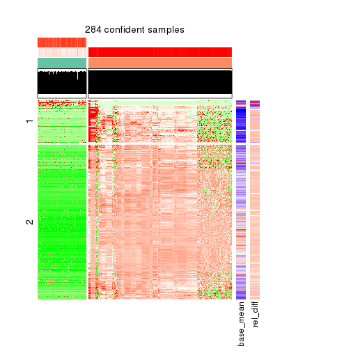</p>

</div>
<div id='tab-ATC-NMF-get-signatures-2'>
<pre><code class="r">get_signatures(res, k = 3)
</code></pre>

<p></p>

</div>
<div id='tab-ATC-NMF-get-signatures-3'>
<pre><code class="r">get_signatures(res, k = 4)
</code></pre>

<p></p>

</div>
<div id='tab-ATC-NMF-get-signatures-4'>
<pre><code class="r">get_signatures(res, k = 5)
</code></pre>

<p></p>

</div>
<div id='tab-ATC-NMF-get-signatures-5'>
<pre><code class="r">get_signatures(res, k = 6)
</code></pre>

<p></p>

</div>
</div>


Signature heatmaps where rows are not scaled:


<script>
$( function() {
	$( '#tabs-ATC-NMF-get-signatures-no-scale' ).tabs();
} );
</script>
<div id='tabs-ATC-NMF-get-signatures-no-scale'>
<ul>
<li><a href='#tab-ATC-NMF-get-signatures-no-scale-1'>k = 2</a></li>
<li><a href='#tab-ATC-NMF-get-signatures-no-scale-2'>k = 3</a></li>
<li><a href='#tab-ATC-NMF-get-signatures-no-scale-3'>k = 4</a></li>
<li><a href='#tab-ATC-NMF-get-signatures-no-scale-4'>k = 5</a></li>
<li><a href='#tab-ATC-NMF-get-signatures-no-scale-5'>k = 6</a></li>
</ul>
<div id='tab-ATC-NMF-get-signatures-no-scale-1'>
<pre><code class="r">get_signatures(res, k = 2, scale_rows = FALSE)
</code></pre>

<p></p>

</div>
<div id='tab-ATC-NMF-get-signatures-no-scale-2'>
<pre><code class="r">get_signatures(res, k = 3, scale_rows = FALSE)
</code></pre>

<p></p>

</div>
<div id='tab-ATC-NMF-get-signatures-no-scale-3'>
<pre><code class="r">get_signatures(res, k = 4, scale_rows = FALSE)
</code></pre>

<p></p>

</div>
<div id='tab-ATC-NMF-get-signatures-no-scale-4'>
<pre><code class="r">get_signatures(res, k = 5, scale_rows = FALSE)
</code></pre>

<p></p>

</div>
<div id='tab-ATC-NMF-get-signatures-no-scale-5'>
<pre><code class="r">get_signatures(res, k = 6, scale_rows = FALSE)
</code></pre>

<p></p>

</div>
</div>


Compare the overlap of signatures from different k:

```r
compare_signatures(res)
```


`get_signature()` returns a data frame invisibly. TO get the list of signatures, the function
call should be assigned to a variable explicitly. In following code, if `plot` argument is set
to `FALSE`, no heatmap is plotted while only the differential analysis is performed.

```r
# code only for demonstration
tb = get_signature(res, k = ..., plot = FALSE)
```

An example of the output of `tb` is:

```
#>   which_row         fdr    mean_1    mean_2 scaled_mean_1 scaled_mean_2 km
#> 1        38 0.042760348  8.373488  9.131774    -0.5533452     0.5164555  1
#> 2        40 0.018707592  7.106213  8.469186    -0.6173731     0.5762149  1
#> 3        55 0.019134737 10.221463 11.207825    -0.6159697     0.5749050  1
#> 4        59 0.006059896  5.921854  7.869574    -0.6899429     0.6439467  1
#> 5        60 0.018055526  8.928898 10.211722    -0.6204761     0.5791110  1
#> 6        98 0.009384629 15.714769 14.887706     0.6635654    -0.6193277  2
...
```

The columns in `tb` are:

1. `which_row`: row indices corresponding to the input matrix.
2. `fdr`: FDR for the differential test. 
3. `mean_x`: The mean value in group x.
4. `scaled_mean_x`: The mean value in group x after rows are scaled.
5. `km`: Row groups if k-means clustering is applied to rows.


UMAP plot which shows how samples are separated.


<script>
$( function() {
	$( '#tabs-ATC-NMF-dimension-reduction' ).tabs();
} );
</script>
<div id='tabs-ATC-NMF-dimension-reduction'>
<ul>
<li><a href='#tab-ATC-NMF-dimension-reduction-1'>k = 2</a></li>
<li><a href='#tab-ATC-NMF-dimension-reduction-2'>k = 3</a></li>
<li><a href='#tab-ATC-NMF-dimension-reduction-3'>k = 4</a></li>
<li><a href='#tab-ATC-NMF-dimension-reduction-4'>k = 5</a></li>
<li><a href='#tab-ATC-NMF-dimension-reduction-5'>k = 6</a></li>
</ul>
<div id='tab-ATC-NMF-dimension-reduction-1'>
<pre><code class="r">dimension_reduction(res, k = 2, method = &quot;UMAP&quot;)
</code></pre>

<p></p>

</div>
<div id='tab-ATC-NMF-dimension-reduction-2'>
<pre><code class="r">dimension_reduction(res, k = 3, method = &quot;UMAP&quot;)
</code></pre>

<p></p>

</div>
<div id='tab-ATC-NMF-dimension-reduction-3'>
<pre><code class="r">dimension_reduction(res, k = 4, method = &quot;UMAP&quot;)
</code></pre>

<p></p>

</div>
<div id='tab-ATC-NMF-dimension-reduction-4'>
<pre><code class="r">dimension_reduction(res, k = 5, method = &quot;UMAP&quot;)
</code></pre>

<p></p>

</div>
<div id='tab-ATC-NMF-dimension-reduction-5'>
<pre><code class="r">dimension_reduction(res, k = 6, method = &quot;UMAP&quot;)
</code></pre>

<p></p>

</div>
</div>


Following heatmap shows how subgroups are split when increasing `k`:

```r
collect_classes(res)
```


If matrix rows can be associated to genes, consider to use `GO_Enrichment(res,
...)` to perform function enrichment for the signature genes.


 

## Session info


```r
sessionInfo()
```

```
#> R version 3.6.0 (2019-04-26)
#> Platform: x86_64-pc-linux-gnu (64-bit)
#> Running under: CentOS Linux 7 (Core)
#> 
#> Matrix products: default
#> BLAS:   /usr/lib64/libblas.so.3.4.2
#> LAPACK: /usr/lib64/liblapack.so.3.4.2
#> 
#> locale:
#>  [1] LC_CTYPE=en_US.UTF-8       LC_NUMERIC=C               LC_TIME=en_US.UTF-8       
#>  [4] LC_COLLATE=en_US.UTF-8     LC_MONETARY=en_US.UTF-8    LC_MESSAGES=en_US.UTF-8   
#>  [7] LC_PAPER=en_US.UTF-8       LC_NAME=C                  LC_ADDRESS=C              
#> [10] LC_TELEPHONE=C             LC_MEASUREMENT=en_US.UTF-8 LC_IDENTIFICATION=C       
#> 
#> attached base packages:
#>  [1] grid      parallel  stats4    stats     graphics  grDevices utils     datasets  methods  
#> [10] base     
#> 
#> other attached packages:
#>  [1] genefilter_1.66.0           ComplexHeatmap_2.1.1        markdown_1.1               
#>  [4] knitr_1.26                  cola_1.3.2                  SummarizedExperiment_1.14.1
#>  [7] DelayedArray_0.10.0         BiocParallel_1.18.1         matrixStats_0.55.0         
#> [10] Biobase_2.44.0              GenomicRanges_1.36.1        GenomeInfoDb_1.20.0        
#> [13] IRanges_2.18.3              S4Vectors_0.22.1            BiocGenerics_0.30.0        
#> [16] GetoptLong_0.1.7           
#> 
#> loaded via a namespace (and not attached):
#>  [1] bitops_1.0-6           bit64_0.9-7            doParallel_1.0.15      RColorBrewer_1.1-2    
#>  [5] httr_1.4.1             backports_1.1.5        tools_3.6.0            R6_2.4.1              
#>  [9] DBI_1.0.0              lazyeval_0.2.2         colorspace_1.4-1       withr_2.1.2           
#> [13] tidyselect_0.2.5       gridExtra_2.3          bit_1.1-14             compiler_3.6.0        
#> [17] xml2_1.2.2             microbenchmark_1.4-7   pkgmaker_0.28          slam_0.1-46           
#> [21] scales_1.1.0           NMF_0.23.6             stringr_1.4.0          digest_0.6.23         
#> [25] XVector_0.24.0         pkgconfig_2.0.3        bibtex_0.4.2           highr_0.8             
#> [29] rlang_0.4.2            GlobalOptions_0.1.1    RSQLite_2.1.2          impute_1.58.0         
#> [33] shape_1.4.4            mclust_5.4.5           dendextend_1.12.0      dplyr_0.8.3           
#> [37] RCurl_1.95-4.12        magrittr_1.5           GenomeInfoDbData_1.2.1 Matrix_1.2-17         
#> [41] Rcpp_1.0.3             munsell_0.5.0          viridis_0.5.1          lifecycle_0.1.0       
#> [45] stringi_1.4.3          zlibbioc_1.30.0        plyr_1.8.4             blob_1.2.0            
#> [49] crayon_1.3.4           lattice_0.20-38        splines_3.6.0          annotate_1.62.0       
#> [53] circlize_0.4.9         zeallot_0.1.0          pillar_1.4.2           rjson_0.2.20          
#> [57] rngtools_1.4           reshape2_1.4.3         codetools_0.2-16       XML_3.98-1.20         
#> [61] glue_1.3.1             evaluate_0.14          vctrs_0.2.0            png_0.1-7             
#> [65] foreach_1.4.7          polyclip_1.10-0        gtable_0.3.0           purrr_0.3.3           
#> [69] clue_0.3-57            assertthat_0.2.1       ggplot2_3.2.1          xfun_0.11             
#> [73] gridBase_0.4-7         eulerr_6.0.0           xtable_1.8-4           skmeans_0.2-11        
#> [77] survival_2.44-1.1      viridisLite_0.3.0      tibble_2.1.3           iterators_1.0.12      
#> [81] memoise_1.1.0          AnnotationDbi_1.46.1   registry_0.5-1         GTF_0.0.1             
#> [85] cluster_2.1.0          brew_1.0-6
```


